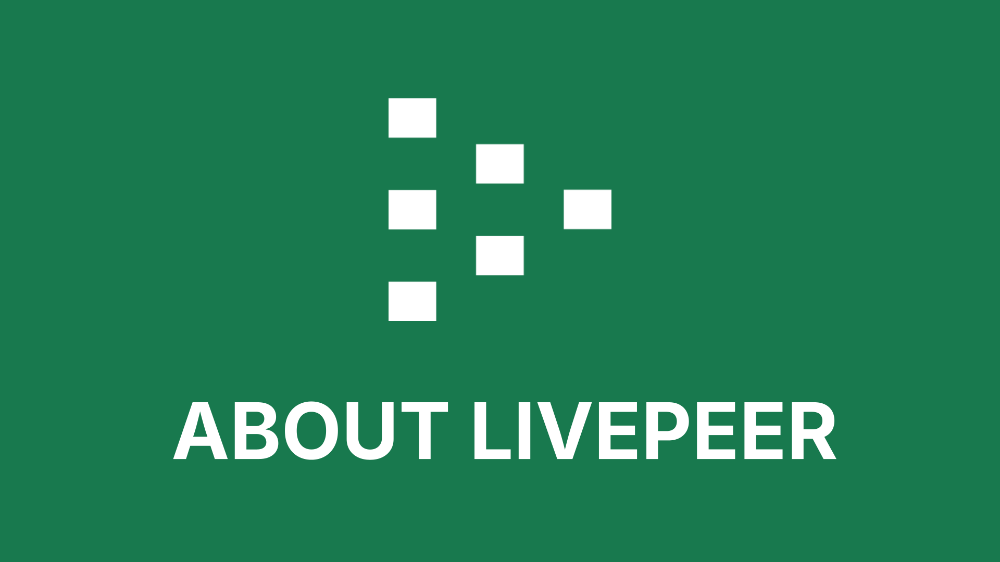

# RESTORE VERIFICATION REPORT

**Total files to restore: 104**

Review each file below. The diff shows what will CHANGE.
- Lines starting with `-` will be REMOVED (current HEAD state)
- Lines starting with `+` will be ADDED (your pre-script work)

---

## 1. `v2/automations/README.md`

**Current file: DOES NOT EXIST**

---

## 2. `v2/pages/00_home/faq-home.mdx`

```diff
--- CURRENT (HEAD)+++ RESTORE TO (your work)@@ -4,6 +4,7 @@ description: 'Frequently Asked Questions'
 ---
 
+
 # FAQ
 
 <Note>Coming Soon</Note>
```

---

## 3. `v2/pages/00_home/get-started/livepeer-ai-quickstart.mdx`

```diff
--- CURRENT (HEAD)+++ RESTORE TO (your work)@@ -4,4 +4,4 @@ description: 'A guide to using Livepeer AI for video streaming and AI pipelines'
 ---
 
-<Note>Coming Soon</Note>{' '}
+<Note>Coming Soon</Note>  ```

---

## 4. `v2/pages/00_home/get-started/stream-video-quickstart.mdx`

```diff
--- CURRENT (HEAD)+++ RESTORE TO (your work)@@ -4,4 +4,5 @@ description: 'A guide to streaming video on Livepeer'
 ---
 
-<Note>Coming Soon</Note>
+
+<Note>Coming Soon</Note>```

---

## 5. `v2/pages/00_home/get-started/use-livepeer.mdx`

```diff
--- CURRENT (HEAD)+++ RESTORE TO (your work)@@ -4,4 +4,4 @@ description: 'A guide to using Livepeer for video streaming and AI pipelines'
 ---
 
-<Note>Coming Soon</Note>
+<Note>Coming Soon</Note>```

---

## 6. `v2/pages/00_home/home/livepeer-tl-dr.mdx`

```diff
--- CURRENT (HEAD)+++ RESTORE TO (your work)@@ -5,8 +5,8 @@ og:image: '../../images/home/Eric Shreck Gif.gif'
 ---
 
-import { url, title, caption, embedUrl } from '/snippets/variables.mdx'
-import { tldrTitles, tldrList } from '/snippets/variables/home.mdx'
+import { url, title, caption, embedUrl } from '/snippets/data/variables.mdx'
+import { tldrTitles, tldrList } from '/snippets/data/variables/home.mdx'
 import {
   YouTubeVideo,
   YouTubeVideoDownload,
@@ -17,7 +17,7 @@   GotoCard,
 } from '/snippets/components/primitives/links.jsx'
 import { DownloadButton } from '/snippets/components/primitives/buttons.jsx'
-import { Image } from '/snippets/components/display/images.jsx'
+import { Image } from '/snippets/components/display/image.jsx'
 import {
   StepList,
   StepLinkList,
```

---

## 7. `v2/pages/00_home/project-showcase/projects-built-on-livepeer.mdx`

```diff
--- CURRENT (HEAD)+++ RESTORE TO (your work)@@ -1,7 +1,7 @@ ---
 title: 'Projects Built on Livepeer'
 sidebarTitle: 'Built on Livepeer'
-description: 'A collection of ecosystem projects using Livepeer - Be inspired!'
+description: "A collection of ecosystem projects using Livepeer - Be inspired!"
 ---
 
 Livepeer creates an open, competitive marketplace for reliable, low-cost video streaming and AI pipelines.
```

---

## 8. `v2/pages/00_home/tab-index.mdx`

```diff
--- CURRENT (HEAD)+++ RESTORE TO (your work)@@ -2,37 +2,37 @@ 
 ## Home
 
-- [Welcome to the Livepeer Doc's!](README.md)
-- [Livepeer TL;DR](home/livepeer-tl-dr.md)
-- [Trending at Livepeer](home/trending-at-livepeer.md)
+* [Welcome to the Livepeer Doc's!](README.md)
+* [Livepeer TL;DR](home/livepeer-tl-dr.md)
+* [Trending at Livepeer](home/trending-at-livepeer.md)
 
 ## Documentation Guide
 
-- [Documentation Overview](documentation-guide/documentation-overview.md)
-- [Documentation Guide](documentation-guide/documentation-guide.md)
-- [Doc's Features & AI Integrations](documentation-guide/docs-features-and-ai-integrations.md)
-- [Contribute to the Doc's](documentation-guide/contribute-to-the-docs.md)
+* [Documentation Overview](documentation-guide/documentation-overview.md)
+* [Documentation Guide](documentation-guide/documentation-guide.md)
+* [Doc's Features & AI Integrations](documentation-guide/docs-features-and-ai-integrations.md)
+* [Contribute to the Doc's](documentation-guide/contribute-to-the-docs.md)
 
 ## Get Started
 
-- [Use Livepeer](get-started/use-livepeer.md)
-- [Stream Video (quickstart)](get-started/stream-video-quickstart.md)
-- [Livepeer AI (quickstart)](get-started/livepeer-ai-quickstart.md)
+* [Use Livepeer](get-started/use-livepeer.md)
+* [Stream Video (quickstart)](get-started/stream-video-quickstart.md)
+* [Livepeer AI (quickstart)](get-started/livepeer-ai-quickstart.md)
 
 ## Changelog
 
-- [Page 1](changelog/page-1.md)
+* [Page 1](changelog/page-1.md)
 
 ## Reference
 
-- [FAQ](reference/faq.md)
-- [Livepeer Terminology & Definitions](reference/livepeer-terminology-and-definitions.md)
-- [Resource Index](reference/resource-index.md)
+* [FAQ](reference/faq.md)
+* [Livepeer Terminology & Definitions](reference/livepeer-terminology-and-definitions.md)
+* [Resource Index](reference/resource-index.md)
 
 ## Contact & Support
 
-- [Get Help](contact-and-support/get-help.md)

... and 6 more lines ...
```

---

## 9. `v2/pages/01_about/about-livepeer/livepeer-ecosystem.mdx`

```diff
--- CURRENT (HEAD)+++ RESTORE TO (your work)@@ -25,9 +25,13 @@ ### Livepeer Ecosystem
 
 <Note> Mermaid Embedded Fowchart Example Only </Note>
-```mermaid flowchart TB A[Livepeer Inc.]:::main --> B[Livepeer Foundation]:::main
-A --> C[Livepeer Network]:::main A --> D[Livepeer Ecosystem Projects]:::main A -->
-E[Livepeer Partner Companies]:::main A --> F[Livepeer Enterprise]:::main
+```mermaid
+flowchart TB
+  A[Livepeer Inc.]:::main --> B[Livepeer Foundation]:::main
+  A --> C[Livepeer Network]:::main
+  A --> D[Livepeer Ecosystem Projects]:::main
+  A --> E[Livepeer Partner Companies]:::main
+  A --> F[Livepeer Enterprise]:::main
 
 classDef main fill:#197a4d,stroke:#15803D,stroke-width:2px,color:#fff
 
```

---

## 10. `v2/pages/01_about/about-livepeer/livepeer-evolution.mdx`

```diff
--- CURRENT (HEAD)+++ RESTORE TO (your work)@@ -8,10 +8,11 @@   Example Layout only here
 </Warning>
 
+
 ## Livepeer Evolution
-
 ...From founding to current to future
 What's shaped Livepeer & What does the future look like
+
 
 ### Key Achievements
 
@@ -22,29 +23,15 @@   <Step title="2026"> PMF </Step>
 </Steps>
 
+
 ## Future of Livepeer
-
 Roadmap Milestones would be good & invite community to build the future with us / takes a village ...
 
 ... image quote here -> the future is what we create today ..
 
-<Card
-  title="Livepeer Roadmap"
-  icon="road"
-  href="https://roadmap.livepeer.org/roadmap"
-  horizontal
-  arrow
->
-  {' '}
-  See the Livepeer Roadmap Here{' '}
-</Card>
+<Card title="Livepeer Roadmap" icon="road" href="https://roadmap.livepeer.org/roadmap" horizontal arrow> See the Livepeer Roadmap Here </Card>
 <iframe
   src="https://roadmap.livepeer.org/roadmap"
-  style={{
-    width: '100%',
-    height: '600px',
-    borderRadius: '12px',
-    border: 'none',
-  }}
+  style={{ width: "100%", height: "600px", borderRadius: "12px", border: "none" }}
   title="Livepeer Roadmap"
 />
```

---

## 11. `v2/pages/01_about/about-livepeer/livepeer-overview.mdx`

```diff
--- CURRENT (HEAD)+++ RESTORE TO (your work)@@ -5,7 +5,7 @@ ---
 
 import { YouTubeVideo } from '/snippets/components/display/video.jsx'
-import { Image } from '/snippets/components/display/images.jsx'
+import { Image } from '/snippets/components/display/image.jsx'
 import { GotoLink, GotoCard } from '/snippets/components/primitives/links.jsx'
 
 <YouTubeVideo embedUrl="https://www.youtube.com/embed/BXMArwnp-No?si=TYSJUyxshUPKS1h4" />
```

---

## 12. `v2/pages/01_about/faq-about.mdx`

```diff
--- CURRENT (HEAD)+++ RESTORE TO (your work)@@ -5,6 +5,7 @@ ---
 
 Roadmap: https://roadmap.livepeer.org/roadmap
+
 
 # FAQ
 
@@ -15,5 +16,7 @@ Protocol: Rules that govern actor coordination & incentives to optimise for desired behaviours (ie performing work) and disincentivise harmful actions (ie. false work)
 Most protocols take the philosophy of self-interested parties acting in their own best interests. This is often called game theory in web3.
 
+
 Technical Architecture:
 Diagram - interactions & flows between actors
+
```

---

## 13. `v2/pages/01_about/livepeer-network/gateways-vs-orchestrators.mdx`

```diff
--- CURRENT (HEAD)+++ RESTORE TO (your work)@@ -1,13 +1,11 @@ ---
 sidebarTitle: 'Gateways Vs. Orchestrators'
 title: 'Gateways Vs. Orchestrators: What’s the Difference?'
-description: 'Livepeer uses two core node types—**Gateways** and **Orchestrators**—that work together to provide real-time AI video compute at scale. Although closely connected, they serve entirely different purposes. This page breaks down how they differ and why both roles matter for a decentralized compute marketplace.'
----
+description: "Livepeer uses two core node types—**Gateways** and **Orchestrators**—that work together to provide real-time AI video compute at scale. Although closely connected, they serve entirely different purposes. This page breaks down how they differ and why both roles matter for a decentralized compute marketplace."
 
 ---
-
+---
 ## Overview
-
 In brief:
 
 <Callout >
@@ -17,6 +15,7 @@ <Icon icon="microchip"/> **Orchestrators compute.**
 </div>
 </Callout>
+
 
 Together, they form the backbone of the Livepeer AI video pipeline.
 
@@ -32,10 +31,13 @@     GW->>App: Send results back to user
 ```
 
+
+
 | Role             | Function                                       | Performs GPU Work? | External-Facing? |
 | ---------------- | ---------------------------------------------- | ------------------ | ---------------- |
 | **Gateway**      | Job intake, pricing, routing, capability match | ❌ No              | ✅ Yes           |
 | **Orchestrator** | GPU compute, inference, transcoding, BYOC      | ✅ Yes             | ❌ No            |
+
 
 ## Gateway Responsibilities
 
@@ -69,3 +71,4 @@ - Performance guarantees
 
 They do not expose external APIs directly—Gateways handle that.
+
```

---

## 14. `v2/pages/01_about/livepeer-network/livepeer-governance.mdx`

```diff
--- CURRENT (HEAD)+++ RESTORE TO (your work)@@ -6,8 +6,12 @@ 
 Livepeer is committed to open-source, transparent, community governance.
 
+
+
+
 Quick Links
 
 Discord: [https://discord.com/channels/423160867534929930/686685097935503397](https://discord.com/channels/423160867534929930/686685097935503397)
 
 RFPs
+
```

---

## 15. `v2/pages/01_about/livepeer-network/livepeer-token-economics.mdx`

```diff
--- CURRENT (HEAD)+++ RESTORE TO (your work)@@ -6,7 +6,11 @@ 
 <Danger> Incorrect, Old content. </Danger>
 
+
 See more on the LPT Token here [https://www.livepeer.org/lpt](https://www.livepeer.org/lpt)
+
+
+
 
 Livepeer is a utility token used to power & secure the decentralised Livepeer Network, enabling reliable, cost-efficient, powerful AI and video streaming functions.
 
@@ -14,11 +18,11 @@ 
 #### Actors
 
-- **Broadcaster (payer)** → submits jobs (video/AI) and funds them using **Probabilistic Micropayments (PM) tickets**.
-- **Orchestrator (validator/worker coordinator)** → stakes LPT (self-stake + delegated), wins work, forwards segments to…
-- **Transcoder (work executor)** → performs compute (encode/transcode/inference) for the orchestrator.
-- **Delegator (capital provider)** → bonds LPT to an orchestrator, shares its rewards & fees.
-- GPU Providers are paid for running AI Jobs
+* **Broadcaster (payer)** → submits jobs (video/AI) and funds them using **Probabilistic Micropayments (PM) tickets**.
+* **Orchestrator (validator/worker coordinator)** → stakes LPT (self-stake + delegated), wins work, forwards segments to…
+* **Transcoder (work executor)** → performs compute (encode/transcode/inference) for the orchestrator.
+* **Delegator (capital provider)** → bonds LPT to an orchestrator, shares its rewards & fees.
+* GPU Providers are paid for running AI Jobs
 
 **Flow:**&#x20;
 
@@ -28,6 +32,13 @@ 
 Delegators → (bonded LPT) → Orchestrator → (rewards/fees split back) → Delegators.
 
+
+
 #### Economic Functions -> Staking, Rewards, Fees & Slashing
 
+
+
+
+
 #### Governance
+
```

---

## 16. `v2/pages/01_about/livepeer-protocol/blockchain-contracts.mdx`

```diff
--- CURRENT (HEAD)+++ RESTORE TO (your work)@@ -10,40 +10,33 @@ 
 ## Core Smart Contracts
 
-Livepeer's protocol consists of **9 main smart contracts** that work together to manage staking, payments, governance, and service discovery: [1](#0-0)
+Livepeer's protocol consists of **9 main smart contracts** that work together to manage staking, payments, governance, and service discovery: [1](#0-0) 
 
 ### 1. **Controller** - Contract Registry
-
-The Controller acts as the central registry for all other contract addresses in the protocol. It uses Keccak256 hashes of contract names as keys to store their addresses, enabling upgradeable architecture without changing the Controller address itself. [2](#0-1)
-
-**Purpose**:
-
+The Controller acts as the central registry for all other contract addresses in the protocol. It uses Keccak256 hashes of contract names as keys to store their addresses, enabling upgradeable architecture without changing the Controller address itself. [2](#0-1) 
+
+**Purpose**: 
 - Central address registry for all protocol contracts
 - Enables contract upgrades while maintaining a stable entry point
 - Provides pause functionality for emergency situations
 
 ### 2. **LivepeerToken (LPT)** - ERC20 Token
-
-The native protocol token used for staking, payments, and governance. [3](#0-2)
+The native protocol token used for staking, payments, and governance. [3](#0-2) 
 
 **Purpose**:
-
 - ERC20 token for all economic activity in the network
 - Used for bonding/staking to orchestrators
 - Required for broadcaster deposits and payments
 - Governance voting weight
 
 **Key Operations**:
-
 - `Transfer()`, `BalanceOf()`, `TotalSupply()` - Standard ERC20 operations
 - `Approve()` - Required before bonding or funding deposits
 
 ### 3. **BondingManager** - Staking & Delegation
-
-The most critical contract managing the staking economy, orchestrator registration, and reward distribution. [4](#0-3)
+The most critical contract managing the staking economy, orchestrator registration, and reward distribution. [4](#0-3) 
 
 **Purpose**:
-
 - Manages the transcoder (orchestrator) pool as a sorted linked list
 - Handles bonding (staking) and delegation to orchestrators
 - Distributes inflationary rewards and fees
@@ -51,7 +44,6 @@
... and 303 more lines ...
```

---

## 17. `v2/pages/01_about/livepeer-protocol/protocol-overview.mdx`

```diff
--- CURRENT (HEAD)+++ RESTORE TO (your work)@@ -12,9 +12,7 @@ # Core Concepts
 
 ## Livepeer Protocol
-
 The protocol is the ruleset + on-chain logic governing:
-
 - staking
 - delegation
 - inflation & rewards
@@ -25,10 +23,8 @@ 
 The economic and coordination layer that enforces correct behavior.
 
-## Livepeer Network
-
+## Livepeer Network 
 The network is the actual running system of machines performing work:
-
 - Orchestrators (GPU nodes)
 - Transcoders / Workers
 - Gateways
@@ -39,32 +35,31 @@ 
 It is the live, operational decentralized GPU mesh running video + AI jobs.
 
+
 ## Protocol vs Network
-
 | Layer                 | Description                                                                   |
 | --------------------- | ----------------------------------------------------------------------------- |
 | **Livepeer Protocol** | On-chain crypto-economic incentives & coordination; staking; payments.        |
 | **Livepeer Network**  | Off-chain nodes performing real-time work (transcoding, inference, routing).  |
-| **Relationship**      | The network _runs_ the compute; the protocol _governs, secures, and pays_ it. |
+| **Relationship**      | The network *runs* the compute; the protocol *governs, secures, and pays* it. |
 
 <Note> Fix UGHH (brainsotrm) </Note>
-**Bad Analogy Yikes** Protocol = the constitution Network = the population + infrastructure
-living under that constitution
+**Bad Analogy Yikes**
+Protocol = the constitution
+Network = the population + infrastructure living under that constitution
 
 The protocol governs.
 The network performs the work.
 
-The protocol determines the rules of the game
+The protocol determines the rules of the game 

... and 53 more lines ...
```

---

## 18. `v2/pages/02_community/livepeer-community/community-guidelines.mdx`

```diff
--- CURRENT (HEAD)+++ RESTORE TO (your work)@@ -4,7 +4,7 @@ description: 'Guidelines for the Livepeer Community'
 ---
 
+
 <Info>
-  This page outlines the guidelines for the Livepeer Community. Possibly will
-  just be in the community hub.
-</Info>
+  This page outlines the guidelines for the Livepeer Community. Possibly will just be in the community hub.
+</Info>```

---

## 19. `v2/pages/02_community/livepeer-community/livepeer-latest-topics.mdx`

```diff
--- CURRENT (HEAD)+++ RESTORE TO (your work)@@ -6,12 +6,21 @@ 
 ## Forum Hot Topics
 
-<Info>Automation that links the forum news here</Info>
+<Info>
+Automation that links the forum news here
+</Info>
 
 ## Discord Hot Topics
 
-<Info>Automation that links the latest Q & A and topics from Discord</Info>
+<Info>
+Automation that links the latest Q & A and topics from Discord
+</Info>
 
 ## Latest Product Updates
 
-<Info>Automation that links the most recent blogs or youtube videos</Info>
+<Info>
+Automation that links the most recent blogs or youtube videos
+</Info>
+
+
+
```

---

## 20. `v2/pages/02_community/livepeer-connect/events-and-community-streams.mdx`

```diff
--- CURRENT (HEAD)+++ RESTORE TO (your work)@@ -6,26 +6,23 @@ # Events Calendar
 
 <Info>
-  Embed Luma Events feed here. Also include the YouTube Community Streams (if
-  possible - they should be aggregated on Luma too - with a separate tag for
-  easy embedding)
+Embed Luma Events feed here.
+Also include the YouTube Community Streams (if possible - they should be aggregated on Luma too - with a separate tag for easy embedding)
 </Info>
 
 <Info>
-  To embed the luma feed an automation will be required. Gitbook can only pull
-  in html - it will not render.
+To embed the luma feed an automation will be required. Gitbook can only pull in html - it will not render.
 </Info>
 
-<a href="https://luma.com/livepeer?period=past" class="button primary">
-  Subscribe to Events
-</a>
+<a href="https://luma.com/livepeer?period=past" class="button primary">Subscribe to Events</a>
 
 ## Upcoming Events
 
-| Event | Date        | Location | Tags |
-| ----- | ----------- | -------- | ---- |
-| Event | Date & Time | Location | AI   |
+| Event | Date | Location | Tags |
+|-------|------|----------|------|
+| Event | Date & Time | Location | AI |
 
 ## Past Events
 
 [View past events on Luma](https://luma.com/livepeer?period=past)
+
```

---

## 21. `v2/pages/02_community/livepeer-connect/forums-and-discussions.mdx`

```diff
--- CURRENT (HEAD)+++ RESTORE TO (your work)@@ -4,6 +4,7 @@ ---
 
 <Info>
-  Places where you can ask questions and discuss with the community. Forum,
-  Github, Discord
+Places where you can ask questions and discuss with the community.
+Forum, Github, Discord
 </Info>
+
```

---

## 22. `v2/pages/02_community/livepeer-connect/news-and-socials.mdx`

```diff
--- CURRENT (HEAD)+++ RESTORE TO (your work)@@ -4,8 +4,10 @@ description: 'Stay up to date with the latest news and socials from the Livepeer Community'
 ---
 
+
+
 Socials
 
 Blogs
 
-All non-discussion related links
+All non-discussion related links```

---

## 23. `v2/pages/02_community/livepeer-contribute/build-livepeer.mdx`

```diff
--- CURRENT (HEAD)+++ RESTORE TO (your work)@@ -3,7 +3,7 @@ sidebarTitle: 'Build Livepeer'
 ---
 
-<Info>
-  This page outlines the various ways to build and contribute to the Livepeer
-  ecosystem. eg. ideas for RFPs, needs, oss contributions?
-</Info>
+<Info> 
+  This page outlines the various ways to build and contribute to the Livepeer ecosystem. 
+  eg. ideas for RFPs, needs, oss contributions? 
+</Info>```

---

## 24. `v2/pages/02_community/livepeer-contribute/contribute.mdx`

```diff
--- CURRENT (HEAD)+++ RESTORE TO (your work)@@ -1,10 +1,10 @@ ---
 title: 'Contribute to Livepeer'
 sidebarTitle: 'Contribute to Livepeer'
-description: 'Help us build the future of open realtime AI & video - it takes a village!'
+description: "Help us build the future of open realtime AI & video - it takes a village!"
 ---
 
-<Info>
-  This page outlines the various ways to contribute to the Livepeer ecosystem.
+<Info> 
+  This page outlines the various ways to contribute to the Livepeer ecosystem.  
   eg. contribute to docs, translate, help others, etc.
-</Info>
+</Info>```

---

## 25. `v2/pages/02_community/livepeer-contribute/opportunities.mdx`

```diff
--- CURRENT (HEAD)+++ RESTORE TO (your work)@@ -6,6 +6,6 @@ # Opportunities
 
 <Info>
-  This page outlines the various opportunities available to participate in the
-  Livepeer ecosystem. Including RFPs, Dev Programs, Grants, etc.
-</Info>
+  This page outlines the various opportunities available to participate in the Livepeer ecosystem. 
+  Including RFPs, Dev Programs, Grants, etc.
+</Info>```

---

## 26. `v2/pages/02_community/tab-index.mdx`

```diff
--- CURRENT (HEAD)+++ RESTORE TO (your work)@@ -2,37 +2,37 @@ 
 ## Home
 
-- [Welcome to the Livepeer Doc's!](README.md)
-- [Livepeer TL;DR](home/livepeer-tl-dr.md)
-- [Trending at Livepeer](home/trending-at-livepeer.md)
+* [Welcome to the Livepeer Doc's!](README.md)
+* [Livepeer TL;DR](home/livepeer-tl-dr.md)
+* [Trending at Livepeer](home/trending-at-livepeer.md)
 
 ## Documentation Guide
 
-- [Documentation Overview](documentation-guide/documentation-overview.md)
-- [Documentation Guide](documentation-guide/documentation-guide.md)
-- [Doc's Features & AI Integrations](documentation-guide/docs-features-and-ai-integrations.md)
-- [Contribute to the Doc's](documentation-guide/contribute-to-the-docs.md)
+* [Documentation Overview](documentation-guide/documentation-overview.md)
+* [Documentation Guide](documentation-guide/documentation-guide.md)
+* [Doc's Features & AI Integrations](documentation-guide/docs-features-and-ai-integrations.md)
+* [Contribute to the Doc's](documentation-guide/contribute-to-the-docs.md)
 
 ## Get Started
 
-- [Use Livepeer](get-started/use-livepeer.md)
-- [Stream Video (quickstart)](get-started/stream-video-quickstart.md)
-- [Livepeer AI (quickstart)](get-started/livepeer-ai-quickstart.md)
+* [Use Livepeer](get-started/use-livepeer.md)
+* [Stream Video (quickstart)](get-started/stream-video-quickstart.md)
+* [Livepeer AI (quickstart)](get-started/livepeer-ai-quickstart.md)
 
 ## Changelog
 
-- [Page 1](changelog/page-1.md)
+* [Page 1](changelog/page-1.md)
 
 ## Reference
 
-- [FAQ](reference/faq.md)
-- [Livepeer Terminology & Definitions](reference/livepeer-terminology-and-definitions.md)
-- [Resource Index](reference/resource-index.md)
+* [FAQ](reference/faq.md)
+* [Livepeer Terminology & Definitions](reference/livepeer-terminology-and-definitions.md)
+* [Resource Index](reference/resource-index.md)
 
 ## Contact & Support
 
-- [Get Help](contact-and-support/get-help.md)

... and 6 more lines ...
```

---

## 27. `v2/pages/03_developers/ai-inference-on-livepeer/byoc.mdx`

```diff
--- CURRENT (HEAD)+++ RESTORE TO (your work)@@ -5,7 +5,6 @@ ---
 
 # AI Workers
-
 AI workers are run when you start a node with the -aiWorker flag. They can run in two modes:
 
 Combined with Orchestrator (-orchestrator -aiWorker): The orchestrator also runs AI processing locally
@@ -36,8 +35,8 @@ 
 BYOC consists of two main server types:
 
-1. **BYOCGatewayServer** - Handles job submission from clients [1](#0-0)
-2. **BYOCOrchestratorServer** - Manages job processing on orchestrators [2](#0-1)
+1. **BYOCGatewayServer** - Handles job submission from clients [1](#0-0) 
+2. **BYOCOrchestratorServer** - Manages job processing on orchestrators [2](#0-1) 
 
 ### Job Flow
 
@@ -47,7 +46,7 @@     participant Gateway as BYOC Gateway
     participant Orchestrator as BYOC Orchestrator
     participant Container as Custom Container
-
+    
     Client->>Gateway: POST /process/request/
     Gateway->>Gateway: Verify credentials & sign request
     Gateway->>Orchestrator: Forward signed job request
@@ -60,15 +59,13 @@ ### HTTP Endpoints
 
 **Gateway endpoints:**
-
-- `/process/request/` - Submit new processing jobs [3](#0-2)
+- `/process/request/` - Submit new processing jobs [3](#0-2) 
 
 **Orchestrator endpoints:**
-
-- `/process/request/` - Process jobs from gateways [4](#0-3)
+- `/process/request/` - Process jobs from gateways [4](#0-3) 
 - `/process/token` - Get job tokens
 - `/capability/register` - Register new capabilities
-- `/capability/unregister` - Unregister capabilities [5](#0-4)
+- `/capability/unregister` - Unregister capabilities [5](#0-4) 
 
 ---
 
@@ -77,27 +74,24 @@
... and 269 more lines ...
```

---

## 28. `v2/pages/03_developers/ai-inference-on-livepeer/comfystream.mdx`

```diff
--- CURRENT (HEAD)+++ RESTORE TO (your work)@@ -24,27 +24,23 @@ - Interactive AI art generation with webcam input
 - Distributed GPU compute for video processing
 
+
 ## Architecture
-
 ComfyStream is organized into six primary architectural layers, each with distinct responsibilities:
-
-
+
 
 #### Layer Responsibilities:
 
-| Layer      | Components                     | Primary Function                                            |
-| ---------- | ------------------------------ | ----------------------------------------------------------- |
-| Client     | Browser, Webcam                | Capture media input and display output                      |
-| UI         | StreamCanvas, Room, Settings   | Video standardization, WebRTC setup, configuration          |
-| Transport  | RTCPeerConnection, MediaTracks | Real-time media streaming with WebRTC                       |
-| Server     | app.py, byoc.py                | WebRTC signaling, media track handling, orchestration       |
-| Processing | Pipeline, ComfyStreamClient    | Frame-to-tensor conversion, workflow execution coordination |
-| Backend    | ComfyUI, Custom Nodes          | Workflow graph execution, AI model inference                |
+| Layer | Components | Primary Function |
+|-------|------------|------------------|
+| Client | Browser, Webcam | Capture media input and display output |
+| UI | StreamCanvas, Room, Settings | Video standardization, WebRTC setup, configuration |
+| Transport | RTCPeerConnection, MediaTracks | Real-time media streaming with WebRTC |
+| Server | app.py, byoc.py | WebRTC signaling, media track handling, orchestration |
+| Processing | Pipeline, ComfyStreamClient | Frame-to-tensor conversion, workflow execution coordination |
+| Backend | ComfyUI, Custom Nodes | Workflow graph execution, AI model inference |
 
 #### Core Components
 
+
 .....
```

---

## 29. `v2/pages/03_developers/ai-inference-on-livepeer/comfyui.mdx`

```diff
--- CURRENT (HEAD)+++ RESTORE TO (your work)@@ -18,9 +18,9 @@ 
 ## Legend
 
-- ✅ **Likely runnable on Livepeer** (fits real-time / GPU-worker constraints)
-- ⚠️ **Conditionally runnable** (depends on latency, VRAM, orchestration, or batching)
-- ❌ **Not suitable for Livepeer** (design mismatch, stateful, CPU-bound, or non-deterministic)
+* ✅ **Likely runnable on Livepeer** (fits real-time / GPU-worker constraints)
+* ⚠️ **Conditionally runnable** (depends on latency, VRAM, orchestration, or batching)
+* ❌ **Not suitable for Livepeer** (design mismatch, stateful, CPU-bound, or non-deterministic)
 
 ---
 
@@ -28,16 +28,16 @@ 
 ### Stable Diffusion Family
 
-- Stable Diffusion 1.4 / 1.5 / 2.0 / 2.1 — ✅
-  _Text-to-image and image-to-image diffusion models that generate images by iterative denoising; foundation of most ComfyUI workflows, including frame-by-frame video processing._
-- SDXL (Base / Refiner / Turbo) — ⚠️ (VRAM + latency)
-  _Higher-capacity Stable Diffusion variant with improved composition and detail; Turbo variants trade quality for speed._
-- SD-Turbo / LCM / Lightning — ✅
-  _Accelerated diffusion variants designed to converge in very few steps, enabling low-latency generation._
-- Kandinsky — ⚠️ (less optimized, heavier)
-  _Diffusion-based image generation model emphasizing semantic understanding and text–image alignment._
-- DeepFloyd IF — ❌ (multi-stage, extreme VRAM)
-  _Cascaded multi-stage diffusion system using large frozen text encoders for very high-fidelity images._
+* Stable Diffusion 1.4 / 1.5 / 2.0 / 2.1 — ✅
+  *Text-to-image and image-to-image diffusion models that generate images by iterative denoising; foundation of most ComfyUI workflows, including frame-by-frame video processing.*
+* SDXL (Base / Refiner / Turbo) — ⚠️ (VRAM + latency)
+  *Higher-capacity Stable Diffusion variant with improved composition and detail; Turbo variants trade quality for speed.*
+* SD-Turbo / LCM / Lightning — ✅
+  *Accelerated diffusion variants designed to converge in very few steps, enabling low-latency generation.*
+* Kandinsky — ⚠️ (less optimized, heavier)
+  *Diffusion-based image generation model emphasizing semantic understanding and text–image alignment.*
+* DeepFloyd IF — ❌ (multi-stage, extreme VRAM)
+  *Cascaded multi-stage diffusion system using large frozen text encoders for very high-fidelity images.*
 
 **Why blocked (if any):** VRAM pressure, multi-stage graphs, inference latency
 
@@ -45,18 +45,18 @@ 
 ### Video Diffusion Models
 
-- StreamDiffusion — ✅
-  _Real-time diffusion architecture that reuses latent states across frames, enabling live video generation._
-- Stable Video Diffusion (SVD) — ⚠️ (latency, frame buffering)
-  _Video diffusion model that generates short coherent clips by modeling temporal consistency across frames._

... and 250 more lines ...
```

---

## 30. `v2/pages/03_developers/ai-inference-on-livepeer/livepeer-ai/custom-ai-pipelines.mdx`

```diff
--- CURRENT (HEAD)+++ RESTORE TO (your work)@@ -6,4 +6,4 @@ 
 Build Custom AI Pipelines on Livepeer with BYOC.
 
--> see orchestrators section (link)
+-> see orchestrators section (link)```

---

## 31. `v2/pages/03_developers/ai-inference-on-livepeer/livepeer-ai/overview-ai-on-livepeer.mdx`

```diff
--- CURRENT (HEAD)+++ RESTORE TO (your work)@@ -11,3 +11,4 @@ </Frame>
 
 Livepeer Founder Eric Tang demonstrating the capability for real-time avatar animation from a Livestream video input. [Ref: [Introducing Livepeer Cascade](https://mirror.xyz/livepeer.eth/bCruUtv0PJWWlFxfbCMATGM_h15hUncwvyFW1A3z7Ag) - Nov 2024]
+
```

---

## 32. `v2/pages/03_developers/builder-opportunities/dev-programs.mdx`

```diff
--- CURRENT (HEAD)+++ RESTORE TO (your work)@@ -5,7 +5,9 @@ 
 This page is intended as a guide for startup projects building on Livepeer, OSS Developers looking to contribute and community member participation pathways.
 
-<Info>Need more info</Info>
+<Info>
+Need more info
+</Info>
 
 ### Hackathons
 
@@ -16,10 +18,10 @@ ...
 
 ### Treasury ?
-
 <br />
 
-**Other ?**
+**Other ?** 
 
 - Livepeer Developer Paths
 - Funding for Startups
+
```

---

## 33. `v2/pages/03_developers/builder-opportunities/livepeer-rfps.mdx`

```diff
--- CURRENT (HEAD)+++ RESTORE TO (your work)@@ -4,13 +4,12 @@ ---
 
 ## RFPs Overview
-
 ...
 
 ## Current RFPs
-
 ...
 
-## Grants
+## Grants 
 
 - Grant process
+
```

---

## 34. `v2/pages/03_developers/building-on-livepeer/developer-guide.mdx`

```diff
--- CURRENT (HEAD)+++ RESTORE TO (your work)@@ -4,23 +4,22 @@ description: 'A guide to building on Livepeer for video streaming and AI pipelines'
 ---
 
+
 ## Overview
 
-<Tip>
-  Anyone building software that uses Livepeer compute, contributes to the
-  Livepeer Protocol, or builds tooling for network operators is a
-  developer.{' '}
-</Tip>
+<Tip>Anyone building software that uses Livepeer compute, contributes to the Livepeer Protocol, or builds tooling for network operators is a developer. </Tip>
 
 This section is for those folks looking to ...
 
-The easiest way to use AI or video is to use a hosted service such as Daydream or Livepeer Studio.
+The easiest way to use AI or video is to use a hosted service such as Daydream or Livepeer Studio. 
 If you want to develop directly on the protocol… you'll start by running your own gateway node.
 
 <Warning> Test Diagram 1: Possible Definitions</Warning>
-```mermaid flowchart LR classDef title fill:#1a1a1a,color:#fff,stroke:#2d9a67,stroke-width:2px
-classDef node fill:##0d0d0d,color:#fff,stroke:#2d9a67,stroke-width:1px classDef role
-fill:#0d0d0d,color:#fff,stroke:#2d9a67,stroke-width:1px
+```mermaid
+flowchart LR
+    classDef title fill:#1a1a1a,color:#fff,stroke:#2d9a67,stroke-width:2px
+    classDef node fill:##0d0d0d,color:#fff,stroke:#2d9a67,stroke-width:1px
+    classDef role fill:#0d0d0d,color:#fff,stroke:#2d9a67,stroke-width:1px
 
     A[Developer<br>Umbrella Term]:::title --> B[Uses Third-Party Gateway<br>Studio, Daydream, External API]:::node
     A --> C[Runs Own Gateway Node]:::node
@@ -31,8 +30,7 @@     C --> C1[Assumes Gateway Role<br>Consumes Livepeer Network directly]:::node
     D --> D1[Protocol Integrator<br>Interacts with Livepeer Protocol]:::node
     E --> E1[Ecosystem Contributor<br>Supports GPU Nodes]:::node
-
-````
+```
 
 <Warning> Test Diagram 2: Possible Journeys</Warning>
 ```mermaid
@@ -55,25 +53,18 @@     D1 --> D2[Protocol Developer<br>Builds staking derivatives]:::role
     E1 --> E2[Tooling Engineer<br>Observability and analysis]:::role
     F1 --> F2[Community Builder<br>Education and governance]:::role
-````
+```

... and 69 more lines ...
```

---

## 35. `v2/pages/03_developers/building-on-livepeer/developer-journey.mdx`

```diff
--- CURRENT (HEAD)+++ RESTORE TO (your work)@@ -4,13 +4,14 @@ description: 'A guide to building on Livepeer for video streaming and AI pipelines'
 ---
 
-| Stage | Name        | Purpose                                             | Outcomes                                                                           |
-| ----- | ----------- | --------------------------------------------------- | ---------------------------------------------------------------------------------- |
-| 0     | Awareness   | Understand Livepeer, compute model, ecosystem roles | Clarity on Protocol → Network → Apps; basic mental model                           |
-| 1     | Orientation | Identify which builder persona fits their goals     | Path chosen: App Dev, Gateway Operator, GPU Node, Protocol Dev, Tooling, Community |
-| 2     | Activation  | Perform first meaningful action in chosen path      | "First win" achieved: app built, node deployed, contract written, tool created     |
-| 3     | Progression | Increase expertise and contribution                 | Contributions, optimizations, mentoring, advanced workflows                        |
-| 4     | Hero        | Become a leader/steward in the ecosystem            | Operate at scale, publish tools, author proposals, run programs                    |
+| Stage | Name | Purpose | Outcomes |
+|-------|------|---------|----------|
+| 0 | Awareness | Understand Livepeer, compute model, ecosystem roles | Clarity on Protocol → Network → Apps; basic mental model |
+| 1 | Orientation | Identify which builder persona fits their goals | Path chosen: App Dev, Gateway Operator, GPU Node, Protocol Dev, Tooling, Community |
+| 2 | Activation | Perform first meaningful action in chosen path | "First win" achieved: app built, node deployed, contract written, tool created |
+| 3 | Progression | Increase expertise and contribution | Contributions, optimizations, mentoring, advanced workflows |
+| 4 | Hero | Become a leader/steward in the ecosystem | Operate at scale, publish tools, author proposals, run programs |
+
 
 ```mermaid
 flowchart TD
@@ -26,4 +27,4 @@     C --> C1["Each path executes its first real success milestone"]:::phase
     D --> D1["Contribute, optimize, mentor, build advanced infra"]:::phase
     E --> E1["Heroes lead apps, gateways, nodes, protocol, tooling, gov"]:::phase
-```
+``````

---

## 36. `v2/pages/03_developers/building-on-livepeer/overview-mdx`

**Current file: DOES NOT EXIST**

---

## 37. `v2/pages/03_developers/developer-tools/dashboards.mdx`

```diff
--- CURRENT (HEAD)+++ RESTORE TO (your work)@@ -13,8 +13,8 @@ 
 #### Livepeer Cloud vs. Livepeer Studio
 
-| Feature      | Livepeer Cloud Dashboard                                                                           | Livepeer Studio                                                                                 |
-| ------------ | -------------------------------------------------------------------------------------------------- | ----------------------------------------------------------------------------------------------- |
-| Primary Goal | Increase network accessibility and adoption for a broader audience.                                | A production-ready platform for developers to build decentralized video apps via APIs and SDKs. |
-| User Focus   | Non-crypto-native users and those who want a simple "test drive".                                  | Developers, startups, and businesses requiring a full-featured, scalable solution.              |
-| Complexity   | Designed for simplicity, abstracts away blockchain complexities (like managing wallets) initially. | Offers advanced tools, APIs, and customization options for professional integration.            |
+| Feature | Livepeer Cloud Dashboard | Livepeer Studio |
+|---------|--------------------------|-----------------|
+| Primary Goal | Increase network accessibility and adoption for a broader audience. | A production-ready platform for developers to build decentralized video apps via APIs and SDKs. |
+| User Focus | Non-crypto-native users and those who want a simple "test drive". | Developers, startups, and businesses requiring a full-featured, scalable solution. |
+| Complexity | Designed for simplicity, abstracts away blockchain complexities (like managing wallets) initially. | Offers advanced tools, APIs, and customization options for professional integration. |```

---

## 38. `v2/pages/03_developers/developer-tools/livepeer-cloud.mdx`

```diff
--- CURRENT (HEAD)+++ RESTORE TO (your work)@@ -4,21 +4,20 @@ sidebarTitle: 'Livepeer Cloud'
 ---
 
+
 <Danger> WIP Section: Fix definitions </Danger>
 
 The Livepeer Cloud Tools Dashboard is a user interface and set of tools provided by the Livepeer Cloud initiative to enhance accessibility and provide analytics for users of the decentralized Livepeer network.
 
-The Livepeer Cloud Tools Dashboard serves as an entry point and monitoring tool, helping abstract the technical complexity of the underlying decentralized network for easier use and testing. You can access related resources through the [Livepeer Cloud website](https://livepeer.cloud) or the [Livepeer Studio platform](https://livepeer.studio) for building applications.
+The Livepeer Cloud Tools Dashboard serves as an entry point and monitoring tool, helping abstract the technical complexity of the underlying decentralized network for easier use and testing. You can access related resources through the [Livepeer Cloud website](https://livepeer.cloud) or the [Livepeer Studio platform](https://livepeer.studio) for building applications. 
 
 <Note> Add Image </Note>
 <Card title="Livepeer Tools Dashboard" href="https://www.livepeer.tools" arrow>
-  Livepeer Tools Dashboard
+    Livepeer Tools Dashboard
 </Card>
 
 ### Key Functions and Features
-
 Key features and components associated with the dashboard include:
-
 - **Public Broadcaster Access**: It provides a simple, free-to-use gateway to the Livepeer network for testing purposes, allowing users to experience decentralized streaming easily.
 - **Analytics & Metrics**: The dashboard offers visibility into network activity, providing metrics on usage, performance, and fees, which is useful for both broadcasters and node operators (orchestrators/transcoders).
 - **Performance Monitoring**: Specific dashboards, like the AI Performance Leaderboard, help users monitor the real-time performance and reliability of the various nodes (orchestrators) that provide AI and transcoding services on the network.
```

---

## 39. `v2/pages/03_developers/developer-tools/livepeer-explorer.mdx`

```diff
--- CURRENT (HEAD)+++ RESTORE TO (your work)@@ -6,21 +6,19 @@ 
 <Danger> WIP Section: Fix definitions </Danger>
 
-The Livepeer Explorer is a web-based analytics and interaction tool that provides a gateway to the Livepeer network. It allows users to monitor network activity, track performance, and participate in the network's governance and staking processes.
-
+The Livepeer Explorer is a web-based analytics and interaction tool that provides a gateway to the Livepeer network. It allows users to monitor network activity, track performance, and participate in the network's governance and staking processes. 
 <Note> Add Image </Note>
 
 <Card title="Livepeer Explorer" href="https://explorer.livepeer.org/" arrow>
-  Livepeer Explorer
+    Livepeer Explorer
 </Card>
 
 ### Key Functions and Features
-
-The Livepeer Explorer is designed for different network participants, including token holders (delegators) and node operators (orchestrators).
+The Livepeer Explorer is designed for different network participants, including token holders (delegators) and node operators (orchestrators). 
 
 - **Network Monitoring**: Users can track overall network activity, including the number of active orchestrator nodes, total LPT staked, and the estimated amount of video processing minutes performed.
 - **Staking and Delegation**: A primary function of the Explorer is to facilitate staking. LPT token holders who do not run a node can use the explorer to delegate their tokens to an orchestrator, thus helping to secure the network and earning a share of the rewards.
 - **Orchestrator Insights**: The explorer provides detailed information and performance metrics for individual orchestrator nodes, including yield estimates and fee structures. This helps delegators make informed decisions about which node to stake their LPT with.
 - **Gateway Insights**: The explorer provides detailed information and performance metrics for individual gateway nodes, including pricing, capabilities, and performance metrics. This helps developers make informed decisions about which gateway to use.
 - **Transaction Tracking**: It provides a real-time list of network transactions, such as fee claims, staking actions, and token delegations.
-- **Governance**: The Explorer allows LPT token holders to vote on proposals related to the network's future development and upgrades.
+- **Governance**: The Explorer allows LPT token holders to vote on proposals related to the network's future development and upgrades.```

---

## 40. `v2/pages/03_developers/developer-tools/tooling-hub.mdx`

```diff
--- CURRENT (HEAD)+++ RESTORE TO (your work)@@ -12,9 +12,7 @@ </Note>
 
 <Columns cols={2}>
-  <Card title="Explorer" href="./livepeer-explorer" arrow>
-    Daydream provides the tools to build with open world models and real-time
-    AI, and the community where creatives, builders, and researchers advance the
-    field together.
+<Card title="Explorer" href="./livepeer-explorer" arrow>
+    Daydream provides the tools to build with open world models and real-time AI, and the community where creatives, builders, and researchers advance the field together.
   </Card>
 </Columns>
```

---

## 41. `v2/pages/03_developers/moved-to-about-livepeer-protocol/livepeer-protocol/README.mdx`

```diff
--- CURRENT (HEAD)+++ RESTORE TO (your work)@@ -11,7 +11,7 @@ ### Livepeer Protocol Actors
 
 <Info>
-  INSERT LIVEPEER ACTOR DIAGRAM HERE (THIS ONE LOOKS OLD - whitepaper)
+INSERT LIVEPEER ACTOR DIAGRAM HERE (THIS ONE LOOKS OLD - whitepaper)
 </Info>
 
 #### Broadcasters
```

---

## 42. `v2/pages/03_developers/moved-to-about-livepeer-protocol/livepeer-token-economics.mdx`

```diff
--- CURRENT (HEAD)+++ RESTORE TO (your work)@@ -5,9 +5,10 @@ # Livepeer Token Economics
 
 <Info>
-  See more on the LPT Token here
-  [https://www.livepeer.org/lpt](https://www.livepeer.org/lpt)
+See more on the LPT Token here [https://www.livepeer.org/lpt](https://www.livepeer.org/lpt)
 </Info>
+
+
 
 Livepeer is a utility token used to power & secure the decentralised Livepeer Network, enabling reliable, cost-efficient, powerful AI and video streaming functions.
 
@@ -15,11 +16,11 @@ 
 #### Actors
 
-- **Broadcaster (payer)** → submits jobs (video/AI) and funds them using **Probabilistic Micropayments (PM) tickets**.
-- **Orchestrator (validator/worker coordinator)** → stakes LPT (self-stake + delegated), wins work, forwards segments to…
-- **Transcoder (work executor)** → performs compute (encode/transcode/inference) for the orchestrator.
-- **Delegator (capital provider)** → bonds LPT to an orchestrator, shares its rewards & fees.
-- GPU Providers are paid for running AI Jobs
+* **Broadcaster (payer)** → submits jobs (video/AI) and funds them using **Probabilistic Micropayments (PM) tickets**.
+* **Orchestrator (validator/worker coordinator)** → stakes LPT (self-stake + delegated), wins work, forwards segments to…
+* **Transcoder (work executor)** → performs compute (encode/transcode/inference) for the orchestrator.
+* **Delegator (capital provider)** → bonds LPT to an orchestrator, shares its rewards & fees.
+* GPU Providers are paid for running AI Jobs
 
 **Flow:**&#x20;
 
@@ -30,6 +31,13 @@ 
 Delegators → (bonded LPT) → Orchestrator → (rewards/fees split back) → Delegators.
 
+
+
 #### Economic Functions -> Staking, Rewards, Fees & Slashing
 
+
+
+
+
 #### Governance
+
```

---

## 43. `v2/pages/03_developers/technical-references/deepwiki.mdx`

```diff
--- CURRENT (HEAD)+++ RESTORE TO (your work)@@ -3,24 +3,15 @@ sidebarTitle: DeepWiki
 ---
 
-DeepWiki is a fantastic resource for exploring the Livepeer codebase.
+DeepWiki is a fantastic resource for exploring the Livepeer codebase.    
 
-If you haven't heard of it before, DeepWiki - developed by Cognition AI (the creators of Devin AI) - is an AI-powered service that generates interactive, wiki-style documentation for GitHub repositories, turning codebases into accessible knowledge bases for developers to quickly understand architecture, functionality, and workflows through natural language Q&A.
+If you haven't heard of it before, DeepWiki - developed by Cognition AI (the creators of Devin AI) - is an AI-powered service that generates interactive, wiki-style documentation for GitHub repositories, turning codebases into accessible knowledge bases for developers to quickly understand architecture, functionality, and workflows through natural language Q&A. 
 
-<Card
-  title="View on DeepWiki"
-  icon="globe-pointer"
-  href="https://deepwiki.com/livepeer"
-  horizontal
-  arrow
->
-  View Livepeer Org Repo's on DeepWiki
+<Card title="View on DeepWiki" icon="globe-pointer" href="https://deepwiki.com/livepeer" horizontal arrow>
+    View Livepeer Org Repo's on DeepWiki
 </Card>
 
-<Tip>
-  {' '}
-  As with all AI generated content, not everything on DeepWiki is accurate!
-</Tip>
+<Tip> As with all AI generated content, not everything on DeepWiki is accurate!</Tip>
 
 <iframe
   src="https://deepwiki.com/livepeer"
@@ -29,4 +20,4 @@   frameborder="0"
 >
   <p>Your browser does not support iframes.</p>
-</iframe>
+</iframe>```

---

## 44. `v2/pages/03_developers/technical-references/wiki.mdx`

```diff
--- CURRENT (HEAD)+++ RESTORE TO (your work)@@ -5,61 +5,45 @@ 
 import WikiContent from '/snippets/external/wiki-readme.mdx'
 
-<Card
-  title="View the Livepeer Wiki"
-  icon="github"
-  href="https://deepwiki.com/livepeer"
-  horizontal
-  arrow
->
-  View the Livepeer Wiki on Github
+<Card title="View the Livepeer Wiki" icon="github" href="https://deepwiki.com/livepeer" horizontal arrow>
+    View the Livepeer Wiki on Github
 </Card>
-<br />
+<br/>
 Below is the README from the Livepeer Wiki.
 
-<div
-  style={{
-    border: '1px solid #2d9a67',
-    borderRadius: '8px',
-    overflow: 'hidden',
-    marginTop: '1rem',
-  }}
->
-  <div
-    style={{
-      backgroundColor: '#0d0d0d',
-      padding: '0.75rem 1rem',
-      borderBottom: '1px solid #2d9a67',
-      display: 'flex',
-      alignItems: 'center',
-      justifyContent: 'space-between',
-    }}
-  >
+<div style={{
+  border: '1px solid #2d9a67',
+  borderRadius: '8px',
+  overflow: 'hidden',
+  marginTop: '1rem'
+}}>
+  <div style={{
+    backgroundColor: '#0d0d0d',
+    padding: '0.75rem 1rem',
+    borderBottom: '1px solid #2d9a67',
+    display: 'flex',

... and 44 more lines ...
```

---

## 45. `v2/pages/04_gateways/_tests-to-delete/codemap.mdx`

```diff
--- CURRENT (HEAD)+++ RESTORE TO (your work)@@ -1,219 +1,134 @@ ## Gateway Roles in Video Transcoding vs AI Pipelines
-
 This codemap illustrates how Livepeer Gateways serve as unified entry points for both traditional video transcoding and AI processing workflows. The traces show the dual architecture where [1a-1d] demonstrates gateway initialization with both BroadcastSessionsManager and AISessionManager, [2a-2d] traces the traditional transcoding pipeline through RTMP ingest to HLS output, [3a-3d] shows AI request routing through specialized session managers, [4a-4d] details the real-time live video AI pipeline with MediaMTX integration, [5a-5d] highlights the different payment models (segment-based vs pixel-based), and [6a-6d] shows how a single gateway can operate in multiple modes simultaneously.
-
 ### 1. Gateway Initialization - Dual Capability Setup
-
 Shows how a single Gateway node is initialized to handle both traditional transcoding and AI workloads simultaneously
-
 ### 1a. AI Session Manager Field (`mediaserver.go:117`)
-
 Gateway server includes AI-specific session manager alongside traditional components
-
 ```text
 AISessionManager *AISessionManager
 ```
-
 ### 1b. AI Manager Initialization (`mediaserver.go:196`)
-
 Creates AI session manager during server setup with TTL configuration
-
 ```text
 AISessionManager:        NewAISessionManager(lpNode, AISessionManagerTTL),
 ```
-
 ### 1c. Broadcast Session Manager (`mediaserver.go:545`)
-
 Creates traditional transcoding session manager for video streams
-
 ```text
 sessManager = NewSessionManager(ctx, s.LivepeerNode, params)
 ```
-
 ### 1d. AI Media Server Start (`mediaserver.go:204`)
-
 Starts AI-specific media server endpoints alongside traditional RTMP/HLS
-
 ```text
 if err := startAIMediaServer(ctx, ls); err != nil {
 ```
-
 ### 2. Traditional Video Transcoding Pipeline
-
 Traces the flow of video transcoding from RTMP ingest through segment processing to HLS output
-
 ### 2a. RTMP Publish Handler Setup (`mediaserver.go:223`)
-
 Registers RTMP stream ingestion handlers for transcoding

... and 173 more lines ...
```

---

## 46. `v2/pages/04_gateways/_tests-to-delete/layouts.mdx`

```diff
--- CURRENT (HEAD)+++ RESTORE TO (your work)@@ -15,7 +15,6 @@     - Docker
     - Kubernetes
     - Bare-metal services
-
   </Accordion>
 
   <Accordion title="3. Connect to Orchestrators" icon="link">
@@ -27,15 +26,15 @@     - Pricing
 
     Gateways must maintain active communication channels with orchestrator nodes.
-
   </Accordion>
 
-{' '}
-<Accordion title="4. Configure Capabilities" icon="gear">
-  Your Gateway must declare: - Supported models (diffusion, ControlNet,
-  IPAdapter) - Supported pipelines (ComfyStream, Daydream, BYOC containers) -
-  Region/latency zones - Fallback and load-balancing rules
-</Accordion>
+  <Accordion title="4. Configure Capabilities" icon="gear">
+    Your Gateway must declare:
+    - Supported models (diffusion, ControlNet, IPAdapter)
+    - Supported pipelines (ComfyStream, Daydream, BYOC containers)
+    - Region/latency zones
+    - Fallback and load-balancing rules
+  </Accordion>
 
   <Accordion title="5. Set Pricing" icon="dollar-sign">
     Pricing can be:
@@ -45,7 +44,6 @@     - Per GPU-minute (BYOC)
 
     Gateways publish pricing via Marketplace APIs.
-
   </Accordion>
 
   <Accordion title="6. Register in the Marketplace" icon="store">
@@ -59,7 +57,6 @@     - SLA guarantees
 
     This enables applications to discover and select your node.
-
   </Accordion>
 
   <Accordion title="7. Monitor & Optimize" icon="chart-line">
@@ -70,14 +67,12 @@
... and 28 more lines ...
```

---

## 47. `v2/pages/04_gateways/_tests-to-delete/random-copy%2Cmdx`

**Current file: DOES NOT EXIST**

---

## 48. `v2/pages/04_gateways/_tests-to-delete/why.mdx`

```diff
--- CURRENT (HEAD)+++ RESTORE TO (your work)@@ -1,365 +1,196 @@ #### Direct Usage & Platform Integration
-
 | Category           | Reason                 | Business Explanation                                                                                                                      |
 | ------------------ | ---------------------- | ----------------------------------------------------------------------------------------------------------------------------------------- |
 | Direct Usage / Ops | Run your own workloads | Content providers run gateways to process their own video/AI workloads end-to-end, controlling ingestion, routing, retries, and delivery. |
 
 #### Reliability, Performance & QoS
-
 | Category    | Reason                             | Business Explanation                                                                                  |
 | ----------- | ---------------------------------- | ----------------------------------------------------------------------------------------------------- |
 | Reliability | Enforce SLAs on orchestrators      | Gateways select orchestrators, apply retries/failover, and enforce latency and uptime guarantees.     |
 | Reliability | QoS enforcement & workload shaping | Gateways control routing, retries, failover, and latency-vs-cost trade-offs beyond protocol defaults. |
 
 #### Platform
-
 | Category | Reason                    | Business Explanation                                                            |
 | -------- | ------------------------- | ------------------------------------------------------------------------------- |
 | Platform | Embed in a larger product | Gateways act as internal infrastructure powering broader media or AI platforms. |
 
 #### Economics
-
 | Category  | Reason                         | Business Explanation                                                                                    |
 | --------- | ------------------------------ | ------------------------------------------------------------------------------------------------------- |
 | Economics | Service-layer monetization     | Service providers charge end users above orchestrator cost for reliability, compliance, or convenience. |
 | Economics | Avoid third-party gateway fees | Running your own gateway avoids routing fees, pricing risk, and policy constraints imposed by others.   |
 
 #### Demand Control & Traffic Ownership
-
 | Category       | Reason                                 | Business Explanation                                                                                           |
 | -------------- | -------------------------------------- | -------------------------------------------------------------------------------------------------------------- |
 | Demand Control | Demand aggregation & traffic ownership | Gateways own ingress, customer relationships, usage data, and traffic predictability across apps or customers. |
 | Demand Control | Workload normalization                 | Gateways smooth bursty demand into predictable, orchestrator-friendly workloads.                               |
 
 #### Performance
-
 | Category    | Reason                      | Business Explanation                                                                                |
 | ----------- | --------------------------- | --------------------------------------------------------------------------------------------------- |
 | Performance | Geographic request steering | Gateways route users to regionally optimal orchestrators to reduce latency and improve reliability. |
 
 #### Security & Compliance
-
 | Category | Reason                            | Business Explanation                                                                       |
 | -------- | --------------------------------- | ------------------------------------------------------------------------------------------ |
 | Security | Enterprise policy enforcement     | Gateways enforce IP allowlists, auth, rate limits, audit logs, and deterministic behavior. |
 | Security | Cost-explosion & abuse protection | Gateways block buggy or malicious clients before they generate runaway compute costs.      |
 
 #### Product Differentiation & UX

... and 451 more lines ...
```

---

## 49. `v2/pages/04_gateways/about-gateways/gateway-economics.mdx`

```diff
--- CURRENT (HEAD)+++ RESTORE TO (your work)@@ -5,11 +5,10 @@ ---
 
 # Gateway Economics in Livepeer
-
-Gateways in Livepeer do not earn money at the _protocol level_ (though they can earn money at the _business application level_).
-
-Livepeer follows a service provider model where gateways are customers purchasing media & AI processing services from the network.
-The actual protocol-level earners are orchestrators, transcoders, AI workers, and redeemers who provide the computational work
+Gateways in Livepeer do not earn money at the _protocol level_ (though they can earn money at the _business application level_). 
+ 
+Livepeer follows a service provider model where gateways are customers purchasing media & AI processing services from the network. 
+The actual protocol-level earners are orchestrators, transcoders, AI workers, and redeemers who provide the computational work 
 and blockchain services.
 
 **The Payment Flow**
@@ -23,173 +22,69 @@ ## Who Actually Earns Money?
 
 <div style={{ overflowX: 'auto', marginBottom: '24px' }}>
-  <table
-    style={{ width: '100%', borderCollapse: 'collapse', fontSize: '0.9rem' }}
-  >
-    <thead>
-      <tr style={{ backgroundColor: '#2d9a67', color: '#fff' }}>
-        <th
-          style={{
-            padding: '12px 16px',
-            textAlign: 'left',
-            fontWeight: '600',
-            borderBottom: '2px solid #2d9a67',
-          }}
-        >
-          Node Type
-        </th>
-        <th
-          style={{
-            padding: '12px 16px',
-            textAlign: 'left',
-            fontWeight: '600',
-            borderBottom: '2px solid #2d9a67',
-          }}
-        >
-          How They Earn Money
-        </th>
-      </tr>
-    </thead>
-    <tbody>

... and 247 more lines ...
```

---

## 50. `v2/pages/04_gateways/about-gateways/gateway-functions.mdx`

```diff
--- CURRENT (HEAD)+++ RESTORE TO (your work)@@ -19,7 +19,7 @@ - Publishing offerings (AI inference, video transcoding and more) to the Marketplace
 - Monitoring job performance, latency, and reliability
 
-Gateways do **not** compute or perform the AI inference or transcoding themselves.
+Gateways do **not** compute or perform the AI inference or transcoding themselves. 
 That work is performed by orchestrators.
 
 <br />
```

---

## 51. `v2/pages/04_gateways/about-gateways/overview.mdx`

```diff
--- CURRENT (HEAD)+++ RESTORE TO (your work)@@ -4,14 +4,14 @@ tag: Start Here
 description: 'An overview of the Livepeer Gateway role'
 ---
-
 <Danger> WIP: This page needs work - roll explainer into this page </Danger>
 
 <Tip>Definition of a Gateway </Tip>
 
 This section is for those folks looking to ...
 
-## Choose your own adventure
+
+## Choose your own adventure 
 
 <Columns cols={2}>
   <Card
```

---

## 52. `v2/pages/04_gateways/gateway-tools/gateway-middleware.mdx`

```diff
--- CURRENT (HEAD)+++ RESTORE TO (your work)@@ -5,6 +5,5 @@ ---
 
 Gateway Middleware & Integrations
-
 - BYOC
--
+- ```

---

## 53. `v2/pages/04_gateways/guides-and-resources/faq.mdx`

```diff
--- CURRENT (HEAD)+++ RESTORE TO (your work)@@ -4,25 +4,28 @@ description: 'Gateway Frequently Asked Questions'
 ---
 
-<Danger>This is a brainstroming FAQ page. Not finalised.</Danger>
+<Danger > 
+  This is a brainstroming FAQ page. Not finalised. 
+</Danger>
 
 # FAQ
 
-1. How is pricing done?
+1) How is pricing done?
 
 Orchestrators set pricing per pixel in Wei, advertised off-chain to gateways.
 
 Livepeer docs do not contain an official gateway marketplace pricing guide; gateway providers/operators set prices themselves. (Verified absence)
 
-2. Can Gateway Operators add new AI inference endpoints?
+2) Can Gateway Operators add new AI inference endpoints?
 
 Operators can run AI gateways and expose inference endpoints; orchestrators advertise their AI service URI on-chain for routing.
 
 There is no formal documented “BYOC pipeline” for registering custom models — it comes from running the gateway’s API. (Verified absence)
 
-3. Is there a way to see all marketplace offerings from gateways?
+3) Is there a way to see all marketplace offerings from gateways?
 
 No official centralized marketplace exists in Livepeer docs. Third-party portals/communities may list offerings. (Verified absence)
+
 
 ## Gateway Pricing References & Resources
 
@@ -52,21 +55,21 @@ 
 ### How pricing works (verified)
 
-- **Pricing is orchestrator-set**, not protocol-fixed.
-- Orchestrators advertise a **price per pixel (Wei)** to gateways.
-- Gateways route work based on availability and pricing.
-- **There is no official Livepeer Gateway pricing guide** defining what gateways should charge end users.
+* **Pricing is orchestrator-set**, not protocol-fixed.
+* Orchestrators advertise a **price per pixel (Wei)** to gateways.
+* Gateways route work based on availability and pricing.
+* **There is no official Livepeer Gateway pricing guide** defining what gateways should charge end users.
 
 ### AI inference endpoints
 

... and 44 more lines ...
```

---

## 54. `v2/pages/04_gateways/guides-and-resources/gateway-job-pipelines/byoc.mdx`

```diff
--- CURRENT (HEAD)+++ RESTORE TO (your work)@@ -6,7 +6,8 @@ 
 How Gateways interact with BYOC (& comfystream?)
 
-Gateways can route to BYOC Capabilities.
+
+Gateways can route to BYOC Capabilities. 
 
 BYOC is a generic processing pipeline that allows you to run custom Docker containers for media processing tasks on the Livepeer network. It enables you to bring your own processing capabilities while integrating with Livepeer's infrastructure for job distribution, payment, and orchestration.
 
```

---

## 55. `v2/pages/04_gateways/references/api-reference/ai-worker-api.mdx`

```diff
--- CURRENT (HEAD)+++ RESTORE TO (your work)@@ -9,9 +9,9 @@ 
 ## Base URLs
 
-| Environment             | URL                                         |
-| ----------------------- | ------------------------------------------- |
-| Livepeer Cloud Gateway  | `https://dream-gateway.livepeer.cloud`      |
+| Environment | URL |
+|-------------|-----|
+| Livepeer Cloud Gateway | `https://dream-gateway.livepeer.cloud` |
 | Livepeer Studio Gateway | `https://livepeer.studio/api/beta/generate` |
 
 ---
```

---

## 56. `v2/pages/04_gateways/references/contract-addresses.mdx`

```diff
--- CURRENT (HEAD)+++ RESTORE TO (your work)@@ -2,4 +2,4 @@ title: 'Contract Addresses'
 description: 'Contract Addresses for Livepeer'
 sidebarTitle: 'Contract Addresses'
----
+---```

---

## 57. `v2/pages/04_gateways/references/orchestrator-offerings.mdx`

```diff
--- CURRENT (HEAD)+++ RESTORE TO (your work)@@ -1,6 +1,6 @@ ---
 title: Orchestrator Offerings Reference
-description: 'Reference: Orchestrator Offerings & Discovery'
+description: "Reference: Orchestrator Offerings & Discovery"
 sidebarTitle: Orchestrator Offerings
 ---
 
@@ -37,7 +37,7 @@ 
 ### 1. Service Capabilities
 
-Orchestrators declare their processing capabilities through the `Capabilities` system
+Orchestrators declare their processing capabilities through the `Capabilities` system 
 
 - **Video Transcoding**: Format conversion, bitrate adaptation
 - **AI Processing**: Text-to-image, image-to-video, upscaling, etc.
@@ -52,7 +52,7 @@ 
 ### 3. Hardware Specifications
 
-Detailed hardware info for performance matching
+Detailed hardware info for performance matching 
 
 ```go
 type HardwareInformation struct {
@@ -82,7 +82,7 @@ 
 ### 3. On-Chain Discovery
 
-Automatic discovery of registered orchestrators
+Automatic discovery of registered orchestrators 
 
 - Queries blockchain for active orchestrators
 - Caches results in local database
@@ -97,7 +97,6 @@ ```
 
 Returns:
-
 ```json
 {
   "capabilities_names": {...},
@@ -148,7 +147,7 @@ 
 ### HTTP Endpoints
 
-Real-time marketplace data

... and 4 more lines ...
```

---

## 58. `v2/pages/04_gateways/references/video-flags.mdx`

**Current file: DOES NOT EXIST**

---

## 59. `v2/pages/04_gateways/run-a-gateway/configure/configuration-overview.mdx`

```diff
--- CURRENT (HEAD)+++ RESTORE TO (your work)@@ -8,7 +8,6 @@ This should be streamlined.
 
 Config options are:
-
 - off-chain vs on-chain (includes funding)
 - video vs ai only vs dual mode (just use tabs)
 - full config options reference & meaning eg. Config reference for pricing, algorithms etc.
@@ -17,72 +16,43 @@ </Danger>
 
 ## Introduction
-
-Gateways in Livepeer serve as the entry point for <Badge color="blue">Video</Badge> transcoding and <Badge color="purple">AI</Badge> processing workflows.
-While the core function of ingesting and distributing media is similar, the processing pipelines and components differ.
+Gateways in Livepeer serve as the entry point for <Badge color="blue">Video</Badge> transcoding and <Badge color="purple">AI</Badge> processing workflows. 
+While the core function of ingesting and distributing media is similar, the processing pipelines and components differ. 
 
 A single gateway can handle both types of workloads simultaneously.
 
 ## Configuration Methods
-
 You have three ways to configure your Livepeer gateway after installation:
 
 - Command-line flags (most common)
-- Environment variables (prefixed with LP\_)
+- Environment variables (prefixed with LP_)
 - Configuration file (plain text key value format)
 
 ## Configuration Options
-
 This section breaks down the Livepeer Gateway configuration space into the following options:
-
 - **Video & Transcoding Options** - used by Video Network Gateways
 - **AI Gateway Flags & Options** - used when running a Gateway in the Livepeer AI network context
 - **Dual Configuration** - used when running a Gateway that supports both video transcoding and AI inference services
 - **Pricing Configuration** - used to configure pricing for service offerings
 
-<Card
-  icon="book-open"
-  title="Full Configuration Reference"
-  href="/v2/pages/04_gateways/references/configuration-flags"
-  arrow
-  horizontal
->
+<Card icon="book-open" title="Full Configuration Reference" href="/v2/pages/04_gateways/references/configuration-flags" arrow horizontal >
   Full Reference of all Configuration Flags
 </Card>

... and 42 more lines ...
```

---

## 60. `v2/pages/04_gateways/run-a-gateway/configure/dual-docker.mdx`

```diff
--- CURRENT (HEAD)+++ RESTORE TO (your work)@@ -2,9 +2,8 @@ title: 'Dual Docker Configuration'
 description: 'Configure Dual AI & Video Services on a Livepeer Gateway using Docker'
 sidebarTitle: 'Dual Docker Configuration'
-icon: 'docker'
+icon: "docker"
 ---
-
 # Configuration Files for Dual Video & AI Gateway
 
 To run a dual video & AI gateway using Docker, you need to create these configuration files:
@@ -12,25 +11,20 @@ ## Required Files
 
 ### 1. docker-compose.yml
-
 Main Docker configuration file that defines the gateway service with both video and AI capabilities.
 
 ### 2. aiModels.json
-
 AI model configuration file that specifies which AI pipelines and models to load [1](#54-0) .
 
 ### 3. models/ directory
-
 Directory where AI model weights are stored [2](#54-1) .
 
 ## Optional Files
 
 ### 4. transcodingOptions.json (optional)
-
 Video transcoding profile configuration if you want custom profiles beyond defaults [3](#54-2) .
 
 ### 5. password.txt (optional, on-chain only)
-
 File containing your Ethereum keystore password for on-chain operations [4](#54-3) .
 
 ---
@@ -38,37 +32,36 @@ ## Complete Example
 
 ### docker-compose.yml
-
 ```yaml
 version: '3.9'
 
 services:
-  dual-gateway:
+  dual-gateway:      

... and 146 more lines ...
```

---

## 61. `v2/pages/04_gateways/run-a-gateway/configure/fund-gateway.mdx`

**Current file: DOES NOT EXIST**

---

## 62. `v2/pages/04_gateways/run-a-gateway/install/gateway-overview.mdx`

**Current file: DOES NOT EXIST**

---

## 63. `v2/pages/04_gateways/run-a-gateway/install/linux-install-old.mdx`

**Current file: DOES NOT EXIST**

---

## 64. `v2/pages/04_gateways/run-a-gateway/publish/playback-content.mdx`

**Current file: DOES NOT EXIST**

---

## 65. `v2/pages/04_gateways/run-a-gateway/quickstart/get-AI-to-setup-the-gateway.mdx`

```diff
--- CURRENT (HEAD)+++ RESTORE TO (your work)@@ -11,14 +11,15 @@ 
 
 Prompt Instructions for AI Agent:
-
 1. Read the instructions on the page
 2. Perform the tasks on the page
 3. Verify the tasks are completed correctly
 4. Update the page with the results of the tasks
 5. Repeat for all pages in the "Run a Gateway" section
-   - Install
-   - Configure & Fund
-   - Test
-   - Connect
-   - Monitor
+    - Install 
+    - Configure & Fund
+    - Test 
+    - Connect 
+    - Monitor
+
+
```

---

## 66. `v2/pages/04_gateways/run-a-gateway/requirements/old_reqs.mdx`

**Current file: DOES NOT EXIST**

---

## 67. `v2/pages/04_gateways/run-a-gateway/requirements/on-chain%20setup/bridge-lpt-to-arbitrum.mdx`

**Current file: DOES NOT EXIST**

---

## 68. `v2/pages/04_gateways/run-a-gateway/requirements/on-chain%20setup/fund-gateway.mdx`

**Current file: DOES NOT EXIST**

---

## 69. `v2/pages/04_gateways/run-a-gateway/requirements/on-chain%20setup/on-chain-full.mdx`

**Current file: DOES NOT EXIST**

---

## 70. `v2/pages/04_gateways/run-a-gateway/requirements/on-chain%20setup/on-chain.mdx`

**Current file: DOES NOT EXIST**

---

## 71. `v2/pages/04_gateways/run-a-gateway/test/publish-content.mdx`

```diff
--- CURRENT (HEAD)+++ RESTORE TO (your work)@@ -5,14 +5,14 @@ sidebarTitle: 'Publish Content'
 ---
 
-<Danger>
-  I am super confused by this v1 docs page. <br />
-  What is it's purpose?? <br />
-  Seems like this is specific to the video pipeline. <br />
-  Maybe it belongs in** a "Testing your gateway"** section?
+<Danger> 
+    I am super confused by this v1 docs page. <br/> 
+    What is it's purpose?? <br/>
+    Seems like this is specific to the video pipeline. <br/>
+    Maybe it belongs in** a "Testing your gateway"** section?
 </Danger>
 
-This section expl../../references/api-reference/AI-API/ai.mdxns how to publish and consume content to the Livepeer
+This section explains how to publish and consume content to the Livepeer
 Gateway.
 
 This can be done via a command line interface using FFmpeg, or from a graphical
@@ -20,7 +20,7 @@ 
 # Command Line Interface
 
-This section expl../../references/api-reference/AI-API/ai.mdxns how to publish content to and from Livepeer Gateway using
+This section explains how to publish content to and from Livepeer Gateway using
 a command line interface (CLI).
 
 ## Install `FFmpeg`
@@ -58,7 +58,7 @@ 
 # Graphical User Interface
 
-This section expl../../references/api-reference/AI-API/ai.mdxns how to publish media to the Livepeer Gateway using a
+This section explains how to publish media to the Livepeer Gateway using a
 graphical user interface (GUI).
 
 ## Publish content using OBS Studio
@@ -67,14 +67,14 @@ 
 1. Install [OBS Studio](https://obsproject.com/).
 2. Open OBS Studio and go to **File > Settings > Stream**.
-3. Enter the following det../../references/api-reference/AI-API/ai.mdxls:
+3. Enter the following details:
 
-   ```txt
-   Service: Custom

... and 13 more lines ...
```

---

## 72. `v2/pages/04_gateways/run-a-gateway/test/test-gateway.mdx`

```diff
--- CURRENT (HEAD)+++ RESTORE TO (your work)@@ -7,13 +7,11 @@ <Danger> 
 This page should be streamlined.
 
-Options are:
+Options are: 
+- off-chain vs on-chain testing
+- ai vs video vs dual 
 
-- off-ch../../references/api-reference/AI-API/ai.mdxn vs on-ch../../references/api-reference/AI-API/ai.mdxn testing
-- ../../references/api-reference/AI-API/ai.mdx vs video vs dual
-
-What it expl../../references/api-reference/AI-API/ai.mdxns
-
+What it explains
 - Testing AI Inference, Video Transcoding & Both in Dual Mode
 - Troubleshooting & Help Guide (separate page FAQ?)
 
@@ -23,16 +21,17 @@ 
 After launching your Livepeer AI Gateway node, verify its operation by sending
 an AI inference request. Ensure that the Gateway is connected to an active
-**off-ch../../references/api-reference/AI-API/ai.mdxn** AI Orchestrator node.
+**off-chain** AI Orchestrator node. 
 
-<Danger>
-  (broken link) For instructions on setting up an AI Orchestrator, refer to the
-  [AI Orchestrator Setup Guide](/../../references/api-reference/AI-API/ai.mdx/../../../01_about/livepeer-network/livepeer-actors/orchestrators.mdx/get-started).
+<Danger> 
+(broken link) For instructions on setting up an AI
+Orchestrator, refer to the
+[AI Orchestrator Setup Guide](/ai/orchestrators/get-started).
 </Danger>
 
 <Steps>
     <Step title="Launch an AI Orchestrator">
-        Start an AI Orchestrator node on port `8936` by following the [AI Orchestrator Setup Guide](/../../references/api-reference/AI-API/ai.mdx/../../../01_about/livepeer-network/livepeer-actors/orchestrators.mdx/get-started). Ensure that the Orchestrator has loaded the necessary model (e.g., "ByteDance/SDXL-Lightning").
+        Start an AI Orchestrator node on port `8936` by following the [AI Orchestrator Setup Guide](/ai/orchestrators/get-started). Ensure that the Orchestrator has loaded the necessary model (e.g., "ByteDance/SDXL-Lightning").
     </Step>
     <Step title="Link Gateway to AI Orchestrator">
         Specify the Orchestrator's address when launching the Gateway. Replace `<ORCH_LIST>` with the Orchestrator's address:
@@ -42,10 +41,10 @@         ```
     </Step>
     <Step title="Submit an Inference Request">
-        To submit an AI inference request, refer to the [AI API reference](/../../references/api-reference/AI-API/ai.mdx/api-reference/../../references/api-reference/AI-API/text-to-image.mdx). For example, to generate an image from text, use the following `curl` command:
+        To submit an AI inference request, refer to the [AI API reference](/ai/api-reference/text-to-image). For example, to generate an image from text, use the following `curl` command:
 

... and 15 more lines ...
```

---

## 73. `v2/pages/04_gateways/run-a-gateway/why-run-a-gateway.mdx`

```diff
--- CURRENT (HEAD)+++ RESTORE TO (your work)@@ -3,19 +3,12 @@ description: 'Reasons you should run a Livepeer Gateway'
 sidebarTitle: 'Why Run a Gateway'
 ---
-
 <Icon icon="hat-wizard" /> **Business Hat Time!**
 
 As discussed in the Gateway Economics section, Gateways in Livepeer do not currently earn _protocol_ fees - by design.
 
-<Card
-  title="Gateway Economics"
-  arrow
-  horizontal
-  href="../about-gateways/gateway-economics"
-  icon="hand-holding-dollar"
->
-  Read about Gateway Economics Here
+<Card title="Gateway Economics" arrow horizontal href="../about-gateways/gateway-economics" icon="hand-holding-dollar">
+Read about Gateway Economics Here
 </Card>
 
 Instead, Gateways sit at the demand, control, and product layer of the Livepeer network.
@@ -29,13 +22,11 @@     **Running a gateway is a strategic infrastructure decision**
 
     Reasons include both technical and product needs.
-
 </Tip>
 
 ### Product Mental Model
 
 Gateways
-
 - own customer relationships
 - control ingress and demand
 - shape reliability and latency
@@ -48,7 +39,7 @@ 
 If orchestrators are "factories," gateways are the ports, customs offices, and logistics companies.
 
-<br />
+<br/>
 
 # Why Run a Gateway?
 
@@ -136,5 +127,4 @@         * **Future optionality** – Early positioning if gateway incentives or economics evolve in the future.
         * **Ecosystem influence** – Gateways shape standards, surface protocol gaps, and influence real-world usage patterns.

... and 4 more lines ...
```

---

## 74. `v2/pages/05_orchestrators/about-orchestrators/overview.mdx`

```diff
--- CURRENT (HEAD)+++ RESTORE TO (your work)@@ -3,32 +3,30 @@ sidebarTitle: 'Explainer'
 ---
 
+
 ### What is an Orchestrator?
-
-An orchestrator is a supply-side operator that contributes GPU resources to the network.
+An orchestrator is a supply-side operator that contributes GPU resources to the network. 
 They receive jobs, perform transcoding or AI inference, and get paid via LPT rewards + ETH fees.
 
+
 ### What does an Orchestrator do?
-
-An orchestrator runs a node that performs transcoding or AI inference.
+An orchestrator runs a node that performs transcoding or AI inference. 
 They receive jobs from the network, execute them on their GPU resources, and return the results.
 
 ### What are the different types of Orchestrators?
-
-There are two types of orchestrators on the Livepeer Network: GPU nodes and AI nodes.
+There are two types of orchestrators on the Livepeer Network: GPU nodes and AI nodes. 
 GPU nodes perform transcoding, while AI nodes perform AI inference.
 
 ### Who Runs Orchestrators?
-
 Anyone with a GPU can run an orchestrator on the Livepeer Network, whether you want to add your GPU to the network for passive income in idle times, or you want to run a full-fledged business.
 
-If you're a hobbyist, the best place to start is by contributing your GPU to a pool.
+If you're a hobbyist, the best place to start is by contributing your GPU to a pool. 
 If you're a data center or want to have full control over your node, you can run your own GPU node.
-
+ 
 ### Choose your own adventure!
 
 <Columns cols={2}>
-  <Card
+<Card
     title="Add your consumer GPU to a pool (quickest setup)"
     icon="swimming-pool"
     href="../setting-up-an-orchestrator/join-a-pool"
@@ -45,3 +43,5 @@     See how to run your own GPU node on the Livepeer Network.
   </Card>
 </Columns>
+
+
```

---

## 75. `v2/pages/05_orchestrators/faq.mdx`

```diff
--- CURRENT (HEAD)+++ RESTORE TO (your work)@@ -1 +1,4 @@+
+
 # FAQ
+
```

---

## 76. `v2/pages/05_orchestrators/orchestrators-home.mdx`

```diff
--- CURRENT (HEAD)+++ RESTORE TO (your work)@@ -6,7 +6,7 @@ ---
 
 {/* TEST: Barrel export from index.jsx */}
-import { CustomCodeBlock } from '/snippets/components';
+import { CustomCodeBlock } from '/snippets/components/content/code.jsx';
 
 <CustomCodeBlock
   codeString="docker pull livepeer/go-livepeer:master"
```

---

## 77. `v2/pages/05_orchestrators/references/cli-flags.mdx`

```diff
--- CURRENT (HEAD)+++ RESTORE TO (your work)@@ -125,11 +125,11 @@ 
 | Capability Area       | Transcoding Jobs | AI Jobs           |
 | --------------------- | ---------------- | ----------------- |
-| Gateway routing       | ✅               | ✅                |
-| `pricePerUnit`        | ✅ (pixels)      | ❌                |
-| `capabilities_prices` | ❌               | ✅ (per model)    |
-| Codec support         | ✅               | ❌                |
-| Model selection       | ❌               | ✅                |
+| Gateway routing       | ✅                | ✅                 |
+| `pricePerUnit`        | ✅ (pixels)       | ❌                 |
+| `capabilities_prices` | ❌                | ✅ (per model)     |
+| Codec support         | ✅                | ❌                 |
+| Model selection       | ❌                | ✅                 |
 | GPU specs             | Optional         | Required          |
 | Storage (`OSInfo`)    | Minimal          | Important         |
 | Deterministic pricing | Yes              | Often variable    |
```

---

## 78. `v2/pages/05_orchestrators/setting-up-an-orchestrator/orch-config.mdx`

**Current file: DOES NOT EXIST**

---

## 79. `v2/pages/05_orchestrators/setting-up-an-orchestrator/publish-offerings.mdx`

```diff
--- CURRENT (HEAD)+++ RESTORE TO (your work)@@ -26,6 +26,7 @@ - Tokens per second
 - Latency per model
 
+
 ## Marketplace Submission Workflow
 
 ```mermaid
@@ -50,4 +51,4 @@ - GPU availability
   Performance metrics
 
-Updates propagate automatically to Marketplace consumers.
+Updates propagate automatically to Marketplace consumers.```

---

## 80. `v2/pages/06_delegators/token-resources/lpt-eth-usage.mdx`

```diff
--- CURRENT (HEAD)+++ RESTORE TO (your work)@@ -4,34 +4,29 @@ description: What the LPT & ETH Tokens are used for in the Livepeer Protocol
 ---
 
-<Note>
-  {' '}
-  This is wild to me that Gateways do not use LPT to pay orchestrators. Need to dig
-  into the why more
-</Note>
+<Note> This is wild to me that Gateways do not use LPT to pay orchestrators. Need to dig into the why more</Note>
 
 ### Payment Layers
-
 The Livpeer Protocol uses two distinct currencies for different purposes:
 
-| Currency | Purpose                            | Used By                   |
-| -------- | ---------------------------------- | ------------------------- |
-| ETH/Wei  | Service payments (transcoding, AI) | Gateways → Orchestrators  |
-| LPT      | Staking, governance, rewards       | Orchestrators, Delegators |
+| Currency | Purpose | Used By |
+| --- | --- | --- |
+| ETH/Wei | Service payments (transcoding, AI) | Gateways → Orchestrators |
+| LPT | Staking, governance, rewards | Orchestrators, Delegators |
 
-The separation is intentional: ETH handles actual service payments while LPT handles protocol governance and staking.
+The separation is intentional: ETH handles actual service payments while LPT handles protocol governance and staking. 
 This design keeps service costs predictable in a stable currency while allowing LPT to serve its governance function
 
 **Price Configuration**
 Prices can be specified in wei or converted from fiat currencies [starter.go:891-908](https://github.com/livepeer/go-livepeer/blob/5691cb48/cmd/livepeer/starter.go#L891-L908)
 
 ```go
-pricePerUnit, currency, err := parsePricePerUnit(*cfg.PricePerUnit)
-// Supports: "1000", "0.50USD", "1.5EUR" etc.
+pricePerUnit, currency, err := parsePricePerUnit(*cfg.PricePerUnit)  
+// Supports: "1000", "0.50USD", "1.5EUR" etc.  
 // Converts to wei for actual payments
 ```
 
+
 ## ETH Payments
-
-Gateways pay for transcoding and AI processing services using ETH (Ethereum), not Livepeer tokens (LPT).
+Gateways pay for transcoding and AI processing services using ETH (Ethereum), not Livepeer tokens (LPT). 
 The payment system is built on Ethereum's currency.
```

---

## 81. `v2/pages/06_delegators/token-resources/lpt-exchanges.mdx`

```diff
--- CURRENT (HEAD)+++ RESTORE TO (your work)@@ -4,11 +4,10 @@ description: 'A list of exchanges where the Livepeer Token (LPT) is listed. Note: this information is fetched from Coingecko weekly'
 ---
 
-<Danger>
-  This (will be) a dynamic automation to fetch all exchange that list LPT. It is
-  generated via a n8n pipeline with data from Coingecko's API: GET
-  `coingecko.com/api/v3/coins/livepeer` It is currently a static pull in from a
-  script in mintlify
+<Danger> 
+    This (will be) a dynamic automation to fetch all exchange that list LPT. 
+    It is generated via a n8n pipeline with data from Coingecko's API: GET `coingecko.com/api/v3/coins/livepeer`
+    It is currently a static pull in from a script in mintlify
 </Danger>
 
 ---
@@ -16,1964 +15,483 @@ ## Centralized Exchanges (CEX)
 
 <Info>
-  **Last Updated:** 2025-12-15 | Data sourced from
-  [CoinGecko](https://www.coingecko.com/en/coins/livepeer)
+  **Last Updated:** 2025-12-15 | Data sourced from [CoinGecko](https://www.coingecko.com/en/coins/livepeer)
 </Info>
 
-<Note>**Trust Score Legend:** 🟢 High | 🟡 Medium | 🔴 Low | ⚪ Unknown</Note>
+<Note>
+  **Trust Score Legend:** 🟢 High | 🟡 Medium | 🔴 Low | ⚪ Unknown
+</Note>
 
 <div style={{ overflowX: 'auto', marginBottom: '24px' }}>
-  <table
-    style={{ width: '100%', borderCollapse: 'collapse', fontSize: '0.9rem' }}
-  >
-    <thead>
-      <tr style={{ backgroundColor: '#2d9a67', color: '#fff' }}>
-        <th
-          style={{ padding: '12px 16px', textAlign: 'left', fontWeight: '600' }}
-        >
-          Exchange
-        </th>
-        <th
-          style={{ padding: '12px 16px', textAlign: 'left', fontWeight: '600' }}
-        >
-          Trading Pairs
-        </th>
-        <th
-          style={{

... and 2478 more lines ...
```

---

## 82. `v2/pages/07_resources/concepts/brief-history-of-video.mdx`

```diff
--- CURRENT (HEAD)+++ RESTORE TO (your work)@@ -10,30 +10,25 @@   <Step title="1920s–30s">
     Mechanical and then electronic television systems emerge.
   </Step>
-  <Step title="1950s">Widespread broadcast TV; analog signals dominate.</Step>
+  <Step title="1950s">
+    Widespread broadcast TV; analog signals dominate.
+  </Step>
   <Step title="1970s–80s">
-    VHS and Betacam introduce portable recording; digital experimentation
-    begins.
+    VHS and Betacam introduce portable recording; digital experimentation begins.
   </Step>
   <Step title="1990s">
-    Digital video (DV) and MPEG compression make video storage and transmission
-    viable.
+    Digital video (DV) and MPEG compression make video storage and transmission viable.
   </Step>
   <Step title="2000s">
-    Broadband + codecs like H.264 transform online streaming; YouTube launches
-    (2005).
+    Broadband + codecs like H.264 transform online streaming; YouTube launches (2005).
   </Step>
   <Step title="2010s">
-    Adaptive bitrate streaming (HLS/DASH) becomes standard; GPUs accelerate
-    encoding.
+    Adaptive bitrate streaming (HLS/DASH) becomes standard; GPUs accelerate encoding.
   </Step>
   <Step title="Late 2010s">
-    Live streaming explodes (Twitch, Instagram Live); mobile video becomes the
-    majority of internet traffic.
+    Live streaming explodes (Twitch, Instagram Live); mobile video becomes the majority of internet traffic.
   </Step>
   <Step title="2020s">
-    AI enters the pipeline — upscaling, captioning, generative video, real-time
-    inference; decentralised GPU networks like Livepeer make video compute
-    cheaper and globally accessible.
+    AI enters the pipeline — upscaling, captioning, generative video, real-time inference; decentralised GPU networks like Livepeer make video compute cheaper and globally accessible.
   </Step>
 </Steps>
```

---

## 83. `v2/pages/07_resources/concepts/livepeer-101.mdx`

```diff
--- CURRENT (HEAD)+++ RESTORE TO (your work)@@ -1,7 +1,8 @@+
+
 # Livepeer 101
 
 ## Key Concepts & Definitions
-
 **Developer**
 
 A developer is anyone building with Livepeer, usually via hosted services.
@@ -13,4 +14,4 @@ **Gateway Operator / Gateway**
 
 A gateway is a Livepeer node run by an operator—not a hosted product.
-Running a gateway = interacting directly with the protocol.
+Running a gateway = interacting directly with the protocol.```

---

## 84. `v2/pages/07_resources/livepeer-glossary.mdx`

```diff
--- CURRENT (HEAD)+++ RESTORE TO (your work)@@ -4,60 +4,56 @@ description: 'A comprehensive glossary of terms used in the Livepeer Real-time AI & Video Network'
 ---
 
+
 <Note> A Searchable view would be ideal here </Note>
 
 Terms (Actors & Network)
-
-- Gateway
-- Orchestrator
-- Delegator
-- Developer
--
+-  Gateway
+-  Orchestrator
+-  Delegator
+-  Developer
+- 
 
 Terms (web3)
-
 - DePIN
 - LPT
 - ETH
--
+- 
+
 
 Terms (video)
-
 - Transcoding
 - Ingest
 - Delivery
 - Streaming
--
+- 
 
 Terms (AI)
-
 - Inference
 - Model
 - Pipeline
 - World Model
 - Agent
 
+
 Terms (Other)

... and 391 more lines ...
```

---

## 85. `v2/pages/07_resources/redirect.mdx`

**Current file: DOES NOT EXIST**

---

## 86. `v2/pages/09_internal/ally-notes.mdx`

```diff
--- CURRENT (HEAD)+++ RESTORE TO (your work)@@ -161,7 +161,9 @@   </div>
 </Accordion>
 
-<Danger> Diff this content </Danger># Whitepaper
+
+<Danger> Diff this content </Danger>
+# Whitepaper
 
 <GotoCard
   label="Livepeer Whitepaper"
```

---

## 87. `v2/pages/09_internal/definitions.mdx`

```diff
--- CURRENT (HEAD)+++ RESTORE TO (your work)@@ -1,10 +1,9 @@ ---
-title: 'General Livepeer Definitions'
-sidebarTitle: 'Definitions'
+title: "General Livepeer Definitions"
+sidebarTitle:  "Definitions"
 ---
 
 ## Livepeer General Definitions
-
 Protocol
 Network
 Product
```

---

## 88. `v2/pages/09_internal/docs-philosophy.mdx`

```diff
--- CURRENT (HEAD)+++ RESTORE TO (your work)@@ -2,4 +2,4 @@ title: 'Docs Philosophy'
 sidebarTitle: 'Docs Philosophy'
 description: 'Philosophy of Livepeer Documentation'
----
+---```

---

## 89. `v2/pages/09_internal/docs-status.mdx`

```diff
--- CURRENT (HEAD)+++ RESTORE TO (your work)@@ -14,31 +14,30 @@ ---
 
 ## Documentation Status Tracker
-
 <Tip> Dynamic Table that reads from config in docs.json </Tip>
 
 This table lists all pages in the v2 documentation with their current status, priority, and notes.
 
 ### Status Legend
 
-| Status          | Meaning                               |
-| --------------- | ------------------------------------- |
-| ✅ Done         | Page is complete and reviewed         |
-| 🚧 WIP          | Work in progress                      |
-| 📝 Draft        | Initial draft, needs review           |
-| ⚠️ Needs Update | Content is outdated                   |
-| ❌ Missing      | Page exists in nav but has no content |
-| 🔄 Migrating    | Being migrated from v1                |
+| Status | Meaning |
+|--------|---------|
+| ✅ Done | Page is complete and reviewed |
+| 🚧 WIP | Work in progress |
+| 📝 Draft | Initial draft, needs review |
+| ⚠️ Needs Update | Content is outdated |
+| ❌ Missing | Page exists in nav but has no content |
+| 🔄 Migrating | Being migrated from v1 |
 
 ### Priority Legend
 
-| Priority | Meaning                     |
-| -------- | --------------------------- |
-| P0       | Critical - blocks launch    |
-| P1       | High - important for launch |
-| P2       | Medium - nice to have       |
-| P3       | Low - can wait              |
+| Priority | Meaning |
+|----------|---------|
+| P0 | Critical - blocks launch |
+| P1 | High - important for launch |
+| P2 | Medium - nice to have |
+| P3 | Low - can wait |
 
 ---
+<DocsStatusTable />
 
-<DocsStatusTable />
```

---

## 90. `v2/pages/09_internal/ecosystem.mdx`

```diff
--- CURRENT (HEAD)+++ RESTORE TO (your work)@@ -2,4 +2,4 @@ title: 'Ecosystem'
 sidebarTitle: 'Ecosystem'
 description: 'Ecosystem for Livepeer Documentation'
----
+---```

---

## 91. `v2/pages/09_internal/internal-overview.mdx`

```diff
--- CURRENT (HEAD)+++ RESTORE TO (your work)@@ -6,8 +6,7 @@ 
 This tab serves as a guide to how I am defining and thinking about the documentation & Livepeer Protocol, Product, Network & Ecosystem.
 
-Specifically
-
+Specifically 
 - philopsophy & aims of documentation
 - understanding of livepeer strategic objectives & alignment in docs
 - persona definitions
@@ -15,16 +14,15 @@ - livepeer ecosystem interactions & needs
 
 <Columns cols={2}>
-  <Card title="Strategic Alignment" href="./strategic-alignment" arrow />
-  <Card title="Definitions" href="./definitions" arrow />
-  <Card title="Persona Definitions and Journeys" href="./personas" arrow />
-  <Card title="Docs Philosophy" href="./docs-philosophy" arrow />
-  <Card title="Ecosystem Needs" href="./ecosystem" arrow />
-  <Card title="References" href="./references" arrow />
+    <Card title="Strategic Alignment" href="./strategic-alignment" arrow />
+    <Card title="Definitions" href="./definitions" arrow />
+    <Card title="Persona Definitions and Journeys" href="./personas" arrow />
+    <Card title="Docs Philosophy" href="./docs-philosophy" arrow />
+    <Card title="Ecosystem Needs" href="./ecosystem" arrow />
+    <Card title="References" href="./references" arrow />
 </Columns>
 
 ## Providing Feedback & Reviews
-
 <Card
   title="Documentation Reviews"
   icon="comments-question-check"
@@ -32,20 +30,18 @@   arrow
   horizontal
 >
-  [See this Notion
-  Page](https://www.notion.so/livepeer/Documentation-Reviews-2c50a3485687800e98e8f3e1f1a802a9)
+[See this Notion Page](https://www.notion.so/livepeer/Documentation-Reviews-2c50a3485687800e98e8f3e1f1a802a9)
 </Card>
 
 ## Docs Specifics
 
-See the Documentation Guide in [Home]("../../00_home/documentation-guide/documentation-overview") section.
-
+See the Documentation Guide in [Home]("../../00_home/documentation-guide/documentation-overview") section. 
 <Card

... and 11 more lines ...
```

---

## 92. `v2/pages/09_internal/layout-components-scripts-styling/components.mdx`

```diff
--- CURRENT (HEAD)+++ RESTORE TO (your work)@@ -4,66 +4,31 @@ ---
 
 # Repo Custom Components
-
 <Note> Aim to build into a component library for docs </Note>
 
-Custom components are stored in the snippets/components folder.
+Custom components are stored in the snippets/components folder. 
+
+
+
+
+
 
 # Mintlify Components
-
 <Info> Mintlify out-of-the-box components </Info>
 
 ### Tile Example
-
 I don't understand this component
-
 <Columns cols={3}>
-  <Tile
-    href="https://www.mintlify.com/docs/components/tiles"
-    title="Accordion"
-    description="Two variants"
-  >
-    
-    
+  <Tile href="https://www.mintlify.com/docs/components/tiles" title="Accordion" description="Two variants">
+    
+    
   </Tile>
-  <Tile
-    href="https://www.mintlify.com/docs/components/tiles"
-    title="Accordion"
-    description="Two variants"
-  >

... and 35 more lines ...
```

---

## 93. `v2/pages/09_internal/layout-components-scripts-styling/pages.mdx`

```diff
--- CURRENT (HEAD)+++ RESTORE TO (your work)@@ -4,7 +4,6 @@ ---
 
 # Repo Pages Structure
-
 All Pages are stored in the v2/pages folder.
 
 The Home Page is **Mission Control**.
@@ -12,7 +11,6 @@ All other pages land on a **Portal**.
 This portal is the section navigator.
 It provides
-
 - definition
 - quick intro
 - missions (ie. cards to key landing spots)
@@ -20,9 +18,10 @@ 
 For key actor pages (ie. Developers, Gateways, Orchestrators, Delegators)
 The structure is loosely:
-
 - About / Overview / Explainer
-- Get Started / Platforms / Services
+- Get Started / Platforms / Services 
 - Build / Run / Deploy
 - Tools
 - Guides & Resources
+
+
```

---

## 94. `v2/pages/09_internal/personas.mdx`

```diff
--- CURRENT (HEAD)+++ RESTORE TO (your work)@@ -6,7 +6,9 @@ 
 ## Persona Definitions & Needs
 
+
 ## Persona Journeys
+
 
 #### Developer Persona
 
@@ -23,27 +25,27 @@ - Via GPU node tooling → Tooling Developer
 - Via ecosystem operations → Community/Governance Contributor
 
-References:
-
+References: 
 - [Livepeer Data Geography Github]("https://github.com/shtukaresearch/livepeer-data-geography/tree/main/roles")
 - Doug on Developers (personal fireflies notes)
 
 **Journey:**
-The Builder Journey moves from
+The Builder Journey moves from 
 → awareness
-→ exploration
-→ identification
-→ activation
-→ mastery
+→ exploration 
+→ identification 
+→ activation 
+→ mastery 
 → stewardship
 
-| Stage | Name        | Purpose                                             | Outcomes                                                                           |
-| ----- | ----------- | --------------------------------------------------- | ---------------------------------------------------------------------------------- |
-| 0     | Awareness   | Understand Livepeer, compute model, ecosystem roles | Clarity on Protocol → Network → Apps; basic mental model                           |
-| 1     | Orientation | Identify which builder persona fits their goals     | Path chosen: App Dev, Gateway Operator, GPU Node, Protocol Dev, Tooling, Community |
-| 2     | Activation  | Perform first meaningful action in chosen path      | "First win" achieved: app built, node deployed, contract written, tool created     |
-| 3     | Progression | Increase expertise and contribution                 | Contributions, optimizations, mentoring, advanced workflows                        |
-| 4     | Hero        | Become a leader/steward in the ecosystem            | Operate at scale, publish tools, author proposals, run programs                    |
+| Stage | Name | Purpose | Outcomes |
+|-------|------|---------|----------|
+| 0 | Awareness | Understand Livepeer, compute model, ecosystem roles | Clarity on Protocol → Network → Apps; basic mental model |
+| 1 | Orientation | Identify which builder persona fits their goals | Path chosen: App Dev, Gateway Operator, GPU Node, Protocol Dev, Tooling, Community |
+| 2 | Activation | Perform first meaningful action in chosen path | "First win" achieved: app built, node deployed, contract written, tool created |
+| 3 | Progression | Increase expertise and contribution | Contributions, optimizations, mentoring, advanced workflows |
+| 4 | Hero | Become a leader/steward in the ecosystem | Operate at scale, publish tools, author proposals, run programs |

... and 9 more lines ...
```

---

## 95. `v2/pages/09_internal/references.mdx`

```diff
--- CURRENT (HEAD)+++ RESTORE TO (your work)@@ -6,8 +6,11 @@ 
 ## RFP Requirements
 
+
 ## Repo's
+
 
 ## Products
 
-##
+
+## ```

---

## 96. `v2/pages/09_internal/strategic-alignment.mdx`

```diff
--- CURRENT (HEAD)+++ RESTORE TO (your work)@@ -5,7 +5,6 @@ ---
 
 ## Overview
-
 Main Objective of any startup is to onboard paying users.
 Related core objective - provide a product people want & love
 
@@ -19,10 +18,9 @@ 
 - **Aim 1**: Users paying for services
 - **Aim 2**: More services
-- **Aim 3**:
+- **Aim 3**: 
 
 Main Objectives - Livepeer Docs
-
 - **Aim 1**: AI First
 - **Aim 2**: Canonical resource
 - **Aim 3**: Meets Product AND Developer Needs
@@ -30,17 +28,18 @@ - **Aim 5**: Clear Stakeholder Ownership
 
 ### Livepeer Wide
+#### Aim 1: Users paying for services
 
-#### Aim 1: Users paying for services
 
 #### Aim 2: More services
 
-#### Aim 3: More Platforms
+
+#### Aim 3: More Platforms 
+
 
 #### Aim 4: More Integrations
 
 ---
-
 ### Livepeer Docs
 
 #### Aim 1: AI First
@@ -56,3 +55,4 @@ ---
 
 ## Strategic Alignment with Livepeer Objectives in Docs
+
```

---

## 97. `v2/scripts/README.mdx`

**Current file: DOES NOT EXIST**

---

## 98. `v2/scripts/fetch-external-docs.sh`

**Current file: DOES NOT EXIST**

---

## 99. `v2/scripts/fetch-lpt-exchanges.sh`

**Current file: DOES NOT EXIST**

---

## 100. `v2/scripts/fetch-openapi-specs.sh`

**Current file: DOES NOT EXIST**

---

## 101. `v2/scripts/generate-api-docs.sh`

**Current file: DOES NOT EXIST**

---

## 102. `v2/scripts/generate-docs-status.js`

**Current file: DOES NOT EXIST**

---

## 103. `v2/scripts/update-component-library.sh`

**Current file: DOES NOT EXIST**

---

## 104. `v2/tests/scripts/fix-broken-links.sh`

```diff
--- CURRENT (HEAD)+++ RESTORE TO (your work)@@ -1,9 +1,10 @@ #!/bin/bash
 # Fix Broken Links in v2/pages MDX files
 #
-# This script reads the moved-files-report.md to get OLD -> NEW path mappings,
-# then searches ALL files in v2/pages for ANY reference to OLD paths and replaces
-# them with NEW paths.
+# This script:
+# 1. Reads the moved-files-report.md to get actual file movements
+# 2. Verifies proposed fixes exist in the repository before suggesting them
+# 3. Searches for files by name when direct path resolution fails
 #
 # Usage:
 #   ./fix-broken-links.sh --dry-run    # Preview changes without modifying files
@@ -13,7 +14,7 @@ ROOT_DIR="$(cd "$SCRIPT_DIR/../../.." && pwd)"
 REPORT_DIR="$ROOT_DIR/v2/tests/reports"
 MOVED_FILES="$REPORT_DIR/moved-files-report.md"
-PAGES_DIR="$ROOT_DIR/v2/pages"
+MAPPINGS_FILE="$REPORT_DIR/path-mappings.txt"
 
 MODE="${1:---dry-run}"
 
@@ -23,88 +24,136 @@ echo "Mode: $MODE"
 echo ""
 
-# Output report
-FIXES_REPORT="$REPORT_DIR/applied-fixes.md"
-echo "# Applied Fixes Report" > "$FIXES_REPORT"
-echo "" >> "$FIXES_REPORT"
-echo "| Source File | Old Reference | New Reference |" >> "$FIXES_REPORT"
-echo "|-------------|---------------|---------------|" >> "$FIXES_REPORT"
+# Build mapping from moved-files-report.md
+echo "Building path mapping..."
+> "$MAPPINGS_FILE"
 
-fix_count=0
+if [[ -f "$MOVED_FILES" ]]; then
+    grep "^| v2/pages" "$MOVED_FILES" 2>/dev/null | while IFS='|' read -r _ old new _; do
+        old=$(echo "$old" | sed 's/^[[:space:]]*//;s/[[:space:]]*$//')
+        new=$(echo "$new" | sed 's/^[[:space:]]*//;s/[[:space:]]*$//')
+        [[ -n "$old" && -n "$new" ]] && echo "$old|$new" >> "$MAPPINGS_FILE"
+    done
+fi
 
-# Read each OLD -> NEW mapping from moved-files-report.md
-echo "Reading path mappings from moved-files-report.md..."

... and 175 more lines ...
```

---

