# TAB Orchestrators Audience Design Brief Execution Report

## Executive summary

This report defines how to execute an audience-design brief for the “TAB: Orchestrators” project, interpreting “Orchestrators” primarily as **organisations and roles that design, manage, or operate orchestration platforms** (e.g., Kubernetes platform teams, workflow orchestration owners, internal developer platform teams). This interpretation is **ambiguous in the wider industry**: in some ecosystems “Orchestrators” is also a **named supply-side network role** (for example, in entity["company","Livepeer","decentralized video compute network"], orchestrators run nodes that process transcoding and AI jobs). citeturn9search0turn9search2

The audience opportunity is strong because Kubernetes and cloud-native practices are now mainstream: CNCF survey reporting indicates Kubernetes production use is high (e.g., 80% in production in 2024 reporting; and later communications emphasise continued growth), and buyers increasingly expect **self-service evaluation** (rep-free preferences) and **relevant, role-specific material**. citeturn14view0turn1search2turn3search2turn3search10

Key implications for an “Orchestrators” audience-design brief:

- **Segment by “orchestration problem type”**, not just job title: (a) internal developer platforms / platform engineering, (b) SRE/operations reliability at scale, (c) data/analytics pipeline orchestration, (d) MLOps/AI platform orchestration, plus security/compliance stakeholders as an influence layer. citeturn2search0turn10search2turn10search9  
- **Anchor messaging in three persistent pains** evidenced in cloud-native adoption research: complexity to run/understand, documentation gaps, and concerns about project sustainability/maintenance. citeturn14view1turn16search21  
- **Design for a non-linear buyer journey**: buyers loop across “buying jobs” (problem identification → solution exploration → requirements building → supplier selection, often revisited) and prefer low-friction digital research, so the brief must explicitly map content and channels to these jobs. citeturn3search0turn3search10turn3search2  

## Scope and objectives

**What an “audience-design brief” is (in this context)**  
An audience-design brief is the **decision document** that translates an audience definition into: prioritised segments, role-specific messaging and proof, channel + content plans by buyer stage, and an instrumentation plan (KPIs + benchmarks). It is intended to keep product marketing, developer relations, documentation/information architecture, and demand generation aligned on “who this is for” and “what success looks like” in measurable terms. citeturn3search0turn3search10turn2search0

**Project scope (recommended)**
- **In-scope outcomes**
  - Clarify what “Orchestrators” means for this project and define the **buyer committee** around orchestration-platform decisions. citeturn3search0turn2search0turn2search1  
  - Identify and quantify segment priorities using a *triangulation approach*: (1) market adoption signals, (2) problem prevalence, (3) buying authority and urgency. citeturn10search5turn14view1turn3search2  
  - Produce segment-specific messaging: value proposition, proof points, objections/rebuttals, and decision criteria. citeturn2search1turn10search2turn16search21  
  - Map channels and content to stages/jobs and define KPIs with realistic benchmarks. citeturn3search0turn4search0turn17search4  

- **Explicit assumptions (given constraints)**
  - **Budget, timeline, and geographic market are unspecified**, so the brief should prioritise reusable “evergreen” content assets and instrumentation that works regardless of region (with localisation as an optional later step). citeturn3search2turn3search10  
  - The competitive set spans *adjacent* categories (container platforms vs workflow/data orchestration vs durable execution). The brief should state which are “direct” versus “adjacent” competitors for each segment. citeturn10search0turn7search4turn7search3  

**Execution method (rigorous, low-regret)**
A disciplined execution pattern reduces rework:

1. **Define the orchestration domain(s)** you mean (container orchestration, workflow/data orchestration, platform engineering / internal developer platforms). Kubernetes is explicitly “an open source system for automating deployment, scaling, and management of containerized applications,” which sets a baseline for container-orchestration framing. citeturn10search0turn10search4  
2. **Confirm buyer behaviour constraints**: modern B2B journeys are non-linear and buyers often prefer rep-free research; therefore, prioritise high-trust, self-serve content (docs, reference architectures, transparent trade-offs). citeturn3search0turn3search2turn3search10  
3. **Build segments from work patterns** (operating model + scale + risk posture), then attach titles/industries second. citeturn2search0turn14view1turn16search21  
4. **Message-test with proof standards**: every segment’s narrative should include operational proof (benchmarks, reliability practices, governance approach) because complexity and “lack of supporting documentation” are repeatedly cited as adoption challenges. citeturn14view1turn16search21  

## Target audience segmentation and profiles

The segments below are designed so that each has **distinct buying triggers, different definitions of “success”, and different proof requirements**.

### Segment profile matrix

| Segment | Typical roles (examples) | Common org profile | Technical maturity | Buying power | Primary pain points | Goals / success metrics | Decision criteria (what they score) |
|---|---|---|---|---|---|---|---|
| Platform engineering / internal platforms | Platform engineering lead; internal platform product owner; IDP/portal owner | Mid-to-large orgs with multiple product teams; often shifting from “tool sprawl” to paved roads; hybrid cloud is common | Medium–high (already running Kubernetes or equivalent) citeturn14view0turn10search5 | High influence; budget often shared with I&O and engineering | Developer cognitive load; inconsistent paths to production; governance-by-ticketing | Self-service “golden paths”; faster onboarding; fewer handoffs; measurable DevEx gains citeturn2search0turn10search2turn15search10 | Self-service coverage, policy guardrails, integration depth, observability, platform adoption, cost-to-serve citeturn2search1turn3search0 |
| SRE / operations for orchestration platforms | SRE manager; cloud ops lead; Kubernetes platform operator | Regulated or uptime-sensitive industries; multi-cluster/multi-environment | Medium–high | High (owns reliability budget, tooling, incident cost) | “Hidden” operational add-ons; day-2 ops complexity; reliability & security overhead citeturn16search21turn14view1 | Reduce toil; standardise ops; improve MTTR and incident rate; predictable upgrades | Operational simplicity, upgrade safety, security model, ecosystem support, runbook depth, multi-cluster / fleet control citeturn16search21turn14view1 |
| Data/analytics orchestration owners | Data engineering lead; analytics platform owner; data reliability engineer | Data-heavy orgs; batch + event-driven pipelines; strong compliance needs | Medium (varies by stack) | Medium–high (platform budget often sits in data/analytics org) | Pipeline brittleness; poor observability; too much manual recovery work | Reliable scheduling, lineage/visibility, lower operational burden | Orchestration model, alerting/observability, integration ecosystem, developer ergonomics citeturn7search4turn7search2turn7search9 |
| MLOps / AI platform orchestrators | ML platform lead; MLOps engineer; AI infra lead | AI adopters scaling inference; GPU scheduling; governance requirements | Medium–high | Medium–high (often fast-moving but scrutinised spend) | Scaling inference/reliability; governance; workload placement | Stable inference operations; repeatable pipelines; cost control | GPU support, workload isolation, reliability mechanisms, auditability, multi-environment deployment citeturn10search9turn10search5 |
| Security / compliance influence layer | Security architect; GRC lead; risk officer | Regulated industries; strict control requirements | Varies (often conservative) | High veto power | Policy drift; audit burden; supply-chain concerns | Enforceable policy, traceability, least privilege | Identity and access model, policy tooling, audit trails, vendor risk, support commitments citeturn14view1turn3search0 |

**Why these segments are “load-bearing”**  
- Platform engineering is explicitly framed as building and maintaining internal self-service platforms, which maps directly to orchestration-platform productisation. citeturn2search0turn2search1  
- Ops/SRE pain is consistently driven by operational overhead and hidden dependencies in Kubernetes environments (networking, logging, secrets, and more). citeturn16search21  
- Data and AI orchestration tools present themselves as platforms for building/scheduling/monitoring pipelines, and Kubernetes adoption signals show it increasingly underpins production infrastructure (including inference in many organisations). citeturn7search4turn7search2turn10search9turn10search5  
- Cloud-native research highlights complexity and documentation gaps, implying that “Orchestrators” value crisp, operationally credible guidance over high-level marketing. citeturn14view1turn3search10  

## Messaging frameworks by segment

The brief should standardise messaging into a repeatable structure so every asset is coherent even when written by different teams.

### Common narrative spine (use across all segments)

**Promise (outcome):** reduce orchestration complexity while increasing reliability and speed.  
**Mechanism (how):** self-service, opinionated but configurable platform patterns.  
**Proof (why believe):** adoption data + operational guidance + credible evaluation frameworks from analysts and practitioner communities. citeturn2search0turn14view1turn3search0  

### Segment-specific frameworks

#### Platform engineering / internal platforms

| Component | Guidance for the brief |
|---|---|
| Core value proposition | “Turn orchestration into a product: provide paved roads, reduce cognitive load, and standardise safe paths to production.” Platform engineering is explicitly defined around building self-service platforms for teams. citeturn2search0turn2search1 |
| Message pillars | (1) Self-service experience, (2) standardised interfaces, (3) measurable developer productivity & satisfaction. citeturn2search1turn15search11turn15search16 |
| Proof points to prioritise | DORA reporting highlights that internal developer platforms are associated with increased productivity, while also flagging that outcomes depend on implementation quality and context. Use this as “credible nuance”, not hype. citeturn15search0turn15search3turn15search6 |
| Likely objections | “We already do DevOps; platform engineering is bureaucracy.” / “Adoption will be low.” citeturn2search2turn2search1 |
| Rebuttals (evidence-based) | Emphasise that platform engineering is framed as improving developer UX through product thinking and self-service, not mandating tools; and that non-linear buying/research behaviour means adoption depends on reducing effort and friction. citeturn2search1turn3search0turn3search2 |
| Decision criteria emphasis | Adoption analytics, workflow time saved, onboarding speed, policy compliance without tickets, platform cost-to-serve. citeturn15search10turn15search5turn2search1 |

#### SRE / operations for orchestration platforms

| Component | Guidance for the brief |
|---|---|
| Core value proposition | “Make day-2 operations boring: predictable upgrades, fewer hidden dependencies, and clear runbooks.” Kubernetes operations are routinely described as more than spinning up a cluster—there’s substantial add-on overhead. citeturn16search21 |
| Message pillars | (1) Operational excellence, (2) fleet visibility and control, (3) reliability under change (upgrades, scaling, incidents). citeturn16search21turn3search0 |
| Proof points to prioritise | Use cloud-native research findings on production challenges: complexity and documentation gaps (and trends over time) to justify emphasis on operational clarity. citeturn14view1 |
| Likely objections | “Another layer will increase failure modes.” / “We cannot risk migration.” |
| Rebuttals (evidence-based) | Frame the offer as reducing cognitive load and operational risk (standard operating model, clearer interfaces). Support with research that the biggest barriers include complexity and documentation—i.e., reducing these is risk reduction. citeturn14view1turn15search16 |
| Decision criteria emphasis | Upgrade safety, incident response fit, security model, observability and troubleshooting depth, ability to operate at multi-cluster scale. citeturn16search21turn10search4 |

#### Data/analytics orchestration owners

| Component | Guidance for the brief |
|---|---|
| Core value proposition | “Make workflows observable and reliable: fewer brittle pipelines, faster recovery, clearer ownership.” Tools in this category position themselves around authoring/scheduling/monitoring workflows and building reliable pipelines. citeturn7search4turn7search2turn7search9 |
| Message pillars | (1) Reliability + retries + monitoring, (2) developer ergonomics, (3) operational visibility for stakeholders. citeturn7search4turn7search16turn7search2 |
| Proof points to prioritise | Demonstrate how the system supports scale and monitoring (e.g., Airflow’s emphasis on scheduling/monitoring; modern orchestrators emphasise unified control/observation). citeturn7search4turn7search2 |
| Likely objections | “We already have Airflow.” / “Migration cost is too high.” |
| Rebuttals (evidence-based) | Position around reducing operational burden and improving observability; note that “complexity” and “documentation gaps” are repeatedly cited blockers to production use—migration should be justified only if it reduces these burdens materially. citeturn14view1turn3search0 |
| Decision criteria emphasis | Scheduling model, debugging UX, extensibility, security posture, operational overhead, deployment options. citeturn7search4turn7search9turn7search2 |

#### MLOps / AI platform orchestrators

| Component | Guidance for the brief |
|---|---|
| Core value proposition | “Scale AI workloads with operational confidence: orchestrate inference and pipelines with reliability and governance.” CNCF reporting indicates Kubernetes has become a core layer for AI infrastructure in many organisations, including inference. citeturn10search9turn10search5 |
| Message pillars | (1) Repeatable deployment and rollback, (2) GPU scheduling / workload placement, (3) governance + auditability. citeturn10search9turn3search0 |
| Proof points to prioritise | Use market adoption context: Kubernetes is widely used in production, and CNCF communications highlight its role in modern production-grade systems and AI environments. citeturn10search5turn10search9 |
| Likely objections | “We’ll just use managed services.” / “AI needs specialised tooling beyond platform teams.” |
| Rebuttals (evidence-based) | Emphasise that buyers still need reliable interfaces and governance even with managed services, and that the industry trend is toward platform engineering principles shaping infrastructure decisions. citeturn10search3turn3search2turn2search1 |
| Decision criteria emphasis | Reliability of inference operations, integration with existing CI/CD, security controls, cost transparency. citeturn10search9turn3search10 |

#### Security / compliance influence layer

| Component | Guidance for the brief |
|---|---|
| Core value proposition | “Make compliance the default: policy as guardrails, measurable assurance, fewer ad-hoc exceptions.” |
| Message pillars | (1) Least privilege & traceability, (2) policy consistency, (3) vendor and ecosystem trust signals. citeturn3search0turn14view1 |
| Proof points to prioritise | Lean on the research framing that security and operational concerns are common evaluation criteria; present audit-ready artefacts (threat models, controls mapping) as a buyer enablement asset. citeturn14view1turn3search0 |
| Likely objections | “Open source increases risk.” / “We can’t prove controls.” |
| Rebuttals (evidence-based) | Provide explicit policy, support model, and documentation depth; the CNCF survey explicitly lists documentation and complexity as major blockers, so high-quality documentation is part of security risk reduction. citeturn14view1turn3search10 |
| Decision criteria emphasis | Audit trails, access controls, policy tooling, incident and change management processes. citeturn3search0turn15search10 |

## Channels, content, and engagement mapped to buyer journey stages

### Buyer journey model to use in the brief

Use **two complementary models** (and keep them consistent across the brief):

- **Gartner buying jobs** (non-linear): problem identification → solution exploration → requirements building → supplier selection (with looping). citeturn3search0  
- **Pragmatic stage labels** (linear shorthand): Discover → Evaluate → Validate → Adopt → Expand. This is easier for campaign planning, but should be explicitly acknowledged as a simplification of the non-linear reality. citeturn3search0turn3search2  

### Channel and content mapping table

| Buyer stage | Audience intent (“job”) | Best-fit channels | Content types that work | Engagement tactics |
|---|---|---|---|---|
| Discover | Define the problem; build shared language | Practitioner communities and industry publishing; high-signal newsletters; conference content | “What is platform engineering / orchestration” explainers, maturity models, “lessons learned” ops articles | Thoughtful POV posts; community talks; lightweight readiness checks citeturn2search0turn16search2turn16search21 |
| Evaluate | Compare approaches; shortlist | Technical documentation hubs; GitHub-style transparency; analyst framing | Comparative guides; reference architectures; “operational overhead” deep dives; build-vs-buy decision docs | Interactive workshops; office hours; “migration pitfall” sessions citeturn14view1turn3search0 |
| Validate | De-risk purchase; prove fit | Hands-on labs; proof-driven webinars; security reviews | Pilot guides; success criteria checklists; security and compliance packs | Time-boxed pilot; joint architecture review; peer reference calls citeturn3search0turn3search2 |
| Adopt | Get to first production | Docs, runbooks, templates; enablement | Quickstarts; runbooks; troubleshooting; observability guides | “First 30 days” onboarding track; enablement workshops citeturn16search21turn14view1 |
| Expand | Standardise; improve; reduce cost-to-serve | Community + customer marketing; advanced ops series | Advanced scaling; multi-cluster playbooks; governance and measurement guides | User groups; roadmap roundtables; maturity assessments citeturn16search2turn15search10 |

### Mermaid flowchart: audience-to-channel mapping

```mermaid
flowchart TD
  A[Orchestrators audience] --> B[Platform engineering leaders]
  A --> C[SRE / Ops leaders]
  A --> D[Data orchestration owners]
  A --> E[MLOps / AI platform owners]
  A --> F[Security & compliance]

  B --> B1[Discover: Platform principles]
  B --> B2[Evaluate: IDP patterns & adoption]
  B --> B3[Validate: Pilot + success metrics]
  B1 --> X1[Channels: practitioner blogs, communities, conferences]
  B2 --> X2[Channels: docs hub, reference architectures, analyst framing]
  B3 --> X3[Channels: workshops, architecture reviews]

  C --> C1[Discover: operational reality]
  C --> C2[Evaluate: day-2 ops + reliability fit]
  C --> C3[Validate: upgrade & incident simulations]
  C1 --> Y1[Channels: ops articles, incident postmortem content]
  C2 --> Y2[Channels: runbooks, SRE webinars, deep-dive docs]
  C3 --> Y3[Channels: hands-on labs, controlled pilots]

  D --> D1[Discover: workflow reliability concepts]
  D --> D2[Evaluate: orchestrator comparisons]
  D --> D3[Validate: migration feasibility]
  D1 --> Z1[Channels: tutorials, community examples]
  D2 --> Z2[Channels: docs, benchmarks, demos]
  D3 --> Z3[Channels: pilot guides, reference customers]

  E --> E1[Discover: AI workload orchestration]
  E --> E2[Evaluate: governance + cost controls]
  E --> E3[Validate: inference reliability]
  E1 --> W1[Channels: AI/platform content, practitioner talks]
  E2 --> W2[Channels: architecture guides, security packs]
  E3 --> W3[Channels: pilots, performance review sessions]

  F --> F1[Evaluate/Validate: risk & controls]
  F1 --> V1[Channels: security documentation, compliance workshops]
```

This mapping is justified by two macro-signals: (1) buyers increasingly prefer rep-free, digital-first evaluation, and (2) cloud-native adoption frictions cluster around complexity and documentation depth—so channel strategy must overweight clear, credible technical material. citeturn3search2turn3search10turn14view1  

## KPIs and suggested benchmarks

A robust KPI plan should measure **(a) market pull, (b) buyer enablement quality, (c) adoption outcomes**—not only lead volume. This is especially important when buyers prefer self-service journeys and avoid irrelevant outreach. citeturn3search10turn3search2  

### KPI framework

| KPI group | What to measure | Why it matters for “Orchestrators” | Suggested benchmark / starting target | Notes / sources |
|---|---|---|---|---|
| Awareness & reach | Organic sessions to orchestration content hub; share of search impressions for target queries | Signals market pull from rep-free buyers | Set baseline first 30 days; target +10–20% QoQ once content cadence stabilises | Self-serve preference supports prioritising organic discovery. citeturn3search2turn3search10 |
| Engagement quality | Content completion (scroll depth), return rate, time-to-first-key-action (e.g., download, signup) | Distinguishes “real evaluators” from drive-by traffic | Define “key action” per segment; aim for measurable lift per quarter | Buyers loop: reduce effort and time-to-confidence. citeturn3search0 |
| Email performance | Open rate; click rate; click-to-open rate | Practical feedback on relevance (with caveats) | Open rate: many vendors cite “good” ranges ~mid-30s to low-40s; click rate often around ~2% in aggregated benchmarks citeturn4search0turn4search8 | Open rates can be inflated by privacy/bot behaviour; clicks are usually more reliable. citeturn4search12 |
| Conversion (mid-funnel) | Webinar attendance rate; content-to-meeting conversion | Indicates progression from evaluation to validation | Landing page conversion medians are often cited at ~6.6% overall; SaaS often lower (~3.8%) citeturn17search4turn17search0 | Use conversion benchmarks as directional; segment and intent matter more than global medians. citeturn17search1 |
| Sales impact | SQL rate, pipeline influenced, time-to-decision | Captures commercial value | Establish baseline; optimise for reduced cycle time rather than raw volume | Buyer preference for rep-free journeys implies marketing influence earlier in cycle. citeturn3search2 |
| Product/platform adoption | “Time to first production” for pilot users; platform adoption %; support ticket volume by category | For orchestration buyers, post-purchase friction kills expansion | “Time to first production” target should be defined per segment; reduce repetitive toil signals | Cloud-native research highlights complexity/documentation as adoption blockers; track these directly. citeturn14view1turn16search21 |
| Platform engineering outcomes | DORA-style delivery metrics; DevEx measures (cognitive load, feedback loops, flow) | Matches how platform teams should prove value | Adopt at least a small set of DORA and DevEx metrics and trend them monthly citeturn15search10turn15search16 | DORA explicitly recommends delivery metrics for platform teams; DevEx research frames cognitive load/feedback loops/flow as core dimensions. citeturn15search10turn15search16turn15search11 |

**Benchmark-setting caution**  
Where benchmarks appear “too good”, treat them as **directional**: email open-rate inflation and bot filtering differences are widely reported, so focus decision-making on downstream actions (clicks, replies, qualified actions) rather than opens alone. citeturn4search12turn4search8  

## Competitive landscape and differentiators

### How to interpret “competition” for Orchestrators

For orchestration-platform operators, “competition” is usually **a bundle decision** across:
- container orchestration (Kubernetes and managed/enterprise variants), citeturn10search0turn10search4  
- workflow/data orchestration tools, citeturn7search4turn7search9  
- durable execution/workflow orchestration for microservices, citeturn7search3turn7search11  
- internal developer portal frameworks (to reduce tool sprawl and cognitive load). citeturn16search12turn2search5  

Analyst outputs are often consumed as “shortlisting accelerators.” Gartner’s Magic Quadrant framework describes evaluation categories (Leaders, Visionaries, etc.), and Forrester Wave reports describe structured evaluations to help select vendors; even if full detail is gated, they shape procurement conversations. citeturn16search11turn18search0turn18search17  

### Major platforms/vendors table

| Category | Vendor / platform | Positioning (as stated by vendor/project) | Differentiators relevant to Orchestrators |
|---|---|---|---|
| Container orchestration (upstream) | Kubernetes | Open-source system for automating deployment, scaling, and management of containerised applications. citeturn10search0turn10search4 | Ecosystem scale; portability; broad tooling availability. citeturn10search4turn16search1 |
| Managed Kubernetes | entity["company","Amazon Web Services","cloud provider"] (EKS) | Managed Kubernetes service intended to simplify running Kubernetes across environments. citeturn5search0turn5search4 | Tight integration with AWS primitives; managed control plane; operational automation options. citeturn5search4turn5search0 |
| Managed Kubernetes | entity["company","Google","technology company"] (GKE) | Managed Kubernetes service for deploying containerised applications; positioned around operating at scale and orchestration-friendly features. citeturn5search5turn5search1 | Autopilot/managed features; strong Kubernetes heritage; multi-cluster tooling emphasis. citeturn5search5turn5search1 |
| Managed Kubernetes | entity["company","Microsoft","technology company"] (AKS) | Managed Kubernetes service that reduces operational overhead and cluster-management complexity. citeturn5search6turn5search2 | Azure integration; operational offloading; enterprise security integrations. citeturn5search6turn5search2 |
| Enterprise Kubernetes platform | entity["company","Red Hat","enterprise software company"] (OpenShift) | Unified app platform for hybrid cloud; enterprise Kubernetes positioning. citeturn5search7turn5search3 | Strong enterprise controls/tooling; hybrid cloud posture; integrated developer tooling. citeturn5search7turn5search3 |
| Kubernetes fleet management | entity["company","SUSE","enterprise software company"] (Rancher) | Multi-cluster Kubernetes management stack focused on operations and security challenges. citeturn6search0turn6search8 | Cross-cluster consistency; hybrid/edge management; governance/security packaging. citeturn6search8turn6search0 |
| Enterprise Kubernetes / app platform | entity["company","VMware","virtualization and cloud software company"] (Tanzu) | Kubernetes deployment and administration for multi-cloud environments. citeturn6search1turn6search9 | Tight integration for VMware estates; enterprise lifecycle patterns (where available). citeturn6search1 |
| Enterprise Kubernetes engine | entity["company","Mirantis","cloud infrastructure company"] (MKE) | Container orchestration platform for running modern applications across private/public clouds and bare metal. citeturn6search3turn6search7 | Private cloud + air-gapped enterprise posture; enterprise ops focus. citeturn6search3turn6search11 |
| Alternative workload orchestrator | entity["company","HashiCorp","infrastructure software company"] (Nomad) | Scheduler/orchestrator for diverse workloads (containers and non-containerised). citeturn6search6turn6search2 | Multi-workload flexibility; broader than container-only scheduling; ecosystem integration. citeturn6search6turn6search10 |
| Workflow orchestration | Apache Airflow | Workflow platform to author, schedule, and monitor workflows (batch-oriented in docs). citeturn7search0turn7search4 | Massive ecosystem; well-known patterns; strong scheduling/monitoring mental model. citeturn7search4 |
| Workflow/data orchestration | entity["company","Prefect","workflow orchestration company"] | Open-source orchestration engine emphasising Python-native workflows and production features. citeturn7search9turn7search1 | Python-first DX; hybrid execution patterns; event-driven operations emphasis. citeturn7search9turn7search5 |
| Data/AI pipeline orchestration | Dagster | Data orchestrator platform positioned around building/scheduling/monitoring AI and data pipelines. citeturn7search2turn7search6 | Asset-oriented modelling; integrated observability/lineage framing; “control plane” language. citeturn7search2 |
| Durable execution / workflow | Temporal | Durable execution platform with self-hosted and cloud options. citeturn7search3turn7search11 | Reliability semantics for long-running workflows; strong failure-handling story. citeturn7search11turn7search7 |

**Competitive positioning implication for the brief**  
Because the landscape is fragmented, the audience-design brief should include a “category disambiguation” callout early: *Are we speaking to container orchestration platform operators, workflow/data orchestrators, or internal platform teams building orchestration as a product?* This mirrors how buyers actually shortlist tools across categories. citeturn3search0turn7search4turn10search0turn2search0  

## Example headlines, taglines, and a one-page brief template

### Example headlines and taglines

| Target segment | Example headline | Example tagline |
|---|---|---|
| Platform engineering | “From tool sprawl to paved roads: orchestration as a product.” | “Self-service platforms that teams actually adopt.” citeturn2search1 |
| Platform engineering | “Reduce cognitive load without slowing delivery.” | “Design interfaces, not tickets.” citeturn15search16turn2search0 |
| SRE / ops | “Make day-2 operations predictable—even at fleet scale.” | “Fewer hidden dependencies. Clearer runbooks.” citeturn16search21turn14view1 |
| SRE / ops | “Stop treating production like a research project.” | “Operational clarity is reliability.” citeturn14view1 |
| Data orchestration | “Pipelines you can trust: schedule, observe, recover.” | “Workflow reliability without heroics.” citeturn7search4turn7search16 |
| Data orchestration | “Modern orchestration for teams, not just experts.” | “Visibility, retries, ownership—built in.” citeturn7search9turn14view1 |
| MLOps / AI platform | “Operational confidence for AI workloads.” | “Scale inference with governance and control.” citeturn10search9 |
| Security influence | “Compliance by default, not by exception.” | “Guardrails that accelerate delivery.” citeturn3search0turn15search10 |

### One-page audience-design brief template

**Audience-design brief — TAB: Orchestrators (template)**

**Interpretation of “Orchestrators” (choose one, state explicitly):**  
- ☐ Orchestration platform designers/operators (platform engineering, SRE, workflow owners)  
- ☐ Network “Orchestrator” role (if your ecosystem uses this term as a formal actor) citeturn9search2  

**Primary audience segment (one):**  
- Segment name:  
- Top 3 titles/roles:  
- Top 2 industries:  
- Typical organisation size:  
- Technical maturity (low/med/high):  
- Buying trigger (what changed?):  
- Urgency drivers (why now?):  

**Secondary segments (up to three):**  
- Segment 1:  
- Segment 2:  
- Segment 3:  

**Segment decision criteria (ranked):**  
1.  
2.  
3.  
4.  
5.  

**Value proposition (one sentence):**  
- “We help [segment] achieve [specific outcome] by [mechanism], so they can [measurable result].”

**Proof plan (must include at least two of each):**  
- Operational proof (benchmarks, reliability approach):  
- Social proof (case study, reference, community validation):  
- Integration proof (reference architectures, supported patterns):  
- Risk proof (security posture, compliance artefacts):  

**Top objections and rebuttals (minimum three):**  
- Objection → rebuttal:  
- Objection → rebuttal:  
- Objection → rebuttal:  

**Content map by buyer stage (minimum one flagship asset per stage):**  
- Discover:  
- Evaluate:  
- Validate:  
- Adopt:  
- Expand:  

**Channel plan (where you will distribute and engage):**  
- Owned (docs, blog, newsletter):  
- Community (events, forums, OSS):  
- Paid (if applicable):  

**KPIs and benchmarks (set baselines first 30 days):**  
- Awareness KPI + baseline + target:  
- Engagement KPI + baseline + target:  
- Conversion KPI + baseline + target:  
- Adoption KPI + baseline + target:  

**Assumptions & open questions:**  
- Budget: unknown / known:  
- Timeline: unknown / known:  
- Regions: unknown / known:  
- Competitive category scope boundaries:  

**Source standards:**  
- Analyst framing used (Gartner/Forrester):  
- Practitioner research used (CNCF, DORA, etc.):  
- Vendor claims: captured, time-stamped, and treated as positioning (not facts unless independently verifiable). citeturn16search11turn3search0turn15search10turn2search0