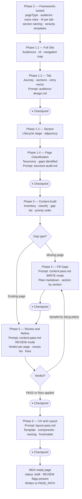
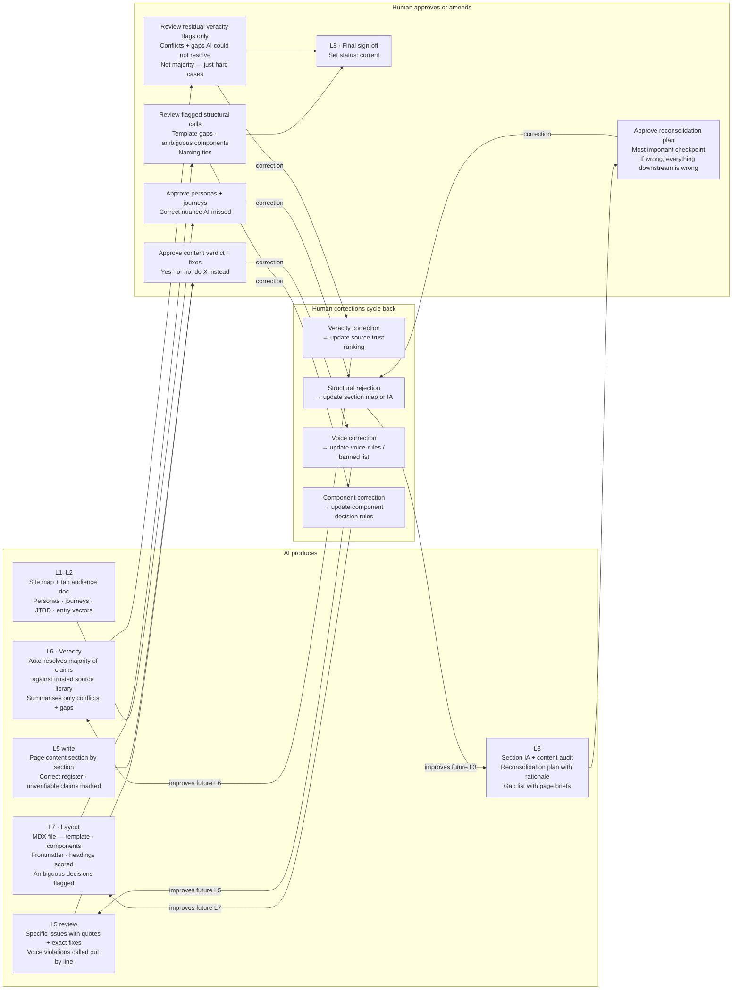
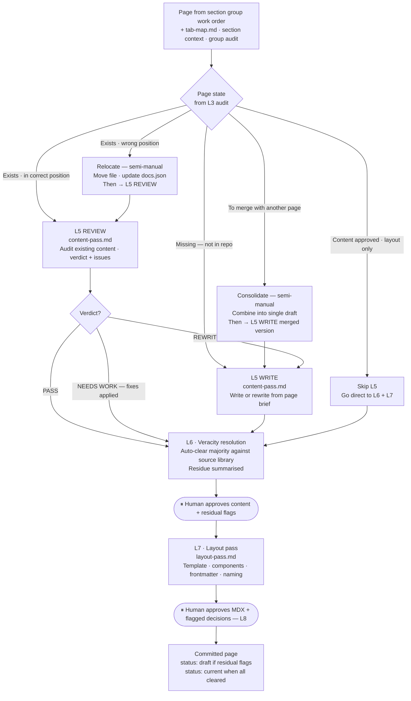
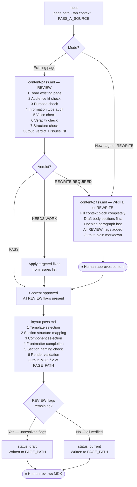

# Automated Content Writing & Review System

**Status**: Active — pipeline in build; this document describes the target state
**Branch**: `docs-v2-dev`
**Framework**: [Frameworks/content-pipeline-framework.md](Frameworks/content-pipeline-framework.md)
**Execution plan**: [plan-canonical.md](plan-canonical.md)

---

OUTCOME DOCUMENT

---

## Context

**Purpose**: Documentation for the Livepeer ecosystem

- Educate — help readers understand and operate the protocol
- Inform — accurate, verifiable, up-to-date information
- Canonical source of truth — one authoritative place per topic

**Philosophy**

- Ownerless contribution — any contributor can improve any page within the framework
- AI-first — AI drafts, structures, and reviews; humans decide and verify
- Future-proofed — framework-driven so the system improves as definitions improve

---

## Core Issues in AI-Co-Creation of Content

- Copy veracity — AI generates plausible but incorrect information without source grounding
- Terminology and voice — AI defaults to generic language; misses audience-specific register and domain terminology
- Content not meeting user needs — pages written to a structure, not to a reader job or outcome
- Taxonomy and IA unstructured — no shared classification means no consistent journey or navigation experience for the audience
- Layout and style not homogenous — each page looks and feels different; no template enforcement

---

## Aim

A repeatable, auditable process for AI-human collaborative documentation that:

- Produces content correct for its audience, clear on its purpose, voice-consistent, and veracity-tracked
- Operates at every level — site, tab, section, page — with consistent standards
- Scales from a pilot (gateways, orchestrators) to the full site without rebuilding
- Keeps the human as the decision-maker at every approval point

---

## Concerns Separation

Content quality is multi-dimensional. A single pass cannot evaluate all of it — each dimension requires its own framework, criteria, and pass.

### Content concerns

What the page says and whether it serves the reader:

- **Context** — is the page positioned correctly? Does the reader have what they need to use it?
- **Quality** — is the information complete, correct, and sufficient for the stated purpose?
- **Terminology** — does it use the right vocabulary for the audience and domain?
- **Usefulness** — can the reader actually do the thing the page is for?
- **Voice** — is the register, tone, and language right for this specific audience?
- **Veracity** — are factual, technical, and procedural claims verified against authoritative sources?

### UX concerns

How the page presents and navigates:

- **Layout** — correct template applied; sections in the right order and with the right components
- **Style** — headings score correctly; no banned constructions; UK English throughout
- **Homogenous structure** — every page of the same type looks and behaves the same way

---

## Definition of Good

What "good" means at each level of the documentation hierarchy. Each level has three measurable dimensions: usefulness, content, and UX.

### Site

**Aims**: Consistent taxonomy across all tabs; every page framework-aligned; no structural orphans; navigation matches file system.

**Usefulness metrics**:

- Audience journey complete for every primary audience segment — entry, depth, exit
- All audiences have a clear path in and out
- Cross-tab links exist at every audience journey intersection

**Content metrics**:

- 0 pages with missing-fields classification
- 0 pages with wrong-type classification
- All factual claims veracity-tracked across the full site
- No unresolved stale content in very-high veracity sections

**UX metrics**:

- All navigated pages use pageType-correct templates
- All headings score ≥20/25 across the site
- No component rule violations
- docs.json navigation fully matches file system — 0 broken paths, 0 orphaned files

---

### Tab

**Aims**: Complete audience journey from entry to activation; all canonical section positions present; cross-tab links at journey intersection points.

**Usefulness metrics**:

- Primary audience journey complete — entry → depth → exit — with no missing steps
- On-demand sections (guides, reference, resources) exist for every major post-activation need
- At least 3 cross-tab links at points where audience journeys intersect

**Content metrics**:

- All pages classified correctly for this tab's audience and lifecycle stage
- No pages in the wrong section
- No stale or unverified content in very-high veracity sections (setup, config, reference)

**UX metrics**:

- Tab entry portal correctly routes to all sections
- All sections have an orientation page
- No dead-end pages — every page has a clear next step

---

### Section

**Aims**: All pages serve the same audience at the right lifecycle stage; sequence builds on itself; section has an orientation page that correctly routes.

**Usefulness metrics**:

- Reader can complete the section's primary task without leaving the section for missing prerequisites
- No knowledge gaps between adjacent pages

**Content metrics**:

- All pages have correct pageType for their section position
- No content duplicated from adjacent sections
- All factual claims veracity-tracked within the section

**UX metrics**:

- Section orientation page present and correctly routes to all subsections
- All pages have passing heading names
- Components appropriate for each page's pageType — no forbidden components in use

---

### Page

**Aims**: One purpose, one audience, one job the reader achieves before the end.

**Usefulness metrics**:

- Reader achieves the stated purpose without needing additional context from outside the page
- PREV_PAGE and NEXT_PAGE adjacency is correct — no knowledge gaps in either direction
- All prerequisite knowledge is either stated or linked

**Content metrics**:

- Voice correct for audience — register, terminology, no banned words or constructions
- Factual, technical, and procedural claims verified or explicitly flagged
- UK English throughout; no passive value statements; no hedging openers

**UX metrics**:

- Correct template applied for pageType + pageVariant
- All 10 frontmatter fields present and correct
- All heading names score ≥20/25
- Component use appropriate — no forbidden components, no missing required components

---

## Solutioning

The pipeline solves the Core Issues through a sequence of phases, each narrowing scope and building on the previous phase's output. No phase runs without the preceding phase's artefacts.

**Cascade**: Full site → Tab → Section → Page

**Approach**: AI drafts; human approves at each phase boundary. Every phase produces artefacts that feed the next.

**Phases**:

| Phase                        | Job                                                     | Output                                          |
| ---------------------------- | ------------------------------------------------------- | ----------------------------------------------- |
| 1 — Define Context           | Understand the landscape at every level                 | Context documents (site → tab → section → page) |
| 2 — Frameworks & Definitions | Lock the standards every page is measured against       | Locked framework files                          |
| 3 — Content Audit            | Inventory what exists; classify against framework       | Audit report per tab                            |
| 4 — Fill Gaps                | Write missing content                                   | Draft pages for gap positions                   |
| 5 — Review & Refine          | Review content against framework; fix what doesn't pass | Revised content per page                        |
| 6 — UX & Layout              | Apply template, components, naming, frontmatter         | MDX-ready pages                                 |

---

## Process

How to run the pipeline per session:

1. Load the relevant phase artefacts (context docs, framework files, audit report)
2. Run the phase prompt / skill for the current scope (site / tab / section / page)
3. Produce the phase output
4. Human reviews output at the phase checkpoint
5. Human approves, edits, or rejects — nothing advances without approval
6. On approval: artefact is locked and available as input to the next phase
7. Repeat for the next scope level or next phase

---

## System Flow

### Master reference — every step, input, sub-steps, output

Two zones: **Canonical** (run once per level, lock the output, load it as context for everything below) and **Per page** (repeatable for any page in the site, once canonical context exists).

| Step | Name | Input | What happens inside | Output | Who |
|---|---|---|---|---|---|
| **L1** | **Site** | Ecosystem overview · docs.json · existing site | Map audiences across all tabs · identify cross-tab graduation journeys · set tab ownership + boundary rules | `site-map.md` | AI drafts · human approves |
| **L2** | **Tab** | `site-map.md` · tab's docs.json section · framework files | Design personas for this tab · map entry vectors + blockers per persona · build JTBD matrix per lifecycle stage · map linear journey + on-demand sections · validate every persona path is unblocked | `tab-audience-doc.md` | AI drafts · human approves |
| **L3** | **Sections** | `tab-audience-doc.md` · all pages in tab · IA framework | Inventory sections (exists vs should) · classify every page (pageType · audience · purpose · lifecycle stage) · map position type (linear / on-demand) · audit existing content (keep / move / merge / split / drop / missing) · produce prioritised work order per section group | `tab-map.md` + `group-audit.md` per section group | AI drafts · human approves reconsolidation |
| *(execute)* | *Reorganise* | *Approved reconsolidation plan* | *Move files · rename · update docs.json · create stubs for merged or split pages* | *Repo reflects approved IA* | *Human (semi-manual)* |
| **L4** | **Page design** | Section position + information need (from `tab-map.md`) · page brief (from `group-audit.md`) | Classify pageType · purpose · audience · complexity · identify information type per section (procedural / conceptual / reference / factual / evaluative) · set PREV_PAGE and NEXT_PAGE | Page brief — contract for L5 | AI |
| **L5** | **Content** | Page brief · `tab-audience-doc.md` · `voice-rules.md` · existing page (review) or blank (write) | 1 Read · 2 Audience fit · 3 Purpose check · 4 Information type audit · 5 Voice check (register · terminology · banned phrases) · 6 Mark claims for L6 · 7 Structure check · Verdict: PASS / NEEDS WORK / REWRITE | Plain markdown · verdict · issues list · marked claims | AI |
| **L6** | **Veracity** | Marked claims · `veracity-library.md` (45 sources · trust-ranked) | For each claim — search sources in trust order: confirmed → clear flag + cite; conflicting → keep flag + best-confidence + note conflict; not found → keep flag + best-confidence guess | Verified content · residual flags only (conflicts + gaps AI could not resolve) | AI resolves majority · human reviews residue |
| **L7** | **Layout** | Verified content · page brief · pageType · information types per section | Information type → component (procedural→`<Steps>` · conceptual→prose/`<Note>` · reference→table · multi-path→`<Tabs>`) · apply pageType template (required sections in order) · complete frontmatter (all 10 fields · canonical values) · score all headings against naming rubric · render validation (MDX syntax · UK English · no broken links) | MDX file at PAGE_PATH · `status: draft` | AI |
| **L8** | **Sign-off** | MDX file · residual flag list · AI-flagged decisions | Review only residual veracity flags (conflicts + gaps) · approve or amend AI-flagged structural decisions · light copy read · set status | Committed page · `status: current` when all flags cleared | Human |

**Feedback loop**: every human correction cycles back. Veracity correction → source trust ranking. Structural rejection → section map. Voice correction → voice-rules.md. Component correction → component decision rules. Each correction improves future runs without re-running canonical steps.

---

### Full pipeline — site to MDX-ready page

---

### Structure of the full system — what happens at each level and why

The pipeline has two zones: **canonical** (run once per level, lock the output, reuse forever) and **per-page** (repeatable for any page, anywhere in the site).

```mermaid
flowchart TD

    subgraph CANONICAL["CANONICAL — run once, lock the output"]
        direction TB

        L1["1 · SITE\nAudience map · cross-tab graduation journeys · tab ownership\nOutput: site-map.md"]

        L2["2 · TAB\nPersonas · entry vectors · blockers\nJTBD per lifecycle stage · linear journey + on-demand sections\nOutput: tab audience doc"]

        L3["3 · SECTIONS\nIA structure · information need per section position\nContent audit: keep · move · merge · split · drop · missing\nReconsolidation plan + page work order\nOutput: tab-map.md + section group audit"]

        L1 --> L2 --> L3
    end

    L3 --> CTX["Context pack per page\ntab audience doc · section map · section position · neighbouring pages · page path"]

    subgraph PERPAGE["PER PAGE — repeatable for any page in the site"]
        direction TB

        L4["4 · PAGE DESIGN\nClassify pageType + purpose + audience given section position\nIdentify information types per section\nSet PREV_PAGE and NEXT_PAGE\nOutput: page brief — the contract for L5"]

        L5["5 · CONTENT\nWrite or review content section by section\nFor each section: right information · right reader · right position\nVoice check: register · terminology · banned phrases\nMark unverifiable claims for L6 resolution\nVerdict: PASS · NEEDS WORK · REWRITE REQUIRED\nOutput: plain markdown — no MDX, no components"]

        L6["6 · VERACITY RESOLUTION\nLoad trusted source library — ranked by confidence level\nFor each marked claim, search sources in trust order:\n  ✓ Source confirms at high confidence → clear flag · cite source · mark verified\n  ⚠ Sources conflict or ambiguous → keep flag · write best-confidence version · note conflict\n  ? No source found → keep flag · write best-confidence guess\nOutput: maximally-verified content · residual flags summarised for human"]

        L7["7 · LAYOUT\nInformation type → component per section\n  procedural → Steps · conceptual → prose/Note\n  reference → table · multi-path → Tabs\nApply pageType template: required sections in order\nComplete frontmatter — all 10 fields canonical\nScore all headings against naming rubric\nOutput: MDX file · status: draft if residual flags remain"]

        L8["8 · HUMAN SIGN-OFF\nReview residual flags only — AI resolved the majority\nApprove any structural decisions AI surfaced\nLight copy read · render check\nSet status: current when residual flags cleared\nOutput: committed page"]

        L4 --> L5 --> L6 --> L7 --> L8
    end

    CTX --> L4

    style CANONICAL fill:#f0f4ff,stroke:#99aadd
    style PERPAGE fill:#f0fff4,stroke:#99ddaa
```

**Key clarifications:**

| Question | Answer |
|---|---|
| Where does information validation happen? | L6 — a dedicated veracity resolution step between content and layout. AI clears the majority automatically using the trusted source library. Human only sees conflicts and gaps the AI could not resolve. |
| Where does information type → component mapping happen? | L3 identifies *what type* of information belongs at each section position. L7 maps *type → component*. |
| What makes pages canonical? | L1–L3 outputs are locked and reused. They don't re-run per page — they're loaded as context. |
| What are the current prompts? | L2 = audience-design.md · L3 = structure-audit.md + content audit · L5 = content-pass.md · L6 = veracity resolution pass · L7 = layout-pass.md · L8 = human |

---

### Human vs AI — responsibility split and feedback loops

**The one real bottleneck:** L3 (section IA + reconsolidation plan). If the section structure is wrong — pages in wrong positions, wrong audience per section — everything downstream is misaligned. After L3 is approved, page-level work is mostly an approval flow.

---

### Subflows — which path runs depends on the page's current state

Not every page goes through every step. The content audit (L3) classifies each page and routes it into the correct subflow.

---

### Tab-level operational flow — from current state to page work order

This runs once per tab. It produces tab-map.md (section structure + page classifications + gap list), then runs a content audit per section group to determine what to keep, move, merge, split, or rewrite — before any page-level work begins.

```mermaid
flowchart TD
    CS["Current state\nContent in repo · confirmed IA · all frameworks locked"]

    SM["Site map — semi-manual, one-time\nTab ownership · primary audience · cross-tab journeys · boundary notes\nOutput: site-map.md"]

    CS --> SM
    SM --> TS["Select tab — priority order\nOrchestrators · Gateways · LPT · Developers · About"]

    TS --> AD["audience-design.md\nWho lands here · from where\nPersonas · entry vectors · blockers\nJTBD matrix per lifecycle stage\nLinear journey + on-demand sections\nPersona path validation\nOutput: tab audience doc"]

    AD --> CP1(["⏸ Checkpoint\napprove personas, journey, JTBD matrix"])

    CP1 --> SA["structure-audit.md\nSection inventory — exists vs should exist\nPosition mapping — linear vs on-demand\nPage classification — pageType · audience · purpose per page\nGap analysis — missing / wrong-type / misplaced / stale\nWork order — P0 / P1 / P2 per section group\nOutput: tab-map.md"]

    SA --> CP2(["⏸ Checkpoint\napprove section structure, page classifications, work order"])

    CP2 --> TM["tab-map.md\nSection inventory · page classifications · gap list · work order\nLoaded as context into all section-group and page-level runs"]

    TM --> SG["Select section group from work order\ne.g. gateways/guides/payments-and-pricing/"]

    SG --> CA["Content audit — AUDIT mode\ncontent-pass.md run across all pages in section group\nFor each page: is this content useful here?\nDecisions: keep-in-place · move · merge · split · rewrite · drop\nOutput: group/audit.md — reconsolidation plan"]

    CA --> CP3(["⏸ Checkpoint\napprove reconsolidation plan for this section group"])

    CP3 --> REORG{"Structural changes\nneeded?"}
    REORG -->|"Yes — pages to move, merge, or split"| MOVE["Execute reorganisation — semi-manual\nMove files · rename · consolidate · update docs.json\nCreate stubs for new pages from splits or merges"]
    REORG -->|"No — content stays in place"| WO["Work order confirmed\nPages ready for per-page pipeline"]
    MOVE --> WO

    WO --> PAGEPIPE["Per-page pipeline — runs for each page in section group work order\nReceives: tab-map.md + section context + group/audit.md + PAGE_PATH\nSee per-page operational flow below"]

    PAGEPIPE --> MORESG{"More section groups\nin this tab?"}
    MORESG -->|Yes| SG
    MORESG -->|No — tab complete| MORETAB{"More tabs?"}
    MORETAB -->|Yes| TS
    MORETAB -->|No| DONE["All tabs processed"]
```

---

### Per-page operational flow — Phase 5 and Phase 6

---

## Risks

- **Overdefining or overweighting** — framework becomes so detailed it's unusable; AI ignores it or produces generic compliance
- **Not separating concerns well** — content, voice, taxonomy, UX, and style evaluated together; each suffers
- **Phase skipping** — running Phase 5 without Phase 3 audit means refining content that should be restructured first
- **Framework drift** — definitions evolve after pipeline runs; earlier outputs become inconsistent with current standards
- **Human checkpoint fatigue** — too many checkpoints at too fine a granularity; approvals become rubber stamps

---

# Pipeline

Each phase produces context needs for the next. Each phase has a purpose, outcome, and artefacts. No phase runs without the preceding artefacts locked.

---

## Phase 1: Define Context

Define the landscape at every scope level before any content or framework work begins. The output of each sub-phase feeds the next sub-phase.

---

### 1.1 Full Site

#### Purpose & Aims

Understand the full documentation site: what it is, who it serves, what success looks like at the site level.

#### Definition of Full Site Success

See [Definition of Good → Site](#site).

#### Scope

Full site — all tabs, all audiences, all navigation.

#### Outcomes

- Clear understanding of the site's purpose and audiences
- Audience segment map — who uses the site, what they need, how they graduate between tabs

#### Needs

- Context overview of the full Livepeer ecosystem
- Audience overview and categorisation
- Success metric per audience segment
- Audience journey and needs mapping
- Overall content style, brand, and feel
- Overall navigation and IA needs

#### Artefacts & Status

| Artefact                   | Description                                                          | Status           |
| -------------------------- | -------------------------------------------------------------------- | ---------------- |
| Full site context document | Compressed summary of site purpose, audiences, and content landscape | [draft / locked] |
| Audience segments document | Audience segments, success metric per segment, graduation paths      | [draft / locked] |
| Full site IA / navigation  | IA by audience segment — locked before Phase 2 begins                | [draft / locked] |

#### Useful Research / Frameworks

- [complete] Audience definitions — `Frameworks/` (framework files)
- [complete] Best practice documentation research — `Research/research.md`

#### References / Resources

- Livepeer ecosystem documentation
- Shtuka data geography research

---

### 1.2 Tab Level

Scope narrowed from full site to individual tabs. Governed by the full site context from 1.1.

#### Purpose & Aims

Understand each tab's audience, arriving question, and reader journey. Define what the tab needs to deliver for its primary audience from entry to depth.

#### Scope

Each tab individually — gateways, orchestrators, developers, delegators, community.

#### Outcomes

- Per-tab audience journey map (entry → depth → exit)
- Cross-tab journey intersections identified

#### Needs

- Full site context from 1.1
- Audience definitions from framework
- IA per tab framework (`08a-ia-per-tab.md`)
- Existing docs.json navigation per tab

#### Artefacts & Status

| Artefact             | Description                                                                 | Status                   |
| -------------------- | --------------------------------------------------------------------------- | ------------------------ |
| Tab context document | Per-tab: audience, arriving question, journey, canonical sections           | [draft / locked] per tab |
| Tab map              | Structural audit of each tab — section inventory, page classification, gaps | [draft / locked] per tab |

---

### 1.3 Section Level

Scope narrowed from tab to individual sections. Governed by tab context from 1.2.

#### Purpose & Aims

Understand each section within a tab: what it's for, who it serves, what lifecycle stage it occupies, how it connects to adjacent sections.

#### Scope

Each canonical section within a tab (concepts, quickstart, setup, guides, reference, resources).

#### Outcomes

- Section context per section: purpose, audience, lifecycle stage, adjacency
- Section sequence validated against audience journey

#### Needs

- Tab map from 1.2
- Section vocabulary from IA framework
- pageType definitions from framework

#### Artefacts & Status

| Artefact        | Description                                                                      | Status                   |
| --------------- | -------------------------------------------------------------------------------- | ------------------------ |
| Section context | Embedded in tab map — per section: purpose, audience, lifecycle stage, adjacency | [draft / locked] per tab |

---

### 1.4 Page Mapping

Scope narrowed from section to individual pages. Governed by section context from 1.3.

#### Purpose & Aims

Classify every page against the taxonomy; identify missing pages, misclassified pages, and content gaps.

#### Scope

Every navigated page across all tabs in scope.

#### Outcomes

- Full page inventory with taxonomy classification (pageType, audience, purpose, lifecycle stage)
- Gap list: missing pages, wrong-type pages, content that fails its purpose

#### Needs

- Section context from 1.3
- All locked taxonomy enums from framework
- Current page frontmatter (read at scan time)

#### Artefacts & Status

| Artefact                  | Description                                                                                                                        | Status                   |
| ------------------------- | ---------------------------------------------------------------------------------------------------------------------------------- | ------------------------ |
| Page classification table | Per page: pageType, audience, purpose, lifecycle stage, classification (aligned / wrong-type / missing-fields / misplaced / stale) | [draft / locked] per tab |

---

## Phase 2: Frameworks & Definitions

Lock the standards every page is measured against before any content work begins. Framework must be locked before Phase 3 runs.

Per scope level (site → tab → section → page):

- Audience journey structure — how pages relate to each other within a journey
- Content information mapping — what information types appear at each lifecycle stage
- Audience definitions — who the content is for per tab, per section
- Copy voice — per-audience register, tone, terminology, don'ts
- Copy guide — universal do's and don'ts (banned words, banned constructions, opening rules)

#### Outcomes

- Pages have a brief context understanding of their place in the content landscape
- Pages have a clear frontmatter taxonomy — all 10 fields defined and validated
- Pages have a concise orientation statement — what this page is, who it is for, what the reader leaves with

#### Needs

| Framework file                                                | Status                   |
| ------------------------------------------------------------- | ------------------------ |
| `Frameworks/pageType.md`                                      | ✅ Locked                |
| `Frameworks/pagePurpose.md`                                   | ✅ Locked                |
| `Frameworks/information-type.md`                              | ✅ Locked                |
| `Frameworks/veracity.md` + `veracity-library.md`              | ✅ Locked                |
| `Frameworks/complexity.md`                                    | ✅ Locked                |
| `Frameworks/industry.md`                                      | ✅ Locked                |
| `Prompts/voice-rules.md`                                      | ✅ Locked                |
| `Prompts/section-naming.md`                                   | ✅ Locked                |
| `v2/_workspace/references/content-pipeline/08a-ia-per-tab.md` | ✅ Locked                |
| Page templates per pageType                                   | ⬜ Not started — Step 11 |

---

## Phase 3: Content Audit

Inventory what exists across the site. Evaluate it against the locked framework. Produce an actionable audit before any content is written or rewritten.

- What content exists?
- What is usable as-is?
- What quality is it against the framework?
- What can merge with adjacent content?
- What is missing entirely?
- How should existing content be restructured for the audience journey?

### 3.1 Full Site

High-level audit: tab count, page count, classification distribution, gross gaps.

### 3.2 Tabs

Per-tab audit: section inventory, page count per section, classification per page, gap list.

### 3.3 Sections

Per-section audit: pages classified, sequence correct, orientation page present, no content duplicated from adjacent sections.

### 3.4 Pages

Per-page audit: frontmatter complete, pageType correct, audience correct, purpose deliverable, voice pass/fail, veracity status.

#### Outcomes

- Full site audit report — classification distribution, gap list, priority ranking
- Per-tab audit — page inventory with classification and recommended action per page
- Merge candidates — pages that overlap and should be consolidated
- Priority order for Phase 4 and Phase 5 work

---

## Phase 4: Fill Gaps

Write missing content identified in the Phase 3 audit. Drafts only — content goes to staging, not the repo.

- Write basic structure first — headings, purpose statement, section outline
- Draft content section by section — plain markdown, no MDX
- Do not refine voice or layout in this phase — that is Phase 5 and Phase 6

#### Needs

- Context documents from Phase 1
- Locked framework from Phase 2
- Gap list and priority order from Phase 3 audit
- Understanding of generic layout items per information type (for section structure)

#### Outcomes

- Draft pages for all P0 and P1 gap positions
- Staged in `v2/_workspace/context-packs/` — not applied to the repo

---

## Phase 5: Review & Refine Content

Review every page (existing and Phase 4 drafts) against the framework. Fix what does not pass.

### 5.1 Review & Tag

Review each page for:

- Purpose match — does the page deliver on its stated purpose?
- Content veracity — are factual, technical, and procedural claims verifiable?
- Terminology fit — does it use the right vocabulary for audience and domain?
- Voice fit — is the register and tone correct for this audience?
- Layout journey fit — is the content in the right structural position in the reader's journey?
- Voice discipline — no banned words, no wandering prose, no passive value statements
- Flow — not repetitive; clear progression from section to section

#### Outcomes

- Per-page verdict: PASS / NEEDS WORK / REWRITE REQUIRED
- Issues list per page: priority-ordered, with specific fixes

### 5.2 Refine

Apply the Phase 5.1 findings:

**Content**:

- Tighten prose — one paragraph, one job
- Update incorrect or unverified items; add REVIEW flags for unresolved claims
- Refine voice — correct register, correct terminology, no violations
- Ensure naming practices met — headings score ≥20/25

**Structure**:

- Fits the journey type (pageType template)
- Delivers information in the correct flow sequence for the stated purpose
- Achieves the process and outcome the reader needs

---

## Phase 6: UX & Layout

Apply visual structure and MDX formatting to reviewed and approved content. Does not change content — that is Phase 5's job.

### Review

- Information type → correct component selection
- Template compliance per pageType
- Heading naming scores
- Frontmatter completeness

### Refine

- Apply correct pageType template — required sections, correct order
- Select components per section per the pageType component palette
- Score and correct all headings (≥20/25)
- Write complete frontmatter — all 10 schema fields
- Validate MDX renders clean; UK English throughout

#### Artefacts

- MDX-ready page per reviewed/written page
- Staged in `v2/_workspace/context-packs/[group]/rewrites/` — not applied until human approves

---

## Pipeline Prompts & Skills

Implementation detail for each phase lives in:

| File                                                                       | Phase                                                      |
| -------------------------------------------------------------------------- | ---------------------------------------------------------- |
| `Prompts/Prompts-By-Phase/1-audience-design/audience-design.md`            | Phase 1.2 (tab audience design · journey · personas)       |
| `Prompts/Prompts-By-Phase/2-structure-audit/structure-audit.md`            | Phase 1.3–1.4 (section + page classification · gap list)   |
| `Prompts/Prompts-By-Phase/3-content-pass/content-pass.md`                  | Phase 5 (review and refine content — REVIEW / WRITE modes) |
| `Prompts/Prompts-By-Phase/4-layout-pass/layout-pass.md`                    | Phase 6 (UX and layout — template · components · MDX)      |
| `Prompts/voice-rules.md`                                                   | Phase 2 input; Phase 5 review criteria                     |
| `Prompts/section-naming.md`                                                | Phase 6 naming check                                       |
| `ai-tools/ai-skills/content-pipeline-pass-a/SKILL.md`                      | Phase 5 skill wrapper for content-pass.md                  |
| `ai-tools/ai-skills/content-pipeline-pass-b/SKILL.md`                      | Phase 6 skill wrapper for layout-pass.md                   |
