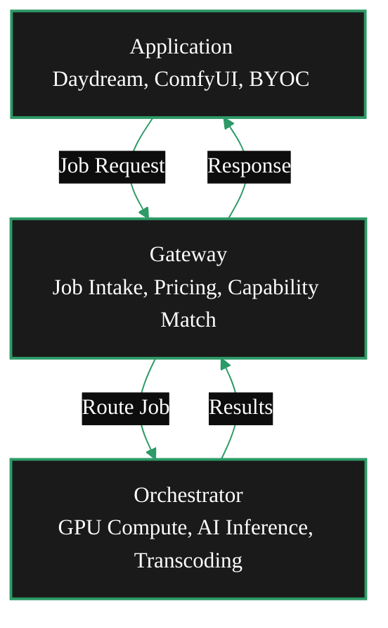
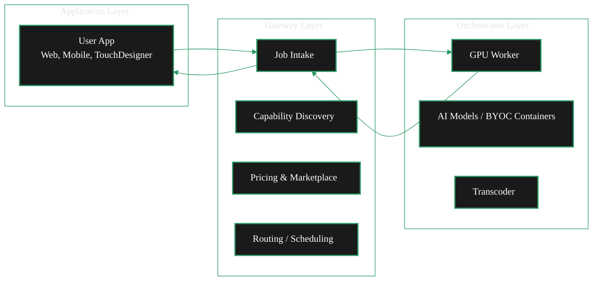
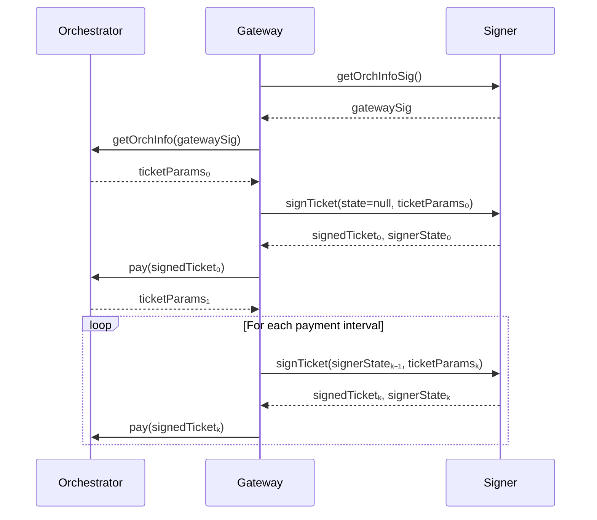
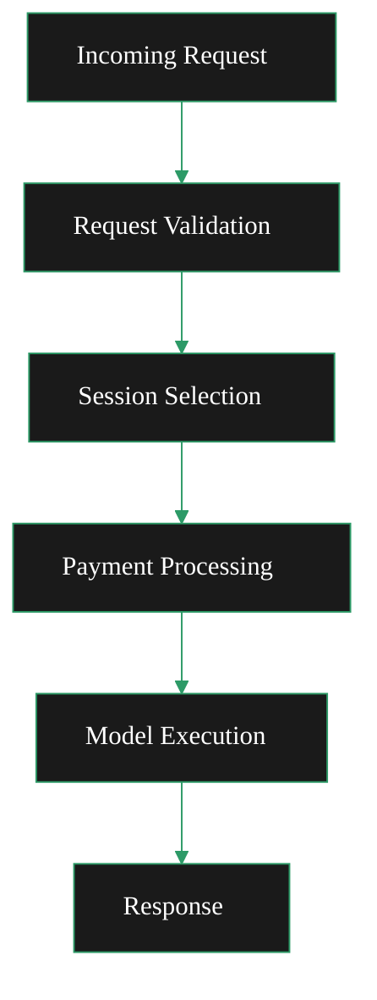

```mermaid
%%{init: {'theme': 'base', 'themeVariables': { 'primaryColor': '#1a1a1a', 'primaryTextColor': '#fff', 'primaryBorderColor': '#2d9a67', 'lineColor': '#2d9a67', 'secondaryColor': '#0d0d0d', 'tertiaryColor': '#1a1a1a', 'background': '#0d0d0d', 'fontFamily': 'system-ui' }}}%%
flowchart TB
    subgraph INPUT["Input Sources"]
        direction LR
        RTMP["RTMP Stream"]
        HTTP["HTTP Upload"]
        AI_REQ["AI Request"]
    end

    GATEWAY["Gateway Node<br/>LivepeerNode"]

    INPUT --> GATEWAY

    subgraph MANAGERS["Session Managers"]
        direction LR
        BSM["BroadcastSessionsManager<br/>Video Transcoding"]
        ASM["AISessionManager<br/>AI Processing"]
    end

    GATEWAY --> BSM
    GATEWAY --> ASM

    subgraph VIDEO["Video Pipeline"]
        SEG["Segment Processing"]
        ORCH_V["Orchestrators<br/>Transcoding"]
        HLS["HLS/DASH Output"]
    end

    subgraph AI["AI Pipeline"]
        PROC["AI Processing"]
        ORCH_AI["Orchestrators<br/>AI Models"]
        OUT_AI["AI Output<br/>Images/Video"]
    end

    BSM --> SEG --> ORCH_V --> HLS
    ASM --> PROC --> ORCH_AI --> OUT_AI

    subgraph PAYMENT["Payment"]
        direction LR
        PAY_SEG["Per Segment"]
        PAY_PIX["Per Pixel"]
    end

    ORCH_V --> PAY_SEG
    ORCH_AI --> PAY_PIX

    classDef default fill:#1a1a1a,color:#fff,stroke:#2d9a67,stroke-width:2px
    classDef video fill:#1a1a1a,color:#fff,stroke:#3b82f6,stroke-width:2px
    classDef ai fill:#1a1a1a,color:#fff,stroke:#a855f7,stroke-width:2px
    class RTMP,HTTP,BSM,SEG,ORCH_V,HLS,PAY_SEG video
    class AI_REQ,ASM,PROC,ORCH_AI,OUT_AI,PAY_PIX ai
    style INPUT fill:#0d0d0d,stroke:#2d9a67,stroke-width:1px
    style MANAGERS fill:#0d0d0d,stroke:#2d9a67,stroke-width:1px
    style VIDEO fill:#0d0d0d,stroke:#3b82f6,stroke-width:1px
    style AI fill:#0d0d0d,stroke:#a855f7,stroke-width:1px
    style PAYMENT fill:#0d0d0d,stroke:#2d9a67,stroke-width:1px
```

```mermaid
%%{init: {'theme': 'base', 'themeVariables': { 'primaryColor': '#1a1a1a', 'primaryTextColor': '#fff', 'primaryBorderColor': '#2d9a67', 'lineColor': '#2d9a67', 'secondaryColor': '#0d0d0d', 'tertiaryColor': '#1a1a1a', 'background': '#0d0d0d', 'fontFamily': 'system-ui' }}}%%
flowchart LR
    subgraph Clients["Client / Application Layer"]
        A["Apps & SDKs<br/>• Video Ingest<br/>• AI Inference Requests<br/>• WebRTC / HTTP"]
    end

    subgraph Gateway["Gateway Layer (Livepeer Gateway)"]
        B["Gateway Node<br/><br/>Cloud Analogy:<br/>• API Gateway<br/>• L7 Load Balancer<br/>• Control Plane<br/><br/>Responsibilities:<br/>• Auth & Rate Limits<br/>• Stream Segmentation<br/>• Job Routing<br/>• Health Checks<br/>• Retry & Failover"]
    end

    subgraph Compute["Compute Layer (Supply Side)"]
        C["Orchestrators<br/>GPU Workers<br/><br/>Cloud Analogy:<br/>• Auto-scaling GPU Fleet<br/>• Managed Inference Pool"]
    end

    subgraph Settlement["Coordination & Settlement"]
        D["Ethereum + Livepeer Protocol<br/><br/>• Payments<br/>• Accounting<br/>• Slashing / Security"]
    end

    A -->|Requests| B
    B -->|Dispatch Jobs| C
    C -->|Results / Streams| B
    B -->|Responses| A
    C -->|Usage & Proof| D

    classDef default fill:#1a1a1a,color:#fff,stroke:#2d9a67,stroke-width:2px
    style Clients fill:#0d0d0d,stroke:#2d9a67,stroke-width:1px
    style Gateway fill:#0d0d0d,stroke:#2d9a67,stroke-width:1px
    style Compute fill:#0d0d0d,stroke:#2d9a67,stroke-width:1px
    style Settlement fill:#0d0d0d,stroke:#2d9a67,stroke-width:1px
```

```mermaid
%%{init: {'theme': 'base', 'themeVariables': { 'primaryColor': '#1a1a1a', 'primaryTextColor': '#fff', 'primaryBorderColor': '#2d9a67', 'lineColor': '#2d9a67', 'secondaryColor': '#0d0d0d', 'tertiaryColor': '#1a1a1a', 'background': '#0d0d0d', 'fontFamily': 'system-ui' }}}%%
flowchart LR
    subgraph User["User Layer"]
        A["Client<br/>Video/AI Request"]
    end

    subgraph Gateway["Gateway Layer"]
        B["Livepeer Gateway<br/>= L2 Sequencer<br/><br/>• Ingests Requests<br/>• Segments/Preprocesses<br/>• Selects Orchestrators<br/>• Routes Jobs<br/>• Returns Results"]
    end

    subgraph Compute["Compute Layer"]
        C["Orchestrators<br/>GPU Workers<br/><br/>= L2 Execution Layer"]
    end

    subgraph Settlement["Settlement Layer"]
        D["Ethereum<br/>Consensus & Payment Security"]
    end

    A --> B
    B --> C
    C --> B
    B --> A
    C --> D

    classDef default fill:#1a1a1a,color:#fff,stroke:#2d9a67,stroke-width:2px
    style User fill:#0d0d0d,stroke:#2d9a67,stroke-width:1px
    style Gateway fill:#0d0d0d,stroke:#2d9a67,stroke-width:1px
    style Compute fill:#0d0d0d,stroke:#2d9a67,stroke-width:1px
    style Settlement fill:#0d0d0d,stroke:#2d9a67,stroke-width:1px
```

```mermaid
%%{init: {'theme': 'base', 'themeVariables': { 'primaryColor': '#1a1a1a', 'primaryTextColor': '#fff', 'primaryBorderColor': '#2d9a67', 'lineColor': '#2d9a67', 'secondaryColor': '#0d0d0d', 'tertiaryColor': '#1a1a1a', 'background': '#0d0d0d', 'fontFamily': 'system-ui' }}}%%
flowchart LR
    subgraph Persona["Persona: Gateway Operator = Film Producer"]
        P["Film Producer Mindset<br/>• Owns delivery<br/>• Sets constraints<br/>• Chooses specialists<br/>• Ensures quality"]
    end

    subgraph Request["Act I - The Pitch"]
        A["Incoming Request<br/>• Live Video Stream<br/>• AI Inference Job<br/>• Quality & Latency Requirements"]
    end

    subgraph Planning["Act II - Pre-Production"]
        B["Gateway (Producer)<br/><br/>• Interpret the request<br/>• Set budget & latency constraints<br/>• Choose specialists<br/>• Plan execution"]
    end

    subgraph Crew["Act III - Production Crew"]
        C["Orchestrators / GPU Workers<br/><br/>• Transcoding<br/>• AI Inference<br/>• Real-time Processing"]
    end

    subgraph Delivery["Act IV - Final Cut & Release"]
        D["Verified Output<br/>• Stream / AI Result<br/>• Quality checked<br/>• Delivered on time"]
    end

    subgraph Settlement["Credits & Accounting"]
        E["Onchain Settlement<br/>• Usage recorded<br/>• Payments distributed<br/>• Trust enforced"]
    end

    P --> A
    A --> B
    B --> C
    C --> B
    B --> D
    C --> E

    classDef default fill:#1a1a1a,color:#fff,stroke:#2d9a67,stroke-width:2px
    style Persona fill:#0d0d0d,stroke:#2d9a67,stroke-width:1px
    style Request fill:#0d0d0d,stroke:#2d9a67,stroke-width:1px
    style Planning fill:#0d0d0d,stroke:#2d9a67,stroke-width:1px
    style Crew fill:#0d0d0d,stroke:#2d9a67,stroke-width:1px
    style Delivery fill:#0d0d0d,stroke:#2d9a67,stroke-width:1px
    style Settlement fill:#0d0d0d,stroke:#2d9a67,stroke-width:1px
```

```mermaid
%%{init: {'theme': 'base', 'themeVariables': { 'primaryColor': '#1a1a1a', 'primaryTextColor': '#fff', 'primaryBorderColor': '#2d9a67', 'lineColor': '#2d9a67', 'secondaryColor': '#0d0d0d', 'tertiaryColor': '#1a1a1a', 'background': '#0d0d0d', 'fontFamily': 'system-ui' }}}%%
flowchart TB
    subgraph INPUT["Video Input Sources"]
        direction LR
        RTMP["RTMP Stream<br/>:1935"]
        HTTP["HTTP Upload<br/>:8935"]
    end

    GATEWAY["Gateway Node<br/>LivepeerNode<br/>-gateway mode"]

    INPUT --> GATEWAY

    subgraph MANAGER["Broadcast Session Manager"]
        BSM["BroadcastSessionsManager<br/>Manages transcoding sessions<br/>Selects orchestrators"]
    end

    GATEWAY --> BSM

    subgraph PROCESSING["Video Processing Pipeline"]
        direction TB
        SEG["Segment Video<br/>Split into chunks"]
        TRANS["Send to Orchestrators<br/>with payment tickets"]
        ORCH["Orchestrators<br/>Transcode segments<br/>Multiple renditions"]
        RECEIVE["Receive Results<br/>Transcoded segments"]
    end

    BSM --> SEG --> TRANS --> ORCH --> RECEIVE

    subgraph OUTPUT["Output & Delivery"]
        direction LR
        HLS["HLS Manifest<br/>.m3u8"]
        RENDITIONS["Multiple Renditions<br/>240p, 360p, 720p, 1080p"]
    end

    RECEIVE --> HLS --> RENDITIONS

    subgraph PAYMENT["Payment System"]
        direction TB
        PM["Payment Manager<br/>Generate tickets"]
        TICKETS["Per-segment payments<br/>Based on pixels transcoded"]
    end

    TRANS --> PM --> TICKETS --> ORCH

    subgraph STORAGE["Storage (Optional)"]
        OBJ["Object Store<br/>S3/IPFS"]
    end

    RENDITIONS -.-> OBJ

    classDef default fill:#1a1a1a,color:#fff,stroke:#2d9a67,stroke-width:2px
    classDef video fill:#1a1a1a,color:#fff,stroke:#3b82f6,stroke-width:2px
    classDef payment fill:#1a1a1a,color:#fff,stroke:#fbbf24,stroke-width:2px
    class RTMP,HTTP,BSM,SEG,TRANS,ORCH,RECEIVE,HLS,RENDITIONS video
    class PM,TICKETS payment
    style INPUT fill:#0d0d0d,stroke:#2d9a67,stroke-width:1px
    style MANAGER fill:#0d0d0d,stroke:#3b82f6,stroke-width:1px
    style PROCESSING fill:#0d0d0d,stroke:#3b82f6,stroke-width:1px
    style OUTPUT fill:#0d0d0d,stroke:#3b82f6,stroke-width:1px
    style PAYMENT fill:#0d0d0d,stroke:#fbbf24,stroke-width:1px
    style STORAGE fill:#0d0d0d,stroke:#2d9a67,stroke-width:1px,stroke-dasharray: 5 5
```

```mermaid
%%{init: {'theme': 'base', 'themeVariables': { 'primaryColor': '#1a1a1a', 'primaryTextColor': '#fff', 'primaryBorderColor': '#2d9a67', 'lineColor': '#2d9a67', 'secondaryColor': '#0d0d0d', 'tertiaryColor': '#1a1a1a', 'background': '#0d0d0d', 'fontFamily': 'system-ui' }}}%%
flowchart LR
    subgraph INPUT["Input Sources"]
        CAM["Camera / RTMP / WebRTC"]
        VID["Video File"]
        AIIN["AI Prompt / Model Request"]
    end

    GATEWAY["Gateway Node<br/>• Ingest (RTMP/HTTP/WebRTC)<br/>• Segment video<br/>• Queue + order jobs<br/>• AI pipeline routing<br/>• Orchestrator selection<br/>• Verification & receipts"]

    CAM -->|"Live stream"| GATEWAY
    VID -->|"VOD upload"| GATEWAY
    AIIN -->|"AI job request"| GATEWAY

    subgraph JOBS["Workflows"]
        VJ["Video Transcoding Job"]
        AIJ["AI Inference Job<br/>(Daydream / ComfyStream / BYOC)"]
    end

    GATEWAY --> VJ
    GATEWAY --> AIJ

    subgraph ORCH["Orchestrator Network (GPU Operators)"]
        O1["Orchestrator A<br/>GPU Pool"]
        O2["Orchestrator B<br/>GPU Pool"]
        O3["Orchestrator C<br/>GPU Pool"]
    end

    VJ -->|"Transcode segments"| O1
    VJ --> O2
    AIJ -->|"Run model / inference"| O1
    AIJ --> O3

    subgraph OUTPUTS["Outputs"]
        HLS["Adaptive Bitrate Video (HLS/LL-HLS)"]
        AIOUT["AI Frames / Stylized Video"]
    end

    O1 --> GATEWAY
    O2 --> GATEWAY
    O3 --> GATEWAY

    GATEWAY --> HLS
    GATEWAY --> AIOUT

    ETH[("Arbitrum Blockchain<br/>Payments • Tickets • Rewards")]
    GATEWAY --> ETH
    O1 --> ETH
    O2 --> ETH
    O3 --> ETH

    classDef default fill:#1a1a1a,color:#fff,stroke:#2d9a67,stroke-width:2px
    style INPUT fill:#0d0d0d,stroke:#2d9a67,stroke-width:1px
    style JOBS fill:#0d0d0d,stroke:#2d9a67,stroke-width:1px
    style ORCH fill:#0d0d0d,stroke:#2d9a67,stroke-width:1px
    style OUTPUTS fill:#0d0d0d,stroke:#2d9a67,stroke-width:1px

```

### _workspace/archive/about_old/architecture.mdx

---
title: Gateway Architecture
sidebarTitle: Architecture
description: This page describes the architecture of Livepeer Gateways.
keywords:
  - livepeer
  - gateways
  - about gateways
  - gateway architecture
  - gateway
  - architecture
'og:image': /snippets/assets/site/og-image/fallback.png
'og:image:alt': Livepeer Docs social preview image
'og:image:type': image/png
'og:image:width': 1200
'og:image:height': 630
audience: gateway-operator
purpose: landing
---

import { ScrollableDiagram } from '/snippets/components/displays/diagrams/ZoomableDiagram.jsx'
import { DoubleIconLink } from '/snippets/components/elements/links/Links.jsx'

Livepeer Gateway Architecture is defined in the `livepeer-go` core codebase.

<Card
  title="/go-livepeer/core/livepeernode.go"
  href="https://github.com/livepeer/go-livepeer/blob/5691cb48/core/livepeernode.go"
  icon="github"
  arrow
  horizontal
/>

## Gateway Technical Architecture

<ScrollableDiagram title="Dual Gateway Architecture: Video & AI Pipelines" maxHeight="800px">



</ScrollableDiagram>

### Flow Diagram

<ScrollableDiagram title="Gateway Flow" maxHeight="600px">



</ScrollableDiagram>

<br />

### Layered Architecture

<ScrollableDiagram title="Layered Architecture" maxHeight="600px">



</ScrollableDiagram>

---

### _workspace/archive/about_old/economics.mdx

---
title: Gateway Economics
sidebarTitle: Economics
description: This page describes the payment flows and economics of Livepeer Gateways
keywords:
  - livepeer
  - gateways
  - about gateways
  - gateway economics
  - gateway
  - economics
  - learn
  - running
'og:image': /snippets/assets/site/og-image/fallback.png
'og:image:alt': Livepeer Docs social preview image
'og:image:type': image/png
'og:image:width': 1200
'og:image:height': 630
audience: gateway-operator
purpose: concept
---

## Overview

Gateways in Livepeer do not earn money at the _protocol level_ (though they can earn money at the _business application level_).

Livepeer follows a service provider model where gateways are customers purchasing media & AI processing services from the network.
The actual protocol-level earners are orchestrators, transcoders, AI workers, and redeemers who provide the computational work
and blockchain services.

**The Payment Flow**

In Livepeer's economic model, gateways are consumers of media processing services:

- Gateways pay Orchestrators for transcoding/AI work via payment tickets
- Orchestrators pay Transcoders/AI Workers who perform the actual work
- Redeemers earn fees by redeeming winning payment tickets on-chain

## Who Actually Earns Money?

<div style={{ overflowX: 'auto', marginBottom: '24px' }}>
  <table
    style={{ width: '100%', borderCollapse: 'collapse', fontSize: '0.9rem' }}
  >
    <thead>
      <tr style={{ backgroundColor: '#2d9a67', color: '#fff' }}>
        <th
          style={{
            padding: '12px 16px',
            textAlign: 'left',
            fontWeight: '600',
            borderBottom: '2px solid #2d9a67',
          }}
        >
 Node Type
        </th>
        <th
          style={{
            padding: '12px 16px',
            textAlign: 'left',
            fontWeight: '600',
            borderBottom: '2px solid #2d9a67',
          }}
        >
 How They Earn Money
        </th>
      </tr>
    </thead>
    <tbody>
      <tr
        style={{ borderBottom: '1px solid #333', backgroundColor: '#1a1a1a' }}
      >
        <td
          style={{ padding: '10px 16px', color: '#2d9a67', fontWeight: '500' }}
        >
 Orchestrator
        </td>
        <td style={{ padding: '10px 16px' }}>
 Receives payments from gateways for coordinating work
        </td>
      </tr>
      <tr
        style={{
          borderBottom: '1px solid #333',
          backgroundColor: 'transparent',
        }}
      >
        <td
          style={{ padding: '10px 16px', color: '#2d9a67', fontWeight: '500' }}
        >
 Transcoder
        </td>
        <td style={{ padding: '10px 16px' }}>
 Gets paid by orchestrators for video transcoding work
        </td>
      </tr>
      <tr
        style={{ borderBottom: '1px solid #333', backgroundColor: '#1a1a1a' }}
      >
        <td
          style={{ padding: '10px 16px', color: '#2d9a67', fontWeight: '500' }}
        >
 AI Worker
        </td>
        <td style={{ padding: '10px 16px' }}>
 Gets paid by orchestrators for AI model inference
        </td>
      </tr>
      <tr
        style={{
          borderBottom: '1px solid #333',
          backgroundColor: 'transparent',
        }}
      >
        <td
          style={{ padding: '10px 16px', color: '#2d9a67', fontWeight: '500' }}
        >
 Redeemer
        </td>
        <td style={{ padding: '10px 16px' }}>
 Earns fees for redeeming winning tickets on blockchain
        </td>
      </tr>
      <tr
        style={{ borderBottom: '1px solid #333', backgroundColor: '#1a1a1a' }}
      >
        <td
          style={{ padding: '10px 16px', color: '#2d9a67', fontWeight: '500' }}
        >
 Gateway
        </td>
        <td style={{ padding: '10px 16px' }}>
 PAYS for services (does not earn)
        </td>
      </tr>
    </tbody>
  </table>
</div>

### Gateway Costs

Gateways incur costs for:

- Video transcoding: Per segment based on pixels processed
- AI processing: Per pixel based on output dimensions
- Live AI video: Interval-based payments during streaming

### Gateway Currency

Gateways pay for transcoding and AI processing services using ETH (Ethereum), not Livepeer tokens (LPT).

The payment system is built on Ethereum's currency.

<div style={{ overflowX: 'auto' }}>
  <table
    style={{ width: '100%', borderCollapse: 'collapse', fontSize: '0.9rem' }}
  >
    <thead>
      <tr style={{ backgroundColor: '#2d9a67', color: 'white' }}>
        <th
          style={{
            border: '1px solid #333',
            padding: '12px 16px',
            textAlign: 'left',
          }}
        >
 Currency
        </th>
        <th
          style={{
            border: '1px solid #333',
            padding: '12px 16px',
            textAlign: 'left',
          }}
        >
 Purpose
        </th>
        <th
          style={{
            border: '1px solid #333',
            padding: '12px 16px',
            textAlign: 'left',
          }}
        >
 Used By
        </th>
      </tr>
    </thead>
    <tbody>
      <tr>
        <td style={{ border: '1px solid #333', padding: '10px 16px' }}>
 ETH/Wei
        </td>
        <td style={{ border: '1px solid #333', padding: '10px 16px' }}>
 Service payments (transcoding, AI)
        </td>
        <td style={{ border: '1px solid #333', padding: '10px 16px' }}>
 Gateways → Orchestrators
        </td>
      </tr>
      <tr>
 <td style={{ border: '1px solid #333', padding: '10px 16px' }}>LPT</td>
        <td style={{ border: '1px solid #333', padding: '10px 16px' }}>
 Staking, governance, rewards
        </td>
        <td style={{ border: '1px solid #333', padding: '10px 16px' }}>
 Orchestrators, Delegators
        </td>
      </tr>
    </tbody>
  </table>
</div>

ETH handles actual service payments while LPT handles protocol governance and staking. This design keeps service costs predictable in a stable currency while allowing LPT to serve its governance function

### Why Run a Gateway?

If gateways don't earn money, why run one?

- Running your own Gateway means you do not pay a fee to route through another party's Gateway
- Content providers run gateways to process their own video/AI content and ensure SLAs on their Orchestrators.
- Service providers may charge end-users higher rates than what they pay Orchestrators as service fees
- Integrated platforms use gateways as part of larger media services

## Gateways Arbitrage Earnings

Gateways make money through business arbitrage:

- Content providers pay gateways for video/AI processing services
- Gateways pay orchestrators for the actual computational work

The difference is the gateway's profit margin

## Gateway Fee Structure

As a gateway operator, you don't set protocol-level "fees" in Livepeer - you set **business pricing** at the application layer.
The protocol only controls what you **pay** orchestrators, not what you **charge** customers.

### Protocol-Level Costs (What You Pay)

You control your costs through these configuration flags [1](#10-0) :

```bash
# Maximum you'll pay per pixel for transcoding
-maxPricePerUnit=1000

# Maximum you'll pay per AI capability/model
-maxPricePerCapability='{"capabilities_prices": [{"pipeline": "text-to-image", "model_id": "stabilityai/sd-turbo", "price_per_unit": 1000}]}'
```

### Business-Level Pricing (What You Charge)

Your actual fees to end-users are set at the application layer, outside the Livepeer protocol.

Common approaches include:

1. **Per-request pricing**: Charge per API call to your gateway
2. **Usage-based pricing**: Charge per minute of video or per AI generation
3. **Subscription models**: Monthly fees for access to your gateway services

### Implementation Example

Here's how you'd implement pricing logic in your application:

```go
// Your application code (not in Livepeer protocol)
func calculateUserPrice(requestType string, pixels int64) float64 {
    basePrice := getYourBusinessPrice(requestType)
    yourCost := getOrchestratorCost(pixels)
    profitMargin := 0.20 // 20% margin

    return basePrice + yourCost*profitMargin
}
```

### Price Discovery

Use the CLI to discover orchestrator prices and set your margins:

```bash
livepeer_cli
# Select "Set broadcast config" to see current market rates
# Then set your max prices accordingly
```

Your "fee" is the difference between what customers pay you and what you pay orchestrators for processing.

### Case Studies

[Streamplace](/v2/solutions/streamplace/overview) is a gateway that provides video processing services to content creators.
Creators pay Streamplace for video processing, and Streamplace pays orchestrators for the actual work.
Streamplace's profit margin is the difference between what creators pay and what it pays orchestrators.

[Daydream](/v2/solutions/daydream/overview) is another example of a gateway that provides AI video processing services.
Builders & Creators pay Daydream for AI video processing, and Daydream pays orchestrators for the actual work.
Daydream's profit margin is the difference between what creators pay and what it pays orchestrators.

---

### _workspace/archive/about_old/explainer.mdx

---
title: Gateway Explainer
sidebarTitle: Explainer
description: Learn about the role of Livepeer Gateways in the Livepeer Network
keywords:
  - livepeer
  - gateways
  - about gateways
  - gateway explainer
  - gateway
  - explainer
'og:image': /snippets/assets/site/og-image/fallback.png
'og:image:alt': Livepeer Docs social preview image
'og:image:type': image/png
'og:image:width': 1200
'og:image:height': 630
audience: gateway-operator
purpose: faq
---

import { GotoCard } from '/snippets/components/elements/links/Links.jsx'

## Definition

Gateways serve as the primary demand aggregation layer in the Livepeer network.
They accept video transcoding and AI inference requests from end customers, then distribute these jobs across the network of GPU-equipped Orchestrators.
In earlier Livepeer documentation, this role was referred to as a broadcaster.

**_Mental Model_**
<AccordionGroup>
  <Accordion title="From a Cloud Background?" icon="cloud" >

Running a Gateway is similar to operating an API Gateway or Load Balancer in cloud computing -
it ingests traffic, routes workloads to backend GPU nodes, and manages session flow
without doing the heavy compute itself.

  <ScrollableDiagram title="Gateway as Cloud Infrastructure">



  </ScrollableDiagram>
  </Accordion>
  <Accordion title="From an Ethereum Background?" icon="coin" >

Running a Gateway is **not** like running a validator on Ethereum.
Validators secure consensus whereas Gateways route workloads. It's more akin to a Sequencer on a Layer 2.
Just as a Sequencer ingests user transactions, orders them, and routes them into the rollup execution layer,
a Livepeer Gateway performs the same function for the Livepeer compute network.

  <ScrollableDiagram title="Gateways as L2 Sequencers">



  </ScrollableDiagram>
  </Accordion>
  <Accordion title="Neither? You can still run a gateway!" icon="film" >

 For the rest of us, running a Gateway is like being a film producer.
 You take a request, assemble the right specialists, manage constraints,
 and ensure the final result is delivered reliably-without doing every task yourself.

  <ScrollableDiagram title="Gateway as Film Producer">



  </ScrollableDiagram>
  </Accordion>
</AccordionGroup>


## What is a Gateway?

Gateways are the entry point for applications into the Livepeer compute network.
They are the coordination layer that connects real-time AI
and video workloads to the orchestrators who perform the GPU compute.

They operate as the essential technical layer between the protocol and
the distributed compute network.

A gateway is a self-operated Livepeer node that interacts directly with orchestrators, submits jobs, handles payment, and exposes direct protocol interfaces.
Hosted services like [Daydream](/v2/solutions/daydream/overview) operate as both application layers and Gateways.

A Gateway is responsible for

- validating requests
- selecting Workers
- translating requests into Worker OpenAPI calls
- aggregating results

If you are coming from an Ethereum background, Gateways could loosely be thought of as sequencers in L2 rollups.
If you are coming from a traditional cloud background, Gateways are akin to API gateways or load balancers.

Anyone that wants to build applications and services (like [Daydream](/v2/solutions/daydream/overview) and [Stream.place](/v2/solutions/streamplace/overview)) on top of the Livepeer
protocol will build their own Gateway to connect with Orchestrators and route jobs.
This enables them to offer their services to Livepeer Developers, Builders & end-users and provide
communication of their application with the Livepeer GPU network (DePIN / Orchestrators)

## What Gateways Do

Gateways handle all service-level logic required to operate a scalable, low-latency AI video network:

- **Job Intake**
 They receive workloads from applications using Livepeer APIs, PyTrickle, or BYOC integrations.

- **Capability & Model Matching**
 Gateways determine which orchestrators support the required GPU, model, or pipeline.

- **Routing & Scheduling**
 They dispatch jobs to the optimal orchestrator based on performance, availability, and pricing.

- **Marketplace Exposure**
 Gateway operators can publish the services they offer, including supported models, pipelines, and pricing structures.

Gateways do _not_ perform GPU compute. Instead, they focus on coordination and service routing.

<GotoCard
  label="Gateway Functions & Services"
  text="Learn More About Gateway Functions & Services"
  relativePath="../../gateways/about/functions.mdx"
/>

## Why Gateways Matter

As Livepeer transitions into a high-demand, real-time AI network, Gateways become essential infrastructure.

They enable:

- Low-latency workflows for Daydream, ComfyStream, and other real-time AI video tools
- Dynamic GPU routing for inference-heavy workloads
- A decentralised marketplace of compute capabilities
- Flexible integration via the BYOC pipeline model

Gateways simplify the developer experience while preserving the decentralisation, performance, and competitiveness of the Livepeer network.

## Summary

Gateways are the coordination and routing layer of the Livepeer ecosystem. They expose capabilities, price services, accept workloads,
and dispatch them to orchestrators for GPU execution. This design enables a scalable, low-latency, AI-ready decentralized compute marketplace.

This architecture enables Livepeer to scale into a global provider of real-time AI video infrastructure.


# Resources
<Accordion title="Ecosystem Content: Run a Gateway" icon="github">
  <Card href="https://github.com/videoDAC/livepeer-gateway">
    <iframe
      src="https://cdn.jsdelivr.net/gh/videoDAC/livepeer-gateway@master/README.md"
      width="100%"
      height="500px"
      frameborder="0" title="Embedded content from cdn.jsdelivr.net">
 <p>Your browser does not support iframes.</p>
    </iframe>
  </Card>
</Accordion>

{/* <Accordion title="Gateway Marketplace Features" icon="comment-nodes">
  ## Key Marketplace Features

  ### 1. Capability Discovery

 Gateways and orchestrators list:

  - AI model support
  - Versioning and model weights
  - Pipeline compatibility
  - GPU type and compute class

 Applications can programmatically choose the best provider.

  ### 2. Dynamic Pricing

 Pricing can vary by:

  - GPU class
  - Model complexity
  - Latency SLA
  - Throughput requirements
  - Region

 Gateways expose pricing APIs for transparent selection.

  ### 3. Performance Competition

 Orchestrators compete on:

  - Speed
  - Reliability
  - GPU quality
  - Cost efficiency

 Gateways compete on:

  - Routing quality
  - Supported features
  - Latency
  - Developer ecosystem fit

 This creates a healthy decentralized market.

  ### 4. BYOC Integration

 Any container-based pipeline can be brought into the marketplace:

  - Run custom AI models
  - Run ML workflows
  - Execute arbitrary compute
  - Support enterprise workloads

 Gateways advertise BYOC offerings; orchestrators execute containers.

  <GotoCard
    label="Protocol Overview"
    text="Understand the Full Livepeer Network Design"
    relativePath="../../about/livepeer-protocol/livepeer-protocol/protocol-overview.mdx"
  />

  ## Marketplace Benefits

  - **Developer choice** - choose the best model, price, and performance
  - **Economic incentives** - better nodes earn more work
  - **Scalability** - network supply grows independently of demand
  - **Innovation unlock** - new models and pipelines can be added instantly
  - **Decentralization** - no single operator controls the workload flow

  ## Summary

 The Marketplace turns Livepeer into a competitive, discoverable, real-time AI compute layer.

  - Gateways expose services
  - Orchestrators execute them
  - Applications choose the best fit
  - Developers build on top of it
  - Users benefit from low-latency, high-performance AI
</Accordion> */}

---

### _workspace/archive/about_old/functions.mdx

---
title: Gateway Functions & Services
sidebarTitle: Functions
description: >-
  This page describes the key functions and services provided by Livepeer
  Gateways and their marketplace role.
keywords:
  - livepeer
  - gateways
  - about gateways
  - gateway functions
  - gateway
  - functions
  - services
  - learn
'og:image': /snippets/assets/site/og-image/fallback.png
'og:image:alt': Livepeer Docs social preview image
'og:image:type': image/png
'og:image:width': 1200
'og:image:height': 630
audience: gateway-operator
---

## What a Gateway Operator Does

Gateway operators handle:

- Job intake and API requests
- Routing workloads to the best Orchestrator (GPU Node)
- Managing pricing, capabilities, and service metadata
- Publishing offerings (AI inference, video transcoding and more) to the Marketplace
- Monitoring job performance, latency, and reliability

Gateways do **not** compute or perform the AI inference or transcoding themselves.
That work is performed by orchestrators.

## Key Marketplace Features

### 1. Capability Discovery

Gateways and orchestrators list:

- AI model support
- Versioning and model weights
- Pipeline compatibility
- GPU type and compute class

Applications can programmatically choose the best provider.

### 2. Dynamic Pricing

Pricing can vary by:

- GPU class
- Model complexity
- Latency SLA
- Throughput requirements
- Region

Gateways expose pricing APIs for transparent selection.

### 3. Performance Competition

Orchestrators compete on:

- Speed
- Reliability
- GPU quality
- Cost efficiency

Gateways compete on:

- Routing quality
- Supported features
- Latency
- Developer ecosystem fit

This creates a healthy decentralized market.

### 4. BYOC Integration

Any container-based pipeline can be brought into the marketplace:

- Run custom AI models
- Run ML workflows
- Execute arbitrary compute
- Support enterprise workloads

Gateways advertise BYOC offerings; orchestrators execute containers.

## Marketplace Benefits

- **Developer choice** - choose the best model, price, and performance
- **Economic incentives** - better nodes earn more work
- **Scalability** - network supply grows independently of demand
- **Innovation unlock** - new models and pipelines can be added instantly
- **Decentralization** - no single operator controls the workload flow

## Summary

The Marketplace turns Livepeer into a competitive, discoverable, real-time AI compute layer.

- Gateways expose services
- Orchestrators execute them
- Applications choose the best fit

---

### _workspace/archive/about_old/overview.mdx

---
title: Gateways Overview
sidebarTitle: Overview
description: An overview of the Livepeer Gateway role
keywords:
  - livepeer
  - gateways
  - about gateways
  - overview
  - gateway
'og:image': /snippets/assets/site/og-image/fallback.png
'og:image:alt': Livepeer Docs social preview image
'og:image:type': image/png
'og:image:width': 1200
'og:image:height': 630
tag: Start Here
pageType: overview
---


<Danger> WIP: This page needs work - roll explainer into this page </Danger>

<Tip>Definition of a Gateway </Tip>

This section is for those folks looking to ...

## Choose your own adventure

<Columns cols={2}>
  <Card
    title="Run a Gateway"
    icon="torii-gate"
    href="../run-a-gateway/run-a-gateway"
    arrow
  >
 See how to run a Gateway on the Livepeer Network.
  </Card>
  <Card
    title="Use a Gateway"
    icon="torii-gate"
    href="../using-gateways/choosing-a-gateway"
    arrow
  >
 See how to use a Gateway on the Livepeer Network.
  </Card>
</Columns>

---

### _workspace/archive/about_old/quickstart.mdx

---
title: Gateway Quickstart
sidebarTitle: Gateway Quickstart
description: Quickstart Guide for Livepeer Gateways
keywords:
  - livepeer
  - gateways
  - quickstart home
  - gateway
  - quickstart
  - guide
'og:image': /snippets/assets/site/og-image/fallback.png
'og:image:alt': Livepeer Docs social preview image
'og:image:type': image/png
'og:image:width': 1200
'og:image:height': 630
pageType: quickstart
---


import { GotoLink } from '/snippets/components/elements/links/Links.jsx'

This is just a portal Jumper Page to the two options for quickstart:

### Find a Gateway Provider

<GotoLink
  relativePath="./using-gateways/gateway-providers"
  label="Gateway Providers"
  text="Find a Gateway Provider"
  icon="wand-magic-sparkles"
/>

### Run a Gateway

<GotoLink
  relativePath="./quickstart/gateway-setup"
  label="Run a Gateway"
  text="Run a Gateway"
  icon="rocket"
/>

---

### _workspace/archive/context-data/Gateways_new/gateways/ai-configuration.mdx

---
title: 'AI Gateway Configuration'
description: 'Configure a Livepeer gateway to route AI inference jobs: enable AI mode, specify orchestrators, set pipeline routing preferences, and verify the configuration.'
sidebarTitle: 'AI Configuration'
keywords: ["livepeer", "AI gateway", "configuration", "flags", "orchAddr", "AI pipelines", "off-chain", "how-to"]
pageType: 'how_to'
audience: 'gateway'
status: 'current'
---

This guide shows you how to configure your gateway to route AI inference jobs. It covers the flags specific to AI operation — orchestrator targeting, retry behaviour, and optional pipeline preferences.

**Prerequisite:** go-livepeer installed and your minimum AI gateway startup working. If you have not completed that step, start at [AI Gateway Quickstart](/v2/gateways/get-started/ai-gateway-quickstart).

---

## Flags audit notes

[//]: # (REVIEW: The flag -broadcaster is deprecated. The current flag is -gateway.)
[//]: # (Any existing content using -broadcaster should be updated to -gateway.)
[//]: # (Source: CLI reference states "gateway: Set to true to be a gateway (formerly known as Broadcaster\)")
[//]: # (Confirm with Rick (@rickstaa\) before merging if the old page used -broadcaster.)

[//]: # (REVIEW: -aiServiceRegistry is an on-chain-only flag. It must not appear in off-chain AI configuration.)
[//]: # (It is included in the Dual / On-chain section below only. Confirm scope with Rick.)

---

## Configuration

<Steps>
  <Step title="Enable AI gateway mode">
    The `-gateway` flag enables gateway mode. Without it, the binary does nothing.

    ```bash
    -gateway
    ```

    [//]: # (REVIEW: flag formerly known as -broadcaster — confirm any existing page content)
[//]: # (does not use the old name)

    <Note>
      There is no separate flag to "enable AI mode." The same `-gateway` flag is used for video, AI, and dual gateways. AI pipeline routing is enabled automatically when you provide `-httpIngest` and point `-orchAddr` at AI-capable orchestrators.
    </Note>
  </Step>

  <Step title="Specify AI-capable orchestrators">
    The `-orchAddr` flag accepts a comma-separated list of orchestrator addresses. For off-chain AI operation, this is your only orchestrator discovery mechanism — there is no on-chain registry query in off-chain mode.

    ```bash
    -orchAddr https://orch1.example.com:8935,https://orch2.example.com:8935
    ```

    **Format:** `scheme://host:port` — the port is required. Default orchestrator port is `8935`.

    If you only have one orchestrator:

    ```bash
    -orchAddr https://orch1.example.com:8935
    ```

    <Note>
      The orchestrators you list must be running AI-capable `ai-runner` containers and advertising the pipelines you intend to route. If an orchestrator does not support a requested pipeline, the job will fail or fall back to another orchestrator if one is available.
    </Note>
  </Step>

  <Step title="Enable HTTP ingest for AI pipelines">
    The `-httpIngest` flag must be set to enable the HTTP endpoint that accepts AI inference requests.

    ```bash
    -httpIngest
    ```

    Without this flag, the AI pipeline API endpoint at port `8937` will not accept incoming requests.
  </Step>

  <Step title="Set the API listen address">
    Configure which address and port the gateway API listens on:

    ```bash
    -httpAddr 0.0.0.0:8937
    ```

    Use `0.0.0.0` to accept connections on all interfaces. Use `127.0.0.1` to restrict to localhost only. The AI pipeline endpoint is then accessible at `http://<your-host>:8937/<pipeline>`.
  </Step>

  <Step title="(Optional) Configure retry timeout">
    Control how long the gateway waits before retrying a failed AI processing request:

    ```bash
    -aiProcessingRetryTimeout 30s
    ```

    The value accepts Go duration format: `30s`, `1m`, `2m30s`. If not set, the default applies. Increase this for pipelines with slow model load times (cold models).
  </Step>
</Steps>

---

## Complete example command

The following starts an off-chain AI gateway with all recommended flags:

```bash
livepeer \
  -datadir ~/.lpData2 \
  -gateway \                              # Enable gateway mode
  -orchAddr https://orch1.example.com:8935,https://orch2.example.com:8935 \  # AI-capable orchestrators
  -httpAddr 0.0.0.0:8937 \               # API listen address
  -httpIngest \                           # Enable HTTP AI pipeline endpoint
  -maxPricePerUnit 0 \                    # Accept any price (default — see Pricing Configuration)
  -v 6                                    # Verbose logging (recommended during setup)
```

For Docker:

```bash
docker run \
  --name livepeer_ai_gateway \
  -v ~/.lpData2/:/root/.lpData2 \
  -p 8937:8937 \
  --network host \
  livepeer/go-livepeer:master \
  -datadir ~/.lpData2 \
  -gateway \
  -orchAddr https://orch1.example.com:8935,https://orch2.example.com:8935 \
  -httpAddr 0.0.0.0:8937 \
  -httpIngest \
  -v 6
```

---

## Verify the configuration is applied

After starting the gateway, confirm the API is responding:

```bash
curl -s http://localhost:8937/text-to-image \
  -X POST \
  -H "Content-Type: application/json" \
  -d '{"model_id":"ByteDance/SDXL-Lightning","prompt":"a photo of a cat","width":512,"height":512}'
```

A JSON response with an `images` field confirms the gateway is running and routing AI jobs. If you receive a connection error or empty response, check the startup logs for `HTTP Server listening on http://0.0.0.0:8937`.

---

## On-chain AI gateway (Dual mode)

The flags above are for **off-chain AI operation only**. If you are running a dual gateway (AI + video, on-chain), you additionally need:

[//]: # (REVIEW: -aiServiceRegistry flag — confirm this is still current and required for on-chain AI operation)

```bash
-aiServiceRegistry              # Connect to the Livepeer AI service registry (on-chain only)
-network=arbitrum-one-mainnet   # Connect to Arbitrum mainnet
-ethUrl=https://arb1.arbitrum.io/rpc  # Arbitrum RPC — replace with your own
-ethKeystorePath=/root/.lpData/arbitrum-one-mainnet/keystore
-ethAcctAddr <YOUR_ETH_ADDRESS>
-ethPassword=/root/.lpData/.eth_secret
```

See [Dual Gateway Configuration](/v2/gateways/setup/configure/dual-configuration) for the complete on-chain setup.

---

## Supported AI pipelines

The Livepeer AI network currently supports these pipelines. Use the pipeline name as the endpoint path when sending requests to your gateway:

| Pipeline | Endpoint | Pricing unit |
|---|---|---|
| `text-to-image` | `/text-to-image` | Pixels |
| `image-to-image` | `/image-to-image` | Pixels |
| `image-to-video` | `/image-to-video` | Pixels |
| `upscale` | `/upscale` | Pixels |
| `audio-to-text` | `/audio-to-text` | Milliseconds of audio |
| `image-to-text` | `/image-to-text` | Pixels |
| `text-to-speech` | `/text-to-speech` | Milliseconds |
| `segment-anything-2` | `/segment-anything-2` | Pixels |

For the full list of supported models per pipeline, see the [AI Pipelines overview](/ai/pipelines/overview).

---

## Next steps

<CardGroup cols={2}>
  <Card title="Pricing Configuration" icon="tag" href="/v2/gateways/setup/configure/pricing-configuration">
    Set the maximum price your gateway pays orchestrators per pipeline and model.
  </Card>
  <Card title="Configuration Flags Reference" icon="list" href="/v2/gateways/resources/configuration-flags">
    Complete reference for all go-livepeer gateway flags.
  </Card>
</CardGroup>

---

### _workspace/archive/context-data/Gateways_new/gateways/ai-gateway-quickstart.mdx

---
title: 'AI Gateway Quickstart'
description: 'Run an off-chain Livepeer AI gateway on Linux and route your first AI inference job in minutes. No ETH or on-chain setup required.'
sidebarTitle: 'AI Gateway Quickstart'
keywords: ["livepeer", "AI gateway", "off-chain", "quickstart", "tutorial", "AI inference", "orchAddr", "Linux", "gateway"]
pageType: 'tutorial'
audience: 'gateway'
status: 'current'
---

By the end of this guide, your AI gateway will be running and you will have routed your first AI inference job.

This guide covers the **off-chain AI gateway** only. Off-chain means no ETH, no Arbitrum, no on-chain transactions. You configure the gateway with a list of AI-capable orchestrator addresses and it routes jobs directly.

<Warning>
  The AI gateway binary is only available for Linux. Windows and macOS are not currently supported for AI gateway mode.
</Warning>

---

## Before you start

**You need:**

- [ ] Linux machine (Ubuntu 20.04+ on amd64 recommended)
- [ ] `curl` installed
- [ ] At least one AI-capable orchestrator address for `-orchAddr`

<Accordion title="Where do I get an orchestrator address?">
  The off-chain gateway does not use on-chain orchestrator discovery — you supply orchestrator addresses directly via the `-orchAddr` flag.

  To find AI-capable orchestrators:

  - **Livepeer Explorer** — [explorer.livepeer.org](https://explorer.livepeer.org). Look for orchestrators advertising AI capabilities.
  - **Discord `#local-gateways`** — community members share orchestrator addresses for testing. Ask there if you're setting up for development.
  - **Your own orchestrator** — if you are running an AI orchestrator node, use its `host:port` (default port `8935`).

  The `-orchAddr` flag accepts a comma-separated list: `-orchAddr https://orch1.example.com:8935,https://orch2.example.com:8935`
</Accordion>

<Note>
  Not on Linux? See [Gateway Setup Paths](/v2/gateways/get-started/gateway-setup-paths) for other gateway types and their OS requirements.
</Note>

---

## Option A — Docker (recommended)

Docker is the fastest path. No binary download required.

<Steps>
  <Step title="Pull the image">
    ```bash
    docker pull livepeer/go-livepeer:master
    ```

    Expected output:
    ```
    master: Pulling from livepeer/go-livepeer
    ...
    Status: Downloaded newer image for livepeer/go-livepeer:master
    ```
  </Step>

  <Step title="Start the AI gateway">
    Replace `<ORCH_ADDRESSES>` with your comma-separated list of orchestrator addresses.

    ```bash
    docker run \
      --name livepeer_ai_gateway \
      -v ~/.lpData2/:/root/.lpData2 \
      -p 8937:8937 \
      --network host \
      livepeer/go-livepeer:master \
      -datadir ~/.lpData2 \
      -gateway \
      -orchAddr <ORCH_ADDRESSES> \
      -httpAddr 0.0.0.0:8937 \
      -v 6 \
      -httpIngest
    ```

    Expected output when the gateway is ready:
    ```
    HTTP Server listening on http://0.0.0.0:8937
    LPMS Server listening on rtmp://127.0.0.1:1935
    ```

    The gateway is ready when you see `HTTP Server listening`.
  </Step>

  <Step title="Verify with a test request">
    Open a second terminal and run:

    ```bash
    curl -s http://localhost:8937/text-to-image \
      -X POST \
      -H "Content-Type: application/json" \
      -d '{"model_id":"ByteDance/SDXL-Lightning","prompt":"a cat sitting on a chair","width":512,"height":512}'
    ```

    A successful response returns a JSON object with an `images` field containing base64-encoded image data. If you see a JSON response, your gateway is working and routing AI inference jobs.

    If you receive an error, see [Troubleshooting](#troubleshooting) below.
  </Step>
</Steps>

---

## Option B — Binary

Use this if you prefer not to run Docker.

<Steps>
  <Step title="Download the binary">
    Check [go-livepeer releases](https://github.com/livepeer/go-livepeer/releases) for the current release version, then run:

    ```bash
    export RELEASE_VERSION=<RELEASE_VERSION>  # e.g. v0.8.5 — check releases page
    wget https://github.com/livepeer/go-livepeer/releases/download/${RELEASE_VERSION}/livepeer-linux-amd64.tar.gz
    ```

    Expected output:
    ```
    livepeer-linux-amd64.tar.gz   100%[=============================>]  ...
    ```
  </Step>

  <Step title="Extract and install">
    ```bash
    tar -zxvf livepeer-linux-amd64.tar.gz
    sudo mv livepeer-linux-amd64/livepeer /usr/local/bin/
    sudo mv livepeer-linux-amd64/livepeer_cli /usr/local/bin/
    ```

    Verify the binary is accessible:
    ```bash
    livepeer --version
    ```

    Expected output:
    ```
    Livepeer version: <version>
    ```
  </Step>

  <Step title="Start the AI gateway">
    Replace `<ORCH_ADDRESSES>` with your comma-separated list of orchestrator addresses.

    ```bash
    livepeer \
      -datadir ~/.lpData2 \
      -gateway \
      -orchAddr <ORCH_ADDRESSES> \
      -httpAddr 0.0.0.0:8937 \
      -v 6 \
      -httpIngest
    ```

    Expected output when the gateway is ready:
    ```
    HTTP Server listening on http://0.0.0.0:8937
    LPMS Server listening on rtmp://127.0.0.1:1935
    ```
  </Step>

  <Step title="Verify with a test request">
    Open a second terminal and run:

    ```bash
    curl -s http://localhost:8937/text-to-image \
      -X POST \
      -H "Content-Type: application/json" \
      -d '{"model_id":"ByteDance/SDXL-Lightning","prompt":"a cat sitting on a chair","width":512,"height":512}'
    ```

    A successful response returns a JSON object with an `images` field. If you see a JSON response, your gateway is routing AI inference jobs.
  </Step>
</Steps>

---

## Flags used in this guide

| Flag | What it does | Required |
|---|---|---|
| `-gateway` | Runs the binary in gateway mode | Yes |
| `-orchAddr` | Comma-separated list of orchestrator addresses to route jobs to | Yes |
| `-httpAddr` | Address and port the gateway API listens on (default: `0.0.0.0:8935`) | Recommended |
| `-httpIngest` | Enables HTTP ingest for AI pipeline requests | Yes for AI mode |
| `-datadir` | Directory for gateway data and logs | Recommended |
| `-v 6` | Verbose logging level — useful during setup | Optional |

For a full flag reference, see [Configuration Reference](/v2/gateways/setup/configure/configuration-flags).

---

## Troubleshooting

<AccordionGroup>
  <Accordion title="Gateway starts but I get 'connection refused' on port 8937">
    Confirm the gateway started successfully by checking the logs for `HTTP Server listening on http://0.0.0.0:8937`. If using Docker, confirm the port is mapped with `-p 8937:8937`. If running the binary behind a firewall, check that port 8937 is open.
  </Accordion>

  <Accordion title="Request returns an error or empty response">
    The most common cause is that none of the orchestrators in your `-orchAddr` list are online, reachable, or capable of handling the requested pipeline. Check that:

    - Your orchestrator addresses are correct and include the port (e.g. `https://orch.example.com:8935`)
    - The orchestrators you are connecting to support the pipeline you are requesting (e.g. `text-to-image`)
    - There are no network or firewall issues between your gateway and the orchestrators

    See [Gateway FAQ](/v2/gateways/resources/faq) for more error patterns.
  </Accordion>

  <Accordion title="The binary fails to start on Windows or macOS">
    The AI gateway binary is not available for Windows or macOS. Linux (amd64) is required. If you are not on Linux, see [Gateway Setup Paths](/v2/gateways/get-started/gateway-setup-paths) — the video gateway supports Windows and macOS.
  </Accordion>

  <Accordion title="Gateway starts but logs show 'no orchestrators available'">
    The gateway could not connect to any of the orchestrators in your `-orchAddr` list. Verify that the addresses are correct, that the orchestrators are running, and that the orchestrators advertise AI pipeline support. Ask in [Discord `#local-gateways`](https://discord.gg/livepeer) for a working orchestrator address to test with.
  </Accordion>
</AccordionGroup>

---

## What's next

<CardGroup cols={3}>
  <Card title="AI Gateway Configuration" icon="sliders" href="/v2/gateways/setup/configure/ai-configuration">
    Set pricing, configure pipelines, and tune your gateway for production AI workloads.
  </Card>
  <Card title="Pricing Configuration" icon="tag" href="/v2/gateways/setup/configure/pricing-configuration">
    Set the maximum price your gateway pays orchestrators per pipeline and model.
  </Card>
  <Card title="FAQ and Troubleshooting" icon="circle-question" href="/v2/gateways/resources/faq">
    Common errors and fixes for AI gateway operators.
  </Card>
</CardGroup>

---

### _workspace/archive/context-data/Gateways_new/gateways/gateway-path.mdx

---
title: 'Choose Your Gateway Type'
description: 'Decide whether to run a video gateway, AI gateway, or dual gateway on Livepeer. Compares OS support, ETH requirements, and use cases before you begin setup.'
sidebarTitle: 'Choose Your Path'
keywords: ["livepeer", "gateway", "video gateway", "AI gateway", "off-chain", "on-chain", "gateway type", "choose"]
pageType: 'overview'
audience: 'gateway'
status: 'current'
---

Choose your gateway type before setting anything up. The three gateway types have different OS requirements, funding requirements, and setup paths — picking the wrong one wastes time.

## Which type should I run?

| Gateway type | What it routes | OS support | ETH required | LPT required | Best for |
|---|---|---|---|---|---|
| **Video Gateway** | Transcoding jobs (RTMP/HLS) | Linux, Windows, macOS | Yes — ETH deposit on Arbitrum | No | Video infrastructure, live streaming, encoding pipelines |
| **AI Gateway** | AI inference jobs (text-to-image, image-to-video, LLM, etc.) | **Linux only** | No | No | AI workloads, fastest onboarding, off-chain operation |
| **Dual Gateway** | Both transcoding and AI inference | **Linux only** | Yes — ETH deposit on Arbitrum | No | Running both workload types on a single node |

<Note>
All three gateway types use the same `go-livepeer` binary. Gateway type is determined by how you configure and run it, not by which binary you download.
</Note>

<Warning>
The AI gateway binary is not available for Windows or macOS. If you are not on Linux, your only option today is the Video Gateway.
</Warning>

## Pick your setup path

<CardGroup cols={3}>
  <Card title="Run a Video Gateway" icon="video" href="/v2/gateways/get-started/gateway-setup">
    On-chain. Requires ETH on Arbitrum. Runs on Linux, Windows, and macOS. Routes transcoding and live streaming jobs.
  </Card>
  <Card title="Run an AI Gateway" icon="microchip" href="/v2/gateways/get-started/ai-gateway-quickstart">
    Off-chain. No ETH required. Linux only. Routes AI inference jobs. Fastest path to your first routed job.
  </Card>
  <Card title="Run a Dual Gateway" icon="arrows-split-up-and-left" href="/v2/gateways/setup/configure/dual-configuration">
    On-chain. Requires ETH on Arbitrum. Linux only. Routes both transcoding and AI inference from a single node.
  </Card>
</CardGroup>

<Accordion title="I'm building an app, not running infrastructure">
  If you want to add AI video features to an application, you probably don't need to run a gateway node at all.

  - **Daydream** — Hosted AI video platform. Build against it directly without managing any infrastructure.
  - **Livepeer Cloud** — Community-hosted AI gateway. Access the Livepeer AI network with an API key, no node required.
  - **Livepeer Studio** — Video infrastructure API for transcoding, live streaming, and on-demand video.

  Running your own gateway makes sense when you have reached a scale where cost savings, latency control, or feature customisation justify the operational overhead. If you're just starting out, start with a hosted option and graduate to self-hosted when the time is right.

  See the [Developers tab](/v2/developers) for hosted gateway options.
</Accordion>

---

## Not sure which workload you need?

- If your application processes video streams (live transcoding, RTMP ingest, HLS delivery) → **Video Gateway**
- If your application calls AI pipelines (text-to-image, image-to-video, upscaling, LLM inference) → **AI Gateway**
- If your application does both → **Dual Gateway**, or run a Video and AI Gateway on separate nodes

Still unsure? Ask in [Discord #local-gateways](https://discord.gg/livepeer).

---

### _workspace/archive/context-data/Gateways_new/gateways/gateway-setup-paths.mdx

---
title: 'Gateway Setup Paths'
description: 'Choose your installation path for a Livepeer gateway: video, AI (off-chain), or dual. Includes OS requirements and links to the correct quickstart guide.'
sidebarTitle: 'Setup Paths'
keywords: ["livepeer", "gateway", "setup", "install", "video gateway", "AI gateway", "off-chain", "quickstart", "paths"]
pageType: 'overview'
audience: 'gateway'
status: 'current'
---

Pick your setup path based on your gateway type. If you have not yet chosen a gateway type, start at [Choose Your Gateway Type](/v2/gateways/gateway-path).

<Tabs>
  <Tab title="Video Gateway">

    ## Video Gateway setup path

    | | |
    |---|---|
    | **OS** | Linux, Windows, macOS |
    | **ETH required** | Yes — funded wallet on Arbitrum One |
    | **Binary** | Standard `go-livepeer` binary |
    | **Estimated setup time** | 30–60 minutes (including ETH funding) |

    The video gateway runs on-chain. Before starting, you need:
    - An Ethereum wallet with ETH on Arbitrum One (for probabilistic micropayment deposits)
    - A Linux, Windows, or macOS machine

    ### Install methods

    <CardGroup cols={2}>
      <Card title="Docker (recommended)" icon="docker" href="/v2/gateways/setup/install/docker-install">
        Fastest way to get running. No Go environment needed. Recommended for most operators.
      </Card>
      <Card title="Linux binary" icon="linux" href="/v2/gateways/setup/install/linux-install">
        Download and run the pre-built binary directly. Suitable for production Linux deployments.
      </Card>
    </CardGroup>

    <CardGroup cols={2}>
      <Card title="Windows binary" icon="windows" href="/v2/gateways/setup/install/windows-install">
        Pre-built binary for Windows. Video gateway only — AI mode is not available on Windows.
      </Card>
      <Card title="Community install scripts" icon="users" href="/v2/gateways/setup/install/community-projects">
        Community-maintained install scripts and CI/CD tools for automated deployments.
      </Card>
    </CardGroup>

    <Note>
      Once installed, your next step is funding your gateway with ETH on Arbitrum. See [Fund the Gateway](/v2/gateways/setup/requirements/fund-gateway).
    </Note>

  </Tab>

  <Tab title="AI Gateway">

    <Warning>
      The AI gateway binary is not available for Windows or macOS. Linux is required.
    </Warning>

    ## AI Gateway setup path

    | | |
    |---|---|
    | **OS** | Linux only |
    | **ETH required** | No |
    | **Binary** | Standard `go-livepeer` binary (same binary, off-chain mode) |
    | **Estimated setup time** | 10–20 minutes |

    The AI gateway runs off-chain. No ETH wallet, no Arbitrum setup, no on-chain transactions. You need:
    - A Linux machine (amd64)
    - A list of AI-capable orchestrator addresses (`-orchAddr`)

    This is the fastest onboarding path for any gateway type.

    ### Install methods

    <CardGroup cols={2}>
      <Card title="Docker (recommended)" icon="docker" href="/v2/gateways/get-started/ai-gateway-quickstart">
        The simplest path. Pull the `livepeer/go-livepeer:master` image and start routing AI jobs in minutes.
      </Card>
      <Card title="Linux binary" icon="linux" href="/v2/gateways/get-started/ai-gateway-quickstart">
        Download the pre-built Linux binary and run with the `-gateway` and `-httpIngest` flags.
      </Card>
    </CardGroup>

    <Note>
      The off-chain AI gateway does not interact with any smart contracts. You do not need an Ethereum wallet to get started.
    </Note>

  </Tab>

  <Tab title="Dual Gateway">

    <Warning>
      The dual gateway requires Linux. The AI components are not available on Windows or macOS.
    </Warning>

    ## Dual Gateway setup path

    | | |
    |---|---|
    | **OS** | Linux only |
    | **ETH required** | Yes — for the video (transcoding) workload |
    | **Binary** | Standard `go-livepeer` binary |
    | **Estimated setup time** | 45–90 minutes |

    The dual gateway routes both transcoding and AI inference jobs from a single node. It uses the same binary as the video and AI gateways but requires both on-chain setup (for video) and off-chain orchestrator configuration (for AI).

    ### Install methods

    <CardGroup cols={2}>
      <Card title="Docker (recommended)" icon="docker" href="/v2/gateways/setup/install/docker-install">
        Recommended. Docker simplifies managing the combined configuration.
      </Card>
      <Card title="Linux binary" icon="linux" href="/v2/gateways/setup/install/linux-install">
        Pre-built Linux binary with dual-mode configuration flags.
      </Card>
    </CardGroup>

    After installing, configure both workload types. See [Dual Gateway Configuration](/v2/gateways/setup/configure/dual-configuration).

  </Tab>
</Tabs>

---

## Comparison at a glance

| | Video Gateway | AI Gateway | Dual Gateway |
|---|---|---|---|
| OS | Linux, Windows, macOS | **Linux only** | **Linux only** |
| ETH required | Yes | **No** | Yes |
| Fastest to first job | No | **Yes** | No |
| Binary | `go-livepeer` | `go-livepeer` | `go-livepeer` |
| Workloads | Transcoding | AI inference | Both |

---

## Not sure which type you need?

Go back to [Choose Your Gateway Type](/v2/gateways/gateway-path) to decide before proceeding.

---

### _workspace/archive/context-data/Gateways_new/gateways/pricing-configuration.mdx

---
title: 'Pricing Configuration'
description: 'Configure the maximum price your Livepeer gateway pays orchestrators per compute unit. Covers how price caps work and the flags for video and AI job pricing.'
sidebarTitle: 'Pricing Configuration'
keywords: ["livepeer", "gateway", "pricing", "maxPricePerUnit", "orchestrator", "payment", "configuration", "price cap"]
pageType: 'how_to'
audience: 'gateway'
status: 'current'
---

<Note>
  **The gateway pays orchestrators — it does not charge clients.**

  The flags on this page set the maximum your gateway will pay to orchestrators for compute. They have nothing to do with what you charge your application's end users. If you want to bill clients, you need to implement that in your application layer. See [How Payments Work](/v2/gateways/guides/how-payments-work) for the full payment flow.
</Note>

---

## How price caps work

When your gateway receives a job, it selects an orchestrator from your `-orchAddr` list. Each orchestrator advertises its own price. Your gateway compares that advertised price against your configured maximum and rejects any orchestrator whose price exceeds your cap.

If **all** orchestrators in your list exceed your price cap, the job fails. To allow processing even when no orchestrators are below your cap, set `-ignoreMaxPriceIfNeeded=true` (see below).

**Default behaviour:** If you set no price cap (`-maxPricePerUnit 0`), your gateway will accept any price from any orchestrator. This is fine for development but exposes you to unbounded cost in production.

---

## Configuration

<Steps>
  <Step title="Set a global price cap">
    The `-maxPricePerUnit` flag sets the maximum your gateway will pay per compute unit.

    **For video jobs**, the unit is **pixels per segment** (controlled by `-pixelsPerUnit`).

    **For AI jobs**, the unit is **pixels** (for image/video pipelines) or **milliseconds** (for audio pipelines). See the pipeline pricing table below.

    ```bash
    # Accept up to 1000 wei per pixelsPerUnit
    -maxPricePerUnit 1000

    # Or use USD (requires -priceFeedAddr to be configured)
    -maxPricePerUnit 0.02USD
    ```

    [//]: # (REVIEW: Confirm that -maxPricePerUnit in USD requires -priceFeedAddr (Chainlink\) to be set.)
[//]: # (Source: go-livepeer source flag description says "When using a custom currency, a corresponding)
[//]: # (price feed must be configured with -priceFeedAddr". Verify this is still current. Rick.)

    The default is `0`, meaning the gateway accepts any price. In production, set an explicit cap.
  </Step>

  <Step title="(Optional) Adjust pixels per unit">
    The `-pixelsPerUnit` flag controls the granularity of pricing. Default is `1` (one wei per pixel). Increase this to set a less granular price:

    ```bash
    -pixelsPerUnit 1000000
    ```

    This is used together with `-maxPricePerUnit` — the effective cap is `maxPricePerUnit` wei per `pixelsPerUnit` pixels.

    Most operators leave this at the default of `1`.
  </Step>

  <Step title="(Optional) Set per-pipeline AI price caps">
    For AI workloads, you can set different price caps per pipeline and model using `-maxPricePerCapability`. This overrides `-maxPricePerUnit` for any pipeline/model combination you specify. If a pipeline is not listed, `-maxPricePerUnit` applies as the fallback.

    Create a JSON file (`maxPrices.json`):

    ```json
    {
      "capabilities_prices": [
        {
          "pipeline": "text-to-image",
          "model_id": "default",
          "price_per_unit": 4768371,
          "pixels_per_unit": 1
        },
        {
          "pipeline": "image-to-image",
          "model_id": "ByteDance/SDXL-Lightning",
          "price_per_unit": 1700000,
          "pixels_per_unit": 1
        },
        {
          "pipeline": "image-to-video",
          "model_id": "default",
          "price_per_unit": 3390842,
          "pixels_per_unit": 1
        },
        {
          "pipeline": "audio-to-text",
          "model_id": "default",
          "price_per_unit": 12882811,
          "pixels_per_unit": 1
        }
      ]
    }
    ```

    Then pass the path to your gateway at startup:

    ```bash
    -maxPricePerCapability /path/to/maxPrices.json
    ```

    Use `"model_id": "default"` to apply the same cap to all models in a pipeline.

    <Note>
      Pricing units differ between pipeline types. Image and video pipelines price per **pixel**. Audio pipelines price per **millisecond of audio**. LLM pipelines price per **token** (where applicable). Set your caps accordingly.
    </Note>
  </Step>

  <Step title="(Optional) Allow processing when no orchestrators are in range">
    By default, if no orchestrators are below your price cap, the job fails. To override this and allow any price if needed:

    ```bash
    -ignoreMaxPriceIfNeeded=true
    ```

    Use this with caution in production. It removes the price protection entirely when no in-range orchestrators are available.
  </Step>
</Steps>

---

## Complete example with pricing flags

```bash
livepeer \
  -datadir ~/.lpData2 \
  -gateway \
  -orchAddr https://orch1.example.com:8935 \
  -httpAddr 0.0.0.0:8937 \
  -httpIngest \
  -maxPricePerUnit 5000000 \                          # Global fallback cap: 5,000,000 wei/pixel
  -pixelsPerUnit 1 \                                  # Default — 1 pixel granularity
  -maxPricePerCapability /etc/livepeer/maxPrices.json  # Per-pipeline AI caps (optional)
```

---

## Pricing reference

### Video gateway pricing

| Flag | Description | Default |
|---|---|---|
| `-maxPricePerUnit` | Max price gateway pays per `pixelsPerUnit` pixels (wei or USD) | `0` (any price) |
| `-pixelsPerUnit` | Pixels per pricing unit | `1` |
| `-autoAdjustPrice` | Auto-adjust price based on ticket redemption overhead | `true` |

### AI gateway pricing

| Flag | Description | Default |
|---|---|---|
| `-maxPricePerUnit` | Global max price cap (applies to all AI pipelines unless overridden) | `0` (any price) |
| `-maxPricePerCapability` | Path to JSON file with per-pipeline/model price caps | None |
| `-ignoreMaxPriceIfNeeded` | Process jobs even if all orchestrators exceed price cap | `false` |

### Pipeline pricing units

| Pipeline type | Pricing unit |
|---|---|
| `text-to-image`, `image-to-image`, `image-to-video`, `upscale`, `image-to-text`, `segment-anything-2` | Pixels |
| `audio-to-text`, `text-to-speech` | Milliseconds |

[//]: # (REVIEW: LLM pipeline pricing unit — confirm whether it is tokens or pixels or something else.)
[//]: # (Not confirmed from current source. j0sh / Rick to verify.)

---

## Pricing in off-chain vs on-chain mode

The price cap flags work in both modes, but with a key difference:

- **Off-chain (AI gateway, no ETH):** Price caps are enforced but there are no on-chain payments. Payment mechanics are in development for off-chain mode. Setting price caps is still recommended to avoid routing jobs to unexpectedly expensive orchestrators once payment flows are established.
- **On-chain (video and dual):** Price caps feed into the probabilistic micropayment system. Orchestrators above your cap are rejected from selection. The `-autoAdjustPrice` flag helps compensate for Ethereum gas cost volatility.

[//]: # (REVIEW: Confirm whether off-chain pricing enforcement is currently active or future-state.)
[//]: # (Discord context suggests this is still in development. j0sh to confirm.)

---

## Next steps

<CardGroup cols={2}>
  <Card title="How Payments Work" icon="circle-dollar-to-slot" href="/v2/gateways/guides/how-payments-work">
    Understand the full payment flow — probabilistic micropayments, ticket mechanics, and ETH redemption.
  </Card>
  <Card title="Configuration Flags Reference" icon="list" href="/v2/gateways/resources/configuration-flags">
    Complete reference for all go-livepeer gateway flags.
  </Card>
</CardGroup>

---

### _workspace/archive/context-data/Gateways_new/gateways/requirements-off-chain.mdx

---
title: 'Off-Chain AI Gateway Requirements'
description: 'Requirements for running a Livepeer off-chain AI gateway on Linux. No ETH, LPT, or Arbitrum setup required — only a Linux machine and orchestrator addresses.'
sidebarTitle: 'Off-Chain Requirements'
keywords: ["livepeer", "AI gateway", "off-chain", "requirements", "Linux", "orchAddr", "no ETH", "no LPT"]
pageType: 'reference'
audience: 'gateway'
status: 'current'
---

Requirements for an off-chain AI gateway. This gateway type routes AI inference jobs directly to orchestrators without any on-chain setup.

<Note>
  **No ETH, LPT, or Arbitrum required.** The off-chain AI gateway does not interact with any smart contracts. It uses direct orchestrator connections via `-orchAddr`.
</Note>

<Warning>
  The AI gateway binary is only available for Linux. Windows and macOS are not currently supported.
</Warning>

---

## Requirements

| Requirement | Details | Required? |
|---|---|---|
| **OS** | Linux — Ubuntu 20.04+ recommended, amd64 architecture | Required |
| **CPU** | 2+ cores recommended | Required |
| **RAM** | 4 GB minimum recommended | Required |
| **Disk** | 1 GB free for `-datadir` | Required |
| **Network** | Outbound access to orchestrator HTTPS endpoints | Required |
| **Port 8937** | Open for inbound requests if your gateway is accessed externally | Situational |
| **curl** | Used to verify the gateway after setup | Recommended |
| **Docker** | If using the Docker install path (recommended) | Optional |
| **Ethereum wallet** | Not required | **Not needed** |
| **ETH** | Not required | **Not needed** |
| **LPT** | Not required | **Not needed** |
| **Arbitrum RPC** | Not required | **Not needed** |
| **Orchestrator addresses** | One or more AI-capable orchestrator addresses for `-orchAddr` | Required |

[//]: # (SME: CPU/RAM minimums are not formally documented. These are community estimates.)
[//]: # (Rick / j0sh to confirm official minimums before publishing.)

---

## Orchestrator addresses

The off-chain gateway does not query any on-chain registry. You supply orchestrator addresses directly via the `-orchAddr` flag as a comma-separated list:

```
-orchAddr https://orch1.example.com:8935,https://orch2.example.com:8935
```

### How to find AI-capable orchestrators

There is currently no canonical public registry of AI-capable orchestrators for off-chain gateways. Options for finding addresses:

- **Livepeer Explorer** — [explorer.livepeer.org](https://explorer.livepeer.org). Filter orchestrators and look for those advertising AI capabilities or `ai-runner` pipeline support.
- **Discord `#local-gateways`** — Community members share orchestrator addresses for testing. This is the most reliable current source for addresses to test with.
- **Your own orchestrator** — If you are also running an AI orchestrator node, use its address directly (default port `8935`).
- **Livepeer Cloud** — The Livepeer Cloud SPE operates public AI orchestrators. Check [livepeer.cloud](https://livepeer.cloud) or Discord for current endpoints.

[//]: # (SME: No documented discovery endpoint or registry exists for off-chain gateways as of March 2026.)
[//]: # (j0sh noted in Discord: "I'll also try to publish docs soon.")
[//]: # (When a discovery endpoint is documented, replace this section with a direct link.)

<Note>
  Orchestrators in your `-orchAddr` list must be running AI-capable `ai-runner` containers and advertising the pipelines you intend to route (e.g. `text-to-image`, `image-to-video`). Orchestrators that only support video transcoding will not serve AI inference requests.
</Note>

---

## Compared to on-chain requirements

| | Off-chain AI Gateway | On-chain Video Gateway |
|---|---|---|
| OS | Linux only | Linux, Windows, macOS |
| ETH wallet | Not needed | Required |
| ETH on Arbitrum | Not needed | Required |
| Arbitrum RPC | Not needed | Required |
| Orchestrator list | Manual (`-orchAddr`) | On-chain discovery + `-orchAddr` |
| Setup time | ~10–20 minutes | ~30–60 minutes |

---

## Ready to install?

[AI Gateway Quickstart →](/v2/gateways/get-started/ai-gateway-quickstart)

---

### _workspace/archive/context-data/Gateways_new/gateways/requirements-setup.mdx

---
title: 'Gateway Requirements'
description: 'System and account requirements for running a Livepeer gateway: video (on-chain), AI (off-chain), or dual. Covers OS, ETH, hardware, and orchestrator requirements per type.'
sidebarTitle: 'Requirements'
keywords: ["livepeer", "gateway", "requirements", "ETH", "on-chain", "off-chain", "AI gateway", "hardware", "Linux", "orchestrator"]
pageType: 'reference'
audience: 'gateway'
status: 'current'
---

Requirements differ by gateway type. Select your type below.

Not sure which type to run? See [Choose Your Gateway Type](/v2/gateways/gateway-path) first.

<Tabs>
  <Tab title="AI Gateway (off-chain)">

    <Note>
      **No ETH, LPT, or Arbitrum setup required.** The off-chain AI gateway routes jobs directly to orchestrators without any on-chain transactions. This is the fastest path to running a gateway.
    </Note>

    <Warning>
      The AI gateway binary is only available for Linux. Windows and macOS are not currently supported.
    </Warning>

    ## Requirements

    | Requirement | Details | Required? |
    |---|---|---|
    | **Operating system** | Linux — Ubuntu 20.04+ recommended, amd64 architecture | Required |
    | **CPU** | 2+ cores recommended | Required |
    | **RAM** | 4 GB minimum recommended | Required |
    | **Disk** | 1 GB free for data directory | Required |
    | **Network** | Outbound internet access to orchestrator endpoints | Required |
    | **Port 8937** | Open and accessible if external traffic will reach the gateway API | Required (if exposing externally) |
    | **curl** | For verification after setup | Recommended |
    | **Docker** | If using the Docker install method (recommended) | Optional |
    | **Ethereum wallet** | Not required | Not needed |
    | **ETH** | Not required | Not needed |
    | **LPT** | Not required | Not needed |
    | **Arbitrum RPC** | Not required | Not needed |
    | **Orchestrator addresses** | At least one AI-capable orchestrator address for `-orchAddr` | Required |

    [//]: # (SME: CPU/RAM minimums are not formally documented. These values are community estimates.)
[//]: # (Rick / j0sh to confirm or provide official minimums.)

    ### Orchestrator addresses

    The off-chain gateway does not use on-chain discovery. You must supply a list of AI-capable orchestrators directly via the `-orchAddr` flag. See [Where to find orchestrator addresses](/v2/gateways/setup/requirements/off-chain#orchestrator-addresses) for options.

    ## Ready to install?

    [AI Gateway Quickstart →](/v2/gateways/get-started/ai-gateway-quickstart)

  </Tab>

  <Tab title="Video Gateway (on-chain)">

    ## Requirements

    | Requirement | Details | Required? |
    |---|---|---|
    | **Operating system** | Linux (recommended), Windows, macOS | Required |
    | **CPU** | 2+ cores recommended | Required |
    | **RAM** | 4 GB minimum recommended | Required |
    | **Disk** | 1 GB free for data directory and keystore | Required |
    | **Network** | Outbound internet access; inbound access to port 8935 if exposing service | Required |
    | **Docker** | If using the Docker install method (recommended) | Optional |
    | **Ethereum wallet** | An ETH address with a keystore file — go-livepeer will create one if absent | Required |
    | **ETH on Arbitrum One** | For probabilistic micropayment deposit and reserve. Gas fees on Arbitrum One are low (typically < $0.01/tx) | Required |
    | **Arbitrum RPC endpoint** | A WebSocket or HTTPS RPC URL for Arbitrum One | Required |
    | **LPT** | Not required to run a gateway | Not needed |

    [//]: # (SME: No official minimum ETH deposit amount is documented.)
[//]: # (The gateway requires both a deposit and reserve to be funded before it can route jobs.)
[//]: # (Rick / Mehrdad to confirm a practical minimum (e.g. "start with 0.05 ETH on Arbitrum"\).)

    ### Arbitrum RPC options

    You need an Arbitrum One RPC endpoint for `-ethUrl`. Options:

    - **Alchemy** — [alchemy.com](https://alchemy.com) — free tier sufficient for a single gateway node
    - **Infura** — [infura.io](https://infura.io) — free tier available
    - **Livepeer Community Node** — Free public Arbitrum RPC maintained by the LiveInfra SPE: `https://arb1.livepeer.community` (check Discord for current endpoint)
    - **Self-hosted Arbitrum node** — Advanced; see Arbitrum docs

    ### ETH on Arbitrum

    Your gateway wallet must hold ETH on Arbitrum One (not Ethereum mainnet). Arbitrum gas fees are under $0.01 per transaction. You need enough ETH for:

    1. Gas for contract transactions (deposit, reserve, ticket redemption)
    2. The payment deposit and reserve amounts that fund your gateway's probabilistic micropayment capacity

    See [Fund the Gateway](/v2/gateways/setup/requirements/fund-gateway) for exact steps.

    ## Ready to install?

    [Video Gateway Quickstart →](/v2/gateways/get-started/gateway-setup)

  </Tab>

  <Tab title="Dual Gateway">

    <Warning>
      The dual gateway requires Linux. The AI components are not available on Windows or macOS.
    </Warning>

    A dual gateway combines on-chain video routing with off-chain AI routing. Requirements are the union of both types, with Linux as the only supported OS.

    ## Requirements

    | Requirement | Details | Required? |
    |---|---|---|
    | **Operating system** | Linux only — Ubuntu 20.04+ recommended | Required |
    | **CPU** | 4+ cores recommended | Required |
    | **RAM** | 8 GB recommended | Required |
    | **Disk** | 1 GB free for data directory and keystore | Required |
    | **Network** | Outbound internet access; inbound access to ports 8935 and 8937 | Required |
    | **Ethereum wallet** | Required for the video/on-chain component | Required |
    | **ETH on Arbitrum One** | For video gateway probabilistic micropayment deposit and reserve | Required |
    | **Arbitrum RPC endpoint** | Required for the on-chain component | Required |
    | **Orchestrator addresses** | AI-capable orchestrators for `-orchAddr` (AI component) | Required |
    | **LPT** | Not required | Not needed |

    [//]: # (SME: Confirm whether a dual gateway uses a single -orchAddr list for both AI and video jobs,)
[//]: # (or separate flags. Rick to confirm.)

    ## Ready to install?

    [Dual Gateway Configuration →](/v2/gateways/setup/configure/dual-configuration)

  </Tab>
</Tabs>

---

### _workspace/archive/context-data/Gateways_new/gw/gateway-overview-draft.mdx

---
title: 'Gateway Overview'
description: 'What a Livepeer gateway does, the difference between video and AI gateways, and how on-chain and off-chain operation modes work.'
sidebarTitle: 'Overview'
keywords: ["livepeer", "gateway", "AI gateway", "video gateway", "on-chain", "off-chain", "remote signer", "clearinghouse"]
pageType: 'overview'
audience: 'gateway'
status: 'current'
---

A Livepeer gateway is the access point between an application and the Livepeer network. It receives jobs from your application, routes them to GPU operators (orchestrators), handles payment, and returns results. There are two types of gateway — video and AI — and two operation modes — on-chain and off-chain. This page explains the difference and helps you identify which applies to you.

<Note>
Most existing gateway documentation was written before off-chain mode was introduced in Q4 2025. If a guide requires you to fund an Ethereum wallet or connect to Arbitrum, it assumes on-chain mode. That requirement no longer applies to AI gateway operators. Check the date on any external guide you follow.
</Note>

---

## What a gateway does

At runtime, a gateway does five things:

1. **Receives a job** from your application — a video segment to transcode, an image generation prompt, a live video stream for AI processing.
2. **Selects an orchestrator** from the network using a weighted algorithm that considers stake, price, and past performance.
3. **Forwards the job** to that orchestrator over an encrypted connection.
4. **Handles payment** via probabilistic micropayments (PM) — small cryptographic tickets sent to the orchestrator as work progresses.
5. **Returns the result** to your application.

The gateway holds no GPU. All compute happens on orchestrators. The gateway's job is routing, payment, and result delivery — nothing more.

---

## Video gateway vs AI gateway

The same go-livepeer binary runs both types, but the operational requirements are meaningfully different.

<Tabs>
  <Tab title="Video gateway">
    A video gateway routes live video transcoding jobs. Your application sends an RTMP stream; the gateway forwards segments to orchestrators, collects transcoded output, and returns it.

    | | |
    |---|---|
    | **Jobs handled** | Live video transcoding |
    | **Input** | RTMP stream (port 1935) |
    | **ETH required** | Yes — PM deposit and reserve on Arbitrum |
    | **Arbitrum RPC** | Yes |
    | **Private key on node** | Yes |
    | **GPU on gateway** | No |
    | **Operation mode** | On-chain only |

    Video gateways are used by streaming platforms, decentralised social apps, and any application needing cost-effective live video transcoding. Running a video gateway is the original Livepeer use case and has the most mature documentation.
  </Tab>
  <Tab title="AI gateway">
    An AI gateway routes AI inference jobs. Your application sends a request — generate an image, process a live video stream with a model, run an LLM prompt — and the gateway forwards it to an AI-capable orchestrator.

    | | |
    |---|---|
    | **Jobs handled** | AI inference (text-to-image, image-to-video, live video AI, LLM, and more) |
    | **Input** | HTTP API (port 8935) |
    | **ETH required** | No — when using off-chain mode with a remote signer |
    | **Arbitrum RPC** | No — off-chain mode |
    | **Private key on node** | No — off-chain mode |
    | **GPU on gateway** | No |
    | **Operation mode** | Off-chain (recommended) or on-chain |

    AI gateways are used by app developers building on top of Livepeer AI, teams embedding gateways directly in their services, and SDK builders targeting Python, browser, or mobile environments.
  </Tab>
</Tabs>

---

## On-chain vs off-chain mode

### On-chain mode

In on-chain mode, the gateway holds an Ethereum signing key, funds a PM deposit and reserve balance on Arbitrum, generates and signs payment tickets directly, and polls chain state. All video transcoding gateways operate this way. On-chain mode is also available for AI gateways if you want direct PM settlement without a third-party signer.

**When to use it:** You are routing video transcoding jobs, running a public gateway-as-service, or you prefer direct control over your Ethereum account and payment flow.

**What you need:** An Arbitrum wallet funded with ETH (typically ~0.065 ETH deposit + 0.03 ETH reserve to start), an Arbitrum RPC endpoint, and the private key stored in go-livepeer's keystore.

### Off-chain mode

In off-chain mode, the gateway delegates all Ethereum responsibilities to a **remote signer** — a separate process or hosted service that holds the ETH key and handles all PM signing. The gateway node itself has no Ethereum key, no Arbitrum dependency, and no PM accounting. From the gateway's perspective, signing is an API call.

Off-chain mode was introduced in Q4 2025 for Live AI workloads. It is the recommended starting point for AI gateway operators.

**When to use it:** You are building an AI application, embedding a gateway in a mobile or browser environment, using a non-Go gateway implementation, or delegating payment operations to a clearinghouse.

**What you need:** Access to a remote signer — either self-hosted or via a provider. No ETH wallet, no Arbitrum RPC, no on-chain registration on the gateway node itself.

---

## Remote signers and clearinghouses

<Accordion title="How remote signers work">

A remote signer is a go-livepeer process (or third-party service) that holds the Ethereum signing key and handles all probabilistic micropayment operations on behalf of the gateway. The gateway calls the signer at session start to get an authentication signature, then calls it once per payment to sign a ticket. The signer returns a signed ticket and updated session state, which the gateway passes to the orchestrator.

Signers are designed to be stateless — state is passed back and forth by the caller rather than stored on the signer itself. This means multiple signer instances can run in parallel for redundancy without needing a shared database.

A **clearinghouse** goes further: it combines the remote signer with user management, authentication, accounting, and typically fiat settlement. A gateway operator points their gateway at a clearinghouse, pays in fiat or via API credit, and the clearinghouse handles all underlying crypto operations with orchestrators. The NaaP dashboard and community-hosted signers are early examples.

For full technical detail on the remote signer protocol, startup configuration, and self-hosting, see [Remote Signers](/v2/gateways/advanced/remote-signers).

</Accordion>

---

## Which type of gateway operator are you?

<CardGroup cols={2}>
  <Card title="App developer" icon="code" href="/v2/gateways/gateway-path">
    You are building an application and want to access Livepeer AI without paying a hosted gateway fee. Off-chain AI gateway is your path.
  </Card>
  <Card title="Gateway-as-service provider" icon="server" href="/v2/gateways/gateway-path">
    You want to run a public gateway that other developers can connect to and pay for. On-chain video or AI gateway with direct PM settlement.
  </Card>
  <Card title="SDK / alternative gateway builder" icon="brackets-curly" href="/v2/gateways/gateway-path">
    You are building a non-Go gateway — Python, browser, or mobile. Remote signer handles all Ethereum so your implementation stays lightweight.
  </Card>
  <Card title="Enterprise / embedded gateway" icon="building" href="/v2/gateways/gateway-path">
    You want a gateway embedded in your infrastructure or end-user application. Off-chain mode with clearinghouse for managed payments and auth.
  </Card>
</CardGroup>

---

## Next steps

<CardGroup cols={3}>
  <Card title="Choose your path" icon="arrow-right" href="/v2/gateways/gateway-path">
    Decision matrix: which gateway type, ETH requirements, and where to start.
  </Card>
  <Card title="Gateway architecture" icon="diagram-project" href="/v2/gateways/concepts/architecture">
    Deeper technical view of how the gateway interacts with orchestrators and the PM system.
  </Card>
  <Card title="Remote signers" icon="key" href="/v2/gateways/advanced/remote-signers">
    How to set up a remote signer, self-host one, or connect to a clearinghouse.
  </Card>
</CardGroup>

---

### _workspace/archive/context-data/Gateways_new/gw/gateway-path-draft.mdx

---
title: 'Choose Your Gateway Path'
description: 'Decision matrix for Livepeer gateway operators — AI gateway, video gateway, gateway-as-service, and SDK builder paths with ETH requirements and entry points.'
sidebarTitle: 'Gateway Paths'
keywords: ["livepeer", "gateway", "setup paths", "AI gateway", "video gateway", "off-chain", "gateway operator", "quickstart"]
pageType: 'landing'
audience: 'gateway'
status: 'current'
---

Gateway operators on Livepeer run different setups depending on their use case. Choose the path that matches yours.

---

## Which path fits you?

| Path | What you run | ETH required | Best for |
|------|-------------|:---:|----------|
| **AI gateway — off-chain** | go-livepeer, off-chain mode + remote signer | No | App developers, fastest onboarding, embedded gateways |
| **Video gateway — on-chain** | go-livepeer with Arbitrum wallet | Yes | Live video transcoding, full PM control |
| **Dual gateway** | go-livepeer — video + AI config | Yes | Operators serving both transcoding and AI workloads |
| **Gateway-as-service** | go-livepeer + clearinghouse integration | Via clearinghouse | Providers running public gateways, NaaP builders |
| **SDK / alternative gateway** | Python, browser, or mobile SDK + remote signer | Via remote signer | Non-Go gateway implementations |

---

<CardGroup cols={2}>
  <Card title="AI Gateway — Off-Chain" icon="bolt" href="/v2/gateways/get-started/ai-gateway-quickstart">
    **No ETH required.** Run go-livepeer in off-chain mode backed by a remote signer. The fastest path to serving AI inference jobs from your application.

    Best for: app developers, embedded gateways, teams who want to avoid crypto custody.
  </Card>
  <Card title="Video Gateway — On-Chain" icon="video" href="/v2/gateways/get-started/gateway-setup">
    **ETH required.** Run go-livepeer with an Arbitrum wallet and PM deposit. Route live video transcoding jobs from your application to the Livepeer network.

    Best for: streaming platforms, decentralised video apps, cost-effective transcoding.
  </Card>
  <Card title="Dual Gateway" icon="sliders" href="/v2/gateways/get-started/gateway-setup">
    **ETH required.** Run both video transcoding and AI inference from a single node. Start with the video gateway setup, then add AI configuration.

    Best for: operators who need both transcoding and AI in one deployment.
  </Card>
  <Card title="Gateway-as-Service" icon="building" href="/v2/gateways/advanced/remote-signers">
    **ETH via clearinghouse.** Run a public gateway that developers connect to and pay for, with a clearinghouse or remote signer handling payment operations.

    Best for: infrastructure providers, NaaP builders, managed gateway services.
  </Card>
  <Card title="SDK / Alternative Gateway" icon="brackets-curly" href="/v2/gateways/advanced/remote-signers">
    **ETH via remote signer.** Build a gateway in Python, browser, or mobile using the Livepeer SDK. The remote signer handles all Ethereum — your implementation stays lightweight.

    Best for: developers building non-Go gateway implementations, direct-to-orchestrator clients.
  </Card>
</CardGroup>

---

<Accordion title="Not sure which path fits?">

Work through these questions:

**Are you building an application that needs AI inference (image generation, live video AI, LLM)?**
→ Start with the **AI Gateway — Off-Chain** path. No ETH, fastest setup.

**Are you routing live video transcoding jobs (RTMP ingest, multi-bitrate output)?**
→ Start with the **Video Gateway — On-Chain** path.

**Do you need both video transcoding and AI inference?**
→ Start with **Video Gateway**, then follow the AI configuration steps to add AI workloads.

**Do you want to run a gateway that other developers or applications pay to use?**
→ **Gateway-as-Service** path. You will need either direct on-chain PM setup or a clearinghouse to handle payments from your users.

**Are you building a gateway in a language other than Go (Python, JavaScript, mobile)?**
→ **SDK / Alternative Gateway** path. Use the Livepeer Python gateway SDK or implement against the remote signer API. The remote signer handles all Ethereum so your implementation does not need to.

**Still unsure?** Ask in [Discord #local-gateways](https://discord.gg/livepeer) or read the [Gateway Overview](/v2/gateways/concepts/overview) first.

</Accordion>

---

Not sure what a gateway is or which type you need? Read the [Gateway Overview](/v2/gateways/concepts/overview) first.

---

### _workspace/archive/context-data/Gateways_new/gw/gateway-setup-paths-draft.mdx

---
title: 'Choose Your Setup Path'
description: 'Choose a Livepeer gateway setup path and confirm what you need before installing — AI gateway (off-chain), video gateway (on-chain), dual gateway, or SDK builder.'
sidebarTitle: 'Get Started'
keywords: ["livepeer", "gateway", "setup path", "AI gateway", "video gateway", "off-chain", "quickstart", "prerequisites"]
pageType: 'overview'
audience: 'gateway'
status: 'current'
---

Before you install, confirm which setup path matches your use case and gather what you need. This page walks through the options and what each requires.

---

## Setup paths

| Setup path | What it does | ETH required | Est. time | Start here |
|------------|-------------|:---:|:---------:|-----------|
| **AI Gateway — off-chain** | Routes AI inference jobs; no Ethereum on the gateway node | No | ~30 min | [AI Gateway Quickstart](/v2/gateways/get-started/ai-gateway-quickstart) |
| **Video Gateway — on-chain** | Routes live video transcoding; full probabilistic micropayments | Yes | ~90 min | [Video Gateway Setup](/v2/gateways/get-started/gateway-setup) |
| **Dual Gateway** | Runs both AI inference and video transcoding on one node | Yes | ~2 hrs | Video setup → then AI setup |
| **SDK / Alternative Gateway** | Connects a non-Go gateway to the network via a remote signer | Via remote signer | Varies | [Remote Signers](/v2/gateways/advanced/remote-signers) |

---

## What to prepare

<Tabs>
  <Tab title="AI Gateway — off-chain">
    ### Before you start the AI gateway quickstart, have these ready

    - **Linux machine or Docker environment.** AI gateway features require Linux. Windows is not supported.
    - **go-livepeer binary or Docker image.** Use the latest release. See [Install go-livepeer](/v2/orchestrators/setup/install-go-livepeer) for download links. [//]: # (REVIEW: Link to correct gateway install page once it exists; orchestrator install page is same binary)
    - **A remote signer.** The off-chain gateway delegates all Ethereum signing to a separate signer process. You have two options:
      - **Self-hosted:** Run the go-livepeer binary in signer mode on a separate host with an Ethereum key and Arbitrum RPC. See [Remote Signers](/v2/gateways/advanced/remote-signers).
      - **Hosted signer:** Use a community or third-party hosted signer. A public example is available at `signer.eliteencoder.net`. No ETH setup required on your gateway node.
    - **At least one orchestrator address.** Off-chain gateways cannot discover orchestrators via on-chain polling. You need either an explicit orchestrator address or access to a discovery endpoint. [//]: # (REVIEW: Link to orchestrator discovery guide once available; public discovery endpoint status TBC)
    - **Port 8935 open** on your gateway host (HTTP API for incoming requests from your application).

    **What you do not need:** an Ethereum wallet, an Arbitrum RPC endpoint, or any ETH on your gateway node.
  </Tab>

  <Tab title="Video Gateway — on-chain">
    ### Before you start the video gateway setup, have these ready

    - **Linux machine or Docker environment.**
    - **go-livepeer binary or Docker image.** Latest release.
    - **An Ethereum account with a private key or keystore file.** This is the account your gateway uses for PM payments. If you do not have one, go-livepeer will create one during first startup.
    - **ETH on Arbitrum One.** You will need ETH to fund your PM deposit and reserve. A typical starting allocation is ~0.065 ETH deposit and ~0.03 ETH reserve. [//]: # (REVIEW: Rick — confirm current recommended ETH amounts; livepeer.cloud guide (April 2024\) may be outdated)
    - **An Arbitrum One RPC endpoint.** Alchemy and Infura free tiers are sufficient for a single node. See [Connect to Arbitrum](/v2/orchestrators/setup/connect-to-arbitrum) for setup detail. [//]: # (REVIEW: This links to the orchestrator Arbitrum page; a gateway-specific equivalent may be needed)
    - **Ports 1935 (RTMP) and 8935 (HTTP) open** on your gateway host.

    **Not sure how to get ETH on Arbitrum?** Bridge ETH from Ethereum mainnet using the [Arbitrum Bridge](https://bridge.arbitrum.io) or purchase directly via an exchange that supports Arbitrum One withdrawals.
  </Tab>

  <Tab title="Dual Gateway">
    ### Before you start the dual gateway setup, have these ready

    All video gateway requirements (above), plus:

    - **A separate list of AI orchestrator addresses.** AI orchestrators run with `-aiWorker` and are distinct from video transcoding orchestrators. You will configure them separately.
    - **Understanding of port allocation.** AI orchestrators typically run on port 8936; video orchestrators on 8935. These are orchestrator-side ports and do not affect your gateway directly, but knowing this helps when debugging connectivity.

    **Recommended order:** Complete the video gateway setup first and confirm it is routing jobs correctly before adding AI configuration. Debugging a dual setup from scratch is harder than debugging each in sequence.
  </Tab>

  <Tab title="SDK / Alternative Gateway">
    ### Before you start building an SDK or alternative gateway, have these ready

    The remote signer runs separately from your gateway application and holds the Ethereum key:

    - **go-livepeer installed for running the remote signer.** The signer is a go-livepeer process, not a standalone binary. You run it on a host you control.
    - **An Ethereum account with a private key or keystore file.** Held by the **signer**, not your gateway application.
    - **An Arbitrum One RPC endpoint.** Required by the signer for PM operations.
    - **ETH on the signer's Ethereum account.** The signer handles all PM deposits on behalf of your gateway.
    - **Your gateway application** (Python, JavaScript, mobile, etc.) ready to connect to the remote signer API. See the [livepeer-python-gateway](https://github.com/j0sh/livepeer-python-gateway) for a reference implementation.

    Your gateway application itself requires no Ethereum integration. The remote signer absorbs all PM complexity so your implementation only needs to handle media routing.
  </Tab>
</Tabs>

---

## Not ready yet?

- **Need to set up an Ethereum account?** See the [MetaMask getting started guide](https://support.metamask.io/getting-started/getting-started-with-metamask/) or any Ethereum wallet documentation.
- **Need ETH on Arbitrum?** Use the [Arbitrum Bridge](https://bridge.arbitrum.io) to move ETH from Ethereum mainnet.
- **Need an Arbitrum RPC endpoint?** [Alchemy](https://alchemy.com) and [Infura](https://infura.io) both offer free tiers that cover a single gateway node.
- **Not sure which path you need?** See [Gateway Paths](/v2/gateways/gateway-path) for the identity-based routing, or [Gateway Overview](/v2/gateways/concepts/overview) for the concepts.

---

<CardGroup cols={2}>
  <Card title="AI Gateway Quickstart" icon="bolt" href="/v2/gateways/get-started/ai-gateway-quickstart">
    No ETH required. Start routing AI inference jobs in ~30 minutes.
  </Card>
  <Card title="Video Gateway Setup" icon="video" href="/v2/gateways/get-started/gateway-setup">
    ETH required. Route live video transcoding with full PM control.
  </Card>
  <Card title="Remote Signers" icon="key" href="/v2/gateways/advanced/remote-signers">
    Self-host a remote signer or connect to a clearinghouse. Required for SDK builders and gateway-as-service operators.
  </Card>
  <Card title="Gateway Overview" icon="book" href="/v2/gateways/concepts/overview">
    Still figuring out which type of gateway you need? Start here.
  </Card>
</CardGroup>

---

### _workspace/archive/context-data/docker-install-implementation.mdx

---
title: Docker Install Page - Implementation Checklist
description: >-
  Actionable steps to finalise docker-install.mdx before it goes live as the
  primary gateway install entry point.
keywords:
  - livepeer
  - gateways
  - _contextdata_
  - docker install implementation
  - docker
  - install
  - page
  - implementation
  - checklist
  - actionable
'og:image': /snippets/assets/site/og-image/fallback.png
'og:image:alt': Livepeer Docs social preview image
'og:image:type': image/png
'og:image:width': 1200
'og:image:height': 630
---

## File location

Replace the existing file at:

```text
v2/gateways/run-a-gateway/install/docker-install.mdx
```

---

## Pre-flight: remove PreviewCallout

~~The docs are now live. Do **not** add `PreviewCallout`.~~
**If the uploaded file contains a `PreviewCallout` import or `<PreviewCallout />` component, remove both.**

```mdx
// DELETE these two lines if present:
import { PreviewCallout } from '/snippets/components/elements/callouts/PreviewCallouts.jsx'
<PreviewCallout />
```

---

## Step 1 - Test the ETH account creation flow end-to-end

**Why:** The `docker compose run -it gateway` command is the riskiest part of the page. The step assumes the container starts, prompts for a password interactively, and exits cleanly on Ctrl+C. This may not match actual image behaviour.

**Action:** Run this exact sequence on a clean machine before merging:

```bash
mkdir -p ./data/gateway
docker compose run -it gateway
# Confirm: password prompt appears
# Confirm: logs show "Ethereum account unlocked"
# Confirm: Ctrl+C exits cleanly without error
echo "your_password" > ./data/gateway/eth-secret.txt
docker compose up -d
docker logs gateway
# Confirm: gateway binds to ports and connects to orchestrators
```

**If the interactive prompt doesn't behave as described**, update the step to use `livepeer_cli` or `geth account new` instead, and document the correct path.

---

## Step 2 - Verify the next step card path

**Why:** The bottom card links to `/v2/gateways/run-a-gateway/configure/configuration-overview`. The existing quickstart links to `../../references/configuration-flags` - suggesting `configuration-overview` may not be the correct slug.

**Action:** Check `docs.json` for the correct path.

- If `configuration-overview` exists → keep the card as-is.
- If it doesn't exist → update the `href` to the correct path, e.g.:

```mdx
// Option A - configuration flags reference (confirmed in quickstart)
href="/v2/gateways/run-a-gateway/references/configuration-flags"

// Option B - configuration overview if that page exists
href="/v2/gateways/run-a-gateway/configure/configuration-overview"
```

---

## Step 3 - Add a funded gateway note before the streaming section

**Why:** On-chain mode requires a funded gateway before orchestrators will accept transcoding jobs. Without ETH/LPT in the gateway account, streams will fail silently or produce no output. This is a common first-run failure.

**Action:** Add a `<Note>` immediately after the "Start the Gateway" section, before "Stream Live Video":

```mdx
<Note>
  **On-chain mode only:** The gateway must be funded with ETH before
  orchestrators will accept transcoding jobs. If streams produce no output,
  check that your gateway account has sufficient ETH.{' '}
  <a href="/v2/gateways/run-a-gateway/requirements/on-chain%20setup/fund-gateway">
    Fund your gateway →
  </a>
</Note>
```

---

## Step 4 - Add a production firewall note to the streaming section

**Why:** Cloud VM users will be able to push RTMP locally but won't see HLS output because ports 1935 and 8935 are closed by default. This is a recurring support question.

**Action:** Add a `<Tip>` at the end of the "Stream Live Video" section:

```mdx
<Tip>
  If running on a cloud server, ensure ports `1935` (RTMP ingest) and `8935`
  (HLS output) are open in your firewall or security group rules.
</Tip>
```

---

## Step 5 - Align Steps component with surrounding pages

**Why:** The ETH account creation flow uses Mintlify native `<Steps>` / `<Step>`. Other pages in this section use the custom `<StyledSteps>` / `<StyledStep>` from the snippets component library.

**Action:** Check the adjacent pages (`linux-install.mdx`, `quickstart-a-gateway.mdx`) and match whichever pattern they use.

- **If they use `<StyledSteps>`**, update the import and component names:

```mdx
// Add import at top of file with other imports:
import { StyledSteps, StyledStep } from '/snippets/components/wrappers/steps/Steps.jsx'

// Replace:
<Steps>
  <Step title="...">...</Step>
</Steps>

// With:
<StyledSteps>
  <StyledStep title="...">...</StyledStep>
</StyledSteps>
```

- **If they use native `<Steps>`** → no change needed.

---

## Step 6 - Surface Docker as the recommended path upstream

**Why:** The dev's intention is for this to be the primary entry point for go-livepeer installs. The page is already in the right location. The fix is making the upstream pages point to it more clearly.

**Action - `install-overview.mdx`:** Mark Docker as recommended:

```mdx
// Find the installation methods list and update to:
1. <Icon icon="docker" size={20} /> **Docker** (recommended) ← add "(recommended)"
2. Building from <Icon icon="code" size={20} /> **source (binary)**
3. <Icon icon="wand-sparkles" size={18} /> **GWID** community tooling
```

**Action - `quickstart-a-gateway.mdx`:** Move the Docker tab first (if it isn't already) and add a tip:

```mdx
// Add above the <Tabs> in the Docker view:
<Tip>
  Docker is the recommended install method for most users.
</Tip>
```

---

## Completion checklist

```text
[ ] ETH account flow tested end-to-end on a clean machine
[ ] PreviewCallout removed (if present in uploaded file)
[ ] Next step card href verified against docs.json
[ ] Funded gateway note added before streaming section
[ ] Firewall tip added at end of streaming section
[ ] Steps component aligned with surrounding pages
[ ] install-overview.mdx updated to mark Docker as recommended
[ ] quickstart-a-gateway.mdx Docker tab confirmed first + tip added
[ ] Merged file passes commit hooks
```

---

### _workspace/archive/context-data/docker-install.mdx

---
title: Docker Install
sidebarTitle: Docker Install
description: Install and run a Livepeer transcoding gateway using Docker
keywords:
  - livepeer
  - gateways
  - run a gateway
  - install
  - docker install
  - docker
  - gateway
  - transcoding
  - rtmp
'og:image': /snippets/assets/site/og-image/fallback.png
'og:image:alt': Livepeer Docs social preview image
'og:image:type': image/png
'og:image:width': 1200
'og:image:height': 630
icon: docker
---

import { DoubleIconLink } from '/snippets/components/elements/links/Links.jsx'

<Note>
 The Livepeer Gateway was previously called the Livepeer Broadcaster. Some CLI
 flags and log output still reference the Broadcaster name.
</Note>

## Prerequisites

Docker Engine 20.10 or later is required. If Docker is not installed or needs updating, follow the official [Docker Engine installation guide](https://docs.docker.com/engine/install/) for your platform.

Verify your installed version:

```bash
docker --version
```

## Pull the Livepeer Docker Image

Fetch the latest <DoubleIconLink label="Livepeer Docker image" href="https://hub.docker.com/r/livepeer/go-livepeer" iconLeft="docker" /> from Docker Hub:

```bash
docker pull livepeer/go-livepeer:master
```

## Configure the Gateway

Create a working directory and a `docker-compose.yml` file. Choose the configuration that matches your deployment target:

<Tabs>
  <Tab title="On-Chain (Production)">
 On-chain mode connects the gateway to the Livepeer network on Arbitrum. An
 Ethereum wallet and Arbitrum One RPC endpoint are required before starting.
 See [On-Chain Setup Requirements](/v2/gateways/run-a-gateway/requirements/on-chain%20setup/on-chain)
 for prerequisites.

    ```yaml docker-compose.yml
    services:
      gateway:
        image: livepeer/go-livepeer:master
        container_name: "gateway"
        restart: unless-stopped
        ports:
          - 1935:1935   # RTMP ingest
          - 8935:8935   # HTTP API / HLS output
          - 5935:5935   # CLI
        volumes:
          - ./data/gateway:/root/.lpData
        command:
          - "-gateway"
          - "-network=arbitrum-one-mainnet"
          - "-ethUrl=<YOUR_ARB_RPC_URL>"
          - "-ethKeystorePath=/root/.lpData/keystore"
          - "-ethPassword=/root/.lpData/eth-secret.txt"
          - "-rtmpAddr=0.0.0.0:1935"
          - "-httpAddr=0.0.0.0:8935"
          - "-cliAddr=0.0.0.0:5935"
          - "-httpIngest=true"
          - "-blockPollingInterval=10"
          - "-transcodingOptions=P240p30fps16x9,P360p30fps16x9"
          - "-monitor"
          - "-v=6"
    ```

 Replace `<YOUR_ARB_RPC_URL>` with your Arbitrum One RPC endpoint (e.g.
 from Alchemy or Infura).

 After creating this file, complete the [Create Livepeer Gateway ETH Account](#create-livepeer-gateway-eth-account)
 step below before starting the gateway.
  </Tab>
  <Tab title="Development (Off-Chain)">
 Off-chain mode runs without blockchain connectivity and is intended for
 local development. You must supply the address of a running orchestrator
 node via `-orchAddr`.

    <Warning>
 You need access to a running orchestrator node. For local testing, run
 your own orchestrator or point to a known development node.
    </Warning>

    ```yaml docker-compose.yml
    services:
      gateway:
        image: livepeer/go-livepeer:master
        container_name: "gateway"
        restart: unless-stopped
        ports:
          - 1935:1935   # RTMP ingest
          - 8935:8935   # HTTP API / HLS output
          - 5935:5935   # CLI
        volumes:
          - ./data/gateway:/root/.lpData
        command:
          - "-gateway"
          - "-network=offchain"
          - "-orchAddr=<YOUR_ORCHESTRATOR_ADDRESS>"
          - "-rtmpAddr=0.0.0.0:1935"
          - "-httpAddr=0.0.0.0:8935"
          - "-cliAddr=0.0.0.0:5935"
          - "-httpIngest=true"
          - "-transcodingOptions=P240p30fps16x9,P360p30fps16x9"
          - "-v=6"
    ```

 Replace `<YOUR_ORCHESTRATOR_ADDRESS>` with the service address of your
 orchestrator (e.g. `https://my-orch:8935`).
  </Tab>
</Tabs>

## Create Livepeer Gateway ETH Account

<Note>
 This section applies to the **On-Chain** configuration only. Skip this step
 if using development (off-chain) mode.
</Note>

Before the gateway can sign transactions on-chain, it needs an Ethereum account.
Run the gateway interactively once to generate one:

<Steps>
  <Step title="Generate the ETH account">
 Create the data directory, then start the container interactively:

    ```bash
    mkdir -p ./data/gateway
    docker compose run -it gateway
    ```

 When prompted, enter a strong password to protect your Ethereum private key.

    <Warning>
 Never share or lose your keystore file or password. Both are required to
 recover your ETH account.
    </Warning>

 After the log output confirms the Ethereum account has been unlocked, press
 `Ctrl+C` to exit.
  </Step>
  <Step title="Create the password file">
 Write your password to the file that the gateway reads on startup:

    ```bash
    echo "your_password" > ./data/gateway/eth-secret.txt
    ```

    <Tip>
 This must match the password you entered in the previous step.
    </Tip>
  </Step>
  <Step title="Back up the keystore">
 Your keystore file is stored at `./data/gateway/keystore/`. Back it up
 securely before going to production. Losing this file means losing access
 to any ETH held in the account.
  </Step>
</Steps>

## Start the Gateway

Start the gateway container in the background:

```bash
docker compose up -d
```

Verify the gateway is running:

```bash
docker logs gateway
```

The gateway is ready when logs show it binding to the configured ports and
connecting to orchestrators on the network.

## Stream Live Video

The gateway accepts RTMP ingest on port `1935`. Transcoded HLS output is
available on port `8935` at `/stream/<manifest-id>.m3u8`.

<Tabs>
  <Tab title="FFmpeg">
 Push a file or live source to the gateway using FFmpeg:

    ```bash
    ffmpeg -re -i input.mp4 -c:v libx264 -c:a aac -f flv rtmp://localhost:1935/live/stream
    ```

 Replace `input.mp4` with a local file or a live source URL. The path
 segment after `/live/` (`stream` in the example above) becomes the manifest
 ID used to retrieve the HLS output.

 The transcoded HLS output will be available at:

    ```text
    http://localhost:8935/stream/stream.m3u8
    ```
  </Tab>
  <Tab title="OBS Studio">
 [OBS Studio](https://obsproject.com/) is a common choice for RTMP
 broadcasting.

    1. Open OBS and go to **Settings > Stream**
    2. Set **Service** to **Custom...**
    3. Set **Server** to `rtmp://localhost:1935/live`
    4. Set **Stream Key** to `stream` (or any identifier you choose)
    5. Go to **Settings > Output** and set **Output Mode** to **Advanced**
    6. Set **Keyframe Interval** to `2` seconds
    7. Click **OK** and press **Start Streaming**

 The transcoded HLS output will be available at:

    ```text
    http://localhost:8935/stream/stream.m3u8
    ```
  </Tab>
</Tabs>

## Stream Authentication

By default, the gateway accepts any incoming RTMP stream. To restrict access,
use the `-authWebhookUrl` flag to point the gateway at an authentication
endpoint you control.

When an incoming stream arrives, the gateway sends a `POST` request to the
webhook URL with the stream URL as a JSON payload:

```json
{
  "url": "rtmp://localhost:1935/live/stream"
}
```

Your server responds with HTTP `200` to allow the stream, or any other status
code to reject it.

Add the flag to your `docker-compose.yml` command block:

```yaml
- "-authWebhookUrl=https://your-auth-server.com/auth"
```

The stream key in the RTMP path (e.g. `stream` in `rtmp://localhost/live/stream`)
is included in the webhook payload URL. Your webhook implementation can use this
value to authenticate incoming callers - for example, by checking it against a
list of valid stream keys.

For full webhook response options including custom `manifestID`, `streamKey`
override, and per-stream transcoding profiles, see the
[RTMP Webhook Authentication reference](https://github.com/livepeer/go-livepeer/blob/master/doc/rtmpwebhookauth.md).

<Card
  title="Next Step: Configure the Gateway"
  icon="gear"
  href="/v2/gateways/run-a-gateway/configure/configuration-overview"
  horizontal
  arrow
>
 View all available configuration options for the gateway
</Card>

---

### _workspace/archive/context-data/new/gateways-new/advanced/payment-clearinghouse.mdx

---
title: Payment Clearinghouses
sidebarTitle: Payment Clearinghouses
description: >-
  How third-party clearinghouses can manage Ethereum custody, payment signing,
  and PM settlement on behalf of gateway operators and app developers.
keywords:
  - livepeer
  - new
  - gateways new
  - advanced
  - payment clearinghouse
  - payment
  - clearinghouses
  - third
  - party
  - manage
'og:image': /snippets/assets/site/og-image/fallback.png
'og:image:alt': Livepeer Docs social preview image
'og:image:type': image/png
'og:image:width': 1200
'og:image:height': 630
purpose: concept
pageType: concept
audience:
  - gateway-operator
  - developer
status: coming-soon
lastVerified: '2026-02-01'
sourceOfTruth: 'https://github.com/livepeer/go-livepeer/pull/3822'
---

import { PdfEmbed } from '/snippets/components/integrators/embeds/DataEmbed.jsx'

<PdfEmbed title="Livepeer Payment Clearinghouse" src="https://paragraph.com/@livepeer-2/livepeer-payment-clearinghouse" />


A **payment clearinghouse** is a third-party service that takes on the Ethereum-related responsibilities of operating a Livepeer gateway — holding ETH, running a [Remote Signer](/v2/gateways/payments/remote-signers), managing PM settlement, and handling orchestrator payments — while settling with gateway operators and app developers in a traditional currency or alternative payment method.

<Info>
The underlying protocol for clearinghouses is implemented and in production use. No public clearinghouse service is operating at general availability as of early 2026. For the current managed access and observability surface, see [Livepeer Tools](/v2/gateways/gateway-tools/livepeer-tools).
</Info>

## Why Clearinghouses Exist

Operating a Livepeer gateway currently requires:

- Holding ETH on Arbitrum to fund PM deposits.
- Managing Ethereum private keys securely across gateway instances.
- Understanding PM protocol internals — nonces, ticket validity windows, fee calculations.
- Debugging ETH-USD price oracle issues that affect ticket face values.

This is a significant barrier for most app developers. A clearinghouse absorbs all of this complexity. The developer receives an API key; the clearinghouse handles everything beneath.

## Architecture

```text
App / Developer
      │  API Key (traditional auth)
      ▼
Clearinghouse Service
  ├── Remote Signer (ETH custody + PM signing)
  ├── User management / auth
  ├── Accounting (credits, usage tracking)
  └── Orchestrator discovery
      │  Livepeer PM tickets on Arbitrum
      ▼
Orchestrator Network
```

The clearinghouse runs one or more Remote Signer instances and fronts them with traditional developer tooling — API keys, usage dashboards, rate limits, and billing.

Orchestrators receive standard Livepeer probabilistic micropayment tickets and settle on-chain as normal. The clearinghouse abstracts the on-chain layer from the developer entirely.

## What a Clearinghouse Manages

| Responsibility | Traditional Gateway | With Clearinghouse |
|----------------|--------------------|--------------------|
| ETH deposit management | Gateway operator | Clearinghouse |
| PM signing keys | Gateway operator | Clearinghouse (Remote Signer) |
| Orchestrator discovery | Gateway operator | Clearinghouse |
| Billing / invoicing | N/A | Clearinghouse ↔ developer |
| On-chain redemption | Orchestrators | Orchestrators (unchanged) |

## Developer Experience

For app developers using a clearinghouse:

1. Register with the clearinghouse service and obtain an API key.
2. Point the Livepeer SDK or gateway to the clearinghouse endpoint.
3. The clearinghouse provides a gateway interface — you submit AI inference jobs, the clearinghouse routes them to orchestrators and handles all payments.
4. You receive usage reports and are billed in the clearinghouse's chosen currency (fiat, stablecoins, or other).

This is the intended end state for direct-to-orchestrator SDK integrations, where a developer should be able to call `start_lv2v(api_key="...")` and have everything handled automatically.

## Relationship to Remote Signers

A clearinghouse **is** a remote signer plus:

- User management and authentication
- Accounting and credit tracking
- Fiat or alternative currency billing
- Potentially orchestrator discovery and geo-matching

The [Remote Signer](/v2/gateways/payments/remote-signers) is the technical primitive. A clearinghouse layers commercial and operational services on top.

## Current Status and NaaP

The Livepeer Foundation's managed access surface is currently best represented by [Livepeer Tools](/v2/gateways/gateway-tools/livepeer-tools), which provides the current network-facing observability layer while clearinghouse-adjacent workflows continue to evolve.

Independent clearinghouse operators may also emerge through the network's open infrastructure model.

## Related Concepts

<CardGroup cols={2}>
  <Card title="Remote Signers" icon="shield-check" href="/v2/gateways/payments/remote-signers">
 The technical building block underlying clearinghouse payment infrastructure.
  </Card>
  <Card title="Livepeer Tools" icon="gauge" href="/v2/gateways/gateway-tools/livepeer-tools">
 The current managed network access and observability surface.
  </Card>
</CardGroup>

---

### _workspace/archive/context-data/new/gateways-new/advanced/remote-signers.mdx

---
title: Remote Signers
sidebarTitle: Remote Signers
description: >-
  Run Ethereum payment signing as a standalone service, separate from your
  gateway's media handling. Improves security and enables gateways on platforms
  without native Ethereum support.
keywords:
  - livepeer
  - new
  - gateways new
  - advanced
  - remote signers
  - remote
  - signers
  - ethereum
  - payment
  - signing
'og:image': /snippets/assets/site/og-image/fallback.png
'og:image:alt': Livepeer Docs social preview image
'og:image:type': image/png
'og:image:width': 1200
'og:image:height': 630
pageType: concept
audience:
  - gateway-operator
  - developer
status: coming-soon
lastVerified: '2026-02-01'
sourceOfTruth: 'https://github.com/livepeer/go-livepeer/pull/3822'
---

# Remote Signers

<Callout type="warning">
**Status: Active development.** Remote signer support is implemented for Live AI workloads via [PR #3791](https://github.com/livepeer/go-livepeer/pull/3791) and [PR #3822](https://github.com/livepeer/go-livepeer/pull/3822). CLI startup flags are subject to change. Refer to the go-livepeer release notes and `livepeer -help` for the most current flag names before deploying to production.
</Callout>

A **remote signer** is a standalone go-livepeer mode that handles all Ethereum-related gateway responsibilities — signing payment tickets, managing session bookkeeping, and providing GetOrchestratorInfo signatures — as a separate network service. Your gateway communicates with the signer over the network and contains no Ethereum private key.

## Why Use a Remote Signer?

### Security

By default, a gateway holds its Ethereum payment key in the same process that handles untrusted media from users. If a vulnerability in media parsing were exploited, an attacker could access the private key and drain your ETH deposit.

Remote signing eliminates this risk by isolating the key entirely. The signer runs in a hardened service with a narrow, well-defined API surface. Gateways never touch the key directly.

Beyond individual gateway security, all gateway instances behind a shared PM key share the same blast radius on compromise. Remote signers make it practical to use per-instance or per-clearinghouse keys.

### Platform Flexibility

Currently, go-livepeer is the only gateway implementation because building one requires deep familiarity with Livepeer's probabilistic micropayment (PM) mechanism. Remote signers change this:

- A Python, browser, or mobile gateway can use the remote signer without implementing PM.
- The signer handles all PM bookkeeping — fee calculation, nonce tracking, ticket generation.
- Gateway implementors interact with a simple signing RPC rather than raw Arbitrum contracts.

### Clearinghouse Support

Remote signers are the building block for [payment clearinghouses](/v2/gateways/payments/payment-clearinghouse) — third-party services that manage ETH custody on behalf of multiple gateway operators.

## Scope: Live AI Only

Remote signing is currently implemented for **Live AI (live-video-to-video)** workloads only.

- **Transcoding is explicitly unsupported.** Transcoding requires tickets to be signed with the hash of each segment, placing signing in the hot path. Any remote call there would increase latency on an already-complex code path. Transcoding is considered legacy and receives minimal new development.
- **Batch AI** is not supported in this initial implementation but may be added in future.

## Architecture

The remote signer implements two RPC endpoints corresponding to the two places where Ethereum signing occurs in a gateway:

### GetOrchestratorInfo Signature (PR #3791)

When a gateway contacts an orchestrator via the `GetOrchestratorInfo` RPC, it must provide an authentication signature. This signature never changes for a given gateway key and can be safely cached after the first request.

The signer generates this signature once at startup. The gateway fetches it, caches it, and reuses it for all subsequent orchestrator info requests.

### Payment Ticket Signing (PR #3822)

All payment handling for Live AI is encapsulated within the `LivePaymentSender` interface in go-livepeer. The signer takes over this interface entirely.

**Session state** (nonce counters, fee accumulators, ticket validity windows) is managed using a **stateless forwarding** design:



The gateway threads state forward — the signer stores nothing between calls. This avoids any shared state dependency across signer instances and means you can restart a signer without losing coordination.

<Callout type="info">
**No shared database required.** The stateless design lets you run multiple signer instances for redundancy without synchronisation infrastructure.
</Callout>

## Operational Requirements

### Run Multiple Instances

For production reliability, run two or more signer instances. They can sit behind a simple load balancer. Because no persistent state lives in the signer, failover is seamless — the gateway begins a new state chain from the next signer it contacts.

### Never Reuse Tickets

The state forwarding protocol ensures ticket nonces are unique across a session. Failure to send the latest signer state (e.g., sending a stale or empty state to a running session) results in nonce collisions and rejected tickets. Always persist and forward the `signerState` returned from each call.

### No Concurrent Signing for the Same Session

High-frequency or concurrent signing requests for the same session will produce invalid tickets due to state conflicts. A single session should have a single sequential signing call chain.

### Orchestrator Discovery

The remote signer does not handle orchestrator discovery. For off-chain Live AI gateways, discovery must be arranged separately — either by providing orchestrator URIs directly, using a discovery endpoint, or using a future clearinghouse discovery service.

## Community Remote Signer

A community-operated remote signer is available for testing and development use:

**Elite Encoder Remote Signer:** `https://signer.eliteencoder.net/`

This instance provides free ETH for testing purposes. It should not be used for production workloads without understanding the custody implications.

## CLI Startup

<Callout type="warning">
**SME confirmation required.** The CLI flags for starting go-livepeer in signer mode are subject to change as the feature matures. Consult the go-livepeer release notes or run `livepeer -help | grep signer` to confirm current flag names before deploying. The placeholder below reflects the intended interface — verify against your installed version.
</Callout>

```bash
# Start the remote signer (flag names subject to change — verify with livepeer -help)
livepeer \
  -signer \
  -network arbitrum-one-mainnet \
  -ethUrl <ARBITRUM_RPC_URL> \
  -ethKeystorePath ~/.lpData/keystore \
  -ethPassword <KEYSTORE_PASSWORD> \
  -httpAddr 0.0.0.0:7936

# Gateway connecting to remote signer instead of local key
livepeer \
  -gateway \
  -signerAddr <SIGNER_HOST>:7936 \
  -orchAddr <ORCH_1>,<ORCH_2> \
  -serviceAddr 0.0.0.0:8935
```

## Related Concepts

<CardGroup cols={2}>
  <Card title="How Payments Work" icon="credit-card" href="/v2/gateways/payments/how-payments-work">
 Understand the PM protocol your remote signer handles on your behalf.
  </Card>
  <Card title="Payment Clearinghouses" icon="building-columns" href="/v2/gateways/payments/payment-clearinghouse">
 Third-party services that bundle remote signing with account management.
  </Card>
</CardGroup>

---

### _workspace/archive/context-data/new/gateways-new/advanced/transcoding.mdx

---
title: Gateway Transcoding Guide
sidebarTitle: Transcoding
description: go-livepeer native transcoding gateway guide and end-to-end setup flow.
keywords:
  - livepeer
  - gateways
  - transcoding
  - go-livepeer
'og:image': /snippets/assets/site/og-image/fallback.png
'og:image:alt': Livepeer Docs social preview image
'og:image:type': image/png
'og:image:width': 1200
'og:image:height': 630
audience: gateway-operator
purpose: how_to
---


This page is reserved for the go-livepeer native transcoding gateway implementation guide.

## Planned Structure

<Steps>
  <Step title="Prepare gateway host and ports">
 Validate host prerequisites, ingress, and outbound connectivity.
  </Step>
  <Step title="Configure go-livepeer gateway for transcoding">
 Provide canonical `go-livepeer` and Docker examples for transcoding workloads.
  </Step>
  <Step title="Connect to orchestrator supply">
 Document `-orchAddr` direct tests and marketplace routing options.
  </Step>
  <Step title="Run end-to-end stream verification">
 Include ingest, playback, and log-level verification checks.
  </Step>
</Steps>

<Card title="Gateway Quickstart" icon="rocket" href="../quickstart/gateway-setup" arrow>
 Use the quickstart while this dedicated guide is being completed.
</Card>

---

### _workspace/archive/context-data/new/gateways-new/concepts/architecture.mdx

---
title: Gateway Architecture
sidebarTitle: Architecture
description: This page describes the architecture of Livepeer Gateways.
keywords:
  - livepeer
  - gateways
  - about gateways
  - gateway architecture
  - gateway
  - architecture
'og:image': /snippets/assets/site/og-image/fallback.png
'og:image:alt': Livepeer Docs social preview image
'og:image:type': image/png
'og:image:width': 1200
'og:image:height': 630
audience: gateway-operator
purpose: landing
---

import { ScrollableDiagram } from '/snippets/components/displays/diagrams/ZoomableDiagram.jsx'
import { DoubleIconLink } from '/snippets/components/elements/links/Links.jsx'

Livepeer Gateway Architecture is defined in the `livepeer-go` core codebase.

<Card
  title="/go-livepeer/core/livepeernode.go"
  href="https://github.com/livepeer/go-livepeer/blob/5691cb48/core/livepeernode.go"
  icon="github"
  arrow
  horizontal
/>

## Gateway Technical Architecture

<ScrollableDiagram title="Dual Gateway Architecture: Video & AI Pipelines" maxHeight="800px">


</ScrollableDiagram>

### Flow Diagram

<ScrollableDiagram title="Gateway Flow" maxHeight="600px">


</ScrollableDiagram>

<br />

### Layered Architecture

<ScrollableDiagram title="Layered Architecture" maxHeight="600px">


</ScrollableDiagram>

---

### _workspace/archive/context-data/new/gateways-new/concepts/economics.mdx

---
title: Gateway Economics
sidebarTitle: Economics
description: This page describes the payment flows and economics of Livepeer Gateways
keywords:
  - livepeer
  - gateways
  - about gateways
  - gateway economics
  - gateway
  - economics
  - learn
  - running
'og:image': /snippets/assets/site/og-image/fallback.png
'og:image:alt': Livepeer Docs social preview image
'og:image:type': image/png
'og:image:width': 1200
'og:image:height': 630
audience: gateway-operator
purpose: concept
---

## Overview

Gateways in Livepeer do not earn money at the _protocol level_ (though they can earn money at the _business application level_).

Livepeer follows a service provider model where gateways are customers purchasing media & AI processing services from the network.
The actual protocol-level earners are orchestrators, transcoders, AI workers, and redeemers who provide the computational work
and blockchain services.

**The Payment Flow**

In Livepeer's economic model, gateways are consumers of media processing services:

- Gateways pay Orchestrators for transcoding/AI work via payment tickets
- Orchestrators pay Transcoders/AI Workers who perform the actual work
- Redeemers earn fees by redeeming winning payment tickets on-chain

## Who Actually Earns Money?

<div style={{ overflowX: 'auto', marginBottom: '24px' }}>
  <table
    style={{ width: '100%', borderCollapse: 'collapse', fontSize: '0.9rem' }}
  >
    <thead>
      <tr style={{ backgroundColor: '#2d9a67', color: '#fff' }}>
        <th
          style={{
            padding: '12px 16px',
            textAlign: 'left',
            fontWeight: '600',
            borderBottom: '2px solid #2d9a67',
          }}
        >
 Node Type
        </th>
        <th
          style={{
            padding: '12px 16px',
            textAlign: 'left',
            fontWeight: '600',
            borderBottom: '2px solid #2d9a67',
          }}
        >
 How They Earn Money
        </th>
      </tr>
    </thead>
    <tbody>
      <tr
        style={{ borderBottom: '1px solid #333', backgroundColor: '#1a1a1a' }}
      >
        <td
          style={{ padding: '10px 16px', color: '#2d9a67', fontWeight: '500' }}
        >
 Orchestrator
        </td>
        <td style={{ padding: '10px 16px' }}>
 Receives payments from gateways for coordinating work
        </td>
      </tr>
      <tr
        style={{
          borderBottom: '1px solid #333',
          backgroundColor: 'transparent',
        }}
      >
        <td
          style={{ padding: '10px 16px', color: '#2d9a67', fontWeight: '500' }}
        >
 Transcoder
        </td>
        <td style={{ padding: '10px 16px' }}>
 Gets paid by orchestrators for video transcoding work
        </td>
      </tr>
      <tr
        style={{ borderBottom: '1px solid #333', backgroundColor: '#1a1a1a' }}
      >
        <td
          style={{ padding: '10px 16px', color: '#2d9a67', fontWeight: '500' }}
        >
 AI Worker
        </td>
        <td style={{ padding: '10px 16px' }}>
 Gets paid by orchestrators for AI model inference
        </td>
      </tr>
      <tr
        style={{
          borderBottom: '1px solid #333',
          backgroundColor: 'transparent',
        }}
      >
        <td
          style={{ padding: '10px 16px', color: '#2d9a67', fontWeight: '500' }}
        >
 Redeemer
        </td>
        <td style={{ padding: '10px 16px' }}>
 Earns fees for redeeming winning tickets on blockchain
        </td>
      </tr>
      <tr
        style={{ borderBottom: '1px solid #333', backgroundColor: '#1a1a1a' }}
      >
        <td
          style={{ padding: '10px 16px', color: '#2d9a67', fontWeight: '500' }}
        >
 Gateway
        </td>
        <td style={{ padding: '10px 16px' }}>
 PAYS for services (does not earn)
        </td>
      </tr>
    </tbody>
  </table>
</div>

### Gateway Costs

Gateways incur costs for:

- Video transcoding: Per segment based on pixels processed
- AI processing: Per pixel based on output dimensions
- Live AI video: Interval-based payments during streaming

### Gateway Currency

Gateways pay for transcoding and AI processing services using ETH (Ethereum), not Livepeer tokens (LPT).

The payment system is built on Ethereum's currency.

<div style={{ overflowX: 'auto' }}>
  <table
    style={{ width: '100%', borderCollapse: 'collapse', fontSize: '0.9rem' }}
  >
    <thead>
      <tr style={{ backgroundColor: '#2d9a67', color: 'white' }}>
        <th
          style={{
            border: '1px solid #333',
            padding: '12px 16px',
            textAlign: 'left',
          }}
        >
 Currency
        </th>
        <th
          style={{
            border: '1px solid #333',
            padding: '12px 16px',
            textAlign: 'left',
          }}
        >
 Purpose
        </th>
        <th
          style={{
            border: '1px solid #333',
            padding: '12px 16px',
            textAlign: 'left',
          }}
        >
 Used By
        </th>
      </tr>
    </thead>
    <tbody>
      <tr>
        <td style={{ border: '1px solid #333', padding: '10px 16px' }}>
 ETH/Wei
        </td>
        <td style={{ border: '1px solid #333', padding: '10px 16px' }}>
 Service payments (transcoding, AI)
        </td>
        <td style={{ border: '1px solid #333', padding: '10px 16px' }}>
 Gateways → Orchestrators
        </td>
      </tr>
      <tr>
 <td style={{ border: '1px solid #333', padding: '10px 16px' }}>LPT</td>
        <td style={{ border: '1px solid #333', padding: '10px 16px' }}>
 Staking, governance, rewards
        </td>
        <td style={{ border: '1px solid #333', padding: '10px 16px' }}>
 Orchestrators, Delegators
        </td>
      </tr>
    </tbody>
  </table>
</div>

ETH handles actual service payments while LPT handles protocol governance and staking. This design keeps service costs predictable in a stable currency while allowing LPT to serve its governance function

### Why Run a Gateway?

If gateways don't earn money, why run one?

- Running your own Gateway means you do not pay a fee to route through another party's Gateway
- Content providers run gateways to process their own video/AI content and ensure SLAs on their Orchestrators.
- Service providers may charge end-users higher rates than what they pay Orchestrators as service fees
- Integrated platforms use gateways as part of larger media services

## Gateways Arbitrage Earnings

Gateways make money through business arbitrage:

- Content providers pay gateways for video/AI processing services
- Gateways pay orchestrators for the actual computational work

The difference is the gateway's profit margin

## Gateway Fee Structure

As a gateway operator, you don't set protocol-level "fees" in Livepeer - you set **business pricing** at the application layer.
The protocol only controls what you **pay** orchestrators, not what you **charge** customers.

### Protocol-Level Costs (What You Pay)

You control your costs through these configuration flags [1](#10-0) :

```bash
# Maximum you'll pay per pixel for transcoding
-maxPricePerUnit=1000

# Maximum you'll pay per AI capability/model
-maxPricePerCapability='{"capabilities_prices": [{"pipeline": "text-to-image", "model_id": "stabilityai/sd-turbo", "price_per_unit": 1000}]}'
```

### Business-Level Pricing (What You Charge)

Your actual fees to end-users are set at the application layer, outside the Livepeer protocol.

Common approaches include:

1. **Per-request pricing**: Charge per API call to your gateway
2. **Usage-based pricing**: Charge per minute of video or per AI generation
3. **Subscription models**: Monthly fees for access to your gateway services

### Implementation Example

Here's how you'd implement pricing logic in your application:

```go
// Your application code (not in Livepeer protocol)
func calculateUserPrice(requestType string, pixels int64) float64 {
    basePrice := getYourBusinessPrice(requestType)
    yourCost := getOrchestratorCost(pixels)
    profitMargin := 0.20 // 20% margin

    return basePrice + yourCost*profitMargin
}
```

### Price Discovery

Use the CLI to discover orchestrator prices and set your margins:

```bash
livepeer_cli
# Select "Set broadcast config" to see current market rates
# Then set your max prices accordingly
```

Your "fee" is the difference between what customers pay you and what you pay orchestrators for processing.

### Case Studies

[Streamplace](/v2/solutions/streamplace/overview) is a gateway that provides video processing services to content creators.
Creators pay Streamplace for video processing, and Streamplace pays orchestrators for the actual work.
Streamplace's profit margin is the difference between what creators pay and what it pays orchestrators.

[Daydream](/v2/solutions/daydream/overview) is another example of a gateway that provides AI video processing services.
Builders & Creators pay Daydream for AI video processing, and Daydream pays orchestrators for the actual work.
Daydream's profit margin is the difference between what creators pay and what it pays orchestrators.

---

### _workspace/archive/context-data/new/gateways-new/concepts/explainer.mdx

---
title: Gateway Explainer
sidebarTitle: Explainer
description: Learn about the role of Livepeer Gateways in the Livepeer Network
keywords:
  - livepeer
  - gateways
  - about gateways
  - gateway explainer
  - gateway
  - explainer
'og:image': /snippets/assets/site/og-image/fallback.png
'og:image:alt': Livepeer Docs social preview image
'og:image:type': image/png
'og:image:width': 1200
'og:image:height': 630
audience: gateway-operator
purpose: faq
---

import { GotoCard } from '/snippets/components/elements/links/Links.jsx'

## Definition

Gateways serve as the primary demand aggregation layer in the Livepeer network.
They accept video transcoding and AI inference requests from end customers, then distribute these jobs across the network of GPU-equipped Orchestrators.
In earlier Livepeer documentation, this role was referred to as a broadcaster.

**_Mental Model_**
<AccordionGroup>
  <Accordion title="From a Cloud Background?" icon="cloud" >

Running a Gateway is similar to operating an API Gateway or Load Balancer in cloud computing -
it ingests traffic, routes workloads to backend GPU nodes, and manages session flow
without doing the heavy compute itself.

  <ScrollableDiagram title="Gateway as Cloud Infrastructure">


  </ScrollableDiagram>
  </Accordion>
  <Accordion title="From an Ethereum Background?" icon="coin" >

Running a Gateway is **not** like running a validator on Ethereum.
Validators secure consensus whereas Gateways route workloads. It's more akin to a Sequencer on a Layer 2.
Just as a Sequencer ingests user transactions, orders them, and routes them into the rollup execution layer,
a Livepeer Gateway performs the same function for the Livepeer compute network.

  <ScrollableDiagram title="Gateways as L2 Sequencers">


  </ScrollableDiagram>
  </Accordion>
  <Accordion title="Neither? You can still run a gateway!" icon="film" >

 For the rest of us, running a Gateway is like being a film producer.
 You take a request, assemble the right specialists, manage constraints,
 and ensure the final result is delivered reliably-without doing every task yourself.

  <ScrollableDiagram title="Gateway as Film Producer">


  </ScrollableDiagram>
  </Accordion>
</AccordionGroup>


## What is a Gateway?

Gateways are the entry point for applications into the Livepeer compute network.
They are the coordination layer that connects real-time AI
and video workloads to the orchestrators who perform the GPU compute.

They operate as the essential technical layer between the protocol and
the distributed compute network.

A gateway is a self-operated Livepeer node that interacts directly with orchestrators, submits jobs, handles payment, and exposes direct protocol interfaces.
Hosted services like [Daydream](/v2/solutions/daydream/overview) operate as both application layers and Gateways.

A Gateway is responsible for

- validating requests
- selecting Workers
- translating requests into Worker OpenAPI calls
- aggregating results

If you are coming from an Ethereum background, Gateways could loosely be thought of as sequencers in L2 rollups.
If you are coming from a traditional cloud background, Gateways are akin to API gateways or load balancers.

Anyone that wants to build applications and services (like [Daydream](/v2/solutions/daydream/overview) and [Stream.place](/v2/solutions/streamplace/overview)) on top of the Livepeer
protocol will build their own Gateway to connect with Orchestrators and route jobs.
This enables them to offer their services to Livepeer Developers, Builders & end-users and provide
communication of their application with the Livepeer GPU network (DePIN / Orchestrators)

## What Gateways Do

Gateways handle all service-level logic required to operate a scalable, low-latency AI video network:

- **Job Intake**
 They receive workloads from applications using Livepeer APIs, PyTrickle, or BYOC integrations.

- **Capability & Model Matching**
 Gateways determine which orchestrators support the required GPU, model, or pipeline.

- **Routing & Scheduling**
 They dispatch jobs to the optimal orchestrator based on performance, availability, and pricing.

- **Marketplace Exposure**
 Gateway operators can publish the services they offer, including supported models, pipelines, and pricing structures.

Gateways do _not_ perform GPU compute. Instead, they focus on coordination and service routing.

<GotoCard
  label="Gateway Functions & Services"
  text="Learn More About Gateway Functions & Services"
  relativePath="../../gateways/about/functions.mdx"
/>

## Why Gateways Matter

As Livepeer transitions into a high-demand, real-time AI network, Gateways become essential infrastructure.

They enable:

- Low-latency workflows for Daydream, ComfyStream, and other real-time AI video tools
- Dynamic GPU routing for inference-heavy workloads
- A decentralised marketplace of compute capabilities
- Flexible integration via the BYOC pipeline model

Gateways simplify the developer experience while preserving the decentralisation, performance, and competitiveness of the Livepeer network.

## Summary

Gateways are the coordination and routing layer of the Livepeer ecosystem. They expose capabilities, price services, accept workloads,
and dispatch them to orchestrators for GPU execution. This design enables a scalable, low-latency, AI-ready decentralized compute marketplace.

This architecture enables Livepeer to scale into a global provider of real-time AI video infrastructure.


# Resources
<Accordion title="Ecosystem Content: Run a Gateway" icon="github">
  <Card href="https://github.com/videoDAC/livepeer-gateway">
    <iframe
      src="https://cdn.jsdelivr.net/gh/videoDAC/livepeer-gateway@master/README.md"
      width="100%"
      height="500px"
      frameborder="0" title="Embedded content from cdn.jsdelivr.net">
 <p>Your browser does not support iframes.</p>
    </iframe>
  </Card>
</Accordion>

{/* <Accordion title="Gateway Marketplace Features" icon="comment-nodes">
  ## Key Marketplace Features

  ### 1. Capability Discovery

 Gateways and orchestrators list:

  - AI model support
  - Versioning and model weights
  - Pipeline compatibility
  - GPU type and compute class

 Applications can programmatically choose the best provider.

  ### 2. Dynamic Pricing

 Pricing can vary by:

  - GPU class
  - Model complexity
  - Latency SLA
  - Throughput requirements
  - Region

 Gateways expose pricing APIs for transparent selection.

  ### 3. Performance Competition

 Orchestrators compete on:

  - Speed
  - Reliability
  - GPU quality
  - Cost efficiency

 Gateways compete on:

  - Routing quality
  - Supported features
  - Latency
  - Developer ecosystem fit

 This creates a healthy decentralized market.

  ### 4. BYOC Integration

 Any container-based pipeline can be brought into the marketplace:

  - Run custom AI models
  - Run ML workflows
  - Execute arbitrary compute
  - Support enterprise workloads

 Gateways advertise BYOC offerings; orchestrators execute containers.

  <GotoCard
    label="Protocol Overview"
    text="Understand the Full Livepeer Network Design"
    relativePath="../../about/livepeer-protocol/livepeer-protocol/protocol-overview.mdx"
  />

  ## Marketplace Benefits

  - **Developer choice** - choose the best model, price, and performance
  - **Economic incentives** - better nodes earn more work
  - **Scalability** - network supply grows independently of demand
  - **Innovation unlock** - new models and pipelines can be added instantly
  - **Decentralization** - no single operator controls the workload flow

  ## Summary

 The Marketplace turns Livepeer into a competitive, discoverable, real-time AI compute layer.

  - Gateways expose services
  - Orchestrators execute them
  - Applications choose the best fit
  - Developers build on top of it
  - Users benefit from low-latency, high-performance AI
</Accordion> */}

---

### _workspace/archive/context-data/new/gateways-new/concepts/functions.mdx

---
title: Gateway Functions & Services
sidebarTitle: Functions
description: >-
  This page describes the key functions and services provided by Livepeer
  Gateways and their marketplace role.
keywords:
  - livepeer
  - gateways
  - about gateways
  - gateway functions
  - gateway
  - functions
  - services
  - learn
'og:image': /snippets/assets/site/og-image/fallback.png
'og:image:alt': Livepeer Docs social preview image
'og:image:type': image/png
'og:image:width': 1200
'og:image:height': 630
audience: gateway-operator
---

## What a Gateway Operator Does

Gateway operators handle:

- Job intake and API requests
- Routing workloads to the best Orchestrator (GPU Node)
- Managing pricing, capabilities, and service metadata
- Publishing offerings (AI inference, video transcoding and more) to the Marketplace
- Monitoring job performance, latency, and reliability

Gateways do **not** compute or perform the AI inference or transcoding themselves.
That work is performed by orchestrators.

## Key Marketplace Features

### 1. Capability Discovery

Gateways and orchestrators list:

- AI model support
- Versioning and model weights
- Pipeline compatibility
- GPU type and compute class

Applications can programmatically choose the best provider.

### 2. Dynamic Pricing

Pricing can vary by:

- GPU class
- Model complexity
- Latency SLA
- Throughput requirements
- Region

Gateways expose pricing APIs for transparent selection.

### 3. Performance Competition

Orchestrators compete on:

- Speed
- Reliability
- GPU quality
- Cost efficiency

Gateways compete on:

- Routing quality
- Supported features
- Latency
- Developer ecosystem fit

This creates a healthy decentralized market.

### 4. BYOC Integration

Any container-based pipeline can be brought into the marketplace:

- Run custom AI models
- Run ML workflows
- Execute arbitrary compute
- Support enterprise workloads

Gateways advertise BYOC offerings; orchestrators execute containers.

## Marketplace Benefits

- **Developer choice** - choose the best model, price, and performance
- **Economic incentives** - better nodes earn more work
- **Scalability** - network supply grows independently of demand
- **Innovation unlock** - new models and pipelines can be added instantly
- **Decentralization** - no single operator controls the workload flow

## Summary

The Marketplace turns Livepeer into a competitive, discoverable, real-time AI compute layer.

- Gateways expose services
- Orchestrators execute them
- Applications choose the best fit

---

### _workspace/archive/context-data/new/gateways-new/concepts/overview.mdx

---
title: Gateways Overview
sidebarTitle: Overview
description: An overview of the Livepeer Gateway role
keywords:
  - livepeer
  - gateways
  - about gateways
  - overview
  - gateway
'og:image': /snippets/assets/site/og-image/fallback.png
'og:image:alt': Livepeer Docs social preview image
'og:image:type': image/png
'og:image:width': 1200
'og:image:height': 630
tag: Start Here
pageType: overview
---


<Danger> WIP: This page needs work - roll explainer into this page </Danger>

<Tip>Definition of a Gateway </Tip>

This section is for those folks looking to ...

## Choose your own adventure

<Columns cols={2}>
  <Card
    title="Run a Gateway"
    icon="torii-gate"
    href="../run-a-gateway/run-a-gateway"
    arrow
  >
 See how to run a Gateway on the Livepeer Network.
  </Card>
  <Card
    title="Use a Gateway"
    icon="torii-gate"
    href="../using-gateways/choosing-a-gateway"
    arrow
  >
 See how to use a Gateway on the Livepeer Network.
  </Card>
</Columns>

---

### _workspace/archive/context-data/new/gateways-new/gateway-path.mdx

---
keywords:
  - livepeer
  - new
  - gateways new
  - gateway path
  - decision
'og:image': /snippets/assets/site/og-image/fallback.png
'og:image:alt': Livepeer Docs social preview image
'og:image:type': image/png
'og:image:width': 1200
'og:image:height': 630
---
decision tree

---

### _workspace/archive/context-data/new/gateways-new/get-started/AI-prompt.mdx

---
title: Get AI to Setup the Gateway
sidebarTitle: 'AI Prompt: Gateway Setup'
description: >-
  This page is a downloadable task list for your AI coding agent to follow to
  set up your Livepeer Gateway for you - because who's got time for all that
  manual work?!
keywords:
  - livepeer
  - gateways
  - run a gateway
  - quickstart
  - get ai to setup the gateway
  - setup
  - gateway
'og:image': /snippets/assets/site/og-image/fallback.png
'og:image:alt': Livepeer Docs social preview image
'og:image:type': image/png
'og:image:width': 1200
'og:image:height': 630
pageType: quickstart
audience: gateway-operator
---
{/*
<div style={{ display: 'flex', justifyContent: 'center', margin: '0 auto', width: '80%', minWidth: 'fit-content' }}>
 <Tip> Experimental </Tip>
</div> */}

<Warning>
 Review every command the agent suggests before running it. Never share your ETH private key or keystore password with any AI agent or paste it into a prompt.
</Warning>

**Usage**

1. Copy the full prompt from the block below.
2. Paste it into your AI coding agent (Cursor, Claude Code, GitHub Copilot Workspace, etc.).
3. Answer any clarifying questions the agent asks (OS, gateway mode, wallet address, etc.).
4. Let the agent do the work - it will run commands, create config files, and verify each step.

```markdown lines icon="robot" livepeer-gateway-setup-prompt.txt
# LIVEPEER GATEWAY SETUP

You are setting up a Livepeer Gateway node for me. Work through each stage in order,
verify success before continuing, and fix errors before moving on.

---

## STAGE 0 - ASK ME FIRST

Before doing anything, ask me:
1. OS: Linux, macOS, or Windows?
2. Gateway mode: off-chain (dev/test, no wallet needed) or on-chain (production, Arbitrum ETH required)?
3. Gateway type: Video Only, AI Only, or Dual (AI + Video)?
4. On-chain only: do you have an Arbitrum One wallet address? If not, I'll create one.
5. On-chain only: do you have an Arbitrum RPC URL? If not, use https://arb1.arbitrum.io/rpc (free, rate-limited).

Then follow the correct path below based on the answers.

---

## STAGE 1 - OS-SPECIFIC INSTALL

### Linux (recommended for production - supports all gateway types)

Download and install the pre-built binary:
  curl -LO https://github.com/livepeer/go-livepeer/releases/latest/download/livepeer-linux-amd64.tar.gz
  sudo tar -zxvf livepeer-linux-amd64.tar.gz
  sudo mv livepeer-linux-amd64/* /usr/local/bin/
  livepeer -version

Or use Docker (also fully supported on Linux):
  docker pull livepeer/go-livepeer:master
  docker volume create gateway-lpData

### macOS (dev/local only - Video Only or off-chain only; Docker often fails on macOS)

Use the binary instead of Docker:
  # Intel:
  curl -LO https://github.com/livepeer/go-livepeer/releases/latest/download/livepeer-darwin-amd64.tar.gz
  # Apple Silicon:
  curl -LO https://github.com/livepeer/go-livepeer/releases/latest/download/livepeer-darwin-arm64.tar.gz

  tar -zxvf livepeer-darwin-*.tar.gz
  sudo mv livepeer-darwin-*/* /usr/local/bin/

Warn the user: macOS cannot run AI or Dual gateway types in production.
AI and Dual modes require Linux. macOS is suitable for off-chain Video Only only.

### Windows (run via WSL2 - Video Only or Docker-based)

Native Windows binaries are not supported for production. Use WSL2:
  # In PowerShell (Admin):
  wsl --install
  # Reboot, then enter WSL:
  wsl

Inside WSL2, follow the Linux binary steps above.

For a Windows-native .bat launcher (Video Only, off-chain):
  Create gateway.bat in the same directory as livepeer.exe:

  Off-chain:
    livepeer.exe -network=offchain -gateway -cliAddr=127.0.0.1:5935
      -rtmpAddr=0.0.0.0:1935 -httpAddr=0.0.0.0:8935 -monitor=true -v=6
    PAUSE

  On-chain:
    livepeer.exe -network=arbitrum-one-mainnet -ethUrl=<RPC_URL>
      -ethAcctAddr=<WALLET_ADDRESS> -ethPassword=<PASSWORD>
      -ethKeystorePath=<KEYSTORE_PATH> -gateway -cliAddr=127.0.0.1:5935
      -rtmpAddr=0.0.0.0:1935 -httpAddr=0.0.0.0:8935 -maxPricePerUnit=300
      -monitor=true -v=6
    PAUSE

  Store the ETH password in: C:\Users\<USERNAME>\.lpData\ethsecret.txt
  Then use -ethPassword=C:\Users\<USERNAME>\.lpData\ethsecret.txt

> The binary was previously called "Broadcaster". Always use -gateway, never -broadcaster.

---

## STAGE 2 - GATEWAY TYPE CONFIGURATION

Use the correct config for the type chosen in Stage 0.
For Docker, create a docker-compose.yml. For binary, run the equivalent flags directly.

### VIDEO ONLY

  Off-chain docker-compose.yml:
    command: >
      -gateway -network offchain
      -rtmpAddr=0.0.0.0:1935 -httpAddr=0.0.0.0:8935 -cliAddr=0.0.0.0:5935
      -orchAddr=<ORCHESTRATOR_ADDRESS>
      -transcodingOptions=P240p30fps16x9,P360p30fps16x9,P720p30fps16x9
      -maxPricePerUnit=0 -pixelsPerUnit=1 -monitor=true -v=6

  On-chain adds:
      -network arbitrum-one-mainnet -ethUrl=<RPC_URL>
      -ethAcctAddr=<WALLET> -ethKeystorePath=/root/.lpData/keystore
      -ethPassword=<PASSWORD> -maxPricePerUnit=300 -blockPollingInterval=20

  Data dir: /root/.lpData/offchain/ (off-chain) or /root/.lpData/arbitrum-one-mainnet/ (on-chain)

### AI ONLY

  Requires Linux. Create an aiModels.json:
    [
      { "pipeline": "text-to-image", "model_id": "stabilityai/sd-turbo", "warm": true },
      { "pipeline": "image-to-image", "model_id": "stabilityai/sd-turbo", "warm": false }
    ]

  Create a models/ directory: mkdir -p models

  Off-chain docker-compose.yml:
    volumes:
      - gateway-lpData:/root/.lpData
      - ./models:/root/.lpData/models
      - ./aiModels.json:/root/.lpData/aiModels.json
    command: >
      -gateway -network offchain
      -rtmpAddr=0.0.0.0:1935 -httpAddr=0.0.0.0:8935 -cliAddr=0.0.0.0:5935
      -orchAddr=<AI_ORCHESTRATOR_ADDRESS>
      -aiModels=/root/.lpData/aiModels.json
      -aiModelsDir=/root/.lpData/models
      -httpIngest -aiServiceRegistry
      -maxPricePerUnit=0 -monitor=true -v=6

  On-chain adds the same ETH flags as Video Only above.

### DUAL (AI + VIDEO) - Linux only

  Combines both. Needs aiModels.json and models/ directory (same as AI Only above).

  Off-chain docker-compose.yml:
    volumes:
      - gateway-lpData:/root/.lpData
      - ./models:/root/.lpData/models
      - ./aiModels.json:/root/.lpData/aiModels.json
    command: >
      -gateway -network offchain
      -rtmpAddr=0.0.0.0:1935 -httpAddr=0.0.0.0:8935 -cliAddr=0.0.0.0:5935
      -orchAddr=<ORCHESTRATOR_ADDRESS>
      -transcodingOptions=P240p30fps16x9,P360p30fps16x9,P720p30fps16x9
      -aiModels=/root/.lpData/aiModels.json
      -aiModelsDir=/root/.lpData/models
      -httpIngest -aiServiceRegistry
      -maxPricePerUnit=0 -pixelsPerUnit=1 -livePaymentInterval=5s
      -monitor=true -v=6

  On-chain adds the same ETH flags as above.

For all types, expose ports: 1935, 8935, 5935.
SECURITY: never commit keystore files, aiModels.json with tokens, or password files to version control.

---

## STAGE 3 - WALLET SETUP (on-chain only)

If no wallet exists, generate one by starting the gateway interactively:
  docker run -it --rm -v gateway-lpData:/root/.lpData livepeer/go-livepeer:master \
    -gateway -network arbitrum-one-mainnet -ethUrl=<RPC_URL>

When prompted, set a strong password. Note the ETH address shown. CTRL+C to exit.
Keystore location: /root/.lpData/arbitrum-one-mainnet/keystore/

---

## STAGE 4 - FUND (on-chain only)

Send ETH on Arbitrum One to the gateway wallet.
Minimum for testing: 0.1 ETH. Production: 0.5+ ETH.

Set deposit and reserve via the Livepeer CLI:
  docker run -it --network host livepeer/go-livepeer:master \
    livepeer_cli --host=localhost --http=5935

  Choose Option 11 - "deposit broadcasting funds":
    Deposit: 0.065 ETH (testing minimum)
    Reserve: 0.03 ETH (use 0.36 ETH for production)

  Verify with Option 1 - "get node status".

---

## STAGE 5 - START & VERIFY

  docker compose up -d
  docker compose logs --tail=50

Healthy log lines:
  "LPMS Server listening on rtmp://0.0.0.0:1935"
  "HTTP Server listening on http://0.0.0.0:8935"
  "Unlocked ETH account" (on-chain only)

Verify:
  curl http://localhost:8935/status
  curl http://localhost:8935/metrics | head
  curl http://localhost:8935/getNetworkCapabilities  (on-chain)

Video test: push RTMP with FFmpeg, confirm HLS at http://localhost:8935/stream/test.m3u8
AI test: POST to http://localhost:8935/ai/text-to-image, confirm a response.

---

## DONE - REPORT BACK

  - OS, gateway type, and mode used
  - Wallet address (public key only - never the private key)
  - Start/stop commands
  - Any steps needing manual follow-up (funding, DNS, SSL)
```

---

### _workspace/archive/context-data/new/gateways-new/get-started/gateway-setup.mdx

---
title: 'Run a Gateway: Quickstart Guide'
sidebarTitle: Run a Gateway Quickstart
description: >-
  Get a Livepeer dual AI / video Gateway node up and running locally or on the
  Livepeer network.
keywords:
  - livepeer
  - gateways
  - run a gateway
  - quickstart
  - quickstart a gateway
  - gateway
  - guide
  - video
'og:image': /snippets/assets/site/og-image/fallback.png
'og:image:alt': Livepeer Docs social preview image
'og:image:type': image/png
'og:image:width': 1200
'og:image:height': 630
pageType: quickstart
audience: gateway-operator
purpose: how_to
---

{/* DATA & CODE */}
{/* These can be moved to the view using them */}
import { DOCKER_CODE, DOCKER_YML, BASH_CODE, AI_TEST_COMMANDS, CONFIG_FILES, CLI_CODE } from './data/docker/code.jsx';
import { CONFIG_FLAGS } from './data/flags.jsx';

{/* BANNERS, CALLOUTS, VALUE STRINGS */}
{/* These can be moved to the view using them */}
import { GatewayOffChainWarning, GatewayOnChainWarning, GatewayOnChainTTestnetNote, OrchAddrNote, TestVideoDownload, FfmpegWarning } from "./components/callouts.jsx";

{/* COMPONENTS */}
{/* These can be moved to the view using them */}
import { ResponseFieldAccordion, ResponseFieldExpandable, CustomResponseField, ValueResponseField } from '/snippets/components/displays/response-fields/ResponseField.jsx';
import { CustomCodeBlock, CodeSection, ComplexCodeBlock, } from '/snippets/components/displays/code/Code.jsx';
import { TipWithArrow, DoubleIconLink } from '/snippets/components/elements/links/Links.jsx';
import { DownloadButton } from '/snippets/components/elements/buttons/Buttons.jsx';
import { FlexContainer } from '/snippets/components/wrappers/containers/Layout.jsx';
import { latestVersion } from '/snippets/automations/globals/globals.mdx';
import { CustomDivider } from '/snippets/components/elements/spacing/Divider.jsx';
import { WidthCard } from '/snippets/components/wrappers/cards/CustomCards.jsx';

{/* LAYOUTS & VIEWS */}
import DockerOffChainTab from './views/docker/dockerOffChainTab.mdx';
import DockerOnChainTab from './views/docker/dockerOnChainTab.mdx';
import LinuxOffChainTab from './views/linux/linuxOffChainTab.mdx';
import LinuxOnChainTab from './views/linux/linuxOnChainTab.mdx';
import WindowsOffChainTab from './views/windows/windowsOffChainTab.mdx';
import WindowsOnChainTab from './views/windows/windowsOnChainTab.mdx';

{/* LAYOUT COMPOSABLE GROUPS */}
import DockerSupport from './groups/docker/dockerSupport.mdx';
import LinuxSupport from './groups/linux/linuxSupport.mdx';
import MacSupport from './groups/linux/macSupport.mdx';


<TipWithArrow>
 <span style={{fontSize: '1.0rem'}}> Use the <Icon icon="circle-chevron-down" /> **Dropdown** at the top-right of this page to view the Quickstart Guide
 for your preferred OS. </span>
</TipWithArrow>

<WidthCard title="go-livepeer" href="https://github.com/livepeer/go-livepeer" icon="github" arrow horizontal>
 <span> *Latest Version:* <Badge color="green">{latestVersion}</Badge> </span>
</WidthCard>

<CustomDivider style={{narginTop: "-1rem", marginBottom: "-1rem"}} />

# Let's Go(-Livepeer) ! <Icon icon="face-grin-wink" size={26} />
This page will get you up & running with a Livepeer Gateway Node for <Badge color="blue">Video</Badge> Transcoding & <Badge color="purple">AI</Badge> Pipeline service routing.

*This guide includes:*
- Setup for <span><Icon icon="link" size={20}/> **on-chain _(production)_** and <Icon icon="floppy-disk" size={20}/> **off-chain _(local/dev)_** Livepeer Gateway nodes </span>
- Installation guides for <span><Icon icon="docker" size={20} /> **Docker _(recommended)_** </span> and <span><Icon icon="laptop-code" size={20} /> **Pre-Built Binaries**. </span>

<Note>
 <span style={{fontSize: '1.0rem'}}><Icon icon="docker" size={20}/> [Docker](https://docs.docker.com/get-docker/) is the recommended way to install and run a Livepeer Gateway Node.</span>
  <br/>
 <br/><span style={{ fontSize: '1.0rem' }}><Icon icon="linux" size={20}/> [Linux OS](https://linux.org) is recommended for production use.</span>
</Note>

<br />

<View title=" Docker" icon="docker" iconType="solid">
  ## <Icon icon="docker" iconType="solid" size={32} /> Docker Quickstart Guide
  <FlexContainer gap="1rem" wrap>
    <FlexContainer direction="row" gap="0.2rem" align="flex-start">
      <Icon icon="linux" color="#ff9a0e" size={22}/>
 <Badge> Linux </Badge>
    </FlexContainer>
    <FlexContainer direction="row" gap="0.2rem" align="flex-start">
      <Icon icon="windows" color="#14bbf7" size={22} />
 <Badge> Windows <Icon icon="warning" size={12} /></Badge>
    </FlexContainer>
    <FlexContainer direction="row" align="flex-start">
      <Icon icon="apple" color="#60ba47" size={22} />
 <Badge> MacOS <Icon icon="warning" size={12}/></Badge>
    </FlexContainer>
  </FlexContainer>

  <br />

  <Accordion title="Docker Supported Hosts Details" icon="warning">
    <DockerSupport />
  </Accordion>

 This guide will install and configure a Gateway to run video & AI workloads.

  <Tip>
 Docker is the recommended install method for most users.
  </Tip>

 _**Choose your Gateway Mode:**_
  <Tabs>
      <DockerOffChainTab />
    <DockerOnChainTab />
  </Tabs>

  <Accordion title="Docker Tips & Tricks" icon="magic-wand-sparkles">
 <Danger> Verify these </Danger>
 If you wanted to build a `go-livepeer` Docker image, you can do so from the root of the repository using this:
    <CustomCodeBlock
      codeString="docker build -t livepeer/go-livepeer:alpha-build -f docker/Dockerfile ../"
      language="bash"
      icon="terminal"
      filename="Build Docker Image from Source"
    />
  </Accordion>

  ## Reference Pages
 {/* MOVE TO OWN PAGE*/}
  <Columns cols={2}>
    <Card
      title="Docker Installation Guide"
      href="../setup/install/docker-install"
      arrow
      horizontal
    >
 View Full Installation Guide
    </Card>
    <Card
      title="Configuration Flags Reference"
      href="../resources/configuration-flags"
      arrow
      horizontal
    >
 Gateway Configuration Flag Guide
    </Card>
  </Columns>

</View>

<View title="Linux" icon="linux" iconType="solid">
  ## <Icon icon="linux" iconType="solid" size={32} /> Linux Quickstart Guide

 This guide covers building from source on Linux (Ubuntu/Debian)
 {/* & MacOS (video support only). -> separate view -> macOS can't do dual gateway.*/}

  <Accordion title="Linux Supported Distributions & Required Packages" icon="info-circle">
    <LinuxSupport />
  </Accordion>

 It's possible to use this guide for <Icon icon="apple" size={20} /> MacOS also, with some caveats:
  <Accordion title="MacOS Important Notes" icon="warning">
    <MacSupport />
  </Accordion>
  <br/>

 _**Choose your Gateway Mode:**_
  <Tabs>
    <LinuxOffChainTab />
    <LinuxOnChainTab />
  </Tabs>

  ## Reference Pages
 {/* MOVE TO OWN PAGE*/}
  <Columns cols={2}>
    <Card
      title="Linux Installation Guide"
      href="../setup/install/linux-install"
      arrow
      horizontal
    >
 View Full Installation Guide
    </Card>
    <Card
      title="Configuration Flags Reference"
      href="../resources/configuration-flags"
      arrow
      horizontal
    >
 Gateway Configuration Flag Guide
    </Card>
  </Columns>

</View>

<View title="Windows" icon="windows" iconType="solid">
  ## <Icon icon="windows" iconType="solid" size={32} /> Windows Quickstart Guide
  <Tabs>
    <WindowsOffChainTab />
    <WindowsOnChainTab />
  </Tabs>

  ## Reference Pages

  <Columns cols={2}>
    <Card
      title="Windows Installation Guide"
      href="../setup/install/windows-install"
      arrow
      horizontal
    >
 View Full Installation Guide
    </Card>
    <Card
      title="Configuration Flags Reference"
      href="../resources/configuration-flags"
      arrow
      horizontal
    >
 Gateway Configuration Flag Guide
    </Card>
  </Columns>

</View>

## End-to-end test loop with an orchestrator

Use this loop after both your gateway and orchestrator are online.

<Steps>
  <Step title="Confirm orchestrator endpoint and capabilities">
 Verify your orchestrator is reachable on `:8935` and advertises transcoding
 support.
  </Step>
  <Step title="Configure gateway routing to that orchestrator">
 In off-chain mode, point the gateway directly with:

    ```bash
    -orchAddr=https://your-orchestrator.example.com:8935
    ```
  </Step>
  <Step title="Ingest a test stream through the gateway">
 Use the quickstart ingest flow (FFmpeg or OBS), then fetch the generated HLS
 manifest from the gateway.
  </Step>
  <Step title="Validate logs on both nodes">
 Confirm the gateway logs show route selection and the orchestrator logs show
 session creation/completion for the same stream.
  </Step>
</Steps>

<Card
  title="Transcoding Orchestrator Quickstart"
  href="/v2/orchestrators/get-started/quickstart"
  icon="microchip"
  arrow
  horizontal
>
 Use this guide for orchestrator-side setup, registration, and verification.
</Card>

## Troubleshooting

<Card
  title="Common Issues"
  href="/v2/gateways/guides-and-resources/faq"
  icon="triangle-exclamation"
  iconType="solid"
  arrow
  horizontal
>
 Review common troubleshooting issues and fixes.
</Card>

## Related Pages

<Columns cols={2}>
  <Card title="Setup Checklist" href="../setup/requirements/setup" arrow horizontal>
 {' '}
 See Prerequisites & Requirements.{' '}
  </Card>
  <Card title="On-Chain Setup" href="../setup/requirements/on-chain%20setup/on-chain" arrow horizontal>
 See on-chain Setup Checklist.
  </Card>
  <Card title="Run a Gateway" href="../setup/run-a-gateway" arrow horizontal>
 See full Gateway Setup Guide.
  </Card>
  <Card
    title="Orchestrator Guide"
    href="/v2/orchestrators/orchestrators-portal"
    arrow
    horizontal
  >
 Setup an Orchestrator.
  </Card>
</Columns>
{/*
This page will have you running a Livepeer Gateway for video & AI trancoding in 10 minutes on Mac, Linux or Windows.

It shows both off-chain (local) and on-chain (production) modes.

## Assumed

- You have ETH on Arbitrum L2 Network (or can get it from a faucet)
-

It uses defaults for all optional parameters. See the [full setup guide](/v2/gateways/run-a-gateway/run-a-gateway) for more details on customising your Gateway. \*/}

---

### _workspace/archive/context-data/new/gateways-new/get-started/groups/docker/dockerSupport.mdx

---
title: Docker Support
description: Archived Docker support matrix for running Livepeer gateway nodes across Linux, macOS, and Windows.
keywords:
  - livepeer
  - new
  - gateways new
  - get started
  - groups
  - docker
  - dockersupport
  - support
  - supports
  - running
'og:image': /snippets/assets/site/og-image/fallback.png
'og:image:alt': Livepeer Docs social preview image
'og:image:type': image/png
'og:image:width': 1200
'og:image:height': 630
---

## Docker OS Support for Livepeer Gateway

Docker supports running Livepeer gateway nodes on <Badge stroke color="yellow" icon="linux" size="sm"> **Linux**</Badge>, <Badge stroke color="green" icon="apple" size="sm"> **macOS**</Badge>, and <Badge stroke color="blue" icon="windows" size="sm"> **Windows**</Badge> with different architecture support and feature limitations.
<br/>
<br/>

**Supported Platforms**

| OS | Architectures | GPU Compute Support | Notes |
|---|---|---|---|
| <Badge stroke color="yellow" icon="linux" size="sm">**Linux**</Badge> | amd64, arm64 | NVIDIA (GPU workloads only) | Full feature support |
| <Badge stroke color="green" icon="apple" size="sm">**macOS**</Badge> | amd64, arm64 | No | **CPU-only transcoding** |
| <Badge stroke color="blue" icon="windows" size="sm">**Windows**</Badge> | amd64 | No | **CPU-only transcoding** |

<Note>
 NVIDIA drivers are not a baseline requirement for a gateway. They are only
 required when the same host is also running GPU workloads such as an
 orchestrator or AI worker.
</Note>

## Implementation Details

#### Docker Build Configuration
The Dockerfile uses a multi-stage build with CUDA base images for GPU support. The build process supports cross-compilation for multiple architectures.

#### Build Matrix
The CI/CD pipeline builds for:
- <Badge stroke color="yellow" icon="linux" size="sm">**Linux** </Badge> amd64/arm64 (CPU and GPU variants)
- <Badge stroke color="green" icon="apple" size="sm">**macOS** </Badge> amd64/arm64 (CPU only)
- <Badge stroke color="blue" icon="windows" size="sm">**Windows** </Badge> amd64 (CPU only)

#### Cross-Compilation Support
The Makefile includes cross-compilation configuration for different platforms:
- <Badge stroke color="green" icon="apple" size="sm"> Darwin (macOS)</Badge> with Intel and Apple Silicon
- <Badge stroke color="yellow" icon="linux" size="sm"> Linux </Badge> with x86_64 and ARM64
- <Badge stroke color="blue" icon="windows" size="sm"> Windows</Badge> x86_64

### GPU Limitations

GPU transcoding is <Badge stroke color="yellow" icon="linux"> **Linux only** </Badge>.
The Docker images include NVIDIA CUDA support but _this only works on **Linux hosts.**_

### Notes

- ARM64 Docker images are built but note that **ARM64 support is still experimental**
- For production use, **Linux is recommended for full feature support**
- _macOS and Windows support is primarily for **development and testing**_
- The box development environment supports both Linux and macOS: <br/>

 <Icon icon="github" size={20} /> [Box Example Gateway](https://github.com/livepeer/go-livepeer/blob/master/box/box.md) <Icon icon="arrow-up-right" color="#2d9a67" size={10}/>

---

### _workspace/archive/context-data/new/gateways-new/get-started/groups/linux/linuxSupport.mdx

---
title: Linux Supported Distributions & Information
description: >-
  Livepeer supports building from source on these Linux distributions: -
  **Ubuntu 20.04+ (**tested in CI) - **Debian** and derivatives -
  **CentOS/RHEL** (with...
keywords:
  - livepeer
  - new
  - gateways new
  - get started
  - groups
  - linux
  - linuxsupport
  - supported
  - distributions
  - information
'og:image': /snippets/assets/site/og-image/fallback.png
'og:image:alt': Livepeer Docs social preview image
'og:image:type': image/png
'og:image:width': 1200
'og:image:height': 630
---

### Supported Distributions
Livepeer supports building from source on these Linux distributions:

- **Ubuntu 20.04+ (**tested in CI)
- **Debian** and derivatives
- **CentOS/RHEL** (with adjustments)
- **Arch Linux** (community supported)

Architectures supported:

- **x86_64/amd64** - Primary platform
- **ARM64/aarch64** - For ARM servers

### System Requirements & Packages
- **Go 1.21+** (as specified in go.mod)
- <Icon icon="warning" color="orange"/> **FFmpeg** (required for video transcoding)
- Build tools: **make**, **gcc/clang**, **pkg-config**
- **Git** for version control

<Warning>
 **FFmpeg** is a common cause of errors when building from source.

 It **must be installed in a specific location** and not conflict with any existing ffmpeg installations.

 **Livepeer uses a custom build of `ffmpeg`** that is installed as part of the build process.

 If you have `ffmpeg` installed already, it is recommended to remove it before building Livepeer.
</Warning>

{/* <Danger> Verify below installs are correct </Danger>
```bash ffmpeg install icon="warning" lines
export ROOT=$HOME/buildoutput
export LD_LIBRARY_PATH=$ROOT/compiled/lib/ export
PKG_CONFIG_PATH=$ROOT/compiled/lib/pkgconfig
export PATH=$ROOT/compiled/bin/:$PATH

./install_ffmpeg.sh $ROOT
``` */}

{/* eliteproxy */}
{/* ```bash lines icon="warning" Linux Dependencies for Livepeer
sudo apt-get update && sudo apt-get -y install build-essential pkg-config autoconf git curl wget
sudo apt-get -y install protobuf-compiler-grpc golang-goprotobuf-dev
sudo apt-get -y install clang-tools
``` */}

```bash Install Dependencies icon="terminal" lines
# Update package lists
sudo apt update

# Install build essentials
sudo apt install -y build-essential make git

# Install FFmpeg dependencies
sudo apt install -y software-properties-common curl apt-transport-https lsb-release

# Add LLVM repository for clang
curl -fsSL https://apt.llvm.org/llvm-snapshot.gpg.key | sudo apt-key add -
sudo add-apt-repository "deb https://apt.llvm.org/$(lsb_release -cs)/ llvm-toolchain-$(lsb_release -cs)-14 main"

# Install remaining dependencies
sudo apt update
sudo apt install -y clang-14 clang-tools-14 lld-14 pkg-config autoconf python3 \
 protobuf-compiler libx11-dev libbz2-dev libbzip3-dev

# Set clang as default
sudo update-alternatives --install /usr/bin/clang /usr/bin/clang-14 30
sudo update-alternatives --install /usr/bin/clang++ clang++ /usr/bin/clang++-14 30
sudo update-alternatives --install /usr/bin/ld /usr/bin/lld-14 30
```

---

### _workspace/archive/context-data/new/gateways-new/get-started/groups/linux/macSupport.mdx

---
title: MacOS Support
keywords:
  - livepeer
  - new
  - gateways new
  - get started
  - groups
  - linux
  - macsupport
  - macos
  - support
'og:image': /snippets/assets/site/og-image/fallback.png
'og:image:alt': Livepeer Docs social preview image
'og:image:type': image/png
'og:image:width': 1200
'og:image:height': 630
---

<Warning> This section is a work in progress. </Warning>

---

### _workspace/archive/context-data/new/gateways-new/get-started/views/docker/dockerOffChainTab.mdx

---
title: Docker Off-Chain Gateway Quickstart TAB VIEW
description: >-
  Pull the docker image from <Icon icon="arrow-up-right" color="var(--accent)"
  /> Livepeer Docker Hub
keywords:
  - livepeer
  - new
  - gateways new
  - get started
  - views
  - docker
  - dockeroffchaintab
  - chain
  - gateway
  - quickstart
'og:image': /snippets/assets/site/og-image/fallback.png
'og:image:alt': Livepeer Docs social preview image
'og:image:type': image/png
'og:image:width': 1200
'og:image:height': 630
---

<Tab title="Off-Chain Gateway" icon="floppy-disk">
  <GatewayOffChainWarning />
  <Steps titleSize="h3">
    <Step title="Install Gateway Software">
 Pull the docker image from <Icon icon="arrow-up-right" color="var(--accent)" /> [Livepeer Docker Hub]("https://hub.docker.com/r/livepeer/go-livepeer")
      <CustomCodeBlock
        {...DOCKER_CODE.install}
        wrap
      />
    </Step>
    <Step title="Configure Gateway">
 <Badge color="blue">Video</Badge> {" "} <Badge color="purple">AI</Badge>

 Create the `docker-compose.yml` file that defines the <Badge color="green">dual</Badge> gateway service.

      <OrchAddrNote />

      <CustomCodeBlock
        codeString={DOCKER_YML.offChain.dual}
        language="yaml"
        icon="docker"
        filename="docker-compose.yml"
        highlight="[18]"
        expandable={true}
        wrap={false}
      />

 <Danger> fix me </Danger>
 *See flag details below:*
      <AccordionGroup>
        <ResponseFieldAccordion
          title="Required Flags"
          icon="file-circle-exclamation"
          fields={CONFIG_FLAGS.offchain.required}
        />
        <ResponseFieldAccordion
          title="Recommended Flags"
          icon="file-circle-info"
          fields={CONFIG_FLAGS.offchain.optional}
        />
      </AccordionGroup>
 *See Example transcoding options json below:*
      <Accordion title="Transcoding Options Example" icon="brackets-curly">
        <CustomCodeBlock
            codeString={CONFIG_FILES.video.transcodingOptionsJson}
            language="json"
            icon="brackets-curly"
            filename="Example transcodingOptions.json"
        />
      </Accordion>

    </Step>
    <Step title="Run Gateway">
        <CustomCodeBlock
        {...DOCKER_CODE.create}
      />
        <CustomCodeBlock
        {...DOCKER_CODE.run}
      />
        <CustomCodeBlock
        {...DOCKER_CODE.verify}
      />
    </Step>
    <Step title="Test Gateway">
 <Danger> Fix me (onchain nicer) </Danger>
      <Tabs>
        <Tab title="Video" icon="camera-movie">
 {/* You need a test video file (test-video.mp4) in your current directory to use the command */}
 Send a video stream to the gateway:
          <TestVideoDownload>
            <DownloadButton
              label="test-video.mp4"
              downloadLink="https://raw.githubusercontent.com/livepeer/docs/docs-v2-assets/snippets/assets/domain/04_GATEWAYS/test-video.mp4"
            />
          </TestVideoDownload>

 From a host terminal (not in Docker or Volume), run this command:
              <CustomCodeBlock
              {...BASH_CODE.testRTMPingest}
            />

 After streaming, check the HLS playback output:
          <CustomCodeBlock
            {...BASH_CODE.testHLS}
            wrap
            />
 Tips:
              - Replace localhost with your gateway's IP if running remotely
              - The stream name (test) becomes part of the HLS playback URL
        </Tab>
        <Tab title="AI" icon="user-robot">
 To test AI functionality in Livepeer, you can make HTTP requests to the AI endpoints exposed by your gateway.
 The gateway routes these requests to orchestrators with AI workers for processing.

          <CustomCodeBlock
            {...BASH_CODE.testHTTPingest}
            wrap
          />

          <CustomCodeBlock
            {...BASH_CODE.checkStatus}
            wrap
          />

          <CustomCodeBlock
            {...BASH_CODE.aiCapabilities}
            wrap
          />

 Use the AI API to test functionality of available models.

          <Expandable title="AI API Example Commands">
 <Danger> Fix code formatting </Danger>
            <br/>
            <CustomCodeBlock
              {...AI_TEST_COMMANDS.textToImage}
              wrap
            />
            <CustomCodeBlock
              {...AI_TEST_COMMANDS.LLM}
              wrap
            />
            <CustomCodeBlock
              {...AI_TEST_COMMANDS.liveVideoAI}
              wrap
            />
          </Expandable>

          <Card
            title="AI API"
            href="/v2/gateways/references/api-reference/AI-API/ai"
            icon="books"
            arrow
            horizontal
          >
 View AI API Full Reference here
          </Card>


 {/* Pre-req's for testing
          - AI Worker Running: Your orchestrator must have an AI worker with models loaded
        - Gateway Connected: Gateway must be connected to the orchestrator with -orchAddr
        - Models Available: The AI worker must have the requested models available */}

        </Tab>
      </Tabs>

    </Step>
    <Step title="Monitor Gateway">
 <Danger> Needs Review </Danger>
 The `-monitor=true` flag in the docker-compose.yml already has basic monitoring enabled which exposes metrics in Prometheus format at `http://localhost:8935/metrics`.

 Metrics collected include:
        - Stream metrics (created, started, ended)
        - Transcoding metrics (success rate, latency)
        - Payment metrics (tickets sent, deposits)
        - AI-specific metrics (attempts, orchestrators available)

 *See More Metrics Options Below:*
        <Accordion title="Prometheus Metrics" icon="monitor-waveform">

 Access Prometheus metrics at:
        ```bash
        curl http://localhost:8935/metrics
        ```

 Key metrics include:
        - `livepeer_stream_created_total` - Total streams created
        - `livepeer_current_sessions_total` - Active transcoding sessions
        - `livepeer_success_rate` - Transcoding success rate
        - `livepeer_ai_live_attempts` - AI processing attempts
        - `livepeer_gateway_deposit` - Current ETH deposit

        </Accordion>
        <Accordion title="CLI Monitoring Commands" icon="terminal">
 *CLI Monitoring Commands*

 Check gateway status:
        ```bash
        curl http://localhost:5935/status
        ```

 Monitor available orchestrators:
        ```bash
        curl http://localhost:5935/getOrchestrators
        ```

 See all CLI options:
        <CustomCodeBlock
          {...DOCKER_CODE.flags}
        />

        ```bash Run Livepeer CLI
          livepeer_cli # livepeer_cli --host=localhost --http=5935
        ```
        ```bash Livepeer CLI Output
        +-----------------------------------------------------------+
        | Welcome to livepeer-cli, your Livepeer command line tool  |
        +-----------------------------------------------------------+

        What would you like to do? (default = stats)
        1. Get node status
        2. View protocol parameters
        3. List registered orchestrators
        4. Invoke "initialize round"
        5. Invoke "bond"
        ...
        ```
        </Accordion>
        <Accordion title="AI-Specific Monitoring" icon="user-robot">
 *AI-Specific Monitoring*

 For AI workflows, the gateway sends detailed events including:
        - Stream request events
        - Orchestrator selection info
        - Ingest metrics
        - Error events

        </Accordion>
        <Accordion title="Enhanced Monitoring Options" icon="chart-line">
 *Enhanced Monitoring Options*

 Add to your Docker Compose for more monitoring:

        ```yaml
        # Enable per-stream metrics
        - -metricsPerStream=true

        # Expose client IPs in metrics
        - -metricsClientIP=true

        # Kafka integration (requires setup)
        - -kafkaBootstrapServers=kafka:9092
        - -kafkaUser=username
        - -kafkaPassword=password
        - -kafkaGatewayTopic=livepeer-gateway
        ```
        </Accordion>
        <Accordion title="Log Monitoring" icon="file-lines">
 *Log Monitoring*

 Monitor logs in real-time:
        ```bash
        docker logs -f dual-gateway
        ```

 Look for key events:
        - "Received live video AI request"
        - "Orchestrator selected"
        - "Transcoding completed"
        - Payment processing events

        </Accordion>
    </Step>
    <Step title="Gateway Tips">
 {/* FFmpeg is a prerequisite for Livepeer development and is included in the Livepeer Docker images Dockerfile:44-47
 The box scripts in the repository show examples of using FFmpeg for streaming to Livepeer gateways stream.sh:28-34 */}
 See all available config flags:
      <CustomCodeBlock
        {...DOCKER_CODE.flags}
      />
 {/* The gateway will automatically create the data directory structure on first run
 {/* All configuration can be updated dynamically via the CLI API without restarting */}
 {/* The -orchAddr flag is required and must point to a running orchestrator */}
 {/* For production use, consider adding authentication via -authWebhookUrl flags.go:136 */}

 Useful [CLI Commands](/v2/gateways/references/cli-commands) <Icon icon="arrow-up-right" />
      <CustomCodeBlock
        {...CLI_CODE.cliOptions}
      />
    </Step>
 {/* <Step title="Troubleshooting">
 .
 </Step> */}
  </Steps>

</Tab>

---

### _workspace/archive/context-data/new/gateways-new/get-started/views/docker/dockerOnChainTab.mdx

---
title: Docker On-Chain Gateway Quickstart TAB VIEW
description: Archived on-chain Docker quickstart tab for configuring a Livepeer gateway on Arbitrum.
keywords:
  - livepeer
  - new
  - gateways new
  - get started
  - views
  - docker
  - dockeronchaintab
  - chain
  - gateway
  - quickstart
'og:image': /snippets/assets/site/og-image/fallback.png
'og:image:alt': Livepeer Docs social preview image
'og:image:type': image/png
'og:image:width': 1200
'og:image:height': 630
---
{ /* Needs to be further destructured */}
{/* Components only used in this page not the parent should be imported here */}


{/* #### Quick Summary: Off-Chain vs On-Chain Gateway Differences

| Aspect | Off-Chain Gateway | On-Chain Gateway |
|--------|------------------|------------------|
| **Ethereum** | No RPC needed | Requires `-ethUrl` and wallet |
| **Network** | Default: offchain | Specify network (e.g., arbitrum-one-mainnet) |
| **Payments** | No blockchain payments | Ticket-based micropayments |
| **Verification** | Disabled by default | Enabled by default |
 */}

{/* #### Assumed (On-chain setup) */}
{/* - You have ETH on Arbitrum L2 Network (or can get it from a faucet) */}

{/* - You have an Arbitrum RPC URL (or can use a public one) */}


<Tab title="On-Chain Gateway" icon="link">
 This guide will set up a Livepeer Gateway on the [Arbitrum One Mainnet](https://arbitrum.io/).

    <Accordion title="Looking for a 'testnet'?" icon="info-circle">
 While Livepeer contracts are deployed to Arbitrum Testnet, there is currently no reliable Orchestrator services on this chain.

        <Note>
 If you would like to use the [Aribtum Testnet](#arbitrum-testnet) for testing, you will need to run your own Orchestrator node there to connect to.
        </Note>

 There are conversations underway to enable a public "testnet" in the future.

 Follow & contribute to the discussion on the
 <Icon icon="arrow-up-right" color="#2d9a67" /> [Discord](https://discord.gg/livepeer) and
 <Icon icon="arrow-up-right" color="#2d9a67" /> [Forum](https://forum.livepeer.org)

    </Accordion>
    <GatewayOnChainWarning />
    <Steps titleSize="h3">
      <Step title="Install Gateway Software">
 Pull the docker image from <Icon icon="arrow-up-right" color="#2d9a67" /> [Livepeer Docker Hub]("https://hub.docker.com/r/livepeer/go-livepeer")
        <CustomCodeBlock
          {...DOCKER_CODE.install}
          wrap
        />

      </Step>
      <Step title="Configure Gateway">
 <Badge color="blue">Video</Badge> {" "} <Badge color="purple">AI</Badge>

 Create the `docker-compose.yml` file that defines the <Badge color="green">dual</Badge> gateway service.

        <CustomCodeBlock
          codeString={DOCKER_YML.onChain.dual}
          language="yaml"
          icon="docker"
          filename="docker-compose.yml"
          expandable={true}
          wrap={false}
        />

 <Danger> Needs edit, better explanation & format </Danger>
 *See flag details below:*
        <AccordionGroup>
          <ResponseFieldAccordion
            title="Required Flags"
            icon="file-circle-exclamation"
            fields={CONFIG_FLAGS.onchain.required}
          />
          <ResponseFieldAccordion
            title="Recommended Flags"
            icon="file-circle-info"
            fields={CONFIG_FLAGS.onchain.optional}
          />
          <ResponseFieldAccordion
            title="Wallet, Pricing & Auth Flag Options"
            icon="file-circle-info"
            fields={CONFIG_FLAGS.onchain.optionalAdvanced}
          />
        </AccordionGroup>

 *See Configuration File Examples below:*
        <AccordionGroup>
          <Accordion title="Transcoding Options Example" icon="brackets-curly">
            <CustomCodeBlock
                codeString={CONFIG_FILES.video.transcodingOptionsJson}
                language="json"
                icon="brackets-curly"
                filename="Example transcodingOptions.json"
            />
          </Accordion>
          <Accordion title="AI Capability Pricing Example" icon="brackets-curly">
            <CustomCodeBlock
                codeString={CONFIG_FILES.ai.aiPricingJson}
                language="json"
                icon="brackets-curly"
                filename="Example aiPricing.json"
            />
          </Accordion>
        </AccordionGroup>

      </Step>
      <Step title="Run Gateway">
        <CustomCodeBlock
          {...DOCKER_CODE.create}
        />
        <CustomCodeBlock
          {...DOCKER_CODE.run}
        />
        <CustomCodeBlock
          {...DOCKER_CODE.verify}
        />
        <CustomCodeBlock
          {...DOCKER_CODE.verifyOnChainConfig}
        />
      </Step>
      <Step title="Connect Gateway">
 For on-chain mode, Orchestrator discovery happens automatically.

        <CustomCodeBlock
          {...BASH_CODE.checkAvailableOrchestrators}
          preNote="Verify Orchestrator discovery:"
        />

        <Note>
          - On-chain discovery requires ETH in your gateway account for transactions
          - The gateway will show "No orchestrator specified; transcoding will not happen" if discovery fails
        </Note>

 The [Livepeer Explorer Orchestrator Performance Leaderboard](https://explorer.livepeer.org/leaderboard) can also show you a list of all available Orchestrators & their capabilities & services.
      </Step>
      <Step title="Test Gateway">
        <Accordion title="Verify Configuration" icon="tools">
 *Verify Ethereum connection
 docker logs dual-gateway | grep -i "ethereum\|eth\|blockchain"

 Check account address
 curl http://localhost:5935/status | jq '.eth.accountAddr'
        </Accordion>
        <Accordion title="Basic Connectivity Tests" icon="wifi">
 *Basic Connectivity Tests:*

            <CustomCodeBlock
                {...DOCKER_CODE.verifyEthConnection}
            />

 These tests verify the gateway is running and can discover orchestrators:
                <CustomCodeBlock
                {...BASH_CODE.checkStatus}
                />
                <CustomCodeBlock
                {...BASH_CODE.checkAvailableOrchestrators}
                />
            </Accordion>
        <Accordion title="On-Chain Specific Tests" icon="chain">
 *On-Chain Specific Tests:*

 Before testing, ensure your on-chain gateway is properly configured.
 The gateway must have an active Ethereum connection and valid account:
                <CustomCodeBlock
                {...BASH_CODE.onchain.checkAccountAddress}
                />
                <CustomCodeBlock
                {...DOCKER_CODE.verifyEthConnection}
                />
            </Accordion>
        <Accordion title="Payment Tests" icon="hand-holding-dollar">
 *Payment Tests:*

 For on-chain gateways, test the payment system:
 {/* The payment system uses probabilistic micropayments with tickets. */}
            <CustomCodeBlock
                {...BASH_CODE.onchain.checkCurrentRound}
                />
                <CustomCodeBlock
                {...BASH_CODE.onchain.depositFunds}
                />
                <CustomCodeBlock
                {...BASH_CODE.onchain.checkDeposit}
                />
            </Accordion>
        <Accordion title="Advanced On-Chain Tests" icon="ethereum">
 *Advanced On-Chain Tests*

 Test smart contract interactions:
            <CustomCodeBlock
                {...BASH_CODE.onchain.checkTicketParams}
            />
            <CustomCodeBlock
                {...BASH_CODE.onchain.checkPriceInfo}
            />
            <CustomCodeBlock
                {...BASH_CODE.onchain.checkWithdrawal}
            />
            </Accordion>
        <Accordion title="Video Ingest Tests" icon="camera-movie">
 *Video Tests:*
 {/*
 Video Transcoding Tests
 Test both RTMP and HTTP ingest methods:
                # RTMP stream (requires FFmpeg)
 ffmpeg -re -i test-video.mp4 -c copy -f flv rtmp://localhost:1935/stream/test-key

                # HTTP segment push
 curl -X PUT http://localhost:8935/live/test/0.ts --data-binary @test-segment.ts

                # Verify HLS output
 curl http://localhost:8935/hls/test-key/index.m3u8 */}
              <TestVideoDownload>
                <DownloadButton
                  label="test-video.mp4"
                  downloadLink="https://raw.githubusercontent.com/livepeer/docs/docs-v2-assets/snippets/assets/domain/04_GATEWAYS/test-video.mp4"
                />
              </TestVideoDownload>
                <CustomCodeBlock
                {...BASH_CODE.testRTMPingest}
                />
                <CustomCodeBlock
                {...BASH_CODE.testHLS}
                wrap
                />
                <CustomCodeBlock
                {...BASH_CODE.testHTTPingest}
                />

 {/* 7.
 Test Stream Verification
 Use the built-in test pattern for verification:

                # Generate test pattern
 ffmpeg -re -f lavfi -i testsrc=size=1280x720:rate=30,format=yuv420p \
 -c:v libx264 -b:v 1000k -f flv rtmp://localhost:1935/stream/test-key

                # Monitor transcoding
 curl http://localhost:8935/hls/test-key/index.m3u8 */}


            </Accordion>
        <Accordion title="AI Tests" icon="user-robot">
 *AI Tests:*
                <CustomCodeBlock
                {...BASH_CODE.testHTTPingest}
                />
 *AI Capability Tests:*
                <CustomCodeBlock
                {...BASH_CODE.test.ai.textToImage}
                />
                <CustomCodeBlock
                {...BASH_CODE.test.ai.LLM}
                />
            </Accordion>
        <Accordion title="Expected Results" icon="check-circle">
 **Expected Results**

 Successful Test Indicators
                - Status endpoint returns valid Ethereum address
                - Orchestrators list shows pricing and ticket parameters
                - Video streams generate HLS playlists
                - AI endpoints return processed results
                - Payment operations complete without errors

 **Common Issues**

                - No orchestrators found: Check `-orchAddr` configuration
                - Payment errors: Verify ETH balance and gas settings
                - AI failures: Ensure `-aiServiceRegistry` is set for on-chain AI
                - Connection timeouts: Check firewall and network settings

 **Notes**

                - On-chain tests require ETH in the gateway account for transactions
                - Test on a testnet first (e.g., arbitrum-one-goerli) before using mainnet
                - Monitor gas costs during testing
                - The test suite includes on-chain validation tests [test_args.sh](https://github.com/livepeer/go-livepeer/blob/master/test_args.sh)
                - Use `-localVerify=false` to skip local verification if needed
            </Accordion>
      </Step>
      <Step title="Monitor Gateway">
 The `-monitor=true` flag in the docker-compose.yml already has basic monitoring enabled which exposes metrics in Prometheus format at `http://localhost:8935/metrics`.

 Metrics collected include:
          - Stream metrics (created, started, ended)
          - Transcoding metrics (success rate, latency)
          - Payment metrics (tickets sent, deposits)
          - AI-specific metrics (attempts, orchestrators available)

 *See More Metrics Options Below:*
          <Accordion title="Prometheus Metrics" icon="monitor-waveform">

 Access Prometheus metrics at:
          ```bash
          curl http://localhost:8935/metrics
          ```

 Key metrics include:
          - `livepeer_stream_created_total` - Total streams created
          - `livepeer_current_sessions_total` - Active transcoding sessions
          - `livepeer_success_rate` - Transcoding success rate
          - `livepeer_ai_live_attempts` - AI processing attempts
          - `livepeer_gateway_deposit` - Current ETH deposit

          </Accordion>
          <Accordion title="CLI Monitoring Commands" icon="terminal">
 *CLI Monitoring Commands*

 Check gateway status:
          ```bash
          curl http://localhost:5935/status
          ```

 Monitor available orchestrators:
          ```bash
          curl http://localhost:5935/getOrchestrators
          ```

 See all CLI options:
          <CustomCodeBlock
            {...DOCKER_CODE.flags}
          />

          ```bash Run Livepeer CLI
            livepeer_cli # livepeer_cli --host=localhost --http=5935
          ```
          ```bash Livepeer CLI Output
          +-----------------------------------------------------------+
          | Welcome to livepeer-cli, your Livepeer command line tool  |
          +-----------------------------------------------------------+

          What would you like to do? (default = stats)
          1. Get node status
          2. View protocol parameters
          3. List registered orchestrators
          4. Invoke "initialize round"
          5. Invoke "bond"
          ...
          ```
          </Accordion>
          <Accordion title="AI-Specific Monitoring" icon="user-robot">
 *AI-Specific Monitoring*

 For AI workflows, the gateway sends detailed events including:
          - Stream request events
          - Orchestrator selection info
          - Ingest metrics
          - Error events

          </Accordion>
          <Accordion title="Enhanced Monitoring Options" icon="chart-line">
 *Enhanced Monitoring Options*

 Add to your Docker Compose for more monitoring:

          ```yaml
          # Enable per-stream metrics
          - -metricsPerStream=true

          # Expose client IPs in metrics
          - -metricsClientIP=true

          # Kafka integration (requires setup)
          - -kafkaBootstrapServers=kafka:9092
          - -kafkaUser=username
          - -kafkaPassword=password
          - -kafkaGatewayTopic=livepeer-gateway
          ```
          </Accordion>
          <Accordion title="Log Monitoring" icon="file-lines">
 *Log Monitoring*

 Monitor logs in real-time:
          ```bash
          docker logs -f dual-gateway
          ```

 Look for key events:
          - "Received live video AI request"
          - "Orchestrator selected"
          - "Transcoding completed"
          - Payment processing events

          </Accordion>
      </Step>
      <Step title="Gateway Tips">
        <Expandable title="Connecting to Orchestrators">
 The Gateway needs to connect to at least one orchestrator for services.

 If you're running your own Orchestrator, you can use this by setting the `-orchAddr` flag.
 For on-chain mode, orchestrator discovery happens automatically but you need to ensure your gateway has ETH for transactions.
        </Expandable>

        <Expandable title="See More Explorer Information">
 The [Livepeer Explorer Orchestrator Performance Leaderboard](https://explorer.livepeer.org/leaderboard) can also show you a list of all available Orchestrators & their capabilities & services.
 The Performance Leaderboard is provides real-time operational metrics that directly impact gateway performance, while the main Orchestrators page helps with understanding the economic landscape and potential delegation opportunities.
        </Expandable>

        <Expandable title="Automatic Orchestrator Discovery System">
 When you start an on-chain gateway (`-network arbitrum-one-mainnet`), it automatically creates a `DBOrchestratorPoolCache` that polls the blockchain for registered Orchestrators.

 Unlike off-chain mode where you specify `-orchAddr`, on-chain gateways:

          - Discover all public orchestrators automatically
          - Update the list periodically (every 25 minutes)
          - Handle failures by trying alternative orchestrators


 *Orchestrator Discovery Initialisation*
 The discovery process queries the BondingManager smart contract to get all registered orchestrators with different validation rules
 for different node types - transcoders require explicit orchestrator addresses while gateways can operate with or without them.


 *The discovery system fetches:*

          - All registered orchestrators from the BondingManager contract
          - Their capabilities (video transcoding profiles, AI models)
          - Pricing information for each capability
          - Performance metrics and capacity

 *Capability Matching*

 When processing requests, the gateway:

          - Queries discovered orchestrators for required capabilities discovery.go:160-174
          - Filters by price limits (-maxPricePerUnit for video, -maxPricePerCapability for AI)
          - Selects based on performance and availability

 {/* 2. Blockchain Orchestrator Pool Query

                   3. Error Handling and Validation */}

        </Expandable>

        <CustomCodeBlock
          {...DOCKER_CODE.connect}
        />
      </Step>
    </Steps>
  </Tab>

---

### _workspace/archive/context-data/new/gateways-new/get-started/views/linux/linuxOffChainTab.mdx

---
title: Linu/MacOS Off-Chain Gateway Quickstart TAB VIEW
description: Archived off-chain Linux and macOS quickstart tab for running a Livepeer gateway.
keywords:
  - livepeer
  - new
  - gateways new
  - get started
  - views
  - linux
  - linuxoffchaintab
  - linu
  - macos
  - chain
'og:image': /snippets/assets/site/og-image/fallback.png
'og:image:alt': Livepeer Docs social preview image
'og:image:type': image/png
'og:image:width': 1200
'og:image:height': 630
---
{/* Needs to be further destructured */}
{/* Imports only used in this file should be here */}
{/* STRIKE THAT - THEY MUST BE IMPORTED IN THE ROOT PAGE - BLOODY MINTLIFY */}
import { latestVersion, latestVersionUrl } from '/snippets/automations/globals/globals.mdx';
import { LINUX_CODE } from '../../data/linux/code.jsx';

<Tab title="Off-Chain Gateway" icon="floppy-disk">
    <GatewayOffChainWarning />
    <Steps titleSize="h3">
        <Step title="Install Gateway Software">
 {/* <Badge color="green"><LatestVersion version={latestVersion} /></Badge> */}
 <span style={{fontSize: '1.0rem'}}> *Latest* <a href={latestVersionUrl}>go-livepeer</a> *version:* <Badge color="green"><span>{latestVersion}</span></Badge> </span>
         <br/>
         <CustomCodeBlock
          {...LINUX_CODE.downloadBinary}
          placeholderValue={latestVersion}
        />
        <CustomCodeBlock
          {...LINUX_CODE.extractBinary}
        />
 {/* <CustomCodeBlock
            {...LINUX_CODE.ffmpeg}
          /> */}

        </Step>
        <Step title="Configure Gateway">
        </Step>
        <Step title="Run Gateway">
        </Step>
        <Step title="Test Gateway">
        </Step>
        <Step title="Monitor Gateway">
        </Step>
        <Step title="Gateway Tips">
        </Step>
    </Steps>
</Tab>

{/* <Expandable title="TO DELETE">
    <Tabs>

      <Tab title="On-Chain Gateway">
 This mode connects your Gateway to the Livepeer network on Arbitrum.

 The guide uses a public RPC URL (rate-limited) & creates your account (wallet) for you.

      ## Install

 Install the latest version of the Livepeer Gateway software: [go-livepeer](https://github.com/livepeer/go-livepeer)
 {/* <Badge color="green"> Latest Release: <latestVersionUrl asset="livepeer-linux-amd64.tar.gz"/> </Badge>
        <Tabs>
        <Tab title="Linux/Mac">
        <latestVersionUrl asset="livepeer-linux-amd64.tar.gz">
        <CustomCodeBlock
          codeString="sudo wget https://github.com/livepeer/go-livepeer/releases/download/{PLACEHOLDER}/livepeer-linux-amd64.tar.gz"
          placeholderValue={latestVersion}
          language="bash"
          icon="te  rminal"
        />
        </latestVersionUrl>
        </Tab>
        <Tab title="Windows">
        <latestVersionUrl asset="livepeer-windows-amd64.zip">
        <CustomCodeBlock
          codeString="https://github.com/livepeer/go-livepeer/releases/download/{PLACEHOLDER}/livepeer-windows-amd64.zip"
          placeholderValue={latestVersion}
          language="bash"
          icon="terminal"
        />
        </latestVersionUrl>
        </Tab>
        <Tab title="Docker">
        <CustomCodeBlock
          codeString="docker pull livepeer/go-livepeer:master"
          language="bash"
          icon="terminal"
        />
        </Tab>
    </Tabs>

</Expandable> */}

---

### _workspace/archive/context-data/new/gateways-new/get-started/views/linux/linuxOnChainTab.mdx

---
title: Linu/MacOS Off-Chain Gateway Quickstart TAB VIEW
description: >-
  {/* Needs to be further destructured */} {/* Imports only used in this file
  should be here */}
keywords:
  - livepeer
  - new
  - gateways new
  - get started
  - views
  - linux
  - linuxonchaintab
  - linu
  - macos
  - chain
'og:image': /snippets/assets/site/og-image/fallback.png
'og:image:alt': Livepeer Docs social preview image
'og:image:type': image/png
'og:image:width': 1200
'og:image:height': 630
---
{/* Needs to be further destructured */}
{/* Imports only used in this file should be here */}

<Tab title="On-Chain Gateway" icon="link">
    <GatewayOnChainWarning />
    <Steps>
        <Step title="Install Gateway Software">
        </Step>
        <Step title="Configure Gateway">
        </Step>
        <Step title="Run Gateway">
        </Step>
        <Step title="Connect Gateway">
        </Step>
        <Step title="Test Gateway">
        </Step>
        <Step title="Monitor Gateway">
        </Step>
        <Step title="Gateway Tips">
        </Step>
    </Steps>
</Tab>

---

### _workspace/archive/context-data/new/gateways-new/get-started/views/windows/windowsOffChainTab.mdx

---
title: Windows Off-Chain Gateway Quickstart TAB VIEW
description: >-
  {/* Needs to be further destructured */} {/* Imports only used in this file
  should be here */}
keywords:
  - livepeer
  - new
  - gateways new
  - get started
  - views
  - windows
  - windowsoffchaintab
  - chain
  - gateway
  - quickstart
'og:image': /snippets/assets/site/og-image/fallback.png
'og:image:alt': Livepeer Docs social preview image
'og:image:type': image/png
'og:image:width': 1200
'og:image:height': 630
---
{/* Needs to be further destructured */}
{/* Imports only used in this file should be here */}

<Tab title="Off-Chain Gateway" icon="floppy-disk">
    <GatewayOffChainWarning />
    <Steps>
        <Step title="Install Gateway Software">
        </Step>
        <Step title="Configure Gateway">
        </Step>
        <Step title="Run Gateway">
        </Step>
        <Step title="Test Gateway">
        </Step>
        <Step title="Monitor Gateway">
        </Step>
        <Step title="Gateway Tips">
        </Step>
    </Steps>

</Tab>

---

### _workspace/archive/context-data/new/gateways-new/get-started/views/windows/windowsOnChainTab.mdx

---
title: Windows On-Chain Gateway Quickstart TAB VIEW
description: >-
  {/* Needs to be further destructured */} {/* Imports only used in this file
  should be here */}
keywords:
  - livepeer
  - new
  - gateways new
  - get started
  - views
  - windows
  - windowsonchaintab
  - chain
  - gateway
  - quickstart
'og:image': /snippets/assets/site/og-image/fallback.png
'og:image:alt': Livepeer Docs social preview image
'og:image:type': image/png
'og:image:width': 1200
'og:image:height': 630
---
{/* Needs to be further destructured */}
{/* Imports only used in this file should be here */}

<Tab title="On-Chain Gateway" icon="link">
    <GatewayOnChainWarning />
    <Steps>
        <Step title="Install Gateway Software">
        </Step>
        <Step title="Configure Gateway">
        </Step>
        <Step title="Run Gateway">
        </Step>
        <Step title="Connect Gateway">
        </Step>
        <Step title="Test Gateway">
        </Step>
        <Step title="Monitor Gateway">
        </Step>
        <Step title="Gateway Tips">
        </Step>
    </Steps>
</Tab>

---

### _workspace/archive/context-data/new/gateways-new/guides/explorer.mdx

---
title: Gateway Explorer
sidebarTitle: Gateway Explorer
description: View gateway data on the Explorer
keywords:
  - livepeer
  - gateways
  - gateway tools
  - explorer
  - gateway
'og:image': /snippets/assets/site/og-image/fallback.png
'og:image:alt': Livepeer Docs social preview image
'og:image:type': image/png
'og:image:width': 1200
'og:image:height': 630
audience: gateway-operator
purpose: landing
---


import { GotoLink, GotoCard } from '/snippets/components/elements/links/Links.jsx'

<Tip>
 Coming Soon! Gateways on Livepeer Explorer is currently in development.
</Tip>

<Card
  title={
    <span>
      <Icon icon="link" size={24} />{' '}
      <span style={{ marginLeft: 8 }}>Livepeer Gateway Explorer</span>
    </span>
  }
  href="https://explorer-arbitrum-one-git-feat-add-g-10dba1-livepeer-foundation.vercel.app/"
  arrow="true"
  cta="Visit the Gateway Explorer"
>
  <iframe
    src="https://explorer-arbitrum-one-git-feat-add-g-10dba1-livepeer-foundation.vercel.app/"
    title="Gateway Data Explorer"
    className="w-full h-96 rounded-xl"
  ></iframe>
</Card>

## About The Gateway Data


## Explorer Codebase

Livepeer is committed to open-source development. If you want to dig deep into the code or you're interested in
contributing to the Explorer, you can find the codebase on GitHub.

<GotoCard
  relativePath="https://github.com/livepeer/explorer"
  icon="github"
  label="Explorer Repository"
  text="View the Explorer repository on GitHub"
/>

---

### _workspace/archive/context-data/new/gateways-new/guides/gateway-middleware.mdx

---
title: Gateway Middleware & Integrations
sidebarTitle: Middleware & Integrations
description: Middleware & Integrations for Livepeer Gateways
keywords:
  - livepeer
  - gateways
  - gateway tools
  - gateway middleware
  - gateway
  - middleware
  - integrations
'og:image': /snippets/assets/site/og-image/fallback.png
'og:image:alt': Livepeer Docs social preview image
'og:image:type': image/png
'og:image:width': 1200
'og:image:height': 630
---


Gateway Middleware & Integrations

- BYOC
-

---

### _workspace/archive/context-data/new/gateways-new/guides/gateway-operator-opportunities.mdx

---
title: Gateway Operator Opportunities
sidebarTitle: Operator Opportunities
description: >-
  The business case for running a Livepeer Gateway - revenue models, use cases,
  and where gateway operators create and capture value in the Livepeer
  ecosystem.
keywords:
  - livepeer
  - gateway operator
  - opportunities
  - business model
  - gateway revenue
  - run a gateway
  - gateway economics
'og:image': /snippets/assets/site/og-image/fallback.png
'og:image:alt': Livepeer Docs social preview image
'og:image:type': image/png
'og:image:width': 1200
'og:image:height': 630
purpose: faq
pageType: guide
audience: gateway-operator
status: current
---

import { BorderedBox } from '/snippets/components/wrappers/containers/Containers.jsx'
import { StyledTable, TableRow, TableCell } from '/snippets/components/wrappers/tables/Tables.jsx'


Gateways occupy the demand side of the Livepeer network. They are the control point between applications and the GPU compute network - handling routing, payments, service-level logic, and customer relationships.

This page is for anyone evaluating whether running a gateway is the right strategic or business decision.

## Start here in 5 minutes

<BorderedBox variant="accent" padding="16px">

- **Prereqs:** Clarity on your target users, expected workload, and reliability/compliance requirements
- **Time:** 5 minutes
- **Outcome:** A go/no-go decision on operating a gateway and a concrete setup next step
- **First action:** Review the business model section, then open the gateway setup guide if you need direct routing and SLA control

</BorderedBox>

<Card
  title="Gateway Economics"
  icon="hand-holding-dollar"
  href="../about/economics"
  horizontal
  arrow
>
 Understanding how gateways earn money at the business layer, not the protocol layer.
</Card>

---

## The Core Business Model

Gateways in Livepeer do not earn fees at the protocol level. Orchestrators earn protocol fees; gateways earn at the **business layer** - the margin between what you charge customers and what you pay orchestrators.

```text
Customer pays Gateway → Gateway pays Orchestrator → Gateway keeps the margin
```

This model is similar to how cloud providers, CDNs, and API intermediaries work: the compute is commoditised and distributed; the value is in reliability, customer relationships, product surface, and trust.

---

## Top reasons now

<BorderedBox variant="accent" padding="16px">

- **Capture margin:** Price customer access above orchestrator cost.
- **Control reliability:** Own routing, retries, and SLA policy at the edge.
- **Meet enterprise requirements:** Add auth, rate limits, audit, and geography constraints.
- **Differentiate your product:** Ship gateway-specific APIs, presets, and support layers.

</BorderedBox>

---

## Why Operate a Gateway

<AccordionGroup>
  <Accordion title="1. Direct Product Control">
 Keep your ingestion, routing, failover, and delivery policy in one layer you own.

    - Route traffic by latency, cost, or region
    - Enforce your own SLA and quality thresholds

 **Example:** A streaming platform routes all encoder traffic through its own gateway so policy stays internal.
  </Accordion>

  <Accordion title="2. Service Monetization">
 Charge for managed access and support above raw compute cost.

    - Set your own pricing and packaging
    - Bundle dashboards, analytics, and support

 **Example:** A video API product charges per minute, pays orchestrators, and keeps service margin.
  </Accordion>

  <Accordion title="3. Reliability and Compliance">
 Enterprise and regulated workloads need policy controls that exist at the gateway layer.

    - Add auth, rate limits, allowlists, and audit logs
    - Enforce data residency and region restrictions

 **Example:** A media company enforces EU-only processing through gateway routing policy.
  </Accordion>

  <Accordion title="4. Product Differentiation">
 Build customer-facing features that are independent of orchestrator churn.

    - Offer stable API contracts and versioning
    - Add vertical presets and workflow templates

 **Example:** Studio and Daydream differentiate on product surface while using the same underlying network.
  </Accordion>

  <Accordion title="5. Ecosystem Influence and Optionality">
 Owning demand flow gives you leverage as protocol incentives and workloads evolve.

    - Shape routing best practices and reliability standards
    - Expand from internal use to commercial gateway offerings

 **Example:** A public-good gateway can later productize reliability tooling for commercial users.
  </Accordion>
</AccordionGroup>

---

## Who Is Running Gateways Today

<StyledTable variant="bordered">
  <thead>
    <TableRow header>
 <TableCell header>Operator</TableCell>
 <TableCell header>Type</TableCell>
 <TableCell header>Focus</TableCell>
    </TableRow>
  </thead>
  <tbody>
    <TableRow>
 <TableCell>**Livepeer Studio**</TableCell>
 <TableCell>Commercial product</TableCell>
 <TableCell>Video streaming + VOD API for developers</TableCell>
    </TableRow>
    <TableRow>
 <TableCell>**Daydream**</TableCell>
 <TableCell>Commercial product</TableCell>
 <TableCell>Real-time AI video platform for creators and builders</TableCell>
    </TableRow>
    <TableRow>
 <TableCell>**Cloud SPE**</TableCell>
 <TableCell>Treasury-funded public good</TableCell>
 <TableCell>Free RTMP + AI gateways, ecosystem adoption</TableCell>
    </TableRow>
    <TableRow>
 <TableCell>**Self-hosted operators**</TableCell>
 <TableCell>Internal / private</TableCell>
 <TableCell>Platforms routing their own video and AI workloads</TableCell>
    </TableRow>
  </tbody>
</StyledTable>

---

## The Gateway Opportunity Space

As Livepeer's AI inference network grows, gateway operators are positioned at the layer where:

- **Demand aggregation** happens - applications connect to gateways, not directly to orchestrators
- **Service differentiation** is built - feature sets, pricing models, and SLAs are gateway-layer decisions
- **Business relationships** live - customers buy from gateway operators, not from the protocol

The underlying GPU supply is decentralized and competitive. The opportunity is in building the product, service, and customer layer on top of it.

<BorderedBox variant="accent" padding="16px">

**Think of it this way:**
Orchestrators are factories. Gateways are the logistics companies, distributors, and branded products built on top. In mature infrastructure markets, the branded, customer-facing layer captures durable value even when the underlying execution is commoditised.

</BorderedBox>

---

## Get Started

<CardGroup cols={2}>
  <Card title="Run a Gateway: Quickstart" href="../quickstart/gateway-setup" icon="bolt-lightning" arrow>
 Get a gateway running in under 10 minutes.
  </Card>
  <Card title="Why Run a Gateway" href="./why-run-a-gateway" icon="lightbulb" arrow>
 More detail on technical and business motivations.
  </Card>
  <Card title="Gateway Requirements" href="./requirements/setup" icon="clipboard-check" arrow>
 Hardware, network, and software requirements.
  </Card>
  <Card title="Gateway Economics" href="../about/economics" icon="hand-holding-dollar" arrow>
 How gateway payments and business pricing work.
  </Card>
</CardGroup>

---

### _workspace/archive/context-data/new/gateways-new/guides/how-payments-work.mdx

---
title: How Payments Work
sidebarTitle: How Payments Work
description: >-
  Understand Livepeer's probabilistic micropayment system and what it means for
  gateway operators managing payment signing keys, ETH balances, and on-chain
  settlement.
keywords:
  - livepeer
  - new
  - gateways new
  - guides
  - how payments work
  - payments
  - work
  - understand
  - probabilistic
  - micropayment
'og:image': /snippets/assets/site/og-image/fallback.png
'og:image:alt': Livepeer Docs social preview image
'og:image:type': image/png
'og:image:width': 1200
'og:image:height': 630
purpose: concept
pageType: concept
audience:
  - gateway-operator
status: production
lastVerified: '2026-02-01'
sourceOfTruth: 'https://github.com/livepeer/go-livepeer'
---

# How Payments Work

Livepeer uses **probabilistic micropayments (PM)** to settle fees between gateways and orchestrators. Understanding this system is essential to operating a gateway responsibly — it determines your ETH obligations, your signing key security requirements, and whether you run fully on-chain or off-chain.

## Why Probabilistic Micropayments?

Paying for every individual AI inference job or transcoded segment on-chain would be prohibitively expensive in gas fees. Instead, Livepeer uses a lottery-style mechanism:

- Gateways send orchestrators cryptographically signed **tickets** with each job.
- Each ticket has a small probability of being a "winning ticket" worth a larger face value.
- Orchestrators redeem winning tickets on-chain via the `TicketBroker` contract on Arbitrum.

Over time, the expected value of tickets matches what would have been paid directly — but most individual exchanges happen entirely off-chain, with only winning tickets touching the blockchain.

<Callout type="info">
PM significantly reduces gas costs compared to per-transaction settlement. A gateway processing thousands of jobs per hour may only trigger a handful of on-chain redemptions.
</Callout>

## Gateway Payment Responsibilities

As a gateway operator, you are responsible for the payment side of every job routed through your node. This means:

### 1. ETH Deposit Balance

Your gateway must maintain a funded deposit in the `TicketBroker` contract. This deposit is drawn from when orchestrators redeem winning tickets.

- Minimum recommended deposit: enough to cover several hours of expected workload.
- If your deposit falls too low, orchestrators will reject your tickets and jobs will fail.
- Monitor your balance via `livepeer_cli` or the Livepeer Explorer at [explorer.livepeer.org](https://explorer.livepeer.org).

### 2. Payment Signing Key

Each ticket must be signed with your gateway's Ethereum private key. By default this key lives inside the same `go-livepeer` process handling untrusted media — a security risk if a malicious input were to exploit a vulnerability.

<Callout type="warning">
**Security concern:** A compromised gateway process could expose your signing key and drain your ETH deposit. For production deployments, consider using a [Remote Signer](/v2/gateways/payments/remote-signers) to isolate signing from media handling.
</Callout>

### 3. Ticket Parameters and Session State

For Live AI workloads, the gateway tracks session state (nonce counters, cumulative fees, etc.) across a stream. This state is used to generate valid tickets at regular intervals. Sending stale or duplicated state produces invalid tickets that orchestrators reject.

### 4. Reserve Balance

In addition to a deposit, gateways maintain a **reserve** balance as a penalty backstop. The reserve protects orchestrators in cases of gateway non-payment and is required for participating in the network with stake-based routing.

## On-Chain vs Off-Chain Operation

| Mode | Description | Use case |
|------|-------------|----------|
| **On-chain** | Full Ethereum integration — gateway manages key, signs tickets, calls reward | Production transcoding, established gateways |
| **Off-chain (Live AI)** | Remote Signer handles all Ethereum operations; gateway contains no private key | Live AI workloads, embedded gateways, clearinghouse architecture |

For Live AI specifically, go-livepeer can operate **entirely in off-chain mode** for media handling, delegating all signing to a separately run Remote Signer service. No orchestrator changes are required.

## Ticket Generation Flow

When your gateway starts a Live AI session with an orchestrator:

1. The orchestrator returns `ticketParams` — parameters defining valid ticket shape and pricing.
2. Your gateway (or Remote Signer) generates and signs tickets at regular intervals.
3. Orchestrators accumulate tickets and redeem winning ones on Arbitrum.
4. Updated `ticketParams` are returned after each payment round, refreshing the session.

## Fee Calculation for Live AI

Live AI fees are calculated based on **time elapsed** at a **fixed cost per hour**, with payments generated at regular intervals (typically every 60 seconds). This differs from transcoding, where fees are calculated per pixel.

The Remote Signer handles this bookkeeping automatically when used.

## Next Steps

<CardGroup cols={2}>
  <Card title="Remote Signers" icon="shield-check" href="/v2/gateways/payments/remote-signers">
 Separate your signing key from your gateway process for improved security.
  </Card>
  <Card title="Payment Clearinghouses" icon="building-columns" href="/v2/gateways/payments/payment-clearinghouse">
 Delegate all payment management to a third-party operator.
  </Card>
</CardGroup>

---

### _workspace/archive/context-data/new/gateways-new/guides/livepeer-tools.mdx

---
title: Livepeer Tools Dashboard
sidebarTitle: Livepeer Tools
description: Livepeer Tools
keywords:
  - livepeer
  - gateways
  - gateway tools
  - livepeer tools
  - tools
  - dashboard
'og:image': /snippets/assets/site/og-image/fallback.png
'og:image:alt': Livepeer Docs social preview image
'og:image:type': image/png
'og:image:width': 1200
'og:image:height': 630
audience: gateway-operator
purpose: landing
---


<Danger>This page is a work in progress.</Danger>

import { GotoCard } from '/snippets/components/elements/links/Links.jsx'

Livepeer Tools is a dashboard for monitoring and managing Livepeer gateways. It provides a user-friendly interface for viewing gateway performance metrics, managing gateway configurations, and troubleshooting issues.
https://www.livepeer.tools/gateways

<Card
  title={
    <span>
      <Icon icon="link" size={24} />{' '}
      <span style={{ marginLeft: 8 }}>Cloud SPE Gateway Explorer</span>
    </span>
  }
  href="https://www.livepeer.tools/gateways"
  arrow="true"
  cta="Visit The Cloud SPE Gateway Explorer"
>
  <iframe
    src="https://www.livepeer.tools/gateways"
    title="Livepeer Cloud Gateway Explorer"
    className="w-full h-96 rounded-xl"
  ></iframe>
</Card>

## About The Gateway Data

<Note>TODO</Note>

## Explorer Codebase

Livepeer is committed to open-source development. If you want to dig deep into the code or you're interested in
contributing to the Explorer, you can find the codebase on GitHub.

<GotoCard
  relativePath="https://github.com/livepeer/explorer"
  icon="github"
  label="Explorer Repository"
  text="View the Explorer repository on GitHub"
/>

---

### _workspace/archive/context-data/new/gateways-new/guides/why-run-a-gateway.mdx

---
title: Why You Should Run a Gateway
sidebarTitle: Why Run a Gateway
description: Reasons you should run a Livepeer Gateway
keywords:
  - livepeer
  - gateways
  - run a gateway
  - why run a gateway
  - should
  - gateway
  - reasons
'og:image': /snippets/assets/site/og-image/fallback.png
'og:image:alt': Livepeer Docs social preview image
'og:image:type': image/png
'og:image:width': 1200
'og:image:height': 630
audience: gateway-operator
purpose: faq
---


<Icon icon="hat-wizard" /> **Business Hat Time!**

As discussed in the Gateway Economics section, Gateways in Livepeer do not currently earn _protocol_ fees - by design.

<Card
  title="Gateway Economics"
  arrow
  horizontal
  href="../about/economics"
  icon="hand-holding-dollar"
>
 Read about Gateway Economics Here
</Card>

Instead, Gateways sit at the demand, control, and product layer of the Livepeer network.

They are not just services routers - they are also where businesses, products, SLAs, compliance,
and customer relationships actually live.

This is where customers connect, policy is enforced, workloads are shaped, and real businesses are built.

<Tip>
 **Running a gateway is a strategic infrastructure decision**

 Reasons include both technical and product needs.

</Tip>

### Product Mental Model

Gateways

- own customer relationships
- control ingress and demand
- shape reliability and latency
- enable compliance and enterprise sales
- provide product differentiation

In every mature infrastructure market (cloud, CDNs, payments, telecom), the
control plane and edge capture durable value even when execution is commoditised
(ie. By Orchestrators in the case of Livepeer).

If orchestrators are "factories," gateways are the ports, customs offices, and logistics companies.

<br />

# Why Run a Gateway?

Below is some of the reasons you might decide to run a Livepeer Gateway - grouped into clear business and technical categories.

<AccordionGroup>
    <Accordion title="Direct Usage & Platform Integration">
        ## 1) Direct Usage & Platform Integration

 Reasons related to *using a gateway as part of your own product or operations*.

        * **Run your own workloads** – Process your own video or AI content end-to-end with full control over ingestion, routing, retries, and delivery.
        * **Ensure SLAs on orchestrators** – Enforce latency, availability, retries, and failover through explicit orchestrator selection and routing logic.
        * **Embed in a larger platform** – Use the gateway as internal infrastructure powering a broader media or AI product rather than exposing protocol primitives.

    </Accordion>
    <Accordion title="Economics & Monetization">

        ## 2) Economics & Monetization

 Reasons related to *where money is made or saved*.

        * **Service-layer monetization** – Charge end users more than orchestrator cost for reliability, compliance, convenience, or performance guarantees.
        * **Avoid third-party gateway fees** – Eliminate routing fees, pricing risk, and policy constraints imposed by another gateway operator.

    </Accordion>
    <Accordion title="Reliability, Performance & QoS">

        ## 3) Demand Control & Traffic Ownership

 Reasons related to *owning and shaping demand*.

        * **Demand aggregation & traffic ownership** – Own ingress, customer relationships, usage data, and traffic predictability across apps or customers.
        * **Workload normalization** – Smooth bursty demand into predictable, orchestrator-friendly workloads.

    </Accordion>
    <Accordion title="Reliability, Performance & QoS">

        ## 4) Reliability, Performance & QoS

 Reasons related to *making the system work in real production environments*.

        * **QoS enforcement & workload shaping** – Control routing, retries, failover, and latency vs cost trade-offs beyond protocol defaults.
        * **Geographic request steering** – Route users to regionally optimal orchestrators to reduce latency and improve reliability.

    </Accordion>
    <Accordion title="Security & Compliance">

        ## 5) Security & Compliance

 Reasons related to *enterprise and production requirements*.

        * **Enterprise policy enforcement** – IP allowlists, audit logs, authentication, rate limits, and deterministic behavior.
        * **Cost-explosion & abuse protection** – Prevent buggy or malicious clients from generating runaway compute costs.

    </Accordion>
    <Accordion title="Product Differentiation & UX">

        ## 6) Product Differentiation & UX

 Reasons related to *building differentiated products on top of the protocol*.

        * **Product differentiation above the protocol** – Custom APIs, SDKs, dashboards, billing abstractions, and AI workflow presets live at the gateway layer.
        * **Stable API surface** – Shield customers from protocol or orchestrator churn with versioning and controlled change.

    </Accordion>
    <Accordion title="Observability & Feedback Loops">

        ## 7) Observability & Feedback Loops

 Reasons related to *seeing and improving the system over time*.

        * **Analytics & feedback loops** – Visibility into request patterns, failures, latency distributions, model performance, and customer behavior.

    </Accordion>
    <Accordion title="Strategy, Optionality & Ecosystem Power">

        ## 8) Strategy, Optionality & Ecosystem Power

 Reasons related to *long-term leverage and positioning*.

        * **Strategic independence** – Avoid pricing, roadmap, availability, or censorship risk from other gateway operators.
        * **Future optionality** – Early positioning if gateway incentives or economics evolve in the future.
        * **Ecosystem influence** – Gateways shape standards, surface protocol gaps, and influence real-world usage patterns.
    </Accordion>

</AccordionGroup>

---

### _workspace/archive/context-data/new/gateways-new/portal.mdx

---
mode: frame
title: Gateway Home Portal
sidebarTitle: Gateway Portal
description: 'Welcome To The Gateway Portal: Explore, Navigate, Create'
keywords:
  - home
  - index
  - landing
  - gateway
  - gateways
  - applications
  - production builds
  - broadcaster
  - livepeer gateway
  - livepeer gateways
  - livepeer broadcaster
  - livepeer broadcasters
  - livepeer broadcasting
  - livepeer broadcast
  - livepeer broadcasts
  - livepeer broadcast portal
  - livepeer gateways portal
  - livepeer broadcaster portal
  - livepeer broadcasters portal
  - livepeer broadcasting portal
'og:image': /snippets/assets/site/og-image/fallback.png
'og:image:alt': Livepeer Docs social preview image
'og:image:type': image/png
'og:image:width': 1200
'og:image:height': 630
tag: Start Here
pageType: landing
audience: gateway-operator
purpose: landing
---

import { PortalHeroContent, HeroImageBackgroundComponent, LogoHeroContainer, HeroContentContainer, HeroSectionContainer, PortalCardsHeader, PortalContentContainer } from '/snippets/components/scaffolding/portals/Portals.jsx'
import { H1, H2, H5,P } from '/snippets/components/scaffolding/frame-mode/FrameMode.jsx'
import { CustomDivider } from '/snippets/components/elements/spacing/Divider.jsx'
import { BlinkingIcon } from '/snippets/components/elements/links/Links.jsx'
import { Starfield } from "/snippets/components/scaffolding/heroes/HeroGif.jsx";

{/* HeroSectionContainer - Full width of content area (excludes sidebar, adapts to sidebar collapse) */}
<HeroSectionContainer>

 {/* HeroImageBackgroundComponent: Full-width Starfield Background - fills entire content area */}
  <HeroImageBackgroundComponent>
    <Starfield />
  </HeroImageBackgroundComponent>

 {/* HeroContentContainer - 80% width, centered within content area */}
  <HeroContentContainer>
 {/* LogoHeroContainer */}
      <LogoHeroContainer imgHeight="20px" />

 {/* PortalHeroContent */}
        <PortalHeroContent
          title="Gateways"
          subtitle="Build – Create – Innovate"
          refCardLink={
              <Card
                title="go-livepeer"
                href="https://github.com/livepeer/go-livepeer"
                icon="github"
                arrow
                horizontal
              />
            }
          overview={
          <>
            Gateways serve as the primary demand aggregation layer in the Livepeer network.
            They accept video transcoding and AI inference requests from end customers,
            then distribute these jobs across the network of GPU-equipped Orchestrators.
              <br />
              <br />
              Gateways are the core building block for those developers looking to productise applications built on top of the Livepeer protocol.
              {/* <div style={{ fontSize: "0.9rem", fontStyle: "italic", color: "#888" }}>
                  Note: In earlier documentation, Gateways were referred to as Broadcasters
              </div> */}
          </>
          }
        />

      </HeroContentContainer>

</HeroSectionContainer>
 {/* END HERO */}

<PortalContentContainer>
{/* MOVE TO EXPLAINER / PRIMER */}
 {/* <H5>*Mental Model*</H5>
    <AccordionGroup>
      <Accordion title="From a Cloud Background?" icon="cloud" >

 Running a Gateway is similar to operating an API Gateway or Load Balancer in cloud computing -
 it ingests traffic, routes workloads to backend GPU nodes, and manages session flow
 without doing the heavy compute itself.

      <ScrollableDiagram title="Gateway as Cloud Infrastructure">

    ```mermaid
    %%{init: {'theme': 'base', 'themeVariables': { 'primaryColor': '#1a1a1a', 'primaryTextColor': '#fff', 'primaryBorderColor': '#2d9a67', 'lineColor': '#2d9a67', 'secondaryColor': '#0d0d0d', 'tertiaryColor': '#1a1a1a', 'background': '#0d0d0d', 'fontFamily': 'system-ui' }}}%%
    flowchart LR
        subgraph Clients["Client / Application Layer"]
            A["Apps & SDKs<br/>• Video Ingest<br/>• AI Inference Requests<br/>• WebRTC / HTTP"]
        end

        subgraph Gateway["Gateway Layer (Livepeer Gateway)"]
            B["Gateway Node<br/><br/>Cloud Analogy:<br/>• API Gateway<br/>• L7 Load Balancer<br/>• Control Plane<br/><br/>Responsibilities:<br/>• Auth & Rate Limits<br/>• Stream Segmentation<br/>• Job Routing<br/>• Health Checks<br/>• Retry & Failover"]
        end

        subgraph Compute["Compute Layer (Supply Side)"]
            C["Orchestrators<br/>GPU Workers<br/><br/>Cloud Analogy:<br/>• Auto-scaling GPU Fleet<br/>• Managed Inference Pool"]
        end

        subgraph Settlement["Coordination & Settlement"]
            D["Ethereum + Livepeer Protocol<br/><br/>• Payments<br/>• Accounting<br/>• Slashing / Security"]
        end

        A -->|Requests| B
        B -->|Dispatch Jobs| C
        C -->|Results / Streams| B
        B -->|Responses| A
        C -->|Usage & Proof| D

        classDef default fill:#1a1a1a,color:#fff,stroke:#2d9a67,stroke-width:2px
        style Clients fill:#0d0d0d,stroke:#2d9a67,stroke-width:1px
        style Gateway fill:#0d0d0d,stroke:#2d9a67,stroke-width:1px
        style Compute fill:#0d0d0d,stroke:#2d9a67,stroke-width:1px
        style Settlement fill:#0d0d0d,stroke:#2d9a67,stroke-width:1px
    ```

      </ScrollableDiagram>
      </Accordion>
      <Accordion title="From an Ethereum Background?" icon="coin" >

 Running a Gateway is **not** like running a validator on Ethereum.
 Validators secure consensus whereas Gateways route workloads. It's more akin to a Sequencer on a Layer 2.
 Just as a Sequencer ingests user transactions, orders them, and routes them into the rollup execution layer,
 a Livepeer Gateway performs the same function for the Livepeer compute network.

      <ScrollableDiagram title="Gateways as L2 Sequencers">

    ```mermaid
    %%{init: {'theme': 'base', 'themeVariables': { 'primaryColor': '#1a1a1a', 'primaryTextColor': '#fff', 'primaryBorderColor': '#2d9a67', 'lineColor': '#2d9a67', 'secondaryColor': '#0d0d0d', 'tertiaryColor': '#1a1a1a', 'background': '#0d0d0d', 'fontFamily': 'system-ui' }}}%%
    flowchart LR
        subgraph User["User Layer"]
            A["Client<br/>Video/AI Request"]
        end

        subgraph Gateway["Gateway Layer"]
            B["Livepeer Gateway<br/>= L2 Sequencer<br/><br/>• Ingests Requests<br/>• Segments/Preprocesses<br/>• Selects Orchestrators<br/>• Routes Jobs<br/>• Returns Results"]
        end

        subgraph Compute["Compute Layer"]
            C["Orchestrators<br/>GPU Workers<br/><br/>= L2 Execution Layer"]
        end

        subgraph Settlement["Settlement Layer"]
            D["Ethereum<br/>Consensus & Payment Security"]
        end

        A --> B
        B --> C
        C --> B
        B --> A
        C --> D

        classDef default fill:#1a1a1a,color:#fff,stroke:#2d9a67,stroke-width:2px
        style User fill:#0d0d0d,stroke:#2d9a67,stroke-width:1px
        style Gateway fill:#0d0d0d,stroke:#2d9a67,stroke-width:1px
        style Compute fill:#0d0d0d,stroke:#2d9a67,stroke-width:1px
        style Settlement fill:#0d0d0d,stroke:#2d9a67,stroke-width:1px
    ```

      </ScrollableDiagram>
      </Accordion>
      <Accordion title="Neither? You can still run a gateway!" icon="film" >

 For the rest of us, running a Gateway is like being a film producer.
 You take a request, assemble the right specialists, manage constraints,
 and ensure the final result is delivered reliably-without doing every task yourself.

      <ScrollableDiagram title="Gateway as Film Producer">

    ```mermaid
    %%{init: {'theme': 'base', 'themeVariables': { 'primaryColor': '#1a1a1a', 'primaryTextColor': '#fff', 'primaryBorderColor': '#2d9a67', 'lineColor': '#2d9a67', 'secondaryColor': '#0d0d0d', 'tertiaryColor': '#1a1a1a', 'background': '#0d0d0d', 'fontFamily': 'system-ui' }}}%%
    flowchart LR
        subgraph Persona["Persona: Gateway Operator = Film Producer"]
            P["Film Producer Mindset<br/>• Owns delivery<br/>• Sets constraints<br/>• Chooses specialists<br/>• Ensures quality"]
        end

        subgraph Request["Act I - The Pitch"]
            A["Incoming Request<br/>• Live Video Stream<br/>• AI Inference Job<br/>• Quality & Latency Requirements"]
        end

        subgraph Planning["Act II - Pre-Production"]
            B["Gateway (Producer)<br/><br/>• Interpret the request<br/>• Set budget & latency constraints<br/>• Choose specialists<br/>• Plan execution"]
        end

        subgraph Crew["Act III - Production Crew"]
            C["Orchestrators / GPU Workers<br/><br/>• Transcoding<br/>• AI Inference<br/>• Real-time Processing"]
        end

        subgraph Delivery["Act IV - Final Cut & Release"]
            D["Verified Output<br/>• Stream / AI Result<br/>• Quality checked<br/>• Delivered on time"]
        end

        subgraph Settlement["Credits & Accounting"]
            E["Onchain Settlement<br/>• Usage recorded<br/>• Payments distributed<br/>• Trust enforced"]
        end

        P --> A
        A --> B
        B --> C
        C --> B
        B --> D
        C --> E

        classDef default fill:#1a1a1a,color:#fff,stroke:#2d9a67,stroke-width:2px
        style Persona fill:#0d0d0d,stroke:#2d9a67,stroke-width:1px
        style Request fill:#0d0d0d,stroke:#2d9a67,stroke-width:1px
        style Planning fill:#0d0d0d,stroke:#2d9a67,stroke-width:1px
        style Crew fill:#0d0d0d,stroke:#2d9a67,stroke-width:1px
        style Delivery fill:#0d0d0d,stroke:#2d9a67,stroke-width:1px
        style Settlement fill:#0d0d0d,stroke:#2d9a67,stroke-width:1px
    ```

      </ScrollableDiagram>
      </Accordion>
 </AccordionGroup> */}

    <PortalCardsHeader title="Gateway Portal">
        <BlinkingIcon icon="circle-play" size={20}  />
    </PortalCardsHeader>

    <Columns cols={2}>
      <Card
        title="What's a Gateway?"
        icon="comment-question"
        href="./about/explainer"
        arrow
      >
 What? Where Am I? What's a Gateway? Why do I need one?
      </Card>
      <Card
        title="Gateway Services & Providers"
        icon="film-canister"
        href="./using-gateways/choosing-a-gateway"
        arrow
      >
 Find Video and AI Services available via Gateways on the Livepeer Network.
      </Card>
      <Card
        title="Run a Gateway"
        icon="rocket"
        href="./run-a-gateway/run-a-gateway"
        arrow
      >
        <Badge color="green" icon="wand-magic-sparkles">
 Developer Level Up
        </Badge>
        <br />
 Deploy your own Gateway on the Livepeer Protocol - no GPU required!
      </Card>
      <Card
        title="Gateway Tools & Dashboards"
        icon="tools"
        href="./gateway-tools/explorer"
        arrow
      >
 Tools and Dashboards to help find and manage Gateways -> for users and
 operators.
      </Card>
      <Card
        title="Gateway Guides & Resources"
        icon="laptop-file"
        href="./guides-and-resources/community-guides"
        arrow
      >
 Full guides, examples and tutorials on running a Livepeer Gateway node.
      </Card>
      <Card
        title="Gateway Technical References"
        icon="code"
        href="./references/technical-architecture"
        arrow
      >
 All your Gateway questions answered.
      </Card>
    </Columns>

    <br />
</PortalContentContainer>

---

### _workspace/archive/context-data/new/gateways-new/resources/api-reference/AI-API/ai.mdx

---
title: AI API Portal
sidebarTitle: AI API Portal
description: AI API Reference Portal - find all API endpoints and try them out here
keywords:
  - livepeer
  - gateways
  - references
  - api reference
  - ai api
  - portal
  - reference
  - endpoints
'og:image': /snippets/assets/site/og-image/fallback.png
'og:image:alt': Livepeer Docs social preview image
'og:image:type': image/png
'og:image:width': 1200
'og:image:height': 630
pageType: reference
audience: gateway-operator
purpose: reference
tag: API Index
---

import { StyledTable, TableRow, TableCell } from '/snippets/components/wrappers/tables/Tables.jsx'

<Card
  title="View on GitHub"
  icon="github"
  href="https://github.com/livepeer/ai-worker"
  horizontal
  arrow
>
 Source code and OpenAPI specification
</Card>

<Info>
 This reference supports both deployment models:
  - **Livepeer Studio**: managed gateway endpoint
  - **go-livepeer / AI worker**: self-hosted gateway endpoint

 Endpoint paths are consistent, but auth, operations, and SLOs depend on your
 selected platform.
</Info>

## Base URLs

<StyledTable variant="bordered">
  <thead>
    <TableRow header>
 <TableCell header>Environment</TableCell>
 <TableCell header>URL</TableCell>
    </TableRow>
  </thead>
  <tbody>
    <TableRow hover>
 <TableCell>Cloud SPE Community Gateway</TableCell>
      <TableCell>
        <code>https://tools.livepeer.cloud</code>
      </TableCell>
    </TableRow>
    <TableRow hover>
 <TableCell>Livepeer Studio Gateway</TableCell>
      <TableCell>
        <code>https://livepeer.studio/api/beta/generate</code>
      </TableCell>
    </TableRow>
  </tbody>
</StyledTable>

<Note>
 As of 02-March-2026, Livepeer Studio AI requests use `https://livepeer.studio/api/beta/generate` with `Authorization: Bearer <LIVEPEER_STUDIO_API_KEY>`. Cloud SPE-managed access is published via `https://tools.livepeer.cloud`; check provider docs there for the current direct API endpoint and auth requirements.
</Note>

---

## Endpoints

<CardGroup cols={2}>
  <Card
    title="Text To Image"
    icon="image"
    href="text-to-image"
    horizontal
    arrow
  >
 Generate images from text prompts
  </Card>
  <Card
    title="Image To Image"
    icon="wand-magic-sparkles"
    href="image-to-image"
    horizontal
    arrow
  >
 Apply image transformations to a provided image
  </Card>
  <Card
    title="Image To Video"
    icon="video"
    href="image-to-video"
    horizontal
    arrow
  >
 Generate a video from a provided image
  </Card>
  <Card
    title="Upscale"
    icon="up-right-and-down-left-from-center"
    href="upscale"
    horizontal
    arrow
  >
 Upscale an image by increasing its resolution
  </Card>
  <Card
    title="Audio To Text"
    icon="microphone"
    href="audio-to-text"
    horizontal
    arrow
  >
 Transcribe audio files to text
  </Card>
  <Card
    title="Segment Anything 2"
    icon="object-group"
    href="segment-anything-2"
    horizontal
    arrow
  >
 Segment objects in an image
  </Card>
  <Card title="LLM" icon="brain" href="llm" horizontal arrow>
 Generate text using a language model
  </Card>
  <Card
    title="Image To Text"
    icon="message-image"
    href="image-to-text"
    horizontal
    arrow
  >
 Transform image files to text
  </Card>
  <Card
    title="Live Video To Video"
    icon="film"
    href="live-video-to-video"
    horizontal
    arrow
  >
 Apply transformations to a live video streamed to the returned endpoints
  </Card>
  <Card
    title="Text To Speech"
    icon="volume-high"
    href="text-to-speech"
    horizontal
    arrow
  >
 Generate a text-to-speech audio file based on the provided text input and
 speaker description
  </Card>
</CardGroup>

## Other Endpoints

<CardGroup cols={2}>
  <Card title="Health" icon="heart-pulse" href="health" horizontal arrow>
 Health
  </Card>
  <Card
    title="Hardware Info"
    icon="microchip"
    href="hardware-info"
    horizontal
    arrow
  >
 Hardware Info
  </Card>
  <Card
    title="Hardware Stats"
    icon="microchip"
    href="hardware-stats"
    horizontal
    arrow
  >
 Hardware Stats
  </Card>
</CardGroup>

---

### _workspace/archive/context-data/new/gateways-new/resources/api-reference/AI-API/audio-to-text.mdx

---
description: >-
  API reference for the audio-to-text pipeline. Accepts audio input and returns
  a transcript using Whisper-compatible models.
keywords:
  - livepeer
  - gateways
  - references
  - api reference
  - ai api
  - audio to text
'og:image': /snippets/assets/site/og-image/fallback.png
'og:image:alt': Livepeer Docs social preview image
'og:image:type': image/png
'og:image:width': 1200
'og:image:height': 630
openapi: POST /audio-to-text
pageType: reference
audience: gateway-operator
purpose: reference
---


---

### _workspace/archive/context-data/new/gateways-new/resources/api-reference/AI-API/hardware-info.mdx

---
description: >-
  API reference for the hardware-info endpoint. Returns GPU and system hardware
  details for a gateway node.
keywords:
  - livepeer
  - gateways
  - references
  - api reference
  - ai api
  - hardware info
'og:image': /snippets/assets/site/og-image/fallback.png
'og:image:alt': Livepeer Docs social preview image
'og:image:type': image/png
'og:image:width': 1200
'og:image:height': 630
openapi: GET /hardware/info
pageType: reference
audience: gateway-operator
purpose: reference
---


---

### _workspace/archive/context-data/new/gateways-new/resources/api-reference/AI-API/hardware-stats.mdx

---
description: >-
  API reference for the hardware-stats endpoint. Returns real-time GPU
  utilization and memory stats.
keywords:
  - livepeer
  - gateways
  - references
  - api reference
  - ai api
  - hardware stats
'og:image': /snippets/assets/site/og-image/fallback.png
'og:image:alt': Livepeer Docs social preview image
'og:image:type': image/png
'og:image:width': 1200
'og:image:height': 630
openapi: GET /hardware/stats
pageType: reference
audience: gateway-operator
purpose: reference
---


---

### _workspace/archive/context-data/new/gateways-new/resources/api-reference/AI-API/health.mdx

---
description: >-
  API reference for the health endpoint. Returns the current operational status
  of a gateway node.
keywords:
  - livepeer
  - gateways
  - references
  - api reference
  - ai api
  - health
'og:image': /snippets/assets/site/og-image/fallback.png
'og:image:alt': Livepeer Docs social preview image
'og:image:type': image/png
'og:image:width': 1200
'og:image:height': 630
openapi: GET /health
pageType: reference
audience: gateway-operator
purpose: reference
---


---

### _workspace/archive/context-data/new/gateways-new/resources/api-reference/AI-API/image-to-image.mdx

---
description: >-
  API reference for the image-to-image pipeline. Accepts an image and a prompt
  and returns a transformed image.
keywords:
  - livepeer
  - gateways
  - references
  - api reference
  - ai api
  - image to image
'og:image': /snippets/assets/site/og-image/fallback.png
'og:image:alt': Livepeer Docs social preview image
'og:image:type': image/png
'og:image:width': 1200
'og:image:height': 630
openapi: POST /image-to-image
pageType: reference
audience: gateway-operator
purpose: reference
---


---

### _workspace/archive/context-data/new/gateways-new/resources/api-reference/AI-API/image-to-text.mdx

---
description: >-
  API reference for the image-to-text pipeline. Accepts an image and returns a
  text caption or description.
keywords:
  - livepeer
  - gateways
  - references
  - api reference
  - ai api
  - image to text
'og:image': /snippets/assets/site/og-image/fallback.png
'og:image:alt': Livepeer Docs social preview image
'og:image:type': image/png
'og:image:width': 1200
'og:image:height': 630
openapi: POST /image-to-text
pageType: reference
audience: gateway-operator
purpose: reference
---


---

### _workspace/archive/context-data/new/gateways-new/resources/api-reference/AI-API/image-to-video.mdx

---
keywords:
  - livepeer
  - gateways
  - references
  - api reference
  - ai api
  - image to video
'og:image': /snippets/assets/site/og-image/fallback.png
'og:image:alt': Livepeer Docs social preview image
'og:image:type': image/png
'og:image:width': 1200
'og:image:height': 630
openapi: POST /image-to-video
pageType: reference
purpose: reference
audience: gateway-operator
---


---

### _workspace/archive/context-data/new/gateways-new/resources/api-reference/AI-API/live-video-to-video.mdx

---
keywords:
  - livepeer
  - gateways
  - references
  - api reference
  - ai api
  - live video to video
'og:image': /snippets/assets/site/og-image/fallback.png
'og:image:alt': Livepeer Docs social preview image
'og:image:type': image/png
'og:image:width': 1200
'og:image:height': 630
openapi: POST /live-video-to-video
pageType: reference
purpose: reference
audience: gateway-operator
---


---

### _workspace/archive/context-data/new/gateways-new/resources/api-reference/AI-API/llm.mdx

---
keywords:
  - livepeer
  - gateways
  - references
  - api reference
  - ai api
  - llm
'og:image': /snippets/assets/site/og-image/fallback.png
'og:image:alt': Livepeer Docs social preview image
'og:image:type': image/png
'og:image:width': 1200
'og:image:height': 630
openapi: POST /llm
pageType: reference
purpose: reference
audience: gateway-operator
---


---

### _workspace/archive/context-data/new/gateways-new/resources/api-reference/AI-API/segment-anything-2.mdx

---
keywords:
  - livepeer
  - gateways
  - references
  - api reference
  - ai api
  - segment anything 2
'og:image': /snippets/assets/site/og-image/fallback.png
'og:image:alt': Livepeer Docs social preview image
'og:image:type': image/png
'og:image:width': 1200
'og:image:height': 630
openapi: POST /segment-anything-2
pageType: reference
purpose: reference
audience: gateway-operator
---


---

### _workspace/archive/context-data/new/gateways-new/resources/api-reference/AI-API/text-to-image.mdx

---
keywords:
  - livepeer
  - gateways
  - references
  - api reference
  - ai api
  - text to image
'og:image': /snippets/assets/site/og-image/fallback.png
'og:image:alt': Livepeer Docs social preview image
'og:image:type': image/png
'og:image:width': 1200
'og:image:height': 630
openapi: POST /text-to-image
pageType: reference
purpose: reference
audience: gateway-operator
---


---

### _workspace/archive/context-data/new/gateways-new/resources/api-reference/AI-API/text-to-speech.mdx

---
keywords:
  - livepeer
  - gateways
  - references
  - api reference
  - ai api
  - text to speech
'og:image': /snippets/assets/site/og-image/fallback.png
'og:image:alt': Livepeer Docs social preview image
'og:image:type': image/png
'og:image:width': 1200
'og:image:height': 630
openapi: POST /text-to-speech
pageType: reference
purpose: reference
audience: gateway-operator
---


---

### _workspace/archive/context-data/new/gateways-new/resources/api-reference/AI-API/upscale.mdx

---
keywords:
  - livepeer
  - gateways
  - references
  - api reference
  - ai api
  - upscale
'og:image': /snippets/assets/site/og-image/fallback.png
'og:image:alt': Livepeer Docs social preview image
'og:image:type': image/png
'og:image:width': 1200
'og:image:height': 630
openapi: POST /upscale
pageType: reference
purpose: reference
audience: gateway-operator
---


---

### _workspace/archive/context-data/new/gateways-new/resources/api-reference/AI-Worker/ai-worker-api.mdx

---
title: AI API
description: Complete API reference for Livepeer AI Worker endpoints
keywords:
  - livepeer
  - gateways
  - references
  - api reference
  - ai worker
  - ai worker api
  - complete
  - reference
'og:image': /snippets/assets/site/og-image/fallback.png
'og:image:alt': Livepeer Docs social preview image
'og:image:type': image/png
'og:image:width': 1200
'og:image:height': 630
pageType: reference
---


# AI Worker API Reference

Complete API reference for all Livepeer AI Worker endpoints.

<Info>
 This API can be consumed through either **Livepeer Studio** (managed) or a
 **self-hosted go-livepeer / AI worker gateway**. Endpoint paths match, while
 auth and operations differ by deployment model.
</Info>

## Base URLs

| Environment             | URL                                         |
| ----------------------- | ------------------------------------------- |
| Cloud SPE Gateway       | `https://tools.livepeer.cloud`              |
| Livepeer Studio Gateway | `https://livepeer.studio/api/beta/generate` |

As of 02-March-2026, Livepeer Studio AI requests use `https://livepeer.studio/api/beta/generate` with `Authorization: Bearer <LIVEPEER_STUDIO_API_KEY>`. For Cloud SPE-managed access, check `https://tools.livepeer.cloud` for the current direct API endpoint and auth requirements.

---

## Generate Endpoints

### POST /text-to-image

<OpenAPI path="/text-to-image" method="POST" />

---

### POST /image-to-image

<OpenAPI path="/image-to-image" method="POST" />

---

### POST /image-to-video

<OpenAPI path="/image-to-video" method="POST" />

---

### POST /upscale

<OpenAPI path="/upscale" method="POST" />

---

### POST /audio-to-text

<OpenAPI path="/audio-to-text" method="POST" />

---

### POST /segment-anything-2

<OpenAPI path="/segment-anything-2" method="POST" />

---

### POST /llm

<OpenAPI path="/llm" method="POST" />

---

### POST /image-to-text

<OpenAPI path="/image-to-text" method="POST" />

---

### POST /live-video-to-video

<OpenAPI path="/live-video-to-video" method="POST" />

---

### POST /text-to-speech

<OpenAPI path="/text-to-speech" method="POST" />

---

## System Endpoints

### GET /health

<OpenAPI path="/health" method="GET" />

---

### GET /hardware/info

<OpenAPI path="/hardware/info" method="GET" />

---

### GET /hardware/stats

<OpenAPI path="/hardware/stats" method="GET" />

---

### _workspace/archive/context-data/new/gateways-new/resources/api-reference/CLI-HTTP/activateorchestrator.mdx

---
keywords:
  - livepeer
  - gateways
  - references
  - api reference
  - cli http
  - activateorchestrator
'og:image': /snippets/assets/site/og-image/fallback.png
'og:image:alt': Livepeer Docs social preview image
'og:image:type': image/png
'og:image:width': 1200
'og:image:height': 630
openapi: POST /activateOrchestrator
pageType: reference
purpose: reference
audience: gateway-operator
---


---

### _workspace/archive/context-data/new/gateways-new/resources/api-reference/CLI-HTTP/bond.mdx

---
keywords:
  - livepeer
  - gateways
  - references
  - api reference
  - cli http
  - bond
'og:image': /snippets/assets/site/og-image/fallback.png
'og:image:alt': Livepeer Docs social preview image
'og:image:type': image/png
'og:image:width': 1200
'og:image:height': 630
openapi: POST /bond
pageType: reference
---


---

### _workspace/archive/context-data/new/gateways-new/resources/api-reference/CLI-HTTP/cli-http-api.mdx

---
title: CLI HTTP API API Portal
sidebarTitle: CLI HTTP API Portal
description: CLI HTTP API Reference Portal - find all CLI API endpoints here
keywords:
  - livepeer
  - gateways
  - references
  - api reference
  - cli http
  - cli http api
  - http
  - portal
  - reference
  - endpoints
'og:image': /snippets/assets/site/og-image/fallback.png
'og:image:alt': Livepeer Docs social preview image
'og:image:type': image/png
'og:image:width': 1200
'og:image:height': 630
pageType: reference
audience: gateway-operator
purpose: reference
tag: Index
---


## HTTP API Endpoints
The Livepeer CLI exposes a local control‑plane HTTP server (`default localhost:5935`) defined in [webserver.go](https://github.com/livepeer/go-livepeer/blob/5691cb48/webserver.go)

These endpoints are **local‑only**, used by the CLI and automation tooling - _not public network APIs_.

### General Commands (All Node Types)
- **Get node status** - Display node information, balances, and configuration
- **View protocol parameters** - Show protocol state and parameters
- **List registered orchestrators** - Display available orchestrators
- **Initialize round** - Initialize a new protocol round

### Gateway/Broadcaster Commands
- **Set broadcast config** - Configure transcoding options and max price
- **Set max price per capability** - Set pricing for AI capabilities
- **Deposit broadcasting funds** - Add ETH for paying orchestrators
- **Unlock broadcasting funds** - Unlock deposited funds
- **Withdraw broadcasting funds** - Withdraw unlocked funds

{/* #### Quick List
- `/status` - Node status
- `/protocolParameters` - Protocol info
- `/registeredOrchestrators` - Orchestrator list
- `/bond`, `/unbond`, `/rebond` - Staking operations
- `/activateOrchestrator` - Orchestrator activation
- `/setBroadcastConfig` - Broadcast configuration
- `/setMaxPriceForCapability` - AI pricing
- `/reward` - Claim rewards
- `/transferTokens` - Token transfers
- `/signMessage` - Message signing */}

#### Related Pages
<Card title="CLI Reference" href="/v2/gateways/references/cli-commands" icon="rectangle-terminal" arrow horizontal>
 CLI Commands Reference
</Card>


## Base URLs

<div style={{ overflowX: 'auto', marginBottom: '24px' }}>
<table style={{ width: '100%', borderCollapse: 'collapse', fontSize: '0.9rem' }}>
  <thead>
    <tr style={{ backgroundColor: '#2d9a67', color: '#fff' }}>
 <th style={{ padding: '12px 16px', textAlign: 'left', fontWeight: '600', borderBottom: '2px solid #2d9a67' }}>Environment</th>
 <th style={{ padding: '12px 16px', textAlign: 'left', fontWeight: '600', borderBottom: '2px solid #2d9a67' }}>URL</th>
    </tr>
  </thead>
  <tbody>
    <tr style={{ borderBottom: '1px solid #333', backgroundColor: '#1a1a1a' }}>
 <td style={{ padding: '10px 16px', color: '#2d9a67', fontWeight: '500' }}>Gateway CLI API (default)</td>
      <td style={{ padding: '10px 16px', fontFamily: 'monospace' }}><code>http://localhost:5935</code></td>
    </tr>
    <tr style={{ borderBottom: '1px solid #333', backgroundColor: 'transparent' }}>
 <td style={{ padding: '10px 16px', color: '#2d9a67', fontWeight: '500' }}>Orchestrator CLI API</td>
      <td style={{ padding: '10px 16px', fontFamily: 'monospace' }}><code>http://localhost:7935</code></td>
    </tr>
  </tbody>
</table>
</div>

---

## Status Endpoints

<CardGroup cols={2}>
  <Card title="Get node status" icon="code" href="status" horizontal arrow>
 Display node information, balances, and configuration
  </Card>
  <Card title="View protocol parameters" icon="code" href="protocolparameters" horizontal arrow>
 Show protocol state and parameters
  </Card>
  <Card title="List registered orchestrators" icon="code" href="registeredorchestrators" horizontal arrow>
 Display available orchestrators on the network
  </Card>
</CardGroup>

## Staking Endpoints

<CardGroup cols={2}>
  <Card title="Bond tokens to an orchestrator" icon="code" href="bond" horizontal arrow>
 Delegate LPT tokens to an orchestrator
  </Card>
  <Card title="Unbond tokens" icon="code" href="unbond" horizontal arrow>
 Remove delegated tokens (starts unbonding period)
  </Card>
  <Card title="Rebond tokens" icon="code" href="rebond" horizontal arrow>
 Rebond tokens in unbonding state
  </Card>
</CardGroup>

## Orchestrator Endpoints

<CardGroup cols={2}>
  <Card title="Activate orchestrator" icon="code" href="activateorchestrator" horizontal arrow>
 Multi-step process to become an orchestrator
  </Card>
  <Card title="Claim orchestrator rewards" icon="code" href="reward" horizontal arrow>
 Claim orchestrator rewards for current round
  </Card>
</CardGroup>

## Gateway Endpoints

<CardGroup cols={2}>
  <Card title="Set broadcast configuration" icon="code" href="setbroadcastconfig" horizontal arrow>
 Configure transcoding options and max price
  </Card>
  <Card title="Set max price per AI capability" icon="code" href="setmaxpriceforcapability" horizontal arrow>
 Set pricing for specific AI pipelines and models
  </Card>
</CardGroup>

## Ethereum Endpoints

<CardGroup cols={2}>
  <Card title="Transfer LPT tokens" icon="code" href="transfertokens" horizontal arrow>
 Transfer LPT to another address
  </Card>
  <Card title="Sign message" icon="code" href="signmessage" horizontal arrow>
 Sign message with node's private key
  </Card>
</CardGroup>


---

### _workspace/archive/context-data/new/gateways-new/resources/api-reference/CLI-HTTP/protocolparameters.mdx

---
keywords:
  - livepeer
  - gateways
  - references
  - api reference
  - cli http
  - protocolparameters
'og:image': /snippets/assets/site/og-image/fallback.png
'og:image:alt': Livepeer Docs social preview image
'og:image:type': image/png
'og:image:width': 1200
'og:image:height': 630
openapi: GET /protocolParameters
pageType: reference
---


---

### _workspace/archive/context-data/new/gateways-new/resources/api-reference/CLI-HTTP/rebond.mdx

---
keywords:
  - livepeer
  - gateways
  - references
  - api reference
  - cli http
  - rebond
'og:image': /snippets/assets/site/og-image/fallback.png
'og:image:alt': Livepeer Docs social preview image
'og:image:type': image/png
'og:image:width': 1200
'og:image:height': 630
openapi: POST /rebond
pageType: reference
purpose: reference
audience: gateway-operator
---


---

### _workspace/archive/context-data/new/gateways-new/resources/api-reference/CLI-HTTP/registeredorchestrators.mdx

---
keywords:
  - livepeer
  - gateways
  - references
  - api reference
  - cli http
  - registeredorchestrators
'og:image': /snippets/assets/site/og-image/fallback.png
'og:image:alt': Livepeer Docs social preview image
'og:image:type': image/png
'og:image:width': 1200
'og:image:height': 630
openapi: GET /registeredOrchestrators
pageType: reference
---


---

### _workspace/archive/context-data/new/gateways-new/resources/api-reference/CLI-HTTP/reward.mdx

---
keywords:
  - livepeer
  - gateways
  - references
  - api reference
  - cli http
  - reward
'og:image': /snippets/assets/site/og-image/fallback.png
'og:image:alt': Livepeer Docs social preview image
'og:image:type': image/png
'og:image:width': 1200
'og:image:height': 630
openapi: POST /reward
pageType: reference
purpose: reference
audience: gateway-operator
---


---

### _workspace/archive/context-data/new/gateways-new/resources/api-reference/CLI-HTTP/setbroadcastconfig.mdx

---
keywords:
  - livepeer
  - gateways
  - references
  - api reference
  - cli http
  - setbroadcastconfig
'og:image': /snippets/assets/site/og-image/fallback.png
'og:image:alt': Livepeer Docs social preview image
'og:image:type': image/png
'og:image:width': 1200
'og:image:height': 630
openapi: POST /setBroadcastConfig
pageType: reference
purpose: reference
audience: gateway-operator
---


---

### _workspace/archive/context-data/new/gateways-new/resources/api-reference/CLI-HTTP/setmaxpriceforcapability.mdx

---
keywords:
  - livepeer
  - gateways
  - references
  - api reference
  - cli http
  - setmaxpriceforcapability
'og:image': /snippets/assets/site/og-image/fallback.png
'og:image:alt': Livepeer Docs social preview image
'og:image:type': image/png
'og:image:width': 1200
'og:image:height': 630
openapi: POST /setMaxPriceForCapability
pageType: reference
purpose: reference
audience: gateway-operator
---


---

### _workspace/archive/context-data/new/gateways-new/resources/api-reference/CLI-HTTP/signmessage.mdx

---
keywords:
  - livepeer
  - gateways
  - references
  - api reference
  - cli http
  - signmessage
'og:image': /snippets/assets/site/og-image/fallback.png
'og:image:alt': Livepeer Docs social preview image
'og:image:type': image/png
'og:image:width': 1200
'og:image:height': 630
openapi: POST /signMessage
pageType: reference
purpose: reference
audience: gateway-operator
---


---

### _workspace/archive/context-data/new/gateways-new/resources/api-reference/CLI-HTTP/status.mdx

---
keywords:
  - livepeer
  - gateways
  - references
  - api reference
  - cli http
  - status
'og:image': /snippets/assets/site/og-image/fallback.png
'og:image:alt': Livepeer Docs social preview image
'og:image:type': image/png
'og:image:width': 1200
'og:image:height': 630
openapi: GET /status
pageType: reference
---


---

### _workspace/archive/context-data/new/gateways-new/resources/api-reference/CLI-HTTP/transfertokens.mdx

---
keywords:
  - livepeer
  - gateways
  - references
  - api reference
  - cli http
  - transfertokens
'og:image': /snippets/assets/site/og-image/fallback.png
'og:image:alt': Livepeer Docs social preview image
'og:image:type': image/png
'og:image:width': 1200
'og:image:height': 630
openapi: POST /transferTokens
pageType: reference
purpose: reference
audience: gateway-operator
---


---

### _workspace/archive/context-data/new/gateways-new/resources/api-reference/CLI-HTTP/unbond.mdx

---
keywords:
  - livepeer
  - gateways
  - references
  - api reference
  - cli http
  - unbond
'og:image': /snippets/assets/site/og-image/fallback.png
'og:image:alt': Livepeer Docs social preview image
'og:image:type': image/png
'og:image:width': 1200
'og:image:height': 630
openapi: POST /unbond
pageType: reference
purpose: reference
audience: gateway-operator
---


---

### _workspace/archive/context-data/new/gateways-new/resources/api-reference/_delete-all-api.mdx

---
title: AI Worker API
description: API reference for Livepeer AI Worker endpoints
keywords:
  - livepeer
  - gateways
  - references
  - api reference
  - _delete all api
  - worker
  - reference
'og:image': /snippets/assets/site/og-image/fallback.png
'og:image:alt': Livepeer Docs social preview image
'og:image:type': image/png
'og:image:width': 1200
'og:image:height': 630
pageType: reference
openapi: ai/worker/api/openapi.yaml
---


# AI Worker API Reference

This page provides the complete API reference for the Livepeer AI Worker. The AI Worker exposes endpoints for various AI pipelines including image generation, video generation, transcription, and more.

<Note>
 These endpoints are available on AI Workers and Gateways running the Livepeer
 AI Runner.
</Note>

## Base URLs

| Environment             | URL                                         |
| ----------------------- | ------------------------------------------- |
| Livepeer Cloud Gateway  | `https://dream-gateway.livepeer.cloud`      |
| Livepeer Studio Gateway | `https://livepeer.studio/api/beta/generate` |

## Authentication

All generate endpoints require authentication via Bearer token in the `Authorization` header.

```bash
curl -X POST "https://dream-gateway.livepeer.cloud/text-to-image" \
  -H "Authorization: Bearer YOUR_API_KEY" \
  -H "Content-Type: application/json" \
  -d '{"prompt": "a beautiful sunset"}'
```

## Endpoints

### Generate Endpoints

<CardGroup cols={2}>
  <Card title="Text to Image" icon="image" href="#text-to-image">
 Generate images from text prompts
  </Card>
  <Card
    title="Image to Image"
    icon="wand-magic-sparkles"
    href="#image-to-image"
  >
 Apply transformations to images
  </Card>
  <Card title="Image to Video" icon="video" href="#image-to-video">
 Generate video from an image
  </Card>
  <Card
    title="Upscale"
    icon="up-right-and-down-left-from-center"
    href="#upscale"
  >
 Upscale images to higher resolution
  </Card>
  <Card title="Audio to Text" icon="microphone" href="#audio-to-text">
 Transcribe audio to text
  </Card>
  <Card
    title="Segment Anything 2"
    icon="object-group"
    href="#segment-anything-2"
  >
 Segment objects in images
  </Card>
  <Card title="LLM" icon="brain" href="#llm">
 Large Language Model inference
  </Card>
  <Card title="Image to Text" icon="message-image" href="#image-to-text">
 Generate text descriptions from images
  </Card>
  <Card title="Live Video to Video" icon="film" href="#live-video-to-video">
 Real-time video transformations
  </Card>
  <Card title="Text to Speech" icon="volume-high" href="#text-to-speech">
 Generate speech from text
  </Card>
</CardGroup>

### System Endpoints

<CardGroup cols={3}>
  <Card title="Health" icon="heart-pulse" href="#health">
 Check worker health status
  </Card>
  <Card title="Hardware Info" icon="microchip" href="#hardware-info">
 Get hardware information
  </Card>
  <Card title="Hardware Stats" icon="chart-line" href="#hardware-stats">
 Get hardware statistics
  </Card>
</CardGroup>

---

### _workspace/archive/context-data/new/gateways-new/resources/api-reference/ai-worker-api.mdx

---
title: AI API
description: Complete API reference for Livepeer AI Worker endpoints
keywords:
  - livepeer
  - gateways
  - references
  - api reference
  - ai worker api
  - complete
  - reference
'og:image': /snippets/assets/site/og-image/fallback.png
'og:image:alt': Livepeer Docs social preview image
'og:image:type': image/png
'og:image:width': 1200
'og:image:height': 630
pageType: reference
---


# AI Worker API Reference

Complete API reference for all Livepeer AI Worker endpoints.

<Info>
 This API can be consumed through either **Livepeer Studio** (managed) or a
 **self-hosted go-livepeer / AI worker gateway**. Endpoint paths match, while
 auth and operations differ by deployment model.
</Info>

## Base URLs

| Environment             | URL                                         |
| ----------------------- | ------------------------------------------- |
| Cloud SPE Gateway       | `https://tools.livepeer.cloud`              |
| Livepeer Studio Gateway | `https://livepeer.studio/api/beta/generate` |

As of 02-March-2026, Livepeer Studio AI requests use `https://livepeer.studio/api/beta/generate` with `Authorization: Bearer <LIVEPEER_STUDIO_API_KEY>`. For Cloud SPE-managed access, check `https://tools.livepeer.cloud` for the current direct API endpoint and auth requirements.

---

## Generate Endpoints

### POST /text-to-image

<OpenAPI path="/text-to-image" method="POST" />

---

### POST /image-to-image

<OpenAPI path="/image-to-image" method="POST" />

---

### POST /image-to-video

<OpenAPI path="/image-to-video" method="POST" />

---

### POST /upscale

<OpenAPI path="/upscale" method="POST" />

---

### POST /audio-to-text

<OpenAPI path="/audio-to-text" method="POST" />

---

### POST /segment-anything-2

<OpenAPI path="/segment-anything-2" method="POST" />

---

### POST /llm

<OpenAPI path="/llm" method="POST" />

---

### POST /image-to-text

<OpenAPI path="/image-to-text" method="POST" />

---

### POST /live-video-to-video

<OpenAPI path="/live-video-to-video" method="POST" />

---

### POST /text-to-speech

<OpenAPI path="/text-to-speech" method="POST" />

---

## System Endpoints

### GET /health

<OpenAPI path="/health" method="GET" />

---

### GET /hardware/info

<OpenAPI path="/hardware/info" method="GET" />

---

### GET /hardware/stats

<OpenAPI path="/hardware/stats" method="GET" />

---

### _workspace/archive/context-data/new/gateways-new/resources/api-reference/hardware-info.mdx

---
keywords:
  - livepeer
  - gateways
  - references
  - api reference
  - hardware info
'og:image': /snippets/assets/site/og-image/fallback.png
'og:image:alt': Livepeer Docs social preview image
'og:image:type': image/png
'og:image:width': 1200
'og:image:height': 630
openapi: GET /hardware/info
pageType: reference
---


---

### _workspace/archive/context-data/new/gateways-new/resources/api-reference/hardware-stats.mdx

---
keywords:
  - livepeer
  - gateways
  - references
  - api reference
  - hardware stats
'og:image': /snippets/assets/site/og-image/fallback.png
'og:image:alt': Livepeer Docs social preview image
'og:image:type': image/png
'og:image:width': 1200
'og:image:height': 630
openapi: GET /hardware/stats
pageType: reference
---


---

### _workspace/archive/context-data/new/gateways-new/resources/api-reference/health.mdx

---
keywords:
  - livepeer
  - gateways
  - references
  - api reference
  - health
'og:image': /snippets/assets/site/og-image/fallback.png
'og:image:alt': Livepeer Docs social preview image
'og:image:type': image/png
'og:image:width': 1200
'og:image:height': 630
openapi: GET /health
pageType: reference
---


---

### _workspace/archive/context-data/new/gateways-new/resources/arbitrum-exchanges.mdx

---
mode: wide
title: Arbitrum Exchange Reference
sidebarTitle: Arbitrum Exchange Reference
description: >-
  List of Exchanges that support Arbitrum One - dynamically fetched from
  CoinGecko
keywords:
  - livepeer
  - gateways
  - references
  - artibtrum exchanges
  - arbitrum
  - exchange
  - reference
  - exchanges
  - support
'og:image': /snippets/assets/site/og-image/fallback.png
'og:image:alt': Livepeer Docs social preview image
'og:image:type': image/png
'og:image:width': 1200
'og:image:height': 630
audience: gateway-operator
purpose: reference
---


import { CoinGeckoExchanges } from '/snippets/components/integrators/feeds/Coingecko.jsx'

<Note>
 Livepeer does not recommend any specific exchange. This is provided as a
 convenient reference only.
</Note>

## Exchanges that support Arbitrum One

This list (limited to 100 results) is dynamically fetched from [CoinGecko](https://www.coingecko.com/en/coins/arbitrum) using their [API](https://www.coingecko.com/en/api/documentation) and displayed in a sortable table, defaulting to the order provided by CoinGecko (which is typically sorted by trading volume/liquidity).

<CoinGeckoExchanges coinId="arbitrum" />

---

### _workspace/archive/context-data/new/gateways-new/resources/arbitrum-rpc.mdx

---
title: Arbitrum RPCs
sidebarTitle: Arbitrum RPC Reference
description: List of Public Arbitrum RPCs
keywords:
  - livepeer
  - gateways
  - references
  - arbitrum rpc
  - arbitrum
  - rpcs
  - public
'og:image': /snippets/assets/site/og-image/fallback.png
'og:image:alt': Livepeer Docs social preview image
'og:image:type': image/png
'og:image:width': 1200
'og:image:height': 630
audience: gateway-operator
purpose: reference
---


import { ChainlistRPCs } from '/snippets/data/references/chainlist.jsx'

Public RPC endpoints from [Chainlist](https://chainlist.org/chain/42161) (dynamically updated):

<ChainlistRPCs chainId={42161} />

---

### _workspace/archive/context-data/new/gateways-new/resources/cli-commands.mdx

---
title: Gateway CLI Commands
sidebarTitle: CLI Commands
description: 'Reference: full list of CLI commands for Livepeer Gateways'
keywords:
  - livepeer
  - gateways
  - references
  - cli commands
  - gateway
  - commands
  - reference
'og:image': /snippets/assets/site/og-image/fallback.png
'og:image:alt': Livepeer Docs social preview image
'og:image:type': image/png
'og:image:width': 1200
'og:image:height': 630
audience: gateway-operator
purpose: reference
---


# Livepeer CLI Commands
<Card title="CLI Tools Codebase" href="https://github.com/livepeer/wiki" icon="github" arrow horizontal>
 View CLI Tools Codebase on Github
</Card>


## Quick Reference

| Category | Commands | Node Type |
|----------|----------|-----------|
| **General** | Get node status, View protocol parameters, List orchestrators, Initialize round | All |
| **Gateway/Broadcaster** | Set broadcast config, Set max price per capability, Deposit/withdraw funds | Gateway |
| **Orchestrator** | Activate orchestrator, Set config, Set price, Call reward, Vote | Orchestrator |
| **Ethereum** | Transfer tokens, Set gas prices, Request test tokens, Sign message | All (on-chain) |
| **Staking** | Bond, Unbond, Rebond, Withdraw stake/fees | All |

---

## Detailed Command List

### General Commands (All Node Types)
- **Get node status** - Display node information, balances, and configuration
- **View protocol parameters** - Show protocol state and parameters
- **List registered orchestrators** - Display available orchestrators
- **Initialize round** - Initialize a new protocol round

### Gateway/Broadcaster Commands
- **Set broadcast config** - Configure transcoding options and max price
- **Set max price per capability** - Set pricing for AI capabilities
- **Deposit broadcasting funds** - Add ETH for paying orchestrators
- **Unlock broadcasting funds** - Unlock deposited funds
- **Withdraw broadcasting funds** - Withdraw unlocked funds

### Orchestrator Commands
- **Activate orchestrator** - Multi-step process to become an orchestrator
- **Set orchestrator config** - Update price, reward cut, fee share, service URI
- **Invoke reward** - Claim orchestrator rewards for current round
- **Set max ticket face value** - Configure maximum ticket value
- **Set price for broadcaster** - Set specific price for a broadcaster
- **Set maximum sessions** - Limit concurrent transcoding sessions
- **Vote in governance poll** - Participate in protocol governance
- **Vote on treasury proposal** - Vote on treasury proposals

### Staking and Token Commands
- **Bond tokens** - Delegate LPT to an orchestrator
- **Unbond tokens** - Remove delegated tokens (starts unbonding period)
- **Rebond tokens** - Rebond tokens in unbonding state
- **Withdraw stake** - Withdraw completed unbonding stake
- **Withdraw fees** - Withdraw earned fees (ETH)
- **Transfer tokens** - Transfer LPT to another address

### Ethereum Operations
- **Set maximum gas price** - Configure max gas for transactions
- **Set minimum gas price** - Configure min gas for transactions
- **Get test LPT** - Request test tokens (testnet only)
- **Get test ETH** - Instructions for testnet ETH faucet
- **Sign message** - Sign message with node's private key
- **Sign typed data** - Sign EIP-712 typed data

## HTTP API Endpoints

The CLI commands map to HTTP endpoints on the CLI server (default port 5935) :

- `/status` - Node status
- `/protocolParameters` - Protocol info
- `/registeredOrchestrators` - Orchestrator list
- `/bond`, `/unbond`, `/rebond` - Staking operations
- `/activateOrchestrator` - Orchestrator activation
- `/setBroadcastConfig` - Broadcast configuration
- `/setMaxPriceForCapability` - AI pricing
- `/reward` - Claim rewards
- `/transferTokens` - Token transfers
- `/signMessage` - Message signing

## Notes

- Commands are filtered based on node type - some only appear for orchestrators or gateways
- Testnet commands (like getting test tokens) only appear on test networks
- The CLI connects to the node's HTTP API, typically on port 5935 for gateways and 7935 for orchestrators

---

### _workspace/archive/context-data/new/gateways-new/resources/configuration-flags.mdx

---
title: Gateway Configuration Flags
sidebarTitle: Configuration Flags
description: 'Reference: full list of configuration flags for Livepeer Gateways'
keywords:
  - livepeer
  - gateways
  - references
  - configuration flags
  - gateway
  - configuration
  - flags
  - reference
'og:image': /snippets/assets/site/og-image/fallback.png
'og:image:alt': Livepeer Docs social preview image
'og:image:type': image/png
'og:image:width': 1200
'og:image:height': 630
audience: gateway-operator
purpose: reference
---


<Note>
 This reference is manually maintained. For the most current flags, see the
 [go-livepeer source](https://github.com/livepeer/go-livepeer).
</Note>

import { DoubleIconLink } from '/snippets/components/elements/links/Links.jsx'

## Gateway Configuration Flags

{/* Related Code Sections:

- <DoubleIconLink
    label="AI Processing (livepeer/go-livepeer)"
    href="https://github.com/livepeer/go-livepeer/wiki/AI-Processing"
    iconLeft="github"
  />
- <DoubleIconLink
    label="Video Pipeline (livepeer/go-livepeer)"
    href="https://github.com/livepeer/go-livepeer/wiki/Video-Pipeline"
    iconLeft="github"
  /> */}

<div style={{ marginTop: '1rem', fontSize: '0.85rem', color: '#888' }}>
 <span style={{ color: '#3b82f6', marginLeft: '1rem' }}>● Video</span>
 <span style={{ color: '#a855f7', marginLeft: '1rem' }}>● AI</span>
 <span style={{ color: '#4ade80', marginLeft: '1rem' }}>● Both</span>
</div>

<div style={{ overflowX: 'auto' }}>
<table style={{ width: '100%', borderCollapse: 'collapse', fontSize: '0.9rem' }}>
  <thead>
    <tr style={{ backgroundColor: '#2d9a67', color: '#fff' }}>
 <th style={{ padding: '12px 16px', textAlign: 'left', fontWeight: '600', borderBottom: '2px solid #2d9a67' }}>Flag</th>
 <th style={{ padding: '12px 16px', textAlign: 'center', fontWeight: '600', borderBottom: '2px solid #2d9a67', width: '100px' }}>Type</th>
 <th style={{ padding: '12px 16px', textAlign: 'left', fontWeight: '600', borderBottom: '2px solid #2d9a67' }}>Description</th>
    </tr>
  </thead>
  <tbody>
    <tr style={{ backgroundColor: '#1a1a1a' }}>
 <td colSpan="3" style={{ padding: '10px 16px', fontWeight: '700', color: '#2d9a67', borderBottom: '1px solid #333' }}>Network & Addresses</td>
    </tr>
    <tr style={{ borderBottom: '1px solid #333' }}>
 <td style={{ padding: '10px 16px', fontFamily: 'monospace', color: '#4ade80' }}><code>-network</code></td>
 <td style={{ padding: '10px 16px', textAlign: 'center', color: '#4ade80' }}>Both</td>
 <td style={{ padding: '10px 16px' }}>Network to connect to (offchain, arbitrum-one-mainnet, etc.)</td>
    </tr>
    <tr style={{ borderBottom: '1px solid #333' }}>
 <td style={{ padding: '10px 16px', fontFamily: 'monospace', color: '#3b82f6' }}><code>-rtmpAddr</code></td>
 <td style={{ padding: '10px 16px', textAlign: 'center', color: '#3b82f6' }}>Video</td>
 <td style={{ padding: '10px 16px' }}>Address to bind for RTMP commands (video ingest)</td>
    </tr>
    <tr style={{ borderBottom: '1px solid #333' }}>
 <td style={{ padding: '10px 16px', fontFamily: 'monospace', color: '#4ade80' }}><code>-cliAddr</code></td>
 <td style={{ padding: '10px 16px', textAlign: 'center', color: '#4ade80' }}>Both</td>
 <td style={{ padding: '10px 16px' }}>Address to bind for CLI commands</td>
    </tr>
    <tr style={{ borderBottom: '1px solid #333' }}>
 <td style={{ padding: '10px 16px', fontFamily: 'monospace', color: '#4ade80' }}><code>-httpAddr</code></td>
 <td style={{ padding: '10px 16px', textAlign: 'center', color: '#4ade80' }}>Both</td>
 <td style={{ padding: '10px 16px' }}>Address to bind for HTTP commands</td>
    </tr>
    <tr style={{ borderBottom: '1px solid #333' }}>
 <td style={{ padding: '10px 16px', fontFamily: 'monospace', color: '#4ade80' }}><code>-serviceAddr</code></td>
 <td style={{ padding: '10px 16px', textAlign: 'center', color: '#4ade80' }}>Both</td>
 <td style={{ padding: '10px 16px' }}>Orchestrator service URI for broadcasters to contact</td>
    </tr>
    <tr style={{ borderBottom: '1px solid #333' }}>
 <td style={{ padding: '10px 16px', fontFamily: 'monospace', color: '#4ade80' }}><code>-gatewayHost</code></td>
 <td style={{ padding: '10px 16px', textAlign: 'center', color: '#4ade80' }}>Both</td>
 <td style={{ padding: '10px 16px' }}>External hostname where Gateway node is running</td>
    </tr>

    <tr style={{ backgroundColor: '#1a1a1a' }}>
 <td colSpan="3" style={{ padding: '10px 16px', fontWeight: '700', color: '#2d9a67', borderBottom: '1px solid #333' }}>Node Type</td>
    </tr>
    <tr style={{ borderBottom: '1px solid #333' }}>
 <td style={{ padding: '10px 16px', fontFamily: 'monospace', color: '#4ade80' }}><code>-gateway</code></td>
 <td style={{ padding: '10px 16px', textAlign: 'center', color: '#4ade80' }}>Both</td>
 <td style={{ padding: '10px 16px' }}>Set to true to be a gateway (handles both video and AI)</td>
    </tr>
    <tr style={{ borderBottom: '1px solid #333' }}>
 <td style={{ padding: '10px 16px', fontFamily: 'monospace', color: '#4ade80' }}><code>-orchestrator</code></td>
 <td style={{ padding: '10px 16px', textAlign: 'center', color: '#4ade80' }}>Both</td>
 <td style={{ padding: '10px 16px' }}>Set to true to be an orchestrator</td>
    </tr>
    <tr style={{ borderBottom: '1px solid #333' }}>
 <td style={{ padding: '10px 16px', fontFamily: 'monospace', color: '#3b82f6' }}><code>-transcoder</code></td>
 <td style={{ padding: '10px 16px', textAlign: 'center', color: '#3b82f6' }}>Video</td>
 <td style={{ padding: '10px 16px' }}>Set to true to be a transcoder</td>
    </tr>
    <tr style={{ borderBottom: '1px solid #333' }}>
 <td style={{ padding: '10px 16px', fontFamily: 'monospace', color: '#a855f7' }}><code>-aiWorker</code></td>
 <td style={{ padding: '10px 16px', textAlign: 'center', color: '#a855f7' }}>AI</td>
 <td style={{ padding: '10px 16px' }}>Set to true to run an AI worker</td>
    </tr>
    <tr style={{ borderBottom: '1px solid #333' }}>
 <td style={{ padding: '10px 16px', fontFamily: 'monospace', color: '#3b82f6', opacity: 0.6 }}><code>-broadcaster</code></td>
 <td style={{ padding: '10px 16px', textAlign: 'center', color: '#3b82f6', opacity: 0.6 }}>Video</td>
 <td style={{ padding: '10px 16px', opacity: 0.6 }}>⚠️ Set to true to be a broadcaster <em>(deprecated, use -gateway)</em></td>
    </tr>

    <tr style={{ backgroundColor: '#1a1a1a' }}>
 <td colSpan="3" style={{ padding: '10px 16px', fontWeight: '700', color: '#3b82f6', borderBottom: '1px solid #333' }}>Video Transcoding</td>
    </tr>
    <tr style={{ borderBottom: '1px solid #333' }}>
 <td style={{ padding: '10px 16px', fontFamily: 'monospace', color: '#3b82f6' }}><code>-transcodingOptions</code></td>
 <td style={{ padding: '10px 16px', textAlign: 'center', color: '#3b82f6' }}>Video</td>
 <td style={{ padding: '10px 16px' }}>Transcoding profiles for broadcast job</td>
    </tr>
    <tr style={{ borderBottom: '1px solid #333' }}>
 <td style={{ padding: '10px 16px', fontFamily: 'monospace', color: '#3b82f6' }}><code>-maxAttempts</code></td>
 <td style={{ padding: '10px 16px', textAlign: 'center', color: '#3b82f6' }}>Video</td>
 <td style={{ padding: '10px 16px' }}>Maximum transcode attempts</td>
    </tr>
    <tr style={{ borderBottom: '1px solid #333' }}>
 <td style={{ padding: '10px 16px', fontFamily: 'monospace', color: '#4ade80' }}><code>-maxSessions</code></td>
 <td style={{ padding: '10px 16px', textAlign: 'center', color: '#4ade80' }}>Both</td>
 <td style={{ padding: '10px 16px' }}>Max concurrent sessions (transcoding for orchestrator, RTMP streams for gateway)</td>
    </tr>
    <tr style={{ borderBottom: '1px solid #333' }}>
 <td style={{ padding: '10px 16px', fontFamily: 'monospace', color: '#3b82f6' }}><code>-nvidia</code></td>
 <td style={{ padding: '10px 16px', textAlign: 'center', color: '#3b82f6' }}>Video</td>
 <td style={{ padding: '10px 16px' }}>Comma-separated list of Nvidia GPU device IDs</td>
    </tr>
    <tr style={{ borderBottom: '1px solid #333' }}>
 <td style={{ padding: '10px 16px', fontFamily: 'monospace', color: '#3b82f6' }}><code>-netint</code></td>
 <td style={{ padding: '10px 16px', textAlign: 'center', color: '#3b82f6' }}>Video</td>
 <td style={{ padding: '10px 16px' }}>Comma-separated list of NetInt device GUIDs</td>
    </tr>
    <tr style={{ borderBottom: '1px solid #333' }}>
 <td style={{ padding: '10px 16px', fontFamily: 'monospace', color: '#3b82f6' }}><code>-hevcDecoding</code></td>
 <td style={{ padding: '10px 16px', textAlign: 'center', color: '#3b82f6' }}>Video</td>
 <td style={{ padding: '10px 16px' }}>Enable or disable HEVC decoding</td>
    </tr>
    <tr style={{ borderBottom: '1px solid #333' }}>
 <td style={{ padding: '10px 16px', fontFamily: 'monospace', color: '#3b82f6' }}><code>-testTranscoder</code></td>
 <td style={{ padding: '10px 16px', textAlign: 'center', color: '#3b82f6' }}>Video</td>
 <td style={{ padding: '10px 16px' }}>Test Nvidia GPU transcoding at startup</td>
    </tr>
    <tr style={{ borderBottom: '1px solid #333' }}>
 <td style={{ padding: '10px 16px', fontFamily: 'monospace', color: '#3b82f6' }}><code>-currentManifest</code></td>
 <td style={{ padding: '10px 16px', textAlign: 'center', color: '#3b82f6' }}>Video</td>
 <td style={{ padding: '10px 16px' }}>Expose active ManifestID as "/stream/current.m3u8"</td>
    </tr>

    <tr style={{ backgroundColor: '#1a1a1a' }}>
 <td colSpan="3" style={{ padding: '10px 16px', fontWeight: '700', color: '#a855f7', borderBottom: '1px solid #333' }}>AI Processing</td>
    </tr>
    <tr style={{ borderBottom: '1px solid #333' }}>
 <td style={{ padding: '10px 16px', fontFamily: 'monospace', color: '#a855f7' }}><code>-aiServiceRegistry</code></td>
 <td style={{ padding: '10px 16px', textAlign: 'center', color: '#a855f7' }}>AI</td>
 <td style={{ padding: '10px 16px' }}>Use an AI ServiceRegistry contract address</td>
    </tr>
    <tr style={{ borderBottom: '1px solid #333' }}>
 <td style={{ padding: '10px 16px', fontFamily: 'monospace', color: '#a855f7' }}><code>-aiModels</code></td>
 <td style={{ padding: '10px 16px', textAlign: 'center', color: '#a855f7' }}>AI</td>
 <td style={{ padding: '10px 16px' }}>Models (pipeline:model_id) for AI worker to load</td>
    </tr>
    <tr style={{ borderBottom: '1px solid #333' }}>
 <td style={{ padding: '10px 16px', fontFamily: 'monospace', color: '#a855f7' }}><code>-aiModelsDir</code></td>
 <td style={{ padding: '10px 16px', textAlign: 'center', color: '#a855f7' }}>AI</td>
 <td style={{ padding: '10px 16px' }}>Directory where AI model weights are stored</td>
    </tr>
    <tr style={{ borderBottom: '1px solid #333' }}>
 <td style={{ padding: '10px 16px', fontFamily: 'monospace', color: '#a855f7', opacity: 0.6 }}><code>-aiRunnerImage</code></td>
 <td style={{ padding: '10px 16px', textAlign: 'center', color: '#a855f7', opacity: 0.6 }}>AI</td>
 <td style={{ padding: '10px 16px', opacity: 0.6 }}>⚠️ Docker image for the AI runner <em>(deprecated use -aiRunnerImageOverrides)</em></td>
    </tr>
    <tr style={{ borderBottom: '1px solid #333' }}>
 <td style={{ padding: '10px 16px', fontFamily: 'monospace', color: '#a855f7' }}><code>-aiRunnerImageOverrides</code></td>
 <td style={{ padding: '10px 16px', textAlign: 'center', color: '#a855f7' }}>AI</td>
 <td style={{ padding: '10px 16px' }}>Docker image overrides for different pipelines</td>
    </tr>
    <tr style={{ borderBottom: '1px solid #333' }}>
 <td style={{ padding: '10px 16px', fontFamily: 'monospace', color: '#a855f7' }}><code>-aiVerboseLogs</code></td>
 <td style={{ padding: '10px 16px', textAlign: 'center', color: '#a855f7' }}>AI</td>
 <td style={{ padding: '10px 16px' }}>Enable verbose logs for AI runner containers</td>
    </tr>
    <tr style={{ borderBottom: '1px solid #333' }}>
 <td style={{ padding: '10px 16px', fontFamily: 'monospace', color: '#a855f7' }}><code>-aiProcessingRetryTimeout</code></td>
 <td style={{ padding: '10px 16px', textAlign: 'center', color: '#a855f7' }}>AI</td>
 <td style={{ padding: '10px 16px' }}>Timeout for retrying AI processing requests</td>
    </tr>
    <tr style={{ borderBottom: '1px solid #333' }}>
 <td style={{ padding: '10px 16px', fontFamily: 'monospace', color: '#a855f7' }}><code>-aiRunnerContainersPerGPU</code></td>
 <td style={{ padding: '10px 16px', textAlign: 'center', color: '#a855f7' }}>AI</td>
 <td style={{ padding: '10px 16px' }}>Number of AI runner containers per GPU</td>
    </tr>

    <tr style={{ backgroundColor: '#1a1a1a' }}>
 <td colSpan="3" style={{ padding: '10px 16px', fontWeight: '700', color: '#a855f7', borderBottom: '1px solid #333' }}>Live AI Video</td>
    </tr>
    <tr style={{ borderBottom: '1px solid #333' }}>
 <td style={{ padding: '10px 16px', fontFamily: 'monospace', color: '#a855f7' }}><code>-mediaMTXApiPassword</code></td>
 <td style={{ padding: '10px 16px', textAlign: 'center', color: '#a855f7' }}>AI</td>
 <td style={{ padding: '10px 16px' }}>HTTP basic auth password for MediaMTX API</td>
    </tr>
    <tr style={{ borderBottom: '1px solid #333' }}>
 <td style={{ padding: '10px 16px', fontFamily: 'monospace', color: '#a855f7' }}><code>-liveAITrickleHostForRunner</code></td>
 <td style={{ padding: '10px 16px', textAlign: 'center', color: '#a855f7' }}>AI</td>
 <td style={{ padding: '10px 16px' }}>Trickle Host used by AI Runner</td>
    </tr>
    <tr style={{ borderBottom: '1px solid #333' }}>
 <td style={{ padding: '10px 16px', fontFamily: 'monospace', color: '#a855f7' }}><code>-liveAIAuthApiKey</code></td>
 <td style={{ padding: '10px 16px', textAlign: 'center', color: '#a855f7' }}>AI</td>
 <td style={{ padding: '10px 16px' }}>API key for Live AI authentication requests</td>
    </tr>
    <tr style={{ borderBottom: '1px solid #333' }}>
 <td style={{ padding: '10px 16px', fontFamily: 'monospace', color: '#a855f7' }}><code>-liveAIAuthWebhookUrl</code></td>
 <td style={{ padding: '10px 16px', textAlign: 'center', color: '#a855f7' }}>AI</td>
 <td style={{ padding: '10px 16px' }}>Live AI RTMP authentication webhook URL</td>
    </tr>
    <tr style={{ borderBottom: '1px solid #333' }}>
 <td style={{ padding: '10px 16px', fontFamily: 'monospace', color: '#a855f7' }}><code>-livePaymentInterval</code></td>
 <td style={{ padding: '10px 16px', textAlign: 'center', color: '#a855f7' }}>AI</td>
 <td style={{ padding: '10px 16px' }}>Interval for Gateway ↔ Orchestrator payments for Live AI</td>
    </tr>

    <tr style={{ backgroundColor: '#1a1a1a' }}>
 <td colSpan="3" style={{ padding: '10px 16px', fontWeight: '700', color: '#3b82f6', borderBottom: '1px solid #333' }}>Orchestrator Selection</td>
    </tr>
    <tr style={{ borderBottom: '1px solid #333' }}>
 <td style={{ padding: '10px 16px', fontFamily: 'monospace', color: '#3b82f6' }}><code>-orchAddr</code></td>
 <td style={{ padding: '10px 16px', textAlign: 'center', color: '#3b82f6' }}>Video</td>
 <td style={{ padding: '10px 16px' }}>Comma-separated list of orchestrators to connect to</td>
    </tr>
    <tr style={{ borderBottom: '1px solid #333' }}>
 <td style={{ padding: '10px 16px', fontFamily: 'monospace', color: '#3b82f6' }}><code>-orchWebhookUrl</code></td>
 <td style={{ padding: '10px 16px', textAlign: 'center', color: '#3b82f6' }}>Video</td>
 <td style={{ padding: '10px 16px' }}>Orchestrator discovery callback URL</td>
    </tr>
    <tr style={{ borderBottom: '1px solid #333' }}>
 <td style={{ padding: '10px 16px', fontFamily: 'monospace', color: '#3b82f6' }}><code>-orchBlocklist</code></td>
 <td style={{ padding: '10px 16px', textAlign: 'center', color: '#3b82f6' }}>Video</td>
 <td style={{ padding: '10px 16px' }}>Comma-separated list of blocklisted orchestrators</td>
    </tr>
    <tr style={{ borderBottom: '1px solid #333' }}>
 <td style={{ padding: '10px 16px', fontFamily: 'monospace', color: '#3b82f6' }}><code>-orchMinLivepeerVersion</code></td>
 <td style={{ padding: '10px 16px', textAlign: 'center', color: '#3b82f6' }}>Video</td>
 <td style={{ padding: '10px 16px' }}>Minimal go-livepeer version for orchestrators</td>
    </tr>
    <tr style={{ borderBottom: '1px solid #333' }}>
 <td style={{ padding: '10px 16px', fontFamily: 'monospace', color: '#3b82f6' }}><code>-selectRandFreq</code></td>
 <td style={{ padding: '10px 16px', textAlign: 'center', color: '#3b82f6' }}>Video</td>
 <td style={{ padding: '10px 16px' }}>Weight of random factor in orchestrator selection</td>
    </tr>
    <tr style={{ borderBottom: '1px solid #333' }}>
 <td style={{ padding: '10px 16px', fontFamily: 'monospace', color: '#3b82f6' }}><code>-selectStakeWeight</code></td>
 <td style={{ padding: '10px 16px', textAlign: 'center', color: '#3b82f6' }}>Video</td>
 <td style={{ padding: '10px 16px' }}>Weight of stake factor in orchestrator selection</td>
    </tr>
    <tr style={{ borderBottom: '1px solid #333' }}>
 <td style={{ padding: '10px 16px', fontFamily: 'monospace', color: '#3b82f6' }}><code>-selectPriceWeight</code></td>
 <td style={{ padding: '10px 16px', textAlign: 'center', color: '#3b82f6' }}>Video</td>
 <td style={{ padding: '10px 16px' }}>Weight of price factor in orchestrator selection</td>
    </tr>
    <tr style={{ borderBottom: '1px solid #333' }}>
 <td style={{ padding: '10px 16px', fontFamily: 'monospace', color: '#3b82f6' }}><code>-selectPriceExpFactor</code></td>
 <td style={{ padding: '10px 16px', textAlign: 'center', color: '#3b82f6' }}>Video</td>
 <td style={{ padding: '10px 16px' }}>Significance of small price changes in selection</td>
    </tr>
    <tr style={{ borderBottom: '1px solid #333' }}>
 <td style={{ padding: '10px 16px', fontFamily: 'monospace', color: '#3b82f6' }}><code>-orchPerfStatsUrl</code></td>
 <td style={{ padding: '10px 16px', textAlign: 'center', color: '#3b82f6' }}>Video</td>
 <td style={{ padding: '10px 16px' }}>URL of Orchestrator Performance Stream Tester</td>
    </tr>
    <tr style={{ borderBottom: '1px solid #333' }}>
 <td style={{ padding: '10px 16px', fontFamily: 'monospace', color: '#3b82f6' }}><code>-region</code></td>
 <td style={{ padding: '10px 16px', textAlign: 'center', color: '#3b82f6' }}>Video</td>
 <td style={{ padding: '10px 16px' }}>Region where broadcaster is deployed</td>
    </tr>
    <tr style={{ borderBottom: '1px solid #333' }}>
 <td style={{ padding: '10px 16px', fontFamily: 'monospace', color: '#3b82f6' }}><code>-minPerfScore</code></td>
 <td style={{ padding: '10px 16px', textAlign: 'center', color: '#3b82f6' }}>Video</td>
 <td style={{ padding: '10px 16px' }}>Minimum orchestrator performance score to accept</td>
    </tr>
    <tr style={{ borderBottom: '1px solid #333' }}>
 <td style={{ padding: '10px 16px', fontFamily: 'monospace', color: '#3b82f6' }}><code>-discoveryTimeout</code></td>
 <td style={{ padding: '10px 16px', textAlign: 'center', color: '#3b82f6' }}>Video</td>
 <td style={{ padding: '10px 16px' }}>Time to wait for orchestrator info for manifest</td>
    </tr>

    <tr style={{ backgroundColor: '#1a1a1a' }}>
 <td colSpan="3" style={{ padding: '10px 16px', fontWeight: '700', color: '#2d9a67', borderBottom: '1px solid #333' }}>Pricing & Payments</td>
    </tr>
    <tr style={{ borderBottom: '1px solid #333' }}>
 <td style={{ padding: '10px 16px', fontFamily: 'monospace', color: '#3b82f6' }}><code>-maxPricePerUnit</code></td>
 <td style={{ padding: '10px 16px', textAlign: 'center', color: '#3b82f6' }}>Video</td>
 <td style={{ padding: '10px 16px' }}>Maximum transcoding price per pixelsPerUnit</td>
    </tr>
    <tr style={{ borderBottom: '1px solid #333' }}>
 <td style={{ padding: '10px 16px', fontFamily: 'monospace', color: '#a855f7' }}><code>-maxPricePerCapability</code></td>
 <td style={{ padding: '10px 16px', textAlign: 'center', color: '#a855f7' }}>AI</td>
 <td style={{ padding: '10px 16px' }}>JSON list of prices per AI capability/model</td>
    </tr>
    <tr style={{ borderBottom: '1px solid #333' }}>
 <td style={{ padding: '10px 16px', fontFamily: 'monospace', color: '#4ade80' }}><code>-ignoreMaxPriceIfNeeded</code></td>
 <td style={{ padding: '10px 16px', textAlign: 'center', color: '#4ade80' }}>Both</td>
 <td style={{ padding: '10px 16px' }}>Allow exceeding max price if no orchestrator meets requirement</td>
    </tr>
    <tr style={{ borderBottom: '1px solid #333' }}>
 <td style={{ padding: '10px 16px', fontFamily: 'monospace', color: '#3b82f6' }}><code>-pricePerUnit</code></td>
 <td style={{ padding: '10px 16px', textAlign: 'center', color: '#3b82f6' }}>Video</td>
 <td style={{ padding: '10px 16px' }}>Price per pixelsPerUnit amount for transcoding</td>
    </tr>
    <tr style={{ borderBottom: '1px solid #333' }}>
 <td style={{ padding: '10px 16px', fontFamily: 'monospace', color: '#4ade80' }}><code>-pixelsPerUnit</code></td>
 <td style={{ padding: '10px 16px', textAlign: 'center', color: '#4ade80' }}>Both</td>
 <td style={{ padding: '10px 16px' }}>Amount of pixels per unit for pricing</td>
    </tr>
    <tr style={{ borderBottom: '1px solid #333' }}>
 <td style={{ padding: '10px 16px', fontFamily: 'monospace', color: '#4ade80' }}><code>-priceFeedAddr</code></td>
 <td style={{ padding: '10px 16px', textAlign: 'center', color: '#4ade80' }}>Both</td>
 <td style={{ padding: '10px 16px' }}>ETH address of Chainlink price feed contract</td>
    </tr>
    <tr style={{ borderBottom: '1px solid #333' }}>
 <td style={{ padding: '10px 16px', fontFamily: 'monospace', color: '#3b82f6' }}><code>-autoAdjustPrice</code></td>
 <td style={{ padding: '10px 16px', textAlign: 'center', color: '#3b82f6' }}>Video</td>
 <td style={{ padding: '10px 16px' }}>Enable automatic price adjustments</td>
    </tr>
    <tr style={{ borderBottom: '1px solid #333' }}>
 <td style={{ padding: '10px 16px', fontFamily: 'monospace', color: '#3b82f6' }}><code>-pricePerGateway</code></td>
 <td style={{ padding: '10px 16px', textAlign: 'center', color: '#3b82f6' }}>Video</td>
 <td style={{ padding: '10px 16px' }}>JSON list of price per gateway</td>
    </tr>
    <tr style={{ borderBottom: '1px solid #333' }}>
 <td style={{ padding: '10px 16px', fontFamily: 'monospace', color: '#3b82f6' }}><code>-pricePerBroadcaster</code></td>
 <td style={{ padding: '10px 16px', textAlign: 'center', color: '#3b82f6' }}>Video</td>
 <td style={{ padding: '10px 16px' }}>JSON list of price per broadcaster</td>
    </tr>

    <tr style={{ backgroundColor: '#1a1a1a' }}>
 <td colSpan="3" style={{ padding: '10px 16px', fontWeight: '700', color: '#2d9a67', borderBottom: '1px solid #333' }}>Blockchain / Ethereum</td>
    </tr>
    <tr style={{ borderBottom: '1px solid #333' }}>
 <td style={{ padding: '10px 16px', fontFamily: 'monospace', color: '#4ade80' }}><code>-ethAcctAddr</code></td>
 <td style={{ padding: '10px 16px', textAlign: 'center', color: '#4ade80' }}>Both</td>
 <td style={{ padding: '10px 16px' }}>Existing ETH account address</td>
    </tr>
    <tr style={{ borderBottom: '1px solid #333' }}>
 <td style={{ padding: '10px 16px', fontFamily: 'monospace', color: '#4ade80' }}><code>-ethPassword</code></td>
 <td style={{ padding: '10px 16px', textAlign: 'center', color: '#4ade80' }}>Both</td>
 <td style={{ padding: '10px 16px' }}>Password for ETH account or path to file</td>
    </tr>
    <tr style={{ borderBottom: '1px solid #333' }}>
 <td style={{ padding: '10px 16px', fontFamily: 'monospace', color: '#4ade80' }}><code>-ethKeystorePath</code></td>
 <td style={{ padding: '10px 16px', textAlign: 'center', color: '#4ade80' }}>Both</td>
 <td style={{ padding: '10px 16px' }}>Path to ETH keystore directory or keyfile</td>
    </tr>
    <tr style={{ borderBottom: '1px solid #333' }}>
 <td style={{ padding: '10px 16px', fontFamily: 'monospace', color: '#4ade80' }}><code>-ethOrchAddr</code></td>
 <td style={{ padding: '10px 16px', textAlign: 'center', color: '#4ade80' }}>Both</td>
 <td style={{ padding: '10px 16px' }}>ETH address of on-chain registered orchestrator</td>
    </tr>
    <tr style={{ borderBottom: '1px solid #333' }}>
 <td style={{ padding: '10px 16px', fontFamily: 'monospace', color: '#4ade80' }}><code>-ethUrl</code></td>
 <td style={{ padding: '10px 16px', textAlign: 'center', color: '#4ade80' }}>Both</td>
 <td style={{ padding: '10px 16px' }}>Ethereum node JSON-RPC URL</td>
    </tr>
    <tr style={{ borderBottom: '1px solid #333' }}>
 <td style={{ padding: '10px 16px', fontFamily: 'monospace', color: '#4ade80' }}><code>-ethController</code></td>
 <td style={{ padding: '10px 16px', textAlign: 'center', color: '#4ade80' }}>Both</td>
 <td style={{ padding: '10px 16px' }}>Protocol smart contract address</td>
    </tr>
    <tr style={{ borderBottom: '1px solid #333' }}>
 <td style={{ padding: '10px 16px', fontFamily: 'monospace', color: '#4ade80' }}><code>-transactionTimeout</code></td>
 <td style={{ padding: '10px 16px', textAlign: 'center', color: '#4ade80' }}>Both</td>
 <td style={{ padding: '10px 16px' }}>Time to wait for ETH transaction confirmation</td>
    </tr>
    <tr style={{ borderBottom: '1px solid #333' }}>
 <td style={{ padding: '10px 16px', fontFamily: 'monospace', color: '#4ade80' }}><code>-maxTransactionReplacements</code></td>
 <td style={{ padding: '10px 16px', textAlign: 'center', color: '#4ade80' }}>Both</td>
 <td style={{ padding: '10px 16px' }}>Number of times to replace pending ETH transactions</td>
    </tr>
    <tr style={{ borderBottom: '1px solid #333' }}>
 <td style={{ padding: '10px 16px', fontFamily: 'monospace', color: '#4ade80' }}><code>-gasLimit</code></td>
 <td style={{ padding: '10px 16px', textAlign: 'center', color: '#4ade80' }}>Both</td>
 <td style={{ padding: '10px 16px' }}>Gas limit for ETH transactions</td>
    </tr>
    <tr style={{ borderBottom: '1px solid #333' }}>
 <td style={{ padding: '10px 16px', fontFamily: 'monospace', color: '#4ade80' }}><code>-minGasPrice</code></td>
 <td style={{ padding: '10px 16px', textAlign: 'center', color: '#4ade80' }}>Both</td>
 <td style={{ padding: '10px 16px' }}>Minimum gas price for ETH transactions in wei</td>
    </tr>
    <tr style={{ borderBottom: '1px solid #333' }}>
 <td style={{ padding: '10px 16px', fontFamily: 'monospace', color: '#4ade80' }}><code>-maxGasPrice</code></td>
 <td style={{ padding: '10px 16px', textAlign: 'center', color: '#4ade80' }}>Both</td>
 <td style={{ padding: '10px 16px' }}>Maximum gas price for ETH transactions in wei</td>
    </tr>

    <tr style={{ backgroundColor: '#1a1a1a' }}>
 <td colSpan="3" style={{ padding: '10px 16px', fontWeight: '700', color: '#2d9a67', borderBottom: '1px solid #333' }}>Ticket System</td>
    </tr>
    <tr style={{ borderBottom: '1px solid #333' }}>
 <td style={{ padding: '10px 16px', fontFamily: 'monospace', color: '#4ade80' }}><code>-ticketEV</code></td>
 <td style={{ padding: '10px 16px', textAlign: 'center', color: '#4ade80' }}>Both</td>
 <td style={{ padding: '10px 16px' }}>Expected value for PM tickets</td>
    </tr>
    <tr style={{ borderBottom: '1px solid #333' }}>
 <td style={{ padding: '10px 16px', fontFamily: 'monospace', color: '#4ade80' }}><code>-maxFaceValue</code></td>
 <td style={{ padding: '10px 16px', textAlign: 'center', color: '#4ade80' }}>Both</td>
 <td style={{ padding: '10px 16px' }}>Max ticket face value in WEI</td>
    </tr>
    <tr style={{ borderBottom: '1px solid #333' }}>
 <td style={{ padding: '10px 16px', fontFamily: 'monospace', color: '#4ade80' }}><code>-maxTicketEV</code></td>
 <td style={{ padding: '10px 16px', textAlign: 'center', color: '#4ade80' }}>Both</td>
 <td style={{ padding: '10px 16px' }}>Maximum acceptable expected value for one PM ticket</td>
    </tr>
    <tr style={{ borderBottom: '1px solid #333' }}>
 <td style={{ padding: '10px 16px', fontFamily: 'monospace', color: '#4ade80' }}><code>-maxTotalEV</code></td>
 <td style={{ padding: '10px 16px', textAlign: 'center', color: '#4ade80' }}>Both</td>
 <td style={{ padding: '10px 16px' }}>Maximum acceptable expected value for one PM payment</td>
    </tr>
    <tr style={{ borderBottom: '1px solid #333' }}>
 <td style={{ padding: '10px 16px', fontFamily: 'monospace', color: '#4ade80' }}><code>-depositMultiplier</code></td>
 <td style={{ padding: '10px 16px', textAlign: 'center', color: '#4ade80' }}>Both</td>
 <td style={{ padding: '10px 16px' }}>Deposit multiplier for max acceptable ticket faceValue</td>
    </tr>

    <tr style={{ backgroundColor: '#1a1a1a' }}>
 <td colSpan="3" style={{ padding: '10px 16px', fontWeight: '700', color: '#2d9a67', borderBottom: '1px solid #333' }}>Services</td>
    </tr>
    <tr style={{ borderBottom: '1px solid #333' }}>
 <td style={{ padding: '10px 16px', fontFamily: 'monospace', color: '#4ade80' }}><code>-redeemer</code></td>
 <td style={{ padding: '10px 16px', textAlign: 'center', color: '#4ade80' }}>Both</td>
 <td style={{ padding: '10px 16px' }}>Run a ticket redemption service</td>
    </tr>
    <tr style={{ borderBottom: '1px solid #333' }}>
 <td style={{ padding: '10px 16px', fontFamily: 'monospace', color: '#4ade80' }}><code>-redeemerAddr</code></td>
 <td style={{ padding: '10px 16px', textAlign: 'center', color: '#4ade80' }}>Both</td>
 <td style={{ padding: '10px 16px' }}>URL of ticket redemption service to use</td>
    </tr>
    <tr style={{ borderBottom: '1px solid #333' }}>
 <td style={{ padding: '10px 16px', fontFamily: 'monospace', color: '#4ade80' }}><code>-reward</code></td>
 <td style={{ padding: '10px 16px', textAlign: 'center', color: '#4ade80' }}>Both</td>
 <td style={{ padding: '10px 16px' }}>Run a reward service</td>
    </tr>
    <tr style={{ borderBottom: '1px solid #333' }}>
 <td style={{ padding: '10px 16px', fontFamily: 'monospace', color: '#4ade80' }}><code>-initializeRound</code></td>
 <td style={{ padding: '10px 16px', textAlign: 'center', color: '#4ade80' }}>Both</td>
 <td style={{ padding: '10px 16px' }}>Transcoder should automatically initialize new rounds</td>
    </tr>
    <tr style={{ borderBottom: '1px solid #333' }}>
 <td style={{ padding: '10px 16px', fontFamily: 'monospace', color: '#4ade80' }}><code>-initializeRoundMaxDelay</code></td>
 <td style={{ padding: '10px 16px', textAlign: 'center', color: '#4ade80' }}>Both</td>
 <td style={{ padding: '10px 16px' }}>Maximum delay before initializing a round</td>
    </tr>

    <tr style={{ backgroundColor: '#1a1a1a' }}>
 <td colSpan="3" style={{ padding: '10px 16px', fontWeight: '700', color: '#2d9a67', borderBottom: '1px solid #333' }}>Monitoring & Metrics</td>
    </tr>
    <tr style={{ borderBottom: '1px solid #333' }}>
 <td style={{ padding: '10px 16px', fontFamily: 'monospace', color: '#4ade80' }}><code>-monitor</code></td>
 <td style={{ padding: '10px 16px', textAlign: 'center', color: '#4ade80' }}>Both</td>
 <td style={{ padding: '10px 16px' }}>Send performance metrics</td>
    </tr>
    <tr style={{ borderBottom: '1px solid #333' }}>
 <td style={{ padding: '10px 16px', fontFamily: 'monospace', color: '#4ade80' }}><code>-metricsPerStream</code></td>
 <td style={{ padding: '10px 16px', textAlign: 'center', color: '#4ade80' }}>Both</td>
 <td style={{ padding: '10px 16px' }}>Group performance metrics per stream</td>
    </tr>
    <tr style={{ borderBottom: '1px solid #333' }}>
 <td style={{ padding: '10px 16px', fontFamily: 'monospace', color: '#4ade80' }}><code>-metricsClientIP</code></td>
 <td style={{ padding: '10px 16px', textAlign: 'center', color: '#4ade80' }}>Both</td>
 <td style={{ padding: '10px 16px' }}>Expose client's IP in metrics</td>
    </tr>
    <tr style={{ borderBottom: '1px solid #333' }}>
 <td style={{ padding: '10px 16px', fontFamily: 'monospace', color: '#4ade80' }}><code>-metadataQueueUri</code></td>
 <td style={{ padding: '10px 16px', textAlign: 'center', color: '#4ade80' }}>Both</td>
 <td style={{ padding: '10px 16px' }}>URI for message broker to send operation metadata</td>
    </tr>
    <tr style={{ borderBottom: '1px solid #333' }}>
 <td style={{ padding: '10px 16px', fontFamily: 'monospace', color: '#4ade80' }}><code>-metadataAmqpExchange</code></td>
 <td style={{ padding: '10px 16px', textAlign: 'center', color: '#4ade80' }}>Both</td>
 <td style={{ padding: '10px 16px' }}>Name of AMQP exchange for operation metadata</td>
    </tr>
    <tr style={{ borderBottom: '1px solid #333' }}>
 <td style={{ padding: '10px 16px', fontFamily: 'monospace', color: '#4ade80' }}><code>-metadataPublishTimeout</code></td>
 <td style={{ padding: '10px 16px', textAlign: 'center', color: '#4ade80' }}>Both</td>
 <td style={{ padding: '10px 16px' }}>Max time to wait for publishing metadata events</td>
    </tr>

    <tr style={{ backgroundColor: '#1a1a1a' }}>
 <td colSpan="3" style={{ padding: '10px 16px', fontWeight: '700', color: '#2d9a67', borderBottom: '1px solid #333' }}>Storage</td>
    </tr>
    <tr style={{ borderBottom: '1px solid #333' }}>
 <td style={{ padding: '10px 16px', fontFamily: 'monospace', color: '#4ade80' }}><code>-dataDir</code></td>
 <td style={{ padding: '10px 16px', textAlign: 'center', color: '#4ade80' }}>Both</td>
 <td style={{ padding: '10px 16px' }}>Directory that data is stored in</td>
    </tr>
    <tr style={{ borderBottom: '1px solid #333' }}>
 <td style={{ padding: '10px 16px', fontFamily: 'monospace', color: '#4ade80' }}><code>-objectStore</code></td>
 <td style={{ padding: '10px 16px', textAlign: 'center', color: '#4ade80' }}>Both</td>
 <td style={{ padding: '10px 16px' }}>URL of primary object store</td>
    </tr>
    <tr style={{ borderBottom: '1px solid #333' }}>
 <td style={{ padding: '10px 16px', fontFamily: 'monospace', color: '#4ade80' }}><code>-recordStore</code></td>
 <td style={{ padding: '10px 16px', textAlign: 'center', color: '#4ade80' }}>Both</td>
 <td style={{ padding: '10px 16px' }}>URL of object store for recordings</td>
    </tr>

  </tbody>
</table>
</div>

---

### _workspace/archive/context-data/new/gateways-new/resources/contract-addresses.mdx

---
title: Contract Addresses
sidebarTitle: Contract Addresses
description: Contract Addresses for Livepeer
keywords:
  - livepeer
  - gateways
  - references
  - contract addresses
  - contract
  - addresses
'og:image': /snippets/assets/site/og-image/fallback.png
'og:image:alt': Livepeer Docs social preview image
'og:image:type': image/png
'og:image:width': 1200
'og:image:height': 630
---


---

### _workspace/archive/context-data/new/gateways-new/resources/go-livepeer/cli-reference.mdx

---
title: CLI Reference
description: >-
  Find go-livepeer command-line flags, environment variables, and configuration
  options for running and tuning gateway nodes.
keywords:
  - livepeer
  - gateways
  - references
  - go livepeer
  - cli reference
  - reference
'og:image': /snippets/assets/site/og-image/fallback.png
'og:image:alt': Livepeer Docs social preview image
'og:image:type': image/png
'og:image:width': 1200
'og:image:height': 630
---


<Danger> From v1 </Danger>

The `livepeer` binary in `go-livepeer` has a number of configurable options. You
can set your configuration using command-line flags, environment variables, or a
config file.

A comprehensive list of options can be found below. They are sourced and
regularly updated from
[this file](https://github.com/livepeer/go-livepeer/blob/master/cmd/livepeer/livepeer.go).
The
[go-livepeer developer docs](https://github.com/livepeer/go-livepeer/tree/master/doc)
also contain instructions for using flags to enable certain functionality in
`livepeer`.

## Options

### Configuration

- config: Path to config file.

### Network and Addresses

- network: Network to connect to. Default `offchain`

- rtmpAddr: Address to bind for RTMP commands. Default `127.0.0.1:+RtmpPort`

- cliAddr: Address to bind for CLI commands. Default `127.0.0.1:+CliPort`

- httpAddr: Address to bind for HTTP commands. No default

- serviceAddr: Orchestrator only. Overrides the on-chain serviceURI that
 gateways can use to contact this node; may be an IP or hostname. No default

- orchAddr: Orchestrator to connect to as a standalone transcoder. No default.

- verifierURL: URL of the verifier to use. No default.

- verifierPath: Path to verifier shared volume. No default.

- localVerify: Set to true to enable local verification i.e. pixel count and
 signature verification. Default `true`. However, if you are running in
 offchain mode, this will be set to false.

- httpIngest: Set to true to enable HTTP ingest. Default `true`. However, if (1)
 you do not provide a value, (2) you provide a non-local URL for `httpAddr`,
 and (3) you do not provide an `authWebhookURL`, this will be set to false.

### Transcoding

- orchestrator: Set to true to be an orchestrator. Default `false`

- transcoder: Set to true to be an transcoder. Default `false`

- gateway: Set to true to be an gateway (formerly known as _Broadcaster_).
 Default `false`

- orchSecret: Shared secret with the orchestrator as a standalone transcoder or
 path to file

- transcodingOptions: Transcoding options for broadcast job, or path to json
 config. Default `P240p30fps16x9,P360p30fps16x9`

- maxAttempts: Maximum transcode attempts. Default `3`

- selectRandFreq: Frequency to randomly select unknown orchestrators (on-chain
 mode only). Default `0.3`

- maxSessions: Maximum number of concurrent transcoding sessions for
 Orchestrator, maximum number or RTMP streams for Gateway, or maximum capacity
 for transcoder. Default `10`

- currentManifest: Expose the currently active ManifestID as
 \"/stream/current.m3u8\". Default `false`

- nvidia: Comma-separated list of Nvidia GPU device IDs (or \"all\" for all
 available devices). No default

- testTranscoder: Test Nvidia GPU transcoding at startup. Default `true`

- sceneClassificationModelPath: Path to scene classification model. No default

### Onchain

- ethAcctAddr: Existing Eth account address. For use when multiple ETH accounts
 exist in the keystore directory

- ethPassword: Password for existing Eth account address or path to file

- ethKeystorePath: Path to ETH keystore directory or keyfile. If keyfile,
 overrides -ethAcctAddr and uses parent directory

- ethOrchAddr: address of an on-chain registered orchestrator. No default

- ethUrl: EVM-compatible chain node JSON-RPC URL. No default

- txTimeout: Amount of time (ms) to wait for a transaction to confirm before
 timing out. Default `300000 (5 mins)`

- maxTxReplacements: Number of times to automatically replace pending
 transactions. Default `1`

- gasLimit: Gas limit for ETH transaction. Default `0`

- minGasPrice: Minimum gas price (priority fee + base fee) for ETH transactions
 in wei, 10 Gwei = 10000000000. If not set, this will be the network's default
 min gas fee.

- maxGasPrice: Maximum gas price (priority fee + base fee) for ETH transactions
 in wei, 40 Gwei = 40000000000. Default `0`

- ethController: Protocol smart contract address. No default

- initializeRound: Set to true if running as a transcoder and the node should
 automatically initialize new rounds. Default false.

- ticketEV: The expected value for PM tickets. Default `1000000000000`

- maxTicketEV: The maximum acceptable expected value for PM tickets. Default
  `3000000000000`

- depositMultiplier: The deposit multiplier used to determine max acceptable
 faceValue for PM tickets. Default `1`

- pricePerUnit: The price per 'pixelsPerUnit' amount pixels. Must be greater
 than 0. Error if not set.

- maxPricePerUnit: The maximum transcoding price (in wei) per 'pixelsPerUnit' a
 gateway is willing to accept. If not set explicitly, gateway is willing to
 accept ANY price. Default `0`

- pixelsPerUnit: Amount of pixels per unit. Set to '> 1' to have smaller price
 granularity than 1 wei / pixel. Default `1`

- pricePerGateway: json list of price per gateway or path to json config file.
 Example:
  `{"gateways":[{"ethaddress":"address1","priceperunit":1000,"pixelsperunit":1},{"ethaddress":"address2","priceperunit":1200,"pixelsperunit":1}]}`

- autoAdjustPrice: Enable/disable automatic price adjustments based on the
 overhead for redeeming tickets. Default `true`

- blockPollingInterval: Interval in seconds at which different blockchain event
 services poll for blocks. Default `5`

- redeemer: Set to true to run a ticket redemption service. Default `false`

- redeemerAddr: URL of the ticket redemption service to use. No default

- reward: Set to true to run a reward service. If you do not want to
 automatically call `reward()`, you need to explicitly set this to `false` for
 any node that's registered onchain. Otherwise, it will default to true.

- monitor: Set to true to send performance metrics. Default `false`

- version: Print out the version. Default `false`

- v: Log verbosity - {4|5|6}. No default

- metadataQueueUri: URI for message broker to send operation metadata. No
 default

- metadataAmqpExchange: Name of AMQP exchange to send operation metadata.
 Default `lp_golivepeer_metadata`

- metadataPublishTimeout: Max time (ms) to wait in background for publishing
 operation metadata events. Default `1000 (1s)`

- maxFaceValue: Set the maximum face value of a ticket (in wei). No default

### Storage

- datadir: Directory that data is stored in. No default

- objectstore: URL of primary object store. No default

- recordstore: URL of object store for recodings. No default

### API

- authWebhookURL: RTMP authentication webhook URL. No default

- orchWebhookURL: Orchestrator discovery callback URL. No default

- detectionWebhookURL: (Experimental) Detection results callback URL. No default

---

### _workspace/archive/context-data/new/gateways-new/resources/go-livepeer/gpu-support.mdx

---
title: GPU Support
description: >-
  Check supported NVIDIA GPU models, setup notes, and operator guidance for
  Livepeer transcoding workloads.
keywords:
  - livepeer
  - gateways
  - references
  - go livepeer
  - gpu support
  - support
'og:image': /snippets/assets/site/og-image/fallback.png
'og:image:alt': Livepeer Docs social preview image
'og:image:type': image/png
'og:image:width': 1200
'og:image:height': 630
---


<Danger> From v1 </Danger>

Livepeer enables node operators to transcode video on GPUs while concurrently
mining cryptocurrencies and performing other CUDA operations such as machine
learning. As there is a very wide range of GPU hardware out there, this document
aims to crowdsource a list of specific GPU models that have been tested and
verified to work on Livepeer. If you've tested an additional model, please
submit an update to this document.

## Overview

- Livepeer supports transcoding on NVIDIA GPUs with NVENC/NVDEC. Any GPU
 [listed here](https://developer.nvidia.com/video-encode-and-decode-gpu-support-matrix-new)
 with those chips should theoretically work. Note that different models may be
 subject to different session limits that restrict the amount of video that can
 be transcoded.
- See
 [this document which lists tested driver versions](https://github.com/livepeer/go-livepeer/blob/master/doc/gpu.md)
 on the NVIDIA cards.

| GPU Model                     | Tested Transcoding | Tested Concurrent Ethash Mining | Notes                                                                                                  |     |
| ----------------------------- | ------------------ | ------------------------------- | ------------------------------------------------------------------------------------------------------ | --- |
| NVIDIA GeForce GTX 950        | ✅                 |                                 | [Benchmarks](https://forum.livepeer.org/t/gtx-950-quadro-p400-benchmarks/1497)                         |     |
| NVIDIA GeForce GTX 1060       | ✅                 | ✅                              |                                                                                                        |
| NVIDIA GeForce GTX 1070       | ✅                 |                                 |                                                                                                        |
| NVIDIA GeForce GTX 1070 Ti    | ✅                 | ✅                              |                                                                                                        |
| NVIDIA GeForce GTX 1080       | ✅                 |                                 |                                                                                                        |
| NVIDIA GeForce GTX 1080 Ti    | ✅                 |                                 |                                                                                                        |
| NVIDIA Tesla T4               | ✅                 |                                 |                                                                                                        |
| NVIDIA GeForce GTX 1660 Ti    | ✅                 |                                 |                                                                                                        |
| NVIDIA GeForce GTX 1660 SUPER | ✅                 |                                 |                                                                                                        |
| NVIDIA GeForce GTX 2080 Ti    | ✅                 | ✅                              |
| NVIDIA GeForce RTX 3080       | ✅                 | ✅                              | [Benchmarks](https://forum.livepeer.org/t/dual-ethash-mining-transcoding-w-rtx-3080-10g-cuda-mps/1161) |     |
| NVIDIA GeForce GTX 3090       | ✅                 | ✅                              |
| NVIDIA Titan V                | ✅                 | ✅                              |                                                                                                        |
| NVIDIA Quadro P400            | ✅                 |                                 | [Benchmarks](https://forum.livepeer.org/t/gtx-950-quadro-p400-benchmarks/1497)                         |     |
| NVIDIA Quadro T600            | ✅                 |                                 | [Benchmarks](https://forum.livepeer.org/t/nvidia-quadro-t600-benchmark/1650)                           |

---

### _workspace/archive/context-data/new/gateways-new/resources/go-livepeer/hardware-requirements.mdx

---
title: Hardware Requirements
description: >-
  Review the recommended GPU, CPU, memory, storage, and bandwidth requirements
  for competitive Livepeer transcoding.
keywords:
  - livepeer
  - gateways
  - references
  - go livepeer
  - hardware requirements
  - hardware
  - requirements
'og:image': /snippets/assets/site/og-image/fallback.png
'og:image:alt': Livepeer Docs social preview image
'og:image:type': image/png
'og:image:width': 1200
'og:image:height': 630
---


<Danger> From v1 </Danger>

The hardware requirements for video miners are based on the computational
resources required for transcoding.

## GPU

A GPU with a built-in hardware video encoder/decoder is **strongly** recommended
because it will significantly speed up transcoding and it will be difficult to
compete for work in the marketplace without one. Transcoding capacity will scale
with the number of GPUs available.

Currently, `livepeer` only supports Nvidia GPUs with
[NVENC (hardware video encoder) and NVDEC (hardware video decoder) support](https://developer.nvidia.com/video-encode-and-decode-gpu-support-matrix-new).
For a list of GPUs that have been tested and that are known to be supported
by `livepeer`, see [this page](./gpu-support).

## CPU

CPU transcoding using a software video encoder/decoder is possible, but not
recommended due to its significant speed disadvantage relative to GPU
transcoding. If you choose to do CPU transcoding (perhaps to try things out or
as a temporary measure until a GPU is available), generally a CPU with more
cores will improve transcoding speed.

## RAM

TBD.

## Disk

TBD.

---

### _workspace/archive/context-data/new/gateways-new/resources/go-livepeer/prometheus-metrics.mdx

---
title: Prometheus Metrics
description: >-
  See every Prometheus metric exposed by go-livepeer and how to monitor node
  health and performance.
keywords:
  - livepeer
  - gateways
  - references
  - go livepeer
  - prometheus metrics
  - prometheus
  - metrics
'og:image': /snippets/assets/site/og-image/fallback.png
'og:image:alt': Livepeer Docs social preview image
'og:image:type': image/png
'og:image:width': 1200
'og:image:height': 630
---


Livepeer exposes a number of metrics via the Prometheus exporter. This page
documents all metrics that you can scrape via the `/metrics` endpoint when the
[monitoring is enabled](/v2/gateways/run-a-gateway/monitor/monitor-and-optimise).

## Livepeer metrics

### General

| Name                                                     | Description                                                                                                      | Node Type                                   |
| -------------------------------------------------------- | ---------------------------------------------------------------------------------------------------------------- | ------------------------------------------- |
| `livepeer_versions`                                      | Versions used by Livepeer node.                                                                                  | Gateway, Orchestrator, Transcoder, Redeemer |
| `livepeer_segment_source_appeared_total`                 | SegmentSourceAppeared                                                                                            | Gateway                                     |
| `livepeer_segment_source_emerged_total`                  | SegmentEmerged                                                                                                   | Gateway                                     |
| `livepeer_segment_source_emerged_unprocessed_total`      | Raw number of segments emerged from segmenter.                                                                   | Gateway, Orchestrator                       |
| `livepeer_segment_source_uploaded_total`                 | SegmentUploaded                                                                                                  | Gateway, Orchestrator, Transcoder           |
| `livepeer_segment_source_upload_failed_total`            | SegmentUploadedFailed                                                                                            | Gateway                                     |
| `livepeer_segment_transcoded_downloaded_total`           | SegmentDownloaded                                                                                                | Gateway, Orchestrator                       |
| `livepeer_segment_transcoded_total`                      | SegmentTranscoded                                                                                                | Gateway, Orchestrator                       |
| `livepeer_segment_transcoded_unprocessed_total`          | Raw number of segments successfully transcoded.                                                                  | Gateway                                     |
| `livepeer_segment_transcode_failed_total`                | SegmentTranscodeFailed                                                                                           | Gateway                                     |
| `livepeer_segment_transcoded_all_appeared_total`         | SegmentTranscodedAllAppeared                                                                                     | Gateway                                     |
| `livepeer_stream_created_total`                          | StreamCreated                                                                                                    | Gateway                                     |
| `livepeer_stream_started_total`                          | StreamStarted                                                                                                    | Gateway                                     |
| `livepeer_stream_ended_total`                            | StreamEnded                                                                                                      | Gateway                                     |
| `livepeer_max_sessions_total`                            | Max Sessions                                                                                                     | Gateway, Orchestrator, Transcoder, Redeemer |
| `livepeer_current_sessions_total`                        | Number of streams currently transcoding                                                                          | Gateway, Orchestrator                       |
| `livepeer_discovery_errors_total`                        | Number of discover errors                                                                                        | Gateway                                     |
| `livepeer_transcode_retried`                             | Number of times segment transcode was retried                                                                    | Gateway                                     |
| `livepeer_transcoders_number`                            | Number of transcoders currently connected to orchestrator                                                        | Gateway, Orchestrator, Transcoder, Redeemer |
| `livepeer_transcoders_capacity`                          | Total advertised capacity of transcoders currently connected to orchestrator                                     | Gateway, Orchestrator, Transcoder, Redeemer |
| `livepeer_transcoders_load`                              | Total load of transcoders currently connected to orchestrator                                                    | Gateway, Orchestrator, Transcoder, Redeemer |
| `livepeer_success_rate`                                  | Number of transcoded segments divided on number of source segments                                               | Gateway, Orchestrator, Transcoder, Redeemer |
| `livepeer_success_rate_per_stream`                       | Number of transcoded segments divided on number of source segments, per stream                                   | Gateway                                     |
| `livepeer_transcode_time_seconds`                        | TranscodeTime, seconds                                                                                           | Gateway, Orchestrator                       |
| `livepeer_transcode_overall_latency_seconds`             | Transcoding latency, from source segment emerged from segmenter till all transcoded segment apeeared in manifest | Gateway                                     |
| `livepeer_upload_time_seconds`                           | UploadTime, seconds                                                                                              | Gateway, Orchestrator, Transcoder           |
| `livepeer_download_time_seconds`                         | Download time                                                                                                    | Gateway, Orchestrator                       |
| `livepeer_auth_webhook_time_milliseconds`                | Authentication webhook execution time, milliseconds                                                              | Gateway                                     |
| `livepeer_source_segment_duration_seconds`               | Source segment's duration                                                                                        | Gateway, Orchestrator                       |
| `livepeer_http_client_timeout_1`                         | Number of times HTTP connection was dropped before transcoding complete                                          | Gateway                                     |
| `livepeer_http_client_timeout_2`                         | Number of times HTTP connection was dropped before transcoded segments was sent back to client                   | Gateway                                     |
| `livepeer_http_client_segment_transcoded_realtime_ratio` | Ratio of source segment duration / transcode time as measured on HTTP client                                     | Gateway                                     |
| `livepeer_http_client_segment_transcoded_realtime_3x`    | Number of segment transcoded 3x faster than realtime                                                             | Gateway                                     |
| `livepeer_http_client_segment_transcoded_realtime_2x`    | Number of segment transcoded 2x faster than realtime                                                             | Gateway                                     |
| `livepeer_http_client_segment_transcoded_realtime_1x`    | Number of segment transcoded 1x faster than realtime                                                             | Gateway                                     |
| `livepeer_http_client_segment_transcoded_realtime_half`  | Number of segment transcoded no more than two times slower than realtime                                         | Gateway                                     |
| `livepeer_http_client_segment_transcoded_realtime_slow`  | Number of segment transcoded more than two times slower than realtime                                            | Gateway                                     |
| `livepeer_transcode_score`                               | Ratio of source segment duration vs. transcode time                                                              | Gateway, Orchestrator                       |
| `livepeer_recording_save_latency`                        | How long it takes to save segment to the OS                                                                      | Gateway                                     |
| `livepeer_recording_save_errors`                         | Number of errors during save to the recording OS                                                                 | Gateway                                     |
| `livepeer_recording_saved_segments`                      | Number of segments saved to the recording OS                                                                     | Gateway                                     |
| `livepeer_orchestrator_swaps`                            | Number of orchestrator swaps mid-stream                                                                          | Gateway                                     |

### Sending payments

| Name                             | Description                                    | Node Type |
| -------------------------------- | ---------------------------------------------- | --------- |
| `livepeer_ticket_value_sent`     | Ticket value sent                              | Gateway   |
| `livepeer_tickets_sent`          | Tickets sent                                   | Gateway   |
| `livepeer_payment_create_errors` | Errors when creating payments                  | Gateway   |
| `livepeer_gateway_deposit`       | Current remaining deposit for the gateway node | Gateway   |
| `livepeer_gateway_reserve`       | Current remaining reserve for the gateway node | Gateway   |

### Receiving payments

| Name                                | Description                                        | Node Type                       |
| ----------------------------------- | -------------------------------------------------- | ------------------------------- |
| `livepeer_ticket_value_recv`        | Ticket value received                              | Orchestrator                    |
| `livepeer_tickets_recv`             | Tickets received                                   | Orchestrator                    |
| `livepeer_payment_recv_errors`      | Errors when receiving payments                     | Orchestrator                    |
| `livepeer_winning_tickets_recv`     | Winning tickets received                           | Orchestrator                    |
| `livepeer_value_redeemed`           | Winning ticket value redeemed                      | Orchestrator, Redeemer          |
| `livepeer_ticket_redemption_errors` | Errors when redeeming tickets                      | Orchestrator, Redeemer          |
| `livepeer_suggested_gas_price`      | Suggested gas price for winning ticket redemption  | Gateway, Orchestrator, Redeemer |
| `livepeer_min_gas_price`            | Minimum gas price to use for gas price suggestions | Gateway, Orchestrator, Redeemer |
| `livepeer_max_gas_price`            | Maximum gas price to use for gas price suggestions | Gateway, Orchestrator, Redeemer |
| `livepeer_transcoding_price`        | Transcoding price per pixel                        | Orchestrator                    |

### Pixel accounting

| Name                            | Description              | Node Type             |
| ------------------------------- | ------------------------ | --------------------- |
| `livepeer_mil_pixels_processed` | Million pixels processed | Gateway, Orchestrator |

### Fast verification

| Name                                                        | Description                                                                                                             | Node Type |
| ----------------------------------------------------------- | ----------------------------------------------------------------------------------------------------------------------- | --------- |
| `livepeer_fast_verification_done`                           | Number of fast verifications done                                                                                       | Gateway   |
| `livepeer_fast_verification_failed`                         | Number of fast verifications failed                                                                                     | Gateway   |
| `livepeer_fast_verification_enabled_current_sessions_total` | Number of currently transcoded streams that have fast verification enabled                                              | Gateway   |
| `livepeer_fast_verification_using_current_sessions_total`   | Number of currently transcoded streams that have fast verification enabled and that are using an untrusted orchestrator | Gateway   |

---

### _workspace/archive/context-data/new/gateways-new/resources/livepeer-exchanges.mdx

---
mode: wide
title: Livepeer Exchanges
sidebarTitle: Livepeer Exchange Reference
description: List of exchanges that support Livepeer
keywords:
  - livepeer
  - gateways
  - references
  - livepeer exchanges
  - exchanges
  - support
'og:image': /snippets/assets/site/og-image/fallback.png
'og:image:alt': Livepeer Docs social preview image
'og:image:type': image/png
'og:image:width': 1200
'og:image:height': 630
audience: gateway-operator
purpose: reference
---


import { CoinGeckoExchanges } from '/snippets/components/integrators/feeds/Coingecko.jsx'

<Note>
 Livepeer does not recommend any specific exchange. This is provided as a
 convenient reference only.
</Note>

## Exchanges that support Livepeer

This list (limited to 100 results) is dynamically fetched from [CoinGecko](https://www.coingecko.com/en/coins/livepeer) using their [API](https://www.coingecko.com/en/api/documentation) and displayed in a sortable table, defaulting to the order provided by CoinGecko (which is typically sorted by trading volume/liquidity).

<CoinGeckoExchanges coinId="livepeer" />

---

### _workspace/archive/context-data/new/gateways-new/resources/orchestrator-offerings.mdx

---
title: Orchestrator Offerings Reference
sidebarTitle: Orchestrator Offerings
description: 'Reference: Orchestrator Offerings & Discovery'
keywords:
  - livepeer
  - gateways
  - references
  - orchestrator offerings
  - orchestrator
  - offerings
  - reference
'og:image': /snippets/assets/site/og-image/fallback.png
'og:image:alt': Livepeer Docs social preview image
'og:image:type': image/png
'og:image:width': 1200
'og:image:height': 630
---


Orchestrators publish their offerings through the `OrchestratorInfo` data structure

```protobuf
message OrchestratorInfo {
    string transcoder = 1;           // Service URI
    TicketParams ticket_params = 2;   // Payment parameters
    PriceInfo price_info = 3;         // Pricing information
    bytes address = 4;               // ETH address
    Capabilities capabilities = 5;    // Supported features
    AuthToken auth_token = 6;         // Authentication
    repeated HardwareInformation hardware = 7;  // Hardware specs
    repeated OSInfo storage = 32;     // Storage options
    repeated PriceInfo capabilities_prices = 33;  // AI model pricing
}
```

### Registration Process

Orchestrators register on-chain via the `activateOrchestrator` endpoint

```bash
# Required parameters for registration
-blockRewardCut=5.0
-feeShare=10.0
-pricePerUnit=1000
-pixelsPerUnit=1000000000000
-serviceURI=https://orchestrator.example.com:8935
```

## What is Published

### 1. Service Capabilities

Orchestrators declare their processing capabilities through the `Capabilities` system

- **Video Transcoding**: Format conversion, bitrate adaptation
- **AI Processing**: Text-to-image, image-to-video, upscaling, etc.
- **Live AI**: Real-time video-to-video processing

### 2. Pricing Information

Two-tier pricing structure

- **Base Pricing**: Per-pixel rates for transcoding (`-pricePerUnit`)
- **Capability Pricing**: Per-model AI pricing (`-maxPricePerCapability`)

### 3. Hardware Specifications

Detailed hardware info for performance matching

```go
type HardwareInformation struct {
    Pipeline string                    // GPU pipeline info
    ModelId  string                    // AI model identifier
    GpuInfo  map[string]*GPUComputeInfo // GPU specifications
}
```

## Discovery Mechanisms

### 1. Direct Discovery

Gateways specify orchestrators directly

```bash
-orchAddr=https://orch1.example.com:8935,https://orch2.example.com:8935
```

### 2. Webhook Discovery

Dynamic discovery via external service

```bash
-orchWebhookUrl=https://discovery.example.com/orchestrators/orchestrators-portal
```

### 3. On-Chain Discovery

Automatic discovery of registered orchestrators

- Queries blockchain for active orchestrators
- Caches results in local database
- Polls for updates periodically

### 4. Network Capabilities API

RESTful discovery endpoint

```bash
GET /getNetworkCapabilities
```

Returns:

```json
{
  "capabilities_names": {...},
  "orchestrators": [
    {
      "address": "0x...",
      "localAddress": "0x...",
      "orchURI": "https://...",
      "capabilities": {...},
      "capabilities_prices": [...],
      "hardware": [...]
    }
  ]
}
```

## Selection Process

### Gateway Selection Logic

Gateways select orchestrators based on a multi-factor scoring algorithm

1. **Capability Matching**: Required features supported
2. **Price Constraints**: Within maximum price limits
3. **Performance Scores**: Historical performance metrics
4. **Blacklist Filtering**: Exclude problematic orchestrators
5. **Latency Considerations**: Network proximity

### Selection Algorithm

The discovery system uses a multi-factor scoring algorithm

- **Random Factor** (`-selectRandFreq`): Prevents centralization
- **Stake Weight** (`-selectStakeWeight`): Considers LPT stake
- **Price Weight** (`-selectPriceWeight`): Favors competitive pricing

## Marketplace Monitoring

### CLI Tools

Discovery and monitoring via `livepeer_cli`

```bash
livepeer_cli
# Select "Set broadcast config" to see market rates
# View available orchestrators and pricing
```

### HTTP Endpoints

Real-time marketplace data

- `/registeredOrchestrators` - All on-chain orchestrators
- `/orchestratorInfo` - Specific orchestrator details
- `/getNetworkCapabilities` - Available services and pricing

---

### _workspace/archive/context-data/new/gateways-new/resources/technical-architecture.mdx

---
title: Technical Architecture
sidebarTitle: Technical Architecture
description: Technical Architecture Diagrams and References
keywords:
  - livepeer
  - gateways
  - references
  - technical architecture
  - technical
  - architecture
  - diagrams
'og:image': /snippets/assets/site/og-image/fallback.png
'og:image:alt': Livepeer Docs social preview image
'og:image:type': image/png
'og:image:width': 1200
'og:image:height': 630
audience: gateway-operator
purpose: reference
---


import { ScrollableDiagram } from '/snippets/components/displays/diagrams/ZoomableDiagram.jsx'

<Tabs>
    <Tab title="Network Layers">
        <ScrollableDiagram title="High Level Network Architecture" maxHeight="900px">
            <Mermaid
            chart={`%%{init: {'theme': 'base', 'themeVariables': { 'primaryColor': '#1a1a1a', 'primaryTextColor': '#fff', 'primaryBorderColor': '#00eb88', 'lineColor': '#00eb88', 'secondaryColor': '#2d2d2d', 'tertiaryColor': '#1a1a1a', 'edgeLabelBackground': '#1a1a1a', 'clusterBkg': '#1a1a1a', 'clusterBorder': '#00eb88' }}}%%
                flowchart TD
                subgraph AppLayer[Application Layer]
                    U[User Application]
                end
                subgraph GatewayLayer[Gateway Layer]
                    GI[Job Intake]
                    GM[Capability Matching]
                    GP[Pricing Engine]
                    GR[Routing Engine]
                end
                subgraph ComputeLayer[Orchestrator Layer]
                    OC[Orchestrator Controller]
                    OG[GPU Workers<br/>Inference, Transcoding, BYOC]
                end
                U --> GI --> GM --> GR --> OC --> OG --> OC --> GI --> U`}
            />
        </ScrollableDiagram>
    </Tab>
    <Tab title="Routing Paths">
        <ScrollableDiagram title="Routing Path Breakdown" maxHeight="900px">
            <Mermaid
                chart={`%%{init: {'theme': 'base', 'themeVariables': { 'primaryColor': '#1a1a1a', 'primaryTextColor': '#fff', 'primaryBorderColor': '#00eb88', 'lineColor': '#00eb88', 'secondaryColor': '#2d2d2d', 'tertiaryColor': '#1a1a1a', 'actorBkg': '#1a1a1a', 'actorBorder': '#00eb88', 'actorTextColor': '#fff', 'signalColor': '#00eb88', 'signalTextColor': '#fff' }}}%%
                    sequenceDiagram
                participant App
                participant Gateway
                participant Marketplace
                participant Orchestrator

                    App->>Gateway: Submit job
                    Gateway->>Marketplace: Query orchestrator capabilities
                    Marketplace-->>Gateway: Matching candidates
                    Gateway->>Orchestrator: Dispatch workload
                    Orchestrator->>Gateway: Return results
                    Gateway->>App: Deliver output`}
            />
        </ScrollableDiagram>
    </Tab>
    <Tab title="Gateway Pipelines">
        <ScrollableDiagram title="Dual Gateway Architecture: Video & AI Pipelines" maxHeight="900px">
            <Mermaid
              chart={`%%{init: {'theme': 'base', 'themeVariables': { 'primaryColor': '#1a1a1a', 'primaryTextColor': '#fff', 'primaryBorderColor': '#2d9a67', 'lineColor': '#2d9a67', 'secondaryColor': '#0d0d0d', 'tertiaryColor': '#1a1a1a', 'background': '#0d0d0d', 'fontFamily': 'system-ui' }}}%%
                flowchart LR
                subgraph INPUT["Input Sources"]
                    CAM["Camera / RTMP / WebRTC"]
                    VID["Video File"]
                    AIIN["AI Prompt / Model Request"]
                end

                GATEWAY["Gateway Node<br/>• Ingest (RTMP/HTTP/WebRTC)<br/>• Segment video<br/>• Queue + order jobs<br/>• AI pipeline routing<br/>• Orchestrator selection<br/>• Verification & receipts"]

                CAM -->|"Live stream"| GATEWAY
                VID -->|"VOD upload"| GATEWAY
                AIIN -->|"AI job request"| GATEWAY

                subgraph JOBS["Workflows"]
                    VJ["Video Transcoding Job"]
                    AIJ["AI Inference Job<br/>(Daydream / ComfyStream / BYOC)"]
                end

                GATEWAY --> VJ
                GATEWAY --> AIJ

                subgraph ORCH["Orchestrator Network (GPU Operators)"]
                    O1["Orchestrator A<br/>GPU Pool"]
                    O2["Orchestrator B<br/>GPU Pool"]
                    O3["Orchestrator C<br/>GPU Pool"]
                end

                VJ -->|"Transcode segments"| O1
                VJ --> O2
                AIJ -->|"Run model / inference"| O1
                AIJ --> O3

                subgraph OUTPUTS["Outputs"]
                    HLS["Adaptive Bitrate Video (HLS/LL-HLS)"]
                    AIOUT["AI Frames / Stylized Video"]
                end

                O1 --> GATEWAY
                O2 --> GATEWAY
                O3 --> GATEWAY

                GATEWAY --> HLS
                GATEWAY --> AIOUT

                ETH[("Arbitrum Blockchain<br/>Payments • Tickets • Rewards")]
                GATEWAY --> ETH
                O1 --> ETH
                O2 --> ETH
                O3 --> ETH

                classDef default fill:#1a1a1a,color:#fff,stroke:#2d9a67,stroke-width:2px
                style INPUT fill:#0d0d0d,stroke:#2d9a67,stroke-width:1px
                style JOBS fill:#0d0d0d,stroke:#2d9a67,stroke-width:1px
                style ORCH fill:#0d0d0d,stroke:#2d9a67,stroke-width:1px
                style OUTPUTS fill:#0d0d0d,stroke:#2d9a67,stroke-width:1px`}
            />
        </ScrollableDiagram>
    </Tab>

</Tabs>

{/* ### Marketplace Interaction Model

<Mermaid
  chart={`%%{init: {'theme': 'base', 'themeVariables': { 'primaryColor': '#1a1a1a', 'primaryTextColor': '#fff', 'primaryBorderColor': '#00eb88', 'lineColor': '#00eb88', 'secondaryColor': '#2d2d2d', 'tertiaryColor': '#1a1a1a', 'edgeLabelBackground': '#1a1a1a', 'clusterBkg': '#1a1a1a', 'clusterBorder': '#00eb88' }}}%%
    flowchart LR
    subgraph Operators
        G[Gateway Operator]
        O[Orchestrator Operator]
    end
    subgraph Marketplace
        P[Publish Offerings]
        D[Discovery API]
        R[Rating & Benchmarks]
    end
    subgraph Consumers
        A[Applications]
    end
    G --> P
    O --> P
    A --> D
    P --> R
    R --> A`}
/>

### BYOC (Bring Your Own Container) Architecture

<Mermaid
  chart={`%%{init: {'theme': 'base', 'themeVariables': { 'primaryColor': '#1a1a1a', 'primaryTextColor': '#fff', 'primaryBorderColor': '#00eb88', 'lineColor': '#00eb88', 'secondaryColor': '#2d2d2d', 'tertiaryColor': '#1a1a1a', 'edgeLabelBackground': '#1a1a1a', 'clusterBkg': '#1a1a1a', 'clusterBorder': '#00eb88' }}}%%
    flowchart TD
    A[Developer BYOC Container] --> B[Compliant Runtime Spec]
    B --> C[Gateway Intake]
    C --> D[Capability Validation]
    D --> E[Orchestrator Container Runner]
    E --> F[GPU Execution]
    F --> C --> A`}
/> */}

---

### _workspace/archive/context-data/new/gateways-new/setup/configure/ai-configuration.mdx

---
title: AI Configuration
sidebarTitle: AI Configuration
description: Configure AI Inference Services on a Livepeer Gateway
keywords:
  - livepeer
  - gateways
  - run a gateway
  - configure
  - ai configuration
  - configuration
  - inference
  - services
'og:image': /snippets/assets/site/og-image/fallback.png
'og:image:alt': Livepeer Docs social preview image
'og:image:type': image/png
'og:image:width': 1200
'og:image:height': 630
audience: gateway-operator
purpose: concept
icon: user-robot
---


import { DoubleIconLink, BlinkingIcon } from '/snippets/components/elements/links/Links.jsx'
import { StyledSteps, StyledStep } from '/snippets/components/wrappers/steps/Steps.jsx'

This page will walk you through the process of deploying and configuring a Livepeer Gateway for AI inference services.

## Gateway Modes

You can run a gateway

- **"Off-chain"** -> dev or local mode
- **"On-chain"** -> production mode connected to the blockchain-based Livepeer network.

<Warning>
 If you run your gateway **off-chain** - **you will need to run your own Orchestrator node** ie. Have access to a GPU and set it up as an Orchestrator, in order to test Gateway functionality.
</Warning>
<Note>
 There is currently no Livepeer "Testnet" available which has Orchestrator offerings, though there are conversations underway to enable this in the future.

 **Do you think Livepeer should have a "testnet" available for Gateways to connect to?**

 Follow & contribute to the discussion in the [Discord](https://discord.gg/livepeer) and on the [Forum](https://forum.livepeer.org)

</Note>

## Deploy a Gateway for AI Inference Services

You can run the Livepeer AI software using one of the following methods:

- **Docker** (Recommended): The simplest and preferred method.
- **Pre-built Binaries**: An alternative if you prefer not to use Docker.

## <BlinkingIcon size={20} /> Deploy an AI Gateway

Follow the steps below to start your Livepeer AI Gateway node.

<Note> These instructions apply to both on-chain & off-chain Gateway deployments. </Note>
<br />
<Tabs>
    <Tab title="Use Docker (Recommended)">
        <StyledSteps iconColor="#18794e" titleColor="#fff" lineColor="" iconSize="24px">
            <StyledStep title="Retrieve the Livepeer AI Docker Image">
 Fetch the latest <DoubleIconLink label="Livepeer AI Docker image" href="https://hub.docker.com/r/livepeer/go-livepeer" iconLeft="docker" /> with the following command:

                ```bash icon="terminal" Pull Docker Image
                docker pull livepeer/go-livepeer:master
                ```
            </StyledStep>
            <StyledStep title="Launch a Localhost (Off-chain) AI Gateway">
 Run the Docker container for your AI Gateway node:

                ```bash icon="terminal"
                docker run \
                    --name livepeer_ai_gateway \
                    -v ~/.lpData2/:/root/.lpData2 \
                    -p 8937:8937 \
                    --network host \
                    livepeer/go-livepeer:master \
                    -datadir ~/.lpData2 \
                    -gateway \
                    -orchAddr <orchestrator list> \
                    -httpAddr 0.0.0.0:8937 \
                    -v 6 \
                    -httpIngest
                ```

 This command launches a local (**off-chain**) AI Gateway node. The flags are similar to those used for a Mainnet Transcoding Network Gateway. <Danger>(fixme) See the [go-livepeer CLI reference](/gateways/references/go-livepeer/cli-reference) for details.</Danger>
            </StyledStep>
            <StyledStep title="Confirm Successful Startup">
 Upon successful startup, you should see output similar to:

                ```bash icon="terminal"
                I0501 11:07:47.609839       1 mediaserver.go:201] Transcode Job Type: [{P240p30fps16x9 600k 30 0 426x240 16:9 0 0 0s 0 0 0 0} {P360p30fps16x9 1200k 30 0 640x360 16:9 0 0 0s 0 0 0 0}]
                I0501 11:07:47.609917       1 mediaserver.go:226] HTTP Server listening on http://0.0.0.0:8937
                I0501 11:07:47.609963       1 lpms.go:92] LPMS Server listening on rtmp://127.0.0.1:1935
                ```
            </StyledStep>
            <StyledStep title="Check Port Availability">
 Ensure that port `8937` is open and accessible, and configure your router for port forwarding if necessary to make the Gateway accessible from the internet.
            </StyledStep>
            <StyledStep title="Test the AI Gateway">
 Follow the instructions in the <DoubleIconLink label="AI Gateway Testing Guide" href="/gateways/run-a-gateway/test/test-gateway" iconLeft="link" /> to verify that the AI Gateway is operational.
            </StyledStep>
        </StyledSteps>
    </Tab>

    <Tab title="Use Binaries">
        <StyledSteps>
            <StyledStep title="Download the Latest Livepeer AI Binary">
 Download the latest Livepeer AI binary for your system:

                ```bash icon="terminal"
                wget https://build.livepeer.live/go-livepeer/livepeer-<OS>-<ARCH>.tar.gz
                ```

 Replace `<OS>` and `<ARCH>` with your operating system and architecture (e.g., `linux-amd64` for Linux AMD64). For more details, see the [go-livepeer installation guide](/orchestrators/setup/install-go-livepeer#install-using-a-binary-release).

 <Warning>The Windows and MacOS (amd64) binaries of Livepeer AI are **not** available yet.</Warning>
            </StyledStep>
            <StyledStep title="Extract and Configure the Binary">
 Once downloaded, extract the binary to a directory of your choice.
            </StyledStep>
            <StyledStep title="Launch an Off-chain AI Gateway">
 Start the AI Gateway node with the following command:

                ```bash icon="terminal"
                ./livepeer \
                    -datadir ~/.lpData2 \
                    -gateway \
                    -orchAddr <orchestrator list> \
                    -httpAddr 0.0.0.0:8937 \
                    -v 6 \
                    -httpIngest
                ```

 This command launches an **off-chain** AI Gateway node. Refer to the [go-livepeer CLI reference](/gateways/references/go-livepeer/cli-reference) for more details on the flags.
            </StyledStep>
            <StyledStep title="Confirm Successful Startup">
 Check the terminal for the following output to confirm successful startup:

                ```bash icon="terminal"
                I0501 11:07:47.609839       1 mediaserver.go:201] Transcode Job Type: [{P240p30fps16x9 600k 30 0 426x240 16:9 0 0 0s 0 0 0 0} {P360p30fps16x9 1200k 30 0 640x360 16:9 0 0 0s 0 0 0 0}]
                I0501 11:07:47.609917       1 mediaserver.go:226] HTTP Server listening on http://0.0.0.0:8937
                I0501 11:07:47.609963       1 lpms.go:92] LPMS Server listening on rtmp://127.0.0.1:1935
                ```
            </StyledStep>
            <StyledStep title="Check Port Availability">
 Ensure that port `8937` is open and accessible, and configure port forwarding if needed.
            </StyledStep>
            <StyledStep title="Test the AI Gateway">
 Follow the instructions in the <DoubleIconLink label="AI Gateway Testing Guide" href="/gateways/run-a-gateway/test/test-gateway" iconLeft="link" /> to verify that the AI Gateway is operational.
            </StyledStep>
        </StyledSteps>

        <Note>
 If binaries are unavailable for your system, you can build the [master branch](https://github.com/livepeer/go-livepeer/tree/master) of [go-livepeer](https://github.com/livepeer/go-livepeer) from source. Refer to the [Livepeer installation guide](/orchestrators/setup/install-go-livepeer#install-using-a-binary-release) or reach out to the Livepeer community on [Discord](https://discord.gg/livepeer) for assistance.
        </Note>
    </Tab>

</Tabs>

## Gateway Code Links

For AI processing, the Gateway extends its functionality to handle AI-specific workflows.

<Card
  title="go-livepeer/server/ai_mediaserver.go"
  icon="github"
  href="https://github.com/livepeer/go-livepeer/blob/5691cb48/server/ai_mediaserver.go"
  horizontal
  arrow
/>

Key components include:

- **AISessionManager**: Manages AI processing sessions and selects appropriate Orchestrators with AI capabilities <DoubleIconLink label="ai_http.go" href="https://github.com/livepeer/go-livepeer/blob/5691cb48/server/ai_http.go" iconLeft="github" />
- **MediaMTX Integration**: Handles media streaming for AI processing
- **Trickle Protocol**: Enables efficient streaming for real-time AI video processing

The AI workflow <DoubleIconLink label="server/ai_process.go" href="https://github.com/livepeer/go-livepeer/blob/5691cb48/server/ai_process.go" iconLeft="github" /> involves

- authenticating AI streams,
- selecting AI-capable Orchestrators,
- processing payments **based on pixels**, and
- managing live AI pipelines

---

### _workspace/archive/context-data/new/gateways-new/setup/configure/configuration-overview.mdx

---
title: Configuration Overview
sidebarTitle: Configuration Overview
description: >-
  Overview of configuring a Livepeer Gateway including running & pricing AI &
  Video services
keywords:
  - livepeer
  - gateways
  - run a gateway
  - configure
  - configuration overview
  - configuration
  - overview
  - configuring
'og:image': /snippets/assets/site/og-image/fallback.png
'og:image:alt': Livepeer Docs social preview image
'og:image:type': image/png
'og:image:width': 1200
'og:image:height': 630
audience: gateway-operator
purpose: overview
---


## Introduction

Gateways in Livepeer serve as the entry point for <Badge color="blue">Video</Badge> transcoding and <Badge color="purple">AI</Badge> processing workflows.
While the core function of ingesting and distributing media is similar, the processing pipelines and components differ.

A single gateway can handle both types of workloads simultaneously.

## Configuration Methods

You have three ways to configure your Livepeer gateway after installation:

- Command-line flags (most common)
- Environment variables (prefixed with LP\_)
- Configuration file (plain text key value format)

## Configuration Options

This section breaks down the Livepeer Gateway configuration space into the following options:

- **Video & Transcoding Options** - used by Video Network Gateways
- **AI Gateway Flags & Options** - used when running a Gateway in the Livepeer AI network context
- **Dual Configuration** - used when running a Gateway that supports both video transcoding and AI inference services
- **Pricing Configuration** - used to configure pricing for service offerings

<Card
  icon="book-open"
  title="Full Configuration Reference"
  href="/v2/gateways/references/configuration-flags"
  arrow
  horizontal
>
 Full Reference of all Configuration Flags
</Card>

## Launch Pad <Icon icon="arrow-up-right" size={18} color={"#909391"}/>

<Columns cols={2}>
  <Card
    title="Transcoding Configuration"
    icon="film-canister"
    href="./video-configuration"
    arrow
  >
 Configure video transcoding services
  </Card>
  <Card
    title="AI Inference Configuration"
    icon="user-robot"
    href="./ai-configuration"
    arrow
  >
 Configure AI inference services
  </Card>
  <Card
    title="Dual Configuration"
    icon="drone"
    href="./dual-configuration"
    arrow
  >
 Configure both video transcoding and AI inference services
  </Card>
  <Card
    title="Pricing Configuration"
    icon="money-check-dollar"
    href="./pricing-configuration"
    arrow
  >
 Configure pricing for services
  </Card>
</Columns>

---

### _workspace/archive/context-data/new/gateways-new/setup/configure/configuration-reference.mdx

---
title: Configuration Reference
sidebarTitle: Configuration Reference
description: Reference for configuring a Livepeer Gateway
keywords:
  - livepeer
  - gateways
  - run a gateway
  - configure
  - configuration reference
  - configuration
  - reference
  - configuring
'og:image': /snippets/assets/site/og-image/fallback.png
'og:image:alt': Livepeer Docs social preview image
'og:image:type': image/png
'og:image:width': 1200
'og:image:height': 630
---


---

### _workspace/archive/context-data/new/gateways-new/setup/configure/dual-configuration.mdx

---
title: Configure AI & Video Dual Gateway Services
sidebarTitle: Dual Configuration
description: Configure Dual AI & Video Services on a Livepeer Gateway
keywords:
  - livepeer
  - gateways
  - run a gateway
  - configure
  - dual configuration
  - video
  - dual
  - gateway
  - services
'og:image': /snippets/assets/site/og-image/fallback.png
'og:image:alt': Livepeer Docs social preview image
'og:image:type': image/png
'og:image:width': 1200
'og:image:height': 630
audience: gateway-operator
purpose: concept
icon: drone
tag: AI & Video
---


import { ScrollableDiagram } from '/snippets/components/displays/diagrams/ZoomableDiagram.jsx'
import { DoubleIconLink } from '/snippets/components/elements/links/Links.jsx'

<Danger>
 This is way too long
  <Expandable title="TODO">
 **TODO:** - [ ] Verify flags and options are correct - [ ] Decide on more
 streamlined layout or steps flow - [ ] (fixme) #Configuration - [ ] (fixme)
 ##Deployment - [ ] Move Example to Guides & Resources
  </Expandable>
</Danger>

The Livepeer Gateway supports a dual setup configuration that enables a single node to handle both
traditional video transcoding and AI processing workloads simultaneously.

This unified architecture reduces infrastructure complexity while providing
comprehensive media processing capabilities.

<ScrollableDiagram title="Dual Gateway Architecture: Video & AI Pipelines">


</ScrollableDiagram>

## Overview

The Gateway's dual capability is enabled by its modular architecture, where different
managers handle specific workflows while sharing common infrastructure for media ingestion,
payment processing, and result delivery.

The LivepeerNode struct contains fields for both traditional transcoding (Transcoder, TranscoderManager)
and AI processing (AIWorker, AIWorkerManager) <DoubleIconLink label="livepeernode.go" href="https://github.com/livepeer/go-livepeer/blob/5691cb48/core/livepeernode.go" iconLeft="github" />

The gateway determines the processing type based on the request:

- Standard transcoding requests go through the BroadcastSessionsManager
- AI requests go through the AISessionManager with AI-specific authentication and pipeline selection <DoubleIconLink label="ai_auth.go" href="https://github.com/livepeer/go-livepeer/blob/5691cb48/server/ai_auth.go" iconLeft="github" />

The gateway initializes with two distinct session managers:

```go
// Traditional transcoding session manager
sessManager = NewSessionManager(ctx, s.LivepeerNode, params)
```

```go
// AI processing session manager
AISessionManager: NewAISessionManager(lpNode, AISessionManagerTTL)
```

**Key Differences**

<table style={{ width: '100%', borderCollapse: 'collapse' }}>
  <thead>
    <tr style={{ background: '#1a1a1a', borderBottom: '2px solid #2d9a67' }}>
      <th
        style={{
          padding: '12px 16px',
          textAlign: 'left',
          color: '#2d9a67',
          fontWeight: '600',
        }}
      >
 Aspect
      </th>
      <th
        style={{
          padding: '12px 16px',
          textAlign: 'left',
          color: '#3b82f6',
          fontWeight: '600',
        }}
      >
 Video Transcoding
      </th>
      <th
        style={{
          padding: '12px 16px',
          textAlign: 'left',
          color: '#a855f7',
          fontWeight: '600',
        }}
      >
 AI Pipelines
      </th>
    </tr>
  </thead>
  <tbody>
    <tr style={{ borderBottom: '1px solid #333' }}>
      <td style={{ padding: '10px 16px', color: '#2d9a67' }}>
 Processing Type
      </td>
 <td style={{ padding: '10px 16px' }}>Format/bitrate conversion</td>
 <td style={{ padding: '10px 16px' }}>AI model inference</td>
    </tr>
    <tr style={{ borderBottom: '1px solid #333' }}>
      <td style={{ padding: '10px 16px', color: '#2d9a67' }}>
 Session Manager
      </td>
      <td style={{ padding: '10px 16px', fontFamily: 'monospace' }}>
 BroadcastSessionsManager
      </td>
      <td style={{ padding: '10px 16px', fontFamily: 'monospace' }}>
 AISessionManager
      </td>
    </tr>
    <tr style={{ borderBottom: '1px solid #333' }}>
 <td style={{ padding: '10px 16px', color: '#2d9a67' }}>Payment Model</td>
 <td style={{ padding: '10px 16px' }}>Per segment</td>
 <td style={{ padding: '10px 16px' }}>Per pixel processed</td>
    </tr>
    <tr style={{ borderBottom: '1px solid #333' }}>
 <td style={{ padding: '10px 16px', color: '#2d9a67' }}>Protocol</td>
 <td style={{ padding: '10px 16px' }}>Standard HLS/DASH</td>
      <td style={{ padding: '10px 16px' }}>
 Trickle protocol for real-time AI
      </td>
    </tr>
    <tr style={{ borderBottom: '1px solid #333' }}>
 <td style={{ padding: '10px 16px', color: '#2d9a67' }}>Components</td>
 <td style={{ padding: '10px 16px' }}>RTMP Server, Playlist Manager</td>
 <td style={{ padding: '10px 16px' }}>MediaMTX, Trickle Server</td>
    </tr>
  </tbody>
</table>

## Configuration

To configure a gateway to handle both video transcoding and AI processing, you need
to set the appropriate flags and options when starting the livepeer binary.

**Essential Flags**

To enable dual setup, configure the gateway with the following flags:

<table style={{ width: '100%', borderCollapse: 'collapse' }}>
  <thead>
    <tr style={{ background: '#1a1a1a', borderBottom: '2px solid #2d9a67' }}>
      <th
        style={{
          padding: '12px 16px',
          textAlign: 'left',
          color: '#2d9a67',
          fontWeight: '600',
        }}
      >
 Flag
      </th>
      <th style={{ padding: '12px 16px', textAlign: 'left', color: '#fff' }}>
 Description
      </th>
      <th style={{ padding: '12px 16px', textAlign: 'center', color: '#fff' }}>
 Required
      </th>
    </tr>
  </thead>
  <tbody>
    <tr style={{ borderBottom: '1px solid #333' }}>
      <td
        style={{
          padding: '10px 16px',
          fontFamily: 'monospace',
          color: '#2d9a67',
        }}
      >
 -gateway
      </td>
 <td style={{ padding: '10px 16px' }}>Run as a gateway node</td>
 <td style={{ padding: '10px 16px', textAlign: 'center' }}>✓</td>
    </tr>
    <tr style={{ borderBottom: '1px solid #333' }}>
      <td
        style={{
          padding: '10px 16px',
          fontFamily: 'monospace',
          color: '#2d9a67',
        }}
      >
 -httpIngest
      </td>
      <td style={{ padding: '10px 16px' }}>
 Enable HTTP ingest for AI requests
      </td>
 <td style={{ padding: '10px 16px', textAlign: 'center' }}>✓</td>
    </tr>
    <tr style={{ borderBottom: '1px solid #333' }}>
      <td
        style={{
          padding: '10px 16px',
          fontFamily: 'monospace',
          color: '#2d9a67',
        }}
      >
 -transcodingOptions
      </td>
 <td style={{ padding: '10px 16px' }}>Transcoding profiles for video</td>
 <td style={{ padding: '10px 16px', textAlign: 'center' }}>✓</td>
    </tr>
    <tr style={{ borderBottom: '1px solid #333' }}>
      <td
        style={{
          padding: '10px 16px',
          fontFamily: 'monospace',
          color: '#2d9a67',
        }}
      >
 -aiServiceRegistry
      </td>
 <td style={{ padding: '10px 16px' }}>Enable AI service registry</td>
 <td style={{ padding: '10px 16px', textAlign: 'center' }}>✓</td>
    </tr>
  </tbody>
</table>
See: <DoubleIconLink
  label="cmd/livepeer/livepeer.go"
  href="https://github.com/livepeer/go-livepeer/blob/5691cb48/cmd/livepeer/livepeer.go"
  iconLeft="github"
/>


### AI-Specific Configuration

```bash AI flags icon="user-robot"
-aiModels=${env:HOME}/.lpData/cfg/aiModels.json
-aiModelsDir=${env:HOME}/.lpData/models
-aiRunnerContainersPerGPU=1
-livePaymentInterval=5s
```

### Transcoding Configuration

Note, if the `transcodingOptions.json` file is not provided, the gateway will use the default transcoding profiles `-transcodingOptions=P240p30fps16x9,P360p30fps16x9`.

```bash Transcoding flags icon="film-canister"
# -transcodingOptions=P240p30fps16x9,P360p30fps16x9
-transcodingOptions=${env:HOME}/.lpData/cfg/transcodingOptions.json
-maxSessions=10
-nvidia=all  # or specific GPU IDs
```

<Note>
 `-nvidia` and NVIDIA drivers are only required for GPU transcoding hosts. A
 gateway-only routing setup does not require NVIDIA drivers.
</Note>

## Deployment

<Tabs>
  <Tab title="Off-Chain Developement Setup">
 For local development and testing purposes, there is no need to connect to the blockchain payments layer.

 <Note> You will need to run your own orchestrator node for local development. </Note>

        ```bash Off-Chain Gateway Deployment with dual capabilities icon="terminal"
        livepeer -gateway \
            -httpIngest \
            -transcodingOptions=${env:HOME}/.lpData/offchain/transcodingOptions.json \
            -orchAddr=0.0.0.0:8935 \
            -httpAddr=0.0.0.0:9935 \
            -httpIngest \
            -v=6

            # Verify these
            -aiServiceRegistry \
            -aiModels=${env:HOME}/.lpData/cfg/aiModels.json \
            -aiModelsDir=${env:HOME}/.lpData/models \
            -aiRunnerContainersPerGPU=1 \
        ```

    </Tab>
    <Tab title="On-Chain Production Setup">
 For production deployment with blockchain integration

 You will need an ETH account with funds to pay for transcoding and AI processing and set the following environment variables:
        `$ETH_SECRET`
        `$ETH_ACCT_ADDR`

        ```bash On-Chain Gateway Deployment with dual capabilities icon="terminal"
        livepeer -gateway \
            -transcodingOptions=${env:HOME}/.lpData/offchain/transcodingOptions.json \
            -orchAddr=0.0.0.0:8935 \
            -httpAddr=0.0.0.0:9935 \
            -httpIngest \
            -v=6 \
            -network=arbitrum-one-mainnet \
            -ethUrl=https://arb1.arbitrum.io/rpc \
            -ethPassword=<ETH_SECRET> \
            -ethAcctAddr=<ETH_ACCT_ADDR> \
            -v=6

            # verfiy these
            -aiServiceRegistry \
            -aiModels=${env:HOME}/.lpData/cfg/aiModels.json \
            -aiModelsDir=${env:HOME}/.lpData/models \
            -aiRunnerContainersPerGPU=1 \
            -livePaymentInterval=5s
        ```
    </Tab>

</Tabs>

## Combined Gateway/Orchestrator AI-Enabled Deployment

For nodes that handle both orchestration and AI processing

```bash Combined Gateway/OrchestratorOn-Chain Deployment icon="terminal"

    livepeer -orchestrator -aiWorker -aiServiceRegistry \
        -serviceAddr=0.0.0.0:8935 \
        -nvidia=all \
        -aiModels=${env:HOME}/.lpData/cfg/aiModels.json \
        -aiModelsDir=${env:HOME}/.lpData/models \
        -network=arbitrum-one-mainnet \
        -ethUrl=https://arb1.arbitrum.io/rpc \
        -ethPassword=<ETH_SECRET> \
        -ethAcctAddr=<ETH_ACCT_ADDR> \
        -ethOrchAddr=<ORCH_ADDR>
```

## Troubleshooting

**Common Issues**

- **AI models not loading:** Check `-aiModelsDir` and model file permissions
- **GPU transcoding failures:** Verify NVIDIA drivers and `-nvidia` configuration (only required for GPU transcoding hosts)
- **Port conflicts:** Ensure `-rtmpAddr`, `-httpAddr`, and `-cliAddr` are available
- **Memory pressure:** Monitor AI model memory usage, adjust `-aiRunnerContainersPerGPU`

**Debug Commands**

```bash icon="terminal"
    # Check transcoding capabilities
    curl http://localhost:8935/getBroadcastConfig

    # Test AI endpoint
    curl -X POST http://localhost:8935/text-to-image \
    -H "Content-Type: application/json" \
    -d '{"prompt":"test image"}'

    # Monitor logs
    livepeer -gateway -v=6 2>&1 | grep -E "(transcode|AI|segment)"
```

<br />

## Example Setup

The box setup for local development demonstrates running a gateway that handles both types of processing.

<Note>
 The embedded `box/box.md` excerpt is unavailable in this docs branch.
 Review the full example setup in the upstream repository:
 [livepeer/go-livepeer `box/box.md`](https://github.com/livepeer/go-livepeer/blob/master/box/box.md).
</Note>

---

### _workspace/archive/context-data/new/gateways-new/setup/configure/dual-docker.mdx

---
title: Dual Docker Configuration
sidebarTitle: Dual Docker Configuration
description: Configure Dual AI & Video Services on a Livepeer Gateway using Docker
keywords:
  - livepeer
  - gateways
  - run a gateway
  - configure
  - dual docker
  - dual
  - docker
  - configuration
  - video
  - services
'og:image': /snippets/assets/site/og-image/fallback.png
'og:image:alt': Livepeer Docs social preview image
'og:image:type': image/png
'og:image:width': 1200
'og:image:height': 630
icon: docker
---


# Configuration Files for Dual Video & AI Gateway

To run a dual video & AI gateway using Docker, you need to create these configuration files:

## Required Files

### 1. docker-compose.yml

Main Docker configuration file that defines the gateway service with both video and AI capabilities.

### 2. aiModels.json

AI model configuration file that specifies which AI pipelines and models to load [1](#54-0) .

### 3. models/ directory

Directory where AI model weights are stored [2](#54-1) .

## Optional Files

### 4. transcodingOptions.json (optional)

Video transcoding profile configuration if you want custom profiles beyond defaults [3](#54-2) .

### 5. password.txt (optional, on-chain only)

File containing your Ethereum keystore password for on-chain operations [4](#54-3) .

---

## Complete Example

### docker-compose.yml

```yaml
version: '3.9'

services:
  dual-gateway:
    image: livepeer/go-livepeer:master
    container_name: 'dual-gateway'
    hostname: 'dual-gateway'
    ports:
      - 1935:1935 # RTMP for video ingest
      - 8935:8935 # HTTP API for both video and AI
      - 5935:5935 # CLI port
    volumes:
      - dual-gateway-lpData:/root/.lpData
      - ./aiModels.json:/root/.lpData/aiModels.json
      - ./models:/root/.lpData/models
    command: '-network offchain
      -gateway
      -httpIngest
      -aiServiceRegistry
      -monitor=true
      -v=6
      -rtmpAddr=0.0.0.0:1935
      -httpAddr=0.0.0.0:8935
      -cliAddr=0.0.0.0:5935
      -orchAddr=<ORCHESTRATOR_ADDRESSES>
      -transcodingOptions=P240p30fps16x9,P360p30fps16x9,P720p30fps16x9
      -aiModels=/root/.lpData/aiModels.json
      -aiModelsDir=/root/.lpData/models
      -livePaymentInterval=5s'

volumes:
  dual-gateway-lpData:
    external: true
```

### aiModels.json

```json
[
  {
    "pipeline": "text-to-image",
    "model_id": "stabilityai/sd-turbo",
    "warm": true
  },
  {
    "pipeline": "image-to-image",
    "model_id": "stabilityai/sd-turbo",
    "warm": false
  },
  {
    "pipeline": "image-to-video",
    "model_id": "stabilityai/stable-video-diffusion-img2vid-xt",
    "warm": false
  },
  {
    "pipeline": "upscale",
    "model_id": "stabilityai/stable-diffusion-x4-upscaler",
    "warm": false
  }
]
```

### transcodingOptions.json (optional)

```json
[
  {
    "name": "240p",
    "width": 426,
    "height": 240,
    "bitrate": 250000,
    "fps": 30,
    "profile": "h264constrainedhigh"
  },
  {
    "name": "360p",
    "width": 640,
    "height": 360,
    "bitrate": 500000,
    "fps": 30,
    "profile": "h264constrainedhigh"
  },
  {
    "name": "720p",
    "width": 1280,
    "height": 720,
    "bitrate": 3000000,
    "fps": 30,
    "profile": "h264constrainedhigh"
  }
]
```

## Setup Steps

1. **Create directories**:

   ```bash
   mkdir -p models
   docker volume create dual-gateway-lpData
   ```

2. **Create configuration files**:

   - Save the `docker-compose.yml` above
   - Create `aiModels.json` with your desired AI models
   - Optionally create `transcodingOptions.json` for custom video profiles

3. **Start the gateway**:
   ```bash
   docker-compose up -d
   ```

The gateway will handle both video transcoding (via RTMP ingest on port 1935) and AI processing (via HTTP API on port 8935) simultaneously [5](#54-4) .

## Notes

- The `aiModels.json` file defines which AI pipelines and models the gateway will support [6](#54-5)
- Models are downloaded on-demand when processing requests if not present in the models directory
- For on-chain operation, add ETH configuration flags and mount the keystore directory
- The dual gateway exposes both traditional video endpoints and AI processing endpoints through the same HTTP server [7](#54-6)

Wiki pages you might want to explore:

- [Architecture (livepeer/go-livepeer)](https://github.com/livepeer/wiki)
- [AI Workers (livepeer/go-livepeer)](https://github.com/livepeer/wiki)

### Citations

**File:** core/ai.go (L74-88)

```go
type AIModelConfig struct {
	Pipeline string `json:"pipeline"`
	ModelID  string `json:"model_id"`
	// used by worker
	URL               string                   `json:"url,omitempty"`
	Token             string                   `json:"token,omitempty"`
	Warm              bool                     `json:"warm,omitempty"`
	Capacity          int                      `json:"capacity,omitempty"`
	OptimizationFlags worker.OptimizationFlags `json:"optimization_flags,omitempty"`
	// used by orchestrator
	Gateway       string  `json:"gateway"`
	PricePerUnit  JSONRat `json:"price_per_unit,omitempty"`
	PixelsPerUnit JSONRat `json:"pixels_per_unit,omitempty"`
	Currency      string  `json:"currency,omitempty"`
}
```

**File:** core/ai.go (L90-125)

```go
func ParseAIModelConfigs(config string) ([]AIModelConfig, error) {
	var configs []AIModelConfig

	info, err := os.Stat(config)
	if err == nil && !info.IsDir() {
		data, err := os.ReadFile(config)
		if err != nil {
			return nil, err
		}

		if err := json.Unmarshal(data, &configs); err != nil {
			return nil, err
		}

		return configs, nil
	}

	models := strings.Split(config, ",")
	for _, m := range models {
		parts := strings.Split(m, ":")
		if len(parts) < 3 {
			return nil, errors.New("invalid AI model config expected <pipeline>:<model_id>:<warm>")
		}

		pipeline := parts[0]
		modelID := parts[1]
		warm, err := strconv.ParseBool(parts[2])
		if err != nil {
			return nil, err
		}

		configs = append(configs, AIModelConfig{Pipeline: pipeline, ModelID: modelID, Warm: warm})
	}

	return configs, nil
}
```

**File:** cmd/livepeer/starter/starter.go (L210-210)

```go
	defaultTranscodingOptions := "P240p30fps16x9,P360p30fps16x9"
```

**File:** cmd/livepeer/starter/starter.go (L1313-1326)

```go
		modelsDir := *cfg.AIModelsDir
		if modelsDir == "" {
			var err error
			modelsDir, err = filepath.Abs(path.Join(*cfg.Datadir, "models"))
			if err != nil {
				glog.Error("Error creating absolute path for models dir: %v", modelsDir)
				return
			}
		}

		if err := os.MkdirAll(modelsDir, 0755); err != nil {
			glog.Error("Error creating models dir %v", modelsDir)
			return
		}
```

**File:** cmd/livepeer/starter/flags.go (L83-83)

```go
	cfg.EthPassword = fs.String("ethPassword", *cfg.EthPassword, "Password for existing Eth account address or path to file")
```

**File:** server/mediaserver.go (L191-197)

```go
			BroadcastJobVideoProfiles = profiles
		}
	}
	server := lpmscore.New(&opts)
	ls := &LivepeerServer{RTMPSegmenter: server, LPMS: server, LivepeerNode: lpNode, HTTPMux: opts.HttpMux, connectionLock: &sync.RWMutex{},
		serverLock:              &sync.RWMutex{},
		rtmpConnections:         make(map[core.ManifestID]*rtmpConnection),
```

---

### _workspace/archive/context-data/new/gateways-new/setup/configure/pricing-configuration.mdx

---
title: Pricing Configuration
sidebarTitle: Pricing Configuration
description: Configure Pricing for Livepeer Gateway Services
keywords:
  - livepeer
  - gateways
  - run a gateway
  - configure
  - pricing configuration
  - pricing
  - configuration
'og:image': /snippets/assets/site/og-image/fallback.png
'og:image:alt': Livepeer Docs social preview image
'og:image:type': image/png
'og:image:width': 1200
'og:image:height': 630
audience: gateway-operator
purpose: concept
icon: hand-holding-dollar
---


import { DynamicTable } from '/snippets/components/wrappers/tables/Table.jsx'

Gateways in Livepeer configure pricing to control costs and margins.
As consumers of video transcoding and AI services, gateways set maximum prices
they're willing to pay Orchestrators for processing work.

## Pricing Concepts

#### Payment Currency

All payments are made in <Badge color="green">ETH(wei)</Badge> - **not** Livepeer tokens (LPT).

#### Pricing Models

1. <Badge color="blue">Video Transcoding</Badge>: Per video segment processed

- Unit: Pixels processed (width x height)
- Calculation: pixels processed × price per pixel

2. <Badge color="purple"> AI Processing</Badge>: Priced per capability /
 model.{' '}

- Unit: Price per capability/model
- Calculation:
  - Per-pixel payments: Calculated as width × height × outputs
  - Per-request payments: Single payment per AI request
  - Live video payments: Interval-based payments during streaming (configurable)

{/* ### Setting Price Limits For Work Performed by Orchestrators */}

## Pricing Configuration Flags

#### Video Transcoding Core Flags

<Card>
 <Badge color="blue">Video</Badge>
  <ResponseField name="-maxPricePerUnit" type="int" default="0 (wei)">
 Maximum price per pixelsPerUnit (in wei `integer` or a custom currency
 format like 0.50USD or 0.02USD) for transcoding work
    <Note>
 {' '}
 All pricing is in `wei` unless currency conversion is configured{' '}
    </Note>
  </ResponseField>
  <ResponseField name="-pixelsPerUnit" type="int" default="1">
 Number of pixels per pricing unit
  </ResponseField>
  <ResponseField name="-ignoreMaxPriceIfNeeded" type="boolean" default="false">
 Allow exceeding max price if no suitable Orchestrator exists
  </ResponseField>
</Card>

#### AI Processing Core Flags

<Card>
 <Badge color="purple">AI</Badge>
  <ResponseField name="-maxPricePerCapability" type="string" default="none">
 JSON list (or `path/to/ai-pricing.json` file) of maximum prices per AI capability/model

      ```json icon="file" ExampleFormat.json
      {
        "capabilities_prices": [
          {
            "pipeline": "text-to-image",
            "model_id": "stabilityai/sd-turbo",
            "price_per_unit": 1000,
            "pixels_per_unit": 1
          }
        ]
      }
      ```

  </ResponseField>
  <ResponseField name="-livePaymentInterval" type="duration" default="5s">
 Payment processing frequency (e.g. 5s, 10s, 300ms)for Live AI Video workflows, where the gateway needs to send periodic payments to the orchestrator.

 {/*
 Live AI Video Processing: The interval is used when processing live video streams with AI models, where the gateway needs to send periodic payments to the orchestrator ai_live_video.go:95 ai_http.go:212
 Payment Processor: It's passed to the LivePaymentProcessor which handles the timing of payment transactions live_payment_processor.go:33-42
 Gateway-Orchestrator Communication: Specifically for "Gateway <> Orchestrator Payments for Live AI Video" as stated in the flag description.
 You only need to configure this flag if:

 You're running a gateway that processes Live AI Video streams
 You need to customize the payment frequency (default is 5 seconds)
 You're working with orchestrators that require payment processing for AI workloads

 For standard offchain gateway operations without AI video processing, the default behavior is sufficient and you don't need to set this flag.
 */}

  </ResponseField>
</Card>

{/* ### Price Calculation

The actual price calculation happens in the orchestrator's `priceInfo` function, which:

1. Checks for fixed prices per manifest ID
2. Gets base price from Orchestrator configuration
3. For AI workloads, sums prices of individual capability/model pairs
4. Applies auto-adjustment based on transaction costs if enabled */}

## Fee Payment Calculation & Process

Gateways pay fees through different mechanisms depending on workload type:

_Video Transcoding_

- Per-segment payments: Each video segment generates a payment ticket -> [<Icon icon="github" /> segment_rpc.go:](https://github.com/livepeer/go-livepeer/blob/5691cb48/core/segment_rpc.go)
- Fee calculation: Based on pixels processed × price per pixel -> [<Icon icon="github" /> segment_rpc.go](https://github.com/livepeer/go-livepeer/blob/5691cb48/core/segment_rpc.go)

_AI Processing_

- Per-pixel payments: Calculated as width × height × outputs [<Icon icon="github" /> live_payment.go](https://github.com/livepeer/go-livepeer/blob/5691cb48/core/live_payment.go)
- Live video: Uses interval-based payments during streaming [<Icon icon="github" /> ai_http.go](https://github.com/livepeer/go-livepeer/blob/5691cb48/server/ai_http.go)

_Payment Processing Flow_

1. Gateway sends payment with segment/request to orchestrator [<Icon icon="github" /> live_payment.go](https://github.com/livepeer/go-livepeer/blob/5691cb48/core/live_payment.go)
2. Orchestrator validates payment and updates balance [<Icon icon="github" /> segment_rpc.go](https://github.com/livepeer/go-livepeer/blob/5691cb48/core/segment_rpc.go)
3. Fees are debited from gateway's balance account [<Icon icon="github" /> ai_http.go](https://github.com/livepeer/go-livepeer/blob/5691cb48/server/ai_http.go)

## Configuration Methods

Gateways set maximum prices they're willing to pay through configuration flags in
the `transcodingConfig.json` or directly in the CLI.

1. **Command-line** flags
   ```bash
     -maxPricePerUnit=1000 \
     -pixelsPerUnit=1
   ```
2. **JSON Configuration** file (plain text key value format)

 For AI capabilities, use JSON files with model-specific pricing

3. **HTTP API** - can be used at runtime to make adjustments without restart
   - /setBroadcastConfig: Set general pricing
   - /setMaxPriceForCapability: Set AI model pricing
4. **CLI Tool**

 Use livepeer_cli -> **Option 16**: "Set broadcast config"

## Orchestrator Configuration & Price Information (Gateway Reference)

A reference for Gateway Operators on how Orchestrators configure pricing and fees for services.

#### Per-Gateway Pricing (can be set by Orchestrators)

Orchestrators can set specific prices for individual gateways using
`-pricePerGateway` [<Icon icon="github" /> starter.go](https://github.com/livepeer/go-livepeer/blob/5691cb48/cmd/livepeer/starter.go)

```json
{
  "gateways": [
    {
      "ethaddress": "0x123...",
      "priceperunit": 0.5,
      "currency": "USD",
      "pixelsperunit": 1000000000000
    }
  ]
}
```

#### Price Calculation

The actual price calculation happens in the orchestrator's `priceInfo` function [<Icon icon="github" /> orchestrator.go](https://github.com/livepeer/go-livepeer/blob/5691cb48/core/orchestrator.go)

1. Checks for fixed prices per manifest ID
2. Gets base price from orchestrator configuration
3. For AI workloads, sums prices of individual capability/model pairs
4. Applies auto-adjustment based on transaction costs if enabled

#### Dynamic Price Adjustment

Orchestrators can enable automatic price adjustments based on transaction costs - which is why it's important to set maxPricing flags -> [<Icon icon="github" /> orchestrator.go](https://github.com/livepeer/go-livepeer/blob/5691cb48/core/orchestrator.go)

```go
if !orch.node.AutoAdjustPrice {
    return basePrice, nil
}
// Apply overhead multiplier based on tx costs
overhead := big.NewRat(1, 1)
if basePrice.Num().Cmp(big.NewInt(0)) > 0 {
    txCostMultiplier, err := orch.node.Recipient.TxCostMultiplier(sender)
    if txCostMultiplier.Cmp(big.NewRat(0, 1)) > 0 {
        overhead = overhead.Add(overhead, new(big.Rat).Inv(txCostMultiplier))
    }
}
```

## Full List of Gateway Pricing Configuration Flags

#### Video Transcoding Pricing Flags

<DynamicTable
  headerList={['Flag', 'Default', 'Purpose']}
  itemsList={[
    {
      Flag: '-maxPricePerUnit',
      Default: '0',
      Purpose: 'Maximum price per pixelsPerUnit for transcoding',
    },
    {
      Flag: '-pixelsPerUnit',
      Default: '1',
      Purpose: 'Number of pixels per pricing unit',
    },
    {
      Flag: '-ignoreMaxPriceIfNeeded',
      Default: 'false',
      Purpose: 'Allow exceeding max price if no suitable orchestrator exists',
    },
    {
      Flag: '-priceFeedAddr',
      Default: 'Chainlink ETH/USD address',
      Purpose: 'Price feed for currency conversion',
    },
  ]}
  monospaceColumns={[0]}
/>

#### AI Processing Pricing Flags

<DynamicTable
  headerList={['Flag', 'Default', 'Purpose']}
  itemsList={[
    {
      Flag: '-maxPricePerCapability',
      Default: '""',
      Purpose: 'JSON list of prices per AI pipeline/model',
    },
    {
      Flag: '-aiModels',
      Default: '""',
      Purpose: 'Model configurations with pricing info',
    },
  ]}
  monospaceColumns={[0]}
/>

#### Payment Ticket Flags

<DynamicTable
  headerList={['Flag', 'Default', 'Purpose']}
  itemsList={[
    {
      Flag: '-ticketEV',
      Default: '8000000000',
      Purpose: 'Expected value for payment tickets',
    },
    {
      Flag: '-maxFaceValue',
      Default: '0',
      Purpose: 'Maximum ticket face value in wei',
    },
    {
      Flag: '-maxTicketEV',
      Default: '3000000000000',
      Purpose: 'Maximum acceptable expected value per ticket',
    },
    {
      Flag: '-maxTotalEV',
      Default: '20000000000000',
      Purpose: 'Maximum acceptable expected value per payment',
    },
    {
      Flag: '-depositMultiplier',
      Default: '1',
      Purpose: 'Deposit multiplier for ticket faceValue',
    },
  ]}
  monospaceColumns={[0]}
/>

#### Gas & Transaction Flags (Affect Pricing)

<DynamicTable
  headerList={['Flag', 'Default', 'Purpose']}
  itemsList={[
    { Flag: '-minGasPrice', Default: '0', Purpose: 'Minimum gas price in wei' },
    { Flag: '-maxGasPrice', Default: '0', Purpose: 'Maximum gas price in wei' },
    { Flag: '-gasLimit', Default: '0', Purpose: 'Gas limit for transactions' },
    {
      Flag: '-txTimeout',
      Default: '5m',
      Purpose: 'Transaction timeout duration',
    },
    {
      Flag: '-maxTxReplacements',
      Default: '1',
      Purpose: 'Max transaction replacements',
    },
  ]}
  monospaceColumns={[0]}
/>

#### Orchestrator-Specific Pricing (For Reference)

<DynamicTable
  headerList={['Flag', 'Default', 'Purpose']}
  itemsList={[
    {
      Flag: '-pricePerUnit',
      Default: '0',
      Purpose: 'Price per pixelsPerUnit (orchestrator only)',
    },
    {
      Flag: '-pricePerGateway',
      Default: '""',
      Purpose: 'Per-gateway pricing (orchestrator only)',
    },
    {
      Flag: '-autoAdjustPrice',
      Default: 'true',
      Purpose: 'Auto-adjust prices based on gas costs',
    },
  ]}
  monospaceColumns={[0]}
/>

#### Notes

- **Gateway flags** control what you **pay** (max prices)
- **Orchestrator flags** control what you **charge** (actual prices)
- AI pricing uses the `maxPricePerCapability` JSON structure for per-model pricing
- All prices can be specified in wei or with currency suffix (e.g., "0.50USD")
- Default "0" values mean accept any price or use system defaults

## Related Pages

<Columns cols={2}>
  <Card
      title="Gateway Economics"
      href="../../about/economics"
      icon="hand-holding-dollar"
      arrow
      >
 How gateways earn fees for services
  </Card>

  <Card
        title="Funding Your Gateway"
        href="../requirements/on-chain%20setup/fund-gateway"
        icon="coins"
        arrow
        >
 How to fund your gateway.
  </Card>
</Columns>

---

### _workspace/archive/context-data/new/gateways-new/setup/configure/video-configuration-view.mdx

---
title: Video Configuration
sidebarTitle: Video & Transcoding Configuration
description: Configure Video Services on a Livepeer Gateway
keywords:
  - livepeer
  - gateways
  - run a gateway
  - configure
  - video configuration view
  - video
  - configuration
  - services
'og:image': /snippets/assets/site/og-image/fallback.png
'og:image:alt': Livepeer Docs social preview image
'og:image:type': image/png
'og:image:width': 1200
'og:image:height': 630
icon: film-canister
---


import { DoubleIconLink } from '/snippets/components/elements/links/Links.jsx'
import { DynamicTable } from '/snippets/components/wrappers/tables/Table.jsx'
import { ScrollableDiagram } from '/snippets/components/displays/diagrams/ZoomableDiagram.jsx'

{/* Views:

- Intro & Architecture
- Quickstart
- Full Config Guide
- Config Flags
*/}

## TL;DR Configuration

If you just want a working video gateway, run the below command:

<CodeGroup>
```bash wrap lines icon="terminal" Off-Chain Video Gateway
livepeer -gateway \
  -network offchain \
  # Minimum required video flags
  -rtmpAddr=0.0.0.0:1935 \
  -httpAddr=0.0.0.0:8935 \
  -transcodingOptions=P240p30fps16x9,P360p30fps16x9 \
  # You will need to add your local orchestrator address if you are running offchain
  -orchAddr=<ORCH_ADDR>
```

```bash wrap lines icon="link" On-Chain Video Gateway
livepeer -gateway \
  -network arbitrum-one-mainnet \
  # See the on-chain setup guide for more details on these flags
  -ethUrl=<YOUR_RPC_URL> \
  -ethAcctAddr=<YOUR_ETH_ADDRESS> \
  -ethPassword=<YOUR_PASSWORD> \
  -ethKeystorePath=<KEYSTORE_PATH> \
  # Minimum required video flags
  -rtmpAddr=0.0.0.0:1935 \
  -httpAddr=0.0.0.0:8935 \
  -maxPricePerUnit=1000 \
  -transcodingOptions=P240p30fps16x9,P360p30fps16x9 \
  -orchAddr=<ORCHESTRATOR_ADDRESSES>
  # You will need to connect to a public orchestrator if you are running onchain

```

</CodeGroup>

<View title="Intro & Architecture" icon="play" iconType="solid">
## Gateways for Video Transcoding
In traditional video transcoding, the Gateway ingests video streams via [RTMP](https://en.wikipedia.org/wiki/Real-Time_Messaging_Protocol) or [HTTP](https://en.wikipedia.org/wiki/Hypertext_Transfer_Protocol),
segments them, and distributes transcoding work to Orchestrators

The workflow involves segmenting video, sending segments with payments to Orchestrators,
receiving transcoded results, and serving them via HLS .

Gateways that receive a live or recorded RTMP stream need to transcode it into multiple renditions before sending it to Orchestrators for distribution.

{/* Key components include:

- **[BroadcastSessionsManager](https://github.com/livepeer/go-livepeer/blob/5691cb48/core/broadcast.go)**: Manages transcoding sessions and selects Orchestrators
- **[RTMP](https://en.wikipedia.org/wiki/Real-Time_Messaging_Protocol) Server**: Handles RTMP (Real-Time Message Protocol) stream ingestion
- **[Payment Manager](https://github.com/livepeer/go-livepeer/blob/5691cb48/core/live_payment.go)**: Generates and sends payment tickets for transcoding work */}

{/* 2. Diagram */}

<ScrollableDiagram title="Video Gateway Transcoding Architecture">



</ScrollableDiagram>

<Card
    title="Code Reference"
    icon="github"
    href="https://github.com/livepeer/go-livepeer/blob/5691cb48/core/livepeernode.go"
    horizontal
    arrow
  >
 go-livepeer/core/livepeernode.go
  </Card>
</View>
<View title="Quickstart" icon="forward" iconType="solid">
  # Quick Start Video Gateway Configuration

For a basic video gateway, start with the below recommended settings and gradually add options based on your specific needs.
The most critical settings are `-orchAddr` (to connect to orchestrators) and network addresses to allow external access.

```bash wrap lines icon="terminal" Transcoding Options
livepeer -gateway \
  -network offchain \
  -rtmpAddr=0.0.0.0:1935 \
  -httpAddr=0.0.0.0:8935 \
  -cliAddr=0.0.0.0:5935 \
    -maxSessions=10 \
  -orchAddr=<ORCHESTRATOR_ADDRESSES> \
  -transcodingOptions=P240p30fps16x9,P360p30fps16x9,P720p30fps16x9
  # You can also use a JSON file: path/to/transcodingOptions.json
```

</View>
<View title="Full Config Guide" icon="tools" iconType="solid">
 wip
</View>
<View title="Config Flags" icon="book-open" iconType="solid">
 wip
</View>

---

### _workspace/archive/context-data/new/gateways-new/setup/configure/video-configuration.mdx

---
title: Video Configuration
sidebarTitle: Video & Transcoding Configuration
description: Configure Video Services on a Livepeer Gateway
keywords:
  - livepeer
  - gateways
  - run a gateway
  - configure
  - video configuration
  - video
  - configuration
  - services
'og:image': /snippets/assets/site/og-image/fallback.png
'og:image:alt': Livepeer Docs social preview image
'og:image:type': image/png
'og:image:width': 1200
'og:image:height': 630
audience: gateway-operator
purpose: concept
icon: film-canister
---


<Danger>
 {' '}
 Ugh I hate this page. I think its best to move everything to quickstart and have
 this be a comprehensive flag overview{' '}
</Danger>

import { DoubleIconLink } from '/snippets/components/elements/links/Links.jsx'
import { DynamicTable } from '/snippets/components/wrappers/tables/Table.jsx'
import { ScrollableDiagram } from '/snippets/components/displays/diagrams/ZoomableDiagram.jsx'
import { CustomResponseField } from '/snippets/components/displays/response-fields/ResponseField.jsx'
import { CustomDivider } from '/snippets/components/elements/spacing/Divider.jsx'

{/* Page Flow:

1. Intro
2. Diagram
3. Main Flags
4. Quickstart Code
5. Full Config Guide Options */}

## TL;DR Configuration

If you just want a working video gateway, use the below command:

<Tabs>
<Tab title="Off-Chain" icon="terminal">
Replace <Badge color="gray">{'<ORCHESTRATOR_ADDRESSES>'}</Badge> with your locally running orchestrator http address.
```bash wrap lines icon="terminal" Off-Chain Video Gateway
livepeer -gateway \
  -network offchain \
  # Minimum required video flags
  -rtmpAddr=0.0.0.0:1935 \
  -httpAddr=0.0.0.0:8935 \
  -transcodingOptions=P240p30fps16x9,P360p30fps16x9 \
  # You will need to add your local orchestrator address if you are running off-chain
  -orchAddr=<ORCHESTRATOR_ADDRESSES> #comma separated list of orchestrator addresses
  # Example: -orchAddr=http://192.168.1.100:8935,http://192.168.1.101:8935
  # You can also use a JSON file: -orchAddr=/path/to/orchestrators/orchestrators-portal.json
```
</Tab>
<Tab title="On-Chain" icon="link">
Replace <Badge color="gray">{'<ORCHESTRATOR_ADDRESSES>'}</Badge> with publicly available orchestrator addresses.

```bash wrap lines icon="link" On-Chain Video Gateway
livepeer -gateway \
  -network arbitrum-one-mainnet \
  # See the on-chain setup guide for more details on these flags
  -ethUrl=<YOUR_RPC_URL> \
  -ethAcctAddr=<YOUR_ETH_ADDRESS> \
  -ethPassword=<YOUR_PASSWORD> \
  -ethKeystorePath=<KEYSTORE_PATH> \
  # Minimum required video flags
  -rtmpAddr=0.0.0.0:1935 \
  -httpAddr=0.0.0.0:8935 \
  -transcodingOptions=P240p30fps16x9,P360p30fps16x9 \
  # Price per unit is required on-chain (see pricing guide)
  -maxPricePerUnit=1000 \
  # You will need to connect to a public orchestrator if you are running onchain
  -orchAddr=<ORCHESTRATOR_ADDRESSES> #comma separated list of orchestrators
  # Example:  -orchAddr=https://orch1.example.com:8935,https://orch2.example.com:8935
  # You can also use a JSON file: -orchAddr=/path/to/orchestrators/orchestrators-portal.json

```

Livepeer does not currently maintain a list of publicly available Orchestrators. You need to discover them through:

- **Livepeer CLI**: Use livepeer_cli → Option 9: "List registered orchestrators"
- **Network discovery**: The gateway discovers orchestrators from the on-chain registry
- **Community resources**: Check Livepeer community channels or documentation

Jump to the <DoubleIconLink label="Connect Guide" href="/v2/gateways/run-a-gateway/connect/connect-with-offerings" iconLeft="link" /> for details on connecting to orchestrators.

</Tab>
</Tabs>

<CustomDivider middleText="OVERVIEW" />
{/* 1. Intro */}
Gateways for Video Transcoding In traditional video transcoding, the Gateway
ingests video streams via
[RTMP](https://en.wikipedia.org/wiki/Real-Time_Messaging_Protocol) or
[HTTP](https://en.wikipedia.org/wiki/Hypertext_Transfer_Protocol), segments
them, and distributes transcoding work to Orchestrators{' '}

{/* The workflow involves segmenting video, sending segments with payments to Orchestrators,
receiving transcoded results, and serving them via HLS .

Gateways that receive a live or recorded RTMP stream need to transcode it into multiple renditions before sending it to Orchestrators for distribution. */}

{/* Key components include:

- **[BroadcastSessionsManager](https://github.com/livepeer/go-livepeer/blob/5691cb48/core/broadcast.go)**: Manages transcoding sessions and selects Orchestrators
- **[RTMP](https://en.wikipedia.org/wiki/Real-Time_Messaging_Protocol) Server**: Handles RTMP (Real-Time Message Protocol) stream ingestion
- **[Payment Manager](https://github.com/livepeer/go-livepeer/blob/5691cb48/core/live_payment.go)**: Generates and sends payment tickets for transcoding work */}

{/* 2. Diagram */}

<ScrollableDiagram title="Video Gateway Transcoding Architecture" maxHeight="900px">


</ScrollableDiagram>

<Card
  title="Code Reference"
  icon="github"
  href="https://github.com/livepeer/go-livepeer/blob/5691cb48/core/livepeernode.go"
  horizontal
  arrow
>
 go-livepeer/core/livepeernode.go
</Card>

{/* 3. Main Flags */}

## Essential Configuration Flags

#### Required Flags

<ResponseField name="-gateway" type="boolean" required default="false">
 Enable Gateway mode
</ResponseField>
<ResponseField name="-network" type="string" default="offchain" >
 Set to the blockchain network for production gateways <Badge color="gray"> `arbitrum-one-mainnet` </Badge>
</ResponseField>
<ResponseField name="-orchAddr" type="string" default="none" required>
 Set to <Badge color="gray"> `http://<ORCHESTRATOR_IP>:<PORT>` </Badge> to connect to orchestrators
</ResponseField>
#### Network Configuration
<ResponseField name="-rtmpAddr" type="string" default="127.0.0.1:1935">
 Set to <Badge color="gray"> `0.0.0.0:1935` </Badge> to allow external RTMP connections
</ResponseField>
<ResponseField name="-httpAddr" type="string" default="127.0.0.1:8935">
 Set to <Badge color="gray"> `0.0.0.0:8935` </Badge> to allow external HLS/API access
</ResponseField>
#### Transcoding Configuration
<ResponseField name="-transcodingOptions" type="string" default="P240p30fps16x9,P360p30fps16x9">
 Set to <Badge color="gray"> `path/to/transcodingOptions.json` </Badge> to use a custom transcoding configuration
</ResponseField>
#### Additional On-Chain Flags
Add these flags for on-chain configuration. See <DoubleIconLink label="On-Chain Setup Guide" href="/v2/gateways/run-a-gateway/requirements/on-chain%20setup/on-chain" iconLeft="link" /> for details.

<CustomResponseField
  name="-network"
  type="string"
  default="offchain"
  post={[
    <span>
      <span style={{ color: 'gray' }}>value:</span>
      <span style={{ color: '#3b82f6' }}>"arbitrum-one-mainnet"</span>
    </span>,
  ]}
/>
<CustomResponseField
  name="-maxPricePerUnit"
  type="int"
  default="0"
  post={[
    <span>
      <span style={{ color: 'gray' }}>value:</span>
      <span style={{ color: '#3b82f6' }}>"1000"</span>
    </span>,
  ]}
/>
<CustomResponseField
  name="-ethUrl"
  type="string"
  default="none"
  post={[
    <span>
      <span style={{ color: 'gray' }}>value:</span>
      <span style={{ color: '#3b82f6' }}>"YOUR_RPC_URL"</span>
    </span>,
  ]}
  required
/>
<CustomResponseField
  name="-ethAcctAddr"
  type="string"
  default="leave empty to auto-create"
  post={[
    <span>
      <span style={{ color: 'gray' }}>value:</span>
      <span style={{ color: '#3b82f6' }}>"YOUR_ETH_ADDRESS"</span>
    </span>,
  ]}
/>
<CustomResponseField
  name="-ethPassword"
  type="string"
  default="leave empty to auto-create"
  post={[
    <span>
      <span style={{ color: 'gray' }}>value:</span>
      <span style={{ color: '#3b82f6' }}>"YOUR_PASSWORD"</span>
    </span>,
  ]}
/>
<CustomResponseField
  name="-ethKeystorePath"
  type="string"
  default="leave empty to auto-create"
  post={[
    <span>
      <span style={{ color: 'gray' }}>value:</span>
      <span style={{ color: '#3b82f6' }}>"KEYSTORE_PATH"</span>
    </span>,
  ]}
/>

<CustomDivider middleText="FULL CONFIGURATION GUIDE" />
## Comprehensive Configuration Guide

### Configuration Methods

You have three ways to configure your Livepeer gateway after installation:

- Command-line flags (most common)
- Environment variables (prefixed with LP\_)
- Configuration file (plain text key value format)

### Configuration Examples

The below examples show the most common configuration methods.

<Tabs>
<Tab title="CLI" icon="terminal">
.
</Tab>
<Tab title="Config File" icon="file">
.
</Tab>
<Tab title="Env Variables" icon="variable">
.
</Tab>
<Tab title="Docker" icon="docker">

```bash wrap icon="docker" Create docker-compose.yml
# 1. Create a basic docker-compose.yml
cat > docker-compose.yml << EOF
version: '3.9'
services:
  gateway:
    image: livepeer/go-livepeer:master
    ports:
      - 1935:1935  # RTMP ingest
      - 8935:8935  # HLS/API
    volumes:
      - gateway-data:/root/.lpData
    command: |
      -gateway
      -network offchain
      -rtmpAddr=0.0.0.0:1935
      -httpAddr=0.0.0.0:8935
      -orchAddr=https://orchestrator.example.com:8935
      -transcodingOptions=P240p30fps16x9,P360p30fps16x9,P720p30fps16x9

volumes:
  gateway-data:
EOF
```

Start the Gateway

```bash wrap icon="docker" Start the gateway
# 2. Start the gateway
docker-compose up -d
```

</Tab>
<Tab title="Binary" icon="code">
.
</Tab>
</Tabs>

```bash
livepeer -gateway \
  -network offchain \
  -transcodingOptions=${env:HOME}/.lpData/offchain/transcodingOptions.json \
  -orchAddr=0.0.0.0:8935 \
  -httpAddr=0.0.0.0:9935 \
  -v=6
```

<Tabs>
<Tab title="Docker" icon="docker">

```bash wrap icon="docker" Create docker-compose.yml
# 1. Create a basic docker-compose.yml
cat > docker-compose.yml << EOF
version: '3.9'
services:
  gateway:
    image: livepeer/go-livepeer:master
    ports:
      - 1935:1935  # RTMP ingest
      - 8935:8935  # HLS/API
    volumes:
      - gateway-data:/root/.lpData
    command: |
      -gateway
      -network arbitrum-one-mainnet
      -rtmpAddr=0.0.0.0:1935
      -httpAddr=0.0.0.0:8935
      -orchAddr=https://orchestrator.example.com:8935
      -transcodingOptions=P240p30fps16x9,P360p30fps16x9,P720p30fps16x9
      -ethUrl <YOUR_RPC_URL> \
      -ethAcctAddr <YOUR_ETH_ADDRESS> \
      -ethPassword <YOUR_PASSWORD> \
      -ethKeystorePath <KEYSTORE_PATH> \
      -maxPricePerUnit 1000

volumes:
  gateway-data:
EOF
```

Start the Gateway

```bash wrap icon="docker" Start the gateway
# 2. Start the gateway
docker-compose up -d
```

</Tab>
<Tab title="Binary" icon="code">
.
</Tab>
</Tabs>

```bash
livepeer -gateway \
  -network arbitrum-one-mainnet \
  -ethUrl=<YOUR_RPC_URL> \
  -ethAcctAddr=<YOUR_ETH_ADDRESS> \
  -ethPassword=<YOUR_PASSWORD> \
  -ethKeystorePath=<KEYSTORE_PATH> \
  -maxPricePerUnit=1000 \
  -orchAddr=<ORCHESTRATOR_ADDRESSES> \
  -monitor=true
```

## Transcoding Options JSON

Livepeer supports JSON configuration files for transcoding options through the `-transcodingOptions` flag.

The transcodingOptions.json file lets you precisely control the encoding ladder.

This file is a custom configuration file containing an array of rendition objects that defines which renditions (resolutions + bitrates)
your Gateway will produce for each incoming stream.

It overrides the default built-in ladder (e.g., P240p30fps16x9, etc.).

```json wrap lines icon="brackets-curly" transcodingOptions.json example
[
  {
    // required
    "bitrate": 1600000,
    "width": 854,
    "height": 480,
    // optional
    "name": "480p0",
    "fps": 0,
    "profile": "h264constrainedhigh",
    "gop": "1"
  },
  {
    // required
    "bitrate": 3000000,
    "width": 1280,
    "height": 720,
    // optional
    "name": "720p0",
    "fps": 0,
    "profile": "h264constrainedhigh",
    "gop": "1"
  },
  {
    // required
    "bitrate": 6500000,
    "width": 1920,
    "height": 1080,
    // optional
    "name": "1080p0",
    "fps": 0,
    "profile": "h264constrainedhigh",
    "gop": "1"
  }
]
```

#### Notes

- JSON configuration only applies to transcoding options, not other gateway flags
- The file must contain valid JSON with the specified structure
- All fields are optional except width, height, and bitrate
- You can mix JSON configuration with other command-line flags

<Card
  title="Next Step: Pricing Configuration"
  href="./pricing-configuration"
  icon="hand-holding-dollar"
  horizontal
  arrow
>
 Configure pricing for your gateway.
</Card>

## Full Configuration Flag Reference

### Essential Changes

<DynamicTable
  headerList={['Option', 'Recommended Change', 'Why']}
  itemsList={[
    {
      Option: '-orchAddr',
      'Recommended Change': 'Set to your orchestrator URLs',
      Why: 'Required to connect to transcoding services',
    },
    {
      Option: '-transcodingOptions',
      'Recommended Change': 'Customize based on needs',
      Why: 'Controls output video quality profiles',
    },
    {
      Option: '-maxSessions',
      'Recommended Change': 'Adjust based on server capacity',
      Why: 'Limits concurrent streams',
    },
  ]}
  monospaceColumns={[0]}
/>

### Network Configuration

<DynamicTable
  headerList={['Option', 'Default', 'Recommended', 'Description']}
  itemsList={[
    {
      Option: '-rtmpAddr',
      Default: '127.0.0.1:1935',
      Recommended: '0.0.0.0:1935',
      Description: 'Allow external RTMP connections',
    },
    {
      Option: '-httpAddr',
      Default: '127.0.0.1:8935',
      Recommended: '0.0.0.0:8935',
      Description: 'Allow external HLS access',
    },
    {
      Option: '-cliAddr',
      Default: '127.0.0.1:7935',
      Recommended: '0.0.0.0:5935',
      Description: 'Allow external CLI access',
    },
  ]}
  monospaceColumns={[0, 1, 2]}
/>

### Transcoding Settings

<DynamicTable
  headerList={['Option', 'Default', 'When to Change', 'Description']}
  itemsList={[
    {
      Option: '-transcodingOptions',
      Default: 'P240p30fps16x9,P360p30fps16x9',
      'When to Change': 'Need different quality levels',
      Description: 'Video output profiles',
    },
    {
      Option: '-maxSessions',
      Default: '10',
      'When to Change': 'Based on server capacity',
      Description: 'Max concurrent streams',
    },
    {
      Option: '-maxAttempts',
      Default: '3',
      'When to Change': 'Unreliable network',
      Description: 'Retry attempts for failed transcodes',
    },
  ]}
  monospaceColumns={[0, 1]}
/>

### Production Considerations

<DynamicTable
  headerList={['Option', 'Recommended Setting', 'Use Case']}
  itemsList={[
    {
      Option: '-monitor',
      'Recommended Setting': 'true',
      'Use Case': 'Production monitoring',
    },
    {
      Option: '-authWebhookUrl',
      'Recommended Setting': 'Set your auth endpoint',
      'Use Case': 'Secure stream authentication',
    },
    {
      Option: '-currentManifest',
      'Recommended Setting': 'true',
      'Use Case': 'Easier HLS playback',
    },
  ]}
  monospaceColumns={[0, 1]}
/>

<Expandable title=">_ Configuration Options">
  <DynamicTable
    headerList={['Category', 'Flag', 'Default', 'Description']}
    itemsList={[
      {
        Category: 'Basic Setup',
        Flag: '-gateway',
        Default: '-',
        Description: 'Enable gateway mode (required)',
      },
      {
        Category: '',
        Flag: '-network',
        Default: 'offchain',
        Description: 'Network type (offchain, arbitrum-one-mainnet)',
      },
      {
        Category: 'Network Binding',
        Flag: '-rtmpAddr',
        Default: '127.0.0.1:1935',
        Description: 'RTMP server address for video ingest',
      },
      {
        Category: '',
        Flag: '-httpAddr',
        Default: '127.0.0.1:8935',
        Description: 'HTTP server address for API/HLS',
      },
      {
        Category: '',
        Flag: '-cliAddr',
        Default: '127.0.0.1:7935',
        Description: 'CLI API server address',
      },
      {
        Category: 'Transcoding',
        Flag: '-transcodingOptions',
        Default: 'P240p30fps16x9,P360p30fps16x9',
        Description: 'Video output profiles',
      },
      {
        Category: '',
        Flag: '-maxSessions',
        Default: '10',
        Description: 'Maximum concurrent streams',
      },
      {
        Category: '',
        Flag: '-maxPricePerUnit',
        Default: '0',
        Description: 'Maximum price per pixel',
      },
      {
        Category: 'Orchestrator',
        Flag: '-orchAddr',
        Default: '""',
        Description: 'Orchestrator addresses',
      },
      {
        Category: '',
        Flag: '-orchWebhookUrl',
        Default: '""',
        Description: 'Discovery webhook URL',
      },
      {
        Category: 'Authentication',
        Flag: '-authWebhookUrl',
        Default: '""',
        Description: 'Stream authentication webhook',
      },
      {
        Category: 'Storage',
        Flag: '-objectStore',
        Default: '""',
        Description: 'Object storage URL',
      },
      {
        Category: 'Monitoring',
        Flag: '-monitor',
        Default: 'false',
        Description: 'Enable metrics collection',
      },
    ]}
    monospaceColumns={[1, 2]}
  />
</Expandable>

<Expandable title="old docs">
  ## Modify Config Files
  <Tabs>
      <Tab title="Docker Config (Recommended)">

Create the transcodingOptions.json file using the above template.

```bash icon="docker"
nano -p /var/lib/docker/volumes/gateway-lpData/_data/transcodingOptions.json
```

Modify the docker-compose.yml file from the root user's home directory _/root/_
and add the following below `-pixelsPerUnit=1`

```bash icon="docker"
-transcodingOptions=/root/.lpData/transcodingOptions.json
```

      </Tab>
      <Tab title="Linux Config">

Create the transcodingOptions.json file using the above template.

```bash icon="linux"
sudo nano /usr/local/bin/lptConfig/transcodingOptions.json
```

Modify the Linux Service file /etc/systemd/system/livepeer.service and add the
following below `-pixelsPerUnit=1`

```bash icon="linux"
-transcodingOptions=/usr/local/bin/lptConfig/transcodingOptions.json \
```

  </Tab>
  <Tab title="Windows Config">

Create the transcodingOptions.json file using the above template.

Open notepad (or your text editor of choice) paste the template above and save
the transcodingOptions.json file in the following location.

In Windows, <span style={{ fontWeight: 'bold', color: '#fff' }}>%USERNAME%</span> is already a built-in environment variable
-> You can use it directly.

```bash icon="windows"
C:\Users\%USERNAME%\.lpData\transcodingOptions.json
```

Modify Windows bat file to include the following command after
`-pixelsPerUnit=1`

```bash icon="windows"
-transcodingOptions=C:\Users\%USERNAME%\.lpData\transcodingOptions.json
```

  </Tab>
  </Tabs>
</Expandable>

---

### _workspace/archive/context-data/new/gateways-new/setup/connect/connect-with-offerings.mdx

---
title: Discover & Connect Marketplace Compute Services
sidebarTitle: Discover & Connect Services
description: >-
  This page explains how to find and broker Orchestrator AI & Video Offerings
  via your Gateway for Livepeer Application consumption.
keywords:
  - livepeer
  - gateways
  - run a gateway
  - connect
  - connect with offerings
  - discover
  - marketplace
  - compute
  - services
  - explains
'og:image': /snippets/assets/site/og-image/fallback.png
'og:image:alt': Livepeer Docs social preview image
'og:image:type': image/png
'og:image:width': 1200
'og:image:height': 630
audience: gateway-operator
---


import { CustomCallout } from '/snippets/components/elements/links/Links.jsx'
import { ScrollableDiagram } from '/snippets/components/displays/diagrams/ZoomableDiagram.jsx'

# How to Discover & Connect Marketplace Offerings

This page explains how Gateways can discover and offer Orchestrator Services,
available on the Marketplace, to Applications & Builders.

## Discovery Process

Gateways discover orchestrators through the orchestrator pool in `discovery/discovery.go` [discovery.go:64-111](https://github.com/livepeer/go-livepeer/blob/5691cb48/discovery/discovery.go#L64-L111)

1. **Query orchestrators**: Get `OrchestratorInfo` from each orchestrator
2. **Filter capabilities & price**: Match against required capabilities & pricing limits & optionally rank results
3. **Expose results**: Make matching orchestrator services available through HTTP endpoints
4. **Route requests**: Forward incoming requests to selected orchestrators

## Find All Orchestrators & Offerings

The `/getNetworkCapabilities` endpoint in [server/handlers.go](https://github.com/livepeer/go-livepeer/blob/5691cb48/server/handlers.go#L275-L295)
exposes all available orchestrator offerings

```go
func (s *LivepeerServer) getNetworkCapabilitiesHandler() http.Handler {
    return http.HandlerFunc(func(w http.ResponseWriter, r *http.Request) {
        // Returns orchestrators with their capabilities, pricing, and hardware
    })
}
```

**Response Data Structure**

The response uses NetworkCapabilities structure from `common/types.go` [types.go:166-176](https://github.com/livepeer/go-livepeer/blob/5691cb48/common/types.go#L166-L176)

```go
type NetworkCapabilities struct {
    Orchestrators []*OrchNetworkCapabilities `json:"orchestrators"`
}

type OrchNetworkCapabilities struct {
    Address            string                     `json:"address"`
    LocalAddress       string                     `json:"local_address"`
    OrchURI            string                     `json:"orch_uri"`
    Capabilities       *net.Capabilities          `json:"capabilities"`
    CapabilitiesPrices []*net.PriceInfo           `json:"capabilities_prices"`
    Hardware           []*net.HardwareInformation `json:"hardware"`
}
```

## Gateway

Gateways expose offerings describing:

### **1. Supported Models**

Example:

- `stable-diffusion-v1.5`
- `depth-anything`
- `controlnet_lineart`
- `ip_adapter`

### **2. Supported Pipelines**

- Daydream-style real-time style transfer
- ComfyStream workflows
- BYOC containers
- Custom inference graphs

### **3. Pricing**

A Gateway may price:

- `$0.004 / frame`
- `$0.06 / second`
- `$0.0005 / inference token`

### **4. Regions**

Example:

- `us-east`
- `eu-central`
- `ap-southeast`

### **5. Reliability Scores**

Gateways may publish:

- Availability %
- Average inference latency
- Failover configuration

---

### _workspace/archive/context-data/new/gateways-new/setup/connect/discover-offerings.mdx

---
title: Discover Marketplace Offerings
sidebarTitle: Discover Compute Offerings
description: >-
  This page explains how to discover AI & Video compute services offered by
  Orchestrators via your Gateway. for Livepeer Application consumption.
keywords:
  - livepeer
  - gateways
  - run a gateway
  - connect
  - discover offerings
  - discover
  - marketplace
  - offerings
  - explains
  - video
'og:image': /snippets/assets/site/og-image/fallback.png
'og:image:alt': Livepeer Docs social preview image
'og:image:type': image/png
'og:image:width': 1200
'og:image:height': 630
audience: gateway-operator
---


import { StyledSteps, StyledStep } from '/snippets/components/wrappers/steps/Steps.jsx'

## Discovery Process

Gateways discover orchestrators through the orchestrator pool in [discovery/discovery.go](https://github.com/livepeer/go-livepeer/blob/5691cb48/discovery/discovery.go)

<StyledSteps
  iconColor="#18794e"
  titleColor="#fff"
  lineColor="#18794e"
  iconSize="24px"
>
  <StyledStep title="Query orchestrators">
 Get `OrchestratorInfo` from each orchestrator
  </StyledStep>
  <StyledStep title="Filter capabilities & price">
 Match against required capabilities & pricing limits & optionally rank
 results
  </StyledStep>
  <StyledStep title="Expose results">
 Make matching orchestrator services available through HTTP endpoints
  </StyledStep>
  <StyledStep title="Route requests">
 Forward incoming requests to selected orchestrators
  </StyledStep>
</StyledSteps>

## Find All Orchestrators & Offerings

The `/getNetworkCapabilities` endpoint in [server/handlers.go](https://github.com/livepeer/go-livepeer/blob/5691cb48/server/handlers.go#L275-L295)
exposes all available orchestrator offerings

```go /getNetworkCapabilities icon="code"
func (s *LivepeerServer) getNetworkCapabilitiesHandler() http.Handler {
    return http.HandlerFunc(func(w http.ResponseWriter, r *http.Request) {
        // Returns orchestrators with their capabilities, pricing, and hardware
    })
}
```

**Response Data Structure**

The response uses NetworkCapabilities structure from `common/types.go` [types.go:166-176](https://github.com/livepeer/go-livepeer/blob/5691cb48/common/types.go#L166-L176)

```go icon="code" title="NetworkCapabilities"
type NetworkCapabilities struct {
    Orchestrators []*OrchNetworkCapabilities `json:"orchestrators"`
}

type OrchNetworkCapabilities struct {
    Address            string                     `json:"address"`
    LocalAddress       string                     `json:"local_address"`
    OrchURI            string                     `json:"orch_uri"`
    Capabilities       *net.Capabilities          `json:"capabilities"`
    CapabilitiesPrices []*net.PriceInfo           `json:"capabilities_prices"`
    Hardware           []*net.HardwareInformation `json:"hardware"`
}
```

## Gateway

Gateways expose offerings describing:

### **1. Supported Models**

Example:

- `stable-diffusion-v1.5`
- `depth-anything`
- `controlnet_lineart`
- `ip_adapter`

### **2. Supported Pipelines**

- Daydream-style real-time style transfer
- ComfyStream workflows
- BYOC containers
- Custom inference graphs

### **3. Pricing**

A Gateway may price:

- `$0.004 / frame`
- `$0.06 / second`
- `$0.0005 / inference token`

### **4. Regions**

Example:

- `us-east`
- `eu-central`
- `ap-southeast`

### **5. Reliability Scores**

Gateways may publish:

- Availability %
- Average inference latency
- Failover configuration

---

### _workspace/archive/context-data/new/gateways-new/setup/connect/lp-marketplace.mdx

---
title: Livepeer Marketplace Overview
sidebarTitle: Livepeer Marketplace
description: >-
  This page provides an overview of the Livepeer Marketplace, including what
  offerings Orchestrators publish, in order to provide Gateway operators the
  context they need to discover & route application requests
keywords:
  - livepeer
  - gateways
  - run a gateway
  - connect
  - lp marketplace
  - marketplace
  - overview
  - provides
'og:image': /snippets/assets/site/og-image/fallback.png
'og:image:alt': Livepeer Docs social preview image
'og:image:type': image/png
'og:image:width': 1200
'og:image:height': 630
audience: gateway-operator
---


import { ScrollableDiagram } from '/snippets/components/displays/diagrams/ZoomableDiagram.jsx'

# What is the Marketplace?

The Livepeer Marketplace allows **_Orchestrators_** to advertise available compute,
compute services (AI & Video), pricing, and performance characteristics.

The Marketplace is **NOT** a public marketplace for end-users, rather, it is a programmatic
interface for Gateways to discover and connect applications to available services.

In the Livepeer Marketplace, **Gateways act like a search engine**

They discover orchestrator offerings, apply selection and routing logic, and broker access to appropriate
services for applications based on cost, performance, and policy requirements.

<br />
> - **Orchestrators** publish services to the Livepeer Marketplace; > - **Gateways**
filter & connect application requests to those services.
<br />
<br />

<ScrollableDiagram title="Livepeer Marketplace Offering Flow" maxHeight="700px">
```mermaid
%%{init: {
  'theme': 'base',
  'themeVariables': {
    'primaryColor': '#1a1a1a',
    'primaryTextColor': '#ffffffff',
    'primaryBorderColor': '#ffffff',
    'lineColor': '#2d9a67',
    'secondaryColor': '#0d0d0d',
    'titleColor': '#2d9a67',
    'tertiaryColor': '#1a1a1a',
    'background': '#0d0d0d',
    'fontFamily': 'system-ui',
    'clusterBkg': '#1a1a1a',
    'clusterBorder': '#ffffff',
    'nodeTextColor': '#ffffff',
    'nodeBorder': '#ffffff',
    'mainBkg': '#1a1a1a',
    'edgeLabelBackground': 'transparent',
    'textColor': '#2d9a67'
  },
  'flowchart': {
    'useMaxWidth': true,
    'htmlLabels': true
  }
}}%%
flowchart TB

    %% --- APPLICATION LAYER ---
    subgraph App["<b>APPLICATIONS&nbsp;/&nbsp;CLIENTS</b>"]
        A1["App / User<br/>Video or AI Request"]
    end

    %% --- GATEWAY LAYER ---
    subgraph Gateway["<b>GATEWAY (BROKER)</b>"]
        direction LR
        G1["API Ingress"]
        G2["Auth / Rate Limits"]
        G3["Policy & Routing Logic"]
        G4["SLA / Retry / Failover"]
    end

    %% --- LIVEPEER MARKETPLACE ---
    subgraph Market["<b>LIVEPEER&nbsp;MARKETPLACE</b>"]
        direction LR
        M1["Capability Metadata"]
        M2["Pricing Signals"]
        M3["Performance Characteristics"]
        M0[ ]
    end

    %% --- SUPPLY LAYER ---
    subgraph Supply["<b>COMPUTE PROVIDERS</b>"]
        direction LR
        O1["Orchestrator A"]
        O2["Orchestrator B"]
        O3["Orchestrator C"]
    end

    %% --- FLOWS ---
    A1 -->|API Request| G1
    G1 --> G2
    G2 --> G3
    G3 --> G4

    %% Marketplace lookup
    G3 -.->|Query| Market

    %% Brokered execution
    G4 -->|Brokered Job| O1
    G4 -->|Brokered Job| O2
    G4 -->|Brokered Job| O3

    %% Results
    O1 -->|Results| G4
    O2 -->|Results| G4
    O3 -->|Results| G4

    G4 -->|Response| A1

    %% Compute Providers publish to Marketplace
    O2 -.->|Publish Offerings| M0

    %% Styling - white borders for main boxes, green borders for internal boxes
    style App stroke:#ffffff,stroke-width:2px,rx:15,ry:15
    style Gateway stroke:#ffffff,stroke-width:2px,rx:15,ry:15
    style Market stroke:#ffffff,stroke-width:2px,rx:15,ry:15
    style Supply stroke:#ffffff,stroke-width:2px,rx:15,ry:15
    style A1 fill:#0d0d0d,stroke:#2d9a67,stroke-width:1px,rx:10,ry:10
    style G1 fill:#0d0d0d,stroke:#2d9a67,stroke-width:1px,rx:10,ry:10
    style G2 fill:#0d0d0d,stroke:#2d9a67,stroke-width:1px,rx:10,ry:10
    style G3 fill:#0d0d0d,stroke:#2d9a67,stroke-width:1px,rx:10,ry:10
    style G4 fill:#0d0d0d,stroke:#2d9a67,stroke-width:1px,rx:10,ry:10
    style M1 fill:#0d0d0d,stroke:#2d9a67,stroke-width:1px,rx:10,ry:10
    style M2 fill:#0d0d0d,stroke:#2d9a67,stroke-width:1px,rx:10,ry:10
    style M3 fill:#0d0d0d,stroke:#2d9a67,stroke-width:1px,rx:10,ry:10
    style O1 fill:#0d0d0d,stroke:#2d9a67,stroke-width:1px,rx:10,ry:10
    style O2 fill:#0d0d0d,stroke:#2d9a67,stroke-width:1px,rx:10,ry:10
    style O3 fill:#0d0d0d,stroke:#2d9a67,stroke-width:1px,rx:10,ry:10
    style M0 fill:transparent,stroke:transparent,color:transparent

````
</ScrollableDiagram>
<br />

## Orchestrator Offering Details

An offering is a structured declaration of:

- Supported models (e.g., SDXL, ControlNet, depth models)
- Supported pipelines (ComfyStream, Daydream, BYOC)
- Pricing per frame / per second / per request
- GPU tiers and performance metrics
- Regional availability
- SLAs and expected latency

Orchestrators publish their offerings through the `OrchestratorInfo` data structure

```protobuf
message OrchestratorInfo {
    string transcoder = 1;           // Service URI
    TicketParams ticket_params = 2;   // Payment parameters
    PriceInfo price_info = 3;         // Pricing information
    bytes address = 4;               // ETH address
    Capabilities capabilities = 5;    // Supported features
    AuthToken auth_token = 6;         // Authentication
    repeated HardwareInformation hardware = 7;  // Hardware specs
    repeated OSInfo storage = 32;     // Storage options
    repeated PriceInfo capabilities_prices = 33;  // AI model pricing
}
````

Orchestrators publish compute-level offerings to the Marketplace for Gateways to discover & route jobs to.

<ScrollableDiagram title="Offering Publication Flow" maxHeight="500px" >
```mermaid
%%{init: {
  'theme': 'base',
  'themeVariables': {
    'primaryColor': '#1a1a1a',
    'primaryTextColor': '#ffffff',
    'primaryBorderColor': '#ffffff',
    'lineColor': '#2d9a67',
    'titleColor': '#2d9a67',
    'background': '#0d0d0d',
    'clusterBkg': '#1a1a1a',
    'clusterBorder': '#ffffff',
    'textColor': '#2d9a67'
  },
  'flowchart': {
    'useMaxWidth': true,
    'htmlLabels': true,
    'subGraphTitleMargin': {
      'top': 15,
      'bottom': 30
    }
  }
}}%%
flowchart LR
    subgraph Orchestrators["<b>⚡&nbsp;ORCHESTRATOR<br/>OFFERING&nbsp;DETAILS</b>"]
        O1["🧠 Models"]
        O2["⚙️ Pipelines"]
        O3["💰 Pricing"]
        O4["🖥️ GPU Tiers"]
        O5["🌍 Regions"]
        O6["📊 SLAs"]
        O1 ~~~ O2 ~~~ O3 ~~~ O4 ~~~ O5 ~~~ O6
    end

    subgraph Marketplace["<b>🏪&nbsp;LIVEPEER&nbsp;MARKETPLACE</b>"]
        MP1["Capability Metadata"]
        MP2["Pricing Signals"]
        MP3["Performance Data"]
        MP1 ~~~ MP2 ~~~ MP3
    end

    subgraph Gateways["<b>🌐&nbsp;GATEWAYS&nbsp;DISCOVER&nbsp;OFFERS</b>"]
        GW["Discovery & Selection<br/>Route to Best Provider"]
    end

    Orchestrators -->|Publish| Marketplace
    Marketplace <-->|Discover| Gateways

    style Orchestrators fill:#1a1a1a,stroke:#ffffff,stroke-width:2px,rx:15,ry:15
    style Marketplace fill:#1a1a1a,stroke:#ffffff,stroke-width:2px,rx:15,ry:15
    style Gateways fill:#1a1a1a,stroke:#ffffff,stroke-width:2px,rx:15,ry:15

    style GW fill:#0d0d0d,stroke:#2d9a67,stroke-width:1px,rx:10,ry:10
    style MP1 fill:#0d0d0d,stroke:#2d9a67,stroke-width:1px,rx:10,ry:10
    style MP2 fill:#0d0d0d,stroke:#2d9a67,stroke-width:1px,rx:10,ry:10
    style MP3 fill:#0d0d0d,stroke:#2d9a67,stroke-width:1px,rx:10,ry:10
    style O1 fill:#0d0d0d,stroke:#2d9a67,stroke-width:1px,rx:10,ry:10
    style O2 fill:#0d0d0d,stroke:#2d9a67,stroke-width:1px,rx:10,ry:10
    style O3 fill:#0d0d0d,stroke:#2d9a67,stroke-width:1px,rx:10,ry:10
    style O4 fill:#0d0d0d,stroke:#2d9a67,stroke-width:1px,rx:10,ry:10
    style O5 fill:#0d0d0d,stroke:#2d9a67,stroke-width:1px,rx:10,ry:10
    style O6 fill:#0d0d0d,stroke:#2d9a67,stroke-width:1px,rx:10,ry:10

```
</ScrollableDiagram>
```text

---

### _workspace/archive/context-data/new/gateways-new/setup/install/community-projects.mdx

---
title: 'Easy Install [DevOps & Community Projects]'
sidebarTitle: Single Click Deployment
description: Community CICD Pipelines to make installation accessible & easy
keywords:
  - livepeer
  - gateways
  - run a gateway
  - install
  - community projects
  - easy
  - devops
  - community
  - projects
  - pipelines
'og:image': /snippets/assets/site/og-image/fallback.png
'og:image:alt': Livepeer Docs social preview image
'og:image:type': image/png
'og:image:width': 1200
'og:image:height': 630
audience: gateway-operator
icon: timeline-arrow
tag: beta
---


<Danger>
Page Not Finalised

**Notes:**

- Gateway hub will be an automated addition pipeline with human in the loop. <br/>

**TODO:**

- Verify all content
- Add a real link for community submissions
- Not happy with contribution layout
</Danger>

import { YouTubeVideo } from '/snippets/components/displays/video/Video.jsx';
import { GotoCard, GotoLink } from '/snippets/components/elements/links/Links.jsx'

# Gateway HUB

A collection of community projects that make running a Livepeer Gateway easy.

**Quick Links**

<Columns cols={2}>
  <Card
    title="GWID (Gateway Wizard)"
    icon="hat-wizard"
    href="#gwid-gateway-wizard"
  >
 Fully Managed DevOps Platform for Livepeer
  </Card>
  <Card title="Coming Soon" icon="bridge" href="#coming-soon">
 Coming Soon
  </Card>
</Columns>
Have a Guide or Project to Contribute?
<Card title="" href="#contribute" arrow horizontal>
  <a
    href="https://github.com/livepeer/docs/issues/new?assignees=&labels=type%3A+documentation&template=documentation.yml&title="
    style={{ display: 'inline-flex', alignItems: 'center', gap: '1rem' }}
  >
    <Icon icon="arrow-right-from-bracket" />
 <span>Contribute to the Gateway Hub</span>
  </a>
</Card>

## GWID (Gateway Wizard)

<Warning>
 {' '}
 This is a community contributed project. Please contact the team for help & support.{' '}
</Warning>

GWID is a fully managed DevOps platform for Livepeer. It provides a simple and easy way to deploy and manage Livepeer gateways. It also provides easy integration with other services to test the gateway.

<YouTubeVideo
  embedUrl="https://www.youtube.com/embed/csJjzoIw_pM"
  caption="GWID Demo of Livepeer Gateway Single Click Deployment with Playback Stream Test"
/>
<br />
<Card
  href="https://github.com/videoDAC/livepeer-gateway/blob/master/README.md"
  title="GWID Github (VideoDAC)"
  icon="github"
  arrow
  horizontal
>
 View the GWID repository on GitHub
</Card>

### GWID RFP & Updates

- [GWID SPE Proposal: Gateway Wizard Phase 1](https://forum.livepeer.org/t/gwid-spe-pre-proposal-gateway-wizard-phase-1/2868)
- [Get to know GWID - A Fully Managed DevOp Platform for Livepeer](https://forum.livepeer.org/t/get-to-know-gwid-and-the-team-a-fully-managed-devop-platform-for-livepeer/2851)

### GWID Documentation

Below is the current README from the GWID repository.

<Note>
 The embedded GWID README is unavailable in this docs branch.
 Use the GitHub repository link above to review the current installation and deployment instructions.
</Note>

---

### _workspace/archive/context-data/new/gateways-new/setup/install/docker-install.mdx

---
title: Docker Install
sidebarTitle: Docker Install
description: Install and run a Livepeer transcoding gateway using Docker
keywords:
  - livepeer
  - gateways
  - run a gateway
  - install
  - docker install
  - docker
  - gateway
  - transcoding
  - rtmp
'og:image': /snippets/assets/site/og-image/fallback.png
'og:image:alt': Livepeer Docs social preview image
'og:image:type': image/png
'og:image:width': 1200
'og:image:height': 630
audience: gateway-operator
purpose: concept
icon: docker
---

import { DoubleIconLink } from '/snippets/components/elements/links/Links.jsx'
import { StyledSteps, StyledStep } from '/snippets/components/wrappers/steps/Steps.jsx'

<Note>
 The Livepeer Gateway was previously called the Livepeer Broadcaster. Some CLI
 flags and log output still reference the Broadcaster name.
</Note>

## Prerequisites

Docker Engine 20.10 or later is required. If Docker is not installed or needs updating, follow the official [Docker Engine installation guide](https://docs.docker.com/engine/install/) for your platform.

<Note>
 Gateway nodes do not require NVIDIA GPU drivers as a baseline prerequisite.
 NVIDIA drivers apply to orchestrator or other GPU compute workloads.
</Note>

<Tip>
 Windows hosts should run Docker with WSL2 for best compatibility:
 [Docker Desktop WSL2 backend](https://docs.docker.com/desktop/windows/wsl/).
</Tip>

Verify your installed version:

```bash
docker --version
```

## Pull the Livepeer Docker Image

Fetch the latest <DoubleIconLink label="Livepeer Docker image" href="https://hub.docker.com/r/livepeer/go-livepeer" iconLeft="docker" /> from Docker Hub:

```bash
docker pull livepeer/go-livepeer:master
```

## Configure the Gateway

Create a working directory and a `docker-compose.yml` file. Choose the configuration that matches your deployment target:

<Tabs>
  <Tab title="On-Chain (Production)">
 On-chain mode connects the gateway to the Livepeer network on Arbitrum. An
 Ethereum wallet and Arbitrum One RPC endpoint are required before starting.
 See [On-Chain Setup Requirements](/v2/gateways/run-a-gateway/requirements/on-chain setup/on-chain)
 for prerequisites.

    ```yaml docker-compose.yml
    services:
      gateway:
        image: livepeer/go-livepeer:master
        container_name: "gateway"
        restart: unless-stopped
        ports:
          - 1935:1935   # RTMP ingest
          - 8935:8935   # HTTP API / HLS output
          - 5935:5935   # CLI
        volumes:
          - ./data/gateway:/root/.lpData
        command:
          - "-gateway"
          - "-network=arbitrum-one-mainnet"
          - "-ethUrl=<YOUR_ARB_RPC_URL>"
          - "-ethKeystorePath=/root/.lpData/keystore"
          - "-ethPassword=/root/.lpData/eth-secret.txt"
          - "-rtmpAddr=0.0.0.0:1935"
          - "-httpAddr=0.0.0.0:8935"
          - "-cliAddr=0.0.0.0:5935"
          - "-httpIngest=true"
          - "-blockPollingInterval=10"
          - "-transcodingOptions=P240p30fps16x9,P360p30fps16x9"
          - "-monitor"
          - "-v=6"
    ```

 Replace `<YOUR_ARB_RPC_URL>` with your Arbitrum One RPC endpoint (e.g.
 from Alchemy or Infura).

 After creating this file, complete the [Create Livepeer Gateway ETH Account](#create-livepeer-gateway-eth-account)
 step below before starting the gateway.
  </Tab>
  <Tab title="Development (Off-Chain)">
 Off-chain mode runs without blockchain connectivity and is intended for
 local development. You must supply the address of a running orchestrator
 node via `-orchAddr`.

    <Warning>
 You need access to a running orchestrator node. For local testing, run
 your own orchestrator or point to a known development node.
    </Warning>

    ```yaml docker-compose.yml
    services:
      gateway:
        image: livepeer/go-livepeer:master
        container_name: "gateway"
        restart: unless-stopped
        ports:
          - 1935:1935   # RTMP ingest
          - 8935:8935   # HTTP API / HLS output
          - 5935:5935   # CLI
        volumes:
          - ./data/gateway:/root/.lpData
        command:
          - "-gateway"
          - "-network=offchain"
          - "-orchAddr=<YOUR_ORCHESTRATOR_ADDRESS>"
          - "-rtmpAddr=0.0.0.0:1935"
          - "-httpAddr=0.0.0.0:8935"
          - "-cliAddr=0.0.0.0:5935"
          - "-httpIngest=true"
          - "-transcodingOptions=P240p30fps16x9,P360p30fps16x9"
          - "-v=6"
    ```

 Replace `<YOUR_ORCHESTRATOR_ADDRESS>` with the service address of your
 orchestrator (e.g. `https://my-orch:8935`).
  </Tab>
</Tabs>

## Create Livepeer Gateway ETH Account

<Note>
 This section applies to the **On-Chain** configuration only. Skip this step
 if using development (off-chain) mode.
</Note>

Before the gateway can sign transactions on-chain, it needs an Ethereum account.
Run the gateway interactively once to generate one:

<StyledSteps>
  <StyledStep title="Generate the ETH account">
 Create the data directory, then start the container interactively:

    ```bash
    mkdir -p ./data/gateway
    docker compose run -it gateway
    ```

 When prompted, enter a strong password to protect your Ethereum private key.

    <Warning>
 Never share or lose your keystore file or password. Both are required to
 recover your ETH account.
    </Warning>

 After the log output confirms the Ethereum account has been unlocked, press
 `Ctrl+C` to exit.
  </StyledStep>
  <StyledStep title="Create the password file">
 Write your password to the file that the gateway reads on startup:

    ```bash
    echo "your_password" > ./data/gateway/eth-secret.txt
    ```

    <Tip>
 This must match the password you entered in the previous step.
    </Tip>
  </StyledStep>
  <StyledStep title="Back up the keystore">
 Your keystore file is stored at `./data/gateway/keystore/`. Back it up
 securely before going to production. Losing this file means losing access
 to any ETH held in the account.
  </StyledStep>
</StyledSteps>

## Start the Gateway

Start the gateway container in the background:

```bash
docker compose up -d
```

Verify the gateway is running:

```bash
docker logs gateway
```

The gateway is ready when logs show it binding to the configured ports and
connecting to orchestrators on the network.

<Note>
 **On-chain mode only:** The gateway must be funded with ETH before
 orchestrators will accept transcoding jobs. If streams produce no output,
 check that your gateway account has sufficient ETH. See
 [Fund your gateway](/v2/gateways/run-a-gateway/requirements/on-chain setup/fund-gateway).
</Note>

## Stream Live Video

The gateway accepts RTMP ingest on port `1935`. Transcoded HLS output is
available on port `8935` at `/stream/<manifest-id>.m3u8`.

<Tabs>
  <Tab title="FFmpeg">
 Push a file or live source to the gateway using FFmpeg:

    ```bash
    ffmpeg -re -i input.mp4 -c:v libx264 -c:a aac -f flv rtmp://localhost:1935/live/stream
    ```

 Replace `input.mp4` with a local file or a live source URL. The path
 segment after `/live/` (`stream` in the example above) becomes the manifest
 ID used to retrieve the HLS output.

 The transcoded HLS output will be available at:

    ```text
    http://localhost:8935/stream/stream.m3u8
    ```
  </Tab>
  <Tab title="OBS Studio">
 [OBS Studio](https://obsproject.com/) is a common choice for RTMP
 broadcasting.

    1. Open OBS and go to **Settings > Stream**
    2. Set **Service** to **Custom...**
    3. Set **Server** to `rtmp://localhost:1935/live`
    4. Set **Stream Key** to `stream` (or any identifier you choose)
    5. Go to **Settings > Output** and set **Output Mode** to **Advanced**
    6. Set **Keyframe Interval** to `2` seconds
    7. Click **OK** and press **Start Streaming**

 The transcoded HLS output will be available at:

    ```text
    http://localhost:8935/stream/stream.m3u8
    ```
  </Tab>
</Tabs>

<Tip>
 If running on a cloud server, ensure ports `1935` (RTMP ingest) and `8935`
 (HLS output) are open in your firewall or security group rules.
</Tip>

## Stream Authentication

By default, the gateway accepts any incoming RTMP stream. To restrict access,
use the `-authWebhookUrl` flag to point the gateway at an authentication
endpoint you control.

When an incoming stream arrives, the gateway sends a `POST` request to the
webhook URL with the stream URL as a JSON payload:

```json
{
  "url": "rtmp://localhost:1935/live/stream"
}
```

Your server responds with HTTP `200` to allow the stream, or any other status
code to reject it.

Add the flag to your `docker-compose.yml` command block:

```yaml
- "-authWebhookUrl=https://your-auth-server.com/auth"
```

The stream key in the RTMP path (e.g. `stream` in `rtmp://localhost/live/stream`)
is included in the webhook payload URL. Your webhook implementation can use this
value to authenticate incoming callers - for example, by checking it against a
list of valid stream keys.

For full webhook response options including custom `manifestID`, `streamKey`
override, and per-stream transcoding profiles, see the
[RTMP Webhook Authentication reference](https://github.com/livepeer/go-livepeer/blob/master/doc/rtmpwebhookauth.md).

<Card
  title="Next Step: Configure the Gateway"
  icon="gear"
  href="/v2/gateways/run-a-gateway/configure/configuration-overview"
  horizontal
  arrow
>
 View all available configuration options for the gateway
</Card>

---

### _workspace/archive/context-data/new/gateways-new/setup/install/install-overview.mdx

---
title: Installation Overview
sidebarTitle: Installation Overview
description: An overview of the installation process for Livepeer Gateways
keywords:
  - livepeer
  - gateways
  - run a gateway
  - install
  - install overview
  - installation
  - overview
  - process
'og:image': /snippets/assets/site/og-image/fallback.png
'og:image:alt': Livepeer Docs social preview image
'og:image:type': image/png
'og:image:width': 1200
'og:image:height': 630
audience: gateway-operator
purpose: overview
---


import { DoubleIconLink } from '/snippets/components/elements/links/Links.jsx'
import { GotoLink } from '/snippets/components/elements/links/Links.jsx'

Please ensure you have read the <DoubleIconLink label="Setup Checklist" href="/v2/gateways/run-a-gateway/requirements/setup" iconLeft="link" /> before proceeding.

<Note>
 The Livepeer Gateway was previously called the Livepeer Broadcaster so you
 will see some commands and labels still use the Broadcaster name that haven't
 been updated in the code.
</Note>

## Installation Methods

<Tip>
 Docker is the recommended install method for most gateway operators.
</Tip>

Installing a Gateway means installing the <DoubleIconLink label="go-livepeer" href="https://github.com/livepeer/go-livepeer"/> Gateway code.

You can either install using

1. <Icon icon="docker" size={20} /> **Docker** (recommended)
2. Building from <Icon icon="code" size={20} /> **source (binary)**
3. Using community developed tooling like <Icon icon="wand-sparkles" size={18} /> **GWID** <Badge color="surface">Beta</Badge> for one-click installation & deployment.

## Gateway Modes

You can run a gateway

- <Icon icon="floppy-disk" size={18} /> **Off-chain** -> dev or local mode
- <Icon icon="link" size={18} /> **On-chain** -> production mode connected to the
 blockchain-based Livepeer network.{' '}

If you plan to run in **On-Chain** mode, please read the additional requirements

<Card
  title="On-Chain Setup Requirements"
  href="/v2/gateways/run-a-gateway/requirements/on-chain%20setup/on-chain"
  icon="chain"
  arrow
  horizontal
>
 View On-Chain Requirements
</Card>

## Gateway Capabilities

You can run a Gateway for:

- <Badge color="blue"> Video Only </Badge> -> traditional transcoding services
- <Badge color="purple"> AI Only </Badge> -> AI inference services
- <Badge color="green"> Dual: AI & Video </Badge> -> both video transcoding and AI
 inference services

<br />
The below installation applies to both on-chain and off-chain modes.{' '}

<CardGroup cols={2}>
  <Card
    title="Docker Installation"
    icon="docker"
    href="./docker-install"
    arrow
    cta="Go to Guide"
  >
 Install & Configure Docker

    <Icon icon="linux"/> <Icon icon="windows"/>

 <Badge color= "green"> Dual </Badge>&nbsp;
 <Badge color= "purple"> AI </Badge>&nbsp;
 <Badge color= "blue"> Video </Badge>

  </Card>
  <Card
    title="Linux Installation"
    icon="linux"
    href="./linux-install"
    arrow
    cta="Go to Guide"
  >
 Install & Configure Linux Binary

    <Icon icon="linux"/> <Icon icon="apple"/>

 <Badge color= "green"> Dual </Badge>&nbsp;
 <Badge color= "purple"> AI </Badge>&nbsp;
 <Badge color= "blue"> Video </Badge>

  </Card>
  <Card
    title="Windows Installation"
    icon="windows"
    href="./windows-install"
    arrow
    cta="Go to Guide"
  >
 Install & Configure Windows Binary

 <Icon icon="info-circle" /> Linux in WSL2

 <Badge color= "blue"> Video </Badge>

  </Card>
  <Card
    title="One Click Installation"
    icon="webhook"
    href="./community-projects"
    arrow
    cta="Go to Guide"
  >
 One-Click Deployment Options from the Livepeer Community

 <Badge color= "green"> Dual </Badge>&nbsp;
 <Badge color= "purple"> AI </Badge>&nbsp;
 <Badge color= "blue"> Video </Badge>

  </Card>
</CardGroup>

---

### _workspace/archive/context-data/new/gateways-new/setup/install/linux-install.mdx

---
title: Linux Install
sidebarTitle: Linux Install
description: How to install a Livepeer Gateway from source binary
keywords:
  - livepeer
  - gateways
  - run a gateway
  - install
  - linux install
  - linux
  - gateway
'og:image': /snippets/assets/site/og-image/fallback.png
'og:image:alt': Livepeer Docs social preview image
'og:image:type': image/png
'og:image:width': 1200
'og:image:height': 630
audience: gateway-operator
icon: linux
---


import { StyledStep, StyledSteps } from '/snippets/components/wrappers/steps/Steps.jsx'
import { CustomCodeBlock, CodeComponent } from '/snippets/components/displays/code/Code.jsx'
import { DownloadButton } from '/snippets/components/elements/buttons/Buttons.jsx'
import { latestVersion } from '/snippets/automations/globals/globals.mdx'

<Badge color="green"> Dual AI & Video </Badge>
<Icon icon="linux" />
<Icon icon="apple" />

{/* Test - remove after verifying: */}

Latest go-livepeer version: <Badge color="green">{latestVersion}</Badge> (dynamically fetched)

This guide covers installing the Livepeer Gateway from source binary on Linux.

<StyledSteps>
<StyledStep title="Prerequisites">
 Ensure you have `wget` and `tar` installed & up-to-date on your system.
  - `tar` is pre-installed on macOS and most linux distributions.
  <br/>
 <Icon icon="fast-forward" /> Quick Install `wget` with [Homebrew](https://brew.sh/)
  ```bash lines icon="terminal" install wget with brew
  # Check if wget is installed
  brew list --versions wget
  # Install wget if not already installed
  brew install wget
  ```

 <Icon icon="arrow-down" /> Other `wget` Install Options
  <Tabs>
  <Tab title="Linux">
 You can use brew or your package manager to install `wget`

    <Expandable title=">_ Using Package Manager">
 **Linux Ubuntu/Debian**
        ```bash icon="terminal" lines
        sudo apt-get update && sudo apt-get upgrade wget
        sudo apt install -y wget
        ```

 **Alpine**
        ```bash lines icon="terminal"
        sudo apk update
        sudo apk add wget
        ```

 **Fedora/RHEL/CentOS/Rocky**
        ```bash lines icon="terminal"
        sudo dnf update
        sudo dnf install -y wget
        ```

 **Arch**
        ```bash lines icon="terminal"
        sudo pacman -Syu
        sudo pacman -S wget
        ```
    </Expandable>
    <Expandable title=">_ Using brew">

      ```bash lines icon="terminal" brew install wrap
      # Install brew if not already installed
      /bin/bash -c "$(curl -fsSL https://raw.githubusercontent.com/Homebrew/install/HEAD/install.sh)"
      ```
      ```bash lines icon="terminal" version check
      # Check if wget is installed
      brew list --versions wget
      brew list --versions tar
      ```

      ```bash lines icon="terminal" upgrade wget
      # Upgrade wget if already installed
      brew upgrade wget
      brew upgrade tar
      ```

      ```bash lines icon="terminal" install wget
      # Install wget if not already installed
      brew install wget
      ```

      ```bash lines icon="terminal" update all brew packages
      # Update all brew packages
      brew update && bre upgrade
      ```
    </Expandable>

  </Tab>
  <Tab title="MacOS">
 MacOS users will also need to install `libx11` and `--cask xquartz`

You can use brew or curl to install `wget`

  <Expandable title=">_ Using brew">
 Using [brew](https://brew.sh/)
    ```bash lines icon="terminal" brew wrap
    # Install brew if not already installed
    /bin/bash -c "$(curl -fsSL https://raw.githubusercontent.com/Homebrew/install/HEAD/install.sh)"

    # Check if wget is installed
    brew list --versions wget

    # Upgrade wget if already installed
    brew upgrade wget

    # Install wget if not already installed
    brew install wget libx11 --cask xquartz

    # Update all brew packages
    brew update && bre upgrade
    ```

  </Expandable>
  <Expandable title=">_ Using curl">
 Using [curl](https://curl.haxx.se/)
  <br/>
  ```bash lines icon="terminal" curl wrap
  curl -LO https://ftp.gnu.org/gnu/wget/wget-1.21.4.tar.gz
  tar -xzf wget-1.21.4.tar.gz
  cd wget-1.21.4
  ./configure && make && sudo make install
  ```
    </Expandable>
  </Tab>
  </Tabs>

</StyledStep>
  <StyledStep title="Download & Install Binary">
    <Tabs>
    <Tab title='linux' icon="linux">
 Note: {'<VERSION>'} is dynamically fetched from the [go-livepeer releases page](https://github.com/livepeer/go-livepeer/releases) via Gtihub API.
        <CustomCodeBlock
          codeString="sudo wget https://github.com/livepeer/go-livepeer/releases/download/{PLACEHOLDER}/livepeer-linux-amd64.tar.gz"
          placeholderValue={latestVersion}
          language="bash"
          icon="terminal"
        />
        <Expandable title=">_ In case of version fetch issues">
 In case of fetch issues: Replace {'<VERSION>'} with the latest version number
        ```bash lines icon="terminal" wrap wget
        sudo wget https://github.com/livepeer/go-livepeer/releases/download/<VERSION>/livepeer-linux-amd64.tar.gz
        ```
        </Expandable>

    </Tab>
    <Tab title="MacOS" icon="apple">
 Note: {'<VERSION>'} is dynamically fetched from the [go-livepeer releases page](https://github.com/livepeer/go-livepeer/releases) via Gtihub API.

 Intel
        <CustomCodeBlock
          codeString="curl -LO https://github.com/livepeer/go-livepeer/releases/download/{PLACEHOLDER}/livepeer-darwin-amd64.tar.gz"
          placeholderValue={latestVersion}
          language="bash"
          icon="terminal"
        />

        <Expandable title=">_ In case of version fetch issues">
        ```bash lines icon="terminal" wrap curl
        curl -LO https://github.com/livepeer/go-livepeer/releases/<VERSION>/download/livepeer-darwin-amd64.tar.gz
        tar -zxvf livepeer-darwin-amd64.tar.gz
        sudo mv livepeer-darwin-amd64/* /usr/local/bin/
        livepeer -gateway
        ```
        </Expandable>

 Apple Silicon
        <CustomCodeBlock
          codeString="curl -LO https://github.com/livepeer/go-livepeer/releases/download/{PLACEHOLDER}/livepeer-darwin-arm64.tar.gz"
          placeholderValue={latestVersion}
          language="bash"
          icon="terminal"
        />

        <Expandable title=">_ In case of version fetch issues">
        ```bash lines icon="terminal" wrap curl
        curl -LO https://github.com/livepeer/go-livepeer/releases/<VERSION>/download/livepeer-darwin-arm64.tar.gz
        tar -zxvf livepeer-darwin-arm64.tar.gz
        sudo mv livepeer-darwin-arm64/* /usr/local/bin/
        livepeer -gateway
        ```
        </Expandable>


        <CustomCodeBlock
              codeString="curl -LO https://github.com/livepeer/go-livepeer/releases/download/{PLACEHOLDER}/livepeer-linux-amd64.tar.gz"
              placeholderValue={latestVersion}
              language="bash"
              icon="terminal"
        />
        <Expandable title=">_ In case of version fetch issues">
 In case of fetch issues: Replace {'<VERSION>'} with the latest version number
        ```bash lines icon="terminal" wrap curl
        curl -LO https://github.com/livepeer/go-livepeer/releases/download/<VERSION>/livepeer-linux-amd64.tar.gz
        ```
        </Expandable>
    </Tab>
    </Tabs>

 Unpack and remove the compressed file

    ``` bash icon="terminal" lines
    sudo tar -zxvf livepeer-linux-amd64.tar.gz
    sudo rm livepeer-linux-amd64.tar.gz
    sudo mv livepeer-linux-amd64/* /usr/local/bin/
    ```

</StyledStep>
<StyledStep title="Run the Gateway">

<Tabs>
  <Tab title="Off-Chain Gateways">
 Off-chain mode is the default network and requires no blockchain connectivity (no wallet or RPC).

    - defaultNetwork := "offchain"

    ```bash icon="terminal" lines run the Gateway
    # Run the gateway
    livepeer -gateway
    ```

  </Tab>
  <Tab title="On-Chain Gateways">

 You will need to **Generate Keystore File**

    <Warning>
 When generating a new keystore file, the program will prompt you for a
 password. This password is used to decrypt the keystore file and access the
 private key. Make sure to never share or lose access to either the password or
 the keystore file
    </Warning>

    ```bash icon="terminal" lines Run the Gateway
    # Set your Arbitrum RPC URL
    export RPC_URL="<YOUR_ARBITRUM_RPC_URL>"

    # Run the gateway
    livepeer -network arbitrum-one-mainnet -ethUrl $RPC_URL -gateway
    ```

  </Tab>
</Tabs>
 **Output Example**
  ```bash icon="terminal" lines Off-Chain Gateway Example Output
    >_ livepeer -gateway

    *---------*------*
    | Gateway | true |
    *---------*------*
    I1222 12:37:23.339916   97244 starter.go:537] ***Livepeer is running on the offchain network***
    I1222 12:37:23.340276   97244 starter.go:554] Creating data dir: /Users/<me>/.lpData/offchain
    I1222 12:37:23.344584   97244 starter.go:723] ***Livepeer is in off-chain mode***
    E1222 12:37:23.345022   97244 starter.go:1586] No orchestrator specified; transcoding will not happen
    I1222 12:37:23.350972   97244 starter.go:1827] ***Livepeer Running in Gateway Mode***
    I1222 12:37:23.350991   97244 starter.go:1828] Video Ingest Endpoint - rtmp://127.0.0.1:1935
    I1222 12:37:23.351002   97244 starter.go:1837] Livepeer Node version: 0.8.8
    I1222 12:37:23.351124   97244 mediaserver.go:247] HTTP Server listening on http://127.0.0.1:9935
    I1222 12:37:23.351398   97244 webserver.go:20] CLI server listening on 127.0.0.1:5935
    ```

</StyledStep>
</StyledSteps>

Jump to [Configuration](/v2/gateways/run-a-gateway/configure/configuration-overview) to
finish configuring the Gateway

<Expandable title="OLD DOCS ITEMS (move to config)">
<StyledStep title="Configure Gateway">

# Create a file containing your Gateway Ethereum password

```text
sudo mkdir /usr/local/bin/lptConfig
sudo nano /usr/local/bin/lptConfig/node.txt
```

Enter your password and save the file

</StyledStep>
<StyledStep title="Create System Service">
# Create a system service

```text
sudo nano /etc/systemd/system/livepeer.service
```

Paste and update the following startup script with your personal info:

```jsx
[Unit]
Description=Livepeer

[Service]
Type=simple
User=root
Restart=always
RestartSec=4
ExecStart=/usr/local/bin/livepeer -network arbitrum-one-mainnet \
-ethUrl=<YOUR ARB RPC URL> \
-cliAddr=127.0.0.1:5935 \
-ethPassword=/usr/local/bin/lptConfig/node.txt \
-maxPricePerUnit=300 \
-broadcaster=true \
-serviceAddr=<INSERT YOUR IP ADDRESS>:8935 \
-transcodingOptions=/usr/local/bin/lptConfig/transcodingOptions.json \
-rtmpAddr=0.0.0.0:1935 \
-httpAddr=0.0.0.0:8935 \
-monitor=true \
-v 6

[Install]
WantedBy=default.target
```

Start the system service

```text
sudo systemctl daemon-reload
sudo systemctl enable --now livepeer
```

Open the Livepeer CLI

```text
livepeer_cli -host 127.0.0.1 -http 5935
```

</StyledStep>
</Expandable>

---

### _workspace/archive/context-data/new/gateways-new/setup/install/windows-install.mdx

---
title: Windows Install
sidebarTitle: Windows Install
description: How to install a Livepeer Gateway using Windows
keywords:
  - livepeer
  - gateways
  - run a gateway
  - install
  - windows install
  - windows
  - gateway
'og:image': /snippets/assets/site/og-image/fallback.png
'og:image:alt': Livepeer Docs social preview image
'og:image:type': image/png
'og:image:width': 1200
'og:image:height': 630
audience: gateway-operator
icon: windows
---


import { StyledSteps, StyledStep } from '/snippets/components/wrappers/steps/Steps.jsx'
import { CustomCodeBlock } from '/snippets/components/displays/code/Code.jsx'
import { latestVersion as version} from '/snippets/automations/globals/globals.mdx'

<Warning>
 This content is referenced from the [current docs windows install
 guide](https://docs.livepeer.org/gateways/guides/windows-install) **TODO** - [
 ] UNVERIFIED INSTALL DOCS - VERIFY CONTENT - [ ] MOVE ETH WALLET SETUP CONTENT
</Warning>

<Badge color="blue"> Video Only </Badge>
<Icon icon="windows" />

Latest go-livepeer version: <Badge color="green">{version}</Badge> (dynamically fetched)

This guide covers installing the Livepeer Gateway from source binary on Windows.

<Note>This is a Linux distribution operating in WSL2</Note>

<StyledSteps>
  <StyledStep title="Prerequisites">
 Install WSL2 (Windows host)

    ```bash icon="terminal" lines In Powershell(Admin)
    wsl --install
    # Reboot when prompted.
    ```

    ```bash icon="terminal" wrap lines Check
      wsl --status
      # Output: Version: WSL 2
      # Output:Default distro: Ubuntu
    ```

    ```bash icon="terminal" wrap lines Enter WSL
      wsl
    ```

  </StyledStep>
  <StyledStep title="Download & Unzip Binary">
  ## Download and unzip the Livepeer binary
  <CustomCodeBlock
    codeString="https://github.com/livepeer/go-livepeer/releases/download/{PLACEHOLDER}/livepeer-windows-amd64.zip"
    placeholderValue={version}
    language="bash"
    icon="terminal"
  />

  <Expandable title=">_ In case of version fetch issues">
 In case of fetch issues: Replace {'<VERSION>'} with the latest [go-livepeer release](https://github.com/livepeer/go-livepeer/releases) number
  ```bash icon="terminal" wrap lines
  https://github.com/livepeer/go-livepeer/releases/download/<VERSION>/livepeer-windows-amd64.zip
  ```
  </Expandable>

  </StyledStep>
  <StyledStep title="Create .bat File">
  ## Create a bat file to launch Livepeer.

Create a file named gateway.bat:

```bash icon="terminal" wrap lines
  touch gateway.bat
```

Use the following as a template, adding your personal info where needed (on-chain) and save a .bat file
in the same directory as the Livepeer executable.

  <Tabs>
    <Tab title="Off-Chain">
      ```bash icon="terminal" wrap lines
      livepeer.exe -network=offchain -gateway -cliAddr=127.0.0.1:5935 -monitor=true -v=6 -rtmpAddr=0.0.0.0:1935 -httpAddr=0.0.0.0:8935

      PAUSE
      ```
    </Tab>
    <Tab title="On-Chain">
    ```bash icon="terminal" wrap lines
      livepeer.exe  -network=arbitrum-one-mainnet -ethUrl=<YOUR_ARB_RPC_URL>  -ethAcctAddr=<YOUR_ETH_ADDRESS>  -ethPassword=<YOUR_PASSWORD>  -ethKeystorePath=<KEYSTORE_PATH> -gateway -cliAddr=127.0.0.1:5935 -rtmpAddr=0.0.0.0:1935 -httpAddr=0.0.0.0:8935 -maxPricePerUnit=300 -monitor=true -v=6

    PAUSE
      ```

 **Required On-Chain Parameters**

 Network Configuration
      - `-network`: Must be set to the blockchain network `arbitrum-one-mainnet`

 Ethereum Configuration
      - `-ethUrl`: Ethereum JSON-RPC URL (required for on-chain)
      - `-ethAcctAddr`: Your Ethereum account address
      - `-ethPassword`: Password for your ETH account or path to password file
      - `-ethKeystorePath`: Path to your keystore directory or keyfile

    </Tab>

  </Tabs>
  </StyledStep>
  <StyledStep title="Start Gateway">

## Start the Livepeer Gateway

Start the Livepeer Gateway using the .bat file.

    ```bash icon="terminal" wrap lines
    livepeer_cli.exe -host 127.0.0.1 -http 5935
    ```

  </StyledStep>
  <StyledStep title="Tip: Start with Windows">
 _If you'd like the Gateway to start with Windows you can create a System service
 using [NSSM](https://nssm.cc/) or the Windows Task Scheduler._
  </StyledStep>
</StyledSteps>

{' '}
<br />
<Card
  title="Next Step: Configure the Gateway"
  icon="gear"
  href="/v2/gateways/run-a-gateway/configure/configuration-overview"
  horizontal
  arrow
>
 Open the Livepeer CLI, then Jump to [Configuration
 Options](/v2/gateways/run-a-gateway/configure/configuration-overview) to finish
 configuring the Gateway
</Card>

---

### _workspace/archive/context-data/new/gateways-new/setup/monitor/monitor-and-optimise.mdx

---
title: Monitor & Optimise Gateway Services
sidebarTitle: Monitor & Optimise
description: Monitor & Optimise Gateway Services
keywords:
  - livepeer
  - gateways
  - run a gateway
  - monitor
  - monitor and optimise
  - optimise
  - gateway
  - services
'og:image': /snippets/assets/site/og-image/fallback.png
'og:image:alt': Livepeer Docs social preview image
'og:image:type': image/png
'og:image:width': 1200
'og:image:height': 630
audience: gateway-operator
purpose: concept
---


import { DoubleIconLink } from '/snippets/components/elements/links/Links.jsx'
import { ScrollableDiagram } from '/snippets/components/displays/diagrams/ZoomableDiagram.jsx'

<Danger> Currently operating as a brainstorming page </Danger>

## Request Routing

**Request Processing Flow (both)**

- **Request Validation**: OpenAPI validation middleware validates request structure
- **Session Selection**: AISessionManager selects appropriate orchestrator based on model capability
- **Payment Processing**: Calculates payment based on pixel count for non-live endpoints
- **Model Execution**: Sends request to AI worker with specified model

<ScrollableDiagram title="Request Processing Flow">



</ScrollableDiagram>

#### Transcoding Requests

Traditional video transcoding requests are handled through:

- **RTMP ingest**: Port `1935` by default
- **HTTP push**: `/live/{streamKey}` endpoint when `-httpIngest` is enabled
- **HLS output**: Adaptive bitrate streams for playback

#### AI Requests

AI processing requests are routed through dedicated endpoints <DoubleIconLink label="ai_mediaserver.go" href="https://github.com/livepeer/go-livepeer/blob/5691cb48/server/ai_mediaserver.go" iconLeft="github" />

<Danger> (fixme) OpenAPI Spec is here: ai/worker/api/openapi.json </Danger>

    <ResponseField name="/text-to-image" type="json">
 Generate images from text prompts.
 Uses `jsonDecoder` for parsing
    </ResponseField>
    <ResponseField name="/image-to-image" type="multipart/form-data">
 Transform images with prompts.
 Uses `multipartDecoder` for file uploads
    </ResponseField>
    <ResponseField name="/image-to-video" type="multipart/form-data">
 Create videos from images.
 Uses `multipartDecoder` for file uploads
    </ResponseField>
    <ResponseField name="/upscale" type="multipart/form-data">
 Upscale (enhance) images to higher resolution.
 Uses `multipartDecoder` for file uploads
    </ResponseField>
    <ResponseField name="/live/video-to-video/{stream}/start" type="multipart/form-data">
 Apply transformations to a live video streamed to the returned endpoints.
 Live video endpoint has specialized handling for real-time streaming with MediaMTX integration
    </ResponseField>

## Payment Models

The dual setup handles two different payment models:

#### Transcoding Payments

Basis: Per video segment processed
Method: Payment tickets sent with each segment
Verification: Multi-orchestrator verification for quality assurance

#### AI Payments

Basis: Per pixel processed (width × height × outputs)
Method: Pixel-based payment calculation
Live Video: Interval-based payments during streaming

## Operational Considerations

#### Resource Allocation

When running dual setup, consider:

- GPU resources: Shared between transcoding and AI workloads
- Memory: AI models require significant RAM when loaded ("warm")
- Network: Bandwidth for both stream ingest and AI request/response

#### Monitoring

Monitor both workload types:

- Transcoding: Segment processing latency, success rates
- AI: Model loading times, inference latency, pixel processing rates

#### Scaling Strategies

- Horizontal: Deploy multiple gateway instances behind a load balancer
- Vertical: Allocate more GPU resources for AI model parallelism
- Specialized: Separate nodes for transcoding vs AI based on workload patterns

---

### _workspace/archive/context-data/new/gateways-new/setup/publish/connect-with-offerings.mdx

---
title: Discover & Connect Marketplace Compute Services
sidebarTitle: Discover & Connect Services
description: >-
  This page explains how to find and broker Orchestrator AI & Video Offerings
  via your Gateway for Livepeer Application consumption.
keywords:
  - livepeer
  - gateways
  - run a gateway
  - publish
  - connect with offerings
  - discover
  - connect
  - marketplace
  - compute
  - services
'og:image': /snippets/assets/site/og-image/fallback.png
'og:image:alt': Livepeer Docs social preview image
'og:image:type': image/png
'og:image:width': 1200
'og:image:height': 630
---


import { CustomCallout } from '/snippets/components/elements/links/Links.jsx'
import { ScrollableDiagram } from '/snippets/components/displays/diagrams/ZoomableDiagram.jsx'

<Danger>
 This page is a work in progress. Needs a lot of edits.
  <Expandable title="TODO">
 TODO: - [ ] Overview, - [ ] Edit (A LOT) - [ ] Streamline, - [ ] Format, - [
 ] Style, - [ ] Link to github / otherresources
  </Expandable>
</Danger>

<div
  style={{
    display: 'flex',
    flexDirection: 'column',
    margin: '0 auto',
    alignItems: 'center',
  }}
>
  <Callout icon="party-horn" color="#2d9a67">
 So... You have a gateway running - yay!
  </Callout>
 Let's find and share some Livepeer Marketplace Orchestrator Services!
</div>
<br />
<div
  style={{
    display: 'flex',
    justifyContent: 'center',
    margin: '0 auto',
    width: '80%',
  }}
>
  <Frame>
    
  </Frame>
</div>
<br />

# What is the Marketplace?

The Livepeer Marketplace allows **_Orchestrators_** to advertise available compute,
compute services (AI & Video), pricing, and performance characteristics.

In the Livepeer Marketplace, **Gateways act like talent agents**

They discover orchestrator offerings, apply selection and routing logic, and broker access to appropriate
services for applications based on cost, performance, and policy requirements -
_like a talent agent scouts venues for promising artists and matches them to the right record deal._

<br />
> - **Orchestrators** publish services to the Livepeer Marketplace; > - **Gateways**
filter & connect application requests to those services.
<br />
<br />

<ScrollableDiagram title="Livepeer Marketplace Offering Flow" maxHeight="700px">
```mermaid
%%{init: {
  'theme': 'base',
  'themeVariables': {
    'primaryColor': '#1a1a1a',
    'primaryTextColor': '#ffffffff',
    'primaryBorderColor': '#ffffff',
    'lineColor': '#2d9a67',
    'secondaryColor': '#0d0d0d',
    'titleColor': '#2d9a67',
    'tertiaryColor': '#1a1a1a',
    'background': '#0d0d0d',
    'fontFamily': 'system-ui',
    'clusterBkg': '#1a1a1a',
    'clusterBorder': '#ffffff',
    'nodeTextColor': '#ffffff',
    'nodeBorder': '#ffffff',
    'mainBkg': '#1a1a1a',
    'edgeLabelBackground': 'transparent',
    'textColor': '#2d9a67'
  },
  'flowchart': {
    'useMaxWidth': true,
    'htmlLabels': true
  }
}}%%
flowchart TB

    %% --- APPLICATION LAYER ---
    subgraph App["<b>APPLICATIONS&nbsp;/&nbsp;CLIENTS</b>"]
        A1["App / User<br/>Video or AI Request"]
    end

    %% --- GATEWAY LAYER ---
    subgraph Gateway["<b>GATEWAY (BROKER)</b>"]
        direction LR
        G1["API Ingress"]
        G2["Auth / Rate Limits"]
        G3["Policy & Routing Logic"]
        G4["SLA / Retry / Failover"]
    end

    %% --- LIVEPEER MARKETPLACE ---
    subgraph Market["<b>LIVEPEER&nbsp;MARKETPLACE</b>"]
        direction LR
        M1["Capability Metadata"]
        M2["Pricing Signals"]
        M3["Performance Characteristics"]
        M0[ ]
    end

    %% --- SUPPLY LAYER ---
    subgraph Supply["<b>COMPUTE PROVIDERS</b>"]
        direction LR
        O1["Orchestrator A"]
        O2["Orchestrator B"]
        O3["Orchestrator C"]
    end

    %% --- FLOWS ---
    A1 -->|API Request| G1
    G1 --> G2
    G2 --> G3
    G3 --> G4

    %% Marketplace lookup
    G3 -.->|Query| Market

    %% Brokered execution
    G4 -->|Brokered Job| O1
    G4 -->|Brokered Job| O2
    G4 -->|Brokered Job| O3

    %% Results
    O1 -->|Results| G4
    O2 -->|Results| G4
    O3 -->|Results| G4

    G4 -->|Response| A1

    %% Compute Providers publish to Marketplace
    O2 -.->|Publish Offerings| M0

    %% Styling - white borders for main boxes, green borders for internal boxes
    style App stroke:#ffffff,stroke-width:2px,rx:15,ry:15
    style Gateway stroke:#ffffff,stroke-width:2px,rx:15,ry:15
    style Market stroke:#ffffff,stroke-width:2px,rx:15,ry:15
    style Supply stroke:#ffffff,stroke-width:2px,rx:15,ry:15
    style A1 fill:#0d0d0d,stroke:#2d9a67,stroke-width:1px,rx:10,ry:10
    style G1 fill:#0d0d0d,stroke:#2d9a67,stroke-width:1px,rx:10,ry:10
    style G2 fill:#0d0d0d,stroke:#2d9a67,stroke-width:1px,rx:10,ry:10
    style G3 fill:#0d0d0d,stroke:#2d9a67,stroke-width:1px,rx:10,ry:10
    style G4 fill:#0d0d0d,stroke:#2d9a67,stroke-width:1px,rx:10,ry:10
    style M1 fill:#0d0d0d,stroke:#2d9a67,stroke-width:1px,rx:10,ry:10
    style M2 fill:#0d0d0d,stroke:#2d9a67,stroke-width:1px,rx:10,ry:10
    style M3 fill:#0d0d0d,stroke:#2d9a67,stroke-width:1px,rx:10,ry:10
    style O1 fill:#0d0d0d,stroke:#2d9a67,stroke-width:1px,rx:10,ry:10
    style O2 fill:#0d0d0d,stroke:#2d9a67,stroke-width:1px,rx:10,ry:10
    style O3 fill:#0d0d0d,stroke:#2d9a67,stroke-width:1px,rx:10,ry:10
    style M0 fill:transparent,stroke:transparent,color:transparent

````
</ScrollableDiagram>
<br />

# How to Discover & Connect Marketplace Offerings
This page explains how Gateways can discover and offer Orchestrator Services,
 available on the Marketplace, to Applications & Builders.


## What Is an Orchestrator Offering?

An offering is a structured declaration of:

- Supported models (e.g., SDXL, ControlNet, depth models)
- Supported pipelines (ComfyStream, Daydream, BYOC)
- Pricing per frame / per second / per request
- GPU tiers and performance metrics
- Regional availability
- SLAs and expected latency

Gateways publish service-level offerings.
Orchestrators publish compute-level offerings.

<ScrollableDiagram title="Offering Publication Flow" maxHeight="500px" minWidth="900px">
```mermaid
flowchart LR
    subgraph Offerings["📦 What Is an Offering?"]
        direction TB
        O1["🧠 Supported Models<br/><i>SDXL, ControlNet, Depth</i>"]
        O2["⚙️ Supported Pipelines<br/><i>ComfyStream, Daydream, BYOC</i>"]
        O3["💰 Pricing<br/><i>per frame / second / request</i>"]
        O4["🖥️ GPU Tiers<br/><i>Performance metrics</i>"]
        O5["🌍 Regional Availability<br/><i>us-east, eu-central, ap-southeast</i>"]
        O6["📊 SLAs & Latency<br/><i>Uptime %, response time</i>"]
    end

    subgraph Publishers["📡 Who Publishes?"]
        direction TB
        GW["🌐 <b>Gateways</b><br/>Service-Level Offerings"]
        ORCH["⚡ <b>Orchestrators</b><br/>Compute-Level Offerings"]
    end

    subgraph Marketplace["🏪 Livepeer Marketplace"]
        direction TB
        MP["Discovery & Selection<br/>Fair Competition<br/>Differentiation"]
    end

    Offerings --> GW
    Offerings --> ORCH
    GW --> MP
    ORCH --> MP

    style Offerings fill:#1a1a1a,stroke:#2d9a67,stroke-width:2px,color:#fff
    style Publishers fill:#1a1a1a,stroke:#2d9a67,stroke-width:2px,color:#fff
    style Marketplace fill:#1a1a1a,stroke:#2d9a67,stroke-width:2px,color:#fff
    style GW fill:#2d9a67,stroke:#fff,stroke-width:1px,color:#fff
    style ORCH fill:#2d9a67,stroke:#fff,stroke-width:1px,color:#fff
    style MP fill:#333,stroke:#2d9a67,stroke-width:2px,color:#fff
    style O1 fill:#333,stroke:#2d9a67,stroke-width:1px,color:#fff
    style O2 fill:#333,stroke:#2d9a67,stroke-width:1px,color:#fff
    style O3 fill:#333,stroke:#2d9a67,stroke-width:1px,color:#fff
    style O4 fill:#333,stroke:#2d9a67,stroke-width:1px,color:#fff
    style O5 fill:#333,stroke:#2d9a67,stroke-width:1px,color:#fff
    style O6 fill:#333,stroke:#2d9a67,stroke-width:1px,color:#fff
````

</ScrollableDiagram>

## Discovery Process

Gateways discover orchestrators through the orchestrator pool in `discovery/discovery.go` [discovery.go:64-111](https://github.com/livepeer/go-livepeer/blob/5691cb48/discovery/discovery.go#L64-L111)

1. **Query orchestrators**: Get `OrchestratorInfo` from each orchestrator
2. **Filter capabilities & price**: Match against required capabilities & pricing limits & optionally rank results
3. **Expose results**: Make matching orchestrator services available through HTTP endpoints
4. **Route requests**: Forward incoming requests to selected orchestrators

## Find All Orchestrators & Offerings

The `/getNetworkCapabilities` endpoint in [server/handlers.go](https://github.com/livepeer/go-livepeer/blob/5691cb48/server/handlers.go#L275-L295)
exposes all available orchestrator offerings

```go
func (s *LivepeerServer) getNetworkCapabilitiesHandler() http.Handler {
    return http.HandlerFunc(func(w http.ResponseWriter, r *http.Request) {
        // Returns orchestrators with their capabilities, pricing, and hardware
    })
}
```

**Response Data Structure**

The response uses NetworkCapabilities structure from common/types.go types.go:166-176 :

```go
type NetworkCapabilities struct {
    Orchestrators []*OrchNetworkCapabilities `json:"orchestrators"`
}

type OrchNetworkCapabilities struct {
    Address            string                     `json:"address"`
    LocalAddress       string                     `json:"local_address"`
    OrchURI            string                     `json:"orch_uri"`
    Capabilities       *net.Capabilities          `json:"capabilities"`
    CapabilitiesPrices []*net.PriceInfo           `json:"capabilities_prices"`
    Hardware           []*net.HardwareInformation `json:"hardware"`
}
```

## Publishing as a Gateway

Gateways expose offerings describing:

### **1. Supported Models**

Example:

- `stable-diffusion-v1.5`
- `depth-anything`
- `controlnet_lineart`
- `ip_adapter`

### **2. Supported Pipelines**

- Daydream-style real-time style transfer
- ComfyStream workflows
- BYOC containers
- Custom inference graphs

### **3. Pricing**

A Gateway may price:

- `$0.004 / frame`
- `$0.06 / second`
- `$0.0005 / inference token`

### **4. Regions**

Example:

- `us-east`
- `eu-central`
- `ap-southeast`

### **5. Reliability Scores**

Gateways may publish:

- Availability %
- Average inference latency
- Failover configuration

## Summary

Publishing offerings to the Marketplace enables:

- Discoverability
- Fair competition
- Informed selection
- Differentiation and specialization

This is crucial for the growth of Livepeer’s decentralized AI compute economy.

---

### _workspace/archive/context-data/new/gateways-new/setup/requirements/on-chain setup/bridge-lpt-to-arbitrum.mdx

---
title: Bridge LPT to Arbitrum
description: >-
  Follow the steps to bridge LPT between Ethereum and Arbitrum before running
  on-chain gateway operations.
keywords:
  - livepeer
  - gateways
  - run a gateway
  - requirements
  - on chain setup
  - bridge lpt to arbitrum
  - bridge
  - arbitrum
'og:image': /snippets/assets/site/og-image/fallback.png
'og:image:alt': Livepeer Docs social preview image
'og:image:type': image/png
'og:image:width': 1200
'og:image:height': 630
icon: bridge
---


This guide will walk tokenholders through the process of moving LPT from the
Ethereum mainnet to Arbitrum and vice versa.

**This only applies if you have not delegated your LPT to an orchestrator on
L1**

Please note that you will need some ETH in your wallet to complete this guide.
If you are using testnet, you will need Rinkeby ETH.

1. Make sure your wallet (i.e. Metamask) is connected to the Ethereum mainnet
 (Rinkeby if using testnet) and then navigate to the
 [Arbitrum Bridge](https://bridge.arbitrum.io/)
2. Click "Token", and enter the L1 LPT contract address
 0x58b6a8a3302369daec383334672404ee733ab239. If you are using testnet, use the
 `LivepeerToken` address for Rinkeby.

<Frame>
 
</Frame>

4. Press "enter" on your keyboard. It will take 5-10 seconds for LPT to appear.

<Frame>
 
</Frame>

6. Select LPT from the dropdown. Once you've done this, you should see your L1
 balance.
7. Click `Deposit` to move your L1 LPT to L2. This will initiate an Approval
 transaction. The first of 2 transactions required to bridge LPT to Arbitrum.
8. After the Approval transaction status changes from pending to success (about
 10 mins) LPT can now be Deposited.

<Frame>
 
</Frame>

10. Click 'Deposit' and confirm the transaction in your wallet to complete the
 bridging of LPT from L1 to L2

<Frame>
 
</Frame>

### Bridging from L2 to L1

The same general instructions apply with three differences:

- You should start with your wallet connected to Arbitrum (Arbitrum Rinkeby if
 using testnet)
- You will need to manually approve the amount that you are bridging using the
 [Arbiscan UI](https://arbiscan.io/address/0x289ba1701C2F088cf0faf8B3705246331cB8A839#writeContract).
 To do so, connect your wallet, scroll to the Approve function, enter the
 L2LPTGateway address
 [0x6D2457a4ad276000A615295f7A80F79E48CcD318](https://arbiscan.io/address/0x6D2457a4ad276000A615295f7A80F79E48CcD318)
 and the amount you'll be transferring and click "Write". Note that the amount
 is in "Wei", so use a [Unit Converter](https://etherscan.io/unitconverter)
 (e.g. If you want to bridge 10 LPT, you need to enter 10000000000000000000).
  - We are looking into options to remove this step. If it seems complex, we
 recommend swapping to ETH via
 [Uniswap](https://app.uniswap.org/#/swap?chain=arbitrum) and then
 transferring the ETH from L2 to L1 instead.
- Next, click on the arrow below the amount input. The button will switch from
 "Deposit" to "Withdraw"
- Click on "Token" -> "Manage token lists" -> enable "Arbed CMC List" and click
 on "Back to Select Token". You should now be able to choose LPT in the list.
- After you've sent the withdraw tx, you need to wait ~1 week until you can
 claim your LPT on L1. You'll see the countdown below. Once the confirmation
 period is over, you can connect to the Ethereum mainnet and click "Claim" to
 withdraw your LPT on L1.

### Bridging Failures

The Arbitrum rollup can fail to bridge tokens correctly if the gas prices are
fluctuating by too much, or if the transaction runs out of gas. The former can
be caused by gas prices changing from when the original "bridge" transaction was
submitted, to when it was sequenced and submitted on L2. In this case, tokens
will not reach your L2 wallet after an hour. Arbitrum
[provides a page](https://retryable-tx-panel.arbitrum.io/) to check on the
status of your L1 deposit transaction:

<Frame>
 
</Frame>

In the event of a failure of LPT to bridge due to gas spikes, you should see a
message similar to the following:

<Frame>
 
</Frame>

You should then be able to connect your wallet and resubmit the bridge
transaction. This will retry the previous transaction. Make sure to do this in a
timely manner, since the
[L2 retry buffer is limited](https://docs.arbitrum.io/arbos/l1-to-l2-messaging).

---

### _workspace/archive/context-data/new/gateways-new/setup/requirements/on-chain setup/fund-gateway.mdx

---
title: Fund The Livepeer Gateway
sidebarTitle: Fund Gateway
description: >-
  The following steps will walk you through adding funds to your Gateway ETH
  account, including funding the ETH account on Ethereum Mainnet, bridging the
  funds to Arbritrum's L2 Network, and then using the Livepeer CLI to allocate
  the proper deposit and reserve amounts.
keywords:
  - livepeer
  - gateways
  - run a gateway
  - requirements
  - on chain setup
  - fund gateway
  - fund
  - gateway
'og:image': /snippets/assets/site/og-image/fallback.png
'og:image:alt': Livepeer Docs social preview image
'og:image:type': image/png
'og:image:width': 1200
'og:image:height': 630
icon: ethereum
audience: gateway-operator
---


import { StyledSteps, StyledStep } from '/snippets/components/wrappers/steps/Steps.jsx'

# Add Funds to Gateway Wallet

In order to operate the Gateway in production you need to have Ethereum on [Arbitrum One](https://arbitrum.io/) L2 Blockchain - which is where Livepeer's smart contracts are deployed and which provides the payment layer for Livepeer.

<Callout icon="question-circle" color="#2d9a67">
 Not Web3 native?
  <Expandable title="Arbitrum Quick Explainer">
 Each blockchain operates as it's own network and uses it's own currency.
 Ethereum is the currency for the Ethereum L1 Network and Arbitrum ETH is the
 currency for the Arbitrum L2 Network. Arbitrum is a scaling solution for the
 Ethereum network - it operates by batching transactions and processing them
 off-chain then reconciling them with the Ethereum mainnet, kind of like a
 store would tally all their sales each day and reconcile their receipts.
 This makes transactions on Arbitrum much cheaper than on Ethereum, while
 still providing the security and trust of the Ethereum network.
  </Expandable>
</Callout>

<Info>
 _If you have ETH on the Arbitrum L2 Network, you can simply transfer the funds
 to the newly created Gateway ETH Account._
</Info>

<StyledSteps>
  <StyledStep title="Buy Ethereum" titleSize="h2">
 Use any centralised exchange (CEX) or decentralised exchange (DEX) to add Ethereum to a wallet.

    <Tip>
 Recommended: Use a new wallet to isolate funds.

 It is generally easier to buy ETH on a CEX such as [Coinbase](https://www.coinbase.com/) or [Binance](https://www.binance.com/).

 These exchanges will create a wallet address for you to store your ETH.
    </Tip>

 See a full list of exchanges that support Arbitrum One on [CoinGecko](https://www.coingecko.com/en/coins/arbitrum)
    <Card icon="books" title="Exchanges that support Arbitrum One" href="/v2/gateways/references/arbitrum-exchanges" arrow horizontal>
 See the reference table
    </Card>

    <Accordion title="View Instructions: Popular Exchanges" icon="wallet">
      <Tabs>
        <Tab title="Binance">
 You can buy Ethereum (ETH) on [Binance](https://www.binance.com/) in over 200 countries where the platform is available.

 Follow this guide to buy ETH on Binance: [Binance - Buy Ethereum](https://www.binance.com/en/support/faq/360033617792)

        <Note>
 **Availability**:
          - Global Availability: Binance operates in over 180 countries including most of Europe, Asia, Africa, Australia and South America.
          - United States: Binance services for U.S. citizens and residents are handled by a separate entity, Binance.US. You must use their specific app and platform.
          - Mainland China: Due to policy reasons, direct access to the main Binance site is blocked.
          - Jurisdiction Matters: The specific payment methods and services available will vary depending on your location due to different local laws and regulations. The Binance website will automatically show you the relevant options for your country once you log in and verify your account.

 **Fees**: Binance charges fees for buying and selling cryptocurrency, which are determined by factors such as your location, payment method, and order size. The exact fees will be displayed before you finalize your transaction.

        </Note>

        <ExternalContent repoName="livepeer-docs" githubUrl="https://github.com/livepeer/livepeer-docs/blob/main/v1/images/delegating-guides/binance-buy-eth.png" />
        </Tab>
        <Tab title="Coinbase">
 You can buy Ethereum (ETH) on [Coinbase](https://www.coinbase.com/) in over 100 countries where the platform is available.

 Follow this guide to buy ETH on Coinbase: [Coinbase - Buy Ethereum](https://www.coinbase.com/how-to-buy/ethereum)

        <Note>
 **Availability**: While Coinbase operates in many countries, product features and payment method availability are subject to local regulations. You can check the specific options for your location by logging into your account.

 **Fees**: Coinbase charges fees for buying and selling cryptocurrency, which are determined by factors such as your location, payment method, and order size. The exact fees will be displayed before you finalize your transaction.

 **Security**: Coinbase is a publicly traded and regulated US company, which means it operates with high financial transparency and security standards.
        </Note>

          <ExternalContent repoName="livepeer-docs" githubUrl="https://github.com/livepeer/livepeer-docs/blob/main/v1/images/delegating-guides/coinbase-buy-eth.png" />
        </Tab>
        <Tab title="Kraken">
 You can buy Ethereum (ETH) on [Kraken](https://www.kraken.com/) in over 100 countries where the platform is available.

 Follow this guide to buy ETH on Kraken: [Kraken - Buy Ethereum](https://support.kraken.com/hc/en-us/articles/360000920066-How-to-buy-Ethereum)

        <Note>
 **Availability**: Kraken operates in many countries, but product features and payment method availability are subject to local regulations. You can check the specific options for your location by logging into your account.

 **Fees**: Kraken charges fees for buying and selling cryptocurrency, which are determined by factors such as your location, payment method, and order size. The exact fees will be displayed before you finalize your transaction.

 **Security**: Kraken is a well-regarded and secure platform with robust security features and a strong track record.
        </Note>
        </Tab>
      </Tabs>

 {/* <ExternalContent repoName="livepeer-docs" githubUrl="https://github.com/livepeer/livepeer-docs/blob/main/v1/images/delegating-guides/coinbase-buy-eth.png" />
 <ExternalContent repoName="livepeer-docs" githubUrl="https://github.com/livepeer/livepeer-docs/blob/main/v1/images/delegating-guides/binance-buy-eth.png" /> */}
    </Accordion>

  </StyledStep>
  <StyledStep title="Bridge to Arbitrum" titleSize="h2">
    <Info>
 _Livepeer runs on the Arbitrium's L2 Network and requires the funds to be
 bridged._
    </Info>
 You can send ETH to your Gateway address on Ethereum Mainnet and then bridge it to Arbitrum's L2 Network.

 See the [Arbitrum Bridging Guide](https://docs.arbitrum.io/arbitrum-bridge/quickstart)

    <iframe src="https://docs.arbitrum.io/arbitrum-bridge/quickstart" height="600px" width="100%" title="Embedded content from docs.arbitrum.io" />

  </StyledStep>
  <StyledStep title="Deposit to Gateway" titleSize="h2">
 <Note>You can do this in the previous step by simply sending the Arbitrum ETH to your Gateway address.</Note>

 Once you have ETH on the Arbitrum network, transfer it to your newly created
 Gateway address.

  </StyledStep>
  <StyledStep title="Setup Gateway Reserve & Deposit Funds" titleSize="h2">
 We now need to divide the Gateway funds into a **Deposit** and **Reserve**

    <Note>
 The deposit process requires:
    - Gateway running on-chain mode (not offchain)
    - Sufficient ETH in your wallet for deposit + gas fees
    - CLI connected to your gateway's HTTP port (default: 7935)
    </Note>

    <Warning>
 **For production environments**, we recommend a **Reserve** of at least 0.36 ETH to prevent service interruptions during gas spikes. The higher reserve amount helps maintain service continuity during periods of high gas prices on the network. There is [an issue open](https://github.com/livepeer/go-livepeer/issues/3744) to reduce this requirement in the future.
    </Warning>

 This is minimum recommended for testing is 0.1 ETH.

 {/* To calculate the price your Gateway will pay for transcoding, divide the
 _Reserve_ amount by 100. In our example each payment will be 0.0003 ETH (0.03
 / 100) */}

 As you pay for services the amount paid is subtracted from your _Deposit_, so
 make sure to monitor your _Deposit_ balance and top it up to keep your Gateway
 services running.

    #### Open the Livepeer CLI
 Follow the instructions for your platform:
    <Tabs>
        <Tab title="Linux / Mac" icon="linux">
        ```bash wrap lines
        livepeer_cli --host=localhost --http=7935
        ```
      </Tab>
      <Tab title="Docker" icon="docker">
        ```bash wrap lines
        docker run -it --network host livepeer/go-livepeer:master livepeer_cli --host=localhost --http=7935
        ```
      </Tab>
      <Tab title="Windows" icon="windows">
        ```bash wrap lines
        livepeer_cli.exe --host=localhost --http=7935
        ```
      </Tab>
    </Tabs>

    #### Deposit Funds
 Choose **Option 11: Invoke "deposit broadcasting funds" (ETH)**

    - Enter 0.065 for the **Deposit** amount when prompted.
    - Enter 0.03 for the **Reserve** amount when prompted.

    #### Verify Funds
 Choose **Option 1: Get node status** and confirm that the correct amounts are
 visible.

 You should see something like this:
    ```bash icon="terminal" Wizard Stats
      +-----------------+
      |BROADCASTER STATS|
      +-----------------+
      Max Price Per Pixel    [your setting]
      Deposit               0.065 ETH
      Reserve               0.030 ETH
    ```

  </StyledStep>
 {/* <StyledStep title="Optional Automation">
 Create automation to deposit funds automatically when low.
 </StyledStep> */}
</StyledSteps>

---

### _workspace/archive/context-data/new/gateways-new/setup/requirements/on-chain setup/on-chain.mdx

---
title: On-Chain Setup Requirements
sidebarTitle: On-Chain Setup
description: >-
  This page will take you through setting up the additional requirements for
  running a Gateway in On-Chain mode including finding an RPC URL, and creating
  an Ethereum account and keystore.
keywords:
  - livepeer
  - gateways
  - run a gateway
  - requirements
  - on chain setup
  - on chain
  - chain
  - setup
  - through
  - setting
'og:image': /snippets/assets/site/og-image/fallback.png
'og:image:alt': Livepeer Docs social preview image
'og:image:type': image/png
'og:image:width': 1200
'og:image:height': 630
audience: gateway-operator
purpose: how_to
icon: chain
---

import { StyledSteps, StyledStep } from '/snippets/components/wrappers/steps/Steps.jsx'
import { DoubleIconLink } from '/snippets/components/elements/links/Links.jsx'
import { BlinkingIcon } from '/snippets/components/elements/links/Links.jsx'
import { ChainlistRPCs } from '/snippets/data/references/chainlist.jsx'
import { CustomDivider } from '/snippets/components/elements/spacing/Divider.jsx'
import { BorderedBox } from '/snippets/components/wrappers/containers/Containers.jsx'
import EthAccountSetup from '/snippets/pages/08_SHARED/eth-account-setup.mdx'


{/* ## Quick Links
<BorderedBox variant="accent" padding="16px">
<Columns cols={3}>
    <div>
 General
        - [Overview](#on-chain-requirements)
        - [Security Notes](#security-notes)
        - [Flags](#required-on-chain-flags)
        - [Folder Location](#where-your-account-data-is-stored)

    </div>
    <div>
 Setup Steps
        - [RPC URL](#rpc-url)
        - [ETH Account](#eth-account)
        - [ETH Password](#eth-password)
        - [ETH Keystore](#eth-keystore)
    </div>
    <div>
 Related Pages
        - [Run a Gateway](/v2/gateways/quickstart/gateway-setup)
        - [Fund Gateway](./fund-gateway)
        - [Install Gateway](/v2/gateways/run-a-gateway/install/install-overview)
        - [RPC Reference](/v2/gateways/references/arbitrum-rpc)
    </div>

</Columns>
</BorderedBox>
</div> */}

## Overview

Livepeer is currently deployed on the [Arbitrum](https://docs.arbitrum.io/build-decentralized-apps/public-chains#arbitrum-one) L2 network (Arbitrum One).

In order to interact with the [Livepeer smart contracts](../../../../resources/references/contract-addresses) you will need to connect to an Arbitrum RPC.

If you plan to run your Gateway in **On-Chain** mode, you will need:

- An Ethereum account with funds to pay for transaction fees
- An Ethereum RPC URL to connect to the Arbitrum network where Livepeer is deployed

## ETH Account Setup

<EthAccountSetup />

#### Required On-Chain Flags

 <Icon icon="wifi" /> _Network Configuration_

    <ResponseField name="-network" type="string" default="offchain">
 Set to the blockchain network <Badge color="green"> `arbitrum-one-mainnet` </Badge>
    </ResponseField>

 <Icon icon="coins" /> _Account Configuration_

    <ResponseField name="-ethUrl" type="string" default="none">
 Ethereum JSON-RPC URL
    </ResponseField>
    <ResponseField name="-ethAcctAddr" type="string" default="none">
 Your Ethereum PUBLIC Wallet (Account) Address.

 The `0x` prefix is optional for `-ethAcctAddr`
 Livepeer accepts addresses both with and without the prefix.
    </ResponseField>
    <ResponseField name="-ethPassword" type="string" default="none">
 Password for your KEYSTORE file or

 Path to your `password.txt` file containing the password for your Keystore Account
    </ResponseField>
    <ResponseField name="-ethKeystorePath" type="string" default="none">
 Path to your encrypted keystore directory or keyfile containing your private key
    </ResponseField>

## Security Notes

<Warning>
  - Never share your `keystore` files - they contain your encrypted private keys
  - Use strong passwords for `keystore` encryption - Back up your `keystore`
 securely - The `ethPassword` only protects the `keystore` file - your actual
 private key is stored encrypted within the keystore - Never share your wallet
 private key. In case of accidental public exposure - remove any funds &
 change your wallet immediately
</Warning>

<CustomDivider middleText="EASY SETUP" />

## <Icon icon="fast-forward" size={24} /> Easy Setup with Livepeer Tooling

<Card
  title="Install Your Gateway Software First"
  href="/v2/gateways/run-a-gateway/install/install-overview"
  icon="tools"
  horizontal
  arrow
>
 {' '}
 -> then come back to this guide.{' '}
</Card>

 Livepeer will automatically create a new wallet & keystore for you if you do not provide an existing wallet address after first [installing your Gateway software](/v2/gateways/run-a-gateway/install/install-overview).

 The software will detect no keystore exists for that address and ask you to:
        - Enter your private key
        - Create an account address (wallet) `-ethAcctAddr`
        - Set a password for the keystore encryption `-ethPassword`
        - Create the keystore file `-ethKeystorePath`

 Use the below command to quickstart an on-chain gateway with a new wallet and auto-generate all required parameters.

 See [RPC URL](#rpc-url) for instructions on finding or using an alternative Arbitrum RPC URL.

    ```bash icon="terminal" wrap lines Create New Wallet & Keystore
    livepeer -gateway \
    -network arbitrum-one-mainnet \
    -ethUrl=https://arb1.arbitrum.io/rpc #public RPC: rate-limited
    \ -ethAcctAddr="" \
    -ethKeystorePath="" \
    -ethPassword=""
    ```

 If you want to bring an existing wallet - put the public address in the `-ethAcctAddr` flag.

    ```bash icon="terminal" wrap lines Exisiting Wallet, New Keystore
    livepeer -gateway \
        -network arbitrum-one-mainnet \
        -ethUrl=https://arb1.arbitrum.io/rpc #public rate-limited RPC
        \ -ethAcctAddr=<YOUR_WALLET_ADDRESS> \
        -ethKeystorePath=""
    ```

### Account Data Default Folders

Account data is stored in the `~/.lpData` directory by default.

Keystore files are by default created in:

<Tabs>
    <Tab title="Docker" icon="docker" >
        ```bash Docker icon="docker"
        #inside container
        /root/.lpData/

        #on host
        /var/lib/docker/volumes/gateway-lpData/_data/
        ```
    </Tab>
    <Tab title="Linux / Mac" icon="linux">
        ```bash Linux/Mac icon="linux"
        ~/.lpData/arbitrum-one-mainnet/keystore/
        ```
    </Tab>
    <Tab title="Windows" icon="windows">
        ```bash Windows icon="windows"
        #C:\Users\YOUR_USERNAME\.lpData\{network}\keystore\
        %USERPROFILE%\.lpData\arbitrum-one-mainnet\keystore\
        ```
    </Tab>

</Tabs>

<Card
  icon="coins"
  title="Next Step"
  arrow
  href="./fund-gateway"
>
 {' '}
 Fund Your Gateway{' '}
</Card>

<br />

<CustomDivider middleText="FULL SETUP GUIDE" />

# Comprehensive On-Chain Setup Guide

Full Guide with alternative options for setting up an on-chain Gateway

<StyledSteps>
<StyledStep title="Network `-network`" titleSize="h2">
    <BorderedBox variant="accent" padding="0 16px">
        <ResponseField name="-network" type="string" default="offchain">
 Set to the blockchain network <Badge color="green">`arbitrum-one-mainnet`</Badge>
        </ResponseField>
    </BorderedBox>

</StyledStep>
<StyledStep title="RPC URL `-ethUrl` flag" titleSize="h2">
    <BorderedBox variant="accent" padding="0 16px">
        <ResponseField name="-ethUrl" type="string" default="none">
 Ethereum JSON-RPC URL

 Example: https://arb1.arbitrum.io/rpc
        </ResponseField>
    </BorderedBox>

 You can use any Arbitrum One [RPC](https://en.wikipedia.org/wiki/Remote_procedure_call) URL.
    - Public RPCs
    - Third-party RPC providers
    - Self-hosted RPC

 {/* #### <Icon icon="fast-forward" /> Quickstart
    <Tip>
 Skip the reading - use the Arbitrum-provided public RPC below

    ```bash icon="terminal" wrap lines Quickstart: Arbitrum-provided public RPC
    -ethUrl=https://arb1.arbitrum.io/rpc
    ```
 </Tip> */}
    <Accordion title="See All RPC Options" icon="link">
        <Tabs>
            <Tab title="Public RPCs">
            #### Public RPCs
 Many of the public RPCs apply rate-limits, including the third-party providers.
 These free-tier RPC's should be sufficient to run a single Gateway with the latest versions of Livepeer.

 Chainlist provides a full list of public Arbitrum One RPCs (including the Arbitrum public RPC):
            - Original Source <DoubleIconLink label="Chainlist" href="https://chainlist.org/chain/42161" iconLeft="link" />
            - Dynamically Imported: <DoubleIconLink label="Arbitrum RPC Reference" href="/v2/gateways/references/arbitrum-rpc" iconLeft="books" />
            <Expandable title=">_ Chainlist Arbitrum One RPC List">
                <ChainlistRPCs chainId={42161} />
            </Expandable>
 <Tip> You can also check the RPC status on [Chainlist](https://chainlist.org/chain/42161) </Tip>

            </Tab>
            <Tab title="Third Party RPCs">
            #### Paid RPCs
 If scaling beyond one Gateway, or running a large number of concurrent requests, you will need to pay for additional RPC capacity on one of the RPC providers.

 Some popular third-party RPC providers include:

            | Provider | Arbitrum One | Websocket (wss)? | Stylus Tracing? |
            |----------|----------|------------|-----------------|
            | [Alchemy](https://www.alchemy.com/docs/reference/arbitrum-api-quickstart) | ✅ | ✅ | Available on paid plans |
            | [Ankr](https://www.ankr.com/) | ✅ | ✅ | Available on paid plans |
            | [Chainstack](https://chainstack.com/) | ✅ | ✅ | Available on paid plans |
            | [Infura](https://www.infura.io/) | ✅ | ✅ | Enabled on request |
            | [Moralis](https://moralis.com/) | ✅ | | |
            | [Quicknode](https://www.quicknode.com/) | ✅ | ✅ | Testnet supported in free tier |

 Arbitrum One shares third-party providers in the <DoubleIconLink label="Arbitrum Docs" href="https://docs.arbitrum.io/build-decentralized-apps/reference/node-providers#third-party-rpc-providers" iconLeft="link" />
            <iframe src="https://docs.arbitrum.io/build-decentralized-apps/reference/node-providers#third-party-rpc-providers" width="100%" height="500px" title="Embedded content from docs.arbitrum.io" />

            </Tab>
            <Tab title="Self-Hosted RPC">
            #### Self-Hosted RPC
 Alternatively, you can also self-host your own Arbitrum node.

 Self-hosting an RPC is covered in the <DoubleIconLink label="Arbitrum Self-Hosting Guide" href="https://docs.arbitrum.io/node-running/how-tos/running-a-full-node" iconLeft="link" />
            <iframe src="https://docs.arbitrum.io/node-running/how-tos/running-a-full-node" width="100%" height="500px" title="Embedded content from docs.arbitrum.io" />
            </Tab>
        </Tabs>
    </Accordion>

</StyledStep>
<StyledStep title="ETH Account `-ethAcctAddr`" titleSize="h2">
 Blockchain wallets (accounts) have both a public account address (starting with "0x...") and a **private** key.

 This field is for your **public** wallet address.
    <Danger>
 ONLY use your _**PUBLIC**_ Wallet Address in this field.

 _**NEVER**_ use your PRIVATE key.

 <Icon icon="info-circle" size={20}/> A public address is akin to your bank account number, a private key is like your bank PIN or password.
    </Danger>
    <BorderedBox variant="accent" padding="0 16px">
        <ResponseField name="-ethAcctAddr" type="string" default="none">
            <Tip>
 Livepeer automatically creates a wallet for you if this field is empty.

            `-ethAcctAddr=""`
            </Tip>

 Your **public** wallet address: `0x...`

 Example: 0xc7653d426f2ec8bc33cdde08b15f535e2eb2f523

        </ResponseField>
    </BorderedBox>
    <br/>
    <Accordion title="See All Account Setup Options" icon="wallet">
 You can
        - Use an existing Ethereum wallet address (e.g., from MetaMask, hardware wallet, etc.)
        - Let Livepeer automatically create a new wallet address. See code [accountmanager.go](https://github.com/livepeer/go-livepeer/blob/5691cb48/accountmanager.go#L50-L69)

        <Tabs>
            <Tab title="Existing Address">

 You can use any existing Ethereum wallet address which can transact on Arbitrum.

 You will use [Arbitrum One Mainnet](https://docs.arbitrum.io/get-started/arbitrum-introduction) to transact on the Livepeer network as this is significantly cheaper than using Ethereum, so ensure your wallet can transact on Arbitrum.

 <Tip> It's advisable to use a wallet you own the private keys for rather than an exchange wallet. </Tip>

 The following guides are provided as a reference only - no recommendation is made for any specific wallet provider.
                - <DoubleIconLink label="Metamask Guide" href="https://support.metamask.io/configure/accounts/how-to-view-your-account-details-and-public-address" iconLeft="link" />
                - <DoubleIconLink label="Ledger Guide" href="https://support.ledger.com/article/8978919811485-zd" iconLeft="link" />
                - <DoubleIconLink label="Trezor Guide" href="https://support.trezor.io/en/articles/360018565096-trezor-faq" iconLeft="link" />

            </Tab>
            <Tab title="Automatic Wallet">
 Livepeer will automatically create a new wallet for you if you do not provide an existing wallet address.
 Simply leave the -ethAcctAddr flag empty and Livepeer will create a new wallet (and keystore) for you.

                ```bash
                # Automatic Account Address
                -ethAcctAddr=""
                ```

            </Tab>
        </Tabs>
    </Accordion>

</StyledStep>
<StyledStep title="ETH Password `-ethPassword`" titleSize="h2">
    <Danger>
 This is **NOT** your wallet private key.

 Choose a **strong** password to secure your keystore file.

 Make sure to <u>never share or lose access</u> to either the password or the keystore
 file
    </Danger>
 Think of this flag as `-keystorePassword` - it is the path to a password.txt file containing a (strong) password chosen by you.

 This password is used to decrypt the `keystore` file and access the (encrypted) private key.
    <BorderedBox variant="accent" padding="0 16px">
        <ResponseField name="-ethPassword" type="string" default="none">
 Path to a password.txt file containing a (strong) password chosen by you.

            ```bash
                # Password File
                -ethPassword=/path/to/password.txt
            ```
 <Tip>Livepeer will prompt you for a password and create this automatically on running the Gateway if you leave this flag empty: `-ethPassword=""`</Tip>
        </ResponseField>
    </BorderedBox>
    <br/>
    <Accordion title="See All Password Setup Options" icon="lock">
    <Tabs >
        <Tab title="Linux / Mac" icon="linux">
            ```bash icon="terminal"
                # Create keystore directory
                mkdir -p ~/.lpData/keystore

                # Place your keystore file
                cp your_keystore_file.json ~/.lpData/keystore/

                # Create password file
                echo "your_password" > ~/.lpData/password.txt
            ```
        </Tab>
        <Tab title="Windows" icon="windows">
            ```bash icon="terminal"
                # Create keystore directory
                mkdir %USERPROFILE%\.lpData\keystore

                # Place your keystore file in the directory
                # Create password file
                echo your_password > %USERPROFILE%\.lpData\password.txt
            ```
        </Tab>
        <Tab title="Docker Setup" icon="docker">
            ```bash
                services:
                gateway:
                    volumes:
                    - ./keystore:/root/.lpData/keystore
                    - ./password.txt:/root/.lpData/password.txt
            ```
        </Tab>
    </Tabs>
    </Accordion>

</StyledStep>
<StyledStep title="ETH Keystore `-ethKeystorePath`" titleSize="h2">
    <BorderedBox variant="accent" padding="0 16px">
        <ResponseField name="-ethKeystorePath" type="string" default="none">
 This is the path to your keystore directory or keyfile.

            ```bash
                # Password File
                -ethKeystorePath=/path/to/keystore
            ```
 <Tip>Livepeer will create the keystore automatically on running the Gateway if you leave this flag empty: `-ethKeystorePath=""`</Tip>
        </ResponseField>
    </BorderedBox>

 To bring your existing Ethereum account to Livepeer, you need to create a keystore file
 with your private key and place it in the correct directory structure.

 The keystore files follow Ethereum's UTC-timestamp-address format.
 These files, often referred to as "UTC / JSON Wallets" or "Web3 Secret Storage Definition" files,
 are encrypted local files that contain your Ethereum private key, allowing access to your account.

 Livepeer uses standard Ethereum keystore encryption, so any tool that creates Ethereum keystores will work.
 Create a keystore file using Livepeer devtools or Ethereum tooling.

    ### Create Automatically with Livepeer Tooling
    <Tip>
 It's recommended to let Livepeer devtools automatically create the keystore on first run after [installing the Gateway software](/v2/gateways/run-a-gateway/install/install-overview).
    </Tip>
    <Accordion icon="code" title="See Commands to Create Keystore with Livepeer Devtools">
    <Tabs>
        <Tab title="Linux/Mac Command">
 Use the command:

        ```bash wrap lines
        livepeer -gateway \
            -network arbitrum-one-mainnet \
            -ethUrl=<YOUR_ARBITRUM_RPC_URL> \
            -ethAcctAddr=0xYOUR_WALLET_ADDRESS \
            -ethPassword="" #can be omitted
            \ -ethKeystorePath=""  #can be omitted
        ```
 <BlinkingIcon /> Enter your private wallet key and password when prompted

        </Tab>
        <Tab title="Docker Command">

        ```bash wrap lines Docker
        # Run interactively to create keystore
        docker run -it \
            -v gateway-lpData:/root/.lpData \
            livepeer/go-livepeer:latest \
            -gateway \
            -network arbitrum-one-mainnet \
            -ethUrl=<YOUR_ARBITRUM_RPC_URL> \
            -ethAcctAddr=0xYOUR_WALLET_ADDRESS
        ```
 The keystore will be created in the Docker volume at:
        ```javascript
        /var/lib/docker/volumes/gateway-lpData/_data/arbitrum-one-mainnet/keystore/
        ```
        </Tab>
        <Tab title="Windows">
        ```bash wrap lines Windows
            # Create directory
            mkdir %USERPROFILE%\.lpData\keystore

            # Run Livepeer - it will create account and prompt for password
            livepeer.exe -gateway -network arbitrum-one-mainnet -ethUrl=<RPC_URL>
            ```
        </Tab>
    </Tabs>
    </Accordion>

    <Accordion icon="folders" title="See Keystore File Location & Format">
    #### Keystore File Location

    <Tabs>
        <Tab title="Docker" icon="docker">
            ```bash Docker icon="docker"
            #inside container
            /root/.lpData/

            #on host
            /var/lib/docker/volumes/gateway-lpData/_data/
            ```
        </Tab>
        <Tab title="Linux / Mac" icon="linux">
            ```bash Linux/Mac icon="linux"
            #~/.lpData/{network}/keystore/
            ~/.lpData/arbitrum-one-mainnet/keystore/
            ```
        </Tab>
        <Tab title="Windows" icon="windows">
            ```bash Windows icon="windows"
            #C:\Users\YOUR_USERNAME\.lpData\{network}\keystore\
            %USERPROFILE%\.lpData\arbitrum-one-mainnet\keystore\
            ```
        </Tab>
    </Tabs>

    #### Keystore File Format
    ```json wrap lines icon="key" Keystore File Format
    {
        "address": "089d8ab6752bac616a1f17246294eb068ee23d3e",
        "crypto": {
            "cipher": "aes-128-ctr",
            "ciphertext": "...",
            "cipherparams": {"iv": "..."},
            "kdf": "scrypt",
            "kdfparams": {...},
            "mac": "..."
            },
        "id": "unique-id",
        "version": 3
    }
    ```
    </Accordion>

    ### Create Now with Ethereum Tooling
 Otherwise you can use Ethereum tools to create the keystore - instructions below.

    <Note>
 If you are here, It is assumed you understand the security implications of exporting your private key and are able to vet & install any required software and convert linux bash commands to your own OS.

 Livepeer does not endorse or recommend any particular site or tools provided.
    </Note>


    <Accordion icon="ethereum" title="See Ethereum Tooling Setup">
 To create the keystore file, you can use one of the following methods:
        - Using Docker: Run the container interactively
        - Using `geth` (Ethereum's development tool)
        - Using `eth-cli` (Ethereum's command line tool)
        - Using `node`
        - Using web-based sites (not recommended)

 You will need to:
        1. Export your private key from your existing wallet
        2. Create a keystore file with your private key
        3. Create a password file with a strong password
        4. Place the keystore file and password file in the correct directory
    <Steps>
        <Step title="Export Private Key">
 Export your private key from your existing wallet

        </Step>
        <Step title="Create Keystore File">
            <Expandable title="Keystore File Format">
            <ResponseField name="UTC--" type="" >
 A prefix to indicate the timestamp that follows is in Coordinated Universal Time (UTC).
            </ResponseField>
            <ResponseField name="timestamp" type="" >
 Date and time, in ISO 8601 format (e.g., 2015-11-16T11-52-22.592017989Z), of when the account was created or the keystore file generated
            </ResponseField>
            <ResponseField name="public_address" type="" >
 The public Ethereum address associated with the private key inside the file, typically _without the 0x prefix_.
            </ResponseField>
            </Expandable>

            ```json wrap Example_Keystore.json
            // Format: UTC--<TIMESTAMP>--<PUBLIC_ADDRESS>.json
            UTC--2015-11-16T11-52-22.592017989Z--089d8ab6752bac616a1f17246294eb068ee23d3e.json
            ```

 **Create Keystore File**

                <Expandable title="Using geth">
 Use Ethereum's development tool -> [geth](https://geth.ethereum.org/docs/)

                    <CodeGroup>

                    ```bash wrap lines icon="linux" Linux/Mac
                    # Install geth first
                    sudo apt-get install ethereum  # Ubuntu/Debian
                    brew install ethereum          # macOS

                    # Create keystore
                    geth account import --datadir ~/.lpData/arbitrum-one-mainnet/
                    # Enter private key when prompted
                    # Set password when prompted
                    ```

                    ```bash wrap lines icon="docker" Docker
                    docker run -it ethereum/client-go account import --datadir /keystore
                    # Enter private key when prompted
                    # Set password when prompted
                    # Copy resulting file to ~/.lpData/arbitrum-one-mainnet/keystore/
                    ```

                    ```bash wrap lines icon="windows" Windows
                    # Download geth from https://geth.ethereum.org/downloads/
                    # After installation:
                    geth account import --datadir C:\Users\%USERNAME%\.lpData\arbitrum-one-mainnet\
                    # Enter private key when prompted
                    # Set password when prompted
                    ```
                    </CodeGroup>

                </Expandable>
                <Expandable title="Using eth-cli">
 Using [eth-cli](https://github.com/ethereum/go-ethereum/tree/master/cmd/ethkey)

                ```bash wrap lines
                # Install eth-cli
                go install github.com/ethereum/go-ethereum/cmd/ethkey@latest
                # Create directory
                mkdir -p ~/.lpData/arbitrum-one-mainnet/keystore/
                # Import private key (will prompt for private key and password)
                ethkey import --datadir ~/.lpData/arbitrum-one-mainnet/
                ```
                </Expandable>
                <Expandable title="Using Node">
 If you have Node.js installed - create a keystore file with the following command:

                    ```bash wrap lines icon="node"
                    npx ethereum-keystore create --private-key YOUR_PRIVATE_KEY --password YOUR_PASSWORD --output ~/.lpData/arbitrum-one-mainnet/keystore/
                    ```
                </Expandable>
                <Expandable title="Web-based Sites">
 <Warning> Website Tools May not be secure </Warning>
 Use [Vanity-ETH[(https://vanity-eth.org/)] or [MyEtherWallet](https://www.myetherwallet.com/)

                    - Enter your private key
                    - Set a password
                    - Download the keystore JSON
                    - Save it to the correct directory for your OS
                    - Create the password text file
                </Expandable>

        </Step>

        <Step title="Create Password File">
 Create a password.txt file containing a (strong) password chosen by you.
 This password is used to decrypt the keystore file and access the private key.
 <Warning>Make sure to never share or lose access to either the password or the keystore file</Warning>

            <CodeGroup>
                ```bash wrap lines icon="linux" Linux/Mac
                # Create password file with the same password you just used
                echo "YOUR_PASSWORD" > ~/.lpData/eth-secret.txt

                # Secure it (Linux/Mac)
                chmod 600 ~/.lpData/eth-secret.txt
                ```
                ```bash wrap lines icon="windows" Windows
                # Create password file with the same password you just used
                echo "YOUR_PASSWORD" > %USERPROFILE%\.lpData\eth-secret.txt
                ```
                ```bash wrap lines icon="docker" Docker
                # Create password file with the same password you just used
                echo "YOUR_PASSWORD" > /path/to/password.txt
                ```
            </CodeGroup>

        </Step>
        <Step title="Create Password File & Configure Directory">
 After creating the keystore with `geth` or `eth-cli`, you must manually create the password file.

            ```bash wrap lines icon="terminal"
            # geth creates the keystore but does NOT save the password
            geth account import --datadir ~/.lpData/arbitrum-one-mainnet/
            # Enter private key: xxxxxx
            # Enter password: yourpassword
            # ✓ Keystore created

            # YOU must manually create the password file
            echo "yourpassword" > ~/.lpData/eth-secret.txt
            ```

 Place it in Livepeer's keystore directory & configure Livepeer to use your account.

            ```bash wrap lines
            # Linux/Mac
            mkdir -p ~/.lpData/arbitrum-one-mainnet/keystore/
            mv UTC--* ~/.lpData/arbitrum-one-mainnet/keystore/
            ```
        </Step>
    </Steps>

</Accordion>

{/*
`json wrap Example_Keystore.json
 UTC--2015-11-16T11-52-22.592017989Z--089d8ab6752bac616a1f17246294eb068ee23d3e.json
 `

    <ResponseField name="UTC--" type="" >
 A prefix to indicate the timestamp that follows is in Coordinated Universal Time (UTC).
    </ResponseField>
    <ResponseField name="timestamp" type="" >
 Date and time, in ISO 8601 format (e.g., 2015-11-16T11-52-22.592017989Z), of when the account was created or the keystore file generated
    </ResponseField>
    <ResponseField name="public_address" type="" >
 The public Ethereum address associated with the private key inside the file, typically _without the 0x prefix_.
 </ResponseField> */}

</StyledStep>
<StyledStep title="Funding Your Gateway">
    <Card title="Funding Your Gateway" href="./fund-gateway" icon="piggy-bank" horizontal arrow >
 Jump to the funding your gateway guide
    </Card>
</StyledStep>
</StyledSteps>

<Expandable title="REMOVE ME: Old Stuff">

 An Ethereum private key is a 256-bit random integer.
 For user presentation and interoperability across most software,
 this number is nearly always represented as a 64-character hexadecimal string


            ```bash wrap lines
            # Private Key Example
            afdfd9c3d2095ef696594f6cedcae59e72dcd697e2a7521b1578140422a4f890
            ```

    - _Account Address_: Created and stored in
        ```bash
        # Account Address
        ~/.lpData/arbitrum-one-mainnet/keystore/
        ```
    - _Keystore File_: Located at
        ```bash wrap
        # Keystore file
        ~/.lpData/arbitrum-one-mainnet/keystore/UTC--{timestamp}--{address}
        ```
    - _Password_: Livepeer prompts you to enter and confirm a password


    ### ETH Account

 **Docker**
    <Expandable title="Create ETH Wallet & Keystore">
 Create Livepeer Gateway ETH account

 In this step we need to start the Gateway in order to create an Ethereum
 account.

        ```bash
        docker compose run -it gateway
        ```

 When prompted for the ETH password, enter a strong password to secure your
 Ethereum account. This password is used to decrypt and access the ETH private
 key. <Warning>Make sure to <u>never share or lose access</u> to either the password or
 the keystore file.</Warning>

 <Tip>Keep this password handy, we will use it in the following steps.</Tip>

 After you see the message that the Ethereum account has been unlocked, CTRL+C to
 exit the Livepeer docker instance.

 Using the previously created ETH password, create the eth-secret file

        ```javascript
        nano -p /var/lib/docker/volumes/gateway-lpData/_data/eth-secret.txt
        ```

 Modify Docker compose file to include eth-secret.txt

        ```bash
        nano docker-compose.yml
        ```

 Add the following line below the `-ethKeystorePath` and save

        ```bash
        -ethPassword=/root/.lpData/eth-secret.txt
        ```

 Here is the full modified version of the docker-compose.yml file

        ```bash
        version: '3.9'

        services:
        gateway:
            image: livepeer/go-livepeer:<RELEASE_VERSION>
            container_name: "gateway"
            hostname: "gateway"
            ports:
            - 1935:1935
            - 8935:8935
            volumes:
            - gateway-lpData:/root/.lpData
            command: '-ethUrl=<YOUR ARB APC>
                    -ethKeystorePath=/root/.lpData
                    -ethPassword=/root/.lpData/eth-secret.txt
                    -network=arbitrum-one-mainnet
                    -cliAddr=gateway:5935
                    -broadcaster=true
                    -monitor=true
                    -v=99
                    -blockPollingInterval=20
                    -maxPricePerUnit=300
                    -pixelsPerUnit=1
                    -rtmpAddr=0.0.0.0:1935
                    -httpAddr=0.0.0.0:8935
                    '
        volumes:
        gateway-lpData:
            external: true
        ```

 Start Livepeer in the background

        ```bash
        docker compose up -d
        ```

 Launch the livepeer_cli

        ```bash
        docker exec -it gateway /bin/bash
        livepeer_cli -host gateway -http 5935
        ```


    </Expandable>

 **Linux**
    <Expandable title="Create ETH Wallet & Keystore">
        <StyledSteps>
            <StyledStep title="Configure Gateway">


 Create a file containing your Gateway Ethereum password

            ```text
            sudo mkdir /usr/local/bin/lptConfig
            sudo nano /usr/local/bin/lptConfig/node.txt
            ```

 Enter your password and save the file

            </StyledStep>
            <StyledStep title="Create System Service">


 Create a system service

            ```text
            sudo nano /etc/systemd/system/livepeer.service
            ```

 Paste and update the following startup script with your personal info:

            ```jsx
            [Unit]
            Description=Livepeer

            [Service]
            Type=simple
            User=root
            Restart=always
            RestartSec=4
            ExecStart=/usr/local/bin/livepeer -network arbitrum-one-mainnet \
            -ethUrl=<YOUR ARB RPC URL> \
            -cliAddr=127.0.0.1:5935 \
            -ethPassword=/usr/local/bin/lptConfig/node.txt \
            -maxPricePerUnit=300 \
            -broadcaster=true \
            -serviceAddr=<INSERT YOUR IP ADDRESS>:8935 \
            -transcodingOptions=/usr/local/bin/lptConfig/transcodingOptions.json \
            -rtmpAddr=0.0.0.0:1935 \
            -httpAddr=0.0.0.0:8935 \
            -monitor=true \
            -v 6

            [Install]
            WantedBy=default.target
            ```

 Start the system service

            ```text
            sudo systemctl daemon-reload
            sudo systemctl enable --now livepeer
            ```

 Open the Livepeer CLI

            ```text
            livepeer_cli -host 127.0.0.1 -http 5935
            ```
            </StyledStep>
        </StyledSteps>
    </Expandable>

 **Windows**
    <Expandable title="Create ETH Wallet & Keystore" >
        <StyledStep title="Run Gateway">
 When prompted enter and confirm a password.

        <Warning>
 This password is used to decrypt the keystore file and access the private key.
 Make sure to <u>never share or lose access</u> to either the password or the keystore
 file
        </Warning>

 After confirming your password close the terminal.
        </StyledStep>
        <StyledStep title="Configure Gateway">

        ## Create a file containing your Gateway Ethereum password

 In `C:\Users\YOUR_USER_NAME\.lpData` create a txt file named `ethsecret.txt`
 with the password you created in the previous step.

        ## Add the `-ethPassword` flag to your .bat file

 Add `-ethPassword=C:\Users\YOUR_USER_NAME\.lpData\ethsecret.txt` to the
 previously created .bat file
        </StyledStep>
    </Expandable>

    ### Funding Your ETH Account
 See <DoubleIconLink label="Fund Your Gateway" href="./fund-gateway" iconLeft="coins" />


        - `-ethUrl`: Ethereum JSON-RPC URL (required for on-chain)
        - `-ethAcctAddr`: Your Ethereum account address
        - `-ethPassword`: Password for your ETH account or path to password file
        - `-ethKeystorePath`: Path to your keystore directory or keyfile


 Development Setup
 For testing, use the devtool to create keys :

    ```text
    func CreateKey(keystoreDir string) string {
        keyStore := keystore.NewKeyStore(keystoreDir, keystore.StandardScryptN, keystore.StandardScryptP)
        account, err := keyStore.NewAccount(passphrase)
        return account.Address.Hex()
    }
    ```

</Expandable>

---

### _workspace/archive/context-data/new/gateways-new/setup/requirements/setup.mdx

---
title: Gateway Node Requirements
sidebarTitle: Requirements
description: >-
  Learn about the hardware, network, and software requirements for running a
  Livepeer Gateway.
keywords:
  - livepeer
  - gateways
  - run a gateway
  - requirements
  - setup
  - gateway
  - node
  - learn
  - hardware
  - network
'og:image': /snippets/assets/site/og-image/fallback.png
'og:image:alt': Livepeer Docs social preview image
'og:image:type': image/png
'og:image:width': 1200
'og:image:height': 630
audience: gateway-operator
purpose: concept
icon: clipboard-user
---

import { DoubleIconLink } from '/snippets/components/elements/links/Links.jsx'
import { StyledSteps, StyledStep } from '/snippets/components/wrappers/steps/Steps.jsx'
import { StyledTable, TableRow, TableCell } from '/snippets/components/wrappers/tables/Tables.jsx'
import { BorderedBox } from '/snippets/components/wrappers/containers/Containers.jsx'


<Note>
 Gateway nodes do not require NVIDIA GPU drivers by default. Driver setup is
 only required on systems running GPU workloads (for example orchestrators or
 GPU-accelerated AI workers).
</Note>
## Gateway Modes

You can run a gateway

- <Icon icon="floppy-disk" size={18} /> **Off-chain** -> dev or local mode
- <Icon icon="link" size={18} /> **On-chain** -> production mode connected to the
 blockchain-based Livepeer network.{' '}

## Gateway Capabilities

You can run a Gateway for:

- <Badge color="blue"> Video Only </Badge> -> traditional transcoding services
- <Badge color="purple"> AI Only </Badge> -> AI inference services
- <Badge color="green"> Dual: AI & Video </Badge> -> both video transcoding and AI
 inference services

## Quick OS Table

<StyledTable variant="bordered"><thead><TableRow header><TableCell header>OS</TableCell><TableCell header>Install Method</TableCell><TableCell header>Gateway</TableCell><TableCell header>Orchestrator / AI Worker</TableCell><TableCell header>Notes</TableCell></TableRow></thead><tbody><TableRow><TableCell>macOS (Intel / Apple)</TableCell><TableCell>Build from source (Go)</TableCell><TableCell>✅ Yes</TableCell><TableCell>❌ No</TableCell><TableCell>Best for local dev & routing. Docker often fails on macOS.</TableCell></TableRow><TableRow><TableCell>Windows (Native)</TableCell><TableCell>Not supported</TableCell><TableCell>❌ No</TableCell><TableCell>❌ No</TableCell><TableCell>No native Windows binaries intended for production.</TableCell></TableRow><TableRow><TableCell>Windows (WSL2 + Docker)</TableCell><TableCell>Docker (Linux via WSL2)</TableCell><TableCell>✅ Yes</TableCell><TableCell>⚠️ Limited / fragile</TableCell><TableCell>Effectively Linux-in-WSL. NVIDIA + CUDA only needed for GPU workloads.</TableCell></TableRow><TableRow><TableCell>Linux (Ubuntu recommended)</TableCell><TableCell>Docker or source build</TableCell><TableCell>✅ Yes</TableCell><TableCell>✅ Yes (with NVIDIA GPU for compute nodes)</TableCell><TableCell>Only OS suitable for production Orchestrators & AI workers.</TableCell></TableRow></tbody></StyledTable>

## Gateway Set Up Requirements

<StyledSteps
  iconColor="#18794e"
  titleColor="#fff"
  lineColor="#18794e"
  iconSize="24px"
>
  <Step title="Technical Knowledge" icon="brain-circuit" titleSize="h3">
 <Badge color="surface"><Icon icon="floppy-disk" /> <Icon icon="link" /></Badge> <Badge color="green"> Dual AI & Video </Badge>

 A basic understanding of system administration and CLI tooling... Or know how to ask AI for help :)
  </Step>
  <Step title="Hardware Requirements" icon="laptop-code" titleSize="h3">
 <Badge color="surface"><Icon icon="floppy-disk" /> <Icon icon="link" /></Badge> <Badge color="green"> Dual AI & Video </Badge>

 Gateways do not require GPU resources, but must be able to handle high network throughput.
 This is necessary to route requests between applications and Orchestrators.

    <BorderedBox variant="accent" padding="16px">
 **[A typical setup includes](#)**
      <ul style={{ paddingLeft: '20px', margin: 0 }}>
 <li>4–8 CPU cores</li>
 <li>16–32 GB RAM</li>
 <li>High-speed NVMe (optional, recommended)</li>
 <li>Stable multi-region networking</li>
 <li>Linux or containerised deployment environment</li>
      </ul>
    </BorderedBox>
  </Step>
  <Step title="Network Requirements" icon="network-wired" titleSize="h3">
 <Badge color="surface"><Icon icon="floppy-disk" /> <Icon icon="link" /></Badge> <Badge color="green"> Dual AI & Video </Badge>

 Your Gateway must be reachable and responsive.
    - Public HTTPs endpoint
    - Low-latency connectivity to Orchestrators
    - Ability to handle high request throughput

 Recommended:

    - Multi-region deployment or failover
    - Static IP or domain name (required for production)

  </Step>
  <Step title="OS & Software Requirements" icon="computer" titleSize="h3">
    <Badge color="surface"><Icon icon="floppy-disk" /> <Icon icon="link" /></Badge>

 Gateways install the <DoubleIconLink label="Go-Livepeer Gateway" href="https://github.com/livepeer/go-livepeer" iconLeft="github" /> Software.

 Installation requires the following OS with **root or sudo access**:

    <BorderedBox variant="accent" padding="16px" style={{ textAlign: 'left' }}>
 <div style={{ fontWeight: 'bold', marginBottom: '12px' }}>**[OS Requirements](#)**</div>
      <div style={{ marginBottom: '12px'}}>
 <strong><Badge color="blue">Video Only</Badge> Gateway:</strong> <Icon icon="linux" size={20}/>&nbsp;<Icon icon="windows" size={20} />&nbsp;<Icon icon="docker" size={20}/>
        <ul style={{ paddingLeft: '20px', margin: '4px 0' }}>
 <li>Linux, Windows or Docker containerised deployment environment</li>
        </ul>
      </div>
      <div style={{ marginBottom: '12px' }}>
 **<Badge color="purple">AI</Badge> or <Badge color="green">Dual</Badge> Gateway:** <Icon icon="linux" size={22}/>
        <ul style={{ paddingLeft: '20px', margin: '4px 0' }}>
 <li>Linux OS (Windows and macOS support coming soon)</li>
        </ul>
      </div>
    </BorderedBox>
    <br/>
    <DoubleIconLink
        label="Installation Guide"
        href="/v2/gateways/run-a-gateway/install/install-overview"
        text="Installation is covered in detail in the"
        iconLeft="computer"
      />

  </Step>
  <Step title="Additional Requirements" icon="user-robot" titleSize="h3">
 <Badge color="green"> Dual AI & Video </Badge>

 You can run a gateway
    - **<Icon icon="floppy-disk" /> Off-chain** -> dev or local mode
    - **<Icon icon="link" /> On-chain** -> production mode connected to the blockchain-based Livepeer network.

    <Tabs>
      <Tab title="Off-Chain Gateways" icon="floppy-disk">
 Additional requirements apply when running a Gateway in off-chain mode:

 You will **need to run an Orchestrator Node** locally to test Gateway functionality.

        <BorderedBox variant="accent" padding="16px" style={{ textAlign: 'left' }}>
 **This requires that you**
          <div style={{ marginBottom: '12px', marginTop: '12px' }}>
 <Icon icon="diamond" iconType="solid" size={10} /> Have a GPU available (locally or cloud) with root or sudo access
          </div>
          <div style={{ marginBottom: '12px' }}>
 <Icon icon="diamond" iconType="solid" size={10} /> Setup the GPU as an Orchestrator per the <DoubleIconLink label="Orchestrator Setup Guide" href="https://docs.livepeer.org/v2/orchestrators/setup/overview" iconLeft="link" />
          </div>
        </BorderedBox>

 Off-chain mode is ideal for:

        - Local development and testing
        - Learning the gateway functionality
        - Prototyping without financial commitments
        - Running private transcoding infrastructure
      </Tab>
      <Tab title="On-Chain Gateways" icon="link">
 You will need a blockchain wallet and RPC to connect to the Livepeer Network (on [Arbitrum](https://arbitrum.io/)) and pay for services.

        <BorderedBox variant="accent" padding="16px" style={{ textAlign: 'left' }}>
 **You will need**
          <div style={{ marginBottom: '12px', marginTop: '12px' }}>
 <Icon icon="diamond" iconType="solid" size={10} /> **An Arbitrum** [RPC](https://en.wikipedia.org/wiki/Remote_procedure_call) **URL**
            <ul style={{ paddingLeft: '20px', margin: '4px 0' }}>
            </ul>
          </div>
          <div style={{ marginBottom: '12px' }}>
 <Icon icon="diamond" iconType="solid" size={10} /> **A funded Ethereum account (wallet)**
          </div>
        </BorderedBox>
        <br/>

        <Card title="Go to On-Chain Setup Guide" icon="chain" href="/v2/gateways/run-a-gateway/requirements/on-chain%20setup/on-chain" horizontal arrow>
 See the full on-chain setup guide
        </Card>

 On-chain mode is for:
        - Public Production Gateways
        - Running a business
      </Tab>
    </Tabs>

  </Step>
</StyledSteps>

{/*

<Accordion title="alternative flow">
 Gateway Setup Requirements
  <StyledSteps>
    <StyledStep title="Step 1: Understand What a Gateway Needs (and Doesn’t)">
 Step 1: Understand What a Gateway Needs (and Doesn’t)

 A Livepeer Gateway does not perform compute.
 It routes, validates, and brokers work to Orchestrators.

 That means:

 ❌ No GPUs required

 ✅ CPU, memory, networking, and reliability matter most

    </StyledStep>
    <StyledStep title="Step 2: Verify Hardware & OS Requirements">
 Step 2: Verify Hardware & OS Requirements

 Recommended baseline for a production Gateway:

 CPU: 4–8 cores

 Memory: 16–32 GB RAM

 Storage: SSD (NVMe recommended, not required)

 OS: Linux (bare metal or containerized)

 Gateways are lightweight but network-intensive. Prioritize stability over raw compute.
    </StyledStep>
    <StyledStep title="Step 3: Confirm Network & Connectivity">
 Step 3: Confirm Network & Connectivity

 Your Gateway must be reachable and responsive.

 Required:

 Public HTTPS endpoint

 Low-latency connectivity to Orchestrators

 Ability to handle high request throughput

 Recommended:

 Multi-region deployment or failover

 Static IP or domain name (required for production)
    </StyledStep>
    <StyledStep title="Step 4: Install the Gateway Software">
 Step 4: Install the Gateway Software

 Install the official Livepeer Gateway implementation:

 Software: go-livepeer Gateway

 Supports:

 Marketplace registration

 Capability & pricing advertisement

 Routing via the PyTrickle layer

 Logging, metrics, and alerting

 BYOC and containerized deployments

 This guide assumes familiarity with basic system administration and CLI tooling.
    </StyledStep>
    <StyledStep title="Step 5: Configure Blockchain Access (Required)">
 Step 5: Configure Blockchain Access (Required)

 All Gateways require access to Arbitrum.

 You must provide:

 An Arbitrum RPC URL

 Popular options:

 Infura

 Alchemy

 Free tiers are typically sufficient for a single Gateway.
 You may also self-host an Arbitrum node - see Offchain Labs instructions
 .
    </StyledStep>
    <StyledStep title="Step 6: Prepare On-Chain Production Requirements">

 Step 6: Prepare On-Chain Production Requirements

 For mainnet / production Gateways:

 Dedicated static IP or domain

 Funded Ethereum account with:

 ETH for gas

 ETH/LPT for AI inference payments (if applicable)

 See: Fund Gateway Guide
    </StyledStep>
    <StyledStep title="Step 7: (Optional) AI Gateway Requirements">
 Step 7: (Optional) AI Gateway Requirements

 Only required if your Gateway advertises AI inference capabilities.

 Additional requirements:

 Linux host (Windows/macOS support coming soon)

 Root or sudo access

 Model and pipeline metadata configuration

 Access to AI routing and pricing configuration

 GPU resources are still provided by Orchestrators - not the Gateway.
    </StyledStep>

  </StyledSteps>
</Accordion> */}

---

### _workspace/archive/context-data/new/gateways-new/setup/run-a-gateway.mdx

---
title: Run a Gateway
sidebarTitle: Run A Gateway
description: |-
  Connect Applications with Video & AI services by running your own Gateway!
   This page gives an overview of the steps to run a Gateway node.
keywords:
  - livepeer
  - gateways
  - run a gateway
  - gateway
  - connect
  - applications
  - video
'og:image': /snippets/assets/site/og-image/fallback.png
'og:image:alt': Livepeer Docs social preview image
'og:image:type': image/png
'og:image:width': 1200
'og:image:height': 630
audience: gateway-operator
---


import { GotoLink } from '/snippets/components/elements/links/Links.jsx'
import { ScrollableDiagram } from '/snippets/components/displays/diagrams/ZoomableDiagram.jsx'
import { StyledSteps, StyledStep } from '/snippets/components/wrappers/steps/Steps.jsx'
import { FlexContainer } from '/snippets/components/wrappers/containers/Layout.jsx'

<br />
## Introduction Gateways are essential infrastructure in the Livepeer network. They
provide the service coordination layer (routing & verification) that connects applications
to the decentralized GPU compute layer (DePIN). This guide explains the requirements,
setup steps, and best practices for running a Gateway node."

## Gateway Modes

You can run a gateway

- <Icon icon="floppy-disk" size={18} /> **Off-chain** -> dev or local mode
- <Icon icon="link" size={18} /> **On-chain** -> production mode connected to the
 blockchain-based Livepeer network (on Arbitrum).{' '}

## Gateway Capabilities

You can run a Gateway for:

- <Badge color="blue"> Video Only </Badge> -> traditional transcoding services
- <Badge color="purple"> AI Only </Badge> -> AI inference services
- <Badge color="green"> Dual: AI & Video </Badge> -> both video transcoding and AI
 inference services

## Gateway Architecture

<ScrollableDiagram title="Dual Gateway Architecture: Video & AI Pipelines" maxHeight="600px">

</ScrollableDiagram>

<br/>

## Gateway Operator Journey

<Columns cols={2}>
<FlexContainer justify="center">
  <Mermaid
    chart={`%%{init: {'theme': 'base', 'themeVariables': { 'primaryColor': '#1a1a1a', 'primaryTextColor': '#fff', 'primaryBorderColor': '#2d9a67', 'lineColor': '#2d9a67', 'secondaryColor': '#0d0d0d', 'tertiaryColor': '#1a1a1a', 'background': '#0d0d0d', 'fontFamily': 'system-ui', 'clusterBkg': '#0d0d0d', 'clusterBorder': '#2d9a67' }}}%%
      flowchart TB
      subgraph check["Check"]
          A["Check network & hardware requirements"]
      end

      subgraph install["Install"]
          B["Install go-livepeer on your OS"]
      end

      subgraph configure["Configure"]
          C1["Configure AI, transcoding, or both"]
          C2["Configure pricing, funding, & regions"]
      end

      subgraph test["Test"]
          D["Test & troubleshoot"]
      end

      subgraph connect["Connect"]
          E1["Connect with orchestrators"]
          E2["Route jobs"]
      end

      subgraph monitor["Monitor"]
          F["Monitor & optimise"]
      end

      A --> B
      B --> C1
      C1 --> C2
      C2 --> D
      D --> E1
      E1 --> E2
      E2 --> F

      classDef default fill:#1a1a1a,color:#fff,stroke:#2d9a67,stroke-width:2px`}
  />
</FlexContainer>

<FlexContainer justify="center" style={{ marginTop: '-2.5rem' }}>
<StyledSteps>
  <StyledStep title="Requirements Check">
 Check hardware, network, and software requirements. <br/>
    <GotoLink
      label="Requirements"
      relativePath="./requirements"
    />
  </StyledStep>
  <StyledStep title="Install Gateway">
 Install the Livepeer Gateway software. <br/>
    <GotoLink
      label="Installation Guide"
      relativePath="./install"
    />
  </StyledStep>
  <StyledStep title="Configure & Fund Gateway">
 Configure transcoding options, models, pipelines & pricing <br />
    <GotoLink
      label="Configuration Guide"
      relativePath="./configure"
    />
  </StyledStep>
  <StyledStep title="Test Gatway">
 Price & publish offerings to the Marketplace. <br/>
    <GotoLink
      label="Testing Guide"
      relativePath="./test"
    />
  </StyledStep>
  <StyledStep title="Connect Gatway">
 Connect with Orchestrators, price & route offerings in the Marketplace. <br/>
    <GotoLink
      label="Connect to the Livepeer Network"
      relativePath="./connect"
  />
  </StyledStep>
    <StyledStep title="Monitor & Optimize">
 Monitor performance, optimise routing & service quality. <br/>
    <GotoLink
      label="Monitor & Optimise your Gateway"
      relativePath="./monitor"
    />
  </StyledStep>
</StyledSteps>

</FlexContainer>
</Columns>

## Related Pages
<Card
    title="Gateway Economics"
    href="../about/economics"
    icon="hand-holding-dollar"
    horizontal
    arrow
    >
 Looking for information on how gateways earn fees for services?
    <GotoLink
      label="Read the 'Gateway Economics' section"
      relativePath="../about/economics"
    />
</Card>
<Card
    title="Gateway Installation"
    href="../run-a-gateway/install"
    icon="sign-posts-wrench"
    horizontal
    arrow
    >
 Just want to get started?
    <GotoLink
      label="Get Started with Installation"
      relativePath="../run-a-gateway/install"
    />
</Card>
```text

---

### _workspace/archive/context-data/new/gateways-new/setup/v1-del-or-move/transcoding-options.mdx

---
title: Configure Transcoding Options
description: >-
  To better control your encoding profiles it is recommended to use a json file
  to specify the resolution and bitrate for your encoding ladder.
keywords:
  - livepeer
  - gateways
  - run a gateway
  - transcoding options
  - configure
  - transcoding
  - options
'og:image': /snippets/assets/site/og-image/fallback.png
'og:image:alt': Livepeer Docs social preview image
'og:image:type': image/png
'og:image:width': 1200
'og:image:height': 630
icon: gear
---


# Create the JSON file

Use the following as a template for your json file

```json
[
{
  "name": "480p0",
  "fps": 0,
  "bitrate": 1600000,
  "width": 854,
  "height": 480,
  "profile": "h264constrainedhigh",
  "gop": "1"
},
{
  "name": "720p0",
  "fps": 0,
  "bitrate": 3000000,
  "width": 1280,
  "height": 720,
  "profile": "h264constrainedhigh",
  "gop": "1"
},
{
  "name": "1080p0",
  "fps": 0,
  "bitrate": 6500000,
  "width": 1920,
  "height": 1080,
  "profile": "h264constrainedhigh",
  "gop": "1"
}
]
```

## Modify Docker Config

Create the transcodingOptions.json file using the above template.

```javascript
nano -p /var/lib/docker/volumes/gateway-lpData/_data/transcodingOptions.json
```

Modify the docker-compose.yml file from the root user's home directory _/root/_
and add the following below `-pixelsPerUnit=1`

```bash
-transcodingOptions=/root/.lpData/transcodingOptions.json
```

## Modify Linux Config

Create the transcodingOptions.json file using the above template.

```text
sudo nano /usr/local/bin/lptConfig/transcodingOptions.json
```

Modify the Linux Service file /etc/systemd/system/livepeer.service and add the
following below `-pixelsPerUnit=1`

```bash
-transcodingOptions=/usr/local/bin/lptConfig/transcodingOptions.json \
```

## Modify Windows Config

Create the transcodingOptions.json file using the above template.

Open notepad (or your text editor of choice) paste the template above and save
the transcodingOptions.json file in the following location.

**Note:** Replace **YOUR_USER_NAME** with your actual user name

```text
C:\Users\YOUR_USER_NAME\.lpData\transcodingOptions.json
```

Modify Windows bat file to include the following command after
`-pixelsPerUnit=1`

```bash
-transcodingOptions=C:\Users\YOUR_USER_NAME\.lpData\transcodingOptions.json
```

---

### _workspace/archive/context-data/new/guides.mdx

---
title: 'Gateway Guides'
sidebarTitle: 'Guides'
description: 'Curated how-to guides, tutorials, and walkthroughs for running and operating a Livepeer gateway node — from first install through Remote Signer architecture, AI inference routing, and production operations.'
keywords: ["livepeer", "gateway", "broadcaster", "go-livepeer", "RTMP", "transcoding", "AI gateway", "remote signer", "NaaP", "node setup", "guides"]
pageType: landing
purpose: landing
status: draft
lastVerified: 2026-03-11
'og:image': /snippets/assets/domain/SHARED/LivepeerDocsLogo.svg
---

Guides are ordered by journey stage — from first install through advanced operations. Sources span the official Livepeer docs, community SPEs (Livepeer Cloud, Titan Node), the go-livepeer repository (44 documented Gateway resources), the Livepeer Forum (600+ topics), and independent contributors. With 72% of Livepeer network fees now coming from AI inference, the AI gateway path is production-relevant today.

<Note>
The Livepeer Gateway was previously called the Livepeer Broadcaster. Some CLI flags, Docker images, community guides, and forum threads still use the `-broadcaster` name — they refer to the same role. As of go-livepeer v0.8.10, a **Remote Signer** mode allows gateways to operate without holding Ethereum private keys. See the [Remote Signer section](#remote-signer-architecture) below.
</Note>

---

## Installation and First Setup

<CardGroup cols={2}>
  <Card
    title="Gateway Overview — Official Docs"
    icon="book-open"
    href="https://docs.livepeer.org/gateways/guides/gateway-overview"
  >
    The canonical starting point. Covers installation on Ubuntu Linux, Docker, and Windows, then walks through configuration, ETH account creation, and service registration. Maintained by the Livepeer Foundation.
  </Card>
  <Card
    title="Self-Hosted Livepeer Gateway — Livepeer Cloud SPE"
    icon="server"
    href="https://www.livepeer.cloud/self-hosted-livepeer-gateway/"
  >
    The most detailed third-party install guide. Full Docker Compose configs with all key flags, Linux systemd service files, and Windows `.bat` templates. Covers ETH account creation, deposit (0.065 ETH) + reserve (0.03 ETH) funding, RTMP ingest via OBS/FFmpeg, and HLS playback. April 2024.
  </Card>
  <Card
    title="Run a Gateway Node in Broadcaster Mode — videoDAC"
    icon="terminal"
    href="https://github.com/videoDAC/livepeer-gateway"
  >
    Beginner-friendly Mac and Linux walkthrough: download the binary, run the node, verify RTMP ingest and HLS output. Covers `go-livepeer` releases page, extraction, and first-run prompts including password setup.
  </Card>
  <Card
    title="go-livepeer Official Repository"
    icon="github"
    href="https://github.com/livepeer/go-livepeer"
  >
    Source for all Livepeer node software — Broadcaster (Gateway), Orchestrator, and Transcoder. Contains 44 identified documentation resources for Gateway operation across its `/doc` folder, CHANGELOG, and CLI source. Start here before building from source.
  </Card>
  <Card
    title="go-livepeer CLI Flag Reference"
    icon="code"
    href="https://github.com/livepeer/go-livepeer/blob/master/cmd/livepeer/livepeer.go"
  >
    Annotated source listing every CLI flag: `-broadcaster`, `-gateway`, `-maxPricePerUnit`, `-pixelsPerUnit`, `-orchAddr`, `-orchWebhookUrl`, `-orchBlocklist`, `-orchMinLivepeerVersion`, `-selectRandFreq`, `-selectStakeWeight`, `-selectPriceWeight`, `-selectPriceExpFactor`, `-aiServiceRegistry`, and all AI pipeline flags.
  </Card>
  <Card
    title="go-livepeer Releases and Changelogs"
    icon="tag"
    href="https://github.com/livepeer/go-livepeer/releases"
  >
    All versioned releases with changelogs. Always confirm the `<RELEASE_VERSION>` tag before pulling a Docker image or downloading a binary. v0.8.10 introduced Remote Signer.
  </Card>
  <Card
    title="go-livepeer CHANGELOG"
    icon="list"
    href="https://github.com/livepeer/go-livepeer/blob/master/CHANGELOG.md"
  >
    Full version history with per-release feature lists and breaking changes. Essential reading before any upgrade — especially when moving to a release that includes Remote Signer or new AI pipeline flags.
  </Card>
  <Card
    title="go-livepeer Dev Tool — Local Test Network"
    icon="flask"
    href="https://github.com/livepeer/go-livepeer/blob/master/cmd/devtool/README.md"
  >
    Docker-based local development environment with a private Ethereum network and the Livepeer protocol deployed. Generates `run_broadcaster_<ETH_ACCOUNT>.sh` startup scripts automatically. Required for testing payment flows locally.
  </Card>
</CardGroup>

---

## Funding, Pricing, and Arbitrum Setup

<CardGroup cols={2}>
  <Card
    title="Fund the Gateway — Livepeer Cloud Guide"
    icon="coins"
    href="https://www.livepeer.cloud/self-hosted-livepeer-gateway/#fund-the-livepeer-gateway"
  >
    Step-by-step: send ETH to your gateway wallet, bridge to Arbitrum, then use `livepeer_cli` to split into Deposit and Reserve. Worked example: 0.1 ETH total (0.065 deposit + 0.03 reserve) as a testing minimum.
  </Card>
  <Card
    title="Bridge LPT and ETH to Arbitrum"
    icon="bridge"
    href="https://www.livepeer.cloud/delegators/guides/bridge-lpt-to-arbitrum"
  >
    How to bridge ETH from Ethereum Mainnet to Arbitrum One via bridge.arbitrum.io, required before funding a gateway. Also covers using exchanges that support direct L2 transfers.
  </Card>
  <Card
    title="Configure the Encoding Ladder (transcodingOptions.json)"
    icon="sliders"
    href="https://www.livepeer.cloud/self-hosted-livepeer-gateway/#configure-transcoding-options"
  >
    Create a JSON encoding ladder with named profiles, bitrate, resolution, GOP, and H.264 profile settings. Includes a ready-to-use 480p/720p/1080p template. Required even for AI gateways due to current go-livepeer software requirements.
  </Card>
</CardGroup>

---

## Streaming Ingest: OBS, FFmpeg, and RTMP

<CardGroup cols={2}>
  <Card
    title="Streaming to Livepeer From Broadcasting Apps — Livepeer Wiki"
    icon="broadcast-tower"
    href="https://github.com/livepeer/wiki/wiki/Streaming-to-Livepeer-From-Broadcasting-Apps"
  >
    How to point OBS, Manycam (iOS), RTMP Camera (Android), or FFmpeg at a Livepeer gateway. RTMP URL format (`rtmp://localhost:1935/stream`), manifest ID retrieval via `curl http://localhost:7935/manifestID`, and HLS playback from `.m3u8`.
  </Card>
  <Card
    title="Livepeer Cloud + Owncast: Self-Hosted Streaming"
    icon="video"
    href="https://www.livepeer.cloud/get-started-text-guide/"
  >
    Configure a self-hosted Owncast instance to relay streams to a Livepeer Cloud gateway for transcoding. Covers Docker setup, Stream Relay config in the Owncast admin panel, and Apache reverse proxy. April 2024.
  </Card>
  <Card
    title="Livepeer + Owncast Integration — Release Post"
    icon="plug"
    href="https://www.livepeer.cloud/livepeer-owncast-self-hosted-streaming/"
  >
    Release post for the Livepeer Cloud × Owncast Stream Relay integration, April 2024. Explains what Stream Relay does and links to the Docker image and full setup guide.
  </Card>
  <Card
    title="Broadcaster Chat App Tutorial — Official GitHub"
    icon="github"
    href="https://github.com/livepeer/Broadcaster-Chat-App"
  >
    End-to-end tutorial building a dapp on a broadcaster node. Retrieves stream IDs via `curl`, builds a custom HLS.js player, and adds ETH tipping. Shows the full ingest-to-playback stack with React.
  </Card>
</CardGroup>

<Warning>
No dedicated Livepeer Gateway setup video tutorials exist on YouTube. The term "Gateway" only recently replaced "Broadcaster" in the ecosystem. Titan Node is virtually the sole video educator, via grant-funded orchestrator setup series that cover applicable infrastructure knowledge (staking, node eval, rewards). Links are in [Gateway Resources](/v2/gateways/guides-and-resources/resources).
</Warning>

---

## Remote Signer Architecture

The most significant recent architectural change to the Livepeer Gateway. Introduced in go-livepeer PRs [#3791](https://github.com/livepeer/go-livepeer/pull/3791) and [#3822](https://github.com/livepeer/go-livepeer/pull/3822), Remote Signing separates the gateway's Ethereum payment responsibilities from its media processing responsibilities.

**Why it matters for gateway operators:**

- Gateways can now operate **entirely without holding Ethereum private keys** in the media processing process — a hot key compromised via malicious media input can no longer drain gateway funds
- Enables gateway implementations in Python, browser, mobile, and other platforms — go-livepeer is currently the only gateway implementation because PM complexity is so high; Remote Signer removes that barrier
- Enables third-party payment operators ("clearinghouses") to manage crypto custody — media operators can settle in traditional currencies whilst the underlying probabilistic micropayment mechanism stays intact for orchestrators
- Ethereum price volatility (which has caused Daydream reliability issues due to ETH-USD oracle disagreements between nodes) is absorbed by the signer layer rather than affecting media processing
- Remote signing is currently implemented for **Live AI (live-video-to-video)** workloads only — transcoding is unaffected

<CardGroup cols={2}>
  <Card
    title="Remote Signer: GetOrchestratorInfo — PR #3791"
    icon="github"
    href="https://github.com/livepeer/go-livepeer/pull/3791"
  >
    Implements remote signing for the GetOrchestratorInfo RPC. The gateway retrieves a signature from the signer once at startup and caches it for the lifetime of the key — orchestrator discovery requires no runtime Ethereum key access.
  </Card>
  <Card
    title="Remote Signer: Payments — PR #3822"
    icon="github"
    href="https://github.com/livepeer/go-livepeer/pull/3822"
  >
    Implements remote signing for Live AI probabilistic micropayments via the `LivePaymentSender` interface. Gateway sends signer state with each signing request; signer returns updated state and a signed ticket. Stateless design — no external database required. Multiple signer instances can run for redundancy.
  </Card>
  <Card
    title="go-livepeer Multi-Orchestrator Architecture Docs"
    icon="sitemap"
    href="https://github.com/livepeer/go-livepeer/blob/master/doc/multi-o.md"
  >
    Documents the `-redeemer` pattern for separating ETH key management from media processing — the architectural precursor to Remote Signer. Covers `-ethOrchAddr`, `-redeemerAddr`, and the "coldest" key management setup available today.
  </Card>
</CardGroup>

**Remote signing protocol (simplified):**

The gateway makes two types of calls to the signer:
1. `getOrchInfoSig()` at startup — signature is cached and reused
2. `signTicket(signerState, ticketParams)` per payment — signer returns `signedTicket` + `signerState`

The gateway carries `signerState` from each call into the next. Because the signer is stateless, state is passed in by the caller rather than persisted server-side. Failure to pass valid state consistently leads to invalid tickets (repeated nonces). The first signing call of a session passes `state=null` — the signer creates a fresh state from the provided orchestrator info.

---

## AI Gateway Setup

With 72% of Livepeer network fees now coming from AI inference, the AI gateway path is the primary growth surface for new operators.

<CardGroup cols={2}>
  <Card
    title="AI Gateway: Get Started — Official Docs"
    icon="brain"
    href="https://docs.livepeer.org/ai/gateways/get-started"
  >
    Official guide for setting up an AI Gateway node. Builds on the mainnet gateway guide with AI-specific steps. Linux only (Windows/macOS coming). Docker and binary install paths both covered.
  </Card>
  <Card
    title="Start an AI Gateway Node (Off-Chain) — Official Docs"
    icon="circle-play"
    href="https://docs.livepeer.org/ai/gateways/start-gateway"
  >
    Docker and binary commands for starting an off-chain AI Gateway on port 8937. Includes example `curl` request to verify: `POST http://0.0.0.0:8937/text-to-image` with JSON body including `model_id` and `prompt`.
  </Card>
  <Card
    title="Connect AI Gateway On-Chain — Official Docs"
    icon="link"
    href="https://docs.livepeer.org/ai/gateways/onchain"
  >
    Adds `-aiServiceRegistry`, `-network=arbitrum-one-mainnet`, `-ethKeystorePath`, `-ethAcctAddr`, `-maxPricePerUnit` (defaults to 0 — must be set), and `-ignoreMaxPriceIfNeeded` flags. Also explains `-maxTotalEV=100000000000000` compliance requirement.
  </Card>
  <Card
    title="Available AI Gateways in the Ecosystem — Official Docs"
    icon="network-wired"
    href="https://docs.livepeer.org/ai/builders/gateways"
  >
    Lists hosted AI gateways in the ecosystem including the Livepeer Cloud community gateway (free). Test AI pipelines against existing gateways before deploying your own AI Gateway node.
  </Card>
  <Card
    title="Titan Node: letsgenerate.ai — Production AI Gateway Example"
    icon="github"
    href="https://github.com/Titan-Node/letsgenerate.ai"
  >
    Real-world production Docker command: AI Gateway with `-broadcaster`, `-orchAddr`, `-httpAddr`, `-httpIngest`, and a Gunicorn Python auth layer with TLS certificates. The most complete production AI gateway reference in the community.
  </Card>
  <Card
    title="Livepeer AI: Introduction — Official Docs"
    icon="microchip"
    href="https://docs.livepeer.org/ai/introduction"
  >
    Defines the AI subnet architecture: AI Orchestrator nodes, AI Worker nodes, AI Gateway routing, warm vs. cold model loading, and the selection algorithm (speed, stake, price). Essential background before operating an AI gateway.
  </Card>
  <Card
    title="AI Capability Discovery — Livepeer Forum"
    icon="magnifying-glass"
    href="https://forum.livepeer.org/t/ai-capability-discovery/3233"
  >
    Community thread (March 2026): how to reliably query the network for available AI models and pipelines from a running gateway. Practical tips for discovering which orchestrators have models warm before routing.
  </Card>
</CardGroup>

---

## NaaP: Network-as-a-Product

NaaP is the active development initiative building a unified plugin platform for developer access to the Livepeer network. Gateway operators should understand this roadmap — it will change how billing, authentication, and access to gateway endpoints works.

<CardGroup cols={2}>
  <Card
    title="NaaP Repository"
    icon="github"
    href="https://github.com/livepeer/naap"
  >
    The NaaP repository. Tracks developer API manager, billing provider OAuth (Daydream integration in progress), project creation, and API key management for gateway access.
  </Card>
  <Card
    title="NaaP Developer Dashboard Spec — GitHub Issue #58"
    icon="github"
    href="https://github.com/livepeer/naap/issues/58"
  >
    Design spec: link Daydream billing via OAuth, create projects, generate API keys per project. Active development as of February 2026.
  </Card>
  <Card
    title="NaaP Metrics and SLA Foundations — Forum"
    icon="chart-bar"
    href="https://forum.livepeer.org/t/metrics-and-sla-foundations-for-naap/3189"
  >
    Pre-proposal (January 2026) for decentralised uptime SLAs and metrics infrastructure for NaaP gateways. Describes the narrowed MVP architecture and timeline.
  </Card>
</CardGroup>

---

## Orchestrator Selection and Routing

<CardGroup cols={2}>
  <Card
    title="Orchestrator Selection Flags — go-livepeer CLI Source"
    icon="sliders"
    href="https://github.com/livepeer/go-livepeer/blob/master/cmd/livepeer/livepeer.go"
  >
    Every selection control: `-selectRandFreq` (random weight), `-selectStakeWeight` (stake weight), `-selectPriceWeight` (price weight), `-selectPriceExpFactor` (price sensitivity, default 100 — higher means small price differences matter more), `-orchAddr`, `-orchWebhookUrl`, `-orchBlocklist`, `-orchMinLivepeerVersion`, `-orchPerfStatsUrl`.
  </Card>
  <Card
    title="go-livepeer Multi-Orchestrator Architecture"
    icon="diagram-project"
    href="https://github.com/livepeer/go-livepeer/blob/master/doc/multi-o.md"
  >
    Covers the redeemer pattern for separating Ethereum key management from media processing. Documents `-redeemer`, `-ethOrchAddr`, `-redeemerAddr` flags, and the load balancer requirement when running multiple orchestrator instances.
  </Card>
</CardGroup>

---

## Monitoring and Operations

<CardGroup cols={2}>
  <Card
    title="Prometheus + Grafana — livepeer-promgraf"
    icon="chart-line"
    href="https://github.com/kyriediculous/livepeer-promgraf"
  >
    Docker Compose stack wiring Prometheus and Grafana to a Livepeer node on port 7935. Supports separate scrape targets for broadcaster (port 7936, `-cliAddr :7936`) and orchestrator/transcoder (port 7935). One-command start.
  </Card>
  <Card
    title="Guide: Transcoder Monitoring with Prometheus/Grafana — Forum"
    icon="gauge"
    href="https://forum.livepeer.org/t/guide-transcoder-monitoring-with-prometheus-grafana/1225"
  >
    Detailed community guide with dashboards and Nvidia GPU exporter. February 2021 — dashboards remain applicable for any node running with `-monitor=true`, including gateways.
  </Card>
  <Card
    title="AI Job Tester and Performance Inspector — tools.livepeer.cloud"
    icon="robot"
    href="https://tools.livepeer.cloud"
  >
    Cloud SPE community tool portal. AI Job Tester benchmarks inference against active orchestrators. Performance Inspector and AI Performance Leaderboard provide visibility into which orchestrators are reliable for routing.
  </Card>
  <Card
    title="Production Log Monitoring and Alerting — Forum"
    icon="bell"
    href="https://forum.livepeer.org"
  >
    Search "Production Log Monitoring" on the Livepeer Forum for alerting when deposit balance is low or streams fail. Essential for any gateway in production.
  </Card>
</CardGroup>

---

## Access Control and Authentication

<CardGroup cols={2}>
  <Card
    title="Control Access Using JWTs — Official Docs"
    icon="lock"
    href="https://docs.livepeer.org/developers/guides/access-control-jwt"
  >
    JWT-gated streams and assets via `@livepeer/react` or REST API. `signAccessJwt` with public/private keypair, `Livepeer-Jwt` header for WebRTC SDP negotiation and HLS.js, and query parameter fallback for plain `m3u8` URLs.
  </Card>
  <Card
    title="Stream with Access Control — Official Docs"
    icon="shield"
    href="https://docs.livepeer.org/guides/developing/access-control"
  >
    Worked example of token-gated streaming: NFT ownership checks via ethers.js, Next.js API route for JWT signing, and React Player integration. The most complete access control reference.
  </Card>
</CardGroup>

---

## Contributing to go-livepeer

<CardGroup cols={2}>
  <Card
    title="go-livepeer Contributing Guide"
    icon="code-pull-request"
    href="https://github.com/livepeer/go-livepeer/blob/master/CONTRIBUTING.md"
  >
    Commit structure, changelog requirements, rebase-and-merge policy, and PR conventions. If you are fixing a gateway bug or contributing a Remote Signer improvement, read this first.
  </Card>
  <Card
    title="go-livepeer Dev Tool — Local Test Network"
    icon="flask"
    href="https://github.com/livepeer/go-livepeer/blob/master/cmd/devtool/README.md"
  >
    Docker-based local development environment. Required for testing gateway payment flows, Remote Signer integration, and AI pipeline routing locally without spending ETH.
  </Card>
</CardGroup>

<Tip>
The Livepeer Forum has 600+ topics covering gateway setup, monitoring, payment debugging, and AI routing. Search "broadcaster", "gateway", or "go-livepeer" before posting. The primary Discord channels for gateway operators are **`#developer-lounge`** and **`#orchestrating`**.
</Tip>
---

### _workspace/archive/context-data/new/help.mdx

---
title: 'Gateway Help'
sidebarTitle: 'Help'
description: 'Support channels, Discord, Forum, GitHub issues, and community resources for Livepeer gateway operators. ~19,500 Discord members, 600+ forum topics, bi-weekly developer office hours, and multiple SPE providers offering free gateway services and setup tooling.'
keywords: ["livepeer", "gateway", "support", "discord", "forum", "help", "community", "github issues"]
audience: developer
pageType: landing
purpose: landing
status: draft
lastVerified: 2026-03-11
'og:image': /snippets/assets/domain/SHARED/LivepeerDocsLogo.svg
---


Livepeer's primary help channel is Discord (~19,500 members). The Livepeer Forum is the second layer for substantive technical questions. SPE providers (Livepeer Cloud, Titan Node) offer direct gateway support and free hosted gateway access. Developer Office Hours run bi-weekly and cover gateway and AI topics.

---

## Where to Go for What

| Question type | Best channel |
|---|---|
| First install failing, binary won't start | `#developer-lounge` on Discord |
| AI gateway routing, model discovery | `#developer-lounge` or `#orchestrating` on Discord |
| ETH deposit / reserve / Arbitrum | `#developer-lounge` on Discord |
| Remote Signer implementation | `#developer-lounge` + GitHub PR #3791/#3822 |
| OBS / RTMP ingest problems | `#developer-lounge` on Discord |
| Orchestrator selection, pricing | `#orchestrating` on Discord |
| Prometheus/Grafana monitoring setup | Forum ("Transcoder Monitoring" thread) |
| Production alerting, log parsing | Forum (search "Production Log Monitoring") |
| NaaP, billing, API keys | `#developer-lounge` + github.com/livepeer/naap |
| Security vulnerabilities | Immunefi — never GitHub Issues |
| Grants / bounties | `#developer-lounge` + livepeer.org/grants |
| Governance, treasury proposals | `#governance` on Discord + forum.livepeer.org |

---

## Discord

Livepeer Discord has ~19,500 members. The primary channels for gateway operators are **`#developer-lounge`** and **`#orchestrating`**.

<AccordionGroup>
  <Accordion title="#developer-lounge">
    The main developer help channel. Gateway setup questions (go-livepeer binary, Docker Compose, ETH deposit, `-broadcaster` / `-gateway` flags), AI gateway configuration, RTMP/HLS ingest debugging, and SDK questions all belong here. The Livepeer Cloud SPE support team monitors this channel. Response time is typically under a few hours during weekday business hours.
  </Accordion>
  <Accordion title="#orchestrating">
    Orchestrator and gateway operator channel. Orchestrator selection strategies, `-orchAddr` / `-orchWebhookUrl` configuration, pricing discussions (`-maxPricePerUnit`, `-selectPriceWeight`), network performance analysis, and NaaP ecosystem discussion. The most experienced node operators are active here.
  </Accordion>
  <Accordion title="#lounge">
    General community discussion, ecosystem news, announcements, and off-topic conversation. Protocol updates and new SPE announcements typically appear here first.
  </Accordion>
  <Accordion title="#delegating">
    Delegation, staking, LPT economics, and orchestrator evaluation from a delegator perspective. Gateway operators who also hold LPT use this channel for staking strategy discussion.
  </Accordion>
  <Accordion title="#governance">
    Treasury proposals, LIP (Livepeer Improvement Proposals) discussion, on-chain voting coordination, and SPE grant pre-proposals. Relevant to gateway operators considering submitting a grant proposal for tooling work.
  </Accordion>
  <Accordion title="#ai-research">
    Real-time AI model research, Live AI pipeline updates, ComfyUI / StreamDiffusion integration, AI runner developments, and AI gateway capability discussions. Particularly relevant for gateway operators running AI inference workloads.
  </Accordion>
</AccordionGroup>

<Note>
To join the Livepeer Discord, visit [livepeer.org](https://livepeer.org) or use the invite linked from docs.livepeer.org. The server has ~19,500 members. Livepeer Cloud SPE support and Titan Node support representatives are both active in Discord.
</Note>

---

## Livepeer Forum

[forum.livepeer.org](https://forum.livepeer.org) has 600+ topics. Most gateway operational questions have existing threads — search before posting.

<AccordionGroup>
  <Accordion title="Recommended searches for gateway operators">
    - **"broadcaster"** — hundreds of threads covering early gateway setup under the old name
    - **"go-livepeer"** — binary, Docker, build issues, flag reference questions
    - **"deposit"** / **"reserve"** — ETH funding and Arbitrum deposit questions
    - **"Prometheus"** / **"Grafana"** — monitoring setup (see the February 2021 guide thread)
    - **"Production Log Monitoring"** — alerting and log parsing for production gateways
    - **"maxPricePerUnit"** — orchestrator pricing configuration
    - **"AI capability discovery"** — March 2026 thread on querying available AI models
    - **"NaaP"** — Network-as-a-Product development threads and pre-proposals
    - **"metrics"** / **"SLA"** — Cloud SPE reliability infrastructure proposals
  </Accordion>
  <Accordion title="Key threads to bookmark">
    - [Guide: Transcoder Monitoring with Prometheus/Grafana](https://forum.livepeer.org/t/guide-transcoder-monitoring-with-prometheus-grafana/1225) — Feb 2021, still applicable
    - [NaaP Metrics and SLA Foundations](https://forum.livepeer.org/t/metrics-and-sla-foundations-for-naap/3189) — Jan 2026
    - [Decentralised Metrics Pre-Proposal](https://forum.livepeer.org/t/decentralized-metrics-and-sla-foundations-for-livepeer/3165) — Dec 2025
    - [AI Capability Discovery](https://forum.livepeer.org/t/ai-capability-discovery/3233) — Mar 2026
    - [Livepeer Cloud SPE 2024 End-of-Year Update](https://forum.livepeer.org/t/2024-end-of-year-update-livepeer-cloud-spe/2678)
    - [Expanding Live Video Metrics](https://forum.livepeer.org/t/update-expanding-live-video-metrics-and-testing-capabilities-across-the-livepeer-network/3114)
  </Accordion>
</AccordionGroup>

---

## Developer Office Hours

Bi-weekly video calls covering the Livepeer protocol, gateway and orchestrator questions, AI subnet updates, and SDK development.

- **Cadence:** Bi-weekly (check [livepeer.org/dev-hub](https://www.livepeer.org/dev-hub) for the current calendar link)
- **Format:** Open Q&A — bring gateway setup questions, architecture questions, and AI routing questions directly to the core team
- **Topics covered:** go-livepeer releases, AI pipeline updates, NaaP progress, Remote Signer architecture, SPE roadmaps

---

## Community SPE Support

Two SPE providers offer direct gateway support and free hosted gateway infrastructure:

<CardGroup cols={2}>
  <Card
    title="Livepeer Cloud SPE"
    icon="cloud"
    href="https://www.livepeer.cloud"
  >
    The primary community gateway SPE. Offers free RTMP and AI gateway endpoints by region, the tools.livepeer.cloud monitoring portal (AI Job Tester, Performance Inspector, AI Performance Leaderboard), and the most comprehensive self-hosted gateway guides. SPE support staff active in `#developer-lounge` on Discord. Grew the community gateway network from 8 to 35+ nodes in 2024.
  </Card>
  <Card
    title="Titan Node SPE"
    icon="shield-halved"
    href="https://titan-node.com"
  >
    Grant-funded orchestrator and gateway SPE. Maintains the letsgenerate.ai AI gateway Docker example (the most complete production AI gateway reference in the community). Runs orchestrator-focused community calls quarterly. Also the primary source of Livepeer video content — orchestrator setup series videos cover applicable gateway infrastructure knowledge.
  </Card>
</CardGroup>

---

## GitHub Issue Trackers

For confirmed bugs and feature requests — not for setup help (use Discord or Forum for that).

<CardGroup cols={2}>
  <Card
    title="go-livepeer Issues"
    icon="github"
    href="https://github.com/livepeer/go-livepeer/issues"
  >
    The primary issue tracker for gateway node bugs. Before filing: search existing issues and check the CHANGELOG for known issues in your version. Tag gateway-specific bugs with the `broadcaster` or `gateway` label if available.
  </Card>
  <Card
    title="go-livepeer Discussions"
    icon="comment"
    href="https://github.com/livepeer/go-livepeer/discussions"
  >
    GitHub Discussions for architecture questions, Remote Signer design, and feature proposals that are not yet issues. Better for open-ended questions than the issue tracker.
  </Card>
  <Card
    title="NaaP Issues"
    icon="github"
    href="https://github.com/livepeer/naap/issues"
  >
    NaaP development: API manager, billing OAuth, API key management, and gateway access control. Active development — gateway operators interested in NaaP integration should watch this repo.
  </Card>
  <Card
    title="Livepeer Studio Issues"
    icon="github"
    href="https://github.com/livepeer/studio/issues"
  >
    Bugs and feature requests for the Livepeer Studio hosted gateway. If you are comparing self-hosted behaviour against Studio behaviour, this tracker is the reference.
  </Card>
  <Card
    title="Livepeer AI Runner Issues"
    icon="github"
    href="https://github.com/livepeer/ai-runner/issues"
  >
    AI pipeline container bugs and feature requests. If your AI gateway is successfully routing jobs but inference is failing or returning errors, the issue is likely here rather than in go-livepeer.
  </Card>
  <Card
    title="Livepeer Docs Issues"
    icon="github"
    href="https://github.com/livepeer/docs/issues"
  >
    Documentation corrections, missing guides, and inaccurate CLI flag references. Gateway-specific documentation gaps belong here — particularly for Remote Signer documentation which is still sparse.
  </Card>
</CardGroup>

---

## Security Vulnerabilities

<Warning>
**Never report security vulnerabilities via GitHub Issues.** Livepeer's official bug bounty programme is on Immunefi. Smart contract scope includes the **TicketBroker** (payment channels) and **AIServiceRegistry** — both directly relevant to gateway operators. Rewards paid in USDC. KYC required.

[Report via Immunefi →](https://immunefi.com/bug-bounty/livepeer/information/)
</Warning>

---

## Community and Social

<CardGroup cols={2}>
  <Card
    title="Livepeer Forum"
    icon="comments"
    href="https://forum.livepeer.org"
  >
    600+ topics. Gateway setup, monitoring, payment debugging, AI routing, governance, and SPE updates. The most complete searchable record of community technical knowledge.
  </Card>
  <Card
    title="Livepeer Blog"
    icon="pen"
    href="https://blog.livepeer.org"
  >
    Official protocol updates, builder spotlights, AI subnet developments, and gateway ecosystem news.
  </Card>
  <Card
    title="Livepeer on X (Twitter)"
    icon="x-twitter"
    href="https://x.com/LivepeerOrg"
  >
    Official announcements, ecosystem news, and SPE updates. Follow for real-time protocol news.
  </Card>
  <Card
    title="Livepeer on Mirror"
    icon="globe"
    href="https://mirror.xyz/livepeer.eth"
  >
    Longer-form ecosystem posts, treasury reviews, and AI vision writing. The AI architecture overview and treasury 2024 review are both published here.
  </Card>
</CardGroup>
---

### _workspace/archive/context-data/new/reference-list.mdx

---
title: 'Comprehensive Gateway Reference List'
sidebarTitle: Reference List
description: 'An annotated, comprehensive reference list of all guides, resources, tools, dashboards, repositories, and key reading for Livepeer gateway operators — spanning the official go-livepeer source, AI performance tooling, Dune analytics, orchestrator pricing dashboards, and ecosystem research.'
audience: developer
pageType: landing
purpose: landing
status: draft
lastVerified: 2026-03-11
keywords:
  - livepeer
  - gateway
'og:image': /snippets/assets/domain/SHARED/LivepeerDocsLogo.svg
---


# Gateway Guides and Resources: Complete Annotated List

All items from `gateway-guides.mdx` (Part 1) and `gateway-resources.mdx` (Part 2) in a single numbered reference. Every item includes a hyperlink, source, approximate date, and one-sentence description. Total: 76 items.

Research conducted across 741 sources: GitHub MCP (19 sources including go-livepeer's 44 internal docs), docs.livepeer.org (139 sources), github.com (123 sources), and 460 further sources including community SPE sites, the Livepeer Forum (600+ topics), Discord (~19,500 members), Mirror.xyz, Dune, Messari, and independent community contributors.

---

## Part 1: Guides (40 items)

### Installation and First Setup

1. **[Gateway Overview — Official Docs](https://docs.livepeer.org/gateways/guides/gateway-overview)**
   Source: Livepeer Foundation | Maintained
   The canonical gateway install guide covering Ubuntu Linux, Docker, and Windows; ETH account creation and service registration. Start here.

2. **[Self-Hosted Livepeer Gateway — Livepeer Cloud SPE](https://www.livepeer.cloud/self-hosted-livepeer-gateway/)**
   Source: Livepeer Cloud SPE | April 2024
   The most detailed third-party install guide: Docker Compose configs, systemd service files, Windows .bat templates, ETH deposit/reserve funding (0.065 ETH deposit + 0.03 ETH reserve minimum), OBS/FFmpeg RTMP ingest, and HLS playback.

3. **[Run a Gateway Node in Broadcaster Mode — videoDAC](https://github.com/videoDAC/livepeer-gateway)**
   Source: videoDAC | Active
   Beginner-friendly Mac and Linux walkthrough: binary download, first-run prompts, RTMP ingest verification.

4. **[go-livepeer Official Repository](https://github.com/livepeer/go-livepeer)**
   Source: Livepeer Foundation | Active
   Source for all Livepeer node software (Gateway, Orchestrator, Transcoder); contains 44 identified documentation resources for Gateway operation across /doc, CHANGELOG, and CLI source.

5. **[go-livepeer CLI Flag Reference](https://github.com/livepeer/go-livepeer/blob/master/cmd/livepeer/livepeer.go)**
   Source: Livepeer Foundation | Active
   Annotated source for every CLI flag including `-broadcaster`, `-gateway`, `-maxPricePerUnit`, `-pixelsPerUnit`, `-orchAddr`, `-orchWebhookUrl`, `-orchBlocklist`, `-orchMinLivepeerVersion`, `-selectRandFreq`, `-selectStakeWeight`, `-selectPriceWeight`, `-selectPriceExpFactor`, `-aiServiceRegistry`, and all AI pipeline flags.

6. **[go-livepeer Releases and Changelogs](https://github.com/livepeer/go-livepeer/releases)**
   Source: Livepeer Foundation | Active
   All versioned releases with changelogs; v0.8.10 introduced Remote Signer. Confirm release tag before pulling any Docker image or binary.

7. **[go-livepeer CHANGELOG](https://github.com/livepeer/go-livepeer/blob/master/CHANGELOG.md)**
   Source: Livepeer Foundation | Active
   Full version history with per-release feature lists and breaking changes; essential before upgrading to a release containing Remote Signer or new AI pipeline flags.

8. **[go-livepeer Dev Tool — Local Test Network](https://github.com/livepeer/go-livepeer/blob/master/cmd/devtool/README.md)**
   Source: Livepeer Foundation | Active
   Docker-based local development environment with a private Ethereum network; automatically generates `run_broadcaster_<ETH_ACCOUNT>.sh` startup scripts for testing gateway payment flows.

### Funding, Pricing, and Arbitrum

9. **[Fund the Gateway — Livepeer Cloud Guide](https://www.livepeer.cloud/self-hosted-livepeer-gateway/#fund-the-livepeer-gateway)**
   Source: Livepeer Cloud SPE | April 2024
   Step-by-step ETH wallet funding, Arbitrum bridging, and livepeer_cli deposit/reserve split; worked example with 0.1 ETH total minimum.

10. **[Bridge LPT and ETH to Arbitrum](https://www.livepeer.cloud/delegators/guides/bridge-lpt-to-arbitrum)**
    Source: Livepeer Cloud SPE | 2024
    How to bridge ETH from Ethereum Mainnet to Arbitrum One via bridge.arbitrum.io; covers exchange direct L2 transfers as an alternative.

11. **[Configure the Encoding Ladder (transcodingOptions.json)](https://www.livepeer.cloud/self-hosted-livepeer-gateway/#configure-transcoding-options)**
    Source: Livepeer Cloud SPE | April 2024
    JSON encoding ladder with named profiles, bitrate, resolution, GOP, and H.264 profile settings; includes 480p/720p/1080p template. Required even for AI gateways.

### Streaming Ingest: OBS, FFmpeg, and RTMP

12. **[Streaming to Livepeer From Broadcasting Apps — Livepeer Wiki](https://github.com/livepeer/wiki/wiki/Streaming-to-Livepeer-From-Broadcasting-Apps)**
    Source: Livepeer Foundation | Active
    How to point OBS, Manycam (iOS), RTMP Camera (Android), or FFmpeg at a Livepeer gateway; RTMP URL format, manifest ID retrieval via curl, and HLS playback from .m3u8.

13. **[Livepeer Cloud + Owncast: Self-Hosted Streaming](https://www.livepeer.cloud/get-started-text-guide/)**
    Source: Livepeer Cloud SPE | April 2024
    Configure a self-hosted Owncast instance to relay streams to a Livepeer Cloud gateway; covers Docker setup, Stream Relay in Owncast admin panel, and Apache reverse proxy.

14. **[Livepeer + Owncast Integration — Release Post](https://www.livepeer.cloud/livepeer-owncast-self-hosted-streaming/)**
    Source: Livepeer Cloud SPE | April 2024
    Launch post for the Livepeer Cloud × Owncast Stream Relay integration; explains the feature and links to the Docker image.

15. **[Broadcaster Chat App Tutorial — Official GitHub](https://github.com/livepeer/Broadcaster-Chat-App)**
    Source: Livepeer Foundation | Active
    End-to-end tutorial building a dapp on a broadcaster node: stream ID retrieval via curl, HLS.js player, React UI, and ETH tipping; shows the full ingest-to-playback stack.

### Remote Signer Architecture

16. **[Remote Signer: GetOrchestratorInfo — PR #3791](https://github.com/livepeer/go-livepeer/pull/3791)**
    Source: Livepeer Foundation | go-livepeer v0.8.10
    Implements remote signing for the GetOrchestratorInfo RPC: gateway retrieves a signature from the signer once at startup and caches it, removing runtime Ethereum key access for orchestrator discovery.

17. **[Remote Signer: Payments — PR #3822](https://github.com/livepeer/go-livepeer/pull/3822)**
    Source: Livepeer Foundation | go-livepeer v0.8.10
    Implements remote signing for Live AI probabilistic micropayments via the LivePaymentSender interface; stateless design (signer state passed in with each call, returned with response); multiple signer instances for redundancy without shared state.

18. **[go-livepeer Multi-Orchestrator Architecture Docs](https://github.com/livepeer/go-livepeer/blob/master/doc/multi-o.md)**
    Source: Livepeer Foundation | Active
    Documents the redeemer pattern (`-redeemer`, `-ethOrchAddr`, `-redeemerAddr` flags) for separating ETH key management from media processing — the architectural precursor to Remote Signer.

### AI Gateway Setup

19. **[AI Gateway: Get Started — Official Docs](https://docs.livepeer.org/ai/gateways/get-started)**
    Source: Livepeer Foundation | Maintained
    Official guide for setting up an AI Gateway node, building on the mainnet gateway guide with AI-specific steps. Linux only.

20. **[Start an AI Gateway Node (Off-Chain) — Official Docs](https://docs.livepeer.org/ai/gateways/start-gateway)**
    Source: Livepeer Foundation | Maintained
    Docker and binary commands for starting an off-chain AI Gateway on port 8937; includes example curl to verify: `POST http://0.0.0.0:8937/text-to-image`.

21. **[Connect AI Gateway On-Chain — Official Docs](https://docs.livepeer.org/ai/gateways/onchain)**
    Source: Livepeer Foundation | Maintained
    Adds `-aiServiceRegistry`, `-network=arbitrum-one-mainnet`, `-ethKeystorePath`, `-ethAcctAddr`, `-maxPricePerUnit`, and `-ignoreMaxPriceIfNeeded` flags for connecting to the Livepeer AI network on Arbitrum Mainnet.

22. **[Available AI Gateways in the Ecosystem — Official Docs](https://docs.livepeer.org/ai/builders/gateways)**
    Source: Livepeer Foundation | Maintained
    Lists hosted AI gateways including the free Livepeer Cloud community gateway; test AI pipelines against existing gateways before deploying your own.

23. **[Titan Node: letsgenerate.ai — Production AI Gateway Example](https://github.com/Titan-Node/letsgenerate.ai)**
    Source: Titan Node SPE | Active
    Real-world production Docker command with `-broadcaster`, `-orchAddr`, `-httpAddr`, `-httpIngest`, and a Gunicorn Python auth layer with TLS certificates; the most complete production AI gateway reference in the community.

24. **[Livepeer AI: Introduction — Official Docs](https://docs.livepeer.org/ai/introduction)**
    Source: Livepeer Foundation | Maintained
    Defines the AI subnet architecture: AI Orchestrator nodes, AI Worker nodes, AI Gateway routing, warm vs. cold model loading, and the selection algorithm (speed, stake, price).

25. **[Livepeer AI Architecture Overview — Mirror.xyz](https://mirror.xyz/livepeer.eth/-60buxSsVjFmhRohaV_zgFQVH0OxwIjE7icd8DHktLc)**
    Source: Livepeer Foundation | 2024
    Official launch post for Livepeer AI: gateway role in routing inference tasks, warm vs. cold model loading, pipeline type system, and selection algorithm. Essential background before operating an AI gateway.

26. **[AI Capability Discovery — Livepeer Forum](https://forum.livepeer.org/t/ai-capability-discovery/3233)**
    Source: Livepeer Community | March 2026
    How to query the network for available AI models and pipelines from a running gateway; practical tips for discovering which orchestrators have models warm before routing.

### NaaP: Network-as-a-Product

27. **[NaaP Repository](https://github.com/livepeer/naap)**
    Source: Livepeer Foundation | Active
    Tracks developer API manager, Daydream billing OAuth, project/API-key management, and the NaaP plugin platform for unified developer access.

28. **[NaaP Developer Dashboard Spec — GitHub Issue #58](https://github.com/livepeer/naap/issues/58)**
    Source: Livepeer Foundation | February 2026
    Design spec: link Daydream billing via OAuth, create projects, generate API keys per project; active development as of February 2026.

29. **[NaaP Metrics and SLA Foundations — Forum](https://forum.livepeer.org/t/metrics-and-sla-foundations-for-naap/3189)**
    Source: Livepeer Cloud SPE | January 2026
    Pre-proposal for decentralised uptime SLAs and metrics infrastructure for NaaP gateways; narrowed MVP architecture and timeline.

30. **[Decentralised Metrics Pre-Proposal — Forum](https://forum.livepeer.org/t/decentralized-metrics-and-sla-foundations-for-livepeer/3165)**
    Source: Livepeer Cloud SPE | December 2025
    Earlier reliability, transparency, and usability infrastructure proposal; shows the trajectory of NaaP tooling investment.

### Orchestrator Selection and Routing

31. **[Orchestrator Selection Flags — go-livepeer CLI Source](https://github.com/livepeer/go-livepeer/blob/master/cmd/livepeer/livepeer.go)**
    Source: Livepeer Foundation | Active
    Every selection control: `-selectRandFreq`, `-selectStakeWeight`, `-selectPriceWeight`, `-selectPriceExpFactor` (default 100, higher = small price differences matter more), `-orchAddr`, `-orchWebhookUrl`, `-orchBlocklist`, `-orchMinLivepeerVersion`, `-orchPerfStatsUrl`.

### Monitoring and Operations

32. **[Prometheus + Grafana — livepeer-promgraf](https://github.com/kyriediculous/livepeer-promgraf)**
    Source: Community | Active
    Docker Compose stack wiring Prometheus and Grafana to Livepeer nodes; port 7935 (orchestrator/transcoder) and 7936 (broadcaster/gateway); one-command start with ready-made dashboards.

33. **[Guide: Transcoder Monitoring with Prometheus/Grafana — Forum](https://forum.livepeer.org/t/guide-transcoder-monitoring-with-prometheus-grafana/1225)**
    Source: Community | February 2021
    Detailed monitoring guide with Nvidia GPU exporter; dashboards remain applicable for any node running with `-monitor=true` including gateways.

34. **[AI Job Tester and Performance Inspector — tools.livepeer.cloud](https://tools.livepeer.cloud)**
    Source: Livepeer Cloud SPE | Active
    AI Job Tester benchmarks inference against active orchestrators; Performance Inspector and AI Performance Leaderboard feed data to explorer.livepeer.org/leaderboard.

35. **[Production Log Monitoring and Alerting — Livepeer Forum](https://forum.livepeer.org)**
    Source: Community | Active
    Search "Production Log Monitoring" for alerting when deposit balance is low or streams fail; essential for any gateway in production.

### Access Control and Authentication

36. **[Control Access Using JWTs — Official Docs](https://docs.livepeer.org/developers/guides/access-control-jwt)**
    Source: Livepeer Foundation | Maintained
    JWT-gated streams and assets via `@livepeer/react` or REST API; `signAccessJwt` with public/private keypair, `Livepeer-Jwt` header usage, HLS.js and WebRTC SDP integration.

37. **[Stream with Access Control — Official Docs](https://docs.livepeer.org/guides/developing/access-control)**
    Source: Livepeer Foundation | Maintained
    NFT ownership checks via ethers.js, Next.js API route for JWT signing, and React Player integration; the most complete worked example of token-gated stream access.

### Community and SPE Ecosystem

38. **[Livepeer Cloud SPE: 2024 End-of-Year Update — Forum](https://forum.livepeer.org/t/2024-end-of-year-update-livepeer-cloud-spe/2678)**
    Source: Livepeer Cloud SPE | December 2024
    Gateway nodes grew from 8 to 35+, 853K transcoding minutes, 155K AI jobs, $9,250 in AI fees, AI Performance Leaderboard launched, Owncast integration shipped.

39. **[Expanding Live Video Metrics — Forum](https://forum.livepeer.org/t/update-expanding-live-video-metrics-and-testing-capabilities-across-the-livepeer-network/3114)**
    Source: Livepeer Cloud SPE | 2025
    Update on expanding performance visibility and testing infrastructure across the Livepeer network; context for the tools.livepeer.cloud monitoring tools.

### Contributing

40. **[go-livepeer Contributing Guide](https://github.com/livepeer/go-livepeer/blob/master/CONTRIBUTING.md)**
    Source: Livepeer Foundation | Active
    Commit structure, changelog requirements, rebase-and-merge policy, and PR conventions; start here for gateway bug fixes or Remote Signer contributions.

---

## Part 2: Resources (36 items)

### Core Software

41. **[go-livepeer — Official Go Implementation](https://github.com/livepeer/go-livepeer)**
    Source: Livepeer Foundation | Active
    Canonical source for all node software; 44 internal documentation resources for Gateway operation; the only extant gateway implementation (Remote Signer designed to enable others in Python, browser, mobile).

42. **[go-livepeer Releases](https://github.com/livepeer/go-livepeer/releases)**
    Source: Livepeer Foundation | Active
    All versioned releases; v0.8.10 introduced Remote Signer; confirm tag before any Docker pull or binary download.

43. **[go-livepeer CHANGELOG](https://github.com/livepeer/go-livepeer/blob/master/CHANGELOG.md)**
    Source: Livepeer Foundation | Active
    Full version history; essential for understanding breaking changes before upgrades.

44. **[go-livepeer on Go Packages (pkg.go.dev)](https://pkg.go.dev/github.com/livepeer/go-livepeer)**
    Source: Go Package Index | Active
    Package documentation, module index, and interface definitions including `LivepeerEthClient` and `LivePaymentSender` (Remote Signer key interface).

45. **[go-livepeer Multi-Orchestrator Architecture Docs](https://github.com/livepeer/go-livepeer/blob/master/doc/multi-o.md)**
    Source: Livepeer Foundation | Active
    Redeemer pattern, ETH key separation flags, load balancer configuration; architectural precursor to Remote Signer.

46. **[Livepeer LPMS (Media Server)](https://github.com/livepeer/lpms)**
    Source: Livepeer Foundation | Active
    Open-source RTMP/HLS media server underlying go-livepeer; reference for alternative gateway ingest layer implementations.

47. **[Livepeer Catalyst](https://github.com/livepeer/catalyst)**
    Source: Livepeer Foundation | Active
    Open-source media server powering Livepeer Studio's hosted gateway; reference architecture for self-hosted ingest stacks.

48. **[NaaP Repository](https://github.com/livepeer/naap)**
    Source: Livepeer Foundation | Active
    Developer API manager, Daydream billing OAuth, project/API-key management; the NaaP plugin platform for unified developer gateway access.

49. **[Livepeer Protocol Smart Contracts SDK](https://github.com/livepeer/sdk)**
    Source: Livepeer Foundation | Active
    JavaScript SDK for on-chain interactions: delegations, protocol state, earnings, and gateway deposit management; useful for automating ETH deposit top-ups.

50. **[Livepeer AI JavaScript SDK](https://github.com/livepeer/livepeer-ai-js)**
    Source: Livepeer Foundation | Active
    TypeScript/JavaScript SDK for the Livepeer AI API; used by gateway operators building on the AI inference path.

51. **[Livepeer AI Python SDK](https://github.com/livepeer/livepeer-ai-python)**
    Source: Livepeer Foundation | Active
    Python SDK for the Livepeer AI API; natural choice for clearinghouse implementations using Remote Signer.

### Official Platforms and Dashboards

52. **[Livepeer Explorer](https://explorer.livepeer.org)**
    Source: Livepeer Foundation | Active
    Primary on-chain network explorer: orchestrators, delegation, governance votes, protocol metrics, round state.

53. **[Livepeer Explorer: Performance Leaderboard](https://explorer.livepeer.org/leaderboard)**
    Source: Livepeer Foundation + Cloud SPE | Active
    AI and transcoding performance scores for all active orchestrators; built using AI Job Tester data; use before configuring `-orchAddr`.

54. **[Livepeer Studio (Hosted Gateway)](https://livepeer.studio)**
    Source: Livepeer Foundation | Active
    Reference hosted gateway and developer dashboard; latency optimisation, multistreaming, clipping, thumbnailing, WebRTC WHIP in-browser broadcasting, Transcode API.

55. **[Livepeer Dev Hub](https://www.livepeer.org/dev-hub)**
    Source: Livepeer Foundation | Active
    Central developer hub: SDK quickstarts, grants, builder accelerator programme, office hours calendar.

56. **[Daydream](https://daydream.live)**
    Source: Livepeer Foundation | Active
    Livepeer's real-time AI video platform; the primary production user of AI gateway infrastructure; explains why 72% of network fees come from AI inference.

### Community Gateway Tooling

57. **[tools.livepeer.cloud — Livepeer Cloud SPE](https://tools.livepeer.cloud)**
    Source: Livepeer Cloud SPE | Active
    AI Job Tester, Performance Inspector, AI Performance Leaderboard, and network metrics; the primary community monitoring portal for gateway operators.

58. **[livepeer.tools — Community Orchestrator Explorer](https://livepeer.tools)**
    Source: Community | Active
    Orchestrator explorer with pricing, payout reports, and performance data; compare orchestrators by price and reliability before configuring `-orchAddr`.

### Network Analytics

59. **[Livepeer Dune Dashboards](https://dune.com/livepeer)**
    Source: Livepeer Foundation | Active
    Official Dune dashboards for protocol fees, orchestrator activity, LPT flows, and AI subnet metrics.

60. **[Messari: Livepeer State of the Protocol](https://messari.io/asset/livepeer)**
    Source: Messari | Quarterly
    Independent quarterly reports; tracks AI vs. transcoding fee split (AI at 72%), orchestrator economics, network health.

61. **[Messari: Livepeer Q4 2024 Brief](https://messari.io/report/livepeer-q4-2024-brief)**
    Source: Messari | February 2025
    AI SDK launch, Cascade introduction, real-time AI video, demand-side fees up 18% QoQ; context for gateway revenue projections.

62. **[Web3 Index](https://web3index.org)**
    Source: Community | Active
    Usage-based fee rankings for web3 infrastructure protocols; verify network demand trends before committing to gateway operations.

63. **[StakingRewards — Livepeer](https://www.stakingrewards.com/earn/livepeer/)**
    Source: StakingRewards | Active
    Third-party staking APR, total staked LPT, and delegator return estimates.

### Monitoring Tools

64. **[livepeer-promgraf — Prometheus + Grafana](https://github.com/kyriediculous/livepeer-promgraf)**
    Source: Community | Active
    Docker Compose Prometheus + Grafana stack; port 7935 (O/T) and 7936 (broadcaster/gateway); one-command start.

65. **[Livepeer Prometheus Exporter](https://github.com/livepeer/awesome-livepeer#tools)**
    Source: Community | Active (via awesome-livepeer)
    Prometheus-compatible metrics exporter for Livepeer nodes; pairs with Grafana for custom dashboards.

66. **[Stream Tester](https://github.com/livepeer/awesome-livepeer#tools)**
    Source: Community | Active (via awesome-livepeer)
    Benchmarks gateway and orchestrator streaming performance; identify latency and throughput issues before connecting to production traffic.

67. **[Livepeer Reward Watcher](https://github.com/livepeer/awesome-livepeer#tools)**
    Source: Community | Active (via awesome-livepeer)
    Monitors orchestrator reward calls and alerts when a call is missed; useful for gateway operators who also run orchestrators.

68. **[Livepeer Income Reports (Python)](https://github.com/livepeer/awesome-livepeer#tools)**
    Source: Community | Active (via awesome-livepeer)
    Python scripts to calculate gateway and orchestrator earnings and generate accounting reports.

### Community Aggregators

69. **[Awesome Livepeer (official — livepeer.cool)](https://github.com/livepeer/awesome-livepeer)**
    Source: Livepeer Foundation | Active
    The definitive curated list of tools, tutorials, and resources; 51 third-party Gateway resources identified here. Type livepeer.cool in any browser.

70. **[Awesome Livepeer (rickstaa fork)](https://github.com/rickstaa/awesome-livepeer)**
    Source: Rick Staa (Technical Director, Livepeer Foundation) | Active
    Extended fork with additional AI tools and extra dashboards.

71. **[Livepeer GitHub Organisation](https://github.com/livepeer)**
    Source: Livepeer Foundation | Active
    All official repositories: go-livepeer, studio, catalyst, ai-runner, livepeer-ai-js, livepeer-ai-python, protocol, naap, sdk.

### Key Reading

72. **[A Real-Time Update to the Livepeer Network Vision (November 2025)](https://blog.livepeer.org/a-real-time-update-to-the-livepeer-network-vision/)**
    Source: Livepeer Foundation | November 2025
    How self-hosted gateways fit into the Cascade vision: builders start on Daydream, migrate to own gateways for cost savings — as startups move from Heroku to AWS.

73. **[Livepeer Cascade Vision (February 2025)](https://blog.livepeer.org/introducing-livepeer-cascade-a-vision-for-livepeers-future-in-the-age-of-real-time-ai-video/)**
    Source: Livepeer Foundation | February 2025
    Defines Livepeer's move from transcoding to real-time AI video infrastructure — 1000x the compute requirements of image AI; why 72% of fees now come from AI inference.

74. **[Livepeer Onchain Treasury: 2024 In Review](https://mirror.xyz/livepeer.eth/xgkqv6KLXLyD32CFPX-yYyKyjGlhvO5w1Ny6b9temno)**
    Source: Livepeer Foundation | December 2024
    SPE summaries: Cloud SPE grew gateway nodes from 8 to 35+, 853K transcoding minutes, 155K AI jobs, $9,250 in AI fees; LLM SPE launched.

75. **[Livepeer SWOT Analysis (HackerNoon, July 2023)](https://hackernoon.com/the-livepeer-lpt-swot-analysis)**
    Source: HackerNoon | July 2023
    Independent SWOT covering gateway economics, tokenomics, documentation quality, and competitive positioning.

### Security and Grants

76. **[Immunefi Bug Bounty — Livepeer](https://immunefi.com/bug-bounty/livepeer/information/)**
    Source: Immunefi | Active
    Official bug bounty programme; smart contract scope includes TicketBroker (payment channels) and AIServiceRegistry; USDC rewards, KYC required.

77. **[Livepeer Grants Programme](https://livepeer.org/grants)**
    Source: Livepeer Foundation | Active
    Open Network and Video Disruptor grant tracks in LPT; gateway infrastructure, tooling, and Remote Signer implementations in scope.

78. **[Livepeer Software Bounties](https://github.com/livepeer/bounties)**
    Source: Livepeer Foundation | Active
    Scoped development tasks with defined compensation; Remote Signer SDKs, monitoring tooling, and alternative gateway implementations are in scope.

---

*Research methodology: 741 sources gathered including GitHub MCP (19 direct repo sources across go-livepeer's 44 internal documentation resources), docs.livepeer.org (139 pages), github.com (123 repositories), plus 460 sources spanning community SPE sites (livepeer.cloud, titan-node.com), Livepeer Forum (600+ topics), Discord (~19,500 members), Mirror.xyz, Dune Analytics, Messari, Web3 Index, StakingRewards, HackerNoon, and independent community contributors. No dedicated YouTube gateway tutorials were found — the term "Gateway" replaced "Broadcaster" too recently for video content to exist.*
---

### _workspace/archive/context-data/new/resources.mdx

---
title: 'Gateway Resources'
sidebarTitle: 'Resources'
description: 'Reference material, tools, dashboards, repositories, and key reading for Livepeer gateway operators — 60+ resources spanning the go-livepeer source, AI performance tooling, Dune analytics, orchestrator pricing dashboards, and ecosystem research.'
keywords: ["livepeer", "gateway", "resources", "go-livepeer", "explorer", "dashboard", "tools", "AI subnet", "NaaP", "remote signer", "monitoring"]
audience: developer
pageType: landing
purpose: landing
status: draft
lastVerified: 2026-03-11
'og:image': /snippets/assets/domain/SHARED/LivepeerDocsLogo.svg
---

Reference material for running, monitoring, and understanding a Livepeer gateway. The Livepeer ecosystem contains 60+ tools and resources for gateway operators across two distinct gateway types: the transcoding network gateway (formerly Broadcaster) and the AI inference gateway. 72% of network fees now come from AI inference.

---

## Core Software

<CardGroup cols={2}>
  <Card
    title="go-livepeer — Official Go Implementation"
    icon="github"
    href="https://github.com/livepeer/go-livepeer"
  >
    The canonical source for all Livepeer node software. Implements Broadcaster (Gateway), Orchestrator, and Transcoder roles. Contains 44 identified documentation resources for Gateway operation. All CLI flags, Docker images, and release binaries originate here. go-livepeer is the **only** extant gateway implementation — Remote Signer is designed to enable others.
  </Card>
  <Card
    title="go-livepeer Releases"
    icon="tag"
    href="https://github.com/livepeer/go-livepeer/releases"
  >
    All versioned releases with changelogs. The `<RELEASE_VERSION>` tag in every Docker Compose and binary download command must come from here. v0.8.10 introduced Remote Signer. Check before any upgrade.
  </Card>
  <Card
    title="go-livepeer CHANGELOG"
    icon="list"
    href="https://github.com/livepeer/go-livepeer/blob/master/CHANGELOG.md"
  >
    Full version history. Essential for understanding breaking changes before upgrading, particularly around new AI pipeline flags and the Remote Signer architecture introduced in v0.8.10.
  </Card>
  <Card
    title="go-livepeer on Go Packages (pkg.go.dev)"
    icon="box"
    href="https://pkg.go.dev/github.com/livepeer/go-livepeer"
  >
    Package documentation, module index, and interface definitions for go-livepeer. Useful when building custom gateway tooling that imports go-livepeer components — particularly the `LivepeerEthClient` interface and `LivePaymentSender` for Remote Signer implementations.
  </Card>
  <Card
    title="go-livepeer Multi-Orchestrator Architecture Docs"
    icon="sitemap"
    href="https://github.com/livepeer/go-livepeer/blob/master/doc/multi-o.md"
  >
    Documents the redeemer pattern, `-ethOrchAddr`, `-redeemerAddr` flags, and multi-O load balancer configuration. The architectural precursor to Remote Signer — essential background for understanding Ethereum key separation.
  </Card>
  <Card
    title="Livepeer LPMS (Media Server)"
    icon="film"
    href="https://github.com/livepeer/lpms"
  >
    The open-source media server underlying go-livepeer. RTMP ingest, HLS/RTMP output. Can be run standalone or on-network. Reference for developers building custom ingest layers or alternative gateway implementations.
  </Card>
  <Card
    title="Livepeer Catalyst"
    icon="server"
    href="https://github.com/livepeer/catalyst"
  >
    The open-source, infinitely scalable media server powering Livepeer Studio's hosted gateway. Reference architecture for gateway operators evaluating their own ingest stack.
  </Card>
  <Card
    title="NaaP Repository"
    icon="github"
    href="https://github.com/livepeer/naap"
  >
    The Network-as-a-Product repository. Tracks issues for the developer API manager, Daydream billing provider OAuth, project/API-key management, and the NaaP plugin platform for unified developer access to gateway infrastructure.
  </Card>
  <Card
    title="Livepeer Protocol Smart Contracts SDK"
    icon="contract"
    href="https://github.com/livepeer/sdk"
  >
    JavaScript SDK for on-chain interactions: delegations, protocol state, earnings queries, and gateway deposit management. Useful for automating ETH deposit top-ups and monitoring reserve levels.
  </Card>
  <Card
    title="Livepeer AI JavaScript SDK"
    icon="code"
    href="https://github.com/livepeer/livepeer-ai-js"
  >
    TypeScript/JavaScript SDK for the Livepeer AI API. Gateway operators building on the AI inference path use this to interact with the AI subnet programmatically.
  </Card>
  <Card
    title="Livepeer AI Python SDK"
    icon="python"
    href="https://github.com/livepeer/livepeer-ai-python"
  >
    Python SDK for the Livepeer AI API. Used by gateway operators and developers integrating AI inference workloads. Also the natural choice for clearinghouse implementations using Remote Signer.
  </Card>
</CardGroup>

---

## Official Platforms and Dashboards

<CardGroup cols={2}>
  <Card
    title="Livepeer Explorer"
    icon="binoculars"
    href="https://explorer.livepeer.org"
  >
    The primary on-chain network explorer. View orchestrators, delegation, governance votes, protocol metrics, and round state. Essential for monitoring the network your gateway routes to.
  </Card>
  <Card
    title="Livepeer Explorer: Performance Leaderboard"
    icon="trophy"
    href="https://explorer.livepeer.org/leaderboard"
  >
    AI and transcoding performance scores for all active orchestrators. Built by the Livepeer Cloud SPE using the AI Job Tester. Gateway operators use this to evaluate orchestrators before configuring `-orchAddr`.
  </Card>
  <Card
    title="Livepeer Studio (Hosted Gateway)"
    icon="display"
    href="https://livepeer.studio"
  >
    The reference hosted gateway and developer dashboard. Features latency optimisation, multistreaming, clipping, thumbnailing, WebRTC WHIP in-browser broadcasting, and the Transcode API. Benchmark for self-hosted implementations.
  </Card>
  <Card
    title="Livepeer Dev Hub"
    icon="code"
    href="https://www.livepeer.org/dev-hub"
  >
    Central developer hub: SDK quickstarts, grants, builder accelerator programme, and office hours calendar. Bi-weekly developer office hours include gateway and AI gateway topics.
  </Card>
  <Card
    title="Daydream"
    icon="wand-magic-sparkles"
    href="https://daydream.live"
  >
    Livepeer's real-time AI video platform — the primary production user of the AI gateway infrastructure. Understanding Daydream's use case explains why 72% of network fees now come from AI inference and why Remote Signer was a priority.
  </Card>
</CardGroup>

---

## Community Gateway Tooling Portals

<CardGroup cols={2}>
  <Card
    title="tools.livepeer.cloud — Livepeer Cloud SPE"
    icon="toolbox"
    href="https://tools.livepeer.cloud"
  >
    The active community tool portal from the Cloud SPE. AI Job Tester, Performance Inspector, AI Performance Leaderboard, and network metrics. Gateway operators use this daily to evaluate orchestrators and debug AI routing.
  </Card>
  <Card
    title="livepeer.tools — Community Orchestrator Explorer"
    icon="wrench"
    href="https://livepeer.tools"
  >
    Community orchestrator explorer: pricing, payout reports, performance data. Use before configuring `-orchAddr` on a gateway to compare orchestrators by price and reliability.
  </Card>
  <Card
    title="Livepeer Cloud: Get Started"
    icon="rocket"
    href="https://www.livepeer.cloud/get-started/"
  >
    Central entry point for the Cloud SPE. Links to self-hosted gateway guides, Owncast integration, and free community RTMP/AI gateway endpoints by region. Gateway nodes grew from 8 to 35+ in 2024 via this programme.
  </Card>
</CardGroup>

---

## Network Analytics

<CardGroup cols={2}>
  <Card
    title="Livepeer Dune Dashboards"
    icon="chart-bar"
    href="https://dune.com/livepeer"
  >
    Official Dune dashboards covering protocol fees, orchestrator activity, LPT flows, and AI subnet metrics. Track how demand-side fees split between transcoding and AI inference — with AI inference at 72% of fees.
  </Card>
  <Card
    title="Messari: Livepeer State of the Protocol"
    icon="chart-line"
    href="https://messari.io/asset/livepeer"
  >
    Independent quarterly protocol reports. Tracks demand-side fee trends, AI vs. transcoding split, orchestrator economics, and network health. Q4 2024: transcoding up 10% QoQ to 35M minutes.
  </Card>
  <Card
    title="Messari: Livepeer Q4 2024 Brief"
    icon="file-lines"
    href="https://messari.io/report/livepeer-q4-2024-brief"
  >
    AI SDK launch, Cascade introduction, real-time AI video, Fishtank partnership (1M viewers, $3M revenue in Q3 2024). Demand-side fees up 18% QoQ. Context for gateway revenue projections.
  </Card>
  <Card
    title="Web3 Index"
    icon="globe"
    href="https://web3index.org"
  >
    Usage-based fee rankings for web3 infrastructure protocols including Livepeer. Tracks real demand-side revenue — use to verify network demand trends before committing to gateway operations.
  </Card>
  <Card
    title="StakingRewards — Livepeer"
    icon="percent"
    href="https://www.stakingrewards.com/earn/livepeer/"
  >
    Third-party staking APR, total staked LPT, and delegator return estimates. Gateway operators who also stake benefit from these benchmarks for evaluating orchestrator delegation returns.
  </Card>
</CardGroup>

---

## Node Operation and Monitoring Tools

<CardGroup cols={2}>
  <Card
    title="livepeer-promgraf — Prometheus + Grafana"
    icon="github"
    href="https://github.com/kyriediculous/livepeer-promgraf"
  >
    Docker Compose Prometheus + Grafana stack for Livepeer nodes. Scrapes port 7935 (orchestrator) and 7936 (broadcaster/gateway). One-command start with ready-made dashboards. The go-to monitoring setup for self-hosted gateway operators.
  </Card>
  <Card
    title="Livepeer Prometheus Exporter"
    icon="chart-mixed"
    href="https://github.com/livepeer/awesome-livepeer#tools"
  >
    Prometheus-compatible metrics exporter for Livepeer nodes. Pairs with Grafana for custom dashboards. Listed in the awesome-livepeer community resource index.
  </Card>
  <Card
    title="Stream Tester"
    icon="flask"
    href="https://github.com/livepeer/awesome-livepeer#tools"
  >
    Benchmarks gateway and orchestrator streaming performance. Run against your node to identify latency and throughput issues before connecting to production traffic.
  </Card>
  <Card
    title="AI Job Tester"
    icon="robot"
    href="https://tools.livepeer.cloud"
  >
    Benchmarking service from the Cloud SPE that submits inference jobs to active AI orchestrators and records latency and success rates. Data feeds the AI Performance Leaderboard on explorer.livepeer.org.
  </Card>
  <Card
    title="Livepeer Reward Watcher"
    icon="bell"
    href="https://github.com/livepeer/awesome-livepeer#tools"
  >
    Monitors orchestrator reward calls and sends alerts when a call is missed. Useful for gateway operators who also run orchestrators and need immediate notification of missed reward rounds.
  </Card>
  <Card
    title="Livepeer Income Reports (Python)"
    icon="file-invoice-dollar"
    href="https://github.com/livepeer/awesome-livepeer#tools"
  >
    Python scripts to calculate gateway and orchestrator earnings and generate accounting reports. Available via awesome-livepeer.
  </Card>
</CardGroup>

---

## Community Aggregators

<CardGroup cols={2}>
  <Card
    title="Awesome Livepeer (official — livepeer.cool)"
    icon="star"
    href="https://github.com/livepeer/awesome-livepeer"
  >
    The definitive curated list of tools, tutorials, projects, and resources. Type `livepeer.cool` in any browser to reach it. 51 third-party Gateway resources identified in this collection.
  </Card>
  <Card
    title="Awesome Livepeer (rickstaa fork)"
    icon="code-branch"
    href="https://github.com/rickstaa/awesome-livepeer"
  >
    Extended fork with additional AI tools, extra dashboards, and AI inference resources maintained by Rick Staa (Technical Director, Livepeer Foundation).
  </Card>
  <Card
    title="Livepeer GitHub Organisation"
    icon="github"
    href="https://github.com/livepeer"
  >
    All official Livepeer repositories: go-livepeer, studio, catalyst, ai-runner, livepeer-ai-js, livepeer-ai-python, protocol, naap, sdk, and more. Starting point for any source-level investigation.
  </Card>
  <Card
    title="Livepeer GitHub Topic"
    icon="hashtag"
    href="https://github.com/topics/livepeer?o=desc&s=updated"
  >
    All public repositories tagged with the livepeer topic, sorted by most recently updated. Useful for discovering community tools, integrations, and third-party gateway implementations.
  </Card>
</CardGroup>

---

## Key Reading: Blog and Research

<CardGroup cols={2}>
  <Card
    title="Livepeer Blog"
    icon="pen"
    href="https://blog.livepeer.org"
  >
    Official blog — product updates, builder spotlights, ecosystem stories, and vision posts. Start here to stay current on protocol direction and new gateway features.
  </Card>
  <Card
    title="A Real-Time Update to the Livepeer Network Vision (November 2025)"
    icon="eye"
    href="https://blog.livepeer.org/a-real-time-update-to-the-livepeer-network-vision/"
  >
    Key post explaining how self-hosted gateways fit into the Cascade vision: builders start on Daydream, then migrate to their own gateways for cost savings and control — just as startups move from Heroku to AWS to their own infrastructure as they scale.
  </Card>
  <Card
    title="Livepeer Cascade: Real-Time AI Video Vision (February 2025)"
    icon="bolt"
    href="https://blog.livepeer.org/introducing-livepeer-cascade-a-vision-for-livepeers-future-in-the-age-of-real-time-ai-video/"
  >
    Landmark post defining Livepeer's move from transcoding to real-time AI video infrastructure — 1000x the compute requirements of text or image AI. Sets the context for why 72% of fees now come from AI inference.
  </Card>
  <Card
    title="Livepeer Onchain Treasury: 2024 In Review"
    icon="calendar-check"
    href="https://mirror.xyz/livepeer.eth/xgkqv6KLXLyD32CFPX-yYyKyjGlhvO5w1Ny6b9temno"
  >
    Cloud SPE grew gateway nodes from 8 to 35+, 853K transcoding minutes, 155K AI jobs, $9,250 in AI fees. AI SPE shipped batch/real-time AI pipelines. LLM SPE launched. Full 2024 ecosystem review.
  </Card>
  <Card
    title="Introducing Livepeer AI"
    icon="microchip"
    href="https://mirror.xyz/livepeer.eth/-60buxSsVjFmhRohaV_zgFQVH0OxwIjE7icd8DHktLc"
  >
    Official AI subnet launch post. Gateway role in routing inference tasks, warm vs. cold model loading, pipeline types (T2I, I2I, I2V), and the selection algorithm based on speed, stake, and price.
  </Card>
  <Card
    title="Messari Livepeer Q4 2023 Brief"
    icon="file-lines"
    href="https://messari.io/report/livepeer-q4-2023-brief"
  >
    Covers hosted gateway feature development: latency optimisation, clipping, thumbnailing, multistreaming, in-browser WebRTC broadcasting, and the Transcode API. Good baseline for the 2023 state of hosted gateways.
  </Card>
  <Card
    title="Livepeer SWOT Analysis (HackerNoon, July 2023)"
    icon="balance-scale"
    href="https://hackernoon.com/the-livepeer-lpt-swot-analysis"
  >
    Independent SWOT analysis covering gateway economics, tokenomics, documentation quality, and competitive positioning. Useful for evaluating the business case for becoming a gateway operator.
  </Card>
  <Card
    title="OKX Guide to Livepeer Protocol and LPT (December 2025)"
    icon="globe"
    href="https://www.okx.com/en-eu/learn/livepeer-guide"
  >
    Comprehensive third-party explainer including the gateway node role, how gateway fees are paid in ETH, LPT economics, and staking. Useful onboarding for operators new to the protocol.
  </Card>
</CardGroup>

---

## Security and Bug Bounties

<CardGroup cols={2}>
  <Card
    title="Immunefi Bug Bounty — Livepeer"
    icon="shield"
    href="https://immunefi.com/bug-bounty/livepeer/information/"
  >
    Livepeer's official bug bounty programme. Smart contract scope includes the TicketBroker (payment channels) and AIServiceRegistry — both directly relevant to gateway operators. USDC-denominated rewards, KYC required. **Never report security issues via GitHub Issues.**
  </Card>
</CardGroup>

---

## Grants and Funding

<CardGroup cols={2}>
  <Card
    title="Livepeer Grants Programme"
    icon="hand-holding-heart"
    href="https://livepeer.org/grants"
  >
    Open Network and Video Disruptor grant tracks, paid in LPT. Gateway infrastructure, tooling, and Remote Signer implementations are in scope. Applications reviewed bi-weekly.
  </Card>
  <Card
    title="Livepeer Software Bounties"
    icon="coins"
    href="https://github.com/livepeer/bounties"
  >
    Scoped development tasks with defined compensation. Gateway operators who want to contribute tooling (monitoring, Remote Signer SDKs, alternative gateway implementations) and be paid for it should start here.
  </Card>
  <Card
    title="Livepeer Treasury (On-Chain Governance)"
    icon="landmark"
    href="https://explorer.livepeer.org/treasury"
  >
    The on-chain LPT treasury funding SPEs. Cloud SPE, AI SPE, and LLM SPE have all received funding for gateway infrastructure work. LPT holders vote on allocations. Gateway tooling proposals have a track record of being funded.
  </Card>
</CardGroup>
---

### _workspace/archive/gateway-tools/explorer.mdx

---
title: Gateway Explorer
sidebarTitle: Gateway Explorer
description: View gateway data on the Explorer
keywords:
  - livepeer
  - gateways
  - gateway tools
  - explorer
  - gateway
'og:image': /snippets/assets/site/og-image/fallback.png
'og:image:alt': Livepeer Docs social preview image
'og:image:type': image/png
'og:image:width': 1200
'og:image:height': 630
audience: gateway-operator
purpose: landing
---


import { GotoLink, GotoCard } from '/snippets/components/elements/links/Links.jsx'

<Tip>
 Coming Soon! Gateways on Livepeer Explorer is currently in development.
</Tip>

<Card
  title={
    <span>
      <Icon icon="link" size={24} />{' '}
      <span style={{ marginLeft: 8 }}>Livepeer Gateway Explorer</span>
    </span>
  }
  href="https://explorer-arbitrum-one-git-feat-add-g-10dba1-livepeer-foundation.vercel.app/"
  arrow="true"
  cta="Visit the Gateway Explorer"
>
  <iframe
    src="https://explorer-arbitrum-one-git-feat-add-g-10dba1-livepeer-foundation.vercel.app/"
    title="Gateway Data Explorer"
    className="w-full h-96 rounded-xl"
  ></iframe>
</Card>

## About The Gateway Data


## Explorer Codebase

Livepeer is committed to open-source development. If you want to dig deep into the code or you're interested in
contributing to the Explorer, you can find the codebase on GitHub.

<GotoCard
  relativePath="https://github.com/livepeer/explorer"
  icon="github"
  label="Explorer Repository"
  text="View the Explorer repository on GitHub"
/>

---

### _workspace/archive/gateway-tools/gateway-middleware.mdx

---
title: Gateway Middleware & Integrations
sidebarTitle: Middleware & Integrations
description: Middleware & Integrations for Livepeer Gateways
keywords:
  - livepeer
  - gateways
  - gateway tools
  - gateway middleware
  - gateway
  - middleware
  - integrations
'og:image': /snippets/assets/site/og-image/fallback.png
'og:image:alt': Livepeer Docs social preview image
'og:image:type': image/png
'og:image:width': 1200
'og:image:height': 630
---


Gateway Middleware & Integrations

- BYOC
-

---

### _workspace/archive/gateway-tools/livepeer-tools.mdx

---
title: Livepeer Tools Dashboard
sidebarTitle: Livepeer Tools
description: Livepeer Tools
keywords:
  - livepeer
  - gateways
  - gateway tools
  - livepeer tools
  - tools
  - dashboard
'og:image': /snippets/assets/site/og-image/fallback.png
'og:image:alt': Livepeer Docs social preview image
'og:image:type': image/png
'og:image:width': 1200
'og:image:height': 630
audience: gateway-operator
purpose: landing
---


<Danger>This page is a work in progress.</Danger>

import { GotoCard } from '/snippets/components/elements/links/Links.jsx'

Livepeer Tools is a dashboard for monitoring and managing Livepeer gateways. It provides a user-friendly interface for viewing gateway performance metrics, managing gateway configurations, and troubleshooting issues.
https://www.livepeer.tools/gateways

<Card
  title={
    <span>
      <Icon icon="link" size={24} />{' '}
      <span style={{ marginLeft: 8 }}>Cloud SPE Gateway Explorer</span>
    </span>
  }
  href="https://www.livepeer.tools/gateways"
  arrow="true"
  cta="Visit The Cloud SPE Gateway Explorer"
>
  <iframe
    src="https://www.livepeer.tools/gateways"
    title="Livepeer Cloud Gateway Explorer"
    className="w-full h-96 rounded-xl"
  ></iframe>
</Card>

## About The Gateway Data

<Note>TODO</Note>

## Explorer Codebase

Livepeer is committed to open-source development. If you want to dig deep into the code or you're interested in
contributing to the Explorer, you can find the codebase on GitHub.

<GotoCard
  relativePath="https://github.com/livepeer/explorer"
  icon="github"
  label="Explorer Repository"
  text="View the Explorer repository on GitHub"
/>

---

### _workspace/archive/gateways-portal.mdx

---
mode: frame
title: Gateway Home Portal
sidebarTitle: Gateway Portal
description: 'Welcome To The Gateway Portal: Explore, Navigate, Create'
keywords:
  - home
  - index
  - landing
  - gateway
  - gateways
  - applications
  - production builds
  - broadcaster
  - livepeer gateway
  - livepeer gateways
  - livepeer broadcaster
  - livepeer broadcasters
  - livepeer broadcasting
  - livepeer broadcast
  - livepeer broadcasts
  - livepeer broadcast portal
  - livepeer gateways portal
  - livepeer broadcaster portal
  - livepeer broadcasters portal
  - livepeer broadcasting portal
'og:image': /snippets/assets/site/og-image/fallback.png
'og:image:alt': Livepeer Docs social preview image
'og:image:type': image/png
'og:image:width': 1200
'og:image:height': 630
tag: Start Here
pageType: landing
audience: gateway-operator
purpose: landing
---

import { PortalHeroContent, HeroImageBackgroundComponent, LogoHeroContainer, HeroContentContainer, HeroSectionContainer, PortalCardsHeader, PortalContentContainer } from '/snippets/components/scaffolding/portals/Portals.jsx'
import { H1, H2, H5,P } from '/snippets/components/scaffolding/frame-mode/FrameMode.jsx'
import { CustomDivider } from '/snippets/components/elements/spacing/Divider.jsx'
import { BlinkingIcon } from '/snippets/components/elements/links/Links.jsx'
import { Starfield } from "/snippets/components/scaffolding/heroes/HeroGif.jsx";

{/* HeroSectionContainer - Full width of content area (excludes sidebar, adapts to sidebar collapse) */}
<HeroSectionContainer>

 {/* HeroImageBackgroundComponent: Full-width Starfield Background - fills entire content area */}
  <HeroImageBackgroundComponent>
    <Starfield />
  </HeroImageBackgroundComponent>

 {/* HeroContentContainer - 80% width, centered within content area */}
  <HeroContentContainer>
 {/* LogoHeroContainer */}
      <LogoHeroContainer imgHeight="20px" />

 {/* PortalHeroContent */}
        <PortalHeroContent
          title="Gateways"
          subtitle="Build – Create – Innovate"
          refCardLink={
              <Card
                title="go-livepeer"
                href="https://github.com/livepeer/go-livepeer"
                icon="github"
                arrow
                horizontal
              />
            }
          overview={
          <>
            Gateways serve as the primary demand aggregation layer in the Livepeer network.
            They accept video transcoding and AI inference requests from end customers,
            then distribute these jobs across the network of GPU-equipped Orchestrators.
              <br />
              <br />
              Gateways are the core building block for those developers looking to productise applications built on top of the Livepeer protocol.
              {/* <div style={{ fontSize: "0.9rem", fontStyle: "italic", color: "#888" }}>
                  Note: In earlier documentation, Gateways were referred to as Broadcasters
              </div> */}
          </>
          }
        />

      </HeroContentContainer>

</HeroSectionContainer>
 {/* END HERO */}

<PortalContentContainer>
{/* MOVE TO EXPLAINER / PRIMER */}
 {/* <H5>*Mental Model*</H5>
    <AccordionGroup>
      <Accordion title="From a Cloud Background?" icon="cloud" >

 Running a Gateway is similar to operating an API Gateway or Load Balancer in cloud computing -
 it ingests traffic, routes workloads to backend GPU nodes, and manages session flow
 without doing the heavy compute itself.

      <ScrollableDiagram title="Gateway as Cloud Infrastructure">

    ```mermaid
    %%{init: {'theme': 'base', 'themeVariables': { 'primaryColor': '#1a1a1a', 'primaryTextColor': '#fff', 'primaryBorderColor': '#2d9a67', 'lineColor': '#2d9a67', 'secondaryColor': '#0d0d0d', 'tertiaryColor': '#1a1a1a', 'background': '#0d0d0d', 'fontFamily': 'system-ui' }}}%%
    flowchart LR
        subgraph Clients["Client / Application Layer"]
            A["Apps & SDKs<br/>• Video Ingest<br/>• AI Inference Requests<br/>• WebRTC / HTTP"]
        end

        subgraph Gateway["Gateway Layer (Livepeer Gateway)"]
            B["Gateway Node<br/><br/>Cloud Analogy:<br/>• API Gateway<br/>• L7 Load Balancer<br/>• Control Plane<br/><br/>Responsibilities:<br/>• Auth & Rate Limits<br/>• Stream Segmentation<br/>• Job Routing<br/>• Health Checks<br/>• Retry & Failover"]
        end

        subgraph Compute["Compute Layer (Supply Side)"]
            C["Orchestrators<br/>GPU Workers<br/><br/>Cloud Analogy:<br/>• Auto-scaling GPU Fleet<br/>• Managed Inference Pool"]
        end

        subgraph Settlement["Coordination & Settlement"]
            D["Ethereum + Livepeer Protocol<br/><br/>• Payments<br/>• Accounting<br/>• Slashing / Security"]
        end

        A -->|Requests| B
        B -->|Dispatch Jobs| C
        C -->|Results / Streams| B
        B -->|Responses| A
        C -->|Usage & Proof| D

        classDef default fill:#1a1a1a,color:#fff,stroke:#2d9a67,stroke-width:2px
        style Clients fill:#0d0d0d,stroke:#2d9a67,stroke-width:1px
        style Gateway fill:#0d0d0d,stroke:#2d9a67,stroke-width:1px
        style Compute fill:#0d0d0d,stroke:#2d9a67,stroke-width:1px
        style Settlement fill:#0d0d0d,stroke:#2d9a67,stroke-width:1px
    ```

      </ScrollableDiagram>
      </Accordion>
      <Accordion title="From an Ethereum Background?" icon="coin" >

 Running a Gateway is **not** like running a validator on Ethereum.
 Validators secure consensus whereas Gateways route workloads. It's more akin to a Sequencer on a Layer 2.
 Just as a Sequencer ingests user transactions, orders them, and routes them into the rollup execution layer,
 a Livepeer Gateway performs the same function for the Livepeer compute network.

      <ScrollableDiagram title="Gateways as L2 Sequencers">

    ```mermaid
    %%{init: {'theme': 'base', 'themeVariables': { 'primaryColor': '#1a1a1a', 'primaryTextColor': '#fff', 'primaryBorderColor': '#2d9a67', 'lineColor': '#2d9a67', 'secondaryColor': '#0d0d0d', 'tertiaryColor': '#1a1a1a', 'background': '#0d0d0d', 'fontFamily': 'system-ui' }}}%%
    flowchart LR
        subgraph User["User Layer"]
            A["Client<br/>Video/AI Request"]
        end

        subgraph Gateway["Gateway Layer"]
            B["Livepeer Gateway<br/>= L2 Sequencer<br/><br/>• Ingests Requests<br/>• Segments/Preprocesses<br/>• Selects Orchestrators<br/>• Routes Jobs<br/>• Returns Results"]
        end

        subgraph Compute["Compute Layer"]
            C["Orchestrators<br/>GPU Workers<br/><br/>= L2 Execution Layer"]
        end

        subgraph Settlement["Settlement Layer"]
            D["Ethereum<br/>Consensus & Payment Security"]
        end

        A --> B
        B --> C
        C --> B
        B --> A
        C --> D

        classDef default fill:#1a1a1a,color:#fff,stroke:#2d9a67,stroke-width:2px
        style User fill:#0d0d0d,stroke:#2d9a67,stroke-width:1px
        style Gateway fill:#0d0d0d,stroke:#2d9a67,stroke-width:1px
        style Compute fill:#0d0d0d,stroke:#2d9a67,stroke-width:1px
        style Settlement fill:#0d0d0d,stroke:#2d9a67,stroke-width:1px
    ```

      </ScrollableDiagram>
      </Accordion>
      <Accordion title="Neither? You can still run a gateway!" icon="film" >

 For the rest of us, running a Gateway is like being a film producer.
 You take a request, assemble the right specialists, manage constraints,
 and ensure the final result is delivered reliably-without doing every task yourself.

      <ScrollableDiagram title="Gateway as Film Producer">

    ```mermaid
    %%{init: {'theme': 'base', 'themeVariables': { 'primaryColor': '#1a1a1a', 'primaryTextColor': '#fff', 'primaryBorderColor': '#2d9a67', 'lineColor': '#2d9a67', 'secondaryColor': '#0d0d0d', 'tertiaryColor': '#1a1a1a', 'background': '#0d0d0d', 'fontFamily': 'system-ui' }}}%%
    flowchart LR
        subgraph Persona["Persona: Gateway Operator = Film Producer"]
            P["Film Producer Mindset<br/>• Owns delivery<br/>• Sets constraints<br/>• Chooses specialists<br/>• Ensures quality"]
        end

        subgraph Request["Act I - The Pitch"]
            A["Incoming Request<br/>• Live Video Stream<br/>• AI Inference Job<br/>• Quality & Latency Requirements"]
        end

        subgraph Planning["Act II - Pre-Production"]
            B["Gateway (Producer)<br/><br/>• Interpret the request<br/>• Set budget & latency constraints<br/>• Choose specialists<br/>• Plan execution"]
        end

        subgraph Crew["Act III - Production Crew"]
            C["Orchestrators / GPU Workers<br/><br/>• Transcoding<br/>• AI Inference<br/>• Real-time Processing"]
        end

        subgraph Delivery["Act IV - Final Cut & Release"]
            D["Verified Output<br/>• Stream / AI Result<br/>• Quality checked<br/>• Delivered on time"]
        end

        subgraph Settlement["Credits & Accounting"]
            E["Onchain Settlement<br/>• Usage recorded<br/>• Payments distributed<br/>• Trust enforced"]
        end

        P --> A
        A --> B
        B --> C
        C --> B
        B --> D
        C --> E

        classDef default fill:#1a1a1a,color:#fff,stroke:#2d9a67,stroke-width:2px
        style Persona fill:#0d0d0d,stroke:#2d9a67,stroke-width:1px
        style Request fill:#0d0d0d,stroke:#2d9a67,stroke-width:1px
        style Planning fill:#0d0d0d,stroke:#2d9a67,stroke-width:1px
        style Crew fill:#0d0d0d,stroke:#2d9a67,stroke-width:1px
        style Delivery fill:#0d0d0d,stroke:#2d9a67,stroke-width:1px
        style Settlement fill:#0d0d0d,stroke:#2d9a67,stroke-width:1px
    ```

      </ScrollableDiagram>
      </Accordion>
 </AccordionGroup> */}

    <PortalCardsHeader title="Gateway Portal">
        <BlinkingIcon icon="circle-play" size={20}  />
    </PortalCardsHeader>

    <Columns cols={2}>
      <Card
        title="What's a Gateway?"
        icon="comment-question"
        href="./about/explainer"
        arrow
      >
 What? Where Am I? What's a Gateway? Why do I need one?
      </Card>
      <Card
        title="Gateway Services & Providers"
        icon="film-canister"
        href="./using-gateways/choosing-a-gateway"
        arrow
      >
 Find Video and AI Services available via Gateways on the Livepeer Network.
      </Card>
      <Card
        title="Run a Gateway"
        icon="rocket"
        href="./run-a-gateway/run-a-gateway"
        arrow
      >
        <Badge color="green" icon="wand-magic-sparkles">
 Developer Level Up
        </Badge>
        <br />
 Deploy your own Gateway on the Livepeer Protocol - no GPU required!
      </Card>
      <Card
        title="Gateway Tools & Dashboards"
        icon="tools"
        href="./gateway-tools/explorer"
        arrow
      >
 Tools and Dashboards to help find and manage Gateways -> for users and
 operators.
      </Card>
      <Card
        title="Gateway Guides & Resources"
        icon="laptop-file"
        href="./guides-and-resources/community-guides"
        arrow
      >
 Full guides, examples and tutorials on running a Livepeer Gateway node.
      </Card>
      <Card
        title="Gateway Technical References"
        icon="code"
        href="./references/technical-architecture"
        arrow
      >
 All your Gateway questions answered.
      </Card>
    </Columns>

    <br />
</PortalContentContainer>

---

### _workspace/archive/guides-and-resources/community-guides.mdx

---
title: Community Guides
sidebarTitle: Community Guides
description: Community guides for running a Livepeer Gateway
keywords:
  - community
  - guides
  - gateway
'og:image': /snippets/assets/site/og-image/fallback.png
'og:image:alt': Livepeer Docs social preview image
'og:image:type': image/png
'og:image:width': 1200
'og:image:height': 630
---


---

### _workspace/archive/guides-and-resources/community-projects.mdx

---
title: Community Projects
sidebarTitle: Community Resources
description: A list of community projects making running a gateway easy!
keywords:
  - livepeer
  - gateways
  - guides and resources
  - community projects
  - community
  - projects
  - making
'og:image': /snippets/assets/site/og-image/fallback.png
'og:image:alt': Livepeer Docs social preview image
'og:image:type': image/png
'og:image:width': 1200
'og:image:height': 630
---


---

### _workspace/archive/guides-and-resources/faq.mdx

---
title: Gateway FAQ
sidebarTitle: FAQ
description: Gateway Frequently Asked Questions
keywords:
  - livepeer
  - gateways
  - guides and resources
  - faq
  - gateway
  - frequently
  - asked
'og:image': /snippets/assets/site/og-image/fallback.png
'og:image:alt': Livepeer Docs social preview image
'og:image:type': image/png
'og:image:width': 1200
'og:image:height': 630
pageType: reference
---


<Danger>This is a brainstroming FAQ page. Not finalised.</Danger>

# FAQ

1. How is pricing done?

Orchestrators set pricing per pixel in Wei, advertised off-chain to gateways.

Livepeer docs do not contain an official gateway marketplace pricing guide; gateway providers/operators set prices themselves. (Verified absence)

2. Can Gateway Operators add new AI inference endpoints?

Operators can run AI gateways and expose inference endpoints; orchestrators advertise their AI service URI on-chain for routing.

There is no formal documented “BYOC pipeline” for registering custom models - it comes from running the gateway’s API. (Verified absence)

3. Is there a way to see all marketplace offerings from gateways?

No official centralized marketplace exists in Livepeer docs. Third-party portals/communities may list offerings. (Verified absence)

## Gateway Pricing References & Resources

### Deep references related to Gateway pricing, orchestration economics, and marketplace visibility

| Link Name                                       | Hyperlink location                                                                                                                                         | Link Summary of Content                                                                                                            |
| ----------------------------------------------- | ---------------------------------------------------------------------------------------------------------------------------------------------------------- | ---------------------------------------------------------------------------------------------------------------------------------- |
| Livepeer Docs - Set Pricing                     | [https://docs.livepeer.org/orchestrators/orchestrators-portal/guides/set-pricing](https://docs.livepeer.org/orchestrators/orchestrators-portal/guides/set-pricing)                                   | Official guide explaining how orchestrators set transcoding prices per pixel (Wei), including automatic price adjustment behavior. |
| Livepeer Docs - Gateway Overview                | [https://docs.livepeer.org/gateways/guides/gateway-overview](https://docs.livepeer.org/gateways/guides/gateway-overview)                                   | Describes the Gateway role, deployment, and responsibilities (no direct pricing guidance).                                         |
| Livepeer Studio Pricing                         | [https://livepeer.studio/pricing](https://livepeer.studio/pricing)                                                                                         | Example of a commercial, hosted gateway-style offering with explicit pricing tiers.                                                |
| Livepeer Forum - Inference Credits Pre‑Proposal | [https://forum.livepeer.org/t/agent-spe-inference-credits-pre-proposal/2747](https://forum.livepeer.org/t/agent-spe-inference-credits-pre-proposal/2747)   | Community discussion touching on gateway pricing transparency and inference credits.                                               |
| GitHub - livepeer-broadcaster                   | [https://github.com/videodac/livepeer-broadcaster](https://github.com/videodac/livepeer-broadcaster)                                                       | Source code and configuration for gateway/broadcaster software; no canonical pricing config.                                       |
| Livepeer Docs - AI Gateways                     | [https://docs.livepeer.org/ai/builders/gateways](https://docs.livepeer.org/ai/builders/gateways)                                                           | Overview of AI gateways in the Livepeer ecosystem.                                                                                 |
| Livepeer Cloud                                  | [https://www.livepeer.cloud/](https://www.livepeer.cloud/)                                                                                                 | Third‑party/hosted gateway portal showing how services may be packaged and offered.                                                |
| Livepeer Docs - AI Orchestrators On‑Chain       | [https://na-36.mintlify.app/ai/orchestrators/orchestrators-portal/onchain](https://na-36.mintlify.app/ai/orchestrators/orchestrators-portal/onchain)                                                 | How AI orchestrators advertise service URIs on‑chain for gateway routing.                                                          |
| Livepeer Pricing Tool (GitHub)                  | [https://github.com/buidl-labs/livepeer-pricing-tool](https://github.com/buidl-labs/livepeer-pricing-tool)                                                 | Community-built tool for observing network transcoding pricing.                                                                    |
| TokenTerminal - Livepeer Fees                   | [https://tokenterminal.com/explorer/projects/livepeer/metrics/fees](https://tokenterminal.com/explorer/projects/livepeer/metrics/fees)                     | Aggregated view of network fees driven by transcoding and AI inference.                                                            |
| Messari - Livepeer Q3 2024 Brief                | [https://messari.io/report/livepeer-q3-2024-brief](https://messari.io/report/livepeer-q3-2024-brief)                                                       | Mentions AI subnet fees and usage-based revenue growth.                                                                            |
| Livepeer Whitepaper                             | [https://github.com/livepeer/wiki/blob/master/WHITEPAPER.md](https://github.com/livepeer/wiki/blob/master/WHITEPAPER.md)                                   | Protocol-level economic model and roles (historical but foundational).                                                             |
| Gate.com - Livepeer AI Subnet                   | [https://www.gate.com/learn/articles/introducing-the-livepeer-ai-subnet/3044](https://www.gate.com/learn/articles/introducing-the-livepeer-ai-subnet/3044) | Third-party explanation of AI subnet economics and pricing concepts.                                                               |
| Medium - Primer on Transcoding Fees             | [https://medium.com/figment/primer-on-livepeer-transcoding-fees-3658057f98c2](https://medium.com/figment/primer-on-livepeer-transcoding-fees-3658057f98c2) | Clear explanation of per-pixel pricing between broadcasters and orchestrators.                                                     |
| Livepeer Docs - What is Livepeer AI             | [https://docs.livepeer.org/ai/introduction](https://docs.livepeer.org/ai/introduction)                                                                     | Context on AI workflows and gateway/orchestrator interaction.                                                                      |

---

## Key Findings for Docs

### How pricing works (verified)

- **Pricing is orchestrator-set**, not protocol-fixed.
- Orchestrators advertise a **price per pixel (Wei)** to gateways.
- Gateways route work based on availability and pricing.
- **There is no official Livepeer Gateway pricing guide** defining what gateways should charge end users.

### AI inference endpoints

- Gateway operators can run AI gateways and expose inference APIs.
- AI orchestrators must advertise their service URI on‑chain for routing.
- There is **no documented BYOC-style pipeline registration flow** today (docs gap).

### Marketplace visibility

- There is **no canonical marketplace** listing all gateway offerings.
- Visibility is fragmented across hosted providers, forums, and third‑party dashboards.

> Docs gap identified: Gateway pricing strategy, discovery, and marketplace aggregation are currently undocumented at the protocol level.

---

## Answers to Your Specific Questions

### 1) How is pricing done?

**Verified from docs:**

- Orchestrators set a **price per pixel in Wei**, which they advertise to gateways off-chain. This determines how much they charge for transcoding work. (Livepeer Docs)
- There is a mechanism for **automatic price adjustment** based on ticket redemption overhead unless explicitly disabled. (Livepeer Docs)
- There is **no official documented Livepeer Gateway pricing guide** for gateway operators setting marketplace pricing for hosting or AI services. Livepeer documentation focuses on orchestrator-level transcoding pricing only. The absence of direct gateway pricing guidance is a current, verified documentation gap.

**Flat fee vs operator-set?**

- Pricing is **operator-set (orchestrator-defined)** for transcoding.
- Gateway usage pricing exposed by providers (e.g. Livepeer Cloud, Livepeer Studio) is **product or service specific**, not defined at the protocol level.
- Livepeer docs do **not** define standard gateway pricing models; gateway operators and service providers set their own pricing. _(Verified absence)_

---

### 2) Can Gateway Operators add or contribute new AI inference endpoints if they run them?

**Verified:**

- For the Livepeer AI network, **AI orchestrators must advertise their AI service URI on-chain** so that AI gateways can discover and route i

---

### _workspace/archive/guides-and-resources/gateway-job-pipelines/byoc.mdx

---
title: BYOC for Gateway Operators
sidebarTitle: BYOC
description: Gateway-operator guidance for routing BYOC-capable AI workloads on Livepeer.
keywords:
  - livepeer
  - gateways
  - byoc
  - gateway job pipelines
  - routing
  - ai
'og:image': /snippets/assets/site/og-image/fallback.png
'og:image:alt': Livepeer Docs social preview image
'og:image:type': image/png
'og:image:width': 1200
'og:image:height': 630
---

BYOC (Bring Your Own Container) from a gateway perspective is about **routing** and **service policy**, not model execution. Gateways route AI requests to orchestrators advertising compatible BYOC capabilities.

## What gateway operators need to do

- Route requests by capability and policy (price, latency, reliability)
- Prefer orchestrators with stable warm-start behavior
- Monitor p95 latency and error rates by capability
- Configure retries and failover so requests remain serviceable during node churn

## What gateway operators do not do

- Run model containers directly
- Host model weights as the primary inference service
- Expose orchestrator-internal model identifiers as public API contracts

## Routing best practices

- Treat capabilities as the API contract (`image-to-image`, `depth`, `segmentation`, etc.)
- Avoid coupling routing to specific model names
- Maintain per-capability health and route around degraded nodes
- Keep clear max-price settings to avoid uneconomic job assignment

<Warning>
BYOC enables custom workloads, but poor-fit batch workloads can degrade routing quality and increase latency. Prioritize real-time, streaming, GPU-bound capabilities.
</Warning>

## Operational flow

```mermaid
flowchart LR
  A[Client App] --> B[Gateway]
  B --> C[Capability Match + Policy]
  C --> D[Orchestrator with BYOC Capability]
  D --> B
  B --> A
```

## Developer handoff

For BYOC implementation and container design details, use the developer guide:

<Card title="Developer BYOC" icon="display-code" href="/v2/developers/build/byoc">
 Full architecture and setup for teams deploying BYOC containers.
</Card>

## Related pages

- [Gateway Job Pipelines Overview](./overview)
- [Gateway providers](/v2/gateways/using-gateways/gateway-providers)
- [Run a gateway](/v2/gateways/run-a-gateway/run-a-gateway)

---

### _workspace/archive/guides-and-resources/gateway-job-pipelines/overview.mdx

---
title: Gateway Job Pipelines Overview
sidebarTitle: Job Pipelines Overview
description: >-
  How gateway operators handle AI job pipelines, capability routing, and
  BYOC-backed workloads on Livepeer.
keywords:
  - livepeer
  - gateway
  - job pipelines
  - ai
  - byoc
  - routing
  - capabilities
'og:image': /snippets/assets/site/og-image/fallback.png
'og:image:alt': Livepeer Docs social preview image
'og:image:type': image/png
'og:image:width': 1200
'og:image:height': 630
pageType: overview
---

import { DynamicTable } from '/snippets/components/wrappers/tables/Table.jsx'

Gateway job pipelines are the control-plane path between app requests and orchestrator execution. A gateway does not run model inference; it accepts requests, applies routing policy, selects compatible orchestrators, and returns results.

## What a gateway pipeline does

- Accepts AI requests from apps and clients
- Matches request requirements to advertised orchestrator capabilities
- Applies policy: price ceilings, latency expectations, retries, failover
- Dispatches work to orchestrators and returns outputs

## Gateway vs orchestrator responsibilities

<DynamicTable
  headerList={["Layer", "Primary responsibility"]}
  itemsList={[
    { "Layer": "Gateway", "Primary responsibility": "Routing, auth, pricing policy, QoS, retries, failover" },
    { "Layer": "Orchestrator", "Primary responsibility": "GPU model execution and inference output generation" }
  ]}
/>

## Pipeline types

- Real-time frame pipelines (video-to-video, overlays, style transfer)
- Streaming audio pipelines (ASR and translation)
- Capability-composed pipelines (for example, depth -> conditioning -> generation)

## BYOC in gateway pipelines

Gateway operators can route to orchestrators that expose BYOC capabilities. BYOC extends what workloads a gateway can serve by allowing operators to run custom inference containers behind orchestrator capabilities.

<CardGroup cols={2}>
  <Card title="Gateway BYOC Guide" icon="box" href="./byoc">
 Gateway-side operating guidance for BYOC-capable routing.
  </Card>
  <Card title="Developer BYOC Guide" icon="display-code" href="/v2/developers/build/byoc">
 Implementation guide for teams building BYOC services consumed by gateways.
  </Card>
</CardGroup>

## See also

- [Gateway setup](/v2/gateways/quickstart/gateway-setup)
- [Discover offerings](/v2/gateways/run-a-gateway/connect/discover-offerings)
- [Gateway providers](/v2/gateways/using-gateways/gateway-providers)

---

### _workspace/archive/needed/feasibility-economics.mdx

---
title: "Gateway Feasibility & Economics"
description: "Cost analysis: self-hosted vs hosted gateway operation"
status: stub
---

# Gateway Feasibility & Economics

<Note>This page is a stub. Content to be developed.</Note>

## Topics to Cover

- Self-hosted vs hosted gateway cost comparison
- Hardware and bandwidth requirements
- Expected revenue vs operational costs
- Break-even analysis for different gateway types

---

### _workspace/archive/needed/troubleshooting.mdx

---
title: "Gateway Troubleshooting"
description: "Common gateway issues and resolution guides"
status: stub
---

# Gateway Troubleshooting

<Note>This page is a stub. Content to be developed.</Note>

## Topics to Cover

- Common startup issues
- Connection and networking problems
- Payment and deposit errors
- Performance degradation diagnosis
- Log interpretation

---

### _workspace/archive/needed/tutorial-byoc-cpu-pipeline.mdx

---
title: "Add AI: BYOC CPU Pipeline"
description: "Build a custom AI pipeline container and route jobs through your gateway — no GPU required"
status: stub
tutorial: 2-of-3
---

# Add AI: BYOC CPU Pipeline

<Note>This page is a stub. Content to be developed.</Note>

## Outline

### What you'll build
- A BYOC (Bring Your Own Container) pipeline using PyTrickle
- A trivial CPU-only processor (green tint / grayscale / passthrough)
- Route jobs: gateway → orchestrator → your container → result
- Optional: swap in whisper-tiny for real AI inference on CPU

### Prerequisites
- Completed Tutorial 1 (off-chain transcoding test)
- Docker
- Python 3.x (for PyTrickle processor)
- No GPU required

### Step 1 — Build a PyTrickle FrameProcessor
- Minimal Python processor: receive frame → transform → return
- Example: green tint overlay (from pytrickle `async_processor_example.py`)
- Explain the FrameProcessor contract: input frame → output frame(s)

### Step 2 — Package as Docker container
- Dockerfile based on `python:3.11-slim` (NOT nvidia/cuda)
- Install pytrickle, copy processor script
- Expose trickle HTTP endpoints
- Build and tag locally

### Step 3 — Test locally with http-trickle
- Run container standalone
- Send test frames via http-trickle client
- Verify transformed output
- This validates the container before involving the network

### Step 4 — Wire into gateway → orchestrator
- Start orchestrator with BYOC pipeline registered
- Start gateway pointing at orchestrator
- Send a job through the gateway that routes to your container
- Verify end-to-end: request in → custom processing → result out

### Step 5 (Optional) — Swap in whisper-tiny
- Replace green-tint processor with whisper-tiny (79M params, CPU mode)
- `model = whisper.load_model("tiny", device="cpu")`
- Send audio, get transcription back
- Note: ~10x realtime on CPU — functional proof, not production speed

### What just happened
- Diagram: client → gateway → orchestrator → BYOC container (CPU) → result
- You built a custom AI pipeline without a GPU
- The same pattern works with GPU models — just change the base image and model

### Next steps
- → Page 3: Go production with on-chain, GPU, and network connect
- → Workloads & AI guide: deeper pipeline configuration
- → Developers BYOC guide: full BYOC development reference

---

## Reference files to draw from

### Primary sources
- `_contextData_/Developers_new/build-byoc-draft.mdx` — most complete BYOC tutorial draft (adapt for CPU)
- `livepeer/pytrickle` (GitHub) — `async_processor_example.py` green-tint example
- `j0sh/http-trickle` (GitHub) — trickle streaming protocol server for local testing
- `v2/gateways/guides-and-resources/gateway-job-pipelines/byoc.mdx` — published BYOC page

### Supporting sources
- `v2/developers/ai-pipelines/byoc.mdx` — developer-facing BYOC docs
- `_contextData_/Orchestrators_new/03-job-types-output.md` — job types and BYOC architecture
- `v2/gateways/run-a-gateway/configure/ai-configuration.mdx` — AI config flags
- `livepeer/ai-runner` (GitHub) — reference for how standard pipelines work (contrast with BYOC)
- Discord `#local-gateways` — j0sh examples and community patterns

---

### _workspace/archive/needed/tutorial-go-production.mdx

---
title: "Go Production: On-chain, GPU, and Network Connect"
description: "Take your tested gateway live — add on-chain registration, GPU pipelines, and connect to the public network"
status: stub
tutorial: 3-of-3
---

# Go Production: On-chain, GPU, and Network Connect

<Note>This page is a stub. Content to be developed.</Note>

## Outline

### What you'll do
- Graduate from off-chain localhost to the live Livepeer network
- Three independent upgrades — do any or all depending on your path:
  1. On-chain registration (ETH staking, deposits)
  2. GPU pipelines (real AI models)
  3. Network connect (public orchestrators instead of localhost)

### Prerequisites
- Completed Tutorial 1 (off-chain transcoding) and/or Tutorial 2 (BYOC CPU)
- For on-chain: ETH on Arbitrum, a funded wallet
- For GPU: NVIDIA GPU with appropriate VRAM (see hardware requirements)
- For network: internet-accessible serviceAddr

### Upgrade 1 — On-chain Registration
- Why: required for video transcoding payments, protocol participation
- Bridge ETH to Arbitrum
- Fund gateway deposit
- Register on-chain with `activateBroadcaster`
- Link to: detailed Setup Checklist (on-chain, fund-gateway pages)

### Upgrade 2 — GPU Pipelines
- Why: real AI inference (text-to-image, LLM, etc.) needs GPU
- Switch orchestrator to `-nvidia 0` flag
- Load a real AI model (e.g. text-to-image with SD)
- Re-run your Tutorial 1/2 test with GPU acceleration
- Note the speed difference vs CPU
- Link to: AI Configuration guide, Job Pipelines guide

### Upgrade 3 — Network Connect
- Why: use the public orchestrator network instead of running your own
- Remove `-orchAddr localhost` and switch to network discovery
- On-chain: automatic orchestrator discovery via protocol
- Off-chain: configure orchestrator list (manual or via remote signer/clearinghouse)
- Select orchestrators, set max price, go live
- Link to: Network Connect pages, Discover Offerings, Pricing guide

### Decision guide: which upgrades do you need?
| Your path | On-chain | GPU | Network |
|-----------|----------|-----|---------|
| Persona A — Graduate (AI app) | Optional (remote signer) | Yes | Yes |
| Persona B — Provider (GaaS) | Yes | Yes | Yes |
| Persona C — SDK Builder | No (remote signer) | Depends | Yes |
| Persona D — Video Operator | Yes | No (orchestrators have GPU) | Yes |
| Persona E — Platform Builder | Optional (clearinghouse) | Yes | Yes |

### What's next — the Guides
- You have a working gateway. Now go deeper:
- → Payments & Pricing: understand fee flow, set pricing strategy
- → Monitoring & Troubleshooting: production observability
- → Scaling & Operations: multi-region, orchestrator tiering
- → Opportunities: NaaP model, SPE grants

---

## Reference files to draw from

### Primary sources
- `v2/gateways/run-a-gateway/requirements/on-chain setup/on-chain.mdx` — on-chain registration
- `v2/gateways/run-a-gateway/requirements/on-chain setup/fund-gateway.mdx` — funding deposits
- `v2/gateways/run-a-gateway/connect/discover-offerings.mdx` — orchestrator discovery
- `v2/gateways/run-a-gateway/connect/connect-with-offerings.mdx` — connecting to orchestrators
- `v2/gateways/run-a-gateway/connect/lp-marketplace.mdx` — marketplace overview

### Supporting sources
- `_contextData_/Gateways_new/gw/content-brief-gwd-offchain-quickstart.md` — off-chain → on-chain transition
- `_contextData_/Gateways_new/gw/gw-b-research-report.md` — gateway setup paths research
- `v2/gateways/run-a-gateway/configure/ai-configuration.mdx` — AI + GPU config
- `v2/gateways/run-a-gateway/configure/dual-configuration.mdx` — dual AI+video config
- `v2/gateways/run-a-gateway/configure/pricing-configuration.mdx` — pricing setup
- `v2/gateways/payments/remote-signers.mdx` — remote signer architecture
- `v2/gateways/references/go-livepeer/hardware-requirements.mdx` — GPU requirements
- `v2/gateways/personas.md` — persona decision matrix

### Cross-tab references
- `v2/orchestrators/quickstart/guide.mdx` — orchestrator setup (for operators running both)
- `v2/orchestrators/setup/activate.mdx` — on-chain activation pattern

---

### _workspace/archive/needed/tutorial-offchain-transcoding-test.mdx

---
title: "Your First Gateway: Off-chain Transcoding Test"
description: "Prove the gateway-orchestrator pipeline works in ~15 minutes — CPU only, no ETH, no GPU"
status: stub
tutorial: 1-of-3
---

# Your First Gateway: Off-chain Transcoding Test

<Note>This page is a stub. Content to be developed.</Note>

## Outline

### What you'll build
- A local gateway → orchestrator pipeline that transcodes a test video stream
- Proves the full job lifecycle: request → route → process → return
- ~15 minutes, single machine, zero cost

### Prerequisites
- Docker (or go-livepeer binary)
- ffmpeg installed
- No ETH wallet, no GPU, no network registration needed

### Step 1 — Start a local orchestrator
- `go-livepeer -orchestrator -transcoder -network offchain -serviceAddr 127.0.0.1:8936`
- No `-nvidia` flag = CPU transcoding
- Explain what `-network offchain` means (no Arbitrum, no staking, local only)

### Step 2 — Start your gateway
- `go-livepeer -gateway -network offchain -orchAddr 127.0.0.1:8936`
- Point directly at local orchestrator (no discovery needed)
- Explain the gateway-orchestrator relationship

### Step 3 — Send a test stream
- `ffmpeg -re -i <test-file> -c:v libx264 -f flv rtmp://127.0.0.1:1935/test_stream`
- Or use a test pattern: `ffmpeg -f lavfi -i testsrc=duration=30:size=1280x720:rate=30 -c:v libx264 -f flv rtmp://127.0.0.1:1935/test`

### Step 4 — Verify the output
- Check HLS output at gateway HTTP port
- Confirm transcoded renditions exist
- Read the gateway logs to understand the job flow

### What just happened
- Diagram: ffmpeg → gateway (RTMP in) → orchestrator (transcode) → gateway (HLS out)
- Map to concepts: session, segment, ticket (even in offchain mode)

### Next steps
- → Page 2: Add AI with a BYOC pipeline
- → Configuration guide: customise transcoding profiles
- → Setup Paths: decide on-chain vs off-chain for production

---

## Reference files to draw from

### Primary sources
- `_contextData_/Gateways_new/gw/content-brief-gwd-offchain-quickstart.md` — off-chain gateway quickstart brief (~30 min flow)
- `_contextData_/Orchestrators_new/03-job-types-output.md` — job types with CPU/GPU requirements
- `v2/gateways/run-a-gateway/configure/video-configuration.mdx` — video config flags
- `v2/gateways/run-a-gateway/install/docker-install.mdx` — Docker install steps

### Supporting sources
- `livepeer/test-harness` (GitHub) — Docker cluster pattern for local orchestrator+gateway
- `v2/gateways/run-a-gateway/run-a-gateway.mdx` — gateway overview
- `v2/gateways/run-a-gateway/transcoding.mdx` — transcoding concepts
- `v2/orchestrators/quickstart/guide.mdx` — orchestrator quickstart (cross-tab reference)
- `v2/orchestrators/quickstart/video-transcoding.mdx` — orchestrator video transcoding setup
- go-livepeer CLI reference for flag documentation

---

### _workspace/archive/payments/how-payments-work.mdx

---
title: How Payments Work
sidebarTitle: How Payments Work
description: >-
  Understand Livepeer's probabilistic micropayment system and what it means for
  gateway operators managing payment signing keys, ETH balances, and on-chain
  settlement.
keywords:
  - livepeer
  - gateways
  - payments
  - how payments work
  - work
  - understand
  - probabilistic
  - micropayment
  - system
  - what
'og:image': /snippets/assets/site/og-image/fallback.png
'og:image:alt': Livepeer Docs social preview image
'og:image:type': image/png
'og:image:width': 1200
'og:image:height': 630
purpose: concept
pageType: concept
audience:
  - gateway-operator
status: production
lastVerified: '2026-02-01'
sourceOfTruth: 'https://github.com/livepeer/go-livepeer'
---

# How Payments Work

Livepeer uses **probabilistic micropayments (PM)** to settle fees between gateways and orchestrators. Understanding this system is essential to operating a gateway responsibly — it determines your ETH obligations, your signing key security requirements, and whether you run fully on-chain or off-chain.

## Why Probabilistic Micropayments?

Paying for every individual AI inference job or transcoded segment on-chain would be prohibitively expensive in gas fees. Instead, Livepeer uses a lottery-style mechanism:

- Gateways send orchestrators cryptographically signed **tickets** with each job.
- Each ticket has a small probability of being a "winning ticket" worth a larger face value.
- Orchestrators redeem winning tickets on-chain via the `TicketBroker` contract on Arbitrum.

Over time, the expected value of tickets matches what would have been paid directly — but most individual exchanges happen entirely off-chain, with only winning tickets touching the blockchain.

<Callout type="info">
PM significantly reduces gas costs compared to per-transaction settlement. A gateway processing thousands of jobs per hour may only trigger a handful of on-chain redemptions.
</Callout>

## Gateway Payment Responsibilities

As a gateway operator, you are responsible for the payment side of every job routed through your node. This means:

### 1. ETH Deposit Balance

Your gateway must maintain a funded deposit in the `TicketBroker` contract. This deposit is drawn from when orchestrators redeem winning tickets.

- Minimum recommended deposit: enough to cover several hours of expected workload.
- If your deposit falls too low, orchestrators will reject your tickets and jobs will fail.
- Monitor your balance via `livepeer_cli` or the Livepeer Explorer at [explorer.livepeer.org](https://explorer.livepeer.org).

### 2. Payment Signing Key

Each ticket must be signed with your gateway's Ethereum private key. By default this key lives inside the same `go-livepeer` process handling untrusted media — a security risk if a malicious input were to exploit a vulnerability.

<Callout type="warning">
**Security concern:** A compromised gateway process could expose your signing key and drain your ETH deposit. For production deployments, consider using a [Remote Signer](/v2/gateways/payments/remote-signers) to isolate signing from media handling.
</Callout>

### 3. Ticket Parameters and Session State

For Live AI workloads, the gateway tracks session state (nonce counters, cumulative fees, etc.) across a stream. This state is used to generate valid tickets at regular intervals. Sending stale or duplicated state produces invalid tickets that orchestrators reject.

### 4. Reserve Balance

In addition to a deposit, gateways maintain a **reserve** balance as a penalty backstop. The reserve protects orchestrators in cases of gateway non-payment and is required for participating in the network with stake-based routing.

## On-Chain vs Off-Chain Operation

| Mode | Description | Use case |
|------|-------------|----------|
| **On-chain** | Full Ethereum integration — gateway manages key, signs tickets, calls reward | Production transcoding, established gateways |
| **Off-chain (Live AI)** | Remote Signer handles all Ethereum operations; gateway contains no private key | Live AI workloads, embedded gateways, clearinghouse architecture |

For Live AI specifically, go-livepeer can operate **entirely in off-chain mode** for media handling, delegating all signing to a separately run Remote Signer service. No orchestrator changes are required.

## Ticket Generation Flow

When your gateway starts a Live AI session with an orchestrator:

1. The orchestrator returns `ticketParams` — parameters defining valid ticket shape and pricing.
2. Your gateway (or Remote Signer) generates and signs tickets at regular intervals.
3. Orchestrators accumulate tickets and redeem winning ones on Arbitrum.
4. Updated `ticketParams` are returned after each payment round, refreshing the session.

## Fee Calculation for Live AI

Live AI fees are calculated based on **time elapsed** at a **fixed cost per hour**, with payments generated at regular intervals (typically every 60 seconds). This differs from transcoding, where fees are calculated per pixel.

The Remote Signer handles this bookkeeping automatically when used.

## Next Steps

<CardGroup cols={2}>
  <Card title="Remote Signers" icon="shield-check" href="/v2/gateways/payments/remote-signers">
 Separate your signing key from your gateway process for improved security.
  </Card>
  <Card title="Payment Clearinghouses" icon="building-columns" href="/v2/gateways/payments/payment-clearinghouse">
 Delegate all payment management to a third-party operator.
  </Card>
</CardGroup>

---

### _workspace/archive/payments/overview.mdx

---
title: Gateway Payments
sidebarTitle: Payments
description: Payment setup for Livepeer gateways.
keywords:
  - livepeer
  - gateways
  - payments
  - clearinghouse
  - arbitrum
  - eth
  - lpt
'og:image': /snippets/assets/site/og-image/fallback.png
'og:image:alt': Livepeer Docs social preview image
'og:image:type': image/png
'og:image:width': 1200
'og:image:height': 630
pageType: overview
---


This section is being expanded. Use the current payment setup references below.

<CardGroup cols={2}>
  <Card
    title="Payment Clearinghouse"
    icon="money-bill-transfer"
    href="/v2/gateways/payments/payment-clearinghouse"
    arrow
  >
 Configure and verify gateway clearinghouse settings.
  </Card>
  <Card
    title="Arbitrum Exchanges"
    icon="coins"
    href="/v2/gateways/references/arbitrum-exchanges"
    arrow
  >
 Fiat and token on-ramp options for funding gateway wallets.
  </Card>
</CardGroup>

---

### _workspace/archive/payments/payment-clearinghouse.mdx

---
title: Payment Clearinghouses
sidebarTitle: Payment Clearinghouses
description: >-
  How third-party clearinghouses can manage Ethereum custody, payment signing,
  and PM settlement on behalf of gateway operators and app developers.
keywords:
  - livepeer
  - gateways
  - payments
  - payment clearinghouse
  - payment
  - clearinghouses
  - third
  - party
  - manage
  - ethereum
'og:image': /snippets/assets/site/og-image/fallback.png
'og:image:alt': Livepeer Docs social preview image
'og:image:type': image/png
'og:image:width': 1200
'og:image:height': 630
purpose: concept
pageType: concept
audience:
  - gateway-operator
  - developer
status: coming-soon
lastVerified: '2026-02-01'
sourceOfTruth: 'https://github.com/livepeer/go-livepeer/pull/3822'
---

import { PdfEmbed } from '/snippets/components/integrators/embeds/DataEmbed.jsx'

<PdfEmbed title="Livepeer Payment Clearinghouse" src="https://paragraph.com/@livepeer-2/livepeer-payment-clearinghouse" />


A **payment clearinghouse** is a third-party service that takes on the Ethereum-related responsibilities of operating a Livepeer gateway — holding ETH, running a [Remote Signer](/v2/gateways/payments/remote-signers), managing PM settlement, and handling orchestrator payments — while settling with gateway operators and app developers in a traditional currency or alternative payment method.

<Info>
The underlying protocol for clearinghouses is implemented and in production use. No public clearinghouse service is operating at general availability as of early 2026. For the current managed access and observability surface, see [Livepeer Tools](/v2/gateways/gateway-tools/livepeer-tools).
</Info>

## Why Clearinghouses Exist

Operating a Livepeer gateway currently requires:

- Holding ETH on Arbitrum to fund PM deposits.
- Managing Ethereum private keys securely across gateway instances.
- Understanding PM protocol internals — nonces, ticket validity windows, fee calculations.
- Debugging ETH-USD price oracle issues that affect ticket face values.

This is a significant barrier for most app developers. A clearinghouse absorbs all of this complexity. The developer receives an API key; the clearinghouse handles everything beneath.

## Architecture

```text
App / Developer
      │  API Key (traditional auth)
      ▼
Clearinghouse Service
  ├── Remote Signer (ETH custody + PM signing)
  ├── User management / auth
  ├── Accounting (credits, usage tracking)
  └── Orchestrator discovery
      │  Livepeer PM tickets on Arbitrum
      ▼
Orchestrator Network
```

The clearinghouse runs one or more Remote Signer instances and fronts them with traditional developer tooling — API keys, usage dashboards, rate limits, and billing.

Orchestrators receive standard Livepeer probabilistic micropayment tickets and settle on-chain as normal. The clearinghouse abstracts the on-chain layer from the developer entirely.

## What a Clearinghouse Manages

| Responsibility | Traditional Gateway | With Clearinghouse |
|----------------|--------------------|--------------------|
| ETH deposit management | Gateway operator | Clearinghouse |
| PM signing keys | Gateway operator | Clearinghouse (Remote Signer) |
| Orchestrator discovery | Gateway operator | Clearinghouse |
| Billing / invoicing | N/A | Clearinghouse ↔ developer |
| On-chain redemption | Orchestrators | Orchestrators (unchanged) |

## Developer Experience

For app developers using a clearinghouse:

1. Register with the clearinghouse service and obtain an API key.
2. Point the Livepeer SDK or gateway to the clearinghouse endpoint.
3. The clearinghouse provides a gateway interface — you submit AI inference jobs, the clearinghouse routes them to orchestrators and handles all payments.
4. You receive usage reports and are billed in the clearinghouse's chosen currency (fiat, stablecoins, or other).

This is the intended end state for direct-to-orchestrator SDK integrations, where a developer should be able to call `start_lv2v(api_key="...")` and have everything handled automatically.

## Relationship to Remote Signers

A clearinghouse **is** a remote signer plus:

- User management and authentication
- Accounting and credit tracking
- Fiat or alternative currency billing
- Potentially orchestrator discovery and geo-matching

The [Remote Signer](/v2/gateways/payments/remote-signers) is the technical primitive. A clearinghouse layers commercial and operational services on top.

## Current Status and NaaP

The Livepeer Foundation's managed access surface is currently best represented by [Livepeer Tools](/v2/gateways/gateway-tools/livepeer-tools), which provides the current network-facing observability layer while clearinghouse-adjacent workflows continue to evolve.

Independent clearinghouse operators may also emerge through the network's open infrastructure model.

## Related Concepts

<CardGroup cols={2}>
  <Card title="Remote Signers" icon="shield-check" href="/v2/gateways/payments/remote-signers">
 The technical building block underlying clearinghouse payment infrastructure.
  </Card>
  <Card title="Livepeer Tools" icon="gauge" href="/v2/gateways/gateway-tools/livepeer-tools">
 The current managed network access and observability surface.
  </Card>
</CardGroup>

---

### _workspace/archive/payments/remote-signers.mdx

---
title: Remote Signers
sidebarTitle: Remote Signers
description: >-
  Run Ethereum payment signing as a standalone service, separate from your
  gateway's media handling. Improves security and enables gateways on platforms
  without native Ethereum support.
keywords:
  - livepeer
  - gateways
  - payments
  - remote signers
  - remote
  - signers
  - ethereum
  - payment
  - signing
  - standalone
'og:image': /snippets/assets/site/og-image/fallback.png
'og:image:alt': Livepeer Docs social preview image
'og:image:type': image/png
'og:image:width': 1200
'og:image:height': 630
pageType: concept
audience:
  - gateway-operator
  - developer
status: coming-soon
lastVerified: '2026-02-01'
sourceOfTruth: 'https://github.com/livepeer/go-livepeer/pull/3822'
---

# Remote Signers

<Callout type="warning">
**Status: Active development.** Remote signer support is implemented for Live AI workloads via [PR #3791](https://github.com/livepeer/go-livepeer/pull/3791) and [PR #3822](https://github.com/livepeer/go-livepeer/pull/3822). CLI startup flags are subject to change. Refer to the go-livepeer release notes and `livepeer -help` for the most current flag names before deploying to production.
</Callout>

A **remote signer** is a standalone go-livepeer mode that handles all Ethereum-related gateway responsibilities — signing payment tickets, managing session bookkeeping, and providing GetOrchestratorInfo signatures — as a separate network service. Your gateway communicates with the signer over the network and contains no Ethereum private key.

## Why Use a Remote Signer?

### Security

By default, a gateway holds its Ethereum payment key in the same process that handles untrusted media from users. If a vulnerability in media parsing were exploited, an attacker could access the private key and drain your ETH deposit.

Remote signing eliminates this risk by isolating the key entirely. The signer runs in a hardened service with a narrow, well-defined API surface. Gateways never touch the key directly.

Beyond individual gateway security, all gateway instances behind a shared PM key share the same blast radius on compromise. Remote signers make it practical to use per-instance or per-clearinghouse keys.

### Platform Flexibility

Currently, go-livepeer is the only gateway implementation because building one requires deep familiarity with Livepeer's probabilistic micropayment (PM) mechanism. Remote signers change this:

- A Python, browser, or mobile gateway can use the remote signer without implementing PM.
- The signer handles all PM bookkeeping — fee calculation, nonce tracking, ticket generation.
- Gateway implementors interact with a simple signing RPC rather than raw Arbitrum contracts.

### Clearinghouse Support

Remote signers are the building block for [payment clearinghouses](/v2/gateways/payments/payment-clearinghouse) — third-party services that manage ETH custody on behalf of multiple gateway operators.

## Scope: Live AI Only

Remote signing is currently implemented for **Live AI (live-video-to-video)** workloads only.

- **Transcoding is explicitly unsupported.** Transcoding requires tickets to be signed with the hash of each segment, placing signing in the hot path. Any remote call there would increase latency on an already-complex code path. Transcoding is considered legacy and receives minimal new development.
- **Batch AI** is not supported in this initial implementation but may be added in future.

## Architecture

The remote signer implements two RPC endpoints corresponding to the two places where Ethereum signing occurs in a gateway:

### GetOrchestratorInfo Signature (PR #3791)

When a gateway contacts an orchestrator via the `GetOrchestratorInfo` RPC, it must provide an authentication signature. This signature never changes for a given gateway key and can be safely cached after the first request.

The signer generates this signature once at startup. The gateway fetches it, caches it, and reuses it for all subsequent orchestrator info requests.

### Payment Ticket Signing (PR #3822)

All payment handling for Live AI is encapsulated within the `LivePaymentSender` interface in go-livepeer. The signer takes over this interface entirely.

**Session state** (nonce counters, fee accumulators, ticket validity windows) is managed using a **stateless forwarding** design:

```mermaid
sequenceDiagram
    participant O as Orchestrator
    participant G as Gateway
    participant S as Signer

    G->>S: getOrchInfoSig()
    S-->>G: gatewaySig
    G->>O: getOrchInfo(gatewaySig)
    O-->>G: ticketParams₀

    G->>S: signTicket(state=null, ticketParams₀)
    S-->>G: signedTicket₀, signerState₀

    G->>O: pay(signedTicket₀)
    O-->>G: ticketParams₁

    loop For each payment interval
        G->>S: signTicket(signerStateₖ₋₁, ticketParamsₖ)
        S-->>G: signedTicketₖ, signerStateₖ
        G->>O: pay(signedTicketₖ)
    end
```

The gateway threads state forward — the signer stores nothing between calls. This avoids any shared state dependency across signer instances and means you can restart a signer without losing coordination.

<Callout type="info">
**No shared database required.** The stateless design lets you run multiple signer instances for redundancy without synchronisation infrastructure.
</Callout>

## Operational Requirements

### Run Multiple Instances

For production reliability, run two or more signer instances. They can sit behind a simple load balancer. Because no persistent state lives in the signer, failover is seamless — the gateway begins a new state chain from the next signer it contacts.

### Never Reuse Tickets

The state forwarding protocol ensures ticket nonces are unique across a session. Failure to send the latest signer state (e.g., sending a stale or empty state to a running session) results in nonce collisions and rejected tickets. Always persist and forward the `signerState` returned from each call.

### No Concurrent Signing for the Same Session

High-frequency or concurrent signing requests for the same session will produce invalid tickets due to state conflicts. A single session should have a single sequential signing call chain.

### Orchestrator Discovery

The remote signer does not handle orchestrator discovery. For off-chain Live AI gateways, discovery must be arranged separately — either by providing orchestrator URIs directly, using a discovery endpoint, or using a future clearinghouse discovery service.

## Community Remote Signer

A community-operated remote signer is available for testing and development use:

**Elite Encoder Remote Signer:** `https://signer.eliteencoder.net/`

This instance provides free ETH for testing purposes. It should not be used for production workloads without understanding the custody implications.

## CLI Startup

<Callout type="warning">
**SME confirmation required.** The CLI flags for starting go-livepeer in signer mode are subject to change as the feature matures. Consult the go-livepeer release notes or run `livepeer -help | grep signer` to confirm current flag names before deploying. The placeholder below reflects the intended interface — verify against your installed version.
</Callout>

```bash
# Start the remote signer (flag names subject to change — verify with livepeer -help)
livepeer \
  -signer \
  -network arbitrum-one-mainnet \
  -ethUrl <ARBITRUM_RPC_URL> \
  -ethKeystorePath ~/.lpData/keystore \
  -ethPassword <KEYSTORE_PASSWORD> \
  -httpAddr 0.0.0.0:7936

# Gateway connecting to remote signer instead of local key
livepeer \
  -gateway \
  -signerAddr <SIGNER_HOST>:7936 \
  -orchAddr <ORCH_1>,<ORCH_2> \
  -serviceAddr 0.0.0.0:8935
```

## Related Concepts

<CardGroup cols={2}>
  <Card title="How Payments Work" icon="credit-card" href="/v2/gateways/payments/how-payments-work">
 Understand the PM protocol your remote signer handles on your behalf.
  </Card>
  <Card title="Payment Clearinghouses" icon="building-columns" href="/v2/gateways/payments/payment-clearinghouse">
 Third-party services that bundle remote signing with account management.
  </Card>
</CardGroup>

---

### _workspace/archive/references/api-reference/AI-API/ai.mdx

---
title: AI API Portal
sidebarTitle: AI API Portal
description: AI API Reference Portal - find all API endpoints and try them out here
keywords:
  - livepeer
  - gateways
  - references
  - api reference
  - ai api
  - portal
  - reference
  - endpoints
'og:image': /snippets/assets/site/og-image/fallback.png
'og:image:alt': Livepeer Docs social preview image
'og:image:type': image/png
'og:image:width': 1200
'og:image:height': 630
pageType: reference
audience: gateway-operator
purpose: reference
tag: API Index
---

import { StyledTable, TableRow, TableCell } from '/snippets/components/wrappers/tables/Tables.jsx'

<Card
  title="View on GitHub"
  icon="github"
  href="https://github.com/livepeer/ai-worker"
  horizontal
  arrow
>
 Source code and OpenAPI specification
</Card>

<Info>
 This reference supports both deployment models:
  - **Livepeer Studio**: managed gateway endpoint
  - **go-livepeer / AI worker**: self-hosted gateway endpoint

 Endpoint paths are consistent, but auth, operations, and SLOs depend on your
 selected platform.
</Info>

## Base URLs

<StyledTable variant="bordered">
  <thead>
    <TableRow header>
 <TableCell header>Environment</TableCell>
 <TableCell header>URL</TableCell>
    </TableRow>
  </thead>
  <tbody>
    <TableRow hover>
 <TableCell>Cloud SPE Community Gateway</TableCell>
      <TableCell>
        <code>https://tools.livepeer.cloud</code>
      </TableCell>
    </TableRow>
    <TableRow hover>
 <TableCell>Livepeer Studio Gateway</TableCell>
      <TableCell>
        <code>https://livepeer.studio/api/beta/generate</code>
      </TableCell>
    </TableRow>
  </tbody>
</StyledTable>

<Note>
 As of 02-March-2026, Livepeer Studio AI requests use `https://livepeer.studio/api/beta/generate` with `Authorization: Bearer <LIVEPEER_STUDIO_API_KEY>`. Cloud SPE-managed access is published via `https://tools.livepeer.cloud`; check provider docs there for the current direct API endpoint and auth requirements.
</Note>

---

## Endpoints

<CardGroup cols={2}>
  <Card
    title="Text To Image"
    icon="image"
    href="text-to-image"
    horizontal
    arrow
  >
 Generate images from text prompts
  </Card>
  <Card
    title="Image To Image"
    icon="wand-magic-sparkles"
    href="image-to-image"
    horizontal
    arrow
  >
 Apply image transformations to a provided image
  </Card>
  <Card
    title="Image To Video"
    icon="video"
    href="image-to-video"
    horizontal
    arrow
  >
 Generate a video from a provided image
  </Card>
  <Card
    title="Upscale"
    icon="up-right-and-down-left-from-center"
    href="upscale"
    horizontal
    arrow
  >
 Upscale an image by increasing its resolution
  </Card>
  <Card
    title="Audio To Text"
    icon="microphone"
    href="audio-to-text"
    horizontal
    arrow
  >
 Transcribe audio files to text
  </Card>
  <Card
    title="Segment Anything 2"
    icon="object-group"
    href="segment-anything-2"
    horizontal
    arrow
  >
 Segment objects in an image
  </Card>
  <Card title="LLM" icon="brain" href="llm" horizontal arrow>
 Generate text using a language model
  </Card>
  <Card
    title="Image To Text"
    icon="message-image"
    href="image-to-text"
    horizontal
    arrow
  >
 Transform image files to text
  </Card>
  <Card
    title="Live Video To Video"
    icon="film"
    href="live-video-to-video"
    horizontal
    arrow
  >
 Apply transformations to a live video streamed to the returned endpoints
  </Card>
  <Card
    title="Text To Speech"
    icon="volume-high"
    href="text-to-speech"
    horizontal
    arrow
  >
 Generate a text-to-speech audio file based on the provided text input and
 speaker description
  </Card>
</CardGroup>

## Other Endpoints

<CardGroup cols={2}>
  <Card title="Health" icon="heart-pulse" href="health" horizontal arrow>
 Health
  </Card>
  <Card
    title="Hardware Info"
    icon="microchip"
    href="hardware-info"
    horizontal
    arrow
  >
 Hardware Info
  </Card>
  <Card
    title="Hardware Stats"
    icon="microchip"
    href="hardware-stats"
    horizontal
    arrow
  >
 Hardware Stats
  </Card>
</CardGroup>

---

### _workspace/archive/references/api-reference/AI-API/audio-to-text.mdx

---
description: >-
  API reference for the audio-to-text pipeline. Accepts audio input and returns
  a transcript using Whisper-compatible models.
keywords:
  - livepeer
  - gateways
  - references
  - api reference
  - ai api
  - audio to text
'og:image': /snippets/assets/site/og-image/fallback.png
'og:image:alt': Livepeer Docs social preview image
'og:image:type': image/png
'og:image:width': 1200
'og:image:height': 630
openapi: POST /audio-to-text
pageType: reference
audience: gateway-operator
purpose: reference
---


---

### _workspace/archive/references/api-reference/AI-API/hardware-info.mdx

---
description: >-
  API reference for the hardware-info endpoint. Returns GPU and system hardware
  details for a gateway node.
keywords:
  - livepeer
  - gateways
  - references
  - api reference
  - ai api
  - hardware info
'og:image': /snippets/assets/site/og-image/fallback.png
'og:image:alt': Livepeer Docs social preview image
'og:image:type': image/png
'og:image:width': 1200
'og:image:height': 630
openapi: GET /hardware/info
pageType: reference
audience: gateway-operator
purpose: reference
---


---

### _workspace/archive/references/api-reference/AI-API/hardware-stats.mdx

---
description: >-
  API reference for the hardware-stats endpoint. Returns real-time GPU
  utilization and memory stats.
keywords:
  - livepeer
  - gateways
  - references
  - api reference
  - ai api
  - hardware stats
'og:image': /snippets/assets/site/og-image/fallback.png
'og:image:alt': Livepeer Docs social preview image
'og:image:type': image/png
'og:image:width': 1200
'og:image:height': 630
openapi: GET /hardware/stats
pageType: reference
audience: gateway-operator
purpose: reference
---


---

### _workspace/archive/references/api-reference/AI-API/health.mdx

---
description: >-
  API reference for the health endpoint. Returns the current operational status
  of a gateway node.
keywords:
  - livepeer
  - gateways
  - references
  - api reference
  - ai api
  - health
'og:image': /snippets/assets/site/og-image/fallback.png
'og:image:alt': Livepeer Docs social preview image
'og:image:type': image/png
'og:image:width': 1200
'og:image:height': 630
openapi: GET /health
pageType: reference
audience: gateway-operator
purpose: reference
---


---

### _workspace/archive/references/api-reference/AI-API/image-to-image.mdx

---
description: >-
  API reference for the image-to-image pipeline. Accepts an image and a prompt
  and returns a transformed image.
keywords:
  - livepeer
  - gateways
  - references
  - api reference
  - ai api
  - image to image
'og:image': /snippets/assets/site/og-image/fallback.png
'og:image:alt': Livepeer Docs social preview image
'og:image:type': image/png
'og:image:width': 1200
'og:image:height': 630
openapi: POST /image-to-image
pageType: reference
audience: gateway-operator
purpose: reference
---


---

### _workspace/archive/references/api-reference/AI-API/image-to-text.mdx

---
description: >-
  API reference for the image-to-text pipeline. Accepts an image and returns a
  text caption or description.
keywords:
  - livepeer
  - gateways
  - references
  - api reference
  - ai api
  - image to text
'og:image': /snippets/assets/site/og-image/fallback.png
'og:image:alt': Livepeer Docs social preview image
'og:image:type': image/png
'og:image:width': 1200
'og:image:height': 630
openapi: POST /image-to-text
pageType: reference
audience: gateway-operator
purpose: reference
---


---

### _workspace/archive/references/api-reference/AI-API/image-to-video.mdx

---
keywords:
  - livepeer
  - gateways
  - references
  - api reference
  - ai api
  - image to video
'og:image': /snippets/assets/site/og-image/fallback.png
'og:image:alt': Livepeer Docs social preview image
'og:image:type': image/png
'og:image:width': 1200
'og:image:height': 630
openapi: POST /image-to-video
pageType: reference
purpose: reference
audience: gateway-operator
---


---

### _workspace/archive/references/api-reference/AI-API/live-video-to-video.mdx

---
keywords:
  - livepeer
  - gateways
  - references
  - api reference
  - ai api
  - live video to video
'og:image': /snippets/assets/site/og-image/fallback.png
'og:image:alt': Livepeer Docs social preview image
'og:image:type': image/png
'og:image:width': 1200
'og:image:height': 630
openapi: POST /live-video-to-video
pageType: reference
purpose: reference
audience: gateway-operator
---


---

### _workspace/archive/references/api-reference/AI-API/llm.mdx

---
keywords:
  - livepeer
  - gateways
  - references
  - api reference
  - ai api
  - llm
'og:image': /snippets/assets/site/og-image/fallback.png
'og:image:alt': Livepeer Docs social preview image
'og:image:type': image/png
'og:image:width': 1200
'og:image:height': 630
openapi: POST /llm
pageType: reference
purpose: reference
audience: gateway-operator
---


---

### _workspace/archive/references/api-reference/AI-API/segment-anything-2.mdx

---
keywords:
  - livepeer
  - gateways
  - references
  - api reference
  - ai api
  - segment anything 2
'og:image': /snippets/assets/site/og-image/fallback.png
'og:image:alt': Livepeer Docs social preview image
'og:image:type': image/png
'og:image:width': 1200
'og:image:height': 630
openapi: POST /segment-anything-2
pageType: reference
purpose: reference
audience: gateway-operator
---


---

### _workspace/archive/references/api-reference/AI-API/text-to-image.mdx

---
keywords:
  - livepeer
  - gateways
  - references
  - api reference
  - ai api
  - text to image
'og:image': /snippets/assets/site/og-image/fallback.png
'og:image:alt': Livepeer Docs social preview image
'og:image:type': image/png
'og:image:width': 1200
'og:image:height': 630
openapi: POST /text-to-image
pageType: reference
purpose: reference
audience: gateway-operator
---


---

### _workspace/archive/references/api-reference/AI-API/text-to-speech.mdx

---
keywords:
  - livepeer
  - gateways
  - references
  - api reference
  - ai api
  - text to speech
'og:image': /snippets/assets/site/og-image/fallback.png
'og:image:alt': Livepeer Docs social preview image
'og:image:type': image/png
'og:image:width': 1200
'og:image:height': 630
openapi: POST /text-to-speech
pageType: reference
purpose: reference
audience: gateway-operator
---


---

### _workspace/archive/references/api-reference/AI-API/upscale.mdx

---
keywords:
  - livepeer
  - gateways
  - references
  - api reference
  - ai api
  - upscale
'og:image': /snippets/assets/site/og-image/fallback.png
'og:image:alt': Livepeer Docs social preview image
'og:image:type': image/png
'og:image:width': 1200
'og:image:height': 630
openapi: POST /upscale
pageType: reference
purpose: reference
audience: gateway-operator
---


---

### _workspace/archive/references/api-reference/AI-Worker/ai-worker-api.mdx

---
title: AI API
description: Complete API reference for Livepeer AI Worker endpoints
keywords:
  - livepeer
  - gateways
  - references
  - api reference
  - ai worker
  - ai worker api
  - complete
  - reference
'og:image': /snippets/assets/site/og-image/fallback.png
'og:image:alt': Livepeer Docs social preview image
'og:image:type': image/png
'og:image:width': 1200
'og:image:height': 630
pageType: reference
---


# AI Worker API Reference

Complete API reference for all Livepeer AI Worker endpoints.

<Info>
 This API can be consumed through either **Livepeer Studio** (managed) or a
 **self-hosted go-livepeer / AI worker gateway**. Endpoint paths match, while
 auth and operations differ by deployment model.
</Info>

## Base URLs

| Environment             | URL                                         |
| ----------------------- | ------------------------------------------- |
| Cloud SPE Gateway       | `https://tools.livepeer.cloud`              |
| Livepeer Studio Gateway | `https://livepeer.studio/api/beta/generate` |

As of 02-March-2026, Livepeer Studio AI requests use `https://livepeer.studio/api/beta/generate` with `Authorization: Bearer <LIVEPEER_STUDIO_API_KEY>`. For Cloud SPE-managed access, check `https://tools.livepeer.cloud` for the current direct API endpoint and auth requirements.

---

## Generate Endpoints

### POST /text-to-image

<OpenAPI path="/text-to-image" method="POST" />

---

### POST /image-to-image

<OpenAPI path="/image-to-image" method="POST" />

---

### POST /image-to-video

<OpenAPI path="/image-to-video" method="POST" />

---

### POST /upscale

<OpenAPI path="/upscale" method="POST" />

---

### POST /audio-to-text

<OpenAPI path="/audio-to-text" method="POST" />

---

### POST /segment-anything-2

<OpenAPI path="/segment-anything-2" method="POST" />

---

### POST /llm

<OpenAPI path="/llm" method="POST" />

---

### POST /image-to-text

<OpenAPI path="/image-to-text" method="POST" />

---

### POST /live-video-to-video

<OpenAPI path="/live-video-to-video" method="POST" />

---

### POST /text-to-speech

<OpenAPI path="/text-to-speech" method="POST" />

---

## System Endpoints

### GET /health

<OpenAPI path="/health" method="GET" />

---

### GET /hardware/info

<OpenAPI path="/hardware/info" method="GET" />

---

### GET /hardware/stats

<OpenAPI path="/hardware/stats" method="GET" />

---

### _workspace/archive/references/api-reference/CLI-HTTP/activateorchestrator.mdx

---
keywords:
  - livepeer
  - gateways
  - references
  - api reference
  - cli http
  - activateorchestrator
'og:image': /snippets/assets/site/og-image/fallback.png
'og:image:alt': Livepeer Docs social preview image
'og:image:type': image/png
'og:image:width': 1200
'og:image:height': 630
openapi: POST /activateOrchestrator
pageType: reference
purpose: reference
audience: gateway-operator
---


---

### _workspace/archive/references/api-reference/CLI-HTTP/bond.mdx

---
keywords:
  - livepeer
  - gateways
  - references
  - api reference
  - cli http
  - bond
'og:image': /snippets/assets/site/og-image/fallback.png
'og:image:alt': Livepeer Docs social preview image
'og:image:type': image/png
'og:image:width': 1200
'og:image:height': 630
openapi: POST /bond
pageType: reference
---


---

### _workspace/archive/references/api-reference/CLI-HTTP/cli-http-api.mdx

---
title: CLI HTTP API API Portal
sidebarTitle: CLI HTTP API Portal
description: CLI HTTP API Reference Portal - find all CLI API endpoints here
keywords:
  - livepeer
  - gateways
  - references
  - api reference
  - cli http
  - cli http api
  - http
  - portal
  - reference
  - endpoints
'og:image': /snippets/assets/site/og-image/fallback.png
'og:image:alt': Livepeer Docs social preview image
'og:image:type': image/png
'og:image:width': 1200
'og:image:height': 630
pageType: reference
audience: gateway-operator
purpose: reference
tag: Index
---


## HTTP API Endpoints
The Livepeer CLI exposes a local control‑plane HTTP server (`default localhost:5935`) defined in [webserver.go](https://github.com/livepeer/go-livepeer/blob/5691cb48/webserver.go)

These endpoints are **local‑only**, used by the CLI and automation tooling - _not public network APIs_.

### General Commands (All Node Types)
- **Get node status** - Display node information, balances, and configuration
- **View protocol parameters** - Show protocol state and parameters
- **List registered orchestrators** - Display available orchestrators
- **Initialize round** - Initialize a new protocol round

### Gateway/Broadcaster Commands
- **Set broadcast config** - Configure transcoding options and max price
- **Set max price per capability** - Set pricing for AI capabilities
- **Deposit broadcasting funds** - Add ETH for paying orchestrators
- **Unlock broadcasting funds** - Unlock deposited funds
- **Withdraw broadcasting funds** - Withdraw unlocked funds

{/* #### Quick List
- `/status` - Node status
- `/protocolParameters` - Protocol info
- `/registeredOrchestrators` - Orchestrator list
- `/bond`, `/unbond`, `/rebond` - Staking operations
- `/activateOrchestrator` - Orchestrator activation
- `/setBroadcastConfig` - Broadcast configuration
- `/setMaxPriceForCapability` - AI pricing
- `/reward` - Claim rewards
- `/transferTokens` - Token transfers
- `/signMessage` - Message signing */}

#### Related Pages
<Card title="CLI Reference" href="/v2/gateways/references/cli-commands" icon="rectangle-terminal" arrow horizontal>
 CLI Commands Reference
</Card>


## Base URLs

<div style={{ overflowX: 'auto', marginBottom: '24px' }}>
<table style={{ width: '100%', borderCollapse: 'collapse', fontSize: '0.9rem' }}>
  <thead>
    <tr style={{ backgroundColor: '#2d9a67', color: '#fff' }}>
 <th style={{ padding: '12px 16px', textAlign: 'left', fontWeight: '600', borderBottom: '2px solid #2d9a67' }}>Environment</th>
 <th style={{ padding: '12px 16px', textAlign: 'left', fontWeight: '600', borderBottom: '2px solid #2d9a67' }}>URL</th>
    </tr>
  </thead>
  <tbody>
    <tr style={{ borderBottom: '1px solid #333', backgroundColor: '#1a1a1a' }}>
 <td style={{ padding: '10px 16px', color: '#2d9a67', fontWeight: '500' }}>Gateway CLI API (default)</td>
      <td style={{ padding: '10px 16px', fontFamily: 'monospace' }}><code>http://localhost:5935</code></td>
    </tr>
    <tr style={{ borderBottom: '1px solid #333', backgroundColor: 'transparent' }}>
 <td style={{ padding: '10px 16px', color: '#2d9a67', fontWeight: '500' }}>Orchestrator CLI API</td>
      <td style={{ padding: '10px 16px', fontFamily: 'monospace' }}><code>http://localhost:7935</code></td>
    </tr>
  </tbody>
</table>
</div>

---

## Status Endpoints

<CardGroup cols={2}>
  <Card title="Get node status" icon="code" href="status" horizontal arrow>
 Display node information, balances, and configuration
  </Card>
  <Card title="View protocol parameters" icon="code" href="protocolparameters" horizontal arrow>
 Show protocol state and parameters
  </Card>
  <Card title="List registered orchestrators" icon="code" href="registeredorchestrators" horizontal arrow>
 Display available orchestrators on the network
  </Card>
</CardGroup>

## Staking Endpoints

<CardGroup cols={2}>
  <Card title="Bond tokens to an orchestrator" icon="code" href="bond" horizontal arrow>
 Delegate LPT tokens to an orchestrator
  </Card>
  <Card title="Unbond tokens" icon="code" href="unbond" horizontal arrow>
 Remove delegated tokens (starts unbonding period)
  </Card>
  <Card title="Rebond tokens" icon="code" href="rebond" horizontal arrow>
 Rebond tokens in unbonding state
  </Card>
</CardGroup>

## Orchestrator Endpoints

<CardGroup cols={2}>
  <Card title="Activate orchestrator" icon="code" href="activateorchestrator" horizontal arrow>
 Multi-step process to become an orchestrator
  </Card>
  <Card title="Claim orchestrator rewards" icon="code" href="reward" horizontal arrow>
 Claim orchestrator rewards for current round
  </Card>
</CardGroup>

## Gateway Endpoints

<CardGroup cols={2}>
  <Card title="Set broadcast configuration" icon="code" href="setbroadcastconfig" horizontal arrow>
 Configure transcoding options and max price
  </Card>
  <Card title="Set max price per AI capability" icon="code" href="setmaxpriceforcapability" horizontal arrow>
 Set pricing for specific AI pipelines and models
  </Card>
</CardGroup>

## Ethereum Endpoints

<CardGroup cols={2}>
  <Card title="Transfer LPT tokens" icon="code" href="transfertokens" horizontal arrow>
 Transfer LPT to another address
  </Card>
  <Card title="Sign message" icon="code" href="signmessage" horizontal arrow>
 Sign message with node's private key
  </Card>
</CardGroup>


---

### _workspace/archive/references/api-reference/CLI-HTTP/protocolparameters.mdx

---
keywords:
  - livepeer
  - gateways
  - references
  - api reference
  - cli http
  - protocolparameters
'og:image': /snippets/assets/site/og-image/fallback.png
'og:image:alt': Livepeer Docs social preview image
'og:image:type': image/png
'og:image:width': 1200
'og:image:height': 630
openapi: GET /protocolParameters
pageType: reference
---


---

### _workspace/archive/references/api-reference/CLI-HTTP/rebond.mdx

---
keywords:
  - livepeer
  - gateways
  - references
  - api reference
  - cli http
  - rebond
'og:image': /snippets/assets/site/og-image/fallback.png
'og:image:alt': Livepeer Docs social preview image
'og:image:type': image/png
'og:image:width': 1200
'og:image:height': 630
openapi: POST /rebond
pageType: reference
purpose: reference
audience: gateway-operator
---


---

### _workspace/archive/references/api-reference/CLI-HTTP/registeredorchestrators.mdx

---
keywords:
  - livepeer
  - gateways
  - references
  - api reference
  - cli http
  - registeredorchestrators
'og:image': /snippets/assets/site/og-image/fallback.png
'og:image:alt': Livepeer Docs social preview image
'og:image:type': image/png
'og:image:width': 1200
'og:image:height': 630
openapi: GET /registeredOrchestrators
pageType: reference
---


---

### _workspace/archive/references/api-reference/CLI-HTTP/reward.mdx

---
keywords:
  - livepeer
  - gateways
  - references
  - api reference
  - cli http
  - reward
'og:image': /snippets/assets/site/og-image/fallback.png
'og:image:alt': Livepeer Docs social preview image
'og:image:type': image/png
'og:image:width': 1200
'og:image:height': 630
openapi: POST /reward
pageType: reference
purpose: reference
audience: gateway-operator
---


---

### _workspace/archive/references/api-reference/CLI-HTTP/setbroadcastconfig.mdx

---
keywords:
  - livepeer
  - gateways
  - references
  - api reference
  - cli http
  - setbroadcastconfig
'og:image': /snippets/assets/site/og-image/fallback.png
'og:image:alt': Livepeer Docs social preview image
'og:image:type': image/png
'og:image:width': 1200
'og:image:height': 630
openapi: POST /setBroadcastConfig
pageType: reference
purpose: reference
audience: gateway-operator
---


---

### _workspace/archive/references/api-reference/CLI-HTTP/setmaxpriceforcapability.mdx

---
keywords:
  - livepeer
  - gateways
  - references
  - api reference
  - cli http
  - setmaxpriceforcapability
'og:image': /snippets/assets/site/og-image/fallback.png
'og:image:alt': Livepeer Docs social preview image
'og:image:type': image/png
'og:image:width': 1200
'og:image:height': 630
openapi: POST /setMaxPriceForCapability
pageType: reference
purpose: reference
audience: gateway-operator
---


---

### _workspace/archive/references/api-reference/CLI-HTTP/signmessage.mdx

---
keywords:
  - livepeer
  - gateways
  - references
  - api reference
  - cli http
  - signmessage
'og:image': /snippets/assets/site/og-image/fallback.png
'og:image:alt': Livepeer Docs social preview image
'og:image:type': image/png
'og:image:width': 1200
'og:image:height': 630
openapi: POST /signMessage
pageType: reference
purpose: reference
audience: gateway-operator
---


---

### _workspace/archive/references/api-reference/CLI-HTTP/status.mdx

---
keywords:
  - livepeer
  - gateways
  - references
  - api reference
  - cli http
  - status
'og:image': /snippets/assets/site/og-image/fallback.png
'og:image:alt': Livepeer Docs social preview image
'og:image:type': image/png
'og:image:width': 1200
'og:image:height': 630
openapi: GET /status
pageType: reference
---


---

### _workspace/archive/references/api-reference/CLI-HTTP/transfertokens.mdx

---
keywords:
  - livepeer
  - gateways
  - references
  - api reference
  - cli http
  - transfertokens
'og:image': /snippets/assets/site/og-image/fallback.png
'og:image:alt': Livepeer Docs social preview image
'og:image:type': image/png
'og:image:width': 1200
'og:image:height': 630
openapi: POST /transferTokens
pageType: reference
purpose: reference
audience: gateway-operator
---


---

### _workspace/archive/references/api-reference/CLI-HTTP/unbond.mdx

---
keywords:
  - livepeer
  - gateways
  - references
  - api reference
  - cli http
  - unbond
'og:image': /snippets/assets/site/og-image/fallback.png
'og:image:alt': Livepeer Docs social preview image
'og:image:type': image/png
'og:image:width': 1200
'og:image:height': 630
openapi: POST /unbond
pageType: reference
purpose: reference
audience: gateway-operator
---


---

### _workspace/archive/references/api-reference/_delete-all-api.mdx

---
title: AI Worker API
description: API reference for Livepeer AI Worker endpoints
keywords:
  - livepeer
  - gateways
  - references
  - api reference
  - _delete all api
  - worker
  - reference
'og:image': /snippets/assets/site/og-image/fallback.png
'og:image:alt': Livepeer Docs social preview image
'og:image:type': image/png
'og:image:width': 1200
'og:image:height': 630
pageType: reference
openapi: ai/worker/api/openapi.yaml
---


# AI Worker API Reference

This page provides the complete API reference for the Livepeer AI Worker. The AI Worker exposes endpoints for various AI pipelines including image generation, video generation, transcription, and more.

<Note>
 These endpoints are available on AI Workers and Gateways running the Livepeer
 AI Runner.
</Note>

## Base URLs

| Environment             | URL                                         |
| ----------------------- | ------------------------------------------- |
| Livepeer Cloud Gateway  | `https://dream-gateway.livepeer.cloud`      |
| Livepeer Studio Gateway | `https://livepeer.studio/api/beta/generate` |

## Authentication

All generate endpoints require authentication via Bearer token in the `Authorization` header.

```bash
curl -X POST "https://dream-gateway.livepeer.cloud/text-to-image" \
  -H "Authorization: Bearer YOUR_API_KEY" \
  -H "Content-Type: application/json" \
  -d '{"prompt": "a beautiful sunset"}'
```

## Endpoints

### Generate Endpoints

<CardGroup cols={2}>
  <Card title="Text to Image" icon="image" href="#text-to-image">
 Generate images from text prompts
  </Card>
  <Card
    title="Image to Image"
    icon="wand-magic-sparkles"
    href="#image-to-image"
  >
 Apply transformations to images
  </Card>
  <Card title="Image to Video" icon="video" href="#image-to-video">
 Generate video from an image
  </Card>
  <Card
    title="Upscale"
    icon="up-right-and-down-left-from-center"
    href="#upscale"
  >
 Upscale images to higher resolution
  </Card>
  <Card title="Audio to Text" icon="microphone" href="#audio-to-text">
 Transcribe audio to text
  </Card>
  <Card
    title="Segment Anything 2"
    icon="object-group"
    href="#segment-anything-2"
  >
 Segment objects in images
  </Card>
  <Card title="LLM" icon="brain" href="#llm">
 Large Language Model inference
  </Card>
  <Card title="Image to Text" icon="message-image" href="#image-to-text">
 Generate text descriptions from images
  </Card>
  <Card title="Live Video to Video" icon="film" href="#live-video-to-video">
 Real-time video transformations
  </Card>
  <Card title="Text to Speech" icon="volume-high" href="#text-to-speech">
 Generate speech from text
  </Card>
</CardGroup>

### System Endpoints

<CardGroup cols={3}>
  <Card title="Health" icon="heart-pulse" href="#health">
 Check worker health status
  </Card>
  <Card title="Hardware Info" icon="microchip" href="#hardware-info">
 Get hardware information
  </Card>
  <Card title="Hardware Stats" icon="chart-line" href="#hardware-stats">
 Get hardware statistics
  </Card>
</CardGroup>

---

### _workspace/archive/references/api-reference/ai-worker-api.mdx

---
title: AI API
description: Complete API reference for Livepeer AI Worker endpoints
keywords:
  - livepeer
  - gateways
  - references
  - api reference
  - ai worker api
  - complete
  - reference
'og:image': /snippets/assets/site/og-image/fallback.png
'og:image:alt': Livepeer Docs social preview image
'og:image:type': image/png
'og:image:width': 1200
'og:image:height': 630
pageType: reference
---


# AI Worker API Reference

Complete API reference for all Livepeer AI Worker endpoints.

<Info>
 This API can be consumed through either **Livepeer Studio** (managed) or a
 **self-hosted go-livepeer / AI worker gateway**. Endpoint paths match, while
 auth and operations differ by deployment model.
</Info>

## Base URLs

| Environment             | URL                                         |
| ----------------------- | ------------------------------------------- |
| Cloud SPE Gateway       | `https://tools.livepeer.cloud`              |
| Livepeer Studio Gateway | `https://livepeer.studio/api/beta/generate` |

As of 02-March-2026, Livepeer Studio AI requests use `https://livepeer.studio/api/beta/generate` with `Authorization: Bearer <LIVEPEER_STUDIO_API_KEY>`. For Cloud SPE-managed access, check `https://tools.livepeer.cloud` for the current direct API endpoint and auth requirements.

---

## Generate Endpoints

### POST /text-to-image

<OpenAPI path="/text-to-image" method="POST" />

---

### POST /image-to-image

<OpenAPI path="/image-to-image" method="POST" />

---

### POST /image-to-video

<OpenAPI path="/image-to-video" method="POST" />

---

### POST /upscale

<OpenAPI path="/upscale" method="POST" />

---

### POST /audio-to-text

<OpenAPI path="/audio-to-text" method="POST" />

---

### POST /segment-anything-2

<OpenAPI path="/segment-anything-2" method="POST" />

---

### POST /llm

<OpenAPI path="/llm" method="POST" />

---

### POST /image-to-text

<OpenAPI path="/image-to-text" method="POST" />

---

### POST /live-video-to-video

<OpenAPI path="/live-video-to-video" method="POST" />

---

### POST /text-to-speech

<OpenAPI path="/text-to-speech" method="POST" />

---

## System Endpoints

### GET /health

<OpenAPI path="/health" method="GET" />

---

### GET /hardware/info

<OpenAPI path="/hardware/info" method="GET" />

---

### GET /hardware/stats

<OpenAPI path="/hardware/stats" method="GET" />

---

### _workspace/archive/references/api-reference/hardware-info.mdx

---
keywords:
  - livepeer
  - gateways
  - references
  - api reference
  - hardware info
'og:image': /snippets/assets/site/og-image/fallback.png
'og:image:alt': Livepeer Docs social preview image
'og:image:type': image/png
'og:image:width': 1200
'og:image:height': 630
openapi: GET /hardware/info
pageType: reference
---


---

### _workspace/archive/references/api-reference/hardware-stats.mdx

---
keywords:
  - livepeer
  - gateways
  - references
  - api reference
  - hardware stats
'og:image': /snippets/assets/site/og-image/fallback.png
'og:image:alt': Livepeer Docs social preview image
'og:image:type': image/png
'og:image:width': 1200
'og:image:height': 630
openapi: GET /hardware/stats
pageType: reference
---


---

### _workspace/archive/references/api-reference/health.mdx

---
keywords:
  - livepeer
  - gateways
  - references
  - api reference
  - health
'og:image': /snippets/assets/site/og-image/fallback.png
'og:image:alt': Livepeer Docs social preview image
'og:image:type': image/png
'og:image:width': 1200
'og:image:height': 630
openapi: GET /health
pageType: reference
---


---

### _workspace/archive/references/arbitrum-exchanges.mdx

---
mode: wide
title: Arbitrum Exchange Reference
sidebarTitle: Arbitrum Exchange Reference
description: >-
  List of Exchanges that support Arbitrum One - dynamically fetched from
  CoinGecko
keywords:
  - livepeer
  - gateways
  - references
  - artibtrum exchanges
  - arbitrum
  - exchange
  - reference
  - exchanges
  - support
'og:image': /snippets/assets/site/og-image/fallback.png
'og:image:alt': Livepeer Docs social preview image
'og:image:type': image/png
'og:image:width': 1200
'og:image:height': 630
audience: gateway-operator
purpose: reference
---


import { CoinGeckoExchanges } from '/snippets/components/integrators/feeds/Coingecko.jsx'

<Note>
 Livepeer does not recommend any specific exchange. This is provided as a
 convenient reference only.
</Note>

## Exchanges that support Arbitrum One

This list (limited to 100 results) is dynamically fetched from [CoinGecko](https://www.coingecko.com/en/coins/arbitrum) using their [API](https://www.coingecko.com/en/api/documentation) and displayed in a sortable table, defaulting to the order provided by CoinGecko (which is typically sorted by trading volume/liquidity).

<CoinGeckoExchanges coinId="arbitrum" />

---

### _workspace/archive/references/arbitrum-rpc.mdx

---
title: Arbitrum RPCs
sidebarTitle: Arbitrum RPC Reference
description: List of Public Arbitrum RPCs
keywords:
  - livepeer
  - gateways
  - references
  - arbitrum rpc
  - arbitrum
  - rpcs
  - public
'og:image': /snippets/assets/site/og-image/fallback.png
'og:image:alt': Livepeer Docs social preview image
'og:image:type': image/png
'og:image:width': 1200
'og:image:height': 630
audience: gateway-operator
purpose: reference
---


import { ChainlistRPCs } from '/snippets/data/references/chainlist.jsx'

Public RPC endpoints from [Chainlist](https://chainlist.org/chain/42161) (dynamically updated):

<ChainlistRPCs chainId={42161} />

---

### _workspace/archive/references/cli-commands.mdx

---
title: Gateway CLI Commands
sidebarTitle: CLI Commands
description: 'Reference: full list of CLI commands for Livepeer Gateways'
keywords:
  - livepeer
  - gateways
  - references
  - cli commands
  - gateway
  - commands
  - reference
'og:image': /snippets/assets/site/og-image/fallback.png
'og:image:alt': Livepeer Docs social preview image
'og:image:type': image/png
'og:image:width': 1200
'og:image:height': 630
audience: gateway-operator
purpose: reference
---


# Livepeer CLI Commands
<Card title="CLI Tools Codebase" href="https://github.com/livepeer/wiki" icon="github" arrow horizontal>
 View CLI Tools Codebase on Github
</Card>


## Quick Reference

| Category | Commands | Node Type |
|----------|----------|-----------|
| **General** | Get node status, View protocol parameters, List orchestrators, Initialize round | All |
| **Gateway/Broadcaster** | Set broadcast config, Set max price per capability, Deposit/withdraw funds | Gateway |
| **Orchestrator** | Activate orchestrator, Set config, Set price, Call reward, Vote | Orchestrator |
| **Ethereum** | Transfer tokens, Set gas prices, Request test tokens, Sign message | All (on-chain) |
| **Staking** | Bond, Unbond, Rebond, Withdraw stake/fees | All |

---

## Detailed Command List

### General Commands (All Node Types)
- **Get node status** - Display node information, balances, and configuration
- **View protocol parameters** - Show protocol state and parameters
- **List registered orchestrators** - Display available orchestrators
- **Initialize round** - Initialize a new protocol round

### Gateway/Broadcaster Commands
- **Set broadcast config** - Configure transcoding options and max price
- **Set max price per capability** - Set pricing for AI capabilities
- **Deposit broadcasting funds** - Add ETH for paying orchestrators
- **Unlock broadcasting funds** - Unlock deposited funds
- **Withdraw broadcasting funds** - Withdraw unlocked funds

### Orchestrator Commands
- **Activate orchestrator** - Multi-step process to become an orchestrator
- **Set orchestrator config** - Update price, reward cut, fee share, service URI
- **Invoke reward** - Claim orchestrator rewards for current round
- **Set max ticket face value** - Configure maximum ticket value
- **Set price for broadcaster** - Set specific price for a broadcaster
- **Set maximum sessions** - Limit concurrent transcoding sessions
- **Vote in governance poll** - Participate in protocol governance
- **Vote on treasury proposal** - Vote on treasury proposals

### Staking and Token Commands
- **Bond tokens** - Delegate LPT to an orchestrator
- **Unbond tokens** - Remove delegated tokens (starts unbonding period)
- **Rebond tokens** - Rebond tokens in unbonding state
- **Withdraw stake** - Withdraw completed unbonding stake
- **Withdraw fees** - Withdraw earned fees (ETH)
- **Transfer tokens** - Transfer LPT to another address

### Ethereum Operations
- **Set maximum gas price** - Configure max gas for transactions
- **Set minimum gas price** - Configure min gas for transactions
- **Get test LPT** - Request test tokens (testnet only)
- **Get test ETH** - Instructions for testnet ETH faucet
- **Sign message** - Sign message with node's private key
- **Sign typed data** - Sign EIP-712 typed data

## HTTP API Endpoints

The CLI commands map to HTTP endpoints on the CLI server (default port 5935) :

- `/status` - Node status
- `/protocolParameters` - Protocol info
- `/registeredOrchestrators` - Orchestrator list
- `/bond`, `/unbond`, `/rebond` - Staking operations
- `/activateOrchestrator` - Orchestrator activation
- `/setBroadcastConfig` - Broadcast configuration
- `/setMaxPriceForCapability` - AI pricing
- `/reward` - Claim rewards
- `/transferTokens` - Token transfers
- `/signMessage` - Message signing

## Notes

- Commands are filtered based on node type - some only appear for orchestrators or gateways
- Testnet commands (like getting test tokens) only appear on test networks
- The CLI connects to the node's HTTP API, typically on port 5935 for gateways and 7935 for orchestrators

---

### _workspace/archive/references/configuration-flags.mdx

---
title: Gateway Configuration Flags
sidebarTitle: Configuration Flags
description: 'Reference: full list of configuration flags for Livepeer Gateways'
keywords:
  - livepeer
  - gateways
  - references
  - configuration flags
  - gateway
  - configuration
  - flags
  - reference
'og:image': /snippets/assets/site/og-image/fallback.png
'og:image:alt': Livepeer Docs social preview image
'og:image:type': image/png
'og:image:width': 1200
'og:image:height': 630
audience: gateway-operator
purpose: reference
---


<Note>
 This reference is manually maintained. For the most current flags, see the
 [go-livepeer source](https://github.com/livepeer/go-livepeer).
</Note>

import { DoubleIconLink } from '/snippets/components/elements/links/Links.jsx'

## Gateway Configuration Flags

{/* Related Code Sections:

- <DoubleIconLink
    label="AI Processing (livepeer/go-livepeer)"
    href="https://github.com/livepeer/go-livepeer/wiki/AI-Processing"
    iconLeft="github"
  />
- <DoubleIconLink
    label="Video Pipeline (livepeer/go-livepeer)"
    href="https://github.com/livepeer/go-livepeer/wiki/Video-Pipeline"
    iconLeft="github"
  /> */}

<div style={{ marginTop: '1rem', fontSize: '0.85rem', color: '#888' }}>
 <span style={{ color: '#3b82f6', marginLeft: '1rem' }}>● Video</span>
 <span style={{ color: '#a855f7', marginLeft: '1rem' }}>● AI</span>
 <span style={{ color: '#4ade80', marginLeft: '1rem' }}>● Both</span>
</div>

<div style={{ overflowX: 'auto' }}>
<table style={{ width: '100%', borderCollapse: 'collapse', fontSize: '0.9rem' }}>
  <thead>
    <tr style={{ backgroundColor: '#2d9a67', color: '#fff' }}>
 <th style={{ padding: '12px 16px', textAlign: 'left', fontWeight: '600', borderBottom: '2px solid #2d9a67' }}>Flag</th>
 <th style={{ padding: '12px 16px', textAlign: 'center', fontWeight: '600', borderBottom: '2px solid #2d9a67', width: '100px' }}>Type</th>
 <th style={{ padding: '12px 16px', textAlign: 'left', fontWeight: '600', borderBottom: '2px solid #2d9a67' }}>Description</th>
    </tr>
  </thead>
  <tbody>
    <tr style={{ backgroundColor: '#1a1a1a' }}>
 <td colSpan="3" style={{ padding: '10px 16px', fontWeight: '700', color: '#2d9a67', borderBottom: '1px solid #333' }}>Network & Addresses</td>
    </tr>
    <tr style={{ borderBottom: '1px solid #333' }}>
 <td style={{ padding: '10px 16px', fontFamily: 'monospace', color: '#4ade80' }}><code>-network</code></td>
 <td style={{ padding: '10px 16px', textAlign: 'center', color: '#4ade80' }}>Both</td>
 <td style={{ padding: '10px 16px' }}>Network to connect to (offchain, arbitrum-one-mainnet, etc.)</td>
    </tr>
    <tr style={{ borderBottom: '1px solid #333' }}>
 <td style={{ padding: '10px 16px', fontFamily: 'monospace', color: '#3b82f6' }}><code>-rtmpAddr</code></td>
 <td style={{ padding: '10px 16px', textAlign: 'center', color: '#3b82f6' }}>Video</td>
 <td style={{ padding: '10px 16px' }}>Address to bind for RTMP commands (video ingest)</td>
    </tr>
    <tr style={{ borderBottom: '1px solid #333' }}>
 <td style={{ padding: '10px 16px', fontFamily: 'monospace', color: '#4ade80' }}><code>-cliAddr</code></td>
 <td style={{ padding: '10px 16px', textAlign: 'center', color: '#4ade80' }}>Both</td>
 <td style={{ padding: '10px 16px' }}>Address to bind for CLI commands</td>
    </tr>
    <tr style={{ borderBottom: '1px solid #333' }}>
 <td style={{ padding: '10px 16px', fontFamily: 'monospace', color: '#4ade80' }}><code>-httpAddr</code></td>
 <td style={{ padding: '10px 16px', textAlign: 'center', color: '#4ade80' }}>Both</td>
 <td style={{ padding: '10px 16px' }}>Address to bind for HTTP commands</td>
    </tr>
    <tr style={{ borderBottom: '1px solid #333' }}>
 <td style={{ padding: '10px 16px', fontFamily: 'monospace', color: '#4ade80' }}><code>-serviceAddr</code></td>
 <td style={{ padding: '10px 16px', textAlign: 'center', color: '#4ade80' }}>Both</td>
 <td style={{ padding: '10px 16px' }}>Orchestrator service URI for broadcasters to contact</td>
    </tr>
    <tr style={{ borderBottom: '1px solid #333' }}>
 <td style={{ padding: '10px 16px', fontFamily: 'monospace', color: '#4ade80' }}><code>-gatewayHost</code></td>
 <td style={{ padding: '10px 16px', textAlign: 'center', color: '#4ade80' }}>Both</td>
 <td style={{ padding: '10px 16px' }}>External hostname where Gateway node is running</td>
    </tr>

    <tr style={{ backgroundColor: '#1a1a1a' }}>
 <td colSpan="3" style={{ padding: '10px 16px', fontWeight: '700', color: '#2d9a67', borderBottom: '1px solid #333' }}>Node Type</td>
    </tr>
    <tr style={{ borderBottom: '1px solid #333' }}>
 <td style={{ padding: '10px 16px', fontFamily: 'monospace', color: '#4ade80' }}><code>-gateway</code></td>
 <td style={{ padding: '10px 16px', textAlign: 'center', color: '#4ade80' }}>Both</td>
 <td style={{ padding: '10px 16px' }}>Set to true to be a gateway (handles both video and AI)</td>
    </tr>
    <tr style={{ borderBottom: '1px solid #333' }}>
 <td style={{ padding: '10px 16px', fontFamily: 'monospace', color: '#4ade80' }}><code>-orchestrator</code></td>
 <td style={{ padding: '10px 16px', textAlign: 'center', color: '#4ade80' }}>Both</td>
 <td style={{ padding: '10px 16px' }}>Set to true to be an orchestrator</td>
    </tr>
    <tr style={{ borderBottom: '1px solid #333' }}>
 <td style={{ padding: '10px 16px', fontFamily: 'monospace', color: '#3b82f6' }}><code>-transcoder</code></td>
 <td style={{ padding: '10px 16px', textAlign: 'center', color: '#3b82f6' }}>Video</td>
 <td style={{ padding: '10px 16px' }}>Set to true to be a transcoder</td>
    </tr>
    <tr style={{ borderBottom: '1px solid #333' }}>
 <td style={{ padding: '10px 16px', fontFamily: 'monospace', color: '#a855f7' }}><code>-aiWorker</code></td>
 <td style={{ padding: '10px 16px', textAlign: 'center', color: '#a855f7' }}>AI</td>
 <td style={{ padding: '10px 16px' }}>Set to true to run an AI worker</td>
    </tr>
    <tr style={{ borderBottom: '1px solid #333' }}>
 <td style={{ padding: '10px 16px', fontFamily: 'monospace', color: '#3b82f6', opacity: 0.6 }}><code>-broadcaster</code></td>
 <td style={{ padding: '10px 16px', textAlign: 'center', color: '#3b82f6', opacity: 0.6 }}>Video</td>
 <td style={{ padding: '10px 16px', opacity: 0.6 }}>⚠️ Set to true to be a broadcaster <em>(deprecated, use -gateway)</em></td>
    </tr>

    <tr style={{ backgroundColor: '#1a1a1a' }}>
 <td colSpan="3" style={{ padding: '10px 16px', fontWeight: '700', color: '#3b82f6', borderBottom: '1px solid #333' }}>Video Transcoding</td>
    </tr>
    <tr style={{ borderBottom: '1px solid #333' }}>
 <td style={{ padding: '10px 16px', fontFamily: 'monospace', color: '#3b82f6' }}><code>-transcodingOptions</code></td>
 <td style={{ padding: '10px 16px', textAlign: 'center', color: '#3b82f6' }}>Video</td>
 <td style={{ padding: '10px 16px' }}>Transcoding profiles for broadcast job</td>
    </tr>
    <tr style={{ borderBottom: '1px solid #333' }}>
 <td style={{ padding: '10px 16px', fontFamily: 'monospace', color: '#3b82f6' }}><code>-maxAttempts</code></td>
 <td style={{ padding: '10px 16px', textAlign: 'center', color: '#3b82f6' }}>Video</td>
 <td style={{ padding: '10px 16px' }}>Maximum transcode attempts</td>
    </tr>
    <tr style={{ borderBottom: '1px solid #333' }}>
 <td style={{ padding: '10px 16px', fontFamily: 'monospace', color: '#4ade80' }}><code>-maxSessions</code></td>
 <td style={{ padding: '10px 16px', textAlign: 'center', color: '#4ade80' }}>Both</td>
 <td style={{ padding: '10px 16px' }}>Max concurrent sessions (transcoding for orchestrator, RTMP streams for gateway)</td>
    </tr>
    <tr style={{ borderBottom: '1px solid #333' }}>
 <td style={{ padding: '10px 16px', fontFamily: 'monospace', color: '#3b82f6' }}><code>-nvidia</code></td>
 <td style={{ padding: '10px 16px', textAlign: 'center', color: '#3b82f6' }}>Video</td>
 <td style={{ padding: '10px 16px' }}>Comma-separated list of Nvidia GPU device IDs</td>
    </tr>
    <tr style={{ borderBottom: '1px solid #333' }}>
 <td style={{ padding: '10px 16px', fontFamily: 'monospace', color: '#3b82f6' }}><code>-netint</code></td>
 <td style={{ padding: '10px 16px', textAlign: 'center', color: '#3b82f6' }}>Video</td>
 <td style={{ padding: '10px 16px' }}>Comma-separated list of NetInt device GUIDs</td>
    </tr>
    <tr style={{ borderBottom: '1px solid #333' }}>
 <td style={{ padding: '10px 16px', fontFamily: 'monospace', color: '#3b82f6' }}><code>-hevcDecoding</code></td>
 <td style={{ padding: '10px 16px', textAlign: 'center', color: '#3b82f6' }}>Video</td>
 <td style={{ padding: '10px 16px' }}>Enable or disable HEVC decoding</td>
    </tr>
    <tr style={{ borderBottom: '1px solid #333' }}>
 <td style={{ padding: '10px 16px', fontFamily: 'monospace', color: '#3b82f6' }}><code>-testTranscoder</code></td>
 <td style={{ padding: '10px 16px', textAlign: 'center', color: '#3b82f6' }}>Video</td>
 <td style={{ padding: '10px 16px' }}>Test Nvidia GPU transcoding at startup</td>
    </tr>
    <tr style={{ borderBottom: '1px solid #333' }}>
 <td style={{ padding: '10px 16px', fontFamily: 'monospace', color: '#3b82f6' }}><code>-currentManifest</code></td>
 <td style={{ padding: '10px 16px', textAlign: 'center', color: '#3b82f6' }}>Video</td>
 <td style={{ padding: '10px 16px' }}>Expose active ManifestID as "/stream/current.m3u8"</td>
    </tr>

    <tr style={{ backgroundColor: '#1a1a1a' }}>
 <td colSpan="3" style={{ padding: '10px 16px', fontWeight: '700', color: '#a855f7', borderBottom: '1px solid #333' }}>AI Processing</td>
    </tr>
    <tr style={{ borderBottom: '1px solid #333' }}>
 <td style={{ padding: '10px 16px', fontFamily: 'monospace', color: '#a855f7' }}><code>-aiServiceRegistry</code></td>
 <td style={{ padding: '10px 16px', textAlign: 'center', color: '#a855f7' }}>AI</td>
 <td style={{ padding: '10px 16px' }}>Use an AI ServiceRegistry contract address</td>
    </tr>
    <tr style={{ borderBottom: '1px solid #333' }}>
 <td style={{ padding: '10px 16px', fontFamily: 'monospace', color: '#a855f7' }}><code>-aiModels</code></td>
 <td style={{ padding: '10px 16px', textAlign: 'center', color: '#a855f7' }}>AI</td>
 <td style={{ padding: '10px 16px' }}>Models (pipeline:model_id) for AI worker to load</td>
    </tr>
    <tr style={{ borderBottom: '1px solid #333' }}>
 <td style={{ padding: '10px 16px', fontFamily: 'monospace', color: '#a855f7' }}><code>-aiModelsDir</code></td>
 <td style={{ padding: '10px 16px', textAlign: 'center', color: '#a855f7' }}>AI</td>
 <td style={{ padding: '10px 16px' }}>Directory where AI model weights are stored</td>
    </tr>
    <tr style={{ borderBottom: '1px solid #333' }}>
 <td style={{ padding: '10px 16px', fontFamily: 'monospace', color: '#a855f7', opacity: 0.6 }}><code>-aiRunnerImage</code></td>
 <td style={{ padding: '10px 16px', textAlign: 'center', color: '#a855f7', opacity: 0.6 }}>AI</td>
 <td style={{ padding: '10px 16px', opacity: 0.6 }}>⚠️ Docker image for the AI runner <em>(deprecated use -aiRunnerImageOverrides)</em></td>
    </tr>
    <tr style={{ borderBottom: '1px solid #333' }}>
 <td style={{ padding: '10px 16px', fontFamily: 'monospace', color: '#a855f7' }}><code>-aiRunnerImageOverrides</code></td>
 <td style={{ padding: '10px 16px', textAlign: 'center', color: '#a855f7' }}>AI</td>
 <td style={{ padding: '10px 16px' }}>Docker image overrides for different pipelines</td>
    </tr>
    <tr style={{ borderBottom: '1px solid #333' }}>
 <td style={{ padding: '10px 16px', fontFamily: 'monospace', color: '#a855f7' }}><code>-aiVerboseLogs</code></td>
 <td style={{ padding: '10px 16px', textAlign: 'center', color: '#a855f7' }}>AI</td>
 <td style={{ padding: '10px 16px' }}>Enable verbose logs for AI runner containers</td>
    </tr>
    <tr style={{ borderBottom: '1px solid #333' }}>
 <td style={{ padding: '10px 16px', fontFamily: 'monospace', color: '#a855f7' }}><code>-aiProcessingRetryTimeout</code></td>
 <td style={{ padding: '10px 16px', textAlign: 'center', color: '#a855f7' }}>AI</td>
 <td style={{ padding: '10px 16px' }}>Timeout for retrying AI processing requests</td>
    </tr>
    <tr style={{ borderBottom: '1px solid #333' }}>
 <td style={{ padding: '10px 16px', fontFamily: 'monospace', color: '#a855f7' }}><code>-aiRunnerContainersPerGPU</code></td>
 <td style={{ padding: '10px 16px', textAlign: 'center', color: '#a855f7' }}>AI</td>
 <td style={{ padding: '10px 16px' }}>Number of AI runner containers per GPU</td>
    </tr>

    <tr style={{ backgroundColor: '#1a1a1a' }}>
 <td colSpan="3" style={{ padding: '10px 16px', fontWeight: '700', color: '#a855f7', borderBottom: '1px solid #333' }}>Live AI Video</td>
    </tr>
    <tr style={{ borderBottom: '1px solid #333' }}>
 <td style={{ padding: '10px 16px', fontFamily: 'monospace', color: '#a855f7' }}><code>-mediaMTXApiPassword</code></td>
 <td style={{ padding: '10px 16px', textAlign: 'center', color: '#a855f7' }}>AI</td>
 <td style={{ padding: '10px 16px' }}>HTTP basic auth password for MediaMTX API</td>
    </tr>
    <tr style={{ borderBottom: '1px solid #333' }}>
 <td style={{ padding: '10px 16px', fontFamily: 'monospace', color: '#a855f7' }}><code>-liveAITrickleHostForRunner</code></td>
 <td style={{ padding: '10px 16px', textAlign: 'center', color: '#a855f7' }}>AI</td>
 <td style={{ padding: '10px 16px' }}>Trickle Host used by AI Runner</td>
    </tr>
    <tr style={{ borderBottom: '1px solid #333' }}>
 <td style={{ padding: '10px 16px', fontFamily: 'monospace', color: '#a855f7' }}><code>-liveAIAuthApiKey</code></td>
 <td style={{ padding: '10px 16px', textAlign: 'center', color: '#a855f7' }}>AI</td>
 <td style={{ padding: '10px 16px' }}>API key for Live AI authentication requests</td>
    </tr>
    <tr style={{ borderBottom: '1px solid #333' }}>
 <td style={{ padding: '10px 16px', fontFamily: 'monospace', color: '#a855f7' }}><code>-liveAIAuthWebhookUrl</code></td>
 <td style={{ padding: '10px 16px', textAlign: 'center', color: '#a855f7' }}>AI</td>
 <td style={{ padding: '10px 16px' }}>Live AI RTMP authentication webhook URL</td>
    </tr>
    <tr style={{ borderBottom: '1px solid #333' }}>
 <td style={{ padding: '10px 16px', fontFamily: 'monospace', color: '#a855f7' }}><code>-livePaymentInterval</code></td>
 <td style={{ padding: '10px 16px', textAlign: 'center', color: '#a855f7' }}>AI</td>
 <td style={{ padding: '10px 16px' }}>Interval for Gateway ↔ Orchestrator payments for Live AI</td>
    </tr>

    <tr style={{ backgroundColor: '#1a1a1a' }}>
 <td colSpan="3" style={{ padding: '10px 16px', fontWeight: '700', color: '#3b82f6', borderBottom: '1px solid #333' }}>Orchestrator Selection</td>
    </tr>
    <tr style={{ borderBottom: '1px solid #333' }}>
 <td style={{ padding: '10px 16px', fontFamily: 'monospace', color: '#3b82f6' }}><code>-orchAddr</code></td>
 <td style={{ padding: '10px 16px', textAlign: 'center', color: '#3b82f6' }}>Video</td>
 <td style={{ padding: '10px 16px' }}>Comma-separated list of orchestrators to connect to</td>
    </tr>
    <tr style={{ borderBottom: '1px solid #333' }}>
 <td style={{ padding: '10px 16px', fontFamily: 'monospace', color: '#3b82f6' }}><code>-orchWebhookUrl</code></td>
 <td style={{ padding: '10px 16px', textAlign: 'center', color: '#3b82f6' }}>Video</td>
 <td style={{ padding: '10px 16px' }}>Orchestrator discovery callback URL</td>
    </tr>
    <tr style={{ borderBottom: '1px solid #333' }}>
 <td style={{ padding: '10px 16px', fontFamily: 'monospace', color: '#3b82f6' }}><code>-orchBlocklist</code></td>
 <td style={{ padding: '10px 16px', textAlign: 'center', color: '#3b82f6' }}>Video</td>
 <td style={{ padding: '10px 16px' }}>Comma-separated list of blocklisted orchestrators</td>
    </tr>
    <tr style={{ borderBottom: '1px solid #333' }}>
 <td style={{ padding: '10px 16px', fontFamily: 'monospace', color: '#3b82f6' }}><code>-orchMinLivepeerVersion</code></td>
 <td style={{ padding: '10px 16px', textAlign: 'center', color: '#3b82f6' }}>Video</td>
 <td style={{ padding: '10px 16px' }}>Minimal go-livepeer version for orchestrators</td>
    </tr>
    <tr style={{ borderBottom: '1px solid #333' }}>
 <td style={{ padding: '10px 16px', fontFamily: 'monospace', color: '#3b82f6' }}><code>-selectRandFreq</code></td>
 <td style={{ padding: '10px 16px', textAlign: 'center', color: '#3b82f6' }}>Video</td>
 <td style={{ padding: '10px 16px' }}>Weight of random factor in orchestrator selection</td>
    </tr>
    <tr style={{ borderBottom: '1px solid #333' }}>
 <td style={{ padding: '10px 16px', fontFamily: 'monospace', color: '#3b82f6' }}><code>-selectStakeWeight</code></td>
 <td style={{ padding: '10px 16px', textAlign: 'center', color: '#3b82f6' }}>Video</td>
 <td style={{ padding: '10px 16px' }}>Weight of stake factor in orchestrator selection</td>
    </tr>
    <tr style={{ borderBottom: '1px solid #333' }}>
 <td style={{ padding: '10px 16px', fontFamily: 'monospace', color: '#3b82f6' }}><code>-selectPriceWeight</code></td>
 <td style={{ padding: '10px 16px', textAlign: 'center', color: '#3b82f6' }}>Video</td>
 <td style={{ padding: '10px 16px' }}>Weight of price factor in orchestrator selection</td>
    </tr>
    <tr style={{ borderBottom: '1px solid #333' }}>
 <td style={{ padding: '10px 16px', fontFamily: 'monospace', color: '#3b82f6' }}><code>-selectPriceExpFactor</code></td>
 <td style={{ padding: '10px 16px', textAlign: 'center', color: '#3b82f6' }}>Video</td>
 <td style={{ padding: '10px 16px' }}>Significance of small price changes in selection</td>
    </tr>
    <tr style={{ borderBottom: '1px solid #333' }}>
 <td style={{ padding: '10px 16px', fontFamily: 'monospace', color: '#3b82f6' }}><code>-orchPerfStatsUrl</code></td>
 <td style={{ padding: '10px 16px', textAlign: 'center', color: '#3b82f6' }}>Video</td>
 <td style={{ padding: '10px 16px' }}>URL of Orchestrator Performance Stream Tester</td>
    </tr>
    <tr style={{ borderBottom: '1px solid #333' }}>
 <td style={{ padding: '10px 16px', fontFamily: 'monospace', color: '#3b82f6' }}><code>-region</code></td>
 <td style={{ padding: '10px 16px', textAlign: 'center', color: '#3b82f6' }}>Video</td>
 <td style={{ padding: '10px 16px' }}>Region where broadcaster is deployed</td>
    </tr>
    <tr style={{ borderBottom: '1px solid #333' }}>
 <td style={{ padding: '10px 16px', fontFamily: 'monospace', color: '#3b82f6' }}><code>-minPerfScore</code></td>
 <td style={{ padding: '10px 16px', textAlign: 'center', color: '#3b82f6' }}>Video</td>
 <td style={{ padding: '10px 16px' }}>Minimum orchestrator performance score to accept</td>
    </tr>
    <tr style={{ borderBottom: '1px solid #333' }}>
 <td style={{ padding: '10px 16px', fontFamily: 'monospace', color: '#3b82f6' }}><code>-discoveryTimeout</code></td>
 <td style={{ padding: '10px 16px', textAlign: 'center', color: '#3b82f6' }}>Video</td>
 <td style={{ padding: '10px 16px' }}>Time to wait for orchestrator info for manifest</td>
    </tr>

    <tr style={{ backgroundColor: '#1a1a1a' }}>
 <td colSpan="3" style={{ padding: '10px 16px', fontWeight: '700', color: '#2d9a67', borderBottom: '1px solid #333' }}>Pricing & Payments</td>
    </tr>
    <tr style={{ borderBottom: '1px solid #333' }}>
 <td style={{ padding: '10px 16px', fontFamily: 'monospace', color: '#3b82f6' }}><code>-maxPricePerUnit</code></td>
 <td style={{ padding: '10px 16px', textAlign: 'center', color: '#3b82f6' }}>Video</td>
 <td style={{ padding: '10px 16px' }}>Maximum transcoding price per pixelsPerUnit</td>
    </tr>
    <tr style={{ borderBottom: '1px solid #333' }}>
 <td style={{ padding: '10px 16px', fontFamily: 'monospace', color: '#a855f7' }}><code>-maxPricePerCapability</code></td>
 <td style={{ padding: '10px 16px', textAlign: 'center', color: '#a855f7' }}>AI</td>
 <td style={{ padding: '10px 16px' }}>JSON list of prices per AI capability/model</td>
    </tr>
    <tr style={{ borderBottom: '1px solid #333' }}>
 <td style={{ padding: '10px 16px', fontFamily: 'monospace', color: '#4ade80' }}><code>-ignoreMaxPriceIfNeeded</code></td>
 <td style={{ padding: '10px 16px', textAlign: 'center', color: '#4ade80' }}>Both</td>
 <td style={{ padding: '10px 16px' }}>Allow exceeding max price if no orchestrator meets requirement</td>
    </tr>
    <tr style={{ borderBottom: '1px solid #333' }}>
 <td style={{ padding: '10px 16px', fontFamily: 'monospace', color: '#3b82f6' }}><code>-pricePerUnit</code></td>
 <td style={{ padding: '10px 16px', textAlign: 'center', color: '#3b82f6' }}>Video</td>
 <td style={{ padding: '10px 16px' }}>Price per pixelsPerUnit amount for transcoding</td>
    </tr>
    <tr style={{ borderBottom: '1px solid #333' }}>
 <td style={{ padding: '10px 16px', fontFamily: 'monospace', color: '#4ade80' }}><code>-pixelsPerUnit</code></td>
 <td style={{ padding: '10px 16px', textAlign: 'center', color: '#4ade80' }}>Both</td>
 <td style={{ padding: '10px 16px' }}>Amount of pixels per unit for pricing</td>
    </tr>
    <tr style={{ borderBottom: '1px solid #333' }}>
 <td style={{ padding: '10px 16px', fontFamily: 'monospace', color: '#4ade80' }}><code>-priceFeedAddr</code></td>
 <td style={{ padding: '10px 16px', textAlign: 'center', color: '#4ade80' }}>Both</td>
 <td style={{ padding: '10px 16px' }}>ETH address of Chainlink price feed contract</td>
    </tr>
    <tr style={{ borderBottom: '1px solid #333' }}>
 <td style={{ padding: '10px 16px', fontFamily: 'monospace', color: '#3b82f6' }}><code>-autoAdjustPrice</code></td>
 <td style={{ padding: '10px 16px', textAlign: 'center', color: '#3b82f6' }}>Video</td>
 <td style={{ padding: '10px 16px' }}>Enable automatic price adjustments</td>
    </tr>
    <tr style={{ borderBottom: '1px solid #333' }}>
 <td style={{ padding: '10px 16px', fontFamily: 'monospace', color: '#3b82f6' }}><code>-pricePerGateway</code></td>
 <td style={{ padding: '10px 16px', textAlign: 'center', color: '#3b82f6' }}>Video</td>
 <td style={{ padding: '10px 16px' }}>JSON list of price per gateway</td>
    </tr>
    <tr style={{ borderBottom: '1px solid #333' }}>
 <td style={{ padding: '10px 16px', fontFamily: 'monospace', color: '#3b82f6' }}><code>-pricePerBroadcaster</code></td>
 <td style={{ padding: '10px 16px', textAlign: 'center', color: '#3b82f6' }}>Video</td>
 <td style={{ padding: '10px 16px' }}>JSON list of price per broadcaster</td>
    </tr>

    <tr style={{ backgroundColor: '#1a1a1a' }}>
 <td colSpan="3" style={{ padding: '10px 16px', fontWeight: '700', color: '#2d9a67', borderBottom: '1px solid #333' }}>Blockchain / Ethereum</td>
    </tr>
    <tr style={{ borderBottom: '1px solid #333' }}>
 <td style={{ padding: '10px 16px', fontFamily: 'monospace', color: '#4ade80' }}><code>-ethAcctAddr</code></td>
 <td style={{ padding: '10px 16px', textAlign: 'center', color: '#4ade80' }}>Both</td>
 <td style={{ padding: '10px 16px' }}>Existing ETH account address</td>
    </tr>
    <tr style={{ borderBottom: '1px solid #333' }}>
 <td style={{ padding: '10px 16px', fontFamily: 'monospace', color: '#4ade80' }}><code>-ethPassword</code></td>
 <td style={{ padding: '10px 16px', textAlign: 'center', color: '#4ade80' }}>Both</td>
 <td style={{ padding: '10px 16px' }}>Password for ETH account or path to file</td>
    </tr>
    <tr style={{ borderBottom: '1px solid #333' }}>
 <td style={{ padding: '10px 16px', fontFamily: 'monospace', color: '#4ade80' }}><code>-ethKeystorePath</code></td>
 <td style={{ padding: '10px 16px', textAlign: 'center', color: '#4ade80' }}>Both</td>
 <td style={{ padding: '10px 16px' }}>Path to ETH keystore directory or keyfile</td>
    </tr>
    <tr style={{ borderBottom: '1px solid #333' }}>
 <td style={{ padding: '10px 16px', fontFamily: 'monospace', color: '#4ade80' }}><code>-ethOrchAddr</code></td>
 <td style={{ padding: '10px 16px', textAlign: 'center', color: '#4ade80' }}>Both</td>
 <td style={{ padding: '10px 16px' }}>ETH address of on-chain registered orchestrator</td>
    </tr>
    <tr style={{ borderBottom: '1px solid #333' }}>
 <td style={{ padding: '10px 16px', fontFamily: 'monospace', color: '#4ade80' }}><code>-ethUrl</code></td>
 <td style={{ padding: '10px 16px', textAlign: 'center', color: '#4ade80' }}>Both</td>
 <td style={{ padding: '10px 16px' }}>Ethereum node JSON-RPC URL</td>
    </tr>
    <tr style={{ borderBottom: '1px solid #333' }}>
 <td style={{ padding: '10px 16px', fontFamily: 'monospace', color: '#4ade80' }}><code>-ethController</code></td>
 <td style={{ padding: '10px 16px', textAlign: 'center', color: '#4ade80' }}>Both</td>
 <td style={{ padding: '10px 16px' }}>Protocol smart contract address</td>
    </tr>
    <tr style={{ borderBottom: '1px solid #333' }}>
 <td style={{ padding: '10px 16px', fontFamily: 'monospace', color: '#4ade80' }}><code>-transactionTimeout</code></td>
 <td style={{ padding: '10px 16px', textAlign: 'center', color: '#4ade80' }}>Both</td>
 <td style={{ padding: '10px 16px' }}>Time to wait for ETH transaction confirmation</td>
    </tr>
    <tr style={{ borderBottom: '1px solid #333' }}>
 <td style={{ padding: '10px 16px', fontFamily: 'monospace', color: '#4ade80' }}><code>-maxTransactionReplacements</code></td>
 <td style={{ padding: '10px 16px', textAlign: 'center', color: '#4ade80' }}>Both</td>
 <td style={{ padding: '10px 16px' }}>Number of times to replace pending ETH transactions</td>
    </tr>
    <tr style={{ borderBottom: '1px solid #333' }}>
 <td style={{ padding: '10px 16px', fontFamily: 'monospace', color: '#4ade80' }}><code>-gasLimit</code></td>
 <td style={{ padding: '10px 16px', textAlign: 'center', color: '#4ade80' }}>Both</td>
 <td style={{ padding: '10px 16px' }}>Gas limit for ETH transactions</td>
    </tr>
    <tr style={{ borderBottom: '1px solid #333' }}>
 <td style={{ padding: '10px 16px', fontFamily: 'monospace', color: '#4ade80' }}><code>-minGasPrice</code></td>
 <td style={{ padding: '10px 16px', textAlign: 'center', color: '#4ade80' }}>Both</td>
 <td style={{ padding: '10px 16px' }}>Minimum gas price for ETH transactions in wei</td>
    </tr>
    <tr style={{ borderBottom: '1px solid #333' }}>
 <td style={{ padding: '10px 16px', fontFamily: 'monospace', color: '#4ade80' }}><code>-maxGasPrice</code></td>
 <td style={{ padding: '10px 16px', textAlign: 'center', color: '#4ade80' }}>Both</td>
 <td style={{ padding: '10px 16px' }}>Maximum gas price for ETH transactions in wei</td>
    </tr>

    <tr style={{ backgroundColor: '#1a1a1a' }}>
 <td colSpan="3" style={{ padding: '10px 16px', fontWeight: '700', color: '#2d9a67', borderBottom: '1px solid #333' }}>Ticket System</td>
    </tr>
    <tr style={{ borderBottom: '1px solid #333' }}>
 <td style={{ padding: '10px 16px', fontFamily: 'monospace', color: '#4ade80' }}><code>-ticketEV</code></td>
 <td style={{ padding: '10px 16px', textAlign: 'center', color: '#4ade80' }}>Both</td>
 <td style={{ padding: '10px 16px' }}>Expected value for PM tickets</td>
    </tr>
    <tr style={{ borderBottom: '1px solid #333' }}>
 <td style={{ padding: '10px 16px', fontFamily: 'monospace', color: '#4ade80' }}><code>-maxFaceValue</code></td>
 <td style={{ padding: '10px 16px', textAlign: 'center', color: '#4ade80' }}>Both</td>
 <td style={{ padding: '10px 16px' }}>Max ticket face value in WEI</td>
    </tr>
    <tr style={{ borderBottom: '1px solid #333' }}>
 <td style={{ padding: '10px 16px', fontFamily: 'monospace', color: '#4ade80' }}><code>-maxTicketEV</code></td>
 <td style={{ padding: '10px 16px', textAlign: 'center', color: '#4ade80' }}>Both</td>
 <td style={{ padding: '10px 16px' }}>Maximum acceptable expected value for one PM ticket</td>
    </tr>
    <tr style={{ borderBottom: '1px solid #333' }}>
 <td style={{ padding: '10px 16px', fontFamily: 'monospace', color: '#4ade80' }}><code>-maxTotalEV</code></td>
 <td style={{ padding: '10px 16px', textAlign: 'center', color: '#4ade80' }}>Both</td>
 <td style={{ padding: '10px 16px' }}>Maximum acceptable expected value for one PM payment</td>
    </tr>
    <tr style={{ borderBottom: '1px solid #333' }}>
 <td style={{ padding: '10px 16px', fontFamily: 'monospace', color: '#4ade80' }}><code>-depositMultiplier</code></td>
 <td style={{ padding: '10px 16px', textAlign: 'center', color: '#4ade80' }}>Both</td>
 <td style={{ padding: '10px 16px' }}>Deposit multiplier for max acceptable ticket faceValue</td>
    </tr>

    <tr style={{ backgroundColor: '#1a1a1a' }}>
 <td colSpan="3" style={{ padding: '10px 16px', fontWeight: '700', color: '#2d9a67', borderBottom: '1px solid #333' }}>Services</td>
    </tr>
    <tr style={{ borderBottom: '1px solid #333' }}>
 <td style={{ padding: '10px 16px', fontFamily: 'monospace', color: '#4ade80' }}><code>-redeemer</code></td>
 <td style={{ padding: '10px 16px', textAlign: 'center', color: '#4ade80' }}>Both</td>
 <td style={{ padding: '10px 16px' }}>Run a ticket redemption service</td>
    </tr>
    <tr style={{ borderBottom: '1px solid #333' }}>
 <td style={{ padding: '10px 16px', fontFamily: 'monospace', color: '#4ade80' }}><code>-redeemerAddr</code></td>
 <td style={{ padding: '10px 16px', textAlign: 'center', color: '#4ade80' }}>Both</td>
 <td style={{ padding: '10px 16px' }}>URL of ticket redemption service to use</td>
    </tr>
    <tr style={{ borderBottom: '1px solid #333' }}>
 <td style={{ padding: '10px 16px', fontFamily: 'monospace', color: '#4ade80' }}><code>-reward</code></td>
 <td style={{ padding: '10px 16px', textAlign: 'center', color: '#4ade80' }}>Both</td>
 <td style={{ padding: '10px 16px' }}>Run a reward service</td>
    </tr>
    <tr style={{ borderBottom: '1px solid #333' }}>
 <td style={{ padding: '10px 16px', fontFamily: 'monospace', color: '#4ade80' }}><code>-initializeRound</code></td>
 <td style={{ padding: '10px 16px', textAlign: 'center', color: '#4ade80' }}>Both</td>
 <td style={{ padding: '10px 16px' }}>Transcoder should automatically initialize new rounds</td>
    </tr>
    <tr style={{ borderBottom: '1px solid #333' }}>
 <td style={{ padding: '10px 16px', fontFamily: 'monospace', color: '#4ade80' }}><code>-initializeRoundMaxDelay</code></td>
 <td style={{ padding: '10px 16px', textAlign: 'center', color: '#4ade80' }}>Both</td>
 <td style={{ padding: '10px 16px' }}>Maximum delay before initializing a round</td>
    </tr>

    <tr style={{ backgroundColor: '#1a1a1a' }}>
 <td colSpan="3" style={{ padding: '10px 16px', fontWeight: '700', color: '#2d9a67', borderBottom: '1px solid #333' }}>Monitoring & Metrics</td>
    </tr>
    <tr style={{ borderBottom: '1px solid #333' }}>
 <td style={{ padding: '10px 16px', fontFamily: 'monospace', color: '#4ade80' }}><code>-monitor</code></td>
 <td style={{ padding: '10px 16px', textAlign: 'center', color: '#4ade80' }}>Both</td>
 <td style={{ padding: '10px 16px' }}>Send performance metrics</td>
    </tr>
    <tr style={{ borderBottom: '1px solid #333' }}>
 <td style={{ padding: '10px 16px', fontFamily: 'monospace', color: '#4ade80' }}><code>-metricsPerStream</code></td>
 <td style={{ padding: '10px 16px', textAlign: 'center', color: '#4ade80' }}>Both</td>
 <td style={{ padding: '10px 16px' }}>Group performance metrics per stream</td>
    </tr>
    <tr style={{ borderBottom: '1px solid #333' }}>
 <td style={{ padding: '10px 16px', fontFamily: 'monospace', color: '#4ade80' }}><code>-metricsClientIP</code></td>
 <td style={{ padding: '10px 16px', textAlign: 'center', color: '#4ade80' }}>Both</td>
 <td style={{ padding: '10px 16px' }}>Expose client's IP in metrics</td>
    </tr>
    <tr style={{ borderBottom: '1px solid #333' }}>
 <td style={{ padding: '10px 16px', fontFamily: 'monospace', color: '#4ade80' }}><code>-metadataQueueUri</code></td>
 <td style={{ padding: '10px 16px', textAlign: 'center', color: '#4ade80' }}>Both</td>
 <td style={{ padding: '10px 16px' }}>URI for message broker to send operation metadata</td>
    </tr>
    <tr style={{ borderBottom: '1px solid #333' }}>
 <td style={{ padding: '10px 16px', fontFamily: 'monospace', color: '#4ade80' }}><code>-metadataAmqpExchange</code></td>
 <td style={{ padding: '10px 16px', textAlign: 'center', color: '#4ade80' }}>Both</td>
 <td style={{ padding: '10px 16px' }}>Name of AMQP exchange for operation metadata</td>
    </tr>
    <tr style={{ borderBottom: '1px solid #333' }}>
 <td style={{ padding: '10px 16px', fontFamily: 'monospace', color: '#4ade80' }}><code>-metadataPublishTimeout</code></td>
 <td style={{ padding: '10px 16px', textAlign: 'center', color: '#4ade80' }}>Both</td>
 <td style={{ padding: '10px 16px' }}>Max time to wait for publishing metadata events</td>
    </tr>

    <tr style={{ backgroundColor: '#1a1a1a' }}>
 <td colSpan="3" style={{ padding: '10px 16px', fontWeight: '700', color: '#2d9a67', borderBottom: '1px solid #333' }}>Storage</td>
    </tr>
    <tr style={{ borderBottom: '1px solid #333' }}>
 <td style={{ padding: '10px 16px', fontFamily: 'monospace', color: '#4ade80' }}><code>-dataDir</code></td>
 <td style={{ padding: '10px 16px', textAlign: 'center', color: '#4ade80' }}>Both</td>
 <td style={{ padding: '10px 16px' }}>Directory that data is stored in</td>
    </tr>
    <tr style={{ borderBottom: '1px solid #333' }}>
 <td style={{ padding: '10px 16px', fontFamily: 'monospace', color: '#4ade80' }}><code>-objectStore</code></td>
 <td style={{ padding: '10px 16px', textAlign: 'center', color: '#4ade80' }}>Both</td>
 <td style={{ padding: '10px 16px' }}>URL of primary object store</td>
    </tr>
    <tr style={{ borderBottom: '1px solid #333' }}>
 <td style={{ padding: '10px 16px', fontFamily: 'monospace', color: '#4ade80' }}><code>-recordStore</code></td>
 <td style={{ padding: '10px 16px', textAlign: 'center', color: '#4ade80' }}>Both</td>
 <td style={{ padding: '10px 16px' }}>URL of object store for recordings</td>
    </tr>

  </tbody>
</table>
</div>

---

### _workspace/archive/references/contract-addresses.mdx

---
title: Contract Addresses
sidebarTitle: Contract Addresses
description: 'Look up current Livepeer protocol contract addresses across supported networks and deployed versions — Arbitrum Mainnet (active) and Ethereum Mainnet (legacy).'
keywords:
  - livepeer
  - gateways
  - references
  - contract addresses
  - contract
  - addresses
  - arbitrum
  - ticketbroker
pageType: 'reference'
audience: 'gateway'
'og:image': /snippets/assets/site/og-image/fallback.png
'og:image:alt': Livepeer Docs social preview image
'og:image:type': image/png
'og:image:width': 1200
'og:image:height': 630
---

{/*
  SOURCE: Ported from v2/resources/references/contract-addresses.mdx (docs-v2 branch)
  Also informed by v2/about/resources/blockchain-contracts.mdx (architecture context)

  Gateway-relevant contracts highlighted:
  - TicketBroker (Proxy): deposit/reserve management, ticket redemptions
  - ServiceRegistry: video orchestrator service URI registration
  - AIServiceRegistry: AI orchestrator capability registration
  - BondingManager: staking, orchestrator selection
  - RoundsManager: protocol round management

  CROSS-REFS:
  - Guides → Monitoring & Troubleshooting → Tools & Dashboards (Arbiscan section)
  - Guides → Monitoring & Troubleshooting → Monitoring Setup (On-Chain Monitoring section)
  - Guides → Payments & Pricing → Fund Your Gateway (deposit/reserve via TicketBroker)
*/}

# Contract Addresses

Addresses of deployed contracts of the Livepeer protocol on various networks.

## Current

### Arbitrum Mainnet

All contracts on Arbitrum Mainnet implement the Delta version of the protocol.

- **Governor**: [`0xD9dEd6f9959176F0A04dcf88a0d2306178A736a6`](https://arbiscan.io/address/0xD9dEd6f9959176F0A04dcf88a0d2306178A736a6)
- **Controller**: [`0xD8E8328501E9645d16Cf49539efC04f734606ee4`](https://arbiscan.io/address/0xD8E8328501E9645d16Cf49539efC04f734606ee4)
- **LivepeerToken**: [`0x289ba1701C2F088cf0faf8B3705246331cB8A839`](https://arbiscan.io/address/0x289ba1701C2F088cf0faf8B3705246331cB8A839)
- **Minter**: [`0xc20DE37170B45774e6CD3d2304017fc962f27252`](https://arbiscan.io/address/0xc20DE37170B45774e6CD3d2304017fc962f27252)
- **BondingManager (Proxy)**: [`0x35Bcf3c30594191d53231E4FF333E8A770453e40`](https://arbiscan.io/address/0x35Bcf3c30594191d53231E4FF333E8A770453e40)
- **BondingManager (Target)**: [`0xF62C30242fccd3a46721f155d4d367De3fD5B3b3`](https://arbiscan.io/address/0xF62C30242fccd3a46721f155d4d367De3fD5B3b3)
- **TicketBroker (Proxy)**: [`0xa8bB618B1520E284046F3dFc448851A1Ff26e41B`](https://arbiscan.io/address/0xa8bB618B1520E284046F3dFc448851A1Ff26e41B)
- **TicketBroker (Target)**: [`0xea1b0F6c8D158328a6e3D3F924B86A759F41465c`](https://arbiscan.io/address/0xea1b0F6c8D158328a6e3D3F924B86A759F41465c)
- **RoundsManager (Proxy)**: [`0xdd6f56DcC28D3F5f27084381fE8Df634985cc39f`](https://arbiscan.io/address/0xdd6f56DcC28D3F5f27084381fE8Df634985cc39f)
- **RoundsManager (Target)**: [`0x92d804Ed49D92438aEA6fe552BD9163aacb7E841`](https://arbiscan.io/address/0x92d804Ed49D92438aEA6fe552BD9163aacb7E841)
- **BondingVotes (Proxy)**: [`0x0B9C254837E72Ebe9Fe04960C43B69782E68169A`](https://arbiscan.io/address/0x0B9C254837E72Ebe9Fe04960C43B69782E68169A)
- **BondingVotes (Target)**: [`0x68AF80376Bc1CA0C25a83b28e5570E8c7bdD3119`](https://arbiscan.io/address/0x68AF80376Bc1CA0C25a83b28e5570E8c7bdD3119)
- **Treasury**: [`0xf82C1FF415F1fCf582554fDba790E27019c8E8C4`](https://arbiscan.io/address/0xf82C1FF415F1fCf582554fDba790E27019c8E8C4)
- **LivepeerGovernor (Proxy)**: [`0xcFE4E2879B786C3aa075813F0E364bb5acCb6aa0`](https://arbiscan.io/address/0xcFE4E2879B786C3aa075813F0E364bb5acCb6aa0)
- **LivepeerGovernor (Target)**: [`0xd2Ce37BCB287CaDc40647f567C2D3C4220901634`](https://arbiscan.io/address/0xd2Ce37BCB287CaDc40647f567C2D3C4220901634)
- **ServiceRegistry (Proxy)**: [`0xC92d3A360b8f9e083bA64DE15d95Cf8180897431`](https://arbiscan.io/address/0xC92d3A360b8f9e083bA64DE15d95Cf8180897431)
- **ServiceRegistry (Target)**: [`0x38093CDca43aeCd7bb474983519A246e93A3b0a7`](https://arbiscan.io/address/0x38093CDca43aeCd7bb474983519A246e93A3b0a7)
- **AIServiceRegistry (Target)**: [`0x04C0b249740175999E5BF5c9ac1dA92431EF34C5`](https://arbiscan.io/address/0x04C0b249740175999E5BF5c9ac1dA92431EF34C5) (detached from controller)
- **SortedDoublyLL**: [`0xC45f6918F7Bcac7aBc8fe05302b3cDF39776cdeb`](https://arbiscan.io/address/0xC45f6918F7Bcac7aBc8fe05302b3cDF39776cdeb)
- **PollCreator**: [`0x8bb50806D60c492c0004DAD5D9627DAA2d9732E6`](https://arbiscan.io/address/0x8bb50806D60c492c0004DAD5D9627DAA2d9732E6)
- **MerkleSnapshot**: [`0x10736ffaCe687658F88a46D042631d182C7757f7`](https://arbiscan.io/address/0x10736ffaCe687658F88a46D042631d182C7757f7)
- **DelegatorPool**: [`0xfdb06109032AD3671a8f14f5f2E78f4B9E81b567`](https://arbiscan.io/address/0xfdb06109032AD3671a8f14f5f2E78f4B9E81b567)
- **L2LPTDataCache**: [`0xd78b6bD09cd28A83cFb21aFa0DA95c685A6bb0B1`](https://arbiscan.io/address/0xd78b6bD09cd28A83cFb21aFa0DA95c685A6bb0B1)
- **L2LPTGateway**: [`0x6D2457a4ad276000A615295f7A80F79E48CcD318`](https://arbiscan.io/address/0x6D2457a4ad276000A615295f7A80F79E48CcD318)
- **L2Migrator (Proxy)**: [`0x148D5b6B4df9530c7C76A810bd1Cdf69EC4c2085`](https://arbiscan.io/address/0x148D5b6B4df9530c7C76A810bd1Cdf69EC4c2085)
- **L2Migrator (Target)**: [`0x93BB030735747708b4D33093A98d4c804Cd6B58C`](https://arbiscan.io/address/0x93BB030735747708b4D33093A98d4c804Cd6B58C)

### Ethereum Mainnet

The following contracts on Ethereum Mainnet implement the Delta version of the protocol:

- Governor
- LivepeerToken
- L1Escrow
- L1LPTDataCache
- L1LPTGateway
- L1Migrator
- BridgeMinter

Since the Confluence upgrade, the protocol has been deployed to Arbitrum Mainnet and all contracts on Ethereum Mainnet besides the above are paused.

- **Governor**: [`0xFC3CBed6A3476F7616CC70f078397700136eEBFd`](https://etherscan.io/address/0xFC3CBed6A3476F7616CC70f078397700136eEBFd)
- **Controller**: [`0xf96d54e490317c557a967abfa5d6e33006be69b3`](https://etherscan.io/address/0xf96d54e490317c557a967abfa5d6e33006be69b3)
- **LivepeerToken**: [`0x58b6a8a3302369daec383334672404ee733ab239`](https://etherscan.io/address/0x58b6a8a3302369daec383334672404ee733ab239)
- **Minter**: [`0x505F8c2ee81f1C6fa0D88e918eF0491222E05818`](https://etherscan.io/address/0x505F8c2ee81f1C6fa0D88e918eF0491222E05818)
- **BondingManager (Proxy)**: [`0x511bc4556d823ae99630ae8de28b9b80df90ea2e`](https://etherscan.io/address/0x511bc4556d823ae99630ae8de28b9b80df90ea2e)
- **BondingManager (Target)**: [`0x5FE3565dB7F1Dd8d6A9E968D45BD2Aee3836a1D4`](https://etherscan.io/address/0x5FE3565dB7F1Dd8d6A9E968D45BD2Aee3836a1D4)
- **TicketBroker (Proxy)**: [`0x5b1ce829384eebfa30286f12d1e7a695ca45f5d2`](https://etherscan.io/address/0x5b1ce829384eebfa30286f12d1e7a695ca45f5d2)
- **TicketBroker (Target)**: [`0x6F582E2bB19ac31D4B1e6eDD0c2eFEabD700f808`](https://etherscan.io/address/0x6F582E2bB19ac31D4B1e6eDD0c2eFEabD700f808)
- **RoundsManager (Proxy)**: [`0x3984fc4ceeef1739135476f625d36d6c35c40dc3`](https://etherscan.io/address/0x3984fc4ceeef1739135476f625d36d6c35c40dc3)
- **RoundsManager (Target)**: [`0xC89fE48382F8fda6992dC590786A84275bCD1C57`](https://etherscan.io/address/0xC89fE48382F8fda6992dC590786A84275bCD1C57)
- **ServiceRegistry (Proxy)**: [`0x406a112f3218b988c66778fd72fc8467f2601366`](https://etherscan.io/address/0x406a112f3218b988c66778fd72fc8467f2601366)
- **ServiceRegistry (Target)**: [`0x72d9dfa25f75a5f2c27b7336e643a559ae6aeb8e`](https://etherscan.io/address/0x72d9dfa25f75a5f2c27b7336e643a559ae6aeb8e)
- **GenesisManager**: [`0x3a9543d4767b2c914ea22fd0b07e17b0901aaebf`](https://etherscan.io/address/0x3a9543d4767b2c914ea22fd0b07e17b0901aaebf)
- **MerkleMine**: [`0x8e306b005773bee6ba6a6e8972bc79d766cc15c8`](https://etherscan.io/address/0x8e306b005773bee6ba6a6e8972bc79d766cc15c8)
- **MultiMerkleMine**: [`0x182ebf4c80b28efc45ad992ecbb9f730e31e8c7f`](https://etherscan.io/address/0x182ebf4c80b28efc45ad992ecbb9f730e31e8c7f)
- **SortedDoublyLL**: [`0x1a0b2ca69ca2c7f96e2529faa6d63f881655d81a`](https://etherscan.io/address/0x1a0b2ca69ca2c7f96e2529faa6d63f881655d81a)
- **Refunder**: [`0x780c98cbb0cc21d6617c05332bd5cf6f847c71c2`](https://etherscan.io/address/0x780c98cbb0cc21d6617c05332bd5cf6f847c71c2)
- **PollCreator**: [`0xBf824EDb6b94D9B52d972d5B25bCc19b4e6E3F3C`](https://etherscan.io/address/0xBf824EDb6b94D9B52d972d5B25bCc19b4e6E3F3C)
- **MerkleSnapshot**: [`0x24ebEd82c681f435E944BEEbFAEEAaE443D08438`](https://etherscan.io/address/0x24ebEd82c681f435E944BEEbFAEEAaE443D08438)
- **L1Escrow**: [`0x6A23F4940BD5BA117Da261f98aae51A8BFfa210A`](https://etherscan.io/address/0x6A23F4940BD5BA117Da261f98aae51A8BFfa210A)
- **L1LPTDataCache**: [`0x1d24838b35A9c138Ac157A852e19e948aD6323D7`](https://etherscan.io/address/0x1d24838b35A9c138Ac157A852e19e948aD6323D7)
- **L1LPTGateway**: [`0x6142f1C8bBF02E6A6bd074E8d564c9A5420a0676`](https://etherscan.io/address/0x6142f1C8bBF02E6A6bd074E8d564c9A5420a0676)
- **L1Migrator**: [`0x21146B872D3A95d2cF9afeD03eE5a783DaE9A89A`](https://etherscan.io/address/0x21146B872D3A95d2cF9afeD03eE5a783DaE9A89A)
- **BridgeMinter**: [`0x8dDDB96CF36AC8860f1DE5C7c4698fd499FAB405`](https://etherscan.io/address/0x8dDDB96CF36AC8860f1DE5C7c4698fd499FAB405)

## Historical (DEPRECATED - FOR REFERENCE ONLY)

### Arbitrum Mainnet

#### BondingManager (Target)

- **V1**: [`0xe479B9fbA2Cd65f822f451fC8C145c663B995CE6`](https://arbiscan.io/address/0xe479B9fbA2Cd65f822f451fC8C145c663B995CE6)
- **V2**: [`0xC40df4db2f99e7e235780A93B192F1a934f0c45b`](https://arbiscan.io/address/0xC40df4db2f99e7e235780A93B192F1a934f0c45b)
- **V3**: [`0x3757DB506ECd9CBE643660C0F5b70db5b321202C`](https://arbiscan.io/address/0x3757DB506ECd9CBE643660C0F5b70db5b321202C)
- **V4**: [`0x0f9C425E7374602C20370d3fd263155B4c3bDc91`](https://arbiscan.io/address/0x0f9C425E7374602C20370d3fd263155B4c3bDc91)
- **V5**: [`0x3a941e1094B9E33efABB26a9047a8ABb4b257907`](https://arbiscan.io/address/0x3a941e1094B9E33efABB26a9047a8ABb4b257907)
- **V6**: [`0x9c9209c9ff6996513b3673d69ee7b36a6c58a8cf`](https://arbiscan.io/address/0x9c9209c9ff6996513b3673d69ee7b36a6c58a8cf)
- **V7**: [`0x363cdB9BaE210Ef182c60b5a496139E980330127`](https://arbiscan.io/address/0x363cdB9BaE210Ef182c60b5a496139E980330127)
- **V8**: [`0x557093B1Ab53412166beAd939f34244170b6525B`](https://arbiscan.io/address/0x557093B1Ab53412166beAd939f34244170b6525B)
- **V9**: [`0x6b397f20DC227B4E23fEc20BBDBe166d0DFFC452`](https://arbiscan.io/address/0x6b397f20DC227B4E23fEc20BBDBe166d0DFFC452)
- **V10**: [`0xd1C1F5d44D8F83ca2A05Baf40461e550cFDDecA2`](https://arbiscan.io/address/0xd1C1F5d44D8F83ca2A05Baf40461e550cFDDecA2)

#### BondingVotes (Target)

- **V1**: [`0x1561fC5F7Efc049476224005DFf38256dccfc509`](https://arbiscan.io/address/0x1561fC5F7Efc049476224005DFf38256dccfc509)

#### TicketBroker (Target)

- **V1**: [`0x7Beb84c52ce96DFd90431FAA97378994a8baa6df`](https://arbiscan.io/address/0x7Beb84c52ce96DFd90431FAA97378994a8baa6df)
- **V2**: [`0xD906D192e2503Aafd1BC5F5fc4163E842D5B1d6e`](https://arbiscan.io/address/0xD906D192e2503Aafd1BC5F5fc4163E842D5B1d6e)

#### Minter

- **V1**: [`0x4969dcCF5186e1c49411638fc8A2a020Fdab752E`](https://arbiscan.io/address/0x4969dcCF5186e1c49411638fc8A2a020Fdab752E)

#### L2Migrator (Target)

- **V1**: [`0x4F59b39e2ea628fe8371BDfd51B063319339c7EE`](https://arbiscan.io/address/0x4F59b39e2ea628fe8371BDfd51B063319339c7EE)

### Ethereum Mainnet

#### LivepeerVerifier

- **V1**: [`0xf623811b08b45792d0223d77d9c922dae29712ec`](https://etherscan.io/address/0xf623811b08b45792d0223d77d9c922dae29712ec)
- **V2**: [`0xe4be2a35dec0063f9dfccb9b740b1acb7eefefec`](https://etherscan.io/address/0xe4be2a35dec0063f9dfccb9b740b1acb7eefefec)

#### Minter

- **V1**: [`0x8573f2f5a3bd960eee3d998473e50c75cdbe6828`](https://etherscan.io/address/0x8573f2f5a3bd960eee3d998473e50c75cdbe6828)

#### BondingManager (Target)

- **V1**: [`0x81eb0b10ff8703905904e4d91cf6aa575d59736f`](https://etherscan.io/address/0x81eb0b10ff8703905904e4d91cf6aa575d59736f)
- **V2**: [`0x5A9512826EAAF1FE4190f89443314E95A515fE24`](https://etherscan.io/address/0x5A9512826EAAF1FE4190f89443314E95A515fE24)
- **V3**: [`0x633101b3f15f93c5f415830d48e56b9b1f7ba584`](https://etherscan.io/address/0x633101b3f15f93c5f415830d48e56b9b1f7ba584)
- **V4**: [`0x05C03EA0039f2e828A725A82939fc1e90de38B44`](https://etherscan.io/address/0x05C03EA0039f2e828A725A82939fc1e90de38B44)
- **V5**: [`0xCBAa6eA4886b535FC7ABACe3F3985Ed03b3b80a0`](https://etherscan.io/address/0xCBAa6eA4886b535FC7ABACe3F3985Ed03b3b80a0)
- **V6**: [`0xDC6eE74A18994caD3876a078B6fa4920FD9C507d`](https://etherscan.io/address/0xDC6eE74A18994caD3876a078B6fa4920FD9C507d)
- **V7**: [`0x1a6007d1D0583452Bd6f45a4e1a9190B15Fbd7E3`](https://etherscan.io/address/0x1a6007d1D0583452Bd6f45a4e1a9190B15Fbd7E3)
- **V8**: [`0xef5E170b679ddaF5e22ADC10fD23DDdB79E3C0c5`](https://etherscan.io/address/0xef5E170b679ddaF5e22ADC10fD23DDdB79E3C0c5)
- **V9**: [`0xc8a695155648F18B0cfd6989498B6f8b2c4cc56A`](https://etherscan.io/address/0xc8a695155648F18B0cfd6989498B6f8b2c4cc56A)
- **V10**: [`0x35F99F326681FE4F38719491be48Ab4950795013`](https://etherscan.io/address/0x35F99F326681FE4F38719491be48Ab4950795013)
- **V11**: [`0xAC0153a8C5227e43506901a4f3f83FD000c8178f`](https://etherscan.io/address/0xAC0153a8C5227e43506901a4f3f83FD000c8178f)
- **V12**: [`0x246edEBae14b186a67e3d466A485321169a8bcD5`](https://etherscan.io/address/0x246edEBae14b186a67e3d466A485321169a8bcD5)
- **V13**: [`0x223398d0BF9cc24960b3886CC481dBf5276EdeD2`](https://etherscan.io/address/0x223398d0BF9cc24960b3886CC481dBf5276EdeD2)
- **V14**: [`0x0da7c263eCF5cD3ddba275b9A2D63320E28fD287`](https://etherscan.io/address/0x0da7c263eCF5cD3ddba275b9A2D63320E28fD287)

#### JobsManager (Proxy)

- **V1**: [`0xbf07ff45f14c9ff0571b9fbdc7e2b62d29931224`](https://etherscan.io/address/0xbf07ff45f14c9ff0571b9fbdc7e2b62d29931224)

#### JobsManager (Target)

- **V1**: [`0x68b463bca7d561118636e9f028ff0f2e8398dd6a`](https://etherscan.io/address/0x68b463bca7d561118636e9f028ff0f2e8398dd6a)
- **V2**: [`0xB620c762dd4bC350602936d7401BB8393Ee6687c`](https://etherscan.io/address/0xB620c762dd4bC350602936d7401BB8393Ee6687c)
- **V3**: [`0x8eade5eec609572bf53deadb88d36f862ddec517`](https://etherscan.io/address/0x8eade5eec609572bf53deadb88d36f862ddec517)

#### RoundsManager (Target)

- **V1**: [`0xa3aa52ce79e85a21d9ccda705c57e426b160112c`](https://etherscan.io/address/0xa3aa52ce79e85a21d9ccda705c57e426b160112c)
- **V2**: [`0x857d4bf18a80f03d3d11f438825cd3d0aa0d9d68`](https://etherscan.io/address/0x857d4bf18a80f03d3d11f438825cd3d0aa0d9d68)

#### MerkleProof

- **V1**: [`0x289ba1701c2f088cf0faf8b3705246331cb8a839`](https://etherscan.io/address/0x289ba1701c2f088cf0faf8b3705246331cb8a839)

#### ECRecovery

- **V1**: [`0xd8e8328501e9645d16cf49539efc04f734606ee4`](https://etherscan.io/address/0xd8e8328501e9645d16cf49539efc04f734606ee4)

#### JobLib

- **V1**: [`0x4969dccf5186e1c49411638fc8a2a020fdab752e`](https://etherscan.io/address/0x4969dccf5186e1c49411638fc8a2a020fdab752e)

---

### _workspace/archive/references/go-livepeer/cli-reference.mdx

---
title: CLI Reference
description: >-
  Find go-livepeer command-line flags, environment variables, and configuration
  options for running and tuning gateway nodes.
keywords:
  - livepeer
  - gateways
  - references
  - go livepeer
  - cli reference
  - reference
'og:image': /snippets/assets/site/og-image/fallback.png
'og:image:alt': Livepeer Docs social preview image
'og:image:type': image/png
'og:image:width': 1200
'og:image:height': 630
---


<Danger> From v1 </Danger>

The `livepeer` binary in `go-livepeer` has a number of configurable options. You
can set your configuration using command-line flags, environment variables, or a
config file.

A comprehensive list of options can be found below. They are sourced and
regularly updated from
[this file](https://github.com/livepeer/go-livepeer/blob/master/cmd/livepeer/livepeer.go).
The
[go-livepeer developer docs](https://github.com/livepeer/go-livepeer/tree/master/doc)
also contain instructions for using flags to enable certain functionality in
`livepeer`.

## Options

### Configuration

- config: Path to config file.

### Network and Addresses

- network: Network to connect to. Default `offchain`

- rtmpAddr: Address to bind for RTMP commands. Default `127.0.0.1:+RtmpPort`

- cliAddr: Address to bind for CLI commands. Default `127.0.0.1:+CliPort`

- httpAddr: Address to bind for HTTP commands. No default

- serviceAddr: Orchestrator only. Overrides the on-chain serviceURI that
 gateways can use to contact this node; may be an IP or hostname. No default

- orchAddr: Orchestrator to connect to as a standalone transcoder. No default.

- verifierURL: URL of the verifier to use. No default.

- verifierPath: Path to verifier shared volume. No default.

- localVerify: Set to true to enable local verification i.e. pixel count and
 signature verification. Default `true`. However, if you are running in
 offchain mode, this will be set to false.

- httpIngest: Set to true to enable HTTP ingest. Default `true`. However, if (1)
 you do not provide a value, (2) you provide a non-local URL for `httpAddr`,
 and (3) you do not provide an `authWebhookURL`, this will be set to false.

### Transcoding

- orchestrator: Set to true to be an orchestrator. Default `false`

- transcoder: Set to true to be an transcoder. Default `false`

- gateway: Set to true to be an gateway (formerly known as _Broadcaster_).
 Default `false`

- orchSecret: Shared secret with the orchestrator as a standalone transcoder or
 path to file

- transcodingOptions: Transcoding options for broadcast job, or path to json
 config. Default `P240p30fps16x9,P360p30fps16x9`

- maxAttempts: Maximum transcode attempts. Default `3`

- selectRandFreq: Frequency to randomly select unknown orchestrators (on-chain
 mode only). Default `0.3`

- maxSessions: Maximum number of concurrent transcoding sessions for
 Orchestrator, maximum number or RTMP streams for Gateway, or maximum capacity
 for transcoder. Default `10`

- currentManifest: Expose the currently active ManifestID as
 \"/stream/current.m3u8\". Default `false`

- nvidia: Comma-separated list of Nvidia GPU device IDs (or \"all\" for all
 available devices). No default

- testTranscoder: Test Nvidia GPU transcoding at startup. Default `true`

- sceneClassificationModelPath: Path to scene classification model. No default

### Onchain

- ethAcctAddr: Existing Eth account address. For use when multiple ETH accounts
 exist in the keystore directory

- ethPassword: Password for existing Eth account address or path to file

- ethKeystorePath: Path to ETH keystore directory or keyfile. If keyfile,
 overrides -ethAcctAddr and uses parent directory

- ethOrchAddr: address of an on-chain registered orchestrator. No default

- ethUrl: EVM-compatible chain node JSON-RPC URL. No default

- txTimeout: Amount of time (ms) to wait for a transaction to confirm before
 timing out. Default `300000 (5 mins)`

- maxTxReplacements: Number of times to automatically replace pending
 transactions. Default `1`

- gasLimit: Gas limit for ETH transaction. Default `0`

- minGasPrice: Minimum gas price (priority fee + base fee) for ETH transactions
 in wei, 10 Gwei = 10000000000. If not set, this will be the network's default
 min gas fee.

- maxGasPrice: Maximum gas price (priority fee + base fee) for ETH transactions
 in wei, 40 Gwei = 40000000000. Default `0`

- ethController: Protocol smart contract address. No default

- initializeRound: Set to true if running as a transcoder and the node should
 automatically initialize new rounds. Default false.

- ticketEV: The expected value for PM tickets. Default `1000000000000`

- maxTicketEV: The maximum acceptable expected value for PM tickets. Default
  `3000000000000`

- depositMultiplier: The deposit multiplier used to determine max acceptable
 faceValue for PM tickets. Default `1`

- pricePerUnit: The price per 'pixelsPerUnit' amount pixels. Must be greater
 than 0. Error if not set.

- maxPricePerUnit: The maximum transcoding price (in wei) per 'pixelsPerUnit' a
 gateway is willing to accept. If not set explicitly, gateway is willing to
 accept ANY price. Default `0`

- pixelsPerUnit: Amount of pixels per unit. Set to '> 1' to have smaller price
 granularity than 1 wei / pixel. Default `1`

- pricePerGateway: json list of price per gateway or path to json config file.
 Example:
  `{"gateways":[{"ethaddress":"address1","priceperunit":1000,"pixelsperunit":1},{"ethaddress":"address2","priceperunit":1200,"pixelsperunit":1}]}`

- autoAdjustPrice: Enable/disable automatic price adjustments based on the
 overhead for redeeming tickets. Default `true`

- blockPollingInterval: Interval in seconds at which different blockchain event
 services poll for blocks. Default `5`

- redeemer: Set to true to run a ticket redemption service. Default `false`

- redeemerAddr: URL of the ticket redemption service to use. No default

- reward: Set to true to run a reward service. If you do not want to
 automatically call `reward()`, you need to explicitly set this to `false` for
 any node that's registered onchain. Otherwise, it will default to true.

- monitor: Set to true to send performance metrics. Default `false`

- version: Print out the version. Default `false`

- v: Log verbosity - {4|5|6}. No default

- metadataQueueUri: URI for message broker to send operation metadata. No
 default

- metadataAmqpExchange: Name of AMQP exchange to send operation metadata.
 Default `lp_golivepeer_metadata`

- metadataPublishTimeout: Max time (ms) to wait in background for publishing
 operation metadata events. Default `1000 (1s)`

- maxFaceValue: Set the maximum face value of a ticket (in wei). No default

### Storage

- datadir: Directory that data is stored in. No default

- objectstore: URL of primary object store. No default

- recordstore: URL of object store for recodings. No default

### API

- authWebhookURL: RTMP authentication webhook URL. No default

- orchWebhookURL: Orchestrator discovery callback URL. No default

- detectionWebhookURL: (Experimental) Detection results callback URL. No default

---

### _workspace/archive/references/go-livepeer/gpu-support.mdx

---
title: GPU Support
description: >-
  Check supported NVIDIA GPU models, setup notes, and operator guidance for
  Livepeer transcoding workloads.
keywords:
  - livepeer
  - gateways
  - references
  - go livepeer
  - gpu support
  - support
'og:image': /snippets/assets/site/og-image/fallback.png
'og:image:alt': Livepeer Docs social preview image
'og:image:type': image/png
'og:image:width': 1200
'og:image:height': 630
---


<Danger> From v1 </Danger>

Livepeer enables node operators to transcode video on GPUs while concurrently
mining cryptocurrencies and performing other CUDA operations such as machine
learning. As there is a very wide range of GPU hardware out there, this document
aims to crowdsource a list of specific GPU models that have been tested and
verified to work on Livepeer. If you've tested an additional model, please
submit an update to this document.

## Overview

- Livepeer supports transcoding on NVIDIA GPUs with NVENC/NVDEC. Any GPU
 [listed here](https://developer.nvidia.com/video-encode-and-decode-gpu-support-matrix-new)
 with those chips should theoretically work. Note that different models may be
 subject to different session limits that restrict the amount of video that can
 be transcoded.
- See
 [this document which lists tested driver versions](https://github.com/livepeer/go-livepeer/blob/master/doc/gpu.md)
 on the NVIDIA cards.

| GPU Model                     | Tested Transcoding | Tested Concurrent Ethash Mining | Notes                                                                                                  |     |
| ----------------------------- | ------------------ | ------------------------------- | ------------------------------------------------------------------------------------------------------ | --- |
| NVIDIA GeForce GTX 950        | ✅                 |                                 | [Benchmarks](https://forum.livepeer.org/t/gtx-950-quadro-p400-benchmarks/1497)                         |     |
| NVIDIA GeForce GTX 1060       | ✅                 | ✅                              |                                                                                                        |
| NVIDIA GeForce GTX 1070       | ✅                 |                                 |                                                                                                        |
| NVIDIA GeForce GTX 1070 Ti    | ✅                 | ✅                              |                                                                                                        |
| NVIDIA GeForce GTX 1080       | ✅                 |                                 |                                                                                                        |
| NVIDIA GeForce GTX 1080 Ti    | ✅                 |                                 |                                                                                                        |
| NVIDIA Tesla T4               | ✅                 |                                 |                                                                                                        |
| NVIDIA GeForce GTX 1660 Ti    | ✅                 |                                 |                                                                                                        |
| NVIDIA GeForce GTX 1660 SUPER | ✅                 |                                 |                                                                                                        |
| NVIDIA GeForce GTX 2080 Ti    | ✅                 | ✅                              |
| NVIDIA GeForce RTX 3080       | ✅                 | ✅                              | [Benchmarks](https://forum.livepeer.org/t/dual-ethash-mining-transcoding-w-rtx-3080-10g-cuda-mps/1161) |     |
| NVIDIA GeForce GTX 3090       | ✅                 | ✅                              |
| NVIDIA Titan V                | ✅                 | ✅                              |                                                                                                        |
| NVIDIA Quadro P400            | ✅                 |                                 | [Benchmarks](https://forum.livepeer.org/t/gtx-950-quadro-p400-benchmarks/1497)                         |     |
| NVIDIA Quadro T600            | ✅                 |                                 | [Benchmarks](https://forum.livepeer.org/t/nvidia-quadro-t600-benchmark/1650)                           |

---

### _workspace/archive/references/go-livepeer/hardware-requirements.mdx

---
title: Hardware Requirements
description: >-
  Review the recommended GPU, CPU, memory, storage, and bandwidth requirements
  for competitive Livepeer transcoding.
keywords:
  - livepeer
  - gateways
  - references
  - go livepeer
  - hardware requirements
  - hardware
  - requirements
'og:image': /snippets/assets/site/og-image/fallback.png
'og:image:alt': Livepeer Docs social preview image
'og:image:type': image/png
'og:image:width': 1200
'og:image:height': 630
---


<Danger> From v1 </Danger>

The hardware requirements for video miners are based on the computational
resources required for transcoding.

## GPU

A GPU with a built-in hardware video encoder/decoder is **strongly** recommended
because it will significantly speed up transcoding and it will be difficult to
compete for work in the marketplace without one. Transcoding capacity will scale
with the number of GPUs available.

Currently, `livepeer` only supports Nvidia GPUs with
[NVENC (hardware video encoder) and NVDEC (hardware video decoder) support](https://developer.nvidia.com/video-encode-and-decode-gpu-support-matrix-new).
For a list of GPUs that have been tested and that are known to be supported
by `livepeer`, see [this page](./gpu-support).

## CPU

CPU transcoding using a software video encoder/decoder is possible, but not
recommended due to its significant speed disadvantage relative to GPU
transcoding. If you choose to do CPU transcoding (perhaps to try things out or
as a temporary measure until a GPU is available), generally a CPU with more
cores will improve transcoding speed.

## RAM

TBD.

## Disk

TBD.

---

### _workspace/archive/references/go-livepeer/prometheus-metrics.mdx

---
title: Prometheus Metrics
description: >-
  See every Prometheus metric exposed by go-livepeer and how to monitor node
  health and performance.
keywords:
  - livepeer
  - gateways
  - references
  - go livepeer
  - prometheus metrics
  - prometheus
  - metrics
'og:image': /snippets/assets/site/og-image/fallback.png
'og:image:alt': Livepeer Docs social preview image
'og:image:type': image/png
'og:image:width': 1200
'og:image:height': 630
---


Livepeer exposes a number of metrics via the Prometheus exporter. This page
documents all metrics that you can scrape via the `/metrics` endpoint when the
[monitoring is enabled](/v2/gateways/run-a-gateway/monitor/monitor-and-optimise).

## Livepeer metrics

### General

| Name                                                     | Description                                                                                                      | Node Type                                   |
| -------------------------------------------------------- | ---------------------------------------------------------------------------------------------------------------- | ------------------------------------------- |
| `livepeer_versions`                                      | Versions used by Livepeer node.                                                                                  | Gateway, Orchestrator, Transcoder, Redeemer |
| `livepeer_segment_source_appeared_total`                 | SegmentSourceAppeared                                                                                            | Gateway                                     |
| `livepeer_segment_source_emerged_total`                  | SegmentEmerged                                                                                                   | Gateway                                     |
| `livepeer_segment_source_emerged_unprocessed_total`      | Raw number of segments emerged from segmenter.                                                                   | Gateway, Orchestrator                       |
| `livepeer_segment_source_uploaded_total`                 | SegmentUploaded                                                                                                  | Gateway, Orchestrator, Transcoder           |
| `livepeer_segment_source_upload_failed_total`            | SegmentUploadedFailed                                                                                            | Gateway                                     |
| `livepeer_segment_transcoded_downloaded_total`           | SegmentDownloaded                                                                                                | Gateway, Orchestrator                       |
| `livepeer_segment_transcoded_total`                      | SegmentTranscoded                                                                                                | Gateway, Orchestrator                       |
| `livepeer_segment_transcoded_unprocessed_total`          | Raw number of segments successfully transcoded.                                                                  | Gateway                                     |
| `livepeer_segment_transcode_failed_total`                | SegmentTranscodeFailed                                                                                           | Gateway                                     |
| `livepeer_segment_transcoded_all_appeared_total`         | SegmentTranscodedAllAppeared                                                                                     | Gateway                                     |
| `livepeer_stream_created_total`                          | StreamCreated                                                                                                    | Gateway                                     |
| `livepeer_stream_started_total`                          | StreamStarted                                                                                                    | Gateway                                     |
| `livepeer_stream_ended_total`                            | StreamEnded                                                                                                      | Gateway                                     |
| `livepeer_max_sessions_total`                            | Max Sessions                                                                                                     | Gateway, Orchestrator, Transcoder, Redeemer |
| `livepeer_current_sessions_total`                        | Number of streams currently transcoding                                                                          | Gateway, Orchestrator                       |
| `livepeer_discovery_errors_total`                        | Number of discover errors                                                                                        | Gateway                                     |
| `livepeer_transcode_retried`                             | Number of times segment transcode was retried                                                                    | Gateway                                     |
| `livepeer_transcoders_number`                            | Number of transcoders currently connected to orchestrator                                                        | Gateway, Orchestrator, Transcoder, Redeemer |
| `livepeer_transcoders_capacity`                          | Total advertised capacity of transcoders currently connected to orchestrator                                     | Gateway, Orchestrator, Transcoder, Redeemer |
| `livepeer_transcoders_load`                              | Total load of transcoders currently connected to orchestrator                                                    | Gateway, Orchestrator, Transcoder, Redeemer |
| `livepeer_success_rate`                                  | Number of transcoded segments divided on number of source segments                                               | Gateway, Orchestrator, Transcoder, Redeemer |
| `livepeer_success_rate_per_stream`                       | Number of transcoded segments divided on number of source segments, per stream                                   | Gateway                                     |
| `livepeer_transcode_time_seconds`                        | TranscodeTime, seconds                                                                                           | Gateway, Orchestrator                       |
| `livepeer_transcode_overall_latency_seconds`             | Transcoding latency, from source segment emerged from segmenter till all transcoded segment apeeared in manifest | Gateway                                     |
| `livepeer_upload_time_seconds`                           | UploadTime, seconds                                                                                              | Gateway, Orchestrator, Transcoder           |
| `livepeer_download_time_seconds`                         | Download time                                                                                                    | Gateway, Orchestrator                       |
| `livepeer_auth_webhook_time_milliseconds`                | Authentication webhook execution time, milliseconds                                                              | Gateway                                     |
| `livepeer_source_segment_duration_seconds`               | Source segment's duration                                                                                        | Gateway, Orchestrator                       |
| `livepeer_http_client_timeout_1`                         | Number of times HTTP connection was dropped before transcoding complete                                          | Gateway                                     |
| `livepeer_http_client_timeout_2`                         | Number of times HTTP connection was dropped before transcoded segments was sent back to client                   | Gateway                                     |
| `livepeer_http_client_segment_transcoded_realtime_ratio` | Ratio of source segment duration / transcode time as measured on HTTP client                                     | Gateway                                     |
| `livepeer_http_client_segment_transcoded_realtime_3x`    | Number of segment transcoded 3x faster than realtime                                                             | Gateway                                     |
| `livepeer_http_client_segment_transcoded_realtime_2x`    | Number of segment transcoded 2x faster than realtime                                                             | Gateway                                     |
| `livepeer_http_client_segment_transcoded_realtime_1x`    | Number of segment transcoded 1x faster than realtime                                                             | Gateway                                     |
| `livepeer_http_client_segment_transcoded_realtime_half`  | Number of segment transcoded no more than two times slower than realtime                                         | Gateway                                     |
| `livepeer_http_client_segment_transcoded_realtime_slow`  | Number of segment transcoded more than two times slower than realtime                                            | Gateway                                     |
| `livepeer_transcode_score`                               | Ratio of source segment duration vs. transcode time                                                              | Gateway, Orchestrator                       |
| `livepeer_recording_save_latency`                        | How long it takes to save segment to the OS                                                                      | Gateway                                     |
| `livepeer_recording_save_errors`                         | Number of errors during save to the recording OS                                                                 | Gateway                                     |
| `livepeer_recording_saved_segments`                      | Number of segments saved to the recording OS                                                                     | Gateway                                     |
| `livepeer_orchestrator_swaps`                            | Number of orchestrator swaps mid-stream                                                                          | Gateway                                     |

### Sending payments

| Name                             | Description                                    | Node Type |
| -------------------------------- | ---------------------------------------------- | --------- |
| `livepeer_ticket_value_sent`     | Ticket value sent                              | Gateway   |
| `livepeer_tickets_sent`          | Tickets sent                                   | Gateway   |
| `livepeer_payment_create_errors` | Errors when creating payments                  | Gateway   |
| `livepeer_gateway_deposit`       | Current remaining deposit for the gateway node | Gateway   |
| `livepeer_gateway_reserve`       | Current remaining reserve for the gateway node | Gateway   |

### Receiving payments

| Name                                | Description                                        | Node Type                       |
| ----------------------------------- | -------------------------------------------------- | ------------------------------- |
| `livepeer_ticket_value_recv`        | Ticket value received                              | Orchestrator                    |
| `livepeer_tickets_recv`             | Tickets received                                   | Orchestrator                    |
| `livepeer_payment_recv_errors`      | Errors when receiving payments                     | Orchestrator                    |
| `livepeer_winning_tickets_recv`     | Winning tickets received                           | Orchestrator                    |
| `livepeer_value_redeemed`           | Winning ticket value redeemed                      | Orchestrator, Redeemer          |
| `livepeer_ticket_redemption_errors` | Errors when redeeming tickets                      | Orchestrator, Redeemer          |
| `livepeer_suggested_gas_price`      | Suggested gas price for winning ticket redemption  | Gateway, Orchestrator, Redeemer |
| `livepeer_min_gas_price`            | Minimum gas price to use for gas price suggestions | Gateway, Orchestrator, Redeemer |
| `livepeer_max_gas_price`            | Maximum gas price to use for gas price suggestions | Gateway, Orchestrator, Redeemer |
| `livepeer_transcoding_price`        | Transcoding price per pixel                        | Orchestrator                    |

### Pixel accounting

| Name                            | Description              | Node Type             |
| ------------------------------- | ------------------------ | --------------------- |
| `livepeer_mil_pixels_processed` | Million pixels processed | Gateway, Orchestrator |

### Fast verification

| Name                                                        | Description                                                                                                             | Node Type |
| ----------------------------------------------------------- | ----------------------------------------------------------------------------------------------------------------------- | --------- |
| `livepeer_fast_verification_done`                           | Number of fast verifications done                                                                                       | Gateway   |
| `livepeer_fast_verification_failed`                         | Number of fast verifications failed                                                                                     | Gateway   |
| `livepeer_fast_verification_enabled_current_sessions_total` | Number of currently transcoded streams that have fast verification enabled                                              | Gateway   |
| `livepeer_fast_verification_using_current_sessions_total`   | Number of currently transcoded streams that have fast verification enabled and that are using an untrusted orchestrator | Gateway   |

---

### _workspace/archive/references/livepeer-exchanges.mdx

---
mode: wide
title: Livepeer Exchanges
sidebarTitle: Livepeer Exchange Reference
description: List of exchanges that support Livepeer
keywords:
  - livepeer
  - gateways
  - references
  - livepeer exchanges
  - exchanges
  - support
'og:image': /snippets/assets/site/og-image/fallback.png
'og:image:alt': Livepeer Docs social preview image
'og:image:type': image/png
'og:image:width': 1200
'og:image:height': 630
audience: gateway-operator
purpose: reference
---


import { CoinGeckoExchanges } from '/snippets/components/integrators/feeds/Coingecko.jsx'

<Note>
 Livepeer does not recommend any specific exchange. This is provided as a
 convenient reference only.
</Note>

## Exchanges that support Livepeer

This list (limited to 100 results) is dynamically fetched from [CoinGecko](https://www.coingecko.com/en/coins/livepeer) using their [API](https://www.coingecko.com/en/api/documentation) and displayed in a sortable table, defaulting to the order provided by CoinGecko (which is typically sorted by trading volume/liquidity).

<CoinGeckoExchanges coinId="livepeer" />

---

### _workspace/archive/references/orchestrator-offerings.mdx

---
title: Orchestrator Offerings Reference
sidebarTitle: Orchestrator Offerings
description: 'Reference: Orchestrator Offerings & Discovery'
keywords:
  - livepeer
  - gateways
  - references
  - orchestrator offerings
  - orchestrator
  - offerings
  - reference
'og:image': /snippets/assets/site/og-image/fallback.png
'og:image:alt': Livepeer Docs social preview image
'og:image:type': image/png
'og:image:width': 1200
'og:image:height': 630
---


Orchestrators publish their offerings through the `OrchestratorInfo` data structure

```protobuf
message OrchestratorInfo {
    string transcoder = 1;           // Service URI
    TicketParams ticket_params = 2;   // Payment parameters
    PriceInfo price_info = 3;         // Pricing information
    bytes address = 4;               // ETH address
    Capabilities capabilities = 5;    // Supported features
    AuthToken auth_token = 6;         // Authentication
    repeated HardwareInformation hardware = 7;  // Hardware specs
    repeated OSInfo storage = 32;     // Storage options
    repeated PriceInfo capabilities_prices = 33;  // AI model pricing
}
```

### Registration Process

Orchestrators register on-chain via the `activateOrchestrator` endpoint

```bash
# Required parameters for registration
-blockRewardCut=5.0
-feeShare=10.0
-pricePerUnit=1000
-pixelsPerUnit=1000000000000
-serviceURI=https://orchestrator.example.com:8935
```

## What is Published

### 1. Service Capabilities

Orchestrators declare their processing capabilities through the `Capabilities` system

- **Video Transcoding**: Format conversion, bitrate adaptation
- **AI Processing**: Text-to-image, image-to-video, upscaling, etc.
- **Live AI**: Real-time video-to-video processing

### 2. Pricing Information

Two-tier pricing structure

- **Base Pricing**: Per-pixel rates for transcoding (`-pricePerUnit`)
- **Capability Pricing**: Per-model AI pricing (`-maxPricePerCapability`)

### 3. Hardware Specifications

Detailed hardware info for performance matching

```go
type HardwareInformation struct {
    Pipeline string                    // GPU pipeline info
    ModelId  string                    // AI model identifier
    GpuInfo  map[string]*GPUComputeInfo // GPU specifications
}
```

## Discovery Mechanisms

### 1. Direct Discovery

Gateways specify orchestrators directly

```bash
-orchAddr=https://orch1.example.com:8935,https://orch2.example.com:8935
```

### 2. Webhook Discovery

Dynamic discovery via external service

```bash
-orchWebhookUrl=https://discovery.example.com/orchestrators/orchestrators-portal
```

### 3. On-Chain Discovery

Automatic discovery of registered orchestrators

- Queries blockchain for active orchestrators
- Caches results in local database
- Polls for updates periodically

### 4. Network Capabilities API

RESTful discovery endpoint

```bash
GET /getNetworkCapabilities
```

Returns:

```json
{
  "capabilities_names": {...},
  "orchestrators": [
    {
      "address": "0x...",
      "localAddress": "0x...",
      "orchURI": "https://...",
      "capabilities": {...},
      "capabilities_prices": [...],
      "hardware": [...]
    }
  ]
}
```

## Selection Process

### Gateway Selection Logic

Gateways select orchestrators based on a multi-factor scoring algorithm

1. **Capability Matching**: Required features supported
2. **Price Constraints**: Within maximum price limits
3. **Performance Scores**: Historical performance metrics
4. **Blacklist Filtering**: Exclude problematic orchestrators
5. **Latency Considerations**: Network proximity

### Selection Algorithm

The discovery system uses a multi-factor scoring algorithm

- **Random Factor** (`-selectRandFreq`): Prevents centralization
- **Stake Weight** (`-selectStakeWeight`): Considers LPT stake
- **Price Weight** (`-selectPriceWeight`): Favors competitive pricing

## Marketplace Monitoring

### CLI Tools

Discovery and monitoring via `livepeer_cli`

```bash
livepeer_cli
# Select "Set broadcast config" to see market rates
# View available orchestrators and pricing
```

### HTTP Endpoints

Real-time marketplace data

- `/registeredOrchestrators` - All on-chain orchestrators
- `/orchestratorInfo` - Specific orchestrator details
- `/getNetworkCapabilities` - Available services and pricing

---

### _workspace/archive/references/technical-architecture.mdx

---
title: Technical Architecture
sidebarTitle: Technical Architecture
description: Technical Architecture Diagrams and References
keywords:
  - livepeer
  - gateways
  - references
  - technical architecture
  - technical
  - architecture
  - diagrams
'og:image': /snippets/assets/site/og-image/fallback.png
'og:image:alt': Livepeer Docs social preview image
'og:image:type': image/png
'og:image:width': 1200
'og:image:height': 630
audience: gateway-operator
purpose: reference
---


import { ScrollableDiagram } from '/snippets/components/displays/diagrams/ZoomableDiagram.jsx'

<Tabs>
    <Tab title="Network Layers">
        <ScrollableDiagram title="High Level Network Architecture" maxHeight="900px">
            <Mermaid
            chart={`%%{init: {'theme': 'base', 'themeVariables': { 'primaryColor': '#1a1a1a', 'primaryTextColor': '#fff', 'primaryBorderColor': '#00eb88', 'lineColor': '#00eb88', 'secondaryColor': '#2d2d2d', 'tertiaryColor': '#1a1a1a', 'edgeLabelBackground': '#1a1a1a', 'clusterBkg': '#1a1a1a', 'clusterBorder': '#00eb88' }}}%%
                flowchart TD
                subgraph AppLayer[Application Layer]
                    U[User Application]
                end
                subgraph GatewayLayer[Gateway Layer]
                    GI[Job Intake]
                    GM[Capability Matching]
                    GP[Pricing Engine]
                    GR[Routing Engine]
                end
                subgraph ComputeLayer[Orchestrator Layer]
                    OC[Orchestrator Controller]
                    OG[GPU Workers<br/>Inference, Transcoding, BYOC]
                end
                U --> GI --> GM --> GR --> OC --> OG --> OC --> GI --> U`}
            />
        </ScrollableDiagram>
    </Tab>
    <Tab title="Routing Paths">
        <ScrollableDiagram title="Routing Path Breakdown" maxHeight="900px">
            <Mermaid
                chart={`%%{init: {'theme': 'base', 'themeVariables': { 'primaryColor': '#1a1a1a', 'primaryTextColor': '#fff', 'primaryBorderColor': '#00eb88', 'lineColor': '#00eb88', 'secondaryColor': '#2d2d2d', 'tertiaryColor': '#1a1a1a', 'actorBkg': '#1a1a1a', 'actorBorder': '#00eb88', 'actorTextColor': '#fff', 'signalColor': '#00eb88', 'signalTextColor': '#fff' }}}%%
                    sequenceDiagram
                participant App
                participant Gateway
                participant Marketplace
                participant Orchestrator

                    App->>Gateway: Submit job
                    Gateway->>Marketplace: Query orchestrator capabilities
                    Marketplace-->>Gateway: Matching candidates
                    Gateway->>Orchestrator: Dispatch workload
                    Orchestrator->>Gateway: Return results
                    Gateway->>App: Deliver output`}
            />
        </ScrollableDiagram>
    </Tab>
    <Tab title="Gateway Pipelines">
        <ScrollableDiagram title="Dual Gateway Architecture: Video & AI Pipelines" maxHeight="900px">
            <Mermaid
              chart={`%%{init: {'theme': 'base', 'themeVariables': { 'primaryColor': '#1a1a1a', 'primaryTextColor': '#fff', 'primaryBorderColor': '#2d9a67', 'lineColor': '#2d9a67', 'secondaryColor': '#0d0d0d', 'tertiaryColor': '#1a1a1a', 'background': '#0d0d0d', 'fontFamily': 'system-ui' }}}%%
                flowchart LR
                subgraph INPUT["Input Sources"]
                    CAM["Camera / RTMP / WebRTC"]
                    VID["Video File"]
                    AIIN["AI Prompt / Model Request"]
                end

                GATEWAY["Gateway Node<br/>• Ingest (RTMP/HTTP/WebRTC)<br/>• Segment video<br/>• Queue + order jobs<br/>• AI pipeline routing<br/>• Orchestrator selection<br/>• Verification & receipts"]

                CAM -->|"Live stream"| GATEWAY
                VID -->|"VOD upload"| GATEWAY
                AIIN -->|"AI job request"| GATEWAY

                subgraph JOBS["Workflows"]
                    VJ["Video Transcoding Job"]
                    AIJ["AI Inference Job<br/>(Daydream / ComfyStream / BYOC)"]
                end

                GATEWAY --> VJ
                GATEWAY --> AIJ

                subgraph ORCH["Orchestrator Network (GPU Operators)"]
                    O1["Orchestrator A<br/>GPU Pool"]
                    O2["Orchestrator B<br/>GPU Pool"]
                    O3["Orchestrator C<br/>GPU Pool"]
                end

                VJ -->|"Transcode segments"| O1
                VJ --> O2
                AIJ -->|"Run model / inference"| O1
                AIJ --> O3

                subgraph OUTPUTS["Outputs"]
                    HLS["Adaptive Bitrate Video (HLS/LL-HLS)"]
                    AIOUT["AI Frames / Stylized Video"]
                end

                O1 --> GATEWAY
                O2 --> GATEWAY
                O3 --> GATEWAY

                GATEWAY --> HLS
                GATEWAY --> AIOUT

                ETH[("Arbitrum Blockchain<br/>Payments • Tickets • Rewards")]
                GATEWAY --> ETH
                O1 --> ETH
                O2 --> ETH
                O3 --> ETH

                classDef default fill:#1a1a1a,color:#fff,stroke:#2d9a67,stroke-width:2px
                style INPUT fill:#0d0d0d,stroke:#2d9a67,stroke-width:1px
                style JOBS fill:#0d0d0d,stroke:#2d9a67,stroke-width:1px
                style ORCH fill:#0d0d0d,stroke:#2d9a67,stroke-width:1px
                style OUTPUTS fill:#0d0d0d,stroke:#2d9a67,stroke-width:1px`}
            />
        </ScrollableDiagram>
    </Tab>

</Tabs>

{/* ### Marketplace Interaction Model

<Mermaid
  chart={`%%{init: {'theme': 'base', 'themeVariables': { 'primaryColor': '#1a1a1a', 'primaryTextColor': '#fff', 'primaryBorderColor': '#00eb88', 'lineColor': '#00eb88', 'secondaryColor': '#2d2d2d', 'tertiaryColor': '#1a1a1a', 'edgeLabelBackground': '#1a1a1a', 'clusterBkg': '#1a1a1a', 'clusterBorder': '#00eb88' }}}%%
    flowchart LR
    subgraph Operators
        G[Gateway Operator]
        O[Orchestrator Operator]
    end
    subgraph Marketplace
        P[Publish Offerings]
        D[Discovery API]
        R[Rating & Benchmarks]
    end
    subgraph Consumers
        A[Applications]
    end
    G --> P
    O --> P
    A --> D
    P --> R
    R --> A`}
/>

### BYOC (Bring Your Own Container) Architecture

<Mermaid
  chart={`%%{init: {'theme': 'base', 'themeVariables': { 'primaryColor': '#1a1a1a', 'primaryTextColor': '#fff', 'primaryBorderColor': '#00eb88', 'lineColor': '#00eb88', 'secondaryColor': '#2d2d2d', 'tertiaryColor': '#1a1a1a', 'edgeLabelBackground': '#1a1a1a', 'clusterBkg': '#1a1a1a', 'clusterBorder': '#00eb88' }}}%%
    flowchart TD
    A[Developer BYOC Container] --> B[Compliant Runtime Spec]
    B --> C[Gateway Intake]
    C --> D[Capability Validation]
    D --> E[Orchestrator Container Runner]
    E --> F[GPU Execution]
    F --> C --> A`}
/> */}

---

### _workspace/archive/run-a-gateway/configure/ai-configuration.mdx

---
title: AI Configuration
description: Configure AI Inference Services on a Livepeer Gateway
audience: gateway-operator
purpose: concept
sidebarTitle: AI Configuration
icon: user-robot
keywords:
  - livepeer
  - gateways
  - run a gateway
  - configure
  - ai configuration
  - configuration
  - inference
  - services
'og:image': /snippets/assets/domain/SHARED/LivepeerDocsLogo.svg
---


import { DoubleIconLink, BlinkingIcon } from '/snippets/components/elements/links/Links.jsx'
import { StyledSteps, StyledStep } from '/snippets/components/wrappers/steps/Steps.jsx'

This page will walk you through the process of deploying and configuring a Livepeer Gateway for AI inference services.

## Gateway Modes

You can run a gateway

- **"Off-chain"** -> dev or local mode
- **"On-chain"** -> production mode connected to the blockchain-based Livepeer network.

<Warning>
 If you run your gateway **off-chain** - **you will need to run your own Orchestrator node** ie. Have access to a GPU and set it up as an Orchestrator, in order to test Gateway functionality.
</Warning>
<Note>
 There is currently no Livepeer "Testnet" available which has Orchestrator offerings, though there are conversations underway to enable this in the future.

 **Do you think Livepeer should have a "testnet" available for Gateways to connect to?**

 Follow & contribute to the discussion in the [Discord](https://discord.gg/livepeer) and on the [Forum](https://forum.livepeer.org)

</Note>

## Deploy a Gateway for AI Inference Services

You can run the Livepeer AI software using one of the following methods:

- **Docker** (Recommended): The simplest and preferred method.
- **Pre-built Binaries**: An alternative if you prefer not to use Docker.

## <BlinkingIcon size={20} /> Deploy an AI Gateway

Follow the steps below to start your Livepeer AI Gateway node.

<Note> These instructions apply to both on-chain & off-chain Gateway deployments. </Note>
<br />
<Tabs>
    <Tab title="Use Docker (Recommended)">
        <StyledSteps iconColor="#18794e" titleColor="#fff" lineColor="" iconSize="24px">
            <StyledStep title="Retrieve the Livepeer AI Docker Image">
 Fetch the latest <DoubleIconLink label="Livepeer AI Docker image" href="https://hub.docker.com/r/livepeer/go-livepeer" iconLeft="docker" /> with the following command:

                ```bash icon="terminal" Pull Docker Image
                docker pull livepeer/go-livepeer:master
                ```
            </StyledStep>
            <StyledStep title="Launch a Localhost (Off-chain) AI Gateway">
 Run the Docker container for your AI Gateway node:

                ```bash icon="terminal"
                docker run \
                    --name livepeer_ai_gateway \
                    -v ~/.lpData2/:/root/.lpData2 \
                    -p 8937:8937 \
                    --network host \
                    livepeer/go-livepeer:master \
                    -datadir ~/.lpData2 \
                    -gateway \
                    -orchAddr <orchestrator list> \
                    -httpAddr 0.0.0.0:8937 \
                    -v 6 \
                    -httpIngest
                ```

 This command launches a local (**off-chain**) AI Gateway node. The flags are similar to those used for a Mainnet Transcoding Network Gateway. <Danger>(fixme) See the [go-livepeer CLI reference](/gateways/references/go-livepeer/cli-reference) for details.</Danger>
            </StyledStep>
            <StyledStep title="Confirm Successful Startup">
 Upon successful startup, you should see output similar to:

                ```bash icon="terminal"
                I0501 11:07:47.609839       1 mediaserver.go:201] Transcode Job Type: [{P240p30fps16x9 600k 30 0 426x240 16:9 0 0 0s 0 0 0 0} {P360p30fps16x9 1200k 30 0 640x360 16:9 0 0 0s 0 0 0 0}]
                I0501 11:07:47.609917       1 mediaserver.go:226] HTTP Server listening on http://0.0.0.0:8937
                I0501 11:07:47.609963       1 lpms.go:92] LPMS Server listening on rtmp://127.0.0.1:1935
                ```
            </StyledStep>
            <StyledStep title="Check Port Availability">
 Ensure that port `8937` is open and accessible, and configure your router for port forwarding if necessary to make the Gateway accessible from the internet.
            </StyledStep>
            <StyledStep title="Test the AI Gateway">
 Follow the instructions in the <DoubleIconLink label="AI Gateway Testing Guide" href="/gateways/run-a-gateway/test/test-gateway" iconLeft="link" /> to verify that the AI Gateway is operational.
            </StyledStep>
        </StyledSteps>
    </Tab>

    <Tab title="Use Binaries">
        <StyledSteps>
            <StyledStep title="Download the Latest Livepeer AI Binary">
 Download the latest Livepeer AI binary for your system:

                ```bash icon="terminal"
                wget https://build.livepeer.live/go-livepeer/livepeer-<OS>-<ARCH>.tar.gz
                ```

 Replace `<OS>` and `<ARCH>` with your operating system and architecture (e.g., `linux-amd64` for Linux AMD64). For more details, see the [go-livepeer installation guide](/orchestrators/setup/install-go-livepeer#install-using-a-binary-release).

 <Warning>The Windows and MacOS (amd64) binaries of Livepeer AI are **not** available yet.</Warning>
            </StyledStep>
            <StyledStep title="Extract and Configure the Binary">
 Once downloaded, extract the binary to a directory of your choice.
            </StyledStep>
            <StyledStep title="Launch an Off-chain AI Gateway">
 Start the AI Gateway node with the following command:

                ```bash icon="terminal"
                ./livepeer \
                    -datadir ~/.lpData2 \
                    -gateway \
                    -orchAddr <orchestrator list> \
                    -httpAddr 0.0.0.0:8937 \
                    -v 6 \
                    -httpIngest
                ```

 This command launches an **off-chain** AI Gateway node. Refer to the [go-livepeer CLI reference](/gateways/references/go-livepeer/cli-reference) for more details on the flags.
            </StyledStep>
            <StyledStep title="Confirm Successful Startup">
 Check the terminal for the following output to confirm successful startup:

                ```bash icon="terminal"
                I0501 11:07:47.609839       1 mediaserver.go:201] Transcode Job Type: [{P240p30fps16x9 600k 30 0 426x240 16:9 0 0 0s 0 0 0 0} {P360p30fps16x9 1200k 30 0 640x360 16:9 0 0 0s 0 0 0 0}]
                I0501 11:07:47.609917       1 mediaserver.go:226] HTTP Server listening on http://0.0.0.0:8937
                I0501 11:07:47.609963       1 lpms.go:92] LPMS Server listening on rtmp://127.0.0.1:1935
                ```
            </StyledStep>
            <StyledStep title="Check Port Availability">
 Ensure that port `8937` is open and accessible, and configure port forwarding if needed.
            </StyledStep>
            <StyledStep title="Test the AI Gateway">
 Follow the instructions in the <DoubleIconLink label="AI Gateway Testing Guide" href="/gateways/run-a-gateway/test/test-gateway" iconLeft="link" /> to verify that the AI Gateway is operational.
            </StyledStep>
        </StyledSteps>

        <Note>
 If binaries are unavailable for your system, you can build the [master branch](https://github.com/livepeer/go-livepeer/tree/master) of [go-livepeer](https://github.com/livepeer/go-livepeer) from source. Refer to the [Livepeer installation guide](/orchestrators/setup/install-go-livepeer#install-using-a-binary-release) or reach out to the Livepeer community on [Discord](https://discord.gg/livepeer) for assistance.
        </Note>
    </Tab>

</Tabs>

## Gateway Code Links

For AI processing, the Gateway extends its functionality to handle AI-specific workflows.

<Card
  title="go-livepeer/server/ai_mediaserver.go"
  icon="github"
  href="https://github.com/livepeer/go-livepeer/blob/5691cb48/server/ai_mediaserver.go"
  horizontal
  arrow
/>

Key components include:

- **AISessionManager**: Manages AI processing sessions and selects appropriate Orchestrators with AI capabilities <DoubleIconLink label="ai_http.go" href="https://github.com/livepeer/go-livepeer/blob/5691cb48/server/ai_http.go" iconLeft="github" />
- **MediaMTX Integration**: Handles media streaming for AI processing
- **Trickle Protocol**: Enables efficient streaming for real-time AI video processing

The AI workflow <DoubleIconLink label="server/ai_process.go" href="https://github.com/livepeer/go-livepeer/blob/5691cb48/server/ai_process.go" iconLeft="github" /> involves

- authenticating AI streams,
- selecting AI-capable Orchestrators,
- processing payments **based on pixels**, and
- managing live AI pipelines

---

### _workspace/archive/run-a-gateway/configure/configuration-overview.mdx

---
title: Configuration Overview
sidebarTitle: Configuration Overview
description: >-
  Overview of configuring a Livepeer Gateway including running & pricing AI &
  Video services
keywords:
  - livepeer
  - gateways
  - run a gateway
  - configure
  - configuration overview
  - configuration
  - overview
  - configuring
'og:image': /snippets/assets/site/og-image/fallback.png
'og:image:alt': Livepeer Docs social preview image
'og:image:type': image/png
'og:image:width': 1200
'og:image:height': 630
audience: gateway-operator
purpose: overview
---


## Introduction

Gateways in Livepeer serve as the entry point for <Badge color="blue">Video</Badge> transcoding and <Badge color="purple">AI</Badge> processing workflows.
While the core function of ingesting and distributing media is similar, the processing pipelines and components differ.

A single gateway can handle both types of workloads simultaneously.

## Configuration Methods

You have three ways to configure your Livepeer gateway after installation:

- Command-line flags (most common)
- Environment variables (prefixed with LP\_)
- Configuration file (plain text key value format)

## Configuration Options

This section breaks down the Livepeer Gateway configuration space into the following options:

- **Video & Transcoding Options** - used by Video Network Gateways
- **AI Gateway Flags & Options** - used when running a Gateway in the Livepeer AI network context
- **Dual Configuration** - used when running a Gateway that supports both video transcoding and AI inference services
- **Pricing Configuration** - used to configure pricing for service offerings

<Card
  icon="book-open"
  title="Full Configuration Reference"
  href="/v2/gateways/references/configuration-flags"
  arrow
  horizontal
>
 Full Reference of all Configuration Flags
</Card>

## Launch Pad <Icon icon="arrow-up-right" size={18} color={"#909391"}/>

<Columns cols={2}>
  <Card
    title="Transcoding Configuration"
    icon="film-canister"
    href="./video-configuration"
    arrow
  >
 Configure video transcoding services
  </Card>
  <Card
    title="AI Inference Configuration"
    icon="user-robot"
    href="./ai-configuration"
    arrow
  >
 Configure AI inference services
  </Card>
  <Card
    title="Dual Configuration"
    icon="drone"
    href="./dual-configuration"
    arrow
  >
 Configure both video transcoding and AI inference services
  </Card>
  <Card
    title="Pricing Configuration"
    icon="money-check-dollar"
    href="./pricing-configuration"
    arrow
  >
 Configure pricing for services
  </Card>
</Columns>

---

### _workspace/archive/run-a-gateway/configure/configuration-reference.mdx

---
title: Configuration Reference
sidebarTitle: Configuration Reference
description: Reference for configuring a Livepeer Gateway
keywords:
  - livepeer
  - gateways
  - run a gateway
  - configure
  - configuration reference
  - configuration
  - reference
  - configuring
'og:image': /snippets/assets/site/og-image/fallback.png
'og:image:alt': Livepeer Docs social preview image
'og:image:type': image/png
'og:image:width': 1200
'og:image:height': 630
---


---

### _workspace/archive/run-a-gateway/configure/dual-configuration.mdx

---
title: Configure AI & Video Dual Gateway Services
sidebarTitle: Dual Configuration
description: Configure Dual AI & Video Services on a Livepeer Gateway
keywords:
  - livepeer
  - gateways
  - run a gateway
  - configure
  - dual configuration
  - video
  - dual
  - gateway
  - services
'og:image': /snippets/assets/site/og-image/fallback.png
'og:image:alt': Livepeer Docs social preview image
'og:image:type': image/png
'og:image:width': 1200
'og:image:height': 630
audience: gateway-operator
purpose: concept
icon: drone
tag: AI & Video
---


import { ScrollableDiagram } from '/snippets/components/displays/diagrams/ZoomableDiagram.jsx'
import { DoubleIconLink } from '/snippets/components/elements/links/Links.jsx'

<Danger>
 This is way too long
  <Expandable title="TODO">
 **TODO:** - [ ] Verify flags and options are correct - [ ] Decide on more
 streamlined layout or steps flow - [ ] (fixme) #Configuration - [ ] (fixme)
 ##Deployment - [ ] Move Example to Guides & Resources
  </Expandable>
</Danger>

The Livepeer Gateway supports a dual setup configuration that enables a single node to handle both
traditional video transcoding and AI processing workloads simultaneously.

This unified architecture reduces infrastructure complexity while providing
comprehensive media processing capabilities.

<ScrollableDiagram title="Dual Gateway Architecture: Video & AI Pipelines">

```mermaid
%%{init: {'theme': 'base', 'themeVariables': { 'primaryColor': '#1a1a1a', 'primaryTextColor': '#fff', 'primaryBorderColor': '#2d9a67', 'lineColor': '#2d9a67', 'secondaryColor': '#0d0d0d', 'tertiaryColor': '#1a1a1a', 'background': '#0d0d0d', 'fontFamily': 'system-ui' }}}%%
flowchart TB
    subgraph INPUT["Input Sources"]
        direction LR
        RTMP["RTMP Stream"]
        HTTP["HTTP Upload"]
        AI_REQ["AI Request"]
    end

    GATEWAY["Gateway Node<br/>LivepeerNode"]

    INPUT --> GATEWAY

    subgraph MANAGERS["Session Managers"]
        direction LR
        BSM["BroadcastSessionsManager<br/>Video Transcoding"]
        ASM["AISessionManager<br/>AI Processing"]
    end

    GATEWAY --> BSM
    GATEWAY --> ASM

    subgraph VIDEO["Video Pipeline"]
        SEG["Segment Processing"]
        ORCH_V["Orchestrators<br/>Transcoding"]
        HLS["HLS/DASH Output"]
    end

    subgraph AI["AI Pipeline"]
        PROC["AI Processing"]
        ORCH_AI["Orchestrators<br/>AI Models"]
        OUT_AI["AI Output<br/>Images/Video"]
    end

    BSM --> SEG --> ORCH_V --> HLS
    ASM --> PROC --> ORCH_AI --> OUT_AI

    subgraph PAYMENT["Payment"]
        direction LR
        PAY_SEG["Per Segment"]
        PAY_PIX["Per Pixel"]
    end

    ORCH_V --> PAY_SEG
    ORCH_AI --> PAY_PIX

    classDef default fill:#1a1a1a,color:#fff,stroke:#2d9a67,stroke-width:2px
    classDef video fill:#1a1a1a,color:#fff,stroke:#3b82f6,stroke-width:2px
    classDef ai fill:#1a1a1a,color:#fff,stroke:#a855f7,stroke-width:2px
    class RTMP,HTTP,BSM,SEG,ORCH_V,HLS,PAY_SEG video
    class AI_REQ,ASM,PROC,ORCH_AI,OUT_AI,PAY_PIX ai
    style INPUT fill:#0d0d0d,stroke:#2d9a67,stroke-width:1px
    style MANAGERS fill:#0d0d0d,stroke:#2d9a67,stroke-width:1px
    style VIDEO fill:#0d0d0d,stroke:#3b82f6,stroke-width:1px
    style AI fill:#0d0d0d,stroke:#a855f7,stroke-width:1px
    style PAYMENT fill:#0d0d0d,stroke:#2d9a67,stroke-width:1px
```

</ScrollableDiagram>

## Overview

The Gateway's dual capability is enabled by its modular architecture, where different
managers handle specific workflows while sharing common infrastructure for media ingestion,
payment processing, and result delivery.

The LivepeerNode struct contains fields for both traditional transcoding (Transcoder, TranscoderManager)
and AI processing (AIWorker, AIWorkerManager) <DoubleIconLink label="livepeernode.go" href="https://github.com/livepeer/go-livepeer/blob/5691cb48/core/livepeernode.go" iconLeft="github" />

The gateway determines the processing type based on the request:

- Standard transcoding requests go through the BroadcastSessionsManager
- AI requests go through the AISessionManager with AI-specific authentication and pipeline selection <DoubleIconLink label="ai_auth.go" href="https://github.com/livepeer/go-livepeer/blob/5691cb48/server/ai_auth.go" iconLeft="github" />

The gateway initializes with two distinct session managers:

```go
// Traditional transcoding session manager
sessManager = NewSessionManager(ctx, s.LivepeerNode, params)
```

```go
// AI processing session manager
AISessionManager: NewAISessionManager(lpNode, AISessionManagerTTL)
```

**Key Differences**

<table style={{ width: '100%', borderCollapse: 'collapse' }}>
  <thead>
    <tr style={{ background: '#1a1a1a', borderBottom: '2px solid #2d9a67' }}>
      <th
        style={{
          padding: '12px 16px',
          textAlign: 'left',
          color: '#2d9a67',
          fontWeight: '600',
        }}
      >
 Aspect
      </th>
      <th
        style={{
          padding: '12px 16px',
          textAlign: 'left',
          color: '#3b82f6',
          fontWeight: '600',
        }}
      >
 Video Transcoding
      </th>
      <th
        style={{
          padding: '12px 16px',
          textAlign: 'left',
          color: '#a855f7',
          fontWeight: '600',
        }}
      >
 AI Pipelines
      </th>
    </tr>
  </thead>
  <tbody>
    <tr style={{ borderBottom: '1px solid #333' }}>
      <td style={{ padding: '10px 16px', color: '#2d9a67' }}>
 Processing Type
      </td>
 <td style={{ padding: '10px 16px' }}>Format/bitrate conversion</td>
 <td style={{ padding: '10px 16px' }}>AI model inference</td>
    </tr>
    <tr style={{ borderBottom: '1px solid #333' }}>
      <td style={{ padding: '10px 16px', color: '#2d9a67' }}>
 Session Manager
      </td>
      <td style={{ padding: '10px 16px', fontFamily: 'monospace' }}>
 BroadcastSessionsManager
      </td>
      <td style={{ padding: '10px 16px', fontFamily: 'monospace' }}>
 AISessionManager
      </td>
    </tr>
    <tr style={{ borderBottom: '1px solid #333' }}>
 <td style={{ padding: '10px 16px', color: '#2d9a67' }}>Payment Model</td>
 <td style={{ padding: '10px 16px' }}>Per segment</td>
 <td style={{ padding: '10px 16px' }}>Per pixel processed</td>
    </tr>
    <tr style={{ borderBottom: '1px solid #333' }}>
 <td style={{ padding: '10px 16px', color: '#2d9a67' }}>Protocol</td>
 <td style={{ padding: '10px 16px' }}>Standard HLS/DASH</td>
      <td style={{ padding: '10px 16px' }}>
 Trickle protocol for real-time AI
      </td>
    </tr>
    <tr style={{ borderBottom: '1px solid #333' }}>
 <td style={{ padding: '10px 16px', color: '#2d9a67' }}>Components</td>
 <td style={{ padding: '10px 16px' }}>RTMP Server, Playlist Manager</td>
 <td style={{ padding: '10px 16px' }}>MediaMTX, Trickle Server</td>
    </tr>
  </tbody>
</table>

## Configuration

To configure a gateway to handle both video transcoding and AI processing, you need
to set the appropriate flags and options when starting the livepeer binary.

**Essential Flags**

To enable dual setup, configure the gateway with the following flags:

<table style={{ width: '100%', borderCollapse: 'collapse' }}>
  <thead>
    <tr style={{ background: '#1a1a1a', borderBottom: '2px solid #2d9a67' }}>
      <th
        style={{
          padding: '12px 16px',
          textAlign: 'left',
          color: '#2d9a67',
          fontWeight: '600',
        }}
      >
 Flag
      </th>
      <th style={{ padding: '12px 16px', textAlign: 'left', color: '#fff' }}>
 Description
      </th>
      <th style={{ padding: '12px 16px', textAlign: 'center', color: '#fff' }}>
 Required
      </th>
    </tr>
  </thead>
  <tbody>
    <tr style={{ borderBottom: '1px solid #333' }}>
      <td
        style={{
          padding: '10px 16px',
          fontFamily: 'monospace',
          color: '#2d9a67',
        }}
      >
 -gateway
      </td>
 <td style={{ padding: '10px 16px' }}>Run as a gateway node</td>
 <td style={{ padding: '10px 16px', textAlign: 'center' }}>✓</td>
    </tr>
    <tr style={{ borderBottom: '1px solid #333' }}>
      <td
        style={{
          padding: '10px 16px',
          fontFamily: 'monospace',
          color: '#2d9a67',
        }}
      >
 -httpIngest
      </td>
      <td style={{ padding: '10px 16px' }}>
 Enable HTTP ingest for AI requests
      </td>
 <td style={{ padding: '10px 16px', textAlign: 'center' }}>✓</td>
    </tr>
    <tr style={{ borderBottom: '1px solid #333' }}>
      <td
        style={{
          padding: '10px 16px',
          fontFamily: 'monospace',
          color: '#2d9a67',
        }}
      >
 -transcodingOptions
      </td>
 <td style={{ padding: '10px 16px' }}>Transcoding profiles for video</td>
 <td style={{ padding: '10px 16px', textAlign: 'center' }}>✓</td>
    </tr>
    <tr style={{ borderBottom: '1px solid #333' }}>
      <td
        style={{
          padding: '10px 16px',
          fontFamily: 'monospace',
          color: '#2d9a67',
        }}
      >
 -aiServiceRegistry
      </td>
 <td style={{ padding: '10px 16px' }}>Enable AI service registry</td>
 <td style={{ padding: '10px 16px', textAlign: 'center' }}>✓</td>
    </tr>
  </tbody>
</table>
See: <DoubleIconLink
  label="cmd/livepeer/livepeer.go"
  href="https://github.com/livepeer/go-livepeer/blob/5691cb48/cmd/livepeer/livepeer.go"
  iconLeft="github"
/>


### AI-Specific Configuration

```bash AI flags icon="user-robot"
-aiModels=${env:HOME}/.lpData/cfg/aiModels.json
-aiModelsDir=${env:HOME}/.lpData/models
-aiRunnerContainersPerGPU=1
-livePaymentInterval=5s
```

### Transcoding Configuration

Note, if the `transcodingOptions.json` file is not provided, the gateway will use the default transcoding profiles `-transcodingOptions=P240p30fps16x9,P360p30fps16x9`.

```bash Transcoding flags icon="film-canister"
# -transcodingOptions=P240p30fps16x9,P360p30fps16x9
-transcodingOptions=${env:HOME}/.lpData/cfg/transcodingOptions.json
-maxSessions=10
-nvidia=all  # or specific GPU IDs
```

<Note>
 `-nvidia` and NVIDIA drivers are only required for GPU transcoding hosts. A
 gateway-only routing setup does not require NVIDIA drivers.
</Note>

## Deployment

<Tabs>
  <Tab title="Off-Chain Developement Setup">
 For local development and testing purposes, there is no need to connect to the blockchain payments layer.

 <Note> You will need to run your own orchestrator node for local development. </Note>

        ```bash Off-Chain Gateway Deployment with dual capabilities icon="terminal"
        livepeer -gateway \
            -httpIngest \
            -transcodingOptions=${env:HOME}/.lpData/offchain/transcodingOptions.json \
            -orchAddr=0.0.0.0:8935 \
            -httpAddr=0.0.0.0:9935 \
            -httpIngest \
            -v=6

            # Verify these
            -aiServiceRegistry \
            -aiModels=${env:HOME}/.lpData/cfg/aiModels.json \
            -aiModelsDir=${env:HOME}/.lpData/models \
            -aiRunnerContainersPerGPU=1 \
        ```

    </Tab>
    <Tab title="On-Chain Production Setup">
 For production deployment with blockchain integration

 You will need an ETH account with funds to pay for transcoding and AI processing and set the following environment variables:
        `$ETH_SECRET`
        `$ETH_ACCT_ADDR`

        ```bash On-Chain Gateway Deployment with dual capabilities icon="terminal"
        livepeer -gateway \
            -transcodingOptions=${env:HOME}/.lpData/offchain/transcodingOptions.json \
            -orchAddr=0.0.0.0:8935 \
            -httpAddr=0.0.0.0:9935 \
            -httpIngest \
            -v=6 \
            -network=arbitrum-one-mainnet \
            -ethUrl=https://arb1.arbitrum.io/rpc \
            -ethPassword=<ETH_SECRET> \
            -ethAcctAddr=<ETH_ACCT_ADDR> \
            -v=6

            # verfiy these
            -aiServiceRegistry \
            -aiModels=${env:HOME}/.lpData/cfg/aiModels.json \
            -aiModelsDir=${env:HOME}/.lpData/models \
            -aiRunnerContainersPerGPU=1 \
            -livePaymentInterval=5s
        ```
    </Tab>

</Tabs>

## Combined Gateway/Orchestrator AI-Enabled Deployment

For nodes that handle both orchestration and AI processing

```bash Combined Gateway/OrchestratorOn-Chain Deployment icon="terminal"

    livepeer -orchestrator -aiWorker -aiServiceRegistry \
        -serviceAddr=0.0.0.0:8935 \
        -nvidia=all \
        -aiModels=${env:HOME}/.lpData/cfg/aiModels.json \
        -aiModelsDir=${env:HOME}/.lpData/models \
        -network=arbitrum-one-mainnet \
        -ethUrl=https://arb1.arbitrum.io/rpc \
        -ethPassword=<ETH_SECRET> \
        -ethAcctAddr=<ETH_ACCT_ADDR> \
        -ethOrchAddr=<ORCH_ADDR>
```

## Troubleshooting

**Common Issues**

- **AI models not loading:** Check `-aiModelsDir` and model file permissions
- **GPU transcoding failures:** Verify NVIDIA drivers and `-nvidia` configuration (only required for GPU transcoding hosts)
- **Port conflicts:** Ensure `-rtmpAddr`, `-httpAddr`, and `-cliAddr` are available
- **Memory pressure:** Monitor AI model memory usage, adjust `-aiRunnerContainersPerGPU`

**Debug Commands**

```bash icon="terminal"
    # Check transcoding capabilities
    curl http://localhost:8935/getBroadcastConfig

    # Test AI endpoint
    curl -X POST http://localhost:8935/text-to-image \
    -H "Content-Type: application/json" \
    -d '{"prompt":"test image"}'

    # Monitor logs
    livepeer -gateway -v=6 2>&1 | grep -E "(transcode|AI|segment)"
```

<br />

## Example Setup

The box setup for local development demonstrates running a gateway that handles both types of processing.

<Note>
 The embedded `box/box.md` excerpt is unavailable in this docs branch.
 Review the full example setup in the upstream repository:
 [livepeer/go-livepeer `box/box.md`](https://github.com/livepeer/go-livepeer/blob/master/box/box.md).
</Note>

---

### _workspace/archive/run-a-gateway/configure/dual-docker.mdx

---
title: Dual Docker Configuration
sidebarTitle: Dual Docker Configuration
description: Configure Dual AI & Video Services on a Livepeer Gateway using Docker
keywords:
  - livepeer
  - gateways
  - run a gateway
  - configure
  - dual docker
  - dual
  - docker
  - configuration
  - video
  - services
'og:image': /snippets/assets/site/og-image/fallback.png
'og:image:alt': Livepeer Docs social preview image
'og:image:type': image/png
'og:image:width': 1200
'og:image:height': 630
icon: docker
---


# Configuration Files for Dual Video & AI Gateway

To run a dual video & AI gateway using Docker, you need to create these configuration files:

## Required Files

### 1. docker-compose.yml

Main Docker configuration file that defines the gateway service with both video and AI capabilities.

### 2. aiModels.json

AI model configuration file that specifies which AI pipelines and models to load [1](#54-0) .

### 3. models/ directory

Directory where AI model weights are stored [2](#54-1) .

## Optional Files

### 4. transcodingOptions.json (optional)

Video transcoding profile configuration if you want custom profiles beyond defaults [3](#54-2) .

### 5. password.txt (optional, on-chain only)

File containing your Ethereum keystore password for on-chain operations [4](#54-3) .

---

## Complete Example

### docker-compose.yml

```yaml
version: '3.9'

services:
  dual-gateway:
    image: livepeer/go-livepeer:master
    container_name: 'dual-gateway'
    hostname: 'dual-gateway'
    ports:
      - 1935:1935 # RTMP for video ingest
      - 8935:8935 # HTTP API for both video and AI
      - 5935:5935 # CLI port
    volumes:
      - dual-gateway-lpData:/root/.lpData
      - ./aiModels.json:/root/.lpData/aiModels.json
      - ./models:/root/.lpData/models
    command: '-network offchain
      -gateway
      -httpIngest
      -aiServiceRegistry
      -monitor=true
      -v=6
      -rtmpAddr=0.0.0.0:1935
      -httpAddr=0.0.0.0:8935
      -cliAddr=0.0.0.0:5935
      -orchAddr=<ORCHESTRATOR_ADDRESSES>
      -transcodingOptions=P240p30fps16x9,P360p30fps16x9,P720p30fps16x9
      -aiModels=/root/.lpData/aiModels.json
      -aiModelsDir=/root/.lpData/models
      -livePaymentInterval=5s'

volumes:
  dual-gateway-lpData:
    external: true
```

### aiModels.json

```json
[
  {
    "pipeline": "text-to-image",
    "model_id": "stabilityai/sd-turbo",
    "warm": true
  },
  {
    "pipeline": "image-to-image",
    "model_id": "stabilityai/sd-turbo",
    "warm": false
  },
  {
    "pipeline": "image-to-video",
    "model_id": "stabilityai/stable-video-diffusion-img2vid-xt",
    "warm": false
  },
  {
    "pipeline": "upscale",
    "model_id": "stabilityai/stable-diffusion-x4-upscaler",
    "warm": false
  }
]
```

### transcodingOptions.json (optional)

```json
[
  {
    "name": "240p",
    "width": 426,
    "height": 240,
    "bitrate": 250000,
    "fps": 30,
    "profile": "h264constrainedhigh"
  },
  {
    "name": "360p",
    "width": 640,
    "height": 360,
    "bitrate": 500000,
    "fps": 30,
    "profile": "h264constrainedhigh"
  },
  {
    "name": "720p",
    "width": 1280,
    "height": 720,
    "bitrate": 3000000,
    "fps": 30,
    "profile": "h264constrainedhigh"
  }
]
```

## Setup Steps

1. **Create directories**:

   ```bash
   mkdir -p models
   docker volume create dual-gateway-lpData
   ```

2. **Create configuration files**:

   - Save the `docker-compose.yml` above
   - Create `aiModels.json` with your desired AI models
   - Optionally create `transcodingOptions.json` for custom video profiles

3. **Start the gateway**:
   ```bash
   docker-compose up -d
   ```

The gateway will handle both video transcoding (via RTMP ingest on port 1935) and AI processing (via HTTP API on port 8935) simultaneously [5](#54-4) .

## Notes

- The `aiModels.json` file defines which AI pipelines and models the gateway will support [6](#54-5)
- Models are downloaded on-demand when processing requests if not present in the models directory
- For on-chain operation, add ETH configuration flags and mount the keystore directory
- The dual gateway exposes both traditional video endpoints and AI processing endpoints through the same HTTP server [7](#54-6)

Wiki pages you might want to explore:

- [Architecture (livepeer/go-livepeer)](https://github.com/livepeer/wiki)
- [AI Workers (livepeer/go-livepeer)](https://github.com/livepeer/wiki)

### Citations

**File:** core/ai.go (L74-88)

```go
type AIModelConfig struct {
	Pipeline string `json:"pipeline"`
	ModelID  string `json:"model_id"`
	// used by worker
	URL               string                   `json:"url,omitempty"`
	Token             string                   `json:"token,omitempty"`
	Warm              bool                     `json:"warm,omitempty"`
	Capacity          int                      `json:"capacity,omitempty"`
	OptimizationFlags worker.OptimizationFlags `json:"optimization_flags,omitempty"`
	// used by orchestrator
	Gateway       string  `json:"gateway"`
	PricePerUnit  JSONRat `json:"price_per_unit,omitempty"`
	PixelsPerUnit JSONRat `json:"pixels_per_unit,omitempty"`
	Currency      string  `json:"currency,omitempty"`
}
```

**File:** core/ai.go (L90-125)

```go
func ParseAIModelConfigs(config string) ([]AIModelConfig, error) {
	var configs []AIModelConfig

	info, err := os.Stat(config)
	if err == nil && !info.IsDir() {
		data, err := os.ReadFile(config)
		if err != nil {
			return nil, err
		}

		if err := json.Unmarshal(data, &configs); err != nil {
			return nil, err
		}

		return configs, nil
	}

	models := strings.Split(config, ",")
	for _, m := range models {
		parts := strings.Split(m, ":")
		if len(parts) < 3 {
			return nil, errors.New("invalid AI model config expected <pipeline>:<model_id>:<warm>")
		}

		pipeline := parts[0]
		modelID := parts[1]
		warm, err := strconv.ParseBool(parts[2])
		if err != nil {
			return nil, err
		}

		configs = append(configs, AIModelConfig{Pipeline: pipeline, ModelID: modelID, Warm: warm})
	}

	return configs, nil
}
```

**File:** cmd/livepeer/starter/starter.go (L210-210)

```go
	defaultTranscodingOptions := "P240p30fps16x9,P360p30fps16x9"
```

**File:** cmd/livepeer/starter/starter.go (L1313-1326)

```go
		modelsDir := *cfg.AIModelsDir
		if modelsDir == "" {
			var err error
			modelsDir, err = filepath.Abs(path.Join(*cfg.Datadir, "models"))
			if err != nil {
				glog.Error("Error creating absolute path for models dir: %v", modelsDir)
				return
			}
		}

		if err := os.MkdirAll(modelsDir, 0755); err != nil {
			glog.Error("Error creating models dir %v", modelsDir)
			return
		}
```

**File:** cmd/livepeer/starter/flags.go (L83-83)

```go
	cfg.EthPassword = fs.String("ethPassword", *cfg.EthPassword, "Password for existing Eth account address or path to file")
```

**File:** server/mediaserver.go (L191-197)

```go
			BroadcastJobVideoProfiles = profiles
		}
	}
	server := lpmscore.New(&opts)
	ls := &LivepeerServer{RTMPSegmenter: server, LPMS: server, LivepeerNode: lpNode, HTTPMux: opts.HttpMux, connectionLock: &sync.RWMutex{},
		serverLock:              &sync.RWMutex{},
		rtmpConnections:         make(map[core.ManifestID]*rtmpConnection),
```

---

### _workspace/archive/run-a-gateway/configure/pricing-configuration.mdx

---
title: Pricing Configuration
sidebarTitle: Pricing Configuration
description: Configure Pricing for Livepeer Gateway Services
keywords:
  - livepeer
  - gateways
  - run a gateway
  - configure
  - pricing configuration
  - pricing
  - configuration
'og:image': /snippets/assets/site/og-image/fallback.png
'og:image:alt': Livepeer Docs social preview image
'og:image:type': image/png
'og:image:width': 1200
'og:image:height': 630
audience: gateway-operator
purpose: concept
icon: hand-holding-dollar
---


import { DynamicTable } from '/snippets/components/wrappers/tables/Table.jsx'

Gateways in Livepeer configure pricing to control costs and margins.
As consumers of video transcoding and AI services, gateways set maximum prices
they're willing to pay Orchestrators for processing work.

## Pricing Concepts

#### Payment Currency

All payments are made in <Badge color="green">ETH(wei)</Badge> - **not** Livepeer tokens (LPT).

#### Pricing Models

1. <Badge color="blue">Video Transcoding</Badge>: Per video segment processed

- Unit: Pixels processed (width x height)
- Calculation: pixels processed × price per pixel

2. <Badge color="purple"> AI Processing</Badge>: Priced per capability /
 model.{' '}

- Unit: Price per capability/model
- Calculation:
  - Per-pixel payments: Calculated as width × height × outputs
  - Per-request payments: Single payment per AI request
  - Live video payments: Interval-based payments during streaming (configurable)

{/* ### Setting Price Limits For Work Performed by Orchestrators */}

## Pricing Configuration Flags

#### Video Transcoding Core Flags

<Card>
 <Badge color="blue">Video</Badge>
  <ResponseField name="-maxPricePerUnit" type="int" default="0 (wei)">
 Maximum price per pixelsPerUnit (in wei `integer` or a custom currency
 format like 0.50USD or 0.02USD) for transcoding work
    <Note>
 {' '}
 All pricing is in `wei` unless currency conversion is configured{' '}
    </Note>
  </ResponseField>
  <ResponseField name="-pixelsPerUnit" type="int" default="1">
 Number of pixels per pricing unit
  </ResponseField>
  <ResponseField name="-ignoreMaxPriceIfNeeded" type="boolean" default="false">
 Allow exceeding max price if no suitable Orchestrator exists
  </ResponseField>
</Card>

#### AI Processing Core Flags

<Card>
 <Badge color="purple">AI</Badge>
  <ResponseField name="-maxPricePerCapability" type="string" default="none">
 JSON list (or `path/to/ai-pricing.json` file) of maximum prices per AI capability/model

      ```json icon="file" ExampleFormat.json
      {
        "capabilities_prices": [
          {
            "pipeline": "text-to-image",
            "model_id": "stabilityai/sd-turbo",
            "price_per_unit": 1000,
            "pixels_per_unit": 1
          }
        ]
      }
      ```

  </ResponseField>
  <ResponseField name="-livePaymentInterval" type="duration" default="5s">
 Payment processing frequency (e.g. 5s, 10s, 300ms)for Live AI Video workflows, where the gateway needs to send periodic payments to the orchestrator.

 {/*
 Live AI Video Processing: The interval is used when processing live video streams with AI models, where the gateway needs to send periodic payments to the orchestrator ai_live_video.go:95 ai_http.go:212
 Payment Processor: It's passed to the LivePaymentProcessor which handles the timing of payment transactions live_payment_processor.go:33-42
 Gateway-Orchestrator Communication: Specifically for "Gateway <> Orchestrator Payments for Live AI Video" as stated in the flag description.
 You only need to configure this flag if:

 You're running a gateway that processes Live AI Video streams
 You need to customize the payment frequency (default is 5 seconds)
 You're working with orchestrators that require payment processing for AI workloads

 For standard offchain gateway operations without AI video processing, the default behavior is sufficient and you don't need to set this flag.
 */}

  </ResponseField>
</Card>

{/* ### Price Calculation

The actual price calculation happens in the orchestrator's `priceInfo` function, which:

1. Checks for fixed prices per manifest ID
2. Gets base price from Orchestrator configuration
3. For AI workloads, sums prices of individual capability/model pairs
4. Applies auto-adjustment based on transaction costs if enabled */}

## Fee Payment Calculation & Process

Gateways pay fees through different mechanisms depending on workload type:

_Video Transcoding_

- Per-segment payments: Each video segment generates a payment ticket -> [<Icon icon="github" /> segment_rpc.go:](https://github.com/livepeer/go-livepeer/blob/5691cb48/core/segment_rpc.go)
- Fee calculation: Based on pixels processed × price per pixel -> [<Icon icon="github" /> segment_rpc.go](https://github.com/livepeer/go-livepeer/blob/5691cb48/core/segment_rpc.go)

_AI Processing_

- Per-pixel payments: Calculated as width × height × outputs [<Icon icon="github" /> live_payment.go](https://github.com/livepeer/go-livepeer/blob/5691cb48/core/live_payment.go)
- Live video: Uses interval-based payments during streaming [<Icon icon="github" /> ai_http.go](https://github.com/livepeer/go-livepeer/blob/5691cb48/server/ai_http.go)

_Payment Processing Flow_

1. Gateway sends payment with segment/request to orchestrator [<Icon icon="github" /> live_payment.go](https://github.com/livepeer/go-livepeer/blob/5691cb48/core/live_payment.go)
2. Orchestrator validates payment and updates balance [<Icon icon="github" /> segment_rpc.go](https://github.com/livepeer/go-livepeer/blob/5691cb48/core/segment_rpc.go)
3. Fees are debited from gateway's balance account [<Icon icon="github" /> ai_http.go](https://github.com/livepeer/go-livepeer/blob/5691cb48/server/ai_http.go)

## Configuration Methods

Gateways set maximum prices they're willing to pay through configuration flags in
the `transcodingConfig.json` or directly in the CLI.

1. **Command-line** flags
   ```bash
     -maxPricePerUnit=1000 \
     -pixelsPerUnit=1
   ```
2. **JSON Configuration** file (plain text key value format)

 For AI capabilities, use JSON files with model-specific pricing

3. **HTTP API** - can be used at runtime to make adjustments without restart
   - /setBroadcastConfig: Set general pricing
   - /setMaxPriceForCapability: Set AI model pricing
4. **CLI Tool**

 Use livepeer_cli -> **Option 16**: "Set broadcast config"

## Orchestrator Configuration & Price Information (Gateway Reference)

A reference for Gateway Operators on how Orchestrators configure pricing and fees for services.

#### Per-Gateway Pricing (can be set by Orchestrators)

Orchestrators can set specific prices for individual gateways using
`-pricePerGateway` [<Icon icon="github" /> starter.go](https://github.com/livepeer/go-livepeer/blob/5691cb48/cmd/livepeer/starter.go)

```json
{
  "gateways": [
    {
      "ethaddress": "0x123...",
      "priceperunit": 0.5,
      "currency": "USD",
      "pixelsperunit": 1000000000000
    }
  ]
}
```

#### Price Calculation

The actual price calculation happens in the orchestrator's `priceInfo` function [<Icon icon="github" /> orchestrator.go](https://github.com/livepeer/go-livepeer/blob/5691cb48/core/orchestrator.go)

1. Checks for fixed prices per manifest ID
2. Gets base price from orchestrator configuration
3. For AI workloads, sums prices of individual capability/model pairs
4. Applies auto-adjustment based on transaction costs if enabled

#### Dynamic Price Adjustment

Orchestrators can enable automatic price adjustments based on transaction costs - which is why it's important to set maxPricing flags -> [<Icon icon="github" /> orchestrator.go](https://github.com/livepeer/go-livepeer/blob/5691cb48/core/orchestrator.go)

```go
if !orch.node.AutoAdjustPrice {
    return basePrice, nil
}
// Apply overhead multiplier based on tx costs
overhead := big.NewRat(1, 1)
if basePrice.Num().Cmp(big.NewInt(0)) > 0 {
    txCostMultiplier, err := orch.node.Recipient.TxCostMultiplier(sender)
    if txCostMultiplier.Cmp(big.NewRat(0, 1)) > 0 {
        overhead = overhead.Add(overhead, new(big.Rat).Inv(txCostMultiplier))
    }
}
```

## Full List of Gateway Pricing Configuration Flags

#### Video Transcoding Pricing Flags

<DynamicTable
  headerList={['Flag', 'Default', 'Purpose']}
  itemsList={[
    {
      Flag: '-maxPricePerUnit',
      Default: '0',
      Purpose: 'Maximum price per pixelsPerUnit for transcoding',
    },
    {
      Flag: '-pixelsPerUnit',
      Default: '1',
      Purpose: 'Number of pixels per pricing unit',
    },
    {
      Flag: '-ignoreMaxPriceIfNeeded',
      Default: 'false',
      Purpose: 'Allow exceeding max price if no suitable orchestrator exists',
    },
    {
      Flag: '-priceFeedAddr',
      Default: 'Chainlink ETH/USD address',
      Purpose: 'Price feed for currency conversion',
    },
  ]}
  monospaceColumns={[0]}
/>

#### AI Processing Pricing Flags

<DynamicTable
  headerList={['Flag', 'Default', 'Purpose']}
  itemsList={[
    {
      Flag: '-maxPricePerCapability',
      Default: '""',
      Purpose: 'JSON list of prices per AI pipeline/model',
    },
    {
      Flag: '-aiModels',
      Default: '""',
      Purpose: 'Model configurations with pricing info',
    },
  ]}
  monospaceColumns={[0]}
/>

#### Payment Ticket Flags

<DynamicTable
  headerList={['Flag', 'Default', 'Purpose']}
  itemsList={[
    {
      Flag: '-ticketEV',
      Default: '8000000000',
      Purpose: 'Expected value for payment tickets',
    },
    {
      Flag: '-maxFaceValue',
      Default: '0',
      Purpose: 'Maximum ticket face value in wei',
    },
    {
      Flag: '-maxTicketEV',
      Default: '3000000000000',
      Purpose: 'Maximum acceptable expected value per ticket',
    },
    {
      Flag: '-maxTotalEV',
      Default: '20000000000000',
      Purpose: 'Maximum acceptable expected value per payment',
    },
    {
      Flag: '-depositMultiplier',
      Default: '1',
      Purpose: 'Deposit multiplier for ticket faceValue',
    },
  ]}
  monospaceColumns={[0]}
/>

#### Gas & Transaction Flags (Affect Pricing)

<DynamicTable
  headerList={['Flag', 'Default', 'Purpose']}
  itemsList={[
    { Flag: '-minGasPrice', Default: '0', Purpose: 'Minimum gas price in wei' },
    { Flag: '-maxGasPrice', Default: '0', Purpose: 'Maximum gas price in wei' },
    { Flag: '-gasLimit', Default: '0', Purpose: 'Gas limit for transactions' },
    {
      Flag: '-txTimeout',
      Default: '5m',
      Purpose: 'Transaction timeout duration',
    },
    {
      Flag: '-maxTxReplacements',
      Default: '1',
      Purpose: 'Max transaction replacements',
    },
  ]}
  monospaceColumns={[0]}
/>

#### Orchestrator-Specific Pricing (For Reference)

<DynamicTable
  headerList={['Flag', 'Default', 'Purpose']}
  itemsList={[
    {
      Flag: '-pricePerUnit',
      Default: '0',
      Purpose: 'Price per pixelsPerUnit (orchestrator only)',
    },
    {
      Flag: '-pricePerGateway',
      Default: '""',
      Purpose: 'Per-gateway pricing (orchestrator only)',
    },
    {
      Flag: '-autoAdjustPrice',
      Default: 'true',
      Purpose: 'Auto-adjust prices based on gas costs',
    },
  ]}
  monospaceColumns={[0]}
/>

#### Notes

- **Gateway flags** control what you **pay** (max prices)
- **Orchestrator flags** control what you **charge** (actual prices)
- AI pricing uses the `maxPricePerCapability` JSON structure for per-model pricing
- All prices can be specified in wei or with currency suffix (e.g., "0.50USD")
- Default "0" values mean accept any price or use system defaults

## Related Pages

<Columns cols={2}>
  <Card
      title="Gateway Economics"
      href="../../about/economics"
      icon="hand-holding-dollar"
      arrow
      >
 How gateways earn fees for services
  </Card>

  <Card
        title="Funding Your Gateway"
        href="../requirements/on-chain%20setup/fund-gateway"
        icon="coins"
        arrow
        >
 How to fund your gateway.
  </Card>
</Columns>

---

### _workspace/archive/run-a-gateway/configure/video-configuration-view.mdx

---
title: Video Configuration
sidebarTitle: Video & Transcoding Configuration
description: Configure Video Services on a Livepeer Gateway
keywords:
  - livepeer
  - gateways
  - run a gateway
  - configure
  - video configuration view
  - video
  - configuration
  - services
'og:image': /snippets/assets/site/og-image/fallback.png
'og:image:alt': Livepeer Docs social preview image
'og:image:type': image/png
'og:image:width': 1200
'og:image:height': 630
icon: film-canister
---


import { DoubleIconLink } from '/snippets/components/elements/links/Links.jsx'
import { DynamicTable } from '/snippets/components/wrappers/tables/Table.jsx'
import { ScrollableDiagram } from '/snippets/components/displays/diagrams/ZoomableDiagram.jsx'

{/* Views:

- Intro & Architecture
- Quickstart
- Full Config Guide
- Config Flags
*/}

## TL;DR Configuration

If you just want a working video gateway, run the below command:

<CodeGroup>
```bash wrap lines icon="terminal" Off-Chain Video Gateway
livepeer -gateway \
  -network offchain \
  # Minimum required video flags
  -rtmpAddr=0.0.0.0:1935 \
  -httpAddr=0.0.0.0:8935 \
  -transcodingOptions=P240p30fps16x9,P360p30fps16x9 \
  # You will need to add your local orchestrator address if you are running offchain
  -orchAddr=<ORCH_ADDR>
```

```bash wrap lines icon="link" On-Chain Video Gateway
livepeer -gateway \
  -network arbitrum-one-mainnet \
  # See the on-chain setup guide for more details on these flags
  -ethUrl=<YOUR_RPC_URL> \
  -ethAcctAddr=<YOUR_ETH_ADDRESS> \
  -ethPassword=<YOUR_PASSWORD> \
  -ethKeystorePath=<KEYSTORE_PATH> \
  # Minimum required video flags
  -rtmpAddr=0.0.0.0:1935 \
  -httpAddr=0.0.0.0:8935 \
  -maxPricePerUnit=1000 \
  -transcodingOptions=P240p30fps16x9,P360p30fps16x9 \
  -orchAddr=<ORCHESTRATOR_ADDRESSES>
  # You will need to connect to a public orchestrator if you are running onchain

```

</CodeGroup>

<View title="Intro & Architecture" icon="play" iconType="solid">
## Gateways for Video Transcoding
In traditional video transcoding, the Gateway ingests video streams via [RTMP](https://en.wikipedia.org/wiki/Real-Time_Messaging_Protocol) or [HTTP](https://en.wikipedia.org/wiki/Hypertext_Transfer_Protocol),
segments them, and distributes transcoding work to Orchestrators

The workflow involves segmenting video, sending segments with payments to Orchestrators,
receiving transcoded results, and serving them via HLS .

Gateways that receive a live or recorded RTMP stream need to transcode it into multiple renditions before sending it to Orchestrators for distribution.

{/* Key components include:

- **[BroadcastSessionsManager](https://github.com/livepeer/go-livepeer/blob/5691cb48/core/broadcast.go)**: Manages transcoding sessions and selects Orchestrators
- **[RTMP](https://en.wikipedia.org/wiki/Real-Time_Messaging_Protocol) Server**: Handles RTMP (Real-Time Message Protocol) stream ingestion
- **[Payment Manager](https://github.com/livepeer/go-livepeer/blob/5691cb48/core/live_payment.go)**: Generates and sends payment tickets for transcoding work */}

{/* 2. Diagram */}

<ScrollableDiagram title="Video Gateway Transcoding Architecture">

```mermaid
%%{init: {'theme': 'base', 'themeVariables': { 'primaryColor': '#1a1a1a', 'primaryTextColor': '#fff', 'primaryBorderColor': '#2d9a67', 'lineColor': '#2d9a67', 'secondaryColor': '#0d0d0d', 'tertiaryColor': '#1a1a1a', 'background': '#0d0d0d', 'fontFamily': 'system-ui' }}}%%
flowchart TB
    subgraph INPUT["Video Input Sources"]
        direction LR
        RTMP["RTMP Stream<br/>:1935"]
        HTTP["HTTP Upload<br/>:8935"]
    end

    GATEWAY["Gateway Node<br/>LivepeerNode<br/>-gateway mode"]

    INPUT --> GATEWAY

    subgraph MANAGER["Broadcast Session Manager"]
        BSM["BroadcastSessionsManager<br/>Manages transcoding sessions<br/>Selects orchestrators"]
    end

    GATEWAY --> BSM

    subgraph PROCESSING["Video Processing Pipeline"]
        direction TB
        SEG["Segment Video<br/>Split into chunks"]
        TRANS["Send to Orchestrators<br/>with payment tickets"]
        ORCH["Orchestrators<br/>Transcode segments<br/>Multiple renditions"]
        RECEIVE["Receive Results<br/>Transcoded segments"]
    end

    BSM --> SEG --> TRANS --> ORCH --> RECEIVE

    subgraph OUTPUT["Output & Delivery"]
        direction LR
        HLS["HLS Manifest<br/>.m3u8"]
        RENDITIONS["Multiple Renditions<br/>240p, 360p, 720p, 1080p"]
    end

    RECEIVE --> HLS --> RENDITIONS

    subgraph PAYMENT["Payment System"]
        direction TB
        PM["Payment Manager<br/>Generate tickets"]
        TICKETS["Per-segment payments<br/>Based on pixels transcoded"]
    end

    TRANS --> PM --> TICKETS --> ORCH

    subgraph STORAGE["Storage (Optional)"]
        OBJ["Object Store<br/>S3/IPFS"]
    end

    RENDITIONS -.-> OBJ

    classDef default fill:#1a1a1a,color:#fff,stroke:#2d9a67,stroke-width:2px
    classDef video fill:#1a1a1a,color:#fff,stroke:#3b82f6,stroke-width:2px
    classDef payment fill:#1a1a1a,color:#fff,stroke:#fbbf24,stroke-width:2px
    class RTMP,HTTP,BSM,SEG,TRANS,ORCH,RECEIVE,HLS,RENDITIONS video
    class PM,TICKETS payment
    style INPUT fill:#0d0d0d,stroke:#2d9a67,stroke-width:1px
    style MANAGER fill:#0d0d0d,stroke:#3b82f6,stroke-width:1px
    style PROCESSING fill:#0d0d0d,stroke:#3b82f6,stroke-width:1px
    style OUTPUT fill:#0d0d0d,stroke:#3b82f6,stroke-width:1px
    style PAYMENT fill:#0d0d0d,stroke:#fbbf24,stroke-width:1px
    style STORAGE fill:#0d0d0d,stroke:#2d9a67,stroke-width:1px,stroke-dasharray: 5 5
```

</ScrollableDiagram>

<Card
    title="Code Reference"
    icon="github"
    href="https://github.com/livepeer/go-livepeer/blob/5691cb48/core/livepeernode.go"
    horizontal
    arrow
  >
 go-livepeer/core/livepeernode.go
  </Card>
</View>
<View title="Quickstart" icon="forward" iconType="solid">
  # Quick Start Video Gateway Configuration

For a basic video gateway, start with the below recommended settings and gradually add options based on your specific needs.
The most critical settings are `-orchAddr` (to connect to orchestrators) and network addresses to allow external access.

```bash wrap lines icon="terminal" Transcoding Options
livepeer -gateway \
  -network offchain \
  -rtmpAddr=0.0.0.0:1935 \
  -httpAddr=0.0.0.0:8935 \
  -cliAddr=0.0.0.0:5935 \
    -maxSessions=10 \
  -orchAddr=<ORCHESTRATOR_ADDRESSES> \
  -transcodingOptions=P240p30fps16x9,P360p30fps16x9,P720p30fps16x9
  # You can also use a JSON file: path/to/transcodingOptions.json
```

</View>
<View title="Full Config Guide" icon="tools" iconType="solid">
 wip
</View>
<View title="Config Flags" icon="book-open" iconType="solid">
 wip
</View>

---

### _workspace/archive/run-a-gateway/configure/video-configuration.mdx

---
title: Video Configuration
sidebarTitle: Video & Transcoding Configuration
description: Configure Video Services on a Livepeer Gateway
keywords:
  - livepeer
  - gateways
  - run a gateway
  - configure
  - video configuration
  - video
  - configuration
  - services
'og:image': /snippets/assets/site/og-image/fallback.png
'og:image:alt': Livepeer Docs social preview image
'og:image:type': image/png
'og:image:width': 1200
'og:image:height': 630
audience: gateway-operator
purpose: concept
icon: film-canister
---


<Danger>
 {' '}
 Ugh I hate this page. I think its best to move everything to quickstart and have
 this be a comprehensive flag overview{' '}
</Danger>

import { DoubleIconLink } from '/snippets/components/elements/links/Links.jsx'
import { DynamicTable } from '/snippets/components/wrappers/tables/Table.jsx'
import { ScrollableDiagram } from '/snippets/components/displays/diagrams/ZoomableDiagram.jsx'
import { CustomResponseField } from '/snippets/components/displays/response-fields/ResponseField.jsx'
import { CustomDivider } from '/snippets/components/elements/spacing/Divider.jsx'

{/* Page Flow:

1. Intro
2. Diagram
3. Main Flags
4. Quickstart Code
5. Full Config Guide Options */}

## TL;DR Configuration

If you just want a working video gateway, use the below command:

<Tabs>
<Tab title="Off-Chain" icon="terminal">
Replace <Badge color="gray">{'<ORCHESTRATOR_ADDRESSES>'}</Badge> with your locally running orchestrator http address.
```bash wrap lines icon="terminal" Off-Chain Video Gateway
livepeer -gateway \
  -network offchain \
  # Minimum required video flags
  -rtmpAddr=0.0.0.0:1935 \
  -httpAddr=0.0.0.0:8935 \
  -transcodingOptions=P240p30fps16x9,P360p30fps16x9 \
  # You will need to add your local orchestrator address if you are running off-chain
  -orchAddr=<ORCHESTRATOR_ADDRESSES> #comma separated list of orchestrator addresses
  # Example: -orchAddr=http://192.168.1.100:8935,http://192.168.1.101:8935
  # You can also use a JSON file: -orchAddr=/path/to/orchestrators/orchestrators-portal.json
```
</Tab>
<Tab title="On-Chain" icon="link">
Replace <Badge color="gray">{'<ORCHESTRATOR_ADDRESSES>'}</Badge> with publicly available orchestrator addresses.

```bash wrap lines icon="link" On-Chain Video Gateway
livepeer -gateway \
  -network arbitrum-one-mainnet \
  # See the on-chain setup guide for more details on these flags
  -ethUrl=<YOUR_RPC_URL> \
  -ethAcctAddr=<YOUR_ETH_ADDRESS> \
  -ethPassword=<YOUR_PASSWORD> \
  -ethKeystorePath=<KEYSTORE_PATH> \
  # Minimum required video flags
  -rtmpAddr=0.0.0.0:1935 \
  -httpAddr=0.0.0.0:8935 \
  -transcodingOptions=P240p30fps16x9,P360p30fps16x9 \
  # Price per unit is required on-chain (see pricing guide)
  -maxPricePerUnit=1000 \
  # You will need to connect to a public orchestrator if you are running onchain
  -orchAddr=<ORCHESTRATOR_ADDRESSES> #comma separated list of orchestrators
  # Example:  -orchAddr=https://orch1.example.com:8935,https://orch2.example.com:8935
  # You can also use a JSON file: -orchAddr=/path/to/orchestrators/orchestrators-portal.json

```

Livepeer does not currently maintain a list of publicly available Orchestrators. You need to discover them through:

- **Livepeer CLI**: Use livepeer_cli → Option 9: "List registered orchestrators"
- **Network discovery**: The gateway discovers orchestrators from the on-chain registry
- **Community resources**: Check Livepeer community channels or documentation

Jump to the <DoubleIconLink label="Connect Guide" href="/v2/gateways/run-a-gateway/connect/connect-with-offerings" iconLeft="link" /> for details on connecting to orchestrators.

</Tab>
</Tabs>

<CustomDivider middleText="OVERVIEW" />
{/* 1. Intro */}
Gateways for Video Transcoding In traditional video transcoding, the Gateway
ingests video streams via
[RTMP](https://en.wikipedia.org/wiki/Real-Time_Messaging_Protocol) or
[HTTP](https://en.wikipedia.org/wiki/Hypertext_Transfer_Protocol), segments
them, and distributes transcoding work to Orchestrators{' '}

{/* The workflow involves segmenting video, sending segments with payments to Orchestrators,
receiving transcoded results, and serving them via HLS .

Gateways that receive a live or recorded RTMP stream need to transcode it into multiple renditions before sending it to Orchestrators for distribution. */}

{/* Key components include:

- **[BroadcastSessionsManager](https://github.com/livepeer/go-livepeer/blob/5691cb48/core/broadcast.go)**: Manages transcoding sessions and selects Orchestrators
- **[RTMP](https://en.wikipedia.org/wiki/Real-Time_Messaging_Protocol) Server**: Handles RTMP (Real-Time Message Protocol) stream ingestion
- **[Payment Manager](https://github.com/livepeer/go-livepeer/blob/5691cb48/core/live_payment.go)**: Generates and sends payment tickets for transcoding work */}

{/* 2. Diagram */}

<ScrollableDiagram title="Video Gateway Transcoding Architecture" maxHeight="900px">

```mermaid
%%{init: {'theme': 'base', 'themeVariables': { 'primaryColor': '#1a1a1a', 'primaryTextColor': '#fff', 'primaryBorderColor': '#2d9a67', 'lineColor': '#2d9a67', 'secondaryColor': '#0d0d0d', 'tertiaryColor': '#1a1a1a', 'background': '#0d0d0d', 'fontFamily': 'system-ui' }}}%%
flowchart TB
    subgraph INPUT["Video Input Sources"]
        direction LR
        RTMP["RTMP Stream<br/>:1935"]
        HTTP["HTTP Upload<br/>:8935"]
    end

    GATEWAY["Gateway Node<br/>LivepeerNode<br/>-gateway mode"]

    INPUT --> GATEWAY

    subgraph MANAGER["Broadcast Session Manager"]
        BSM["BroadcastSessionsManager<br/>Manages transcoding sessions<br/>Selects orchestrators"]
    end

    GATEWAY --> BSM

    subgraph PROCESSING["Video Processing Pipeline"]
        direction TB
        SEG["Segment Video<br/>Split into chunks"]
        TRANS["Send to Orchestrators<br/>with payment tickets"]
        ORCH["Orchestrators<br/>Transcode segments<br/>Multiple renditions"]
        RECEIVE["Receive Results<br/>Transcoded segments"]
    end

    BSM --> SEG --> TRANS --> ORCH --> RECEIVE

    subgraph OUTPUT["Output & Delivery"]
        direction LR
        HLS["HLS Manifest<br/>.m3u8"]
        RENDITIONS["Multiple Renditions<br/>240p, 360p, 720p, 1080p"]
    end

    RECEIVE --> HLS --> RENDITIONS

    subgraph PAYMENT["Payment System"]
        direction TB
        PM["Payment Manager<br/>Generate tickets"]
        TICKETS["Per-segment payments<br/>Based on pixels transcoded"]
    end

    TRANS --> PM --> TICKETS --> ORCH

    subgraph STORAGE["Storage (Optional)"]
        OBJ["Object Store<br/>S3/IPFS"]
    end

    RENDITIONS -.-> OBJ

    classDef default fill:#1a1a1a,color:#fff,stroke:#2d9a67,stroke-width:2px
    classDef video fill:#1a1a1a,color:#fff,stroke:#3b82f6,stroke-width:2px
    classDef payment fill:#1a1a1a,color:#fff,stroke:#fbbf24,stroke-width:2px
    class RTMP,HTTP,BSM,SEG,TRANS,ORCH,RECEIVE,HLS,RENDITIONS video
    class PM,TICKETS payment
    style INPUT fill:#0d0d0d,stroke:#2d9a67,stroke-width:1px
    style MANAGER fill:#0d0d0d,stroke:#3b82f6,stroke-width:1px
    style PROCESSING fill:#0d0d0d,stroke:#3b82f6,stroke-width:1px
    style OUTPUT fill:#0d0d0d,stroke:#3b82f6,stroke-width:1px
    style PAYMENT fill:#0d0d0d,stroke:#fbbf24,stroke-width:1px
    style STORAGE fill:#0d0d0d,stroke:#2d9a67,stroke-width:1px,stroke-dasharray: 5 5
```

</ScrollableDiagram>

<Card
  title="Code Reference"
  icon="github"
  href="https://github.com/livepeer/go-livepeer/blob/5691cb48/core/livepeernode.go"
  horizontal
  arrow
>
 go-livepeer/core/livepeernode.go
</Card>

{/* 3. Main Flags */}

## Essential Configuration Flags

#### Required Flags

<ResponseField name="-gateway" type="boolean" required default="false">
 Enable Gateway mode
</ResponseField>
<ResponseField name="-network" type="string" default="offchain" >
 Set to the blockchain network for production gateways <Badge color="gray"> `arbitrum-one-mainnet` </Badge>
</ResponseField>
<ResponseField name="-orchAddr" type="string" default="none" required>
 Set to <Badge color="gray"> `http://<ORCHESTRATOR_IP>:<PORT>` </Badge> to connect to orchestrators
</ResponseField>
#### Network Configuration
<ResponseField name="-rtmpAddr" type="string" default="127.0.0.1:1935">
 Set to <Badge color="gray"> `0.0.0.0:1935` </Badge> to allow external RTMP connections
</ResponseField>
<ResponseField name="-httpAddr" type="string" default="127.0.0.1:8935">
 Set to <Badge color="gray"> `0.0.0.0:8935` </Badge> to allow external HLS/API access
</ResponseField>
#### Transcoding Configuration
<ResponseField name="-transcodingOptions" type="string" default="P240p30fps16x9,P360p30fps16x9">
 Set to <Badge color="gray"> `path/to/transcodingOptions.json` </Badge> to use a custom transcoding configuration
</ResponseField>
#### Additional On-Chain Flags
Add these flags for on-chain configuration. See <DoubleIconLink label="On-Chain Setup Guide" href="/v2/gateways/run-a-gateway/requirements/on-chain%20setup/on-chain" iconLeft="link" /> for details.

<CustomResponseField
  name="-network"
  type="string"
  default="offchain"
  post={[
    <span>
      <span style={{ color: 'gray' }}>value:</span>
      <span style={{ color: '#3b82f6' }}>"arbitrum-one-mainnet"</span>
    </span>,
  ]}
/>
<CustomResponseField
  name="-maxPricePerUnit"
  type="int"
  default="0"
  post={[
    <span>
      <span style={{ color: 'gray' }}>value:</span>
      <span style={{ color: '#3b82f6' }}>"1000"</span>
    </span>,
  ]}
/>
<CustomResponseField
  name="-ethUrl"
  type="string"
  default="none"
  post={[
    <span>
      <span style={{ color: 'gray' }}>value:</span>
      <span style={{ color: '#3b82f6' }}>"YOUR_RPC_URL"</span>
    </span>,
  ]}
  required
/>
<CustomResponseField
  name="-ethAcctAddr"
  type="string"
  default="leave empty to auto-create"
  post={[
    <span>
      <span style={{ color: 'gray' }}>value:</span>
      <span style={{ color: '#3b82f6' }}>"YOUR_ETH_ADDRESS"</span>
    </span>,
  ]}
/>
<CustomResponseField
  name="-ethPassword"
  type="string"
  default="leave empty to auto-create"
  post={[
    <span>
      <span style={{ color: 'gray' }}>value:</span>
      <span style={{ color: '#3b82f6' }}>"YOUR_PASSWORD"</span>
    </span>,
  ]}
/>
<CustomResponseField
  name="-ethKeystorePath"
  type="string"
  default="leave empty to auto-create"
  post={[
    <span>
      <span style={{ color: 'gray' }}>value:</span>
      <span style={{ color: '#3b82f6' }}>"KEYSTORE_PATH"</span>
    </span>,
  ]}
/>

<CustomDivider middleText="FULL CONFIGURATION GUIDE" />
## Comprehensive Configuration Guide

### Configuration Methods

You have three ways to configure your Livepeer gateway after installation:

- Command-line flags (most common)
- Environment variables (prefixed with LP\_)
- Configuration file (plain text key value format)

### Configuration Examples

The below examples show the most common configuration methods.

<Tabs>
<Tab title="CLI" icon="terminal">
.
</Tab>
<Tab title="Config File" icon="file">
.
</Tab>
<Tab title="Env Variables" icon="variable">
.
</Tab>
<Tab title="Docker" icon="docker">

```bash wrap icon="docker" Create docker-compose.yml
# 1. Create a basic docker-compose.yml
cat > docker-compose.yml << EOF
version: '3.9'
services:
  gateway:
    image: livepeer/go-livepeer:master
    ports:
      - 1935:1935  # RTMP ingest
      - 8935:8935  # HLS/API
    volumes:
      - gateway-data:/root/.lpData
    command: |
      -gateway
      -network offchain
      -rtmpAddr=0.0.0.0:1935
      -httpAddr=0.0.0.0:8935
      -orchAddr=https://orchestrator.example.com:8935
      -transcodingOptions=P240p30fps16x9,P360p30fps16x9,P720p30fps16x9

volumes:
  gateway-data:
EOF
```

Start the Gateway

```bash wrap icon="docker" Start the gateway
# 2. Start the gateway
docker-compose up -d
```

</Tab>
<Tab title="Binary" icon="code">
.
</Tab>
</Tabs>

```bash
livepeer -gateway \
  -network offchain \
  -transcodingOptions=${env:HOME}/.lpData/offchain/transcodingOptions.json \
  -orchAddr=0.0.0.0:8935 \
  -httpAddr=0.0.0.0:9935 \
  -v=6
```

<Tabs>
<Tab title="Docker" icon="docker">

```bash wrap icon="docker" Create docker-compose.yml
# 1. Create a basic docker-compose.yml
cat > docker-compose.yml << EOF
version: '3.9'
services:
  gateway:
    image: livepeer/go-livepeer:master
    ports:
      - 1935:1935  # RTMP ingest
      - 8935:8935  # HLS/API
    volumes:
      - gateway-data:/root/.lpData
    command: |
      -gateway
      -network arbitrum-one-mainnet
      -rtmpAddr=0.0.0.0:1935
      -httpAddr=0.0.0.0:8935
      -orchAddr=https://orchestrator.example.com:8935
      -transcodingOptions=P240p30fps16x9,P360p30fps16x9,P720p30fps16x9
      -ethUrl <YOUR_RPC_URL> \
      -ethAcctAddr <YOUR_ETH_ADDRESS> \
      -ethPassword <YOUR_PASSWORD> \
      -ethKeystorePath <KEYSTORE_PATH> \
      -maxPricePerUnit 1000

volumes:
  gateway-data:
EOF
```

Start the Gateway

```bash wrap icon="docker" Start the gateway
# 2. Start the gateway
docker-compose up -d
```

</Tab>
<Tab title="Binary" icon="code">
.
</Tab>
</Tabs>

```bash
livepeer -gateway \
  -network arbitrum-one-mainnet \
  -ethUrl=<YOUR_RPC_URL> \
  -ethAcctAddr=<YOUR_ETH_ADDRESS> \
  -ethPassword=<YOUR_PASSWORD> \
  -ethKeystorePath=<KEYSTORE_PATH> \
  -maxPricePerUnit=1000 \
  -orchAddr=<ORCHESTRATOR_ADDRESSES> \
  -monitor=true
```

## Transcoding Options JSON

Livepeer supports JSON configuration files for transcoding options through the `-transcodingOptions` flag.

The transcodingOptions.json file lets you precisely control the encoding ladder.

This file is a custom configuration file containing an array of rendition objects that defines which renditions (resolutions + bitrates)
your Gateway will produce for each incoming stream.

It overrides the default built-in ladder (e.g., P240p30fps16x9, etc.).

```json wrap lines icon="brackets-curly" transcodingOptions.json example
[
  {
    // required
    "bitrate": 1600000,
    "width": 854,
    "height": 480,
    // optional
    "name": "480p0",
    "fps": 0,
    "profile": "h264constrainedhigh",
    "gop": "1"
  },
  {
    // required
    "bitrate": 3000000,
    "width": 1280,
    "height": 720,
    // optional
    "name": "720p0",
    "fps": 0,
    "profile": "h264constrainedhigh",
    "gop": "1"
  },
  {
    // required
    "bitrate": 6500000,
    "width": 1920,
    "height": 1080,
    // optional
    "name": "1080p0",
    "fps": 0,
    "profile": "h264constrainedhigh",
    "gop": "1"
  }
]
```

#### Notes

- JSON configuration only applies to transcoding options, not other gateway flags
- The file must contain valid JSON with the specified structure
- All fields are optional except width, height, and bitrate
- You can mix JSON configuration with other command-line flags

<Card
  title="Next Step: Pricing Configuration"
  href="./pricing-configuration"
  icon="hand-holding-dollar"
  horizontal
  arrow
>
 Configure pricing for your gateway.
</Card>

## Full Configuration Flag Reference

### Essential Changes

<DynamicTable
  headerList={['Option', 'Recommended Change', 'Why']}
  itemsList={[
    {
      Option: '-orchAddr',
      'Recommended Change': 'Set to your orchestrator URLs',
      Why: 'Required to connect to transcoding services',
    },
    {
      Option: '-transcodingOptions',
      'Recommended Change': 'Customize based on needs',
      Why: 'Controls output video quality profiles',
    },
    {
      Option: '-maxSessions',
      'Recommended Change': 'Adjust based on server capacity',
      Why: 'Limits concurrent streams',
    },
  ]}
  monospaceColumns={[0]}
/>

### Network Configuration

<DynamicTable
  headerList={['Option', 'Default', 'Recommended', 'Description']}
  itemsList={[
    {
      Option: '-rtmpAddr',
      Default: '127.0.0.1:1935',
      Recommended: '0.0.0.0:1935',
      Description: 'Allow external RTMP connections',
    },
    {
      Option: '-httpAddr',
      Default: '127.0.0.1:8935',
      Recommended: '0.0.0.0:8935',
      Description: 'Allow external HLS access',
    },
    {
      Option: '-cliAddr',
      Default: '127.0.0.1:7935',
      Recommended: '0.0.0.0:5935',
      Description: 'Allow external CLI access',
    },
  ]}
  monospaceColumns={[0, 1, 2]}
/>

### Transcoding Settings

<DynamicTable
  headerList={['Option', 'Default', 'When to Change', 'Description']}
  itemsList={[
    {
      Option: '-transcodingOptions',
      Default: 'P240p30fps16x9,P360p30fps16x9',
      'When to Change': 'Need different quality levels',
      Description: 'Video output profiles',
    },
    {
      Option: '-maxSessions',
      Default: '10',
      'When to Change': 'Based on server capacity',
      Description: 'Max concurrent streams',
    },
    {
      Option: '-maxAttempts',
      Default: '3',
      'When to Change': 'Unreliable network',
      Description: 'Retry attempts for failed transcodes',
    },
  ]}
  monospaceColumns={[0, 1]}
/>

### Production Considerations

<DynamicTable
  headerList={['Option', 'Recommended Setting', 'Use Case']}
  itemsList={[
    {
      Option: '-monitor',
      'Recommended Setting': 'true',
      'Use Case': 'Production monitoring',
    },
    {
      Option: '-authWebhookUrl',
      'Recommended Setting': 'Set your auth endpoint',
      'Use Case': 'Secure stream authentication',
    },
    {
      Option: '-currentManifest',
      'Recommended Setting': 'true',
      'Use Case': 'Easier HLS playback',
    },
  ]}
  monospaceColumns={[0, 1]}
/>

<Expandable title=">_ Configuration Options">
  <DynamicTable
    headerList={['Category', 'Flag', 'Default', 'Description']}
    itemsList={[
      {
        Category: 'Basic Setup',
        Flag: '-gateway',
        Default: '-',
        Description: 'Enable gateway mode (required)',
      },
      {
        Category: '',
        Flag: '-network',
        Default: 'offchain',
        Description: 'Network type (offchain, arbitrum-one-mainnet)',
      },
      {
        Category: 'Network Binding',
        Flag: '-rtmpAddr',
        Default: '127.0.0.1:1935',
        Description: 'RTMP server address for video ingest',
      },
      {
        Category: '',
        Flag: '-httpAddr',
        Default: '127.0.0.1:8935',
        Description: 'HTTP server address for API/HLS',
      },
      {
        Category: '',
        Flag: '-cliAddr',
        Default: '127.0.0.1:7935',
        Description: 'CLI API server address',
      },
      {
        Category: 'Transcoding',
        Flag: '-transcodingOptions',
        Default: 'P240p30fps16x9,P360p30fps16x9',
        Description: 'Video output profiles',
      },
      {
        Category: '',
        Flag: '-maxSessions',
        Default: '10',
        Description: 'Maximum concurrent streams',
      },
      {
        Category: '',
        Flag: '-maxPricePerUnit',
        Default: '0',
        Description: 'Maximum price per pixel',
      },
      {
        Category: 'Orchestrator',
        Flag: '-orchAddr',
        Default: '""',
        Description: 'Orchestrator addresses',
      },
      {
        Category: '',
        Flag: '-orchWebhookUrl',
        Default: '""',
        Description: 'Discovery webhook URL',
      },
      {
        Category: 'Authentication',
        Flag: '-authWebhookUrl',
        Default: '""',
        Description: 'Stream authentication webhook',
      },
      {
        Category: 'Storage',
        Flag: '-objectStore',
        Default: '""',
        Description: 'Object storage URL',
      },
      {
        Category: 'Monitoring',
        Flag: '-monitor',
        Default: 'false',
        Description: 'Enable metrics collection',
      },
    ]}
    monospaceColumns={[1, 2]}
  />
</Expandable>

<Expandable title="old docs">
  ## Modify Config Files
  <Tabs>
      <Tab title="Docker Config (Recommended)">

Create the transcodingOptions.json file using the above template.

```bash icon="docker"
nano -p /var/lib/docker/volumes/gateway-lpData/_data/transcodingOptions.json
```

Modify the docker-compose.yml file from the root user's home directory _/root/_
and add the following below `-pixelsPerUnit=1`

```bash icon="docker"
-transcodingOptions=/root/.lpData/transcodingOptions.json
```

      </Tab>
      <Tab title="Linux Config">

Create the transcodingOptions.json file using the above template.

```bash icon="linux"
sudo nano /usr/local/bin/lptConfig/transcodingOptions.json
```

Modify the Linux Service file /etc/systemd/system/livepeer.service and add the
following below `-pixelsPerUnit=1`

```bash icon="linux"
-transcodingOptions=/usr/local/bin/lptConfig/transcodingOptions.json \
```

  </Tab>
  <Tab title="Windows Config">

Create the transcodingOptions.json file using the above template.

Open notepad (or your text editor of choice) paste the template above and save
the transcodingOptions.json file in the following location.

In Windows, <span style={{ fontWeight: 'bold', color: '#fff' }}>%USERNAME%</span> is already a built-in environment variable
-> You can use it directly.

```bash icon="windows"
C:\Users\%USERNAME%\.lpData\transcodingOptions.json
```

Modify Windows bat file to include the following command after
`-pixelsPerUnit=1`

```bash icon="windows"
-transcodingOptions=C:\Users\%USERNAME%\.lpData\transcodingOptions.json
```

  </Tab>
  </Tabs>
</Expandable>

---

### _workspace/archive/run-a-gateway/connect/connect-with-offerings.mdx

---
title: Discover & Connect Marketplace Compute Services
sidebarTitle: Discover & Connect Services
description: >-
  This page explains how to find and broker Orchestrator AI & Video Offerings
  via your Gateway for Livepeer Application consumption.
keywords:
  - livepeer
  - gateways
  - run a gateway
  - connect
  - connect with offerings
  - discover
  - marketplace
  - compute
  - services
  - explains
'og:image': /snippets/assets/site/og-image/fallback.png
'og:image:alt': Livepeer Docs social preview image
'og:image:type': image/png
'og:image:width': 1200
'og:image:height': 630
audience: gateway-operator
---


import { CustomCallout } from '/snippets/components/elements/links/Links.jsx'
import { ScrollableDiagram } from '/snippets/components/displays/diagrams/ZoomableDiagram.jsx'

# How to Discover & Connect Marketplace Offerings

This page explains how Gateways can discover and offer Orchestrator Services,
available on the Marketplace, to Applications & Builders.

## Discovery Process

Gateways discover orchestrators through the orchestrator pool in `discovery/discovery.go` [discovery.go:64-111](https://github.com/livepeer/go-livepeer/blob/5691cb48/discovery/discovery.go#L64-L111)

1. **Query orchestrators**: Get `OrchestratorInfo` from each orchestrator
2. **Filter capabilities & price**: Match against required capabilities & pricing limits & optionally rank results
3. **Expose results**: Make matching orchestrator services available through HTTP endpoints
4. **Route requests**: Forward incoming requests to selected orchestrators

## Find All Orchestrators & Offerings

The `/getNetworkCapabilities` endpoint in [server/handlers.go](https://github.com/livepeer/go-livepeer/blob/5691cb48/server/handlers.go#L275-L295)
exposes all available orchestrator offerings

```go
func (s *LivepeerServer) getNetworkCapabilitiesHandler() http.Handler {
    return http.HandlerFunc(func(w http.ResponseWriter, r *http.Request) {
        // Returns orchestrators with their capabilities, pricing, and hardware
    })
}
```

**Response Data Structure**

The response uses NetworkCapabilities structure from `common/types.go` [types.go:166-176](https://github.com/livepeer/go-livepeer/blob/5691cb48/common/types.go#L166-L176)

```go
type NetworkCapabilities struct {
    Orchestrators []*OrchNetworkCapabilities `json:"orchestrators"`
}

type OrchNetworkCapabilities struct {
    Address            string                     `json:"address"`
    LocalAddress       string                     `json:"local_address"`
    OrchURI            string                     `json:"orch_uri"`
    Capabilities       *net.Capabilities          `json:"capabilities"`
    CapabilitiesPrices []*net.PriceInfo           `json:"capabilities_prices"`
    Hardware           []*net.HardwareInformation `json:"hardware"`
}
```

## Gateway

Gateways expose offerings describing:

### **1. Supported Models**

Example:

- `stable-diffusion-v1.5`
- `depth-anything`
- `controlnet_lineart`
- `ip_adapter`

### **2. Supported Pipelines**

- Daydream-style real-time style transfer
- ComfyStream workflows
- BYOC containers
- Custom inference graphs

### **3. Pricing**

A Gateway may price:

- `$0.004 / frame`
- `$0.06 / second`
- `$0.0005 / inference token`

### **4. Regions**

Example:

- `us-east`
- `eu-central`
- `ap-southeast`

### **5. Reliability Scores**

Gateways may publish:

- Availability %
- Average inference latency
- Failover configuration

---

### _workspace/archive/run-a-gateway/connect/discover-offerings.mdx

---
title: Discover Marketplace Offerings
sidebarTitle: Discover Compute Offerings
description: >-
  This page explains how to discover AI & Video compute services offered by
  Orchestrators via your Gateway. for Livepeer Application consumption.
keywords:
  - livepeer
  - gateways
  - run a gateway
  - connect
  - discover offerings
  - discover
  - marketplace
  - offerings
  - explains
  - video
'og:image': /snippets/assets/site/og-image/fallback.png
'og:image:alt': Livepeer Docs social preview image
'og:image:type': image/png
'og:image:width': 1200
'og:image:height': 630
audience: gateway-operator
---


import { StyledSteps, StyledStep } from '/snippets/components/wrappers/steps/Steps.jsx'

## Discovery Process

Gateways discover orchestrators through the orchestrator pool in [discovery/discovery.go](https://github.com/livepeer/go-livepeer/blob/5691cb48/discovery/discovery.go)

<StyledSteps
  iconColor="#18794e"
  titleColor="#fff"
  lineColor="#18794e"
  iconSize="24px"
>
  <StyledStep title="Query orchestrators">
 Get `OrchestratorInfo` from each orchestrator
  </StyledStep>
  <StyledStep title="Filter capabilities & price">
 Match against required capabilities & pricing limits & optionally rank
 results
  </StyledStep>
  <StyledStep title="Expose results">
 Make matching orchestrator services available through HTTP endpoints
  </StyledStep>
  <StyledStep title="Route requests">
 Forward incoming requests to selected orchestrators
  </StyledStep>
</StyledSteps>

## Find All Orchestrators & Offerings

The `/getNetworkCapabilities` endpoint in [server/handlers.go](https://github.com/livepeer/go-livepeer/blob/5691cb48/server/handlers.go#L275-L295)
exposes all available orchestrator offerings

```go /getNetworkCapabilities icon="code"
func (s *LivepeerServer) getNetworkCapabilitiesHandler() http.Handler {
    return http.HandlerFunc(func(w http.ResponseWriter, r *http.Request) {
        // Returns orchestrators with their capabilities, pricing, and hardware
    })
}
```

**Response Data Structure**

The response uses NetworkCapabilities structure from `common/types.go` [types.go:166-176](https://github.com/livepeer/go-livepeer/blob/5691cb48/common/types.go#L166-L176)

```go icon="code" title="NetworkCapabilities"
type NetworkCapabilities struct {
    Orchestrators []*OrchNetworkCapabilities `json:"orchestrators"`
}

type OrchNetworkCapabilities struct {
    Address            string                     `json:"address"`
    LocalAddress       string                     `json:"local_address"`
    OrchURI            string                     `json:"orch_uri"`
    Capabilities       *net.Capabilities          `json:"capabilities"`
    CapabilitiesPrices []*net.PriceInfo           `json:"capabilities_prices"`
    Hardware           []*net.HardwareInformation `json:"hardware"`
}
```

## Gateway

Gateways expose offerings describing:

### **1. Supported Models**

Example:

- `stable-diffusion-v1.5`
- `depth-anything`
- `controlnet_lineart`
- `ip_adapter`

### **2. Supported Pipelines**

- Daydream-style real-time style transfer
- ComfyStream workflows
- BYOC containers
- Custom inference graphs

### **3. Pricing**

A Gateway may price:

- `$0.004 / frame`
- `$0.06 / second`
- `$0.0005 / inference token`

### **4. Regions**

Example:

- `us-east`
- `eu-central`
- `ap-southeast`

### **5. Reliability Scores**

Gateways may publish:

- Availability %
- Average inference latency
- Failover configuration

---

### _workspace/archive/run-a-gateway/connect/lp-marketplace.mdx

---
title: Livepeer Marketplace Overview
sidebarTitle: Livepeer Marketplace
description: >-
  This page provides an overview of the Livepeer Marketplace, including what
  offerings Orchestrators publish, in order to provide Gateway operators the
  context they need to discover & route application requests
keywords:
  - livepeer
  - gateways
  - run a gateway
  - connect
  - lp marketplace
  - marketplace
  - overview
  - provides
'og:image': /snippets/assets/site/og-image/fallback.png
'og:image:alt': Livepeer Docs social preview image
'og:image:type': image/png
'og:image:width': 1200
'og:image:height': 630
audience: gateway-operator
---


import { ScrollableDiagram } from '/snippets/components/displays/diagrams/ZoomableDiagram.jsx'

# What is the Marketplace?

The Livepeer Marketplace allows **_Orchestrators_** to advertise available compute,
compute services (AI & Video), pricing, and performance characteristics.

The Marketplace is **NOT** a public marketplace for end-users, rather, it is a programmatic
interface for Gateways to discover and connect applications to available services.

In the Livepeer Marketplace, **Gateways act like a search engine**

They discover orchestrator offerings, apply selection and routing logic, and broker access to appropriate
services for applications based on cost, performance, and policy requirements.

<br />
> - **Orchestrators** publish services to the Livepeer Marketplace; > - **Gateways**
filter & connect application requests to those services.
<br />
<br />

<ScrollableDiagram title="Livepeer Marketplace Offering Flow" maxHeight="700px">
```mermaid
%%{init: {
  'theme': 'base',
  'themeVariables': {
    'primaryColor': '#1a1a1a',
    'primaryTextColor': '#ffffffff',
    'primaryBorderColor': '#ffffff',
    'lineColor': '#2d9a67',
    'secondaryColor': '#0d0d0d',
    'titleColor': '#2d9a67',
    'tertiaryColor': '#1a1a1a',
    'background': '#0d0d0d',
    'fontFamily': 'system-ui',
    'clusterBkg': '#1a1a1a',
    'clusterBorder': '#ffffff',
    'nodeTextColor': '#ffffff',
    'nodeBorder': '#ffffff',
    'mainBkg': '#1a1a1a',
    'edgeLabelBackground': 'transparent',
    'textColor': '#2d9a67'
  },
  'flowchart': {
    'useMaxWidth': true,
    'htmlLabels': true
  }
}}%%
flowchart TB

    %% --- APPLICATION LAYER ---
    subgraph App["<b>APPLICATIONS&nbsp;/&nbsp;CLIENTS</b>"]
        A1["App / User<br/>Video or AI Request"]
    end

    %% --- GATEWAY LAYER ---
    subgraph Gateway["<b>GATEWAY (BROKER)</b>"]
        direction LR
        G1["API Ingress"]
        G2["Auth / Rate Limits"]
        G3["Policy & Routing Logic"]
        G4["SLA / Retry / Failover"]
    end

    %% --- LIVEPEER MARKETPLACE ---
    subgraph Market["<b>LIVEPEER&nbsp;MARKETPLACE</b>"]
        direction LR
        M1["Capability Metadata"]
        M2["Pricing Signals"]
        M3["Performance Characteristics"]
        M0[ ]
    end

    %% --- SUPPLY LAYER ---
    subgraph Supply["<b>COMPUTE PROVIDERS</b>"]
        direction LR
        O1["Orchestrator A"]
        O2["Orchestrator B"]
        O3["Orchestrator C"]
    end

    %% --- FLOWS ---
    A1 -->|API Request| G1
    G1 --> G2
    G2 --> G3
    G3 --> G4

    %% Marketplace lookup
    G3 -.->|Query| Market

    %% Brokered execution
    G4 -->|Brokered Job| O1
    G4 -->|Brokered Job| O2
    G4 -->|Brokered Job| O3

    %% Results
    O1 -->|Results| G4
    O2 -->|Results| G4
    O3 -->|Results| G4

    G4 -->|Response| A1

    %% Compute Providers publish to Marketplace
    O2 -.->|Publish Offerings| M0

    %% Styling - white borders for main boxes, green borders for internal boxes
    style App stroke:#ffffff,stroke-width:2px,rx:15,ry:15
    style Gateway stroke:#ffffff,stroke-width:2px,rx:15,ry:15
    style Market stroke:#ffffff,stroke-width:2px,rx:15,ry:15
    style Supply stroke:#ffffff,stroke-width:2px,rx:15,ry:15
    style A1 fill:#0d0d0d,stroke:#2d9a67,stroke-width:1px,rx:10,ry:10
    style G1 fill:#0d0d0d,stroke:#2d9a67,stroke-width:1px,rx:10,ry:10
    style G2 fill:#0d0d0d,stroke:#2d9a67,stroke-width:1px,rx:10,ry:10
    style G3 fill:#0d0d0d,stroke:#2d9a67,stroke-width:1px,rx:10,ry:10
    style G4 fill:#0d0d0d,stroke:#2d9a67,stroke-width:1px,rx:10,ry:10
    style M1 fill:#0d0d0d,stroke:#2d9a67,stroke-width:1px,rx:10,ry:10
    style M2 fill:#0d0d0d,stroke:#2d9a67,stroke-width:1px,rx:10,ry:10
    style M3 fill:#0d0d0d,stroke:#2d9a67,stroke-width:1px,rx:10,ry:10
    style O1 fill:#0d0d0d,stroke:#2d9a67,stroke-width:1px,rx:10,ry:10
    style O2 fill:#0d0d0d,stroke:#2d9a67,stroke-width:1px,rx:10,ry:10
    style O3 fill:#0d0d0d,stroke:#2d9a67,stroke-width:1px,rx:10,ry:10
    style M0 fill:transparent,stroke:transparent,color:transparent

````
</ScrollableDiagram>
<br />

## Orchestrator Offering Details

An offering is a structured declaration of:

- Supported models (e.g., SDXL, ControlNet, depth models)
- Supported pipelines (ComfyStream, Daydream, BYOC)
- Pricing per frame / per second / per request
- GPU tiers and performance metrics
- Regional availability
- SLAs and expected latency

Orchestrators publish their offerings through the `OrchestratorInfo` data structure

```protobuf
message OrchestratorInfo {
    string transcoder = 1;           // Service URI
    TicketParams ticket_params = 2;   // Payment parameters
    PriceInfo price_info = 3;         // Pricing information
    bytes address = 4;               // ETH address
    Capabilities capabilities = 5;    // Supported features
    AuthToken auth_token = 6;         // Authentication
    repeated HardwareInformation hardware = 7;  // Hardware specs
    repeated OSInfo storage = 32;     // Storage options
    repeated PriceInfo capabilities_prices = 33;  // AI model pricing
}
````

Orchestrators publish compute-level offerings to the Marketplace for Gateways to discover & route jobs to.

<ScrollableDiagram title="Offering Publication Flow" maxHeight="500px" >
```mermaid
%%{init: {
  'theme': 'base',
  'themeVariables': {
    'primaryColor': '#1a1a1a',
    'primaryTextColor': '#ffffff',
    'primaryBorderColor': '#ffffff',
    'lineColor': '#2d9a67',
    'titleColor': '#2d9a67',
    'background': '#0d0d0d',
    'clusterBkg': '#1a1a1a',
    'clusterBorder': '#ffffff',
    'textColor': '#2d9a67'
  },
  'flowchart': {
    'useMaxWidth': true,
    'htmlLabels': true,
    'subGraphTitleMargin': {
      'top': 15,
      'bottom': 30
    }
  }
}}%%
flowchart LR
    subgraph Orchestrators["<b>⚡&nbsp;ORCHESTRATOR<br/>OFFERING&nbsp;DETAILS</b>"]
        O1["🧠 Models"]
        O2["⚙️ Pipelines"]
        O3["💰 Pricing"]
        O4["🖥️ GPU Tiers"]
        O5["🌍 Regions"]
        O6["📊 SLAs"]
        O1 ~~~ O2 ~~~ O3 ~~~ O4 ~~~ O5 ~~~ O6
    end

    subgraph Marketplace["<b>🏪&nbsp;LIVEPEER&nbsp;MARKETPLACE</b>"]
        MP1["Capability Metadata"]
        MP2["Pricing Signals"]
        MP3["Performance Data"]
        MP1 ~~~ MP2 ~~~ MP3
    end

    subgraph Gateways["<b>🌐&nbsp;GATEWAYS&nbsp;DISCOVER&nbsp;OFFERS</b>"]
        GW["Discovery & Selection<br/>Route to Best Provider"]
    end

    Orchestrators -->|Publish| Marketplace
    Marketplace <-->|Discover| Gateways

    style Orchestrators fill:#1a1a1a,stroke:#ffffff,stroke-width:2px,rx:15,ry:15
    style Marketplace fill:#1a1a1a,stroke:#ffffff,stroke-width:2px,rx:15,ry:15
    style Gateways fill:#1a1a1a,stroke:#ffffff,stroke-width:2px,rx:15,ry:15

    style GW fill:#0d0d0d,stroke:#2d9a67,stroke-width:1px,rx:10,ry:10
    style MP1 fill:#0d0d0d,stroke:#2d9a67,stroke-width:1px,rx:10,ry:10
    style MP2 fill:#0d0d0d,stroke:#2d9a67,stroke-width:1px,rx:10,ry:10
    style MP3 fill:#0d0d0d,stroke:#2d9a67,stroke-width:1px,rx:10,ry:10
    style O1 fill:#0d0d0d,stroke:#2d9a67,stroke-width:1px,rx:10,ry:10
    style O2 fill:#0d0d0d,stroke:#2d9a67,stroke-width:1px,rx:10,ry:10
    style O3 fill:#0d0d0d,stroke:#2d9a67,stroke-width:1px,rx:10,ry:10
    style O4 fill:#0d0d0d,stroke:#2d9a67,stroke-width:1px,rx:10,ry:10
    style O5 fill:#0d0d0d,stroke:#2d9a67,stroke-width:1px,rx:10,ry:10
    style O6 fill:#0d0d0d,stroke:#2d9a67,stroke-width:1px,rx:10,ry:10

```
</ScrollableDiagram>
```text

---

### _workspace/archive/run-a-gateway/gateway-operator-opportunities.mdx

---
title: Gateway Operator Opportunities
sidebarTitle: Operator Opportunities
description: >-
  The business case for running a Livepeer Gateway - revenue models, use cases,
  and where gateway operators create and capture value in the Livepeer
  ecosystem.
keywords:
  - livepeer
  - gateway operator
  - opportunities
  - business model
  - gateway revenue
  - run a gateway
  - gateway economics
'og:image': /snippets/assets/site/og-image/fallback.png
'og:image:alt': Livepeer Docs social preview image
'og:image:type': image/png
'og:image:width': 1200
'og:image:height': 630
purpose: faq
pageType: guide
audience: gateway-operator
status: current
---

import { BorderedBox } from '/snippets/components/wrappers/containers/Containers.jsx'
import { StyledTable, TableRow, TableCell } from '/snippets/components/wrappers/tables/Tables.jsx'


Gateways occupy the demand side of the Livepeer network. They are the control point between applications and the GPU compute network - handling routing, payments, service-level logic, and customer relationships.

This page is for anyone evaluating whether running a gateway is the right strategic or business decision.

## Start here in 5 minutes

<BorderedBox variant="accent" padding="16px">

- **Prereqs:** Clarity on your target users, expected workload, and reliability/compliance requirements
- **Time:** 5 minutes
- **Outcome:** A go/no-go decision on operating a gateway and a concrete setup next step
- **First action:** Review the business model section, then open the gateway setup guide if you need direct routing and SLA control

</BorderedBox>

<Card
  title="Gateway Economics"
  icon="hand-holding-dollar"
  href="../about/economics"
  horizontal
  arrow
>
 Understanding how gateways earn money at the business layer, not the protocol layer.
</Card>

---

## The Core Business Model

Gateways in Livepeer do not earn fees at the protocol level. Orchestrators earn protocol fees; gateways earn at the **business layer** - the margin between what you charge customers and what you pay orchestrators.

```text
Customer pays Gateway → Gateway pays Orchestrator → Gateway keeps the margin
```

This model is similar to how cloud providers, CDNs, and API intermediaries work: the compute is commoditised and distributed; the value is in reliability, customer relationships, product surface, and trust.

---

## Top reasons now

<BorderedBox variant="accent" padding="16px">

- **Capture margin:** Price customer access above orchestrator cost.
- **Control reliability:** Own routing, retries, and SLA policy at the edge.
- **Meet enterprise requirements:** Add auth, rate limits, audit, and geography constraints.
- **Differentiate your product:** Ship gateway-specific APIs, presets, and support layers.

</BorderedBox>

---

## Why Operate a Gateway

<AccordionGroup>
  <Accordion title="1. Direct Product Control">
 Keep your ingestion, routing, failover, and delivery policy in one layer you own.

    - Route traffic by latency, cost, or region
    - Enforce your own SLA and quality thresholds

 **Example:** A streaming platform routes all encoder traffic through its own gateway so policy stays internal.
  </Accordion>

  <Accordion title="2. Service Monetization">
 Charge for managed access and support above raw compute cost.

    - Set your own pricing and packaging
    - Bundle dashboards, analytics, and support

 **Example:** A video API product charges per minute, pays orchestrators, and keeps service margin.
  </Accordion>

  <Accordion title="3. Reliability and Compliance">
 Enterprise and regulated workloads need policy controls that exist at the gateway layer.

    - Add auth, rate limits, allowlists, and audit logs
    - Enforce data residency and region restrictions

 **Example:** A media company enforces EU-only processing through gateway routing policy.
  </Accordion>

  <Accordion title="4. Product Differentiation">
 Build customer-facing features that are independent of orchestrator churn.

    - Offer stable API contracts and versioning
    - Add vertical presets and workflow templates

 **Example:** Studio and Daydream differentiate on product surface while using the same underlying network.
  </Accordion>

  <Accordion title="5. Ecosystem Influence and Optionality">
 Owning demand flow gives you leverage as protocol incentives and workloads evolve.

    - Shape routing best practices and reliability standards
    - Expand from internal use to commercial gateway offerings

 **Example:** A public-good gateway can later productize reliability tooling for commercial users.
  </Accordion>
</AccordionGroup>

---

## Who Is Running Gateways Today

<StyledTable variant="bordered">
  <thead>
    <TableRow header>
 <TableCell header>Operator</TableCell>
 <TableCell header>Type</TableCell>
 <TableCell header>Focus</TableCell>
    </TableRow>
  </thead>
  <tbody>
    <TableRow>
 <TableCell>**Livepeer Studio**</TableCell>
 <TableCell>Commercial product</TableCell>
 <TableCell>Video streaming + VOD API for developers</TableCell>
    </TableRow>
    <TableRow>
 <TableCell>**Daydream**</TableCell>
 <TableCell>Commercial product</TableCell>
 <TableCell>Real-time AI video platform for creators and builders</TableCell>
    </TableRow>
    <TableRow>
 <TableCell>**Cloud SPE**</TableCell>
 <TableCell>Treasury-funded public good</TableCell>
 <TableCell>Free RTMP + AI gateways, ecosystem adoption</TableCell>
    </TableRow>
    <TableRow>
 <TableCell>**Self-hosted operators**</TableCell>
 <TableCell>Internal / private</TableCell>
 <TableCell>Platforms routing their own video and AI workloads</TableCell>
    </TableRow>
  </tbody>
</StyledTable>

---

## The Gateway Opportunity Space

As Livepeer's AI inference network grows, gateway operators are positioned at the layer where:

- **Demand aggregation** happens - applications connect to gateways, not directly to orchestrators
- **Service differentiation** is built - feature sets, pricing models, and SLAs are gateway-layer decisions
- **Business relationships** live - customers buy from gateway operators, not from the protocol

The underlying GPU supply is decentralized and competitive. The opportunity is in building the product, service, and customer layer on top of it.

<BorderedBox variant="accent" padding="16px">

**Think of it this way:**
Orchestrators are factories. Gateways are the logistics companies, distributors, and branded products built on top. In mature infrastructure markets, the branded, customer-facing layer captures durable value even when the underlying execution is commoditised.

</BorderedBox>

---

## Get Started

<CardGroup cols={2}>
  <Card title="Run a Gateway: Quickstart" href="../quickstart/gateway-setup" icon="bolt-lightning" arrow>
 Get a gateway running in under 10 minutes.
  </Card>
  <Card title="Why Run a Gateway" href="./why-run-a-gateway" icon="lightbulb" arrow>
 More detail on technical and business motivations.
  </Card>
  <Card title="Gateway Requirements" href="./requirements/setup" icon="clipboard-check" arrow>
 Hardware, network, and software requirements.
  </Card>
  <Card title="Gateway Economics" href="../about/economics" icon="hand-holding-dollar" arrow>
 How gateway payments and business pricing work.
  </Card>
</CardGroup>

---

### _workspace/archive/run-a-gateway/install/community-projects.mdx

---
title: 'Easy Install [DevOps & Community Projects]'
sidebarTitle: Single Click Deployment
description: Community CICD Pipelines to make installation accessible & easy
keywords:
  - livepeer
  - gateways
  - run a gateway
  - install
  - community projects
  - easy
  - devops
  - community
  - projects
  - pipelines
'og:image': /snippets/assets/site/og-image/fallback.png
'og:image:alt': Livepeer Docs social preview image
'og:image:type': image/png
'og:image:width': 1200
'og:image:height': 630
audience: gateway-operator
icon: timeline-arrow
tag: beta
---


<Danger>
Page Not Finalised

**Notes:**

- Gateway hub will be an automated addition pipeline with human in the loop. <br/>

**TODO:**

- Verify all content
- Add a real link for community submissions
- Not happy with contribution layout
</Danger>

import { YouTubeVideo } from '/snippets/components/displays/video/Video.jsx';
import { GotoCard, GotoLink } from '/snippets/components/elements/links/Links.jsx'

# Gateway HUB

A collection of community projects that make running a Livepeer Gateway easy.

**Quick Links**

<Columns cols={2}>
  <Card
    title="GWID (Gateway Wizard)"
    icon="hat-wizard"
    href="#gwid-gateway-wizard"
  >
 Fully Managed DevOps Platform for Livepeer
  </Card>
  <Card title="Coming Soon" icon="bridge" href="#coming-soon">
 Coming Soon
  </Card>
</Columns>
Have a Guide or Project to Contribute?
<Card title="" href="#contribute" arrow horizontal>
  <a
    href="https://github.com/livepeer/docs/issues/new?assignees=&labels=type%3A+documentation&template=documentation.yml&title="
    style={{ display: 'inline-flex', alignItems: 'center', gap: '1rem' }}
  >
    <Icon icon="arrow-right-from-bracket" />
 <span>Contribute to the Gateway Hub</span>
  </a>
</Card>

## GWID (Gateway Wizard)

<Warning>
 {' '}
 This is a community contributed project. Please contact the team for help & support.{' '}
</Warning>

GWID is a fully managed DevOps platform for Livepeer. It provides a simple and easy way to deploy and manage Livepeer gateways. It also provides easy integration with other services to test the gateway.

<YouTubeVideo
  embedUrl="https://www.youtube.com/embed/csJjzoIw_pM"
  caption="GWID Demo of Livepeer Gateway Single Click Deployment with Playback Stream Test"
/>
<br />
<Card
  href="https://github.com/videoDAC/livepeer-gateway/blob/master/README.md"
  title="GWID Github (VideoDAC)"
  icon="github"
  arrow
  horizontal
>
 View the GWID repository on GitHub
</Card>

### GWID RFP & Updates

- [GWID SPE Proposal: Gateway Wizard Phase 1](https://forum.livepeer.org/t/gwid-spe-pre-proposal-gateway-wizard-phase-1/2868)
- [Get to know GWID - A Fully Managed DevOp Platform for Livepeer](https://forum.livepeer.org/t/get-to-know-gwid-and-the-team-a-fully-managed-devop-platform-for-livepeer/2851)

### GWID Documentation

Below is the current README from the GWID repository.

<Note>
 The embedded GWID README is unavailable in this docs branch.
 Use the GitHub repository link above to review the current installation and deployment instructions.
</Note>

---

### _workspace/archive/run-a-gateway/install/docker-install.mdx

---
title: Docker Install
sidebarTitle: Docker Install
description: Install and run a Livepeer transcoding gateway using Docker
keywords:
  - livepeer
  - gateways
  - run a gateway
  - install
  - docker install
  - docker
  - gateway
  - transcoding
  - rtmp
'og:image': /snippets/assets/site/og-image/fallback.png
'og:image:alt': Livepeer Docs social preview image
'og:image:type': image/png
'og:image:width': 1200
'og:image:height': 630
audience: gateway-operator
purpose: concept
icon: docker
---

import { DoubleIconLink } from '/snippets/components/elements/links/Links.jsx'
import { StyledSteps, StyledStep } from '/snippets/components/wrappers/steps/Steps.jsx'

<Note>
 The Livepeer Gateway was previously called the Livepeer Broadcaster. Some CLI
 flags and log output still reference the Broadcaster name.
</Note>

## Prerequisites

Docker Engine 20.10 or later is required. If Docker is not installed or needs updating, follow the official [Docker Engine installation guide](https://docs.docker.com/engine/install/) for your platform.

<Note>
 Gateway nodes do not require NVIDIA GPU drivers as a baseline prerequisite.
 NVIDIA drivers apply to orchestrator or other GPU compute workloads.
</Note>

<Tip>
 Windows hosts should run Docker with WSL2 for best compatibility:
 [Docker Desktop WSL2 backend](https://docs.docker.com/desktop/windows/wsl/).
</Tip>

Verify your installed version:

```bash
docker --version
```

## Pull the Livepeer Docker Image

Fetch the latest <DoubleIconLink label="Livepeer Docker image" href="https://hub.docker.com/r/livepeer/go-livepeer" iconLeft="docker" /> from Docker Hub:

```bash
docker pull livepeer/go-livepeer:master
```

## Configure the Gateway

Create a working directory and a `docker-compose.yml` file. Choose the configuration that matches your deployment target:

<Tabs>
  <Tab title="On-Chain (Production)">
 On-chain mode connects the gateway to the Livepeer network on Arbitrum. An
 Ethereum wallet and Arbitrum One RPC endpoint are required before starting.
 See [On-Chain Setup Requirements](/v2/gateways/run-a-gateway/requirements/on-chain setup/on-chain)
 for prerequisites.

    ```yaml docker-compose.yml
    services:
      gateway:
        image: livepeer/go-livepeer:master
        container_name: "gateway"
        restart: unless-stopped
        ports:
          - 1935:1935   # RTMP ingest
          - 8935:8935   # HTTP API / HLS output
          - 5935:5935   # CLI
        volumes:
          - ./data/gateway:/root/.lpData
        command:
          - "-gateway"
          - "-network=arbitrum-one-mainnet"
          - "-ethUrl=<YOUR_ARB_RPC_URL>"
          - "-ethKeystorePath=/root/.lpData/keystore"
          - "-ethPassword=/root/.lpData/eth-secret.txt"
          - "-rtmpAddr=0.0.0.0:1935"
          - "-httpAddr=0.0.0.0:8935"
          - "-cliAddr=0.0.0.0:5935"
          - "-httpIngest=true"
          - "-blockPollingInterval=10"
          - "-transcodingOptions=P240p30fps16x9,P360p30fps16x9"
          - "-monitor"
          - "-v=6"
    ```

 Replace `<YOUR_ARB_RPC_URL>` with your Arbitrum One RPC endpoint (e.g.
 from Alchemy or Infura).

 After creating this file, complete the [Create Livepeer Gateway ETH Account](#create-livepeer-gateway-eth-account)
 step below before starting the gateway.
  </Tab>
  <Tab title="Development (Off-Chain)">
 Off-chain mode runs without blockchain connectivity and is intended for
 local development. You must supply the address of a running orchestrator
 node via `-orchAddr`.

    <Warning>
 You need access to a running orchestrator node. For local testing, run
 your own orchestrator or point to a known development node.
    </Warning>

    ```yaml docker-compose.yml
    services:
      gateway:
        image: livepeer/go-livepeer:master
        container_name: "gateway"
        restart: unless-stopped
        ports:
          - 1935:1935   # RTMP ingest
          - 8935:8935   # HTTP API / HLS output
          - 5935:5935   # CLI
        volumes:
          - ./data/gateway:/root/.lpData
        command:
          - "-gateway"
          - "-network=offchain"
          - "-orchAddr=<YOUR_ORCHESTRATOR_ADDRESS>"
          - "-rtmpAddr=0.0.0.0:1935"
          - "-httpAddr=0.0.0.0:8935"
          - "-cliAddr=0.0.0.0:5935"
          - "-httpIngest=true"
          - "-transcodingOptions=P240p30fps16x9,P360p30fps16x9"
          - "-v=6"
    ```

 Replace `<YOUR_ORCHESTRATOR_ADDRESS>` with the service address of your
 orchestrator (e.g. `https://my-orch:8935`).
  </Tab>
</Tabs>

## Create Livepeer Gateway ETH Account

<Note>
 This section applies to the **On-Chain** configuration only. Skip this step
 if using development (off-chain) mode.
</Note>

Before the gateway can sign transactions on-chain, it needs an Ethereum account.
Run the gateway interactively once to generate one:

<StyledSteps>
  <StyledStep title="Generate the ETH account">
 Create the data directory, then start the container interactively:

    ```bash
    mkdir -p ./data/gateway
    docker compose run -it gateway
    ```

 When prompted, enter a strong password to protect your Ethereum private key.

    <Warning>
 Never share or lose your keystore file or password. Both are required to
 recover your ETH account.
    </Warning>

 After the log output confirms the Ethereum account has been unlocked, press
 `Ctrl+C` to exit.
  </StyledStep>
  <StyledStep title="Create the password file">
 Write your password to the file that the gateway reads on startup:

    ```bash
    echo "your_password" > ./data/gateway/eth-secret.txt
    ```

    <Tip>
 This must match the password you entered in the previous step.
    </Tip>
  </StyledStep>
  <StyledStep title="Back up the keystore">
 Your keystore file is stored at `./data/gateway/keystore/`. Back it up
 securely before going to production. Losing this file means losing access
 to any ETH held in the account.
  </StyledStep>
</StyledSteps>

## Start the Gateway

Start the gateway container in the background:

```bash
docker compose up -d
```

Verify the gateway is running:

```bash
docker logs gateway
```

The gateway is ready when logs show it binding to the configured ports and
connecting to orchestrators on the network.

<Note>
 **On-chain mode only:** The gateway must be funded with ETH before
 orchestrators will accept transcoding jobs. If streams produce no output,
 check that your gateway account has sufficient ETH. See
 [Fund your gateway](/v2/gateways/run-a-gateway/requirements/on-chain setup/fund-gateway).
</Note>

## Stream Live Video

The gateway accepts RTMP ingest on port `1935`. Transcoded HLS output is
available on port `8935` at `/stream/<manifest-id>.m3u8`.

<Tabs>
  <Tab title="FFmpeg">
 Push a file or live source to the gateway using FFmpeg:

    ```bash
    ffmpeg -re -i input.mp4 -c:v libx264 -c:a aac -f flv rtmp://localhost:1935/live/stream
    ```

 Replace `input.mp4` with a local file or a live source URL. The path
 segment after `/live/` (`stream` in the example above) becomes the manifest
 ID used to retrieve the HLS output.

 The transcoded HLS output will be available at:

    ```text
    http://localhost:8935/stream/stream.m3u8
    ```
  </Tab>
  <Tab title="OBS Studio">
 [OBS Studio](https://obsproject.com/) is a common choice for RTMP
 broadcasting.

    1. Open OBS and go to **Settings > Stream**
    2. Set **Service** to **Custom...**
    3. Set **Server** to `rtmp://localhost:1935/live`
    4. Set **Stream Key** to `stream` (or any identifier you choose)
    5. Go to **Settings > Output** and set **Output Mode** to **Advanced**
    6. Set **Keyframe Interval** to `2` seconds
    7. Click **OK** and press **Start Streaming**

 The transcoded HLS output will be available at:

    ```text
    http://localhost:8935/stream/stream.m3u8
    ```
  </Tab>
</Tabs>

<Tip>
 If running on a cloud server, ensure ports `1935` (RTMP ingest) and `8935`
 (HLS output) are open in your firewall or security group rules.
</Tip>

## Stream Authentication

By default, the gateway accepts any incoming RTMP stream. To restrict access,
use the `-authWebhookUrl` flag to point the gateway at an authentication
endpoint you control.

When an incoming stream arrives, the gateway sends a `POST` request to the
webhook URL with the stream URL as a JSON payload:

```json
{
  "url": "rtmp://localhost:1935/live/stream"
}
```

Your server responds with HTTP `200` to allow the stream, or any other status
code to reject it.

Add the flag to your `docker-compose.yml` command block:

```yaml
- "-authWebhookUrl=https://your-auth-server.com/auth"
```

The stream key in the RTMP path (e.g. `stream` in `rtmp://localhost/live/stream`)
is included in the webhook payload URL. Your webhook implementation can use this
value to authenticate incoming callers - for example, by checking it against a
list of valid stream keys.

For full webhook response options including custom `manifestID`, `streamKey`
override, and per-stream transcoding profiles, see the
[RTMP Webhook Authentication reference](https://github.com/livepeer/go-livepeer/blob/master/doc/rtmpwebhookauth.md).

<Card
  title="Next Step: Configure the Gateway"
  icon="gear"
  href="/v2/gateways/run-a-gateway/configure/configuration-overview"
  horizontal
  arrow
>
 View all available configuration options for the gateway
</Card>

---

### _workspace/archive/run-a-gateway/install/install-overview.mdx

---
title: Installation Overview
sidebarTitle: Installation Overview
description: An overview of the installation process for Livepeer Gateways
keywords:
  - livepeer
  - gateways
  - run a gateway
  - install
  - install overview
  - installation
  - overview
  - process
'og:image': /snippets/assets/site/og-image/fallback.png
'og:image:alt': Livepeer Docs social preview image
'og:image:type': image/png
'og:image:width': 1200
'og:image:height': 630
audience: gateway-operator
purpose: overview
---


import { DoubleIconLink } from '/snippets/components/elements/links/Links.jsx'
import { GotoLink } from '/snippets/components/elements/links/Links.jsx'

Please ensure you have read the <DoubleIconLink label="Setup Checklist" href="/v2/gateways/run-a-gateway/requirements/setup" iconLeft="link" /> before proceeding.

<Note>
 The Livepeer Gateway was previously called the Livepeer Broadcaster so you
 will see some commands and labels still use the Broadcaster name that haven't
 been updated in the code.
</Note>

## Installation Methods

<Tip>
 Docker is the recommended install method for most gateway operators.
</Tip>

Installing a Gateway means installing the <DoubleIconLink label="go-livepeer" href="https://github.com/livepeer/go-livepeer"/> Gateway code.

You can either install using

1. <Icon icon="docker" size={20} /> **Docker** (recommended)
2. Building from <Icon icon="code" size={20} /> **source (binary)**
3. Using community developed tooling like <Icon icon="wand-sparkles" size={18} /> **GWID** <Badge color="surface">Beta</Badge> for one-click installation & deployment.

## Gateway Modes

You can run a gateway

- <Icon icon="floppy-disk" size={18} /> **Off-chain** -> dev or local mode
- <Icon icon="link" size={18} /> **On-chain** -> production mode connected to the
 blockchain-based Livepeer network.{' '}

If you plan to run in **On-Chain** mode, please read the additional requirements

<Card
  title="On-Chain Setup Requirements"
  href="/v2/gateways/run-a-gateway/requirements/on-chain%20setup/on-chain"
  icon="chain"
  arrow
  horizontal
>
 View On-Chain Requirements
</Card>

## Gateway Capabilities

You can run a Gateway for:

- <Badge color="blue"> Video Only </Badge> -> traditional transcoding services
- <Badge color="purple"> AI Only </Badge> -> AI inference services
- <Badge color="green"> Dual: AI & Video </Badge> -> both video transcoding and AI
 inference services

<br />
The below installation applies to both on-chain and off-chain modes.{' '}

<CardGroup cols={2}>
  <Card
    title="Docker Installation"
    icon="docker"
    href="./docker-install"
    arrow
    cta="Go to Guide"
  >
 Install & Configure Docker

    <Icon icon="linux"/> <Icon icon="windows"/>

 <Badge color= "green"> Dual </Badge>&nbsp;
 <Badge color= "purple"> AI </Badge>&nbsp;
 <Badge color= "blue"> Video </Badge>

  </Card>
  <Card
    title="Linux Installation"
    icon="linux"
    href="./linux-install"
    arrow
    cta="Go to Guide"
  >
 Install & Configure Linux Binary

    <Icon icon="linux"/> <Icon icon="apple"/>

 <Badge color= "green"> Dual </Badge>&nbsp;
 <Badge color= "purple"> AI </Badge>&nbsp;
 <Badge color= "blue"> Video </Badge>

  </Card>
  <Card
    title="Windows Installation"
    icon="windows"
    href="./windows-install"
    arrow
    cta="Go to Guide"
  >
 Install & Configure Windows Binary

 <Icon icon="info-circle" /> Linux in WSL2

 <Badge color= "blue"> Video </Badge>

  </Card>
  <Card
    title="One Click Installation"
    icon="webhook"
    href="./community-projects"
    arrow
    cta="Go to Guide"
  >
 One-Click Deployment Options from the Livepeer Community

 <Badge color= "green"> Dual </Badge>&nbsp;
 <Badge color= "purple"> AI </Badge>&nbsp;
 <Badge color= "blue"> Video </Badge>

  </Card>
</CardGroup>

---

### _workspace/archive/run-a-gateway/install/linux-install.mdx

---
title: Linux Install
sidebarTitle: Linux Install
description: How to install a Livepeer Gateway from source binary
keywords:
  - livepeer
  - gateways
  - run a gateway
  - install
  - linux install
  - linux
  - gateway
'og:image': /snippets/assets/site/og-image/fallback.png
'og:image:alt': Livepeer Docs social preview image
'og:image:type': image/png
'og:image:width': 1200
'og:image:height': 630
audience: gateway-operator
icon: linux
---


import { StyledStep, StyledSteps } from '/snippets/components/wrappers/steps/Steps.jsx'
import { CustomCodeBlock, CodeComponent } from '/snippets/components/displays/code/Code.jsx'
import { DownloadButton } from '/snippets/components/elements/buttons/Buttons.jsx'
import { latestVersion } from '/snippets/automations/globals/globals.mdx'

<Badge color="green"> Dual AI & Video </Badge>
<Icon icon="linux" />
<Icon icon="apple" />

{/* Test - remove after verifying: */}

Latest go-livepeer version: <Badge color="green">{latestVersion}</Badge> (dynamically fetched)

This guide covers installing the Livepeer Gateway from source binary on Linux.

<StyledSteps>
<StyledStep title="Prerequisites">
 Ensure you have `wget` and `tar` installed & up-to-date on your system.
  - `tar` is pre-installed on macOS and most linux distributions.
  <br/>
 <Icon icon="fast-forward" /> Quick Install `wget` with [Homebrew](https://brew.sh/)
  ```bash lines icon="terminal" install wget with brew
  # Check if wget is installed
  brew list --versions wget
  # Install wget if not already installed
  brew install wget
  ```

 <Icon icon="arrow-down" /> Other `wget` Install Options
  <Tabs>
  <Tab title="Linux">
 You can use brew or your package manager to install `wget`

    <Expandable title=">_ Using Package Manager">
 **Linux Ubuntu/Debian**
        ```bash icon="terminal" lines
        sudo apt-get update && sudo apt-get upgrade wget
        sudo apt install -y wget
        ```

 **Alpine**
        ```bash lines icon="terminal"
        sudo apk update
        sudo apk add wget
        ```

 **Fedora/RHEL/CentOS/Rocky**
        ```bash lines icon="terminal"
        sudo dnf update
        sudo dnf install -y wget
        ```

 **Arch**
        ```bash lines icon="terminal"
        sudo pacman -Syu
        sudo pacman -S wget
        ```
    </Expandable>
    <Expandable title=">_ Using brew">

      ```bash lines icon="terminal" brew install wrap
      # Install brew if not already installed
      /bin/bash -c "$(curl -fsSL https://raw.githubusercontent.com/Homebrew/install/HEAD/install.sh)"
      ```
      ```bash lines icon="terminal" version check
      # Check if wget is installed
      brew list --versions wget
      brew list --versions tar
      ```

      ```bash lines icon="terminal" upgrade wget
      # Upgrade wget if already installed
      brew upgrade wget
      brew upgrade tar
      ```

      ```bash lines icon="terminal" install wget
      # Install wget if not already installed
      brew install wget
      ```

      ```bash lines icon="terminal" update all brew packages
      # Update all brew packages
      brew update && bre upgrade
      ```
    </Expandable>

  </Tab>
  <Tab title="MacOS">
 MacOS users will also need to install `libx11` and `--cask xquartz`

You can use brew or curl to install `wget`

  <Expandable title=">_ Using brew">
 Using [brew](https://brew.sh/)
    ```bash lines icon="terminal" brew wrap
    # Install brew if not already installed
    /bin/bash -c "$(curl -fsSL https://raw.githubusercontent.com/Homebrew/install/HEAD/install.sh)"

    # Check if wget is installed
    brew list --versions wget

    # Upgrade wget if already installed
    brew upgrade wget

    # Install wget if not already installed
    brew install wget libx11 --cask xquartz

    # Update all brew packages
    brew update && bre upgrade
    ```

  </Expandable>
  <Expandable title=">_ Using curl">
 Using [curl](https://curl.haxx.se/)
  <br/>
  ```bash lines icon="terminal" curl wrap
  curl -LO https://ftp.gnu.org/gnu/wget/wget-1.21.4.tar.gz
  tar -xzf wget-1.21.4.tar.gz
  cd wget-1.21.4
  ./configure && make && sudo make install
  ```
    </Expandable>
  </Tab>
  </Tabs>

</StyledStep>
  <StyledStep title="Download & Install Binary">
    <Tabs>
    <Tab title='linux' icon="linux">
 Note: {'<VERSION>'} is dynamically fetched from the [go-livepeer releases page](https://github.com/livepeer/go-livepeer/releases) via Gtihub API.
        <CustomCodeBlock
          codeString="sudo wget https://github.com/livepeer/go-livepeer/releases/download/{PLACEHOLDER}/livepeer-linux-amd64.tar.gz"
          placeholderValue={latestVersion}
          language="bash"
          icon="terminal"
        />
        <Expandable title=">_ In case of version fetch issues">
 In case of fetch issues: Replace {'<VERSION>'} with the latest version number
        ```bash lines icon="terminal" wrap wget
        sudo wget https://github.com/livepeer/go-livepeer/releases/download/<VERSION>/livepeer-linux-amd64.tar.gz
        ```
        </Expandable>

    </Tab>
    <Tab title="MacOS" icon="apple">
 Note: {'<VERSION>'} is dynamically fetched from the [go-livepeer releases page](https://github.com/livepeer/go-livepeer/releases) via Gtihub API.

 Intel
        <CustomCodeBlock
          codeString="curl -LO https://github.com/livepeer/go-livepeer/releases/download/{PLACEHOLDER}/livepeer-darwin-amd64.tar.gz"
          placeholderValue={latestVersion}
          language="bash"
          icon="terminal"
        />

        <Expandable title=">_ In case of version fetch issues">
        ```bash lines icon="terminal" wrap curl
        curl -LO https://github.com/livepeer/go-livepeer/releases/<VERSION>/download/livepeer-darwin-amd64.tar.gz
        tar -zxvf livepeer-darwin-amd64.tar.gz
        sudo mv livepeer-darwin-amd64/* /usr/local/bin/
        livepeer -gateway
        ```
        </Expandable>

 Apple Silicon
        <CustomCodeBlock
          codeString="curl -LO https://github.com/livepeer/go-livepeer/releases/download/{PLACEHOLDER}/livepeer-darwin-arm64.tar.gz"
          placeholderValue={latestVersion}
          language="bash"
          icon="terminal"
        />

        <Expandable title=">_ In case of version fetch issues">
        ```bash lines icon="terminal" wrap curl
        curl -LO https://github.com/livepeer/go-livepeer/releases/<VERSION>/download/livepeer-darwin-arm64.tar.gz
        tar -zxvf livepeer-darwin-arm64.tar.gz
        sudo mv livepeer-darwin-arm64/* /usr/local/bin/
        livepeer -gateway
        ```
        </Expandable>


        <CustomCodeBlock
              codeString="curl -LO https://github.com/livepeer/go-livepeer/releases/download/{PLACEHOLDER}/livepeer-linux-amd64.tar.gz"
              placeholderValue={latestVersion}
              language="bash"
              icon="terminal"
        />
        <Expandable title=">_ In case of version fetch issues">
 In case of fetch issues: Replace {'<VERSION>'} with the latest version number
        ```bash lines icon="terminal" wrap curl
        curl -LO https://github.com/livepeer/go-livepeer/releases/download/<VERSION>/livepeer-linux-amd64.tar.gz
        ```
        </Expandable>
    </Tab>
    </Tabs>

 Unpack and remove the compressed file

    ``` bash icon="terminal" lines
    sudo tar -zxvf livepeer-linux-amd64.tar.gz
    sudo rm livepeer-linux-amd64.tar.gz
    sudo mv livepeer-linux-amd64/* /usr/local/bin/
    ```

</StyledStep>
<StyledStep title="Run the Gateway">

<Tabs>
  <Tab title="Off-Chain Gateways">
 Off-chain mode is the default network and requires no blockchain connectivity (no wallet or RPC).

    - defaultNetwork := "offchain"

    ```bash icon="terminal" lines run the Gateway
    # Run the gateway
    livepeer -gateway
    ```

  </Tab>
  <Tab title="On-Chain Gateways">

 You will need to **Generate Keystore File**

    <Warning>
 When generating a new keystore file, the program will prompt you for a
 password. This password is used to decrypt the keystore file and access the
 private key. Make sure to never share or lose access to either the password or
 the keystore file
    </Warning>

    ```bash icon="terminal" lines Run the Gateway
    # Set your Arbitrum RPC URL
    export RPC_URL="<YOUR_ARBITRUM_RPC_URL>"

    # Run the gateway
    livepeer -network arbitrum-one-mainnet -ethUrl $RPC_URL -gateway
    ```

  </Tab>
</Tabs>
 **Output Example**
  ```bash icon="terminal" lines Off-Chain Gateway Example Output
    >_ livepeer -gateway

    *---------*------*
    | Gateway | true |
    *---------*------*
    I1222 12:37:23.339916   97244 starter.go:537] ***Livepeer is running on the offchain network***
    I1222 12:37:23.340276   97244 starter.go:554] Creating data dir: /Users/<me>/.lpData/offchain
    I1222 12:37:23.344584   97244 starter.go:723] ***Livepeer is in off-chain mode***
    E1222 12:37:23.345022   97244 starter.go:1586] No orchestrator specified; transcoding will not happen
    I1222 12:37:23.350972   97244 starter.go:1827] ***Livepeer Running in Gateway Mode***
    I1222 12:37:23.350991   97244 starter.go:1828] Video Ingest Endpoint - rtmp://127.0.0.1:1935
    I1222 12:37:23.351002   97244 starter.go:1837] Livepeer Node version: 0.8.8
    I1222 12:37:23.351124   97244 mediaserver.go:247] HTTP Server listening on http://127.0.0.1:9935
    I1222 12:37:23.351398   97244 webserver.go:20] CLI server listening on 127.0.0.1:5935
    ```

</StyledStep>
</StyledSteps>

Jump to [Configuration](/v2/gateways/run-a-gateway/configure/configuration-overview) to
finish configuring the Gateway

<Expandable title="OLD DOCS ITEMS (move to config)">
<StyledStep title="Configure Gateway">

# Create a file containing your Gateway Ethereum password

```text
sudo mkdir /usr/local/bin/lptConfig
sudo nano /usr/local/bin/lptConfig/node.txt
```

Enter your password and save the file

</StyledStep>
<StyledStep title="Create System Service">
# Create a system service

```text
sudo nano /etc/systemd/system/livepeer.service
```

Paste and update the following startup script with your personal info:

```jsx
[Unit]
Description=Livepeer

[Service]
Type=simple
User=root
Restart=always
RestartSec=4
ExecStart=/usr/local/bin/livepeer -network arbitrum-one-mainnet \
-ethUrl=<YOUR ARB RPC URL> \
-cliAddr=127.0.0.1:5935 \
-ethPassword=/usr/local/bin/lptConfig/node.txt \
-maxPricePerUnit=300 \
-broadcaster=true \
-serviceAddr=<INSERT YOUR IP ADDRESS>:8935 \
-transcodingOptions=/usr/local/bin/lptConfig/transcodingOptions.json \
-rtmpAddr=0.0.0.0:1935 \
-httpAddr=0.0.0.0:8935 \
-monitor=true \
-v 6

[Install]
WantedBy=default.target
```

Start the system service

```text
sudo systemctl daemon-reload
sudo systemctl enable --now livepeer
```

Open the Livepeer CLI

```text
livepeer_cli -host 127.0.0.1 -http 5935
```

</StyledStep>
</Expandable>

---

### _workspace/archive/run-a-gateway/install/windows-install.mdx

---
title: Windows Install
sidebarTitle: Windows Install
description: How to install a Livepeer Gateway using Windows
keywords:
  - livepeer
  - gateways
  - run a gateway
  - install
  - windows install
  - windows
  - gateway
'og:image': /snippets/assets/site/og-image/fallback.png
'og:image:alt': Livepeer Docs social preview image
'og:image:type': image/png
'og:image:width': 1200
'og:image:height': 630
audience: gateway-operator
icon: windows
---


import { StyledSteps, StyledStep } from '/snippets/components/wrappers/steps/Steps.jsx'
import { CustomCodeBlock } from '/snippets/components/displays/code/Code.jsx'
import { latestVersion as version} from '/snippets/automations/globals/globals.mdx'

<Warning>
 This content is referenced from the [current docs windows install
 guide](https://docs.livepeer.org/gateways/guides/windows-install) **TODO** - [
 ] UNVERIFIED INSTALL DOCS - VERIFY CONTENT - [ ] MOVE ETH WALLET SETUP CONTENT
</Warning>

<Badge color="blue"> Video Only </Badge>
<Icon icon="windows" />

Latest go-livepeer version: <Badge color="green">{version}</Badge> (dynamically fetched)

This guide covers installing the Livepeer Gateway from source binary on Windows.

<Note>This is a Linux distribution operating in WSL2</Note>

<StyledSteps>
  <StyledStep title="Prerequisites">
 Install WSL2 (Windows host)

    ```bash icon="terminal" lines In Powershell(Admin)
    wsl --install
    # Reboot when prompted.
    ```

    ```bash icon="terminal" wrap lines Check
      wsl --status
      # Output: Version: WSL 2
      # Output:Default distro: Ubuntu
    ```

    ```bash icon="terminal" wrap lines Enter WSL
      wsl
    ```

  </StyledStep>
  <StyledStep title="Download & Unzip Binary">
  ## Download and unzip the Livepeer binary
  <CustomCodeBlock
    codeString="https://github.com/livepeer/go-livepeer/releases/download/{PLACEHOLDER}/livepeer-windows-amd64.zip"
    placeholderValue={version}
    language="bash"
    icon="terminal"
  />

  <Expandable title=">_ In case of version fetch issues">
 In case of fetch issues: Replace {'<VERSION>'} with the latest [go-livepeer release](https://github.com/livepeer/go-livepeer/releases) number
  ```bash icon="terminal" wrap lines
  https://github.com/livepeer/go-livepeer/releases/download/<VERSION>/livepeer-windows-amd64.zip
  ```
  </Expandable>

  </StyledStep>
  <StyledStep title="Create .bat File">
  ## Create a bat file to launch Livepeer.

Create a file named gateway.bat:

```bash icon="terminal" wrap lines
  touch gateway.bat
```

Use the following as a template, adding your personal info where needed (on-chain) and save a .bat file
in the same directory as the Livepeer executable.

  <Tabs>
    <Tab title="Off-Chain">
      ```bash icon="terminal" wrap lines
      livepeer.exe -network=offchain -gateway -cliAddr=127.0.0.1:5935 -monitor=true -v=6 -rtmpAddr=0.0.0.0:1935 -httpAddr=0.0.0.0:8935

      PAUSE
      ```
    </Tab>
    <Tab title="On-Chain">
    ```bash icon="terminal" wrap lines
      livepeer.exe  -network=arbitrum-one-mainnet -ethUrl=<YOUR_ARB_RPC_URL>  -ethAcctAddr=<YOUR_ETH_ADDRESS>  -ethPassword=<YOUR_PASSWORD>  -ethKeystorePath=<KEYSTORE_PATH> -gateway -cliAddr=127.0.0.1:5935 -rtmpAddr=0.0.0.0:1935 -httpAddr=0.0.0.0:8935 -maxPricePerUnit=300 -monitor=true -v=6

    PAUSE
      ```

 **Required On-Chain Parameters**

 Network Configuration
      - `-network`: Must be set to the blockchain network `arbitrum-one-mainnet`

 Ethereum Configuration
      - `-ethUrl`: Ethereum JSON-RPC URL (required for on-chain)
      - `-ethAcctAddr`: Your Ethereum account address
      - `-ethPassword`: Password for your ETH account or path to password file
      - `-ethKeystorePath`: Path to your keystore directory or keyfile

    </Tab>

  </Tabs>
  </StyledStep>
  <StyledStep title="Start Gateway">

## Start the Livepeer Gateway

Start the Livepeer Gateway using the .bat file.

    ```bash icon="terminal" wrap lines
    livepeer_cli.exe -host 127.0.0.1 -http 5935
    ```

  </StyledStep>
  <StyledStep title="Tip: Start with Windows">
 _If you'd like the Gateway to start with Windows you can create a System service
 using [NSSM](https://nssm.cc/) or the Windows Task Scheduler._
  </StyledStep>
</StyledSteps>

{' '}
<br />
<Card
  title="Next Step: Configure the Gateway"
  icon="gear"
  href="/v2/gateways/run-a-gateway/configure/configuration-overview"
  horizontal
  arrow
>
 Open the Livepeer CLI, then Jump to [Configuration
 Options](/v2/gateways/run-a-gateway/configure/configuration-overview) to finish
 configuring the Gateway
</Card>

---

### _workspace/archive/run-a-gateway/monitor/monitor-and-optimise.mdx

---
title: Monitor & Optimise Gateway Services
sidebarTitle: Monitor & Optimise
description: Monitor & Optimise Gateway Services
keywords:
  - livepeer
  - gateways
  - run a gateway
  - monitor
  - monitor and optimise
  - optimise
  - gateway
  - services
'og:image': /snippets/assets/site/og-image/fallback.png
'og:image:alt': Livepeer Docs social preview image
'og:image:type': image/png
'og:image:width': 1200
'og:image:height': 630
audience: gateway-operator
purpose: concept
---


import { DoubleIconLink } from '/snippets/components/elements/links/Links.jsx'
import { ScrollableDiagram } from '/snippets/components/displays/diagrams/ZoomableDiagram.jsx'

<Danger> Currently operating as a brainstorming page </Danger>

## Request Routing

**Request Processing Flow (both)**

- **Request Validation**: OpenAPI validation middleware validates request structure
- **Session Selection**: AISessionManager selects appropriate orchestrator based on model capability
- **Payment Processing**: Calculates payment based on pixel count for non-live endpoints
- **Model Execution**: Sends request to AI worker with specified model

<ScrollableDiagram title="Request Processing Flow">

```mermaid
%%{init: {'theme': 'base', 'themeVariables': { 'primaryColor': '#1a1a1a', 'primaryTextColor': '#fff', 'primaryBorderColor': '#2d9a67', 'lineColor': '#2d9a67', 'secondaryColor': '#0d0d0d', 'tertiaryColor': '#1a1a1a', 'background': '#0d0d0d', 'fontFamily': 'system-ui' }}}%%
flowchart TB
    A[Incoming Request] --> B[Request Validation]
    B --> C[Session Selection]
    C --> D[Payment Processing]
    D --> E[Model Execution]
    E --> F[Response]

    style A fill:#1a1a1a,stroke:#2d9a67,color:#fff
    style B fill:#1a1a1a,stroke:#2d9a67,color:#fff
    style C fill:#1a1a1a,stroke:#2d9a67,color:#fff
    style D fill:#1a1a1a,stroke:#2d9a67,color:#fff
    style E fill:#1a1a1a,stroke:#2d9a67,color:#fff
    style F fill:#1a1a1a,stroke:#2d9a67,color:#fff
```

</ScrollableDiagram>

#### Transcoding Requests

Traditional video transcoding requests are handled through:

- **RTMP ingest**: Port `1935` by default
- **HTTP push**: `/live/{streamKey}` endpoint when `-httpIngest` is enabled
- **HLS output**: Adaptive bitrate streams for playback

#### AI Requests

AI processing requests are routed through dedicated endpoints <DoubleIconLink label="ai_mediaserver.go" href="https://github.com/livepeer/go-livepeer/blob/5691cb48/server/ai_mediaserver.go" iconLeft="github" />

<Danger> (fixme) OpenAPI Spec is here: ai/worker/api/openapi.json </Danger>

    <ResponseField name="/text-to-image" type="json">
 Generate images from text prompts.
 Uses `jsonDecoder` for parsing
    </ResponseField>
    <ResponseField name="/image-to-image" type="multipart/form-data">
 Transform images with prompts.
 Uses `multipartDecoder` for file uploads
    </ResponseField>
    <ResponseField name="/image-to-video" type="multipart/form-data">
 Create videos from images.
 Uses `multipartDecoder` for file uploads
    </ResponseField>
    <ResponseField name="/upscale" type="multipart/form-data">
 Upscale (enhance) images to higher resolution.
 Uses `multipartDecoder` for file uploads
    </ResponseField>
    <ResponseField name="/live/video-to-video/{stream}/start" type="multipart/form-data">
 Apply transformations to a live video streamed to the returned endpoints.
 Live video endpoint has specialized handling for real-time streaming with MediaMTX integration
    </ResponseField>

## Payment Models

The dual setup handles two different payment models:

#### Transcoding Payments

Basis: Per video segment processed
Method: Payment tickets sent with each segment
Verification: Multi-orchestrator verification for quality assurance

#### AI Payments

Basis: Per pixel processed (width × height × outputs)
Method: Pixel-based payment calculation
Live Video: Interval-based payments during streaming

## Operational Considerations

#### Resource Allocation

When running dual setup, consider:

- GPU resources: Shared between transcoding and AI workloads
- Memory: AI models require significant RAM when loaded ("warm")
- Network: Bandwidth for both stream ingest and AI request/response

#### Monitoring

Monitor both workload types:

- Transcoding: Segment processing latency, success rates
- AI: Model loading times, inference latency, pixel processing rates

#### Scaling Strategies

- Horizontal: Deploy multiple gateway instances behind a load balancer
- Vertical: Allocate more GPU resources for AI model parallelism
- Specialized: Separate nodes for transcoding vs AI based on workload patterns

---

### _workspace/archive/run-a-gateway/publish/connect-with-offerings.mdx

---
title: Discover & Connect Marketplace Compute Services
sidebarTitle: Discover & Connect Services
description: >-
  This page explains how to find and broker Orchestrator AI & Video Offerings
  via your Gateway for Livepeer Application consumption.
keywords:
  - livepeer
  - gateways
  - run a gateway
  - publish
  - connect with offerings
  - discover
  - connect
  - marketplace
  - compute
  - services
'og:image': /snippets/assets/site/og-image/fallback.png
'og:image:alt': Livepeer Docs social preview image
'og:image:type': image/png
'og:image:width': 1200
'og:image:height': 630
---


import { CustomCallout } from '/snippets/components/elements/links/Links.jsx'
import { ScrollableDiagram } from '/snippets/components/displays/diagrams/ZoomableDiagram.jsx'

<Danger>
 This page is a work in progress. Needs a lot of edits.
  <Expandable title="TODO">
 TODO: - [ ] Overview, - [ ] Edit (A LOT) - [ ] Streamline, - [ ] Format, - [
 ] Style, - [ ] Link to github / otherresources
  </Expandable>
</Danger>

<div
  style={{
    display: 'flex',
    flexDirection: 'column',
    margin: '0 auto',
    alignItems: 'center',
  }}
>
  <Callout icon="party-horn" color="#2d9a67">
 So... You have a gateway running - yay!
  </Callout>
 Let's find and share some Livepeer Marketplace Orchestrator Services!
</div>
<br />
<div
  style={{
    display: 'flex',
    justifyContent: 'center',
    margin: '0 auto',
    width: '80%',
  }}
>
  <Frame>
    
  </Frame>
</div>
<br />

# What is the Marketplace?

The Livepeer Marketplace allows **_Orchestrators_** to advertise available compute,
compute services (AI & Video), pricing, and performance characteristics.

In the Livepeer Marketplace, **Gateways act like talent agents**

They discover orchestrator offerings, apply selection and routing logic, and broker access to appropriate
services for applications based on cost, performance, and policy requirements -
_like a talent agent scouts venues for promising artists and matches them to the right record deal._

<br />
> - **Orchestrators** publish services to the Livepeer Marketplace; > - **Gateways**
filter & connect application requests to those services.
<br />
<br />

<ScrollableDiagram title="Livepeer Marketplace Offering Flow" maxHeight="700px">
```mermaid
%%{init: {
  'theme': 'base',
  'themeVariables': {
    'primaryColor': '#1a1a1a',
    'primaryTextColor': '#ffffffff',
    'primaryBorderColor': '#ffffff',
    'lineColor': '#2d9a67',
    'secondaryColor': '#0d0d0d',
    'titleColor': '#2d9a67',
    'tertiaryColor': '#1a1a1a',
    'background': '#0d0d0d',
    'fontFamily': 'system-ui',
    'clusterBkg': '#1a1a1a',
    'clusterBorder': '#ffffff',
    'nodeTextColor': '#ffffff',
    'nodeBorder': '#ffffff',
    'mainBkg': '#1a1a1a',
    'edgeLabelBackground': 'transparent',
    'textColor': '#2d9a67'
  },
  'flowchart': {
    'useMaxWidth': true,
    'htmlLabels': true
  }
}}%%
flowchart TB

    %% --- APPLICATION LAYER ---
    subgraph App["<b>APPLICATIONS&nbsp;/&nbsp;CLIENTS</b>"]
        A1["App / User<br/>Video or AI Request"]
    end

    %% --- GATEWAY LAYER ---
    subgraph Gateway["<b>GATEWAY (BROKER)</b>"]
        direction LR
        G1["API Ingress"]
        G2["Auth / Rate Limits"]
        G3["Policy & Routing Logic"]
        G4["SLA / Retry / Failover"]
    end

    %% --- LIVEPEER MARKETPLACE ---
    subgraph Market["<b>LIVEPEER&nbsp;MARKETPLACE</b>"]
        direction LR
        M1["Capability Metadata"]
        M2["Pricing Signals"]
        M3["Performance Characteristics"]
        M0[ ]
    end

    %% --- SUPPLY LAYER ---
    subgraph Supply["<b>COMPUTE PROVIDERS</b>"]
        direction LR
        O1["Orchestrator A"]
        O2["Orchestrator B"]
        O3["Orchestrator C"]
    end

    %% --- FLOWS ---
    A1 -->|API Request| G1
    G1 --> G2
    G2 --> G3
    G3 --> G4

    %% Marketplace lookup
    G3 -.->|Query| Market

    %% Brokered execution
    G4 -->|Brokered Job| O1
    G4 -->|Brokered Job| O2
    G4 -->|Brokered Job| O3

    %% Results
    O1 -->|Results| G4
    O2 -->|Results| G4
    O3 -->|Results| G4

    G4 -->|Response| A1

    %% Compute Providers publish to Marketplace
    O2 -.->|Publish Offerings| M0

    %% Styling - white borders for main boxes, green borders for internal boxes
    style App stroke:#ffffff,stroke-width:2px,rx:15,ry:15
    style Gateway stroke:#ffffff,stroke-width:2px,rx:15,ry:15
    style Market stroke:#ffffff,stroke-width:2px,rx:15,ry:15
    style Supply stroke:#ffffff,stroke-width:2px,rx:15,ry:15
    style A1 fill:#0d0d0d,stroke:#2d9a67,stroke-width:1px,rx:10,ry:10
    style G1 fill:#0d0d0d,stroke:#2d9a67,stroke-width:1px,rx:10,ry:10
    style G2 fill:#0d0d0d,stroke:#2d9a67,stroke-width:1px,rx:10,ry:10
    style G3 fill:#0d0d0d,stroke:#2d9a67,stroke-width:1px,rx:10,ry:10
    style G4 fill:#0d0d0d,stroke:#2d9a67,stroke-width:1px,rx:10,ry:10
    style M1 fill:#0d0d0d,stroke:#2d9a67,stroke-width:1px,rx:10,ry:10
    style M2 fill:#0d0d0d,stroke:#2d9a67,stroke-width:1px,rx:10,ry:10
    style M3 fill:#0d0d0d,stroke:#2d9a67,stroke-width:1px,rx:10,ry:10
    style O1 fill:#0d0d0d,stroke:#2d9a67,stroke-width:1px,rx:10,ry:10
    style O2 fill:#0d0d0d,stroke:#2d9a67,stroke-width:1px,rx:10,ry:10
    style O3 fill:#0d0d0d,stroke:#2d9a67,stroke-width:1px,rx:10,ry:10
    style M0 fill:transparent,stroke:transparent,color:transparent

````
</ScrollableDiagram>
<br />

# How to Discover & Connect Marketplace Offerings
This page explains how Gateways can discover and offer Orchestrator Services,
 available on the Marketplace, to Applications & Builders.


## What Is an Orchestrator Offering?

An offering is a structured declaration of:

- Supported models (e.g., SDXL, ControlNet, depth models)
- Supported pipelines (ComfyStream, Daydream, BYOC)
- Pricing per frame / per second / per request
- GPU tiers and performance metrics
- Regional availability
- SLAs and expected latency

Gateways publish service-level offerings.
Orchestrators publish compute-level offerings.

<ScrollableDiagram title="Offering Publication Flow" maxHeight="500px" minWidth="900px">
```mermaid
flowchart LR
    subgraph Offerings["📦 What Is an Offering?"]
        direction TB
        O1["🧠 Supported Models<br/><i>SDXL, ControlNet, Depth</i>"]
        O2["⚙️ Supported Pipelines<br/><i>ComfyStream, Daydream, BYOC</i>"]
        O3["💰 Pricing<br/><i>per frame / second / request</i>"]
        O4["🖥️ GPU Tiers<br/><i>Performance metrics</i>"]
        O5["🌍 Regional Availability<br/><i>us-east, eu-central, ap-southeast</i>"]
        O6["📊 SLAs & Latency<br/><i>Uptime %, response time</i>"]
    end

    subgraph Publishers["📡 Who Publishes?"]
        direction TB
        GW["🌐 <b>Gateways</b><br/>Service-Level Offerings"]
        ORCH["⚡ <b>Orchestrators</b><br/>Compute-Level Offerings"]
    end

    subgraph Marketplace["🏪 Livepeer Marketplace"]
        direction TB
        MP["Discovery & Selection<br/>Fair Competition<br/>Differentiation"]
    end

    Offerings --> GW
    Offerings --> ORCH
    GW --> MP
    ORCH --> MP

    style Offerings fill:#1a1a1a,stroke:#2d9a67,stroke-width:2px,color:#fff
    style Publishers fill:#1a1a1a,stroke:#2d9a67,stroke-width:2px,color:#fff
    style Marketplace fill:#1a1a1a,stroke:#2d9a67,stroke-width:2px,color:#fff
    style GW fill:#2d9a67,stroke:#fff,stroke-width:1px,color:#fff
    style ORCH fill:#2d9a67,stroke:#fff,stroke-width:1px,color:#fff
    style MP fill:#333,stroke:#2d9a67,stroke-width:2px,color:#fff
    style O1 fill:#333,stroke:#2d9a67,stroke-width:1px,color:#fff
    style O2 fill:#333,stroke:#2d9a67,stroke-width:1px,color:#fff
    style O3 fill:#333,stroke:#2d9a67,stroke-width:1px,color:#fff
    style O4 fill:#333,stroke:#2d9a67,stroke-width:1px,color:#fff
    style O5 fill:#333,stroke:#2d9a67,stroke-width:1px,color:#fff
    style O6 fill:#333,stroke:#2d9a67,stroke-width:1px,color:#fff
````

</ScrollableDiagram>

## Discovery Process

Gateways discover orchestrators through the orchestrator pool in `discovery/discovery.go` [discovery.go:64-111](https://github.com/livepeer/go-livepeer/blob/5691cb48/discovery/discovery.go#L64-L111)

1. **Query orchestrators**: Get `OrchestratorInfo` from each orchestrator
2. **Filter capabilities & price**: Match against required capabilities & pricing limits & optionally rank results
3. **Expose results**: Make matching orchestrator services available through HTTP endpoints
4. **Route requests**: Forward incoming requests to selected orchestrators

## Find All Orchestrators & Offerings

The `/getNetworkCapabilities` endpoint in [server/handlers.go](https://github.com/livepeer/go-livepeer/blob/5691cb48/server/handlers.go#L275-L295)
exposes all available orchestrator offerings

```go
func (s *LivepeerServer) getNetworkCapabilitiesHandler() http.Handler {
    return http.HandlerFunc(func(w http.ResponseWriter, r *http.Request) {
        // Returns orchestrators with their capabilities, pricing, and hardware
    })
}
```

**Response Data Structure**

The response uses NetworkCapabilities structure from common/types.go types.go:166-176 :

```go
type NetworkCapabilities struct {
    Orchestrators []*OrchNetworkCapabilities `json:"orchestrators"`
}

type OrchNetworkCapabilities struct {
    Address            string                     `json:"address"`
    LocalAddress       string                     `json:"local_address"`
    OrchURI            string                     `json:"orch_uri"`
    Capabilities       *net.Capabilities          `json:"capabilities"`
    CapabilitiesPrices []*net.PriceInfo           `json:"capabilities_prices"`
    Hardware           []*net.HardwareInformation `json:"hardware"`
}
```

## Publishing as a Gateway

Gateways expose offerings describing:

### **1. Supported Models**

Example:

- `stable-diffusion-v1.5`
- `depth-anything`
- `controlnet_lineart`
- `ip_adapter`

### **2. Supported Pipelines**

- Daydream-style real-time style transfer
- ComfyStream workflows
- BYOC containers
- Custom inference graphs

### **3. Pricing**

A Gateway may price:

- `$0.004 / frame`
- `$0.06 / second`
- `$0.0005 / inference token`

### **4. Regions**

Example:

- `us-east`
- `eu-central`
- `ap-southeast`

### **5. Reliability Scores**

Gateways may publish:

- Availability %
- Average inference latency
- Failover configuration

## Summary

Publishing offerings to the Marketplace enables:

- Discoverability
- Fair competition
- Informed selection
- Differentiation and specialization

This is crucial for the growth of Livepeer’s decentralized AI compute economy.

---

### _workspace/archive/run-a-gateway/requirements/on-chain setup/bridge-lpt-to-arbitrum.mdx

---
title: Bridge LPT to Arbitrum
description: >-
  Follow the steps to bridge LPT between Ethereum and Arbitrum before running
  on-chain gateway operations.
keywords:
  - livepeer
  - gateways
  - run a gateway
  - requirements
  - on chain setup
  - bridge lpt to arbitrum
  - bridge
  - arbitrum
'og:image': /snippets/assets/site/og-image/fallback.png
'og:image:alt': Livepeer Docs social preview image
'og:image:type': image/png
'og:image:width': 1200
'og:image:height': 630
icon: bridge
---


This guide will walk tokenholders through the process of moving LPT from the
Ethereum mainnet to Arbitrum and vice versa.

**This only applies if you have not delegated your LPT to an orchestrator on
L1**

Please note that you will need some ETH in your wallet to complete this guide.
If you are using testnet, you will need Rinkeby ETH.

1. Make sure your wallet (i.e. Metamask) is connected to the Ethereum mainnet
 (Rinkeby if using testnet) and then navigate to the
 [Arbitrum Bridge](https://bridge.arbitrum.io/)
2. Click "Token", and enter the L1 LPT contract address
 0x58b6a8a3302369daec383334672404ee733ab239. If you are using testnet, use the
 `LivepeerToken` address for Rinkeby.

<Frame>
 
</Frame>

4. Press "enter" on your keyboard. It will take 5-10 seconds for LPT to appear.

<Frame>
 
</Frame>

6. Select LPT from the dropdown. Once you've done this, you should see your L1
 balance.
7. Click `Deposit` to move your L1 LPT to L2. This will initiate an Approval
 transaction. The first of 2 transactions required to bridge LPT to Arbitrum.
8. After the Approval transaction status changes from pending to success (about
 10 mins) LPT can now be Deposited.

<Frame>
 
</Frame>

10. Click 'Deposit' and confirm the transaction in your wallet to complete the
 bridging of LPT from L1 to L2

<Frame>
 
</Frame>

### Bridging from L2 to L1

The same general instructions apply with three differences:

- You should start with your wallet connected to Arbitrum (Arbitrum Rinkeby if
 using testnet)
- You will need to manually approve the amount that you are bridging using the
 [Arbiscan UI](https://arbiscan.io/address/0x289ba1701C2F088cf0faf8B3705246331cB8A839#writeContract).
 To do so, connect your wallet, scroll to the Approve function, enter the
 L2LPTGateway address
 [0x6D2457a4ad276000A615295f7A80F79E48CcD318](https://arbiscan.io/address/0x6D2457a4ad276000A615295f7A80F79E48CcD318)
 and the amount you'll be transferring and click "Write". Note that the amount
 is in "Wei", so use a [Unit Converter](https://etherscan.io/unitconverter)
 (e.g. If you want to bridge 10 LPT, you need to enter 10000000000000000000).
  - We are looking into options to remove this step. If it seems complex, we
 recommend swapping to ETH via
 [Uniswap](https://app.uniswap.org/#/swap?chain=arbitrum) and then
 transferring the ETH from L2 to L1 instead.
- Next, click on the arrow below the amount input. The button will switch from
 "Deposit" to "Withdraw"
- Click on "Token" -> "Manage token lists" -> enable "Arbed CMC List" and click
 on "Back to Select Token". You should now be able to choose LPT in the list.
- After you've sent the withdraw tx, you need to wait ~1 week until you can
 claim your LPT on L1. You'll see the countdown below. Once the confirmation
 period is over, you can connect to the Ethereum mainnet and click "Claim" to
 withdraw your LPT on L1.

### Bridging Failures

The Arbitrum rollup can fail to bridge tokens correctly if the gas prices are
fluctuating by too much, or if the transaction runs out of gas. The former can
be caused by gas prices changing from when the original "bridge" transaction was
submitted, to when it was sequenced and submitted on L2. In this case, tokens
will not reach your L2 wallet after an hour. Arbitrum
[provides a page](https://retryable-tx-panel.arbitrum.io/) to check on the
status of your L1 deposit transaction:

<Frame>
 
</Frame>

In the event of a failure of LPT to bridge due to gas spikes, you should see a
message similar to the following:

<Frame>
 
</Frame>

You should then be able to connect your wallet and resubmit the bridge
transaction. This will retry the previous transaction. Make sure to do this in a
timely manner, since the
[L2 retry buffer is limited](https://docs.arbitrum.io/arbos/l1-to-l2-messaging).

---

### _workspace/archive/run-a-gateway/requirements/on-chain setup/fund-gateway.mdx

---
title: Fund The Livepeer Gateway
sidebarTitle: Fund Gateway
description: >-
  The following steps will walk you through adding funds to your Gateway ETH
  account, including funding the ETH account on Ethereum Mainnet, bridging the
  funds to Arbritrum's L2 Network, and then using the Livepeer CLI to allocate
  the proper deposit and reserve amounts.
keywords:
  - livepeer
  - gateways
  - run a gateway
  - requirements
  - on chain setup
  - fund gateway
  - fund
  - gateway
'og:image': /snippets/assets/site/og-image/fallback.png
'og:image:alt': Livepeer Docs social preview image
'og:image:type': image/png
'og:image:width': 1200
'og:image:height': 630
icon: ethereum
audience: gateway-operator
---


import { StyledSteps, StyledStep } from '/snippets/components/wrappers/steps/Steps.jsx'

# Add Funds to Gateway Wallet

In order to operate the Gateway in production you need to have Ethereum on [Arbitrum One](https://arbitrum.io/) L2 Blockchain - which is where Livepeer's smart contracts are deployed and which provides the payment layer for Livepeer.

<Callout icon="question-circle" color="#2d9a67">
 Not Web3 native?
  <Expandable title="Arbitrum Quick Explainer">
 Each blockchain operates as it's own network and uses it's own currency.
 Ethereum is the currency for the Ethereum L1 Network and Arbitrum ETH is the
 currency for the Arbitrum L2 Network. Arbitrum is a scaling solution for the
 Ethereum network - it operates by batching transactions and processing them
 off-chain then reconciling them with the Ethereum mainnet, kind of like a
 store would tally all their sales each day and reconcile their receipts.
 This makes transactions on Arbitrum much cheaper than on Ethereum, while
 still providing the security and trust of the Ethereum network.
  </Expandable>
</Callout>

<Info>
 _If you have ETH on the Arbitrum L2 Network, you can simply transfer the funds
 to the newly created Gateway ETH Account._
</Info>

<StyledSteps>
  <StyledStep title="Buy Ethereum" titleSize="h2">
 Use any centralised exchange (CEX) or decentralised exchange (DEX) to add Ethereum to a wallet.

    <Tip>
 Recommended: Use a new wallet to isolate funds.

 It is generally easier to buy ETH on a CEX such as [Coinbase](https://www.coinbase.com/) or [Binance](https://www.binance.com/).

 These exchanges will create a wallet address for you to store your ETH.
    </Tip>

 See a full list of exchanges that support Arbitrum One on [CoinGecko](https://www.coingecko.com/en/coins/arbitrum)
    <Card icon="books" title="Exchanges that support Arbitrum One" href="/v2/gateways/references/arbitrum-exchanges" arrow horizontal>
 See the reference table
    </Card>

    <Accordion title="View Instructions: Popular Exchanges" icon="wallet">
      <Tabs>
        <Tab title="Binance">
 You can buy Ethereum (ETH) on [Binance](https://www.binance.com/) in over 200 countries where the platform is available.

 Follow this guide to buy ETH on Binance: [Binance - Buy Ethereum](https://www.binance.com/en/support/faq/360033617792)

        <Note>
 **Availability**:
          - Global Availability: Binance operates in over 180 countries including most of Europe, Asia, Africa, Australia and South America.
          - United States: Binance services for U.S. citizens and residents are handled by a separate entity, Binance.US. You must use their specific app and platform.
          - Mainland China: Due to policy reasons, direct access to the main Binance site is blocked.
          - Jurisdiction Matters: The specific payment methods and services available will vary depending on your location due to different local laws and regulations. The Binance website will automatically show you the relevant options for your country once you log in and verify your account.

 **Fees**: Binance charges fees for buying and selling cryptocurrency, which are determined by factors such as your location, payment method, and order size. The exact fees will be displayed before you finalize your transaction.

        </Note>

        <ExternalContent repoName="livepeer-docs" githubUrl="https://github.com/livepeer/livepeer-docs/blob/main/v1/images/delegating-guides/binance-buy-eth.png" />
        </Tab>
        <Tab title="Coinbase">
 You can buy Ethereum (ETH) on [Coinbase](https://www.coinbase.com/) in over 100 countries where the platform is available.

 Follow this guide to buy ETH on Coinbase: [Coinbase - Buy Ethereum](https://www.coinbase.com/how-to-buy/ethereum)

        <Note>
 **Availability**: While Coinbase operates in many countries, product features and payment method availability are subject to local regulations. You can check the specific options for your location by logging into your account.

 **Fees**: Coinbase charges fees for buying and selling cryptocurrency, which are determined by factors such as your location, payment method, and order size. The exact fees will be displayed before you finalize your transaction.

 **Security**: Coinbase is a publicly traded and regulated US company, which means it operates with high financial transparency and security standards.
        </Note>

          <ExternalContent repoName="livepeer-docs" githubUrl="https://github.com/livepeer/livepeer-docs/blob/main/v1/images/delegating-guides/coinbase-buy-eth.png" />
        </Tab>
        <Tab title="Kraken">
 You can buy Ethereum (ETH) on [Kraken](https://www.kraken.com/) in over 100 countries where the platform is available.

 Follow this guide to buy ETH on Kraken: [Kraken - Buy Ethereum](https://support.kraken.com/hc/en-us/articles/360000920066-How-to-buy-Ethereum)

        <Note>
 **Availability**: Kraken operates in many countries, but product features and payment method availability are subject to local regulations. You can check the specific options for your location by logging into your account.

 **Fees**: Kraken charges fees for buying and selling cryptocurrency, which are determined by factors such as your location, payment method, and order size. The exact fees will be displayed before you finalize your transaction.

 **Security**: Kraken is a well-regarded and secure platform with robust security features and a strong track record.
        </Note>
        </Tab>
      </Tabs>

 {/* <ExternalContent repoName="livepeer-docs" githubUrl="https://github.com/livepeer/livepeer-docs/blob/main/v1/images/delegating-guides/coinbase-buy-eth.png" />
 <ExternalContent repoName="livepeer-docs" githubUrl="https://github.com/livepeer/livepeer-docs/blob/main/v1/images/delegating-guides/binance-buy-eth.png" /> */}
    </Accordion>

  </StyledStep>
  <StyledStep title="Bridge to Arbitrum" titleSize="h2">
    <Info>
 _Livepeer runs on the Arbitrium's L2 Network and requires the funds to be
 bridged._
    </Info>
 You can send ETH to your Gateway address on Ethereum Mainnet and then bridge it to Arbitrum's L2 Network.

 See the [Arbitrum Bridging Guide](https://docs.arbitrum.io/arbitrum-bridge/quickstart)

    <iframe src="https://docs.arbitrum.io/arbitrum-bridge/quickstart" height="600px" width="100%" title="Embedded content from docs.arbitrum.io" />

  </StyledStep>
  <StyledStep title="Deposit to Gateway" titleSize="h2">
 <Note>You can do this in the previous step by simply sending the Arbitrum ETH to your Gateway address.</Note>

 Once you have ETH on the Arbitrum network, transfer it to your newly created
 Gateway address.

  </StyledStep>
  <StyledStep title="Setup Gateway Reserve & Deposit Funds" titleSize="h2">
 We now need to divide the Gateway funds into a **Deposit** and **Reserve**

    <Note>
 The deposit process requires:
    - Gateway running on-chain mode (not offchain)
    - Sufficient ETH in your wallet for deposit + gas fees
    - CLI connected to your gateway's HTTP port (default: 7935)
    </Note>

    <Warning>
 **For production environments**, we recommend a **Reserve** of at least 0.36 ETH to prevent service interruptions during gas spikes. The higher reserve amount helps maintain service continuity during periods of high gas prices on the network. There is [an issue open](https://github.com/livepeer/go-livepeer/issues/3744) to reduce this requirement in the future.
    </Warning>

 This is minimum recommended for testing is 0.1 ETH.

 {/* To calculate the price your Gateway will pay for transcoding, divide the
 _Reserve_ amount by 100. In our example each payment will be 0.0003 ETH (0.03
 / 100) */}

 As you pay for services the amount paid is subtracted from your _Deposit_, so
 make sure to monitor your _Deposit_ balance and top it up to keep your Gateway
 services running.

    #### Open the Livepeer CLI
 Follow the instructions for your platform:
    <Tabs>
        <Tab title="Linux / Mac" icon="linux">
        ```bash wrap lines
        livepeer_cli --host=localhost --http=7935
        ```
      </Tab>
      <Tab title="Docker" icon="docker">
        ```bash wrap lines
        docker run -it --network host livepeer/go-livepeer:master livepeer_cli --host=localhost --http=7935
        ```
      </Tab>
      <Tab title="Windows" icon="windows">
        ```bash wrap lines
        livepeer_cli.exe --host=localhost --http=7935
        ```
      </Tab>
    </Tabs>

    #### Deposit Funds
 Choose **Option 11: Invoke "deposit broadcasting funds" (ETH)**

    - Enter 0.065 for the **Deposit** amount when prompted.
    - Enter 0.03 for the **Reserve** amount when prompted.

    #### Verify Funds
 Choose **Option 1: Get node status** and confirm that the correct amounts are
 visible.

 You should see something like this:
    ```bash icon="terminal" Wizard Stats
      +-----------------+
      |BROADCASTER STATS|
      +-----------------+
      Max Price Per Pixel    [your setting]
      Deposit               0.065 ETH
      Reserve               0.030 ETH
    ```

  </StyledStep>
 {/* <StyledStep title="Optional Automation">
 Create automation to deposit funds automatically when low.
 </StyledStep> */}
</StyledSteps>

---

### _workspace/archive/run-a-gateway/requirements/on-chain setup/on-chain.mdx

---
title: On-Chain Setup Requirements
sidebarTitle: On-Chain Setup
description: >-
  This page will take you through setting up the additional requirements for
  running a Gateway in On-Chain mode including finding an RPC URL, and creating
  an Ethereum account and keystore.
keywords:
  - livepeer
  - gateways
  - run a gateway
  - requirements
  - on chain setup
  - on chain
  - chain
  - setup
  - through
  - setting
'og:image': /snippets/assets/site/og-image/fallback.png
'og:image:alt': Livepeer Docs social preview image
'og:image:type': image/png
'og:image:width': 1200
'og:image:height': 630
audience: gateway-operator
purpose: how_to
icon: chain
---

import { StyledSteps, StyledStep } from '/snippets/components/wrappers/steps/Steps.jsx'
import { DoubleIconLink } from '/snippets/components/elements/links/Links.jsx'
import { BlinkingIcon } from '/snippets/components/elements/links/Links.jsx'
import { ChainlistRPCs } from '/snippets/data/references/chainlist.jsx'
import { CustomDivider } from '/snippets/components/elements/spacing/Divider.jsx'
import { BorderedBox } from '/snippets/components/wrappers/containers/Containers.jsx'
import EthAccountSetup from '/snippets/pages/08_SHARED/eth-account-setup.mdx'


{/* ## Quick Links
<BorderedBox variant="accent" padding="16px">
<Columns cols={3}>
    <div>
 General
        - [Overview](#on-chain-requirements)
        - [Security Notes](#security-notes)
        - [Flags](#required-on-chain-flags)
        - [Folder Location](#where-your-account-data-is-stored)

    </div>
    <div>
 Setup Steps
        - [RPC URL](#rpc-url)
        - [ETH Account](#eth-account)
        - [ETH Password](#eth-password)
        - [ETH Keystore](#eth-keystore)
    </div>
    <div>
 Related Pages
        - [Run a Gateway](/v2/gateways/quickstart/gateway-setup)
        - [Fund Gateway](./fund-gateway)
        - [Install Gateway](/v2/gateways/run-a-gateway/install/install-overview)
        - [RPC Reference](/v2/gateways/references/arbitrum-rpc)
    </div>

</Columns>
</BorderedBox>
</div> */}

## Overview

Livepeer is currently deployed on the [Arbitrum](https://docs.arbitrum.io/build-decentralized-apps/public-chains#arbitrum-one) L2 network (Arbitrum One).

In order to interact with the [Livepeer smart contracts](../../../../resources/references/contract-addresses) you will need to connect to an Arbitrum RPC.

If you plan to run your Gateway in **On-Chain** mode, you will need:

- An Ethereum account with funds to pay for transaction fees
- An Ethereum RPC URL to connect to the Arbitrum network where Livepeer is deployed

## ETH Account Setup

<EthAccountSetup />

#### Required On-Chain Flags

 <Icon icon="wifi" /> _Network Configuration_

    <ResponseField name="-network" type="string" default="offchain">
 Set to the blockchain network <Badge color="green"> `arbitrum-one-mainnet` </Badge>
    </ResponseField>

 <Icon icon="coins" /> _Account Configuration_

    <ResponseField name="-ethUrl" type="string" default="none">
 Ethereum JSON-RPC URL
    </ResponseField>
    <ResponseField name="-ethAcctAddr" type="string" default="none">
 Your Ethereum PUBLIC Wallet (Account) Address.

 The `0x` prefix is optional for `-ethAcctAddr`
 Livepeer accepts addresses both with and without the prefix.
    </ResponseField>
    <ResponseField name="-ethPassword" type="string" default="none">
 Password for your KEYSTORE file or

 Path to your `password.txt` file containing the password for your Keystore Account
    </ResponseField>
    <ResponseField name="-ethKeystorePath" type="string" default="none">
 Path to your encrypted keystore directory or keyfile containing your private key
    </ResponseField>

## Security Notes

<Warning>
  - Never share your `keystore` files - they contain your encrypted private keys
  - Use strong passwords for `keystore` encryption - Back up your `keystore`
 securely - The `ethPassword` only protects the `keystore` file - your actual
 private key is stored encrypted within the keystore - Never share your wallet
 private key. In case of accidental public exposure - remove any funds &
 change your wallet immediately
</Warning>

<CustomDivider middleText="EASY SETUP" />

## <Icon icon="fast-forward" size={24} /> Easy Setup with Livepeer Tooling

<Card
  title="Install Your Gateway Software First"
  href="/v2/gateways/run-a-gateway/install/install-overview"
  icon="tools"
  horizontal
  arrow
>
 {' '}
 -> then come back to this guide.{' '}
</Card>

 Livepeer will automatically create a new wallet & keystore for you if you do not provide an existing wallet address after first [installing your Gateway software](/v2/gateways/run-a-gateway/install/install-overview).

 The software will detect no keystore exists for that address and ask you to:
        - Enter your private key
        - Create an account address (wallet) `-ethAcctAddr`
        - Set a password for the keystore encryption `-ethPassword`
        - Create the keystore file `-ethKeystorePath`

 Use the below command to quickstart an on-chain gateway with a new wallet and auto-generate all required parameters.

 See [RPC URL](#rpc-url) for instructions on finding or using an alternative Arbitrum RPC URL.

    ```bash icon="terminal" wrap lines Create New Wallet & Keystore
    livepeer -gateway \
    -network arbitrum-one-mainnet \
    -ethUrl=https://arb1.arbitrum.io/rpc #public RPC: rate-limited
    \ -ethAcctAddr="" \
    -ethKeystorePath="" \
    -ethPassword=""
    ```

 If you want to bring an existing wallet - put the public address in the `-ethAcctAddr` flag.

    ```bash icon="terminal" wrap lines Exisiting Wallet, New Keystore
    livepeer -gateway \
        -network arbitrum-one-mainnet \
        -ethUrl=https://arb1.arbitrum.io/rpc #public rate-limited RPC
        \ -ethAcctAddr=<YOUR_WALLET_ADDRESS> \
        -ethKeystorePath=""
    ```

### Account Data Default Folders

Account data is stored in the `~/.lpData` directory by default.

Keystore files are by default created in:

<Tabs>
    <Tab title="Docker" icon="docker" >
        ```bash Docker icon="docker"
        #inside container
        /root/.lpData/

        #on host
        /var/lib/docker/volumes/gateway-lpData/_data/
        ```
    </Tab>
    <Tab title="Linux / Mac" icon="linux">
        ```bash Linux/Mac icon="linux"
        ~/.lpData/arbitrum-one-mainnet/keystore/
        ```
    </Tab>
    <Tab title="Windows" icon="windows">
        ```bash Windows icon="windows"
        #C:\Users\YOUR_USERNAME\.lpData\{network}\keystore\
        %USERPROFILE%\.lpData\arbitrum-one-mainnet\keystore\
        ```
    </Tab>

</Tabs>

<Card
  icon="coins"
  title="Next Step"
  arrow
  href="./fund-gateway"
>
 {' '}
 Fund Your Gateway{' '}
</Card>

<br />

<CustomDivider middleText="FULL SETUP GUIDE" />

# Comprehensive On-Chain Setup Guide

Full Guide with alternative options for setting up an on-chain Gateway

<StyledSteps>
<StyledStep title="Network `-network`" titleSize="h2">
    <BorderedBox variant="accent" padding="0 16px">
        <ResponseField name="-network" type="string" default="offchain">
 Set to the blockchain network <Badge color="green">`arbitrum-one-mainnet`</Badge>
        </ResponseField>
    </BorderedBox>

</StyledStep>
<StyledStep title="RPC URL `-ethUrl` flag" titleSize="h2">
    <BorderedBox variant="accent" padding="0 16px">
        <ResponseField name="-ethUrl" type="string" default="none">
 Ethereum JSON-RPC URL

 Example: https://arb1.arbitrum.io/rpc
        </ResponseField>
    </BorderedBox>

 You can use any Arbitrum One [RPC](https://en.wikipedia.org/wiki/Remote_procedure_call) URL.
    - Public RPCs
    - Third-party RPC providers
    - Self-hosted RPC

 {/* #### <Icon icon="fast-forward" /> Quickstart
    <Tip>
 Skip the reading - use the Arbitrum-provided public RPC below

    ```bash icon="terminal" wrap lines Quickstart: Arbitrum-provided public RPC
    -ethUrl=https://arb1.arbitrum.io/rpc
    ```
 </Tip> */}
    <Accordion title="See All RPC Options" icon="link">
        <Tabs>
            <Tab title="Public RPCs">
            #### Public RPCs
 Many of the public RPCs apply rate-limits, including the third-party providers.
 These free-tier RPC's should be sufficient to run a single Gateway with the latest versions of Livepeer.

 Chainlist provides a full list of public Arbitrum One RPCs (including the Arbitrum public RPC):
            - Original Source <DoubleIconLink label="Chainlist" href="https://chainlist.org/chain/42161" iconLeft="link" />
            - Dynamically Imported: <DoubleIconLink label="Arbitrum RPC Reference" href="/v2/gateways/references/arbitrum-rpc" iconLeft="books" />
            <Expandable title=">_ Chainlist Arbitrum One RPC List">
                <ChainlistRPCs chainId={42161} />
            </Expandable>
 <Tip> You can also check the RPC status on [Chainlist](https://chainlist.org/chain/42161) </Tip>

            </Tab>
            <Tab title="Third Party RPCs">
            #### Paid RPCs
 If scaling beyond one Gateway, or running a large number of concurrent requests, you will need to pay for additional RPC capacity on one of the RPC providers.

 Some popular third-party RPC providers include:

            | Provider | Arbitrum One | Websocket (wss)? | Stylus Tracing? |
            |----------|----------|------------|-----------------|
            | [Alchemy](https://www.alchemy.com/docs/reference/arbitrum-api-quickstart) | ✅ | ✅ | Available on paid plans |
            | [Ankr](https://www.ankr.com/) | ✅ | ✅ | Available on paid plans |
            | [Chainstack](https://chainstack.com/) | ✅ | ✅ | Available on paid plans |
            | [Infura](https://www.infura.io/) | ✅ | ✅ | Enabled on request |
            | [Moralis](https://moralis.com/) | ✅ | | |
            | [Quicknode](https://www.quicknode.com/) | ✅ | ✅ | Testnet supported in free tier |

 Arbitrum One shares third-party providers in the <DoubleIconLink label="Arbitrum Docs" href="https://docs.arbitrum.io/build-decentralized-apps/reference/node-providers#third-party-rpc-providers" iconLeft="link" />
            <iframe src="https://docs.arbitrum.io/build-decentralized-apps/reference/node-providers#third-party-rpc-providers" width="100%" height="500px" title="Embedded content from docs.arbitrum.io" />

            </Tab>
            <Tab title="Self-Hosted RPC">
            #### Self-Hosted RPC
 Alternatively, you can also self-host your own Arbitrum node.

 Self-hosting an RPC is covered in the <DoubleIconLink label="Arbitrum Self-Hosting Guide" href="https://docs.arbitrum.io/node-running/how-tos/running-a-full-node" iconLeft="link" />
            <iframe src="https://docs.arbitrum.io/node-running/how-tos/running-a-full-node" width="100%" height="500px" title="Embedded content from docs.arbitrum.io" />
            </Tab>
        </Tabs>
    </Accordion>

</StyledStep>
<StyledStep title="ETH Account `-ethAcctAddr`" titleSize="h2">
 Blockchain wallets (accounts) have both a public account address (starting with "0x...") and a **private** key.

 This field is for your **public** wallet address.
    <Danger>
 ONLY use your _**PUBLIC**_ Wallet Address in this field.

 _**NEVER**_ use your PRIVATE key.

 <Icon icon="info-circle" size={20}/> A public address is akin to your bank account number, a private key is like your bank PIN or password.
    </Danger>
    <BorderedBox variant="accent" padding="0 16px">
        <ResponseField name="-ethAcctAddr" type="string" default="none">
            <Tip>
 Livepeer automatically creates a wallet for you if this field is empty.

            `-ethAcctAddr=""`
            </Tip>

 Your **public** wallet address: `0x...`

 Example: 0xc7653d426f2ec8bc33cdde08b15f535e2eb2f523

        </ResponseField>
    </BorderedBox>
    <br/>
    <Accordion title="See All Account Setup Options" icon="wallet">
 You can
        - Use an existing Ethereum wallet address (e.g., from MetaMask, hardware wallet, etc.)
        - Let Livepeer automatically create a new wallet address. See code [accountmanager.go](https://github.com/livepeer/go-livepeer/blob/5691cb48/accountmanager.go#L50-L69)

        <Tabs>
            <Tab title="Existing Address">

 You can use any existing Ethereum wallet address which can transact on Arbitrum.

 You will use [Arbitrum One Mainnet](https://docs.arbitrum.io/get-started/arbitrum-introduction) to transact on the Livepeer network as this is significantly cheaper than using Ethereum, so ensure your wallet can transact on Arbitrum.

 <Tip> It's advisable to use a wallet you own the private keys for rather than an exchange wallet. </Tip>

 The following guides are provided as a reference only - no recommendation is made for any specific wallet provider.
                - <DoubleIconLink label="Metamask Guide" href="https://support.metamask.io/configure/accounts/how-to-view-your-account-details-and-public-address" iconLeft="link" />
                - <DoubleIconLink label="Ledger Guide" href="https://support.ledger.com/article/8978919811485-zd" iconLeft="link" />
                - <DoubleIconLink label="Trezor Guide" href="https://support.trezor.io/en/articles/360018565096-trezor-faq" iconLeft="link" />

            </Tab>
            <Tab title="Automatic Wallet">
 Livepeer will automatically create a new wallet for you if you do not provide an existing wallet address.
 Simply leave the -ethAcctAddr flag empty and Livepeer will create a new wallet (and keystore) for you.

                ```bash
                # Automatic Account Address
                -ethAcctAddr=""
                ```

            </Tab>
        </Tabs>
    </Accordion>

</StyledStep>
<StyledStep title="ETH Password `-ethPassword`" titleSize="h2">
    <Danger>
 This is **NOT** your wallet private key.

 Choose a **strong** password to secure your keystore file.

 Make sure to <u>never share or lose access</u> to either the password or the keystore
 file
    </Danger>
 Think of this flag as `-keystorePassword` - it is the path to a password.txt file containing a (strong) password chosen by you.

 This password is used to decrypt the `keystore` file and access the (encrypted) private key.
    <BorderedBox variant="accent" padding="0 16px">
        <ResponseField name="-ethPassword" type="string" default="none">
 Path to a password.txt file containing a (strong) password chosen by you.

            ```bash
                # Password File
                -ethPassword=/path/to/password.txt
            ```
 <Tip>Livepeer will prompt you for a password and create this automatically on running the Gateway if you leave this flag empty: `-ethPassword=""`</Tip>
        </ResponseField>
    </BorderedBox>
    <br/>
    <Accordion title="See All Password Setup Options" icon="lock">
    <Tabs >
        <Tab title="Linux / Mac" icon="linux">
            ```bash icon="terminal"
                # Create keystore directory
                mkdir -p ~/.lpData/keystore

                # Place your keystore file
                cp your_keystore_file.json ~/.lpData/keystore/

                # Create password file
                echo "your_password" > ~/.lpData/password.txt
            ```
        </Tab>
        <Tab title="Windows" icon="windows">
            ```bash icon="terminal"
                # Create keystore directory
                mkdir %USERPROFILE%\.lpData\keystore

                # Place your keystore file in the directory
                # Create password file
                echo your_password > %USERPROFILE%\.lpData\password.txt
            ```
        </Tab>
        <Tab title="Docker Setup" icon="docker">
            ```bash
                services:
                gateway:
                    volumes:
                    - ./keystore:/root/.lpData/keystore
                    - ./password.txt:/root/.lpData/password.txt
            ```
        </Tab>
    </Tabs>
    </Accordion>

</StyledStep>
<StyledStep title="ETH Keystore `-ethKeystorePath`" titleSize="h2">
    <BorderedBox variant="accent" padding="0 16px">
        <ResponseField name="-ethKeystorePath" type="string" default="none">
 This is the path to your keystore directory or keyfile.

            ```bash
                # Password File
                -ethKeystorePath=/path/to/keystore
            ```
 <Tip>Livepeer will create the keystore automatically on running the Gateway if you leave this flag empty: `-ethKeystorePath=""`</Tip>
        </ResponseField>
    </BorderedBox>

 To bring your existing Ethereum account to Livepeer, you need to create a keystore file
 with your private key and place it in the correct directory structure.

 The keystore files follow Ethereum's UTC-timestamp-address format.
 These files, often referred to as "UTC / JSON Wallets" or "Web3 Secret Storage Definition" files,
 are encrypted local files that contain your Ethereum private key, allowing access to your account.

 Livepeer uses standard Ethereum keystore encryption, so any tool that creates Ethereum keystores will work.
 Create a keystore file using Livepeer devtools or Ethereum tooling.

    ### Create Automatically with Livepeer Tooling
    <Tip>
 It's recommended to let Livepeer devtools automatically create the keystore on first run after [installing the Gateway software](/v2/gateways/run-a-gateway/install/install-overview).
    </Tip>
    <Accordion icon="code" title="See Commands to Create Keystore with Livepeer Devtools">
    <Tabs>
        <Tab title="Linux/Mac Command">
 Use the command:

        ```bash wrap lines
        livepeer -gateway \
            -network arbitrum-one-mainnet \
            -ethUrl=<YOUR_ARBITRUM_RPC_URL> \
            -ethAcctAddr=0xYOUR_WALLET_ADDRESS \
            -ethPassword="" #can be omitted
            \ -ethKeystorePath=""  #can be omitted
        ```
 <BlinkingIcon /> Enter your private wallet key and password when prompted

        </Tab>
        <Tab title="Docker Command">

        ```bash wrap lines Docker
        # Run interactively to create keystore
        docker run -it \
            -v gateway-lpData:/root/.lpData \
            livepeer/go-livepeer:latest \
            -gateway \
            -network arbitrum-one-mainnet \
            -ethUrl=<YOUR_ARBITRUM_RPC_URL> \
            -ethAcctAddr=0xYOUR_WALLET_ADDRESS
        ```
 The keystore will be created in the Docker volume at:
        ```javascript
        /var/lib/docker/volumes/gateway-lpData/_data/arbitrum-one-mainnet/keystore/
        ```
        </Tab>
        <Tab title="Windows">
        ```bash wrap lines Windows
            # Create directory
            mkdir %USERPROFILE%\.lpData\keystore

            # Run Livepeer - it will create account and prompt for password
            livepeer.exe -gateway -network arbitrum-one-mainnet -ethUrl=<RPC_URL>
            ```
        </Tab>
    </Tabs>
    </Accordion>

    <Accordion icon="folders" title="See Keystore File Location & Format">
    #### Keystore File Location

    <Tabs>
        <Tab title="Docker" icon="docker">
            ```bash Docker icon="docker"
            #inside container
            /root/.lpData/

            #on host
            /var/lib/docker/volumes/gateway-lpData/_data/
            ```
        </Tab>
        <Tab title="Linux / Mac" icon="linux">
            ```bash Linux/Mac icon="linux"
            #~/.lpData/{network}/keystore/
            ~/.lpData/arbitrum-one-mainnet/keystore/
            ```
        </Tab>
        <Tab title="Windows" icon="windows">
            ```bash Windows icon="windows"
            #C:\Users\YOUR_USERNAME\.lpData\{network}\keystore\
            %USERPROFILE%\.lpData\arbitrum-one-mainnet\keystore\
            ```
        </Tab>
    </Tabs>

    #### Keystore File Format
    ```json wrap lines icon="key" Keystore File Format
    {
        "address": "089d8ab6752bac616a1f17246294eb068ee23d3e",
        "crypto": {
            "cipher": "aes-128-ctr",
            "ciphertext": "...",
            "cipherparams": {"iv": "..."},
            "kdf": "scrypt",
            "kdfparams": {...},
            "mac": "..."
            },
        "id": "unique-id",
        "version": 3
    }
    ```
    </Accordion>

    ### Create Now with Ethereum Tooling
 Otherwise you can use Ethereum tools to create the keystore - instructions below.

    <Note>
 If you are here, It is assumed you understand the security implications of exporting your private key and are able to vet & install any required software and convert linux bash commands to your own OS.

 Livepeer does not endorse or recommend any particular site or tools provided.
    </Note>


    <Accordion icon="ethereum" title="See Ethereum Tooling Setup">
 To create the keystore file, you can use one of the following methods:
        - Using Docker: Run the container interactively
        - Using `geth` (Ethereum's development tool)
        - Using `eth-cli` (Ethereum's command line tool)
        - Using `node`
        - Using web-based sites (not recommended)

 You will need to:
        1. Export your private key from your existing wallet
        2. Create a keystore file with your private key
        3. Create a password file with a strong password
        4. Place the keystore file and password file in the correct directory
    <Steps>
        <Step title="Export Private Key">
 Export your private key from your existing wallet

        </Step>
        <Step title="Create Keystore File">
            <Expandable title="Keystore File Format">
            <ResponseField name="UTC--" type="" >
 A prefix to indicate the timestamp that follows is in Coordinated Universal Time (UTC).
            </ResponseField>
            <ResponseField name="timestamp" type="" >
 Date and time, in ISO 8601 format (e.g., 2015-11-16T11-52-22.592017989Z), of when the account was created or the keystore file generated
            </ResponseField>
            <ResponseField name="public_address" type="" >
 The public Ethereum address associated with the private key inside the file, typically _without the 0x prefix_.
            </ResponseField>
            </Expandable>

            ```json wrap Example_Keystore.json
            // Format: UTC--<TIMESTAMP>--<PUBLIC_ADDRESS>.json
            UTC--2015-11-16T11-52-22.592017989Z--089d8ab6752bac616a1f17246294eb068ee23d3e.json
            ```

 **Create Keystore File**

                <Expandable title="Using geth">
 Use Ethereum's development tool -> [geth](https://geth.ethereum.org/docs/)

                    <CodeGroup>

                    ```bash wrap lines icon="linux" Linux/Mac
                    # Install geth first
                    sudo apt-get install ethereum  # Ubuntu/Debian
                    brew install ethereum          # macOS

                    # Create keystore
                    geth account import --datadir ~/.lpData/arbitrum-one-mainnet/
                    # Enter private key when prompted
                    # Set password when prompted
                    ```

                    ```bash wrap lines icon="docker" Docker
                    docker run -it ethereum/client-go account import --datadir /keystore
                    # Enter private key when prompted
                    # Set password when prompted
                    # Copy resulting file to ~/.lpData/arbitrum-one-mainnet/keystore/
                    ```

                    ```bash wrap lines icon="windows" Windows
                    # Download geth from https://geth.ethereum.org/downloads/
                    # After installation:
                    geth account import --datadir C:\Users\%USERNAME%\.lpData\arbitrum-one-mainnet\
                    # Enter private key when prompted
                    # Set password when prompted
                    ```
                    </CodeGroup>

                </Expandable>
                <Expandable title="Using eth-cli">
 Using [eth-cli](https://github.com/ethereum/go-ethereum/tree/master/cmd/ethkey)

                ```bash wrap lines
                # Install eth-cli
                go install github.com/ethereum/go-ethereum/cmd/ethkey@latest
                # Create directory
                mkdir -p ~/.lpData/arbitrum-one-mainnet/keystore/
                # Import private key (will prompt for private key and password)
                ethkey import --datadir ~/.lpData/arbitrum-one-mainnet/
                ```
                </Expandable>
                <Expandable title="Using Node">
 If you have Node.js installed - create a keystore file with the following command:

                    ```bash wrap lines icon="node"
                    npx ethereum-keystore create --private-key YOUR_PRIVATE_KEY --password YOUR_PASSWORD --output ~/.lpData/arbitrum-one-mainnet/keystore/
                    ```
                </Expandable>
                <Expandable title="Web-based Sites">
 <Warning> Website Tools May not be secure </Warning>
 Use [Vanity-ETH[(https://vanity-eth.org/)] or [MyEtherWallet](https://www.myetherwallet.com/)

                    - Enter your private key
                    - Set a password
                    - Download the keystore JSON
                    - Save it to the correct directory for your OS
                    - Create the password text file
                </Expandable>

        </Step>

        <Step title="Create Password File">
 Create a password.txt file containing a (strong) password chosen by you.
 This password is used to decrypt the keystore file and access the private key.
 <Warning>Make sure to never share or lose access to either the password or the keystore file</Warning>

            <CodeGroup>
                ```bash wrap lines icon="linux" Linux/Mac
                # Create password file with the same password you just used
                echo "YOUR_PASSWORD" > ~/.lpData/eth-secret.txt

                # Secure it (Linux/Mac)
                chmod 600 ~/.lpData/eth-secret.txt
                ```
                ```bash wrap lines icon="windows" Windows
                # Create password file with the same password you just used
                echo "YOUR_PASSWORD" > %USERPROFILE%\.lpData\eth-secret.txt
                ```
                ```bash wrap lines icon="docker" Docker
                # Create password file with the same password you just used
                echo "YOUR_PASSWORD" > /path/to/password.txt
                ```
            </CodeGroup>

        </Step>
        <Step title="Create Password File & Configure Directory">
 After creating the keystore with `geth` or `eth-cli`, you must manually create the password file.

            ```bash wrap lines icon="terminal"
            # geth creates the keystore but does NOT save the password
            geth account import --datadir ~/.lpData/arbitrum-one-mainnet/
            # Enter private key: xxxxxx
            # Enter password: yourpassword
            # ✓ Keystore created

            # YOU must manually create the password file
            echo "yourpassword" > ~/.lpData/eth-secret.txt
            ```

 Place it in Livepeer's keystore directory & configure Livepeer to use your account.

            ```bash wrap lines
            # Linux/Mac
            mkdir -p ~/.lpData/arbitrum-one-mainnet/keystore/
            mv UTC--* ~/.lpData/arbitrum-one-mainnet/keystore/
            ```
        </Step>
    </Steps>

</Accordion>

{/*
`json wrap Example_Keystore.json
 UTC--2015-11-16T11-52-22.592017989Z--089d8ab6752bac616a1f17246294eb068ee23d3e.json
 `

    <ResponseField name="UTC--" type="" >
 A prefix to indicate the timestamp that follows is in Coordinated Universal Time (UTC).
    </ResponseField>
    <ResponseField name="timestamp" type="" >
 Date and time, in ISO 8601 format (e.g., 2015-11-16T11-52-22.592017989Z), of when the account was created or the keystore file generated
    </ResponseField>
    <ResponseField name="public_address" type="" >
 The public Ethereum address associated with the private key inside the file, typically _without the 0x prefix_.
 </ResponseField> */}

</StyledStep>
<StyledStep title="Funding Your Gateway">
    <Card title="Funding Your Gateway" href="./fund-gateway" icon="piggy-bank" horizontal arrow >
 Jump to the funding your gateway guide
    </Card>
</StyledStep>
</StyledSteps>

<Expandable title="REMOVE ME: Old Stuff">

 An Ethereum private key is a 256-bit random integer.
 For user presentation and interoperability across most software,
 this number is nearly always represented as a 64-character hexadecimal string


            ```bash wrap lines
            # Private Key Example
            afdfd9c3d2095ef696594f6cedcae59e72dcd697e2a7521b1578140422a4f890
            ```

    - _Account Address_: Created and stored in
        ```bash
        # Account Address
        ~/.lpData/arbitrum-one-mainnet/keystore/
        ```
    - _Keystore File_: Located at
        ```bash wrap
        # Keystore file
        ~/.lpData/arbitrum-one-mainnet/keystore/UTC--{timestamp}--{address}
        ```
    - _Password_: Livepeer prompts you to enter and confirm a password


    ### ETH Account

 **Docker**
    <Expandable title="Create ETH Wallet & Keystore">
 Create Livepeer Gateway ETH account

 In this step we need to start the Gateway in order to create an Ethereum
 account.

        ```bash
        docker compose run -it gateway
        ```

 When prompted for the ETH password, enter a strong password to secure your
 Ethereum account. This password is used to decrypt and access the ETH private
 key. <Warning>Make sure to <u>never share or lose access</u> to either the password or
 the keystore file.</Warning>

 <Tip>Keep this password handy, we will use it in the following steps.</Tip>

 After you see the message that the Ethereum account has been unlocked, CTRL+C to
 exit the Livepeer docker instance.

 Using the previously created ETH password, create the eth-secret file

        ```javascript
        nano -p /var/lib/docker/volumes/gateway-lpData/_data/eth-secret.txt
        ```

 Modify Docker compose file to include eth-secret.txt

        ```bash
        nano docker-compose.yml
        ```

 Add the following line below the `-ethKeystorePath` and save

        ```bash
        -ethPassword=/root/.lpData/eth-secret.txt
        ```

 Here is the full modified version of the docker-compose.yml file

        ```bash
        version: '3.9'

        services:
        gateway:
            image: livepeer/go-livepeer:<RELEASE_VERSION>
            container_name: "gateway"
            hostname: "gateway"
            ports:
            - 1935:1935
            - 8935:8935
            volumes:
            - gateway-lpData:/root/.lpData
            command: '-ethUrl=<YOUR ARB APC>
                    -ethKeystorePath=/root/.lpData
                    -ethPassword=/root/.lpData/eth-secret.txt
                    -network=arbitrum-one-mainnet
                    -cliAddr=gateway:5935
                    -broadcaster=true
                    -monitor=true
                    -v=99
                    -blockPollingInterval=20
                    -maxPricePerUnit=300
                    -pixelsPerUnit=1
                    -rtmpAddr=0.0.0.0:1935
                    -httpAddr=0.0.0.0:8935
                    '
        volumes:
        gateway-lpData:
            external: true
        ```

 Start Livepeer in the background

        ```bash
        docker compose up -d
        ```

 Launch the livepeer_cli

        ```bash
        docker exec -it gateway /bin/bash
        livepeer_cli -host gateway -http 5935
        ```


    </Expandable>

 **Linux**
    <Expandable title="Create ETH Wallet & Keystore">
        <StyledSteps>
            <StyledStep title="Configure Gateway">


 Create a file containing your Gateway Ethereum password

            ```text
            sudo mkdir /usr/local/bin/lptConfig
            sudo nano /usr/local/bin/lptConfig/node.txt
            ```

 Enter your password and save the file

            </StyledStep>
            <StyledStep title="Create System Service">


 Create a system service

            ```text
            sudo nano /etc/systemd/system/livepeer.service
            ```

 Paste and update the following startup script with your personal info:

            ```jsx
            [Unit]
            Description=Livepeer

            [Service]
            Type=simple
            User=root
            Restart=always
            RestartSec=4
            ExecStart=/usr/local/bin/livepeer -network arbitrum-one-mainnet \
            -ethUrl=<YOUR ARB RPC URL> \
            -cliAddr=127.0.0.1:5935 \
            -ethPassword=/usr/local/bin/lptConfig/node.txt \
            -maxPricePerUnit=300 \
            -broadcaster=true \
            -serviceAddr=<INSERT YOUR IP ADDRESS>:8935 \
            -transcodingOptions=/usr/local/bin/lptConfig/transcodingOptions.json \
            -rtmpAddr=0.0.0.0:1935 \
            -httpAddr=0.0.0.0:8935 \
            -monitor=true \
            -v 6

            [Install]
            WantedBy=default.target
            ```

 Start the system service

            ```text
            sudo systemctl daemon-reload
            sudo systemctl enable --now livepeer
            ```

 Open the Livepeer CLI

            ```text
            livepeer_cli -host 127.0.0.1 -http 5935
            ```
            </StyledStep>
        </StyledSteps>
    </Expandable>

 **Windows**
    <Expandable title="Create ETH Wallet & Keystore" >
        <StyledStep title="Run Gateway">
 When prompted enter and confirm a password.

        <Warning>
 This password is used to decrypt the keystore file and access the private key.
 Make sure to <u>never share or lose access</u> to either the password or the keystore
 file
        </Warning>

 After confirming your password close the terminal.
        </StyledStep>
        <StyledStep title="Configure Gateway">

        ## Create a file containing your Gateway Ethereum password

 In `C:\Users\YOUR_USER_NAME\.lpData` create a txt file named `ethsecret.txt`
 with the password you created in the previous step.

        ## Add the `-ethPassword` flag to your .bat file

 Add `-ethPassword=C:\Users\YOUR_USER_NAME\.lpData\ethsecret.txt` to the
 previously created .bat file
        </StyledStep>
    </Expandable>

    ### Funding Your ETH Account
 See <DoubleIconLink label="Fund Your Gateway" href="./fund-gateway" iconLeft="coins" />


        - `-ethUrl`: Ethereum JSON-RPC URL (required for on-chain)
        - `-ethAcctAddr`: Your Ethereum account address
        - `-ethPassword`: Password for your ETH account or path to password file
        - `-ethKeystorePath`: Path to your keystore directory or keyfile


 Development Setup
 For testing, use the devtool to create keys :

    ```text
    func CreateKey(keystoreDir string) string {
        keyStore := keystore.NewKeyStore(keystoreDir, keystore.StandardScryptN, keystore.StandardScryptP)
        account, err := keyStore.NewAccount(passphrase)
        return account.Address.Hex()
    }
    ```

</Expandable>

---

### _workspace/archive/run-a-gateway/requirements/setup.mdx

---
title: Gateway Node Requirements
sidebarTitle: Requirements
description: >-
  Learn about the hardware, network, and software requirements for running a
  Livepeer Gateway.
keywords:
  - livepeer
  - gateways
  - run a gateway
  - requirements
  - setup
  - gateway
  - node
  - learn
  - hardware
  - network
'og:image': /snippets/assets/site/og-image/fallback.png
'og:image:alt': Livepeer Docs social preview image
'og:image:type': image/png
'og:image:width': 1200
'og:image:height': 630
audience: gateway-operator
purpose: concept
icon: clipboard-user
---

import { DoubleIconLink } from '/snippets/components/elements/links/Links.jsx'
import { StyledSteps, StyledStep } from '/snippets/components/wrappers/steps/Steps.jsx'
import { StyledTable, TableRow, TableCell } from '/snippets/components/wrappers/tables/Tables.jsx'
import { BorderedBox } from '/snippets/components/wrappers/containers/Containers.jsx'


<Note>
 Gateway nodes do not require NVIDIA GPU drivers by default. Driver setup is
 only required on systems running GPU workloads (for example orchestrators or
 GPU-accelerated AI workers).
</Note>
## Gateway Modes

You can run a gateway

- <Icon icon="floppy-disk" size={18} /> **Off-chain** -> dev or local mode
- <Icon icon="link" size={18} /> **On-chain** -> production mode connected to the
 blockchain-based Livepeer network.{' '}

## Gateway Capabilities

You can run a Gateway for:

- <Badge color="blue"> Video Only </Badge> -> traditional transcoding services
- <Badge color="purple"> AI Only </Badge> -> AI inference services
- <Badge color="green"> Dual: AI & Video </Badge> -> both video transcoding and AI
 inference services

## Quick OS Table

<StyledTable variant="bordered"><thead><TableRow header><TableCell header>OS</TableCell><TableCell header>Install Method</TableCell><TableCell header>Gateway</TableCell><TableCell header>Orchestrator / AI Worker</TableCell><TableCell header>Notes</TableCell></TableRow></thead><tbody><TableRow><TableCell>macOS (Intel / Apple)</TableCell><TableCell>Build from source (Go)</TableCell><TableCell>✅ Yes</TableCell><TableCell>❌ No</TableCell><TableCell>Best for local dev & routing. Docker often fails on macOS.</TableCell></TableRow><TableRow><TableCell>Windows (Native)</TableCell><TableCell>Not supported</TableCell><TableCell>❌ No</TableCell><TableCell>❌ No</TableCell><TableCell>No native Windows binaries intended for production.</TableCell></TableRow><TableRow><TableCell>Windows (WSL2 + Docker)</TableCell><TableCell>Docker (Linux via WSL2)</TableCell><TableCell>✅ Yes</TableCell><TableCell>⚠️ Limited / fragile</TableCell><TableCell>Effectively Linux-in-WSL. NVIDIA + CUDA only needed for GPU workloads.</TableCell></TableRow><TableRow><TableCell>Linux (Ubuntu recommended)</TableCell><TableCell>Docker or source build</TableCell><TableCell>✅ Yes</TableCell><TableCell>✅ Yes (with NVIDIA GPU for compute nodes)</TableCell><TableCell>Only OS suitable for production Orchestrators & AI workers.</TableCell></TableRow></tbody></StyledTable>

## Gateway Set Up Requirements

<StyledSteps
  iconColor="#18794e"
  titleColor="#fff"
  lineColor="#18794e"
  iconSize="24px"
>
  <Step title="Technical Knowledge" icon="brain-circuit" titleSize="h3">
 <Badge color="surface"><Icon icon="floppy-disk" /> <Icon icon="link" /></Badge> <Badge color="green"> Dual AI & Video </Badge>

 A basic understanding of system administration and CLI tooling... Or know how to ask AI for help :)
  </Step>
  <Step title="Hardware Requirements" icon="laptop-code" titleSize="h3">
 <Badge color="surface"><Icon icon="floppy-disk" /> <Icon icon="link" /></Badge> <Badge color="green"> Dual AI & Video </Badge>

 Gateways do not require GPU resources, but must be able to handle high network throughput.
 This is necessary to route requests between applications and Orchestrators.

    <BorderedBox variant="accent" padding="16px">
 **[A typical setup includes](#)**
      <ul style={{ paddingLeft: '20px', margin: 0 }}>
 <li>4–8 CPU cores</li>
 <li>16–32 GB RAM</li>
 <li>High-speed NVMe (optional, recommended)</li>
 <li>Stable multi-region networking</li>
 <li>Linux or containerised deployment environment</li>
      </ul>
    </BorderedBox>
  </Step>
  <Step title="Network Requirements" icon="network-wired" titleSize="h3">
 <Badge color="surface"><Icon icon="floppy-disk" /> <Icon icon="link" /></Badge> <Badge color="green"> Dual AI & Video </Badge>

 Your Gateway must be reachable and responsive.
    - Public HTTPs endpoint
    - Low-latency connectivity to Orchestrators
    - Ability to handle high request throughput

 Recommended:

    - Multi-region deployment or failover
    - Static IP or domain name (required for production)

  </Step>
  <Step title="OS & Software Requirements" icon="computer" titleSize="h3">
    <Badge color="surface"><Icon icon="floppy-disk" /> <Icon icon="link" /></Badge>

 Gateways install the <DoubleIconLink label="Go-Livepeer Gateway" href="https://github.com/livepeer/go-livepeer" iconLeft="github" /> Software.

 Installation requires the following OS with **root or sudo access**:

    <BorderedBox variant="accent" padding="16px" style={{ textAlign: 'left' }}>
 <div style={{ fontWeight: 'bold', marginBottom: '12px' }}>**[OS Requirements](#)**</div>
      <div style={{ marginBottom: '12px'}}>
 <strong><Badge color="blue">Video Only</Badge> Gateway:</strong> <Icon icon="linux" size={20}/>&nbsp;<Icon icon="windows" size={20} />&nbsp;<Icon icon="docker" size={20}/>
        <ul style={{ paddingLeft: '20px', margin: '4px 0' }}>
 <li>Linux, Windows or Docker containerised deployment environment</li>
        </ul>
      </div>
      <div style={{ marginBottom: '12px' }}>
 **<Badge color="purple">AI</Badge> or <Badge color="green">Dual</Badge> Gateway:** <Icon icon="linux" size={22}/>
        <ul style={{ paddingLeft: '20px', margin: '4px 0' }}>
 <li>Linux OS (Windows and macOS support coming soon)</li>
        </ul>
      </div>
    </BorderedBox>
    <br/>
    <DoubleIconLink
        label="Installation Guide"
        href="/v2/gateways/run-a-gateway/install/install-overview"
        text="Installation is covered in detail in the"
        iconLeft="computer"
      />

  </Step>
  <Step title="Additional Requirements" icon="user-robot" titleSize="h3">
 <Badge color="green"> Dual AI & Video </Badge>

 You can run a gateway
    - **<Icon icon="floppy-disk" /> Off-chain** -> dev or local mode
    - **<Icon icon="link" /> On-chain** -> production mode connected to the blockchain-based Livepeer network.

    <Tabs>
      <Tab title="Off-Chain Gateways" icon="floppy-disk">
 Additional requirements apply when running a Gateway in off-chain mode:

 You will **need to run an Orchestrator Node** locally to test Gateway functionality.

        <BorderedBox variant="accent" padding="16px" style={{ textAlign: 'left' }}>
 **This requires that you**
          <div style={{ marginBottom: '12px', marginTop: '12px' }}>
 <Icon icon="diamond" iconType="solid" size={10} /> Have a GPU available (locally or cloud) with root or sudo access
          </div>
          <div style={{ marginBottom: '12px' }}>
 <Icon icon="diamond" iconType="solid" size={10} /> Setup the GPU as an Orchestrator per the <DoubleIconLink label="Orchestrator Setup Guide" href="https://docs.livepeer.org/v2/orchestrators/setup/overview" iconLeft="link" />
          </div>
        </BorderedBox>

 Off-chain mode is ideal for:

        - Local development and testing
        - Learning the gateway functionality
        - Prototyping without financial commitments
        - Running private transcoding infrastructure
      </Tab>
      <Tab title="On-Chain Gateways" icon="link">
 You will need a blockchain wallet and RPC to connect to the Livepeer Network (on [Arbitrum](https://arbitrum.io/)) and pay for services.

        <BorderedBox variant="accent" padding="16px" style={{ textAlign: 'left' }}>
 **You will need**
          <div style={{ marginBottom: '12px', marginTop: '12px' }}>
 <Icon icon="diamond" iconType="solid" size={10} /> **An Arbitrum** [RPC](https://en.wikipedia.org/wiki/Remote_procedure_call) **URL**
            <ul style={{ paddingLeft: '20px', margin: '4px 0' }}>
            </ul>
          </div>
          <div style={{ marginBottom: '12px' }}>
 <Icon icon="diamond" iconType="solid" size={10} /> **A funded Ethereum account (wallet)**
          </div>
        </BorderedBox>
        <br/>

        <Card title="Go to On-Chain Setup Guide" icon="chain" href="/v2/gateways/run-a-gateway/requirements/on-chain%20setup/on-chain" horizontal arrow>
 See the full on-chain setup guide
        </Card>

 On-chain mode is for:
        - Public Production Gateways
        - Running a business
      </Tab>
    </Tabs>

  </Step>
</StyledSteps>

{/*

<Accordion title="alternative flow">
 Gateway Setup Requirements
  <StyledSteps>
    <StyledStep title="Step 1: Understand What a Gateway Needs (and Doesn’t)">
 Step 1: Understand What a Gateway Needs (and Doesn’t)

 A Livepeer Gateway does not perform compute.
 It routes, validates, and brokers work to Orchestrators.

 That means:

 ❌ No GPUs required

 ✅ CPU, memory, networking, and reliability matter most

    </StyledStep>
    <StyledStep title="Step 2: Verify Hardware & OS Requirements">
 Step 2: Verify Hardware & OS Requirements

 Recommended baseline for a production Gateway:

 CPU: 4–8 cores

 Memory: 16–32 GB RAM

 Storage: SSD (NVMe recommended, not required)

 OS: Linux (bare metal or containerized)

 Gateways are lightweight but network-intensive. Prioritize stability over raw compute.
    </StyledStep>
    <StyledStep title="Step 3: Confirm Network & Connectivity">
 Step 3: Confirm Network & Connectivity

 Your Gateway must be reachable and responsive.

 Required:

 Public HTTPS endpoint

 Low-latency connectivity to Orchestrators

 Ability to handle high request throughput

 Recommended:

 Multi-region deployment or failover

 Static IP or domain name (required for production)
    </StyledStep>
    <StyledStep title="Step 4: Install the Gateway Software">
 Step 4: Install the Gateway Software

 Install the official Livepeer Gateway implementation:

 Software: go-livepeer Gateway

 Supports:

 Marketplace registration

 Capability & pricing advertisement

 Routing via the PyTrickle layer

 Logging, metrics, and alerting

 BYOC and containerized deployments

 This guide assumes familiarity with basic system administration and CLI tooling.
    </StyledStep>
    <StyledStep title="Step 5: Configure Blockchain Access (Required)">
 Step 5: Configure Blockchain Access (Required)

 All Gateways require access to Arbitrum.

 You must provide:

 An Arbitrum RPC URL

 Popular options:

 Infura

 Alchemy

 Free tiers are typically sufficient for a single Gateway.
 You may also self-host an Arbitrum node - see Offchain Labs instructions
 .
    </StyledStep>
    <StyledStep title="Step 6: Prepare On-Chain Production Requirements">

 Step 6: Prepare On-Chain Production Requirements

 For mainnet / production Gateways:

 Dedicated static IP or domain

 Funded Ethereum account with:

 ETH for gas

 ETH/LPT for AI inference payments (if applicable)

 See: Fund Gateway Guide
    </StyledStep>
    <StyledStep title="Step 7: (Optional) AI Gateway Requirements">
 Step 7: (Optional) AI Gateway Requirements

 Only required if your Gateway advertises AI inference capabilities.

 Additional requirements:

 Linux host (Windows/macOS support coming soon)

 Root or sudo access

 Model and pipeline metadata configuration

 Access to AI routing and pricing configuration

 GPU resources are still provided by Orchestrators - not the Gateway.
    </StyledStep>

  </StyledSteps>
</Accordion> */}

---

### _workspace/archive/run-a-gateway/run-a-gateway.mdx

---
title: Run a Gateway
sidebarTitle: Run A Gateway
description: |-
  Connect Applications with Video & AI services by running your own Gateway!
   This page gives an overview of the steps to run a Gateway node.
keywords:
  - livepeer
  - gateways
  - run a gateway
  - gateway
  - connect
  - applications
  - video
'og:image': /snippets/assets/site/og-image/fallback.png
'og:image:alt': Livepeer Docs social preview image
'og:image:type': image/png
'og:image:width': 1200
'og:image:height': 630
audience: gateway-operator
---


import { GotoLink } from '/snippets/components/elements/links/Links.jsx'
import { ScrollableDiagram } from '/snippets/components/displays/diagrams/ZoomableDiagram.jsx'
import { StyledSteps, StyledStep } from '/snippets/components/wrappers/steps/Steps.jsx'
import { FlexContainer } from '/snippets/components/wrappers/containers/Layout.jsx'

<br />
## Introduction Gateways are essential infrastructure in the Livepeer network. They
provide the service coordination layer (routing & verification) that connects applications
to the decentralized GPU compute layer (DePIN). This guide explains the requirements,
setup steps, and best practices for running a Gateway node."

## Gateway Modes

You can run a gateway

- <Icon icon="floppy-disk" size={18} /> **Off-chain** -> dev or local mode
- <Icon icon="link" size={18} /> **On-chain** -> production mode connected to the
 blockchain-based Livepeer network (on Arbitrum).{' '}

## Gateway Capabilities

You can run a Gateway for:

- <Badge color="blue"> Video Only </Badge> -> traditional transcoding services
- <Badge color="purple"> AI Only </Badge> -> AI inference services
- <Badge color="green"> Dual: AI & Video </Badge> -> both video transcoding and AI
 inference services

## Gateway Architecture

<ScrollableDiagram title="Dual Gateway Architecture: Video & AI Pipelines" maxHeight="600px">
```mermaid
%%{init: {'theme': 'base', 'themeVariables': { 'primaryColor': '#1a1a1a', 'primaryTextColor': '#fff', 'primaryBorderColor': '#2d9a67', 'lineColor': '#2d9a67', 'secondaryColor': '#0d0d0d', 'tertiaryColor': '#1a1a1a', 'background': '#0d0d0d', 'fontFamily': 'system-ui' }}}%%
flowchart LR
    subgraph INPUT["Input Sources"]
        CAM["Camera / RTMP / WebRTC"]
        VID["Video File"]
        AIIN["AI Prompt / Model Request"]
    end

    GATEWAY["Gateway Node<br/>• Ingest (RTMP/HTTP/WebRTC)<br/>• Segment video<br/>• Queue + order jobs<br/>• AI pipeline routing<br/>• Orchestrator selection<br/>• Verification & receipts"]

    CAM -->|"Live stream"| GATEWAY
    VID -->|"VOD upload"| GATEWAY
    AIIN -->|"AI job request"| GATEWAY

    subgraph JOBS["Workflows"]
        VJ["Video Transcoding Job"]
        AIJ["AI Inference Job<br/>(Daydream / ComfyStream / BYOC)"]
    end

    GATEWAY --> VJ
    GATEWAY --> AIJ

    subgraph ORCH["Orchestrator Network (GPU Operators)"]
        O1["Orchestrator A<br/>GPU Pool"]
        O2["Orchestrator B<br/>GPU Pool"]
        O3["Orchestrator C<br/>GPU Pool"]
    end

    VJ -->|"Transcode segments"| O1
    VJ --> O2
    AIJ -->|"Run model / inference"| O1
    AIJ --> O3

    subgraph OUTPUTS["Outputs"]
        HLS["Adaptive Bitrate Video (HLS/LL-HLS)"]
        AIOUT["AI Frames / Stylized Video"]
    end

    O1 --> GATEWAY
    O2 --> GATEWAY
    O3 --> GATEWAY

    GATEWAY --> HLS
    GATEWAY --> AIOUT

    ETH[("Arbitrum Blockchain<br/>Payments • Tickets • Rewards")]
    GATEWAY --> ETH
    O1 --> ETH
    O2 --> ETH
    O3 --> ETH

    classDef default fill:#1a1a1a,color:#fff,stroke:#2d9a67,stroke-width:2px
    style INPUT fill:#0d0d0d,stroke:#2d9a67,stroke-width:1px
    style JOBS fill:#0d0d0d,stroke:#2d9a67,stroke-width:1px
    style ORCH fill:#0d0d0d,stroke:#2d9a67,stroke-width:1px
    style OUTPUTS fill:#0d0d0d,stroke:#2d9a67,stroke-width:1px

```
</ScrollableDiagram>

<br/>

## Gateway Operator Journey

<Columns cols={2}>
<FlexContainer justify="center">
  <Mermaid
    chart={`%%{init: {'theme': 'base', 'themeVariables': { 'primaryColor': '#1a1a1a', 'primaryTextColor': '#fff', 'primaryBorderColor': '#2d9a67', 'lineColor': '#2d9a67', 'secondaryColor': '#0d0d0d', 'tertiaryColor': '#1a1a1a', 'background': '#0d0d0d', 'fontFamily': 'system-ui', 'clusterBkg': '#0d0d0d', 'clusterBorder': '#2d9a67' }}}%%
      flowchart TB
      subgraph check["Check"]
          A["Check network & hardware requirements"]
      end

      subgraph install["Install"]
          B["Install go-livepeer on your OS"]
      end

      subgraph configure["Configure"]
          C1["Configure AI, transcoding, or both"]
          C2["Configure pricing, funding, & regions"]
      end

      subgraph test["Test"]
          D["Test & troubleshoot"]
      end

      subgraph connect["Connect"]
          E1["Connect with orchestrators"]
          E2["Route jobs"]
      end

      subgraph monitor["Monitor"]
          F["Monitor & optimise"]
      end

      A --> B
      B --> C1
      C1 --> C2
      C2 --> D
      D --> E1
      E1 --> E2
      E2 --> F

      classDef default fill:#1a1a1a,color:#fff,stroke:#2d9a67,stroke-width:2px`}
  />
</FlexContainer>

<FlexContainer justify="center" style={{ marginTop: '-2.5rem' }}>
<StyledSteps>
  <StyledStep title="Requirements Check">
 Check hardware, network, and software requirements. <br/>
    <GotoLink
      label="Requirements"
      relativePath="./requirements"
    />
  </StyledStep>
  <StyledStep title="Install Gateway">
 Install the Livepeer Gateway software. <br/>
    <GotoLink
      label="Installation Guide"
      relativePath="./install"
    />
  </StyledStep>
  <StyledStep title="Configure & Fund Gateway">
 Configure transcoding options, models, pipelines & pricing <br />
    <GotoLink
      label="Configuration Guide"
      relativePath="./configure"
    />
  </StyledStep>
  <StyledStep title="Test Gatway">
 Price & publish offerings to the Marketplace. <br/>
    <GotoLink
      label="Testing Guide"
      relativePath="./test"
    />
  </StyledStep>
  <StyledStep title="Connect Gatway">
 Connect with Orchestrators, price & route offerings in the Marketplace. <br/>
    <GotoLink
      label="Connect to the Livepeer Network"
      relativePath="./connect"
  />
  </StyledStep>
    <StyledStep title="Monitor & Optimize">
 Monitor performance, optimise routing & service quality. <br/>
    <GotoLink
      label="Monitor & Optimise your Gateway"
      relativePath="./monitor"
    />
  </StyledStep>
</StyledSteps>

</FlexContainer>
</Columns>

## Related Pages
<Card
    title="Gateway Economics"
    href="../about/economics"
    icon="hand-holding-dollar"
    horizontal
    arrow
    >
 Looking for information on how gateways earn fees for services?
    <GotoLink
      label="Read the 'Gateway Economics' section"
      relativePath="../about/economics"
    />
</Card>
<Card
    title="Gateway Installation"
    href="../run-a-gateway/install"
    icon="sign-posts-wrench"
    horizontal
    arrow
    >
 Just want to get started?
    <GotoLink
      label="Get Started with Installation"
      relativePath="../run-a-gateway/install"
    />
</Card>
```text

---

### _workspace/archive/run-a-gateway/transcoding.mdx

---
title: Gateway Transcoding Guide
sidebarTitle: Transcoding
description: go-livepeer native transcoding gateway guide and end-to-end setup flow.
keywords:
  - livepeer
  - gateways
  - transcoding
  - go-livepeer
'og:image': /snippets/assets/site/og-image/fallback.png
'og:image:alt': Livepeer Docs social preview image
'og:image:type': image/png
'og:image:width': 1200
'og:image:height': 630
audience: gateway-operator
purpose: how_to
---


This page is reserved for the go-livepeer native transcoding gateway implementation guide.

## Planned Structure

<Steps>
  <Step title="Prepare gateway host and ports">
 Validate host prerequisites, ingress, and outbound connectivity.
  </Step>
  <Step title="Configure go-livepeer gateway for transcoding">
 Provide canonical `go-livepeer` and Docker examples for transcoding workloads.
  </Step>
  <Step title="Connect to orchestrator supply">
 Document `-orchAddr` direct tests and marketplace routing options.
  </Step>
  <Step title="Run end-to-end stream verification">
 Include ingest, playback, and log-level verification checks.
  </Step>
</Steps>

<Card title="Gateway Quickstart" icon="rocket" href="../quickstart/gateway-setup" arrow>
 Use the quickstart while this dedicated guide is being completed.
</Card>

---

### _workspace/archive/run-a-gateway/v1/transcoding-options.mdx

---
title: Configure Transcoding Options
description: >-
  To better control your encoding profiles it is recommended to use a json file
  to specify the resolution and bitrate for your encoding ladder.
keywords:
  - livepeer
  - gateways
  - run a gateway
  - transcoding options
  - configure
  - transcoding
  - options
'og:image': /snippets/assets/site/og-image/fallback.png
'og:image:alt': Livepeer Docs social preview image
'og:image:type': image/png
'og:image:width': 1200
'og:image:height': 630
icon: gear
---


# Create the JSON file

Use the following as a template for your json file

```json
[
{
  "name": "480p0",
  "fps": 0,
  "bitrate": 1600000,
  "width": 854,
  "height": 480,
  "profile": "h264constrainedhigh",
  "gop": "1"
},
{
  "name": "720p0",
  "fps": 0,
  "bitrate": 3000000,
  "width": 1280,
  "height": 720,
  "profile": "h264constrainedhigh",
  "gop": "1"
},
{
  "name": "1080p0",
  "fps": 0,
  "bitrate": 6500000,
  "width": 1920,
  "height": 1080,
  "profile": "h264constrainedhigh",
  "gop": "1"
}
]
```

## Modify Docker Config

Create the transcodingOptions.json file using the above template.

```javascript
nano -p /var/lib/docker/volumes/gateway-lpData/_data/transcodingOptions.json
```

Modify the docker-compose.yml file from the root user's home directory _/root/_
and add the following below `-pixelsPerUnit=1`

```bash
-transcodingOptions=/root/.lpData/transcodingOptions.json
```

## Modify Linux Config

Create the transcodingOptions.json file using the above template.

```text
sudo nano /usr/local/bin/lptConfig/transcodingOptions.json
```

Modify the Linux Service file /etc/systemd/system/livepeer.service and add the
following below `-pixelsPerUnit=1`

```bash
-transcodingOptions=/usr/local/bin/lptConfig/transcodingOptions.json \
```

## Modify Windows Config

Create the transcodingOptions.json file using the above template.

Open notepad (or your text editor of choice) paste the template above and save
the transcodingOptions.json file in the following location.

**Note:** Replace **YOUR_USER_NAME** with your actual user name

```text
C:\Users\YOUR_USER_NAME\.lpData\transcodingOptions.json
```

Modify Windows bat file to include the following command after
`-pixelsPerUnit=1`

```bash
-transcodingOptions=C:\Users\YOUR_USER_NAME\.lpData\transcodingOptions.json
```

---

### _workspace/archive/run-a-gateway/why-run-a-gateway.mdx

---
title: Why You Should Run a Gateway
sidebarTitle: Why Run a Gateway
description: Reasons you should run a Livepeer Gateway
keywords:
  - livepeer
  - gateways
  - run a gateway
  - why run a gateway
  - should
  - gateway
  - reasons
'og:image': /snippets/assets/site/og-image/fallback.png
'og:image:alt': Livepeer Docs social preview image
'og:image:type': image/png
'og:image:width': 1200
'og:image:height': 630
audience: gateway-operator
purpose: faq
---


<Icon icon="hat-wizard" /> **Business Hat Time!**

As discussed in the Gateway Economics section, Gateways in Livepeer do not currently earn _protocol_ fees - by design.

<Card
  title="Gateway Economics"
  arrow
  horizontal
  href="../about/economics"
  icon="hand-holding-dollar"
>
 Read about Gateway Economics Here
</Card>

Instead, Gateways sit at the demand, control, and product layer of the Livepeer network.

They are not just services routers - they are also where businesses, products, SLAs, compliance,
and customer relationships actually live.

This is where customers connect, policy is enforced, workloads are shaped, and real businesses are built.

<Tip>
 **Running a gateway is a strategic infrastructure decision**

 Reasons include both technical and product needs.

</Tip>

### Product Mental Model

Gateways

- own customer relationships
- control ingress and demand
- shape reliability and latency
- enable compliance and enterprise sales
- provide product differentiation

In every mature infrastructure market (cloud, CDNs, payments, telecom), the
control plane and edge capture durable value even when execution is commoditised
(ie. By Orchestrators in the case of Livepeer).

If orchestrators are "factories," gateways are the ports, customs offices, and logistics companies.

<br />

# Why Run a Gateway?

Below is some of the reasons you might decide to run a Livepeer Gateway - grouped into clear business and technical categories.

<AccordionGroup>
    <Accordion title="Direct Usage & Platform Integration">
        ## 1) Direct Usage & Platform Integration

 Reasons related to *using a gateway as part of your own product or operations*.

        * **Run your own workloads** – Process your own video or AI content end-to-end with full control over ingestion, routing, retries, and delivery.
        * **Ensure SLAs on orchestrators** – Enforce latency, availability, retries, and failover through explicit orchestrator selection and routing logic.
        * **Embed in a larger platform** – Use the gateway as internal infrastructure powering a broader media or AI product rather than exposing protocol primitives.

    </Accordion>
    <Accordion title="Economics & Monetization">

        ## 2) Economics & Monetization

 Reasons related to *where money is made or saved*.

        * **Service-layer monetization** – Charge end users more than orchestrator cost for reliability, compliance, convenience, or performance guarantees.
        * **Avoid third-party gateway fees** – Eliminate routing fees, pricing risk, and policy constraints imposed by another gateway operator.

    </Accordion>
    <Accordion title="Reliability, Performance & QoS">

        ## 3) Demand Control & Traffic Ownership

 Reasons related to *owning and shaping demand*.

        * **Demand aggregation & traffic ownership** – Own ingress, customer relationships, usage data, and traffic predictability across apps or customers.
        * **Workload normalization** – Smooth bursty demand into predictable, orchestrator-friendly workloads.

    </Accordion>
    <Accordion title="Reliability, Performance & QoS">

        ## 4) Reliability, Performance & QoS

 Reasons related to *making the system work in real production environments*.

        * **QoS enforcement & workload shaping** – Control routing, retries, failover, and latency vs cost trade-offs beyond protocol defaults.
        * **Geographic request steering** – Route users to regionally optimal orchestrators to reduce latency and improve reliability.

    </Accordion>
    <Accordion title="Security & Compliance">

        ## 5) Security & Compliance

 Reasons related to *enterprise and production requirements*.

        * **Enterprise policy enforcement** – IP allowlists, audit logs, authentication, rate limits, and deterministic behavior.
        * **Cost-explosion & abuse protection** – Prevent buggy or malicious clients from generating runaway compute costs.

    </Accordion>
    <Accordion title="Product Differentiation & UX">

        ## 6) Product Differentiation & UX

 Reasons related to *building differentiated products on top of the protocol*.

        * **Product differentiation above the protocol** – Custom APIs, SDKs, dashboards, billing abstractions, and AI workflow presets live at the gateway layer.
        * **Stable API surface** – Shield customers from protocol or orchestrator churn with versioning and controlled change.

    </Accordion>
    <Accordion title="Observability & Feedback Loops">

        ## 7) Observability & Feedback Loops

 Reasons related to *seeing and improving the system over time*.

        * **Analytics & feedback loops** – Visibility into request patterns, failures, latency distributions, model performance, and customer behavior.

    </Accordion>
    <Accordion title="Strategy, Optionality & Ecosystem Power">

        ## 8) Strategy, Optionality & Ecosystem Power

 Reasons related to *long-term leverage and positioning*.

        * **Strategic independence** – Avoid pricing, roadmap, availability, or censorship risk from other gateway operators.
        * **Future optionality** – Early positioning if gateway incentives or economics evolve in the future.
        * **Ecosystem influence** – Gateways shape standards, surface protocol gaps, and influence real-world usage patterns.
    </Accordion>

</AccordionGroup>

---

### _workspace/archive/using-gateways/choosing-a-gateway.mdx

---
title: Find Gateway Services
sidebarTitle: Find Gateway Services
description: >-
  How to choose the right Livepeer gateway for your use case - whether you need
  a hosted service, a community gateway, or want to run your own.
keywords:
  - livepeer
  - gateways
  - using gateways
  - choose gateway
  - gateway providers
  - livepeer studio
  - daydream
  - cloud spe
  - self-hosted gateway
'og:image': /snippets/assets/site/og-image/fallback.png
'og:image:alt': Livepeer Docs social preview image
'og:image:type': image/png
'og:image:width': 1200
'og:image:height': 630
purpose: concept
pageType: guide
audience: 'developer, gateway-operator'
status: current
---

import { StyledTable, TableRow, TableCell } from '/snippets/components/wrappers/tables/Tables.jsx'
import { BorderedBox } from '/snippets/components/wrappers/containers/Containers.jsx'
import { DoubleIconLink } from '/snippets/components/elements/links/Links.jsx'


A Livepeer Gateway is the access point your application uses to route video and AI jobs to the network. The gateway handles authentication, routing, payment, and job coordination - your app talks to the gateway, and the gateway talks to the GPU network.

You have three options:

1. **Use a hosted gateway** (Livepeer Studio, Daydream, Cloud SPE) - lowest barrier to entry, managed for you
2. **Use a community-run gateway** - often free or low-cost, community-maintained
3. **Run your own gateway** - maximum control, required for production-grade custom deployments

## Start here in 5 minutes

<BorderedBox variant="accent" padding="16px">

- **Prereqs:** Clear use case (video, AI, or both) and rough reliability/cost requirements
- **Time:** 5 minutes
- **Outcome:** A provider or self-hosted path chosen with a concrete next step
- **First action:** Use the **Quick Decision Guide**, then open exactly one provider page or the gateway quickstart

</BorderedBox>

---

## Quick Decision Guide

<BorderedBox variant="accent" padding="16px">

**Use a hosted gateway if:**
- You want to be live quickly (minutes, not days)
- You need a managed API with SLA, dashboards, and support
- You're building on standard video streaming or common AI pipelines
- You don't want to manage infrastructure

**Run your own gateway if:**
- You need custom SLAs, routing control, or compliance requirements
- You're building a product that routes Livepeer jobs as part of its core offering
- You want to avoid per-request margin paid to another gateway operator
- You need BYOC pipelines or custom AI models at scale

</BorderedBox>

---

## Hosted Gateways

<CardGroup cols={2}>
  <Card
    title="Livepeer Studio"
    icon="video-arrow-up-right"
    href="./gateway-providers/livepeer-studio-gateway"
    arrow
  >
 Production-grade hosted gateway for live streaming and video-on-demand. REST API + SDKs. Best for developers building video applications.
  </Card>
  <Card
    title="Daydream"
    icon="wand-magic-sparkles"
    href="./gateway-providers/daydream-gateway"
    arrow
  >
 Real-time AI video gateway. StreamDiffusion-powered style transfer, image-to-video, and custom AI pipelines on live video. Best for AI video products and creators.
  </Card>
  <Card
    title="Cloud SPE Gateway"
    icon="cloud-binary"
    href="./gateway-providers/cloud-spe-gateway"
    arrow
  >
 Community-run, free-to-use RTMP and AI gateways. Operated by Livepeer.Cloud, a treasury-funded Special Purpose Entity. Best for experimentation and open-source projects.
  </Card>
  <Card
    title="Other Providers"
    icon="webhook"
    href="../guides-and-resources/community-projects"
    arrow
  >
 Community-run gateways and integrations. Discover projects built by the Livepeer ecosystem.
  </Card>
</CardGroup>

---

## Provider Comparison

<StyledTable variant="bordered">
  <thead>
    <TableRow header>
 <TableCell header>Provider</TableCell>
 <TableCell header>Best For</TableCell>
 <TableCell header>Video</TableCell>
 <TableCell header>AI Inference</TableCell>
 <TableCell header>Cost</TableCell>
 <TableCell header>Self-Hosted</TableCell>
    </TableRow>
  </thead>
  <tbody>
    <TableRow>
 <TableCell>**Livepeer Studio**</TableCell>
 <TableCell>App developers</TableCell>
 <TableCell>✅ Live + VOD</TableCell>
 <TableCell>✅ AI generate endpoints</TableCell>
 <TableCell>Paid (usage-based)</TableCell>
 <TableCell>❌ (managed)</TableCell>
    </TableRow>
    <TableRow>
 <TableCell>**Daydream**</TableCell>
 <TableCell>AI video creators & builders</TableCell>
 <TableCell>⚠️ Video as input</TableCell>
 <TableCell>✅ Real-time AI video</TableCell>
 <TableCell>Paid / Free tier</TableCell>
 <TableCell>❌ (managed)</TableCell>
    </TableRow>
    <TableRow>
 <TableCell>**Cloud SPE**</TableCell>
 <TableCell>Experimentation, OSS projects</TableCell>
 <TableCell>✅ RTMP</TableCell>
 <TableCell>✅ AI community gateway</TableCell>
 <TableCell>Free</TableCell>
 <TableCell>❌ (managed)</TableCell>
    </TableRow>
    <TableRow>
 <TableCell>**Self-hosted**</TableCell>
 <TableCell>Products, enterprises, operators</TableCell>
 <TableCell>✅ Full control</TableCell>
 <TableCell>✅ Full control</TableCell>
 <TableCell>Infrastructure cost</TableCell>
 <TableCell>✅</TableCell>
    </TableRow>
  </tbody>
</StyledTable>

---

## The Livepeer Explorer

The [Livepeer Explorer](https://explorer.livepeer.org) lists active gateways on the network. You can discover operator performance, available capabilities, and pricing for on-chain gateways.

<Card title="Livepeer Explorer" icon="compass" href="https://explorer.livepeer.org" arrow horizontal>
 Browse active gateways and network statistics on-chain.
</Card>

---

## Running Your Own Gateway

Operators who want direct protocol access, custom pricing, or enterprise-grade control run their own go-livepeer gateway node. This is the path taken by products like Daydream and Livepeer Studio themselves.

<CardGroup cols={2}>
  <Card title="Why Run a Gateway" href="../run-a-gateway/why-run-a-gateway" icon="lightbulb" arrow>
 Business and technical reasons to operate your own gateway node.
  </Card>
  <Card title="Gateway Quickstart" href="../quickstart/gateway-setup" icon="bolt-lightning" arrow>
 Get a gateway running in under 10 minutes.
  </Card>
  <Card title="Requirements" href="../run-a-gateway/requirements/setup" icon="clipboard-check" arrow>
 Hardware, network, and software requirements.
  </Card>
  <Card title="Gateway Operator Opportunities" href="../run-a-gateway/gateway-operator-opportunities" icon="briefcase" arrow>
 Business models and opportunities for gateway operators.
  </Card>
</CardGroup>

---

### _workspace/archive/using-gateways/gateway-providers.mdx

---
title: Gateway Providers
sidebarTitle: Gateway Providers Portal
description: >-
  Hosted gateways and self-hosted options for connecting to the Livepeer network
  - with AI inference, video transcoding, or both.
keywords:
  - livepeer
  - gateways
  - using gateways
  - gateway providers
  - gateway
  - providers
  - applications
'og:image': /snippets/assets/site/og-image/fallback.png
'og:image:alt': Livepeer Docs social preview image
'og:image:type': image/png
'og:image:width': 1200
'og:image:height': 630
---

import { GotoLink, LinkArrow } from '/snippets/components/elements/links/Links.jsx'

Gateways are the entry point for your application into the Livepeer decentralized compute network.
You can connect to an existing hosted gateway, or [run your own](../quickstart/gateway-setup).
<span>
Not sure which gateway fits your use case? See {" "}
  <LinkArrow
    href="./choosing-a-gateway"
    label="Choosing A Gateway"
    icon="ballot-check"
    newline={false}
  />
</span>


## Hosted Gateways

<CardGroup cols={2}>
  <Card
    title="Daydream"
    icon="wand-magic-sparkles"
    href="./gateway-providers/daydream-gateway"
    arrow
    cta="Daydream Gateway Guide"
  >
 <Badge color="purple">AI</Badge>

 **Real-time AI video & style transfer.** Daydream is an open-source toolkit for world models and real-time AI video built on Livepeer. Transform livestreams with text prompts - style transfer, image-to-video, and StreamDiffusion pipelines - in real time.

 Best for: generative video apps, live remixing, AI creative tools.

 [daydream.live](https://daydream.live) · [docs.daydream.live](https://docs.daydream.live)
  </Card>

  <Card
    title="Livepeer Studio"
    icon="video-arrow-up-right"
    href="./gateway-providers/livepeer-studio-gateway"
    arrow
    cta="Livepeer Studio Gateway Guide"
  >
 <Badge color="blue">Video</Badge>

 **Developer-friendly REST API for video streaming and VOD.** Livepeer Studio provides live streaming (RTMP/WebRTC ingest, HLS/WebRTC playback), video-on-demand (upload, transcode, playback), access control, webhooks, and analytics - all via a clean REST API with TypeScript, Go, and Python SDKs.

 Best for: video platforms, streaming apps, developers wanting a hosted API.

 [livepeer.studio](https://livepeer.studio) · [API docs](https://livepeer.studio/docs)
  </Card>

  <Card
    title="Cloud SPE"
    icon="cloud-binary"
    href="./gateway-providers/cloud-spe-gateway"
    arrow
    cta="Cloud SPE Gateway Guide"
  >
 <Badge color="green">Video</Badge> <Badge color="purple">AI</Badge>

 **Community-operated gateway infrastructure.** The Cloud SPE (Special Purpose Entity) is a community-run gateway providing access to the Livepeer network, including self-hosted gateway resources and operator support.

 Best for: community builders, operators exploring self-hosting, dual video and AI workloads.

 [livepeer.cloud](https://www.livepeer.cloud)
  </Card>

  <Card
    title="Community Gateways"
    icon="webhook"
    href="../guides-and-resources/community-projects"
    arrow
    cta="Browse Community Projects"
  >
 <Badge color="gray">Various</Badge>

 **Gateways and tools built by the Livepeer community.** Includes projects like the videoDAC gateway, open-source self-hosted options, and experimental integrations from ecosystem contributors.

 [github.com/videoDAC](https://github.com/videoDAC/livepeer-gateway)
  </Card>
</CardGroup>

## Run Your Own Gateway

Any developer or operator can run a `go-livepeer` gateway node - connecting directly to the Livepeer network without going through a hosted provider.

<CardGroup cols={2}>
  <Card
    title="Gateway Quickstart"
    icon="rocket"
    href="../quickstart/gateway-setup"
    arrow
  >
 Docker, Linux binary, or Windows WSL2. Off-chain (dev) or on-chain (production). Supports Video, AI, and Dual modes.
  </Card>
  <Card
    title="Why Run a Gateway?"
    icon="lightbulb"
    href="../run-a-gateway/why-run-a-gateway"
    arrow
  >
 Own your traffic, control routing, avoid provider margins, and build differentiated products at the service layer.
  </Card>
</CardGroup>

## All Gateways on the Network

<GotoLink
  relativePath="../guides-and-resources/community-projects"
  label="Community Gateway Projects"
  text="Browse community gateway projects while the full provider index is in development."
  icon="list"
/>

<Tip>
 The Livepeer Explorer is adding a Gateway view - browse and compare all active on-chain gateways by throughput, orchestrator relationships, and reliability. Coming soon.
</Tip>

<Card
  title="Livepeer Explorer - Gateway View (Preview)"
  icon="chart-network"
  href="https://explorer-arbitrum-one-git-feat-add-g-10dba1-livepeer-foundation.vercel.app/"
  arrow
>
 Preview of the upcoming gateway explorer - active gateways on the Livepeer network.
</Card>

---

### _workspace/archive/using-gateways/gateway-providers/cloud-spe-gateway.mdx

---
title: Using the Cloud SPE Gateway
sidebarTitle: Cloud SPE
description: >-
  Livepeer.Cloud SPE provides free-to-use RTMP and AI gateways powered by the Livepeer network. Run by a Livepeer
  treasury-funded Special Purpose Entity - great for experimentation, OSS projects, and getting started.
purpose: concept
keywords:
  - livepeer
  - cloud spe
  - livepeer cloud
  - free gateway
  - rtmp gateway
  - ai gateway
  - community gateway
  - spe
'og:image': /snippets/assets/domain/04_GATEWAYS/social-preview-gateways.jpg
pageType: guide
audience: developer
status: current
---

import { BorderedBox } from '/snippets/components/wrappers/containers/Containers.jsx'


Livepeer.Cloud is a **community-run, free-to-use gateway service** for the Livepeer network, operated by the Cloud SPE (Special Purpose Entity). Cloud SPE is funded by the Livepeer treasury and its mission is to increase accessibility and adoption of the Livepeer network.

<Info>
 Cloud SPE operates free gateways as a public good for the Livepeer ecosystem. These gateways are ideal for experimentation, development, and open-source projects. For production applications with SLA requirements, consider [Livepeer Studio](/v2/gateways/using-gateways/gateway-providers/livepeer-studio-gateway). As of 02-March-2026, Cloud SPE publishes AI gateway access through [tools.livepeer.cloud](https://tools.livepeer.cloud); check provider docs for the current direct API base URL and auth requirements.
</Info>

## Start here in 5 minutes

<BorderedBox variant="accent" padding="16px">

- **Prereqs:** A backend runtime for API calls (as of 02-March-2026, the default Cloud SPE AI gateway path works without an API key)
- **Time:** 5 minutes
- **Outcome:** AI gateway endpoint discovered and first request scaffolded
- **First action:** Open [tools.livepeer.cloud](https://tools.livepeer.cloud), confirm the active gateway URL, then run a test request

</BorderedBox>

---

## What Cloud SPE Provides

Cloud SPE operates two types of gateways:

**RTMP Gateway** - Free-to-use RTMP ingest for live video streaming powered by the Livepeer transcoding network. Ideal for live streaming applications, Owncast integrations, and developers building on decentralized video infrastructure.

**AI Gateway** - Free access point to the Livepeer AI network for running inference pipelines. Includes support for text-to-image, image-to-image, LLM inference, and more. Access and current endpoint details are published at [tools.livepeer.cloud](https://tools.livepeer.cloud).

---

## Getting Started

### Access the AI Gateway

The Cloud SPE AI gateway is available at [tools.livepeer.cloud](https://tools.livepeer.cloud). As of 02-March-2026, this portal is the canonical source for current AI endpoint and auth details. The tools page also shows available AI pipelines, network capabilities, and which orchestrators are warm (ready to serve requests without model loading delay).

<Card title="Cloud SPE Tools" icon="wrench" href="https://tools.livepeer.cloud" arrow horizontal>
 Browse AI pipelines, check network capabilities, and access the AI gateway.
</Card>

### First Request Example (Portal-Guided API)

Use the tools portal as the source of truth for the active endpoint and required auth mode:

```bash
CLOUD_SPE_AI_BASE="https://dream-gateway.livepeer.cloud"

curl -X POST "$CLOUD_SPE_AI_BASE/text-to-image" \
  -H "Content-Type: application/json" \
  -d '{
    "prompt": "glass greenhouse in a misty forest, cinematic lighting",
    "model_id": "ByteDance/SDXL-Lightning"
  }'
```

As of 02-March-2026, Cloud SPE tools default to `https://dream-gateway.livepeer.cloud`, and unauthenticated `POST /text-to-image` requests succeed. If Cloud SPE changes auth policy, use the current requirement shown in [tools.livepeer.cloud](https://tools.livepeer.cloud).

Expected success signal: HTTP `200` response with an output object (for example, an image URL, base64 payload, or job/result handle depending on the active route).

### Access the RTMP Gateway

Cloud SPE provides RTMP ingest for live streaming. Visit [livepeer.cloud](https://www.livepeer.cloud) to get started and access documentation on configuring your encoder.

<Card title="Livepeer.Cloud" icon="cloud" href="https://www.livepeer.cloud" arrow horizontal>
 Get started with Cloud SPE's free RTMP streaming infrastructure.
</Card>

---

## What Cloud SPE Has Built

Beyond running gateways, Cloud SPE contributes tooling to the Livepeer ecosystem:

**Owncast Integration** - Integration between Livepeer's decentralized transcoding network and Owncast, the open-source self-hosted live streaming platform. Stream through decentralized infrastructure without centralized dependencies.

**Ollama-Based LLM Runner** - A custom AI runner optimized for LLM inference on GPUs with as little as 8GB VRAM (GTX 1080, 1070 Ti, RTX 2060, and others). This lowers the GPU barrier for AI orchestrators significantly from the official 16GB VRAM requirement.

**Network Capabilities Dashboard** - Live visibility into which AI pipelines are available on the network and which orchestrators are serving them warm. Available at [tools.livepeer.cloud/ai/network-capabilities](https://tools.livepeer.cloud/ai/network-capabilities).

**Decentralized Metrics Initiative** - Cloud SPE proposed and is delivering decentralized SLA metrics and reliability infrastructure for the Livepeer network, improving transparency and usability for the whole ecosystem.

---

## When to Use Cloud SPE

<BorderedBox variant="accent" padding="16px">

**Good fit:**
- Learning how Livepeer AI and video infrastructure works
- Prototyping and development before committing to a hosted service
- Open-source projects and community applications
- Streaming with Owncast or other self-hosted platforms
- Testing AI pipelines and checking network capabilities

**Consider an alternative if:**
- You need guaranteed SLA or uptime commitments
- You're building a production application with paying users
- You need custom authentication, rate limits, or compliance controls
- You need dedicated capacity or dedicated orchestrator routing

</BorderedBox>

---

## Community and Resources

- [livepeer.cloud](https://www.livepeer.cloud) - Cloud SPE website and RTMP gateway
- [tools.livepeer.cloud](https://tools.livepeer.cloud) - AI tools, network capabilities, and gateway access
- [Livepeer Forum - Cloud SPE](https://forum.livepeer.org) - Treasury proposals, financial reports, and community updates
- [Discord - #orchestrating](https://discord.gg/xpKATpA7) - Get help from Cloud SPE team (ping @mike_zoop)

---

## Related Pages

<CardGroup cols={2}>
  <Card title="Find Gateway Services" href="../choosing-a-gateway" icon="compass" arrow>
 Compare all gateway options.
  </Card>
  <Card title="Run Your Own Gateway" href="/v2/gateways/run-a-gateway/run-a-gateway" icon="server" arrow>
 Build your own self-hosted gateway node.
  </Card>
  <Card title="AI Quickstart" href="/v2/developers/quickstart/ai/ai-pipelines" icon="robot" arrow>
 Get started with Livepeer AI inference in minutes.
  </Card>
  <Card title="Livepeer Studio" href="/v2/gateways/using-gateways/gateway-providers/livepeer-studio-gateway" icon="video-arrow-up-right" arrow>
 Production-grade hosted gateway for video + AI.
  </Card>
</CardGroup>

---

### _workspace/archive/using-gateways/gateway-providers/daydream-gateway.mdx

---
title: Using the Daydream Gateway
sidebarTitle: Daydream
description: >-
  Connect to the Daydream gateway to run real-time AI video pipelines on the Livepeer network - style transfer,
  image-to-video, StreamDiffusion, and more.
purpose: concept
keywords:
  - livepeer
  - daydream
  - gateway
  - real-time ai video
  - streamdiffusion
  - image-to-video
  - style transfer
  - ai inference
'og:image': /snippets/assets/domain/04_GATEWAYS/social-preview-gateways.jpg
pageType: guide
audience: developer
status: current
---

import { BorderedBox } from '/snippets/components/wrappers/containers/Containers.jsx'
import { DoubleIconLink } from '/snippets/components/elements/links/Links.jsx'


Daydream is an **open-source toolkit for world models and real-time AI video** built on the Livepeer network. The Daydream gateway routes real-time AI inference jobs - style transfer, image-to-video, StreamDiffusion pipelines - to Livepeer's decentralized GPU network.

<Info>
 Daydream is a full product with its own documentation. This page covers the gateway aspect relevant to Livepeer developers. For the complete product documentation, visit [docs.daydream.live](https://docs.daydream.live).
</Info>

## Start here in 5 minutes

<BorderedBox variant="accent" padding="16px">

- **Prereqs:** Browser with camera access (hosted path) or a backend with a Daydream API key
- **Time:** 5 minutes
- **Outcome:** A working Daydream session or your first API call scaffolded
- **First action:** Open [daydream.live](https://daydream.live) for no-code testing, then use [docs.daydream.live](https://docs.daydream.live) to copy the current API endpoint and auth settings

</BorderedBox>

---

## What the Daydream Gateway Does

The Daydream gateway is a Livepeer gateway node operated by the Daydream team. It accepts real-time video and AI inference requests and routes them to compatible orchestrators on the Livepeer GPU network.

Use the Daydream gateway to:

- Transform a live camera feed into AI-stylized video in real time using text prompts
- Run StreamDiffusion pipelines (image-to-image, style transfer) on video streams
- Experiment with world models and generative AI video workflows
- Access Livepeer AI inference without running your own gateway node

---

## Access Options

<Tabs>
  <Tab title="Hosted App">
 The fastest way to experience Daydream is the hosted app at [daydream.live](https://daydream.live). No API key or setup required - open the app, allow camera access, enter a text prompt, and your video is transformed in real time.

 This is ideal for creators, artists, and anyone who wants to explore real-time AI video without writing code.

    <Card title="Try Daydream" icon="wand-magic-sparkles" href="https://daydream.live" arrow horizontal>
 Open the hosted Daydream app - no account required.
    </Card>
  </Tab>
  <Tab title="API / Developer Access">
 Developers can integrate with the Daydream gateway via the Daydream API to build real-time AI video into their own applications.

 Refer to the official Daydream developer documentation for authentication, endpoints, and pipeline configuration:

    <Card title="Daydream Developer Docs" icon="book" href="https://docs.daydream.live" arrow horizontal>
 Full API reference, setup guides, and pipeline examples.
    </Card>
  </Tab>
  <Tab title="Self-Hosted Gateway">
 Because Daydream is open-source, you can run the Daydream stack against your own Livepeer gateway node. This is the path for teams who need custom models, private deployments, or white-label AI video infrastructure.

    <DoubleIconLink label="Daydream GitHub (Scope)" href="https://github.com/daydreamlive/scope" iconLeft="github" />

 For running your own Livepeer gateway for AI workloads, see the [Run a Gateway guide](/v2/gateways/run-a-gateway/run-a-gateway).
  </Tab>
</Tabs>

## First Request Example (Portal-Guided API)

Use the Daydream docs as the source of truth for the current API base URL and route, then run a minimal authenticated request:

```bash
DAYDREAM_API_URL="<copy from docs.daydream.live quickstart>"

curl -X POST "$DAYDREAM_API_URL" \
  -H "Authorization: Bearer <DAYDREAM_API_KEY>" \
  -H "Content-Type: application/json" \
  -d '{
    "prompt": "cinematic watercolor skyline at dusk"
  }'
```

Expected success signal: HTTP `200` response with generated output metadata (for example, an asset URL, stream URL, or job/result payload depending on the selected route).

---

## What Daydream Supports

<CardGroup cols={2}>
  <Card title="Real-Time Style Transfer" icon="palette">
 Transform live video with text prompts using StreamDiffusion. Sub-second latency on GPU.
  </Card>
  <Card title="Image-to-Video" icon="film">
 Generate video from image inputs using diffusion model pipelines.
  </Card>
  <Card title="World Models" icon="earth-europe">
 Experiment with generative and interactive world models for video.
  </Card>
  <Card title="Custom Pipelines" icon="sliders">
 BYOC (Bring Your Own Compute) support for custom AI pipelines via the Livepeer gateway.
  </Card>
</CardGroup>

---

## Network Architecture

Daydream runs on Livepeer's GPU network. When you send a job through the Daydream gateway:

1. Your request hits the Daydream gateway node
2. The gateway routes the job to a compatible orchestrator (GPU node)
3. The orchestrator runs inference and returns the result
4. The gateway streams the output back to your client

This means inference is distributed, low-latency, and scales with network GPU supply - without Daydream needing to own or provision GPUs directly.

```mermaid
flowchart LR
    A[Your App / Browser] -->|AI job request| B[Daydream Gateway]
    B -->|Route to best GPU| C[Livepeer Orchestrator Network]
    C -->|Inference result| B
    B -->|Stylized video / output| A
```

---

## Community and Resources

- [daydream.live](https://daydream.live) - Hosted app
- [docs.daydream.live](https://docs.daydream.live) - Full developer documentation
- [GitHub: Scope](https://github.com/daydreamlive/scope) - Open-source real-time AI video toolkit
- [Community Hub](https://app.daydream.live) - Discover and explore community creations
- [Discord](https://discord.com/invite/mnfGR4Fjhp) - Daydream community (builders, creatives, researchers)
- [Blog](https://blog.daydream.live) - Tutorials, creator stories, and research

---

## Related Pages

<CardGroup cols={2}>
  <Card title="Daydream Product Overview" href="/v2/solutions/daydream/overview" icon="wand-magic-sparkles" arrow>
 Full Daydream product context, videos, and ecosystem fit.
  </Card>
  <Card title="Run Your Own Gateway" href="/v2/gateways/run-a-gateway/run-a-gateway" icon="server" arrow>
 Build your own gateway node for custom AI video routing.
  </Card>
  <Card title="AI Pipelines Overview" href="/v2/developers/ai-pipelines/overview" icon="robot" arrow>
 How AI pipelines, ComfyStream, and BYOC work on Livepeer.
  </Card>
  <Card title="Find Gateway Services" href="../choosing-a-gateway" icon="compass" arrow>
 Compare all gateway providers.
  </Card>
</CardGroup>

---

### _workspace/archive/using-gateways/gateway-providers/livepeer-studio-gateway.mdx

---
title: Using the Livepeer Studio Gateway
sidebarTitle: Livepeer Studio
description: >-
  Livepeer Studio is a hosted, production-grade gateway for live streaming and video-on-demand. Get a REST API, SDK
  support, and a management dashboard - no infrastructure to run.
purpose: concept
keywords:
  - livepeer
  - livepeer studio
  - gateway
  - live streaming
  - video on demand
  - vod
  - rtmp
  - api key
  - sdk
  - hosted gateway
'og:image': /snippets/assets/domain/04_GATEWAYS/social-preview-gateways.jpg
pageType: guide
audience: developer
status: current
---

import { BorderedBox } from '/snippets/components/wrappers/containers/Containers.jsx'
import { StyledTable, TableRow, TableCell } from '/snippets/components/wrappers/tables/Tables.jsx'


Livepeer Studio is a **developer-friendly hosted gateway** for the Livepeer network. It provides a REST API, SDKs, and a dashboard to add live streaming and video-on-demand to your application - without running your own gateway node.

<Info>
 Livepeer Studio has its own full product documentation. This page covers Studio as a gateway provider in the context of the Livepeer network. For complete product guides, visit the [Livepeer Studio product section](/v2/solutions/livepeer-studio/overview) or [livepeer.studio](https://livepeer.studio).
</Info>

## Start here in 5 minutes

<BorderedBox variant="accent" padding="16px">

- **Prereqs:** Livepeer Studio account and backend environment for secure API key usage
- **Time:** 5 minutes
- **Outcome:** API key created and first API call authenticated
- **First action:** Create an API key in Studio, set `LIVEPEER_STUDIO_API_KEY`, then call `GET https://livepeer.studio/api/stream`

</BorderedBox>

---

## What Studio Gives You

- **Livestreaming** - Create streams, ingest via RTMP or WebRTC WHIP, play back via low-latency WebRTC or HLS, record sessions, and multistream to other platforms
- **Video on demand** - Upload video assets (TUS resumable or URL), transcode, play back with the Livepeer Player or any HLS/MP4 player
- **AI inference** - Access the Livepeer AI network via Studio's `/api/beta/generate` endpoints (text-to-image, image-to-image, image-to-video, and more). As of 02-March-2026, this remains the managed Studio AI base path.
- **Access control** - Gate playback with webhooks or JWTs for subscriptions and token-gating
- **Analytics** - Viewership and engagement metrics via the viewership API
- **Webhooks** - Event-driven notifications for stream and asset lifecycle events

---

## Getting Started

### 1. Create an account and API key

1. Go to [livepeer.studio](https://livepeer.studio) and create an account
2. Open **Developers → API Keys** and create a new key
3. Store your API key in environment variables - never expose it in client-side code

<Warning>
 API keys grant full account access. Always make API requests from your backend. CORS-enabled keys are deprecated and not recommended for new integrations.
</Warning>

### 2. Install the SDK

<Tabs>
  <Tab title="TypeScript">
    ```bash
    npm install livepeer @livepeer/react
    ```
    ```typescript
    import Livepeer from "livepeer";

    const livepeer = new Livepeer({
      apiKey: process.env.LIVEPEER_STUDIO_API_KEY,
    });
    ```
  </Tab>
  <Tab title="Python">
    ```bash
    pip install livepeer
    ```
    ```python
    from livepeer import Livepeer

    livepeer = Livepeer(api_key=os.environ["LIVEPEER_STUDIO_API_KEY"])
    ```
  </Tab>
  <Tab title="Go">
    ```bash
    go get github.com/livepeer/livepeer-go
    ```
    ```go
    client := livepeer.New(livepeer.WithAPIKey(os.Getenv("LIVEPEER_STUDIO_API_KEY")))
    ```
  </Tab>
  <Tab title="REST">
    ```bash
    curl -X GET "https://livepeer.studio/api/stream" \
      -H "Authorization: Bearer <LIVEPEER_STUDIO_API_KEY>"
    ```
  </Tab>
</Tabs>

---

## Common Tasks

### Create a livestream

```typescript
const { data } = await livepeer.stream.create({ name: "my-stream" });
console.log("Stream key:", data.streamKey);       // Give to broadcaster
console.log("Playback ID:", data.playbackId);     // Use in your app
```

Broadcast via RTMP to `rtmp://rtmp.livepeer.com/live` using the stream key. Play back via HLS at `https://livepeercdn.studio/hls/{playbackId}/index.m3u8` or with the Livepeer React Player. As of 02-March-2026, `livepeercdn.studio` is the documented Studio HLS playback host.

### Upload a video asset

```typescript
// Upload via URL
const { asset } = await livepeer.asset.createViaUrl({
  name: "my-video",
  url: "https://example.com/video.mp4",
});
console.log("Playback ID:", asset.playbackId);
```

### Run an AI inference job

Studio exposes Livepeer's AI network via the `/api/beta/generate` endpoint family:

```typescript
// Text-to-image (example using the AI SDK)
import { Livepeer } from "@livepeer/ai";

const livepeer = new Livepeer({
  httpBearer: process.env.LIVEPEER_STUDIO_API_KEY,
});

const result = await livepeer.generate.textToImage({
  prompt: "A futuristic cityscape at night",
  modelId: "SG161222/RealVisXL_V4.0_Lightning",
});
```

<Note>
 As of 02-March-2026, use `https://livepeer.studio/api/beta/generate` with `Authorization: Bearer <LIVEPEER_STUDIO_API_KEY>` for Studio-managed AI inference.
</Note>

---

## SDK and API Summary

<StyledTable variant="bordered">
  <thead>
    <TableRow header>
 <TableCell header>Resource</TableCell>
 <TableCell header>Link</TableCell>
    </TableRow>
  </thead>
  <tbody>
    <TableRow>
 <TableCell>Studio API base URL</TableCell>
      <TableCell>`https://livepeer.studio/api`</TableCell>
    </TableRow>
    <TableRow>
 <TableCell>AI inference endpoint</TableCell>
      <TableCell>`https://livepeer.studio/api/beta/generate`</TableCell>
    </TableRow>
    <TableRow>
 <TableCell>TypeScript SDK</TableCell>
 <TableCell>[`livepeer` on npm](https://www.npmjs.com/package/livepeer)</TableCell>
    </TableRow>
    <TableRow>
 <TableCell>AI SDK</TableCell>
 <TableCell>[`@livepeer/ai` on npm](https://www.npmjs.com/package/@livepeer/ai)</TableCell>
    </TableRow>
    <TableRow>
 <TableCell>React components</TableCell>
 <TableCell>[`@livepeer/react` on npm](https://www.npmjs.com/package/@livepeer/react)</TableCell>
    </TableRow>
    <TableRow>
 <TableCell>Full API reference</TableCell>
 <TableCell>[livepeer.studio/docs](https://livepeer.studio/docs)</TableCell>
    </TableRow>
  </tbody>
</StyledTable>

---

## Studio vs. Running Your Own Gateway

Studio is the right choice for most developers. Run your own gateway only when you need custom routing, compliance requirements, or are building a product that itself provides gateway services.

<CardGroup cols={2}>
  <Card title="Studio Product Docs" href="/v2/solutions/livepeer-studio/overview" icon="video-arrow-up-right" arrow>
 Full guides: livestreaming, VOD, access control, analytics.
  </Card>
  <Card title="Run Your Own Gateway" href="/v2/gateways/run-a-gateway/why-run-a-gateway" icon="server" arrow>
 When and why to operate your own node.
  </Card>
  <Card title="AI Quickstart" href="/v2/developers/quickstart/ai/ai-pipelines" icon="robot" arrow>
 Build your first AI inference integration in minutes.
  </Card>
  <Card title="Find Gateway Services" href="../choosing-a-gateway" icon="compass" arrow>
 Compare all gateway provider options.
  </Card>
</CardGroup>

---

### _workspace/archive/v1/gateways/guides/docker-install.mdx

---
title: Docker Install
icon: download
---

# Install & Configure Docker

## Key folder structure

Livepeer will require files to be placed on the host and within the docker
container. Here is a list of the key folders used by the docker install.

### Host Folders

By default, docker will store all volumes in the `/var/lib/docker/volumes`
directory

This installation will create a volume called: `gateway-lpData` and it will be
located at `/var/lib/docker/volumes/gateway-lpData/_data`

### Container Folders

Within the docker container, the volume `gateway-lpData` will be mounted at
`/root/.lpData`

## Install Prerequisites

If docker is already installed, you can skip this step. The installation assumes
you are running Docker 20.10.x. If an older version of docker is installed
remove it with the following command:

As the root user (or sudo), run the following:

```
apt remove docker*
```

Install Docker

```
curl https://releases.rancher.com/install-docker/20.10.sh | sh
```

Create a Docker volume

```
docker volume create gateway-lpData
```

Create Docker Compose file from the root user's home directory _/root/_

```
nano docker-compose.yml
```

Copy and paste the following and save the following

```
version: '3.9'

services:
   gateway:
    image: livepeer/go-livepeer:<RELEASE_VERSION>
    container_name: "gateway"
    hostname: "gateway"
    ports:
      - 1935:1935
      - 8935:8935
    volumes:
      - gateway-lpData:/root/.lpData
    command: '-ethUrl=https://arb1.arbitrum.io/rpc/
              -ethKeystorePath=/root/.lpData
              -network=arbitrum-one-mainnet
              -cliAddr=gateway:5935
              -broadcaster=true
              -monitor=true
              -v=99
              -blockPollingInterval=20
              -maxPricePerUnit=300
              -pixelsPerUnit=1
              -rtmpAddr=0.0.0.0:1935
              -httpAddr=0.0.0.0:8935
              '
volumes:
  gateway-lpData:
    external: true
```

# Create Livepeer Gateway ETH account

In this step we need to start the Gateway in order to create an Ethereum
account.

```
docker compose run -it gateway
```

When prompted for the ETH password, enter a strong password to secure your
Ethereum account. This password is used to decrypt and access the ETH private
key. <Warning>Make sure to never share or lose access to either the password or
the keystore file.</Warning>

<Tip>Keep this password handy, we will use it in the following steps.</Tip>

After you see the message that the Ethereum account has been unlocked, CTRL+C to
exit the Livepeer docker instance.

Using the previously created ETH password, create the eth-secret file

```
nano -p /var/lib/docker/volumes/gateway-lpData/_data/eth-secret.txt
```

# Modify Docker compose file to include eth-secret.txt

```
nano docker-compose.yml
```

Add the following line below the `-ethKeystorePath` and save

```
-ethPassword=/root/.lpData/eth-secret.txt
```

Here is the full modified version of the docker-compose.yml file

```
version: '3.9'

services:
  gateway:
    image: livepeer/go-livepeer:<RELEASE_VERSION>
    container_name: "gateway"
    hostname: "gateway"
    ports:
      - 1935:1935
      - 8935:8935
    volumes:
      - gateway-lpData:/root/.lpData
    command: '-ethUrl=<YOUR ARB APC>
              -ethKeystorePath=/root/.lpData
              -ethPassword=/root/.lpData/eth-secret.txt
              -network=arbitrum-one-mainnet
              -cliAddr=gateway:5935
              -broadcaster=true
              -monitor=true
              -v=99
              -blockPollingInterval=20
              -maxPricePerUnit=300
              -pixelsPerUnit=1
              -rtmpAddr=0.0.0.0:1935
              -httpAddr=0.0.0.0:8935
              '
volumes:
  gateway-lpData:
    external: true
```

Start Livepeer in the background

```
docker compose up -d
```

Launch the livepeer_cli

```
docker exec -it gateway /bin/bash
livepeer_cli -host gateway -http 5935
```

Jump to [Configure Transcoding Options](/gateways/guides/transcoding-options) to
finish configuring the Gateway

---

### _workspace/archive/v1/gateways/guides/fund-gateway.mdx

---
title: Fund The Livepeer Gateway
icon: ethereum
description:
  The following steps will walk you through adding funds to the newly created
  ETH account. This includes funding the ETH account on Ethereum Mainnet,
  bridging the funds to Arbritrum's L2 Network, and finally using the Livepeer
  CLI to allocate the proper deposit and reserve amounts.
---

# Add Funds to Gateway Wallet

In order to use the Gateway you need to send ETH to your Gateway address on
Ethereum Mainnet and then bridged to Arbitrum's L2 Network.

<Note>
  _If you have ETH on the Arbitrum L2 Network, you can simply transfer the funds
  to the newly created Gateway ETH Account._
</Note>
<Note>
  _Livepeer runs on the Arbitrium's L2 Network and requires the funds to be
  bridged._
</Note>

# Bridge Funds to Arbitrum

If you need to bridge ETH you can use the official bridge
https://bridge.arbitrum.io/ or use an exchange that supports L2 transfers. For
additonal information on bridging view the
[Livepeer bridging guide.](/delegators/guides/bridge-lpt-to-arbitrum)

Once you have ETH on the Arbitrum network, transfer it to your newly created
Gateway address.

# Deposit Gateway Funds via Livepeer CLI

<Warning>
  **For production environments**, we recommend a **Reserve** of at least 0.36
  ETH to prevent service interruptions during gas spikes. The higher reserve
  amount helps maintain service continuity during periods of high gas prices on
  the network. There is [an issue
  open](https://github.com/livepeer/go-livepeer/issues/3744) to reduce this
  requirement in the future.
</Warning>

We now need to divide the Gateway funds into a **Deposit** and **Reserve**

In this guide we are using a total of 0.1 ETH. This is minimum recommended and
best suited for testing.

To calculate the price your Gateway will pay for transcoding, divide the
_Reserve_ amount by 100. In our example each payment will be 0.0003 ETH (0.03
/ 100)

As you pay for transcoding the amount paid is subtracted from your _Deposit_, so
make sure to monitor your _Deposit_ balance and top it off to keep your Gateway
transcoding.

## Open the Livepeer CLI

Open the Livepeer CLI by following the instructions for your platform.

Choose **Option 11. Invoke "deposit broadcasting funds" (ETH)**

- Enter 0.065 for the **Deposit** and 0.03 for the **Reserve** amounts when
  prompted.

Choose **Option 1. Get node status** and confirm that the correct amounts are
visible in the **BROADCASTER STATS** section.

---

### _workspace/archive/v1/gateways/guides/gateway-overview.mdx

---
title: Overview
description:
  This guide will walk you through the Livepeer Gateway installation and setup.
  Steps to install for Ubuntu Linux, Docker, and Windows are provided. Choose
  the environment you want, follow install instructions, then continue to the
  configuration section.
icon: Rocket
---

<Note>
  The Livepeer Gateway was previously called the Livepeer Broadcaster so you
  will see some commands and labels still use the Broadcaster name that haven't
  been updated in the code.
</Note>

# Quick Links

<CardGroup cols={2}>
  <Card
    title="Docker Installation"
    icon="download"
    href="/gateways/guides/docker-install"
  >
    Install & Configure Docker
  </Card>
  <Card
    title="Linux Installation"
    icon="download"
    href="/gateways/guides/linux-install"
  >
    Install & Configure Linux Binary
  </Card>
  <Card
    title="Windows Installation"
    icon="download"
    href="/gateways/guides/windows-install"
  >
    Install & Configure Windows Binary
  </Card>
  <Card
    title="Configure Transcoding Options"
    icon="gear"
    href="/gateways/guides/transcoding-options"
  >
    Specify the resolution and bitrate for your encoding ladder
  </Card>
  <Card
    title="Fund the Livepeer Gateway"
    icon="ethereum"
    href="/gateways/guides/fund-gateway"
  >
    Add Funds to Gateway Wallet
  </Card>
  <Card
    title="Publish Content"
    icon="upload"
    href="/gateways/guides/publish-content"
  >
    Publish and consume content to the Livepeer Gateway.
  </Card>
  <Card
    title="Playback Content"
    icon="circle-play"
    href="/gateways/guides/playback-content"
  >
    Playback using VLC Media Player
  </Card>
</CardGroup>

## Prerequisites

Working knowledge of system adminsitration tasks for your target platform are
required. This guide provides directions for Linux, Windows, and Docker
platforms. Familiarity with Livepeer protocol is beneficial. For more
information view the go Livepeer
[installation guide.](/orchestrators/guides/install-go-livepeer)

This guide was developed using:

- Ubuntu Linux 22.04
- Docker 20.10.14
- Windows
- Livepeer 0.7.2
- root user access (sudo is ok)

Have access to an Arbitrum RPC URL. This is required to run Livepeer. Popular
services include [Infura](https://www.infura.io/) and
[Alchemy](https://www.alchemy.com/). Be aware that these services have their own
pricing plans. That being said, the latest versions of livepeer should be able
to stay within the request limit for these provider's free tier at least for a
single node. As an alternative, you can self-host your own Arbitrum node, see
the
[instructions from Offchain Labs](https://docs.arbitrum.io/node-running/how-tos/running-a-full-node).

---

### _workspace/archive/v1/gateways/guides/linux-install.mdx

---
title: Linux Install
icon: download
---

# Download the Livepeer binary

```
sudo wget https://github.com/livepeer/go-livepeer/releases/download/<RELEASE_VERSION>/livepeer-linux-amd64.tar.gz
```

Unpack and remove the compressed file

```
sudo tar -zxvf livepeer-linux-amd64.tar.gz
sudo rm livepeer-linux-amd64.tar.gz
sudo mv livepeer-linux-amd64/* /usr/local/bin/
```

# Generate a new keystore file

```
/usr/local/bin/livepeer -network arbitrum-one-mainnet -ethUrl <ARBITRUM RPC URL> -gateway
exit
```

<Warning>
  When generating a new keystore file, the program will prompt you for a
  password. This password is used to decrypt the keystore file and access the
  private key. Make sure to never share or lose access to either the password or
  the keystore file
</Warning>

# Create a file containing your Gateway Ethereum password

```
sudo mkdir /usr/local/bin/lptConfig
sudo nano /usr/local/bin/lptConfig/node.txt
```

Enter your password and save the file

# Create a system service

```
sudo nano /etc/systemd/system/livepeer.service
```

Paste and update the following startup script with your personal info:

```
[Unit]
Description=Livepeer

[Service]
Type=simple
User=root
Restart=always
RestartSec=4
ExecStart=/usr/local/bin/livepeer -network arbitrum-one-mainnet \
-ethUrl=<YOUR ARB RPC URL> \
-cliAddr=127.0.0.1:5935 \
-ethPassword=/usr/local/bin/lptConfig/node.txt \
-maxPricePerUnit=300 \
-broadcaster=true \
-serviceAddr=<INSERT YOUR IP ADDRESS>:8935 \
-transcodingOptions=/usr/local/bin/lptConfig/transcodingOptions.json \
-rtmpAddr=0.0.0.0:1935 \
-httpAddr=0.0.0.0:8935 \
-monitor=true \
-v 6

[Install]
WantedBy=default.target
```

Start the system service

```
sudo systemctl daemon-reload
sudo systemctl enable --now livepeer
```

Open the Livepeer CLI

```
livepeer_cli -host 127.0.0.1 -http 5935
```

Jump to [Configure Transcoding Options](/gateways/guides/transcoding-options) to
finish configuring the Gateway

---

### _workspace/archive/v1/gateways/guides/playback-content.mdx

---
title: Playback Content
icon: circle-play
---

# Playback using VLC Media Player

This section explains how to view content from the Livepeer Gateway. We will be
using [VLC Media Player](https://videolan.org/).

1. Download and install
   [VLC Media Player](https://www.videolan.org/vlc/index.html).
2. Launch VLC Media Player.
3. Select **Media > Open Network Stream...** (Ctrl-N).
4. Enter `http://<GATEWAY IP ADDRESS>:8935/stream/<YOUR STREAM KEY>.m3u8` as the
   network URL.
5. Click **Play** and view the content from the `obs-studio` stream.

---

### _workspace/archive/v1/gateways/guides/publish-content.mdx

---
title: Publish Content
icon: upload
---

This section explains how to publish and consume content to the Livepeer
Gateway.

This can be done via a command line interface using FFmpeg, or from a graphical
user interface using OBS Studio and VLC Media Player.

# Command Line Interface

This section explains how to publish content to and from Livepeer Gateway using
a command line interface (CLI).

## Install `FFmpeg`

Install `FFmpeg` for your platform following the instructions on the
[FFmpeg website](https://ffmpeg.org/download.html).

## Run the following command to send an RTMP test stream to the Gateway:

```
ffmpeg -re -f lavfi -i \
       testsrc=size=1280x720:rate=30,format=yuv420p \
       -f lavfi -i sine -c:v libx264 -b:v 3000k \
       -x264-params keyint=60 -c:a aac -f flv \
       rtmp://<YOUR IP ADDRESS>:1935/test_source
```

- `test_source` is the "stream key" for this publication.
- `size=1280x720` defines the dimensions of the test video source in pixels
- `rate=30` defines the frame rate of the test video in frames per second
- `1000k` defines the bitrate for the stream
- `keyint=60` defines the keyframe interval in frames

## Run the following command to send a recorded video file to the Gateway:

```
ffmpeg \
    -re \
    -i video.mov \
    -codec copy \
    -f flv rtmp://<YOUR IP ADDRESS>:1935/video_file
```

- `video_file` is the "stream key" for this stream.

# Graphical User Interface

This section explains how to publish media to the Livepeer Gateway using a
graphical user interface (GUI).

## Publish content using OBS Studio

OBS Studio can be used to publish streaming media to the Livepeer Gateway:

1. Install [OBS Studio](https://obsproject.com/).
2. Open OBS Studio and go to **File > Settings > Stream**.
3. Enter the following details:

   ```txt
   Service: Custom
   Server: rtmp://<YOUR IP ADDRESS>:1935
   Stream Key: stream-key
   ```

4. Go to the **Output** tab and set **Output Mode** to **Advanced**.
5. Set the **Keyframe Interval** to `1`.
6. Click **OK** and then **Start Streaming** in the main window.

---

### _workspace/archive/v1/gateways/guides/transcoding-options.mdx

---
title: Configure Transcoding Options
icon: gear
description:
  To better control your encoding profiles it is recommended to use a json file
  to specify the resolution and bitrate for your encoding ladder.
---

# Create the JSON file

Use the following as a template for your json file

```
[
{
  "name": "480p0",
  "fps": 0,
  "bitrate": 1600000,
  "width": 854,
  "height": 480,
  "profile": "h264constrainedhigh",
  "gop": "1"
},
{
  "name": "720p0",
  "fps": 0,
  "bitrate": 3000000,
  "width": 1280,
  "height": 720,
  "profile": "h264constrainedhigh",
  "gop": "1"
},
{
  "name": "1080p0",
  "fps": 0,
  "bitrate": 6500000,
  "width": 1920,
  "height": 1080,
  "profile": "h264constrainedhigh",
  "gop": "1"
}
]
```

## Modify Docker Config

Create the transcodingOptions.json file using the above template.

```
nano -p /var/lib/docker/volumes/gateway-lpData/_data/transcodingOptions.json
```

Modify the docker-compose.yml file from the root user's home directory _/root/_
and add the following below `-pixelsPerUnit=1`

```
-transcodingOptions=/root/.lpData/transcodingOptions.json
```

## Modify Linux Config

Create the transcodingOptions.json file using the above template.

```
sudo nano /usr/local/bin/lptConfig/transcodingOptions.json
```

Modify the Linux Service file /etc/systemd/system/livepeer.service and add the
following below `-pixelsPerUnit=1`

```
-transcodingOptions=/usr/local/bin/lptConfig/transcodingOptions.json \
```

## Modify Windows Config

Create the transcodingOptions.json file using the above template.

Open notepad (or your text editor of choice) paste the template above and save
the transcodingOptions.json file in the following location.

**Note:** Replace **YOUR_USER_NAME** with your actual user name

```
C:\Users\YOUR_USER_NAME\.lpData\transcodingOptions.json
```

Modify Windows bat file to include the following command after
`-pixelsPerUnit=1`

```
-transcodingOptions=C:\Users\YOUR_USER_NAME\.lpData\transcodingOptions.json
```

---

### _workspace/archive/v1/gateways/guides/windows-install.mdx

---
title: Windows Install
icon: download
---

## Download and unzip the Livepeer binary

```
https://github.com/livepeer/go-livepeer/releases/download/<RELEASE_VERSION>/livepeer-windows-amd64.zip

```

## Create a bat file to launch Livepeer.

Use the following as a template, adding your personal info and save a .bat file
in the same directory as the Livepeer executable.

```
livepeer.exe -network=arbitrum-one-mainnet -ethUrl=<YOUR ARB RPC> -cliAddr=127.0.0.1:5935 -serviceAddr=<YOUR GATEWAY PUBLIC IP ADDRESS>:8935 -broadcaster -maxPricePerUnit=300 -pricePerUnit=1 -monitor=true -v=6 -rtmpAddr=0.0.0.0:1935 -httpAddr=0.0.0.0:8935 -blockPollingInterval=20

PAUSE
```

## Start the Livepeer Gateway

Start the Livepeer Gateway using the .bat file.

When prompted enter and confirm a password.

<Warning>
  This password is used to decrypt the keystore file and access the private key.
  Make sure to never share or lose access to either the password or the keystore
  file
</Warning>

After confirming your password close the terminal.

## Create a file containing your Gateway Ethereum password

In `C:\Users\YOUR_USER_NAME\.lpData` create a txt file named `ethsecret.txt`
with the password you created in the previous step.

## Add the `-ethPassword` flag to your .bat file

Add `-ethPassword=C:\Users\YOUR_USER_NAME\.lpData\ethsecret.txt` to the
previously created .bat file

_If you'd like the Gateway to start with Windows you can create a System service
using [NSSM](https://nssm.cc/) or the Windows Task Scheduler._

Open the Livepeer CLI, then Jump to
[Configure Transcoding Options](/gateways/guides/transcoding-options) to finish
configuring the Gateway

```
livepeer_cli.exe -host 127.0.0.1 -http 5935
```

---

### _workspace/archive/v1/gateways/introduction.mdx

---
title: "Introduction"
description: "Explore APIs, guides, and examples"
icon: "hand-wave"
---

<Tip>
  If you're looking for documentation on Livepeer's hosted realtime
  StreamDiffusion AI platform "Daydream", please navigate
  [here](https://pipelines.livepeer.org/docs)
</Tip>

Learn how to add live and on-demand video experience to your app using Livepeer
Studio. Effortlessly manage livestreams, video uploads, API keys, network usage,
billing, and more.

<CardGroup cols={2}>
  <Card title="Quickstart" icon="bolt-lightning" href="/developers/quick-start">
    Get started with Livepeer Studio in less than 5 minutes.
  </Card>
  <Card title="Guides" icon="book" href="/developers/guides/overview">
    Learn how to add live or on-demand video experiences to your app.
  </Card>
  <Card
    title="API References"
    icon="code"
    href="/api-reference/overview/introduction"
  >
    Explore the Livepeer Studio API
  </Card>
  <Card title="SDKs" icon="code" href="/sdks/introduction">
    Get up and running with SDKs and pre-built UI components
  </Card>
</CardGroup>

## Explore the Livepeer Studio SDKs

Explore developer SDKs, pre-built UI components, and tools for interacting with
the Livepeer Studio API.

### Server-side SDKs

<CardGroup cols={2}>
  <Card
    title="Typescript"
    icon="js"
    color="#EFD81A"
    href="/sdks/javascript"
  ></Card>
  <Card title="Go" icon="golang" color="#1EAED8" href="/sdks/go"></Card>
  <Card title="Python" icon="python" color="#F4DC5E" href="/sdks/python"></Card>
</CardGroup>

### React Components

<CardGroup cols={2}>
  <Card
    title="Player Component"
    icon="react"
    color="#5ED2F3"
    href="/sdks/react/Player"
  >
    Fully customizable video player component for seamless playback
  </Card>
  <Card
    title="Broadcast Component"
    icon="react"
    color="#5ED2F3"
    href="/sdks/react/broadcast"
  >
    Full-featured broadcast component with controls, settings, and device
    selection
  </Card>
</CardGroup>

[View all developer tools](/sdks/introduction)

---

### _workspace/archive/v1/gateways/livepeer-studio-cli.mdx

---
title: CLI
description: "Generate a new Livepeer app."
icon: "rectangle-terminal"
---

The Livepeer Studio CLI is a command line tool that helps you generate a new
Livepeer app in just a few seconds.

## Getting Started

First, create a Livepeer API key
[here](https://livepeer.studio/dashboard/developers/api-keys). Next, use the CLI
to generate a new project.

```sh
npx @livepeer/create
```

When prompted, enter your Livepeer **API key** and **Stream ID**.

Once the app has been created, `cd` into the new directory and run the start
command:

```sh
npm run dev
```

---

### _workspace/archive/v1/gateways/quick-start.mdx

---
title: Quickstart
description:
  "Learn how to create an API key and start adding live and on-demand video to
  your app or website!"
icon: "bolt"
---

First, go to [Livepeer Studio](https://livepeer.studio), if you haven't already,
and create an account. Once you've created an account, you'll be able to create
an API key by clicking on the "Create API Key" button on Developers page.

<Warning>
  We do not recommend using ["CORS-enabled" API
  keys](/api-reference/overview/authentication) - they will be deprecated in an
  upcoming release. We recommend making requests from your backend to the
  Livepeer Studio API.
</Warning>

<Frame>
  
</Frame>

You can now use this API key in Livepeer SDKs and APIs in order to authenticate
your requests and start building.

<Info>
  We recommend creating separate accounts for your development and production
  environments. This will allow you to easily isolate your environments. We will
  be shipping a solution for multi-environment management soon.
</Info>

In this exampe, we will use Javascript anld React to upload a video. Make sure
to set up a React app first.

## Install the JS SDK and Livepeer React

We install both the NodeJS SDK (which works in all JS environments with `fetch`)
and the Livepeer React library, which provides composable React primitives for
building video apps.

```
npm install livepeer @livepeer/react
```

## Set up the SDK

Add an API key to the environment variables, and construct a new Livepeer SDK
client.

```tsx
import Livepeer from "livepeer";

const livepeer = new Livepeer({
  apiKey: process.env.YOUR_PRIVATE_API_KEY,
});
```

## Retrieve playback info

We can now use the SDK on the backend to fetch the playback info for our asset.

This asset was uploaded using the dashboard, but this can also be an asset
created from an application.

```ts
import { getSrc } from "@livepeer/react/external";

const playbackId = "f5eese9wwl88k4g8";

export const getPlaybackSource = () => {
  const playbackInfo = await livepeer.playback.get(playbackId);

  const src = getSrc(playbackInfo.playbackInfo);

  return src;
};
```

## Play the asset

We can now use Player component from the SDK to play a video. In the below
example, we style the elements with Tailwind, but you can use any styling
solution:

```tsx
import { PauseIcon, PlayIcon } from "@livepeer/react/assets";
import { getSrc } from "@livepeer/react/external";
import * as Player from "@livepeer/react/player";
import { vodSource } from "./source";

export const DemoPlayer = ({ src }: { src: Src[] | null }) => {
  return (
    <Player.Root src={src}>
      <Player.Container>
        <Player.Video title="Live stream" />

        <Player.Controls className="flex items-center justify-center">
          <Player.PlayPauseTrigger className="w-10 h-10">
            <Player.PlayingIndicator asChild matcher={false}>
              <PlayIcon />
            </Player.PlayingIndicator>
            <Player.PlayingIndicator asChild>
              <PauseIcon />
            </Player.PlayingIndicator>
          </Player.PlayPauseTrigger>
        </Player.Controls>
      </Player.Container>
    </Player.Root>
  );
};
```

## Start building

Check out the [SDKs](/sdks/introduction) and
[API Reference](/api-reference/overview/introduction) pages to learn more about
how to use the SDKs and API to build your application.

You can also refer to the [Guides](/developers/guides/overview) section for more
in-depth tutorials on how to use the SDKs and API to build specific
applications.

Don't know where to start? Check out these four tutorials:

- [Learn how to create a livestream](/developers/guides/create-livestream)
- [Learn how to listen to asset events](/developers/guides/listen-to-asset-events)

---

### _workspace/deprecated/pre-review-pages/concepts/pre-architecture.mdx

---
title: Gateway Architecture
sidebarTitle: Architecture
description: >-
  How gateways fit into the Livepeer stack - layer position, internal components,
  request flow, system interactions, and the dual video/AI pipeline.
keywords:
  - livepeer
  - gateways
  - gateway architecture
  - gateway internals
  - request flow
  - session manager
  - go-livepeer
  - LivepeerNode
  - BroadcastSessionsManager
  - AISessionManager
  - orchestrator
  - remote signer
  - Arbitrum
'og:image': /snippets/assets/site/og-image/fallback.png
'og:image:alt': Livepeer Docs social preview image
'og:image:type': image/png
'og:image:width': 1200
'og:image:height': 630
pageType: concept
audience: gateway-operator
purpose: concept
status: current
lastVerified: 2026-03-13
---
{/* TODO:
Terminology Validation:
- ~~Ensure the terminology and definitions used in this page is consistent with the resources/glossary terminology~~
Verify:
- ~~Terminology is consistent with resources/glossary~~
Verify:
- ~~Mermaid diagrams use theme colours (but must be hardcoded - see snippets/components/config/MermaidColours.jsx)~~
- ~~Fontawesome icons are used on accordions and tabs~~ (N/A - no accordions or tabs in this file)
- ~~Tables use StyledTable component~~
- ~~No em-dashes are used (instead use standard -)~~
- ~~UK spelling is used~~
- ~~Headers are concise and technical - no long headers or questions (aim for max 3 words)~~
- ~~CustomDivider is used with <CustomDivider style={{margin: "-1rem 0 -1rem 0"}} /> for all --- separator breaks~~
- ~~Placeholders for Media & Video Resources are in comments with a TODO for a human.~~ (N/A - no media placeholders)
- ~~REVIEW flags are in JSX flags for a human.~~ (N/A - no REVIEW flags)
Human
- Find Media
- Review REVIEW items
*/}


import { LinkArrow } from '/snippets/components/elements/links/Links.jsx'
import { StyledTable, TableRow, TableCell } from '/snippets/components/wrappers/tables/Tables.jsx'
import { CustomDivider } from '/snippets/components/elements/spacing/Divider.jsx'
import { ScrollableDiagram } from '/snippets/components/displays/diagrams/ZoomableDiagram.jsx'
import { CenteredContainer, BorderedBox } from '/snippets/components/wrappers/containers/Containers.jsx'

This page explains where gateways sit in the Livepeer stack, how they interact with other network participants, how a request flows through the system, and the key internal components.

For what gateways *do*, see [Capabilities](/v2/gateways/concepts/capabilities). For why you would run one, see [Business Model](/v2/gateways/concepts/business-model).

<CustomDivider style={{margin: "-1rem 0 -1rem 0"}} />

## Gateway Layer Context

The Livepeer network has three functional layers. Gateways operate at the **application layer**, bridging end-user applications and the compute layer where orchestrators run GPU workloads.

<ScrollableDiagram title="Layered Architecture" maxHeight="600px">

```mermaid
%%{init: {'theme': 'base', 'themeVariables': { 'primaryColor': '#1a1a1a', 'primaryTextColor': '#fff', 'primaryBorderColor': '#2d9a67', 'lineColor': '#2d9a67', 'secondaryColor': '#0d0d0d', 'tertiaryColor': '#1a1a1a', 'background': '#0d0d0d', 'fontFamily': 'system-ui', 'clusterBkg': 'rgba(255,255,255,0.05)', 'clusterBorder': '#2d9a67' }}}%%
graph LR
    classDef default stroke-width:2px
    subgraph APP[Application Layer]
        X["User App<br/>Web, Mobile, TouchDesigner"]
    end
    subgraph GW[Gateway Layer]
        G1[Job Intake]
        G2[Capability Discovery]
        G3[Pricing & Selection]
        G4[Routing / Session Mgmt]
    end
    subgraph ORC[Orchestrator Layer]
        O1[GPU Worker]
        O2[AI Models / BYOC Containers]
        O3[Transcoder]
    end
    X --> G1
    G1 --> O1
    O1 --> G1
    G1 --> X
```

</ScrollableDiagram>

<StyledTable variant="bordered">
  <TableRow header>
    <TableCell>Layer</TableCell>
    <TableCell>Participants</TableCell>
    <TableCell>Responsibility</TableCell>
  </TableRow>
  <TableRow>
    <TableCell>**Application**</TableCell>
    <TableCell>Developers, end users, gateways</TableCell>
    <TableCell>Ingest requests, route jobs, deliver results, manage pricing</TableCell>
  </TableRow>
  <TableRow>
    <TableCell>**Compute**</TableCell>
    <TableCell>Orchestrators, transcoders, AI runners</TableCell>
    <TableCell>Execute video and AI work on GPUs</TableCell>
  </TableRow>
  <TableRow>
    <TableCell>**Protocol**</TableCell>
    <TableCell>Arbitrum smart contracts</TableCell>
    <TableCell>Staking, payments, governance, orchestrator registry</TableCell>
  </TableRow>
</StyledTable>

Gateways are the only demand-side participants that interact with both the compute layer (sending jobs to orchestrators) and the protocol layer (payment tickets, orchestrator discovery via the on-chain registry).

<CustomDivider middleText="System Interactions" />

## Gateway Interactions

A gateway interacts with four categories of actors:

### Applications

Applications are the gateway's customers. They send workloads and receive results.

- Video applications send RTMP streams (port 1935) and receive HLS/DASH output
- AI applications send HTTP requests (port 8935, enabled via `-httpIngest`) and receive JSON/binary inference results
- BYOC applications send custom payloads via HTTP and receive container output

The gateway abstracts the Livepeer network entirely - applications do not need to know about orchestrators, payment tickets, or the protocol layer.

### Orchestrators

Orchestrators are the supply side. The gateway selects, negotiates with, and dispatches work to them.

- **Discovery** - on-chain gateways query the ServiceRegistry contract on Arbitrum; off-chain gateways receive orchestrator lists from the remote signer
- **Negotiation** - the gateway requests an orchestrator's capabilities and price, then establishes a session if the terms are acceptable
- **Dispatch** - video segments or AI requests are sent to the orchestrator with an attached payment ticket
- **Failover** - if an orchestrator fails, the gateway retries with the next-best option from its ranked list

### Remote Signer

In the **off-chain operational mode**, the gateway delegates all payment operations to a **remote signer** service. The remote signer:

- Holds the ETH deposit and reserve
- Generates probabilistic micropayment tickets on the gateway's behalf
- Provides orchestrator discovery (list of known orchestrators)
- Handles all on-chain interactions (ticket redemption is on the orchestrator side)

This architecture allows gateways to operate with zero crypto knowledge and zero ETH. See <LinkArrow href="/v2/gateways/guides/payments-and-pricing/remote-signers" label="Remote Signers" newline={false} /> for the full protocol.

### Arbitrum Protocol

In the **on-chain operational mode**, the gateway interacts directly with Arbitrum smart contracts:

<StyledTable variant="bordered">
  <TableRow header>
    <TableCell>Contract</TableCell>
    <TableCell>Gateway interaction</TableCell>
  </TableRow>
  <TableRow>
    <TableCell>**TicketBroker**</TableCell>
    <TableCell>Fund deposit and reserve; generate payment tickets for orchestrators</TableCell>
  </TableRow>
  <TableRow>
    <TableCell>**ServiceRegistry**</TableCell>
    <TableCell>Query registered orchestrators and their service URIs</TableCell>
  </TableRow>
</StyledTable>

<Note>
Unlike orchestrators, gateways do **not** interact with the BondingManager (staking), RoundsManager (reward calls), or Governance contracts. Gateways do not stake LPT, earn protocol rewards, or vote.
</Note>

<CustomDivider middleText="Internal Architecture" />

## Dual Pipeline Architecture

The gateway node (`LivepeerNode` in go-livepeer) runs two independent session managers - one for video, one for AI. This allows a single gateway to handle both workload types simultaneously without interference.

<ScrollableDiagram title="Dual Gateway Architecture: Video & AI Pipelines" maxHeight="800px">

```mermaid
%%{init: {'theme': 'base', 'themeVariables': { 'primaryColor': '#1a1a1a', 'primaryTextColor': '#fff', 'primaryBorderColor': '#2d9a67', 'lineColor': '#2d9a67', 'secondaryColor': '#0d0d0d', 'tertiaryColor': '#1a1a1a', 'background': '#0d0d0d', 'fontFamily': 'system-ui' }}}%%
flowchart TB
    subgraph INPUT["Input Sources"]
        direction LR
        RTMP["RTMP Stream"]
        HTTP["HTTP Upload"]
        AI_REQ["AI Request"]
    end

    GATEWAY["Gateway Node<br/>LivepeerNode"]

    INPUT --> GATEWAY

    subgraph MANAGERS["Session Managers"]
        direction LR
        BSM["BroadcastSessionsManager<br/>Video Transcoding"]
        ASM["AISessionManager<br/>AI Processing"]
    end

    GATEWAY --> BSM
    GATEWAY --> ASM

    subgraph VIDEO["Video Pipeline"]
        SEG["Segment Processing"]
        ORCH_V["Orchestrators<br/>Transcoding"]
        HLS["HLS/DASH Output"]
    end

    subgraph AI["AI Pipeline"]
        PROC["AI Processing"]
        ORCH_AI["Orchestrators<br/>AI Models"]
        OUT_AI["AI Output<br/>Images/Video"]
    end

    BSM --> SEG --> ORCH_V --> HLS
    ASM --> PROC --> ORCH_AI --> OUT_AI

    subgraph PAYMENT["Payment"]
        direction LR
        PAY_SEG["Per Segment"]
        PAY_PIX["Per Pixel"]
    end

    ORCH_V --> PAY_SEG
    ORCH_AI --> PAY_PIX

    classDef default fill:#1a1a1a,color:#fff,stroke:#2d9a67,stroke-width:2px
    classDef video fill:#1a1a1a,color:#fff,stroke:#3b82f6,stroke-width:2px
    classDef ai fill:#1a1a1a,color:#fff,stroke:#a855f7,stroke-width:2px
    class RTMP,HTTP,BSM,SEG,ORCH_V,HLS,PAY_SEG video
    class AI_REQ,ASM,PROC,ORCH_AI,OUT_AI,PAY_PIX ai
    style INPUT fill:#0d0d0d,stroke:#2d9a67,stroke-width:1px
    style MANAGERS fill:#0d0d0d,stroke:#2d9a67,stroke-width:1px
    style VIDEO fill:#0d0d0d,stroke:#3b82f6,stroke-width:1px
    style AI fill:#0d0d0d,stroke:#a855f7,stroke-width:1px
    style PAYMENT fill:#0d0d0d,stroke:#2d9a67,stroke-width:1px
```

</ScrollableDiagram>

### Video vs AI Pipelines

<StyledTable variant="bordered">
  <TableRow header>
    <TableCell>Aspect</TableCell>
    <TableCell>Video pipeline (blue)</TableCell>
    <TableCell>AI pipeline (purple)</TableCell>
  </TableRow>
  <TableRow>
    <TableCell>**Session manager**</TableCell>
    <TableCell>`BroadcastSessionsManager`</TableCell>
    <TableCell>`AISessionManager`</TableCell>
  </TableRow>
  <TableRow>
    <TableCell>**Input**</TableCell>
    <TableCell>RTMP stream segmented into chunks</TableCell>
    <TableCell>HTTP request with prompt/image/audio</TableCell>
  </TableRow>
  <TableRow>
    <TableCell>**Orchestrator work**</TableCell>
    <TableCell>Transcode each segment to output profiles</TableCell>
    <TableCell>Run inference model, return result</TableCell>
  </TableRow>
  <TableRow>
    <TableCell>**Output**</TableCell>
    <TableCell>HLS/DASH stream</TableCell>
    <TableCell>JSON (text), image, video clip, or audio</TableCell>
  </TableRow>
  <TableRow>
    <TableCell>**Payment unit**</TableCell>
    <TableCell>Wei per pixel (per segment)</TableCell>
    <TableCell>Wei per pixel or per millisecond</TableCell>
  </TableRow>
  <TableRow>
    <TableCell>**Session duration**</TableCell>
    <TableCell>Long-lived (entire stream)</TableCell>
    <TableCell>Short-lived (single request or batch)</TableCell>
  </TableRow>
</StyledTable>

Both pipelines share the same orchestrator selection logic, payment system, and failover behaviour. The separation is at the session management layer.

<CustomDivider middleText="Request Flow" />

## Job Lifecycle

This is what happens when an application sends a request to a gateway, from intake through result delivery and payment.

<ScrollableDiagram title="Gateway Request Flow" maxHeight="600px">

```mermaid
%%{init: {'theme': 'base', 'themeVariables': { 'primaryColor': '#1a1a1a', 'primaryTextColor': '#fff', 'primaryBorderColor': '#2d9a67', 'lineColor': '#2d9a67', 'secondaryColor': '#0d0d0d', 'tertiaryColor': '#1a1a1a', 'background': '#0d0d0d', 'fontFamily': 'system-ui' }}}%%
graph TD
    classDef default stroke-width:2px
    A["Application<br/>Daydream, ComfyUI, BYOC"] -->|Job Request| B["Gateway<br/>Job Intake, Pricing, Capability Match"]
    B -->|Route Job| C["Orchestrator<br/>GPU Compute, AI Inference, Transcoding"]
    C -->|Results| B
    B -->|Response| A
```

</ScrollableDiagram>

### Lifecycle Steps

1. **Job arrives** - An application sends a video segment (RTMP) or AI request (HTTP) to the gateway.
2. **Pipeline routing** - The gateway routes the request to the appropriate session manager (`BroadcastSessionsManager` for video, `AISessionManager` for AI).
3. **Orchestrator selection** - The session manager selects the best orchestrator from its pool based on capability, price, latency, and performance history.
4. **Payment ticket generation** - The gateway (or remote signer in off-chain mode) generates a probabilistic micropayment ticket and attaches it to the job.
5. **Work dispatch** - The job + ticket are sent to the orchestrator over HTTP.
6. **Execution** - The orchestrator routes the work to its GPU worker (transcoder for video, AI Runner for inference) and returns the result.
7. **Result delivery** - The gateway sends the processed output back to the application.
8. **Payment settlement** - The orchestrator accumulates payment tickets and periodically redeems winning tickets on Arbitrum for ETH.

<CustomDivider middleText="Key Components" />

## Software Components

### go-livepeer

The core node software. When started in gateway mode (`-gateway`), it runs as the gateway controller. Handles:

- Job intake (RTMP server + HTTP API server)
- Orchestrator discovery and session management
- Payment ticket generation (on-chain operational mode) or remote signer communication (off-chain operational mode)
- Prometheus metrics (port 7935)

Source: [github.com/livepeer/go-livepeer](https://github.com/livepeer/go-livepeer) - specifically [core/livepeernode.go](https://github.com/livepeer/go-livepeer/blob/5691cb48/core/livepeernode.go)

<Note>
The gateway was previously called the **broadcaster**. Legacy CLI flags still use `-broadcaster` in some contexts. The `-gateway` flag is the current standard.
</Note>

### livepeer_cli

A command-line tool that connects to a running go-livepeer node. Used for:

- Setting broadcast configuration (max price, transcoding profiles)
- Funding the on-chain deposit and reserve
- Viewing node status and connected orchestrators

### Remote Signer (off-chain)

A separate service that handles ETH custody and payment ticket signing on behalf of off-chain gateways. Not part of go-livepeer itself - it runs as a sidecar or external service.

See <LinkArrow href="/v2/gateways/guides/payments-and-pricing/remote-signers" label="Remote Signers" newline={false} /> for architecture and configuration.

### Arbitrum Contracts (on-chain)

<StyledTable variant="bordered">
  <TableRow header>
    <TableCell>Contract</TableCell>
    <TableCell>Gateway use</TableCell>
  </TableRow>
  <TableRow>
    <TableCell>**TicketBroker**</TableCell>
    <TableCell>Deposit ETH, manage reserve, generate payment tickets</TableCell>
  </TableRow>
  <TableRow>
    <TableCell>**ServiceRegistry**</TableCell>
    <TableCell>Discover registered orchestrators</TableCell>
  </TableRow>
</StyledTable>

See <LinkArrow href="/v2/orchestrators/resources/technical/x-contract-addresses" label="Contract Addresses" newline={false} /> for deployed addresses.

<CustomDivider />

## Related Pages

<CardGroup cols={2}>
  <Card title="Gateway Role" icon="user-gear" href="/v2/gateways/concepts/role" arrow horizontal>
    What gateways are and how the role has evolved.
  </Card>
  <Card title="Gateway Capabilities" icon="gears" href="/v2/gateways/concepts/capabilities" arrow horizontal>
    Workload types, orchestrator selection, and session management.
  </Card>
  <Card title="Gateway Business Model" icon="chart-line" href="/v2/gateways/concepts/business-model" arrow horizontal>
    Revenue models, cost structures, and pricing.
  </Card>
  <Card title="Payment System" icon="credit-card" href="/v2/gateways/guides/payments-and-pricing/payment-guide" arrow horizontal>
    How probabilistic micropayments work.
  </Card>
</CardGroup>

---

### _workspace/deprecated/pre-review-pages/concepts/pre-business-model.mdx

---
title: Gateway Business Model
sidebarTitle: Business Model
description: >-
  How gateways earn money, what they pay, the payment flow between applications,
  gateways, and orchestrators, and the four operator models.
keywords:
  - livepeer
  - gateways
  - gateway economics
  - gateway business model
  - gateway pricing
  - gateway fees
  - payment flow
  - arbitrage
  - maxPricePerUnit
  - ETH
  - LPT
'og:image': /snippets/assets/site/og-image/fallback.png
'og:image:alt': Livepeer Docs social preview image
'og:image:type': image/png
'og:image:width': 1200
'og:image:height': 630
pageType: concept
audience: gateway-operator
purpose: concept
status: current
lastVerified: 2026-03-13
---
{/* TODO:
Terminology Validation:
- ~~Ensure the terminology and definitions used in this page is consistent with the resources/glossary terminology~~
Verify:
- ~~Terminology is consistent with resources/glossary~~
Verify:
- ~~Mermaid diagrams use theme colours (but must be hardcoded - see snippets/components/config/MermaidColours.jsx)~~
- ~~Fontawesome icons are used on accordions and tabs~~
- ~~Tables use StyledTable component~~
- ~~No em-dashes are used (instead use standard -)~~
- ~~UK spelling is used~~
- ~~Headers are concise and technical - no long headers or questions (aim for max 3 words)~~
- ~~CustomDivider is used with <CustomDivider style={{margin: "-1rem 0 -1rem 0"}} /> for all --- separator breaks~~
- ~~Placeholders for Media & Video Resources are in comments with a TODO for a human.~~ N/A - no media placeholders needed
- ~~REVIEW flags are in JSX flags for a human.~~ N/A - no REVIEW flags present
Human
- Find Media
- Review REVIEW items
*/}


import { LinkArrow } from '/snippets/components/elements/links/Links.jsx'
import { StyledTable, TableRow, TableCell } from '/snippets/components/wrappers/tables/Tables.jsx'
import { CustomDivider } from '/snippets/components/elements/spacing/Divider.jsx'
import { ScrollableDiagram } from '/snippets/components/displays/diagrams/ZoomableDiagram.jsx'
import { CenteredContainer, BorderedBox } from '/snippets/components/wrappers/containers/Containers.jsx'

<CenteredContainer style={{ width: '90%' }}>
  <Tip>Gateways are application service routers which earn at the business layer. The protocol controls what you pay orchestrators; you control what you charge customers. </Tip>
</CenteredContainer>

<CustomDivider middleText="Payment Flow" style={{margin: "0 0 -1rem 0"}}/>

## Payments Flow

Gateways are **consumers** of compute services. They pay orchestrators to do work on behalf of their application customers.

```mermaid
%%{init: {'theme': 'base', 'themeVariables': { 'primaryColor': '#1a1a1a', 'primaryTextColor': '#fff', 'primaryBorderColor': '#2d9a67', 'lineColor': '#2d9a67', 'secondaryColor': '#0d0d0d', 'tertiaryColor': '#1a1a1a', 'background': '#0d0d0d', 'fontFamily': 'system-ui' }}}%%
flowchart LR
    A["End users /<br/>Applications"] -->|"Pay gateway's rate<br/>(business layer)"| B["Gateway"]
    B -->|"Pay network rate<br/>(ETH payment tickets)"| C["Orchestrator"]
    C -->|"Pay workers"| D["Transcoder /<br/>AI Runner"]
    C -->|"Redeem tickets"| E["Arbitrum<br/>(on-chain)"]

    B -.->|"Keep margin"| F["Gateway revenue"]

    classDef default fill:#1a1a1a,color:#fff,stroke:#2d9a67,stroke-width:2px
```

The payment chain:

1. **End users pay the gateway** at whatever rate the operator sets (business layer - not in the protocol)
2. **The gateway pays orchestrators** via probabilistic micropayment tickets (ETH on Arbitrum)
3. **Orchestrators pay their workers** (transcoders, AI runners) and redeem winning tickets on-chain
4. **The gateway keeps the difference** between what customers pay and what orchestrators charge

<CustomDivider middleText="Who Earns What" style={{margin: "0 0 -1rem 0"}} />

## Gateway Earnings

Gateways do not earn protocol rewards. They pay for services.

<StyledTable variant="bordered">
  <thead>
    <TableRow header>
      <TableCell header>Participant</TableCell>
      <TableCell header>Earns at protocol level?</TableCell>
      <TableCell header>How</TableCell>
    </TableRow>
  </thead>
  <tbody>
    <TableRow>
      <TableCell>**Orchestrator**</TableCell>
      <TableCell>Yes</TableCell>
      <TableCell>LPT rewards (staking) + ETH fees (payment tickets from gateways)</TableCell>
    </TableRow>
    <TableRow>
      <TableCell>**Transcoder / AI Worker**</TableCell>
      <TableCell>Yes</TableCell>
      <TableCell>Paid by orchestrators for GPU compute work</TableCell>
    </TableRow>
    <TableRow>
      <TableCell>**Redeemer**</TableCell>
      <TableCell>Yes</TableCell>
      <TableCell>Fees for redeeming winning payment tickets on-chain</TableCell>
    </TableRow>
    <TableRow>
      <TableCell>**Gateway**</TableCell>
      <TableCell>**No**</TableCell>
      <TableCell>Pays for services (earns at business layer only)</TableCell>
    </TableRow>
  </tbody>
</StyledTable>

<CustomDivider middleText="Gateway Costs" style={{margin: "0 0 -1rem 0"}} />

## Gateway Costs

Gateway costs are determined by the work you route and the orchestrator prices on the network.

<StyledTable variant="bordered">
  <thead>
    <TableRow header>
      <TableCell header>Cost type</TableCell>
      <TableCell header>Pricing unit</TableCell>
      <TableCell header>Description</TableCell>
    </TableRow>
  </thead>
  <tbody>
    <TableRow>
      <TableCell>**Video transcoding**</TableCell>
      <TableCell>Wei per pixel per segment</TableCell>
      <TableCell>Width x height x frames of output video</TableCell>
    </TableRow>
    <TableRow>
      <TableCell>**AI inference**</TableCell>
      <TableCell>Wei per pixel or per millisecond</TableCell>
      <TableCell>Varies by pipeline (image = per pixel, audio = per ms)</TableCell>
    </TableRow>
    <TableRow>
      <TableCell>**Real-time AI**</TableCell>
      <TableCell>Interval-based</TableCell>
      <TableCell>Payments during the duration of a live stream</TableCell>
    </TableRow>
  </tbody>
</StyledTable>

### Currency

Gateways pay in **ETH** (on Arbitrum), not LPT. LPT is used for staking and governance by orchestrators - gateways never need LPT.

<StyledTable variant="bordered">
  <thead>
    <TableRow header>
      <TableCell header>Currency</TableCell>
      <TableCell header>Purpose</TableCell>
      <TableCell header>Used by</TableCell>
    </TableRow>
  </thead>
  <tbody>
    <TableRow>
      <TableCell>**ETH / Wei**</TableCell>
      <TableCell>Service payments (transcoding, AI)</TableCell>
      <TableCell>Gateways pay orchestrators</TableCell>
    </TableRow>
    <TableRow>
      <TableCell>**LPT**</TableCell>
      <TableCell>Staking, governance, rewards</TableCell>
      <TableCell>Orchestrators, delegators</TableCell>
    </TableRow>
  </tbody>
</StyledTable>

ETH handles service payments while LPT handles protocol governance and staking. This keeps service costs denominated in a stable currency while LPT serves its governance function.

<CustomDivider middleText="Why Run a Gateway" style={{margin: "0 0 -1rem 0"}}/>

## Gateway Operator Models

Gateways earn at the **business layer**, not the protocol layer. Four operator models demonstrate why:

<AccordionGroup>
  <Accordion title="Self-hosted gateway (cost savings)" icon="server">
    Running your own gateway means you do not pay a fee to route through another party's gateway. If you are already building an application on Livepeer, self-hosting eliminates the middleman markup.

    **Who:** App developers scaling past hosted APIs (Daydream, Livepeer.Cloud)

    **Revenue model:** Cost reduction, not direct revenue. You save the margin that a third-party gateway would charge.
  </Accordion>
  <Accordion title="Service provider (arbitrage)" icon="store">
    Charge end users more than you pay orchestrators. The difference is your margin. This is the classic gateway business model.

    **Who:** Livepeer.Cloud SPE, LLM SPE, Streamplace

    **Revenue model:** Per-request, per-minute, or subscription pricing to customers. Pay orchestrators at network rates.
  </Accordion>
  <Accordion title="Platform builder (NaaP)" icon="building">
    Build a full platform on top of the gateway layer - API key management, multi-tenancy, billing, SLA monitoring, orchestrator tiering.

    **Who:** NaaP (Network as a Platform), enterprise integrators

    **Revenue model:** SaaS pricing with usage-based billing. The gateway is the infrastructure layer of a larger product.
  </Accordion>
  <Accordion title="Content provider (SLA control)" icon="video">
    Run a gateway to ensure SLA guarantees on your orchestrators. Control orchestrator selection, failover, and pricing for your specific content.

    **Who:** Streaming platforms, media companies, live event producers

    **Revenue model:** The gateway is a cost centre that enables the core business (streaming, content delivery).
  </Accordion>
</AccordionGroup>

<CustomDivider middleText="Fee Structure" style={{margin: "0 0 -1rem 0"}}/>

## Pricing and Fees

As a gateway operator, you set pricing at two levels:

### Protocol-level costs (what you pay)

You control your maximum cost per job using CLI flags:

```bash icon="terminal"
# Maximum you'll pay per pixel for transcoding
-maxPricePerUnit=1000

# Maximum you'll pay per AI capability/model
-maxPricePerCapability='{"capabilities_prices": [{"pipeline": "text-to-image", "model_id": "stabilityai/sd-turbo", "price_per_unit": 1000}]}'
```

These flags set an upper bound. The gateway will only route to orchestrators whose prices are at or below your maximum. Lower maximums mean fewer available orchestrators; higher maximums mean more options but higher costs.

### Business Layer Pricing

Your fees to end users are set entirely at the application layer, outside the Livepeer protocol. Common approaches:

1. **Per-request pricing** - charge per API call to your gateway
2. **Usage-based pricing** - charge per minute of video or per AI generation
3. **Subscription models** - monthly fees for access to your gateway services

```go icon="terminal"
// Your application code (not in Livepeer protocol)
func calculateUserPrice(requestType string, pixels int64) float64 {
    basePrice := getYourBusinessPrice(requestType)
    yourCost := getOrchestratorCost(pixels)
    profitMargin := 0.20 // 20% margin

    return basePrice + yourCost*profitMargin
}
```

### Price Discovery

Use the CLI to discover current orchestrator market rates:

```bash icon="terminal"
livepeer_cli
# Select "Set broadcast config" to see current market rates
# Then set your max prices accordingly
```

Your margin = what customers pay you - what you pay orchestrators.

<CustomDivider middleText="Case Studies" style={{margin: "0 0 -1rem 0"}}/>

## Production Gateways

**[Streamplace](/v2/solutions/streamplace/overview)** operates a gateway providing video processing services to content creators. Creators pay Streamplace; Streamplace pays orchestrators. The margin is Streamplace's revenue.

**[Daydream](/v2/solutions/daydream/overview)** operates a gateway providing AI video processing. Builders and creators pay Daydream; Daydream pays orchestrators. The margin is Daydream's revenue.

Both demonstrate the arbitrage model: the gateway sits between application demand and network supply, adding value through routing quality, developer experience, and service reliability.

<CustomDivider style={{margin: "0 0 -1rem 0"}} />

## Related Pages

<CardGroup cols={2}>
  <Card title="Gateway Role" icon="user-gear" href="/v2/gateways/concepts/role" arrow horizontal>
    What gateways are and how the role has evolved.
  </Card>
  <Card title="Gateway Capabilities" icon="gears" href="/v2/gateways/concepts/capabilities" arrow horizontal>
    Workload types, orchestrator selection, and session management.
  </Card>
  <Card title="Payment System" icon="credit-card" href="/v2/gateways/guides/payments-and-pricing/payment-guide" arrow horizontal>
    How probabilistic micropayments work.
  </Card>
  <Card title="Orchestrator Incentives" icon="coins" href="/v2/orchestrators/concepts/incentive-model" arrow horizontal>
    How the supply side (orchestrators) earns - for comparison.
  </Card>
</CardGroup>

---

### _workspace/deprecated/pre-review-pages/concepts/pre-capabilities.mdx

---
title: Gateway Capabilities
sidebarTitle: Capabilities
description: >-
  What gateways can route, how they select orchestrators, and the workload types
  they support across video, AI, and custom pipelines.
keywords:
  - livepeer
  - gateways
  - gateway capabilities
  - gateway functions
  - routing
  - orchestrator selection
  - video transcoding
  - AI inference
  - BYOC
  - session management
  - dual gateway
'og:image': /snippets/assets/site/og-image/fallback.png
'og:image:alt': Livepeer Docs social preview image
'og:image:type': image/png
'og:image:width': 1200
'og:image:height': 630
pageType: concept
audience: gateway-operator
purpose: concept
status: current
lastVerified: 2026-03-13
---
{/* TODO:
Terminology Validation:
- ~~Ensure the terminology and definitions used in this page is consistent with the resources/glossary terminology~~
Verify:
- ~~Terminology is consistent with resources/glossary~~
Verify:
- ~~Mermaid diagrams use theme colours (but must be hardcoded - see snippets/components/config/MermaidColours.jsx)~~
- ~~Fontawesome icons are used on accordions and tabs~~
- ~~Tables use StyledTable component~~
- ~~No em-dashes are used (instead use standard -)~~
- ~~UK spelling is used~~
- ~~Headers are concise and technical - no long headers or questions (aim for max 3 words)~~
- ~~CustomDivider is used with <CustomDivider style={{margin: "-1rem 0 -1rem 0"}} /> for all --- separator breaks~~
- Placeholders for Media & Video Resources are in comments with a TODO for a human.
- REVIEW flags are in JSX flags for a human.
Human
- Find Media
- Review REVIEW items
*/}

import { LinkArrow } from '/snippets/components/elements/links/Links.jsx'
import { StyledTable, TableRow, TableCell } from '/snippets/components/wrappers/tables/Tables.jsx'
import { CustomDivider } from '/snippets/components/elements/spacing/Divider.jsx'
import { ScrollableDiagram } from '/snippets/components/displays/diagrams/ZoomableDiagram.jsx'
import { CenteredContainer, BorderedBox } from '/snippets/components/wrappers/containers/Containers.jsx'

<CenteredContainer style={{ width: '90%' }}>
  <Tip>Gateways route work - they do not perform it. All GPU compute (transcoding, inference, real-time AI) happens on orchestrators. The gateway's job is to get each request to the right orchestrator, at the right price, and return the result.</Tip>
</CenteredContainer>

<CustomDivider middleText="Core Functions" style={{margin: "0 0 -1rem 0"}} />

## Gateway Functions

A gateway performs five core functions for every job it processes:

1. **Job intake** - accept requests from applications via RTMP (video) or HTTP API (AI, video, BYOC)
2. **Orchestrator selection** - match each job to the best available orchestrator based on capability, price, latency, and performance history
3. **Session management** - maintain persistent connections to orchestrators for the duration of a stream or job batch
4. **Payment handling** - generate probabilistic micropayment tickets per job segment (on-chain operational mode) or delegate payment to a remote signer (off-chain operational mode)
5. **Result delivery** - return transcoded video (HLS/DASH), inference output (JSON/binary), or stream results to the calling application

<Note>
Gateways do **not** perform GPU compute, run AI models, transcode video, or execute containers. That work is performed by orchestrators. If you want to provide compute, see <LinkArrow href="/v2/orchestrators/concepts/role" label="Orchestrator Role" newline={false} />.
</Note>

<CustomDivider middleText="Workload Types" style={{margin: "0 0 -1rem 0"}}/>

## Workload Types

Gateways can route four categories of work into the Livepeer network. Which workloads you can route depends on your operational mode (on-chain or off-chain).

<StyledTable variant="bordered">
  <thead>
    <TableRow header>
      <TableCell header>Workload</TableCell>
      <TableCell header>What it does</TableCell>
      <TableCell header>Ingest protocol</TableCell>
      <TableCell header>On-chain</TableCell>
      <TableCell header>Off-chain</TableCell>
    </TableRow>
  </thead>
  <tbody>
    <TableRow>
      <TableCell>**Video transcoding**</TableCell>
      <TableCell>Convert live video streams into multiple resolutions and formats</TableCell>
      <TableCell>RTMP (port 1935)</TableCell>
      <TableCell>Yes</TableCell>
      <TableCell>No</TableCell>
    </TableRow>
    <TableRow>
      <TableCell>**Batch AI inference**</TableCell>
      <TableCell>Single-request AI jobs: text-to-image, image-to-video, audio-to-text, captioning, segmentation</TableCell>
      <TableCell>HTTP API (port 8935)</TableCell>
      <TableCell>Yes</TableCell>
      <TableCell>Yes</TableCell>
    </TableRow>
    <TableRow>
      <TableCell>**Real-time AI (Cascade)**</TableCell>
      <TableCell>Continuous AI processing on a live video stream - style transfer, avatars, real-time agents</TableCell>
      <TableCell>HTTP API (port 8935)</TableCell>
      <TableCell>Yes</TableCell>
      <TableCell>Yes</TableCell>
    </TableRow>
    <TableRow>
      <TableCell>**LLM inference**</TableCell>
      <TableCell>Text generation, chat, instruction-following via large language models</TableCell>
      <TableCell>HTTP API (port 8935)</TableCell>
      <TableCell>Yes</TableCell>
      <TableCell>Yes</TableCell>
    </TableRow>
  </tbody>
</StyledTable>

<Warning>
Video transcoding requires RTMP ingest and on-chain payment. Off-chain gateways cannot route video transcoding jobs today. If you need video, you need an on-chain gateway.
</Warning>

### BYOC (Bring Your Own Container)

BYOC pipelines allow applications to define custom container-based workloads that orchestrators execute. The gateway routes BYOC requests the same way it routes AI inference - via HTTP API - but the orchestrator runs an application-defined container rather than a standard AI model.

BYOC enables use cases like custom ML workflows, enterprise-specific processing, and novel applications (e.g. <LinkArrow href="/v2/solutions/embody" label="Embody AI avatars" newline={false} />).

See <LinkArrow href="/v2/developers/build/byoc" label="BYOC pipelines" newline={false} /> for the developer-side setup.

<CustomDivider middleText="Orchestrator Selection" style={{margin: "0 0 -1rem 0"}}/>

## Orchestrator Selection

When a job arrives, the gateway must decide which orchestrator to send it to. This is the gateway's most important function - it directly affects cost, latency, and reliability for end users.

```mermaid
%%{init: {'theme': 'base', 'themeVariables': { 'primaryColor': '#1a1a1a', 'primaryTextColor': '#fff', 'primaryBorderColor': '#2d9a67', 'lineColor': '#2d9a67', 'secondaryColor': '#0d0d0d', 'tertiaryColor': '#1a1a1a', 'background': '#0d0d0d', 'fontFamily': 'system-ui' }}}%%
flowchart TD
    A["Job arrives at gateway"] --> B["Filter: capability match"]
    B --> C["Filter: price within maxPricePerUnit"]
    C --> D["Rank: latency + performance history + stake weight"]
    D --> E["Select: best orchestrator"]
    E --> F["Dispatch job + payment ticket"]
    F --> G{Success?}
    G -->|Yes| H["Return result to application"]
    G -->|No| I["Failover: try next ranked orchestrator"]
    I --> F

    classDef default fill:#1a1a1a,color:#fff,stroke:#2d9a67,stroke-width:2px
```

The selection algorithm considers:

<StyledTable variant="bordered">
  <thead>
    <TableRow header>
      <TableCell header>Factor</TableCell>
      <TableCell header>What it means</TableCell>
    </TableRow>
  </thead>
  <tbody>
    <TableRow>
      <TableCell>**Capability**</TableCell>
      <TableCell>Does the orchestrator support the requested pipeline, model, or transcoding profile?</TableCell>
    </TableRow>
    <TableRow>
      <TableCell>**Price**</TableCell>
      <TableCell>Is the orchestrator's advertised price within the gateway's configured `maxPricePerUnit`?</TableCell>
    </TableRow>
    <TableRow>
      <TableCell>**Latency**</TableCell>
      <TableCell>How fast has this orchestrator responded to recent jobs?</TableCell>
    </TableRow>
    <TableRow>
      <TableCell>**Performance history**</TableCell>
      <TableCell>What is the orchestrator's success rate and error rate over recent sessions?</TableCell>
    </TableRow>
    <TableRow>
      <TableCell>**Stake weight**</TableCell>
      <TableCell>How much LPT is staked to this orchestrator? Higher stake implies greater economic commitment to good behaviour</TableCell>
    </TableRow>
  </tbody>
</StyledTable>

### Discovery Methods

How a gateway discovers available orchestrators depends on the operational mode:

<Tabs>
  <Tab title="On-chain gateway" icon="link">
    Queries the **on-chain orchestrator registry** (ServiceRegistry contract on Arbitrum). All registered orchestrators are discoverable automatically. The gateway refreshes this list periodically.

    This is the default discovery method and requires no additional configuration.
  </Tab>
  <Tab title="Off-chain gateway" icon="cloud">
    Off-chain gateways do not query the on-chain registry directly. Orchestrator discovery is handled via:

    - **Orchestrator list from the remote signer** - the signer provides a set of known orchestrators
    - **Manual configuration** - the operator provides an explicit orchestrator list

    See the <LinkArrow href="/v2/gateways/guides/payments-and-pricing/remote-signers" label="Remote Signers" newline={false} /> page for how discovery works in off-chain operational mode.
  </Tab>
</Tabs>

<CustomDivider middleText="Session Management" style={{margin: "0 0 -1rem 0"}} />

## Sessions and Failover

Gateways maintain **sessions** with orchestrators for the duration of a workload. For video transcoding, a session covers an entire livestream (potentially hours). For AI inference, a session may cover a single request or a batch.

Key session behaviours:

- **Session reuse** - the gateway reuses an existing session with an orchestrator when a new segment of the same stream arrives, avoiding repeated orchestrator selection overhead
- **Automatic failover** - if an orchestrator fails mid-session (timeout, error, disconnect), the gateway automatically selects the next-best orchestrator and retries the segment
- **Session managers** - the gateway runs separate session managers for video (`BroadcastSessionsManager`) and AI (`AISessionManager`), allowing dual-workload operation from a single node
- **Price negotiation** - session setup includes price agreement; if an orchestrator's price changes mid-session, the gateway can renegotiate or switch

<Note>
Running both video and AI workloads from a single gateway node is called **dual-workload configuration**. The gateway handles this through separate session managers - no special setup required beyond enabling both ingest protocols. See <LinkArrow href="/v2/gateways/concepts/architecture" label="Gateway Architecture" newline={false} /> for the internal pipeline view.
</Note>

<CustomDivider middleText="Marketplace" style={{margin: "0 0 -1rem 0"}} />

## Gateway Marketplace Role

Gateways participate in the Livepeer marketplace as the **demand side**. They create competition among orchestrators by routing jobs based on price, performance, and capability.

This means:
- **Better orchestrators earn more work** - gateways naturally route to faster, cheaper, more reliable nodes
- **Gateways compete on routing quality** - application developers choose gateways based on supported features, latency, developer experience, and pricing
- **New capabilities are instantly routable** - when an orchestrator adds a new AI model or pipeline, gateways can discover and route to it without code changes

The marketplace is not a separate system - it emerges from gateways and orchestrators advertising capabilities and prices, and the selection algorithm matching supply to demand.

See <LinkArrow href="/v2/gateways/concepts/business-model" label="Gateway Business Model" newline={false} /> for how gateway operators set pricing and earn margins within this marketplace.

<CustomDivider style={{margin: "0 0 -1rem 0"}} />

## Related Pages

<CardGroup cols={2}>
  <Card title="Gateway Role" icon="user-gear" href="/v2/gateways/concepts/role" arrow horizontal>
    What gateways are and how the role has evolved.
  </Card>
  <Card title="Gateway Architecture" icon="diagram-project" href="/v2/gateways/concepts/architecture" arrow horizontal>
    Internal components, request flow, and system interactions.
  </Card>
  <Card title="Gateway Business Model" icon="chart-line" href="/v2/gateways/concepts/business-model" arrow horizontal>
    Revenue models, cost structures, and pricing.
  </Card>
  <Card title="Navigator" icon="compass" href="/v2/gateways/navigator" arrow horizontal>
    Find the right setup path for your goals.
  </Card>
</CardGroup>

---

### _workspace/deprecated/pre-review-pages/concepts/pre-role.mdx

---
title: 'The Gateway Role in the Livepeer Network'
sidebarTitle: 'Role'
description: 'Learn what gateways are, how they connect applications to the Livepeer compute network, and how the role has evolved from video broadcasting to AI inference routing.'
keywords:
  - livepeer
  - gateways
  - role of gateways
  - gateway role
  - gateway
  - demand aggregation
  - AI gateway
  - video gateway
  - off-chain gateway
  - on-chain gateway
  - gateway operator
  - gateway functions
'og:image': /snippets/assets/site/og-image/fallback.png
'og:image:alt': Livepeer Docs social preview image
'og:image:type': image/png
'og:image:width': 1200
'og:image:height': 630
pageType: 'overview'
audience: 'gateway-operator'
purpose: 'overview'
status: 'current'
lastVerified: '2026-03-13'
---
{/* TODO:
~~Terminology Validation:~~
~~- Ensure the terminology and definitions used in this page is consistent with the resources/glossary terminology~~
~~Verify:~~
~~- Terminology is consistent with resources/glossary~~
~~Verify:~~
~~- Mermaid diagrams use theme colours (but must be hardcoded - see snippets/components/config/MermaidColours.jsx)~~
~~- Fontawesome icons are used on accordions and tabs~~
~~- Tables use StyledTable component~~
~~- No em-dashes are used (instead use standard -)~~
~~- UK spelling is used~~
~~- Headers are concise and technical - no long headers or questions (aim for max 3 words)~~
~~- CustomDivider is used with <CustomDivider style={{margin: "-1rem 0 -1rem 0"}} /> for all --- separator breaks~~
- Placeholders for Media & Video Resources are in comments with a TODO for a human.
- REVIEW flags are in JSX flags for a human.
Human
- Find Media
- Review REVIEW items
*/}


import { LinkArrow } from '/snippets/components/elements/links/Links.jsx'
import { StyledTable, TableRow, TableCell } from '/snippets/components/wrappers/tables/Tables.jsx'
import { CustomDivider } from '/snippets/components/elements/spacing/Divider.jsx'
import { ScrollableDiagram } from '/snippets/components/displays/diagrams/ZoomableDiagram.jsx'
import { CenteredContainer } from '/snippets/components/wrappers/containers/Containers.jsx'

<CenteredContainer style={{ width: 'fit-content', minWidth: 'fit-content' }}>
    <AccordionGroup>
        <Accordion title="From a Cloud Background?" icon="cloud">
            Running a Gateway is similar to operating an API Gateway or Load Balancer in cloud computing  -
            it ingests traffic, routes workloads to backend GPU nodes, and manages session flow
            without doing the heavy compute itself.

            <ScrollableDiagram title="Gateway as Cloud Infrastructure">

        ```mermaid
        %%{init: {'theme': 'base', 'themeVariables': { 'primaryColor': '#1a1a1a', 'primaryTextColor': '#fff', 'primaryBorderColor': '#2d9a67', 'lineColor': '#2d9a67', 'secondaryColor': '#0d0d0d', 'tertiaryColor': '#1a1a1a', 'background': '#0d0d0d', 'fontFamily': 'system-ui' }}}%%
        flowchart LR
            subgraph Clients["Client / Application Layer"]
                A["Apps & SDKs<br/>• Video Ingest<br/>• AI Inference Requests<br/>• WebRTC / HTTP"]
            end

            subgraph Gateway["Gateway Layer (Livepeer Gateway)"]
                B["Gateway Node<br/><br/>Cloud Analogy:<br/>• API Gateway<br/>• L7 Load Balancer<br/>• Control Plane<br/><br/>Responsibilities:<br/>• Auth & Rate Limits<br/>• Stream Segmentation<br/>• Job Routing<br/>• Health Checks<br/>• Retry & Failover"]
            end

            subgraph Compute["Compute Layer (Supply Side)"]
                C["Orchestrators<br/>GPU Workers<br/><br/>Cloud Analogy:<br/>• Auto-scaling GPU Fleet<br/>• Managed Inference Pool"]
            end

            subgraph Settlement["Coordination & Settlement"]
                D["Ethereum + Livepeer Protocol<br/><br/>• Payments<br/>• Accounting<br/>• Slashing / Security"]
            end

            A -->|Requests| B
            B -->|Dispatch Jobs| C
            C -->|Results / Streams| B
            B -->|Responses| A
            C -->|Usage & Proof| D

            classDef default fill:#1a1a1a,color:#fff,stroke:#2d9a67,stroke-width:2px
            style Clients fill:#0d0d0d,stroke:#2d9a67,stroke-width:1px
            style Gateway fill:#0d0d0d,stroke:#2d9a67,stroke-width:1px
            style Compute fill:#0d0d0d,stroke:#2d9a67,stroke-width:1px
            style Settlement fill:#0d0d0d,stroke:#2d9a67,stroke-width:1px
        ```

            </ScrollableDiagram>
        </Accordion>
        <Accordion title="From an Ethereum Background?" icon="coin">
            Running a Gateway is **not** like running a validator on Ethereum.
            Validators secure consensus whereas Gateways route workloads. It's more akin to a Sequencer on a Layer 2.
            Just as a Sequencer ingests user transactions, orders them, and routes them into the rollup execution layer,
            a Livepeer Gateway performs the same function for the Livepeer compute network.

            <ScrollableDiagram title="Gateways as L2 Sequencers">

        ```mermaid
        %%{init: {'theme': 'base', 'themeVariables': { 'primaryColor': '#1a1a1a', 'primaryTextColor': '#fff', 'primaryBorderColor': '#2d9a67', 'lineColor': '#2d9a67', 'secondaryColor': '#0d0d0d', 'tertiaryColor': '#1a1a1a', 'background': '#0d0d0d', 'fontFamily': 'system-ui' }}}%%
        flowchart LR
            subgraph User["User Layer"]
                A["Client<br/>Video/AI Request"]
            end

            subgraph Gateway["Gateway Layer"]
                B["Livepeer Gateway<br/>= L2 Sequencer<br/><br/>• Ingests Requests<br/>• Segments/Preprocesses<br/>• Selects Orchestrators<br/>• Routes Jobs<br/>• Returns Results"]
            end

            subgraph Compute["Compute Layer"]
                C["Orchestrators<br/>GPU Workers<br/><br/>= L2 Execution Layer"]
            end

            subgraph Settlement["Settlement Layer"]
                D["Ethereum<br/>Consensus & Payment Security"]
            end

            A --> B
            B --> C
            C --> B
            B --> A
            C --> D

            classDef default fill:#1a1a1a,color:#fff,stroke:#2d9a67,stroke-width:2px
            style User fill:#0d0d0d,stroke:#2d9a67,stroke-width:1px
            style Gateway fill:#0d0d0d,stroke:#2d9a67,stroke-width:1px
            style Compute fill:#0d0d0d,stroke:#2d9a67,stroke-width:1px
            style Settlement fill:#0d0d0d,stroke:#2d9a67,stroke-width:1px
        ```

            </ScrollableDiagram>
        </Accordion>
        <Accordion title="Neither? You can still run a gateway!" icon="film">
            For the rest of us, running a Gateway is like being a film producer.
            You take a request, assemble the right specialists, manage constraints,
            and ensure the final result is delivered reliably  - without doing every task yourself.

            <ScrollableDiagram title="Gateway as Film Producer">

        ```mermaid
        %%{init: {'theme': 'base', 'themeVariables': { 'primaryColor': '#1a1a1a', 'primaryTextColor': '#fff', 'primaryBorderColor': '#2d9a67', 'lineColor': '#2d9a67', 'secondaryColor': '#0d0d0d', 'tertiaryColor': '#1a1a1a', 'background': '#0d0d0d', 'fontFamily': 'system-ui' }}}%%
        flowchart LR
            subgraph Persona["Persona: Gateway Operator = Film Producer"]
                P["Film Producer Mindset<br/>• Owns delivery<br/>• Sets constraints<br/>• Chooses specialists<br/>• Ensures quality"]
            end

            subgraph Request["Act I - The Pitch"]
                A["Incoming Request<br/>• Live Video Stream<br/>• AI Inference Job<br/>• Quality & Latency Requirements"]
            end

            subgraph Planning["Act II - Pre-Production"]
                B["Gateway (Producer)<br/><br/>• Interpret the request<br/>• Set budget & latency constraints<br/>• Choose specialists<br/>• Plan execution"]
            end

            subgraph Crew["Act III - Production Crew"]
                C["Orchestrators / GPU Workers<br/><br/>• Transcoding<br/>• AI Inference<br/>• Real-time Processing"]
            end

            subgraph Delivery["Act IV - Final Cut & Release"]
                D["Verified Output<br/>• Stream / AI Result<br/>• Quality checked<br/>• Delivered on time"]
            end

            subgraph Settlement["Credits & Accounting"]
                E["Onchain Settlement<br/>• Usage recorded<br/>• Payments distributed<br/>• Trust enforced"]
            end

            P --> A
            A --> B
            B --> C
            C --> B
            B --> D
            C --> E

            classDef default fill:#1a1a1a,color:#fff,stroke:#2d9a67,stroke-width:2px
            style Persona fill:#0d0d0d,stroke:#2d9a67,stroke-width:1px
            style Request fill:#0d0d0d,stroke:#2d9a67,stroke-width:1px
            style Planning fill:#0d0d0d,stroke:#2d9a67,stroke-width:1px
            style Crew fill:#0d0d0d,stroke:#2d9a67,stroke-width:1px
            style Delivery fill:#0d0d0d,stroke:#2d9a67,stroke-width:1px
            style Settlement fill:#0d0d0d,stroke:#2d9a67,stroke-width:1px
        ```

            </ScrollableDiagram>
        </Accordion>
    </AccordionGroup>
</CenteredContainer>

<CenteredContainer style={{ width: '90%' }}>
  <Tip>Gateways are the essential layer for application developers. They are the demand side of the Livepeer network. Anyone building applications on Livepeer - video streaming, AI inference, real-time AI video - connects through a gateway.</Tip>
</CenteredContainer>

<CustomDivider middleText="Role Evolution" style={{margin: "0 0 -1rem 0"}} />
In the early days of Livepeer, gateways (then called **broadcasters**) had a single job: send video streams to orchestrators for transcoding.

Today, with the off-chain gateway operational mode shipped in Q4 2025, the role has expanded dramatically. Gateways now route AI inference, live video AI, LLM requests, and custom BYOC workloads - often with **zero ETH required**. The gateway is where business logic, customer relationships, and service margins live.

<CenteredContainer maxWidth="900px" style={{ marginBottom: '-1rem' }}>
  <p style={{ textAlign: 'center', fontSize: '1.2rem', fontWeight: 700, margin: '0', color: "var(--theme-hero-text)" }}>
    Gateway Role Evolution
  </p>
{/* Note: Mermaid cannot use color variables. */}
```mermaid
%%{init: {'theme': 'base', 'themeVariables': { 'primaryColor': '#1a1a1a', 'primaryTextColor': '#fff', 'primaryBorderColor': '#2d9a67', 'lineColor': '#2d9a67', 'secondaryColor': '#0d0d0d', 'tertiaryColor': '#1a1a1a', 'background': '#0d0d0d', 'fontFamily': 'system-ui' }}}%%
timeline
    2017-2024 : Broadcaster era
               : RTMP video ingest
               : On-chain only
               : ETH deposit required
    Q4 2025   : Remote signer ships
               : Off-chain operational mode
               : Zero ETH at gateway layer
               : Python SDK viable
    Today     : Unified gateway role
               : Video + AI + BYOC
               : Platform business layer
               : NaaP multi-tenancy
```
</CenteredContainer>

<CustomDivider middleText="Role Functions" style={{margin: "0 0 -1rem 0"}}/>

## Technical Role

A gateway is a **demand aggregation and routing layer**. It accepts workloads from applications, selects the best orchestrator for each job, handles payment, and returns results. The gateway performs no GPU compute itself  - all processing happens on orchestrators.

Core responsibilities:
- **Job intake**  - receive video streams (RTMP) or AI inference requests (HTTP API)
- **Orchestrator selection**  - match jobs to capable orchestrators by capability, price, and latency
- **Payment handling**  - generate probabilistic micropayment tickets (or delegate to a remote signer)
- **Result delivery**  - return transcoded video (HLS) or inference results to the application

See <LinkArrow href="/v2/gateways/concepts/capabilities" label="Gateway Capabilities" newline={false} /> for the full set of workloads gateways can route.

<CustomDivider style={{margin: "-1rem 0 -1rem 0"}} />

## Business Role

Unlike orchestrators (who earn protocol fees), gateways earn at the **business layer**. The gateway operator sets what they charge customers; the protocol only controls what they pay orchestrators. The difference is the operator's margin.

This makes gateways uniquely positioned as the product layer of the Livepeer network:

- **Pricing control**  - set your own rates independently of network pricing
- **Customer relationships**  - API keys, auth, SLAs, support  - all at the gateway layer
- **Middleware and product logic**  - billing, rate limiting, orchestrator tiering, custom routing
- **Platform building**  - the NaaP (Network as a Platform) model wraps Livepeer as a managed service

```mermaid
%%{init: {'theme': 'base', 'themeVariables': { 'primaryColor': '#1a1a1a', 'primaryTextColor': '#fff', 'primaryBorderColor': '#2d9a67', 'lineColor': '#2d9a67', 'secondaryColor': '#0d0d0d', 'tertiaryColor': '#1a1a1a', 'background': '#0d0d0d', 'fontFamily': 'system-ui' }}}%%
flowchart LR
    A["Your customers"] -->|"Pay your rate"| B["Your gateway"]
    B -->|"Pay network rate"| C["Orchestrators"]
    B -->|"Keep margin"| D["Your revenue"]

    classDef default fill:#1a1a1a,color:#fff,stroke:#2d9a67,stroke-width:2px
```

See <LinkArrow href="/v2/gateways/concepts/business-model" label="Gateway Business Model" newline={false} /> for revenue models, cost structures, and the four operator models.

<CustomDivider style={{margin: "-1rem 0 -1rem 0"}} />

## Network Role

Gateways are the **demand side** of the Livepeer marketplace. Where orchestrators provide compute supply, gateways aggregate application demand and broker access to that supply.

- **Capability discovery**  - query the network for orchestrators that support specific pipelines, models, or GPU types
- **Marketplace participation**  - select orchestrators based on price, performance, and reliability
- **Application bridge**  - translate application-level requests into protocol-level operations
- **Ecosystem growth**  - every new gateway adds demand capacity to the network

<Note>
Gateways do not stake LPT, do not earn protocol rewards, and do not vote in governance. These are orchestrator responsibilities. Gateways participate in the network purely as demand-side actors.
</Note>

See <LinkArrow href="/v2/gateways/concepts/architecture" label="Gateway Architecture" newline={false} /> for how gateways connect to the protocol and orchestrator network.

<CustomDivider style={{margin: "0 0 -1rem 0"}}/>


## Operational Mode

"On-chain" and "off-chain" describe your gateway's **operational mode** - how it integrates with the Livepeer protocol to orchestrators, not where compute happens. All workloads (video and AI) run off-chain on orchestrator GPU hardware. The distinction is whether your gateway node holds ETH and signs payment tickets directly, or delegates that to a remote signer.

<Tabs>
  <Tab title="On-chain gateway" icon="link">
    Your gateway holds ETH on Arbitrum and generates probabilistic micropayment tickets directly. This is the original operational mode. Required for video transcoding; also supports AI inference.

    - **Payment:** Gateway signs tickets locally using its own ETH deposit + reserve
    - **ETH required:** Yes - deposit (~0.065 ETH) + reserve (~0.03 ETH) on Arbitrum
    - **Crypto knowledge:** Wallet, keystore, Arbitrum bridging
    - **OS support:** Linux, Windows, macOS
    - **Setup time:** Hours (wallet setup, bridging, funding)
    - **Workloads:** Video transcoding, AI inference, or both
  </Tab>
  <Tab title="Off-chain gateway" icon="cloud">
    Shipped Q4 2025 via remote signing (PRs #3791, #3822). Your gateway holds no ETH - a remote signer handles all payment operations on your behalf.

    - **Payment:** Remote signer generates tickets; your gateway sends no on-chain transactions
    - **ETH required:** No - zero at the gateway layer
    - **Crypto knowledge:** None required
    - **OS support:** Linux only
    - **Setup time:** Minutes (Docker command, point at remote signer)
    - **Workloads:** AI inference, LLM, live AI, audio, BYOC
  </Tab>
</Tabs>

<Note>
An on-chain gateway can run video, AI, or both workloads - "dual" refers to running both workload types from a single node, not a third operational mode. See <LinkArrow href="/v2/gateways/setup/configure/dual-configuration" label="Dual gateway configuration" newline={false} /> for setup details.
</Note>

<StyledTable variant="bordered">
  <thead>
    <TableRow header>
      <TableCell header>Factor</TableCell>
      <TableCell header>On-chain gateway</TableCell>
      <TableCell header>Off-chain gateway</TableCell>
    </TableRow>
  </thead>
  <tbody>
    <TableRow>
      <TableCell>**Payment method**</TableCell>
      <TableCell>Gateway signs tickets locally</TableCell>
      <TableCell>Remote signer handles payments</TableCell>
    </TableRow>
    <TableRow>
      <TableCell>**ETH required**</TableCell>
      <TableCell>~0.095 ETH on Arbitrum</TableCell>
      <TableCell>None</TableCell>
    </TableRow>
    <TableRow>
      <TableCell>**Crypto knowledge**</TableCell>
      <TableCell>Wallet, keystore, bridging</TableCell>
      <TableCell>None required</TableCell>
    </TableRow>
    <TableRow>
      <TableCell>**OS**</TableCell>
      <TableCell>Linux, Windows, macOS</TableCell>
      <TableCell>Linux only</TableCell>
    </TableRow>
    <TableRow>
      <TableCell>**Ingest protocol**</TableCell>
      <TableCell>RTMP (port 1935) and/or HTTP API (port 8935)</TableCell>
      <TableCell>HTTP API (port 8935)</TableCell>
    </TableRow>
    <TableRow>
      <TableCell>**Time to first job**</TableCell>
      <TableCell>Hours</TableCell>
      <TableCell>Minutes</TableCell>
    </TableRow>
  </tbody>
</StyledTable>

## Related Pages

<CardGroup cols={2}>
  <Card title="Gateway Capabilities" icon="gears" href="/v2/gateways/concepts/capabilities" arrow horizontal>
    Workload types, supported pipelines, and what gateways can route.
  </Card>
  <Card title="Gateway Architecture" icon="diagram-project" href="/v2/gateways/concepts/architecture" arrow horizontal>
    How gateways connect to orchestrators and the protocol layer.
  </Card>
  <Card title="Gateway Business Model" icon="chart-line" href="/v2/gateways/concepts/business-model" arrow horizontal>
    Revenue models, cost structures, and the four operator models.
  </Card>
  <Card title="Navigator" icon="compass" href="/v2/gateways/navigator" arrow horizontal>
    Find the right path for your goals and experience level.
  </Card>
</CardGroup>

---

### concepts/architecture.mdx

---
title: Gateway Architecture
sidebarTitle: Architecture
description: >-
  How gateways fit into the Livepeer stack - layer position, internal components,
  request flow, system interactions, and the dual video/AI pipeline.
keywords:
  - livepeer
  - gateways
  - gateway architecture
  - gateway internals
  - request flow
  - session manager
  - go-livepeer
  - LivepeerNode
  - BroadcastSessionsManager
  - AISessionManager
  - orchestrator
  - remote signer
  - Arbitrum
'og:image': /snippets/assets/site/og-image/fallback.png
'og:image:alt': Livepeer Docs social preview image
'og:image:type': image/png
'og:image:width': 1200
'og:image:height': 630
pageType: concept
audience: gateway-operator
purpose: concept
status: current
lastVerified: 2026-03-13
---
import { LinkArrow } from '/snippets/components/elements/links/Links.jsx'
import { StyledTable, TableRow, TableCell } from '/snippets/components/wrappers/tables/Tables.jsx'
import { CustomDivider } from '/snippets/components/elements/spacing/Divider.jsx'
import { ScrollableDiagram } from '/snippets/components/displays/diagrams/ZoomableDiagram.jsx'

Gateways sit at the application layer of Livepeer. They accept requests from apps, route them to orchestrators, and coordinate payment and failover across the compute and protocol layers.

For what gateways *do*, see [Capabilities](/v2/gateways/concepts/capabilities). For why you would run one, see [Business Model](/v2/gateways/concepts/business-model).

<CustomDivider />

## Gateway Layer Context

The Livepeer network has three functional layers. Gateways operate at the **application layer**, bridging end-user applications and the compute layer where orchestrators run GPU workloads.

<ScrollableDiagram title="Layered Architecture" maxHeight="600px">

```mermaid
%%{init: {'theme': 'base', 'themeVariables': { 'primaryColor': '#1a1a1a', 'primaryTextColor': '#fff', 'primaryBorderColor': '#2d9a67', 'lineColor': '#2d9a67', 'secondaryColor': '#0d0d0d', 'tertiaryColor': '#1a1a1a', 'background': '#0d0d0d', 'fontFamily': 'system-ui', 'clusterBkg': 'rgba(255,255,255,0.05)', 'clusterBorder': '#2d9a67' }}}%%
graph LR
    classDef default stroke-width:2px
    subgraph APP[Application Layer]
        X["User App<br/>Web, Mobile, TouchDesigner"]
    end
    subgraph GW[Gateway Layer]
        G1[Job Intake]
        G2[Capability Discovery]
        G3[Pricing & Selection]
        G4[Routing / Session Mgmt]
    end
    subgraph ORC[Orchestrator Layer]
        O1[GPU Worker]
        O2[AI Models / BYOC Containers]
        O3[Transcoder]
    end
    X --> G1
    G1 --> O1
    O1 --> G1
    G1 --> X
```

</ScrollableDiagram>

<StyledTable variant="bordered">
  <TableRow header>
    <TableCell>Layer</TableCell>
    <TableCell>Participants</TableCell>
    <TableCell>Responsibility</TableCell>
  </TableRow>
  <TableRow>
    <TableCell>**Application**</TableCell>
    <TableCell>Developers, end users, gateways</TableCell>
    <TableCell>Ingest requests, route jobs, deliver results, manage pricing</TableCell>
  </TableRow>
  <TableRow>
    <TableCell>**Compute**</TableCell>
    <TableCell>Orchestrators, transcoders, AI runners</TableCell>
    <TableCell>Execute video and AI work on GPUs</TableCell>
  </TableRow>
  <TableRow>
    <TableCell>**Protocol**</TableCell>
    <TableCell>Arbitrum smart contracts</TableCell>
    <TableCell>Staking, payments, governance, orchestrator registry</TableCell>
  </TableRow>
</StyledTable>

Gateways are the only demand-side participants that interact with both the compute layer (sending jobs to orchestrators) and the protocol layer (payment tickets, orchestrator discovery via the on-chain registry).

<CustomDivider middleText="System Interactions" />

## Gateway Interactions

A gateway interacts with four categories of actors:

### Applications

Applications are the gateway's customers. They send workloads and receive results.

- Video applications send RTMP streams (port 1935) and receive HLS/DASH output
- AI applications send HTTP requests (port 8935, enabled via `-httpIngest`) and receive JSON/binary inference results
- BYOC applications send custom payloads via HTTP and receive container output

The gateway abstracts orchestration and protocol details for applications. Applications send workloads and receive results through gateway interfaces.

### Orchestrators

Orchestrators are the supply side. The gateway selects, negotiates with, and dispatches work to them.

- **Discovery** - on-chain gateways query the ServiceRegistry contract on Arbitrum; off-chain gateways receive orchestrator lists from the remote signer
- **Negotiation** - the gateway requests an orchestrator's capabilities and price, then establishes a session with an acceptable orchestrator
- **Dispatch** - video segments or AI requests are sent to the orchestrator with an attached payment ticket
- **Failover** - on failure, the gateway retries with the next-best option from its ranked list

### Remote Signer

In the **off-chain operational mode**, the gateway delegates all payment operations to a **remote signer** service. The remote signer:

- Holds the ETH deposit and reserve
- Generates probabilistic micropayment tickets on the gateway's behalf
- Provides orchestrator discovery (list of known orchestrators)
- Handles all on-chain interactions (ticket redemption is on the orchestrator side)

This architecture allows gateways to operate with zero crypto knowledge and zero ETH. See <LinkArrow href="/v2/gateways/guides/payments-and-pricing/remote-signers" label="Remote Signers" newline={false} /> for the full protocol.

### Arbitrum Protocol

In the **on-chain operational mode**, the gateway interacts directly with Arbitrum smart contracts:

<StyledTable variant="bordered">
  <TableRow header>
    <TableCell>Contract</TableCell>
    <TableCell>Gateway interaction</TableCell>
  </TableRow>
  <TableRow>
    <TableCell>**TicketBroker**</TableCell>
    <TableCell>Fund deposit and reserve; generate payment tickets for orchestrators</TableCell>
  </TableRow>
  <TableRow>
    <TableCell>**ServiceRegistry**</TableCell>
    <TableCell>Query registered orchestrators and their service URIs</TableCell>
  </TableRow>
</StyledTable>

<Note>
Gateways interact with TicketBroker and ServiceRegistry. Orchestrators handle BondingManager, RoundsManager, and Governance interactions.
</Note>

<CustomDivider middleText="Internal Architecture" />

## Dual Pipeline Architecture

The gateway node (`LivepeerNode` in go-livepeer) runs two independent session managers - one for video, one for AI. This allows a single gateway to handle both workload types simultaneously without interference.

<ScrollableDiagram title="Dual Gateway Architecture: Video & AI Pipelines" maxHeight="800px">

```mermaid
%%{init: {'theme': 'base', 'themeVariables': { 'primaryColor': '#1a1a1a', 'primaryTextColor': '#fff', 'primaryBorderColor': '#2d9a67', 'lineColor': '#2d9a67', 'secondaryColor': '#0d0d0d', 'tertiaryColor': '#1a1a1a', 'background': '#0d0d0d', 'fontFamily': 'system-ui' }}}%%
flowchart TB
    subgraph INPUT["Input Sources"]
        direction LR
        RTMP["RTMP Stream"]
        HTTP["HTTP Upload"]
        AI_REQ["AI Request"]
    end

    GATEWAY["Gateway Node<br/>LivepeerNode"]

    INPUT --> GATEWAY

    subgraph MANAGERS["Session Managers"]
        direction LR
        BSM["BroadcastSessionsManager<br/>Video Transcoding"]
        ASM["AISessionManager<br/>AI Processing"]
    end

    GATEWAY --> BSM
    GATEWAY --> ASM

    subgraph VIDEO["Video Pipeline"]
        SEG["Segment Processing"]
        ORCH_V["Orchestrators<br/>Transcoding"]
        HLS["HLS/DASH Output"]
    end

    subgraph AI["AI Pipeline"]
        PROC["AI Processing"]
        ORCH_AI["Orchestrators<br/>AI Models"]
        OUT_AI["AI Output<br/>Images/Video"]
    end

    BSM --> SEG --> ORCH_V --> HLS
    ASM --> PROC --> ORCH_AI --> OUT_AI

    subgraph PAYMENT["Payment"]
        direction LR
        PAY_SEG["Per Segment"]
        PAY_PIX["Per Pixel"]
    end

    ORCH_V --> PAY_SEG
    ORCH_AI --> PAY_PIX

    classDef default fill:#1a1a1a,color:#fff,stroke:#2d9a67,stroke-width:2px
    classDef video fill:#1a1a1a,color:#fff,stroke:#3b82f6,stroke-width:2px
    classDef ai fill:#1a1a1a,color:#fff,stroke:#a855f7,stroke-width:2px
    class RTMP,HTTP,BSM,SEG,ORCH_V,HLS,PAY_SEG video
    class AI_REQ,ASM,PROC,ORCH_AI,OUT_AI,PAY_PIX ai
    style INPUT fill:#0d0d0d,stroke:#2d9a67,stroke-width:1px
    style MANAGERS fill:#0d0d0d,stroke:#2d9a67,stroke-width:1px
    style VIDEO fill:#0d0d0d,stroke:#3b82f6,stroke-width:1px
    style AI fill:#0d0d0d,stroke:#a855f7,stroke-width:1px
    style PAYMENT fill:#0d0d0d,stroke:#2d9a67,stroke-width:1px
```

</ScrollableDiagram>

### Video vs AI Pipelines

<StyledTable variant="bordered">
  <TableRow header>
    <TableCell>Aspect</TableCell>
    <TableCell>Video pipeline (blue)</TableCell>
    <TableCell>AI pipeline (purple)</TableCell>
  </TableRow>
  <TableRow>
    <TableCell>**Session manager**</TableCell>
    <TableCell>`BroadcastSessionsManager`</TableCell>
    <TableCell>`AISessionManager`</TableCell>
  </TableRow>
  <TableRow>
    <TableCell>**Input**</TableCell>
    <TableCell>RTMP stream segmented into chunks</TableCell>
    <TableCell>HTTP request with prompt/image/audio</TableCell>
  </TableRow>
  <TableRow>
    <TableCell>**Orchestrator work**</TableCell>
    <TableCell>Transcode each segment to output profiles</TableCell>
    <TableCell>Run inference model, return result</TableCell>
  </TableRow>
  <TableRow>
    <TableCell>**Output**</TableCell>
    <TableCell>HLS/DASH stream</TableCell>
    <TableCell>JSON (text), image, video clip, or audio</TableCell>
  </TableRow>
  <TableRow>
    <TableCell>**Payment unit**</TableCell>
    <TableCell>Wei per pixel (per segment)</TableCell>
    <TableCell>Wei per pixel or per millisecond</TableCell>
  </TableRow>
  <TableRow>
    <TableCell>**Session duration**</TableCell>
    <TableCell>Long-lived (entire stream)</TableCell>
    <TableCell>Short-lived (single request or batch)</TableCell>
  </TableRow>
</StyledTable>

Both pipelines share the same orchestrator selection logic, payment system, and failover behaviour. The separation is at the session management layer.

<CustomDivider middleText="Request Flow" />

## Job Lifecycle

This is what happens when an application sends a request to a gateway, from intake through result delivery and payment.

<ScrollableDiagram title="Gateway Request Flow" maxHeight="600px">

```mermaid
%%{init: {'theme': 'base', 'themeVariables': { 'primaryColor': '#1a1a1a', 'primaryTextColor': '#fff', 'primaryBorderColor': '#2d9a67', 'lineColor': '#2d9a67', 'secondaryColor': '#0d0d0d', 'tertiaryColor': '#1a1a1a', 'background': '#0d0d0d', 'fontFamily': 'system-ui' }}}%%
graph TD
    classDef default stroke-width:2px
    A["Application<br/>Daydream, ComfyUI, BYOC"] -->|Job Request| B["Gateway<br/>Job Intake, Pricing, Capability Match"]
    B -->|Route Job| C["Orchestrator<br/>GPU Compute, AI Inference, Transcoding"]
    C -->|Results| B
    B -->|Response| A
```

</ScrollableDiagram>

### Lifecycle Steps

1. **Job arrives** - An application sends a video segment (RTMP) or AI request (HTTP) to the gateway.
2. **Pipeline routing** - The gateway routes the request to the appropriate session manager (`BroadcastSessionsManager` for video, `AISessionManager` for AI).
3. **Orchestrator selection** - The session manager selects the best orchestrator from its pool based on capability, price, latency, and performance history.
4. **Payment ticket generation** - The gateway (or remote signer in off-chain mode) generates a probabilistic micropayment ticket and attaches it to the job.
5. **Work dispatch** - The job + ticket are sent to the orchestrator over HTTP.
6. **Execution** - The orchestrator routes the work to its GPU worker (transcoder for video, AI Runner for inference) and returns the result.
7. **Result delivery** - The gateway sends the processed output back to the application.
8. **Payment settlement** - The orchestrator accumulates payment tickets and periodically redeems winning tickets on Arbitrum for ETH.

<CustomDivider middleText="Key Components" />

## Software Components

### go-livepeer

The core node software. When started in gateway mode (`-gateway`), it runs as the gateway controller. Handles:

- Job intake (RTMP server + HTTP API server)
- Orchestrator discovery and session management
- Payment ticket generation (on-chain operational mode) or remote signer communication (off-chain operational mode)
- Prometheus metrics (port 7935)

Source: [github.com/livepeer/go-livepeer](https://github.com/livepeer/go-livepeer) - specifically [core/livepeernode.go](https://github.com/livepeer/go-livepeer/blob/5691cb48/core/livepeernode.go)

<Note>
The gateway was previously called the **broadcaster**. Legacy CLI flags still use `-broadcaster` in some contexts. The `-gateway` flag is the current standard.
</Note>

### livepeer_cli

A command-line tool that connects to a running go-livepeer node. Used for:

- Setting broadcast configuration (max price, transcoding profiles)
- Funding the on-chain deposit and reserve
- Viewing node status and connected orchestrators

### Remote Signer (off-chain)

A separate service that handles ETH custody and payment ticket signing for off-chain gateways. It runs as a sidecar or external service alongside go-livepeer.

See <LinkArrow href="/v2/gateways/guides/payments-and-pricing/remote-signers" label="Remote Signers" newline={false} /> for architecture and configuration.

### Arbitrum Contracts (on-chain)

<StyledTable variant="bordered">
  <TableRow header>
    <TableCell>Contract</TableCell>
    <TableCell>Gateway use</TableCell>
  </TableRow>
  <TableRow>
    <TableCell>**TicketBroker**</TableCell>
    <TableCell>Deposit ETH, manage reserve, generate payment tickets</TableCell>
  </TableRow>
  <TableRow>
    <TableCell>**ServiceRegistry**</TableCell>
    <TableCell>Discover registered orchestrators</TableCell>
  </TableRow>
</StyledTable>

See <LinkArrow href="/v2/orchestrators/resources/technical/x-contract-addresses" label="Contract Addresses" newline={false} /> for deployed addresses.

<CustomDivider />

## Related Pages

<CardGroup cols={2}>
  <Card title="Gateway Role" icon="user-gear" href="/v2/gateways/concepts/role" arrow horizontal>
    What gateways are and how the role has evolved.
  </Card>
  <Card title="Gateway Capabilities" icon="gears" href="/v2/gateways/concepts/capabilities" arrow horizontal>
    Workload types, orchestrator selection, and session management.
  </Card>
  <Card title="Gateway Business Model" icon="chart-line" href="/v2/gateways/concepts/business-model" arrow horizontal>
    Revenue models, cost structures, and pricing.
  </Card>
  <Card title="Payment System" icon="credit-card" href="/v2/gateways/guides/payments-and-pricing/payment-guide" arrow horizontal>
    How probabilistic micropayments work.
  </Card>
</CardGroup>

---

### concepts/business-model.mdx

---
title: Gateway Business Model
sidebarTitle: Business Model
description: >-
  How gateways earn money, what they pay, the payment flow between applications,
  gateways, and orchestrators, and the four operator models.
keywords:
  - livepeer
  - gateways
  - gateway economics
  - gateway business model
  - gateway pricing
  - gateway fees
  - payment flow
  - arbitrage
  - maxPricePerUnit
  - ETH
  - LPT
'og:image': /snippets/assets/site/og-image/fallback.png
'og:image:alt': Livepeer Docs social preview image
'og:image:type': image/png
'og:image:width': 1200
'og:image:height': 630
pageType: concept
audience: gateway-operator
purpose: concept
status: current
lastVerified: 2026-03-13
---
import { LinkArrow } from '/snippets/components/elements/links/Links.jsx'
import { StyledTable, TableRow, TableCell } from '/snippets/components/wrappers/tables/Tables.jsx'
import { CustomDivider } from '/snippets/components/elements/spacing/Divider.jsx'
import { CenteredContainer } from '/snippets/components/wrappers/containers/Containers.jsx'

<CenteredContainer maxWidth="960px">
  <Tip>Gateways are application service routers that earn at the business layer. You control customer pricing while the protocol sets the network-side cost of routed work.</Tip>
</CenteredContainer>

<CustomDivider middleText="Payment Flow" />

## Payments Flow

Gateways are **consumers** of compute services. They pay orchestrators to do work on behalf of their application customers.

```mermaid
%%{init: {'theme': 'base', 'themeVariables': { 'primaryColor': '#1a1a1a', 'primaryTextColor': '#fff', 'primaryBorderColor': '#2d9a67', 'lineColor': '#2d9a67', 'secondaryColor': '#0d0d0d', 'tertiaryColor': '#1a1a1a', 'background': '#0d0d0d', 'fontFamily': 'system-ui' }}}%%
flowchart LR
    A["End users /<br/>Applications"] -->|"Pay gateway's rate<br/>(business layer)"| B["Gateway"]
    B -->|"Pay network rate<br/>(ETH payment tickets)"| C["Orchestrator"]
    C -->|"Pay workers"| D["Transcoder /<br/>AI Runner"]
    C -->|"Redeem tickets"| E["Arbitrum<br/>(on-chain)"]

    B -.->|"Keep margin"| F["Gateway revenue"]

    classDef default fill:#1a1a1a,color:#fff,stroke:#2d9a67,stroke-width:2px
```

The payment chain:

1. **End users pay the gateway** at the operator's application-layer rate
2. **The gateway pays orchestrators** via probabilistic micropayment tickets (ETH on Arbitrum)
3. **Orchestrators pay their workers** (transcoders, AI runners) and redeem winning tickets on-chain
4. **The gateway keeps the difference** between what customers pay and what orchestrators charge

<CustomDivider middleText="Who Earns What" />

## Gateway Earnings

Gateway earnings come from business-layer margins. Gateways buy network services instead of earning protocol rewards.

<StyledTable variant="bordered">
  <thead>
    <TableRow header>
      <TableCell header>Participant</TableCell>
      <TableCell header>Earns at protocol level?</TableCell>
      <TableCell header>How</TableCell>
    </TableRow>
  </thead>
  <tbody>
    <TableRow>
      <TableCell>**Orchestrator**</TableCell>
      <TableCell>Yes</TableCell>
      <TableCell>LPT rewards (staking) + ETH fees (payment tickets from gateways)</TableCell>
    </TableRow>
    <TableRow>
      <TableCell>**Transcoder / AI Worker**</TableCell>
      <TableCell>Yes</TableCell>
      <TableCell>Paid by orchestrators for GPU compute work</TableCell>
    </TableRow>
    <TableRow>
      <TableCell>**Redeemer**</TableCell>
      <TableCell>Yes</TableCell>
      <TableCell>Fees for redeeming winning payment tickets on-chain</TableCell>
    </TableRow>
    <TableRow>
      <TableCell>**Gateway**</TableCell>
      <TableCell>**No**</TableCell>
      <TableCell>Pays for services (earns at business layer only)</TableCell>
    </TableRow>
  </tbody>
</StyledTable>

<CustomDivider middleText="Gateway Costs" />

## Gateway Costs

Gateway costs are determined by the work you route and the orchestrator prices on the network.

<StyledTable variant="bordered">
  <thead>
    <TableRow header>
      <TableCell header>Cost type</TableCell>
      <TableCell header>Pricing unit</TableCell>
      <TableCell header>Description</TableCell>
    </TableRow>
  </thead>
  <tbody>
    <TableRow>
      <TableCell>**Video transcoding**</TableCell>
      <TableCell>Wei per pixel per segment</TableCell>
      <TableCell>Width x height x frames of output video</TableCell>
    </TableRow>
    <TableRow>
      <TableCell>**AI inference**</TableCell>
      <TableCell>Wei per pixel or per millisecond</TableCell>
      <TableCell>Varies by pipeline (image = per pixel, audio = per ms)</TableCell>
    </TableRow>
    <TableRow>
      <TableCell>**Real-time AI**</TableCell>
      <TableCell>Interval-based</TableCell>
      <TableCell>Payments during the duration of a live stream</TableCell>
    </TableRow>
  </tbody>
</StyledTable>

### Currency

Gateways pay orchestrators in **ETH** on Arbitrum. LPT remains the staking, governance, and reward token for orchestrators and delegators.

<StyledTable variant="bordered">
  <thead>
    <TableRow header>
      <TableCell header>Currency</TableCell>
      <TableCell header>Purpose</TableCell>
      <TableCell header>Used by</TableCell>
    </TableRow>
  </thead>
  <tbody>
    <TableRow>
      <TableCell>**ETH / Wei**</TableCell>
      <TableCell>Service payments (transcoding, AI)</TableCell>
      <TableCell>Gateways pay orchestrators</TableCell>
    </TableRow>
    <TableRow>
      <TableCell>**LPT**</TableCell>
      <TableCell>Staking, governance, rewards</TableCell>
      <TableCell>Orchestrators, delegators</TableCell>
    </TableRow>
  </tbody>
</StyledTable>

ETH handles service payments while LPT handles protocol governance and staking. This keeps service costs denominated in a stable currency while LPT serves its governance function.

<CustomDivider middleText="Why Run a Gateway" />

## Gateway Operator Models

Four operator models show how gateways earn at the **business layer**:

<AccordionGroup>
  <Accordion title="Self-hosted gateway (cost savings)" icon="server">
    Running your own gateway removes a third-party routing fee. If you are already building an application on Livepeer, self-hosting keeps that margin inside your stack.

    **Who:** App developers scaling past hosted APIs (Daydream, Livepeer.Cloud)

    **Revenue model:** Cost reduction. You keep the margin that a third-party gateway would otherwise charge.
  </Accordion>
  <Accordion title="Service provider (arbitrage)" icon="store">
    Charge end users more than you pay orchestrators. The difference is your margin. This is the classic gateway business model.

    **Who:** Livepeer.Cloud SPE, LLM SPE, Streamplace

    **Revenue model:** Per-request, per-minute, or subscription pricing to customers. Pay orchestrators at network rates.
  </Accordion>
  <Accordion title="Platform builder (NaaP)" icon="building">
    Build a full platform on top of the gateway layer - API key management, multi-tenancy, billing, SLA monitoring, orchestrator tiering.

    **Who:** NaaP (Network as a Platform), enterprise integrators

    **Revenue model:** SaaS pricing with usage-based billing. The gateway is the infrastructure layer of a larger product.
  </Accordion>
  <Accordion title="Content provider (SLA control)" icon="video">
    Run a gateway to ensure SLA guarantees on your orchestrators. Control orchestrator selection, failover, and pricing for your specific content.

    **Who:** Streaming platforms, media companies, live event producers

    **Revenue model:** The gateway supports the core business through stronger SLA control and workload routing.
  </Accordion>
</AccordionGroup>

<CustomDivider middleText="Fee Structure" />

## Pricing and Fees

As a gateway operator, you set pricing at two levels:

### Protocol-level costs (what you pay)

You control your maximum cost per job using CLI flags:

```bash icon="terminal" title="gateway cost limits"
# Maximum you'll pay per pixel for transcoding
-maxPricePerUnit=1000

# Maximum you'll pay per AI capability/model
-maxPricePerCapability='{"capabilities_prices": [{"pipeline": "text-to-image", "model_id": "stabilityai/sd-turbo", "price_per_unit": 1000}]}'
```

These flags set an upper bound. The gateway will only route to orchestrators whose prices are at or below your maximum. Lower maximums mean fewer available orchestrators; higher maximums mean more options but higher costs.

### Business Layer Pricing

Your fees to end users are set entirely at the application layer, outside the Livepeer protocol. Common approaches:

1. **Per-request pricing** - charge per API call to your gateway
2. **Usage-based pricing** - charge per minute of video or per AI generation
3. **Subscription models** - monthly fees for access to your gateway services

```go icon="terminal" title="application pricing example"
// Your application code (not in Livepeer protocol)
func calculateUserPrice(requestType string, pixels int64) float64 {
    basePrice := getYourBusinessPrice(requestType)
    yourCost := getOrchestratorCost(pixels)
    profitMargin := 0.20 // 20% margin

    return basePrice + yourCost*profitMargin
}
```

### Price Discovery

Use the CLI to discover current orchestrator market rates:

```bash icon="terminal" title="livepeer_cli price discovery"
livepeer_cli
# Select "Set broadcast config" to see current market rates
# Then set your max prices accordingly
```

Your margin = what customers pay you - what you pay orchestrators.

<CustomDivider middleText="Case Studies" />

## Production Gateways

**[Streamplace](/v2/solutions/streamplace/overview)** operates a gateway providing video processing services to content creators. Creators pay Streamplace; Streamplace pays orchestrators. The margin is Streamplace's revenue.

**[Daydream](/v2/solutions/daydream/overview)** operates a gateway providing AI video processing. Builders and creators pay Daydream; Daydream pays orchestrators. The margin is Daydream's revenue.

Both demonstrate the arbitrage model: the gateway sits between application demand and network supply, adding value through routing quality, developer experience, and service reliability.

<CustomDivider />

## Related Pages

<CardGroup cols={2}>
  <Card title="Gateway Role" icon="user-gear" href="/v2/gateways/concepts/role" arrow horizontal>
    What gateways are and how the role has evolved.
  </Card>
  <Card title="Gateway Capabilities" icon="gears" href="/v2/gateways/concepts/capabilities" arrow horizontal>
    Workload types, orchestrator selection, and session management.
  </Card>
  <Card title="Payment System" icon="credit-card" href="/v2/gateways/guides/payments-and-pricing/payment-guide" arrow horizontal>
    How probabilistic micropayments work.
  </Card>
  <Card title="Orchestrator Incentives" icon="coins" href="/v2/orchestrators/concepts/incentive-model" arrow horizontal>
    How the supply side (orchestrators) earns - for comparison.
  </Card>
</CardGroup>

---

### concepts/capabilities.mdx

---
title: Gateway Capabilities
sidebarTitle: Capabilities
description: >-
  What gateways can route, how they select orchestrators, and the workload types
  they support across video, AI, and custom pipelines.
keywords:
  - livepeer
  - gateways
  - gateway capabilities
  - gateway functions
  - routing
  - orchestrator selection
  - video transcoding
  - AI inference
  - BYOC
  - session management
  - dual gateway
'og:image': /snippets/assets/site/og-image/fallback.png
'og:image:alt': Livepeer Docs social preview image
'og:image:type': image/png
'og:image:width': 1200
'og:image:height': 630
pageType: concept
audience: gateway-operator
purpose: concept
status: current
lastVerified: 2026-03-13
---
import { LinkArrow } from '/snippets/components/elements/links/Links.jsx'
import { StyledTable, TableRow, TableCell } from '/snippets/components/wrappers/tables/Tables.jsx'
import { CustomDivider } from '/snippets/components/elements/spacing/Divider.jsx'
import { CenteredContainer } from '/snippets/components/wrappers/containers/Containers.jsx'

<CenteredContainer maxWidth="960px">
  <Tip>Gateways route work to orchestrators; they do not perform the compute themselves. Orchestrators run the GPU workload, while the gateway selects the route, enforces the price ceiling, and manages the session.</Tip>
</CenteredContainer>

<CustomDivider middleText="Core Functions" />

## Gateway Functions

A gateway performs five core functions for every job it processes:

1. **Job intake** - accept requests from applications via RTMP (video) or HTTP API (AI, video, BYOC)
2. **Orchestrator selection** - match each job to the best available orchestrator based on capability, price, latency, and performance history
3. **Session management** - maintain persistent connections to orchestrators for the duration of a stream or job batch
4. **Payment handling** - generate probabilistic micropayment tickets per job segment (on-chain operational mode) or delegate payment to a remote signer (off-chain operational mode)
5. **Result delivery** - return transcoded video (HLS/DASH), inference output (JSON/binary), or stream results to the calling application

<Note>
Orchestrators perform GPU compute, run AI models, transcode video, and execute containers. Compute providers should see <LinkArrow href="/v2/orchestrators/concepts/role" label="Orchestrator Role" newline={false} />.
</Note>

<CustomDivider middleText="Workload Types" />

## Workload Types

Gateways route four categories of work into the Livepeer network. Operational mode sets the eligible categories.

<StyledTable variant="bordered">
  <thead>
    <TableRow header>
      <TableCell header>Workload</TableCell>
      <TableCell header>What it does</TableCell>
      <TableCell header>Ingest protocol</TableCell>
      <TableCell header>On-chain</TableCell>
      <TableCell header>Off-chain</TableCell>
    </TableRow>
  </thead>
  <tbody>
    <TableRow>
      <TableCell>**Video transcoding**</TableCell>
      <TableCell>Convert live video streams into multiple resolutions and formats</TableCell>
      <TableCell>RTMP (port 1935)</TableCell>
      <TableCell>Yes</TableCell>
      <TableCell>No</TableCell>
    </TableRow>
    <TableRow>
      <TableCell>**Batch AI inference**</TableCell>
      <TableCell>Single-request AI jobs: text-to-image, image-to-video, audio-to-text, captioning, segmentation</TableCell>
      <TableCell>HTTP API (port 8935)</TableCell>
      <TableCell>Yes</TableCell>
      <TableCell>Yes</TableCell>
    </TableRow>
    <TableRow>
      <TableCell>**Real-time AI (Cascade)**</TableCell>
      <TableCell>Continuous AI processing on a live video stream - style transfer, avatars, real-time agents</TableCell>
      <TableCell>HTTP API (port 8935)</TableCell>
      <TableCell>Yes</TableCell>
      <TableCell>Yes</TableCell>
    </TableRow>
    <TableRow>
      <TableCell>**LLM inference**</TableCell>
      <TableCell>Text generation, chat, instruction-following via large language models</TableCell>
      <TableCell>HTTP API (port 8935)</TableCell>
      <TableCell>Yes</TableCell>
      <TableCell>Yes</TableCell>
    </TableRow>
  </tbody>
</StyledTable>

<Warning>
Video transcoding uses RTMP ingest and on-chain payment. Route video transcoding through an on-chain gateway.
</Warning>

### BYOC (Bring Your Own Container)

BYOC pipelines allow applications to define custom container-based workloads that orchestrators execute. The gateway routes BYOC requests through the same HTTP API it uses for AI inference, and the orchestrator runs an application-defined container instead of a standard AI model.

BYOC enables use cases like custom ML workflows, enterprise-specific processing, and novel applications (e.g. <LinkArrow href="/v2/solutions/embody" label="Embody AI avatars" newline={false} />).

See <LinkArrow href="/v2/developers/build/byoc" label="BYOC pipelines" newline={false} /> for the developer-side setup.

<CustomDivider middleText="Orchestrator Selection" />

## Orchestrator Selection

When a job arrives, the gateway must decide which orchestrator to send it to. This is the gateway's most important function - it directly affects cost, latency, and reliability for end users.

```mermaid
%%{init: {'theme': 'base', 'themeVariables': { 'primaryColor': '#1a1a1a', 'primaryTextColor': '#fff', 'primaryBorderColor': '#2d9a67', 'lineColor': '#2d9a67', 'secondaryColor': '#0d0d0d', 'tertiaryColor': '#1a1a1a', 'background': '#0d0d0d', 'fontFamily': 'system-ui' }}}%%
flowchart TD
    A["Job arrives at gateway"] --> B["Filter: capability match"]
    B --> C["Filter: price within maxPricePerUnit"]
    C --> D["Rank: latency + performance history + stake weight"]
    D --> E["Select: best orchestrator"]
    E --> F["Dispatch job + payment ticket"]
    F --> G{Success?}
    G -->|Yes| H["Return result to application"]
    G -->|No| I["Failover: try next ranked orchestrator"]
    I --> F

    classDef default fill:#1a1a1a,color:#fff,stroke:#2d9a67,stroke-width:2px
```

The selection algorithm considers:

<StyledTable variant="bordered">
  <thead>
    <TableRow header>
      <TableCell header>Factor</TableCell>
      <TableCell header>What it means</TableCell>
    </TableRow>
  </thead>
  <tbody>
    <TableRow>
      <TableCell>**Capability**</TableCell>
      <TableCell>Does the orchestrator support the requested pipeline, model, or transcoding profile?</TableCell>
    </TableRow>
    <TableRow>
      <TableCell>**Price**</TableCell>
      <TableCell>Is the orchestrator's advertised price within the gateway's configured `maxPricePerUnit`?</TableCell>
    </TableRow>
    <TableRow>
      <TableCell>**Latency**</TableCell>
      <TableCell>How fast has this orchestrator responded to recent jobs?</TableCell>
    </TableRow>
    <TableRow>
      <TableCell>**Performance history**</TableCell>
      <TableCell>What is the orchestrator's success rate and error rate over recent sessions?</TableCell>
    </TableRow>
    <TableRow>
      <TableCell>**Stake weight**</TableCell>
      <TableCell>How much LPT is staked to this orchestrator? Higher stake implies greater economic commitment to good behaviour</TableCell>
    </TableRow>
  </tbody>
</StyledTable>

### Discovery Methods

Gateway discovery follows the operational mode:

<Tabs>
  <Tab title="On-chain gateway" icon="link">
    Queries the **on-chain orchestrator registry** (ServiceRegistry contract on Arbitrum). All registered orchestrators are discoverable automatically. The gateway refreshes this list periodically.

    This is the default discovery method and requires no additional configuration.
  </Tab>
  <Tab title="Off-chain gateway" icon="cloud">
    Off-chain gateways do not query the on-chain registry directly. Orchestrator discovery is handled via:

    - **Orchestrator list from the remote signer** - the signer provides a set of known orchestrators
    - **Manual configuration** - the operator provides an explicit orchestrator list

    See the <LinkArrow href="/v2/gateways/guides/payments-and-pricing/remote-signers" label="Remote Signers" newline={false} /> page for how discovery works in off-chain operational mode.
  </Tab>
</Tabs>

<CustomDivider middleText="Session Management" />

## Sessions and Failover

Gateways maintain **sessions** with orchestrators for the duration of a workload. For video transcoding, a session covers an entire livestream. For AI inference, a session usually covers a single request or batch.

Key session behaviours:

- **Session reuse** - the gateway reuses an existing session with an orchestrator when a new segment of the same stream arrives, avoiding repeated orchestrator selection overhead
- **Automatic failover** - when an orchestrator fails mid-session (timeout, error, disconnect), the gateway selects the next-best orchestrator and retries the segment
- **Session managers** - the gateway runs separate session managers for video (`BroadcastSessionsManager`) and AI (`AISessionManager`), allowing dual-workload operation from a single node
- **Price negotiation** - session setup includes price agreement. A mid-session price change triggers renegotiation or a switch

<Note>
Running both video and AI workloads from a single gateway node is called **dual-workload configuration**. The gateway handles this through separate session managers - no special setup required beyond enabling both ingest protocols. See <LinkArrow href="/v2/gateways/concepts/architecture" label="Gateway Architecture" newline={false} /> for the internal pipeline view.
</Note>

<CustomDivider middleText="Marketplace" />

## Gateway Marketplace Role

Gateways participate in the Livepeer marketplace as the **demand side**. They create competition among orchestrators by routing jobs based on price, performance, and capability.

This means:
- **Better orchestrators earn more work** - gateways naturally route to faster, cheaper, more reliable nodes
- **Gateways compete on routing quality** - application developers choose gateways based on supported features, latency, developer experience, and pricing
- **New capabilities are instantly routable** - when an orchestrator adds a new AI model or pipeline, gateways discover it and route to it without code changes

The marketplace emerges from gateways and orchestrators advertising capabilities and prices, with the selection algorithm matching supply to demand.

See <LinkArrow href="/v2/gateways/concepts/business-model" label="Gateway Business Model" newline={false} /> for how gateway operators set pricing and earn margins within this marketplace.

<CustomDivider />

## Related Pages

<CardGroup cols={2}>
  <Card title="Gateway Role" icon="user-gear" href="/v2/gateways/concepts/role" arrow horizontal>
    What gateways are and how the role has evolved.
  </Card>
  <Card title="Gateway Architecture" icon="diagram-project" href="/v2/gateways/concepts/architecture" arrow horizontal>
    Internal components, request flow, and system interactions.
  </Card>
  <Card title="Gateway Business Model" icon="chart-line" href="/v2/gateways/concepts/business-model" arrow horizontal>
    Revenue models, cost structures, and pricing.
  </Card>
  <Card title="Navigator" icon="compass" href="/v2/gateways/navigator" arrow horizontal>
    Find the right setup path for your goals.
  </Card>
</CardGroup>

---

### concepts/role.mdx

---
title: 'The Gateway Role in the Livepeer Network'
sidebarTitle: 'Role'
description: 'Learn how gateways connect applications to Livepeer, route video and AI workloads, and define the demand side of the network.'
keywords:
  - livepeer
  - gateways
  - role of gateways
  - gateway role
  - gateway
  - demand aggregation
  - AI gateway
  - video gateway
  - off-chain gateway
  - on-chain gateway
  - gateway operator
  - gateway functions
'og:image': /snippets/assets/site/og-image/fallback.png
'og:image:alt': Livepeer Docs social preview image
'og:image:type': image/png
'og:image:width': 1200
'og:image:height': 630
pageType: 'overview'
audience: 'gateway-operator'
purpose: 'overview'
status: 'current'
lastVerified: '2026-03-13'
---
import { LinkArrow } from '/snippets/components/elements/links/Links.jsx'
import { CustomDivider } from '/snippets/components/elements/spacing/Divider.jsx'
import { ScrollableDiagram } from '/snippets/components/displays/diagrams/ZoomableDiagram.jsx'
import { CenteredContainer } from '/snippets/components/wrappers/containers/Containers.jsx'

<CenteredContainer maxWidth="1100px">
    <AccordionGroup>
        <Accordion title="From a Cloud Background?" icon="cloud">
            A gateway fills the same role as a cloud API gateway or L7 load balancer.
            It ingests traffic, routes workloads to backend GPU nodes, and manages
            session flow while orchestrators perform the compute.

            <ScrollableDiagram title="Gateway as Cloud Infrastructure">

        ```mermaid
        %%{init: {'theme': 'base', 'themeVariables': { 'primaryColor': '#1a1a1a', 'primaryTextColor': '#fff', 'primaryBorderColor': '#2d9a67', 'lineColor': '#2d9a67', 'secondaryColor': '#0d0d0d', 'tertiaryColor': '#1a1a1a', 'background': '#0d0d0d', 'fontFamily': 'system-ui' }}}%%
        flowchart LR
            subgraph Clients["Client / Application Layer"]
                A["Apps & SDKs<br/>• Video Ingest<br/>• AI Inference Requests<br/>• WebRTC / HTTP"]
            end

            subgraph Gateway["Gateway Layer (Livepeer Gateway)"]
                B["Gateway Node<br/><br/>Cloud Analogy:<br/>• API Gateway<br/>• L7 Load Balancer<br/>• Control Plane<br/><br/>Responsibilities:<br/>• Auth & Rate Limits<br/>• Stream Segmentation<br/>• Job Routing<br/>• Health Checks<br/>• Retry & Failover"]
            end

            subgraph Compute["Compute Layer (Supply Side)"]
                C["Orchestrators<br/>GPU Workers<br/><br/>Cloud Analogy:<br/>• Auto-scaling GPU Fleet<br/>• Managed Inference Pool"]
            end

            subgraph Settlement["Coordination & Settlement"]
                D["Ethereum + Livepeer Protocol<br/><br/>• Payments<br/>• Accounting<br/>• Slashing / Security"]
            end

            A -->|Requests| B
            B -->|Dispatch Jobs| C
            C -->|Results / Streams| B
            B -->|Responses| A
            C -->|Usage & Proof| D

            classDef default fill:#1a1a1a,color:#fff,stroke:#2d9a67,stroke-width:2px
            style Clients fill:#0d0d0d,stroke:#2d9a67,stroke-width:1px
            style Gateway fill:#0d0d0d,stroke:#2d9a67,stroke-width:1px
            style Compute fill:#0d0d0d,stroke:#2d9a67,stroke-width:1px
            style Settlement fill:#0d0d0d,stroke:#2d9a67,stroke-width:1px
        ```

            </ScrollableDiagram>
        </Accordion>
        <Accordion title="From an Ethereum Background?" icon="coin">
            A gateway plays the workload-routing role in the network.
            The closest Ethereum analogue is an L2 sequencer: it ingests requests,
            orders execution, selects orchestrators, and forwards jobs into the compute layer.

            <ScrollableDiagram title="Gateways as L2 Sequencers">

        ```mermaid
        %%{init: {'theme': 'base', 'themeVariables': { 'primaryColor': '#1a1a1a', 'primaryTextColor': '#fff', 'primaryBorderColor': '#2d9a67', 'lineColor': '#2d9a67', 'secondaryColor': '#0d0d0d', 'tertiaryColor': '#1a1a1a', 'background': '#0d0d0d', 'fontFamily': 'system-ui' }}}%%
        flowchart LR
            subgraph User["User Layer"]
                A["Client<br/>Video/AI Request"]
            end

            subgraph Gateway["Gateway Layer"]
                B["Livepeer Gateway<br/>= L2 Sequencer<br/><br/>• Ingests Requests<br/>• Segments/Preprocesses<br/>• Selects Orchestrators<br/>• Routes Jobs<br/>• Returns Results"]
            end

            subgraph Compute["Compute Layer"]
                C["Orchestrators<br/>GPU Workers<br/><br/>= L2 Execution Layer"]
            end

            subgraph Settlement["Settlement Layer"]
                D["Ethereum<br/>Consensus & Payment Security"]
            end

            A --> B
            B --> C
            C --> B
            B --> A
            C --> D

            classDef default fill:#1a1a1a,color:#fff,stroke:#2d9a67,stroke-width:2px
            style User fill:#0d0d0d,stroke:#2d9a67,stroke-width:1px
            style Gateway fill:#0d0d0d,stroke:#2d9a67,stroke-width:1px
            style Compute fill:#0d0d0d,stroke:#2d9a67,stroke-width:1px
            style Settlement fill:#0d0d0d,stroke:#2d9a67,stroke-width:1px
        ```

            </ScrollableDiagram>
        </Accordion>
        <Accordion title="Neither? You can still run a gateway!" icon="film">
            A gateway operator plays the producer role for a compute job.
            The gateway takes the request, selects the specialists, manages constraints,
            and delivers the result on time.

            <ScrollableDiagram title="Gateway as Film Producer">

        ```mermaid
        %%{init: {'theme': 'base', 'themeVariables': { 'primaryColor': '#1a1a1a', 'primaryTextColor': '#fff', 'primaryBorderColor': '#2d9a67', 'lineColor': '#2d9a67', 'secondaryColor': '#0d0d0d', 'tertiaryColor': '#1a1a1a', 'background': '#0d0d0d', 'fontFamily': 'system-ui' }}}%%
        flowchart LR
            subgraph Persona["Persona: Gateway Operator = Film Producer"]
                P["Film Producer Mindset<br/>• Owns delivery<br/>• Sets constraints<br/>• Chooses specialists<br/>• Ensures quality"]
            end

            subgraph Request["Act I - The Pitch"]
                A["Incoming Request<br/>• Live Video Stream<br/>• AI Inference Job<br/>• Quality & Latency Requirements"]
            end

            subgraph Planning["Act II - Pre-Production"]
                B["Gateway (Producer)<br/><br/>• Interpret the request<br/>• Set budget & latency constraints<br/>• Choose specialists<br/>• Plan execution"]
            end

            subgraph Crew["Act III - Production Crew"]
                C["Orchestrators / GPU Workers<br/><br/>• Transcoding<br/>• AI Inference<br/>• Real-time Processing"]
            end

            subgraph Delivery["Act IV - Final Cut & Release"]
                D["Verified Output<br/>• Stream / AI Result<br/>• Quality checked<br/>• Delivered on time"]
            end

            subgraph Settlement["Credits & Accounting"]
                E["Onchain Settlement<br/>• Usage recorded<br/>• Payments distributed<br/>• Trust enforced"]
            end

            P --> A
            A --> B
            B --> C
            C --> B
            B --> D
            C --> E

            classDef default fill:#1a1a1a,color:#fff,stroke:#2d9a67,stroke-width:2px
            style Persona fill:#0d0d0d,stroke:#2d9a67,stroke-width:1px
            style Request fill:#0d0d0d,stroke:#2d9a67,stroke-width:1px
            style Planning fill:#0d0d0d,stroke:#2d9a67,stroke-width:1px
            style Crew fill:#0d0d0d,stroke:#2d9a67,stroke-width:1px
            style Delivery fill:#0d0d0d,stroke:#2d9a67,stroke-width:1px
            style Settlement fill:#0d0d0d,stroke:#2d9a67,stroke-width:1px
        ```

            </ScrollableDiagram>
        </Accordion>
    </AccordionGroup>
</CenteredContainer>

<CenteredContainer maxWidth="960px">
  <Tip>Gateways sit between applications and orchestrators. They are the demand side of the network, and application developers connect through the gateway layer for video, AI inference, and real-time AI workloads.</Tip>
</CenteredContainer>

<CustomDivider middleText="Role Evolution" />
In the early days of Livepeer, gateways (then called **broadcasters**) had a single job: send video streams to orchestrators for transcoding.

Today, with the off-chain gateway operational mode shipped in Q4 2025, the role has expanded dramatically. Gateways now route AI inference, live video AI, LLM requests, and custom BYOC workloads - often with **zero ETH required**. The gateway is where business logic, customer relationships, and service margins live.

<ScrollableDiagram title="Gateway Role Evolution" maxHeight="420px">
{/* Note: Mermaid cannot use color variables. */}
```mermaid
%%{init: {'theme': 'base', 'themeVariables': { 'primaryColor': '#1a1a1a', 'primaryTextColor': '#fff', 'primaryBorderColor': '#2d9a67', 'lineColor': '#2d9a67', 'secondaryColor': '#0d0d0d', 'tertiaryColor': '#1a1a1a', 'background': '#0d0d0d', 'fontFamily': 'system-ui' }}}%%
timeline
    2017-2024 : Broadcaster era
               : RTMP video ingest
               : On-chain only
               : ETH deposit required
    Q4 2025   : Remote signer ships
               : Off-chain operational mode
               : Zero ETH at gateway layer
               : Python SDK viable
    Today     : Unified gateway role
               : Video + AI + BYOC
               : Platform business layer
               : NaaP multi-tenancy
```
</ScrollableDiagram>

<CustomDivider middleText="Role Functions" />

## Technical Role

A gateway is a **demand aggregation and routing layer**. It accepts workloads from applications, selects the best orchestrator for each job, handles payment, and returns results while orchestrators perform GPU compute.

Core responsibilities:
- **Job intake**  - receive video streams (RTMP) or AI inference requests (HTTP API)
- **Orchestrator selection**  - match jobs to capable orchestrators by capability, price, and latency
- **Payment handling**  - generate probabilistic micropayment tickets (or delegate to a remote signer)
- **Result delivery**  - return transcoded video (HLS) or inference results to the application

See <LinkArrow href="/v2/gateways/concepts/capabilities" label="Gateway Capabilities" newline={false} /> for the workload matrix and routing details.

<CustomDivider />

## Business Role

Gateways earn at the **business layer**. The gateway operator sets customer pricing, the protocol constrains orchestrator payments, and the difference becomes the operator's margin.

This makes gateways uniquely positioned as the product layer of the Livepeer network:

- **Pricing control**  - set your own rates independently of network pricing
- **Customer relationships**  - API keys, auth, SLAs, support  - all at the gateway layer
- **Middleware and product logic**  - billing, rate limiting, orchestrator tiering, custom routing
- **Platform building**  - the NaaP (Network as a Platform) model wraps Livepeer as a managed service

```mermaid
%%{init: {'theme': 'base', 'themeVariables': { 'primaryColor': '#1a1a1a', 'primaryTextColor': '#fff', 'primaryBorderColor': '#2d9a67', 'lineColor': '#2d9a67', 'secondaryColor': '#0d0d0d', 'tertiaryColor': '#1a1a1a', 'background': '#0d0d0d', 'fontFamily': 'system-ui' }}}%%
flowchart LR
    A["Your customers"] -->|"Pay your rate"| B["Your gateway"]
    B -->|"Pay network rate"| C["Orchestrators"]
    B -->|"Keep margin"| D["Your revenue"]

    classDef default fill:#1a1a1a,color:#fff,stroke:#2d9a67,stroke-width:2px
```

See <LinkArrow href="/v2/gateways/concepts/business-model" label="Gateway Business Model" newline={false} /> for revenue models, cost structures, and the four operator models.

<CustomDivider />

## Network Role

Gateways are the **demand side** of the Livepeer marketplace. Where orchestrators provide compute supply, gateways aggregate application demand and broker access to that supply.

- **Capability discovery**  - query the network for orchestrators that support specific pipelines, models, or GPU types
- **Marketplace participation**  - select orchestrators based on price, performance, and reliability
- **Application bridge**  - translate application-level requests into protocol-level operations
- **Ecosystem growth**  - every new gateway adds demand capacity to the network

<Note>
Gateways participate in the network as demand-side actors. Orchestrators handle staking, protocol rewards, and governance.
</Note>

See <LinkArrow href="/v2/gateways/concepts/architecture" label="Gateway Architecture" newline={false} /> for how gateways connect to the protocol and orchestrator network.

<CustomDivider />


## Operational Mode

On-chain and off-chain describe your gateway's **operational mode**: how it handles payment operations and orchestrator discovery. All workloads run on orchestrator GPU hardware. The distinction is between local ticket signing and delegated remote signing.

<Tabs>
  <Tab title="On-chain gateway" icon="link">
    Your gateway holds ETH on Arbitrum and generates probabilistic micropayment tickets directly. This is the original operational mode. Required for video transcoding; also supports AI inference.

    - **Payment:** Gateway signs tickets locally using its own ETH deposit + reserve
    - **ETH required:** Yes - deposit (~0.065 ETH) + reserve (~0.03 ETH) on Arbitrum
    - **Crypto knowledge:** Wallet, keystore, Arbitrum bridging
    - **OS support:** Linux, Windows, macOS
    - **Setup time:** Hours (wallet setup, bridging, funding)
    - **Workloads:** Video transcoding, AI inference, or both
  </Tab>
  <Tab title="Off-chain gateway" icon="cloud">
    Shipped Q4 2025 via remote signing (PRs #3791, #3822). Your gateway holds no ETH - a remote signer handles all payment operations on your behalf.

    - **Payment:** Remote signer generates tickets; your gateway sends no on-chain transactions
    - **ETH required:** No - zero at the gateway layer
    - **Crypto knowledge:** None required
    - **OS support:** Linux only
    - **Setup time:** Minutes (Docker command, point at remote signer)
    - **Workloads:** AI inference, LLM, live AI, audio, BYOC
  </Tab>
</Tabs>

<Note>
An on-chain gateway can run video, AI, or both workloads. Dual-workload configuration runs both from a single on-chain gateway node; it is not a third operational mode. See <LinkArrow href="/v2/gateways/setup/configure/dual-configuration" label="Dual gateway configuration" newline={false} /> for setup details.
</Note>

<StyledTable variant="bordered">
  <thead>
    <TableRow header>
      <TableCell header>Factor</TableCell>
      <TableCell header>On-chain gateway</TableCell>
      <TableCell header>Off-chain gateway</TableCell>
    </TableRow>
  </thead>
  <tbody>
    <TableRow>
      <TableCell>**Payment method**</TableCell>
      <TableCell>Gateway signs tickets locally</TableCell>
      <TableCell>Remote signer handles payments</TableCell>
    </TableRow>
    <TableRow>
      <TableCell>**ETH required**</TableCell>
      <TableCell>~0.095 ETH on Arbitrum</TableCell>
      <TableCell>None</TableCell>
    </TableRow>
    <TableRow>
      <TableCell>**Crypto knowledge**</TableCell>
      <TableCell>Wallet, keystore, bridging</TableCell>
      <TableCell>None required</TableCell>
    </TableRow>
    <TableRow>
      <TableCell>**OS**</TableCell>
      <TableCell>Linux, Windows, macOS</TableCell>
      <TableCell>Linux only</TableCell>
    </TableRow>
    <TableRow>
      <TableCell>**Ingest protocol**</TableCell>
      <TableCell>RTMP (port 1935) and/or HTTP API (port 8935)</TableCell>
      <TableCell>HTTP API (port 8935)</TableCell>
    </TableRow>
    <TableRow>
      <TableCell>**Time to first job**</TableCell>
      <TableCell>Hours</TableCell>
      <TableCell>Minutes</TableCell>
    </TableRow>
  </tbody>
</StyledTable>

## Related Pages

<CardGroup cols={2}>
  <Card title="Gateway Capabilities" icon="gears" href="/v2/gateways/concepts/capabilities" arrow horizontal>
    Workload types, supported pipelines, and what gateways can route.
  </Card>
  <Card title="Gateway Architecture" icon="diagram-project" href="/v2/gateways/concepts/architecture" arrow horizontal>
    How gateways connect to orchestrators and the protocol layer.
  </Card>
  <Card title="Gateway Business Model" icon="chart-line" href="/v2/gateways/concepts/business-model" arrow horizontal>
    Revenue models, cost structures, and the four operator models.
  </Card>
  <Card title="Navigator" icon="compass" href="/v2/gateways/navigator" arrow horizontal>
    Find the right path for your goals and experience level.
  </Card>
</CardGroup>

---

### guides/advanced-operations/dep-production-hardening.mdx

---
title: 'Orchestrator Selection & Tiering'
sidebarTitle: 'Orchestrator Selection'
description: 'Choose the best orchestrators for your gateway workloads: selection criteria, performance scoring, capability-based routing, allow/deny lists, and failover strategies.'
keywords: ['livepeer', 'gateway', 'orchestrator selection', 'tiering', 'performance score', 'blocklist', 'failover', 'capability routing', 'orchAddr', 'orchBlocklist']
og:image: '/snippets/assets/site/og-image/fallback.png'
pageType: 'guide'
audience: 'gateway'
purpose: 'guides'
status: 'current'
lastVerified: '2026-03-13'
---
{/* TODO:
Terminology Validation:
- Ensure the terminology and definitions used in this page is consistent with the resources/glossary terminology
Verify:
- Mermaid diagrams use theme colours (but must be hardcoded - see snippets/components/config/MermaidColours.jsx)
- Fontawesome icons are used on accordions and tabs
- Tables use StyledTable component
- No em-dashes are used (instead use standard -)
- UK spelling is used
- Headers are concise and technical - no long headers or questions (aim for max 3 words)
- CustomDivider is used with <CustomDivider style={{margin: "-1rem 0 -1rem 0"}} /> for all --- separator breaks
- Placeholders for Media & Video Resources are in comments with a TODO for a human.
- REVIEW flags are in JSX flags for a human.
*/}

The gateway's default orchestrator selection works out of the box: it discovers available orchestrators, filters by price, and routes jobs. For operators running production workloads, that is often not enough. This guide covers how to take manual control of selection, tier orchestrators by quality, and configure failover behaviour.

## How the gateway selects orchestrators

Before tuning selection, it helps to understand what the gateway does by default.

<Mermaid
  chart={`%%{init: {'theme': 'base', 'themeVariables': { 'primaryColor': '#1a1a1a', 'primaryTextColor': '#fff', 'primaryBorderColor': '#2d9a67', 'lineColor': '#2d9a67', 'secondaryColor': '#0d0d0d', 'tertiaryColor': '#1a1a1a', 'actorBkg': '#1a1a1a', 'actorBorder': '#2d9a67', 'actorTextColor': '#fff', 'signalColor': '#2d9a67', 'signalTextColor': '#fff' }}}%%
  sequenceDiagram
    participant GW as Gateway
    participant Pool as Orchestrator Pool
    participant Scoring as Selection Algorithm
    participant Orch as Selected Orchestrator

    GW->>Pool: Query OrchestratorInfo (capabilities, price, hardware)
    Pool-->>GW: Candidate list
    GW->>GW: Filter: capabilities match + price ≤ maxPrice
    GW->>GW: Apply blocklist
    GW->>Scoring: Score candidates (stake × price × random × perf)
    Scoring-->>GW: Ranked list
    GW->>Orch: Dispatch job
    Orch-->>GW: Result + payment acknowledgement`}
/>

The scoring algorithm is a weighted combination of four factors, each adjustable via flags:

| Factor | Flag | Default behaviour |
|--------|------|------------------|
| Randomness | `-selectRandFreq` | Prevents all traffic concentrating on one orchestrator |
| LPT stake | `-selectStakeWeight` | Favours orchestrators with more stake |
| Price | `-selectPriceWeight` | Favours lower-priced orchestrators |
| Price sensitivity | `-selectPriceExpFactor` | Controls how much small price differences matter |

For AI gateways using an explicit orchestrator list (`-orchAddr`), the selection algorithm is simpler: the gateway round-robins across the listed orchestrators while respecting capability and price filters.

---

## Selection criteria by workload

Different workloads have different priorities. Use this as a starting point for deciding which flags to tune.

| Criterion | Video gateway | AI gateway | Dual gateway |
|-----------|--------------|------------|-------------|
| Latency | Critical for real-time | Important for UX | Both |
| Price | Important | Important | Both |
| Codec capability | Required | Not applicable | Video path |
| AI model / pipeline | Not applicable | Required | AI path |
| GPU type | Less critical | Critical (VRAM) | Critical |
| Historical performance | High weight | Medium weight | Both |
| Minimum version | `-orchMinLivepeerVersion` | Optional | Optional |

---

## Pinning orchestrators (AI gateways)

For off-chain AI gateways, the most reliable approach is to maintain an explicit list of known-good orchestrators. The gateway round-robins across this list and does not discover others.

```bash
-orchAddr https://orch1.example.com:8935,https://orch2.example.com:8935,https://orch3.example.com:8935
```

This trades the flexibility of network-wide discovery for predictability: you know exactly which orchestrators your jobs go to, and you can vet each one before adding it. It is the recommended approach for production AI workloads.

To find AI-capable orchestrators to add to your list, use:
- The [Livepeer Explorer](https://explorer.livepeer.org) AI leaderboard {/* REVIEW: Confirm AI leaderboard is live on Explorer and what metrics it shows — Rick to verify */}
- [tools.livepeer.cloud](https://tools.livepeer.cloud) — community tool suite with orchestrator performance data
- The `/getNetworkCapabilities` endpoint on your own gateway, filtered by the pipeline and model you need

---

## Dynamic orchestrator discovery

For video gateways and on-chain AI gateways that want to draw from the full network, use webhook-based discovery instead of a static list.

```bash
-orchWebhookUrl https://your-discovery-service.example.com/orchestrators
```

The webhook endpoint should return a JSON array of orchestrator URIs. The gateway calls this URL at session start to get a fresh candidate list, then applies its scoring algorithm. This lets you maintain your own curated orchestrator pool externally, with the gateway fetching updates dynamically.

<Tip>
A simple webhook can be a static JSON file served by your web server. Update it when you add or remove orchestrators from your preferred pool.
</Tip>

---

## Performance scoring

Beyond the built-in selection weights, the gateway can use an external performance scoring service to influence orchestrator selection.

```bash
-orchPerfStatsUrl https://leaderboard.livepeer.org/api/aggregated_stats
-minPerfScore 0.8
```

`-orchPerfStatsUrl` points to a service that returns per-orchestrator performance statistics. The Livepeer community leaderboard provides this data. `-minPerfScore` sets a minimum acceptable score; orchestrators below this threshold are excluded from selection regardless of price.

{/* REVIEW: Confirm the leaderboard API endpoint URL and response format — Rick to verify current URL is `https://leaderboard.livepeer.org/api/aggregated_stats` */}

Performance scores are calculated from real transcoding tests run by the leaderboard against each registered orchestrator. Scores range from 0 to 1, where 1 represents consistently correct transcoding output within latency targets. For production video transcoding, a minimum score of 0.8 or higher is recommended.

---

## Blocklisting orchestrators

If you identify an orchestrator that is producing incorrect results, charging unexpected prices, or behaving maliciously, exclude it immediately:

```bash
-orchBlocklist 0xAbCd1234...,0xEfGh5678...
```

Blocklisted orchestrators are excluded from all selection, regardless of price or capability. Pass Ethereum addresses as a comma-separated list. This flag takes effect at process start; to update it, restart the gateway.

<Note>
The blocklist is a last resort, not a tier management tool. For tiering, use the performance score threshold and price caps instead.
</Note>

---

## Tiering strategy

Operators running a gateway-as-service with SLA commitments need to route different customer tiers to different orchestrator quality levels. Since go-livepeer does not natively support named tiers, the pattern is to run separate gateway instances per tier, each with a different configuration.

```
Tier 1 (premium) → gateway instance A
    -orchAddr <premium-orch-list>
    -maxPricePerUnit 5000         # Higher price cap = access to better orchestrators
    -minPerfScore 0.95

Tier 2 (standard) → gateway instance B
    -orchAddr <standard-orch-list>
    -maxPricePerUnit 2000
    -minPerfScore 0.8

Tier 3 (budget) → gateway instance C
    -maxPricePerUnit 500
    # No minPerfScore — accepts wider range
```

Your middleware layer (see [Gateway Middleware](/v2/gateways/guides/advanced-operations/gateway-middleware)) routes incoming requests to the correct gateway instance based on the customer's tier.

---

## Failover behaviour

<AccordionGroup>
  <Accordion title="Automatic orchestrator swaps">
    When an orchestrator fails mid-job, the gateway automatically swaps to the next candidate in its selection pool. For video transcoding, this means the stream continues on a new orchestrator; segments are re-attempted. For AI inference, the request is retried on a different orchestrator.

    The number of retry attempts before the job fails is controlled by `-maxAttempts` (video transcoding). For AI jobs, the retry behaviour depends on the pipeline.

    {/* REVIEW: Confirm `-maxAttempts` applies to gateway retry on orchestrator failure, not just transcoding attempts — Rick to verify. Also confirm AI inference retry count/flag */}
  </Accordion>
  <Accordion title="Reducing swap frequency">
    High orchestrator swap rates indicate instability in your orchestrator pool, such as under-resourced machines or network issues. To reduce swaps:

    - Increase `-minPerfScore` to exclude poorly-performing orchestrators proactively
    - Add `-orchMinLivepeerVersion` to exclude outdated nodes
    - Review your `-maxPricePerUnit` or `-maxPricePerCapability` ceiling: if it is too low, the gateway may be cycling through marginal orchestrators

    Monitor the `livepeer_orchestrator_swaps` Prometheus counter to track swap frequency over time.

    {/* REVIEW: Confirm Prometheus metric name is `livepeer_orchestrator_swaps` — Rick to verify */}
  </Accordion>
  <Accordion title="Discovery timeout">
    If the gateway cannot find a suitable orchestrator within the discovery window, the job fails. The timeout is configurable:

    ```bash
    -discoveryTimeout 10s
    ```

    Increase this if you see jobs failing because no orchestrator was found, particularly at startup or after a blocklist change. Decrease it if you need faster failure detection for latency-sensitive applications.
  </Accordion>
</AccordionGroup>

---

## AI-specific: capability and model matching

For AI gateways, orchestrator selection is driven by capability matching before any price or performance scoring applies. The gateway only considers orchestrators that declare support for the requested pipeline and model.

Capability information is returned by `/getNetworkCapabilities`. To inspect which orchestrators in your pool support a specific model:

```bash
curl http://localhost:8935/getNetworkCapabilities | \
  jq '.orchestrators[] | select(.capabilities_prices[].model_id == "black-forest-labs/FLUX.1-dev")'
```

Set per-capability price caps to control costs per pipeline:

```bash
-maxPricePerCapability '[{"pipeline":"text-to-image","model_id":"black-forest-labs/FLUX.1-dev","price_per_unit":100,"pixels_per_unit":1000000}]'
```

If no orchestrator in the pool meets both the capability requirement and the price cap, the job fails. If you want the gateway to relax the price cap rather than fail the job, use:

```bash
-ignoreMaxPriceIfNeeded
```

---

## Monitoring orchestrator performance

Track selection health in production using these metrics and endpoints.

| Signal | Source | What to watch |
|--------|--------|--------------|
| Swap rate | Prometheus `livepeer_orchestrator_swaps` | Rising trend = instability |
| Success rate | Prometheus `livepeer_success_rate` | Below 0.95 = investigate |
| Connected orchestrators | `/getNetworkCapabilities` | Fewer than expected = discovery issue |
| Orchestrator status | `livepeer_cli` status command | Active connection and pricing |
| Performance scores | leaderboard.livepeer.org | Comparison vs network |

{/* REVIEW: Confirm Prometheus metric names `livepeer_success_rate` — Rick to verify exact metric names in current go-livepeer */}

---

<CardGroup cols={2}>
  <Card title="Production Hardening" icon="arrow-left" href="/v2/gateways/guides/advanced-operations/production-hardening">
    Security, TLS, and HA — covered before this guide.
  </Card>
  <Card title="Scaling & Resource Management" icon="arrow-right" href="/v2/gateways/guides/advanced-operations/scaling">
    Session limits and when to scale horizontally.
  </Card>
  <Card title="Orchestrator Offerings Reference" icon="book" href="/v2/gateways/resources/technical/orchestrator-offerings">
    Full OrchestratorInfo data structure and discovery API reference.
  </Card>
  <Card title="Configuration Flags" icon="sliders" href="/v2/gateways/resources/technical/configuration-flags">
    All selection and scoring flags in one place.
  </Card>
</CardGroup>


{/* ---
title: 'Production Hardening'
description: 'Make your gateway production-ready — multi-region deployment, load balancing, TLS, security hardening, high availability, and disaster recovery.'
sidebarTitle: 'Production Hardening'
pageType: 'guide'
audience: 'gateway'
status: 'stub'
--- */}

{/*
  PURPOSE:
  Journey step: "Make my gateway production-ready"
  Post-setup guide for operators moving from dev/test to production. Covers
  infrastructure-level concerns: multi-region, HA, security, DR.

  SECTION HOME: Guides → Advanced Operations

  JOURNEY POSITION:
  1. Production Hardening (this page) — "Make it production-ready"
  2. Orchestrator Selection — "Choose the best orchestrators"
  3. Scaling & Resource Management — "When and how to scale"
  4. Gateway Middleware — "Custom middleware and integrations"
  5. Publishing Your Gateway — "Make your gateway discoverable"

  RELATED FILES (draw from):
  - all-resources/v2-advops--production-ops.mdx               — EXISTING STUB (5%): 17 lines. Topic list: multi-region, LB, security, HA, DR.
  - all-resources/ctx-gwnew--content-brief-gwoq5-publish-gateway.md — SECONDARY (30%): 569 lines. Research on gateway discoverability — production infra aspects.
  - all-resources/v2-setup--connect-with-offerings.mdx         — SECONDARY (20%): 351 lines. Marketplace connection — production deployment aspects.
  - all-resources/v2-refs--configuration-flags.mdx             — REFERENCE: 525 lines. Production-relevant flags.
  - all-resources/v2-refs--technical-architecture.mdx          — REFERENCE: 165 lines. Architecture diagrams for deployment context.

  CROSS-REFS:
  - Setup → Configuration — initial setup; this is post-setup hardening
  - Monitoring → Monitoring Setup — production monitoring is a prerequisite
  - Payments → Fund Your Gateway — deposit management across multi-region
  - Resources → Configuration Flags — production flags reference
*/}
{/*
# Production Hardening

<Note>This page is a stub. Content to be developed from the sources listed above.</Note>

## Proposed Structure

### 1. Production Readiness Checklist
Quick assessment: is your gateway production-ready?
- [ ] TLS termination configured
- [ ] Health endpoint monitored externally
- [ ] Deposit/reserve funded (on-chain gateways)
- [ ] Prometheus metrics enabled
- [ ] Firewall rules in place
- [ ] Logs persisted and rotated

### 2. TLS & Security
- TLS termination: reverse proxy (nginx/caddy) in front of gateway
- Firewall: expose only necessary ports (8935/8937 HTTP, 1935 RTMP)
- Authentication: application-layer auth before gateway
- Rate limiting: protect against abuse
- Key/password management: keystore security, password file permissions

### 3. High Availability
- Health endpoint monitoring: `/health` checks from load balancer
- Process supervision: systemd unit or Docker restart policies
- Graceful shutdown: drain active sessions before restart
- Gateway type differences:
  - On-chain: single ETH address, one active node per address
  - Off-chain: stateless, can run multiple instances

### 4. Multi-Region Deployment
- When: latency-sensitive workloads, geographic distribution of clients
- Architecture patterns: regional gateways → global orchestrator pool
- On-chain consideration: deposit/reserve per region vs shared
- DNS-based routing: GeoDNS or anycast

### 5. Load Balancing
- Off-chain AI gateways: standard HTTP load balancing (stateless)
- Video gateways: sticky sessions needed for stream continuity
- Port considerations: separate LB rules for 8935 (HTTP) vs 1935 (RTMP)

### 6. Disaster Recovery
- Backup: keystore, configuration files, transcoding profiles
- Recovery: keystore restoration, deposit verification
- Failover: standby node promotion

### 7. Next Steps
Cards: Monitoring Setup, Scaling & Resource Management, Configuration Flags (Resources) */}

---

### guides/advanced-operations/gateway-discoverability.mdx

---
title: 'Publishing a Gateway'
sidebarTitle: 'Discoverability'
description: 'Make a Livepeer Gateway discoverable - service URI configuration, DNS setup, capability advertising, community presence, and current discoverability options.'
keywords: ['livepeer', 'gateway', 'publishing', 'discoverability', 'serviceAddr', 'gatewayHost', 'DNS', 'marketplace', 'capability advertising']
og:image: '/snippets/assets/site/og-image/fallback.png'
pageType: 'guide'
audience: 'gateway-operator'
purpose: operations
status: 'current'
lastVerified: '2026-03-15'
---
{/* TODO:
Terminology Validation:
- Ensure the terminology and definitions used in this page is consistent with the resources/glossary terminology
Verify:
- ~~Mermaid diagrams use theme colours~~ (N/A)
- ~~Fontawesome icons are used on accordions and tabs~~
- ~~Tables use StyledTable component~~
- ~~No em-dashes are used (instead use standard -)~~
- UK spelling is used
- ~~Headers are concise and technical~~
- ~~CustomDivider is used~~
- Placeholders for Media & Video Resources are in comments with a TODO for a human. (N/A)
- ~~REVIEW flags are in JSX flags for a human.~~
Human:
- Voice converted to entity-led
- Em dashes removed
- "What is planned" section labelled as speculative per SKILL.md
- production-hardening link already replaced with gateway-middleware
*/}

import { CustomDivider } from "/snippets/components/elements/spacing/Divider.jsx"
import { LinkArrow } from '/snippets/components/elements/links/Links.jsx'
import { StyledTable, TableRow, TableCell } from '/snippets/components/wrappers/tables/Tables.jsx'
import { BorderedBox } from "/snippets/components/wrappers/containers/Containers.jsx"
import { StyledSteps, StyledStep } from "/snippets/components/wrappers/steps/Steps.jsx"

<Tip>
AI Gateways can register on-chain via the [`AIServiceRegistry`](https://arbiscan.io/address/0x04C0b249740175999E5BF5c9ac1dA92431EF34C5) contract using the `-aiServiceRegistry` flag. Video/transcoding Gateways do not yet have an equivalent on-chain registry - discoverability for video is currently manual and community-driven.

A Gateway Explorer Page is in Development: <LinkArrow label="Gateway Explorer Preview" href="https://explorer-arbitrum-one-git-feat-add-g-10dba1-livepeer-foundation.vercel.app/"/><LinkArrow label="Github PR #410" href="https://github.com/livepeer/explorer/pull/410"/>
</Tip>

<CustomDivider style={{margin: "-1rem 0 -1rem 0"}} />

This guide covers how to make a Gateway reachable and findable, so that other developers and applications can discover and use it.

<StyledSteps>
    <StyledStep icon="satellite-dish">
        ### Service URI

        The first requirement is that the Gateway is reachable at a stable, public address.

        ```bash icon="terminal" -serviceAddr
        -serviceAddr gateway.example.com:8935
        ```

        `-serviceAddr` tells the Gateway what address to advertise. For a public Gateway, this must be an externally resolvable DNS name and port, not `localhost` or an internal IP.

        For the external hostname used in responses:

        ```bash icon="terminal" -gatewayHost
        -gatewayHost gateway.example.com
        ```
        <CustomDivider style={{margin: "-2.5rem auto -2rem auto", width: "50%"}} />
</StyledStep>
    <StyledStep icon="signature">
        ### DNS setup

 Point a dedicated subdomain at the Gateway server's public IP. A dedicated subdomain (instead of an IP address) allows changing servers without updating customer integrations.

        ```txt icon="wrench" DNS Setup
        ai-gateway.yourdomain.com.   A   <server-ip>
        ```

        For multi-region deployments, use GeoDNS or a load balancer DNS record that routes to the nearest region.
        <CustomDivider style={{margin: "-2rem auto -2rem auto", width: "50%"}} />
    </StyledStep>
    <StyledStep icon="wifi">
        ### HTTPS required

        External clients must reach the Gateway over HTTPS. Set up TLS termination via a reverse proxy (Caddy, Nginx, or a cloud load balancer) before exposing the service. See <LinkArrow href="/v2/gateways/guides/advanced-operations/gateway-middleware" label="Gateway Middleware" newline={false} /> for reverse proxy architecture patterns.
    </StyledStep>
</StyledSteps>

<CustomDivider style={{margin: "-1rem 0 -2rem 0"}} />

## Capability Advertising

Developers choosing a Gateway need to know what it supports. There is no standard machine-readable format for this yet, but publishing a clear capabilities document on the domain is current best practice.

<AccordionGroup>
  <Accordion title="Supported workloads" icon="list-check">
    State explicitly whether the Gateway handles:
    - AI inference (and which pipelines: text-to-image, image-to-video, LLM, etc.)
    - Video transcoding
    - Live AI (video-to-video)
    - BYOC pipelines

    For AI inference, list the models available via connected Orchestrators. Generate this dynamically from the Gateway's `/getNetworkCapabilities` endpoint:

    ```bash icon="terminal"
    curl https://gateway.example.com/getNetworkCapabilities | \
      jq '[.orchestrators[].capabilities_prices[].model_id] | unique'
    ```
  </Accordion>
  <Accordion title="Pricing" icon="tag">
 Publish customer-facing pricing. The Gateway has two pricing layers:

    - What it pays Orchestrators (`-maxPricePerCapability`, `-maxPricePerUnit`) - the cost floor
    - What it charges customers - the business decision

 These do not need to match. Most public Gateways add a margin and present pricing in human-readable units (per image, per minute of video) instead of in wei per pixel.
  </Accordion>
  <Accordion title="Authentication" icon="key">
    Describe how developers authenticate: API key, OAuth, or open access. If registration is required, link to the signup page.
  </Accordion>
  <Accordion title="Rate limits and SLAs" icon="gauge-high">
    Document any rate limits and what SLA is offered. Even a best-effort statement ("target 99% uptime") sets expectations and builds trust.
  </Accordion>
</AccordionGroup>

<CustomDivider style={{margin: "0 0 -2rem 0"}} />

## Discovery Methods

These are the mechanisms developers use today to find public Gateways.

<BorderedBox variant="accent">
    <Tabs>
    <Tab title="Community" icon="comments">
        The most effective current method. Announce the Gateway in the [Livepeer Discord](https://discord.gg/livepeer) in the `#local-gateways` channel. Include:

        - Gateway endpoint URL
        - Supported pipelines and models
        - Pricing and any access requirements
        - Operating region(s)

        The Forum at [forum.livepeer.org](https://forum.livepeer.org) is appropriate for longer announcements with more detail, and threads are indexed by search engines.
    </Tab>
    <Tab title="Livepeer Tools" icon="gauge-high">
        [tools.livepeer.cloud](https://tools.livepeer.cloud) is a community-maintained dashboard that tracks active network participants. Contact the maintainers to have the Gateway listed.
</Tab>
    <Tab title="Providers directory" icon="list">
        The Foundation maintains a list of known public Gateways in the Gateway Providers page. Contact the Foundation to have the Gateway added.

        SPE-funded Gateways (Livepeer Cloud, Daydream) are listed automatically as part of their SPE agreement.
    </Tab>
    <Tab title="Direct integration" icon="plug">
        For developers building applications, the most common path is direct integration: they find the Gateway through one of the channels above and hardcode the endpoint. Make it easy by providing:

        - A clear API reference (the Gateway endpoint + the standard <LinkArrow href="/v2/gateways/resources/technical/api-reference/AI-API/ai" label="AI API reference" newline={false} />)
        - A working quickstart curl command
        - A stable versioned endpoint URL
    </Tab>
    </Tabs>
</BorderedBox>

<CustomDivider style={{margin: "0 0 -2rem 0"}} />

## Marketplace Context

The Livepeer Marketplace is a programmatic interface for Orchestrators to advertise compute and for Gateways to discover and route to that compute. It is not a discovery mechanism for applications to find Gateways.

As a Gateway operator, the relationship to the marketplace is as a **broker**: the Gateway queries it to find Orchestrators, not to list itself for applications to find. The marketplace is upstream of the Gateway, not downstream.

``` icon="terminal"
Applications -> [Gateway] -> Marketplace -> Orchestrators
```

There is currently no Gateway layer in the marketplace. On-chain Gateway registration (equivalent to how Orchestrators register via ServiceRegistry) is on the roadmap but not yet available.
<CustomDivider style={{margin: "-1rem 0 -2rem 0"}} />

## Video Gateways
<Badge color="blue"> Video </Badge>

Video Gateways use `-serviceAddr` differently from AI Gateways. For a Video Gateway, `-serviceAddr` is the address that the Gateway advertises to Orchestrators so they can report results back. It must be reachable by Orchestrators on the network.

This means the Video Gateway's service address must be publicly reachable on the Gateway's HTTP port (default 8935). If behind NAT, configure port forwarding or use a server with a public IP.

RTMP ingest (port 1935) is separate from the service address and is what video sources connect to. These can be on different ports or even different network interfaces.

<CustomDivider style={{margin: "-1rem 0 -2rem 0"}} />

## On-chain Discovery

<BorderedBox variant="accent">
    <Tabs>
        <Tab title="AI Registry" icon="brain">
            <Badge color="purple">AI</Badge> &nbsp; <Badge color="green">Dual</Badge>

            The `-aiServiceRegistry` flag enables on-chain discovery for AI Gateways. When set, the Gateway registers with the [`AIServiceRegistry`](https://arbiscan.io/address/0x04C0b249740175999E5BF5c9ac1dA92431EF34C5) contract on Arbitrum Mainnet, making it discoverable by AI Orchestrators on-chain.

            ### Usage

            Add `-aiServiceRegistry` to the Gateway startup command alongside the on-chain flags:

            ```bash icon="terminal" -aiServiceRegistry
            livepeer \
            -gateway \
            -aiServiceRegistry \
            -network arbitrum-one-mainnet \
            -ethUrl https://arb1.arbitrum.io/rpc \
            -ethKeystorePath ~/.lpData/keystore \
            -httpAddr 0.0.0.0:8935 \
            -httpIngest \
            ...
            ```

            ### What it does

            - Registers the Gateway's AI capabilities with the on-chain `AIServiceRegistry` contract
            - Enables automatic Orchestrator discovery for AI workloads (no need for manual `-orchAddr` lists)
            - Requires on-chain operational mode (`-network=arbitrum-one-mainnet`, `-ethUrl`, funded ETH account)

            ### When to use it

 Use `-aiServiceRegistry` when the Gateway should discover AI Orchestrators from the open network instead of relying on a manually curated `-orchAddr` list. This is the on-chain equivalent of off-chain manual discovery.

            Without this flag, the Gateway operates off-chain and requires explicit Orchestrator addresses via `-orchAddr`.
</Tab>

        <Tab title="Video Registry" icon="video">
            <Badge color="yellow">Planned</Badge> &nbsp; <Badge color="blue">Video</Badge>

            There is no equivalent of the Orchestrator `ServiceRegistry` for transcoding Gateways. Orchestrators register on-chain via `ServiceRegistry` and appear in the Livepeer Explorer automatically, but transcoding Gateways cannot register in the same way.

            On-chain Gateway registration for the transcoding network is on the roadmap but not yet available. Until it ships, Video and Dual Gateways rely on the community channels and manual listing methods described in the Discovery Methods section above.
</Tab>
    </Tabs>
</BorderedBox>

<CustomDivider style={{margin: "0 0 -2rem 0"}} />

## Related Pages

<CardGroup cols={2}>
  <Card title="Gateway Middleware" icon="layer-group" href="/v2/gateways/guides/advanced-operations/gateway-middleware">
    Auth and routing - prerequisites for a public-facing Gateway.
  </Card>
  <Card title="Opportunities" icon="lightbulb" href="/v2/gateways/guides/roadmap-and-funding/operator-support">
    Revenue models and Foundation support for Gateway operators.
  </Card>
  <Card title="NaaP Multi-Tenancy" icon="users" href="/v2/gateways/guides/roadmap-and-funding/naap-multi-tenancy">
    Network as a Platform architecture for multi-tenant operation.
  </Card>
  <Card title="Technical Architecture" icon="diagram-project" href="/v2/gateways/resources/technical/technical-architecture">
    Network architecture context for how Gateways fit into the ecosystem.
  </Card>
</CardGroup>

{/*
  PURPOSE:
  Journey step: "Make your gateway discoverable"
  Guide for operators who want their gateway to be found by applications
  and users on the network. Covers marketplace integration, service
  advertising, and discoverability.

  NOTE: This is a known gap in the docs - no formal gateway registry exists.
  This page documents current mechanisms and identifies planned improvements.

  SECTION HOME: Guides > Advanced Operations

  JOURNEY POSITION:
  1. Orchestrator Selection - "Choose the best orchestrators"
  2. Scaling & Resource Management - "When and how to scale"
  3. Gateway Middleware - "Custom middleware and integrations"
  4. Publishing Your Gateway (this page) - "Make your gateway discoverable"

  CROSS-REFS:
  - Opportunities > Overview - why discoverability matters for revenue
  - Orchestrator Selection (this section) - how gateways find orchestrators (reverse of this page)
  - Resources > Technical Architecture - network architecture context
*/}

---

### guides/advanced-operations/gateway-middleware.mdx

---
title: 'Gateway Middleware'
sidebarTitle: 'Middleware'
description: 'Add a middleware layer to a Livepeer Gateway for authentication, rate limiting, billing integration, custom routing logic, and BYOC pipeline support.'
keywords: ['livepeer', 'gateway', 'middleware', 'authentication', 'rate limiting', 'API key', 'JWT', 'reverse proxy', 'custom routing', 'BYOC', 'billing']
og:image: '/snippets/assets/site/og-image/fallback.png'
pageType: 'guide'
audience: 'gateway-operator'
purpose: operations
status: 'current'
lastVerified: '2026-03-15'
---
{/* TODO:
Terminology Validation:
- Ensure the terminology and definitions used in this page is consistent with the resources/glossary terminology
Verify:
- Mermaid diagrams use theme colours
- Fontawesome icons are used on accordions and tabs
- Tables use StyledTable component
- No em-dashes are used (instead use standard -)
- UK spelling is used
- Headers are concise and technical
- CustomDivider is used
- Placeholders for Media & Video Resources are in comments with a TODO for a human. (N/A)
- REVIEW flags are in JSX flags for a human.
Human:
- Port 8937 → 8935 in proxy examples
- Mermaid JSX component → standard code fence
- Markdown tables → StyledTable
- Voice converted to entity-led
- Em dashes removed
- production-hardening card already replaced
*/}

import { CustomDivider } from "/snippets/components/elements/spacing/Divider.jsx"
import { LinkArrow } from '/snippets/components/elements/links/Links.jsx'
import { StyledTable, TableRow, TableCell } from '/snippets/components/wrappers/tables/Tables.jsx'
import { BorderedBox } from "/snippets/components/wrappers/containers/Containers.jsx"
import { ScrollableDiagram } from "/snippets/components/displays/diagrams/ZoomableDiagram.jsx"
import { StyledSteps, StyledStep } from "/snippets/components/wrappers/steps/Steps.jsx"

<Tip>
    This page covers the **request pipeline** - the layer between clients and the Gateway.
    <br />The **payment pipeline** (how the Gateway settles with Orchestrators) is covered in <LinkArrow href="/v2/gateways/guides/payments-and-pricing/clearinghouse-guide" label="Clearinghouses" newline={false} />.
</Tip>

<CustomDivider style={{margin: "-1rem 0 -1rem 0"}} />

The `go-livepeer` binary is a routing and payment engine. It does not authenticate users, meter usage, or route premium customers to different Orchestrators.
<br/> Those concerns belong to a middleware layer sitting between clients and the Gateway process.

## Responsibilities

<ScrollableDiagram title="Middleware Architecture" maxHeight="500px">

```mermaid
%%{init: {'theme': 'base', 'themeVariables': { 'primaryColor': '#1a1a1a', 'primaryTextColor': '#fff', 'primaryBorderColor': '#2d9a67', 'lineColor': '#2d9a67', 'secondaryColor': '#0d0d0d', 'tertiaryColor': '#1a1a1a', 'background': '#0d0d0d', 'fontFamily': 'system-ui' }}}%%
flowchart TB
    C[Client App] --> MW
    subgraph MW["Middleware Layer"]
      A[Auth / API keys]
      RL[Rate limiting]
      M[Usage metering]
      R[Request routing]
    end
    MW --> GW
    subgraph GW["go-livepeer Gateway"]
      O[Orchestrator selection]
      P[Payment tickets]
    end
    GW --> ORCH[Orchestrator Network]
```

</ScrollableDiagram>

The middleware handles the customer-facing interface. The Gateway handles the network interface.

<StyledTable>
  <TableRow header>
    <TableCell header>Concern</TableCell>
    <TableCell header>Middleware</TableCell>
    <TableCell header>go-livepeer</TableCell>
  </TableRow>
  <TableRow>
    <TableCell>API key validation</TableCell>
    <TableCell>Yes</TableCell>
    <TableCell>No</TableCell>
  </TableRow>
  <TableRow>
    <TableCell>JWT / OAuth verification</TableCell>
    <TableCell>Yes</TableCell>
    <TableCell>No</TableCell>
  </TableRow>
  <TableRow>
    <TableCell>Per-customer rate limits</TableCell>
    <TableCell>Yes</TableCell>
    <TableCell>No</TableCell>
  </TableRow>
  <TableRow>
    <TableCell>Usage tracking and billing</TableCell>
    <TableCell>Yes</TableCell>
    <TableCell>No</TableCell>
  </TableRow>
  <TableRow>
    <TableCell>Customer-to-tier routing</TableCell>
    <TableCell>Yes</TableCell>
    <TableCell>No</TableCell>
  </TableRow>
  <TableRow>
    <TableCell>Orchestrator selection</TableCell>
    <TableCell>No</TableCell>
    <TableCell>Yes</TableCell>
  </TableRow>
  <TableRow>
    <TableCell>Probabilistic micropayments</TableCell>
    <TableCell>No</TableCell>
    <TableCell>Yes</TableCell>
  </TableRow>
  <TableRow>
    <TableCell>On-chain settlement</TableCell>
    <TableCell>No</TableCell>
    <TableCell>Yes</TableCell>
  </TableRow>
</StyledTable>

<CustomDivider style={{margin: "0 0 -2rem 0"}} />

## Architecture

Three deployment patterns cover most middleware use cases.

<BorderedBox>
    <Tabs>
        <Tab title="Reverse Proxy" icon="shield-halved">
            The simplest and most maintainable pattern: an existing reverse proxy handles TLS, auth, and rate limiting before passing requests to the Gateway.

            **Caddy with API key auth** (simplest):

            ```caddyfile icon="terminal" Caddy File
            ai-gateway.yourdomain.com {
                @authenticated {
                    header Authorization "Bearer {$VALID_API_KEY}"
                }
                handle @authenticated {
                    reverse_proxy localhost:8935
                }
                respond 401
            }
            ```

            **Nginx with external auth** (more flexible - delegates auth to a backend):

            ```nginx icon="terminal" NGINX
            server {
                listen 443 ssl;
                server_name ai-gateway.yourdomain.com;

                location / {
                    auth_request /auth;
                    proxy_pass http://127.0.0.1:8935;
                }

                location = /auth {
                    proxy_pass http://127.0.0.1:3000/verify-token;
                    proxy_pass_request_body off;
                    proxy_set_header Content-Length "";
                    proxy_set_header X-Original-URI $request_uri;
                }
            }
            ```

            The `/verify-token` endpoint returns `200` to allow or `401` to deny. It can also return headers that nginx forwards to the Gateway, such as customer ID or tier.
        </Tab>
        <Tab title="API Gateway" icon="layer-group">
            For multi-tenant deployments where per-customer rate limits, quota enforcement, and usage analytics are needed, a dedicated API gateway layer fits well.

            **Kong** (open source, self-hosted):

            ```yaml icon="terminal" Kong
            # kong.yml - declarative config
            services:
            - name: livepeer-gateway
                url: http://livepeer-gateway:8935
                routes:
                - name: ai-inference
                    paths:
                    - /
                plugins:
                - name: key-auth
                - name: rate-limiting
                    config:
                    minute: 60
                    policy: local
                - name: request-termination
                    config:
                    status_code: 429
                    message: "Rate limit exceeded"
            ```

            **Traefik** (Docker-native, automatic service discovery):

            ```yaml icon="terminal" Traefik
            # docker-compose.yml
            services:
            traefik:
                image: traefik:v3
                command:
                - "--providers.docker=true"
                - "--entrypoints.websecure.address=:443"

            livepeer-gateway:
                image: livepeer/go-livepeer:master
                labels:
                - "traefik.http.routers.livepeer.rule=Host(`ai-gateway.yourdomain.com`)"
                - "traefik.http.routers.livepeer.middlewares=auth@docker"
                - "traefik.http.middlewares.auth.basicauth.users=user:$$apr1$$..."
            ```
        </Tab>
        <Tab title="Custom Proxy" icon="code">
        For operators who need full control over routing logic, a lightweight custom proxy in Node.js, Go, or Python sits in front of the Gateway.

        **Node.js example** (Express + http-proxy-middleware):

        ```javascript icon="code"  Custom Proxy
        const express = require('express');
        const { createProxyMiddleware } = require('http-proxy-middleware');
        const app = express();

        // Auth middleware
        app.use(async (req, res, next) => {
        const apiKey = req.headers['x-api-key'];
        const customer = await validateApiKey(apiKey);
        if (!customer) return res.status(401).json({ error: 'Invalid API key' });
        req.customer = customer;
        next();
        });

        // Usage metering
        app.use((req, res, next) => {
        const start = Date.now();
        res.on('finish', () => {
            recordUsage(req.customer.id, req.path, Date.now() - start);
        });
        next();
        });

        // Route to Gateway
        app.use('/', createProxyMiddleware({
        target: 'http://localhost:8935',
        changeOrigin: true,
        }));

        app.listen(3000);
        ```
    </Tab>
    </Tabs>
</BorderedBox>

<CustomDivider style={{margin: "0 0 -2rem 0"}} />

## Authentication

<AccordionGroup>
  <Accordion title="API keys" icon="key">
    The simplest approach. Issue each customer a unique API key, validate it on every request, and store it hashed in a database.

    ``` icon="terminal"
    Request: X-Api-Key: sk_live_abc123...
    Middleware: hash(sk_live_abc123...) -> look up in DB -> get customer record
    ```

    API keys are easy to rotate without requiring customers to re-authenticate. They are appropriate for server-to-server integrations where the key is stored securely on the client side.
  </Accordion>
  <Accordion title="JWT tokens" icon="id-badge">
    For consumer-facing applications where users authenticate via OAuth (Google, GitHub, etc.), issue short-lived JWT access tokens after authentication. Validate the JWT signature on every request without a database lookup.

    ```javascript icon="terminal"
    const jwt = require('jsonwebtoken');

    function verifyToken(req, res, next) {
      const token = req.headers.authorization?.replace('Bearer ', '');
      try {
        const payload = jwt.verify(token, process.env.JWT_SECRET);
        req.customer = { id: payload.sub, tier: payload.tier };
        next();
      } catch {
        res.status(401).json({ error: 'Invalid token' });
      }
    }
    ```

    JWTs are appropriate for Gateways that serve end-users directly through a web or mobile application.
  </Accordion>
  <Accordion title="Live AI webhook auth" icon="webhook">
    For Live AI (video-to-video) workloads, go-livepeer supports webhook-based RTMP authentication. The Gateway calls the webhook when an RTMP stream connects, and the webhook returns allow or deny.

    ```bash icon="terminal"
    -liveAIAuthWebhookUrl https://auth-service.example.com/rtmp-auth
    -liveAIAuthApiKey <internal-api-key-for-webhook>
    ```

    The webhook receives the stream key and can validate it against a customer database before allowing the stream through.
</Accordion>
</AccordionGroup>

<CustomDivider style={{margin: "0 0 -2rem 0"}} />

## Settings
<StyledSteps>
    <StyledStep icon="integral">
        ### Rate Limiting

        Rate limiting protects the Gateway from abuse and enforces fair usage across customers. Implement it in the middleware layer, not in go-livepeer.

        The appropriate limits depend on the Orchestrator pool capacity and customer agreements. A reasonable starting point for an AI inference Gateway:

        <StyledTable>
        <TableRow header>
            <TableCell header>Tier</TableCell>
            <TableCell header>Requests per minute</TableCell>
            <TableCell header>Concurrent sessions</TableCell>
        </TableRow>
        <TableRow>
            <TableCell>Free</TableCell>
            <TableCell>10</TableCell>
            <TableCell>1</TableCell>
        </TableRow>
        <TableRow>
            <TableCell>Standard</TableCell>
            <TableCell>60</TableCell>
            <TableCell>5</TableCell>
        </TableRow>
        <TableRow>
            <TableCell>Premium</TableCell>
            <TableCell>300</TableCell>
            <TableCell>20</TableCell>
        </TableRow>
        </StyledTable>

        Track limits in Redis for shared-memory rate limiting across multiple middleware instances:

        ```javascript icon="code" Redis
        const rateLimit = require('express-rate-limit');
        const RedisStore = require('rate-limit-redis');

        const limiter = rateLimit({
        windowMs: 60 * 1000,
        max: (req) => req.customer.tier === 'premium' ? 300 : 60,
        store: new RedisStore({ client: redisClient }),
        keyGenerator: (req) => req.customer.id,
        });
        ```
        <CustomDivider style={{margin: "-2.5rem auto -2rem auto", width: "50%"}} />
    </StyledStep>
    <StyledStep icon="route">
        ### Custom Routing

        The most powerful use of middleware is routing different customers or job types to different Gateway instances, each configured with a distinct Orchestrator pool.

        ```javascript icon="terminal"
        // Route premium customers to high-performance Orchestrators
        app.use('/process', async (req, res) => {
        const target = req.customer.tier === 'premium'
            ? 'http://localhost:8935'   // Gateway A: premium orch list, high price cap
            : 'http://localhost:8936';  // Gateway B: standard orch list, lower price cap

        proxyRequest(req, res, target);
        });
        ```

        This pattern, combined with <LinkArrow href="/v2/gateways/guides/advanced-operations/orchestrator-selection#tiering-strategy" label="tiered Orchestrator selection" newline={false} />, allows delivering different SLA levels from one middleware deployment.
        <CustomDivider style={{margin: "-2.5rem auto -2rem auto", width: "50%"}} />
    </StyledStep>
    <StyledStep icon="gauge-high">
        ### Usage Metering

        go-livepeer does not track how much each customer has consumed - it only tracks what the Gateway owes Orchestrators. Customer usage must be metered in the middleware.

        What to track per request:
        - Customer ID
        - Pipeline type (text-to-image, video transcoding, etc.)
        - Input parameters (resolution, number of outputs, duration)
        - Response time
        - Success or failure

        Store events in a time-series database or event queue, then aggregate for invoicing.

        ```javascript icon="code" Usage Metering
        res.on('finish', () => {
        usageQueue.push({
            customerId: req.customer.id,
            pipeline: extractPipeline(req.path),
            durationMs: Date.now() - startTime,
            statusCode: res.statusCode,
            timestamp: new Date().toISOString(),
        });
        });
        ```
        <CustomDivider style={{margin: "-2.5rem auto -2rem auto", width: "50%"}} />
    </StyledStep>
</StyledSteps>

{/* <CustomDivider style={{margin: "-1rem 0 -2rem 0"}} /> */}

## Middleware vs Clearinghouse

A clearinghouse combines middleware concerns with payment pipeline concerns into a single managed service:

<StyledTable>
  <TableRow header>
    <TableCell header>Concern</TableCell>
    <TableCell header>Custom middleware</TableCell>
    <TableCell header>Clearinghouse</TableCell>
  </TableRow>
  <TableRow>
    <TableCell>Customer auth</TableCell>
    <TableCell>Operator manages</TableCell>
    <TableCell>Managed</TableCell>
  </TableRow>
  <TableRow>
    <TableCell>Usage billing</TableCell>
    <TableCell>Operator manages</TableCell>
    <TableCell>Managed</TableCell>
  </TableRow>
  <TableRow>
    <TableCell>ETH key custody</TableCell>
    <TableCell>Not in scope</TableCell>
    <TableCell>Managed</TableCell>
  </TableRow>
  <TableRow>
    <TableCell>Orchestrator payments</TableCell>
    <TableCell>go-livepeer handles</TableCell>
    <TableCell>Managed</TableCell>
  </TableRow>
  <TableRow>
    <TableCell>Multi-tenant isolation</TableCell>
    <TableCell>Operator builds</TableCell>
    <TableCell>Built in</TableCell>
  </TableRow>
  <TableRow>
    <TableCell>Fiat settlement</TableCell>
    <TableCell>Operator builds</TableCell>
    <TableCell>Built in</TableCell>
  </TableRow>
</StyledTable>

To avoid building the payment side, see <LinkArrow href="/v2/gateways/guides/payments-and-pricing/clearinghouse-guide" label="Clearinghouses" newline={false} /> for delegating ETH custody and payment accounting while keeping custom middleware for auth and routing.

<CustomDivider style={{margin: "0 0 -2rem 0"}} />

## Related Pages

<CardGroup cols={2}>
  <Card title="Scaling" icon="arrow-up-right-dots" href="/v2/gateways/guides/advanced-operations/scaling">
    Scale middleware and Gateway instances together.
  </Card>
  <Card title="Publishing a Gateway" icon="globe" href="/v2/gateways/guides/advanced-operations/gateway-discoverability">
    Make the Gateway discoverable to external developers.
  </Card>
  <Card title="Clearinghouses" icon="building-columns" href="/v2/gateways/guides/payments-and-pricing/clearinghouse-guide">
    Delegate payment handling to a clearinghouse service.
  </Card>
  <Card title="Orchestrator Selection" icon="server" href="/v2/gateways/guides/advanced-operations/orchestrator-selection">
    Tiering, scoring, and failover for Orchestrator selection.
  </Card>
</CardGroup>

{/*
  PURPOSE:
  Journey step: "Custom middleware and integrations"
  Guide for operators building a middleware layer around their gateway.
  Covers auth, rate limiting, request transformation, and custom routing.

  SECTION HOME: Guides > Advanced Operations

  JOURNEY POSITION:
  1. Orchestrator Selection - "Choose the best orchestrators"
  2. Scaling & Resource Management - "When and how to scale"
  3. Gateway Middleware (this page) - "Custom middleware and integrations"
  4. Publishing Your Gateway - "Make your gateway discoverable"

  CROSS-REFS:
  - Payments & Pricing > Clearinghouse Guide - middleware handles request pipeline, clearinghouse handles payment pipeline
  - AI & Job Pipelines > BYOC Pipelines - BYOC routing can be customised via middleware
  - Resources > AI API Reference - endpoints that middleware wraps
*/}

---

### guides/advanced-operations/orchestrator-selection.mdx

---
title: 'Orchestrator Selection & Tiering'
sidebarTitle: 'Orchestrator Selection'
description: 'Choose the best Orchestrators for Gateway workloads - selection criteria, performance scoring, capability-based routing, blocklists, and failover strategies.'
keywords: ['livepeer', 'gateway', 'orchestrator selection', 'tiering', 'performance score', 'blocklist', 'failover', 'capability routing', 'orchAddr', 'orchBlocklist']
og:image: '/snippets/assets/site/og-image/fallback.png'
pageType: 'guide'
audience: 'gateway-operator'
purpose: operations
status: 'current'
lastVerified: '2026-03-15'
---
{/* TODO:
Terminology Validation:
- Ensure the terminology and definitions used in this page is consistent with the resources/glossary terminology
Verify:
- ~~Mermaid diagrams use theme colours~~
- ~~Fontawesome icons are used on accordions and tabs~~
- ~~Tables use StyledTable component~~
- ~~No em-dashes are used (instead use standard -)~~
- UK spelling is used
- ~~Headers are concise and technical~~
- ~~CustomDivider is used~~
- Placeholders for Media & Video Resources are in comments with a TODO for a human. (N/A)
- ~~REVIEW flags are in JSX flags for a human.~~
Human:
- Mermaid JSX component → standard code fence
- Markdown tables → StyledTable
- Voice converted to entity-led
- production-hardening references removed
*/}

import { CustomDivider } from "/snippets/components/elements/spacing/Divider.jsx"
import { LinkArrow } from '/snippets/components/elements/links/Links.jsx'
import { StyledTable, TableRow, TableCell } from '/snippets/components/wrappers/tables/Tables.jsx'
import { BorderedBox } from "/snippets/components/wrappers/containers/Containers.jsx"

<CustomDivider style={{margin: "-1rem 0 -1rem 0"}} />

The Gateway's default Orchestrator selection works out of the box: it discovers available Orchestrators, filters by price, and routes jobs.
<br/> For production workloads, operators often need more control. This guide covers manual selection, quality tiering, and failover configuration.

## Selection Algorithm

Before tuning selection, it helps to understand what the Gateway does by default.

```mermaid
%%{init: {'theme': 'base', 'themeVariables': { 'primaryColor': '#1a1a1a', 'primaryTextColor': '#fff', 'primaryBorderColor': '#2d9a67', 'lineColor': '#2d9a67', 'secondaryColor': '#0d0d0d', 'tertiaryColor': '#1a1a1a', 'background': '#0d0d0d', 'fontFamily': 'system-ui' }}}%%
sequenceDiagram
    participant GW as Gateway
    participant Pool as Orchestrator Pool
    participant Scoring as Selection Algorithm
    participant Orch as Selected Orchestrator

    GW->>Pool: Query OrchestratorInfo (capabilities, price, hardware)
    Pool-->>GW: Candidate list
    GW->>GW: Filter: capabilities match + price within cap
    GW->>GW: Apply blocklist
    GW->>Scoring: Score candidates (stake x price x random x perf)
    Scoring-->>GW: Ranked list
    GW->>Orch: Dispatch job
    Orch-->>GW: Result + payment acknowledgement
```

The scoring algorithm is a weighted combination of four factors, each adjustable via flags:

<StyledTable>
  <TableRow header>
    <TableCell header>Factor</TableCell>
    <TableCell header>Flag</TableCell>
    <TableCell header>Default behaviour</TableCell>
  </TableRow>
  <TableRow>
    <TableCell>Randomness</TableCell>
    <TableCell>`-selectRandFreq`</TableCell>
    <TableCell>Prevents all traffic concentrating on one Orchestrator</TableCell>
  </TableRow>
  <TableRow>
    <TableCell>LPT stake</TableCell>
    <TableCell>`-selectStakeWeight`</TableCell>
    <TableCell>Favours Orchestrators with more stake</TableCell>
  </TableRow>
  <TableRow>
    <TableCell>Price</TableCell>
    <TableCell>`-selectPriceWeight`</TableCell>
    <TableCell>Favours lower-priced Orchestrators</TableCell>
  </TableRow>
  <TableRow>
    <TableCell>Price sensitivity</TableCell>
    <TableCell>`-selectPriceExpFactor`</TableCell>
    <TableCell>Controls how much small price differences matter</TableCell>
  </TableRow>
</StyledTable>

For AI Gateways using an explicit Orchestrator list (`-orchAddr`), the selection algorithm is simpler: the Gateway round-robins across the listed Orchestrators while respecting capability and price filters.

<CustomDivider style={{margin: "-1rem 0 -2rem 0"}} />

## Workload Criteria

Different workloads have different priorities:

<StyledTable>
  <TableRow header>
    <TableCell header>Criterion</TableCell>
    <TableCell header><Badge color="blue">Video</Badge></TableCell>
    <TableCell header><Badge color="purple">AI</Badge></TableCell>
    <TableCell header><Badge color="green">Dual</Badge></TableCell>
  </TableRow>
  <TableRow>
    <TableCell>Latency</TableCell>
    <TableCell>Critical for real-time</TableCell>
    <TableCell>Important for UX</TableCell>
    <TableCell>Both</TableCell>
  </TableRow>
  <TableRow>
    <TableCell>Price</TableCell>
    <TableCell>Important</TableCell>
    <TableCell>Important</TableCell>
    <TableCell>Both</TableCell>
  </TableRow>
  <TableRow>
    <TableCell>Codec capability</TableCell>
    <TableCell>Required</TableCell>
    <TableCell>Not applicable</TableCell>
    <TableCell>Video path</TableCell>
  </TableRow>
  <TableRow>
    <TableCell>AI model / pipeline</TableCell>
    <TableCell>Not applicable</TableCell>
    <TableCell>Required</TableCell>
    <TableCell>AI path</TableCell>
  </TableRow>
  <TableRow>
    <TableCell>GPU type</TableCell>
    <TableCell>Less critical</TableCell>
    <TableCell>Critical (VRAM)</TableCell>
    <TableCell>Critical</TableCell>
  </TableRow>
  <TableRow>
    <TableCell>Historical performance</TableCell>
    <TableCell>High weight</TableCell>
    <TableCell>Medium weight</TableCell>
    <TableCell>Both</TableCell>
  </TableRow>
  <TableRow>
    <TableCell>Minimum version</TableCell>
    <TableCell>`-orchMinLivepeerVersion`</TableCell>
    <TableCell>Optional</TableCell>
    <TableCell>Optional</TableCell>
  </TableRow>
</StyledTable>

<CustomDivider style={{margin: "0 0 -2rem 0"}} />

## Orchestrator Settings

<BorderedBox variant="accent">
    <Tabs>
        <Tab title="Pinning Orchestrators" icon="thumbtack">
            ### Pinning Orchestrators

            For off-chain AI Gateways, the most reliable approach is to maintain an explicit list of known-good Orchestrators. The Gateway round-robins across this list and does not discover others.

            ```bash icon="terminal" -orchAddr
            -orchAddr https://orch1.example.com:8935,https://orch2.example.com:8935,https://orch3.example.com:8935
            ```

            This trades network-wide discovery flexibility for predictability: the operator knows exactly which Orchestrators handle jobs and can vet each one before adding it. This is the recommended approach for production AI workloads.

            To find AI-capable Orchestrators:
            - [Livepeer Explorer](https://explorer.livepeer.org) AI leaderboard
            - [tools.livepeer.cloud](https://tools.livepeer.cloud) - community tool suite with Orchestrator performance data
            - The `/getNetworkCapabilities` endpoint on the Gateway, filtered by pipeline and model
        </Tab>
        <Tab title="Dynamic Discovery" icon="search">
            ### Dynamic Discovery

            For video Gateways and on-chain AI Gateways that draw from the full network, use webhook-based discovery instead of a static list.

            ```bash icon="terminal" -orchWebhookUrl
            -orchWebhookUrl https://discovery-service.example.com/orchestrators
            ```

            The webhook endpoint returns a JSON array of Orchestrator URIs. The Gateway calls this URL at session start to get a fresh candidate list, then applies its scoring algorithm. This allows maintaining a curated Orchestrator pool externally, with the Gateway fetching updates dynamically.

            <Tip>
            A simple webhook can be a static JSON file served by a web server. Update it when adding or removing Orchestrators from the preferred pool.
            </Tip>
        </Tab>
        <Tab title="Performance Scoring" icon="arrow-trend-up">
            ### Performance Scoring

            Beyond the built-in selection weights, the Gateway can use an external performance scoring service to influence Orchestrator selection.

            ```bash icon="terminal" -orchPerfStatsUrl -minPerfScore
            -orchPerfStatsUrl https://leaderboard.livepeer.org/api/aggregated_stats
            -minPerfScore 0.8
            ```
            `-orchPerfStatsUrl` points to a service that returns per-Orchestrator performance statistics. The Livepeer community leaderboard provides this data. `-minPerfScore` sets a minimum acceptable score; Orchestrators below this threshold are excluded regardless of price.

            Performance scores are calculated from live transcoding tests run by the leaderboard against each registered Orchestrator. Scores range from 0 to 1, where 1 represents consistently correct transcoding output within latency targets. For production video transcoding, a minimum score of 0.8 or higher is recommended.
        </Tab>
        <Tab title="Blocklisting" icon="circle-xmark">
            ### Blocklisting

            To exclude an Orchestrator producing incorrect results, charging unexpected prices, or behaving maliciously:

            ```bash icon="terminal" -orchBlocklist
            -orchBlocklist 0xAbCd1234...,0xEfGh5678...
            ```

            Blocklisted Orchestrators are excluded from all selection regardless of price or capability. Pass Ethereum addresses as a comma-separated list. This flag takes effect at process start; to update it, restart the Gateway.

            <Note>
            The blocklist is a last resort, not a tier management tool. For tiering, use the performance score threshold and price caps instead.
            </Note>
        </Tab>
    </Tabs>
</BorderedBox>

<CustomDivider style={{margin: "-1rem 0 -2rem 0"}} />

## Tiering Strategy

Operators running a gateway-as-service with SLA commitments route different customer tiers to different Orchestrator quality levels. Since go-livepeer does not natively support named tiers, the pattern is to run separate Gateway instances per tier, each with a different configuration.

``` icon="terminal"
Tier 1 (premium) -> Gateway instance A
    -orchAddr <premium-orch-list>
    -maxPricePerUnit 5000         # Higher cap = access to better Orchestrators
    -minPerfScore 0.95

Tier 2 (standard) -> Gateway instance B
    -orchAddr <standard-orch-list>
    -maxPricePerUnit 2000
    -minPerfScore 0.8

Tier 3 (budget) -> Gateway instance C
    -maxPricePerUnit 500
    # No minPerfScore - accepts wider range
```

The middleware layer (see <LinkArrow href="/v2/gateways/guides/advanced-operations/gateway-middleware" label="Gateway Middleware" newline={false} />) routes incoming requests to the correct Gateway instance based on the customer's tier.

<CustomDivider style={{margin: "-1rem 0 -2rem 0"}} />

## Failover Behaviour

<AccordionGroup>
  <Accordion title="Automatic swaps" icon="arrows-rotate">
    When an Orchestrator fails mid-job, the Gateway automatically swaps to the next candidate in its selection pool. For video transcoding, the stream continues on a new Orchestrator with segments re-attempted. For AI inference, the request is retried on a different Orchestrator.

    The number of retry attempts before the job fails is controlled by `-maxAttempts` (video transcoding). For AI jobs, the retry behaviour depends on the pipeline.
</Accordion>
  <Accordion title="Reducing swaps" icon="chart-line-down">
    High Orchestrator swap rates indicate instability in the Orchestrator pool, such as under-resourced machines or network issues. To reduce swaps:

    - Increase `-minPerfScore` to exclude poorly-performing Orchestrators proactively
    - Add `-orchMinLivepeerVersion` to exclude outdated nodes
    - Review `-maxPricePerUnit` or `-maxPricePerCapability` ceiling: if it is too low, the Gateway may be cycling through marginal Orchestrators

    Monitor the `livepeer_orchestrator_swaps` Prometheus counter to track swap frequency over time.
</Accordion>
  <Accordion title="Discovery timeout" icon="clock">
    If the Gateway cannot find a suitable Orchestrator within the discovery window, the job fails. The timeout is configurable:

    ```bash icon="terminal"
    -discoveryTimeout 10s
    ```

    Increase this if jobs fail because no Orchestrator was found, particularly at startup or after a blocklist change. Decrease it for faster failure detection in latency-sensitive applications.
  </Accordion>
</AccordionGroup>

<CustomDivider style={{margin: "0 0 -2rem 0"}} />

## AI Capability Matching

For AI Gateways, Orchestrator selection is driven by capability matching before any price or performance scoring applies. The Gateway only considers Orchestrators that declare support for the requested pipeline and model.

Capability information is returned by `/getNetworkCapabilities`. To inspect which Orchestrators support a specific model:

```bash icon="terminal" /getNetworkCapabilities
curl http://localhost:8935/getNetworkCapabilities | \
  jq '.orchestrators[] | select(.capabilities_prices[].model_id == "black-forest-labs/FLUX.1-dev")'
```

Set per-capability price caps to control costs per pipeline:

```bash icon="terminal" -maxPricePerCapability
-maxPricePerCapability '[{"pipeline":"text-to-image","model_id":"black-forest-labs/FLUX.1-dev","price_per_unit":100,"pixels_per_unit":1000000}]'
```

If no Orchestrator in the pool meets both the capability requirement and the price cap, the job fails. To relax the price cap instead of fail the job:

```bash icon="terminal" -ignoreMaxPriceIfNeeded
-ignoreMaxPriceIfNeeded
```

<CustomDivider style={{margin: "-1rem 0 -2rem 0"}} />

## Monitoring Selection

Track selection health in production:

<StyledTable>
  <TableRow header>
    <TableCell header>Signal</TableCell>
    <TableCell header>Source</TableCell>
    <TableCell header>What to watch</TableCell>
  </TableRow>
  <TableRow>
    <TableCell>Swap rate</TableCell>
    <TableCell>Prometheus `livepeer_orchestrator_swaps`</TableCell>
    <TableCell>Rising trend = instability</TableCell>
  </TableRow>
  <TableRow>
    <TableCell>Success rate</TableCell>
    <TableCell>Prometheus (calculated)</TableCell>
    <TableCell>Below 0.95 = investigate</TableCell>
  </TableRow>
  <TableRow>
    <TableCell>Connected Orchestrators</TableCell>
    <TableCell>`/getNetworkCapabilities`</TableCell>
    <TableCell>Fewer than expected = discovery issue</TableCell>
  </TableRow>
  <TableRow>
    <TableCell>Orchestrator status</TableCell>
    <TableCell>`livepeer_cli` Option 1</TableCell>
    <TableCell>Active connection and pricing</TableCell>
  </TableRow>
  <TableRow>
    <TableCell>Performance scores</TableCell>
    <TableCell>leaderboard.livepeer.org</TableCell>
    <TableCell>Comparison vs network</TableCell>
  </TableRow>
</StyledTable>
<CustomDivider style={{margin: "0 0 -2rem 0"}} />

## Related Pages

<CardGroup cols={2}>
  <Card title="Monitoring Setup" icon="chart-line" href="/v2/gateways/guides/monitoring-and-tooling/monitoring-setup">
    Prometheus metrics for tracking Orchestrator swap rates and selection health.
  </Card>
  <Card title="Scaling" icon="arrow-up-right-dots" href="/v2/gateways/guides/advanced-operations/scaling">
    Session limits and when to scale horizontally.
  </Card>
  <Card title="Orchestrator Offerings" icon="book" href="/v2/gateways/resources/technical/orchestrator-offerings">
    Full OrchestratorInfo data structure and discovery API reference.
  </Card>
  <Card title="Configuration Flags" icon="sliders" href="/v2/gateways/resources/technical/configuration-flags">
    All selection and scoring flags in one place.
  </Card>
</CardGroup>

{/*
  PURPOSE:
  Journey step: "Choose the best orchestrators for my workloads"
  Guide for operators who need to go beyond default orchestrator selection.
  Covers performance-based selection, tiering, failover, and manual control.

  SECTION HOME: Guides > Advanced Operations

  JOURNEY POSITION:
  1. Orchestrator Selection (this page) - "Choose the best orchestrators"
  2. Scaling & Resource Management - "When and how to scale"
  3. Gateway Middleware - "Custom middleware and integrations"
  4. Publishing Your Gateway - "Make your gateway discoverable"

  CROSS-REFS:
  - AI & Job Pipelines > Pipeline Overview - routing fundamentals
  - Setup > Network Connect > Discover Offerings - initial orchestrator discovery
  - Resources > Orchestrator Offerings - full data model reference
  - Monitoring > Tools & Dashboards - tools for evaluating orchestrators
*/}

---

### guides/advanced-operations/scaling.mdx

---
title: 'Scaling & Resource Management'
sidebarTitle: 'Scaling'
description: 'Scale a Livepeer Gateway - session limit benchmarking, GPU resource management, when to split video and AI workloads onto separate nodes, and horizontal scaling patterns.'
keywords: ['livepeer', 'gateway', 'scaling', 'session limits', 'maxSessions', 'GPU', 'hardware stats', 'horizontal scaling', 'dual gateway', 'capacity planning', 'livepeer_bench']
og:image: '/snippets/assets/site/og-image/fallback.png'
pageType: 'guide'
audience: 'gateway-operator'
purpose: operations
status: 'current'
lastVerified: '2026-03-15'
---
{/* TODO:
Terminology Validation:
- Ensure the terminology and definitions used in this page is consistent with the resources/glossary terminology
Verify:
- ~~Mermaid diagrams use theme colours~~
- ~~Fontawesome icons are used on accordions and tabs~~
- ~~Tables use StyledTable component~~
- ~~No em-dashes are used (instead use standard -)~~
- UK spelling is used
- ~~Headers are concise and technical~~
- ~~CustomDivider is used~~
- Placeholders for Media & Video Resources are in comments with a TODO for a human. (N/A)
- ~~REVIEW flags are in JSX flags for a human.~~
Human:
- Port 8937 → 8935 in split architecture and nginx examples
- Mermaid JSX component → standard code fence
- Markdown tables → StyledTable
- Voice converted to entity-led
- Em dashes removed
- monitor-and-optimise link → monitoring-setup (already fixed)
*/}

import { CustomDivider } from "/snippets/components/elements/spacing/Divider.jsx"
import { LinkArrow } from '/snippets/components/elements/links/Links.jsx'
import { StyledTable, TableRow, TableCell } from '/snippets/components/wrappers/tables/Tables.jsx'
import { CenteredContainer } from "/snippets/components/wrappers/containers/Containers.jsx"
import { StyledSteps, StyledStep } from "/snippets/components/wrappers/steps/Steps.jsx"

<CenteredContainer preset="readable90" minWidth="fit-content">
    <Note>
        Session limits and GPU management apply primarily to Orchestrators running compute locally.
        <br/> A pure routing Gateway (off-chain AI, no local GPU) is limited mainly by network throughput and horizontal instance count.
        <br/> Jump to [Horizontal Scaling](#horizontal-scaling) if that describes the setup.
    </Note>
</CenteredContainer>

<CustomDivider style={{margin: "-1rem 0 -1rem 0"}} />

A Gateway routes jobs to Orchestrators instead of processing them locally, but it still has resource limits: session capacity, network throughput, and (for Dual Gateways) the GPU resources shared between video and AI workloads.
<br/> This guide covers how to measure those limits, decide when they have been reached, and scale in the right direction.

## Scaling Signals

Before adjusting anything, confirm there is actually a capacity problem. These are the reliable indicators.

<AccordionGroup>
  <Accordion title="Session limit reached" icon="gauge-high">
    The Prometheus metric `livepeer_current_sessions_total` approaching `livepeer_max_sessions_total` means the Gateway is at capacity and will start rejecting new sessions. This is the clearest signal.

    ```bash icon="terminal"
    curl http://localhost:8935/metrics | grep livepeer_current_sessions
    ```
</Accordion>
  <Accordion title="GPU memory pressure" icon="microchip">
    For Dual Gateways, the `/hardware/stats` endpoint reports GPU utilisation and memory:

    ```bash icon="terminal"
    curl http://localhost:8935/hardware/stats
    ```

    If VRAM usage is consistently above 85%, the Gateway is at risk of OOM failures on new model loads (AI) or performance degradation on concurrent transcoding segments (video).
</Accordion>
  <Accordion title="Increasing latency under load" icon="clock">
    Rising transcoding latency or AI inference latency under load, combined with high Orchestrator swap rates, suggests the Orchestrators being routed to are also under pressure. This is an Orchestrator-side scaling problem. See <LinkArrow href="/v2/gateways/guides/advanced-operations/orchestrator-selection" label="Orchestrator Selection" newline={false} /> for expanding the Orchestrator pool.
  </Accordion>
  <Accordion title="Client rejections" icon="ban">
    Errors with `OrchestratorCapped` in the Gateway log indicate that a downstream Orchestrator has hit its own session limit and rejected the job. Either expand the Orchestrator pool or negotiate higher capacity with preferred Orchestrators.
  </Accordion>
</AccordionGroup>

<CustomDivider style={{margin: "0 0 -2rem 0"}} />

<StyledSteps>
    <StyledStep icon="circle-stop">
        ### Session Limits

        Session limits define how many concurrent jobs the Gateway (or its local Orchestrator, for dual setups) accepts. The default is 10.

        ```bash icon="terminal" -maxSessions
        -maxSessions 20
        ```

        Setting this too high causes performance degradation or OOM failures. Setting it too low wastes available capacity. The right value comes from benchmarking.
    </StyledStep>
    <StyledStep icon="heart-pulse">
        ### Benchmarking

        `livepeer_bench` tests transcoding throughput for a range of concurrent session counts. Run this on the machine that will perform local transcoding before setting `-maxSessions` in production.

        ```bash icon="terminal" livepeer_bench
        # Download the standard transcoding options file
        wget https://raw.githubusercontent.com/livepeer/go-livepeer/master/cmd/livepeer_bench/transcodingOptions.json

        # Run the benchmark across 1 to 20 concurrent sessions
        for i in {1..20}; do
            ./livepeer_bench \
                -in bbb/source.m3u8 \
                -transcodingOptions transcodingOptions.json \
                -nvidia 0 \
                -concurrentSessions $i |& grep "Duration Ratio" >> bench.log
        done

        cat bench.log
        ```

        Read the output: find the last line where the real-time duration ratio is at or below 0.8. That concurrent session count is the hardware limit. Leave a 20% buffer for upload and download overhead.

        ```text icon="terminal" Output Example
        Concurrent sessions 12: Duration Ratio 0.79  <- last line at or below 0.8
        Concurrent sessions 13: Duration Ratio 0.88
        Concurrent sessions 14: Duration Ratio 0.97
        ```

        In this example, set `-maxSessions 12`.

        For machines with multiple identical GPUs, benchmark one GPU and multiply. For machines with different GPU models, benchmark each separately and use the lower value as the bottleneck.

        <Tip>
            Bandwidth can be a tighter limit than compute. Each 1080p stream requires approximately 4-8 Mbps inbound and 12-24 Mbps outbound (for a 4-rung ABR ladder). If bandwidth is the bottleneck, it sets a lower ceiling than the hardware benchmark.
        </Tip>
    </StyledStep>
    <StyledStep icon="tachograph-digital">
        ### GPU Management

        For Dual Gateways, video transcoding and AI inference compete for the same GPU.

        ```bash icon="terminal" GPU Stats
        # GPU model, VRAM, and system specs
        curl http://localhost:8935/hardware/info

        # Live GPU utilisation, memory, temperature
        curl http://localhost:8935/hardware/stats
        ```
VRAM allocation between video transcoding and AI inference is managed by the Orchestrator, not the Gateway. Video transcoding (NVENC/NVDEC) uses dedicated hardware encoder/decoder blocks on NVIDIA GPUs, which do not compete directly with CUDA cores used for AI inference. However, VRAM is shared, and large AI models can exhaust available memory.

        As a rule of thumb:
        - Reserve at least 8 GB VRAM per concurrent AI inference model
        - Keep video transcoding sessions below the benchmarked hardware limit even when running AI jobs simultaneously
        - Monitor temperature: sustained GPU temperature above 85 degrees C indicates thermal throttling

    </StyledStep>
    <StyledStep icon="scale-balanced">
        ### Split or Share?

        If a Dual Gateway runs video + AI on one node, the central decision is when to split those workloads onto separate nodes.

        <Tabs>
        <Tab title="Decision Guide" icon="ballot">
            <StyledTable>
            <TableRow header>
                <TableCell header>Factor</TableCell>
                <TableCell header>Stay on single node</TableCell>
                <TableCell header>Split onto separate nodes</TableCell>
            </TableRow>
            <TableRow>
                <TableCell>Load</TableCell>
                <TableCell>Low to medium, predictable</TableCell>
                <TableCell>High, variable, or growing</TableCell>
            </TableRow>
            <TableRow>
                <TableCell>SLA requirements</TableCell>
                <TableCell>Best-effort</TableCell>
                <TableCell>Committed latency or uptime</TableCell>
            </TableRow>
            <TableRow>
                <TableCell>GPU VRAM</TableCell>
                <TableCell>Model fits with transcoding headroom</TableCell>
                <TableCell>Models exhaust VRAM under load</TableCell>
            </TableRow>
            <TableRow>
                <TableCell>Operational complexity</TableCell>
                <TableCell>Prefer simplicity</TableCell>
                <TableCell>Can manage two nodes</TableCell>
            </TableRow>
            <TableRow>
                <TableCell>Cost</TableCell>
                <TableCell>Minimise hardware spend</TableCell>
                <TableCell>Willing to pay for isolation</TableCell>
            </TableRow>
            </StyledTable>

            The practical trigger for splitting is usually VRAM contention (AI models OOM when video load spikes) or SLA pressure (customers require guaranteed latency for one workload that the other interferes with).
        </Tab>
        <Tab title="Split Architecture" icon="split">
            Once split, run two separate go-livepeer processes - one configured as a Video Gateway, one as an AI Gateway - each with its own Orchestrator list:

            ```bash icon="terminal" Split Settings
            # Video Gateway (on-chain, port 8935, RTMP 1935)
            livepeer -gateway \
                -network arbitrum-one-mainnet \
                -rtmpAddr 0.0.0.0:1935 \
                -httpAddr 0.0.0.0:8935 \
                -orchAddr <video-orchestrators>

            # AI Gateway (off-chain, port 8935 on separate host)
            livepeer -gateway \
                -httpAddr 0.0.0.0:8935 \
                -orchAddr <ai-orchestrators> \
                -httpIngest
            ```

            The middleware or load balancer routes incoming requests to the correct Gateway based on job type.
        </Tab>
        </Tabs>

    </StyledStep>
    <StyledStep icon="arrows-left-right-to-line">
        ### Horizontal Scaling

        ```mermaid
        %%{init: {'theme': 'base', 'themeVariables': { 'primaryColor': '#1a1a1a', 'primaryTextColor': '#fff', 'primaryBorderColor': '#2d9a67', 'lineColor': '#2d9a67', 'secondaryColor': '#0d0d0d', 'tertiaryColor': '#1a1a1a', 'background': '#0d0d0d', 'fontFamily': 'system-ui' }}}%%
        flowchart LR
            subgraph Scale["Scaling path"]
            direction LR
            S1["1. Vertical\nBigger GPU"] --> S2["2. Split\nSeparate video + AI nodes"] --> S3["3. Horizontal\nMultiple instances per type"]
            end
        ```

        **Off-chain AI Gateways** scale horizontally without special configuration. They are stateless: no ETH key, no session state. Add instances behind a standard HTTP load balancer and use the `/health` endpoint for health checks.

        ```yaml icon="code" /health yaml
        # Example: three AI Gateway instances behind nginx
        upstream ai_gateways {
            server 10.0.0.1:8935;
            server 10.0.0.2:8935;
            server 10.0.0.3:8935;
        }

        server {
            location / {
                proxy_pass http://ai_gateways;
            }
        }
        ```

        **Video Gateways** require sticky sessions for streaming continuity. A live RTMP stream cannot be moved between Gateway instances mid-session. Configure the load balancer to use IP-hash or cookie-based session affinity for RTMP connections. HTTP API requests (non-streaming) can be round-robined normally.

        **Dual Gateways:** Split into separate video and AI instances before scaling horizontally. Trying to horizontally scale a Dual node adds complexity without solving the resource contention problem.
    </StyledStep>
</StyledSteps>

<CustomDivider style={{margin: "0 0 -2rem 0"}} />

## Capacity Planning

<AccordionGroup>
  <Accordion title="Video transcoding" icon="video">
    Per GPU, the practical limit for 1080p to 720p/480p/360p transcoding is approximately 8-12 concurrent sessions on a modern NVIDIA T4, and 15-25 on an RTX 3080 or equivalent. Run `livepeer_bench` on the specific hardware to get a precise number.

    Multiply by the number of GPUs in the Orchestrator pool to get total network capacity. The Gateway can route to all of them.

    For deposit sizing: video transcoding payments are per-pixel. Estimate the expected pixel throughput (resolution x frame rate x concurrent sessions x hours per day) and size the Arbitrum deposit to cover at least 24 hours of expected traffic.
  </Accordion>
  <Accordion title="AI inference" icon="brain">
    AI inference capacity depends entirely on the model and the Orchestrators in the pool. FLUX.1-dev requires approximately 12-16 GB VRAM per concurrent inference; smaller SD 1.5 models can fit in 6 GB.

    For off-chain AI Gateways, the bottleneck is the number of AI-capable Orchestrators available. Expand the `-orchAddr` list or use a discovery URL that returns a larger pool.

    Set a monitoring alert at 70% of observed capacity. This gives time to provision additional Orchestrators before hitting the ceiling.
  </Accordion>
  <Accordion title="Alert thresholds" icon="bell">
    <StyledTable>
      <TableRow header>
        <TableCell header>Metric</TableCell>
        <TableCell header>Warning</TableCell>
        <TableCell header>Critical</TableCell>
      </TableRow>
      <TableRow>
        <TableCell>Session utilisation</TableCell>
        <TableCell>70% of `-maxSessions`</TableCell>
        <TableCell>90% of `-maxSessions`</TableCell>
      </TableRow>
      <TableRow>
        <TableCell>GPU memory</TableCell>
        <TableCell>75% VRAM used</TableCell>
        <TableCell>90% VRAM used</TableCell>
      </TableRow>
      <TableRow>
        <TableCell>GPU temperature</TableCell>
        <TableCell>80 degrees C</TableCell>
        <TableCell>87 degrees C</TableCell>
      </TableRow>
      <TableRow>
        <TableCell>Orchestrator swap rate</TableCell>
        <TableCell>2x baseline</TableCell>
        <TableCell>5x baseline</TableCell>
      </TableRow>
      <TableRow>
        <TableCell>ETH deposit balance</TableCell>
        <TableCell>20% remaining</TableCell>
        <TableCell>5% remaining</TableCell>
      </TableRow>
    </StyledTable>
  </Accordion>
</AccordionGroup>

<CustomDivider style={{margin: "0 0 -2rem 0"}} />

## Related Pages

<CardGroup cols={2}>
  <Card title="Orchestrator Selection" icon="server" href="/v2/gateways/guides/advanced-operations/orchestrator-selection">
    Expand the Orchestrator pool to increase available capacity.
  </Card>
  <Card title="Gateway Middleware" icon="layer-group" href="/v2/gateways/guides/advanced-operations/gateway-middleware">
    Route requests across scaled instances with middleware.
  </Card>
  <Card title="GPU Support" icon="microchip" href="/v2/gateways/resources/technical/go-livepeer/gpu-support">
    Tested GPU models and session limit data.
  </Card>
  <Card title="Monitoring Setup" icon="chart-line" href="/v2/gateways/guides/monitoring-and-tooling/monitoring-setup">
    Prometheus metrics and dashboards for scaling signals.
  </Card>
</CardGroup>

{/*
  PURPOSE:
  Journey step: "When and how to scale"
  Guide for operators hitting capacity limits or running dual workloads.
  Covers session management, GPU allocation, and scaling decisions.

  SECTION HOME: Guides > Advanced Operations

  JOURNEY POSITION:
  1. Orchestrator Selection - "Choose the best orchestrators"
  2. Scaling & Resource Management (this page) - "When and how to scale"
  3. Gateway Middleware - "Custom middleware and integrations"
  4. Publishing Your Gateway - "Make your gateway discoverable"

  CROSS-REFS:
  - Monitoring > Monitoring Setup > Key Metrics (Dual) - metrics for scaling decisions
  - Monitoring > Health Checks > Hardware Status - /hardware/stats for capacity planning
  - Resources > GPU Support - GPU reference for capacity planning
*/}

---

### guides/advanced-operations/x-deprecated/x-orchestrator-tiering.mdx


{/* ---
title: "Orchestrator Tiering"
description: "SLA-based orchestrator selection and tiering strategies"
status: stub
---

# Orchestrator Tiering

<Note>This page is a stub. Content to be developed.</Note>

## Topics to Cover

- SLA-based orchestrator selection
- Performance tiers and quality guarantees
- Orchestrator scoring and ranking
- Failover strategies */}

---

### guides/advanced-operations/x-deprecated/x-production-ops.mdx

---
title: "Production Operations"
description: "Multi-region deployment, load balancing, and security hardening"
status: stub
---
{/* TODO:
Verify:
- Mermaid diagrams use theme colours (but must be hardcoded - see snippets/components/config/MermaidColours.jsx)
- Fontawesome icons are used on accordions and tabs
- Tables use StyledTable component
- No em-dashes are used (instead use standard -)
- UK spelling is used
- Headers are concise and technical - no long headers or questions (aim for max 3 words)
- CustomDivider is used with <CustomDivider style={{margin: "-1rem 0 -1rem 0"}} /> for all --- separator breaks
- Placeholders for Media & Video Resources are in comments with a TODO for a human.
- REVIEW flags are in JSX flags for a human.
*/}

# Production Operations

<Note>This page is a stub. Content to be developed.</Note>

## Topics to Cover

- Multi-region gateway deployment
- Load balancing strategies
- Security hardening and best practices
- High availability configuration
- Backup and disaster recovery

---

### guides/advanced-operations/x-resources/ctx-new--connect-with-offerings-publish.mdx

---
title: Discover & Connect Marketplace Compute Services
sidebarTitle: Discover & Connect Services
description: >-
  This page explains how to find and broker Orchestrator AI & Video Offerings
  via your Gateway for Livepeer Application consumption.
keywords:
  - livepeer
  - gateways
  - run a gateway
  - publish
  - connect with offerings
  - discover
  - connect
  - marketplace
  - compute
  - services
'og:image': /snippets/assets/site/og-image/fallback.png
'og:image:alt': Livepeer Docs social preview image
'og:image:type': image/png
'og:image:width': 1200
'og:image:height': 630
---


import { CustomCallout } from '/snippets/components/elements/links/Links.jsx'
import { ScrollableDiagram } from '/snippets/components/displays/diagrams/ZoomableDiagram.jsx'

<Danger>
 This page is a work in progress. Needs a lot of edits.
  <Expandable title="TODO">
 TODO: - [ ] Overview, - [ ] Edit (A LOT) - [ ] Streamline, - [ ] Format, - [
 ] Style, - [ ] Link to github / otherresources
  </Expandable>
</Danger>

<div
  style={{
    display: 'flex',
    flexDirection: 'column',
    margin: '0 auto',
    alignItems: 'center',
  }}
>
  <Callout icon="party-horn" color="#2d9a67">
 So... You have a gateway running - yay!
  </Callout>
 Let's find and share some Livepeer Marketplace Orchestrator Services!
</div>
<br />
<div
  style={{
    display: 'flex',
    justifyContent: 'center',
    margin: '0 auto',
    width: '80%',
  }}
>
  <Frame>
    
  </Frame>
</div>
<br />

# What is the Marketplace?

The Livepeer Marketplace allows **_Orchestrators_** to advertise available compute,
compute services (AI & Video), pricing, and performance characteristics.

In the Livepeer Marketplace, **Gateways act like talent agents**

They discover orchestrator offerings, apply selection and routing logic, and broker access to appropriate
services for applications based on cost, performance, and policy requirements -
_like a talent agent scouts venues for promising artists and matches them to the right record deal._

<br />
> - **Orchestrators** publish services to the Livepeer Marketplace; > - **Gateways**
filter & connect application requests to those services.
<br />
<br />

<ScrollableDiagram title="Livepeer Marketplace Offering Flow" maxHeight="700px">
```mermaid
%%{init: {
  'theme': 'base',
  'themeVariables': {
    'primaryColor': '#1a1a1a',
    'primaryTextColor': '#ffffffff',
    'primaryBorderColor': '#ffffff',
    'lineColor': '#2d9a67',
    'secondaryColor': '#0d0d0d',
    'titleColor': '#2d9a67',
    'tertiaryColor': '#1a1a1a',
    'background': '#0d0d0d',
    'fontFamily': 'system-ui',
    'clusterBkg': '#1a1a1a',
    'clusterBorder': '#ffffff',
    'nodeTextColor': '#ffffff',
    'nodeBorder': '#ffffff',
    'mainBkg': '#1a1a1a',
    'edgeLabelBackground': 'transparent',
    'textColor': '#2d9a67'
  },
  'flowchart': {
    'useMaxWidth': true,
    'htmlLabels': true
  }
}}%%
flowchart TB

    %% --- APPLICATION LAYER ---
    subgraph App["<b>APPLICATIONS&nbsp;/&nbsp;CLIENTS</b>"]
        A1["App / User<br/>Video or AI Request"]
    end

    %% --- GATEWAY LAYER ---
    subgraph Gateway["<b>GATEWAY (BROKER)</b>"]
        direction LR
        G1["API Ingress"]
        G2["Auth / Rate Limits"]
        G3["Policy & Routing Logic"]
        G4["SLA / Retry / Failover"]
    end

    %% --- LIVEPEER MARKETPLACE ---
    subgraph Market["<b>LIVEPEER&nbsp;MARKETPLACE</b>"]
        direction LR
        M1["Capability Metadata"]
        M2["Pricing Signals"]
        M3["Performance Characteristics"]
        M0[ ]
    end

    %% --- SUPPLY LAYER ---
    subgraph Supply["<b>COMPUTE PROVIDERS</b>"]
        direction LR
        O1["Orchestrator A"]
        O2["Orchestrator B"]
        O3["Orchestrator C"]
    end

    %% --- FLOWS ---
    A1 -->|API Request| G1
    G1 --> G2
    G2 --> G3
    G3 --> G4

    %% Marketplace lookup
    G3 -.->|Query| Market

    %% Brokered execution
    G4 -->|Brokered Job| O1
    G4 -->|Brokered Job| O2
    G4 -->|Brokered Job| O3

    %% Results
    O1 -->|Results| G4
    O2 -->|Results| G4
    O3 -->|Results| G4

    G4 -->|Response| A1

    %% Compute Providers publish to Marketplace
    O2 -.->|Publish Offerings| M0

    %% Styling - white borders for main boxes, green borders for internal boxes
    style App stroke:#ffffff,stroke-width:2px,rx:15,ry:15
    style Gateway stroke:#ffffff,stroke-width:2px,rx:15,ry:15
    style Market stroke:#ffffff,stroke-width:2px,rx:15,ry:15
    style Supply stroke:#ffffff,stroke-width:2px,rx:15,ry:15
    style A1 fill:#0d0d0d,stroke:#2d9a67,stroke-width:1px,rx:10,ry:10
    style G1 fill:#0d0d0d,stroke:#2d9a67,stroke-width:1px,rx:10,ry:10
    style G2 fill:#0d0d0d,stroke:#2d9a67,stroke-width:1px,rx:10,ry:10
    style G3 fill:#0d0d0d,stroke:#2d9a67,stroke-width:1px,rx:10,ry:10
    style G4 fill:#0d0d0d,stroke:#2d9a67,stroke-width:1px,rx:10,ry:10
    style M1 fill:#0d0d0d,stroke:#2d9a67,stroke-width:1px,rx:10,ry:10
    style M2 fill:#0d0d0d,stroke:#2d9a67,stroke-width:1px,rx:10,ry:10
    style M3 fill:#0d0d0d,stroke:#2d9a67,stroke-width:1px,rx:10,ry:10
    style O1 fill:#0d0d0d,stroke:#2d9a67,stroke-width:1px,rx:10,ry:10
    style O2 fill:#0d0d0d,stroke:#2d9a67,stroke-width:1px,rx:10,ry:10
    style O3 fill:#0d0d0d,stroke:#2d9a67,stroke-width:1px,rx:10,ry:10
    style M0 fill:transparent,stroke:transparent,color:transparent

````
</ScrollableDiagram>
<br />

# How to Discover & Connect Marketplace Offerings
This page explains how Gateways can discover and offer Orchestrator Services,
 available on the Marketplace, to Applications & Builders.


## What Is an Orchestrator Offering?

An offering is a structured declaration of:

- Supported models (e.g., SDXL, ControlNet, depth models)
- Supported pipelines (ComfyStream, Daydream, BYOC)
- Pricing per frame / per second / per request
- GPU tiers and performance metrics
- Regional availability
- SLAs and expected latency

Gateways publish service-level offerings.
Orchestrators publish compute-level offerings.

<ScrollableDiagram title="Offering Publication Flow" maxHeight="500px" minWidth="900px">
```mermaid
flowchart LR
    subgraph Offerings["📦 What Is an Offering?"]
        direction TB
        O1["🧠 Supported Models<br/><i>SDXL, ControlNet, Depth</i>"]
        O2["⚙️ Supported Pipelines<br/><i>ComfyStream, Daydream, BYOC</i>"]
        O3["💰 Pricing<br/><i>per frame / second / request</i>"]
        O4["🖥️ GPU Tiers<br/><i>Performance metrics</i>"]
        O5["🌍 Regional Availability<br/><i>us-east, eu-central, ap-southeast</i>"]
        O6["📊 SLAs & Latency<br/><i>Uptime %, response time</i>"]
    end

    subgraph Publishers["📡 Who Publishes?"]
        direction TB
        GW["🌐 <b>Gateways</b><br/>Service-Level Offerings"]
        ORCH["⚡ <b>Orchestrators</b><br/>Compute-Level Offerings"]
    end

    subgraph Marketplace["🏪 Livepeer Marketplace"]
        direction TB
        MP["Discovery & Selection<br/>Fair Competition<br/>Differentiation"]
    end

    Offerings --> GW
    Offerings --> ORCH
    GW --> MP
    ORCH --> MP

    style Offerings fill:#1a1a1a,stroke:#2d9a67,stroke-width:2px,color:#fff
    style Publishers fill:#1a1a1a,stroke:#2d9a67,stroke-width:2px,color:#fff
    style Marketplace fill:#1a1a1a,stroke:#2d9a67,stroke-width:2px,color:#fff
    style GW fill:#2d9a67,stroke:#fff,stroke-width:1px,color:#fff
    style ORCH fill:#2d9a67,stroke:#fff,stroke-width:1px,color:#fff
    style MP fill:#333,stroke:#2d9a67,stroke-width:2px,color:#fff
    style O1 fill:#333,stroke:#2d9a67,stroke-width:1px,color:#fff
    style O2 fill:#333,stroke:#2d9a67,stroke-width:1px,color:#fff
    style O3 fill:#333,stroke:#2d9a67,stroke-width:1px,color:#fff
    style O4 fill:#333,stroke:#2d9a67,stroke-width:1px,color:#fff
    style O5 fill:#333,stroke:#2d9a67,stroke-width:1px,color:#fff
    style O6 fill:#333,stroke:#2d9a67,stroke-width:1px,color:#fff
````

</ScrollableDiagram>

## Discovery Process

Gateways discover orchestrators through the orchestrator pool in `discovery/discovery.go` [discovery.go:64-111](https://github.com/livepeer/go-livepeer/blob/5691cb48/discovery/discovery.go#L64-L111)

1. **Query orchestrators**: Get `OrchestratorInfo` from each orchestrator
2. **Filter capabilities & price**: Match against required capabilities & pricing limits & optionally rank results
3. **Expose results**: Make matching orchestrator services available through HTTP endpoints
4. **Route requests**: Forward incoming requests to selected orchestrators

## Find All Orchestrators & Offerings

The `/getNetworkCapabilities` endpoint in [server/handlers.go](https://github.com/livepeer/go-livepeer/blob/5691cb48/server/handlers.go#L275-L295)
exposes all available orchestrator offerings

```go
func (s *LivepeerServer) getNetworkCapabilitiesHandler() http.Handler {
    return http.HandlerFunc(func(w http.ResponseWriter, r *http.Request) {
        // Returns orchestrators with their capabilities, pricing, and hardware
    })
}
```

**Response Data Structure**

The response uses NetworkCapabilities structure from common/types.go types.go:166-176 :

```go
type NetworkCapabilities struct {
    Orchestrators []*OrchNetworkCapabilities `json:"orchestrators"`
}

type OrchNetworkCapabilities struct {
    Address            string                     `json:"address"`
    LocalAddress       string                     `json:"local_address"`
    OrchURI            string                     `json:"orch_uri"`
    Capabilities       *net.Capabilities          `json:"capabilities"`
    CapabilitiesPrices []*net.PriceInfo           `json:"capabilities_prices"`
    Hardware           []*net.HardwareInformation `json:"hardware"`
}
```

## Publishing as a Gateway

Gateways expose offerings describing:

### **1. Supported Models**

Example:

- `stable-diffusion-v1.5`
- `depth-anything`
- `controlnet_lineart`
- `ip_adapter`

### **2. Supported Pipelines**

- Daydream-style real-time style transfer
- ComfyStream workflows
- BYOC containers
- Custom inference graphs

### **3. Pricing**

A Gateway may price:

- `$0.004 / frame`
- `$0.06 / second`
- `$0.0005 / inference token`

### **4. Regions**

Example:

- `us-east`
- `eu-central`
- `ap-southeast`

### **5. Reliability Scores**

Gateways may publish:

- Availability %
- Average inference latency
- Failover configuration

## Summary

Publishing offerings to the Marketplace enables:

- Discoverability
- Fair competition
- Informed selection
- Differentiation and specialization

This is crucial for the growth of Livepeer’s decentralized AI compute economy.

---

### guides/advanced-operations/x-resources/ctx-new--connect-with-offerings.mdx

---
title: Discover & Connect Marketplace Compute Services
sidebarTitle: Discover & Connect Services
description: >-
  This page explains how to find and broker Orchestrator AI & Video Offerings
  via your Gateway for Livepeer Application consumption.
keywords:
  - livepeer
  - gateways
  - run a gateway
  - connect
  - connect with offerings
  - discover
  - marketplace
  - compute
  - services
  - explains
'og:image': /snippets/assets/site/og-image/fallback.png
'og:image:alt': Livepeer Docs social preview image
'og:image:type': image/png
'og:image:width': 1200
'og:image:height': 630
audience: gateway-operator
---


import { CustomCallout } from '/snippets/components/elements/links/Links.jsx'
import { ScrollableDiagram } from '/snippets/components/displays/diagrams/ZoomableDiagram.jsx'

# How to Discover & Connect Marketplace Offerings

This page explains how Gateways can discover and offer Orchestrator Services,
available on the Marketplace, to Applications & Builders.

## Discovery Process

Gateways discover orchestrators through the orchestrator pool in `discovery/discovery.go` [discovery.go:64-111](https://github.com/livepeer/go-livepeer/blob/5691cb48/discovery/discovery.go#L64-L111)

1. **Query orchestrators**: Get `OrchestratorInfo` from each orchestrator
2. **Filter capabilities & price**: Match against required capabilities & pricing limits & optionally rank results
3. **Expose results**: Make matching orchestrator services available through HTTP endpoints
4. **Route requests**: Forward incoming requests to selected orchestrators

## Find All Orchestrators & Offerings

The `/getNetworkCapabilities` endpoint in [server/handlers.go](https://github.com/livepeer/go-livepeer/blob/5691cb48/server/handlers.go#L275-L295)
exposes all available orchestrator offerings

```go
func (s *LivepeerServer) getNetworkCapabilitiesHandler() http.Handler {
    return http.HandlerFunc(func(w http.ResponseWriter, r *http.Request) {
        // Returns orchestrators with their capabilities, pricing, and hardware
    })
}
```

**Response Data Structure**

The response uses NetworkCapabilities structure from `common/types.go` [types.go:166-176](https://github.com/livepeer/go-livepeer/blob/5691cb48/common/types.go#L166-L176)

```go
type NetworkCapabilities struct {
    Orchestrators []*OrchNetworkCapabilities `json:"orchestrators"`
}

type OrchNetworkCapabilities struct {
    Address            string                     `json:"address"`
    LocalAddress       string                     `json:"local_address"`
    OrchURI            string                     `json:"orch_uri"`
    Capabilities       *net.Capabilities          `json:"capabilities"`
    CapabilitiesPrices []*net.PriceInfo           `json:"capabilities_prices"`
    Hardware           []*net.HardwareInformation `json:"hardware"`
}
```

## Gateway

Gateways expose offerings describing:

### **1. Supported Models**

Example:

- `stable-diffusion-v1.5`
- `depth-anything`
- `controlnet_lineart`
- `ip_adapter`

### **2. Supported Pipelines**

- Daydream-style real-time style transfer
- ComfyStream workflows
- BYOC containers
- Custom inference graphs

### **3. Pricing**

A Gateway may price:

- `$0.004 / frame`
- `$0.06 / second`
- `$0.0005 / inference token`

### **4. Regions**

Example:

- `us-east`
- `eu-central`
- `ap-southeast`

### **5. Reliability Scores**

Gateways may publish:

- Availability %
- Average inference latency
- Failover configuration

---

### guides/advanced-operations/x-resources/ctx-new--discover-offerings.mdx

---
title: Discover Marketplace Offerings
sidebarTitle: Discover Compute Offerings
description: >-
  This page explains how to discover AI & Video compute services offered by
  Orchestrators via your Gateway. for Livepeer Application consumption.
keywords:
  - livepeer
  - gateways
  - run a gateway
  - connect
  - discover offerings
  - discover
  - marketplace
  - offerings
  - explains
  - video
'og:image': /snippets/assets/site/og-image/fallback.png
'og:image:alt': Livepeer Docs social preview image
'og:image:type': image/png
'og:image:width': 1200
'og:image:height': 630
audience: gateway-operator
---


import { StyledSteps, StyledStep } from '/snippets/components/wrappers/steps/Steps.jsx'

## Discovery Process

Gateways discover orchestrators through the orchestrator pool in [discovery/discovery.go](https://github.com/livepeer/go-livepeer/blob/5691cb48/discovery/discovery.go)

<StyledSteps
  iconColor="#18794e"
  titleColor="#fff"
  lineColor="#18794e"
  iconSize="24px"
>
  <StyledStep title="Query orchestrators">
 Get `OrchestratorInfo` from each orchestrator
  </StyledStep>
  <StyledStep title="Filter capabilities & price">
 Match against required capabilities & pricing limits & optionally rank
 results
  </StyledStep>
  <StyledStep title="Expose results">
 Make matching orchestrator services available through HTTP endpoints
  </StyledStep>
  <StyledStep title="Route requests">
 Forward incoming requests to selected orchestrators
  </StyledStep>
</StyledSteps>

## Find All Orchestrators & Offerings

The `/getNetworkCapabilities` endpoint in [server/handlers.go](https://github.com/livepeer/go-livepeer/blob/5691cb48/server/handlers.go#L275-L295)
exposes all available orchestrator offerings

```go /getNetworkCapabilities icon="code"
func (s *LivepeerServer) getNetworkCapabilitiesHandler() http.Handler {
    return http.HandlerFunc(func(w http.ResponseWriter, r *http.Request) {
        // Returns orchestrators with their capabilities, pricing, and hardware
    })
}
```

**Response Data Structure**

The response uses NetworkCapabilities structure from `common/types.go` [types.go:166-176](https://github.com/livepeer/go-livepeer/blob/5691cb48/common/types.go#L166-L176)

```go icon="code" title="NetworkCapabilities"
type NetworkCapabilities struct {
    Orchestrators []*OrchNetworkCapabilities `json:"orchestrators"`
}

type OrchNetworkCapabilities struct {
    Address            string                     `json:"address"`
    LocalAddress       string                     `json:"local_address"`
    OrchURI            string                     `json:"orch_uri"`
    Capabilities       *net.Capabilities          `json:"capabilities"`
    CapabilitiesPrices []*net.PriceInfo           `json:"capabilities_prices"`
    Hardware           []*net.HardwareInformation `json:"hardware"`
}
```

## Gateway

Gateways expose offerings describing:

### **1. Supported Models**

Example:

- `stable-diffusion-v1.5`
- `depth-anything`
- `controlnet_lineart`
- `ip_adapter`

### **2. Supported Pipelines**

- Daydream-style real-time style transfer
- ComfyStream workflows
- BYOC containers
- Custom inference graphs

### **3. Pricing**

A Gateway may price:

- `$0.004 / frame`
- `$0.06 / second`
- `$0.0005 / inference token`

### **4. Regions**

Example:

- `us-east`
- `eu-central`
- `ap-southeast`

### **5. Reliability Scores**

Gateways may publish:

- Availability %
- Average inference latency
- Failover configuration

---

### guides/advanced-operations/x-resources/ctx-new--gateway-middleware.mdx

---
title: Gateway Middleware & Integrations
sidebarTitle: Middleware & Integrations
description: Middleware & Integrations for Livepeer Gateways
keywords:
  - livepeer
  - gateways
  - gateway tools
  - gateway middleware
  - gateway
  - middleware
  - integrations
'og:image': /snippets/assets/site/og-image/fallback.png
'og:image:alt': Livepeer Docs social preview image
'og:image:type': image/png
'og:image:width': 1200
'og:image:height': 630
---


Gateway Middleware & Integrations

- BYOC
-

---

### guides/advanced-operations/x-resources/ctx-new--lp-marketplace.mdx

---
title: Livepeer Marketplace Overview
sidebarTitle: Livepeer Marketplace
description: >-
  This page provides an overview of the Livepeer Marketplace, including what
  offerings Orchestrators publish, in order to provide Gateway operators the
  context they need to discover & route application requests
keywords:
  - livepeer
  - gateways
  - run a gateway
  - connect
  - lp marketplace
  - marketplace
  - overview
  - provides
'og:image': /snippets/assets/site/og-image/fallback.png
'og:image:alt': Livepeer Docs social preview image
'og:image:type': image/png
'og:image:width': 1200
'og:image:height': 630
audience: gateway-operator
---


import { ScrollableDiagram } from '/snippets/components/displays/diagrams/ZoomableDiagram.jsx'

# What is the Marketplace?

The Livepeer Marketplace allows **_Orchestrators_** to advertise available compute,
compute services (AI & Video), pricing, and performance characteristics.

The Marketplace is **NOT** a public marketplace for end-users, rather, it is a programmatic
interface for Gateways to discover and connect applications to available services.

In the Livepeer Marketplace, **Gateways act like a search engine**

They discover orchestrator offerings, apply selection and routing logic, and broker access to appropriate
services for applications based on cost, performance, and policy requirements.

<br />
> - **Orchestrators** publish services to the Livepeer Marketplace; > - **Gateways**
filter & connect application requests to those services.
<br />
<br />

<ScrollableDiagram title="Livepeer Marketplace Offering Flow" maxHeight="700px">
```mermaid
%%{init: {
  'theme': 'base',
  'themeVariables': {
    'primaryColor': '#1a1a1a',
    'primaryTextColor': '#ffffffff',
    'primaryBorderColor': '#ffffff',
    'lineColor': '#2d9a67',
    'secondaryColor': '#0d0d0d',
    'titleColor': '#2d9a67',
    'tertiaryColor': '#1a1a1a',
    'background': '#0d0d0d',
    'fontFamily': 'system-ui',
    'clusterBkg': '#1a1a1a',
    'clusterBorder': '#ffffff',
    'nodeTextColor': '#ffffff',
    'nodeBorder': '#ffffff',
    'mainBkg': '#1a1a1a',
    'edgeLabelBackground': 'transparent',
    'textColor': '#2d9a67'
  },
  'flowchart': {
    'useMaxWidth': true,
    'htmlLabels': true
  }
}}%%
flowchart TB

    %% --- APPLICATION LAYER ---
    subgraph App["<b>APPLICATIONS&nbsp;/&nbsp;CLIENTS</b>"]
        A1["App / User<br/>Video or AI Request"]
    end

    %% --- GATEWAY LAYER ---
    subgraph Gateway["<b>GATEWAY (BROKER)</b>"]
        direction LR
        G1["API Ingress"]
        G2["Auth / Rate Limits"]
        G3["Policy & Routing Logic"]
        G4["SLA / Retry / Failover"]
    end

    %% --- LIVEPEER MARKETPLACE ---
    subgraph Market["<b>LIVEPEER&nbsp;MARKETPLACE</b>"]
        direction LR
        M1["Capability Metadata"]
        M2["Pricing Signals"]
        M3["Performance Characteristics"]
        M0[ ]
    end

    %% --- SUPPLY LAYER ---
    subgraph Supply["<b>COMPUTE PROVIDERS</b>"]
        direction LR
        O1["Orchestrator A"]
        O2["Orchestrator B"]
        O3["Orchestrator C"]
    end

    %% --- FLOWS ---
    A1 -->|API Request| G1
    G1 --> G2
    G2 --> G3
    G3 --> G4

    %% Marketplace lookup
    G3 -.->|Query| Market

    %% Brokered execution
    G4 -->|Brokered Job| O1
    G4 -->|Brokered Job| O2
    G4 -->|Brokered Job| O3

    %% Results
    O1 -->|Results| G4
    O2 -->|Results| G4
    O3 -->|Results| G4

    G4 -->|Response| A1

    %% Compute Providers publish to Marketplace
    O2 -.->|Publish Offerings| M0

    %% Styling - white borders for main boxes, green borders for internal boxes
    style App stroke:#ffffff,stroke-width:2px,rx:15,ry:15
    style Gateway stroke:#ffffff,stroke-width:2px,rx:15,ry:15
    style Market stroke:#ffffff,stroke-width:2px,rx:15,ry:15
    style Supply stroke:#ffffff,stroke-width:2px,rx:15,ry:15
    style A1 fill:#0d0d0d,stroke:#2d9a67,stroke-width:1px,rx:10,ry:10
    style G1 fill:#0d0d0d,stroke:#2d9a67,stroke-width:1px,rx:10,ry:10
    style G2 fill:#0d0d0d,stroke:#2d9a67,stroke-width:1px,rx:10,ry:10
    style G3 fill:#0d0d0d,stroke:#2d9a67,stroke-width:1px,rx:10,ry:10
    style G4 fill:#0d0d0d,stroke:#2d9a67,stroke-width:1px,rx:10,ry:10
    style M1 fill:#0d0d0d,stroke:#2d9a67,stroke-width:1px,rx:10,ry:10
    style M2 fill:#0d0d0d,stroke:#2d9a67,stroke-width:1px,rx:10,ry:10
    style M3 fill:#0d0d0d,stroke:#2d9a67,stroke-width:1px,rx:10,ry:10
    style O1 fill:#0d0d0d,stroke:#2d9a67,stroke-width:1px,rx:10,ry:10
    style O2 fill:#0d0d0d,stroke:#2d9a67,stroke-width:1px,rx:10,ry:10
    style O3 fill:#0d0d0d,stroke:#2d9a67,stroke-width:1px,rx:10,ry:10
    style M0 fill:transparent,stroke:transparent,color:transparent

````
</ScrollableDiagram>
<br />

## Orchestrator Offering Details

An offering is a structured declaration of:

- Supported models (e.g., SDXL, ControlNet, depth models)
- Supported pipelines (ComfyStream, Daydream, BYOC)
- Pricing per frame / per second / per request
- GPU tiers and performance metrics
- Regional availability
- SLAs and expected latency

Orchestrators publish their offerings through the `OrchestratorInfo` data structure

```protobuf
message OrchestratorInfo {
    string transcoder = 1;           // Service URI
    TicketParams ticket_params = 2;   // Payment parameters
    PriceInfo price_info = 3;         // Pricing information
    bytes address = 4;               // ETH address
    Capabilities capabilities = 5;    // Supported features
    AuthToken auth_token = 6;         // Authentication
    repeated HardwareInformation hardware = 7;  // Hardware specs
    repeated OSInfo storage = 32;     // Storage options
    repeated PriceInfo capabilities_prices = 33;  // AI model pricing
}
````

Orchestrators publish compute-level offerings to the Marketplace for Gateways to discover & route jobs to.

<ScrollableDiagram title="Offering Publication Flow" maxHeight="500px" >
```mermaid
%%{init: {
  'theme': 'base',
  'themeVariables': {
    'primaryColor': '#1a1a1a',
    'primaryTextColor': '#ffffff',
    'primaryBorderColor': '#ffffff',
    'lineColor': '#2d9a67',
    'titleColor': '#2d9a67',
    'background': '#0d0d0d',
    'clusterBkg': '#1a1a1a',
    'clusterBorder': '#ffffff',
    'textColor': '#2d9a67'
  },
  'flowchart': {
    'useMaxWidth': true,
    'htmlLabels': true,
    'subGraphTitleMargin': {
      'top': 15,
      'bottom': 30
    }
  }
}}%%
flowchart LR
    subgraph Orchestrators["<b>⚡&nbsp;ORCHESTRATOR<br/>OFFERING&nbsp;DETAILS</b>"]
        O1["🧠 Models"]
        O2["⚙️ Pipelines"]
        O3["💰 Pricing"]
        O4["🖥️ GPU Tiers"]
        O5["🌍 Regions"]
        O6["📊 SLAs"]
        O1 ~~~ O2 ~~~ O3 ~~~ O4 ~~~ O5 ~~~ O6
    end

    subgraph Marketplace["<b>🏪&nbsp;LIVEPEER&nbsp;MARKETPLACE</b>"]
        MP1["Capability Metadata"]
        MP2["Pricing Signals"]
        MP3["Performance Data"]
        MP1 ~~~ MP2 ~~~ MP3
    end

    subgraph Gateways["<b>🌐&nbsp;GATEWAYS&nbsp;DISCOVER&nbsp;OFFERS</b>"]
        GW["Discovery & Selection<br/>Route to Best Provider"]
    end

    Orchestrators -->|Publish| Marketplace
    Marketplace <-->|Discover| Gateways

    style Orchestrators fill:#1a1a1a,stroke:#ffffff,stroke-width:2px,rx:15,ry:15
    style Marketplace fill:#1a1a1a,stroke:#ffffff,stroke-width:2px,rx:15,ry:15
    style Gateways fill:#1a1a1a,stroke:#ffffff,stroke-width:2px,rx:15,ry:15

    style GW fill:#0d0d0d,stroke:#2d9a67,stroke-width:1px,rx:10,ry:10
    style MP1 fill:#0d0d0d,stroke:#2d9a67,stroke-width:1px,rx:10,ry:10
    style MP2 fill:#0d0d0d,stroke:#2d9a67,stroke-width:1px,rx:10,ry:10
    style MP3 fill:#0d0d0d,stroke:#2d9a67,stroke-width:1px,rx:10,ry:10
    style O1 fill:#0d0d0d,stroke:#2d9a67,stroke-width:1px,rx:10,ry:10
    style O2 fill:#0d0d0d,stroke:#2d9a67,stroke-width:1px,rx:10,ry:10
    style O3 fill:#0d0d0d,stroke:#2d9a67,stroke-width:1px,rx:10,ry:10
    style O4 fill:#0d0d0d,stroke:#2d9a67,stroke-width:1px,rx:10,ry:10
    style O5 fill:#0d0d0d,stroke:#2d9a67,stroke-width:1px,rx:10,ry:10
    style O6 fill:#0d0d0d,stroke:#2d9a67,stroke-width:1px,rx:10,ry:10

```
</ScrollableDiagram>
```text

---

### guides/advanced-operations/x-resources/v1--dual-mine.mdx

---
title: Dual Mine
icon: pickaxe
---

In this guide, we'll go over how to process video on the Livepeer Network using
your GPU while simultaneously mining cryptocurrencies such as Filecoin or
Bitcoin using the same GPU.

## Dual ethash mining and transcoding

### Choosing a miner

Dual ethash mining and transcoding has been tested on the GPUs in
[this list](/references/go-livepeer/gpu-support) and with the following miners:

- [t-rex](https://github.com/trexminer/T-Rex)
- [ethminer](https://github.com/ethereum-mining/ethminer)

If you successfully test with other miners, contributions to this document are
welcome.

If you are using a post-Volta GPU, the recommendation is to use ethminer because
it exposes flags for more granular adjustments to the GPU workload which will be
needed when using CUDA MPS (see the next section) to prevent the miner from
fully staturating the GPU. Other miners that support similar flags can be
substituted for ethminer as well.

If you are using a pre-Volta GPU, the recommendation is to use t-rex because it
is, at the time of writing, the most popular and efficient ethash miner that has
been tested with `livepeer`. Other miners that have been tested successfully
with `livepeer` can be substituted for t-rex as well.

Note that regardless of the miner used, the VRAM available on your GPU will
affect the number of concurrent streams that can be transcoded while mining.

### Run a ethminer + livepeer script

If you are using ethminer,
[this script](https://github.com/livepeer/ethminer/blob/master/start.sh) can be
used to start both processes.

If you want to setup a dual mining manually perhaps because the script does not
serve your needs, continue to the next sections.

### Run CUDA MPS

[CUDA MPS](https://docs.nvidia.com/deploy/mps/index.html) can be used to try to
improve parallelization of the ethash mining and transcoding workloads on the
GPU. If you are not using CUDA MPS you can move on to the next section.

Requirements:

- Linux
- A post-Volta Nvidia GPU. Refer to the
  [GPU NVENC/NVDEC support matrix](https://developer.nvidia.com/video-encode-and-decode-gpu-support-matrix-new)
  for the generation that a GPU is from.

Start the MPS server by following
[these instructions](https://docs.nvidia.com/deploy/mps/index.html#topic_6_1_2)

Take note of the following points that are mentioned in the docs:

- The `CUDA_VISIBLE_DEVICES` environment variable should be set with device IDs
  of the GPUS you will be using before the MPS daemon is started, but it should
  NOT be set before starting the miner and `livepeer`
- If you are using a mix of pre-Volta and post-Volta GPUs, make sure to read
  this [section](https://docs.nvidia.com/deploy/mps/index.html#topic_3_3_4) to
  avoid device ID issues

### Run the miner

The following instructions will assume you are using either t-rex or ethminer.
If you are using a different miner, the miner commands should be updated to
reflect the requirements of the miner being used.

If you are using ethminer, run ethminer with flags to adjust the GPU workload
(other flags to connect to a mining pool omitted):

```bash
ethminer \
  -U \
  --cu-devices <GPU_DEVICE_IDS> \ # List of Nvidia GPU IDs
  --cuda-streams <CUDA_STREAMS> \ # Number of multiprocessor streams
  --cuda-block-size <CUDA_BLOCK_SIZE> \ # Number of threads per block
  --cuda-grid-size <CUDA_GRID_SIZE> \ # Number of blocks per grid
```

The `--cuda-streams`, `--cuda-block-size` and `--cuda-grid-size` flags are used
to adjust the GPU workload. The best values to use for these flags will depend
on your GPU and whether you want lower hashrate and faster transcoding speed or
higher hashrate and lower transcoding speed.

If you are using t-rex, run t-rex with a flag to adjust mining intensity (other
flags to connect to a mining pool omitted):

```bash
t-rex \
  -a ethash \
  -d <GPU_DEVICE_IDS> \ # List of Nvidia GPU IDs
  -i <MINING_INTENSITY \ # The mining intensity
```

The `-i` flag is used to adjust the mining intensity. Note that in testing, this
flag did not seem to provide very granual control over the GPU workload so
adjusting it to a level at which CUDA MPS could work led to a larger hashrate
drop which is why ethminer is recommended if you plan on using CUDA MPS.

### Run livepeer

1. If you are using CUDA MPS, wait until the miner completes DAG generation

2. Run `livepeer` on the same machine as the miner and using the same GPU device
   IDs as the miner with the `-nvidia` flag

3. If you are using CUDA MPS, `livepeer` will need to be stopped when the miner
   re-generates the DAG to avoid transcoding issues and can be re-started when
   DAG generation completes

### Switching

Instead of always concurrently ethash mining and transcoding, it could also be
possible to switch between the two to maximize mining efficiency when there is
low transcoding demand and maximize transcoding capacity when there is high
transcoding demand.

---

### guides/advanced-operations/x-resources/v1--o-t-split.mdx

---
title: Connect to Transcoders
icon: plug
---

In this guide we'll go over how to connect multiple transcoding processes to a
single orchestrator.

## Run a standalone orchestrator

```bash
livepeer \
    -network arbitrum-one-mainnet \
    -ethURL <ETH_URL> \
    -orchestrator \
    -orchSecret <ORCH_SECRET> \
    -pricePerUnit <PRICE_PER_UNIT> \
    -serviceAddr <SERVICE_ADDR>
```

- `-orchSecret` is used to specify a secret that transcoders can use to connect
  with the orchestrator. The secret can be provided in plaintext or via a file
  (recommended) i.e. `-orchSecret secret.txt`

## Run a standalone transcoder

The following instructions assume that the transcoder is run on a separate
machine from the orchestrator. These instructions can be used to connect as many
transcoders as you want to the orchestrator.

```bash
livepeer -transcoder \
	-nvidia <NVIDIA_GPU_IDs> \ # Only required for transcoding with Nvidia GPUs
	-orchSecret <ORCH_SECRET> \
	-orchAddr <SERVICE_ADDR>
```

- The value for `-orchSecret` should be the same as the value used for your
  orchestrator
- `-orchAddr` is used to specify the publicly accessible address that the
  orchestrator is receiving transcoder registration requests at

On startup, the transcoder will automatically run a test to confirm that it is
able to transcode using the specified GPUs. The transcoder will exit if this
test fails. If the test passes, you should see the following message in the log
output without any additional error messages following it indicating that your
transcoder successfully connected with the orchestrator:

```bash
Registering transcoder to my-orchestrator.com:443
```

When the orchestrator receives a connection from a transcoder, you will see a
message in the orchestrator logs that looks like:

```bash
Got a RegisterTranscoder request from transcoder=10.3.27.1 capacity=10
```

The `transcoder` field indicates the IP of the connecting transcoder and the
`capacity` field indicates the number of simultaneous transcoding jobs that the
transcoder can handle. Once the orchestrator has at least one transcoder
connected, it will be able to send transcoding jobs to the transcoder when it
receives a stream from a gateway.

---

### guides/advanced-operations/x-resources/v1--set-session-limits.mdx

---
title: Set Session Limits
icon: wand-magic-sparkles
---

This guide provides instructions on setting session limits to manage transcoding
capacity. You will be able to maximize work received while also protecting
against performance degradation due to overload. Once you have completed the
benchmark transcoding via the `livepeer_bench` tool and the
[common output rendition configuration](https://github.com/livepeer/go-livepeer/blob/master/cmd/livepeer_bench/transcodingOptions.json)
`transcodingOptions.json` you stored during the benchmarking, you can work with
this guide to fine tune your configuration:

- Calculate session limits
- Evaluate hardware capacity
- Benchmark transcoding for a range of concurrent sessions
- Evaluate bandwidth
- Derive a session limit
- Set session limits

<Info>
  It is recommended you complete the steps in [benchmark
  transcoding](/orchestrators/guides/benchmark-transcoding) guide before
  proceeding.
</Info>

## Session Limits

The **default limit of concurrent sessions is set to 10**. When this limit is
exceeded, the orchestrator returns an error, `OrchestratorCapped`, to the
gateway and transcoders and they will stop receiving work from orchestrators.
The session limit should then be set depending on available hardware and
bandwidth.

## Calculating session limits

The session limit is an estimate and may require adjustments after running live
on the network.

The bandwidth and computational power needed to transcode a video stream varies
with the source video and requested output configuration.

Session limits are passed through the `-maxSessions` parameter to the node where
they should be set based on taking the minimum of:

- Transcoding Hardware, and
- Bandwidth

## Set Session Limits

The following steps require that incoming streams are configured with the common
web video streaming Adaptive Bitrate (ABR) ladder on the Livepeer network.
Session limits can be similarly calculated for a different ABR ladder.

1. Evaluate hardware

   The recommendation for determining a hardware level limit is to use the
   concurrent sessions value of the last log indicating that the real-time
   duration ratio `X` was less than or equal 0.8. This leaves a ~20% buffer for
   upload/download within real-time.

- You can use the following script with the `livepeer_bench` tool to benchmark
  transcoding for a range of concurrent sessions:

```bash
#!/bin/bash
for i in {1..20}
do
    ./livepeer_bench \
        -in bbb/source.m3u8 \
        -transcodingOptions transcodingOptions.json \
        -nvidia 0 \ # Only required for transcoding with Nvidia GPUs
        -concurrentSessions $i |& grep "Duration Ratio" >> bench.log
done
```

- Transcoding with multiple identical Nvidia GPUs:

  Benchmarking with a single GPU should suffice and then you can multiply the
  limit for a single GPU by the number of available GPUs. If you are transcoding
  multiple different Nvidia GPUs, you should benchmark each unique GPU and
  determine a limit that is specific to that GPU.

- Adjust the loop range (`{1..20}`) to reflect the maximum number of concurrent
  sessions you want to benchmark. If at 20 maximum concurrent sessions real-time
  duration is still below 1.0, you should increase the maximum number of
  concurrent sessions.

- View the final output in a file called `bench.log`.

**For Example:**

```bash
| * Real-Time Duration Ratio * | <Ratio> |    // Concurrent Session Count 1
| * Real-Time Duration Ratio * | <Ratio> |    // Concurrent Session Count 2
...
| * Real-Time Duration Ratio * | <Ratio> |    // Concurrent Session Count 20
```

<Info>
  If you are transcoding with a CPU, you will likely want to lower the value of
  the maximum number of concurrent sessions (i.e. 5).
</Info>

2. Evaluate bandwidth

The most
[common output rendition configuration](https://github.com/livepeer/go-livepeer/blob/master/cmd/livepeer_bench/transcodingOptions.json)
found on the network is (assuming source is `1080p30fps`):

```bash
+------------------------+----------+
| Resolution & Fps       | Bitrate  |
+========================+==========+
| 1080p30fps             | 6000kbps |
+------------------------+----------+
| 720p<source>fps        | 3000kbps |
+------------------------+----------+
| 480p<source>fps        | 1600kbps |
+------------------------+----------+
| 360p<source>fps        | 800kbps  |
+------------------------+----------+
| 240p<source>fps        | 250kbps  |
+------------------------+----------+
```

A single stream requires an approximation of:

- _Download Bandwidth_ = **6 Mbps** Per Stream. This is about 6000 kbps for
  downloading the source rendition.

- _Upload Bandwidth_ = **5.6 Mbps** Per Stream. This is about 5600 kbps for
  uploading the output rendition.

- To estimate the number of streams you can process, divide the above from your
  network provider's limits.

**For example:**

A typical broadband connection with `upstream/downstream` speed of `100 Mbps`
should reliably be able to serve/process ~16 streams.

However, as not all streams' segments may be processed at the same time, you may
be able to extend this by an additional ~20%.

<Info>
  [Bandwidth requirements](/references/go-livepeer/bandwidth-requirements)
  provides further information about testing your available upload/download
  bandwidth.
</Info>

3. Derive a session limit based on hardware and bandwidth

Once you have calculated a hardware level limit and a bandwidth level limit, the
minimum of the two can be used as your session limit. This is set via the
`-maxSessions` flag.

Session management in orchestrators and transcoders is still constantly being
improved. Your mileage may vary with this approach; you may find that your
orchestrator or transcoder performance may be affected with a higher session
limit.

Further adjusting the session limit values after performing work on the network
may be necessary.

4. Set session limits

The `-maxSessions` flag is used to set session limits on both orchestrators and
transcoders.

**For Example:**

For a combined orchestrator and transcoder, set the session limit to 30:

```bash
livepeer \
    -orchestrator \
    -transcoder \
    -maxSessions 30
```

---

### guides/advanced-operations/x-resources/v2-advops--orchestrator-tiering.mdx

---
title: "Orchestrator Tiering"
description: "SLA-based orchestrator selection and tiering strategies"
status: stub
---

# Orchestrator Tiering

<Note>This page is a stub. Content to be developed.</Note>

## Topics to Cover

- SLA-based orchestrator selection
- Performance tiers and quality guarantees
- Orchestrator scoring and ranking
- Failover strategies

---

### guides/advanced-operations/x-resources/v2-advops--production-ops.mdx

---
title: "Production Operations"
description: "Multi-region deployment, load balancing, and security hardening"
status: stub
---

# Production Operations

<Note>This page is a stub. Content to be developed.</Note>

## Topics to Cover

- Multi-region gateway deployment
- Load balancing strategies
- Security hardening and best practices
- High availability configuration
- Backup and disaster recovery

---

### guides/advanced-operations/x-resources/v2-refs--configuration-flags.mdx

---
title: Gateway Configuration Flags
sidebarTitle: Configuration Flags
description: 'Reference: full list of configuration flags for Livepeer Gateways'
keywords:
  - livepeer
  - gateways
  - references
  - configuration flags
  - gateway
  - configuration
  - flags
  - reference
'og:image': /snippets/assets/site/og-image/fallback.png
'og:image:alt': Livepeer Docs social preview image
'og:image:type': image/png
'og:image:width': 1200
'og:image:height': 630
audience: gateway-operator
purpose: reference
---


<Note>
 This reference is manually maintained. For the most current flags, see the
 [go-livepeer source](https://github.com/livepeer/go-livepeer).
</Note>

import { DoubleIconLink } from '/snippets/components/elements/links/Links.jsx'

## Gateway Configuration Flags

{/* Related Code Sections:

- <DoubleIconLink
    label="AI Processing (livepeer/go-livepeer)"
    href="https://github.com/livepeer/go-livepeer/wiki/AI-Processing"
    iconLeft="github"
  />
- <DoubleIconLink
    label="Video Pipeline (livepeer/go-livepeer)"
    href="https://github.com/livepeer/go-livepeer/wiki/Video-Pipeline"
    iconLeft="github"
  /> */}

<div style={{ marginTop: '1rem', fontSize: '0.85rem', color: '#888' }}>
 <span style={{ color: '#3b82f6', marginLeft: '1rem' }}>● Video</span>
 <span style={{ color: '#a855f7', marginLeft: '1rem' }}>● AI</span>
 <span style={{ color: '#4ade80', marginLeft: '1rem' }}>● Both</span>
</div>

<div style={{ overflowX: 'auto' }}>
<table style={{ width: '100%', borderCollapse: 'collapse', fontSize: '0.9rem' }}>
  <thead>
    <tr style={{ backgroundColor: '#2d9a67', color: '#fff' }}>
 <th style={{ padding: '12px 16px', textAlign: 'left', fontWeight: '600', borderBottom: '2px solid #2d9a67' }}>Flag</th>
 <th style={{ padding: '12px 16px', textAlign: 'center', fontWeight: '600', borderBottom: '2px solid #2d9a67', width: '100px' }}>Type</th>
 <th style={{ padding: '12px 16px', textAlign: 'left', fontWeight: '600', borderBottom: '2px solid #2d9a67' }}>Description</th>
    </tr>
  </thead>
  <tbody>
    <tr style={{ backgroundColor: '#1a1a1a' }}>
 <td colSpan="3" style={{ padding: '10px 16px', fontWeight: '700', color: '#2d9a67', borderBottom: '1px solid #333' }}>Network & Addresses</td>
    </tr>
    <tr style={{ borderBottom: '1px solid #333' }}>
 <td style={{ padding: '10px 16px', fontFamily: 'monospace', color: '#4ade80' }}><code>-network</code></td>
 <td style={{ padding: '10px 16px', textAlign: 'center', color: '#4ade80' }}>Both</td>
 <td style={{ padding: '10px 16px' }}>Network to connect to (offchain, arbitrum-one-mainnet, etc.)</td>
    </tr>
    <tr style={{ borderBottom: '1px solid #333' }}>
 <td style={{ padding: '10px 16px', fontFamily: 'monospace', color: '#3b82f6' }}><code>-rtmpAddr</code></td>
 <td style={{ padding: '10px 16px', textAlign: 'center', color: '#3b82f6' }}>Video</td>
 <td style={{ padding: '10px 16px' }}>Address to bind for RTMP commands (video ingest)</td>
    </tr>
    <tr style={{ borderBottom: '1px solid #333' }}>
 <td style={{ padding: '10px 16px', fontFamily: 'monospace', color: '#4ade80' }}><code>-cliAddr</code></td>
 <td style={{ padding: '10px 16px', textAlign: 'center', color: '#4ade80' }}>Both</td>
 <td style={{ padding: '10px 16px' }}>Address to bind for CLI commands</td>
    </tr>
    <tr style={{ borderBottom: '1px solid #333' }}>
 <td style={{ padding: '10px 16px', fontFamily: 'monospace', color: '#4ade80' }}><code>-httpAddr</code></td>
 <td style={{ padding: '10px 16px', textAlign: 'center', color: '#4ade80' }}>Both</td>
 <td style={{ padding: '10px 16px' }}>Address to bind for HTTP commands</td>
    </tr>
    <tr style={{ borderBottom: '1px solid #333' }}>
 <td style={{ padding: '10px 16px', fontFamily: 'monospace', color: '#4ade80' }}><code>-serviceAddr</code></td>
 <td style={{ padding: '10px 16px', textAlign: 'center', color: '#4ade80' }}>Both</td>
 <td style={{ padding: '10px 16px' }}>Orchestrator service URI for broadcasters to contact</td>
    </tr>
    <tr style={{ borderBottom: '1px solid #333' }}>
 <td style={{ padding: '10px 16px', fontFamily: 'monospace', color: '#4ade80' }}><code>-gatewayHost</code></td>
 <td style={{ padding: '10px 16px', textAlign: 'center', color: '#4ade80' }}>Both</td>
 <td style={{ padding: '10px 16px' }}>External hostname where Gateway node is running</td>
    </tr>

    <tr style={{ backgroundColor: '#1a1a1a' }}>
 <td colSpan="3" style={{ padding: '10px 16px', fontWeight: '700', color: '#2d9a67', borderBottom: '1px solid #333' }}>Node Type</td>
    </tr>
    <tr style={{ borderBottom: '1px solid #333' }}>
 <td style={{ padding: '10px 16px', fontFamily: 'monospace', color: '#4ade80' }}><code>-gateway</code></td>
 <td style={{ padding: '10px 16px', textAlign: 'center', color: '#4ade80' }}>Both</td>
 <td style={{ padding: '10px 16px' }}>Set to true to be a gateway (handles both video and AI)</td>
    </tr>
    <tr style={{ borderBottom: '1px solid #333' }}>
 <td style={{ padding: '10px 16px', fontFamily: 'monospace', color: '#4ade80' }}><code>-orchestrator</code></td>
 <td style={{ padding: '10px 16px', textAlign: 'center', color: '#4ade80' }}>Both</td>
 <td style={{ padding: '10px 16px' }}>Set to true to be an orchestrator</td>
    </tr>
    <tr style={{ borderBottom: '1px solid #333' }}>
 <td style={{ padding: '10px 16px', fontFamily: 'monospace', color: '#3b82f6' }}><code>-transcoder</code></td>
 <td style={{ padding: '10px 16px', textAlign: 'center', color: '#3b82f6' }}>Video</td>
 <td style={{ padding: '10px 16px' }}>Set to true to be a transcoder</td>
    </tr>
    <tr style={{ borderBottom: '1px solid #333' }}>
 <td style={{ padding: '10px 16px', fontFamily: 'monospace', color: '#a855f7' }}><code>-aiWorker</code></td>
 <td style={{ padding: '10px 16px', textAlign: 'center', color: '#a855f7' }}>AI</td>
 <td style={{ padding: '10px 16px' }}>Set to true to run an AI worker</td>
    </tr>
    <tr style={{ borderBottom: '1px solid #333' }}>
 <td style={{ padding: '10px 16px', fontFamily: 'monospace', color: '#3b82f6', opacity: 0.6 }}><code>-broadcaster</code></td>
 <td style={{ padding: '10px 16px', textAlign: 'center', color: '#3b82f6', opacity: 0.6 }}>Video</td>
 <td style={{ padding: '10px 16px', opacity: 0.6 }}>⚠️ Set to true to be a broadcaster <em>(deprecated, use -gateway)</em></td>
    </tr>

    <tr style={{ backgroundColor: '#1a1a1a' }}>
 <td colSpan="3" style={{ padding: '10px 16px', fontWeight: '700', color: '#3b82f6', borderBottom: '1px solid #333' }}>Video Transcoding</td>
    </tr>
    <tr style={{ borderBottom: '1px solid #333' }}>
 <td style={{ padding: '10px 16px', fontFamily: 'monospace', color: '#3b82f6' }}><code>-transcodingOptions</code></td>
 <td style={{ padding: '10px 16px', textAlign: 'center', color: '#3b82f6' }}>Video</td>
 <td style={{ padding: '10px 16px' }}>Transcoding profiles for broadcast job</td>
    </tr>
    <tr style={{ borderBottom: '1px solid #333' }}>
 <td style={{ padding: '10px 16px', fontFamily: 'monospace', color: '#3b82f6' }}><code>-maxAttempts</code></td>
 <td style={{ padding: '10px 16px', textAlign: 'center', color: '#3b82f6' }}>Video</td>
 <td style={{ padding: '10px 16px' }}>Maximum transcode attempts</td>
    </tr>
    <tr style={{ borderBottom: '1px solid #333' }}>
 <td style={{ padding: '10px 16px', fontFamily: 'monospace', color: '#4ade80' }}><code>-maxSessions</code></td>
 <td style={{ padding: '10px 16px', textAlign: 'center', color: '#4ade80' }}>Both</td>
 <td style={{ padding: '10px 16px' }}>Max concurrent sessions (transcoding for orchestrator, RTMP streams for gateway)</td>
    </tr>
    <tr style={{ borderBottom: '1px solid #333' }}>
 <td style={{ padding: '10px 16px', fontFamily: 'monospace', color: '#3b82f6' }}><code>-nvidia</code></td>
 <td style={{ padding: '10px 16px', textAlign: 'center', color: '#3b82f6' }}>Video</td>
 <td style={{ padding: '10px 16px' }}>Comma-separated list of Nvidia GPU device IDs</td>
    </tr>
    <tr style={{ borderBottom: '1px solid #333' }}>
 <td style={{ padding: '10px 16px', fontFamily: 'monospace', color: '#3b82f6' }}><code>-netint</code></td>
 <td style={{ padding: '10px 16px', textAlign: 'center', color: '#3b82f6' }}>Video</td>
 <td style={{ padding: '10px 16px' }}>Comma-separated list of NetInt device GUIDs</td>
    </tr>
    <tr style={{ borderBottom: '1px solid #333' }}>
 <td style={{ padding: '10px 16px', fontFamily: 'monospace', color: '#3b82f6' }}><code>-hevcDecoding</code></td>
 <td style={{ padding: '10px 16px', textAlign: 'center', color: '#3b82f6' }}>Video</td>
 <td style={{ padding: '10px 16px' }}>Enable or disable HEVC decoding</td>
    </tr>
    <tr style={{ borderBottom: '1px solid #333' }}>
 <td style={{ padding: '10px 16px', fontFamily: 'monospace', color: '#3b82f6' }}><code>-testTranscoder</code></td>
 <td style={{ padding: '10px 16px', textAlign: 'center', color: '#3b82f6' }}>Video</td>
 <td style={{ padding: '10px 16px' }}>Test Nvidia GPU transcoding at startup</td>
    </tr>
    <tr style={{ borderBottom: '1px solid #333' }}>
 <td style={{ padding: '10px 16px', fontFamily: 'monospace', color: '#3b82f6' }}><code>-currentManifest</code></td>
 <td style={{ padding: '10px 16px', textAlign: 'center', color: '#3b82f6' }}>Video</td>
 <td style={{ padding: '10px 16px' }}>Expose active ManifestID as "/stream/current.m3u8"</td>
    </tr>

    <tr style={{ backgroundColor: '#1a1a1a' }}>
 <td colSpan="3" style={{ padding: '10px 16px', fontWeight: '700', color: '#a855f7', borderBottom: '1px solid #333' }}>AI Processing</td>
    </tr>
    <tr style={{ borderBottom: '1px solid #333' }}>
 <td style={{ padding: '10px 16px', fontFamily: 'monospace', color: '#a855f7' }}><code>-aiServiceRegistry</code></td>
 <td style={{ padding: '10px 16px', textAlign: 'center', color: '#a855f7' }}>AI</td>
 <td style={{ padding: '10px 16px' }}>Use an AI ServiceRegistry contract address</td>
    </tr>
    <tr style={{ borderBottom: '1px solid #333' }}>
 <td style={{ padding: '10px 16px', fontFamily: 'monospace', color: '#a855f7' }}><code>-aiModels</code></td>
 <td style={{ padding: '10px 16px', textAlign: 'center', color: '#a855f7' }}>AI</td>
 <td style={{ padding: '10px 16px' }}>Models (pipeline:model_id) for AI worker to load</td>
    </tr>
    <tr style={{ borderBottom: '1px solid #333' }}>
 <td style={{ padding: '10px 16px', fontFamily: 'monospace', color: '#a855f7' }}><code>-aiModelsDir</code></td>
 <td style={{ padding: '10px 16px', textAlign: 'center', color: '#a855f7' }}>AI</td>
 <td style={{ padding: '10px 16px' }}>Directory where AI model weights are stored</td>
    </tr>
    <tr style={{ borderBottom: '1px solid #333' }}>
 <td style={{ padding: '10px 16px', fontFamily: 'monospace', color: '#a855f7', opacity: 0.6 }}><code>-aiRunnerImage</code></td>
 <td style={{ padding: '10px 16px', textAlign: 'center', color: '#a855f7', opacity: 0.6 }}>AI</td>
 <td style={{ padding: '10px 16px', opacity: 0.6 }}>⚠️ Docker image for the AI runner <em>(deprecated use -aiRunnerImageOverrides)</em></td>
    </tr>
    <tr style={{ borderBottom: '1px solid #333' }}>
 <td style={{ padding: '10px 16px', fontFamily: 'monospace', color: '#a855f7' }}><code>-aiRunnerImageOverrides</code></td>
 <td style={{ padding: '10px 16px', textAlign: 'center', color: '#a855f7' }}>AI</td>
 <td style={{ padding: '10px 16px' }}>Docker image overrides for different pipelines</td>
    </tr>
    <tr style={{ borderBottom: '1px solid #333' }}>
 <td style={{ padding: '10px 16px', fontFamily: 'monospace', color: '#a855f7' }}><code>-aiVerboseLogs</code></td>
 <td style={{ padding: '10px 16px', textAlign: 'center', color: '#a855f7' }}>AI</td>
 <td style={{ padding: '10px 16px' }}>Enable verbose logs for AI runner containers</td>
    </tr>
    <tr style={{ borderBottom: '1px solid #333' }}>
 <td style={{ padding: '10px 16px', fontFamily: 'monospace', color: '#a855f7' }}><code>-aiProcessingRetryTimeout</code></td>
 <td style={{ padding: '10px 16px', textAlign: 'center', color: '#a855f7' }}>AI</td>
 <td style={{ padding: '10px 16px' }}>Timeout for retrying AI processing requests</td>
    </tr>
    <tr style={{ borderBottom: '1px solid #333' }}>
 <td style={{ padding: '10px 16px', fontFamily: 'monospace', color: '#a855f7' }}><code>-aiRunnerContainersPerGPU</code></td>
 <td style={{ padding: '10px 16px', textAlign: 'center', color: '#a855f7' }}>AI</td>
 <td style={{ padding: '10px 16px' }}>Number of AI runner containers per GPU</td>
    </tr>

    <tr style={{ backgroundColor: '#1a1a1a' }}>
 <td colSpan="3" style={{ padding: '10px 16px', fontWeight: '700', color: '#a855f7', borderBottom: '1px solid #333' }}>Live AI Video</td>
    </tr>
    <tr style={{ borderBottom: '1px solid #333' }}>
 <td style={{ padding: '10px 16px', fontFamily: 'monospace', color: '#a855f7' }}><code>-mediaMTXApiPassword</code></td>
 <td style={{ padding: '10px 16px', textAlign: 'center', color: '#a855f7' }}>AI</td>
 <td style={{ padding: '10px 16px' }}>HTTP basic auth password for MediaMTX API</td>
    </tr>
    <tr style={{ borderBottom: '1px solid #333' }}>
 <td style={{ padding: '10px 16px', fontFamily: 'monospace', color: '#a855f7' }}><code>-liveAITrickleHostForRunner</code></td>
 <td style={{ padding: '10px 16px', textAlign: 'center', color: '#a855f7' }}>AI</td>
 <td style={{ padding: '10px 16px' }}>Trickle Host used by AI Runner</td>
    </tr>
    <tr style={{ borderBottom: '1px solid #333' }}>
 <td style={{ padding: '10px 16px', fontFamily: 'monospace', color: '#a855f7' }}><code>-liveAIAuthApiKey</code></td>
 <td style={{ padding: '10px 16px', textAlign: 'center', color: '#a855f7' }}>AI</td>
 <td style={{ padding: '10px 16px' }}>API key for Live AI authentication requests</td>
    </tr>
    <tr style={{ borderBottom: '1px solid #333' }}>
 <td style={{ padding: '10px 16px', fontFamily: 'monospace', color: '#a855f7' }}><code>-liveAIAuthWebhookUrl</code></td>
 <td style={{ padding: '10px 16px', textAlign: 'center', color: '#a855f7' }}>AI</td>
 <td style={{ padding: '10px 16px' }}>Live AI RTMP authentication webhook URL</td>
    </tr>
    <tr style={{ borderBottom: '1px solid #333' }}>
 <td style={{ padding: '10px 16px', fontFamily: 'monospace', color: '#a855f7' }}><code>-livePaymentInterval</code></td>
 <td style={{ padding: '10px 16px', textAlign: 'center', color: '#a855f7' }}>AI</td>
 <td style={{ padding: '10px 16px' }}>Interval for Gateway ↔ Orchestrator payments for Live AI</td>
    </tr>

    <tr style={{ backgroundColor: '#1a1a1a' }}>
 <td colSpan="3" style={{ padding: '10px 16px', fontWeight: '700', color: '#3b82f6', borderBottom: '1px solid #333' }}>Orchestrator Selection</td>
    </tr>
    <tr style={{ borderBottom: '1px solid #333' }}>
 <td style={{ padding: '10px 16px', fontFamily: 'monospace', color: '#3b82f6' }}><code>-orchAddr</code></td>
 <td style={{ padding: '10px 16px', textAlign: 'center', color: '#3b82f6' }}>Video</td>
 <td style={{ padding: '10px 16px' }}>Comma-separated list of orchestrators to connect to</td>
    </tr>
    <tr style={{ borderBottom: '1px solid #333' }}>
 <td style={{ padding: '10px 16px', fontFamily: 'monospace', color: '#3b82f6' }}><code>-orchWebhookUrl</code></td>
 <td style={{ padding: '10px 16px', textAlign: 'center', color: '#3b82f6' }}>Video</td>
 <td style={{ padding: '10px 16px' }}>Orchestrator discovery callback URL</td>
    </tr>
    <tr style={{ borderBottom: '1px solid #333' }}>
 <td style={{ padding: '10px 16px', fontFamily: 'monospace', color: '#3b82f6' }}><code>-orchBlocklist</code></td>
 <td style={{ padding: '10px 16px', textAlign: 'center', color: '#3b82f6' }}>Video</td>
 <td style={{ padding: '10px 16px' }}>Comma-separated list of blocklisted orchestrators</td>
    </tr>
    <tr style={{ borderBottom: '1px solid #333' }}>
 <td style={{ padding: '10px 16px', fontFamily: 'monospace', color: '#3b82f6' }}><code>-orchMinLivepeerVersion</code></td>
 <td style={{ padding: '10px 16px', textAlign: 'center', color: '#3b82f6' }}>Video</td>
 <td style={{ padding: '10px 16px' }}>Minimal go-livepeer version for orchestrators</td>
    </tr>
    <tr style={{ borderBottom: '1px solid #333' }}>
 <td style={{ padding: '10px 16px', fontFamily: 'monospace', color: '#3b82f6' }}><code>-selectRandFreq</code></td>
 <td style={{ padding: '10px 16px', textAlign: 'center', color: '#3b82f6' }}>Video</td>
 <td style={{ padding: '10px 16px' }}>Weight of random factor in orchestrator selection</td>
    </tr>
    <tr style={{ borderBottom: '1px solid #333' }}>
 <td style={{ padding: '10px 16px', fontFamily: 'monospace', color: '#3b82f6' }}><code>-selectStakeWeight</code></td>
 <td style={{ padding: '10px 16px', textAlign: 'center', color: '#3b82f6' }}>Video</td>
 <td style={{ padding: '10px 16px' }}>Weight of stake factor in orchestrator selection</td>
    </tr>
    <tr style={{ borderBottom: '1px solid #333' }}>
 <td style={{ padding: '10px 16px', fontFamily: 'monospace', color: '#3b82f6' }}><code>-selectPriceWeight</code></td>
 <td style={{ padding: '10px 16px', textAlign: 'center', color: '#3b82f6' }}>Video</td>
 <td style={{ padding: '10px 16px' }}>Weight of price factor in orchestrator selection</td>
    </tr>
    <tr style={{ borderBottom: '1px solid #333' }}>
 <td style={{ padding: '10px 16px', fontFamily: 'monospace', color: '#3b82f6' }}><code>-selectPriceExpFactor</code></td>
 <td style={{ padding: '10px 16px', textAlign: 'center', color: '#3b82f6' }}>Video</td>
 <td style={{ padding: '10px 16px' }}>Significance of small price changes in selection</td>
    </tr>
    <tr style={{ borderBottom: '1px solid #333' }}>
 <td style={{ padding: '10px 16px', fontFamily: 'monospace', color: '#3b82f6' }}><code>-orchPerfStatsUrl</code></td>
 <td style={{ padding: '10px 16px', textAlign: 'center', color: '#3b82f6' }}>Video</td>
 <td style={{ padding: '10px 16px' }}>URL of Orchestrator Performance Stream Tester</td>
    </tr>
    <tr style={{ borderBottom: '1px solid #333' }}>
 <td style={{ padding: '10px 16px', fontFamily: 'monospace', color: '#3b82f6' }}><code>-region</code></td>
 <td style={{ padding: '10px 16px', textAlign: 'center', color: '#3b82f6' }}>Video</td>
 <td style={{ padding: '10px 16px' }}>Region where broadcaster is deployed</td>
    </tr>
    <tr style={{ borderBottom: '1px solid #333' }}>
 <td style={{ padding: '10px 16px', fontFamily: 'monospace', color: '#3b82f6' }}><code>-minPerfScore</code></td>
 <td style={{ padding: '10px 16px', textAlign: 'center', color: '#3b82f6' }}>Video</td>
 <td style={{ padding: '10px 16px' }}>Minimum orchestrator performance score to accept</td>
    </tr>
    <tr style={{ borderBottom: '1px solid #333' }}>
 <td style={{ padding: '10px 16px', fontFamily: 'monospace', color: '#3b82f6' }}><code>-discoveryTimeout</code></td>
 <td style={{ padding: '10px 16px', textAlign: 'center', color: '#3b82f6' }}>Video</td>
 <td style={{ padding: '10px 16px' }}>Time to wait for orchestrator info for manifest</td>
    </tr>

    <tr style={{ backgroundColor: '#1a1a1a' }}>
 <td colSpan="3" style={{ padding: '10px 16px', fontWeight: '700', color: '#2d9a67', borderBottom: '1px solid #333' }}>Pricing & Payments</td>
    </tr>
    <tr style={{ borderBottom: '1px solid #333' }}>
 <td style={{ padding: '10px 16px', fontFamily: 'monospace', color: '#3b82f6' }}><code>-maxPricePerUnit</code></td>
 <td style={{ padding: '10px 16px', textAlign: 'center', color: '#3b82f6' }}>Video</td>
 <td style={{ padding: '10px 16px' }}>Maximum transcoding price per pixelsPerUnit</td>
    </tr>
    <tr style={{ borderBottom: '1px solid #333' }}>
 <td style={{ padding: '10px 16px', fontFamily: 'monospace', color: '#a855f7' }}><code>-maxPricePerCapability</code></td>
 <td style={{ padding: '10px 16px', textAlign: 'center', color: '#a855f7' }}>AI</td>
 <td style={{ padding: '10px 16px' }}>JSON list of prices per AI capability/model</td>
    </tr>
    <tr style={{ borderBottom: '1px solid #333' }}>
 <td style={{ padding: '10px 16px', fontFamily: 'monospace', color: '#4ade80' }}><code>-ignoreMaxPriceIfNeeded</code></td>
 <td style={{ padding: '10px 16px', textAlign: 'center', color: '#4ade80' }}>Both</td>
 <td style={{ padding: '10px 16px' }}>Allow exceeding max price if no orchestrator meets requirement</td>
    </tr>
    <tr style={{ borderBottom: '1px solid #333' }}>
 <td style={{ padding: '10px 16px', fontFamily: 'monospace', color: '#3b82f6' }}><code>-pricePerUnit</code></td>
 <td style={{ padding: '10px 16px', textAlign: 'center', color: '#3b82f6' }}>Video</td>
 <td style={{ padding: '10px 16px' }}>Price per pixelsPerUnit amount for transcoding</td>
    </tr>
    <tr style={{ borderBottom: '1px solid #333' }}>
 <td style={{ padding: '10px 16px', fontFamily: 'monospace', color: '#4ade80' }}><code>-pixelsPerUnit</code></td>
 <td style={{ padding: '10px 16px', textAlign: 'center', color: '#4ade80' }}>Both</td>
 <td style={{ padding: '10px 16px' }}>Amount of pixels per unit for pricing</td>
    </tr>
    <tr style={{ borderBottom: '1px solid #333' }}>
 <td style={{ padding: '10px 16px', fontFamily: 'monospace', color: '#4ade80' }}><code>-priceFeedAddr</code></td>
 <td style={{ padding: '10px 16px', textAlign: 'center', color: '#4ade80' }}>Both</td>
 <td style={{ padding: '10px 16px' }}>ETH address of Chainlink price feed contract</td>
    </tr>
    <tr style={{ borderBottom: '1px solid #333' }}>
 <td style={{ padding: '10px 16px', fontFamily: 'monospace', color: '#3b82f6' }}><code>-autoAdjustPrice</code></td>
 <td style={{ padding: '10px 16px', textAlign: 'center', color: '#3b82f6' }}>Video</td>
 <td style={{ padding: '10px 16px' }}>Enable automatic price adjustments</td>
    </tr>
    <tr style={{ borderBottom: '1px solid #333' }}>
 <td style={{ padding: '10px 16px', fontFamily: 'monospace', color: '#3b82f6' }}><code>-pricePerGateway</code></td>
 <td style={{ padding: '10px 16px', textAlign: 'center', color: '#3b82f6' }}>Video</td>
 <td style={{ padding: '10px 16px' }}>JSON list of price per gateway</td>
    </tr>
    <tr style={{ borderBottom: '1px solid #333' }}>
 <td style={{ padding: '10px 16px', fontFamily: 'monospace', color: '#3b82f6' }}><code>-pricePerBroadcaster</code></td>
 <td style={{ padding: '10px 16px', textAlign: 'center', color: '#3b82f6' }}>Video</td>
 <td style={{ padding: '10px 16px' }}>JSON list of price per broadcaster</td>
    </tr>

    <tr style={{ backgroundColor: '#1a1a1a' }}>
 <td colSpan="3" style={{ padding: '10px 16px', fontWeight: '700', color: '#2d9a67', borderBottom: '1px solid #333' }}>Blockchain / Ethereum</td>
    </tr>
    <tr style={{ borderBottom: '1px solid #333' }}>
 <td style={{ padding: '10px 16px', fontFamily: 'monospace', color: '#4ade80' }}><code>-ethAcctAddr</code></td>
 <td style={{ padding: '10px 16px', textAlign: 'center', color: '#4ade80' }}>Both</td>
 <td style={{ padding: '10px 16px' }}>Existing ETH account address</td>
    </tr>
    <tr style={{ borderBottom: '1px solid #333' }}>
 <td style={{ padding: '10px 16px', fontFamily: 'monospace', color: '#4ade80' }}><code>-ethPassword</code></td>
 <td style={{ padding: '10px 16px', textAlign: 'center', color: '#4ade80' }}>Both</td>
 <td style={{ padding: '10px 16px' }}>Password for ETH account or path to file</td>
    </tr>
    <tr style={{ borderBottom: '1px solid #333' }}>
 <td style={{ padding: '10px 16px', fontFamily: 'monospace', color: '#4ade80' }}><code>-ethKeystorePath</code></td>
 <td style={{ padding: '10px 16px', textAlign: 'center', color: '#4ade80' }}>Both</td>
 <td style={{ padding: '10px 16px' }}>Path to ETH keystore directory or keyfile</td>
    </tr>
    <tr style={{ borderBottom: '1px solid #333' }}>
 <td style={{ padding: '10px 16px', fontFamily: 'monospace', color: '#4ade80' }}><code>-ethOrchAddr</code></td>
 <td style={{ padding: '10px 16px', textAlign: 'center', color: '#4ade80' }}>Both</td>
 <td style={{ padding: '10px 16px' }}>ETH address of on-chain registered orchestrator</td>
    </tr>
    <tr style={{ borderBottom: '1px solid #333' }}>
 <td style={{ padding: '10px 16px', fontFamily: 'monospace', color: '#4ade80' }}><code>-ethUrl</code></td>
 <td style={{ padding: '10px 16px', textAlign: 'center', color: '#4ade80' }}>Both</td>
 <td style={{ padding: '10px 16px' }}>Ethereum node JSON-RPC URL</td>
    </tr>
    <tr style={{ borderBottom: '1px solid #333' }}>
 <td style={{ padding: '10px 16px', fontFamily: 'monospace', color: '#4ade80' }}><code>-ethController</code></td>
 <td style={{ padding: '10px 16px', textAlign: 'center', color: '#4ade80' }}>Both</td>
 <td style={{ padding: '10px 16px' }}>Protocol smart contract address</td>
    </tr>
    <tr style={{ borderBottom: '1px solid #333' }}>
 <td style={{ padding: '10px 16px', fontFamily: 'monospace', color: '#4ade80' }}><code>-transactionTimeout</code></td>
 <td style={{ padding: '10px 16px', textAlign: 'center', color: '#4ade80' }}>Both</td>
 <td style={{ padding: '10px 16px' }}>Time to wait for ETH transaction confirmation</td>
    </tr>
    <tr style={{ borderBottom: '1px solid #333' }}>
 <td style={{ padding: '10px 16px', fontFamily: 'monospace', color: '#4ade80' }}><code>-maxTransactionReplacements</code></td>
 <td style={{ padding: '10px 16px', textAlign: 'center', color: '#4ade80' }}>Both</td>
 <td style={{ padding: '10px 16px' }}>Number of times to replace pending ETH transactions</td>
    </tr>
    <tr style={{ borderBottom: '1px solid #333' }}>
 <td style={{ padding: '10px 16px', fontFamily: 'monospace', color: '#4ade80' }}><code>-gasLimit</code></td>
 <td style={{ padding: '10px 16px', textAlign: 'center', color: '#4ade80' }}>Both</td>
 <td style={{ padding: '10px 16px' }}>Gas limit for ETH transactions</td>
    </tr>
    <tr style={{ borderBottom: '1px solid #333' }}>
 <td style={{ padding: '10px 16px', fontFamily: 'monospace', color: '#4ade80' }}><code>-minGasPrice</code></td>
 <td style={{ padding: '10px 16px', textAlign: 'center', color: '#4ade80' }}>Both</td>
 <td style={{ padding: '10px 16px' }}>Minimum gas price for ETH transactions in wei</td>
    </tr>
    <tr style={{ borderBottom: '1px solid #333' }}>
 <td style={{ padding: '10px 16px', fontFamily: 'monospace', color: '#4ade80' }}><code>-maxGasPrice</code></td>
 <td style={{ padding: '10px 16px', textAlign: 'center', color: '#4ade80' }}>Both</td>
 <td style={{ padding: '10px 16px' }}>Maximum gas price for ETH transactions in wei</td>
    </tr>

    <tr style={{ backgroundColor: '#1a1a1a' }}>
 <td colSpan="3" style={{ padding: '10px 16px', fontWeight: '700', color: '#2d9a67', borderBottom: '1px solid #333' }}>Ticket System</td>
    </tr>
    <tr style={{ borderBottom: '1px solid #333' }}>
 <td style={{ padding: '10px 16px', fontFamily: 'monospace', color: '#4ade80' }}><code>-ticketEV</code></td>
 <td style={{ padding: '10px 16px', textAlign: 'center', color: '#4ade80' }}>Both</td>
 <td style={{ padding: '10px 16px' }}>Expected value for PM tickets</td>
    </tr>
    <tr style={{ borderBottom: '1px solid #333' }}>
 <td style={{ padding: '10px 16px', fontFamily: 'monospace', color: '#4ade80' }}><code>-maxFaceValue</code></td>
 <td style={{ padding: '10px 16px', textAlign: 'center', color: '#4ade80' }}>Both</td>
 <td style={{ padding: '10px 16px' }}>Max ticket face value in WEI</td>
    </tr>
    <tr style={{ borderBottom: '1px solid #333' }}>
 <td style={{ padding: '10px 16px', fontFamily: 'monospace', color: '#4ade80' }}><code>-maxTicketEV</code></td>
 <td style={{ padding: '10px 16px', textAlign: 'center', color: '#4ade80' }}>Both</td>
 <td style={{ padding: '10px 16px' }}>Maximum acceptable expected value for one PM ticket</td>
    </tr>
    <tr style={{ borderBottom: '1px solid #333' }}>
 <td style={{ padding: '10px 16px', fontFamily: 'monospace', color: '#4ade80' }}><code>-maxTotalEV</code></td>
 <td style={{ padding: '10px 16px', textAlign: 'center', color: '#4ade80' }}>Both</td>
 <td style={{ padding: '10px 16px' }}>Maximum acceptable expected value for one PM payment</td>
    </tr>
    <tr style={{ borderBottom: '1px solid #333' }}>
 <td style={{ padding: '10px 16px', fontFamily: 'monospace', color: '#4ade80' }}><code>-depositMultiplier</code></td>
 <td style={{ padding: '10px 16px', textAlign: 'center', color: '#4ade80' }}>Both</td>
 <td style={{ padding: '10px 16px' }}>Deposit multiplier for max acceptable ticket faceValue</td>
    </tr>

    <tr style={{ backgroundColor: '#1a1a1a' }}>
 <td colSpan="3" style={{ padding: '10px 16px', fontWeight: '700', color: '#2d9a67', borderBottom: '1px solid #333' }}>Services</td>
    </tr>
    <tr style={{ borderBottom: '1px solid #333' }}>
 <td style={{ padding: '10px 16px', fontFamily: 'monospace', color: '#4ade80' }}><code>-redeemer</code></td>
 <td style={{ padding: '10px 16px', textAlign: 'center', color: '#4ade80' }}>Both</td>
 <td style={{ padding: '10px 16px' }}>Run a ticket redemption service</td>
    </tr>
    <tr style={{ borderBottom: '1px solid #333' }}>
 <td style={{ padding: '10px 16px', fontFamily: 'monospace', color: '#4ade80' }}><code>-redeemerAddr</code></td>
 <td style={{ padding: '10px 16px', textAlign: 'center', color: '#4ade80' }}>Both</td>
 <td style={{ padding: '10px 16px' }}>URL of ticket redemption service to use</td>
    </tr>
    <tr style={{ borderBottom: '1px solid #333' }}>
 <td style={{ padding: '10px 16px', fontFamily: 'monospace', color: '#4ade80' }}><code>-reward</code></td>
 <td style={{ padding: '10px 16px', textAlign: 'center', color: '#4ade80' }}>Both</td>
 <td style={{ padding: '10px 16px' }}>Run a reward service</td>
    </tr>
    <tr style={{ borderBottom: '1px solid #333' }}>
 <td style={{ padding: '10px 16px', fontFamily: 'monospace', color: '#4ade80' }}><code>-initializeRound</code></td>
 <td style={{ padding: '10px 16px', textAlign: 'center', color: '#4ade80' }}>Both</td>
 <td style={{ padding: '10px 16px' }}>Transcoder should automatically initialize new rounds</td>
    </tr>
    <tr style={{ borderBottom: '1px solid #333' }}>
 <td style={{ padding: '10px 16px', fontFamily: 'monospace', color: '#4ade80' }}><code>-initializeRoundMaxDelay</code></td>
 <td style={{ padding: '10px 16px', textAlign: 'center', color: '#4ade80' }}>Both</td>
 <td style={{ padding: '10px 16px' }}>Maximum delay before initializing a round</td>
    </tr>

    <tr style={{ backgroundColor: '#1a1a1a' }}>
 <td colSpan="3" style={{ padding: '10px 16px', fontWeight: '700', color: '#2d9a67', borderBottom: '1px solid #333' }}>Monitoring & Metrics</td>
    </tr>
    <tr style={{ borderBottom: '1px solid #333' }}>
 <td style={{ padding: '10px 16px', fontFamily: 'monospace', color: '#4ade80' }}><code>-monitor</code></td>
 <td style={{ padding: '10px 16px', textAlign: 'center', color: '#4ade80' }}>Both</td>
 <td style={{ padding: '10px 16px' }}>Send performance metrics</td>
    </tr>
    <tr style={{ borderBottom: '1px solid #333' }}>
 <td style={{ padding: '10px 16px', fontFamily: 'monospace', color: '#4ade80' }}><code>-metricsPerStream</code></td>
 <td style={{ padding: '10px 16px', textAlign: 'center', color: '#4ade80' }}>Both</td>
 <td style={{ padding: '10px 16px' }}>Group performance metrics per stream</td>
    </tr>
    <tr style={{ borderBottom: '1px solid #333' }}>
 <td style={{ padding: '10px 16px', fontFamily: 'monospace', color: '#4ade80' }}><code>-metricsClientIP</code></td>
 <td style={{ padding: '10px 16px', textAlign: 'center', color: '#4ade80' }}>Both</td>
 <td style={{ padding: '10px 16px' }}>Expose client's IP in metrics</td>
    </tr>
    <tr style={{ borderBottom: '1px solid #333' }}>
 <td style={{ padding: '10px 16px', fontFamily: 'monospace', color: '#4ade80' }}><code>-metadataQueueUri</code></td>
 <td style={{ padding: '10px 16px', textAlign: 'center', color: '#4ade80' }}>Both</td>
 <td style={{ padding: '10px 16px' }}>URI for message broker to send operation metadata</td>
    </tr>
    <tr style={{ borderBottom: '1px solid #333' }}>
 <td style={{ padding: '10px 16px', fontFamily: 'monospace', color: '#4ade80' }}><code>-metadataAmqpExchange</code></td>
 <td style={{ padding: '10px 16px', textAlign: 'center', color: '#4ade80' }}>Both</td>
 <td style={{ padding: '10px 16px' }}>Name of AMQP exchange for operation metadata</td>
    </tr>
    <tr style={{ borderBottom: '1px solid #333' }}>
 <td style={{ padding: '10px 16px', fontFamily: 'monospace', color: '#4ade80' }}><code>-metadataPublishTimeout</code></td>
 <td style={{ padding: '10px 16px', textAlign: 'center', color: '#4ade80' }}>Both</td>
 <td style={{ padding: '10px 16px' }}>Max time to wait for publishing metadata events</td>
    </tr>

    <tr style={{ backgroundColor: '#1a1a1a' }}>
 <td colSpan="3" style={{ padding: '10px 16px', fontWeight: '700', color: '#2d9a67', borderBottom: '1px solid #333' }}>Storage</td>
    </tr>
    <tr style={{ borderBottom: '1px solid #333' }}>
 <td style={{ padding: '10px 16px', fontFamily: 'monospace', color: '#4ade80' }}><code>-dataDir</code></td>
 <td style={{ padding: '10px 16px', textAlign: 'center', color: '#4ade80' }}>Both</td>
 <td style={{ padding: '10px 16px' }}>Directory that data is stored in</td>
    </tr>
    <tr style={{ borderBottom: '1px solid #333' }}>
 <td style={{ padding: '10px 16px', fontFamily: 'monospace', color: '#4ade80' }}><code>-objectStore</code></td>
 <td style={{ padding: '10px 16px', textAlign: 'center', color: '#4ade80' }}>Both</td>
 <td style={{ padding: '10px 16px' }}>URL of primary object store</td>
    </tr>
    <tr style={{ borderBottom: '1px solid #333' }}>
 <td style={{ padding: '10px 16px', fontFamily: 'monospace', color: '#4ade80' }}><code>-recordStore</code></td>
 <td style={{ padding: '10px 16px', textAlign: 'center', color: '#4ade80' }}>Both</td>
 <td style={{ padding: '10px 16px' }}>URL of object store for recordings</td>
    </tr>

  </tbody>
</table>
</div>

---

### guides/advanced-operations/x-resources/v2-refs--gpu-support.mdx

---
title: GPU Support
description: >-
  Check supported NVIDIA GPU models, setup notes, and operator guidance for
  Livepeer transcoding workloads.
keywords:
  - livepeer
  - gateways
  - references
  - go livepeer
  - gpu support
  - support
'og:image': /snippets/assets/site/og-image/fallback.png
'og:image:alt': Livepeer Docs social preview image
'og:image:type': image/png
'og:image:width': 1200
'og:image:height': 630
---


<Danger> From v1 </Danger>

Livepeer enables node operators to transcode video on GPUs while concurrently
mining cryptocurrencies and performing other CUDA operations such as machine
learning. As there is a very wide range of GPU hardware out there, this document
aims to crowdsource a list of specific GPU models that have been tested and
verified to work on Livepeer. If you've tested an additional model, please
submit an update to this document.

## Overview

- Livepeer supports transcoding on NVIDIA GPUs with NVENC/NVDEC. Any GPU
 [listed here](https://developer.nvidia.com/video-encode-and-decode-gpu-support-matrix-new)
 with those chips should theoretically work. Note that different models may be
 subject to different session limits that restrict the amount of video that can
 be transcoded.
- See
 [this document which lists tested driver versions](https://github.com/livepeer/go-livepeer/blob/master/doc/gpu.md)
 on the NVIDIA cards.

| GPU Model                     | Tested Transcoding | Tested Concurrent Ethash Mining | Notes                                                                                                  |     |
| ----------------------------- | ------------------ | ------------------------------- | ------------------------------------------------------------------------------------------------------ | --- |
| NVIDIA GeForce GTX 950        | ✅                 |                                 | [Benchmarks](https://forum.livepeer.org/t/gtx-950-quadro-p400-benchmarks/1497)                         |     |
| NVIDIA GeForce GTX 1060       | ✅                 | ✅                              |                                                                                                        |
| NVIDIA GeForce GTX 1070       | ✅                 |                                 |                                                                                                        |
| NVIDIA GeForce GTX 1070 Ti    | ✅                 | ✅                              |                                                                                                        |
| NVIDIA GeForce GTX 1080       | ✅                 |                                 |                                                                                                        |
| NVIDIA GeForce GTX 1080 Ti    | ✅                 |                                 |                                                                                                        |
| NVIDIA Tesla T4               | ✅                 |                                 |                                                                                                        |
| NVIDIA GeForce GTX 1660 Ti    | ✅                 |                                 |                                                                                                        |
| NVIDIA GeForce GTX 1660 SUPER | ✅                 |                                 |                                                                                                        |
| NVIDIA GeForce GTX 2080 Ti    | ✅                 | ✅                              |
| NVIDIA GeForce RTX 3080       | ✅                 | ✅                              | [Benchmarks](https://forum.livepeer.org/t/dual-ethash-mining-transcoding-w-rtx-3080-10g-cuda-mps/1161) |     |
| NVIDIA GeForce GTX 3090       | ✅                 | ✅                              |
| NVIDIA Titan V                | ✅                 | ✅                              |                                                                                                        |
| NVIDIA Quadro P400            | ✅                 |                                 | [Benchmarks](https://forum.livepeer.org/t/gtx-950-quadro-p400-benchmarks/1497)                         |     |
| NVIDIA Quadro T600            | ✅                 |                                 | [Benchmarks](https://forum.livepeer.org/t/nvidia-quadro-t600-benchmark/1650)                           |

---

### guides/advanced-operations/x-resources/v2-refs--orchestrator-offerings.mdx

---
title: Orchestrator Offerings Reference
sidebarTitle: Orchestrator Offerings
description: 'Reference: Orchestrator Offerings & Discovery'
keywords:
  - livepeer
  - gateways
  - references
  - orchestrator offerings
  - orchestrator
  - offerings
  - reference
'og:image': /snippets/assets/site/og-image/fallback.png
'og:image:alt': Livepeer Docs social preview image
'og:image:type': image/png
'og:image:width': 1200
'og:image:height': 630
---


Orchestrators publish their offerings through the `OrchestratorInfo` data structure

```protobuf
message OrchestratorInfo {
    string transcoder = 1;           // Service URI
    TicketParams ticket_params = 2;   // Payment parameters
    PriceInfo price_info = 3;         // Pricing information
    bytes address = 4;               // ETH address
    Capabilities capabilities = 5;    // Supported features
    AuthToken auth_token = 6;         // Authentication
    repeated HardwareInformation hardware = 7;  // Hardware specs
    repeated OSInfo storage = 32;     // Storage options
    repeated PriceInfo capabilities_prices = 33;  // AI model pricing
}
```

### Registration Process

Orchestrators register on-chain via the `activateOrchestrator` endpoint

```bash
# Required parameters for registration
-blockRewardCut=5.0
-feeShare=10.0
-pricePerUnit=1000
-pixelsPerUnit=1000000000000
-serviceURI=https://orchestrator.example.com:8935
```

## What is Published

### 1. Service Capabilities

Orchestrators declare their processing capabilities through the `Capabilities` system

- **Video Transcoding**: Format conversion, bitrate adaptation
- **AI Processing**: Text-to-image, image-to-video, upscaling, etc.
- **Live AI**: Real-time video-to-video processing

### 2. Pricing Information

Two-tier pricing structure

- **Base Pricing**: Per-pixel rates for transcoding (`-pricePerUnit`)
- **Capability Pricing**: Per-model AI pricing (`-maxPricePerCapability`)

### 3. Hardware Specifications

Detailed hardware info for performance matching

```go
type HardwareInformation struct {
    Pipeline string                    // GPU pipeline info
    ModelId  string                    // AI model identifier
    GpuInfo  map[string]*GPUComputeInfo // GPU specifications
}
```

## Discovery Mechanisms

### 1. Direct Discovery

Gateways specify orchestrators directly

```bash
-orchAddr=https://orch1.example.com:8935,https://orch2.example.com:8935
```

### 2. Webhook Discovery

Dynamic discovery via external service

```bash
-orchWebhookUrl=https://discovery.example.com/orchestrators/orchestrators-portal
```

### 3. On-Chain Discovery

Automatic discovery of registered orchestrators

- Queries blockchain for active orchestrators
- Caches results in local database
- Polls for updates periodically

### 4. Network Capabilities API

RESTful discovery endpoint

```bash
GET /getNetworkCapabilities
```

Returns:

```json
{
  "capabilities_names": {...},
  "orchestrators": [
    {
      "address": "0x...",
      "localAddress": "0x...",
      "orchURI": "https://...",
      "capabilities": {...},
      "capabilities_prices": [...],
      "hardware": [...]
    }
  ]
}
```

## Selection Process

### Gateway Selection Logic

Gateways select orchestrators based on a multi-factor scoring algorithm

1. **Capability Matching**: Required features supported
2. **Price Constraints**: Within maximum price limits
3. **Performance Scores**: Historical performance metrics
4. **Blacklist Filtering**: Exclude problematic orchestrators
5. **Latency Considerations**: Network proximity

### Selection Algorithm

The discovery system uses a multi-factor scoring algorithm

- **Random Factor** (`-selectRandFreq`): Prevents centralization
- **Stake Weight** (`-selectStakeWeight`): Considers LPT stake
- **Price Weight** (`-selectPriceWeight`): Favors competitive pricing

## Marketplace Monitoring

### CLI Tools

Discovery and monitoring via `livepeer_cli`

```bash
livepeer_cli
# Select "Set broadcast config" to see market rates
# View available orchestrators and pricing
```

### HTTP Endpoints

Real-time marketplace data

- `/registeredOrchestrators` - All on-chain orchestrators
- `/orchestratorInfo` - Specific orchestrator details
- `/getNetworkCapabilities` - Available services and pricing

---

### guides/advanced-operations/x-resources/v2-refs--technical-architecture.mdx

---
title: Technical Architecture
sidebarTitle: Technical Architecture
description: Technical Architecture Diagrams and References
keywords:
  - livepeer
  - gateways
  - references
  - technical architecture
  - technical
  - architecture
  - diagrams
'og:image': /snippets/assets/site/og-image/fallback.png
'og:image:alt': Livepeer Docs social preview image
'og:image:type': image/png
'og:image:width': 1200
'og:image:height': 630
audience: gateway-operator
purpose: reference
---


import { ScrollableDiagram } from '/snippets/components/displays/diagrams/ZoomableDiagram.jsx'

<Tabs>
    <Tab title="Network Layers">
        <ScrollableDiagram title="High Level Network Architecture" maxHeight="900px">
            <Mermaid
            chart={`%%{init: {'theme': 'base', 'themeVariables': { 'primaryColor': '#1a1a1a', 'primaryTextColor': '#fff', 'primaryBorderColor': '#00eb88', 'lineColor': '#00eb88', 'secondaryColor': '#2d2d2d', 'tertiaryColor': '#1a1a1a', 'edgeLabelBackground': '#1a1a1a', 'clusterBkg': '#1a1a1a', 'clusterBorder': '#00eb88' }}}%%
                flowchart TD
                subgraph AppLayer[Application Layer]
                    U[User Application]
                end
                subgraph GatewayLayer[Gateway Layer]
                    GI[Job Intake]
                    GM[Capability Matching]
                    GP[Pricing Engine]
                    GR[Routing Engine]
                end
                subgraph ComputeLayer[Orchestrator Layer]
                    OC[Orchestrator Controller]
                    OG[GPU Workers<br/>Inference, Transcoding, BYOC]
                end
                U --> GI --> GM --> GR --> OC --> OG --> OC --> GI --> U`}
            />
        </ScrollableDiagram>
    </Tab>
    <Tab title="Routing Paths">
        <ScrollableDiagram title="Routing Path Breakdown" maxHeight="900px">
            <Mermaid
                chart={`%%{init: {'theme': 'base', 'themeVariables': { 'primaryColor': '#1a1a1a', 'primaryTextColor': '#fff', 'primaryBorderColor': '#00eb88', 'lineColor': '#00eb88', 'secondaryColor': '#2d2d2d', 'tertiaryColor': '#1a1a1a', 'actorBkg': '#1a1a1a', 'actorBorder': '#00eb88', 'actorTextColor': '#fff', 'signalColor': '#00eb88', 'signalTextColor': '#fff' }}}%%
                    sequenceDiagram
                participant App
                participant Gateway
                participant Marketplace
                participant Orchestrator

                    App->>Gateway: Submit job
                    Gateway->>Marketplace: Query orchestrator capabilities
                    Marketplace-->>Gateway: Matching candidates
                    Gateway->>Orchestrator: Dispatch workload
                    Orchestrator->>Gateway: Return results
                    Gateway->>App: Deliver output`}
            />
        </ScrollableDiagram>
    </Tab>
    <Tab title="Gateway Pipelines">
        <ScrollableDiagram title="Dual Gateway Architecture: Video & AI Pipelines" maxHeight="900px">
            <Mermaid
              chart={`%%{init: {'theme': 'base', 'themeVariables': { 'primaryColor': '#1a1a1a', 'primaryTextColor': '#fff', 'primaryBorderColor': '#2d9a67', 'lineColor': '#2d9a67', 'secondaryColor': '#0d0d0d', 'tertiaryColor': '#1a1a1a', 'background': '#0d0d0d', 'fontFamily': 'system-ui' }}}%%
                flowchart LR
                subgraph INPUT["Input Sources"]
                    CAM["Camera / RTMP / WebRTC"]
                    VID["Video File"]
                    AIIN["AI Prompt / Model Request"]
                end

                GATEWAY["Gateway Node<br/>• Ingest (RTMP/HTTP/WebRTC)<br/>• Segment video<br/>• Queue + order jobs<br/>• AI pipeline routing<br/>• Orchestrator selection<br/>• Verification & receipts"]

                CAM -->|"Live stream"| GATEWAY
                VID -->|"VOD upload"| GATEWAY
                AIIN -->|"AI job request"| GATEWAY

                subgraph JOBS["Workflows"]
                    VJ["Video Transcoding Job"]
                    AIJ["AI Inference Job<br/>(Daydream / ComfyStream / BYOC)"]
                end

                GATEWAY --> VJ
                GATEWAY --> AIJ

                subgraph ORCH["Orchestrator Network (GPU Operators)"]
                    O1["Orchestrator A<br/>GPU Pool"]
                    O2["Orchestrator B<br/>GPU Pool"]
                    O3["Orchestrator C<br/>GPU Pool"]
                end

                VJ -->|"Transcode segments"| O1
                VJ --> O2
                AIJ -->|"Run model / inference"| O1
                AIJ --> O3

                subgraph OUTPUTS["Outputs"]
                    HLS["Adaptive Bitrate Video (HLS/LL-HLS)"]
                    AIOUT["AI Frames / Stylized Video"]
                end

                O1 --> GATEWAY
                O2 --> GATEWAY
                O3 --> GATEWAY

                GATEWAY --> HLS
                GATEWAY --> AIOUT

                ETH[("Arbitrum Blockchain<br/>Payments • Tickets • Rewards")]
                GATEWAY --> ETH
                O1 --> ETH
                O2 --> ETH
                O3 --> ETH

                classDef default fill:#1a1a1a,color:#fff,stroke:#2d9a67,stroke-width:2px
                style INPUT fill:#0d0d0d,stroke:#2d9a67,stroke-width:1px
                style JOBS fill:#0d0d0d,stroke:#2d9a67,stroke-width:1px
                style ORCH fill:#0d0d0d,stroke:#2d9a67,stroke-width:1px
                style OUTPUTS fill:#0d0d0d,stroke:#2d9a67,stroke-width:1px`}
            />
        </ScrollableDiagram>
    </Tab>

</Tabs>

{/* ### Marketplace Interaction Model

<Mermaid
  chart={`%%{init: {'theme': 'base', 'themeVariables': { 'primaryColor': '#1a1a1a', 'primaryTextColor': '#fff', 'primaryBorderColor': '#00eb88', 'lineColor': '#00eb88', 'secondaryColor': '#2d2d2d', 'tertiaryColor': '#1a1a1a', 'edgeLabelBackground': '#1a1a1a', 'clusterBkg': '#1a1a1a', 'clusterBorder': '#00eb88' }}}%%
    flowchart LR
    subgraph Operators
        G[Gateway Operator]
        O[Orchestrator Operator]
    end
    subgraph Marketplace
        P[Publish Offerings]
        D[Discovery API]
        R[Rating & Benchmarks]
    end
    subgraph Consumers
        A[Applications]
    end
    G --> P
    O --> P
    A --> D
    P --> R
    R --> A`}
/>

### BYOC (Bring Your Own Container) Architecture

<Mermaid
  chart={`%%{init: {'theme': 'base', 'themeVariables': { 'primaryColor': '#1a1a1a', 'primaryTextColor': '#fff', 'primaryBorderColor': '#00eb88', 'lineColor': '#00eb88', 'secondaryColor': '#2d2d2d', 'tertiaryColor': '#1a1a1a', 'edgeLabelBackground': '#1a1a1a', 'clusterBkg': '#1a1a1a', 'clusterBorder': '#00eb88' }}}%%
    flowchart TD
    A[Developer BYOC Container] --> B[Compliant Runtime Spec]
    B --> C[Gateway Intake]
    C --> D[Capability Validation]
    D --> E[Orchestrator Container Runner]
    E --> F[GPU Execution]
    F --> C --> A`}
/> */}

---

### guides/advanced-operations/x-resources/v2-run--discover-offerings.mdx

---
title: Discover Marketplace Offerings
description: >-
  This page explains how to discover AI & Video compute services offered by Orchestrators via your Gateway. for Livepeer
  Application consumption.
audience: gateway-operator
sidebarTitle: Discover Compute Offerings
keywords:
  - livepeer
  - gateways
  - run a gateway
  - connect
  - discover offerings
  - discover
  - marketplace
  - offerings
  - explains
  - video
'og:image': /snippets/assets/domain/SHARED/LivepeerDocsLogo.svg
---


import { StyledSteps, StyledStep } from '/snippets/components/wrappers/steps/Steps.jsx'

## Discovery Process

Gateways discover orchestrators through the orchestrator pool in [discovery/discovery.go](https://github.com/livepeer/go-livepeer/blob/5691cb48/discovery/discovery.go)

<StyledSteps
  iconColor="#18794e"
  titleColor="#fff"
  lineColor="#18794e"
  iconSize="24px"
>
  <StyledStep title="Query orchestrators">
 Get `OrchestratorInfo` from each orchestrator
  </StyledStep>
  <StyledStep title="Filter capabilities & price">
 Match against required capabilities & pricing limits & optionally rank
 results
  </StyledStep>
  <StyledStep title="Expose results">
 Make matching orchestrator services available through HTTP endpoints
  </StyledStep>
  <StyledStep title="Route requests">
 Forward incoming requests to selected orchestrators
  </StyledStep>
</StyledSteps>

## Find All Orchestrators & Offerings

The `/getNetworkCapabilities` endpoint in [server/handlers.go](https://github.com/livepeer/go-livepeer/blob/5691cb48/server/handlers.go#L275-L295)
exposes all available orchestrator offerings

```go /getNetworkCapabilities icon="code"
func (s *LivepeerServer) getNetworkCapabilitiesHandler() http.Handler {
    return http.HandlerFunc(func(w http.ResponseWriter, r *http.Request) {
        // Returns orchestrators with their capabilities, pricing, and hardware
    })
}
```

**Response Data Structure**

The response uses NetworkCapabilities structure from `common/types.go` [types.go:166-176](https://github.com/livepeer/go-livepeer/blob/5691cb48/common/types.go#L166-L176)

```go icon="code" title="NetworkCapabilities"
type NetworkCapabilities struct {
    Orchestrators []*OrchNetworkCapabilities `json:"orchestrators"`
}

type OrchNetworkCapabilities struct {
    Address            string                     `json:"address"`
    LocalAddress       string                     `json:"local_address"`
    OrchURI            string                     `json:"orch_uri"`
    Capabilities       *net.Capabilities          `json:"capabilities"`
    CapabilitiesPrices []*net.PriceInfo           `json:"capabilities_prices"`
    Hardware           []*net.HardwareInformation `json:"hardware"`
}
```

## Gateway

Gateways expose offerings describing:

### **1. Supported Models**

Example:

- `stable-diffusion-v1.5`
- `depth-anything`
- `controlnet_lineart`
- `ip_adapter`

### **2. Supported Pipelines**

- Daydream-style real-time style transfer
- ComfyStream workflows
- BYOC containers
- Custom inference graphs

### **3. Pricing**

A Gateway may price:

- `$0.004 / frame`
- `$0.06 / second`
- `$0.0005 / inference token`

### **4. Regions**

Example:

- `us-east`
- `eu-central`
- `ap-southeast`

### **5. Reliability Scores**

Gateways may publish:

- Availability %
- Average inference latency
- Failover configuration

---

### guides/advanced-operations/x-resources/v2-run--dual-configuration.mdx

---
title: Configure AI & Video Dual Gateway Services
description: Configure Dual AI & Video Services on a Livepeer Gateway
audience: gateway-operator
purpose: concept
sidebarTitle: Dual Configuration
icon: drone
tag: AI & Video
keywords:
  - livepeer
  - gateways
  - run a gateway
  - configure
  - dual configuration
  - video
  - dual
  - gateway
  - services
'og:image': /snippets/assets/domain/SHARED/LivepeerDocsLogo.svg
---


import { ScrollableDiagram } from '/snippets/components/displays/diagrams/ZoomableDiagram.jsx'
import { DoubleIconLink } from '/snippets/components/elements/links/Links.jsx'

<Danger>
 This is way too long
  <Expandable title="TODO">
 **TODO:** - [ ] Verify flags and options are correct - [ ] Decide on more
 streamlined layout or steps flow - [ ] (fixme) #Configuration - [ ] (fixme)
 ##Deployment - [ ] Move Example to Guides & Resources
  </Expandable>
</Danger>

The Livepeer Gateway supports a dual setup configuration that enables a single node to handle both
traditional video transcoding and AI processing workloads simultaneously.

This unified architecture reduces infrastructure complexity while providing
comprehensive media processing capabilities.

<ScrollableDiagram title="Dual Gateway Architecture: Video & AI Pipelines">

```mermaid
%%{init: {'theme': 'base', 'themeVariables': { 'primaryColor': '#1a1a1a', 'primaryTextColor': '#fff', 'primaryBorderColor': '#2d9a67', 'lineColor': '#2d9a67', 'secondaryColor': '#0d0d0d', 'tertiaryColor': '#1a1a1a', 'background': '#0d0d0d', 'fontFamily': 'system-ui' }}}%%
flowchart TB
    subgraph INPUT["Input Sources"]
        direction LR
        RTMP["RTMP Stream"]
        HTTP["HTTP Upload"]
        AI_REQ["AI Request"]
    end

    GATEWAY["Gateway Node<br/>LivepeerNode"]

    INPUT --> GATEWAY

    subgraph MANAGERS["Session Managers"]
        direction LR
        BSM["BroadcastSessionsManager<br/>Video Transcoding"]
        ASM["AISessionManager<br/>AI Processing"]
    end

    GATEWAY --> BSM
    GATEWAY --> ASM

    subgraph VIDEO["Video Pipeline"]
        SEG["Segment Processing"]
        ORCH_V["Orchestrators<br/>Transcoding"]
        HLS["HLS/DASH Output"]
    end

    subgraph AI["AI Pipeline"]
        PROC["AI Processing"]
        ORCH_AI["Orchestrators<br/>AI Models"]
        OUT_AI["AI Output<br/>Images/Video"]
    end

    BSM --> SEG --> ORCH_V --> HLS
    ASM --> PROC --> ORCH_AI --> OUT_AI

    subgraph PAYMENT["Payment"]
        direction LR
        PAY_SEG["Per Segment"]
        PAY_PIX["Per Pixel"]
    end

    ORCH_V --> PAY_SEG
    ORCH_AI --> PAY_PIX

    classDef default fill:#1a1a1a,color:#fff,stroke:#2d9a67,stroke-width:2px
    classDef video fill:#1a1a1a,color:#fff,stroke:#3b82f6,stroke-width:2px
    classDef ai fill:#1a1a1a,color:#fff,stroke:#a855f7,stroke-width:2px
    class RTMP,HTTP,BSM,SEG,ORCH_V,HLS,PAY_SEG video
    class AI_REQ,ASM,PROC,ORCH_AI,OUT_AI,PAY_PIX ai
    style INPUT fill:#0d0d0d,stroke:#2d9a67,stroke-width:1px
    style MANAGERS fill:#0d0d0d,stroke:#2d9a67,stroke-width:1px
    style VIDEO fill:#0d0d0d,stroke:#3b82f6,stroke-width:1px
    style AI fill:#0d0d0d,stroke:#a855f7,stroke-width:1px
    style PAYMENT fill:#0d0d0d,stroke:#2d9a67,stroke-width:1px
```

</ScrollableDiagram>

## Overview

The Gateway's dual capability is enabled by its modular architecture, where different
managers handle specific workflows while sharing common infrastructure for media ingestion,
payment processing, and result delivery.

The LivepeerNode struct contains fields for both traditional transcoding (Transcoder, TranscoderManager)
and AI processing (AIWorker, AIWorkerManager) <DoubleIconLink label="livepeernode.go" href="https://github.com/livepeer/go-livepeer/blob/5691cb48/core/livepeernode.go" iconLeft="github" />

The gateway determines the processing type based on the request:

- Standard transcoding requests go through the BroadcastSessionsManager
- AI requests go through the AISessionManager with AI-specific authentication and pipeline selection <DoubleIconLink label="ai_auth.go" href="https://github.com/livepeer/go-livepeer/blob/5691cb48/server/ai_auth.go" iconLeft="github" />

The gateway initializes with two distinct session managers:

```go
// Traditional transcoding session manager
sessManager = NewSessionManager(ctx, s.LivepeerNode, params)
```

```go
// AI processing session manager
AISessionManager: NewAISessionManager(lpNode, AISessionManagerTTL)
```

**Key Differences**

<table style={{ width: '100%', borderCollapse: 'collapse' }}>
  <thead>
    <tr style={{ background: '#1a1a1a', borderBottom: '2px solid #2d9a67' }}>
      <th
        style={{
          padding: '12px 16px',
          textAlign: 'left',
          color: '#2d9a67',
          fontWeight: '600',
        }}
      >
 Aspect
      </th>
      <th
        style={{
          padding: '12px 16px',
          textAlign: 'left',
          color: '#3b82f6',
          fontWeight: '600',
        }}
      >
 Video Transcoding
      </th>
      <th
        style={{
          padding: '12px 16px',
          textAlign: 'left',
          color: '#a855f7',
          fontWeight: '600',
        }}
      >
 AI Pipelines
      </th>
    </tr>
  </thead>
  <tbody>
    <tr style={{ borderBottom: '1px solid #333' }}>
      <td style={{ padding: '10px 16px', color: '#2d9a67' }}>
 Processing Type
      </td>
 <td style={{ padding: '10px 16px' }}>Format/bitrate conversion</td>
 <td style={{ padding: '10px 16px' }}>AI model inference</td>
    </tr>
    <tr style={{ borderBottom: '1px solid #333' }}>
      <td style={{ padding: '10px 16px', color: '#2d9a67' }}>
 Session Manager
      </td>
      <td style={{ padding: '10px 16px', fontFamily: 'monospace' }}>
 BroadcastSessionsManager
      </td>
      <td style={{ padding: '10px 16px', fontFamily: 'monospace' }}>
 AISessionManager
      </td>
    </tr>
    <tr style={{ borderBottom: '1px solid #333' }}>
 <td style={{ padding: '10px 16px', color: '#2d9a67' }}>Payment Model</td>
 <td style={{ padding: '10px 16px' }}>Per segment</td>
 <td style={{ padding: '10px 16px' }}>Per pixel processed</td>
    </tr>
    <tr style={{ borderBottom: '1px solid #333' }}>
 <td style={{ padding: '10px 16px', color: '#2d9a67' }}>Protocol</td>
 <td style={{ padding: '10px 16px' }}>Standard HLS/DASH</td>
      <td style={{ padding: '10px 16px' }}>
 Trickle protocol for real-time AI
      </td>
    </tr>
    <tr style={{ borderBottom: '1px solid #333' }}>
 <td style={{ padding: '10px 16px', color: '#2d9a67' }}>Components</td>
 <td style={{ padding: '10px 16px' }}>RTMP Server, Playlist Manager</td>
 <td style={{ padding: '10px 16px' }}>MediaMTX, Trickle Server</td>
    </tr>
  </tbody>
</table>

## Configuration

To configure a gateway to handle both video transcoding and AI processing, you need
to set the appropriate flags and options when starting the livepeer binary.

**Essential Flags**

To enable dual setup, configure the gateway with the following flags:

<table style={{ width: '100%', borderCollapse: 'collapse' }}>
  <thead>
    <tr style={{ background: '#1a1a1a', borderBottom: '2px solid #2d9a67' }}>
      <th
        style={{
          padding: '12px 16px',
          textAlign: 'left',
          color: '#2d9a67',
          fontWeight: '600',
        }}
      >
 Flag
      </th>
      <th style={{ padding: '12px 16px', textAlign: 'left', color: '#fff' }}>
 Description
      </th>
      <th style={{ padding: '12px 16px', textAlign: 'center', color: '#fff' }}>
 Required
      </th>
    </tr>
  </thead>
  <tbody>
    <tr style={{ borderBottom: '1px solid #333' }}>
      <td
        style={{
          padding: '10px 16px',
          fontFamily: 'monospace',
          color: '#2d9a67',
        }}
      >
 -gateway
      </td>
 <td style={{ padding: '10px 16px' }}>Run as a gateway node</td>
 <td style={{ padding: '10px 16px', textAlign: 'center' }}>✓</td>
    </tr>
    <tr style={{ borderBottom: '1px solid #333' }}>
      <td
        style={{
          padding: '10px 16px',
          fontFamily: 'monospace',
          color: '#2d9a67',
        }}
      >
 -httpIngest
      </td>
      <td style={{ padding: '10px 16px' }}>
 Enable HTTP ingest for AI requests
      </td>
 <td style={{ padding: '10px 16px', textAlign: 'center' }}>✓</td>
    </tr>
    <tr style={{ borderBottom: '1px solid #333' }}>
      <td
        style={{
          padding: '10px 16px',
          fontFamily: 'monospace',
          color: '#2d9a67',
        }}
      >
 -transcodingOptions
      </td>
 <td style={{ padding: '10px 16px' }}>Transcoding profiles for video</td>
 <td style={{ padding: '10px 16px', textAlign: 'center' }}>✓</td>
    </tr>
    <tr style={{ borderBottom: '1px solid #333' }}>
      <td
        style={{
          padding: '10px 16px',
          fontFamily: 'monospace',
          color: '#2d9a67',
        }}
      >
 -aiServiceRegistry
      </td>
 <td style={{ padding: '10px 16px' }}>Enable AI service registry</td>
 <td style={{ padding: '10px 16px', textAlign: 'center' }}>✓</td>
    </tr>
  </tbody>
</table>
See: <DoubleIconLink
  label="cmd/livepeer/livepeer.go"
  href="https://github.com/livepeer/go-livepeer/blob/5691cb48/cmd/livepeer/livepeer.go"
  iconLeft="github"
/>


### AI-Specific Configuration

```bash AI flags icon="user-robot"
-aiModels=${env:HOME}/.lpData/cfg/aiModels.json
-aiModelsDir=${env:HOME}/.lpData/models
-aiRunnerContainersPerGPU=1
-livePaymentInterval=5s
```

### Transcoding Configuration

Note, if the `transcodingOptions.json` file is not provided, the gateway will use the default transcoding profiles `-transcodingOptions=P240p30fps16x9,P360p30fps16x9`.

```bash Transcoding flags icon="film-canister"
# -transcodingOptions=P240p30fps16x9,P360p30fps16x9
-transcodingOptions=${env:HOME}/.lpData/cfg/transcodingOptions.json
-maxSessions=10
-nvidia=all  # or specific GPU IDs
```

<Note>
 `-nvidia` and NVIDIA drivers are only required for GPU transcoding hosts. A
 gateway-only routing setup does not require NVIDIA drivers.
</Note>

## Deployment

<Tabs>
  <Tab title="Off-Chain Developement Setup">
 For local development and testing purposes, there is no need to connect to the blockchain payments layer.

 <Note> You will need to run your own orchestrator node for local development. </Note>

        ```bash Off-Chain Gateway Deployment with dual capabilities icon="terminal"
        livepeer -gateway \
            -httpIngest \
            -transcodingOptions=${env:HOME}/.lpData/offchain/transcodingOptions.json \
            -orchAddr=0.0.0.0:8935 \
            -httpAddr=0.0.0.0:9935 \
            -httpIngest \
            -v=6

            # Verify these
            -aiServiceRegistry \
            -aiModels=${env:HOME}/.lpData/cfg/aiModels.json \
            -aiModelsDir=${env:HOME}/.lpData/models \
            -aiRunnerContainersPerGPU=1 \
        ```

    </Tab>
    <Tab title="On-Chain Production Setup">
 For production deployment with blockchain integration

 You will need an ETH account with funds to pay for transcoding and AI processing and set the following environment variables:
        `$ETH_SECRET`
        `$ETH_ACCT_ADDR`

        ```bash On-Chain Gateway Deployment with dual capabilities icon="terminal"
        livepeer -gateway \
            -transcodingOptions=${env:HOME}/.lpData/offchain/transcodingOptions.json \
            -orchAddr=0.0.0.0:8935 \
            -httpAddr=0.0.0.0:9935 \
            -httpIngest \
            -v=6 \
            -network=arbitrum-one-mainnet \
            -ethUrl=https://arb1.arbitrum.io/rpc \
            -ethPassword=<ETH_SECRET> \
            -ethAcctAddr=<ETH_ACCT_ADDR> \
            -v=6

            # verfiy these
            -aiServiceRegistry \
            -aiModels=${env:HOME}/.lpData/cfg/aiModels.json \
            -aiModelsDir=${env:HOME}/.lpData/models \
            -aiRunnerContainersPerGPU=1 \
            -livePaymentInterval=5s
        ```
    </Tab>

</Tabs>

## Combined Gateway/Orchestrator AI-Enabled Deployment

For nodes that handle both orchestration and AI processing

```bash Combined Gateway/OrchestratorOn-Chain Deployment icon="terminal"

    livepeer -orchestrator -aiWorker -aiServiceRegistry \
        -serviceAddr=0.0.0.0:8935 \
        -nvidia=all \
        -aiModels=${env:HOME}/.lpData/cfg/aiModels.json \
        -aiModelsDir=${env:HOME}/.lpData/models \
        -network=arbitrum-one-mainnet \
        -ethUrl=https://arb1.arbitrum.io/rpc \
        -ethPassword=<ETH_SECRET> \
        -ethAcctAddr=<ETH_ACCT_ADDR> \
        -ethOrchAddr=<ORCH_ADDR>
```

## Troubleshooting

**Common Issues**

- **AI models not loading:** Check `-aiModelsDir` and model file permissions
- **GPU transcoding failures:** Verify NVIDIA drivers and `-nvidia` configuration (only required for GPU transcoding hosts)
- **Port conflicts:** Ensure `-rtmpAddr`, `-httpAddr`, and `-cliAddr` are available
- **Memory pressure:** Monitor AI model memory usage, adjust `-aiRunnerContainersPerGPU`

**Debug Commands**

```bash icon="terminal"
    # Check transcoding capabilities
    curl http://localhost:8935/getBroadcastConfig

    # Test AI endpoint
    curl -X POST http://localhost:8935/text-to-image \
    -H "Content-Type: application/json" \
    -d '{"prompt":"test image"}'

    # Monitor logs
    livepeer -gateway -v=6 2>&1 | grep -E "(transcode|AI|segment)"
```

<br />

## Example Setup

The box setup for local development demonstrates running a gateway that handles both types of processing.

<Note>
 The embedded `box/box.md` excerpt is unavailable in this docs branch.
 Review the full example setup in the upstream repository:
 [livepeer/go-livepeer `box/box.md`](https://github.com/livepeer/go-livepeer/blob/master/box/box.md).
</Note>

---

### guides/advanced-operations/x-resources/v2-run--lp-marketplace.mdx

---
title: Livepeer Marketplace Overview
description: >-
  This page provides an overview of the Livepeer Marketplace, including what offerings Orchestrators publish, in order
  to provide Gateway operators the context they need to discover & route application requests
audience: gateway-operator
sidebarTitle: Livepeer Marketplace
keywords:
  - livepeer
  - gateways
  - run a gateway
  - connect
  - lp marketplace
  - marketplace
  - overview
  - provides
'og:image': /snippets/assets/domain/SHARED/LivepeerDocsLogo.svg
---


import { ScrollableDiagram } from '/snippets/components/displays/diagrams/ZoomableDiagram.jsx'

# What is the Marketplace?

The Livepeer Marketplace allows **_Orchestrators_** to advertise available compute,
compute services (AI & Video), pricing, and performance characteristics.

The Marketplace is **NOT** a public marketplace for end-users, rather, it is a programmatic
interface for Gateways to discover and connect applications to available services.

In the Livepeer Marketplace, **Gateways act like a search engine**

They discover orchestrator offerings, apply selection and routing logic, and broker access to appropriate
services for applications based on cost, performance, and policy requirements.

<br />
> - **Orchestrators** publish services to the Livepeer Marketplace; > - **Gateways**
filter & connect application requests to those services.
<br />
<br />

<ScrollableDiagram title="Livepeer Marketplace Offering Flow" maxHeight="700px">
```mermaid
%%{init: {
  'theme': 'base',
  'themeVariables': {
    'primaryColor': '#1a1a1a',
    'primaryTextColor': '#ffffffff',
    'primaryBorderColor': '#ffffff',
    'lineColor': '#2d9a67',
    'secondaryColor': '#0d0d0d',
    'titleColor': '#2d9a67',
    'tertiaryColor': '#1a1a1a',
    'background': '#0d0d0d',
    'fontFamily': 'system-ui',
    'clusterBkg': '#1a1a1a',
    'clusterBorder': '#ffffff',
    'nodeTextColor': '#ffffff',
    'nodeBorder': '#ffffff',
    'mainBkg': '#1a1a1a',
    'edgeLabelBackground': 'transparent',
    'textColor': '#2d9a67'
  },
  'flowchart': {
    'useMaxWidth': true,
    'htmlLabels': true
  }
}}%%
flowchart TB

    %% --- APPLICATION LAYER ---
    subgraph App["<b>APPLICATIONS&nbsp;/&nbsp;CLIENTS</b>"]
        A1["App / User<br/>Video or AI Request"]
    end

    %% --- GATEWAY LAYER ---
    subgraph Gateway["<b>GATEWAY (BROKER)</b>"]
        direction LR
        G1["API Ingress"]
        G2["Auth / Rate Limits"]
        G3["Policy & Routing Logic"]
        G4["SLA / Retry / Failover"]
    end

    %% --- LIVEPEER MARKETPLACE ---
    subgraph Market["<b>LIVEPEER&nbsp;MARKETPLACE</b>"]
        direction LR
        M1["Capability Metadata"]
        M2["Pricing Signals"]
        M3["Performance Characteristics"]
        M0[ ]
    end

    %% --- SUPPLY LAYER ---
    subgraph Supply["<b>COMPUTE PROVIDERS</b>"]
        direction LR
        O1["Orchestrator A"]
        O2["Orchestrator B"]
        O3["Orchestrator C"]
    end

    %% --- FLOWS ---
    A1 -->|API Request| G1
    G1 --> G2
    G2 --> G3
    G3 --> G4

    %% Marketplace lookup
    G3 -.->|Query| Market

    %% Brokered execution
    G4 -->|Brokered Job| O1
    G4 -->|Brokered Job| O2
    G4 -->|Brokered Job| O3

    %% Results
    O1 -->|Results| G4
    O2 -->|Results| G4
    O3 -->|Results| G4

    G4 -->|Response| A1

    %% Compute Providers publish to Marketplace
    O2 -.->|Publish Offerings| M0

    %% Styling - white borders for main boxes, green borders for internal boxes
    style App stroke:#ffffff,stroke-width:2px,rx:15,ry:15
    style Gateway stroke:#ffffff,stroke-width:2px,rx:15,ry:15
    style Market stroke:#ffffff,stroke-width:2px,rx:15,ry:15
    style Supply stroke:#ffffff,stroke-width:2px,rx:15,ry:15
    style A1 fill:#0d0d0d,stroke:#2d9a67,stroke-width:1px,rx:10,ry:10
    style G1 fill:#0d0d0d,stroke:#2d9a67,stroke-width:1px,rx:10,ry:10
    style G2 fill:#0d0d0d,stroke:#2d9a67,stroke-width:1px,rx:10,ry:10
    style G3 fill:#0d0d0d,stroke:#2d9a67,stroke-width:1px,rx:10,ry:10
    style G4 fill:#0d0d0d,stroke:#2d9a67,stroke-width:1px,rx:10,ry:10
    style M1 fill:#0d0d0d,stroke:#2d9a67,stroke-width:1px,rx:10,ry:10
    style M2 fill:#0d0d0d,stroke:#2d9a67,stroke-width:1px,rx:10,ry:10
    style M3 fill:#0d0d0d,stroke:#2d9a67,stroke-width:1px,rx:10,ry:10
    style O1 fill:#0d0d0d,stroke:#2d9a67,stroke-width:1px,rx:10,ry:10
    style O2 fill:#0d0d0d,stroke:#2d9a67,stroke-width:1px,rx:10,ry:10
    style O3 fill:#0d0d0d,stroke:#2d9a67,stroke-width:1px,rx:10,ry:10
    style M0 fill:transparent,stroke:transparent,color:transparent

````
</ScrollableDiagram>
<br />

## Orchestrator Offering Details

An offering is a structured declaration of:

- Supported models (e.g., SDXL, ControlNet, depth models)
- Supported pipelines (ComfyStream, Daydream, BYOC)
- Pricing per frame / per second / per request
- GPU tiers and performance metrics
- Regional availability
- SLAs and expected latency

Orchestrators publish their offerings through the `OrchestratorInfo` data structure

```protobuf
message OrchestratorInfo {
    string transcoder = 1;           // Service URI
    TicketParams ticket_params = 2;   // Payment parameters
    PriceInfo price_info = 3;         // Pricing information
    bytes address = 4;               // ETH address
    Capabilities capabilities = 5;    // Supported features
    AuthToken auth_token = 6;         // Authentication
    repeated HardwareInformation hardware = 7;  // Hardware specs
    repeated OSInfo storage = 32;     // Storage options
    repeated PriceInfo capabilities_prices = 33;  // AI model pricing
}
````

Orchestrators publish compute-level offerings to the Marketplace for Gateways to discover & route jobs to.

<ScrollableDiagram title="Offering Publication Flow" maxHeight="500px" >
```mermaid
%%{init: {
  'theme': 'base',
  'themeVariables': {
    'primaryColor': '#1a1a1a',
    'primaryTextColor': '#ffffff',
    'primaryBorderColor': '#ffffff',
    'lineColor': '#2d9a67',
    'titleColor': '#2d9a67',
    'background': '#0d0d0d',
    'clusterBkg': '#1a1a1a',
    'clusterBorder': '#ffffff',
    'textColor': '#2d9a67'
  },
  'flowchart': {
    'useMaxWidth': true,
    'htmlLabels': true,
    'subGraphTitleMargin': {
      'top': 15,
      'bottom': 30
    }
  }
}}%%
flowchart LR
    subgraph Orchestrators["<b>⚡&nbsp;ORCHESTRATOR<br/>OFFERING&nbsp;DETAILS</b>"]
        O1["🧠 Models"]
        O2["⚙️ Pipelines"]
        O3["💰 Pricing"]
        O4["🖥️ GPU Tiers"]
        O5["🌍 Regions"]
        O6["📊 SLAs"]
        O1 ~~~ O2 ~~~ O3 ~~~ O4 ~~~ O5 ~~~ O6
    end

    subgraph Marketplace["<b>🏪&nbsp;LIVEPEER&nbsp;MARKETPLACE</b>"]
        MP1["Capability Metadata"]
        MP2["Pricing Signals"]
        MP3["Performance Data"]
        MP1 ~~~ MP2 ~~~ MP3
    end

    subgraph Gateways["<b>🌐&nbsp;GATEWAYS&nbsp;DISCOVER&nbsp;OFFERS</b>"]
        GW["Discovery & Selection<br/>Route to Best Provider"]
    end

    Orchestrators -->|Publish| Marketplace
    Marketplace <-->|Discover| Gateways

    style Orchestrators fill:#1a1a1a,stroke:#ffffff,stroke-width:2px,rx:15,ry:15
    style Marketplace fill:#1a1a1a,stroke:#ffffff,stroke-width:2px,rx:15,ry:15
    style Gateways fill:#1a1a1a,stroke:#ffffff,stroke-width:2px,rx:15,ry:15

    style GW fill:#0d0d0d,stroke:#2d9a67,stroke-width:1px,rx:10,ry:10
    style MP1 fill:#0d0d0d,stroke:#2d9a67,stroke-width:1px,rx:10,ry:10
    style MP2 fill:#0d0d0d,stroke:#2d9a67,stroke-width:1px,rx:10,ry:10
    style MP3 fill:#0d0d0d,stroke:#2d9a67,stroke-width:1px,rx:10,ry:10
    style O1 fill:#0d0d0d,stroke:#2d9a67,stroke-width:1px,rx:10,ry:10
    style O2 fill:#0d0d0d,stroke:#2d9a67,stroke-width:1px,rx:10,ry:10
    style O3 fill:#0d0d0d,stroke:#2d9a67,stroke-width:1px,rx:10,ry:10
    style O4 fill:#0d0d0d,stroke:#2d9a67,stroke-width:1px,rx:10,ry:10
    style O5 fill:#0d0d0d,stroke:#2d9a67,stroke-width:1px,rx:10,ry:10
    style O6 fill:#0d0d0d,stroke:#2d9a67,stroke-width:1px,rx:10,ry:10

```
</ScrollableDiagram>
```text

---

### guides/advanced-operations/x-resources/v2-setup--connect-with-offerings.mdx

---
title: Discover & Connect Marketplace Compute Services
sidebarTitle: Discover & Connect Services
description: >-
  This page explains how to find and broker Orchestrator AI & Video Offerings
  via your Gateway for Livepeer Application consumption.
keywords:
  - livepeer
  - gateways
  - run a gateway
  - connect
  - connect with offerings
  - discover
  - marketplace
  - compute
  - services
  - explains
'og:image': /snippets/assets/site/og-image/fallback.png
'og:image:alt': Livepeer Docs social preview image
'og:image:type': image/png
'og:image:width': 1200
'og:image:height': 630
audience: gateway-operator
---


import { CustomCallout } from '/snippets/components/elements/links/Links.jsx'
import { ScrollableDiagram } from '/snippets/components/displays/diagrams/ZoomableDiagram.jsx'

# How to Discover & Connect Marketplace Offerings

This page explains how Gateways can discover and offer Orchestrator Services,
available on the Marketplace, to Applications & Builders.

## Discovery Process

Gateways discover orchestrators through the orchestrator pool in `discovery/discovery.go` [discovery.go:64-111](https://github.com/livepeer/go-livepeer/blob/5691cb48/discovery/discovery.go#L64-L111)

1. **Query orchestrators**: Get `OrchestratorInfo` from each orchestrator
2. **Filter capabilities & price**: Match against required capabilities & pricing limits & optionally rank results
3. **Expose results**: Make matching orchestrator services available through HTTP endpoints
4. **Route requests**: Forward incoming requests to selected orchestrators

## Find All Orchestrators & Offerings

The `/getNetworkCapabilities` endpoint in [server/handlers.go](https://github.com/livepeer/go-livepeer/blob/5691cb48/server/handlers.go#L275-L295)
exposes all available orchestrator offerings

```go
func (s *LivepeerServer) getNetworkCapabilitiesHandler() http.Handler {
    return http.HandlerFunc(func(w http.ResponseWriter, r *http.Request) {
        // Returns orchestrators with their capabilities, pricing, and hardware
    })
}
```

**Response Data Structure**

The response uses NetworkCapabilities structure from `common/types.go` [types.go:166-176](https://github.com/livepeer/go-livepeer/blob/5691cb48/common/types.go#L166-L176)

```go
type NetworkCapabilities struct {
    Orchestrators []*OrchNetworkCapabilities `json:"orchestrators"`
}

type OrchNetworkCapabilities struct {
    Address            string                     `json:"address"`
    LocalAddress       string                     `json:"local_address"`
    OrchURI            string                     `json:"orch_uri"`
    Capabilities       *net.Capabilities          `json:"capabilities"`
    CapabilitiesPrices []*net.PriceInfo           `json:"capabilities_prices"`
    Hardware           []*net.HardwareInformation `json:"hardware"`
}
```

## Gateway

Gateways expose offerings describing:

### **1. Supported Models**

Example:

- `stable-diffusion-v1.5`
- `depth-anything`
- `controlnet_lineart`
- `ip_adapter`

### **2. Supported Pipelines**

- Daydream-style real-time style transfer
- ComfyStream workflows
- BYOC containers
- Custom inference graphs

### **3. Pricing**

A Gateway may price:

- `$0.004 / frame`
- `$0.06 / second`
- `$0.0005 / inference token`

### **4. Regions**

Example:

- `us-east`
- `eu-central`
- `ap-southeast`

### **5. Reliability Scores**

Gateways may publish:

- Availability %
- Average inference latency
- Failover configuration

---

### guides/advanced-operations/x-resources/v2-tools--gateway-middleware.mdx

---
title: Gateway Middleware & Integrations
sidebarTitle: Middleware & Integrations
description: Middleware & Integrations for Livepeer Gateways
keywords:
  - livepeer
  - gateways
  - gateway tools
  - gateway middleware
  - gateway
  - middleware
  - integrations
'og:image': /snippets/assets/site/og-image/fallback.png
'og:image:alt': Livepeer Docs social preview image
'og:image:type': image/png
'og:image:width': 1200
'og:image:height': 630
---


Gateway Middleware & Integrations

- BYOC
-

---

### guides/deployment-details/setup-options.mdx

---
title: 'Gateway Setup Options'
sidebarTitle: 'Setup Options'
description: 'Choose your gateway setup type - go-livepeer binary, SDK implementation, managed platform, or hosted service - and operational mode.'
keywords:
  - livepeer
  - gateway deployment
  - on-chain vs off-chain
  - AI gateway
  - video gateway
  - dual gateway
  - SDK gateway
  - remote signer
  - gateway decision
  - GWID
'og:image': /snippets/assets/site/og-image/fallback.png
'og:image:alt': Livepeer Docs social preview image
'og:image:type': image/png
'og:image:width': 1200
'og:image:height': 630
pageType: guide
audience: gateway-operator
purpose: orientation
status: current
lastVerified: '2026-03-14'
---
{/* TODO:
Terminology Validation:
- Ensure the terminology and definitions used in this page is consistent with the resources/glossary terminology

Verify:
- Mermaid diagrams use theme colours (but must be hardcoded - see snippets/components/config/MermaidColours.jsx)
- Fontawesome icons are used on accordions and tabs
- Tables use StyledTable component
- No em-dashes are used (instead use standard -)
- UK spelling is used
- Headers are concise and technical - no long headers or questions (aim for max 3 words)
- CustomDivider is used with <CustomDivider style={{margin: "-1rem 0 -1rem 0"}} /> for all --- separator breaks
- Placeholders for Media & Video Resources are in comments with a TODO for a human.
- REVIEW flags are in JSX flags for a human.
*/}

import { StyledTable, TableRow, TableCell } from '/snippets/components/wrappers/tables/Tables.jsx'
import { BorderedBox } from '/snippets/components/wrappers/containers/Containers.jsx'
import { DoubleIconLink } from '/snippets/components/elements/links/Links.jsx'
import { YouTubeVideo } from '/snippets/components/displays/video/Video.jsx'
import { CustomDivider } from "/snippets/components/elements/spacing/Divider.jsx"

<CustomDivider style={{margin: "-1rem 0 -1rem 0"}} />

Gateway operators make three independent choices when deploying a Gateway: **setup type** (what software to run), **operational mode** (on-chain or off-chain), and **node type** (what workloads to route).

<StyledTable variant="bordered">
  <TableRow header>
    <TableCell>Axis</TableCell>
    <TableCell>Options</TableCell>
  </TableRow>
  <TableRow>
    <TableCell>**Setup type**</TableCell>
    <TableCell>go-livepeer, SDK/Custom, GWID, Hosted</TableCell>
  </TableRow>
  <TableRow>
    <TableCell>**Operational mode**</TableCell>
    <TableCell>Off-chain, On-chain</TableCell>
  </TableRow>
  <TableRow>
    <TableCell>**Node type**</TableCell>
    <TableCell>Video, AI, Dual</TableCell>
  </TableRow>
</StyledTable>

_**Setup type:**_ The software you run.
- **Livepeer Protocol `go-livepeer`** (Docker or source deployment) which is the core implementation for Gateway nodes
- **SDK/Custom** (Python, browser, mobile) which provide custom language abstractions for the Livepeer Protcol
- **DevOps Managed Platforms** (eg. GWID) which abstract the Deployment Operations and provide a 'one-click deploy' experience.
- **Hosted** (Livepeer Studio, Cloud SPE) which provide Gateway application layer services (not a gateway deployment)

_**Operational mode:**_ How your gateway integrates with the Livepeer protocol.
- <Icon icon="cloud" size={16} /> **Off-chain** uses a remote signer for payments and manual orchestrator discovery.
- <Icon icon="link" size={16} /> **On-chain** connects directly to the Livepeer Network on Arbitrum for payments and automatic pooled orchestrator discovery.

_**Node type:**_ What workloads your gateway routes.
- <Badge color="blue">Video</Badge> (RTMP transcoding)
- <Badge color="purple">AI</Badge> (Inference & real-time AI routing)
- <Badge color="green">Dual</Badge> (both pieplines on a single node)

<CustomDivider style={{margin: "-1rem 0 -2rem 0"}} />

## Setup Types

<Tabs>
  <Tab title="go-livepeer" icon="server">
    The standard gateway binary. Covers all node types - <Badge color="blue">Video</Badge> transcoding, <Badge color="purple">AI</Badge> inference, and <Badge color="green">Dual</Badge> (both) - and supports both operational modes.

    **Install options:** Docker (recommended) or build from source.

    **Operational mode** is an independent choice:

    <StyledTable variant="bordered">
      <thead>
        <TableRow header>
          <TableCell header></TableCell>
          <TableCell header><Icon icon="cloud" size={14} /> Off-chain</TableCell>
          <TableCell header><Icon icon="link" size={14} /> On-chain</TableCell>
        </TableRow>
      </thead>
      <tbody>
        <TableRow>
          <TableCell>**Blockchain**</TableCell>
          <TableCell>None - remote signer handles payments</TableCell>
          <TableCell>Connects to Livepeer protocol on Arbitrum</TableCell>
        </TableRow>
        <TableRow>
          <TableCell>**ETH required**</TableCell>
          <TableCell>No - community signer is free</TableCell>
          <TableCell>Yes - deposit + reserve on Arbitrum</TableCell>
        </TableRow>
        <TableRow>
          <TableCell>**Orchestrator discovery**</TableCell>
          <TableCell>Manual (`-orchAddr` flag)</TableCell>
          <TableCell>Automatic via protocol</TableCell>
        </TableRow>
        <TableRow>
          <TableCell>**Best for**</TableCell>
          <TableCell>AI inference, fast setup, no crypto</TableCell>
          <TableCell>Video transcoding, protocol integration</TableCell>
        </TableRow>
      </tbody>
    </StyledTable>

    **Node type** is also an independent choice:
    - <Badge color="blue">Video</Badge> - RTMP transcoding to HLS. Replaces cloud services (Mux, AWS MediaLive, Wowza).
    - <Badge color="purple">AI</Badge> - inference routing (text-to-image, image-to-video, LLM, audio-to-text, and more).
    - <Badge color="green">Dual</Badge> - both video and AI on a single node. Linux only for the AI component.

    <Warning>
      **Correcting a common misconception:** Older docs and community guides state that running an off-chain gateway requires your own orchestrator node (and therefore a GPU). This is incorrect. Gateways route to orchestrators on the network. You do not need a GPU.
    </Warning>

    <CardGroup cols={2}>
      <Card title="Quickstart" icon="bolt" href="/v2/gateways/quickstart/gateway-setup" arrow>
        From zero to a running gateway with a test request.
      </Card>
      <Card title="Requirements" icon="clipboard-check" href="/v2/gateways/guides/deployment-details/setup-requirements" arrow>
        Hardware, OS, network, and operational mode requirements.
      </Card>
    </CardGroup>
  </Tab>

  <Tab title="SDK / Custom" icon="code">
    Build a Livepeer gateway client in Python, browser, mobile, or embedded systems - without shipping the Go binary. The remote signer architecture handles all Ethereum payment operations; your implementation handles media routing.

    **Reference implementation:** `livepeer-python-gateway` by j0sh - [github.com/j0sh/livepeer-python-gateway](https://github.com/j0sh/livepeer-python-gateway)

    **Workload support:**
    - Live AI (live-video-to-video) - fully supported; remote signer designed for this first
    - BYOC (Bring Your Own Compute) - supported; uses HTTP not gRPC for discovery
    - Batch AI - same payment mechanism; full remote signer support not confirmed as shipped
    - Video transcoding - excluded by design (ticket signing is synchronous in hot path)

    <BorderedBox variant="accent" padding="16px">
      **Tradeoffs:** Full control over routing logic and language choice. No Go dependency. Operational mode is always off-chain (remote signer). Video transcoding is not supported.
    </BorderedBox>

    [//]: # (REVIEW: Confirm whether batch AI remote signer support shipped in go-livepeer PRs #3791 and #3822.)

    <CardGroup cols={2}>
      <Card title="Remote Signers" icon="key" href="/v2/gateways/guides/payments-and-pricing/remote-signers" arrow>
        How the remote signing protocol works.
      </Card>
      <Card title="Requirements" icon="clipboard-check" href="/v2/gateways/guides/deployment-details/setup-requirements" arrow>
        Hardware and off-chain requirements.
      </Card>
    </CardGroup>
  </Tab>

  <Tab title="Managed Platform" icon="wand-magic-sparkles">
    <Note> Other DevOps Platforms like Stream.Place may also meet your needs </Note>

    <Badge color="yellow"> SPE Funded </Badge> <Badge color="surface-destructive"> Experimental </Badge>

    GWID (Gateway Wizard) is a fully managed DevOps platform for Livepeer. Single-click deployment with integrated playback testing.

    <Warning>
      GWID and other ecosystem projects _**are not maintained by Livepeer**_. Consider this <Badge color="surface-destructive">_**experimental**_</Badge>.
    </Warning>

    <YouTubeVideo
      embedUrl="https://www.youtube.com/embed/csJjzoIw_pM"
      caption="GWID Demo of Livepeer Gateway Single Click Deployment with Playback Stream Test"
    />

    <Card
      href="https://github.com/videoDAC/livepeer-gateway/blob/master/README.md"
      title="GWID Github (VideoDAC)"
      icon="github"
      arrow
      horizontal
    >
      View the GWID repository on GitHub
    </Card>

    **GWID updates:**
    - [GWID SPE Proposal: Gateway Wizard Phase 1](https://forum.livepeer.org/t/gwid-spe-pre-proposal-gateway-wizard-phase-1/2868)
    - [Get to know GWID - A Fully Managed DevOp Platform for Livepeer](https://forum.livepeer.org/t/get-to-know-gwid-and-the-team-a-fully-managed-devop-platform-for-livepeer/2851)

    <BorderedBox variant="accent" padding="16px">
      **Tradeoffs:** Fastest path to deployment. Less control over configuration. Depends on third-party platform availability.
    </BorderedBox>
  </Tab>

  <Tab title="Hosted Gateway" icon="cloud">
    Use an existing gateway operator instead of running your own. You pay their service rate; they handle all infrastructure, payments, and orchestrator management.

    This is the right choice if you are building an application and do not need control over compute routing, orchestrator selection, or pricing.

    **Hosted gateway providers:**
    - **Livepeer Studio** - video API for developers; per-minute pricing. [livepeer.studio](https://livepeer.studio)
    - **Livepeer Cloud** - free public AI and video gateways (SPE-funded). [livepeer.cloud](https://livepeer.cloud)
    - **Daydream** - commercial AI video product with embedded gateway

    <BorderedBox variant="accent" padding="16px">
      **Tradeoffs:** No infrastructure to manage. No ETH or crypto knowledge required. You pay the operator's service margin on every request. No control over orchestrator selection or routing.
    </BorderedBox>

    <Card title="Gateway Providers" icon="merge" href="/v2/gateways/guides/operator-considerations/production-gateways" arrow horizontal>
      Compare hosted gateway providers and their capabilities.
    </Card>
  </Tab>
</Tabs>

<CustomDivider style={{margin: "-1rem 0 -1rem 0"}} />

{/* <CustomDivider style={{margin: "-1rem 0 -1rem 0"}} middleText="Video Resources" /> */}
{/* ## Video Resources */}

[//]: # (REVIEW: Find a current Titan Node YouTube tutorial for gateway setup and embed it here.)

[//]: # (REVIEW: Check the Livepeer Foundation YouTube channel for a current gateway overview or setup walkthrough to embed here.)

{/* <Note>
  Video tutorials for gateway setup are available from community contributors. Check the `#local-gateways` Discord channel for the most current links, as URLs change when new versions are released.
</Note>

<CustomDivider style={{margin: "-1rem 0 -1rem 0"}} /> */}

## Next Steps

<CardGroup cols={3}>
  <Card title="Requirements" icon="clipboard-check" href="/v2/gateways/guides/deployment-details/setup-requirements" arrow>
    Hardware, OS, network, and operational mode requirements for all gateway types.
  </Card>
  <Card title="Install" icon="download" href="/v2/gateways/setup/install/install-overview" arrow>
    Docker, Linux binary, and community install methods.
  </Card>
  <Card title="Quickstart" icon="bolt" href="/v2/gateways/quickstart/gateway-setup" arrow>
    From zero to a running gateway with a test request.
  </Card>
</CardGroup>

---

### guides/deployment-details/setup-requirements.mdx

---
title: 'Gateway Requirements'
sidebarTitle: 'Setup Requirements'
description: 'Hardware, operating system, network, and skills requirements for running a Livepeer gateway. Covers both off-chain and on-chain deployment modes.'
keywords:
  - livepeer
  - gateway requirements
  - gateway hardware
  - gateway server
  - gateway OS
  - Linux gateway
  - on-chain requirements
  - off-chain requirements
  - gateway skills
'og:image': /snippets/assets/site/og-image/fallback.png
'og:image:alt': Livepeer Docs social preview image
'og:image:type': image/png
'og:image:width': 1200
'og:image:height': 630
pageType: guide
audience: gateway-operator
purpose: operations
status: current
lastVerified: '2026-03-14'
---
{/* TODO:
Terminology Validation:
- Ensure the terminology and definitions used in this page is consistent with the resources/glossary terminology
Verify:
- Mermaid diagrams use theme colours (but must be hardcoded - see snippets/components/config/MermaidColours.jsx)
- Fontawesome icons are used on accordions and tabs
- Tables use StyledTable component
- No em-dashes are used (instead use standard -)
- UK spelling is used
- Headers are concise and technical - no long headers or questions (aim for max 3 words)
- CustomDivider is used with <CustomDivider style={{margin: "-1rem 0 -1rem 0"}} /> for all --- separator breaks
- Placeholders for Media & Video Resources are in comments with a TODO for a human.
- REVIEW flags are in JSX flags for a human.
*/}

import { LinkArrow } from '/snippets/components/elements/links/Links.jsx'
import { BorderedBox, CenteredContainer } from '/snippets/components/wrappers/containers/Containers.jsx'
import { StyledTable, TableRow, TableCell } from '/snippets/components/wrappers/tables/Tables.jsx'
import { CustomDivider } from '/snippets/components/elements/spacing/Divider.jsx'

<CenteredContainer preset="readable90">
  <Tip>Gateways are software nodes that require network optimisations (bandwidth and latency) and only minimal hardware (CPU and RAM).</Tip>
</CenteredContainer>

<CustomDivider style={{margin: "-1rem 0 -1rem 0"}} />

A Livepeer gateway routes jobs between your application and the compute network. It does not run AI models or transcode video - orchestrator nodes handle that.
Requirements vary by deployment mode: off-chain gateways have a lighter setup, while on-chain gateways need Ethereum infrastructure.

{/* <CustomDivider style={{margin: "-1rem 0 -1rem 0"}} middleText="Hardware" /> */}

## Hardware

Hardware requirements are the same across deployment modes. The gateway is a routing layer, not a compute layer.

<StyledTable variant="bordered">
  <thead>
    <TableRow header>
      <TableCell header>Requirement</TableCell>
      <TableCell header>Minimum</TableCell>
      <TableCell header>Recommended</TableCell>
    </TableRow>
  </thead>
  <tbody>
    <TableRow>
      <TableCell>**CPU**</TableCell>
      <TableCell>2 cores</TableCell>
      <TableCell>4-8 cores</TableCell>
    </TableRow>
    <TableRow>
      <TableCell>**RAM**</TableCell>
      <TableCell>4 GB</TableCell>
      <TableCell>16-32 GB</TableCell>
    </TableRow>
    <TableRow>
      <TableCell>**Storage**</TableCell>
      <TableCell>20 GB SSD</TableCell>
      <TableCell>100 GB NVMe SSD</TableCell>
    </TableRow>
    <TableRow>
      <TableCell>**Network**</TableCell>
      <TableCell>50 Mbps symmetric</TableCell>
      <TableCell>1 Gbps, low latency</TableCell>
    </TableRow>
    <TableRow>
      <TableCell>**GPU**</TableCell>
      <TableCell>Not required</TableCell>
      <TableCell>Not required</TableCell>
    </TableRow>
  </tbody>
</StyledTable>

Gateways are lightweight routing nodes. Minimum specs are sufficient for development and low-traffic deployments.

<Note>
**Node type differences:** <Badge color="purple">AI</Badge> or <Badge color="green">Dual</Badge> gateways require Linux. <Badge color="blue">Video</Badge> gateways also support Windows via WSL2/Docker and macOS (build from source). On-chain gateways additionally require a public IP, static IP or domain, and ports 1935 (RTMP), 8935 (HTTP), and optionally 7935 (CLI).
</Note>

<CustomDivider style={{margin: "0 0 -1rem 0"}} middleText="Operating Systems" />

## Operating Systems

Not all operating systems support all node types.

<StyledTable variant="bordered">
  <thead>
    <TableRow header>
      <TableCell header>OS</TableCell>
      <TableCell header>Video</TableCell>
      <TableCell header>AI</TableCell>
      <TableCell header>Notes</TableCell>
    </TableRow>
  </thead>
  <tbody>
    <TableRow>
      <TableCell>**Linux** (Ubuntu 20.04+)</TableCell>
      <TableCell>✅ Full support</TableCell>
      <TableCell>✅ Full support</TableCell>
      <TableCell>Recommended for all production gateways</TableCell>
    </TableRow>
    <TableRow>
      <TableCell>**Linux** (other distros)</TableCell>
      <TableCell>✅ Generally supported</TableCell>
      <TableCell>✅ Generally supported</TableCell>
      <TableCell>Debian, CentOS, Arch - verify binary compatibility</TableCell>
    </TableRow>
    <TableRow>
      <TableCell>**macOS** (Intel / Apple Silicon)</TableCell>
      <TableCell>⚠️ Dev only - build from source</TableCell>
      <TableCell>❌ No binaries available</TableCell>
      <TableCell>Local dev/routing only; Docker often fails for AI gateway</TableCell>
    </TableRow>
    <TableRow>
      <TableCell>**Windows** (native)</TableCell>
      <TableCell>⚠️ Limited support</TableCell>
      <TableCell>❌ Not supported</TableCell>
      <TableCell>No native AI gateway binary for Windows</TableCell>
    </TableRow>
    <TableRow>
      <TableCell>**Windows** (WSL2 + Docker)</TableCell>
      <TableCell>✅ Supported via Docker</TableCell>
      <TableCell>⚠️ Fragile - use Linux VM instead</TableCell>
      <TableCell>Linux in WSL</TableCell>
    </TableRow>
    <TableRow>
      <TableCell>**Docker** (Linux host)</TableCell>
      <TableCell>✅ Supported</TableCell>
      <TableCell>✅ Supported</TableCell>
      <TableCell>Recommended deployment method for most setups</TableCell>
    </TableRow>
  </tbody>
</StyledTable>

<CustomDivider style={{margin: "0 0 -1rem 0"}} middleText="Network" />

## Networking Needs

Your gateway is a routing layer. Network quality directly determines job latency and stream reliability.

<Tabs>
  <Tab title="Off-chain">
    Off-chain gateways initiate outbound connections to orchestrators. They do not need to be publicly reachable.

    <StyledTable variant="bordered">
      <thead>
        <TableRow header>
          <TableCell header>Requirement</TableCell>
          <TableCell header>Detail</TableCell>
          <TableCell header>Node Type</TableCell>
        </TableRow>
      </thead>
      <tbody>
        <TableRow>
          <TableCell>**Bandwidth**</TableCell>
          <TableCell>Sufficient for your request volume. AI inference payloads (images, audio) are smaller than video streams.</TableCell>
          <TableCell><Badge color="purple">AI</Badge> lower; <Badge color="blue">Video</Badge> <Badge color="green">Dual</Badge> higher</TableCell>
        </TableRow>
        <TableRow>
          <TableCell>**Latency**</TableCell>
          <TableCell>Low latency to orchestrators improves response times. Colocation in regions with strong orchestrator presence helps.</TableCell>
          <TableCell>All node types</TableCell>
        </TableRow>
        <TableRow>
          <TableCell>**Public IP**</TableCell>
          <TableCell>Not required - gateway initiates all connections outbound</TableCell>
          <TableCell>All node types</TableCell>
        </TableRow>
        <TableRow>
          <TableCell>**Outbound access**</TableCell>
          <TableCell>To orchestrators (port 443 or as configured) and remote signer endpoint</TableCell>
          <TableCell>All node types</TableCell>
        </TableRow>
      </tbody>
    </StyledTable>

    <Note>
    **Ports:** Outbound to orchestrators on port 443 (or as configured). No inbound ports required.
    </Note>
  </Tab>
  <Tab title="On-chain">
    On-chain gateways must be publicly reachable. Bandwidth is the primary constraint - the gateway receives ingest streams and relays transcoded output.

    <StyledTable variant="bordered">
      <thead>
        <TableRow header>
          <TableCell header>Requirement</TableCell>
          <TableCell header>Detail</TableCell>
          <TableCell header>Node Type</TableCell>
        </TableRow>
      </thead>
      <tbody>
        <TableRow>
          <TableCell>**Bandwidth**</TableCell>
          <TableCell>High sustained throughput. Scale with concurrent stream count or inference request volume.</TableCell>
          <TableCell><Badge color="blue">Video</Badge> <Badge color="green">Dual</Badge> highest; <Badge color="purple">AI</Badge> moderate</TableCell>
        </TableRow>
        <TableRow>
          <TableCell>**Latency**</TableCell>
          <TableCell>Low latency to orchestrators and viewers. Live video is latency-sensitive - every hop adds delay.</TableCell>
          <TableCell><Badge color="blue">Video</Badge> <Badge color="green">Dual</Badge> critical; <Badge color="purple">AI</Badge> important</TableCell>
        </TableRow>
        <TableRow>
          <TableCell>**Public IP or domain**</TableCell>
          <TableCell>Required (`-serviceAddr`) - orchestrators and encoders must reach your gateway. Static IP or domain recommended.</TableCell>
          <TableCell>All node types</TableCell>
        </TableRow>
        <TableRow>
          <TableCell>**Uptime**</TableCell>
          <TableCell>High availability expected - live streams drop if the gateway goes down. VPS or cloud instance strongly recommended over home connections.</TableCell>
          <TableCell><Badge color="blue">Video</Badge> <Badge color="green">Dual</Badge> critical; <Badge color="purple">AI</Badge> recommended</TableCell>
        </TableRow>
      </tbody>
    </StyledTable>

    <Note>
    **Ports:** RTMP ingest on 1935, HTTP API on 8935, CLI on 7935 (optional, keep internal). Ensure these are open and reachable.
    </Note>
  </Tab>
</Tabs>

<CustomDivider style={{margin: "-1rem 0 -1rem 0"}} middleText="On-Chain Requirements" />

## On-Chain Requirements

On-chain deployment mode requires Ethereum infrastructure. Off-chain operators can skip this section.

<StyledTable variant="bordered">
  <thead>
    <TableRow header>
      <TableCell header>Requirement</TableCell>
      <TableCell header>Detail</TableCell>
    </TableRow>
  </thead>
  <tbody>
    <TableRow>
      <TableCell>**Arbitrum RPC URL**</TableCell>
      <TableCell>Connection to Arbitrum One where Livepeer's smart contracts are deployed. Options: public RPC (`https://arb1.arbitrum.io/rpc`), third-party (Alchemy, Infura, QuickNode), community (`https://arb1.livepeer.community`), or self-hosted. See the [Arbitrum RPC reference](/v2/gateways/resources/technical/arbitrum-rpc).</TableCell>
    </TableRow>
    <TableRow>
      <TableCell>**Ethereum wallet**</TableCell>
      <TableCell>An Ethereum account on Arbitrum to hold funds and sign payment tickets. go-livepeer can auto-create on first run, or bring an existing wallet via `-ethAcctAddr`. See the [on-chain setup guide](/v2/gateways/setup/requirements/on-chain%20setup/on-chain).</TableCell>
    </TableRow>
    <TableRow>
      <TableCell>**ETH on Arbitrum**</TableCell>
      <TableCell>Minimum for testing: **0.1 ETH**. Production: **0.065 ETH deposit + 0.03 ETH reserve**. Must be bridged from Ethereum mainnet. See [Bridge LPT to Arbitrum](/v2/gateways/setup/requirements/on-chain%20setup/bridge-lpt-to-arbitrum) and the [fund gateway guide](/v2/gateways/setup/requirements/on-chain%20setup/fund-gateway).</TableCell>
    </TableRow>
  </tbody>
</StyledTable>
<Note>
Gateways pay in ETH, not LPT. LPT is used for staking and governance by orchestrators - gateways never need LPT.
</Note>

<CustomDivider style={{margin: "0 0 -1rem 0"}} middleText="Off-Chain Requirements" />

## Off-Chain Requirements

Off-chain deployment mode removes all Ethereum requirements from your gateway. You need three things instead.

<StyledTable variant="bordered">
  <thead>
    <TableRow header>
      <TableCell header>Requirement</TableCell>
      <TableCell header>Detail</TableCell>
    </TableRow>
  </thead>
  <tbody>
    <TableRow>
      <TableCell>**Linux server**</TableCell>
      <TableCell>Ubuntu 20.04 or later, or Docker on Linux</TableCell>
    </TableRow>
    <TableRow>
      <TableCell>**Remote signer**</TableCell>
      <TableCell>Either self-hosted or a community-hosted endpoint</TableCell>
    </TableRow>
    <TableRow>
      <TableCell>**Orchestrator list**</TableCell>
      <TableCell>One or more AI-capable orchestrator addresses for `-orchAddr`</TableCell>
    </TableRow>
    <TableRow>
      <TableCell>**`-httpIngest` flag**</TableCell>
      <TableCell>Required: enables HTTP job ingestion</TableCell>
    </TableRow>
  </tbody>
</StyledTable>

<Note>
**Remote signer:** The remote signer handles Ethereum payment signing on behalf of your gateway, so you do not need a funded wallet on the gateway node itself. Options: community signer (`https://signer.eliteencoder.net/` - free) or self-hosted for full control.
</Note>
<CustomDivider style={{margin: "0 0 -1rem 0"}} middleText="Integration Notes" />

## Integration Notes

- **Off-chain gateways** supply orchestrator addresses directly via `-orchAddr`. On-chain gateways discover orchestrators automatically through the Livepeer protocol.
- <Badge color="purple">AI</Badge> or <Badge color="green">Dual</Badge> node types require orchestrators running `ai-runner` containers. <Badge color="blue">Video</Badge> node types work with any orchestrator advertising transcoding capabilities.

{/* SME: No documented discovery endpoint or registry exists for off-chain gateways as of March 2026. */}
{/* j0sh noted in Discord: "I'll also try to publish docs soon." */}
{/* When a discovery endpoint is documented, replace this section with a direct link. */}

<CustomDivider style={{margin: "0 0 -1rem 0"}} middleText="Skills" />

## Technical Skills

Technical skills required depend on your deployment mode and stage.

<AccordionGroup>
  <Accordion title="Minimum: comfortable with a terminal and Docker">
    You can get an AI gateway running with:

    - Basic Linux command line (navigate directories, run commands, read logs)
    - Docker: pull an image, run a container, read container logs
    - Ability to edit a configuration file or Docker Compose YAML
    - An understanding of what a REST API is (for connecting your application)

    This is the minimum for an off-chain gateway. On-chain deployment mode adds the Ethereum steps below.
  </Accordion>
  <Accordion title="On-chain: also need Ethereum basics">
    Running a gateway in on-chain deployment mode requires:

    - Creating and managing an Ethereum wallet
    - Understanding the Arbitrum L2 network (not the same as Ethereum mainnet)
    - Bridging ETH from Ethereum to Arbitrum
    - Running `livepeer_cli` to allocate deposit and reserve funds
    - Monitoring your ETH balance and topping up when needed

    None of this requires deep crypto expertise, but it is more involved than the off-chain path. If you have never used a crypto wallet before, budget extra time for the on-chain setup steps.
  </Accordion>
  <Accordion title="Production: systems administration">
    For a production gateway handling production traffic, you additionally want:

    - Linux systems administration (systemd services, log rotation, process monitoring)
    - Basic networking (firewall rules, DNS, reverse proxy configuration)
    - Docker Compose or equivalent for managing multi-container deployments
    - Familiarity with Prometheus/Grafana or equivalent monitoring stack

    These are not requirements to get started, but they become important for any gateway you plan to rely on.
  </Accordion>
</AccordionGroup>

## Related Pages

<CardGroup cols={2}>
  <Card title="Install with Docker" icon="docker" href="/v2/gateways/setup/install/docker-install" arrow horizontal>
    Quickest path to a running gateway. Docker handles dependencies automatically.
  </Card>
  <Card title="Install on Linux" icon="linux" href="/v2/gateways/setup/install/linux-install" arrow horizontal>
    Install the go-livepeer binary directly on your Linux host.
  </Card>
  <Card title="AI Gateway Quickstart" icon="bolt" href="/v2/gateways/quickstart/gateway-setup" arrow horizontal>
    Step-by-step from zero to a running AI gateway, including Docker command and test request.
  </Card>
  <Card title="Community Install Methods" icon="people-group" href="/v2/gateways/setup/install/community-projects" arrow horizontal>
    Ansible, Docker Compose, and community-maintained install scripts.
  </Card>
</CardGroup>

---

### guides/deployment-details/x-deprecated/dep-setup-options.mdx

---
title: 'Gateway Deployment Options'
sidebarTitle: 'Setup Options'
description: 'Choose the right gateway deployment path for your use case. Covers deployment modes, node types, five setup paths, and community tooling.'
keywords:
  - livepeer
  - gateway deployment
  - on-chain vs off-chain
  - AI gateway
  - video gateway
  - dual gateway
  - SDK gateway
  - remote signer
  - gateway decision
  - GWID
'og:image': /snippets/assets/site/og-image/fallback.png
'og:image:alt': Livepeer Docs social preview image
'og:image:type': image/png
'og:image:width': 1200
'og:image:height': 630
pageType: guide
audience: gateway-operator
purpose: orientation
status: current
lastVerified: '2026-03-14'
---
{/* TODO:
Verify:
- Mermaid diagrams use theme colours (but must be hardcoded - see snippets/components/config/MermaidColours.jsx)
- Fontawesome icons are used on accordions and tabs
- Tables use StyledTable component
- No em-dashes are used (instead use standard -)
- UK spelling is used
- Headers are concise and technical - no long headers or questions (aim for max 3 words)
- CustomDivider is used with <CustomDivider style={{margin: "-1rem 0 -1rem 0"}} /> for all --- separator breaks
- Placeholders for Media & Video Resources are in comments with a TODO for a human.
- REVIEW flags are in JSX flags for a human.
*/}

import { StyledTable, TableRow, TableCell } from '/snippets/components/wrappers/tables/Tables.jsx'
import { BorderedBox } from '/snippets/components/wrappers/containers/Containers.jsx'
import { DoubleIconLink } from '/snippets/components/elements/links/Links.jsx'
import { YouTubeVideo } from '/snippets/components/displays/video/Video.jsx'
import { CustomDivider } from "/snippets/components/elements/spacing/Divider.jsx"

<CustomDivider style={{margin: "-1rem 0 -1rem 0"}} />

## Deployment & Node Types

Gateways can be deployed <Icon icon="link" size={16} /> **on-chain** or <Icon icon="cloud"/> **off-chain** - locally or on cloud, and can be configured to run either <Badge color="blue">Video</Badge>, <Badge color="purple">AI</Badge> or <Badge color="green">Dual</Badge> services.

<BorderedBox variant="accent" padding="1rem 0.5rem 0.5rem 1rem" >
**Deployment mode:** How your gateway connects to the network

- <Icon icon="link" size={16} /> **On-chain** -> connects to the Livepeer protocol on Arbitrum
- <Icon icon="cloud" size={16} /> **Off-chain** -> deployed locally or on servers not connected to the Arbitrum network. Direct orchestrator connection, no blockchain interaction

**Node type (workload):** What your gateway routes

- <Badge color="blue">Video</Badge> transcoding services
- <Badge color="purple">AI</Badge> inference services
- <Badge color="green">Dual</Badge> both video and AI
</BorderedBox>

<CustomDivider style={{margin: "0 0 -1rem 0"}} />

## Deployment Mode Requirements

<Tabs>
  <Tab title="Off-chain" icon="cloud">
    An off-chain gateway connects directly to orchestrators without interacting with the blockchain. Payment is handled by a **remote signer** - a separate service that holds the ETH key and signs payment tickets on behalf of your gateway.

    <BorderedBox variant="accent" padding="16px">
      <div style={{ display: 'grid', gridTemplateColumns: '1fr 1fr', gap: '16px' }}>
        <div>
          **You need:**
          - Linux server
          - Docker or go-livepeer binary
          - Orchestrator address(es) to connect to
          - Remote signer endpoint
        </div>
        <div>
          **You do NOT need:**
          - An Ethereum wallet on this machine
          - ETH on Arbitrum
          - Arbitrum RPC access
          - Your own GPU
        </div>
      </div>
    </BorderedBox>

    A community-hosted remote signer at `signer.eliteencoder.net` is publicly available and free to use. You point your gateway at it and you are routing jobs without any crypto setup.

    {/* REVIEW: Confirm signer.eliteencoder.net is still live, free, and production-suitable. Verify with Elite Encoder in #local-gateways Discord. */}

    <Warning>
      **Correcting a common misconception:** Several older docs and community guides state that running an off-chain gateway requires your own orchestrator node (and therefore a GPU). This is incorrect. Off-chain gateways connect directly to orchestrators on the network via `-orchAddr`. You do not need a GPU. You do not need your own orchestrator.
    </Warning>

    This deployment mode works with any node type: <Badge color="blue">Video</Badge>, <Badge color="purple">AI</Badge>, or <Badge color="green">Dual</Badge>. It is production-ready, not just for local development.
  </Tab>
  <Tab title="On-chain" icon="link">
    An on-chain gateway manages its own Ethereum wallet, funds an Arbitrum deposit, and pays orchestrators directly using probabilistic micropayments. This is the original gateway model and connects to the Livepeer protocol on Arbitrum.

    <BorderedBox variant="accent" padding="16px">
      <div style={{ display: 'grid', gridTemplateColumns: '1fr 1fr', gap: '16px' }}>
        <div>
          **You need:**
          - Linux, Windows (WSL2/Docker), or Docker
          - An Ethereum wallet (Arbitrum One)
          - ETH on Arbitrum
          - An Arbitrum RPC URL
          - A static IP or domain (orchestrators must reach you)
        </div>
        <div>
          **You do NOT need:**
          - A GPU (orchestrators provide compute)
          - LPT tokens (payments are in ETH only)
          - Protocol registration (only orchestrators register)
          - Your own orchestrator
        </div>
      </div>
    </BorderedBox>

    <Note>
      The go-livepeer binary uses `-gateway` (not `-broadcaster`). If you find older community guides using `-broadcaster=true`, this is the pre-2023 flag name. Replace it with `-gateway` in any command you copy.
    </Note>

    This deployment mode works with any node type: <Badge color="blue">Video</Badge>, <Badge color="purple">AI</Badge>, or <Badge color="green">Dual</Badge>. On-chain gateways discover orchestrators automatically through the Livepeer protocol.
  </Tab>
</Tabs>

<Card title="Full requirements" icon="clipboard-check" href="/v2/gateways/guides/operator-considerations/operator-requirements" arrow horizontal>
  Hardware, OS, network, on-chain, and off-chain requirements for all deployment modes and node types.
</Card>

<CustomDivider style={{margin: "-1rem 0 -1rem 0"}} />

## Deployment Paths

<AccordionGroup>
  <Accordion title="Path 1 - AI Gateway (off-chain): Lowest friction, no ETH" icon="robot">
    **This is the right path if:** You are building an application that uses AI inference (image generation, video AI, LLMs, audio transcription) and want to route jobs through the Livepeer network without crypto infrastructure.

    The off-chain AI gateway runs via Docker or Linux binary. You specify orchestrator addresses (or use the remote signer's discovery endpoint) and you are routing AI inference within minutes.

    **Who uses this path:** App developers graduating from a hosted service (Daydream, Livepeer.Cloud), AI Video Startup Programme participants, teams building on the Livepeer AI network.

    <CardGroup cols={2}>
      <Card title="AI gateway quickstart" icon="bolt" href="/v2/gateways/quickstart/gateway-setup" arrow>
        Full step-by-step: Docker command, orchestrator selection, verify your first inference request.
      </Card>
      <Card title="Requirements" icon="clipboard-check" href="/v2/gateways/guides/operator-considerations/operator-requirements" arrow>
        Hardware, OS, and off-chain requirements.
      </Card>
    </CardGroup>
  </Accordion>

  <Accordion title="Path 2 - Video Gateway (on-chain): Transcoding with RTMP/HLS" icon="video">
    **This is the right path if:** You want to replace a cloud transcoding service (Mux, AWS MediaLive, Wowza) with decentralised transcoding. Your encoder (OBS, FFmpeg) connects via RTMP; the gateway transcodes and returns HLS.

    This path requires on-chain setup: buy ETH, bridge to Arbitrum, allocate a deposit and reserve.

    **What your encoder sees:** The gateway is a standard RTMP server. OBS, FFmpeg, and hardware encoders require no configuration changes.

    **Who uses this path:** Video operators replacing cloud transcoding, Owncast users looking for decentralised transcoding, production broadcast infrastructure.

    <CardGroup cols={2}>
      <Card title="Fund your gateway" icon="ethereum" href="/v2/gateways/guides/payments-and-pricing/fund-your-gateway" arrow>
        Get ETH on Arbitrum and allocate deposit and reserve.
      </Card>
      <Card title="Requirements" icon="clipboard-check" href="/v2/gateways/guides/operator-considerations/operator-requirements" arrow>
        Hardware, OS, network, and on-chain requirements.
      </Card>
    </CardGroup>
  </Accordion>

  <Accordion title="Path 3 - Dual Gateway (AI + Video): Both workloads on one node" icon="circle-half-stroke">
    **This is the right path if:** You want to serve both AI inference requests and video transcoding from a single gateway instance, or you want to add AI pipeline capabilities alongside an existing transcoding setup.

    The dual gateway runs a single go-livepeer binary configured for both transcoding profiles and AI pipeline pricing. Video and AI workloads use separate orchestrator pools and independent pricing.

    <Warning>
      **Linux only.** The AI component of a dual gateway requires Linux. There is no Windows or macOS binary for the AI portion.
    </Warning>

    <CardGroup cols={2}>
      <Card title="Configure dual gateway" icon="gear" href="/v2/gateways/setup/configure/dual-configuration" arrow>
        Full configuration reference for dual AI + video mode.
      </Card>
      <Card title="Requirements" icon="clipboard-check" href="/v2/gateways/guides/operator-considerations/operator-requirements" arrow>
        Hardware, OS, and deployment mode requirements.
      </Card>
    </CardGroup>
  </Accordion>

  <Accordion title="Path 4 - Gateway-as-Service (Platform): Public gateway with API keys and billing" icon="building">
    **This is the right path if:** You are building a public gateway service that other developers or applications connect to. This is the NaaP (Network as a Platform) model: your users receive API keys; you route their requests; you handle billing.

    This path builds on the AI or dual gateway with an authentication and billing layer:

    1. **Gateway layer:** go-livepeer binary, on-chain or off-chain, Linux
    2. **Auth layer:** JWT issuer service using SIWE (Sign-In with Ethereum) - the NaaP pattern
    3. **API keys:** Developer API Keys section of the NaaP dashboard issues per-developer tokens
    4. **Billing:** Your clearinghouse handles fiat or crypto billing with developers; PM tickets settle with orchestrators underneath

    {/* REVIEW: Confirm NaaP production readiness and public URL with Qiang Han. */}

    **Who uses this path:** Cloud SPE (Livepeer.Cloud), LLM SPE, operators building commercial gateway products, teams building the clearinghouse architecture.

    <CardGroup cols={2}>
      <Card title="SPE grant model" icon="vault" href="/v2/gateways/guides/opportunities/spe-grant-model" arrow>
        How gateway-as-service operators get Treasury-funded.
      </Card>
      <Card title="Payment clearinghouse" icon="arrows-left-right" href="/v2/gateways/guides/payments-and-pricing/clearinghouse-guide" arrow>
        Architecture for separating operator billing from PM settlement.
      </Card>
    </CardGroup>
  </Accordion>

  <Accordion title="Path 5 - SDK / Alternative Gateway: Python, browser, mobile, embedded" icon="code">
    **This is the right path if:** You want to embed Livepeer gateway functionality directly in an application - without shipping the Go binary - or you are building a gateway implementation in Python, JavaScript/TypeScript, Rust, or another language.

    The remote signer architecture (PRs #3791 and #3822) makes this possible. Your implementation handles media routing; the remote signer handles all Ethereum payment operations. You do not need to understand probabilistic micropayments to build a working gateway client.

    **The reference implementation:** `livepeer-python-gateway` by j0sh - [github.com/j0sh/livepeer-python-gateway](https://github.com/j0sh/livepeer-python-gateway)

    **Workload support without the Go binary:**
    - ✅ Live AI (live-video-to-video) - fully supported, remote signer designed for this first
    - ✅ BYOC (Bring Your Own Compute) - supported, uses HTTP not gRPC for discovery
    - ⚠️ Batch AI - same payment mechanism; full remote signer support not confirmed as shipped
    - ❌ Video transcoding - explicitly excluded by design (ticket signing is synchronous in hot path)

    <CardGroup cols={2}>
      <Card title="Remote signers" icon="key" href="/v2/gateways/guides/payments-and-pricing/remote-signers" arrow>
        How the remote signing protocol works and how to operate your own signer.
      </Card>
      <Card title="Requirements" icon="clipboard-check" href="/v2/gateways/guides/operator-considerations/operator-requirements" arrow>
        Hardware and off-chain requirements.
      </Card>
    </CardGroup>
  </Accordion>
</AccordionGroup>

<CustomDivider style={{margin: "-1rem 0 -1rem 0"}} />

## Path Assessment

Answer these three questions:

<AccordionGroup>
  <Accordion title="Q1: Are you building an application or running infrastructure?" icon="question">
    If you are building an app that **uses** AI inference or video transcoding - and you do not need to control the compute routing yourself - you may not need to run a gateway at all. The Developers tab covers hosted gateways and the Livepeer AI SDK for application developers.

    If you want control over cost, latency, orchestrator selection, or custom routing logic, run your own gateway.

    <Card title="Livepeer for Developers" icon="code" href="/v2/developers" arrow horizontal>
      Application developers using the Livepeer network without running a node.
    </Card>
  </Accordion>

  <Accordion title="Q2: Is your primary workload AI inference or video transcoding?" icon="question">
    <StyledTable variant="bordered">
      <thead>
        <TableRow header>
          <TableCell header>I want to...</TableCell>
          <TableCell header>Path</TableCell>
        </TableRow>
      </thead>
      <tbody>
        <TableRow>
          <TableCell>Route AI inference (image gen, LLM, live video AI)</TableCell>
          <TableCell>Path 1 - AI gateway (off-chain)</TableCell>
        </TableRow>
        <TableRow>
          <TableCell>Replace cloud transcoding (RTMP to HLS)</TableCell>
          <TableCell>Path 2 - Video gateway (on-chain)</TableCell>
        </TableRow>
        <TableRow>
          <TableCell>Do both</TableCell>
          <TableCell>Path 3 - Dual</TableCell>
        </TableRow>
        <TableRow>
          <TableCell>Build a multi-tenant service for other devs</TableCell>
          <TableCell>Path 4 - GaaS/Platform</TableCell>
        </TableRow>
        <TableRow>
          <TableCell>Embed gateway logic in Python/browser/mobile</TableCell>
          <TableCell>Path 5 - SDK</TableCell>
        </TableRow>
      </tbody>
    </StyledTable>
  </Accordion>

  <Accordion title="Q3: How much crypto complexity can you handle?" icon="question">
    <StyledTable variant="bordered">
      <thead>
        <TableRow header>
          <TableCell header>Crypto comfort level</TableCell>
          <TableCell header>Recommended path</TableCell>
        </TableRow>
      </thead>
      <tbody>
        <TableRow>
          <TableCell>None - no wallet, no ETH</TableCell>
          <TableCell>Path 1 (AI off-chain via community remote signer) or Path 5 (SDK)</TableCell>
        </TableRow>
        <TableRow>
          <TableCell>Comfortable with buying and bridging ETH once</TableCell>
          <TableCell>Path 2 (Video on-chain)</TableCell>
        </TableRow>
        <TableRow>
          <TableCell>Comfortable with ongoing ETH management</TableCell>
          <TableCell>Path 3 (Dual) or Path 4 (GaaS)</TableCell>
        </TableRow>
        <TableRow>
          <TableCell>Want to abstract crypto from your users entirely</TableCell>
          <TableCell>Path 4 (GaaS/clearinghouse)</TableCell>
        </TableRow>
      </tbody>
    </StyledTable>
  </Accordion>
</AccordionGroup>

<CustomDivider style={{margin: "-1rem 0 -1rem 0"}} middleText="Community Tooling" />

## Alternate Setup Paths
<Badge color="yellow"> SPE Funded </Badge>
<Badge color="surface-destructive"> Experimental </Badge>

### GWID (Gateway Wizard)

<Warning>
    GWID and other ecosystem projects _**are not maintained by Livepeer**_.

    When deciding on a deployment option, they should be considered <Badge color="surface-destructive">_**experimental**_</Badge>.
</Warning>

GWID is a fully managed DevOps platform for Livepeer. It provides a simple way to deploy and manage Livepeer gateways with single-click deployment and integrated playback testing.

<YouTubeVideo
  embedUrl="https://www.youtube.com/embed/csJjzoIw_pM"
  caption="GWID Demo of Livepeer Gateway Single Click Deployment with Playback Stream Test"
/>

<Card
  href="https://github.com/videoDAC/livepeer-gateway/blob/master/README.md"
  title="GWID Github (VideoDAC)"
  icon="github"
  arrow
  horizontal
>
  View the GWID repository on GitHub
</Card>

**GWID updates:**
- [GWID SPE Proposal: Gateway Wizard Phase 1](https://forum.livepeer.org/t/gwid-spe-pre-proposal-gateway-wizard-phase-1/2868)
- [Get to know GWID - A Fully Managed DevOp Platform for Livepeer](https://forum.livepeer.org/t/get-to-know-gwid-and-the-team-a-fully-managed-devop-platform-for-livepeer/2851)

<CustomDivider style={{margin: "-1rem 0 -1rem 0"}} />

## Quick Comparison

<StyledTable variant="bordered">
  <thead>
    <TableRow header>
      <TableCell header>Path</TableCell>
      <TableCell header>Best for</TableCell>
      <TableCell header>Deployment Mode</TableCell>
      <TableCell header>Node Type</TableCell>
      <TableCell header>ETH required?</TableCell>
      <TableCell header>Complexity</TableCell>
    </TableRow>
  </thead>
  <tbody>
    <TableRow>
      <TableCell>**AI Gateway**</TableCell>
      <TableCell>Builders routing AI inference - image gen, video AI, LLMs</TableCell>
      <TableCell><Icon icon="cloud" size={14} /> Off-chain</TableCell>
      <TableCell><Badge color="purple">AI</Badge></TableCell>
      <TableCell>❌ No</TableCell>
      <TableCell>🟢 Lowest</TableCell>
    </TableRow>
    <TableRow>
      <TableCell>**Video Gateway**</TableCell>
      <TableCell>Transcoding video streams - OBS, RTMP, HLS output</TableCell>
      <TableCell><Icon icon="link" size={14} /> On-chain</TableCell>
      <TableCell><Badge color="blue">Video</Badge></TableCell>
      <TableCell>✅ Yes</TableCell>
      <TableCell>🟡 Medium</TableCell>
    </TableRow>
    <TableRow>
      <TableCell>**Dual Gateway**</TableCell>
      <TableCell>Platforms needing both AI inference and transcoding</TableCell>
      <TableCell>Either</TableCell>
      <TableCell><Badge color="green">Dual</Badge></TableCell>
      <TableCell>Depends on mode</TableCell>
      <TableCell>🟡 Medium-High</TableCell>
    </TableRow>
    <TableRow>
      <TableCell>**Gateway-as-Service**</TableCell>
      <TableCell>Public gateway with API keys, billing, multi-tenancy</TableCell>
      <TableCell>Either</TableCell>
      <TableCell>Any</TableCell>
      <TableCell>✅ Yes (typically)</TableCell>
      <TableCell>🔴 High</TableCell>
    </TableRow>
    <TableRow>
      <TableCell>**SDK / Alternative**</TableCell>
      <TableCell>Python, browser, mobile or embedded implementations</TableCell>
      <TableCell><Icon icon="cloud" size={14} /> Off-chain</TableCell>
      <TableCell><Badge color="purple">AI</Badge></TableCell>
      <TableCell>❌ No (remote signer)</TableCell>
      <TableCell>🟡 Medium</TableCell>
    </TableRow>
  </tbody>
</StyledTable>

<CustomDivider style={{margin: "-1rem 0 -1rem 0"}} />

{/* <CustomDivider style={{margin: "-1rem 0 -1rem 0"}} middleText="Video Resources" /> */}
{/* ## Video Resources */}

{/* REVIEW: Titan Node YouTube (@TitanNode) has gateway/broadcaster setup tutorials. Search for:
- "livepeer gateway setup"
- "livepeer broadcaster tutorial"
- "how to run livepeer gateway"
The most recent relevant video (2024 onward preferred) should be embedded here.
Known channel: https://www.youtube.com/@TitanNode
Assign this to Foundation content team to locate and embed a current video. */}

{/* REVIEW: Livepeer Foundation YouTube channel - check for gateway overview or setup walkthroughs (2024 onward).
Known channel: https://www.youtube.com/@Livepeer
Relevant search terms: "livepeer gateway", "livepeer AI gateway", "livepeer broadcaster" */}

{/* <Note>
  Video tutorials for gateway setup are available from community contributors. Check the `#local-gateways` Discord channel for the most current links, as URLs change when new versions are released.
</Note>

<CustomDivider style={{margin: "-1rem 0 -1rem 0"}} /> */}

## Next Steps

<CardGroup cols={3}>
  <Card title="Requirements" icon="clipboard-check" href="/v2/gateways/guides/operator-considerations/operator-requirements" arrow>
    Hardware, OS, network, and deployment mode requirements for all gateway types.
  </Card>
  <Card title="Install" icon="download" href="/v2/gateways/setup/install/install-overview" arrow>
    Docker, Linux binary, and community install methods.
  </Card>
  <Card title="Quickstart" icon="bolt" href="/v2/gateways/quickstart/gateway-setup" arrow>
    From zero to a running gateway with a test request.
  </Card>
</CardGroup>

---

### guides/deployment-details/x-deprecated/dual-gateway-config.mdx

---
title: "Dual Gateway Configuration"
description: "Running AI and video gateways on the same or separate nodes"
status: stub
---

# Dual Gateway Configuration

<Note>This page is a stub. Content to be developed.</Note>

## Topics to Cover

- Same-node dual operation (AI + transcoding)
- Separate-node configurations
- Resource allocation and isolation
- Docker-based dual setup

---

### guides/deployment-details/x-deprecated/ecosystem-offerings.mdx

---
title: 'Ecosystem Gateway Deployment Projects'
sidebarTitle: Ecosystem Offerings
description: Community CICD Pipelines to make installation accessible & easy
keywords:
  - livepeer
  - gateways
  - run a gateway
  - install
  - community projects
  - easy
  - devops
  - community
  - projects
  - pipelines
'og:image': /snippets/assets/site/og-image/fallback.png
'og:image:alt': Livepeer Docs social preview image
'og:image:type': image/png
'og:image:width': 1200
'og:image:height': 630
audience: gateway-operator
tag: beta
---
{/* TODO:
Verify:
- Mermaid diagrams use theme colours (but must be hardcoded - see snippets/components/config/MermaidColours.jsx)
- Fontawesome icons are used on accordions and tabs
- Tables use StyledTable component
- No em-dashes are used (instead use standard -)
- UK spelling is used
- Headers are concise and technical - no long headers or questions (aim for max 3 words)
- CustomDivider is used with <CustomDivider style={{margin: "-1rem 0 -1rem 0"}} /> for all --- separator breaks
- Placeholders for Media & Video Resources are in comments with a TODO for a human.
- REVIEW flags are in JSX flags for a human.
*/}

<Warning>
    GWID and other ecosystem projects _**are not maintained by Livepeer**_.

    When deciding on a deployment option, they should be considered <Badge color="surface-destructive">_**experimental**_</Badge>.
</Warning>

import { YouTubeVideo } from '/snippets/components/displays/video/Video.jsx';
import { GotoCard, GotoLink } from '/snippets/components/elements/links/Links.jsx'

{/* # Gateway HUB

A collection of community projects that make running a Livepeer Gateway easy.

**Quick Links**

<Columns cols={2}>
  <Card
    title="GWID (Gateway Wizard)"
    icon="hat-wizard"
    href="#gwid-gateway-wizard"
  >
 Fully Managed DevOps Platform for Livepeer
  </Card>
  <Card title="Coming Soon" icon="bridge" href="#coming-soon">
 Coming Soon
  </Card>
</Columns>
Have a Guide or Project to Contribute?
<Card title="" href="#contribute" arrow horizontal>
  <a
    href="https://github.com/livepeer/docs/issues/new?assignees=&labels=type%3A+documentation&template=documentation.yml&title="
    style={{ display: 'inline-flex', alignItems: 'center', gap: '1rem' }}
  >
    <Icon icon="arrow-right-from-bracket" />
 <span>Contribute to the Gateway Hub</span>
  </a>
</Card> */}

## GWID (Gateway Wizard)

<Warning>
 {' '}
 This is a community contributed project. Please contact the team for help & support.{' '}
</Warning>

GWID is a fully managed DevOps platform for Livepeer. It provides a simple and easy way to deploy and manage Livepeer gateways. It also provides easy integration with other services to test the gateway.

<YouTubeVideo
  embedUrl="https://www.youtube.com/embed/csJjzoIw_pM"
  caption="GWID Demo of Livepeer Gateway Single Click Deployment with Playback Stream Test"
/>
<br />
<Card
  href="https://github.com/videoDAC/livepeer-gateway/blob/master/README.md"
  title="GWID Github (VideoDAC)"
  icon="github"
  arrow
  horizontal
>
 View the GWID repository on GitHub
</Card>

### GWID RFP & Updates

- [GWID SPE Proposal: Gateway Wizard Phase 1](https://forum.livepeer.org/t/gwid-spe-pre-proposal-gateway-wizard-phase-1/2868)
- [Get to know GWID - A Fully Managed DevOp Platform for Livepeer](https://forum.livepeer.org/t/get-to-know-gwid-and-the-team-a-fully-managed-devop-platform-for-livepeer/2851)

### GWID Documentation

Below is the current README from the GWID repository.

<Note>
 The embedded GWID README is unavailable in this docs branch.
 Use the GitHub repository link above to review the current installation and deployment instructions.
</Note>

---

### guides/deployment-details/x-deprecated/gateway-setup-paths.mdx

---
title: "Gateway Setup Paths"
description: "Decision tree for choosing the right gateway setup path based on your goals"
status: stub
---

# Gateway Setup Paths

<Note>This page is a stub. Content to be developed.</Note>

## Topics to Cover

- Decision tree by persona (Graduate, Provider, SDK Builder, Video Operator, Platform Builder)
- Off-chain AI gateway path (lowest friction)
- On-chain transcoding gateway path
- Dual gateway path (AI + video)
- Platform/NaaP gateway path

---

### guides/deployment-details/x-deprecated/on-chain-vs-off-chain.mdx

---
title: "On-Chain vs Off-Chain Gateways"
description: "Decision guide for choosing between on-chain and off-chain gateway operation"
status: stub
---

# On-Chain vs Off-Chain Gateways

<Note>This page is a stub. Content to be developed.</Note>

## Topics to Cover

- On-chain gateway: staking, ETH deposits, protocol registration
- Off-chain AI gateway: lowest friction entry, no staking required
- Hybrid approaches
- Decision matrix by use case

---

### guides/deployment-details/x-deprecated/path-requirements.mdx

---
title: 'Detailed Requirements by Deployment Path'
sidebarTitle: 'Path Requirements'
description: 'Detailed prerequisites for each gateway setup path — what you need, what you do not need, and how to get started for AI off-chain, video on-chain, dual, and SDK-based gateways.'
keywords:
  - livepeer
  - gateway requirements
  - off-chain gateway requirements
  - on-chain gateway requirements
  - dual gateway setup
  - SDK gateway requirements
  - Python gateway
  - remote signer setup
  - Arbitrum ETH gateway
  - livepeer-python-gateway
'og:image': /snippets/assets/site/og-image/fallback.png
'og:image:alt': Livepeer Docs social preview image
'og:image:type': image/png
'og:image:width': 1200
'og:image:height': 630
pageType: guide
audience: gateway-operator
purpose: guides
status: current
lastVerified: '2026-03-13'
---
{/* TODO:
Verify:
- Mermaid diagrams use theme colours (but must be hardcoded - see snippets/components/config/MermaidColours.jsx)
- Fontawesome icons are used on accordions and tabs
- Tables use StyledTable component
- No em-dashes are used (instead use standard -)
- UK spelling is used
- Headers are concise and technical - no long headers or questions (aim for max 3 words)
- CustomDivider is used with <CustomDivider style={{margin: "-1rem 0 -1rem 0"}} /> for all --- separator breaks
- Placeholders for Media & Video Resources are in comments with a TODO for a human.
- REVIEW flags are in JSX flags for a human.
*/}

import { StyledTable, TableRow, TableCell } from '/snippets/components/wrappers/tables/Tables.jsx'
import { BorderedBox } from '/snippets/components/wrappers/containers/Containers.jsx'
import { StyledSteps, StyledStep } from '/snippets/components/wrappers/steps/Steps.jsx'
import { DoubleIconLink } from '/snippets/components/elements/links/Links.jsx'
import { CustomDivider } from "/snippets/components/elements/spacing/Divider.jsx"


## Hardware requirements (all paths)

All gateway paths use the same underlying machine requirements. Gateways do not require a GPU. They route work; they do not perform compute.

<BorderedBox variant="accent" padding="20px">
  <div style={{ display: 'grid', gridTemplateColumns: '1fr 1fr', gap: '16px' }}>
    <div>
      **Minimum for testing:**
      - 2–4 CPU cores
      - 8 GB RAM
      - Any SSD storage (10 GB free minimum)
      - Stable internet connection
    </div>
    <div>
      **Recommended for production:**
      - 4–8 CPU cores
      - 16–32 GB RAM
      - NVMe SSD (optional but recommended for data dir)
      - Static IP or domain name
      - 100+ Mbps stable networking
    </div>
  </div>
</BorderedBox>

<Note>
  Multi-region deployment or a load balancer in front of multiple gateway instances is recommended for production workloads where reliability matters.
</Note>

<CustomDivider style={{margin: "-1rem 0 -1rem 0"}} />

## OS compatibility

<StyledTable variant="bordered">
  <thead>
    <TableRow header>
      <TableCell header>OS</TableCell>
      <TableCell header>Install method</TableCell>
      <TableCell header>Video gateway</TableCell>
      <TableCell header>AI gateway</TableCell>
      <TableCell header>Dual gateway</TableCell>
    </TableRow>
  </thead>
  <tbody>
    <TableRow>
      <TableCell>**Linux (Ubuntu 20.04+)**</TableCell>
      <TableCell>Docker or binary</TableCell>
      <TableCell>✅ Full support</TableCell>
      <TableCell>✅ Full support</TableCell>
      <TableCell>✅ Full support</TableCell>
    </TableRow>
    <TableRow>
      <TableCell>**Windows (native)**</TableCell>
      <TableCell>Not supported</TableCell>
      <TableCell>❌</TableCell>
      <TableCell>❌</TableCell>
      <TableCell>❌</TableCell>
    </TableRow>
    <TableRow>
      <TableCell>**Windows (WSL2 + Docker)**</TableCell>
      <TableCell>Docker via WSL2</TableCell>
      <TableCell>✅ Supported</TableCell>
      <TableCell>⚠️ Limited / fragile</TableCell>
      <TableCell>⚠️ Limited</TableCell>
    </TableRow>
    <TableRow>
      <TableCell>**macOS (Intel or Apple Silicon)**</TableCell>
      <TableCell>Build from source</TableCell>
      <TableCell>✅ Dev/local only</TableCell>
      <TableCell>⚠️ Dev/local only</TableCell>
      <TableCell>❌ Not recommended</TableCell>
    </TableRow>
  </tbody>
</StyledTable>

<Warning>
  **AI and dual gateways require Linux for production.** Windows and macOS binaries for the AI gateway are not yet available. If you are developing on macOS, build from the `master` branch of `go-livepeer`. For production deployment, use a Linux server.
</Warning>

<CustomDivider style={{margin: "-1rem 0 -1rem 0"}} />

## Requirements by path

<Tabs>
  {/* =================== TAB 1: AI OFF-CHAIN =================== */}
  <Tab title="AI Gateway (off-chain)" icon="robot">

    The lowest-friction gateway path. No Ethereum wallet. No Arbitrum bridging. No registration. You point the binary at an orchestrator and a remote signer and you are routing AI inference.

    ### What you need

    <StyledSteps iconColor="#18794e" titleColor="#fff" lineColor="#18794e" iconSize="24px">
      <StyledStep title="Linux server" icon="server">
        Ubuntu 20.04 or later recommended. The AI gateway binary is not yet available for Windows or macOS. For local development on macOS, build from source.

        Minimum specs: 4 CPU cores, 16 GB RAM, stable networking, public IP or domain for production.
      </StyledStep>

      <StyledStep title="Docker or binary" icon="docker">
        Install Docker Engine (recommended) or download the go-livepeer binary:

        ```bash
        # Docker (recommended)
        docker pull livepeer/go-livepeer:master
        ```

        {/* REVIEW: Should this be `master` or a pinned release tag? Confirm with Rick. Current docs consistently use `master` but a pinned tag is safer for production. */}

        For binary installation, download from [go-livepeer releases](https://github.com/livepeer/go-livepeer/releases).
      </StyledStep>

      <StyledStep title="Orchestrator address(es)" icon="network-wired">
        Your gateway needs at least one orchestrator address to send work to. For the off-chain AI path, you have three options:

        <AccordionGroup>
          <Accordion title="Option 1: Explicit orchestrator address (simplest)">
            Pass one or more orchestrator addresses directly using `-orchAddr`. This is the simplest approach and best for development or operators who have a trusted, curated set.

            ```bash
            -orchAddr="https://my-orch.example.com:8936"
            ```

            To find active orchestrators on the network, use [tools.livepeer.cloud](https://tools.livepeer.cloud) or the [Livepeer Explorer](https://explorer.livepeer.org). Filter by the pipeline type you need.
          </Accordion>
          <Accordion title="Option 2: Discovery URL">
            Pass a discovery endpoint URL. Your gateway calls this endpoint and receives a list of available orchestrators in the same webhook format used by go-livepeer. Any operator or service that maintains an orchestrator list can provide this endpoint.

            {/* REVIEW: Is there a publicly maintained discovery URL for AI orchestrators? Check with Elite Encoder or Cloud SPE. The GetOrchestrators endpoint on signer.eliteencoder.net may serve this role. */}
          </Accordion>
          <Accordion title="Option 3: Remote signer discovery (recommended for production)">
            j0sh's remote signer implementation includes a `GetOrchestrators` endpoint parameterised by model ID and capability. Your gateway queries it and receives a filtered list of orchestrators that support the specific pipeline you need.

            This is the most powerful option: the same service that handles your payments can also handle discovery, filtered to the exact AI models you use.

            {/* REVIEW: Confirm the GetOrchestrators endpoint has merged to livepeer-python-gateway main and/or is available on signer.eliteencoder.net. Check github.com/j0sh/livepeer-python-gateway. */}
          </Accordion>
        </AccordionGroup>
      </StyledStep>

      <StyledStep title="Remote signer endpoint" icon="key">
        The remote signer handles all Ethereum payment operations on behalf of your gateway. You do not need an Ethereum wallet; the signer holds the key and signs payment tickets.

        **Community-hosted option (free):**
        ```
        https://signer.eliteencoder.net
        ```

        {/* REVIEW: Confirm signer.eliteencoder.net is still live, free, and production-suitable. Verify with Elite Encoder in #local-gateways Discord. If down or changed, update this URL. */}

        This signer is operated by Elite Encoder, a community member and active contributor. It is free to use and suitable for development and early production. For high-volume production deployments you may want to operate your own signer.

        <Card title="Remote signers — full documentation" icon="key" href="/v2/gateways/guides/payments-and-pricing/remote-signers" arrow horizontal>
          How the remote signing protocol works, state management requirements, and how to operate your own signer.
        </Card>
      </StyledStep>
    </StyledSteps>

    ### What you do NOT need

    <BorderedBox variant="accent" padding="16px">
      | Not required | Why |
      |-------------|-----|
      | Ethereum wallet on this machine | The remote signer holds the ETH key |
      | ETH on Arbitrum | Payment flows through the signer |
      | Arbitrum RPC URL | Not needed for the gateway process itself |
      | Your own orchestrator or GPU | You connect to on-chain orchestrators |
      | LPT tokens | LPT is for staking/governance only |
      | Protocol registration | Only orchestrators register on-chain |
    </BorderedBox>

    ### Ports to open

    | Port | Protocol | Purpose |
    |------|----------|---------|
    | `8937` | HTTP | AI inference API — your application sends requests here |
    | `8935` | HTTP | General gateway interface |

    For production, place a reverse proxy (nginx, Caddy) in front of port `8937` for TLS termination and rate limiting.

    ### Minimal startup command

    ```bash
    docker run -d \
      --name livepeer-ai-gateway \
      -p 8937:8937 \
      -p 8935:8935 \
      -v ~/.lpData2:/root/.lpData2 \
      livepeer/go-livepeer:master \
        -gateway \
        -httpIngest \
        -datadir /root/.lpData2 \
        -orchAddr="YOUR_ORCH_ADDRESS" \
        -httpAddr 0.0.0.0:8937 \
        -v 6
    ```

    Expected startup log:
    ```
    HTTP Server listening on http://0.0.0.0:8937
    ```

    <Card title="AI gateway quickstart" icon="bolt" href="/v2/gateways/quickstart/gateway-setup" arrow horizontal>
      Full step-by-step including test request and troubleshooting.
    </Card>

  </Tab>

  {/* =================== TAB 2: VIDEO ON-CHAIN =================== */}
  <Tab title="Video Gateway (on-chain)" icon="video">

    The on-chain video gateway replaces cloud transcoding. Your encoder connects via RTMP; the gateway routes transcoding jobs to orchestrators on the Livepeer network and returns HLS output.

    <Note>
      The go-livepeer binary uses `-gateway`. If you find older community guides using `-broadcaster=true`, this is the pre-2023 flag name. Replace it with `-gateway` in any command you use.
    </Note>

    ### What you need

    <StyledSteps iconColor="#18794e" titleColor="#fff" lineColor="#18794e" iconSize="24px">
      <StyledStep title="Linux, Windows, or Docker" icon="computer">
        Video-only gateways are the most widely supported:
        - Linux: Docker or binary (recommended for production)
        - Windows: Docker via WSL2 (functional but not recommended for production)
        - macOS: Dev/local only (build from source)
      </StyledStep>

      <StyledStep title="Static IP or domain" icon="globe">
        Orchestrators must be able to reach your gateway to send transcoded segments back. Your gateway must have a publicly accessible address.

        Home internet connections with NAT are problematic — the gateway publishes its `-serviceAddr` to orchestrators and expects inbound connections. Use a VPS, cloud instance, or configure static port forwarding.
      </StyledStep>

      <StyledStep title="ETH on Arbitrum One" icon="ethereum">
        Video transcoding payments run on-chain via Ethereum probabilistic micropayments on the Arbitrum L2 network.

        <BorderedBox variant="accent" padding="16px">
          **Minimum amounts:**
          - **Deposit:** 0.065 ETH (the amount available for payments)
          - **Reserve:** 0.03 ETH (held back as a float for ticket generation)
          - **Testing minimum total:** ~0.1 ETH plus gas

          **Production recommendation:**
          - **Reserve:** 0.36 ETH to handle gas spikes without service interruption

          {/* REVIEW: Confirm current amounts with Mehrdad/Rick. Issue #3744 in go-livepeer repo is open to reduce the reserve requirement. Check if merged. */}
        </BorderedBox>

        You do not buy ETH on Arbitrum directly — you buy ETH on Ethereum mainnet and bridge it to Arbitrum.

        <Accordion title="Step-by-step: get ETH onto Arbitrum" icon="ethereum">
          1. **Buy ETH** on a centralised exchange (Coinbase, Binance, Kraken). Any exchange that supports Ethereum will do.
          2. **Transfer to a self-custody wallet** (MetaMask, Ledger). You need to own the private key — exchange wallets cannot be used directly.
          3. **Bridge to Arbitrum** via the [official Arbitrum bridge](https://bridge.arbitrum.io). Connect your wallet, select Ethereum → Arbitrum One, and bridge ~0.15 ETH (0.1 ETH for gateway + buffer for gas on both chains).
          4. **Wait for bridge confirmation** — typically 10–20 minutes.
          5. After bridging, run the gateway binary and use the Livepeer CLI to allocate your deposit and reserve.

          <Card title="Full fund gateway guide" icon="ethereum" href="/v2/gateways/guides/payments-and-pricing/fund-your-gateway" arrow horizontal>
            Step-by-step CLI walkthrough for allocating your deposit and reserve.
          </Card>
        </Accordion>
      </StyledStep>

      <StyledStep title="Arbitrum RPC URL" icon="link">
        Your gateway needs an RPC to connect to the Arbitrum One network. Free public options are sufficient for a single gateway:

        | Provider | URL | Notes |
        |----------|-----|-------|
        | Arbitrum public RPC | `https://arb1.arbitrum.io/rpc` | Free, rate-limited |
        | Alchemy | `https://arb-mainnet.g.alchemy.com/v2/YOUR_KEY` | Free tier available, more reliable |
        | Infura | `https://arbitrum-mainnet.infura.io/v3/YOUR_KEY` | Free tier available |

        For production with multiple gateways or high request volume, use a paid RPC provider or self-host an Arbitrum node.
      </StyledStep>
    </StyledSteps>

    ### What you do NOT need

    <BorderedBox variant="accent" padding="16px">
      | Not required | Why |
      |-------------|-----|
      | GPU | Orchestrators provide compute; gateways route |
      | LPT tokens | LPT is for staking/governance; payments are ETH-only |
      | Protocol registration | Only orchestrators register on-chain |
      | Your own orchestrator | You connect to the public orchestrator pool |
      | NFTs or validator stake | Not part of the gateway system |
    </BorderedBox>

    ### Ports to open

    | Port | Protocol | Purpose |
    |------|----------|---------|
    | `1935` | TCP | RTMP ingest from your encoder |
    | `8935` | HTTP | Gateway HTTP interface |
    | `7935` | HTTP | CLI interface (local only, do not expose externally) |

    ### Connect OBS or FFmpeg

    **OBS Studio:** Settings → Stream → Custom, set server to `rtmp://YOUR_GATEWAY_IP:1935/live`.

    **FFmpeg:**
    ```bash
    ffmpeg -re -i input.mp4 \
      -c:v libx264 -preset veryfast \
      -f flv rtmp://YOUR_GATEWAY_IP:1935/live/stream-key
    ```

    <Card title="Video gateway setup" icon="play" href="/v2/gateways/quickstart/gateway-setup" arrow horizontal>
      Full setup walkthrough: install, fund, connect, start streaming.
    </Card>

  </Tab>

  {/* =================== TAB 3: DUAL AI + VIDEO =================== */}
  <Tab title="Dual Gateway (AI + Video)" id="dual-ai-video" icon="circle-half-stroke">

    A dual gateway handles both AI inference and video transcoding from a single binary. Use this path if your platform needs both, or if you want to add AI pipeline capabilities alongside an existing transcoding setup.

    <Warning>
      **Linux only.** The AI component of a dual gateway requires Linux. There is no Windows or macOS binary for the AI portion. All dual gateway setups must run on Linux.
    </Warning>

    ### Prerequisites

    The dual gateway needs everything from the video on-chain path, plus the AI off-chain prerequisites:

    <BorderedBox variant="accent" padding="20px">
      <div style={{ display: 'grid', gridTemplateColumns: '1fr 1fr', gap: '16px' }}>
        <div>
          **Shared requirements:**
          - Linux server (Ubuntu 20.04+)
          - 4–8 CPU cores, 16–32 GB RAM
          - Static IP or domain
          - Docker or go-livepeer binary
        </div>
        <div>
          **Additional for dual mode:**
          - ETH on Arbitrum (for video payment side)
          - Arbitrum RPC URL
          - Remote signer endpoint (for AI off-chain side)
          - Orchestrator addresses for both AI and video pools
        </div>
      </div>
    </BorderedBox>

    ### Port assignments

    Dual gateway runs both interfaces simultaneously. Ensure all ports are open and not in conflict:

    <StyledTable variant="bordered">
      <thead>
        <TableRow header>
          <TableCell header>Port</TableCell>
          <TableCell header>Protocol</TableCell>
          <TableCell header>Gateway type</TableCell>
          <TableCell header>Purpose</TableCell>
        </TableRow>
      </thead>
      <tbody>
        <TableRow>
          <TableCell>`1935`</TableCell>
          <TableCell>TCP</TableCell>
          <TableCell>Video</TableCell>
          <TableCell>RTMP ingest from encoders</TableCell>
        </TableRow>
        <TableRow>
          <TableCell>`8935`</TableCell>
          <TableCell>HTTP</TableCell>
          <TableCell>Both</TableCell>
          <TableCell>Primary gateway HTTP interface</TableCell>
        </TableRow>
        <TableRow>
          <TableCell>`8937`</TableCell>
          <TableCell>HTTP</TableCell>
          <TableCell>AI</TableCell>
          <TableCell>AI inference API endpoint</TableCell>
        </TableRow>
        <TableRow>
          <TableCell>`7935`</TableCell>
          <TableCell>HTTP</TableCell>
          <TableCell>Both</TableCell>
          <TableCell>CLI interface (local only)</TableCell>
        </TableRow>
      </tbody>
    </StyledTable>

    ### Configuration: separate pricing per workload type

    The dual gateway uses separate pricing flags for each workload type. These are independent — you can set different max prices for video transcoding and each AI pipeline/model:

    ```bash
    # Video transcoding pricing
    -maxPricePerUnit 1000         # max wei per pixel for video
    -pixelsPerUnit 1

    # AI pipeline pricing (JSON file or inline JSON)
    -maxPricePerCapability '{
      "capabilities_prices": [
        {
          "pipeline": "text-to-image",
          "model_id": "stabilityai/sd-turbo",
          "price_per_unit": 1000,
          "pixels_per_unit": 1
        },
        {
          "pipeline": "live-video-to-video",
          "model_id": "livepeer/streamdiffusion",
          "price_per_unit": 500,
          "pixels_per_unit": 1
        }
      ]
    }'
    ```

    {/* REVIEW: Confirm exact -maxPricePerCapability JSON format with Peter (AI SPE Lead). The format above is based on pricing-configuration.mdx upload which shows the structure but does not include real model IDs. Confirm live model IDs on the network via tools.livepeer.cloud. */}

    ### Docker Compose pattern for dual gateway

    For production dual deployments, Docker Compose isolates the service and makes restart/update management easier:

    ```yaml
    # docker-compose.yml — dual AI + video gateway
    version: '3.8'

    services:
      livepeer-gateway:
        image: livepeer/go-livepeer:master
        container_name: livepeer-dual-gateway
        restart: unless-stopped
        network_mode: host
        volumes:
          - ~/.lpData:/root/.lpData
        command: >
          -gateway
          -httpIngest
          -datadir /root/.lpData
          -network arbitrum-one-mainnet
          -ethUrl ${ARBITRUM_RPC_URL}
          -ethKeystoreDir /root/.lpData/keystore
          -orchAddr "${ORCH_ADDRESSES}"
          -httpAddr 0.0.0.0:8935
          -rtmpAddr 0.0.0.0:1935
          -cliAddr 127.0.0.1:7935
          -maxPricePerUnit 1000
          -maxPricePerCapability '${AI_PRICING_JSON}'
          -v 6
        environment:
          - ARBITRUM_RPC_URL=${ARBITRUM_RPC_URL}
          - ORCH_ADDRESSES=${ORCH_ADDRESSES}
          - AI_PRICING_JSON=${AI_PRICING_JSON}
    ```

    Store secrets in a `.env` file alongside the compose file. Never commit the `.env` to version control.

    {/* REVIEW: Confirm the Docker Compose flag format above against a known working dual configuration. The flags `-network arbitrum-one-mainnet` and `-ethUrl` are based on existing docs but should be verified against current go-livepeer releases with Rick. */}

    ### Orchestrator routing for dual mode

    Video and AI workloads use separate orchestrator pools:

    - **Video orchestrators:** Registered on-chain, discoverable via Arbitrum contract registry. Discovered automatically when you connect in on-chain mode.
    - **AI orchestrators:** Discovered via `-orchAddr` explicit list, discovery URL, or remote signer endpoint. Must support the specific AI pipeline and model you request.

    Tools for finding AI-capable orchestrators:
    - [tools.livepeer.cloud](https://tools.livepeer.cloud) — filter by pipeline and model
    - [Livepeer Explorer](https://explorer.livepeer.org) — general orchestrator registry

    <Card title="Configure dual gateway" icon="gear" href="/v2/gateways/setup/configure/dual-configuration" arrow horizontal>
      Full configuration reference for dual AI + video mode.
    </Card>

  </Tab>

  {/* =================== TAB 4: SDK / ALTERNATIVE =================== */}
  <Tab title="SDK / Alternative" id="sdk-alternative" icon="code">

    The SDK path lets you embed Livepeer gateway functionality directly in your application without running the Go binary. Use it for Python ML pipelines, browser applications, mobile clients, or embedded edge deployments.

    This is made possible by the remote signer architecture (PRs #3791 and #3822). Your implementation handles media routing; the remote signer handles all Ethereum payment operations. You do not need to understand probabilistic micropayments.

    > "We only really need one remote signer implementation, but we need many gateway implementations in order to have direct integration with the Livepeer network natively on different platforms."
    >
    > — Remote Signers design doc (j0sh, Q4 2025)

    ### Prerequisites

    <BorderedBox variant="accent" padding="20px">
      <div style={{ display: 'grid', gridTemplateColumns: '1fr 1fr', gap: '16px' }}>
        <div>
          **You need:**
          - Your language runtime (Python 3.9+, Node.js, etc.)
          - An endpoint to the remote signer service
          - Orchestrator addresses or a discovery mechanism
          - Ability to make HTTP/gRPC calls from your runtime
        </div>
        <div>
          **You do NOT need:**
          - The go-livepeer binary
          - An Ethereum wallet
          - ETH on Arbitrum
          - Linux specifically — any OS your runtime supports
          - Deep knowledge of PM (probabilistic micropayments)
        </div>
      </div>
    </BorderedBox>

    ### The reference implementation: livepeer-python-gateway

    <DoubleIconLink
      label="livepeer-python-gateway"
      href="https://github.com/j0sh/livepeer-python-gateway"
      iconLeft="github"
      text="Primary non-Go gateway implementation, by j0sh:"
    />

    Key classes:

    | Class | Role |
    |-------|------|
    | `OrchestratorSession` | Manages connection to a single orchestrator including payment state |
    | `PaymentSession` | Handles payment ticket lifecycle with the remote signer |
    | `LiveVideoJob` | Manages a live-video-to-video inference session |

    Working examples (including LV2V, orchestrator selection, payment integration):
    `github.com/j0sh/livepeer-python-gateway/tree/main/examples`

    {/* REVIEW: Confirm OrchestratorSession attribution (Elite Encoder PR). Confirm current class names against main branch — these may have changed. Check github.com/j0sh/livepeer-python-gateway. */}

    ### Orchestrator discovery for off-chain clients

    On-chain gateways use the Arbitrum contract registry. Off-chain SDK clients cannot use that registry without an Ethereum dependency. Three alternatives:

    **1. Explicit URI list (simplest)**
    Pass orchestrator URIs directly. Best for development and trusted operator sets.
    ```python
    session = OrchestratorSession(
        orchestrators=["https://my-orch.example.com:8936"]
    )
    ```

    **2. Discovery URL**
    Pass an endpoint URL. The SDK calls it and receives a list of orchestrators in the same webhook format as go-livepeer. Any maintainer of an orchestrator list can provide this.

    **3. Remote signer discovery endpoint**
    The remote signer's `GetOrchestrators` endpoint returns a filtered list by model ID and capability. Your client queries once at startup and gets a list tuned to your exact pipeline needs.

    {/* REVIEW: Confirm GetOrchestrators endpoint is available on signer.eliteencoder.net and merged to livepeer-python-gateway. This is the most powerful option but its merge status is unconfirmed. */}

    ### Workload type compatibility

    Not all workloads are equal for alternative implementations:

    <StyledTable variant="bordered">
      <thead>
        <TableRow header>
          <TableCell header>Workload</TableCell>
          <TableCell header>Remote signer support</TableCell>
          <TableCell header>Discovery</TableCell>
          <TableCell header>Notes</TableCell>
        </TableRow>
      </thead>
      <tbody>
        <TableRow>
          <TableCell>**Live AI (LV2V)**</TableCell>
          <TableCell>✅ Fully supported — designed for this first</TableCell>
          <TableCell>gRPC `GetOrchestratorInfo` + signer</TableCell>
          <TableCell>Best SDK support. `start_lv2v` is the main SDK entry point.</TableCell>
        </TableRow>
        <TableRow>
          <TableCell>**Batch AI** (text-to-image, image-to-video, etc.)</TableCell>
          <TableCell>⚠️ Same mechanism as LV2V, not initial target</TableCell>
          <TableCell>HTTP capability query</TableCell>
          <TableCell>Payment mechanism is similar. Full support not confirmed as shipped.</TableCell>
        </TableRow>
        <TableRow>
          <TableCell>**BYOC** (Bring Your Own Compute)</TableCell>
          <TableCell>⚠️ Same mechanism as LV2V</TableCell>
          <TableCell>HTTP only (not gRPC). First-responder selection.</TableCell>
          <TableCell>Good candidate for browser-based gateway — uses HTTP, not gRPC. Allow/block list supported.</TableCell>
        </TableRow>
        <TableRow>
          <TableCell>**Video transcoding**</TableCell>
          <TableCell>❌ Explicitly excluded</TableCell>
          <TableCell>On-chain Arbitrum registry</TableCell>
          <TableCell>Ticket signing is synchronous in the transcoding hot path. Remote signing would increase latency and risk. Not supported for alternative implementations.</TableCell>
        </TableRow>
      </tbody>
    </StyledTable>

    ### Critical implementation rules

    These are confirmed failure modes from the remote signer protocol design. Get them wrong and you generate invalid payment tickets.

    <Warning>
      **Rule 1 — Carry state forward between signing calls.** The remote signer is stateless: it returns updated state with each response. Your client must store that state and send it with the next signing call. Failing to do this causes repeated nonces, which produces invalid tickets that orchestrators will reject.
    </Warning>

    <Warning>
      **Rule 2 — No concurrent signing calls for the same session.** Concurrent calls with the same initial state will each succeed locally but produce duplicate nonces. This is not a supported pattern. Calls must be sequential per session.
    </Warning>

    <Note>
      **Rule 3 — Forward updated ticket parameters from orchestrator.** After each payment call, the orchestrator returns updated ticket parameters. Forward these to the signer. Skipping this is not fatal (the signer regenerates from scratch) but it increases unnecessary ticket generation and wastes fees.
    </Note>

    ### Setting up the remote signer

    **Option A: Use the community-hosted signer**

    The simplest path. Point your SDK at `https://signer.eliteencoder.net`.

    {/* REVIEW: Confirm signer.eliteencoder.net is still live and accepting connections. Verify with Elite Encoder in #local-gateways Discord. */}

    **Option B: Run your own remote signer**

    For production or high-volume deployments, run the signer process from go-livepeer:

    ```bash
    # Run the remote signer as a separate process
    ./livepeer \
      -remoteSigner \
      -ethKeystoreDir ~/.lpData/keystore \
      -ethUrl https://arb1.arbitrum.io/rpc \
      -network arbitrum-one-mainnet \
      -httpAddr 0.0.0.0:8936 \
      -v 6
    ```

    {/* REVIEW: Confirm `-remoteSigner` flag name and exact startup command with j0sh or from go-livepeer source. This is inferred from the design doc — verify exact binary flags before publishing. */}

    <Card title="Remote signers — full protocol documentation" icon="key" href="/v2/gateways/guides/payments-and-pricing/remote-signers" arrow horizontal>
      The full remote signing protocol spec: signing sequence, state machine, bookkeeping, and running your own signer.
    </Card>

    ### Community resources for SDK builders

    | Resource | What it provides |
    |----------|-----------------|
    | [`#local-gateways` Discord](https://discord.gg/livepeer) | j0sh, Elite Encoder, and SDK builders are active. Best channel for live debugging. |
    | [livepeer-python-gateway](https://github.com/j0sh/livepeer-python-gateway) | Python reference implementation and working examples |
    | [livepeer-python-gateway examples](https://github.com/j0sh/livepeer-python-gateway/tree/main/examples) | Concrete code for LV2V, orchestrator selection, payment integration |
    | [Elite Encoder remote signer](https://signer.eliteencoder.net) | Community-hosted signer — free for testing and early production |

  </Tab>
</Tabs>

<CustomDivider style={{margin: "-1rem 0 -1rem 0"}} />

## What next?

Once you have confirmed your requirements, move to install:

<CardGroup cols={3}>
  <Card title="Install overview" icon="download" href="/v2/gateways/setup/install/install-overview" arrow>
    Docker, Linux binary, and community install methods.
  </Card>
  <Card title="Configuration" icon="gear" href="/v2/gateways/setup/configure/configuration-overview" arrow>
    Configure your gateway for your chosen workload type.
  </Card>
  <Card title="Fund your gateway" icon="ethereum" href="/v2/gateways/guides/payments-and-pricing/fund-your-gateway" arrow>
    On-chain path only: get ETH on Arbitrum and allocate deposit and reserve.
  </Card>
</CardGroup>

---

### guides/deployment-details/x-deprecated/requirements-off-chain.mdx

---
title: 'Off-Chain AI Gateway Requirements'
description: 'Requirements for running a Livepeer off-chain AI gateway on Linux. No ETH, LPT, or Arbitrum setup required — only a Linux machine and orchestrator addresses.'
sidebarTitle: 'Off-Chain Requirements'
keywords: ["livepeer", "AI gateway", "off-chain", "requirements", "Linux", "orchAddr", "no ETH", "no LPT"]
pageType: 'reference'
audience: 'gateway'
status: 'current'
---
{/* TODO:
Verify:
- Mermaid diagrams use theme colours (but must be hardcoded - see snippets/components/config/MermaidColours.jsx)
- Fontawesome icons are used on accordions and tabs
- Tables use StyledTable component
- No em-dashes are used (instead use standard -)
- UK spelling is used
- Headers are concise and technical - no long headers or questions (aim for max 3 words)
- CustomDivider is used with <CustomDivider style={{margin: "-1rem 0 -1rem 0"}} /> for all --- separator breaks
- Placeholders for Media & Video Resources are in comments with a TODO for a human.
- REVIEW flags are in JSX flags for a human.
*/}

Requirements for an off-chain AI gateway. This gateway type routes AI inference jobs directly to orchestrators without any on-chain setup.

<Note>
  **No ETH, LPT, or Arbitrum required.** The off-chain AI gateway does not interact with any smart contracts. It uses direct orchestrator connections via `-orchAddr`.
</Note>

<Warning>
  The AI gateway binary is only available for Linux. Windows and macOS are not currently supported.
</Warning>

---

## Requirements

| Requirement | Details | Required? |
|---|---|---|
| **OS** | Linux — Ubuntu 20.04+ recommended, amd64 architecture | Required |
| **CPU** | 2+ cores recommended | Required |
| **RAM** | 4 GB minimum recommended | Required |
| **Disk** | 1 GB free for `-datadir` | Required |
| **Network** | Outbound access to orchestrator HTTPS endpoints | Required |
| **Port 8937** | Open for inbound requests if your gateway is accessed externally | Situational |
| **curl** | Used to verify the gateway after setup | Recommended |
| **Docker** | If using the Docker install path (recommended) | Optional |
| **Ethereum wallet** | Not required | **Not needed** |
| **ETH** | Not required | **Not needed** |
| **LPT** | Not required | **Not needed** |
| **Arbitrum RPC** | Not required | **Not needed** |
| **Orchestrator addresses** | One or more AI-capable orchestrator addresses for `-orchAddr` | Required |

[//]: # (SME: CPU/RAM minimums are not formally documented. These are community estimates.)
[//]: # (Rick / j0sh to confirm official minimums before publishing.)

---

## Orchestrator addresses

The off-chain gateway does not query any on-chain registry. You supply orchestrator addresses directly via the `-orchAddr` flag as a comma-separated list:

```
-orchAddr https://orch1.example.com:8935,https://orch2.example.com:8935
```

### How to find AI-capable orchestrators

There is currently no canonical public registry of AI-capable orchestrators for off-chain gateways. Options for finding addresses:

- **Livepeer Explorer** — [explorer.livepeer.org](https://explorer.livepeer.org). Filter orchestrators and look for those advertising AI capabilities or `ai-runner` pipeline support.
- **Discord `#local-gateways`** — Community members share orchestrator addresses for testing. This is the most reliable current source for addresses to test with.
- **Your own orchestrator** — If you are also running an AI orchestrator node, use its address directly (default port `8935`).
- **Livepeer Cloud** — The Livepeer Cloud SPE operates public AI orchestrators. Check [livepeer.cloud](https://livepeer.cloud) or Discord for current endpoints.

[//]: # (SME: No documented discovery endpoint or registry exists for off-chain gateways as of March 2026.)
[//]: # (j0sh noted in Discord: "I'll also try to publish docs soon.")
[//]: # (When a discovery endpoint is documented, replace this section with a direct link.)

<Note>
  Orchestrators in your `-orchAddr` list must be running AI-capable `ai-runner` containers and advertising the pipelines you intend to route (e.g. `text-to-image`, `image-to-video`). Orchestrators that only support video transcoding will not serve AI inference requests.
</Note>

---

## Compared to on-chain requirements

| | Off-chain AI Gateway | On-chain Video Gateway |
|---|---|---|
| OS | Linux only | Linux, Windows, macOS |
| ETH wallet | Not needed | Required |
| ETH on Arbitrum | Not needed | Required |
| Arbitrum RPC | Not needed | Required |
| Orchestrator list | Manual (`-orchAddr`) | On-chain discovery + `-orchAddr` |
| Setup time | ~10–20 minutes | ~30–60 minutes |

---

## Ready to install?

[AI Gateway Quickstart →](/v2/gateways/quickstart/gateway-setup)

---

### guides/deployment-details/x-deprecated/requirements-setup.mdx

---
title: 'Gateway Requirements'
description: 'System and account requirements for running a Livepeer gateway: video (on-chain), AI (off-chain), or dual. Covers OS, ETH, hardware, and orchestrator requirements per type.'
sidebarTitle: 'Requirements'
keywords: ["livepeer", "gateway", "requirements", "ETH", "on-chain", "off-chain", "AI gateway", "hardware", "Linux", "orchestrator"]
pageType: 'reference'
audience: 'gateway'
status: 'current'
---
{/* TODO:
Verify:
- Mermaid diagrams use theme colours (but must be hardcoded - see snippets/components/config/MermaidColours.jsx)
- Fontawesome icons are used on accordions and tabs
- Tables use StyledTable component
- No em-dashes are used (instead use standard -)
- UK spelling is used
- Headers are concise and technical - no long headers or questions (aim for max 3 words)
- CustomDivider is used with <CustomDivider style={{margin: "-1rem 0 -1rem 0"}} /> for all --- separator breaks
- Placeholders for Media & Video Resources are in comments with a TODO for a human.
- REVIEW flags are in JSX flags for a human.
*/}

Requirements differ by gateway type. Select your type below.

Not sure which type to run? See [Choose Your Gateway Type](/v2/gateways/guides/setup-options/setup-paths) first.

<Tabs>
  <Tab title="AI Gateway (off-chain)">

    <Note>
      **No ETH, LPT, or Arbitrum setup required.** The off-chain AI gateway routes jobs directly to orchestrators without any on-chain transactions. This is the fastest path to running a gateway.
    </Note>

    <Warning>
      The AI gateway binary is only available for Linux. Windows and macOS are not currently supported.
    </Warning>

    ## Requirements

    | Requirement | Details | Required? |
    |---|---|---|
    | **Operating system** | Linux — Ubuntu 20.04+ recommended, amd64 architecture | Required |
    | **CPU** | 2+ cores recommended | Required |
    | **RAM** | 4 GB minimum recommended | Required |
    | **Disk** | 1 GB free for data directory | Required |
    | **Network** | Outbound internet access to orchestrator endpoints | Required |
    | **Port 8937** | Open and accessible if external traffic will reach the gateway API | Required (if exposing externally) |
    | **curl** | For verification after setup | Recommended |
    | **Docker** | If using the Docker install method (recommended) | Optional |
    | **Ethereum wallet** | Not required | Not needed |
    | **ETH** | Not required | Not needed |
    | **LPT** | Not required | Not needed |
    | **Arbitrum RPC** | Not required | Not needed |
    | **Orchestrator addresses** | At least one AI-capable orchestrator address for `-orchAddr` | Required |

    [//]: # (SME: CPU/RAM minimums are not formally documented. These values are community estimates.)
[//]: # (Rick / j0sh to confirm or provide official minimums.)

    ### Orchestrator addresses

    The off-chain gateway does not use on-chain discovery. You must supply a list of AI-capable orchestrators directly via the `-orchAddr` flag. See [Where to find orchestrator addresses](/v2/gateways/guides/operator-considerations/requirements-off-chain#orchestrator-addresses) for options.

    ## Ready to install?

    [AI Gateway Quickstart →](/v2/gateways/quickstart/gateway-setup)

  </Tab>

  <Tab title="Video Gateway (on-chain)">

    ## Requirements

    | Requirement | Details | Required? |
    |---|---|---|
    | **Operating system** | Linux (recommended), Windows, macOS | Required |
    | **CPU** | 2+ cores recommended | Required |
    | **RAM** | 4 GB minimum recommended | Required |
    | **Disk** | 1 GB free for data directory and keystore | Required |
    | **Network** | Outbound internet access; inbound access to port 8935 if exposing service | Required |
    | **Docker** | If using the Docker install method (recommended) | Optional |
    | **Ethereum wallet** | An ETH address with a keystore file — go-livepeer will create one if absent | Required |
    | **ETH on Arbitrum One** | For probabilistic micropayment deposit and reserve. Gas fees on Arbitrum One are low (typically < $0.01/tx) | Required |
    | **Arbitrum RPC endpoint** | A WebSocket or HTTPS RPC URL for Arbitrum One | Required |
    | **LPT** | Not required to run a gateway | Not needed |

    [//]: # (SME: No official minimum ETH deposit amount is documented.)
[//]: # (The gateway requires both a deposit and reserve to be funded before it can route jobs.)
[//]: # (Rick / Mehrdad to confirm a practical minimum (e.g. "start with 0.05 ETH on Arbitrum"\).)

    ### Arbitrum RPC options

    You need an Arbitrum One RPC endpoint for `-ethUrl`. Options:

    - **Alchemy** — [alchemy.com](https://alchemy.com) — free tier sufficient for a single gateway node
    - **Infura** — [infura.io](https://infura.io) — free tier available
    - **Livepeer Community Node** — Free public Arbitrum RPC maintained by the LiveInfra SPE: `https://arb1.livepeer.community` (check Discord for current endpoint)
    - **Self-hosted Arbitrum node** — Advanced; see Arbitrum docs

    ### ETH on Arbitrum

    Your gateway wallet must hold ETH on Arbitrum One (not Ethereum mainnet). Arbitrum gas fees are under $0.01 per transaction. You need enough ETH for:

    1. Gas for contract transactions (deposit, reserve, ticket redemption)
    2. The payment deposit and reserve amounts that fund your gateway's probabilistic micropayment capacity

    See [Fund the Gateway](/v2/gateways/setup/requirements/on-chain%20setup/fund-gateway) for exact steps.

    ## Ready to install?

    [Video Gateway Quickstart →](/v2/gateways/quickstart/gateway-setup)

  </Tab>

  <Tab title="Dual Gateway">

    <Warning>
      The dual gateway requires Linux. The AI components are not available on Windows or macOS.
    </Warning>

    A dual gateway combines on-chain video routing with off-chain AI routing. Requirements are the union of both types, with Linux as the only supported OS.

    ## Requirements

    | Requirement | Details | Required? |
    |---|---|---|
    | **Operating system** | Linux only — Ubuntu 20.04+ recommended | Required |
    | **CPU** | 4+ cores recommended | Required |
    | **RAM** | 8 GB recommended | Required |
    | **Disk** | 1 GB free for data directory and keystore | Required |
    | **Network** | Outbound internet access; inbound access to ports 8935 and 8937 | Required |
    | **Ethereum wallet** | Required for the video/on-chain component | Required |
    | **ETH on Arbitrum One** | For video gateway probabilistic micropayment deposit and reserve | Required |
    | **Arbitrum RPC endpoint** | Required for the on-chain component | Required |
    | **Orchestrator addresses** | AI-capable orchestrators for `-orchAddr` (AI component) | Required |
    | **LPT** | Not required | Not needed |

    [//]: # (SME: Confirm whether a dual gateway uses a single -orchAddr list for both AI and video jobs,)
[//]: # (or separate flags. Rick to confirm.)

    ## Ready to install?

    [Dual Gateway Configuration →](/v2/gateways/setup/configure/dual-configuration)

  </Tab>
</Tabs>

---

### guides/deployment-details/x-deprecated/sdk-alt-gateways.mdx

---
title: "SDK & Alternative Gateways"
description: "Python gateway, remote signer integration, and alternative gateway implementations"
status: stub
---

# SDK & Alternative Gateways

<Note>This page is a stub. Content to be developed.</Note>

## Topics to Cover

- Python gateway implementation
- Remote signer integration
- Alternative gateway SDKs and frameworks
- Custom gateway development patterns

---

### guides/deployment-details/x-deprecated/setup-paths.mdx

---
title: 'Gateway Deployment & Node Type Setup Options'
sidebarTitle: 'Setup Paths'
description: 'Not sure which gateway to run? This page maps your use case to the right setup path — AI off-chain, video on-chain, dual, platform/GaaS, or SDK-based.'
keywords:
  - livepeer
  - gateway setup paths
  - on-chain vs off-chain gateway
  - AI gateway
  - video gateway
  - dual gateway
  - SDK gateway
  - remote signer
  - gateway decision
'og:image': /snippets/assets/site/og-image/fallback.png
'og:image:alt': Livepeer Docs social preview image
'og:image:type': image/png
'og:image:width': 1200
'og:image:height': 630
pageType: guide
audience: gateway-operator
purpose: orientation
status: current
lastVerified: '2026-03-13'
---
{/* TODO:
Verify:
- Mermaid diagrams use theme colours (but must be hardcoded - see snippets/components/config/MermaidColours.jsx)
- Fontawesome icons are used on accordions and tabs
- Tables use StyledTable component
- No em-dashes are used (instead use standard -)
- UK spelling is used
- Headers are concise and technical - no long headers or questions (aim for max 3 words)
- CustomDivider is used with <CustomDivider style={{margin: "-1rem 0 -1rem 0"}} /> for all --- separator breaks
- Placeholders for Media & Video Resources are in comments with a TODO for a human.
- REVIEW flags are in JSX flags for a human.
*/}

import { StyledTable, TableRow, TableCell } from '/snippets/components/wrappers/tables/Tables.jsx'
import { BorderedBox } from '/snippets/components/wrappers/containers/Containers.jsx'
import { DoubleIconLink } from '/snippets/components/elements/links/Links.jsx'
import { CustomDivider } from "/snippets/components/elements/spacing/Divider.jsx"

There are five distinct ways to run a Livepeer gateway, and they have very different requirements. Some need ETH and a blockchain wallet. Some need nothing except a Linux server and Docker. Some do not even require the Go binary.

This page helps you choose the right path before you read a single setup guide.

<CustomDivider style={{margin: "-1rem 0 -1rem 0"}} />

## Quick comparison

<StyledTable variant="bordered">
  <thead>
    <TableRow header>
      <TableCell header>Path</TableCell>
      <TableCell header>Best for</TableCell>
      <TableCell header>OS</TableCell>
      <TableCell header>ETH required?</TableCell>
      <TableCell header>Time to start</TableCell>
      <TableCell header>Complexity</TableCell>
    </TableRow>
  </thead>
  <tbody>
    <TableRow>
      <TableCell>**AI Gateway (off-chain)**</TableCell>
      <TableCell>Builders routing AI inference — image gen, video AI, LLMs</TableCell>
      <TableCell>Linux only</TableCell>
      <TableCell>❌ No</TableCell>
      <TableCell>~15 minutes</TableCell>
      <TableCell>🟢 Lowest</TableCell>
    </TableRow>
    <TableRow>
      <TableCell>**Video Gateway (on-chain)**</TableCell>
      <TableCell>Transcoding video streams — OBS, RTMP, HLS output</TableCell>
      <TableCell>Linux / Windows / Docker</TableCell>
      <TableCell>✅ Yes</TableCell>
      <TableCell>1–3 hours (includes bridging ETH)</TableCell>
      <TableCell>🟡 Medium</TableCell>
    </TableRow>
    <TableRow>
      <TableCell>**Dual Gateway (AI + Video)**</TableCell>
      <TableCell>Platforms needing both AI inference and transcoding</TableCell>
      <TableCell>Linux only</TableCell>
      <TableCell>✅ Yes (video side)</TableCell>
      <TableCell>2–4 hours</TableCell>
      <TableCell>🟡 Medium-High</TableCell>
    </TableRow>
    <TableRow>
      <TableCell>**Gateway-as-Service (Platform)**</TableCell>
      <TableCell>Running a public gateway with API keys, billing, multi-tenancy</TableCell>
      <TableCell>Linux only</TableCell>
      <TableCell>✅ Yes</TableCell>
      <TableCell>Days (includes auth layer)</TableCell>
      <TableCell>🔴 High</TableCell>
    </TableRow>
    <TableRow>
      <TableCell>**SDK / Alternative Gateway**</TableCell>
      <TableCell>Python, browser, mobile or embedded implementations</TableCell>
      <TableCell>Any (no Go binary)</TableCell>
      <TableCell>❌ No (remote signer handles it)</TableCell>
      <TableCell>Hours (depends on language)</TableCell>
      <TableCell>🟡 Medium</TableCell>
    </TableRow>
  </tbody>
</StyledTable>

<CustomDivider style={{margin: "-1rem 0 -1rem 0"}} />

## On-chain vs off-chain: the key split

Before you pick a path, you need to understand what "on-chain" and "off-chain" mean for you as an operator. This is the decision that most existing docs get wrong.

<Tabs>
  <Tab title="Off-chain (AI gateway)" icon="floppy-disk">
    An off-chain gateway routes AI inference jobs to the Livepeer network without managing an Ethereum wallet itself. Payment is handled by a **remote signer** — a separate service that holds the ETH key and signs payment tickets on behalf of your gateway.

    **What this means in practice:**

    <BorderedBox variant="accent" padding="16px">
      <div style={{ display: 'grid', gridTemplateColumns: '1fr 1fr', gap: '16px' }}>
        <div>
          **You need:**
          - Linux server
          - Docker or go-livepeer binary
          - An orchestrator address to connect to (or the remote signer's discovery endpoint)
          - An endpoint to the remote signer service
        </div>
        <div>
          **You do NOT need:**
          - An Ethereum wallet on this machine
          - ETH on Arbitrum
          - Arbitrum RPC access
          - Your own orchestrator or GPU
        </div>
      </div>
    </BorderedBox>

    A community-hosted remote signer at `signer.eliteencoder.net` is publicly available and free to use. You point your gateway at it and you are routing AI inference without any crypto setup.

    {/* REVIEW: Confirm signer.eliteencoder.net is still live, free, and production-suitable. Verify with Elite Encoder in #local-gateways Discord. */}

    <Warning>
      **Correcting a common misconception:** Several older docs and community guides state that running an off-chain gateway requires your own orchestrator node (and therefore a GPU). This is incorrect. Off-chain gateways connect directly to the pool of on-chain orchestrators. You do not need a GPU. You do not need your own orchestrator. The community remote signer handles all Ethereum payment operations.
    </Warning>

    This path is production-ready for Live AI and AI inference workloads. It is not just for local development.
  </Tab>
  <Tab title="On-chain (video gateway)" icon="link">
    An on-chain gateway manages its own Ethereum wallet, funds an Arbitrum deposit, and pays orchestrators directly using probabilistic micropayments (PM). This is the original gateway model and is required for video transcoding workloads.

    **What this means in practice:**

    <BorderedBox variant="accent" padding="16px">
      <div style={{ display: 'grid', gridTemplateColumns: '1fr 1fr', gap: '16px' }}>
        <div>
          **You need:**
          - Linux, Windows, or Docker
          - An Ethereum wallet (Arbitrum One)
          - ETH on Arbitrum: ~0.065 ETH deposit + 0.03 ETH reserve (testing minimum). 0.36 ETH reserve recommended for production.
          - An Arbitrum RPC URL (free public RPC is fine for a single gateway)
          - A static IP or domain (orchestrators must reach your gateway)
        </div>
        <div>
          **You do NOT need:**
          - A GPU (orchestrators provide compute)
          - LPT tokens (LPT is for staking/governance only; payments are in ETH)
          - Registration on the Livepeer protocol (only orchestrators register)
          - Your own orchestrator
        </div>
      </div>
    </BorderedBox>

    <Note>
      The go-livepeer binary uses `-gateway` (not `-broadcaster`). If you find older community guides, forum posts, or YouTube tutorials using `-broadcaster=true`, this is the old flag name. The software is the same; only the flag changed. Replace `-broadcaster` with `-gateway` in any command you copy.
    </Note>
  </Tab>
</Tabs>

<CustomDivider style={{margin: "-1rem 0 -1rem 0"}} />

## The five paths in detail

<AccordionGroup>
  <Accordion title="Path 1 — AI Gateway (off-chain): Lowest friction, no ETH" icon="robot">
    **This is the right path if:** You are building an application that uses AI inference (image generation, video AI, LLMs, audio transcription) and want to route jobs through the Livepeer network without crypto infrastructure.

    The off-chain AI gateway runs via Docker or Linux binary. You specify orchestrator addresses (or use the remote signer's discovery endpoint) and you are routing AI inference within minutes.

    **Minimum viable setup:**

    ```bash
    docker run -d \
      --name livepeer-ai-gateway \
      -p 8935:8935 \
      -p 8937:8937 \
      livepeer/go-livepeer:master \
        -gateway \
        -httpIngest \
        -orchAddr="ORCHESTRATOR_ADDRESS" \
        -httpAddr 0.0.0.0:8937
    ```

    {/* REVIEW: Confirm -remoteSignerAddr flag name and exact format with j0sh. Confirm whether orchAddr is required when using remote signer discovery endpoint, or if signer handles discovery entirely. */}

    **Startup confirmation** — you should see:
    ```
    HTTP Server listening on http://0.0.0.0:8937
    ```

    **Who uses this path:** App developers graduating from a hosted service (Daydream, Livepeer.Cloud), AI Video Startup Programme participants, teams building on the Livepeer AI network.

    <Card title="AI gateway quickstart" icon="bolt" href="/v2/gateways/quickstart/gateway-setup" arrow horizontal>
      Full step-by-step: Docker command, orchestrator selection, verify your first inference request.
    </Card>
  </Accordion>

  <Accordion title="Path 2 — Video Gateway (on-chain): Transcoding with RTMP/HLS" icon="video">
    **This is the right path if:** You want to replace a cloud transcoding service (Mux, AWS MediaLive, Wowza) with decentralised transcoding. Your encoder (OBS, FFmpeg) connects via RTMP; the gateway transcodes and returns HLS.

    This path requires on-chain setup: buy ETH, bridge to Arbitrum, allocate a deposit and reserve.

    **Key ports:**
    - `1935` — RTMP ingest from your encoder
    - `8935` — HTTP interface
    - `7935` — CLI interface (used for the `livepeer_cli` funding steps)

    **What your encoder sees:** The gateway is a standard RTMP server. OBS, FFmpeg, and hardware encoders require no configuration changes. Set your stream server to `rtmp://YOUR_GATEWAY_IP:1935/live`.

    <Note>
      If you are using an older community guide that references the Livepeer Explorer wallet top-up or the `livepeer_broadcaster` process, these are pre-2023 workflows. The gateway binary and CLI are the current interface.
    </Note>

    **Who uses this path:** Video operators replacing cloud transcoding, Owncast users looking for decentralised transcoding, production broadcast infrastructure.

    <CardGroup cols={2}>
      <Card title="Fund your gateway" icon="ethereum" href="/v2/gateways/guides/payments-and-pricing/fund-your-gateway" arrow>
        Get ETH on Arbitrum and allocate deposit and reserve.
      </Card>
      <Card title="Video gateway setup" icon="play" href="/v2/gateways/quickstart/gateway-setup" arrow>
        Step-by-step from install to live stream.
      </Card>
    </CardGroup>
  </Accordion>

  <Accordion title="Path 3 — Dual Gateway (AI + Video): Both workloads on one node" icon="circle-half-stroke">
    **This is the right path if:** You want to serve both AI inference requests and video transcoding from a single gateway instance, or you want to experiment with AI overlays alongside transcoding.

    <Warning>
      Dual gateway requires **Linux only**. Windows binaries are not available for the AI component of a dual setup. macOS is only suitable for local development and is not supported in production for this path.
    </Warning>

    The dual gateway runs a single go-livepeer binary with both `-gateway` and `-httpIngest` flags, configured for both transcoding profiles and AI pipeline pricing. The binary handles both workload types but they use separate port namespaces and orchestrator selection pools.

    **Port summary for dual gateway:**
    - `1935` — RTMP ingest (video)
    - `8935` — HTTP interface
    - `8937` — AI inference HTTP interface (when `-httpIngest` and AI config active)
    - `7935` — CLI interface

    **Orchestrator routing:** Video and AI workloads route to different orchestrator sets. Your max-price configuration uses `-maxPricePerUnit` for video and `-maxPricePerCapability` for AI pipelines. These are independent.

    On-chain setup is required (for the video payment side). See full dual configuration in the requirements page.

    <Card title="Dual gateway requirements" icon="clipboard-check" href="/v2/gateways/guides/setup-options/path-requirements#dual-ai-video" arrow horizontal>
      Full requirements, port assignments, and Docker Compose pattern for dual mode.
    </Card>
  </Accordion>

  <Accordion title="Path 4 — Gateway-as-Service (Platform): Public gateway with API keys and billing" icon="building">
    **This is the right path if:** You are building a public gateway service that other developers or applications connect to. This is the NaaP (Network as a Platform) model: your users receive API keys; you route their requests; you handle billing.

    This path builds on the AI or dual gateway with an authentication and billing layer:

    1. **Gateway layer:** go-livepeer binary, on-chain or off-chain, Linux
    2. **Auth layer:** JWT issuer service using SIWE (Sign-In with Ethereum) — the NaaP pattern
    3. **API keys:** Developer API Keys section of the NaaP dashboard issues per-developer tokens
    4. **Billing:** Your clearinghouse handles fiat or crypto billing with developers; PM tickets settle with orchestrators underneath

    <Note>
      The NaaP dashboard (`github.com/livepeer/naap`) has a working demo with JWT auth and Developer API Keys. It is not yet a stable production API.
      {/* REVIEW: Confirm NaaP production readiness and public URL with Qiang Han. */}
    </Note>

    **Who uses this path:** Cloud SPE (Livepeer.Cloud), LLM SPE, operators building commercial gateway products, teams building the clearinghouse architecture.

    <CardGroup cols={2}>
      <Card title="SPE grant model" icon="vault" href="/v2/gateways/guides/opportunities/spe-grant-model" arrow>
        How gateway-as-service operators get Treasury-funded.
      </Card>
      <Card title="Payment clearinghouse" icon="arrows-left-right" href="/v2/gateways/guides/payments-and-pricing/clearinghouse-guide" arrow>
        Architecture for separating operator billing from PM settlement.
      </Card>
    </CardGroup>
  </Accordion>

  <Accordion title="Path 5 — SDK / Alternative Gateway: Python, browser, mobile, embedded" icon="code">
    **This is the right path if:** You want to embed Livepeer gateway functionality directly in an application — without shipping the Go binary — or you are building a gateway implementation in Python, JavaScript/TypeScript, Rust, or another language.

    The remote signer architecture (PRs #3791 and #3822) makes this possible. Your implementation handles media routing; the remote signer handles all Ethereum payment operations. You do not need to understand probabilistic micropayments to build a working gateway client.

    **The reference implementation:** `livepeer-python-gateway` by j0sh — [github.com/j0sh/livepeer-python-gateway](https://github.com/j0sh/livepeer-python-gateway)

    ```python
    # Minimal concept — see the repo examples for complete implementation
    session = OrchestratorSession(
        orchestrators=["https://my-orch.example.com:8936"],
        remote_signer="https://signer.eliteencoder.net"
    )
    ```

    **What workloads are supported without the Go binary:**
    - ✅ Live AI (live-video-to-video) — fully supported, remote signer designed for this first
    - ✅ BYOC (Bring Your Own Compute) — supported, uses HTTP not gRPC for discovery
    - ⚠️ Batch AI — same payment mechanism; full remote signer support not confirmed as shipped
    - ❌ Video transcoding — explicitly excluded by design (ticket signing is synchronous in hot path)

    <Card title="SDK and alternative gateways" icon="code" href="/v2/gateways/guides/setup-options/path-requirements#sdk-alternative" arrow horizontal>
      Full prerequisites, remote signer integration, discovery methods, and implementation rules.
    </Card>
  </Accordion>
</AccordionGroup>

<CustomDivider style={{margin: "-1rem 0 -1rem 0"}} />

## Not sure which path?

Answer these three questions:

<AccordionGroup>
  <Accordion title="Q1: Are you building an application or running infrastructure?" icon="question">
    If you are building an app that **uses** AI inference or video transcoding — and you do not need to control the compute routing yourself — you may not need to run a gateway at all. The Developers tab covers hosted gateways and the Livepeer AI SDK for application developers.

    If you want control over cost, latency, orchestrator selection, or custom routing logic, run your own gateway.

    <Card title="Livepeer for Developers" icon="code" href="/v2/developers" arrow horizontal>
      Application developers using the Livepeer network without running a node.
    </Card>
  </Accordion>

  <Accordion title="Q2: Is your primary workload AI inference or video transcoding?" icon="question">
    | I want to... | Path |
    |-------------|------|
    | Route AI inference (image gen, LLM, live video AI) | Path 1 — AI off-chain |
    | Replace cloud transcoding (RTMP → HLS) | Path 2 — Video on-chain |
    | Do both | Path 3 — Dual |
    | Build a multi-tenant service for other devs | Path 4 — GaaS/Platform |
    | Embed gateway logic in Python/browser/mobile | Path 5 — SDK |
  </Accordion>

  <Accordion title="Q3: How much crypto complexity can you handle?" icon="question">
    | Crypto comfort level | Recommended path |
    |---------------------|-----------------|
    | None — no wallet, no ETH | Path 1 (AI off-chain via community remote signer) or Path 5 (SDK) |
    | Comfortable with buying and bridging ETH once | Path 2 (Video on-chain) |
    | Comfortable with ongoing ETH management | Path 3 (Dual) or Path 4 (GaaS) |
    | Want to abstract crypto from your users entirely | Path 4 (GaaS/clearinghouse) |
  </Accordion>
</AccordionGroup>

<CustomDivider style={{margin: "-1rem 0 -1rem 0"}} />

## Video resources

{/* REVIEW: Titan Node YouTube (@TitanNode) has gateway/broadcaster setup tutorials. Search for:
- "livepeer gateway setup"
- "livepeer broadcaster tutorial"
- "how to run livepeer gateway"
The most recent relevant video (2024 onward preferred) should be embedded here.
Known channel: https://www.youtube.com/@TitanNode
Assign this to Foundation content team to locate and embed a current video. */}

{/* REVIEW: Livepeer Foundation YouTube channel — check for gateway overview or setup walkthroughs (2024 onward).
Known channel: https://www.youtube.com/@Livepeer
Relevant search terms: "livepeer gateway", "livepeer AI gateway", "livepeer broadcaster" */}

<Note>
  Video tutorials for gateway setup are available from community contributors. Check the `#local-gateways` Discord channel for the most current links, as URLs change when new versions are released.
</Note>

<CustomDivider style={{margin: "-1rem 0 -1rem 0"}} />

## Next step: requirements

Once you have chosen your path, check what you need before you start.

<CardGroup cols={2}>
  <Card title="Requirements by path" icon="clipboard-list" href="/v2/gateways/guides/setup-options/path-requirements" arrow>
    Tabbed requirements for AI off-chain, video on-chain, dual, and SDK paths — including what you do NOT need.
  </Card>
  <Card title="General requirements overview" icon="clipboard-check" href="/v2/gateways/setup/requirements/setup" arrow>
    Hardware, OS, and network requirements applicable to all gateway types.
  </Card>
</CardGroup>

---

### guides/monitoring-and-tooling/health-checks.mdx

---
title: 'Gateway Health Checks'
description: 'Verify a Livepeer gateway is alive and routing jobs - health endpoints, status commands, deposit checks, and orchestrator reachability for Video, AI, and Dual gateways.'
sidebarTitle: 'Health Checks'
keywords:
  - livepeer
  - gateway
  - health check
  - monitoring
  - /health
  - /status
  - deposit
  - reserve
  - orchestrator reachability
'og:image': /snippets/assets/site/og-image/fallback.png
'og:image:alt': Livepeer Docs social preview image
'og:image:type': image/png
'og:image:width': 1200
'og:image:height': 630
pageType: guide
audience: gateway-operator
purpose: operations
status: current
lastVerified: '2026-03-15'
---
{/* TODO:
Terminology Validation:
- Ensure the terminology and definitions used in this page is consistent with the resources/glossary terminology
Verify:
- ~~Mermaid diagrams use theme colours~~ (N/A)
- ~~Fontawesome icons are used on accordions and tabs~~
- ~~Tables use StyledTable component~~
- ~~No em-dashes are used (instead use standard -)~~
- UK spelling is used
- ~~Headers are concise and technical~~
- ~~CustomDivider is used~~
- Placeholders for Media & Video Resources are in comments with a TODO for a human. (N/A)
- ~~REVIEW flags are in JSX flags for a human.~~
Human:
- Port 8937 → 8935 throughout (all endpoints share -httpAddr port)
- Dual Gateway "check both ports" rewritten (single port, both workload types)
- Node type and operational mode separated per glossary
- Voice converted to entity-led throughout
- On-chain checks extracted to separate tab (applies to all on-chain node types)
- Video/AI/Dual checks in BorderedBox with Tabs layout
*/}

import { CustomDivider } from "/snippets/components/elements/spacing/Divider.jsx"
import { LinkArrow } from '/snippets/components/elements/links/Links.jsx'
import { StyledTable, TableRow, TableCell } from '/snippets/components/wrappers/tables/Tables.jsx'
import { BorderedBox } from "/snippets/components/wrappers/containers/Containers.jsx"

<CustomDivider style={{margin: "-1rem 0 -1rem 0"}} />

This is the first of five monitoring guides. Run these checks after starting a gateway, after any configuration change, or when something seems wrong. Health checks are quick - for full observability setup, see <LinkArrow href="/v2/gateways/guides/monitoring-and-tooling/monitoring-setup" label="Monitoring Setup" newline={false} />.

## Universal Checks

<Badge color="blue">Video</Badge> <Badge color="purple">AI</Badge> <Badge color="green">Dual</Badge>

These checks run on all Gateway operational and node mode configurations.

### HTTP health endpoint

Confirms the gateway process is running and responding on the configured `-httpAddr` port (_default: 8935_).

```bash icon="terminal" Check Command
curl http://localhost:8935/health
```

A healthy gateway returns HTTP `200` with a JSON body. Any non-200 response or connection refused means the process is not running or the port is wrong.

```json icon="terminal" Expected Response
{
  "status": "OK"
}
```

### Node status via livepeer_cli

Confirms the gateway's identity, network connection, active sessions, and (for on-chain gateways) deposit and reserve balances.
- Select **Option 1: Get node status** from the interactive menu.

```bash icon="terminal" CLI Command
# Standard (binary on host)
livepeer_cli -host 127.0.0.1 -http 5935

# Docker container
docker exec -it <container_name> livepeer_cli -host <container_hostname> -http 5935
```

The status output appears under **BROADCASTER STATS** (the CLI uses the legacy term "Broadcaster" for Gateway).

### Hardware status

Confirms GPU availability, memory usage, and temperature. Useful for AI and Dual gateways where GPU resources are shared.

```bash icon="terminal" Check Command
# GPU utilisation, memory, temperature
curl http://localhost:8935/hardware/stats

# GPU model and system info
curl http://localhost:8935/hardware/info
```
<CustomDivider style={{margin: "-1rem 0 -2rem 0"}} />

## Node Type Checks

<BorderedBox variant="accent">
<Tabs>
  <Tab title="Video" icon="video">
    <span><Icon icon="link" size={14} /> **On-chain** only</span>

    A <Badge color="blue">Video</Badge> gateway is healthy when:
    1. `/health` returns 200
    2. ETH deposit is non-zero (see On-chain Checks below)
    3. At least one Orchestrator is reachable
    4. Arbitrum RPC is responding (see On-chain Checks below)

    ### Check Orchestrator connectivity

    On-chain video gateways discover Orchestrators automatically via the protocol. Verify connected Orchestrators via `livepeer_cli` (Option 1) or the HTTP API:

    ```bash icon="terminal" Check Orchestrators
    curl http://localhost:5935/getOrchestrators
    ```

    An empty array means no Orchestrators are connected. Check the Arbitrum RPC (see on-chain tab) and verify the gateway is registered on the network.

    ### Test RTMP ingest

    Push a test stream to the RTMP port (_default: 1935_):

    ```bash icon="terminal" Check RTMP
    ffmpeg -re -f lavfi -i testsrc=size=1280x720:rate=30 \
      -c:v libx264 -preset ultrafast \
      -f flv rtmp://localhost:1935/live/test
    ```

    If the gateway is healthy, transcoding activity appears in the logs (`-v 6` for verbose). If the stream immediately drops, check the deposit balance (see on-chain tab) and Orchestrator connectivity above.
  </Tab>

  <Tab title="AI" icon="user-robot">
    <span><Icon icon="cloud" size={14} /> **Off-chain**</span> or <span><Icon icon="link" size={14} /> **On-chain**</span>

    An <Badge color="purple">AI</Badge> gateway is healthy when:
    1. `/health` returns 200
    2. At least one Orchestrator in `-orchAddr` is reachable (off-chain) or discoverable via protocol (on-chain)
    3. A test job succeeds end-to-end

    ### Check Orchestrator Reachability

    For off-chain gateways, verify each Orchestrator in the `-orchAddr` list is responding:

    ```bash icon="terminal" Check Orchestrators
    curl https://<orchestrator-address>:<port>/getOrchestratorInfo
    ```
If an Orchestrator is unreachable, jobs silently fail to route. Replace addresses in `-orchAddr` with known-active AI Orchestrators. Ask in [Discord #local-gateways](https://discord.gg/livepeer) for current addresses.

    ### Run a test job

    ```bash icon="terminal" Run Test Job
    curl -X POST http://localhost:8935/text-to-image \
      -H "Content-Type: application/json" \
      -d '{
        "model_id": "ByteDance/SDXL-Lightning",
        "prompt": "a simple geometric test pattern",
        "width": 512,
        "height": 512,
        "num_images_per_prompt": 1
      }'
    ```
A successful response returns a base64-encoded image. An error typically means either the Orchestrator does not have this model loaded or `-orchAddr` is misconfigured.

    <Note>
      On-chain AI gateways using `-aiServiceRegistry` discover Orchestrators automatically and do not need `-orchAddr`. Run the on-chain checks below in addition to the test job.
    </Note>
  </Tab>

  <Tab title="Dual" icon="clone">
    <span><Icon icon="link" size={14} /> **On-chain**</span> (video component requires on-chain)

    A <Badge color="green">Dual</Badge> gateway runs both video and AI workloads on the same port. It is healthy when all video checks AND all AI checks pass.

    ### Verify both workload types

    Both video and AI endpoints respond on the same port (8935):

    ```bash icon="terminal" Check Response
    # Health endpoint (covers both workloads)
    curl http://localhost:8935/health

    # Test video: push RTMP stream
    ffmpeg -re -f lavfi -i testsrc=size=1280x720:rate=30 \
      -c:v libx264 -preset ultrafast \
      -f flv rtmp://localhost:1935/live/test

    # Test AI: send inference request
    curl -X POST http://localhost:8935/text-to-image \
      -H "Content-Type: application/json" \
      -d '{"model_id": "ByteDance/SDXL-Lightning", "prompt": "test", "width": 512, "height": 512}'
    ```

    ### Check hardware under load

    ```bash icon="terminal" Check Hardware
    curl http://localhost:8935/hardware/stats
    ```

    Watch for:
    - `gpu_memory_used` approaching `gpu_memory_total` - model loading fails when GPU VRAM is full
    - High GPU utilisation when no jobs are running - indicates a stuck process

    <Tip>
        When both video and AI workloads are active simultaneously, memory pressure is the most common cause of degraded performance.
        <br/><br/>If GPU memory exhaustion is consistent, consider splitting video and AI onto separate nodes.
        <br/>See <LinkArrow href="/v2/gateways/guides/advanced-operations/scaling" label="Scaling" newline={false} />.
    </Tip>
  </Tab>

  <Tab title="On-chain" icon="link">
    <span><Badge color="blue">Video</Badge> <Badge color="purple">AI</Badge> <Badge color="green">Dual</Badge></span>

    These checks apply to any gateway running in <Icon icon="link" size={14} /> **on-chain** operational mode, regardless of node type.

    ### Check ETH deposit and reserve

    ```bash icon="terminal" Check ETH Balance
    livepeer_cli -host 127.0.0.1 -http 5935
    # Select Option 1: Get node status
    ```

    Look for the **BROADCASTER STATS** section (the CLI uses the legacy term "Broadcaster" for Gateway):
    - `Deposit` - must be non-zero (the gateway cannot issue PM tickets without a deposit)
    - `Reserve` - must be non-zero (required for ticket redemption)

    <Warning>
      Monitor the balance proactively.
      When the deposit reaches zero, the gateway stops routing jobs with
      <br/> <Icon icon="warning" /> **_no error_** shown to the client.
      <br/><br/>Community-recommended minimum for testing: **0.1 ETH total** (approximately 0.07 ETH deposit + 0.03 ETH reserve).
</Warning>

    If the deposit shows zero after bridging ETH, see <LinkArrow href="/v2/gateways/guides/payments-and-pricing/funding-guide" label="Funding Guide" newline={false} /> - bridging does not automatically allocate funds to the TicketBroker contract.

    ### Test Arbitrum RPC

    ```bash icon="terminal" Test RPC
    curl -X POST <YOUR_ETH_URL> \
      -H "Content-Type: application/json" \
      -d '{"jsonrpc":"2.0","method":"eth_blockNumber","params":[],"id":1}'
    ```

    A working RPC returns a JSON response with a hex block number. If the request times out or returns an error, the RPC is rate-limited or unavailable. See <LinkArrow href="/v2/gateways/guides/monitoring-and-tooling/troubleshooting#arbitrum-rpc-connection-failing" label="Troubleshooting - Arbitrum RPC failures" newline={false} />.
  </Tab>
</Tabs>
</BorderedBox>

<CustomDivider style={{margin: "0 0 -2rem 0"}} />

## Automation

Health Checks can be automated and notify operators of issues.

### Cron Script Automation

```bash icon="terminal" Cron Script Automation
#!/usr/bin/env bash
# gateway-health.sh - run every 5 minutes via cron

GATEWAY_PORT="${1:-8935}"
ALERT_EMAIL="ops@example.com"

if ! curl --silent --fail --max-time 5 http://localhost:${GATEWAY_PORT}/health > /dev/null 2>&1; then
  echo "Gateway on port ${GATEWAY_PORT} is not responding" | \
    mail -s "ALERT: Livepeer Gateway Down" "$ALERT_EMAIL"
fi
```

```bash icon="terminal" Add to crontab
# Add to crontab
*/5 * * * * /path/to/gateway-health.sh 8935
```

### Docker HEALTHCHECK Automation

```dockerfile icon="docker" HEALTHCHECK
HEALTHCHECK --interval=30s --timeout=10s --retries=3 \
  CMD curl --silent --fail http://localhost:8935/health || exit 1
```

For full observability with time-series metrics, alerting, and dashboards, see <LinkArrow href="/v2/gateways/guides/monitoring-and-tooling/monitoring-setup" label="Monitoring Setup" newline={false} />.

<CustomDivider style={{margin: "-1rem 0 -2rem 0"}} />

## Related Pages

<CardGroup cols={3}>
  <Card title="Tools & Dashboards" icon="gauge-high" href="/v2/gateways/guides/monitoring-and-tooling/tools-and-dashboards">
    Explorer, Livepeer Tools, livepeer_cli for visual monitoring.
  </Card>
  <Card title="Monitoring Setup" icon="chart-line" href="/v2/gateways/guides/monitoring-and-tooling/monitoring-setup">
    Prometheus + Grafana for production observability.
  </Card>
  <Card title="Troubleshooting" icon="triangle-exclamation" href="/v2/gateways/guides/monitoring-and-tooling/troubleshooting">
    Fix common errors by symptom.
  </Card>
</CardGroup>

{/* ---
title: 'Gateway Health Checks'
description: 'Verify your gateway is alive and routing jobs - health endpoints, status commands, deposit checks, and orchestrator reachability for video, AI, and dual gateways.'
sidebarTitle: 'Health Checks'
pageType: 'how-to'
audience: 'gateway'
status: 'stub'
--- */}

{/*
  PURPOSE:
  Journey step: "Is my gateway alive?"
  Quick verification guide - the FIRST thing an operator checks after setup or when
  something seems wrong. Covers all 3 gateway types with different checks per type.
  This is not deep monitoring (that's monitoring-setup.mdx) - this is "can I confirm
  it's working right now?"

  SECTION HOME: Guides > Monitoring & Tooling

  JOURNEY POSITION:
  1. Gateway Health Checks (this page) - "Is it alive?"
  2. Tools & Dashboards - "Where do I see what's happening?"
  3. Monitoring Setup - "How do I set up proper observability?"
  4. On-Chain Debugging - "What's happening at the contract layer?"
  5. Troubleshooting - "Something broke"

  RELATED FILES (draw from):
  - all-resources/v2-refs--health-api.mdx                  - OpenAPI ref for GET /health
  - all-resources/v2-refs--ai-health-api.mdx               - OpenAPI ref for AI GET /health
  - all-resources/v2-refs--status-api.mdx                   - OpenAPI ref for GET /status
  - all-resources/v2-refs--hardware-stats-api.mdx           - OpenAPI ref for GET /hardware/stats
  - all-resources/v2-refs--hardware-info-api.mdx            - OpenAPI ref for GET /hardware/info
  - all-resources/v2-monitor--monitor-and-optimise.mdx      - Brainstorm page with request flow diagram
  - all-resources/v2-refs--cli-commands.mdx                 - CLI commands reference (livepeer_cli status)
  - all-resources/ctx-gwnew--GW-03-faq-completed.md        - FAQ: "How do I check my ETH deposit and reserve balance?"
  - all-resources/v1--troubleshoot.mdx                      - V1 troubleshoot: common verification patterns

  CROSS-REFS:
  - Payments & Pricing > Funding Guide (deposit/reserve check)
  - Resources > API Reference (full endpoint docs)
  - Troubleshooting (this section) - if health check fails, go here
*/}

---

### guides/monitoring-and-tooling/monitoring-setup.mdx

---
title: 'Monitoring Setup'
description: 'Configure Prometheus and Grafana for a Livepeer gateway - enable metrics, set up scraping, key metrics by workload type, Docker monitoring stack, Grafana dashboards, and alert recommendations.'
sidebarTitle: 'Monitoring Setup'
keywords:
  - livepeer
  - gateway
  - prometheus
  - grafana
  - monitoring
  - metrics
  - alerting
  - -monitor flag
  - metricsPerStream
'og:image': /snippets/assets/site/og-image/fallback.png
'og:image:alt': Livepeer Docs social preview image
'og:image:type': image/png
'og:image:width': 1200
'og:image:height': 630
pageType: guide
audience: gateway-operator
purpose: operations
status: current
lastVerified: '2026-03-15'
---
{/* TODO:
Terminology Validation:
- Ensure the terminology and definitions used in this page is consistent with the resources/glossary terminology
Verify:
- ~~Mermaid diagrams use theme colours~~ (N/A)
- ~~Fontawesome icons are used on accordions and tabs~~
- ~~Tables use StyledTable component~~
- ~~No em-dashes are used (instead use standard -)~~
- UK spelling is used
- ~~Headers are concise and technical~~
- ~~CustomDivider is used~~
- Placeholders for Media & Video Resources are in comments with a TODO for a human. (N/A)
- ~~REVIEW flags are in JSX flags for a human.~~
Human:
- Port 8937 → 8935 throughout
- Dual gateway config fixed (single port, single scrape job)
- "AI gateways operate off-chain" → both modes acknowledged
- Broken link gateway-health-checks → health-checks
- Voice converted to entity-led
- Em dashes removed
- Grafana section expanded with dashboards and custom panel guidance
- Prometheus and Docker stack in tabs
- livepeer_success_rate flagged for REVIEW
*/}

import { CustomDivider } from "/snippets/components/elements/spacing/Divider.jsx"
import { LinkArrow } from '/snippets/components/elements/links/Links.jsx'
import { StyledTable, TableRow, TableCell } from '/snippets/components/wrappers/tables/Tables.jsx'
import { BorderedBox } from "/snippets/components/wrappers/containers/Containers.jsx"

<CustomDivider style={{margin: "-1rem 0 -1rem 0"}} />

This guide sets up production observability for a Livepeer Gateway using Prometheus and Grafana. The Gateway must already be running
- for quick verification, see <LinkArrow href="/v2/gateways/guides/monitoring-and-tooling/health-checks" label="Health Checks" newline={false} />.

For on-chain Gateways, Prometheus metrics complement but do not replace <LinkArrow href="/v2/gateways/guides/monitoring-and-tooling/on-chain-metrics" label="On-Chain Metrics" newline={false} />
- contract events and deposit state require separate monitoring.

## Enable Metrics

Add the `-monitor` flag when starting the Gateway. Without it, the `/metrics` endpoint is not exposed.

```bash icon="terminal" Enable Metrics
livepeer \
  -gateway \
  -monitor \
  -metricsPerStream \
  -httpAddr 0.0.0.0:8935 \
  [other flags...]
```

**Monitoring flags:**

<StyledTable>
  <TableRow header>
    <TableCell header>Flag</TableCell>
    <TableCell header>Purpose</TableCell>
    <TableCell header>Recommendation</TableCell>
  </TableRow>
  <TableRow>
    <TableCell>`-monitor`</TableCell>
    <TableCell>Enables the `/metrics` Prometheus endpoint</TableCell>
    <TableCell>Always enable in production</TableCell>
  </TableRow>
  <TableRow>
    <TableCell>`-metricsPerStream`</TableCell>
    <TableCell>Groups performance metrics by individual stream</TableCell>
    <TableCell>Enable for per-stream debugging; note higher metric cardinality</TableCell>
  </TableRow>
  <TableRow>
    <TableCell>`-metricsClientIP`</TableCell>
    <TableCell>Includes client IP as a metric label</TableCell>
    <TableCell>Enable only for per-client breakdown</TableCell>
  </TableRow>
</StyledTable>

**Verify metrics are exposed:**

```bash icon="terminal" Verify Metrics
curl http://localhost:8935/metrics | head -30
```

Prometheus-format output with `livepeer_` prefixed metric names confirms the endpoint is active.

<CustomDivider style={{margin: "-1rem 0 -2rem 0"}} />

## Setup

<BorderedBox variant="accent">
    <Tabs>
        <Tab title="Prometheus" icon="chart-simple">
            ### Configuration
            <LinkArrow label="Prometheus Metrics Reference" href="/v2/gateways/resources/technical/go-livepeer/prometheus-metrics" newline={false} />

            Create or update `prometheus.yml` to scrape the Gateway:

            ```yaml icon="terminal"
            global:
            scrape_interval: 15s
            evaluation_interval: 15s

            scrape_configs:
            - job_name: 'livepeer-gateway'
                static_configs:
                - targets: ['localhost:8935']
                metrics_path: '/metrics'
                scrape_interval: 15s
                scrape_timeout: 10s
                labels:
                node_type: 'dual'
                environment: 'production'
            ```

            All Gateway types (Video, AI, Dual) expose metrics on the same `-httpAddr` port (default 8935). A single scrape job covers both video and AI metrics.

            Adjust the `node_type` label to match the deployment: `video`, `ai`, or `dual`.

        </Tab>

        <Tab title="Docker Stack" icon="docker">
            ### Monitoring Container

            The `livepeer/livepeer-monitoring` repository bundles Prometheus, Grafana, and starter dashboard templates in a single Docker deployment.

            [//]: # (REVIEW: Confirm that the livepeer-monitoring repository is current and maintained.)

            ```bash icon="terminal"
            # Clone the monitoring repository
            git clone https://github.com/livepeer/livepeer-monitoring
            cd livepeer-monitoring

            # Start the stack
            docker compose up -d
            ```

            The stack starts:
            - **Prometheus** on port `9090` - scraping the Gateway at `localhost:8935`
            - **Grafana** on port `3000` - default credentials `admin / admin`

            Update `prometheus.yml` in the repo to point to the Gateway host if it is not on `localhost`.
        </Tab>
    </Tabs>
</BorderedBox>

<CustomDivider style={{margin: "0 0 -2rem 0"}} />

## Key Metrics

<BorderedBox variant="accent">
    <Tabs>
        <Tab title="Video" icon="video">
            <Badge color="blue">Video</Badge> - on-chain Gateways.
            <br/> Full reference: <LinkArrow href="/v2/gateways/resources/technical/go-livepeer/prometheus-metrics" label="Prometheus Metrics" newline={false} />.

            ### Performance

            <StyledTable>
            <TableRow header>
                <TableCell header>Metric</TableCell>
                <TableCell header>What it shows</TableCell>
                <TableCell header>Alert threshold</TableCell>
            </TableRow>
            <TableRow>
                <TableCell>`livepeer_segment_transcoded_total`</TableCell>
                <TableCell>Successfully transcoded segments (counter)</TableCell>
                <TableCell>Calculate success rate (see queries below)</TableCell>
            </TableRow>
            <TableRow>
                <TableCell>`livepeer_transcode_overall_latency_seconds`</TableCell>
                <TableCell>End-to-end transcoding latency</TableCell>
                <TableCell>Alert when avg `> 5s`</TableCell>
            </TableRow>
            <TableRow>
                <TableCell>`livepeer_segment_transcode_failed_total`</TableCell>
                <TableCell>Cumulative failed transcode count</TableCell>
                <TableCell>Alert on rate increase</TableCell>
            </TableRow>
            <TableRow>
                <TableCell>`livepeer_orchestrator_swaps`</TableCell>
                <TableCell>Mid-stream Orchestrator changes</TableCell>
                <TableCell>Alert on high rate</TableCell>
            </TableRow>
            <TableRow>
                <TableCell>`livepeer_current_sessions_total`</TableCell>
                <TableCell>Active transcoding sessions</TableCell>
                <TableCell>Capacity planning</TableCell>
            </TableRow>
            </StyledTable>

            [//]: # (REVIEW: Confirm whether livepeer_success_rate exists directly or must be derived from segment counters.)

            ### Payments

            <StyledTable>
            <TableRow header>
                <TableCell header>Metric</TableCell>
                <TableCell header>What it shows</TableCell>
                <TableCell header>Alert threshold</TableCell>
            </TableRow>
            <TableRow>
                <TableCell>`livepeer_gateway_deposit`</TableCell>
                <TableCell>Remaining ETH deposit (wei)</TableCell>
                <TableCell>Alert when `< 10000000000000000` (0.01 ETH)</TableCell>
            </TableRow>
            <TableRow>
                <TableCell>`livepeer_gateway_reserve`</TableCell>
                <TableCell>Remaining ETH reserve (wei)</TableCell>
                <TableCell>Alert when `< 5000000000000000` (0.005 ETH)</TableCell>
            </TableRow>
            <TableRow>
                <TableCell>`livepeer_ticket_value_sent`</TableCell>
                <TableCell>ETH value of tickets issued</TableCell>
                <TableCell>Budget tracking</TableCell>
            </TableRow>
            <TableRow>
                <TableCell>`livepeer_payment_create_errors`</TableCell>
                <TableCell>Failed ticket creation</TableCell>
                <TableCell>Alert on any increase</TableCell>
            </TableRow>
            <TableRow>
                <TableCell>`livepeer_suggested_gas_price`</TableCell>
                <TableCell>Arbitrum gas price oracle</TableCell>
                <TableCell>Alert on spike</TableCell>
            </TableRow>
            </StyledTable>

            <Warning>
            `livepeer_gateway_deposit` and `livepeer_gateway_reserve` are the most critical alerts. When the deposit hits zero, job routing stops immediately with no warning to clients.
            </Warning>

            ### Useful Queries

            ```promql icon="terminal"
            # Success rate over last 5 minutes
            rate(livepeer_segment_transcoded_total[5m]) /
            rate(livepeer_segment_source_appeared_total[5m])

            # ETH deposit remaining in ETH (not wei)
            livepeer_gateway_deposit / 1e18

            # Failed transcode rate per minute
            rate(livepeer_segment_transcode_failed_total[1m])

            # Average transcoding latency
            rate(livepeer_transcode_overall_latency_seconds_sum[5m]) /
            rate(livepeer_transcode_overall_latency_seconds_count[5m])
            ```
        </Tab>

        <Tab title="AI" icon="brain">
            <Badge color="purple">AI</Badge> Both on-chain and off-chain Gateways.

            <StyledTable>
            <TableRow header>
                <TableCell header>Metric</TableCell>
                <TableCell header>What it shows</TableCell>
                <TableCell header>Alert threshold</TableCell>
            </TableRow>
            <TableRow>
                <TableCell>`livepeer_current_sessions_total`</TableCell>
                <TableCell>Active AI sessions</TableCell>
                <TableCell>Capacity planning</TableCell>
            </TableRow>
            <TableRow>
                <TableCell>`livepeer_max_sessions_total`</TableCell>
                <TableCell>Configured session limit</TableCell>
                <TableCell>Alert when `current > 0.8 x max`</TableCell>
            </TableRow>
            <TableRow>
                <TableCell>`livepeer_discovery_errors_total`</TableCell>
                <TableCell>Orchestrator discovery failures</TableCell>
                <TableCell>Alert on any increase</TableCell>
            </TableRow>
            <TableRow>
                <TableCell>`livepeer_segment_source_upload_failed_total`</TableCell>
                <TableCell>Failed job submissions</TableCell>
                <TableCell>Alert on rate increase</TableCell>
            </TableRow>
            </StyledTable>

            <Note>
            AI-specific inference latency (per-pipeline, per-model) is not currently exposed via `/metrics`. For AI inference latency monitoring, use <LinkArrow href="/v2/gateways/guides/monitoring-and-tooling/tools-and-dashboards" label="Livepeer Tools" newline={false} /> or instrument the application layer.

            [//]: # (REVIEW: Confirm whether Prometheus will expose inference latency in an upcoming release.)
            </Note>

            ### Useful Queries

            ```promql icon="terminal"
            # Sessions approaching capacity
            livepeer_current_sessions_total / livepeer_max_sessions_total

            # Discovery error rate
            rate(livepeer_discovery_errors_total[5m])
            ```
        </Tab>

        <Tab title="Dual" icon="clone">
            <Badge color="green">Dual</Badge> - on-chain Gateways running both video and AI.
            <br/> Run all video metrics AND all AI metrics.
            <br/> The additional concern is GPU resource contention.

            **GPU monitoring via HTTP API:**

            ```bash icon="terminal"
            # Poll hardware stats every 30 seconds
            watch -n 30 'curl -s http://localhost:8935/hardware/stats | python3 -m json.tool'
            ```

            Key fields to watch:
            - `gpu_memory_used` / `gpu_memory_total` - approach to 100% precedes model load failures
            - `gpu_utilization` - sustained 100% during low-volume periods indicates a bottleneck

            **When to separate workloads:**

            Consider splitting video and AI onto separate nodes when:
            - GPU memory is consistently above 85%
            - AI model loading causes video transcoding latency spikes
            - `livepeer_orchestrator_swaps` rate increases during AI inference peaks

            See <LinkArrow href="/v2/gateways/guides/advanced-operations/scaling" label="Scaling" newline={false} /> for architecture patterns.
        </Tab>
    </Tabs>
</BorderedBox>

<CustomDivider style={{margin: "0 0 -2rem 0"}} />

## Grafana Dashboards

The `livepeer/livepeer-monitoring` Docker stack includes three starter Grafana dashboards:

<AccordionGroup>
  <Accordion title="Node overview" icon="gauge-high">
    Active sessions, success rate, transcoding latency, and Orchestrator connectivity. The primary operational dashboard for day-to-day monitoring.
  </Accordion>
  <Accordion title="Payment overview" icon="coins">
    ETH deposit and reserve over time, ticket value sent, and payment creation errors. Critical for on-chain Gateways to track deposit depletion rate.
  </Accordion>
  <Accordion title="Transcoding performance" icon="chart-line">
    Realtime ratios, latency distribution (p50, p95, p99), and segment success/failure breakdown. Useful for identifying quality degradation patterns.
  </Accordion>
</AccordionGroup>

Access Grafana at `http://localhost:3000` (default credentials `admin / admin`). The starter dashboards are pre-configured to query the bundled Prometheus instance.

**Custom panels to consider adding:**

- Deposit depletion forecast (linear regression on `livepeer_gateway_deposit` over 24h)
- Session count vs `-maxSessions` limit as a percentage gauge
- AI discovery error rate overlaid with session count (correlation check)

[//]: # (REVIEW: Confirm whether the livepeer-monitoring dashboards cover AI metrics or remain video-only.)

<CustomDivider style={{margin: "-1rem 0 -2rem 0"}} />

## Alert Rules

### <Icon icon="circle" iconType="solid" color="red" /> Critical

```yaml icon="circle-exclamation" Critical Errors
groups:
  - name: livepeer-gateway-critical
    rules:
      - alert: GatewayDown
        expr: up{job=~"livepeer.*"} == 0
        for: 1m
        labels:
          severity: critical
        annotations:
          summary: "Livepeer Gateway is unreachable"

      - alert: DepositExhausted
        expr: livepeer_gateway_deposit < 10000000000000000
        for: 5m
        labels:
          severity: critical
        annotations:
          summary: "Gateway ETH deposit critically low ({{ $value | humanize }} wei)"

      - alert: SuccessRateCritical
        expr: |
          rate(livepeer_segment_transcoded_total[5m]) /
          rate(livepeer_segment_source_appeared_total[5m]) < 0.90
        for: 5m
        labels:
          severity: critical
        annotations:
          summary: "Transcoding success rate below 90%"
```

### <Icon icon="circle" iconType="solid" color="orange" /> Warning

```yaml icon="warning" Warning Errors
      - alert: DepositLow
        expr: livepeer_gateway_deposit < 50000000000000000
        for: 10m
        labels:
          severity: warning
        annotations:
          summary: "Gateway ETH deposit below 0.05 ETH - top up soon"

      - alert: HighTranscodeLatency
        expr: |
          rate(livepeer_transcode_overall_latency_seconds_sum[5m]) /
          rate(livepeer_transcode_overall_latency_seconds_count[5m]) > 5
        for: 5m
        labels:
          severity: warning
        annotations:
          summary: "Average transcoding latency exceeds 5 seconds"

      - alert: PaymentCreateErrors
        expr: rate(livepeer_payment_create_errors[5m]) > 0
        for: 2m
        labels:
          severity: warning
        annotations:
          summary: "Ticket creation errors - check Arbitrum RPC health"

      - alert: AIDiscoveryErrors
        expr: rate(livepeer_discovery_errors_total[5m]) > 0
        for: 5m
        labels:
          severity: warning
        annotations:
          summary: "Orchestrator discovery failing - check -orchAddr list"
```

<CustomDivider style={{margin: "-1rem 0 -2rem 0"}} />

## Related Pages

<CardGroup cols={3}>
  <Card title="Prometheus Metrics" icon="table" href="/v2/gateways/resources/technical/go-livepeer/prometheus-metrics">
    Full table of all livepeer_* metrics.
  </Card>
  <Card title="On-Chain Metrics" icon="cube" href="/v2/gateways/guides/monitoring-and-tooling/on-chain-metrics">
    TicketBroker events and Arbitrum contract monitoring.
  </Card>
  <Card title="Tools & Dashboards" icon="gauge-high" href="/v2/gateways/guides/monitoring-and-tooling/tools-and-dashboards">
    Explorer, Livepeer Tools, livepeer_cli.
  </Card>
</CardGroup>

{/*
  PURPOSE:
  Journey step: "How do I set up proper observability?"
  Step-by-step guide to configuring Prometheus + Grafana for gateway monitoring.
  Covers all 3 workload types with different key metrics for each.
  This is the deep monitoring guide - health-checks.mdx is the quick verification,
  this is the production observability setup.

  SECTION HOME: Guides > Monitoring & Tooling

  JOURNEY POSITION:
  1. Health Checks - "Is it alive?"
  2. Tools & Dashboards - "Where do I see what's happening?"
  3. Monitoring Setup (this page) - "How do I set up proper observability?"
  4. On-Chain Debugging - "What's happening at the contract layer?"
  5. Troubleshooting - "Something broke"

  CROSS-REFS:
  - Resources > Prometheus Metrics reference (full metric table)
  - Health Checks (this section) - quick checks vs deep monitoring
  - Tools & Dashboards (this section) - GUI tools complement Prometheus
  - Advanced Operations > Scaling - links back here for monitoring thresholds
*/}

---

### guides/monitoring-and-tooling/on-chain-metrics.mdx

---
title: 'On-Chain Metrics and Monitoring'
description: 'Monitor on-chain Gateway activity - TicketBroker contract events, Arbiscan watchlists, deposit and reserve verification, gas price impact, and deposit depletion tracking on Arbitrum.'
sidebarTitle: 'On-Chain Metrics'
keywords:
  - livepeer
  - gateway
  - arbitrum
  - on-chain
  - ticketbroker
  - arbiscan
  - contract
  - deposit
  - reserve
  - gas
  - probabilistic micropayments
'og:image': /snippets/assets/site/og-image/fallback.png
'og:image:alt': Livepeer Docs social preview image
'og:image:type': image/png
'og:image:width': 1200
'og:image:height': 630
pageType: guide
audience: gateway-operator
purpose: operations
status: current
lastVerified: '2026-03-15'
---
{/* TODO:
Terminology Validation:
- Ensure the terminology and definitions used in this page is consistent with the resources/glossary terminology
Verify:
- ~~Mermaid diagrams use theme colours~~ (N/A)
- ~~Fontawesome icons are used on accordions and tabs~~
- ~~Tables use StyledTable component~~
- ~~No em-dashes are used (instead use standard -)~~
- UK spelling is used
- ~~Headers are concise and technical~~
- ~~CustomDivider is used~~
- Placeholders for Media & Video Resources are in comments with a TODO for a human. (N/A)
- ~~REVIEW flags are in JSX flags for a human.~~
Human:
- Scoping Note updated to on-chain operational mode (includes AI)
- Broken link fund-your-gateway → funding-guide
- Voice converted to entity-led
- Em/en dashes removed
- PM primer tightened to brief context
- Steps → StyledSteps component
- BROADCASTER STATS legacy note added
*/}

import { CustomDivider } from "/snippets/components/elements/spacing/Divider.jsx"
import { LinkArrow } from '/snippets/components/elements/links/Links.jsx'
import { StyledTable, TableRow, TableCell } from '/snippets/components/wrappers/tables/Tables.jsx'
import { StyledSteps, StyledStep } from '/snippets/components/wrappers/steps/Steps.jsx'

<Note>
  This page applies to **Gateways running in on-chain operational mode** (<Badge color="blue">Video</Badge> <Badge color="purple">AI</Badge> <Badge color="green">Dual</Badge>). Off-chain Gateways do not interact with Arbitrum contracts and can skip this page.
</Note>

<CustomDivider style={{margin: "-1rem 0 -1rem 0"}} />

On-chain metrics show what is actually happening at the contract layer on Arbitrum
- where ETH is moving,
- which tickets Orchestrators are redeeming, and
- whether gas costs are affecting the payment system.

The Gateway's deposit and reserve on the `TicketBroker` contract fund all PM ticket redemptions.

When the deposit is exhausted:
- Orchestrators reject tickets,
- job routing stops **silently**, and
- Prometheus shows `livepeer_gateway_deposit` at zero.

Arbiscan can help debug the cause (which Orchestrators redeemed, how much, when).

For full context on PM mechanics, see <LinkArrow href="/v2/gateways/guides/payments-and-pricing/payment-guide" label="Payments Guide" newline={false} />.

<CustomDivider style={{margin: "-1rem 0 -2rem 0"}} />

## Arbiscan

[Arbiscan](https://arbiscan.io) is the block explorer for Arbitrum One. For on-chain Gateway operators, it is the primary tool for viewing transactions, watching TicketBroker redemption events, monitoring deposit changes, and checking gas price history.

### Find the Gateway

The Gateway's ETH address is shown in `livepeer_cli` **Option 1 (Get node status) **under **ETH Account**.

Navigate to:

``` icon="terminal"
https://arbiscan.io/address/<GATEWAY_ETH_ADDRESS>
```

Key Arbiscan tabs:

<StyledTable>
  <TableRow header>
    <TableCell header>Tab</TableCell>
    <TableCell header>What it shows</TableCell>
  </TableRow>
  <TableRow>
    <TableCell>**Transactions**</TableCell>
    <TableCell>All outgoing transactions (bridging, deposits)</TableCell>
  </TableRow>
  <TableRow>
    <TableCell>**Internal Txns**</TableCell>
    <TableCell>Contract-initiated transfers - ticket redemptions appear here</TableCell>
  </TableRow>
  <TableRow>
    <TableCell>**Token Transfers**</TableCell>
    <TableCell>ERC-20 token movements (LPT bridging)</TableCell>
  </TableRow>
</StyledTable>

### Contract Events

The `TicketBroker` contract emits events for every deposit, reserve, and redemption action:
<StyledTable>
  <TableRow header>
    <TableCell header>Event</TableCell>
    <TableCell header>Meaning</TableCell>
    <TableCell header>When it fires</TableCell>
  </TableRow>
  <TableRow>
    <TableCell>`FundDeposit`</TableCell>
    <TableCell>ETH added to Gateway deposit</TableCell>
    <TableCell>livepeer_cli Option 11 (Deposit broadcasting funds)</TableCell>
  </TableRow>
  <TableRow>
    <TableCell>`FundReserve`</TableCell>
    <TableCell>ETH added to reserve</TableCell>
    <TableCell>Reserve set during deposit flow</TableCell>
  </TableRow>
  <TableRow>
    <TableCell>`RedeemWinningTicket`</TableCell>
    <TableCell>Orchestrator redeemed a winning ticket</TableCell>
    <TableCell>Each winning ticket redemption</TableCell>
  </TableRow>
  <TableRow>
    <TableCell>`Unlock`</TableCell>
    <TableCell>Withdrawal unlock period started</TableCell>
    <TableCell>Unlock called on deposited funds</TableCell>
  </TableRow>
  <TableRow>
    <TableCell>`Withdraw`</TableCell>
    <TableCell>Funds withdrawn after unlock period</TableCell>
    <TableCell>Withdrawal after unlock expires</TableCell>
  </TableRow>
</StyledTable>

To find redemptions against a Gateway: filter Arbiscan events by the TicketBroker contract address, then filter by `RedeemWinningTicket` events where the `sender` field matches the Gateway address.
For the current TicketBroker address, see <LinkArrow href="/v2/gateways/resources/technical/contract-addresses" label="Contract Addresses" newline={false} />.

### Watchlist Alerts

Arbiscan allows email alerts when a watched address is involved in a transaction. This is the fastest way to detect unexpected deposit activity.

1. Create an Arbiscan account at [arbiscan.io](https://arbiscan.io)
2. Navigate to **My Account > Watch List > Add Address**
3. Enter the Gateway ETH address
4. Select notification triggers: "Transaction sent to" and "Transaction sent from"
5. Enable email notifications

An email arrives each time a ticket redemption occurs against the deposit, allowing early detection of unexpected drain rates.

<CustomDivider style={{margin: "-1rem 0 -2rem 0"}} />

## Deposit Verification

Prometheus shows the deposit via `livepeer_gateway_deposit`, but the [TicketBroker]("https://arbiscan.io/address/0xea1b0F6c8D158328a6e3D3F924B86A759F41465c") contract can also be queried directly to verify node-reported values against chain state.

### Status: livepeer_cli

```bash icon="terminal" CLI: Get Node Status
livepeer_cli -host 127.0.0.1 -http 5935
# Select Option 1: Get node status
# Look for: BROADCASTER STATS > Deposit, Reserve
```

The CLI uses the legacy term "Broadcaster" for Gateway.

### Status: Arbitrum RPC

Query the [TicketBroker]("https://arbiscan.io/address/0xea1b0F6c8D158328a6e3D3F924B86A759F41465c") contract directly via **JSON-RPC** to get deposit and reserve independently of the running node:
```bash icon="terminal" CLI: Get Node Status
# Encode call to getSenderInfo(<gateway_address>)
# Function selector: first 4 bytes of keccak256("getSenderInfo(address)")
# Advanced technique - see Arbitrum/Solidity docs for ABI encoding

curl -X POST https://arb1.arbitrum.io/rpc \
  -H "Content-Type: application/json" \
  -d '{
    "jsonrpc": "2.0",
    "method": "eth_call",
    "params": [{
      "to": "<TICKET_BROKER_CONTRACT_ADDRESS>",
      "data": "<ENCODED_CALL>"
    }, "latest"],
    "id": 1
  }'
```

For most operators, `livepeer_cli` is sufficient. Direct contract queries are useful when the node is offline or when verifying that node-reported state matches chain state.

<CustomDivider style={{margin: "-1rem 0 -2rem 0"}} />

## Gas Monitoring

<Tip>
    Arbitrum gas fees are generally 90% to over 99% cheaper than Ethereum mainnet, with typical transactions costing only a few cents (approx. $0.01–$0.30).
    <br/><br/> As a Layer 2 rollup, Arbitrum bundles transactions, significantly reducing costs compared to the high fees often seen on Ethereum, especially during congestion

    Gas Prices are not generally a cause of error since the mirgration to Arbitrum from Ethereum Mainnet.
</Tip>

Arbitrum One gas prices can fluctuate.
When gas is expensive, Orchestrators pay more to redeem winning tickets - this cost is reflected in their pricing to Gateways. High gas periods can cause Orchestrators to increase prices above the `-maxPricePerUnit` cap, leading to routing failures even when the deposit is healthy.

### Current Gas Price

```bash icon="terminal" Query Gas Price
curl -X POST https://arb1.arbitrum.io/rpc \
  -H "Content-Type: application/json" \
  -d '{"jsonrpc":"2.0","method":"eth_gasPrice","params":[],"id":1}'
```

The response is in wei. Convert to Gwei (divide by 1e9) for a human-readable figure.

### Prometheus gas metric

```promql icon="gauge-high" Query Gas Price
# Current suggested gas price from node's oracle (in wei)
livepeer_suggested_gas_price

# Convert to Gwei
livepeer_suggested_gas_price / 1e9
```

Alert when `livepeer_suggested_gas_price` spikes significantly above its baseline - this is a leading indicator that Orchestrators may raise prices above the cap, causing job routing to slow.

### Gas spike response

During sustained high-gas periods:

1. **Raise `-maxPricePerUnit` temporarily** to keep jobs routing to Orchestrators absorbing higher redemption costs
2. **Monitor `livepeer_payment_create_errors`** - increases during gas spikes indicate ticket-related failures
3. **Use USD-mode pricing** (`-priceFeedAddr`) for stable USD-denominated caps that auto-adjust with ETH price. See <LinkArrow href="/v2/gateways/guides/payments-and-pricing/pricing-strategy" label="Pricing Strategy" newline={false} />

<CustomDivider style={{margin: "-1rem 0 -2rem 0"}} />

## Depletion Tracking

Understanding how fast the deposit depletes helps plan top-ups before service interruptions.

### From Prometheus

```promql icon="terminal"
# Deposit depletion rate (wei per second, negative = spending)
deriv(livepeer_gateway_deposit[1h])

# Estimated time to deposit exhaustion at current rate (seconds)
livepeer_gateway_deposit /
  abs(deriv(livepeer_gateway_deposit[1h]))
```

### From Arbiscan

Sort `RedeemWinningTicket` events by timestamp to see redemption frequency and value patterns. Unusually large or frequent redemptions from a single Orchestrator may indicate that Orchestrator is experiencing high gas costs, or in a worst case, receiving a disproportionate share of winning tickets.

<CustomDivider style={{margin: "-1rem 0 -2rem 0"}} />

## Diagnostic Checklist

If the Gateway stops routing jobs without clear error messages, work through this checklist in order:

<StyledSteps iconColor="#2d9a67" titleColor="var(--accent)">
  <StyledStep title="Check Prometheus deposit" icon="gauge-high">
    `livepeer_gateway_deposit` - if zero, top up immediately via <LinkArrow href="/v2/gateways/guides/payments-and-pricing/funding-guide" label="Funding Guide" newline={false} />. If non-zero, continue.
  </StyledStep>
  <StyledStep title="Check livepeer_cli" icon="terminal">
    Option 1: Get node status. Under BROADCASTER STATS (legacy term for Gateway), both Deposit and Reserve must be non-zero.
  </StyledStep>
  <StyledStep title="Check Arbiscan redemptions" icon="magnifying-glass">
    Look for a burst of `RedeemWinningTicket` events in the last 30-60 minutes. A sudden burst may have drained the deposit faster than expected.
  </StyledStep>
  <StyledStep title="Test Arbitrum RPC" icon="plug">
    `curl -X POST <ethUrl> -d '{"jsonrpc":"2.0","method":"eth_blockNumber","params":[],"id":1}'` - if this fails, the RPC is the problem, not the deposit.
  </StyledStep>
  <StyledStep title="Check gas price" icon="gas-pump">
    `livepeer_suggested_gas_price` - if gas spiked, Orchestrators may have raised prices above `-maxPricePerUnit`.
  </StyledStep>
  <StyledStep title="Verify Orchestrators" icon="server">
    Visit [Livepeer Explorer](https://explorer.livepeer.org) to confirm the configured Orchestrators are active.
  </StyledStep>
</StyledSteps>

<CustomDivider style={{margin: "0 0 -2rem 0"}} />

## Related Pages

<CardGroup cols={3}>
  <Card title="Contract Addresses" icon="file-contract" href="/v2/gateways/resources/technical/contract-addresses">
    TicketBroker, BondingManager, and all Livepeer contracts on Arbitrum.
  </Card>
  <Card title="Funding Guide" icon="coins" href="/v2/gateways/guides/payments-and-pricing/funding-guide">
    Top up deposit and reserve via livepeer_cli.
  </Card>
  <Card title="Monitoring Setup" icon="chart-line" href="/v2/gateways/guides/monitoring-and-tooling/monitoring-setup">
    Prometheus + Grafana for node-level metrics.
  </Card>
</CardGroup>

---

### guides/monitoring-and-tooling/tools-and-dashboards.mdx

---
title: 'Tools & Dashboards'
description: 'Monitor a Livepeer gateway with Explorer, Livepeer Tools, livepeer_cli, and Arbiscan - what each tool shows, which to use when, and how to read the data.'
sidebarTitle: 'Tools & Dashboards'
keywords:
  - livepeer
  - gateway
  - explorer
  - livepeer tools
  - livepeer_cli
  - arbiscan
  - dashboard
  - monitoring
  - tools
'og:image': /snippets/assets/site/og-image/fallback.png
'og:image:alt': Livepeer Docs social preview image
'og:image:type': image/png
'og:image:width': 1200
'og:image:height': 630
pageType: guide
audience: gateway-operator
purpose: operations
status: current
lastVerified: '2026-03-15'
---
{/* TODO:
Terminology Validation:
- Ensure the terminology and definitions used in this page is consistent with the resources/glossary terminology
Verify:
- ~~Mermaid diagrams use theme colours~~ (N/A)
- ~~Fontawesome icons are used on accordions and tabs~~
- ~~Tables use StyledTable component~~
- ~~No em-dashes are used (instead use standard -)~~
- UK spelling is used
- ~~Headers are concise and technical~~
- ~~CustomDivider is used~~
- Placeholders for Media & Video Resources are in comments with a TODO for a human. (N/A)
- ~~REVIEW flags are in JSX flags for a human.~~
Human:
- Restructured into 3 clear categories: Dashboards, On-chain, Tools
- Arbiscan section trimmed to brief intro + cross-ref (on-chain-debugging has full detail)
- "Which Tool When?" consolidated and moved above detailed sections as "Quick Reference"
- Port 8937 → 8935
- Voice converted to entity-led
- Em dashes removed throughout
*/}

import { CustomDivider } from "/snippets/components/elements/spacing/Divider.jsx"
import { LinkArrow } from '/snippets/components/elements/links/Links.jsx'
import { StyledTable, TableRow, TableCell } from '/snippets/components/wrappers/tables/Tables.jsx'
import { BorderedBox } from "/snippets/components/wrappers/containers/Containers.jsx"
import { GotoCard } from '/snippets/components/elements/links/Links.jsx'

<Tip>
  Gateway monitoring spans three categories: **Dashboards** (Explorer, Livepeer Tools), **On-chain** (Arbiscan), and **CLI Tools** (livepeer_cli, HTTP API).
  <br/> Use the View Dropdown on the right side panel to toggle.
</Tip>

<CustomDivider style={{margin: "-1rem 0 -1rem 0"}} />

This is the second of five monitoring guides. Four tools form the Gateway operator's monitoring toolkit, each answering different questions. For time-series metrics and alerting, see <LinkArrow href="/v2/gateways/guides/monitoring-and-tooling/monitoring-setup" label="Monitoring Setup" newline={false} />.

## Quick Reference

<AccordionGroup>
  <Accordion title="Funding and deposits" icon="coins">
    **livepeer_cli** Option 1 (Get node status) for the current balance. **Arbiscan** for the full deposit history and on-chain confirmation. See <LinkArrow href="/v2/gateways/guides/monitoring-and-tooling/on-chain-metrics" label="On-Chain Metrics" newline={false} /> for detailed workflows.
  </Accordion>

  <Accordion title="Orchestrator availability and pricing" icon="server">
    **Livepeer Explorer** for the registered set with pricing and capacity. **livepeer_cli** for what the node currently sees. For AI Orchestrators specifically, **Livepeer Tools** shows which pipelines are active network-wide.
  </Accordion>

  <Accordion title="Job routing and AI health" icon="brain">
    **Livepeer Tools** for network-wide AI Orchestrator status. `curl http://localhost:8935/health` to confirm the Gateway is responding. Run a test job if routing seems stuck.
  </Accordion>

  <Accordion title="GPU and hardware" icon="microchip">
    `curl http://localhost:8935/hardware/stats` for GPU utilisation, memory used/total, and temperature.
  </Accordion>

  <Accordion title="Historical metrics and alerting" icon="chart-line">
    **Prometheus + Grafana** via the <LinkArrow href="/v2/gateways/guides/monitoring-and-tooling/monitoring-setup" label="Monitoring Setup" newline={false} /> guide. livepeer_cli and the HTTP API show current state only.
  </Accordion>
</AccordionGroup>

<CustomDivider style={{margin: "0 0 -2rem 0"}} />
## Overview

<StyledTable>
  <TableRow header>
    <TableCell header>Tool</TableCell>
    <TableCell header>What it shows</TableCell>
    <TableCell header>Node types</TableCell>
    <TableCell header>Access</TableCell>
  </TableRow>
  <TableRow>
    <TableCell>**Livepeer Explorer**</TableCell>
    <TableCell>On-chain data: Orchestrators, staking, Gateway registrations</TableCell>
    <TableCell><Badge color="blue">Video</Badge> <Badge color="green">Dual</Badge></TableCell>
    <TableCell>[explorer.livepeer.org](https://explorer.livepeer.org)</TableCell>
  </TableRow>
  <TableRow>
    <TableCell>**Livepeer Tools**</TableCell>
    <TableCell>Gateway performance metrics, network-wide AI view</TableCell>
    <TableCell><Badge color="blue">Video</Badge> <Badge color="purple">AI</Badge> <Badge color="green">Dual</Badge></TableCell>
    <TableCell>[tools.livepeer.cloud](https://tools.livepeer.cloud)</TableCell>
  </TableRow>
  <TableRow>
    <TableCell>**Arbiscan**</TableCell>
    <TableCell>Contract events: ticket redemptions, deposit changes, gas</TableCell>
    <TableCell><Badge color="blue">Video</Badge> <Badge color="green">Dual</Badge></TableCell>
    <TableCell>[arbiscan.io](https://arbiscan.io)</TableCell>
  </TableRow>
  <TableRow>
    <TableCell>**livepeer_cli**</TableCell>
    <TableCell>Local node status: deposit, reserve, sessions, config</TableCell>
    <TableCell><Badge color="blue">Video</Badge> <Badge color="purple">AI</Badge> <Badge color="green">Dual</Badge></TableCell>
    <TableCell>CLI on host or Docker</TableCell>
  </TableRow>
  <TableRow>
    <TableCell>**CLI HTTP API**</TableCell>
    <TableCell>Programmatic node status and configuration</TableCell>
    <TableCell><Badge color="blue">Video</Badge> <Badge color="purple">AI</Badge> <Badge color="green">Dual</Badge></TableCell>
    <TableCell>`http://localhost:5935/*`</TableCell>
  </TableRow>
</StyledTable>

[//]: # (REVIEW: Confirm the canonical Livepeer Tools URL and keep this page aligned with it.)

<CustomDivider style={{marginBottom: "-2rem"}} />
## Tools and Dashboards Detail
<Tabs>
    <Tab title="Livepeer Explorer" icon="gauge-high">
        <BorderedBox variant="accent">
            ## <Icon icon="computer" size={20} color="var(--accent)" />  Livepeer Explorer

            The Livepeer Explorer is the primary tool for on-chain data about the network. It surfaces Orchestrator information, staking, and Gateway registrations from Arbitrum One.

            <Tip>
            Gateway-specific views in the Explorer are currently in development. Some Gateway metrics may not yet be visible.
            {/* <LinkArrow label="View Experimental Gateway Explorer" href="https://explorer-arbitrum-one-git-feat-add-g-10dba1-livepeer-foundation.vercel.app/" /> */}
            </Tip>

            - **Orchestrator discovery:** Browse active Orchestrators, their capacity, advertised price per pixel, stake, and uptime. Useful for evaluating which Orchestrators to target.

            - **Verify Gateway registration:** On-chain Gateways appear in the Explorer after the first successful deposit transaction. Search by Gateway address to see on-chain activity.

            ### Gateway Explorer (Preview)
            Status: <Badge color="red"> In Development </Badge> [PR #410]("https://github.com/livepeer/explorer/pull/410")

            <LinkArrow label="Experimental Gateway Explorer Preview" href="https://explorer-arbitrum-one-git-feat-add-g-10dba1-livepeer-foundation.vercel.app/" />

            <iframe src="https://explorer-arbitrum-one-git-feat-add-g-10dba1-livepeer-foundation.vercel.app/gateways" height="600px" width="100%" style={{marginTop: "1rem"}} title="Embedded content from explorer-arbitrum-one-git-feat-add-g-10dba1-livepeer-foundation.vercel.app" />

            <br/>
            <GotoCard
            relativePath="https://explorer.livepeer.org"
            icon="link"
            label="Livepeer Explorer"
            text="Browse Orchestrators, Gateways, and staking on Arbitrum One"
            />

            <GotoCard
            relativePath="https://github.com/livepeer/explorer"
            icon="github"
            label="Explorer Repository"
            text="Open source - contribute or self-host the Explorer"
            />
        </BorderedBox>
    </Tab>
    <Tab title="Cloud SPE Tools" icon="gauge-high">
        <BorderedBox variant="accent">
            ## <Icon icon="computer" size={20} color="var(--accent)" />  Cloud SPE Tools

            A community-built dashboard providing a network-wide view of Gateway and Orchestrator performance metrics.

            [//]: # (REVIEW: Confirm what Livepeer Tools currently exposes for gateway operators, especially AI metrics.)

            - **Network-wide AI view:** See which AI Orchestrators are active, what pipelines they support, and approximate load. Useful for choosing Orchestrators to add to `-orchAddr`.

            - **Gateway performance:** Compare Gateway performance against network averages. Identify whether problems (high latency, low success rates) are localised or network-wide.

            - **Historical metrics:** Unlike livepeer_cli which shows current state only, Livepeer Tools provides time-series charts for trend analysis.

            <iframe src="https://tools.livepeer.cloud/gateways" height="600px" width="100%" title="Embedded content from tools.livepeer.cloud" />
            <br/>
            <GotoCard
            relativePath="https://tools.livepeer.cloud"
            icon="link"
            label="Livepeer Tools Dashboard"
            text="Gateway and network performance metrics"
            />
        </BorderedBox>
    </Tab>
    <Tab title="CLI Tools" icon="terminal">
        <BorderedBox variant="accent">
            ## <Icon icon="tools" size={20} color="var(--accent)" /> livepeer_cli

            The local command-line interface for a running Gateway node. It communicates with the node over HTTP on port 5935 (the CLI port, not the Gateway port).

            #### Starting livepeer_cli

            ```bash icon="terminal" Start livepeer_cli
            # Binary installed on host
            livepeer_cli -host 127.0.0.1 -http 5935

            # Docker container
            docker exec -it <container_name> livepeer_cli -host <container_hostname> -http 5935
            ```

            [//]: # (REVIEW: Confirm the current livepeer_cli default port and whether the -host flag remains required.)

            ### Key Options

            - **Option 1: Get node status** - the first thing to check. Output includes node version, network, ETH account address, current session count, and (for on-chain Gateways) deposit and reserve balance.

            - **Option 11: Deposit broadcasting funds** - triggers a deposit and reserve transaction to the TicketBroker contract on Arbitrum. Enter amounts in ETH.

            - **Option 16: Set max price per capability** - updates AI pipeline pricing (`-maxPricePerCapability`) at runtime.

            - **Set broadcast config** - adjusts `-maxPricePerUnit` and transcoding profiles without restarting the node.

            [//]: # (REVIEW: Confirm that the documented livepeer_cli options still match current builds.)

            ### Docker usage

            When running the Gateway inside Docker, use the container hostname (not `localhost`):

            ```bash icon="terminal" Run livepeer_cli in Docker
            docker exec -it livepeer_gateway livepeer_cli -host livepeer_gateway -http 5935
            ```

            Using `localhost` inside Docker fails because it refers to the container itself, not the running Gateway process.
        </BorderedBox>
    </Tab>
    <Tab title="CLI Http API" icon="terminal">
        <BorderedBox variant="accent">
            ## <Icon icon="wifi" size={20} color="var(--accent)" /> CLI HTTP API

            The livepeer_cli communicates with the node via an HTTP API on port 5935. Call this API directly for automation, scripting, or integration with external monitoring.

            ```bash icon="terminal" Query the CLI HTTP API
            # Get current node status
            curl http://localhost:5935/status

            # Get hardware stats
            curl http://localhost:8935/hardware/stats
            ```

            Full API reference: <LinkArrow href="/v2/gateways/resources/technical/api-reference/CLI-HTTP/cli-http-api" label="CLI HTTP API Reference" newline={false} />
        </BorderedBox>
    </Tab>
    <Tab title="On-Chain" icon="link">
        <BorderedBox variant="accent">
            ## <Icon icon="ethereum" size={20} color="var(--accent)" /> Arbiscan

            Arbiscan is the block explorer for Arbitrum One - the authoritative source for what has happened on-chain.
            It covers contract event logs, transaction history, and token transfers.
            <br/>

            Key use cases include
            - monitoring deposit and reserve changes,
            - tracking ticket redemptions,
            - detecting unexpected drain, and
            - setting up address watchlist notifications.
            <br/>
            Contract Addresses:
            - TicketBroker (Target): 0xea1b0F6c8D158328a6e3D3F924B86A759F41465c
            - All Contract Adresses <LinkArrow href="/v2/gateways/resources/technical/contract-addresses" label="Livepeer Contract Addresses" />

            <br/>
            For detailed on-chain monitoring workflows, see <LinkArrow href="/v2/gateways/guides/monitoring-and-tooling/on-chain-metrics" label="On-Chain Metrics" newline={false} />.
            <br/>For Livepeer contract addresses, see <LinkArrow href="/v2/gateways/resources/technical/contract-addresses" label="Contract Addresses" newline={false} />.
        </BorderedBox>
    </Tab>
</Tabs>


## Related Pages

<CardGroup cols={3}>
  <Card title="Monitoring Setup" icon="chart-line" href="/v2/gateways/guides/monitoring-and-tooling/monitoring-setup">
    Prometheus + Grafana for time-series observability.
  </Card>
  <Card title="On-Chain Metrics" icon="cube" href="/v2/gateways/guides/monitoring-and-tooling/on-chain-metrics">
    TicketBroker events and Arbitrum contract inspection.
  </Card>
  <Card title="API Reference" icon="code" href="/v2/gateways/resources/technical/api-reference/CLI-HTTP/cli-http-api">
    Full /health, /status, /hardware/stats endpoint docs.
  </Card>
</CardGroup>

{/*
  PURPOSE:
  Journey step: "Where do I see what's happening?"
  Consolidated guide to all gateway operator tools. Replaces/absorbs 3 WIP pages
  (explorer.mdx, livepeer-tools.mdx, gateway-middleware.mdx) that were thin iframe
  embeds with no guide content.

  Covers what each tool shows, how to read the data, and which tool to use for which
  gateway type and workload.

  SECTION HOME: Guides > Monitoring & Tooling

  JOURNEY POSITION:
  1. Health Checks - "Is it alive?"
  2. Tools & Dashboards (this page) - "Where do I see what's happening?"
  3. Monitoring Setup - "How do I set up proper observability?"
  4. On-Chain Debugging - "What's happening at the contract layer?"
  5. Troubleshooting - "Something broke"

  CROSS-REFS:
  - Health Checks (this section) - tools used for health verification
  - Monitoring Setup (this section) - Prometheus/Grafana for deeper observability
  - Payments & Pricing > Funding Guide - livepeer_cli deposit/reserve check
  - Resources > API Reference - full endpoint documentation
*/}

---

### guides/monitoring-and-tooling/troubleshooting.mdx

---
title: 'Gateway Troubleshooting'
description: 'Fix common Livepeer Gateway errors - organised by symptom for Video, AI, and Dual Gateways. Port conflicts, RPC failures, deposit depletion, CUDA errors, Docker issues, and more.'
sidebarTitle: 'Troubleshooting'
keywords:
  - livepeer
  - gateway
  - troubleshooting
  - errors
  - not receiving jobs
  - rpc failure
  - cuda error
  - port conflict
  - deposit
  - docker
  - ai gateway
  - windows
'og:image': /snippets/assets/site/og-image/fallback.png
'og:image:alt': Livepeer Docs social preview image
'og:image:type': image/png
'og:image:width': 1200
'og:image:height': 630
pageType: troubleshooting
audience: gateway-operator
purpose: troubleshooting
status: current
lastVerified: '2026-03-15'
---
{/* TODO:
Terminology Validation:
- Ensure the terminology and definitions used in this page is consistent with the resources/glossary terminology
Verify:
- ~~Mermaid diagrams use theme colours~~ (N/A)
- ~~Fontawesome icons are used on accordions and tabs~~
- ~~Tables use StyledTable component~~
- ~~No em-dashes are used (instead use standard -)~~
- UK spelling is used
- ~~Headers are concise and technical~~
- ~~CustomDivider is used~~
- Placeholders for Media & Video Resources are in comments with a TODO for a human. (N/A)
- ~~REVIEW flags are in JSX flags for a human.~~
Human:
- Port 8937 → 8935 throughout
- Dual port conflict section rewritten (single port architecture)
- "AI gateway is off-chain" → acknowledges both modes
- Broken links fixed (gateway-health-checks → health-checks, fund-your-gateway → funding-guide)
- Voice converted to entity-led
- Em dashes removed throughout
- Accordion icons added
- BROADCASTER STATS legacy notes added
*/}

import { CustomDivider } from "/snippets/components/elements/spacing/Divider.jsx"
import { LinkArrow } from '/snippets/components/elements/links/Links.jsx'
import { StyledTable, TableRow, TableCell } from '/snippets/components/wrappers/tables/Tables.jsx'

<CustomDivider style={{margin: "-1rem 0 -1rem 0"}} />

This page covers errors operators encounter. For "how does X work?" questions, see the <LinkArrow href="/v2/gateways/resources/faq" label="FAQ" newline={false} />.

## Video Issues

<AccordionGroup>

  <Accordion title="Gateway running but not receiving transcoding jobs" icon="circle-xmark">
    Work through these causes in order. The first one confirmed is the fix.

    **1. ETH deposit or reserve is depleted.**

    When the deposit reaches zero, the Gateway silently stops routing - no error is surfaced to the stream sender. Check immediately:

    ```bash icon="terminal"
    livepeer_cli -host 127.0.0.1 -http 5935
    # Select Option 1: Get node status
    # Check: Deposit and Reserve under BROADCASTER STATS
    ```

    The CLI uses the legacy term "Broadcaster" for Gateway. If either value is zero, top up via Option 11 (Deposit broadcasting funds). See <LinkArrow href="/v2/gateways/guides/payments-and-pricing/funding-guide" label="Funding Guide" newline={false} />.

    **2. `-maxPricePerUnit` is set too low.**

    `-maxPricePerUnit` is the maximum wei per pixel the Gateway pays Orchestrators. If Orchestrators on the network charge more than the cap, none accept jobs.

    Community standard for testing:
    ```bash icon="terminal"
    -maxPricePerUnit 300 -pixelsPerUnit 1
    ```

    Adjust upward in increments if jobs are still not routing after confirming the deposit is funded.

    **3. No reachable Orchestrators.**

    If a manual `-orchAddr` list is specified, verify those addresses are active on [Livepeer Explorer](https://explorer.livepeer.org). Remove unreachable addresses and add active ones.

    **4. Arbitrum RPC is disconnected.**

    The Gateway requires a working Arbitrum RPC to issue and track payment tickets. See the Arbitrum RPC accordion below.
  </Accordion>

  <Accordion title="Arbitrum RPC connection failing" icon="plug-circle-xmark">
    An Arbitrum RPC URL is required for all on-chain Gateway operations.

    **Test the RPC endpoint:**
    ```bash icon="terminal"
    curl -X POST <YOUR_ETH_URL> \
      -H "Content-Type: application/json" \
      -d '{"jsonrpc":"2.0","method":"eth_blockNumber","params":[],"id":1}'
    ```
    A working endpoint returns a JSON object with a `result` field containing a hex block number. A failed one returns an HTTP error or times out.

    **Common causes and fixes:**

    <StyledTable>
      <TableRow header>
        <TableCell header>Cause</TableCell>
        <TableCell header>Fix</TableCell>
      </TableRow>
      <TableRow>
        <TableCell>Free-tier rate limit exceeded</TableCell>
        <TableCell>Upgrade to paid Infura/Alchemy tier, or use a different provider</TableCell>
      </TableRow>
      <TableRow>
        <TableCell>Missing `https://` prefix</TableCell>
        <TableCell>Add `https://` to the start of the `-ethUrl` value</TableCell>
      </TableRow>
      <TableRow>
        <TableCell>Wrong network (Ethereum mainnet instead of Arbitrum)</TableCell>
        <TableCell>Use an Arbitrum One endpoint, not Ethereum mainnet</TableCell>
      </TableRow>
      <TableRow>
        <TableCell>Stale/deprecated public RPC</TableCell>
        <TableCell>Switch to `https://arb1.arbitrum.io/rpc` as fallback</TableCell>
      </TableRow>
    </StyledTable>

    **RPC endpoint options:**
    - Infura: [infura.io](https://www.infura.io) (free tier available)
    - Alchemy: [alchemy.com](https://www.alchemy.com) (free tier available)
    - Public fallback: `https://arb1.arbitrum.io/rpc` (rate-limited, not for production)
    - Self-hosted: [Arbitrum full node guide](https://docs.arbitrum.io/node-running/how-tos/running-a-full-node)

    Update the startup command:
    ```bash icon="terminal"
    -ethUrl https://<new-rpc-endpoint>
    ```
  </Accordion>

  <Accordion title="ETH deposit shows zero after bridging" icon="coins">
    Bridging ETH from Ethereum mainnet to Arbitrum One transfers ETH to the wallet address on Arbitrum, but does **not** automatically allocate it as a Gateway deposit. Deposit and reserve must be set explicitly via `livepeer_cli` after the bridge confirms.

    ```bash icon="terminal"
    livepeer_cli -host 127.0.0.1 -http 5935
    # Select Option 11: Deposit broadcasting funds
    # Enter deposit amount (e.g. 0.07 ETH)
    # Enter reserve amount (e.g. 0.03 ETH)
    ```

    After the transaction confirms, run Option 1 (Get node status) to verify the deposit and reserve appear in the BROADCASTER STATS section (legacy term for Gateway).

    If ETH has not arrived in the Arbitrum wallet at all, check the bridge transaction on Arbiscan. Arbitrum bridge deposits are typically confirmed within 15 minutes but can take longer during congestion.
  </Accordion>

  <Accordion title="TicketParams expired errors in logs" icon="clock">
    ``` icon="terminal"
    TicketParams expired
    ```

    This error means the Gateway sent a payment ticket with parameters that had expired by the time the Orchestrator processed it. The expiration window is measured in Ethereum L1 blocks.

    This is not an operator error - it is expected behaviour when there is a delay between the Gateway requesting Orchestrator info and sending the subsequent segment. The Gateway automatically retries with fresh ticket parameters.

    **When to investigate further:**
    - If this error appears *constantly* (not intermittently) across all sessions, the Arbitrum RPC may be returning stale block numbers. Test the RPC with `eth_blockNumber` and compare to Arbiscan's current block.
    - If retries are consistently failing after the error, check `livepeer_payment_create_errors` in Prometheus.

    For context on the expiry mechanism, see [go-livepeer issue #1343](https://github.com/livepeer/go-livepeer/issues/1343).
  </Accordion>

  <Accordion title="Transcode session timed out or job lost" icon="hourglass-end">
    Log patterns:
    ``` icon="terminal"
    Transcode loop timed out
    Segment loop timed out
    ```

    These are not errors - they indicate a session was cleaned up because no segments arrived for an extended period. This is expected when streams end.

    If these appear during active streams:

    1. **Re-publish the stream** - the Gateway selects a new Orchestrator and session automatically.
    2. **If it happens repeatedly:** the Orchestrators in the pool may be dropping sessions. Remove underperforming addresses from `-orchAddr` using Explorer to find more reliable alternatives.
    3. **If CUDA errors appear in logs** (`CUDA_ERROR_UNKNOWN`, `Cannot allocate memory`) these originate on the Orchestrator side. The Gateway retries with a different Orchestrator automatically.

    Enable verbose logging for session-level detail:
    ```bash icon="terminal"
    -v 6
    ```
  </Accordion>

  <Accordion title="Gateway calling reward function unexpectedly" icon="gas-pump">
    If the Gateway is unexpectedly calling the reward function and spending gas, ensure `-reward=false` is set in the launch command even when using a config file. Config file values can be overridden by command-line flags; always set `reward=false` explicitly on the command line.

    ```bash icon="terminal"
    livepeer -gateway -reward=false [other flags...]
    ```
  </Accordion>

</AccordionGroup>

<CustomDivider style={{margin: "0 0 -2rem 0"}} />

## AI Issues

<AccordionGroup>

  <Accordion title="AI binary not available on Windows or macOS" icon="desktop">
    The Livepeer AI Gateway binary is **not currently available for Windows or macOS (Intel)**. The AI inference stack depends on a GPU/CUDA toolchain tested only on Linux.
**Workaround: Docker on Linux.**

    ```bash icon="terminal"
    docker run \
      --name livepeer_ai_gateway \
      -v ~/.lpData2/:/root/.lpData2 \
      -p 8935:8935 \
      --network host \
      livepeer/go-livepeer:master \
      -datadir /root/.lpData2 \
      -gateway \
      -orchAddr <orchestrator-list> \
      -httpAddr 0.0.0.0:8935 \
      -v 6 \
      -httpIngest
    ```

    On Windows, install [Docker Desktop](https://www.docker.com/products/docker-desktop/) with WSL2 backend and run the container inside WSL2.

    The standard video Gateway binary (`livepeer-windows-amd64`) remains available and works normally for video transcoding workloads on Windows.
  </Accordion>

  <Accordion title="AI Gateway starts but not receiving jobs" icon="circle-xmark">
    Off-chain AI Gateways route jobs only to Orchestrators specified in `-orchAddr` that are currently online and running the requested pipeline. On-chain AI Gateways using `-aiServiceRegistry` discover Orchestrators automatically via the protocol.

    **Check the `-orchAddr` list (off-chain):**

    ```bash icon="terminal"
    # Verify the Orchestrator is reachable
    curl https://<orchestrator-address>:<port>/getOrchestratorInfo
    ```
If the Orchestrator responds with its capability list and does not include the requested pipeline, it will not accept jobs regardless of connectivity.

    **Finding AI-capable Orchestrators:**

    - [Discord #local-gateways](https://discord.gg/livepeer) - community operators share endpoints
    - [Livepeer Explorer](https://explorer.livepeer.org) - contact active Orchestrators directly
    - [Livepeer Forum](https://forum.livepeer.org) - search for community AI Orchestrator lists

    **Common mistake:** pointing an AI Gateway at video-only Orchestrators. These reject AI jobs silently.
  </Accordion>

  <Accordion title="Some AI pipelines return errors but others work" icon="triangle-exclamation">
    Each AI pipeline requires specific models to be loaded on the Orchestrator. Errors on specific pipelines typically indicate:

    1. **The pipeline is not supported** by the connected Orchestrators - they may support `text-to-image` but not `image-to-video`.
    2. **The model is not loaded** - the Orchestrator supports the pipeline but the specific model variant (e.g. `ByteDance/SDXL-Lightning`) is not warm. Some Orchestrators support cold loading (slower first request).
    3. **Model ID mismatch** - the model ID string in the request must exactly match what the Orchestrator has. Case and formatting matter.
**Diagnostic approach:** Start with `text-to-image` using a common model against a known-good Orchestrator before testing less common pipelines.
  </Accordion>

  <Accordion title="Cannot discover available AI models or pipelines" icon="magnifying-glass">
    There is currently no unified registry or discovery endpoint listing all AI capabilities network-wide.

    Per-Orchestrator capability query:
    ```bash icon="terminal"
    curl https://<orchestrator-address>:<port>/getOrchestratorInfo
    ```
Community discussion on a unified discovery mechanism is active in [Discord #local-gateways](https://discord.gg/livepeer) and the [Livepeer Forum](https://forum.livepeer.org).
  </Accordion>

</AccordionGroup>

<CustomDivider style={{margin: "0 0 -2rem 0"}} />

## Dual Issues

<AccordionGroup>

  <Accordion title="Resource contention between video and AI" icon="memory">
    When video transcoding and AI inference run simultaneously, they compete for GPU memory and compute. Signs of contention:

    - AI model loading failures during active video sessions
    - Increased transcoding latency correlated with AI request peaks
    - GPU memory at or near 100% in `/hardware/stats`

    **Diagnose:**
    ```bash icon="terminal"
    # Watch GPU stats every 10 seconds
    watch -n 10 'curl -s http://localhost:8935/hardware/stats'
    ```

    **Mitigations in order of escalation:**
    1. Reduce AI session concurrency with `-maxSessions`
    2. Schedule AI-heavy workloads during lower video traffic periods
    3. Separate video and AI onto dedicated nodes

    If GPU memory consistently exceeds 85% under normal load, dedicated nodes are the right path. See <LinkArrow href="/v2/gateways/guides/advanced-operations/scaling" label="Scaling" newline={false} />.
  </Accordion>

  <Accordion title="Port conflict on startup" icon="plug-circle-xmark">
    Both video and AI endpoints share the same `-httpAddr` port (default 8935). A Dual Gateway does not open two separate ports - the `-httpIngest` flag enables AI endpoints on the same port used for video.

    <StyledTable>
      <TableRow header>
        <TableCell header>Service</TableCell>
        <TableCell header>Default port</TableCell>
        <TableCell header>Notes</TableCell>
      </TableRow>
      <TableRow>
        <TableCell>HTTP API (video + AI)</TableCell>
        <TableCell>8935</TableCell>
        <TableCell>Set via `-httpAddr`. `-httpIngest` enables AI endpoints on this port.</TableCell>
      </TableRow>
      <TableRow>
        <TableCell>RTMP ingest</TableCell>
        <TableCell>1935</TableCell>
        <TableCell>Set via `-rtmpAddr`. Video ingest only.</TableCell>
      </TableRow>
      <TableRow>
        <TableCell>CLI API</TableCell>
        <TableCell>5935</TableCell>
        <TableCell>Set via `-cliAddr`. Used by livepeer_cli.</TableCell>
      </TableRow>
    </StyledTable>

    If the default port is occupied, check for lingering processes:
    ```bash icon="terminal"
    lsof -i :8935
    ```

    Override the port:
    ```bash icon="terminal"
    -httpAddr 0.0.0.0:9000
    ```
  </Accordion>

</AccordionGroup>

<CustomDivider style={{margin: "0 0 -2rem 0"}} />

## Common Errors

<AccordionGroup>

  <Accordion title="listen tcp 0.0.0.0:8935: bind: address already in use" icon="circle-exclamation">
    Another process is already occupying the port.

    **Find and resolve (Linux/macOS):**
    ```bash icon="terminal"
    lsof -i :8935
    # Note the PID in the output
    kill -9 <PID>
    ```

    **Find and resolve (Windows):**
    ```cmd icon="terminal"
    netstat -ano | findstr :8935
    taskkill /PID <PID> /F
    ```

    **Change the port instead:**
    ```bash icon="terminal"
    -httpAddr 0.0.0.0:9000
    ```

    Most common cause: a previous `livepeer` process that did not exit cleanly. Check for lingering processes with `ps aux | grep livepeer` (Linux) or Task Manager (Windows) before restarting.
  </Accordion>

  <Accordion title="libnppig.so.11: cannot open shared object file" icon="file-circle-xmark">
    The GPU-accelerated binary (`livepeer-linux-gpu-amd64`) was downloaded but CUDA Toolkit v12 is not installed, or is installed at a non-standard path.

    **Fix 1 - Use the non-GPU binary** (most Gateway operators do not need local GPU transcoding):
    ```bash icon="terminal"
    wget https://github.com/livepeer/go-livepeer/releases/download/<VERSION>/livepeer-linux-amd64.tar.gz
    ```

    **Fix 2 - Point to CUDA libraries:**
    ```bash icon="terminal"
    export LD_LIBRARY_PATH=/usr/local/cuda/lib64:$LD_LIBRARY_PATH
    ./livepeer -gateway ...
    ```

    The GPU binary is only needed if the Gateway performs local transcoding with an NVIDIA GPU. Most operators route transcoding to network Orchestrators.
  </Accordion>

  <Accordion title="Could not connect to Ethereum node" icon="plug-circle-xmark">
    The Gateway cannot reach its Arbitrum RPC.

    ```bash icon="terminal"
    curl -X POST <YOUR_ETH_URL> \
      -H "Content-Type: application/json" \
      -d '{"jsonrpc":"2.0","method":"eth_blockNumber","params":[],"id":1}'
    ```

    A working RPC returns a JSON response. Fix the `-ethUrl` flag and restart. See the Arbitrum RPC accordion under Video Issues for full diagnosis.
  </Accordion>

  <Accordion title="ETH account unlock fails" icon="lock">
    The Gateway cannot find or unlock the keystore file.

    **Check the keystore path:**
    ```bash icon="terminal"
    ls ~/.lpData/<network>/keystore/
    ```
    The keystore directory should contain a file with a name matching the ETH account address.

    **Check the password file for trailing newlines:**
    ```bash icon="terminal"
    cat -A /path/to/eth-password.txt
    # A trailing $ followed by nothing is fine; a trailing ^J means a newline that may cause issues
    ```

    **Recreate the password file safely:**
    ```bash icon="terminal"
    echo -n "your-password" > /path/to/eth-password.txt
    ```

    If a different `datadir` or `network` was used in the past, copy the keystore file to the expected location:
    ```bash icon="terminal"
    cp ~/.lpData/<old-network>/keystore/* ~/.lpData/<new-network>/keystore/
    ```

    <Warning>
      If the password to the keystore is lost, it cannot be recovered. Create a new wallet and fund the new address.
    </Warning>
  </Accordion>

  <Accordion title="Docker container exits immediately" icon="docker">
    The container is crashing on startup. Always check logs first:

    ```bash icon="terminal"
    docker logs <container_name> --tail 50
    ```

    **Common causes:**

    1. **ETH password file not mounted or wrong path inside container:**
       The volume mount must include the password file, and the path in `-ethPassword` must be the path *inside the container*, not on the host.
       ```yaml icon="terminal"
       volumes:
         - /host/path/to/password.txt:/run/secrets/eth-password.txt
       command: "-gateway -ethPassword /run/secrets/eth-password.txt ..."
       ```

    2. **`-cliAddr` using `localhost` instead of the container hostname:**
       ```yaml icon="terminal"
       command: "-cliAddr gateway:5935 ..."
       ```

    3. **Deprecated `version:` field in docker-compose.yml:**
       Remove the `version: '3.9'` line at the top of the compose file - it is deprecated in current Docker Compose versions and can cause unexpected behaviour on some systems.

    4. **Missing required flags:**
       On-chain Gateways require at minimum: `-network`, `-ethUrl`, `-ethKeystorePath`, `-ethPassword`.
  </Accordion>

  <Accordion title="Cannot allocate memory with -nvidia flag" icon="microchip">
    This error on startup with the `-nvidia` flag means GPU encoding/decoding session limits were hit during startup tests. Different NVIDIA GPUs have different limits.

    This is a hardware constraint. Options:
    - Check the GPU's session limits in the [NVIDIA encode/decode support matrix](https://developer.nvidia.com/video-encode-and-decode-gpu-support-matrix-new)
    - Reduce concurrent sessions via `-maxSessions`
    - Upgrade to a GPU with higher session limits for production workloads
  </Accordion>

  <Accordion title="Unsupported input pixel format" icon="image">
    A stream is being pushed with a pixel format that go-livepeer cannot transcode. This is not an operator-actionable error - the stream source needs to encode in a supported format (typically `yuv420p`).

    If the stream is operator-controlled, add `-pix_fmt yuv420p` to the FFmpeg command.
  </Accordion>

</AccordionGroup>

<CustomDivider style={{margin: "0 0 -2rem 0"}} />

## Log Interpretation

Enable verbose logging when diagnosing issues:

```bash icon="terminal"
-v 6
```

Save logs to file while also displaying in terminal:

```bash icon="terminal"
./livepeer -gateway [flags] 2>&1 | tee livepeer.log
```

### Severity guide

<StyledTable>
  <TableRow header>
    <TableCell header>Pattern</TableCell>
    <TableCell header>Severity</TableCell>
    <TableCell header>Action</TableCell>
  </TableRow>
  <TableRow>
    <TableCell>`INFO` messages with normal activity</TableCell>
    <TableCell>Normal</TableCell>
    <TableCell>None</TableCell>
  </TableRow>
  <TableRow>
    <TableCell>`Transcode loop timed out`</TableCell>
    <TableCell>Normal</TableCell>
    <TableCell>None - expected when streams end</TableCell>
  </TableRow>
  <TableRow>
    <TableCell>`Segment loop timed out`</TableCell>
    <TableCell>Normal</TableCell>
    <TableCell>None - expected when streams end</TableCell>
  </TableRow>
  <TableRow>
    <TableCell>`TicketParams expired`</TableCell>
    <TableCell>Info</TableCell>
    <TableCell>None - Gateway retries automatically</TableCell>
  </TableRow>
  <TableRow>
    <TableCell>`MB rate > Level limit`</TableCell>
    <TableCell>Warning</TableCell>
    <TableCell>None - does not impact transcoding</TableCell>
  </TableRow>
  <TableRow>
    <TableCell>`Could not connect to Ethereum node`</TableCell>
    <TableCell>Error</TableCell>
    <TableCell>Fix RPC immediately</TableCell>
  </TableRow>
  <TableRow>
    <TableCell>`TicketParams expired` (constant)</TableCell>
    <TableCell>Warning</TableCell>
    <TableCell>Investigate RPC block sync</TableCell>
  </TableRow>
  <TableRow>
    <TableCell>`CUDA_ERROR_UNKNOWN`</TableCell>
    <TableCell>Error (Orchestrator-side)</TableCell>
    <TableCell>Gateway retries; investigate if persistent</TableCell>
  </TableRow>
  <TableRow>
    <TableCell>`payment_create_errors` increasing</TableCell>
    <TableCell>Error</TableCell>
    <TableCell>Investigate deposit balance + RPC</TableCell>
  </TableRow>
</StyledTable>

<CustomDivider style={{margin: "0 0 -2rem 0"}} />

## Escalation

If none of the above resolves the issue, include the following in a support request:

- Gateway node type (<Badge color="blue">Video</Badge> / <Badge color="purple">AI</Badge> / <Badge color="green">Dual</Badge>)
- go-livepeer version (`./livepeer --version`)
- Operating system and architecture
- Exact error message (copy from logs)
- First 50 lines of startup logs (`-v 6`)
- Output of `livepeer_cli` Option 1 (Get node status) - redact the ETH private key path

<CardGroup cols={3}>
  <Card title="Discord #local-gateways" icon="discord" href="https://discord.gg/livepeer">
    Primary Gateway operator channel. Most operators respond within a few hours.
  </Card>
  <Card title="Livepeer Forum" icon="comments" href="https://forum.livepeer.org">
    Search existing threads before posting. Tag with `gateway` and `go-livepeer`.
  </Card>
  <Card title="Report a docs gap" icon="github" href="https://github.com/livepeer/docs/issues">
    If an error is not covered here, open a docs issue with Gateway type, version, OS, and error.
  </Card>
</CardGroup>

{/*
  PURPOSE:
  Journey step: "Something broke - how do I fix it?"
  Comprehensive troubleshooting page organised by SYMPTOM (what the operator sees),
  not by cause. Covers video, AI, and dual gateway failure modes. Every fix includes
  exact CLI commands.

  Separate from FAQ - troubleshooting = "X is broken, fix it". FAQ = "how does X work?"

  SECTION HOME: Guides > Monitoring & Tooling

  JOURNEY POSITION:
  1. Health Checks - "Is it alive?"
  2. Tools & Dashboards - "Where do I see what's happening?"
  3. Monitoring Setup - "How do I set up proper observability?"
  4. On-Chain Metrics - "What's happening at the contract layer?"
  5. Troubleshooting (this page) - "Something broke"

  CROSS-REFS:
  - Health Checks (this section) - verify before troubleshooting
  - Tools & Dashboards (this section) - use tools to diagnose
  - Monitoring Setup (this section) - metrics to identify issues
  - Payments & Pricing > Funding Guide - deposit depletion fix
  - FAQ (Resources) - "how does X work" vs "X is broken"
*/}

---

### guides/monitoring-and-tooling/x-resources/ctx-new--ai-health-api.mdx

---
description: >-
  API reference for the health endpoint. Returns the current operational status
  of a gateway node.
keywords:
  - livepeer
  - gateways
  - references
  - api reference
  - ai api
  - health
'og:image': /snippets/assets/site/og-image/fallback.png
'og:image:alt': Livepeer Docs social preview image
'og:image:type': image/png
'og:image:width': 1200
'og:image:height': 630
openapi: GET /health
pageType: reference
audience: gateway-operator
purpose: reference
---


---

### guides/monitoring-and-tooling/x-resources/ctx-new--cli-commands.mdx

---
title: Gateway CLI Commands
sidebarTitle: CLI Commands
description: 'Reference: full list of CLI commands for Livepeer Gateways'
keywords:
  - livepeer
  - gateways
  - references
  - cli commands
  - gateway
  - commands
  - reference
'og:image': /snippets/assets/site/og-image/fallback.png
'og:image:alt': Livepeer Docs social preview image
'og:image:type': image/png
'og:image:width': 1200
'og:image:height': 630
audience: gateway-operator
purpose: reference
---


# Livepeer CLI Commands
<Card title="CLI Tools Codebase" href="https://github.com/livepeer/wiki" icon="github" arrow horizontal>
 View CLI Tools Codebase on Github
</Card>


## Quick Reference

| Category | Commands | Node Type |
|----------|----------|-----------|
| **General** | Get node status, View protocol parameters, List orchestrators, Initialize round | All |
| **Gateway/Broadcaster** | Set broadcast config, Set max price per capability, Deposit/withdraw funds | Gateway |
| **Orchestrator** | Activate orchestrator, Set config, Set price, Call reward, Vote | Orchestrator |
| **Ethereum** | Transfer tokens, Set gas prices, Request test tokens, Sign message | All (on-chain) |
| **Staking** | Bond, Unbond, Rebond, Withdraw stake/fees | All |

---

## Detailed Command List

### General Commands (All Node Types)
- **Get node status** - Display node information, balances, and configuration
- **View protocol parameters** - Show protocol state and parameters
- **List registered orchestrators** - Display available orchestrators
- **Initialize round** - Initialize a new protocol round

### Gateway/Broadcaster Commands
- **Set broadcast config** - Configure transcoding options and max price
- **Set max price per capability** - Set pricing for AI capabilities
- **Deposit broadcasting funds** - Add ETH for paying orchestrators
- **Unlock broadcasting funds** - Unlock deposited funds
- **Withdraw broadcasting funds** - Withdraw unlocked funds

### Orchestrator Commands
- **Activate orchestrator** - Multi-step process to become an orchestrator
- **Set orchestrator config** - Update price, reward cut, fee share, service URI
- **Invoke reward** - Claim orchestrator rewards for current round
- **Set max ticket face value** - Configure maximum ticket value
- **Set price for broadcaster** - Set specific price for a broadcaster
- **Set maximum sessions** - Limit concurrent transcoding sessions
- **Vote in governance poll** - Participate in protocol governance
- **Vote on treasury proposal** - Vote on treasury proposals

### Staking and Token Commands
- **Bond tokens** - Delegate LPT to an orchestrator
- **Unbond tokens** - Remove delegated tokens (starts unbonding period)
- **Rebond tokens** - Rebond tokens in unbonding state
- **Withdraw stake** - Withdraw completed unbonding stake
- **Withdraw fees** - Withdraw earned fees (ETH)
- **Transfer tokens** - Transfer LPT to another address

### Ethereum Operations
- **Set maximum gas price** - Configure max gas for transactions
- **Set minimum gas price** - Configure min gas for transactions
- **Get test LPT** - Request test tokens (testnet only)
- **Get test ETH** - Instructions for testnet ETH faucet
- **Sign message** - Sign message with node's private key
- **Sign typed data** - Sign EIP-712 typed data

## HTTP API Endpoints

The CLI commands map to HTTP endpoints on the CLI server (default port 5935) :

- `/status` - Node status
- `/protocolParameters` - Protocol info
- `/registeredOrchestrators` - Orchestrator list
- `/bond`, `/unbond`, `/rebond` - Staking operations
- `/activateOrchestrator` - Orchestrator activation
- `/setBroadcastConfig` - Broadcast configuration
- `/setMaxPriceForCapability` - AI pricing
- `/reward` - Claim rewards
- `/transferTokens` - Token transfers
- `/signMessage` - Message signing

## Notes

- Commands are filtered based on node type - some only appear for orchestrators or gateways
- Testnet commands (like getting test tokens) only appear on test networks
- The CLI connects to the node's HTTP API, typically on port 5935 for gateways and 7935 for orchestrators

---

### guides/monitoring-and-tooling/x-resources/ctx-new--cli-http-api.mdx

---
title: CLI HTTP API API Portal
sidebarTitle: CLI HTTP API Portal
description: CLI HTTP API Reference Portal - find all CLI API endpoints here
keywords:
  - livepeer
  - gateways
  - references
  - api reference
  - cli http
  - cli http api
  - http
  - portal
  - reference
  - endpoints
'og:image': /snippets/assets/site/og-image/fallback.png
'og:image:alt': Livepeer Docs social preview image
'og:image:type': image/png
'og:image:width': 1200
'og:image:height': 630
pageType: reference
audience: gateway-operator
purpose: reference
tag: Index
---


## HTTP API Endpoints
The Livepeer CLI exposes a local control‑plane HTTP server (`default localhost:5935`) defined in [webserver.go](https://github.com/livepeer/go-livepeer/blob/5691cb48/webserver.go)

These endpoints are **local‑only**, used by the CLI and automation tooling - _not public network APIs_.

### General Commands (All Node Types)
- **Get node status** - Display node information, balances, and configuration
- **View protocol parameters** - Show protocol state and parameters
- **List registered orchestrators** - Display available orchestrators
- **Initialize round** - Initialize a new protocol round

### Gateway/Broadcaster Commands
- **Set broadcast config** - Configure transcoding options and max price
- **Set max price per capability** - Set pricing for AI capabilities
- **Deposit broadcasting funds** - Add ETH for paying orchestrators
- **Unlock broadcasting funds** - Unlock deposited funds
- **Withdraw broadcasting funds** - Withdraw unlocked funds

{/* #### Quick List
- `/status` - Node status
- `/protocolParameters` - Protocol info
- `/registeredOrchestrators` - Orchestrator list
- `/bond`, `/unbond`, `/rebond` - Staking operations
- `/activateOrchestrator` - Orchestrator activation
- `/setBroadcastConfig` - Broadcast configuration
- `/setMaxPriceForCapability` - AI pricing
- `/reward` - Claim rewards
- `/transferTokens` - Token transfers
- `/signMessage` - Message signing */}

#### Related Pages
<Card title="CLI Reference" href="/v2/gateways/references/cli-commands" icon="rectangle-terminal" arrow horizontal>
 CLI Commands Reference
</Card>


## Base URLs

<div style={{ overflowX: 'auto', marginBottom: '24px' }}>
<table style={{ width: '100%', borderCollapse: 'collapse', fontSize: '0.9rem' }}>
  <thead>
    <tr style={{ backgroundColor: '#2d9a67', color: '#fff' }}>
 <th style={{ padding: '12px 16px', textAlign: 'left', fontWeight: '600', borderBottom: '2px solid #2d9a67' }}>Environment</th>
 <th style={{ padding: '12px 16px', textAlign: 'left', fontWeight: '600', borderBottom: '2px solid #2d9a67' }}>URL</th>
    </tr>
  </thead>
  <tbody>
    <tr style={{ borderBottom: '1px solid #333', backgroundColor: '#1a1a1a' }}>
 <td style={{ padding: '10px 16px', color: '#2d9a67', fontWeight: '500' }}>Gateway CLI API (default)</td>
      <td style={{ padding: '10px 16px', fontFamily: 'monospace' }}><code>http://localhost:5935</code></td>
    </tr>
    <tr style={{ borderBottom: '1px solid #333', backgroundColor: 'transparent' }}>
 <td style={{ padding: '10px 16px', color: '#2d9a67', fontWeight: '500' }}>Orchestrator CLI API</td>
      <td style={{ padding: '10px 16px', fontFamily: 'monospace' }}><code>http://localhost:7935</code></td>
    </tr>
  </tbody>
</table>
</div>

---

## Status Endpoints

<CardGroup cols={2}>
  <Card title="Get node status" icon="code" href="status" horizontal arrow>
 Display node information, balances, and configuration
  </Card>
  <Card title="View protocol parameters" icon="code" href="protocolparameters" horizontal arrow>
 Show protocol state and parameters
  </Card>
  <Card title="List registered orchestrators" icon="code" href="registeredorchestrators" horizontal arrow>
 Display available orchestrators on the network
  </Card>
</CardGroup>

## Staking Endpoints

<CardGroup cols={2}>
  <Card title="Bond tokens to an orchestrator" icon="code" href="bond" horizontal arrow>
 Delegate LPT tokens to an orchestrator
  </Card>
  <Card title="Unbond tokens" icon="code" href="unbond" horizontal arrow>
 Remove delegated tokens (starts unbonding period)
  </Card>
  <Card title="Rebond tokens" icon="code" href="rebond" horizontal arrow>
 Rebond tokens in unbonding state
  </Card>
</CardGroup>

## Orchestrator Endpoints

<CardGroup cols={2}>
  <Card title="Activate orchestrator" icon="code" href="activateorchestrator" horizontal arrow>
 Multi-step process to become an orchestrator
  </Card>
  <Card title="Claim orchestrator rewards" icon="code" href="reward" horizontal arrow>
 Claim orchestrator rewards for current round
  </Card>
</CardGroup>

## Gateway Endpoints

<CardGroup cols={2}>
  <Card title="Set broadcast configuration" icon="code" href="setbroadcastconfig" horizontal arrow>
 Configure transcoding options and max price
  </Card>
  <Card title="Set max price per AI capability" icon="code" href="setmaxpriceforcapability" horizontal arrow>
 Set pricing for specific AI pipelines and models
  </Card>
</CardGroup>

## Ethereum Endpoints

<CardGroup cols={2}>
  <Card title="Transfer LPT tokens" icon="code" href="transfertokens" horizontal arrow>
 Transfer LPT to another address
  </Card>
  <Card title="Sign message" icon="code" href="signmessage" horizontal arrow>
 Sign message with node's private key
  </Card>
</CardGroup>


---

### guides/monitoring-and-tooling/x-resources/ctx-new--cli-reference.mdx

---
title: CLI Reference
description: >-
  Find go-livepeer command-line flags, environment variables, and configuration
  options for running and tuning gateway nodes.
keywords:
  - livepeer
  - gateways
  - references
  - go livepeer
  - cli reference
  - reference
'og:image': /snippets/assets/site/og-image/fallback.png
'og:image:alt': Livepeer Docs social preview image
'og:image:type': image/png
'og:image:width': 1200
'og:image:height': 630
---


<Danger> From v1 </Danger>

The `livepeer` binary in `go-livepeer` has a number of configurable options. You
can set your configuration using command-line flags, environment variables, or a
config file.

A comprehensive list of options can be found below. They are sourced and
regularly updated from
[this file](https://github.com/livepeer/go-livepeer/blob/master/cmd/livepeer/livepeer.go).
The
[go-livepeer developer docs](https://github.com/livepeer/go-livepeer/tree/master/doc)
also contain instructions for using flags to enable certain functionality in
`livepeer`.

## Options

### Configuration

- config: Path to config file.

### Network and Addresses

- network: Network to connect to. Default `offchain`

- rtmpAddr: Address to bind for RTMP commands. Default `127.0.0.1:+RtmpPort`

- cliAddr: Address to bind for CLI commands. Default `127.0.0.1:+CliPort`

- httpAddr: Address to bind for HTTP commands. No default

- serviceAddr: Orchestrator only. Overrides the on-chain serviceURI that
 gateways can use to contact this node; may be an IP or hostname. No default

- orchAddr: Orchestrator to connect to as a standalone transcoder. No default.

- verifierURL: URL of the verifier to use. No default.

- verifierPath: Path to verifier shared volume. No default.

- localVerify: Set to true to enable local verification i.e. pixel count and
 signature verification. Default `true`. However, if you are running in
 offchain mode, this will be set to false.

- httpIngest: Set to true to enable HTTP ingest. Default `true`. However, if (1)
 you do not provide a value, (2) you provide a non-local URL for `httpAddr`,
 and (3) you do not provide an `authWebhookURL`, this will be set to false.

### Transcoding

- orchestrator: Set to true to be an orchestrator. Default `false`

- transcoder: Set to true to be an transcoder. Default `false`

- gateway: Set to true to be an gateway (formerly known as _Broadcaster_).
 Default `false`

- orchSecret: Shared secret with the orchestrator as a standalone transcoder or
 path to file

- transcodingOptions: Transcoding options for broadcast job, or path to json
 config. Default `P240p30fps16x9,P360p30fps16x9`

- maxAttempts: Maximum transcode attempts. Default `3`

- selectRandFreq: Frequency to randomly select unknown orchestrators (on-chain
 mode only). Default `0.3`

- maxSessions: Maximum number of concurrent transcoding sessions for
 Orchestrator, maximum number or RTMP streams for Gateway, or maximum capacity
 for transcoder. Default `10`

- currentManifest: Expose the currently active ManifestID as
 \"/stream/current.m3u8\". Default `false`

- nvidia: Comma-separated list of Nvidia GPU device IDs (or \"all\" for all
 available devices). No default

- testTranscoder: Test Nvidia GPU transcoding at startup. Default `true`

- sceneClassificationModelPath: Path to scene classification model. No default

### Onchain

- ethAcctAddr: Existing Eth account address. For use when multiple ETH accounts
 exist in the keystore directory

- ethPassword: Password for existing Eth account address or path to file

- ethKeystorePath: Path to ETH keystore directory or keyfile. If keyfile,
 overrides -ethAcctAddr and uses parent directory

- ethOrchAddr: address of an on-chain registered orchestrator. No default

- ethUrl: EVM-compatible chain node JSON-RPC URL. No default

- txTimeout: Amount of time (ms) to wait for a transaction to confirm before
 timing out. Default `300000 (5 mins)`

- maxTxReplacements: Number of times to automatically replace pending
 transactions. Default `1`

- gasLimit: Gas limit for ETH transaction. Default `0`

- minGasPrice: Minimum gas price (priority fee + base fee) for ETH transactions
 in wei, 10 Gwei = 10000000000. If not set, this will be the network's default
 min gas fee.

- maxGasPrice: Maximum gas price (priority fee + base fee) for ETH transactions
 in wei, 40 Gwei = 40000000000. Default `0`

- ethController: Protocol smart contract address. No default

- initializeRound: Set to true if running as a transcoder and the node should
 automatically initialize new rounds. Default false.

- ticketEV: The expected value for PM tickets. Default `1000000000000`

- maxTicketEV: The maximum acceptable expected value for PM tickets. Default
  `3000000000000`

- depositMultiplier: The deposit multiplier used to determine max acceptable
 faceValue for PM tickets. Default `1`

- pricePerUnit: The price per 'pixelsPerUnit' amount pixels. Must be greater
 than 0. Error if not set.

- maxPricePerUnit: The maximum transcoding price (in wei) per 'pixelsPerUnit' a
 gateway is willing to accept. If not set explicitly, gateway is willing to
 accept ANY price. Default `0`

- pixelsPerUnit: Amount of pixels per unit. Set to '> 1' to have smaller price
 granularity than 1 wei / pixel. Default `1`

- pricePerGateway: json list of price per gateway or path to json config file.
 Example:
  `{"gateways":[{"ethaddress":"address1","priceperunit":1000,"pixelsperunit":1},{"ethaddress":"address2","priceperunit":1200,"pixelsperunit":1}]}`

- autoAdjustPrice: Enable/disable automatic price adjustments based on the
 overhead for redeeming tickets. Default `true`

- blockPollingInterval: Interval in seconds at which different blockchain event
 services poll for blocks. Default `5`

- redeemer: Set to true to run a ticket redemption service. Default `false`

- redeemerAddr: URL of the ticket redemption service to use. No default

- reward: Set to true to run a reward service. If you do not want to
 automatically call `reward()`, you need to explicitly set this to `false` for
 any node that's registered onchain. Otherwise, it will default to true.

- monitor: Set to true to send performance metrics. Default `false`

- version: Print out the version. Default `false`

- v: Log verbosity - {4|5|6}. No default

- metadataQueueUri: URI for message broker to send operation metadata. No
 default

- metadataAmqpExchange: Name of AMQP exchange to send operation metadata.
 Default `lp_golivepeer_metadata`

- metadataPublishTimeout: Max time (ms) to wait in background for publishing
 operation metadata events. Default `1000 (1s)`

- maxFaceValue: Set the maximum face value of a ticket (in wei). No default

### Storage

- datadir: Directory that data is stored in. No default

- objectstore: URL of primary object store. No default

- recordstore: URL of object store for recodings. No default

### API

- authWebhookURL: RTMP authentication webhook URL. No default

- orchWebhookURL: Orchestrator discovery callback URL. No default

- detectionWebhookURL: (Experimental) Detection results callback URL. No default

---

### guides/monitoring-and-tooling/x-resources/ctx-new--explorer.mdx

---
title: Gateway Explorer
sidebarTitle: Gateway Explorer
description: View gateway data on the Explorer
keywords:
  - livepeer
  - gateways
  - gateway tools
  - explorer
  - gateway
'og:image': /snippets/assets/site/og-image/fallback.png
'og:image:alt': Livepeer Docs social preview image
'og:image:type': image/png
'og:image:width': 1200
'og:image:height': 630
audience: gateway-operator
purpose: landing
---


import { GotoLink, GotoCard } from '/snippets/components/elements/links/Links.jsx'

<Tip>
 Coming Soon! Gateways on Livepeer Explorer is currently in development.
</Tip>

<Card
  title={
    <span>
      <Icon icon="link" size={24} />{' '}
      <span style={{ marginLeft: 8 }}>Livepeer Gateway Explorer</span>
    </span>
  }
  href="https://explorer-arbitrum-one-git-feat-add-g-10dba1-livepeer-foundation.vercel.app/"
  arrow="true"
  cta="Visit the Gateway Explorer"
>
  <iframe
    src="https://explorer-arbitrum-one-git-feat-add-g-10dba1-livepeer-foundation.vercel.app/"
    title="Gateway Data Explorer"
    className="w-full h-96 rounded-xl"
  ></iframe>
</Card>

## About The Gateway Data


## Explorer Codebase

Livepeer is committed to open-source development. If you want to dig deep into the code or you're interested in
contributing to the Explorer, you can find the codebase on GitHub.

<GotoCard
  relativePath="https://github.com/livepeer/explorer"
  icon="github"
  label="Explorer Repository"
  text="View the Explorer repository on GitHub"
/>

---

### guides/monitoring-and-tooling/x-resources/ctx-new--health-api.mdx

---
keywords:
  - livepeer
  - gateways
  - references
  - api reference
  - health
'og:image': /snippets/assets/site/og-image/fallback.png
'og:image:alt': Livepeer Docs social preview image
'og:image:type': image/png
'og:image:width': 1200
'og:image:height': 630
openapi: GET /health
pageType: reference
---


---

### guides/monitoring-and-tooling/x-resources/ctx-new--livepeer-tools.mdx

---
title: Livepeer Tools Dashboard
sidebarTitle: Livepeer Tools
description: Livepeer Tools
keywords:
  - livepeer
  - gateways
  - gateway tools
  - livepeer tools
  - tools
  - dashboard
'og:image': /snippets/assets/site/og-image/fallback.png
'og:image:alt': Livepeer Docs social preview image
'og:image:type': image/png
'og:image:width': 1200
'og:image:height': 630
audience: gateway-operator
purpose: landing
---


<Danger>This page is a work in progress.</Danger>

import { GotoCard } from '/snippets/components/elements/links/Links.jsx'

Livepeer Tools is a dashboard for monitoring and managing Livepeer gateways. It provides a user-friendly interface for viewing gateway performance metrics, managing gateway configurations, and troubleshooting issues.
https://www.livepeer.tools/gateways

<Card
  title={
    <span>
      <Icon icon="link" size={24} />{' '}
      <span style={{ marginLeft: 8 }}>Cloud SPE Gateway Explorer</span>
    </span>
  }
  href="https://www.livepeer.tools/gateways"
  arrow="true"
  cta="Visit The Cloud SPE Gateway Explorer"
>
  <iframe
    src="https://www.livepeer.tools/gateways"
    title="Livepeer Cloud Gateway Explorer"
    className="w-full h-96 rounded-xl"
  ></iframe>
</Card>

## About The Gateway Data

<Note>TODO</Note>

## Explorer Codebase

Livepeer is committed to open-source development. If you want to dig deep into the code or you're interested in
contributing to the Explorer, you can find the codebase on GitHub.

<GotoCard
  relativePath="https://github.com/livepeer/explorer"
  icon="github"
  label="Explorer Repository"
  text="View the Explorer repository on GitHub"
/>

---

### guides/monitoring-and-tooling/x-resources/ctx-new--monitor-and-optimise.mdx

---
title: Monitor & Optimise Gateway Services
sidebarTitle: Monitor & Optimise
description: Monitor & Optimise Gateway Services
keywords:
  - livepeer
  - gateways
  - run a gateway
  - monitor
  - monitor and optimise
  - optimise
  - gateway
  - services
'og:image': /snippets/assets/site/og-image/fallback.png
'og:image:alt': Livepeer Docs social preview image
'og:image:type': image/png
'og:image:width': 1200
'og:image:height': 630
audience: gateway-operator
purpose: concept
---


import { DoubleIconLink } from '/snippets/components/elements/links/Links.jsx'
import { ScrollableDiagram } from '/snippets/components/displays/diagrams/ZoomableDiagram.jsx'

<Danger> Currently operating as a brainstorming page </Danger>

## Request Routing

**Request Processing Flow (both)**

- **Request Validation**: OpenAPI validation middleware validates request structure
- **Session Selection**: AISessionManager selects appropriate orchestrator based on model capability
- **Payment Processing**: Calculates payment based on pixel count for non-live endpoints
- **Model Execution**: Sends request to AI worker with specified model

<ScrollableDiagram title="Request Processing Flow">

```mermaid
%%{init: {'theme': 'base', 'themeVariables': { 'primaryColor': '#1a1a1a', 'primaryTextColor': '#fff', 'primaryBorderColor': '#2d9a67', 'lineColor': '#2d9a67', 'secondaryColor': '#0d0d0d', 'tertiaryColor': '#1a1a1a', 'background': '#0d0d0d', 'fontFamily': 'system-ui' }}}%%
flowchart TB
    A[Incoming Request] --> B[Request Validation]
    B --> C[Session Selection]
    C --> D[Payment Processing]
    D --> E[Model Execution]
    E --> F[Response]

    style A fill:#1a1a1a,stroke:#2d9a67,color:#fff
    style B fill:#1a1a1a,stroke:#2d9a67,color:#fff
    style C fill:#1a1a1a,stroke:#2d9a67,color:#fff
    style D fill:#1a1a1a,stroke:#2d9a67,color:#fff
    style E fill:#1a1a1a,stroke:#2d9a67,color:#fff
    style F fill:#1a1a1a,stroke:#2d9a67,color:#fff
```

</ScrollableDiagram>

#### Transcoding Requests

Traditional video transcoding requests are handled through:

- **RTMP ingest**: Port `1935` by default
- **HTTP push**: `/live/{streamKey}` endpoint when `-httpIngest` is enabled
- **HLS output**: Adaptive bitrate streams for playback

#### AI Requests

AI processing requests are routed through dedicated endpoints <DoubleIconLink label="ai_mediaserver.go" href="https://github.com/livepeer/go-livepeer/blob/5691cb48/server/ai_mediaserver.go" iconLeft="github" />

<Danger> (fixme) OpenAPI Spec is here: ai/worker/api/openapi.json </Danger>

    <ResponseField name="/text-to-image" type="json">
 Generate images from text prompts.
 Uses `jsonDecoder` for parsing
    </ResponseField>
    <ResponseField name="/image-to-image" type="multipart/form-data">
 Transform images with prompts.
 Uses `multipartDecoder` for file uploads
    </ResponseField>
    <ResponseField name="/image-to-video" type="multipart/form-data">
 Create videos from images.
 Uses `multipartDecoder` for file uploads
    </ResponseField>
    <ResponseField name="/upscale" type="multipart/form-data">
 Upscale (enhance) images to higher resolution.
 Uses `multipartDecoder` for file uploads
    </ResponseField>
    <ResponseField name="/live/video-to-video/{stream}/start" type="multipart/form-data">
 Apply transformations to a live video streamed to the returned endpoints.
 Live video endpoint has specialized handling for real-time streaming with MediaMTX integration
    </ResponseField>

## Payment Models

The dual setup handles two different payment models:

#### Transcoding Payments

Basis: Per video segment processed
Method: Payment tickets sent with each segment
Verification: Multi-orchestrator verification for quality assurance

#### AI Payments

Basis: Per pixel processed (width × height × outputs)
Method: Pixel-based payment calculation
Live Video: Interval-based payments during streaming

## Operational Considerations

#### Resource Allocation

When running dual setup, consider:

- GPU resources: Shared between transcoding and AI workloads
- Memory: AI models require significant RAM when loaded ("warm")
- Network: Bandwidth for both stream ingest and AI request/response

#### Monitoring

Monitor both workload types:

- Transcoding: Segment processing latency, success rates
- AI: Model loading times, inference latency, pixel processing rates

#### Scaling Strategies

- Horizontal: Deploy multiple gateway instances behind a load balancer
- Vertical: Allocate more GPU resources for AI model parallelism
- Specialized: Separate nodes for transcoding vs AI based on workload patterns

---

### guides/monitoring-and-tooling/x-resources/ctx-new--prometheus-metrics.mdx

---
title: Prometheus Metrics
description: >-
  See every Prometheus metric exposed by go-livepeer and how to monitor node
  health and performance.
keywords:
  - livepeer
  - gateways
  - references
  - go livepeer
  - prometheus metrics
  - prometheus
  - metrics
'og:image': /snippets/assets/site/og-image/fallback.png
'og:image:alt': Livepeer Docs social preview image
'og:image:type': image/png
'og:image:width': 1200
'og:image:height': 630
---


Livepeer exposes a number of metrics via the Prometheus exporter. This page
documents all metrics that you can scrape via the `/metrics` endpoint when the
[monitoring is enabled](/v2/gateways/run-a-gateway/monitor/monitor-and-optimise).

## Livepeer metrics

### General

| Name                                                     | Description                                                                                                      | Node Type                                   |
| -------------------------------------------------------- | ---------------------------------------------------------------------------------------------------------------- | ------------------------------------------- |
| `livepeer_versions`                                      | Versions used by Livepeer node.                                                                                  | Gateway, Orchestrator, Transcoder, Redeemer |
| `livepeer_segment_source_appeared_total`                 | SegmentSourceAppeared                                                                                            | Gateway                                     |
| `livepeer_segment_source_emerged_total`                  | SegmentEmerged                                                                                                   | Gateway                                     |
| `livepeer_segment_source_emerged_unprocessed_total`      | Raw number of segments emerged from segmenter.                                                                   | Gateway, Orchestrator                       |
| `livepeer_segment_source_uploaded_total`                 | SegmentUploaded                                                                                                  | Gateway, Orchestrator, Transcoder           |
| `livepeer_segment_source_upload_failed_total`            | SegmentUploadedFailed                                                                                            | Gateway                                     |
| `livepeer_segment_transcoded_downloaded_total`           | SegmentDownloaded                                                                                                | Gateway, Orchestrator                       |
| `livepeer_segment_transcoded_total`                      | SegmentTranscoded                                                                                                | Gateway, Orchestrator                       |
| `livepeer_segment_transcoded_unprocessed_total`          | Raw number of segments successfully transcoded.                                                                  | Gateway                                     |
| `livepeer_segment_transcode_failed_total`                | SegmentTranscodeFailed                                                                                           | Gateway                                     |
| `livepeer_segment_transcoded_all_appeared_total`         | SegmentTranscodedAllAppeared                                                                                     | Gateway                                     |
| `livepeer_stream_created_total`                          | StreamCreated                                                                                                    | Gateway                                     |
| `livepeer_stream_started_total`                          | StreamStarted                                                                                                    | Gateway                                     |
| `livepeer_stream_ended_total`                            | StreamEnded                                                                                                      | Gateway                                     |
| `livepeer_max_sessions_total`                            | Max Sessions                                                                                                     | Gateway, Orchestrator, Transcoder, Redeemer |
| `livepeer_current_sessions_total`                        | Number of streams currently transcoding                                                                          | Gateway, Orchestrator                       |
| `livepeer_discovery_errors_total`                        | Number of discover errors                                                                                        | Gateway                                     |
| `livepeer_transcode_retried`                             | Number of times segment transcode was retried                                                                    | Gateway                                     |
| `livepeer_transcoders_number`                            | Number of transcoders currently connected to orchestrator                                                        | Gateway, Orchestrator, Transcoder, Redeemer |
| `livepeer_transcoders_capacity`                          | Total advertised capacity of transcoders currently connected to orchestrator                                     | Gateway, Orchestrator, Transcoder, Redeemer |
| `livepeer_transcoders_load`                              | Total load of transcoders currently connected to orchestrator                                                    | Gateway, Orchestrator, Transcoder, Redeemer |
| `livepeer_success_rate`                                  | Number of transcoded segments divided on number of source segments                                               | Gateway, Orchestrator, Transcoder, Redeemer |
| `livepeer_success_rate_per_stream`                       | Number of transcoded segments divided on number of source segments, per stream                                   | Gateway                                     |
| `livepeer_transcode_time_seconds`                        | TranscodeTime, seconds                                                                                           | Gateway, Orchestrator                       |
| `livepeer_transcode_overall_latency_seconds`             | Transcoding latency, from source segment emerged from segmenter till all transcoded segment apeeared in manifest | Gateway                                     |
| `livepeer_upload_time_seconds`                           | UploadTime, seconds                                                                                              | Gateway, Orchestrator, Transcoder           |
| `livepeer_download_time_seconds`                         | Download time                                                                                                    | Gateway, Orchestrator                       |
| `livepeer_auth_webhook_time_milliseconds`                | Authentication webhook execution time, milliseconds                                                              | Gateway                                     |
| `livepeer_source_segment_duration_seconds`               | Source segment's duration                                                                                        | Gateway, Orchestrator                       |
| `livepeer_http_client_timeout_1`                         | Number of times HTTP connection was dropped before transcoding complete                                          | Gateway                                     |
| `livepeer_http_client_timeout_2`                         | Number of times HTTP connection was dropped before transcoded segments was sent back to client                   | Gateway                                     |
| `livepeer_http_client_segment_transcoded_realtime_ratio` | Ratio of source segment duration / transcode time as measured on HTTP client                                     | Gateway                                     |
| `livepeer_http_client_segment_transcoded_realtime_3x`    | Number of segment transcoded 3x faster than realtime                                                             | Gateway                                     |
| `livepeer_http_client_segment_transcoded_realtime_2x`    | Number of segment transcoded 2x faster than realtime                                                             | Gateway                                     |
| `livepeer_http_client_segment_transcoded_realtime_1x`    | Number of segment transcoded 1x faster than realtime                                                             | Gateway                                     |
| `livepeer_http_client_segment_transcoded_realtime_half`  | Number of segment transcoded no more than two times slower than realtime                                         | Gateway                                     |
| `livepeer_http_client_segment_transcoded_realtime_slow`  | Number of segment transcoded more than two times slower than realtime                                            | Gateway                                     |
| `livepeer_transcode_score`                               | Ratio of source segment duration vs. transcode time                                                              | Gateway, Orchestrator                       |
| `livepeer_recording_save_latency`                        | How long it takes to save segment to the OS                                                                      | Gateway                                     |
| `livepeer_recording_save_errors`                         | Number of errors during save to the recording OS                                                                 | Gateway                                     |
| `livepeer_recording_saved_segments`                      | Number of segments saved to the recording OS                                                                     | Gateway                                     |
| `livepeer_orchestrator_swaps`                            | Number of orchestrator swaps mid-stream                                                                          | Gateway                                     |

### Sending payments

| Name                             | Description                                    | Node Type |
| -------------------------------- | ---------------------------------------------- | --------- |
| `livepeer_ticket_value_sent`     | Ticket value sent                              | Gateway   |
| `livepeer_tickets_sent`          | Tickets sent                                   | Gateway   |
| `livepeer_payment_create_errors` | Errors when creating payments                  | Gateway   |
| `livepeer_gateway_deposit`       | Current remaining deposit for the gateway node | Gateway   |
| `livepeer_gateway_reserve`       | Current remaining reserve for the gateway node | Gateway   |

### Receiving payments

| Name                                | Description                                        | Node Type                       |
| ----------------------------------- | -------------------------------------------------- | ------------------------------- |
| `livepeer_ticket_value_recv`        | Ticket value received                              | Orchestrator                    |
| `livepeer_tickets_recv`             | Tickets received                                   | Orchestrator                    |
| `livepeer_payment_recv_errors`      | Errors when receiving payments                     | Orchestrator                    |
| `livepeer_winning_tickets_recv`     | Winning tickets received                           | Orchestrator                    |
| `livepeer_value_redeemed`           | Winning ticket value redeemed                      | Orchestrator, Redeemer          |
| `livepeer_ticket_redemption_errors` | Errors when redeeming tickets                      | Orchestrator, Redeemer          |
| `livepeer_suggested_gas_price`      | Suggested gas price for winning ticket redemption  | Gateway, Orchestrator, Redeemer |
| `livepeer_min_gas_price`            | Minimum gas price to use for gas price suggestions | Gateway, Orchestrator, Redeemer |
| `livepeer_max_gas_price`            | Maximum gas price to use for gas price suggestions | Gateway, Orchestrator, Redeemer |
| `livepeer_transcoding_price`        | Transcoding price per pixel                        | Orchestrator                    |

### Pixel accounting

| Name                            | Description              | Node Type             |
| ------------------------------- | ------------------------ | --------------------- |
| `livepeer_mil_pixels_processed` | Million pixels processed | Gateway, Orchestrator |

### Fast verification

| Name                                                        | Description                                                                                                             | Node Type |
| ----------------------------------------------------------- | ----------------------------------------------------------------------------------------------------------------------- | --------- |
| `livepeer_fast_verification_done`                           | Number of fast verifications done                                                                                       | Gateway   |
| `livepeer_fast_verification_failed`                         | Number of fast verifications failed                                                                                     | Gateway   |
| `livepeer_fast_verification_enabled_current_sessions_total` | Number of currently transcoded streams that have fast verification enabled                                              | Gateway   |
| `livepeer_fast_verification_using_current_sessions_total`   | Number of currently transcoded streams that have fast verification enabled and that are using an untrusted orchestrator | Gateway   |

---

### guides/monitoring-and-tooling/x-resources/ctx-new--status-api.mdx

---
keywords:
  - livepeer
  - gateways
  - references
  - api reference
  - cli http
  - status
'og:image': /snippets/assets/site/og-image/fallback.png
'og:image:alt': Livepeer Docs social preview image
'og:image:type': image/png
'og:image:width': 1200
'og:image:height': 630
openapi: GET /status
pageType: reference
---


---

### guides/monitoring-and-tooling/x-resources/v1--monitor-metrics.mdx

---
title: Monitor Metrics
icon: monitor-waveform
---

This guide provides instructions on configuring metrics monitoring for
orchestrators that have been
[activated](/orchestrators/guides/get-started#activate) on the Livepeer network.

- Enable Metrics Monitoring
- Monitor with visualizations
  - Prometheus
  - Grafana
- Monitor with Docker

<Info>
  You can refer to [Prometheus
  Metrics](/references/go-livepeer/prometheus-metrics) to check what metrics are
  exposed.
</Info>

## Enabling Metrics Monitoring

You can enable metrics monitoring with `livepeer.exe` adding the `-monitor` flag
and additional parameters:

- `-monitor`: enables metric monitoring
- `-metricsPerStream`: groups performance metrics per stream
- `-metricsClientIP`: exposes client's IP in metrics

**For Example:**

Enable metrics monitoring with a combined orchestrator and transcoder:

```bash
livepeer \
    -orchestrator \
    -transcoder \
    -monitor
```

<Info>For the purpose of this example, other flags have been omitted.</Info>

## Monitoring With Prometheus and Grafana

Follow the instructions in this
[monitoring guide](https://forum.livepeer.org/t/guide-transcoder-monitoring-with-prometheus-grafana/1225)
to learn how metrics recorded by `livepeer` can be:

- Exported to [Prometheus](https://prometheus.io/), and
- Visualized in [Grafana](https://grafana.com/)

## Monitoring with Docker

You can use this
[Docker container](https://github.com/livepeer/livepeer-monitoring) to easily
start monitoring your orchestrator or transcoder. It bundles Prometheus,
Grafana, and a few starter Grafana dashboard templates.

---

### guides/monitoring-and-tooling/x-resources/v1--troubleshoot.mdx

---
title: Troubleshoot
icon: triangle-exclamation
---

This page contains troubleshooting advice for video miners and lists some of the
most common issues that a video miner might encounter.

## OrchestratorCapped error

This error means that your orchestrator has hit its session limit so it is not
longer accepting work from gateways. See the
[session limit guide](/orchestrators/guides/set-session-limits) for information
on setting the session limit.

## Cannot allocate memory error

If this error occurs on startup when using the `-nvidia` flag, the transcoding
test using the Nvidia GPUs likely failed because it hit the maximum number of
video encoding/decoding sessions supported on a single GPU. Different Nvidia
GPUs have different limits (if any) - more information can be found on
[this page](https://developer.nvidia.com/video-encode-and-decode-gpu-support-matrix-new)
and by searching for "nvenc nvdec session limit" online.

## insufficient funds for gas \* price + value error

This error means that the node attempted to submit a transaction, but its
account did not have enough ETH available for the transaction. You should add
more ETH to your account in order to submit the transaction.

## Transcode loop timed out and Segment loop timed out logs

These logs indicate that a session that was previously being used to transcode a
stream was cleaned up because no segments were received for awhile. These are
not errors and are expected to show up.

## MB rate > Level limit warning

This is a warning about the source video segment being transcoded (see this
[page](https://en.wikipedia.org/wiki/Advanced_Video_Coding#Levels) for more
technical details), but typically should not impact operation as long as
transcoding completes.

## Unable to transcode errors

These errors occur when a source video segment with certain properties that
prevent it from being transcoded. There are no actionable steps for an operator
in this scenario since the gateway is responsible for sending video segments
that are supported by the Livepeer network.

## My node is still calling the reward claims function and spending gas, even though I have set `reward` to false

Make sure to add `-reward=false` as an override in the launch command, even if
using a `.conf` file. Also make sure that if you have Orchestrator and
Transcoder processes running separately that all launch commands have `reward`
set to false. To be safe, you can also remove the `ethUrl` option from the
Transcoder process(es) to ensure that they are not performing any onchain
actions on behalf of your orchestrator if using the same wallet.

## TicketParams expired

This error indicates that the gateway sent a payment ticket with too old
parameters. This may be caused by the gateway's delay (between getting the last
orchestrator info message and sending the segment) or by the delay in polling
chain blocks (the expiration time is measured in L1 blocks). For more details
please check
[TicketParams expiration time](https://github.com/livepeer/go-livepeer/issues/1343).
There are no actionable steps for an operator, gateway will retry a request with
the updated ticket parameters.

## Error creating Ethereum account manager

This error means that Livepeer was not able to fetch your ETH account (or create
a new one). Livepeer stores ETH accounts in the `<datadir>/keystore/` directory
(by default `~/.lpData/<network>/keystore/`).

Please make sure that one of the files in that directory contains the account
you specified with the `-ethAcctAddr` parameter. If you used another `datadir`
(or different `network`) in the past, you may need to copy the your keystore
files.

Please also make sure that your `keystore` directory has correct file
permissions.

## Unsupported input pixel format

This error occurs when someone submits a stream with an unsupported pixel
format. There are no actionable steps, the video of this format cannot be
transcoded in Livepeer.

## Common Questions

**What does being ‘publicly accessible’ mean? Can I run a transcoder from
home?**

Orchestrators should be reachable by gateways via the public IP and port that is
set during registration. The only port that is required to be public is the one
that was set during registration (default 8935). Be aware that there are many
risks to running a public server. Only set up an orchestrator if you are
comfortable with managing these risks.

Orchestrators will not be able to serve the Livepeer network if they are behind
a NAT (eg, a home router). If this is the case, special accommodations must be
made for the transcoder, such as port forwarding or putting the orchestrator in
the DMZ. The only port that is required to be public is the one that was set
during the orchestrator registration step (default 8935). Be aware that there
are many risks to running a public server. Only set up an orchestrator if you
are comfortable with managing these risks.

**Can I run an orchestrator from home?**

Running an orchestrator at home likely means that you will be behind a NAT (i.e.
a home router). This is generally not recommended. But, if you do choose to do
so, special accommodations will need to be made for the orchestrator such as
port forwarding or putting the orchestrator in the DMZ.

Some orchestrators in the past have used
[hairpinning](https://en.wikipedia.org/wiki/Hairpinning) by:

- Adding a second rule to the SNAT chain like:

  ```bash
  13119   786268 DNAT       tcp  --  *      *       0.0.0.0/0            <EXTERNAL_IP>       tcp dpt:8935 to:10.0.0.10
     2      120 SNAT       tcp  --  *      *       10.0.0.10            10.0.0.10            to:<EXTERNAL_IP>
  ```

- Running a command like:

  ```bash
  iptables -t nat -A POSTROUTING -p tcp -s 10.0.0.10 -d 10.0.0.10 -j SNAT --to-source <EXTERNAL_IP>
  ```

**What is the service URI? Does this need to be an IP?**

The service registry acts as a discovery mechanism to allow gateways to look up
the addresses of orchestrators on the network. Orchestrators register their
service URI by storing it on the blockchain. During registration you are only
asked for your IP:port, but the URI stored on the blockchain in the form of .
Orchestrators are expected to provide a consistent and reliable service, so IPs
here should remain static. However, a host (DNS) name is also allowed for the
service URI to give some flexibility.

**What does this error mean? “Service address https://127.0.0.1:4433 did not
match discovered address https://127.1.5.10:8935; set the correct address in
livepeer_cli or use -serviceAddr”**

When starting up, the orchestrator checks if the current public IP matches the
IP that is stored on the blockchain. If there is a mismatch, there is a
possibility that your node is not publicly accessible. Override the locally
inferred IP address by setting `-serviceAddr IP:port` to what is stored on the
blockchain. Ensure your node is actually accessible at that address.

**How do I know if my node is transcoding?**

If you set the `-v 6` flag when starting `livepeer`, more verbose logs
indicating transcoding activity will be available. You can also setup
[metrics monitoring](/orchestrators/guides/monitor-metrics).

**How do I keep a record of my node's logs?**

By default, `livepeer` will only send logs to stdout so they can be shown in
your terminal. However, a tool such as
[tee](https://linuxize.com/post/linux-tee-command/) can be used to pipe the logs
to both stdout and a log file.

```bash
livepeer ... 2>&1 | tee livepeer.log
```

---

### guides/monitoring-and-tooling/x-resources/v2-about--blockchain-contracts.mdx

---
title: Blockchain Contracts
sidebarTitle: Blockchain Contracts
description: An overview of the Livepeer protocol blockchain contracts.
audience: general
purpose: faq
keywords:
  - livepeer
  - about
  - livepeer protocol
  - blockchain contracts
  - blockchain
  - contracts
  - overview
  - protocol
'og:image': /snippets/assets/domain/SHARED/LivepeerDocsLogo.svg
---


import { Image } from '/snippets/components/elements/images/Image.jsx'
import { CustomDivider } from '/snippets/components/elements/spacing/Divider.jsx'
import { LinkArrow } from '/snippets/components/elements/links/Links.jsx'
import { Subtitle, CopyText } from '/snippets/components/elements/text/Text.jsx'

# Livepeer Blockchain Contracts

Livepeer uses a comprehensive system of Ethereum smart contracts to permissionlessly govern its decentralized network.

The Livepeer Protocol is currently deployed on Arbitrum One and uses a collection of Ethereum smart contracts to govern:

- LivepeerToken (LPT) ownership and delegation
- Staking and selection of active transcoder operators (orchestrators)
- Distribution of inflationary rewards and fees to participants
- Time-based progression of the protocol through rounds
- Payment processing through a probabilistic micropayment system

There are 3 core functions of contracts in the Livepeer Protocol:
1. Core Protocol Contracts
2. Token System
3. Governance

That consist of **10 smart contracts** that work together to manage staking, payments, governance, and service discovery:

{/* 1. Controller [Core]
2. BondingManager [Core]
3. TicketBroker [Core]
4. RoundsManager [Core]
5. Minter [Core]
6. ServiceRegistry [Core]
7. MerkleSnapshot [Core]
8. BondingVotes [Core]
7. LivepeerToken [Token]
8. Governor[Governance]
9. LivepeerGovernor [Governance]
10. Treasury [Governance] */}

## Contract Interaction Architecture

Here's how these contracts interact with each other:

<Danger> FIX THIS DIAGRAM - unreadable </Danger>
````mermaid
graph TB
    subgraph "Discovery Layer"
        Controller["Controller<br/>Contract Registry"]
        ServiceRegistry["ServiceRegistry<br/>URI Mapping"]
    end

    subgraph "Economic Layer"
        LPT["LivepeerToken<br/>ERC20 Token"]
        BondingManager["BondingManager<br/>Staking & Rewards"]
        TicketBroker["TicketBroker<br/>Micropayments"]
        Minter["Minter<br/>Token Inflation"]
    end

    subgraph "Time & Governance"
        RoundsManager["RoundsManager<br/>Protocol Rounds"]
        Governor["LivepeerGovernor<br/>Governance"]
    end

    subgraph "Participants"
        Broadcaster["Broadcaster Node"]
        Orchestrator["Orchestrator Node"]
        Delegator["Token Holder"]
    end

    Controller -.->|"Address Lookup"| LPT
    Controller -.->|"Address Lookup"| BondingManager
    Controller -.->|"Address Lookup"| TicketBroker
    Controller -.->|"Address Lookup"| RoundsManager
    Controller -.->|"Address Lookup"| Minter
    Controller -.->|"Address Lookup"| ServiceRegistry
    Controller -.->|"Address Lookup"| Governor

    Delegator -->|"Approve() LPT"| LPT
    Delegator -->|"Bond(amount, orchestrator)"| BondingManager
    BondingManager -->|"TransferFrom()"| LPT

    Orchestrator -->|"Transcoder(cuts)"| BondingManager
    Orchestrator -->|"SetServiceURI(url)"| ServiceRegistry
    Orchestrator -->|"Reward()"| BondingManager
    BondingManager -->|"CreateReward()"| Minter
    Minter -->|"Mint() new LPT"| LPT

    Broadcaster -->|"Approve() LPT"| LPT
    Broadcaster -->|"FundDepositAndReserve()"| TicketBroker
    TicketBroker -->|"TransferFrom()"| LPT

    Orchestrator -->|"RedeemWinningTicket()"| TicketBroker
    TicketBroker -->|"Transfer() to orchestrator"| LPT
    TicketBroker -->|"Update claimedReserve"| BondingManager

    RoundsManager -->|"Round data"| BondingManager
    RoundsManager -->|"Block hashes"| TicketBroker

    BondingManager -->|"Stake weight"| Governor
    Delegator -->|"CastVote()"| Governor
````


## Core Protocol Contracts

The core protocol contracts are the backbone of the Livepeer Protocol.
They manage the staking, delegation, and reward distribution for orchestrators.
They also manage the time-based progression of the protocol through rounds and the payment processing through a probabilistic micropayment system.
The Controller serves as the central registry, enabling upgrades by updating implementation addresses

{/* - Controller
- Bonding Manager
- Rounds Manager
- TicketBroker
- Minter
- ServiceRegistry
------ */}

<Danger> Maybe put in tab view for better layout </Danger>
#### **Controller**: <Subtitle text="Contract Registry" />

The [Controller](https://github.com/livepeer/protocol/blob/e8b6243c/deploy/deploy_contracts.ts) is the central registry for all protocol contracts.
All protocol contracts check with the Controller for the addresses of other contracts they need to interact with.

<Accordion title="Controller">
	The Controller acts as the central registry for all other contract addresses in the protocol.

	It maintains a mapping of contract IDs to their addresses, enabling protocol upgrades by updating the registered implementation addresses.
	It uses [Keccak256](https://en.wikipedia.org/wiki/Keccak#Keccak-256) hashes of contract names as keys to store their addresses, enabling upgradeable architecture without changing the Controller address itself.

	**Address**:
	<LinkArrow label="See on Arbiscan" href="https://arbiscan.io/address/0xD8E8328501E9645d16Cf49539efC04f734606ee4" newline={false} />
		```text
		0xD8E8328501E9645d16Cf49539efC04f734606ee4
		```

	**Purpose**:

	- Central address registry for all protocol contracts
	- Enables contract upgrades while maintaining a stable entry point
	- Provides pause functionality for emergency situations

	**Key Operations**:

	- `getContract()` - Get address of a contract by name
	- `setContract()` - Set address of a contract by name
	- `pause()`/`unpause()` - Emergency pause for critical situations

	<Image src="https://media1.tenor.com/m/_vT9Qzw03N4AAAAd/sir-topham-hatt-topham.gif" alt="Controller" />
	{/* <iframe href="https://tenor.com/view/sir-topham-hatt-the-fat-controller-sir-toping-hat-happy-bald-gif-6999538172963206619"/> */}

</Accordion>

#### **BondingManager**: <Subtitle text="Staking & Delegation" />
The [BondingManager](https://github.com/livepeer/protocol/blob/e8b6243c/contracts/bonding/BondingManager.sol) is the most critical contract managing the staking economy, orchestrator registration, and reward distribution.

<Accordion title="BondingManager">
	**Address**:
	<LinkArrow label="See on Arbiscan" href="https://arbiscan.io/address/0x0000000000000000000000000000000000000000" newline={false} />
	```
	0x0000000000000000000000000000000000000000
	```

	**Purpose**:

	- Manages the transcoder (orchestrator) pool as a sorted linked list
	- Handles bonding (staking) and delegation to orchestrators
	- Distributes inflationary rewards and fees
	- Manages unbonding periods and withdrawals
	- Tracks earnings and claims

	**Key Operations**:

	- `Bond()` - Delegate stake to an orchestrator
	- `Transcoder()` - Register as an orchestrator with reward/fee parameters
	- `Unbond()` - Start withdrawal process (with lock period)
	- `Reward()` - Called by orchestrators to mint inflationary rewards
	- `ClaimEarnings()` - Claim accumulated rewards and fees

</Accordion>

#### **TicketBroker**: <Subtitle text="Probabilistic Micropayments" />

The [TicketBroker](https://github.com/livepeer/protocol/blob/e8b6243c/contracts/ticket/TicketBroker.sol) manages the off-chain payment system using probabilistic micropayments for broadcaster-to-orchestrator payments.

<Accordion title="TicketBroker">
	**Purpose**:

	- Holds broadcaster deposits and reserves for micropayments
	- Validates and settles winning payment tickets
	- Manages unlock/withdrawal periods for broadcasters
	- Tracks claimed reserves per orchestrator

	**Key Operations**:

	- `FundDepositAndReserve()` - Broadcaster deposits funds for payments
	- `RedeemWinningTicket()` - Orchestrator redeems a winning ticket
	- `Unlock()` - Start withdrawal process
	- `Withdraw()` - Complete withdrawal after unlock period
</Accordion>

#### **RoundsManager**: <Subtitle text="Protocol Time Management" />

The [RoundsManager](https://github.com/livepeer/protocol/blob/e8b6243c/contracts/RoundsManager.sol) manages the protocol's time-based round system where each round has a fixed block length.

<Accordion title="RoundsManager">
	**Purpose**:

	- Defines protocol rounds (epochs) of fixed block length
	- Tracks round initialization and locking
	- Provides block hashes for ticket validation
	- Coordinates time-based protocol operations

	**Key Operations**:

	- `InitializeRound()` - Initialize new round
	- `CurrentRound()` - Get current round number
	- `BlockHashForRound()` - Get L1 block hash for ticket validation
</Accordion>

#### **Minter**: <Subtitle text="Token Inflation" />

The [Minter](https://github.com/livepeer/protocol/blob/e8b6243c/contracts/Minter.sol) controls the token supply inflation that rewards active orchestrators.

<Accordion title="Minter">
**Purpose**:

- Manages LPT token inflation schedule
- Calculates mintable tokens per round
- Adjusts inflation based on target bonding rate
- Called by BondingManager during reward distribution

**Key Operations**:

- `CurrentMintableTokens()` - Calculate tokens to mint for rewards
- `Inflation()`, `InflationChange()` - Query inflation parameters

</Accordion>

#### **ServiceRegistry**: <Subtitle text="Orchestrator Discovery" />

The [ServiceRegistry](https://github.com/livepeer/protocol/blob/e8b6243c/contracts/service/ServiceRegistry.sol) maps Ethereum addresses to service URIs for orchestrator discovery.

<Accordion title="ServiceRegistry">
	**Purpose**:

	- Allows orchestrators to advertise their network endpoints
	- Enables broadcasters to discover and connect to orchestrators
	- Stores URI strings on-chain

	**Key Operations**:

	- `SetServiceURI()` - Orchestrator registers their endpoint
	- `GetServiceURI()` - Query orchestrator's service URL
</Accordion>

#### **MerkleSnapshot**

[MerkleSnapshot](https://github.com/livepeer/protocol/blob/e8b6243c/contracts/MerkleSnapshot.sol) creates a snapshot of the staking pool at a given round and generates a merkle root for verifiable delegation.

<Accordion title="MerkleSnapshot">
	**Purpose**:

	- Creates a snapshot of the staking pool at a given round
	- Generates a merkle root for verifiable delegation
	- Used for delegator rewards and governance

	**Key Operations**:

	- `CreateSnapshot()` - Create snapshot at current round
	- `MerkleRoot()` - Get merkle root for a round
</Accordion>

<CustomDivider />

## Token & Utility Contracts

<Tip>

Livepeer moved from the Ethereum mainnet to the Arbitrum One network in 2022 to increase transaction throughput and reduce fees. <br/>

On Ethereum mainnet, only the `LivepeerToken` and `BridgeMinter` contracts remain operational; all other contracts have migrated to Arbitrum One.

This ensures the token has the higher security of the Ethereum mainnet while the network enjoys the higher throughput and lower fees of Arbitrum.

</Tip>

#### **LivepeerToken (LPT)**: <Subtitle text="ERC20 Token" />
<Badge color="green">Ethereum Mainnet Only </Badge>

The [LivepeerToken](https://github.com/livepeer/protocol/blob/e8b6243c/contracts/token/LivepeerToken.sol) is the native protocol token used for staking, payments, and governance based on the [ERC-20](https://eips.ethereum.org/EIPS/eip-20) standard.

<Accordion title="LivepeerToken">
	**Purpose**:

	- ERC20 token for all economic activity in the network
	- Used for bonding/staking to orchestrators
	- Required for broadcaster deposits and payments
	- Governance voting weight

	**Key Operations**:

	- `Transfer()`, `BalanceOf()`, `TotalSupply()` - Standard ERC20 operations
	- `Approve()` - Required before bonding or funding deposits
</Accordion>

#### **BridgeMinter**: <Subtitle text="Token Bridge" />
<Badge color="green">Ethereum Mainnet Only </Badge>

The [BridgeMinter](https://github.com/livepeer/protocol/blob/e8b6243c/contracts/token/BridgeMinter.sol) is a minting contract that mints LPT tokens on the Arbitrum One network when it receives a valid deposit from the Ethereum mainnet.

<Accordion title="BridgeMinter">
	**Purpose**:

	- Mints LPT tokens on Arbitrum One when it receives a valid deposit from the Ethereum mainnet

</Accordion>

#### **LivepeerTokenFaucet**: <Subtitle text="Test Token Distribution" />
<Badge color="surface">Testnets Only </Badge>

The [LivepeerTokenFaucet](https://github.com/livepeer/protocol/blob/e8b6243c/contracts/token/LivepeerTokenFaucet.sol) is used on testnets for distributing test LPT tokens.

<Accordion title="LivepeerTokenFaucet">
	**Purpose**:

	- Provides test tokens on testnets
	- Rate-limited token requests
	- Development and testing support

</Accordion>

<CustomDivider />

## Governance Contracts

#### **Governor**: <Subtitle text="Contract Upgrades" />

[Governor](https://github.com/livepeer/protocol/blob/e8b6243c/contracts/governance/Governor.sol) handles protocol upgrades through a multi-step transaction proposal and execution process.

<Accordion title="Governor">
	**Purpose**:

	- Handles protocol upgrades through a multi-step transaction proposal and execution process

	**Key Operations**:

	- `Propose()` - Submit a new proposal
	- `Queue()` - Queue a proposal for execution
	- `Execute()` - Execute a queued proposal
</Accordion>

#### **LivepeerGovernor**: <Subtitle text=" Protocol Governance" />

The [LivepeerGovernor](https://github.com/livepeer/protocol/blob/e8b6243c/contracts/governance/LivepeerGovernor.sol) implements on-chain governance for protocol upgrades and parameter changes.

<Accordion title="LivepeerGovernor">
	**Purpose**:

	- On-chain voting on protocol proposals
	- Weighted by bonded stake
	- Implements governance mechanisms

	**Key Operations**:

	- `CastVote()` - Vote on governance proposals
	- `CastVoteWithReason()` - Vote with explanation
</Accordion>

#### **Treasury**: <Subtitle text="On-chain Treasury Management" />

[Treasury](https://github.com/livepeer/protocol/blob/e8b6243c/contracts/governance/Treasury.sol) manages the on-chain treasury for funding and accounting.

<Accordion title="Treasury">
	**Purpose**:

	- Manages protocol treasury for funding
	- Tracks allocations and expenditures
	- Funds Special Purpose Entities (SPEs)

	**Key Operations**:

	- `Deposit()` - Add funds to the treasury
	- `Withdraw()` - Allocate funds to recipients
</Accordion>


{/* ## Contract Interaction Architecture

Here's how these contracts interact with each other:

````mermaid
graph TB
    subgraph "Discovery Layer"
        Controller["Controller<br/>Contract Registry"]
        ServiceRegistry["ServiceRegistry<br/>URI Mapping"]
    end

    subgraph "Economic Layer"
        LPT["LivepeerToken<br/>ERC20 Token"]
        BondingManager["BondingManager<br/>Staking & Rewards"]
        TicketBroker["TicketBroker<br/>Micropayments"]
        Minter["Minter<br/>Token Inflation"]
    end

    subgraph "Time & Governance"
        RoundsManager["RoundsManager<br/>Protocol Rounds"]
        Governor["LivepeerGovernor<br/>Governance"]
    end

    subgraph "Participants"
        Broadcaster["Broadcaster Node"]
        Orchestrator["Orchestrator Node"]
        Delegator["Token Holder"]
    end

    Controller -.->|"Address Lookup"| LPT
    Controller -.->|"Address Lookup"| BondingManager
    Controller -.->|"Address Lookup"| TicketBroker
    Controller -.->|"Address Lookup"| RoundsManager
    Controller -.->|"Address Lookup"| Minter
    Controller -.->|"Address Lookup"| ServiceRegistry
    Controller -.->|"Address Lookup"| Governor

    Delegator -->|"Approve() LPT"| LPT
    Delegator -->|"Bond(amount, orchestrator)"| BondingManager
    BondingManager -->|"TransferFrom()"| LPT

    Orchestrator -->|"Transcoder(cuts)"| BondingManager
    Orchestrator -->|"SetServiceURI(url)"| ServiceRegistry
    Orchestrator -->|"Reward()"| BondingManager
    BondingManager -->|"CreateReward()"| Minter
    Minter -->|"Mint() new LPT"| LPT

    Broadcaster -->|"Approve() LPT"| LPT
    Broadcaster -->|"FundDepositAndReserve()"| TicketBroker
    TicketBroker -->|"TransferFrom()"| LPT

    Orchestrator -->|"RedeemWinningTicket()"| TicketBroker
    TicketBroker -->|"Transfer() to orchestrator"| LPT
    TicketBroker -->|"Update claimedReserve"| BondingManager

    RoundsManager -->|"Round data"| BondingManager
    RoundsManager -->|"Block hashes"| TicketBroker

    BondingManager -->|"Stake weight"| Governor
    Delegator -->|"CastVote()"| Governor
```  */}

---

### guides/monitoring-and-tooling/x-resources/v2-guidesres--faq.mdx

---
title: Gateway FAQ
sidebarTitle: FAQ
description: Gateway Frequently Asked Questions
keywords:
  - livepeer
  - gateways
  - guides and resources
  - faq
  - gateway
  - frequently
  - asked
'og:image': /snippets/assets/site/og-image/fallback.png
'og:image:alt': Livepeer Docs social preview image
'og:image:type': image/png
'og:image:width': 1200
'og:image:height': 630
pageType: reference
---


<Danger>This is a brainstroming FAQ page. Not finalised.</Danger>

# FAQ

1. How is pricing done?

Orchestrators set pricing per pixel in Wei, advertised off-chain to gateways.

Livepeer docs do not contain an official gateway marketplace pricing guide; gateway providers/operators set prices themselves. (Verified absence)

2. Can Gateway Operators add new AI inference endpoints?

Operators can run AI gateways and expose inference endpoints; orchestrators advertise their AI service URI on-chain for routing.

There is no formal documented “BYOC pipeline” for registering custom models - it comes from running the gateway’s API. (Verified absence)

3. Is there a way to see all marketplace offerings from gateways?

No official centralized marketplace exists in Livepeer docs. Third-party portals/communities may list offerings. (Verified absence)

## Gateway Pricing References & Resources

### Deep references related to Gateway pricing, orchestration economics, and marketplace visibility

| Link Name                                       | Hyperlink location                                                                                                                                         | Link Summary of Content                                                                                                            |
| ----------------------------------------------- | ---------------------------------------------------------------------------------------------------------------------------------------------------------- | ---------------------------------------------------------------------------------------------------------------------------------- |
| Livepeer Docs - Set Pricing                     | [https://docs.livepeer.org/orchestrators/orchestrators-portal/guides/set-pricing](https://docs.livepeer.org/orchestrators/orchestrators-portal/guides/set-pricing)                                   | Official guide explaining how orchestrators set transcoding prices per pixel (Wei), including automatic price adjustment behavior. |
| Livepeer Docs - Gateway Overview                | [https://docs.livepeer.org/gateways/guides/gateway-overview](https://docs.livepeer.org/gateways/guides/gateway-overview)                                   | Describes the Gateway role, deployment, and responsibilities (no direct pricing guidance).                                         |
| Livepeer Studio Pricing                         | [https://livepeer.studio/pricing](https://livepeer.studio/pricing)                                                                                         | Example of a commercial, hosted gateway-style offering with explicit pricing tiers.                                                |
| Livepeer Forum - Inference Credits Pre‑Proposal | [https://forum.livepeer.org/t/agent-spe-inference-credits-pre-proposal/2747](https://forum.livepeer.org/t/agent-spe-inference-credits-pre-proposal/2747)   | Community discussion touching on gateway pricing transparency and inference credits.                                               |
| GitHub - livepeer-broadcaster                   | [https://github.com/videodac/livepeer-broadcaster](https://github.com/videodac/livepeer-broadcaster)                                                       | Source code and configuration for gateway/broadcaster software; no canonical pricing config.                                       |
| Livepeer Docs - AI Gateways                     | [https://docs.livepeer.org/ai/builders/gateways](https://docs.livepeer.org/ai/builders/gateways)                                                           | Overview of AI gateways in the Livepeer ecosystem.                                                                                 |
| Livepeer Cloud                                  | [https://www.livepeer.cloud/](https://www.livepeer.cloud/)                                                                                                 | Third‑party/hosted gateway portal showing how services may be packaged and offered.                                                |
| Livepeer Docs - AI Orchestrators On‑Chain       | [https://na-36.mintlify.app/ai/orchestrators/orchestrators-portal/onchain](https://na-36.mintlify.app/ai/orchestrators/orchestrators-portal/onchain)                                                 | How AI orchestrators advertise service URIs on‑chain for gateway routing.                                                          |
| Livepeer Pricing Tool (GitHub)                  | [https://github.com/buidl-labs/livepeer-pricing-tool](https://github.com/buidl-labs/livepeer-pricing-tool)                                                 | Community-built tool for observing network transcoding pricing.                                                                    |
| TokenTerminal - Livepeer Fees                   | [https://tokenterminal.com/explorer/projects/livepeer/metrics/fees](https://tokenterminal.com/explorer/projects/livepeer/metrics/fees)                     | Aggregated view of network fees driven by transcoding and AI inference.                                                            |
| Messari - Livepeer Q3 2024 Brief                | [https://messari.io/report/livepeer-q3-2024-brief](https://messari.io/report/livepeer-q3-2024-brief)                                                       | Mentions AI subnet fees and usage-based revenue growth.                                                                            |
| Livepeer Whitepaper                             | [https://github.com/livepeer/wiki/blob/master/WHITEPAPER.md](https://github.com/livepeer/wiki/blob/master/WHITEPAPER.md)                                   | Protocol-level economic model and roles (historical but foundational).                                                             |
| Gate.com - Livepeer AI Subnet                   | [https://www.gate.com/learn/articles/introducing-the-livepeer-ai-subnet/3044](https://www.gate.com/learn/articles/introducing-the-livepeer-ai-subnet/3044) | Third-party explanation of AI subnet economics and pricing concepts.                                                               |
| Medium - Primer on Transcoding Fees             | [https://medium.com/figment/primer-on-livepeer-transcoding-fees-3658057f98c2](https://medium.com/figment/primer-on-livepeer-transcoding-fees-3658057f98c2) | Clear explanation of per-pixel pricing between broadcasters and orchestrators.                                                     |
| Livepeer Docs - What is Livepeer AI             | [https://docs.livepeer.org/ai/introduction](https://docs.livepeer.org/ai/introduction)                                                                     | Context on AI workflows and gateway/orchestrator interaction.                                                                      |

---

## Key Findings for Docs

### How pricing works (verified)

- **Pricing is orchestrator-set**, not protocol-fixed.
- Orchestrators advertise a **price per pixel (Wei)** to gateways.
- Gateways route work based on availability and pricing.
- **There is no official Livepeer Gateway pricing guide** defining what gateways should charge end users.

### AI inference endpoints

- Gateway operators can run AI gateways and expose inference APIs.
- AI orchestrators must advertise their service URI on‑chain for routing.
- There is **no documented BYOC-style pipeline registration flow** today (docs gap).

### Marketplace visibility

- There is **no canonical marketplace** listing all gateway offerings.
- Visibility is fragmented across hosted providers, forums, and third‑party dashboards.

> Docs gap identified: Gateway pricing strategy, discovery, and marketplace aggregation are currently undocumented at the protocol level.

---

## Answers to Your Specific Questions

### 1) How is pricing done?

**Verified from docs:**

- Orchestrators set a **price per pixel in Wei**, which they advertise to gateways off-chain. This determines how much they charge for transcoding work. (Livepeer Docs)
- There is a mechanism for **automatic price adjustment** based on ticket redemption overhead unless explicitly disabled. (Livepeer Docs)
- There is **no official documented Livepeer Gateway pricing guide** for gateway operators setting marketplace pricing for hosting or AI services. Livepeer documentation focuses on orchestrator-level transcoding pricing only. The absence of direct gateway pricing guidance is a current, verified documentation gap.

**Flat fee vs operator-set?**

- Pricing is **operator-set (orchestrator-defined)** for transcoding.
- Gateway usage pricing exposed by providers (e.g. Livepeer Cloud, Livepeer Studio) is **product or service specific**, not defined at the protocol level.
- Livepeer docs do **not** define standard gateway pricing models; gateway operators and service providers set their own pricing. _(Verified absence)_

---

### 2) Can Gateway Operators add or contribute new AI inference endpoints if they run them?

**Verified:**

- For the Livepeer AI network, **AI orchestrators must advertise their AI service URI on-chain** so that AI gateways can discover and route i

---

### guides/monitoring-and-tooling/x-resources/v2-monitor--monitor-and-optimise.mdx

---
title: Monitor & Optimise Gateway Services
sidebarTitle: Monitor & Optimise
description: Monitor & Optimise Gateway Services
keywords:
  - livepeer
  - gateways
  - run a gateway
  - monitor
  - monitor and optimise
  - optimise
  - gateway
  - services
'og:image': /snippets/assets/site/og-image/fallback.png
'og:image:alt': Livepeer Docs social preview image
'og:image:type': image/png
'og:image:width': 1200
'og:image:height': 630
audience: gateway-operator
purpose: concept
---


import { DoubleIconLink } from '/snippets/components/elements/links/Links.jsx'
import { ScrollableDiagram } from '/snippets/components/displays/diagrams/ZoomableDiagram.jsx'

<Danger> Currently operating as a brainstorming page </Danger>

## Request Routing

**Request Processing Flow (both)**

- **Request Validation**: OpenAPI validation middleware validates request structure
- **Session Selection**: AISessionManager selects appropriate orchestrator based on model capability
- **Payment Processing**: Calculates payment based on pixel count for non-live endpoints
- **Model Execution**: Sends request to AI worker with specified model

<ScrollableDiagram title="Request Processing Flow">

```mermaid
%%{init: {'theme': 'base', 'themeVariables': { 'primaryColor': '#1a1a1a', 'primaryTextColor': '#fff', 'primaryBorderColor': '#2d9a67', 'lineColor': '#2d9a67', 'secondaryColor': '#0d0d0d', 'tertiaryColor': '#1a1a1a', 'background': '#0d0d0d', 'fontFamily': 'system-ui' }}}%%
flowchart TB
    A[Incoming Request] --> B[Request Validation]
    B --> C[Session Selection]
    C --> D[Payment Processing]
    D --> E[Model Execution]
    E --> F[Response]

    style A fill:#1a1a1a,stroke:#2d9a67,color:#fff
    style B fill:#1a1a1a,stroke:#2d9a67,color:#fff
    style C fill:#1a1a1a,stroke:#2d9a67,color:#fff
    style D fill:#1a1a1a,stroke:#2d9a67,color:#fff
    style E fill:#1a1a1a,stroke:#2d9a67,color:#fff
    style F fill:#1a1a1a,stroke:#2d9a67,color:#fff
```

</ScrollableDiagram>

#### Transcoding Requests

Traditional video transcoding requests are handled through:

- **RTMP ingest**: Port `1935` by default
- **HTTP push**: `/live/{streamKey}` endpoint when `-httpIngest` is enabled
- **HLS output**: Adaptive bitrate streams for playback

#### AI Requests

AI processing requests are routed through dedicated endpoints <DoubleIconLink label="ai_mediaserver.go" href="https://github.com/livepeer/go-livepeer/blob/5691cb48/server/ai_mediaserver.go" iconLeft="github" />

<Danger> (fixme) OpenAPI Spec is here: ai/worker/api/openapi.json </Danger>

    <ResponseField name="/text-to-image" type="json">
 Generate images from text prompts.
 Uses `jsonDecoder` for parsing
    </ResponseField>
    <ResponseField name="/image-to-image" type="multipart/form-data">
 Transform images with prompts.
 Uses `multipartDecoder` for file uploads
    </ResponseField>
    <ResponseField name="/image-to-video" type="multipart/form-data">
 Create videos from images.
 Uses `multipartDecoder` for file uploads
    </ResponseField>
    <ResponseField name="/upscale" type="multipart/form-data">
 Upscale (enhance) images to higher resolution.
 Uses `multipartDecoder` for file uploads
    </ResponseField>
    <ResponseField name="/live/video-to-video/{stream}/start" type="multipart/form-data">
 Apply transformations to a live video streamed to the returned endpoints.
 Live video endpoint has specialized handling for real-time streaming with MediaMTX integration
    </ResponseField>

## Payment Models

The dual setup handles two different payment models:

#### Transcoding Payments

Basis: Per video segment processed
Method: Payment tickets sent with each segment
Verification: Multi-orchestrator verification for quality assurance

#### AI Payments

Basis: Per pixel processed (width × height × outputs)
Method: Pixel-based payment calculation
Live Video: Interval-based payments during streaming

## Operational Considerations

#### Resource Allocation

When running dual setup, consider:

- GPU resources: Shared between transcoding and AI workloads
- Memory: AI models require significant RAM when loaded ("warm")
- Network: Bandwidth for both stream ingest and AI request/response

#### Monitoring

Monitor both workload types:

- Transcoding: Segment processing latency, success rates
- AI: Model loading times, inference latency, pixel processing rates

#### Scaling Strategies

- Horizontal: Deploy multiple gateway instances behind a load balancer
- Vertical: Allocate more GPU resources for AI model parallelism
- Specialized: Separate nodes for transcoding vs AI based on workload patterns

---

### guides/monitoring-and-tooling/x-resources/v2-needed--troubleshooting.mdx

---
title: "Gateway Troubleshooting"
description: "Common gateway issues and resolution guides"
status: stub
---

# Gateway Troubleshooting

<Note>This page is a stub. Content to be developed.</Note>

## Topics to Cover

- Common startup issues
- Connection and networking problems
- Payment and deposit errors
- Performance degradation diagnosis
- Log interpretation

---

### guides/monitoring-and-tooling/x-resources/v2-onchain--bridge-lpt-to-arbitrum.mdx

---
title: Bridge LPT to Arbitrum
description: >-
  Follow the steps to bridge LPT between Ethereum and Arbitrum before running
  on-chain gateway operations.
keywords:
  - livepeer
  - gateways
  - run a gateway
  - requirements
  - on chain setup
  - bridge lpt to arbitrum
  - bridge
  - arbitrum
'og:image': /snippets/assets/site/og-image/fallback.png
'og:image:alt': Livepeer Docs social preview image
'og:image:type': image/png
'og:image:width': 1200
'og:image:height': 630
icon: bridge
---


This guide will walk tokenholders through the process of moving LPT from the
Ethereum mainnet to Arbitrum and vice versa.

**This only applies if you have not delegated your LPT to an orchestrator on
L1**

Please note that you will need some ETH in your wallet to complete this guide.
If you are using testnet, you will need Rinkeby ETH.

1. Make sure your wallet (i.e. Metamask) is connected to the Ethereum mainnet
 (Rinkeby if using testnet) and then navigate to the
 [Arbitrum Bridge](https://bridge.arbitrum.io/)
2. Click "Token", and enter the L1 LPT contract address
 0x58b6a8a3302369daec383334672404ee733ab239. If you are using testnet, use the
 `LivepeerToken` address for Rinkeby.

<Frame>
 
</Frame>

4. Press "enter" on your keyboard. It will take 5-10 seconds for LPT to appear.

<Frame>
 
</Frame>

6. Select LPT from the dropdown. Once you've done this, you should see your L1
 balance.
7. Click `Deposit` to move your L1 LPT to L2. This will initiate an Approval
 transaction. The first of 2 transactions required to bridge LPT to Arbitrum.
8. After the Approval transaction status changes from pending to success (about
 10 mins) LPT can now be Deposited.

<Frame>
 
</Frame>

10. Click 'Deposit' and confirm the transaction in your wallet to complete the
 bridging of LPT from L1 to L2

<Frame>
 
</Frame>

### Bridging from L2 to L1

The same general instructions apply with three differences:

- You should start with your wallet connected to Arbitrum (Arbitrum Rinkeby if
 using testnet)
- You will need to manually approve the amount that you are bridging using the
 [Arbiscan UI](https://arbiscan.io/address/0x289ba1701C2F088cf0faf8B3705246331cB8A839#writeContract).
 To do so, connect your wallet, scroll to the Approve function, enter the
 L2LPTGateway address
 [0x6D2457a4ad276000A615295f7A80F79E48CcD318](https://arbiscan.io/address/0x6D2457a4ad276000A615295f7A80F79E48CcD318)
 and the amount you'll be transferring and click "Write". Note that the amount
 is in "Wei", so use a [Unit Converter](https://etherscan.io/unitconverter)
 (e.g. If you want to bridge 10 LPT, you need to enter 10000000000000000000).
  - We are looking into options to remove this step. If it seems complex, we
 recommend swapping to ETH via
 [Uniswap](https://app.uniswap.org/#/swap?chain=arbitrum) and then
 transferring the ETH from L2 to L1 instead.
- Next, click on the arrow below the amount input. The button will switch from
 "Deposit" to "Withdraw"
- Click on "Token" -> "Manage token lists" -> enable "Arbed CMC List" and click
 on "Back to Select Token". You should now be able to choose LPT in the list.
- After you've sent the withdraw tx, you need to wait ~1 week until you can
 claim your LPT on L1. You'll see the countdown below. Once the confirmation
 period is over, you can connect to the Ethereum mainnet and click "Claim" to
 withdraw your LPT on L1.

### Bridging Failures

The Arbitrum rollup can fail to bridge tokens correctly if the gas prices are
fluctuating by too much, or if the transaction runs out of gas. The former can
be caused by gas prices changing from when the original "bridge" transaction was
submitted, to when it was sequenced and submitted on L2. In this case, tokens
will not reach your L2 wallet after an hour. Arbitrum
[provides a page](https://retryable-tx-panel.arbitrum.io/) to check on the
status of your L1 deposit transaction:

<Frame>
 
</Frame>

In the event of a failure of LPT to bridge due to gas spikes, you should see a
message similar to the following:

<Frame>
 
</Frame>

You should then be able to connect your wallet and resubmit the bridge
transaction. This will retry the previous transaction. Make sure to do this in a
timely manner, since the
[L2 retry buffer is limited](https://docs.arbitrum.io/arbos/l1-to-l2-messaging).

---

### guides/monitoring-and-tooling/x-resources/v2-refs--ai-health-api.mdx

---
description: >-
  API reference for the health endpoint. Returns the current operational status
  of a gateway node.
keywords:
  - livepeer
  - gateways
  - references
  - api reference
  - ai api
  - health
'og:image': /snippets/assets/site/og-image/fallback.png
'og:image:alt': Livepeer Docs social preview image
'og:image:type': image/png
'og:image:width': 1200
'og:image:height': 630
openapi: GET /health
pageType: reference
audience: gateway-operator
purpose: reference
---


---

### guides/monitoring-and-tooling/x-resources/v2-refs--cli-commands.mdx

---
title: Gateway CLI Commands
sidebarTitle: CLI Commands
description: 'Reference: full list of CLI commands for Livepeer Gateways'
keywords:
  - livepeer
  - gateways
  - references
  - cli commands
  - gateway
  - commands
  - reference
'og:image': /snippets/assets/site/og-image/fallback.png
'og:image:alt': Livepeer Docs social preview image
'og:image:type': image/png
'og:image:width': 1200
'og:image:height': 630
audience: gateway-operator
purpose: reference
---


# Livepeer CLI Commands
<Card title="CLI Tools Codebase" href="https://github.com/livepeer/wiki" icon="github" arrow horizontal>
 View CLI Tools Codebase on Github
</Card>


## Quick Reference

| Category | Commands | Node Type |
|----------|----------|-----------|
| **General** | Get node status, View protocol parameters, List orchestrators, Initialize round | All |
| **Gateway/Broadcaster** | Set broadcast config, Set max price per capability, Deposit/withdraw funds | Gateway |
| **Orchestrator** | Activate orchestrator, Set config, Set price, Call reward, Vote | Orchestrator |
| **Ethereum** | Transfer tokens, Set gas prices, Request test tokens, Sign message | All (on-chain) |
| **Staking** | Bond, Unbond, Rebond, Withdraw stake/fees | All |

---

## Detailed Command List

### General Commands (All Node Types)
- **Get node status** - Display node information, balances, and configuration
- **View protocol parameters** - Show protocol state and parameters
- **List registered orchestrators** - Display available orchestrators
- **Initialize round** - Initialize a new protocol round

### Gateway/Broadcaster Commands
- **Set broadcast config** - Configure transcoding options and max price
- **Set max price per capability** - Set pricing for AI capabilities
- **Deposit broadcasting funds** - Add ETH for paying orchestrators
- **Unlock broadcasting funds** - Unlock deposited funds
- **Withdraw broadcasting funds** - Withdraw unlocked funds

### Orchestrator Commands
- **Activate orchestrator** - Multi-step process to become an orchestrator
- **Set orchestrator config** - Update price, reward cut, fee share, service URI
- **Invoke reward** - Claim orchestrator rewards for current round
- **Set max ticket face value** - Configure maximum ticket value
- **Set price for broadcaster** - Set specific price for a broadcaster
- **Set maximum sessions** - Limit concurrent transcoding sessions
- **Vote in governance poll** - Participate in protocol governance
- **Vote on treasury proposal** - Vote on treasury proposals

### Staking and Token Commands
- **Bond tokens** - Delegate LPT to an orchestrator
- **Unbond tokens** - Remove delegated tokens (starts unbonding period)
- **Rebond tokens** - Rebond tokens in unbonding state
- **Withdraw stake** - Withdraw completed unbonding stake
- **Withdraw fees** - Withdraw earned fees (ETH)
- **Transfer tokens** - Transfer LPT to another address

### Ethereum Operations
- **Set maximum gas price** - Configure max gas for transactions
- **Set minimum gas price** - Configure min gas for transactions
- **Get test LPT** - Request test tokens (testnet only)
- **Get test ETH** - Instructions for testnet ETH faucet
- **Sign message** - Sign message with node's private key
- **Sign typed data** - Sign EIP-712 typed data

## HTTP API Endpoints

The CLI commands map to HTTP endpoints on the CLI server (default port 5935) :

- `/status` - Node status
- `/protocolParameters` - Protocol info
- `/registeredOrchestrators` - Orchestrator list
- `/bond`, `/unbond`, `/rebond` - Staking operations
- `/activateOrchestrator` - Orchestrator activation
- `/setBroadcastConfig` - Broadcast configuration
- `/setMaxPriceForCapability` - AI pricing
- `/reward` - Claim rewards
- `/transferTokens` - Token transfers
- `/signMessage` - Message signing

## Notes

- Commands are filtered based on node type - some only appear for orchestrators or gateways
- Testnet commands (like getting test tokens) only appear on test networks
- The CLI connects to the node's HTTP API, typically on port 5935 for gateways and 7935 for orchestrators

---

### guides/monitoring-and-tooling/x-resources/v2-refs--cli-http-api.mdx

---
title: CLI HTTP API API Portal
sidebarTitle: CLI HTTP API Portal
description: CLI HTTP API Reference Portal - find all CLI API endpoints here
keywords:
  - livepeer
  - gateways
  - references
  - api reference
  - cli http
  - cli http api
  - http
  - portal
  - reference
  - endpoints
'og:image': /snippets/assets/site/og-image/fallback.png
'og:image:alt': Livepeer Docs social preview image
'og:image:type': image/png
'og:image:width': 1200
'og:image:height': 630
pageType: reference
audience: gateway-operator
purpose: reference
tag: Index
---


## HTTP API Endpoints
The Livepeer CLI exposes a local control‑plane HTTP server (`default localhost:5935`) defined in [webserver.go](https://github.com/livepeer/go-livepeer/blob/5691cb48/webserver.go)

These endpoints are **local‑only**, used by the CLI and automation tooling - _not public network APIs_.

### General Commands (All Node Types)
- **Get node status** - Display node information, balances, and configuration
- **View protocol parameters** - Show protocol state and parameters
- **List registered orchestrators** - Display available orchestrators
- **Initialize round** - Initialize a new protocol round

### Gateway/Broadcaster Commands
- **Set broadcast config** - Configure transcoding options and max price
- **Set max price per capability** - Set pricing for AI capabilities
- **Deposit broadcasting funds** - Add ETH for paying orchestrators
- **Unlock broadcasting funds** - Unlock deposited funds
- **Withdraw broadcasting funds** - Withdraw unlocked funds

{/* #### Quick List
- `/status` - Node status
- `/protocolParameters` - Protocol info
- `/registeredOrchestrators` - Orchestrator list
- `/bond`, `/unbond`, `/rebond` - Staking operations
- `/activateOrchestrator` - Orchestrator activation
- `/setBroadcastConfig` - Broadcast configuration
- `/setMaxPriceForCapability` - AI pricing
- `/reward` - Claim rewards
- `/transferTokens` - Token transfers
- `/signMessage` - Message signing */}

#### Related Pages
<Card title="CLI Reference" href="/v2/gateways/references/cli-commands" icon="rectangle-terminal" arrow horizontal>
 CLI Commands Reference
</Card>


## Base URLs

<div style={{ overflowX: 'auto', marginBottom: '24px' }}>
<table style={{ width: '100%', borderCollapse: 'collapse', fontSize: '0.9rem' }}>
  <thead>
    <tr style={{ backgroundColor: '#2d9a67', color: '#fff' }}>
 <th style={{ padding: '12px 16px', textAlign: 'left', fontWeight: '600', borderBottom: '2px solid #2d9a67' }}>Environment</th>
 <th style={{ padding: '12px 16px', textAlign: 'left', fontWeight: '600', borderBottom: '2px solid #2d9a67' }}>URL</th>
    </tr>
  </thead>
  <tbody>
    <tr style={{ borderBottom: '1px solid #333', backgroundColor: '#1a1a1a' }}>
 <td style={{ padding: '10px 16px', color: '#2d9a67', fontWeight: '500' }}>Gateway CLI API (default)</td>
      <td style={{ padding: '10px 16px', fontFamily: 'monospace' }}><code>http://localhost:5935</code></td>
    </tr>
    <tr style={{ borderBottom: '1px solid #333', backgroundColor: 'transparent' }}>
 <td style={{ padding: '10px 16px', color: '#2d9a67', fontWeight: '500' }}>Orchestrator CLI API</td>
      <td style={{ padding: '10px 16px', fontFamily: 'monospace' }}><code>http://localhost:7935</code></td>
    </tr>
  </tbody>
</table>
</div>

---

## Status Endpoints

<CardGroup cols={2}>
  <Card title="Get node status" icon="code" href="status" horizontal arrow>
 Display node information, balances, and configuration
  </Card>
  <Card title="View protocol parameters" icon="code" href="protocolparameters" horizontal arrow>
 Show protocol state and parameters
  </Card>
  <Card title="List registered orchestrators" icon="code" href="registeredorchestrators" horizontal arrow>
 Display available orchestrators on the network
  </Card>
</CardGroup>

## Staking Endpoints

<CardGroup cols={2}>
  <Card title="Bond tokens to an orchestrator" icon="code" href="bond" horizontal arrow>
 Delegate LPT tokens to an orchestrator
  </Card>
  <Card title="Unbond tokens" icon="code" href="unbond" horizontal arrow>
 Remove delegated tokens (starts unbonding period)
  </Card>
  <Card title="Rebond tokens" icon="code" href="rebond" horizontal arrow>
 Rebond tokens in unbonding state
  </Card>
</CardGroup>

## Orchestrator Endpoints

<CardGroup cols={2}>
  <Card title="Activate orchestrator" icon="code" href="activateorchestrator" horizontal arrow>
 Multi-step process to become an orchestrator
  </Card>
  <Card title="Claim orchestrator rewards" icon="code" href="reward" horizontal arrow>
 Claim orchestrator rewards for current round
  </Card>
</CardGroup>

## Gateway Endpoints

<CardGroup cols={2}>
  <Card title="Set broadcast configuration" icon="code" href="setbroadcastconfig" horizontal arrow>
 Configure transcoding options and max price
  </Card>
  <Card title="Set max price per AI capability" icon="code" href="setmaxpriceforcapability" horizontal arrow>
 Set pricing for specific AI pipelines and models
  </Card>
</CardGroup>

## Ethereum Endpoints

<CardGroup cols={2}>
  <Card title="Transfer LPT tokens" icon="code" href="transfertokens" horizontal arrow>
 Transfer LPT to another address
  </Card>
  <Card title="Sign message" icon="code" href="signmessage" horizontal arrow>
 Sign message with node's private key
  </Card>
</CardGroup>


---

### guides/monitoring-and-tooling/x-resources/v2-refs--cli-reference.mdx

---
title: CLI Reference
description: >-
  Find go-livepeer command-line flags, environment variables, and configuration
  options for running and tuning gateway nodes.
keywords:
  - livepeer
  - gateways
  - references
  - go livepeer
  - cli reference
  - reference
'og:image': /snippets/assets/site/og-image/fallback.png
'og:image:alt': Livepeer Docs social preview image
'og:image:type': image/png
'og:image:width': 1200
'og:image:height': 630
---


<Danger> From v1 </Danger>

The `livepeer` binary in `go-livepeer` has a number of configurable options. You
can set your configuration using command-line flags, environment variables, or a
config file.

A comprehensive list of options can be found below. They are sourced and
regularly updated from
[this file](https://github.com/livepeer/go-livepeer/blob/master/cmd/livepeer/livepeer.go).
The
[go-livepeer developer docs](https://github.com/livepeer/go-livepeer/tree/master/doc)
also contain instructions for using flags to enable certain functionality in
`livepeer`.

## Options

### Configuration

- config: Path to config file.

### Network and Addresses

- network: Network to connect to. Default `offchain`

- rtmpAddr: Address to bind for RTMP commands. Default `127.0.0.1:+RtmpPort`

- cliAddr: Address to bind for CLI commands. Default `127.0.0.1:+CliPort`

- httpAddr: Address to bind for HTTP commands. No default

- serviceAddr: Orchestrator only. Overrides the on-chain serviceURI that
 gateways can use to contact this node; may be an IP or hostname. No default

- orchAddr: Orchestrator to connect to as a standalone transcoder. No default.

- verifierURL: URL of the verifier to use. No default.

- verifierPath: Path to verifier shared volume. No default.

- localVerify: Set to true to enable local verification i.e. pixel count and
 signature verification. Default `true`. However, if you are running in
 offchain mode, this will be set to false.

- httpIngest: Set to true to enable HTTP ingest. Default `true`. However, if (1)
 you do not provide a value, (2) you provide a non-local URL for `httpAddr`,
 and (3) you do not provide an `authWebhookURL`, this will be set to false.

### Transcoding

- orchestrator: Set to true to be an orchestrator. Default `false`

- transcoder: Set to true to be an transcoder. Default `false`

- gateway: Set to true to be an gateway (formerly known as _Broadcaster_).
 Default `false`

- orchSecret: Shared secret with the orchestrator as a standalone transcoder or
 path to file

- transcodingOptions: Transcoding options for broadcast job, or path to json
 config. Default `P240p30fps16x9,P360p30fps16x9`

- maxAttempts: Maximum transcode attempts. Default `3`

- selectRandFreq: Frequency to randomly select unknown orchestrators (on-chain
 mode only). Default `0.3`

- maxSessions: Maximum number of concurrent transcoding sessions for
 Orchestrator, maximum number or RTMP streams for Gateway, or maximum capacity
 for transcoder. Default `10`

- currentManifest: Expose the currently active ManifestID as
 \"/stream/current.m3u8\". Default `false`

- nvidia: Comma-separated list of Nvidia GPU device IDs (or \"all\" for all
 available devices). No default

- testTranscoder: Test Nvidia GPU transcoding at startup. Default `true`

- sceneClassificationModelPath: Path to scene classification model. No default

### Onchain

- ethAcctAddr: Existing Eth account address. For use when multiple ETH accounts
 exist in the keystore directory

- ethPassword: Password for existing Eth account address or path to file

- ethKeystorePath: Path to ETH keystore directory or keyfile. If keyfile,
 overrides -ethAcctAddr and uses parent directory

- ethOrchAddr: address of an on-chain registered orchestrator. No default

- ethUrl: EVM-compatible chain node JSON-RPC URL. No default

- txTimeout: Amount of time (ms) to wait for a transaction to confirm before
 timing out. Default `300000 (5 mins)`

- maxTxReplacements: Number of times to automatically replace pending
 transactions. Default `1`

- gasLimit: Gas limit for ETH transaction. Default `0`

- minGasPrice: Minimum gas price (priority fee + base fee) for ETH transactions
 in wei, 10 Gwei = 10000000000. If not set, this will be the network's default
 min gas fee.

- maxGasPrice: Maximum gas price (priority fee + base fee) for ETH transactions
 in wei, 40 Gwei = 40000000000. Default `0`

- ethController: Protocol smart contract address. No default

- initializeRound: Set to true if running as a transcoder and the node should
 automatically initialize new rounds. Default false.

- ticketEV: The expected value for PM tickets. Default `1000000000000`

- maxTicketEV: The maximum acceptable expected value for PM tickets. Default
  `3000000000000`

- depositMultiplier: The deposit multiplier used to determine max acceptable
 faceValue for PM tickets. Default `1`

- pricePerUnit: The price per 'pixelsPerUnit' amount pixels. Must be greater
 than 0. Error if not set.

- maxPricePerUnit: The maximum transcoding price (in wei) per 'pixelsPerUnit' a
 gateway is willing to accept. If not set explicitly, gateway is willing to
 accept ANY price. Default `0`

- pixelsPerUnit: Amount of pixels per unit. Set to '> 1' to have smaller price
 granularity than 1 wei / pixel. Default `1`

- pricePerGateway: json list of price per gateway or path to json config file.
 Example:
  `{"gateways":[{"ethaddress":"address1","priceperunit":1000,"pixelsperunit":1},{"ethaddress":"address2","priceperunit":1200,"pixelsperunit":1}]}`

- autoAdjustPrice: Enable/disable automatic price adjustments based on the
 overhead for redeeming tickets. Default `true`

- blockPollingInterval: Interval in seconds at which different blockchain event
 services poll for blocks. Default `5`

- redeemer: Set to true to run a ticket redemption service. Default `false`

- redeemerAddr: URL of the ticket redemption service to use. No default

- reward: Set to true to run a reward service. If you do not want to
 automatically call `reward()`, you need to explicitly set this to `false` for
 any node that's registered onchain. Otherwise, it will default to true.

- monitor: Set to true to send performance metrics. Default `false`

- version: Print out the version. Default `false`

- v: Log verbosity - {4|5|6}. No default

- metadataQueueUri: URI for message broker to send operation metadata. No
 default

- metadataAmqpExchange: Name of AMQP exchange to send operation metadata.
 Default `lp_golivepeer_metadata`

- metadataPublishTimeout: Max time (ms) to wait in background for publishing
 operation metadata events. Default `1000 (1s)`

- maxFaceValue: Set the maximum face value of a ticket (in wei). No default

### Storage

- datadir: Directory that data is stored in. No default

- objectstore: URL of primary object store. No default

- recordstore: URL of object store for recodings. No default

### API

- authWebhookURL: RTMP authentication webhook URL. No default

- orchWebhookURL: Orchestrator discovery callback URL. No default

- detectionWebhookURL: (Experimental) Detection results callback URL. No default

---

### guides/monitoring-and-tooling/x-resources/v2-refs--contract-addresses.mdx

---
title: Contract Addresses
description: 'Look up current Livepeer protocol contract addresses across supported networks and deployed versions.'
keywords: ["livepeer", "resources", "references", "contract addresses", "contract", "addresses"]
og:image: "/snippets/assets/domain/SHARED/LivepeerDocsLogo.svg"
---

import { PreviewCallout } from '/snippets/components/elements/callouts/PreviewCallouts.jsx'

<PreviewCallout />


# Contract Addresses

Addresses of deployed contracts of the Livepeer protocol on various networks.

## Current

### Arbitrum Mainnet

All contracts on Arbitrum Mainnet implement the Delta version of the protocol.

- **Governor**: [`0xD9dEd6f9959176F0A04dcf88a0d2306178A736a6`](https://arbiscan.io/address/0xD9dEd6f9959176F0A04dcf88a0d2306178A736a6)
- **Controller**: [`0xD8E8328501E9645d16Cf49539efC04f734606ee4`](https://arbiscan.io/address/0xD8E8328501E9645d16Cf49539efC04f734606ee4)
- **LivepeerToken**: [`0x289ba1701C2F088cf0faf8B3705246331cB8A839`](https://arbiscan.io/address/0x289ba1701C2F088cf0faf8B3705246331cB8A839)
- **Minter**: [`0xc20DE37170B45774e6CD3d2304017fc962f27252`](https://arbiscan.io/address/0xc20DE37170B45774e6CD3d2304017fc962f27252)
- **BondingManager (Proxy)**: [`0x35Bcf3c30594191d53231E4FF333E8A770453e40`](https://arbiscan.io/address/0x35Bcf3c30594191d53231E4FF333E8A770453e40)
- **BondingManager (Target)**: [`0xF62C30242fccd3a46721f155d4d367De3fD5B3b3`](https://arbiscan.io/address/0xF62C30242fccd3a46721f155d4d367De3fD5B3b3)
- **TicketBroker (Proxy)**: [`0xa8bB618B1520E284046F3dFc448851A1Ff26e41B`](https://arbiscan.io/address/0xa8bB618B1520E284046F3dFc448851A1Ff26e41B)
- **TicketBroker (Target)**: [`0xea1b0F6c8D158328a6e3D3F924B86A759F41465c`](https://arbiscan.io/address/0xea1b0F6c8D158328a6e3D3F924B86A759F41465c)
- **RoundsManager (Proxy)**: [`0xdd6f56DcC28D3F5f27084381fE8Df634985cc39f`](https://arbiscan.io/address/0xdd6f56DcC28D3F5f27084381fE8Df634985cc39f)
- **RoundsManager (Target)**: [`0x92d804Ed49D92438aEA6fe552BD9163aacb7E841`](https://arbiscan.io/address/0x92d804Ed49D92438aEA6fe552BD9163aacb7E841)
- **BondingVotes (Proxy)**: [`0x0B9C254837E72Ebe9Fe04960C43B69782E68169A`](https://arbiscan.io/address/0x0B9C254837E72Ebe9Fe04960C43B69782E68169A)
- **BondingVotes (Target)**: [`0x68AF80376Bc1CA0C25a83b28e5570E8c7bdD3119`](https://arbiscan.io/address/0x68AF80376Bc1CA0C25a83b28e5570E8c7bdD3119)
- **Treasury**: [`0xf82C1FF415F1fCf582554fDba790E27019c8E8C4`](https://arbiscan.io/address/0xf82C1FF415F1fCf582554fDba790E27019c8E8C4)
- **LivepeerGovernor (Proxy)**: [`0xcFE4E2879B786C3aa075813F0E364bb5acCb6aa0`](https://arbiscan.io/address/0xcFE4E2879B786C3aa075813F0E364bb5acCb6aa0)
- **LivepeerGovernor (Target)**: [`0xd2Ce37BCB287CaDc40647f567C2D3C4220901634`](https://arbiscan.io/address/0xd2Ce37BCB287CaDc40647f567C2D3C4220901634)
- **ServiceRegistry (Proxy)**: [`0xC92d3A360b8f9e083bA64DE15d95Cf8180897431`](https://arbiscan.io/address/0xC92d3A360b8f9e083bA64DE15d95Cf8180897431)
- **ServiceRegistry (Target)**: [`0x38093CDca43aeCd7bb474983519A246e93A3b0a7`](https://arbiscan.io/address/0x38093CDca43aeCd7bb474983519A246e93A3b0a7)
- **AIServiceRegistry (Target)**: [`0x04C0b249740175999E5BF5c9ac1dA92431EF34C5`](https://arbiscan.io/address/0x04C0b249740175999E5BF5c9ac1dA92431EF34C5) (detached from controller)
- **SortedDoublyLL**: [`0xC45f6918F7Bcac7aBc8fe05302b3cDF39776cdeb`](https://arbiscan.io/address/0xC45f6918F7Bcac7aBc8fe05302b3cDF39776cdeb)
- **PollCreator**: [`0x8bb50806D60c492c0004DAD5D9627DAA2d9732E6`](https://arbiscan.io/address/0x8bb50806D60c492c0004DAD5D9627DAA2d9732E6)
- **MerkleSnapshot**: [`0x10736ffaCe687658F88a46D042631d182C7757f7`](https://arbiscan.io/address/0x10736ffaCe687658F88a46D042631d182C7757f7)
- **DelegatorPool**: [`0xfdb06109032AD3671a8f14f5f2E78f4B9E81b567`](https://arbiscan.io/address/0xfdb06109032AD3671a8f14f5f2E78f4B9E81b567)
- **L2LPTDataCache**: [`0xd78b6bD09cd28A83cFb21aFa0DA95c685A6bb0B1`](https://arbiscan.io/address/0xd78b6bD09cd28A83cFb21aFa0DA95c685A6bb0B1)
- **L2LPTGateway**: [`0x6D2457a4ad276000A615295f7A80F79E48CcD318`](https://arbiscan.io/address/0x6D2457a4ad276000A615295f7A80F79E48CcD318)
- **L2Migrator (Proxy)**: [`0x148D5b6B4df9530c7C76A810bd1Cdf69EC4c2085`](https://arbiscan.io/address/0x148D5b6B4df9530c7C76A810bd1Cdf69EC4c2085)
- **L2Migrator (Target)**: [`0x93BB030735747708b4D33093A98d4c804Cd6B58C`](https://arbiscan.io/address/0x93BB030735747708b4D33093A98d4c804Cd6B58C)

### Ethereum Mainnet

The following contracts on Ethereum Mainnet implement the Delta version of the protocol:

- Governor
- LivepeerToken
- L1Escrow
- L1LPTDataCache
- L1LPTGateway
- L1Migrator
- BridgeMinter

Since the Confluence upgrade, the protocol has been deployed to Arbitrum Mainnet and all contracts on Ethereum Mainnet besides the above are paused.

- **Governor**: [`0xFC3CBed6A3476F7616CC70f078397700136eEBFd`](https://etherscan.io/address/0xFC3CBed6A3476F7616CC70f078397700136eEBFd)
- **Controller**: [`0xf96d54e490317c557a967abfa5d6e33006be69b3`](https://etherscan.io/address/0xf96d54e490317c557a967abfa5d6e33006be69b3)
- **LivepeerToken**: [`0x58b6a8a3302369daec383334672404ee733ab239`](https://etherscan.io/address/0x58b6a8a3302369daec383334672404ee733ab239)
- **Minter**: [`0x505F8c2ee81f1C6fa0D88e918eF0491222E05818`](https://etherscan.io/address/0x505F8c2ee81f1C6fa0D88e918eF0491222E05818)
- **BondingManager (Proxy)**: [`0x511bc4556d823ae99630ae8de28b9b80df90ea2e`](https://etherscan.io/address/0x511bc4556d823ae99630ae8de28b9b80df90ea2e)
- **BondingManager (Target)**: [`0x5FE3565dB7F1Dd8d6A9E968D45BD2Aee3836a1D4`](https://etherscan.io/address/0x5FE3565dB7F1Dd8d6A9E968D45BD2Aee3836a1D4)
- **TicketBroker (Proxy)**: [`0x5b1ce829384eebfa30286f12d1e7a695ca45f5d2`](https://etherscan.io/address/0x5b1ce829384eebfa30286f12d1e7a695ca45f5d2)
- **TicketBroker (Target)**: [`0x6F582E2bB19ac31D4B1e6eDD0c2eFEabD700f808`](https://etherscan.io/address/0x6F582E2bB19ac31D4B1e6eDD0c2eFEabD700f808)
- **RoundsManager (Proxy)**: [`0x3984fc4ceeef1739135476f625d36d6c35c40dc3`](https://etherscan.io/address/0x3984fc4ceeef1739135476f625d36d6c35c40dc3)
- **RoundsManager (Target)**: [`0xC89fE48382F8fda6992dC590786A84275bCD1C57`](https://etherscan.io/address/0xC89fE48382F8fda6992dC590786A84275bCD1C57)
- **ServiceRegistry (Proxy)**: [`0x406a112f3218b988c66778fd72fc8467f2601366`](https://etherscan.io/address/0x406a112f3218b988c66778fd72fc8467f2601366)
- **ServiceRegistry (Target)**: [`0x72d9dfa25f75a5f2c27b7336e643a559ae6aeb8e`](https://etherscan.io/address/0x72d9dfa25f75a5f2c27b7336e643a559ae6aeb8e)
- **GenesisManager**: [`0x3a9543d4767b2c914ea22fd0b07e17b0901aaebf`](https://etherscan.io/address/0x3a9543d4767b2c914ea22fd0b07e17b0901aaebf)
- **MerkleMine**: [`0x8e306b005773bee6ba6a6e8972bc79d766cc15c8`](https://etherscan.io/address/0x8e306b005773bee6ba6a6e8972bc79d766cc15c8)
- **MultiMerkleMine**: [`0x182ebf4c80b28efc45ad992ecbb9f730e31e8c7f`](https://etherscan.io/address/0x182ebf4c80b28efc45ad992ecbb9f730e31e8c7f)
- **SortedDoublyLL**: [`0x1a0b2ca69ca2c7f96e2529faa6d63f881655d81a`](https://etherscan.io/address/0x1a0b2ca69ca2c7f96e2529faa6d63f881655d81a)
- **Refunder**: [`0x780c98cbb0cc21d6617c05332bd5cf6f847c71c2`](https://etherscan.io/address/0x780c98cbb0cc21d6617c05332bd5cf6f847c71c2)
- **PollCreator**: [`0xBf824EDb6b94D9B52d972d5B25bCc19b4e6E3F3C`](https://etherscan.io/address/0xBf824EDb6b94D9B52d972d5B25bCc19b4e6E3F3C)
- **MerkleSnapshot**: [`0x24ebEd82c681f435E944BEEbFAEEAaE443D08438`](https://etherscan.io/address/0x24ebEd82c681f435E944BEEbFAEEAaE443D08438)
- **L1Escrow**: [`0x6A23F4940BD5BA117Da261f98aae51A8BFfa210A`](https://etherscan.io/address/0x6A23F4940BD5BA117Da261f98aae51A8BFfa210A)
- **L1LPTDataCache**: [`0x1d24838b35A9c138Ac157A852e19e948aD6323D7`](https://etherscan.io/address/0x1d24838b35A9c138Ac157A852e19e948aD6323D7)
- **L1LPTGateway**: [`0x6142f1C8bBF02E6A6bd074E8d564c9A5420a0676`](https://etherscan.io/address/0x6142f1C8bBF02E6A6bd074E8d564c9A5420a0676)
- **L1Migrator**: [`0x21146B872D3A95d2cF9afeD03eE5a783DaE9A89A`](https://etherscan.io/address/0x21146B872D3A95d2cF9afeD03eE5a783DaE9A89A)
- **BridgeMinter**: [`0x8dDDB96CF36AC8860f1DE5C7c4698fd499FAB405`](https://etherscan.io/address/0x8dDDB96CF36AC8860f1DE5C7c4698fd499FAB405)

## Historical (DEPRECATED - FOR REFERENCE ONLY)

### Arbitrum Mainnet

#### BondingManager (Target)

- **V1**: [`0xe479B9fbA2Cd65f822f451fC8C145c663B995CE6`](https://arbiscan.io/address/0xe479B9fbA2Cd65f822f451fC8C145c663B995CE6)
- **V2**: [`0xC40df4db2f99e7e235780A93B192F1a934f0c45b`](https://arbiscan.io/address/0xC40df4db2f99e7e235780A93B192F1a934f0c45b)
- **V3**: [`0x3757DB506ECd9CBE643660C0F5b70db5b321202C`](https://arbiscan.io/address/0x3757DB506ECd9CBE643660C0F5b70db5b321202C)
- **V4**: [`0x0f9C425E7374602C20370d3fd263155B4c3bDc91`](https://arbiscan.io/address/0x0f9C425E7374602C20370d3fd263155B4c3bDc91)
- **V5**: [`0x3a941e1094B9E33efABB26a9047a8ABb4b257907`](https://arbiscan.io/address/0x3a941e1094B9E33efABB26a9047a8ABb4b257907)
- **V6**: [`0x9c9209c9ff6996513b3673d69ee7b36a6c58a8cf`](https://arbiscan.io/address/0x9c9209c9ff6996513b3673d69ee7b36a6c58a8cf)
- **V7**: [`0x363cdB9BaE210Ef182c60b5a496139E980330127`](https://arbiscan.io/address/0x363cdB9BaE210Ef182c60b5a496139E980330127)
- **V8**: [`0x557093B1Ab53412166beAd939f34244170b6525B`](https://arbiscan.io/address/0x557093B1Ab53412166beAd939f34244170b6525B)
- **V9**: [`0x6b397f20DC227B4E23fEc20BBDBe166d0DFFC452`](https://arbiscan.io/address/0x6b397f20DC227B4E23fEc20BBDBe166d0DFFC452)
- **V10**: [`0xd1C1F5d44D8F83ca2A05Baf40461e550cFDDecA2`](https://arbiscan.io/address/0xd1C1F5d44D8F83ca2A05Baf40461e550cFDDecA2)

#### BondingVotes (Target)

- **V1**: [`0x1561fC5F7Efc049476224005DFf38256dccfc509`](https://arbiscan.io/address/0x1561fC5F7Efc049476224005DFf38256dccfc509)

#### TicketBroker (Target)

- **V1**: [`0x7Beb84c52ce96DFd90431FAA97378994a8baa6df`](https://arbiscan.io/address/0x7Beb84c52ce96DFd90431FAA97378994a8baa6df)
- **V2**: [`0xD906D192e2503Aafd1BC5F5fc4163E842D5B1d6e`](https://arbiscan.io/address/0xD906D192e2503Aafd1BC5F5fc4163E842D5B1d6e)

#### Minter

- **V1**: [`0x4969dcCF5186e1c49411638fc8A2a020Fdab752E`](https://arbiscan.io/address/0x4969dcCF5186e1c49411638fc8A2a020Fdab752E)

#### L2Migrator (Target)

- **V1**: [`0x4F59b39e2ea628fe8371BDfd51B063319339c7EE`](https://arbiscan.io/address/0x4F59b39e2ea628fe8371BDfd51B063319339c7EE)

### Ethereum Mainnet

#### LivepeerVerifier

- **V1**: [`0xf623811b08b45792d0223d77d9c922dae29712ec`](https://etherscan.io/address/0xf623811b08b45792d0223d77d9c922dae29712ec)
- **V2**: [`0xe4be2a35dec0063f9dfccb9b740b1acb7eefefec`](https://etherscan.io/address/0xe4be2a35dec0063f9dfccb9b740b1acb7eefefec)

#### Minter

- **V1**: [`0x8573f2f5a3bd960eee3d998473e50c75cdbe6828`](https://etherscan.io/address/0x8573f2f5a3bd960eee3d998473e50c75cdbe6828)

#### BondingManager (Target)

- **V1**: [`0x81eb0b10ff8703905904e4d91cf6aa575d59736f`](https://etherscan.io/address/0x81eb0b10ff8703905904e4d91cf6aa575d59736f)
- **V2**: [`0x5A9512826EAAF1FE4190f89443314E95A515fE24`](https://etherscan.io/address/0x5A9512826EAAF1FE4190f89443314E95A515fE24)
- **V3**: [`0x633101b3f15f93c5f415830d48e56b9b1f7ba584`](https://etherscan.io/address/0x633101b3f15f93c5f415830d48e56b9b1f7ba584)
- **V4**: [`0x05C03EA0039f2e828A725A82939fc1e90de38B44`](https://etherscan.io/address/0x05C03EA0039f2e828A725A82939fc1e90de38B44)
- **V5**: [`0xCBAa6eA4886b535FC7ABACe3F3985Ed03b3b80a0`](https://etherscan.io/address/0xCBAa6eA4886b535FC7ABACe3F3985Ed03b3b80a0)
- **V6**: [`0xDC6eE74A18994caD3876a078B6fa4920FD9C507d`](https://etherscan.io/address/0xDC6eE74A18994caD3876a078B6fa4920FD9C507d)
- **V7**: [`0x1a6007d1D0583452Bd6f45a4e1a9190B15Fbd7E3`](https://etherscan.io/address/0x1a6007d1D0583452Bd6f45a4e1a9190B15Fbd7E3)
- **V8**: [`0xef5E170b679ddaF5e22ADC10fD23DDdB79E3C0c5`](https://etherscan.io/address/0xef5E170b679ddaF5e22ADC10fD23DDdB79E3C0c5)
- **V9**: [`0xc8a695155648F18B0cfd6989498B6f8b2c4cc56A`](https://etherscan.io/address/0xc8a695155648F18B0cfd6989498B6f8b2c4cc56A)
- **V10**: [`0x35F99F326681FE4F38719491be48Ab4950795013`](https://etherscan.io/address/0x35F99F326681FE4F38719491be48Ab4950795013)
- **V11**: [`0xAC0153a8C5227e43506901a4f3f83FD000c8178f`](https://etherscan.io/address/0xAC0153a8C5227e43506901a4f3f83FD000c8178f)
- **V12**: [`0x246edEBae14b186a67e3d466A485321169a8bcD5`](https://etherscan.io/address/0x246edEBae14b186a67e3d466A485321169a8bcD5)
- **V13**: [`0x223398d0BF9cc24960b3886CC481dBf5276EdeD2`](https://etherscan.io/address/0x223398d0BF9cc24960b3886CC481dBf5276EdeD2)
- **V14**: [`0x0da7c263eCF5cD3ddba275b9A2D63320E28fD287`](https://etherscan.io/address/0x0da7c263eCF5cD3ddba275b9A2D63320E28fD287)

#### JobsManager (Proxy)

- **V1**: [`0xbf07ff45f14c9ff0571b9fbdc7e2b62d29931224`](https://etherscan.io/address/0xbf07ff45f14c9ff0571b9fbdc7e2b62d29931224)

#### JobsManager (Target)

- **V1**: [`0x68b463bca7d561118636e9f028ff0f2e8398dd6a`](https://etherscan.io/address/0x68b463bca7d561118636e9f028ff0f2e8398dd6a)
- **V2**: [`0xB620c762dd4bC350602936d7401BB8393Ee6687c`](https://etherscan.io/address/0xB620c762dd4bC350602936d7401BB8393Ee6687c)
- **V3**: [`0x8eade5eec609572bf53deadb88d36f862ddec517`](https://etherscan.io/address/0x8eade5eec609572bf53deadb88d36f862ddec517)

#### RoundsManager (Target)

- **V1**: [`0xa3aa52ce79e85a21d9ccda705c57e426b160112c`](https://etherscan.io/address/0xa3aa52ce79e85a21d9ccda705c57e426b160112c)
- **V2**: [`0x857d4bf18a80f03d3d11f438825cd3d0aa0d9d68`](https://etherscan.io/address/0x857d4bf18a80f03d3d11f438825cd3d0aa0d9d68)

#### MerkleProof

- **V1**: [`0x289ba1701c2f088cf0faf8b3705246331cb8a839`](https://etherscan.io/address/0x289ba1701c2f088cf0faf8b3705246331cb8a839)

#### ECRecovery

- **V1**: [`0xd8e8328501e9645d16cf49539efc04f734606ee4`](https://etherscan.io/address/0xd8e8328501e9645d16cf49539efc04f734606ee4)

#### JobLib

- **V1**: [`0x4969dccf5186e1c49411638fc8a2a020fdab752e`](https://etherscan.io/address/0x4969dccf5186e1c49411638fc8a2a020fdab752e)

---

### guides/monitoring-and-tooling/x-resources/v2-refs--hardware-info-api.mdx

---
keywords:
  - livepeer
  - gateways
  - references
  - api reference
  - hardware info
'og:image': /snippets/assets/site/og-image/fallback.png
'og:image:alt': Livepeer Docs social preview image
'og:image:type': image/png
'og:image:width': 1200
'og:image:height': 630
openapi: GET /hardware/info
pageType: reference
---


---

### guides/monitoring-and-tooling/x-resources/v2-refs--hardware-stats-api.mdx

---
keywords:
  - livepeer
  - gateways
  - references
  - api reference
  - hardware stats
'og:image': /snippets/assets/site/og-image/fallback.png
'og:image:alt': Livepeer Docs social preview image
'og:image:type': image/png
'og:image:width': 1200
'og:image:height': 630
openapi: GET /hardware/stats
pageType: reference
---


---

### guides/monitoring-and-tooling/x-resources/v2-refs--health-api.mdx

---
keywords:
  - livepeer
  - gateways
  - references
  - api reference
  - health
'og:image': /snippets/assets/site/og-image/fallback.png
'og:image:alt': Livepeer Docs social preview image
'og:image:type': image/png
'og:image:width': 1200
'og:image:height': 630
openapi: GET /health
pageType: reference
---


---

### guides/monitoring-and-tooling/x-resources/v2-refs--prometheus-metrics.mdx

---
title: Prometheus Metrics
description: >-
  See every Prometheus metric exposed by go-livepeer and how to monitor node
  health and performance.
keywords:
  - livepeer
  - gateways
  - references
  - go livepeer
  - prometheus metrics
  - prometheus
  - metrics
'og:image': /snippets/assets/site/og-image/fallback.png
'og:image:alt': Livepeer Docs social preview image
'og:image:type': image/png
'og:image:width': 1200
'og:image:height': 630
---


Livepeer exposes a number of metrics via the Prometheus exporter. This page
documents all metrics that you can scrape via the `/metrics` endpoint when the
[monitoring is enabled](/v2/gateways/run-a-gateway/monitor/monitor-and-optimise).

## Livepeer metrics

### General

| Name                                                     | Description                                                                                                      | Node Type                                   |
| -------------------------------------------------------- | ---------------------------------------------------------------------------------------------------------------- | ------------------------------------------- |
| `livepeer_versions`                                      | Versions used by Livepeer node.                                                                                  | Gateway, Orchestrator, Transcoder, Redeemer |
| `livepeer_segment_source_appeared_total`                 | SegmentSourceAppeared                                                                                            | Gateway                                     |
| `livepeer_segment_source_emerged_total`                  | SegmentEmerged                                                                                                   | Gateway                                     |
| `livepeer_segment_source_emerged_unprocessed_total`      | Raw number of segments emerged from segmenter.                                                                   | Gateway, Orchestrator                       |
| `livepeer_segment_source_uploaded_total`                 | SegmentUploaded                                                                                                  | Gateway, Orchestrator, Transcoder           |
| `livepeer_segment_source_upload_failed_total`            | SegmentUploadedFailed                                                                                            | Gateway                                     |
| `livepeer_segment_transcoded_downloaded_total`           | SegmentDownloaded                                                                                                | Gateway, Orchestrator                       |
| `livepeer_segment_transcoded_total`                      | SegmentTranscoded                                                                                                | Gateway, Orchestrator                       |
| `livepeer_segment_transcoded_unprocessed_total`          | Raw number of segments successfully transcoded.                                                                  | Gateway                                     |
| `livepeer_segment_transcode_failed_total`                | SegmentTranscodeFailed                                                                                           | Gateway                                     |
| `livepeer_segment_transcoded_all_appeared_total`         | SegmentTranscodedAllAppeared                                                                                     | Gateway                                     |
| `livepeer_stream_created_total`                          | StreamCreated                                                                                                    | Gateway                                     |
| `livepeer_stream_started_total`                          | StreamStarted                                                                                                    | Gateway                                     |
| `livepeer_stream_ended_total`                            | StreamEnded                                                                                                      | Gateway                                     |
| `livepeer_max_sessions_total`                            | Max Sessions                                                                                                     | Gateway, Orchestrator, Transcoder, Redeemer |
| `livepeer_current_sessions_total`                        | Number of streams currently transcoding                                                                          | Gateway, Orchestrator                       |
| `livepeer_discovery_errors_total`                        | Number of discover errors                                                                                        | Gateway                                     |
| `livepeer_transcode_retried`                             | Number of times segment transcode was retried                                                                    | Gateway                                     |
| `livepeer_transcoders_number`                            | Number of transcoders currently connected to orchestrator                                                        | Gateway, Orchestrator, Transcoder, Redeemer |
| `livepeer_transcoders_capacity`                          | Total advertised capacity of transcoders currently connected to orchestrator                                     | Gateway, Orchestrator, Transcoder, Redeemer |
| `livepeer_transcoders_load`                              | Total load of transcoders currently connected to orchestrator                                                    | Gateway, Orchestrator, Transcoder, Redeemer |
| `livepeer_success_rate`                                  | Number of transcoded segments divided on number of source segments                                               | Gateway, Orchestrator, Transcoder, Redeemer |
| `livepeer_success_rate_per_stream`                       | Number of transcoded segments divided on number of source segments, per stream                                   | Gateway                                     |
| `livepeer_transcode_time_seconds`                        | TranscodeTime, seconds                                                                                           | Gateway, Orchestrator                       |
| `livepeer_transcode_overall_latency_seconds`             | Transcoding latency, from source segment emerged from segmenter till all transcoded segment apeeared in manifest | Gateway                                     |
| `livepeer_upload_time_seconds`                           | UploadTime, seconds                                                                                              | Gateway, Orchestrator, Transcoder           |
| `livepeer_download_time_seconds`                         | Download time                                                                                                    | Gateway, Orchestrator                       |
| `livepeer_auth_webhook_time_milliseconds`                | Authentication webhook execution time, milliseconds                                                              | Gateway                                     |
| `livepeer_source_segment_duration_seconds`               | Source segment's duration                                                                                        | Gateway, Orchestrator                       |
| `livepeer_http_client_timeout_1`                         | Number of times HTTP connection was dropped before transcoding complete                                          | Gateway                                     |
| `livepeer_http_client_timeout_2`                         | Number of times HTTP connection was dropped before transcoded segments was sent back to client                   | Gateway                                     |
| `livepeer_http_client_segment_transcoded_realtime_ratio` | Ratio of source segment duration / transcode time as measured on HTTP client                                     | Gateway                                     |
| `livepeer_http_client_segment_transcoded_realtime_3x`    | Number of segment transcoded 3x faster than realtime                                                             | Gateway                                     |
| `livepeer_http_client_segment_transcoded_realtime_2x`    | Number of segment transcoded 2x faster than realtime                                                             | Gateway                                     |
| `livepeer_http_client_segment_transcoded_realtime_1x`    | Number of segment transcoded 1x faster than realtime                                                             | Gateway                                     |
| `livepeer_http_client_segment_transcoded_realtime_half`  | Number of segment transcoded no more than two times slower than realtime                                         | Gateway                                     |
| `livepeer_http_client_segment_transcoded_realtime_slow`  | Number of segment transcoded more than two times slower than realtime                                            | Gateway                                     |
| `livepeer_transcode_score`                               | Ratio of source segment duration vs. transcode time                                                              | Gateway, Orchestrator                       |
| `livepeer_recording_save_latency`                        | How long it takes to save segment to the OS                                                                      | Gateway                                     |
| `livepeer_recording_save_errors`                         | Number of errors during save to the recording OS                                                                 | Gateway                                     |
| `livepeer_recording_saved_segments`                      | Number of segments saved to the recording OS                                                                     | Gateway                                     |
| `livepeer_orchestrator_swaps`                            | Number of orchestrator swaps mid-stream                                                                          | Gateway                                     |

### Sending payments

| Name                             | Description                                    | Node Type |
| -------------------------------- | ---------------------------------------------- | --------- |
| `livepeer_ticket_value_sent`     | Ticket value sent                              | Gateway   |
| `livepeer_tickets_sent`          | Tickets sent                                   | Gateway   |
| `livepeer_payment_create_errors` | Errors when creating payments                  | Gateway   |
| `livepeer_gateway_deposit`       | Current remaining deposit for the gateway node | Gateway   |
| `livepeer_gateway_reserve`       | Current remaining reserve for the gateway node | Gateway   |

### Receiving payments

| Name                                | Description                                        | Node Type                       |
| ----------------------------------- | -------------------------------------------------- | ------------------------------- |
| `livepeer_ticket_value_recv`        | Ticket value received                              | Orchestrator                    |
| `livepeer_tickets_recv`             | Tickets received                                   | Orchestrator                    |
| `livepeer_payment_recv_errors`      | Errors when receiving payments                     | Orchestrator                    |
| `livepeer_winning_tickets_recv`     | Winning tickets received                           | Orchestrator                    |
| `livepeer_value_redeemed`           | Winning ticket value redeemed                      | Orchestrator, Redeemer          |
| `livepeer_ticket_redemption_errors` | Errors when redeeming tickets                      | Orchestrator, Redeemer          |
| `livepeer_suggested_gas_price`      | Suggested gas price for winning ticket redemption  | Gateway, Orchestrator, Redeemer |
| `livepeer_min_gas_price`            | Minimum gas price to use for gas price suggestions | Gateway, Orchestrator, Redeemer |
| `livepeer_max_gas_price`            | Maximum gas price to use for gas price suggestions | Gateway, Orchestrator, Redeemer |
| `livepeer_transcoding_price`        | Transcoding price per pixel                        | Orchestrator                    |

### Pixel accounting

| Name                            | Description              | Node Type             |
| ------------------------------- | ------------------------ | --------------------- |
| `livepeer_mil_pixels_processed` | Million pixels processed | Gateway, Orchestrator |

### Fast verification

| Name                                                        | Description                                                                                                             | Node Type |
| ----------------------------------------------------------- | ----------------------------------------------------------------------------------------------------------------------- | --------- |
| `livepeer_fast_verification_done`                           | Number of fast verifications done                                                                                       | Gateway   |
| `livepeer_fast_verification_failed`                         | Number of fast verifications failed                                                                                     | Gateway   |
| `livepeer_fast_verification_enabled_current_sessions_total` | Number of currently transcoded streams that have fast verification enabled                                              | Gateway   |
| `livepeer_fast_verification_using_current_sessions_total`   | Number of currently transcoded streams that have fast verification enabled and that are using an untrusted orchestrator | Gateway   |

---

### guides/monitoring-and-tooling/x-resources/v2-refs--status-api.mdx

---
keywords:
  - livepeer
  - gateways
  - references
  - api reference
  - cli http
  - status
'og:image': /snippets/assets/site/og-image/fallback.png
'og:image:alt': Livepeer Docs social preview image
'og:image:type': image/png
'og:image:width': 1200
'og:image:height': 630
openapi: GET /status
pageType: reference
---


---

### guides/monitoring-and-tooling/x-resources/v2-setup--monitor-and-optimise.mdx

---
title: Monitor & Optimise Gateway Services
sidebarTitle: Monitor & Optimise
description: Monitor & Optimise Gateway Services
keywords:
  - livepeer
  - gateways
  - run a gateway
  - monitor
  - monitor and optimise
  - optimise
  - gateway
  - services
'og:image': /snippets/assets/site/og-image/fallback.png
'og:image:alt': Livepeer Docs social preview image
'og:image:type': image/png
'og:image:width': 1200
'og:image:height': 630
audience: gateway-operator
purpose: concept
---


import { DoubleIconLink } from '/snippets/components/elements/links/Links.jsx'
import { ScrollableDiagram } from '/snippets/components/displays/diagrams/ZoomableDiagram.jsx'

<Danger> Currently operating as a brainstorming page </Danger>

## Request Routing

**Request Processing Flow (both)**

- **Request Validation**: OpenAPI validation middleware validates request structure
- **Session Selection**: AISessionManager selects appropriate orchestrator based on model capability
- **Payment Processing**: Calculates payment based on pixel count for non-live endpoints
- **Model Execution**: Sends request to AI worker with specified model

<ScrollableDiagram title="Request Processing Flow">

```mermaid
%%{init: {'theme': 'base', 'themeVariables': { 'primaryColor': '#1a1a1a', 'primaryTextColor': '#fff', 'primaryBorderColor': '#2d9a67', 'lineColor': '#2d9a67', 'secondaryColor': '#0d0d0d', 'tertiaryColor': '#1a1a1a', 'background': '#0d0d0d', 'fontFamily': 'system-ui' }}}%%
flowchart TB
    A[Incoming Request] --> B[Request Validation]
    B --> C[Session Selection]
    C --> D[Payment Processing]
    D --> E[Model Execution]
    E --> F[Response]

    style A fill:#1a1a1a,stroke:#2d9a67,color:#fff
    style B fill:#1a1a1a,stroke:#2d9a67,color:#fff
    style C fill:#1a1a1a,stroke:#2d9a67,color:#fff
    style D fill:#1a1a1a,stroke:#2d9a67,color:#fff
    style E fill:#1a1a1a,stroke:#2d9a67,color:#fff
    style F fill:#1a1a1a,stroke:#2d9a67,color:#fff
```

</ScrollableDiagram>

#### Transcoding Requests

Traditional video transcoding requests are handled through:

- **RTMP ingest**: Port `1935` by default
- **HTTP push**: `/live/{streamKey}` endpoint when `-httpIngest` is enabled
- **HLS output**: Adaptive bitrate streams for playback

#### AI Requests

AI processing requests are routed through dedicated endpoints <DoubleIconLink label="ai_mediaserver.go" href="https://github.com/livepeer/go-livepeer/blob/5691cb48/server/ai_mediaserver.go" iconLeft="github" />

<Danger> (fixme) OpenAPI Spec is here: ai/worker/api/openapi.json </Danger>

    <ResponseField name="/text-to-image" type="json">
 Generate images from text prompts.
 Uses `jsonDecoder` for parsing
    </ResponseField>
    <ResponseField name="/image-to-image" type="multipart/form-data">
 Transform images with prompts.
 Uses `multipartDecoder` for file uploads
    </ResponseField>
    <ResponseField name="/image-to-video" type="multipart/form-data">
 Create videos from images.
 Uses `multipartDecoder` for file uploads
    </ResponseField>
    <ResponseField name="/upscale" type="multipart/form-data">
 Upscale (enhance) images to higher resolution.
 Uses `multipartDecoder` for file uploads
    </ResponseField>
    <ResponseField name="/live/video-to-video/{stream}/start" type="multipart/form-data">
 Apply transformations to a live video streamed to the returned endpoints.
 Live video endpoint has specialized handling for real-time streaming with MediaMTX integration
    </ResponseField>

## Payment Models

The dual setup handles two different payment models:

#### Transcoding Payments

Basis: Per video segment processed
Method: Payment tickets sent with each segment
Verification: Multi-orchestrator verification for quality assurance

#### AI Payments

Basis: Per pixel processed (width × height × outputs)
Method: Pixel-based payment calculation
Live Video: Interval-based payments during streaming

## Operational Considerations

#### Resource Allocation

When running dual setup, consider:

- GPU resources: Shared between transcoding and AI workloads
- Memory: AI models require significant RAM when loaded ("warm")
- Network: Bandwidth for both stream ingest and AI request/response

#### Monitoring

Monitor both workload types:

- Transcoding: Segment processing latency, success rates
- AI: Model loading times, inference latency, pixel processing rates

#### Scaling Strategies

- Horizontal: Deploy multiple gateway instances behind a load balancer
- Vertical: Allocate more GPU resources for AI model parallelism
- Specialized: Separate nodes for transcoding vs AI based on workload patterns

---

### guides/monitoring-and-tooling/x-resources/v2-tools--explorer.mdx

---
title: Gateway Explorer
sidebarTitle: Gateway Explorer
description: View gateway data on the Explorer
keywords:
  - livepeer
  - gateways
  - gateway tools
  - explorer
  - gateway
'og:image': /snippets/assets/site/og-image/fallback.png
'og:image:alt': Livepeer Docs social preview image
'og:image:type': image/png
'og:image:width': 1200
'og:image:height': 630
audience: gateway-operator
purpose: landing
---


import { GotoLink, GotoCard } from '/snippets/components/elements/links/Links.jsx'

<Tip>
 Coming Soon! Gateways on Livepeer Explorer is currently in development.
</Tip>

<Card
  title={
    <span>
      <Icon icon="link" size={24} />{' '}
      <span style={{ marginLeft: 8 }}>Livepeer Gateway Explorer</span>
    </span>
  }
  href="https://explorer-arbitrum-one-git-feat-add-g-10dba1-livepeer-foundation.vercel.app/"
  arrow="true"
  cta="Visit the Gateway Explorer"
>
  <iframe
    src="https://explorer-arbitrum-one-git-feat-add-g-10dba1-livepeer-foundation.vercel.app/"
    title="Gateway Data Explorer"
    className="w-full h-96 rounded-xl"
  ></iframe>
</Card>

## About The Gateway Data


## Explorer Codebase

Livepeer is committed to open-source development. If you want to dig deep into the code or you're interested in
contributing to the Explorer, you can find the codebase on GitHub.

<GotoCard
  relativePath="https://github.com/livepeer/explorer"
  icon="github"
  label="Explorer Repository"
  text="View the Explorer repository on GitHub"
/>

---

### guides/monitoring-and-tooling/x-resources/v2-tools--gateway-middleware.mdx

---
title: Gateway Middleware & Integrations
sidebarTitle: Middleware & Integrations
description: Middleware & Integrations for Livepeer Gateways
keywords:
  - livepeer
  - gateways
  - gateway tools
  - gateway middleware
  - gateway
  - middleware
  - integrations
'og:image': /snippets/assets/site/og-image/fallback.png
'og:image:alt': Livepeer Docs social preview image
'og:image:type': image/png
'og:image:width': 1200
'og:image:height': 630
---


Gateway Middleware & Integrations

- BYOC
-

---

### guides/monitoring-and-tooling/x-resources/v2-tools--livepeer-tools.mdx

---
title: Livepeer Tools Dashboard
sidebarTitle: Livepeer Tools
description: Livepeer Tools
keywords:
  - livepeer
  - gateways
  - gateway tools
  - livepeer tools
  - tools
  - dashboard
'og:image': /snippets/assets/site/og-image/fallback.png
'og:image:alt': Livepeer Docs social preview image
'og:image:type': image/png
'og:image:width': 1200
'og:image:height': 630
audience: gateway-operator
purpose: landing
---


<Danger>This page is a work in progress.</Danger>

import { GotoCard } from '/snippets/components/elements/links/Links.jsx'

Livepeer Tools is a dashboard for monitoring and managing Livepeer gateways. It provides a user-friendly interface for viewing gateway performance metrics, managing gateway configurations, and troubleshooting issues.
https://www.livepeer.tools/gateways

<Card
  title={
    <span>
      <Icon icon="link" size={24} />{' '}
      <span style={{ marginLeft: 8 }}>Cloud SPE Gateway Explorer</span>
    </span>
  }
  href="https://www.livepeer.tools/gateways"
  arrow="true"
  cta="Visit The Cloud SPE Gateway Explorer"
>
  <iframe
    src="https://www.livepeer.tools/gateways"
    title="Livepeer Cloud Gateway Explorer"
    className="w-full h-96 rounded-xl"
  ></iframe>
</Card>

## About The Gateway Data

<Note>TODO</Note>

## Explorer Codebase

Livepeer is committed to open-source development. If you want to dig deep into the code or you're interested in
contributing to the Explorer, you can find the codebase on GitHub.

<GotoCard
  relativePath="https://github.com/livepeer/explorer"
  icon="github"
  label="Explorer Repository"
  text="View the Explorer repository on GitHub"
/>

---

### guides/node-pipelines/ai-pipelines.mdx

---
title: 'AI Pipelines on Livepeer'
sidebarTitle: 'AI Pipelines'
description: 'How AI inference jobs flow through your gateway - HTTP request routing, orchestrator discovery via -orchAddr, capability and model matching via AISessionManager, retry logic, available pipeline types (Standard API, ComfyStream, BYOC), and platform limitations.'
keywords:
  - livepeer
  - gateway
  - ai inference
  - ai pipeline
  - orchestrator discovery
  - ai session manager
  - text-to-image
  - comfystream
  - byoc
  - off-chain
  - orchAddr
  - ai gateway
og:image: /snippets/assets/site/og-image/fallback.png
pageType: guide
audience: gateway-operator
purpose: concept
status: current
lastVerified: '2026-03-13'
---
{/* TODO:
Terminology Validation:
- Ensure the terminology and definitions used in this page is consistent with the resources/glossary terminology
Verify:
- Mermaid diagrams use theme colours (but must be hardcoded - see snippets/components/config/MermaidColours.jsx)
- ~~Fontawesome icons are used on accordions and tabs~~
- ~~Tables use StyledTable component~~
- ~~No em-dashes are used (instead use standard -)~~
- UK spelling is used
- ~~Headers are concise and technical - no long headers or questions (aim for max 3 words)~~
- ~~CustomDivider is used with <CustomDivider style={{margin: "-1rem 0 -1rem 0"}} /> for all --- separator breaks~~
- Placeholders for Media & Video Resources are in comments with a TODO for a human. (N/A)
- ~~REVIEW flags are in JSX flags for a human.~~
Human
- Review REVIEW items
*/}

import { CustomDivider } from "/snippets/components/elements/spacing/Divider.jsx"
import { StyledTable, TableRow, TableCell } from '/snippets/components/wrappers/tables/Tables.jsx'
import { LinkArrow } from '/snippets/components/elements/links/Links.jsx'

<CustomDivider style={{margin: "-1rem 0 -1rem 0"}} />

AI Gateways receive HTTP inference requests, match each one to a capable orchestrator, and return the result to the client.
No ETH deposit is required for standard off-chain AI operation.

The pipeline differs fundamentally from video transcoding:
- requests are discrete HTTP calls, not streaming segments, and
- routing and pricing is by pipeline and model capability instead of by pixel throughput.

<Note>
  This page covers how AI jobs flow through your gateway. For initial setup and startup commands, see Setup → AI Gateway Quickstart. For custom container workloads, see BYOC Pipelines.
</Note>

<CustomDivider style={{margin: "-1rem 0 -2rem 0"}} />
{/* ============================================================
    1. REQUEST FLOW
    ============================================================ */}

## Request flow
<Badge color="grey"> `AISessionManager` </Badge>

<br/>
<br/>

```mermaid
flowchart LR
    CLIENT["Client App\n(SDK or HTTP)"] -->|"POST /text-to-image\n{model_id, prompt, ...}"| GW["AI Gateway\n-httpIngest"]
    GW -->|"Capability match\n+ price policy"| ASM["AISessionManager"]
    ASM -->|"Select orchestrator\nwith pipeline + model"| ORCH["AI Orchestrator\n(GPU node)"]
    ORCH -->|"Run inference\nai_runner container"| RESULT["Inference result"]
    RESULT --> ORCH
    ORCH -->|"Return result"| GW
    GW -->|"JSON response\nimages / text / audio"| CLIENT
```

The `AISessionManager` is the gateway component responsible for session tracking, capability matching, and failover. It is the AI equivalent of the video pipeline's `BroadcastSessionsManager`.

<Card
  title="Source reference: AISessionManager"
  icon="github"
  href="https://github.com/livepeer/go-livepeer/blob/master/server/ai_http.go"
  horizontal
  arrow
>
  go-livepeer/server/ai_http.go
</Card>

<CustomDivider style={{margin: "0 0 -2rem 0"}} />
{/* ============================================================
    2. KEY DIFFERENCE FROM VIDEO
    ============================================================ */}

## AI vs Video Comparison

<StyledTable variant="bordered">
  <thead>
    <TableRow header>
      <TableCell header>Aspect</TableCell>
      <TableCell header>Video Transcoding</TableCell>
      <TableCell header>AI Inference</TableCell>
    </TableRow>
  </thead>
  <tbody>
    <TableRow>
      <TableCell>Payment model</TableCell>
      <TableCell>On-chain PM tickets (ETH deposit required)</TableCell>
      <TableCell>Off-chain (no ETH required)</TableCell>
    </TableRow>
    <TableRow>
      <TableCell>Ingest format</TableCell>
      <TableCell>RTMP stream or HTTP segment push</TableCell>
      <TableCell>Discrete HTTP POST per job</TableCell>
    </TableRow>
    <TableRow>
      <TableCell>Output</TableCell>
      <TableCell>Streaming HLS manifest</TableCell>
      <TableCell>JSON response (images, text, audio)</TableCell>
    </TableRow>
    <TableRow>
      <TableCell>Session type</TableCell>
      <TableCell>Long-running streaming session</TableCell>
      <TableCell>Short request/response</TableCell>
    </TableRow>
    <TableRow>
      <TableCell>Orchestrator selection</TableCell>
      <TableCell>Price + latency + segment history</TableCell>
      <TableCell>Pipeline capability + model availability + price</TableCell>
    </TableRow>
    <TableRow>
      <TableCell>GPU requirement on orchestrator</TableCell>
      <TableCell>Optional (CPU mode exists)</TableCell>
      <TableCell>Required</TableCell>
    </TableRow>
  </tbody>
</StyledTable>

{/* ============================================================
    3. PIPELINE TYPES
    ============================================================ */}

<CustomDivider style={{margin: "0 0 -2rem 0"}} />
## Available Pipelines

Livepeer AI inference routes across three integration patterns. As a gateway operator, you do not build or implement these - you configure which orchestrators you connect to and which pipeline endpoints you expose. This page covers batch AI (Standard API). For real-time and custom container pipelines, see the links below.

### Standard API Pipelines

Pre-built, well-defined inference endpoints. Each pipeline has a fixed URL path and request/response schema. Your gateway routes requests to orchestrators advertising the matching pipeline and model.

<StyledTable variant="bordered">
  <thead>
    <TableRow header>
      <TableCell header>Pipeline</TableCell>
      <TableCell header>Endpoint</TableCell>
      <TableCell header>Output</TableCell>
      <TableCell header>Pricing Unit</TableCell>
    </TableRow>
  </thead>
  <tbody>
    <TableRow>
      <TableCell>Text to image</TableCell>
      <TableCell>`/text-to-image`</TableCell>
      <TableCell>Image (PNG/JPEG)</TableCell>
      <TableCell>Pixels</TableCell>
    </TableRow>
    <TableRow>
      <TableCell>Image to image</TableCell>
      <TableCell>`/image-to-image`</TableCell>
      <TableCell>Image</TableCell>
      <TableCell>Pixels</TableCell>
    </TableRow>
    <TableRow>
      <TableCell>Image to video</TableCell>
      <TableCell>`/image-to-video`</TableCell>
      <TableCell>Video</TableCell>
      <TableCell>Pixels</TableCell>
    </TableRow>
    <TableRow>
      <TableCell>Upscale</TableCell>
      <TableCell>`/upscale`</TableCell>
      <TableCell>Image</TableCell>
      <TableCell>Pixels</TableCell>
    </TableRow>
    <TableRow>
      <TableCell>Audio to text</TableCell>
      <TableCell>`/audio-to-text`</TableCell>
      <TableCell>Transcript JSON</TableCell>
      <TableCell>Audio milliseconds</TableCell>
    </TableRow>
    <TableRow>
      <TableCell>Image to text</TableCell>
      <TableCell>`/image-to-text`</TableCell>
      <TableCell>Text</TableCell>
      <TableCell>Pixels</TableCell>
    </TableRow>
    <TableRow>
      <TableCell>Text to speech</TableCell>
      <TableCell>`/text-to-speech`</TableCell>
      <TableCell>Audio</TableCell>
      <TableCell>Audio milliseconds</TableCell>
    </TableRow>
    <TableRow>
      <TableCell>Segment Anything 2</TableCell>
      <TableCell>`/segment-anything-2`</TableCell>
      <TableCell>Segmentation mask</TableCell>
      <TableCell>Pixels</TableCell>
    </TableRow>
    <TableRow>
      <TableCell>LLM</TableCell>
      <TableCell>`/llm`</TableCell>
      <TableCell>Text</TableCell>
      <TableCell>Per-request or per-token</TableCell>
    </TableRow>
  </tbody>
</StyledTable>

Example request:

```bash icon="terminal"
curl -X POST http://localhost:8935/text-to-image \
  -H "Content-Type: application/json" \
  -d '{
    "model_id": "SG161222/RealVisXL_V4.0_Lightning",
    "prompt": "a photograph of a coastal village at dusk",
    "width": 1024,
    "height": 1024,
    "num_inference_steps": 6,
    "guidance_scale": 1.5
  }'
```

<Tip>
  Lightning-suffix models (such as `RealVisXL_V4.0_Lightning`) use fewer inference steps (4-8) and a lower guidance scale (1.0-2.0). Standard SDXL models need 20-50 steps and guidance 7.0-9.0. Use the correct parameters for the model family or image quality will degrade.
</Tip>

### Pricing Control

Use `-maxPricePerCapability` to set per-pipeline, per-model price caps. Pass a path to a JSON file or a JSON string directly.

```bash icon="terminal"
livepeer \
  -gateway \
  -orchAddr https://orch1.example.com:8935 \
  -maxPricePerCapability /path/to/aiPricing.json
```

The JSON uses the `capabilities_prices` array format:

```json icon="terminal"
{
  "capabilities_prices": [
    {
      "pipeline": "text-to-image",
      "model_id": "SG161222/RealVisXL_V4.0_Lightning",
      "price_per_unit": 4768371,
      "pixels_per_unit": 1
    }
  ]
}
```

Use `"model_id": "default"` to set a fallback cap for all models in a pipeline. Specific model entries take precedence over the default. Without this flag, the gateway accepts any price the orchestrator advertises. For full pricing details, see <LinkArrow href="../payments-and-pricing/pricing-strategy" label="Pricing Strategy" newline={false} />.

### Other Pipelines

<Note>
  The `live-video-to-video` pipeline (real-time AI via ComfyStream) uses the trickle streaming protocol, not the REST API described above. From a gateway operator perspective, ComfyStream workers appear as AI-capable orchestrators connected via `-orchAddr`. See <LinkArrow href="./guide" label="Pipelines Guide" newline={false} /> for how real-time AI fits into the pipeline taxonomy.
</Note>

<CardGroup cols={2}>
  <Card title="ComfyStream" icon="wand-magic-sparkles" href="/v2/developers/build/comfystream">
    Build real-time AI video workflows with ComfyUI nodes.
  </Card>
  <Card title="BYOC Pipelines" icon="box" href="./byoc-pipelines">
    Route custom container workloads by capability - operator responsibilities, model fit, and health tracking.
  </Card>
</CardGroup>

<CustomDivider style={{margin: "0 0 -2rem 0"}} />
{/* ============================================================
    4. ORCHESTRATOR DISCOVERY
    ============================================================ */}

## Orchestrator Discovery

How your AI gateway finds orchestrators depends on your operational mode.

<AccordionGroup>
  <Accordion title="Direct configuration (-orchAddr)" icon="server">
    The standard method for off-chain AI gateways. Specify orchestrator addresses directly:

    ```bash icon="terminal"
    -orchAddr https://orch1.example.com:8935,https://orch2.example.com:8935
    ```

    The format is `scheme://host:port`. All orchestrators must be running `ai-runner` containers and advertising the pipelines you intend to route. If an orchestrator does not support a requested pipeline, the job fails or falls back to the next orchestrator if one is available.

    Most production gateways use this pattern. Operators build relationships with specific orchestrators who run the models and capabilities their applications need.
  </Accordion>
  <Accordion title="Webhook discovery (-orchWebhookUrl)" icon="webhook">
    Gateways can call an external service to receive a dynamic orchestrator list:

    ```bash icon="terminal"
    -orchWebhookUrl https://your-service.example.com/orchestrators
    ```

    The webhook returns a JSON array of orchestrator addresses. This enables custom filtering, whitelisting, or load balancing without modifying the gateway itself. Used by platform builders (NaaP) and operators with orchestrator tiering or geographic routing requirements.
  </Accordion>
  <Accordion title="On-chain discovery (-aiServiceRegistry)" icon="link">
    On-chain AI Gateways use the AI service registry for automatic Orchestrator discovery:

    ```bash icon="terminal"
    -aiServiceRegistry
    ```

    This is a boolean flag (no argument required). When set, the Gateway registers with the [`AIServiceRegistry`](https://arbiscan.io/address/0x04C0b249740175999E5BF5c9ac1dA92431EF34C5) contract on Arbitrum Mainnet and discovers AI-capable Orchestrators on-chain. The contract address is hardcoded in go-livepeer. Requires on-chain operational mode (`-network=arbitrum-one-mainnet`, `-ethUrl`, funded ETH account).

    The Gateway's `/getNetworkCapabilities` endpoint exposes the aggregated capability data from discovered Orchestrators.
  </Accordion>
</AccordionGroup>

<Tip>
  Check [tools.livepeer.cloud/ai/network-capabilities](https://tools.livepeer.cloud/ai/network-capabilities) before selecting a model ID. Models already loaded in GPU memory (warm models) return results significantly faster than cold models that must load from disk first.
</Tip>

<CustomDivider style={{margin: "0 0 -2rem 0"}} />
{/* ============================================================
    5. MODEL MATCHING
    ============================================================ */}

## Capability Matching

When a request arrives at your gateway, the `AISessionManager` matches it to an orchestrator based on two criteria:

1. **Pipeline:** does the orchestrator advertise this pipeline type? (e.g., `text-to-image`)
2. **Model:** does the orchestrator have the requested `model_id` available?

If no orchestrator matches both criteria, the request fails with an error. If multiple orchestrators match, the manager routes to the best-performing one based on latency history and current load.

**Warm vs cold models:**

Orchestrators load models into GPU memory. A model loaded and ready to serve immediately is "warm". A model that must be downloaded or loaded from disk before it can serve is "cold". Cold starts add seconds to minutes of latency for the first request. Warm models respond in milliseconds.

During the current beta phase, orchestrators support one warm model per GPU.
<CustomDivider style={{margin: "-1rem 0 -2rem 0"}} />
{/* ============================================================
    6. GATEWAY COMPONENTS (AI-SPECIFIC)
    ============================================================ */}

## AI Gateway Mechanisms

<Card
  title="Source reference: ai_mediaserver.go"
  icon="github"
  href="https://github.com/livepeer/go-livepeer/blob/master/server/ai_mediaserver.go"
  horizontal
  arrow
/>

The AI pipeline uses multiple components that do not exist in the video pipeline:

<AccordionGroup>
  <Accordion title="AISessionManager" icon="gear">
    Manages AI processing sessions and selects orchestrators with matching AI capabilities. Tracks performance per orchestrator per pipeline. Handles retry and failover when an orchestrator fails mid-request. Defined in `server/ai_http.go`.
  </Accordion>
  <Accordion title="MediaMTX integration" icon="stream">
    Handles media streaming for real-time AI pipelines (ComfyStream and live-video-to-video). MediaMTX manages the stream lifecycle and frame routing between the gateway and the AI worker.
  </Accordion>
  <Accordion title="Trickle protocol" icon="droplet">
 Enables efficient low-latency streaming for real-time AI video pipelines. The Trickle protocol incrementally delivers video frames to the AI worker instead of buffering full segments, keeping end-to-end latency low for live AI effects.
  </Accordion>
  <Accordion title="ai_process.go workflow" icon="diagram-project">
    The `server/ai_process.go` file defines the core AI job workflow: authenticate the request, select a capable orchestrator, process the payment (off-chain for standard AI), and manage the live AI pipeline session. This is where per-pixel pricing calculations happen for image pipelines.
  </Accordion>
</AccordionGroup>

<CustomDivider style={{margin: "-1rem 0 -2rem 0"}} />
{/* ============================================================
    7. RETRY LOGIC
    ============================================================ */}

## Retry Logic

If an orchestrator fails to return a result (timeout, model not loaded, GPU error), the `AISessionManager` retries the request with the next best orchestrator.

The retry timeout is controlled by:

```bash icon="terminal"
-aiProcessingRetryTimeout 30s
```

The value accepts Go duration format: `30s`, `1m`, `2m30s`. For pipelines that use slow-loading models (cold starts), increase this value - otherwise the gateway will retry before the orchestrator has had time to load the model.

<CustomDivider style={{margin: "-1rem 0 -2rem 0"}} />
{/* ============================================================
    8. OFF-CHAIN VS ON-CHAIN AI
    ============================================================ */}

## Off-chain vs On-chain AI

<Tabs>
  <Tab title="Off-chain AI (standard)" icon="cloud">
    The default AI gateway mode. No ETH deposit, no TicketBroker interaction, no Arbitrum RPC required.

    The gateway connects directly to orchestrators via `-orchAddr`. Payment works in two ways:

    - **Remote signer with PM tickets (primary):** The gateway uses the Livepeer probabilistic micropayment system with an off-chain remote signer. This is the standard production path for SPE operators.
    - **Direct billing (alternative):** Payment is handled entirely outside the Livepeer PM system - typically via a direct billing arrangement with orchestrator operators, or by running your own orchestrator.
Start command (minimum flags for direct billing):

    ```bash icon="terminal"
    livepeer \
      -gateway \
      -orchAddr https://orch1.example.com:8935 \
      -httpAddr 0.0.0.0:8935 \
      -httpIngest \
      -v 6
    ```
  </Tab>
  <Tab title="On-chain AI (dual gateway)" icon="link">
    When running a dual gateway (AI + video, on-chain), the PM payment system applies to AI jobs as well. ETH deposit and reserve are required. The gateway uses the same ticket-based payment mechanism as video transcoding.

    Additional flags required for on-chain AI:

    ```bash icon="terminal"
    -network arbitrum-one-mainnet
    -ethUrl https://arb1.arbitrum.io/rpc    # replace with your own RPC
    -ethKeystorePath /root/.lpData/arbitrum-one-mainnet/keystore
    -ethAcctAddr <YOUR_ETH_ADDRESS>
    -ethPassword /root/.lpData/.eth_secret
    ```
See Dual Gateway Configuration for the complete on-chain AI setup guide.
  </Tab>
</Tabs>

 <CustomDivider style={{margin: "0 0 -2rem 0"}} />
{/* ============================================================
    9. PLATFORM LIMITATIONS
    ============================================================ */}

## Platform Constraints

<Warning>
  The Livepeer AI binary is Linux-only. Windows and macOS builds are not available. This constraint affects orchestrators, not gateways - but it limits your testing options if you do not have a Linux machine available.
</Warning>

The AI inference stack requires a CUDA/GPU toolchain that is only available on Linux. The limitation applies to `ai-runner` containers running on orchestrators.

<StyledTable variant="bordered">
  <thead>
    <TableRow header>
      <TableCell header>Platform</TableCell>
      <TableCell header>Video Gateway</TableCell>
      <TableCell header>AI Gateway (go-livepeer)</TableCell>
      <TableCell header>AI Binary (Orchestrator)</TableCell>
    </TableRow>
  </thead>
  <tbody>
    <TableRow>
      <TableCell>Linux</TableCell>
      <TableCell>Yes</TableCell>
      <TableCell>Yes</TableCell>
      <TableCell>Yes</TableCell>
    </TableRow>
    <TableRow>
      <TableCell>macOS</TableCell>
      <TableCell>Yes</TableCell>
      <TableCell>Yes</TableCell>
      <TableCell>No (GPU toolchain unavailable)</TableCell>
    </TableRow>
    <TableRow>
      <TableCell>Windows</TableCell>
      <TableCell>Yes</TableCell>
      <TableCell>Yes</TableCell>
      <TableCell>No (GPU toolchain unavailable)</TableCell>
    </TableRow>
  </tbody>
</StyledTable>

**Workaround for Windows/macOS testing:** Run the `ai-runner` Docker container on a Linux machine or cloud instance. Docker on Linux is the standard production deployment method.

```bash icon="terminal"
# Docker on Linux - standard AI gateway deployment
docker run \
  --name livepeer_ai_gateway \
  -v ~/.lpData2/:/root/.lpData2 \
  -p 8935:8935 \
  --network host \
  livepeer/go-livepeer:master \
  -datadir ~/.lpData2 \
  -gateway \
  -orchAddr https://orch1.example.com:8935 \
  -httpAddr 0.0.0.0:8935 \
  -httpIngest \
  -v 6
```

<CustomDivider style={{margin: "0 0 -2rem 0"}} />
{/* ============================================================
    10. KNOWN GAP: NO UNIFIED MODEL REGISTRY
    ============================================================ */}

## Finding AI Models

There is no single registry that lets operators query all available models and pipelines across the entire network in one place. The `-aiServiceRegistry` flag (see [Orchestrator Discovery](#orchestrator-discovery)) provides on-chain capability data for registered orchestrators, and the gateway's `/getNetworkCapabilities` endpoint exposes this data. For off-chain gateways, discovery relies on direct communication and community tools.

<StyledTable variant="bordered">
  <thead>
    <TableRow header>
      <TableCell header>Resource</TableCell>
      <TableCell header>What It Shows</TableCell>
    </TableRow>
  </thead>
  <tbody>
    <TableRow>
      <TableCell>[tools.livepeer.cloud/ai/network-capabilities](https://tools.livepeer.cloud/ai/network-capabilities)</TableCell>
      <TableCell>Warm models on the public AI network</TableCell>
    </TableRow>
    <TableRow>
      <TableCell>`/getNetworkCapabilities` (gateway endpoint)</TableCell>
      <TableCell>Aggregated capabilities from discovered orchestrators</TableCell>
    </TableRow>
    <TableRow>
      <TableCell>`/getOrchestratorInfo` (orchestrator endpoint)</TableCell>
      <TableCell>What a specific orchestrator supports</TableCell>
    </TableRow>
    <TableRow>
      <TableCell>[Discord #local-gateways](https://discord.gg/livepeer)</TableCell>
      <TableCell>SPE operator offerings and available models</TableCell>
    </TableRow>
  </tbody>
</StyledTable>
<CustomDivider style={{margin: "-1rem 0 -2rem 0"}} />

## Related Pages

<CardGroup cols={2}>
  <Card title="Pipelines Guide" icon="diagram-project" href="./guide">
    Pipeline taxonomy - video, batch AI, real-time AI, and BYOC.
  </Card>
  <Card title="BYOC Pipelines" icon="box" href="./byoc-pipelines">
    Route custom container workloads by capability - operator responsibilities, model fit, and health tracking.
  </Card>
  <Card title="Pipeline Configuration" icon="sliders" href="./pipeline-configuration">
    AI routing flags, retry timeouts, and per-pipeline pricing reference.
  </Card>
  <Card title="Model Support" icon="microchip-ai" href="/v2/developers/build/model-support">
    Full compatibility matrix - supported pipeline types, model architectures, and VRAM requirements.
  </Card>
  <Card title="Workload Fit" icon="bullseye" href="/v2/developers/build/workload-fit">
    Decision framework for evaluating whether your AI workload belongs on Livepeer.
  </Card>
  <Card title="AI API Reference" icon="code" href="/v2/gateways/resources/technical/api-reference/AI-API/text-to-image">
    Full endpoint reference for all AI pipelines.
  </Card>
</CardGroup>

{/* ---
title: 'AI Inference Pipeline'
description: 'How AI jobs flow through your gateway — HTTP requests, orchestrator discovery, model routing, retry logic, and available pipeline types (Standard API, ComfyStream, BYOC).'
sidebarTitle: 'AI Inference'
pageType: 'guide'
audience: 'gateway'
status: 'stub'
--- */}

{/*
  PURPOSE:
  Journey step: "How do AI jobs flow through my gateway?"
  Gateway-side AI pipeline guide. Covers: request flow, model/pipeline discovery,
  orchestrator capability matching, retry/failover, and what pipeline types are
  available.

  NOT: running AI models (that's orchestrator-side). NOT: BYOC details (separate page).
  This is the AI equivalent of the video-transcoding page.

  SECTION HOME: Guides → AI and Job Pipelines

  JOURNEY POSITION:
  1. Pipeline Overview — "What workloads can my gateway route?"
  2. Video Transcoding Pipeline — "How do video jobs flow?"
  3. AI Inference Pipeline (this page) — "How do AI jobs flow?"
  4. BYOC Pipelines — "Custom containers on the network"
  5. Pipeline Configuration — "Configure transcoding profiles and AI routing"

  RELATED FILES (draw from):
  - all-resources/ctx-gwnew--ai-configuration.mdx            — PRIMARY (90%): 196 lines. Comprehensive AI gateway config: flag audit, orchAddr, HTTP ingest, Docker examples, verification steps, on-chain mode flags.
  - all-resources/ctx-new--ai-configuration.mdx               — PRIMARY (85%): 190 lines. AI deployment walkthrough: off-chain vs on-chain, Docker/binary, component descriptions (AISessionManager, MediaMTX, Trickle Protocol, ai_process.go).
  - all-resources/v2-dev--ai-pipelines-overview.mdx            — PRIMARY (70%): 262 lines. 3 integration patterns (Standard API, ComfyStream, BYOC). Developer-focused but describes pipeline types.
  - all-resources/v1--ai-worker.mdx                            — SECONDARY (40%): 139 lines. Remote AI worker setup. Helps explain what orchestrators expose.
  - all-resources/v1--models-config.mdx                        — SECONDARY (40%): 172 lines. aiModels.json format, pricing. Helps explain what models are available.
  - all-resources/v1--ai-builders-gateways.mdx                 — SECONDARY (20%): 723 lines. AI gateway ecosystem overview. Context for available gateways.
  - all-resources/v2-dev--ai-pipelines-model-support.mdx       — SECONDARY (30%): 250 lines. Model compatibility matrix. Useful for "what models work" section.

  CROSS-REFS:
  - Setup → AI Configuration — initial setup vs this guide's pipeline understanding
  - BYOC Pipelines (this section) — custom container details
  - Payments & Pricing → Pricing Strategy — AI pricing model (no on-chain cost for off-chain AI)
  - Monitoring → Health Checks — AI pipeline health (/health on port 8935)
  - Resources → AI API Reference — full endpoint documentation
  - FAQ — "How do I find which AI models/pipelines are available?"
*/}
{/*
# AI Inference Pipeline

<Note>This page is a stub. Content to be developed from the sources listed above.</Note>

## Proposed Structure

### 1. AI Pipeline Architecture
Request flow diagram:
```
Client HTTP request (port 8935) → Gateway receives →
Orchestrator discovery (orchAddr / network query) →
Capability matching (pipeline + model) → Route to orchestrator →
Inference execution → Response to client
```

Key difference from video: AI is off-chain (no ETH deposit), request/response (not streaming),
and model-dependent.

### 2. Available Pipeline Types
| Type | Description | Example | Gateway role |
|------|------------|---------|-------------|
| Standard API | Pre-built pipelines (text-to-image, LLM, etc.) | `/text-to-image` | Route to capable orchestrator |
| ComfyStream | Real-time video frame processing | Live video AI effects | Route stream frames to ComfyUI worker |
| BYOC | Custom inference containers | Custom diffusion, vision | Route by capability contract |

Brief intro to each — detailed BYOC coverage in next page.

### 3. Orchestrator Discovery
- `-orchAddr` flag: direct orchestrator specification
- Network discovery: `/getNetworkCapabilities` endpoint
- **Known gap**: No unified model/pipeline registry exists
- Current discovery methods:
  - Query orchestrator `/getOrchestratorInfo`
  - Discord #local-gateways channel
  - Livepeer Tools dashboard
  - Community-maintained lists

### 4. Model & Pipeline Matching
- How the gateway matches requests to orchestrator capabilities
- Pipeline ID matching (e.g., `text-to-image`, `audio-to-text`)
- Model ID matching within pipelines
- What happens when no capable orchestrator is found

### 5. Request Routing & Retry
- AISessionManager: session management for AI jobs
- Retry logic: `-aiSessionTimeout` flag
- Failover between orchestrators
- Load balancing across multiple capable orchestrators

### 6. Gateway Components (AI-specific)
From source: AISessionManager, MediaMTX (real-time), Trickle Protocol, ai_process.go workflow.
- What each component does in the AI pipeline
- How they interact during a request

### 7. Off-Chain vs On-Chain AI
- Off-chain (default): no ETH required, no TicketBroker interaction
- On-chain AI: possible with dual gateway, uses same PM payment system as video
- When to use which mode

### 8. Platform Limitations
- AI binary: Linux only (CUDA/GPU toolchain requirement)
- Docker on Linux as the standard deployment
- Windows/macOS: standard video binary works, AI binary does not

### 9. Next Steps
Cards: BYOC Pipelines, Pipeline Configuration, AI API Reference, FAQ */}

---

### guides/node-pipelines/byoc-pipelines.mdx

---
title: 'BYOC Pipelines'
sidebarTitle: 'BYOC Pipelines'
description: 'Gateway-operator guide for routing BYOC (Bring Your Own Container) workloads on Livepeer - capability-as-contract routing, operator responsibilities, health tracking, and the handoff to orchestrator-side implementation.'
keywords:
  - livepeer
  - gateway
  - byoc
  - bring your own container
  - capability routing
  - custom inference
  - ai pipeline
  - operator
og:image: /snippets/assets/site/og-image/fallback.png
pageType: guide
audience: gateway-operator
purpose: concept
status: current
lastVerified: '2026-03-13'
---
{/* TODO:
Terminology Validation:
- Ensure the terminology and definitions used in this page is consistent with the resources/glossary terminology
Verify:
- ~~Mermaid diagrams use theme colours (but must be hardcoded - see snippets/components/config/MermaidColours.jsx)~~
- ~~Fontawesome icons are used on accordions and tabs~~
- ~~Tables use StyledTable component~~ (no tables remaining - fit table removed, discovery cross-referenced)
- ~~No em-dashes are used (instead use standard -)~~
- UK spelling is used
- ~~Headers are concise and technical - no long headers or questions (aim for max 3 words)~~
- ~~CustomDivider is used with <CustomDivider style={{margin: "-1rem 0 -1rem 0"}} /> for all --- separator breaks~~
- Placeholders for Media & Video Resources are in comments with a TODO for a human. (N/A)
- ~~REVIEW flags are in JSX flags for a human.~~ (N/A - no REVIEW flags remaining)
Human
- Review cross-references to ai-pipelines.mdx discovery sections
*/}

import { CustomDivider } from "/snippets/components/elements/spacing/Divider.jsx"
import { LinkArrow } from '/snippets/components/elements/links/Links.jsx'

<CustomDivider style={{margin: "-1rem 0 -1rem 0"}} />

BYOC (Bring Your Own Container) extends what AI (and other) workloads a gateway can route by allowing orchestrators to run custom Docker inference containers and advertise them as capabilities.

BYOC is a routing and policy concern, not a model hosting concern. Gateways configure how requests reach BYOC-capable orchestrators; the orchestrators handle everything inside the container.

<Note>
  This page covers the gateway operator perspective on BYOC. For the orchestrator and developer side - building containers, registering capabilities, and deploying inference servers - see the <LinkArrow href="/v2/developers/build/byoc" label="Developer BYOC guide" newline={false} />.
</Note>

<CustomDivider style={{margin: "0 0 -2rem 0"}} />
{/* ============================================================
    1. WHAT BYOC IS FROM A GATEWAY PERSPECTIVE
    ============================================================ */}

## BYOC Routing

BYOC orchestrators advertise custom capabilities using the same protocol as standard AI orchestrators. The difference is that instead of running a managed `ai-runner` container for a known pipeline (such as `text-to-image`), they run a custom Docker container that exposes any inference API they choose.

Gateway routes to them using the same `-orchAddr` flag and the same `AISessionManager` used for standard AI pipelines. The distinction is in how you think about the routing contract.

```mermaid
%%{init: {'theme': 'base', 'themeVariables': { 'primaryColor': '#1a1a1a', 'primaryTextColor': '#fff', 'primaryBorderColor': '#2d9a67', 'lineColor': '#2d9a67', 'secondaryColor': '#0d0d0d', 'tertiaryColor': '#1a1a1a', 'background': '#0d0d0d', 'fontFamily': 'system-ui' }}}%%
flowchart LR
    A["Client App"] --> B["Gateway"]
    B --> C["Capability match\n+ service policy"]
    C --> D["Orchestrator\n(BYOC container)"]
    D --> E["Custom inference\nresult"]
    E --> D
    D --> B
    B --> A

    classDef default fill:#1a1a1a,color:#fff,stroke:#2d9a67,stroke-width:2px
```

{/* ============================================================
    2. RESPONSIBILITIES SPLIT
    ============================================================ */}
<CustomDivider style={{margin: "0 0 -2rem 0"}} />
## Gateway Responsibilities

<CardGroup cols={2}>
  <Card title="What you do" icon="check">
    Route requests by capability and service policy. Monitor per-capability health and error rates. Configure retry policy for BYOC-specific failure modes (cold starts, model loading). Set price ceilings per capability. Maintain failover to alternative orchestrators when a BYOC node degrades.
  </Card>
  <Card title="What you don't do" icon="xmark">
    Run model containers. Host model weights. Expose orchestrator-internal model identifiers as public API contracts. Manage GPU allocation. Control what runs inside the BYOC container.
  </Card>
</CardGroup>

<Note>
    Prioritise real-time, GPU-bound, frame-based capabilities when selecting BYOC orchestrators to connect to. <br/> <br/>
    Poor-fit batch workloads (large LLMs, multi-minute jobs, stateful pipelines) behind BYOC will degrade routing quality and increase latency for all jobs on the same orchestrator.
</Note>

<CustomDivider style={{margin: "-1rem 0 -2rem 0"}} />

## Capability Contracts

BYOC routing treats capabilities as stable API contracts, not model names. Orchestrators advertise capability descriptors (`image-to-image`, `depth`, `segmentation`, `style-transfer`). Your gateway routes on the capability - the orchestrator decides which model or container implementation serves it.

This means orchestrators can update models without breaking your routing, multiple orchestrators can compete to serve the same capability, and performance-based routing automatically favours faster or cheaper implementations.

<Note> **Anti-pattern:** Coupling your routing to model names. If you are making routing decisions based on `SG161222/RealVisXL_V4.0_Lightning` instead of `image-to-image`, you are working against the architecture. </Note>

<CustomDivider style={{margin: "-1rem 0 -2rem 0"}} />

## Routing Profiles

BYOC capabilities on the network fall into broad latency profiles. Understanding these helps you set appropriate retry timeouts and price ceilings.

<AccordionGroup>
  <Accordion title="Low-latency capabilities" icon="bolt">
    Capabilities like `style-transfer`, `image-to-image`, and `video-to-video` where orchestrators keep models warm with persistent GPU residency. Expect sub-second latency per frame.

    **Routing guidance:** low retry timeout (5-10s), stable latency - high variance indicates GPU contention. Low price ceiling acceptable.
  </Accordion>

  <Accordion title="Per-frame utility capabilities" icon="eye">
    Capabilities like `depth`, `segmentation`, and `pose` - fast per frame (milliseconds) but may have a cold-start cost on first request. Once warm, throughput is high.

    **Routing guidance:** slightly higher retry timeout to account for cold starts. Very low per-request cost relative to diffusion capabilities. Monitor for latency spikes indicating model eviction.
  </Accordion>

  <Accordion title="Chained capabilities" icon="diagram-project">
    Orchestrators that chain multiple capabilities in sequence (e.g. depth estimation feeding into a diffusion step). Higher latency and VRAM than either capability alone.

    **Routing guidance:** higher latency per request, price ceiling must account for combined compute. Expect higher per-pixel rates.
  </Accordion>
</AccordionGroup>

BYOC works best for frame-based, stream-based, and short-lived GPU workloads. See <LinkArrow href="/v2/developers/build/workload-fit" label="Workload Fit" newline={false} /> for the full decision framework and <LinkArrow href="./guide" label="Pipelines Guide" newline={false} /> for how BYOC fits the pipeline taxonomy.

{/* ============================================================
    6. BYOC REQUIREMENTS
    ============================================================ */}

## BYOC Requirements

These constraints apply to BYOC containers on the network. Gateway operators enforce them through routing priority; developers must meet them for their containers to be routable.

<AccordionGroup>
  <Accordion title="Stateless execution" icon="database">
    The network assumes short, repeatable, stateless units of work. BYOC containers that maintain long-lived state between requests break retry and failover semantics. If a request fails and the gateway retries on a different orchestrator, a stateful container will produce inconsistent results.
  </Accordion>
  <Accordion title="Cold start under 10s" icon="snowflake">
    Containers that take more than 10 seconds to serve their first inference will be deprioritised by gateways tracking per-orchestrator latency. Prefer orchestrators that keep models warm. When evaluating a new BYOC orchestrator, send a test request and measure cold-start latency before committing to high-traffic routing.
  </Accordion>
  <Accordion title="VRAM efficiency" icon="memory">
    Containers that use excessive VRAM reduce the orchestrator's ability to serve concurrent jobs. For real-time pipelines, prefer fp16 or quantised models - they use less VRAM with minimal quality loss.
  </Accordion>
  <Accordion title="Capability accuracy" icon="check">
    The capability descriptor advertised must match what the container can actually serve. Mismatches cause routing failures and degrade the orchestrator's reputation score.
  </Accordion>
  <Accordion title="Livepeer AI worker API" icon="code">
    The container must expose an HTTP endpoint implementing the Livepeer AI worker API. See the <LinkArrow href="/v2/developers/build/byoc" label="Developer BYOC guide" newline={false} /> for the full API contract and container requirements.
  </Accordion>
</AccordionGroup>

<CustomDivider style={{margin: "-1rem 0 -1rem 0"}} />
{/* ============================================================
    7. HEALTH TRACKING
    ============================================================ */}

## Health Tracking

BYOC routing requires per-capability health tracking instead of per-orchestrator tracking. An orchestrator may serve `image-to-image` perfectly while its `depth` capability is degraded. Track them independently.

BYOC containers may have longer cold-start times than standard `ai-runner` pipelines. See <LinkArrow href="./pipeline-configuration" label="Pipeline Configuration" newline={false} /> for retry timeout settings (`-aiProcessingRetryTimeout`).

**Failure modes specific to BYOC:**

- Cold-start delays: container loading model from disk for the first time
- GPU out-of-memory: container allocated too much VRAM, evicting other models
- Container crash: Docker container exited, orchestrator not yet restarting it
- API mismatch: container endpoint returns unexpected schema

For each failure mode, the `AISessionManager` will attempt to route to an alternative orchestrator. If no alternative is available, the request fails with an error returned to the client.

{/* ============================================================
    8. CAPABILITY DISCOVERY
    ============================================================ */}

## Capability Discovery

BYOC capability discovery uses the same mechanisms as standard AI discovery. See <LinkArrow href="./ai-pipelines#orchestrator-discovery" label="AI Pipelines - Orchestrator Discovery" newline={false} /> and <LinkArrow href="./ai-pipelines#finding-ai-models" label="AI Pipelines - Finding AI Models" newline={false} /> for the full list of discovery methods and tools.

When you identify a BYOC-capable orchestrator, add them to your `-orchAddr` list. The `AISessionManager` will route BYOC requests to them when their advertised capability matches the request.

<CustomDivider style={{margin: "-1rem 0 -2rem 0"}} />

## Related Pages

<CardGroup cols={2}>
  <Card title="Pipelines Guide" icon="diagram-project" href="./guide">
    Pipeline taxonomy - video, batch AI, real-time AI, and BYOC.
  </Card>
  <Card title="AI Pipelines" icon="brain" href="./ai-pipelines">
    Standard AI pipeline routing, orchestrator discovery, and AISessionManager details.
  </Card>
  <Card title="Pipeline Configuration" icon="sliders" href="./pipeline-configuration">
    Retry timeouts, AI routing flags, and per-capability price ceiling configuration.
  </Card>
  <Card title="Workload Fit" icon="bullseye" href="/v2/developers/build/workload-fit">
    Decision framework for evaluating whether your AI workload belongs on Livepeer.
  </Card>
  <Card title="Developer BYOC Guide" icon="code" href="/v2/developers/build/byoc">
    Full architecture, container requirements, and setup for teams building BYOC containers.
  </Card>
  <Card title="Monitoring Setup" icon="chart-line" href="../monitoring-and-tooling/monitoring-setup">
    Per-capability health tracking, discovery error metrics, and alert configuration.
  </Card>
</CardGroup>


{/* ---
title: 'BYOC Pipelines'
description: 'Run custom inference containers on the Livepeer network — capability-based routing, operator responsibilities, model fit, and the BYOC gateway workflow.'
sidebarTitle: 'BYOC Pipelines'
pageType: 'guide'
audience: 'gateway'
status: 'stub'
--- */}

{/*
  PURPOSE:
  Journey step: "Custom containers on the network"
  Gateway-operator guide for BYOC (Bring Your Own Container) routing and service policy.
  Focuses on what the gateway operator needs to know and do — NOT how to build BYOC
  containers (that's developer/orchestrator territory).

  Key framing: capabilities as API contracts, not model names. The gateway routes by
  capability; the orchestrator runs the container.

  SECTION HOME: Guides → AI and Job Pipelines

  JOURNEY POSITION:
  1. Pipeline Overview — "What workloads can my gateway route?"
  2. Video Transcoding Pipeline — "How do video jobs flow?"
  3. AI Inference Pipeline — "How do AI jobs flow?"
  4. BYOC Pipelines (this page) — "Custom containers on the network"
  5. Pipeline Configuration — "Configure transcoding profiles and AI routing"

  RELATED FILES (draw from):
  - all-resources/v2-guidesres--byoc.mdx                      — PRIMARY (95%): 68 lines. Gateway-operator BYOC guide. Routing by capability/policy, health monitoring, retry config. Capability-as-contract framing.
  - all-resources/v2-dev--ai-pipelines-byoc.mdx                — PRIMARY (80%): 256 lines. Detailed BYOC implementation: what BYOC is/isn't, model fit matrix, capability routing philosophy, 3 implementation patterns (real-time diffusion, vision utility, etc.).
  - all-resources/v2-dev--ai-pipelines-model-support.mdx       — SECONDARY (60%): 250 lines. Model compatibility matrix: diffusion, control/conditioning, vision models. Three-tier ratings (green/yellow/red).
  - all-resources/v2-dev--ai-pipelines-overview.mdx            — SECONDARY (30%): 262 lines. BYOC as one of 3 integration patterns. Context for where BYOC fits.

  CROSS-REFS:
  - AI Inference Pipeline (this section) — BYOC is a pipeline type within AI inference
  - Advanced Operations → Gateway Middleware — middleware can add custom routing for BYOC
  - Setup → AI Configuration — base AI config that BYOC builds on
  - Resources → AI API Reference — endpoints used for BYOC requests
*/}
{/*
# BYOC Pipelines

<Note>This page is a stub. Content to be developed from the sources listed above.</Note>

## Proposed Structure

### 1. What Is BYOC?
Bring Your Own Container: orchestrators run custom inference containers and advertise
capabilities on the network. Your gateway routes requests to capable orchestrators.

Key distinction:
- **Orchestrator responsibility**: Run the container, expose capabilities, host weights
- **Gateway responsibility**: Route by capability, monitor health, configure retries
- **NOT your responsibility**: Running model containers, hosting weights, exposing model IDs

### 2. Capabilities as API Contracts
BYOC routing is capability-based, NOT model-name-based.
- Orchestrators advertise capabilities (e.g., "real-time-diffusion", "vision-utility")
- Your gateway matches request capabilities to orchestrator advertisements
- Treat capabilities as stable API contracts

Why this matters:
- Same capability can be served by different models/containers
- Your gateway doesn't need to know implementation details
- Resilient to orchestrator model changes

### 3. Gateway Operator Responsibilities
What you must do:
1. Route by capability + service policy
2. Maintain per-capability health tracking
3. Configure retry logic for BYOC-specific failures
4. Monitor response quality/latency per capability

What you don't do:
1. Run model containers
2. Host model weights
3. Expose model IDs
4. Manage GPU allocation

### 4. Model & Workload Fit
From the model-support compatibility matrix:

| Category | Fit | Notes |
|----------|-----|-------|
| Diffusion Models | ✅ Good | Real-time capable, standard pipeline |
| Control/Conditioning Models | ⚠️ Conditional | Depends on GPU requirements |
| Vision Models | ⚠️ Conditional | Some too heavy for real-time |
| LLMs | ❌ Usually not | Better served by standard pipeline endpoints |

### 5. BYOC Implementation Patterns
Three patterns from developer docs (gateway operator needs to understand what's coming):
1. **Real-time diffusion** — frame-by-frame processing, low-latency requirement
2. **Vision utility node** — single-frame processing, higher latency tolerance
3. **Batch processing** — queue-based, highest latency tolerance

### 6. Discovering BYOC Capabilities
- How to find orchestrators with BYOC capabilities
- `/getNetworkCapabilities` for BYOC capability discovery
- Current limitations: no formal BYOC pipeline registration in docs (gap identified)

### 7. Health & Routing for BYOC
- Per-capability health tracking (vs per-orchestrator)
- BYOC-specific failure modes: cold-start delays, model loading, GPU OOM
- Retry configuration for longer inference times

### 8. Next Steps
Cards: Pipeline Configuration, AI Inference Pipeline, Advanced Operations → Gateway Middleware */}

---

### guides/node-pipelines/dep-ai-inference.mdx

---
title: 'AI Inference Pipeline'
sidebarTitle: 'AI Inference'
description: 'How AI inference jobs flow through your gateway — HTTP request routing, orchestrator discovery via -orchAddr, capability and model matching via AISessionManager, retry logic, available pipeline types (Standard API, ComfyStream, BYOC), and platform limitations.'
keywords:
  - livepeer
  - gateway
  - ai inference
  - ai pipeline
  - orchestrator discovery
  - ai session manager
  - text-to-image
  - comfystream
  - byoc
  - off-chain
  - orchAddr
  - ai gateway
og:image: /snippets/assets/site/og-image/fallback.png
pageType: guide
audience: gateway
purpose: concept
status: current
lastVerified: '2026-03-13'
---
{/* TODO:
Terminology Validation:
- Ensure the terminology and definitions used in this page is consistent with the resources/glossary terminology
Verify:
- Mermaid diagrams use theme colours (but must be hardcoded - see snippets/components/config/MermaidColours.jsx)
- Fontawesome icons are used on accordions and tabs
- Tables use StyledTable component
- No em-dashes are used (instead use standard -)
- UK spelling is used
- Headers are concise and technical - no long headers or questions (aim for max 3 words)
- CustomDivider is used with <CustomDivider style={{margin: "-1rem 0 -1rem 0"}} /> for all --- separator breaks
- Placeholders for Media & Video Resources are in comments with a TODO for a human.
- REVIEW flags are in JSX flags for a human.
*/}

import { CustomDivider } from "/snippets/components/elements/spacing/Divider.jsx"

<CustomDivider style={{margin: "-1rem 0 -1rem 0"}} />

AI Gateways receive HTTP inference requests, match each one to a capable orchestrator, and return the result to the client.
No ETH deposit is required for standard off-chain AI operation.

The pipeline differs fundamentally from video transcoding:
- requests are discrete HTTP calls, not streaming segments, and
- routing and pricing is by pipeline and model capability rather than by pixel throughput.

<Note>
  This page covers how AI jobs flow through your gateway. For initial setup and startup commands, see Setup → AI Gateway Quickstart. For custom container workloads, see BYOC Pipelines.
</Note>

<CustomDivider style={{margin: "-1rem 0 -2rem 0"}} />
{/* ============================================================
    1. REQUEST FLOW
    ============================================================ */}

## Request flow
<Badge color="grey"> `AISessionManager` </Badge>

<br/>
<br/>

```mermaid
flowchart LR
    CLIENT["Client App\n(SDK or HTTP)"] -->|"POST /text-to-image\n{model_id, prompt, ...}"| GW["AI Gateway\nport 8937"]
    GW -->|"Capability match\n+ price policy"| ASM["AISessionManager"]
    ASM -->|"Select orchestrator\nwith pipeline + model"| ORCH["AI Orchestrator\n(GPU node)"]
    ORCH -->|"Run inference\nai_runner container"| RESULT["Inference result"]
    RESULT --> ORCH
    ORCH -->|"Return result"| GW
    GW -->|"JSON response\nimages / text / audio"| CLIENT
```

The `AISessionManager` is the gateway component responsible for session tracking, capability matching, and failover. It is the AI equivalent of the video pipeline's `BroadcastSessionsManager`.

<Card
  title="Source reference: AISessionManager"
  icon="github"
  href="https://github.com/livepeer/go-livepeer/blob/master/server/ai_http.go"
  horizontal
  arrow
>
  go-livepeer/server/ai_http.go
</Card>

<CustomDivider style={{margin: "0 0 -2rem 0"}} />
{/* ============================================================
    2. KEY DIFFERENCE FROM VIDEO
    ============================================================ */}

## AI vs Video Comparison

| Aspect | Video transcoding | AI inference |
|---|---|---|
| Payment model | On-chain PM tickets (ETH deposit required) | Off-chain (no ETH required) |
| Ingest format | RTMP stream or HTTP segment push | Discrete HTTP POST per job |
| Output | Streaming HLS manifest | JSON response (images, text, audio) |
| Session type | Long-running streaming session | Short request/response |
| Orchestrator selection | Price + latency + segment history | Pipeline capability + model availability + price |
| GPU requirement on orchestrator | Optional (CPU mode exists) | Required |

{/* ============================================================
    3. PIPELINE TYPES
    ============================================================ */}

<CustomDivider style={{margin: "0 0 -2rem 0"}} />
## Available Pipelines

Livepeer AI inference routes across three integration patterns. As a gateway operator, you do not build or implement these — you configure which orchestrators you connect to and which pipeline endpoints you expose.

<AccordionGroup>
  <Accordion title="Standard API pipelines" icon="code">
    Pre-built, well-defined inference endpoints. Each pipeline has a fixed URL path and request/response schema. Your gateway routes requests to orchestrators advertising the matching pipeline and model.

    | Pipeline | Endpoint | Output | Pricing unit |
    |---|---|---|---|
    | Text to image | `/text-to-image` | Image (PNG/JPEG) | Pixels |
    | Image to image | `/image-to-image` | Image | Pixels |
    | Image to video | `/image-to-video` | Video | Pixels |
    | Upscale | `/upscale` | Image | Pixels |
    | Audio to text | `/audio-to-text` | Transcript JSON | Audio milliseconds |
    | Image to text | `/image-to-text` | Text | Pixels |
    | Text to speech | `/text-to-speech` | Audio | Audio milliseconds |
    | Segment Anything 2 | `/segment-anything-2` | Segmentation mask | Pixels |
    | Live video to video | `/live-video-to-video` | Transformed stream | Interval-based |
    | LLM | `/llm` | Text | Per-request or per-token |

    To call a pipeline from your application:

    {/* REVIEW: confirm pricing unit for text-to-speech with j0sh/Peter. */}
    {/* REVIEW: confirm per-token vs per-request pricing for LLM with j0sh. */}

    ```bash
    curl -X POST http://localhost:8937/text-to-image \
      -H "Content-Type: application/json" \
      -d '{
        "model_id": "SG161222/RealVisXL_V4.0_Lightning",
        "prompt": "a photograph of a coastal village at dusk",
        "width": 1024,
        "height": 1024,
        "num_inference_steps": 6,
        "guidance_scale": 1.5
      }'
    ```

    <Tip>
      Lightning-suffix models (such as `RealVisXL_V4.0_Lightning`) use fewer inference steps (4–8) and a lower guidance scale (1.0–2.0). Standard SDXL models need 20–50 steps and guidance 7.0–9.0. Use the correct parameters for the model family or image quality will degrade.
    </Tip>
  </Accordion>

  <Accordion title="ComfyStream (real-time video AI)" icon="video">
    ComfyStream integrates ComfyUI workflows with the Livepeer gateway protocol to process live video frames in real time. Each frame is sent to a ComfyStream worker, transformed by a ComfyUI graph (style transfer, depth estimation, face animation), and reassembled into an output stream. TensorRT-accelerated models target 15–30 FPS throughput.

    **Use ComfyStream for:**
    - Real-time style transfer on live streams
    - Per-frame AI effects (depth estimation, face animation, overlays)
    - Interactive AI art with webcam or live video input

    From a gateway operator perspective, ComfyStream workers appear as AI-capable orchestrators. You connect to them via `-orchAddr` the same way as standard AI orchestrators. The pipeline capability they advertise distinguishes them.

    <Card
      title="ComfyStream repository"
      icon="github"
      href="https://github.com/livepeer/comfystream"
      horizontal
      arrow
    >
      livepeer/comfystream
    </Card>
  </Accordion>

  <Accordion title="BYOC (custom containers)" icon="box">
    BYOC lets orchestrators run custom Docker inference containers and advertise them as capabilities. Your gateway routes by capability descriptor (for example, `image-to-image` or `depth`) rather than by model name. The orchestrator handles everything inside the container.

    BYOC from the gateway side is covered in full on the BYOC Pipelines page. The key operator responsibilities are routing by capability, tracking health per capability, and configuring retry policy for cold-start delays.
  </Accordion>
</AccordionGroup>

<CustomDivider style={{margin: "0 0 -2rem 0"}} />
{/* ============================================================
    4. ORCHESTRATOR DISCOVERY
    ============================================================ */}

## Orchestrator Discovery

AI gateways operating off-chain do not use the on-chain registry. You specify orchestrators directly.

```bash
-orchAddr https://orch1.example.com:8935,https://orch2.example.com:8935
```

The format is `scheme://host:port`. All orchestrators must be running `ai-runner` containers and advertising the pipelines you intend to route. If an orchestrator does not support a requested pipeline, the job fails or falls back to the next orchestrator if one is available.

<Warning>
  There is no unified AI model registry. You cannot query the network for a list of all available models across all orchestrators. This is a known gap in the current architecture. To discover what models and pipelines a specific orchestrator supports, query their info endpoint directly — {/* REVIEW: confirm exact endpoint path with Rick/j0sh */} typically at `https://orch1.example.com:8935/getOrchestratorInfo`.
</Warning>

**Current discovery methods:**

- Query orchestrator info endpoints directly
- Check `tools.livepeer.cloud/ai/network-capabilities` for a community view of warm models across the public network
- Join Discord `#local-gateways` — SPE operators post their offerings and available models
- Check Livepeer Explorer for registered orchestrators

<Tip>
  Check [tools.livepeer.cloud/ai/network-capabilities](https://tools.livepeer.cloud/ai/network-capabilities) before selecting a model ID. Models already loaded in GPU memory (warm models) return results significantly faster than cold models that must load from disk first.
</Tip>

<CustomDivider style={{margin: "0 0 -2rem 0"}} />
{/* ============================================================
    5. MODEL MATCHING
    ============================================================ */}

## Capability Matching

When a request arrives at your gateway, the `AISessionManager` matches it to an orchestrator based on two criteria:

1. **Pipeline:** does the orchestrator advertise this pipeline type? (e.g., `text-to-image`)
2. **Model:** does the orchestrator have the requested `model_id` available?

If no orchestrator matches both criteria, the request fails with an error. If multiple orchestrators match, the manager routes to the best-performing one based on latency history and current load.

**Warm vs cold models:**

Orchestrators load models into GPU memory. A model loaded and ready to serve immediately is "warm". A model that must be downloaded or loaded from disk before it can serve is "cold". Cold starts add seconds to minutes of latency for the first request. Warm models respond in milliseconds.

During the current beta phase, orchestrators support one warm model per GPU. {/* REVIEW: confirm whether warm-per-GPU limit has changed since beta — check v1--models-config.mdx for current status */}

<CustomDivider style={{margin: "-1rem 0 -2rem 0"}} />
{/* ============================================================
    6. GATEWAY COMPONENTS (AI-SPECIFIC)
    ============================================================ */}

## AI Gateway Mechanisms

<Card
  title="Source reference: ai_mediaserver.go"
  icon="github"
  href="https://github.com/livepeer/go-livepeer/blob/master/server/ai_mediaserver.go"
  horizontal
  arrow
/>

The AI pipeline uses several components that do not exist in the video pipeline:

<AccordionGroup>
  <Accordion title="AISessionManager" icon="gear">
    Manages AI processing sessions and selects orchestrators with matching AI capabilities. Tracks performance per orchestrator per pipeline. Handles retry and failover when an orchestrator fails mid-request. Defined in `server/ai_http.go`.
  </Accordion>
  <Accordion title="MediaMTX integration" icon="stream">
    Handles media streaming for real-time AI pipelines (ComfyStream and live-video-to-video). MediaMTX manages the stream lifecycle and frame routing between the gateway and the AI worker.
  </Accordion>
  <Accordion title="Trickle protocol" icon="droplet">
    Enables efficient low-latency streaming for real-time AI video pipelines. The Trickle protocol incrementally delivers video frames to the AI worker rather than buffering full segments, keeping end-to-end latency low for live AI effects.
  </Accordion>
  <Accordion title="ai_process.go workflow" icon="diagram-project">
    The `server/ai_process.go` file defines the core AI job workflow: authenticate the request, select a capable orchestrator, process the payment (off-chain for standard AI), and manage the live AI pipeline session. This is where per-pixel pricing calculations happen for image pipelines.
  </Accordion>
</AccordionGroup>

<CustomDivider style={{margin: "-1rem 0 -2rem 0"}} />
{/* ============================================================
    7. RETRY LOGIC
    ============================================================ */}

## Retry Logic

If an orchestrator fails to return a result (timeout, model not loaded, GPU error), the `AISessionManager` retries the request with the next best orchestrator.

The retry timeout is controlled by:

```bash
-aiProcessingRetryTimeout 30s
```

The value accepts Go duration format: `30s`, `1m`, `2m30s`. For pipelines that use slow-loading models (cold starts), increase this value — otherwise the gateway will retry before the orchestrator has had time to load the model.

<CustomDivider style={{margin: "-1rem 0 -2rem 0"}} />
{/* ============================================================
    8. OFF-CHAIN VS ON-CHAIN AI
    ============================================================ */}

## Off-chain vs On-chain AI

<Tabs>
  <Tab title="Off-chain AI (standard)">
    The default AI gateway mode. No ETH deposit, no TicketBroker interaction, no Arbitrum RPC required.

    The gateway connects directly to orchestrators via `-orchAddr`. Payment is handled outside the Livepeer PM system — typically via direct billing arrangement with orchestrator operators, or by running your own orchestrator.

    Start command (minimum flags):

    ```bash
    livepeer \
      -gateway \
      -orchAddr https://orch1.example.com:8935 \
      -httpAddr 0.0.0.0:8937 \
      -httpIngest \
      -v 6
    ```
  </Tab>
  <Tab title="On-chain AI (dual gateway)">
    When running a dual gateway (AI + video, on-chain), the PM payment system applies to AI jobs as well. ETH deposit and reserve are required. The gateway uses the same ticket-based payment mechanism as video transcoding.

    Additional flags required for on-chain AI:

    ```bash
    -network arbitrum-one-mainnet
    -ethUrl https://arb1.arbitrum.io/rpc    # replace with your own RPC
    -ethKeystorePath /root/.lpData/arbitrum-one-mainnet/keystore
    -ethAcctAddr <YOUR_ETH_ADDRESS>
    -ethPassword /root/.lpData/.eth_secret
    ```

    {/* REVIEW: confirm whether -aiServiceRegistry flag is still required for on-chain AI — check with Rick */}

    See Dual Gateway Configuration for the complete on-chain AI setup guide.
  </Tab>
</Tabs>

 <CustomDivider style={{margin: "0 0 -2rem 0"}} />
{/* ============================================================
    9. PLATFORM LIMITATIONS
    ============================================================ */}

## Platform Constraints

<Warning>
  The Livepeer AI binary is Linux-only. Windows and macOS builds are not available. This constraint affects orchestrators, not gateways — but it limits your testing options if you do not have a Linux machine available.
</Warning>

The AI inference stack requires a CUDA/GPU toolchain that is only available on Linux. The limitation applies to `ai-runner` containers running on orchestrators.

| Platform | Video gateway | AI gateway (go-livepeer) | AI binary (orchestrator) |
|---|---|---|---|
| Linux | Yes | Yes | Yes |
| macOS | Yes | Yes | No (GPU toolchain unavailable) |
| Windows | Yes | Yes | No (GPU toolchain unavailable) |

**Workaround for Windows/macOS testing:** Run the `ai-runner` Docker container on a Linux machine or cloud instance. Docker on Linux is the standard production deployment method.

```bash
# Docker on Linux — standard AI gateway deployment
docker run \
  --name livepeer_ai_gateway \
  -v ~/.lpData2/:/root/.lpData2 \
  -p 8937:8937 \
  --network host \
  livepeer/go-livepeer:master \
  -datadir ~/.lpData2 \
  -gateway \
  -orchAddr https://orch1.example.com:8935 \
  -httpAddr 0.0.0.0:8937 \
  -httpIngest \
  -v 6
```

<CustomDivider style={{margin: "0 0 -2rem 0"}} />
{/* ============================================================
    10. KNOWN GAP: NO UNIFIED MODEL REGISTRY
    ============================================================ */}

## Finding AI Models

There is currently no on-chain or off-chain registry that lets operators query all available models and pipelines across the network in one place. Discovery is fragmented across tools and community channels.

Community-maintained resources that partially fill this gap:

| Resource | What it shows | URL |
|---|---|---|
| Livepeer Tools | Warm models on public AI network | [tools.livepeer.cloud/ai/network-capabilities](https://tools.livepeer.cloud/ai/network-capabilities) |
| Discord #local-gateways | SPE operator offerings | [discord.gg/livepeer](https://discord.gg/livepeer) |
| Orchestrator info endpoint | What a specific orchestrator supports | `https://orch.example.com:8935/getOrchestratorInfo` |

A unified AI capability registry is an active area of community discussion. Contribute to the conversation on the [Livepeer Forum](https://forum.livepeer.org).

<CustomDivider style={{margin: "-1rem 0 -2rem 0"}} />

## Related Pages

<CardGroup cols={2}>
  <Card title="BYOC Pipelines" icon="box" href="./byoc-pipelines">
    Route custom container workloads by capability — operator responsibilities, model fit, and health tracking.
  </Card>
  <Card title="Pipeline Configuration" icon="sliders" href="./pipeline-configuration">
    AI routing flags, retry timeouts, and per-pipeline pricing reference.
  </Card>
  <Card title="Monitoring Setup" icon="chart-line" href="../monitoring-and-tooling/monitoring-setup">
    AI-specific Prometheus metrics, discovery error tracking, and session capacity monitoring.
  </Card>
  <Card title="AI API Reference" icon="code" href="/v2/gateways/resources/technical/api-reference/AI-API/text-to-image">
    Full endpoint reference for all AI pipelines.
  </Card>
</CardGroup>


{/* ---
title: 'AI Inference Pipeline'
description: 'How AI jobs flow through your gateway — HTTP requests, orchestrator discovery, model routing, retry logic, and available pipeline types (Standard API, ComfyStream, BYOC).'
sidebarTitle: 'AI Inference'
pageType: 'guide'
audience: 'gateway'
status: 'stub'
--- */}

{/*
  PURPOSE:
  Journey step: "How do AI jobs flow through my gateway?"
  Gateway-side AI pipeline guide. Covers: request flow, model/pipeline discovery,
  orchestrator capability matching, retry/failover, and what pipeline types are
  available.

  NOT: running AI models (that's orchestrator-side). NOT: BYOC details (separate page).
  This is the AI equivalent of the video-transcoding page.

  SECTION HOME: Guides → AI and Job Pipelines

  JOURNEY POSITION:
  1. Pipeline Overview — "What workloads can my gateway route?"
  2. Video Transcoding Pipeline — "How do video jobs flow?"
  3. AI Inference Pipeline (this page) — "How do AI jobs flow?"
  4. BYOC Pipelines — "Custom containers on the network"
  5. Pipeline Configuration — "Configure transcoding profiles and AI routing"

  RELATED FILES (draw from):
  - all-resources/ctx-gwnew--ai-configuration.mdx            — PRIMARY (90%): 196 lines. Comprehensive AI gateway config: flag audit, orchAddr, HTTP ingest, Docker examples, verification steps, on-chain mode flags.
  - all-resources/ctx-new--ai-configuration.mdx               — PRIMARY (85%): 190 lines. AI deployment walkthrough: off-chain vs on-chain, Docker/binary, component descriptions (AISessionManager, MediaMTX, Trickle Protocol, ai_process.go).
  - all-resources/v2-dev--ai-pipelines-overview.mdx            — PRIMARY (70%): 262 lines. 3 integration patterns (Standard API, ComfyStream, BYOC). Developer-focused but describes pipeline types.
  - all-resources/v1--ai-worker.mdx                            — SECONDARY (40%): 139 lines. Remote AI worker setup. Helps explain what orchestrators expose.
  - all-resources/v1--models-config.mdx                        — SECONDARY (40%): 172 lines. aiModels.json format, pricing. Helps explain what models are available.
  - all-resources/v1--ai-builders-gateways.mdx                 — SECONDARY (20%): 723 lines. AI gateway ecosystem overview. Context for available gateways.
  - all-resources/v2-dev--ai-pipelines-model-support.mdx       — SECONDARY (30%): 250 lines. Model compatibility matrix. Useful for "what models work" section.

  CROSS-REFS:
  - Setup → AI Configuration — initial setup vs this guide's pipeline understanding
  - BYOC Pipelines (this section) — custom container details
  - Payments & Pricing → Pricing Strategy — AI pricing model (no on-chain cost for off-chain AI)
  - Monitoring → Health Checks — AI pipeline health (/health on port 8937)
  - Resources → AI API Reference — full endpoint documentation
  - FAQ — "How do I find which AI models/pipelines are available?"
*/}
{/*
# AI Inference Pipeline

<Note>This page is a stub. Content to be developed from the sources listed above.</Note>

## Proposed Structure

### 1. AI Pipeline Architecture
Request flow diagram:
```
Client HTTP request (port 8937) → Gateway receives →
Orchestrator discovery (orchAddr / network query) →
Capability matching (pipeline + model) → Route to orchestrator →
Inference execution → Response to client
```

Key difference from video: AI is off-chain (no ETH deposit), request/response (not streaming),
and model-dependent.

### 2. Available Pipeline Types
| Type | Description | Example | Gateway role |
|------|------------|---------|-------------|
| Standard API | Pre-built pipelines (text-to-image, LLM, etc.) | `/text-to-image` | Route to capable orchestrator |
| ComfyStream | Real-time video frame processing | Live video AI effects | Route stream frames to ComfyUI worker |
| BYOC | Custom inference containers | Custom diffusion, vision | Route by capability contract |

Brief intro to each — detailed BYOC coverage in next page.

### 3. Orchestrator Discovery
- `-orchAddr` flag: direct orchestrator specification
- Network discovery: `/getNetworkCapabilities` endpoint
- **Known gap**: No unified model/pipeline registry exists
- Current discovery methods:
  - Query orchestrator `/getOrchestratorInfo`
  - Discord #local-gateways channel
  - Livepeer Tools dashboard
  - Community-maintained lists

### 4. Model & Pipeline Matching
- How the gateway matches requests to orchestrator capabilities
- Pipeline ID matching (e.g., `text-to-image`, `audio-to-text`)
- Model ID matching within pipelines
- What happens when no capable orchestrator is found

### 5. Request Routing & Retry
- AISessionManager: session management for AI jobs
- Retry logic: `-aiSessionTimeout` flag
- Failover between orchestrators
- Load balancing across multiple capable orchestrators

### 6. Gateway Components (AI-specific)
From source: AISessionManager, MediaMTX (real-time), Trickle Protocol, ai_process.go workflow.
- What each component does in the AI pipeline
- How they interact during a request

### 7. Off-Chain vs On-Chain AI
- Off-chain (default): no ETH required, no TicketBroker interaction
- On-chain AI: possible with dual gateway, uses same PM payment system as video
- When to use which mode

### 8. Platform Limitations
- AI binary: Linux only (CUDA/GPU toolchain requirement)
- Docker on Linux as the standard deployment
- Windows/macOS: standard video binary works, AI binary does not

### 9. Next Steps
Cards: BYOC Pipelines, Pipeline Configuration, AI API Reference, FAQ */}

---

### guides/node-pipelines/guide.mdx

---
title: 'AI and Job Pipelines Overview'
sidebarTitle: Pipelines Guide
description: 'What a gateway pipeline is, the three job types your gateway can route (video transcoding, AI inference, BYOC), and how pipeline selection maps to gateway type.'
keywords:
  - livepeer
  - gateway
  - pipelines
  - job types
  - video transcoding
  - ai inference
  - byoc
  - routing
  - overview
og:image: /snippets/assets/site/og-image/fallback.png
pageType: overview
audience: gateway-operator
purpose: orientation
status: current
lastVerified: '2026-03-13'
---
{/* TODO:
Terminology Validation:
- ~~Ensure the terminology and definitions used in this page is consistent with the resources/glossary terminology~~
Verify:
- ~~Mermaid diagrams use theme colours (but must be hardcoded - see snippets/components/config/MermaidColours.jsx)~~
- ~~Fontawesome icons are used on accordions and tabs~~
- ~~Tables use StyledTable component~~
- ~~No em-dashes are used (instead use standard -)~~
- ~~UK spelling is used~~
- ~~Headers are concise and technical - no long headers or questions (aim for max 3 words)~~
- ~~CustomDivider is used with <CustomDivider style={{margin: "-1rem 0 -1rem 0"}} /> for all --- separator breaks~~
- ~~Placeholders for Media & Video Resources are in comments with a TODO for a human.~~ (N/A)
- ~~REVIEW flags are in JSX flags for a human.~~
Human
- Review REVIEW items
*/}

import { CustomDivider } from "/snippets/components/elements/spacing/Divider.jsx"
import { StyledTable, TableRow, TableCell } from '/snippets/components/wrappers/tables/Tables.jsx'
import { LinkArrow } from '/snippets/components/elements/links/Links.jsx'

<CustomDivider style={{margin: "-1rem 0 -1rem 0"}} />

A gateway's **node type** determines which workloads it can route:
- <Badge color="blue">Video</Badge> transcoding,
- <Badge color="purple">AI</Badge> inference (batch and real-time), or
- <Badge color="green">Dual</Badge> (both pipelines on a single node).

Each pipeline is the control-plane path between an application request and orchestrator execution.

{/* ============================================================
    1. GATEWAY VS ORCHESTRATOR
    ============================================================ */}

## Gateway Role

<Note>
  This explains how pipelines work from the gateway operator's perspective. For orchestrator-side configuration (running AI workers, hosting models), see the Orchestrators section.
</Note>

<CardGroup cols={2}>
  <Card title="Gateway responsibilities" icon="server">
    Accepts requests, matches orchestrator capabilities, enforces price and latency policy, handles retries and failover, returns outputs to the client.
  </Card>
  <Card title="Orchestrator responsibilities" icon="microchip">
    Runs GPU inference or transcoding, hosts model weights, executes compute, returns results to the gateway.
  </Card>
</CardGroup>


<CustomDivider style={{margin: "0 0 -2rem 0"}} />

{/* ============================================================
    2. PIPELINE TYPES
    ============================================================ */}

## Node Types
<Badge color="blue">Video</Badge> <Badge color="purple">AI</Badge> <Badge color="green">Dual</Badge>

Livepeer gateways route four categories of work. Each has different ingest patterns, payment models, and orchestrator requirements. A <Badge color="green">Dual</Badge> node runs both video and AI pipelines on a single node.

```mermaid
%%{init: {'theme': 'base', 'themeVariables': { 'primaryColor': '#1a1a1a', 'primaryTextColor': '#fff', 'primaryBorderColor': '#2d9a67', 'lineColor': '#2d9a67', 'secondaryColor': '#0d0d0d', 'tertiaryColor': '#1a1a1a', 'background': '#0d0d0d', 'fontFamily': 'system-ui' }}}%%
flowchart LR
    A["Client App"] --> GW["Gateway"]
    GW --> VT["Video Transcoding <br/> RTMP/HTTP segments"]
    GW --> AI["Batch AI Inference <br/> HTTP request/response"]
    GW --> RT["Real-time AI <br/> Live stream frames"]
    GW --> BC["BYOC <br/> Custom containers"]
    VT --> OV["Orchestrators <br/> (Video)"]
    AI --> OA["Orchestrators <br/> (AI models)"]
    RT --> OR["Orchestrators <br/> (ComfyStream)"]
    BC --> OB["Orchestrators <br/> (BYOC capability)"]

    classDef default fill:#1a1a1a,color:#fff,stroke:#2d9a67,stroke-width:2px
```

### Video Transcoding

The gateway ingests a live or recorded video stream via RTMP or HTTP, segments it, and distributes transcoding work to orchestrators. Orchestrators return multiple encoded renditions, which the gateway assembles for HLS delivery.

On-chain video gateways use the Livepeer probabilistic micropayment (PM) system: each segment carries a payment ticket redeemed on Arbitrum One. An ETH deposit and reserve balance on the TicketBroker contract are required.

**Ports:** RTMP ingest on `:1935`, HTTP ingest and API on `:8935`, CLI on `:5935`.

### Batch AI Inference

The gateway accepts HTTP requests for AI pipelines (text-to-image, audio-to-text, LLM, and others), routes each request to an orchestrator advertising the requested pipeline and model, and returns the inference result. This is a request/response pattern - the gateway sends a request and waits for the result.

Off-chain AI gateways require no ETH deposit. The gateway targets orchestrators directly via `-orchAddr`. For on-chain AI (dual node type), the PM system applies.

**Port:** HTTP API on `:8935` (set via `-httpAddr`, enabled by `-httpIngest`).

See <LinkArrow href="/v2/developers/build/model-support" label="Model Support" newline={false} /> for all supported batch AI pipeline types and model architectures.

### Real-time AI

Real-time AI processes live video streams frame-by-frame through AI models with strict latency targets. Unlike batch inference (request/response), real-time AI maintains a persistent stream connection - frames flow in continuously and transformed frames flow out.

The primary framework is **ComfyStream**, an open-source ComfyUI plugin that enables developers to build real-time AI video workflows (style transfer, avatars, live effects, real-time agents). **Daydream** is the hosted reference implementation - developers can use it without running their own gateway.

Real-time AI runs on <Badge color="purple">AI</Badge> or <Badge color="green">Dual</Badge> nodes. It uses the `live-video-to-video` pipeline type and the trickle streaming protocol instead of the REST AI Jobs API. Billing is per-second, not per-pixel.

**Port:** HTTP API on `:8935` (set via `-httpAddr`, enabled by `-httpIngest`).

[//]: # (REVIEW: Confirm whether real-time AI still accounts for roughly 72 percent of current network fees.)

<CardGroup cols={2}>
  <Card title="ComfyStream" icon="wand-magic-sparkles" href="/v2/developers/build/comfystream">
    Build real-time AI video workflows with ComfyUI nodes.
  </Card>
  <Card title="Daydream" icon="cloud" href="/v2/solutions/daydream/overview">
    Hosted real-time AI video - no gateway required.
  </Card>
</CardGroup>

### BYOC Pipelines

BYOC (Bring Your Own Container) allows any workload that can be containerised to run on Livepeer orchestrators. The gateway routes by capability descriptor (`image-to-image`, `depth`, `segmentation`) instead of by model name.

BYOC supports **both GPU and CPU** containers. GPU workloads (diffusion models, vision models, video-to-video) are the primary use case, but CPU-only deployments are also supported - see the BYOC CPU tutorial for a passthrough pipeline example.

**What fits well:** frame-based or stream-based workloads, custom ML models, enterprise-specific processing, novel applications (e.g. Embody AI avatars).

**What does not fit:** long-running training or fine-tuning jobs, workloads requiring large persistent state, high-latency multi-minute jobs. The network assumes short, stateless, repeatable units of work. Containers that maintain long-lived state between requests break retry and failover semantics.

<Note>
BYOC requires a gateway - applications cannot interact with orchestrators directly. The gateway handles discovery, capability matching, and payment; the orchestrator runs your container.
</Note>

BYOC follows the same payment model as AI inference.

See <LinkArrow href="/v2/developers/build/workload-fit" label="Workload Fit" newline={false} /> to evaluate whether your workload belongs on Livepeer.

<CustomDivider style={{margin: "-1rem 0 -2rem 0"}} />

{/* ============================================================
    3. PIPELINE × GATEWAY TYPE
    ============================================================ */}

## Pipeline Matrix

Not all pipeline types are available on every node type. Use this table to confirm which pipelines apply to your setup.

<StyledTable variant="bordered">
  <thead>
    <TableRow header>
      <TableCell header>Pipeline</TableCell>
      <TableCell header><Badge color="blue">Video</Badge></TableCell>
      <TableCell header><Badge color="purple">AI</Badge></TableCell>
      <TableCell header><Badge color="green">Dual</Badge></TableCell>
      <TableCell header>On-chain ETH required</TableCell>
    </TableRow>
  </thead>
  <tbody>
    <TableRow>
      <TableCell>Video transcoding</TableCell>
      <TableCell>Yes</TableCell>
      <TableCell>No</TableCell>
      <TableCell>Yes</TableCell>
      <TableCell>Yes</TableCell>
    </TableRow>
    <TableRow>
      <TableCell>Batch AI inference</TableCell>
      <TableCell>No</TableCell>
      <TableCell>Yes</TableCell>
      <TableCell>Yes</TableCell>
      <TableCell>No</TableCell>
    </TableRow>
    <TableRow>
      <TableCell>Real-time AI (live-video-to-video)</TableCell>
      <TableCell>No</TableCell>
      <TableCell>Yes</TableCell>
      <TableCell>Yes</TableCell>
      <TableCell>No (off-chain) / Yes (dual on-chain)</TableCell>
    </TableRow>
    <TableRow>
      <TableCell>BYOC</TableCell>
      <TableCell>No</TableCell>
      <TableCell>Yes</TableCell>
      <TableCell>Yes</TableCell>
      <TableCell>No</TableCell>
    </TableRow>
  </tbody>
</StyledTable>

[//]: # (REVIEW: Confirm whether dual gateways use on-chain payment for real-time AI workloads.)

<Tip>
  Running both video and AI workloads from a single node is possible with a <Badge color="green">Dual</Badge> gateway. The gateway itself does not need a GPU - orchestrators provide the compute. However, dual nodes manage two independent session managers simultaneously, which increases operational complexity.
</Tip>

<CustomDivider style={{margin: "0 0 -2rem 0"}} />

{/* ============================================================
    4. ORCHESTRATOR DISCOVERY
    ============================================================ */}

## Orchestrator Discovery

How your gateway finds orchestrators depends on your operational mode and business model. There is no single discovery pattern - most production gateways use direct relationships instead of automatic pooled discovery.

<AccordionGroup>
  <Accordion title="On-chain discovery (automatic)" icon="link">
    On-chain gateways query the Livepeer subgraph on Arbitrum for registered, active orchestrators. The gateway refreshes this list periodically and selects orchestrators based on capability, price, latency, and stake weight.

    This is the default for on-chain gateways and requires no manual orchestrator configuration. Best suited for public gateways routing to the open network pool.
  </Accordion>
  <Accordion title="Direct configuration (-orchAddr)" icon="server">
    Off-chain gateways (and some on-chain gateways) specify orchestrator addresses directly using the `-orchAddr` flag. This bypasses on-chain discovery entirely.

    Most production gateways use this pattern. Operators build relationships with specific orchestrators who run the models and capabilities their applications need. This gives predictable performance, pricing, and availability.
  </Accordion>
  <Accordion title="Webhook discovery" icon="webhook">
    Gateways can call an external service via `-orchWebhookUrl` to receive a dynamic orchestrator list. This enables custom filtering, whitelisting, or load balancing without modifying the gateway itself.

    Used by platform builders (NaaP) and operators with orchestrator tiering or geographic routing requirements.
  </Accordion>
  <Accordion title="Own orchestrators" icon="microchip">
    Some operators run their own orchestrators alongside their gateway. The gateway points to these dedicated orchestrators via `-orchAddr`. This provides full control over compute, models, and pricing.

    Common for enterprise integrators, content providers with SLA requirements, and operators running custom BYOC or real-time AI workloads.
  </Accordion>
</AccordionGroup>

<Note>
  Automatic on-chain discovery selects from the public orchestrator pool based on capability, price, latency, and performance history. For AI workloads - especially real-time AI and BYOC - direct orchestrator relationships are more common because applications need specific models, GPU configurations, or custom containers that not all orchestrators provide.
</Note>

<CustomDivider style={{margin: "-1rem 0 -1rem 0"}} />
{/* ============================================================
    5. NEXT STEPS
    ============================================================ */}

## Related Resources

<CardGroup cols={2}>
  <Card title="Video Transcoding Pipeline" icon="film" href="./video-pipelines">
    How video jobs flow through your gateway - ingest, segmentation, orchestrator selection, and payment.
  </Card>
  <Card title="AI Inference Pipeline" icon="brain" href="./ai-pipelines">
    How AI inference requests are routed - orchestrator discovery, model matching, pipeline types, and platform limits.
  </Card>
  <Card title="BYOC Pipelines" icon="box" href="./byoc-pipelines">
    Routing custom container workloads by capability - operator responsibilities, model fit, and health tracking.
  </Card>
  <Card title="Pipeline Configuration" icon="sliders" href="./pipeline-configuration">
    Transcoding profiles, AI routing flags, and per-pipeline tuning.
  </Card>
  <Card title="Workload Fit" icon="bullseye" href="/v2/developers/build/workload-fit">
    Decision framework for evaluating whether your AI workload belongs on Livepeer.
  </Card>
  <Card title="Model Support" icon="microchip-ai" href="/v2/developers/build/model-support">
    Full compatibility matrix - supported pipeline types, model architectures, and VRAM requirements.
  </Card>
</CardGroup>

{/* ---
title: 'Pipeline Overview'
description: 'Understand the three gateway job pipeline types — video transcoding, AI inference, and BYOC — and how your gateway routes work to orchestrators.'
sidebarTitle: 'Pipeline Overview'
pageType: 'overview'
audience: 'gateway'
status: 'stub'
--- */}

{/*
  PURPOSE:
  Journey step: "What workloads can my gateway route?"
  Entry point for the AI & Job Pipelines guide section. Explains what a job pipeline
  IS from the gateway operator's perspective: the control-plane path between an app
  request and orchestrator execution.

  Covers the three pipeline types (video, AI, BYOC), the gateway's role in each
  (routing, auth, pricing policy, QoS, retries, failover), and how pipeline choice
  maps to gateway type (video-only, AI-only, dual).

  SECTION HOME: Guides → AI and Job Pipelines

  JOURNEY POSITION:
  1. Pipeline Overview (this page) — "What workloads can my gateway route?"
  2. Video Transcoding Pipeline — "How do video jobs flow?"
  3. AI Inference Pipeline — "How do AI jobs flow?"
  4. BYOC Pipelines — "Custom containers on the network"
  5. Pipeline Configuration — "Configure transcoding profiles and AI routing"

  RELATED FILES (draw from):
  - all-resources/v2-guidesres--overview.mdx                — PRIMARY (95%): Existing pipeline overview. 67 lines, complete. Job pipeline responsibilities, 3 pipeline types, gateway vs orchestrator roles.
  - all-resources/v2-orch--job-types.mdx                    — PRIMARY (80%): 3 job categories from orchestrator POV (Transcoding, Realtime AI, Batch AI). Reframe for gateway operator.
  - all-resources/v2-dev--ai-pipelines-overview.mdx          — SECONDARY (40%): 3 integration patterns (Standard API, ComfyStream, BYOC). Developer-focused but useful for pattern descriptions.
  - all-resources/v2-run--transcoding.mdx                    — Placeholder (5%): Reserved page, planned structure only.

  CROSS-REFS:
  - Setup → Configuration (video, AI, dual) — "how to set up" vs this section's "how it works"
  - Concepts → Capabilities — high-level capability overview
  - Concepts → Architecture — network architecture context
  - Resources → Technical Architecture — architecture diagrams
*/}

{/* # Pipeline Overview

<Note>This page is a stub. Content to be developed from the sources listed above.</Note>

## Proposed Structure

### 1. What Is a Job Pipeline?
The control-plane path between your application's request and orchestrator execution.
Gateway responsibilities: routing, authentication, pricing policy, QoS enforcement,
retries, failover.

Gateway ≠ compute. Your gateway routes work; orchestrators execute it.

### 2. Three Pipeline Types

| Pipeline | What it does | Gateway type | On-chain? |
|----------|-------------|-------------|-----------|
| Video Transcoding | Ingest → segment → transcode → output | Video, Dual | Yes (ETH deposit) |
| AI Inference | HTTP request → model routing → inference → response | AI, Dual | No (off-chain) |
| BYOC | Custom container routing via capability matching | AI, Dual | No (off-chain) |

### 3. Gateway Role per Pipeline
- **Video**: Segment source video, select orchestrator by price/latency, verify output quality
- **AI**: Match request to capable orchestrator, route by model/pipeline, handle retries
- **BYOC**: Route by capability contract (not model name), maintain per-capability health

### 4. Pipeline Selection by Gateway Type
Decision tree:
- Video-only gateway → video transcoding pipeline only
- AI-only gateway → AI inference + BYOC pipelines
- Dual gateway → all three, with resource allocation concerns

### 5. Next Steps
Cards: Video Transcoding Pipeline, AI Inference Pipeline, BYOC Pipelines, Pipeline Configuration */}

---

### guides/node-pipelines/pipeline-configuration.mdx

---
title: 'Pipeline Configuration'
sidebarTitle: 'Pipeline Configuration'
description: 'Post-setup tuning for Livepeer gateway pipelines - video transcoding profiles (JSON encoding ladder, presets, recipes) and AI inference tuning (retry timeouts, model selection, warm vs cold behaviour).'
keywords:
  - livepeer
  - gateway
  - transcoding options
  - transcoding profiles
  - pipeline configuration
  - transcodingOptions
  - encoding ladder
  - aiProcessingRetryTimeout
  - warm model
  - inference steps
og:image: /snippets/assets/site/og-image/fallback.png
pageType: guide
audience: gateway-operator
purpose: operations
status: current
lastVerified: '2026-03-15'
---
{/* TODO:
Terminology Validation:
- Ensure the terminology and definitions used in this page is consistent with the resources/glossary terminology
Verify:
- ~~Mermaid diagrams use theme colours~~ (N/A - no mermaid diagrams)
- ~~Fontawesome icons are used on accordions and tabs~~
- ~~Tables use StyledTable component~~
- ~~No em-dashes are used (instead use standard -)~~
- UK spelling is used
- ~~Headers are concise and technical - no long headers or questions (aim for max 3 words)~~
- ~~CustomDivider is used with <CustomDivider style={{margin: "-1rem 0 -1rem 0"}} /> for all --- separator breaks~~
- Placeholders for Media & Video Resources are in comments with a TODO for a human. (N/A)
- ~~REVIEW flags are in JSX flags for a human.~~ (N/A)
Human:
- Pricing sections moved to pricing-strategy.mdx (see payments-and-pricing/to-include.md for gaps)
- AI routing flags (orchAddr, discovery) covered in ai-pipelines.mdx
- Dual gateway resource allocation covered in setup/configure/dual-configuration.mdx and advanced-operations/scaling.mdx
- Port 8935 used as standard per quickstart code.jsx (all AI and video endpoints share the -httpAddr port)
*/}

import { CustomDivider } from "/snippets/components/elements/spacing/Divider.jsx"
import { LinkArrow } from '/snippets/components/elements/links/Links.jsx'
import { StyledTable, TableRow, TableCell } from '/snippets/components/wrappers/tables/Tables.jsx'
import { BorderedBox, CenteredContainer } from "/snippets/components/wrappers/containers/Containers.jsx"

<CustomDivider style={{margin: "-1rem 0 -1rem 0"}} />

<CenteredContainer preset="readable80">

    This page covers post-setup tuning mechanisms for video and AI pipelines.
    - Video tuning centres on the transcoding profile (output renditions).
    - AI tuning centres on retry behaviour, model selection, and inference parameters.
    <br/>
    _Quick Reference_
    <Tabs>
        <Tab title="Video tuning" icon="video">
            <StyledTable headers={["Flag", "What it controls"]}>
            <TableRow>
                <TableCell>`-transcodingOptions`</TableCell>
                <TableCell>Encoding ladder (output renditions, bitrate, codec, GOP)</TableCell>
            </TableRow>
            <TableRow>
                <TableCell>`-maxPricePerUnit`</TableCell>
                <TableCell>Per-pixel price cap for orchestrator selection</TableCell>
            </TableRow>
            <TableRow>
                <TableCell>`-maxSessions`</TableCell>
                <TableCell>Concurrent stream limit (default: 10)</TableCell>
            </TableRow>
            </StyledTable>
        </Tab>
        <Tab title="AI tuning" icon="brain">
            <StyledTable headers={["Flag", "What it controls"]}>
            <TableRow>
                <TableCell>`-httpIngest`</TableCell>
                <TableCell>Enables AI pipeline endpoints on the HTTP port (required)</TableCell>
            </TableRow>
            <TableRow>
                <TableCell>`-aiProcessingRetryTimeout`</TableCell>
                <TableCell>Failover speed when an orchestrator is slow or unresponsive</TableCell>
            </TableRow>
            <TableRow>
                <TableCell>`-maxPricePerCapability`</TableCell>
                <TableCell>Per-pipeline, per-model price cap</TableCell>
            </TableRow>
            </StyledTable>
        </Tab>
    </Tabs>
</CenteredContainer>

<CustomDivider style={{ margin: "0 0 -1rem 0"}} />

## Configuration Details

<BorderedBox variant="accent">
    <Tabs>
        <Tab title="Video" icon="video">
            ## Video Transcoding Tuning

            Pass a profile to the gateway via the `-transcodingOptions` flag, either as a comma-separated list of built-in presets or as a path to a JSON file.

            ### Built-in Presets

            The simplest option. Presets follow the pattern `P<height>p<fps>fps<aspect>`:

            ```bash icon="terminal"
            -transcodingOptions P240p30fps16x9,P360p30fps16x9,P720p30fps16x9
            ```

            Use built-in presets for development or when the defaults match your use case. For production, a JSON profile gives you control over bitrate, codec, and GOP size.

            ### JSON Format

            Create a `transcodingOptions.json` file and reference it with `-transcodingOptions /path/to/transcodingOptions.json`.

            ```json icon="terminal"
            [
            {
                "name": "1080p",
                "width": 1920,
                "height": 1080,
                "bitrate": 6500000,
                "fps": 0,
                "profile": "h264constrainedhigh",
                "gop": "1"
            },
            {
                "name": "720p",
                "width": 1280,
                "height": 720,
                "bitrate": 3000000,
                "fps": 0,
                "profile": "h264constrainedhigh",
                "gop": "1"
            },
            {
                "name": "480p",
                "width": 854,
                "height": 480,
                "bitrate": 1600000,
                "fps": 0,
                "profile": "h264constrainedhigh",
                "gop": "1"
            },
            {
                "name": "240p",
                "width": 426,
                "height": 240,
                "bitrate": 600000,
                "fps": 0,
                "profile": "h264constrainedhigh",
                "gop": "1"
            }
            ]
            ```

            **Field reference:**

            <StyledTable headers={["Field", "Required", "Notes"]}>
                <TableRow>
                    <TableCell>`width`</TableCell>
                    <TableCell>Yes</TableCell>
                    <TableCell>Output width in pixels</TableCell>
                </TableRow>
                <TableRow>
                    <TableCell>`height`</TableCell>
                    <TableCell>Yes</TableCell>
                    <TableCell>Output height in pixels</TableCell>
                </TableRow>
                <TableRow>
                    <TableCell>`bitrate`</TableCell>
                    <TableCell>Yes</TableCell>
                    <TableCell>Output bitrate in bits per second</TableCell>
                </TableRow>
                <TableRow>
                    <TableCell>`name`</TableCell>
                    <TableCell>No</TableCell>
                    <TableCell>Human-readable label, used in HLS manifest</TableCell>
                </TableRow>
                <TableRow>
                    <TableCell>`fps`</TableCell>
                    <TableCell>No</TableCell>
                    <TableCell>Target frames per second; `0` preserves source FPS</TableCell>
                </TableRow>
                <TableRow>
                    <TableCell>`profile`</TableCell>
                    <TableCell>No</TableCell>
                    <TableCell>H.264 profile: `h264constrainedhigh`, `h264high`, `h264main`, `h264baseline`</TableCell>
                </TableRow>
                <TableRow>
                    <TableCell>`gop`</TableCell>
                    <TableCell>No</TableCell>
                    <TableCell>GOP size in seconds or `"intra"` for keyframe-only; lower values reduce latency</TableCell>
                </TableRow>
            </StyledTable>

            ### Per-platform Setup

            <AccordionGroup>
                <Accordion title="Docker" icon="docker">
                    Mount the JSON file as a volume and reference it via a path inside the container:

                    ```yaml icon="terminal"
                    # docker-compose.yml
                    services:
                    gateway:
                        image: livepeer/go-livepeer:master
                        volumes:
                        - ./transcodingOptions.json:/config/transcodingOptions.json
                        - gateway-data:/root/.lpData
                        command: |
                        -gateway
                        -transcodingOptions /config/transcodingOptions.json
                        -rtmpAddr 0.0.0.0:1935
                        -httpAddr 0.0.0.0:8935
                        -orchAddr https://orch1.example.com:8935
                    ```

                    Alternatively, write directly to the gateway's data volume:

                    ```bash icon="terminal"
                    nano /var/lib/docker/volumes/gateway-lpData/_data/transcodingOptions.json
                    ```

                    And reference it at the container path:

                    ``` icon="terminal"
                    -transcodingOptions /root/.lpData/transcodingOptions.json
                    ```
                </Accordion>
                <Accordion title="Linux (systemd)" icon="linux">
                    Create the profile file in your chosen config directory:

                    ```bash icon="terminal"
                    sudo nano /usr/local/bin/lptConfig/transcodingOptions.json
                    ```

                    Reference it in your systemd service file (`/etc/systemd/system/livepeer.service`):

                    ```ini icon="terminal"
                    ExecStart=/usr/local/bin/livepeer \
                    -gateway \
                    -transcodingOptions /usr/local/bin/lptConfig/transcodingOptions.json \
                    -rtmpAddr 0.0.0.0:1935 \
                    -httpAddr 0.0.0.0:8935
                    ```

                    Reload systemd after any service file change:

                    ```bash icon="terminal"
                    sudo systemctl daemon-reload && sudo systemctl restart livepeer
                    ```
                </Accordion>
                <Accordion title="Windows" icon="windows">
                    Create the profile file in the `.lpData` directory:

                    ``` icon="terminal"
                    C:\Users\%USERNAME%\.lpData\transcodingOptions.json
                    ```

                    Reference it in your startup `.bat` file:

                    ```bat icon="terminal"
                    livepeer.exe ^
                    -gateway ^
                    -transcodingOptions C:\Users\%USERNAME%\.lpData\transcodingOptions.json ^
                    -rtmpAddr 0.0.0.0:1935 ^
                    -httpAddr 0.0.0.0:8935
                    ```
                </Accordion>
            </AccordionGroup>

            ### Profile Recipes

            <AccordionGroup>
                <Accordion title="Standard adaptive bitrate ladder (recommended)" icon="layer-group">
                    Four renditions covering mobile to desktop. Viewers' players switch automatically based on available bandwidth.

                    ```json icon="terminal"
                    [
                    { "name": "720p",  "width": 1280, "height": 720,  "bitrate": 3000000, "fps": 0, "profile": "h264constrainedhigh", "gop": "1" },
                    { "name": "480p",  "width": 854,  "height": 480,  "bitrate": 1600000, "fps": 0, "profile": "h264constrainedhigh", "gop": "1" },
                    { "name": "360p",  "width": 640,  "height": 360,  "bitrate": 800000,  "fps": 0, "profile": "h264constrainedhigh", "gop": "1" },
                    { "name": "240p",  "width": 426,  "height": 240,  "bitrate": 400000,  "fps": 0, "profile": "h264constrainedhigh", "gop": "1" }
                    ]
                    ```
                </Accordion>

                <Accordion title="Low-latency single rendition" icon="bolt">
                    For use cases where you need a single output with minimal end-to-end latency (for example, feeding a monitoring pipeline or an AI processing step).

                    ```json icon="terminal"
                    [
                    { "name": "480p-lowlat", "width": 854, "height": 480, "bitrate": 1200000, "fps": 0, "profile": "h264baseline", "gop": "0.5" }
                    ]
                    ```

                    `h264baseline` is more compatible with edge players. `"gop": "0.5"` halves the default GOP, reducing segment duration and latency.
                </Accordion>

                <Accordion title="High-quality archive (1080p)" icon="archive">
                    Single high-quality rendition for recording or post-production.

                    ```json icon="terminal"
                    [
                    { "name": "1080p-hq", "width": 1920, "height": 1080, "bitrate": 8000000, "fps": 0, "profile": "h264high", "gop": "2" }
                    ]
                    ```

                    Higher bitrate and larger GOP (less overhead, better compression). Not suitable for live playback - use with `-objectStore` for archival.
                </Accordion>
            </AccordionGroup>
        </Tab>

        <Tab title="AI" icon="user-robot">
            ## AI Tuning

            AI tuning focuses on retry behaviour, model selection, and inference parameters.

            <Note>
 For AI routing architecture and orchestrator discovery, see <LinkArrow href="./ai-pipelines" label="AI Pipelines" newline={false} />. This section explains the tuning parameters you adjust after your AI gateway is running.
            </Note>

            ### Retry Timeouts

            The `-aiProcessingRetryTimeout` flag controls how long the gateway waits before retrying a failed AI request with another orchestrator. The value accepts Go duration format (`30s`, `1m`, `2m30s`).

            ```bash icon="terminal"
            -aiProcessingRetryTimeout 30s
            ```

            The right value depends on your workload:

            <StyledTable headers={["Workload", "Recommended", "Rationale"]}>
                <TableRow>
                    <TableCell>Lightning / LCM models</TableCell>
                    <TableCell>`15s`</TableCell>
                    <TableCell>Fast inference (4-8 steps), warm models respond in seconds</TableCell>
                </TableRow>
                <TableRow>
                    <TableCell>Standard diffusion (SDXL)</TableCell>
                    <TableCell>`30s`</TableCell>
                    <TableCell>20-50 inference steps, moderate GPU time</TableCell>
                </TableRow>
                <TableRow>
                    <TableCell>Audio / LLM pipelines</TableCell>
                    <TableCell>`45s`</TableCell>
                    <TableCell>Variable processing time depending on input length</TableCell>
                </TableRow>
                <TableRow>
                    <TableCell>BYOC / large models</TableCell>
                    <TableCell>`60s` or higher</TableCell>
                    <TableCell>Custom containers may have cold-start delays or heavy compute</TableCell>
                </TableRow>
            </StyledTable>

            Setting this too low causes the gateway to retry before the orchestrator has loaded the model, producing multiple failed attempts. Setting it too high delays failover when an orchestrator is genuinely unresponsive.

            ### Model Selection

            The model you request in each API call directly affects latency, quality, and cost.

            **Warm vs cold models:**

            Orchestrators load models into GPU memory. A warm model responds in milliseconds. A cold model must load from disk first, adding seconds to minutes of latency. During the current beta, orchestrators support one warm model per GPU.
Check [tools.livepeer.cloud/ai/network-capabilities](https://tools.livepeer.cloud/ai/network-capabilities) before selecting a model. For latency-sensitive applications, confirm your chosen model is warm on at least one connected orchestrator.

            **Inference parameters by model family:**

            <StyledTable headers={["Model Family", "Steps", "Guidance Scale", "Notes"]}>
                <TableRow>
                    <TableCell>Lightning / Turbo</TableCell>
                    <TableCell>4-8</TableCell>
                    <TableCell>1.0-2.0</TableCell>
                    <TableCell>Optimised for speed. Too many steps degrades quality.</TableCell>
                </TableRow>
                <TableRow>
                    <TableCell>LCM (Latent Consistency)</TableCell>
                    <TableCell>4-8</TableCell>
                    <TableCell>1.0-2.0</TableCell>
                    <TableCell>Similar to Lightning. Fast, low step count.</TableCell>
                </TableRow>
                <TableRow>
                    <TableCell>Standard SDXL</TableCell>
                    <TableCell>20-50</TableCell>
                    <TableCell>7.0-9.0</TableCell>
                    <TableCell>Higher quality, slower. Too few steps produces noisy output.</TableCell>
                </TableRow>
                <TableRow>
                    <TableCell>SD 1.5 / 2.x</TableCell>
                    <TableCell>20-30</TableCell>
                    <TableCell>7.0-9.0</TableCell>
                    <TableCell>Older generation. Lower VRAM requirements.</TableCell>
                </TableRow>
            </StyledTable>

            Using the wrong step count for a model family produces either slow responses (too many steps on a Lightning model) or degraded image quality (too few steps on a standard model).
        </Tab>
    </Tabs>
</BorderedBox>

<CustomDivider style={{margin: "-1rem 0 -1rem 0"}} />

## Key Differences

AI gateways do not use RTMP, do not need `-transcodingOptions`, and require `-httpIngest` to enable AI endpoints on the HTTP port. The `-httpIngest` flag is a boolean toggle with no value - it activates AI pipeline endpoints (`/text-to-image`, `/llm`, etc.) on whatever port `-httpAddr` is set to.

<StyledTable headers={["Aspect", "Video Gateway", "AI Gateway"]}>
  <TableRow>
    <TableCell>Ingest</TableCell>
    <TableCell>RTMP (`-rtmpAddr`) + HTTP</TableCell>
    <TableCell>HTTP only (`-httpIngest` required)</TableCell>
  </TableRow>
  <TableRow>
    <TableCell>Profile config</TableCell>
    <TableCell>`-transcodingOptions` (encoding ladder)</TableCell>
    <TableCell>No profile - model selected per request</TableCell>
  </TableRow>
  <TableRow>
    <TableCell>Session limits</TableCell>
    <TableCell>`-maxSessions` (concurrent streams)</TableCell>
    <TableCell>No session limit flag</TableCell>
  </TableRow>
  <TableRow>
    <TableCell>Retry control</TableCell>
    <TableCell>Automatic (per segment)</TableCell>
    <TableCell>`-aiProcessingRetryTimeout` (per request)</TableCell>
  </TableRow>
  <TableRow>
    <TableCell>Pricing flag</TableCell>
    <TableCell>`-maxPricePerUnit` (per pixel)</TableCell>
    <TableCell>`-maxPricePerCapability` (per pipeline/model)</TableCell>
  </TableRow>
</StyledTable>

For the full side-by-side comparison, see <LinkArrow href="./ai-pipelines#ai-vs-video-comparison" label="AI vs Video Comparison" newline={false} />.

<CustomDivider style={{margin: "-1rem 0 -1rem 0"}} />

## Configuration Verification

<BorderedBox variant="accent">
    <Tabs>
    <Tab title="Video" icon="video">
        **Check startup log for profile loading:**

        ``` icon="terminal"
        I0501 11:07:47.609839  1 mediaserver.go:201] Transcode Job Type: [{480p0 ...} {720p0 ...}]
        ```

        **Send a test stream and check the HLS manifest:**

        ```bash icon="terminal"
        ffprobe http://localhost:8935/<stream-key>.m3u8
        ```

        **Update transcoding options at runtime:**

        ```bash icon="terminal"
        curl -X POST http://localhost:5935/setTranscodingOptions \
        -d "transcodingOptions=P240p30fps16x9,P720p30fps16x9"
        ```
    </Tab>
    <Tab title="AI" icon="brain">
        **Check the health endpoint:**

        ```bash icon="terminal"
        curl -s http://localhost:8935/health
        ```

        **Send a test inference request:**

        ```bash icon="terminal"
        curl -X POST http://localhost:8935/text-to-image \
        -H "Content-Type: application/json" \
        -d '{
            "model_id": "SG161222/RealVisXL_V4.0_Lightning",
            "prompt": "a test image",
            "width": 512,
            "height": 512,
            "num_inference_steps": 4,
            "guidance_scale": 1.5
        }'
        ```

        A JSON response with an `images` array confirms routing is working.

        **Check connected orchestrators and their capabilities:**

        ```bash icon="terminal"
        curl http://localhost:5935/getOrchestrators
        ```
    </Tab>
    <Tab title="General" icon="terminal">
        **Check effective configuration via livepeer_cli:**

        ```bash icon="terminal"
        livepeer_cli -host 127.0.0.1 -http 5935
        ```

        Option 1 ("Get node status") shows your current deposit, reserve, connected orchestrators, and active sessions.

        **Check gateway status:**

        ```bash icon="terminal"
        curl http://localhost:5935/status
        ```
    </Tab>
    </Tabs>
</BorderedBox>

<CustomDivider style={{margin: "-1rem 0 -2rem 0"}} />

## Related Pages

<CardGroup cols={2}>
  <Card title="AI Pipelines" icon="brain" href="./ai-pipelines">
    AI routing architecture, orchestrator discovery, and capability matching.
  </Card>
  <Card title="Video Pipelines" icon="video" href="./video-pipelines">
    Video transcoding pipeline flow, RTMP/HTTP ingest, and orchestrator selection.
  </Card>
  <Card title="Pricing Strategy" icon="tag" href="../payments-and-pricing/pricing-strategy">
    Price caps for video and AI, competitive positioning, and ETH volatility handling.
  </Card>
  <Card title="Dual Configuration" icon="clone" href="/v2/gateways/setup/configure/dual-configuration">
    Architecture, port setup, and session management for dual gateways.
  </Card>
  <Card title="Scaling" icon="arrow-up-right-dots" href="../advanced-operations/scaling">
    Resource contention signals, GPU memory pressure, and when to split workloads.
  </Card>
  <Card title="Configuration Flags" icon="list" href="/v2/gateways/resources/technical/configuration-flags">
    Complete flag reference for all go-livepeer gateway flags.
  </Card>
</CardGroup>

---

### guides/node-pipelines/video-pipelines.mdx

---
title: 'Video & Transcoding Pipelines'
sidebarTitle: 'Video Pipelines'
description: 'How video jobs flow through your gateway - RTMP and HTTP ingest, source segmentation, orchestrator selection via BroadcastSessionsManager, transcoding profiles, on-chain payment per segment, and output delivery as HLS.'
keywords:
  - livepeer
  - gateway
  - video transcoding
  - rtmp
  - hls
  - segmentation
  - broadcast sessions manager
  - transcoding profiles
  - on-chain payment
  - pipeline
og:image: /snippets/assets/site/og-image/fallback.png
pageType: guide
audience: gateway-operator
purpose: concept
status: current
lastVerified: '2026-03-13'
---
{/* TODO:
Terminology Validation:
- ~~Ensure the terminology and definitions used in this page is consistent with the resources/glossary terminology~~
Verify:
- ~~Mermaid diagrams use theme colours (but must be hardcoded - see snippets/components/config/MermaidColours.jsx)~~
- ~~Fontawesome icons are used on accordions and tabs~~
- ~~Tables use StyledTable component~~
- ~~No em-dashes are used (instead use standard -)~~
- ~~UK spelling is used~~
- ~~Headers are concise and technical - no long headers or questions (aim for max 3 words)~~
- ~~CustomDivider is used with <CustomDivider style={{margin: "-1rem 0 -1rem 0"}} /> for all --- separator breaks~~
- ~~Placeholders for Media & Video Resources are in comments with a TODO for a human.~~ (N/A)
- ~~REVIEW flags are in JSX flags for a human.~~
Human
- Review REVIEW items
*/}

import { CustomDivider } from "/snippets/components/elements/spacing/Divider.jsx"
import { StyledTable, TableRow, TableCell } from '/snippets/components/wrappers/tables/Tables.jsx'

<Note>
  This is a conceptual and tuning guide, not a setup guide. For initial installation and startup, see Setup. For transcoding profile JSON and flag reference, see Pipeline Configuration.
</Note>
<CustomDivider style={{margin: "-1rem 0 -1rem 0"}} />

The video transcoding pipeline moves a stream from ingest to playback-ready [HLS](https://en.wikipedia.org/wiki/HTTP_Live_Streaming) in three stages:
1. the gateway segments incoming video,
2. dispatches each segment to a selected orchestrator with a payment ticket, and
3. assembles the transcoded renditions for delivery.

This page explains what happens at each stage and how to tune it.

<Warning>
  Video transcoding requires **on-chain operational mode** in production. Remote signers (off-chain mode) do not support video because ticket signing must happen in the hot path per segment. Off-chain video with `-network offchain` is available for local development and testing with a local orchestrator only.
</Warning>

{/* ============================================================
    1. ARCHITECTURE DIAGRAM
    ============================================================ */}

## Architecture

```mermaid
%%{init: {'theme': 'base', 'themeVariables': { 'primaryColor': '#1a1a1a', 'primaryTextColor': '#fff', 'primaryBorderColor': '#2d9a67', 'lineColor': '#2d9a67', 'secondaryColor': '#0d0d0d', 'tertiaryColor': '#1a1a1a', 'background': '#0d0d0d', 'fontFamily': 'system-ui' }}}%%
flowchart TB
    subgraph INPUT["Video Input"]
        direction LR
        RTMP["RTMP Stream\n:1935"]
        HTTP["HTTP Upload\n:8935"]
    end

    GW["Gateway Node\n-gateway mode"]
    INPUT --> GW

    subgraph SESSION["BroadcastSessionsManager"]
        BSM["Select orchestrators\nby price, latency, capability"]
    end

    GW --> BSM

    subgraph PROC["Processing Pipeline"]
        direction TB
        SEG["Segment source video\n(per GOP or fixed interval)"]
        PAY["Generate payment ticket\n(per segment, wei per pixel)"]
        ORCH["Orchestrators\nTranscode each segment"]
        RCV["Receive transcoded segments\nVerify quality"]
    end

    BSM --> SEG --> PAY --> ORCH --> RCV

    subgraph OUT["Output and Delivery"]
        direction LR
        HLS["HLS Manifest\n.m3u8"]
        REND["Renditions\n240p / 360p / 720p / 1080p"]
    end

    RCV --> HLS --> REND

    subgraph STORE["Storage (optional)"]
        OBJ["Object store\nS3 / IPFS"]
    end
    REND -.-> OBJ

    classDef default fill:#1a1a1a,color:#fff,stroke:#2d9a67,stroke-width:2px
    classDef video fill:#1a1a1a,color:#fff,stroke:#3b82f6,stroke-width:2px
    classDef payment fill:#1a1a1a,color:#fff,stroke:#fbbf24,stroke-width:2px
    class RTMP,HTTP,BSM,SEG,ORCH,RCV,HLS,REND video
    class PAY payment
    style INPUT fill:#0d0d0d,stroke:#2d9a67,stroke-width:1px
    style SESSION fill:#0d0d0d,stroke:#3b82f6,stroke-width:1px
    style PROC fill:#0d0d0d,stroke:#3b82f6,stroke-width:1px
    style OUT fill:#0d0d0d,stroke:#3b82f6,stroke-width:1px
    style PAYMENT fill:#0d0d0d,stroke:#fbbf24,stroke-width:1px
    style STORE fill:#0d0d0d,stroke:#2d9a67,stroke-width:1px,stroke-dasharray: 5 5
```

<Card
  title="Source reference: BroadcastSessionsManager"
  icon="github"
  href="https://github.com/livepeer/go-livepeer/blob/master/core/broadcast.go"
  horizontal
  arrow
>
  go-livepeer/core/broadcast.go
</Card>

{/* ============================================================
    2. INGEST
    ============================================================ */}

## Ingest

The gateway accepts incoming video through two protocols. Which one you use depends on your publishing client.

<Tabs>
  <Tab title="RTMP (live streaming)" icon="video">
    RTMP is the standard ingest protocol for live streaming. Encoders such as OBS, ffmpeg, and hardware encoders push streams to the gateway's RTMP server.

    **Default listen address:** `127.0.0.1:1935`

    To accept external connections, bind to all interfaces:

    ```bash icon="terminal"
    -rtmpAddr 0.0.0.0:1935
    ```

    The ingest URL format is:
    ``` icon="terminal"
    rtmp://<gateway-host>:1935/<stream-key>
    ```

    The gateway reads the incoming RTMP stream, extracts GOP (Group of Pictures) boundaries, and slices the video into segments for distribution.
  </Tab>
  <Tab title="HTTP (segment push)" icon="upload">
    HTTP ingest accepts video segments pushed directly over HTTP. This is the path used when integrating programmatically, pushing pre-segmented content via the Livepeer SDK, or uploading VOD (video-on-demand) files for transcoding.

    **Default listen address:** `127.0.0.1:8935`

    To accept external connections:

    ```bash icon="terminal"
    -httpAddr 0.0.0.0:8935
    ```

    The gateway processes uploaded segments with the same transcoding logic as RTMP-ingest segments. For VOD uploads, the gateway transcodes the entire file and produces HLS output.
  </Tab>
</Tabs>

{/* ============================================================
    3. ORCHESTRATOR SELECTION
    ============================================================ */}

## Orchestrator Selection

Once the stream is ingested, the `BroadcastSessionsManager` selects which orchestrators will transcode each segment. Selection is not random - the manager evaluates orchestrators against multiple criteria simultaneously.

<AccordionGroup>
  <Accordion title="Price ceiling" icon="tag">
    The `-maxPricePerUnit` flag sets the maximum number of wei per pixel your gateway will pay. Orchestrators advertising prices above this ceiling are excluded. Setting this too low will result in no available orchestrators; setting it too high means you may overpay.

    The unit of measurement is wei per pixel. A common starting value for production is `1000` wei per pixel, though competitive market rates vary. Use the Livepeer Explorer and `livepeer_cli` to see what orchestrators are currently advertising.
  </Accordion>
  <Accordion title="Latency and performance" icon="gauge">
    The manager tracks round-trip latency and success rate for each orchestrator per session. Orchestrators with degraded latency or high failure rates are deprioritised. This is entirely automatic - you do not need to configure individual orchestrator scoring.
  </Accordion>
  <Accordion title="Session continuity" icon="arrows-rotate">
    Transcoding sessions are maintained across segments. If an orchestrator fails mid-stream (network drop, timeout, GPU OOM), the manager performs a mid-stream swap: it selects the next best orchestrator and continues from the next segment. The output is seamless to the viewer because the renditions continue - there is no restart.

    The `livepeer_orchestrator_swaps` Prometheus metric tracks swap frequency. A high swap rate indicates orchestrator instability or an overly aggressive price ceiling.
  </Accordion>
  <Accordion title="Discovery methods" icon="network-wired">
    **On-chain (production):** the gateway queries the Livepeer on-chain registry (Arbitrum One) for registered orchestrators that meet your price ceiling. Discovery is automatic; you do not need to list addresses manually.

    **Direct configuration:** specify orchestrators directly via `-orchAddr` as a comma-separated list. The gateway connects to exactly those addresses. Most production gateways with established orchestrator relationships use this pattern.

    **Webhook:** use `-orchWebhookUrl` for dynamic orchestrator lists from an external service.

    ```bash icon="terminal"
    # On-chain: registry discovery (set network and ETH credentials)
    -network arbitrum-one-mainnet

    # Direct: specific orchestrator addresses
    -orchAddr http://192.168.1.100:8935,http://192.168.1.101:8935
    ```
  </Accordion>
</AccordionGroup>

{/* ============================================================
    4. TRANSCODING
    ============================================================ */}

## Transcoding

Each segment is sent to the selected orchestrator along with a payment ticket. The orchestrator transcodes the segment into the renditions your profile specifies and returns them to the gateway.

The gateway verifies each returned segment before assembling the output using pixel count and signature verification (`-localVerify=true`, enabled by default for on-chain gateways). If a segment fails verification (wrong duration, corrupt data, wrong resolution), the manager retries with a different orchestrator up to `-maxAttempts` times (default: 3).

[//]: # (REVIEW: Confirm whether -localVerify defaults to false for off-chain mode.)

### Built-in rendition presets

If you do not specify a custom transcoding profile, the gateway uses a comma-separated list of named presets:

```bash icon="terminal"
-transcodingOptions P240p30fps16x9,P360p30fps16x9
```

Available built-in presets follow the pattern `P<height>p<fps>fps<aspect>`. Common values: `P240p30fps16x9`, `P360p30fps16x9`, `P720p30fps16x9`, `P1080p30fps16x9`.

### Custom JSON profiles

For production deployments, a custom `transcodingOptions.json` file gives you precise control over the encoding ladder. The full JSON format and per-platform setup are in the Pipeline Configuration page.

```json icon="terminal"
[
  {
    "name": "720p",
    "width": 1280,
    "height": 720,
    "bitrate": 3000000,
    "fps": 0,
    "profile": "h264constrainedhigh",
    "gop": "1"
  },
  {
    "name": "480p",
    "width": 854,
    "height": 480,
    "bitrate": 1600000,
    "fps": 0,
    "profile": "h264constrainedhigh",
    "gop": "1"
  }
]
```

Reference this file at startup:

```bash icon="terminal"
-transcodingOptions /path/to/transcodingOptions.json
```

{/* ============================================================
    5. ON-CHAIN PAYMENT FLOW
    ============================================================ */}

## Payment Flow

On-chain video gateways use Livepeer's [probabilistic micropayment (PM) system](../payments-and-pricing/payment-guide). Every segment sent to an orchestrator carries a payment ticket. Most tickets are losing lottery draws; winning tickets are redeemed on the Arbitrum One TicketBroker contract against your ETH deposit.

<Warning>
  You must have a non-zero ETH deposit and reserve on the TicketBroker contract before your gateway can route video jobs on-chain. Orchestrators will reject jobs from a gateway with an empty deposit. See Fund Your Gateway for the deposit steps.
</Warning>

The per-segment cost depends on two factors:

- **Pixels transcoded:** width × height × number of renditions
- **Price per pixel:** the orchestrator's advertised rate in wei per pixel

**Example cost estimate:**

A 720p segment (1280 × 720 pixels) transcoded to three renditions (720p, 480p, 240p) at 1000 wei/pixel:

``` icon="terminal"
Total pixels per segment = (1280×720) + (854×480) + (426×240)
                         = 921,600 + 409,920 + 102,240
                         = 1,433,760 pixels

Cost per segment = 1,433,760 × 1000 wei = 1.43376 × 10⁹ wei = ~0.0000014 ETH
```

[//]: # (REVIEW: Confirm the default segment duration and whether operators can configure it directly.)

For a 1-hour stream with 2-second segments (1800 segments):

``` icon="terminal"
1800 × 1.43376 × 10⁹ wei ≈ 2.58 × 10¹² wei ≈ 0.00258 ETH
```

Monitor your deposit balance via `livepeer_cli → Option 1` or the `livepeer_gateway_deposit` Prometheus metric. Top up before the deposit approaches zero.

{/* ============================================================
    6. OUTPUT AND DELIVERY
    ============================================================ */}

## Output

The gateway assembles transcoded segments into an HLS manifest (`.m3u8`) with one variant stream per rendition. Your application or CDN pulls this manifest to serve adaptive bitrate playback. Low-Latency HLS (LL-HLS) is also supported for reduced end-to-end latency.

**HLS manifest endpoint:** `http://<gateway-host>:8935/<stream-key>.m3u8`

**Current manifest shortcut:** if `-currentManifest` is enabled, the most recently active stream is accessible at `/stream/current.m3u8` - useful for single-stream setups.

For persistent storage, the `-objectStore` flag pushes segments and manifests to an S3-compatible bucket or IPFS, so streams survive a gateway restart.

[//]: # (REVIEW: Confirm LL-HLS configuration details and whether DASH output is supported.)

{/* ============================================================
    7. KEY METRICS
    ============================================================ */}

## Key Metrics

<StyledTable variant="bordered">
  <thead>
    <TableRow header>
      <TableCell header>Metric</TableCell>
      <TableCell header>What it tells you</TableCell>
      <TableCell header>Action threshold</TableCell>
    </TableRow>
  </thead>
  <tbody>
    <TableRow>
      <TableCell>`livepeer_success_rate`</TableCell>
      <TableCell>Transcoded segments / source segments</TableCell>
      <TableCell>Alert when below 0.95</TableCell>
    </TableRow>
    <TableRow>
      <TableCell>`livepeer_transcode_overall_latency_seconds`</TableCell>
      <TableCell>End-to-end transcoding latency</TableCell>
      <TableCell>Alert when p95 exceeds 5s</TableCell>
    </TableRow>
    <TableRow>
      <TableCell>`livepeer_segment_transcode_failed_total`</TableCell>
      <TableCell>Failed transcode count</TableCell>
      <TableCell>Alert on rate increase</TableCell>
    </TableRow>
    <TableRow>
      <TableCell>`livepeer_orchestrator_swaps`</TableCell>
      <TableCell>Mid-stream orchestrator changes</TableCell>
      <TableCell>Investigate above 1 per 10 minutes</TableCell>
    </TableRow>
    <TableRow>
      <TableCell>`livepeer_gateway_deposit`</TableCell>
      <TableCell>Remaining ETH deposit (wei)</TableCell>
      <TableCell>Alert when below 0.01 ETH</TableCell>
    </TableRow>
    <TableRow>
      <TableCell>`livepeer_ticket_value_sent`</TableCell>
      <TableCell>ETH being spent on tickets</TableCell>
      <TableCell>Budget monitoring</TableCell>
    </TableRow>
    <TableRow>
      <TableCell>`livepeer_fast_verification_done`</TableCell>
      <TableCell>Successful segment verifications</TableCell>
      <TableCell>Compare against failed count</TableCell>
    </TableRow>
    <TableRow>
      <TableCell>`livepeer_fast_verification_failed`</TableCell>
      <TableCell>Failed segment verifications</TableCell>
      <TableCell>Alert on any sustained failures</TableCell>
    </TableRow>
  </tbody>
</StyledTable>

For Prometheus setup and alert YAML, see Monitoring Setup.

{/* ============================================================
    8. TUNING REFERENCE
    ============================================================ */}

## Pipeline Tuning

<AccordionGroup>
  <Accordion title="Increasing orchestrator availability" icon="plus">
    If jobs are failing because no orchestrators are available under your price ceiling, either raise `-maxPricePerUnit` or use on-chain mode for access to the full orchestrator pool. Use `livepeer_cli` to see available orchestrators and their advertised rates.
  </Accordion>
  <Accordion title="Reducing latency" icon="clock">
    Lower GOP size in your transcoding profile reduces segment duration and therefore end-to-end latency. Set `"gop": "1"` for keyframe-aligned segments. Use a lower `-maxAttempts` value if retries on failed orchestrators are adding unacceptable delay - but ensure you have redundant orchestrators before reducing retry tolerance.
  </Accordion>
  <Accordion title="Concurrent streams" icon="list">
    The `-maxSessions` flag (default: 10) caps concurrent active streams. Increase it for high-throughput deployments. The gateway does not enforce per-stream quality independently - all streams share the orchestrator pool you have connected.
  </Accordion>
  <Accordion title="Ingest authentication" icon="lock">
    Use `-authWebhookUrl` to point to an HTTPS endpoint that validates stream keys before the gateway begins transcoding. The webhook receives the stream key and returns allow/deny. This prevents unauthorised streams from consuming your orchestrator budget.
  </Accordion>
</AccordionGroup>

{/* ============================================================
    9. NEXT STEPS
    ============================================================ */}

## Related Resources

<CardGroup cols={2}>
  <Card title="Pipelines Guide" icon="compass" href="./guide">
    All pipeline types, node types, and orchestrator discovery patterns.
  </Card>
  <Card title="Pipeline Configuration" icon="sliders" href="./pipeline-configuration">
    Full JSON transcoding profile reference, per-platform setup (Docker, Linux, Windows), and AI routing parameters.
  </Card>
  <Card title="Pricing Strategy" icon="tag" href="../payments-and-pricing/pricing-strategy">
    How to set -maxPricePerUnit, estimate costs, and position competitively against orchestrator rates.
  </Card>
  <Card title="Monitoring Setup" icon="chart-line" href="../monitoring-and-tooling/monitoring-setup">
    Prometheus metrics, Grafana dashboards, and alert configuration for video workloads.
  </Card>
  <Card title="AI Inference Pipeline" icon="brain" href="./ai-pipelines">
    How AI inference requests are routed - orchestrator discovery, model matching, pipeline types, and platform limits.
  </Card>
  <Card title="BYOC" icon="cube" href="../../../developers/build/byoc">
    How to build and implement BYOC Pipelines and Workloads.
  </Card>
</CardGroup>

{/* ---
title: 'Video Transcoding Pipeline'
description: 'How video jobs flow through your gateway — RTMP/HTTP ingest, segmentation, orchestrator selection, transcoding profiles, and output delivery.'
sidebarTitle: 'Video Transcoding'
pageType: 'guide'
audience: 'gateway'
status: 'stub'
--- */}

{/*
  PURPOSE:
  Journey step: "How do video jobs flow through my gateway?"
  Gateway-side video pipeline guide. NOT a setup guide (that's in Setup → Configuration).
  This is "understand and tune your video pipeline" — how data flows, what happens at
  each stage, how to configure transcoding profiles, and how to optimise.

  SECTION HOME: Guides → AI and Job Pipelines

  JOURNEY POSITION:
  1. Pipeline Overview — "What workloads can my gateway route?"
  2. Video Transcoding Pipeline (this page) — "How do video jobs flow?"
  3. AI Inference Pipeline — "How do AI jobs flow?"
  4. BYOC Pipelines — "Custom containers on the network"
  5. Pipeline Configuration — "Configure transcoding profiles and AI routing"

  RELATED FILES (draw from):
  - all-resources/ctx-new--video-configuration.mdx           — PRIMARY (90%): 745 lines. Comprehensive video config with Mermaid architecture diagram, essential flags, transcoding options JSON, Docker/CLI/binary examples, production considerations.
  - all-resources/v1--transcoding-options.mdx                 — PRIMARY (80%): 93 lines. V1 transcoding config guide: JSON template, platform-specific instructions (Docker, Linux, Windows).
  - all-resources/v2-setup--transcoding-options.mdx            — PRIMARY (80%): 109 lines. V2 copy of transcoding options with platform-specific config.
  - all-resources/ctx-new--video-configuration-view.mdx       — SECONDARY (30%): 193 lines. Tabbed view alternative with Mermaid diagram, quickstart, config flags.
  - all-resources/v2-run--video-configuration.mdx              — SECONDARY (40%): Run-a-gateway video configuration (if different from _contextData_ version).
  - all-resources/v2-run--transcoding.mdx                      — Placeholder (5%): 38 lines. Reserved page, planned structure only.

  CROSS-REFS:
  - Setup → Video Configuration — initial setup vs this guide's "how it works and how to tune"
  - Payments & Pricing → Pricing Strategy — per-pixel pricing for video transcoding
  - Monitoring → Health Checks — video pipeline health verification
  - Resources → Configuration Flags — full flag reference for video flags
  - Resources → Prometheus Metrics — video-specific metrics (success_rate, transcode_latency)
*/}

{/* # Video Transcoding Pipeline

<Note>This page is a stub. Content to be developed from the sources listed above.</Note>

## Proposed Structure

### 1. Video Pipeline Architecture
Mermaid diagram showing the flow:
```
Client → RTMP/HTTP ingest (port 1935/8935) → Gateway segments source →
Orchestrator selection (price, latency, capability) → Transcoding →
Output segments → Playback delivery
```

### 2. Ingest
- RTMP ingest on port 1935 (standard streaming)
- HTTP ingest on port 8935 (segment push)
- Source segmentation: how the gateway splits video into segments

### 3. Orchestrator Selection for Video
- Selection criteria: `-maxPricePerUnit`, latency, success history
- Mid-stream orchestrator swaps (when original fails)
- Session management: how sessions are maintained across segments

### 4. Transcoding Profiles
JSON configuration for output renditions:
```json
[
  { "name": "720p",  "width": 1280, "height": 720,  "bitrate": 2000000 },
  { "name": "480p",  "width": 854,  "height": 480,  "bitrate": 1000000 },
  { "name": "360p",  "width": 640,  "height": 360,  "bitrate": 500000  }
]
```
- Resolution/bitrate configuration
- Per-platform setup (Docker, Linux, Windows)
- Custom profiles vs defaults

### 5. Output & Quality
- Transcoded segment verification
- Success rate monitoring (`livepeer_success_rate` metric)
- Latency expectations (`livepeer_transcode_overall_latency_seconds`)

### 6. On-Chain Payment Flow
- Per-segment ticket generation
- Deposit/reserve consumption per transcoded segment
- Cost estimation: wei per pixel × resolution × segments

### 7. Tuning Your Video Pipeline
- When to adjust `-maxPricePerUnit`
- Handling high-latency orchestrators
- Session limit implications for video workloads

### 8. Next Steps
Cards: Pipeline Configuration (transcoding profiles), Pricing Strategy, Monitoring Setup */}

---

### guides/node-pipelines/x-resources/ctx-gwnew--ai-configuration.mdx

---
title: 'AI Gateway Configuration'
description: 'Configure a Livepeer gateway to route AI inference jobs: enable AI mode, specify orchestrators, set pipeline routing preferences, and verify the configuration.'
sidebarTitle: 'AI Configuration'
keywords: ["livepeer", "AI gateway", "configuration", "flags", "orchAddr", "AI pipelines", "off-chain", "how-to"]
pageType: 'how_to'
audience: 'gateway'
status: 'current'
---

This guide shows you how to configure your gateway to route AI inference jobs. It covers the flags specific to AI operation — orchestrator targeting, retry behaviour, and optional pipeline preferences.

**Prerequisite:** go-livepeer installed and your minimum AI gateway startup working. If you have not completed that step, start at [AI Gateway Quickstart](/v2/gateways/get-started/ai-gateway-quickstart).

---

## Flags audit notes

[//]: # (REVIEW: The flag -broadcaster is deprecated. The current flag is -gateway.)
[//]: # (Any existing content using -broadcaster should be updated to -gateway.)
[//]: # (Source: CLI reference states "gateway: Set to true to be a gateway (formerly known as Broadcaster\)")
[//]: # (Confirm with Rick (@rickstaa\) before merging if the old page used -broadcaster.)

[//]: # (REVIEW: -aiServiceRegistry is an on-chain-only flag. It must not appear in off-chain AI configuration.)
[//]: # (It is included in the Dual / On-chain section below only. Confirm scope with Rick.)

---

## Configuration

<Steps>
  <Step title="Enable AI gateway mode">
    The `-gateway` flag enables gateway mode. Without it, the binary does nothing.

    ```bash
    -gateway
    ```

    [//]: # (REVIEW: flag formerly known as -broadcaster — confirm any existing page content)
[//]: # (does not use the old name)

    <Note>
      There is no separate flag to "enable AI mode." The same `-gateway` flag is used for video, AI, and dual gateways. AI pipeline routing is enabled automatically when you provide `-httpIngest` and point `-orchAddr` at AI-capable orchestrators.
    </Note>
  </Step>

  <Step title="Specify AI-capable orchestrators">
    The `-orchAddr` flag accepts a comma-separated list of orchestrator addresses. For off-chain AI operation, this is your only orchestrator discovery mechanism — there is no on-chain registry query in off-chain mode.

    ```bash
    -orchAddr https://orch1.example.com:8935,https://orch2.example.com:8935
    ```

    **Format:** `scheme://host:port` — the port is required. Default orchestrator port is `8935`.

    If you only have one orchestrator:

    ```bash
    -orchAddr https://orch1.example.com:8935
    ```

    <Note>
      The orchestrators you list must be running AI-capable `ai-runner` containers and advertising the pipelines you intend to route. If an orchestrator does not support a requested pipeline, the job will fail or fall back to another orchestrator if one is available.
    </Note>
  </Step>

  <Step title="Enable HTTP ingest for AI pipelines">
    The `-httpIngest` flag must be set to enable the HTTP endpoint that accepts AI inference requests.

    ```bash
    -httpIngest
    ```

    Without this flag, the AI pipeline API endpoint at port `8937` will not accept incoming requests.
  </Step>

  <Step title="Set the API listen address">
    Configure which address and port the gateway API listens on:

    ```bash
    -httpAddr 0.0.0.0:8937
    ```

    Use `0.0.0.0` to accept connections on all interfaces. Use `127.0.0.1` to restrict to localhost only. The AI pipeline endpoint is then accessible at `http://<your-host>:8937/<pipeline>`.
  </Step>

  <Step title="(Optional) Configure retry timeout">
    Control how long the gateway waits before retrying a failed AI processing request:

    ```bash
    -aiProcessingRetryTimeout 30s
    ```

    The value accepts Go duration format: `30s`, `1m`, `2m30s`. If not set, the default applies. Increase this for pipelines with slow model load times (cold models).
  </Step>
</Steps>

---

## Complete example command

The following starts an off-chain AI gateway with all recommended flags:

```bash
livepeer \
  -datadir ~/.lpData2 \
  -gateway \                              # Enable gateway mode
  -orchAddr https://orch1.example.com:8935,https://orch2.example.com:8935 \  # AI-capable orchestrators
  -httpAddr 0.0.0.0:8937 \               # API listen address
  -httpIngest \                           # Enable HTTP AI pipeline endpoint
  -maxPricePerUnit 0 \                    # Accept any price (default — see Pricing Configuration)
  -v 6                                    # Verbose logging (recommended during setup)
```

For Docker:

```bash
docker run \
  --name livepeer_ai_gateway \
  -v ~/.lpData2/:/root/.lpData2 \
  -p 8937:8937 \
  --network host \
  livepeer/go-livepeer:master \
  -datadir ~/.lpData2 \
  -gateway \
  -orchAddr https://orch1.example.com:8935,https://orch2.example.com:8935 \
  -httpAddr 0.0.0.0:8937 \
  -httpIngest \
  -v 6
```

---

## Verify the configuration is applied

After starting the gateway, confirm the API is responding:

```bash
curl -s http://localhost:8937/text-to-image \
  -X POST \
  -H "Content-Type: application/json" \
  -d '{"model_id":"ByteDance/SDXL-Lightning","prompt":"a photo of a cat","width":512,"height":512}'
```

A JSON response with an `images` field confirms the gateway is running and routing AI jobs. If you receive a connection error or empty response, check the startup logs for `HTTP Server listening on http://0.0.0.0:8937`.

---

## On-chain AI gateway (Dual mode)

The flags above are for **off-chain AI operation only**. If you are running a dual gateway (AI + video, on-chain), you additionally need:

[//]: # (REVIEW: -aiServiceRegistry flag — confirm this is still current and required for on-chain AI operation)

```bash
-aiServiceRegistry              # Connect to the Livepeer AI service registry (on-chain only)
-network=arbitrum-one-mainnet   # Connect to Arbitrum mainnet
-ethUrl=https://arb1.arbitrum.io/rpc  # Arbitrum RPC — replace with your own
-ethKeystorePath=/root/.lpData/arbitrum-one-mainnet/keystore
-ethAcctAddr <YOUR_ETH_ADDRESS>
-ethPassword=/root/.lpData/.eth_secret
```

See [Dual Gateway Configuration](/v2/gateways/setup/configure/dual-configuration) for the complete on-chain setup.

---

## Supported AI pipelines

The Livepeer AI network currently supports these pipelines. Use the pipeline name as the endpoint path when sending requests to your gateway:

| Pipeline | Endpoint | Pricing unit |
|---|---|---|
| `text-to-image` | `/text-to-image` | Pixels |
| `image-to-image` | `/image-to-image` | Pixels |
| `image-to-video` | `/image-to-video` | Pixels |
| `upscale` | `/upscale` | Pixels |
| `audio-to-text` | `/audio-to-text` | Milliseconds of audio |
| `image-to-text` | `/image-to-text` | Pixels |
| `text-to-speech` | `/text-to-speech` | Milliseconds |
| `segment-anything-2` | `/segment-anything-2` | Pixels |

For the full list of supported models per pipeline, see the [AI Pipelines overview](/ai/pipelines/overview).

---

## Next steps

<CardGroup cols={2}>
  <Card title="Pricing Configuration" icon="tag" href="/v2/gateways/setup/configure/pricing-configuration">
    Set the maximum price your gateway pays orchestrators per pipeline and model.
  </Card>
  <Card title="Configuration Flags Reference" icon="list" href="/v2/gateways/resources/configuration-flags">
    Complete reference for all go-livepeer gateway flags.
  </Card>
</CardGroup>

---

### guides/node-pipelines/x-resources/ctx-new--ai-configuration.mdx

---
title: AI Configuration
sidebarTitle: AI Configuration
description: Configure AI Inference Services on a Livepeer Gateway
keywords:
  - livepeer
  - gateways
  - run a gateway
  - configure
  - ai configuration
  - configuration
  - inference
  - services
'og:image': /snippets/assets/site/og-image/fallback.png
'og:image:alt': Livepeer Docs social preview image
'og:image:type': image/png
'og:image:width': 1200
'og:image:height': 630
audience: gateway-operator
purpose: concept
icon: user-robot
---


import { DoubleIconLink, BlinkingIcon } from '/snippets/components/elements/links/Links.jsx'
import { StyledSteps, StyledStep } from '/snippets/components/wrappers/steps/Steps.jsx'

This page will walk you through the process of deploying and configuring a Livepeer Gateway for AI inference services.

## Gateway Modes

You can run a gateway

- **"Off-chain"** -> dev or local mode
- **"On-chain"** -> production mode connected to the blockchain-based Livepeer network.

<Warning>
 If you run your gateway **off-chain** - **you will need to run your own Orchestrator node** ie. Have access to a GPU and set it up as an Orchestrator, in order to test Gateway functionality.
</Warning>
<Note>
 There is currently no Livepeer "Testnet" available which has Orchestrator offerings, though there are conversations underway to enable this in the future.

 **Do you think Livepeer should have a "testnet" available for Gateways to connect to?**

 Follow & contribute to the discussion in the [Discord](https://discord.gg/livepeer) and on the [Forum](https://forum.livepeer.org)

</Note>

## Deploy a Gateway for AI Inference Services

You can run the Livepeer AI software using one of the following methods:

- **Docker** (Recommended): The simplest and preferred method.
- **Pre-built Binaries**: An alternative if you prefer not to use Docker.

## <BlinkingIcon size={20} /> Deploy an AI Gateway

Follow the steps below to start your Livepeer AI Gateway node.

<Note> These instructions apply to both on-chain & off-chain Gateway deployments. </Note>
<br />
<Tabs>
    <Tab title="Use Docker (Recommended)">
        <StyledSteps iconColor="#18794e" titleColor="#fff" lineColor="" iconSize="24px">
            <StyledStep title="Retrieve the Livepeer AI Docker Image">
 Fetch the latest <DoubleIconLink label="Livepeer AI Docker image" href="https://hub.docker.com/r/livepeer/go-livepeer" iconLeft="docker" /> with the following command:

                ```bash icon="terminal" Pull Docker Image
                docker pull livepeer/go-livepeer:master
                ```
            </StyledStep>
            <StyledStep title="Launch a Localhost (Off-chain) AI Gateway">
 Run the Docker container for your AI Gateway node:

                ```bash icon="terminal"
                docker run \
                    --name livepeer_ai_gateway \
                    -v ~/.lpData2/:/root/.lpData2 \
                    -p 8937:8937 \
                    --network host \
                    livepeer/go-livepeer:master \
                    -datadir ~/.lpData2 \
                    -gateway \
                    -orchAddr <orchestrator list> \
                    -httpAddr 0.0.0.0:8937 \
                    -v 6 \
                    -httpIngest
                ```

 This command launches a local (**off-chain**) AI Gateway node. The flags are similar to those used for a Mainnet Transcoding Network Gateway. <Danger>(fixme) See the [go-livepeer CLI reference](/gateways/references/go-livepeer/cli-reference) for details.</Danger>
            </StyledStep>
            <StyledStep title="Confirm Successful Startup">
 Upon successful startup, you should see output similar to:

                ```bash icon="terminal"
                I0501 11:07:47.609839       1 mediaserver.go:201] Transcode Job Type: [{P240p30fps16x9 600k 30 0 426x240 16:9 0 0 0s 0 0 0 0} {P360p30fps16x9 1200k 30 0 640x360 16:9 0 0 0s 0 0 0 0}]
                I0501 11:07:47.609917       1 mediaserver.go:226] HTTP Server listening on http://0.0.0.0:8937
                I0501 11:07:47.609963       1 lpms.go:92] LPMS Server listening on rtmp://127.0.0.1:1935
                ```
            </StyledStep>
            <StyledStep title="Check Port Availability">
 Ensure that port `8937` is open and accessible, and configure your router for port forwarding if necessary to make the Gateway accessible from the internet.
            </StyledStep>
            <StyledStep title="Test the AI Gateway">
 Follow the instructions in the <DoubleIconLink label="AI Gateway Testing Guide" href="/gateways/run-a-gateway/test/test-gateway" iconLeft="link" /> to verify that the AI Gateway is operational.
            </StyledStep>
        </StyledSteps>
    </Tab>

    <Tab title="Use Binaries">
        <StyledSteps>
            <StyledStep title="Download the Latest Livepeer AI Binary">
 Download the latest Livepeer AI binary for your system:

                ```bash icon="terminal"
                wget https://build.livepeer.live/go-livepeer/livepeer-<OS>-<ARCH>.tar.gz
                ```

 Replace `<OS>` and `<ARCH>` with your operating system and architecture (e.g., `linux-amd64` for Linux AMD64). For more details, see the [go-livepeer installation guide](/orchestrators/setup/install-go-livepeer#install-using-a-binary-release).

 <Warning>The Windows and MacOS (amd64) binaries of Livepeer AI are **not** available yet.</Warning>
            </StyledStep>
            <StyledStep title="Extract and Configure the Binary">
 Once downloaded, extract the binary to a directory of your choice.
            </StyledStep>
            <StyledStep title="Launch an Off-chain AI Gateway">
 Start the AI Gateway node with the following command:

                ```bash icon="terminal"
                ./livepeer \
                    -datadir ~/.lpData2 \
                    -gateway \
                    -orchAddr <orchestrator list> \
                    -httpAddr 0.0.0.0:8937 \
                    -v 6 \
                    -httpIngest
                ```

 This command launches an **off-chain** AI Gateway node. Refer to the [go-livepeer CLI reference](/gateways/references/go-livepeer/cli-reference) for more details on the flags.
            </StyledStep>
            <StyledStep title="Confirm Successful Startup">
 Check the terminal for the following output to confirm successful startup:

                ```bash icon="terminal"
                I0501 11:07:47.609839       1 mediaserver.go:201] Transcode Job Type: [{P240p30fps16x9 600k 30 0 426x240 16:9 0 0 0s 0 0 0 0} {P360p30fps16x9 1200k 30 0 640x360 16:9 0 0 0s 0 0 0 0}]
                I0501 11:07:47.609917       1 mediaserver.go:226] HTTP Server listening on http://0.0.0.0:8937
                I0501 11:07:47.609963       1 lpms.go:92] LPMS Server listening on rtmp://127.0.0.1:1935
                ```
            </StyledStep>
            <StyledStep title="Check Port Availability">
 Ensure that port `8937` is open and accessible, and configure port forwarding if needed.
            </StyledStep>
            <StyledStep title="Test the AI Gateway">
 Follow the instructions in the <DoubleIconLink label="AI Gateway Testing Guide" href="/gateways/run-a-gateway/test/test-gateway" iconLeft="link" /> to verify that the AI Gateway is operational.
            </StyledStep>
        </StyledSteps>

        <Note>
 If binaries are unavailable for your system, you can build the [master branch](https://github.com/livepeer/go-livepeer/tree/master) of [go-livepeer](https://github.com/livepeer/go-livepeer) from source. Refer to the [Livepeer installation guide](/orchestrators/setup/install-go-livepeer#install-using-a-binary-release) or reach out to the Livepeer community on [Discord](https://discord.gg/livepeer) for assistance.
        </Note>
    </Tab>

</Tabs>

## Gateway Code Links

For AI processing, the Gateway extends its functionality to handle AI-specific workflows.

<Card
  title="go-livepeer/server/ai_mediaserver.go"
  icon="github"
  href="https://github.com/livepeer/go-livepeer/blob/5691cb48/server/ai_mediaserver.go"
  horizontal
  arrow
/>

Key components include:

- **AISessionManager**: Manages AI processing sessions and selects appropriate Orchestrators with AI capabilities <DoubleIconLink label="ai_http.go" href="https://github.com/livepeer/go-livepeer/blob/5691cb48/server/ai_http.go" iconLeft="github" />
- **MediaMTX Integration**: Handles media streaming for AI processing
- **Trickle Protocol**: Enables efficient streaming for real-time AI video processing

The AI workflow <DoubleIconLink label="server/ai_process.go" href="https://github.com/livepeer/go-livepeer/blob/5691cb48/server/ai_process.go" iconLeft="github" /> involves

- authenticating AI streams,
- selecting AI-capable Orchestrators,
- processing payments **based on pixels**, and
- managing live AI pipelines

---

### guides/node-pipelines/x-resources/ctx-new--transcoding.mdx

---
title: Gateway Transcoding Guide
sidebarTitle: Transcoding
description: go-livepeer native transcoding gateway guide and end-to-end setup flow.
keywords:
  - livepeer
  - gateways
  - transcoding
  - go-livepeer
'og:image': /snippets/assets/site/og-image/fallback.png
'og:image:alt': Livepeer Docs social preview image
'og:image:type': image/png
'og:image:width': 1200
'og:image:height': 630
audience: gateway-operator
purpose: how_to
---


This page is reserved for the go-livepeer native transcoding gateway implementation guide.

## Planned Structure

<Steps>
  <Step title="Prepare gateway host and ports">
 Validate host prerequisites, ingress, and outbound connectivity.
  </Step>
  <Step title="Configure go-livepeer gateway for transcoding">
 Provide canonical `go-livepeer` and Docker examples for transcoding workloads.
  </Step>
  <Step title="Connect to orchestrator supply">
 Document `-orchAddr` direct tests and marketplace routing options.
  </Step>
  <Step title="Run end-to-end stream verification">
 Include ingest, playback, and log-level verification checks.
  </Step>
</Steps>

<Card title="Gateway Quickstart" icon="rocket" href="../quickstart/gateway-setup" arrow>
 Use the quickstart while this dedicated guide is being completed.
</Card>

---

### guides/node-pipelines/x-resources/ctx-new--video-configuration-view.mdx

---
title: Video Configuration
sidebarTitle: Video & Transcoding Configuration
description: Configure Video Services on a Livepeer Gateway
keywords:
  - livepeer
  - gateways
  - run a gateway
  - configure
  - video configuration view
  - video
  - configuration
  - services
'og:image': /snippets/assets/site/og-image/fallback.png
'og:image:alt': Livepeer Docs social preview image
'og:image:type': image/png
'og:image:width': 1200
'og:image:height': 630
icon: film-canister
---


import { DoubleIconLink } from '/snippets/components/elements/links/Links.jsx'
import { DynamicTable } from '/snippets/components/wrappers/tables/Table.jsx'
import { ScrollableDiagram } from '/snippets/components/displays/diagrams/ZoomableDiagram.jsx'

{/* Views:

- Intro & Architecture
- Quickstart
- Full Config Guide
- Config Flags
*/}

## TL;DR Configuration

If you just want a working video gateway, run the below command:

<CodeGroup>
```bash wrap lines icon="terminal" Off-Chain Video Gateway
livepeer -gateway \
  -network offchain \
  # Minimum required video flags
  -rtmpAddr=0.0.0.0:1935 \
  -httpAddr=0.0.0.0:8935 \
  -transcodingOptions=P240p30fps16x9,P360p30fps16x9 \
  # You will need to add your local orchestrator address if you are running offchain
  -orchAddr=<ORCH_ADDR>
```

```bash wrap lines icon="link" On-Chain Video Gateway
livepeer -gateway \
  -network arbitrum-one-mainnet \
  # See the on-chain setup guide for more details on these flags
  -ethUrl=<YOUR_RPC_URL> \
  -ethAcctAddr=<YOUR_ETH_ADDRESS> \
  -ethPassword=<YOUR_PASSWORD> \
  -ethKeystorePath=<KEYSTORE_PATH> \
  # Minimum required video flags
  -rtmpAddr=0.0.0.0:1935 \
  -httpAddr=0.0.0.0:8935 \
  -maxPricePerUnit=1000 \
  -transcodingOptions=P240p30fps16x9,P360p30fps16x9 \
  -orchAddr=<ORCHESTRATOR_ADDRESSES>
  # You will need to connect to a public orchestrator if you are running onchain

```

</CodeGroup>

<View title="Intro & Architecture" icon="play" iconType="solid">
## Gateways for Video Transcoding
In traditional video transcoding, the Gateway ingests video streams via [RTMP](https://en.wikipedia.org/wiki/Real-Time_Messaging_Protocol) or [HTTP](https://en.wikipedia.org/wiki/Hypertext_Transfer_Protocol),
segments them, and distributes transcoding work to Orchestrators

The workflow involves segmenting video, sending segments with payments to Orchestrators,
receiving transcoded results, and serving them via HLS .

Gateways that receive a live or recorded RTMP stream need to transcode it into multiple renditions before sending it to Orchestrators for distribution.

{/* Key components include:

- **[BroadcastSessionsManager](https://github.com/livepeer/go-livepeer/blob/5691cb48/core/broadcast.go)**: Manages transcoding sessions and selects Orchestrators
- **[RTMP](https://en.wikipedia.org/wiki/Real-Time_Messaging_Protocol) Server**: Handles RTMP (Real-Time Message Protocol) stream ingestion
- **[Payment Manager](https://github.com/livepeer/go-livepeer/blob/5691cb48/core/live_payment.go)**: Generates and sends payment tickets for transcoding work */}

{/* 2. Diagram */}

<ScrollableDiagram title="Video Gateway Transcoding Architecture">

```mermaid
%%{init: {'theme': 'base', 'themeVariables': { 'primaryColor': '#1a1a1a', 'primaryTextColor': '#fff', 'primaryBorderColor': '#2d9a67', 'lineColor': '#2d9a67', 'secondaryColor': '#0d0d0d', 'tertiaryColor': '#1a1a1a', 'background': '#0d0d0d', 'fontFamily': 'system-ui' }}}%%
flowchart TB
    subgraph INPUT["Video Input Sources"]
        direction LR
        RTMP["RTMP Stream<br/>:1935"]
        HTTP["HTTP Upload<br/>:8935"]
    end

    GATEWAY["Gateway Node<br/>LivepeerNode<br/>-gateway mode"]

    INPUT --> GATEWAY

    subgraph MANAGER["Broadcast Session Manager"]
        BSM["BroadcastSessionsManager<br/>Manages transcoding sessions<br/>Selects orchestrators"]
    end

    GATEWAY --> BSM

    subgraph PROCESSING["Video Processing Pipeline"]
        direction TB
        SEG["Segment Video<br/>Split into chunks"]
        TRANS["Send to Orchestrators<br/>with payment tickets"]
        ORCH["Orchestrators<br/>Transcode segments<br/>Multiple renditions"]
        RECEIVE["Receive Results<br/>Transcoded segments"]
    end

    BSM --> SEG --> TRANS --> ORCH --> RECEIVE

    subgraph OUTPUT["Output & Delivery"]
        direction LR
        HLS["HLS Manifest<br/>.m3u8"]
        RENDITIONS["Multiple Renditions<br/>240p, 360p, 720p, 1080p"]
    end

    RECEIVE --> HLS --> RENDITIONS

    subgraph PAYMENT["Payment System"]
        direction TB
        PM["Payment Manager<br/>Generate tickets"]
        TICKETS["Per-segment payments<br/>Based on pixels transcoded"]
    end

    TRANS --> PM --> TICKETS --> ORCH

    subgraph STORAGE["Storage (Optional)"]
        OBJ["Object Store<br/>S3/IPFS"]
    end

    RENDITIONS -.-> OBJ

    classDef default fill:#1a1a1a,color:#fff,stroke:#2d9a67,stroke-width:2px
    classDef video fill:#1a1a1a,color:#fff,stroke:#3b82f6,stroke-width:2px
    classDef payment fill:#1a1a1a,color:#fff,stroke:#fbbf24,stroke-width:2px
    class RTMP,HTTP,BSM,SEG,TRANS,ORCH,RECEIVE,HLS,RENDITIONS video
    class PM,TICKETS payment
    style INPUT fill:#0d0d0d,stroke:#2d9a67,stroke-width:1px
    style MANAGER fill:#0d0d0d,stroke:#3b82f6,stroke-width:1px
    style PROCESSING fill:#0d0d0d,stroke:#3b82f6,stroke-width:1px
    style OUTPUT fill:#0d0d0d,stroke:#3b82f6,stroke-width:1px
    style PAYMENT fill:#0d0d0d,stroke:#fbbf24,stroke-width:1px
    style STORAGE fill:#0d0d0d,stroke:#2d9a67,stroke-width:1px,stroke-dasharray: 5 5
```

</ScrollableDiagram>

<Card
    title="Code Reference"
    icon="github"
    href="https://github.com/livepeer/go-livepeer/blob/5691cb48/core/livepeernode.go"
    horizontal
    arrow
  >
 go-livepeer/core/livepeernode.go
  </Card>
</View>
<View title="Quickstart" icon="forward" iconType="solid">
  # Quick Start Video Gateway Configuration

For a basic video gateway, start with the below recommended settings and gradually add options based on your specific needs.
The most critical settings are `-orchAddr` (to connect to orchestrators) and network addresses to allow external access.

```bash wrap lines icon="terminal" Transcoding Options
livepeer -gateway \
  -network offchain \
  -rtmpAddr=0.0.0.0:1935 \
  -httpAddr=0.0.0.0:8935 \
  -cliAddr=0.0.0.0:5935 \
    -maxSessions=10 \
  -orchAddr=<ORCHESTRATOR_ADDRESSES> \
  -transcodingOptions=P240p30fps16x9,P360p30fps16x9,P720p30fps16x9
  # You can also use a JSON file: path/to/transcodingOptions.json
```

</View>
<View title="Full Config Guide" icon="tools" iconType="solid">
 wip
</View>
<View title="Config Flags" icon="book-open" iconType="solid">
 wip
</View>

---

### guides/node-pipelines/x-resources/ctx-new--video-configuration.mdx

---
title: Video Configuration
sidebarTitle: Video & Transcoding Configuration
description: Configure Video Services on a Livepeer Gateway
keywords:
  - livepeer
  - gateways
  - run a gateway
  - configure
  - video configuration
  - video
  - configuration
  - services
'og:image': /snippets/assets/site/og-image/fallback.png
'og:image:alt': Livepeer Docs social preview image
'og:image:type': image/png
'og:image:width': 1200
'og:image:height': 630
audience: gateway-operator
purpose: concept
icon: film-canister
---


<Danger>
 {' '}
 Ugh I hate this page. I think its best to move everything to quickstart and have
 this be a comprehensive flag overview{' '}
</Danger>

import { DoubleIconLink } from '/snippets/components/elements/links/Links.jsx'
import { DynamicTable } from '/snippets/components/wrappers/tables/Table.jsx'
import { ScrollableDiagram } from '/snippets/components/displays/diagrams/ZoomableDiagram.jsx'
import { CustomResponseField } from '/snippets/components/displays/response-fields/ResponseField.jsx'
import { CustomDivider } from '/snippets/components/elements/spacing/Divider.jsx'

{/* Page Flow:

1. Intro
2. Diagram
3. Main Flags
4. Quickstart Code
5. Full Config Guide Options */}

## TL;DR Configuration

If you just want a working video gateway, use the below command:

<Tabs>
<Tab title="Off-Chain" icon="terminal">
Replace <Badge color="gray">{'<ORCHESTRATOR_ADDRESSES>'}</Badge> with your locally running orchestrator http address.
```bash wrap lines icon="terminal" Off-Chain Video Gateway
livepeer -gateway \
  -network offchain \
  # Minimum required video flags
  -rtmpAddr=0.0.0.0:1935 \
  -httpAddr=0.0.0.0:8935 \
  -transcodingOptions=P240p30fps16x9,P360p30fps16x9 \
  # You will need to add your local orchestrator address if you are running off-chain
  -orchAddr=<ORCHESTRATOR_ADDRESSES> #comma separated list of orchestrator addresses
  # Example: -orchAddr=http://192.168.1.100:8935,http://192.168.1.101:8935
  # You can also use a JSON file: -orchAddr=/path/to/orchestrators/orchestrators-portal.json
```
</Tab>
<Tab title="On-Chain" icon="link">
Replace <Badge color="gray">{'<ORCHESTRATOR_ADDRESSES>'}</Badge> with publicly available orchestrator addresses.

```bash wrap lines icon="link" On-Chain Video Gateway
livepeer -gateway \
  -network arbitrum-one-mainnet \
  # See the on-chain setup guide for more details on these flags
  -ethUrl=<YOUR_RPC_URL> \
  -ethAcctAddr=<YOUR_ETH_ADDRESS> \
  -ethPassword=<YOUR_PASSWORD> \
  -ethKeystorePath=<KEYSTORE_PATH> \
  # Minimum required video flags
  -rtmpAddr=0.0.0.0:1935 \
  -httpAddr=0.0.0.0:8935 \
  -transcodingOptions=P240p30fps16x9,P360p30fps16x9 \
  # Price per unit is required on-chain (see pricing guide)
  -maxPricePerUnit=1000 \
  # You will need to connect to a public orchestrator if you are running onchain
  -orchAddr=<ORCHESTRATOR_ADDRESSES> #comma separated list of orchestrators
  # Example:  -orchAddr=https://orch1.example.com:8935,https://orch2.example.com:8935
  # You can also use a JSON file: -orchAddr=/path/to/orchestrators/orchestrators-portal.json

```

Livepeer does not currently maintain a list of publicly available Orchestrators. You need to discover them through:

- **Livepeer CLI**: Use livepeer_cli → Option 9: "List registered orchestrators"
- **Network discovery**: The gateway discovers orchestrators from the on-chain registry
- **Community resources**: Check Livepeer community channels or documentation

Jump to the <DoubleIconLink label="Connect Guide" href="/v2/gateways/run-a-gateway/connect/connect-with-offerings" iconLeft="link" /> for details on connecting to orchestrators.

</Tab>
</Tabs>

<CustomDivider middleText="OVERVIEW" />
{/* 1. Intro */}
Gateways for Video Transcoding In traditional video transcoding, the Gateway
ingests video streams via
[RTMP](https://en.wikipedia.org/wiki/Real-Time_Messaging_Protocol) or
[HTTP](https://en.wikipedia.org/wiki/Hypertext_Transfer_Protocol), segments
them, and distributes transcoding work to Orchestrators{' '}

{/* The workflow involves segmenting video, sending segments with payments to Orchestrators,
receiving transcoded results, and serving them via HLS .

Gateways that receive a live or recorded RTMP stream need to transcode it into multiple renditions before sending it to Orchestrators for distribution. */}

{/* Key components include:

- **[BroadcastSessionsManager](https://github.com/livepeer/go-livepeer/blob/5691cb48/core/broadcast.go)**: Manages transcoding sessions and selects Orchestrators
- **[RTMP](https://en.wikipedia.org/wiki/Real-Time_Messaging_Protocol) Server**: Handles RTMP (Real-Time Message Protocol) stream ingestion
- **[Payment Manager](https://github.com/livepeer/go-livepeer/blob/5691cb48/core/live_payment.go)**: Generates and sends payment tickets for transcoding work */}

{/* 2. Diagram */}

<ScrollableDiagram title="Video Gateway Transcoding Architecture" maxHeight="900px">

```mermaid
%%{init: {'theme': 'base', 'themeVariables': { 'primaryColor': '#1a1a1a', 'primaryTextColor': '#fff', 'primaryBorderColor': '#2d9a67', 'lineColor': '#2d9a67', 'secondaryColor': '#0d0d0d', 'tertiaryColor': '#1a1a1a', 'background': '#0d0d0d', 'fontFamily': 'system-ui' }}}%%
flowchart TB
    subgraph INPUT["Video Input Sources"]
        direction LR
        RTMP["RTMP Stream<br/>:1935"]
        HTTP["HTTP Upload<br/>:8935"]
    end

    GATEWAY["Gateway Node<br/>LivepeerNode<br/>-gateway mode"]

    INPUT --> GATEWAY

    subgraph MANAGER["Broadcast Session Manager"]
        BSM["BroadcastSessionsManager<br/>Manages transcoding sessions<br/>Selects orchestrators"]
    end

    GATEWAY --> BSM

    subgraph PROCESSING["Video Processing Pipeline"]
        direction TB
        SEG["Segment Video<br/>Split into chunks"]
        TRANS["Send to Orchestrators<br/>with payment tickets"]
        ORCH["Orchestrators<br/>Transcode segments<br/>Multiple renditions"]
        RECEIVE["Receive Results<br/>Transcoded segments"]
    end

    BSM --> SEG --> TRANS --> ORCH --> RECEIVE

    subgraph OUTPUT["Output & Delivery"]
        direction LR
        HLS["HLS Manifest<br/>.m3u8"]
        RENDITIONS["Multiple Renditions<br/>240p, 360p, 720p, 1080p"]
    end

    RECEIVE --> HLS --> RENDITIONS

    subgraph PAYMENT["Payment System"]
        direction TB
        PM["Payment Manager<br/>Generate tickets"]
        TICKETS["Per-segment payments<br/>Based on pixels transcoded"]
    end

    TRANS --> PM --> TICKETS --> ORCH

    subgraph STORAGE["Storage (Optional)"]
        OBJ["Object Store<br/>S3/IPFS"]
    end

    RENDITIONS -.-> OBJ

    classDef default fill:#1a1a1a,color:#fff,stroke:#2d9a67,stroke-width:2px
    classDef video fill:#1a1a1a,color:#fff,stroke:#3b82f6,stroke-width:2px
    classDef payment fill:#1a1a1a,color:#fff,stroke:#fbbf24,stroke-width:2px
    class RTMP,HTTP,BSM,SEG,TRANS,ORCH,RECEIVE,HLS,RENDITIONS video
    class PM,TICKETS payment
    style INPUT fill:#0d0d0d,stroke:#2d9a67,stroke-width:1px
    style MANAGER fill:#0d0d0d,stroke:#3b82f6,stroke-width:1px
    style PROCESSING fill:#0d0d0d,stroke:#3b82f6,stroke-width:1px
    style OUTPUT fill:#0d0d0d,stroke:#3b82f6,stroke-width:1px
    style PAYMENT fill:#0d0d0d,stroke:#fbbf24,stroke-width:1px
    style STORAGE fill:#0d0d0d,stroke:#2d9a67,stroke-width:1px,stroke-dasharray: 5 5
```

</ScrollableDiagram>

<Card
  title="Code Reference"
  icon="github"
  href="https://github.com/livepeer/go-livepeer/blob/5691cb48/core/livepeernode.go"
  horizontal
  arrow
>
 go-livepeer/core/livepeernode.go
</Card>

{/* 3. Main Flags */}

## Essential Configuration Flags

#### Required Flags

<ResponseField name="-gateway" type="boolean" required default="false">
 Enable Gateway mode
</ResponseField>
<ResponseField name="-network" type="string" default="offchain" >
 Set to the blockchain network for production gateways <Badge color="gray"> `arbitrum-one-mainnet` </Badge>
</ResponseField>
<ResponseField name="-orchAddr" type="string" default="none" required>
 Set to <Badge color="gray"> `http://<ORCHESTRATOR_IP>:<PORT>` </Badge> to connect to orchestrators
</ResponseField>
#### Network Configuration
<ResponseField name="-rtmpAddr" type="string" default="127.0.0.1:1935">
 Set to <Badge color="gray"> `0.0.0.0:1935` </Badge> to allow external RTMP connections
</ResponseField>
<ResponseField name="-httpAddr" type="string" default="127.0.0.1:8935">
 Set to <Badge color="gray"> `0.0.0.0:8935` </Badge> to allow external HLS/API access
</ResponseField>
#### Transcoding Configuration
<ResponseField name="-transcodingOptions" type="string" default="P240p30fps16x9,P360p30fps16x9">
 Set to <Badge color="gray"> `path/to/transcodingOptions.json` </Badge> to use a custom transcoding configuration
</ResponseField>
#### Additional On-Chain Flags
Add these flags for on-chain configuration. See <DoubleIconLink label="On-Chain Setup Guide" href="/v2/gateways/run-a-gateway/requirements/on-chain%20setup/on-chain" iconLeft="link" /> for details.

<CustomResponseField
  name="-network"
  type="string"
  default="offchain"
  post={[
    <span>
      <span style={{ color: 'gray' }}>value:</span>
      <span style={{ color: '#3b82f6' }}>"arbitrum-one-mainnet"</span>
    </span>,
  ]}
/>
<CustomResponseField
  name="-maxPricePerUnit"
  type="int"
  default="0"
  post={[
    <span>
      <span style={{ color: 'gray' }}>value:</span>
      <span style={{ color: '#3b82f6' }}>"1000"</span>
    </span>,
  ]}
/>
<CustomResponseField
  name="-ethUrl"
  type="string"
  default="none"
  post={[
    <span>
      <span style={{ color: 'gray' }}>value:</span>
      <span style={{ color: '#3b82f6' }}>"YOUR_RPC_URL"</span>
    </span>,
  ]}
  required
/>
<CustomResponseField
  name="-ethAcctAddr"
  type="string"
  default="leave empty to auto-create"
  post={[
    <span>
      <span style={{ color: 'gray' }}>value:</span>
      <span style={{ color: '#3b82f6' }}>"YOUR_ETH_ADDRESS"</span>
    </span>,
  ]}
/>
<CustomResponseField
  name="-ethPassword"
  type="string"
  default="leave empty to auto-create"
  post={[
    <span>
      <span style={{ color: 'gray' }}>value:</span>
      <span style={{ color: '#3b82f6' }}>"YOUR_PASSWORD"</span>
    </span>,
  ]}
/>
<CustomResponseField
  name="-ethKeystorePath"
  type="string"
  default="leave empty to auto-create"
  post={[
    <span>
      <span style={{ color: 'gray' }}>value:</span>
      <span style={{ color: '#3b82f6' }}>"KEYSTORE_PATH"</span>
    </span>,
  ]}
/>

<CustomDivider middleText="FULL CONFIGURATION GUIDE" />
## Comprehensive Configuration Guide

### Configuration Methods

You have three ways to configure your Livepeer gateway after installation:

- Command-line flags (most common)
- Environment variables (prefixed with LP\_)
- Configuration file (plain text key value format)

### Configuration Examples

The below examples show the most common configuration methods.

<Tabs>
<Tab title="CLI" icon="terminal">
.
</Tab>
<Tab title="Config File" icon="file">
.
</Tab>
<Tab title="Env Variables" icon="variable">
.
</Tab>
<Tab title="Docker" icon="docker">

```bash wrap icon="docker" Create docker-compose.yml
# 1. Create a basic docker-compose.yml
cat > docker-compose.yml << EOF
version: '3.9'
services:
  gateway:
    image: livepeer/go-livepeer:master
    ports:
      - 1935:1935  # RTMP ingest
      - 8935:8935  # HLS/API
    volumes:
      - gateway-data:/root/.lpData
    command: |
      -gateway
      -network offchain
      -rtmpAddr=0.0.0.0:1935
      -httpAddr=0.0.0.0:8935
      -orchAddr=https://orchestrator.example.com:8935
      -transcodingOptions=P240p30fps16x9,P360p30fps16x9,P720p30fps16x9

volumes:
  gateway-data:
EOF
```

Start the Gateway

```bash wrap icon="docker" Start the gateway
# 2. Start the gateway
docker-compose up -d
```

</Tab>
<Tab title="Binary" icon="code">
.
</Tab>
</Tabs>

```bash
livepeer -gateway \
  -network offchain \
  -transcodingOptions=${env:HOME}/.lpData/offchain/transcodingOptions.json \
  -orchAddr=0.0.0.0:8935 \
  -httpAddr=0.0.0.0:9935 \
  -v=6
```

<Tabs>
<Tab title="Docker" icon="docker">

```bash wrap icon="docker" Create docker-compose.yml
# 1. Create a basic docker-compose.yml
cat > docker-compose.yml << EOF
version: '3.9'
services:
  gateway:
    image: livepeer/go-livepeer:master
    ports:
      - 1935:1935  # RTMP ingest
      - 8935:8935  # HLS/API
    volumes:
      - gateway-data:/root/.lpData
    command: |
      -gateway
      -network arbitrum-one-mainnet
      -rtmpAddr=0.0.0.0:1935
      -httpAddr=0.0.0.0:8935
      -orchAddr=https://orchestrator.example.com:8935
      -transcodingOptions=P240p30fps16x9,P360p30fps16x9,P720p30fps16x9
      -ethUrl <YOUR_RPC_URL> \
      -ethAcctAddr <YOUR_ETH_ADDRESS> \
      -ethPassword <YOUR_PASSWORD> \
      -ethKeystorePath <KEYSTORE_PATH> \
      -maxPricePerUnit 1000

volumes:
  gateway-data:
EOF
```

Start the Gateway

```bash wrap icon="docker" Start the gateway
# 2. Start the gateway
docker-compose up -d
```

</Tab>
<Tab title="Binary" icon="code">
.
</Tab>
</Tabs>

```bash
livepeer -gateway \
  -network arbitrum-one-mainnet \
  -ethUrl=<YOUR_RPC_URL> \
  -ethAcctAddr=<YOUR_ETH_ADDRESS> \
  -ethPassword=<YOUR_PASSWORD> \
  -ethKeystorePath=<KEYSTORE_PATH> \
  -maxPricePerUnit=1000 \
  -orchAddr=<ORCHESTRATOR_ADDRESSES> \
  -monitor=true
```

## Transcoding Options JSON

Livepeer supports JSON configuration files for transcoding options through the `-transcodingOptions` flag.

The transcodingOptions.json file lets you precisely control the encoding ladder.

This file is a custom configuration file containing an array of rendition objects that defines which renditions (resolutions + bitrates)
your Gateway will produce for each incoming stream.

It overrides the default built-in ladder (e.g., P240p30fps16x9, etc.).

```json wrap lines icon="brackets-curly" transcodingOptions.json example
[
  {
    // required
    "bitrate": 1600000,
    "width": 854,
    "height": 480,
    // optional
    "name": "480p0",
    "fps": 0,
    "profile": "h264constrainedhigh",
    "gop": "1"
  },
  {
    // required
    "bitrate": 3000000,
    "width": 1280,
    "height": 720,
    // optional
    "name": "720p0",
    "fps": 0,
    "profile": "h264constrainedhigh",
    "gop": "1"
  },
  {
    // required
    "bitrate": 6500000,
    "width": 1920,
    "height": 1080,
    // optional
    "name": "1080p0",
    "fps": 0,
    "profile": "h264constrainedhigh",
    "gop": "1"
  }
]
```

#### Notes

- JSON configuration only applies to transcoding options, not other gateway flags
- The file must contain valid JSON with the specified structure
- All fields are optional except width, height, and bitrate
- You can mix JSON configuration with other command-line flags

<Card
  title="Next Step: Pricing Configuration"
  href="./pricing-configuration"
  icon="hand-holding-dollar"
  horizontal
  arrow
>
 Configure pricing for your gateway.
</Card>

## Full Configuration Flag Reference

### Essential Changes

<DynamicTable
  headerList={['Option', 'Recommended Change', 'Why']}
  itemsList={[
    {
      Option: '-orchAddr',
      'Recommended Change': 'Set to your orchestrator URLs',
      Why: 'Required to connect to transcoding services',
    },
    {
      Option: '-transcodingOptions',
      'Recommended Change': 'Customize based on needs',
      Why: 'Controls output video quality profiles',
    },
    {
      Option: '-maxSessions',
      'Recommended Change': 'Adjust based on server capacity',
      Why: 'Limits concurrent streams',
    },
  ]}
  monospaceColumns={[0]}
/>

### Network Configuration

<DynamicTable
  headerList={['Option', 'Default', 'Recommended', 'Description']}
  itemsList={[
    {
      Option: '-rtmpAddr',
      Default: '127.0.0.1:1935',
      Recommended: '0.0.0.0:1935',
      Description: 'Allow external RTMP connections',
    },
    {
      Option: '-httpAddr',
      Default: '127.0.0.1:8935',
      Recommended: '0.0.0.0:8935',
      Description: 'Allow external HLS access',
    },
    {
      Option: '-cliAddr',
      Default: '127.0.0.1:7935',
      Recommended: '0.0.0.0:5935',
      Description: 'Allow external CLI access',
    },
  ]}
  monospaceColumns={[0, 1, 2]}
/>

### Transcoding Settings

<DynamicTable
  headerList={['Option', 'Default', 'When to Change', 'Description']}
  itemsList={[
    {
      Option: '-transcodingOptions',
      Default: 'P240p30fps16x9,P360p30fps16x9',
      'When to Change': 'Need different quality levels',
      Description: 'Video output profiles',
    },
    {
      Option: '-maxSessions',
      Default: '10',
      'When to Change': 'Based on server capacity',
      Description: 'Max concurrent streams',
    },
    {
      Option: '-maxAttempts',
      Default: '3',
      'When to Change': 'Unreliable network',
      Description: 'Retry attempts for failed transcodes',
    },
  ]}
  monospaceColumns={[0, 1]}
/>

### Production Considerations

<DynamicTable
  headerList={['Option', 'Recommended Setting', 'Use Case']}
  itemsList={[
    {
      Option: '-monitor',
      'Recommended Setting': 'true',
      'Use Case': 'Production monitoring',
    },
    {
      Option: '-authWebhookUrl',
      'Recommended Setting': 'Set your auth endpoint',
      'Use Case': 'Secure stream authentication',
    },
    {
      Option: '-currentManifest',
      'Recommended Setting': 'true',
      'Use Case': 'Easier HLS playback',
    },
  ]}
  monospaceColumns={[0, 1]}
/>

<Expandable title=">_ Configuration Options">
  <DynamicTable
    headerList={['Category', 'Flag', 'Default', 'Description']}
    itemsList={[
      {
        Category: 'Basic Setup',
        Flag: '-gateway',
        Default: '-',
        Description: 'Enable gateway mode (required)',
      },
      {
        Category: '',
        Flag: '-network',
        Default: 'offchain',
        Description: 'Network type (offchain, arbitrum-one-mainnet)',
      },
      {
        Category: 'Network Binding',
        Flag: '-rtmpAddr',
        Default: '127.0.0.1:1935',
        Description: 'RTMP server address for video ingest',
      },
      {
        Category: '',
        Flag: '-httpAddr',
        Default: '127.0.0.1:8935',
        Description: 'HTTP server address for API/HLS',
      },
      {
        Category: '',
        Flag: '-cliAddr',
        Default: '127.0.0.1:7935',
        Description: 'CLI API server address',
      },
      {
        Category: 'Transcoding',
        Flag: '-transcodingOptions',
        Default: 'P240p30fps16x9,P360p30fps16x9',
        Description: 'Video output profiles',
      },
      {
        Category: '',
        Flag: '-maxSessions',
        Default: '10',
        Description: 'Maximum concurrent streams',
      },
      {
        Category: '',
        Flag: '-maxPricePerUnit',
        Default: '0',
        Description: 'Maximum price per pixel',
      },
      {
        Category: 'Orchestrator',
        Flag: '-orchAddr',
        Default: '""',
        Description: 'Orchestrator addresses',
      },
      {
        Category: '',
        Flag: '-orchWebhookUrl',
        Default: '""',
        Description: 'Discovery webhook URL',
      },
      {
        Category: 'Authentication',
        Flag: '-authWebhookUrl',
        Default: '""',
        Description: 'Stream authentication webhook',
      },
      {
        Category: 'Storage',
        Flag: '-objectStore',
        Default: '""',
        Description: 'Object storage URL',
      },
      {
        Category: 'Monitoring',
        Flag: '-monitor',
        Default: 'false',
        Description: 'Enable metrics collection',
      },
    ]}
    monospaceColumns={[1, 2]}
  />
</Expandable>

<Expandable title="old docs">
  ## Modify Config Files
  <Tabs>
      <Tab title="Docker Config (Recommended)">

Create the transcodingOptions.json file using the above template.

```bash icon="docker"
nano -p /var/lib/docker/volumes/gateway-lpData/_data/transcodingOptions.json
```

Modify the docker-compose.yml file from the root user's home directory _/root/_
and add the following below `-pixelsPerUnit=1`

```bash icon="docker"
-transcodingOptions=/root/.lpData/transcodingOptions.json
```

      </Tab>
      <Tab title="Linux Config">

Create the transcodingOptions.json file using the above template.

```bash icon="linux"
sudo nano /usr/local/bin/lptConfig/transcodingOptions.json
```

Modify the Linux Service file /etc/systemd/system/livepeer.service and add the
following below `-pixelsPerUnit=1`

```bash icon="linux"
-transcodingOptions=/usr/local/bin/lptConfig/transcodingOptions.json \
```

  </Tab>
  <Tab title="Windows Config">

Create the transcodingOptions.json file using the above template.

Open notepad (or your text editor of choice) paste the template above and save
the transcodingOptions.json file in the following location.

In Windows, <span style={{ fontWeight: 'bold', color: '#fff' }}>%USERNAME%</span> is already a built-in environment variable
-> You can use it directly.

```bash icon="windows"
C:\Users\%USERNAME%\.lpData\transcodingOptions.json
```

Modify Windows bat file to include the following command after
`-pixelsPerUnit=1`

```bash icon="windows"
-transcodingOptions=C:\Users\%USERNAME%\.lpData\transcodingOptions.json
```

  </Tab>
  </Tabs>
</Expandable>

---

### guides/node-pipelines/x-resources/v1--ai-builders-gateways.mdx

---
title: AI Gateways
---

There are multiple AI gateways available in the Livepeer ecosystem that you can
use to interact with the Livepeer AI network. Each gateway has its own unique
features and capabilities. Here are some of the gateways that you can use to
interact with the Livepeer AI network.

<CardGroup cols={2}>
  <Card
    title="Livepeer Cloud Community Gateway"
    href="https://www.livepeer.cloud/"
    icon={
      <svg
        viewBox="0 0 848 160"
        width="160"
        height="28"
        fill="none"
        xmlns="http://www.w3.org/2000/svg"
        preserveAspectRatio="xMinYMin meet"
      >
        <path
          fill="#FEFEFE"
          opacity="1.000000"
          stroke="none"
          d="
M624.000000,161.000000 
	C416.000031,161.000000 208.500046,161.000000 1.000056,161.000000 
	C1.000037,107.666695 1.000037,54.333397 1.000019,1.000070 
	C283.666595,1.000047 566.333191,1.000047 848.999878,1.000023 
	C848.999878,54.333263 848.999878,107.666527 848.999939,160.999893 
	C774.166687,161.000000 699.333313,161.000000 624.000000,161.000000 
M483.999817,89.500000 
	C483.999817,106.929550 483.999817,124.359108 483.999817,141.714294 
	C596.976990,141.714294 709.377808,141.714294 821.712036,141.714294 
	C821.712036,102.690460 821.712036,63.953209 821.712036,25.285686 
	C709.023010,25.285686 596.622192,25.285686 483.999817,25.285686 
	C483.999817,46.547234 483.999817,67.523613 483.999817,89.500000 
M220.400986,143.013000 
	C222.002075,142.940323 223.603165,142.867630 225.771820,142.769180 
	C225.771820,131.939590 225.771820,121.434120 225.771820,110.408043 
	C226.811340,111.105995 227.224533,111.320068 227.562256,111.619316 
	C240.517227,123.097878 260.228455,120.331230 268.745972,105.304451 
	C275.787567,92.881470 275.920593,79.532547 271.231201,66.238083 
	C266.753998,53.545166 256.806671,47.130718 243.521133,48.032646 
	C236.241287,48.526859 230.146606,51.674938 225.113190,57.610027 
	C224.221771,54.711571 223.459091,52.231773 222.788086,50.050018 
	C219.682816,50.050018 216.946075,50.050018 214.316742,50.050018 
	C214.316742,81.175964 214.316742,111.924911 214.316742,143.013000 
	C216.205612,143.013000 217.838913,143.013000 220.400986,143.013000 
M343.028168,82.255737 
	C343.030029,80.258598 343.117645,78.257256 343.020142,76.264977 
	C342.243774,60.403057 331.635712,48.996208 316.092041,47.263126 
	C301.449066,45.630466 287.492096,55.049240 284.142517,70.010475 
	C282.616180,76.828110 282.286255,84.296890 283.243713,91.217155 
	C286.416229,114.147736 311.433197,125.478668 330.615143,113.118408 
	C336.651276,109.228912 340.071442,103.641319 341.470947,96.327057 
	C337.465179,96.327057 334.005310,96.327057 330.610504,96.327057 
	C326.165344,106.324394 318.402466,110.163528 308.480988,107.385902 
	C299.878937,104.977661 294.039551,95.851524 295.312286,86.320152 
	C296.877045,86.320152 298.500519,86.320152 300.123993,86.320152 
	C313.109894,86.320152 326.095856,86.299263 339.081635,86.339928 
	C341.348175,86.347023 343.604004,86.600861 343.028168,82.255737 
M152.241776,106.202225 
	C160.867096,116.690636 173.005341,120.519302 185.697601,116.749657 
	C195.105637,113.955452 203.341232,105.969627 203.856262,96.385681 
	C200.415390,96.385681 196.974335,96.385681 193.493484,96.385681 
	C188.514496,106.326530 181.056030,110.135330 171.511780,107.555618 
	C163.025925,105.261986 157.420074,96.857803 157.811935,86.397163 
	C173.645752,86.397163 189.517685,86.397163 205.914658,86.397163 
	C205.914658,82.696327 206.062912,79.566574 205.889267,76.454781 
	C205.092957,62.183971 196.095993,50.809998 183.520203,48.035603 
	C169.368668,44.913578 155.080307,50.777317 149.354767,63.274208 
	C142.809448,77.560295 143.115921,91.954475 152.241776,106.202225 
M351.451355,91.711342 
	C355.641388,109.502258 367.460999,118.933525 384.369141,117.977562 
	C397.442261,117.238426 408.052979,108.111137 409.371552,96.421974 
	C403.894592,95.938026 398.358429,94.494553 395.693359,101.955559 
	C394.916809,104.129578 391.652435,105.966118 389.137207,106.876389 
	C375.260101,111.898621 362.359528,101.776131 363.265839,86.243729 
	C379.108734,86.243729 394.994568,86.243729 411.092377,86.243729 
	C411.092377,82.063545 411.333160,78.410454 411.050415,74.798325 
	C409.869080,59.706074 399.701324,49.159866 384.796753,47.353573 
	C370.528442,45.624386 356.738434,54.034832 353.012207,68.185570 
	C351.113037,75.398018 351.744873,83.276939 351.451355,91.711342 
M24.675074,22.991299 
	C24.111572,24.435228 23.061398,25.877504 23.056490,27.323332 
	C22.959854,55.779125 22.981853,84.235329 22.993551,112.691452 
	C22.994078,113.969513 23.125435,115.247528 23.197660,116.558350 
	C27.121243,116.558350 30.685480,116.558350 34.404644,116.558350 
	C34.404644,85.247414 34.404644,54.231880 34.404644,22.985174 
	C31.267889,22.985174 28.446867,22.985174 24.675074,22.991299 
M419.693176,105.483070 
	C419.693176,109.102890 419.693176,112.722710 419.693176,116.516602 
	C423.687653,116.516602 427.224304,116.516602 431.005798,116.516602 
	C431.005798,102.075447 431.153473,87.953781 430.905914,73.839043 
	C430.840881,70.131088 431.789703,68.260544 435.383179,66.919662 
	C442.755066,64.168861 449.913574,60.846073 457.207520,57.738487 
	C456.147919,54.710983 455.301849,52.293583 454.405975,49.733913 
	C446.151428,52.561619 438.403564,55.215763 430.635284,57.876892 
	C427.992035,48.316940 427.992035,48.316940 419.693146,49.796310 
	C419.693146,67.972923 419.693146,86.231056 419.693176,105.483070 
M46.136753,107.443298 
	C46.136753,110.518990 46.136753,113.594681 46.136753,116.473663 
	C50.502327,116.473663 54.064705,116.473663 57.548908,116.473663 
	C57.548908,93.894577 57.548908,71.706467 57.548908,49.439049 
	C53.667271,49.439049 50.106472,49.439049 46.136757,49.439049 
	C46.136757,68.645798 46.136757,87.553093 46.136753,107.443298 
M139.031036,48.143867 
	C134.612473,48.143867 130.193909,48.143867 125.645615,48.143867 
	C125.645615,52.764786 125.645615,57.268055 125.645615,61.634285 
	C130.436768,61.634285 134.826706,61.634285 139.484970,61.634285 
	C139.484970,57.192410 139.484970,53.072346 139.031036,48.143867 
M111.015541,61.268532 
	C111.015541,56.879131 111.015541,52.489727 111.015541,48.088753 
	C106.203674,48.088753 101.828682,48.088753 97.296707,48.088753 
	C97.296707,52.727306 97.296707,57.098557 97.296707,61.865852 
	C101.765823,61.865852 106.014740,61.865852 111.015541,61.268532 
M97.068436,84.445755 
	C97.068436,81.686897 97.068436,78.928047 97.068436,76.311058 
	C92.004379,76.311058 87.595268,76.311058 83.324249,76.311058 
	C83.324249,81.030640 83.324249,85.435249 83.324249,89.684814 
	C88.065834,89.684814 92.479965,89.684814 97.068428,89.684814 
	C97.068428,88.053459 97.068428,86.735298 97.068436,84.445755 
M125.311661,81.529152 
	C125.311661,79.775253 125.311661,78.021362 125.311661,76.287895 
	C120.292351,76.287895 115.884773,76.287895 111.478531,76.287895 
	C111.478531,80.983147 111.478531,85.375771 111.478531,89.728554 
	C116.232384,89.728554 120.661537,89.728554 125.311691,89.728554 
	C125.311691,87.136177 125.311691,84.821594 125.311661,81.529152 
M83.002701,50.617214 
	C82.423584,49.691311 81.890579,48.001907 81.257851,47.963692 
	C77.220284,47.719849 73.160759,47.839500 69.227463,47.839500 
	C69.227463,52.895710 69.227463,57.275948 69.227463,61.671265 
	C73.911758,61.671265 78.289581,61.671265 83.003151,61.671265 
	C83.003151,58.144508 83.003151,54.867695 83.002701,50.617214 
M111.080040,117.392670 
	C111.080040,113.102844 111.080040,108.813026 111.080040,104.300430 
	C106.328247,104.300430 101.926308,104.300430 97.294235,104.300430 
	C97.294235,108.942909 97.294235,113.348923 97.294235,118.081421 
	C101.805237,118.081421 106.094734,118.081421 111.080040,117.392670 
M57.334763,22.988411 
	C53.741497,22.988411 50.148232,22.988411 46.484085,22.988411 
	C46.484085,27.494621 46.484085,31.510456 46.484085,35.487957 
	C50.853840,35.487957 54.877193,35.487957 59.450180,35.487957 
	C59.039310,31.072378 58.666119,27.061707 57.334763,22.988411 
z"
        />
        <path
          fill="#010101"
          opacity="1.000000"
          stroke="none"
          d="
M483.999817,89.000000 
	C483.999817,67.523613 483.999817,46.547234 483.999817,25.285686 
	C596.622192,25.285686 709.023010,25.285686 821.712036,25.285686 
	C821.712036,63.953209 821.712036,102.690460 821.712036,141.714294 
	C709.377808,141.714294 596.976990,141.714294 483.999817,141.714294 
	C483.999817,124.359108 483.999817,106.929550 483.999817,89.000000 
M747.174927,78.499962 
	C747.174927,91.263847 747.174927,104.027733 747.174927,116.708382 
	C755.792175,116.708382 763.809814,117.213791 771.739441,116.593445 
	C784.586548,115.588402 792.357849,108.790337 796.006165,96.404449 
	C798.270264,88.717896 798.299011,80.937538 796.311218,73.214218 
	C793.852173,63.659737 787.751892,56.940723 778.106262,55.427948 
	C768.058594,53.852119 757.731995,54.054787 747.174927,53.459980 
	C747.174927,62.226036 747.174927,69.863014 747.174927,78.499962 
M624.769592,99.637718 
	C629.103577,112.087349 637.278625,118.750748 648.541809,119.014290 
	C661.107483,119.308311 670.014160,113.876923 674.377258,102.624840 
	C678.624023,91.672844 678.612610,80.455566 674.437561,69.491913 
	C670.260803,58.523838 661.496460,52.925312 649.669067,52.985443 
	C638.454712,53.042454 629.786560,59.059139 625.643494,69.895973 
	C622.010681,79.398148 622.223389,89.115364 624.769592,99.637718 
M732.912903,58.662060 
	C732.848083,57.210033 732.783325,55.758007 732.713013,54.182343 
	C729.822754,54.182343 727.230469,54.182343 724.166809,54.182343 
	C724.166809,66.827507 724.246399,79.277878 724.117188,91.726082 
	C724.079468,95.357292 723.820190,99.068810 723.005371,102.591522 
	C721.480164,109.185173 717.168091,112.134651 710.222595,111.980995 
	C703.796021,111.838821 699.488770,108.535011 698.169678,102.221802 
	C697.494202,98.988991 697.268005,95.615494 697.241089,92.302315 
	C697.138489,79.680405 697.199707,67.057167 697.199707,54.244736 
	C693.788574,54.244736 690.732239,54.244736 687.286194,54.244736 
	C687.286194,63.299335 687.189575,72.096992 687.317383,80.891396 
	C687.416504,87.706581 687.256897,94.590950 688.170349,101.314407 
	C689.754272,112.973366 697.430359,118.954002 709.680969,119.018707 
	C722.281921,119.085251 730.764099,113.200226 731.805176,101.526085 
	C733.043701,87.638901 732.617737,73.603271 732.912903,58.662060 
M515.394104,85.522781 
	C515.542786,76.967049 518.070984,69.431274 525.181335,64.133034 
	C535.152100,56.703457 545.332581,60.872562 555.568604,64.231148 
	C555.568604,61.143085 555.568604,58.409569 555.568604,54.779675 
	C549.016663,54.170403 542.639038,53.139187 536.251465,53.073269 
	C522.341370,52.929729 510.957855,61.274178 506.747253,74.094391 
	C501.924927,88.777267 505.972870,104.402626 516.842407,112.545837 
	C527.148743,120.267151 538.753296,120.060814 550.600708,117.662422 
	C557.148682,116.336861 557.184265,116.113533 556.118591,108.595169 
	C547.233093,111.587364 538.226929,113.990250 529.223022,109.490036 
	C519.811096,104.785904 515.591309,96.791771 515.394104,85.522781 
M580.816467,109.387749 
	C580.816467,90.985664 580.816467,72.583572 580.816467,54.209686 
	C577.051819,54.209686 574.108704,54.209686 571.010620,54.209686 
	C571.010620,75.153862 571.010620,95.876961 571.010620,117.011169 
	C572.483704,117.011169 573.782227,117.011169 575.080688,117.011169 
	C588.034973,117.011169 600.989258,117.011169 614.161743,117.011169 
	C614.161743,114.568054 614.161743,112.477089 614.161743,110.516602 
	C613.842957,110.298851 613.716492,110.136925 613.588928,110.136055 
	C602.935730,110.063499 592.282471,110.003456 580.816467,109.387749 
z"
        />
        <path
          fill="#202422"
          opacity="1.000000"
          stroke="none"
          d="
M219.936615,143.013000 
	C217.838913,143.013000 216.205612,143.013000 214.316742,143.013000 
	C214.316742,111.924911 214.316742,81.175964 214.316742,50.050018 
	C216.946075,50.050018 219.682816,50.050018 222.788086,50.050018 
	C223.459091,52.231773 224.221771,54.711571 225.113190,57.610027 
	C230.146606,51.674938 236.241287,48.526859 243.521133,48.032646 
	C256.806671,47.130718 266.753998,53.545166 271.231201,66.238083 
	C275.920593,79.532547 275.787567,92.881470 268.745972,105.304451 
	C260.228455,120.331230 240.517227,123.097878 227.562256,111.619316 
	C227.224533,111.320068 226.811340,111.105995 225.771820,110.408043 
	C225.771820,121.434120 225.771820,131.939590 225.771820,142.769180 
	C223.603165,142.867630 222.002075,142.940323 219.936615,143.013000 
M248.553482,108.543060 
	C254.759781,106.957535 258.660736,102.802147 260.537048,96.934456 
	C263.504944,87.653122 263.592773,78.258545 260.201477,69.029503 
	C257.595398,61.937389 252.436951,58.019470 244.811157,57.618179 
	C237.146133,57.214821 231.661636,60.919361 228.236359,67.409332 
	C224.008362,75.420258 224.078094,84.078323 225.904831,92.703156 
	C228.376846,104.374634 235.823257,109.741684 248.553482,108.543060 
z"
        />
        <path
          fill="#1E2220"
          opacity="1.000000"
          stroke="none"
          d="
M343.019592,82.715477 
	C343.604004,86.600861 341.348175,86.347023 339.081635,86.339928 
	C326.095856,86.299263 313.109894,86.320152 300.123993,86.320152 
	C298.500519,86.320152 296.877045,86.320152 295.312286,86.320152 
	C294.039551,95.851524 299.878937,104.977661 308.480988,107.385902 
	C318.402466,110.163528 326.165344,106.324394 330.610504,96.327057 
	C334.005310,96.327057 337.465179,96.327057 341.470947,96.327057 
	C340.071442,103.641319 336.651276,109.228912 330.615143,113.118408 
	C311.433197,125.478668 286.416229,114.147736 283.243713,91.217155 
	C282.286255,84.296890 282.616180,76.828110 284.142517,70.010475 
	C287.492096,55.049240 301.449066,45.630466 316.092041,47.263126 
	C331.635712,48.996208 342.243774,60.403057 343.020142,76.264977 
	C343.117645,78.257256 343.030029,80.258598 343.019592,82.715477 
M299.992065,62.511189 
	C296.876617,66.652596 294.543793,71.051941 295.121063,76.838959 
	C301.325684,76.838959 307.272949,76.838959 313.220215,76.838959 
	C319.105499,76.838959 324.990784,76.838959 331.122772,76.838959 
	C330.776184,68.547607 328.574829,61.887875 321.203644,58.582428 
	C313.778015,55.252602 306.661499,56.343700 299.992065,62.511189 
z"
        />
        <path
          fill="#1E2220"
          opacity="1.000000"
          stroke="none"
          d="
M152.046234,105.898041 
	C143.115921,91.954475 142.809448,77.560295 149.354767,63.274208 
	C155.080307,50.777317 169.368668,44.913578 183.520203,48.035603 
	C196.095993,50.809998 205.092957,62.183971 205.889267,76.454781 
	C206.062912,79.566574 205.914658,82.696327 205.914658,86.397163 
	C189.517685,86.397163 173.645752,86.397163 157.811935,86.397163 
	C157.420074,96.857803 163.025925,105.261986 171.511780,107.555618 
	C181.056030,110.135330 188.514496,106.326530 193.493484,96.385681 
	C196.974335,96.385681 200.415390,96.385681 203.856262,96.385681 
	C203.341232,105.969627 195.105637,113.955452 185.697601,116.749657 
	C173.005341,120.519302 160.867096,116.690636 152.046234,105.898041 
M191.932495,66.811920 
	C187.396713,58.432755 179.920273,55.093533 171.150375,57.529942 
	C162.900909,59.821770 157.811752,67.089882 157.991425,76.544876 
	C169.878738,76.544876 181.769073,76.544876 194.372681,76.544876 
	C193.577103,73.261986 192.884308,70.403214 191.932495,66.811920 
z"
        />
        <path
          fill="#1D211F"
          opacity="1.000000"
          stroke="none"
          d="
M351.341980,91.282974 
	C351.744873,83.276939 351.113037,75.398018 353.012207,68.185570 
	C356.738434,54.034832 370.528442,45.624386 384.796753,47.353573 
	C399.701324,49.159866 409.869080,59.706074 411.050415,74.798325 
	C411.333160,78.410454 411.092377,82.063545 411.092377,86.243729 
	C394.994568,86.243729 379.108734,86.243729 363.265839,86.243729 
	C362.359528,101.776131 375.260101,111.898621 389.137207,106.876389 
	C391.652435,105.966118 394.916809,104.129578 395.693359,101.955559 
	C398.358429,94.494553 403.894592,95.938026 409.371552,96.421974 
	C408.052979,108.111137 397.442261,117.238426 384.369141,117.977562 
	C367.460999,118.933525 355.641388,109.502258 351.341980,91.282974 
M371.576904,76.840324 
	C380.691956,76.840324 389.806976,76.840324 398.882721,76.840324 
	C399.613159,65.139267 392.892365,57.207703 382.455444,56.927067 
	C371.231445,56.625263 363.265930,64.685837 363.250153,76.840317 
	C365.698883,76.840317 368.153076,76.840317 371.576904,76.840324 
z"
        />
        <path
          fill="#212523"
          opacity="1.000000"
          stroke="none"
          d="
M25.150459,22.988235 
	C28.446867,22.985174 31.267889,22.985174 34.404644,22.985174 
	C34.404644,54.231880 34.404644,85.247414 34.404644,116.558350 
	C30.685480,116.558350 27.121243,116.558350 23.197660,116.558350 
	C23.125435,115.247528 22.994078,113.969513 22.993551,112.691452 
	C22.981853,84.235329 22.959854,55.779125 23.056490,27.323332 
	C23.061398,25.877504 24.111572,24.435228 25.150459,22.988235 
z"
        />
        <path
          fill="#1C201E"
          opacity="1.000000"
          stroke="none"
          d="
M419.693176,104.986130 
	C419.693146,86.231056 419.693146,67.972923 419.693146,49.796310 
	C427.992035,48.316940 427.992035,48.316940 430.635284,57.876892 
	C438.403564,55.215763 446.151428,52.561619 454.405975,49.733913 
	C455.301849,52.293583 456.147919,54.710983 457.207520,57.738487 
	C449.913574,60.846073 442.755066,64.168861 435.383179,66.919662 
	C431.789703,68.260544 430.840881,70.131088 430.905914,73.839043 
	C431.153473,87.953781 431.005798,102.075447 431.005798,116.516602 
	C427.224304,116.516602 423.687653,116.516602 419.693176,116.516602 
	C419.693176,112.722710 419.693176,109.102890 419.693176,104.986130 
z"
        />
        <path
          fill="#242826"
          opacity="1.000000"
          stroke="none"
          d="
M46.136757,106.951843 
	C46.136757,87.553093 46.136757,68.645798 46.136757,49.439049 
	C50.106472,49.439049 53.667271,49.439049 57.548908,49.439049 
	C57.548908,71.706467 57.548908,93.894577 57.548908,116.473663 
	C54.064705,116.473663 50.502327,116.473663 46.136753,116.473663 
	C46.136753,113.594681 46.136753,110.518990 46.136757,106.951843 
z"
        />
        <path
          fill="#282C2A"
          opacity="1.000000"
          stroke="none"
          d="
M139.257996,48.548073 
	C139.484970,53.072346 139.484970,57.192410 139.484970,61.634285 
	C134.826706,61.634285 130.436768,61.634285 125.645615,61.634285 
	C125.645615,57.268055 125.645615,52.764786 125.645615,48.143867 
	C130.193909,48.143867 134.612473,48.143867 139.257996,48.548073 
z"
        />
        <path
          fill="#1D211F"
          opacity="1.000000"
          stroke="none"
          d="
M110.639595,61.567192 
	C106.014740,61.865852 101.765823,61.865852 97.296707,61.865852 
	C97.296707,57.098557 97.296707,52.727306 97.296707,48.088753 
	C101.828682,48.088753 106.203674,48.088753 111.015541,48.088753 
	C111.015541,52.489727 111.015541,56.879131 110.639595,61.567192 
z"
        />
        <path
          fill="#191D1B"
          opacity="1.000000"
          stroke="none"
          d="
M97.068436,84.931450 
	C97.068428,86.735298 97.068428,88.053459 97.068428,89.684814 
	C92.479965,89.684814 88.065834,89.684814 83.324249,89.684814 
	C83.324249,85.435249 83.324249,81.030640 83.324249,76.311058 
	C87.595268,76.311058 92.004379,76.311058 97.068436,76.311058 
	C97.068436,78.928047 97.068436,81.686897 97.068436,84.931450 
z"
        />
        <path
          fill="#1D211F"
          opacity="1.000000"
          stroke="none"
          d="
M125.311676,82.018082 
	C125.311691,84.821594 125.311691,87.136177 125.311691,89.728554 
	C120.661537,89.728554 116.232384,89.728554 111.478531,89.728554 
	C111.478531,85.375771 111.478531,80.983147 111.478531,76.287895 
	C115.884773,76.287895 120.292351,76.287895 125.311661,76.287895 
	C125.311661,78.021362 125.311661,79.775253 125.311676,82.018082 
z"
        />
        <path
          fill="#1B1F1D"
          opacity="1.000000"
          stroke="none"
          d="
M83.002930,51.104050 
	C83.003151,54.867695 83.003151,58.144508 83.003151,61.671265 
	C78.289581,61.671265 73.911758,61.671265 69.227463,61.671265 
	C69.227463,57.275948 69.227463,52.895710 69.227463,47.839500 
	C73.160759,47.839500 77.220284,47.719849 81.257851,47.963692 
	C81.890579,48.001907 82.423584,49.691311 83.002930,51.104050 
z"
        />
        <path
          fill="#1D211F"
          opacity="1.000000"
          stroke="none"
          d="
M110.732132,117.737045 
	C106.094734,118.081421 101.805237,118.081421 97.294235,118.081421 
	C97.294235,113.348923 97.294235,108.942909 97.294235,104.300430 
	C101.926308,104.300430 106.328247,104.300430 111.080040,104.300430 
	C111.080040,108.813026 111.080040,113.102844 110.732132,117.737045 
z"
        />
        <path
          fill="#222624"
          opacity="1.000000"
          stroke="none"
          d="
M57.813843,23.019722 
	C58.666119,27.061707 59.039310,31.072378 59.450180,35.487957 
	C54.877193,35.487957 50.853840,35.487957 46.484085,35.487957 
	C46.484085,31.510456 46.484085,27.494621 46.484085,22.988411 
	C50.148232,22.988411 53.741497,22.988411 57.813843,23.019722 
z"
        />
        <path
          fill="#F8F8F8"
          opacity="1.000000"
          stroke="none"
          d="
M747.174927,77.999969 
	C747.174927,69.863014 747.174927,62.226036 747.174927,53.459980 
	C757.731995,54.054787 768.058594,53.852119 778.106262,55.427948 
	C787.751892,56.940723 793.852173,63.659737 796.311218,73.214218 
	C798.299011,80.937538 798.270264,88.717896 796.006165,96.404449 
	C792.357849,108.790337 784.586548,115.588402 771.739441,116.593445 
	C763.809814,117.213791 755.792175,116.708382 747.174927,116.708382 
	C747.174927,104.027733 747.174927,91.263847 747.174927,77.999969 
M769.667419,61.580620 
	C765.591980,61.321404 761.516479,61.062191 757.217285,60.788746 
	C757.217285,77.456047 757.217285,93.521469 757.217285,109.987267 
	C759.838684,109.987267 762.294556,110.090111 764.739441,109.970299 
	C778.868103,109.277931 785.808289,103.458023 786.850647,90.800560 
	C787.242004,86.049225 786.888550,81.130531 786.117004,76.412018 
	C784.618103,67.244980 779.944641,63.106022 769.667419,61.580620 
z"
        />
        <path
          fill="#F7F7F7"
          opacity="1.000000"
          stroke="none"
          d="
M624.619141,99.261887 
	C622.223389,89.115364 622.010681,79.398148 625.643494,69.895973 
	C629.786560,59.059139 638.454712,53.042454 649.669067,52.985443 
	C661.496460,52.925312 670.260803,58.523838 674.437561,69.491913 
	C678.612610,80.455566 678.624023,91.672844 674.377258,102.624840 
	C670.014160,113.876923 661.107483,119.308311 648.541809,119.014290 
	C637.278625,118.750748 629.103577,112.087349 624.619141,99.261887 
M637.914612,105.435623 
	C646.122192,115.114151 658.815979,114.113419 663.697205,102.850990 
	C668.514221,91.736786 668.380676,80.105446 663.602051,68.894203 
	C661.131348,63.097538 656.273010,59.930447 649.809692,60.051079 
	C643.093140,60.176445 638.305603,63.788696 636.194641,69.896843 
	C632.153625,81.589706 631.914368,93.357658 637.914612,105.435623 
z"
        />
        <path
          fill="#F5F5F5"
          opacity="1.000000"
          stroke="none"
          d="
M732.912964,59.147011 
	C732.617737,73.603271 733.043701,87.638901 731.805176,101.526085 
	C730.764099,113.200226 722.281921,119.085251 709.680969,119.018707 
	C697.430359,118.954002 689.754272,112.973366 688.170349,101.314407 
	C687.256897,94.590950 687.416504,87.706581 687.317383,80.891396 
	C687.189575,72.096992 687.286194,63.299335 687.286194,54.244736 
	C690.732239,54.244736 693.788574,54.244736 697.199707,54.244736 
	C697.199707,67.057167 697.138489,79.680405 697.241089,92.302315 
	C697.268005,95.615494 697.494202,98.988991 698.169678,102.221802 
	C699.488770,108.535011 703.796021,111.838821 710.222595,111.980995 
	C717.168091,112.134651 721.480164,109.185173 723.005371,102.591522 
	C723.820190,99.068810 724.079468,95.357292 724.117188,91.726082 
	C724.246399,79.277878 724.166809,66.827507 724.166809,54.182343 
	C727.230469,54.182343 729.822754,54.182343 732.713013,54.182343 
	C732.783325,55.758007 732.848083,57.210033 732.912964,59.147011 
z"
        />
        <path
          fill="#F6F6F6"
          opacity="1.000000"
          stroke="none"
          d="
M515.394043,85.994476 
	C515.591309,96.791771 519.811096,104.785904 529.223022,109.490036 
	C538.226929,113.990250 547.233093,111.587364 556.118591,108.595169 
	C557.184265,116.113533 557.148682,116.336861 550.600708,117.662422 
	C538.753296,120.060814 527.148743,120.267151 516.842407,112.545837 
	C505.972870,104.402626 501.924927,88.777267 506.747253,74.094391 
	C510.957855,61.274178 522.341370,52.929729 536.251465,53.073269 
	C542.639038,53.139187 549.016663,54.170403 555.568604,54.779675 
	C555.568604,58.409569 555.568604,61.143085 555.568604,64.231148 
	C545.332581,60.872562 535.152100,56.703457 525.181335,64.133034 
	C518.070984,69.431274 515.542786,76.967049 515.394043,85.994476 
z"
        />
        <path
          fill="#F9F9F9"
          opacity="1.000000"
          stroke="none"
          d="
M581.222839,109.665131 
	C592.282471,110.003456 602.935730,110.063499 613.588928,110.136055 
	C613.716492,110.136925 613.842957,110.298851 614.161743,110.516602 
	C614.161743,112.477089 614.161743,114.568054 614.161743,117.011169 
	C600.989258,117.011169 588.034973,117.011169 575.080688,117.011169 
	C573.782227,117.011169 572.483704,117.011169 571.010620,117.011169 
	C571.010620,95.876961 571.010620,75.153862 571.010620,54.209686 
	C574.108704,54.209686 577.051819,54.209686 580.816467,54.209686 
	C580.816467,72.583572 580.816467,90.985664 581.222839,109.665131 
z"
        />
        <path
          fill="#FDFDFD"
          opacity="1.000000"
          stroke="none"
          d="
M248.156189,108.669624 
	C235.823257,109.741684 228.376846,104.374634 225.904831,92.703156 
	C224.078094,84.078323 224.008362,75.420258 228.236359,67.409332 
	C231.661636,60.919361 237.146133,57.214821 244.811157,57.618179 
	C252.436951,58.019470 257.595398,61.937389 260.201477,69.029503 
	C263.592773,78.258545 263.504944,87.653122 260.537048,96.934456 
	C258.660736,102.802147 254.759781,106.957535 248.156189,108.669624 
z"
        />
        <path
          fill="#F8F8F8"
          opacity="1.000000"
          stroke="none"
          d="
M300.248230,62.251328 
	C306.661499,56.343700 313.778015,55.252602 321.203644,58.582428 
	C328.574829,61.887875 330.776184,68.547607 331.122772,76.838959 
	C324.990784,76.838959 319.105499,76.838959 313.220215,76.838959 
	C307.272949,76.838959 301.325684,76.838959 295.121063,76.838959 
	C294.543793,71.051941 296.876617,66.652596 300.248230,62.251328 
z"
        />
        <path
          fill="#F9F9F9"
          opacity="1.000000"
          stroke="none"
          d="
M192.062012,67.178185 
	C192.884308,70.403214 193.577103,73.261986 194.372681,76.544876 
	C181.769073,76.544876 169.878738,76.544876 157.991425,76.544876 
	C157.811752,67.089882 162.900909,59.821770 171.150375,57.529942 
	C179.920273,55.093533 187.396713,58.432755 192.062012,67.178185 
z"
        />
        <path
          fill="#F8F9F8"
          opacity="1.000000"
          stroke="none"
          d="
M371.092072,76.840317 
	C368.153076,76.840317 365.698883,76.840317 363.250153,76.840317 
	C363.265930,64.685837 371.231445,56.625263 382.455444,56.927067 
	C392.892365,57.207703 399.613159,65.139267 398.882721,76.840324 
	C389.806976,76.840324 380.691956,76.840324 371.092072,76.840317 
z"
        />
        <path
          fill="#010101"
          opacity="1.000000"
          stroke="none"
          d="
M770.098022,61.635086 
	C779.944641,63.106022 784.618103,67.244980 786.117004,76.412018 
	C786.888550,81.130531 787.242004,86.049225 786.850647,90.800560 
	C785.808289,103.458023 778.868103,109.277931 764.739441,109.970299 
	C762.294556,110.090111 759.838684,109.987267 757.217285,109.987267 
	C757.217285,93.521469 757.217285,77.456047 757.217285,60.788746 
	C761.516479,61.062191 765.591980,61.321404 770.098022,61.635086 
z"
        />
        <path
          fill="#020202"
          opacity="1.000000"
          stroke="none"
          d="
M637.717285,105.113441 
	C631.914368,93.357658 632.153625,81.589706 636.194641,69.896843 
	C638.305603,63.788696 643.093140,60.176445 649.809692,60.051079 
	C656.273010,59.930447 661.131348,63.097538 663.602051,68.894203 
	C668.380676,80.105446 668.514221,91.736786 663.697205,102.850990 
	C658.815979,114.113419 646.122192,115.114151 637.717285,105.113441 
z"
        />
      </svg>
    }
  >
    The Livepeer Cloud Community Gateway, offered by [Livepeer Cloud
    SPE](https://www.livepeer.cloud/), provides an effortless and free way to
    experiment with the Livepeer AI network.
  </Card>
  <Card
    title="Livepeer Studio Gateway"
    href="https://livepeer.studio"
    icon={
      <svg
        width="112"
        height="28"
        viewBox="0 0 112 28"
        fill="none"
        xmlns="http://www.w3.org/2000/svg"
      >
        <path
          d="M27.7245 12.9546V0.631836H30.1511V10.8407H37.264V12.9546H27.7245Z"
          fill="white"
        />
        <path
          d="M38.7062 12.9546V0.631836H41.1329V12.9546H38.7062Z"
          fill="white"
        />
        <path
          d="M52.3521 0.631836H55.0161L50.2947 12.9546H47.1471L42.3202 0.631836H45.037L48.7736 10.4626L52.3521 0.631836Z"
          fill="white"
        />
        <path
          d="M56.2561 12.9546V7.87488H58.6828V5.70968H56.2561V0.631836H65.7957V2.74579H58.6828V5.70968H64.7142V7.87488H58.6828V10.8407H65.9803V12.9546H56.2561Z"
          fill="white"
        />
        <path
          d="M67.8006 12.9546V0.631836H73.4716C75.9246 0.631836 77.5248 1.84837 77.5248 4.27684C77.5248 6.43432 75.9246 7.88779 73.4716 7.88779H70.2273V12.9546H67.8006ZM70.2273 5.69698H73.199C74.4299 5.69698 75.0893 5.1149 75.0893 4.25122C75.0893 3.32151 74.4299 2.74579 73.199 2.74579H70.2273V5.69698Z"
          fill="white"
        />
        <path
          d="M79.1869 12.9546V7.87488H81.6135V5.70968H79.1869V0.631836H88.7264V2.74579H81.6135V5.70968H87.6449V7.87488H81.6135V10.8407H88.911V12.9546H79.1869Z"
          fill="white"
        />
        <path
          d="M90.7313 12.9546V7.87488H93.158V5.70968H90.7313V0.631836H100.271V2.74579H93.158V5.70968H99.1894V7.87488H93.158V10.8407H100.455V12.9546H90.7313Z"
          fill="white"
        />
        <path
          d="M102.276 12.9546V0.631836H108.131C110.35 0.632284 112 1.69461 112 3.70141C112 5.23015 111.297 6.1599 109.855 6.68409C111.165 6.68409 111.815 7.26844 111.815 8.42853V12.9546H109.389V9.02147C109.389 8.13636 109.125 7.87856 108.219 7.87856H104.702V12.9546H102.276ZM104.702 5.70509H107.41C108.826 5.70509 109.565 5.243 109.565 4.23372C109.565 3.22443 108.852 2.74579 107.41 2.74579H104.702V5.70509Z"
          fill="white"
        />
        <path
          d="M26.7639 23.2386H29.1136C29.1984 24.4675 30.1145 25.3788 31.8959 25.3788H32.0655C33.3379 25.3788 34.0505 24.7183 34.0505 23.9241C34.0505 23.1968 33.7196 22.8122 32.6763 22.6032L30.5047 22.1601C28.3756 21.717 27.3746 20.5299 27.3746 18.699C27.3407 16.8765 29.1051 15.0707 31.9807 15.1042C34.8648 15.0791 36.6122 16.7678 36.5868 19.0418H34.2371C34.1607 17.8296 33.27 17.1608 31.9807 17.1608H31.8026C30.5386 17.1608 29.7243 17.8379 29.7243 18.6154C29.7243 19.3929 30.1485 19.7608 31.2003 19.9698L33.0241 20.3292C35.1871 20.7556 36.3916 21.8675 36.3916 23.7485C36.4171 25.8051 34.6357 27.4521 31.7177 27.427C28.4434 27.427 26.8657 25.7717 26.7639 23.2386Z"
          fill="white"
        />
        <path
          d="M41.4342 27.2598V17.328H37.2353V15.2714H48.0082V17.328H43.7838V27.2598H41.4342Z"
          fill="white"
        />
        <path
          d="M49.3414 23.063V15.2714H51.6826V22.7202C51.6826 24.5846 52.4375 25.3788 54.0322 25.3788H54.2019C55.7881 25.3788 56.5516 24.5846 56.5516 22.7202V15.2714H58.8928V23.063C58.8928 25.872 57.3405 27.427 54.1171 27.427C50.8937 27.427 49.3414 25.872 49.3414 23.063Z"
          fill="white"
        />
        <path
          d="M60.8038 27.2598V15.2714H64.9687C68.6417 15.2546 71.161 17.4032 71.1356 21.2656C71.161 25.1363 68.7181 27.2849 65.062 27.2598H60.8038ZM63.145 25.2032H64.7991C66.063 25.2032 67.047 24.9022 67.7425 24.3003C68.4466 23.6984 68.7944 22.6868 68.7944 21.2656C68.7944 19.8527 68.4466 18.8411 67.7425 18.2392C67.047 17.6289 66.063 17.328 64.7991 17.328H63.145V25.2032Z"
          fill="white"
        />
        <path
          d="M72.3564 27.2598V15.2714H74.6976V27.2598H72.3564Z"
          fill="white"
        />
        <path
          d="M76.087 21.2656C76.0531 17.4868 78.53 15.0624 81.9909 15.1042C85.4518 15.0624 87.9457 17.4868 87.9033 21.2656C87.9457 25.0444 85.4518 27.4688 81.9909 27.427C78.53 27.4688 76.0531 25.0444 76.087 21.2656ZM81.9061 25.3788H82.0842C84.2473 25.3788 85.5536 23.8238 85.5536 21.2656C85.5536 18.699 84.2473 17.1608 82.0842 17.1608H81.9061C79.743 17.1608 78.4367 18.699 78.4367 21.2656C78.4367 23.8238 79.743 25.3788 81.9061 25.3788Z"
          fill="white"
        />
        <path
          d="M1.74701e-07 6.83208L0 2.87255H4.00769V6.83208H1.74701e-07Z"
          fill="white"
        />
        <path
          d="M7.35362 11.4427V7.48319H11.3613L11.3613 11.4427H7.35362Z"
          fill="white"
        />
        <path
          d="M14.7072 16.0584V12.0988H18.7149L18.7149 16.0584H14.7072Z"
          fill="white"
        />
        <path
          d="M7.35362 20.664V16.7045H11.3613L11.3613 20.664H7.35362Z"
          fill="white"
        />
        <path
          d="M1.74701e-07 25.2797L0 21.3201H4.00769V25.2797H1.74701e-07Z"
          fill="white"
        />
        <path
          d="M1.74701e-07 16.0584L0 12.0988H4.00769V16.0584H1.74701e-07Z"
          fill="white"
        />
      </svg>
    }
  >
    The [Livepeer Studio](https://livepeer.studio/) Gateway is a
    production-ready solution for interacting with the Livepeer AI network,
    offering advanced tools and resources for developers.
  </Card>
</CardGroup>

---

### guides/node-pipelines/x-resources/v1--ai-worker.mdx

---
title: Attach Remote AI Workers
---

## Introduction

The **AI Worker** is a crucial component of the Livepeer AI network, responsible
for performing AI inference tasks. It can be run as a separate process on
compute machines distinct from the Orchestrator or combined with the
Orchestrator on the same machine.

## Key Setup Considerations

- **Startup Configuration**: If you decide to use separate AI Workers, this
  **must** be selected at the Orchestrator's startup. A combined Orchestrator
  **cannot** simultaneously support remote AI Workers.
- **Shared Configuration File**: Both the Orchestrator and AI Workers use the
  `aiModels.json` file (see
  [Configuring AI Models](/ai/orchestrators/models-config)).
  - The **Orchestrator** uses `aiModels.json` to set model pricing.
  - The **AI Worker** uses it to manage the runner containers for each model.

## Remote AI Worker Setup

<Warning>
  When using experimental external runner containers, ensure they connect to the
  AI Worker and not directly to the Orchestrator.
</Warning>

In a split configuration, the Orchestrator manages multiple AI Workers and
allocates tasks based on the connected workers' capacity. Worker **capacity** is
determined by the following formula:

```
runner container count per pipeline/model_id = capacity per pipeline/model_id
```

The **Orchestrator's capacity** is the sum of the capacities of all connected AI
Workers. This setup enables flexible scaling of compute resources by adding or
removing AI Workers as needed.

### Launch Commands for Remote AI Worker

Below are the launch commands for both the Orchestrator and AI Worker nodes.

<Info>
  For the full Orchestrator launch command, see [Start Your AI
  Orchestrator](/ai/orchestrators/start-orchestrator).
</Info>

<Accordion title="Show Launch Commands">

#### Orchestrator Command

```bash
docker run \
    --name livepeer_ai_orchestrator \
    ...
    livepeer/go-livepeer:master \
    -orchestrator \
    ...
    -orchSecret <orchestrator secret>
    -serviceAddr <orchestrator service address>
```

#### AI Worker Command

```bash
docker run \
    --name livepeer_ai_worker \
    ...
    livepeer/go-livepeer:master \
    -aiWorker \
    ...
    -orchSecret <orchestrator secret> \
    -orchAddr <orchestrator service address>
```

<Info>
  **Pricing**: Prices in this example may vary and should be adjusted based on
  market research and the operational costs of providing compute.
</Info>

</Accordion>

### Configuration Files (`aiModels.json`)

The `aiModels.json` file configures AI model parameters separately for the
Orchestrator and the AI Worker, with each configuration tailored to the specific
needs of that node.

<Info>
  For detailed guidance on configuring `aiModels.json` with advanced model
  settings, see [Configuring AI Models](/ai/orchestrators/models-config).
</Info>

<Accordion title="Show Configuration Examples">

#### Orchestrator Configuration

```json
[
  {
    "pipeline": "text-to-image",
    "model_id": "SG161222/RealVisXL_V4.0_Lightning",
    "price_per_unit": 4768371,
    "pixels_per_unit": 1
  }
]
```

#### AI Worker Configuration

```json
[
  {
    "pipeline": "text-to-image",
    "model_id": "SG161222/RealVisXL_V4.0_Lightning",
    "warm": true,
    "optimization_flags": {
      "SFAST": true
    }
  }
]
```

</Accordion>

## Verifying Remote AI Worker Operation

After starting your **remote AI Worker** node, you can verify it is operational
by following the same inference test instructions used for the Orchestrator, as
described in the
[Orchestrator Confirmation Section](/ai/orchestrators/start-orchestrator#confirm-combined-ai-orchestrator-operation).

<Note>
  When accessing the AI Runner from a separate machine, replace `localhost` with
  the **Worker Node's IP address** in the inference test instructions.
</Note>

---

### guides/node-pipelines/x-resources/v1--benchmarking.mdx

---
title: Perform Benchmarking
---

To ensure your GPU(s) are performing optimally and to identify any bottlenecks,
you can run a benchmark test. Optimal performance significantly increases your
chances of being selected for jobs, as inference speed is a crucial factor in
the selection process. This guide will show you how to run a benchmark test on
your GPU(s) to determine the best [pipeline/model](/ai/pipelines/overview)
combination to serve on your GPU(s), thereby maximizing your revenue.

## Prerequisites

Before running a benchmarking test, make sure you have met all the
[prerequisites](/ai/orchestrators/get-started#prerequisites) for running an
Orchestrator node.

## Benchmarking Steps

<Steps>
  <Step title="Pull the AI Runner Docker Image">
    First, pull the latest AI runner Docker image from [Docker Hub](https://hub.docker.com/r/livepeer/ai-runner). This image contains the necessary tools for benchmarking.

    ```bash
    docker pull livepeer/ai-runner:latest
    ```

  </Step>
  <Step title="Pull Pipeline-Specific Images (optional)">
    Next, pull any pipeline-specific images if needed. Check the [pipelines](/ai/pipelines/overview) documentation for more information. For example, to pull the image for the [segment-anything-2](/ai/pipelines/segment-anything-2#pipeline-specific-image) pipeline:

    ```bash
    docker pull livepeer/ai-runner:segment-anything-2
    ```

  </Step>
  <Step title="Download AI Models">
    Download the AI models you want to benchmark. For more information see the [Download AI Models](/ai/orchestrators/models-download) guide.
  </Step>
  <Step title="Execute the Benchmark Test">
    Run the benchmark test using the following command. This will simulate the pipeline/model combination on your GPU(s) and measure performance.

    ```bash
    docker run --gpus <GPU_IDs> -v ./models:/models livepeer/ai-runner:latest python bench.py --pipeline <PIPELINE> --model_id <MODEL_ID> --runs <RUNS> --num_inference_steps <NUM_INFERENCE_STEPS> --batch_size <BATCH_SIZE>
    ```

    Example command:

    ```bash
    docker run --gpus '"device=0"' -v ./models:/models livepeer/ai-runner:latest python bench.py --pipeline text-to-image --model_id stabilityai/sd-turbo --runs 3 --batch_size 3
    ```

    In this command, the following parameters are used:

    - `<GPU_IDs>`: Specify which GPU(s) to use. For example, `'"device=0"'` for GPU 0, `'"device=0,1"'` for GPU 0 and GPU 1, or `'"device=all"'` for all GPUs.
    - `<PIPELINE>`: The pipeline to benchmark (e.g., `text-to-image`).
    - `<MODEL_ID>`: The model ID to use for benchmarking (e.g., `stabilityai/sd-turbo`).
    - `<RUNS>`: The number of benchmark runs to perform.
    - `<NUM_INFERENCE_STEPS>`: The number of inference steps to perform (optional).

    For benchmarking script usage information:

    ```bash
    docker run livepeer/ai-runner:latest python bench.py -h
    ```

  </Step>
  <Step title="Analyze the Benchmark Results">
    After running the benchmark, you should see output similar to the following:

    ```bash
    ----AGGREGATE METRICS----


    pipeline load time: 5.199s
    pipeline load max GPU memory allocated: 5.876GiB
    pipeline load max GPU memory reserved: 6.043GiB
    avg inference time: 7.538s
    avg inference max GPU memory allocated: 6.407GiB
    avg inference max GPU memory reserved: 6.729GiB
    ```

    This output shows the performance of your GPU(s) and helps you determine the best pipeline/model combination to serve on your GPU(s).

  </Step>
</Steps>

---

### guides/node-pipelines/x-resources/v1--models-config.mdx

---
title: Configuring AI Models
---

Before deploying your AI Orchestrator node on the Livepeer AI network, you must
choose the AI models you want to serve for AI inference tasks. This guide
assists in configuring these models. The following page,
[Download AI Models](/ai/orchestrators/models-download), provides instructions
for their download. For details on supported pipelines and models, refer to
[Pipelines](/ai/pipelines/text-to-image).

## Configuration File Format

Orchestrators specify supported AI models in an `aiModels.json` file, typically
located in the `~/.lpData` directory. Below is an example configuration showing
currently **recommended** models and their respective prices.

<Info>
  Pricing used in this example is subject to change and should be set
  competitively based on market research and costs to provide the compute.
</Info>

```json
[
  {
    "pipeline": "text-to-image",
    "model_id": "SG161222/RealVisXL_V4.0_Lightning",
    "price_per_unit": 4768371
  },
  {
    "pipeline": "upscale",
    "model_id": "stabilityai/stable-diffusion-x4-upscaler",
    "price_per_unit": "0.5e-2USD",
    "warm": true,
    "optimization_flags": {
      "SFAST": true,
      "DEEPCACHE": false
    }
  },
  {
    "pipeline": "audio-to-text",
    "model_id": "openai/whisper-large-v3",
    "price_per_unit": 12882811,
    "pixels_per_unit": 1,
    "currency": "USD",
    "url": "<CONTAINER_URL>:<PORT>",
    "token": "<OPTIONAL_BEARER_TOKEN>",
    "capacity": 1
  }
]
```

### Key Configuration Fields

<Info>
  During the **Beta** phase, only one "warm" model per GPU is supported.
</Info>

<ParamField path="pipeline" type="string" required="true">
  The inference pipeline to which the model belongs (e.g., `text-to-image`).
</ParamField>
<ParamField path="model_id" type="string" required="true">
  The [Hugging Face model
  ID](https://huggingface.co/docs/transformers/en/main_classes/model).
</ParamField>
<ParamField path="price_per_unit" type="integer" required="true">
  The price in [Wei](https://ethdocs.org/en/latest/ether.html) per unit, which
  varies based on the pipeline (e.g., per pixel for `image-to-video`).
</ParamField>
<ParamField path="warm" type="boolean">
  If `true`, the model is preloaded on the GPU to decrease runtime.
</ParamField>
<ParamField path="optimization_flags" type="object">
  Optional flags to enhance performance (details below).
</ParamField>
<ParamField path="url" type="string" optional="true">
  Optional URL and port where the model container or custom container manager
  software is running. [See External Containers](#external-containers)
</ParamField>
<ParamField path="token" type="string">
  Optional token required to interact with the model container or custom
  container manager software. [See External Containers](#external-containers)
</ParamField>
<ParamField path="capacity" type="integer">
  Optional capacity of the model. This is the number of inference tasks the
  model can handle at the same time. This defaults to 1. [See External
  Containers](#external-containers)
</ParamField>

### Optimization Flags

<Warning>
  These flags are still **experimental** and may not always perform as expected.
  If you encounter any issues, please report them to the [go-livepeer
  repository](https://github.com/livepeer/go-livepeer/issues/new/choose).
</Warning>

<Note>At this time, these flags are only compatible with **warm** models.</Note>

The Livepeer AI pipelines offer a suite of optimization flags. These are
designed to enhance the performance of **warm** models by either increasing
**inference speed** or reducing **VRAM** usage. Currently, the following flags
are available:

#### Image-to-video Pipeline Optimization

<ParamField path="SFAST" type="boolean">
  The `SFAST` flag enables the [Stable
  Fast](https://github.com/chengzeyi/stable-fast) optimization framework,
  potentially boosting inference speed by up to **25%** with **no quality
  loss**. Cannot be used in conjunction with `DEEPCACHE`.
</ParamField>

#### Text-to-image Pipeline Optimization

<Warning>
  **DO NOT** enable `DEEPCACHE` for Lightning/Turbo models since they're already
  optimized. Due to [known
  limitations](https://github.com/horseee/DeepCache/issues/27), it does not
  provide speed benefits and may significantly lower image quality.
</Warning>

<ParamField path="DEEPCACHE" type="boolean">
  The `DEEPCACHE` flag enables the
  [DeepCache](https://github.com/horseee/DeepCache) optimization framework,
  which can enhance inference speed by up to **50%** with **minimal quality
  loss**. The speedup becomes more pronounced as the number of inference steps
  increases. Cannot be used simultaneously with `SFAST`.
</ParamField>

### External Containers

<Warning>
  This feature is intended for advanced users. Incorrect setup can lead to a
  lower orchestrator score and reduced fees. If external containers are used, it
  is the Orchestrator's responsibility to ensure the correct container with the
  correct endpoints is running behind the specified `url`.
</Warning>

External containers can be for one model to stack on top of managed model
containers, an auto-scaling GPU cluster behind a load balancer or anything in
between. Orchestrators can use external containers to extend the models served
or fully replace the AI Worker managed model containers using the
[Docker client Go library](https://pkg.go.dev/github.com/docker/docker/client)
to start and stop containers specified at startup of the AI Worker.

External containers can be used by specifying the `url`, `capacity` and `token`
fields in the model configuration. The only requirement is that the `url`
specified responds as expected to the AI Worker same as the managed containers
would respond (including http error codes). As long as the container management
software acts as a pass through to the model container you can use any container
management software to implement the custom management of the runner containers
including [Kubernetes](https://kubernetes.io/), [Podman](https://podman.io/),
[Docker Swarm](https://docs.docker.com/engine/swarm/),
[Nomad](https://www.nomadproject.io/), or custom scripts to manage container
lifecycles based on request volume

- The `url` set will be used to confirm a model container is running at startup
  of the AI Worker using the `/health` endpoint. Inference requests will be
  forwarded to the `url` same as they are to the managed containers after
  startup.
- The `capacity` should be set to the maximum amount of requests that can be
  processed concurrently for the pipeline/model id (default is 1). If auto
  scaling containers, take care that the startup time is fast if setting
  `warm: true` because slow response time will negatively impact your selection
  by Gateways for future requests.
- The `token` field is used to secure the model container `url` from
  unauthorized access and is strongly suggested to use if the containers are
  exposed to external networks.

We welcome feedback to improve this feature, so please reach out to us if you
have suggestions to enable better experience running external containers.

---

### guides/node-pipelines/x-resources/v1--models-download.mdx

---
title: Download AI Models
---

AI Orchestrators on the Livepeer AI network can choose from various AI models to
advertise on the network. A comprehensive list of currently supported models for
each Livepeer AI pipeline is available on the [Pipelines](/ai/pipelines) page.
Before specifying which models to advertise on the Livepeer AI network, you must
first download the models to your machine. The following steps will guide you
through downloading the **recommended** models for Livepeer AI.

<Steps>
    <Step title="Install HuggingFace CLI">
        Use the following command to install the HuggingFace CLI:

        ```bash
        pip install huggingface_hub
        ```
    </Step>
    <Step title="Generate Hugging Face Token">
        Follow the instructions on the [Hugging Face website](https://huggingface.co/docs/hub/en/security-tokens) to generate an access token with **read** permissions. Then, use the Hugging Face CLI to install the token:

        ```bash
        hf auth login
        ```
        You will be prompted to paste the access token you created on the Hugging Face website.

        <Note>If you have trouble locating `hf` in your path, it may be necessary to add `/home/$USER/.local/bin/` to your local path.</Note>
    </Step>
    <Step title="Accept SVD1.1 Terms">
        The currently recommended models include one **gated** model. Therefore, you must accept the terms of the [SVD1.1 model](https://huggingface.co/stabilityai/stable-video-diffusion-img2vid-xt-1-1) on its model page before downloading.
    </Step>
    <Step title="Download AI Models">
        Use the following command to download the **recommended** models for Livepeer AI:

        ```bash
        cd ~/.lpData
        latest=$(curl -s https://api.github.com/repos/livepeer/ai-runner/releases/latest | grep '"tag_name":' | cut -d'"' -f4)
        curl -s https://raw.githubusercontent.com/livepeer/ai-runner/tags/$latest/runner/dl_checkpoints.sh | bash -s -- --beta
        ```

        This command downloads the recommended models for Livepeer AI and stores them in your machine's `~/.lpData/models` directory. To obtain a complete set of models, omit the `--beta` flag. This will require additional disk space.
    </Step>

</Steps>

---

### guides/node-pipelines/x-resources/v1--transcoding-options.mdx

---
title: Configure Transcoding Options
icon: gear
description:
  To better control your encoding profiles it is recommended to use a json file
  to specify the resolution and bitrate for your encoding ladder.
---

# Create the JSON file

Use the following as a template for your json file

```
[
{
  "name": "480p0",
  "fps": 0,
  "bitrate": 1600000,
  "width": 854,
  "height": 480,
  "profile": "h264constrainedhigh",
  "gop": "1"
},
{
  "name": "720p0",
  "fps": 0,
  "bitrate": 3000000,
  "width": 1280,
  "height": 720,
  "profile": "h264constrainedhigh",
  "gop": "1"
},
{
  "name": "1080p0",
  "fps": 0,
  "bitrate": 6500000,
  "width": 1920,
  "height": 1080,
  "profile": "h264constrainedhigh",
  "gop": "1"
}
]
```

## Modify Docker Config

Create the transcodingOptions.json file using the above template.

```
nano -p /var/lib/docker/volumes/gateway-lpData/_data/transcodingOptions.json
```

Modify the docker-compose.yml file from the root user's home directory _/root/_
and add the following below `-pixelsPerUnit=1`

```
-transcodingOptions=/root/.lpData/transcodingOptions.json
```

## Modify Linux Config

Create the transcodingOptions.json file using the above template.

```
sudo nano /usr/local/bin/lptConfig/transcodingOptions.json
```

Modify the Linux Service file /etc/systemd/system/livepeer.service and add the
following below `-pixelsPerUnit=1`

```
-transcodingOptions=/usr/local/bin/lptConfig/transcodingOptions.json \
```

## Modify Windows Config

Create the transcodingOptions.json file using the above template.

Open notepad (or your text editor of choice) paste the template above and save
the transcodingOptions.json file in the following location.

**Note:** Replace **YOUR_USER_NAME** with your actual user name

```
C:\Users\YOUR_USER_NAME\.lpData\transcodingOptions.json
```

Modify Windows bat file to include the following command after
`-pixelsPerUnit=1`

```
-transcodingOptions=C:\Users\YOUR_USER_NAME\.lpData\transcodingOptions.json
```

---

### guides/node-pipelines/x-resources/v2-dev--ai-pipelines-byoc.mdx

---
title: BYOC - Bring Your Own Container
sidebarTitle: BYOC
description: >-
  Run custom AI models on Livepeer orchestrators via BYOC: architecture, implementation patterns, hard constraints, and
  step-by-step setup.
audience: developer
purpose: concept
keywords:
  - livepeer
  - byoc
  - bring your own container
  - custom ai
  - inference
  - docker
  - comfystream
  - orchestrator
'og:image': /snippets/assets/domain/SHARED/LivepeerDocsLogo.svg
---

import { DynamicTable } from '/snippets/components/wrappers/tables/Table.jsx'
import { GotoCard, GotoLink } from '/snippets/components/elements/links/Links.jsx'
import { StyledSteps, StyledStep } from '/snippets/components/wrappers/steps/Steps.jsx'
import { BorderedBox } from '/snippets/components/wrappers/containers/Containers.jsx'

<Note>
 **This is not model hosting in the Hugging Face sense.** You are hosting an **inference service**, not a model artefact. The distinction matters - see [How Livepeer routes by capability, not model](#how-livepeer-routes-by-capability-not-model) below.
</Note>

## What BYOC is (and isn't)

BYOC (Bring Your Own Container) lets you run your own AI inference server inside a Docker container on a Livepeer orchestrator, and the network treats it as a callable AI capability. Livepeer does not restrict you to a fixed model catalogue or pre-approved models.

Technically, any Hugging Face model can be containerised and run via BYOC. But Livepeer is optimised for low-latency, GPU-bound, real-time inference - especially for video and vision workloads. Models that violate these assumptions will be inefficient, poorly routed, or uneconomic.

<DynamicTable
  headerList={["Fit", "Model / workload types"]}
  itemsList={[
    { "Fit": "✓ Best fit", "Model / workload types": "Diffusion models (SD, SDXL, StreamDiffusion), image-to-image, video-to-video, ControlNet + IP-Adapter pipelines, vision models (depth, pose, segmentation, tracking), frame-by-frame video transforms, pipelines designed for persistent GPU residency" },
    { "Fit": "⚠ Conditional fit", "Model / workload types": "Small to medium multimodal models (vision-heavy), audio-visual models with tight latency budgets, lightweight LLMs used as helpers (prompt routing, metadata, control)" },
    { "Fit": "✗ Poor fit", "Model / workload types": "Large LLMs for batch text inference, long-running training or fine-tuning jobs, workloads requiring large persistent state, high-latency multi-minute jobs" }
  ]}
/>

**Rule of thumb:** If the workload is frame-based or stream-based, it fits Livepeer well.

## How Livepeer routes by capability, not model

Livepeer intentionally avoids model marketplaces, model-branded APIs, and centralised catalogues. Instead, it routes by **capability descriptors**:

- `image-to-image`
- `video-to-video`
- `depth`
- `segmentation`
- `style-transfer`

Your orchestrator advertises capabilities, not model names. Gateways route on capability, price, and performance - not on which Hugging Face weights you load internally. This means:

- Models can be swapped or updated without breaking downstream apps
- No vendor lock-in at the model layer
- Performance-based competition between orchestrators
- Apps never need direct knowledge of which model runs their job


## Implementation patterns

### Pattern A - Real-time diffusion

Best for style transfer, image-to-image, live video effects.

- Hugging Face SD / SDXL weights
- StreamDiffusion or ComfyUI-style pipelines
- Frame-in → frame-out processing
- Persistent GPU residency

### Pattern B - Vision utility node

Best for sub-tasks inside larger video pipelines.

- Depth, segmentation, or pose models
- Extremely fast per-frame inference
- Used as conditioning steps feeding into diffusion

### Pattern C - Hybrid pipeline

Best for differentiated orchestrator offerings.

- Vision model output feeds conditioning into diffusion
- Vision → condition → generation chain
- Strong competitive differentiation in the marketplace

---

## Hard constraints

Ignoring these will degrade routing priority and reduce job assignment:

<Warning>
  - **Cold starts reduce job assignment.** Keep models warm. Containers that take &gt;10s to serve first inference will be deprioritised.
  - **Excess VRAM usage limits parallelism.** Efficient memory management means more concurrent jobs per GPU.
  - **Slow endpoints are deprioritised.** Gateways track latency per orchestrator and route accordingly.
  - **Stateful jobs break retry and failover semantics.** The network assumes short, repeatable units of work. Long-lived state breaks this.
</Warning>

---

## Setup

<StyledSteps>
  <StyledStep title="Build your inference server">

You are packaging a **server**, not just a model.

Typical stack:

```text
Python + FastAPI / Flask  (or gRPC)
Torch / TensorRT / ONNX Runtime
CUDA + cuDNN
Model pulled from Hugging Face at build time or startup
```

Your server is responsible for:

- `/infer` (or equivalent) endpoint
- Input validation
- GPU memory management
- Optional batching
- Warm start behaviour

You control: precision (fp16, int8), VRAM limits, model loading strategy, fallback and error handling.

  </StyledStep>

  <StyledStep title="Containerise the server">

Build a Docker image that:

- Boots quickly
- Loads models deterministically
- Exposes a stable internal endpoint

This container is the BYOC artefact that runs on the orchestrator.

```dockerfile
FROM nvidia/cuda:12.1.0-cudnn8-runtime-ubuntu22.04

RUN pip install torch torchvision fastapi uvicorn diffusers transformers

COPY ./server /app
WORKDIR /app

CMD ["uvicorn", "main:app", "--host", "0.0.0.0", "--port", "8000"]
```

  </StyledStep>

  <StyledStep title="Clone and set up ComfyStream (if using ComfyUI)">

```bash
git clone https://github.com/livepeer/comfystream
cd comfystream
python3 -m venv venv
source venv/bin/activate
pip install -r requirements.txt
```

Install your desired model(s):

```bash
python scripts/download.py --model whisper-large
python scripts/download.py --model sdxl
```

  </StyledStep>

  <StyledStep title="Configure your node">

Edit `config.yaml`:

```yaml
publicKey: "0xYourEthereumAddress"
gatewayURL: "wss://gateway.livepeer.org"
models:
  - whisper-large
  - sdxl
heartbeat: true
```

For a custom inference server, set the endpoint the orchestrator will proxy:

```yaml
byoc:
  endpoint: "http://localhost:8000/infer"
  capabilities:
    - image-to-image
    - depth
```

  </StyledStep>

  <StyledStep title="Start the gateway node">

```bash
python run.py --adapter grpc --gpu --model whisper-large
```

You should see heartbeat logs to the gateway, job claims, model execution, and result upload confirmations.

  </StyledStep>

  <StyledStep title="Register on-chain (optional)">

Register your node on Arbitrum so gateways can discover you and route work automatically:

```bash
livepeer-cli gateway register \
  --addr=1.2.3.4:5040 \
  --models=whisper-large,sdxl \
  --bond=100LPT \
  --region=NA1
```

Contract and ABI references: [Contract Addresses](/v2/gateways/references/contract-addresses)

  </StyledStep>
</StyledSteps>

---

## Pricing and discovery

- Set pricing per request, frame, or second
- Pricing is advertised off-chain
- Settlement occurs via Livepeer tickets
- Gateways discover and route to you automatically
- Applications never interact with Hugging Face or your orchestrator directly

---

## See also

<CardGroup cols={2}>
  <Card title="ComfyStream" icon="diagram-project" href="./comfystream">
 ComfyUI-based pipelines for real-time video AI - node graphs, plugins, and gateway binding.
  </Card>
  <Card title="Workload Fit" icon="circle-question" href="../ai-inference-on-livepeer/workload-fit">
 Decide whether your model or use case belongs on Livepeer before you build.
  </Card>
  <Card title="Model Support" icon="microchip-ai" href="./model-support">
 Full model family compatibility matrix for ComfyUI on Livepeer.
  </Card>
  <Card title="Hosting Models on Orchestrators" icon="server" href="../../orchestrators/advanced-setup/hosting-models">
 The operator-side view: how GPU node operators host and advertise models.
  </Card>
</CardGroup>

---

### guides/node-pipelines/x-resources/v2-dev--ai-pipelines-model-support.mdx

---
title: AI Model Support on Livepeer
sidebarTitle: Model Support
description: >-
  Full compatibility matrix for AI model families on Livepeer via ComfyUI. Which models run, which are conditional, and
  which are incompatible - with reasons.
audience: developer
purpose: concept
keywords:
  - livepeer
  - comfyui
  - ai models
  - stable diffusion
  - controlnet
  - sdxl
  - vision models
  - support
  - compatibility
'og:image': /snippets/assets/domain/SHARED/LivepeerDocsLogo.svg
---

import { DynamicTable } from '/snippets/components/wrappers/tables/Table.jsx'
import { GotoCard } from '/snippets/components/elements/links/Links.jsx'


> **What models can run on Livepeer, and which are better suited?**

This page lists all known model families commonly used via ComfyUI, with compatibility ratings for Livepeer's real-time, GPU-worker constraints. Nothing here implies that a listed model is officially supported or pre-loaded on the network - it reflects whether a model's execution shape fits Livepeer well.


## Legend

- <Badge color="green">✓ Likely runnable</Badge> - fits real-time / GPU-worker constraints
- <Badge color="yellow">⚠ Conditional</Badge> - depends on latency, VRAM, orchestration, or batching
- <Badge color="red">✗ Not suitable</Badge> - design mismatch: stateful, CPU-bound, or non-deterministic

## 1. Diffusion Models (Image / Video)

### Stable Diffusion family

<DynamicTable
  headerList={["Model", "Fit", "Notes"]}
  itemsList={[
    { "Model": "Stable Diffusion 1.4 / 1.5 / 2.0 / 2.1", "Fit": "✓", "Notes": "Foundation of most ComfyUI workflows, including frame-by-frame video processing." },
    { "Model": "SDXL (Base / Refiner / Turbo)", "Fit": "⚠", "Notes": "VRAM + latency. Higher-capacity SD variant; Turbo trades quality for speed." },
    { "Model": "SD-Turbo / LCM / Lightning", "Fit": "✓", "Notes": "Accelerated diffusion converging in very few steps - ideal for low-latency generation." },
    { "Model": "Kandinsky", "Fit": "⚠", "Notes": "Less optimised, heavier. Semantic understanding focus." },
    { "Model": "DeepFloyd IF", "Fit": "✗", "Notes": "Multi-stage, extreme VRAM. Cascaded pipeline with large frozen text encoders." }
  ]}
/>

**Why blocked (DeepFloyd):** VRAM pressure, multi-stage graphs, inference latency.

### Video diffusion models

<DynamicTable
  headerList={["Model", "Fit", "Notes"]}
  itemsList={[
    { "Model": "StreamDiffusion", "Fit": "✓", "Notes": "Real-time architecture that reuses latent states across frames - purpose-built for live video." },
    { "Model": "Stable Video Diffusion (SVD)", "Fit": "⚠", "Notes": "Latency + frame buffering. Temporal consistency model for short clips." },
    { "Model": "AnimateDiff", "Fit": "⚠", "Notes": "Temporal batching required. Adds motion modules to SD for animated sequences." },
    { "Model": "VideoCrafter", "Fit": "✗", "Notes": "Offline batch generation only. Not designed for interactive use." },
    { "Model": "Wan / Wan 2.x", "Fit": "⚠", "Notes": "VRAM heavy; real-time guarantees unclear. Emerging world-style video diffusion." },
    { "Model": "Gen-2–style world models", "Fit": "✗", "Notes": "Stateful, non-deterministic. Maintains long-term scene memory - incompatible." }
  ]}
/>

**Why blocked (batch video):** temporal state, batch-only execution, non-real-time.


## 2. Control & Conditioning Models

### ControlNet

<DynamicTable
  headerList={["Model", "Fit", "Notes"]}
  itemsList={[
    { "Model": "Canny", "Fit": "✓", "Notes": "Edge-detection conditioning. Guides diffusion using detected outlines." },
    { "Model": "Depth", "Fit": "✓", "Notes": "Depth map conditioning for structure and spatial consistency." },
    { "Model": "OpenPose", "Fit": "✓", "Notes": "Human body, hand, and facial keypoints from images or video." },
    { "Model": "Normal / Lineart / Scribble", "Fit": "✓", "Notes": "Structural ControlNets using surface normals, line drawings, or sketches." },
    { "Model": "Tile / Inpaint", "Fit": "⚠", "Notes": "Memory intensive. Tiled generation or region-specific editing for large images." },
    { "Model": "Multi-ControlNet compositions", "Fit": "⚠", "Notes": "GPU saturation risk. Multiple simultaneous ControlNets enforcing several constraints." }
  ]}
/>

### T2I / I2I Adapters

<DynamicTable
  headerList={["Model", "Fit", "Notes"]}
  itemsList={[
    { "Model": "IP-Adapter", "Fit": "✓", "Notes": "Image-based style or identity guidance without retraining." },
    { "Model": "Reference-only adapters", "Fit": "✓", "Notes": "Lightweight; biases generation toward a reference image." },
    { "Model": "Style adapters", "Fit": "✓", "Notes": "Transfers artistic or visual style." }
  ]}
/>


## 3. Encoders, VAEs, and Latents

<DynamicTable
  headerList={["Model", "Fit", "Notes"]}
  itemsList={[
    { "Model": "SD VAEs", "Fit": "✓", "Notes": "Standard VAEs for encoding/decoding images to/from latent space." },
    { "Model": "Custom / fine-tuned VAEs", "Fit": "⚠", "Notes": "Memory intensive but often worth it for quality improvement." },
    { "Model": "Latent consistency decoders", "Fit": "✓", "Notes": "Optimised for fewer diffusion steps and faster convergence." }
  ]}
/>


## 4. Vision Models (Non-Diffusion)

### Detection / Segmentation

<DynamicTable
  headerList={["Model", "Fit", "Notes"]}
  itemsList={[
    { "Model": "YOLO (v5–v8)", "Fit": "⚠", "Notes": "CPU/GPU mix. Real-time object detection; latency varies by GPU availability." },
    { "Model": "SAM / SAM2", "Fit": "⚠", "Notes": "VRAM + latency. Pixel-level mask generation - works but heavy." },
    { "Model": "GroundingDINO", "Fit": "⚠", "Notes": "Vision–language detection linking text prompts to detected objects." },
    { "Model": "Detectron2", "Fit": "✗", "Notes": "CPU-heavy, batch-oriented. Research framework not suited to real-time." }
  ]}
/>

### Depth / Geometry

<DynamicTable
  headerList={["Model", "Fit", "Notes"]}
  itemsList={[
    { "Model": "MiDaS", "Fit": "✓", "Notes": "Monocular depth estimation from a single image. Fast and reliable." },
    { "Model": "DepthAnything", "Fit": "✓", "Notes": "High-quality depth estimation optimised for speed and accuracy." },
    { "Model": "ZoeDepth", "Fit": "⚠", "Notes": "Higher precision at increased compute cost." }
  ]}
/>


## 5. Face, Pose & Human Models

<DynamicTable
  headerList={["Model", "Fit", "Notes"]}
  itemsList={[
    { "Model": "OpenPose", "Fit": "✓", "Notes": "Body, hand, and face keypoint extraction - well-suited for live video." },
    { "Model": "DensePose", "Fit": "⚠", "Notes": "Heavy. Maps pixels to 3D body surface representation." },
    { "Model": "Face parsing", "Fit": "⚠", "Notes": "Segments facial regions (eyes, mouth, hair, skin)." },
    { "Model": "FaceSwap / ReFace models", "Fit": "✗", "Notes": "Legal + state constraints. Identity replacement raises compliance issues." },
    { "Model": "First Order Motion Model", "Fit": "✗", "Notes": "Temporal state. Motion transfer from driving video to source subject." }
  ]}
/>


## 6. Audio & Music Models

<DynamicTable
  headerList={["Model", "Fit", "Notes"]}
  itemsList={[
    { "Model": "Audio diffusion (Riffusion-style)", "Fit": "⚠", "Notes": "Conditional. Generates audio via diffusion - marginal real-time fit." },
    { "Model": "MusicGen", "Fit": "✗", "Notes": "Long-running, batch. Text-to-music generation for full clips." },
    { "Model": "Bark / TTS models", "Fit": "✗", "Notes": "Stateful, streaming mismatch. Long context windows." }
  ]}
/>

**Why blocked:** long context windows, non-frame-based execution.

<Note>
 For real-time audio workloads (live ASR, live translation, streaming transcription), see [Workload Fit → ASR pipeline examples](../ai-inference-on-livepeer/workload-fit#asr-pipeline-examples). These use Whisper or similar and are excellent fits.
</Note>


## 7. Multimodal & VLMs

<DynamicTable
  headerList={["Model", "Fit", "Notes"]}
  itemsList={[
    { "Model": "CLIP", "Fit": "✓", "Notes": "Joint image–text embedding for scoring, ranking, and guidance." },
    { "Model": "BLIP / BLIP-2", "Fit": "⚠", "Notes": "Vision–language for captioning and visual Q&A - conditional on latency." },
    { "Model": "LLaVA", "Fit": "✗", "Notes": "LLM state + latency. Combines vision encoders with large LLMs." },
    { "Model": "Qwen-VL", "Fit": "✗", "Notes": "Vision–language with LLM reasoning - orchestration mismatch." }
  ]}
/>


## 8. LLMs (Text-Centric)

<DynamicTable
  headerList={["Model", "Fit", "Notes"]}
  itemsList={[
    { "Model": "LLaMA / Mistral / Qwen", "Fit": "✗", "Notes": "Autoregressive text generation; token streaming + memory residency incompatible." },
    { "Model": "GPT-style decoders", "Fit": "✗", "Notes": "Token-by-token state - fundamental orchestration mismatch." }
  ]}
/>

**Why blocked:** token streaming, memory residency, orchestration mismatch.


## 9. 3D / NeRF / World Models

<DynamicTable
  headerList={["Model", "Fit", "Notes"]}
  itemsList={[
    { "Model": "NeRF", "Fit": "✗", "Notes": "Offline training. 3D scene reconstruction from images - multi-hour jobs." },
    { "Model": "Gaussian Splatting", "Fit": "✗", "Notes": "Stateful scenes. Learned Gaussian primitives for 3D rendering." },
    { "Model": "DreamFusion", "Fit": "✗", "Notes": "Multi-hour optimisation jobs. Not real-time compatible." }
  ]}
/>


## 10. Utility / Pre/Post Models

<DynamicTable
  headerList={["Model", "Fit", "Notes"]}
  itemsList={[
    { "Model": "ESRGAN / Real-ESRGAN", "Fit": "⚠", "Notes": "Image super-resolution. Works but VRAM-intensive for large inputs." },
    { "Model": "GFPGAN", "Fit": "⚠", "Notes": "Face restoration. Enhances facial detail in low-quality images." },
    { "Model": "Background removal (U2Net)", "Fit": "⚠", "Notes": "Salient object detection for background isolation. Conditional on throughput." }
  ]}
/>


## Core takeaway

ComfyUI can orchestrate almost any PyTorch model. But:

- Livepeer favours **stateless, frame-based, deterministic inference**
- Long-running, stateful, or batch-only models are **fundamentally incompatible**
- Real-time video imposes **hard physics limits**, not software ones

This matrix is intentionally conservative. If your model doesn't appear here, apply the [Workload Fit](../ai-inference-on-livepeer/workload-fit) decision tree to evaluate it.


## See also

<CardGroup cols={2}>
  <Card title="Workload Fit" icon="circle-question" href="../ai-inference-on-livepeer/workload-fit">
 Decision tree for evaluating whether your use case belongs on Livepeer.
  </Card>
  <Card title="BYOC" icon="box" href="./byoc">
 Bring your own container - run custom models via ComfyUI or a custom server.
  </Card>
</CardGroup>

---

### guides/node-pipelines/x-resources/v2-dev--ai-pipelines-overview.mdx

---
title: AI Pipelines Overview
sidebarTitle: Overview
description: >-
  How Livepeer AI pipelines work: choosing between standard API endpoints, ComfyStream, and BYOC - with the right
  starting point for each use case.
purpose: overview
keywords:
  - livepeer
  - ai pipelines
  - comfystream
  - byoc
  - text-to-image
  - image-to-image
  - image-to-video
  - audio-to-text
  - llm
  - inference
  - gateway
'og:image': /snippets/assets/domain/SHARED/LivepeerDocsLogo.svg
pageType: guide
audience: developer
status: current
---

import { StyledTable, TableRow, TableCell } from '/snippets/components/wrappers/tables/Tables.jsx'
import { BorderedBox } from '/snippets/components/wrappers/containers/Containers.jsx'

Livepeer's AI network routes inference jobs from your application to a distributed pool of GPU operators (orchestrators). You submit a job, a gateway routes it to a capable orchestrator, the orchestrator runs inference, and the result comes back.

Three integration patterns are available depending on what you need:

1. **Standard API Pipelines** - call a hosted endpoint, get a result. No infrastructure needed.
2. **ComfyStream** - run ComfyUI-based workflows on live video frames in real time.
3. **BYOC (Bring Your Own Compute)** - bring your own model container; Livepeer routes jobs to it.

## Start here in 5 minutes

<BorderedBox variant="accent" padding="16px">

- **Prereqs:** A backend environment and an API key from your selected gateway provider
- **Time:** 5 minutes
- **Outcome:** Integration pattern selected and one pipeline request executed
- **First action:** Start with **Standard API Pipelines**, run one text-to-image request, then decide if ComfyStream or BYOC is needed

</BorderedBox>

---

## Choosing Your Integration Pattern

<BorderedBox variant="accent" padding="16px">

**Use Standard API Pipelines if:**
- You need text-to-image, image-to-image, image-to-video, audio-to-text, LLM, or other common pipelines
- You want to be productive in minutes with an SDK
- You're using publicly available models on the Livepeer network

**Use ComfyStream if:**
- You need to run a ComfyUI workflow on a live video stream
- You want real-time per-frame AI processing (style transfer, depth estimation, face animation)
- You're building interactive AI video experiences

**Use BYOC if:**
- You have a custom model or pipeline that isn't in the standard set
- You need to run proprietary or fine-tuned models at scale
- You want your own container executing on Livepeer's GPU network

</BorderedBox>

---

## Standard API Pipelines

Standard pipelines are available via any Livepeer gateway that supports AI inference. Send a request with your model ID and parameters; get back a result.

### Available Pipelines

<StyledTable variant="bordered">
  <thead>
    <TableRow header>
 <TableCell header>Pipeline</TableCell>
 <TableCell header>Input</TableCell>
 <TableCell header>Output</TableCell>
 <TableCell header>Example Use Case</TableCell>
    </TableRow>
  </thead>
  <tbody>
    <TableRow>
 <TableCell>**text-to-image**</TableCell>
 <TableCell>Text prompt</TableCell>
 <TableCell>Image (PNG/JPEG)</TableCell>
 <TableCell>Generative art, product visualization, creative tools</TableCell>
    </TableRow>
    <TableRow>
 <TableCell>**image-to-image**</TableCell>
 <TableCell>Image + prompt</TableCell>
 <TableCell>Image</TableCell>
 <TableCell>Style transfer, image editing, variation generation</TableCell>
    </TableRow>
    <TableRow>
 <TableCell>**image-to-video**</TableCell>
 <TableCell>Image + parameters</TableCell>
 <TableCell>Video</TableCell>
 <TableCell>Animate product photos, AI video generation</TableCell>
    </TableRow>
    <TableRow>
 <TableCell>**audio-to-text**</TableCell>
 <TableCell>Audio file</TableCell>
 <TableCell>Transcript (JSON)</TableCell>
 <TableCell>Transcription, subtitles, meeting notes</TableCell>
    </TableRow>
    <TableRow>
 <TableCell>**text-to-speech**</TableCell>
 <TableCell>Text</TableCell>
 <TableCell>Audio</TableCell>
 <TableCell>Voice synthesis, accessibility features</TableCell>
    </TableRow>
    <TableRow>
 <TableCell>**llm**</TableCell>
 <TableCell>Text prompt</TableCell>
 <TableCell>Text</TableCell>
 <TableCell>Chat, content generation, summarization</TableCell>
    </TableRow>
    <TableRow>
 <TableCell>**segment-anything-2**</TableCell>
 <TableCell>Image + points</TableCell>
 <TableCell>Segmentation mask</TableCell>
 <TableCell>Object isolation, background removal</TableCell>
    </TableRow>
    <TableRow>
 <TableCell>**upscale**</TableCell>
 <TableCell>Image</TableCell>
 <TableCell>Upscaled image</TableCell>
 <TableCell>Low-res image enhancement</TableCell>
    </TableRow>
    <TableRow>
 <TableCell>**live-video-to-video**</TableCell>
 <TableCell>Video stream</TableCell>
 <TableCell>Transformed video stream</TableCell>
 <TableCell>Real-time stream effects</TableCell>
    </TableRow>
  </tbody>
</StyledTable>

### Quick Example (text-to-image)

```typescript
import { Livepeer } from "@livepeer/ai";

const livepeer = new Livepeer({
  httpBearer: process.env.LIVEPEER_GATEWAY_API_KEY,
});

const result = await livepeer.generate.textToImage({
  prompt: "A futuristic cityscape at night, neon lights, photorealistic",
  modelId: "SG161222/RealVisXL_V4.0_Lightning",  // fast, warm model
  width: 1024,
  height: 1024,
  numInferenceSteps: 6,   // Lightning model - keep low (4-8)
  guidanceScale: 1.5,      // Lightning model - keep 1.0-2.0
});

// result.imageResponse.images[0].url
```

<Note>
 **Model selection matters.** Lightning-suffix models (e.g. `RealVisXL_V4.0_Lightning`) are optimized for speed - use 4-8 inference steps and guidance scale 1.0-2.0. Standard SDXL models need 20-50 steps and guidance 7.0-9.0. Check [available models and warm status](https://tools.livepeer.cloud/ai/network-capabilities) before selecting.
</Note>

### Available Gateways for AI

| Gateway | Endpoint | Auth | Best For |
|---|---|---|---|
| Livepeer Studio | `https://livepeer.studio/api/beta/generate` | `Authorization: Bearer <LIVEPEER_STUDIO_API_KEY>` | Production apps |
| Cloud SPE | [tools.livepeer.cloud](https://tools.livepeer.cloud) | Provider-defined | Development and experimentation |
| Self-hosted | Your gateway URL | `Authorization: Bearer <LIVEPEER_GATEWAY_API_KEY>` | Custom routing, private models |

As of 02-March-2026, Studio AI uses `https://livepeer.studio/api/beta/generate`; for Cloud SPE-managed access, check [tools.livepeer.cloud](https://tools.livepeer.cloud) for current direct API endpoint and auth requirements.

---

## ComfyStream

ComfyStream integrates ComfyUI with the Livepeer gateway protocol to run AI pipelines on **live video frames** in real time. It's the foundation of real-time AI video products like Daydream.

**How it works:**

1. Video stream is ingested and split into frames
2. Each frame is sent to a ComfyStream worker node
3. The worker runs the ComfyUI workflow graph on the frame (style transfer, detection, etc.)
4. The processed frame is returned and reassembled into an output stream

ComfyStream targets 15-30 FPS throughput with TensorRT-accelerated models achieving 10x+ performance over standard inference.

**Use ComfyStream for:**
- Real-time style transfer on live streams
- Per-frame AI effects (depth estimation, face animation)
- Interactive AI art with webcam input

<Card title="ComfyStream Guide" icon="diagram-project" href="./comfystream" arrow horizontal>
 Full ComfyStream architecture, node types, and integration guide.
</Card>

---

## BYOC (Bring Your Own Compute)

BYOC lets you bring a custom model container into the Livepeer AI network. Your container receives jobs routed by gateways, executes inference, and returns results - while Livepeer handles routing, payment, and coordination.

**BYOC is the right path when:**
- Your model is fine-tuned or proprietary (not available in the standard pipeline set)
- You need a specific inference runtime (vLLM, TensorRT, custom Python)
- You want Livepeer to provide the routing and payment layer for your compute

**Container requirements:**
- Expose an HTTP endpoint implementing the Livepeer AI worker API
- Accept job payloads matching the gateway's protocol format
- Return results in the expected schema

<Card title="BYOC Setup Guide" icon="box-open" href="./byoc" arrow horizontal>
 How to build, register, and deploy a BYOC container on the Livepeer network.
</Card>

---

## How the Network Routes AI Jobs

```mermaid
flowchart LR
    A["Your App\n@livepeer/ai SDK"] -->|API request + model ID| B["Gateway\nLivepeer Studio / Self-hosted"]
    B -->|Match capability + route| C["Orchestrator\nGPU Node"]
    C -->|Run inference| D["AI Runner\nDocker container"]
    D -->|Result| C
    C -->|Return result| B
    B -->|Response| A
```

The gateway selects the best orchestrator based on capability (does it have the requested model warm?), performance history, pricing, and latency. **Warm models** - models already loaded in GPU memory - return results significantly faster than cold models that need to load first.

<Tip>
 Check [tools.livepeer.cloud/ai/network-capabilities](https://tools.livepeer.cloud/ai/network-capabilities) to see which models are currently warm on the network before choosing your model ID.
</Tip>

---

## Next Steps

<CardGroup cols={2}>
  <Card title="AI Inference Quickstart" icon="bolt-lightning" href="/v2/developers/quickstart/ai/ai-pipelines" arrow>
 Build your first AI integration in minutes.
  </Card>
  <Card title="API Reference" icon="code" href="/v2/gateways/references/api-reference/AI-API/text-to-image" arrow>
 Full endpoint reference for all AI pipelines.
  </Card>
  <Card title="ComfyStream" icon="diagram-project" href="./comfystream" arrow>
 Real-time per-frame AI video pipelines.
  </Card>
  <Card title="BYOC" icon="box-open" href="./byoc" arrow>
 Bring your own model container.
  </Card>
</CardGroup>

---

### guides/node-pipelines/x-resources/v2-guidesres--byoc.mdx

---
title: BYOC for Gateway Operators
sidebarTitle: BYOC
description: Gateway-operator guidance for routing BYOC-capable AI workloads on Livepeer.
keywords:
  - livepeer
  - gateways
  - byoc
  - gateway job pipelines
  - routing
  - ai
'og:image': /snippets/assets/site/og-image/fallback.png
'og:image:alt': Livepeer Docs social preview image
'og:image:type': image/png
'og:image:width': 1200
'og:image:height': 630
---

BYOC (Bring Your Own Container) from a gateway perspective is about **routing** and **service policy**, not model execution. Gateways route AI requests to orchestrators advertising compatible BYOC capabilities.

## What gateway operators need to do

- Route requests by capability and policy (price, latency, reliability)
- Prefer orchestrators with stable warm-start behavior
- Monitor p95 latency and error rates by capability
- Configure retries and failover so requests remain serviceable during node churn

## What gateway operators do not do

- Run model containers directly
- Host model weights as the primary inference service
- Expose orchestrator-internal model identifiers as public API contracts

## Routing best practices

- Treat capabilities as the API contract (`image-to-image`, `depth`, `segmentation`, etc.)
- Avoid coupling routing to specific model names
- Maintain per-capability health and route around degraded nodes
- Keep clear max-price settings to avoid uneconomic job assignment

<Warning>
BYOC enables custom workloads, but poor-fit batch workloads can degrade routing quality and increase latency. Prioritize real-time, streaming, GPU-bound capabilities.
</Warning>

## Operational flow

```mermaid
flowchart LR
  A[Client App] --> B[Gateway]
  B --> C[Capability Match + Policy]
  C --> D[Orchestrator with BYOC Capability]
  D --> B
  B --> A
```

## Developer handoff

For BYOC implementation and container design details, use the developer guide:

<Card title="Developer BYOC" icon="display-code" href="/v2/developers/build/byoc">
 Full architecture and setup for teams deploying BYOC containers.
</Card>

## Related pages

- [Gateway Job Pipelines Overview](./overview)
- [Gateway providers](/v2/gateways/using-gateways/gateway-providers)
- [Run a gateway](/v2/gateways/run-a-gateway/run-a-gateway)

---

### guides/node-pipelines/x-resources/v2-guidesres--overview.mdx

---
title: Gateway Job Pipelines Overview
sidebarTitle: Job Pipelines Overview
description: >-
  How gateway operators handle AI job pipelines, capability routing, and
  BYOC-backed workloads on Livepeer.
keywords:
  - livepeer
  - gateway
  - job pipelines
  - ai
  - byoc
  - routing
  - capabilities
'og:image': /snippets/assets/site/og-image/fallback.png
'og:image:alt': Livepeer Docs social preview image
'og:image:type': image/png
'og:image:width': 1200
'og:image:height': 630
pageType: overview
---

import { DynamicTable } from '/snippets/components/wrappers/tables/Table.jsx'

Gateway job pipelines are the control-plane path between app requests and orchestrator execution. A gateway does not run model inference; it accepts requests, applies routing policy, selects compatible orchestrators, and returns results.

## What a gateway pipeline does

- Accepts AI requests from apps and clients
- Matches request requirements to advertised orchestrator capabilities
- Applies policy: price ceilings, latency expectations, retries, failover
- Dispatches work to orchestrators and returns outputs

## Gateway vs orchestrator responsibilities

<DynamicTable
  headerList={["Layer", "Primary responsibility"]}
  itemsList={[
    { "Layer": "Gateway", "Primary responsibility": "Routing, auth, pricing policy, QoS, retries, failover" },
    { "Layer": "Orchestrator", "Primary responsibility": "GPU model execution and inference output generation" }
  ]}
/>

## Pipeline types

- Real-time frame pipelines (video-to-video, overlays, style transfer)
- Streaming audio pipelines (ASR and translation)
- Capability-composed pipelines (for example, depth -> conditioning -> generation)

## BYOC in gateway pipelines

Gateway operators can route to orchestrators that expose BYOC capabilities. BYOC extends what workloads a gateway can serve by allowing operators to run custom inference containers behind orchestrator capabilities.

<CardGroup cols={2}>
  <Card title="Gateway BYOC Guide" icon="box" href="./byoc">
 Gateway-side operating guidance for BYOC-capable routing.
  </Card>
  <Card title="Developer BYOC Guide" icon="display-code" href="/v2/developers/build/byoc">
 Implementation guide for teams building BYOC services consumed by gateways.
  </Card>
</CardGroup>

## See also

- [Gateway setup](/v2/gateways/quickstart/gateway-setup)
- [Discover offerings](/v2/gateways/run-a-gateway/connect/discover-offerings)
- [Gateway providers](/v2/gateways/using-gateways/gateway-providers)

---

### guides/node-pipelines/x-resources/v2-orch--job-types.mdx

---
title: Types of Orchestrator Jobs
description: 'Understand the differences between transcoding, realtime AI, and batch AI orchestrator configurations.'
audience: orchestrator
purpose: landing
sidebarTitle: Job Types
keywords:
  - livepeer
  - orchestrators
  - job types
  - transcoding
  - realtime ai
  - batch ai
'og:image': /snippets/assets/domain/SHARED/LivepeerDocsLogo.svg
---

Livepeer orchestrators can serve three compute job categories, each with different requirements and operational expectations.

## Transcoding

Video transcoding converts streams between formats, bitrates, and resolutions.

- GPU: Optional (CPU mode is available, GPU is recommended for throughput)
- Additional software: None beyond `go-livepeer`
- Typical workloads: Live streaming and VOD transcoding

## Realtime AI

Realtime AI pipelines process live video through models with strict latency targets.

- GPU: Required
- Additional software: Stream handling components such as `mediamtx`
- Typical workloads: Live video effects and interactive AI video

<Note>
 Realtime AI setup is more involved than transcoding. Review
 [box.md](https://github.com/livepeer/go-livepeer/blob/master/box/box.md)
 before planning deployment.
</Note>

## Batch AI

Batch AI handles asynchronous inference jobs without realtime latency constraints.

- GPU: Required
- Additional software: Pipeline-dependent runtimes
- Typical workloads: Offline processing, analysis, and post-production AI

<CardGroup cols={3}>
  <Card title="Transcoding Quickstart" icon="film" href="../quickstart/orchestrator-setup" arrow>
 Canonical setup path available now.
  </Card>
  <Card title="Realtime AI Quickstart" icon="bolt" href="../quickstart/realtime-ai-quickstart" arrow>
 Coming soon.
  </Card>
  <Card title="Batch AI Quickstart" icon="boxes-stacked" href="../quickstart/batch-ai-quickstart" arrow>
 Coming soon.
  </Card>
</CardGroup>

---

### guides/node-pipelines/x-resources/v2-run--ai-configuration.mdx

---
title: AI Configuration
description: Configure AI Inference Services on a Livepeer Gateway
audience: gateway-operator
purpose: concept
sidebarTitle: AI Configuration
icon: user-robot
keywords:
  - livepeer
  - gateways
  - run a gateway
  - configure
  - ai configuration
  - configuration
  - inference
  - services
'og:image': /snippets/assets/domain/SHARED/LivepeerDocsLogo.svg
---


import { DoubleIconLink, BlinkingIcon } from '/snippets/components/elements/links/Links.jsx'
import { StyledSteps, StyledStep } from '/snippets/components/wrappers/steps/Steps.jsx'

This page will walk you through the process of deploying and configuring a Livepeer Gateway for AI inference services.

## Gateway Modes

You can run a gateway

- **"Off-chain"** -> dev or local mode
- **"On-chain"** -> production mode connected to the blockchain-based Livepeer network.

<Warning>
 If you run your gateway **off-chain** - **you will need to run your own Orchestrator node** ie. Have access to a GPU and set it up as an Orchestrator, in order to test Gateway functionality.
</Warning>
<Note>
 There is currently no Livepeer "Testnet" available which has Orchestrator offerings, though there are conversations underway to enable this in the future.

 **Do you think Livepeer should have a "testnet" available for Gateways to connect to?**

 Follow & contribute to the discussion in the [Discord](https://discord.gg/livepeer) and on the [Forum](https://forum.livepeer.org)

</Note>

## Deploy a Gateway for AI Inference Services

You can run the Livepeer AI software using one of the following methods:

- **Docker** (Recommended): The simplest and preferred method.
- **Pre-built Binaries**: An alternative if you prefer not to use Docker.

## <BlinkingIcon size={20} /> Deploy an AI Gateway

Follow the steps below to start your Livepeer AI Gateway node.

<Note> These instructions apply to both on-chain & off-chain Gateway deployments. </Note>
<br />
<Tabs>
    <Tab title="Use Docker (Recommended)">
        <StyledSteps iconColor="#18794e" titleColor="#fff" lineColor="" iconSize="24px">
            <StyledStep title="Retrieve the Livepeer AI Docker Image">
 Fetch the latest <DoubleIconLink label="Livepeer AI Docker image" href="https://hub.docker.com/r/livepeer/go-livepeer" iconLeft="docker" /> with the following command:

                ```bash icon="terminal" Pull Docker Image
                docker pull livepeer/go-livepeer:master
                ```
            </StyledStep>
            <StyledStep title="Launch a Localhost (Off-chain) AI Gateway">
 Run the Docker container for your AI Gateway node:

                ```bash icon="terminal"
                docker run \
                    --name livepeer_ai_gateway \
                    -v ~/.lpData2/:/root/.lpData2 \
                    -p 8937:8937 \
                    --network host \
                    livepeer/go-livepeer:master \
                    -datadir ~/.lpData2 \
                    -gateway \
                    -orchAddr <orchestrator list> \
                    -httpAddr 0.0.0.0:8937 \
                    -v 6 \
                    -httpIngest
                ```

 This command launches a local (**off-chain**) AI Gateway node. The flags are similar to those used for a Mainnet Transcoding Network Gateway. <Danger>(fixme) See the [go-livepeer CLI reference](/gateways/references/go-livepeer/cli-reference) for details.</Danger>
            </StyledStep>
            <StyledStep title="Confirm Successful Startup">
 Upon successful startup, you should see output similar to:

                ```bash icon="terminal"
                I0501 11:07:47.609839       1 mediaserver.go:201] Transcode Job Type: [{P240p30fps16x9 600k 30 0 426x240 16:9 0 0 0s 0 0 0 0} {P360p30fps16x9 1200k 30 0 640x360 16:9 0 0 0s 0 0 0 0}]
                I0501 11:07:47.609917       1 mediaserver.go:226] HTTP Server listening on http://0.0.0.0:8937
                I0501 11:07:47.609963       1 lpms.go:92] LPMS Server listening on rtmp://127.0.0.1:1935
                ```
            </StyledStep>
            <StyledStep title="Check Port Availability">
 Ensure that port `8937` is open and accessible, and configure your router for port forwarding if necessary to make the Gateway accessible from the internet.
            </StyledStep>
            <StyledStep title="Test the AI Gateway">
 Follow the instructions in the <DoubleIconLink label="AI Gateway Testing Guide" href="/gateways/run-a-gateway/test/test-gateway" iconLeft="link" /> to verify that the AI Gateway is operational.
            </StyledStep>
        </StyledSteps>
    </Tab>

    <Tab title="Use Binaries">
        <StyledSteps>
            <StyledStep title="Download the Latest Livepeer AI Binary">
 Download the latest Livepeer AI binary for your system:

                ```bash icon="terminal"
                wget https://build.livepeer.live/go-livepeer/livepeer-<OS>-<ARCH>.tar.gz
                ```

 Replace `<OS>` and `<ARCH>` with your operating system and architecture (e.g., `linux-amd64` for Linux AMD64). For more details, see the [go-livepeer installation guide](/orchestrators/setting-up-an-orchestrator/install-go-livepeer#install-using-a-binary-release).

 <Warning>The Windows and MacOS (amd64) binaries of Livepeer AI are **not** available yet.</Warning>
            </StyledStep>
            <StyledStep title="Extract and Configure the Binary">
 Once downloaded, extract the binary to a directory of your choice.
            </StyledStep>
            <StyledStep title="Launch an Off-chain AI Gateway">
 Start the AI Gateway node with the following command:

                ```bash icon="terminal"
                ./livepeer \
                    -datadir ~/.lpData2 \
                    -gateway \
                    -orchAddr <orchestrator list> \
                    -httpAddr 0.0.0.0:8937 \
                    -v 6 \
                    -httpIngest
                ```

 This command launches an **off-chain** AI Gateway node. Refer to the [go-livepeer CLI reference](/gateways/references/go-livepeer/cli-reference) for more details on the flags.
            </StyledStep>
            <StyledStep title="Confirm Successful Startup">
 Check the terminal for the following output to confirm successful startup:

                ```bash icon="terminal"
                I0501 11:07:47.609839       1 mediaserver.go:201] Transcode Job Type: [{P240p30fps16x9 600k 30 0 426x240 16:9 0 0 0s 0 0 0 0} {P360p30fps16x9 1200k 30 0 640x360 16:9 0 0 0s 0 0 0 0}]
                I0501 11:07:47.609917       1 mediaserver.go:226] HTTP Server listening on http://0.0.0.0:8937
                I0501 11:07:47.609963       1 lpms.go:92] LPMS Server listening on rtmp://127.0.0.1:1935
                ```
            </StyledStep>
            <StyledStep title="Check Port Availability">
 Ensure that port `8937` is open and accessible, and configure port forwarding if needed.
            </StyledStep>
            <StyledStep title="Test the AI Gateway">
 Follow the instructions in the <DoubleIconLink label="AI Gateway Testing Guide" href="/gateways/run-a-gateway/test/test-gateway" iconLeft="link" /> to verify that the AI Gateway is operational.
            </StyledStep>
        </StyledSteps>

        <Note>
 If binaries are unavailable for your system, you can build the [master branch](https://github.com/livepeer/go-livepeer/tree/master) of [go-livepeer](https://github.com/livepeer/go-livepeer) from source. Refer to the [Livepeer installation guide](/orchestrators/setting-up-an-orchestrator/install-go-livepeer#install-using-a-binary-release) or reach out to the Livepeer community on [Discord](https://discord.gg/livepeer) for assistance.
        </Note>
    </Tab>

</Tabs>

## Gateway Code Links

For AI processing, the Gateway extends its functionality to handle AI-specific workflows.

<Card
  title="go-livepeer/server/ai_mediaserver.go"
  icon="github"
  href="https://github.com/livepeer/go-livepeer/blob/5691cb48/server/ai_mediaserver.go"
  horizontal
  arrow
/>

Key components include:

- **AISessionManager**: Manages AI processing sessions and selects appropriate Orchestrators with AI capabilities <DoubleIconLink label="ai_http.go" href="https://github.com/livepeer/go-livepeer/blob/5691cb48/server/ai_http.go" iconLeft="github" />
- **MediaMTX Integration**: Handles media streaming for AI processing
- **Trickle Protocol**: Enables efficient streaming for real-time AI video processing

The AI workflow <DoubleIconLink label="server/ai_process.go" href="https://github.com/livepeer/go-livepeer/blob/5691cb48/server/ai_process.go" iconLeft="github" /> involves

- authenticating AI streams,
- selecting AI-capable Orchestrators,
- processing payments **based on pixels**, and
- managing live AI pipelines

---

### guides/node-pipelines/x-resources/v2-run--transcoding.mdx

---
title: Gateway Transcoding Guide
description: go-livepeer native transcoding gateway guide and end-to-end setup flow.
audience: gateway-operator
purpose: how_to
sidebarTitle: Transcoding
keywords:
  - livepeer
  - gateways
  - transcoding
  - go-livepeer
'og:image': /snippets/assets/domain/SHARED/LivepeerDocsLogo.svg
---


This page is reserved for the go-livepeer native transcoding gateway implementation guide.

## Planned Structure

<Steps>
  <Step title="Prepare gateway host and ports">
 Validate host prerequisites, ingress, and outbound connectivity.
  </Step>
  <Step title="Configure go-livepeer gateway for transcoding">
 Provide canonical `go-livepeer` and Docker examples for transcoding workloads.
  </Step>
  <Step title="Connect to orchestrator supply">
 Document `-orchAddr` direct tests and marketplace routing options.
  </Step>
  <Step title="Run end-to-end stream verification">
 Include ingest, playback, and log-level verification checks.
  </Step>
</Steps>

<Card title="Gateway Quickstart" icon="rocket" href="../quickstart/gateway-setup" arrow>
 Use the quickstart while this dedicated guide is being completed.
</Card>

---

### guides/node-pipelines/x-resources/v2-run--video-configuration.mdx

---
title: Video Configuration
description: Configure Video Services on a Livepeer Gateway
audience: gateway-operator
purpose: concept
sidebarTitle: Video & Transcoding Configuration
icon: film-canister
keywords:
  - livepeer
  - gateways
  - run a gateway
  - configure
  - video configuration
  - video
  - configuration
  - services
'og:image': /snippets/assets/domain/SHARED/LivepeerDocsLogo.svg
---


<Danger>
 {' '}
 Ugh I hate this page. I think its best to move everything to quickstart and have
 this be a comprehensive flag overview{' '}
</Danger>

import { DoubleIconLink } from '/snippets/components/elements/links/Links.jsx'
import { DynamicTable } from '/snippets/components/wrappers/tables/Table.jsx'
import { ScrollableDiagram } from '/snippets/components/displays/diagrams/ZoomableDiagram.jsx'
import { CustomResponseField } from '/snippets/components/displays/response-fields/ResponseField.jsx'
import { CustomDivider } from '/snippets/components/elements/spacing/Divider.jsx'

{/* Page Flow:

1. Intro
2. Diagram
3. Main Flags
4. Quickstart Code
5. Full Config Guide Options */}

## TL;DR Configuration

If you just want a working video gateway, use the below command:

<Tabs>
<Tab title="Off-Chain" icon="terminal">
Replace <Badge color="gray">{'<ORCHESTRATOR_ADDRESSES>'}</Badge> with your locally running orchestrator http address.
```bash wrap lines icon="terminal" Off-Chain Video Gateway
livepeer -gateway \
  -network offchain \
  # Minimum required video flags
  -rtmpAddr=0.0.0.0:1935 \
  -httpAddr=0.0.0.0:8935 \
  -transcodingOptions=P240p30fps16x9,P360p30fps16x9 \
  # You will need to add your local orchestrator address if you are running off-chain
  -orchAddr=<ORCHESTRATOR_ADDRESSES> #comma separated list of orchestrator addresses
  # Example: -orchAddr=http://192.168.1.100:8935,http://192.168.1.101:8935
  # You can also use a JSON file: -orchAddr=/path/to/orchestrators/orchestrators-portal.json
```
</Tab>
<Tab title="On-Chain" icon="link">
Replace <Badge color="gray">{'<ORCHESTRATOR_ADDRESSES>'}</Badge> with publicly available orchestrator addresses.

```bash wrap lines icon="link" On-Chain Video Gateway
livepeer -gateway \
  -network arbitrum-one-mainnet \
  # See the on-chain setup guide for more details on these flags
  -ethUrl=<YOUR_RPC_URL> \
  -ethAcctAddr=<YOUR_ETH_ADDRESS> \
  -ethPassword=<YOUR_PASSWORD> \
  -ethKeystorePath=<KEYSTORE_PATH> \
  # Minimum required video flags
  -rtmpAddr=0.0.0.0:1935 \
  -httpAddr=0.0.0.0:8935 \
  -transcodingOptions=P240p30fps16x9,P360p30fps16x9 \
  # Price per unit is required on-chain (see pricing guide)
  -maxPricePerUnit=1000 \
  # You will need to connect to a public orchestrator if you are running onchain
  -orchAddr=<ORCHESTRATOR_ADDRESSES> #comma separated list of orchestrators
  # Example:  -orchAddr=https://orch1.example.com:8935,https://orch2.example.com:8935
  # You can also use a JSON file: -orchAddr=/path/to/orchestrators/orchestrators-portal.json

```

Livepeer does not currently maintain a list of publicly available Orchestrators. You need to discover them through:

- **Livepeer CLI**: Use livepeer_cli → Option 9: "List registered orchestrators"
- **Network discovery**: The gateway discovers orchestrators from the on-chain registry
- **Community resources**: Check Livepeer community channels or documentation

Jump to the <DoubleIconLink label="Connect Guide" href="/v2/gateways/run-a-gateway/connect/connect-with-offerings" iconLeft="link" /> for details on connecting to orchestrators.

</Tab>
</Tabs>

<CustomDivider middleText="OVERVIEW" />
{/* 1. Intro */}
Gateways for Video Transcoding In traditional video transcoding, the Gateway
ingests video streams via
[RTMP](https://en.wikipedia.org/wiki/Real-Time_Messaging_Protocol) or
[HTTP](https://en.wikipedia.org/wiki/Hypertext_Transfer_Protocol), segments
them, and distributes transcoding work to Orchestrators{' '}

{/* The workflow involves segmenting video, sending segments with payments to Orchestrators,
receiving transcoded results, and serving them via HLS .

Gateways that receive a live or recorded RTMP stream need to transcode it into multiple renditions before sending it to Orchestrators for distribution. */}

{/* Key components include:

- **[BroadcastSessionsManager](https://github.com/livepeer/go-livepeer/blob/5691cb48/core/broadcast.go)**: Manages transcoding sessions and selects Orchestrators
- **[RTMP](https://en.wikipedia.org/wiki/Real-Time_Messaging_Protocol) Server**: Handles RTMP (Real-Time Message Protocol) stream ingestion
- **[Payment Manager](https://github.com/livepeer/go-livepeer/blob/5691cb48/core/live_payment.go)**: Generates and sends payment tickets for transcoding work */}

{/* 2. Diagram */}

<ScrollableDiagram title="Video Gateway Transcoding Architecture" maxHeight="900px">

```mermaid
%%{init: {'theme': 'base', 'themeVariables': { 'primaryColor': '#1a1a1a', 'primaryTextColor': '#fff', 'primaryBorderColor': '#2d9a67', 'lineColor': '#2d9a67', 'secondaryColor': '#0d0d0d', 'tertiaryColor': '#1a1a1a', 'background': '#0d0d0d', 'fontFamily': 'system-ui' }}}%%
flowchart TB
    subgraph INPUT["Video Input Sources"]
        direction LR
        RTMP["RTMP Stream<br/>:1935"]
        HTTP["HTTP Upload<br/>:8935"]
    end

    GATEWAY["Gateway Node<br/>LivepeerNode<br/>-gateway mode"]

    INPUT --> GATEWAY

    subgraph MANAGER["Broadcast Session Manager"]
        BSM["BroadcastSessionsManager<br/>Manages transcoding sessions<br/>Selects orchestrators"]
    end

    GATEWAY --> BSM

    subgraph PROCESSING["Video Processing Pipeline"]
        direction TB
        SEG["Segment Video<br/>Split into chunks"]
        TRANS["Send to Orchestrators<br/>with payment tickets"]
        ORCH["Orchestrators<br/>Transcode segments<br/>Multiple renditions"]
        RECEIVE["Receive Results<br/>Transcoded segments"]
    end

    BSM --> SEG --> TRANS --> ORCH --> RECEIVE

    subgraph OUTPUT["Output & Delivery"]
        direction LR
        HLS["HLS Manifest<br/>.m3u8"]
        RENDITIONS["Multiple Renditions<br/>240p, 360p, 720p, 1080p"]
    end

    RECEIVE --> HLS --> RENDITIONS

    subgraph PAYMENT["Payment System"]
        direction TB
        PM["Payment Manager<br/>Generate tickets"]
        TICKETS["Per-segment payments<br/>Based on pixels transcoded"]
    end

    TRANS --> PM --> TICKETS --> ORCH

    subgraph STORAGE["Storage (Optional)"]
        OBJ["Object Store<br/>S3/IPFS"]
    end

    RENDITIONS -.-> OBJ

    classDef default fill:#1a1a1a,color:#fff,stroke:#2d9a67,stroke-width:2px
    classDef video fill:#1a1a1a,color:#fff,stroke:#3b82f6,stroke-width:2px
    classDef payment fill:#1a1a1a,color:#fff,stroke:#fbbf24,stroke-width:2px
    class RTMP,HTTP,BSM,SEG,TRANS,ORCH,RECEIVE,HLS,RENDITIONS video
    class PM,TICKETS payment
    style INPUT fill:#0d0d0d,stroke:#2d9a67,stroke-width:1px
    style MANAGER fill:#0d0d0d,stroke:#3b82f6,stroke-width:1px
    style PROCESSING fill:#0d0d0d,stroke:#3b82f6,stroke-width:1px
    style OUTPUT fill:#0d0d0d,stroke:#3b82f6,stroke-width:1px
    style PAYMENT fill:#0d0d0d,stroke:#fbbf24,stroke-width:1px
    style STORAGE fill:#0d0d0d,stroke:#2d9a67,stroke-width:1px,stroke-dasharray: 5 5
```

</ScrollableDiagram>

<Card
  title="Code Reference"
  icon="github"
  href="https://github.com/livepeer/go-livepeer/blob/5691cb48/core/livepeernode.go"
  horizontal
  arrow
>
 go-livepeer/core/livepeernode.go
</Card>

{/* 3. Main Flags */}

## Essential Configuration Flags

#### Required Flags

<ResponseField name="-gateway" type="boolean" required default="false">
 Enable Gateway mode
</ResponseField>
<ResponseField name="-network" type="string" default="offchain" >
 Set to the blockchain network for production gateways <Badge color="gray"> `arbitrum-one-mainnet` </Badge>
</ResponseField>
<ResponseField name="-orchAddr" type="string" default="none" required>
 Set to <Badge color="gray"> `http://<ORCHESTRATOR_IP>:<PORT>` </Badge> to connect to orchestrators
</ResponseField>
#### Network Configuration
<ResponseField name="-rtmpAddr" type="string" default="127.0.0.1:1935">
 Set to <Badge color="gray"> `0.0.0.0:1935` </Badge> to allow external RTMP connections
</ResponseField>
<ResponseField name="-httpAddr" type="string" default="127.0.0.1:8935">
 Set to <Badge color="gray"> `0.0.0.0:8935` </Badge> to allow external HLS/API access
</ResponseField>
#### Transcoding Configuration
<ResponseField name="-transcodingOptions" type="string" default="P240p30fps16x9,P360p30fps16x9">
 Set to <Badge color="gray"> `path/to/transcodingOptions.json` </Badge> to use a custom transcoding configuration
</ResponseField>
#### Additional On-Chain Flags
Add these flags for on-chain configuration. See <DoubleIconLink label="On-Chain Setup Guide" href="/v2/gateways/run-a-gateway/requirements/on-chain%20setup/on-chain" iconLeft="link" /> for details.

<CustomResponseField
  name="-network"
  type="string"
  default="offchain"
  post={[
    <span>
      <span style={{ color: 'gray' }}>value:</span>
      <span style={{ color: '#3b82f6' }}>"arbitrum-one-mainnet"</span>
    </span>,
  ]}
/>
<CustomResponseField
  name="-maxPricePerUnit"
  type="int"
  default="0"
  post={[
    <span>
      <span style={{ color: 'gray' }}>value:</span>
      <span style={{ color: '#3b82f6' }}>"1000"</span>
    </span>,
  ]}
/>
<CustomResponseField
  name="-ethUrl"
  type="string"
  default="none"
  post={[
    <span>
      <span style={{ color: 'gray' }}>value:</span>
      <span style={{ color: '#3b82f6' }}>"YOUR_RPC_URL"</span>
    </span>,
  ]}
  required
/>
<CustomResponseField
  name="-ethAcctAddr"
  type="string"
  default="leave empty to auto-create"
  post={[
    <span>
      <span style={{ color: 'gray' }}>value:</span>
      <span style={{ color: '#3b82f6' }}>"YOUR_ETH_ADDRESS"</span>
    </span>,
  ]}
/>
<CustomResponseField
  name="-ethPassword"
  type="string"
  default="leave empty to auto-create"
  post={[
    <span>
      <span style={{ color: 'gray' }}>value:</span>
      <span style={{ color: '#3b82f6' }}>"YOUR_PASSWORD"</span>
    </span>,
  ]}
/>
<CustomResponseField
  name="-ethKeystorePath"
  type="string"
  default="leave empty to auto-create"
  post={[
    <span>
      <span style={{ color: 'gray' }}>value:</span>
      <span style={{ color: '#3b82f6' }}>"KEYSTORE_PATH"</span>
    </span>,
  ]}
/>

<CustomDivider middleText="FULL CONFIGURATION GUIDE" />
## Comprehensive Configuration Guide

### Configuration Methods

You have three ways to configure your Livepeer gateway after installation:

- Command-line flags (most common)
- Environment variables (prefixed with LP\_)
- Configuration file (plain text key value format)

### Configuration Examples

The below examples show the most common configuration methods.

<Tabs>
<Tab title="CLI" icon="terminal">
.
</Tab>
<Tab title="Config File" icon="file">
.
</Tab>
<Tab title="Env Variables" icon="variable">
.
</Tab>
<Tab title="Docker" icon="docker">

```bash wrap icon="docker" Create docker-compose.yml
# 1. Create a basic docker-compose.yml
cat > docker-compose.yml << EOF
version: '3.9'
services:
  gateway:
    image: livepeer/go-livepeer:master
    ports:
      - 1935:1935  # RTMP ingest
      - 8935:8935  # HLS/API
    volumes:
      - gateway-data:/root/.lpData
    command: |
      -gateway
      -network offchain
      -rtmpAddr=0.0.0.0:1935
      -httpAddr=0.0.0.0:8935
      -orchAddr=https://orchestrator.example.com:8935
      -transcodingOptions=P240p30fps16x9,P360p30fps16x9,P720p30fps16x9

volumes:
  gateway-data:
EOF
```

Start the Gateway

```bash wrap icon="docker" Start the gateway
# 2. Start the gateway
docker-compose up -d
```

</Tab>
<Tab title="Binary" icon="code">
.
</Tab>
</Tabs>

```bash
livepeer -gateway \
  -network offchain \
  -transcodingOptions=${env:HOME}/.lpData/offchain/transcodingOptions.json \
  -orchAddr=0.0.0.0:8935 \
  -httpAddr=0.0.0.0:9935 \
  -v=6
```

<Tabs>
<Tab title="Docker" icon="docker">

```bash wrap icon="docker" Create docker-compose.yml
# 1. Create a basic docker-compose.yml
cat > docker-compose.yml << EOF
version: '3.9'
services:
  gateway:
    image: livepeer/go-livepeer:master
    ports:
      - 1935:1935  # RTMP ingest
      - 8935:8935  # HLS/API
    volumes:
      - gateway-data:/root/.lpData
    command: |
      -gateway
      -network arbitrum-one-mainnet
      -rtmpAddr=0.0.0.0:1935
      -httpAddr=0.0.0.0:8935
      -orchAddr=https://orchestrator.example.com:8935
      -transcodingOptions=P240p30fps16x9,P360p30fps16x9,P720p30fps16x9
      -ethUrl <YOUR_RPC_URL> \
      -ethAcctAddr <YOUR_ETH_ADDRESS> \
      -ethPassword <YOUR_PASSWORD> \
      -ethKeystorePath <KEYSTORE_PATH> \
      -maxPricePerUnit 1000

volumes:
  gateway-data:
EOF
```

Start the Gateway

```bash wrap icon="docker" Start the gateway
# 2. Start the gateway
docker-compose up -d
```

</Tab>
<Tab title="Binary" icon="code">
.
</Tab>
</Tabs>

```bash
livepeer -gateway \
  -network arbitrum-one-mainnet \
  -ethUrl=<YOUR_RPC_URL> \
  -ethAcctAddr=<YOUR_ETH_ADDRESS> \
  -ethPassword=<YOUR_PASSWORD> \
  -ethKeystorePath=<KEYSTORE_PATH> \
  -maxPricePerUnit=1000 \
  -orchAddr=<ORCHESTRATOR_ADDRESSES> \
  -monitor=true
```

## Transcoding Options JSON

Livepeer supports JSON configuration files for transcoding options through the `-transcodingOptions` flag.

The transcodingOptions.json file lets you precisely control the encoding ladder.

This file is a custom configuration file containing an array of rendition objects that defines which renditions (resolutions + bitrates)
your Gateway will produce for each incoming stream.

It overrides the default built-in ladder (e.g., P240p30fps16x9, etc.).

```json wrap lines icon="brackets-curly" transcodingOptions.json example
[
  {
    // required
    "bitrate": 1600000,
    "width": 854,
    "height": 480,
    // optional
    "name": "480p0",
    "fps": 0,
    "profile": "h264constrainedhigh",
    "gop": "1"
  },
  {
    // required
    "bitrate": 3000000,
    "width": 1280,
    "height": 720,
    // optional
    "name": "720p0",
    "fps": 0,
    "profile": "h264constrainedhigh",
    "gop": "1"
  },
  {
    // required
    "bitrate": 6500000,
    "width": 1920,
    "height": 1080,
    // optional
    "name": "1080p0",
    "fps": 0,
    "profile": "h264constrainedhigh",
    "gop": "1"
  }
]
```

#### Notes

- JSON configuration only applies to transcoding options, not other gateway flags
- The file must contain valid JSON with the specified structure
- All fields are optional except width, height, and bitrate
- You can mix JSON configuration with other command-line flags

<Card
  title="Next Step: Pricing Configuration"
  href="./pricing-configuration"
  icon="hand-holding-dollar"
  horizontal
  arrow
>
 Configure pricing for your gateway.
</Card>

## Full Configuration Flag Reference

### Essential Changes

<DynamicTable
  headerList={['Option', 'Recommended Change', 'Why']}
  itemsList={[
    {
      Option: '-orchAddr',
      'Recommended Change': 'Set to your orchestrator URLs',
      Why: 'Required to connect to transcoding services',
    },
    {
      Option: '-transcodingOptions',
      'Recommended Change': 'Customize based on needs',
      Why: 'Controls output video quality profiles',
    },
    {
      Option: '-maxSessions',
      'Recommended Change': 'Adjust based on server capacity',
      Why: 'Limits concurrent streams',
    },
  ]}
  monospaceColumns={[0]}
/>

### Network Configuration

<DynamicTable
  headerList={['Option', 'Default', 'Recommended', 'Description']}
  itemsList={[
    {
      Option: '-rtmpAddr',
      Default: '127.0.0.1:1935',
      Recommended: '0.0.0.0:1935',
      Description: 'Allow external RTMP connections',
    },
    {
      Option: '-httpAddr',
      Default: '127.0.0.1:8935',
      Recommended: '0.0.0.0:8935',
      Description: 'Allow external HLS access',
    },
    {
      Option: '-cliAddr',
      Default: '127.0.0.1:7935',
      Recommended: '0.0.0.0:5935',
      Description: 'Allow external CLI access',
    },
  ]}
  monospaceColumns={[0, 1, 2]}
/>

### Transcoding Settings

<DynamicTable
  headerList={['Option', 'Default', 'When to Change', 'Description']}
  itemsList={[
    {
      Option: '-transcodingOptions',
      Default: 'P240p30fps16x9,P360p30fps16x9',
      'When to Change': 'Need different quality levels',
      Description: 'Video output profiles',
    },
    {
      Option: '-maxSessions',
      Default: '10',
      'When to Change': 'Based on server capacity',
      Description: 'Max concurrent streams',
    },
    {
      Option: '-maxAttempts',
      Default: '3',
      'When to Change': 'Unreliable network',
      Description: 'Retry attempts for failed transcodes',
    },
  ]}
  monospaceColumns={[0, 1]}
/>

### Production Considerations

<DynamicTable
  headerList={['Option', 'Recommended Setting', 'Use Case']}
  itemsList={[
    {
      Option: '-monitor',
      'Recommended Setting': 'true',
      'Use Case': 'Production monitoring',
    },
    {
      Option: '-authWebhookUrl',
      'Recommended Setting': 'Set your auth endpoint',
      'Use Case': 'Secure stream authentication',
    },
    {
      Option: '-currentManifest',
      'Recommended Setting': 'true',
      'Use Case': 'Easier HLS playback',
    },
  ]}
  monospaceColumns={[0, 1]}
/>

<Expandable title=">_ Configuration Options">
  <DynamicTable
    headerList={['Category', 'Flag', 'Default', 'Description']}
    itemsList={[
      {
        Category: 'Basic Setup',
        Flag: '-gateway',
        Default: '-',
        Description: 'Enable gateway mode (required)',
      },
      {
        Category: '',
        Flag: '-network',
        Default: 'offchain',
        Description: 'Network type (offchain, arbitrum-one-mainnet)',
      },
      {
        Category: 'Network Binding',
        Flag: '-rtmpAddr',
        Default: '127.0.0.1:1935',
        Description: 'RTMP server address for video ingest',
      },
      {
        Category: '',
        Flag: '-httpAddr',
        Default: '127.0.0.1:8935',
        Description: 'HTTP server address for API/HLS',
      },
      {
        Category: '',
        Flag: '-cliAddr',
        Default: '127.0.0.1:7935',
        Description: 'CLI API server address',
      },
      {
        Category: 'Transcoding',
        Flag: '-transcodingOptions',
        Default: 'P240p30fps16x9,P360p30fps16x9',
        Description: 'Video output profiles',
      },
      {
        Category: '',
        Flag: '-maxSessions',
        Default: '10',
        Description: 'Maximum concurrent streams',
      },
      {
        Category: '',
        Flag: '-maxPricePerUnit',
        Default: '0',
        Description: 'Maximum price per pixel',
      },
      {
        Category: 'Orchestrator',
        Flag: '-orchAddr',
        Default: '""',
        Description: 'Orchestrator addresses',
      },
      {
        Category: '',
        Flag: '-orchWebhookUrl',
        Default: '""',
        Description: 'Discovery webhook URL',
      },
      {
        Category: 'Authentication',
        Flag: '-authWebhookUrl',
        Default: '""',
        Description: 'Stream authentication webhook',
      },
      {
        Category: 'Storage',
        Flag: '-objectStore',
        Default: '""',
        Description: 'Object storage URL',
      },
      {
        Category: 'Monitoring',
        Flag: '-monitor',
        Default: 'false',
        Description: 'Enable metrics collection',
      },
    ]}
    monospaceColumns={[1, 2]}
  />
</Expandable>

<Expandable title="old docs">
  ## Modify Config Files
  <Tabs>
      <Tab title="Docker Config (Recommended)">

Create the transcodingOptions.json file using the above template.

```bash icon="docker"
nano -p /var/lib/docker/volumes/gateway-lpData/_data/transcodingOptions.json
```

Modify the docker-compose.yml file from the root user's home directory _/root/_
and add the following below `-pixelsPerUnit=1`

```bash icon="docker"
-transcodingOptions=/root/.lpData/transcodingOptions.json
```

      </Tab>
      <Tab title="Linux Config">

Create the transcodingOptions.json file using the above template.

```bash icon="linux"
sudo nano /usr/local/bin/lptConfig/transcodingOptions.json
```

Modify the Linux Service file /etc/systemd/system/livepeer.service and add the
following below `-pixelsPerUnit=1`

```bash icon="linux"
-transcodingOptions=/usr/local/bin/lptConfig/transcodingOptions.json \
```

  </Tab>
  <Tab title="Windows Config">

Create the transcodingOptions.json file using the above template.

Open notepad (or your text editor of choice) paste the template above and save
the transcodingOptions.json file in the following location.

In Windows, <span style={{ fontWeight: 'bold', color: '#fff' }}>%USERNAME%</span> is already a built-in environment variable
-> You can use it directly.

```bash icon="windows"
C:\Users\%USERNAME%\.lpData\transcodingOptions.json
```

Modify Windows bat file to include the following command after
`-pixelsPerUnit=1`

```bash icon="windows"
-transcodingOptions=C:\Users\%USERNAME%\.lpData\transcodingOptions.json
```

  </Tab>
  </Tabs>
</Expandable>

---

### guides/node-pipelines/x-resources/v2-setup--transcoding-options.mdx

---
title: Configure Transcoding Options
description: >-
  To better control your encoding profiles it is recommended to use a json file
  to specify the resolution and bitrate for your encoding ladder.
keywords:
  - livepeer
  - gateways
  - run a gateway
  - transcoding options
  - configure
  - transcoding
  - options
'og:image': /snippets/assets/site/og-image/fallback.png
'og:image:alt': Livepeer Docs social preview image
'og:image:type': image/png
'og:image:width': 1200
'og:image:height': 630
icon: gear
---


# Create the JSON file

Use the following as a template for your json file

```json
[
{
  "name": "480p0",
  "fps": 0,
  "bitrate": 1600000,
  "width": 854,
  "height": 480,
  "profile": "h264constrainedhigh",
  "gop": "1"
},
{
  "name": "720p0",
  "fps": 0,
  "bitrate": 3000000,
  "width": 1280,
  "height": 720,
  "profile": "h264constrainedhigh",
  "gop": "1"
},
{
  "name": "1080p0",
  "fps": 0,
  "bitrate": 6500000,
  "width": 1920,
  "height": 1080,
  "profile": "h264constrainedhigh",
  "gop": "1"
}
]
```

## Modify Docker Config

Create the transcodingOptions.json file using the above template.

```javascript
nano -p /var/lib/docker/volumes/gateway-lpData/_data/transcodingOptions.json
```

Modify the docker-compose.yml file from the root user's home directory _/root/_
and add the following below `-pixelsPerUnit=1`

```bash
-transcodingOptions=/root/.lpData/transcodingOptions.json
```

## Modify Linux Config

Create the transcodingOptions.json file using the above template.

```text
sudo nano /usr/local/bin/lptConfig/transcodingOptions.json
```

Modify the Linux Service file /etc/systemd/system/livepeer.service and add the
following below `-pixelsPerUnit=1`

```bash
-transcodingOptions=/usr/local/bin/lptConfig/transcodingOptions.json \
```

## Modify Windows Config

Create the transcodingOptions.json file using the above template.

Open notepad (or your text editor of choice) paste the template above and save
the transcodingOptions.json file in the following location.

**Note:** Replace **YOUR_USER_NAME** with your actual user name

```text
C:\Users\YOUR_USER_NAME\.lpData\transcodingOptions.json
```

Modify Windows bat file to include the following command after
`-pixelsPerUnit=1`

```bash
-transcodingOptions=C:\Users\YOUR_USER_NAME\.lpData\transcodingOptions.json
```

---

### guides/operator-considerations/business-case.mdx

---
title: 'Gateway Business Case'
sidebarTitle: 'Business Rationale'
description: 'Should you run a Livepeer gateway? The use case fit, business model, operator revenue patterns, and economics by operational mode.'
keywords:
  - livepeer
  - gateway business case
  - gateway operator
  - gateway revenue
  - gateway economics
  - self-hosted gateway
  - AI gateway
  - video gateway
  - gateway margin
  - NaaP
'og:image': /snippets/assets/site/og-image/fallback.png
'og:image:alt': Livepeer Docs social preview image
'og:image:type': image/png
'og:image:width': 1200
'og:image:height': 630
pageType: guide
audience: gateway-operator
purpose: operations
status: current
lastVerified: '2026-03-14'
---
{/* TODO:
Terminology Validation:
- Ensure the terminology and definitions used in this page is consistent with the resources/glossary terminology
Verify:
- Mermaid diagrams use theme colours (but must be hardcoded - see snippets/components/config/MermaidColours.jsx)
- Fontawesome icons are used on accordions and tabs
- Tables use StyledTable component
- No em-dashes are used (instead use standard -)
- UK spelling is used
- Headers are concise and technical - no long headers or questions (aim for max 3 words)
- CustomDivider is used with <CustomDivider style={{margin: "-1rem 0 -1rem 0"}} /> for all --- separator breaks
- Placeholders for Media & Video Resources are in comments with a TODO for a human.
- REVIEW flags are in JSX flags for a human.
*/}

import { StyledTable, TableRow, TableCell } from '/snippets/components/wrappers/tables/Tables.jsx'
import { BorderedBox, CenteredContainer } from '/snippets/components/wrappers/containers/Containers.jsx'
import { CustomDivider } from '/snippets/components/elements/spacing/Divider.jsx'

<CenteredContainer preset="readable80">
    <Tip> Gateways are Application Layers built on the Livepeer Protocol. They provide access to services for downstream developers and users. </Tip>
</CenteredContainer>
A Livepeer gateway is the access point between your application and the Livepeer compute network. It receives jobs, selects an orchestrator (a GPU operator), handles payment, and returns results. The gateway holds no GPU - all compute happens on orchestrators.

Running your own gateway is not a technical requirement for using Livepeer. You can point at a hosted gateway and start building in minutes. The question is whether the control, cost savings, and capabilities of owning that layer are worth it for your situation.

<CustomDivider spacing="overlap" />

## Hosted vs Self-Hosted

<BorderedBox>
    <Tabs>
        <Tab title="Use a hosted gateway" icon="clapperboard-play">
            <CenteredContainer preset="readable70">
                <Tip>
                    **Best for**: developers looking to integrate services.
                    <CenteredContainer preset="readable90" minWidth="fit-content" marginRight="2rem">
                        <Card horizontal arrow title="Gateway Providers" icon="merge" href="/v2/gateways/guides/operator-considerations/production-gateways" />
                    </CenteredContainer>
                </Tip>
            </CenteredContainer>

            A hosted gateway like [Daydream API](/v2/solutions/daydream/overview), [Livepeer Studio](/v2/solutions/livepeer-studio/overview), or [Livepeer Cloud](https://livepeer.cloud) handles all infrastructure for you and provides an application layer for service integrations.
            You send requests; they handle routing, payment, and uptime.

            **Best when:**
            - You are building and experimenting
            - Volume is low to moderate
            - You do not need custom orchestrator routing or SLA policies
            - Crypto infrastructure is not something you want to manage

            **Limitations at scale:**
            - You pay a service margin on every request
            - You depend on the provider's uptime, pricing, and feature roadmap
            - You cannot customise routing, pricing caps, or access policies
            - You have no visibility into orchestrator selection or failure patterns
        </Tab>
        <Tab title="Run your own gateway" icon="torii-gate">
            <CenteredContainer preset="readable70">
                <Tip>**Best for**: application developers or businesses providing their own services.</Tip>
            </CenteredContainer>

            Running your own gateway gives you direct access to the Livepeer compute network. You set your own policies, connect directly to orchestrators, and capture the margin between what you charge customers and what you pay for compute.

            **Best when:**
            - You are processing high volume and want to reduce per-request costs
            - You need custom routing, SLA policies, or geographic preferences
            - You want to build a product or service layer on top of Livepeer
            - You are embedding AI or video capabilities directly in your infrastructure

            **What it requires:**
            - A Linux server (for <Badge color="purple">AI</Badge> or <Badge color="green">Dual</Badge> node types; <Badge color="blue">Video</Badge> also supports Windows)
            - No ETH required in off-chain operational mode
            - On-chain operational mode requires an ETH deposit on Arbitrum
        </Tab>
    </Tabs>
</BorderedBox>

<CustomDivider spacing="tight" />

## Business Model

Gateways are Product routers. They earn at the **business layer**, not at the protocol level. Orchestrators earn protocol fees. Gateways earn the margin between what they charge customers and what they pay for compute.

```mermaid
%%{init: {'theme': 'base', 'themeVariables': { 'primaryColor': '#1a1a1a', 'primaryTextColor': '#fff', 'primaryBorderColor': '#2d9a67', 'lineColor': '#2d9a67', 'secondaryColor': '#0d0d0d', 'tertiaryColor': '#1a1a1a', 'background': '#0d0d0d', 'fontFamily': 'system-ui' }}}%%
flowchart LR
    A["Your customers\nor your own app"] -->|"Pay your service rate\n(fiat, crypto, subscription)"| B["Your gateway"]
    B -->|"Pay network rate\n(ETH on Arbitrum)"| C["Livepeer network\n(orchestrators)"]
    B -->|"Keep margin"| D["Your revenue"]
```

<Note>
For AI gateways running in off-chain operational mode, your gateway node itself holds no ETH. A remote signer handles all on-chain payment operations. Your gateway operator costs are whatever you pay the signer - which can be zero if using a community-hosted signer.
</Note>

<CustomDivider spacing="overlap" />

## Actor Earnings

<StyledTable variant="bordered">
  <thead>
    <TableRow header>
      <TableCell header>Role</TableCell>
      <TableCell header>Earns from</TableCell>
      <TableCell header>Currency</TableCell>
    </TableRow>
  </thead>
  <tbody>
    <TableRow>
      <TableCell>**Orchestrator**</TableCell>
      <TableCell>Receives payment from gateways for routing and coordinating compute work</TableCell>
      <TableCell>ETH (Arbitrum)</TableCell>
    </TableRow>
    <TableRow>
      <TableCell>**Transcoder / AI Worker**</TableCell>
      <TableCell>Receives payment from orchestrators for performing actual work</TableCell>
      <TableCell>ETH (Arbitrum)</TableCell>
    </TableRow>
    <TableRow>
      <TableCell>**Redeemer**</TableCell>
      <TableCell>Earns fees for redeeming winning payment tickets on-chain</TableCell>
      <TableCell>ETH (Arbitrum)</TableCell>
    </TableRow>
    <TableRow>
      <TableCell>**Gateway**</TableCell>
      <TableCell>**Pays** for compute. Earns at the business layer from customers.</TableCell>
      <TableCell>Pays ETH out; charges customers in any currency</TableCell>
    </TableRow>
  </tbody>
</StyledTable>

<CustomDivider spacing="overlap" />

## Operator Models

<Tabs>
  <Tab title="Route your own workloads">
    You are building a product and currently using a hosted gateway such as Daydream, Livepeer Studio, or Livepeer Cloud. You pay their service rate on every request. Running your own gateway removes that cost entirely - you pay orchestrators directly at network rates.

    **What you capture:** The service margin you were previously paying to a third-party operator.

    **What this requires:**
    - A Linux server (for AI workloads; video also supports Windows)
    - No ETH for off-chain operational mode; ETH deposit for on-chain operational mode
    - The same application code - only the endpoint changes

    **Who is doing this:** App developers who scaled past the point where hosted gateway costs exceeded the operational cost of self-hosting.
  </Tab>
  <Tab title="Build an inference API">
    You operate a gateway and offer AI inference access to other developers. They send API requests; you route them to Livepeer AI workers and return results. You charge per request, per generation, or via subscription. You pay orchestrators and keep the margin.

    **What you capture:** Service margin on every job routed through your gateway. Your differentiation is reliability, model availability, pricing, and support.

    **What this requires:**
    - A production Linux server with stable uptime
    - An auth layer (API keys, rate limiting) built on top of the go-livepeer gateway
    - Billing integration outside the Livepeer protocol - the protocol only controls what you pay orchestrators, not what you charge customers

    **Who is doing this:** Livepeer Cloud SPE (free public inference gateway), Daydream, LLM SPE (LLM inference routing).
  </Tab>
  <Tab title="Embed in your platform">
    Your gateway is internal infrastructure - not exposed to users directly, but routing every AI or video request your platform makes. You charge customers for your product; the gateway is the cost layer underneath.

    **What you capture:** Your product margin. The gateway keeps compute costs below what you would pay a hosted inference provider (Replicate, Fal, Mux, AWS) while giving you full routing control.

    **What this requires:**
    - For AI: off-chain operational mode, Linux, no ETH
    - The same infrastructure as an inference API minus the external-facing billing layer

    **Who is doing this:** Daydream (real-time AI video for creators), Embody Avatars, AI Video Startup Programme participants.
  </Tab>
  <Tab title="Build a gateway platform (NaaP)">
    <Warning> NaaP is in active design consideration and listed here as a possible future project only </Warning>
    You operate a gateway platform that handles all crypto complexity on behalf of your users. Users sign up, receive API keys, and pay in fiat or standard crypto. Your platform converts that into ETH micropayments to orchestrators.

    This is the Network as a Platform (NaaP) pattern. The NaaP dashboard (`github.com/livepeer/naap`) is the reference implementation: JWT-based auth, Developer API Keys, and usage metering built on top of go-livepeer.

    From the Discord discussion that defined this model:
    > "The user never interacts with Livepeer contracts. The signer uses incoming USDC revenue to keep its hot wallet funded for PM ticket generation. The two payment layers are fully independent."

    **What you capture:** Full product margin plus ownership of the user relationship. Crypto is completely invisible to your users.

    **Status:** NaaP is in active development. The demo is operational; production API is not yet stable.

    [//]: # (REVIEW: Confirm the NaaP dashboard URL and production timeline.)
  </Tab>
</Tabs>

<CustomDivider spacing="overlap" />

## Mode Economics

The economic model differs between the two operational modes.

<StyledTable variant="bordered">
  <thead>
    <TableRow header>
      <TableCell header>Factor</TableCell>
      <TableCell header>Off-chain</TableCell>
      <TableCell header>On-chain</TableCell>
    </TableRow>
  </thead>
  <tbody>
    <TableRow>
      <TableCell>**Startup cost**</TableCell>
      <TableCell>Zero - community-hosted signer is free</TableCell>
      <TableCell>ETH deposit required (~0.065 ETH + 0.03 reserve on Arbitrum)</TableCell>
    </TableRow>
    <TableRow>
      <TableCell>**Ongoing ETH management**</TableCell>
      <TableCell>None - remote signer handles it</TableCell>
      <TableCell>Monitor deposit balance; top up as it depletes</TableCell>
    </TableRow>
    <TableRow>
      <TableCell>**ETH price exposure**</TableCell>
      <TableCell>None - abstracted by signer or clearinghouse</TableCell>
      <TableCell>Yes - volatile ETH price affects your effective compute cost</TableCell>
    </TableRow>
    <TableRow>
      <TableCell>**Crypto knowledge required**</TableCell>
      <TableCell>No - none required at the gateway layer</TableCell>
      <TableCell>Yes - wallet, keystore, Arbitrum RPC, bridging</TableCell>
    </TableRow>
    <TableRow>
      <TableCell>**Time to first job**</TableCell>
      <TableCell>Minutes (Docker command, point at remote signer)</TableCell>
      <TableCell>Hours (wallet setup, bridging, funding deposit)</TableCell>
    </TableRow>
  </tbody>
</StyledTable>

[//]: # (REVIEW: Confirm the current ETH deposit and reserve amounts for on-chain gateways.)

<CustomDivider spacing="overlap" />

## Profit Margins

Your pricing to customers is entirely at the application layer - the Livepeer protocol has no concept of "gateway fees". You decide what to charge; the protocol only controls what you **pay** orchestrators.

<StyledTable variant="bordered">
  <thead>
    <TableRow header>
      <TableCell header>Pricing model</TableCell>
      <TableCell header>Description</TableCell>
      <TableCell header>Used by</TableCell>
    </TableRow>
  </thead>
  <tbody>
    <TableRow>
      <TableCell>**Per-request**</TableCell>
      <TableCell>Charge per API call or per inference job</TableCell>
      <TableCell>API providers, Daydream</TableCell>
    </TableRow>
    <TableRow>
      <TableCell>**Per-minute**</TableCell>
      <TableCell>Charge per minute of video transcoded or live AI processed</TableCell>
      <TableCell>Livepeer Studio</TableCell>
    </TableRow>
    <TableRow>
      <TableCell>**Subscription**</TableCell>
      <TableCell>Monthly access fee regardless of usage</TableCell>
      <TableCell>SaaS gateway products</TableCell>
    </TableRow>
    <TableRow>
      <TableCell>**Usage-based**</TableCell>
      <TableCell>Charge per unit (per pixel, per generation, per token)</TableCell>
      <TableCell>Direct API products</TableCell>
    </TableRow>
    <TableRow>
      <TableCell>**Free + SPE-funded**</TableCell>
      <TableCell>No charge to users; costs covered by treasury grant</TableCell>
      <TableCell>Livepeer Cloud SPE</TableCell>
    </TableRow>
  </tbody>
</StyledTable>

Your revenue is the difference between what customers pay you and what you pay orchestrators. Pricing discovery - understanding what orchestrators charge on the current network - is available through `livepeer_cli` and the [Livepeer Explorer](https://explorer.livepeer.org).

<CustomDivider spacing="overlap" />

## Core Reasons

### Cost and margin

<AccordionGroup>
  <Accordion title="Avoid hosted gateway fees at scale">
    Hosted gateways charge a service margin on every request. As your volume grows, that margin compounds significantly. Running your own gateway eliminates that third-party cost - you pay orchestrators directly at network rates.

    For video transcoding, community estimates suggest Livepeer can be 10-50x cheaper than cloud providers like Mux or AWS MediaLive at comparable volumes. The exact saving depends on your transcoding profiles and orchestrator selection.

    [//]: # (REVIEW: Replace this cost comparison with a published benchmark or remove it.)
  </Accordion>
  <Accordion title="Free to start with off-chain operational mode">
    AI gateways in off-chain operational mode require no ETH deposit and no Arbitrum wallet. You point at a community-hosted remote signer (which handles the payment layer for you), connect to orchestrators, and start routing inference requests immediately with no upfront crypto cost.

    This is a clear contrast to on-chain operational mode, which requires bridging ETH to Arbitrum before you can process a single job.
  </Accordion>
</AccordionGroup>

### Control and reliability

<AccordionGroup>
  <Accordion title="Own your routing and SLA policy">
    A hosted gateway selects orchestrators on your behalf, using its own policy. You have no visibility into that selection and no ability to change it.

    Running your own gateway means you control which orchestrators receive your jobs, at what price caps, with what retry behaviour, and with what failover logic. For production workloads where quality and latency matter, this control is material.
  </Accordion>
  <Accordion title="Geographic request steering">
    You can configure your gateway to prefer orchestrators in specific regions. This reduces latency for your users and can improve transcoding or inference quality by keeping traffic local.
  </Accordion>
  <Accordion title="No dependency on a third party">
    If a hosted gateway goes down, changes pricing, or drops support for a capability you rely on, your production service goes with it. Your own gateway removes that dependency.
  </Accordion>
</AccordionGroup>

### Product differentiation

<AccordionGroup>
  <Accordion title="Stable API surface above the protocol">
    The Livepeer protocol evolves. Orchestrators come and go. Flag names change (the gateway was previously called "the broadcaster").

    Your gateway is the abstraction layer that shields your customers from all of that. You version your API independently, handle protocol changes internally, and expose a stable interface to your users.
  </Accordion>
  <Accordion title="Auth, billing, and enterprise controls">
    The go-livepeer gateway binary does not include built-in auth, rate limiting, or billing. Running your own gateway means you can wrap it with middleware that handles API key management, per-user rate limits, cost allocation, and audit logging - standard requirements for any production service.

    The NaaP (Network as a Platform) project is developing a reference implementation for exactly this.
  </Accordion>
  <Accordion title="Embed gateway functionality in your product">
    Some operators embed gateway logic directly in their application instead of running it as a separate service. This is the use case for the remote signer architecture: your application can route Livepeer jobs natively, delegating the payment complexity to a sidecar remote signer process.

    The Python gateway SDK (`livepeer-python-gateway`) is the primary reference for this pattern.
  </Accordion>
</AccordionGroup>

<CustomDivider spacing="overlap" />

## Gateway Primitives

Beyond routing your own workloads, the go-livepeer gateway is a platform primitive. It exposes everything needed to build:

<AccordionGroup>
  <Accordion title="API key management and auth">
    Wrap the gateway HTTP interface with standard auth middleware. The gateway itself has no built-in auth - this is intentional; it lives in your application layer. The NaaP project provides a reference implementation using JWT tokens issued via SIWE (Sign-In with Ethereum), but any standard auth pattern works.
  </Accordion>
  <Accordion title="Custom orchestrator routing">
    `-orchAddr` lets you specify exactly which orchestrators receive your jobs. Build orchestrator tiers, geographic routing, or capability-specific pools. `-maxPricePerCapability` accepts a JSON configuration with per-pipeline, per-model price caps - route different job types to different orchestrator tiers with different pricing policies.
  </Accordion>
  <Accordion title="Billing and usage metering">
    The gateway exposes per-job result data. Build usage accounting outside the protocol and charge customers however your product requires - per generation, per minute of video, subscription, or credits.
  </Accordion>
  <Accordion title="Alternative gateway implementations">
    The remote signer architecture means you are not required to use the Go binary. Python, browser, and mobile gateway clients are possible - the signer handles Ethereum complexity. The `livepeer-python-gateway` SDK (`github.com/j0sh/livepeer-python-gateway`) is the reference Python implementation.
  </Accordion>
</AccordionGroup>

<CustomDivider spacing="overlap" />

## Decision Tree

<StyledTable variant="bordered">
  <thead>
    <TableRow header>
      <TableCell header>Question</TableCell>
      <TableCell header>Lean towards self-hosting if...</TableCell>
    </TableRow>
  </thead>
  <tbody>
    <TableRow>
      <TableCell>How much volume are you processing?</TableCell>
      <TableCell>Monthly spend on hosted API exceeds the effort of setup</TableCell>
    </TableRow>
    <TableRow>
      <TableCell>Do you need custom routing or SLA policies?</TableCell>
      <TableCell>Yes, especially regional preferences or quality thresholds</TableCell>
    </TableRow>
    <TableRow>
      <TableCell>Are you building a product for other users?</TableCell>
      <TableCell>Yes - you need a service layer to charge customers</TableCell>
    </TableRow>
    <TableRow>
      <TableCell>Do you have Linux server access?</TableCell>
      <TableCell>Yes (required for AI and dual node types)</TableCell>
    </TableRow>
    <TableRow>
      <TableCell>Do you need AI inference specifically?</TableCell>
      <TableCell>Yes - off-chain operational mode makes this low-friction</TableCell>
    </TableRow>
    <TableRow>
      <TableCell>Are you comfortable with Docker or Go binaries?</TableCell>
      <TableCell>Yes - installation is straightforward on Linux</TableCell>
    </TableRow>
  </tbody>
</StyledTable>

If most of your answers align with self-hosting, continue to requirements and setup.

<CustomDivider spacing="overlap" />

## Related Pages

<CardGroup cols={3}>
  <Card title="Gateways in Practice" icon="building" href="/v2/gateways/guides/roadmap-and-funding/gateway-showcase">
    Production products and community projects built on Livepeer gateways.
  </Card>
  <Card title="Requirements" icon="clipboard-check" href="/v2/gateways/guides/deployment-details/setup-requirements">
    Hardware, OS, network, and operational mode requirements.
  </Card>
  <Card title="Deployment Options" icon="arrow-right" href="/v2/gateways/guides/deployment-details/setup-options">
    Choose your setup type and node type.
  </Card>
</CardGroup>

---

### guides/operator-considerations/production-gateways.mdx

---
title: 'Public and Commercial Gateways Operating on Livepeer'
sidebarTitle: 'Production Gateways'
description: 'Real applications, community tools, and Foundation programmes built on Livepeer gateways.'
keywords:
  - livepeer
  - ecosystem
  - gateway projects
  - community projects
  - Daydream
  - Livepeer Studio
  - Livepeer Cloud
  - NaaP
  - AI video
  - gateway examples
'og:image': /snippets/assets/site/og-image/fallback.png
'og:image:alt': Livepeer Docs social preview image
'og:image:type': image/png
'og:image:width': 1200
'og:image:height': 630
pageType: guide
audience: gateway-operator
purpose: operations
status: current
lastVerified: '2026-03-14'
---
{/* TODO:
Terminology Validation:
- Ensure the terminology and definitions used in this page is consistent with the resources/glossary terminology
Verify:
- Mermaid diagrams use theme colours (but must be hardcoded - see snippets/components/config/MermaidColours.jsx)
- Fontawesome icons are used on accordions and tabs
- Tables use StyledTable component
- No em-dashes are used (instead use standard -)
- UK spelling is used
- Headers are concise and technical - no long headers or questions (aim for max 3 words)
- CustomDivider is used with <CustomDivider style={{margin: "-1rem 0 -1rem 0"}} /> for all --- separator breaks
- Placeholders for Media & Video Resources are in comments with a TODO for a human.
- REVIEW flags are in JSX flags for a human.
*/}

{/* NEEDS WORK - needs images & callouts on what is beta / experimental and what is not */}

import { CustomDivider } from '/snippets/components/elements/spacing/Divider.jsx'
import { StyledTable, TableRow, TableCell } from '/snippets/components/wrappers/tables/Tables.jsx'

<CenteredContainer preset="readable90" minWidth="fit-content" marginRight="2rem">
    <Card horizontal arrow title="Gateway Providers" icon="merge" href="/v2/solutions/product-hub" />
</CenteredContainer>

Gateways are how value flows through the Livepeer network. Every product built on Livepeer - whether a consumer app, a developer API, or internal infrastructure - connects to the compute network through a gateway.

This page documents production applications and community projects that are already running, gives you tooling references, and points to Foundation programmes for new builders.

<CustomDivider style={{margin: "-1rem 0 -1rem 0"}} />

## Gateway Operators

<StyledTable variant="bordered">
  <thead>
    <TableRow header>
      <TableCell header>Operator</TableCell>
      <TableCell header>Model</TableCell>
      <TableCell header>Gateway type</TableCell>
    </TableRow>
  </thead>
  <tbody>
    <TableRow>
      <TableCell>**Daydream** <br/><Badge color="green"> Livepeer Product </Badge></TableCell>
      <TableCell>Commercial AI video product; subscription and per-use pricing</TableCell>
      <TableCell>AI gateway embedded in product</TableCell>
    </TableRow>
    <TableRow>
      <TableCell>**Livepeer Studio** <br/><Badge color="green"> Livepeer Product </Badge></TableCell>
      <TableCell>Video API for developers; per-minute pricing</TableCell>
      <TableCell>Video gateway (on-chain) <br/><Badge color="blue"> Public </Badge></TableCell>
    </TableRow>
    <TableRow>
      <TableCell>**Livepeer Cloud SPE** <br/><Badge color="yellow"> SPE Funded </Badge></TableCell>
      <TableCell>Free public gateways funded by treasury SPE grant</TableCell>
      <TableCell>AI and video <br/><Badge color="blue"> Public </Badge></TableCell>
    </TableRow>
    <TableRow>
      <TableCell>**LLM SPE** <br/><Badge color="yellow"> SPE Funded </Badge></TableCell>
      <TableCell>LLM inference routing on Livepeer network</TableCell>
      <TableCell>AI gateway (LLM-focused) <br/><Badge color="blue"> Public </Badge></TableCell>
    </TableRow>
    <TableRow>
      <TableCell>**Streamplace** <br/><Badge color="yellow"> SPE Funded </Badge></TableCell>
      <TableCell>Decentralised livestreaming platform (AT Protocol); embedded gateway</TableCell>
      <TableCell>Video gateway embedded in product</TableCell>
    </TableRow>
  </tbody>
</StyledTable>

<CustomDivider style={{margin: "0 0 -1rem 0"}} middleText="Commercial Products" />

## Commercial Products

### Daydream
<Badge color="green"> Livepeer Inc. </Badge> <Badge color="purple"> Commercial Product </Badge>

**What it is:** An AI video creation platform for creators and builders. Daydream lets users apply AI models to live video streams with low-latency style transfer, motion effects, and generative overlays.

**Gateway role:** Daydream runs its own AI gateway to route inference jobs to Livepeer AI workers. The gateway handles model selection, pricing, and result delivery. Daydream's developers work directly with the Livepeer Foundation and are active contributors to the remote signer architecture.

[//]: # (REVIEW: Add the current Daydream product link and confirm its commercial gateway role.)

<CustomDivider style={{margin: "-1rem 0 -1rem 0"}} />

### Streamplace
<Badge color="yellow"> SPE-funded </Badge> <Badge color="purple"> Commercial Product </Badge>

**What it is:** A decentralised livestreaming platform built on the AT Protocol (Bluesky ecosystem). Streamplace enables peer-to-peer live video broadcasting with no centralised infrastructure requirement.

**Gateway role:** Streamplace embeds a Livepeer video gateway directly in its platform to handle live transcoding. Like Daydream, the gateway is not exposed as a public API - it is an internal component of the product. Streamplace is funded through an SPE treasury grant.

- Website: [stream.place](https://stream.place)

[//]: # (REVIEW: Confirm Streamplace gateway setup details, SPE status, and current AT Protocol integration.)

<CustomDivider style={{margin: "-1rem 0 -1.5rem 0"}} />

### Embody Avatars
<Badge color="purple"> Commercial Product </Badge>

**What it is:** A commercial platform for embodied AI agents built on Livepeer orchestration. Embody provides real-time interactive 3D avatars for education, training, and communication - using Unreal Engine MetaHumans with Pixel Streaming technology. The platform enables AI agents to operate with virtual bodies in a digital economy.

**Gateway role:** Embody runs AI inference workloads through the Livepeer orchestrator network for GPU-intensive avatar rendering. Orchestrators run MetaHuman avatars with Pixel Streaming, handling real-time rendering, TTS, and WebRTC-to-RTMP broadcast (for streaming to Twitch/YouTube).

- Platform: [embody.zone](https://embody.zone)
- Source: [github.com/its-DeFine/Unreal_Vtuber](https://github.com/its-DeFine/Unreal_Vtuber)

[//]: # (REVIEW: Confirm whether Embody runs its own gateway or routes through a public provider.)


<CustomDivider style={{margin: "0 0 -1rem 0"}} middleText="Public Gateways" />

## Public Gateways

### Livepeer Studio
<Badge color="green"> Livepeer Inc. </Badge>

**What it is:** A developer API and dashboard for video streaming and video-on-demand. Livepeer Studio provides SDKs, an API, and a web console for video workflows - live streaming, transcoding, clip storage, analytics.

**Gateway role:** Livepeer Studio operates a video gateway that routes RTMP transcoding jobs to orchestrators. Developers who use the Studio API are paying Studio's service margin; Studio pays orchestrators on their behalf.

- Website: [livepeer.studio](https://livepeer.studio)
- Studio powers video workflows for games, social apps, creator tools, and live event platforms

[//]: # (REVIEW: Add the current Livepeer Studio product link and confirm its public gateway role.)

<CustomDivider style={{margin: "-1rem 0 -1.5rem 0"}} />

### Livepeer Cloud (Cloud SPE)
<Badge color="yellow"> SPE Funded </Badge>

**What it is:** A public gateway service operated by the Livepeer Cloud SPE - a treasury-funded Special Purpose Entity focused on ecosystem adoption. Cloud provides free RTMP and AI inference gateways for developers evaluating Livepeer.

**Gateway role:** Livepeer Cloud operates multiple public gateways: a video transcoding gateway (RTMP) and an AI inference gateway. These are intentionally accessible without setup cost to drive developer onboarding.

- Website: [livepeer.cloud](https://livepeer.cloud)
- Blog and tutorials at [livepeer.cloud/blog](https://livepeer.cloud/blog) - includes gateway setup guides
- Getting started guide: [livepeer.cloud/how-to-run-a-livepeer-gateway-node](https://livepeer.cloud/how-to-run-a-livepeer-gateway-node)

[//]: # (REVIEW: Add the current Livepeer Cloud product link and confirm its public gateway role.)
<CustomDivider style={{margin: "-1rem 0 -1.5rem 0"}} />

### LLM SPE
<Badge color="yellow"> SPE Funded </Badge>

**What it is:** The first SPE dedicated to a specific AI pipeline. Launched in September 2024, the LLM SPE operates a public AI gateway that routes LLM inference workloads to GPU operators on the Livepeer network.

**Gateway role:** The LLM SPE runs a specialised AI gateway for large language model inference. The API is identical to OpenAI's SDK, making it a drop-in replacement for developers building RAG applications and AI agents. The SPE focuses on driving demand through education, open-source tooling, and subsidised costs for app developers.

- AI workloads generated over $63,700 in revenue in Q2 2025 (over 55% of total protocol fees)
- Related: the Cloud SPE has built a custom Ollama-based AI Runner optimised for GPUs with as little as 8GB VRAM

[//]: # (REVIEW: Confirm the LLM SPE lead, public gateway URL, and current API endpoint.)


<CustomDivider style={{margin: "-1rem 0 -1.5rem 0"}} middleText="Gateway Projects" />

## Gateway Projects

### livepeer-python-gateway (j0sh)
<Badge color="orange"> Community Project </Badge>

**What it is:** A Python implementation of the Livepeer gateway client. Enables AI/ML engineers to route Livepeer inference jobs natively from Python without running a Go binary.

**What it enables:** Python-native gateway integration for ML pipelines, Jupyter notebooks, and Python web applications. Uses the remote signer architecture to handle ETH payments without requiring a Go gateway binary.

- Repository: [github.com/j0sh/livepeer-python-gateway](https://github.com/j0sh/livepeer-python-gateway)
- Examples: `github.com/j0sh/livepeer-python-gateway/tree/main/examples`

<CustomDivider style={{margin: "-1rem 0 -1.5rem 0"}} />

### Community Remote Signer (Elite Encoder)
<Badge color="orange"> Community Project </Badge>

**What it is:** A publicly hosted remote signer endpoint maintained by community operator Elite Encoder. Provides a free ETH signing service for off-chain gateway operators who do not want to manage their own Ethereum infrastructure.

**What it enables:** Any developer can run an off-chain gateway without holding any ETH, by pointing at this community signer.

- Endpoint: `https://signer.eliteencoder.net/`
- Cost: Free (as of community Discord confirmation)

[//]: # (REVIEW: Confirm that signer.eliteencoder.net remains operational and free.)

<CustomDivider style={{margin: "-1rem 0 -1.5rem 0"}} />

### NaaP - Network as a Platform
<Badge color="red"> In Development </Badge>

**What it is:** An in-development reference implementation. NaaP (Network as a Platform) provides JWT-based authentication, Developer API Keys, and per-user usage tracking on top of a Livepeer gateway.

**What it enables:** Multi-tenant gateway access - you operate a gateway, issue API keys to developers, track their usage, and handle billing. Developers never interact with Ethereum or Livepeer contracts directly.

- Repository: [github.com/livepeer/naap](https://github.com/livepeer/naap)
- Status: Active development, not yet stable API

[//]: # (REVIEW: Confirm NaaP public availability and current status.)

<CustomDivider style={{margin: "-1rem 0 -1.5rem 0"}} />

### tools.livepeer.cloud
<Badge color="yellow"> SPE Funded </Badge>

**What it is:** A community dashboard for monitoring the Livepeer AI network. Shows active orchestrators, their capabilities, pricing, and performance metrics.

**What it enables:** Gateway operators can use this to identify and filter orchestrators for their workloads, check current market pricing, and monitor network-wide AI capacity.

- Site: [tools.livepeer.cloud](https://tools.livepeer.cloud)

<CustomDivider style={{margin: "-1rem 0 -1.5rem 0"}} />

### Owncast Integration
<Badge color="surface-destructive"> Status Unknown </Badge>

**What it is:** Owncast is an open-source, self-hosted live streaming platform. It supports RTMP input from OBS and other encoders, and can route transcoding through a Livepeer gateway.

**What it enables:** Self-hosted streamers can use Livepeer for transcoding without cloud provider costs. Owncast + Livepeer gateway is a common setup in the self-hosted streaming community.

- Owncast: [owncast.online](https://owncast.online)
- Livepeer + Owncast integration: documented on livepeer.cloud blog


[//]: # (REVIEW: Add the direct Livepeer plus Owncast tutorial link once it is confirmed.)

<CustomDivider style={{margin: "-1rem 0 -1rem 0"}} />

## Community Channels

<StyledTable variant="bordered">
  <thead>
    <TableRow header>
      <TableCell header>Channel</TableCell>
      <TableCell header>Purpose</TableCell>
    </TableRow>
  </thead>
  <tbody>
    <TableRow>
      <TableCell>**`#local-gateways` Discord**</TableCell>
      <TableCell>Primary channel for gateway operators. Remote signer, off-chain mode, SDK development, operational questions. Foundation engineers active.</TableCell>
    </TableRow>
    <TableRow>
      <TableCell>**`#gateway` Discord**</TableCell>
      <TableCell>Secondary gateway channel. Common errors, community workarounds.</TableCell>
    </TableRow>
    <TableRow>
      <TableCell>**[Livepeer Forum](https://forum.livepeer.org)**</TableCell>
      <TableCell>Long-form questions, SPE proposals, governance.</TableCell>
    </TableRow>
    <TableRow>
      <TableCell>**[go-livepeer GitHub](https://github.com/livepeer/go-livepeer)**</TableCell>
      <TableCell>Source code, issues, PRs. File issues here for confirmed bugs.</TableCell>
    </TableRow>
  </tbody>
</StyledTable>

{/* <CustomDivider style={{margin: "-1rem 0 -1rem 0"}} middleText="Video Resources" /> */}

{/* ## Video Resources */}

[//]: # (REVIEW: Add a current Titan Node gateway tutorial if one is available.)

[//]: # (REVIEW: Add a current Livepeer Foundation gateway or AI video tutorial if one is available.)

[//]: # (REVIEW: Add any current livepeer.cloud video tutorials that belong in this section.)

{/* TODO:
MEDIA NEEDED:
Community tutorials and video content will be added here as they are identified. If you have created a tutorial or walkthrough for running a Livepeer gateway, share it in the `#local-gateways` Discord channel for consideration.

<CustomDivider style={{margin: "-1rem 0 -1rem 0"}} /> */}

## Related Pages

<CardGroup cols={3}>
  <Card title="Business Rationale" icon="lightbulb" href="/v2/gateways/guides/operator-considerations/business-case">
    Should you run a gateway? Business model, operator patterns, and economics.
  </Card>
  <Card title="Requirements" icon="clipboard-check" href="/v2/gateways/guides/deployment-details/setup-requirements">
    Hardware, OS, and operational mode requirements.
  </Card>
  <Card title="Setup Options" icon="arrow-right" href="/v2/gateways/guides/deployment-details/setup-options">
    Choose your setup type and node type.
  </Card>
</CardGroup>

---

### guides/operator-considerations/x-deprecated/community-projects.mdx

---
title: Community Projects
sidebarTitle: Community Resources
description: A list of community projects making running a gateway easy!
keywords:
  - livepeer
  - gateways
  - guides and resources
  - community projects
  - community
  - projects
  - making
'og:image': /snippets/assets/site/og-image/fallback.png
'og:image:alt': Livepeer Docs social preview image
'og:image:type': image/png
'og:image:width': 1200
'og:image:height': 630
---


---

### guides/operator-considerations/x-deprecated/dep-business-rationale.mdx

---
title: 'Gateway Business Model'
sidebarTitle: 'Business Value'
description: 'How Livepeer gateway payments work, what gateways cost to operate, and how operators earn at the business layer — covering both on-chain and off-chain gateway models.'
keywords:
  - livepeer
  - gateway economics
  - gateway costs
  - gateway payments
  - probabilistic micropayments
  - ETH payments
  - maxPricePerUnit
  - maxPricePerCapability
  - gateway revenue
  - AI inference costs
'og:image': /snippets/assets/site/og-image/fallback.png
'og:image:alt': Livepeer Docs social preview image
'og:image:type': image/png
'og:image:width': 1200
'og:image:height': 630
pageType: concept
audience: gateway-operator
purpose: concepts
status: current
lastVerified: '2026-03-13'
---
{/* TODO:
Verify:
- Mermaid diagrams use theme colours (but must be hardcoded - see snippets/components/config/MermaidColours.jsx)
- Fontawesome icons are used on accordions and tabs
- Tables use StyledTable component
- No em-dashes are used (instead use standard -)
- UK spelling is used
- Headers are concise and technical - no long headers or questions (aim for max 3 words)
- CustomDivider is used with <CustomDivider style={{margin: "-1rem 0 -1rem 0"}} /> for all --- separator breaks
- Placeholders for Media & Video Resources are in comments with a TODO for a human.
- REVIEW flags are in JSX flags for a human.
*/}

import { StyledTable, TableRow, TableCell } from '/snippets/components/wrappers/tables/Tables.jsx'
import { CustomDivider } from '/snippets/components/elements/spacing/Divider.jsx'

<CustomDivider style={{margin: "0 0 -1rem 0"}} />

Livepeer gateways are consumers of compute services, not earners of protocol fees. Orchestrators earn fees from gateways; gateways earn at the **business layer** — the margin between what they charge customers and what they pay the network.

This page explains how gateway payments work at the protocol level, what costs you control, and how the revenue side works.

## Actor Earnings

<StyledTable variant="bordered">
  <thead>
    <TableRow header>
      <TableCell header>Role</TableCell>
      <TableCell header>Earns from</TableCell>
      <TableCell header>Currency</TableCell>
    </TableRow>
  </thead>
  <tbody>
    <TableRow>
      <TableCell>**Orchestrator**</TableCell>
      <TableCell>Receives payment from gateways for routing and coordinating compute work</TableCell>
      <TableCell>ETH (Arbitrum)</TableCell>
    </TableRow>
    <TableRow>
      <TableCell>**Transcoder / AI Worker**</TableCell>
      <TableCell>Receives payment from orchestrators for performing actual work</TableCell>
      <TableCell>ETH (Arbitrum)</TableCell>
    </TableRow>
    <TableRow>
      <TableCell>**Redeemer**</TableCell>
      <TableCell>Earns fees for redeeming winning payment tickets on-chain</TableCell>
      <TableCell>ETH (Arbitrum)</TableCell>
    </TableRow>
    <TableRow>
      <TableCell>**Gateway**</TableCell>
      <TableCell>**Pays** for compute. Earns at the business layer from customers.</TableCell>
      <TableCell>Pays ETH out; charges customers in any currency</TableCell>
    </TableRow>
  </tbody>
</StyledTable>

<CustomDivider style={{margin: "0 0 -1rem 0"}} />

## Payment Mechanics

Livepeer uses **probabilistic micropayments (PM)** — a system designed for high-frequency, low-value payments without the gas cost of settling every transaction on-chain.

```mermaid
sequenceDiagram
    participant App as Your application
    participant GW as Your gateway
    participant Orch as Orchestrator
    participant Chain as Arbitrum

    App->>GW: Send job (video segment or AI request)
    GW->>Orch: Forward job + payment ticket
    Note over GW,Orch: Ticket = cryptographic IOU for ETH
    Orch->>GW: Return result
    Orch->>Chain: Redeem winning tickets on-chain
    Note over Orch,Chain: Probabilistic: not every ticket wins, but expected value matches the price
```

**Tickets:**
- Your gateway generates signed payment tickets for each unit of work
- Tickets have a face value and a winning probability — most tickets lose, but winners pay out the full face value
- The expected value of all tickets equals the price agreed for the work
- Orchestrators redeem winning tickets on Arbitrum to receive ETH
- This means most work has zero on-chain cost, while the economic model remains sound

<Note>
The gateway's ETH deposit and reserve funds are what back these tickets. If your deposit runs low, orchestrators may reject your jobs. Monitor your deposit balance in production.
</Note>

<CustomDivider style={{margin: "0 0 -1rem 0"}} />

## Gateway Service Fees

Payment costs differ significantly between workload types.

<Tabs>
  <Tab title="Video transcoding">
    Video transcoding costs are calculated per pixel processed:

    ```
    Cost = pixels_in_segment × price_per_unit
    ```

    Where `pixels_in_segment = width × height × frames_per_second × segment_duration`.

    You control your maximum price with:

    ```bash
    -maxPricePerUnit=1000  # Maximum you'll pay per pixel, in wei
    -pixelsPerUnit=1       # Pixels per pricing unit (denominator)
    ```

    **Price format:** Accepts wei (integer) or USD shorthand: `-maxPricePerUnit=0.50USD` (uses Chainlink ETH/USD price feed).

    If no orchestrator meets your price, the job fails. Use `-ignoreMaxPriceIfNeeded=true` to allow the gateway to exceed your max price rather than fail the job.
  </Tab>
  <Tab title="AI inference (batch)">
    Batch AI inference (text-to-image, image-to-image, image-to-video, etc.) is charged per output pixel:

    ```
    Cost = width × height × number_of_outputs × price_per_unit
    ```

    You control your maximum price per AI pipeline and model with `-maxPricePerCapability`:

    ```bash
    -maxPricePerCapability='{
      "capabilities_prices": [
        {
          "pipeline": "text-to-image",
          "model_id": "black-forest-labs/FLUX.1-dev",
          "price_per_unit": 1000,
          "pixels_per_unit": 1
        },
        {
          "pipeline": "image-to-video",
          "model_id": "stabilityai/stable-video-diffusion-img2vid-xt-1-1",
          "price_per_unit": 2000,
          "pixels_per_unit": 1
        }
      ]
    }'
    ```

    Or pass a path to a JSON file: `-maxPricePerCapability=/path/to/pricing.json`
  </Tab>
  <Tab title="Live AI (LV2V)">
    Live video-to-video AI (real-time AI processing of a live stream) uses interval-based payments rather than per-pixel costs:

    ```bash
    -livePaymentInterval=5s  # Pay every 5 seconds of live processing (default)
    ```

    Cost accumulates over time rather than per output pixel. This reflects the continuous compute cost of running a model on a live stream.

    {/* REVIEW: Confirm current default for -livePaymentInterval and exact payment unit for LV2V. Source: from research context, value of 5s and interval-based model is verified from Remote Signers design doc but unit cost calculation needs confirming with Peter (AI SPE Lead). */}
  </Tab>
</Tabs>

<CustomDivider style={{margin: "0 0 -1rem 0"}} />

## Payment Currency

Gateway payments use ETH on Arbitrum, not LPT. This is a common point of confusion.

<StyledTable variant="bordered">
  <thead>
    <TableRow header>
      <TableCell header>Currency</TableCell>
      <TableCell header>Used for</TableCell>
      <TableCell header>Who uses it</TableCell>
    </TableRow>
  </thead>
  <tbody>
    <TableRow>
      <TableCell>**ETH** (Arbitrum One)</TableCell>
      <TableCell>Service payments — transcoding and AI inference</TableCell>
      <TableCell>Gateways pay orchestrators</TableCell>
    </TableRow>
    <TableRow>
      <TableCell>**LPT**</TableCell>
      <TableCell>Staking, governance, protocol rewards</TableCell>
      <TableCell>Orchestrators, delegators</TableCell>
    </TableRow>
  </tbody>
</StyledTable>

You do not need LPT to run a gateway. LPT is the orchestrator staking token; ETH is the payment token.

<CustomDivider style={{margin: "0 0 -1rem 0"}} />

## Deployment Mode Economics

The economic model differs significantly between the two gateway operation modes.

<Tabs>
  <Tab title="On-chain (video gateway)">
    **What you hold:** ETH on Arbitrum — split into deposit and reserve.

    ```
    Deposit: funds used to back payment tickets (consumed as you use the network)
    Reserve: held as insurance; released when jobs complete
    ```

    **Upfront cost:**
    - Minimum for testing: 0.1 ETH on Arbitrum
    - Recommended production: ~0.065 ETH deposit + 0.03 ETH reserve

    {/* REVIEW: Confirm exact deposit/reserve amounts with Mehrdad/Rick. These figures are from fund-gateway.mdx. Issue open to reduce reserve requirement: github.com/livepeer/go-livepeer/issues/3744 */}

    **Operational cost:** ETH consumed as you pay for transcoding. Monitor and top up your deposit as it depletes.

    **ETH price risk:** Volatile ETH price affects the effective USD cost of transcoding. Daydream's experience with price volatility is documented as a motivation for the remote signer architecture.
  </Tab>
  <Tab title="Off-chain (AI gateway)">
    **What you hold:** Nothing on-chain at the gateway node. The remote signer holds ETH on behalf of your gateway.

    **Upfront cost:** Zero ETH required for the gateway operator. The remote signer operator holds the ETH.

    **Operational cost:** You pay your remote signer provider (or maintain your own signer's ETH balance if self-hosted).

    **Community option:** The `signer.eliteencoder.net` community remote signer provides free ETH for off-chain gateway testing and early production use.

    {/* REVIEW: Confirm signer.eliteencoder.net remains free and operational. Verify in #local-gateways Discord. */}

    **ETH price risk:** Abstracted away if you are using a clearinghouse. Your costs from the gateway operator perspective are whatever the clearinghouse charges you (fiat, API credit, or crypto at a fixed rate).
  </Tab>
</Tabs>

<CustomDivider style={{margin: "0 0 -1rem 0"}} />

## Gateway Profit Margins

Your pricing to customers is entirely at the application layer — the Livepeer protocol has no concept of "gateway fees". You decide what to charge; the protocol only controls what you **pay** orchestrators.

Common pricing models used by current gateway operators:

| Model | Description | Used by |
|-------|-------------|---------|
| Per-request | Charge per API call or per inference job | API providers, Daydream |
| Per-minute | Charge per minute of video transcoded or live AI processed | Livepeer Studio |
| Subscription | Monthly access fee regardless of usage | SaaS gateway products |
| Usage-based | Charge per unit (per pixel, per generation, per token) | Direct API products |
| Free + SPE-funded | No charge to users; costs covered by treasury grant | Livepeer Cloud SPE |

Your revenue is the difference between what customers pay you and what you pay orchestrators. Pricing discovery — understanding what orchestrators charge on the current network — is available through `livepeer_cli` and the [Livepeer Explorer](https://explorer.livepeer.org).

<CustomDivider style={{margin: "0 0 -1rem 0"}} />

## Cost Monitoring

Key metrics to watch in production:

```bash
# Check gateway financial status via CLI
livepeer_cli --host=localhost --http=7935
# Option 1: Get node status — shows current deposit and reserve balances
```

For a running gateway, these are the critical numbers:

| Metric | What it tells you |
|--------|------------------|
| **Deposit balance** | ETH available to back new payment tickets. If this drops to zero, jobs fail. |
| **Reserve balance** | Insurance pool; released after jobs complete. |
| **Ticket redemption rate** | Percentage of tickets winning on-chain. Very low = misconfigured ticket parameters. |
| **Max price rejections** | Jobs rejected because no orchestrator met your price cap. Consider raising `maxPricePerUnit`. |

<CustomDivider style={{margin: "0 0 -1rem 0"}} />

## Related pages

<CardGroup cols={3}>
  <Card title="How payments work" icon="circle-dollar-to-slot" href="/v2/gateways/guides/payments-and-pricing/related/how-payments-work">
    Full PM ticket lifecycle, ETH fee flow, and probabilistic payment model.
  </Card>
  <Card title="Pricing configuration" icon="sliders" href="/v2/gateways/setup/configure/pricing-configuration">
    Configure maxPricePerUnit, maxPricePerCapability, and AI pricing JSON.
  </Card>
  <Card title="Fund your gateway" icon="ethereum" href="/v2/gateways/setup/requirements/on-chain%20setup/fund-gateway">
    Bridge ETH to Arbitrum and allocate deposit and reserve funds.
  </Card>
</CardGroup>

---

### guides/operator-considerations/x-deprecated/dep-commercial-gateways.mdx

---
title: 'Gateways in Production'
sidebarTitle: 'Commercial Gateways'
description: 'Real applications, community tools, and Foundation programmes built on Livepeer gateways — showing what becomes possible when you route through the Livepeer network.'
keywords:
  - livepeer
  - ecosystem
  - gateway projects
  - community projects
  - Daydream
  - Livepeer Studio
  - Livepeer Cloud
  - NaaP
  - AI video
  - gateway examples
'og:image': /snippets/assets/site/og-image/fallback.png
'og:image:alt': Livepeer Docs social preview image
'og:image:type': image/png
'og:image:width': 1200
'og:image:height': 630
pageType: guide
audience: gateway-operator
purpose: guides
status: current
lastVerified: '2026-03-13'
---
{/* TODO:
Verify:
- Mermaid diagrams use theme colours (but must be hardcoded - see snippets/components/config/MermaidColours.jsx)
- Fontawesome icons are used on accordions and tabs
- Tables use StyledTable component
- No em-dashes are used (instead use standard -)
- UK spelling is used
- Headers are concise and technical - no long headers or questions (aim for max 3 words)
- CustomDivider is used with <CustomDivider style={{margin: "-1rem 0 -1rem 0"}} /> for all --- separator breaks
- Placeholders for Media & Video Resources are in comments with a TODO for a human.
- REVIEW flags are in JSX flags for a human.
*/}

{/* NEEDS WORK - needs images & callouts on what is beta / experimental and what is not */}

import { CustomDivider } from '/snippets/components/elements/spacing/Divider.jsx'
import { StyledTable, TableRow, TableCell } from '/snippets/components/wrappers/tables/Tables.jsx'

Gateways are how value flows through the Livepeer network. Every product built on Livepeer — whether a consumer app, a developer API, or internal infrastructure — connects to the compute network through a gateway.

This page documents real applications and community projects that are already running, gives you tooling references, and points to Foundation programmes for new builders.

<CustomDivider style={{margin: "-1rem 0 -1rem 0"}} />

## Commercial products and platforms

### Daydream

**What it is:** A real-time AI video creation platform for creators and builders. Daydream lets users apply AI models to live video streams in real time — style transfer, motion effects, generative video overlays.

**Gateway role:** Daydream runs its own AI gateway to route inference jobs to Livepeer AI workers. The gateway handles model selection, pricing, and result delivery. Daydream's developers work directly with the Livepeer Foundation and are active contributors to the remote signer architecture.

{/* REVIEW: Add Daydream link and current product URL. Confirm Daydream is still the primary commercial AI gateway operator. */}

<CustomDivider style={{margin: "-1rem 0 -1rem 0"}} />

### Livepeer Studio

**What it is:** A developer API and dashboard for video streaming and video-on-demand. Livepeer Studio provides SDKs, an API, and a web console for video workflows — live streaming, transcoding, clip storage, analytics.

**Gateway role:** Livepeer Studio operates a video gateway that routes RTMP transcoding jobs to orchestrators. Developers who use the Studio API are paying Studio's service margin; Studio pays orchestrators on their behalf.

- Website: [livepeer.studio](https://livepeer.studio)
- Studio powers video workflows for games, social apps, creator tools, and live event platforms

<CustomDivider style={{margin: "-1rem 0 -1rem 0"}} />

### Livepeer Cloud (Cloud SPE)

**What it is:** A public gateway service operated by the Livepeer Cloud SPE — a treasury-funded Special Purpose Entity focused on ecosystem adoption. Cloud provides free RTMP and AI inference gateways for developers evaluating Livepeer.

**Gateway role:** Livepeer Cloud operates multiple public gateways: a video transcoding gateway (RTMP) and an AI inference gateway. These are intentionally accessible without setup cost to drive developer onboarding.

- Website: [livepeer.cloud](https://livepeer.cloud)
- Blog and tutorials at [livepeer.cloud/blog](https://livepeer.cloud/blog) — includes gateway setup guides
- Getting started guide: [livepeer.cloud/how-to-run-a-livepeer-gateway-node](https://livepeer.cloud/how-to-run-a-livepeer-gateway-node)

{/* REVIEW: Confirm livepeer.cloud URLs are current and accessible. */}

<CustomDivider style={{margin: "-1rem 0 -1rem 0"}} />

### Embody Avatars

**What it is:** An AI avatar and digital human platform. Embody uses Livepeer AI inference for real-time avatar animation and video generation.

**Gateway role:** Runs AI inference jobs through Livepeer gateway infrastructure.

{/* REVIEW: Confirm Embody's current gateway setup and whether they operate their own gateway or use a public one. Check Foundation BD team. */}

<CustomDivider style={{margin: "-1rem 0 -1rem 0"}} />

## Infrastructure and tooling projects

### NaaP — Network as a Platform

**What it is:** An in-development clearinghouse reference implementation. NaaP (Network as a Platform) provides JWT-based authentication, Developer API Keys, and per-user usage tracking on top of a Livepeer gateway.

**What it enables:** Multi-tenant gateway access — you operate a gateway, issue API keys to developers, track their usage, and handle billing. Developers never interact with Ethereum or Livepeer contracts directly.

- Repository: [github.com/livepeer/naap](https://github.com/livepeer/naap)
- Status: Active development, not yet stable API

{/* REVIEW: Confirm NaaP public availability and current status with Qiang Han. */}

<CustomDivider style={{margin: "-1rem 0 -1rem 0"}} />

### livepeer-python-gateway (j0sh)

**What it is:** A Python implementation of the Livepeer gateway client. Enables AI/ML engineers to route Livepeer inference jobs natively from Python without running a Go binary.

**What it enables:** Python-native gateway integration for ML pipelines, Jupyter notebooks, and Python web applications. Uses the remote signer architecture to handle ETH payments without requiring a Go gateway binary.

- Repository: [github.com/j0sh/livepeer-python-gateway](https://github.com/j0sh/livepeer-python-gateway)
- Examples: `github.com/j0sh/livepeer-python-gateway/tree/main/examples`

<CustomDivider style={{margin: "-1rem 0 -1rem 0"}} />

### Community remote signer (Elite Encoder)

**What it is:** A publicly hosted remote signer endpoint maintained by community operator Elite Encoder. Provides a free ETH signing service for off-chain AI gateway operators who do not want to manage their own Ethereum infrastructure.

**What it enables:** Any developer can run an off-chain AI gateway without holding any ETH, by pointing at this community signer.

- Endpoint: `https://signer.eliteencoder.net/`
- Cost: Free (as of community Discord confirmation)

{/* REVIEW: Confirm signer.eliteencoder.net is still operational and free. Last confirmed via Discord #local-gateways. */}

<CustomDivider style={{margin: "-1rem 0 -1rem 0"}} />

### tools.livepeer.cloud

**What it is:** A community dashboard for monitoring the Livepeer AI network. Shows active orchestrators, their capabilities, pricing, and performance metrics.

**What it enables:** Gateway operators can use this to identify and filter orchestrators for their workloads, check current market pricing, and monitor network-wide AI capacity.

- Site: [tools.livepeer.cloud](https://tools.livepeer.cloud)

<Note>
`livepeer.tools` was previously the community monitoring site but is currently showing an nginx default page. The active tool is `tools.livepeer.cloud`.
</Note>

<CustomDivider style={{margin: "-1rem 0 -1rem 0"}} />

### Owncast integration

**What it is:** Owncast is an open-source, self-hosted live streaming platform. It supports RTMP input from OBS and other encoders, and can route transcoding through a Livepeer gateway.

**What it enables:** Self-hosted streamers can use Livepeer for transcoding without cloud provider costs. Owncast + Livepeer gateway is a common setup in the self-hosted streaming community.

- Owncast: [owncast.online](https://owncast.online)
- Livepeer + Owncast integration: documented on livepeer.cloud blog

{/* REVIEW: Add direct link to the Livepeer + Owncast tutorial on livepeer.cloud/blog when confirmed. */}

<CustomDivider style={{margin: "-1rem 0 -1rem 0"}} />

## Foundation programmes for builders

### AI Video Startup Programme

The Livepeer Foundation runs a programme for startups and teams building AI-powered video products on Livepeer. Accepted teams receive network resources, technical support, and investor introductions.

If you are building a product that routes AI inference through Livepeer (and running a gateway is the operational model), this programme is specifically for you.

{/* REVIEW: Confirm current programme name, application process, and URL with Foundation BD team. */}

<CustomDivider style={{margin: "-1rem 0 -1rem 0"}} />

### SPE (Special Purpose Entity) grants

Several gateway operators are funded through treasury proposals to the Livepeer governance process. The pattern is:

1. Identify a gap in gateway capacity, capability, or adoption
2. Write a proposal describing the work, timeline, and requested budget
3. Submit to Livepeer governance for token holder vote
4. Execute and report on milestones

Funded SPEs in the gateway operator space include Livepeer Cloud SPE (public gateways), LLM SPE (LLM inference routing), and NaaP (Network as a Platform).

Forum proposals and active SPE discussions: [forum.livepeer.org](https://forum.livepeer.org)

<CustomDivider style={{margin: "-1rem 0 -1rem 0"}} />

## Video tutorials

{/* REVIEW: Titan Node YouTube channel (https://www.youtube.com/@TitanNode) — search for gateway setup tutorials, broadcaster setup, and live video AI. No specific gateway tutorial URLs confirmed at time of writing. */}

{/* REVIEW: Livepeer Foundation YouTube (https://www.youtube.com/@LivepeerVideo) — search for AI gateway, AI Video Startup Programme recordings, and developer webinars. No specific gateway tutorial URLs confirmed at time of writing. */}

{/* REVIEW: livepeer.cloud/blog — check for any embedded tutorial videos alongside gateway setup guides. */}

Community tutorials and video content will be added here as they are identified. If you have created a tutorial or walkthrough for running a Livepeer gateway, share it in the `#local-gateways` Discord channel for consideration.

<CustomDivider style={{margin: "-1rem 0 -1rem 0"}} />

## Community channels

| Channel | What it's for |
|---------|--------------|
| `#local-gateways` Discord | Primary channel for gateway operators. Remote signer, off-chain mode, SDK development, operational questions. Foundation engineers active. |
| `#gateway` Discord | Secondary gateway channel. Common errors, community workarounds. |
| [Livepeer Forum](https://forum.livepeer.org) | Long-form questions, SPE proposals, governance. |
| [go-livepeer GitHub](https://github.com/livepeer/go-livepeer) | Source code, issues, PRs. File issues here for confirmed bugs. |

<CustomDivider style={{margin: "-1rem 0 -1rem 0"}} />

## Next steps

<CardGroup cols={3}>
  <Card title="Why run a gateway" icon="lightbulb" href="/v2/gateways/guides/operator-considerations/operator-opportunities">
    Reasons to run your own gateway vs using a hosted service.
  </Card>
  <Card title="Gateway requirements" icon="clipboard-check" href="/v2/gateways/guides/operator-considerations/operator-requirements">
    Hardware, OS, and skills you need to get started.
  </Card>
  <Card title="Choose your path" icon="arrow-right" href="/v2/gateways/guides/setup-options/setup-paths">
    Find the right quickstart for your gateway type.
  </Card>
</CardGroup>

---

### guides/operator-considerations/x-deprecated/dep-opportunities.mdx

---
title: 'Gateway Operator Opportunities'
sidebarTitle: 'Operator Opportunities'
description: 'The business case for running a Livepeer gateway as an application developer — cost structures, revenue models, and what the off-chain AI gateway changes about the economics of building on Livepeer.'
keywords:
  - livepeer
  - gateway operator
  - gateway business model
  - AI gateway opportunity
  - gateway revenue
  - off-chain gateway
  - inference margin
  - gateway-as-service
  - NaaP
'og:image': /snippets/assets/site/og-image/fallback.png
'og:image:alt': Livepeer Docs social preview image
'og:image:type': image/png
'og:image:width': 1200
'og:image:height': 630
pageType: guide
audience: gateway-operator
purpose: guides
status: current
lastVerified: '2026-03-13'
---
{/* TODO:
Verify:
- Mermaid diagrams use theme colours (but must be hardcoded - see snippets/components/config/MermaidColours.jsx)
- Fontawesome icons are used on accordions and tabs
- Tables use StyledTable component
- No em-dashes are used (instead use standard -)
- UK spelling is used
- Headers are concise and technical - no long headers or questions (aim for max 3 words)
- CustomDivider is used with <CustomDivider style={{margin: "-1rem 0 -1rem 0"}} /> for all --- separator breaks
- Placeholders for Media & Video Resources are in comments with a TODO for a human.
- REVIEW flags are in JSX flags for a human.
*/}

import { BorderedBox } from '/snippets/components/wrappers/containers/Containers.jsx'
import { StyledTable, TableRow, TableCell } from '/snippets/components/wrappers/tables/Tables.jsx'
import { CustomDivider } from '/snippets/components/elements/spacing/Divider.jsx'

Running a Livepeer gateway puts you between application demand and compute supply. Whether you are routing your own workloads or building a service on top of the network, the gateway is where business logic, margins, and customer relationships live.

This page is for application developers and infrastructure builders evaluating the gateway model.

<CustomDivider style={{margin: "0 0 -1rem 0"}} />

## Core Business Model

Gateways earn at the **business layer**, not at the protocol level. Orchestrators earn protocol fees. Gateways earn the margin between what they charge customers and what they pay for compute.

```mermaid
flowchart LR
    A["Your customers\nor your own app"] -->|"Pay your service rate\n(fiat, crypto, subscription)"| B["Your gateway"]
    B -->|"Pay network rate\n(ETH on Arbitrum)"| C["Livepeer network\n(orchestrators)"]
    B -->|"Keep margin"| D["Your revenue"]
```

<Note>
For AI gateways running in off-chain mode, your gateway node itself holds no ETH. A remote signer handles all on-chain payment operations. Your gateway operator costs are whatever you pay the signer — which can be zero if using a community-hosted signer.
</Note>

<CustomDivider style={{margin: "0 0 -1rem 0"}} />

## Operator Models

<Tabs>
  <Tab title="Route your own workloads">
    You are building a product and currently using a hosted gateway such as Daydream, Livepeer Studio, or Livepeer Cloud. You pay their service rate on every request. Running your own gateway removes that cost entirely — you pay orchestrators directly at network rates.

    **What you capture:** The service margin you were previously paying to a third-party operator.

    **What this requires:**
    - A Linux server (for AI workloads; video also supports Windows)
    - No ETH for AI off-chain mode; ETH deposit for video transcoding
    - The same application code — only the endpoint changes

    **Who is doing this:** App developers who scaled past the point where hosted gateway costs exceeded the operational cost of self-hosting.
  </Tab>
  <Tab title="Build an inference API">
    You operate a gateway and offer AI inference access to other developers. They send API requests; you route them to Livepeer AI workers and return results. You charge per request, per generation, or via subscription. You pay orchestrators and keep the margin.

    **What you capture:** Service margin on every job routed through your gateway. Your differentiation is reliability, model availability, pricing, and support.

    **What this requires:**
    - A production Linux server with stable uptime
    - An auth layer (API keys, rate limiting) built on top of the go-livepeer gateway
    - Billing integration outside the Livepeer protocol — the protocol only controls what you pay orchestrators, not what you charge customers

    **Who is doing this:** Livepeer Cloud SPE (free public inference gateway), Daydream, LLM SPE (LLM inference routing).
  </Tab>
  <Tab title="Embed a gateway in your platform">
    Your gateway is internal infrastructure — not exposed to users directly, but routing every AI or video request your platform makes. You charge customers for your product; the gateway is the cost layer underneath.

    **What you capture:** Your product margin. The gateway keeps compute costs below what you would pay a hosted inference provider (Replicate, Fal, Mux, AWS) while giving you full routing control.

    **What this requires:**
    - For AI: off-chain mode, Linux, no ETH
    - The same infrastructure as an inference API minus the external-facing billing layer

    **Who is doing this:** Daydream (real-time AI video for creators), Embody Avatars, AI Video Startup Programme participants.
  </Tab>
  <Tab title="Build a gateway platform (NaaP)">
    You operate a gateway platform that handles all crypto complexity on behalf of your users. Users sign up, receive API keys, and pay in fiat or standard crypto. Your platform converts that into ETH micropayments to orchestrators.

    This is the Network as a Platform (NaaP) pattern. The NaaP dashboard (`github.com/livepeer/naap`) is the reference implementation: JWT-based auth, Developer API Keys, and usage metering built on top of go-livepeer.

    From the Discord discussion that defined this model:
    > "The user never interacts with Livepeer contracts. The signer uses incoming USDC revenue to keep its hot wallet funded for PM ticket generation. The two payment layers are fully independent."

    **What you capture:** Full product margin plus ownership of the user relationship. Crypto is completely invisible to your users.

    **Status:** NaaP is in active development. The demo is operational; production API is not yet stable.

    {/* REVIEW: Confirm NaaP dashboard public URL and production timeline with Qiang Han. */}
  </Tab>
</Tabs>

<CustomDivider style={{margin: "0 0 -1rem 0"}} />

## Local Gateways

Before late 2025, every gateway required an Ethereum account funded on Arbitrum.
The off-chain payment mode (PR [3791](https://github.com/livepeer/go-livepeer/pull/3791) and [3822](https://github.com/livepeer/go-livepeer/pull/3822)) removes all of this from the gateway operator's responsibilities.

<StyledTable variant="bordered">
  <thead>
    <TableRow header>
      <TableCell header>Factor</TableCell>
      <TableCell header>On-chain gateway (video)</TableCell>
      <TableCell header>Off-chain AI gateway</TableCell>
    </TableRow>
  </thead>
  <tbody>
    <TableRow>
      <TableCell>**Startup cost**</TableCell>
      <TableCell>ETH deposit required (~0.065 ETH + 0.03 reserve on Arbitrum)</TableCell>
      <TableCell>Zero — community-hosted signer is free</TableCell>
    </TableRow>
    <TableRow>
      <TableCell>**Ongoing ETH management**</TableCell>
      <TableCell>Monitor deposit balance; top up as it depletes</TableCell>
      <TableCell>None — remote signer handles it</TableCell>
    </TableRow>
    <TableRow>
      <TableCell>**ETH price exposure**</TableCell>
      <TableCell>Yes — volatile ETH price affects your effective compute cost</TableCell>
      <TableCell>None — abstracted by signer or clearinghouse</TableCell>
    </TableRow>
    <TableRow>
      <TableCell>**Crypto knowledge required**</TableCell>
      <TableCell>Yes — wallet, keystore, Arbitrum RPC, bridging</TableCell>
      <TableCell>No — none required at the gateway layer</TableCell>
    </TableRow>
    <TableRow>
      <TableCell>**Time to first job**</TableCell>
      <TableCell>Hours (wallet setup, bridging, funding deposit)</TableCell>
      <TableCell>Minutes (Docker command, point at remote signer)</TableCell>
    </TableRow>
  </tbody>
</StyledTable>

{/* REVIEW: Confirm current ETH deposit/reserve amounts with Mehrdad/Rick. ~0.065 + 0.03 from fund-gateway.mdx. Issue open to reduce reserve: github.com/livepeer/go-livepeer/issues/3744 */}

<CustomDivider style={{margin: "0 0 -1rem 0"}} />

## Gateway Primitives

Beyond routing your own workloads, the go-livepeer gateway is a platform primitive. It exposes everything needed to build:

<AccordionGroup>
  <Accordion title="API key management and auth">
    Wrap the gateway HTTP interface with standard auth middleware. The gateway itself has no built-in auth — this is intentional; it lives in your application layer. The NaaP project provides a reference implementation using JWT tokens issued via SIWE (Sign-In with Ethereum), but any standard auth pattern works.
  </Accordion>
  <Accordion title="Custom orchestrator routing">
    `-orchAddr` lets you specify exactly which orchestrators receive your jobs. Build orchestrator tiers, geographic routing, or capability-specific pools. `-maxPricePerCapability` accepts a JSON configuration with per-pipeline, per-model price caps — route different job types to different orchestrator tiers with different pricing policies.
  </Accordion>
  <Accordion title="Billing and usage metering">
    The gateway exposes per-job result data. Build usage accounting outside the protocol and charge customers however your product requires — per generation, per minute of video, subscription, or credits.
  </Accordion>
  <Accordion title="Alternative gateway implementations">
    The remote signer architecture means you are not required to use the Go binary. Python, browser, and mobile gateway clients are possible — the signer handles Ethereum complexity. The `livepeer-python-gateway` SDK (`github.com/j0sh/livepeer-python-gateway`) is the reference Python implementation.
  </Accordion>
</AccordionGroup>

<CustomDivider style={{margin: "0 0 -1rem 0"}} />

## Gateway Operators

<StyledTable variant="bordered">
  <thead>
    <TableRow header>
      <TableCell header>Operator</TableCell>
      <TableCell header>Model</TableCell>
      <TableCell header>Gateway type</TableCell>
    </TableRow>
  </thead>
  <tbody>
    <TableRow>
      <TableCell>**Daydream**</TableCell>
      <TableCell>Commercial AI video product; subscription and per-use pricing</TableCell>
      <TableCell>AI gateway embedded in product</TableCell>
    </TableRow>
    <TableRow>
      <TableCell>**Livepeer Studio**</TableCell>
      <TableCell>Video API for developers; per-minute pricing</TableCell>
      <TableCell>Video gateway (on-chain)</TableCell>
    </TableRow>
    <TableRow>
      <TableCell>**Livepeer Cloud SPE**</TableCell>
      <TableCell>Free public gateways funded by treasury SPE grant</TableCell>
      <TableCell>AI and video</TableCell>
    </TableRow>
    <TableRow>
      <TableCell>**LLM SPE**</TableCell>
      <TableCell>LLM inference routing on Livepeer network</TableCell>
      <TableCell>AI gateway (LLM-focused)</TableCell>
    </TableRow>
    <TableRow>
      <TableCell>**Self-hosted developers**</TableCell>
      <TableCell>Route own AI or video workloads; eliminate hosted gateway fees</TableCell>
      <TableCell>AI or video depending on workload</TableCell>
    </TableRow>
  </tbody>
</StyledTable>

<CustomDivider style={{margin: "0 0 -1rem 0"}} />

## Related Pages

<CardGroup cols={3}>
  <Card title="SPE grant model" icon="coins" href="/v2/gateways/guides/opportunities/spe-grant-model">
    How to get treasury funding for a gateway that serves the broader ecosystem.
  </Card>
  <Card title="Gateway requirements" icon="clipboard-check" href="/v2/gateways/guides/operator-considerations/operator-requirements">
    What hardware, OS, and skills your setup actually requires.
  </Card>
  <Card title="Choose your setup path" icon="arrow-right" href="/v2/gateways/guides/setup-options/setup-paths">
    Find the right quickstart for your gateway type.
  </Card>
</CardGroup>

---

### guides/operator-considerations/x-deprecated/deployment-use-case.mdx

---
title: 'Do you need a Gateway? The Deployment Use Case'
sidebarTitle: 'Deployment Use Case'
description: 'The strategic, technical, and financial reasons to run your own Livepeer gateway - covering all gateway types and operator personas.'
keywords:
  - livepeer
  - gateway
  - why run a gateway
  - gateway business case
  - AI gateway
  - video gateway
  - self-hosted gateway
  - gateway operator
'og:image': /snippets/assets/site/og-image/fallback.png
'og:image:alt': Livepeer Docs social preview image
'og:image:type': image/png
'og:image:width': 1200
'og:image:height': 630
pageType: guide
audience: gateway-operator
purpose: guides
status: current
lastVerified: '2026-03-13'
---
{/* TODO:
Verify:
- Mermaid diagrams use theme colours (but must be hardcoded - see snippets/components/config/MermaidColours.jsx)
- Fontawesome icons are used on accordions and tabs
- Tables use StyledTable component
- No em-dashes are used (instead use standard -)
- UK spelling is used
- Headers are concise and technical - no long headers or questions (aim for max 3 words)
- CustomDivider is used with <CustomDivider style={{margin: "-1rem 0 -1rem 0"}} /> for all --- separator breaks
- Placeholders for Media & Video Resources are in comments with a TODO for a human.
- REVIEW flags are in JSX flags for a human.
*/}

import { CustomDivider } from '/snippets/components/elements/spacing/Divider.jsx'

A Livepeer gateway is the access point between your application and the Livepeer compute network. It receives jobs, selects an orchestrator (a GPU operator), handles payment, and returns results. The gateway holds no GPU — all compute happens on orchestrators.

Running your own gateway is not a technical requirement for using Livepeer. You can point at a hosted gateway and start building in minutes. The question is whether the control, cost savings, and capabilities of owning that layer are worth it for your situation.

This page helps you answer that question.

<CustomDivider style={{margin: "0 0 -1rem 0"}} />

## Self-Hosted Gateways

<Tabs>
  <Tab title="Use a hosted gateway">
    A hosted gateway (Daydream API, Livepeer Studio, Livepeer Cloud) handles all infrastructure for you. You send requests; they handle routing, payment, and uptime.

    **Best when:**
    - You are building and experimenting
    - Volume is low to moderate
    - You do not need custom orchestrator routing or SLA policies
    - Crypto infrastructure is not something you want to manage

    **Limitations at scale:**
    - You pay a service margin on every request
    - You depend on the provider's uptime, pricing, and feature roadmap
    - You cannot customise routing, pricing caps, or access policies
    - You have no visibility into orchestrator selection or failure patterns
  </Tab>
  <Tab title="Run your own gateway">
    Running your own gateway gives you direct access to the Livepeer compute network. You set your own policies, connect directly to orchestrators, and capture the margin between what you charge customers and what you pay for compute.

    **Best when:**
    - You are processing significant volume and want to reduce per-request costs
    - You need custom routing, SLA policies, or geographic preferences
    - You want to build a product or service layer on top of Livepeer
    - You are embedding AI or video capabilities directly in your infrastructure

    **What it requires:**
    - A Linux server (for AI gateway; video gateway also supports Windows)
    - No ETH required for AI gateways in off-chain mode
    - On-chain ETH deposit required for video gateways
  </Tab>
</Tabs>

<CustomDivider style={{margin: "0 0 -1rem 0"}} />

## Gateway Node Types

Livepeer has two types of gateway, with meaningfully different requirements and motivations:

<CardGroup cols={2}>
  <Card title="AI gateway" icon="robot">
    Routes AI inference jobs: text-to-image, image-to-video, live video AI, LLM, and more. Uses HTTP API (port 8937 by default). **No ETH required** in off-chain mode — recommended for almost all new AI gateway operators.
  </Card>
  <Card title="Video gateway" icon="film">
    Routes live video transcoding jobs. Your application sends RTMP; transcoded HLS comes back. Requires on-chain setup with ETH on Arbitrum. The original Livepeer use case with the most mature tooling.
  </Card>
</CardGroup>

The reasons to run each type differ. The sections below cover both.

<CustomDivider style={{margin: "0 0 -1rem 0"}} />

## Core Reasons

### Cost savings and margin

<AccordionGroup>
  <Accordion title="Avoid hosted gateway fees at scale">
    Hosted gateways charge a service margin on every request. As your volume grows, that margin compounds significantly. Running your own gateway eliminates that third-party cost — you pay orchestrators directly at network rates.

    For video transcoding, community estimates suggest Livepeer can be 10–50x cheaper than cloud providers like Mux or AWS MediaLive at comparable volumes. The exact saving depends on your transcoding profiles and orchestrator selection.

    {/* REVIEW: Verified cost comparison figures needed. Check Livepeer blog/Mirror for published benchmarks. Source: community claim, not independently verified against current network rates. */}
  </Accordion>
  <Accordion title="Capture service margin">
    If you serve other developers or end users, your gateway is the product layer. You set what you charge customers; you set your max price to orchestrators. The difference is your margin.

    This is how Livepeer Studio, Daydream, and Livepeer Cloud all operate: they run gateways, route jobs to orchestrators, and earn on the spread between what customers pay them and what they pay the network.
  </Accordion>
  <Accordion title="Free to start with AI off-chain mode">
    AI gateways in off-chain mode require no ETH deposit and no Arbitrum wallet. You point at a community-hosted remote signer (which handles the payment layer for you), connect to orchestrators, and start routing inference requests immediately with no upfront crypto cost.

    This is a meaningful contrast to the traditional video gateway setup, which requires bridging ETH to Arbitrum before you can process a single job.
  </Accordion>
</AccordionGroup>

### Control and reliability

<AccordionGroup>
  <Accordion title="Own your routing and SLA policy">
    A hosted gateway selects orchestrators on your behalf, using its own policy. You have no visibility into that selection and no ability to change it.

    Running your own gateway means you control which orchestrators receive your jobs, at what price caps, with what retry behaviour, and with what failover logic. For production workloads where quality and latency matter, this is significant.
  </Accordion>
  <Accordion title="Geographic request steering">
    You can configure your gateway to prefer orchestrators in specific regions. This reduces latency for your users and can improve transcoding or inference quality by keeping traffic local.
  </Accordion>
  <Accordion title="No dependency on a third party's roadmap or uptime">
    If a hosted gateway goes down, changes pricing, or drops support for a capability you rely on, your production service goes with it. Your own gateway removes that dependency.

    The remote signer architecture (introduced Q4 2025) further reduces this risk for AI gateways: your gateway can point at multiple orchestrators and fall back automatically if one fails.
  </Accordion>
</AccordionGroup>

### Product and business differentiation

<AccordionGroup>
  <Accordion title="Build a stable API surface above the protocol">
    The Livepeer protocol evolves. Orchestrators come and go. Flag names change (the gateway was previously called "the broadcaster").

    Your gateway is the abstraction layer that shields your customers from all of that. You version your API independently, handle protocol changes internally, and expose a stable interface to your users.
  </Accordion>
  <Accordion title="Add auth, billing, and enterprise controls">
    The go-livepeer gateway binary does not include built-in auth, rate limiting, or billing. Running your own gateway means you can wrap it with middleware that handles API key management, per-user rate limits, cost allocation, and audit logging — standard requirements for any production service.

    The NaaP (Network as a Platform) project is developing a reference implementation for exactly this: JWT-based auth, Developer API Keys, and per-user usage metering built on top of the go-livepeer gateway.
  </Accordion>
  <Accordion title="Embed gateway functionality directly in your product">
    Some operators embed gateway logic directly in their application rather than running it as a separate service. This is the use case for the remote signer architecture: your application can route Livepeer jobs natively, delegating the payment complexity to a sidecar remote signer process.

    The Python gateway SDK (`livepeer-python-gateway`) is the primary reference for this pattern.
  </Accordion>
</AccordionGroup>

### Ecosystem opportunities

<AccordionGroup>
  <Accordion title="Foundation support: AI Video Startup Programme">
    The Livepeer Foundation runs an AI Video Startup Programme for teams building AI-powered products on Livepeer infrastructure. This includes access to network resources, technical support, and introductions to the investor community.

    If you are building a product that routes AI inference through Livepeer, running your own gateway is the natural operational model — and Foundation support is available to help you get there.

    {/* REVIEW: Confirm current programme name and application URL with Foundation BD team. */}
  </Accordion>
  <Accordion title="SPE grants: funded gateway operations">
    Several Livepeer gateway operators are funded through Special Purpose Entity (SPE) treasury grants. The Livepeer Cloud SPE operates public gateways with Livepeer treasury funding; the LLM SPE runs an LLM-focused gateway for the same reason.

    If your gateway serves the broader ecosystem (public access, new capability, increased network demand), a treasury proposal is a concrete path to funding operational costs.
  </Accordion>
  <Accordion title="Influence protocol direction">
    Gateway operators are on the demand side of the network. Their usage patterns, pain points, and capability requirements directly shape protocol priorities. Running a gateway puts you in the position of reporting real production issues to the Foundation and influencing what gets fixed.
  </Accordion>
</AccordionGroup>

<CustomDivider style={{margin: "0 0 -1rem 0"}} />

## Decision Tree

Run through these questions before deciding.

| Question | Lean towards self-hosting if... |
|----------|--------------------------------|
| How much volume are you processing? | Monthly spend on hosted API exceeds the effort of setup |
| Do you need custom routing or SLA policies? | Yes, especially regional preferences or quality thresholds |
| Are you building a product for other users? | Yes — you need a service layer to charge customers |
| Do you have Linux server access? | Yes (required for AI gateway off-chain mode) |
| Do you need AI inference specifically? | Yes — off-chain mode makes this low-friction |
| Are you comfortable with Docker or Go binaries? | Yes — installation is straightforward on Linux |

If most of your answers align with self-hosting, continue to the requirements and setup pages below.

<CustomDivider style={{margin: "0 0 -1rem 0"}} />

{/* ## Video resources */}

{/* REVIEW: Search Titan Node YouTube channel (https://www.youtube.com/@TitanNode) for gateway setup tutorials. As of research date, no confirmed gateway-specific video URLs were available. Add embed here when confirmed. */}

{/* REVIEW: Search Livepeer Foundation YouTube channel (https://www.youtube.com/@LivepeerVideo) for gateway operator content, including any AI Video Startup Programme webinars. */}

{/* Community tutorials and walkthroughs are linked in the [Ecosystem Projects](/v2/gateways/guides/setup-options/ecosystem-offerings) page as they are identified. */}


## Related Resources

<CardGroup cols={3}>
  <Card title="Gateway requirements" icon="clipboard-check" href="/v2/gateways/guides/operator-considerations/operator-requirements">
    What hardware, OS, and skills you need. On-chain vs off-chain requirements.
  </Card>
  <Card title="Operator opportunities" icon="chart-line" href="/v2/gateways/guides/operator-considerations/operator-opportunities">
    Revenue models, business patterns, and who is running gateways today.
  </Card>
  <Card title="Choose your setup path" icon="arrow-right" href="/v2/gateways/guides/setup-options/setup-paths">
    Video gateway, AI gateway, dual, or SDK-based — find the right quickstart.
  </Card>
</CardGroup>

---

### guides/operator-considerations/x-deprecated/economics.mdx

---
title: Gateway Economics
sidebarTitle: Economics
description: This page describes the payment flows and economics of Livepeer Gateways
keywords:
  - livepeer
  - gateways
  - about gateways
  - gateway economics
  - gateway
  - economics
  - learn
  - running
'og:image': /snippets/assets/site/og-image/fallback.png
'og:image:alt': Livepeer Docs social preview image
'og:image:type': image/png
'og:image:width': 1200
'og:image:height': 630
audience: gateway-operator
purpose: concept
---

## Overview

Gateways in Livepeer do not earn money at the _protocol level_ (though they can earn money at the _business application level_).

Livepeer follows a service provider model where gateways are customers purchasing media & AI processing services from the network.
The actual protocol-level earners are orchestrators, transcoders, AI workers, and redeemers who provide the computational work
and blockchain services.

**The Payment Flow**

In Livepeer's economic model, gateways are consumers of media processing services:

- Gateways pay Orchestrators for transcoding/AI work via payment tickets
- Orchestrators pay Transcoders/AI Workers who perform the actual work
- Redeemers earn fees by redeeming winning payment tickets on-chain

## Who Actually Earns Money?

<div style={{ overflowX: 'auto', marginBottom: '24px' }}>
  <table
    style={{ width: '100%', borderCollapse: 'collapse', fontSize: '0.9rem' }}
  >
    <thead>
      <tr style={{ backgroundColor: '#2d9a67', color: '#fff' }}>
        <th
          style={{
            padding: '12px 16px',
            textAlign: 'left',
            fontWeight: '600',
            borderBottom: '2px solid #2d9a67',
          }}
        >
 Node Type
        </th>
        <th
          style={{
            padding: '12px 16px',
            textAlign: 'left',
            fontWeight: '600',
            borderBottom: '2px solid #2d9a67',
          }}
        >
 How They Earn Money
        </th>
      </tr>
    </thead>
    <tbody>
      <tr
        style={{ borderBottom: '1px solid #333', backgroundColor: '#1a1a1a' }}
      >
        <td
          style={{ padding: '10px 16px', color: '#2d9a67', fontWeight: '500' }}
        >
 Orchestrator
        </td>
        <td style={{ padding: '10px 16px' }}>
 Receives payments from gateways for coordinating work
        </td>
      </tr>
      <tr
        style={{
          borderBottom: '1px solid #333',
          backgroundColor: 'transparent',
        }}
      >
        <td
          style={{ padding: '10px 16px', color: '#2d9a67', fontWeight: '500' }}
        >
 Transcoder
        </td>
        <td style={{ padding: '10px 16px' }}>
 Gets paid by orchestrators for video transcoding work
        </td>
      </tr>
      <tr
        style={{ borderBottom: '1px solid #333', backgroundColor: '#1a1a1a' }}
      >
        <td
          style={{ padding: '10px 16px', color: '#2d9a67', fontWeight: '500' }}
        >
 AI Worker
        </td>
        <td style={{ padding: '10px 16px' }}>
 Gets paid by orchestrators for AI model inference
        </td>
      </tr>
      <tr
        style={{
          borderBottom: '1px solid #333',
          backgroundColor: 'transparent',
        }}
      >
        <td
          style={{ padding: '10px 16px', color: '#2d9a67', fontWeight: '500' }}
        >
 Redeemer
        </td>
        <td style={{ padding: '10px 16px' }}>
 Earns fees for redeeming winning tickets on blockchain
        </td>
      </tr>
      <tr
        style={{ borderBottom: '1px solid #333', backgroundColor: '#1a1a1a' }}
      >
        <td
          style={{ padding: '10px 16px', color: '#2d9a67', fontWeight: '500' }}
        >
 Gateway
        </td>
        <td style={{ padding: '10px 16px' }}>
 PAYS for services (does not earn)
        </td>
      </tr>
    </tbody>
  </table>
</div>

### Gateway Costs

Gateways incur costs for:

- Video transcoding: Per segment based on pixels processed
- AI processing: Per pixel based on output dimensions
- Live AI video: Interval-based payments during streaming

### Gateway Currency

Gateways pay for transcoding and AI processing services using ETH (Ethereum), not Livepeer tokens (LPT).

The payment system is built on Ethereum's currency.

<div style={{ overflowX: 'auto' }}>
  <table
    style={{ width: '100%', borderCollapse: 'collapse', fontSize: '0.9rem' }}
  >
    <thead>
      <tr style={{ backgroundColor: '#2d9a67', color: 'white' }}>
        <th
          style={{
            border: '1px solid #333',
            padding: '12px 16px',
            textAlign: 'left',
          }}
        >
 Currency
        </th>
        <th
          style={{
            border: '1px solid #333',
            padding: '12px 16px',
            textAlign: 'left',
          }}
        >
 Purpose
        </th>
        <th
          style={{
            border: '1px solid #333',
            padding: '12px 16px',
            textAlign: 'left',
          }}
        >
 Used By
        </th>
      </tr>
    </thead>
    <tbody>
      <tr>
        <td style={{ border: '1px solid #333', padding: '10px 16px' }}>
 ETH/Wei
        </td>
        <td style={{ border: '1px solid #333', padding: '10px 16px' }}>
 Service payments (transcoding, AI)
        </td>
        <td style={{ border: '1px solid #333', padding: '10px 16px' }}>
 Gateways → Orchestrators
        </td>
      </tr>
      <tr>
 <td style={{ border: '1px solid #333', padding: '10px 16px' }}>LPT</td>
        <td style={{ border: '1px solid #333', padding: '10px 16px' }}>
 Staking, governance, rewards
        </td>
        <td style={{ border: '1px solid #333', padding: '10px 16px' }}>
 Orchestrators, Delegators
        </td>
      </tr>
    </tbody>
  </table>
</div>

ETH handles actual service payments while LPT handles protocol governance and staking. This design keeps service costs predictable in a stable currency while allowing LPT to serve its governance function

### Why Run a Gateway?

If gateways don't earn money, why run one?

- Running your own Gateway means you do not pay a fee to route through another party's Gateway
- Content providers run gateways to process their own video/AI content and ensure SLAs on their Orchestrators.
- Service providers may charge end-users higher rates than what they pay Orchestrators as service fees
- Integrated platforms use gateways as part of larger media services

## Gateways Arbitrage Earnings

Gateways make money through business arbitrage:

- Content providers pay gateways for video/AI processing services
- Gateways pay orchestrators for the actual computational work

The difference is the gateway's profit margin

## Gateway Fee Structure

As a gateway operator, you don't set protocol-level "fees" in Livepeer - you set **business pricing** at the application layer.
The protocol only controls what you **pay** orchestrators, not what you **charge** customers.

### Protocol-Level Costs (What You Pay)

You control your costs through these configuration flags [1](#10-0) :

```bash
# Maximum you'll pay per pixel for transcoding
-maxPricePerUnit=1000

# Maximum you'll pay per AI capability/model
-maxPricePerCapability='{"capabilities_prices": [{"pipeline": "text-to-image", "model_id": "stabilityai/sd-turbo", "price_per_unit": 1000}]}'
```

### Business-Level Pricing (What You Charge)

Your actual fees to end-users are set at the application layer, outside the Livepeer protocol.

Common approaches include:

1. **Per-request pricing**: Charge per API call to your gateway
2. **Usage-based pricing**: Charge per minute of video or per AI generation
3. **Subscription models**: Monthly fees for access to your gateway services

### Implementation Example

Here's how you'd implement pricing logic in your application:

```go
// Your application code (not in Livepeer protocol)
func calculateUserPrice(requestType string, pixels int64) float64 {
    basePrice := getYourBusinessPrice(requestType)
    yourCost := getOrchestratorCost(pixels)
    profitMargin := 0.20 // 20% margin

    return basePrice + yourCost*profitMargin
}
```

### Price Discovery

Use the CLI to discover orchestrator prices and set your margins:

```bash
livepeer_cli
# Select "Set broadcast config" to see current market rates
# Then set your max prices accordingly
```

Your "fee" is the difference between what customers pay you and what you pay orchestrators for processing.

### Case Studies

[Streamplace](/v2/solutions/streamplace/overview) is a gateway that provides video processing services to content creators.
Creators pay Streamplace for video processing, and Streamplace pays orchestrators for the actual work.
Streamplace's profit margin is the difference between what creators pay and what it pays orchestrators.

[Daydream](/v2/solutions/daydream/overview) is another example of a gateway that provides AI video processing services.
Builders & Creators pay Daydream for AI video processing, and Daydream pays orchestrators for the actual work.
Daydream's profit margin is the difference between what creators pay and what it pays orchestrators.

---

### guides/operator-considerations/x-deprecated/hardware-requirements.mdx

---
title: Hardware Requirements
description: >-
  Review the recommended GPU, CPU, memory, storage, and bandwidth requirements
  for competitive Livepeer transcoding.
keywords:
  - livepeer
  - gateways
  - references
  - go livepeer
  - hardware requirements
  - hardware
  - requirements
'og:image': /snippets/assets/site/og-image/fallback.png
'og:image:alt': Livepeer Docs social preview image
'og:image:type': image/png
'og:image:width': 1200
'og:image:height': 630
---


<Danger> From v1 </Danger>

The hardware requirements for video miners are based on the computational
resources required for transcoding.

## GPU

A GPU with a built-in hardware video encoder/decoder is **strongly** recommended
because it will significantly speed up transcoding and it will be difficult to
compete for work in the marketplace without one. Transcoding capacity will scale
with the number of GPUs available.

Currently, `livepeer` only supports Nvidia GPUs with
[NVENC (hardware video encoder) and NVDEC (hardware video decoder) support](https://developer.nvidia.com/video-encode-and-decode-gpu-support-matrix-new).
For a list of GPUs that have been tested and that are known to be supported
by `livepeer`, see [this page](./gpu-support).

## CPU

CPU transcoding using a software video encoder/decoder is possible, but not
recommended due to its significant speed disadvantage relative to GPU
transcoding. If you choose to do CPU transcoding (perhaps to try things out or
as a temporary measure until a GPU is available), generally a CPU with more
cores will improve transcoding speed.

## RAM

TBD.

## Disk

TBD.

---

### guides/operator-considerations/x-deprecated/old_v1/business-model.mdx

---
title: 'Gateway Costs and Revenue'
sidebarTitle: 'Gateway Economics'
description: 'How Livepeer gateway payments work, what gateways cost to operate, and how operators earn at the business layer — covering both on-chain and off-chain gateway models.'
keywords:
  - livepeer
  - gateway economics
  - gateway costs
  - gateway payments
  - probabilistic micropayments
  - ETH payments
  - maxPricePerUnit
  - maxPricePerCapability
  - gateway revenue
  - AI inference costs
'og:image': /snippets/assets/site/og-image/fallback.png
'og:image:alt': Livepeer Docs social preview image
'og:image:type': image/png
'og:image:width': 1200
'og:image:height': 630
pageType: concept
audience: gateway-operator
purpose: concepts
status: current
lastVerified: '2026-03-13'
---

import { StyledTable, TableRow, TableCell } from '/snippets/components/wrappers/tables/Tables.jsx'

Livepeer gateways are consumers of compute services, not earners of protocol fees. Orchestrators earn fees from gateways; gateways earn at the **business layer** — the margin between what they charge customers and what they pay the network.

This page explains how gateway payments work at the protocol level, what costs you control, and how the revenue side works.

---

## Who earns what

<StyledTable variant="bordered">
  <thead>
    <TableRow header>
      <TableCell header>Role</TableCell>
      <TableCell header>Earns from</TableCell>
      <TableCell header>Currency</TableCell>
    </TableRow>
  </thead>
  <tbody>
    <TableRow>
      <TableCell>**Orchestrator**</TableCell>
      <TableCell>Receives payment from gateways for routing and coordinating compute work</TableCell>
      <TableCell>ETH (Arbitrum)</TableCell>
    </TableRow>
    <TableRow>
      <TableCell>**Transcoder / AI Worker**</TableCell>
      <TableCell>Receives payment from orchestrators for performing actual work</TableCell>
      <TableCell>ETH (Arbitrum)</TableCell>
    </TableRow>
    <TableRow>
      <TableCell>**Redeemer**</TableCell>
      <TableCell>Earns fees for redeeming winning payment tickets on-chain</TableCell>
      <TableCell>ETH (Arbitrum)</TableCell>
    </TableRow>
    <TableRow>
      <TableCell>**Gateway**</TableCell>
      <TableCell>**Pays** for compute. Earns at the business layer from customers.</TableCell>
      <TableCell>Pays ETH out; charges customers in any currency</TableCell>
    </TableRow>
  </tbody>
</StyledTable>

---

## How gateway payments work: probabilistic micropayments

Livepeer uses **probabilistic micropayments (PM)** — a system designed for high-frequency, low-value payments without the gas cost of settling every transaction on-chain.

```mermaid
sequenceDiagram
    participant App as Your application
    participant GW as Your gateway
    participant Orch as Orchestrator
    participant Chain as Arbitrum

    App->>GW: Send job (video segment or AI request)
    GW->>Orch: Forward job + payment ticket
    Note over GW,Orch: Ticket = cryptographic IOU for ETH
    Orch->>GW: Return result
    Orch->>Chain: Redeem winning tickets on-chain
    Note over Orch,Chain: Probabilistic: not every ticket wins, but expected value matches the price
```

**How tickets work:**
- Your gateway generates signed payment tickets for each unit of work
- Tickets have a face value and a winning probability — most tickets lose, but winners pay out the full face value
- The expected value of all tickets equals the price agreed for the work
- Orchestrators redeem winning tickets on Arbitrum to receive ETH
- This means most work has zero on-chain cost, while the economic model remains sound

<Note>
The gateway's ETH deposit and reserve funds are what back these tickets. If your deposit runs low, orchestrators may reject your jobs. Monitor your deposit balance in production.
</Note>

---

## What gateways pay for

Payment costs differ significantly between workload types.

<Tabs>
  <Tab title="Video transcoding">
    Video transcoding costs are calculated per pixel processed:

    ```
    Cost = pixels_in_segment × price_per_unit
    ```

    Where `pixels_in_segment = width × height × frames_per_second × segment_duration`.

    You control your maximum price with:

    ```bash
    -maxPricePerUnit=1000  # Maximum you'll pay per pixel, in wei
    -pixelsPerUnit=1       # Pixels per pricing unit (denominator)
    ```

    **Price format:** Accepts wei (integer) or USD shorthand: `-maxPricePerUnit=0.50USD` (uses Chainlink ETH/USD price feed).

    If no orchestrator meets your price, the job fails. Use `-ignoreMaxPriceIfNeeded=true` to allow the gateway to exceed your max price rather than fail the job.
  </Tab>
  <Tab title="AI inference (batch)">
    Batch AI inference (text-to-image, image-to-image, image-to-video, etc.) is charged per output pixel:

    ```
    Cost = width × height × number_of_outputs × price_per_unit
    ```

    You control your maximum price per AI pipeline and model with `-maxPricePerCapability`:

    ```bash
    -maxPricePerCapability='{
      "capabilities_prices": [
        {
          "pipeline": "text-to-image",
          "model_id": "black-forest-labs/FLUX.1-dev",
          "price_per_unit": 1000,
          "pixels_per_unit": 1
        },
        {
          "pipeline": "image-to-video",
          "model_id": "stabilityai/stable-video-diffusion-img2vid-xt-1-1",
          "price_per_unit": 2000,
          "pixels_per_unit": 1
        }
      ]
    }'
    ```

    Or pass a path to a JSON file: `-maxPricePerCapability=/path/to/pricing.json`
  </Tab>
  <Tab title="Live AI (LV2V)">
    Live video-to-video AI (real-time AI processing of a live stream) uses interval-based payments rather than per-pixel costs:

    ```bash
    -livePaymentInterval=5s  # Pay every 5 seconds of live processing (default)
    ```

    Cost accumulates over time rather than per output pixel. This reflects the continuous compute cost of running a model on a live stream.

    {/* REVIEW: Confirm current default for -livePaymentInterval and exact payment unit for LV2V. Source: from research context, value of 5s and interval-based model is verified from Remote Signers design doc but unit cost calculation needs confirming with Peter (AI SPE Lead). */}
  </Tab>
</Tabs>

---

## Currency: ETH, not LPT

Gateway payments use ETH on Arbitrum, not LPT. This is a common point of confusion.

<StyledTable variant="bordered">
  <thead>
    <TableRow header>
      <TableCell header>Currency</TableCell>
      <TableCell header>Used for</TableCell>
      <TableCell header>Who uses it</TableCell>
    </TableRow>
  </thead>
  <tbody>
    <TableRow>
      <TableCell>**ETH** (Arbitrum One)</TableCell>
      <TableCell>Service payments — transcoding and AI inference</TableCell>
      <TableCell>Gateways pay orchestrators</TableCell>
    </TableRow>
    <TableRow>
      <TableCell>**LPT**</TableCell>
      <TableCell>Staking, governance, protocol rewards</TableCell>
      <TableCell>Orchestrators, delegators</TableCell>
    </TableRow>
  </tbody>
</StyledTable>

You do not need LPT to run a gateway. LPT is the orchestrator staking token; ETH is the payment token.

---

## On-chain vs off-chain economics

The economic model differs significantly between the two gateway operation modes.

<Tabs>
  <Tab title="On-chain (video gateway)">
    **What you hold:** ETH on Arbitrum — split into deposit and reserve.

    ```
    Deposit: funds used to back payment tickets (consumed as you use the network)
    Reserve: held as insurance; released when jobs complete
    ```

    **Upfront cost:**
    - Minimum for testing: 0.1 ETH on Arbitrum
    - Recommended production: ~0.065 ETH deposit + 0.03 ETH reserve

    {/* REVIEW: Confirm exact deposit/reserve amounts with Mehrdad/Rick. These figures are from fund-gateway.mdx. Issue open to reduce reserve requirement: github.com/livepeer/go-livepeer/issues/3744 */}

    **Operational cost:** ETH consumed as you pay for transcoding. Monitor and top up your deposit as it depletes.

    **ETH price risk:** Volatile ETH price affects the effective USD cost of transcoding. Daydream's experience with price volatility is documented as a motivation for the remote signer architecture.
  </Tab>
  <Tab title="Off-chain (AI gateway)">
    **What you hold:** Nothing on-chain at the gateway node. The remote signer holds ETH on behalf of your gateway.

    **Upfront cost:** Zero ETH required for the gateway operator. The remote signer operator holds the ETH.

    **Operational cost:** You pay your remote signer provider (or maintain your own signer's ETH balance if self-hosted).

    **Community option:** The `signer.eliteencoder.net` community remote signer provides free ETH for off-chain gateway testing and early production use.

    {/* REVIEW: Confirm signer.eliteencoder.net remains free and operational. Verify in #local-gateways Discord. */}

    **ETH price risk:** Abstracted away if you are using a clearinghouse. Your costs from the gateway operator perspective are whatever the clearinghouse charges you (fiat, API credit, or crypto at a fixed rate).
  </Tab>
</Tabs>

---

## What gateways charge customers

Your pricing to customers is entirely at the application layer — the Livepeer protocol has no concept of "gateway fees". You decide what to charge; the protocol only controls what you **pay** orchestrators.

Common pricing models used by current gateway operators:

| Model | Description | Used by |
|-------|-------------|---------|
| Per-request | Charge per API call or per inference job | API providers, Daydream |
| Per-minute | Charge per minute of video transcoded or live AI processed | Livepeer Studio |
| Subscription | Monthly access fee regardless of usage | SaaS gateway products |
| Usage-based | Charge per unit (per pixel, per generation, per token) | Direct API products |
| Free + SPE-funded | No charge to users; costs covered by treasury grant | Livepeer Cloud SPE |

Your revenue is the difference between what customers pay you and what you pay orchestrators. Pricing discovery — understanding what orchestrators charge on the current network — is available through `livepeer_cli` and the [Livepeer Explorer](https://explorer.livepeer.org).

---

## Monitoring your costs

Key metrics to watch in production:

```bash
# Check gateway financial status via CLI
livepeer_cli --host=localhost --http=7935
# Option 1: Get node status — shows current deposit and reserve balances
```

For a running gateway, these are the critical numbers:

| Metric | What it tells you |
|--------|------------------|
| **Deposit balance** | ETH available to back new payment tickets. If this drops to zero, jobs fail. |
| **Reserve balance** | Insurance pool; released after jobs complete. |
| **Ticket redemption rate** | Percentage of tickets winning on-chain. Very low = misconfigured ticket parameters. |
| **Max price rejections** | Jobs rejected because no orchestrator met your price cap. Consider raising `maxPricePerUnit`. |

---

## Related pages

<CardGroup cols={3}>
  <Card title="How payments work" icon="circle-dollar-to-slot" href="/v2/gateways/guides/how-payments-work">
    Full PM ticket lifecycle, ETH fee flow, and probabilistic payment model.
  </Card>
  <Card title="Pricing configuration" icon="sliders" href="/v2/gateways/setup/configure/pricing-configuration">
    Configure maxPricePerUnit, maxPricePerCapability, and AI pricing JSON.
  </Card>
  <Card title="Fund your gateway" icon="ethereum" href="/v2/gateways/setup/requirements/on-chain/fund-gateway">
    Bridge ETH to Arbitrum and allocate deposit and reserve funds.
  </Card>
</CardGroup>

---

### guides/operator-considerations/x-deprecated/old_v1/ecosystem-projects.mdx

---
title: 'Gateway Ecosystem Projects'
sidebarTitle: 'Ecosystem Projects'
description: 'Real applications, community tools, and Foundation programmes built on Livepeer gateways — showing what becomes possible when you route through the Livepeer network.'
keywords:
  - livepeer
  - ecosystem
  - gateway projects
  - community projects
  - Daydream
  - Livepeer Studio
  - Livepeer Cloud
  - NaaP
  - AI video
  - gateway examples
'og:image': /snippets/assets/site/og-image/fallback.png
'og:image:alt': Livepeer Docs social preview image
'og:image:type': image/png
'og:image:width': 1200
'og:image:height': 630
pageType: guide
audience: gateway-operator
purpose: guides
status: current
lastVerified: '2026-03-13'
---

import { StyledTable, TableRow, TableCell } from '/snippets/components/wrappers/tables/Tables.jsx'

Gateways are how value flows through the Livepeer network. Every product built on Livepeer — whether a consumer app, a developer API, or internal infrastructure — connects to the compute network through a gateway.

This page documents real applications and community projects that are already running, gives you tooling references, and points to Foundation programmes for new builders.

---

## Commercial products and platforms

### Daydream

**What it is:** A real-time AI video creation platform for creators and builders. Daydream lets users apply AI models to live video streams in real time — style transfer, motion effects, generative video overlays.

**Gateway role:** Daydream runs its own AI gateway to route inference jobs to Livepeer AI workers. The gateway handles model selection, pricing, and result delivery. Daydream's developers work directly with the Livepeer Foundation and are active contributors to the remote signer architecture.

{/* REVIEW: Add Daydream link and current product URL. Confirm Daydream is still the primary commercial AI gateway operator. */}

---

### Livepeer Studio

**What it is:** A developer API and dashboard for video streaming and video-on-demand. Livepeer Studio provides SDKs, an API, and a web console for video workflows — live streaming, transcoding, clip storage, analytics.

**Gateway role:** Livepeer Studio operates a video gateway that routes RTMP transcoding jobs to orchestrators. Developers who use the Studio API are paying Studio's service margin; Studio pays orchestrators on their behalf.

- Website: [livepeer.studio](https://livepeer.studio)
- Studio powers video workflows for games, social apps, creator tools, and live event platforms

---

### Livepeer Cloud (Cloud SPE)

**What it is:** A public gateway service operated by the Livepeer Cloud SPE — a treasury-funded Special Purpose Entity focused on ecosystem adoption. Cloud provides free RTMP and AI inference gateways for developers evaluating Livepeer.

**Gateway role:** Livepeer Cloud operates multiple public gateways: a video transcoding gateway (RTMP) and an AI inference gateway. These are intentionally accessible without setup cost to drive developer onboarding.

- Website: [livepeer.cloud](https://livepeer.cloud)
- Blog and tutorials at [livepeer.cloud/blog](https://livepeer.cloud/blog) — includes gateway setup guides
- Getting started guide: [livepeer.cloud/how-to-run-a-livepeer-gateway-node](https://livepeer.cloud/how-to-run-a-livepeer-gateway-node)

{/* REVIEW: Confirm livepeer.cloud URLs are current and accessible. */}

---

### Embody Avatars

**What it is:** An AI avatar and digital human platform. Embody uses Livepeer AI inference for real-time avatar animation and video generation.

**Gateway role:** Runs AI inference jobs through Livepeer gateway infrastructure.

{/* REVIEW: Confirm Embody's current gateway setup and whether they operate their own gateway or use a public one. Check Foundation BD team. */}

---

## Infrastructure and tooling projects

### NaaP — Network as a Platform

**What it is:** An in-development clearinghouse reference implementation. NaaP (Network as a Platform) provides JWT-based authentication, Developer API Keys, and per-user usage tracking on top of a Livepeer gateway.

**What it enables:** Multi-tenant gateway access — you operate a gateway, issue API keys to developers, track their usage, and handle billing. Developers never interact with Ethereum or Livepeer contracts directly.

- Repository: [github.com/livepeer/naap](https://github.com/livepeer/naap)
- Status: Active development, not yet stable API

{/* REVIEW: Confirm NaaP public availability and current status with Qiang Han. */}

---

### livepeer-python-gateway (j0sh)

**What it is:** A Python implementation of the Livepeer gateway client. Enables AI/ML engineers to route Livepeer inference jobs natively from Python without running a Go binary.

**What it enables:** Python-native gateway integration for ML pipelines, Jupyter notebooks, and Python web applications. Uses the remote signer architecture to handle ETH payments without requiring a Go gateway binary.

- Repository: [github.com/j0sh/livepeer-python-gateway](https://github.com/j0sh/livepeer-python-gateway)
- Examples: `github.com/j0sh/livepeer-python-gateway/tree/main/examples`

---

### Community remote signer (Elite Encoder)

**What it is:** A publicly hosted remote signer endpoint maintained by community operator Elite Encoder. Provides a free ETH signing service for off-chain AI gateway operators who do not want to manage their own Ethereum infrastructure.

**What it enables:** Any developer can run an off-chain AI gateway without holding any ETH, by pointing at this community signer.

- Endpoint: `https://signer.eliteencoder.net/`
- Cost: Free (as of community Discord confirmation)

{/* REVIEW: Confirm signer.eliteencoder.net is still operational and free. Last confirmed via Discord #local-gateways. */}

---

### tools.livepeer.cloud

**What it is:** A community dashboard for monitoring the Livepeer AI network. Shows active orchestrators, their capabilities, pricing, and performance metrics.

**What it enables:** Gateway operators can use this to identify and filter orchestrators for their workloads, check current market pricing, and monitor network-wide AI capacity.

- Site: [tools.livepeer.cloud](https://tools.livepeer.cloud)

<Note>
`livepeer.tools` was previously the community monitoring site but is currently showing an nginx default page. The active tool is `tools.livepeer.cloud`.
</Note>

---

### Owncast integration

**What it is:** Owncast is an open-source, self-hosted live streaming platform. It supports RTMP input from OBS and other encoders, and can route transcoding through a Livepeer gateway.

**What it enables:** Self-hosted streamers can use Livepeer for transcoding without cloud provider costs. Owncast + Livepeer gateway is a common setup in the self-hosted streaming community.

- Owncast: [owncast.online](https://owncast.online)
- Livepeer + Owncast integration: documented on livepeer.cloud blog

{/* REVIEW: Add direct link to the Livepeer + Owncast tutorial on livepeer.cloud/blog when confirmed. */}

---

## Foundation programmes for builders

### AI Video Startup Programme

The Livepeer Foundation runs a programme for startups and teams building AI-powered video products on Livepeer. Accepted teams receive network resources, technical support, and investor introductions.

If you are building a product that routes AI inference through Livepeer (and running a gateway is the operational model), this programme is specifically for you.

{/* REVIEW: Confirm current programme name, application process, and URL with Foundation BD team. */}

---

### SPE (Special Purpose Entity) grants

Several gateway operators are funded through treasury proposals to the Livepeer governance process. The pattern is:

1. Identify a gap in gateway capacity, capability, or adoption
2. Write a proposal describing the work, timeline, and requested budget
3. Submit to Livepeer governance for token holder vote
4. Execute and report on milestones

Funded SPEs in the gateway operator space include Livepeer Cloud SPE (public gateways), LLM SPE (LLM inference routing), and NaaP (Network as a Platform).

Forum proposals and active SPE discussions: [forum.livepeer.org](https://forum.livepeer.org)

---

## Video tutorials

{/* REVIEW: Titan Node YouTube channel (https://www.youtube.com/@TitanNode) — search for gateway setup tutorials, broadcaster setup, and live video AI. No specific gateway tutorial URLs confirmed at time of writing. */}

{/* REVIEW: Livepeer Foundation YouTube (https://www.youtube.com/@LivepeerVideo) — search for AI gateway, AI Video Startup Programme recordings, and developer webinars. No specific gateway tutorial URLs confirmed at time of writing. */}

{/* REVIEW: livepeer.cloud/blog — check for any embedded tutorial videos alongside gateway setup guides. */}

Community tutorials and video content will be added here as they are identified. If you have created a tutorial or walkthrough for running a Livepeer gateway, share it in the `#local-gateways` Discord channel for consideration.

---

## Community channels

| Channel | What it's for |
|---------|--------------|
| `#local-gateways` Discord | Primary channel for gateway operators. Remote signer, off-chain mode, SDK development, operational questions. Foundation engineers active. |
| `#gateway` Discord | Secondary gateway channel. Common errors, community workarounds. |
| [Livepeer Forum](https://forum.livepeer.org) | Long-form questions, SPE proposals, governance. |
| [go-livepeer GitHub](https://github.com/livepeer/go-livepeer) | Source code, issues, PRs. File issues here for confirmed bugs. |

---

## Next steps

<CardGroup cols={3}>
  <Card title="Why run a gateway" icon="lightbulb" href="/v2/gateways/guides/why-run-a-gateway">
    Reasons to run your own gateway vs using a hosted service.
  </Card>
  <Card title="Gateway requirements" icon="clipboard-check" href="/v2/gateways/guides/gateway-requirements">
    Hardware, OS, and skills you need to get started.
  </Card>
  <Card title="Choose your path" icon="arrow-right" href="/v2/gateways/get-started/gateway-setup-paths">
    Find the right quickstart for your gateway type.
  </Card>
</CardGroup>

---

### guides/operator-considerations/x-deprecated/old_v1/gateway-requirements.mdx

---
title: 'Gateway Requirements'
sidebarTitle: 'Requirements'
description: 'Hardware, operating system, network, and skills requirements for running a Livepeer gateway. Covers both AI gateway (off-chain) and video gateway (on-chain) paths.'
keywords:
  - livepeer
  - gateway requirements
  - gateway hardware
  - gateway server
  - gateway OS
  - Linux gateway
  - on-chain requirements
  - off-chain requirements
  - gateway skills
'og:image': /snippets/assets/site/og-image/fallback.png
'og:image:alt': Livepeer Docs social preview image
'og:image:type': image/png
'og:image:width': 1200
'og:image:height': 630
pageType: guide
audience: gateway-operator
purpose: guides
status: current
lastVerified: '2026-03-13'
icon: clipboard-check
---

import { BorderedBox } from '/snippets/components/wrappers/containers/Containers.jsx'
import { StyledTable, TableRow, TableCell } from '/snippets/components/wrappers/tables/Tables.jsx'

A Livepeer gateway routes jobs between your application and the Livepeer compute network. It does not run AI models or transcode video — that happens on orchestrator nodes. This means the hardware requirements are much lighter than you might expect.

<Note>
Gateways do not require a GPU. All compute runs on orchestrators. Your gateway needs CPU, RAM, and stable network throughput — not graphics hardware.
</Note>

---

## Requirements by gateway type

Your requirements depend on whether you are running an AI gateway, a video gateway, or both.

<Tabs>
  <Tab title="AI gateway (off-chain)">
    The recommended starting point for new AI gateway operators. Off-chain mode was introduced in Q4 2025 and removes all Ethereum and Arbitrum requirements from the gateway node itself.

    | Requirement | Minimum | Recommended |
    |-------------|---------|-------------|
    | **CPU** | 2 cores | 4–8 cores |
    | **RAM** | 8 GB | 16–32 GB |
    | **Storage** | 20 GB SSD | 50 GB NVMe SSD |
    | **Network** | 100 Mbps | 1 Gbps, low latency |
    | **OS** | Linux (Ubuntu 20.04+) | Linux (Ubuntu 22.04 LTS) |
    | **ETH wallet** | Not required | Not required |
    | **Arbitrum RPC** | Not required | Not required |
    | **GPU** | Not required | Not required |

    <Warning>
    AI gateway binaries are only available for Linux. Windows and macOS (AMD64) binaries are not available for the AI gateway. Docker on macOS may work for local development but is not supported for production. Use Linux for any production AI gateway deployment.
    </Warning>
  </Tab>
  <Tab title="Video gateway (on-chain)">
    The original Livepeer gateway type. Routes live video transcoding. Requires an Ethereum account with funds on Arbitrum.

    | Requirement | Minimum | Recommended |
    |-------------|---------|-------------|
    | **CPU** | 2 cores | 4–8 cores |
    | **RAM** | 8 GB | 16–32 GB |
    | **Storage** | 20 GB SSD | 50 GB NVMe SSD |
    | **Network** | 100 Mbps | 1 Gbps, low latency |
    | **OS** | Linux, Windows (WSL2/Docker), macOS | Linux (Ubuntu 22.04 LTS) |
    | **ETH wallet** | Required — Arbitrum | Required |
    | **Arbitrum RPC** | Required | Dedicated RPC endpoint |
    | **GPU** | Not required | Not required |
    | **Public IP** | Required (`-serviceAddr`) | Static IP or domain |
    | **Ports open** | 1935 (RTMP), 8935 (HTTP) | As above + 7935 (CLI) |
  </Tab>
  <Tab title="Dual (AI + video)">
    Running both AI and video capabilities on one go-livepeer instance. All requirements from both paths apply. The AI gateway restriction (Linux only) takes precedence.

    | Requirement | Notes |
    |-------------|-------|
    | **OS** | Linux only — the AI gateway restriction applies |
    | **Ports** | 1935 (RTMP), 8935/8937 (HTTP AI), 7935 (CLI) |
    | **ETH wallet** | Required — video path requires on-chain funding |
    | **RAM** | 32 GB recommended — dual gateway is more memory-intensive |

    {/* REVIEW: Confirm RAM recommendation for dual gateway with Rick. Current figure from setup.mdx general guidance. */}
  </Tab>
</Tabs>

---

## OS compatibility

<StyledTable variant="bordered">
  <thead>
    <TableRow header>
      <TableCell header>OS</TableCell>
      <TableCell header>Video gateway</TableCell>
      <TableCell header>AI gateway</TableCell>
      <TableCell header>Notes</TableCell>
    </TableRow>
  </thead>
  <tbody>
    <TableRow>
      <TableCell>**Linux** (Ubuntu 20.04+)</TableCell>
      <TableCell>✅ Full support</TableCell>
      <TableCell>✅ Full support</TableCell>
      <TableCell>Recommended OS for all production gateways</TableCell>
    </TableRow>
    <TableRow>
      <TableCell>**Linux** (other distros)</TableCell>
      <TableCell>✅ Generally supported</TableCell>
      <TableCell>✅ Generally supported</TableCell>
      <TableCell>Debian, CentOS, Arch — verify binary compatibility</TableCell>
    </TableRow>
    <TableRow>
      <TableCell>**macOS** (Intel / Apple Silicon)</TableCell>
      <TableCell>⚠️ Dev only — build from source</TableCell>
      <TableCell>❌ No binaries available</TableCell>
      <TableCell>macOS useful for local dev/routing only; Docker often fails on macOS for AI gateway</TableCell>
    </TableRow>
    <TableRow>
      <TableCell>**Windows** (native)</TableCell>
      <TableCell>⚠️ Limited support — see install guide</TableCell>
      <TableCell>❌ Not supported</TableCell>
      <TableCell>No native AI gateway binary for Windows</TableCell>
    </TableRow>
    <TableRow>
      <TableCell>**Windows** (WSL2 + Docker)</TableCell>
      <TableCell>✅ Supported via Docker</TableCell>
      <TableCell>⚠️ Fragile — use Linux VM instead</TableCell>
      <TableCell>Effectively Linux-in-WSL. NVIDIA + CUDA not relevant for gateway role.</TableCell>
    </TableRow>
    <TableRow>
      <TableCell>**Docker** (Linux host)</TableCell>
      <TableCell>✅ Supported</TableCell>
      <TableCell>✅ Supported</TableCell>
      <TableCell>Recommended deployment method for most setups</TableCell>
    </TableRow>
  </tbody>
</StyledTable>

---

## Network requirements

### All gateways

- Stable internet connection with sufficient bandwidth for your expected job volume
- Low latency connectivity to orchestrators improves reliability — colocation in regions with strong Livepeer orchestrator presence helps

### Video gateway

Your video gateway must be publicly reachable from orchestrators:

| Requirement | Detail |
|-------------|--------|
| **Public IP or domain** | Required for `-serviceAddr` — orchestrators must be able to reach your gateway |
| **Port 1935** | RTMP ingest (your encoder pushes here) |
| **Port 8935** | HTTP API and orchestrator communication |
| **Port 7935** | CLI access (optional, keep internal) |

<Note>
Home internet connections with NAT often cause issues with gateway discovery. A VPS or cloud instance with a dedicated static IP is strongly recommended for any production video gateway.
</Note>

### AI gateway (off-chain)

Off-chain AI gateways do not need to be publicly reachable from the Livepeer network — they initiate outbound connections to orchestrators. You still need:

- Outbound connections to orchestrators (port 443 or as configured)
- Outbound connections to your remote signer endpoint
- HTTP API port accessible to your application (port 8937 by default)

---

## Skills requirements

<AccordionGroup>
  <Accordion title="Minimum: comfortable with a terminal and Docker">
    You can get an AI gateway running with:

    - Basic Linux command line (navigate directories, run commands, read logs)
    - Docker: pull an image, run a container, read container logs
    - Ability to edit a configuration file or Docker Compose YAML
    - An understanding of what a REST API is (for connecting your application)

    This is the minimum for an off-chain AI gateway. Video gateway adds the on-chain setup steps below.
  </Accordion>
  <Accordion title="Video gateway: also need Ethereum basics">
    Running a video gateway requires:

    - Creating and managing an Ethereum wallet
    - Understanding the Arbitrum L2 network (not the same as Ethereum mainnet)
    - Bridging ETH from Ethereum to Arbitrum
    - Running `livepeer_cli` to allocate deposit and reserve funds
    - Monitoring your ETH balance and topping up when needed

    None of this requires deep crypto expertise, but it is more involved than the off-chain AI path. If you have never used a crypto wallet before, budget extra time for the on-chain setup steps.
  </Accordion>
  <Accordion title="Production deployments: systems administration">
    For a production gateway handling real traffic, you additionally want:

    - Linux systems administration (systemd services, log rotation, process monitoring)
    - Basic networking (firewall rules, DNS, reverse proxy configuration)
    - Docker Compose or equivalent for managing multi-container deployments
    - Familiarity with Prometheus/Grafana or equivalent monitoring stack

    These are not requirements to get started, but they become important for any gateway you plan to rely on.
  </Accordion>
</AccordionGroup>

---

## On-chain requirements (video gateway only)

Off-chain AI gateway operators can skip this section. On-chain setup is required only for video transcoding gateways.

<Steps>
  <Step title="Get an Arbitrum RPC URL">
    You need a connection to the Arbitrum One network, where Livepeer's smart contracts are deployed. Options:

    - **Public RPC (free, rate-limited):** `https://arb1.arbitrum.io/rpc` — sufficient for a single gateway
    - **Third-party provider (paid):** Alchemy, Infura, QuickNode — needed at higher volume
    - **Self-hosted:** Run your own Arbitrum node (advanced; see Arbitrum docs)

    See the [Arbitrum RPC reference](/v2/gateways/references/arbitrum-rpc) for a full list.
  </Step>
  <Step title="Create or import an Ethereum wallet">
    Your gateway needs an Ethereum account on Arbitrum to hold funds and sign payment tickets.

    - go-livepeer can auto-create a wallet on first run if you leave `-ethAcctAddr` empty
    - Bring an existing wallet by providing its public address to `-ethAcctAddr`
    - Store the keystore file securely — it contains your encrypted private key

    See the [on-chain setup guide](/v2/gateways/setup/requirements/on-chain/on-chain) for full instructions.
  </Step>
  <Step title="Fund the wallet with ETH on Arbitrum">
    Your gateway needs ETH on the Arbitrum network to pay for transcoding via probabilistic micropayments.

    Minimum recommended for testing: **0.1 ETH** on Arbitrum
    Recommended for production: **0.065 ETH deposit + 0.03 ETH reserve**

    {/* REVIEW: Confirm current deposit/reserve amounts with Mehrdad or Rick. These figures are from fund-gateway.mdx and may have changed. Issue open to reduce reserve requirement: github.com/livepeer/go-livepeer/issues/3744 */}

    ETH must be bridged from Ethereum mainnet to Arbitrum before it can be used. See [Bridge LPT to Arbitrum](/v2/gateways/setup/requirements/on-chain/bridge-lpt) and the [fund gateway guide](/v2/gateways/setup/requirements/on-chain/fund-gateway).
  </Step>
</Steps>

---

## Off-chain requirements (AI gateway)

Off-chain mode removes all Ethereum requirements from your gateway. What you need instead:

| Requirement | Detail |
|-------------|--------|
| **Linux server** | Ubuntu 20.04 or later, or Docker on Linux |
| **Remote signer** | Either self-hosted or a community-hosted endpoint. Community option: `https://signer.eliteencoder.net/` (free ETH, publicly available) |
| **Orchestrator list** | One or more AI-capable orchestrator addresses or a discovery URL. Use `tools.livepeer.cloud` to browse available orchestrators. |
| **`-httpIngest` flag** | Required for AI gateway: enables HTTP job ingestion |

{/* REVIEW: Confirm signer.eliteencoder.net is still operational and free. Verify with Elite Encoder in Discord #local-gateways. */}

---

## Next: installation

Once you have confirmed your requirements, proceed to installation.

<CardGroup cols={2}>
  <Card title="Install with Docker" icon="docker" href="/v2/gateways/setup/install/docker-install">
    Quickest path to a running gateway. Docker handles dependencies automatically.
  </Card>
  <Card title="Install on Linux" icon="linux" href="/v2/gateways/setup/install/linux-install">
    Install the go-livepeer binary directly on your Linux host.
  </Card>
  <Card title="AI gateway quickstart" icon="bolt" href="/v2/gateways/get-started/gateway-setup">
    Step-by-step from zero to a running AI gateway, including Docker command and test request.
  </Card>
  <Card title="Community install methods" icon="people-group" href="/v2/gateways/setup/install/community-projects">
    Ansible, Docker Compose, and community-maintained install scripts.
  </Card>
</CardGroup>

---

### guides/operator-considerations/x-deprecated/old_v1/operator-opportunities.mdx

---
title: 'Gateway Operator Opportunities'
sidebarTitle: 'Operator Opportunities'
description: 'Revenue models, business patterns, and ecosystem opportunities for Livepeer gateway operators — from self-hosted apps to commercial gateway services.'
keywords:
  - livepeer
  - gateway operator
  - gateway business model
  - gateway revenue
  - AI inference margin
  - gateway-as-service
  - NaaP
  - SPE grant
  - Foundation support
'og:image': /snippets/assets/site/og-image/fallback.png
'og:image:alt': Livepeer Docs social preview image
'og:image:type': image/png
'og:image:width': 1200
'og:image:height': 630
pageType: guide
audience: gateway-operator
purpose: guides
status: current
lastVerified: '2026-03-13'
---

import { BorderedBox } from '/snippets/components/wrappers/containers/Containers.jsx'
import { StyledTable, TableRow, TableCell } from '/snippets/components/wrappers/tables/Tables.jsx'

Gateways occupy the demand side of the Livepeer network. They are the control point between applications and the GPU compute supply — handling routing, payments, service-level logic, and customer relationships.

This page covers the concrete business and revenue patterns that gateway operators use today, where the opportunity space is growing, and how the Foundation supports new operators.

---

## The business model in one diagram

```mermaid
flowchart LR
    A["End user or application"] -->|"Pays gateway (fiat, API credit, or ETH)"| B["Your gateway"]
    B -->|"Pays orchestrators (ETH on Arbitrum)"| C["Livepeer network\n(orchestrators)"]
    C -->|"Returns transcoded video\nor AI output"| B
    B -->|"Returns result"| A
    B -->|"Keeps margin"| D["Your revenue"]
```

The gateway is not a passive router. It is the commercial layer: it sets pricing, enforces quality policy, manages customer relationships, and captures the difference between what it charges customers and what it pays for compute.

<Note>
Gateways do not earn fees at the Livepeer protocol level. Orchestrators earn protocol fees. Gateway revenue comes from the service layer — charging customers more than the cost of compute, or avoiding third-party gateway fees by routing your own workloads directly.
</Note>

---

## Revenue patterns

### 1. Eliminate third-party gateway fees (self-hosted)

The simplest case: you are already using a hosted gateway (Daydream API, Livepeer Studio, Livepeer Cloud) and your volume has grown to where the service margin is meaningful. You run your own gateway and pay orchestrators directly.

**Who this suits:** App developers scaling up (Persona A), video infrastructure operators who already use OBS/RTMP.

**What you capture:** The service margin you were previously paying to a third-party gateway operator.

---

### 2. Charge for managed access (gateway-as-service)

You operate a public gateway and charge developers to use it. They pay you via API credit, subscription, or per-request pricing. You pay orchestrators on their behalf and keep the difference.

**Who this suits:** Infrastructure businesses (Persona B), teams building compute-layer products.

**What you capture:** Service margin on every request routed through your gateway. Your value add is reliability, SLA guarantees, custom orchestrator selection, and support.

**Example:** Livepeer Cloud SPE operates public gateways funded by treasury SPE grant. Developers connect to the Cloud gateway for free today; the commercial path is charging for premium SLA and capability tiers.

---

### 3. Power a commercial AI product (embedded gateway)

Your gateway is internal infrastructure — not exposed to users directly, but routing every AI inference request in your product. You charge customers for your product; the gateway is the cost layer below.

**Who this suits:** AI platform operators (Persona E), builders on the Livepeer AI SDK.

**What you capture:** Your product margin. The gateway keeps your compute costs below what you would pay for hosted inference (Replicate, Fal, etc.) while giving you full control over model routing and quality.

**Example:** Daydream runs its own gateway to power real-time AI video generation for creators. Daydream charges customers for AI video access; the gateway routes requests to the Livepeer network and handles all payment.

---

### 4. Build a network-as-a-platform (NaaP)

A clearinghouse model: your gateway handles crypto completely on behalf of your users. Users sign in, receive API keys, and pay in fiat or standard crypto. Your gateway converts that into ETH micropayments to orchestrators.

This is the NaaP (Network as a Platform) pattern currently in development by the Livepeer community. The NaaP dashboard (`github.com/livepeer/naap`) provides JWT-based auth and Developer API Keys as a reference implementation.

**Who this suits:** Platform builders (Persona E), anyone building multi-tenant gateway access with billing.

**What you capture:** Full product margin plus control over the entire payment stack. You abstract crypto entirely from your users.

{/* REVIEW: NaaP dashboard public URL and current availability. Confirm with Qiang Han. */}

---

## Who is running gateways today

<StyledTable variant="bordered">
  <thead>
    <TableRow header>
      <TableCell header>Operator</TableCell>
      <TableCell header>Type</TableCell>
      <TableCell header>Focus</TableCell>
      <TableCell header>Model</TableCell>
    </TableRow>
  </thead>
  <tbody>
    <TableRow>
      <TableCell>**Livepeer Studio**</TableCell>
      <TableCell>Commercial product</TableCell>
      <TableCell>Video streaming and VOD API for developers</TableCell>
      <TableCell>Charges per minute; pays orchestrators</TableCell>
    </TableRow>
    <TableRow>
      <TableCell>**Daydream**</TableCell>
      <TableCell>Commercial product</TableCell>
      <TableCell>Real-time AI video for creators and builders</TableCell>
      <TableCell>Product subscription; AI inference via gateway</TableCell>
    </TableRow>
    <TableRow>
      <TableCell>**Livepeer Cloud SPE**</TableCell>
      <TableCell>Treasury-funded public gateway</TableCell>
      <TableCell>Free AI and RTMP gateways, ecosystem adoption</TableCell>
      <TableCell>SPE grant-funded; expanding to commercial tiers</TableCell>
    </TableRow>
    <TableRow>
      <TableCell>**LLM SPE**</TableCell>
      <TableCell>Treasury-funded specialised gateway</TableCell>
      <TableCell>LLM inference routing on Livepeer network</TableCell>
      <TableCell>SPE grant-funded; LLM workload focus</TableCell>
    </TableRow>
    <TableRow>
      <TableCell>**NaaP (in development)**</TableCell>
      <TableCell>Platform / clearinghouse</TableCell>
      <TableCell>Multi-tenant gateway with API key auth and billing</TableCell>
      <TableCell>Fiat/crypto-in, ETH micropayments out</TableCell>
    </TableRow>
    <TableRow>
      <TableCell>**Self-hosted operators**</TableCell>
      <TableCell>Internal / private</TableCell>
      <TableCell>Routing own video and AI workloads</TableCell>
      <TableCell>Cost elimination; no margin charged externally</TableCell>
    </TableRow>
  </tbody>
</StyledTable>

---

## Foundation support for gateway operators

The Livepeer Foundation actively supports new gateway operators through several programmes.

<AccordionGroup>
  <Accordion title="AI Video Startup Programme">
    The Foundation runs an AI Video Startup Programme for teams building AI-powered video products on Livepeer. Accepted teams receive access to Livepeer network resources, technical support from Foundation engineers, and introductions to investors and partners.

    Running your own AI gateway is the natural operational model for teams in this programme — you route inference directly rather than paying a third-party gateway margin.

    {/* REVIEW: Confirm current programme name, eligibility criteria, and application URL with Foundation BD team. */}
  </Accordion>
  <Accordion title="SPE treasury grants">
    Special Purpose Entities (SPEs) are funded organisations that contribute to the Livepeer ecosystem through treasury proposals. Several gateway operators are SPE-funded: Livepeer Cloud SPE (public gateways, ecosystem adoption), LLM SPE (LLM inference routing), and others.

    If your gateway serves the broader ecosystem — public access, new capabilities, or expanded network demand — a treasury proposal is a concrete path to operational funding.

    SPE proposals are submitted to the Livepeer governance process. Review existing SPE proposals on the [Livepeer Forum](https://forum.livepeer.org) to understand the format and scope expected.
  </Accordion>
  <Accordion title="Community and technical support">
    The `#local-gateways` Discord channel is the primary technical channel for gateway operators. Foundation engineers (including j0sh, the primary remote signer author) are active there and responsive to operational questions.

    The Livepeer Foundation also provides direct BD engagement for teams building commercial gateway services. Reach out to the Foundation directly if you are building a significant gateway product.
  </Accordion>
</AccordionGroup>

---

## The opportunity landscape

The AI inference routing market is early. Today, most AI inference runs through centralised API providers: Replicate, Fal, OpenAI, Anthropic. Livepeer offers a decentralised alternative with a meaningful cost advantage on specific workload types (video generation, image generation, live video AI).

The gateway layer is where that advantage gets packaged into products developers actually buy. As Livepeer's AI network matures, the opportunity for gateway operators is:

| Opportunity | Horizon | Who can capture it |
|-------------|---------|-------------------|
| Replace hosted gateway costs at scale | Now | App developers with growing volume |
| Build AI inference API on Livepeer | Now | Infrastructure and API companies |
| Network-as-a-Platform clearinghouse | 2026 | Platform builders with auth/billing capability |
| Enterprise video transcoding | Now | Video infrastructure operators |
| Public gateway-as-service | Now with SPE support | Community infrastructure operators |

---

## Next steps

<CardGroup cols={3}>
  <Card title="Gateway requirements" icon="clipboard-check" href="/v2/gateways/guides/gateway-requirements">
    Confirm what hardware, OS, and skills your gateway setup requires.
  </Card>
  <Card title="Gateway economics" icon="hand-holding-dollar" href="/v2/gateways/guides/gateway-economics">
    How gateway payments and business pricing work in detail.
  </Card>
  <Card title="Choose your setup path" icon="arrow-right" href="/v2/gateways/get-started/gateway-setup-paths">
    Find the right quickstart for your gateway type.
  </Card>
</CardGroup>

---

### guides/operator-considerations/x-deprecated/old_v1/section-evaluation-and-recommendations.mdx

# Section Evaluation: "Should I Run a Gateway?" (Motivations, Feasibility, Requirements)

**Method:** For each persona, list the questions they arrive with at this stage. Test each page against those questions: does it answer them?

---

## The questions this section must answer

At this point in the journey, a user has not committed. They are evaluating. The questions are:

| Persona | The questions they need answered |
|---------|--------------------------------|
| **A — App Developer (Graduate)** | What exactly do I gain by running my own vs using Daydream/Studio? Does the AI gateway actually require ETH? Is this genuinely easy to start, or is there a hidden crypto cliff? |
| **B — Provider (commercial gateway service)** | What business can I realistically build? How does the payment flow work end-to-end? What margins are available? |
| **C — SDK Builder** | Can I implement a gateway without the Go binary? Where do I start if I want a Python or browser client? Is there a path that doesn't require deep Ethereum work? |
| **D — Broadcaster (video infrastructure)** | Is this actually cheaper than Mux/MediaLive/Wowza? By how much? What's the ETH requirement — is that a hard gate? |
| **E — Enterprise / Platform Builder** | Can this support multi-tenancy, auth, and API key management at scale? What's the NaaP model and is it production-ready? |

---

## Page 1: `why-run-a-gateway.mdx`

| Question | Answer? | Detail |
|----------|---------|--------|
| A: What do I gain vs Daydream? | ❌ No | Eight accordions of abstract business concepts. The direct comparison "here is what self-hosting gives you that Daydream doesn't" is never made. A user graduating from Daydream leaves without an answer. |
| A: Does the AI gateway require ETH? | ❌ No | ETH not mentioned. User building AI apps assumes they need crypto and bounces. |
| B: What business can I build? | ⚠️ Partial | Monetisation accordion covers service-layer revenue conceptually. No payment flow, no numbers. |
| C: Can I implement without the Go binary? | ❌ No | SDK builder persona is invisible. No mention of Python gateway, remote signer, alternative implementations. |
| D: Is this cheaper than Mux? By how much? | ❌ No | "Avoid third-party gateway fees" appears once. Zero cost comparison. Zero numbers. |
| E: Does this support multi-tenancy at scale? | ❌ No | Not addressed. |

**Score: 0.5 / 6 questions answered.** Written for the concept of a commercial gateway provider, not for any real persona arriving at this page. The section is abstract where it needs to be specific.

---

## Page 2: `operator-opportunities.mdx`

| Question | Answer? | Detail |
|----------|---------|--------|
| A: What do I gain vs hosted gateway? | ✅ Yes | "Avoid third-party gateway fees" is stated. Good. |
| B: What business can I build? | ⚠️ Partial | Core model correct, five business reasons covered. Missing: AI inference as the primary growth opportunity in 2025–2026. Missing: what margins look like. |
| B: How does payment flow end-to-end? | ❌ No | Not here — belongs in economics, but this page doesn't bridge there. |
| C: SDK builder path | ❌ No | Invisible. |
| D: Cheaper than alternatives? | ❌ No | No comparison to cloud alternatives anywhere. |
| E: NaaP / multi-tenancy model | ❌ No | NaaP appears once in a table row with no explanation. |

**Score: 1.5 / 6 questions answered.** The best page in the section but was written before off-chain mode shipped. The single biggest opportunity story — AI inference gateway with zero ETH startup cost — is completely absent. This page is also missing the SPE grant path, which you have flagged as belonging here.

---

## Page 3: `hardware-requirements.mdx`

| Question | Answer? | Detail |
|----------|---------|--------|
| A: What hardware do I need? | ❌ Wrong | Recommends NVIDIA GPU with NVENC/NVDEC. Gateways do not use GPUs. Actively misleads. |
| D: What server spec do I need? | ❌ Wrong | Same error. A broadcaster reads this and thinks they need a gaming GPU. |
| Any persona: What OS? What skills? | ❌ Missing | Not covered anywhere on this page. |
| Any persona: On-chain vs off-chain requirements? | ❌ Missing | The single most important feasibility distinction for AI vs video operators is absent. |

**Score: 0 / 4 questions answered.** This is v1 GPU content for orchestrators. Every piece of technical content is wrong for this section's audience. It is not "needs updating" — it is "must be replaced".

---

## Page 4: `economics.mdx`

| Question | Answer? | Detail |
|----------|---------|--------|
| A: Does the AI gateway require ETH? | ❌ Misleads | States "gateways pay using ETH" as a universal. Off-chain mode (zero ETH for AI gateway) is not mentioned. A user building an AI app reads this and thinks they need to buy and bridge ETH. This is the most damaging inaccuracy in the section. |
| B: How does the payment flow work? | ⚠️ Partial | Core model correct. PM tickets mentioned. But how tickets actually work, what deposit vs reserve means, what happens when deposit runs low — shallow. |
| D: What will transcoding cost me in ETH? | ❌ No | Flags shown (`-maxPricePerUnit`) but no example pricing, no context for current network rates. |
| A/E: What does the off-chain model cost? | ❌ No | Entirely absent. Zero ETH for AI off-chain is the most important economics fact of the past 12 months. |
| B: What margins are realistic? | ❌ No | No concrete examples of orchestrator rates vs what gateway services charge customers. |

**Score: 0.5 / 5 questions answered.** Correctly identifies the basic model but fails on the two most critical questions: (1) AI gateway off-chain = no ETH cost, and (2) what do costs and margins actually look like. The ETH-required implication for AI gateways is the worst factual error in the section.

---

## Page 5: `community-projects.mdx`

| Question | Answer? | Detail |
|----------|---------|--------|
| Any persona: What has been built on gateways? | ❌ Empty | Page body is empty. |
| E: What does a production gateway product look like? | ❌ Empty | Not answered. |
| A: Is anyone else doing what I want to do? | ❌ Empty | Not answered. |

**Score: 0 / 3 questions answered.** An empty page in the nav.

---

## Section-level gaps

### Gap 1 — AI gateway path invisible throughout

Every page was written before off-chain mode shipped (Q4 2025). The result: an AI gateway operator reads "Gateway Economics" and concludes they need ETH to start (false), reads "Hardware Requirements" and concludes they need a GPU (false), and finds no page that says clearly: "if you are building an AI application, you can start today with Linux, Docker, and zero ETH."

This is the most consequential gap. Off-chain AI gateway with a community-hosted remote signer is genuinely easy to start. The section does not communicate this.

### Gap 2 — No cost comparison to alternatives

Persona D's primary question ("is this cheaper than Mux?") is never answered. The community claim of significant cost savings exists in livepeer.cloud blog posts and Mirror articles but is absent here entirely. A broadcaster evaluating the switch has no evidence to make a decision.

### Gap 3 — Persona C (SDK Builder) has no entry point

The SDK builder's question — "can I implement a lightweight gateway client in Python without the Go binary?" — has a clear yes answer (via remote signer architecture) but that answer does not appear anywhere in this section.

### Gap 4 — economics.mdx conflates on-chain and off-chain

The off-chain architecture means the ETH mechanics described in economics.mdx do not apply to AI gateway operators. No qualifier exists — the page reads as universal. An AI gateway operator gets video gateway economics.

---

## Recommended page changes

| Page | Problem | Action |
|------|---------|--------|
| `economics.mdx` | Implies ETH required for all gateways — the most damaging inaccuracy | Lead with on-chain vs off-chain split; AI off-chain = zero ETH is the opening statement |
| `why-run-a-gateway.mdx` | Doesn't concretely answer "what do I gain?" for any persona | Restructure as persona-driven comparison: Daydream vs self-hosted, cloud transcoding vs Livepeer, SDK path |
| `hardware-requirements.mdx` | Entirely wrong content (GPU focus, v1 orchestrator page) | Replace with correct gateway requirements: no GPU, OS table, skills, on/off-chain split |
| `operator-opportunities.mdx` | Missing AI era and SPE grant path | Rewrite: application developer business opportunities, AI inference margin, off-chain zero cost, SPE path |
| `community-projects.mdx` | Empty | Create: real projects, real builders, community tools |


# Sources, REVIEW Flags, and Recommendations
## Gateways — Motivations, Feasibility, and Opportunities Section

**Pages produced:**
- `why-run-a-gateway.mdx` — rewrite
- `operator-opportunities.mdx` — rewrite (slug: `opportunities/operator-opportunities`)
- `spe-grant-model.mdx` — new (slug: `opportunities/spe-grant-model`)
- `gateway-requirements.mdx` — replacement for v1 `hardware-requirements.mdx`
- `gateway-economics.mdx` — rewrite of `economics.mdx`
- `ecosystem-projects.mdx` — replacement for empty `community-projects.mdx`

---

## Sources used

### Tier 1 — Technical ground truth

| Source | Path | Used for |
|--------|------|----------|
| Remote Signers design doc | `/mnt/project/Remote_signers.md` | Off-chain mode facts; AI gateway zero-ETH requirement; remote signer protocol |
| go-livepeer source | `github.com/livepeer/go-livepeer` | Flag names, defaults, binary availability per OS |
| Gateways research report | `/mnt/project/gateways-research-report.md` | Pre-verified technical facts across all pages |

### Tier 2 — Foundation sources

| Source | Path | Used for |
|--------|------|----------|
| Gateways IA planning | `/mnt/project/gateways-ia-planning.md` | Persona questions, gap analysis, section structure |
| Personas research | `/mnt/user-data/uploads/personas.md` | All 5 persona motivations, entry points, pain points |
| Gateways tab summary | `/mnt/project/gateways-tab-summary.md` | SPE mentions, page assessment |

### Tier 3 — Community

| Source | Path / URL | Used for |
|--------|-----------|----------|
| Discord `#local-gateways` | `/mnt/project/local-gateways-discord.txt` | NaaP definition and quote ("user never interacts with Livepeer contracts"); clearinghouse architecture; off-chain pain points |
| Livepeer Forum | `forum.livepeer.org` | SPE proposal process — referenced, not read directly |

### Tier 4 — Existing uploaded files (verified before use)

| File | Used for | Notes |
|------|----------|-------|
| `setup.mdx` | Hardware specs, OS table, off-chain vs on-chain requirements | ✅ Used — confirmed current |
| `fund-gateway.mdx` | ETH deposit amounts, CLI funding steps | ⚠️ REVIEW — amounts may be stale |
| `economics.mdx` (original) | Core model (gateways pay, orchestrators earn), currency distinction | Rewritten — inline styles replaced, `-broadcaster` flag corrected, AI off-chain added |
| `operator-opportunities.mdx` (original) | Operator table (Studio, Daydream, Cloud SPE), core business model | Rewritten — AI era added, SPE grant path separated out |
| `why-run-a-gateway.mdx` (original) | Accordion structure reference | Rewritten — persona-specific framing added |
| `hardware-requirements.mdx` (original) | Not used — v1 GPU content | Replaced entirely |
| `community-projects.mdx` (original) | Not used — empty | Replaced with `ecosystem-projects.mdx` |

---

## All REVIEW flags

### High priority — user-facing factual claims

| Flag | Pages affected | Owner | Action |
|------|---------------|-------|--------|
| Is `signer.eliteencoder.net` still live and free? | `gateway-requirements.mdx`, `gateway-economics.mdx`, `ecosystem-projects.mdx` | Elite Encoder / `#local-gateways` Discord | Check Discord or ping directly |
| ETH deposit/reserve amounts — still ~0.065 + 0.03 ETH? | `gateway-requirements.mdx`, `gateway-economics.mdx` | Mehrdad / Rick | Check `fund-gateway.mdx` against current network. Issue open: github.com/livepeer/go-livepeer/issues/3744 |

### Medium priority

| Flag | Pages affected | Owner | Action |
|------|---------------|-------|--------|
| AI Video Startup Programme — name, eligibility, application URL | `why-run-a-gateway.mdx`, `spe-grant-model.mdx` | Foundation BD | Get URL and add to both pages |
| NaaP public URL and production timeline | `operator-opportunities.mdx`, `ecosystem-projects.mdx` | Qiang Han | Confirm URL and status |
| SPE governance: current quorum and approval threshold | `spe-grant-model.mdx` | Mehrdad | Confirm governance parameters haven't changed |
| `-livePaymentInterval` default value and LV2V cost unit | `gateway-economics.mdx` | Peter (AI SPE Lead) | Confirm exact default and pricing unit for LV2V |
| Daydream current website URL | `operator-opportunities.mdx`, `ecosystem-projects.mdx` | Foundation | Add link |
| Embody Avatars — own gateway or using public? | `ecosystem-projects.mdx` | Foundation BD | Confirm model before describing as gateway operator |
| livepeer.cloud URLs — all active? | `ecosystem-projects.mdx` | Cloud SPE | Verify blog and tutorial URLs |

### Low priority

| Flag | Pages affected | Owner | Action |
|------|---------------|-------|--------|
| Cost comparison figures — "significant savings vs Mux/AWS" | `operator-opportunities.mdx`, `why-run-a-gateway.mdx` | Foundation / Cloud SPE | Find published benchmark; add specific number |
| Titan Node YouTube — any gateway tutorial URLs | `why-run-a-gateway.mdx` | Community | Search `@TitanNode`, add embed |
| Livepeer Foundation YouTube — gateway/AI operator content | `why-run-a-gateway.mdx`, `ecosystem-projects.mdx` | Foundation | Search `@LivepeerVideo`, add embed |
| Owncast + Livepeer tutorial — confirm blog URL | `ecosystem-projects.mdx` | Cloud SPE | Add direct link |
| Reserve requirement issue #3744 — resolved? | `gateway-requirements.mdx` | Rick | If resolved, update amounts |

---

## Page naming for Opportunities group

The docs.json structure requires:

```json
{
  "group": "Opportunities",
  "pages": [
    "v2/gateways/guides/opportunities/operator-opportunities",
    "v2/gateways/guides/opportunities/spe-grant-model"
  ]
}
```

**Recommended slug for first page:** `operator-opportunities`
**Recommended `sidebarTitle`:** `Build on Gateways`
**Recommended `title`:** `Gateway Operator Opportunities`

The slug `operator-opportunities` is descriptive and consistent with existing naming. The `sidebarTitle` "Build on Gateways" differentiates it clearly from the second page ("SPE Grant Model") in the nav.

---

## Files to action in repo

| File | Action | Notes |
|------|--------|-------|
| `why-run-a-gateway.mdx` | Replace existing | Rewritten with persona-specific framing |
| `operator-opportunities.mdx` → `opportunities/operator-opportunities.mdx` | Move + replace | Reorganised under `opportunities/` subfolder |
| `spe-grant-model.mdx` → `opportunities/spe-grant-model.mdx` | Create new | New page |
| `hardware-requirements.mdx` → archive | Archive | v1 GPU content, wrong for this section |
| `gateway-requirements.mdx` | Create new | Replacement for above |
| `economics.mdx` → `gateway-economics.mdx` | Replace + rename | Rewritten with AI off-chain, fixed component imports |
| `community-projects.mdx` → archive | Archive | Empty page |
| `ecosystem-projects.mdx` | Create new | Replacement for above |

---

## Video content — search queries to run

None confirmed during research. Actively search these before publishing:

- YouTube: `"livepeer gateway" setup 2024` → Titan Node channel (`@TitanNode`)
- YouTube: `"livepeer broadcaster"` → older term, still useful for video gateway
- YouTube: `"livepeer AI inference gateway"` → Foundation channel (`@LivepeerVideo`)
- livepeer.cloud/blog: any embedded video alongside gateway setup articles
- Livepeer Foundation webinars / AI Video Startup Programme recordings

---

### guides/operator-considerations/x-deprecated/old_v1/why-run-a-gateway.mdx

---
title: 'Why Run a Livepeer Gateway?'
sidebarTitle: 'Why Run a Gateway'
description: 'The strategic, technical, and financial reasons to run your own Livepeer gateway — covering all gateway types and operator personas.'
keywords:
  - livepeer
  - gateway
  - why run a gateway
  - gateway business case
  - AI gateway
  - video gateway
  - self-hosted gateway
  - gateway operator
'og:image': /snippets/assets/site/og-image/fallback.png
'og:image:alt': Livepeer Docs social preview image
'og:image:type': image/png
'og:image:width': 1200
'og:image:height': 630
pageType: guide
audience: gateway-operator
purpose: guides
status: current
lastVerified: '2026-03-13'
---

A Livepeer gateway is the access point between your application and the Livepeer compute network. It receives jobs, selects an orchestrator (a GPU operator), handles payment, and returns results. The gateway holds no GPU — all compute happens on orchestrators.

Running your own gateway is not a technical requirement for using Livepeer. You can point at a hosted gateway and start building in minutes. The question is whether the control, cost savings, and capabilities of owning that layer are worth it for your situation.

This page helps you answer that question.

---

## Hosted gateway vs self-hosted: the core trade-off

<Tabs>
  <Tab title="Use a hosted gateway">
    A hosted gateway (Daydream API, Livepeer Studio, Livepeer Cloud) handles all infrastructure for you. You send requests; they handle routing, payment, and uptime.

    **Best when:**
    - You are building and experimenting
    - Volume is low to moderate
    - You do not need custom orchestrator routing or SLA policies
    - Crypto infrastructure is not something you want to manage

    **Limitations at scale:**
    - You pay a service margin on every request
    - You depend on the provider's uptime, pricing, and feature roadmap
    - You cannot customise routing, pricing caps, or access policies
    - You have no visibility into orchestrator selection or failure patterns
  </Tab>
  <Tab title="Run your own gateway">
    Running your own gateway gives you direct access to the Livepeer compute network. You set your own policies, connect directly to orchestrators, and capture the margin between what you charge customers and what you pay for compute.

    **Best when:**
    - You are processing significant volume and want to reduce per-request costs
    - You need custom routing, SLA policies, or geographic preferences
    - You want to build a product or service layer on top of Livepeer
    - You are embedding AI or video capabilities directly in your infrastructure

    **What it requires:**
    - A Linux server (for AI gateway; video gateway also supports Windows)
    - No ETH required for AI gateways in off-chain mode
    - On-chain ETH deposit required for video gateways
  </Tab>
</Tabs>

---

## Which type of gateway are you running?

Livepeer has two types of gateway, with meaningfully different requirements and motivations:

<CardGroup cols={2}>
  <Card title="AI gateway" icon="robot">
    Routes AI inference jobs: text-to-image, image-to-video, live video AI, LLM, and more. Uses HTTP API (port 8937 by default). **No ETH required** in off-chain mode — recommended for almost all new AI gateway operators.
  </Card>
  <Card title="Video gateway" icon="film">
    Routes live video transcoding jobs. Your application sends RTMP; transcoded HLS comes back. Requires on-chain setup with ETH on Arbitrum. The original Livepeer use case with the most mature tooling.
  </Card>
</CardGroup>

The reasons to run each type differ. The sections below cover both.

---

## Reasons to run a gateway

### Cost savings and margin

<AccordionGroup>
  <Accordion title="Avoid hosted gateway fees at scale">
    Hosted gateways charge a service margin on every request. As your volume grows, that margin compounds significantly. Running your own gateway eliminates that third-party cost — you pay orchestrators directly at network rates.

    For video transcoding, community estimates suggest Livepeer can be 10–50x cheaper than cloud providers like Mux or AWS MediaLive at comparable volumes. The exact saving depends on your transcoding profiles and orchestrator selection.

    {/* REVIEW: Verified cost comparison figures needed. Check Livepeer blog/Mirror for published benchmarks. Source: community claim, not independently verified against current network rates. */}
  </Accordion>
  <Accordion title="Capture service margin">
    If you serve other developers or end users, your gateway is the product layer. You set what you charge customers; you set your max price to orchestrators. The difference is your margin.

    This is how Livepeer Studio, Daydream, and Livepeer Cloud all operate: they run gateways, route jobs to orchestrators, and earn on the spread between what customers pay them and what they pay the network.
  </Accordion>
  <Accordion title="Free to start with AI off-chain mode">
    AI gateways in off-chain mode require no ETH deposit and no Arbitrum wallet. You point at a community-hosted remote signer (which handles the payment layer for you), connect to orchestrators, and start routing inference requests immediately with no upfront crypto cost.

    This is a meaningful contrast to the traditional video gateway setup, which requires bridging ETH to Arbitrum before you can process a single job.
  </Accordion>
</AccordionGroup>

---

### Control and reliability

<AccordionGroup>
  <Accordion title="Own your routing and SLA policy">
    A hosted gateway selects orchestrators on your behalf, using its own policy. You have no visibility into that selection and no ability to change it.

    Running your own gateway means you control which orchestrators receive your jobs, at what price caps, with what retry behaviour, and with what failover logic. For production workloads where quality and latency matter, this is significant.
  </Accordion>
  <Accordion title="Geographic request steering">
    You can configure your gateway to prefer orchestrators in specific regions. This reduces latency for your users and can improve transcoding or inference quality by keeping traffic local.
  </Accordion>
  <Accordion title="No dependency on a third party's roadmap or uptime">
    If a hosted gateway goes down, changes pricing, or drops support for a capability you rely on, your production service goes with it. Your own gateway removes that dependency.

    The remote signer architecture (introduced Q4 2025) further reduces this risk for AI gateways: your gateway can point at multiple orchestrators and fall back automatically if one fails.
  </Accordion>
</AccordionGroup>

---

### Product and business differentiation

<AccordionGroup>
  <Accordion title="Build a stable API surface above the protocol">
    The Livepeer protocol evolves. Orchestrators come and go. Flag names change (the gateway was previously called "the broadcaster").

    Your gateway is the abstraction layer that shields your customers from all of that. You version your API independently, handle protocol changes internally, and expose a stable interface to your users.
  </Accordion>
  <Accordion title="Add auth, billing, and enterprise controls">
    The go-livepeer gateway binary does not include built-in auth, rate limiting, or billing. Running your own gateway means you can wrap it with middleware that handles API key management, per-user rate limits, cost allocation, and audit logging — standard requirements for any production service.

    The NaaP (Network as a Platform) project is developing a reference implementation for exactly this: JWT-based auth, Developer API Keys, and per-user usage metering built on top of the go-livepeer gateway.
  </Accordion>
  <Accordion title="Embed gateway functionality directly in your product">
    Some operators embed gateway logic directly in their application rather than running it as a separate service. This is the use case for the remote signer architecture: your application can route Livepeer jobs natively, delegating the payment complexity to a sidecar remote signer process.

    The Python gateway SDK (`livepeer-python-gateway`) is the primary reference for this pattern.
  </Accordion>
</AccordionGroup>

---

### Ecosystem opportunities

<AccordionGroup>
  <Accordion title="Foundation support: AI Video Startup Programme">
    The Livepeer Foundation runs an AI Video Startup Programme for teams building AI-powered products on Livepeer infrastructure. This includes access to network resources, technical support, and introductions to the investor community.

    If you are building a product that routes AI inference through Livepeer, running your own gateway is the natural operational model — and Foundation support is available to help you get there.

    {/* REVIEW: Confirm current programme name and application URL with Foundation BD team. */}
  </Accordion>
  <Accordion title="SPE grants: funded gateway operations">
    Several Livepeer gateway operators are funded through Special Purpose Entity (SPE) treasury grants. The Livepeer Cloud SPE operates public gateways with Livepeer treasury funding; the LLM SPE runs an LLM-focused gateway for the same reason.

    If your gateway serves the broader ecosystem (public access, new capability, increased network demand), a treasury proposal is a concrete path to funding operational costs.
  </Accordion>
  <Accordion title="Influence protocol direction">
    Gateway operators are on the demand side of the network. Their usage patterns, pain points, and capability requirements directly shape protocol priorities. Running a gateway puts you in the position of reporting real production issues to the Foundation and influencing what gets fixed.
  </Accordion>
</AccordionGroup>

---

## Quick self-assessment

Run through these questions before deciding.

| Question | Lean towards self-hosting if... |
|----------|--------------------------------|
| How much volume are you processing? | Monthly spend on hosted API exceeds the effort of setup |
| Do you need custom routing or SLA policies? | Yes, especially regional preferences or quality thresholds |
| Are you building a product for other users? | Yes — you need a service layer to charge customers |
| Do you have Linux server access? | Yes (required for AI gateway off-chain mode) |
| Do you need AI inference specifically? | Yes — off-chain mode makes this low-friction |
| Are you comfortable with Docker or Go binaries? | Yes — installation is straightforward on Linux |

If most of your answers align with self-hosting, continue to the requirements and setup pages below.

---

## Video resources

{/* REVIEW: Search Titan Node YouTube channel (https://www.youtube.com/@TitanNode) for gateway setup tutorials. As of research date, no confirmed gateway-specific video URLs were available. Add embed here when confirmed. */}

{/* REVIEW: Search Livepeer Foundation YouTube channel (https://www.youtube.com/@LivepeerVideo) for gateway operator content, including any AI Video Startup Programme webinars. */}

Community tutorials and walkthroughs are linked in the [Ecosystem Projects](/v2/gateways/guides/ecosystem-projects) page as they are identified.

---

## Next steps

<CardGroup cols={3}>
  <Card title="Gateway requirements" icon="clipboard-check" href="/v2/gateways/guides/gateway-requirements">
    What hardware, OS, and skills you need. On-chain vs off-chain requirements.
  </Card>
  <Card title="Operator opportunities" icon="chart-line" href="/v2/gateways/guides/operator-opportunities">
    Revenue models, business patterns, and who is running gateways today.
  </Card>
  <Card title="Choose your setup path" icon="arrow-right" href="/v2/gateways/get-started/gateway-setup-paths">
    Video gateway, AI gateway, dual, or SDK-based — find the right quickstart.
  </Card>
</CardGroup>

---

### guides/operator-considerations/x-deprecated/on-chain setup/bridge-lpt-to-arbitrum.mdx

---
title: Bridge LPT to Arbitrum
description: >-
  Follow the steps to bridge LPT between Ethereum and Arbitrum before running
  on-chain gateway operations.
keywords:
  - livepeer
  - gateways
  - run a gateway
  - requirements
  - on chain setup
  - bridge lpt to arbitrum
  - bridge
  - arbitrum
'og:image': /snippets/assets/site/og-image/fallback.png
'og:image:alt': Livepeer Docs social preview image
'og:image:type': image/png
'og:image:width': 1200
'og:image:height': 630
icon: bridge
---


This guide will walk tokenholders through the process of moving LPT from the
Ethereum mainnet to Arbitrum and vice versa.

**This only applies if you have not delegated your LPT to an orchestrator on
L1**

Please note that you will need some ETH in your wallet to complete this guide.
If you are using testnet, you will need Rinkeby ETH.

1. Make sure your wallet (i.e. Metamask) is connected to the Ethereum mainnet
 (Rinkeby if using testnet) and then navigate to the
 [Arbitrum Bridge](https://bridge.arbitrum.io/)
2. Click "Token", and enter the L1 LPT contract address
 0x58b6a8a3302369daec383334672404ee733ab239. If you are using testnet, use the
 `LivepeerToken` address for Rinkeby.

<Frame>
 
</Frame>

4. Press "enter" on your keyboard. It will take 5-10 seconds for LPT to appear.

<Frame>
 
</Frame>

6. Select LPT from the dropdown. Once you've done this, you should see your L1
 balance.
7. Click `Deposit` to move your L1 LPT to L2. This will initiate an Approval
 transaction. The first of 2 transactions required to bridge LPT to Arbitrum.
8. After the Approval transaction status changes from pending to success (about
 10 mins) LPT can now be Deposited.

<Frame>
 
</Frame>

10. Click 'Deposit' and confirm the transaction in your wallet to complete the
 bridging of LPT from L1 to L2

<Frame>
 
</Frame>

### Bridging from L2 to L1

The same general instructions apply with three differences:

- You should start with your wallet connected to Arbitrum (Arbitrum Rinkeby if
 using testnet)
- You will need to manually approve the amount that you are bridging using the
 [Arbiscan UI](https://arbiscan.io/address/0x289ba1701C2F088cf0faf8B3705246331cB8A839#writeContract).
 To do so, connect your wallet, scroll to the Approve function, enter the
 L2LPTGateway address
 [0x6D2457a4ad276000A615295f7A80F79E48CcD318](https://arbiscan.io/address/0x6D2457a4ad276000A615295f7A80F79E48CcD318)
 and the amount you'll be transferring and click "Write". Note that the amount
 is in "Wei", so use a [Unit Converter](https://etherscan.io/unitconverter)
 (e.g. If you want to bridge 10 LPT, you need to enter 10000000000000000000).
  - We are looking into options to remove this step. If it seems complex, we
 recommend swapping to ETH via
 [Uniswap](https://app.uniswap.org/#/swap?chain=arbitrum) and then
 transferring the ETH from L2 to L1 instead.
- Next, click on the arrow below the amount input. The button will switch from
 "Deposit" to "Withdraw"
- Click on "Token" -> "Manage token lists" -> enable "Arbed CMC List" and click
 on "Back to Select Token". You should now be able to choose LPT in the list.
- After you've sent the withdraw tx, you need to wait ~1 week until you can
 claim your LPT on L1. You'll see the countdown below. Once the confirmation
 period is over, you can connect to the Ethereum mainnet and click "Claim" to
 withdraw your LPT on L1.

### Bridging Failures

The Arbitrum rollup can fail to bridge tokens correctly if the gas prices are
fluctuating by too much, or if the transaction runs out of gas. The former can
be caused by gas prices changing from when the original "bridge" transaction was
submitted, to when it was sequenced and submitted on L2. In this case, tokens
will not reach your L2 wallet after an hour. Arbitrum
[provides a page](https://retryable-tx-panel.arbitrum.io/) to check on the
status of your L1 deposit transaction:

<Frame>
 
</Frame>

In the event of a failure of LPT to bridge due to gas spikes, you should see a
message similar to the following:

<Frame>
 
</Frame>

You should then be able to connect your wallet and resubmit the bridge
transaction. This will retry the previous transaction. Make sure to do this in a
timely manner, since the
[L2 retry buffer is limited](https://docs.arbitrum.io/arbos/l1-to-l2-messaging).

---

### guides/operator-considerations/x-deprecated/on-chain setup/fund-gateway.mdx

---
title: Fund The Livepeer Gateway
sidebarTitle: Fund Gateway
description: >-
  The following steps will walk you through adding funds to your Gateway ETH
  account, including funding the ETH account on Ethereum Mainnet, bridging the
  funds to Arbritrum's L2 Network, and then using the Livepeer CLI to allocate
  the proper deposit and reserve amounts.
keywords:
  - livepeer
  - gateways
  - run a gateway
  - requirements
  - on chain setup
  - fund gateway
  - fund
  - gateway
'og:image': /snippets/assets/site/og-image/fallback.png
'og:image:alt': Livepeer Docs social preview image
'og:image:type': image/png
'og:image:width': 1200
'og:image:height': 630
icon: ethereum
audience: gateway-operator
---


import { StyledSteps, StyledStep } from '/snippets/components/wrappers/steps/Steps.jsx'

# Add Funds to Gateway Wallet

In order to operate the Gateway in production you need to have Ethereum on [Arbitrum One](https://arbitrum.io/) L2 Blockchain - which is where Livepeer's smart contracts are deployed and which provides the payment layer for Livepeer.

<Callout icon="question-circle" color="#2d9a67">
 Not Web3 native?
  <Expandable title="Arbitrum Quick Explainer">
 Each blockchain operates as it's own network and uses it's own currency.
 Ethereum is the currency for the Ethereum L1 Network and Arbitrum ETH is the
 currency for the Arbitrum L2 Network. Arbitrum is a scaling solution for the
 Ethereum network - it operates by batching transactions and processing them
 off-chain then reconciling them with the Ethereum mainnet, kind of like a
 store would tally all their sales each day and reconcile their receipts.
 This makes transactions on Arbitrum much cheaper than on Ethereum, while
 still providing the security and trust of the Ethereum network.
  </Expandable>
</Callout>

<Info>
 _If you have ETH on the Arbitrum L2 Network, you can simply transfer the funds
 to the newly created Gateway ETH Account._
</Info>

<StyledSteps>
  <StyledStep title="Buy Ethereum" titleSize="h2">
 Use any centralised exchange (CEX) or decentralised exchange (DEX) to add Ethereum to a wallet.

    <Tip>
 Recommended: Use a new wallet to isolate funds.

 It is generally easier to buy ETH on a CEX such as [Coinbase](https://www.coinbase.com/) or [Binance](https://www.binance.com/).

 These exchanges will create a wallet address for you to store your ETH.
    </Tip>

 See a full list of exchanges that support Arbitrum One on [CoinGecko](https://www.coingecko.com/en/coins/arbitrum)
    <Card icon="books" title="Exchanges that support Arbitrum One" href="/v2/gateways/references/arbitrum-exchanges" arrow horizontal>
 See the reference table
    </Card>

    <Accordion title="View Instructions: Popular Exchanges" icon="wallet">
      <Tabs>
        <Tab title="Binance">
 You can buy Ethereum (ETH) on [Binance](https://www.binance.com/) in over 200 countries where the platform is available.

 Follow this guide to buy ETH on Binance: [Binance - Buy Ethereum](https://www.binance.com/en/support/faq/360033617792)

        <Note>
 **Availability**:
          - Global Availability: Binance operates in over 180 countries including most of Europe, Asia, Africa, Australia and South America.
          - United States: Binance services for U.S. citizens and residents are handled by a separate entity, Binance.US. You must use their specific app and platform.
          - Mainland China: Due to policy reasons, direct access to the main Binance site is blocked.
          - Jurisdiction Matters: The specific payment methods and services available will vary depending on your location due to different local laws and regulations. The Binance website will automatically show you the relevant options for your country once you log in and verify your account.

 **Fees**: Binance charges fees for buying and selling cryptocurrency, which are determined by factors such as your location, payment method, and order size. The exact fees will be displayed before you finalize your transaction.

        </Note>

        <ExternalContent repoName="livepeer-docs" githubUrl="https://github.com/livepeer/livepeer-docs/blob/main/v1/images/delegating-guides/binance-buy-eth.png" />
        </Tab>
        <Tab title="Coinbase">
 You can buy Ethereum (ETH) on [Coinbase](https://www.coinbase.com/) in over 100 countries where the platform is available.

 Follow this guide to buy ETH on Coinbase: [Coinbase - Buy Ethereum](https://www.coinbase.com/how-to-buy/ethereum)

        <Note>
 **Availability**: While Coinbase operates in many countries, product features and payment method availability are subject to local regulations. You can check the specific options for your location by logging into your account.

 **Fees**: Coinbase charges fees for buying and selling cryptocurrency, which are determined by factors such as your location, payment method, and order size. The exact fees will be displayed before you finalize your transaction.

 **Security**: Coinbase is a publicly traded and regulated US company, which means it operates with high financial transparency and security standards.
        </Note>

          <ExternalContent repoName="livepeer-docs" githubUrl="https://github.com/livepeer/livepeer-docs/blob/main/v1/images/delegating-guides/coinbase-buy-eth.png" />
        </Tab>
        <Tab title="Kraken">
 You can buy Ethereum (ETH) on [Kraken](https://www.kraken.com/) in over 100 countries where the platform is available.

 Follow this guide to buy ETH on Kraken: [Kraken - Buy Ethereum](https://support.kraken.com/hc/en-us/articles/360000920066-How-to-buy-Ethereum)

        <Note>
 **Availability**: Kraken operates in many countries, but product features and payment method availability are subject to local regulations. You can check the specific options for your location by logging into your account.

 **Fees**: Kraken charges fees for buying and selling cryptocurrency, which are determined by factors such as your location, payment method, and order size. The exact fees will be displayed before you finalize your transaction.

 **Security**: Kraken is a well-regarded and secure platform with robust security features and a strong track record.
        </Note>
        </Tab>
      </Tabs>

 {/* <ExternalContent repoName="livepeer-docs" githubUrl="https://github.com/livepeer/livepeer-docs/blob/main/v1/images/delegating-guides/coinbase-buy-eth.png" />
 <ExternalContent repoName="livepeer-docs" githubUrl="https://github.com/livepeer/livepeer-docs/blob/main/v1/images/delegating-guides/binance-buy-eth.png" /> */}
    </Accordion>

  </StyledStep>
  <StyledStep title="Bridge to Arbitrum" titleSize="h2">
    <Info>
 _Livepeer runs on the Arbitrium's L2 Network and requires the funds to be
 bridged._
    </Info>
 You can send ETH to your Gateway address on Ethereum Mainnet and then bridge it to Arbitrum's L2 Network.

 See the [Arbitrum Bridging Guide](https://docs.arbitrum.io/arbitrum-bridge/quickstart)

    <iframe src="https://docs.arbitrum.io/arbitrum-bridge/quickstart" height="600px" width="100%" title="Embedded content from docs.arbitrum.io" />

  </StyledStep>
  <StyledStep title="Deposit to Gateway" titleSize="h2">
 <Note>You can do this in the previous step by simply sending the Arbitrum ETH to your Gateway address.</Note>

 Once you have ETH on the Arbitrum network, transfer it to your newly created
 Gateway address.

  </StyledStep>
  <StyledStep title="Setup Gateway Reserve & Deposit Funds" titleSize="h2">
 We now need to divide the Gateway funds into a **Deposit** and **Reserve**

    <Note>
 The deposit process requires:
    - Gateway running on-chain mode (not offchain)
    - Sufficient ETH in your wallet for deposit + gas fees
    - CLI connected to your gateway's HTTP port (default: 7935)
    </Note>

    <Warning>
 **For production environments**, we recommend a **Reserve** of at least 0.36 ETH to prevent service interruptions during gas spikes. The higher reserve amount helps maintain service continuity during periods of high gas prices on the network. There is [an issue open](https://github.com/livepeer/go-livepeer/issues/3744) to reduce this requirement in the future.
    </Warning>

 This is minimum recommended for testing is 0.1 ETH.

 {/* To calculate the price your Gateway will pay for transcoding, divide the
 _Reserve_ amount by 100. In our example each payment will be 0.0003 ETH (0.03
 / 100) */}

 As you pay for services the amount paid is subtracted from your _Deposit_, so
 make sure to monitor your _Deposit_ balance and top it up to keep your Gateway
 services running.

    #### Open the Livepeer CLI
 Follow the instructions for your platform:
    <Tabs>
        <Tab title="Linux / Mac" icon="linux">
        ```bash wrap lines
        livepeer_cli --host=localhost --http=7935
        ```
      </Tab>
      <Tab title="Docker" icon="docker">
        ```bash wrap lines
        docker run -it --network host livepeer/go-livepeer:master livepeer_cli --host=localhost --http=7935
        ```
      </Tab>
      <Tab title="Windows" icon="windows">
        ```bash wrap lines
        livepeer_cli.exe --host=localhost --http=7935
        ```
      </Tab>
    </Tabs>

    #### Deposit Funds
 Choose **Option 11: Invoke "deposit broadcasting funds" (ETH)**

    - Enter 0.065 for the **Deposit** amount when prompted.
    - Enter 0.03 for the **Reserve** amount when prompted.

    #### Verify Funds
 Choose **Option 1: Get node status** and confirm that the correct amounts are
 visible.

 You should see something like this:
    ```bash icon="terminal" Wizard Stats
      +-----------------+
      |BROADCASTER STATS|
      +-----------------+
      Max Price Per Pixel    [your setting]
      Deposit               0.065 ETH
      Reserve               0.030 ETH
    ```

  </StyledStep>
 {/* <StyledStep title="Optional Automation">
 Create automation to deposit funds automatically when low.
 </StyledStep> */}
</StyledSteps>

---

### guides/operator-considerations/x-deprecated/on-chain setup/on-chain.mdx

---
title: On-Chain Setup Requirements
sidebarTitle: On-Chain Setup
description: >-
  This page will take you through setting up the additional requirements for
  running a Gateway in On-Chain mode including finding an RPC URL, and creating
  an Ethereum account and keystore.
keywords:
  - livepeer
  - gateways
  - run a gateway
  - requirements
  - on chain setup
  - on chain
  - chain
  - setup
  - through
  - setting
'og:image': /snippets/assets/site/og-image/fallback.png
'og:image:alt': Livepeer Docs social preview image
'og:image:type': image/png
'og:image:width': 1200
'og:image:height': 630
audience: gateway-operator
purpose: how_to
icon: chain
---

import { StyledSteps, StyledStep } from '/snippets/components/wrappers/steps/Steps.jsx'
import { DoubleIconLink } from '/snippets/components/elements/links/Links.jsx'
import { BlinkingIcon } from '/snippets/components/elements/links/Links.jsx'
import { ChainlistRPCs } from '/snippets/data/references/chainlist.jsx'
import { CustomDivider } from '/snippets/components/elements/spacing/Divider.jsx'
import { BorderedBox } from '/snippets/components/wrappers/containers/Containers.jsx'
import EthAccountSetup from '/snippets/pages/08_SHARED/eth-account-setup.mdx'


{/* ## Quick Links
<BorderedBox variant="accent" padding="16px">
<Columns cols={3}>
    <div>
 General
        - [Overview](#on-chain-requirements)
        - [Security Notes](#security-notes)
        - [Flags](#required-on-chain-flags)
        - [Folder Location](#where-your-account-data-is-stored)

    </div>
    <div>
 Setup Steps
        - [RPC URL](#rpc-url)
        - [ETH Account](#eth-account)
        - [ETH Password](#eth-password)
        - [ETH Keystore](#eth-keystore)
    </div>
    <div>
 Related Pages
        - [Run a Gateway](/v2/gateways/quickstart/gateway-setup)
        - [Fund Gateway](./fund-gateway)
        - [Install Gateway](/v2/gateways/run-a-gateway/install/install-overview)
        - [RPC Reference](/v2/gateways/references/arbitrum-rpc)
    </div>

</Columns>
</BorderedBox>
</div> */}

## Overview

Livepeer is currently deployed on the [Arbitrum](https://docs.arbitrum.io/build-decentralized-apps/public-chains#arbitrum-one) L2 network (Arbitrum One).

In order to interact with the [Livepeer smart contracts](../../../../resources/references/contract-addresses) you will need to connect to an Arbitrum RPC.

If you plan to run your Gateway in **On-Chain** mode, you will need:

- An Ethereum account with funds to pay for transaction fees
- An Ethereum RPC URL to connect to the Arbitrum network where Livepeer is deployed

## ETH Account Setup

<EthAccountSetup />

#### Required On-Chain Flags

 <Icon icon="wifi" /> _Network Configuration_

    <ResponseField name="-network" type="string" default="offchain">
 Set to the blockchain network <Badge color="green"> `arbitrum-one-mainnet` </Badge>
    </ResponseField>

 <Icon icon="coins" /> _Account Configuration_

    <ResponseField name="-ethUrl" type="string" default="none">
 Ethereum JSON-RPC URL
    </ResponseField>
    <ResponseField name="-ethAcctAddr" type="string" default="none">
 Your Ethereum PUBLIC Wallet (Account) Address.

 The `0x` prefix is optional for `-ethAcctAddr`
 Livepeer accepts addresses both with and without the prefix.
    </ResponseField>
    <ResponseField name="-ethPassword" type="string" default="none">
 Password for your KEYSTORE file or

 Path to your `password.txt` file containing the password for your Keystore Account
    </ResponseField>
    <ResponseField name="-ethKeystorePath" type="string" default="none">
 Path to your encrypted keystore directory or keyfile containing your private key
    </ResponseField>

## Security Notes

<Warning>
  - Never share your `keystore` files - they contain your encrypted private keys
  - Use strong passwords for `keystore` encryption - Back up your `keystore`
 securely - The `ethPassword` only protects the `keystore` file - your actual
 private key is stored encrypted within the keystore - Never share your wallet
 private key. In case of accidental public exposure - remove any funds &
 change your wallet immediately
</Warning>

<CustomDivider middleText="EASY SETUP" />

## <Icon icon="fast-forward" size={24} /> Easy Setup with Livepeer Tooling

<Card
  title="Install Your Gateway Software First"
  href="/v2/gateways/run-a-gateway/install/install-overview"
  icon="tools"
  horizontal
  arrow
>
 {' '}
 -> then come back to this guide.{' '}
</Card>

 Livepeer will automatically create a new wallet & keystore for you if you do not provide an existing wallet address after first [installing your Gateway software](/v2/gateways/run-a-gateway/install/install-overview).

 The software will detect no keystore exists for that address and ask you to:
        - Enter your private key
        - Create an account address (wallet) `-ethAcctAddr`
        - Set a password for the keystore encryption `-ethPassword`
        - Create the keystore file `-ethKeystorePath`

 Use the below command to quickstart an on-chain gateway with a new wallet and auto-generate all required parameters.

 See [RPC URL](#rpc-url) for instructions on finding or using an alternative Arbitrum RPC URL.

    ```bash icon="terminal" wrap lines Create New Wallet & Keystore
    livepeer -gateway \
    -network arbitrum-one-mainnet \
    -ethUrl=https://arb1.arbitrum.io/rpc #public RPC: rate-limited
    \ -ethAcctAddr="" \
    -ethKeystorePath="" \
    -ethPassword=""
    ```

 If you want to bring an existing wallet - put the public address in the `-ethAcctAddr` flag.

    ```bash icon="terminal" wrap lines Exisiting Wallet, New Keystore
    livepeer -gateway \
        -network arbitrum-one-mainnet \
        -ethUrl=https://arb1.arbitrum.io/rpc #public rate-limited RPC
        \ -ethAcctAddr=<YOUR_WALLET_ADDRESS> \
        -ethKeystorePath=""
    ```

### Account Data Default Folders

Account data is stored in the `~/.lpData` directory by default.

Keystore files are by default created in:

<Tabs>
    <Tab title="Docker" icon="docker" >
        ```bash Docker icon="docker"
        #inside container
        /root/.lpData/

        #on host
        /var/lib/docker/volumes/gateway-lpData/_data/
        ```
    </Tab>
    <Tab title="Linux / Mac" icon="linux">
        ```bash Linux/Mac icon="linux"
        ~/.lpData/arbitrum-one-mainnet/keystore/
        ```
    </Tab>
    <Tab title="Windows" icon="windows">
        ```bash Windows icon="windows"
        #C:\Users\YOUR_USERNAME\.lpData\{network}\keystore\
        %USERPROFILE%\.lpData\arbitrum-one-mainnet\keystore\
        ```
    </Tab>

</Tabs>

<Card
  icon="coins"
  title="Next Step"
  arrow
  href="./fund-gateway"
>
 {' '}
 Fund Your Gateway{' '}
</Card>

<br />

<CustomDivider middleText="FULL SETUP GUIDE" />

# Comprehensive On-Chain Setup Guide

Full Guide with alternative options for setting up an on-chain Gateway

<StyledSteps>
<StyledStep title="Network `-network`" titleSize="h2">
    <BorderedBox variant="accent" padding="0 16px">
        <ResponseField name="-network" type="string" default="offchain">
 Set to the blockchain network <Badge color="green">`arbitrum-one-mainnet`</Badge>
        </ResponseField>
    </BorderedBox>

</StyledStep>
<StyledStep title="RPC URL `-ethUrl` flag" titleSize="h2">
    <BorderedBox variant="accent" padding="0 16px">
        <ResponseField name="-ethUrl" type="string" default="none">
 Ethereum JSON-RPC URL

 Example: https://arb1.arbitrum.io/rpc
        </ResponseField>
    </BorderedBox>

 You can use any Arbitrum One [RPC](https://en.wikipedia.org/wiki/Remote_procedure_call) URL.
    - Public RPCs
    - Third-party RPC providers
    - Self-hosted RPC

 {/* #### <Icon icon="fast-forward" /> Quickstart
    <Tip>
 Skip the reading - use the Arbitrum-provided public RPC below

    ```bash icon="terminal" wrap lines Quickstart: Arbitrum-provided public RPC
    -ethUrl=https://arb1.arbitrum.io/rpc
    ```
 </Tip> */}
    <Accordion title="See All RPC Options" icon="link">
        <Tabs>
            <Tab title="Public RPCs">
            #### Public RPCs
 Many of the public RPCs apply rate-limits, including the third-party providers.
 These free-tier RPC's should be sufficient to run a single Gateway with the latest versions of Livepeer.

 Chainlist provides a full list of public Arbitrum One RPCs (including the Arbitrum public RPC):
            - Original Source <DoubleIconLink label="Chainlist" href="https://chainlist.org/chain/42161" iconLeft="link" />
            - Dynamically Imported: <DoubleIconLink label="Arbitrum RPC Reference" href="/v2/gateways/references/arbitrum-rpc" iconLeft="books" />
            <Expandable title=">_ Chainlist Arbitrum One RPC List">
                <ChainlistRPCs chainId={42161} />
            </Expandable>
 <Tip> You can also check the RPC status on [Chainlist](https://chainlist.org/chain/42161) </Tip>

            </Tab>
            <Tab title="Third Party RPCs">
            #### Paid RPCs
 If scaling beyond one Gateway, or running a large number of concurrent requests, you will need to pay for additional RPC capacity on one of the RPC providers.

 Some popular third-party RPC providers include:

            | Provider | Arbitrum One | Websocket (wss)? | Stylus Tracing? |
            |----------|----------|------------|-----------------|
            | [Alchemy](https://www.alchemy.com/docs/reference/arbitrum-api-quickstart) | ✅ | ✅ | Available on paid plans |
            | [Ankr](https://www.ankr.com/) | ✅ | ✅ | Available on paid plans |
            | [Chainstack](https://chainstack.com/) | ✅ | ✅ | Available on paid plans |
            | [Infura](https://www.infura.io/) | ✅ | ✅ | Enabled on request |
            | [Moralis](https://moralis.com/) | ✅ | | |
            | [Quicknode](https://www.quicknode.com/) | ✅ | ✅ | Testnet supported in free tier |

 Arbitrum One shares third-party providers in the <DoubleIconLink label="Arbitrum Docs" href="https://docs.arbitrum.io/build-decentralized-apps/reference/node-providers#third-party-rpc-providers" iconLeft="link" />
            <iframe src="https://docs.arbitrum.io/build-decentralized-apps/reference/node-providers#third-party-rpc-providers" width="100%" height="500px" title="Embedded content from docs.arbitrum.io" />

            </Tab>
            <Tab title="Self-Hosted RPC">
            #### Self-Hosted RPC
 Alternatively, you can also self-host your own Arbitrum node.

 Self-hosting an RPC is covered in the <DoubleIconLink label="Arbitrum Self-Hosting Guide" href="https://docs.arbitrum.io/node-running/how-tos/running-a-full-node" iconLeft="link" />
            <iframe src="https://docs.arbitrum.io/node-running/how-tos/running-a-full-node" width="100%" height="500px" title="Embedded content from docs.arbitrum.io" />
            </Tab>
        </Tabs>
    </Accordion>

</StyledStep>
<StyledStep title="ETH Account `-ethAcctAddr`" titleSize="h2">
 Blockchain wallets (accounts) have both a public account address (starting with "0x...") and a **private** key.

 This field is for your **public** wallet address.
    <Danger>
 ONLY use your _**PUBLIC**_ Wallet Address in this field.

 _**NEVER**_ use your PRIVATE key.

 <Icon icon="info-circle" size={20}/> A public address is akin to your bank account number, a private key is like your bank PIN or password.
    </Danger>
    <BorderedBox variant="accent" padding="0 16px">
        <ResponseField name="-ethAcctAddr" type="string" default="none">
            <Tip>
 Livepeer automatically creates a wallet for you if this field is empty.

            `-ethAcctAddr=""`
            </Tip>

 Your **public** wallet address: `0x...`

 Example: 0xc7653d426f2ec8bc33cdde08b15f535e2eb2f523

        </ResponseField>
    </BorderedBox>
    <br/>
    <Accordion title="See All Account Setup Options" icon="wallet">
 You can
        - Use an existing Ethereum wallet address (e.g., from MetaMask, hardware wallet, etc.)
        - Let Livepeer automatically create a new wallet address. See code [accountmanager.go](https://github.com/livepeer/go-livepeer/blob/5691cb48/accountmanager.go#L50-L69)

        <Tabs>
            <Tab title="Existing Address">

 You can use any existing Ethereum wallet address which can transact on Arbitrum.

 You will use [Arbitrum One Mainnet](https://docs.arbitrum.io/get-started/arbitrum-introduction) to transact on the Livepeer network as this is significantly cheaper than using Ethereum, so ensure your wallet can transact on Arbitrum.

 <Tip> It's advisable to use a wallet you own the private keys for rather than an exchange wallet. </Tip>

 The following guides are provided as a reference only - no recommendation is made for any specific wallet provider.
                - <DoubleIconLink label="Metamask Guide" href="https://support.metamask.io/configure/accounts/how-to-view-your-account-details-and-public-address" iconLeft="link" />
                - <DoubleIconLink label="Ledger Guide" href="https://support.ledger.com/article/8978919811485-zd" iconLeft="link" />
                - <DoubleIconLink label="Trezor Guide" href="https://support.trezor.io/en/articles/360018565096-trezor-faq" iconLeft="link" />

            </Tab>
            <Tab title="Automatic Wallet">
 Livepeer will automatically create a new wallet for you if you do not provide an existing wallet address.
 Simply leave the -ethAcctAddr flag empty and Livepeer will create a new wallet (and keystore) for you.

                ```bash
                # Automatic Account Address
                -ethAcctAddr=""
                ```

            </Tab>
        </Tabs>
    </Accordion>

</StyledStep>
<StyledStep title="ETH Password `-ethPassword`" titleSize="h2">
    <Danger>
 This is **NOT** your wallet private key.

 Choose a **strong** password to secure your keystore file.

 Make sure to <u>never share or lose access</u> to either the password or the keystore
 file
    </Danger>
 Think of this flag as `-keystorePassword` - it is the path to a password.txt file containing a (strong) password chosen by you.

 This password is used to decrypt the `keystore` file and access the (encrypted) private key.
    <BorderedBox variant="accent" padding="0 16px">
        <ResponseField name="-ethPassword" type="string" default="none">
 Path to a password.txt file containing a (strong) password chosen by you.

            ```bash
                # Password File
                -ethPassword=/path/to/password.txt
            ```
 <Tip>Livepeer will prompt you for a password and create this automatically on running the Gateway if you leave this flag empty: `-ethPassword=""`</Tip>
        </ResponseField>
    </BorderedBox>
    <br/>
    <Accordion title="See All Password Setup Options" icon="lock">
    <Tabs >
        <Tab title="Linux / Mac" icon="linux">
            ```bash icon="terminal"
                # Create keystore directory
                mkdir -p ~/.lpData/keystore

                # Place your keystore file
                cp your_keystore_file.json ~/.lpData/keystore/

                # Create password file
                echo "your_password" > ~/.lpData/password.txt
            ```
        </Tab>
        <Tab title="Windows" icon="windows">
            ```bash icon="terminal"
                # Create keystore directory
                mkdir %USERPROFILE%\.lpData\keystore

                # Place your keystore file in the directory
                # Create password file
                echo your_password > %USERPROFILE%\.lpData\password.txt
            ```
        </Tab>
        <Tab title="Docker Setup" icon="docker">
            ```bash
                services:
                gateway:
                    volumes:
                    - ./keystore:/root/.lpData/keystore
                    - ./password.txt:/root/.lpData/password.txt
            ```
        </Tab>
    </Tabs>
    </Accordion>

</StyledStep>
<StyledStep title="ETH Keystore `-ethKeystorePath`" titleSize="h2">
    <BorderedBox variant="accent" padding="0 16px">
        <ResponseField name="-ethKeystorePath" type="string" default="none">
 This is the path to your keystore directory or keyfile.

            ```bash
                # Password File
                -ethKeystorePath=/path/to/keystore
            ```
 <Tip>Livepeer will create the keystore automatically on running the Gateway if you leave this flag empty: `-ethKeystorePath=""`</Tip>
        </ResponseField>
    </BorderedBox>

 To bring your existing Ethereum account to Livepeer, you need to create a keystore file
 with your private key and place it in the correct directory structure.

 The keystore files follow Ethereum's UTC-timestamp-address format.
 These files, often referred to as "UTC / JSON Wallets" or "Web3 Secret Storage Definition" files,
 are encrypted local files that contain your Ethereum private key, allowing access to your account.

 Livepeer uses standard Ethereum keystore encryption, so any tool that creates Ethereum keystores will work.
 Create a keystore file using Livepeer devtools or Ethereum tooling.

    ### Create Automatically with Livepeer Tooling
    <Tip>
 It's recommended to let Livepeer devtools automatically create the keystore on first run after [installing the Gateway software](/v2/gateways/run-a-gateway/install/install-overview).
    </Tip>
    <Accordion icon="code" title="See Commands to Create Keystore with Livepeer Devtools">
    <Tabs>
        <Tab title="Linux/Mac Command">
 Use the command:

        ```bash wrap lines
        livepeer -gateway \
            -network arbitrum-one-mainnet \
            -ethUrl=<YOUR_ARBITRUM_RPC_URL> \
            -ethAcctAddr=0xYOUR_WALLET_ADDRESS \
            -ethPassword="" #can be omitted
            \ -ethKeystorePath=""  #can be omitted
        ```
 <BlinkingIcon /> Enter your private wallet key and password when prompted

        </Tab>
        <Tab title="Docker Command">

        ```bash wrap lines Docker
        # Run interactively to create keystore
        docker run -it \
            -v gateway-lpData:/root/.lpData \
            livepeer/go-livepeer:latest \
            -gateway \
            -network arbitrum-one-mainnet \
            -ethUrl=<YOUR_ARBITRUM_RPC_URL> \
            -ethAcctAddr=0xYOUR_WALLET_ADDRESS
        ```
 The keystore will be created in the Docker volume at:
        ```javascript
        /var/lib/docker/volumes/gateway-lpData/_data/arbitrum-one-mainnet/keystore/
        ```
        </Tab>
        <Tab title="Windows">
        ```bash wrap lines Windows
            # Create directory
            mkdir %USERPROFILE%\.lpData\keystore

            # Run Livepeer - it will create account and prompt for password
            livepeer.exe -gateway -network arbitrum-one-mainnet -ethUrl=<RPC_URL>
            ```
        </Tab>
    </Tabs>
    </Accordion>

    <Accordion icon="folders" title="See Keystore File Location & Format">
    #### Keystore File Location

    <Tabs>
        <Tab title="Docker" icon="docker">
            ```bash Docker icon="docker"
            #inside container
            /root/.lpData/

            #on host
            /var/lib/docker/volumes/gateway-lpData/_data/
            ```
        </Tab>
        <Tab title="Linux / Mac" icon="linux">
            ```bash Linux/Mac icon="linux"
            #~/.lpData/{network}/keystore/
            ~/.lpData/arbitrum-one-mainnet/keystore/
            ```
        </Tab>
        <Tab title="Windows" icon="windows">
            ```bash Windows icon="windows"
            #C:\Users\YOUR_USERNAME\.lpData\{network}\keystore\
            %USERPROFILE%\.lpData\arbitrum-one-mainnet\keystore\
            ```
        </Tab>
    </Tabs>

    #### Keystore File Format
    ```json wrap lines icon="key" Keystore File Format
    {
        "address": "089d8ab6752bac616a1f17246294eb068ee23d3e",
        "crypto": {
            "cipher": "aes-128-ctr",
            "ciphertext": "...",
            "cipherparams": {"iv": "..."},
            "kdf": "scrypt",
            "kdfparams": {...},
            "mac": "..."
            },
        "id": "unique-id",
        "version": 3
    }
    ```
    </Accordion>

    ### Create Now with Ethereum Tooling
 Otherwise you can use Ethereum tools to create the keystore - instructions below.

    <Note>
 If you are here, It is assumed you understand the security implications of exporting your private key and are able to vet & install any required software and convert linux bash commands to your own OS.

 Livepeer does not endorse or recommend any particular site or tools provided.
    </Note>


    <Accordion icon="ethereum" title="See Ethereum Tooling Setup">
 To create the keystore file, you can use one of the following methods:
        - Using Docker: Run the container interactively
        - Using `geth` (Ethereum's development tool)
        - Using `eth-cli` (Ethereum's command line tool)
        - Using `node`
        - Using web-based sites (not recommended)

 You will need to:
        1. Export your private key from your existing wallet
        2. Create a keystore file with your private key
        3. Create a password file with a strong password
        4. Place the keystore file and password file in the correct directory
    <Steps>
        <Step title="Export Private Key">
 Export your private key from your existing wallet

        </Step>
        <Step title="Create Keystore File">
            <Expandable title="Keystore File Format">
            <ResponseField name="UTC--" type="" >
 A prefix to indicate the timestamp that follows is in Coordinated Universal Time (UTC).
            </ResponseField>
            <ResponseField name="timestamp" type="" >
 Date and time, in ISO 8601 format (e.g., 2015-11-16T11-52-22.592017989Z), of when the account was created or the keystore file generated
            </ResponseField>
            <ResponseField name="public_address" type="" >
 The public Ethereum address associated with the private key inside the file, typically _without the 0x prefix_.
            </ResponseField>
            </Expandable>

            ```json wrap Example_Keystore.json
            // Format: UTC--<TIMESTAMP>--<PUBLIC_ADDRESS>.json
            UTC--2015-11-16T11-52-22.592017989Z--089d8ab6752bac616a1f17246294eb068ee23d3e.json
            ```

 **Create Keystore File**

                <Expandable title="Using geth">
 Use Ethereum's development tool -> [geth](https://geth.ethereum.org/docs/)

                    <CodeGroup>

                    ```bash wrap lines icon="linux" Linux/Mac
                    # Install geth first
                    sudo apt-get install ethereum  # Ubuntu/Debian
                    brew install ethereum          # macOS

                    # Create keystore
                    geth account import --datadir ~/.lpData/arbitrum-one-mainnet/
                    # Enter private key when prompted
                    # Set password when prompted
                    ```

                    ```bash wrap lines icon="docker" Docker
                    docker run -it ethereum/client-go account import --datadir /keystore
                    # Enter private key when prompted
                    # Set password when prompted
                    # Copy resulting file to ~/.lpData/arbitrum-one-mainnet/keystore/
                    ```

                    ```bash wrap lines icon="windows" Windows
                    # Download geth from https://geth.ethereum.org/downloads/
                    # After installation:
                    geth account import --datadir C:\Users\%USERNAME%\.lpData\arbitrum-one-mainnet\
                    # Enter private key when prompted
                    # Set password when prompted
                    ```
                    </CodeGroup>

                </Expandable>
                <Expandable title="Using eth-cli">
 Using [eth-cli](https://github.com/ethereum/go-ethereum/tree/master/cmd/ethkey)

                ```bash wrap lines
                # Install eth-cli
                go install github.com/ethereum/go-ethereum/cmd/ethkey@latest
                # Create directory
                mkdir -p ~/.lpData/arbitrum-one-mainnet/keystore/
                # Import private key (will prompt for private key and password)
                ethkey import --datadir ~/.lpData/arbitrum-one-mainnet/
                ```
                </Expandable>
                <Expandable title="Using Node">
 If you have Node.js installed - create a keystore file with the following command:

                    ```bash wrap lines icon="node"
                    npx ethereum-keystore create --private-key YOUR_PRIVATE_KEY --password YOUR_PASSWORD --output ~/.lpData/arbitrum-one-mainnet/keystore/
                    ```
                </Expandable>
                <Expandable title="Web-based Sites">
 <Warning> Website Tools May not be secure </Warning>
 Use [Vanity-ETH[(https://vanity-eth.org/)] or [MyEtherWallet](https://www.myetherwallet.com/)

                    - Enter your private key
                    - Set a password
                    - Download the keystore JSON
                    - Save it to the correct directory for your OS
                    - Create the password text file
                </Expandable>

        </Step>

        <Step title="Create Password File">
 Create a password.txt file containing a (strong) password chosen by you.
 This password is used to decrypt the keystore file and access the private key.
 <Warning>Make sure to never share or lose access to either the password or the keystore file</Warning>

            <CodeGroup>
                ```bash wrap lines icon="linux" Linux/Mac
                # Create password file with the same password you just used
                echo "YOUR_PASSWORD" > ~/.lpData/eth-secret.txt

                # Secure it (Linux/Mac)
                chmod 600 ~/.lpData/eth-secret.txt
                ```
                ```bash wrap lines icon="windows" Windows
                # Create password file with the same password you just used
                echo "YOUR_PASSWORD" > %USERPROFILE%\.lpData\eth-secret.txt
                ```
                ```bash wrap lines icon="docker" Docker
                # Create password file with the same password you just used
                echo "YOUR_PASSWORD" > /path/to/password.txt
                ```
            </CodeGroup>

        </Step>
        <Step title="Create Password File & Configure Directory">
 After creating the keystore with `geth` or `eth-cli`, you must manually create the password file.

            ```bash wrap lines icon="terminal"
            # geth creates the keystore but does NOT save the password
            geth account import --datadir ~/.lpData/arbitrum-one-mainnet/
            # Enter private key: xxxxxx
            # Enter password: yourpassword
            # ✓ Keystore created

            # YOU must manually create the password file
            echo "yourpassword" > ~/.lpData/eth-secret.txt
            ```

 Place it in Livepeer's keystore directory & configure Livepeer to use your account.

            ```bash wrap lines
            # Linux/Mac
            mkdir -p ~/.lpData/arbitrum-one-mainnet/keystore/
            mv UTC--* ~/.lpData/arbitrum-one-mainnet/keystore/
            ```
        </Step>
    </Steps>

</Accordion>

{/*
`json wrap Example_Keystore.json
 UTC--2015-11-16T11-52-22.592017989Z--089d8ab6752bac616a1f17246294eb068ee23d3e.json
 `

    <ResponseField name="UTC--" type="" >
 A prefix to indicate the timestamp that follows is in Coordinated Universal Time (UTC).
    </ResponseField>
    <ResponseField name="timestamp" type="" >
 Date and time, in ISO 8601 format (e.g., 2015-11-16T11-52-22.592017989Z), of when the account was created or the keystore file generated
    </ResponseField>
    <ResponseField name="public_address" type="" >
 The public Ethereum address associated with the private key inside the file, typically _without the 0x prefix_.
 </ResponseField> */}

</StyledStep>
<StyledStep title="Funding Your Gateway">
    <Card title="Funding Your Gateway" href="./fund-gateway" icon="piggy-bank" horizontal arrow >
 Jump to the funding your gateway guide
    </Card>
</StyledStep>
</StyledSteps>

<Expandable title="REMOVE ME: Old Stuff">

 An Ethereum private key is a 256-bit random integer.
 For user presentation and interoperability across most software,
 this number is nearly always represented as a 64-character hexadecimal string


            ```bash wrap lines
            # Private Key Example
            afdfd9c3d2095ef696594f6cedcae59e72dcd697e2a7521b1578140422a4f890
            ```

    - _Account Address_: Created and stored in
        ```bash
        # Account Address
        ~/.lpData/arbitrum-one-mainnet/keystore/
        ```
    - _Keystore File_: Located at
        ```bash wrap
        # Keystore file
        ~/.lpData/arbitrum-one-mainnet/keystore/UTC--{timestamp}--{address}
        ```
    - _Password_: Livepeer prompts you to enter and confirm a password


    ### ETH Account

 **Docker**
    <Expandable title="Create ETH Wallet & Keystore">
 Create Livepeer Gateway ETH account

 In this step we need to start the Gateway in order to create an Ethereum
 account.

        ```bash
        docker compose run -it gateway
        ```

 When prompted for the ETH password, enter a strong password to secure your
 Ethereum account. This password is used to decrypt and access the ETH private
 key. <Warning>Make sure to <u>never share or lose access</u> to either the password or
 the keystore file.</Warning>

 <Tip>Keep this password handy, we will use it in the following steps.</Tip>

 After you see the message that the Ethereum account has been unlocked, CTRL+C to
 exit the Livepeer docker instance.

 Using the previously created ETH password, create the eth-secret file

        ```javascript
        nano -p /var/lib/docker/volumes/gateway-lpData/_data/eth-secret.txt
        ```

 Modify Docker compose file to include eth-secret.txt

        ```bash
        nano docker-compose.yml
        ```

 Add the following line below the `-ethKeystorePath` and save

        ```bash
        -ethPassword=/root/.lpData/eth-secret.txt
        ```

 Here is the full modified version of the docker-compose.yml file

        ```bash
        version: '3.9'

        services:
        gateway:
            image: livepeer/go-livepeer:<RELEASE_VERSION>
            container_name: "gateway"
            hostname: "gateway"
            ports:
            - 1935:1935
            - 8935:8935
            volumes:
            - gateway-lpData:/root/.lpData
            command: '-ethUrl=<YOUR ARB APC>
                    -ethKeystorePath=/root/.lpData
                    -ethPassword=/root/.lpData/eth-secret.txt
                    -network=arbitrum-one-mainnet
                    -cliAddr=gateway:5935
                    -broadcaster=true
                    -monitor=true
                    -v=99
                    -blockPollingInterval=20
                    -maxPricePerUnit=300
                    -pixelsPerUnit=1
                    -rtmpAddr=0.0.0.0:1935
                    -httpAddr=0.0.0.0:8935
                    '
        volumes:
        gateway-lpData:
            external: true
        ```

 Start Livepeer in the background

        ```bash
        docker compose up -d
        ```

 Launch the livepeer_cli

        ```bash
        docker exec -it gateway /bin/bash
        livepeer_cli -host gateway -http 5935
        ```


    </Expandable>

 **Linux**
    <Expandable title="Create ETH Wallet & Keystore">
        <StyledSteps>
            <StyledStep title="Configure Gateway">


 Create a file containing your Gateway Ethereum password

            ```text
            sudo mkdir /usr/local/bin/lptConfig
            sudo nano /usr/local/bin/lptConfig/node.txt
            ```

 Enter your password and save the file

            </StyledStep>
            <StyledStep title="Create System Service">


 Create a system service

            ```text
            sudo nano /etc/systemd/system/livepeer.service
            ```

 Paste and update the following startup script with your personal info:

            ```jsx
            [Unit]
            Description=Livepeer

            [Service]
            Type=simple
            User=root
            Restart=always
            RestartSec=4
            ExecStart=/usr/local/bin/livepeer -network arbitrum-one-mainnet \
            -ethUrl=<YOUR ARB RPC URL> \
            -cliAddr=127.0.0.1:5935 \
            -ethPassword=/usr/local/bin/lptConfig/node.txt \
            -maxPricePerUnit=300 \
            -broadcaster=true \
            -serviceAddr=<INSERT YOUR IP ADDRESS>:8935 \
            -transcodingOptions=/usr/local/bin/lptConfig/transcodingOptions.json \
            -rtmpAddr=0.0.0.0:1935 \
            -httpAddr=0.0.0.0:8935 \
            -monitor=true \
            -v 6

            [Install]
            WantedBy=default.target
            ```

 Start the system service

            ```text
            sudo systemctl daemon-reload
            sudo systemctl enable --now livepeer
            ```

 Open the Livepeer CLI

            ```text
            livepeer_cli -host 127.0.0.1 -http 5935
            ```
            </StyledStep>
        </StyledSteps>
    </Expandable>

 **Windows**
    <Expandable title="Create ETH Wallet & Keystore" >
        <StyledStep title="Run Gateway">
 When prompted enter and confirm a password.

        <Warning>
 This password is used to decrypt the keystore file and access the private key.
 Make sure to <u>never share or lose access</u> to either the password or the keystore
 file
        </Warning>

 After confirming your password close the terminal.
        </StyledStep>
        <StyledStep title="Configure Gateway">

        ## Create a file containing your Gateway Ethereum password

 In `C:\Users\YOUR_USER_NAME\.lpData` create a txt file named `ethsecret.txt`
 with the password you created in the previous step.

        ## Add the `-ethPassword` flag to your .bat file

 Add `-ethPassword=C:\Users\YOUR_USER_NAME\.lpData\ethsecret.txt` to the
 previously created .bat file
        </StyledStep>
    </Expandable>

    ### Funding Your ETH Account
 See <DoubleIconLink label="Fund Your Gateway" href="./fund-gateway" iconLeft="coins" />


        - `-ethUrl`: Ethereum JSON-RPC URL (required for on-chain)
        - `-ethAcctAddr`: Your Ethereum account address
        - `-ethPassword`: Password for your ETH account or path to password file
        - `-ethKeystorePath`: Path to your keystore directory or keyfile


 Development Setup
 For testing, use the devtool to create keys :

    ```text
    func CreateKey(keystoreDir string) string {
        keyStore := keystore.NewKeyStore(keystoreDir, keystore.StandardScryptN, keystore.StandardScryptP)
        account, err := keyStore.NewAccount(passphrase)
        return account.Address.Hex()
    }
    ```

</Expandable>

---

### guides/operator-considerations/x-deprecated/operator-opportunities.mdx

---
title: Gateway Operator Opportunities
sidebarTitle: Operator Opportunities
description: >-
  The business case for running a Livepeer Gateway - revenue models, use cases,
  and where gateway operators create and capture value in the Livepeer
  ecosystem.
keywords:
  - livepeer
  - gateway operator
  - opportunities
  - business model
  - gateway revenue
  - run a gateway
  - gateway economics
'og:image': /snippets/assets/site/og-image/fallback.png
'og:image:alt': Livepeer Docs social preview image
'og:image:type': image/png
'og:image:width': 1200
'og:image:height': 630
purpose: faq
pageType: guide
audience: gateway-operator
status: current
---

import { BorderedBox } from '/snippets/components/wrappers/containers/Containers.jsx'
import { StyledTable, TableRow, TableCell } from '/snippets/components/wrappers/tables/Tables.jsx'


Gateways occupy the demand side of the Livepeer network. They are the control point between applications and the GPU compute network - handling routing, payments, service-level logic, and customer relationships.

This page is for anyone evaluating whether running a gateway is the right strategic or business decision.

## Start here in 5 minutes

<BorderedBox variant="accent" padding="16px">

- **Prereqs:** Clarity on your target users, expected workload, and reliability/compliance requirements
- **Time:** 5 minutes
- **Outcome:** A go/no-go decision on operating a gateway and a concrete setup next step
- **First action:** Review the business model section, then open the gateway setup guide if you need direct routing and SLA control

</BorderedBox>

<Card
  title="Gateway Economics"
  icon="hand-holding-dollar"
  href="../about/economics"
  horizontal
  arrow
>
 Understanding how gateways earn money at the business layer, not the protocol layer.
</Card>

---

## The Core Business Model

Gateways in Livepeer do not earn fees at the protocol level. Orchestrators earn protocol fees; gateways earn at the **business layer** - the margin between what you charge customers and what you pay orchestrators.

```text
Customer pays Gateway → Gateway pays Orchestrator → Gateway keeps the margin
```

This model is similar to how cloud providers, CDNs, and API intermediaries work: the compute is commoditised and distributed; the value is in reliability, customer relationships, product surface, and trust.

---

## Top reasons now

<BorderedBox variant="accent" padding="16px">

- **Capture margin:** Price customer access above orchestrator cost.
- **Control reliability:** Own routing, retries, and SLA policy at the edge.
- **Meet enterprise requirements:** Add auth, rate limits, audit, and geography constraints.
- **Differentiate your product:** Ship gateway-specific APIs, presets, and support layers.

</BorderedBox>

---

## Why Operate a Gateway

<AccordionGroup>
  <Accordion title="1. Direct Product Control">
 Keep your ingestion, routing, failover, and delivery policy in one layer you own.

    - Route traffic by latency, cost, or region
    - Enforce your own SLA and quality thresholds

 **Example:** A streaming platform routes all encoder traffic through its own gateway so policy stays internal.
  </Accordion>

  <Accordion title="2. Service Monetization">
 Charge for managed access and support above raw compute cost.

    - Set your own pricing and packaging
    - Bundle dashboards, analytics, and support

 **Example:** A video API product charges per minute, pays orchestrators, and keeps service margin.
  </Accordion>

  <Accordion title="3. Reliability and Compliance">
 Enterprise and regulated workloads need policy controls that exist at the gateway layer.

    - Add auth, rate limits, allowlists, and audit logs
    - Enforce data residency and region restrictions

 **Example:** A media company enforces EU-only processing through gateway routing policy.
  </Accordion>

  <Accordion title="4. Product Differentiation">
 Build customer-facing features that are independent of orchestrator churn.

    - Offer stable API contracts and versioning
    - Add vertical presets and workflow templates

 **Example:** Studio and Daydream differentiate on product surface while using the same underlying network.
  </Accordion>

  <Accordion title="5. Ecosystem Influence and Optionality">
 Owning demand flow gives you leverage as protocol incentives and workloads evolve.

    - Shape routing best practices and reliability standards
    - Expand from internal use to commercial gateway offerings

 **Example:** A public-good gateway can later productize reliability tooling for commercial users.
  </Accordion>
</AccordionGroup>

---

## Who Is Running Gateways Today

<StyledTable variant="bordered">
  <thead>
    <TableRow header>
 <TableCell header>Operator</TableCell>
 <TableCell header>Type</TableCell>
 <TableCell header>Focus</TableCell>
    </TableRow>
  </thead>
  <tbody>
    <TableRow>
 <TableCell>**Livepeer Studio**</TableCell>
 <TableCell>Commercial product</TableCell>
 <TableCell>Video streaming + VOD API for developers</TableCell>
    </TableRow>
    <TableRow>
 <TableCell>**Daydream**</TableCell>
 <TableCell>Commercial product</TableCell>
 <TableCell>Real-time AI video platform for creators and builders</TableCell>
    </TableRow>
    <TableRow>
 <TableCell>**Cloud SPE**</TableCell>
 <TableCell>Treasury-funded public good</TableCell>
 <TableCell>Free RTMP + AI gateways, ecosystem adoption</TableCell>
    </TableRow>
    <TableRow>
 <TableCell>**Self-hosted operators**</TableCell>
 <TableCell>Internal / private</TableCell>
 <TableCell>Platforms routing their own video and AI workloads</TableCell>
    </TableRow>
  </tbody>
</StyledTable>

---

## The Gateway Opportunity Space

As Livepeer's AI inference network grows, gateway operators are positioned at the layer where:

- **Demand aggregation** happens - applications connect to gateways, not directly to orchestrators
- **Service differentiation** is built - feature sets, pricing models, and SLAs are gateway-layer decisions
- **Business relationships** live - customers buy from gateway operators, not from the protocol

The underlying GPU supply is decentralized and competitive. The opportunity is in building the product, service, and customer layer on top of it.

<BorderedBox variant="accent" padding="16px">

**Think of it this way:**
Orchestrators are factories. Gateways are the logistics companies, distributors, and branded products built on top. In mature infrastructure markets, the branded, customer-facing layer captures durable value even when the underlying execution is commoditised.

</BorderedBox>

---

## Get Started

<CardGroup cols={2}>
  <Card title="Run a Gateway: Quickstart" href="../quickstart/gateway-setup" icon="bolt-lightning" arrow>
 Get a gateway running in under 10 minutes.
  </Card>
  <Card title="Why Run a Gateway" href="./why-run-a-gateway" icon="lightbulb" arrow>
 More detail on technical and business motivations.
  </Card>
  <Card title="Gateway Requirements" href="./requirements/setup" icon="clipboard-check" arrow>
 Hardware, network, and software requirements.
  </Card>
  <Card title="Gateway Economics" href="../about/economics" icon="hand-holding-dollar" arrow>
 How gateway payments and business pricing work.
  </Card>
</CardGroup>

---

### guides/operator-considerations/x-deprecated/setup-requirements.mdx

---
title: Gateway Node Requirements
sidebarTitle: Requirements
description: >-
  Learn about the hardware, network, and software requirements for running a
  Livepeer Gateway.
keywords:
  - livepeer
  - gateways
  - run a gateway
  - requirements
  - setup
  - gateway
  - node
  - learn
  - hardware
  - network
'og:image': /snippets/assets/site/og-image/fallback.png
'og:image:alt': Livepeer Docs social preview image
'og:image:type': image/png
'og:image:width': 1200
'og:image:height': 630
audience: gateway-operator
purpose: concept
icon: clipboard-user
---

import { DoubleIconLink } from '/snippets/components/elements/links/Links.jsx'
import { StyledSteps, StyledStep } from '/snippets/components/wrappers/steps/Steps.jsx'
import { StyledTable, TableRow, TableCell } from '/snippets/components/wrappers/tables/Tables.jsx'
import { BorderedBox } from '/snippets/components/wrappers/containers/Containers.jsx'


<Note>
 Gateway nodes do not require NVIDIA GPU drivers by default. Driver setup is
 only required on systems running GPU workloads (for example orchestrators or
 GPU-accelerated AI workers).
</Note>
## Gateway Modes

You can run a gateway

- <Icon icon="floppy-disk" size={18} /> **Off-chain** -> dev or local mode
- <Icon icon="link" size={18} /> **On-chain** -> production mode connected to the
 blockchain-based Livepeer network.{' '}

## Gateway Capabilities

You can run a Gateway for:

- <Badge color="blue"> Video Only </Badge> -> traditional transcoding services
- <Badge color="purple"> AI Only </Badge> -> AI inference services
- <Badge color="green"> Dual: AI & Video </Badge> -> both video transcoding and AI
 inference services

## Quick OS Table

<StyledTable variant="bordered"><thead><TableRow header><TableCell header>OS</TableCell><TableCell header>Install Method</TableCell><TableCell header>Gateway</TableCell><TableCell header>Orchestrator / AI Worker</TableCell><TableCell header>Notes</TableCell></TableRow></thead><tbody><TableRow><TableCell>macOS (Intel / Apple)</TableCell><TableCell>Build from source (Go)</TableCell><TableCell>✅ Yes</TableCell><TableCell>❌ No</TableCell><TableCell>Best for local dev & routing. Docker often fails on macOS.</TableCell></TableRow><TableRow><TableCell>Windows (Native)</TableCell><TableCell>Not supported</TableCell><TableCell>❌ No</TableCell><TableCell>❌ No</TableCell><TableCell>No native Windows binaries intended for production.</TableCell></TableRow><TableRow><TableCell>Windows (WSL2 + Docker)</TableCell><TableCell>Docker (Linux via WSL2)</TableCell><TableCell>✅ Yes</TableCell><TableCell>⚠️ Limited / fragile</TableCell><TableCell>Effectively Linux-in-WSL. NVIDIA + CUDA only needed for GPU workloads.</TableCell></TableRow><TableRow><TableCell>Linux (Ubuntu recommended)</TableCell><TableCell>Docker or source build</TableCell><TableCell>✅ Yes</TableCell><TableCell>✅ Yes (with NVIDIA GPU for compute nodes)</TableCell><TableCell>Only OS suitable for production Orchestrators & AI workers.</TableCell></TableRow></tbody></StyledTable>

## Gateway Set Up Requirements

<StyledSteps
  iconColor="#18794e"
  titleColor="#fff"
  lineColor="#18794e"
  iconSize="24px"
>
  <Step title="Technical Knowledge" icon="brain-circuit" titleSize="h3">
 <Badge color="surface"><Icon icon="floppy-disk" /> <Icon icon="link" /></Badge> <Badge color="green"> Dual AI & Video </Badge>

 A basic understanding of system administration and CLI tooling... Or know how to ask AI for help :)
  </Step>
  <Step title="Hardware Requirements" icon="laptop-code" titleSize="h3">
 <Badge color="surface"><Icon icon="floppy-disk" /> <Icon icon="link" /></Badge> <Badge color="green"> Dual AI & Video </Badge>

 Gateways do not require GPU resources, but must be able to handle high network throughput.
 This is necessary to route requests between applications and Orchestrators.

    <BorderedBox variant="accent" padding="16px">
 **[A typical setup includes](#)**
      <ul style={{ paddingLeft: '20px', margin: 0 }}>
 <li>4–8 CPU cores</li>
 <li>16–32 GB RAM</li>
 <li>High-speed NVMe (optional, recommended)</li>
 <li>Stable multi-region networking</li>
 <li>Linux or containerised deployment environment</li>
      </ul>
    </BorderedBox>
  </Step>
  <Step title="Network Requirements" icon="network-wired" titleSize="h3">
 <Badge color="surface"><Icon icon="floppy-disk" /> <Icon icon="link" /></Badge> <Badge color="green"> Dual AI & Video </Badge>

 Your Gateway must be reachable and responsive.
    - Public HTTPs endpoint
    - Low-latency connectivity to Orchestrators
    - Ability to handle high request throughput

 Recommended:

    - Multi-region deployment or failover
    - Static IP or domain name (required for production)

  </Step>
  <Step title="OS & Software Requirements" icon="computer" titleSize="h3">
    <Badge color="surface"><Icon icon="floppy-disk" /> <Icon icon="link" /></Badge>

 Gateways install the <DoubleIconLink label="Go-Livepeer Gateway" href="https://github.com/livepeer/go-livepeer" iconLeft="github" /> Software.

 Installation requires the following OS with **root or sudo access**:

    <BorderedBox variant="accent" padding="16px" style={{ textAlign: 'left' }}>
 <div style={{ fontWeight: 'bold', marginBottom: '12px' }}>**[OS Requirements](#)**</div>
      <div style={{ marginBottom: '12px'}}>
 <strong><Badge color="blue">Video Only</Badge> Gateway:</strong> <Icon icon="linux" size={20}/>&nbsp;<Icon icon="windows" size={20} />&nbsp;<Icon icon="docker" size={20}/>
        <ul style={{ paddingLeft: '20px', margin: '4px 0' }}>
 <li>Linux, Windows or Docker containerised deployment environment</li>
        </ul>
      </div>
      <div style={{ marginBottom: '12px' }}>
 **<Badge color="purple">AI</Badge> or <Badge color="green">Dual</Badge> Gateway:** <Icon icon="linux" size={22}/>
        <ul style={{ paddingLeft: '20px', margin: '4px 0' }}>
 <li>Linux OS (Windows and macOS support coming soon)</li>
        </ul>
      </div>
    </BorderedBox>
    <br/>
    <DoubleIconLink
        label="Installation Guide"
        href="/v2/gateways/run-a-gateway/install/install-overview"
        text="Installation is covered in detail in the"
        iconLeft="computer"
      />

  </Step>
  <Step title="Additional Requirements" icon="user-robot" titleSize="h3">
 <Badge color="green"> Dual AI & Video </Badge>

 You can run a gateway
    - **<Icon icon="floppy-disk" /> Off-chain** -> dev or local mode
    - **<Icon icon="link" /> On-chain** -> production mode connected to the blockchain-based Livepeer network.

    <Tabs>
      <Tab title="Off-Chain Gateways" icon="floppy-disk">
 Additional requirements apply when running a Gateway in off-chain mode:

 You will **need to run an Orchestrator Node** locally to test Gateway functionality.

        <BorderedBox variant="accent" padding="16px" style={{ textAlign: 'left' }}>
 **This requires that you**
          <div style={{ marginBottom: '12px', marginTop: '12px' }}>
 <Icon icon="diamond" iconType="solid" size={10} /> Have a GPU available (locally or cloud) with root or sudo access
          </div>
          <div style={{ marginBottom: '12px' }}>
 <Icon icon="diamond" iconType="solid" size={10} /> Setup the GPU as an Orchestrator per the <DoubleIconLink label="Orchestrator Setup Guide" href="https://docs.livepeer.org/v2/orchestrators/setup/overview" iconLeft="link" />
          </div>
        </BorderedBox>

 Off-chain mode is ideal for:

        - Local development and testing
        - Learning the gateway functionality
        - Prototyping without financial commitments
        - Running private transcoding infrastructure
      </Tab>
      <Tab title="On-Chain Gateways" icon="link">
 You will need a blockchain wallet and RPC to connect to the Livepeer Network (on [Arbitrum](https://arbitrum.io/)) and pay for services.

        <BorderedBox variant="accent" padding="16px" style={{ textAlign: 'left' }}>
 **You will need**
          <div style={{ marginBottom: '12px', marginTop: '12px' }}>
 <Icon icon="diamond" iconType="solid" size={10} /> **An Arbitrum** [RPC](https://en.wikipedia.org/wiki/Remote_procedure_call) **URL**
            <ul style={{ paddingLeft: '20px', margin: '4px 0' }}>
            </ul>
          </div>
          <div style={{ marginBottom: '12px' }}>
 <Icon icon="diamond" iconType="solid" size={10} /> **A funded Ethereum account (wallet)**
          </div>
        </BorderedBox>
        <br/>

        <Card title="Go to On-Chain Setup Guide" icon="chain" href="/v2/gateways/run-a-gateway/requirements/on-chain%20setup/on-chain" horizontal arrow>
 See the full on-chain setup guide
        </Card>

 On-chain mode is for:
        - Public Production Gateways
        - Running a business
      </Tab>
    </Tabs>

  </Step>
</StyledSteps>

{/*

<Accordion title="alternative flow">
 Gateway Setup Requirements
  <StyledSteps>
    <StyledStep title="Step 1: Understand What a Gateway Needs (and Doesn’t)">
 Step 1: Understand What a Gateway Needs (and Doesn’t)

 A Livepeer Gateway does not perform compute.
 It routes, validates, and brokers work to Orchestrators.

 That means:

 ❌ No GPUs required

 ✅ CPU, memory, networking, and reliability matter most

    </StyledStep>
    <StyledStep title="Step 2: Verify Hardware & OS Requirements">
 Step 2: Verify Hardware & OS Requirements

 Recommended baseline for a production Gateway:

 CPU: 4–8 cores

 Memory: 16–32 GB RAM

 Storage: SSD (NVMe recommended, not required)

 OS: Linux (bare metal or containerized)

 Gateways are lightweight but network-intensive. Prioritize stability over raw compute.
    </StyledStep>
    <StyledStep title="Step 3: Confirm Network & Connectivity">
 Step 3: Confirm Network & Connectivity

 Your Gateway must be reachable and responsive.

 Required:

 Public HTTPS endpoint

 Low-latency connectivity to Orchestrators

 Ability to handle high request throughput

 Recommended:

 Multi-region deployment or failover

 Static IP or domain name (required for production)
    </StyledStep>
    <StyledStep title="Step 4: Install the Gateway Software">
 Step 4: Install the Gateway Software

 Install the official Livepeer Gateway implementation:

 Software: go-livepeer Gateway

 Supports:

 Marketplace registration

 Capability & pricing advertisement

 Routing via the PyTrickle layer

 Logging, metrics, and alerting

 BYOC and containerized deployments

 This guide assumes familiarity with basic system administration and CLI tooling.
    </StyledStep>
    <StyledStep title="Step 5: Configure Blockchain Access (Required)">
 Step 5: Configure Blockchain Access (Required)

 All Gateways require access to Arbitrum.

 You must provide:

 An Arbitrum RPC URL

 Popular options:

 Infura

 Alchemy

 Free tiers are typically sufficient for a single Gateway.
 You may also self-host an Arbitrum node - see Offchain Labs instructions
 .
    </StyledStep>
    <StyledStep title="Step 6: Prepare On-Chain Production Requirements">

 Step 6: Prepare On-Chain Production Requirements

 For mainnet / production Gateways:

 Dedicated static IP or domain

 Funded Ethereum account with:

 ETH for gas

 ETH/LPT for AI inference payments (if applicable)

 See: Fund Gateway Guide
    </StyledStep>
    <StyledStep title="Step 7: (Optional) AI Gateway Requirements">
 Step 7: (Optional) AI Gateway Requirements

 Only required if your Gateway advertises AI inference capabilities.

 Additional requirements:

 Linux host (Windows/macOS support coming soon)

 Root or sudo access

 Model and pipeline metadata configuration

 Access to AI routing and pricing configuration

 GPU resources are still provided by Orchestrators - not the Gateway.
    </StyledStep>

  </StyledSteps>
</Accordion> */}

---

### guides/operator-considerations/x-deprecated/why-run-a-gateway.mdx

---
title: Why You Should Run a Gateway
sidebarTitle: Why Run a Gateway
description: Reasons you should run a Livepeer Gateway
keywords:
  - livepeer
  - gateways
  - run a gateway
  - why run a gateway
  - should
  - gateway
  - reasons
'og:image': /snippets/assets/site/og-image/fallback.png
'og:image:alt': Livepeer Docs social preview image
'og:image:type': image/png
'og:image:width': 1200
'og:image:height': 630
audience: gateway-operator
purpose: faq
---


<Icon icon="hat-wizard" /> **Business Hat Time!**

As discussed in the Gateway Economics section, Gateways in Livepeer do not currently earn _protocol_ fees - by design.

<Card
  title="Gateway Economics"
  arrow
  horizontal
  href="../about/economics"
  icon="hand-holding-dollar"
>
 Read about Gateway Economics Here
</Card>

Instead, Gateways sit at the demand, control, and product layer of the Livepeer network.

They are not just services routers - they are also where businesses, products, SLAs, compliance,
and customer relationships actually live.

This is where customers connect, policy is enforced, workloads are shaped, and real businesses are built.

<Tip>
 **Running a gateway is a strategic infrastructure decision**

 Reasons include both technical and product needs.

</Tip>

### Product Mental Model

Gateways

- own customer relationships
- control ingress and demand
- shape reliability and latency
- enable compliance and enterprise sales
- provide product differentiation

In every mature infrastructure market (cloud, CDNs, payments, telecom), the
control plane and edge capture durable value even when execution is commoditised
(ie. By Orchestrators in the case of Livepeer).

If orchestrators are "factories," gateways are the ports, customs offices, and logistics companies.

<br />

# Why Run a Gateway?

Below is some of the reasons you might decide to run a Livepeer Gateway - grouped into clear business and technical categories.

<AccordionGroup>
    <Accordion title="Direct Usage & Platform Integration">
        ## 1) Direct Usage & Platform Integration

 Reasons related to *using a gateway as part of your own product or operations*.

        * **Run your own workloads** – Process your own video or AI content end-to-end with full control over ingestion, routing, retries, and delivery.
        * **Ensure SLAs on orchestrators** – Enforce latency, availability, retries, and failover through explicit orchestrator selection and routing logic.
        * **Embed in a larger platform** – Use the gateway as internal infrastructure powering a broader media or AI product rather than exposing protocol primitives.

    </Accordion>
    <Accordion title="Economics & Monetization">

        ## 2) Economics & Monetization

 Reasons related to *where money is made or saved*.

        * **Service-layer monetization** – Charge end users more than orchestrator cost for reliability, compliance, convenience, or performance guarantees.
        * **Avoid third-party gateway fees** – Eliminate routing fees, pricing risk, and policy constraints imposed by another gateway operator.

    </Accordion>
    <Accordion title="Reliability, Performance & QoS">

        ## 3) Demand Control & Traffic Ownership

 Reasons related to *owning and shaping demand*.

        * **Demand aggregation & traffic ownership** – Own ingress, customer relationships, usage data, and traffic predictability across apps or customers.
        * **Workload normalization** – Smooth bursty demand into predictable, orchestrator-friendly workloads.

    </Accordion>
    <Accordion title="Reliability, Performance & QoS">

        ## 4) Reliability, Performance & QoS

 Reasons related to *making the system work in real production environments*.

        * **QoS enforcement & workload shaping** – Control routing, retries, failover, and latency vs cost trade-offs beyond protocol defaults.
        * **Geographic request steering** – Route users to regionally optimal orchestrators to reduce latency and improve reliability.

    </Accordion>
    <Accordion title="Security & Compliance">

        ## 5) Security & Compliance

 Reasons related to *enterprise and production requirements*.

        * **Enterprise policy enforcement** – IP allowlists, audit logs, authentication, rate limits, and deterministic behavior.
        * **Cost-explosion & abuse protection** – Prevent buggy or malicious clients from generating runaway compute costs.

    </Accordion>
    <Accordion title="Product Differentiation & UX">

        ## 6) Product Differentiation & UX

 Reasons related to *building differentiated products on top of the protocol*.

        * **Product differentiation above the protocol** – Custom APIs, SDKs, dashboards, billing abstractions, and AI workflow presets live at the gateway layer.
        * **Stable API surface** – Shield customers from protocol or orchestrator churn with versioning and controlled change.

    </Accordion>
    <Accordion title="Observability & Feedback Loops">

        ## 7) Observability & Feedback Loops

 Reasons related to *seeing and improving the system over time*.

        * **Analytics & feedback loops** – Visibility into request patterns, failures, latency distributions, model performance, and customer behavior.

    </Accordion>
    <Accordion title="Strategy, Optionality & Ecosystem Power">

        ## 8) Strategy, Optionality & Ecosystem Power

 Reasons related to *long-term leverage and positioning*.

        * **Strategic independence** – Avoid pricing, roadmap, availability, or censorship risk from other gateway operators.
        * **Future optionality** – Early positioning if gateway incentives or economics evolve in the future.
        * **Ecosystem influence** – Gateways shape standards, surface protocol gaps, and influence real-world usage patterns.
    </Accordion>

</AccordionGroup>

---

### guides/payments-and-pricing/clearinghouse-guide.mdx

---
title: 'Payment Clearinghouses'
sidebarTitle: 'Clearinghouses'
tag: 'beta'
description: 'How third-party clearinghouses manage ETH custody, PM signing, and orchestrator settlement on behalf of gateway operators. Covers architecture, developer setup, building a clearinghouse, and current status.'
keywords: ["livepeer", "gateway", "clearinghouse", "remote signer", "NaaP", "payment", "ETH", "API key", "multi-tenant", "gateway-as-service"]
og:image: /snippets/assets/site/og-image/fallback.png
pageType: 'guide'
audience: 'gateway-operator'
purpose: operations
status: 'current'
lastVerified: '2026-03-15'
sourceOfTruth: 'https://github.com/livepeer/go-livepeer/pull/3822'
---
{ /* TODO:
Terminology Validation:
- Ensure the terminology and definitions used in this page is consistent with the resources/glossary terminology
Verify:
- ~~Mermaid diagrams use theme colours~~ (N/A - ASCII diagram kept intentionally)
- ~~Fontawesome icons are used on accordions and tabs~~
- ~~Tables use StyledTable component~~
- ~~No em-dashes are used (instead use standard -)~~
- UK spelling is used
- ~~Headers are concise and technical - no long headers or questions (aim for max 3 words)~~
- ~~CustomDivider is used~~
- Placeholders for Media & Video Resources are in comments with a TODO for a human. (N/A)
- ~~REVIEW flags are in JSX flags for a human.~~
Human:
- H1 removed (was repeating frontmatter title)
- "Why clearinghouses exist" removed (redundant with payment-guide router)
- "Clearinghouse vs remote signer" trimmed to brief statement with link
- PM internals cross-referenced instead of duplicated
- Voice converted to entity-led throughout
- Port 8937 → 8935
- Broken link payment-paths → payment-guide
- Em dashes removed
*/}

import { CustomDivider } from "/snippets/components/elements/spacing/Divider.jsx"
import { LinkArrow } from '/snippets/components/elements/links/Links.jsx'
import { StyledTable, TableRow, TableCell } from '/snippets/components/wrappers/tables/Tables.jsx'
import { StyledSteps, StyledStep } from '/snippets/components/wrappers/steps/Steps.jsx'
import { CenteredContainer, BorderedBox } from "/snippets/components/wrappers/containers/Containers.jsx"

<CenteredContainer preset="readable80">
    <Tip>
        #### **Protocol status:** <br/>
        The clearinghouse protocol was implemented in [PR #3791](https://github.com/livepeer/go-livepeer/pull/3791) and [PR #3822](https://github.com/livepeer/go-livepeer/pull/3822) and is operational.
         <br/> <br/> <Icon icon="warning" /> _**Public Use Status**_
        - No public clearinghouse service has reached general availability as of early 2026.
        - The community remote signer hosted by Elite Encoder (`signer.eliteencoder.net`) provides a testing surface in the interim.
    </Tip>
</CenteredContainer>

<CustomDivider style={{margin: "-1rem 0 -1rem 0"}} />

A **Payment Clearinghouse** is a third-party service that takes over all Ethereum-related responsibilities from gateway operators and application developers.
Instead of managing ETH, private keys, and PM internals, the operator registers with a clearinghouse, receives an API key, and routes gateway traffic through it.
The clearinghouse handles ETH custody, PM signing, Orchestrator settlement, and billing.

A Payment Clearinghouse is an abstraction implementation of a <LinkArrow href="/v2/gateways/guides/payments-and-pricing/remote-signers" label="remote signer" newline={false} /> with additional commercial services including:
- Multi-user support,
- API key authentication,
- Usage accounting, and
- Billing in fiat, stablecoins, or credits.

<Note> Note that Payment Clearinghouses are designed to become independent economic actors in the Livepeer Network - providing services for a fee to end-users. </Note>

## Architecture

A clearinghouse sits between application developers and the Livepeer network. From the developer's perspective it looks like a traditional API provider.
From the network's perspective it looks like a Gateway using remote signers.

``` icon="terminal"
Application / Developer
        |  API Key  <-  traditional auth
        v
Clearinghouse Service
  |-- Remote Signer(s)        <- ETH custody, PM ticket signing
  |-- User management         <- accounts, API keys, rate limits
  |-- Accounting              <- usage tracking, credit balances
  |-- Orchestrator discovery  <- selects from network, geo-matches
  +-- Billing                 <- invoicing in fiat, stablecoins, or credits
        |  Livepeer PM tickets on Arbitrum One
        v
Orchestrator Network
```

Orchestrators receive exactly the same PM tickets they would receive from a self-managed Gateway.
They settle on-chain via the `TicketBroker` contract as normal.

<CustomDivider style={{margin: "-1rem 0 -2rem 0"}} />

## Responsibilities

The following table clarifies what shifts from the Gateway operator to the clearinghouse:

<StyledTable>
  <TableRow header>
    <TableCell header>Responsibility</TableCell>
    <TableCell header>Self-managed</TableCell>
    <TableCell header>With clearinghouse</TableCell>
  </TableRow>
  <TableRow>
    <TableCell>**ETH deposit and reserve**</TableCell>
    <TableCell>Gateway operator</TableCell>
    <TableCell>Clearinghouse</TableCell>
  </TableRow>
  <TableRow>
    <TableCell>**PM signing keys**</TableCell>
    <TableCell>Gateway operator</TableCell>
    <TableCell>Clearinghouse (remote signer)</TableCell>
  </TableRow>
  <TableRow>
    <TableCell>**Ticket generation**</TableCell>
    <TableCell>Gateway operator</TableCell>
    <TableCell>Clearinghouse</TableCell>
  </TableRow>
  <TableRow>
    <TableCell>**Orchestrator discovery**</TableCell>
    <TableCell>Gateway operator</TableCell>
    <TableCell>Clearinghouse (optional)</TableCell>
  </TableRow>
  <TableRow>
    <TableCell>**On-chain redemption**</TableCell>
    <TableCell>Orchestrators</TableCell>
    <TableCell>Orchestrators (unchanged)</TableCell>
  </TableRow>
  <TableRow>
    <TableCell>**Job routing and media**</TableCell>
    <TableCell>Gateway operator</TableCell>
    <TableCell>Gateway operator (unchanged)</TableCell>
  </TableRow>
  <TableRow>
    <TableCell>**Billing**</TableCell>
    <TableCell>N/A</TableCell>
    <TableCell>Clearinghouse to developer</TableCell>
  </TableRow>
</StyledTable>

<br/>
<Note>
Job routing and media handling remain with the Gateway operator.
A clearinghouse manages payments, not the pipeline.
</Note>

<CustomDivider style={{margin: "-1rem 0 -2rem 0"}} />

## Clearinghouse Setup

The intended developer experience is designed to abstract pain points:

<StyledSteps>
  <StyledStep title="Register with a clearinghouse provider">
    Obtain an API key from the clearinghouse.
    Depending on the provider, this may involve identity verification, credit card details, or a crypto wallet sign-in via [SIWE (ERC-4361)]("https://github.com/ethereum/EIPs/blob/master/EIPS/eip-4361.md").
  </StyledStep>

  <StyledStep title="Configure the gateway or SDK">
    Point the `go-livepeer` gateway at the clearinghouse signer address:

    ```bash icon="terminal"
    livepeer \
      -gateway \
      -signerAddr <CLEARINGHOUSE_SIGNER_ENDPOINT>:7936 \
      -orchAddr <ORCH_1>,<ORCH_2> \
      -httpAddr 0.0.0.0:8935 \
      ...
    ```

    Or, if the clearinghouse provides a full gateway-as-service endpoint, configure the Livepeer SDK with the API key directly:

    ```python icon="terminal"
    # Livepeer Python SDK example (conceptual)
    client = LivepeerClient(api_key="clearinghouse-api-key")
    result = client.live_video_to_video(stream_url="...", pipeline="...")
    ```
</StyledStep>

  <StyledStep title="Route jobs and monitor usage">
    Submit jobs through the gateway as normal. The clearinghouse handles all PM mechanics. Usage reports come from the clearinghouse, billed in its chosen currency: fiat, stablecoins, or internal credits.

    Orchestrators are paid from the clearinghouse's ETH pool and settle on-chain without any action from the Gateway operator.
  </StyledStep>
</StyledSteps>

<CustomDivider style={{margin: "0 0 -2rem 0"}} />

## Building A Clearinghouse

For operators building gateway-as-a-service infrastructure (a "Provider" or NaaP operator), the minimum components are:

<StyledTable>
  <TableRow header>
    <TableCell header>Component</TableCell>
    <TableCell header>Purpose</TableCell>
    <TableCell header>Starting point</TableCell>
  </TableRow>
  <TableRow>
    <TableCell>**Remote signer instances**</TableCell>
    <TableCell>ETH custody and PM signing</TableCell>
    <TableCell><LinkArrow href="/v2/gateways/guides/payments-and-pricing/remote-signers" label="Remote Signers" newline={false} /></TableCell>
  </TableRow>
  <TableRow>
    <TableCell>**User management**</TableCell>
    <TableCell>API key issuance, SIWE login</TableCell>
    <TableCell>Standard web auth + SIWE libraries</TableCell>
  </TableRow>
  <TableRow>
    <TableCell>**Accounting service**</TableCell>
    <TableCell>Track usage per API key, manage credits</TableCell>
    <TableCell>Custom or off-the-shelf billing tooling</TableCell>
  </TableRow>
  <TableRow>
    <TableCell>**Billing layer**</TableCell>
    <TableCell>Invoice developers in chosen currency</TableCell>
    <TableCell>Stripe, crypto payment processors, etc.</TableCell>
  </TableRow>
  <TableRow>
    <TableCell>**Orchestrator discovery**</TableCell>
    <TableCell>Select and route to suitable Orchestrators</TableCell>
    <TableCell>go-livepeer discovery endpoint or custom list</TableCell>
  </TableRow>
</StyledTable>

The remote signer's stateless design means horizontal scaling is straightforward: run multiple signer instances behind a load balancer with no shared database. Each instance is independent.

For the NaaP <Badge color="surface-destructive">Design Stage Only!</Badge> (Network as a Platform) planned architecture that frames clearinghouse infrastructure, see <LinkArrow href="/v2/gateways/guides/roadmap-and-funding/naap-multi-tenancy" label="NaaP Multi-Tenancy" newline={false} /> and the NaaP-related proposals on the [Livepeer Forum](https://forum.livepeer.org).

<CustomDivider style={{margin: "-1rem 0 -2rem 0"}} />

## Current Status
<Badge color="yellow"> Beta </Badge>

While a fully productionised public clearinghouse matures, the following access points exist:

**Community remote signer (testing):** `https://signer.eliteencoder.net/` - hosted by Elite Encoder, free ETH for testing. Uses SIWE auth and per-user JWT tokens. Not for production without understanding custody implications.
**Livepeer Tools:** [tools.livepeer.cloud](https://tools.livepeer.cloud) - the current community tool suite for network monitoring and Gateway observability. Not a clearinghouse, but a useful surface for understanding network state.
<CustomDivider style={{margin: "-1rem 0 -2rem 0"}} />

## Operator Choice Matrix

Reference to help guide Gateway Operator decisions on using a Clearinghouse.

<CenteredContainer preset="readable90" minWidth="fit-content">
    <AccordionGroup>
    <Accordion title="Operator Benefits" icon="circle-check">
        Elimination of all Ethereum complexity: no ETH to acquire, no keys to secure, no PM internals to understand, no balance monitoring. Onboarding reduces to an API key sign-up. ETH price volatility becomes the clearinghouse's concern.
    </Accordion>

    <Accordion title="Operator Tradeoffs" icon="shuffle">
        Direct control over Orchestrator selection (the clearinghouse may limit selection or impose its own routing logic). Pricing transparency (the clearinghouse rate, not the raw network rate). Independence (dependency on a third party remaining operational). Potential margin markup on top of raw network costs.
    </Accordion>

    <Accordion title="Decision Guide" icon="scale-balanced">
        Full Orchestrator selection control, exact network pricing, or sufficient engineering capacity to manage ETH all favour self-management. Video transcoding operators have no clearinghouse option at present: remote signing is not supported for that workload, so self-management is the only path.
    </Accordion>
    </AccordionGroup>
</CenteredContainer>

<CustomDivider style={{margin: "0 0 -2rem 0"}} />

## Related Pages

<CardGroup cols={2}>
  <Card title="Remote Signers" icon="shield-check" href="/v2/gateways/guides/payments-and-pricing/remote-signers">
    The technical primitive clearinghouses are built on.
  </Card>
  <Card title="Payments Guide" icon="code-branch" href="/v2/gateways/guides/payments-and-pricing/payment-guide">
    Decision guide for choosing between self-managed, remote signer, and clearinghouse.
  </Card>
  <Card title="NaaP Multi-Tenancy" icon="users" href="/v2/gateways/guides/roadmap-and-funding/naap-multi-tenancy">
    <Badge color="surface-destructive">Design Stage Only!</Badge> <br/> Network as a Platform architecture for multi-tenant gateway operation.
  </Card>
  <Card title="go-livepeer PR #3822" icon="github" href="https://github.com/livepeer/go-livepeer/pull/3822">
    Implementation PR for remote signer and clearinghouse protocol support.
  </Card>
</CardGroup>

---

### guides/payments-and-pricing/dep-payment-guide.mdx

---
title: 'Payment Paths for Gateway Operators'
sidebarTitle: 'Payments Guide'
description: 'Understand which payment model your Livepeer gateway needs. Covers on-chain ETH, remote signing, and clearinghouse options by gateway type, with a decision guide for choosing the right path.'
keywords: ["livepeer", "gateway", "payments", "ETH", "on-chain", "off-chain", "remote signer", "clearinghouse", "probabilistic micropayments", "Arbitrum"]
og:image: /snippets/assets/site/og-image/fallback.png
pageType: 'guide'
audience: 'gateway-operator'
purpose: 'orientation'
status: 'current'
lastVerified: '2026-03-13'
---
{/* TODO:
Terminology Validation:
- Ensure the terminology and definitions used in this page is consistent with the resources/glossary terminology
Verify:
- Mermaid diagrams use theme colours (but must be hardcoded - see snippets/components/config/MermaidColours.jsx)
- Fontawesome icons are used on accordions and tabs
- Tables use StyledTable component
- No em-dashes are used (instead use standard -)
- UK spelling is used
- Headers are concise and technical - no long headers or questions (aim for max 3 words)
- CustomDivider is used with <CustomDivider style={{margin: "-1rem 0 -1rem 0"}} /> for all --- separator breaks
- Placeholders for Media & Video Resources are in comments with a TODO for a human.
- REVIEW flags are in JSX flags for a human.
*/}

<Note>
{/* NOT TRUE FIX THIS: - CAN USE USD...  */}
  Livepeer payments use **ETH on Arbitrum One**, not LPT. All fees between gateways and orchestrators are denominated in ETH via the probabilistic micropayment (PM) system. LPT is the staking and governance token; it plays no role in day-to-day payment flows.
</Note>

import { CustomDivider } from "/snippets/components/elements/spacing/Divider.jsx"

<CustomDivider style={{margin: "-1rem 0 -1rem 0"}} />

## Payment Mechanics

Livepeer uses a **probabilistic micropayment (PM)** system to settle fees between gateways and orchestrators. Rather than paying for every job individually on-chain, gateways send orchestrators signed **tickets** that function like lottery entries. Each ticket has a small probability of being a winning ticket worth a larger face value. Orchestrators accumulate tickets and redeem winning ones on Arbitrum via the `TicketBroker` smart contract.

The result: thousands of jobs generate only a handful of on-chain transactions, keeping gas costs negligible while orchestrators receive statistically fair compensation over time.

<Tip>
  For a full explanation of the PM mechanism, including deposit and reserve mechanics, see [How Payments Work](/v2/gateways/guides/payments-and-pricing/related/how-payments-work) in the Concepts section.
</Tip>

<CustomDivider style={{margin: "-1rem 0 -2rem 0"}} />

## Payment Models

Your gateway type determines your payment obligations before you write a single line of configuration.

| Gateway type | ETH required | Private key required | Payment managed by |
|---|---|---|---|
| **Video Gateway** (on-chain) | Yes | Yes | You (self-managed) |
| **Dual Gateway** | Yes | Yes | You (self-managed) |
| **AI Gateway** (off-chain) | No | No | Not required |
| **AI Gateway** with remote signer | No (held by signer) | No | Remote signer service |
| **Gateway-as-a-Service** | No (held by clearinghouse) | No | Clearinghouse |
| **SDK / alternative gateway** | No | No | Remote signer via SDK |

{/* REVIEW: Confirm that the AI off-chain gateway truly has zero payment obligation in current go-livepeer builds — j0sh to verify. The design doc implies gateways operating entirely off-chain still use PM tickets via remote signer. Clarify whether "off-chain" here means "no Ethereum integration in the gateway process" or "no payments at all". */}

<Note>
  **AI gateways and off-chain operation:** When running an AI gateway in off-chain mode, the gateway process itself holds no Ethereum key. Payments are either handled by a connected remote signer (which holds the key and funds separately) or managed entirely by a clearinghouse. Either way, the gateway binary has no direct Arbitrum dependency.
</Note>

<CustomDivider style={{margin: "-1rem 0 -2rem 0"}} />

## Payment Architectures

<Tabs>
  <Tab title="Self-managed (on-chain)">
    **You hold the ETH. You manage the key. You sign the tickets.**

    This is the traditional gateway setup. Your `go-livepeer` node holds an Ethereum keystore with a funded account. When jobs are processed, the gateway signs PM tickets from that account. Winning tickets are redeemed by orchestrators on Arbitrum.

    You are responsible for:
    - Acquiring ETH on Arbitrum One
    - Maintaining a funded deposit and reserve in the `TicketBroker` contract
    - Securing the Ethereum private key on your gateway host
    - Monitoring balances and topping up before they deplete

    This path is appropriate for **Video Gateways** and **Dual Gateways** that need full control and do not want to depend on third-party services.

    Next step: [Fund Your Gateway](/v2/gateways/guides/payments-and-pricing/fund-your-gateway)
  </Tab>

  <Tab title="Remote signer">
    **A separate service holds the key and signs tickets. Your gateway is keyless.**

    The remote signer is a standalone `go-livepeer` mode that handles all Ethereum signing. Your gateway communicates with it over the network and never touches a private key. The signer holds the funded ETH account; the gateway only requests signatures.

    Benefits:
    - Gateway compromise cannot drain ETH funds
    - Non-Go gateways (Python, mobile, browser) can use Livepeer without implementing PM themselves
    - Multiple gateway instances can share a single signer without shared state
    - Stateless design makes redundant signer instances straightforward

    This path is appropriate for **Live AI workloads**, SDK-based gateways, and any deployment where key isolation is a requirement. Note that remote signing is currently **not supported for video transcoding**.

    Next step: [Remote Signers](/v2/gateways/guides/payments-and-pricing/remote-signers)
  </Tab>

  <Tab title="Clearinghouse">
    **A third party manages everything. You get an API key.**

    A clearinghouse is a commercial service that sits between your application and the Livepeer network. It runs remote signer instances, holds ETH, manages orchestrator discovery, and handles all PM mechanics. You pay the clearinghouse in fiat, stablecoins, or credits. Orchestrators receive standard PM tickets and remain unaware of the arrangement.

    Benefits:
    - No ETH to acquire or manage
    - No private keys to secure
    - No PM internals to understand
    - Traditional API key onboarding

    The protocol support for clearinghouses is in place. No public clearinghouse is at general availability as of early 2026; the community remote signer hosted by Elite Encoder (`signer.eliteencoder.net`) serves as a testing surface in the meantime.

    Next step: [Payment Clearinghouses](/v2/gateways/guides/payments-and-pricing/clearinghouse-guide)
  </Tab>
</Tabs>

<CustomDivider style={{margin: "0 0 -2rem 0"}} />

## Path Mapper

<AccordionGroup>
  <Accordion title="I want the fastest possible onboarding with no crypto">
    Run an **AI Gateway in off-chain mode** with a clearinghouse or use the community remote signer for testing. You avoid ETH entirely. Once a public clearinghouse reaches GA, this becomes a pure API key sign-up. For now, contact the network community via Discord `#local-gateways` or use the community signer.
  </Accordion>

  <Accordion title="I am running video transcoding">
    You need the **self-managed on-chain path**. Video transcoding uses a different payment flow from AI inference and does not support remote signers. You will need ETH on Arbitrum, a funded deposit, and a reserve in the `TicketBroker` contract. Start with [Fund Your Gateway](/v2/gateways/guides/payments-and-pricing/fund-your-gateway).
  </Accordion>

  <Accordion title="I am running a Live AI pipeline and want key isolation">
    Use a **remote signer**. You (or a trusted operator) run the signer service with the ETH account; your gateway talks to it over the network and holds no key. Multiple gateway instances can point at the same signer. See [Remote Signers](/v2/gateways/guides/payments-and-pricing/remote-signers) for setup.
  </Accordion>

  <Accordion title="I am building a gateway-as-a-service product for many users">
    You want to **build or integrate with a clearinghouse**. You will run remote signer instances, add user management, accounting, and billing on top. See [Payment Clearinghouses](/v2/gateways/guides/payments-and-pricing/clearinghouse-guide) for the architecture, and the Opportunities section for guidance on building Network-as-a-Platform (NaaP) infrastructure.
  </Accordion>

  <Accordion title="I am building a Python, mobile, or browser-based gateway">
    Use the **remote signer path** via the Livepeer SDK. The SDK handles the PM signing interaction with the remote signer; your application only needs an orchestrator endpoint and a remote signer URL. The gateway holds no Ethereum dependency. See the SDK documentation and [Remote Signers](/v2/gateways/guides/payments-and-pricing/remote-signers).
  </Accordion>

  <Accordion title="I need ETH for video but want key isolation for security">
    Run a **self-managed gateway with a remote signer** for the signing component. The gateway still needs a funded account, but the private key lives in the signer process rather than the media-handling process. Note: remote signing for transcoding is not currently supported. This is a Live AI-only feature at present.

    {/* REVIEW: Confirm whether remote signer can be used alongside on-chain video transcoding, or whether the two payment paths are completely separate. Rick / j0sh to clarify. */}
  </Accordion>
</AccordionGroup>

<CustomDivider style={{margin: "0 0 -2rem 0"}} />

## Pricing Controls

Regardless of payment architecture, Gateways still control the **maximum price** they pay Orchestrators. This is set via CLI flags or a JSON configuration file and applies per-pipeline for AI workloads and per-pixel for video.

Setting prices correctly determines which orchestrators the Gateway can access and associated compute costs: See [Pricing Strategy](/v2/gateways/guides/payments-and-pricing/pricing-strategy).

<CustomDivider style={{margin: "-1rem 0 -2rem 0"}} />

## Related Pages

<CardGroup cols={2}>
  <Card title="Fund Your Gateway" icon="coins" href="/v2/gateways/guides/payments-and-pricing/fund-your-gateway">
    Deposit ETH into the TicketBroker contract and set your reserve. Required for on-chain video and dual gateways.
  </Card>
  <Card title="Pricing Strategy" icon="chart-line" href="/v2/gateways/guides/payments-and-pricing/pricing-strategy">
    Set maximum prices per pipeline and model. Controls which orchestrators your gateway can access.
  </Card>
  <Card title="Remote Signers" icon="shield-check" href="/v2/gateways/guides/payments-and-pricing/remote-signers">
    Isolate your Ethereum key into a separate signing service. Required for keyless Live AI gateways.
  </Card>
  <Card title="Payment Clearinghouses" icon="building-columns" href="/v2/gateways/guides/payments-and-pricing/clearinghouse-guide">
    Delegate all ETH management to a third-party clearinghouse. The no-crypto path.
  </Card>
</CardGroup>

{/* ---
title: 'Payment Paths for Gateway Operators'
description: 'Decide how your gateway handles payments — on-chain with ETH, off-chain via remote signer, or fully managed via clearinghouse. Decision guide by gateway type.'
sidebarTitle: 'Payment Paths'
pageType: 'guide'
audience: 'gateway'
status: 'stub'
--- */}

{/*
  PURPOSE:
  Journey step: "Do I need to pay?" — the entry point for the Payments & Pricing guide section.
  Decision guide that maps each gateway type (AI off-chain, Video on-chain, Dual,
  Gateway-as-Service, SDK) to the payment model it uses.
  Answers: Do I need ETH? Do I need a wallet? What's a remote signer? What's a clearinghouse?
  Replaces the retired payments/overview.mdx stub.

  SECTION HOME: Guides → Payments & Pricing
  (There is NO standalone payments/ nav section — all payment content lives here or in Concepts)

  JOURNEY POSITION:
  1. Payment Paths (this page) — "Do I need ETH?"
  2. Fund Your Gateway — "How do I get ETH into my gateway?"
  3. Pricing Strategy — "How much should I pay/charge?"
  4. Remote Signers — "How do I separate key management from my gateway?"
  5. Clearinghouse Guide — "How do I avoid managing crypto entirely?"

  RELATED FILES (draw from):
  - all-resources/v2-payments--how-payments-work.mdx       — PM system explainer (90%) — to be folded into Concepts economics/business model page
  - all-resources/v2-payments--overview.mdx                 — retired stub this replaces
  - all-resources/v2-payments--remote-signers.mdx           — remote signer concept+how-to (85%) — absorbed into remote-signers.mdx in this section
  - all-resources/v2-payments--payment-clearinghouse.mdx    — clearinghouse concept (85%) — absorbed into clearinghouse-guide.mdx in this section
  - all-resources/ctx-gwnew--GW-04-remote-signers-architecture.md — research report with architecture diagrams
  - all-resources/ctx-gw--content-brief-clearinghouse-middleware.md — clearinghouse content brief
  - all-resources/v2-about--economics.mdx                   — gateway economics overview
  - all-resources/ctx-concepts--economics.mdx               — economics concept page

  CROSS-REFS:
  - Concepts → economics/business model (where "how payments work" PM explainer lives)
  - Setup Paths guide — links back here for "what about payments?"
  - Requirements pages — link here for ETH/wallet requirements
*/}
{/*
# Payment Paths for Gateway Operators

<Note>This page is a stub. Content to be developed from the sources listed above.</Note>

## Proposed Structure

### 1. Payment Model by Gateway Type
Decision matrix table:
- AI Gateway (off-chain) → No ETH needed, remote signer handles payments OR no payments at all
- Video Gateway (on-chain) → ETH deposit + reserve on Arbitrum required
- Dual Gateway → ETH required (on-chain component)
- Gateway-as-Service → Clearinghouse manages ETH on your behalf
- SDK / Alternative Gateway → Remote signer, no local ETH

### 2. How Livepeer Payments Work (summary)
Brief PM explainer (2-3 paragraphs) — link to Concepts economics page for full detail.
- Lottery-style tickets, most exchanges off-chain
- Winning tickets redeemed on Arbitrum
- Gateway needs deposit + reserve (on-chain only)

### 3. Three Payment Architectures
Cards or tabs:
- **Self-managed** — You hold ETH, your node signs tickets → Fund Your Gateway
- **Remote signer** — Separate service holds key, gateway stays keyless → Remote Signers guide
- **Clearinghouse** — Third party manages everything, you get an API key → Clearinghouse Guide

### 4. Which Path Should I Choose?
Accordion or decision tree:
- "I want the fastest setup, no crypto" → Off-chain AI + remote signer
- "I'm running video transcoding" → On-chain, self-managed
- "I want to run a public gateway service" → Clearinghouse
- "I'm building in Python/mobile" → SDK + remote signer

### 5. Next Steps
Cards linking to: Fund Your Gateway, Pricing Strategy, Remote Signers, Clearinghouse Guide */}

---

### guides/payments-and-pricing/funding-guide.mdx

---
title: 'Guide to Funding an On-Chain Gateway'
sidebarTitle: 'On-chain Funding'
description: 'Step-by-step guide to funding an on-chain Livepeer Gateway with ETH on Arbitrum One. Covers bridging, depositing, setting reserve amounts via livepeer_cli, and monitoring balance.'
keywords: ["livepeer", "gateway", "fund", "ETH", "Arbitrum", "deposit", "reserve", "TicketBroker", "livepeer_cli", "on-chain"]
og:image: /snippets/assets/site/og-image/fallback.png
pageType: guide
audience: 'gateway-operator'
purpose: operations
status: 'current'
lastVerified: '2026-03-15'
---
{/* TODO:
Terminology Validation:
- Ensure the terminology and definitions used in this page is consistent with the resources/glossary terminology
Verify:
- ~~Mermaid diagrams use theme colours~~ (N/A)
- ~~Fontawesome icons are used on accordions and tabs~~
- ~~Tables use StyledTable component~~
- ~~No em-dashes are used (instead use standard -)~~
- UK spelling is used
- ~~Headers are concise and technical - no long headers or questions (aim for max 3 words)~~
- ~~CustomDivider is used~~
- Placeholders for Media & Video Resources are in comments with a TODO for a human. (N/A)
- ~~REVIEW flags are in JSX flags for a human.~~
Human:
- Warning reframed to on-chain operational mode (not "Video and Dual only") to include on-chain AI gateways
- Broken links fixed (payment-paths → payment-guide)
- Voice converted to entity-led throughout
- BROADCASTER STATS references noted as legacy CLI term
*/}

import { CustomDivider } from "/snippets/components/elements/spacing/Divider.jsx"
import { LinkArrow } from '/snippets/components/elements/links/Links.jsx'
import { StyledTable, TableRow, TableCell } from '/snippets/components/wrappers/tables/Tables.jsx'

<CustomDivider style={{margin: "-1rem 0 -1rem 0"}} />

After choosing the on-chain operational mode, the gateway needs a funded ETH account on Arbitrum One before routing any jobs. This covers acquiring ETH, bridging it to Arbitrum, and depositing it into the `TicketBroker` contract that backs the gateway's payment tickets.

<Warning>
  **This page applies to gateways running in on-chain operational mode** (Video, AI, or Dual). Off-chain gateways and clearinghouse-backed gateways do not need ETH in the gateway process and skip this step entirely. Not sure which applies? See <LinkArrow href="/v2/gateways/guides/payments-and-pricing/payment-guide" label="Payments Guide" newline={false} />.
</Warning>

<CustomDivider style={{margin: "-1rem 0 -2rem 0"}} />

## Prerequisites

Confirm the following before starting:

<StyledTable>
  <TableRow>
    <TableCell>**ETH on Arbitrum One**</TableCell>
    <TableCell>Not Ethereum mainnet. The Livepeer protocol operates on Arbitrum One.</TableCell>
  </TableRow>
  <TableRow>
    <TableCell>**Gateway ETH address**</TableCell>
    <TableCell>Created automatically on first `go-livepeer` run. Found in the keystore directory.</TableCell>
  </TableRow>
  <TableRow>
    <TableCell>**Arbitrum RPC endpoint**</TableCell>
    <TableCell>Public endpoints exist; a dedicated endpoint is more reliable for production.</TableCell>
  </TableRow>
  <TableRow>
    <TableCell>**Running gateway with `livepeer_cli`**</TableCell>
    <TableCell>Default CLI port is `5935`.</TableCell>
  </TableRow>
</StyledTable>
<CustomDivider style={{margin: "0 0 -2rem 0"}} />

## Step 1 - Get ETH

The `TicketBroker` contract lives on Arbitrum One (not Ethereum mainnet). ETH must be on that network specifically.

<Tabs>
  <Tab title="ETH on Arbitrum" icon="check">
    Transfer the required amount to the gateway's ETH address directly. No bridging needed.

    The gateway address is the public key of the keystore created on first `go-livepeer` run. Check `~/.lpData/keystore` or review the startup logs for the address.
  </Tab>

  <Tab title="ETH on mainnet" icon="bridge">
    Bridge ETH from Ethereum mainnet to Arbitrum One via the official Arbitrum bridge:

    **Bridge:** [bridge.arbitrum.io](https://bridge.arbitrum.io/)

    The bridging process involves two transactions: an approval and a deposit. Allow 10 to 20 minutes for the deposit to finalise on Arbitrum. If the bridge fails due to gas price volatility, Arbitrum provides a retry panel at [retryable-tx-panel.arbitrum.io](https://retryable-tx-panel.arbitrum.io/).

    <Note>
      Native ETH bridges straightforwardly. Only ERC-20 tokens like LPT require the token address import step.
    </Note>
  </Tab>

  <Tab title="No ETH yet" icon="cart-shopping">
    Some centralised exchanges support direct withdrawals to Arbitrum One, avoiding the bridging step entirely.

    For a current list of exchanges supporting Arbitrum One, see the [Arbitrum Exchange Reference](/v2/gateways/resources/technical/arbitrum-exchanges) in the Resources section. This list is dynamically sourced from CoinGecko.

    <Note>
      Livepeer does not recommend any specific exchange. Verify network support before initiating a withdrawal.
    </Note>
  </Tab>
</Tabs>

<CustomDivider style={{margin: "0 0 -2rem 0"}} />

## Step 2 - Transfer

Send ETH on Arbitrum One to the gateway's Ethereum address. This is the keystore account created during gateway installation.

To find the gateway address, run `livepeer_cli` and select **Option 1: Get node status**. The address appears under **BROADCASTER STATS** (the CLI uses the legacy term "Broadcaster" for Gateway).

<CustomDivider style={{margin: "-1rem 0 -2rem 0"}} />

## Step 3 - Deposit

The Livepeer payment system splits gateway funds into two components.

<AccordionGroup>
  <Accordion title="Deposit" icon="coins">
    The **deposit** is the primary balance from which Orchestrators are paid when they redeem winning PM tickets. As the gateway sends tickets across jobs, winning tickets are redeemed against this deposit. When the deposit runs too low, Orchestrators begin rejecting tickets and jobs fail.

    The deposit functions as a running payment balance: it is depleted by usage and needs to be topped up periodically.
  </Accordion>

  <Accordion title="Reserve" icon="vault">
    The **reserve** is a collateral backstop that protects Orchestrators against gateway non-payment. It is not consumed directly by ticket redemption under normal operation; rather, it is available as a protection mechanism for Orchestrators with a stake-based relationship to the gateway.

    The reserve also determines the face value of PM tickets. Tickets are sized as a fraction of the reserve, so a larger reserve allows for higher-value tickets per redemption event.
<Warning>
      For production environments, a reserve of at least **0.36 ETH** is recommended to prevent service interruptions during gas price spikes. [Issue #3744](https://github.com/livepeer/go-livepeer/issues/3744) tracks work to reduce this requirement.
    </Warning>
  </Accordion>
</AccordionGroup>

<Steps>
  <Step title="Open livepeer_cli">
    On the host running the gateway:

    ```bash icon="terminal"
    livepeer_cli -host 127.0.0.1 -http 5935
    ```

    The interactive CLI menu appears.
  </Step>

  <Step title="Select Option 11 - Invoke deposit broadcasting funds">
    Type `11` and press Enter. The CLI prompts for two amounts.
  </Step>

  <Step title="Enter deposit and reserve amounts">
    Enter the amounts in ETH when prompted:

    <StyledTable>
      <TableRow header>
        <TableCell header>Purpose</TableCell>
        <TableCell header>Recommended</TableCell>
        <TableCell header>Notes</TableCell>
      </TableRow>
      <TableRow>
        <TableCell>**Testing**</TableCell>
        <TableCell>0.065 ETH deposit + 0.03 ETH reserve</TableCell>
        <TableCell>Minimum functional setup. Not for production.</TableCell>
      </TableRow>
      <TableRow>
        <TableCell>**Production**</TableCell>
        <TableCell>0.1+ ETH deposit + 0.36 ETH reserve</TableCell>
        <TableCell>Reserve covers gas spike scenarios.</TableCell>
      </TableRow>
    </StyledTable>
The ticket face value is calculated as a fraction of the reserve. In the testing example: `0.03 ETH reserve / 100 = 0.0003 ETH per ticket`.

    <Note>
      These amounts are in ETH, not wei. The CLI accepts decimal ETH values directly.
    </Note>
  </Step>

  <Step title="Confirm the transaction">
    The CLI prompts for confirmation. Review the amounts, then confirm. The transaction is submitted to the `TicketBroker` contract on Arbitrum One. Allow a few seconds for confirmation.
  </Step>

  <Step title="Verify the balance">
    Select **Option 1: Get node status** in `livepeer_cli`. Scroll to the **BROADCASTER STATS** section (the CLI uses the legacy term "Broadcaster" for Gateway). The deposit and reserve amounts should be reflected there.

    The balance can also be verified on-chain via [Livepeer Explorer](https://explorer.livepeer.org) by searching for the gateway address.
  </Step>
</Steps>

<CustomDivider style={{margin: "0 0 -2rem 0"}} />

## Monitoring

The deposit depletes with every winning ticket redeemed. The reserve normally stays intact unless there is a default event. Monitor and top up the deposit regularly.

<Warning>
  When the deposit falls below a threshold, Orchestrators begin rejecting payment tickets. Jobs silently fail or stall. Monitor the deposit balance proactively.
</Warning>

**Check the balance:**

```bash icon="terminal"
livepeer_cli -host 127.0.0.1 -http 5935
# Select Option 1 - review BROADCASTER STATS
```

**Top up the deposit:** Invoke Option 11 again at any time and add further ETH.

**Automate monitoring:** For production deployments, monitor the gateway's ETH balance via the Arbitrum RPC endpoint. Alert when the deposit falls below the minimum operating threshold.
<CustomDivider style={{margin: "-1rem 0 -2rem 0"}} />

## Withdrawals

To withdraw funds from the `TicketBroker` deposit, there is an unlock period. This prevents instantaneous withdrawal attacks.
Use `livepeer_cli` to initiate an unlock request. After the unlock period expires, withdraw the funds to the gateway's Ethereum address.

<Tip>
  When winding down a gateway, initiate the unlock well in advance. The unlock period protects Orchestrators who may have pending tickets against the deposit.
</Tip>

<CustomDivider style={{margin: "-1rem 0 -2rem 0"}} />

## Related Pages

<CardGroup cols={2}>
  <Card title="Pricing Strategy" icon="chart-line" href="/v2/gateways/guides/payments-and-pricing/pricing-strategy">
    Set maximum prices the gateway pays Orchestrators. Configure after funding.
  </Card>
  <Card title="Remote Signers" icon="shield-check" href="/v2/gateways/guides/payments-and-pricing/remote-signers">
    Isolate the signing key from the gateway process for better security.
  </Card>
  <Card title="Payments Guide" icon="code-branch" href="/v2/gateways/guides/payments-and-pricing/payment-guide">
    Revisit the payment architecture decision guide.
  </Card>
  <Card title="Arbitrum Exchanges" icon="arrow-right-arrow-left" href="/v2/gateways/resources/technical/arbitrum-exchanges">
    Exchanges that support direct Arbitrum One withdrawals.
  </Card>
</CardGroup>

---

### guides/payments-and-pricing/payment-guide.mdx

---
title: 'Payment Paths for Gateway Operators'
sidebarTitle: 'Payments Guide'
description: 'Choose the right payment path for a Livepeer gateway. Covers on-chain self-managed, remote signer, and clearinghouse options by operational mode and node type.'
keywords: ["livepeer", "gateway", "payments", "ETH", "on-chain", "off-chain", "remote signer", "clearinghouse", "probabilistic micropayments", "Arbitrum"]
og:image: /snippets/assets/site/og-image/fallback.png
pageType: 'guide'
audience: 'gateway-operator'
purpose: 'orientation'
status: 'current'
lastVerified: '2026-03-15'
---
{/* TODO:
Terminology Validation:
- Ensure the terminology and definitions used in this page is consistent with the resources/glossary terminology
Verify:
- ~~Mermaid diagrams use theme colours~~ (N/A)
- ~~Fontawesome icons are used on accordions and tabs~~
- ~~Tables use StyledTable component~~
- ~~No em-dashes are used (instead use standard -)~~
- UK spelling is used
- ~~Headers are concise and technical - no long headers or questions (aim for max 3 words)~~
- ~~CustomDivider is used~~
- Placeholders for Media & Video Resources are in comments with a TODO for a human. (N/A)
- ~~REVIEW flags are in JSX flags for a human.~~
Human:
- PM mechanics moved to brief summary; full explanation belongs in concepts/economics
- Payment Architectures tabs trimmed to 2-3 sentence pointers (downstream pages have full detail)
- Path Mapper reframed around operational mode, moved above architecture details
- Contradictory "video + key isolation" accordion removed (remote signing not supported for video)
- "Gateway type" matrix replaced with operational mode table (separates node type from operational mode)
*/}

<Note>
  Livepeer fees between Gateways and Orchestrators are settled in **ETH on Arbitrum One** via probabilistic micropayment (PM) tickets. Gateways can configure price caps in wei or in USD (converted at runtime via a Chainlink price feed). LPT is the staking and governance token and plays no role in day-to-day payment flows.
</Note>

import { CustomDivider } from "/snippets/components/elements/spacing/Divider.jsx"
import { LinkArrow } from '/snippets/components/elements/links/Links.jsx'
import { StyledTable, TableRow, TableCell } from '/snippets/components/wrappers/tables/Tables.jsx'
import { BorderedBox } from "/snippets/components/wrappers/containers/Containers.jsx"

<CustomDivider style={{margin: "-1rem 0 -1rem 0"}} />

## Payments Guide
After initial gateway setup, the next step is configuring how the gateway pays Orchestrators for compute. The right payment path depends on the gateway's operational mode and node type.

<AccordionGroup>
  <Accordion title={<span><Badge color="purple">AI</Badge> Off-chain AI gateway</span>} icon="cloud">
    The gateway holds no ETH and no Ethereum key. Payments are handled by a connected remote signer or clearinghouse. For testing, use the community signer at `signer.eliteencoder.net`. Once a public clearinghouse reaches GA, this becomes a pure API key sign-up.

    Next step: <LinkArrow href="/v2/gateways/guides/payments-and-pricing/clearinghouse-guide" label="Clearinghouses" newline={false} />
  </Accordion>

  <Accordion title={<span><Badge color="blue">Video</Badge> On-chain video gateway</span>} icon="link">
    Video transcoding requires the on-chain self-managed path. The gateway holds an Ethereum keystore, signs PM tickets directly, and needs a funded deposit and reserve on Arbitrum. Remote signing is not supported for video workloads.

    Next step: <LinkArrow href="/v2/gateways/guides/payments-and-pricing/funding-guide" label="Funding Guide" newline={false} />
  </Accordion>

  <Accordion title={<span><Badge color="purple">AI</Badge> On-chain AI gateway</span>} icon="link">
    AI gateways can also run on-chain, using `-aiServiceRegistry` for automatic orchestrator discovery and self-managed PM tickets. The gateway holds an Ethereum keystore and a funded account, same as a video gateway.

    Next step: <LinkArrow href="/v2/gateways/guides/payments-and-pricing/funding-guide" label="Funding Guide" newline={false} />
  </Accordion>

  <Accordion title={<span><Badge color="green">Dual</Badge> On-chain dual gateway</span>} icon="link">
    Because the video component requires on-chain payments, a dual gateway follows the on-chain self-managed path. The AI component uses the same funded account. Fund the gateway, then configure pricing for both video (per-pixel) and AI (per-pipeline).

    Next step: <LinkArrow href="/v2/gateways/guides/payments-and-pricing/funding-guide" label="Funding Guide" newline={false} />
  </Accordion>

  <Accordion title={<span><Badge color="purple">AI</Badge> SDK or non-Go gateway</span>} icon="code">
    Non-Go gateways (Python, mobile, browser) use the remote signer path via the Livepeer SDK. The SDK handles PM signing interaction with the remote signer. The gateway holds no Ethereum dependency.

    Next step: <LinkArrow href="/v2/gateways/guides/payments-and-pricing/remote-signers" label="Remote Signers" newline={false} />
  </Accordion>

  <Accordion title={<span><Badge color="blue">Video</Badge> <Badge color="purple">AI</Badge> <Badge color="green">Dual</Badge> Gateway-as-a-service operator</span>} icon="building-columns">
    Build or integrate with a clearinghouse. A clearinghouse runs remote signer instances, holds ETH, and adds user management, accounting, and billing. See the Opportunities section for NaaP infrastructure guidance.

    Next step: <LinkArrow href="/v2/gateways/guides/payments-and-pricing/clearinghouse-guide" label="Clearinghouses" newline={false} />
  </Accordion>
</AccordionGroup>

<CustomDivider style={{margin: "0 0 -2rem 0"}} />

## Operational Modes

The gateway's operational mode determines whether the gateway process itself handles Ethereum interactions or delegates them to a remote signer or clearinghouse.

<StyledTable variant="accent">
  <TableRow header>
    <TableCell header>Function</TableCell>
    <TableCell header>{<span><Icon icon="link" size={16}/> On-chain <br/><Badge color="gray">Processes</Badge></span>}</TableCell>
    <TableCell header>{<span><Icon icon="cloud" size={16}/> Off-chain <br/><Badge color="gray">Delegates</Badge></span>}</TableCell>
  </TableRow>
  <TableRow>
    <TableCell>**Protocol integration**</TableCell>
    <TableCell>Connects to Livepeer protocol on Arbitrum</TableCell>
    <TableCell>None - no blockchain interaction at the gateway</TableCell>
  </TableRow>
  <TableRow>
    <TableCell>**Orchestrator discovery**</TableCell>
    <TableCell>Automatic via protocol</TableCell>
    <TableCell>Manual (`-orchAddr`) or via discovery endpoint</TableCell>
  </TableRow>
  <TableRow>
    <TableCell>**Payment signing**</TableCell>
    <TableCell>Gateway signs PM tickets directly</TableCell>
    <TableCell>Remote signer or clearinghouse signs tickets</TableCell>
  </TableRow>
  <TableRow>
    <TableCell>**ETH required in gateway**</TableCell>
    <TableCell>Yes - deposit + reserve on Arbitrum</TableCell>
    <TableCell>No - held by signer or clearinghouse</TableCell>
  </TableRow>
  <TableRow>
    <TableCell>**Private key in gateway**</TableCell>
    <TableCell>Yes</TableCell>
    <TableCell>No</TableCell>
  </TableRow>
  <TableRow>
    <TableCell>**Video transcoding**</TableCell>
    <TableCell>Supported</TableCell>
    <TableCell>Not supported (requires on-chain)</TableCell>
  </TableRow>
  <TableRow>
    <TableCell>**AI inference**</TableCell>
    <TableCell>Supported</TableCell>
    <TableCell>Supported (Live AI via remote signer)</TableCell>
  </TableRow>
</StyledTable>
<Note>
 **Off-chain does not mean free.** Off-chain gateways still pay Orchestrators via PM tickets - the signing and ETH custody are handled by a remote signer or clearinghouse instead of the gateway process itself.
</Note>

<CustomDivider style={{margin: "-1rem 0 -2rem 0"}} />

## Payment Setup

Three payment architectures exist. Each downstream page covers setup in full.

<BorderedBox variant="accent">
    <Tabs>
    <Tab title="Self-managed" icon="key">
        The gateway holds an Ethereum keystore with a funded account on Arbitrum. It signs PM tickets directly. Required for video transcoding and dual gateways.

        Next step: <LinkArrow href="/v2/gateways/guides/payments-and-pricing/funding-guide" label="Funding Guide" newline={false} />
    </Tab>

    <Tab title="Remote signer" icon="shield-check">
        A separate `go-livepeer` service holds the key and signs tickets. The gateway is keyless. Supported for Live AI workloads and SDK-based gateways. Not supported for video transcoding.

        Next step: <LinkArrow href="/v2/gateways/guides/payments-and-pricing/remote-signers" label="Remote Signers" newline={false} />
    </Tab>

    <Tab title="Clearinghouse" icon="building-columns">
        A third-party service manages ETH custody, PM signing, and orchestrator settlement. The gateway gets an API key. No public clearinghouse is at general availability as of early 2026.

        Next step: <LinkArrow href="/v2/gateways/guides/payments-and-pricing/clearinghouse-guide" label="Clearinghouses" newline={false} />
    </Tab>
    </Tabs>
</BorderedBox>

<CustomDivider style={{margin: "0 0 -2rem 0"}} />

## Related Pages

<CardGroup cols={2}>
  <Card title="Funding Guide" icon="coins" href="/v2/gateways/guides/payments-and-pricing/funding-guide">
    Deposit ETH into the TicketBroker contract and set the reserve. Required for on-chain gateways.
  </Card>
  <Card title="Pricing Strategy" icon="chart-line" href="/v2/gateways/guides/payments-and-pricing/pricing-strategy">
    Set maximum prices per pipeline and model. Controls which Orchestrators the gateway can access.
  </Card>
  <Card title="Remote Signers" icon="shield-check" href="/v2/gateways/guides/payments-and-pricing/remote-signers">
    Isolate the Ethereum key into a separate signing service. Required for keyless Live AI gateways.
  </Card>
  <Card title="Clearinghouses" icon="building-columns" href="/v2/gateways/guides/payments-and-pricing/clearinghouse-guide">
    Delegate all ETH management to a third-party clearinghouse.
  </Card>
</CardGroup>

---

### guides/payments-and-pricing/pricing-strategy.mdx

---
title: 'Gateway Pricing Strategy'
sidebarTitle: 'Pricing Strategy'
description: 'Configure price caps for video and AI workloads on a Livepeer gateway. Covers maxPricePerUnit, maxPricePerCapability, Live AI interval pricing, USD conversion via Chainlink, and setting caps by operational mode.'
keywords: ["livepeer", "gateway", "pricing", "maxPricePerUnit", "maxPricePerCapability", "orchestrator", "wei", "ETH", "AI pipeline", "livePaymentInterval", "Chainlink"]
og:image: /snippets/assets/site/og-image/fallback.png
pageType: 'guide'
audience: 'gateway-operator'
purpose: operations
status: 'current'
lastVerified: '2026-03-15'
---
{/* TODO:
Terminology Validation:
- Ensure the terminology and definitions used in this page is consistent with the resources/glossary terminology
Verify:
- ~~Mermaid diagrams use theme colours~~ (N/A)
- ~~Fontawesome icons are used on accordions and tabs~~
- ~~Tables use StyledTable component~~
- ~~No em-dashes are used (instead use standard -)~~
- UK spelling is used
- ~~Headers are concise and technical - no long headers or questions (aim for max 3 words)~~
- ~~CustomDivider is used~~
- Placeholders for Media & Video Resources are in comments with a TODO for a human. (N/A)
- ~~REVIEW flags are in JSX flags for a human.~~
Human:
- Restructured to serve both operational modes (on-chain and off-chain)
- "Competitive positioning" replaced with "Setting Caps" covering both modes
- Voice converted to entity-led throughout
- All markdown tables converted to StyledTable
- Broken links fixed (fund-your-gateway → funding-guide, payment-paths → payment-guide)
*/}

import { CustomDivider } from "/snippets/components/elements/spacing/Divider.jsx"
import { LinkArrow } from '/snippets/components/elements/links/Links.jsx'
import { StyledTable, TableRow, TableCell } from '/snippets/components/wrappers/tables/Tables.jsx'
import { BorderedBox } from "/snippets/components/wrappers/containers/Containers.jsx"

<Tip>
  **Gateways pay Orchestrators. They do not charge clients.** <br/> The flags on this page control configuration options for what controlling compute job costs.
</Tip>

<CustomDivider style={{margin: "-1rem 0 -1rem 0"}} />

Gateways set **price caps** that control the maximum amount paid to Orchestrators per job.
These caps apply regardless of operational mode - both on-chain and off-chain gateways configure the same pricing flags.
The Operational mode determines context: on-chain gateways filter Orchestrators from an open marketplace, while off-chain gateways set safety ceilings for known Orchestrators specified via `-orchAddr`.

## Pricing Mechanics

Livepeer workload fees are denominated in **ETH (wei)**, with an option to configure caps in **USD** (converted at runtime via a [Chainlink price feed](https://docs.chain.link/data-feeds/price-feeds/)).

Gateways set **caps** on prices they are willing to pay. When the Gateway selects an Orchestrator, it checks the Orchestrator's advertised price against the cap.
Any Orchestrator above the cap is skipped for that job. If no Orchestrator is within the cap, the job fails unless `-ignoreMaxPriceIfNeeded` is enabled.

<BorderedBox variant="accent">
    <Tabs>
        <Tab title="On-chain Prcing" icon="link">
            On-chain gateways discover Orchestrators automatically via the Livepeer protocol. The price cap acts as a **marketplace filter** - it determines the range of the network the gateway can access. A higher cap means more Orchestrators available; a lower cap means fewer options but lower costs.

            Orchestrators advertise prices publicly. Query current rates via [Livepeer Explorer](https://explorer.livepeer.org) or `livepeer_cli` before setting caps.
        </Tab>
        <Tab title="Off-chain Prcing" icon="cloud">
            Off-chain gateways specify Orchestrators directly via `-orchAddr`. The gateway already knows who it is paying. In this context, the price cap acts as a **safety ceiling** - it prevents unexpected cost spikes if an Orchestrator raises prices, but it does not filter from a marketplace.

            Set the cap based on the agreed rate with the known Orchestrators, plus a margin for price adjustments.
        </Tab>
    </Tabs>
</BorderedBox>

<CustomDivider style={{margin: "0 0 -2rem 0"}} />

## Pricing Configuration
<Tabs>
    <Tab title = "Video Configuration">
        ### Video Pricing

        Video transcoding is priced **per pixel**. The gateway calculates fees based on the resolution and length of each transcoded segment. Video transcoding requires on-chain operational mode.

        **Key flags:**

        <StyledTable>
        <TableRow header>
            <TableCell header>Flag</TableCell>
            <TableCell header>Type</TableCell>
            <TableCell header>Default</TableCell>
            <TableCell header>Description</TableCell>
        </TableRow>
        <TableRow>
            <TableCell>`-maxPricePerUnit`</TableCell>
            <TableCell>int (wei) or USD string</TableCell>
            <TableCell>`0` (any price)</TableCell>
            <TableCell>Maximum price per `pixelsPerUnit` pixels</TableCell>
        </TableRow>
        <TableRow>
            <TableCell>`-pixelsPerUnit`</TableCell>
            <TableCell>int</TableCell>
            <TableCell>`1`</TableCell>
            <TableCell>How many pixels constitute one pricing unit</TableCell>
        </TableRow>
        <TableRow>
            <TableCell>`-ignoreMaxPriceIfNeeded`</TableCell>
            <TableCell>bool</TableCell>
            <TableCell>`false`</TableCell>
            <TableCell>Accept any price if no Orchestrators are in range</TableCell>
        </TableRow>
        </StyledTable>

        **Fee calculation:** The effective cap is `maxPricePerUnit` wei per `pixelsPerUnit` pixels. A 1920x1080 frame contains 2,073,600 pixels. With a cap of 1,000 wei per pixel and `pixelsPerUnit` of 1, that frame costs at most 2,073,600 wei (about 0.000002 ETH).

        Most operators leave `pixelsPerUnit` at the default of `1` and adjust only `-maxPricePerUnit`.

        ```bash icon="terminal"
        livepeer \
        -gateway \
        -maxPricePerUnit 1000 \
        -pixelsPerUnit 1 \
        ...
        ```

        #### USD pricing

 To configure caps in USD instead of wei, pass a USD value:

        ```bash icon="terminal"
        -maxPricePerUnit 0.02USD
        ```

        This requires a **Chainlink ETH/USD price feed** configured via `-priceFeedAddr`. The gateway converts the USD cap to wei at runtime using the oracle price.
<Warning>
        A gateway configured with a fixed wei cap pays more or less in USD terms as ETH price moves. USD-denominated pricing with a Chainlink feed stabilises the effective cost but requires the oracle to be reachable and accurate.
        </Warning>

    </Tab>
    <Tab title="AI Configuration">
        ### AI Pricing

        AI workloads are priced differently from video. Each pipeline and model can have its own price cap, and the unit of measurement varies by pipeline type. AI pricing applies to both on-chain and off-chain operational modes.

        #### Payment types

        The AI payment system uses three models depending on the pipeline:

        <StyledTable>
        <TableRow header>
            <TableCell header>Payment type</TableCell>
            <TableCell header>Used for</TableCell>
            <TableCell header>Unit</TableCell>
        </TableRow>
        <TableRow>
            <TableCell>**Per-pixel**</TableCell>
            <TableCell>Image and video generation pipelines</TableCell>
            <TableCell>`width x height x outputs`</TableCell>
        </TableRow>
        <TableRow>
            <TableCell>**Per-request**</TableCell>
            <TableCell>Single-output pipelines</TableCell>
            <TableCell>One payment per API call</TableCell>
        </TableRow>
        <TableRow>
            <TableCell>**Live video interval**</TableCell>
            <TableCell>Live AI (live-video-to-video)</TableCell>
            <TableCell>Time-based, every N seconds</TableCell>
        </TableRow>
        </StyledTable>

        The `live-video-to-video` pipeline uses interval-based payments controlled by `-livePaymentInterval`. All other AI pipelines use per-pixel or per-request models based on their output type.

        #### AI price caps

        Use `-maxPricePerCapability` to set per-pipeline caps as a JSON structure. This flag accepts either a JSON string directly or a path to a JSON file.

        **Example `maxPrices.json`:**

        ```json icon="terminal"
        {
        "capabilities_prices": [
            {
            "pipeline": "text-to-image",
            "model_id": "default",
            "price_per_unit": 4768371,
            "pixels_per_unit": 1
            },
            {
            "pipeline": "image-to-image",
            "model_id": "ByteDance/SDXL-Lightning",
            "price_per_unit": 1700000,
            "pixels_per_unit": 1
            },
            {
            "pipeline": "image-to-video",
            "model_id": "default",
            "price_per_unit": 3390842,
            "pixels_per_unit": 1
            },
            {
            "pipeline": "audio-to-text",
            "model_id": "default",
            "price_per_unit": 12882811,
            "pixels_per_unit": 1
            },
            {
            "pipeline": "live-video-to-video",
            "model_id": "default",
            "price_per_unit": 100000,
            "pixels_per_unit": 1
            }
        ]
        }
        ```

        Pass it at startup:

        ```bash icon="terminal"
        -maxPricePerCapability /etc/livepeer/maxPrices.json
        ```

        <Note>
        Use `"model_id": "default"` to apply a cap to all models in a pipeline. Specific model caps and a default fallback can coexist in the same file - the specific model match takes precedence.
        </Note>

        **Pipeline-specific units:**

        - **Image and video pipelines** (text-to-image, image-to-image, image-to-video): price is per pixel (`width x height x outputs`).
        - **Audio pipelines** (audio-to-text): price is per millisecond of audio.
        - **LLM pipelines**: price is per token where supported.
- **Live video (live-video-to-video)**: interval-based; see below.

        ### Live AI intervals

 For the `live-video-to-video` pipeline, the gateway sends periodic payments instead of per-frame or per-request. The interval is configured with:

        ```bash icon="terminal"
        -livePaymentInterval 5s
        ```

        The default is 5 seconds. Orchestrators receive a payment every interval for the duration of the live session. A shorter interval means more frequent, smaller payments; a longer interval means fewer, larger ones.

    </Tab>
</Tabs>

<CustomDivider style={{margin: "0 0 -1rem 0"}} />

## Pricing Flag Reference

All pricing flags at a glance:

<StyledTable>
  <TableRow header>
    <TableCell header>Flag</TableCell>
    <TableCell header>Workload</TableCell>
    <TableCell header>Default</TableCell>
    <TableCell header>Notes</TableCell>
  </TableRow>
  <TableRow>
    <TableCell>`-maxPricePerUnit`</TableCell>
    <TableCell>Video</TableCell>
    <TableCell>`0` (any price)</TableCell>
    <TableCell>Global cap in wei or USD</TableCell>
  </TableRow>
  <TableRow>
    <TableCell>`-pixelsPerUnit`</TableCell>
    <TableCell>Video</TableCell>
    <TableCell>`1`</TableCell>
    <TableCell>Pixels per pricing unit</TableCell>
  </TableRow>
  <TableRow>
    <TableCell>`-maxPricePerCapability`</TableCell>
    <TableCell>AI</TableCell>
    <TableCell>None</TableCell>
    <TableCell>JSON file or string with per-pipeline caps</TableCell>
  </TableRow>
  <TableRow>
    <TableCell>`-livePaymentInterval`</TableCell>
    <TableCell>Live AI only</TableCell>
    <TableCell>`5s`</TableCell>
    <TableCell>Payment frequency for live-video-to-video</TableCell>
  </TableRow>
  <TableRow>
    <TableCell>`-ignoreMaxPriceIfNeeded`</TableCell>
    <TableCell>Both</TableCell>
    <TableCell>`false`</TableCell>
    <TableCell>Accept any price when no in-range Orchestrators exist</TableCell>
  </TableRow>
  <TableRow>
    <TableCell>`-priceFeedAddr`</TableCell>
    <TableCell>Both (USD mode)</TableCell>
    <TableCell>None</TableCell>
    <TableCell>Chainlink oracle address for ETH/USD conversion</TableCell>
  </TableRow>
</StyledTable>
<CustomDivider style={{margin: "0 0 -2rem 0"}} />

## Pricing Cap Guidance

<Tabs>
  <Tab title="On-chain" icon="link">
    **Discover current rates:**

    Query [Livepeer Explorer](https://explorer.livepeer.org) for the cheapest Orchestrators currently active on the required pipeline. Alternatively, use `livepeer_cli` to view connected Orchestrator pricing.
**Set the cap with headroom:**

    1. Find the cheapest active Orchestrators on the required pipeline.
    2. Set the cap 20 to 30 percent above their current rate. This provides headroom during gas spikes without overpaying.
    3. Monitor job success rates. If jobs fail frequently, raise the cap. If all jobs succeed consistently, try lowering it gradually.

    **Orchestrator pricing behaviour:**

    - Orchestrators can set **per-gateway prices** using `-pricePerGateway`, giving specific gateways custom rates based on relationships or volume.
    - Some Orchestrators enable **`autoAdjustPrice`**, which shifts their advertised rate based on current gas costs. A tight cap can briefly knock all Orchestrators out of range during a gas spike.
  </Tab>
  <Tab title="Off-chain" icon="cloud">
    **Set the cap based on agreed rates:**

    1. Confirm the pricing terms with the known Orchestrators.
    2. Set the cap at or slightly above the agreed rate.
 3. The cap prevents cost spikes if an Orchestrator raises prices unexpectedly. Jobs fail instead of overpaying.

    **Using the community signer:**

    When using the community remote signer at `signer.eliteencoder.net` for testing, Orchestrator pricing may be pre-negotiated. Set a reasonable cap and adjust based on job success rates.
  </Tab>
</Tabs>

<CustomDivider style={{margin: "0 0 -2rem 0"}} />

## Pricing Setup Paths

Pricing can be set at startup, in a config file, or updated at runtime without restarting the gateway.

<Tabs>
  <Tab title="CLI flags" icon="terminal">
    Pass flags directly in the startup command:

    ```bash icon="terminal"
    livepeer \
      -gateway \
      -maxPricePerUnit 5000000 \
      -pixelsPerUnit 1 \
      -maxPricePerCapability /etc/livepeer/maxPrices.json \
      -livePaymentInterval 5s \
      ...
    ```
  </Tab>

  <Tab title="Config file" icon="file">
    Create a config file in key-value format and pass it with `-config`:

    ``` icon="terminal"
    maxPricePerUnit 5000000
    pixelsPerUnit 1
    maxPricePerCapability /etc/livepeer/maxPrices.json
    livePaymentInterval 5s
    ```

    ```bash icon="terminal"
    livepeer -gateway -config /etc/livepeer/gateway.conf
    ```
  </Tab>

  <Tab title="HTTP API" icon="globe">
    Adjust pricing without restarting the gateway via the internal HTTP API:

    ```bash icon="terminal"
    # Set video pricing
    curl -X POST http://127.0.0.1:5935/setBroadcastConfig \
      -d "maxPricePerUnit=5000000&pixelsPerUnit=1"

    # Set AI pipeline cap at runtime
    curl -X POST http://127.0.0.1:5935/setMaxPriceForCapability \
      -d '{"pipeline":"text-to-image","model_id":"default","price_per_unit":4768371,"pixels_per_unit":1}'
    ```
</Tab>

  <Tab title="livepeer_cli" icon="rectangle-terminal">
    Use the interactive CLI tool and select **Option 16: Set broadcast config** to update video pricing interactively.
</Tab>
</Tabs>

<CustomDivider style={{margin: "0 0 -2rem 0"}} />

## Related Pages

<CardGroup cols={2}>
  <Card title="Funding Guide" icon="coins" href="/v2/gateways/guides/payments-and-pricing/funding-guide">
    Deposit ETH into the TicketBroker contract. Required for on-chain gateways before setting prices.
  </Card>
  <Card title="Payments Guide" icon="code-branch" href="/v2/gateways/guides/payments-and-pricing/payment-guide">
    Revisit the payment architecture decision guide.
  </Card>
  <Card title="Pipeline Configuration" icon="sliders" href="/v2/gateways/guides/node-pipelines/pipeline-configuration">
    Tuning transcoding profiles and AI retry behaviour.
  </Card>
  <Card title="Remote Signers" icon="shield-check" href="/v2/gateways/guides/payments-and-pricing/remote-signers">
    Separate key management for off-chain gateways.
  </Card>
</CardGroup>

---

### guides/payments-and-pricing/remote-signers.mdx

---
title: 'Remote Signers'
sidebarTitle: 'Remote Signers'
description: 'Run Ethereum payment signing as a separate service. Isolates the private key from the gateway process, enables keyless Live AI gateways, and provides the technical primitive for clearinghouse infrastructure.'
keywords: ["livepeer", "gateway", "remote signer", "signing", "ETH", "key isolation", "Live AI", "clearinghouse", "go-livepeer", "PR-3791", "PR-3822", "signerAddr"]
og:image: /snippets/assets/site/og-image/fallback.png
pageType: 'guide'
audience: 'gateway-operator'
purpose: operations
status: 'current'
lastVerified: '2026-03-15'
sourceOfTruth: 'https://github.com/livepeer/go-livepeer/pull/3822'
---
{/* TODO:
Terminology Validation:
- Ensure the terminology and definitions used in this page is consistent with the resources/glossary terminology
Verify:
- ~~Mermaid diagrams use theme colours~~
- ~~Fontawesome icons are used on accordions and tabs~~
- ~~Tables use StyledTable component~~
- ~~No em-dashes are used (instead use standard -)~~
- UK spelling is used
- ~~Headers are concise and technical - no long headers or questions (aim for max 3 words)~~
- ~~CustomDivider is used~~
- Placeholders for Media & Video Resources are in comments with a TODO for a human. (N/A)
- ~~REVIEW flags are in JSX flags for a human.~~
Human:
- H1 removed (was repeating frontmatter title)
- "Why use a remote signer?" renamed to "Benefits", tightened
- "Clearinghouse building block" trimmed to cross-link
- Voice converted to entity-led throughout
- Port 8937 → 8935
- Broken links fixed (payment-paths → payment-guide, fund-your-gateway → funding-guide)
- Em dashes removed throughout
- Mermaid theme block added
- Markdown table converted to StyledTable
*/}

import { CustomDivider } from "/snippets/components/elements/spacing/Divider.jsx"
import { LinkArrow } from '/snippets/components/elements/links/Links.jsx'
import { StyledTable, TableRow, TableCell } from '/snippets/components/wrappers/tables/Tables.jsx'
import { StyledSteps, StyledStep } from "/snippets/components/wrappers/steps/Steps.jsx"

<Tip>
  **Current scope: Realtime AI Video (live-video-to-video) workloads only.**
  <br/> Remote signing is not supported for video transcoding.
</Tip>

<CustomDivider style={{margin: "-1rem 0 -1rem 0"}} />

A **remote signer** is a standalone `go-livepeer` mode that takes over all Ethereum-related responsibilities from the Gateway: signing payment tickets, managing PM session state, and providing the authentication signature for Orchestrator info requests. The Gateway communicates with the signer over the network and holds no Ethereum private key.

Remote signers were introduced in [PR #3791](https://github.com/livepeer/go-livepeer/pull/3791) and [PR #3822](https://github.com/livepeer/go-livepeer/pull/3822), in January 2026.
## Benefits

### Key Isolation

By default, a `go-livepeer` Gateway holds its Ethereum private key in the same process that handles media from external clients. A vulnerability in media parsing or job handling could expose that key, allowing an attacker to drain the ETH deposit.

A remote signer separates these concerns. The signer runs as a hardened service with a narrow, well-defined API surface. The Gateway never sees the private key - it only receives signed tickets and signatures.

<StyledTable>
  <TableRow header>
    <TableCell header>Without remote signer</TableCell>
    <TableCell header>With remote signer</TableCell>
  </TableRow>
  <TableRow>
    <TableCell>ETH key lives in the Gateway process</TableCell>
    <TableCell>ETH key lives in the signer service only</TableCell>
  </TableRow>
  <TableRow>
    <TableCell>Gateway compromise risks key exposure</TableCell>
    <TableCell>Compromised Gateway cannot sign or drain funds</TableCell>
  </TableRow>
  <TableRow>
    <TableCell>Hard Ethereum dependency in Gateway</TableCell>
    <TableCell>Gateway runs without Ethereum connectivity</TableCell>
  </TableRow>
</StyledTable>

### Platform Flexibility

The PM system is complex enough that `go-livepeer` was historically the only Gateway implementation. Remote signers remove this barrier. A Python, browser, or mobile application can integrate with the Livepeer network by using a remote signer for all PM mechanics and interacting with a simple HTTP signing API instead of raw Arbitrum contracts. This is the foundation for the Livepeer SDK's Gateway capabilities.

Remote signers are also the technical primitive that <LinkArrow href="/v2/gateways/guides/payments-and-pricing/clearinghouse-guide" label="Clearinghouses" newline={false} /> build on.

<CustomDivider style={{margin: "-1rem 0 -2rem 0"}} />

## Signer Mechanics

The remote signer implements two operations corresponding to the two places where Ethereum signing occurs in a Live AI Gateway session.

### 1. `GetOrchestratorInfo` signature

When a Gateway contacts an Orchestrator, it must provide an authentication signature. This signature is static for a given key and can be safely cached. At startup, the Gateway fetches this signature from the signer once, caches it, and reuses it for all Orchestrator info requests.

``` icon="text"
Gateway -> Signer: getOrchInfoSig()
Signer  -> Gateway: gatewaySig
Gateway -> Orchestrator: getOrchInfo(gatewaySig)
```

### 2. Payment Ticket Signing

For each payment in a Live AI session, the Gateway asks the signer to sign a ticket. The signer returns the signed ticket and updated session state. The Gateway is responsible for carrying that state forward into the next call.

```mermaid
%%{init: {'theme': 'base', 'themeVariables': { 'primaryColor': '#1a1a1a', 'primaryTextColor': '#fff', 'primaryBorderColor': '#2d9a67', 'lineColor': '#2d9a67', 'secondaryColor': '#0d0d0d', 'tertiaryColor': '#1a1a1a', 'background': '#0d0d0d', 'fontFamily': 'system-ui' }}}%%
sequenceDiagram
    participant O as Orchestrator
    participant G as Gateway
    participant S as Signer

    G->>S: getOrchInfoSig()
    S-->>G: gatewaySig
    G->>O: getOrchInfo(gatewaySig)
    O-->>G: ticketParams0

    Note over G,S: state=null on first call
    G->>S: signTicket(state=null, ticketParams0)
    S-->>G: signedTicket0, signerState0

    G->>O: pay(signedTicket0)
    O-->>G: ticketParams1

    loop Each payment interval
        G->>S: signTicket(signerStateK-1, ticketParamsK)
        S-->>G: signedTicketK, signerStateK
        G->>O: pay(signedTicketK)
    end
```

### Stateless Design

The signer stores **no state between calls**. State is carried by the Gateway and round-tripped on every signing request. The signer's state is cryptographically signed to prevent the Gateway from fabricating or replaying it.

This design enables running multiple signer instances behind a load balancer with no shared database, no synchronisation infrastructure, and seamless failover between instances.

<Note>
  **HTTP 480 - expired ticket params**
  <br/>If the signer returns HTTP status 480, the ticket parameters from the Orchestrator have expired.
  <br/>The Gateway should re-fetch OrchestratorInfo and restart the signing chain from the new parameters.
</Note>

<CustomDivider style={{margin: "-1rem 0 -2rem 0"}} />

## Prerequisites

- A `go-livepeer` binary that includes remote signer support (confirm with `livepeer --version`; see [PR #3822](https://github.com/livepeer/go-livepeer/pull/3822) for the implementation)
- A funded Ethereum account on Arbitrum One for the signer (the Gateway itself needs no ETH)
- An Arbitrum RPC endpoint accessible from the signer host
- Network connectivity from the Gateway host to the signer service

<CustomDivider style={{margin: "-1rem 0 -2rem 0"}} />

## Running the Signer

<StyledSteps>
  <StyledStep title="Start the remote signer service">
    Run `go-livepeer` in signer mode on a dedicated host or process:

    ```bash icon="terminal" Signer Start
    livepeer \
      -signer \
      -network arbitrum-one-mainnet \
      -ethUrl <YOUR_ARBITRUM_RPC_URL> \
      -ethKeystorePath ~/.lpData/keystore \
      -ethPassword <KEYSTORE_PASSWORD> \
      -httpAddr 0.0.0.0:7936
    ```
The signer service binds to port 7936 by default. This port must be reachable from the Gateway host. The signer holds the ETH key and Arbitrum connection; the Gateway needs neither.

    <Warning>
      Flag names for remote signer mode are subject to change as the feature matures. Verify with `livepeer -help | grep -i signer` on the installed version before deploying.
    </Warning>
  </StyledStep>

  <StyledStep title="Configure the Gateway to use the signer">
    Start the Gateway pointing at the signer instead of a local keystore:

    ```bash icon="terminal" Signer Configuration
    livepeer \
      -gateway \
      -network arbitrum-one-mainnet \
      -signerAddr <SIGNER_HOST>:7936 \
      -orchAddr <ORCH_1>,<ORCH_2> \
      -httpAddr 0.0.0.0:8935 \
      -httpIngest \
      ...
    ```
The Gateway uses `-signerAddr` for all PM signing. `-ethKeystorePath` and a local ETH account are not needed on the Gateway host.
</StyledStep>

  <StyledStep title="Verify the signer is active">
    Check the Gateway startup logs for a line confirming the remote signer is connected.
Submit a Live AI job and confirm it processes successfully. Check that payments are flowing via `livepeer_cli`:

    ```bash icon="terminal" CLI command
    livepeer_cli -host 127.0.0.1 -http 5935
    # Select Option 1 - Get node status
    # Review active sessions and payment activity
    ```

  </StyledStep>
</StyledSteps>

<CustomDivider style={{margin: "0 0 -2rem 0"}} />

## Operational Rules

Running a remote signer in production requires attention to a few non-obvious rules. Violating these leads to rejected tickets and failed jobs.

<AccordionGroup>
  <Accordion title="Run multiple signer instances" icon="server">
    For production reliability, run two or more signer instances behind a load balancer. Because the signer is stateless, failover is seamless: the Gateway starts a new state chain from whichever instance responds next. No coordination infrastructure required.

    A simple round-robin or health-check-based load balancer is sufficient.
  </Accordion>

  <Accordion title="Never reuse or skip signer state" icon="triangle-exclamation">
    Every call to `signTicket` returns a new `signerState`. This state **must** be passed back to the next `signTicket` call for the same session. Passing stale state or an empty state on subsequent calls causes nonce collisions, which produce invalid tickets that Orchestrators reject.

    First call: `signTicket(state=null, ticketParams)` - null is correct here.
    Subsequent calls: `signTicket(signerStateFromPreviousCall, ticketParams)` - always use the most recent state.
  </Accordion>

  <Accordion title="One sequential chain per session" icon="arrow-down-1-9">
    Do not make concurrent `signTicket` calls for the same session. State advances sequentially; concurrent calls produce conflicting states and invalid tickets. One session maps to one sequential signing chain.

    Multiple sessions can run concurrently, each with their own state chain.
  </Accordion>

  <Accordion title="Discovery is not handled by the signer" icon="magnifying-glass">
    The remote signer handles signing only. It does not discover or select Orchestrators. For off-chain Live AI Gateways, supply Orchestrator addresses via `-orchAddr` or a discovery endpoint. Clearinghouse services may bundle discovery.
  </Accordion>
</AccordionGroup>

<CustomDivider style={{margin: "0 0 -2rem 0"}} />

## Security

With a remote signer correctly deployed:

- The Gateway process holds **no Ethereum private key**
- A fully compromised Gateway cannot sign payment tickets or drain ETH funds independently
- The signer's state is cryptographically signed and cannot be forged by the Gateway
- Multiple Gateway instances can be keyless, reducing the blast radius of any single compromise

What a remote signer does **not** protect against:
- A compromise of the signer service itself (the signer holds the actual key)
- Unlimited ticket requests from a compromised Gateway (rate limiting is the signer's responsibility)
- Video transcoding workloads (not in scope)

<CustomDivider style={{margin: "-1rem 0 -2rem 0"}} />

## Community Signer

A community-operated remote signer is available for testing and early development:

**Elite Encoder Remote Signer:** `https://signer.eliteencoder.net/`
This instance provides free ETH for testing. It uses SIWE (ERC-4361 Sign-In with Ethereum) for authentication and issues per-user JWT tokens.

<Warning>
    Do not use for production workloads.
    <br/> The signer holds the Gateway's signing key and can observe all tickets signed through it.
</Warning>

For production, run a dedicated signer instance.

<CustomDivider style={{margin: "-1rem 0 -2rem 0"}} />

## Related Pages

<CardGroup cols={2}>
  <Card title="Clearinghouses" icon="building-columns" href="/v2/gateways/guides/payments-and-pricing/clearinghouse-guide">
    Build on the remote signer primitive to create managed gateway services.
  </Card>
  <Card title="Payments Guide" icon="code-branch" href="/v2/gateways/guides/payments-and-pricing/payment-guide">
    Payment architecture decision guide.
  </Card>
  <Card title="Funding Guide" icon="coins" href="/v2/gateways/guides/payments-and-pricing/funding-guide">
    The signer's ETH account still needs funding - deposit and reserve setup.
  </Card>
  <Card title="go-livepeer PR #3822" icon="github" href="https://github.com/livepeer/go-livepeer/pull/3822">
    Implementation PR for the full technical specification.
  </Card>
</CardGroup>

{/* ---
title: 'Remote Signers'
description: 'Run Ethereum payment signing as a standalone service - isolate your private key from the gateway process, enable non-Go gateways, and support multi-instance redundancy.'
sidebarTitle: 'Remote Signers'
pageType: 'guide'
audience: 'gateway'
status: 'stub'
--- */}

{/*
  PURPOSE:
  Operational guide for running a remote signer. Covers WHY (security, platform flexibility,
  clearinghouse building block), HOW (CLI startup, architecture, stateless forwarding),
  and OPS (multi-instance, failover, session state rules).

  This is the single authoritative page for remote signers - merges the concept explainer
  (formerly payments/remote-signers.mdx) with operational how-to into one guide.
  The old payments/ section no longer exists; this page lives in Guides > Payments & Pricing.

  SECTION HOME: Guides > Payments & Pricing

  JOURNEY POSITION:
  1. Payment Paths - "Do I need ETH?" (may point here for "separate your key")
  2. Fund Your Gateway - "Get ETH in" (remote signer still needs a funded wallet somewhere)
  3. Pricing Strategy - "Set your prices"
  4. Remote Signers (this page) - "Isolate key management from your gateway"
  5. Clearinghouse Guide - "Delegate everything" (builds on remote signers)

  RELATED FILES (draw from):
  - all-resources/v2-payments--remote-signers.mdx           - PRIMARY SOURCE: concept+how-to hybrid (85%), Mermaid sequence diagram, stateless forwarding, CLI examples, community signer, operational requirements
  - all-resources/ctx-new--remote-signers.mdx               - _contextData_ version (identical to above)
  - all-resources/ctx-gwnew--GW-04-remote-signers-architecture.md - Research report: deep architecture analysis, PRs #3791/#3822, design rationale, multi-instance patterns
  - all-resources/v2-payments--how-payments-work.mdx        - PM system context (what the signer handles on your behalf) - PM explainer folding into Concepts economics page
  - all-resources/v2-payments--payment-clearinghouse.mdx    - Clearinghouse builds on remote signers (cross-ref)

  CROSS-REFS:
  - Clearinghouse Guide (this section) - clearinghouse = remote signer + user management + billing
  - Payment Paths (this section) - decision guide references remote signer as an architecture option
  - SDK / Alternative Gateway (Setup Paths guide) - non-Go gateways use remote signer
  - Concepts > economics/business model - PM protocol the signer implements
  - go-livepeer PRs #3791, #3822 - source of truth for implementation
*/}

---

### guides/payments-and-pricing/x-resources/ctx-concepts--economics.mdx

---
title: Gateway Economics
sidebarTitle: Economics
description: This page describes the payment flows and economics of Livepeer Gateways
keywords:
  - livepeer
  - gateways
  - about gateways
  - gateway economics
  - gateway
  - economics
  - learn
  - running
'og:image': /snippets/assets/site/og-image/fallback.png
'og:image:alt': Livepeer Docs social preview image
'og:image:type': image/png
'og:image:width': 1200
'og:image:height': 630
audience: gateway-operator
purpose: concept
---

## Overview

Gateways in Livepeer do not earn money at the _protocol level_ (though they can earn money at the _business application level_).

Livepeer follows a service provider model where gateways are customers purchasing media & AI processing services from the network.
The actual protocol-level earners are orchestrators, transcoders, AI workers, and redeemers who provide the computational work
and blockchain services.

**The Payment Flow**

In Livepeer's economic model, gateways are consumers of media processing services:

- Gateways pay Orchestrators for transcoding/AI work via payment tickets
- Orchestrators pay Transcoders/AI Workers who perform the actual work
- Redeemers earn fees by redeeming winning payment tickets on-chain

## Who Actually Earns Money?

<div style={{ overflowX: 'auto', marginBottom: '24px' }}>
  <table
    style={{ width: '100%', borderCollapse: 'collapse', fontSize: '0.9rem' }}
  >
    <thead>
      <tr style={{ backgroundColor: '#2d9a67', color: '#fff' }}>
        <th
          style={{
            padding: '12px 16px',
            textAlign: 'left',
            fontWeight: '600',
            borderBottom: '2px solid #2d9a67',
          }}
        >
 Node Type
        </th>
        <th
          style={{
            padding: '12px 16px',
            textAlign: 'left',
            fontWeight: '600',
            borderBottom: '2px solid #2d9a67',
          }}
        >
 How They Earn Money
        </th>
      </tr>
    </thead>
    <tbody>
      <tr
        style={{ borderBottom: '1px solid #333', backgroundColor: '#1a1a1a' }}
      >
        <td
          style={{ padding: '10px 16px', color: '#2d9a67', fontWeight: '500' }}
        >
 Orchestrator
        </td>
        <td style={{ padding: '10px 16px' }}>
 Receives payments from gateways for coordinating work
        </td>
      </tr>
      <tr
        style={{
          borderBottom: '1px solid #333',
          backgroundColor: 'transparent',
        }}
      >
        <td
          style={{ padding: '10px 16px', color: '#2d9a67', fontWeight: '500' }}
        >
 Transcoder
        </td>
        <td style={{ padding: '10px 16px' }}>
 Gets paid by orchestrators for video transcoding work
        </td>
      </tr>
      <tr
        style={{ borderBottom: '1px solid #333', backgroundColor: '#1a1a1a' }}
      >
        <td
          style={{ padding: '10px 16px', color: '#2d9a67', fontWeight: '500' }}
        >
 AI Worker
        </td>
        <td style={{ padding: '10px 16px' }}>
 Gets paid by orchestrators for AI model inference
        </td>
      </tr>
      <tr
        style={{
          borderBottom: '1px solid #333',
          backgroundColor: 'transparent',
        }}
      >
        <td
          style={{ padding: '10px 16px', color: '#2d9a67', fontWeight: '500' }}
        >
 Redeemer
        </td>
        <td style={{ padding: '10px 16px' }}>
 Earns fees for redeeming winning tickets on blockchain
        </td>
      </tr>
      <tr
        style={{ borderBottom: '1px solid #333', backgroundColor: '#1a1a1a' }}
      >
        <td
          style={{ padding: '10px 16px', color: '#2d9a67', fontWeight: '500' }}
        >
 Gateway
        </td>
        <td style={{ padding: '10px 16px' }}>
 PAYS for services (does not earn)
        </td>
      </tr>
    </tbody>
  </table>
</div>

### Gateway Costs

Gateways incur costs for:

- Video transcoding: Per segment based on pixels processed
- AI processing: Per pixel based on output dimensions
- Live AI video: Interval-based payments during streaming

### Gateway Currency

Gateways pay for transcoding and AI processing services using ETH (Ethereum), not Livepeer tokens (LPT).

The payment system is built on Ethereum's currency.

<div style={{ overflowX: 'auto' }}>
  <table
    style={{ width: '100%', borderCollapse: 'collapse', fontSize: '0.9rem' }}
  >
    <thead>
      <tr style={{ backgroundColor: '#2d9a67', color: 'white' }}>
        <th
          style={{
            border: '1px solid #333',
            padding: '12px 16px',
            textAlign: 'left',
          }}
        >
 Currency
        </th>
        <th
          style={{
            border: '1px solid #333',
            padding: '12px 16px',
            textAlign: 'left',
          }}
        >
 Purpose
        </th>
        <th
          style={{
            border: '1px solid #333',
            padding: '12px 16px',
            textAlign: 'left',
          }}
        >
 Used By
        </th>
      </tr>
    </thead>
    <tbody>
      <tr>
        <td style={{ border: '1px solid #333', padding: '10px 16px' }}>
 ETH/Wei
        </td>
        <td style={{ border: '1px solid #333', padding: '10px 16px' }}>
 Service payments (transcoding, AI)
        </td>
        <td style={{ border: '1px solid #333', padding: '10px 16px' }}>
 Gateways → Orchestrators
        </td>
      </tr>
      <tr>
 <td style={{ border: '1px solid #333', padding: '10px 16px' }}>LPT</td>
        <td style={{ border: '1px solid #333', padding: '10px 16px' }}>
 Staking, governance, rewards
        </td>
        <td style={{ border: '1px solid #333', padding: '10px 16px' }}>
 Orchestrators, Delegators
        </td>
      </tr>
    </tbody>
  </table>
</div>

ETH handles actual service payments while LPT handles protocol governance and staking. This design keeps service costs predictable in a stable currency while allowing LPT to serve its governance function

### Why Run a Gateway?

If gateways don't earn money, why run one?

- Running your own Gateway means you do not pay a fee to route through another party's Gateway
- Content providers run gateways to process their own video/AI content and ensure SLAs on their Orchestrators.
- Service providers may charge end-users higher rates than what they pay Orchestrators as service fees
- Integrated platforms use gateways as part of larger media services

## Gateways Arbitrage Earnings

Gateways make money through business arbitrage:

- Content providers pay gateways for video/AI processing services
- Gateways pay orchestrators for the actual computational work

The difference is the gateway's profit margin

## Gateway Fee Structure

As a gateway operator, you don't set protocol-level "fees" in Livepeer - you set **business pricing** at the application layer.
The protocol only controls what you **pay** orchestrators, not what you **charge** customers.

### Protocol-Level Costs (What You Pay)

You control your costs through these configuration flags [1](#10-0) :

```bash
# Maximum you'll pay per pixel for transcoding
-maxPricePerUnit=1000

# Maximum you'll pay per AI capability/model
-maxPricePerCapability='{"capabilities_prices": [{"pipeline": "text-to-image", "model_id": "stabilityai/sd-turbo", "price_per_unit": 1000}]}'
```

### Business-Level Pricing (What You Charge)

Your actual fees to end-users are set at the application layer, outside the Livepeer protocol.

Common approaches include:

1. **Per-request pricing**: Charge per API call to your gateway
2. **Usage-based pricing**: Charge per minute of video or per AI generation
3. **Subscription models**: Monthly fees for access to your gateway services

### Implementation Example

Here's how you'd implement pricing logic in your application:

```go
// Your application code (not in Livepeer protocol)
func calculateUserPrice(requestType string, pixels int64) float64 {
    basePrice := getYourBusinessPrice(requestType)
    yourCost := getOrchestratorCost(pixels)
    profitMargin := 0.20 // 20% margin

    return basePrice + yourCost*profitMargin
}
```

### Price Discovery

Use the CLI to discover orchestrator prices and set your margins:

```bash
livepeer_cli
# Select "Set broadcast config" to see current market rates
# Then set your max prices accordingly
```

Your "fee" is the difference between what customers pay you and what you pay orchestrators for processing.

### Case Studies

[Streamplace](/v2/solutions/streamplace/overview) is a gateway that provides video processing services to content creators.
Creators pay Streamplace for video processing, and Streamplace pays orchestrators for the actual work.
Streamplace's profit margin is the difference between what creators pay and what it pays orchestrators.

[Daydream](/v2/solutions/daydream/overview) is another example of a gateway that provides AI video processing services.
Builders & Creators pay Daydream for AI video processing, and Daydream pays orchestrators for the actual work.
Daydream's profit margin is the difference between what creators pay and what it pays orchestrators.

---

### guides/payments-and-pricing/x-resources/ctx-guides--how-payments-work.mdx

---
title: How Payments Work
sidebarTitle: How Payments Work
description: >-
  Understand Livepeer's probabilistic micropayment system and what it means for
  gateway operators managing payment signing keys, ETH balances, and on-chain
  settlement.
keywords:
  - livepeer
  - new
  - gateways new
  - guides
  - how payments work
  - payments
  - work
  - understand
  - probabilistic
  - micropayment
'og:image': /snippets/assets/site/og-image/fallback.png
'og:image:alt': Livepeer Docs social preview image
'og:image:type': image/png
'og:image:width': 1200
'og:image:height': 630
purpose: concept
pageType: concept
audience:
  - gateway-operator
status: production
lastVerified: '2026-02-01'
sourceOfTruth: 'https://github.com/livepeer/go-livepeer'
---

# How Payments Work

Livepeer uses **probabilistic micropayments (PM)** to settle fees between gateways and orchestrators. Understanding this system is essential to operating a gateway responsibly — it determines your ETH obligations, your signing key security requirements, and whether you run fully on-chain or off-chain.

## Why Probabilistic Micropayments?

Paying for every individual AI inference job or transcoded segment on-chain would be prohibitively expensive in gas fees. Instead, Livepeer uses a lottery-style mechanism:

- Gateways send orchestrators cryptographically signed **tickets** with each job.
- Each ticket has a small probability of being a "winning ticket" worth a larger face value.
- Orchestrators redeem winning tickets on-chain via the `TicketBroker` contract on Arbitrum.

Over time, the expected value of tickets matches what would have been paid directly — but most individual exchanges happen entirely off-chain, with only winning tickets touching the blockchain.

<Callout type="info">
PM significantly reduces gas costs compared to per-transaction settlement. A gateway processing thousands of jobs per hour may only trigger a handful of on-chain redemptions.
</Callout>

## Gateway Payment Responsibilities

As a gateway operator, you are responsible for the payment side of every job routed through your node. This means:

### 1. ETH Deposit Balance

Your gateway must maintain a funded deposit in the `TicketBroker` contract. This deposit is drawn from when orchestrators redeem winning tickets.

- Minimum recommended deposit: enough to cover several hours of expected workload.
- If your deposit falls too low, orchestrators will reject your tickets and jobs will fail.
- Monitor your balance via `livepeer_cli` or the Livepeer Explorer at [explorer.livepeer.org](https://explorer.livepeer.org).

### 2. Payment Signing Key

Each ticket must be signed with your gateway's Ethereum private key. By default this key lives inside the same `go-livepeer` process handling untrusted media — a security risk if a malicious input were to exploit a vulnerability.

<Callout type="warning">
**Security concern:** A compromised gateway process could expose your signing key and drain your ETH deposit. For production deployments, consider using a [Remote Signer](/v2/gateways/payments/remote-signers) to isolate signing from media handling.
</Callout>

### 3. Ticket Parameters and Session State

For Live AI workloads, the gateway tracks session state (nonce counters, cumulative fees, etc.) across a stream. This state is used to generate valid tickets at regular intervals. Sending stale or duplicated state produces invalid tickets that orchestrators reject.

### 4. Reserve Balance

In addition to a deposit, gateways maintain a **reserve** balance as a penalty backstop. The reserve protects orchestrators in cases of gateway non-payment and is required for participating in the network with stake-based routing.

## On-Chain vs Off-Chain Operation

| Mode | Description | Use case |
|------|-------------|----------|
| **On-chain** | Full Ethereum integration — gateway manages key, signs tickets, calls reward | Production transcoding, established gateways |
| **Off-chain (Live AI)** | Remote Signer handles all Ethereum operations; gateway contains no private key | Live AI workloads, embedded gateways, clearinghouse architecture |

For Live AI specifically, go-livepeer can operate **entirely in off-chain mode** for media handling, delegating all signing to a separately run Remote Signer service. No orchestrator changes are required.

## Ticket Generation Flow

When your gateway starts a Live AI session with an orchestrator:

1. The orchestrator returns `ticketParams` — parameters defining valid ticket shape and pricing.
2. Your gateway (or Remote Signer) generates and signs tickets at regular intervals.
3. Orchestrators accumulate tickets and redeem winning ones on Arbitrum.
4. Updated `ticketParams` are returned after each payment round, refreshing the session.

## Fee Calculation for Live AI

Live AI fees are calculated based on **time elapsed** at a **fixed cost per hour**, with payments generated at regular intervals (typically every 60 seconds). This differs from transcoding, where fees are calculated per pixel.

The Remote Signer handles this bookkeeping automatically when used.

## Next Steps

<CardGroup cols={2}>
  <Card title="Remote Signers" icon="shield-check" href="/v2/gateways/payments/remote-signers">
 Separate your signing key from your gateway process for improved security.
  </Card>
  <Card title="Payment Clearinghouses" icon="building-columns" href="/v2/gateways/payments/payment-clearinghouse">
 Delegate all payment management to a third-party operator.
  </Card>
</CardGroup>

---

### guides/payments-and-pricing/x-resources/ctx-gwnew--pricing-configuration.mdx

---
title: 'Pricing Configuration'
description: 'Configure the maximum price your Livepeer gateway pays orchestrators per compute unit. Covers how price caps work and the flags for video and AI job pricing.'
sidebarTitle: 'Pricing Configuration'
keywords: ["livepeer", "gateway", "pricing", "maxPricePerUnit", "orchestrator", "payment", "configuration", "price cap"]
pageType: 'how_to'
audience: 'gateway'
status: 'current'
---

<Note>
  **The gateway pays orchestrators — it does not charge clients.**

  The flags on this page set the maximum your gateway will pay to orchestrators for compute. They have nothing to do with what you charge your application's end users. If you want to bill clients, you need to implement that in your application layer. See [How Payments Work](/v2/gateways/guides/how-payments-work) for the full payment flow.
</Note>

---

## How price caps work

When your gateway receives a job, it selects an orchestrator from your `-orchAddr` list. Each orchestrator advertises its own price. Your gateway compares that advertised price against your configured maximum and rejects any orchestrator whose price exceeds your cap.

If **all** orchestrators in your list exceed your price cap, the job fails. To allow processing even when no orchestrators are below your cap, set `-ignoreMaxPriceIfNeeded=true` (see below).

**Default behaviour:** If you set no price cap (`-maxPricePerUnit 0`), your gateway will accept any price from any orchestrator. This is fine for development but exposes you to unbounded cost in production.

---

## Configuration

<Steps>
  <Step title="Set a global price cap">
    The `-maxPricePerUnit` flag sets the maximum your gateway will pay per compute unit.

    **For video jobs**, the unit is **pixels per segment** (controlled by `-pixelsPerUnit`).

    **For AI jobs**, the unit is **pixels** (for image/video pipelines) or **milliseconds** (for audio pipelines). See the pipeline pricing table below.

    ```bash
    # Accept up to 1000 wei per pixelsPerUnit
    -maxPricePerUnit 1000

    # Or use USD (requires -priceFeedAddr to be configured)
    -maxPricePerUnit 0.02USD
    ```

    [//]: # (REVIEW: Confirm that -maxPricePerUnit in USD requires -priceFeedAddr (Chainlink\) to be set.)
[//]: # (Source: go-livepeer source flag description says "When using a custom currency, a corresponding)
[//]: # (price feed must be configured with -priceFeedAddr". Verify this is still current. Rick.)

    The default is `0`, meaning the gateway accepts any price. In production, set an explicit cap.
  </Step>

  <Step title="(Optional) Adjust pixels per unit">
    The `-pixelsPerUnit` flag controls the granularity of pricing. Default is `1` (one wei per pixel). Increase this to set a less granular price:

    ```bash
    -pixelsPerUnit 1000000
    ```

    This is used together with `-maxPricePerUnit` — the effective cap is `maxPricePerUnit` wei per `pixelsPerUnit` pixels.

    Most operators leave this at the default of `1`.
  </Step>

  <Step title="(Optional) Set per-pipeline AI price caps">
    For AI workloads, you can set different price caps per pipeline and model using `-maxPricePerCapability`. This overrides `-maxPricePerUnit` for any pipeline/model combination you specify. If a pipeline is not listed, `-maxPricePerUnit` applies as the fallback.

    Create a JSON file (`maxPrices.json`):

    ```json
    {
      "capabilities_prices": [
        {
          "pipeline": "text-to-image",
          "model_id": "default",
          "price_per_unit": 4768371,
          "pixels_per_unit": 1
        },
        {
          "pipeline": "image-to-image",
          "model_id": "ByteDance/SDXL-Lightning",
          "price_per_unit": 1700000,
          "pixels_per_unit": 1
        },
        {
          "pipeline": "image-to-video",
          "model_id": "default",
          "price_per_unit": 3390842,
          "pixels_per_unit": 1
        },
        {
          "pipeline": "audio-to-text",
          "model_id": "default",
          "price_per_unit": 12882811,
          "pixels_per_unit": 1
        }
      ]
    }
    ```

    Then pass the path to your gateway at startup:

    ```bash
    -maxPricePerCapability /path/to/maxPrices.json
    ```

    Use `"model_id": "default"` to apply the same cap to all models in a pipeline.

    <Note>
      Pricing units differ between pipeline types. Image and video pipelines price per **pixel**. Audio pipelines price per **millisecond of audio**. LLM pipelines price per **token** (where applicable). Set your caps accordingly.
    </Note>
  </Step>

  <Step title="(Optional) Allow processing when no orchestrators are in range">
    By default, if no orchestrators are below your price cap, the job fails. To override this and allow any price if needed:

    ```bash
    -ignoreMaxPriceIfNeeded=true
    ```

    Use this with caution in production. It removes the price protection entirely when no in-range orchestrators are available.
  </Step>
</Steps>

---

## Complete example with pricing flags

```bash
livepeer \
  -datadir ~/.lpData2 \
  -gateway \
  -orchAddr https://orch1.example.com:8935 \
  -httpAddr 0.0.0.0:8937 \
  -httpIngest \
  -maxPricePerUnit 5000000 \                          # Global fallback cap: 5,000,000 wei/pixel
  -pixelsPerUnit 1 \                                  # Default — 1 pixel granularity
  -maxPricePerCapability /etc/livepeer/maxPrices.json  # Per-pipeline AI caps (optional)
```

---

## Pricing reference

### Video gateway pricing

| Flag | Description | Default |
|---|---|---|
| `-maxPricePerUnit` | Max price gateway pays per `pixelsPerUnit` pixels (wei or USD) | `0` (any price) |
| `-pixelsPerUnit` | Pixels per pricing unit | `1` |
| `-autoAdjustPrice` | Auto-adjust price based on ticket redemption overhead | `true` |

### AI gateway pricing

| Flag | Description | Default |
|---|---|---|
| `-maxPricePerUnit` | Global max price cap (applies to all AI pipelines unless overridden) | `0` (any price) |
| `-maxPricePerCapability` | Path to JSON file with per-pipeline/model price caps | None |
| `-ignoreMaxPriceIfNeeded` | Process jobs even if all orchestrators exceed price cap | `false` |

### Pipeline pricing units

| Pipeline type | Pricing unit |
|---|---|
| `text-to-image`, `image-to-image`, `image-to-video`, `upscale`, `image-to-text`, `segment-anything-2` | Pixels |
| `audio-to-text`, `text-to-speech` | Milliseconds |

[//]: # (REVIEW: LLM pipeline pricing unit — confirm whether it is tokens or pixels or something else.)
[//]: # (Not confirmed from current source. j0sh / Rick to verify.)

---

## Pricing in off-chain vs on-chain mode

The price cap flags work in both modes, but with a key difference:

- **Off-chain (AI gateway, no ETH):** Price caps are enforced but there are no on-chain payments. Payment mechanics are in development for off-chain mode. Setting price caps is still recommended to avoid routing jobs to unexpectedly expensive orchestrators once payment flows are established.
- **On-chain (video and dual):** Price caps feed into the probabilistic micropayment system. Orchestrators above your cap are rejected from selection. The `-autoAdjustPrice` flag helps compensate for Ethereum gas cost volatility.

[//]: # (REVIEW: Confirm whether off-chain pricing enforcement is currently active or future-state.)
[//]: # (Discord context suggests this is still in development. j0sh to confirm.)

---

## Next steps

<CardGroup cols={2}>
  <Card title="How Payments Work" icon="circle-dollar-to-slot" href="/v2/gateways/guides/how-payments-work">
    Understand the full payment flow — probabilistic micropayments, ticket mechanics, and ETH redemption.
  </Card>
  <Card title="Configuration Flags Reference" icon="list" href="/v2/gateways/resources/configuration-flags">
    Complete reference for all go-livepeer gateway flags.
  </Card>
</CardGroup>

---

### guides/payments-and-pricing/x-resources/ctx-new--arbitrum-exchanges.mdx

---
mode: wide
title: Arbitrum Exchange Reference
sidebarTitle: Arbitrum Exchange Reference
description: >-
  List of Exchanges that support Arbitrum One - dynamically fetched from
  CoinGecko
keywords:
  - livepeer
  - gateways
  - references
  - artibtrum exchanges
  - arbitrum
  - exchange
  - reference
  - exchanges
  - support
'og:image': /snippets/assets/site/og-image/fallback.png
'og:image:alt': Livepeer Docs social preview image
'og:image:type': image/png
'og:image:width': 1200
'og:image:height': 630
audience: gateway-operator
purpose: reference
---


import { CoinGeckoExchanges } from '/snippets/components/integrators/feeds/Coingecko.jsx'

<Note>
 Livepeer does not recommend any specific exchange. This is provided as a
 convenient reference only.
</Note>

## Exchanges that support Arbitrum One

This list (limited to 100 results) is dynamically fetched from [CoinGecko](https://www.coingecko.com/en/coins/arbitrum) using their [API](https://www.coingecko.com/en/api/documentation) and displayed in a sortable table, defaulting to the order provided by CoinGecko (which is typically sorted by trading volume/liquidity).

<CoinGeckoExchanges coinId="arbitrum" />

---

### guides/payments-and-pricing/x-resources/ctx-new--arbitrum-rpc.mdx

---
title: Arbitrum RPCs
sidebarTitle: Arbitrum RPC Reference
description: List of Public Arbitrum RPCs
keywords:
  - livepeer
  - gateways
  - references
  - arbitrum rpc
  - arbitrum
  - rpcs
  - public
'og:image': /snippets/assets/site/og-image/fallback.png
'og:image:alt': Livepeer Docs social preview image
'og:image:type': image/png
'og:image:width': 1200
'og:image:height': 630
audience: gateway-operator
purpose: reference
---


import { ChainlistRPCs } from '/snippets/data/references/chainlist.jsx'

Public RPC endpoints from [Chainlist](https://chainlist.org/chain/42161) (dynamically updated):

<ChainlistRPCs chainId={42161} />

---

### guides/payments-and-pricing/x-resources/ctx-new--contract-addresses.mdx

---
title: Contract Addresses
sidebarTitle: Contract Addresses
description: Contract Addresses for Livepeer
keywords:
  - livepeer
  - gateways
  - references
  - contract addresses
  - contract
  - addresses
'og:image': /snippets/assets/site/og-image/fallback.png
'og:image:alt': Livepeer Docs social preview image
'og:image:type': image/png
'og:image:width': 1200
'og:image:height': 630
---


---

### guides/payments-and-pricing/x-resources/ctx-new--payment-clearinghouse.mdx

---
title: Payment Clearinghouses
sidebarTitle: Payment Clearinghouses
description: >-
  How third-party clearinghouses can manage Ethereum custody, payment signing,
  and PM settlement on behalf of gateway operators and app developers.
keywords:
  - livepeer
  - new
  - gateways new
  - advanced
  - payment clearinghouse
  - payment
  - clearinghouses
  - third
  - party
  - manage
'og:image': /snippets/assets/site/og-image/fallback.png
'og:image:alt': Livepeer Docs social preview image
'og:image:type': image/png
'og:image:width': 1200
'og:image:height': 630
purpose: concept
pageType: concept
audience:
  - gateway-operator
  - developer
status: coming-soon
lastVerified: '2026-02-01'
sourceOfTruth: 'https://github.com/livepeer/go-livepeer/pull/3822'
---

import { PdfEmbed } from '/snippets/components/integrators/embeds/DataEmbed.jsx'

<PdfEmbed title="Livepeer Payment Clearinghouse" src="https://paragraph.com/@livepeer-2/livepeer-payment-clearinghouse" />


A **payment clearinghouse** is a third-party service that takes on the Ethereum-related responsibilities of operating a Livepeer gateway — holding ETH, running a [Remote Signer](/v2/gateways/payments/remote-signers), managing PM settlement, and handling orchestrator payments — while settling with gateway operators and app developers in a traditional currency or alternative payment method.

<Info>
The underlying protocol for clearinghouses is implemented and in production use. No public clearinghouse service is operating at general availability as of early 2026. For the current managed access and observability surface, see [Livepeer Tools](/v2/gateways/gateway-tools/livepeer-tools).
</Info>

## Why Clearinghouses Exist

Operating a Livepeer gateway currently requires:

- Holding ETH on Arbitrum to fund PM deposits.
- Managing Ethereum private keys securely across gateway instances.
- Understanding PM protocol internals — nonces, ticket validity windows, fee calculations.
- Debugging ETH-USD price oracle issues that affect ticket face values.

This is a significant barrier for most app developers. A clearinghouse absorbs all of this complexity. The developer receives an API key; the clearinghouse handles everything beneath.

## Architecture

```text
App / Developer
      │  API Key (traditional auth)
      ▼
Clearinghouse Service
  ├── Remote Signer (ETH custody + PM signing)
  ├── User management / auth
  ├── Accounting (credits, usage tracking)
  └── Orchestrator discovery
      │  Livepeer PM tickets on Arbitrum
      ▼
Orchestrator Network
```

The clearinghouse runs one or more Remote Signer instances and fronts them with traditional developer tooling — API keys, usage dashboards, rate limits, and billing.

Orchestrators receive standard Livepeer probabilistic micropayment tickets and settle on-chain as normal. The clearinghouse abstracts the on-chain layer from the developer entirely.

## What a Clearinghouse Manages

| Responsibility | Traditional Gateway | With Clearinghouse |
|----------------|--------------------|--------------------|
| ETH deposit management | Gateway operator | Clearinghouse |
| PM signing keys | Gateway operator | Clearinghouse (Remote Signer) |
| Orchestrator discovery | Gateway operator | Clearinghouse |
| Billing / invoicing | N/A | Clearinghouse ↔ developer |
| On-chain redemption | Orchestrators | Orchestrators (unchanged) |

## Developer Experience

For app developers using a clearinghouse:

1. Register with the clearinghouse service and obtain an API key.
2. Point the Livepeer SDK or gateway to the clearinghouse endpoint.
3. The clearinghouse provides a gateway interface — you submit AI inference jobs, the clearinghouse routes them to orchestrators and handles all payments.
4. You receive usage reports and are billed in the clearinghouse's chosen currency (fiat, stablecoins, or other).

This is the intended end state for direct-to-orchestrator SDK integrations, where a developer should be able to call `start_lv2v(api_key="...")` and have everything handled automatically.

## Relationship to Remote Signers

A clearinghouse **is** a remote signer plus:

- User management and authentication
- Accounting and credit tracking
- Fiat or alternative currency billing
- Potentially orchestrator discovery and geo-matching

The [Remote Signer](/v2/gateways/payments/remote-signers) is the technical primitive. A clearinghouse layers commercial and operational services on top.

## Current Status and NaaP

The Livepeer Foundation's managed access surface is currently best represented by [Livepeer Tools](/v2/gateways/gateway-tools/livepeer-tools), which provides the current network-facing observability layer while clearinghouse-adjacent workflows continue to evolve.

Independent clearinghouse operators may also emerge through the network's open infrastructure model.

## Related Concepts

<CardGroup cols={2}>
  <Card title="Remote Signers" icon="shield-check" href="/v2/gateways/payments/remote-signers">
 The technical building block underlying clearinghouse payment infrastructure.
  </Card>
  <Card title="Livepeer Tools" icon="gauge" href="/v2/gateways/gateway-tools/livepeer-tools">
 The current managed network access and observability surface.
  </Card>
</CardGroup>

---

### guides/payments-and-pricing/x-resources/ctx-new--remote-signers.mdx

---
title: Remote Signers
sidebarTitle: Remote Signers
description: >-
  Run Ethereum payment signing as a standalone service, separate from your
  gateway's media handling. Improves security and enables gateways on platforms
  without native Ethereum support.
keywords:
  - livepeer
  - new
  - gateways new
  - advanced
  - remote signers
  - remote
  - signers
  - ethereum
  - payment
  - signing
'og:image': /snippets/assets/site/og-image/fallback.png
'og:image:alt': Livepeer Docs social preview image
'og:image:type': image/png
'og:image:width': 1200
'og:image:height': 630
pageType: concept
audience:
  - gateway-operator
  - developer
status: coming-soon
lastVerified: '2026-02-01'
sourceOfTruth: 'https://github.com/livepeer/go-livepeer/pull/3822'
---

# Remote Signers

<Callout type="warning">
**Status: Active development.** Remote signer support is implemented for Live AI workloads via [PR #3791](https://github.com/livepeer/go-livepeer/pull/3791) and [PR #3822](https://github.com/livepeer/go-livepeer/pull/3822). CLI startup flags are subject to change. Refer to the go-livepeer release notes and `livepeer -help` for the most current flag names before deploying to production.
</Callout>

A **remote signer** is a standalone go-livepeer mode that handles all Ethereum-related gateway responsibilities — signing payment tickets, managing session bookkeeping, and providing GetOrchestratorInfo signatures — as a separate network service. Your gateway communicates with the signer over the network and contains no Ethereum private key.

## Why Use a Remote Signer?

### Security

By default, a gateway holds its Ethereum payment key in the same process that handles untrusted media from users. If a vulnerability in media parsing were exploited, an attacker could access the private key and drain your ETH deposit.

Remote signing eliminates this risk by isolating the key entirely. The signer runs in a hardened service with a narrow, well-defined API surface. Gateways never touch the key directly.

Beyond individual gateway security, all gateway instances behind a shared PM key share the same blast radius on compromise. Remote signers make it practical to use per-instance or per-clearinghouse keys.

### Platform Flexibility

Currently, go-livepeer is the only gateway implementation because building one requires deep familiarity with Livepeer's probabilistic micropayment (PM) mechanism. Remote signers change this:

- A Python, browser, or mobile gateway can use the remote signer without implementing PM.
- The signer handles all PM bookkeeping — fee calculation, nonce tracking, ticket generation.
- Gateway implementors interact with a simple signing RPC rather than raw Arbitrum contracts.

### Clearinghouse Support

Remote signers are the building block for [payment clearinghouses](/v2/gateways/payments/payment-clearinghouse) — third-party services that manage ETH custody on behalf of multiple gateway operators.

## Scope: Live AI Only

Remote signing is currently implemented for **Live AI (live-video-to-video)** workloads only.

- **Transcoding is explicitly unsupported.** Transcoding requires tickets to be signed with the hash of each segment, placing signing in the hot path. Any remote call there would increase latency on an already-complex code path. Transcoding is considered legacy and receives minimal new development.
- **Batch AI** is not supported in this initial implementation but may be added in future.

## Architecture

The remote signer implements two RPC endpoints corresponding to the two places where Ethereum signing occurs in a gateway:

### GetOrchestratorInfo Signature (PR #3791)

When a gateway contacts an orchestrator via the `GetOrchestratorInfo` RPC, it must provide an authentication signature. This signature never changes for a given gateway key and can be safely cached after the first request.

The signer generates this signature once at startup. The gateway fetches it, caches it, and reuses it for all subsequent orchestrator info requests.

### Payment Ticket Signing (PR #3822)

All payment handling for Live AI is encapsulated within the `LivePaymentSender` interface in go-livepeer. The signer takes over this interface entirely.

**Session state** (nonce counters, fee accumulators, ticket validity windows) is managed using a **stateless forwarding** design:

```mermaid
sequenceDiagram
    participant O as Orchestrator
    participant G as Gateway
    participant S as Signer

    G->>S: getOrchInfoSig()
    S-->>G: gatewaySig
    G->>O: getOrchInfo(gatewaySig)
    O-->>G: ticketParams₀

    G->>S: signTicket(state=null, ticketParams₀)
    S-->>G: signedTicket₀, signerState₀

    G->>O: pay(signedTicket₀)
    O-->>G: ticketParams₁

    loop For each payment interval
        G->>S: signTicket(signerStateₖ₋₁, ticketParamsₖ)
        S-->>G: signedTicketₖ, signerStateₖ
        G->>O: pay(signedTicketₖ)
    end
```

The gateway threads state forward — the signer stores nothing between calls. This avoids any shared state dependency across signer instances and means you can restart a signer without losing coordination.

<Callout type="info">
**No shared database required.** The stateless design lets you run multiple signer instances for redundancy without synchronisation infrastructure.
</Callout>

## Operational Requirements

### Run Multiple Instances

For production reliability, run two or more signer instances. They can sit behind a simple load balancer. Because no persistent state lives in the signer, failover is seamless — the gateway begins a new state chain from the next signer it contacts.

### Never Reuse Tickets

The state forwarding protocol ensures ticket nonces are unique across a session. Failure to send the latest signer state (e.g., sending a stale or empty state to a running session) results in nonce collisions and rejected tickets. Always persist and forward the `signerState` returned from each call.

### No Concurrent Signing for the Same Session

High-frequency or concurrent signing requests for the same session will produce invalid tickets due to state conflicts. A single session should have a single sequential signing call chain.

### Orchestrator Discovery

The remote signer does not handle orchestrator discovery. For off-chain Live AI gateways, discovery must be arranged separately — either by providing orchestrator URIs directly, using a discovery endpoint, or using a future clearinghouse discovery service.

## Community Remote Signer

A community-operated remote signer is available for testing and development use:

**Elite Encoder Remote Signer:** `https://signer.eliteencoder.net/`

This instance provides free ETH for testing purposes. It should not be used for production workloads without understanding the custody implications.

## CLI Startup

<Callout type="warning">
**SME confirmation required.** The CLI flags for starting go-livepeer in signer mode are subject to change as the feature matures. Consult the go-livepeer release notes or run `livepeer -help | grep signer` to confirm current flag names before deploying. The placeholder below reflects the intended interface — verify against your installed version.
</Callout>

```bash
# Start the remote signer (flag names subject to change — verify with livepeer -help)
livepeer \
  -signer \
  -network arbitrum-one-mainnet \
  -ethUrl <ARBITRUM_RPC_URL> \
  -ethKeystorePath ~/.lpData/keystore \
  -ethPassword <KEYSTORE_PASSWORD> \
  -httpAddr 0.0.0.0:7936

# Gateway connecting to remote signer instead of local key
livepeer \
  -gateway \
  -signerAddr <SIGNER_HOST>:7936 \
  -orchAddr <ORCH_1>,<ORCH_2> \
  -serviceAddr 0.0.0.0:8935
```

## Related Concepts

<CardGroup cols={2}>
  <Card title="How Payments Work" icon="credit-card" href="/v2/gateways/payments/how-payments-work">
 Understand the PM protocol your remote signer handles on your behalf.
  </Card>
  <Card title="Payment Clearinghouses" icon="building-columns" href="/v2/gateways/payments/payment-clearinghouse">
 Third-party services that bundle remote signing with account management.
  </Card>
</CardGroup>

---

### guides/payments-and-pricing/x-resources/ctx-setup--bridge-lpt-to-arbitrum.mdx

---
title: Bridge LPT to Arbitrum
description: >-
  Follow the steps to bridge LPT between Ethereum and Arbitrum before running
  on-chain gateway operations.
keywords:
  - livepeer
  - gateways
  - run a gateway
  - requirements
  - on chain setup
  - bridge lpt to arbitrum
  - bridge
  - arbitrum
'og:image': /snippets/assets/site/og-image/fallback.png
'og:image:alt': Livepeer Docs social preview image
'og:image:type': image/png
'og:image:width': 1200
'og:image:height': 630
icon: bridge
---


This guide will walk tokenholders through the process of moving LPT from the
Ethereum mainnet to Arbitrum and vice versa.

**This only applies if you have not delegated your LPT to an orchestrator on
L1**

Please note that you will need some ETH in your wallet to complete this guide.
If you are using testnet, you will need Rinkeby ETH.

1. Make sure your wallet (i.e. Metamask) is connected to the Ethereum mainnet
 (Rinkeby if using testnet) and then navigate to the
 [Arbitrum Bridge](https://bridge.arbitrum.io/)
2. Click "Token", and enter the L1 LPT contract address
 0x58b6a8a3302369daec383334672404ee733ab239. If you are using testnet, use the
 `LivepeerToken` address for Rinkeby.

<Frame>
 
</Frame>

4. Press "enter" on your keyboard. It will take 5-10 seconds for LPT to appear.

<Frame>
 
</Frame>

6. Select LPT from the dropdown. Once you've done this, you should see your L1
 balance.
7. Click `Deposit` to move your L1 LPT to L2. This will initiate an Approval
 transaction. The first of 2 transactions required to bridge LPT to Arbitrum.
8. After the Approval transaction status changes from pending to success (about
 10 mins) LPT can now be Deposited.

<Frame>
 
</Frame>

10. Click 'Deposit' and confirm the transaction in your wallet to complete the
 bridging of LPT from L1 to L2

<Frame>
 
</Frame>

### Bridging from L2 to L1

The same general instructions apply with three differences:

- You should start with your wallet connected to Arbitrum (Arbitrum Rinkeby if
 using testnet)
- You will need to manually approve the amount that you are bridging using the
 [Arbiscan UI](https://arbiscan.io/address/0x289ba1701C2F088cf0faf8B3705246331cB8A839#writeContract).
 To do so, connect your wallet, scroll to the Approve function, enter the
 L2LPTGateway address
 [0x6D2457a4ad276000A615295f7A80F79E48CcD318](https://arbiscan.io/address/0x6D2457a4ad276000A615295f7A80F79E48CcD318)
 and the amount you'll be transferring and click "Write". Note that the amount
 is in "Wei", so use a [Unit Converter](https://etherscan.io/unitconverter)
 (e.g. If you want to bridge 10 LPT, you need to enter 10000000000000000000).
  - We are looking into options to remove this step. If it seems complex, we
 recommend swapping to ETH via
 [Uniswap](https://app.uniswap.org/#/swap?chain=arbitrum) and then
 transferring the ETH from L2 to L1 instead.
- Next, click on the arrow below the amount input. The button will switch from
 "Deposit" to "Withdraw"
- Click on "Token" -> "Manage token lists" -> enable "Arbed CMC List" and click
 on "Back to Select Token". You should now be able to choose LPT in the list.
- After you've sent the withdraw tx, you need to wait ~1 week until you can
 claim your LPT on L1. You'll see the countdown below. Once the confirmation
 period is over, you can connect to the Ethereum mainnet and click "Claim" to
 withdraw your LPT on L1.

### Bridging Failures

The Arbitrum rollup can fail to bridge tokens correctly if the gas prices are
fluctuating by too much, or if the transaction runs out of gas. The former can
be caused by gas prices changing from when the original "bridge" transaction was
submitted, to when it was sequenced and submitted on L2. In this case, tokens
will not reach your L2 wallet after an hour. Arbitrum
[provides a page](https://retryable-tx-panel.arbitrum.io/) to check on the
status of your L1 deposit transaction:

<Frame>
 
</Frame>

In the event of a failure of LPT to bridge due to gas spikes, you should see a
message similar to the following:

<Frame>
 
</Frame>

You should then be able to connect your wallet and resubmit the bridge
transaction. This will retry the previous transaction. Make sure to do this in a
timely manner, since the
[L2 retry buffer is limited](https://docs.arbitrum.io/arbos/l1-to-l2-messaging).

---

### guides/payments-and-pricing/x-resources/ctx-setup--fund-gateway.mdx

---
title: Fund The Livepeer Gateway
sidebarTitle: Fund Gateway
description: >-
  The following steps will walk you through adding funds to your Gateway ETH
  account, including funding the ETH account on Ethereum Mainnet, bridging the
  funds to Arbritrum's L2 Network, and then using the Livepeer CLI to allocate
  the proper deposit and reserve amounts.
keywords:
  - livepeer
  - gateways
  - run a gateway
  - requirements
  - on chain setup
  - fund gateway
  - fund
  - gateway
'og:image': /snippets/assets/site/og-image/fallback.png
'og:image:alt': Livepeer Docs social preview image
'og:image:type': image/png
'og:image:width': 1200
'og:image:height': 630
icon: ethereum
audience: gateway-operator
---


import { StyledSteps, StyledStep } from '/snippets/components/wrappers/steps/Steps.jsx'

# Add Funds to Gateway Wallet

In order to operate the Gateway in production you need to have Ethereum on [Arbitrum One](https://arbitrum.io/) L2 Blockchain - which is where Livepeer's smart contracts are deployed and which provides the payment layer for Livepeer.

<Callout icon="question-circle" color="#2d9a67">
 Not Web3 native?
  <Expandable title="Arbitrum Quick Explainer">
 Each blockchain operates as it's own network and uses it's own currency.
 Ethereum is the currency for the Ethereum L1 Network and Arbitrum ETH is the
 currency for the Arbitrum L2 Network. Arbitrum is a scaling solution for the
 Ethereum network - it operates by batching transactions and processing them
 off-chain then reconciling them with the Ethereum mainnet, kind of like a
 store would tally all their sales each day and reconcile their receipts.
 This makes transactions on Arbitrum much cheaper than on Ethereum, while
 still providing the security and trust of the Ethereum network.
  </Expandable>
</Callout>

<Info>
 _If you have ETH on the Arbitrum L2 Network, you can simply transfer the funds
 to the newly created Gateway ETH Account._
</Info>

<StyledSteps>
  <StyledStep title="Buy Ethereum" titleSize="h2">
 Use any centralised exchange (CEX) or decentralised exchange (DEX) to add Ethereum to a wallet.

    <Tip>
 Recommended: Use a new wallet to isolate funds.

 It is generally easier to buy ETH on a CEX such as [Coinbase](https://www.coinbase.com/) or [Binance](https://www.binance.com/).

 These exchanges will create a wallet address for you to store your ETH.
    </Tip>

 See a full list of exchanges that support Arbitrum One on [CoinGecko](https://www.coingecko.com/en/coins/arbitrum)
    <Card icon="books" title="Exchanges that support Arbitrum One" href="/v2/gateways/references/arbitrum-exchanges" arrow horizontal>
 See the reference table
    </Card>

    <Accordion title="View Instructions: Popular Exchanges" icon="wallet">
      <Tabs>
        <Tab title="Binance">
 You can buy Ethereum (ETH) on [Binance](https://www.binance.com/) in over 200 countries where the platform is available.

 Follow this guide to buy ETH on Binance: [Binance - Buy Ethereum](https://www.binance.com/en/support/faq/360033617792)

        <Note>
 **Availability**:
          - Global Availability: Binance operates in over 180 countries including most of Europe, Asia, Africa, Australia and South America.
          - United States: Binance services for U.S. citizens and residents are handled by a separate entity, Binance.US. You must use their specific app and platform.
          - Mainland China: Due to policy reasons, direct access to the main Binance site is blocked.
          - Jurisdiction Matters: The specific payment methods and services available will vary depending on your location due to different local laws and regulations. The Binance website will automatically show you the relevant options for your country once you log in and verify your account.

 **Fees**: Binance charges fees for buying and selling cryptocurrency, which are determined by factors such as your location, payment method, and order size. The exact fees will be displayed before you finalize your transaction.

        </Note>

        <ExternalContent repoName="livepeer-docs" githubUrl="https://github.com/livepeer/livepeer-docs/blob/main/v1/images/delegating-guides/binance-buy-eth.png" />
        </Tab>
        <Tab title="Coinbase">
 You can buy Ethereum (ETH) on [Coinbase](https://www.coinbase.com/) in over 100 countries where the platform is available.

 Follow this guide to buy ETH on Coinbase: [Coinbase - Buy Ethereum](https://www.coinbase.com/how-to-buy/ethereum)

        <Note>
 **Availability**: While Coinbase operates in many countries, product features and payment method availability are subject to local regulations. You can check the specific options for your location by logging into your account.

 **Fees**: Coinbase charges fees for buying and selling cryptocurrency, which are determined by factors such as your location, payment method, and order size. The exact fees will be displayed before you finalize your transaction.

 **Security**: Coinbase is a publicly traded and regulated US company, which means it operates with high financial transparency and security standards.
        </Note>

          <ExternalContent repoName="livepeer-docs" githubUrl="https://github.com/livepeer/livepeer-docs/blob/main/v1/images/delegating-guides/coinbase-buy-eth.png" />
        </Tab>
        <Tab title="Kraken">
 You can buy Ethereum (ETH) on [Kraken](https://www.kraken.com/) in over 100 countries where the platform is available.

 Follow this guide to buy ETH on Kraken: [Kraken - Buy Ethereum](https://support.kraken.com/hc/en-us/articles/360000920066-How-to-buy-Ethereum)

        <Note>
 **Availability**: Kraken operates in many countries, but product features and payment method availability are subject to local regulations. You can check the specific options for your location by logging into your account.

 **Fees**: Kraken charges fees for buying and selling cryptocurrency, which are determined by factors such as your location, payment method, and order size. The exact fees will be displayed before you finalize your transaction.

 **Security**: Kraken is a well-regarded and secure platform with robust security features and a strong track record.
        </Note>
        </Tab>
      </Tabs>

 {/* <ExternalContent repoName="livepeer-docs" githubUrl="https://github.com/livepeer/livepeer-docs/blob/main/v1/images/delegating-guides/coinbase-buy-eth.png" />
 <ExternalContent repoName="livepeer-docs" githubUrl="https://github.com/livepeer/livepeer-docs/blob/main/v1/images/delegating-guides/binance-buy-eth.png" /> */}
    </Accordion>

  </StyledStep>
  <StyledStep title="Bridge to Arbitrum" titleSize="h2">
    <Info>
 _Livepeer runs on the Arbitrium's L2 Network and requires the funds to be
 bridged._
    </Info>
 You can send ETH to your Gateway address on Ethereum Mainnet and then bridge it to Arbitrum's L2 Network.

 See the [Arbitrum Bridging Guide](https://docs.arbitrum.io/arbitrum-bridge/quickstart)

    <iframe src="https://docs.arbitrum.io/arbitrum-bridge/quickstart" height="600px" width="100%" title="Embedded content from docs.arbitrum.io" />

  </StyledStep>
  <StyledStep title="Deposit to Gateway" titleSize="h2">
 <Note>You can do this in the previous step by simply sending the Arbitrum ETH to your Gateway address.</Note>

 Once you have ETH on the Arbitrum network, transfer it to your newly created
 Gateway address.

  </StyledStep>
  <StyledStep title="Setup Gateway Reserve & Deposit Funds" titleSize="h2">
 We now need to divide the Gateway funds into a **Deposit** and **Reserve**

    <Note>
 The deposit process requires:
    - Gateway running on-chain mode (not offchain)
    - Sufficient ETH in your wallet for deposit + gas fees
    - CLI connected to your gateway's HTTP port (default: 7935)
    </Note>

    <Warning>
 **For production environments**, we recommend a **Reserve** of at least 0.36 ETH to prevent service interruptions during gas spikes. The higher reserve amount helps maintain service continuity during periods of high gas prices on the network. There is [an issue open](https://github.com/livepeer/go-livepeer/issues/3744) to reduce this requirement in the future.
    </Warning>

 This is minimum recommended for testing is 0.1 ETH.

 {/* To calculate the price your Gateway will pay for transcoding, divide the
 _Reserve_ amount by 100. In our example each payment will be 0.0003 ETH (0.03
 / 100) */}

 As you pay for services the amount paid is subtracted from your _Deposit_, so
 make sure to monitor your _Deposit_ balance and top it up to keep your Gateway
 services running.

    #### Open the Livepeer CLI
 Follow the instructions for your platform:
    <Tabs>
        <Tab title="Linux / Mac" icon="linux">
        ```bash wrap lines
        livepeer_cli --host=localhost --http=7935
        ```
      </Tab>
      <Tab title="Docker" icon="docker">
        ```bash wrap lines
        docker run -it --network host livepeer/go-livepeer:master livepeer_cli --host=localhost --http=7935
        ```
      </Tab>
      <Tab title="Windows" icon="windows">
        ```bash wrap lines
        livepeer_cli.exe --host=localhost --http=7935
        ```
      </Tab>
    </Tabs>

    #### Deposit Funds
 Choose **Option 11: Invoke "deposit broadcasting funds" (ETH)**

    - Enter 0.065 for the **Deposit** amount when prompted.
    - Enter 0.03 for the **Reserve** amount when prompted.

    #### Verify Funds
 Choose **Option 1: Get node status** and confirm that the correct amounts are
 visible.

 You should see something like this:
    ```bash icon="terminal" Wizard Stats
      +-----------------+
      |BROADCASTER STATS|
      +-----------------+
      Max Price Per Pixel    [your setting]
      Deposit               0.065 ETH
      Reserve               0.030 ETH
    ```

  </StyledStep>
 {/* <StyledStep title="Optional Automation">
 Create automation to deposit funds automatically when low.
 </StyledStep> */}
</StyledSteps>

---

### guides/payments-and-pricing/x-resources/ctx-setup--pricing-configuration.mdx

---
title: Pricing Configuration
sidebarTitle: Pricing Configuration
description: Configure Pricing for Livepeer Gateway Services
keywords:
  - livepeer
  - gateways
  - run a gateway
  - configure
  - pricing configuration
  - pricing
  - configuration
'og:image': /snippets/assets/site/og-image/fallback.png
'og:image:alt': Livepeer Docs social preview image
'og:image:type': image/png
'og:image:width': 1200
'og:image:height': 630
audience: gateway-operator
purpose: concept
icon: hand-holding-dollar
---


import { DynamicTable } from '/snippets/components/wrappers/tables/Table.jsx'

Gateways in Livepeer configure pricing to control costs and margins.
As consumers of video transcoding and AI services, gateways set maximum prices
they're willing to pay Orchestrators for processing work.

## Pricing Concepts

#### Payment Currency

All payments are made in <Badge color="green">ETH(wei)</Badge> - **not** Livepeer tokens (LPT).

#### Pricing Models

1. <Badge color="blue">Video Transcoding</Badge>: Per video segment processed

- Unit: Pixels processed (width x height)
- Calculation: pixels processed × price per pixel

2. <Badge color="purple"> AI Processing</Badge>: Priced per capability /
 model.{' '}

- Unit: Price per capability/model
- Calculation:
  - Per-pixel payments: Calculated as width × height × outputs
  - Per-request payments: Single payment per AI request
  - Live video payments: Interval-based payments during streaming (configurable)

{/* ### Setting Price Limits For Work Performed by Orchestrators */}

## Pricing Configuration Flags

#### Video Transcoding Core Flags

<Card>
 <Badge color="blue">Video</Badge>
  <ResponseField name="-maxPricePerUnit" type="int" default="0 (wei)">
 Maximum price per pixelsPerUnit (in wei `integer` or a custom currency
 format like 0.50USD or 0.02USD) for transcoding work
    <Note>
 {' '}
 All pricing is in `wei` unless currency conversion is configured{' '}
    </Note>
  </ResponseField>
  <ResponseField name="-pixelsPerUnit" type="int" default="1">
 Number of pixels per pricing unit
  </ResponseField>
  <ResponseField name="-ignoreMaxPriceIfNeeded" type="boolean" default="false">
 Allow exceeding max price if no suitable Orchestrator exists
  </ResponseField>
</Card>

#### AI Processing Core Flags

<Card>
 <Badge color="purple">AI</Badge>
  <ResponseField name="-maxPricePerCapability" type="string" default="none">
 JSON list (or `path/to/ai-pricing.json` file) of maximum prices per AI capability/model

      ```json icon="file" ExampleFormat.json
      {
        "capabilities_prices": [
          {
            "pipeline": "text-to-image",
            "model_id": "stabilityai/sd-turbo",
            "price_per_unit": 1000,
            "pixels_per_unit": 1
          }
        ]
      }
      ```

  </ResponseField>
  <ResponseField name="-livePaymentInterval" type="duration" default="5s">
 Payment processing frequency (e.g. 5s, 10s, 300ms)for Live AI Video workflows, where the gateway needs to send periodic payments to the orchestrator.

 {/*
 Live AI Video Processing: The interval is used when processing live video streams with AI models, where the gateway needs to send periodic payments to the orchestrator ai_live_video.go:95 ai_http.go:212
 Payment Processor: It's passed to the LivePaymentProcessor which handles the timing of payment transactions live_payment_processor.go:33-42
 Gateway-Orchestrator Communication: Specifically for "Gateway <> Orchestrator Payments for Live AI Video" as stated in the flag description.
 You only need to configure this flag if:

 You're running a gateway that processes Live AI Video streams
 You need to customize the payment frequency (default is 5 seconds)
 You're working with orchestrators that require payment processing for AI workloads

 For standard offchain gateway operations without AI video processing, the default behavior is sufficient and you don't need to set this flag.
 */}

  </ResponseField>
</Card>

{/* ### Price Calculation

The actual price calculation happens in the orchestrator's `priceInfo` function, which:

1. Checks for fixed prices per manifest ID
2. Gets base price from Orchestrator configuration
3. For AI workloads, sums prices of individual capability/model pairs
4. Applies auto-adjustment based on transaction costs if enabled */}

## Fee Payment Calculation & Process

Gateways pay fees through different mechanisms depending on workload type:

_Video Transcoding_

- Per-segment payments: Each video segment generates a payment ticket -> [<Icon icon="github" /> segment_rpc.go:](https://github.com/livepeer/go-livepeer/blob/5691cb48/core/segment_rpc.go)
- Fee calculation: Based on pixels processed × price per pixel -> [<Icon icon="github" /> segment_rpc.go](https://github.com/livepeer/go-livepeer/blob/5691cb48/core/segment_rpc.go)

_AI Processing_

- Per-pixel payments: Calculated as width × height × outputs [<Icon icon="github" /> live_payment.go](https://github.com/livepeer/go-livepeer/blob/5691cb48/core/live_payment.go)
- Live video: Uses interval-based payments during streaming [<Icon icon="github" /> ai_http.go](https://github.com/livepeer/go-livepeer/blob/5691cb48/server/ai_http.go)

_Payment Processing Flow_

1. Gateway sends payment with segment/request to orchestrator [<Icon icon="github" /> live_payment.go](https://github.com/livepeer/go-livepeer/blob/5691cb48/core/live_payment.go)
2. Orchestrator validates payment and updates balance [<Icon icon="github" /> segment_rpc.go](https://github.com/livepeer/go-livepeer/blob/5691cb48/core/segment_rpc.go)
3. Fees are debited from gateway's balance account [<Icon icon="github" /> ai_http.go](https://github.com/livepeer/go-livepeer/blob/5691cb48/server/ai_http.go)

## Configuration Methods

Gateways set maximum prices they're willing to pay through configuration flags in
the `transcodingConfig.json` or directly in the CLI.

1. **Command-line** flags
   ```bash
     -maxPricePerUnit=1000 \
     -pixelsPerUnit=1
   ```
2. **JSON Configuration** file (plain text key value format)

 For AI capabilities, use JSON files with model-specific pricing

3. **HTTP API** - can be used at runtime to make adjustments without restart
   - /setBroadcastConfig: Set general pricing
   - /setMaxPriceForCapability: Set AI model pricing
4. **CLI Tool**

 Use livepeer_cli -> **Option 16**: "Set broadcast config"

## Orchestrator Configuration & Price Information (Gateway Reference)

A reference for Gateway Operators on how Orchestrators configure pricing and fees for services.

#### Per-Gateway Pricing (can be set by Orchestrators)

Orchestrators can set specific prices for individual gateways using
`-pricePerGateway` [<Icon icon="github" /> starter.go](https://github.com/livepeer/go-livepeer/blob/5691cb48/cmd/livepeer/starter.go)

```json
{
  "gateways": [
    {
      "ethaddress": "0x123...",
      "priceperunit": 0.5,
      "currency": "USD",
      "pixelsperunit": 1000000000000
    }
  ]
}
```

#### Price Calculation

The actual price calculation happens in the orchestrator's `priceInfo` function [<Icon icon="github" /> orchestrator.go](https://github.com/livepeer/go-livepeer/blob/5691cb48/core/orchestrator.go)

1. Checks for fixed prices per manifest ID
2. Gets base price from orchestrator configuration
3. For AI workloads, sums prices of individual capability/model pairs
4. Applies auto-adjustment based on transaction costs if enabled

#### Dynamic Price Adjustment

Orchestrators can enable automatic price adjustments based on transaction costs - which is why it's important to set maxPricing flags -> [<Icon icon="github" /> orchestrator.go](https://github.com/livepeer/go-livepeer/blob/5691cb48/core/orchestrator.go)

```go
if !orch.node.AutoAdjustPrice {
    return basePrice, nil
}
// Apply overhead multiplier based on tx costs
overhead := big.NewRat(1, 1)
if basePrice.Num().Cmp(big.NewInt(0)) > 0 {
    txCostMultiplier, err := orch.node.Recipient.TxCostMultiplier(sender)
    if txCostMultiplier.Cmp(big.NewRat(0, 1)) > 0 {
        overhead = overhead.Add(overhead, new(big.Rat).Inv(txCostMultiplier))
    }
}
```

## Full List of Gateway Pricing Configuration Flags

#### Video Transcoding Pricing Flags

<DynamicTable
  headerList={['Flag', 'Default', 'Purpose']}
  itemsList={[
    {
      Flag: '-maxPricePerUnit',
      Default: '0',
      Purpose: 'Maximum price per pixelsPerUnit for transcoding',
    },
    {
      Flag: '-pixelsPerUnit',
      Default: '1',
      Purpose: 'Number of pixels per pricing unit',
    },
    {
      Flag: '-ignoreMaxPriceIfNeeded',
      Default: 'false',
      Purpose: 'Allow exceeding max price if no suitable orchestrator exists',
    },
    {
      Flag: '-priceFeedAddr',
      Default: 'Chainlink ETH/USD address',
      Purpose: 'Price feed for currency conversion',
    },
  ]}
  monospaceColumns={[0]}
/>

#### AI Processing Pricing Flags

<DynamicTable
  headerList={['Flag', 'Default', 'Purpose']}
  itemsList={[
    {
      Flag: '-maxPricePerCapability',
      Default: '""',
      Purpose: 'JSON list of prices per AI pipeline/model',
    },
    {
      Flag: '-aiModels',
      Default: '""',
      Purpose: 'Model configurations with pricing info',
    },
  ]}
  monospaceColumns={[0]}
/>

#### Payment Ticket Flags

<DynamicTable
  headerList={['Flag', 'Default', 'Purpose']}
  itemsList={[
    {
      Flag: '-ticketEV',
      Default: '8000000000',
      Purpose: 'Expected value for payment tickets',
    },
    {
      Flag: '-maxFaceValue',
      Default: '0',
      Purpose: 'Maximum ticket face value in wei',
    },
    {
      Flag: '-maxTicketEV',
      Default: '3000000000000',
      Purpose: 'Maximum acceptable expected value per ticket',
    },
    {
      Flag: '-maxTotalEV',
      Default: '20000000000000',
      Purpose: 'Maximum acceptable expected value per payment',
    },
    {
      Flag: '-depositMultiplier',
      Default: '1',
      Purpose: 'Deposit multiplier for ticket faceValue',
    },
  ]}
  monospaceColumns={[0]}
/>

#### Gas & Transaction Flags (Affect Pricing)

<DynamicTable
  headerList={['Flag', 'Default', 'Purpose']}
  itemsList={[
    { Flag: '-minGasPrice', Default: '0', Purpose: 'Minimum gas price in wei' },
    { Flag: '-maxGasPrice', Default: '0', Purpose: 'Maximum gas price in wei' },
    { Flag: '-gasLimit', Default: '0', Purpose: 'Gas limit for transactions' },
    {
      Flag: '-txTimeout',
      Default: '5m',
      Purpose: 'Transaction timeout duration',
    },
    {
      Flag: '-maxTxReplacements',
      Default: '1',
      Purpose: 'Max transaction replacements',
    },
  ]}
  monospaceColumns={[0]}
/>

#### Orchestrator-Specific Pricing (For Reference)

<DynamicTable
  headerList={['Flag', 'Default', 'Purpose']}
  itemsList={[
    {
      Flag: '-pricePerUnit',
      Default: '0',
      Purpose: 'Price per pixelsPerUnit (orchestrator only)',
    },
    {
      Flag: '-pricePerGateway',
      Default: '""',
      Purpose: 'Per-gateway pricing (orchestrator only)',
    },
    {
      Flag: '-autoAdjustPrice',
      Default: 'true',
      Purpose: 'Auto-adjust prices based on gas costs',
    },
  ]}
  monospaceColumns={[0]}
/>

#### Notes

- **Gateway flags** control what you **pay** (max prices)
- **Orchestrator flags** control what you **charge** (actual prices)
- AI pricing uses the `maxPricePerCapability` JSON structure for per-model pricing
- All prices can be specified in wei or with currency suffix (e.g., "0.50USD")
- Default "0" values mean accept any price or use system defaults

## Related Pages

<Columns cols={2}>
  <Card
      title="Gateway Economics"
      href="../../about/economics"
      icon="hand-holding-dollar"
      arrow
      >
 How gateways earn fees for services
  </Card>

  <Card
        title="Funding Your Gateway"
        href="../requirements/on-chain%20setup/fund-gateway"
        icon="coins"
        arrow
        >
 How to fund your gateway.
  </Card>
</Columns>

---

### guides/payments-and-pricing/x-resources/related/fund-gateway.mdx

---
title: Fund The Livepeer Gateway
icon: ethereum
description:
  The following steps will walk you through adding funds to the newly created
  ETH account. This includes funding the ETH account on Ethereum Mainnet,
  bridging the funds to Arbritrum's L2 Network, and finally using the Livepeer
  CLI to allocate the proper deposit and reserve amounts.
---

# Add Funds to Gateway Wallet

In order to use the Gateway you need to send ETH to your Gateway address on
Ethereum Mainnet and then bridged to Arbitrum's L2 Network.

<Note>
  _If you have ETH on the Arbitrum L2 Network, you can simply transfer the funds
  to the newly created Gateway ETH Account._
</Note>
<Note>
  _Livepeer runs on the Arbitrium's L2 Network and requires the funds to be
  bridged._
</Note>

# Bridge Funds to Arbitrum

If you need to bridge ETH you can use the official bridge
https://bridge.arbitrum.io/ or use an exchange that supports L2 transfers. For
additonal information on bridging view the
[Livepeer bridging guide.](/delegators/guides/bridge-lpt-to-arbitrum)

Once you have ETH on the Arbitrum network, transfer it to your newly created
Gateway address.

# Deposit Gateway Funds via Livepeer CLI

<Warning>
  **For production environments**, we recommend a **Reserve** of at least 0.36
  ETH to prevent service interruptions during gas spikes. The higher reserve
  amount helps maintain service continuity during periods of high gas prices on
  the network. There is [an issue
  open](https://github.com/livepeer/go-livepeer/issues/3744) to reduce this
  requirement in the future.
</Warning>

We now need to divide the Gateway funds into a **Deposit** and **Reserve**

In this guide we are using a total of 0.1 ETH. This is minimum recommended and
best suited for testing.

To calculate the price your Gateway will pay for transcoding, divide the
_Reserve_ amount by 100. In our example each payment will be 0.0003 ETH (0.03
/ 100)

As you pay for transcoding the amount paid is subtracted from your _Deposit_, so
make sure to monitor your _Deposit_ balance and top it off to keep your Gateway
transcoding.

## Open the Livepeer CLI

Open the Livepeer CLI by following the instructions for your platform.

Choose **Option 11. Invoke "deposit broadcasting funds" (ETH)**

- Enter 0.065 for the **Deposit** and 0.03 for the **Reserve** amounts when
  prompted.

Choose **Option 1. Get node status** and confirm that the correct amounts are
visible in the **BROADCASTER STATS** section.

---

### guides/payments-and-pricing/x-resources/related/how-payments-work.mdx

---
title: How Payments Work
sidebarTitle: How Payments Work
description: >-
  Understand Livepeer's probabilistic micropayment system and what it means for
  gateway operators managing payment signing keys, ETH balances, and on-chain
  settlement.
keywords:
  - livepeer
  - gateways
  - payments
  - how payments work
  - work
  - understand
  - probabilistic
  - micropayment
  - system
  - what
'og:image': /snippets/assets/site/og-image/fallback.png
'og:image:alt': Livepeer Docs social preview image
'og:image:type': image/png
'og:image:width': 1200
'og:image:height': 630
purpose: concept
pageType: concept
audience:
  - gateway-operator
status: production
lastVerified: '2026-02-01'
sourceOfTruth: 'https://github.com/livepeer/go-livepeer'
---

# How Payments Work

Livepeer uses **probabilistic micropayments (PM)** to settle fees between gateways and orchestrators. Understanding this system is essential to operating a gateway responsibly — it determines your ETH obligations, your signing key security requirements, and whether you run fully on-chain or off-chain.

## Why Probabilistic Micropayments?

Paying for every individual AI inference job or transcoded segment on-chain would be prohibitively expensive in gas fees. Instead, Livepeer uses a lottery-style mechanism:

- Gateways send orchestrators cryptographically signed **tickets** with each job.
- Each ticket has a small probability of being a "winning ticket" worth a larger face value.
- Orchestrators redeem winning tickets on-chain via the `TicketBroker` contract on Arbitrum.

Over time, the expected value of tickets matches what would have been paid directly — but most individual exchanges happen entirely off-chain, with only winning tickets touching the blockchain.

<Callout type="info">
PM significantly reduces gas costs compared to per-transaction settlement. A gateway processing thousands of jobs per hour may only trigger a handful of on-chain redemptions.
</Callout>

## Gateway Payment Responsibilities

As a gateway operator, you are responsible for the payment side of every job routed through your node. This means:

### 1. ETH Deposit Balance

Your gateway must maintain a funded deposit in the `TicketBroker` contract. This deposit is drawn from when orchestrators redeem winning tickets.

- Minimum recommended deposit: enough to cover several hours of expected workload.
- If your deposit falls too low, orchestrators will reject your tickets and jobs will fail.
- Monitor your balance via `livepeer_cli` or the Livepeer Explorer at [explorer.livepeer.org](https://explorer.livepeer.org).

### 2. Payment Signing Key

Each ticket must be signed with your gateway's Ethereum private key. By default this key lives inside the same `go-livepeer` process handling untrusted media — a security risk if a malicious input were to exploit a vulnerability.

<Callout type="warning">
**Security concern:** A compromised gateway process could expose your signing key and drain your ETH deposit. For production deployments, consider using a [Remote Signer](/v2/gateways/payments/remote-signers) to isolate signing from media handling.
</Callout>

### 3. Ticket Parameters and Session State

For Live AI workloads, the gateway tracks session state (nonce counters, cumulative fees, etc.) across a stream. This state is used to generate valid tickets at regular intervals. Sending stale or duplicated state produces invalid tickets that orchestrators reject.

### 4. Reserve Balance

In addition to a deposit, gateways maintain a **reserve** balance as a penalty backstop. The reserve protects orchestrators in cases of gateway non-payment and is required for participating in the network with stake-based routing.

## On-Chain vs Off-Chain Operation

| Mode | Description | Use case |
|------|-------------|----------|
| **On-chain** | Full Ethereum integration — gateway manages key, signs tickets, calls reward | Production transcoding, established gateways |
| **Off-chain (Live AI)** | Remote Signer handles all Ethereum operations; gateway contains no private key | Live AI workloads, embedded gateways, clearinghouse architecture |

For Live AI specifically, go-livepeer can operate **entirely in off-chain mode** for media handling, delegating all signing to a separately run Remote Signer service. No orchestrator changes are required.

## Ticket Generation Flow

When your gateway starts a Live AI session with an orchestrator:

1. The orchestrator returns `ticketParams` — parameters defining valid ticket shape and pricing.
2. Your gateway (or Remote Signer) generates and signs tickets at regular intervals.
3. Orchestrators accumulate tickets and redeem winning ones on Arbitrum.
4. Updated `ticketParams` are returned after each payment round, refreshing the session.

## Fee Calculation for Live AI

Live AI fees are calculated based on **time elapsed** at a **fixed cost per hour**, with payments generated at regular intervals (typically every 60 seconds). This differs from transcoding, where fees are calculated per pixel.

The Remote Signer handles this bookkeeping automatically when used.

## Next Steps

<CardGroup cols={2}>
  <Card title="Remote Signers" icon="shield-check" href="/v2/gateways/payments/remote-signers">
 Separate your signing key from your gateway process for improved security.
  </Card>
  <Card title="Payment Clearinghouses" icon="building-columns" href="/v2/gateways/payments/payment-clearinghouse">
 Delegate all payment management to a third-party operator.
  </Card>
</CardGroup>

---

### guides/payments-and-pricing/x-resources/related/payment-clearinghouse.mdx

---
title: Payment Clearinghouses
sidebarTitle: Payment Clearinghouses
description: >-
  How third-party clearinghouses can manage Ethereum custody, payment signing,
  and PM settlement on behalf of gateway operators and app developers.
keywords:
  - livepeer
  - new
  - gateways new
  - advanced
  - payment clearinghouse
  - payment
  - clearinghouses
  - third
  - party
  - manage
'og:image': /snippets/assets/site/og-image/fallback.png
'og:image:alt': Livepeer Docs social preview image
'og:image:type': image/png
'og:image:width': 1200
'og:image:height': 630
purpose: concept
pageType: concept
audience:
  - gateway-operator
  - developer
status: coming-soon
lastVerified: '2026-02-01'
sourceOfTruth: 'https://github.com/livepeer/go-livepeer/pull/3822'
---

import { PdfEmbed } from '/snippets/components/integrators/embeds/DataEmbed.jsx'

<PdfEmbed title="Livepeer Payment Clearinghouse" src="https://paragraph.com/@livepeer-2/livepeer-payment-clearinghouse" />


A **payment clearinghouse** is a third-party service that takes on the Ethereum-related responsibilities of operating a Livepeer gateway — holding ETH, running a [Remote Signer](/v2/gateways/payments/remote-signers), managing PM settlement, and handling orchestrator payments — while settling with gateway operators and app developers in a traditional currency or alternative payment method.

<Info>
The underlying protocol for clearinghouses is implemented and in production use. No public clearinghouse service is operating at general availability as of early 2026. For the current managed access and observability surface, see [Livepeer Tools](/v2/gateways/gateway-tools/livepeer-tools).
</Info>

## Why Clearinghouses Exist

Operating a Livepeer gateway currently requires:

- Holding ETH on Arbitrum to fund PM deposits.
- Managing Ethereum private keys securely across gateway instances.
- Understanding PM protocol internals — nonces, ticket validity windows, fee calculations.
- Debugging ETH-USD price oracle issues that affect ticket face values.

This is a significant barrier for most app developers. A clearinghouse absorbs all of this complexity. The developer receives an API key; the clearinghouse handles everything beneath.

## Architecture

```text
App / Developer
      │  API Key (traditional auth)
      ▼
Clearinghouse Service
  ├── Remote Signer (ETH custody + PM signing)
  ├── User management / auth
  ├── Accounting (credits, usage tracking)
  └── Orchestrator discovery
      │  Livepeer PM tickets on Arbitrum
      ▼
Orchestrator Network
```

The clearinghouse runs one or more Remote Signer instances and fronts them with traditional developer tooling — API keys, usage dashboards, rate limits, and billing.

Orchestrators receive standard Livepeer probabilistic micropayment tickets and settle on-chain as normal. The clearinghouse abstracts the on-chain layer from the developer entirely.

## What a Clearinghouse Manages

| Responsibility | Traditional Gateway | With Clearinghouse |
|----------------|--------------------|--------------------|
| ETH deposit management | Gateway operator | Clearinghouse |
| PM signing keys | Gateway operator | Clearinghouse (Remote Signer) |
| Orchestrator discovery | Gateway operator | Clearinghouse |
| Billing / invoicing | N/A | Clearinghouse ↔ developer |
| On-chain redemption | Orchestrators | Orchestrators (unchanged) |

## Developer Experience

For app developers using a clearinghouse:

1. Register with the clearinghouse service and obtain an API key.
2. Point the Livepeer SDK or gateway to the clearinghouse endpoint.
3. The clearinghouse provides a gateway interface — you submit AI inference jobs, the clearinghouse routes them to orchestrators and handles all payments.
4. You receive usage reports and are billed in the clearinghouse's chosen currency (fiat, stablecoins, or other).

This is the intended end state for direct-to-orchestrator SDK integrations, where a developer should be able to call `start_lv2v(api_key="...")` and have everything handled automatically.

## Relationship to Remote Signers

A clearinghouse **is** a remote signer plus:

- User management and authentication
- Accounting and credit tracking
- Fiat or alternative currency billing
- Potentially orchestrator discovery and geo-matching

The [Remote Signer](/v2/gateways/payments/remote-signers) is the technical primitive. A clearinghouse layers commercial and operational services on top.

## Current Status and NaaP

The Livepeer Foundation's managed access surface is currently best represented by [Livepeer Tools](/v2/gateways/gateway-tools/livepeer-tools), which provides the current network-facing observability layer while clearinghouse-adjacent workflows continue to evolve.

Independent clearinghouse operators may also emerge through the network's open infrastructure model.

## Related Concepts

<CardGroup cols={2}>
  <Card title="Remote Signers" icon="shield-check" href="/v2/gateways/payments/remote-signers">
 The technical building block underlying clearinghouse payment infrastructure.
  </Card>
  <Card title="Livepeer Tools" icon="gauge" href="/v2/gateways/gateway-tools/livepeer-tools">
 The current managed network access and observability surface.
  </Card>
</CardGroup>

---

### guides/payments-and-pricing/x-resources/related/pricing-configuration.mdx

---
title: Pricing Configuration
sidebarTitle: Pricing Configuration
description: Configure Pricing for Livepeer Gateway Services
keywords:
  - livepeer
  - gateways
  - run a gateway
  - configure
  - pricing configuration
  - pricing
  - configuration
'og:image': /snippets/assets/site/og-image/fallback.png
'og:image:alt': Livepeer Docs social preview image
'og:image:type': image/png
'og:image:width': 1200
'og:image:height': 630
audience: gateway-operator
purpose: concept
icon: hand-holding-dollar
---


import { DynamicTable } from '/snippets/components/wrappers/tables/Table.jsx'

Gateways in Livepeer configure pricing to control costs and margins.
As consumers of video transcoding and AI services, gateways set maximum prices
they're willing to pay Orchestrators for processing work.

## Pricing Concepts

#### Payment Currency

All payments are made in <Badge color="green">ETH(wei)</Badge> - **not** Livepeer tokens (LPT).

#### Pricing Models

1. <Badge color="blue">Video Transcoding</Badge>: Per video segment processed

- Unit: Pixels processed (width x height)
- Calculation: pixels processed × price per pixel

2. <Badge color="purple"> AI Processing</Badge>: Priced per capability /
 model.{' '}

- Unit: Price per capability/model
- Calculation:
  - Per-pixel payments: Calculated as width × height × outputs
  - Per-request payments: Single payment per AI request
  - Live video payments: Interval-based payments during streaming (configurable)

{/* ### Setting Price Limits For Work Performed by Orchestrators */}

## Pricing Configuration Flags

#### Video Transcoding Core Flags

<Card>
 <Badge color="blue">Video</Badge>
  <ResponseField name="-maxPricePerUnit" type="int" default="0 (wei)">
 Maximum price per pixelsPerUnit (in wei `integer` or a custom currency
 format like 0.50USD or 0.02USD) for transcoding work
    <Note>
 {' '}
 All pricing is in `wei` unless currency conversion is configured{' '}
    </Note>
  </ResponseField>
  <ResponseField name="-pixelsPerUnit" type="int" default="1">
 Number of pixels per pricing unit
  </ResponseField>
  <ResponseField name="-ignoreMaxPriceIfNeeded" type="boolean" default="false">
 Allow exceeding max price if no suitable Orchestrator exists
  </ResponseField>
</Card>

#### AI Processing Core Flags

<Card>
 <Badge color="purple">AI</Badge>
  <ResponseField name="-maxPricePerCapability" type="string" default="none">
 JSON list (or `path/to/ai-pricing.json` file) of maximum prices per AI capability/model

      ```json icon="file" ExampleFormat.json
      {
        "capabilities_prices": [
          {
            "pipeline": "text-to-image",
            "model_id": "stabilityai/sd-turbo",
            "price_per_unit": 1000,
            "pixels_per_unit": 1
          }
        ]
      }
      ```

  </ResponseField>
  <ResponseField name="-livePaymentInterval" type="duration" default="5s">
 Payment processing frequency (e.g. 5s, 10s, 300ms)for Live AI Video workflows, where the gateway needs to send periodic payments to the orchestrator.

 {/*
 Live AI Video Processing: The interval is used when processing live video streams with AI models, where the gateway needs to send periodic payments to the orchestrator ai_live_video.go:95 ai_http.go:212
 Payment Processor: It's passed to the LivePaymentProcessor which handles the timing of payment transactions live_payment_processor.go:33-42
 Gateway-Orchestrator Communication: Specifically for "Gateway <> Orchestrator Payments for Live AI Video" as stated in the flag description.
 You only need to configure this flag if:

 You're running a gateway that processes Live AI Video streams
 You need to customize the payment frequency (default is 5 seconds)
 You're working with orchestrators that require payment processing for AI workloads

 For standard offchain gateway operations without AI video processing, the default behavior is sufficient and you don't need to set this flag.
 */}

  </ResponseField>
</Card>

{/* ### Price Calculation

The actual price calculation happens in the orchestrator's `priceInfo` function, which:

1. Checks for fixed prices per manifest ID
2. Gets base price from Orchestrator configuration
3. For AI workloads, sums prices of individual capability/model pairs
4. Applies auto-adjustment based on transaction costs if enabled */}

## Fee Payment Calculation & Process

Gateways pay fees through different mechanisms depending on workload type:

_Video Transcoding_

- Per-segment payments: Each video segment generates a payment ticket -> [<Icon icon="github" /> segment_rpc.go:](https://github.com/livepeer/go-livepeer/blob/5691cb48/core/segment_rpc.go)
- Fee calculation: Based on pixels processed × price per pixel -> [<Icon icon="github" /> segment_rpc.go](https://github.com/livepeer/go-livepeer/blob/5691cb48/core/segment_rpc.go)

_AI Processing_

- Per-pixel payments: Calculated as width × height × outputs [<Icon icon="github" /> live_payment.go](https://github.com/livepeer/go-livepeer/blob/5691cb48/core/live_payment.go)
- Live video: Uses interval-based payments during streaming [<Icon icon="github" /> ai_http.go](https://github.com/livepeer/go-livepeer/blob/5691cb48/server/ai_http.go)

_Payment Processing Flow_

1. Gateway sends payment with segment/request to orchestrator [<Icon icon="github" /> live_payment.go](https://github.com/livepeer/go-livepeer/blob/5691cb48/core/live_payment.go)
2. Orchestrator validates payment and updates balance [<Icon icon="github" /> segment_rpc.go](https://github.com/livepeer/go-livepeer/blob/5691cb48/core/segment_rpc.go)
3. Fees are debited from gateway's balance account [<Icon icon="github" /> ai_http.go](https://github.com/livepeer/go-livepeer/blob/5691cb48/server/ai_http.go)

## Configuration Methods

Gateways set maximum prices they're willing to pay through configuration flags in
the `transcodingConfig.json` or directly in the CLI.

1. **Command-line** flags
   ```bash
     -maxPricePerUnit=1000 \
     -pixelsPerUnit=1
   ```
2. **JSON Configuration** file (plain text key value format)

 For AI capabilities, use JSON files with model-specific pricing

3. **HTTP API** - can be used at runtime to make adjustments without restart
   - /setBroadcastConfig: Set general pricing
   - /setMaxPriceForCapability: Set AI model pricing
4. **CLI Tool**

 Use livepeer_cli -> **Option 16**: "Set broadcast config"

## Orchestrator Configuration & Price Information (Gateway Reference)

A reference for Gateway Operators on how Orchestrators configure pricing and fees for services.

#### Per-Gateway Pricing (can be set by Orchestrators)

Orchestrators can set specific prices for individual gateways using
`-pricePerGateway` [<Icon icon="github" /> starter.go](https://github.com/livepeer/go-livepeer/blob/5691cb48/cmd/livepeer/starter.go)

```json
{
  "gateways": [
    {
      "ethaddress": "0x123...",
      "priceperunit": 0.5,
      "currency": "USD",
      "pixelsperunit": 1000000000000
    }
  ]
}
```

#### Price Calculation

The actual price calculation happens in the orchestrator's `priceInfo` function [<Icon icon="github" /> orchestrator.go](https://github.com/livepeer/go-livepeer/blob/5691cb48/core/orchestrator.go)

1. Checks for fixed prices per manifest ID
2. Gets base price from orchestrator configuration
3. For AI workloads, sums prices of individual capability/model pairs
4. Applies auto-adjustment based on transaction costs if enabled

#### Dynamic Price Adjustment

Orchestrators can enable automatic price adjustments based on transaction costs - which is why it's important to set maxPricing flags -> [<Icon icon="github" /> orchestrator.go](https://github.com/livepeer/go-livepeer/blob/5691cb48/core/orchestrator.go)

```go
if !orch.node.AutoAdjustPrice {
    return basePrice, nil
}
// Apply overhead multiplier based on tx costs
overhead := big.NewRat(1, 1)
if basePrice.Num().Cmp(big.NewInt(0)) > 0 {
    txCostMultiplier, err := orch.node.Recipient.TxCostMultiplier(sender)
    if txCostMultiplier.Cmp(big.NewRat(0, 1)) > 0 {
        overhead = overhead.Add(overhead, new(big.Rat).Inv(txCostMultiplier))
    }
}
```

## Full List of Gateway Pricing Configuration Flags

#### Video Transcoding Pricing Flags

<DynamicTable
  headerList={['Flag', 'Default', 'Purpose']}
  itemsList={[
    {
      Flag: '-maxPricePerUnit',
      Default: '0',
      Purpose: 'Maximum price per pixelsPerUnit for transcoding',
    },
    {
      Flag: '-pixelsPerUnit',
      Default: '1',
      Purpose: 'Number of pixels per pricing unit',
    },
    {
      Flag: '-ignoreMaxPriceIfNeeded',
      Default: 'false',
      Purpose: 'Allow exceeding max price if no suitable orchestrator exists',
    },
    {
      Flag: '-priceFeedAddr',
      Default: 'Chainlink ETH/USD address',
      Purpose: 'Price feed for currency conversion',
    },
  ]}
  monospaceColumns={[0]}
/>

#### AI Processing Pricing Flags

<DynamicTable
  headerList={['Flag', 'Default', 'Purpose']}
  itemsList={[
    {
      Flag: '-maxPricePerCapability',
      Default: '""',
      Purpose: 'JSON list of prices per AI pipeline/model',
    },
    {
      Flag: '-aiModels',
      Default: '""',
      Purpose: 'Model configurations with pricing info',
    },
  ]}
  monospaceColumns={[0]}
/>

#### Payment Ticket Flags

<DynamicTable
  headerList={['Flag', 'Default', 'Purpose']}
  itemsList={[
    {
      Flag: '-ticketEV',
      Default: '8000000000',
      Purpose: 'Expected value for payment tickets',
    },
    {
      Flag: '-maxFaceValue',
      Default: '0',
      Purpose: 'Maximum ticket face value in wei',
    },
    {
      Flag: '-maxTicketEV',
      Default: '3000000000000',
      Purpose: 'Maximum acceptable expected value per ticket',
    },
    {
      Flag: '-maxTotalEV',
      Default: '20000000000000',
      Purpose: 'Maximum acceptable expected value per payment',
    },
    {
      Flag: '-depositMultiplier',
      Default: '1',
      Purpose: 'Deposit multiplier for ticket faceValue',
    },
  ]}
  monospaceColumns={[0]}
/>

#### Gas & Transaction Flags (Affect Pricing)

<DynamicTable
  headerList={['Flag', 'Default', 'Purpose']}
  itemsList={[
    { Flag: '-minGasPrice', Default: '0', Purpose: 'Minimum gas price in wei' },
    { Flag: '-maxGasPrice', Default: '0', Purpose: 'Maximum gas price in wei' },
    { Flag: '-gasLimit', Default: '0', Purpose: 'Gas limit for transactions' },
    {
      Flag: '-txTimeout',
      Default: '5m',
      Purpose: 'Transaction timeout duration',
    },
    {
      Flag: '-maxTxReplacements',
      Default: '1',
      Purpose: 'Max transaction replacements',
    },
  ]}
  monospaceColumns={[0]}
/>

#### Orchestrator-Specific Pricing (For Reference)

<DynamicTable
  headerList={['Flag', 'Default', 'Purpose']}
  itemsList={[
    {
      Flag: '-pricePerUnit',
      Default: '0',
      Purpose: 'Price per pixelsPerUnit (orchestrator only)',
    },
    {
      Flag: '-pricePerGateway',
      Default: '""',
      Purpose: 'Per-gateway pricing (orchestrator only)',
    },
    {
      Flag: '-autoAdjustPrice',
      Default: 'true',
      Purpose: 'Auto-adjust prices based on gas costs',
    },
  ]}
  monospaceColumns={[0]}
/>

#### Notes

- **Gateway flags** control what you **pay** (max prices)
- **Orchestrator flags** control what you **charge** (actual prices)
- AI pricing uses the `maxPricePerCapability` JSON structure for per-model pricing
- All prices can be specified in wei or with currency suffix (e.g., "0.50USD")
- Default "0" values mean accept any price or use system defaults

## Related Pages

<Columns cols={2}>
  <Card
      title="Gateway Economics"
      href="../../about/economics"
      icon="hand-holding-dollar"
      arrow
      >
 How gateways earn fees for services
  </Card>

  <Card
        title="Funding Your Gateway"
        href="../requirements/on-chain%20setup/fund-gateway"
        icon="coins"
        arrow
        >
 How to fund your gateway.
  </Card>
</Columns>

---

### guides/payments-and-pricing/x-resources/related/pricing-strategy.mdx

---
title: "Gateway Pricing Strategy"
description: "maxPricePerUnit, ETH volatility, and fee model configuration"
status: stub
---

# Gateway Pricing Strategy

<Note>This page is a stub. Content to be developed.</Note>

## Topics to Cover

- maxPricePerUnit configuration
- ETH price volatility considerations
- Fee models and pricing tiers
- Competitive pricing strategies

---

### guides/payments-and-pricing/x-resources/related/remote-signers.mdx

---
title: Remote Signers
sidebarTitle: Remote Signers
description: >-
  Run Ethereum payment signing as a standalone service, separate from your
  gateway's media handling. Improves security and enables gateways on platforms
  without native Ethereum support.
keywords:
  - livepeer
  - new
  - gateways new
  - advanced
  - remote signers
  - remote
  - signers
  - ethereum
  - payment
  - signing
'og:image': /snippets/assets/site/og-image/fallback.png
'og:image:alt': Livepeer Docs social preview image
'og:image:type': image/png
'og:image:width': 1200
'og:image:height': 630
pageType: concept
audience:
  - gateway-operator
  - developer
status: coming-soon
lastVerified: '2026-02-01'
sourceOfTruth: 'https://github.com/livepeer/go-livepeer/pull/3822'
---

# Remote Signers

<Callout type="warning">
**Status: Active development.** Remote signer support is implemented for Live AI workloads via [PR #3791](https://github.com/livepeer/go-livepeer/pull/3791) and [PR #3822](https://github.com/livepeer/go-livepeer/pull/3822). CLI startup flags are subject to change. Refer to the go-livepeer release notes and `livepeer -help` for the most current flag names before deploying to production.
</Callout>

A **remote signer** is a standalone go-livepeer mode that handles all Ethereum-related gateway responsibilities — signing payment tickets, managing session bookkeeping, and providing GetOrchestratorInfo signatures — as a separate network service. Your gateway communicates with the signer over the network and contains no Ethereum private key.

## Why Use a Remote Signer?

### Security

By default, a gateway holds its Ethereum payment key in the same process that handles untrusted media from users. If a vulnerability in media parsing were exploited, an attacker could access the private key and drain your ETH deposit.

Remote signing eliminates this risk by isolating the key entirely. The signer runs in a hardened service with a narrow, well-defined API surface. Gateways never touch the key directly.

Beyond individual gateway security, all gateway instances behind a shared PM key share the same blast radius on compromise. Remote signers make it practical to use per-instance or per-clearinghouse keys.

### Platform Flexibility

Currently, go-livepeer is the only gateway implementation because building one requires deep familiarity with Livepeer's probabilistic micropayment (PM) mechanism. Remote signers change this:

- A Python, browser, or mobile gateway can use the remote signer without implementing PM.
- The signer handles all PM bookkeeping — fee calculation, nonce tracking, ticket generation.
- Gateway implementors interact with a simple signing RPC rather than raw Arbitrum contracts.

### Clearinghouse Support

Remote signers are the building block for [payment clearinghouses](/v2/gateways/payments/payment-clearinghouse) — third-party services that manage ETH custody on behalf of multiple gateway operators.

## Scope: Live AI Only

Remote signing is currently implemented for **Live AI (live-video-to-video)** workloads only.

- **Transcoding is explicitly unsupported.** Transcoding requires tickets to be signed with the hash of each segment, placing signing in the hot path. Any remote call there would increase latency on an already-complex code path. Transcoding is considered legacy and receives minimal new development.
- **Batch AI** is not supported in this initial implementation but may be added in future.

## Architecture

The remote signer implements two RPC endpoints corresponding to the two places where Ethereum signing occurs in a gateway:

### GetOrchestratorInfo Signature (PR #3791)

When a gateway contacts an orchestrator via the `GetOrchestratorInfo` RPC, it must provide an authentication signature. This signature never changes for a given gateway key and can be safely cached after the first request.

The signer generates this signature once at startup. The gateway fetches it, caches it, and reuses it for all subsequent orchestrator info requests.

### Payment Ticket Signing (PR #3822)

All payment handling for Live AI is encapsulated within the `LivePaymentSender` interface in go-livepeer. The signer takes over this interface entirely.

**Session state** (nonce counters, fee accumulators, ticket validity windows) is managed using a **stateless forwarding** design:

```mermaid
sequenceDiagram
    participant O as Orchestrator
    participant G as Gateway
    participant S as Signer

    G->>S: getOrchInfoSig()
    S-->>G: gatewaySig
    G->>O: getOrchInfo(gatewaySig)
    O-->>G: ticketParams₀

    G->>S: signTicket(state=null, ticketParams₀)
    S-->>G: signedTicket₀, signerState₀

    G->>O: pay(signedTicket₀)
    O-->>G: ticketParams₁

    loop For each payment interval
        G->>S: signTicket(signerStateₖ₋₁, ticketParamsₖ)
        S-->>G: signedTicketₖ, signerStateₖ
        G->>O: pay(signedTicketₖ)
    end
```

The gateway threads state forward — the signer stores nothing between calls. This avoids any shared state dependency across signer instances and means you can restart a signer without losing coordination.

<Callout type="info">
**No shared database required.** The stateless design lets you run multiple signer instances for redundancy without synchronisation infrastructure.
</Callout>

## Operational Requirements

### Run Multiple Instances

For production reliability, run two or more signer instances. They can sit behind a simple load balancer. Because no persistent state lives in the signer, failover is seamless — the gateway begins a new state chain from the next signer it contacts.

### Never Reuse Tickets

The state forwarding protocol ensures ticket nonces are unique across a session. Failure to send the latest signer state (e.g., sending a stale or empty state to a running session) results in nonce collisions and rejected tickets. Always persist and forward the `signerState` returned from each call.

### No Concurrent Signing for the Same Session

High-frequency or concurrent signing requests for the same session will produce invalid tickets due to state conflicts. A single session should have a single sequential signing call chain.

### Orchestrator Discovery

The remote signer does not handle orchestrator discovery. For off-chain Live AI gateways, discovery must be arranged separately — either by providing orchestrator URIs directly, using a discovery endpoint, or using a future clearinghouse discovery service.

## Community Remote Signer

A community-operated remote signer is available for testing and development use:

**Elite Encoder Remote Signer:** `https://signer.eliteencoder.net/`

This instance provides free ETH for testing purposes. It should not be used for production workloads without understanding the custody implications.

## CLI Startup

<Callout type="warning">
**SME confirmation required.** The CLI flags for starting go-livepeer in signer mode are subject to change as the feature matures. Consult the go-livepeer release notes or run `livepeer -help | grep signer` to confirm current flag names before deploying. The placeholder below reflects the intended interface — verify against your installed version.
</Callout>

```bash
# Start the remote signer (flag names subject to change — verify with livepeer -help)
livepeer \
  -signer \
  -network arbitrum-one-mainnet \
  -ethUrl <ARBITRUM_RPC_URL> \
  -ethKeystorePath ~/.lpData/keystore \
  -ethPassword <KEYSTORE_PASSWORD> \
  -httpAddr 0.0.0.0:7936

# Gateway connecting to remote signer instead of local key
livepeer \
  -gateway \
  -signerAddr <SIGNER_HOST>:7936 \
  -orchAddr <ORCH_1>,<ORCH_2> \
  -serviceAddr 0.0.0.0:8935
```

## Related Concepts

<CardGroup cols={2}>
  <Card title="How Payments Work" icon="credit-card" href="/v2/gateways/payments/how-payments-work">
 Understand the PM protocol your remote signer handles on your behalf.
  </Card>
  <Card title="Payment Clearinghouses" icon="building-columns" href="/v2/gateways/payments/payment-clearinghouse">
 Third-party services that bundle remote signing with account management.
  </Card>
</CardGroup>

---

### guides/payments-and-pricing/x-resources/related/set-pricing.mdx

---
title: Set Pricing
icon: tag
---

In this guide we'll go over how to set and configure pricing to charge for
transcoding advertised to gateways off-chain.

# Setting WEI Price

## Choose a Price

To charge for transcoding orchestrators set a price per pixel denominated in Wei
(1 ETH = 1e18 Wei), advertised to gateways off-chain.

To get support for setting a price that will allow you to receive work on the
network, contact us on our [Discord](https://discord.gg/livepeer) channel.

## Configure Automatic Price Adjustments

The default behavior of orchestrators is to automatically adjust their
advertised price per pixel based on the estimated overhead for redeeming a
ticket. The overhead for redeeming a ticket is the estimated transaction cost of
the redemption transaction divided by the face value of the ticket represented
as a percentage. For example, given a base price per pixel of 1000 wei:

- If the overhead is 1%, the advertised price would be 1010 wei
- If the overhead is 20%, the advertised price would be 1200 wei
- If the overhead is 50%, the advertised price is 1500 wei

The motivation for this automatic price adjustment mechanism is to allow
orchestrators to dynamically adjust their price to compensate for higher
overheads for ticket redemptions when gas prices are high.

Orchestrators can disable this mechanism and advertise a constant price by
setting the `-autoAdjustPrice=false` flag.

## Set a Price With `livepeer_cli`

You can set the base price per pixel using the `livepeer_cli`:

1. Run `livepeer_cli`

2. Enter the number corresponding to the `Set orchestrator config` option

3. You will get prompted to enter values for several fields.

<Info>
  If you only want to set the price, you can continue using the existing default
  values.
</Info>

4. You will get prompted for the price per pixel:

5. Set the number of pixels in a single unit of work you will charge for.

**For example:**

```bash
   Enter a transcoding base price in wei per pixels
   eg. 1 wei / 10 pixels = 0,1 wei per pixel
   Enter the number of pixels that make up a single unit (default: 1 pixel):
```

<Info>The Default setting `option (1)` is typically used.</Info>

6. Set the price (in wei) that you will charge per unit of work:

   ```bash
   Enter the price for 1 pixel in Wei (required):
   ```

7. To verify the price was updated, check the log from your node.

# Setting fiat-denominated price

With the release of go-livepeer version 0.8.0, we are introducing a feature to
allow specifying the transcoding price per pixel in USD. This is a
backward-compatible change, which still supports setting the price in Wei but
now gives the option of using custom currencies instead, with USD being the
default.

The feature works by integrating with a
[Chainlink Price Feed](https://docs.chain.link/data-feeds/price-feeds) to fetch
the quote of the given currency and periodically update the transcoding price on
the running node. This is meant to be performed both in Bs and Os, keeping the
price over the network consistent over time.

## Configuration

To set a price in USD, one just needs to add the `USD` suffix to the value
provided in the `-pricePerUnit` flag sent to the `livepeer` binary. If the
currency suffix is missing, it will default to Wei to keep
backward-compatibility.

Given the price per pixel in USD is going to be a really low number, the
recommendation is to also set the `-pixelsPerUnit` flag so a more human-friendly
number can be specified on the price per unit. The `-pixelsPerUnit` acts as a
denominator on the `-pricePerUnit` and the recommendation is to keep it constant
over time, updating only the price per unit as seen fit.

e.g.:

- To set a price of **$4.10 E -13**

```jsx
-pixelsPerUnit 1e12 \
-pricePerUnit 0.41USD
```

- To set a price of **$6.65 E -14**

```jsx
-pixelsPerUnit 1e12 \
-pricePerUnit 0.0665USD
```

Notice that the `-pixelsPerUnit` flag supports the exponential notation, so it’s
easier to understand the value being set. The `-pricePerUnit` does not support
it though, so a standard decimal notation must be used. This is also an
incentive to use the `-pixelsPerUnit` value in order to keep the `-pricePerUnit`
as an easily readable value.

This feature is also supported by gateways, with the `-pixelsPerUnit` flag
staying the same, while the `-maxPricePerUnit` should be set instead for the max
price. The currency is specified in the same format.

### Advanced

The `livepeer` binary is automatically configured with the ETH/USD price feed in
the Arbitrum mainnet. If you are running the node on a different network or
would like to use a different currency to peg the price to, you should configure
the `-priceFeedAddr` with the address of the corresponding price feed. You can
search for existing price feed addresses on
[Chainlink website](https://docs.chain.link/data-feeds/price-feeds/addresses?network=ethereum&page=1).

Notice that the price feed must have both `ETH` and your desired currency in the
quote pair. You should then specify the price per unit with the currency suffix
corresponding to the currency provided by the price feed.

e.g.

- To use `USD` as the price currency in Ethereum mainnet:

```jsx
-priceFeedAddr 0x5f4eC3Df9cbd43714FE2740f5E3616155c5b8419 \
-pricePerUnit 1USD
```

- To use `BTC` as the price currency on Arbitrum mainnet:

```jsx
-priceFeedAddr 0xc5a90A6d7e4Af242dA238FFe279e9f2BA0c64B2e \
-pricePerUnit 1BTC
```

The `-pixelsPerUnit` flag is independent of this. Also keep in mind that while
custom currencies are supported, Livepeer Studio will be pegging their
`-maxPricePerPixel` to USD so the recommendation is to also keep the default USD
configuration on your node to stay in sync with the rest of the network.

---

### guides/payments-and-pricing/x-resources/v1--bridge-lpt-to-arbitrum.mdx

---
title: Bridge LPT to Arbitrum
icon: bridge
---

This guide will walk tokenholders through the process of moving LPT from the
Ethereum mainnet to Arbitrum and vice versa.

**This only applies if you have not delegated your LPT to an orchestrator on
L1**

Please note that you will need some ETH in your wallet to complete this guide.
If you are using testnet, you will need Rinkeby ETH.

1. Make sure your wallet (i.e. Metamask) is connected to the Ethereum mainnet
   (Rinkeby if using testnet) and then navigate to the
   [Arbitrum Bridge](https://bridge.arbitrum.io/)
2. Click "Token", and enter the L1 LPT contract address
   0x58b6a8a3302369daec383334672404ee733ab239. If you are using testnet, use the
   `LivepeerToken` address for Rinkeby.

<Frame>
  
</Frame>

4. Press "enter" on your keyboard. It will take 5-10 seconds for LPT to appear.

<Frame>
  
</Frame>

6. Select LPT from the dropdown. Once you've done this, you should see your L1
   balance.
7. Click `Deposit` to move your L1 LPT to L2. This will initiate an Approval
   transaction. The first of 2 transactions required to bridge LPT to Arbitrum.
8. After the Approval transaction status changes from pending to success (about
   10 mins) LPT can now be Deposited.

<Frame>
  
</Frame>

10. Click 'Deposit' and confirm the transaction in your wallet to complete the
    bridging of LPT from L1 to L2

<Frame>
  
</Frame>

### Bridging from L2 to L1

The same general instructions apply with three differences:

- You should start with your wallet connected to Arbitrum (Arbitrum Rinkeby if
  using testnet)
- You will need to manually approve the amount that you are bridging using the
  [Arbiscan UI](https://arbiscan.io/address/0x289ba1701C2F088cf0faf8B3705246331cB8A839#writeContract).
  To do so, connect your wallet, scroll to the Approve function, enter the
  L2LPTGateway address
  [0x6D2457a4ad276000A615295f7A80F79E48CcD318](https://arbiscan.io/address/0x6D2457a4ad276000A615295f7A80F79E48CcD318)
  and the amount you'll be transferring and click "Write". Note that the amount
  is in "Wei", so use a [Unit Converter](https://etherscan.io/unitconverter)
  (e.g. if you want to bridge 10 LPT, you need to enter 10000000000000000000).
  - We are looking into options to remove this step. If it seems complex, we
    recommend swapping to ETH via
    [Uniswap](https://app.uniswap.org/#/swap?chain=arbitrum) and then
    transferring the ETH from L2 to L1 instead.
- Next, click on the arrow below the amount input. The button will switch from
  "Deposit" to "Withdraw"
- Click on "Token" -> "Manage token lists" -> enable "Arbed CMC List" and click
  on "Back to Select Token". You should now be able to choose LPT in the list.
- After you've sent the withdraw tx, you need to wait ~1 week until you can
  claim your LPT on L1. You'll see the countdown below. Once the confirmation
  period is over, you can connect to the Ethereum mainnet and click "Claim" to
  withdraw your LPT on L1.

### Bridging Failures

The Arbitrum rollup can fail to bridge tokens correctly if the gas prices are
fluctuating by too much, or if the transaction runs out of gas. The former can
be caused by gas prices changing from when the original "bridge" transaction was
submitted, to when it was sequenced and submitted on L2. In this case, tokens
will not reach your L2 wallet after an hour. Arbitrum
[provides a page](https://retryable-tx-panel.arbitrum.io/) to check on the
status of your L1 deposit transaction:

<Frame>
  
</Frame>

In the event of a failure of LPT to bridge due to gas spikes, you should see a
message similar to the following:

<Frame>
  
</Frame>

You should then be able to connect your wallet and resubmit the bridge
transaction. This will retry the previous transaction. Make sure to do this in a
timely manner, since the
[L2 retry buffer is limited](https://docs.arbitrum.io/arbos/l1-to-l2-messaging).

---

### guides/payments-and-pricing/x-resources/v1--connect-to-arbitrum.mdx

---
title: Connect to Arbitrum
icon: plug
---

`go-livepeer` requires access to the [Arbitrum](https://arbitrum.io/) network
for typical usage.

There are two ways you can connect to the Arbitrum network: via a hosted API
service or via your own self-hosted node. Connecting to a hosted API service is
recommended for users that are getting started and you always have the option to
switch to your own node later on.

### Hosted API services

Hosted API services run Arbitrum nodes on behalf of their users. Popular
services include [Infura](https://infura.io/) and
[Alchemy](https://alchemyapi.io/). Be aware that these services have their own
pricing plans. That being said, the latest versions of `livepeer` should be able
to stay within the request limit for Infura's free tier at least for a single
node.

The following examples describe the required flags to connect to an
EVM-compatible network via Infura (all other flags omitted):

To connect to Arbitrum mainnet:

```bash
livepeer \
    -network arbitrum-one-mainnet
    -ethUrl https://arbitrum-mainnet.infura.io/v3/<PROJECT_ID> # Visit https://infura.io to obtain a PROJECT_ID
```

### Self-hosted Arbitrum nodes

If you want to run your own Arbitrum node, set one up using the
[instructions from Offchain Labs](https://developer.offchainlabs.com/docs/running_node).

Once your node is synced, connect `livepeer` to the node with the following
flags (all other flags omitted):

```bash
livepeer \
    -network mainnet \
    -ethUrl http://localhost:8545 # Assumes that your node is running on the same machine as livepeer
```

## Supported networks

`livepeer` supports the networks listed below. The required flags for connecting
to a network are described (all other flags are omitted).

### Arbitrum One

Arbitrum One is the production public network.

```bash
livepeer \
    -network arbitrum-one-mainnet
    -ethUrl <ETH_URL> # URL for Arbitrum mainnet provider
```

### Private Network

Custom private networks where the Livepeer smart contracts are deployed can be
used for development purposes.

```bash
livepeer \
    -network <NETWORK_NAME> # Name of network
    -ethUrl <ETH_URL> # URL for private network provider
    -ethController <CONTROLLER_ADDR> # Address of the Controller smart contract deployed on the private network
```

### Offchain

Offchain networks that do not require interaction with the Livepeer smart
contracts can be used for development purposes.

```bash
livepeer \
    -network offchain
```

---

### guides/payments-and-pricing/x-resources/v1--contract-addresses.mdx

---
title: Contract Addresses
description:
  Addresses of deployed contracts of the Livepeer protocol on various networks.

icon: file-contract
---

# Current

## Arbitrum Mainnet

All contracts on Arbitrum Mainnet implement the Delta version of the protocol.

- Governor:
  [0xD9dEd6f9959176F0A04dcf88a0d2306178A736a6](https://arbiscan.io/address/0xD9dEd6f9959176F0A04dcf88a0d2306178A736a6)
- Controller:
  [0xD8E8328501E9645d16Cf49539efC04f734606ee4](https://arbiscan.io/address/0xD8E8328501E9645d16Cf49539efC04f734606ee4)
- LivepeerToken:
  [0x289ba1701C2F088cf0faf8B3705246331cB8A839](https://arbiscan.io/address/0x289ba1701C2F088cf0faf8B3705246331cB8A839)
- Minter:
  [0xc20DE37170B45774e6CD3d2304017fc962f27252](https://arbiscan.io/address/0xc20DE37170B45774e6CD3d2304017fc962f27252)
- BondingManager (Proxy):
  [0x35Bcf3c30594191d53231E4FF333E8A770453e40](https://arbiscan.io/address/0x35Bcf3c30594191d53231E4FF333E8A770453e40)
- BondingManager (Target):
  [0xF62C30242fccd3a46721f155d4d367De3fD5B3b3](https://arbiscan.io/address/0xF62C30242fccd3a46721f155d4d367De3fD5B3b3)
- TicketBroker (Proxy):
  [0xa8bB618B1520E284046F3dFc448851A1Ff26e41B](https://arbiscan.io/address/0xa8bB618B1520E284046F3dFc448851A1Ff26e41B)
- TicketBroker (Target):
  [0xea1b0F6c8D158328a6e3D3F924B86A759F41465c](https://arbiscan.io/address/0xea1b0F6c8D158328a6e3D3F924B86A759F41465c)
- RoundsManager (Proxy):
  [0xdd6f56DcC28D3F5f27084381fE8Df634985cc39f](https://arbiscan.io/address/0xdd6f56DcC28D3F5f27084381fE8Df634985cc39f)
- RoundsManager (Target):
  [0x92d804Ed49D92438aEA6fe552BD9163aacb7E841](https://arbiscan.io/address/0x92d804Ed49D92438aEA6fe552BD9163aacb7E841)
- BondingVotes (Proxy):
  [0x0B9C254837E72Ebe9Fe04960C43B69782E68169A](https://arbiscan.io/address/0x0B9C254837E72Ebe9Fe04960C43B69782E68169A)
- BondingVotes (Target):
  [0x68AF80376Bc1CA0C25a83b28e5570E8c7bdD3119](https://arbiscan.io/address/0x68AF80376Bc1CA0C25a83b28e5570E8c7bdD3119)
- Treasury:
  [0xf82C1FF415F1fCf582554fDba790E27019c8E8C4](https://arbiscan.io/address/0xf82C1FF415F1fCf582554fDba790E27019c8E8C4)
- LivepeerGovernor (Proxy):
  [0xcFE4E2879B786C3aa075813F0E364bb5acCb6aa0](https://arbiscan.io/address/0xcFE4E2879B786C3aa075813F0E364bb5acCb6aa0)
- LivepeerGovernor (Target):
  [0xd2Ce37BCB287CaDc40647f567C2D3C4220901634](https://arbiscan.io/address/0xd2Ce37BCB287CaDc40647f567C2D3C4220901634)
- ServiceRegistry (Proxy):
  [0xC92d3A360b8f9e083bA64DE15d95Cf8180897431](https://arbiscan.io/address/0xC92d3A360b8f9e083bA64DE15d95Cf8180897431)
- ServiceRegistry (Target):
  [0x38093CDca43aeCd7bb474983519A246e93A3b0a7](https://arbiscan.io/address/0x38093CDca43aeCd7bb474983519A246e93A3b0a7)
- AIServiceRegistry (Target):
  [0x04C0b249740175999E5BF5c9ac1dA92431EF34C5](https://arbiscan.io/address/0x04C0b249740175999E5BF5c9ac1dA92431EF34C5)
  (detatched from controller)
- SortedDoublyLL:
  [0xC45f6918F7Bcac7aBc8fe05302b3cDF39776cdeb](https://arbiscan.io/address/0xC45f6918F7Bcac7aBc8fe05302b3cDF39776cdeb)
- PollCreator:
  [0x8bb50806D60c492c0004DAD5D9627DAA2d9732E6](https://arbiscan.io/address/0x8bb50806D60c492c0004DAD5D9627DAA2d9732E6)
- MerkleSnapshot:
  [0x10736ffaCe687658F88a46D042631d182C7757f7](https://arbiscan.io/address/0x10736ffaCe687658F88a46D042631d182C7757f7)
- DelegatorPool:
  [0xfdb06109032AD3671a8f14f5f2E78f4B9E81b567](https://arbiscan.io/address/0xfdb06109032AD3671a8f14f5f2E78f4B9E81b567)
- L2LPTDataCache:
  [0xd78b6bD09cd28A83cFb21aFa0DA95c685A6bb0B1](https://arbiscan.io/address/0xd78b6bD09cd28A83cFb21aFa0DA95c685A6bb0B1)
- L2LPTGateway:
  [0x6D2457a4ad276000A615295f7A80F79E48CcD318](https://arbiscan.io/address/0x6D2457a4ad276000A615295f7A80F79E48CcD318)
- L2Migrator (Proxy):
  [0x148D5b6B4df9530c7C76A810bd1Cdf69EC4c2085](https://arbiscan.io/address/0x148D5b6B4df9530c7C76A810bd1Cdf69EC4c2085)
- L2Migrator (Target):
  [0x93BB030735747708b4D33093A98d4c804Cd6B58C](https://arbiscan.io/address/0x93BB030735747708b4D33093A98d4c804Cd6B58C)

## Ethereum Mainnet

The following contracts on Ethereum Mainnet implement the Delta version of the
protocol:

- Governor
- LivepeerToken
- L1Escrow
- L1LPTDataCache
- L1LPTGateway
- L1Migrator
- BridgeMinter

Since the Confluence upgrade, the protocol has been deployed to Arbitrum Mainnet
and all contracts on Ethereum Mainnet besides the above are paused.

- Governor:
  [0xFC3CBed6A3476F7616CC70f078397700136eEBFd](https://etherscan.io/address/0xfc3cbed6a3476f7616cc70f078397700136eebfd)
- Controller:
  [0xf96d54e490317c557a967abfa5d6e33006be69b3](https://etherscan.io/address/0xf96d54e490317c557a967abfa5d6e33006be69b3)
- LivepeerToken:
  [0x58b6a8a3302369daec383334672404ee733ab239](https://etherscan.io/address/0x58b6a8a3302369daec383334672404ee733ab239)
- Minter:
  [0x505F8c2ee81f1C6fa0D88e918eF0491222E05818](https://etherscan.io/address/0x505f8c2ee81f1c6fa0d88e918ef0491222e05818)
- BondingManager (Proxy):
  [0x511bc4556d823ae99630ae8de28b9b80df90ea2e](https://etherscan.io/address/0x511bc4556d823ae99630ae8de28b9b80df90ea2e)
- BondingManager (Target):
  [0x5FE3565dB7F1Dd8d6A9E968D45BD2Aee3836a1D4](https://etherscan.io/address/0x5fe3565db7f1dd8d6a9e968d45bd2aee3836a1d4)
- TicketBroker (Proxy):
  [0x5b1ce829384eebfa30286f12d1e7a695ca45f5d2](https://etherscan.io/address/0x5b1ce829384eebfa30286f12d1e7a695ca45f5d2)
- TicketBroker (Target):
  [0x6F582E2bB19ac31D4B1e6eDD0c2eFEabD700f808](https://etherscan.io/address/0x6F582E2bB19ac31D4B1e6eDD0c2eFEabD700f808)
- RoundsManager (Proxy):
  [0x3984fc4ceeef1739135476f625d36d6c35c40dc3](https://etherscan.io/address/0x3984fc4ceeef1739135476f625d36d6c35c40dc3)
- RoundsManager (Target):
  [0xC89fE48382F8fda6992dC590786A84275bCD1C57](https://etherscan.io/address/0xC89fE48382F8fda6992dC590786A84275bCD1C57)
- ServiceRegistry (Proxy):
  [0x406a112f3218b988c66778fd72fc8467f2601366](https://etherscan.io/address/0x406a112f3218b988c66778fd72fc8467f2601366)
- ServiceRegistry (Target):
  [0x72d9dfa25f75a5f2c27b7336e643a559ae6aeb8e](https://etherscan.io/address/0x72d9dfa25f75a5f2c27b7336e643a559ae6aeb8e)
- GenesisManager:
  [0x3a9543d4767b2c914ea22fd0b07e17b0901aaebf](https://etherscan.io/address/0x3a9543d4767b2c914ea22fd0b07e17b0901aaebf)
- MerkleMine:
  [0x8e306b005773bee6ba6a6e8972bc79d766cc15c8](https://etherscan.io/address/0x8e306b005773bee6ba6a6e8972bc79d766cc15c8)
- MultiMerkleMine:
  [0x182ebf4c80b28efc45ad992ecbb9f730e31e8c7f](https://etherscan.io/address/0x182ebf4c80b28efc45ad992ecbb9f730e31e8c7f)
- SortedDoublyLL:
  [0x1a0b2ca69ca2c7f96e2529faa6d63f881655d81a](https://etherscan.io/address/0x1a0b2ca69ca2c7f96e2529faa6d63f881655d81a)
- Refunder:
  [0x780c98cbb0cc21d6617c05332bd5cf6f847c71c2](https://etherscan.io/address/0x780c98cbb0cc21d6617c05332bd5cf6f847c71c2)
- PollCreator:
  [0xBf824EDb6b94D9B52d972d5B25bCc19b4e6E3F3C](https://etherscan.io/address/0xbf824edb6b94d9b52d972d5b25bcc19b4e6e3f3c)
- MerkleSnapshot:
  [0x24ebEd82c681f435E944BEEbFAEEAaE443D08438](https://etherscan.io/address/0x24ebed82c681f435e944beebfaeeaae443d08438)
- L1Escrow:
  [0x6A23F4940BD5BA117Da261f98aae51A8BFfa210A](https://etherscan.io/address/0x6A23F4940BD5BA117Da261f98aae51A8BFfa210A)
- L1LPTDataCache:
  [0x1d24838b35A9c138Ac157A852e19e948aD6323D7](https://etherscan.io/address/0x1d24838b35A9c138Ac157A852e19e948aD6323D7#code)
- L1LPTGateway:
  [0x6142f1C8bBF02E6A6bd074E8d564c9A5420a0676](https://etherscan.io/address/0x6142f1C8bBF02E6A6bd074E8d564c9A5420a0676)
- L1Migrator:
  [0x21146B872D3A95d2cF9afeD03eE5a783DaE9A89A](https://etherscan.io/address/0x21146B872D3A95d2cF9afeD03eE5a783DaE9A89A)
- BridgeMinter:
  [0x8dDDB96CF36AC8860f1DE5C7c4698fd499FAB405](https://etherscan.io/address/0x8dDDB96CF36AC8860f1DE5C7c4698fd499FAB405)

## Arbitrum Rinkeby (Confluence)

<Warning>
  The Rinkeby testnet is currently deprecated and the block explorer is not
  available. This will be replaced with Arbitrum Sepolia in Q1 of 2024.
</Warning>

- BondingManager (Proxy):
  [0xe42229d764F673EB3FB8B9a56016C2a4DA45ffd7](https://testnet.arbiscan.io/address/0xe42229d764F673EB3FB8B9a56016C2a4DA45ffd7)
- BondingManager (Target):
  [0x53ebC58f6D5c326fa29c6ce58B16997E7A0b95D1](https://testnet.arbiscan.io/address/0x53ebC58f6D5c326fa29c6ce58B16997E7A0b95D1)
- Controller:
  [0x9ceC649179e2C7Ab91688271bcD09fb707b3E574](https://testnet.arbiscan.io/address/0x9ceC649179e2C7Ab91688271bcD09fb707b3E574)
- LivepeerToken:
  [0x743b8469e5f54cD765F1954604cD4dfA67b64bF6](https://testnet.arbiscan.io/address/0x743b8469e5f54cD765F1954604cD4dfA67b64bF6)
- LivepeerTokenFaucet:
  [0xb59253931a679D506F6DC5d58F0D680d9c708e26](https://testnet.arbiscan.io/address/0xb59253931a679D506F6DC5d58F0D680d9c708e26)
- MerkleSnapshot:
  [0x4756766C61e0755db5963Ab3505280Ddf1B36cD8](https://testnet.arbiscan.io/address/0x4756766C61e0755db5963Ab3505280Ddf1B36cD8)
- Minter:
  [0xE5bE54705D41DAaA33A043aa51dE472ED637C3d9](https://testnet.arbiscan.io/address/0xE5bE54705D41DAaA33A043aa51dE472ED637C3d9)
- PollCreator:
  [0x7e3305D48489e43B7fBf318D575D5dF654EE175c](https://testnet.arbiscan.io/address/0x7e3305D48489e43B7fBf318D575D5dF654EE175c)
- RoundsManager (Proxy):
  [0x3BEc08BA9D8A5b44F5C5E38F654b3efE73555d58](https://testnet.arbiscan.io/address/0x3BEc08BA9D8A5b44F5C5E38F654b3efE73555d58)
- RoundsManager (Target):
  [0x8F3E9b6E78d525154A0649Add585eff8cB0BAd52](https://testnet.arbiscan.io/address/0x8F3E9b6E78d525154A0649Add585eff8cB0BAd52)
- ServiceRegistry:
  [0x22BEc4A040f9F3491F510E7BfbbbBEf347dbb8bf](https://testnet.arbiscan.io/address/0x22BEc4A040f9F3491F510E7BfbbbBEf347dbb8bf)
- SortedDoublyLL:
  [0x8b2cd2D3363ED88701AFe2b31a30f6F6E4AA2C83](https://testnet.arbiscan.io/address/0x8b2cd2D3363ED88701AFe2b31a30f6F6E4AA2C83)
- TicketBroker (Proxy):
  [0xD218f6eA99907C2EDB889A151DF326aCd0F70D88](https://testnet.arbiscan.io/address/0xD218f6eA99907C2EDB889A151DF326aCd0F70D88)
- TicketBroker (Target):
  [0xd50AC3a667BFe57B5B69Efb0eDD44ABb4443A97a](https://testnet.arbiscan.io/address/0xd50AC3a667BFe57B5B69Efb0eDD44ABb4443A97a)
- DelegatorPool:
  [0x3308fE256A91DfccCAa64cb8Df39Ae8f1E7619a1](https://testnet.arbiscan.io/address/0x3308fE256A91DfccCAa64cb8Df39Ae8f1E7619a1)
- L2LPTDataCache:
  [0xd348394B6Fa2F698eC6A26352390663047735388](https://testnet.arbiscan.io/address/0xd348394B6Fa2F698eC6A26352390663047735388)
- L2LPTGateway:
  [0x7e0ba3791B23D0D577Cf8D09C4FDd5821222208C](https://testnet.arbiscan.io/address/0x7e0ba3791b23d0d577cf8d09c4fdd5821222208c)
- L2Migrator:
  [0xe2f931931B8E04a01c99a2DeBA44A9FF782F688a](https://testnet.arbiscan.io/address/0xe2f931931B8E04a01c99a2DeBA44A9FF782F688a)
- L2Migrator (Broadcaster Migrations):
  [0x4b42a3CA60dd41F0E5a5eD8cf13F4e5a866EcD99](https://testnet.arbiscan.io/address/0x4b42a3CA60dd41F0E5a5eD8cf13F4e5a866EcD99)

## Ethereum Rinkeby (Confluence)

<Info>
  The Rinkeby testnet is currently deprecated and the block explorer is not
  available. This will be replaced with Arbitrum Sepolia in Q1 of 2024.
</Info>

- BondingManager (Proxy):
  [0xC40df4db2f99e7e235780A93B192F1a934f0c45b](https://rinkeby.etherscan.io/address/0xC40df4db2f99e7e235780A93B192F1a934f0c45b)
- BondingManager (Target):
  [0xF96D54E490317c557A967ABfA5d6e33006BE69b3](https://rinkeby.etherscan.io/address/0xF96D54E490317c557A967ABfA5d6e33006BE69b3)
- Controller:
  [0x9a9827455911a858E55f07911904fACC0D66027E](https://rinkeby.etherscan.io/address/0x9a9827455911a858E55f07911904fACC0D66027E)
- LivepeerToken:
  [0xEf5F154eb0261CB0331a28BC0fB60CA73E716617](https://rinkeby.etherscan.io/address/0xEf5F154eb0261CB0331a28BC0fB60CA73E716617)
- LivepeerTokenFaucet:
  [0xdeD94096FcB94CC44862E8c84a0cF8aa2e8aE8dA](https://rinkeby.etherscan.io/address/0xdeD94096FcB94CC44862E8c84a0cF8aa2e8aE8dA)
- MerkleSnapshot:
  [0xC83978D78D2B089253f4FF9f1fE3768a6ca36578](https://rinkeby.etherscan.io/address/0xC83978D78D2B089253f4FF9f1fE3768a6ca36578)
- Minter:
  [0x187E962A5a1CD2cE2D133e80182A82f0eBd29Ef5](https://rinkeby.etherscan.io/address/0x187E962A5a1CD2cE2D133e80182A82f0eBd29Ef5)
- PollCreator:
  [0x6749dFa7990Aa27E0B82dCD735C8100BC711AeE7](https://rinkeby.etherscan.io/address/0x6749dFa7990Aa27E0B82dCD735C8100BC711AeE7)
- RoundsManager (Proxy):
  [0x6c2A6B5cFDB30DAC34BD54af06611267e66fB07F](https://rinkeby.etherscan.io/address/0x6c2A6B5cFDB30DAC34BD54af06611267e66fB07F)
- RoundsManager (Target):
  [0x3757DB506ECd9CBE643660C0F5b70db5b321202C](https://rinkeby.etherscan.io/address/0x3757DB506ECd9CBE643660C0F5b70db5b321202C)
- ServiceRegistry:
  [0xE9C2d88ffcCe434000aFAc366Db840b8E55459E5](https://rinkeby.etherscan.io/address/0xE9C2d88ffcCe434000aFAc366Db840b8E55459E5)
- SortedDoublyLL:
  [0xbd5Ebd4Eee5af21e5f920Da5b01930fc98cCFA64](https://rinkeby.etherscan.io/address/0xbd5Ebd4Eee5af21e5f920Da5b01930fc98cCFA64)
- TicketBroker (Proxy):
  [0x242f1361CCdaAe8CCdf8539DE183Cb518856254f](https://rinkeby.etherscan.io/address/0x242f1361CCdaAe8CCdf8539DE183Cb518856254f)
- TicketBroker (Target):
  [0xCA2a0B1944109641142EE73A6929A0AE28b82c02](https://rinkeby.etherscan.io/address/0xCA2a0B1944109641142EE73A6929A0AE28b82c02)
- BridgeMinter:
  [0x527416c2AE642e3e1b24C1d10816551183885BBA](https://rinkeby.etherscan.io/address/0x527416c2AE642e3e1b24C1d10816551183885BBA)
- L1Escrow:
  [0x192683D5Cb514da2081C543f6887EeaFD76EC64a](https://rinkeby.etherscan.io/address/0x192683D5Cb514da2081C543f6887EeaFD76EC64a)
- L1LPTDataCache:
  [0xD218f6eA99907C2EDB889A151DF326aCd0F70D88](https://rinkeby.etherscan.io/address/0xD218f6eA99907C2EDB889A151DF326aCd0F70D88)
- L1LPTGateway:
  [0x831C51Cd8A38C3E42D98Acd77F06BF537D29800e](https://rinkeby.etherscan.io/address/0x831C51Cd8A38C3E42D98Acd77F06BF537D29800e)
- L1Migrator:
  [0x4756766C61e0755db5963Ab3505280Ddf1B36cD8](https://rinkeby.etherscan.io/address/0x4756766C61e0755db5963Ab3505280Ddf1B36cD8)
- L1Migrator (Broadcaster Migrations):
  [0x743b8469e5f54cD765F1954604cD4dfA67b64bF6](https://rinkeby.etherscan.io/address/0x743b8469e5f54cD765F1954604cD4dfA67b64bF6)

# Historical (DEPRECATED - FOR REFERENCE ONLY)

## Arbitrum Mainnet

- BondingManager (Target)

  - V1:
    [0xe479B9fbA2Cd65f822f451fC8C145c663B995CE6](https://arbiscan.io/address/0xe479B9fbA2Cd65f822f451fC8C145c663B995CE6)
  - V2:
    [0xC40df4db2f99e7e235780A93B192F1a934f0c45b](https://arbiscan.io/address/0xC40df4db2f99e7e235780A93B192F1a934f0c45b)
  - V3:
    [0x3757DB506ECd9CBE643660C0F5b70db5b321202C](https://arbiscan.io/address/0x3757DB506ECd9CBE643660C0F5b70db5b321202C)
  - V4:
    [0x0f9C425E7374602C20370d3fd263155B4c3bDc91](https://arbiscan.io/address/0x0f9C425E7374602C20370d3fd263155B4c3bDc91)
  - V5:
    [0x3a941e1094B9E33efABB26a9047a8ABb4b257907](https://arbiscan.io/address/0x3a941e1094B9E33efABB26a9047a8ABb4b257907)
  - V6:
    [0x9c9209c9ff6996513b3673d69ee7b36a6c58a8cf](https://arbiscan.io/address/0x9c9209c9ff6996513b3673d69ee7b36a6c58a8cf)
  - V7:
    [0x363cdB9BaE210Ef182c60b5a496139E980330127](https://arbiscan.io/address/0x363cdB9BaE210Ef182c60b5a496139E980330127)
  - V8:
    [0x557093B1Ab53412166beAd939f34244170b6525B](https://arbiscan.io/address/0x557093B1Ab53412166beAd939f34244170b6525B)
  - V9:
    [0x6b397f20DC227B4E23fEc20BBDBe166d0DFFC452](https://arbiscan.io/address/0x6b397f20DC227B4E23fEc20BBDBe166d0DFFC452)
  - V10:
    [0xd1C1F5d44D8F83ca2A05Baf40461e550cFDDecA2](https://arbiscan.io/address/0xd1C1F5d44D8F83ca2A05Baf40461e550cFDDecA2)

- BondingVotes (Target)
  - V1:
    [0x1561fC5F7Efc049476224005DFf38256dccfc509](https://arbiscan.io/address/0x1561fC5F7Efc049476224005DFf38256dccfc509)
- TicketBroker (Target)
  - V1:
    [0x7Beb84c52ce96DFd90431FAA97378994a8baa6df](https://arbiscan.io/address/0x7Beb84c52ce96DFd90431FAA97378994a8baa6df#code)
  - V2:
    [0xD906D192e2503Aafd1BC5F5fc4163E842D5B1d6e](https://arbiscan.io/address/0xD906D192e2503Aafd1BC5F5fc4163E842D5B1d6e)
- Minter
  - V1:
    [0x4969dcCF5186e1c49411638fc8A2a020Fdab752E](https://arbiscan.io/address/0x4969dcCF5186e1c49411638fc8A2a020Fdab752E)
- L2Migrator (Target)
  - V1:
    [0x4F59b39e2ea628fe8371BDfd51B063319339c7EE](https://arbiscan.io/address/0x4F59b39e2ea628fe8371BDfd51B063319339c7EE)

## Ethereum Mainnet

- LivepeerVerifier
  - V1:
    [0xf623811b08b45792d0223d77d9c922dae29712ec](https://etherscan.io/address/0xf623811b08b45792d0223d77d9c922dae29712ec)
  - V2:
    [0xe4be2a35dec0063f9dfccb9b740b1acb7eefefec](https://etherscan.io/address/0xe4be2a35dec0063f9dfccb9b740b1acb7eefefec)
- Minter
  - V1:
    [0x8573f2f5a3bd960eee3d998473e50c75cdbe6828](https://etherscan.io/address/0x8573f2f5a3bd960eee3d998473e50c75cdbe6828)
- BondingManager (Target)
  - V1:
    [0x81eb0b10ff8703905904e4d91cf6aa575d59736f](https://etherscan.io/address/0x81eb0b10ff8703905904e4d91cf6aa575d59736f)
  - V2:
    [0x5A9512826EAAF1FE4190f89443314E95A515fE24](https://etherscan.io/address/0x5a9512826eaaf1fe4190f89443314e95a515fe24)
  - V3:
    [0x633101b3f15f93c5f415830d48e56b9b1f7ba584](https://etherscan.io/address/0x633101b3f15f93c5f415830d48e56b9b1f7ba584)
  - V4:
    [0x05C03EA0039f2e828A725A82939fc1e90de38B44](https://etherscan.io/address/0x05c03ea0039f2e828a725a82939fc1e90de38b44)
  - V5:
    [0xCBAa6eA4886b535FC7ABACe3F3985Ed03b3b80a0](https://etherscan.io/address/0xcbaa6ea4886b535fc7abace3f3985ed03b3b80a0)
  - V6:
    [0xDC6eE74A18994caD3876a078B6fa4920FD9C507d](https://etherscan.io/address/0xDC6eE74A18994caD3876a078B6fa4920FD9C507d)
  - V7:
    [0x1a6007d1D0583452Bd6f45a4e1a9190B15Fbd7E3](https://etherscan.io/address/0x1a6007d1d0583452bd6f45a4e1a9190b15fbd7e3)
  - V8:
    [0xef5E170b679ddaF5e22ADC10fD23DDdB79E3C0c5](https://etherscan.io/address/0xef5E170b679ddaF5e22ADC10fD23DDdB79E3C0c5)
  - V9:
    [0xc8a695155648F18B0cfd6989498B6f8b2c4cc56A](https://etherscan.io/address/0xc8a695155648f18b0cfd6989498b6f8b2c4cc56a)
  - V10:
    [0x35F99F326681FE4F38719491be48Ab4950795013](https://etherscan.io/address/0x35f99f326681fe4f38719491be48ab4950795013)
  - V11:
    [0xAC0153a8C5227e43506901a4f3f83FD000c8178f](https://etherscan.io/address/0xac0153a8c5227e43506901a4f3f83fd000c8178f)
  - V12:
    [0x246edEBae14b186a67e3d466A485321169a8bcD5](https://etherscan.io/address/0x246edebae14b186a67e3d466a485321169a8bcd5)
  - V13:
    [0x223398d0BF9cc24960b3886CC481dBf5276EdeD2](https://etherscan.io/address/0x223398d0bf9cc24960b3886cc481dbf5276eded2)
  - V14:
    [0x0da7c263eCF5cD3ddba275b9A2D63320E28fD287](https://etherscan.io/address/0x0da7c263ecf5cd3ddba275b9a2d63320e28fd287)
- JobsManager (Proxy)
  - V1:
    [0xbf07ff45f14c9ff0571b9fbdc7e2b62d29931224](https://etherscan.io/address/0xbf07ff45f14c9ff0571b9fbdc7e2b62d29931224)
- JobsManager (Target)
  - V1:
    [0x68b463bca7d561118636e9f028ff0f2e8398dd6a](https://etherscan.io/address/0x68b463bca7d561118636e9f028ff0f2e8398dd6a)
  - V2:
    [0xB620c762dd4bC350602936d7401BB8393Ee6687c](https://etherscan.io/address/0xb620c762dd4bc350602936d7401bb8393ee6687c)
  - V3:
    [0x8eade5eec609572bf53deadb88d36f862ddec517](https://etherscan.io/address/0x8eade5eec609572bf53deadb88d36f862ddec517)
- RoundsManager (Target)
  - V1:
    [0xa3aa52ce79e85a21d9ccda705c57e426b160112c](https://etherscan.io/address/0xa3aa52ce79e85a21d9ccda705c57e426b160112c)
  - V2:
    [0x857d4bf18a80f03d3d11f438825cd3d0aa0d9d68](https://etherscan.io/address/0x857d4bf18a80f03d3d11f438825cd3d0aa0d9d68)
- MerkleProof
  - V1:
    [0x289ba1701c2f088cf0faf8b3705246331cb8a839](https://etherscan.io/address/0x289ba1701c2f088cf0faf8b3705246331cb8a839)
- ECRecovery
  - V1:
    [0xd8e8328501e9645d16cf49539efc04f734606ee4](https://etherscan.io/address/0xd8e8328501e9645d16cf49539efc04f734606ee4)
- JobLib
  - V1:
    [0x4969dccf5186e1c49411638fc8a2a020fdab752e](https://etherscan.io/address/0x4969dccf5186e1c49411638fc8a2a020fdab752e)

## Arbitrum Rinkeby (Confluence)

- Minter
  - V1:
    [0xC10525f660F2A0a71E46340e8ee8cc7b1cD26Dd4](https://testnet.arbiscan.io/address/0xC10525f660F2A0a71E46340e8ee8cc7b1cD26Dd4)
- L2LPTGateway
  - V1:
    [0xBD04C4Bd3F01029944B2dCfa34773758353102ec](https://testnet.arbiscan.io/address/0xBD04C4Bd3F01029944B2dCfa34773758353102ec)

## Ethereum Rinkeby (Confluence)

- BondingManager (Target)
  - V1:
    [0x5a9C9DB2393a1a5ae8e8a17EA0d8123a3BC9e4c5](https://rinkeby.etherscan.io/address/0x5a9C9DB2393a1a5ae8e8a17EA0d8123a3BC9e4c5)

## Rinkeby (LPSFT-0)

Rinkeby (LPSFT-0) is a fresh deployment of the Streamflow protocol contracts.

- Governor:
  [0x70A8A9b6DCef9c47eF14400eE702CA823f7e7526](https://rinkeby.etherscan.io/address/0x70a8a9b6dcef9c47ef14400ee702ca823f7e7526)
- Controller:
  [0xA268AEa9D048F8d3A592dD7f1821297972D4C8Ea](https://rinkeby.etherscan.io/address/0xa268aea9d048f8d3a592dd7f1821297972d4c8ea)
- LivepeerToken:
  [0x23b814a57D53b1a7A860194F53401D0D639abED7](https://rinkeby.etherscan.io/address/0x23b814a57d53b1a7a860194f53401d0d639abed7)
- Minter:
  [0x63B12E71F9c620BeAdf53b0e95189a16A2Af8Ed2](https://rinkeby.etherscan.io/address/0x63B12E71F9c620BeAdf53b0e95189a16A2Af8Ed2)
- BondingManager (Proxy):
  [0xe75a5DccfFe8939F7f16CC7f63EB252bB542FE95](https://rinkeby.etherscan.io/address/0xe75a5dccffe8939f7f16cc7f63eb252bb542fe95)
- BondingManager (Target):
  [0xa52F5cD2B3Dc2dd2a5b4FB7eb90c3D19598450C4](https://rinkeby.etherscan.io/address/0xa52f5cd2b3dc2dd2a5b4fb7eb90c3d19598450c4)
- TicketBroker (Proxy):
  [0x40897Ff6e44Ca2e145A691701897844669Bf7cee](https://rinkeby.etherscan.io/address/0x40897ff6e44ca2e145a691701897844669bf7cee)
- TicketBroker (Target):
  [0x7fA9aA28Fa15E308aAeA4BD1ad8Dc97B6Ab2f251](https://rinkeby.etherscan.io/address/0x7fa9aa28fa15e308aaea4bd1ad8dc97b6ab2f251)
- RoundsManager (Proxy):
  [0x572d1591bD41f50130FD0212058eAe34F1B17290](https://rinkeby.etherscan.io/address/0x572d1591bd41f50130fd0212058eae34f1b17290)
- RoundsManager (Target):
  [0xa7d30fe9E7dA4cC9f30eA79b064026cA94B6167d](https://rinkeby.etherscan.io/address/0xa7d30fe9E7dA4cC9f30eA79b064026cA94B6167d)
- ServiceRegistry (Proxy):
  [0xa7AFBB45eb8C27a26379F9C550B3b9be7f09c3eA](https://rinkeby.etherscan.io/address/0xa7afbb45eb8c27a26379f9c550b3b9be7f09c3ea)
- ServiceRegistry (Target):
  [0x65594869bB21858428c16629838940c273fe25ce](https://rinkeby.etherscan.io/address/0x65594869bb21858428c16629838940c273fe25ce)
- LivepeerTokenFaucet:
  [0x6b752dA302C80795ACc9347AF8f472D3473b19f2](https://rinkeby.etherscan.io/address/0x6b752dA302C80795ACc9347AF8f472D3473b19f2)
- SortedDoublyLL:
  [0xdB7f48a3e6fC6caCD646CE43C1aF48CcDFa78C60](https://rinkeby.etherscan.io/address/0xdB7f48a3e6fC6caCD646CE43C1aF48CcDFa78C60)
- PollCreator:
  [0x149805EF90FaDA12D27e8a020b6c138F3d86A9a3](https://rinkeby.etherscan.io/address/0x149805ef90fada12d27e8a020b6c138f3d86a9a3)
- MerkleSnapshot:
  [0x0dC152D2BfA9d213cD449F52244e1080e8F7Ad31](https://rinkeby.etherscan.io/address/0x0dC152D2BfA9d213cD449F52244e1080e8F7Ad31)

## Rinkeby (LPT)

Rinkeby (LPT) is the set of contracts that originally implemented the alpha
protocol and was upgraded to implement the Streamflow protocol.

- Controller:
  [0x37dC71366Ec655093b9930bc816E16e6b587F968](https://rinkeby.etherscan.io/address/0x37dC71366Ec655093b9930bc816E16e6b587F968)
- LivepeerToken:
  [0x24f56eF2fED379421BEE64Ecafc2bC744f72522b](https://rinkeby.etherscan.io/address/0x24f56eF2fED379421BEE64Ecafc2bC744f72522b)
- Minter:
  [0xbbce46C5C018497f13197024171Fd442d9EF5a25](https://rinkeby.etherscan.io/address/0xbbce46C5C018497f13197024171Fd442d9EF5a25)
- BondingManager (Proxy):
  [0xF6b0Ceb5e3f25b6FBecf8186F8A68B4E42A96a17](https://rinkeby.etherscan.io/address/0xF6b0Ceb5e3f25b6FBecf8186F8A68B4E42A96a17)
- BondingManager (Target):
  [0x60C393F25a1533E28E37f8e875D1BB5ea929B5B2](https://rinkeby.etherscan.io/address/0x60C393F25a1533E28E37f8e875D1BB5ea929B5B2)
- TicketBroker (Proxy):
  [0xA76D4ef7D4B6611987a9a605B71C6ffAaA8190c4](https://rinkeby.etherscan.io/address/0xa76d4ef7d4b6611987a9a605b71c6ffaaa8190c4)
- TicketBroker (Target):
  [0xbBDE3c2A5813759bA1c92E2e31b55cE98f4a1f5A](https://rinkeby.etherscan.io/address/0xbbde3c2a5813759ba1c92e2e31b55ce98f4a1f5a)
- RoundsManager (Proxy):
  [0xEB0EF46B5771D523402234FF0d7596d2C62411dE](https://rinkeby.etherscan.io/address/0xEB0EF46B5771D523402234FF0d7596d2C62411dE)
- RoundsManager (Target):
  [0xaF59230530fad87Db90C4280D62ebb64c357b98f](https://rinkeby.etherscan.io/address/0xaf59230530fad87db90c4280d62ebb64c357b98f)
- ServiceRegistry (Proxy):
  [0x21b1E9dcFf801f71C3e5c7385FD16d0742cb64D1](https://rinkeby.etherscan.io/address/0x21b1e9dcff801f71c3e5c7385fd16d0742cb64d1)
- ServiceRegistry (Target):
  [0x2f99B275E0581df2859a10Eb2DB907eED163aEaA](https://rinkeby.etherscan.io/address/0x2f99b275e0581df2859a10eb2db907eed163aeaa)
- LivepeerTokenFaucet:
  [0xD69A2eC8f2F83267CE82A6d01837045BaE0EB9Bc](https://rinkeby.etherscan.io/address/0xD69A2eC8f2F83267CE82A6d01837045BaE0EB9Bc)
- SortedDoublyLL:
  [0xD9Fff7E9c61648B16c6FB24b0119841221Bcfd3E](https://rinkeby.etherscan.io/address/0xd9fff7e9c61648b16c6fb24b0119841221bcfd3e)
- Refunder:
  [0xD98a4e722274936B2D0Ceee71CB4eD30A67Ae48C](https://rinkeby.etherscan.io/address/0xd98a4e722274936b2d0ceee71cb4ed30a67ae48c)

## Rinkeby (LPSFT-0)

- BondingManager (Target)
  - V1:
    [0xfa64868d18099272332Aa9B2Df2B1fD56F176797](https://rinkeby.etherscan.io/address/0xfa64868d18099272332aa9b2df2b1fd56f176797)
  - V2:
    [0xD3a2fD997582fc63be018b13883b46EA19DC1C73](https://rinkeby.etherscan.io/address/0xd3a2fd997582fc63be018b13883b46ea19dc1c73)
  - V3:
    [0xCF7b675CB267f703BB96b9508eC32599B6acAc18](https://rinkeby.etherscan.io/address/0xCF7b675CB267f703BB96b9508eC32599B6acAc18)
  - V4:
    [0xfEE7fC62d5d27457Bc63fc09e654CFca59015537](https://rinkeby.etherscan.io/address/0xfEE7fC62d5d27457Bc63fc09e654CFca59015537)
- RoundsManager (Target)
  - V1:
    [0x8B9Ae24E86eB263c6a3f247CD42c1368290Dc93A](https://rinkeby.etherscan.io/address/0x8b9ae24e86eb263c6a3f247cd42c1368290dc93a)
- Minter
  - V1:
    [0xe5056d1fE48F562dd8AcB1BBFFa147223d448C1B](https://rinkeby.etherscan.io/address/0xe5056d1fe48f562dd8acb1bbffa147223d448c1b)
- TicketBroker (Target)
  - V1:
    [0x423E0AE8065870239Ef62997fCbA85B79A19508F](https://rinkeby.etherscan.io/address/0x423e0ae8065870239ef62997fcba85b79a19508f)

## Rinkeby (LPT) (Deprecated)

- LivepeerVerifier
  - V1:
    [0x162B462d81456fDb486b8f3b0316d13878829045](https://rinkeby.etherscan.io/address/0x162b462d81456fdb486b8f3b0316d13878829045)
  - V2:
    [0x17c492D2b555d54bD3EE826fB49d6c1ECD378d27](https://rinkeby.etherscan.io/address/0x17c492d2b555d54bd3ee826fb49d6c1ecd378d27)
- BondingManager (Target)
  - V1:
    [0x86Fcf1418535A76763039faFb0023855ECa0bB48](https://rinkeby.etherscan.io/address/0x86fcf1418535a76763039fafb0023855eca0bb48)
  - V2:
    [0xC32FA1D1C044866bcbF0850dD4eFFE5fC236FA94](https://rinkeby.etherscan.io/address/0xc32fa1d1c044866bcbf0850dd4effe5fc236fa94)
  - V3:
    [0xD03667199c4De6337698CBb95d3a323721b41620](https://rinkeby.etherscan.io/address/0xd03667199c4de6337698cbb95d3a323721b41620)
  - V4:
    [0x90332E4E97E91454704183d9aD309F5291368Aba](https://rinkeby.etherscan.io/address/0x90332e4e97e91454704183d9ad309f5291368aba)
  - V5:
    [0x5fA6003b7c39f60e544Ae296a446c1e65177BaEe](https://rinkeby.etherscan.io/address/0x5fa6003b7c39f60e544ae296a446c1e65177baee)
- JobsManager (Proxy)
  - V1:
    [0x0A209545bb10bC2F78713a2699795ECfEa76762D](https://rinkeby.etherscan.io/address/0x0a209545bb10bc2f78713a2699795ecfea76762d)
- JobsManager (Target)
  - V1:
    [0x65276A141e914eA8100DE2660A17632546f20e9d](https://rinkeby.etherscan.io/address/0x65276a141e914ea8100de2660a17632546f20e9d)
  - V2:
    [0x3dCe8eee39082D7e64b2C306F96f23Cc6D0723DD](https://rinkeby.etherscan.io/address/0x3dce8eee39082d7e64b2c306f96f23cc6d0723dd)
- RoundsManager (Target)
  - V1:
    [0xE0F05Ad1eEB0aBf849E843632eCAeDBf56CA2901](https://rinkeby.etherscan.io/address/0xe0f05ad1eeb0abf849e843632ecaedbf56ca2901)
- MerkleProof
  - V1:
    [0xA3866C21062E6d308F03e26e8d654bBcCb444978](https://rinkeby.etherscan.io/address/0xa3866c21062e6d308f03e26e8d654bbccb444978)
- ECRecovery
  - V1:
    [0x95845C221c39Fa6515Badfc7463C97E8Df3ab87F](https://rinkeby.etherscan.io/address/0x95845c221c39fa6515badfc7463c97e8df3ab87f)
- JobLib
  - V1:
    [0x8a1C49721934EFBBF1B330376c786b7a503Fa4a8](https://rinkeby.etherscan.io/address/0x8a1c49721934efbbf1b330376c786b7a503fa4a8)

---

### guides/payments-and-pricing/x-resources/v1--fund-gateway.mdx

---
title: Fund The Livepeer Gateway
icon: ethereum
description:
  The following steps will walk you through adding funds to the newly created
  ETH account. This includes funding the ETH account on Ethereum Mainnet,
  bridging the funds to Arbritrum's L2 Network, and finally using the Livepeer
  CLI to allocate the proper deposit and reserve amounts.
---

# Add Funds to Gateway Wallet

In order to use the Gateway you need to send ETH to your Gateway address on
Ethereum Mainnet and then bridged to Arbitrum's L2 Network.

<Note>
  _If you have ETH on the Arbitrum L2 Network, you can simply transfer the funds
  to the newly created Gateway ETH Account._
</Note>
<Note>
  _Livepeer runs on the Arbitrium's L2 Network and requires the funds to be
  bridged._
</Note>

# Bridge Funds to Arbitrum

If you need to bridge ETH you can use the official bridge
https://bridge.arbitrum.io/ or use an exchange that supports L2 transfers. For
additonal information on bridging view the
[Livepeer bridging guide.](/delegators/guides/bridge-lpt-to-arbitrum)

Once you have ETH on the Arbitrum network, transfer it to your newly created
Gateway address.

# Deposit Gateway Funds via Livepeer CLI

<Warning>
  **For production environments**, we recommend a **Reserve** of at least 0.36
  ETH to prevent service interruptions during gas spikes. The higher reserve
  amount helps maintain service continuity during periods of high gas prices on
  the network. There is [an issue
  open](https://github.com/livepeer/go-livepeer/issues/3744) to reduce this
  requirement in the future.
</Warning>

We now need to divide the Gateway funds into a **Deposit** and **Reserve**

In this guide we are using a total of 0.1 ETH. This is minimum recommended and
best suited for testing.

To calculate the price your Gateway will pay for transcoding, divide the
_Reserve_ amount by 100. In our example each payment will be 0.0003 ETH (0.03
/ 100)

As you pay for transcoding the amount paid is subtracted from your _Deposit_, so
make sure to monitor your _Deposit_ balance and top it off to keep your Gateway
transcoding.

## Open the Livepeer CLI

Open the Livepeer CLI by following the instructions for your platform.

Choose **Option 11. Invoke "deposit broadcasting funds" (ETH)**

- Enter 0.065 for the **Deposit** and 0.03 for the **Reserve** amounts when
  prompted.

Choose **Option 1. Get node status** and confirm that the correct amounts are
visible in the **BROADCASTER STATS** section.

---

### guides/payments-and-pricing/x-resources/v1--set-pricing.mdx

---
title: Set Pricing
icon: tag
---

In this guide we'll go over how to set and configure pricing to charge for
transcoding advertised to gateways off-chain.

# Setting WEI Price

## Choose a Price

To charge for transcoding orchestrators set a price per pixel denominated in Wei
(1 ETH = 1e18 Wei), advertised to gateways off-chain.

To get support for setting a price that will allow you to receive work on the
network, contact us on our [Discord](https://discord.gg/livepeer) channel.

## Configure Automatic Price Adjustments

The default behavior of orchestrators is to automatically adjust their
advertised price per pixel based on the estimated overhead for redeeming a
ticket. The overhead for redeeming a ticket is the estimated transaction cost of
the redemption transaction divided by the face value of the ticket represented
as a percentage. For example, given a base price per pixel of 1000 wei:

- If the overhead is 1%, the advertised price would be 1010 wei
- If the overhead is 20%, the advertised price would be 1200 wei
- If the overhead is 50%, the advertised price is 1500 wei

The motivation for this automatic price adjustment mechanism is to allow
orchestrators to dynamically adjust their price to compensate for higher
overheads for ticket redemptions when gas prices are high.

Orchestrators can disable this mechanism and advertise a constant price by
setting the `-autoAdjustPrice=false` flag.

## Set a Price With `livepeer_cli`

You can set the base price per pixel using the `livepeer_cli`:

1. Run `livepeer_cli`

2. Enter the number corresponding to the `Set orchestrator config` option

3. You will get prompted to enter values for several fields.

<Info>
  If you only want to set the price, you can continue using the existing default
  values.
</Info>

4. You will get prompted for the price per pixel:

5. Set the number of pixels in a single unit of work you will charge for.

**For example:**

```bash
   Enter a transcoding base price in wei per pixels
   eg. 1 wei / 10 pixels = 0,1 wei per pixel
   Enter the number of pixels that make up a single unit (default: 1 pixel):
```

<Info>The Default setting `option (1)` is typically used.</Info>

6. Set the price (in wei) that you will charge per unit of work:

   ```bash
   Enter the price for 1 pixel in Wei (required):
   ```

7. To verify the price was updated, check the log from your node.

# Setting fiat-denominated price

With the release of go-livepeer version 0.8.0, we are introducing a feature to
allow specifying the transcoding price per pixel in USD. This is a
backward-compatible change, which still supports setting the price in Wei but
now gives the option of using custom currencies instead, with USD being the
default.

The feature works by integrating with a
[Chainlink Price Feed](https://docs.chain.link/data-feeds/price-feeds) to fetch
the quote of the given currency and periodically update the transcoding price on
the running node. This is meant to be performed both in Bs and Os, keeping the
price over the network consistent over time.

## Configuration

To set a price in USD, one just needs to add the `USD` suffix to the value
provided in the `-pricePerUnit` flag sent to the `livepeer` binary. If the
currency suffix is missing, it will default to Wei to keep
backward-compatibility.

Given the price per pixel in USD is going to be a really low number, the
recommendation is to also set the `-pixelsPerUnit` flag so a more human-friendly
number can be specified on the price per unit. The `-pixelsPerUnit` acts as a
denominator on the `-pricePerUnit` and the recommendation is to keep it constant
over time, updating only the price per unit as seen fit.

e.g.:

- To set a price of **$4.10 E -13**

```jsx
-pixelsPerUnit 1e12 \
-pricePerUnit 0.41USD
```

- To set a price of **$6.65 E -14**

```jsx
-pixelsPerUnit 1e12 \
-pricePerUnit 0.0665USD
```

Notice that the `-pixelsPerUnit` flag supports the exponential notation, so it’s
easier to understand the value being set. The `-pricePerUnit` does not support
it though, so a standard decimal notation must be used. This is also an
incentive to use the `-pixelsPerUnit` value in order to keep the `-pricePerUnit`
as an easily readable value.

This feature is also supported by gateways, with the `-pixelsPerUnit` flag
staying the same, while the `-maxPricePerUnit` should be set instead for the max
price. The currency is specified in the same format.

### Advanced

The `livepeer` binary is automatically configured with the ETH/USD price feed in
the Arbitrum mainnet. If you are running the node on a different network or
would like to use a different currency to peg the price to, you should configure
the `-priceFeedAddr` with the address of the corresponding price feed. You can
search for existing price feed addresses on
[Chainlink website](https://docs.chain.link/data-feeds/price-feeds/addresses?network=ethereum&page=1).

Notice that the price feed must have both `ETH` and your desired currency in the
quote pair. You should then specify the price per unit with the currency suffix
corresponding to the currency provided by the price feed.

e.g.

- To use `USD` as the price currency in Ethereum mainnet:

```jsx
-priceFeedAddr 0x5f4eC3Df9cbd43714FE2740f5E3616155c5b8419 \
-pricePerUnit 1USD
```

- To use `BTC` as the price currency on Arbitrum mainnet:

```jsx
-priceFeedAddr 0xc5a90A6d7e4Af242dA238FFe279e9f2BA0c64B2e \
-pricePerUnit 1BTC
```

The `-pixelsPerUnit` flag is independent of this. Also keep in mind that while
custom currencies are supported, Livepeer Studio will be pegging their
`-maxPricePerPixel` to USD so the recommendation is to also keep the default USD
configuration on your node to stay in sync with the rest of the network.

---

### guides/payments-and-pricing/x-resources/v2-about--economics.mdx

---
title: Gateway Economics
sidebarTitle: Economics
description: This page describes the payment flows and economics of Livepeer Gateways
keywords:
  - livepeer
  - gateways
  - about gateways
  - gateway economics
  - gateway
  - economics
  - learn
  - running
'og:image': /snippets/assets/site/og-image/fallback.png
'og:image:alt': Livepeer Docs social preview image
'og:image:type': image/png
'og:image:width': 1200
'og:image:height': 630
audience: gateway-operator
purpose: concept
---

## Overview

Gateways in Livepeer do not earn money at the _protocol level_ (though they can earn money at the _business application level_).

Livepeer follows a service provider model where gateways are customers purchasing media & AI processing services from the network.
The actual protocol-level earners are orchestrators, transcoders, AI workers, and redeemers who provide the computational work
and blockchain services.

**The Payment Flow**

In Livepeer's economic model, gateways are consumers of media processing services:

- Gateways pay Orchestrators for transcoding/AI work via payment tickets
- Orchestrators pay Transcoders/AI Workers who perform the actual work
- Redeemers earn fees by redeeming winning payment tickets on-chain

## Who Actually Earns Money?

<div style={{ overflowX: 'auto', marginBottom: '24px' }}>
  <table
    style={{ width: '100%', borderCollapse: 'collapse', fontSize: '0.9rem' }}
  >
    <thead>
      <tr style={{ backgroundColor: '#2d9a67', color: '#fff' }}>
        <th
          style={{
            padding: '12px 16px',
            textAlign: 'left',
            fontWeight: '600',
            borderBottom: '2px solid #2d9a67',
          }}
        >
 Node Type
        </th>
        <th
          style={{
            padding: '12px 16px',
            textAlign: 'left',
            fontWeight: '600',
            borderBottom: '2px solid #2d9a67',
          }}
        >
 How They Earn Money
        </th>
      </tr>
    </thead>
    <tbody>
      <tr
        style={{ borderBottom: '1px solid #333', backgroundColor: '#1a1a1a' }}
      >
        <td
          style={{ padding: '10px 16px', color: '#2d9a67', fontWeight: '500' }}
        >
 Orchestrator
        </td>
        <td style={{ padding: '10px 16px' }}>
 Receives payments from gateways for coordinating work
        </td>
      </tr>
      <tr
        style={{
          borderBottom: '1px solid #333',
          backgroundColor: 'transparent',
        }}
      >
        <td
          style={{ padding: '10px 16px', color: '#2d9a67', fontWeight: '500' }}
        >
 Transcoder
        </td>
        <td style={{ padding: '10px 16px' }}>
 Gets paid by orchestrators for video transcoding work
        </td>
      </tr>
      <tr
        style={{ borderBottom: '1px solid #333', backgroundColor: '#1a1a1a' }}
      >
        <td
          style={{ padding: '10px 16px', color: '#2d9a67', fontWeight: '500' }}
        >
 AI Worker
        </td>
        <td style={{ padding: '10px 16px' }}>
 Gets paid by orchestrators for AI model inference
        </td>
      </tr>
      <tr
        style={{
          borderBottom: '1px solid #333',
          backgroundColor: 'transparent',
        }}
      >
        <td
          style={{ padding: '10px 16px', color: '#2d9a67', fontWeight: '500' }}
        >
 Redeemer
        </td>
        <td style={{ padding: '10px 16px' }}>
 Earns fees for redeeming winning tickets on blockchain
        </td>
      </tr>
      <tr
        style={{ borderBottom: '1px solid #333', backgroundColor: '#1a1a1a' }}
      >
        <td
          style={{ padding: '10px 16px', color: '#2d9a67', fontWeight: '500' }}
        >
 Gateway
        </td>
        <td style={{ padding: '10px 16px' }}>
 PAYS for services (does not earn)
        </td>
      </tr>
    </tbody>
  </table>
</div>

### Gateway Costs

Gateways incur costs for:

- Video transcoding: Per segment based on pixels processed
- AI processing: Per pixel based on output dimensions
- Live AI video: Interval-based payments during streaming

### Gateway Currency

Gateways pay for transcoding and AI processing services using ETH (Ethereum), not Livepeer tokens (LPT).

The payment system is built on Ethereum's currency.

<div style={{ overflowX: 'auto' }}>
  <table
    style={{ width: '100%', borderCollapse: 'collapse', fontSize: '0.9rem' }}
  >
    <thead>
      <tr style={{ backgroundColor: '#2d9a67', color: 'white' }}>
        <th
          style={{
            border: '1px solid #333',
            padding: '12px 16px',
            textAlign: 'left',
          }}
        >
 Currency
        </th>
        <th
          style={{
            border: '1px solid #333',
            padding: '12px 16px',
            textAlign: 'left',
          }}
        >
 Purpose
        </th>
        <th
          style={{
            border: '1px solid #333',
            padding: '12px 16px',
            textAlign: 'left',
          }}
        >
 Used By
        </th>
      </tr>
    </thead>
    <tbody>
      <tr>
        <td style={{ border: '1px solid #333', padding: '10px 16px' }}>
 ETH/Wei
        </td>
        <td style={{ border: '1px solid #333', padding: '10px 16px' }}>
 Service payments (transcoding, AI)
        </td>
        <td style={{ border: '1px solid #333', padding: '10px 16px' }}>
 Gateways → Orchestrators
        </td>
      </tr>
      <tr>
 <td style={{ border: '1px solid #333', padding: '10px 16px' }}>LPT</td>
        <td style={{ border: '1px solid #333', padding: '10px 16px' }}>
 Staking, governance, rewards
        </td>
        <td style={{ border: '1px solid #333', padding: '10px 16px' }}>
 Orchestrators, Delegators
        </td>
      </tr>
    </tbody>
  </table>
</div>

ETH handles actual service payments while LPT handles protocol governance and staking. This design keeps service costs predictable in a stable currency while allowing LPT to serve its governance function

### Why Run a Gateway?

If gateways don't earn money, why run one?

- Running your own Gateway means you do not pay a fee to route through another party's Gateway
- Content providers run gateways to process their own video/AI content and ensure SLAs on their Orchestrators.
- Service providers may charge end-users higher rates than what they pay Orchestrators as service fees
- Integrated platforms use gateways as part of larger media services

## Gateways Arbitrage Earnings

Gateways make money through business arbitrage:

- Content providers pay gateways for video/AI processing services
- Gateways pay orchestrators for the actual computational work

The difference is the gateway's profit margin

## Gateway Fee Structure

As a gateway operator, you don't set protocol-level "fees" in Livepeer - you set **business pricing** at the application layer.
The protocol only controls what you **pay** orchestrators, not what you **charge** customers.

### Protocol-Level Costs (What You Pay)

You control your costs through these configuration flags [1](#10-0) :

```bash
# Maximum you'll pay per pixel for transcoding
-maxPricePerUnit=1000

# Maximum you'll pay per AI capability/model
-maxPricePerCapability='{"capabilities_prices": [{"pipeline": "text-to-image", "model_id": "stabilityai/sd-turbo", "price_per_unit": 1000}]}'
```

### Business-Level Pricing (What You Charge)

Your actual fees to end-users are set at the application layer, outside the Livepeer protocol.

Common approaches include:

1. **Per-request pricing**: Charge per API call to your gateway
2. **Usage-based pricing**: Charge per minute of video or per AI generation
3. **Subscription models**: Monthly fees for access to your gateway services

### Implementation Example

Here's how you'd implement pricing logic in your application:

```go
// Your application code (not in Livepeer protocol)
func calculateUserPrice(requestType string, pixels int64) float64 {
    basePrice := getYourBusinessPrice(requestType)
    yourCost := getOrchestratorCost(pixels)
    profitMargin := 0.20 // 20% margin

    return basePrice + yourCost*profitMargin
}
```

### Price Discovery

Use the CLI to discover orchestrator prices and set your margins:

```bash
livepeer_cli
# Select "Set broadcast config" to see current market rates
# Then set your max prices accordingly
```

Your "fee" is the difference between what customers pay you and what you pay orchestrators for processing.

### Case Studies

[Streamplace](/v2/solutions/streamplace/overview) is a gateway that provides video processing services to content creators.
Creators pay Streamplace for video processing, and Streamplace pays orchestrators for the actual work.
Streamplace's profit margin is the difference between what creators pay and what it pays orchestrators.

[Daydream](/v2/solutions/daydream/overview) is another example of a gateway that provides AI video processing services.
Builders & Creators pay Daydream for AI video processing, and Daydream pays orchestrators for the actual work.
Daydream's profit margin is the difference between what creators pay and what it pays orchestrators.

---

### guides/payments-and-pricing/x-resources/v2-configure--pricing-configuration.mdx

---
title: Pricing Configuration
sidebarTitle: Pricing Configuration
description: Configure Pricing for Livepeer Gateway Services
keywords:
  - livepeer
  - gateways
  - run a gateway
  - configure
  - pricing configuration
  - pricing
  - configuration
'og:image': /snippets/assets/site/og-image/fallback.png
'og:image:alt': Livepeer Docs social preview image
'og:image:type': image/png
'og:image:width': 1200
'og:image:height': 630
audience: gateway-operator
purpose: concept
icon: hand-holding-dollar
---


import { DynamicTable } from '/snippets/components/wrappers/tables/Table.jsx'

Gateways in Livepeer configure pricing to control costs and margins.
As consumers of video transcoding and AI services, gateways set maximum prices
they're willing to pay Orchestrators for processing work.

## Pricing Concepts

#### Payment Currency

All payments are made in <Badge color="green">ETH(wei)</Badge> - **not** Livepeer tokens (LPT).

#### Pricing Models

1. <Badge color="blue">Video Transcoding</Badge>: Per video segment processed

- Unit: Pixels processed (width x height)
- Calculation: pixels processed × price per pixel

2. <Badge color="purple"> AI Processing</Badge>: Priced per capability /
 model.{' '}

- Unit: Price per capability/model
- Calculation:
  - Per-pixel payments: Calculated as width × height × outputs
  - Per-request payments: Single payment per AI request
  - Live video payments: Interval-based payments during streaming (configurable)

{/* ### Setting Price Limits For Work Performed by Orchestrators */}

## Pricing Configuration Flags

#### Video Transcoding Core Flags

<Card>
 <Badge color="blue">Video</Badge>
  <ResponseField name="-maxPricePerUnit" type="int" default="0 (wei)">
 Maximum price per pixelsPerUnit (in wei `integer` or a custom currency
 format like 0.50USD or 0.02USD) for transcoding work
    <Note>
 {' '}
 All pricing is in `wei` unless currency conversion is configured{' '}
    </Note>
  </ResponseField>
  <ResponseField name="-pixelsPerUnit" type="int" default="1">
 Number of pixels per pricing unit
  </ResponseField>
  <ResponseField name="-ignoreMaxPriceIfNeeded" type="boolean" default="false">
 Allow exceeding max price if no suitable Orchestrator exists
  </ResponseField>
</Card>

#### AI Processing Core Flags

<Card>
 <Badge color="purple">AI</Badge>
  <ResponseField name="-maxPricePerCapability" type="string" default="none">
 JSON list (or `path/to/ai-pricing.json` file) of maximum prices per AI capability/model

      ```json icon="file" ExampleFormat.json
      {
        "capabilities_prices": [
          {
            "pipeline": "text-to-image",
            "model_id": "stabilityai/sd-turbo",
            "price_per_unit": 1000,
            "pixels_per_unit": 1
          }
        ]
      }
      ```

  </ResponseField>
  <ResponseField name="-livePaymentInterval" type="duration" default="5s">
 Payment processing frequency (e.g. 5s, 10s, 300ms)for Live AI Video workflows, where the gateway needs to send periodic payments to the orchestrator.

 {/*
 Live AI Video Processing: The interval is used when processing live video streams with AI models, where the gateway needs to send periodic payments to the orchestrator ai_live_video.go:95 ai_http.go:212
 Payment Processor: It's passed to the LivePaymentProcessor which handles the timing of payment transactions live_payment_processor.go:33-42
 Gateway-Orchestrator Communication: Specifically for "Gateway <> Orchestrator Payments for Live AI Video" as stated in the flag description.
 You only need to configure this flag if:

 You're running a gateway that processes Live AI Video streams
 You need to customize the payment frequency (default is 5 seconds)
 You're working with orchestrators that require payment processing for AI workloads

 For standard offchain gateway operations without AI video processing, the default behavior is sufficient and you don't need to set this flag.
 */}

  </ResponseField>
</Card>

{/* ### Price Calculation

The actual price calculation happens in the orchestrator's `priceInfo` function, which:

1. Checks for fixed prices per manifest ID
2. Gets base price from Orchestrator configuration
3. For AI workloads, sums prices of individual capability/model pairs
4. Applies auto-adjustment based on transaction costs if enabled */}

## Fee Payment Calculation & Process

Gateways pay fees through different mechanisms depending on workload type:

_Video Transcoding_

- Per-segment payments: Each video segment generates a payment ticket -> [<Icon icon="github" /> segment_rpc.go:](https://github.com/livepeer/go-livepeer/blob/5691cb48/core/segment_rpc.go)
- Fee calculation: Based on pixels processed × price per pixel -> [<Icon icon="github" /> segment_rpc.go](https://github.com/livepeer/go-livepeer/blob/5691cb48/core/segment_rpc.go)

_AI Processing_

- Per-pixel payments: Calculated as width × height × outputs [<Icon icon="github" /> live_payment.go](https://github.com/livepeer/go-livepeer/blob/5691cb48/core/live_payment.go)
- Live video: Uses interval-based payments during streaming [<Icon icon="github" /> ai_http.go](https://github.com/livepeer/go-livepeer/blob/5691cb48/server/ai_http.go)

_Payment Processing Flow_

1. Gateway sends payment with segment/request to orchestrator [<Icon icon="github" /> live_payment.go](https://github.com/livepeer/go-livepeer/blob/5691cb48/core/live_payment.go)
2. Orchestrator validates payment and updates balance [<Icon icon="github" /> segment_rpc.go](https://github.com/livepeer/go-livepeer/blob/5691cb48/core/segment_rpc.go)
3. Fees are debited from gateway's balance account [<Icon icon="github" /> ai_http.go](https://github.com/livepeer/go-livepeer/blob/5691cb48/server/ai_http.go)

## Configuration Methods

Gateways set maximum prices they're willing to pay through configuration flags in
the `transcodingConfig.json` or directly in the CLI.

1. **Command-line** flags
   ```bash
     -maxPricePerUnit=1000 \
     -pixelsPerUnit=1
   ```
2. **JSON Configuration** file (plain text key value format)

 For AI capabilities, use JSON files with model-specific pricing

3. **HTTP API** - can be used at runtime to make adjustments without restart
   - /setBroadcastConfig: Set general pricing
   - /setMaxPriceForCapability: Set AI model pricing
4. **CLI Tool**

 Use livepeer_cli -> **Option 16**: "Set broadcast config"

## Orchestrator Configuration & Price Information (Gateway Reference)

A reference for Gateway Operators on how Orchestrators configure pricing and fees for services.

#### Per-Gateway Pricing (can be set by Orchestrators)

Orchestrators can set specific prices for individual gateways using
`-pricePerGateway` [<Icon icon="github" /> starter.go](https://github.com/livepeer/go-livepeer/blob/5691cb48/cmd/livepeer/starter.go)

```json
{
  "gateways": [
    {
      "ethaddress": "0x123...",
      "priceperunit": 0.5,
      "currency": "USD",
      "pixelsperunit": 1000000000000
    }
  ]
}
```

#### Price Calculation

The actual price calculation happens in the orchestrator's `priceInfo` function [<Icon icon="github" /> orchestrator.go](https://github.com/livepeer/go-livepeer/blob/5691cb48/core/orchestrator.go)

1. Checks for fixed prices per manifest ID
2. Gets base price from orchestrator configuration
3. For AI workloads, sums prices of individual capability/model pairs
4. Applies auto-adjustment based on transaction costs if enabled

#### Dynamic Price Adjustment

Orchestrators can enable automatic price adjustments based on transaction costs - which is why it's important to set maxPricing flags -> [<Icon icon="github" /> orchestrator.go](https://github.com/livepeer/go-livepeer/blob/5691cb48/core/orchestrator.go)

```go
if !orch.node.AutoAdjustPrice {
    return basePrice, nil
}
// Apply overhead multiplier based on tx costs
overhead := big.NewRat(1, 1)
if basePrice.Num().Cmp(big.NewInt(0)) > 0 {
    txCostMultiplier, err := orch.node.Recipient.TxCostMultiplier(sender)
    if txCostMultiplier.Cmp(big.NewRat(0, 1)) > 0 {
        overhead = overhead.Add(overhead, new(big.Rat).Inv(txCostMultiplier))
    }
}
```

## Full List of Gateway Pricing Configuration Flags

#### Video Transcoding Pricing Flags

<DynamicTable
  headerList={['Flag', 'Default', 'Purpose']}
  itemsList={[
    {
      Flag: '-maxPricePerUnit',
      Default: '0',
      Purpose: 'Maximum price per pixelsPerUnit for transcoding',
    },
    {
      Flag: '-pixelsPerUnit',
      Default: '1',
      Purpose: 'Number of pixels per pricing unit',
    },
    {
      Flag: '-ignoreMaxPriceIfNeeded',
      Default: 'false',
      Purpose: 'Allow exceeding max price if no suitable orchestrator exists',
    },
    {
      Flag: '-priceFeedAddr',
      Default: 'Chainlink ETH/USD address',
      Purpose: 'Price feed for currency conversion',
    },
  ]}
  monospaceColumns={[0]}
/>

#### AI Processing Pricing Flags

<DynamicTable
  headerList={['Flag', 'Default', 'Purpose']}
  itemsList={[
    {
      Flag: '-maxPricePerCapability',
      Default: '""',
      Purpose: 'JSON list of prices per AI pipeline/model',
    },
    {
      Flag: '-aiModels',
      Default: '""',
      Purpose: 'Model configurations with pricing info',
    },
  ]}
  monospaceColumns={[0]}
/>

#### Payment Ticket Flags

<DynamicTable
  headerList={['Flag', 'Default', 'Purpose']}
  itemsList={[
    {
      Flag: '-ticketEV',
      Default: '8000000000',
      Purpose: 'Expected value for payment tickets',
    },
    {
      Flag: '-maxFaceValue',
      Default: '0',
      Purpose: 'Maximum ticket face value in wei',
    },
    {
      Flag: '-maxTicketEV',
      Default: '3000000000000',
      Purpose: 'Maximum acceptable expected value per ticket',
    },
    {
      Flag: '-maxTotalEV',
      Default: '20000000000000',
      Purpose: 'Maximum acceptable expected value per payment',
    },
    {
      Flag: '-depositMultiplier',
      Default: '1',
      Purpose: 'Deposit multiplier for ticket faceValue',
    },
  ]}
  monospaceColumns={[0]}
/>

#### Gas & Transaction Flags (Affect Pricing)

<DynamicTable
  headerList={['Flag', 'Default', 'Purpose']}
  itemsList={[
    { Flag: '-minGasPrice', Default: '0', Purpose: 'Minimum gas price in wei' },
    { Flag: '-maxGasPrice', Default: '0', Purpose: 'Maximum gas price in wei' },
    { Flag: '-gasLimit', Default: '0', Purpose: 'Gas limit for transactions' },
    {
      Flag: '-txTimeout',
      Default: '5m',
      Purpose: 'Transaction timeout duration',
    },
    {
      Flag: '-maxTxReplacements',
      Default: '1',
      Purpose: 'Max transaction replacements',
    },
  ]}
  monospaceColumns={[0]}
/>

#### Orchestrator-Specific Pricing (For Reference)

<DynamicTable
  headerList={['Flag', 'Default', 'Purpose']}
  itemsList={[
    {
      Flag: '-pricePerUnit',
      Default: '0',
      Purpose: 'Price per pixelsPerUnit (orchestrator only)',
    },
    {
      Flag: '-pricePerGateway',
      Default: '""',
      Purpose: 'Per-gateway pricing (orchestrator only)',
    },
    {
      Flag: '-autoAdjustPrice',
      Default: 'true',
      Purpose: 'Auto-adjust prices based on gas costs',
    },
  ]}
  monospaceColumns={[0]}
/>

#### Notes

- **Gateway flags** control what you **pay** (max prices)
- **Orchestrator flags** control what you **charge** (actual prices)
- AI pricing uses the `maxPricePerCapability` JSON structure for per-model pricing
- All prices can be specified in wei or with currency suffix (e.g., "0.50USD")
- Default "0" values mean accept any price or use system defaults

## Related Pages

<Columns cols={2}>
  <Card
      title="Gateway Economics"
      href="../../about/economics"
      icon="hand-holding-dollar"
      arrow
      >
 How gateways earn fees for services
  </Card>

  <Card
        title="Funding Your Gateway"
        href="../requirements/on-chain%20setup/fund-gateway"
        icon="coins"
        arrow
        >
 How to fund your gateway.
  </Card>
</Columns>

---

### guides/payments-and-pricing/x-resources/v2-needed--feasibility-economics.mdx

---
title: "Gateway Feasibility & Economics"
description: "Cost analysis: self-hosted vs hosted gateway operation"
status: stub
---

# Gateway Feasibility & Economics

<Note>This page is a stub. Content to be developed.</Note>

## Topics to Cover

- Self-hosted vs hosted gateway cost comparison
- Hardware and bandwidth requirements
- Expected revenue vs operational costs
- Break-even analysis for different gateway types

---

### guides/payments-and-pricing/x-resources/v2-onchain--bridge-lpt-to-arbitrum.mdx

---
title: Bridge LPT to Arbitrum
description: >-
  Follow the steps to bridge LPT between Ethereum and Arbitrum before running
  on-chain gateway operations.
keywords:
  - livepeer
  - gateways
  - run a gateway
  - requirements
  - on chain setup
  - bridge lpt to arbitrum
  - bridge
  - arbitrum
'og:image': /snippets/assets/site/og-image/fallback.png
'og:image:alt': Livepeer Docs social preview image
'og:image:type': image/png
'og:image:width': 1200
'og:image:height': 630
icon: bridge
---


This guide will walk tokenholders through the process of moving LPT from the
Ethereum mainnet to Arbitrum and vice versa.

**This only applies if you have not delegated your LPT to an orchestrator on
L1**

Please note that you will need some ETH in your wallet to complete this guide.
If you are using testnet, you will need Rinkeby ETH.

1. Make sure your wallet (i.e. Metamask) is connected to the Ethereum mainnet
 (Rinkeby if using testnet) and then navigate to the
 [Arbitrum Bridge](https://bridge.arbitrum.io/)
2. Click "Token", and enter the L1 LPT contract address
 0x58b6a8a3302369daec383334672404ee733ab239. If you are using testnet, use the
 `LivepeerToken` address for Rinkeby.

<Frame>
 
</Frame>

4. Press "enter" on your keyboard. It will take 5-10 seconds for LPT to appear.

<Frame>
 
</Frame>

6. Select LPT from the dropdown. Once you've done this, you should see your L1
 balance.
7. Click `Deposit` to move your L1 LPT to L2. This will initiate an Approval
 transaction. The first of 2 transactions required to bridge LPT to Arbitrum.
8. After the Approval transaction status changes from pending to success (about
 10 mins) LPT can now be Deposited.

<Frame>
 
</Frame>

10. Click 'Deposit' and confirm the transaction in your wallet to complete the
 bridging of LPT from L1 to L2

<Frame>
 
</Frame>

### Bridging from L2 to L1

The same general instructions apply with three differences:

- You should start with your wallet connected to Arbitrum (Arbitrum Rinkeby if
 using testnet)
- You will need to manually approve the amount that you are bridging using the
 [Arbiscan UI](https://arbiscan.io/address/0x289ba1701C2F088cf0faf8B3705246331cB8A839#writeContract).
 To do so, connect your wallet, scroll to the Approve function, enter the
 L2LPTGateway address
 [0x6D2457a4ad276000A615295f7A80F79E48CcD318](https://arbiscan.io/address/0x6D2457a4ad276000A615295f7A80F79E48CcD318)
 and the amount you'll be transferring and click "Write". Note that the amount
 is in "Wei", so use a [Unit Converter](https://etherscan.io/unitconverter)
 (e.g. If you want to bridge 10 LPT, you need to enter 10000000000000000000).
  - We are looking into options to remove this step. If it seems complex, we
 recommend swapping to ETH via
 [Uniswap](https://app.uniswap.org/#/swap?chain=arbitrum) and then
 transferring the ETH from L2 to L1 instead.
- Next, click on the arrow below the amount input. The button will switch from
 "Deposit" to "Withdraw"
- Click on "Token" -> "Manage token lists" -> enable "Arbed CMC List" and click
 on "Back to Select Token". You should now be able to choose LPT in the list.
- After you've sent the withdraw tx, you need to wait ~1 week until you can
 claim your LPT on L1. You'll see the countdown below. Once the confirmation
 period is over, you can connect to the Ethereum mainnet and click "Claim" to
 withdraw your LPT on L1.

### Bridging Failures

The Arbitrum rollup can fail to bridge tokens correctly if the gas prices are
fluctuating by too much, or if the transaction runs out of gas. The former can
be caused by gas prices changing from when the original "bridge" transaction was
submitted, to when it was sequenced and submitted on L2. In this case, tokens
will not reach your L2 wallet after an hour. Arbitrum
[provides a page](https://retryable-tx-panel.arbitrum.io/) to check on the
status of your L1 deposit transaction:

<Frame>
 
</Frame>

In the event of a failure of LPT to bridge due to gas spikes, you should see a
message similar to the following:

<Frame>
 
</Frame>

You should then be able to connect your wallet and resubmit the bridge
transaction. This will retry the previous transaction. Make sure to do this in a
timely manner, since the
[L2 retry buffer is limited](https://docs.arbitrum.io/arbos/l1-to-l2-messaging).

---

### guides/payments-and-pricing/x-resources/v2-onchain--fund-gateway.mdx

---
title: Fund The Livepeer Gateway
sidebarTitle: Fund Gateway
description: >-
  The following steps will walk you through adding funds to your Gateway ETH
  account, including funding the ETH account on Ethereum Mainnet, bridging the
  funds to Arbritrum's L2 Network, and then using the Livepeer CLI to allocate
  the proper deposit and reserve amounts.
keywords:
  - livepeer
  - gateways
  - run a gateway
  - requirements
  - on chain setup
  - fund gateway
  - fund
  - gateway
'og:image': /snippets/assets/site/og-image/fallback.png
'og:image:alt': Livepeer Docs social preview image
'og:image:type': image/png
'og:image:width': 1200
'og:image:height': 630
icon: ethereum
audience: gateway-operator
---


import { StyledSteps, StyledStep } from '/snippets/components/wrappers/steps/Steps.jsx'

# Add Funds to Gateway Wallet

In order to operate the Gateway in production you need to have Ethereum on [Arbitrum One](https://arbitrum.io/) L2 Blockchain - which is where Livepeer's smart contracts are deployed and which provides the payment layer for Livepeer.

<Callout icon="question-circle" color="#2d9a67">
 Not Web3 native?
  <Expandable title="Arbitrum Quick Explainer">
 Each blockchain operates as it's own network and uses it's own currency.
 Ethereum is the currency for the Ethereum L1 Network and Arbitrum ETH is the
 currency for the Arbitrum L2 Network. Arbitrum is a scaling solution for the
 Ethereum network - it operates by batching transactions and processing them
 off-chain then reconciling them with the Ethereum mainnet, kind of like a
 store would tally all their sales each day and reconcile their receipts.
 This makes transactions on Arbitrum much cheaper than on Ethereum, while
 still providing the security and trust of the Ethereum network.
  </Expandable>
</Callout>

<Info>
 _If you have ETH on the Arbitrum L2 Network, you can simply transfer the funds
 to the newly created Gateway ETH Account._
</Info>

<StyledSteps>
  <StyledStep title="Buy Ethereum" titleSize="h2">
 Use any centralised exchange (CEX) or decentralised exchange (DEX) to add Ethereum to a wallet.

    <Tip>
 Recommended: Use a new wallet to isolate funds.

 It is generally easier to buy ETH on a CEX such as [Coinbase](https://www.coinbase.com/) or [Binance](https://www.binance.com/).

 These exchanges will create a wallet address for you to store your ETH.
    </Tip>

 See a full list of exchanges that support Arbitrum One on [CoinGecko](https://www.coingecko.com/en/coins/arbitrum)
    <Card icon="books" title="Exchanges that support Arbitrum One" href="/v2/gateways/references/arbitrum-exchanges" arrow horizontal>
 See the reference table
    </Card>

    <Accordion title="View Instructions: Popular Exchanges" icon="wallet">
      <Tabs>
        <Tab title="Binance">
 You can buy Ethereum (ETH) on [Binance](https://www.binance.com/) in over 200 countries where the platform is available.

 Follow this guide to buy ETH on Binance: [Binance - Buy Ethereum](https://www.binance.com/en/support/faq/360033617792)

        <Note>
 **Availability**:
          - Global Availability: Binance operates in over 180 countries including most of Europe, Asia, Africa, Australia and South America.
          - United States: Binance services for U.S. citizens and residents are handled by a separate entity, Binance.US. You must use their specific app and platform.
          - Mainland China: Due to policy reasons, direct access to the main Binance site is blocked.
          - Jurisdiction Matters: The specific payment methods and services available will vary depending on your location due to different local laws and regulations. The Binance website will automatically show you the relevant options for your country once you log in and verify your account.

 **Fees**: Binance charges fees for buying and selling cryptocurrency, which are determined by factors such as your location, payment method, and order size. The exact fees will be displayed before you finalize your transaction.

        </Note>

        <ExternalContent repoName="livepeer-docs" githubUrl="https://github.com/livepeer/livepeer-docs/blob/main/v1/images/delegating-guides/binance-buy-eth.png" />
        </Tab>
        <Tab title="Coinbase">
 You can buy Ethereum (ETH) on [Coinbase](https://www.coinbase.com/) in over 100 countries where the platform is available.

 Follow this guide to buy ETH on Coinbase: [Coinbase - Buy Ethereum](https://www.coinbase.com/how-to-buy/ethereum)

        <Note>
 **Availability**: While Coinbase operates in many countries, product features and payment method availability are subject to local regulations. You can check the specific options for your location by logging into your account.

 **Fees**: Coinbase charges fees for buying and selling cryptocurrency, which are determined by factors such as your location, payment method, and order size. The exact fees will be displayed before you finalize your transaction.

 **Security**: Coinbase is a publicly traded and regulated US company, which means it operates with high financial transparency and security standards.
        </Note>

          <ExternalContent repoName="livepeer-docs" githubUrl="https://github.com/livepeer/livepeer-docs/blob/main/v1/images/delegating-guides/coinbase-buy-eth.png" />
        </Tab>
        <Tab title="Kraken">
 You can buy Ethereum (ETH) on [Kraken](https://www.kraken.com/) in over 100 countries where the platform is available.

 Follow this guide to buy ETH on Kraken: [Kraken - Buy Ethereum](https://support.kraken.com/hc/en-us/articles/360000920066-How-to-buy-Ethereum)

        <Note>
 **Availability**: Kraken operates in many countries, but product features and payment method availability are subject to local regulations. You can check the specific options for your location by logging into your account.

 **Fees**: Kraken charges fees for buying and selling cryptocurrency, which are determined by factors such as your location, payment method, and order size. The exact fees will be displayed before you finalize your transaction.

 **Security**: Kraken is a well-regarded and secure platform with robust security features and a strong track record.
        </Note>
        </Tab>
      </Tabs>

 {/* <ExternalContent repoName="livepeer-docs" githubUrl="https://github.com/livepeer/livepeer-docs/blob/main/v1/images/delegating-guides/coinbase-buy-eth.png" />
 <ExternalContent repoName="livepeer-docs" githubUrl="https://github.com/livepeer/livepeer-docs/blob/main/v1/images/delegating-guides/binance-buy-eth.png" /> */}
    </Accordion>

  </StyledStep>
  <StyledStep title="Bridge to Arbitrum" titleSize="h2">
    <Info>
 _Livepeer runs on the Arbitrium's L2 Network and requires the funds to be
 bridged._
    </Info>
 You can send ETH to your Gateway address on Ethereum Mainnet and then bridge it to Arbitrum's L2 Network.

 See the [Arbitrum Bridging Guide](https://docs.arbitrum.io/arbitrum-bridge/quickstart)

    <iframe src="https://docs.arbitrum.io/arbitrum-bridge/quickstart" height="600px" width="100%" title="Embedded content from docs.arbitrum.io" />

  </StyledStep>
  <StyledStep title="Deposit to Gateway" titleSize="h2">
 <Note>You can do this in the previous step by simply sending the Arbitrum ETH to your Gateway address.</Note>

 Once you have ETH on the Arbitrum network, transfer it to your newly created
 Gateway address.

  </StyledStep>
  <StyledStep title="Setup Gateway Reserve & Deposit Funds" titleSize="h2">
 We now need to divide the Gateway funds into a **Deposit** and **Reserve**

    <Note>
 The deposit process requires:
    - Gateway running on-chain mode (not offchain)
    - Sufficient ETH in your wallet for deposit + gas fees
    - CLI connected to your gateway's HTTP port (default: 7935)
    </Note>

    <Warning>
 **For production environments**, we recommend a **Reserve** of at least 0.36 ETH to prevent service interruptions during gas spikes. The higher reserve amount helps maintain service continuity during periods of high gas prices on the network. There is [an issue open](https://github.com/livepeer/go-livepeer/issues/3744) to reduce this requirement in the future.
    </Warning>

 This is minimum recommended for testing is 0.1 ETH.

 {/* To calculate the price your Gateway will pay for transcoding, divide the
 _Reserve_ amount by 100. In our example each payment will be 0.0003 ETH (0.03
 / 100) */}

 As you pay for services the amount paid is subtracted from your _Deposit_, so
 make sure to monitor your _Deposit_ balance and top it up to keep your Gateway
 services running.

    #### Open the Livepeer CLI
 Follow the instructions for your platform:
    <Tabs>
        <Tab title="Linux / Mac" icon="linux">
        ```bash wrap lines
        livepeer_cli --host=localhost --http=7935
        ```
      </Tab>
      <Tab title="Docker" icon="docker">
        ```bash wrap lines
        docker run -it --network host livepeer/go-livepeer:master livepeer_cli --host=localhost --http=7935
        ```
      </Tab>
      <Tab title="Windows" icon="windows">
        ```bash wrap lines
        livepeer_cli.exe --host=localhost --http=7935
        ```
      </Tab>
    </Tabs>

    #### Deposit Funds
 Choose **Option 11: Invoke "deposit broadcasting funds" (ETH)**

    - Enter 0.065 for the **Deposit** amount when prompted.
    - Enter 0.03 for the **Reserve** amount when prompted.

    #### Verify Funds
 Choose **Option 1: Get node status** and confirm that the correct amounts are
 visible.

 You should see something like this:
    ```bash icon="terminal" Wizard Stats
      +-----------------+
      |BROADCASTER STATS|
      +-----------------+
      Max Price Per Pixel    [your setting]
      Deposit               0.065 ETH
      Reserve               0.030 ETH
    ```

  </StyledStep>
 {/* <StyledStep title="Optional Automation">
 Create automation to deposit funds automatically when low.
 </StyledStep> */}
</StyledSteps>

---

### guides/payments-and-pricing/x-resources/v2-opcon--economics.mdx

---
title: Gateway Economics
sidebarTitle: Economics
description: This page describes the payment flows and economics of Livepeer Gateways
keywords:
  - livepeer
  - gateways
  - about gateways
  - gateway economics
  - gateway
  - economics
  - learn
  - running
'og:image': /snippets/assets/site/og-image/fallback.png
'og:image:alt': Livepeer Docs social preview image
'og:image:type': image/png
'og:image:width': 1200
'og:image:height': 630
audience: gateway-operator
purpose: concept
---

## Overview

Gateways in Livepeer do not earn money at the _protocol level_ (though they can earn money at the _business application level_).

Livepeer follows a service provider model where gateways are customers purchasing media & AI processing services from the network.
The actual protocol-level earners are orchestrators, transcoders, AI workers, and redeemers who provide the computational work
and blockchain services.

**The Payment Flow**

In Livepeer's economic model, gateways are consumers of media processing services:

- Gateways pay Orchestrators for transcoding/AI work via payment tickets
- Orchestrators pay Transcoders/AI Workers who perform the actual work
- Redeemers earn fees by redeeming winning payment tickets on-chain

## Who Actually Earns Money?

<div style={{ overflowX: 'auto', marginBottom: '24px' }}>
  <table
    style={{ width: '100%', borderCollapse: 'collapse', fontSize: '0.9rem' }}
  >
    <thead>
      <tr style={{ backgroundColor: '#2d9a67', color: '#fff' }}>
        <th
          style={{
            padding: '12px 16px',
            textAlign: 'left',
            fontWeight: '600',
            borderBottom: '2px solid #2d9a67',
          }}
        >
 Node Type
        </th>
        <th
          style={{
            padding: '12px 16px',
            textAlign: 'left',
            fontWeight: '600',
            borderBottom: '2px solid #2d9a67',
          }}
        >
 How They Earn Money
        </th>
      </tr>
    </thead>
    <tbody>
      <tr
        style={{ borderBottom: '1px solid #333', backgroundColor: '#1a1a1a' }}
      >
        <td
          style={{ padding: '10px 16px', color: '#2d9a67', fontWeight: '500' }}
        >
 Orchestrator
        </td>
        <td style={{ padding: '10px 16px' }}>
 Receives payments from gateways for coordinating work
        </td>
      </tr>
      <tr
        style={{
          borderBottom: '1px solid #333',
          backgroundColor: 'transparent',
        }}
      >
        <td
          style={{ padding: '10px 16px', color: '#2d9a67', fontWeight: '500' }}
        >
 Transcoder
        </td>
        <td style={{ padding: '10px 16px' }}>
 Gets paid by orchestrators for video transcoding work
        </td>
      </tr>
      <tr
        style={{ borderBottom: '1px solid #333', backgroundColor: '#1a1a1a' }}
      >
        <td
          style={{ padding: '10px 16px', color: '#2d9a67', fontWeight: '500' }}
        >
 AI Worker
        </td>
        <td style={{ padding: '10px 16px' }}>
 Gets paid by orchestrators for AI model inference
        </td>
      </tr>
      <tr
        style={{
          borderBottom: '1px solid #333',
          backgroundColor: 'transparent',
        }}
      >
        <td
          style={{ padding: '10px 16px', color: '#2d9a67', fontWeight: '500' }}
        >
 Redeemer
        </td>
        <td style={{ padding: '10px 16px' }}>
 Earns fees for redeeming winning tickets on blockchain
        </td>
      </tr>
      <tr
        style={{ borderBottom: '1px solid #333', backgroundColor: '#1a1a1a' }}
      >
        <td
          style={{ padding: '10px 16px', color: '#2d9a67', fontWeight: '500' }}
        >
 Gateway
        </td>
        <td style={{ padding: '10px 16px' }}>
 PAYS for services (does not earn)
        </td>
      </tr>
    </tbody>
  </table>
</div>

### Gateway Costs

Gateways incur costs for:

- Video transcoding: Per segment based on pixels processed
- AI processing: Per pixel based on output dimensions
- Live AI video: Interval-based payments during streaming

### Gateway Currency

Gateways pay for transcoding and AI processing services using ETH (Ethereum), not Livepeer tokens (LPT).

The payment system is built on Ethereum's currency.

<div style={{ overflowX: 'auto' }}>
  <table
    style={{ width: '100%', borderCollapse: 'collapse', fontSize: '0.9rem' }}
  >
    <thead>
      <tr style={{ backgroundColor: '#2d9a67', color: 'white' }}>
        <th
          style={{
            border: '1px solid #333',
            padding: '12px 16px',
            textAlign: 'left',
          }}
        >
 Currency
        </th>
        <th
          style={{
            border: '1px solid #333',
            padding: '12px 16px',
            textAlign: 'left',
          }}
        >
 Purpose
        </th>
        <th
          style={{
            border: '1px solid #333',
            padding: '12px 16px',
            textAlign: 'left',
          }}
        >
 Used By
        </th>
      </tr>
    </thead>
    <tbody>
      <tr>
        <td style={{ border: '1px solid #333', padding: '10px 16px' }}>
 ETH/Wei
        </td>
        <td style={{ border: '1px solid #333', padding: '10px 16px' }}>
 Service payments (transcoding, AI)
        </td>
        <td style={{ border: '1px solid #333', padding: '10px 16px' }}>
 Gateways → Orchestrators
        </td>
      </tr>
      <tr>
 <td style={{ border: '1px solid #333', padding: '10px 16px' }}>LPT</td>
        <td style={{ border: '1px solid #333', padding: '10px 16px' }}>
 Staking, governance, rewards
        </td>
        <td style={{ border: '1px solid #333', padding: '10px 16px' }}>
 Orchestrators, Delegators
        </td>
      </tr>
    </tbody>
  </table>
</div>

ETH handles actual service payments while LPT handles protocol governance and staking. This design keeps service costs predictable in a stable currency while allowing LPT to serve its governance function

### Why Run a Gateway?

If gateways don't earn money, why run one?

- Running your own Gateway means you do not pay a fee to route through another party's Gateway
- Content providers run gateways to process their own video/AI content and ensure SLAs on their Orchestrators.
- Service providers may charge end-users higher rates than what they pay Orchestrators as service fees
- Integrated platforms use gateways as part of larger media services

## Gateways Arbitrage Earnings

Gateways make money through business arbitrage:

- Content providers pay gateways for video/AI processing services
- Gateways pay orchestrators for the actual computational work

The difference is the gateway's profit margin

## Gateway Fee Structure

As a gateway operator, you don't set protocol-level "fees" in Livepeer - you set **business pricing** at the application layer.
The protocol only controls what you **pay** orchestrators, not what you **charge** customers.

### Protocol-Level Costs (What You Pay)

You control your costs through these configuration flags [1](#10-0) :

```bash
# Maximum you'll pay per pixel for transcoding
-maxPricePerUnit=1000

# Maximum you'll pay per AI capability/model
-maxPricePerCapability='{"capabilities_prices": [{"pipeline": "text-to-image", "model_id": "stabilityai/sd-turbo", "price_per_unit": 1000}]}'
```

### Business-Level Pricing (What You Charge)

Your actual fees to end-users are set at the application layer, outside the Livepeer protocol.

Common approaches include:

1. **Per-request pricing**: Charge per API call to your gateway
2. **Usage-based pricing**: Charge per minute of video or per AI generation
3. **Subscription models**: Monthly fees for access to your gateway services

### Implementation Example

Here's how you'd implement pricing logic in your application:

```go
// Your application code (not in Livepeer protocol)
func calculateUserPrice(requestType string, pixels int64) float64 {
    basePrice := getYourBusinessPrice(requestType)
    yourCost := getOrchestratorCost(pixels)
    profitMargin := 0.20 // 20% margin

    return basePrice + yourCost*profitMargin
}
```

### Price Discovery

Use the CLI to discover orchestrator prices and set your margins:

```bash
livepeer_cli
# Select "Set broadcast config" to see current market rates
# Then set your max prices accordingly
```

Your "fee" is the difference between what customers pay you and what you pay orchestrators for processing.

### Case Studies

[Streamplace](/v2/solutions/streamplace/overview) is a gateway that provides video processing services to content creators.
Creators pay Streamplace for video processing, and Streamplace pays orchestrators for the actual work.
Streamplace's profit margin is the difference between what creators pay and what it pays orchestrators.

[Daydream](/v2/solutions/daydream/overview) is another example of a gateway that provides AI video processing services.
Builders & Creators pay Daydream for AI video processing, and Daydream pays orchestrators for the actual work.
Daydream's profit margin is the difference between what creators pay and what it pays orchestrators.

---

### guides/payments-and-pricing/x-resources/v2-opcon--fund-gateway.mdx

---
title: Fund The Livepeer Gateway
sidebarTitle: Fund Gateway
description: >-
  The following steps will walk you through adding funds to your Gateway ETH
  account, including funding the ETH account on Ethereum Mainnet, bridging the
  funds to Arbritrum's L2 Network, and then using the Livepeer CLI to allocate
  the proper deposit and reserve amounts.
keywords:
  - livepeer
  - gateways
  - run a gateway
  - requirements
  - on chain setup
  - fund gateway
  - fund
  - gateway
'og:image': /snippets/assets/site/og-image/fallback.png
'og:image:alt': Livepeer Docs social preview image
'og:image:type': image/png
'og:image:width': 1200
'og:image:height': 630
icon: ethereum
audience: gateway-operator
---


import { StyledSteps, StyledStep } from '/snippets/components/wrappers/steps/Steps.jsx'

# Add Funds to Gateway Wallet

In order to operate the Gateway in production you need to have Ethereum on [Arbitrum One](https://arbitrum.io/) L2 Blockchain - which is where Livepeer's smart contracts are deployed and which provides the payment layer for Livepeer.

<Callout icon="question-circle" color="#2d9a67">
 Not Web3 native?
  <Expandable title="Arbitrum Quick Explainer">
 Each blockchain operates as it's own network and uses it's own currency.
 Ethereum is the currency for the Ethereum L1 Network and Arbitrum ETH is the
 currency for the Arbitrum L2 Network. Arbitrum is a scaling solution for the
 Ethereum network - it operates by batching transactions and processing them
 off-chain then reconciling them with the Ethereum mainnet, kind of like a
 store would tally all their sales each day and reconcile their receipts.
 This makes transactions on Arbitrum much cheaper than on Ethereum, while
 still providing the security and trust of the Ethereum network.
  </Expandable>
</Callout>

<Info>
 _If you have ETH on the Arbitrum L2 Network, you can simply transfer the funds
 to the newly created Gateway ETH Account._
</Info>

<StyledSteps>
  <StyledStep title="Buy Ethereum" titleSize="h2">
 Use any centralised exchange (CEX) or decentralised exchange (DEX) to add Ethereum to a wallet.

    <Tip>
 Recommended: Use a new wallet to isolate funds.

 It is generally easier to buy ETH on a CEX such as [Coinbase](https://www.coinbase.com/) or [Binance](https://www.binance.com/).

 These exchanges will create a wallet address for you to store your ETH.
    </Tip>

 See a full list of exchanges that support Arbitrum One on [CoinGecko](https://www.coingecko.com/en/coins/arbitrum)
    <Card icon="books" title="Exchanges that support Arbitrum One" href="/v2/gateways/references/arbitrum-exchanges" arrow horizontal>
 See the reference table
    </Card>

    <Accordion title="View Instructions: Popular Exchanges" icon="wallet">
      <Tabs>
        <Tab title="Binance">
 You can buy Ethereum (ETH) on [Binance](https://www.binance.com/) in over 200 countries where the platform is available.

 Follow this guide to buy ETH on Binance: [Binance - Buy Ethereum](https://www.binance.com/en/support/faq/360033617792)

        <Note>
 **Availability**:
          - Global Availability: Binance operates in over 180 countries including most of Europe, Asia, Africa, Australia and South America.
          - United States: Binance services for U.S. citizens and residents are handled by a separate entity, Binance.US. You must use their specific app and platform.
          - Mainland China: Due to policy reasons, direct access to the main Binance site is blocked.
          - Jurisdiction Matters: The specific payment methods and services available will vary depending on your location due to different local laws and regulations. The Binance website will automatically show you the relevant options for your country once you log in and verify your account.

 **Fees**: Binance charges fees for buying and selling cryptocurrency, which are determined by factors such as your location, payment method, and order size. The exact fees will be displayed before you finalize your transaction.

        </Note>

        <ExternalContent repoName="livepeer-docs" githubUrl="https://github.com/livepeer/livepeer-docs/blob/main/v1/images/delegating-guides/binance-buy-eth.png" />
        </Tab>
        <Tab title="Coinbase">
 You can buy Ethereum (ETH) on [Coinbase](https://www.coinbase.com/) in over 100 countries where the platform is available.

 Follow this guide to buy ETH on Coinbase: [Coinbase - Buy Ethereum](https://www.coinbase.com/how-to-buy/ethereum)

        <Note>
 **Availability**: While Coinbase operates in many countries, product features and payment method availability are subject to local regulations. You can check the specific options for your location by logging into your account.

 **Fees**: Coinbase charges fees for buying and selling cryptocurrency, which are determined by factors such as your location, payment method, and order size. The exact fees will be displayed before you finalize your transaction.

 **Security**: Coinbase is a publicly traded and regulated US company, which means it operates with high financial transparency and security standards.
        </Note>

          <ExternalContent repoName="livepeer-docs" githubUrl="https://github.com/livepeer/livepeer-docs/blob/main/v1/images/delegating-guides/coinbase-buy-eth.png" />
        </Tab>
        <Tab title="Kraken">
 You can buy Ethereum (ETH) on [Kraken](https://www.kraken.com/) in over 100 countries where the platform is available.

 Follow this guide to buy ETH on Kraken: [Kraken - Buy Ethereum](https://support.kraken.com/hc/en-us/articles/360000920066-How-to-buy-Ethereum)

        <Note>
 **Availability**: Kraken operates in many countries, but product features and payment method availability are subject to local regulations. You can check the specific options for your location by logging into your account.

 **Fees**: Kraken charges fees for buying and selling cryptocurrency, which are determined by factors such as your location, payment method, and order size. The exact fees will be displayed before you finalize your transaction.

 **Security**: Kraken is a well-regarded and secure platform with robust security features and a strong track record.
        </Note>
        </Tab>
      </Tabs>

 {/* <ExternalContent repoName="livepeer-docs" githubUrl="https://github.com/livepeer/livepeer-docs/blob/main/v1/images/delegating-guides/coinbase-buy-eth.png" />
 <ExternalContent repoName="livepeer-docs" githubUrl="https://github.com/livepeer/livepeer-docs/blob/main/v1/images/delegating-guides/binance-buy-eth.png" /> */}
    </Accordion>

  </StyledStep>
  <StyledStep title="Bridge to Arbitrum" titleSize="h2">
    <Info>
 _Livepeer runs on the Arbitrium's L2 Network and requires the funds to be
 bridged._
    </Info>
 You can send ETH to your Gateway address on Ethereum Mainnet and then bridge it to Arbitrum's L2 Network.

 See the [Arbitrum Bridging Guide](https://docs.arbitrum.io/arbitrum-bridge/quickstart)

    <iframe src="https://docs.arbitrum.io/arbitrum-bridge/quickstart" height="600px" width="100%" title="Embedded content from docs.arbitrum.io" />

  </StyledStep>
  <StyledStep title="Deposit to Gateway" titleSize="h2">
 <Note>You can do this in the previous step by simply sending the Arbitrum ETH to your Gateway address.</Note>

 Once you have ETH on the Arbitrum network, transfer it to your newly created
 Gateway address.

  </StyledStep>
  <StyledStep title="Setup Gateway Reserve & Deposit Funds" titleSize="h2">
 We now need to divide the Gateway funds into a **Deposit** and **Reserve**

    <Note>
 The deposit process requires:
    - Gateway running on-chain mode (not offchain)
    - Sufficient ETH in your wallet for deposit + gas fees
    - CLI connected to your gateway's HTTP port (default: 7935)
    </Note>

    <Warning>
 **For production environments**, we recommend a **Reserve** of at least 0.36 ETH to prevent service interruptions during gas spikes. The higher reserve amount helps maintain service continuity during periods of high gas prices on the network. There is [an issue open](https://github.com/livepeer/go-livepeer/issues/3744) to reduce this requirement in the future.
    </Warning>

 This is minimum recommended for testing is 0.1 ETH.

 {/* To calculate the price your Gateway will pay for transcoding, divide the
 _Reserve_ amount by 100. In our example each payment will be 0.0003 ETH (0.03
 / 100) */}

 As you pay for services the amount paid is subtracted from your _Deposit_, so
 make sure to monitor your _Deposit_ balance and top it up to keep your Gateway
 services running.

    #### Open the Livepeer CLI
 Follow the instructions for your platform:
    <Tabs>
        <Tab title="Linux / Mac" icon="linux">
        ```bash wrap lines
        livepeer_cli --host=localhost --http=7935
        ```
      </Tab>
      <Tab title="Docker" icon="docker">
        ```bash wrap lines
        docker run -it --network host livepeer/go-livepeer:master livepeer_cli --host=localhost --http=7935
        ```
      </Tab>
      <Tab title="Windows" icon="windows">
        ```bash wrap lines
        livepeer_cli.exe --host=localhost --http=7935
        ```
      </Tab>
    </Tabs>

    #### Deposit Funds
 Choose **Option 11: Invoke "deposit broadcasting funds" (ETH)**

    - Enter 0.065 for the **Deposit** amount when prompted.
    - Enter 0.03 for the **Reserve** amount when prompted.

    #### Verify Funds
 Choose **Option 1: Get node status** and confirm that the correct amounts are
 visible.

 You should see something like this:
    ```bash icon="terminal" Wizard Stats
      +-----------------+
      |BROADCASTER STATS|
      +-----------------+
      Max Price Per Pixel    [your setting]
      Deposit               0.065 ETH
      Reserve               0.030 ETH
    ```

  </StyledStep>
 {/* <StyledStep title="Optional Automation">
 Create automation to deposit funds automatically when low.
 </StyledStep> */}
</StyledSteps>

---

### guides/payments-and-pricing/x-resources/v2-payments--how-payments-work.mdx

---
title: How Payments Work
sidebarTitle: How Payments Work
description: >-
  Understand Livepeer's probabilistic micropayment system and what it means for
  gateway operators managing payment signing keys, ETH balances, and on-chain
  settlement.
keywords:
  - livepeer
  - gateways
  - payments
  - how payments work
  - work
  - understand
  - probabilistic
  - micropayment
  - system
  - what
'og:image': /snippets/assets/site/og-image/fallback.png
'og:image:alt': Livepeer Docs social preview image
'og:image:type': image/png
'og:image:width': 1200
'og:image:height': 630
purpose: concept
pageType: concept
audience:
  - gateway-operator
status: production
lastVerified: '2026-02-01'
sourceOfTruth: 'https://github.com/livepeer/go-livepeer'
---

# How Payments Work

Livepeer uses **probabilistic micropayments (PM)** to settle fees between gateways and orchestrators. Understanding this system is essential to operating a gateway responsibly — it determines your ETH obligations, your signing key security requirements, and whether you run fully on-chain or off-chain.

## Why Probabilistic Micropayments?

Paying for every individual AI inference job or transcoded segment on-chain would be prohibitively expensive in gas fees. Instead, Livepeer uses a lottery-style mechanism:

- Gateways send orchestrators cryptographically signed **tickets** with each job.
- Each ticket has a small probability of being a "winning ticket" worth a larger face value.
- Orchestrators redeem winning tickets on-chain via the `TicketBroker` contract on Arbitrum.

Over time, the expected value of tickets matches what would have been paid directly — but most individual exchanges happen entirely off-chain, with only winning tickets touching the blockchain.

<Callout type="info">
PM significantly reduces gas costs compared to per-transaction settlement. A gateway processing thousands of jobs per hour may only trigger a handful of on-chain redemptions.
</Callout>

## Gateway Payment Responsibilities

As a gateway operator, you are responsible for the payment side of every job routed through your node. This means:

### 1. ETH Deposit Balance

Your gateway must maintain a funded deposit in the `TicketBroker` contract. This deposit is drawn from when orchestrators redeem winning tickets.

- Minimum recommended deposit: enough to cover several hours of expected workload.
- If your deposit falls too low, orchestrators will reject your tickets and jobs will fail.
- Monitor your balance via `livepeer_cli` or the Livepeer Explorer at [explorer.livepeer.org](https://explorer.livepeer.org).

### 2. Payment Signing Key

Each ticket must be signed with your gateway's Ethereum private key. By default this key lives inside the same `go-livepeer` process handling untrusted media — a security risk if a malicious input were to exploit a vulnerability.

<Callout type="warning">
**Security concern:** A compromised gateway process could expose your signing key and drain your ETH deposit. For production deployments, consider using a [Remote Signer](/v2/gateways/payments/remote-signers) to isolate signing from media handling.
</Callout>

### 3. Ticket Parameters and Session State

For Live AI workloads, the gateway tracks session state (nonce counters, cumulative fees, etc.) across a stream. This state is used to generate valid tickets at regular intervals. Sending stale or duplicated state produces invalid tickets that orchestrators reject.

### 4. Reserve Balance

In addition to a deposit, gateways maintain a **reserve** balance as a penalty backstop. The reserve protects orchestrators in cases of gateway non-payment and is required for participating in the network with stake-based routing.

## On-Chain vs Off-Chain Operation

| Mode | Description | Use case |
|------|-------------|----------|
| **On-chain** | Full Ethereum integration — gateway manages key, signs tickets, calls reward | Production transcoding, established gateways |
| **Off-chain (Live AI)** | Remote Signer handles all Ethereum operations; gateway contains no private key | Live AI workloads, embedded gateways, clearinghouse architecture |

For Live AI specifically, go-livepeer can operate **entirely in off-chain mode** for media handling, delegating all signing to a separately run Remote Signer service. No orchestrator changes are required.

## Ticket Generation Flow

When your gateway starts a Live AI session with an orchestrator:

1. The orchestrator returns `ticketParams` — parameters defining valid ticket shape and pricing.
2. Your gateway (or Remote Signer) generates and signs tickets at regular intervals.
3. Orchestrators accumulate tickets and redeem winning ones on Arbitrum.
4. Updated `ticketParams` are returned after each payment round, refreshing the session.

## Fee Calculation for Live AI

Live AI fees are calculated based on **time elapsed** at a **fixed cost per hour**, with payments generated at regular intervals (typically every 60 seconds). This differs from transcoding, where fees are calculated per pixel.

The Remote Signer handles this bookkeeping automatically when used.

## Next Steps

<CardGroup cols={2}>
  <Card title="Remote Signers" icon="shield-check" href="/v2/gateways/payments/remote-signers">
 Separate your signing key from your gateway process for improved security.
  </Card>
  <Card title="Payment Clearinghouses" icon="building-columns" href="/v2/gateways/payments/payment-clearinghouse">
 Delegate all payment management to a third-party operator.
  </Card>
</CardGroup>

---

### guides/payments-and-pricing/x-resources/v2-payments--overview.mdx

---
title: Gateway Payments
sidebarTitle: Payments
description: Payment setup for Livepeer gateways.
keywords:
  - livepeer
  - gateways
  - payments
  - clearinghouse
  - arbitrum
  - eth
  - lpt
'og:image': /snippets/assets/site/og-image/fallback.png
'og:image:alt': Livepeer Docs social preview image
'og:image:type': image/png
'og:image:width': 1200
'og:image:height': 630
pageType: overview
---


This section is being expanded. Use the current payment setup references below.

<CardGroup cols={2}>
  <Card
    title="Payment Clearinghouse"
    icon="money-bill-transfer"
    href="/v2/gateways/payments/payment-clearinghouse"
    arrow
  >
 Configure and verify gateway clearinghouse settings.
  </Card>
  <Card
    title="Arbitrum Exchanges"
    icon="coins"
    href="/v2/gateways/references/arbitrum-exchanges"
    arrow
  >
 Fiat and token on-ramp options for funding gateway wallets.
  </Card>
</CardGroup>

---

### guides/payments-and-pricing/x-resources/v2-payments--payment-clearinghouse.mdx

---
title: Payment Clearinghouses
sidebarTitle: Payment Clearinghouses
description: >-
  How third-party clearinghouses can manage Ethereum custody, payment signing,
  and PM settlement on behalf of gateway operators and app developers.
keywords:
  - livepeer
  - gateways
  - payments
  - payment clearinghouse
  - payment
  - clearinghouses
  - third
  - party
  - manage
  - ethereum
'og:image': /snippets/assets/site/og-image/fallback.png
'og:image:alt': Livepeer Docs social preview image
'og:image:type': image/png
'og:image:width': 1200
'og:image:height': 630
purpose: concept
pageType: concept
audience:
  - gateway-operator
  - developer
status: coming-soon
lastVerified: '2026-02-01'
sourceOfTruth: 'https://github.com/livepeer/go-livepeer/pull/3822'
---

import { PdfEmbed } from '/snippets/components/integrators/embeds/DataEmbed.jsx'

<PdfEmbed title="Livepeer Payment Clearinghouse" src="https://paragraph.com/@livepeer-2/livepeer-payment-clearinghouse" />


A **payment clearinghouse** is a third-party service that takes on the Ethereum-related responsibilities of operating a Livepeer gateway — holding ETH, running a [Remote Signer](/v2/gateways/payments/remote-signers), managing PM settlement, and handling orchestrator payments — while settling with gateway operators and app developers in a traditional currency or alternative payment method.

<Info>
The underlying protocol for clearinghouses is implemented and in production use. No public clearinghouse service is operating at general availability as of early 2026. For the current managed access and observability surface, see [Livepeer Tools](/v2/gateways/gateway-tools/livepeer-tools).
</Info>

## Why Clearinghouses Exist

Operating a Livepeer gateway currently requires:

- Holding ETH on Arbitrum to fund PM deposits.
- Managing Ethereum private keys securely across gateway instances.
- Understanding PM protocol internals — nonces, ticket validity windows, fee calculations.
- Debugging ETH-USD price oracle issues that affect ticket face values.

This is a significant barrier for most app developers. A clearinghouse absorbs all of this complexity. The developer receives an API key; the clearinghouse handles everything beneath.

## Architecture

```text
App / Developer
      │  API Key (traditional auth)
      ▼
Clearinghouse Service
  ├── Remote Signer (ETH custody + PM signing)
  ├── User management / auth
  ├── Accounting (credits, usage tracking)
  └── Orchestrator discovery
      │  Livepeer PM tickets on Arbitrum
      ▼
Orchestrator Network
```

The clearinghouse runs one or more Remote Signer instances and fronts them with traditional developer tooling — API keys, usage dashboards, rate limits, and billing.

Orchestrators receive standard Livepeer probabilistic micropayment tickets and settle on-chain as normal. The clearinghouse abstracts the on-chain layer from the developer entirely.

## What a Clearinghouse Manages

| Responsibility | Traditional Gateway | With Clearinghouse |
|----------------|--------------------|--------------------|
| ETH deposit management | Gateway operator | Clearinghouse |
| PM signing keys | Gateway operator | Clearinghouse (Remote Signer) |
| Orchestrator discovery | Gateway operator | Clearinghouse |
| Billing / invoicing | N/A | Clearinghouse ↔ developer |
| On-chain redemption | Orchestrators | Orchestrators (unchanged) |

## Developer Experience

For app developers using a clearinghouse:

1. Register with the clearinghouse service and obtain an API key.
2. Point the Livepeer SDK or gateway to the clearinghouse endpoint.
3. The clearinghouse provides a gateway interface — you submit AI inference jobs, the clearinghouse routes them to orchestrators and handles all payments.
4. You receive usage reports and are billed in the clearinghouse's chosen currency (fiat, stablecoins, or other).

This is the intended end state for direct-to-orchestrator SDK integrations, where a developer should be able to call `start_lv2v(api_key="...")` and have everything handled automatically.

## Relationship to Remote Signers

A clearinghouse **is** a remote signer plus:

- User management and authentication
- Accounting and credit tracking
- Fiat or alternative currency billing
- Potentially orchestrator discovery and geo-matching

The [Remote Signer](/v2/gateways/payments/remote-signers) is the technical primitive. A clearinghouse layers commercial and operational services on top.

## Current Status and NaaP

The Livepeer Foundation's managed access surface is currently best represented by [Livepeer Tools](/v2/gateways/gateway-tools/livepeer-tools), which provides the current network-facing observability layer while clearinghouse-adjacent workflows continue to evolve.

Independent clearinghouse operators may also emerge through the network's open infrastructure model.

## Related Concepts

<CardGroup cols={2}>
  <Card title="Remote Signers" icon="shield-check" href="/v2/gateways/payments/remote-signers">
 The technical building block underlying clearinghouse payment infrastructure.
  </Card>
  <Card title="Livepeer Tools" icon="gauge" href="/v2/gateways/gateway-tools/livepeer-tools">
 The current managed network access and observability surface.
  </Card>
</CardGroup>

---

### guides/payments-and-pricing/x-resources/v2-payments--remote-signers.mdx

---
title: Remote Signers
sidebarTitle: Remote Signers
description: >-
  Run Ethereum payment signing as a standalone service, separate from your
  gateway's media handling. Improves security and enables gateways on platforms
  without native Ethereum support.
keywords:
  - livepeer
  - gateways
  - payments
  - remote signers
  - remote
  - signers
  - ethereum
  - payment
  - signing
  - standalone
'og:image': /snippets/assets/site/og-image/fallback.png
'og:image:alt': Livepeer Docs social preview image
'og:image:type': image/png
'og:image:width': 1200
'og:image:height': 630
pageType: concept
audience:
  - gateway-operator
  - developer
status: coming-soon
lastVerified: '2026-02-01'
sourceOfTruth: 'https://github.com/livepeer/go-livepeer/pull/3822'
---

# Remote Signers

<Callout type="warning">
**Status: Active development.** Remote signer support is implemented for Live AI workloads via [PR #3791](https://github.com/livepeer/go-livepeer/pull/3791) and [PR #3822](https://github.com/livepeer/go-livepeer/pull/3822). CLI startup flags are subject to change. Refer to the go-livepeer release notes and `livepeer -help` for the most current flag names before deploying to production.
</Callout>

A **remote signer** is a standalone go-livepeer mode that handles all Ethereum-related gateway responsibilities — signing payment tickets, managing session bookkeeping, and providing GetOrchestratorInfo signatures — as a separate network service. Your gateway communicates with the signer over the network and contains no Ethereum private key.

## Why Use a Remote Signer?

### Security

By default, a gateway holds its Ethereum payment key in the same process that handles untrusted media from users. If a vulnerability in media parsing were exploited, an attacker could access the private key and drain your ETH deposit.

Remote signing eliminates this risk by isolating the key entirely. The signer runs in a hardened service with a narrow, well-defined API surface. Gateways never touch the key directly.

Beyond individual gateway security, all gateway instances behind a shared PM key share the same blast radius on compromise. Remote signers make it practical to use per-instance or per-clearinghouse keys.

### Platform Flexibility

Currently, go-livepeer is the only gateway implementation because building one requires deep familiarity with Livepeer's probabilistic micropayment (PM) mechanism. Remote signers change this:

- A Python, browser, or mobile gateway can use the remote signer without implementing PM.
- The signer handles all PM bookkeeping — fee calculation, nonce tracking, ticket generation.
- Gateway implementors interact with a simple signing RPC rather than raw Arbitrum contracts.

### Clearinghouse Support

Remote signers are the building block for [payment clearinghouses](/v2/gateways/payments/payment-clearinghouse) — third-party services that manage ETH custody on behalf of multiple gateway operators.

## Scope: Live AI Only

Remote signing is currently implemented for **Live AI (live-video-to-video)** workloads only.

- **Transcoding is explicitly unsupported.** Transcoding requires tickets to be signed with the hash of each segment, placing signing in the hot path. Any remote call there would increase latency on an already-complex code path. Transcoding is considered legacy and receives minimal new development.
- **Batch AI** is not supported in this initial implementation but may be added in future.

## Architecture

The remote signer implements two RPC endpoints corresponding to the two places where Ethereum signing occurs in a gateway:

### GetOrchestratorInfo Signature (PR #3791)

When a gateway contacts an orchestrator via the `GetOrchestratorInfo` RPC, it must provide an authentication signature. This signature never changes for a given gateway key and can be safely cached after the first request.

The signer generates this signature once at startup. The gateway fetches it, caches it, and reuses it for all subsequent orchestrator info requests.

### Payment Ticket Signing (PR #3822)

All payment handling for Live AI is encapsulated within the `LivePaymentSender` interface in go-livepeer. The signer takes over this interface entirely.

**Session state** (nonce counters, fee accumulators, ticket validity windows) is managed using a **stateless forwarding** design:

```mermaid
sequenceDiagram
    participant O as Orchestrator
    participant G as Gateway
    participant S as Signer

    G->>S: getOrchInfoSig()
    S-->>G: gatewaySig
    G->>O: getOrchInfo(gatewaySig)
    O-->>G: ticketParams₀

    G->>S: signTicket(state=null, ticketParams₀)
    S-->>G: signedTicket₀, signerState₀

    G->>O: pay(signedTicket₀)
    O-->>G: ticketParams₁

    loop For each payment interval
        G->>S: signTicket(signerStateₖ₋₁, ticketParamsₖ)
        S-->>G: signedTicketₖ, signerStateₖ
        G->>O: pay(signedTicketₖ)
    end
```

The gateway threads state forward — the signer stores nothing between calls. This avoids any shared state dependency across signer instances and means you can restart a signer without losing coordination.

<Callout type="info">
**No shared database required.** The stateless design lets you run multiple signer instances for redundancy without synchronisation infrastructure.
</Callout>

## Operational Requirements

### Run Multiple Instances

For production reliability, run two or more signer instances. They can sit behind a simple load balancer. Because no persistent state lives in the signer, failover is seamless — the gateway begins a new state chain from the next signer it contacts.

### Never Reuse Tickets

The state forwarding protocol ensures ticket nonces are unique across a session. Failure to send the latest signer state (e.g., sending a stale or empty state to a running session) results in nonce collisions and rejected tickets. Always persist and forward the `signerState` returned from each call.

### No Concurrent Signing for the Same Session

High-frequency or concurrent signing requests for the same session will produce invalid tickets due to state conflicts. A single session should have a single sequential signing call chain.

### Orchestrator Discovery

The remote signer does not handle orchestrator discovery. For off-chain Live AI gateways, discovery must be arranged separately — either by providing orchestrator URIs directly, using a discovery endpoint, or using a future clearinghouse discovery service.

## Community Remote Signer

A community-operated remote signer is available for testing and development use:

**Elite Encoder Remote Signer:** `https://signer.eliteencoder.net/`

This instance provides free ETH for testing purposes. It should not be used for production workloads without understanding the custody implications.

## CLI Startup

<Callout type="warning">
**SME confirmation required.** The CLI flags for starting go-livepeer in signer mode are subject to change as the feature matures. Consult the go-livepeer release notes or run `livepeer -help | grep signer` to confirm current flag names before deploying. The placeholder below reflects the intended interface — verify against your installed version.
</Callout>

```bash
# Start the remote signer (flag names subject to change — verify with livepeer -help)
livepeer \
  -signer \
  -network arbitrum-one-mainnet \
  -ethUrl <ARBITRUM_RPC_URL> \
  -ethKeystorePath ~/.lpData/keystore \
  -ethPassword <KEYSTORE_PASSWORD> \
  -httpAddr 0.0.0.0:7936

# Gateway connecting to remote signer instead of local key
livepeer \
  -gateway \
  -signerAddr <SIGNER_HOST>:7936 \
  -orchAddr <ORCH_1>,<ORCH_2> \
  -serviceAddr 0.0.0.0:8935
```

## Related Concepts

<CardGroup cols={2}>
  <Card title="How Payments Work" icon="credit-card" href="/v2/gateways/payments/how-payments-work">
 Understand the PM protocol your remote signer handles on your behalf.
  </Card>
  <Card title="Payment Clearinghouses" icon="building-columns" href="/v2/gateways/payments/payment-clearinghouse">
 Third-party services that bundle remote signing with account management.
  </Card>
</CardGroup>

---

### guides/payments-and-pricing/x-resources/v2-refs--arbitrum-exchanges.mdx

---
mode: wide
title: Arbitrum Exchange Reference
sidebarTitle: Arbitrum Exchange Reference
description: >-
  List of Exchanges that support Arbitrum One - dynamically fetched from
  CoinGecko
keywords:
  - livepeer
  - gateways
  - references
  - artibtrum exchanges
  - arbitrum
  - exchange
  - reference
  - exchanges
  - support
'og:image': /snippets/assets/site/og-image/fallback.png
'og:image:alt': Livepeer Docs social preview image
'og:image:type': image/png
'og:image:width': 1200
'og:image:height': 630
audience: gateway-operator
purpose: reference
---


import { CoinGeckoExchanges } from '/snippets/components/integrators/feeds/Coingecko.jsx'

<Note>
 Livepeer does not recommend any specific exchange. This is provided as a
 convenient reference only.
</Note>

## Exchanges that support Arbitrum One

This list (limited to 100 results) is dynamically fetched from [CoinGecko](https://www.coingecko.com/en/coins/arbitrum) using their [API](https://www.coingecko.com/en/api/documentation) and displayed in a sortable table, defaulting to the order provided by CoinGecko (which is typically sorted by trading volume/liquidity).

<CoinGeckoExchanges coinId="arbitrum" />

---

### guides/payments-and-pricing/x-resources/v2-refs--arbitrum-rpc.mdx

---
title: Arbitrum RPCs
sidebarTitle: Arbitrum RPC Reference
description: List of Public Arbitrum RPCs
keywords:
  - livepeer
  - gateways
  - references
  - arbitrum rpc
  - arbitrum
  - rpcs
  - public
'og:image': /snippets/assets/site/og-image/fallback.png
'og:image:alt': Livepeer Docs social preview image
'og:image:type': image/png
'og:image:width': 1200
'og:image:height': 630
audience: gateway-operator
purpose: reference
---


import { ChainlistRPCs } from '/snippets/data/references/chainlist.jsx'

Public RPC endpoints from [Chainlist](https://chainlist.org/chain/42161) (dynamically updated):

<ChainlistRPCs chainId={42161} />

---

### guides/payments-and-pricing/x-resources/v2-refs--contract-addresses.mdx

---
title: Contract Addresses
sidebarTitle: Contract Addresses
description: Contract Addresses for Livepeer
keywords:
  - livepeer
  - gateways
  - references
  - contract addresses
  - contract
  - addresses
'og:image': /snippets/assets/site/og-image/fallback.png
'og:image:alt': Livepeer Docs social preview image
'og:image:type': image/png
'og:image:width': 1200
'og:image:height': 630
---


---

### guides/payments-and-pricing/x-resources/v2-setup--bridge-lpt-to-arbitrum.mdx

---
title: Bridge LPT to Arbitrum
description: >-
  Follow the steps to bridge LPT between Ethereum and Arbitrum before running
  on-chain gateway operations.
keywords:
  - livepeer
  - gateways
  - run a gateway
  - requirements
  - on chain setup
  - bridge lpt to arbitrum
  - bridge
  - arbitrum
'og:image': /snippets/assets/site/og-image/fallback.png
'og:image:alt': Livepeer Docs social preview image
'og:image:type': image/png
'og:image:width': 1200
'og:image:height': 630
icon: bridge
---


This guide will walk tokenholders through the process of moving LPT from the
Ethereum mainnet to Arbitrum and vice versa.

**This only applies if you have not delegated your LPT to an orchestrator on
L1**

Please note that you will need some ETH in your wallet to complete this guide.
If you are using testnet, you will need Rinkeby ETH.

1. Make sure your wallet (i.e. Metamask) is connected to the Ethereum mainnet
 (Rinkeby if using testnet) and then navigate to the
 [Arbitrum Bridge](https://bridge.arbitrum.io/)
2. Click "Token", and enter the L1 LPT contract address
 0x58b6a8a3302369daec383334672404ee733ab239. If you are using testnet, use the
 `LivepeerToken` address for Rinkeby.

<Frame>
 
</Frame>

4. Press "enter" on your keyboard. It will take 5-10 seconds for LPT to appear.

<Frame>
 
</Frame>

6. Select LPT from the dropdown. Once you've done this, you should see your L1
 balance.
7. Click `Deposit` to move your L1 LPT to L2. This will initiate an Approval
 transaction. The first of 2 transactions required to bridge LPT to Arbitrum.
8. After the Approval transaction status changes from pending to success (about
 10 mins) LPT can now be Deposited.

<Frame>
 
</Frame>

10. Click 'Deposit' and confirm the transaction in your wallet to complete the
 bridging of LPT from L1 to L2

<Frame>
 
</Frame>

### Bridging from L2 to L1

The same general instructions apply with three differences:

- You should start with your wallet connected to Arbitrum (Arbitrum Rinkeby if
 using testnet)
- You will need to manually approve the amount that you are bridging using the
 [Arbiscan UI](https://arbiscan.io/address/0x289ba1701C2F088cf0faf8B3705246331cB8A839#writeContract).
 To do so, connect your wallet, scroll to the Approve function, enter the
 L2LPTGateway address
 [0x6D2457a4ad276000A615295f7A80F79E48CcD318](https://arbiscan.io/address/0x6D2457a4ad276000A615295f7A80F79E48CcD318)
 and the amount you'll be transferring and click "Write". Note that the amount
 is in "Wei", so use a [Unit Converter](https://etherscan.io/unitconverter)
 (e.g. If you want to bridge 10 LPT, you need to enter 10000000000000000000).
  - We are looking into options to remove this step. If it seems complex, we
 recommend swapping to ETH via
 [Uniswap](https://app.uniswap.org/#/swap?chain=arbitrum) and then
 transferring the ETH from L2 to L1 instead.
- Next, click on the arrow below the amount input. The button will switch from
 "Deposit" to "Withdraw"
- Click on "Token" -> "Manage token lists" -> enable "Arbed CMC List" and click
 on "Back to Select Token". You should now be able to choose LPT in the list.
- After you've sent the withdraw tx, you need to wait ~1 week until you can
 claim your LPT on L1. You'll see the countdown below. Once the confirmation
 period is over, you can connect to the Ethereum mainnet and click "Claim" to
 withdraw your LPT on L1.

### Bridging Failures

The Arbitrum rollup can fail to bridge tokens correctly if the gas prices are
fluctuating by too much, or if the transaction runs out of gas. The former can
be caused by gas prices changing from when the original "bridge" transaction was
submitted, to when it was sequenced and submitted on L2. In this case, tokens
will not reach your L2 wallet after an hour. Arbitrum
[provides a page](https://retryable-tx-panel.arbitrum.io/) to check on the
status of your L1 deposit transaction:

<Frame>
 
</Frame>

In the event of a failure of LPT to bridge due to gas spikes, you should see a
message similar to the following:

<Frame>
 
</Frame>

You should then be able to connect your wallet and resubmit the bridge
transaction. This will retry the previous transaction. Make sure to do this in a
timely manner, since the
[L2 retry buffer is limited](https://docs.arbitrum.io/arbos/l1-to-l2-messaging).

---

### guides/payments-and-pricing/x-resources/v2-setup--fund-gateway.mdx

---
title: Fund The Livepeer Gateway
sidebarTitle: Fund Gateway
description: >-
  The following steps will walk you through adding funds to your Gateway ETH
  account, including funding the ETH account on Ethereum Mainnet, bridging the
  funds to Arbritrum's L2 Network, and then using the Livepeer CLI to allocate
  the proper deposit and reserve amounts.
keywords:
  - livepeer
  - gateways
  - run a gateway
  - requirements
  - on chain setup
  - fund gateway
  - fund
  - gateway
'og:image': /snippets/assets/site/og-image/fallback.png
'og:image:alt': Livepeer Docs social preview image
'og:image:type': image/png
'og:image:width': 1200
'og:image:height': 630
icon: ethereum
audience: gateway-operator
---


import { StyledSteps, StyledStep } from '/snippets/components/wrappers/steps/Steps.jsx'

# Add Funds to Gateway Wallet

In order to operate the Gateway in production you need to have Ethereum on [Arbitrum One](https://arbitrum.io/) L2 Blockchain - which is where Livepeer's smart contracts are deployed and which provides the payment layer for Livepeer.

<Callout icon="question-circle" color="#2d9a67">
 Not Web3 native?
  <Expandable title="Arbitrum Quick Explainer">
 Each blockchain operates as it's own network and uses it's own currency.
 Ethereum is the currency for the Ethereum L1 Network and Arbitrum ETH is the
 currency for the Arbitrum L2 Network. Arbitrum is a scaling solution for the
 Ethereum network - it operates by batching transactions and processing them
 off-chain then reconciling them with the Ethereum mainnet, kind of like a
 store would tally all their sales each day and reconcile their receipts.
 This makes transactions on Arbitrum much cheaper than on Ethereum, while
 still providing the security and trust of the Ethereum network.
  </Expandable>
</Callout>

<Info>
 _If you have ETH on the Arbitrum L2 Network, you can simply transfer the funds
 to the newly created Gateway ETH Account._
</Info>

<StyledSteps>
  <StyledStep title="Buy Ethereum" titleSize="h2">
 Use any centralised exchange (CEX) or decentralised exchange (DEX) to add Ethereum to a wallet.

    <Tip>
 Recommended: Use a new wallet to isolate funds.

 It is generally easier to buy ETH on a CEX such as [Coinbase](https://www.coinbase.com/) or [Binance](https://www.binance.com/).

 These exchanges will create a wallet address for you to store your ETH.
    </Tip>

 See a full list of exchanges that support Arbitrum One on [CoinGecko](https://www.coingecko.com/en/coins/arbitrum)
    <Card icon="books" title="Exchanges that support Arbitrum One" href="/v2/gateways/references/arbitrum-exchanges" arrow horizontal>
 See the reference table
    </Card>

    <Accordion title="View Instructions: Popular Exchanges" icon="wallet">
      <Tabs>
        <Tab title="Binance">
 You can buy Ethereum (ETH) on [Binance](https://www.binance.com/) in over 200 countries where the platform is available.

 Follow this guide to buy ETH on Binance: [Binance - Buy Ethereum](https://www.binance.com/en/support/faq/360033617792)

        <Note>
 **Availability**:
          - Global Availability: Binance operates in over 180 countries including most of Europe, Asia, Africa, Australia and South America.
          - United States: Binance services for U.S. citizens and residents are handled by a separate entity, Binance.US. You must use their specific app and platform.
          - Mainland China: Due to policy reasons, direct access to the main Binance site is blocked.
          - Jurisdiction Matters: The specific payment methods and services available will vary depending on your location due to different local laws and regulations. The Binance website will automatically show you the relevant options for your country once you log in and verify your account.

 **Fees**: Binance charges fees for buying and selling cryptocurrency, which are determined by factors such as your location, payment method, and order size. The exact fees will be displayed before you finalize your transaction.

        </Note>

        <ExternalContent repoName="livepeer-docs" githubUrl="https://github.com/livepeer/livepeer-docs/blob/main/v1/images/delegating-guides/binance-buy-eth.png" />
        </Tab>
        <Tab title="Coinbase">
 You can buy Ethereum (ETH) on [Coinbase](https://www.coinbase.com/) in over 100 countries where the platform is available.

 Follow this guide to buy ETH on Coinbase: [Coinbase - Buy Ethereum](https://www.coinbase.com/how-to-buy/ethereum)

        <Note>
 **Availability**: While Coinbase operates in many countries, product features and payment method availability are subject to local regulations. You can check the specific options for your location by logging into your account.

 **Fees**: Coinbase charges fees for buying and selling cryptocurrency, which are determined by factors such as your location, payment method, and order size. The exact fees will be displayed before you finalize your transaction.

 **Security**: Coinbase is a publicly traded and regulated US company, which means it operates with high financial transparency and security standards.
        </Note>

          <ExternalContent repoName="livepeer-docs" githubUrl="https://github.com/livepeer/livepeer-docs/blob/main/v1/images/delegating-guides/coinbase-buy-eth.png" />
        </Tab>
        <Tab title="Kraken">
 You can buy Ethereum (ETH) on [Kraken](https://www.kraken.com/) in over 100 countries where the platform is available.

 Follow this guide to buy ETH on Kraken: [Kraken - Buy Ethereum](https://support.kraken.com/hc/en-us/articles/360000920066-How-to-buy-Ethereum)

        <Note>
 **Availability**: Kraken operates in many countries, but product features and payment method availability are subject to local regulations. You can check the specific options for your location by logging into your account.

 **Fees**: Kraken charges fees for buying and selling cryptocurrency, which are determined by factors such as your location, payment method, and order size. The exact fees will be displayed before you finalize your transaction.

 **Security**: Kraken is a well-regarded and secure platform with robust security features and a strong track record.
        </Note>
        </Tab>
      </Tabs>

 {/* <ExternalContent repoName="livepeer-docs" githubUrl="https://github.com/livepeer/livepeer-docs/blob/main/v1/images/delegating-guides/coinbase-buy-eth.png" />
 <ExternalContent repoName="livepeer-docs" githubUrl="https://github.com/livepeer/livepeer-docs/blob/main/v1/images/delegating-guides/binance-buy-eth.png" /> */}
    </Accordion>

  </StyledStep>
  <StyledStep title="Bridge to Arbitrum" titleSize="h2">
    <Info>
 _Livepeer runs on the Arbitrium's L2 Network and requires the funds to be
 bridged._
    </Info>
 You can send ETH to your Gateway address on Ethereum Mainnet and then bridge it to Arbitrum's L2 Network.

 See the [Arbitrum Bridging Guide](https://docs.arbitrum.io/arbitrum-bridge/quickstart)

    <iframe src="https://docs.arbitrum.io/arbitrum-bridge/quickstart" height="600px" width="100%" title="Embedded content from docs.arbitrum.io" />

  </StyledStep>
  <StyledStep title="Deposit to Gateway" titleSize="h2">
 <Note>You can do this in the previous step by simply sending the Arbitrum ETH to your Gateway address.</Note>

 Once you have ETH on the Arbitrum network, transfer it to your newly created
 Gateway address.

  </StyledStep>
  <StyledStep title="Setup Gateway Reserve & Deposit Funds" titleSize="h2">
 We now need to divide the Gateway funds into a **Deposit** and **Reserve**

    <Note>
 The deposit process requires:
    - Gateway running on-chain mode (not offchain)
    - Sufficient ETH in your wallet for deposit + gas fees
    - CLI connected to your gateway's HTTP port (default: 7935)
    </Note>

    <Warning>
 **For production environments**, we recommend a **Reserve** of at least 0.36 ETH to prevent service interruptions during gas spikes. The higher reserve amount helps maintain service continuity during periods of high gas prices on the network. There is [an issue open](https://github.com/livepeer/go-livepeer/issues/3744) to reduce this requirement in the future.
    </Warning>

 This is minimum recommended for testing is 0.1 ETH.

 {/* To calculate the price your Gateway will pay for transcoding, divide the
 _Reserve_ amount by 100. In our example each payment will be 0.0003 ETH (0.03
 / 100) */}

 As you pay for services the amount paid is subtracted from your _Deposit_, so
 make sure to monitor your _Deposit_ balance and top it up to keep your Gateway
 services running.

    #### Open the Livepeer CLI
 Follow the instructions for your platform:
    <Tabs>
        <Tab title="Linux / Mac" icon="linux">
        ```bash wrap lines
        livepeer_cli --host=localhost --http=7935
        ```
      </Tab>
      <Tab title="Docker" icon="docker">
        ```bash wrap lines
        docker run -it --network host livepeer/go-livepeer:master livepeer_cli --host=localhost --http=7935
        ```
      </Tab>
      <Tab title="Windows" icon="windows">
        ```bash wrap lines
        livepeer_cli.exe --host=localhost --http=7935
        ```
      </Tab>
    </Tabs>

    #### Deposit Funds
 Choose **Option 11: Invoke "deposit broadcasting funds" (ETH)**

    - Enter 0.065 for the **Deposit** amount when prompted.
    - Enter 0.03 for the **Reserve** amount when prompted.

    #### Verify Funds
 Choose **Option 1: Get node status** and confirm that the correct amounts are
 visible.

 You should see something like this:
    ```bash icon="terminal" Wizard Stats
      +-----------------+
      |BROADCASTER STATS|
      +-----------------+
      Max Price Per Pixel    [your setting]
      Deposit               0.065 ETH
      Reserve               0.030 ETH
    ```

  </StyledStep>
 {/* <StyledStep title="Optional Automation">
 Create automation to deposit funds automatically when low.
 </StyledStep> */}
</StyledSteps>

---

### guides/payments-and-pricing/x-resources/v2-setup--pricing-configuration.mdx

---
title: Pricing Configuration
sidebarTitle: Pricing Configuration
description: Configure Pricing for Livepeer Gateway Services
keywords:
  - livepeer
  - gateways
  - run a gateway
  - configure
  - pricing configuration
  - pricing
  - configuration
'og:image': /snippets/assets/site/og-image/fallback.png
'og:image:alt': Livepeer Docs social preview image
'og:image:type': image/png
'og:image:width': 1200
'og:image:height': 630
audience: gateway-operator
purpose: concept
icon: hand-holding-dollar
---


import { DynamicTable } from '/snippets/components/wrappers/tables/Table.jsx'

Gateways in Livepeer configure pricing to control costs and margins.
As consumers of video transcoding and AI services, gateways set maximum prices
they're willing to pay Orchestrators for processing work.

## Pricing Concepts

#### Payment Currency

All payments are made in <Badge color="green">ETH(wei)</Badge> - **not** Livepeer tokens (LPT).

#### Pricing Models

1. <Badge color="blue">Video Transcoding</Badge>: Per video segment processed

- Unit: Pixels processed (width x height)
- Calculation: pixels processed × price per pixel

2. <Badge color="purple"> AI Processing</Badge>: Priced per capability /
 model.{' '}

- Unit: Price per capability/model
- Calculation:
  - Per-pixel payments: Calculated as width × height × outputs
  - Per-request payments: Single payment per AI request
  - Live video payments: Interval-based payments during streaming (configurable)

{/* ### Setting Price Limits For Work Performed by Orchestrators */}

## Pricing Configuration Flags

#### Video Transcoding Core Flags

<Card>
 <Badge color="blue">Video</Badge>
  <ResponseField name="-maxPricePerUnit" type="int" default="0 (wei)">
 Maximum price per pixelsPerUnit (in wei `integer` or a custom currency
 format like 0.50USD or 0.02USD) for transcoding work
    <Note>
 {' '}
 All pricing is in `wei` unless currency conversion is configured{' '}
    </Note>
  </ResponseField>
  <ResponseField name="-pixelsPerUnit" type="int" default="1">
 Number of pixels per pricing unit
  </ResponseField>
  <ResponseField name="-ignoreMaxPriceIfNeeded" type="boolean" default="false">
 Allow exceeding max price if no suitable Orchestrator exists
  </ResponseField>
</Card>

#### AI Processing Core Flags

<Card>
 <Badge color="purple">AI</Badge>
  <ResponseField name="-maxPricePerCapability" type="string" default="none">
 JSON list (or `path/to/ai-pricing.json` file) of maximum prices per AI capability/model

      ```json icon="file" ExampleFormat.json
      {
        "capabilities_prices": [
          {
            "pipeline": "text-to-image",
            "model_id": "stabilityai/sd-turbo",
            "price_per_unit": 1000,
            "pixels_per_unit": 1
          }
        ]
      }
      ```

  </ResponseField>
  <ResponseField name="-livePaymentInterval" type="duration" default="5s">
 Payment processing frequency (e.g. 5s, 10s, 300ms)for Live AI Video workflows, where the gateway needs to send periodic payments to the orchestrator.

 {/*
 Live AI Video Processing: The interval is used when processing live video streams with AI models, where the gateway needs to send periodic payments to the orchestrator ai_live_video.go:95 ai_http.go:212
 Payment Processor: It's passed to the LivePaymentProcessor which handles the timing of payment transactions live_payment_processor.go:33-42
 Gateway-Orchestrator Communication: Specifically for "Gateway <> Orchestrator Payments for Live AI Video" as stated in the flag description.
 You only need to configure this flag if:

 You're running a gateway that processes Live AI Video streams
 You need to customize the payment frequency (default is 5 seconds)
 You're working with orchestrators that require payment processing for AI workloads

 For standard offchain gateway operations without AI video processing, the default behavior is sufficient and you don't need to set this flag.
 */}

  </ResponseField>
</Card>

{/* ### Price Calculation

The actual price calculation happens in the orchestrator's `priceInfo` function, which:

1. Checks for fixed prices per manifest ID
2. Gets base price from Orchestrator configuration
3. For AI workloads, sums prices of individual capability/model pairs
4. Applies auto-adjustment based on transaction costs if enabled */}

## Fee Payment Calculation & Process

Gateways pay fees through different mechanisms depending on workload type:

_Video Transcoding_

- Per-segment payments: Each video segment generates a payment ticket -> [<Icon icon="github" /> segment_rpc.go:](https://github.com/livepeer/go-livepeer/blob/5691cb48/core/segment_rpc.go)
- Fee calculation: Based on pixels processed × price per pixel -> [<Icon icon="github" /> segment_rpc.go](https://github.com/livepeer/go-livepeer/blob/5691cb48/core/segment_rpc.go)

_AI Processing_

- Per-pixel payments: Calculated as width × height × outputs [<Icon icon="github" /> live_payment.go](https://github.com/livepeer/go-livepeer/blob/5691cb48/core/live_payment.go)
- Live video: Uses interval-based payments during streaming [<Icon icon="github" /> ai_http.go](https://github.com/livepeer/go-livepeer/blob/5691cb48/server/ai_http.go)

_Payment Processing Flow_

1. Gateway sends payment with segment/request to orchestrator [<Icon icon="github" /> live_payment.go](https://github.com/livepeer/go-livepeer/blob/5691cb48/core/live_payment.go)
2. Orchestrator validates payment and updates balance [<Icon icon="github" /> segment_rpc.go](https://github.com/livepeer/go-livepeer/blob/5691cb48/core/segment_rpc.go)
3. Fees are debited from gateway's balance account [<Icon icon="github" /> ai_http.go](https://github.com/livepeer/go-livepeer/blob/5691cb48/server/ai_http.go)

## Configuration Methods

Gateways set maximum prices they're willing to pay through configuration flags in
the `transcodingConfig.json` or directly in the CLI.

1. **Command-line** flags
   ```bash
     -maxPricePerUnit=1000 \
     -pixelsPerUnit=1
   ```
2. **JSON Configuration** file (plain text key value format)

 For AI capabilities, use JSON files with model-specific pricing

3. **HTTP API** - can be used at runtime to make adjustments without restart
   - /setBroadcastConfig: Set general pricing
   - /setMaxPriceForCapability: Set AI model pricing
4. **CLI Tool**

 Use livepeer_cli -> **Option 16**: "Set broadcast config"

## Orchestrator Configuration & Price Information (Gateway Reference)

A reference for Gateway Operators on how Orchestrators configure pricing and fees for services.

#### Per-Gateway Pricing (can be set by Orchestrators)

Orchestrators can set specific prices for individual gateways using
`-pricePerGateway` [<Icon icon="github" /> starter.go](https://github.com/livepeer/go-livepeer/blob/5691cb48/cmd/livepeer/starter.go)

```json
{
  "gateways": [
    {
      "ethaddress": "0x123...",
      "priceperunit": 0.5,
      "currency": "USD",
      "pixelsperunit": 1000000000000
    }
  ]
}
```

#### Price Calculation

The actual price calculation happens in the orchestrator's `priceInfo` function [<Icon icon="github" /> orchestrator.go](https://github.com/livepeer/go-livepeer/blob/5691cb48/core/orchestrator.go)

1. Checks for fixed prices per manifest ID
2. Gets base price from orchestrator configuration
3. For AI workloads, sums prices of individual capability/model pairs
4. Applies auto-adjustment based on transaction costs if enabled

#### Dynamic Price Adjustment

Orchestrators can enable automatic price adjustments based on transaction costs - which is why it's important to set maxPricing flags -> [<Icon icon="github" /> orchestrator.go](https://github.com/livepeer/go-livepeer/blob/5691cb48/core/orchestrator.go)

```go
if !orch.node.AutoAdjustPrice {
    return basePrice, nil
}
// Apply overhead multiplier based on tx costs
overhead := big.NewRat(1, 1)
if basePrice.Num().Cmp(big.NewInt(0)) > 0 {
    txCostMultiplier, err := orch.node.Recipient.TxCostMultiplier(sender)
    if txCostMultiplier.Cmp(big.NewRat(0, 1)) > 0 {
        overhead = overhead.Add(overhead, new(big.Rat).Inv(txCostMultiplier))
    }
}
```

## Full List of Gateway Pricing Configuration Flags

#### Video Transcoding Pricing Flags

<DynamicTable
  headerList={['Flag', 'Default', 'Purpose']}
  itemsList={[
    {
      Flag: '-maxPricePerUnit',
      Default: '0',
      Purpose: 'Maximum price per pixelsPerUnit for transcoding',
    },
    {
      Flag: '-pixelsPerUnit',
      Default: '1',
      Purpose: 'Number of pixels per pricing unit',
    },
    {
      Flag: '-ignoreMaxPriceIfNeeded',
      Default: 'false',
      Purpose: 'Allow exceeding max price if no suitable orchestrator exists',
    },
    {
      Flag: '-priceFeedAddr',
      Default: 'Chainlink ETH/USD address',
      Purpose: 'Price feed for currency conversion',
    },
  ]}
  monospaceColumns={[0]}
/>

#### AI Processing Pricing Flags

<DynamicTable
  headerList={['Flag', 'Default', 'Purpose']}
  itemsList={[
    {
      Flag: '-maxPricePerCapability',
      Default: '""',
      Purpose: 'JSON list of prices per AI pipeline/model',
    },
    {
      Flag: '-aiModels',
      Default: '""',
      Purpose: 'Model configurations with pricing info',
    },
  ]}
  monospaceColumns={[0]}
/>

#### Payment Ticket Flags

<DynamicTable
  headerList={['Flag', 'Default', 'Purpose']}
  itemsList={[
    {
      Flag: '-ticketEV',
      Default: '8000000000',
      Purpose: 'Expected value for payment tickets',
    },
    {
      Flag: '-maxFaceValue',
      Default: '0',
      Purpose: 'Maximum ticket face value in wei',
    },
    {
      Flag: '-maxTicketEV',
      Default: '3000000000000',
      Purpose: 'Maximum acceptable expected value per ticket',
    },
    {
      Flag: '-maxTotalEV',
      Default: '20000000000000',
      Purpose: 'Maximum acceptable expected value per payment',
    },
    {
      Flag: '-depositMultiplier',
      Default: '1',
      Purpose: 'Deposit multiplier for ticket faceValue',
    },
  ]}
  monospaceColumns={[0]}
/>

#### Gas & Transaction Flags (Affect Pricing)

<DynamicTable
  headerList={['Flag', 'Default', 'Purpose']}
  itemsList={[
    { Flag: '-minGasPrice', Default: '0', Purpose: 'Minimum gas price in wei' },
    { Flag: '-maxGasPrice', Default: '0', Purpose: 'Maximum gas price in wei' },
    { Flag: '-gasLimit', Default: '0', Purpose: 'Gas limit for transactions' },
    {
      Flag: '-txTimeout',
      Default: '5m',
      Purpose: 'Transaction timeout duration',
    },
    {
      Flag: '-maxTxReplacements',
      Default: '1',
      Purpose: 'Max transaction replacements',
    },
  ]}
  monospaceColumns={[0]}
/>

#### Orchestrator-Specific Pricing (For Reference)

<DynamicTable
  headerList={['Flag', 'Default', 'Purpose']}
  itemsList={[
    {
      Flag: '-pricePerUnit',
      Default: '0',
      Purpose: 'Price per pixelsPerUnit (orchestrator only)',
    },
    {
      Flag: '-pricePerGateway',
      Default: '""',
      Purpose: 'Per-gateway pricing (orchestrator only)',
    },
    {
      Flag: '-autoAdjustPrice',
      Default: 'true',
      Purpose: 'Auto-adjust prices based on gas costs',
    },
  ]}
  monospaceColumns={[0]}
/>

#### Notes

- **Gateway flags** control what you **pay** (max prices)
- **Orchestrator flags** control what you **charge** (actual prices)
- AI pricing uses the `maxPricePerCapability` JSON structure for per-model pricing
- All prices can be specified in wei or with currency suffix (e.g., "0.50USD")
- Default "0" values mean accept any price or use system defaults

## Related Pages

<Columns cols={2}>
  <Card
      title="Gateway Economics"
      href="../../about/economics"
      icon="hand-holding-dollar"
      arrow
      >
 How gateways earn fees for services
  </Card>

  <Card
        title="Funding Your Gateway"
        href="../requirements/on-chain%20setup/fund-gateway"
        icon="coins"
        arrow
        >
 How to fund your gateway.
  </Card>
</Columns>

---

### guides/payments-and-pricing/x-resources/v2-v1legacy--fund-gateway.mdx

---
title: Fund The Livepeer Gateway
icon: ethereum
description:
  The following steps will walk you through adding funds to the newly created
  ETH account. This includes funding the ETH account on Ethereum Mainnet,
  bridging the funds to Arbritrum's L2 Network, and finally using the Livepeer
  CLI to allocate the proper deposit and reserve amounts.
---

# Add Funds to Gateway Wallet

In order to use the Gateway you need to send ETH to your Gateway address on
Ethereum Mainnet and then bridged to Arbitrum's L2 Network.

<Note>
  _If you have ETH on the Arbitrum L2 Network, you can simply transfer the funds
  to the newly created Gateway ETH Account._
</Note>
<Note>
  _Livepeer runs on the Arbitrium's L2 Network and requires the funds to be
  bridged._
</Note>

# Bridge Funds to Arbitrum

If you need to bridge ETH you can use the official bridge
https://bridge.arbitrum.io/ or use an exchange that supports L2 transfers. For
additonal information on bridging view the
[Livepeer bridging guide.](/delegators/guides/bridge-lpt-to-arbitrum)

Once you have ETH on the Arbitrum network, transfer it to your newly created
Gateway address.

# Deposit Gateway Funds via Livepeer CLI

<Warning>
  **For production environments**, we recommend a **Reserve** of at least 0.36
  ETH to prevent service interruptions during gas spikes. The higher reserve
  amount helps maintain service continuity during periods of high gas prices on
  the network. There is [an issue
  open](https://github.com/livepeer/go-livepeer/issues/3744) to reduce this
  requirement in the future.
</Warning>

We now need to divide the Gateway funds into a **Deposit** and **Reserve**

In this guide we are using a total of 0.1 ETH. This is minimum recommended and
best suited for testing.

To calculate the price your Gateway will pay for transcoding, divide the
_Reserve_ amount by 100. In our example each payment will be 0.0003 ETH (0.03
/ 100)

As you pay for transcoding the amount paid is subtracted from your _Deposit_, so
make sure to monitor your _Deposit_ balance and top it off to keep your Gateway
transcoding.

## Open the Livepeer CLI

Open the Livepeer CLI by following the instructions for your platform.

Choose **Option 11. Invoke "deposit broadcasting funds" (ETH)**

- Enter 0.065 for the **Deposit** and 0.03 for the **Reserve** amounts when
  prompted.

Choose **Option 1. Get node status** and confirm that the correct amounts are
visible in the **BROADCASTER STATS** section.

---

### guides/roadmap-and-funding/gateway-showcase.mdx

---
title: 'Gateway Showcase'
description: 'Commercial products, community tools, and infrastructure projects built on Livepeer Gateways - a living directory of the ecosystem.'
purpose: operations
sidebarTitle: 'Gateway Showcase'
keywords:
  - livepeer
  - ecosystem
  - gateway projects
  - community projects
  - Daydream
  - Livepeer Studio
  - Livepeer Cloud
  - NaaP
  - AI video
  - gateway examples
'og:image': /snippets/assets/site/og-image/fallback.png
'og:image:alt': Livepeer Docs social preview image
'og:image:type': image/png
'og:image:width': 1200
'og:image:height': 630
pageType: 'guide'
audience: 'gateway-operator'
status: 'current'
lastVerified: '2026-03-15'
---
{/* TODO:
Terminology Validation:
- Ensure the terminology and definitions used in this page is consistent with the resources/glossary terminology
Verify:
- Mermaid diagrams use theme colours (but must be hardcoded - see snippets/components/config/MermaidColours.jsx)
- Fontawesome icons are used on accordions and tabs
- Tables use StyledTable component
- No em-dashes are used (instead use standard -)
- UK spelling is used
- Headers are concise and technical - no long headers or questions (aim for max 3 words)
- CustomDivider is used with <CustomDivider style={{margin: "-1rem 0 -1rem 0"}} /> for all --- separator breaks
- Placeholders for Media & Video Resources are in comments with a TODO for a human.
- REVIEW flags are in JSX flags for a human.
*/}

{/*
  PURPOSE:
  Journey step: "What have others built?"
  Showcase of real projects, community tools, and ecosystem applications
  built on Livepeer gateways. Provides inspiration and practical examples
  for new gateway operators.

  SECTION HOME: Guides → Opportunities

  JOURNEY POSITION:
  1. Operator Opportunities Overview  - "Why is this an opportunity?"
  2. NaaP & Multi-Tenancy  - "The platform business model"
  3. SPE & Grant Models  - "Treasury-funded gateways"
  4. Community Projects & Ecosystem (this page)  - "What others have built"

  RELATED FILES (draw from):
  - all-resources/v2-opcons--ecosystem-projects.mdx            - PRIMARY (90%): 211 lines.
  - all-resources/v2-guidesres--community-guides.mdx           - PRIMARY (50%): 18 lines.
  - all-resources/v2-guidesres--community-projects.mdx         - SECONDARY (30%).
  - all-resources/v1--ai-builders-showcase.mdx                 - SECONDARY (40%).
  - all-resources/v1--ai-builders-gateways.mdx                 - SECONDARY (30%).
  - all-resources/v1--ai-builders-get-started.mdx              - SECONDARY (20%).

  CROSS-REFS:
  - Opportunities Overview (this section)  - business models these projects implement
  - SPE & Grant Models (this section)  - some projects are grant-funded
  - Resources → Gateway Providers  - provider pages for major gateways
  - Concepts → Capabilities  - what capabilities these projects use
*/}

import { CustomDivider } from "/snippets/components/elements/spacing/Divider.jsx"
import { LinkArrow } from '/snippets/components/elements/links/Links.jsx'
import { StyledTable, TableRow, TableCell } from '/snippets/components/wrappers/tables/Tables.jsx'

<CustomDivider style={{margin: "-1rem 0 -1rem 0"}} />

The Livepeer Gateway ecosystem is active and growing. This page is a living directory of commercial products, community tools, and infrastructure projects built on Livepeer Gateways - demonstrating what operators and developers are building on the network today.

For the full directory of public Gateway operators with badges and status, see <LinkArrow href="/v2/gateways/guides/operator-considerations/production-gateways" label="Production Gateways" newline={false} />.

<CustomDivider style={{margin: "-1rem 0 -2rem 0"}} />

## Commercial products and platforms

### Daydream

**What it is:** An AI video creation platform for creators and builders. Daydream lets users apply AI models to live video streams with low-latency style transfer, motion effects, and generative overlays.

**Gateway role:** Daydream runs its own AI gateway to route inference jobs to Livepeer AI workers. The gateway handles model selection, pricing, and result delivery. Daydream's developers work directly with the Livepeer Foundation and are active contributors to the remote signer architecture.

[//]: # (REVIEW: Add the current Daydream product link and confirm its commercial gateway role.)

<CustomDivider style={{margin: "-1rem 0 -2rem 0"}} />

### Livepeer Studio

**What it is:** A developer API and dashboard for video streaming and video-on-demand. Livepeer Studio provides SDKs, an API, and a web console for video workflows  - live streaming, transcoding, clip storage, analytics.

**Gateway role:** Livepeer Studio operates a video gateway that routes RTMP transcoding jobs to orchestrators. Developers who use the Studio API are paying Studio's service margin; Studio pays orchestrators on their behalf.

- Website: [livepeer.studio](https://livepeer.studio)
- Studio powers video workflows for games, social apps, creator tools, and live event platforms

<CustomDivider style={{margin: "-1rem 0 -2rem 0"}} />

### Livepeer Cloud (Cloud SPE)

**What it is:** A public gateway service operated by the Livepeer Cloud SPE  - a treasury-funded Special Purpose Entity focused on ecosystem adoption. Cloud provides free RTMP and AI inference gateways for developers evaluating Livepeer.

**Gateway role:** Livepeer Cloud operates multiple public gateways: a video transcoding gateway (RTMP) and an AI inference gateway. These are intentionally accessible without setup cost to drive developer onboarding.

- Website: [livepeer.cloud](https://livepeer.cloud)
- Blog and tutorials at [livepeer.cloud/blog](https://livepeer.cloud/blog)  - includes gateway setup guides
- Getting started guide: [livepeer.cloud/how-to-run-a-livepeer-gateway-node](https://livepeer.cloud/how-to-run-a-livepeer-gateway-node)

[//]: # (REVIEW: Confirm that the livepeer.cloud URLs on this page remain current and accessible.)

<CustomDivider style={{margin: "-1rem 0 -2rem 0"}} />

### Embody Avatars

**What it is:** An AI avatar and digital human platform. Embody uses Livepeer AI inference for real-time avatar animation and video generation.

**Gateway role:** Runs AI inference jobs through Livepeer gateway infrastructure.

[//]: # (REVIEW: Confirm whether Embody operates its own gateway or uses a public provider.)

<CustomDivider style={{margin: "-1rem 0 -2rem 0"}} />

## Infrastructure and tooling projects

### NaaP  - Network as a Platform

**What it is:** An in-development clearinghouse reference implementation. NaaP (Network as a Platform) provides JWT-based authentication, Developer API Keys, and per-user usage tracking on top of a Livepeer gateway.

**What it enables:** Multi-tenant gateway access  - you operate a gateway, issue API keys to developers, track their usage, and handle billing. Developers never interact with Ethereum or Livepeer contracts directly.

- Repository: [github.com/livepeer/naap](https://github.com/livepeer/naap)
- Status: Active development, not yet stable API

[//]: # (REVIEW: Confirm NaaP public availability and current status.)

For a deep-dive on the NaaP architecture, see [NaaP & Multi-Tenancy](/v2/gateways/guides/roadmap-and-funding/naap-multi-tenancy).

<CustomDivider style={{margin: "-1rem 0 -2rem 0"}} />

### livepeer-python-gateway (j0sh)

**What it is:** A Python implementation of the Livepeer gateway client. Enables AI/ML engineers to route Livepeer inference jobs natively from Python without running a Go binary.

**What it enables:** Python-native gateway integration for ML pipelines, Jupyter notebooks, and Python web applications. Uses the remote signer architecture to handle ETH payments without requiring a Go gateway binary.

- Repository: [github.com/j0sh/livepeer-python-gateway](https://github.com/j0sh/livepeer-python-gateway)
- Examples: `github.com/j0sh/livepeer-python-gateway/tree/main/examples`

<CustomDivider style={{margin: "-1rem 0 -2rem 0"}} />

### Community remote signer (Elite Encoder)

**What it is:** A publicly hosted remote signer endpoint maintained by community operator Elite Encoder. Provides a free ETH signing service for off-chain gateway operators who do not want to manage their own Ethereum infrastructure.

**What it enables:** Any developer can run an off-chain gateway without holding any ETH, by pointing at this community signer.

- Endpoint: `https://signer.eliteencoder.net/`
- Cost: Free (as of community Discord confirmation)

[//]: # (REVIEW: Confirm that signer.eliteencoder.net remains operational and free.)

<CustomDivider style={{margin: "-1rem 0 -2rem 0"}} />

### tools.livepeer.cloud

**What it is:** A community dashboard for monitoring the Livepeer AI network. Shows active orchestrators, their capabilities, pricing, and performance metrics.

**What it enables:** Gateway operators can use this to identify and filter orchestrators for their workloads, check current market pricing, and monitor network-wide AI capacity.

- Site: [tools.livepeer.cloud](https://tools.livepeer.cloud)

<Note>
`livepeer.tools` was previously the community monitoring site but is currently showing an nginx default page. The active tool is `tools.livepeer.cloud`.
</Note>

<CustomDivider style={{margin: "-1rem 0 -2rem 0"}} />

### Owncast integration

**What it is:** Owncast is an open-source, self-hosted live streaming platform. It supports RTMP input from OBS and other encoders, and can route transcoding through a Livepeer gateway.

**What it enables:** Self-hosted streamers can use Livepeer for transcoding without cloud provider costs. Owncast + Livepeer gateway is a common setup in the self-hosted streaming community.

- Owncast: [owncast.online](https://owncast.online)
- Livepeer + Owncast integration: documented on livepeer.cloud blog

[//]: # (REVIEW: Add the direct Livepeer plus Owncast tutorial link once it is confirmed.)

<CustomDivider style={{margin: "-1rem 0 -2rem 0"}} />

## Foundation programmes for builders

### AI Video Startup Programme

The Livepeer Foundation runs a programme for startups and teams building AI-powered video products on Livepeer. Accepted teams receive network resources, technical support, and investor introductions.

If you are building a product that routes AI inference through Livepeer (and running a gateway is the operational model), this programme is specifically for you.

[//]: # (REVIEW: Confirm the current programme name, application process, and URL.)

<CustomDivider style={{margin: "-1rem 0 -2rem 0"}} />

### SPE (Special Purpose Entity) grants

Multiple gateway operators are funded through treasury proposals to the Livepeer governance process. The pattern is:

1. Identify a gap in gateway capacity, capability, or adoption
2. Write a proposal describing the work, timeline, and requested budget
3. Submit to Livepeer governance for token holder vote
4. Execute and report on milestones

Funded SPEs in the gateway operator space include Livepeer Cloud SPE (public gateways), LLM SPE (LLM inference routing), and NaaP (Network as a Platform).

Forum proposals and active SPE discussions: [forum.livepeer.org](https://forum.livepeer.org)

For the full SPE grant process, see [SPE & Grant Models](/v2/gateways/guides/roadmap-and-funding/spe-grant-model).

<CustomDivider style={{margin: "-1rem 0 -2rem 0"}} />

## Community channels

| Channel | What it's for |
|---------|--------------|
| `#local-gateways` Discord | Primary channel for gateway operators. Remote signer, off-chain mode, SDK development, operational questions. Foundation engineers active. |
| `#gateway` Discord | Secondary gateway channel. Common errors, community workarounds. |
| [Livepeer Forum](https://forum.livepeer.org) | Long-form questions, SPE proposals, governance. |
| [go-livepeer GitHub](https://github.com/livepeer/go-livepeer) | Source code, issues, PRs. File issues here for confirmed bugs. |

<CustomDivider style={{margin: "-1rem 0 -2rem 0"}} />

## Video tutorials

[//]: # (REVIEW: Add a current Titan Node gateway tutorial if one is available.)

[//]: # (REVIEW: Add a current Livepeer Foundation gateway or AI video tutorial if one is available.)

Community tutorials and video content will be added here as they are identified. If you have created a tutorial or walkthrough for running a Livepeer gateway, share it in the `#local-gateways` Discord channel for consideration.

<CustomDivider style={{margin: "-1rem 0 -2rem 0"}} />

## Next steps

<CardGroup cols={3}>
  <Card title="Opportunities Overview" icon="chart-line" href="/v2/gateways/guides/roadmap-and-funding/operator-support">
    Revenue models, business patterns, and who is running gateways today.
  </Card>
  <Card title="SPE Grant Model" icon="coins" href="/v2/gateways/guides/roadmap-and-funding/spe-grant-model">
    How to get treasury funding for gateway infrastructure.
  </Card>
  <Card title="Choose your setup path" icon="arrow-right" href="/v2/gateways/guides/deployment-details/setup-options">
    Video gateway, AI gateway, dual, or SDK-based  - find the right quickstart.
  </Card>
</CardGroup>

---

### guides/roadmap-and-funding/naap-multi-tenancy.mdx

---
title: 'NaaP & Multi-Tenancy'
description: 'Network-as-a-Platform model - multi-tenant Gateway architecture, API key management, billing integration, tenant isolation, and building a platform business on Livepeer.'
purpose: operations
sidebarTitle: 'NaaP & Multi-Tenancy'
keywords:
  - livepeer
  - NaaP
  - network as a platform
  - multi-tenant gateway
  - API key management
  - gateway billing
  - clearinghouse
  - JWT auth
  - SIWE
  - gateway-as-service
'og:image': /snippets/assets/site/og-image/fallback.png
'og:image:alt': Livepeer Docs social preview image
'og:image:type': image/png
'og:image:width': 1200
'og:image:height': 630
pageType: 'guide'
audience: 'gateway-operator'
status: 'current'
lastVerified: '2026-03-15'
---
{/* TODO:
Terminology Validation:
- Ensure the terminology and definitions used in this page is consistent with the resources/glossary terminology
Verify:
- Mermaid diagrams use theme colours (but must be hardcoded - see snippets/components/config/MermaidColours.jsx)
- Fontawesome icons are used on accordions and tabs
- Tables use StyledTable component
- No em-dashes are used (instead use standard -)
- UK spelling is used
- Headers are concise and technical - no long headers or questions (aim for max 3 words)
- CustomDivider is used with <CustomDivider style={{margin: "-1rem 0 -1rem 0"}} /> for all --- separator breaks
- Placeholders for Media & Video Resources are in comments with a TODO for a human.
- REVIEW flags are in JSX flags for a human.
*/}

{/*
  PURPOSE:
  Journey step: "How do I build a multi-tenant platform?"
  Deep-dive on the Network-as-a-Platform (NaaP) model  - the most advanced
  gateway business model. Covers multi-tenant architecture, auth, billing,
  and tenant isolation.

  SECTION HOME: Guides → Opportunities

  JOURNEY POSITION:
  1. Operator Opportunities Overview  - "Why is this an opportunity?"
  2. NaaP & Multi-Tenancy (this page)  - "The platform business model"
  3. SPE & Grant Models  - "Treasury-funded gateways"
  4. Community Projects & Ecosystem  - "What others have built"

  RELATED FILES (draw from):
  - all-resources/v2-opcons--operator-opportunities.mdx        - PRIMARY (70%): 228 lines. NaaP as fourth operator model, business model table.
  - all-resources/ctx-gwnew--content-brief-gwe-clearinghouse-middleware.md  - PRIMARY (60%): 939 lines. Clearinghouse + middleware brief  - NaaP architecture, auth, billing integration.
  - all-resources/v2-opcons--business-case.mdx                 - SECONDARY (40%): 295 lines. Cost structures for NaaP model.
  - all-resources/ctx-gwnew--content-brief-gwd-addendum-composable.md  - SECONDARY (30%): 291 lines. Composable architecture addendum  - multi-tenant patterns.

  CROSS-REFS:
  - Opportunities Overview (this section)  - NaaP as one of four operator models
  - Advanced Operations → Gateway Middleware  - middleware layer that enables NaaP
  - Payments & Pricing → Clearinghouse Guide  - payment pipeline for multi-tenant billing
  - Concepts → Architecture  - gateway architecture that NaaP builds on
*/}

import { CustomDivider } from "/snippets/components/elements/spacing/Divider.jsx"
import { LinkArrow } from '/snippets/components/elements/links/Links.jsx'
import { StyledTable, TableRow, TableCell } from '/snippets/components/wrappers/tables/Tables.jsx'
import { BorderedBox } from '/snippets/components/wrappers/containers/Containers.jsx'

<CustomDivider style={{margin: "-1rem 0 -1rem 0"}} />

The Network as a Platform (NaaP) model is the most advanced Gateway operator pattern: build a multi-tenant platform that wraps Livepeer compute as a managed service. Users sign up, receive API keys, and pay in fiat or standard crypto. The platform handles all crypto complexity internally - users never interact with Livepeer contracts.

<CustomDivider style={{margin: "-1rem 0 -2rem 0"}} />

## What NaaP solves

The go-livepeer gateway binary routes jobs and handles payments. It does not handle:

- User authentication or API keys
- Per-customer rate limiting or quotas
- Usage tracking or billing
- Multi-tenant isolation

NaaP is the product layer that sits on top of the gateway and handles all of these. It turns a single-operator gateway into a platform that can serve many customers independently.

``` icon="terminal"
Your customers
      │
      │  API key + request
      ▼
NaaP product layer  ←── auth, billing, usage metering
      │
      │  authenticated request
      ▼
go-livepeer gateway  ←── orchestrator selection, payment
      │
      │  job + payment ticket
      ▼
Livepeer network (orchestrators)
```

From the Discord discussion that defined this model:
> "The user never interacts with Livepeer contracts. The signer uses incoming USDC revenue to keep its hot wallet funded for PM ticket generation. The two payment layers are fully independent."

<CustomDivider style={{margin: "-1rem 0 -2rem 0"}} />

## Two independent payment layers

The core architectural insight behind NaaP: your customer-facing payments and the network-facing payments are completely separate.

<StyledTable variant="bordered">
  <thead>
    <TableRow header>
      <TableCell header>Layer</TableCell>
      <TableCell header>Who pays</TableCell>
      <TableCell header>Currency</TableCell>
      <TableCell header>Mechanism</TableCell>
    </TableRow>
  </thead>
  <tbody>
    <TableRow>
      <TableCell>**Customer → You**</TableCell>
      <TableCell>Your customers</TableCell>
      <TableCell>Fiat, USDC, credit card  - whatever you choose</TableCell>
      <TableCell>Your billing system (Stripe, custom, usage credits)</TableCell>
    </TableRow>
    <TableRow>
      <TableCell>**You → Network**</TableCell>
      <TableCell>Your gateway (via remote signer)</TableCell>
      <TableCell>ETH on Arbitrum (probabilistic micropayments)</TableCell>
      <TableCell>Remote signer + clearinghouse handles this automatically</TableCell>
    </TableRow>
  </tbody>
</StyledTable>

Your margin is the difference between what customers pay you and what the network charges. The customer never sees ETH, Arbitrum, or payment tickets. The protocol is invisible to them.

<CustomDivider style={{margin: "-1rem 0 -2rem 0"}} />

## Reference implementation: the NaaP dashboard

The NaaP dashboard ([github.com/livepeer/naap](https://github.com/livepeer/naap)) is the reference implementation for multi-tenant gateway access. It provides:

- **JWT-based authentication** via SIWE (Sign-In with Ethereum)  - developers sign in, receive a JWT, and use it for all API calls
- **Developer API Keys**  - per-customer keys with configurable rate limits
- **Usage metering**  - per-key request counting, pixel tracking, inference counting
- **Dashboard UI**  - self-service portal for API key management and usage monitoring

<Warning>
NaaP is in active development. The demo is operational but the production API is not yet stable. Build against it with the expectation that breaking changes will occur.
</Warning>
<CustomDivider style={{margin: "-1rem 0 -2rem 0"}} />

## Multi-tenant architecture

### Authentication flow

```mermaid
sequenceDiagram
    participant Dev as Developer
    participant NaaP as NaaP layer
    participant GW as go-livepeer gateway
    participant Net as Livepeer network

    Dev->>NaaP: Request with API key
    NaaP->>NaaP: Validate key, check quota
    alt Key valid, quota available
        NaaP->>GW: Forward request
        GW->>Net: Route to orchestrator + payment
        Net->>GW: Return result
        GW->>NaaP: Return result
        NaaP->>NaaP: Log usage against key
        NaaP->>Dev: Return result
    else Key invalid or quota exceeded
        NaaP->>Dev: 401/429 error
    end
```

### Tenant isolation

Each customer (tenant) operates within boundaries set by their API key:

| Isolation concern | How NaaP handles it |
|-------------------|-------------------|
| **Request quotas** | Per-key rate limits (requests/minute, requests/day) |
| **Usage caps** | Per-key maximum usage (pixels, inferences, minutes) |
| **Billing separation** | Per-key usage tracking for independent invoicing |
| **Failure isolation** | One customer exceeding quota does not affect others |
| **Data separation** | Per-key logs and metrics |

### Orchestrator affinity

For premium tenants, you can configure orchestrator routing preferences:

- Route premium customers to high-tier orchestrators (lower latency, higher reliability)
- Route budget customers to standard orchestrators
- Route specific workload types to capability-matched orchestrators

This is configured at the middleware layer using `-orchAddr` or `-maxPricePerCapability` per request path. The NaaP layer passes routing hints to the gateway based on the customer's tier.

<CustomDivider style={{margin: "-1rem 0 -2rem 0"}} />

## Building the product layer

### Option 1: Use the NaaP reference implementation

The fastest path. Clone the NaaP dashboard, configure it for your gateway, and customise the billing and branding.

What you get out of the box:
- JWT auth via SIWE
- API key generation and management
- Usage tracking per key
- Dashboard UI

What you still need to build:
- Payment integration (Stripe, crypto billing, etc.)
- Custom pricing tiers
- Customer onboarding flow
- Production monitoring and alerting

### Option 2: Build your own product layer

If your platform has specific requirements that NaaP does not cover, build your own using standard middleware patterns.

**Architecture:**

``` icon="terminal"
Customer request
      ↓
[Auth middleware]       - validate API key / JWT
      ↓
[Rate limiter]          - per-key request throttling
      ↓
[Usage tracker]         - log request for billing
      ↓
[Routing middleware]    - select orchestrator tier based on customer
      ↓
[go-livepeer gateway]   - route job and handle payment
      ↓
[Response middleware]    - log result, update usage counters
      ↓
Customer response
```

Standard tools for each layer:
- **Auth:** Express.js middleware, FastAPI middleware, nginx auth_request
- **Rate limiting:** Redis-backed counters, nginx rate_limit
- **Usage tracking:** PostgreSQL or TimescaleDB for per-key metrics
- **Routing:** Custom proxy logic or Kong/Traefik API gateway

See [Gateway Middleware](/v2/gateways/guides/advanced-operations/gateway-middleware) for detailed middleware architecture patterns.

<CustomDivider style={{margin: "-1rem 0 -2rem 0"}} />

## Billing integration

### What to meter

| Workload type | Metering unit | How to capture |
|---------------|---------------|----------------|
| Video transcoding | Minutes of transcoded video | Gateway result metadata |
| Batch AI (text-to-image, etc.) | Output pixels or number of generations | Gateway result metadata |
| Live AI (LV2V) | Seconds of processed stream | Session duration tracking |
| LLM | Output tokens | Gateway result metadata |
| Audio-to-text | Seconds of input audio | Request metadata |

### Pricing models

| Model | Description | Used by |
|-------|-------------|---------|
| **Per-request** | Charge per API call or per inference job | API providers, Daydream |
| **Per-minute** | Charge per minute of video transcoded or live AI processed | Livepeer Studio |
| **Subscription** | Monthly access fee regardless of usage | SaaS gateway products |
| **Usage-based** | Charge per unit (per pixel, per generation, per token) | Direct API products |
| **Free + SPE-funded** | No charge to users; costs covered by treasury grant | Livepeer Cloud SPE |
| **Credits** | Pre-purchased credits debited per job | Hybrid platforms |

Your margin is the difference between what you charge customers and what you pay orchestrators. Use `-maxPricePerUnit` and `-maxPricePerCapability` to control your network costs; set your customer prices independently.

<CustomDivider style={{margin: "-1rem 0 -2rem 0"}} />

## Clearinghouse: the payment bridge

The clearinghouse is the component that bridges your customer-facing payment layer with the network-facing ETH payment layer. It:

1. **Receives customer payments** in your chosen currency (fiat, USDC, credits)
2. **Maintains an ETH hot wallet** funded from customer revenue
3. **Acts as the remote signer** for your gateway  - generating payment tickets backed by the ETH balance
4. **Settles with orchestrators** via probabilistic micropayments

The clearinghouse means your gateway node holds no ETH and has no direct Ethereum dependency. The clearinghouse operator (you, or a hosted service) manages the on-chain side.

For the full clearinghouse design and implementation, see [Clearinghouse Guide](/v2/gateways/guides/payments-and-pricing/clearinghouse-guide) (Payments & Pricing section).

<CustomDivider style={{margin: "-1rem 0 -2rem 0"}} />

## Who is building NaaP platforms

<StyledTable variant="bordered">
  <thead>
    <TableRow header>
      <TableCell header>Project</TableCell>
      <TableCell header>Model</TableCell>
      <TableCell header>Status</TableCell>
    </TableRow>
  </thead>
  <tbody>
    <TableRow>
      <TableCell>**NaaP dashboard**</TableCell>
      <TableCell>Reference implementation  - JWT auth, API keys, usage metering</TableCell>
      <TableCell>Demo operational; production API in development</TableCell>
    </TableRow>
    <TableRow>
      <TableCell>**Livepeer Studio**</TableCell>
      <TableCell>Video API platform  - developer dashboard, per-minute billing</TableCell>
      <TableCell>Production</TableCell>
    </TableRow>
    <TableRow>
      <TableCell>**Daydream**</TableCell>
      <TableCell>AI video platform  - subscription and per-use billing</TableCell>
      <TableCell>Production</TableCell>
    </TableRow>
  </tbody>
</StyledTable>

<CustomDivider style={{margin: "-1rem 0 -2rem 0"}} />

## Next steps

<CardGroup cols={3}>
  <Card title="Gateway Middleware" icon="layer-group" href="/v2/gateways/guides/advanced-operations/gateway-middleware">
    Middleware architecture patterns for auth, rate limiting, and request transformation.
  </Card>
  <Card title="Opportunities Overview" icon="chart-line" href="/v2/gateways/guides/roadmap-and-funding/operator-support">
    All four operator models and the business case for running a gateway.
  </Card>
  <Card title="SPE Grant Model" icon="coins" href="/v2/gateways/guides/roadmap-and-funding/spe-grant-model">
    How to get treasury funding for a gateway platform that serves the ecosystem.
  </Card>
</CardGroup>

---

### guides/roadmap-and-funding/operator-support.mdx

---
title: 'Operator Support & Programmes'
description: 'Funding and support programmes for Livepeer Gateway operators - SPE grants, AI Video Startup Programme, community resources, and how to contribute to the ecosystem.'
purpose: operations
sidebarTitle: 'Operator Support'
keywords:
  - livepeer
  - gateway operator
  - SPE grant
  - AI Video Startup Programme
  - funding
  - support
  - community
  - contribute
'og:image': /snippets/assets/site/og-image/fallback.png
'og:image:alt': Livepeer Docs social preview image
'og:image:type': image/png
'og:image:width': 1200
'og:image:height': 630
pageType: 'guide'
audience: 'gateway-operator'
status: 'current'
lastVerified: '2026-03-15'
---
{/* TODO:
Terminology Validation:
- Ensure the terminology and definitions used in this page is consistent with the resources/glossary terminology
Verify:
- ~~Fontawesome icons are used on accordions and tabs~~
- ~~No em-dashes are used (instead use standard -)~~
- UK spelling is used
- ~~Headers are concise and technical~~
- ~~CustomDivider is used~~
- ~~REVIEW flags are in JSX flags for a human.~~
Human:
- Renamed from overview.mdx
- Business case content removed (lives in operator-considerations/business-case.mdx)
- Refocused on funding, support programmes, and contribution paths
- Voice converted to entity-led
*/}

import { CustomDivider } from "/snippets/components/elements/spacing/Divider.jsx"
import { LinkArrow } from '/snippets/components/elements/links/Links.jsx'
import { StyledTable, TableRow, TableCell } from '/snippets/components/wrappers/tables/Tables.jsx'
import { BorderedBox } from "/snippets/components/wrappers/containers/Containers.jsx"

<CustomDivider style={{margin: "-1rem 0 -1rem 0"}} />

The Livepeer ecosystem provides funding, programmes, and community resources for Gateway operators at every stage - from first-time builders to production platform operators. This page covers what support is available and how to access it.

<CardGroup cols={1}>
  <Card title="Business Case" icon="chart-line" href="/v2/gateways/guides/operator-considerations/business-case">
    For the business rationale, operator models, and cost/revenue analysis, see the Business Case guide in Operator Considerations.
  </Card>
</CardGroup>

<CustomDivider style={{margin: "-1rem 0 -2rem 0"}} />

## Funding Paths

<Tabs>
  <Tab title="SPE Grants" icon="coins">
    **Special Purpose Entity (SPE)** grants fund Gateway operators through the Livepeer treasury governance process. SPEs run public Gateways that serve the broader network - public access, new capabilities, increased demand - without needing a commercial revenue stream from day one.

    **Currently funded SPEs operating Gateways:**

    <StyledTable>
      <TableRow header>
        <TableCell header>SPE</TableCell>
        <TableCell header>What it funds</TableCell>
        <TableCell header>Status</TableCell>
      </TableRow>
      <TableRow>
        <TableCell>**Livepeer Cloud SPE**</TableCell>
        <TableCell>Free public AI and video Gateways</TableCell>
        <TableCell>Active</TableCell>
      </TableRow>
      <TableRow>
        <TableCell>**LLM SPE**</TableCell>
        <TableCell>LLM inference routing on the Livepeer network</TableCell>
        <TableCell>Active</TableCell>
      </TableRow>
    </StyledTable>

    **How to propose an SPE:**
    1. Engage the community on [Discord](https://discord.gg/livepeer) and [Forum](https://forum.livepeer.org)
    2. Write a proposal with clear public benefit, verifiable milestones, and realistic budget
    3. Post to the Livepeer Forum for community discussion
    4. Submit for on-chain governance vote (token holder approval)
    5. Execute and report on milestones

    For the full SPE guide, see <LinkArrow href="/v2/gateways/guides/roadmap-and-funding/spe-grant-model" label="SPE Grant Model" newline={false} />.
  </Tab>

  <Tab title="AI Video Startup Programme" icon="rocket">
    The Livepeer Foundation runs a programme for startups and teams building AI-powered video products on Livepeer. Accepted teams receive:

    - Network resources and compute credits
    - Technical support from the Livepeer engineering team
    - Investor introductions and go-to-market guidance
    - Community visibility

    This programme is specifically for teams building products that route AI inference through the Livepeer network. Running a Gateway is the operational foundation.
<Note>
    The AI Video Startup Programme runs in cohorts. Check [Discord #local-gateways](https://discord.gg/livepeer) or the [Livepeer Forum](https://forum.livepeer.org) for current application windows.
    </Note>
  </Tab>

  <Tab title="Community Signer" icon="shield-check">
    For operators who want to start without any crypto setup, the community-hosted remote signer at `signer.eliteencoder.net` provides free ETH for testing and development. This removes all Ethereum complexity from the Gateway operator's responsibilities.
The community signer is not for production workloads without understanding the custody implications. For production, run a dedicated signer instance. See <LinkArrow href="/v2/gateways/guides/payments-and-pricing/remote-signers" label="Remote Signers" newline={false} />.
  </Tab>
</Tabs>

<CustomDivider style={{margin: "0 0 -2rem 0"}} />

## Community Resources

<AccordionGroup>
  <Accordion title="Discord" icon="discord">
    The `#local-gateways` channel on [Discord](https://discord.gg/livepeer) is the primary real-time support channel for Gateway operators. Most operators respond within a few hours. Use it for:
    - Technical setup questions
    - Finding AI-capable Orchestrator addresses
    - Sharing Gateway endpoints and capabilities
    - Debugging routing issues with community help
  </Accordion>

  <Accordion title="Forum" icon="comments">
    The [Livepeer Forum](https://forum.livepeer.org) is the right place for longer discussions, SPE proposals, architecture design, and feature requests. Forum threads are indexed by search engines and serve as a permanent record. Tag posts with `gateway` and `go-livepeer`.
  </Accordion>

  <Accordion title="GitHub" icon="github">
    - [go-livepeer](https://github.com/livepeer/go-livepeer) - the Gateway binary. File issues for bugs, feature requests, and flag verification.
    - [livepeer/naap](https://github.com/livepeer/naap) - Network as a Platform reference implementation for multi-tenant Gateways.
    - [livepeer/explorer](https://github.com/livepeer/explorer) - the Livepeer Explorer. Gateway Explorer page in development ([PR #410](https://github.com/livepeer/explorer/pull/410)).
    - [livepeer/docs](https://github.com/livepeer/docs) - documentation. Report gaps or contribute improvements.
  </Accordion>

  <Accordion title="Livepeer Tools" icon="gauge-high">
    [tools.livepeer.cloud](https://tools.livepeer.cloud) is a community-maintained dashboard for network monitoring and Gateway observability. Contact the maintainers to have a Gateway listed.
</Accordion>
</AccordionGroup>

<CustomDivider style={{margin: "0 0 -2rem 0"}} />

## Contribute

<BorderedBox variant="accent">

The Livepeer Gateway ecosystem grows through operator contributions. Here are concrete ways to contribute:

- **Run a public Gateway** and share the endpoint in `#local-gateways` - more Gateways increase network resilience and developer access
- **Report documentation gaps** by opening issues at [github.com/livepeer/docs](https://github.com/livepeer/docs/issues)
- **Build tools** - monitoring dashboards, Gateway management UIs, SDK wrappers, deployment scripts
- **Write tutorials** - setup guides, integration walkthroughs, use case examples. Submit via Forum or GitHub PR
- **Propose an SPE** if there is a gap in Gateway capacity, capability, or adoption that treasury funding could fill
- **Join the NaaP effort** - the Network as a Platform reference implementation welcomes contributors at [github.com/livepeer/naap](https://github.com/livepeer/naap)

</BorderedBox>

<CustomDivider style={{margin: "0 0 -2rem 0"}} />

## Related Pages

<CardGroup cols={2}>
  <Card title="NaaP & Multi-Tenancy" icon="users" href="/v2/gateways/guides/roadmap-and-funding/naap-multi-tenancy">
    Build a multi-tenant platform with API keys, billing, and user management.
  </Card>
  <Card title="SPE Grant Model" icon="coins" href="/v2/gateways/guides/roadmap-and-funding/spe-grant-model">
    How to propose and execute a treasury-funded Gateway SPE.
  </Card>
  <Card title="Gateway Showcase" icon="globe" href="/v2/gateways/guides/roadmap-and-funding/gateway-showcase">
    Production projects and tools built on Livepeer Gateways.
  </Card>
  <Card title="Business Case" icon="chart-line" href="/v2/gateways/guides/operator-considerations/business-case">
    Operator models, cost structures, and revenue analysis.
  </Card>
</CardGroup>

---

### guides/roadmap-and-funding/spe-grant-model.mdx

---
title: 'SPE Grant Model for Gateway Operators'
description: 'How Gateway operators access Livepeer treasury funding through the Special Purpose Entity (SPE) grant model - what SPEs are, what has been funded, and how to propose one.'
purpose: operations
sidebarTitle: 'SPE & Grant Models'
keywords:
  - livepeer
  - SPE
  - treasury grant
  - gateway funding
  - Livepeer Cloud SPE
  - LLM SPE
  - treasury proposal
  - gateway grant
  - Livepeer governance
'og:image': /snippets/assets/site/og-image/fallback.png
'og:image:alt': Livepeer Docs social preview image
'og:image:type': image/png
'og:image:width': 1200
'og:image:height': 630
pageType: 'guide'
audience: 'gateway-operator'
status: 'current'
lastVerified: '2026-03-13'
---
{/* TODO:
Terminology Validation:
- Ensure the terminology and definitions used in this page is consistent with the resources/glossary terminology
Verify:
- Mermaid diagrams use theme colours (but must be hardcoded - see snippets/components/config/MermaidColours.jsx)
- Fontawesome icons are used on accordions and tabs
- Tables use StyledTable component
- No em-dashes are used (instead use standard -)
- UK spelling is used
- Headers are concise and technical - no long headers or questions (aim for max 3 words)
- CustomDivider is used with <CustomDivider style={{margin: "-1rem 0 -1rem 0"}} /> for all --- separator breaks
- Placeholders for Media & Video Resources are in comments with a TODO for a human.
- REVIEW flags are in JSX flags for a human.
*/}

{/*
  PURPOSE:
  Journey step: "How do treasury-funded gateways work?"
  Guide for operators interested in the SPE (Special Purpose Entity) grant model
  for running public gateway infrastructure. Covers the grant programme, cloud SPE
  gateway model, application process, and sustainability.

  SECTION HOME: Guides → Opportunities

  JOURNEY POSITION:
  1. Operator Opportunities Overview  - "Why is this an opportunity?"
  2. NaaP & Multi-Tenancy  - "The platform business model"
  3. SPE & Grant Models (this page)  - "Treasury-funded gateways"
  4. Community Projects & Ecosystem  - "What others have built"

  RELATED FILES (draw from):
  - all-resources/support-ops--spe-grant-model.mdx             - PRIMARY (90%): 175 lines. SPE grant program, cloud SPE gateway model, governance, application process.
  - all-resources/old--spe-grant-model.mdx                     - SECONDARY (20%): 16 lines. Original stub.
  - all-resources/v2-providers--cloud-spe-gateway.mdx          - SECONDARY (40%): Cloud SPE gateway provider page.
  - all-resources/v2-providers--choosing-a-gateway.mdx         - SECONDARY (20%): Gateway provider comparison.
  - all-resources/opportunities--research-sources.md           - REFERENCE: REVIEW flags for SPE governance quorum.

  CROSS-REFS:
  - Opportunities Overview (this section)  - business context for grant-funded operation
  - Community Projects & Ecosystem (this section)  - projects funded via grants
  - Payments & Pricing → Fund Your Gateway  - deposit mechanics for grant-funded gateways
  - Resources → Gateway Providers  - cloud-spe-gateway as an example of SPE output
*/}

import { CustomDivider } from "/snippets/components/elements/spacing/Divider.jsx"
import { LinkArrow } from '/snippets/components/elements/links/Links.jsx'
import { StyledTable, TableRow, TableCell } from '/snippets/components/wrappers/tables/Tables.jsx'
import { BorderedBox } from '/snippets/components/wrappers/containers/Containers.jsx'

<CustomDivider style={{margin: "-1rem 0 -1rem 0"}} />

Some Livepeer Gateway operators are funded by the Livepeer treasury through a Special Purpose Entity (SPE) grant. This model lets ecosystem contributors run Gateways that serve the broader network - public access, new capabilities, increased demand - without needing a commercial revenue stream to cover operating costs from day one.

<CustomDivider style={{margin: "-1rem 0 -2rem 0"}} />

## What is an SPE?

A Special Purpose Entity (SPE) is an organisation funded by the Livepeer treasury through a governance proposal. SPEs are purpose-built: each one has a defined mandate, a requested budget, and milestones it is accountable to deliver.

The treasury is funded by LPT inflation. Token holders vote on SPE proposals. Approved SPEs receive LPT (or equivalent), which they use to fund operations  - including running infrastructure like gateways.

<Note>
SPE grants are not grants to individual developers. They fund organisations with a defined public benefit mandate. If you are an individual developer looking to experiment, the AI Video Startup Programme is the more appropriate route.
</Note>

<CustomDivider style={{margin: "-1rem 0 -2rem 0"}} />

## SPEs operating gateways today

<StyledTable variant="bordered">
  <thead>
    <TableRow header>
      <TableCell header>SPE</TableCell>
      <TableCell header>Gateway mandate</TableCell>
      <TableCell header>What it runs</TableCell>
    </TableRow>
  </thead>
  <tbody>
    <TableRow>
      <TableCell>**Livepeer Cloud SPE**</TableCell>
      <TableCell>Public gateway access and ecosystem adoption</TableCell>
      <TableCell>Free RTMP video gateway and AI inference gateway at `livepeer.cloud`. Gateway tutorials, operator support, community tooling (`tools.livepeer.cloud`).</TableCell>
    </TableRow>
    <TableRow>
      <TableCell>**LLM SPE**</TableCell>
      <TableCell>LLM inference routing on the Livepeer network</TableCell>
      <TableCell>A specialised AI gateway routing LLM workloads to GPU operators on the Livepeer network.</TableCell>
    </TableRow>
    <TableRow>
      <TableCell>**NaaP SPE** *(in development)*</TableCell>
      <TableCell>Network as a Platform  - multi-tenant gateway with auth and billing</TableCell>
      <TableCell>The NaaP dashboard (`github.com/livepeer/naap`): JWT-based auth, Developer API Keys, usage metering. Building the clearinghouse reference implementation.</TableCell>
    </TableRow>
  </tbody>
</StyledTable>

<CustomDivider style={{margin: "-1rem 0 -2rem 0"}} />

## What the SPE model enables for gateway operators

Running a gateway as an SPE differs from commercial gateway operation in one key way: your revenue comes from the treasury, not from customers. This makes it viable to:

- Run **public gateways at no cost to developers**  - lowering the barrier for new builders to try Livepeer
- Operate **specialised gateways** (LLM-only, BYOC, specific model sets) that serve an ecosystem gap instead of a mass market
- **Build gateway infrastructure** (tooling, dashboards, clearinghouse components) that the whole ecosystem benefits from, where a commercial return is indirect or long-term

In exchange, the SPE is accountable to token holders via milestone reporting and periodic renewal proposals.

<CustomDivider style={{margin: "-1rem 0 -2rem 0"}} />

## What makes a fundable SPE proposal

Successful SPE proposals in the gateway space share a few characteristics:

<AccordionGroup>
 <Accordion title="Clear public benefit, beyond business benefit">
    The treasury funds work that benefits the network as a whole. A proposal to run a private gateway for your own product will not receive funding. A proposal to run a free public gateway that lowers barriers for ecosystem adoption  - like Cloud SPE  - is fundable.

    The question to answer in a proposal: "If this SPE did not exist, what would the Livepeer ecosystem lose?"
  </Accordion>
  <Accordion title="Defined, verifiable milestones">
    Proposals include specific deliverables with timelines. For gateway SPEs this typically means: uptime commitments for public gateways, volume metrics (requests served, new developers onboarded), or specific infrastructure shipped (tooling, dashboards, documentation).

    Vague commitments ("we will grow the ecosystem") do not pass scrutiny. Specific ones ("we will maintain 99.5% uptime on a public AI inference gateway for 6 months and serve N developers") do.
  </Accordion>
  <Accordion title="Realistic budget tied to operational costs">
    Budgets are scrutinised against infrastructure costs. A proposal requesting 18 months of server costs for a public gateway, with engineering time for tooling built on top, is reasonable. A proposal with no cost breakdown will not build confidence.
  </Accordion>
  <Accordion title="A team with demonstrated capability">
    The most successful SPEs come from teams that have already shipped something: a working gateway, a community tool, or documented contributions to the ecosystem. A first proposal from a team with no Livepeer track record faces a higher bar.
  </Accordion>
</AccordionGroup>

<CustomDivider style={{margin: "-1rem 0 -2rem 0"}} />

## How to propose an SPE

<Steps>
  <Step title="Engage the community first">
    Before writing a formal proposal, discuss your idea in the `#governance` Discord channel and on the [Livepeer Forum](https://forum.livepeer.org). Temperature-checking with the community before spending time on a full proposal saves everyone time. Foundation BD is also a useful first contact for alignment.

    Look at existing approved SPE proposals on the Forum to understand the expected format and level of detail.
  </Step>
  <Step title="Write the proposal">
    A gateway SPE proposal typically includes:

    - **Problem statement:** What gap in the ecosystem does this address?
    - **Mandate:** What will the SPE do? What will it explicitly not do?
    - **Deliverables and milestones:** Specific, measurable, time-bound
    - **Budget:** Broken down by category (infrastructure, engineering, operations). Requested in LPT or USD-equivalent.
    - **Team:** Who is running this? What have they built before?
    - **Success metrics:** How will token holders know if this worked?
    - **Reporting cadence:** How often will the SPE report progress?
  </Step>
  <Step title="Post to the Forum">
    Proposals are posted as threads on the [Livepeer Forum](https://forum.livepeer.org) for community discussion. Allow at least two weeks for community feedback before moving to an on-chain vote. Respond to questions and revise based on feedback  - this is expected.
  </Step>
  <Step title="On-chain governance vote">
    Once the Forum discussion has reached rough consensus, the proposal moves to an on-chain vote through the Livepeer governance contract on Arbitrum. LPT holders (and their delegates) vote. Threshold and quorum requirements apply.
</Step>
  <Step title="Execute and report">
    Approved SPEs receive funding and begin execution. Most proposals include a reporting cadence  - typically monthly or quarterly updates posted to the Forum. Renewal proposals are submitted at the end of the initial period based on milestone completion.
  </Step>
</Steps>

<CustomDivider style={{margin: "-1rem 0 -2rem 0"}} />

## SPE vs AI Video Startup Programme

These are two different things serving different purposes:

| | **SPE grant** | **AI Video Startup Programme** |
|---|---|---|
| **For** | Organisations building public-benefit gateway infrastructure | Individual developers or startups building AI-powered products on Livepeer |
| **Funding source** | LPT treasury | Foundation budget |
| **Accountability** | On-chain governance + milestone reporting | Foundation programme management |
| **Timeline** | Multi-month proposals with defined terms | Programme cohort |
| **Suitable for** | Public gateways, ecosystem tooling, clearinghouse infrastructure | App development, using (not necessarily running) Livepeer |
<CustomDivider style={{margin: "-1rem 0 -2rem 0"}} />

## Further reading

- Livepeer Forum (proposals and discussion): [forum.livepeer.org](https://forum.livepeer.org)
- Livepeer governance overview: see the Community and Governance tab in these docs
- Cloud SPE gateway and tutorials: [livepeer.cloud](https://livepeer.cloud)
- NaaP dashboard reference implementation: [github.com/livepeer/naap](https://github.com/livepeer/naap)

<CustomDivider style={{margin: "-1rem 0 -2rem 0"}} />

## Next steps

<CardGroup cols={3}>
  <Card title="Opportunities Overview" icon="chart-line" href="/v2/gateways/guides/roadmap-and-funding/operator-support">
    Commercial business models for gateway operators who do not need treasury funding.
  </Card>
  <Card title="Community & Ecosystem" icon="globe" href="/v2/gateways/guides/roadmap-and-funding/gateway-showcase">
    Production projects and tools built by SPE-funded and independent gateway operators.
  </Card>
  <Card title="NaaP & Multi-Tenancy" icon="users" href="/v2/gateways/guides/roadmap-and-funding/naap-multi-tenancy">
    The NaaP SPE reference implementation  - multi-tenant gateway with auth and billing.
  </Card>
</CardGroup>

---

### guides/roadmap-and-funding/x-deprecated/spe-grant-model.mdx

---
title: "SPE & Grant Model"
description: "SPE proposals, treasury grants, and funding programs for gateway operators"
status: stub
---

# SPE & Grant Model

<Note>This page is a stub. Content to be developed.</Note>

## Topics to Cover

- SPE (Strategic Priority Expenditure) proposals
- Treasury grant application process
- Funding programs for gateway operators
- Community funding opportunities

---

### guides/roadmap-and-funding/x-resources/biz--ai-builder-opportunity.mdx

---
title: 'Build AI Products on Livepeer'
sidebarTitle: 'AI Builder Opportunity'
description: 'The opportunity for AI application developers building on Livepeer — what the off-chain AI gateway enables, Foundation programmes available, and how to get started with zero ETH.'
keywords:
  - livepeer
  - AI gateway opportunity
  - AI Video Startup Programme
  - off-chain AI gateway
  - AI inference
  - build on Livepeer
  - Livepeer Foundation
  - AI application developer
  - NaaP
  - Daydream
'og:image': /snippets/assets/site/og-image/fallback.png
'og:image:alt': Livepeer Docs social preview image
'og:image:type': image/png
'og:image:width': 1200
'og:image:height': 630
pageType: guide
audience: gateway-operator
purpose: guides
status: current
lastVerified: '2026-03-13'
---

import { StyledTable, TableRow, TableCell } from '/snippets/components/wrappers/tables/Tables.jsx'
import { BorderedBox } from '/snippets/components/wrappers/containers/Containers.jsx'

The off-chain AI gateway (shipped Q4 2025) fundamentally changed who can build on Livepeer. You no longer need ETH, an Arbitrum wallet, or any crypto infrastructure to run an AI gateway. You need a Linux server, Docker, and an endpoint to route AI inference requests.

This page is for AI application developers who are evaluating Livepeer as the compute layer for their product.

---

## What changed in Q4 2025

The original Livepeer gateway architecture required every operator to manage Ethereum keys and an Arbitrum deposit. This was a meaningful barrier for application developers who wanted compute, not crypto.

Remote signing (PRs #3791 and #3822) separated the gateway's media responsibilities from its Ethereum responsibilities. The gateway routes inference jobs. A remote signer handles all payment operations. Your gateway holds no ETH and has no Arbitrum dependency.

The practical result for AI builders:

| Before remote signing | After remote signing |
|----------------------|---------------------|
| Must hold ETH on Arbitrum | No ETH required at gateway layer |
| Must manage wallet keystore | No key management |
| Must bridge ETH from mainnet | No bridging |
| Setup time: hours | Setup time: minutes |
| ETH price volatility affects your costs | Abstracted by remote signer |

A community-hosted remote signer (`signer.eliteencoder.net`) is publicly available and free. Point your gateway at it and you are routing AI inference with zero upfront crypto cost.

{/* REVIEW: Confirm signer.eliteencoder.net is still live and free. Verify in #local-gateways Discord with Elite Encoder. */}

---

## What you can build

<AccordionGroup>
  <Accordion title="AI-powered product using Livepeer inference">
    Use Livepeer as the compute layer for your AI product: image generation, video generation, live video AI, LLM inference, audio transcription. Your product makes HTTP API calls to your gateway; the gateway handles orchestrator selection, payment, and result delivery.

    **Entry point:** An off-chain AI gateway as internal infrastructure, using the community remote signer for payments. No ETH required.

    **Who is doing this:** Daydream (real-time AI video for creators), Embody Avatars, AI Video Startup Programme cohort participants.
  </Accordion>
  <Accordion title="Real-time AI video (Live AI / LV2V)">
    Live video-to-video AI is the newest and fastest-growing workload on the Livepeer network. A live stream goes in; an AI-processed stream comes out — in real time. Use cases: style transfer, generative overlays, AI avatars, live effects.

    Payments for Live AI are interval-based (every N seconds of processed stream), not per-pixel. The remote signer was designed specifically to support this workload first.

    **Entry point:** Off-chain AI gateway with `-livePaymentInterval` configured. Use `livepeer-python-gateway` for Python-native integration.
  </Accordion>
  <Accordion title="Inference API on decentralised compute">
    Build an AI inference API backed by Livepeer's decentralised GPU network. Offer image generation, video generation, or LLM endpoints to your users. You handle auth and billing at the application layer; the gateway handles routing and payments to the network.

    **Why Livepeer vs Replicate/Fal/Runpod:** Decentralised supply (no single point of failure), competitive pricing at scale, and — for video generation specifically — a growing pool of specialised AI workers.
  </Accordion>
  <Accordion title="Platform with API keys and usage metering (NaaP model)">
    The NaaP (Network as a Platform) pattern lets you build a multi-tenant AI service where your users never interact with crypto. They receive API keys; you route their requests through your gateway; you handle billing in fiat or standard crypto.

    The NaaP dashboard (`github.com/livepeer/naap`) is the reference implementation: JWT-based auth via SIWE, Developer API Keys, per-user usage metering.

    **Status:** NaaP demo is operational. Production API not yet stable.

    {/* REVIEW: Confirm NaaP public URL and production readiness with Qiang Han. */}
  </Accordion>
</AccordionGroup>

---

## Foundation support for AI builders

### AI Video Startup Programme

The Livepeer Foundation runs a programme for startups and teams building AI-powered video products on Livepeer infrastructure. Accepted participants receive:

- Access to Livepeer network resources
- Technical support from Foundation engineers, including the teams behind go-livepeer and the remote signer architecture
- Introductions to investors and partners
- Visibility within the Livepeer ecosystem

Running your own AI gateway is the natural operational model for programme participants — you route inference directly at network cost rather than through a hosted gateway.

{/* REVIEW: Confirm current programme name, cohort timing, eligibility criteria, and application URL with Foundation BD team. This is a high-value link to add once confirmed. */}

### Foundation BD engagement

If you are building a significant AI product on Livepeer, direct engagement with Foundation BD is available. The Foundation is actively looking to support commercial builders in the AI space.

Reach out through the Livepeer Discord (`#general` or `#developers`) or via the Foundation website to make initial contact.

### `#local-gateways` Discord channel

The primary technical channel for gateway operators. Foundation engineers — including j0sh (remote signer author) — are active and responsive to questions. This is the best channel for:

- Off-chain gateway setup questions
- Remote signer configuration
- Python SDK (`livepeer-python-gateway`) integration
- Discovery and orchestrator selection for AI workloads

---

## Supported AI pipelines

The Livepeer AI network currently supports these inference pipelines via the gateway API:

<StyledTable variant="bordered">
  <thead>
    <TableRow header>
      <TableCell header>Pipeline</TableCell>
      <TableCell header>Description</TableCell>
      <TableCell header>Payment model</TableCell>
    </TableRow>
  </thead>
  <tbody>
    <TableRow>
      <TableCell>**text-to-image**</TableCell>
      <TableCell>Generate images from text prompts</TableCell>
      <TableCell>Per output pixel</TableCell>
    </TableRow>
    <TableRow>
      <TableCell>**image-to-image**</TableCell>
      <TableCell>Transform images using a prompt or model</TableCell>
      <TableCell>Per output pixel</TableCell>
    </TableRow>
    <TableRow>
      <TableCell>**image-to-video**</TableCell>
      <TableCell>Animate an image into a short video clip</TableCell>
      <TableCell>Per output pixel</TableCell>
    </TableRow>
    <TableRow>
      <TableCell>**live-video-to-video**</TableCell>
      <TableCell>Apply AI processing to a live stream in real time</TableCell>
      <TableCell>Interval-based (per second of processed stream)</TableCell>
    </TableRow>
    <TableRow>
      <TableCell>**llm**</TableCell>
      <TableCell>LLM text generation via open models</TableCell>
      <TableCell>Per token (varies by model)</TableCell>
    </TableRow>
    <TableRow>
      <TableCell>**audio-to-text**</TableCell>
      <TableCell>Transcription from audio input</TableCell>
      <TableCell>Per second of audio</TableCell>
    </TableRow>
    <TableRow>
      <TableCell>**upscale**</TableCell>
      <TableCell>Increase image resolution</TableCell>
      <TableCell>Per output pixel</TableCell>
    </TableRow>
    <TableRow>
      <TableCell>**segment-anything-2**</TableCell>
      <TableCell>Object segmentation on images or video</TableCell>
      <TableCell>Per output pixel</TableCell>
    </TableRow>
    <TableRow>
      <TableCell>**image-to-text**</TableCell>
      <TableCell>Caption generation or OCR from images</TableCell>
      <TableCell>Per output token</TableCell>
    </TableRow>
    <TableRow>
      <TableCell>**text-to-speech**</TableCell>
      <TableCell>Speech synthesis from text</TableCell>
      <TableCell>Per second of output audio</TableCell>
    </TableRow>
  </tbody>
</StyledTable>

{/* REVIEW: Confirm per-pipeline payment model specifics with Peter (AI SPE Lead). The per-pixel model for batch inference is verified from research. LLM per-token and audio per-second are inferred from general model — need explicit confirmation. */}

---

## Getting started: the minimum viable AI gateway

```bash
# Pull the go-livepeer Docker image
docker pull livepeer/go-livepeer:master

# Run an off-chain AI gateway
docker run -d \
  --name livepeer-ai-gateway \
  -p 8935:8935 \
  -p 8937:8937 \
  livepeer/go-livepeer:master \
    -gateway \
    -httpIngest \
    -orchAddr="ORCHESTRATOR_ADDRESS_HERE" \
    -remoteSignerAddr="https://signer.eliteencoder.net"
```

{/* REVIEW: Confirm correct Docker image tag (master vs pinned release) with Rick. Confirm -remoteSignerAddr flag name and format with j0sh. */}

That is the entire off-chain AI gateway setup. No wallet, no bridging, no ETH. Send an inference request to `http://localhost:8935` and the gateway routes it to the orchestrator.

See the [AI gateway quickstart](/v2/gateways/get-started/gateway-setup) for the full step-by-step, including how to find and connect to orchestrators.

---

## Next steps

<CardGroup cols={3}>
  <Card title="AI gateway quickstart" icon="bolt" href="/v2/gateways/get-started/gateway-setup">
    Full step-by-step: Docker command, orchestrator selection, verify your first inference request.
  </Card>
  <Card title="Off-chain requirements" icon="clipboard-check" href="/v2/gateways/setup/requirements/off-chain">
    What you need for an off-chain AI gateway — no ETH, no Arbitrum, Linux only.
  </Card>
  <Card title="Remote signers" icon="key" href="/v2/gateways/advanced/remote-signers">
    How the remote signer architecture works and options for production signing.
  </Card>
</CardGroup>

---

### guides/roadmap-and-funding/x-resources/biz--sdk-builder-opportunity.mdx

---
title: 'Alternative Gateway Implementations'
sidebarTitle: 'SDK and Custom Gateways'
description: 'Build Livepeer gateway clients in Python, browsers, mobile, or embedded systems using the remote signer architecture — without the Go binary or deep Ethereum integration.'
keywords:
  - livepeer
  - alternative gateway
  - Python gateway
  - livepeer-python-gateway
  - SDK gateway
  - browser gateway
  - BYOC
  - custom gateway implementation
  - remote signer
  - non-Go gateway
'og:image': /snippets/assets/site/og-image/fallback.png
'og:image:alt': Livepeer Docs social preview image
'og:image:type': image/png
'og:image:width': 1200
'og:image:height': 630
pageType: guide
audience: gateway-operator
purpose: guides
status: current
lastVerified: '2026-03-13'
---

import { StyledTable, TableRow, TableCell } from '/snippets/components/wrappers/tables/Tables.jsx'

Until Q4 2025, writing a Livepeer gateway implementation required deep familiarity with the probabilistic micropayments (PM) protocol — one reason go-livepeer was the only extant gateway. Remote signing changed that. By separating Ethereum payment logic from media routing, it made lightweight gateway implementations viable in any language or runtime.

The Remote Signers design doc states this directly:

> "We only really need one remote signer implementation, but we need many gateway implementations in order to have direct integration with the Livepeer network natively on different platforms."

This page is for engineers building Livepeer gateway clients outside of the Go binary.

---

## What the remote signer architecture enables for alternative clients

A remote signer is a separate process (or hosted service) that holds the Ethereum signing key and handles all PM payment operations. Your gateway implementation calls the signer at session start and once per payment. The signer returns signed tickets and updated session state. Your client never touches Ethereum.

What this removes from your implementation:

- Ethereum wallet management
- Arbitrum RPC polling (block/round tracking)
- Ticket generation and fee calculation
- ETH-USD price oracle lookups
- PM bookkeeping and balance accrual logic

What remains in your client:

- Orchestrator discovery (or pass an explicit list)
- HTTP/gRPC connection to orchestrators
- Sending jobs and receiving results
- Calling the remote signer at session start and per payment
- Passing signer state forward between signing calls (stateless design — the client carries state)

---

## Reference implementation: livepeer-python-gateway

The primary non-Go gateway implementation is `livepeer-python-gateway` by j0sh.

- Repository: [github.com/j0sh/livepeer-python-gateway](https://github.com/j0sh/livepeer-python-gateway)
- Examples: `github.com/j0sh/livepeer-python-gateway/tree/main/examples`

It is the reference for:

- How a non-Go client manages orchestrator sessions
- How discovery works for off-chain clients
- How payment calls integrate with the remote signer
- Live AI (LV2V) job handling

Key classes:

| Class | Role |
|-------|------|
| `OrchestratorSession` | Manages connection to a single orchestrator, including payment state |
| `PaymentSession` | Handles the payment ticket lifecycle with the remote signer |
| `LiveVideoJob` | Manages a live-video-to-video inference session |

{/* REVIEW: Confirm OrchestratorSession attribution — Elite Encoder PR. Confirm current class names against github.com/j0sh/livepeer-python-gateway main branch. */}

---

## Discovery: how off-chain clients find orchestrators

On-chain gateways use the Arbitrum contract registry. Off-chain clients cannot use that without an Ethereum dependency. Three alternatives:

<AccordionGroup>
  <Accordion title="1. Explicit orchestrator list">
    Pass orchestrator URIs directly in your client configuration. The simplest approach — useful for development and for operators who have a curated, trusted orchestrator set.

    ```python
    # livepeer-python-gateway SDK example
    session = OrchestratorSession(
        orchestrators=["https://my-orch.example.com:8936"]
    )
    ```

    For go-livepeer gateway: equivalent to `-orchAddr` flag.
  </Accordion>
  <Accordion title="2. Discovery URL (webhook format)">
    Pass a discovery endpoint URL. Your client calls it and receives a list of available orchestrators in the same webhook format the go-livepeer gateway uses. This lets you reuse any existing orchestrator discovery service.

    A minimal discovery service returns a JSON list of orchestrator URIs. Operators in the community have built simple versions of this; the Elite Encoder remote signer includes a `GetOrchestrators` endpoint.

    {/* REVIEW: Confirm Elite Encoder GetOrchestrators endpoint is shipped and documented. Check github.com/eliteprox/go-livepeer and #local-gateways Discord. */}
  </Accordion>
  <Accordion title="3. Remote signer discovery endpoint">
    j0sh's remote signer implementation includes a `GetOrchestrators` endpoint that is parameterised by model ID and capability. Your client queries it and receives a filtered list of orchestrators that support the pipeline you need.

    This bundles discovery with payment delegation — one sidecar service handles both.

    {/* REVIEW: Confirm GetOrchestrators PR has merged to livepeer-python-gateway main. Check github.com/j0sh/livepeer-python-gateway. If not merged, note as in-progress. */}
  </Accordion>
</AccordionGroup>

---

## Workload types and what differs per type

Not all workloads are equal for alternative implementations. The remote signer design was built around **Live AI** first.

<StyledTable variant="bordered">
  <thead>
    <TableRow header>
      <TableCell header>Workload type</TableCell>
      <TableCell header>Remote signer support</TableCell>
      <TableCell header>Discovery mechanism</TableCell>
      <TableCell header>Notes</TableCell>
    </TableRow>
  </thead>
  <tbody>
    <TableRow>
      <TableCell>**Live AI (LV2V)**</TableCell>
      <TableCell>✅ Full — designed for this</TableCell>
      <TableCell>gRPC `GetOrchestratorInfo` + remote signer</TableCell>
      <TableCell>Primary use case for alternative clients. Best SDK support.</TableCell>
    </TableRow>
    <TableRow>
      <TableCell>**Batch AI** (text-to-image, image-to-video, etc.)</TableCell>
      <TableCell>⚠️ In scope but not initial implementation target</TableCell>
      <TableCell>HTTP capability query</TableCell>
      <TableCell>Basic payment mechanism is similar to LV2V. Full remote signer support for batch AI not yet confirmed as shipped.</TableCell>
    </TableRow>
    <TableRow>
      <TableCell>**BYOC** (Bring Your Own Compute)</TableCell>
      <TableCell>⚠️ Same mechanism as LV2V</TableCell>
      <TableCell>HTTP (not gRPC) — first to respond wins. Explicit allow/block list.</TableCell>
      <TableCell>BYOC does not use gRPC for OrchestratorInfo. Good candidate for browser-based gateway implementation.</TableCell>
    </TableRow>
    <TableRow>
      <TableCell>**Video transcoding**</TableCell>
      <TableCell>❌ Explicitly excluded</TableCell>
      <TableCell>On-chain Arbitrum registry</TableCell>
      <TableCell>Transcoding tickets are signed with segment hash — puts signing in hot path. Zero appetite for risk here per design doc. Not supported for alternative implementations.</TableCell>
    </TableRow>
  </tbody>
</StyledTable>

---

## Critical implementation notes

These are confirmed failure modes from the remote signer design doc. Get them wrong and you generate invalid tickets:

<Warning>
**State must be carried forward between signing calls.** The remote signer is stateless — it returns updated state with each response. Your client must store that state and pass it with the next signing call. Failure to do this causes repeated nonces, which produces invalid tickets.
</Warning>

<Warning>
**Do not make concurrent signing calls for the same session.** The stateless design means concurrent calls with the same initial state will both succeed locally but produce duplicate nonces. This is not a supported pattern.
</Warning>

<Note>
**Orchestrator sends updated ticket parameters after each payment.** Forward these to the signer after each payment call. Not doing so is not fatal — the signer regenerates from scratch if needed — but it increases unnecessary ticket generation and wastes fees.
</Note>

---

## Community and resources

| Resource | What it provides |
|----------|-----------------|
| `#local-gateways` Discord | Primary community channel. j0sh, Elite Encoder, and other SDK builders are active here. Best place for live debugging and implementation questions. |
| [livepeer-python-gateway](https://github.com/j0sh/livepeer-python-gateway) | Python reference implementation + examples |
| [Remote Signers design doc](/v2/gateways/advanced/remote-signers) | Full protocol specification: signing sequence, state machine, bookkeeping rules |
| [Elite Encoder remote signer](https://signer.eliteencoder.net/) | Community-hosted signer; free for testing and early production. JWT auth via SIWE. |
| [Elite Encoder OrchestratorSession spec](https://gist.github.com/eliteprox/a018fc30ee3366220873469c496b8c75) | Spec tying payments, refresh, publish, and subscription into one session object |

{/* REVIEW: Confirm signer.eliteencoder.net is still live and free. Confirm OrchestratorSession gist URL is current. */}

---

## Next steps

<CardGroup cols={2}>
  <Card title="Remote Signers" icon="key" href="/v2/gateways/advanced/remote-signers">
    Full protocol specification: the signing sequence, state machine, and implementation requirements.
  </Card>
  <Card title="Off-chain requirements" icon="clipboard-check" href="/v2/gateways/setup/requirements/off-chain">
    What an off-chain gateway client needs — no ETH, Linux for the signer, explicit orchAddr source.
  </Card>
  <Card title="livepeer-python-gateway examples" icon="code" href="https://github.com/j0sh/livepeer-python-gateway/tree/main/examples">
    Working Python examples for LV2V, orchestrator selection, and payment integration.
  </Card>
  <Card title="Gateway economics" icon="circle-dollar-to-slot" href="/v2/gateways/guides/gateway-economics">
    How off-chain gateway payments work — what your client needs to handle vs what the signer handles.
  </Card>
</CardGroup>

---

### guides/roadmap-and-funding/x-resources/biz--video-transcoding-opportunity.mdx

---
title: 'Video Transcoding: Replace Your Cloud Provider'
sidebarTitle: 'Video Transcoding'
description: 'The business case for using Livepeer as a replacement for cloud video transcoding — cost comparison with Mux, AWS MediaLive, and Wowza, and what the switch actually involves.'
keywords:
  - livepeer
  - video transcoding
  - replace Mux
  - replace AWS MediaLive
  - Wowza alternative
  - RTMP transcoding
  - OBS Livepeer
  - cheaper video transcoding
  - self-hosted streaming
  - Owncast Livepeer
'og:image': /snippets/assets/site/og-image/fallback.png
'og:image:alt': Livepeer Docs social preview image
'og:image:type': image/png
'og:image:width': 1200
'og:image:height': 630
pageType: guide
audience: gateway-operator
purpose: guides
status: current
lastVerified: '2026-03-13'
---

import { StyledTable, TableRow, TableCell } from '/snippets/components/wrappers/tables/Tables.jsx'
import { BorderedBox } from '/snippets/components/wrappers/containers/Containers.jsx'

If you are using Mux, AWS MediaLive, Wowza, or a similar service for live video transcoding, the Livepeer network offers a decentralised alternative at significantly lower per-minute cost. Your existing encoder (OBS, FFmpeg, hardware encoder) connects via RTMP. Transcoded output returns as HLS. The switch is largely transparent to your viewers.

This page explains the economics, what the switch involves, and where it fits well vs where it does not.

---

## The cost case

Cloud transcoding services charge per minute of output, per resolution tier. Costs scale directly with usage and there is no self-hosting option.

Livepeer gateways pay GPU operators (orchestrators) at network rates — rates that are set competitively by supply and demand, not by a corporate pricing team. The practical difference at scale is significant.

{/* REVIEW: Get specific cost comparison figures from Livepeer Foundation or Cloud SPE. The "significant savings vs cloud providers" claim is widely referenced in community content (livepeer.cloud blog, Mirror posts) but specific per-minute numbers vs Mux/AWS MediaLive have not been independently verified in this research pass. Assign to Foundation or Cloud SPE team to provide a citable benchmark. */}

<Note>
Livepeer transcoding quality depends on the orchestrators you route to. For production workloads, you will want to select and filter orchestrators based on performance history rather than accepting the cheapest available. The [Livepeer Explorer](https://explorer.livepeer.org) and [tools.livepeer.cloud](https://tools.livepeer.cloud) provide orchestrator performance data.
</Note>

---

## How the video gateway fits your stack

A Livepeer video gateway is a drop-in replacement for your cloud transcoding service at the ingest layer.

```
Your encoder (OBS / FFmpeg / hardware)
         │
         │  RTMP push  (port 1935)
         ▼
  Livepeer gateway  ←── you run this
         │
         │  selects orchestrators, pays via ETH
         ▼
  Livepeer network (GPU operators do the transcoding)
         │
         │  HLS output
         ▼
  Your CDN / viewer delivery
```

Your viewers receive the same HLS output they would from any transcoding service. The Livepeer layer is invisible to them.

---

## What changes vs a hosted transcoding service

<Tabs>
  <Tab title="What stays the same">
    - RTMP ingest from OBS, FFmpeg, or any standard encoder — no changes to your stream source
    - HLS output for viewer delivery — same format as Mux, AWS, Wowza
    - Transcoding profiles (resolution, bitrate, codec) — fully configurable
    - Standard monitoring tooling — the gateway exposes Prometheus metrics and log endpoints
  </Tab>
  <Tab title="What is different">
    **On-chain setup required:** Unlike a SaaS platform, you manage your own ETH wallet and Arbitrum deposit. This is a one-time setup step but it is the main friction point for non-crypto users.

    **You choose your orchestrators:** You are not routing to a managed fleet. You configure which orchestrators receive your jobs and what you are willing to pay. This is both a feature (full control) and a responsibility (you need to monitor and filter orchestrators).

    **No managed SLA:** There is no support team to call. Reliability depends on orchestrator selection, your deposit balance, and your routing configuration. Self-hosted infrastructure.

    **Uptime is your responsibility:** The gateway process, the ETH deposit balance, and the orchestrator list all require active management. Budget time for operational maintenance.
  </Tab>
</Tabs>

---

## What you will need

| Requirement | Detail |
|-------------|--------|
| **Linux server** | Ubuntu 20.04 or later recommended. Windows is supported for video-only gateway; macOS for local dev only. |
| **Public static IP or domain** | Orchestrators must be able to reach your gateway. Home internet with NAT is problematic. |
| **Port 1935 open** | RTMP ingest from your encoder |
| **Port 8935 open** | HTTP interface and orchestrator communication |
| **ETH on Arbitrum** | ~0.065 ETH deposit + 0.03 ETH reserve to start. Fund via the [Arbitrum bridge](https://bridge.arbitrum.io). |
| **Arbitrum RPC URL** | Free public RPC is sufficient for a single gateway: `https://arb1.arbitrum.io/rpc` |

{/* REVIEW: Confirm ETH deposit/reserve amounts with Mehrdad/Rick. Issue open to reduce reserve: github.com/livepeer/go-livepeer/issues/3744 */}

---

## Broadcaster → Gateway: the name change

If you have followed older Livepeer guides, the gateway was previously called the **broadcaster**. The go-livepeer binary flag was `-broadcaster`. It is now `-gateway`.

Older community guides (pre-2024) and some forum threads still use the old terminology. The software is the same; the flag name changed.

<Warning>
If you see `-broadcaster=true` in a guide, replace it with `-gateway`. The old flag is deprecated.
</Warning>

---

## Tested community setups

### Owncast + Livepeer

[Owncast](https://owncast.online) is an open-source self-hosted streaming platform. It accepts RTMP from OBS and other encoders and can forward transcoding to a Livepeer gateway. This is the most common setup for self-hosted streamers who want Livepeer transcoding without building a custom stack.

- Owncast documentation: [owncast.online](https://owncast.online)
- Livepeer + Owncast integration guide: [livepeer.cloud blog](https://livepeer.cloud/blog)

{/* REVIEW: Add direct link to the Livepeer + Owncast integration article when URL confirmed with Cloud SPE. */}

### OBS → Gateway direct

OBS Studio can push RTMP directly to a Livepeer gateway endpoint. Set the OBS stream server to `rtmp://YOUR_GATEWAY_IP:1935/live` and the stream key to your desired stream ID.

No plugin or modification required — OBS treats the gateway like any other RTMP server.

---

## Video tutorials

{/* REVIEW: Titan Node YouTube channel (@TitanNode) likely has broadcaster/gateway setup tutorials. Search specifically for:
- "livepeer broadcaster setup"
- "livepeer gateway OBS"
- "livepeer transcoding setup"
Embed the most recent relevant video (2023 or later) here once URL confirmed. */}

{/* REVIEW: livepeer.cloud/blog — check for any video walkthroughs alongside the Owncast integration guide. */}

---

## Not the right fit if...

Before committing to the switch, be honest about these scenarios:

- **You need a managed SLA and support contract** — Livepeer is self-hosted infrastructure; there is no SLA guarantee
- **Your viewers are on mobile and require specific HLS packaging** — verify your required output format against what the gateway produces before switching production
- **You have strict geographic processing requirements** — orchestrator routing can be filtered by region, but it is your responsibility to configure this correctly
- **You are not comfortable managing an ETH wallet and deposit** — the on-chain setup is a real friction point; if crypto infrastructure is genuinely not something your team can manage, a hosted gateway like Livepeer Studio is available

---

## Next steps

<CardGroup cols={3}>
  <Card title="Gateway requirements" icon="clipboard-check" href="/v2/gateways/guides/gateway-requirements">
    Hardware, OS, network, and on-chain requirements for a video gateway.
  </Card>
  <Card title="Fund your gateway" icon="ethereum" href="/v2/gateways/setup/requirements/on-chain/fund-gateway">
    Get ETH on Arbitrum and allocate your deposit and reserve.
  </Card>
  <Card title="Video gateway quickstart" icon="bolt" href="/v2/gateways/get-started/gateway-setup">
    Step-by-step from zero to a live RTMP stream via Livepeer.
  </Card>
</CardGroup>

---

### guides/roadmap-and-funding/x-resources/business-ops/ai-builder-opportunity.mdx

---
title: 'Build AI Products on Livepeer'
sidebarTitle: 'AI Builder Opportunity'
description: 'The opportunity for AI application developers building on Livepeer — what the off-chain AI gateway enables, Foundation programmes available, and how to get started with zero ETH.'
keywords:
  - livepeer
  - AI gateway opportunity
  - AI Video Startup Programme
  - off-chain AI gateway
  - AI inference
  - build on Livepeer
  - Livepeer Foundation
  - AI application developer
  - NaaP
  - Daydream
'og:image': /snippets/assets/site/og-image/fallback.png
'og:image:alt': Livepeer Docs social preview image
'og:image:type': image/png
'og:image:width': 1200
'og:image:height': 630
pageType: guide
audience: gateway-operator
purpose: guides
status: current
lastVerified: '2026-03-13'
---

import { StyledTable, TableRow, TableCell } from '/snippets/components/wrappers/tables/Tables.jsx'
import { BorderedBox } from '/snippets/components/wrappers/containers/Containers.jsx'

The off-chain AI gateway (shipped Q4 2025) fundamentally changed who can build on Livepeer. You no longer need ETH, an Arbitrum wallet, or any crypto infrastructure to run an AI gateway. You need a Linux server, Docker, and an endpoint to route AI inference requests.

This page is for AI application developers who are evaluating Livepeer as the compute layer for their product.

---

## What changed in Q4 2025

The original Livepeer gateway architecture required every operator to manage Ethereum keys and an Arbitrum deposit. This was a meaningful barrier for application developers who wanted compute, not crypto.

Remote signing (PRs #3791 and #3822) separated the gateway's media responsibilities from its Ethereum responsibilities. The gateway routes inference jobs. A remote signer handles all payment operations. Your gateway holds no ETH and has no Arbitrum dependency.

The practical result for AI builders:

| Before remote signing | After remote signing |
|----------------------|---------------------|
| Must hold ETH on Arbitrum | No ETH required at gateway layer |
| Must manage wallet keystore | No key management |
| Must bridge ETH from mainnet | No bridging |
| Setup time: hours | Setup time: minutes |
| ETH price volatility affects your costs | Abstracted by remote signer |

A community-hosted remote signer (`signer.eliteencoder.net`) is publicly available and free. Point your gateway at it and you are routing AI inference with zero upfront crypto cost.

{/* REVIEW: Confirm signer.eliteencoder.net is still live and free. Verify in #local-gateways Discord with Elite Encoder. */}

---

## What you can build

<AccordionGroup>
  <Accordion title="AI-powered product using Livepeer inference">
    Use Livepeer as the compute layer for your AI product: image generation, video generation, live video AI, LLM inference, audio transcription. Your product makes HTTP API calls to your gateway; the gateway handles orchestrator selection, payment, and result delivery.

    **Entry point:** An off-chain AI gateway as internal infrastructure, using the community remote signer for payments. No ETH required.

    **Who is doing this:** Daydream (real-time AI video for creators), Embody Avatars, AI Video Startup Programme cohort participants.
  </Accordion>
  <Accordion title="Real-time AI video (Live AI / LV2V)">
    Live video-to-video AI is the newest and fastest-growing workload on the Livepeer network. A live stream goes in; an AI-processed stream comes out — in real time. Use cases: style transfer, generative overlays, AI avatars, live effects.

    Payments for Live AI are interval-based (every N seconds of processed stream), not per-pixel. The remote signer was designed specifically to support this workload first.

    **Entry point:** Off-chain AI gateway with `-livePaymentInterval` configured. Use `livepeer-python-gateway` for Python-native integration.
  </Accordion>
  <Accordion title="Inference API on decentralised compute">
    Build an AI inference API backed by Livepeer's decentralised GPU network. Offer image generation, video generation, or LLM endpoints to your users. You handle auth and billing at the application layer; the gateway handles routing and payments to the network.

    **Why Livepeer vs Replicate/Fal/Runpod:** Decentralised supply (no single point of failure), competitive pricing at scale, and — for video generation specifically — a growing pool of specialised AI workers.
  </Accordion>
  <Accordion title="Platform with API keys and usage metering (NaaP model)">
    The NaaP (Network as a Platform) pattern lets you build a multi-tenant AI service where your users never interact with crypto. They receive API keys; you route their requests through your gateway; you handle billing in fiat or standard crypto.

    The NaaP dashboard (`github.com/livepeer/naap`) is the reference implementation: JWT-based auth via SIWE, Developer API Keys, per-user usage metering.

    **Status:** NaaP demo is operational. Production API not yet stable.

    {/* REVIEW: Confirm NaaP public URL and production readiness with Qiang Han. */}
  </Accordion>
</AccordionGroup>

---

## Foundation support for AI builders

### AI Video Startup Programme

The Livepeer Foundation runs a programme for startups and teams building AI-powered video products on Livepeer infrastructure. Accepted participants receive:

- Access to Livepeer network resources
- Technical support from Foundation engineers, including the teams behind go-livepeer and the remote signer architecture
- Introductions to investors and partners
- Visibility within the Livepeer ecosystem

Running your own AI gateway is the natural operational model for programme participants — you route inference directly at network cost rather than through a hosted gateway.

{/* REVIEW: Confirm current programme name, cohort timing, eligibility criteria, and application URL with Foundation BD team. This is a high-value link to add once confirmed. */}

### Foundation BD engagement

If you are building a significant AI product on Livepeer, direct engagement with Foundation BD is available. The Foundation is actively looking to support commercial builders in the AI space.

Reach out through the Livepeer Discord (`#general` or `#developers`) or via the Foundation website to make initial contact.

### `#local-gateways` Discord channel

The primary technical channel for gateway operators. Foundation engineers — including j0sh (remote signer author) — are active and responsive to questions. This is the best channel for:

- Off-chain gateway setup questions
- Remote signer configuration
- Python SDK (`livepeer-python-gateway`) integration
- Discovery and orchestrator selection for AI workloads

---

## Supported AI pipelines

The Livepeer AI network currently supports these inference pipelines via the gateway API:

<StyledTable variant="bordered">
  <thead>
    <TableRow header>
      <TableCell header>Pipeline</TableCell>
      <TableCell header>Description</TableCell>
      <TableCell header>Payment model</TableCell>
    </TableRow>
  </thead>
  <tbody>
    <TableRow>
      <TableCell>**text-to-image**</TableCell>
      <TableCell>Generate images from text prompts</TableCell>
      <TableCell>Per output pixel</TableCell>
    </TableRow>
    <TableRow>
      <TableCell>**image-to-image**</TableCell>
      <TableCell>Transform images using a prompt or model</TableCell>
      <TableCell>Per output pixel</TableCell>
    </TableRow>
    <TableRow>
      <TableCell>**image-to-video**</TableCell>
      <TableCell>Animate an image into a short video clip</TableCell>
      <TableCell>Per output pixel</TableCell>
    </TableRow>
    <TableRow>
      <TableCell>**live-video-to-video**</TableCell>
      <TableCell>Apply AI processing to a live stream in real time</TableCell>
      <TableCell>Interval-based (per second of processed stream)</TableCell>
    </TableRow>
    <TableRow>
      <TableCell>**llm**</TableCell>
      <TableCell>LLM text generation via open models</TableCell>
      <TableCell>Per token (varies by model)</TableCell>
    </TableRow>
    <TableRow>
      <TableCell>**audio-to-text**</TableCell>
      <TableCell>Transcription from audio input</TableCell>
      <TableCell>Per second of audio</TableCell>
    </TableRow>
    <TableRow>
      <TableCell>**upscale**</TableCell>
      <TableCell>Increase image resolution</TableCell>
      <TableCell>Per output pixel</TableCell>
    </TableRow>
    <TableRow>
      <TableCell>**segment-anything-2**</TableCell>
      <TableCell>Object segmentation on images or video</TableCell>
      <TableCell>Per output pixel</TableCell>
    </TableRow>
    <TableRow>
      <TableCell>**image-to-text**</TableCell>
      <TableCell>Caption generation or OCR from images</TableCell>
      <TableCell>Per output token</TableCell>
    </TableRow>
    <TableRow>
      <TableCell>**text-to-speech**</TableCell>
      <TableCell>Speech synthesis from text</TableCell>
      <TableCell>Per second of output audio</TableCell>
    </TableRow>
  </tbody>
</StyledTable>

{/* REVIEW: Confirm per-pipeline payment model specifics with Peter (AI SPE Lead). The per-pixel model for batch inference is verified from research. LLM per-token and audio per-second are inferred from general model — need explicit confirmation. */}

---

## Getting started: the minimum viable AI gateway

```bash
# Pull the go-livepeer Docker image
docker pull livepeer/go-livepeer:master

# Run an off-chain AI gateway
docker run -d \
  --name livepeer-ai-gateway \
  -p 8935:8935 \
  -p 8937:8937 \
  livepeer/go-livepeer:master \
    -gateway \
    -httpIngest \
    -orchAddr="ORCHESTRATOR_ADDRESS_HERE" \
    -remoteSignerAddr="https://signer.eliteencoder.net"
```

{/* REVIEW: Confirm correct Docker image tag (master vs pinned release) with Rick. Confirm -remoteSignerAddr flag name and format with j0sh. */}

That is the entire off-chain AI gateway setup. No wallet, no bridging, no ETH. Send an inference request to `http://localhost:8935` and the gateway routes it to the orchestrator.

See the [AI gateway quickstart](/v2/gateways/get-started/gateway-setup) for the full step-by-step, including how to find and connect to orchestrators.

---

## Next steps

<CardGroup cols={3}>
  <Card title="AI gateway quickstart" icon="bolt" href="/v2/gateways/get-started/gateway-setup">
    Full step-by-step: Docker command, orchestrator selection, verify your first inference request.
  </Card>
  <Card title="Off-chain requirements" icon="clipboard-check" href="/v2/gateways/setup/requirements/off-chain">
    What you need for an off-chain AI gateway — no ETH, no Arbitrum, Linux only.
  </Card>
  <Card title="Remote signers" icon="key" href="/v2/gateways/advanced/remote-signers">
    How the remote signer architecture works and options for production signing.
  </Card>
</CardGroup>

---

### guides/roadmap-and-funding/x-resources/business-ops/sdk-builder-opportunity.mdx

---
title: 'Alternative Gateway Implementations'
sidebarTitle: 'SDK and Custom Gateways'
description: 'Build Livepeer gateway clients in Python, browsers, mobile, or embedded systems using the remote signer architecture — without the Go binary or deep Ethereum integration.'
keywords:
  - livepeer
  - alternative gateway
  - Python gateway
  - livepeer-python-gateway
  - SDK gateway
  - browser gateway
  - BYOC
  - custom gateway implementation
  - remote signer
  - non-Go gateway
'og:image': /snippets/assets/site/og-image/fallback.png
'og:image:alt': Livepeer Docs social preview image
'og:image:type': image/png
'og:image:width': 1200
'og:image:height': 630
pageType: guide
audience: gateway-operator
purpose: guides
status: current
lastVerified: '2026-03-13'
---

import { StyledTable, TableRow, TableCell } from '/snippets/components/wrappers/tables/Tables.jsx'

Until Q4 2025, writing a Livepeer gateway implementation required deep familiarity with the probabilistic micropayments (PM) protocol — one reason go-livepeer was the only extant gateway. Remote signing changed that. By separating Ethereum payment logic from media routing, it made lightweight gateway implementations viable in any language or runtime.

The Remote Signers design doc states this directly:

> "We only really need one remote signer implementation, but we need many gateway implementations in order to have direct integration with the Livepeer network natively on different platforms."

This page is for engineers building Livepeer gateway clients outside of the Go binary.

---

## What the remote signer architecture enables for alternative clients

A remote signer is a separate process (or hosted service) that holds the Ethereum signing key and handles all PM payment operations. Your gateway implementation calls the signer at session start and once per payment. The signer returns signed tickets and updated session state. Your client never touches Ethereum.

What this removes from your implementation:

- Ethereum wallet management
- Arbitrum RPC polling (block/round tracking)
- Ticket generation and fee calculation
- ETH-USD price oracle lookups
- PM bookkeeping and balance accrual logic

What remains in your client:

- Orchestrator discovery (or pass an explicit list)
- HTTP/gRPC connection to orchestrators
- Sending jobs and receiving results
- Calling the remote signer at session start and per payment
- Passing signer state forward between signing calls (stateless design — the client carries state)

---

## Reference implementation: livepeer-python-gateway

The primary non-Go gateway implementation is `livepeer-python-gateway` by j0sh.

- Repository: [github.com/j0sh/livepeer-python-gateway](https://github.com/j0sh/livepeer-python-gateway)
- Examples: `github.com/j0sh/livepeer-python-gateway/tree/main/examples`

It is the reference for:

- How a non-Go client manages orchestrator sessions
- How discovery works for off-chain clients
- How payment calls integrate with the remote signer
- Live AI (LV2V) job handling

Key classes:

| Class | Role |
|-------|------|
| `OrchestratorSession` | Manages connection to a single orchestrator, including payment state |
| `PaymentSession` | Handles the payment ticket lifecycle with the remote signer |
| `LiveVideoJob` | Manages a live-video-to-video inference session |

{/* REVIEW: Confirm OrchestratorSession attribution — Elite Encoder PR. Confirm current class names against github.com/j0sh/livepeer-python-gateway main branch. */}

---

## Discovery: how off-chain clients find orchestrators

On-chain gateways use the Arbitrum contract registry. Off-chain clients cannot use that without an Ethereum dependency. Three alternatives:

<AccordionGroup>
  <Accordion title="1. Explicit orchestrator list">
    Pass orchestrator URIs directly in your client configuration. The simplest approach — useful for development and for operators who have a curated, trusted orchestrator set.

    ```python
    # livepeer-python-gateway SDK example
    session = OrchestratorSession(
        orchestrators=["https://my-orch.example.com:8936"]
    )
    ```

    For go-livepeer gateway: equivalent to `-orchAddr` flag.
  </Accordion>
  <Accordion title="2. Discovery URL (webhook format)">
    Pass a discovery endpoint URL. Your client calls it and receives a list of available orchestrators in the same webhook format the go-livepeer gateway uses. This lets you reuse any existing orchestrator discovery service.

    A minimal discovery service returns a JSON list of orchestrator URIs. Operators in the community have built simple versions of this; the Elite Encoder remote signer includes a `GetOrchestrators` endpoint.

    {/* REVIEW: Confirm Elite Encoder GetOrchestrators endpoint is shipped and documented. Check github.com/eliteprox/go-livepeer and #local-gateways Discord. */}
  </Accordion>
  <Accordion title="3. Remote signer discovery endpoint">
    j0sh's remote signer implementation includes a `GetOrchestrators` endpoint that is parameterised by model ID and capability. Your client queries it and receives a filtered list of orchestrators that support the pipeline you need.

    This bundles discovery with payment delegation — one sidecar service handles both.

    {/* REVIEW: Confirm GetOrchestrators PR has merged to livepeer-python-gateway main. Check github.com/j0sh/livepeer-python-gateway. If not merged, note as in-progress. */}
  </Accordion>
</AccordionGroup>

---

## Workload types and what differs per type

Not all workloads are equal for alternative implementations. The remote signer design was built around **Live AI** first.

<StyledTable variant="bordered">
  <thead>
    <TableRow header>
      <TableCell header>Workload type</TableCell>
      <TableCell header>Remote signer support</TableCell>
      <TableCell header>Discovery mechanism</TableCell>
      <TableCell header>Notes</TableCell>
    </TableRow>
  </thead>
  <tbody>
    <TableRow>
      <TableCell>**Live AI (LV2V)**</TableCell>
      <TableCell>✅ Full — designed for this</TableCell>
      <TableCell>gRPC `GetOrchestratorInfo` + remote signer</TableCell>
      <TableCell>Primary use case for alternative clients. Best SDK support.</TableCell>
    </TableRow>
    <TableRow>
      <TableCell>**Batch AI** (text-to-image, image-to-video, etc.)</TableCell>
      <TableCell>⚠️ In scope but not initial implementation target</TableCell>
      <TableCell>HTTP capability query</TableCell>
      <TableCell>Basic payment mechanism is similar to LV2V. Full remote signer support for batch AI not yet confirmed as shipped.</TableCell>
    </TableRow>
    <TableRow>
      <TableCell>**BYOC** (Bring Your Own Compute)</TableCell>
      <TableCell>⚠️ Same mechanism as LV2V</TableCell>
      <TableCell>HTTP (not gRPC) — first to respond wins. Explicit allow/block list.</TableCell>
      <TableCell>BYOC does not use gRPC for OrchestratorInfo. Good candidate for browser-based gateway implementation.</TableCell>
    </TableRow>
    <TableRow>
      <TableCell>**Video transcoding**</TableCell>
      <TableCell>❌ Explicitly excluded</TableCell>
      <TableCell>On-chain Arbitrum registry</TableCell>
      <TableCell>Transcoding tickets are signed with segment hash — puts signing in hot path. Zero appetite for risk here per design doc. Not supported for alternative implementations.</TableCell>
    </TableRow>
  </tbody>
</StyledTable>

---

## Critical implementation notes

These are confirmed failure modes from the remote signer design doc. Get them wrong and you generate invalid tickets:

<Warning>
**State must be carried forward between signing calls.** The remote signer is stateless — it returns updated state with each response. Your client must store that state and pass it with the next signing call. Failure to do this causes repeated nonces, which produces invalid tickets.
</Warning>

<Warning>
**Do not make concurrent signing calls for the same session.** The stateless design means concurrent calls with the same initial state will both succeed locally but produce duplicate nonces. This is not a supported pattern.
</Warning>

<Note>
**Orchestrator sends updated ticket parameters after each payment.** Forward these to the signer after each payment call. Not doing so is not fatal — the signer regenerates from scratch if needed — but it increases unnecessary ticket generation and wastes fees.
</Note>

---

## Community and resources

| Resource | What it provides |
|----------|-----------------|
| `#local-gateways` Discord | Primary community channel. j0sh, Elite Encoder, and other SDK builders are active here. Best place for live debugging and implementation questions. |
| [livepeer-python-gateway](https://github.com/j0sh/livepeer-python-gateway) | Python reference implementation + examples |
| [Remote Signers design doc](/v2/gateways/advanced/remote-signers) | Full protocol specification: signing sequence, state machine, bookkeeping rules |
| [Elite Encoder remote signer](https://signer.eliteencoder.net/) | Community-hosted signer; free for testing and early production. JWT auth via SIWE. |
| [Elite Encoder OrchestratorSession spec](https://gist.github.com/eliteprox/a018fc30ee3366220873469c496b8c75) | Spec tying payments, refresh, publish, and subscription into one session object |

{/* REVIEW: Confirm signer.eliteencoder.net is still live and free. Confirm OrchestratorSession gist URL is current. */}

---

## Next steps

<CardGroup cols={2}>
  <Card title="Remote Signers" icon="key" href="/v2/gateways/advanced/remote-signers">
    Full protocol specification: the signing sequence, state machine, and implementation requirements.
  </Card>
  <Card title="Off-chain requirements" icon="clipboard-check" href="/v2/gateways/setup/requirements/off-chain">
    What an off-chain gateway client needs — no ETH, Linux for the signer, explicit orchAddr source.
  </Card>
  <Card title="livepeer-python-gateway examples" icon="code" href="https://github.com/j0sh/livepeer-python-gateway/tree/main/examples">
    Working Python examples for LV2V, orchestrator selection, and payment integration.
  </Card>
  <Card title="Gateway economics" icon="circle-dollar-to-slot" href="/v2/gateways/guides/gateway-economics">
    How off-chain gateway payments work — what your client needs to handle vs what the signer handles.
  </Card>
</CardGroup>

---

### guides/roadmap-and-funding/x-resources/business-ops/video-transcoding-opportunity.mdx

---
title: 'Video Transcoding: Replace Your Cloud Provider'
sidebarTitle: 'Video Transcoding'
description: 'The business case for using Livepeer as a replacement for cloud video transcoding — cost comparison with Mux, AWS MediaLive, and Wowza, and what the switch actually involves.'
keywords:
  - livepeer
  - video transcoding
  - replace Mux
  - replace AWS MediaLive
  - Wowza alternative
  - RTMP transcoding
  - OBS Livepeer
  - cheaper video transcoding
  - self-hosted streaming
  - Owncast Livepeer
'og:image': /snippets/assets/site/og-image/fallback.png
'og:image:alt': Livepeer Docs social preview image
'og:image:type': image/png
'og:image:width': 1200
'og:image:height': 630
pageType: guide
audience: gateway-operator
purpose: guides
status: current
lastVerified: '2026-03-13'
---

import { StyledTable, TableRow, TableCell } from '/snippets/components/wrappers/tables/Tables.jsx'
import { BorderedBox } from '/snippets/components/wrappers/containers/Containers.jsx'

If you are using Mux, AWS MediaLive, Wowza, or a similar service for live video transcoding, the Livepeer network offers a decentralised alternative at significantly lower per-minute cost. Your existing encoder (OBS, FFmpeg, hardware encoder) connects via RTMP. Transcoded output returns as HLS. The switch is largely transparent to your viewers.

This page explains the economics, what the switch involves, and where it fits well vs where it does not.

---

## The cost case

Cloud transcoding services charge per minute of output, per resolution tier. Costs scale directly with usage and there is no self-hosting option.

Livepeer gateways pay GPU operators (orchestrators) at network rates — rates that are set competitively by supply and demand, not by a corporate pricing team. The practical difference at scale is significant.

{/* REVIEW: Get specific cost comparison figures from Livepeer Foundation or Cloud SPE. The "significant savings vs cloud providers" claim is widely referenced in community content (livepeer.cloud blog, Mirror posts) but specific per-minute numbers vs Mux/AWS MediaLive have not been independently verified in this research pass. Assign to Foundation or Cloud SPE team to provide a citable benchmark. */}

<Note>
Livepeer transcoding quality depends on the orchestrators you route to. For production workloads, you will want to select and filter orchestrators based on performance history rather than accepting the cheapest available. The [Livepeer Explorer](https://explorer.livepeer.org) and [tools.livepeer.cloud](https://tools.livepeer.cloud) provide orchestrator performance data.
</Note>

---

## How the video gateway fits your stack

A Livepeer video gateway is a drop-in replacement for your cloud transcoding service at the ingest layer.

```
Your encoder (OBS / FFmpeg / hardware)
         │
         │  RTMP push  (port 1935)
         ▼
  Livepeer gateway  ←── you run this
         │
         │  selects orchestrators, pays via ETH
         ▼
  Livepeer network (GPU operators do the transcoding)
         │
         │  HLS output
         ▼
  Your CDN / viewer delivery
```

Your viewers receive the same HLS output they would from any transcoding service. The Livepeer layer is invisible to them.

---

## What changes vs a hosted transcoding service

<Tabs>
  <Tab title="What stays the same">
    - RTMP ingest from OBS, FFmpeg, or any standard encoder — no changes to your stream source
    - HLS output for viewer delivery — same format as Mux, AWS, Wowza
    - Transcoding profiles (resolution, bitrate, codec) — fully configurable
    - Standard monitoring tooling — the gateway exposes Prometheus metrics and log endpoints
  </Tab>
  <Tab title="What is different">
    **On-chain setup required:** Unlike a SaaS platform, you manage your own ETH wallet and Arbitrum deposit. This is a one-time setup step but it is the main friction point for non-crypto users.

    **You choose your orchestrators:** You are not routing to a managed fleet. You configure which orchestrators receive your jobs and what you are willing to pay. This is both a feature (full control) and a responsibility (you need to monitor and filter orchestrators).

    **No managed SLA:** There is no support team to call. Reliability depends on orchestrator selection, your deposit balance, and your routing configuration. Self-hosted infrastructure.

    **Uptime is your responsibility:** The gateway process, the ETH deposit balance, and the orchestrator list all require active management. Budget time for operational maintenance.
  </Tab>
</Tabs>

---

## What you will need

| Requirement | Detail |
|-------------|--------|
| **Linux server** | Ubuntu 20.04 or later recommended. Windows is supported for video-only gateway; macOS for local dev only. |
| **Public static IP or domain** | Orchestrators must be able to reach your gateway. Home internet with NAT is problematic. |
| **Port 1935 open** | RTMP ingest from your encoder |
| **Port 8935 open** | HTTP interface and orchestrator communication |
| **ETH on Arbitrum** | ~0.065 ETH deposit + 0.03 ETH reserve to start. Fund via the [Arbitrum bridge](https://bridge.arbitrum.io). |
| **Arbitrum RPC URL** | Free public RPC is sufficient for a single gateway: `https://arb1.arbitrum.io/rpc` |

{/* REVIEW: Confirm ETH deposit/reserve amounts with Mehrdad/Rick. Issue open to reduce reserve: github.com/livepeer/go-livepeer/issues/3744 */}

---

## Broadcaster → Gateway: the name change

If you have followed older Livepeer guides, the gateway was previously called the **broadcaster**. The go-livepeer binary flag was `-broadcaster`. It is now `-gateway`.

Older community guides (pre-2024) and some forum threads still use the old terminology. The software is the same; the flag name changed.

<Warning>
If you see `-broadcaster=true` in a guide, replace it with `-gateway`. The old flag is deprecated.
</Warning>

---

## Tested community setups

### Owncast + Livepeer

[Owncast](https://owncast.online) is an open-source self-hosted streaming platform. It accepts RTMP from OBS and other encoders and can forward transcoding to a Livepeer gateway. This is the most common setup for self-hosted streamers who want Livepeer transcoding without building a custom stack.

- Owncast documentation: [owncast.online](https://owncast.online)
- Livepeer + Owncast integration guide: [livepeer.cloud blog](https://livepeer.cloud/blog)

{/* REVIEW: Add direct link to the Livepeer + Owncast integration article when URL confirmed with Cloud SPE. */}

### OBS → Gateway direct

OBS Studio can push RTMP directly to a Livepeer gateway endpoint. Set the OBS stream server to `rtmp://YOUR_GATEWAY_IP:1935/live` and the stream key to your desired stream ID.

No plugin or modification required — OBS treats the gateway like any other RTMP server.

---

## Video tutorials

{/* REVIEW: Titan Node YouTube channel (@TitanNode) likely has broadcaster/gateway setup tutorials. Search specifically for:
- "livepeer broadcaster setup"
- "livepeer gateway OBS"
- "livepeer transcoding setup"
Embed the most recent relevant video (2023 or later) here once URL confirmed. */}

{/* REVIEW: livepeer.cloud/blog — check for any video walkthroughs alongside the Owncast integration guide. */}

---

## Not the right fit if...

Before committing to the switch, be honest about these scenarios:

- **You need a managed SLA and support contract** — Livepeer is self-hosted infrastructure; there is no SLA guarantee
- **Your viewers are on mobile and require specific HLS packaging** — verify your required output format against what the gateway produces before switching production
- **You have strict geographic processing requirements** — orchestrator routing can be filtered by region, but it is your responsibility to configure this correctly
- **You are not comfortable managing an ETH wallet and deposit** — the on-chain setup is a real friction point; if crypto infrastructure is genuinely not something your team can manage, a hosted gateway like Livepeer Studio is available

---

## Next steps

<CardGroup cols={3}>
  <Card title="Gateway requirements" icon="clipboard-check" href="/v2/gateways/guides/gateway-requirements">
    Hardware, OS, network, and on-chain requirements for a video gateway.
  </Card>
  <Card title="Fund your gateway" icon="ethereum" href="/v2/gateways/setup/requirements/on-chain/fund-gateway">
    Get ETH on Arbitrum and allocate your deposit and reserve.
  </Card>
  <Card title="Video gateway quickstart" icon="bolt" href="/v2/gateways/get-started/gateway-setup">
    Step-by-step from zero to a live RTMP stream via Livepeer.
  </Card>
</CardGroup>

---

### guides/roadmap-and-funding/x-resources/ctx-new--economics.mdx

---
title: Gateway Economics
sidebarTitle: Economics
description: This page describes the payment flows and economics of Livepeer Gateways
keywords:
  - livepeer
  - gateways
  - about gateways
  - gateway economics
  - gateway
  - economics
  - learn
  - running
'og:image': /snippets/assets/site/og-image/fallback.png
'og:image:alt': Livepeer Docs social preview image
'og:image:type': image/png
'og:image:width': 1200
'og:image:height': 630
audience: gateway-operator
purpose: concept
---

## Overview

Gateways in Livepeer do not earn money at the _protocol level_ (though they can earn money at the _business application level_).

Livepeer follows a service provider model where gateways are customers purchasing media & AI processing services from the network.
The actual protocol-level earners are orchestrators, transcoders, AI workers, and redeemers who provide the computational work
and blockchain services.

**The Payment Flow**

In Livepeer's economic model, gateways are consumers of media processing services:

- Gateways pay Orchestrators for transcoding/AI work via payment tickets
- Orchestrators pay Transcoders/AI Workers who perform the actual work
- Redeemers earn fees by redeeming winning payment tickets on-chain

## Who Actually Earns Money?

<div style={{ overflowX: 'auto', marginBottom: '24px' }}>
  <table
    style={{ width: '100%', borderCollapse: 'collapse', fontSize: '0.9rem' }}
  >
    <thead>
      <tr style={{ backgroundColor: '#2d9a67', color: '#fff' }}>
        <th
          style={{
            padding: '12px 16px',
            textAlign: 'left',
            fontWeight: '600',
            borderBottom: '2px solid #2d9a67',
          }}
        >
 Node Type
        </th>
        <th
          style={{
            padding: '12px 16px',
            textAlign: 'left',
            fontWeight: '600',
            borderBottom: '2px solid #2d9a67',
          }}
        >
 How They Earn Money
        </th>
      </tr>
    </thead>
    <tbody>
      <tr
        style={{ borderBottom: '1px solid #333', backgroundColor: '#1a1a1a' }}
      >
        <td
          style={{ padding: '10px 16px', color: '#2d9a67', fontWeight: '500' }}
        >
 Orchestrator
        </td>
        <td style={{ padding: '10px 16px' }}>
 Receives payments from gateways for coordinating work
        </td>
      </tr>
      <tr
        style={{
          borderBottom: '1px solid #333',
          backgroundColor: 'transparent',
        }}
      >
        <td
          style={{ padding: '10px 16px', color: '#2d9a67', fontWeight: '500' }}
        >
 Transcoder
        </td>
        <td style={{ padding: '10px 16px' }}>
 Gets paid by orchestrators for video transcoding work
        </td>
      </tr>
      <tr
        style={{ borderBottom: '1px solid #333', backgroundColor: '#1a1a1a' }}
      >
        <td
          style={{ padding: '10px 16px', color: '#2d9a67', fontWeight: '500' }}
        >
 AI Worker
        </td>
        <td style={{ padding: '10px 16px' }}>
 Gets paid by orchestrators for AI model inference
        </td>
      </tr>
      <tr
        style={{
          borderBottom: '1px solid #333',
          backgroundColor: 'transparent',
        }}
      >
        <td
          style={{ padding: '10px 16px', color: '#2d9a67', fontWeight: '500' }}
        >
 Redeemer
        </td>
        <td style={{ padding: '10px 16px' }}>
 Earns fees for redeeming winning tickets on blockchain
        </td>
      </tr>
      <tr
        style={{ borderBottom: '1px solid #333', backgroundColor: '#1a1a1a' }}
      >
        <td
          style={{ padding: '10px 16px', color: '#2d9a67', fontWeight: '500' }}
        >
 Gateway
        </td>
        <td style={{ padding: '10px 16px' }}>
 PAYS for services (does not earn)
        </td>
      </tr>
    </tbody>
  </table>
</div>

### Gateway Costs

Gateways incur costs for:

- Video transcoding: Per segment based on pixels processed
- AI processing: Per pixel based on output dimensions
- Live AI video: Interval-based payments during streaming

### Gateway Currency

Gateways pay for transcoding and AI processing services using ETH (Ethereum), not Livepeer tokens (LPT).

The payment system is built on Ethereum's currency.

<div style={{ overflowX: 'auto' }}>
  <table
    style={{ width: '100%', borderCollapse: 'collapse', fontSize: '0.9rem' }}
  >
    <thead>
      <tr style={{ backgroundColor: '#2d9a67', color: 'white' }}>
        <th
          style={{
            border: '1px solid #333',
            padding: '12px 16px',
            textAlign: 'left',
          }}
        >
 Currency
        </th>
        <th
          style={{
            border: '1px solid #333',
            padding: '12px 16px',
            textAlign: 'left',
          }}
        >
 Purpose
        </th>
        <th
          style={{
            border: '1px solid #333',
            padding: '12px 16px',
            textAlign: 'left',
          }}
        >
 Used By
        </th>
      </tr>
    </thead>
    <tbody>
      <tr>
        <td style={{ border: '1px solid #333', padding: '10px 16px' }}>
 ETH/Wei
        </td>
        <td style={{ border: '1px solid #333', padding: '10px 16px' }}>
 Service payments (transcoding, AI)
        </td>
        <td style={{ border: '1px solid #333', padding: '10px 16px' }}>
 Gateways → Orchestrators
        </td>
      </tr>
      <tr>
 <td style={{ border: '1px solid #333', padding: '10px 16px' }}>LPT</td>
        <td style={{ border: '1px solid #333', padding: '10px 16px' }}>
 Staking, governance, rewards
        </td>
        <td style={{ border: '1px solid #333', padding: '10px 16px' }}>
 Orchestrators, Delegators
        </td>
      </tr>
    </tbody>
  </table>
</div>

ETH handles actual service payments while LPT handles protocol governance and staking. This design keeps service costs predictable in a stable currency while allowing LPT to serve its governance function

### Why Run a Gateway?

If gateways don't earn money, why run one?

- Running your own Gateway means you do not pay a fee to route through another party's Gateway
- Content providers run gateways to process their own video/AI content and ensure SLAs on their Orchestrators.
- Service providers may charge end-users higher rates than what they pay Orchestrators as service fees
- Integrated platforms use gateways as part of larger media services

## Gateways Arbitrage Earnings

Gateways make money through business arbitrage:

- Content providers pay gateways for video/AI processing services
- Gateways pay orchestrators for the actual computational work

The difference is the gateway's profit margin

## Gateway Fee Structure

As a gateway operator, you don't set protocol-level "fees" in Livepeer - you set **business pricing** at the application layer.
The protocol only controls what you **pay** orchestrators, not what you **charge** customers.

### Protocol-Level Costs (What You Pay)

You control your costs through these configuration flags [1](#10-0) :

```bash
# Maximum you'll pay per pixel for transcoding
-maxPricePerUnit=1000

# Maximum you'll pay per AI capability/model
-maxPricePerCapability='{"capabilities_prices": [{"pipeline": "text-to-image", "model_id": "stabilityai/sd-turbo", "price_per_unit": 1000}]}'
```

### Business-Level Pricing (What You Charge)

Your actual fees to end-users are set at the application layer, outside the Livepeer protocol.

Common approaches include:

1. **Per-request pricing**: Charge per API call to your gateway
2. **Usage-based pricing**: Charge per minute of video or per AI generation
3. **Subscription models**: Monthly fees for access to your gateway services

### Implementation Example

Here's how you'd implement pricing logic in your application:

```go
// Your application code (not in Livepeer protocol)
func calculateUserPrice(requestType string, pixels int64) float64 {
    basePrice := getYourBusinessPrice(requestType)
    yourCost := getOrchestratorCost(pixels)
    profitMargin := 0.20 // 20% margin

    return basePrice + yourCost*profitMargin
}
```

### Price Discovery

Use the CLI to discover orchestrator prices and set your margins:

```bash
livepeer_cli
# Select "Set broadcast config" to see current market rates
# Then set your max prices accordingly
```

Your "fee" is the difference between what customers pay you and what you pay orchestrators for processing.

### Case Studies

[Streamplace](/v2/solutions/streamplace/overview) is a gateway that provides video processing services to content creators.
Creators pay Streamplace for video processing, and Streamplace pays orchestrators for the actual work.
Streamplace's profit margin is the difference between what creators pay and what it pays orchestrators.

[Daydream](/v2/solutions/daydream/overview) is another example of a gateway that provides AI video processing services.
Builders & Creators pay Daydream for AI video processing, and Daydream pays orchestrators for the actual work.
Daydream's profit margin is the difference between what creators pay and what it pays orchestrators.

---

### guides/roadmap-and-funding/x-resources/ctx-new--gateway-operator-opportunities.mdx

---
title: Gateway Operator Opportunities
sidebarTitle: Operator Opportunities
description: >-
  The business case for running a Livepeer Gateway - revenue models, use cases,
  and where gateway operators create and capture value in the Livepeer
  ecosystem.
keywords:
  - livepeer
  - gateway operator
  - opportunities
  - business model
  - gateway revenue
  - run a gateway
  - gateway economics
'og:image': /snippets/assets/site/og-image/fallback.png
'og:image:alt': Livepeer Docs social preview image
'og:image:type': image/png
'og:image:width': 1200
'og:image:height': 630
purpose: faq
pageType: guide
audience: gateway-operator
status: current
---

import { BorderedBox } from '/snippets/components/wrappers/containers/Containers.jsx'
import { StyledTable, TableRow, TableCell } from '/snippets/components/wrappers/tables/Tables.jsx'


Gateways occupy the demand side of the Livepeer network. They are the control point between applications and the GPU compute network - handling routing, payments, service-level logic, and customer relationships.

This page is for anyone evaluating whether running a gateway is the right strategic or business decision.

## Start here in 5 minutes

<BorderedBox variant="accent" padding="16px">

- **Prereqs:** Clarity on your target users, expected workload, and reliability/compliance requirements
- **Time:** 5 minutes
- **Outcome:** A go/no-go decision on operating a gateway and a concrete setup next step
- **First action:** Review the business model section, then open the gateway setup guide if you need direct routing and SLA control

</BorderedBox>

<Card
  title="Gateway Economics"
  icon="hand-holding-dollar"
  href="../about/economics"
  horizontal
  arrow
>
 Understanding how gateways earn money at the business layer, not the protocol layer.
</Card>

---

## The Core Business Model

Gateways in Livepeer do not earn fees at the protocol level. Orchestrators earn protocol fees; gateways earn at the **business layer** - the margin between what you charge customers and what you pay orchestrators.

```text
Customer pays Gateway → Gateway pays Orchestrator → Gateway keeps the margin
```

This model is similar to how cloud providers, CDNs, and API intermediaries work: the compute is commoditised and distributed; the value is in reliability, customer relationships, product surface, and trust.

---

## Top reasons now

<BorderedBox variant="accent" padding="16px">

- **Capture margin:** Price customer access above orchestrator cost.
- **Control reliability:** Own routing, retries, and SLA policy at the edge.
- **Meet enterprise requirements:** Add auth, rate limits, audit, and geography constraints.
- **Differentiate your product:** Ship gateway-specific APIs, presets, and support layers.

</BorderedBox>

---

## Why Operate a Gateway

<AccordionGroup>
  <Accordion title="1. Direct Product Control">
 Keep your ingestion, routing, failover, and delivery policy in one layer you own.

    - Route traffic by latency, cost, or region
    - Enforce your own SLA and quality thresholds

 **Example:** A streaming platform routes all encoder traffic through its own gateway so policy stays internal.
  </Accordion>

  <Accordion title="2. Service Monetization">
 Charge for managed access and support above raw compute cost.

    - Set your own pricing and packaging
    - Bundle dashboards, analytics, and support

 **Example:** A video API product charges per minute, pays orchestrators, and keeps service margin.
  </Accordion>

  <Accordion title="3. Reliability and Compliance">
 Enterprise and regulated workloads need policy controls that exist at the gateway layer.

    - Add auth, rate limits, allowlists, and audit logs
    - Enforce data residency and region restrictions

 **Example:** A media company enforces EU-only processing through gateway routing policy.
  </Accordion>

  <Accordion title="4. Product Differentiation">
 Build customer-facing features that are independent of orchestrator churn.

    - Offer stable API contracts and versioning
    - Add vertical presets and workflow templates

 **Example:** Studio and Daydream differentiate on product surface while using the same underlying network.
  </Accordion>

  <Accordion title="5. Ecosystem Influence and Optionality">
 Owning demand flow gives you leverage as protocol incentives and workloads evolve.

    - Shape routing best practices and reliability standards
    - Expand from internal use to commercial gateway offerings

 **Example:** A public-good gateway can later productize reliability tooling for commercial users.
  </Accordion>
</AccordionGroup>

---

## Who Is Running Gateways Today

<StyledTable variant="bordered">
  <thead>
    <TableRow header>
 <TableCell header>Operator</TableCell>
 <TableCell header>Type</TableCell>
 <TableCell header>Focus</TableCell>
    </TableRow>
  </thead>
  <tbody>
    <TableRow>
 <TableCell>**Livepeer Studio**</TableCell>
 <TableCell>Commercial product</TableCell>
 <TableCell>Video streaming + VOD API for developers</TableCell>
    </TableRow>
    <TableRow>
 <TableCell>**Daydream**</TableCell>
 <TableCell>Commercial product</TableCell>
 <TableCell>Real-time AI video platform for creators and builders</TableCell>
    </TableRow>
    <TableRow>
 <TableCell>**Cloud SPE**</TableCell>
 <TableCell>Treasury-funded public good</TableCell>
 <TableCell>Free RTMP + AI gateways, ecosystem adoption</TableCell>
    </TableRow>
    <TableRow>
 <TableCell>**Self-hosted operators**</TableCell>
 <TableCell>Internal / private</TableCell>
 <TableCell>Platforms routing their own video and AI workloads</TableCell>
    </TableRow>
  </tbody>
</StyledTable>

---

## The Gateway Opportunity Space

As Livepeer's AI inference network grows, gateway operators are positioned at the layer where:

- **Demand aggregation** happens - applications connect to gateways, not directly to orchestrators
- **Service differentiation** is built - feature sets, pricing models, and SLAs are gateway-layer decisions
- **Business relationships** live - customers buy from gateway operators, not from the protocol

The underlying GPU supply is decentralized and competitive. The opportunity is in building the product, service, and customer layer on top of it.

<BorderedBox variant="accent" padding="16px">

**Think of it this way:**
Orchestrators are factories. Gateways are the logistics companies, distributors, and branded products built on top. In mature infrastructure markets, the branded, customer-facing layer captures durable value even when the underlying execution is commoditised.

</BorderedBox>

---

## Get Started

<CardGroup cols={2}>
  <Card title="Run a Gateway: Quickstart" href="../quickstart/gateway-setup" icon="bolt-lightning" arrow>
 Get a gateway running in under 10 minutes.
  </Card>
  <Card title="Why Run a Gateway" href="./why-run-a-gateway" icon="lightbulb" arrow>
 More detail on technical and business motivations.
  </Card>
  <Card title="Gateway Requirements" href="./requirements/setup" icon="clipboard-check" arrow>
 Hardware, network, and software requirements.
  </Card>
  <Card title="Gateway Economics" href="../about/economics" icon="hand-holding-dollar" arrow>
 How gateway payments and business pricing work.
  </Card>
</CardGroup>

---

### guides/roadmap-and-funding/x-resources/old--spe-grant-model.mdx

---
title: "SPE & Grant Model"
description: "SPE proposals, treasury grants, and funding programs for gateway operators"
status: stub
---

# SPE & Grant Model

<Note>This page is a stub. Content to be developed.</Note>

## Topics to Cover

- SPE (Strategic Priority Expenditure) proposals
- Treasury grant application process
- Funding programs for gateway operators
- Community funding opportunities

---

### guides/roadmap-and-funding/x-resources/support-ops--spe-grant-model.mdx

---
title: 'SPE Grant Model for Gateway Operators'
sidebarTitle: 'SPE Grant Model'
description: 'How gateway operators access Livepeer treasury funding through the Special Purpose Entity (SPE) grant model — what SPEs are, what has been funded, and how to propose one.'
keywords:
  - livepeer
  - SPE
  - treasury grant
  - gateway funding
  - Livepeer Cloud SPE
  - LLM SPE
  - treasury proposal
  - gateway grant
  - Livepeer governance
'og:image': /snippets/assets/site/og-image/fallback.png
'og:image:alt': Livepeer Docs social preview image
'og:image:type': image/png
'og:image:width': 1200
'og:image:height': 630
pageType: guide
audience: gateway-operator
purpose: guides
status: current
lastVerified: '2026-03-13'
---

import { StyledTable, TableRow, TableCell } from '/snippets/components/wrappers/tables/Tables.jsx'
import { BorderedBox } from '/snippets/components/wrappers/containers/Containers.jsx'

Some Livepeer gateway operators are funded by the Livepeer treasury through a Special Purpose Entity (SPE) grant. This model lets ecosystem contributors run gateways that serve the broader network — public access, new capabilities, increased demand — without needing a commercial revenue stream to cover operating costs from day one.

This page explains how SPEs work, who has used them to fund gateway operations, and how to propose one.

---

## What is an SPE?

A Special Purpose Entity (SPE) is an organisation funded by the Livepeer treasury through a governance proposal. SPEs are purpose-built: each one has a defined mandate, a requested budget, and milestones it is accountable to deliver.

The treasury is funded by LPT inflation. Token holders vote on SPE proposals. Approved SPEs receive LPT (or equivalent), which they use to fund operations — including running infrastructure like gateways.

<Note>
SPE grants are not grants to individual developers. They fund organisations with a defined public benefit mandate. If you are an individual developer looking to experiment, the AI Video Startup Programme is the more appropriate route.
</Note>

---

## SPEs operating gateways today

<StyledTable variant="bordered">
  <thead>
    <TableRow header>
      <TableCell header>SPE</TableCell>
      <TableCell header>Gateway mandate</TableCell>
      <TableCell header>What it runs</TableCell>
    </TableRow>
  </thead>
  <tbody>
    <TableRow>
      <TableCell>**Livepeer Cloud SPE**</TableCell>
      <TableCell>Public gateway access and ecosystem adoption</TableCell>
      <TableCell>Free RTMP video gateway and AI inference gateway at `livepeer.cloud`. Gateway tutorials, operator support, community tooling (`tools.livepeer.cloud`).</TableCell>
    </TableRow>
    <TableRow>
      <TableCell>**LLM SPE**</TableCell>
      <TableCell>LLM inference routing on the Livepeer network</TableCell>
      <TableCell>A specialised AI gateway routing LLM workloads to GPU operators on the Livepeer network.</TableCell>
    </TableRow>
    <TableRow>
      <TableCell>**NaaP SPE** *(in development)*</TableCell>
      <TableCell>Network as a Platform — multi-tenant gateway with auth and billing</TableCell>
      <TableCell>The NaaP dashboard (`github.com/livepeer/naap`): JWT-based auth, Developer API Keys, usage metering. Building the clearinghouse reference implementation.</TableCell>
    </TableRow>
  </tbody>
</StyledTable>

---

## What the SPE model enables for gateway operators

Running a gateway as an SPE differs from commercial gateway operation in one key way: your revenue comes from the treasury, not from customers. This makes it viable to:

- Run **public gateways at no cost to developers** — lowering the barrier for new builders to try Livepeer
- Operate **specialised gateways** (LLM-only, BYOC, specific model sets) that serve an ecosystem gap rather than a mass market
- **Build gateway infrastructure** (tooling, dashboards, clearinghouse components) that the whole ecosystem benefits from, where a commercial return is indirect or long-term

In exchange, the SPE is accountable to token holders via milestone reporting and periodic renewal proposals.

---

## What makes a fundable SPE proposal

Successful SPE proposals in the gateway space share a few characteristics:

<AccordionGroup>
  <Accordion title="Clear public benefit, not just business benefit">
    The treasury funds work that benefits the network as a whole. A proposal to run a private gateway for your own product will not receive funding. A proposal to run a free public gateway that lowers barriers for ecosystem adoption — like Cloud SPE — is fundable.

    The question to answer in a proposal: "If this SPE did not exist, what would the Livepeer ecosystem lose?"
  </Accordion>
  <Accordion title="Defined, verifiable milestones">
    Proposals include specific deliverables with timelines. For gateway SPEs this typically means: uptime commitments for public gateways, volume metrics (requests served, new developers onboarded), or specific infrastructure shipped (tooling, dashboards, documentation).

    Vague commitments ("we will grow the ecosystem") do not pass scrutiny. Specific ones ("we will maintain 99.5% uptime on a public AI inference gateway for 6 months and serve N developers") do.
  </Accordion>
  <Accordion title="Realistic budget tied to operational costs">
    Budgets are scrutinised against infrastructure costs. A proposal requesting 18 months of server costs for a public gateway, with engineering time for tooling built on top, is reasonable. A proposal with no cost breakdown will not build confidence.
  </Accordion>
  <Accordion title="A team with demonstrated capability">
    The most successful SPEs come from teams that have already shipped something: a working gateway, a community tool, or documented contributions to the ecosystem. A first proposal from a team with no Livepeer track record faces a higher bar.
  </Accordion>
</AccordionGroup>

---

## How to propose an SPE

<Steps>
  <Step title="Engage the community first">
    Before writing a formal proposal, discuss your idea in the `#governance` Discord channel and on the [Livepeer Forum](https://forum.livepeer.org). Temperature-checking with the community before spending time on a full proposal saves everyone time. Foundation BD is also a useful first contact for alignment.

    Look at existing approved SPE proposals on the Forum to understand the expected format and level of detail.
  </Step>
  <Step title="Write the proposal">
    A gateway SPE proposal typically includes:

    - **Problem statement:** What gap in the ecosystem does this address?
    - **Mandate:** What will the SPE do? What will it explicitly not do?
    - **Deliverables and milestones:** Specific, measurable, time-bound
    - **Budget:** Broken down by category (infrastructure, engineering, operations). Requested in LPT or USD-equivalent.
    - **Team:** Who is running this? What have they built before?
    - **Success metrics:** How will token holders know if this worked?
    - **Reporting cadence:** How often will the SPE report progress?
  </Step>
  <Step title="Post to the Forum">
    Proposals are posted as threads on the [Livepeer Forum](https://forum.livepeer.org) for community discussion. Allow at least two weeks for community feedback before moving to an on-chain vote. Respond to questions and revise based on feedback — this is expected.
  </Step>
  <Step title="On-chain governance vote">
    Once the Forum discussion has reached rough consensus, the proposal moves to an on-chain vote through the Livepeer governance contract on Arbitrum. LPT holders (and their delegates) vote. Threshold and quorum requirements apply.

    {/* REVIEW: Confirm current quorum and approval threshold for treasury proposals with Mehrdad (Protocol/Arbitrum). These may have changed with recent governance updates. */}
  </Step>
  <Step title="Execute and report">
    Approved SPEs receive funding and begin execution. Most proposals include a reporting cadence — typically monthly or quarterly updates posted to the Forum. Renewal proposals are submitted at the end of the initial period based on milestone completion.
  </Step>
</Steps>

---

## SPE vs AI Video Startup Programme

These are two different things serving different purposes:

| | **SPE grant** | **AI Video Startup Programme** |
|---|---|---|
| **For** | Organisations building public-benefit gateway infrastructure | Individual developers or startups building AI-powered products on Livepeer |
| **Funding source** | LPT treasury | Foundation budget |
| **Accountability** | On-chain governance + milestone reporting | Foundation programme management |
| **Timeline** | Multi-month proposals with defined terms | Programme cohort |
| **Suitable for** | Public gateways, ecosystem tooling, clearinghouse infrastructure | App development, using (not necessarily running) Livepeer |

{/* REVIEW: Confirm AI Video Startup Programme details, current cohort timing, and application URL with Foundation BD team. */}

---

## Further reading

- Livepeer Forum (proposals and discussion): [forum.livepeer.org](https://forum.livepeer.org)
- Livepeer governance overview: see the Community and Governance tab in these docs
- Cloud SPE gateway and tutorials: [livepeer.cloud](https://livepeer.cloud)
- NaaP dashboard reference implementation: [github.com/livepeer/naap](https://github.com/livepeer/naap)

<Card title="Operator Opportunities" icon="chart-line" href="/v2/gateways/guides/opportunities/operator-opportunities" horizontal arrow>
  The commercial business models for gateway operators who do not need treasury funding.
</Card>

---

### guides/roadmap-and-funding/x-resources/support-ops/spe-grant-model.mdx

---
title: 'SPE Grant Model for Gateway Operators'
sidebarTitle: 'SPE Grant Model'
description: 'How gateway operators access Livepeer treasury funding through the Special Purpose Entity (SPE) grant model — what SPEs are, what has been funded, and how to propose one.'
keywords:
  - livepeer
  - SPE
  - treasury grant
  - gateway funding
  - Livepeer Cloud SPE
  - LLM SPE
  - treasury proposal
  - gateway grant
  - Livepeer governance
'og:image': /snippets/assets/site/og-image/fallback.png
'og:image:alt': Livepeer Docs social preview image
'og:image:type': image/png
'og:image:width': 1200
'og:image:height': 630
pageType: guide
audience: gateway-operator
purpose: guides
status: current
lastVerified: '2026-03-13'
---

import { StyledTable, TableRow, TableCell } from '/snippets/components/wrappers/tables/Tables.jsx'
import { BorderedBox } from '/snippets/components/wrappers/containers/Containers.jsx'

Some Livepeer gateway operators are funded by the Livepeer treasury through a Special Purpose Entity (SPE) grant. This model lets ecosystem contributors run gateways that serve the broader network — public access, new capabilities, increased demand — without needing a commercial revenue stream to cover operating costs from day one.

This page explains how SPEs work, who has used them to fund gateway operations, and how to propose one.

---

## What is an SPE?

A Special Purpose Entity (SPE) is an organisation funded by the Livepeer treasury through a governance proposal. SPEs are purpose-built: each one has a defined mandate, a requested budget, and milestones it is accountable to deliver.

The treasury is funded by LPT inflation. Token holders vote on SPE proposals. Approved SPEs receive LPT (or equivalent), which they use to fund operations — including running infrastructure like gateways.

<Note>
SPE grants are not grants to individual developers. They fund organisations with a defined public benefit mandate. If you are an individual developer looking to experiment, the AI Video Startup Programme is the more appropriate route.
</Note>

---

## SPEs operating gateways today

<StyledTable variant="bordered">
  <thead>
    <TableRow header>
      <TableCell header>SPE</TableCell>
      <TableCell header>Gateway mandate</TableCell>
      <TableCell header>What it runs</TableCell>
    </TableRow>
  </thead>
  <tbody>
    <TableRow>
      <TableCell>**Livepeer Cloud SPE**</TableCell>
      <TableCell>Public gateway access and ecosystem adoption</TableCell>
      <TableCell>Free RTMP video gateway and AI inference gateway at `livepeer.cloud`. Gateway tutorials, operator support, community tooling (`tools.livepeer.cloud`).</TableCell>
    </TableRow>
    <TableRow>
      <TableCell>**LLM SPE**</TableCell>
      <TableCell>LLM inference routing on the Livepeer network</TableCell>
      <TableCell>A specialised AI gateway routing LLM workloads to GPU operators on the Livepeer network.</TableCell>
    </TableRow>
    <TableRow>
      <TableCell>**NaaP SPE** *(in development)*</TableCell>
      <TableCell>Network as a Platform — multi-tenant gateway with auth and billing</TableCell>
      <TableCell>The NaaP dashboard (`github.com/livepeer/naap`): JWT-based auth, Developer API Keys, usage metering. Building the clearinghouse reference implementation.</TableCell>
    </TableRow>
  </tbody>
</StyledTable>

---

## What the SPE model enables for gateway operators

Running a gateway as an SPE differs from commercial gateway operation in one key way: your revenue comes from the treasury, not from customers. This makes it viable to:

- Run **public gateways at no cost to developers** — lowering the barrier for new builders to try Livepeer
- Operate **specialised gateways** (LLM-only, BYOC, specific model sets) that serve an ecosystem gap rather than a mass market
- **Build gateway infrastructure** (tooling, dashboards, clearinghouse components) that the whole ecosystem benefits from, where a commercial return is indirect or long-term

In exchange, the SPE is accountable to token holders via milestone reporting and periodic renewal proposals.

---

## What makes a fundable SPE proposal

Successful SPE proposals in the gateway space share a few characteristics:

<AccordionGroup>
  <Accordion title="Clear public benefit, not just business benefit">
    The treasury funds work that benefits the network as a whole. A proposal to run a private gateway for your own product will not receive funding. A proposal to run a free public gateway that lowers barriers for ecosystem adoption — like Cloud SPE — is fundable.

    The question to answer in a proposal: "If this SPE did not exist, what would the Livepeer ecosystem lose?"
  </Accordion>
  <Accordion title="Defined, verifiable milestones">
    Proposals include specific deliverables with timelines. For gateway SPEs this typically means: uptime commitments for public gateways, volume metrics (requests served, new developers onboarded), or specific infrastructure shipped (tooling, dashboards, documentation).

    Vague commitments ("we will grow the ecosystem") do not pass scrutiny. Specific ones ("we will maintain 99.5% uptime on a public AI inference gateway for 6 months and serve N developers") do.
  </Accordion>
  <Accordion title="Realistic budget tied to operational costs">
    Budgets are scrutinised against infrastructure costs. A proposal requesting 18 months of server costs for a public gateway, with engineering time for tooling built on top, is reasonable. A proposal with no cost breakdown will not build confidence.
  </Accordion>
  <Accordion title="A team with demonstrated capability">
    The most successful SPEs come from teams that have already shipped something: a working gateway, a community tool, or documented contributions to the ecosystem. A first proposal from a team with no Livepeer track record faces a higher bar.
  </Accordion>
</AccordionGroup>

---

## How to propose an SPE

<Steps>
  <Step title="Engage the community first">
    Before writing a formal proposal, discuss your idea in the `#governance` Discord channel and on the [Livepeer Forum](https://forum.livepeer.org). Temperature-checking with the community before spending time on a full proposal saves everyone time. Foundation BD is also a useful first contact for alignment.

    Look at existing approved SPE proposals on the Forum to understand the expected format and level of detail.
  </Step>
  <Step title="Write the proposal">
    A gateway SPE proposal typically includes:

    - **Problem statement:** What gap in the ecosystem does this address?
    - **Mandate:** What will the SPE do? What will it explicitly not do?
    - **Deliverables and milestones:** Specific, measurable, time-bound
    - **Budget:** Broken down by category (infrastructure, engineering, operations). Requested in LPT or USD-equivalent.
    - **Team:** Who is running this? What have they built before?
    - **Success metrics:** How will token holders know if this worked?
    - **Reporting cadence:** How often will the SPE report progress?
  </Step>
  <Step title="Post to the Forum">
    Proposals are posted as threads on the [Livepeer Forum](https://forum.livepeer.org) for community discussion. Allow at least two weeks for community feedback before moving to an on-chain vote. Respond to questions and revise based on feedback — this is expected.
  </Step>
  <Step title="On-chain governance vote">
    Once the Forum discussion has reached rough consensus, the proposal moves to an on-chain vote through the Livepeer governance contract on Arbitrum. LPT holders (and their delegates) vote. Threshold and quorum requirements apply.

    {/* REVIEW: Confirm current quorum and approval threshold for treasury proposals with Mehrdad (Protocol/Arbitrum). These may have changed with recent governance updates. */}
  </Step>
  <Step title="Execute and report">
    Approved SPEs receive funding and begin execution. Most proposals include a reporting cadence — typically monthly or quarterly updates posted to the Forum. Renewal proposals are submitted at the end of the initial period based on milestone completion.
  </Step>
</Steps>

---

## SPE vs AI Video Startup Programme

These are two different things serving different purposes:

| | **SPE grant** | **AI Video Startup Programme** |
|---|---|---|
| **For** | Organisations building public-benefit gateway infrastructure | Individual developers or startups building AI-powered products on Livepeer |
| **Funding source** | LPT treasury | Foundation budget |
| **Accountability** | On-chain governance + milestone reporting | Foundation programme management |
| **Timeline** | Multi-month proposals with defined terms | Programme cohort |
| **Suitable for** | Public gateways, ecosystem tooling, clearinghouse infrastructure | App development, using (not necessarily running) Livepeer |

{/* REVIEW: Confirm AI Video Startup Programme details, current cohort timing, and application URL with Foundation BD team. */}

---

## Further reading

- Livepeer Forum (proposals and discussion): [forum.livepeer.org](https://forum.livepeer.org)
- Livepeer governance overview: see the Community and Governance tab in these docs
- Cloud SPE gateway and tutorials: [livepeer.cloud](https://livepeer.cloud)
- NaaP dashboard reference implementation: [github.com/livepeer/naap](https://github.com/livepeer/naap)

<Card title="Operator Opportunities" icon="chart-line" href="/v2/gateways/guides/opportunities/operator-opportunities" horizontal arrow>
  The commercial business models for gateway operators who do not need treasury funding.
</Card>

---

### guides/roadmap-and-funding/x-resources/v1--ai-builders-gateways.mdx

---
title: AI Gateways
---

There are multiple AI gateways available in the Livepeer ecosystem that you can
use to interact with the Livepeer AI network. Each gateway has its own unique
features and capabilities. Here are some of the gateways that you can use to
interact with the Livepeer AI network.

<CardGroup cols={2}>
  <Card
    title="Livepeer Cloud Community Gateway"
    href="https://www.livepeer.cloud/"
    icon={
      <svg
        viewBox="0 0 848 160"
        width="160"
        height="28"
        fill="none"
        xmlns="http://www.w3.org/2000/svg"
        preserveAspectRatio="xMinYMin meet"
      >
        <path
          fill="#FEFEFE"
          opacity="1.000000"
          stroke="none"
          d="
M624.000000,161.000000 
	C416.000031,161.000000 208.500046,161.000000 1.000056,161.000000 
	C1.000037,107.666695 1.000037,54.333397 1.000019,1.000070 
	C283.666595,1.000047 566.333191,1.000047 848.999878,1.000023 
	C848.999878,54.333263 848.999878,107.666527 848.999939,160.999893 
	C774.166687,161.000000 699.333313,161.000000 624.000000,161.000000 
M483.999817,89.500000 
	C483.999817,106.929550 483.999817,124.359108 483.999817,141.714294 
	C596.976990,141.714294 709.377808,141.714294 821.712036,141.714294 
	C821.712036,102.690460 821.712036,63.953209 821.712036,25.285686 
	C709.023010,25.285686 596.622192,25.285686 483.999817,25.285686 
	C483.999817,46.547234 483.999817,67.523613 483.999817,89.500000 
M220.400986,143.013000 
	C222.002075,142.940323 223.603165,142.867630 225.771820,142.769180 
	C225.771820,131.939590 225.771820,121.434120 225.771820,110.408043 
	C226.811340,111.105995 227.224533,111.320068 227.562256,111.619316 
	C240.517227,123.097878 260.228455,120.331230 268.745972,105.304451 
	C275.787567,92.881470 275.920593,79.532547 271.231201,66.238083 
	C266.753998,53.545166 256.806671,47.130718 243.521133,48.032646 
	C236.241287,48.526859 230.146606,51.674938 225.113190,57.610027 
	C224.221771,54.711571 223.459091,52.231773 222.788086,50.050018 
	C219.682816,50.050018 216.946075,50.050018 214.316742,50.050018 
	C214.316742,81.175964 214.316742,111.924911 214.316742,143.013000 
	C216.205612,143.013000 217.838913,143.013000 220.400986,143.013000 
M343.028168,82.255737 
	C343.030029,80.258598 343.117645,78.257256 343.020142,76.264977 
	C342.243774,60.403057 331.635712,48.996208 316.092041,47.263126 
	C301.449066,45.630466 287.492096,55.049240 284.142517,70.010475 
	C282.616180,76.828110 282.286255,84.296890 283.243713,91.217155 
	C286.416229,114.147736 311.433197,125.478668 330.615143,113.118408 
	C336.651276,109.228912 340.071442,103.641319 341.470947,96.327057 
	C337.465179,96.327057 334.005310,96.327057 330.610504,96.327057 
	C326.165344,106.324394 318.402466,110.163528 308.480988,107.385902 
	C299.878937,104.977661 294.039551,95.851524 295.312286,86.320152 
	C296.877045,86.320152 298.500519,86.320152 300.123993,86.320152 
	C313.109894,86.320152 326.095856,86.299263 339.081635,86.339928 
	C341.348175,86.347023 343.604004,86.600861 343.028168,82.255737 
M152.241776,106.202225 
	C160.867096,116.690636 173.005341,120.519302 185.697601,116.749657 
	C195.105637,113.955452 203.341232,105.969627 203.856262,96.385681 
	C200.415390,96.385681 196.974335,96.385681 193.493484,96.385681 
	C188.514496,106.326530 181.056030,110.135330 171.511780,107.555618 
	C163.025925,105.261986 157.420074,96.857803 157.811935,86.397163 
	C173.645752,86.397163 189.517685,86.397163 205.914658,86.397163 
	C205.914658,82.696327 206.062912,79.566574 205.889267,76.454781 
	C205.092957,62.183971 196.095993,50.809998 183.520203,48.035603 
	C169.368668,44.913578 155.080307,50.777317 149.354767,63.274208 
	C142.809448,77.560295 143.115921,91.954475 152.241776,106.202225 
M351.451355,91.711342 
	C355.641388,109.502258 367.460999,118.933525 384.369141,117.977562 
	C397.442261,117.238426 408.052979,108.111137 409.371552,96.421974 
	C403.894592,95.938026 398.358429,94.494553 395.693359,101.955559 
	C394.916809,104.129578 391.652435,105.966118 389.137207,106.876389 
	C375.260101,111.898621 362.359528,101.776131 363.265839,86.243729 
	C379.108734,86.243729 394.994568,86.243729 411.092377,86.243729 
	C411.092377,82.063545 411.333160,78.410454 411.050415,74.798325 
	C409.869080,59.706074 399.701324,49.159866 384.796753,47.353573 
	C370.528442,45.624386 356.738434,54.034832 353.012207,68.185570 
	C351.113037,75.398018 351.744873,83.276939 351.451355,91.711342 
M24.675074,22.991299 
	C24.111572,24.435228 23.061398,25.877504 23.056490,27.323332 
	C22.959854,55.779125 22.981853,84.235329 22.993551,112.691452 
	C22.994078,113.969513 23.125435,115.247528 23.197660,116.558350 
	C27.121243,116.558350 30.685480,116.558350 34.404644,116.558350 
	C34.404644,85.247414 34.404644,54.231880 34.404644,22.985174 
	C31.267889,22.985174 28.446867,22.985174 24.675074,22.991299 
M419.693176,105.483070 
	C419.693176,109.102890 419.693176,112.722710 419.693176,116.516602 
	C423.687653,116.516602 427.224304,116.516602 431.005798,116.516602 
	C431.005798,102.075447 431.153473,87.953781 430.905914,73.839043 
	C430.840881,70.131088 431.789703,68.260544 435.383179,66.919662 
	C442.755066,64.168861 449.913574,60.846073 457.207520,57.738487 
	C456.147919,54.710983 455.301849,52.293583 454.405975,49.733913 
	C446.151428,52.561619 438.403564,55.215763 430.635284,57.876892 
	C427.992035,48.316940 427.992035,48.316940 419.693146,49.796310 
	C419.693146,67.972923 419.693146,86.231056 419.693176,105.483070 
M46.136753,107.443298 
	C46.136753,110.518990 46.136753,113.594681 46.136753,116.473663 
	C50.502327,116.473663 54.064705,116.473663 57.548908,116.473663 
	C57.548908,93.894577 57.548908,71.706467 57.548908,49.439049 
	C53.667271,49.439049 50.106472,49.439049 46.136757,49.439049 
	C46.136757,68.645798 46.136757,87.553093 46.136753,107.443298 
M139.031036,48.143867 
	C134.612473,48.143867 130.193909,48.143867 125.645615,48.143867 
	C125.645615,52.764786 125.645615,57.268055 125.645615,61.634285 
	C130.436768,61.634285 134.826706,61.634285 139.484970,61.634285 
	C139.484970,57.192410 139.484970,53.072346 139.031036,48.143867 
M111.015541,61.268532 
	C111.015541,56.879131 111.015541,52.489727 111.015541,48.088753 
	C106.203674,48.088753 101.828682,48.088753 97.296707,48.088753 
	C97.296707,52.727306 97.296707,57.098557 97.296707,61.865852 
	C101.765823,61.865852 106.014740,61.865852 111.015541,61.268532 
M97.068436,84.445755 
	C97.068436,81.686897 97.068436,78.928047 97.068436,76.311058 
	C92.004379,76.311058 87.595268,76.311058 83.324249,76.311058 
	C83.324249,81.030640 83.324249,85.435249 83.324249,89.684814 
	C88.065834,89.684814 92.479965,89.684814 97.068428,89.684814 
	C97.068428,88.053459 97.068428,86.735298 97.068436,84.445755 
M125.311661,81.529152 
	C125.311661,79.775253 125.311661,78.021362 125.311661,76.287895 
	C120.292351,76.287895 115.884773,76.287895 111.478531,76.287895 
	C111.478531,80.983147 111.478531,85.375771 111.478531,89.728554 
	C116.232384,89.728554 120.661537,89.728554 125.311691,89.728554 
	C125.311691,87.136177 125.311691,84.821594 125.311661,81.529152 
M83.002701,50.617214 
	C82.423584,49.691311 81.890579,48.001907 81.257851,47.963692 
	C77.220284,47.719849 73.160759,47.839500 69.227463,47.839500 
	C69.227463,52.895710 69.227463,57.275948 69.227463,61.671265 
	C73.911758,61.671265 78.289581,61.671265 83.003151,61.671265 
	C83.003151,58.144508 83.003151,54.867695 83.002701,50.617214 
M111.080040,117.392670 
	C111.080040,113.102844 111.080040,108.813026 111.080040,104.300430 
	C106.328247,104.300430 101.926308,104.300430 97.294235,104.300430 
	C97.294235,108.942909 97.294235,113.348923 97.294235,118.081421 
	C101.805237,118.081421 106.094734,118.081421 111.080040,117.392670 
M57.334763,22.988411 
	C53.741497,22.988411 50.148232,22.988411 46.484085,22.988411 
	C46.484085,27.494621 46.484085,31.510456 46.484085,35.487957 
	C50.853840,35.487957 54.877193,35.487957 59.450180,35.487957 
	C59.039310,31.072378 58.666119,27.061707 57.334763,22.988411 
z"
        />
        <path
          fill="#010101"
          opacity="1.000000"
          stroke="none"
          d="
M483.999817,89.000000 
	C483.999817,67.523613 483.999817,46.547234 483.999817,25.285686 
	C596.622192,25.285686 709.023010,25.285686 821.712036,25.285686 
	C821.712036,63.953209 821.712036,102.690460 821.712036,141.714294 
	C709.377808,141.714294 596.976990,141.714294 483.999817,141.714294 
	C483.999817,124.359108 483.999817,106.929550 483.999817,89.000000 
M747.174927,78.499962 
	C747.174927,91.263847 747.174927,104.027733 747.174927,116.708382 
	C755.792175,116.708382 763.809814,117.213791 771.739441,116.593445 
	C784.586548,115.588402 792.357849,108.790337 796.006165,96.404449 
	C798.270264,88.717896 798.299011,80.937538 796.311218,73.214218 
	C793.852173,63.659737 787.751892,56.940723 778.106262,55.427948 
	C768.058594,53.852119 757.731995,54.054787 747.174927,53.459980 
	C747.174927,62.226036 747.174927,69.863014 747.174927,78.499962 
M624.769592,99.637718 
	C629.103577,112.087349 637.278625,118.750748 648.541809,119.014290 
	C661.107483,119.308311 670.014160,113.876923 674.377258,102.624840 
	C678.624023,91.672844 678.612610,80.455566 674.437561,69.491913 
	C670.260803,58.523838 661.496460,52.925312 649.669067,52.985443 
	C638.454712,53.042454 629.786560,59.059139 625.643494,69.895973 
	C622.010681,79.398148 622.223389,89.115364 624.769592,99.637718 
M732.912903,58.662060 
	C732.848083,57.210033 732.783325,55.758007 732.713013,54.182343 
	C729.822754,54.182343 727.230469,54.182343 724.166809,54.182343 
	C724.166809,66.827507 724.246399,79.277878 724.117188,91.726082 
	C724.079468,95.357292 723.820190,99.068810 723.005371,102.591522 
	C721.480164,109.185173 717.168091,112.134651 710.222595,111.980995 
	C703.796021,111.838821 699.488770,108.535011 698.169678,102.221802 
	C697.494202,98.988991 697.268005,95.615494 697.241089,92.302315 
	C697.138489,79.680405 697.199707,67.057167 697.199707,54.244736 
	C693.788574,54.244736 690.732239,54.244736 687.286194,54.244736 
	C687.286194,63.299335 687.189575,72.096992 687.317383,80.891396 
	C687.416504,87.706581 687.256897,94.590950 688.170349,101.314407 
	C689.754272,112.973366 697.430359,118.954002 709.680969,119.018707 
	C722.281921,119.085251 730.764099,113.200226 731.805176,101.526085 
	C733.043701,87.638901 732.617737,73.603271 732.912903,58.662060 
M515.394104,85.522781 
	C515.542786,76.967049 518.070984,69.431274 525.181335,64.133034 
	C535.152100,56.703457 545.332581,60.872562 555.568604,64.231148 
	C555.568604,61.143085 555.568604,58.409569 555.568604,54.779675 
	C549.016663,54.170403 542.639038,53.139187 536.251465,53.073269 
	C522.341370,52.929729 510.957855,61.274178 506.747253,74.094391 
	C501.924927,88.777267 505.972870,104.402626 516.842407,112.545837 
	C527.148743,120.267151 538.753296,120.060814 550.600708,117.662422 
	C557.148682,116.336861 557.184265,116.113533 556.118591,108.595169 
	C547.233093,111.587364 538.226929,113.990250 529.223022,109.490036 
	C519.811096,104.785904 515.591309,96.791771 515.394104,85.522781 
M580.816467,109.387749 
	C580.816467,90.985664 580.816467,72.583572 580.816467,54.209686 
	C577.051819,54.209686 574.108704,54.209686 571.010620,54.209686 
	C571.010620,75.153862 571.010620,95.876961 571.010620,117.011169 
	C572.483704,117.011169 573.782227,117.011169 575.080688,117.011169 
	C588.034973,117.011169 600.989258,117.011169 614.161743,117.011169 
	C614.161743,114.568054 614.161743,112.477089 614.161743,110.516602 
	C613.842957,110.298851 613.716492,110.136925 613.588928,110.136055 
	C602.935730,110.063499 592.282471,110.003456 580.816467,109.387749 
z"
        />
        <path
          fill="#202422"
          opacity="1.000000"
          stroke="none"
          d="
M219.936615,143.013000 
	C217.838913,143.013000 216.205612,143.013000 214.316742,143.013000 
	C214.316742,111.924911 214.316742,81.175964 214.316742,50.050018 
	C216.946075,50.050018 219.682816,50.050018 222.788086,50.050018 
	C223.459091,52.231773 224.221771,54.711571 225.113190,57.610027 
	C230.146606,51.674938 236.241287,48.526859 243.521133,48.032646 
	C256.806671,47.130718 266.753998,53.545166 271.231201,66.238083 
	C275.920593,79.532547 275.787567,92.881470 268.745972,105.304451 
	C260.228455,120.331230 240.517227,123.097878 227.562256,111.619316 
	C227.224533,111.320068 226.811340,111.105995 225.771820,110.408043 
	C225.771820,121.434120 225.771820,131.939590 225.771820,142.769180 
	C223.603165,142.867630 222.002075,142.940323 219.936615,143.013000 
M248.553482,108.543060 
	C254.759781,106.957535 258.660736,102.802147 260.537048,96.934456 
	C263.504944,87.653122 263.592773,78.258545 260.201477,69.029503 
	C257.595398,61.937389 252.436951,58.019470 244.811157,57.618179 
	C237.146133,57.214821 231.661636,60.919361 228.236359,67.409332 
	C224.008362,75.420258 224.078094,84.078323 225.904831,92.703156 
	C228.376846,104.374634 235.823257,109.741684 248.553482,108.543060 
z"
        />
        <path
          fill="#1E2220"
          opacity="1.000000"
          stroke="none"
          d="
M343.019592,82.715477 
	C343.604004,86.600861 341.348175,86.347023 339.081635,86.339928 
	C326.095856,86.299263 313.109894,86.320152 300.123993,86.320152 
	C298.500519,86.320152 296.877045,86.320152 295.312286,86.320152 
	C294.039551,95.851524 299.878937,104.977661 308.480988,107.385902 
	C318.402466,110.163528 326.165344,106.324394 330.610504,96.327057 
	C334.005310,96.327057 337.465179,96.327057 341.470947,96.327057 
	C340.071442,103.641319 336.651276,109.228912 330.615143,113.118408 
	C311.433197,125.478668 286.416229,114.147736 283.243713,91.217155 
	C282.286255,84.296890 282.616180,76.828110 284.142517,70.010475 
	C287.492096,55.049240 301.449066,45.630466 316.092041,47.263126 
	C331.635712,48.996208 342.243774,60.403057 343.020142,76.264977 
	C343.117645,78.257256 343.030029,80.258598 343.019592,82.715477 
M299.992065,62.511189 
	C296.876617,66.652596 294.543793,71.051941 295.121063,76.838959 
	C301.325684,76.838959 307.272949,76.838959 313.220215,76.838959 
	C319.105499,76.838959 324.990784,76.838959 331.122772,76.838959 
	C330.776184,68.547607 328.574829,61.887875 321.203644,58.582428 
	C313.778015,55.252602 306.661499,56.343700 299.992065,62.511189 
z"
        />
        <path
          fill="#1E2220"
          opacity="1.000000"
          stroke="none"
          d="
M152.046234,105.898041 
	C143.115921,91.954475 142.809448,77.560295 149.354767,63.274208 
	C155.080307,50.777317 169.368668,44.913578 183.520203,48.035603 
	C196.095993,50.809998 205.092957,62.183971 205.889267,76.454781 
	C206.062912,79.566574 205.914658,82.696327 205.914658,86.397163 
	C189.517685,86.397163 173.645752,86.397163 157.811935,86.397163 
	C157.420074,96.857803 163.025925,105.261986 171.511780,107.555618 
	C181.056030,110.135330 188.514496,106.326530 193.493484,96.385681 
	C196.974335,96.385681 200.415390,96.385681 203.856262,96.385681 
	C203.341232,105.969627 195.105637,113.955452 185.697601,116.749657 
	C173.005341,120.519302 160.867096,116.690636 152.046234,105.898041 
M191.932495,66.811920 
	C187.396713,58.432755 179.920273,55.093533 171.150375,57.529942 
	C162.900909,59.821770 157.811752,67.089882 157.991425,76.544876 
	C169.878738,76.544876 181.769073,76.544876 194.372681,76.544876 
	C193.577103,73.261986 192.884308,70.403214 191.932495,66.811920 
z"
        />
        <path
          fill="#1D211F"
          opacity="1.000000"
          stroke="none"
          d="
M351.341980,91.282974 
	C351.744873,83.276939 351.113037,75.398018 353.012207,68.185570 
	C356.738434,54.034832 370.528442,45.624386 384.796753,47.353573 
	C399.701324,49.159866 409.869080,59.706074 411.050415,74.798325 
	C411.333160,78.410454 411.092377,82.063545 411.092377,86.243729 
	C394.994568,86.243729 379.108734,86.243729 363.265839,86.243729 
	C362.359528,101.776131 375.260101,111.898621 389.137207,106.876389 
	C391.652435,105.966118 394.916809,104.129578 395.693359,101.955559 
	C398.358429,94.494553 403.894592,95.938026 409.371552,96.421974 
	C408.052979,108.111137 397.442261,117.238426 384.369141,117.977562 
	C367.460999,118.933525 355.641388,109.502258 351.341980,91.282974 
M371.576904,76.840324 
	C380.691956,76.840324 389.806976,76.840324 398.882721,76.840324 
	C399.613159,65.139267 392.892365,57.207703 382.455444,56.927067 
	C371.231445,56.625263 363.265930,64.685837 363.250153,76.840317 
	C365.698883,76.840317 368.153076,76.840317 371.576904,76.840324 
z"
        />
        <path
          fill="#212523"
          opacity="1.000000"
          stroke="none"
          d="
M25.150459,22.988235 
	C28.446867,22.985174 31.267889,22.985174 34.404644,22.985174 
	C34.404644,54.231880 34.404644,85.247414 34.404644,116.558350 
	C30.685480,116.558350 27.121243,116.558350 23.197660,116.558350 
	C23.125435,115.247528 22.994078,113.969513 22.993551,112.691452 
	C22.981853,84.235329 22.959854,55.779125 23.056490,27.323332 
	C23.061398,25.877504 24.111572,24.435228 25.150459,22.988235 
z"
        />
        <path
          fill="#1C201E"
          opacity="1.000000"
          stroke="none"
          d="
M419.693176,104.986130 
	C419.693146,86.231056 419.693146,67.972923 419.693146,49.796310 
	C427.992035,48.316940 427.992035,48.316940 430.635284,57.876892 
	C438.403564,55.215763 446.151428,52.561619 454.405975,49.733913 
	C455.301849,52.293583 456.147919,54.710983 457.207520,57.738487 
	C449.913574,60.846073 442.755066,64.168861 435.383179,66.919662 
	C431.789703,68.260544 430.840881,70.131088 430.905914,73.839043 
	C431.153473,87.953781 431.005798,102.075447 431.005798,116.516602 
	C427.224304,116.516602 423.687653,116.516602 419.693176,116.516602 
	C419.693176,112.722710 419.693176,109.102890 419.693176,104.986130 
z"
        />
        <path
          fill="#242826"
          opacity="1.000000"
          stroke="none"
          d="
M46.136757,106.951843 
	C46.136757,87.553093 46.136757,68.645798 46.136757,49.439049 
	C50.106472,49.439049 53.667271,49.439049 57.548908,49.439049 
	C57.548908,71.706467 57.548908,93.894577 57.548908,116.473663 
	C54.064705,116.473663 50.502327,116.473663 46.136753,116.473663 
	C46.136753,113.594681 46.136753,110.518990 46.136757,106.951843 
z"
        />
        <path
          fill="#282C2A"
          opacity="1.000000"
          stroke="none"
          d="
M139.257996,48.548073 
	C139.484970,53.072346 139.484970,57.192410 139.484970,61.634285 
	C134.826706,61.634285 130.436768,61.634285 125.645615,61.634285 
	C125.645615,57.268055 125.645615,52.764786 125.645615,48.143867 
	C130.193909,48.143867 134.612473,48.143867 139.257996,48.548073 
z"
        />
        <path
          fill="#1D211F"
          opacity="1.000000"
          stroke="none"
          d="
M110.639595,61.567192 
	C106.014740,61.865852 101.765823,61.865852 97.296707,61.865852 
	C97.296707,57.098557 97.296707,52.727306 97.296707,48.088753 
	C101.828682,48.088753 106.203674,48.088753 111.015541,48.088753 
	C111.015541,52.489727 111.015541,56.879131 110.639595,61.567192 
z"
        />
        <path
          fill="#191D1B"
          opacity="1.000000"
          stroke="none"
          d="
M97.068436,84.931450 
	C97.068428,86.735298 97.068428,88.053459 97.068428,89.684814 
	C92.479965,89.684814 88.065834,89.684814 83.324249,89.684814 
	C83.324249,85.435249 83.324249,81.030640 83.324249,76.311058 
	C87.595268,76.311058 92.004379,76.311058 97.068436,76.311058 
	C97.068436,78.928047 97.068436,81.686897 97.068436,84.931450 
z"
        />
        <path
          fill="#1D211F"
          opacity="1.000000"
          stroke="none"
          d="
M125.311676,82.018082 
	C125.311691,84.821594 125.311691,87.136177 125.311691,89.728554 
	C120.661537,89.728554 116.232384,89.728554 111.478531,89.728554 
	C111.478531,85.375771 111.478531,80.983147 111.478531,76.287895 
	C115.884773,76.287895 120.292351,76.287895 125.311661,76.287895 
	C125.311661,78.021362 125.311661,79.775253 125.311676,82.018082 
z"
        />
        <path
          fill="#1B1F1D"
          opacity="1.000000"
          stroke="none"
          d="
M83.002930,51.104050 
	C83.003151,54.867695 83.003151,58.144508 83.003151,61.671265 
	C78.289581,61.671265 73.911758,61.671265 69.227463,61.671265 
	C69.227463,57.275948 69.227463,52.895710 69.227463,47.839500 
	C73.160759,47.839500 77.220284,47.719849 81.257851,47.963692 
	C81.890579,48.001907 82.423584,49.691311 83.002930,51.104050 
z"
        />
        <path
          fill="#1D211F"
          opacity="1.000000"
          stroke="none"
          d="
M110.732132,117.737045 
	C106.094734,118.081421 101.805237,118.081421 97.294235,118.081421 
	C97.294235,113.348923 97.294235,108.942909 97.294235,104.300430 
	C101.926308,104.300430 106.328247,104.300430 111.080040,104.300430 
	C111.080040,108.813026 111.080040,113.102844 110.732132,117.737045 
z"
        />
        <path
          fill="#222624"
          opacity="1.000000"
          stroke="none"
          d="
M57.813843,23.019722 
	C58.666119,27.061707 59.039310,31.072378 59.450180,35.487957 
	C54.877193,35.487957 50.853840,35.487957 46.484085,35.487957 
	C46.484085,31.510456 46.484085,27.494621 46.484085,22.988411 
	C50.148232,22.988411 53.741497,22.988411 57.813843,23.019722 
z"
        />
        <path
          fill="#F8F8F8"
          opacity="1.000000"
          stroke="none"
          d="
M747.174927,77.999969 
	C747.174927,69.863014 747.174927,62.226036 747.174927,53.459980 
	C757.731995,54.054787 768.058594,53.852119 778.106262,55.427948 
	C787.751892,56.940723 793.852173,63.659737 796.311218,73.214218 
	C798.299011,80.937538 798.270264,88.717896 796.006165,96.404449 
	C792.357849,108.790337 784.586548,115.588402 771.739441,116.593445 
	C763.809814,117.213791 755.792175,116.708382 747.174927,116.708382 
	C747.174927,104.027733 747.174927,91.263847 747.174927,77.999969 
M769.667419,61.580620 
	C765.591980,61.321404 761.516479,61.062191 757.217285,60.788746 
	C757.217285,77.456047 757.217285,93.521469 757.217285,109.987267 
	C759.838684,109.987267 762.294556,110.090111 764.739441,109.970299 
	C778.868103,109.277931 785.808289,103.458023 786.850647,90.800560 
	C787.242004,86.049225 786.888550,81.130531 786.117004,76.412018 
	C784.618103,67.244980 779.944641,63.106022 769.667419,61.580620 
z"
        />
        <path
          fill="#F7F7F7"
          opacity="1.000000"
          stroke="none"
          d="
M624.619141,99.261887 
	C622.223389,89.115364 622.010681,79.398148 625.643494,69.895973 
	C629.786560,59.059139 638.454712,53.042454 649.669067,52.985443 
	C661.496460,52.925312 670.260803,58.523838 674.437561,69.491913 
	C678.612610,80.455566 678.624023,91.672844 674.377258,102.624840 
	C670.014160,113.876923 661.107483,119.308311 648.541809,119.014290 
	C637.278625,118.750748 629.103577,112.087349 624.619141,99.261887 
M637.914612,105.435623 
	C646.122192,115.114151 658.815979,114.113419 663.697205,102.850990 
	C668.514221,91.736786 668.380676,80.105446 663.602051,68.894203 
	C661.131348,63.097538 656.273010,59.930447 649.809692,60.051079 
	C643.093140,60.176445 638.305603,63.788696 636.194641,69.896843 
	C632.153625,81.589706 631.914368,93.357658 637.914612,105.435623 
z"
        />
        <path
          fill="#F5F5F5"
          opacity="1.000000"
          stroke="none"
          d="
M732.912964,59.147011 
	C732.617737,73.603271 733.043701,87.638901 731.805176,101.526085 
	C730.764099,113.200226 722.281921,119.085251 709.680969,119.018707 
	C697.430359,118.954002 689.754272,112.973366 688.170349,101.314407 
	C687.256897,94.590950 687.416504,87.706581 687.317383,80.891396 
	C687.189575,72.096992 687.286194,63.299335 687.286194,54.244736 
	C690.732239,54.244736 693.788574,54.244736 697.199707,54.244736 
	C697.199707,67.057167 697.138489,79.680405 697.241089,92.302315 
	C697.268005,95.615494 697.494202,98.988991 698.169678,102.221802 
	C699.488770,108.535011 703.796021,111.838821 710.222595,111.980995 
	C717.168091,112.134651 721.480164,109.185173 723.005371,102.591522 
	C723.820190,99.068810 724.079468,95.357292 724.117188,91.726082 
	C724.246399,79.277878 724.166809,66.827507 724.166809,54.182343 
	C727.230469,54.182343 729.822754,54.182343 732.713013,54.182343 
	C732.783325,55.758007 732.848083,57.210033 732.912964,59.147011 
z"
        />
        <path
          fill="#F6F6F6"
          opacity="1.000000"
          stroke="none"
          d="
M515.394043,85.994476 
	C515.591309,96.791771 519.811096,104.785904 529.223022,109.490036 
	C538.226929,113.990250 547.233093,111.587364 556.118591,108.595169 
	C557.184265,116.113533 557.148682,116.336861 550.600708,117.662422 
	C538.753296,120.060814 527.148743,120.267151 516.842407,112.545837 
	C505.972870,104.402626 501.924927,88.777267 506.747253,74.094391 
	C510.957855,61.274178 522.341370,52.929729 536.251465,53.073269 
	C542.639038,53.139187 549.016663,54.170403 555.568604,54.779675 
	C555.568604,58.409569 555.568604,61.143085 555.568604,64.231148 
	C545.332581,60.872562 535.152100,56.703457 525.181335,64.133034 
	C518.070984,69.431274 515.542786,76.967049 515.394043,85.994476 
z"
        />
        <path
          fill="#F9F9F9"
          opacity="1.000000"
          stroke="none"
          d="
M581.222839,109.665131 
	C592.282471,110.003456 602.935730,110.063499 613.588928,110.136055 
	C613.716492,110.136925 613.842957,110.298851 614.161743,110.516602 
	C614.161743,112.477089 614.161743,114.568054 614.161743,117.011169 
	C600.989258,117.011169 588.034973,117.011169 575.080688,117.011169 
	C573.782227,117.011169 572.483704,117.011169 571.010620,117.011169 
	C571.010620,95.876961 571.010620,75.153862 571.010620,54.209686 
	C574.108704,54.209686 577.051819,54.209686 580.816467,54.209686 
	C580.816467,72.583572 580.816467,90.985664 581.222839,109.665131 
z"
        />
        <path
          fill="#FDFDFD"
          opacity="1.000000"
          stroke="none"
          d="
M248.156189,108.669624 
	C235.823257,109.741684 228.376846,104.374634 225.904831,92.703156 
	C224.078094,84.078323 224.008362,75.420258 228.236359,67.409332 
	C231.661636,60.919361 237.146133,57.214821 244.811157,57.618179 
	C252.436951,58.019470 257.595398,61.937389 260.201477,69.029503 
	C263.592773,78.258545 263.504944,87.653122 260.537048,96.934456 
	C258.660736,102.802147 254.759781,106.957535 248.156189,108.669624 
z"
        />
        <path
          fill="#F8F8F8"
          opacity="1.000000"
          stroke="none"
          d="
M300.248230,62.251328 
	C306.661499,56.343700 313.778015,55.252602 321.203644,58.582428 
	C328.574829,61.887875 330.776184,68.547607 331.122772,76.838959 
	C324.990784,76.838959 319.105499,76.838959 313.220215,76.838959 
	C307.272949,76.838959 301.325684,76.838959 295.121063,76.838959 
	C294.543793,71.051941 296.876617,66.652596 300.248230,62.251328 
z"
        />
        <path
          fill="#F9F9F9"
          opacity="1.000000"
          stroke="none"
          d="
M192.062012,67.178185 
	C192.884308,70.403214 193.577103,73.261986 194.372681,76.544876 
	C181.769073,76.544876 169.878738,76.544876 157.991425,76.544876 
	C157.811752,67.089882 162.900909,59.821770 171.150375,57.529942 
	C179.920273,55.093533 187.396713,58.432755 192.062012,67.178185 
z"
        />
        <path
          fill="#F8F9F8"
          opacity="1.000000"
          stroke="none"
          d="
M371.092072,76.840317 
	C368.153076,76.840317 365.698883,76.840317 363.250153,76.840317 
	C363.265930,64.685837 371.231445,56.625263 382.455444,56.927067 
	C392.892365,57.207703 399.613159,65.139267 398.882721,76.840324 
	C389.806976,76.840324 380.691956,76.840324 371.092072,76.840317 
z"
        />
        <path
          fill="#010101"
          opacity="1.000000"
          stroke="none"
          d="
M770.098022,61.635086 
	C779.944641,63.106022 784.618103,67.244980 786.117004,76.412018 
	C786.888550,81.130531 787.242004,86.049225 786.850647,90.800560 
	C785.808289,103.458023 778.868103,109.277931 764.739441,109.970299 
	C762.294556,110.090111 759.838684,109.987267 757.217285,109.987267 
	C757.217285,93.521469 757.217285,77.456047 757.217285,60.788746 
	C761.516479,61.062191 765.591980,61.321404 770.098022,61.635086 
z"
        />
        <path
          fill="#020202"
          opacity="1.000000"
          stroke="none"
          d="
M637.717285,105.113441 
	C631.914368,93.357658 632.153625,81.589706 636.194641,69.896843 
	C638.305603,63.788696 643.093140,60.176445 649.809692,60.051079 
	C656.273010,59.930447 661.131348,63.097538 663.602051,68.894203 
	C668.380676,80.105446 668.514221,91.736786 663.697205,102.850990 
	C658.815979,114.113419 646.122192,115.114151 637.717285,105.113441 
z"
        />
      </svg>
    }
  >
    The Livepeer Cloud Community Gateway, offered by [Livepeer Cloud
    SPE](https://www.livepeer.cloud/), provides an effortless and free way to
    experiment with the Livepeer AI network.
  </Card>
  <Card
    title="Livepeer Studio Gateway"
    href="https://livepeer.studio"
    icon={
      <svg
        width="112"
        height="28"
        viewBox="0 0 112 28"
        fill="none"
        xmlns="http://www.w3.org/2000/svg"
      >
        <path
          d="M27.7245 12.9546V0.631836H30.1511V10.8407H37.264V12.9546H27.7245Z"
          fill="white"
        />
        <path
          d="M38.7062 12.9546V0.631836H41.1329V12.9546H38.7062Z"
          fill="white"
        />
        <path
          d="M52.3521 0.631836H55.0161L50.2947 12.9546H47.1471L42.3202 0.631836H45.037L48.7736 10.4626L52.3521 0.631836Z"
          fill="white"
        />
        <path
          d="M56.2561 12.9546V7.87488H58.6828V5.70968H56.2561V0.631836H65.7957V2.74579H58.6828V5.70968H64.7142V7.87488H58.6828V10.8407H65.9803V12.9546H56.2561Z"
          fill="white"
        />
        <path
          d="M67.8006 12.9546V0.631836H73.4716C75.9246 0.631836 77.5248 1.84837 77.5248 4.27684C77.5248 6.43432 75.9246 7.88779 73.4716 7.88779H70.2273V12.9546H67.8006ZM70.2273 5.69698H73.199C74.4299 5.69698 75.0893 5.1149 75.0893 4.25122C75.0893 3.32151 74.4299 2.74579 73.199 2.74579H70.2273V5.69698Z"
          fill="white"
        />
        <path
          d="M79.1869 12.9546V7.87488H81.6135V5.70968H79.1869V0.631836H88.7264V2.74579H81.6135V5.70968H87.6449V7.87488H81.6135V10.8407H88.911V12.9546H79.1869Z"
          fill="white"
        />
        <path
          d="M90.7313 12.9546V7.87488H93.158V5.70968H90.7313V0.631836H100.271V2.74579H93.158V5.70968H99.1894V7.87488H93.158V10.8407H100.455V12.9546H90.7313Z"
          fill="white"
        />
        <path
          d="M102.276 12.9546V0.631836H108.131C110.35 0.632284 112 1.69461 112 3.70141C112 5.23015 111.297 6.1599 109.855 6.68409C111.165 6.68409 111.815 7.26844 111.815 8.42853V12.9546H109.389V9.02147C109.389 8.13636 109.125 7.87856 108.219 7.87856H104.702V12.9546H102.276ZM104.702 5.70509H107.41C108.826 5.70509 109.565 5.243 109.565 4.23372C109.565 3.22443 108.852 2.74579 107.41 2.74579H104.702V5.70509Z"
          fill="white"
        />
        <path
          d="M26.7639 23.2386H29.1136C29.1984 24.4675 30.1145 25.3788 31.8959 25.3788H32.0655C33.3379 25.3788 34.0505 24.7183 34.0505 23.9241C34.0505 23.1968 33.7196 22.8122 32.6763 22.6032L30.5047 22.1601C28.3756 21.717 27.3746 20.5299 27.3746 18.699C27.3407 16.8765 29.1051 15.0707 31.9807 15.1042C34.8648 15.0791 36.6122 16.7678 36.5868 19.0418H34.2371C34.1607 17.8296 33.27 17.1608 31.9807 17.1608H31.8026C30.5386 17.1608 29.7243 17.8379 29.7243 18.6154C29.7243 19.3929 30.1485 19.7608 31.2003 19.9698L33.0241 20.3292C35.1871 20.7556 36.3916 21.8675 36.3916 23.7485C36.4171 25.8051 34.6357 27.4521 31.7177 27.427C28.4434 27.427 26.8657 25.7717 26.7639 23.2386Z"
          fill="white"
        />
        <path
          d="M41.4342 27.2598V17.328H37.2353V15.2714H48.0082V17.328H43.7838V27.2598H41.4342Z"
          fill="white"
        />
        <path
          d="M49.3414 23.063V15.2714H51.6826V22.7202C51.6826 24.5846 52.4375 25.3788 54.0322 25.3788H54.2019C55.7881 25.3788 56.5516 24.5846 56.5516 22.7202V15.2714H58.8928V23.063C58.8928 25.872 57.3405 27.427 54.1171 27.427C50.8937 27.427 49.3414 25.872 49.3414 23.063Z"
          fill="white"
        />
        <path
          d="M60.8038 27.2598V15.2714H64.9687C68.6417 15.2546 71.161 17.4032 71.1356 21.2656C71.161 25.1363 68.7181 27.2849 65.062 27.2598H60.8038ZM63.145 25.2032H64.7991C66.063 25.2032 67.047 24.9022 67.7425 24.3003C68.4466 23.6984 68.7944 22.6868 68.7944 21.2656C68.7944 19.8527 68.4466 18.8411 67.7425 18.2392C67.047 17.6289 66.063 17.328 64.7991 17.328H63.145V25.2032Z"
          fill="white"
        />
        <path
          d="M72.3564 27.2598V15.2714H74.6976V27.2598H72.3564Z"
          fill="white"
        />
        <path
          d="M76.087 21.2656C76.0531 17.4868 78.53 15.0624 81.9909 15.1042C85.4518 15.0624 87.9457 17.4868 87.9033 21.2656C87.9457 25.0444 85.4518 27.4688 81.9909 27.427C78.53 27.4688 76.0531 25.0444 76.087 21.2656ZM81.9061 25.3788H82.0842C84.2473 25.3788 85.5536 23.8238 85.5536 21.2656C85.5536 18.699 84.2473 17.1608 82.0842 17.1608H81.9061C79.743 17.1608 78.4367 18.699 78.4367 21.2656C78.4367 23.8238 79.743 25.3788 81.9061 25.3788Z"
          fill="white"
        />
        <path
          d="M1.74701e-07 6.83208L0 2.87255H4.00769V6.83208H1.74701e-07Z"
          fill="white"
        />
        <path
          d="M7.35362 11.4427V7.48319H11.3613L11.3613 11.4427H7.35362Z"
          fill="white"
        />
        <path
          d="M14.7072 16.0584V12.0988H18.7149L18.7149 16.0584H14.7072Z"
          fill="white"
        />
        <path
          d="M7.35362 20.664V16.7045H11.3613L11.3613 20.664H7.35362Z"
          fill="white"
        />
        <path
          d="M1.74701e-07 25.2797L0 21.3201H4.00769V25.2797H1.74701e-07Z"
          fill="white"
        />
        <path
          d="M1.74701e-07 16.0584L0 12.0988H4.00769V16.0584H1.74701e-07Z"
          fill="white"
        />
      </svg>
    }
  >
    The [Livepeer Studio](https://livepeer.studio/) Gateway is a
    production-ready solution for interacting with the Livepeer AI network,
    offering advanced tools and resources for developers.
  </Card>
</CardGroup>

---

### guides/roadmap-and-funding/x-resources/v1--ai-builders-get-started.mdx

---
title: Building on Livepeer AI
---

Livepeer AI, now in its **Beta** phase, is fully operational and already
powering a diverse range of cutting-edge [applications](/ai/builders/showcase).
Developers are actively building on the platform, with a rapidly growing
community. While the network continues to evolve with frequent updates, its
stable foundation offers an exciting space for innovation. With a variety of
[easy-to-use client SDKs](/ai/sdks/overview), developers can dive in and start
shaping the future of AI-powered solutions.

<CardGroup cols={3}>
  <Card
    href="/ai/pipelines"
    title="AI Pipelines"
    icon="wand-magic-sparkles"
    iconType="duotone"
  >
    Discover the available AI pipelines.
  </Card>
  <Card
    href="/ai/sdks/overview"
    title="AI SDKs"
    icon="brackets-curly"
    iconType="duotone"
  >
    Explore developer SDKs for interacting with the Livepeer AI API.
  </Card>
  <Card
    href="/ai/builders/gateways"
    title="AI Gateways"
    icon="server"
    iconType="duotone"
  >
    Choose an AI Gateway to interact with the AI Subnet.
  </Card>
  <Card
    href="/ai/api-reference"
    title="AI API Reference"
    icon="rectangle-terminal"
    iconType="duotone"
  >
    Explore and interact with the Livepeer AI API.
  </Card>
  <Card title="Showcase" href="/ai/builders/showcase" icon="star">
    Explore projects built on Livepeer AI.
  </Card>
</CardGroup>

---

### guides/roadmap-and-funding/x-resources/v1--ai-builders-showcase.mdx

---
title: Showcase
---

<Tip>
  If you would like your project to be featured, please contact us at
  [ai@livepeer.org](mailto:ai@livepeer.org).
</Tip>

Several
[startups](https://mirror.xyz/livepeer.eth/XcpTZyAkc40kdQMGHZ7prAO7gnB2S1y45iacMtdzrII),
applications, and projects have been developed using Livepeer AI. Below are a
few that have agreed to be featured.

<CardGroup cols={2}>
  <Card title="Tsunameme.ai" href="https://www.tsunameme.ai/">
    
    A mobile app that enables anyone to create **stunning gif expressions** with
    generative AI, powered by the Livepeer network.
  </Card>
  <Card
    title="Dream (by livepeer.cloud)"
    href="https://dream.livepeer.cloud/generate"
  >
    
    An open-source platform, built on **Stability-AI/StableStudio**, designed for
    experimenting with all pipelines on the AI Subnet.
  </Card>
  <Card title="Letsgenerate.ai" href="https://letsgenerate.ai">
    
    Create images and videos for **free** on the Livepeer network with this generator.
  </Card>
  <Card title="Inference.stronk.rocks" href="https://inference.stronk.rocks">
    
    A robust open-source tool for testing and comparing the complete feature set
    of Livepeers AI pipeline - including custom-built **experimental features**.
  </Card>
</CardGroup>

---

### guides/roadmap-and-funding/x-resources/v2-guidesres--community-guides.mdx

---
title: Community Guides
sidebarTitle: Community Guides
description: Community guides for running a Livepeer Gateway
keywords:
  - community
  - guides
  - gateway
'og:image': /snippets/assets/site/og-image/fallback.png
'og:image:alt': Livepeer Docs social preview image
'og:image:type': image/png
'og:image:width': 1200
'og:image:height': 630
---


---

### guides/roadmap-and-funding/x-resources/v2-guidesres--community-projects.mdx

---
title: Community Projects
sidebarTitle: Community Resources
description: A list of community projects making running a gateway easy!
keywords:
  - livepeer
  - gateways
  - guides and resources
  - community projects
  - community
  - projects
  - making
'og:image': /snippets/assets/site/og-image/fallback.png
'og:image:alt': Livepeer Docs social preview image
'og:image:type': image/png
'og:image:width': 1200
'og:image:height': 630
---


---

### guides/roadmap-and-funding/x-resources/v2-opcons--business-case.mdx

---
title: 'Gateway Costs and Revenue'
sidebarTitle: 'Gateway Economics'
description: 'How Livepeer gateway payments work, what gateways cost to operate, and how operators earn at the business layer — covering both on-chain and off-chain gateway models.'
keywords:
  - livepeer
  - gateway economics
  - gateway costs
  - gateway payments
  - probabilistic micropayments
  - ETH payments
  - maxPricePerUnit
  - maxPricePerCapability
  - gateway revenue
  - AI inference costs
'og:image': /snippets/assets/site/og-image/fallback.png
'og:image:alt': Livepeer Docs social preview image
'og:image:type': image/png
'og:image:width': 1200
'og:image:height': 630
pageType: concept
audience: gateway-operator
purpose: concepts
status: current
lastVerified: '2026-03-13'
---

import { StyledTable, TableRow, TableCell } from '/snippets/components/wrappers/tables/Tables.jsx'

Livepeer gateways are consumers of compute services, not earners of protocol fees. Orchestrators earn fees from gateways; gateways earn at the **business layer** — the margin between what they charge customers and what they pay the network.

This page explains how gateway payments work at the protocol level, what costs you control, and how the revenue side works.

---

## Who earns what

<StyledTable variant="bordered">
  <thead>
    <TableRow header>
      <TableCell header>Role</TableCell>
      <TableCell header>Earns from</TableCell>
      <TableCell header>Currency</TableCell>
    </TableRow>
  </thead>
  <tbody>
    <TableRow>
      <TableCell>**Orchestrator**</TableCell>
      <TableCell>Receives payment from gateways for routing and coordinating compute work</TableCell>
      <TableCell>ETH (Arbitrum)</TableCell>
    </TableRow>
    <TableRow>
      <TableCell>**Transcoder / AI Worker**</TableCell>
      <TableCell>Receives payment from orchestrators for performing actual work</TableCell>
      <TableCell>ETH (Arbitrum)</TableCell>
    </TableRow>
    <TableRow>
      <TableCell>**Redeemer**</TableCell>
      <TableCell>Earns fees for redeeming winning payment tickets on-chain</TableCell>
      <TableCell>ETH (Arbitrum)</TableCell>
    </TableRow>
    <TableRow>
      <TableCell>**Gateway**</TableCell>
      <TableCell>**Pays** for compute. Earns at the business layer from customers.</TableCell>
      <TableCell>Pays ETH out; charges customers in any currency</TableCell>
    </TableRow>
  </tbody>
</StyledTable>

---

## How gateway payments work: probabilistic micropayments

Livepeer uses **probabilistic micropayments (PM)** — a system designed for high-frequency, low-value payments without the gas cost of settling every transaction on-chain.

```mermaid
sequenceDiagram
    participant App as Your application
    participant GW as Your gateway
    participant Orch as Orchestrator
    participant Chain as Arbitrum

    App->>GW: Send job (video segment or AI request)
    GW->>Orch: Forward job + payment ticket
    Note over GW,Orch: Ticket = cryptographic IOU for ETH
    Orch->>GW: Return result
    Orch->>Chain: Redeem winning tickets on-chain
    Note over Orch,Chain: Probabilistic: not every ticket wins, but expected value matches the price
```

**How tickets work:**
- Your gateway generates signed payment tickets for each unit of work
- Tickets have a face value and a winning probability — most tickets lose, but winners pay out the full face value
- The expected value of all tickets equals the price agreed for the work
- Orchestrators redeem winning tickets on Arbitrum to receive ETH
- This means most work has zero on-chain cost, while the economic model remains sound

<Note>
The gateway's ETH deposit and reserve funds are what back these tickets. If your deposit runs low, orchestrators may reject your jobs. Monitor your deposit balance in production.
</Note>

---

## What gateways pay for

Payment costs differ significantly between workload types.

<Tabs>
  <Tab title="Video transcoding">
    Video transcoding costs are calculated per pixel processed:

    ```
    Cost = pixels_in_segment × price_per_unit
    ```

    Where `pixels_in_segment = width × height × frames_per_second × segment_duration`.

    You control your maximum price with:

    ```bash
    -maxPricePerUnit=1000  # Maximum you'll pay per pixel, in wei
    -pixelsPerUnit=1       # Pixels per pricing unit (denominator)
    ```

    **Price format:** Accepts wei (integer) or USD shorthand: `-maxPricePerUnit=0.50USD` (uses Chainlink ETH/USD price feed).

    If no orchestrator meets your price, the job fails. Use `-ignoreMaxPriceIfNeeded=true` to allow the gateway to exceed your max price rather than fail the job.
  </Tab>
  <Tab title="AI inference (batch)">
    Batch AI inference (text-to-image, image-to-image, image-to-video, etc.) is charged per output pixel:

    ```
    Cost = width × height × number_of_outputs × price_per_unit
    ```

    You control your maximum price per AI pipeline and model with `-maxPricePerCapability`:

    ```bash
    -maxPricePerCapability='{
      "capabilities_prices": [
        {
          "pipeline": "text-to-image",
          "model_id": "black-forest-labs/FLUX.1-dev",
          "price_per_unit": 1000,
          "pixels_per_unit": 1
        },
        {
          "pipeline": "image-to-video",
          "model_id": "stabilityai/stable-video-diffusion-img2vid-xt-1-1",
          "price_per_unit": 2000,
          "pixels_per_unit": 1
        }
      ]
    }'
    ```

    Or pass a path to a JSON file: `-maxPricePerCapability=/path/to/pricing.json`
  </Tab>
  <Tab title="Live AI (LV2V)">
    Live video-to-video AI (real-time AI processing of a live stream) uses interval-based payments rather than per-pixel costs:

    ```bash
    -livePaymentInterval=5s  # Pay every 5 seconds of live processing (default)
    ```

    Cost accumulates over time rather than per output pixel. This reflects the continuous compute cost of running a model on a live stream.

    {/* REVIEW: Confirm current default for -livePaymentInterval and exact payment unit for LV2V. Source: from research context, value of 5s and interval-based model is verified from Remote Signers design doc but unit cost calculation needs confirming with Peter (AI SPE Lead). */}
  </Tab>
</Tabs>

---

## Currency: ETH, not LPT

Gateway payments use ETH on Arbitrum, not LPT. This is a common point of confusion.

<StyledTable variant="bordered">
  <thead>
    <TableRow header>
      <TableCell header>Currency</TableCell>
      <TableCell header>Used for</TableCell>
      <TableCell header>Who uses it</TableCell>
    </TableRow>
  </thead>
  <tbody>
    <TableRow>
      <TableCell>**ETH** (Arbitrum One)</TableCell>
      <TableCell>Service payments — transcoding and AI inference</TableCell>
      <TableCell>Gateways pay orchestrators</TableCell>
    </TableRow>
    <TableRow>
      <TableCell>**LPT**</TableCell>
      <TableCell>Staking, governance, protocol rewards</TableCell>
      <TableCell>Orchestrators, delegators</TableCell>
    </TableRow>
  </tbody>
</StyledTable>

You do not need LPT to run a gateway. LPT is the orchestrator staking token; ETH is the payment token.

---

## On-chain vs off-chain economics

The economic model differs significantly between the two gateway operation modes.

<Tabs>
  <Tab title="On-chain (video gateway)">
    **What you hold:** ETH on Arbitrum — split into deposit and reserve.

    ```
    Deposit: funds used to back payment tickets (consumed as you use the network)
    Reserve: held as insurance; released when jobs complete
    ```

    **Upfront cost:**
    - Minimum for testing: 0.1 ETH on Arbitrum
    - Recommended production: ~0.065 ETH deposit + 0.03 ETH reserve

    {/* REVIEW: Confirm exact deposit/reserve amounts with Mehrdad/Rick. These figures are from fund-gateway.mdx. Issue open to reduce reserve requirement: github.com/livepeer/go-livepeer/issues/3744 */}

    **Operational cost:** ETH consumed as you pay for transcoding. Monitor and top up your deposit as it depletes.

    **ETH price risk:** Volatile ETH price affects the effective USD cost of transcoding. Daydream's experience with price volatility is documented as a motivation for the remote signer architecture.
  </Tab>
  <Tab title="Off-chain (AI gateway)">
    **What you hold:** Nothing on-chain at the gateway node. The remote signer holds ETH on behalf of your gateway.

    **Upfront cost:** Zero ETH required for the gateway operator. The remote signer operator holds the ETH.

    **Operational cost:** You pay your remote signer provider (or maintain your own signer's ETH balance if self-hosted).

    **Community option:** The `signer.eliteencoder.net` community remote signer provides free ETH for off-chain gateway testing and early production use.

    {/* REVIEW: Confirm signer.eliteencoder.net remains free and operational. Verify in #local-gateways Discord. */}

    **ETH price risk:** Abstracted away if you are using a clearinghouse. Your costs from the gateway operator perspective are whatever the clearinghouse charges you (fiat, API credit, or crypto at a fixed rate).
  </Tab>
</Tabs>

---

## What gateways charge customers

Your pricing to customers is entirely at the application layer — the Livepeer protocol has no concept of "gateway fees". You decide what to charge; the protocol only controls what you **pay** orchestrators.

Common pricing models used by current gateway operators:

| Model | Description | Used by |
|-------|-------------|---------|
| Per-request | Charge per API call or per inference job | API providers, Daydream |
| Per-minute | Charge per minute of video transcoded or live AI processed | Livepeer Studio |
| Subscription | Monthly access fee regardless of usage | SaaS gateway products |
| Usage-based | Charge per unit (per pixel, per generation, per token) | Direct API products |
| Free + SPE-funded | No charge to users; costs covered by treasury grant | Livepeer Cloud SPE |

Your revenue is the difference between what customers pay you and what you pay orchestrators. Pricing discovery — understanding what orchestrators charge on the current network — is available through `livepeer_cli` and the [Livepeer Explorer](https://explorer.livepeer.org).

---

## Monitoring your costs

Key metrics to watch in production:

```bash
# Check gateway financial status via CLI
livepeer_cli --host=localhost --http=7935
# Option 1: Get node status — shows current deposit and reserve balances
```

For a running gateway, these are the critical numbers:

| Metric | What it tells you |
|--------|------------------|
| **Deposit balance** | ETH available to back new payment tickets. If this drops to zero, jobs fail. |
| **Reserve balance** | Insurance pool; released after jobs complete. |
| **Ticket redemption rate** | Percentage of tickets winning on-chain. Very low = misconfigured ticket parameters. |
| **Max price rejections** | Jobs rejected because no orchestrator met your price cap. Consider raising `maxPricePerUnit`. |

---

## Related pages

<CardGroup cols={3}>
  <Card title="How payments work" icon="circle-dollar-to-slot" href="/v2/gateways/guides/how-payments-work">
    Full PM ticket lifecycle, ETH fee flow, and probabilistic payment model.
  </Card>
  <Card title="Pricing configuration" icon="sliders" href="/v2/gateways/setup/configure/pricing-configuration">
    Configure maxPricePerUnit, maxPricePerCapability, and AI pricing JSON.
  </Card>
  <Card title="Fund your gateway" icon="ethereum" href="/v2/gateways/setup/requirements/on-chain/fund-gateway">
    Bridge ETH to Arbitrum and allocate deposit and reserve funds.
  </Card>
</CardGroup>

---

### guides/roadmap-and-funding/x-resources/v2-opcons--ecosystem-projects.mdx

---
title: 'Gateway Ecosystem Projects'
sidebarTitle: 'Ecosystem Projects'
description: 'Real applications, community tools, and Foundation programmes built on Livepeer gateways — showing what becomes possible when you route through the Livepeer network.'
keywords:
  - livepeer
  - ecosystem
  - gateway projects
  - community projects
  - Daydream
  - Livepeer Studio
  - Livepeer Cloud
  - NaaP
  - AI video
  - gateway examples
'og:image': /snippets/assets/site/og-image/fallback.png
'og:image:alt': Livepeer Docs social preview image
'og:image:type': image/png
'og:image:width': 1200
'og:image:height': 630
pageType: guide
audience: gateway-operator
purpose: guides
status: current
lastVerified: '2026-03-13'
---

import { StyledTable, TableRow, TableCell } from '/snippets/components/wrappers/tables/Tables.jsx'

Gateways are how value flows through the Livepeer network. Every product built on Livepeer — whether a consumer app, a developer API, or internal infrastructure — connects to the compute network through a gateway.

This page documents real applications and community projects that are already running, gives you tooling references, and points to Foundation programmes for new builders.

---

## Commercial products and platforms

### Daydream

**What it is:** A real-time AI video creation platform for creators and builders. Daydream lets users apply AI models to live video streams in real time — style transfer, motion effects, generative video overlays.

**Gateway role:** Daydream runs its own AI gateway to route inference jobs to Livepeer AI workers. The gateway handles model selection, pricing, and result delivery. Daydream's developers work directly with the Livepeer Foundation and are active contributors to the remote signer architecture.

{/* REVIEW: Add Daydream link and current product URL. Confirm Daydream is still the primary commercial AI gateway operator. */}

---

### Livepeer Studio

**What it is:** A developer API and dashboard for video streaming and video-on-demand. Livepeer Studio provides SDKs, an API, and a web console for video workflows — live streaming, transcoding, clip storage, analytics.

**Gateway role:** Livepeer Studio operates a video gateway that routes RTMP transcoding jobs to orchestrators. Developers who use the Studio API are paying Studio's service margin; Studio pays orchestrators on their behalf.

- Website: [livepeer.studio](https://livepeer.studio)
- Studio powers video workflows for games, social apps, creator tools, and live event platforms

---

### Livepeer Cloud (Cloud SPE)

**What it is:** A public gateway service operated by the Livepeer Cloud SPE — a treasury-funded Special Purpose Entity focused on ecosystem adoption. Cloud provides free RTMP and AI inference gateways for developers evaluating Livepeer.

**Gateway role:** Livepeer Cloud operates multiple public gateways: a video transcoding gateway (RTMP) and an AI inference gateway. These are intentionally accessible without setup cost to drive developer onboarding.

- Website: [livepeer.cloud](https://livepeer.cloud)
- Blog and tutorials at [livepeer.cloud/blog](https://livepeer.cloud/blog) — includes gateway setup guides
- Getting started guide: [livepeer.cloud/how-to-run-a-livepeer-gateway-node](https://livepeer.cloud/how-to-run-a-livepeer-gateway-node)

{/* REVIEW: Confirm livepeer.cloud URLs are current and accessible. */}

---

### Embody Avatars

**What it is:** An AI avatar and digital human platform. Embody uses Livepeer AI inference for real-time avatar animation and video generation.

**Gateway role:** Runs AI inference jobs through Livepeer gateway infrastructure.

{/* REVIEW: Confirm Embody's current gateway setup and whether they operate their own gateway or use a public one. Check Foundation BD team. */}

---

## Infrastructure and tooling projects

### NaaP — Network as a Platform

**What it is:** An in-development clearinghouse reference implementation. NaaP (Network as a Platform) provides JWT-based authentication, Developer API Keys, and per-user usage tracking on top of a Livepeer gateway.

**What it enables:** Multi-tenant gateway access — you operate a gateway, issue API keys to developers, track their usage, and handle billing. Developers never interact with Ethereum or Livepeer contracts directly.

- Repository: [github.com/livepeer/naap](https://github.com/livepeer/naap)
- Status: Active development, not yet stable API

{/* REVIEW: Confirm NaaP public availability and current status with Qiang Han. */}

---

### livepeer-python-gateway (j0sh)

**What it is:** A Python implementation of the Livepeer gateway client. Enables AI/ML engineers to route Livepeer inference jobs natively from Python without running a Go binary.

**What it enables:** Python-native gateway integration for ML pipelines, Jupyter notebooks, and Python web applications. Uses the remote signer architecture to handle ETH payments without requiring a Go gateway binary.

- Repository: [github.com/j0sh/livepeer-python-gateway](https://github.com/j0sh/livepeer-python-gateway)
- Examples: `github.com/j0sh/livepeer-python-gateway/tree/main/examples`

---

### Community remote signer (Elite Encoder)

**What it is:** A publicly hosted remote signer endpoint maintained by community operator Elite Encoder. Provides a free ETH signing service for off-chain AI gateway operators who do not want to manage their own Ethereum infrastructure.

**What it enables:** Any developer can run an off-chain AI gateway without holding any ETH, by pointing at this community signer.

- Endpoint: `https://signer.eliteencoder.net/`
- Cost: Free (as of community Discord confirmation)

{/* REVIEW: Confirm signer.eliteencoder.net is still operational and free. Last confirmed via Discord #local-gateways. */}

---

### tools.livepeer.cloud

**What it is:** A community dashboard for monitoring the Livepeer AI network. Shows active orchestrators, their capabilities, pricing, and performance metrics.

**What it enables:** Gateway operators can use this to identify and filter orchestrators for their workloads, check current market pricing, and monitor network-wide AI capacity.

- Site: [tools.livepeer.cloud](https://tools.livepeer.cloud)

<Note>
`livepeer.tools` was previously the community monitoring site but is currently showing an nginx default page. The active tool is `tools.livepeer.cloud`.
</Note>

---

### Owncast integration

**What it is:** Owncast is an open-source, self-hosted live streaming platform. It supports RTMP input from OBS and other encoders, and can route transcoding through a Livepeer gateway.

**What it enables:** Self-hosted streamers can use Livepeer for transcoding without cloud provider costs. Owncast + Livepeer gateway is a common setup in the self-hosted streaming community.

- Owncast: [owncast.online](https://owncast.online)
- Livepeer + Owncast integration: documented on livepeer.cloud blog

{/* REVIEW: Add direct link to the Livepeer + Owncast tutorial on livepeer.cloud/blog when confirmed. */}

---

## Foundation programmes for builders

### AI Video Startup Programme

The Livepeer Foundation runs a programme for startups and teams building AI-powered video products on Livepeer. Accepted teams receive network resources, technical support, and investor introductions.

If you are building a product that routes AI inference through Livepeer (and running a gateway is the operational model), this programme is specifically for you.

{/* REVIEW: Confirm current programme name, application process, and URL with Foundation BD team. */}

---

### SPE (Special Purpose Entity) grants

Several gateway operators are funded through treasury proposals to the Livepeer governance process. The pattern is:

1. Identify a gap in gateway capacity, capability, or adoption
2. Write a proposal describing the work, timeline, and requested budget
3. Submit to Livepeer governance for token holder vote
4. Execute and report on milestones

Funded SPEs in the gateway operator space include Livepeer Cloud SPE (public gateways), LLM SPE (LLM inference routing), and NaaP (Network as a Platform).

Forum proposals and active SPE discussions: [forum.livepeer.org](https://forum.livepeer.org)

---

## Video tutorials

{/* REVIEW: Titan Node YouTube channel (https://www.youtube.com/@TitanNode) — search for gateway setup tutorials, broadcaster setup, and live video AI. No specific gateway tutorial URLs confirmed at time of writing. */}

{/* REVIEW: Livepeer Foundation YouTube (https://www.youtube.com/@LivepeerVideo) — search for AI gateway, AI Video Startup Programme recordings, and developer webinars. No specific gateway tutorial URLs confirmed at time of writing. */}

{/* REVIEW: livepeer.cloud/blog — check for any embedded tutorial videos alongside gateway setup guides. */}

Community tutorials and video content will be added here as they are identified. If you have created a tutorial or walkthrough for running a Livepeer gateway, share it in the `#local-gateways` Discord channel for consideration.

---

## Community channels

| Channel | What it's for |
|---------|--------------|
| `#local-gateways` Discord | Primary channel for gateway operators. Remote signer, off-chain mode, SDK development, operational questions. Foundation engineers active. |
| `#gateway` Discord | Secondary gateway channel. Common errors, community workarounds. |
| [Livepeer Forum](https://forum.livepeer.org) | Long-form questions, SPE proposals, governance. |
| [go-livepeer GitHub](https://github.com/livepeer/go-livepeer) | Source code, issues, PRs. File issues here for confirmed bugs. |

---

## Next steps

<CardGroup cols={3}>
  <Card title="Why run a gateway" icon="lightbulb" href="/v2/gateways/guides/why-run-a-gateway">
    Reasons to run your own gateway vs using a hosted service.
  </Card>
  <Card title="Gateway requirements" icon="clipboard-check" href="/v2/gateways/guides/gateway-requirements">
    Hardware, OS, and skills you need to get started.
  </Card>
  <Card title="Choose your path" icon="arrow-right" href="/v2/gateways/get-started/gateway-setup-paths">
    Find the right quickstart for your gateway type.
  </Card>
</CardGroup>

---

### guides/roadmap-and-funding/x-resources/v2-opcons--operator-opportunities.mdx

---
title: 'Gateway Operator Opportunities'
sidebarTitle: 'Operator Opportunities'
description: 'The business case for running a Livepeer gateway as an application developer — cost structures, revenue models, and what the off-chain AI gateway changes about the economics of building on Livepeer.'
keywords:
  - livepeer
  - gateway operator
  - gateway business model
  - AI gateway opportunity
  - gateway revenue
  - off-chain gateway
  - inference margin
  - gateway-as-service
  - NaaP
'og:image': /snippets/assets/site/og-image/fallback.png
'og:image:alt': Livepeer Docs social preview image
'og:image:type': image/png
'og:image:width': 1200
'og:image:height': 630
pageType: guide
audience: gateway-operator
purpose: guides
status: current
lastVerified: '2026-03-13'
---

import { BorderedBox } from '/snippets/components/wrappers/containers/Containers.jsx'
import { StyledTable, TableRow, TableCell } from '/snippets/components/wrappers/tables/Tables.jsx'

Running a Livepeer gateway puts you between application demand and compute supply. Whether you are routing your own workloads or building a service on top of the network, the gateway is where business logic, margins, and customer relationships live.

This page is for application developers and infrastructure builders evaluating the gateway model.

---

## The core business model

Gateways earn at the **business layer**, not at the protocol level. Orchestrators earn protocol fees. Gateways earn the margin between what they charge customers and what they pay for compute.

```mermaid
flowchart LR
    A["Your customers\nor your own app"] -->|"Pay your service rate\n(fiat, crypto, subscription)"| B["Your gateway"]
    B -->|"Pay network rate\n(ETH on Arbitrum)"| C["Livepeer network\n(orchestrators)"]
    B -->|"Keep margin"| D["Your revenue"]
```

<Note>
For AI gateways running in off-chain mode, your gateway node itself holds no ETH. A remote signer handles all on-chain payment operations. Your gateway operator costs are whatever you pay the signer — which can be zero if using a community-hosted signer.
</Note>

---

## Four operator models

<Tabs>
  <Tab title="Route your own workloads">
    You are building a product and currently using a hosted gateway such as Daydream, Livepeer Studio, or Livepeer Cloud. You pay their service rate on every request. Running your own gateway removes that cost entirely — you pay orchestrators directly at network rates.

    **What you capture:** The service margin you were previously paying to a third-party operator.

    **What this requires:**
    - A Linux server (for AI workloads; video also supports Windows)
    - No ETH for AI off-chain mode; ETH deposit for video transcoding
    - The same application code — only the endpoint changes

    **Who is doing this:** App developers who scaled past the point where hosted gateway costs exceeded the operational cost of self-hosting.
  </Tab>
  <Tab title="Build an inference API">
    You operate a gateway and offer AI inference access to other developers. They send API requests; you route them to Livepeer AI workers and return results. You charge per request, per generation, or via subscription. You pay orchestrators and keep the margin.

    **What you capture:** Service margin on every job routed through your gateway. Your differentiation is reliability, model availability, pricing, and support.

    **What this requires:**
    - A production Linux server with stable uptime
    - An auth layer (API keys, rate limiting) built on top of the go-livepeer gateway
    - Billing integration outside the Livepeer protocol — the protocol only controls what you pay orchestrators, not what you charge customers

    **Who is doing this:** Livepeer Cloud SPE (free public inference gateway), Daydream, LLM SPE (LLM inference routing).
  </Tab>
  <Tab title="Embed a gateway in your platform">
    Your gateway is internal infrastructure — not exposed to users directly, but routing every AI or video request your platform makes. You charge customers for your product; the gateway is the cost layer underneath.

    **What you capture:** Your product margin. The gateway keeps compute costs below what you would pay a hosted inference provider (Replicate, Fal, Mux, AWS) while giving you full routing control.

    **What this requires:**
    - For AI: off-chain mode, Linux, no ETH
    - The same infrastructure as an inference API minus the external-facing billing layer

    **Who is doing this:** Daydream (real-time AI video for creators), Embody Avatars, AI Video Startup Programme participants.
  </Tab>
  <Tab title="Build a gateway platform (NaaP)">
    You operate a gateway platform that handles all crypto complexity on behalf of your users. Users sign up, receive API keys, and pay in fiat or standard crypto. Your platform converts that into ETH micropayments to orchestrators.

    This is the Network as a Platform (NaaP) pattern. The NaaP dashboard (`github.com/livepeer/naap`) is the reference implementation: JWT-based auth, Developer API Keys, and usage metering built on top of go-livepeer.

    From the Discord discussion that defined this model:
    > "The user never interacts with Livepeer contracts. The signer uses incoming USDC revenue to keep its hot wallet funded for PM ticket generation. The two payment layers are fully independent."

    **What you capture:** Full product margin plus ownership of the user relationship. Crypto is completely invisible to your users.

    **Status:** NaaP is in active development. The demo is operational; production API is not yet stable.

    {/* REVIEW: Confirm NaaP dashboard public URL and production timeline with Qiang Han. */}
  </Tab>
</Tabs>

---

## Why now: the off-chain AI gateway changes the economics

Before Q4 2025, every gateway required an Ethereum account funded on Arbitrum. The off-chain AI gateway (PRs #3791 and #3822) removes all of this from the gateway operator's responsibilities.

<StyledTable variant="bordered">
  <thead>
    <TableRow header>
      <TableCell header>Factor</TableCell>
      <TableCell header>On-chain gateway (video)</TableCell>
      <TableCell header>Off-chain AI gateway</TableCell>
    </TableRow>
  </thead>
  <tbody>
    <TableRow>
      <TableCell>**Startup cost**</TableCell>
      <TableCell>ETH deposit required (~0.065 ETH + 0.03 reserve on Arbitrum)</TableCell>
      <TableCell>Zero — community-hosted signer is free</TableCell>
    </TableRow>
    <TableRow>
      <TableCell>**Ongoing ETH management**</TableCell>
      <TableCell>Monitor deposit balance; top up as it depletes</TableCell>
      <TableCell>None — remote signer handles it</TableCell>
    </TableRow>
    <TableRow>
      <TableCell>**ETH price exposure**</TableCell>
      <TableCell>Yes — volatile ETH price affects your effective compute cost</TableCell>
      <TableCell>None — abstracted by signer or clearinghouse</TableCell>
    </TableRow>
    <TableRow>
      <TableCell>**Crypto knowledge required**</TableCell>
      <TableCell>Yes — wallet, keystore, Arbitrum RPC, bridging</TableCell>
      <TableCell>No — none required at the gateway layer</TableCell>
    </TableRow>
    <TableRow>
      <TableCell>**Time to first job**</TableCell>
      <TableCell>Hours (wallet setup, bridging, funding deposit)</TableCell>
      <TableCell>Minutes (Docker command, point at remote signer)</TableCell>
    </TableRow>
  </tbody>
</StyledTable>

{/* REVIEW: Confirm current ETH deposit/reserve amounts with Mehrdad/Rick. ~0.065 + 0.03 from fund-gateway.mdx. Issue open to reduce reserve: github.com/livepeer/go-livepeer/issues/3744 */}

---

## What you can build with a gateway

Beyond routing your own workloads, the go-livepeer gateway is a platform primitive. It exposes everything needed to build:

<AccordionGroup>
  <Accordion title="API key management and auth">
    Wrap the gateway HTTP interface with standard auth middleware. The gateway itself has no built-in auth — this is intentional; it lives in your application layer. The NaaP project provides a reference implementation using JWT tokens issued via SIWE (Sign-In with Ethereum), but any standard auth pattern works.
  </Accordion>
  <Accordion title="Custom orchestrator routing">
    `-orchAddr` lets you specify exactly which orchestrators receive your jobs. Build orchestrator tiers, geographic routing, or capability-specific pools. `-maxPricePerCapability` accepts a JSON configuration with per-pipeline, per-model price caps — route different job types to different orchestrator tiers with different pricing policies.
  </Accordion>
  <Accordion title="Billing and usage metering">
    The gateway exposes per-job result data. Build usage accounting outside the protocol and charge customers however your product requires — per generation, per minute of video, subscription, or credits.
  </Accordion>
  <Accordion title="Alternative gateway implementations">
    The remote signer architecture means you are not required to use the Go binary. Python, browser, and mobile gateway clients are possible — the signer handles Ethereum complexity. The `livepeer-python-gateway` SDK (`github.com/j0sh/livepeer-python-gateway`) is the reference Python implementation.
  </Accordion>
</AccordionGroup>

---

## Who is operating gateways today

<StyledTable variant="bordered">
  <thead>
    <TableRow header>
      <TableCell header>Operator</TableCell>
      <TableCell header>Model</TableCell>
      <TableCell header>Gateway type</TableCell>
    </TableRow>
  </thead>
  <tbody>
    <TableRow>
      <TableCell>**Daydream**</TableCell>
      <TableCell>Commercial AI video product; subscription and per-use pricing</TableCell>
      <TableCell>AI gateway embedded in product</TableCell>
    </TableRow>
    <TableRow>
      <TableCell>**Livepeer Studio**</TableCell>
      <TableCell>Video API for developers; per-minute pricing</TableCell>
      <TableCell>Video gateway (on-chain)</TableCell>
    </TableRow>
    <TableRow>
      <TableCell>**Livepeer Cloud SPE**</TableCell>
      <TableCell>Free public gateways funded by treasury SPE grant</TableCell>
      <TableCell>AI and video</TableCell>
    </TableRow>
    <TableRow>
      <TableCell>**LLM SPE**</TableCell>
      <TableCell>LLM inference routing on Livepeer network</TableCell>
      <TableCell>AI gateway (LLM-focused)</TableCell>
    </TableRow>
    <TableRow>
      <TableCell>**Self-hosted developers**</TableCell>
      <TableCell>Route own AI or video workloads; eliminate hosted gateway fees</TableCell>
      <TableCell>AI or video depending on workload</TableCell>
    </TableRow>
  </tbody>
</StyledTable>

---

## Next steps

<CardGroup cols={3}>
  <Card title="SPE grant model" icon="coins" href="/v2/gateways/guides/opportunities/spe-grant-model">
    How to get treasury funding for a gateway that serves the broader ecosystem.
  </Card>
  <Card title="Gateway requirements" icon="clipboard-check" href="/v2/gateways/guides/gateway-requirements">
    What hardware, OS, and skills your setup actually requires.
  </Card>
  <Card title="Choose your setup path" icon="arrow-right" href="/v2/gateways/get-started/gateway-setup-paths">
    Find the right quickstart for your gateway type.
  </Card>
</CardGroup>

---

### guides/roadmap-and-funding/x-resources/v2-opcons--why-run-a-gateway.mdx

---
title: 'Why Run a Livepeer Gateway?'
sidebarTitle: 'Why Run a Gateway'
description: 'The strategic, technical, and financial reasons to run your own Livepeer gateway — covering all gateway types and operator personas.'
keywords:
  - livepeer
  - gateway
  - why run a gateway
  - gateway business case
  - AI gateway
  - video gateway
  - self-hosted gateway
  - gateway operator
'og:image': /snippets/assets/site/og-image/fallback.png
'og:image:alt': Livepeer Docs social preview image
'og:image:type': image/png
'og:image:width': 1200
'og:image:height': 630
pageType: guide
audience: gateway-operator
purpose: guides
status: current
lastVerified: '2026-03-13'
---

A Livepeer gateway is the access point between your application and the Livepeer compute network. It receives jobs, selects an orchestrator (a GPU operator), handles payment, and returns results. The gateway holds no GPU — all compute happens on orchestrators.

Running your own gateway is not a technical requirement for using Livepeer. You can point at a hosted gateway and start building in minutes. The question is whether the control, cost savings, and capabilities of owning that layer are worth it for your situation.

This page helps you answer that question.

---

## Hosted gateway vs self-hosted: the core trade-off

<Tabs>
  <Tab title="Use a hosted gateway">
    A hosted gateway (Daydream API, Livepeer Studio, Livepeer Cloud) handles all infrastructure for you. You send requests; they handle routing, payment, and uptime.

    **Best when:**
    - You are building and experimenting
    - Volume is low to moderate
    - You do not need custom orchestrator routing or SLA policies
    - Crypto infrastructure is not something you want to manage

    **Limitations at scale:**
    - You pay a service margin on every request
    - You depend on the provider's uptime, pricing, and feature roadmap
    - You cannot customise routing, pricing caps, or access policies
    - You have no visibility into orchestrator selection or failure patterns
  </Tab>
  <Tab title="Run your own gateway">
    Running your own gateway gives you direct access to the Livepeer compute network. You set your own policies, connect directly to orchestrators, and capture the margin between what you charge customers and what you pay for compute.

    **Best when:**
    - You are processing significant volume and want to reduce per-request costs
    - You need custom routing, SLA policies, or geographic preferences
    - You want to build a product or service layer on top of Livepeer
    - You are embedding AI or video capabilities directly in your infrastructure

    **What it requires:**
    - A Linux server (for AI gateway; video gateway also supports Windows)
    - No ETH required for AI gateways in off-chain mode
    - On-chain ETH deposit required for video gateways
  </Tab>
</Tabs>

---

## Which type of gateway are you running?

Livepeer has two types of gateway, with meaningfully different requirements and motivations:

<CardGroup cols={2}>
  <Card title="AI gateway" icon="robot">
    Routes AI inference jobs: text-to-image, image-to-video, live video AI, LLM, and more. Uses HTTP API (port 8937 by default). **No ETH required** in off-chain mode — recommended for almost all new AI gateway operators.
  </Card>
  <Card title="Video gateway" icon="film">
    Routes live video transcoding jobs. Your application sends RTMP; transcoded HLS comes back. Requires on-chain setup with ETH on Arbitrum. The original Livepeer use case with the most mature tooling.
  </Card>
</CardGroup>

The reasons to run each type differ. The sections below cover both.

---

## Reasons to run a gateway

### Cost savings and margin

<AccordionGroup>
  <Accordion title="Avoid hosted gateway fees at scale">
    Hosted gateways charge a service margin on every request. As your volume grows, that margin compounds significantly. Running your own gateway eliminates that third-party cost — you pay orchestrators directly at network rates.

    For video transcoding, community estimates suggest Livepeer can be 10–50x cheaper than cloud providers like Mux or AWS MediaLive at comparable volumes. The exact saving depends on your transcoding profiles and orchestrator selection.

    {/* REVIEW: Verified cost comparison figures needed. Check Livepeer blog/Mirror for published benchmarks. Source: community claim, not independently verified against current network rates. */}
  </Accordion>
  <Accordion title="Capture service margin">
    If you serve other developers or end users, your gateway is the product layer. You set what you charge customers; you set your max price to orchestrators. The difference is your margin.

    This is how Livepeer Studio, Daydream, and Livepeer Cloud all operate: they run gateways, route jobs to orchestrators, and earn on the spread between what customers pay them and what they pay the network.
  </Accordion>
  <Accordion title="Free to start with AI off-chain mode">
    AI gateways in off-chain mode require no ETH deposit and no Arbitrum wallet. You point at a community-hosted remote signer (which handles the payment layer for you), connect to orchestrators, and start routing inference requests immediately with no upfront crypto cost.

    This is a meaningful contrast to the traditional video gateway setup, which requires bridging ETH to Arbitrum before you can process a single job.
  </Accordion>
</AccordionGroup>

---

### Control and reliability

<AccordionGroup>
  <Accordion title="Own your routing and SLA policy">
    A hosted gateway selects orchestrators on your behalf, using its own policy. You have no visibility into that selection and no ability to change it.

    Running your own gateway means you control which orchestrators receive your jobs, at what price caps, with what retry behaviour, and with what failover logic. For production workloads where quality and latency matter, this is significant.
  </Accordion>
  <Accordion title="Geographic request steering">
    You can configure your gateway to prefer orchestrators in specific regions. This reduces latency for your users and can improve transcoding or inference quality by keeping traffic local.
  </Accordion>
  <Accordion title="No dependency on a third party's roadmap or uptime">
    If a hosted gateway goes down, changes pricing, or drops support for a capability you rely on, your production service goes with it. Your own gateway removes that dependency.

    The remote signer architecture (introduced Q4 2025) further reduces this risk for AI gateways: your gateway can point at multiple orchestrators and fall back automatically if one fails.
  </Accordion>
</AccordionGroup>

---

### Product and business differentiation

<AccordionGroup>
  <Accordion title="Build a stable API surface above the protocol">
    The Livepeer protocol evolves. Orchestrators come and go. Flag names change (the gateway was previously called "the broadcaster").

    Your gateway is the abstraction layer that shields your customers from all of that. You version your API independently, handle protocol changes internally, and expose a stable interface to your users.
  </Accordion>
  <Accordion title="Add auth, billing, and enterprise controls">
    The go-livepeer gateway binary does not include built-in auth, rate limiting, or billing. Running your own gateway means you can wrap it with middleware that handles API key management, per-user rate limits, cost allocation, and audit logging — standard requirements for any production service.

    The NaaP (Network as a Platform) project is developing a reference implementation for exactly this: JWT-based auth, Developer API Keys, and per-user usage metering built on top of the go-livepeer gateway.
  </Accordion>
  <Accordion title="Embed gateway functionality directly in your product">
    Some operators embed gateway logic directly in their application rather than running it as a separate service. This is the use case for the remote signer architecture: your application can route Livepeer jobs natively, delegating the payment complexity to a sidecar remote signer process.

    The Python gateway SDK (`livepeer-python-gateway`) is the primary reference for this pattern.
  </Accordion>
</AccordionGroup>

---

### Ecosystem opportunities

<AccordionGroup>
  <Accordion title="Foundation support: AI Video Startup Programme">
    The Livepeer Foundation runs an AI Video Startup Programme for teams building AI-powered products on Livepeer infrastructure. This includes access to network resources, technical support, and introductions to the investor community.

    If you are building a product that routes AI inference through Livepeer, running your own gateway is the natural operational model — and Foundation support is available to help you get there.

    {/* REVIEW: Confirm current programme name and application URL with Foundation BD team. */}
  </Accordion>
  <Accordion title="SPE grants: funded gateway operations">
    Several Livepeer gateway operators are funded through Special Purpose Entity (SPE) treasury grants. The Livepeer Cloud SPE operates public gateways with Livepeer treasury funding; the LLM SPE runs an LLM-focused gateway for the same reason.

    If your gateway serves the broader ecosystem (public access, new capability, increased network demand), a treasury proposal is a concrete path to funding operational costs.
  </Accordion>
  <Accordion title="Influence protocol direction">
    Gateway operators are on the demand side of the network. Their usage patterns, pain points, and capability requirements directly shape protocol priorities. Running a gateway puts you in the position of reporting real production issues to the Foundation and influencing what gets fixed.
  </Accordion>
</AccordionGroup>

---

## Quick self-assessment

Run through these questions before deciding.

| Question | Lean towards self-hosting if... |
|----------|--------------------------------|
| How much volume are you processing? | Monthly spend on hosted API exceeds the effort of setup |
| Do you need custom routing or SLA policies? | Yes, especially regional preferences or quality thresholds |
| Are you building a product for other users? | Yes — you need a service layer to charge customers |
| Do you have Linux server access? | Yes (required for AI gateway off-chain mode) |
| Do you need AI inference specifically? | Yes — off-chain mode makes this low-friction |
| Are you comfortable with Docker or Go binaries? | Yes — installation is straightforward on Linux |

If most of your answers align with self-hosting, continue to the requirements and setup pages below.

---

## Video resources

{/* REVIEW: Search Titan Node YouTube channel (https://www.youtube.com/@TitanNode) for gateway setup tutorials. As of research date, no confirmed gateway-specific video URLs were available. Add embed here when confirmed. */}

{/* REVIEW: Search Livepeer Foundation YouTube channel (https://www.youtube.com/@LivepeerVideo) for gateway operator content, including any AI Video Startup Programme webinars. */}

Community tutorials and walkthroughs are linked in the [Ecosystem Projects](/v2/gateways/guides/ecosystem-projects) page as they are identified.

---

## Next steps

<CardGroup cols={3}>
  <Card title="Gateway requirements" icon="clipboard-check" href="/v2/gateways/guides/gateway-requirements">
    What hardware, OS, and skills you need. On-chain vs off-chain requirements.
  </Card>
  <Card title="Operator opportunities" icon="chart-line" href="/v2/gateways/guides/operator-opportunities">
    Revenue models, business patterns, and who is running gateways today.
  </Card>
  <Card title="Choose your setup path" icon="arrow-right" href="/v2/gateways/get-started/gateway-setup-paths">
    Video gateway, AI gateway, dual, or SDK-based — find the right quickstart.
  </Card>
</CardGroup>

---

### guides/roadmap-and-funding/x-resources/v2-providers--choosing-a-gateway.mdx

---
title: Find Gateway Services
sidebarTitle: Find Gateway Services
description: >-
  How to choose the right Livepeer gateway for your use case - whether you need
  a hosted service, a community gateway, or want to run your own.
keywords:
  - livepeer
  - gateways
  - using gateways
  - choose gateway
  - gateway providers
  - livepeer studio
  - daydream
  - cloud spe
  - self-hosted gateway
'og:image': /snippets/assets/site/og-image/fallback.png
'og:image:alt': Livepeer Docs social preview image
'og:image:type': image/png
'og:image:width': 1200
'og:image:height': 630
purpose: concept
pageType: guide
audience: 'developer, gateway-operator'
status: current
---

import { StyledTable, TableRow, TableCell } from '/snippets/components/wrappers/tables/Tables.jsx'
import { BorderedBox } from '/snippets/components/wrappers/containers/Containers.jsx'
import { DoubleIconLink } from '/snippets/components/elements/links/Links.jsx'


A Livepeer Gateway is the access point your application uses to route video and AI jobs to the network. The gateway handles authentication, routing, payment, and job coordination - your app talks to the gateway, and the gateway talks to the GPU network.

You have three options:

1. **Use a hosted gateway** (Livepeer Studio, Daydream, Cloud SPE) - lowest barrier to entry, managed for you
2. **Use a community-run gateway** - often free or low-cost, community-maintained
3. **Run your own gateway** - maximum control, required for production-grade custom deployments

## Start here in 5 minutes

<BorderedBox variant="accent" padding="16px">

- **Prereqs:** Clear use case (video, AI, or both) and rough reliability/cost requirements
- **Time:** 5 minutes
- **Outcome:** A provider or self-hosted path chosen with a concrete next step
- **First action:** Use the **Quick Decision Guide**, then open exactly one provider page or the gateway quickstart

</BorderedBox>

---

## Quick Decision Guide

<BorderedBox variant="accent" padding="16px">

**Use a hosted gateway if:**
- You want to be live quickly (minutes, not days)
- You need a managed API with SLA, dashboards, and support
- You're building on standard video streaming or common AI pipelines
- You don't want to manage infrastructure

**Run your own gateway if:**
- You need custom SLAs, routing control, or compliance requirements
- You're building a product that routes Livepeer jobs as part of its core offering
- You want to avoid per-request margin paid to another gateway operator
- You need BYOC pipelines or custom AI models at scale

</BorderedBox>

---

## Hosted Gateways

<CardGroup cols={2}>
  <Card
    title="Livepeer Studio"
    icon="video-arrow-up-right"
    href="./gateway-providers/livepeer-studio-gateway"
    arrow
  >
 Production-grade hosted gateway for live streaming and video-on-demand. REST API + SDKs. Best for developers building video applications.
  </Card>
  <Card
    title="Daydream"
    icon="wand-magic-sparkles"
    href="./gateway-providers/daydream-gateway"
    arrow
  >
 Real-time AI video gateway. StreamDiffusion-powered style transfer, image-to-video, and custom AI pipelines on live video. Best for AI video products and creators.
  </Card>
  <Card
    title="Cloud SPE Gateway"
    icon="cloud-binary"
    href="./gateway-providers/cloud-spe-gateway"
    arrow
  >
 Community-run, free-to-use RTMP and AI gateways. Operated by Livepeer.Cloud, a treasury-funded Special Purpose Entity. Best for experimentation and open-source projects.
  </Card>
  <Card
    title="Other Providers"
    icon="webhook"
    href="../guides-and-resources/community-projects"
    arrow
  >
 Community-run gateways and integrations. Discover projects built by the Livepeer ecosystem.
  </Card>
</CardGroup>

---

## Provider Comparison

<StyledTable variant="bordered">
  <thead>
    <TableRow header>
 <TableCell header>Provider</TableCell>
 <TableCell header>Best For</TableCell>
 <TableCell header>Video</TableCell>
 <TableCell header>AI Inference</TableCell>
 <TableCell header>Cost</TableCell>
 <TableCell header>Self-Hosted</TableCell>
    </TableRow>
  </thead>
  <tbody>
    <TableRow>
 <TableCell>**Livepeer Studio**</TableCell>
 <TableCell>App developers</TableCell>
 <TableCell>✅ Live + VOD</TableCell>
 <TableCell>✅ AI generate endpoints</TableCell>
 <TableCell>Paid (usage-based)</TableCell>
 <TableCell>❌ (managed)</TableCell>
    </TableRow>
    <TableRow>
 <TableCell>**Daydream**</TableCell>
 <TableCell>AI video creators & builders</TableCell>
 <TableCell>⚠️ Video as input</TableCell>
 <TableCell>✅ Real-time AI video</TableCell>
 <TableCell>Paid / Free tier</TableCell>
 <TableCell>❌ (managed)</TableCell>
    </TableRow>
    <TableRow>
 <TableCell>**Cloud SPE**</TableCell>
 <TableCell>Experimentation, OSS projects</TableCell>
 <TableCell>✅ RTMP</TableCell>
 <TableCell>✅ AI community gateway</TableCell>
 <TableCell>Free</TableCell>
 <TableCell>❌ (managed)</TableCell>
    </TableRow>
    <TableRow>
 <TableCell>**Self-hosted**</TableCell>
 <TableCell>Products, enterprises, operators</TableCell>
 <TableCell>✅ Full control</TableCell>
 <TableCell>✅ Full control</TableCell>
 <TableCell>Infrastructure cost</TableCell>
 <TableCell>✅</TableCell>
    </TableRow>
  </tbody>
</StyledTable>

---

## The Livepeer Explorer

The [Livepeer Explorer](https://explorer.livepeer.org) lists active gateways on the network. You can discover operator performance, available capabilities, and pricing for on-chain gateways.

<Card title="Livepeer Explorer" icon="compass" href="https://explorer.livepeer.org" arrow horizontal>
 Browse active gateways and network statistics on-chain.
</Card>

---

## Running Your Own Gateway

Operators who want direct protocol access, custom pricing, or enterprise-grade control run their own go-livepeer gateway node. This is the path taken by products like Daydream and Livepeer Studio themselves.

<CardGroup cols={2}>
  <Card title="Why Run a Gateway" href="../run-a-gateway/why-run-a-gateway" icon="lightbulb" arrow>
 Business and technical reasons to operate your own gateway node.
  </Card>
  <Card title="Gateway Quickstart" href="../quickstart/gateway-setup" icon="bolt-lightning" arrow>
 Get a gateway running in under 10 minutes.
  </Card>
  <Card title="Requirements" href="../run-a-gateway/requirements/setup" icon="clipboard-check" arrow>
 Hardware, network, and software requirements.
  </Card>
  <Card title="Gateway Operator Opportunities" href="../run-a-gateway/gateway-operator-opportunities" icon="briefcase" arrow>
 Business models and opportunities for gateway operators.
  </Card>
</CardGroup>

---

### guides/roadmap-and-funding/x-resources/v2-providers--cloud-spe-gateway.mdx

---
title: Using the Cloud SPE Gateway
sidebarTitle: Cloud SPE
description: >-
  Livepeer.Cloud SPE provides free-to-use RTMP and AI gateways powered by the Livepeer network. Run by a Livepeer
  treasury-funded Special Purpose Entity - great for experimentation, OSS projects, and getting started.
purpose: concept
keywords:
  - livepeer
  - cloud spe
  - livepeer cloud
  - free gateway
  - rtmp gateway
  - ai gateway
  - community gateway
  - spe
'og:image': /snippets/assets/domain/04_GATEWAYS/social-preview-gateways.jpg
pageType: guide
audience: developer
status: current
---

import { BorderedBox } from '/snippets/components/wrappers/containers/Containers.jsx'


Livepeer.Cloud is a **community-run, free-to-use gateway service** for the Livepeer network, operated by the Cloud SPE (Special Purpose Entity). Cloud SPE is funded by the Livepeer treasury and its mission is to increase accessibility and adoption of the Livepeer network.

<Info>
 Cloud SPE operates free gateways as a public good for the Livepeer ecosystem. These gateways are ideal for experimentation, development, and open-source projects. For production applications with SLA requirements, consider [Livepeer Studio](/v2/gateways/using-gateways/gateway-providers/livepeer-studio-gateway). As of 02-March-2026, Cloud SPE publishes AI gateway access through [tools.livepeer.cloud](https://tools.livepeer.cloud); check provider docs for the current direct API base URL and auth requirements.
</Info>

## Start here in 5 minutes

<BorderedBox variant="accent" padding="16px">

- **Prereqs:** A backend runtime for API calls (as of 02-March-2026, the default Cloud SPE AI gateway path works without an API key)
- **Time:** 5 minutes
- **Outcome:** AI gateway endpoint discovered and first request scaffolded
- **First action:** Open [tools.livepeer.cloud](https://tools.livepeer.cloud), confirm the active gateway URL, then run a test request

</BorderedBox>

---

## What Cloud SPE Provides

Cloud SPE operates two types of gateways:

**RTMP Gateway** - Free-to-use RTMP ingest for live video streaming powered by the Livepeer transcoding network. Ideal for live streaming applications, Owncast integrations, and developers building on decentralized video infrastructure.

**AI Gateway** - Free access point to the Livepeer AI network for running inference pipelines. Includes support for text-to-image, image-to-image, LLM inference, and more. Access and current endpoint details are published at [tools.livepeer.cloud](https://tools.livepeer.cloud).

---

## Getting Started

### Access the AI Gateway

The Cloud SPE AI gateway is available at [tools.livepeer.cloud](https://tools.livepeer.cloud). As of 02-March-2026, this portal is the canonical source for current AI endpoint and auth details. The tools page also shows available AI pipelines, network capabilities, and which orchestrators are warm (ready to serve requests without model loading delay).

<Card title="Cloud SPE Tools" icon="wrench" href="https://tools.livepeer.cloud" arrow horizontal>
 Browse AI pipelines, check network capabilities, and access the AI gateway.
</Card>

### First Request Example (Portal-Guided API)

Use the tools portal as the source of truth for the active endpoint and required auth mode:

```bash
CLOUD_SPE_AI_BASE="https://dream-gateway.livepeer.cloud"

curl -X POST "$CLOUD_SPE_AI_BASE/text-to-image" \
  -H "Content-Type: application/json" \
  -d '{
    "prompt": "glass greenhouse in a misty forest, cinematic lighting",
    "model_id": "ByteDance/SDXL-Lightning"
  }'
```

As of 02-March-2026, Cloud SPE tools default to `https://dream-gateway.livepeer.cloud`, and unauthenticated `POST /text-to-image` requests succeed. If Cloud SPE changes auth policy, use the current requirement shown in [tools.livepeer.cloud](https://tools.livepeer.cloud).

Expected success signal: HTTP `200` response with an output object (for example, an image URL, base64 payload, or job/result handle depending on the active route).

### Access the RTMP Gateway

Cloud SPE provides RTMP ingest for live streaming. Visit [livepeer.cloud](https://www.livepeer.cloud) to get started and access documentation on configuring your encoder.

<Card title="Livepeer.Cloud" icon="cloud" href="https://www.livepeer.cloud" arrow horizontal>
 Get started with Cloud SPE's free RTMP streaming infrastructure.
</Card>

---

## What Cloud SPE Has Built

Beyond running gateways, Cloud SPE contributes tooling to the Livepeer ecosystem:

**Owncast Integration** - Integration between Livepeer's decentralized transcoding network and Owncast, the open-source self-hosted live streaming platform. Stream through decentralized infrastructure without centralized dependencies.

**Ollama-Based LLM Runner** - A custom AI runner optimized for LLM inference on GPUs with as little as 8GB VRAM (GTX 1080, 1070 Ti, RTX 2060, and others). This lowers the GPU barrier for AI orchestrators significantly from the official 16GB VRAM requirement.

**Network Capabilities Dashboard** - Live visibility into which AI pipelines are available on the network and which orchestrators are serving them warm. Available at [tools.livepeer.cloud/ai/network-capabilities](https://tools.livepeer.cloud/ai/network-capabilities).

**Decentralized Metrics Initiative** - Cloud SPE proposed and is delivering decentralized SLA metrics and reliability infrastructure for the Livepeer network, improving transparency and usability for the whole ecosystem.

---

## When to Use Cloud SPE

<BorderedBox variant="accent" padding="16px">

**Good fit:**
- Learning how Livepeer AI and video infrastructure works
- Prototyping and development before committing to a hosted service
- Open-source projects and community applications
- Streaming with Owncast or other self-hosted platforms
- Testing AI pipelines and checking network capabilities

**Consider an alternative if:**
- You need guaranteed SLA or uptime commitments
- You're building a production application with paying users
- You need custom authentication, rate limits, or compliance controls
- You need dedicated capacity or dedicated orchestrator routing

</BorderedBox>

---

## Community and Resources

- [livepeer.cloud](https://www.livepeer.cloud) - Cloud SPE website and RTMP gateway
- [tools.livepeer.cloud](https://tools.livepeer.cloud) - AI tools, network capabilities, and gateway access
- [Livepeer Forum - Cloud SPE](https://forum.livepeer.org) - Treasury proposals, financial reports, and community updates
- [Discord - #orchestrating](https://discord.gg/xpKATpA7) - Get help from Cloud SPE team (ping @mike_zoop)

---

## Related Pages

<CardGroup cols={2}>
  <Card title="Find Gateway Services" href="../choosing-a-gateway" icon="compass" arrow>
 Compare all gateway options.
  </Card>
  <Card title="Run Your Own Gateway" href="/v2/gateways/run-a-gateway/run-a-gateway" icon="server" arrow>
 Build your own self-hosted gateway node.
  </Card>
  <Card title="AI Quickstart" href="/v2/developers/quickstart/ai/ai-pipelines" icon="robot" arrow>
 Get started with Livepeer AI inference in minutes.
  </Card>
  <Card title="Livepeer Studio" href="/v2/gateways/using-gateways/gateway-providers/livepeer-studio-gateway" icon="video-arrow-up-right" arrow>
 Production-grade hosted gateway for video + AI.
  </Card>
</CardGroup>

---

### guides/roadmap-and-funding/x-resources/v2-run--gateway-operator-opportunities.mdx

---
title: Gateway Operator Opportunities
sidebarTitle: Operator Opportunities
description: >-
  The business case for running a Livepeer Gateway - revenue models, use cases,
  and where gateway operators create and capture value in the Livepeer
  ecosystem.
keywords:
  - livepeer
  - gateway operator
  - opportunities
  - business model
  - gateway revenue
  - run a gateway
  - gateway economics
'og:image': /snippets/assets/site/og-image/fallback.png
'og:image:alt': Livepeer Docs social preview image
'og:image:type': image/png
'og:image:width': 1200
'og:image:height': 630
purpose: faq
pageType: guide
audience: gateway-operator
status: current
---

import { BorderedBox } from '/snippets/components/wrappers/containers/Containers.jsx'
import { StyledTable, TableRow, TableCell } from '/snippets/components/wrappers/tables/Tables.jsx'


Gateways occupy the demand side of the Livepeer network. They are the control point between applications and the GPU compute network - handling routing, payments, service-level logic, and customer relationships.

This page is for anyone evaluating whether running a gateway is the right strategic or business decision.

## Start here in 5 minutes

<BorderedBox variant="accent" padding="16px">

- **Prereqs:** Clarity on your target users, expected workload, and reliability/compliance requirements
- **Time:** 5 minutes
- **Outcome:** A go/no-go decision on operating a gateway and a concrete setup next step
- **First action:** Review the business model section, then open the gateway setup guide if you need direct routing and SLA control

</BorderedBox>

<Card
  title="Gateway Economics"
  icon="hand-holding-dollar"
  href="../about/economics"
  horizontal
  arrow
>
 Understanding how gateways earn money at the business layer, not the protocol layer.
</Card>

---

## The Core Business Model

Gateways in Livepeer do not earn fees at the protocol level. Orchestrators earn protocol fees; gateways earn at the **business layer** - the margin between what you charge customers and what you pay orchestrators.

```text
Customer pays Gateway → Gateway pays Orchestrator → Gateway keeps the margin
```

This model is similar to how cloud providers, CDNs, and API intermediaries work: the compute is commoditised and distributed; the value is in reliability, customer relationships, product surface, and trust.

---

## Top reasons now

<BorderedBox variant="accent" padding="16px">

- **Capture margin:** Price customer access above orchestrator cost.
- **Control reliability:** Own routing, retries, and SLA policy at the edge.
- **Meet enterprise requirements:** Add auth, rate limits, audit, and geography constraints.
- **Differentiate your product:** Ship gateway-specific APIs, presets, and support layers.

</BorderedBox>

---

## Why Operate a Gateway

<AccordionGroup>
  <Accordion title="1. Direct Product Control">
 Keep your ingestion, routing, failover, and delivery policy in one layer you own.

    - Route traffic by latency, cost, or region
    - Enforce your own SLA and quality thresholds

 **Example:** A streaming platform routes all encoder traffic through its own gateway so policy stays internal.
  </Accordion>

  <Accordion title="2. Service Monetization">
 Charge for managed access and support above raw compute cost.

    - Set your own pricing and packaging
    - Bundle dashboards, analytics, and support

 **Example:** A video API product charges per minute, pays orchestrators, and keeps service margin.
  </Accordion>

  <Accordion title="3. Reliability and Compliance">
 Enterprise and regulated workloads need policy controls that exist at the gateway layer.

    - Add auth, rate limits, allowlists, and audit logs
    - Enforce data residency and region restrictions

 **Example:** A media company enforces EU-only processing through gateway routing policy.
  </Accordion>

  <Accordion title="4. Product Differentiation">
 Build customer-facing features that are independent of orchestrator churn.

    - Offer stable API contracts and versioning
    - Add vertical presets and workflow templates

 **Example:** Studio and Daydream differentiate on product surface while using the same underlying network.
  </Accordion>

  <Accordion title="5. Ecosystem Influence and Optionality">
 Owning demand flow gives you leverage as protocol incentives and workloads evolve.

    - Shape routing best practices and reliability standards
    - Expand from internal use to commercial gateway offerings

 **Example:** A public-good gateway can later productize reliability tooling for commercial users.
  </Accordion>
</AccordionGroup>

---

## Who Is Running Gateways Today

<StyledTable variant="bordered">
  <thead>
    <TableRow header>
 <TableCell header>Operator</TableCell>
 <TableCell header>Type</TableCell>
 <TableCell header>Focus</TableCell>
    </TableRow>
  </thead>
  <tbody>
    <TableRow>
 <TableCell>**Livepeer Studio**</TableCell>
 <TableCell>Commercial product</TableCell>
 <TableCell>Video streaming + VOD API for developers</TableCell>
    </TableRow>
    <TableRow>
 <TableCell>**Daydream**</TableCell>
 <TableCell>Commercial product</TableCell>
 <TableCell>Real-time AI video platform for creators and builders</TableCell>
    </TableRow>
    <TableRow>
 <TableCell>**Cloud SPE**</TableCell>
 <TableCell>Treasury-funded public good</TableCell>
 <TableCell>Free RTMP + AI gateways, ecosystem adoption</TableCell>
    </TableRow>
    <TableRow>
 <TableCell>**Self-hosted operators**</TableCell>
 <TableCell>Internal / private</TableCell>
 <TableCell>Platforms routing their own video and AI workloads</TableCell>
    </TableRow>
  </tbody>
</StyledTable>

---

## The Gateway Opportunity Space

As Livepeer's AI inference network grows, gateway operators are positioned at the layer where:

- **Demand aggregation** happens - applications connect to gateways, not directly to orchestrators
- **Service differentiation** is built - feature sets, pricing models, and SLAs are gateway-layer decisions
- **Business relationships** live - customers buy from gateway operators, not from the protocol

The underlying GPU supply is decentralized and competitive. The opportunity is in building the product, service, and customer layer on top of it.

<BorderedBox variant="accent" padding="16px">

**Think of it this way:**
Orchestrators are factories. Gateways are the logistics companies, distributors, and branded products built on top. In mature infrastructure markets, the branded, customer-facing layer captures durable value even when the underlying execution is commoditised.

</BorderedBox>

---

## Get Started

<CardGroup cols={2}>
  <Card title="Run a Gateway: Quickstart" href="../quickstart/gateway-setup" icon="bolt-lightning" arrow>
 Get a gateway running in under 10 minutes.
  </Card>
  <Card title="Why Run a Gateway" href="./why-run-a-gateway" icon="lightbulb" arrow>
 More detail on technical and business motivations.
  </Card>
  <Card title="Gateway Requirements" href="./requirements/setup" icon="clipboard-check" arrow>
 Hardware, network, and software requirements.
  </Card>
  <Card title="Gateway Economics" href="../about/economics" icon="hand-holding-dollar" arrow>
 How gateway payments and business pricing work.
  </Card>
</CardGroup>

---

### guides/tutorials/byoc-cpu-tutorial.mdx

---
title: 'BYOC smoke-test: CPU gateway and orchestrator (off-chain to on-chain)'
sidebarTitle: 'Tutorial: BYOC Gateway'
description: 'Run a complete Livepeer gateway and orchestrator on one machine using a CPU Docker container as a BYOC pipeline, test end-to-end with off-chain payments via a remote signer, then graduate to a production on-chain setup.'
purpose: tutorial
audience: gateway-operator
lastVerified: 2026-03-17
pageType: tutorial
keywords: ["livepeer", "BYOC", "gateway", "orchestrator", "CPU", "tutorial", "off-chain", "remote signer", "Docker"]
og:image: "/snippets/assets/domain/SHARED/LivepeerDocsLogo.svg"
---
{/* TODO:
Terminology Validation:
- Ensure the terminology and definitions used in this page is consistent with the resources/glossary terminology
Verify:
- Mermaid diagrams use theme colours (but must be hardcoded - see snippets/components/config/MermaidColours.jsx)
- Fontawesome icons are used on accordions and tabs
- Tables use StyledTable component
- No em-dashes are used (instead use standard -)
- UK spelling is used
- Headers are concise and technical - no long headers or questions (aim for max 3 words)
- CustomDivider is used with <CustomDivider style={{margin: "-1rem 0 -1rem 0"}} /> for all --- separator breaks
- Placeholders for Media & Video Resources are in comments with a TODO for a human.
- REVIEW flags are in JSX flags for a human.
*/}

This tutorial walks through a complete end-to-end test of the Livepeer gateway + orchestrator pipeline using BYOC (Bring Your Own Container) with a CPU-only Docker container. No GPU is required.

By the end you will have:
- A go-livepeer orchestrator running locally accepting BYOC jobs
- A go-livepeer gateway running in off-chain mode pointed at a community remote signer
- A simple CPU Docker container registered as a BYOC pipeline
- A verified end-to-end job sent from your gateway through your orchestrator and back
- A clear path to taking this setup to production on-chain

<Warning>
This tutorial uses the **off-chain gateway mode** (remote signer) for simplicity. Off-chain mode was introduced in Q4 2025 via PRs [#3791](https://github.com/livepeer/go-livepeer/pull/3791) and [#3822](https://github.com/livepeer/go-livepeer/pull/3822). It is the recommended starting point for all new AI and BYOC gateway deployments.
</Warning>

<Note>
**BYOC vs LV2V:** BYOC uses a different job flow from LV2V (live-video-to-video). BYOC does not use gRPC to fetch OrchestratorInfo — discovery is done by HTTP capability query. The gateway's start-stream request can explicitly set an allow-list or block-list of orchestrators. This makes BYOC well-suited to browser and CPU-only deployments where gRPC dependencies are undesirable.
</Note>

<CustomDivider />

## Prerequisites

<CardGroup cols={2}>
  <Card title="Docker" icon="docker">
    Docker Engine 24+ installed and running. Verify with `docker --version`.
  </Card>
  <Card title="go-livepeer binary" icon="download">
    Latest tagged release from [github.com/livepeer/go-livepeer/releases](https://github.com/livepeer/go-livepeer/releases). Linux amd64 recommended.
  </Card>
  <Card title="Python 3.10+" icon="python">
    Required if you want to use the Python gateway SDK for sending test jobs. Optional for the go-livepeer-only path.
  </Card>
  <Card title="Free ports" icon="plug">
    The following ports must be free on your machine: `7935` (orchestrator HTTP), `8935` (gateway AI API), `9090` (orchestrator metrics — optional).
  </Card>
</CardGroup>

You do **not** need:
- A GPU
- An Ethereum wallet or ETH
- An Arbitrum RPC endpoint
- On-chain registration

The community remote signer at `https://signer.eliteencoder.net/` handles all Ethereum operations for you during testing.

<CustomDivider />

## Architecture overview

``` icon="terminal"
Your machine
┌─────────────────────────────────────────────────────────────────┐
│                                                                   │
│  ┌──────────────┐    job request     ┌────────────────────────┐  │
│  │   Gateway    │ ─────────────────> │     Orchestrator       │  │
│  │  (port 8935) │ <───────────────── │     (port 7935)        │  │
│  │  off-chain   │    job result      │                        │  │
│  └──────┬───────┘                   │  ┌──────────────────┐  │  │
│         │                           │  │  BYOC Container  │  │  │
│         │ signTicket                │  │  (CPU pipeline)  │  │  │
│         ▼                           │  └──────────────────┘  │  │
│  ┌──────────────┐                   └────────────────────────┘  │
│  │Remote Signer │                                                 │
│  │(external)    │                                                 │
│  └──────────────┘                                                 │
└─────────────────────────────────────────────────────────────────┘
```

The gateway handles no Ethereum operations itself. All payment signing is delegated to the community remote signer. The orchestrator is registered locally only — no on-chain registration needed for this smoke test.

<CustomDivider />

## Part 1: Build the CPU BYOC container

We will use a minimal Python image that echoes video frames back — a CPU-only passthrough pipeline useful for testing the full job flow without any GPU or model inference.

<Steps>
  <Step title="Create the pipeline directory">
    ```bash icon="terminal"
    mkdir byoc-cpu-test
    cd byoc-cpu-test
    ```
  </Step>

  <Step title="Write the pipeline code">
    Create `pipeline.py`:

    ```python icon="terminal"
    import asyncio
    import logging

    from runner.live.pipelines import Pipeline, BaseParams
    from runner.live.trickle import VideoFrame, VideoOutput


    class PassthroughParams(BaseParams):
        """No custom parameters needed for passthrough."""
        pass


    class PassthroughPipeline(Pipeline):
        """
        CPU-only passthrough pipeline for BYOC smoke testing.
        Echoes every incoming video frame directly to the output queue.
        No model loading, no GPU required.
        """

        def __init__(self):
            self.frame_queue: asyncio.Queue[VideoOutput] = asyncio.Queue()
            self._running = True

        async def initialize(self, **params):
            logging.info("PassthroughPipeline: initialized (CPU, no model loading)")

        async def put_video_frame(self, frame: VideoFrame, request_id: str):
            if self._running:
                # Pass the frame through unchanged
                await self.frame_queue.put(VideoOutput(frame, request_id))

        async def get_processed_video_frame(self) -> VideoOutput:
            return await self.frame_queue.get()

        async def update_params(self, **params):
            logging.info(f"PassthroughPipeline: params update received: {params}")

        async def stop(self):
            self._running = False
            logging.info("PassthroughPipeline: stopped")

        @classmethod
        def prepare_models(cls):
            logging.info("PassthroughPipeline: no models to prepare (CPU passthrough)")
    ```
  </Step>

  <Step title="Write the entrypoint">
    Create `main.py`:

    ```python icon="terminal"
    import os
    from runner.app import start_app
    from runner.live.pipelines import PipelineSpec

    pipeline_spec = PipelineSpec(
        name="passthrough-cpu",          # This is your model_id in go-livepeer
        pipeline_cls="pipeline:PassthroughPipeline",
        params_cls="pipeline:PassthroughParams",
        initial_params={},
    )

    if __name__ == "__main__":
        start_app(pipeline=pipeline_spec)
    ```
  </Step>

  <Step title="Write the Dockerfile">
    Create `Dockerfile`:

    ```dockerfile icon="terminal"
    # Pin to a specific ai-runner live-base version
    ARG BASE_IMAGE=livepeer/ai-runner:live-base
    FROM ${BASE_IMAGE}

    WORKDIR /app

    # Copy pipeline files
    COPY pipeline.py ./pipeline.py
    COPY main.py ./main.py

    # No additional dependencies needed for CPU passthrough

    ENV HF_HUB_OFFLINE=1

    ENTRYPOINT ["python", "main.py"]
    ```
  </Step>

  <Step title="Build the Docker image">
    ```bash icon="terminal"
    docker build -t byoc-cpu-passthrough:latest .
    ```

    Expected output ends with:
    ``` icon="terminal"
    Successfully tagged byoc-cpu-passthrough:latest
    ```

    Verify:
    ```bash icon="terminal"
    docker images | grep byoc-cpu-passthrough
    ```
  </Step>
</Steps>

<CustomDivider />

## Part 2: Run the orchestrator

The orchestrator accepts jobs from the gateway and routes them to the BYOC container.

<Steps>
  <Step title="Download the go-livepeer binary">
    ```bash icon="terminal"
    # Replace vX.Y.Z with the latest release from github.com/livepeer/go-livepeer/releases
    curl -LO https://github.com/livepeer/go-livepeer/releases/download/vX.Y.Z/livepeer-linux-amd64.tar.gz
    tar -xzf livepeer-linux-amd64.tar.gz
    chmod +x livepeer livepeer_cli
    ```
  </Step>

  <Step title="Start the BYOC container">
    Start your pipeline container before the orchestrator so it is ready when the orchestrator registers capabilities:

    ```bash icon="terminal"
    docker run -d \
      --name byoc-cpu-passthrough \
      --network host \
      -p 8000:8000 \
      byoc-cpu-passthrough:latest
    ```

    Verify the container is running:
    ```bash icon="terminal"
    docker logs byoc-cpu-passthrough
    # Should see: PassthroughPipeline: initialized (CPU, no model loading)
    ```
  </Step>

  <Step title="Start the orchestrator">
    Run the orchestrator in `-orchestrator` mode, advertising the BYOC capability and pointing at the running Docker container:

    ```bash icon="terminal"
    ./livepeer \
      -orchestrator \
      -serviceAddr 0.0.0.0:8935 \
      -cliAddr 127.0.0.1:7935 \
      -byoc \
      -byocContainerURL http://localhost:8000 \
      -byocModelID passthrough-cpu \
      -pricePerUnit 1 \
      -network offchain \
      -datadir ./data-orchestrator
    ```

    **Flag explanation:**
    - `-orchestrator` — run in orchestrator mode
    - `-serviceAddr` — the address the gateway will connect to
    - `-cliAddr` — local CLI management port
    - `-byoc` — enable BYOC mode
    - `-byocContainerURL` — URL of the running BYOC Docker container
    - `-byocModelID` — must match the `name` in your pipeline's `PipelineSpec`
    - `-pricePerUnit 1` — set a nominal price (1 wei equivalent) for testing
    - `-network offchain` — no Ethereum dependency, local registration only
    - `-datadir` — separate data directory from the gateway

    Successful startup logs include:
    ``` icon="terminal"
    Orchestrator registered with service address 0.0.0.0:8935
    BYOC capability registered: passthrough-cpu
    ```
  </Step>
</Steps>

<CustomDivider />

## Part 3: Run the gateway (off-chain mode)

<Steps>
  <Step title="Start the gateway with remote signer">
    In a new terminal, run the gateway in off-chain mode pointed at the community remote signer and your local orchestrator:

    ```bash icon="terminal"
    ./livepeer \
      -gateway \
      -cliAddr 127.0.0.1:7936 \
      -httpAddr 0.0.0.0:8935 \
      -orchAddr http://localhost:8935 \
      -remoteSignerAddr https://signer.eliteencoder.net \
      -network offchain \
      -datadir ./data-gateway
    ```

    **Flag explanation:**
    - `-gateway` — run in gateway mode
    - `-cliAddr` — separate CLI port from the orchestrator (must differ)
    - `-httpAddr` — AI API port that your applications will call
    - `-orchAddr` — point directly at your local orchestrator
    - `-remoteSignerAddr` — the community-hosted remote signer (provides free ETH for testing)
    - `-network offchain` — no Arbitrum RPC required
    - `-datadir` — separate data directory

    Successful startup logs include:
    ``` icon="terminal"
    Gateway started on :8935
    Connected to remote signer at https://signer.eliteencoder.net
    Registered orchestrator: localhost:8935
    ```

    <Note>
    The remote signer at `signer.eliteencoder.net` is a community-hosted service maintained by John (Elite Encoder). It provides free ETH for testing off-chain gateway setups. Confirm availability in [#local-gateways on Discord](https://discord.gg/livepeer) if you encounter connection errors.
    </Note>
  </Step>

  <Step title="Verify both processes are running">
    Check the gateway API is responding:

    ```bash icon="terminal"
    curl http://localhost:8935/health
    # Expected: {"status":"ok"}
    ```

    Check the orchestrator is reachable from the gateway:
    ```bash icon="terminal"
    curl http://localhost:7935/registeredOrchestrators
    # Expected: JSON array with your orchestrator entry
    ```
  </Step>
</Steps>

<CustomDivider />

## Part 4: Send a test job

<Steps>
  <Step title="Install the Python gateway SDK (optional but recommended)">
    The Python SDK makes it easy to send a structured BYOC job and observe payments:

    ```bash icon="terminal"
    pip install git+https://github.com/j0sh/livepeer-python-gateway.git
    ```
  </Step>

  <Step title="Send a BYOC job via the SDK">
    Create `test_job.py`:

    ```python icon="terminal"
    import asyncio
    from livepeer_gateway import GatewayClient

    async def main():
        client = GatewayClient(
            gateway_url="http://localhost:8935",
            model_id="passthrough-cpu",
        )

        print("Starting BYOC job...")
        async with client.start_byoc_job() as session:
            # Send a small test payload (simulated video frame as bytes)
            test_frame = b"\x00" * 1024  # 1KB of zeros — minimal CPU test payload
            await session.send(test_frame)
            print("Frame sent. Waiting for response...")

            result = await session.receive()
            print(f"Job complete. Response size: {len(result)} bytes")
            assert len(result) > 0, "Expected non-empty response from passthrough pipeline"

        print("BYOC test passed.")

    asyncio.run(main())
    ```

    Run it:
    ```bash icon="terminal"
    python test_job.py
    ```

    Successful output:
    ``` icon="terminal"
    Starting BYOC job...
    Frame sent. Waiting for response...
    Job complete. Response size: 1024 bytes
    BYOC test passed.
    ```
  </Step>

  <Step title="Alternative: Test via curl (gateway HTTP API)">
    If you prefer not to install the SDK, you can test via the gateway's HTTP endpoint directly:

    ```bash icon="terminal"
    curl -X POST http://localhost:8935/live/video-to-video \
      -H "Content-Type: application/octet-stream" \
      --data-binary @/dev/urandom \
      --max-time 10
    ```

    A non-error response confirms the pipeline is reachable and the session was established.
  </Step>

  <Step title="Inspect the logs">
    In the gateway terminal, you should see payment-related log lines confirming the remote signer was used:
    ``` icon="terminal"
    Calling remote signer: getOrchInfoSig
    Calling remote signer: signTicket
    Ticket sent to orchestrator localhost:8935
    ```

    In the orchestrator terminal:
    ``` icon="terminal"
    BYOC job received: model_id=passthrough-cpu
    Forwarding to container at http://localhost:8000
    Job complete
    ```
  </Step>
</Steps>

<CustomDivider />

## Part 5: Troubleshooting

<AccordionGroup>
  <Accordion title="Gateway cannot connect to remote signer">
    Confirm the community remote signer is online:
    ```bash icon="terminal"
    curl https://signer.eliteencoder.net/health
    ```
    If this fails, post in [#local-gateways on Discord](https://discord.gg/livepeer) — the signer may be down or the URL may have changed. As a fallback, you can run your own remote signer from the go-livepeer source using the `-remoteSigner` flag with your own Ethereum key.
  </Accordion>

  <Accordion title="Orchestrator not registering the BYOC capability">
    Check that your Docker container is running and reachable before starting the orchestrator:
    ```bash icon="terminal"
    docker ps | grep byoc-cpu-passthrough
    curl http://localhost:8000/health
    ```
    If the container is not reachable, the orchestrator will start but will not advertise the BYOC capability to the gateway.
  </Accordion>

  <Accordion title="Port conflict errors">
    If either port 7935, 7936, or 8935 is already in use:
    ```bash icon="terminal"
    lsof -i :8935
    lsof -i :7935
    ```
    Adjust the `-serviceAddr`, `-cliAddr`, and `-httpAddr` flags accordingly. Make sure `-orchAddr` on the gateway matches the orchestrator's `-serviceAddr`.
  </Accordion>

  <Accordion title="Gateway cannot find the orchestrator">
    Check that the orchestrator's `-serviceAddr` is reachable from the gateway process:
    ```bash icon="terminal"
    curl http://localhost:8935/getOrchestrators
    ```
    If the orchestrator is on a different interface, update `-orchAddr` to use the correct IP. For a same-machine setup, `localhost` or `127.0.0.1` should always work.
  </Accordion>

  <Accordion title="BYOC container exits immediately">
    Check Docker logs:
    ```bash icon="terminal"
    docker logs byoc-cpu-passthrough
    ```
    Common causes: missing `ai-runner` base image (pull it first with `docker pull livepeer/ai-runner:live-base`), or a Python import error in your pipeline code.
  </Accordion>
</AccordionGroup>

<CustomDivider />

## Part 6: Graduate to on-chain production

Once your off-chain smoke test passes, follow this path to move to a production on-chain deployment.

<Steps>
  <Step title="Acquire ETH on Arbitrum One">
    On-chain gateways require a PM deposit (approximately 0.065 ETH) and a PM reserve (approximately 0.03 ETH) on Arbitrum One.

    Options for acquiring Arbitrum ETH:
    - Bridge from Ethereum mainnet via the [official Arbitrum bridge](https://bridge.arbitrum.io/)
    - Buy directly on Arbitrum via exchanges listed at the [Arbitrum Exchanges reference](/v2/gateways/resources/technical/arbitrum-exchanges)
    - Buy on a CEX (Coinbase, Binance) and withdraw directly to Arbitrum One

    <Warning>
    Confirm current ETH deposit requirements in [#lounge on Discord](https://discord.gg/livepeer) or the [on-chain requirements page](/v2/gateways/setup/requirements/on-chain%20setup/on-chain) before depositing — amounts can change as ETH/USD rates shift.
    </Warning>
  </Step>

  <Step title="Create an Ethereum wallet for your gateway">
    Your production gateway needs a dedicated Ethereum wallet. Do not reuse a personal wallet.

    ```bash icon="terminal"
    ./livepeer_cli \
      -network arbitrum-one-mainnet \
      -datadir ./data-gateway \
      # Follow the CLI prompts to create a new keystore
    ```

    Note your wallet address. You will need it for the PM deposit and reserve transactions.
  </Step>

  <Step title="Set up an Arbitrum RPC endpoint">
    Your on-chain gateway needs a reliable Arbitrum One RPC. Options:
    - [Infura](https://infura.io) — `https://arbitrum-mainnet.infura.io/v3/YOUR_KEY`
    - [Alchemy](https://alchemy.com) — `https://arb-mainnet.g.alchemy.com/v2/YOUR_KEY`
    - Community Arbitrum RPC (see [Arbitrum RPC reference](/v2/gateways/resources/technical/arbitrum-rpc))

    Test your RPC:
    ```bash icon="terminal"
    curl -X POST YOUR_RPC_URL \
      -H "Content-Type: application/json" \
      -d '{"jsonrpc":"2.0","method":"eth_blockNumber","params":[],"id":1}'
    ```
  </Step>

  <Step title="Deposit PM funds on-chain">
    Use `livepeer_cli` to make your PM deposit and reserve:

    ```bash icon="terminal"
    ./livepeer_cli \
      -network arbitrum-one-mainnet \
      -ethUrl YOUR_ARBITRUM_RPC \
      -datadir ./data-gateway
    ```

    From the CLI menu, select:
    1. **Deposit broadcasting funds (ETH)** — deposit approximately 0.065 ETH
    2. **Request unlock broadcasting funds** is not needed yet; this is for withdrawal

    After depositing, confirm your balance:
    ```bash icon="terminal"
    ./livepeer_cli \
      -network arbitrum-one-mainnet \
      -ethUrl YOUR_ARBITRUM_RPC \
      -datadir ./data-gateway \
      # Select "Get node status" to see PM deposit balance
    ```
  </Step>

  <Step title="Register your orchestrator on-chain">
    Your production orchestrator needs to activate and set pricing on-chain:

    ```bash icon="terminal"
    ./livepeer \
      -orchestrator \
      -serviceAddr YOUR_PUBLIC_IP:8935 \
      -network arbitrum-one-mainnet \
      -ethUrl YOUR_ARBITRUM_RPC \
      -datadir ./data-orchestrator \
      -byoc \
      -byocContainerURL http://localhost:8000 \
      -byocModelID passthrough-cpu \
      -pricePerUnit 1000
    ```

    Then activate via the CLI:
    ```bash icon="terminal"
    ./livepeer_cli \
      -network arbitrum-one-mainnet \
      -ethUrl YOUR_ARBITRUM_RPC \
      -datadir ./data-orchestrator
    # Select: "Activate orchestrator"
    # Set your service fee, block reward cut, and pricing
    ```
  </Step>

  <Step title="Switch the gateway to on-chain mode">
    Remove `-network offchain` and `-remoteSignerAddr`, and add your Arbitrum RPC and on-chain flags:

    ```bash icon="terminal"
    ./livepeer \
      -gateway \
      -cliAddr 127.0.0.1:7936 \
      -httpAddr 0.0.0.0:8935 \
      -network arbitrum-one-mainnet \
      -ethUrl YOUR_ARBITRUM_RPC \
      -datadir ./data-gateway
    ```

    The gateway will now discover orchestrators from the on-chain registry and sign PM tickets directly using your wallet's signing key.

    <Note>
    Once on-chain, you no longer need the community remote signer. Your gateway holds the PM signing key and handles all Ethereum operations directly. This is the standard mode for video gateways and is also supported for AI gateways that prefer full on-chain custody.
    </Note>
  </Step>

  <Step title="Verify on-chain operation">
    Confirm your gateway is visible on the network:

    1. Visit [explorer.livepeer.org](https://explorer.livepeer.org) and search for your gateway address
    2. Check that PM tickets are being sent via the gateway logs: look for `Ticket sent` lines
    3. Monitor your ETH balance — it should decrease slowly as PM deposits fund tickets
    4. Use [tools.livepeer.cloud](https://tools.livepeer.cloud) to check your orchestrator's visibility and performance
  </Step>
</Steps>

<CustomDivider />

## What next

<CardGroup cols={2}>
  <Card title="Custom pipeline beyond passthrough" href="https://github.com/livepeer/ai-runner/blob/main/docs/custom-pipeline.md" icon="wand-magic-sparkles">
    Build a custom CPU or GPU pipeline extending ai-runner. Add model loading, frame processing logic, and custom parameters.
  </Card>
  <Card title="Remote signers deep dive" href="/v2/gateways/guides/payments-and-pricing/remote-signers" icon="key">
    Understand the full remote signer protocol, stateless design, and how to run your own signer for production security.
  </Card>
  <Card title="Payment clearinghouse" href="/v2/gateways/guides/payments-and-pricing/clearinghouse-guide" icon="building-columns">
    Build a Gateway-as-a-Service layer: JWT auth, user management, accounting on top of the remote signer model (NaaP reference implementation).
  </Card>
  <Card title="Monitoring and optimisation" href="/v2/gateways/guides/monitoring-and-tooling/monitoring-setup" icon="gauge">
    Set up Prometheus metrics, Loki log queries, and ETH balance alerts for production gateway operation.
  </Card>
</CardGroup>

<CustomDivider />

<Note>
BYOC and off-chain gateway support is actively developed. For the latest status of BYOC payments, remote signer compatibility, and SDK updates, follow the [#local-gateways channel on Discord](https://discord.gg/livepeer) and the [livepeer-python-gateway PR queue](https://github.com/j0sh/livepeer-python-gateway/pulls).
</Note>

---

### guides/tutorials/stubs/tutorial-byoc-cpu-pipeline.mdx

---
title: "Add AI: BYOC CPU Pipeline"
description: "Build a custom AI pipeline container and route jobs through your gateway — no GPU required"
status: stub
tutorial: 2-of-3
---

# Add AI: BYOC CPU Pipeline

<Note>This page is a stub. Content to be developed.</Note>

## Outline

### What you'll build
- A BYOC (Bring Your Own Container) pipeline using PyTrickle
- A trivial CPU-only processor (green tint / grayscale / passthrough)
- Route jobs: gateway → orchestrator → your container → result
- Optional: swap in whisper-tiny for real AI inference on CPU

### Prerequisites
- Completed Tutorial 1 (off-chain transcoding test)
- Docker
- Python 3.x (for PyTrickle processor)
- No GPU required

### Step 1 — Build a PyTrickle FrameProcessor
- Minimal Python processor: receive frame → transform → return
- Example: green tint overlay (from pytrickle `async_processor_example.py`)
- Explain the FrameProcessor contract: input frame → output frame(s)

### Step 2 — Package as Docker container
- Dockerfile based on `python:3.11-slim` (NOT nvidia/cuda)
- Install pytrickle, copy processor script
- Expose trickle HTTP endpoints
- Build and tag locally

### Step 3 — Test locally with http-trickle
- Run container standalone
- Send test frames via http-trickle client
- Verify transformed output
- This validates the container before involving the network

### Step 4 — Wire into gateway → orchestrator
- Start orchestrator with BYOC pipeline registered
- Start gateway pointing at orchestrator
- Send a job through the gateway that routes to your container
- Verify end-to-end: request in → custom processing → result out

### Step 5 (Optional) — Swap in whisper-tiny
- Replace green-tint processor with whisper-tiny (79M params, CPU mode)
- `model = whisper.load_model("tiny", device="cpu")`
- Send audio, get transcription back
- Note: ~10x realtime on CPU — functional proof, not production speed

### What just happened
- Diagram: client → gateway → orchestrator → BYOC container (CPU) → result
- You built a custom AI pipeline without a GPU
- The same pattern works with GPU models — just change the base image and model

### Next steps
- → Page 3: Go production with on-chain, GPU, and network connect
- → Workloads & AI guide: deeper pipeline configuration
- → Developers BYOC guide: full BYOC development reference

---

## Reference files to draw from

### Primary sources
- `_contextData_/Developers_new/build-byoc-draft.mdx` — most complete BYOC tutorial draft (adapt for CPU)
- `livepeer/pytrickle` (GitHub) — `async_processor_example.py` green-tint example
- `j0sh/http-trickle` (GitHub) — trickle streaming protocol server for local testing
- `v2/gateways/guides-and-resources/gateway-job-pipelines/byoc.mdx` — published BYOC page

### Supporting sources
- `v2/developers/ai-pipelines/byoc.mdx` — developer-facing BYOC docs
- `_contextData_/Orchestrators_new/03-job-types-output.md` — job types and BYOC architecture
- `v2/gateways/run-a-gateway/configure/ai-configuration.mdx` — AI config flags
- `livepeer/ai-runner` (GitHub) — reference for how standard pipelines work (contrast with BYOC)
- Discord `#local-gateways` — j0sh examples and community patterns

---

### guides/tutorials/stubs/tutorial-go-production.mdx

---
title: "Go Production: On-chain, GPU, and Network Connect"
description: "Take your tested gateway live — add on-chain registration, GPU pipelines, and connect to the public network"
status: stub
tutorial: 3-of-3
---

# Go Production: On-chain, GPU, and Network Connect

<Note>This page is a stub. Content to be developed.</Note>

## Outline

### What you'll do
- Graduate from off-chain localhost to the live Livepeer network
- Three independent upgrades — do any or all depending on your path:
  1. On-chain registration (ETH staking, deposits)
  2. GPU pipelines (real AI models)
  3. Network connect (public orchestrators instead of localhost)

### Prerequisites
- Completed Tutorial 1 (off-chain transcoding) and/or Tutorial 2 (BYOC CPU)
- For on-chain: ETH on Arbitrum, a funded wallet
- For GPU: NVIDIA GPU with appropriate VRAM (see hardware requirements)
- For network: internet-accessible serviceAddr

### Upgrade 1 — On-chain Registration
- Why: required for video transcoding payments, protocol participation
- Bridge ETH to Arbitrum
- Fund gateway deposit
- Register on-chain with `activateBroadcaster`
- Link to: detailed Setup Checklist (on-chain, fund-gateway pages)

### Upgrade 2 — GPU Pipelines
- Why: real AI inference (text-to-image, LLM, etc.) needs GPU
- Switch orchestrator to `-nvidia 0` flag
- Load a real AI model (e.g. text-to-image with SD)
- Re-run your Tutorial 1/2 test with GPU acceleration
- Note the speed difference vs CPU
- Link to: AI Configuration guide, Job Pipelines guide

### Upgrade 3 — Network Connect
- Why: use the public orchestrator network instead of running your own
- Remove `-orchAddr localhost` and switch to network discovery
- On-chain: automatic orchestrator discovery via protocol
- Off-chain: configure orchestrator list (manual or via remote signer/clearinghouse)
- Select orchestrators, set max price, go live
- Link to: Network Connect pages, Discover Offerings, Pricing guide

### Decision guide: which upgrades do you need?
| Your path | On-chain | GPU | Network |
|-----------|----------|-----|---------|
| Persona A — Graduate (AI app) | Optional (remote signer) | Yes | Yes |
| Persona B — Provider (GaaS) | Yes | Yes | Yes |
| Persona C — SDK Builder | No (remote signer) | Depends | Yes |
| Persona D — Video Operator | Yes | No (orchestrators have GPU) | Yes |
| Persona E — Platform Builder | Optional (clearinghouse) | Yes | Yes |

### What's next — the Guides
- You have a working gateway. Now go deeper:
- → Payments & Pricing: understand fee flow, set pricing strategy
- → Monitoring & Troubleshooting: production observability
- → Scaling & Operations: multi-region, orchestrator tiering
- → Opportunities: NaaP model, SPE grants

---

## Reference files to draw from

### Primary sources
- `v2/gateways/run-a-gateway/requirements/on-chain setup/on-chain.mdx` — on-chain registration
- `v2/gateways/run-a-gateway/requirements/on-chain setup/fund-gateway.mdx` — funding deposits
- `v2/gateways/run-a-gateway/connect/discover-offerings.mdx` — orchestrator discovery
- `v2/gateways/run-a-gateway/connect/connect-with-offerings.mdx` — connecting to orchestrators
- `v2/gateways/run-a-gateway/connect/lp-marketplace.mdx` — marketplace overview

### Supporting sources
- `_contextData_/Gateways_new/gw/content-brief-gwd-offchain-quickstart.md` — off-chain → on-chain transition
- `_contextData_/Gateways_new/gw/gw-b-research-report.md` — gateway setup paths research
- `v2/gateways/run-a-gateway/configure/ai-configuration.mdx` — AI + GPU config
- `v2/gateways/run-a-gateway/configure/dual-configuration.mdx` — dual AI+video config
- `v2/gateways/run-a-gateway/configure/pricing-configuration.mdx` — pricing setup
- `v2/gateways/payments/remote-signers.mdx` — remote signer architecture
- `v2/gateways/references/go-livepeer/hardware-requirements.mdx` — GPU requirements
- `v2/gateways/personas.md` — persona decision matrix

### Cross-tab references
- `v2/orchestrators/quickstart/guide.mdx` — orchestrator setup (for operators running both)
- `v2/orchestrators/setup/activate.mdx` — on-chain activation pattern

---

### guides/tutorials/stubs/tutorial-offchain-transcoding-test.mdx

---
title: "Your First Gateway: Off-chain Transcoding Test"
description: "Prove the gateway-orchestrator pipeline works in ~15 minutes — CPU only, no ETH, no GPU"
status: stub
tutorial: 1-of-3
---

# Your First Gateway: Off-chain Transcoding Test

<Note>This page is a stub. Content to be developed.</Note>

## Outline

### What you'll build
- A local gateway → orchestrator pipeline that transcodes a test video stream
- Proves the full job lifecycle: request → route → process → return
- ~15 minutes, single machine, zero cost

### Prerequisites
- Docker (or go-livepeer binary)
- ffmpeg installed
- No ETH wallet, no GPU, no network registration needed

### Step 1 — Start a local orchestrator
- `go-livepeer -orchestrator -transcoder -network offchain -serviceAddr 127.0.0.1:8936`
- No `-nvidia` flag = CPU transcoding
- Explain what `-network offchain` means (no Arbitrum, no staking, local only)

### Step 2 — Start your gateway
- `go-livepeer -gateway -network offchain -orchAddr 127.0.0.1:8936`
- Point directly at local orchestrator (no discovery needed)
- Explain the gateway-orchestrator relationship

### Step 3 — Send a test stream
- `ffmpeg -re -i <test-file> -c:v libx264 -f flv rtmp://127.0.0.1:1935/test_stream`
- Or use a test pattern: `ffmpeg -f lavfi -i testsrc=duration=30:size=1280x720:rate=30 -c:v libx264 -f flv rtmp://127.0.0.1:1935/test`

### Step 4 — Verify the output
- Check HLS output at gateway HTTP port
- Confirm transcoded renditions exist
- Read the gateway logs to understand the job flow

### What just happened
- Diagram: ffmpeg → gateway (RTMP in) → orchestrator (transcode) → gateway (HLS out)
- Map to concepts: session, segment, ticket (even in offchain mode)

### Next steps
- → Page 2: Add AI with a BYOC pipeline
- → Configuration guide: customise transcoding profiles
- → Setup Paths: decide on-chain vs off-chain for production

---

## Reference files to draw from

### Primary sources
- `_contextData_/Gateways_new/gw/content-brief-gwd-offchain-quickstart.md` — off-chain gateway quickstart brief (~30 min flow)
- `_contextData_/Orchestrators_new/03-job-types-output.md` — job types with CPU/GPU requirements
- `v2/gateways/run-a-gateway/configure/video-configuration.mdx` — video config flags
- `v2/gateways/run-a-gateway/install/docker-install.mdx` — Docker install steps

### Supporting sources
- `livepeer/test-harness` (GitHub) — Docker cluster pattern for local orchestrator+gateway
- `v2/gateways/run-a-gateway/run-a-gateway.mdx` — gateway overview
- `v2/gateways/run-a-gateway/transcoding.mdx` — transcoding concepts
- `v2/orchestrators/quickstart/guide.mdx` — orchestrator quickstart (cross-tab reference)
- `v2/orchestrators/quickstart/video-transcoding.mdx` — orchestrator video transcoding setup
- go-livepeer CLI reference for flag documentation

---

### guides/tutorials/tutorial-1-offchain-transcoding-test.mdx

---
title: 'Your First Gateway: Off-chain Transcoding'
sidebarTitle: 'Tutorial 1: Off-chain Transcoding'
description: 'Prove the Gateway-Orchestrator pipeline works in 15 minutes - CPU only, no ETH, no GPU, no registration.'
status: current
tutorial: 1-of-3
keywords: ["livepeer", "gateway", "tutorial", "off-chain", "transcoding", "ffmpeg", "quickstart"]
og:image: /snippets/assets/site/og-image/fallback.png
pageType: tutorial
audience: gateway-operator
purpose: tutorial
lastVerified: '2026-03-15'
---
{/* TODO:
Terminology Validation:
- Ensure the terminology and definitions used in this page is consistent with the resources/glossary terminology
Verify:
- ~~Fontawesome icons are used on accordions~~
- ~~Tables use StyledTable component~~
- ~~No em-dashes are used (instead use standard -)~~
- UK spelling is used
- ~~CustomDivider is used~~
- ~~Code blocks have icons and filenames~~
*/}

import { CustomDivider } from "/snippets/components/elements/spacing/Divider.jsx"
import { LinkArrow } from '/snippets/components/elements/links/Links.jsx'
import { StyledTable, TableRow, TableCell } from '/snippets/components/wrappers/tables/Tables.jsx'
import { StyledSteps, StyledStep } from "/snippets/components/wrappers/steps/Steps.jsx"

<Note>
This is Tutorial 1 of 3. It covers the off-chain video transcoding path - the fastest way to understand the Gateway-Orchestrator relationship before adding AI workloads or going on-chain.

- **Tutorial 2:** <LinkArrow href="/v2/gateways/guides/tutorials/tutorial-2-byoc-cpu-pipeline" label="Add AI: BYOC CPU pipeline" newline={false} />
- **Tutorial 3:** <LinkArrow href="/v2/gateways/guides/tutorials/tutorial-3-go-production" label="Go production" newline={false} />
</Note>

<CustomDivider style={{margin: "-1rem 0 -1rem 0"}} />

This tutorial runs a complete Livepeer Gateway-Orchestrator pipeline on a single machine, transcodes a sample video stream, and verifies the output - all without any Ethereum wallet, GPU, or network registration.

**Time:** ~15 minutes | **Cost:** zero | **Requirements:** Linux (amd64), Docker or go-livepeer binary, ffmpeg

<CustomDivider style={{margin: "-1rem 0 -2rem 0"}} />

## Architecture

``` icon="terminal"
ffmpeg (test stream)
     |  RTMP
     v
+-------------------------------------+
|  Gateway  (port 1935 in / 8935 out) |  <- receives stream, returns HLS
|  -network offchain                  |
+----------------+--------------------+
                 |  gRPC job request
                 v
+-------------------------------------+
|  Orchestrator + Transcoder          |  <- CPU transcoding, no GPU needed
|  (port 8936)                        |
|  -network offchain                  |
+-------------------------------------+
```

The Orchestrator transcodes the stream into multiple renditions (240p, 360p, 720p). The Gateway receives the renditions and makes them available as an HLS playlist. `-network offchain` means no Arbitrum RPC, no PM deposits, no staking - a fully local simulation.

<Tip>
`-network offchain` disables all on-chain operations but keeps the full job lifecycle intact: segment routing, transcoding, result delivery. The only thing missing is on-chain ETH payments - the Gateway and Orchestrator still exchange session messages and segments.
</Tip>

<CustomDivider style={{margin: "-1rem 0 -2rem 0"}} />

## Prerequisites

**go-livepeer binary** (Linux amd64):

```bash icon="terminal" Download go-livepeer
# Replace v0.8.10 with the latest release
# https://github.com/livepeer/go-livepeer/releases
curl -LO https://github.com/livepeer/go-livepeer/releases/download/v0.8.10/livepeer-linux-amd64.tar.gz
tar -xzf livepeer-linux-amd64.tar.gz
chmod +x livepeer livepeer_cli
```

<Tip>
Prefer Docker? Use `livepeer/go-livepeer:master` and swap the binary commands for `docker run livepeer/go-livepeer:master [flags]`. Mount a host directory with `-v ~/.lpData:/root/.lpData` so session state persists. The flags are identical.
</Tip>

**ffmpeg** (for the test stream):

```bash icon="terminal" Install ffmpeg
# Ubuntu / Debian
sudo apt install ffmpeg

# macOS
brew install ffmpeg
```

Verify both:

```bash icon="terminal" Verify
./livepeer -version
ffmpeg -version
```

<Warning>
The `-gateway` flag replaces the old `-broadcaster` flag used in most pre-2024 community guides. If `-broadcaster` appears anywhere, substitute `-gateway`. The old flag still works in some builds but is deprecated.
</Warning>

<CustomDivider style={{margin: "-1rem 0 -2rem 0"}} />

## Steps

<StyledSteps iconColor="#2d9a67" titleColor="var(--accent)">
  <StyledStep title="Start the Orchestrator" icon="server">
    Open a terminal and run:

    ```bash icon="terminal" Start Orchestrator
    ./livepeer \
      -orchestrator \
      -transcoder \
      -network offchain \
      -serviceAddr 127.0.0.1:8936 \
      -cliAddr 127.0.0.1:7936 \
      -datadir ~/.lpData-orch
    ```

    **Flag reference:**

    <StyledTable>
      <TableRow header>
        <TableCell header>Flag</TableCell>
        <TableCell header>Effect</TableCell>
      </TableRow>
      <TableRow>
        <TableCell>`-orchestrator`</TableCell>
        <TableCell>Run in Orchestrator mode - accepts jobs from Gateways</TableCell>
      </TableRow>
      <TableRow>
        <TableCell>`-transcoder`</TableCell>
        <TableCell>Attach a local transcoder - handles CPU transcoding</TableCell>
      </TableRow>
      <TableRow>
        <TableCell>`-network offchain`</TableCell>
        <TableCell>No Ethereum dependency; local job routing only</TableCell>
      </TableRow>
      <TableRow>
        <TableCell>`-serviceAddr 127.0.0.1:8936`</TableCell>
        <TableCell>Address the Gateway connects to via gRPC</TableCell>
      </TableRow>
      <TableRow>
        <TableCell>`-cliAddr 127.0.0.1:7936`</TableCell>
        <TableCell>CLI management port (separate from Gateway CLI)</TableCell>
      </TableRow>
      <TableRow>
        <TableCell>`-datadir ~/.lpData-orch`</TableCell>
        <TableCell>Separate data directory from the Gateway</TableCell>
      </TableRow>
    </StyledTable>

    **Expected output:**
    ```text icon="terminal" Expected Output
    I0000 Starting Livepeer node
    I0000 Orchestrator registered with service address 127.0.0.1:8936
    I0000 Listening for jobs
    ```

    No GPU is used. The `-transcoder` flag activates CPU transcoding (libx264) by default. Add `-nvidia 0` for GPU transcoding (covered in Tutorial 3).

    <Tip>
    Running `-orchestrator` and `-transcoder` together in a single process is the simplest local setup. In production, they are often split: the Orchestrator handles routing and payments on a small VPS while the transcoder runs on the GPU machine.
    </Tip>
  </StyledStep>

  <StyledStep title="Start the Gateway" icon="torii-gate">
    Open a second terminal and run:

    ```bash icon="terminal" Start Gateway
    ./livepeer \
      -gateway \
      -network offchain \
      -orchAddr 127.0.0.1:8936 \
      -rtmpAddr 127.0.0.1:1935 \
      -httpAddr 127.0.0.1:8935 \
      -cliAddr 127.0.0.1:5935 \
      -datadir ~/.lpData-gw
    ```

    **Flag reference:**

    <StyledTable>
      <TableRow header>
        <TableCell header>Flag</TableCell>
        <TableCell header>Effect</TableCell>
      </TableRow>
      <TableRow>
        <TableCell>`-gateway`</TableCell>
        <TableCell>Run in Gateway mode - accepts RTMP streams from publishers</TableCell>
      </TableRow>
      <TableRow>
        <TableCell>`-network offchain`</TableCell>
        <TableCell>Matches the Orchestrator; no Ethereum required</TableCell>
      </TableRow>
      <TableRow>
        <TableCell>`-orchAddr 127.0.0.1:8936`</TableCell>
        <TableCell>Point directly at the local Orchestrator</TableCell>
      </TableRow>
      <TableRow>
        <TableCell>`-rtmpAddr 127.0.0.1:1935`</TableCell>
        <TableCell>RTMP ingest port - where ffmpeg publishes</TableCell>
      </TableRow>
      <TableRow>
        <TableCell>`-httpAddr 127.0.0.1:8935`</TableCell>
        <TableCell>HTTP output port - where the HLS playlist is pulled</TableCell>
      </TableRow>
      <TableRow>
        <TableCell>`-cliAddr 127.0.0.1:5935`</TableCell>
        <TableCell>CLI management port</TableCell>
      </TableRow>
      <TableRow>
        <TableCell>`-datadir ~/.lpData-gw`</TableCell>
        <TableCell>Separate data directory from the Orchestrator</TableCell>
      </TableRow>
    </StyledTable>

    **Expected output:**
    ```text icon="terminal" Expected Output
    I0000 Starting Livepeer node
    I0000 RTMP Server listening on rtmp://127.0.0.1:1935
    I0000 HTTP Server listening on http://127.0.0.1:8935
    I0000 Registered orchestrator: 127.0.0.1:8936
    ```

    <Tip>
    `-orchAddr` accepts a comma-separated list of Orchestrator addresses. In off-chain mode this is required because there is no on-chain registry. In Tutorial 3, this flag is removed and the on-chain registry supplies Orchestrators automatically.
    </Tip>
  </StyledStep>

  <StyledStep title="Send a test stream" icon="video">
    Open a third terminal:

    **Option A - Generated test pattern (no source file needed):**

    ```bash icon="terminal" Test Pattern Stream
    ffmpeg \
      -f lavfi \
      -i testsrc=duration=60:size=1280x720:rate=30 \
      -c:v libx264 \
      -b:v 2000k \
      -f flv \
      rtmp://127.0.0.1:1935/live/test_stream
    ```

    **Option B - Sample video file:**

    ```bash icon="terminal" File Stream
    ffmpeg \
      -re \
      -i /path/to/video.mp4 \
      -c:v libx264 \
      -b:v 2000k \
      -f flv \
      rtmp://127.0.0.1:1935/live/test_stream
    ```

    The stream key (`test_stream`) can be anything. The Gateway accepts all stream keys in off-chain mode.

    **Expected ffmpeg output:**
    ```text icon="terminal" Expected Output
    Output #0, flv, to 'rtmp://127.0.0.1:1935/live/test_stream':
      Stream #0:0: Video: h264, yuv420p, 1280x720, 2000 kb/s, 30 fps
    frame=   30 fps= 30 q=23.0 size=     320kB time=00:00:01.00 bitrate=2621.4kbits/s
    ```

    <Tip>
    The `-re` flag in Option B tells ffmpeg to read the input at its native frame rate, simulating a live stream. Without it, ffmpeg pushes the entire file as fast as possible, which can overwhelm the local Orchestrator buffer. Always use `-re` with pre-recorded files.
    </Tip>
  </StyledStep>

  <StyledStep title="Verify the output" icon="circle-check">
    **Check the HLS playlist:**

    ```bash icon="terminal" Check HLS
    curl http://127.0.0.1:8935/stream/test_stream.m3u8
    ```

    A successful response:

    ```text icon="code" HLS Playlist
    #EXTM3U
    #EXT-X-VERSION:3
    #EXT-X-STREAM-INF:PROGRAM-ID=0,BANDWIDTH=400000,RESOLUTION=426x240
    test_stream_240p0.m3u8
    #EXT-X-STREAM-INF:PROGRAM-ID=0,BANDWIDTH=800000,RESOLUTION=640x360
    test_stream_360p0.m3u8
    #EXT-X-STREAM-INF:PROGRAM-ID=0,BANDWIDTH=2000000,RESOLUTION=1280x720
    test_stream_720p0.m3u8
    ```

    Three renditions (240p, 360p, 720p) mean the Orchestrator successfully transcoded the source stream. This is the default transcode profile.

    **Play the output (optional):**

    ```bash icon="terminal" Play HLS
    ffplay http://127.0.0.1:8935/stream/test_stream.m3u8
    ```

    **Watch the Gateway logs** for the job flow:

    ```text icon="terminal" Gateway Logs
    I0000 Received RTMP stream: test_stream
    I0000 Starting session with orchestrator 127.0.0.1:8936
    I0000 Segment 0 sent to orchestrator
    I0000 Segment 0 transcoded, 3 renditions received
    I0000 Segment 1 sent to orchestrator
    ```

    <Tip>
    If the playlist returns a 404, wait 3-5 seconds after ffmpeg starts - the Gateway needs to receive the first few segments before writing the playlist. If it still fails, check the Gateway terminal for connection errors.
    </Tip>
  </StyledStep>
</StyledSteps>

<CustomDivider style={{margin: "0 0 -2rem 0"}} />

## What Happened

The full job lifecycle exercised in this tutorial:

``` icon="terminal"
ffmpeg
  +-> RTMP publish to Gateway port 1935
        +-> Gateway creates a session, selects Orchestrator (127.0.0.1:8936)
              +-> Gateway splits stream into ~2s segments
                    +-> Each segment sent to Orchestrator via gRPC
                          +-> Orchestrator transcodes to 240p / 360p / 720p (CPU)
                                +-> Transcoded segments returned to Gateway
                                      +-> Gateway assembles HLS playlist + segments
                                            +-> curl / ffplay pulls the HLS
```

**Key concepts:**

- **Session** - the Gateway creates a session per stream key. The session persists until the publisher disconnects or the Gateway shuts down.
- **Segment** - each ~2-second chunk of video. The Gateway sends segments to the Orchestrator independently and in order.
- **Off-chain job routing** - without `-network offchain`, the Gateway would require an Arbitrum RPC and a funded PM deposit. In off-chain mode the routing is identical but the payment envelope is empty.
- **Transcoding profiles** - the Orchestrator applied the default profiles: 240p30fps, 360p30fps, 720p30fps. Customise these via `transcodingOptions.json` passed to the Gateway.

<CustomDivider style={{margin: "-1rem 0 -2rem 0"}} />

## Troubleshooting

<AccordionGroup>
  <Accordion title="'No orchestrators found' or connection refused on 8936" icon="circle-xmark">
    The Orchestrator must be running **before** the Gateway starts. Start Step 1 first, confirm the `Listening for jobs` log line, then start Step 2.
  </Accordion>

  <Accordion title="ffmpeg exits with 'Connection refused'" icon="plug-circle-xmark">
    The Gateway RTMP server is not running, or the wrong port is specified. Check that the Gateway terminal shows `RTMP Server listening on rtmp://127.0.0.1:1935`. If `-rtmpAddr` was changed, update the ffmpeg command to match.
  </Accordion>

  <Accordion title="HLS playlist returns 404" icon="file-circle-xmark">
    Check the stream key is consistent between ffmpeg and curl. If `test_stream` was used in ffmpeg, the playlist is at `/stream/test_stream.m3u8`. Also check that ffmpeg is still running - the Gateway only creates the playlist once it has received and forwarded at least one segment.
  </Accordion>

  <Accordion title="Playlist exists but has zero segments" icon="file-circle-question">
    The Gateway received the stream but the Orchestrator failed to transcode. Check the Orchestrator terminal for errors. Common cause: libx264 not available in the go-livepeer build. Try the Docker path instead.
  </Accordion>

  <Accordion title="Port conflict: address already in use" icon="triangle-exclamation">
    ```bash icon="terminal" Check Ports
    lsof -i :1935   # RTMP
    lsof -i :8935   # Gateway HTTP
    lsof -i :8936   # Orchestrator gRPC
    ```
    Kill the conflicting process, or change the `-rtmpAddr`, `-httpAddr`, and `-serviceAddr` flags.
  </Accordion>
</AccordionGroup>

<CustomDivider style={{margin: "0 0 -2rem 0"}} />

## Related Pages

<CardGroup cols={2}>
  <Card title="Tutorial 2: BYOC CPU" icon="docker" href="/v2/gateways/guides/tutorials/tutorial-2-byoc-cpu-pipeline">
    Attach a custom Docker container as an AI processor. No GPU required.
  </Card>
  <Card title="Tutorial 3: Go Production" icon="rocket" href="/v2/gateways/guides/tutorials/tutorial-3-go-production">
    On-chain registration, GPU pipelines, and the public Orchestrator network.
  </Card>
  <Card title="Transcoding Profiles" icon="sliders" href="/v2/gateways/guides/node-pipelines/pipeline-configuration">
    Customise the default 240p/360p/720p output profiles via transcodingOptions.json.
  </Card>
  <Card title="Payments Guide" icon="coins" href="/v2/gateways/guides/payments-and-pricing/payment-guide">
    Choose the right payment path before going on-chain.
  </Card>
</CardGroup>

---

### guides/tutorials/tutorial-2-byoc-cpu-pipeline.mdx

---
title: 'Add AI: BYOC CPU Pipeline'
sidebarTitle: 'Tutorial 2: BYOC CPU'
description: 'Build a custom AI pipeline container and route jobs through the Gateway - no GPU required.'
status: current
tutorial: 2-of-3
keywords: ["livepeer", "gateway", "BYOC", "PyTrickle", "CPU", "AI", "tutorial", "Docker", "Whisper"]
og:image: /snippets/assets/site/og-image/fallback.png
pageType: tutorial
audience: gateway-operator
purpose: tutorial
lastVerified: '2026-03-15'
---
{/* TODO:
Terminology Validation:
- Ensure the terminology and definitions used in this page is consistent with the resources/glossary terminology
Verify:
- ~~Fontawesome icons are used on accordions~~
- ~~Tables use StyledTable component~~
- ~~No em-dashes are used (instead use standard -)~~
- UK spelling is used
- ~~CustomDivider is used~~
- ~~Code blocks have icons and filenames~~
REVIEW:
- PyTrickle API: verify `FrameProcessor` and `run_processor` are the current API. The pytrickle repo may use `process_video_async()` instead. Check https://github.com/livepeer/pytrickle before publishing.
- http-trickle: `j0sh/http-trickle` is a Go project (62.5% Go), NOT a Python pip package. The `pip install` command in Step 3b is likely wrong. Verify testing approach with j0sh.
- BYOC flags: verify `-byoc`, `-byocContainerURL`, `-byocModelID` are current flag names in go-livepeer.
*/}

import { CustomDivider } from "/snippets/components/elements/spacing/Divider.jsx"
import { LinkArrow } from '/snippets/components/elements/links/Links.jsx'
import { StyledTable, TableRow, TableCell } from '/snippets/components/wrappers/tables/Tables.jsx'
import { StyledSteps, StyledStep } from "/snippets/components/wrappers/steps/Steps.jsx"

<Note>
This is Tutorial 2 of 3.

- **Tutorial 1:** <LinkArrow href="/v2/gateways/guides/tutorials/tutorial-1-offchain-transcoding-test" label="Off-chain transcoding test" newline={false} /> (start here if not completed)
- **Tutorial 3:** <LinkArrow href="/v2/gateways/guides/tutorials/tutorial-3-go-production" label="Go production" newline={false} />
</Note>

<CustomDivider style={{margin: "-1rem 0 -1rem 0"}} />

This tutorial builds a custom AI pipeline using PyTrickle, packages it as a Docker container, and routes jobs through the Gateway-Orchestrator pipeline from Tutorial 1. No GPU is required.

**Time:** ~30 minutes | **Cost:** zero | **Requirements:** Tutorial 1 completed, Docker, Python 3.10+

<CustomDivider style={{margin: "-1rem 0 -2rem 0"}} />

## Architecture

``` icon="terminal"
HTTP client (test job)
     |
     v
+--------------------------------------+
|  Gateway  (port 8935)                |  <- AI job API, off-chain mode
|  -network offchain                   |
+----------------+---------------------+
                 |  HTTP BYOC job request
                 v
+--------------------------------------+
|  Orchestrator  (port 8936)           |  <- routes job to BYOC container
|  -network offchain                   |
+----------------+---------------------+
                 |  Trickle HTTP
                 v
+--------------------------------------+
|  BYOC Container  (port 8000)         |  <- Python processor (CPU)
|  PyTrickle frame processor           |
|  e.g. green-tint | grayscale |       |
|       passthrough | whisper-tiny     |
+--------------------------------------+
```

BYOC (Bring Your Own Container) attaches any Docker container as a compute pipeline on the Livepeer network. The container speaks the trickle streaming protocol - PyTrickle provides a Python interface. The Gateway and Orchestrator handle all routing and payment logic; the container only needs to receive frames (or other media) and return processed output.

<Tip>
**BYOC vs standard pipelines:** Standard Livepeer AI pipelines (text-to-image, image-to-image, etc.) run inside the `ai-runner` runtime using the `Pipeline` interface. BYOC is different - the container speaks the trickle HTTP protocol directly, bypassing ai-runner. This makes BYOC simpler for custom processors: only PyTrickle and processing logic are needed, not the full ai-runner stack.
</Tip>

<CustomDivider style={{margin: "-1rem 0 -2rem 0"}} />

## Trickle Protocol

The trickle protocol is a simple HTTP-based streaming convention:

1. The Orchestrator calls the container's `PUT /live/{job_id}/source` - the **input stream** (frames, audio, or arbitrary bytes)
2. The container processes the data and writes results to `GET /live/{job_id}/output` - the **output stream** the Orchestrator pulls
3. PyTrickle abstracts both sides: implement a `FrameProcessor` that receives data and returns data
```python icon="code" Pattern
async def process(self, frame: bytes) -> bytes:
    # Transform frame and return result
    return transformed_frame
```

The container runs as an HTTP server. The Orchestrator connects to it at startup and keeps the connection alive for the job duration.

<CustomDivider style={{margin: "-1rem 0 -2rem 0"}} />

## Prerequisites

From Tutorial 1:
- `./livepeer` binary installed and working
- Off-chain Orchestrator + Gateway tested

New for this tutorial:
- Docker Engine 24+
- Python 3.10+ with pip
- Optional: `pip install openai-whisper` for the Whisper-tiny step

<CustomDivider style={{margin: "-1rem 0 -2rem 0"}} />

## Steps

<StyledSteps iconColor="#2d9a67" titleColor="var(--accent)">
  <StyledStep title="Build the processor" icon="code">
    Create a project directory:

    ```bash icon="terminal" Create Project
    mkdir byoc-cpu && cd byoc-cpu
    ```

    ### Install PyTrickle

    ```bash icon="terminal" Install PyTrickle
    pip install git+https://github.com/livepeer/pytrickle.git
    ```

    ### Write the processor

    Create `processor.py` - the green-tint passthrough is the simplest processor that demonstrates the full frame-in / frame-out contract:

    ```python icon="code" processor.py
    """
    green_tint_processor.py - BYOC CPU pipeline for Livepeer

    Applies a green-tint overlay to every incoming video frame.
    CPU only, no GPU, no model loading.
    """

    import asyncio
    import logging

    from pytrickle import FrameProcessor, run_processor

    logging.basicConfig(level=logging.INFO)
    logger = logging.getLogger(__name__)

    class GreenTintProcessor(FrameProcessor):
        """
        Applies a simple green channel boost to every frame.
        Input/output: raw RGB bytes (width * height * 3 bytes per frame).
        """

        async def initialize(self):
            """Called once when the container starts. Load models here."""
            logger.info("GreenTintProcessor: initialised (CPU, no model loading)")

        async def process(self, frame: bytes) -> bytes:
            """Receive one frame of raw bytes, return transformed bytes."""
            data = bytearray(frame)

            # Boost the green channel (offset 1 in RGB triplet)
            for i in range(1, len(data), 3):
                data[i] = min(255, data[i] + 80)

            return bytes(data)

        async def shutdown(self):
            """Called when the job ends."""
            logger.info("GreenTintProcessor: shutdown")

    if __name__ == "__main__":
        asyncio.run(run_processor(GreenTintProcessor(), port=8000))
    ```

    <Tip>
    The `process()` method is the only required implementation. `initialize()` and `shutdown()` are optional but useful for model loading and cleanup. A PyTorch model, scikit-learn classifier, or any CPU-compatible library can be loaded in `initialize()`.
    </Tip>

    ### Grayscale variant (alternative)

    ```python icon="code" grayscale_process
    async def process(self, frame: bytes) -> bytes:
        """Convert RGB frame to grayscale, return as RGB."""
        data = bytearray(frame)
        result = bytearray(len(data))

        for i in range(0, len(data), 3):
            r, g, b = data[i], data[i+1], data[i+2]
            y = int(0.299 * r + 0.587 * g + 0.114 * b)
            result[i] = result[i+1] = result[i+2] = y

        return bytes(result)
    ```
  </StyledStep>

  <StyledStep title="Package as Docker container" icon="docker">
    ### Dockerfile

    ```dockerfile icon="docker" Dockerfile
    # BYOC CPU pipeline - green tint / grayscale processor
    FROM python:3.11-slim

    WORKDIR /app

    RUN apt-get update && apt-get install -y --no-install-recommends \
        git \
        && rm -rf /var/lib/apt/lists/*

    RUN pip install --no-cache-dir \
        git+https://github.com/livepeer/pytrickle.git

    COPY processor.py ./processor.py

    EXPOSE 8000

    ENTRYPOINT ["python", "processor.py"]
    ```

    <Warning>
    Use `python:3.11-slim` as the base image - not `nvidia/cuda`. BYOC containers are independent of the GPU stack. For GPU inference inside BYOC, swap the base to `nvidia/cuda:12.x-runtime-ubuntu22.04` later (covered in Tutorial 3).
    </Warning>

    ### Build

    ```bash icon="terminal" Build Image
    docker build -t byoc-green-tint:latest .
    ```

    Verify:

    ```bash icon="terminal" Verify
    docker images | grep byoc-green-tint
    ```
  </StyledStep>

  <StyledStep title="Test in isolation" icon="flask-vial">
    Before connecting to the Orchestrator, verify the container works standalone.
### Run the container

    ```bash icon="terminal" Run Container
    docker run -d \
      --name byoc-test \
      -p 8000:8000 \
      byoc-green-tint:latest
    ```

    Confirm startup:

    ```bash icon="terminal" Check Logs
    docker logs byoc-test
    # INFO: GreenTintProcessor: initialised (CPU, no model loading)
    # INFO: Trickle server listening on port 8000
    ```

    ### Send a test frame

    Send a raw 1280x720 RGB frame (zeros - black frame) via a Python script:

    ```python icon="code" test_container.py
    import asyncio
    from http_trickle import TrickleClient

    async def test():
        frame = bytes(1280 * 720 * 3)  # black frame

        async with TrickleClient('http://localhost:8000') as client:
            result = await client.process_frame(frame)
            g_channel_sum = sum(result[1::3])
            print(f'Frame processed. Size: {len(result)} bytes')
            print(f'Green channel sum: {g_channel_sum} (should be > 0)')

    asyncio.run(test())
    ```

    <Tip>
    This isolation test proves the container logic is correct before debugging Gateway-Orchestrator wiring. Once this passes, any end-to-end failure is a configuration problem, not a container logic problem.
    </Tip>

    Stop the test container:

    ```bash icon="terminal" Cleanup
    docker stop byoc-test && docker rm byoc-test
    ```
  </StyledStep>

  <StyledStep title="Wire into Gateway-Orchestrator" icon="diagram-project">
    ### Start the BYOC container

    ```bash icon="terminal" Start BYOC
    docker run -d \
      --name byoc-green-tint \
      --network host \
      byoc-green-tint:latest
    ```

    `--network host` lets the Orchestrator reach the container at `localhost:8000`. Fine for local development; for production use a Docker network or Kubernetes service.

    ### Start the Orchestrator with BYOC capability

    ```bash icon="terminal" Start Orchestrator
    ./livepeer \
      -orchestrator \
      -network offchain \
      -serviceAddr 127.0.0.1:8936 \
      -cliAddr 127.0.0.1:7936 \
      -datadir ~/.lpData-orch \
      -byoc \
      -byocContainerURL http://127.0.0.1:8000 \
      -byocModelID green-tint-cpu
    ```

    **BYOC flags:**

    <StyledTable>
      <TableRow header>
        <TableCell header>Flag</TableCell>
        <TableCell header>Effect</TableCell>
      </TableRow>
      <TableRow>
        <TableCell>`-byoc`</TableCell>
        <TableCell>Enable BYOC mode on this Orchestrator</TableCell>
      </TableRow>
      <TableRow>
        <TableCell>`-byocContainerURL`</TableCell>
        <TableCell>URL of the running BYOC container</TableCell>
      </TableRow>
      <TableRow>
        <TableCell>`-byocModelID`</TableCell>
        <TableCell>Capability name advertised to Gateways (any string)</TableCell>
      </TableRow>
    </StyledTable>

    ### Start the AI Gateway

    ```bash icon="terminal" Start AI Gateway
    ./livepeer \
      -gateway \
      -network offchain \
      -orchAddr 127.0.0.1:8936 \
      -httpAddr 0.0.0.0:8935 \
      -httpIngest \
      -cliAddr 127.0.0.1:5935 \
      -datadir ~/.lpData-gw
    ```

    ### Send a job through the Gateway

    ```python icon="code" test_byoc_job.py
    import requests

    GATEWAY_URL = "http://localhost:8935"
    MODEL_ID = "green-tint-cpu"

    frame = bytes(640 * 480 * 3)  # black 640x480 RGB frame

    print(f"Sending BYOC job to Gateway: model_id={MODEL_ID}")

    response = requests.post(
        f"{GATEWAY_URL}/live/video-to-video",
        headers={
            "Content-Type": "application/octet-stream",
            "X-Model-Id": MODEL_ID,
        },
        data=frame,
        timeout=30,
    )

    if response.status_code == 200:
        result = response.content
        g_channel_sum = sum(result[1::3])
        print(f"Success! Response size: {len(result)} bytes")
        print(f"Green channel sum: {g_channel_sum} (should be > 0)")
    else:
        print(f"Error {response.status_code}: {response.text}")
    ```

    ```bash icon="terminal" Run Test
    python3 test_byoc_job.py
    ```

    <Tip>
    Watch the logs in all four terminals simultaneously. The Gateway logs the incoming request, the Orchestrator routes to the BYOC container, the container logs the frame, and the Gateway returns the result. Reading these four log streams is the fastest way to debug routing problems.
    </Tip>
  </StyledStep>

  <StyledStep title="Optional: Whisper-tiny inference" icon="microphone">
    Once the green-tint passthrough works, swap the processor for a full AI model. Whisper-tiny (79M parameters) runs on CPU.

    <Note>
    Whisper-tiny on CPU is approximately 10x slower than real-time on a modern laptop. It is a functional proof - the same code runs at real-time with GPU acceleration (Tutorial 3).
    </Note>

    ### Install Whisper

    ```bash icon="terminal" Install Whisper
    pip install openai-whisper ffmpeg-python
    ```

    ### Whisper processor

    ```python icon="code" whisper_processor.py
    """
    whisper_processor.py - BYOC CPU pipeline using Whisper-tiny

    Input:  Raw audio bytes (PCM 16-bit mono 16kHz)
    Output: UTF-8 encoded transcription text as bytes
    """

    import asyncio
    import logging
    import whisper
    import numpy as np

    logging.basicConfig(level=logging.INFO)
    logger = logging.getLogger(__name__)

    class WhisperProcessor:
        async def initialize(self):
            logger.info("WhisperProcessor: loading whisper-tiny model (CPU)")
            self.model = await asyncio.to_thread(
                whisper.load_model, "tiny", device="cpu"
            )
            logger.info("WhisperProcessor: model loaded")

        async def process(self, audio_bytes: bytes) -> bytes:
            audio_array = np.frombuffer(audio_bytes, dtype=np.int16).astype(np.float32)
            audio_array = audio_array / 32768.0

            result = await asyncio.to_thread(
                self.model.transcribe, audio_array, language="en"
            )
            transcription = result["text"].strip()

            logger.info(f"Transcription: {transcription!r}")
            return transcription.encode("utf-8")

        async def shutdown(self):
            logger.info("WhisperProcessor: shutdown")
    ```

    ### Updated Dockerfile

    ```dockerfile icon="docker" Dockerfile.whisper
    FROM python:3.11-slim

    WORKDIR /app

    RUN apt-get update && apt-get install -y --no-install-recommends \
        git ffmpeg \
        && rm -rf /var/lib/apt/lists/*

    RUN pip install --no-cache-dir \
        git+https://github.com/livepeer/pytrickle.git \
        openai-whisper numpy

    # Pre-download model at build time (avoids cold start)
    RUN python3 -c "import whisper; whisper.load_model('tiny')"

    COPY whisper_processor.py ./processor.py

    EXPOSE 8000
    ENTRYPOINT ["python", "processor.py"]
    ```

    ```bash icon="terminal" Build Whisper
    docker build -t byoc-whisper-tiny:latest .
    ```

    Run the Whisper container, restart the Orchestrator with `-byocModelID whisper-tiny`, and send an audio payload following the same pattern as Step 4.
  </StyledStep>
</StyledSteps>

<CustomDivider style={{margin: "0 0 -2rem 0"}} />

## What Happened

A complete custom AI pipeline was built and deployed on the Livepeer network without a GPU:

``` icon="terminal"
test_byoc_job.py
  +-> POST to Gateway:8935 (model_id=green-tint-cpu)
        +-> Gateway routes to Orchestrator:8936 (BYOC HTTP, not gRPC)
              +-> Orchestrator forwards to container:8000 via trickle PUT
                    +-> GreenTintProcessor.process() called with frame bytes
                          +-> Tinted frame returned via trickle GET
                                +-> Orchestrator returns result to Gateway
                                      +-> Gateway returns result to client
```

**Key takeaways:**
- BYOC containers use the trickle HTTP protocol - not gRPC, not the ai-runner Pipeline interface
- Any Docker container that speaks trickle can be a Livepeer pipeline
- The Gateway-Orchestrator routing logic is identical for BYOC and standard pipelines
- CPU-based AI inference (Whisper-tiny, scikit-learn, etc.) works without any GPU changes

<CustomDivider style={{margin: "-1rem 0 -2rem 0"}} />

## Troubleshooting

<AccordionGroup>
  <Accordion title="Gateway returns 404 or 'model not found'" icon="circle-xmark">
    Check that `-byocModelID` on the Orchestrator matches `X-Model-Id` in the test job. They must be identical strings. Confirm the Orchestrator log shows `BYOC capability registered: green-tint-cpu`.
  </Accordion>

  <Accordion title="Orchestrator cannot reach the BYOC container" icon="plug-circle-xmark">
    Verify the container is running and reachable:
    ```bash icon="terminal" Check Container
    docker ps | grep byoc-green-tint
    curl http://localhost:8000/health
    ```
    If `--network host` was not used, check Docker bridge network connectivity to port 8000.
  </Accordion>

  <Accordion title="Container exits immediately" icon="docker">
    ```bash icon="terminal" Check Logs
    docker logs byoc-green-tint
    ```
    Common causes: PyTrickle import error (check pip install inside container) or Python syntax error in the processor.
  </Accordion>

  <Accordion title="Process receives empty bytes" icon="file-circle-question">
    The Orchestrator may send a keepalive ping before the actual payload:
    ```python icon="code" Handle Empty
    async def process(self, frame: bytes) -> bytes:
        if not frame:
            return frame  # Return empty on keepalive
        # ... processing
    ```
  </Accordion>

  <Accordion title="Whisper-tiny is very slow" icon="clock">
    On CPU, Whisper-tiny processes approximately 1 second of audio in ~10 seconds. This is expected. For real-time inference, a GPU is needed (Tutorial 3).
  </Accordion>
</AccordionGroup>

<CustomDivider style={{margin: "0 0 -2rem 0"}} />

## Related Pages

<CardGroup cols={2}>
  <Card title="Tutorial 3: Go Production" icon="rocket" href="/v2/gateways/guides/tutorials/tutorial-3-go-production">
    On-chain registration, GPU acceleration, and the public Orchestrator network.
  </Card>
  <Card title="BYOC Pipelines" icon="docker" href="/v2/gateways/guides/node-pipelines/byoc-pipelines">
    Full BYOC reference: discovery, capability advertisement, and container requirements.
  </Card>
  <Card title="ai-runner Pipelines" icon="microchip" href="https://github.com/livepeer/ai-runner/blob/main/docs/custom-pipeline.md">
    For GPU models needing the full ai-runner stack, use the Pipeline interface instead of BYOC.
  </Card>
  <Card title="Python Gateway SDK" icon="code" href="https://github.com/j0sh/livepeer-python-gateway">
    Send jobs programmatically with session management and remote signer payments.
  </Card>
</CardGroup>

---

### guides/tutorials/tutorial-3-go-production.mdx

---
title: 'Go Production: On-chain, GPU, and Network'
sidebarTitle: 'Tutorial 3: Go Production'
description: 'Graduate the tested Gateway to the live Livepeer network - on-chain registration, GPU pipelines, and public Orchestrator discovery.'
status: current
tutorial: 3-of-3
keywords: ["livepeer", "gateway", "production", "on-chain", "GPU", "Arbitrum", "ETH", "orchestrator", "network"]
og:image: /snippets/assets/site/og-image/fallback.png
pageType: tutorial
audience: gateway-operator
purpose: tutorial
lastVerified: '2026-03-15'
---
{/* TODO:
Terminology Validation:
- Ensure the terminology and definitions used in this page is consistent with the resources/glossary terminology
Verify:
- ~~No em-dashes are used~~
- ~~CustomDivider is used~~
- UK spelling is used
REVIEW:
- `-remoteSignerAddr` flag name: may be `-signerAddr` in current go-livepeer builds. Rick to confirm.
- `-network arbitrum-one-mainnet` confirmed correct per quickstart code.jsx.
*/}

import { CustomDivider } from "/snippets/components/elements/spacing/Divider.jsx"
import { LinkArrow } from '/snippets/components/elements/links/Links.jsx'
import { StyledTable, TableRow, TableCell } from '/snippets/components/wrappers/tables/Tables.jsx'

<Note>
This is Tutorial 3 of 3.

- **Tutorial 1:** <LinkArrow href="/v2/gateways/guides/tutorials/tutorial-1-offchain-transcoding-test" label="Off-chain transcoding test" newline={false} />
- **Tutorial 2:** <LinkArrow href="/v2/gateways/guides/tutorials/tutorial-2-byoc-cpu-pipeline" label="BYOC CPU pipeline" newline={false} />
</Note>

<CustomDivider style={{margin: "-1rem 0 -1rem 0"}} />

This tutorial graduates from the local off-chain setup in Tutorials 1 and 2 to a live Livepeer network deployment. There are three independent upgrades - apply any or all depending on the use case.

**Time:** 30-90 minutes depending on which upgrades you apply
**Cost:** ETH on Arbitrum (Upgrade 1 only)
**What you need:** Tutorial 1 and/or Tutorial 2 completed

<Note>
This is Tutorial 3 of 3.

- **← Tutorial 1:** [Off-chain transcoding test](/v2/gateways/guides/tutorials/tutorial-1-offchain-transcoding-test)
- **← Tutorial 2:** [BYOC CPU pipeline](/v2/gateways/guides/tutorials/tutorial-2-byoc-cpu-pipeline)
</Note>

<CustomDivider style={{margin: "-1rem 0 -2rem 0"}} />

## Which upgrades do you need?

The three upgrades are independent. Choose based on your persona:

| Your situation | Upgrade 1: On-chain | Upgrade 2: GPU | Upgrade 3: Network |
|----------------|:-------------------:|:--------------:|:------------------:|
| **AI app developer** - self-hosting gateway for cost savings, using remote signer | ✗ optional | ✓ yes | ✓ yes |
| **Gateway-as-a-Service provider** - public gateway, inference fees, SPE grants | ✓ yes | ✓ yes | ✓ yes |
| **SDK / alternative gateway builder** | ✗ remote signer | depends | ✓ yes |
| **Video operator** - transcoding, broadcast | ✓ required | ✗ orchestrators have GPU | ✓ yes |
| **Platform builder** - clearinghouse / NaaP | ✗ clearinghouse | ✓ yes | ✓ yes |

<Tip>
If you are running an AI gateway (BYOC, LV2V, inference workloads), **Upgrade 1 is optional**. The off-chain remote signer model introduced in Q4 2025 allows production AI gateway operation without holding ETH directly. If you are running a video transcoding gateway, Upgrade 1 is **required** - the video pathway does not support remote signers.
</Tip>

<CustomDivider style={{margin: "-1rem 0 -2rem 0"}} />

## Upgrade 1 - On-chain registration

### What this gives you

On-chain registration connects your gateway to the Livepeer protocol's payment system on Arbitrum One:
- Your gateway can send ETH probabilistic micropayment (PM) tickets to orchestrators
- Orchestrators outside your explicit `-orchAddr` list can discover and serve your gateway
- For video gateways: required for any production transcoding
- For AI gateways: optional when using a remote signer, but enables full on-chain custody

### 1.1 - Acquire ETH on Arbitrum One

You need ETH on Arbitrum One (not Ethereum mainnet). The approximate requirement is:

| | Amount | Purpose |
|---|---|---|
| PM deposit | ~0.065 ETH | Funds payment tickets sent to orchestrators |
| PM reserve | ~0.03 ETH | Reserve for ticket redemption by orchestrators |
| Gas buffer | ~0.01 ETH | Transaction fees on Arbitrum |
| **Total** | **~0.1 ETH** | Safe starting amount |

<Warning>
ETH price volatility affects these amounts - a Livepeer deposit of a given USD value buys more or fewer tickets as the ETH/USD rate moves. Check current requirements in [#lounge on Discord](https://discord.gg/livepeer) or the [on-chain requirements page](/v2/gateways/setup/requirements/on-chain%20setup/on-chain) before depositing.
</Warning>

**Options for getting ETH on Arbitrum One:**

- **Bridge from Ethereum mainnet:** [bridge.arbitrum.io](https://bridge.arbitrum.io/) - official bridge, ~15 minutes
- **Buy directly on Arbitrum:** Coinbase, Binance, and OKX all support direct withdrawal to Arbitrum One
- **Base → Arbitrum:** if you have ETH on Base, use the Base bridge then Across Protocol

<Tip>
The cheapest path for most people is to buy ETH on a CEX that supports Arbitrum One withdrawals (Coinbase, Binance, OKX) and withdraw directly. This avoids the Ethereum mainnet bridge fee (~$5-20 at moderate gas) and the bridging wait time.
</Tip>

### 1.2 - Create a dedicated wallet for your gateway

**Never use a personal wallet for gateway operations.** Create a dedicated keystore:

```bash icon="terminal"
./livepeer \
  -network arbitrum-one-mainnet \
  -datadir ~/.lpData-gw-prod \
  # Follow CLI prompts to initialise a new keystore
```

Note your gateway's Ethereum address. You will send ETH to this address in the next step.

Alternatively, use `cast` (from Foundry) for a clean key generation:
```bash icon="terminal"
cast wallet new
# Save the private key and address securely - treat this like a server key
```

<Warning>
This wallet will hold ETH for gateway operations. Use a hardware wallet or a dedicated key management solution for any material amount. Never put the keystore file in a public repository.
</Warning>

### 1.3 - Deposit PM funds on-chain

Send ETH to your gateway address, then deposit using `livepeer_cli`:

```bash icon="terminal"
./livepeer_cli \
  -network arbitrum-one-mainnet \
  -ethUrl YOUR_ARBITRUM_RPC_URL \
  -datadir ~/.lpData-gw-prod
```

From the interactive menu:

1. Select **"Deposit broadcasting funds (ETH)"**
   Enter approximately `0.065` - this becomes your PM deposit (funds the tickets you send to orchestrators)

2. Select **"Fund reserve for PM"** (if shown separately)
   Enter approximately `0.03` - this is the reserve orchestrators can claim from if your deposit runs out

After depositing, confirm your balance:
```bash icon="terminal"
# In the livepeer_cli menu, select:
# "Get node status"
# Look for: "PM Deposit" and "PM Reserve" values
```

<Tip>
You can also fund your gateway using `cast send` directly to the Livepeer `TicketBroker` contract on Arbitrum One. The contract address is in the [Contract Addresses reference](/v2/gateways/resources/technical/contract-addresses). This is useful for scripting gateway fund management in CI/CD pipelines.
</Tip>

### 1.4 - Start your gateway on-chain

Replace `-network offchain` with your Arbitrum RPC:

```bash icon="terminal"
./livepeer \
  -gateway \
  -network arbitrum-one-mainnet \
  -ethUrl YOUR_ARBITRUM_RPC_URL \
  -datadir ~/.lpData-gw-prod \
  -httpAddr 0.0.0.0:8935 \
  -httpIngest \
  -v 6
```

<Tip>
For an Arbitrum RPC endpoint, use [Infura](https://infura.io) (`https://arbitrum-mainnet.infura.io/v3/YOUR_KEY`) or [Alchemy](https://alchemy.com) (`https://arb-mainnet.g.alchemy.com/v2/YOUR_KEY`). Both offer free tiers sufficient for a single gateway. Self-hosting an Arbitrum node is possible but unnecessary for gateway operation.
</Tip>

**Verifying on-chain registration:**

Check your gateway is visible on the network:
```bash icon="terminal"
curl http://localhost:5935/status
# Look for: "ethAddress" and "pmInfo" sections
```

Visit [explorer.livepeer.org](https://explorer.livepeer.org) and search for your gateway's ETH address. Once funded, it will appear in the protocol state.

<CustomDivider style={{margin: "-1rem 0 -2rem 0"}} />

## Upgrade 2 - GPU pipelines

### What this gives you

GPU acceleration enables real-time AI inference that is not possible at production throughput on CPU. The orchestrator uses NVIDIA GPUs for:
- Standard ai-runner pipelines: text-to-image, image-to-video, LLM, upscale, etc.
- BYOC containers with GPU-accelerated models (swap the base image)
- Video transcoding via NVENC/NVDEC (faster than CPU libx264)

<Tip>
As the gateway operator, **you do not need a GPU** unless you are also running your own orchestrator. Gateways are routing nodes - compute lives on orchestrators. If you are self-hosting an orchestrator alongside your gateway (Tutorial 1 / 2 pattern), then yes, that orchestrator needs a GPU for AI workloads. If you are routing to public network orchestrators (Upgrade 3), their GPUs handle everything.
</Tip>

### 2.1 - GPU requirements by pipeline type

| Pipeline | Minimum VRAM | Recommended |
|----------|-------------|-------------|
| text-to-image (SD-turbo) | 4 GB | 8 GB |
| image-to-image (SDXL) | 8 GB | 12 GB |
| image-to-video (SVD) | 16 GB | 24 GB |
| live-video-to-video (StreamDiffusion) | 8 GB | 16 GB |
| LLM (Llama-3.2-3B) | 6 GB | 12 GB |
| Video transcoding (NVENC) | Any CUDA | - |

<Warning>
GPU VRAM requirements are per active pipeline. Running multiple concurrent pipeline types on a single GPU requires enough VRAM for the largest model loaded. Check the [hardware requirements reference](/v2/gateways/resources/technical/go-livepeer/hardware-requirements) for the current model matrix before purchasing hardware.
</Warning>

### 2.2 - Enable GPU on the orchestrator

Add `-nvidia` to your orchestrator startup command:

```bash icon="terminal"
./livepeer \
  -orchestrator \
  -network offchain \          # or arbitrum-one for production
  -serviceAddr 127.0.0.1:8936 \
  -nvidia 0 \                  # Use GPU index 0 (first GPU)
  -datadir ~/.lpData-orch
```

For multiple GPUs:
```bash icon="terminal"
  -nvidia 0,1,2    # Use GPUs 0, 1, and 2
  -nvidia all      # Use all available NVIDIA GPUs
```

**Verify GPU is detected:**
```bash icon="terminal"
# In livepeer_cli, select "Get node status"
# Look for: "GPU: NVIDIA GeForce RTX XXXX" entries
```

### 2.3 - Run your GPU BYOC container (BYOC operators only)

If you built a BYOC container in Tutorial 2, swap the base image to use CUDA:

```dockerfile icon="terminal"
# GPU-enabled BYOC base
FROM nvidia/cuda:12.1-runtime-ubuntu22.04

WORKDIR /app

RUN apt-get update && apt-get install -y --no-install-recommends \
    python3.11 python3-pip git \
    && rm -rf /var/lib/apt/lists/*

RUN pip install --no-cache-dir \
    git+https://github.com/livepeer/pytrickle.git \
    torch torchvision --index-url https://download.pytorch.org/whl/cu121

COPY processor.py ./processor.py
EXPOSE 8000
ENTRYPOINT ["python3", "processor.py"]
```

Start the container with GPU access:
```bash icon="terminal"
docker run -d \
  --name byoc-gpu \
  --network host \
  --gpus device=0 \
  byoc-gpu-pipeline:latest
```

<Tip>
The `--gpus device=0` flag passes GPU 0 to the container. Use `--gpus all` to pass all GPUs. Requires the NVIDIA Container Toolkit installed on the host (`apt install nvidia-container-toolkit`).
</Tip>

<CustomDivider style={{margin: "-1rem 0 -2rem 0"}} />

## Upgrade 3 - Network connect

### What this gives you

Removing `-orchAddr localhost` and switching to network discovery means your gateway:
- Routes to the full public orchestrator network (hundreds of orchestrators globally)
- Automatically selects orchestrators by price, capability, and past performance
- Can handle demand spikes without running your own hardware
- Participates in the Livepeer network's economic system

### 3.1 - On-chain gateway: automatic discovery

If you completed Upgrade 1, network discovery works automatically. Remove `-orchAddr` entirely:

```bash icon="terminal"
./livepeer \
  -gateway \
  -network arbitrum-one-mainnet \
  -ethUrl YOUR_ARBITRUM_RPC_URL \
  -datadir ~/.lpData-gw-prod \
  -httpAddr 0.0.0.0:8935 \
  -httpIngest \
  -maxPricePerUnit 1000 \
  -v 6
```

The gateway queries the Arbitrum registry for registered orchestrators and selects based on stake weight (video) or capability + price (AI).

<Tip>
`-maxPricePerUnit` sets the maximum price **you will pay** per pixel per unit to an orchestrator - not a price you charge your customers. If an orchestrator quotes higher than this, the gateway rejects it. Start with a permissive value (e.g., `1000` wei per pixel) and lower it once you understand the typical market rate in the Explorer.
</Tip>

### 3.2 - Off-chain gateway: orchestrator list or remote signer discovery

Off-chain gateways cannot use the Arbitrum registry. You have three options:

**Option A - Explicit orchestrator list (simplest):**
```bash icon="terminal"
./livepeer \
  -gateway \
  -network offchain \
  -orchAddr https://orch1.example.com:8935,https://orch2.example.com:8935 \
  -httpAddr 0.0.0.0:8935 \
  -httpIngest \
  -remoteSignerAddr https://signer.eliteencoder.net
```

Find available AI orchestrators in the [Livepeer Explorer](https://explorer.livepeer.org) → Orchestrators → filter by capability.

**Option B - Discovery endpoint:**

Some orchestrators publish a webhook-format discovery endpoint. Point your gateway at it:
```bash icon="terminal"
  -orchAddr https://discovery.livepeer.cloud/orchestrators
```

The gateway polls this endpoint for fresh orchestrator lists on the same schedule as the on-chain webhook cadence (~1 minute).

**Option C - Remote signer discovery (recommended for AI gateways):**

The community remote signer at `signer.eliteencoder.net` provides a `GetOrchestrators` endpoint that returns on-chain orchestrator data, parameterised by capability and model ID. This removes the need to manually manage orchestrator lists:

```bash icon="terminal"
./livepeer \
  -gateway \
  -network offchain \
  -remoteSignerAddr https://signer.eliteencoder.net \
  -httpAddr 0.0.0.0:8935 \
  -httpIngest
  # No -orchAddr needed: remote signer provides discovery
```

<Tip>
The community remote signer at `signer.eliteencoder.net` is operated by John (Elite Encoder) and provides free ETH for test workloads. Confirm availability in [#local-gateways on Discord](https://discord.gg/livepeer) before using it in production. For production AI gateways, run your own remote signer using go-livepeer's `-remoteSigner` mode with a dedicated funded Ethereum key.
</Tip>

### 3.3 - Set pricing

Before routing to public orchestrators, set your max price to avoid over-paying:

**For video transcoding:**
```bash icon="terminal"
./livepeer_cli -network arbitrum-one-mainnet -ethUrl YOUR_RPC -datadir ~/.lpData-gw-prod
# Select: "Set max price for transcoding"
# Enter: e.g. 0.01USD (auto-converts to wei using Chainlink ETH/USD feed)
```

**For AI pipelines, use per-capability pricing:**

Create `ai-pricing.json`:
```json icon="terminal"
{
  "capabilities_prices": [
    {
      "pipeline": "text-to-image",
      "model_id": "stabilityai/sd-turbo",
      "price_per_unit": 1000,
      "pixels_per_unit": 1
    },
    {
      "pipeline": "live-video-to-video",
      "model_id": "streamdiffusion",
      "price_per_unit": 500,
      "pixels_per_unit": 1
    }
  ]
}
```

Pass to the gateway:
```bash icon="terminal"
  -maxPricePerCapability /path/to/ai-pricing.json
```

<Warning>
**Common confusion:** `-maxPricePerUnit` and `-maxPricePerCapability` set the maximum price your gateway **pays to orchestrators** for compute. This is not the price you charge your own customers. If you are building a Gateway-as-a-Service product, your user-facing pricing is entirely separate from this network-level setting.
</Warning>

### 3.4 - Verify public orchestrator routing

Once connected to the network, verify jobs are routing to public orchestrators:

```bash icon="terminal"
# In livepeer_cli, select "Get node status"
# Look for: "Connected Orchestrators" - should show public IP addresses, not localhost
```

Check the [Livepeer Explorer](https://explorer.livepeer.org) → your gateway address → "Recent Sessions" to see which orchestrators have handled your jobs.

Use `tools.livepeer.cloud` for a richer view of orchestrator performance, pricing, and availability before locking in your orchestrator selection strategy.

<CustomDivider style={{margin: "-1rem 0 -2rem 0"}} />

## Putting it together - full production command

Here is a complete production gateway command incorporating all three upgrades (on-chain, GPU orchestrator nearby, public network):

```bash icon="terminal"
./livepeer \
  -gateway \
  -network arbitrum-one-mainnet \
  -ethUrl https://arb-mainnet.g.alchemy.com/v2/YOUR_KEY \
  -datadir ~/.lpData-gw-prod \
  -httpAddr 0.0.0.0:8935 \
  -httpIngest \
  -maxPricePerUnit 1000 \
  -maxPricePerCapability /etc/livepeer/ai-pricing.json \
  -livePaymentInterval 5s \
  -v 4
```

For a production deployment, run this under systemd or your preferred process manager. A minimal systemd unit:

```ini icon="terminal"
[Unit]
Description=Livepeer Gateway
After=network.target

[Service]
ExecStart=/usr/local/bin/livepeer \
  -gateway \
  -network arbitrum-one-mainnet \
  -ethUrl https://arb-mainnet.g.alchemy.com/v2/YOUR_KEY \
  -datadir /var/lib/livepeer/gateway \
  -httpAddr 0.0.0.0:8935 \
  -httpIngest \
  -maxPricePerUnit 1000 \
  -v 4
Restart=on-failure
RestartSec=10
User=livepeer
StandardOutput=journal
StandardError=journal

[Install]
WantedBy=multi-user.target
```

<Tip>
Run your gateway behind a TLS-terminating reverse proxy (nginx, Caddy) before exposing it to the internet. The go-livepeer gateway serves plain HTTP. If you are building a public API product on top of the gateway, your load balancer handles TLS, rate limiting, and auth - the gateway only handles Livepeer network routing.
</Tip>

<CustomDivider style={{margin: "-1rem 0 -2rem 0"}} />

## Monitoring your production gateway

Once live, set up monitoring before you need it:

```bash icon="terminal"
# Check PM deposit balance (alerts you before it runs dry)
./livepeer_cli -network arbitrum-one-mainnet -ethUrl YOUR_RPC -datadir ~/.lpData-gw-prod
# Select: "Get node status" → check "PM Deposit" value

# Watch gateway logs for payment and routing health
journalctl -u livepeer-gateway -f | grep -E "(Ticket|Session|Error|Warn)"

# Query gateway logs via Loki (if available)
curl -G 'https://loki.livepeer.report/loki/api/v1/query_range' \
  --data-urlencode 'query={job="livepeer-gateway"}' \
  --data-urlencode 'limit=100'
```

<Tip>
Set up an alert on your gateway's PM deposit balance. If the deposit runs to zero, orchestrators will stop serving your jobs immediately - they check the deposit before accepting work. A deposit of 0.065 ETH will last weeks to months depending on your job volume, but top it up before it reaches zero to avoid scrambling during an incident.
</Tip>

The [Monitor and Optimise](/v2/gateways/guides/monitoring-and-tooling/monitoring-setup) page covers the full production monitoring stack: Prometheus metrics exporter, Grafana dashboards, Loki log queries, and ETH balance alerting.

<CustomDivider style={{margin: "-1rem 0 -2rem 0"}} />

## Troubleshooting

<AccordionGroup>
  <Accordion title="Cannot find Orchestrators after removing -orchAddr" icon="magnifying-glass">
    On-chain mode: confirm the Arbitrum RPC is working (`curl -X POST YOUR_RPC -d '{"method":"eth_blockNumber","params":[],"id":1,"jsonrpc":"2.0"}'`) and the Gateway has a funded PM deposit. Orchestrators only respond to Gateways with valid deposits.

    [//]: # (REVIEW: Confirm whether the current flag is -remoteSignerAddr or -signerAddr.)
    Off-chain mode: an `-orchAddr` or `-remoteSignerAddr` with discovery support must be provided. There is no automatic discovery in off-chain mode.
  </Accordion>

  <Accordion title="Orchestrators reject job requests" icon="ban">
    Most common causes:
    1. PM deposit is zero or very low - fund it via `livepeer_cli`
    2. `-maxPricePerUnit` is lower than any available Orchestrator's price - raise it temporarily to diagnose
    3. The connected Orchestrators do not support the required capability/model - check the Explorer for Orchestrators advertising the needed capability
  </Accordion>

  <Accordion title="GPU not detected (-nvidia 0 error)" icon="microchip">
    Check:
    ```bash icon="terminal" GPU Check
    nvidia-smi  # Must show the GPU
    docker run --rm --gpus all nvidia/cuda:12.1-base nvidia-smi  # Docker GPU access
    ```
    If `nvidia-smi` works but the Orchestrator fails, check that the NVIDIA Container Toolkit is installed: `nvidia-ctk --version`.
  </Accordion>

  <Accordion title="On-chain transaction fails or times out" icon="circle-exclamation">
    Arbitrum transactions are cheap (fractions of a cent) but require a small ETH gas balance. Ensure the Gateway wallet has at least 0.005 ETH above the intended deposit amount for gas. If using a public RPC endpoint, try a different provider - Alchemy and Infura are generally reliable.
  </Accordion>

  <Accordion title="PM deposit drains faster than expected" icon="coins">
    Either job volume is higher than anticipated, or the Orchestrators are pricing above budget. Check the [AI Dune Dashboard](https://dune.com/livepeer) for current network pricing and compare against `-maxPricePerUnit` / `-maxPricePerCapability` settings.
  </Accordion>
</AccordionGroup>

<CustomDivider style={{margin: "-1rem 0 -2rem 0"}} />

## Related Pages

With a working production Gateway, these guides cover each operational area in depth:

<CardGroup cols={2}>
  <Card title="Payments and pricing" href="/v2/gateways/guides/payments-and-pricing/payment-guide" icon="circle-dollar-to-slot">
    Understand the full PM fee flow: ticket face value, per-pixel AI pricing, deposit lifecycle, and how to set a pricing strategy that balances cost and orchestrator availability.
  </Card>
  <Card title="Monitor and optimise" href="/v2/gateways/guides/monitoring-and-tooling/monitoring-setup" icon="gauge">
    Production observability: Prometheus metrics, Loki log queries, ETH balance alerts, and the key metrics that predict problems before they become incidents.
  </Card>
  <Card title="Remote signers" href="/v2/gateways/guides/payments-and-pricing/remote-signers" icon="key">
    Run your own remote signer for production off-chain AI workloads. Stateless design, redundancy, JWT auth integration, and NaaP clearinghouse patterns.
  </Card>
  <Card title="Gateway operator opportunities" href="/v2/gateways/guides/roadmap-and-funding/operator-support" icon="briefcase">
    Inference fees, SPE grants, the NaaP model, and Foundation programmes for gateway operators building public infrastructure.
  </Card>
</CardGroup>

---

### guides/tutorials/tutorials-resources.mdx

---
title: 'Tutorials Resources'
sidebarTitle: Tutorials Resources
description: 'Description of tutorials-resources'
audience: developer
pageType: landing
purpose: landing
status: draft
lastVerified: 2026-03-13
keywords:
  - livepeer
  - keyword
'og:image': /snippets/assets/site/og-image/fallback.png
'og:image:alt': Livepeer Docs social preview image
'og:image:type': image/png
'og:image:width': 1200
'og:image:height': 630
---
{/* TODO:
Verify:
- Mermaid diagrams use theme colours (but must be hardcoded - see snippets/components/config/MermaidColours.jsx)
- Fontawesome icons are used on accordions and tabs
- Tables use StyledTable component
- No em-dashes are used (instead use standard -)
- UK spelling is used
- Headers are concise and technical - no long headers or questions (aim for max 3 words)
- CustomDivider is used with <CustomDivider style={{margin: "-1rem 0 -1rem 0"}} /> for all --- separator breaks
- Placeholders for Media & Video Resources are in comments with a TODO for a human.
- REVIEW flags are in JSX flags for a human.
*/}

{/* # Livepeer: Practical Tutorials Index

**Scope:** Hands-on, implementable tutorials for Gateways, Orchestrators, and Developers
**Cutoff:** March 2026 — entries flagged `[VERIFY]` have not been live-checked in this session
**Sources document:** `livepeer-tutorials-sources.md`

--- */}

## 1. Gateway Tutorials

> Running a node that routes AI or video jobs to orchestrators and returns results. Covers off-chain, on-chain, AI-only, and dual configurations.

---

### 1.1 Official Gateway Quickstart (Video Gateway, On-chain)
**What it covers:** Full on-chain video gateway setup — install, configure, fund PM deposit, connect to network
**Format:** Step-by-step guide
**Level:** Intermediate
**Link:** https://docs.livepeer.org/gateways/quickstart/gateway-setup
**Status:** Live in docs-v2 repo (confirmed via GitHub MCP)

---

### 1.2 AI Gateway Configuration Guide
**What it covers:** Running an off-chain AI gateway using Docker — flags, ports, `-httpIngest`, `-orchAddr`, expected startup logs. Includes the confirmed Docker command using `livepeer/go-livepeer:master`.
**Format:** Configuration reference + walkthrough
**Level:** Intermediate
**Link:** https://docs.livepeer.org/gateways/setup/configure/ai-configuration
**Status:** Live — content verified from repo upload during research

> **Note:** The existing page contains one known error: it states you need your own GPU to test an off-chain gateway. This is wrong. The community remote signer at `signer.eliteencoder.net` handles ETH on your behalf. Treat this page as a reference for flags only.

---

### 1.3 Docker Install for Gateways
**What it covers:** Installing and running go-livepeer as a gateway via Docker. Includes volume mounts (`-v ~/.lpData`), network config (`--network host`), and port mapping.
**Format:** Step-by-step install guide
**Level:** Beginner
**Link:** https://docs.livepeer.org/gateways/setup/install/docker-install
**Status:** Live in docs-v2 repo (confirmed via GitHub MCP — file exists and has content)

---

### 1.4 Livepeer.cloud: How to Run a Gateway Node
**What it covers:** Community-written end-to-end gateway setup guide from the tools.livepeer.cloud team — covers binary install, off-chain testing, and going on-chain
**Format:** Blog-style guide
**Level:** Intermediate
**Link:** https://livepeer.cloud/how-to-run-a-livepeer-gateway-node
**Status:** `[VERIFY]` — URL confirmed in gateway research report; live status not checked in this session

---

### 1.5 j0sh's livepeer-python-gateway: README + Examples
**What it covers:** Running a Python-native gateway (not go-livepeer). Covers `OrchestratorSession`, `LiveVideoJob`, `start_lv2v` entry point, orchestrator discovery via explicit URIs or discovery endpoint, payment handling. Most complete non-Go gateway reference.
**Format:** GitHub README + inline examples
**Level:** Advanced
**Link:** https://github.com/j0sh/livepeer-python-gateway
**Examples dir:** https://github.com/j0sh/livepeer-python-gateway/tree/main/examples
**Status:** `[VERIFY]` — repo confirmed in multiple project sources; README content not retrieved in this session

---

### 1.6 Remote Signers: Off-chain Gateway Payments
**What it covers:** Architecture and setup of a remote signer so an off-chain AI gateway can make payments without holding ETH directly. Covers the `getOrchInfoSig` → `signTicket` protocol, stateless design, and the community-hosted signer at `signer.eliteencoder.net`.
**Format:** Design doc + setup guide
**Level:** Advanced
**Link:** https://docs.livepeer.org/gateways/payments/remote-signers
**Design doc:** https://github.com/livepeer/go-livepeer/blob/master/doc/remote-signer.md
**Status:** `[VERIFY]` — published docs page path unconfirmed; design doc location confirmed via Remote_signers.md project file

---

### 1.7 BYOC Gateway: Build and Route a Custom AI Container
**What it covers:** Packaging a Python inference container using PyTrickle, registering it with an orchestrator (`-byoc -byocContainerURL -byocModelID`), and routing jobs through a gateway. CPU-only, no ETH required.
**Format:** Multi-step tutorial (Tutorial 2 of the 3-part series)
**Level:** Intermediate
**Link:** https://docs.livepeer.org/gateways/tutorials/tutorial-byoc-cpu-pipeline *(new — not yet published)*
**Draft location:** `/mnt/user-data/outputs/tutorial-byoc-cpu-pipeline.mdx`
**Status:** Produced in this project — pending publish

---

### 1.8 Off-chain Gateway: Transcoding Test in 15 Minutes
**What it covers:** End-to-end local gateway + orchestrator pipeline. No ETH, no GPU. Tests the full segment routing lifecycle using ffmpeg and HLS output verification.
**Format:** Step-by-step tutorial (Tutorial 1 of 3)
**Level:** Beginner
**Link:** https://docs.livepeer.org/gateways/tutorials/tutorial-offchain-transcoding-test *(new — not yet published)*
**Draft location:** `/mnt/user-data/outputs/tutorial-offchain-transcoding-test.mdx`
**Status:** Produced in this project — pending publish

---

### 1.9 Go Production: On-chain, GPU, and Network Connect
**What it covers:** Three independent upgrades from off-chain localhost to live network — on-chain ETH deposits, GPU pipeline enablement, and public orchestrator discovery. Includes the persona decision matrix.
**Format:** Step-by-step tutorial (Tutorial 3 of 3)
**Level:** Intermediate–Advanced
**Link:** https://docs.livepeer.org/gateways/tutorials/tutorial-go-production *(new — not yet published)*
**Draft location:** `/mnt/user-data/outputs/tutorial-go-production.mdx`
**Status:** Produced in this project — pending publish

---

### 1.10 NaaP: Network as a Platform — Gateway Dashboard and JWT Auth
**What it covers:** Building a clearinghouse layer on top of a gateway. JWT issuer (SIWE → user-scoped JWT), Developer API Keys section, and Qiang Han's gateway dashboard implementation.
**Format:** GitHub README + inline implementation
**Level:** Advanced
**Link:** https://github.com/livepeer/naap
**Status:** `[VERIFY]` — repo confirmed in research; API described as demo-only, not stable

---

### 1.11 livepeer-ops: Smart Contract Gateway Tooling (DeFine)
**What it covers:** Direct smart contract interaction for gateway operations — orchestrator onboarding, remote node control, payment handling, without going through the standard go-livepeer gateway flow.
**Format:** GitHub README + tooling
**Level:** Advanced
**Link:** https://github.com/its-DeFine/livepeer-ops
**Status:** Confirmed in docs-v2 developer-journey.mdx (fetched in this session)

---

### 1.12 Dual Gateway Configuration (Video + AI)
**What it covers:** Running a single node that handles both RTMP video transcoding (port 1935) and AI inference jobs (port 8935, enabled via `-httpIngest`) simultaneously. Flag combinations and conflict avoidance.
**Format:** Configuration guide
**Level:** Advanced
**Link:** https://docs.livepeer.org/gateways/setup/configure/dual-configuration
**Status:** `[VERIFY]` — page confirmed in docs.json nav; content quality unknown

---

## 2. Orchestrator Tutorials

> Running a GPU node that accepts jobs from gateways, executes AI inference or video transcoding, and earns ETH fees + LPT rewards.

---

### 2.1 Install go-livepeer (Official)
**What it covers:** Binary install on Linux amd64 — download, verify, set up keystore, first run. Includes Docker path and build-from-source option.
**Format:** Step-by-step install guide
**Level:** Beginner
**Link:** https://docs.livepeer.org/orchestrators/setup/rs-install
**Status:** Confirmed in docs-v2 repo (5,418-byte file, GitHub MCP)

---

### 2.2 Configure Your Orchestrator / Add Your GPU to Livepeer
**What it covers:** Post-install configuration — `-ethUrl`, `-serviceAddr`, `-pricePerUnit`, `-nvidia`, `transcodingOptions.json`, `aiModels.json`. Includes the exact minimal startup command.
**Format:** Configuration reference + tutorial
**Level:** Intermediate
**Link:** https://docs.livepeer.org/orchestrators/setting-up-an-orchestrator/quickstart-add-your-gpu-to-livepeer
**Status:** Confirmed — full content retrieved via GitHub MCP in this session

---

### 2.3 Connect to Arbitrum
**What it covers:** Pointing your orchestrator at an Arbitrum One RPC, wallet setup, on-chain activation, and verifying you appear in Explorer.
**Format:** Step-by-step guide
**Level:** Intermediate
**Link:** https://docs.livepeer.org/orchestrators/setup/sc-connect
**Status:** Confirmed — file exists (1,665 bytes), content not fully retrieved

---

### 2.4 Publish Offerings (Announce Capabilities On-chain)
**What it covers:** After activation — advertising your service address, capability list, and pricing to the network so gateways can discover and route to you.
**Format:** Step-by-step guide
**Level:** Intermediate
**Link:** https://docs.livepeer.org/orchestrators/setup/activate
**Status:** Confirmed — file exists (1,344 bytes), GitHub MCP

---

### 2.5 Hosting AI Models on Orchestrators
**What it covers:** Loading and advertising AI pipeline models (`aiModels.json`), VRAM management, warm model strategy, capability descriptor advertising. How models get matched to gateway requests.
**Format:** Operational guide
**Level:** Intermediate
**Link:** https://docs.livepeer.org/orchestrators/advanced-setup/hosting-models
**Status:** `[VERIFY]` — page referenced in byoc.mdx and developer-journey.mdx (confirmed); content quality not checked

---

### 2.6 Join Titan Node Pool (No LPT Required)
**What it covers:** Joining as a GPU worker in the Titan Node pool without needing to self-stake LPT. The pool handles on-chain orchestrator registration; you contribute compute and earn ETH + LPT + LTNT.
**Format:** Pool joining guide + Docker setup
**Level:** Beginner–Intermediate
**Link:** https://github.com/Titan-Node/Titan-Node-Pool
**Dashboard:** https://app.titan-node.com
**Status:** Confirmed — repo and dashboard URL verified in setup-paths-sources.md (March 2026)

> **Note:** LTNT token issuance and current pool active status should be verified in the Titan Node Discord before following.

---

### 2.7 Titan Node YouTube Channel
**What it covers:** Video walkthroughs of orchestrator setup, pool joining, earnings monitoring, and AI pipeline configuration. Regularly updated as the network evolves.
**Format:** Video tutorials
**Level:** Beginner–Intermediate
**Link:** https://www.youtube.com/@TitanNode
**Status:** `[VERIFY]` — channel confirmed as a source in project files; specific video titles/IDs not retrieved in this session

---

### 2.8 OrchestratorSiphon: Automated Earnings Management
**What it covers:** Python tool that automatically moves earned ETH and LPT from your orchestrator hot wallet to a cold wallet when thresholds are met. Setup via `config.ini`, systemd service, multi-keystore support.
**Format:** GitHub README (complete setup walkthrough)
**Level:** Intermediate
**Link:** https://github.com/Stronk-Tech/OrchestratorSiphon
**Status:** Confirmed — full README content verified (setup-paths-sources.md, March 2026). Config fields, threshold defaults, and Ubuntu 24.04 compatibility confirmed.

---

### 2.9 Hardware Requirements Reference
**What it covers:** GPU VRAM minimums by pipeline type (text-to-image, image-to-video, audio-to-text, LLM), NVIDIA driver minimum versions, CUDA requirements, and recommended configurations per workload class.
**Format:** Reference guide
**Level:** Beginner (decision support)
**Link:** https://docs.livepeer.org/orchestrators/setting-up-an-orchestrator/hardware-requirements
**Status:** Confirmed — file exists (3,134 bytes), GitHub MCP

---

### 2.10 Set Pricing for Transcoding (v1 Guide, Still Valid)
**What it covers:** Setting `pricePerUnit` and `pixelsPerUnit` via `livepeer_cli`, understanding the competitive market, and updating pricing without restarting the node.
**Format:** Step-by-step CLI guide
**Level:** Intermediate
**Link:** https://docs.livepeer.org/orchestrators/guides/set-pricing
**Status:** `[VERIFY]` — v1 path confirmed in docs.json redirects; content may need Arbitrum-era update

---

### 2.11 Benchmark Transcoding
**What it covers:** Running the built-in `livepeer_bench` tool to measure your GPU's transcoding throughput, understand session limits, and set competitive pricing relative to actual output capacity.
**Format:** CLI guide
**Level:** Intermediate
**Link:** https://docs.livepeer.org/orchestrators/guides/benchmark-transcoding
**Status:** `[VERIFY]` — confirmed in docs.json redirects

---

### 2.12 Udemy: How to Start a Livepeer Orchestrator (Passive Income)
**What it covers:** End-to-end course for Solo Miner persona — acquiring LPT, setting up go-livepeer on a home machine or VPS, staking, monitoring earnings. Pitched as a passive income setup.
**Format:** Video course
**Level:** Beginner
**Link:** Search "Livepeer Orchestrator" on https://www.udemy.com
**Status:** `[VERIFY]` — referenced in gpu-nodes-ia-planning.md persona research as a confirmed entry point for the Solo Miner persona. Specific URL not retrievable without web access.

---

### 2.13 Staking LPT and Rewards Guide
**What it covers:** Self-stake mechanics, why stake weight determines job allocation, reward call cadence, and the compound flywheel. Includes the yield formula and ROI calculator reference.
**Format:** Conceptual + operational guide
**Level:** Intermediate
**Link:** https://docs.livepeer.org/orchestrators/advanced-setup/staking-LPT
**Status:** `[VERIFY]` — confirmed in docs.json nav

---

### 2.14 Livepeer YouTube Channel (Official)
**What it covers:** Protocol architecture explainers, network updates, hackathon demos, and occasional node operator walkthroughs from the Livepeer Foundation team.
**Format:** Video
**Level:** Mixed
**Link:** https://www.youtube.com/@Livepeer
**Status:** `[VERIFY]` — channel confirmed; specific relevant videos not retrieved

---

### 2.15 Orchestrator Stats and Monitoring
**What it covers:** Reading the `/status` endpoint, understanding Prometheus metrics, connecting to Grafana, and using the Livepeer Explorer for orchestrator-level observability.
**Format:** Reference + setup guide
**Level:** Intermediate
**Link:** https://docs.livepeer.org/orchestrators/setting-up-an-orchestrator/orchestrator-stats
**Status:** Confirmed — file exists (2,299 bytes), GitHub MCP

---

## 3. Developer Tutorials

> Building applications that consume Livepeer AI inference, contribute compute workloads, or extend the protocol.

---

### 3.1 Developer Journey: Choose Your Path
**What it covers:** Full decision map — Workload Provider (BYOC + Gateway, or direct smart contract), Workload Consumer (Daydream, Embody), Core Contributor (go-livepeer). Includes Mermaid flow diagram of all paths. Most useful starting point for any developer.
**Format:** Interactive decision guide
**Level:** Beginner (decision support)
**Link:** https://docs.livepeer.org/developers/developer-journey
**Status:** Confirmed — full content retrieved via GitHub MCP in this session

---

### 3.2 BYOC Developer Guide
**What it covers:** Building a custom AI inference server, containerising it, integrating with ComfyStream or a custom Docker image, registering capabilities (`image-to-image`, `depth`, etc.), and pricing setup. Includes Dockerfile, `config.yaml`, and startup command.
**Format:** Comprehensive tutorial
**Level:** Intermediate–Advanced
**Link:** https://docs.livepeer.org/developers/ai-pipelines/byoc
**Status:** Confirmed — full content retrieved via GitHub MCP in this session

---

### 3.3 AI Inference on Livepeer: Overview and Architecture
**What it covers:** How inference requests flow from your app through a gateway to orchestrators and back. Comparison table (Livepeer AI vs generic GPU cloud vs hosted AI APIs). What to build and what not to build on Livepeer.
**Format:** Conceptual overview + quickstart pointers
**Level:** Beginner
**Link:** https://docs.livepeer.org/developers/ai-inference-on-livepeer/overview
**Status:** Confirmed — full content retrieved via GitHub MCP in this session

---

### 3.4 ComfyStream Integration Guide
**What it covers:** Running a ComfyUI-based modular inference pipeline on Livepeer GPU workers. Node types (Whisper, Diffusion, Detection, Blur), plugin development, caption overlay example pipeline, `config.yaml` gateway binding, and debugging.
**Format:** Technical integration guide
**Level:** Intermediate
**Link:** https://docs.livepeer.org/developers/ai-pipelines/comfystream
**Status:** Confirmed — full content retrieved via GitHub MCP in this session

---

### 3.5 ComfyStream GitHub Repository
**What it covers:** Reference implementation of real-time ComfyUI pipelines for Livepeer. WebRTC frame ingestion, async frame queues, warm model management, and integration with the go-livepeer AI worker. Actual runnable code.
**Format:** GitHub README + source code
**Level:** Advanced
**Link:** https://github.com/livepeer/comfystream
**Status:** Confirmed — referenced in comfystream.mdx and ai-workloads-sources.md

---

### 3.6 Livepeer Studio: API Quickstart
**What it covers:** Using the Livepeer Studio hosted gateway via REST API — upload video, create a stream, transcode, and retrieve playback URLs. Fastest path to a working integration without running any infrastructure.
**Format:** API quickstart
**Level:** Beginner
**Link:** https://docs.livepeer.studio
**Status:** `[VERIFY]` — Livepeer Studio is the hosted gateway product; docs site confirmed

---

### 3.7 Livepeer JavaScript SDK (livepeer-js)
**What it covers:** TypeScript/JavaScript client library for the Livepeer Studio API. Asset management, stream creation, playback configuration. Browser and server-side support.
**Format:** SDK README + API reference
**Level:** Intermediate
**Link:** https://github.com/livepeer/livepeer-js
**npm:** https://www.npmjs.com/package/livepeer (v3.5.0 confirmed)
**Status:** Confirmed — npmjs registry entry fetched in this session, v3.5.0 current

---

### 3.8 Livepeer AI Python SDK
**What it covers:** Python client for Livepeer AI inference endpoints — text-to-image, image-to-image, audio-to-text, and other pipeline types via the hosted gateway.
**Format:** SDK README + examples
**Level:** Intermediate
**Link:** https://github.com/livepeer/livepeer-ai-python
**Status:** `[VERIFY]` — repo confirmed in project files; README content not retrieved

---

### 3.9 Workload Fit Decision Guide
**What it covers:** Before you build — whether your model or use case belongs on Livepeer. Frame-based vs batch, latency requirements, VRAM profiles, GPU residency. Prevents wasted integration effort.
**Format:** Decision guide with tables
**Level:** Beginner (decision support)
**Link:** https://docs.livepeer.org/developers/ai-inference-on-livepeer/workload-fit
**Status:** Confirmed — file exists (8,831 bytes), GitHub MCP

---

### 3.10 Daydream: Consuming Livepeer AI Pipelines
**What it covers:** Using Daydream as a workload consumer — connecting to live AI pipelines running on the Livepeer network without running any infrastructure yourself.
**Format:** Product documentation + app
**Level:** Beginner
**Link:** https://daydream.live
**Status:** `[VERIFY]` — confirmed in developer-journey.mdx (fetched in this session) as the primary Workload Consumer entry point

---

### 3.11 Embody / Unreal VTuber Pipeline
**What it covers:** Real-time avatar and VTuber pipeline running on Livepeer GPU nodes via direct smart contract interaction. The `SKILL.md` file is the integration contract — it tells an agent how to consume and use the Embody workload.
**Format:** GitHub README + SKILL.md
**Level:** Advanced
**Link (Unreal):** https://github.com/its-DeFine/Unreal_Vtuber
**Link (SKILL.md):** https://github.com/its-DeFine/embody-skill/blob/main/SKILL.md
**Status:** Confirmed — both links in developer-journey.mdx (fetched in this session)

---

### 3.12 livepeer-app-pipelines: Reference Implementations
**What it covers:** Collection of BYOC container examples and reference pipeline implementations from ad-astra-video. The recommended starting point when building a BYOC workload.
**Format:** GitHub repo with examples
**Level:** Intermediate–Advanced
**Link:** https://github.com/ad-astra-video/livepeer-app-pipelines
**Status:** Confirmed — referenced in developer-journey.mdx as the official BYOC examples repo (fetched in this session)

---

### 3.13 scope-runner: Custom Live Pipeline Reference
**What it covers:** Real-world implementation of the Livepeer `ai-runner` Pipeline interface. Shows `pipeline.py`, `frame_queue`, and `asyncio.to_thread` pattern for integrating blocking model inference into the Livepeer runtime.
**Format:** GitHub source code
**Level:** Advanced
**Link:** https://github.com/daydreamlive/scope-runner
**Key file:** https://github.com/daydreamlive/scope-runner/blob/main/src/scope_runner/pipeline/pipeline.py
**Status:** Confirmed — ai-workloads-sources.md (March 2026)

---

### 3.14 AI Pipelines Overview (Model Support Matrix)
**What it covers:** Complete compatibility matrix for AI pipelines on Livepeer — pipeline types (text-to-image, image-to-image, audio-to-text, live-video-to-video, etc.), supported model families, VRAM requirements, and pricing units.
**Format:** Reference table
**Level:** Intermediate (decision support)
**Link:** https://docs.livepeer.org/developers/ai-pipelines/model-support
**Status:** Confirmed — file exists (10,761 bytes), GitHub MCP

---

### 3.15 Contribution Guide: go-livepeer
**What it covers:** How to contribute to the Go implementation of the Livepeer protocol — coding standards, PR process, testing requirements, and the path to getting changes merged.
**Format:** Developer guide
**Level:** Advanced
**Link:** https://docs.livepeer.org/developers/guides-and-tools/contribution-guide
**Status:** Confirmed — file exists in guides-and-resources directory (GitHub MCP)
**go-livepeer repo:** https://github.com/livepeer/go-livepeer

---

## Verification Status Summary

| Category | Fully confirmed | Needs live check |
|---|---|---|
| Gateways | 5 | 7 |
| Orchestrators | 6 | 9 |
| Developers | 8 | 7 |

Items marked `[VERIFY]` have been confirmed as real resources through project file references, repo cross-links, or training knowledge — but their exact URL and current content have not been retrieved with a live HTTP request in this session. All should be spot-checked before being added to published documentation.

---

### index.mdx

---
title: 'Gateways Index'
sidebarTitle: 'Gateways Index'
description: 'Generated table of contents for docs pages under v2/gateways.'
pageType: overview
keywords: ['livepeer', 'generated index', 'table of contents', 'v2/gateways']
---

{/*
generated-file-banner: generated-file-banner:v1
Generation Script: operations/scripts/generate-pages-index.js
Purpose: Table-of-contents index for v2 docs folders.
Run when: v2 docs pages are added, removed, or renamed.
Run command: node operations/scripts/generate-pages-index.js --write
*/}

<Note>
**Generation Script**: This file is generated from script(s): `operations/scripts/generate-pages-index.js`. <br/>
**Purpose**: Table-of-contents index for v2 docs folders. <br/>
**Run when**: v2 docs pages are added, removed, or renamed. <br/>
**Important**: Do not manually edit this file; run `node operations/scripts/generate-pages-index.js --write`. <br/>
</Note>

# Table of contents

- [Gateway Navigator](navigator.mdx)
- [Gateway Home Portal](portal.mdx)

## Concepts
- [Gateway Architecture](concepts/architecture.mdx)
- [Gateway Business Model](concepts/business-model.mdx)
- [Gateway Capabilities](concepts/capabilities.mdx)
- [The Gateway Role in the Livepeer Network](concepts/role.mdx)

## Guides

### Advanced Operations
- [⚠️ Orchestrator Selection & Tiering](guides/advanced-operations/dep-production-hardening.mdx)
- [Publishing a Gateway](guides/advanced-operations/gateway-discoverability.mdx)
- [Gateway Middleware](guides/advanced-operations/gateway-middleware.mdx)
- [Orchestrator Selection & Tiering](guides/advanced-operations/orchestrator-selection.mdx)
- [Scaling & Resource Management](guides/advanced-operations/scaling.mdx)

### Deployment Details
- [Gateway Setup Options](guides/deployment-details/setup-options.mdx)
- [Gateway Requirements](guides/deployment-details/setup-requirements.mdx)

### Monitoring And Tooling
- [Gateway Health Checks](guides/monitoring-and-tooling/health-checks.mdx)
- [Monitoring Setup](guides/monitoring-and-tooling/monitoring-setup.mdx)
- [On-Chain Metrics and Monitoring](guides/monitoring-and-tooling/on-chain-metrics.mdx)
- [Tools & Dashboards](guides/monitoring-and-tooling/tools-and-dashboards.mdx)
- [Gateway Troubleshooting](guides/monitoring-and-tooling/troubleshooting.mdx)

### Node Pipelines
- [AI Pipelines on Livepeer](guides/node-pipelines/ai-pipelines.mdx)
- [BYOC Pipelines](guides/node-pipelines/byoc-pipelines.mdx)
- [⚠️ AI Inference Pipeline](guides/node-pipelines/dep-ai-inference.mdx)
- [AI and Job Pipelines Overview](guides/node-pipelines/guide.mdx)
- [Pipeline Configuration](guides/node-pipelines/pipeline-configuration.mdx)
- [Video & Transcoding Pipelines](guides/node-pipelines/video-pipelines.mdx)

### Operator Considerations
- [Gateway Business Case](guides/operator-considerations/business-case.mdx)
- [Public and Commercial Gateways Operating on Livepeer](guides/operator-considerations/production-gateways.mdx)

### Payments And Pricing
- [Payment Clearinghouses](guides/payments-and-pricing/clearinghouse-guide.mdx)
- [⚠️ Payment Paths for Gateway Operators](guides/payments-and-pricing/dep-payment-guide.mdx)
- [Guide to Funding an On-Chain Gateway](guides/payments-and-pricing/funding-guide.mdx)
- [Payment Paths for Gateway Operators](guides/payments-and-pricing/payment-guide.mdx)
- [Gateway Pricing Strategy](guides/payments-and-pricing/pricing-strategy.mdx)
- [Remote Signers](guides/payments-and-pricing/remote-signers.mdx)
- [⚠️ To Include](guides/payments-and-pricing/to-include.md)

### Roadmap And Funding
- [Gateway Showcase](guides/roadmap-and-funding/gateway-showcase.mdx)
- [NaaP & Multi-Tenancy](guides/roadmap-and-funding/naap-multi-tenancy.mdx)
- [Operator Support & Programmes](guides/roadmap-and-funding/operator-support.mdx)
- [SPE Grant Model for Gateway Operators](guides/roadmap-and-funding/spe-grant-model.mdx)

### Tutorials
- [BYOC smoke-test: CPU gateway and orchestrator (off-chain to on-chain)](guides/tutorials/byoc-cpu-tutorial.mdx)
- [Your First Gateway: Off-chain Transcoding](guides/tutorials/tutorial-1-offchain-transcoding-test.mdx)
- [Add AI: BYOC CPU Pipeline](guides/tutorials/tutorial-2-byoc-cpu-pipeline.mdx)
- [Go Production: On-chain, GPU, and Network](guides/tutorials/tutorial-3-go-production.mdx)
- [⚠️ Tutorial Sources](guides/tutorials/tutorial-sources.md)
- [⚠️ Tutorials Resources](guides/tutorials/tutorials-resources.mdx)
- [⚠️ Verify Notes](guides/tutorials/verify-notes.md)

#### Stubs
- [⚠️ Add AI: BYOC CPU Pipeline](guides/tutorials/stubs/tutorial-byoc-cpu-pipeline.mdx)
- [⚠️ Go Production: On-chain, GPU, and Network Connect](guides/tutorials/stubs/tutorial-go-production.mdx)
- [⚠️ Your First Gateway: Off-chain Transcoding Test](guides/tutorials/stubs/tutorial-offchain-transcoding-test.mdx)

## Quickstart
- [Get AI to Setup the Gateway](quickstart/AI-prompt.mdx)
- [Run a Gateway: Quickstart Guide](quickstart/gateway-setup.mdx)

### Groups

#### Docker
- [⚠️ Docker Support](quickstart/groups/docker/dockerSupport.mdx)

#### Linux
- [⚠️ Linux Supported Distributions & Information](quickstart/groups/linux/linuxSupport.mdx)
- [⚠️ MacOS Support](quickstart/groups/linux/macSupport.mdx)

### Views

#### Docker
- [⚠️ Docker Off-Chain Gateway Quickstart TAB VIEW](quickstart/views/docker/dockerOffChainTab.mdx)
- [⚠️ Docker On-Chain Gateway Quickstart TAB VIEW](quickstart/views/docker/dockerOnChainTab.mdx)

#### Linux
- [⚠️ Linu/MacOS Off-Chain Gateway Quickstart TAB VIEW](quickstart/views/linux/linuxOffChainTab.mdx)
- [⚠️ Linu/MacOS Off-Chain Gateway Quickstart TAB VIEW](quickstart/views/linux/linuxOnChainTab.mdx)

#### Windows
- [⚠️ Windows Off-Chain Gateway Quickstart TAB VIEW](quickstart/views/windows/windowsOffChainTab.mdx)
- [⚠️ Windows On-Chain Gateway Quickstart TAB VIEW](quickstart/views/windows/windowsOnChainTab.mdx)

## Resources
- [Gateway FAQ](resources/faq.mdx)
- [Gateway Terminology Glossary](resources/glossary.mdx)
- [⚠️ Research Sources](resources/research-sources.md)

### Compendium
- [Gateway Glossary](resources/compendium/glossary.mdx)

### Go Livepeer
- [Bandwidth Requirements](resources/go-livepeer/bandwidth-requirements.mdx)
- [CLI Reference](resources/go-livepeer/cli-reference.mdx)
- [GPU Support](resources/go-livepeer/gpu-support.mdx)
- [Hardware Requirements](resources/go-livepeer/hardware-requirements.mdx)
- [Prometheus Metrics](resources/go-livepeer/prometheus-metrics.mdx)

### Knowledge Base
- [Gateway guides](resources/knowledge-base/guides.mdx)
- [Gateway help](resources/knowledge-base/help.mdx)
- [⚠️ Gateway guides and resources — master list](resources/knowledge-base/resources-master-list.mdx)
- [Gateway resources](resources/knowledge-base/resources.mdx)

### Technical
- [Arbitrum Exchange Reference](resources/technical/arbitrum-exchanges.mdx)
- [Arbitrum RPCs](resources/technical/arbitrum-rpc.mdx)
- [Gateway CLI Commands](resources/technical/cli-commands.mdx)
- [Gateway Configuration Flags](resources/technical/configuration-flags.mdx)
- [Contract Addresses](resources/technical/contract-addresses.mdx)
- [⚠️ Contract Addresses](resources/technical/dep-contract-addresses.mdx)
- [⚠️ Contract Addresses](resources/technical/dep-new-contract-addresses.mdx)
- [Livepeer Exchanges](resources/technical/livepeer-exchanges.mdx)
- [⚠️ Contract Addresses](resources/technical/new-contract-addresses.mdx)
- [⚠️ Orchestrator Offerings Reference](resources/technical/orchestrator-offerings.mdx)
- [Technical Architecture](resources/technical/technical-architecture.mdx)

#### Api Reference
- [⚠️ AI Worker API](resources/technical/api-reference/_delete-all-api.mdx)
- [⚠️ AI API](resources/technical/api-reference/ai-worker-api.mdx)
- [⚠️ Hardware Info](resources/technical/api-reference/hardware-info.mdx)
- [⚠️ Hardware Stats](resources/technical/api-reference/hardware-stats.mdx)
- [⚠️ Health](resources/technical/api-reference/health.mdx)

##### AI API
- [AI API Portal](resources/technical/api-reference/AI-API/ai.mdx)
- [Audio to Text](resources/technical/api-reference/AI-API/audio-to-text.mdx)
- [Info](resources/technical/api-reference/AI-API/hardware-info.mdx)
- [Stats](resources/technical/api-reference/AI-API/hardware-stats.mdx)
- [Health](resources/technical/api-reference/AI-API/health.mdx)
- [Image to Image](resources/technical/api-reference/AI-API/image-to-image.mdx)
- [Image to Text](resources/technical/api-reference/AI-API/image-to-text.mdx)
- [Image to Video](resources/technical/api-reference/AI-API/image-to-video.mdx)
- [Live Video to Video](resources/technical/api-reference/AI-API/live-video-to-video.mdx)
- [LLM](resources/technical/api-reference/AI-API/llm.mdx)
- [Segment Anything 2](resources/technical/api-reference/AI-API/segment-anything-2.mdx)
- [Text to Image](resources/technical/api-reference/AI-API/text-to-image.mdx)
- [Text to Speech](resources/technical/api-reference/AI-API/text-to-speech.mdx)
- [Upscale](resources/technical/api-reference/AI-API/upscale.mdx)

##### AI Worker
- [⚠️ AI API](resources/technical/api-reference/AI-Worker/ai-worker-api.mdx)

##### CLI HTTP
- [Activate Orchestrator](resources/technical/api-reference/CLI-HTTP/activateorchestrator.mdx)
- [⚠️ Bond](resources/technical/api-reference/CLI-HTTP/bond.mdx)
- [CLI HTTP API API Portal](resources/technical/api-reference/CLI-HTTP/cli-http-api.mdx)
- [⚠️ Protocolparameters](resources/technical/api-reference/CLI-HTTP/protocolparameters.mdx)
- [Rebond](resources/technical/api-reference/CLI-HTTP/rebond.mdx)
- [⚠️ Registeredorchestrators](resources/technical/api-reference/CLI-HTTP/registeredorchestrators.mdx)
- [Reward](resources/technical/api-reference/CLI-HTTP/reward.mdx)
- [Set Broadcast Config](resources/technical/api-reference/CLI-HTTP/setbroadcastconfig.mdx)
- [Set Max Price For Capability](resources/technical/api-reference/CLI-HTTP/setmaxpriceforcapability.mdx)
- [Sign Message](resources/technical/api-reference/CLI-HTTP/signmessage.mdx)
- [⚠️ Status](resources/technical/api-reference/CLI-HTTP/status.mdx)
- [Transfer Tokens](resources/technical/api-reference/CLI-HTTP/transfertokens.mdx)
- [Unbond](resources/technical/api-reference/CLI-HTTP/unbond.mdx)

#### Go Livepeer
- [⚠️ CLI Reference](resources/technical/go-livepeer/cli-reference.mdx)
- [⚠️ GPU Support](resources/technical/go-livepeer/gpu-support.mdx)
- [⚠️ Hardware Requirements](resources/technical/go-livepeer/hardware-requirements.mdx)
- [⚠️ Prometheus Metrics](resources/technical/go-livepeer/prometheus-metrics.mdx)

## Setup
- [Run a Gateway](setup/run-a-gateway.mdx)
- [Gateway Transcoding Guide](setup/transcoding.mdx)

### Configure
- [AI Configuration](setup/configure/ai-configuration.mdx)
- [Configuration Overview](setup/configure/configuration-overview.mdx)
- [⚠️ Configuration Reference](setup/configure/configuration-reference.mdx)
- [Configure AI & Video Dual Gateway Services](setup/configure/dual-configuration.mdx)
- [⚠️ Dual Docker Configuration](setup/configure/dual-docker.mdx)
- [Pricing Configuration](setup/configure/pricing-configuration.mdx)
- [⚠️ Video Configuration](setup/configure/video-configuration-view.mdx)
- [Video Configuration](setup/configure/video-configuration.mdx)

### Connect
- [Discover & Connect Marketplace Compute Services](setup/connect/connect-with-offerings.mdx)
- [Discover Marketplace Offerings](setup/connect/discover-offerings.mdx)
- [Livepeer Marketplace Overview](setup/connect/lp-marketplace.mdx)

### Install
- [Easy Install \[DevOps & Community Projects\]](setup/install/community-projects.mdx)
- [Docker Install](setup/install/docker-install.mdx)
- [Installation Overview](setup/install/install-overview.mdx)
- [Linux Install](setup/install/linux-install.mdx)
- [Windows Install](setup/install/windows-install.mdx)

### Monitor
- [Monitor & Optimise Gateway Services](setup/monitor/monitor-and-optimise.mdx)

### Publish
- [⚠️ Discover & Connect Marketplace Compute Services](setup/publish/connect-with-offerings.mdx)

### Requirements
- [Gateway Node Requirements](setup/requirements/setup.mdx)

#### On Chain Setup
- [⚠️ Bridge LPT to Arbitrum](setup/requirements/on-chain%20setup/bridge-lpt-to-arbitrum.mdx)
- [Fund The Livepeer Gateway](setup/requirements/on-chain%20setup/fund-gateway.mdx)
- [On-Chain Setup Requirements](setup/requirements/on-chain%20setup/on-chain.mdx)

### V1
- [⚠️ Configure Transcoding Options](setup/v1/transcoding-options.mdx)

---

### navigator.mdx

---
title: 'Gateway Navigator'
sidebarTitle: 'Navigator'
description: 'Not sure where to start? Use this decision guide to find the right path for your goals, gateway type, and experience level.'
tag: 'Start Here'
keywords:
  - livepeer
  - gateways
  - navigator
  - decision guide
  - getting started
  - gateway types
  - AI gateway
  - video gateway
  - gateway path
'og:image': /snippets/assets/site/og-image/fallback.png
'og:image:alt': Livepeer Docs social preview image
'og:image:type': image/png
'og:image:width': 1200
'og:image:height': 630
pageType: 'overview'
audience: 'gateway-operator'
purpose: overview
status: 'current'
lastVerified: '2026-03-13'
---
{/* TODO:
Terminology Validation:
- Ensure the terminology and definitions used in this page is consistent with the resources/glossary terminology
Verify:
- Terminology is consistent with resources/glossary
*/}


import { LinkArrow } from '/snippets/components/elements/links/Links.jsx'
import { StyledTable, TableRow, TableCell } from '/snippets/components/wrappers/tables/Tables.jsx'
import { StyledSteps, StyledStep } from '/snippets/components/wrappers/steps/Steps.jsx'
import { CustomDivider } from '/snippets/components/elements/spacing/Divider.jsx'
import { CenteredContainer, BorderedBox } from '/snippets/components/wrappers/containers/Containers.jsx'

<CenteredContainer preset="readable90">
  <Tip>This page helps you navigate the gateway documentation. Whether you're evaluating, building, or scaling  - start here to find the shortest path to what you need.</Tip>
</CenteredContainer>

<CustomDivider />

## What's your goal?

<Tabs>
  <Tab title="Build an AI product" icon="wand-magic-sparkles">
    You want to route AI inference (text-to-image, image-to-video, LLM, live AI) through Livepeer's GPU network  - **no ETH required**.

    **Your path:**
    1. <LinkArrow href="/v2/gateways/concepts/role" label="Understand the gateway role" newline={false} />  - what gateways do and don't do
    2. <LinkArrow href="/v2/gateways/quickstart/gateway-setup" label="Quickstart" newline={false} />  - gateway running in minutes via Docker
    3. <LinkArrow href="/v2/gateways/guides/node-pipelines/ai-pipelines" label="AI inference pipelines" newline={false} />  - supported models, request formats, capabilities
    4. <LinkArrow href="/v2/gateways/guides/roadmap-and-funding/operator-support" label="Operator opportunities" newline={false} />  - business models for AI gateway operators

    <Note>Off-chain gateways use a remote signer for payments - zero crypto knowledge needed at the gateway layer.</Note>
  </Tab>
  <Tab title="Transcode video" icon="video">
    You want to run an on-chain gateway for RTMP video ingest and HLS transcoding output.

    **Your path:**
    1. <LinkArrow href="/v2/gateways/concepts/role" label="Understand the gateway role" newline={false} />  - the original broadcaster function
    2. <LinkArrow href="/v2/gateways/setup/requirements/setup" label="Requirements & prerequisites" newline={false} />  - ETH funding, wallet setup, Arbitrum bridging
    3. <LinkArrow href="/v2/gateways/setup/install/install-overview" label="Install go-livepeer" newline={false} />  - Docker, Linux binary, or Windows
    4. <LinkArrow href="/v2/gateways/setup/configure/video-configuration" label="Configure video transcoding" newline={false} />  - RTMP ingest, profiles, output formats
    5. <LinkArrow href="/v2/gateways/guides/payments-and-pricing/funding-guide" label="Fund your gateway" newline={false} />  - deposit + reserve on Arbitrum

    <Warning>Video gateways require ~0.095 ETH on Arbitrum (deposit + reserve). Budget for gas fees too.</Warning>
  </Tab>
  <Tab title="Build a platform" icon="layer-group">
    You want to wrap Livepeer as a managed service  - multi-tenant API, billing, customer dashboards.

    **Your path:**
    1. <LinkArrow href="/v2/gateways/concepts/business-model" label="Gateway business model" newline={false} />  - margin capture, pricing independence
    2. <LinkArrow href="/v2/gateways/guides/roadmap-and-funding/naap-multi-tenancy" label="NaaP multi-tenancy guide" newline={false} />  - tenant isolation, auth flows, billing integration
    3. <LinkArrow href="/v2/gateways/guides/advanced-operations/gateway-middleware" label="Middleware layer" newline={false} />  - rate limiting, routing, orchestrator tiering
    4. <LinkArrow href="/v2/gateways/guides/advanced-operations/scaling" label="Scaling & resource management" newline={false} />  - scaling, reliability, monitoring
    5. <LinkArrow href="/v2/gateways/guides/roadmap-and-funding/spe-grant-model" label="SPE grant funding" newline={false} />  - get funded to build

    <Tip>The NaaP (Network as a Platform) model is how operators like Livepeer Studio and Cloud SPE serve thousands of customers through a single gateway.</Tip>
  </Tab>
  <Tab title="Evaluate first" icon="magnifying-glass">
    You want to understand what gateways are and whether running one makes sense for you  - before committing to setup.

    **Your path:**
    1. <LinkArrow href="/v2/gateways/concepts/role" label="What is a gateway?" newline={false} />  - the role explained with analogies
    2. <LinkArrow href="/v2/gateways/concepts/capabilities" label="Gateway capabilities" newline={false} />  - every workload type gateways can route
    3. <LinkArrow href="/v2/gateways/concepts/business-model" label="Business model" newline={false} />  - how operators earn revenue
    4. <LinkArrow href="/v2/gateways/guides/roadmap-and-funding/gateway-showcase" label="Who's operating today" newline={false} />  - see what others have built
    5. <LinkArrow href="/v2/gateways/concepts/architecture" label="Architecture" newline={false} />  - how the pieces fit together
  </Tab>
</Tabs>

<CustomDivider middleText="Gateway Types" />

## Operational Mode

"On-chain" and "off-chain" describe your gateway's **operational mode** - how it integrates with the Livepeer protocol. All workloads run off-chain on orchestrator hardware.

<StyledTable variant="bordered">
  <thead>
    <TableRow header>
      <TableCell header>Factor</TableCell>
      <TableCell header>On-chain gateway</TableCell>
      <TableCell header>Off-chain gateway</TableCell>
    </TableRow>
  </thead>
  <tbody>
    <TableRow>
      <TableCell>**Payment method**</TableCell>
      <TableCell>Gateway signs tickets locally</TableCell>
      <TableCell>Remote signer handles payments</TableCell>
    </TableRow>
    <TableRow>
      <TableCell>**Workloads**</TableCell>
      <TableCell>Video transcoding, AI inference, or both</TableCell>
      <TableCell>AI inference, LLM, live AI, BYOC</TableCell>
    </TableRow>
    <TableRow>
      <TableCell>**ETH required**</TableCell>
      <TableCell>~0.095 ETH on Arbitrum</TableCell>
      <TableCell>None</TableCell>
    </TableRow>
    <TableRow>
      <TableCell>**Crypto knowledge**</TableCell>
      <TableCell>Wallet, keystore, bridging</TableCell>
      <TableCell>None needed</TableCell>
    </TableRow>
    <TableRow>
      <TableCell>**OS support**</TableCell>
      <TableCell>Linux, Windows, macOS</TableCell>
      <TableCell>Linux only</TableCell>
    </TableRow>
    <TableRow>
      <TableCell>**Setup time**</TableCell>
      <TableCell>Hours</TableCell>
      <TableCell>Minutes</TableCell>
    </TableRow>
    <TableRow>
      <TableCell>**Best for**</TableCell>
      <TableCell>Video platforms, dual workloads, full-service operators</TableCell>
      <TableCell>AI app devs, API providers, platform builders</TableCell>
    </TableRow>
  </tbody>
</StyledTable>

<Note>Running both video and AI workloads from a single node ("dual configuration") is a workload setup choice, not an operational mode. An on-chain gateway supports all workload types. See <LinkArrow href="/v2/gateways/setup/configure/dual-configuration" label="Dual gateway configuration" newline={false} /> for details.</Note>

```mermaid
%%{init: {'theme': 'base', 'themeVariables': { 'primaryColor': '#1a1a1a', 'primaryTextColor': '#fff', 'primaryBorderColor': '#2d9a67', 'lineColor': '#2d9a67', 'secondaryColor': '#0d0d0d', 'tertiaryColor': '#1a1a1a', 'background': '#0d0d0d', 'fontFamily': 'system-ui' }}}%%
flowchart TD
    Q{"What operational mode<br/>for your gateway?"} -->|"Sign tickets locally"| V["On-chain gateway<br/>(holds ETH)"]
    Q -->|"Delegate to remote signer"| A["Off-chain gateway<br/>(zero ETH)"]
    Q -->|"Not sure yet"| A

    V -->|"Video, AI, or both"| S1["Setup → Requirements"]
    A -->|"AI workloads"| S2["Setup → Docker Quickstart"]

    classDef default fill:#1a1a1a,color:#fff,stroke:#2d9a67,stroke-width:2px
    classDef decision fill:#0d0d0d,color:#fff,stroke:#2d9a67,stroke-width:3px
    class Q decision
```

<CustomDivider middleText="Journey" />

## Your journey through the docs

The gateway documentation follows a six-section structure. Each section builds on the previous one  - but you can jump to any section that matches where you are.

<StyledSteps iconColor="#2d9a67" titleColor="var(--accent)">
  <StyledStep title="Concepts" icon="lightbulb">
    **Understand what gateways are and how they work.**

    Start here if you're new. Four pages cover the gateway role, capabilities, architecture, and business model  - everything you need before touching a terminal.

    <LinkArrow href="/v2/gateways/concepts/role" label="Start with concepts →" newline={false} />
  </StyledStep>

  <StyledStep title="Quickstart" icon="bolt">
    **Get a gateway running in minutes.**

    A fast-track setup that gets you from zero to a working gateway with a single Docker command. Ideal for AI workloads where you want to test before committing to a full setup.

    <LinkArrow href="/v2/gateways/quickstart/gateway-setup" label="Jump to quickstart →" newline={false} />
  </StyledStep>

  <StyledStep title="Setup" icon="wrench">
    **Production-grade installation and configuration.**

    The comprehensive setup path: requirements, installation (Docker/Linux/Windows), configuration (video/AI/dual/pricing), connecting to orchestrators, and monitoring. This is the section you'll spend the most time in.

    <LinkArrow href="/v2/gateways/setup/run-a-gateway" label="Begin full setup →" newline={false} />
  </StyledStep>

  <StyledStep title="Guides" icon="book-open">
    **Deep-dive guides for specific topics.**

    Eight subsections covering setup paths, job pipelines, payments, monitoring, advanced operations, opportunities, and tutorials. Dip into whichever topic you need  - see the deep-dive section below.

    <LinkArrow href="/v2/gateways/guides/deployment-details/setup-options" label="Explore guides →" newline={false} />
  </StyledStep>

  <StyledStep title="Opportunities" icon="rocket">
    **Turn your gateway into a business.**

    Four operator models, the NaaP multi-tenancy pattern, SPE grant funding, and the ecosystem of operators already building on Livepeer.

    <LinkArrow href="/v2/gateways/guides/roadmap-and-funding/operator-support" label="See opportunities →" newline={false} />
  </StyledStep>

  <StyledStep title="Resources" icon="folder-open">
    **Reference material and community content.**

    FAQ, community guides, technical references  - the long tail of content you'll need when troubleshooting or optimizing.

    <LinkArrow href="/v2/gateways/resources/faq" label="Browse resources →" newline={false} />
  </StyledStep>
</StyledSteps>

<CustomDivider middleText="Guides Deep-Dive" />

## Guides by topic

Each guides subsection covers a specific operational area. Expand any topic to see what's inside.

<AccordionGroup>
  <Accordion title="Setup Paths" icon="route">
    Compare on-chain vs off-chain, SDK alternatives, and dual-gateway configuration. Helps you pick the right setup approach before starting installation.

    - <LinkArrow href="/v2/gateways/guides/deployment-details/setup-options" label="Gateway setup paths overview" newline={false} />
    - <LinkArrow href="/v2/gateways/guides/deployment-details/setup-options" label="On-chain vs off-chain comparison" newline={false} />
    - <LinkArrow href="/v2/gateways/guides/deployment-details/setup-options" label="SDK & alternative gateways" newline={false} />
    - <LinkArrow href="/v2/gateways/setup/configure/dual-configuration" label="Dual gateway configuration" newline={false} />
  </Accordion>

  <Accordion title="AI & Job Pipelines" icon="microchip">
    Understand every workload type gateways can route  - video transcoding, AI inference, BYOC custom pipelines, and pipeline configuration.

    - <LinkArrow href="/v2/gateways/guides/node-pipelines/guide" label="Pipeline overview" newline={false} />
    - <LinkArrow href="/v2/gateways/guides/node-pipelines/video-pipelines" label="Video transcoding pipelines" newline={false} />
    - <LinkArrow href="/v2/gateways/guides/node-pipelines/ai-pipelines" label="AI inference pipelines" newline={false} />
    - <LinkArrow href="/v2/gateways/guides/node-pipelines/byoc-pipelines" label="BYOC custom pipelines" newline={false} />
    - <LinkArrow href="/v2/gateways/guides/node-pipelines/pipeline-configuration" label="Pipeline configuration" newline={false} />
  </Accordion>

  <Accordion title="Payments & Pricing" icon="credit-card">
    How payments flow, funding requirements, pricing strategy, clearinghouse operations, and remote signer setup.

    - <LinkArrow href="/v2/gateways/guides/payments-and-pricing/payment-guide" label="Payment paths" newline={false} />
    - <LinkArrow href="/v2/gateways/guides/payments-and-pricing/funding-guide" label="Fund your gateway" newline={false} />
    - <LinkArrow href="/v2/gateways/guides/payments-and-pricing/pricing-strategy" label="Pricing strategy" newline={false} />
    - <LinkArrow href="/v2/gateways/guides/payments-and-pricing/clearinghouse-guide" label="Clearinghouse guide" newline={false} />
    - <LinkArrow href="/v2/gateways/guides/payments-and-pricing/remote-signers" label="Remote signers" newline={false} />
  </Accordion>

  <Accordion title="Monitoring & Tooling" icon="chart-line">
    Health checks, Prometheus/Grafana monitoring, on-chain metrics, available tools and dashboards, and troubleshooting guides.

    - <LinkArrow href="/v2/gateways/guides/monitoring-and-tooling/health-checks" label="Gateway health checks" newline={false} />
    - <LinkArrow href="/v2/gateways/guides/monitoring-and-tooling/monitoring-setup" label="Monitoring setup" newline={false} />
    - <LinkArrow href="/v2/gateways/guides/monitoring-and-tooling/on-chain-metrics" label="On-chain metrics" newline={false} />
    - <LinkArrow href="/v2/gateways/guides/monitoring-and-tooling/tools-and-dashboards" label="Tools & dashboards" newline={false} />
    - <LinkArrow href="/v2/gateways/guides/monitoring-and-tooling/troubleshooting" label="Troubleshooting" newline={false} />
  </Accordion>

  <Accordion title="Advanced Operations" icon="gear">
    Orchestrator selection strategy, scaling, middleware, and publishing a gateway to the network.

    - <LinkArrow href="/v2/gateways/guides/advanced-operations/orchestrator-selection" label="Orchestrator selection" newline={false} />
    - <LinkArrow href="/v2/gateways/guides/advanced-operations/scaling" label="Scaling" newline={false} />
    - <LinkArrow href="/v2/gateways/guides/advanced-operations/gateway-middleware" label="Gateway middleware" newline={false} />
    - <LinkArrow href="/v2/gateways/guides/advanced-operations/gateway-discoverability" label="Publishing a gateway" newline={false} />
  </Accordion>

  <Accordion title="Opportunities" icon="rocket">
    Business models, NaaP platform building, SPE grant funding, and the ecosystem of gateway operators.

    - <LinkArrow href="/v2/gateways/guides/roadmap-and-funding/operator-support" label="Operator opportunities overview" newline={false} />
    - <LinkArrow href="/v2/gateways/guides/roadmap-and-funding/naap-multi-tenancy" label="NaaP multi-tenancy" newline={false} />
    - <LinkArrow href="/v2/gateways/guides/roadmap-and-funding/spe-grant-model" label="SPE grant model" newline={false} />
    - <LinkArrow href="/v2/gateways/guides/roadmap-and-funding/gateway-showcase" label="Community & ecosystem" newline={false} />
  </Accordion>

  <Accordion title="Tutorials" icon="graduation-cap">
    Step-by-step walkthroughs for specific tasks  - from BYOC CPU pipelines to full gateway-orchestrator setups.

    - <LinkArrow href="/v2/gateways/guides/tutorials/byoc-cpu-tutorial" label="BYOC CPU pipeline tutorial" newline={false} />
  </Accordion>
</AccordionGroup>

<CustomDivider middleText="Path Matrix" />

## Find your entry point by persona

| Persona | Start here | Continue with | Reference when needed |
|---|---|---|---|
| **AI app developer** | [Quickstart](/v2/gateways/quickstart/gateway-setup) | [AI pipelines](/v2/gateways/guides/node-pipelines/ai-pipelines) | [Pricing strategy](/v2/gateways/guides/payments-and-pricing/pricing-strategy) |
| **Video platform** | [Requirements](/v2/gateways/setup/requirements/setup) | [Video config](/v2/gateways/setup/configure/video-configuration) | [Troubleshooting](/v2/gateways/guides/monitoring-and-tooling/troubleshooting) |
| **Platform builder** | [Business model](/v2/gateways/concepts/business-model) | [NaaP guide](/v2/gateways/guides/roadmap-and-funding/naap-multi-tenancy) | [Middleware](/v2/gateways/guides/advanced-operations/gateway-middleware) |
| **Evaluating** | [Gateway role](/v2/gateways/concepts/role) | [Capabilities](/v2/gateways/concepts/capabilities) | [Ecosystem](/v2/gateways/guides/roadmap-and-funding/gateway-showcase) |
| **Existing operator** | [Orchestrator selection](/v2/gateways/guides/advanced-operations/orchestrator-selection) | [Scaling](/v2/gateways/guides/advanced-operations/scaling) | [Health checks](/v2/gateways/guides/monitoring-and-tooling/health-checks) |
| **Grant applicant** | [SPE model](/v2/gateways/guides/roadmap-and-funding/spe-grant-model) | [Opportunities](/v2/gateways/guides/roadmap-and-funding/operator-support) | [Community](/v2/gateways/guides/roadmap-and-funding/gateway-showcase) |

<CustomDivider />

## Quick links

<CardGroup cols={3}>
  <Card title="Quickstart" icon="bolt" href="/v2/gateways/quickstart/gateway-setup" arrow>
    Zero to gateway in minutes.
  </Card>
  <Card title="Gateway Role" icon="circle-info" href="/v2/gateways/concepts/role" arrow>
    What gateways are and how they work.
  </Card>
  <Card title="Business Model" icon="chart-line" href="/v2/gateways/concepts/business-model" arrow>
    How operators earn revenue.
  </Card>
  <Card title="AI Pipelines" icon="microchip" href="/v2/gateways/guides/node-pipelines/ai-pipelines" arrow>
    Supported models and request formats.
  </Card>
  <Card title="Payments" icon="credit-card" href="/v2/gateways/guides/payments-and-pricing/payment-guide" arrow>
    How payment flows work.
  </Card>
  <Card title="Ecosystem" icon="users" href="/v2/gateways/guides/roadmap-and-funding/gateway-showcase" arrow>
    Who's building on Livepeer today.
  </Card>
</CardGroup>

---

### portal.mdx

---
mode: frame
title: Gateway Home Portal
sidebarTitle: Portal
description: 'Welcome To The Gateway Portal: Explore, Navigate, Create'
keywords:
  - home
  - index
  - landing
  - gateway
  - gateways
  - applications
  - production builds
  - broadcaster
  - livepeer gateway
  - livepeer gateways
  - livepeer broadcaster
  - livepeer broadcasters
  - livepeer broadcasting
  - livepeer broadcast
  - livepeer broadcasts
  - livepeer broadcast portal
  - livepeer gateways portal
  - livepeer broadcaster portal
  - livepeer broadcasters portal
  - livepeer broadcasting portal
'og:image': /snippets/assets/site/og-image/fallback.png
'og:image:alt': Livepeer Docs social preview image
'og:image:type': image/png
'og:image:width': 1200
'og:image:height': 630
pageType: landing
audience: gateway-operator
purpose: landing
lastVerified: '2026-03-17'
---
{/* TODO:
Terminology Validation:
- Ensure the terminology and definitions used in this page is consistent with the resources/glossary terminology
Verify:
- Terminology is consistent with resources/glossary
*/}


import { PortalHeroContent, HeroImageBackgroundComponent, LogoHeroContainer, HeroContentContainer, HeroSectionContainer, PortalCardsHeader, PortalContentContainer } from '/snippets/components/scaffolding/portals/Portals.jsx'
import { H1, H2, H5, P } from '/snippets/components/scaffolding/frame-mode/FrameMode.jsx'
import { CustomDivider } from '/snippets/components/elements/spacing/Divider.jsx'
import { BlinkingIcon } from '/snippets/components/elements/links/Links.jsx'
import { Starfield } from "/snippets/components/scaffolding/heroes/HeroGif.jsx";
import { LinkArrow } from '/snippets/components/elements/links/Links.jsx'
import { CustomCardTitle } from '/snippets/components/elements/text/CustomCardTitle.jsx'

{/* HeroSectionContainer - Full width of content area (excludes sidebar, adapts to sidebar collapse) */}
<HeroSectionContainer>

 {/* HeroImageBackgroundComponent: Full-width Starfield Background - fills entire content area */}
  <HeroImageBackgroundComponent>
    <Starfield />
  </HeroImageBackgroundComponent>

 {/* HeroContentContainer - 80% width, centered within content area */}
  <HeroContentContainer>
 {/* LogoHeroContainer */}
      <LogoHeroContainer imgHeight="20px" />

 {/* PortalHeroContent */}
        <PortalHeroContent
          title="Gateways"
          subtitle="Build – Create – Innovate"
          refCardLink={
              <Card
                title="go-livepeer"
                href="https://github.com/livepeer/go-livepeer"
                icon="github"
                arrow
                horizontal
              />
            }
          overview={
          <>
            Gateways serve as the primary demand aggregation layer in the Livepeer network.
            They accept video transcoding and AI inference requests from end customers,
            then distribute these jobs across the network of GPU-equipped Orchestrators.
              <br />
              <br />
              Gateways are the core building block for those developers looking to productise applications built on top of the Livepeer protocol.
              {/* <div style={{ fontSize: "0.9rem", fontStyle: "italic", color: "#888" }}>
                  Note: In earlier documentation, Gateways were referred to as Broadcasters
              </div> */}
          </>
          }
        />

      </HeroContentContainer>

</HeroSectionContainer>
 {/* END HERO */}

<PortalContentContainer>
    <PortalCardsHeader title="Gateway Portal">
        <BlinkingIcon icon="circle-play" size={20}  />
    </PortalCardsHeader>

    <Columns cols={2}>
      <Card
        title={<CustomCardTitle icon="comment-question" title="What's a Gateway?" />}
        href="./concepts/"
        arrow
      >
        What? Where Am I? What's a Gateway? Why do I need one?
        <LinkArrow href="./concepts/" label="Concepts" />
      </Card>
      <Card
        title={<CustomCardTitle icon="film-canister" title="Gateway Navigator" />}
        href="./navigator"
        arrow
      >
        A map to Gateway paths & concepts by goal, topic & journey stage.
         <LinkArrow href="./navigator" label="Navigator" />
      </Card>
            <Card
        title={<CustomCardTitle icon="tools" title="Quickstart" />}
        href="./quickstart/gateway-setup"
        arrow
      >
        Get started with Gateways running a local go-livepeer node for video transcoding.

        _Related:_ <LinkArrow href="./guides/tutorials/tutorial-1-offchain-transcoding-test" label="Full Gateway-Orchestrator Tutorial"/>
      </Card>
      <Card
        title={<CustomCardTitle icon="rocket" title="Run a Gateway" />}
        href="./setup"
        arrow
      >
        <Badge color="green" icon="wand-magic-sparkles">
        Developer Level Up
        </Badge>
        <br />
            Deploy your own Gateway on the Livepeer Protocol with go-livepeer!
      </Card>
      <Card
        title={<CustomCardTitle icon="laptop-file" title="Advanced Operations & Guides" />}
        href="./guides/"
        arrow
      >
        Full guides, tools, troubleshooting and tutorials for running a Livepeer Gateway node.
      </Card>
      <Card
        title={<CustomCardTitle icon="code" title="Gateway Technical References" />}
        href="./resources/technical"
        arrow
      >
        Find API references, protocol specs, and other technical docs related to Gateways.
      </Card>
    </Columns>

    <br />
</PortalContentContainer>

---

### quickstart/AI-prompt.mdx

---
title: Get AI to Setup the Gateway
sidebarTitle: 'AI Prompt: Gateway Setup'
description: >-
  This page is a downloadable task list for your AI coding agent to follow to
  set up your Livepeer Gateway for you - because who's got time for all that
  manual work?!
purpose: tutorial
keywords:
  - livepeer
  - gateways
  - run a gateway
  - quickstart
  - get ai to setup the gateway
  - setup
  - gateway
'og:image': /snippets/assets/site/og-image/fallback.png
'og:image:alt': Livepeer Docs social preview image
'og:image:type': image/png
'og:image:width': 1200
'og:image:height': 630
pageType: quickstart
audience: gateway-operator
lastVerified: 2026-03-17
---
{/* TODO:
Terminology Validation:
- Ensure the terminology and definitions used in this page is consistent with the resources/glossary terminology
Verify:
- Terminology is consistent with resources/glossary
*/}

{/*
<div style={{ display: 'flex', justifyContent: 'center', margin: '0 auto', width: '80%', minWidth: 'fit-content' }}>
 <Tip> Experimental </Tip>
</div> */}

<Warning>
 Review every command the agent suggests before running it. Never share your ETH private key or keystore password with any AI agent or paste it into a prompt.
</Warning>

**Usage**

1. Copy the full prompt from the block below.
2. Paste it into your AI coding agent (Cursor, Claude Code, GitHub Copilot Workspace, etc.).
3. Answer any clarifying questions the agent asks (OS, gateway mode, wallet address, etc.).
4. Let the agent do the work - it will run commands, create config files, and verify each step.

```markdown lines icon="robot" livepeer-gateway-setup-prompt.txt
# LIVEPEER GATEWAY SETUP

You are setting up a Livepeer Gateway node for me. Work through each stage in order,
verify success before continuing, and fix errors before moving on.

---

## STAGE 0 - ASK ME FIRST

Before doing anything, ask me:
1. OS: Linux, macOS, or Windows?
2. Gateway mode: off-chain (dev/test, no wallet needed) or on-chain (production, Arbitrum ETH required)?
3. Gateway type: Video Only, AI Only, or Dual (AI + Video)?
4. On-chain only: do you have an Arbitrum One wallet address? If not, I'll create one.
5. On-chain only: do you have an Arbitrum RPC URL? If not, use https://arb1.arbitrum.io/rpc (free, rate-limited).

Then follow the correct path below based on the answers.

---

## STAGE 1 - OS-SPECIFIC INSTALL

### Linux (recommended for production - supports all gateway types)

Download and install the pre-built binary:
  curl -LO https://github.com/livepeer/go-livepeer/releases/latest/download/livepeer-linux-amd64.tar.gz
  sudo tar -zxvf livepeer-linux-amd64.tar.gz
  sudo mv livepeer-linux-amd64/* /usr/local/bin/
  livepeer -version

Or use Docker (also fully supported on Linux):
  docker pull livepeer/go-livepeer:master
  docker volume create gateway-lpData

### macOS (dev/local only - Video Only or off-chain only; Docker often fails on macOS)

Use the binary instead of Docker:
  # Intel:
  curl -LO https://github.com/livepeer/go-livepeer/releases/latest/download/livepeer-darwin-amd64.tar.gz
  # Apple Silicon:
  curl -LO https://github.com/livepeer/go-livepeer/releases/latest/download/livepeer-darwin-arm64.tar.gz

  tar -zxvf livepeer-darwin-*.tar.gz
  sudo mv livepeer-darwin-*/* /usr/local/bin/

Warn the user: macOS cannot run AI or Dual gateway types in production.
AI and Dual modes require Linux. macOS is suitable for off-chain Video Only only.

### Windows (run via WSL2 - Video Only or Docker-based)

Native Windows binaries are not supported for production. Use WSL2:
  # In PowerShell (Admin):
  wsl --install
  # Reboot, then enter WSL:
  wsl

Inside WSL2, follow the Linux binary steps above.

For a Windows-native .bat launcher (Video Only, off-chain):
  Create gateway.bat in the same directory as livepeer.exe:

  Off-chain:
    livepeer.exe -network=offchain -gateway -cliAddr=127.0.0.1:5935
      -rtmpAddr=0.0.0.0:1935 -httpAddr=0.0.0.0:8935 -monitor=true -v=6
    PAUSE

  On-chain:
    livepeer.exe -network=arbitrum-one-mainnet -ethUrl=<RPC_URL>
      -ethAcctAddr=<WALLET_ADDRESS> -ethPassword=<PASSWORD>
      -ethKeystorePath=<KEYSTORE_PATH> -gateway -cliAddr=127.0.0.1:5935
      -rtmpAddr=0.0.0.0:1935 -httpAddr=0.0.0.0:8935 -maxPricePerUnit=300
      -monitor=true -v=6
    PAUSE

  Store the ETH password in: C:\Users\<USERNAME>\.lpData\ethsecret.txt
  Then use -ethPassword=C:\Users\<USERNAME>\.lpData\ethsecret.txt

> The binary was previously called "Broadcaster". Always use -gateway, never -broadcaster.

---

## STAGE 2 - GATEWAY TYPE CONFIGURATION

Use the correct config for the type chosen in Stage 0.
For Docker, create a docker-compose.yml. For binary, run the equivalent flags directly.

### VIDEO ONLY

  Off-chain docker-compose.yml:
    command: >
      -gateway -network offchain
      -rtmpAddr=0.0.0.0:1935 -httpAddr=0.0.0.0:8935 -cliAddr=0.0.0.0:5935
      -orchAddr=<ORCHESTRATOR_ADDRESS>
      -transcodingOptions=P240p30fps16x9,P360p30fps16x9,P720p30fps16x9
      -maxPricePerUnit=0 -pixelsPerUnit=1 -monitor=true -v=6

  On-chain adds:
      -network arbitrum-one-mainnet -ethUrl=<RPC_URL>
      -ethAcctAddr=<WALLET> -ethKeystorePath=/root/.lpData/keystore
      -ethPassword=<PASSWORD> -maxPricePerUnit=300 -blockPollingInterval=20

  Data dir: /root/.lpData/offchain/ (off-chain) or /root/.lpData/arbitrum-one-mainnet/ (on-chain)

### AI ONLY

  Requires Linux. Create an aiModels.json:
    [
      { "pipeline": "text-to-image", "model_id": "stabilityai/sd-turbo", "warm": true },
      { "pipeline": "image-to-image", "model_id": "stabilityai/sd-turbo", "warm": false }
    ]

  Create a models/ directory: mkdir -p models

  Off-chain docker-compose.yml:
    volumes:
      - gateway-lpData:/root/.lpData
      - ./models:/root/.lpData/models
      - ./aiModels.json:/root/.lpData/aiModels.json
    command: >
      -gateway -network offchain
      -rtmpAddr=0.0.0.0:1935 -httpAddr=0.0.0.0:8935 -cliAddr=0.0.0.0:5935
      -orchAddr=<AI_ORCHESTRATOR_ADDRESS>
      -aiModels=/root/.lpData/aiModels.json
      -aiModelsDir=/root/.lpData/models
      -httpIngest -aiServiceRegistry
      -maxPricePerUnit=0 -monitor=true -v=6

  On-chain adds the same ETH flags as Video Only above.

### DUAL (AI + VIDEO) - Linux only

  Combines both. Needs aiModels.json and models/ directory (same as AI Only above).

  Off-chain docker-compose.yml:
    volumes:
      - gateway-lpData:/root/.lpData
      - ./models:/root/.lpData/models
      - ./aiModels.json:/root/.lpData/aiModels.json
    command: >
      -gateway -network offchain
      -rtmpAddr=0.0.0.0:1935 -httpAddr=0.0.0.0:8935 -cliAddr=0.0.0.0:5935
      -orchAddr=<ORCHESTRATOR_ADDRESS>
      -transcodingOptions=P240p30fps16x9,P360p30fps16x9,P720p30fps16x9
      -aiModels=/root/.lpData/aiModels.json
      -aiModelsDir=/root/.lpData/models
      -httpIngest -aiServiceRegistry
      -maxPricePerUnit=0 -pixelsPerUnit=1 -livePaymentInterval=5s
      -monitor=true -v=6

  On-chain adds the same ETH flags as above.

For all types, expose ports: 1935, 8935, 5935.
SECURITY: never commit keystore files, aiModels.json with tokens, or password files to version control.

---

## STAGE 3 - WALLET SETUP (on-chain only)

If no wallet exists, generate one by starting the gateway interactively:
  docker run -it --rm -v gateway-lpData:/root/.lpData livepeer/go-livepeer:master \
    -gateway -network arbitrum-one-mainnet -ethUrl=<RPC_URL>

When prompted, set a strong password. Note the ETH address shown. CTRL+C to exit.
Keystore location: /root/.lpData/arbitrum-one-mainnet/keystore/

---

## STAGE 4 - FUND (on-chain only)

Send ETH on Arbitrum One to the gateway wallet.
Minimum for testing: 0.1 ETH. Production: 0.5+ ETH.

Set deposit and reserve via the Livepeer CLI:
  docker run -it --network host livepeer/go-livepeer:master \
    livepeer_cli --host=localhost --http=5935

  Choose Option 11 - "deposit broadcasting funds":
    Deposit: 0.065 ETH (testing minimum)
    Reserve: 0.03 ETH (use 0.36 ETH for production)

  Verify with Option 1 - "get node status".

---

## STAGE 5 - START & VERIFY

  docker compose up -d
  docker compose logs --tail=50

Healthy log lines:
  "LPMS Server listening on rtmp://0.0.0.0:1935"
  "HTTP Server listening on http://0.0.0.0:8935"
  "Unlocked ETH account" (on-chain only)

Verify:
  curl http://localhost:8935/status
  curl http://localhost:8935/metrics | head
  curl http://localhost:8935/getNetworkCapabilities  (on-chain)

Video test: push RTMP with FFmpeg, confirm HLS at http://localhost:8935/stream/test.m3u8
AI test: POST to http://localhost:8935/ai/text-to-image, confirm a response.

---

## DONE - REPORT BACK

  - OS, gateway type, and mode used
  - Wallet address (public key only - never the private key)
  - Start/stop commands
  - Any steps needing manual follow-up (funding, DNS, SSL)
```

---

### quickstart/gateway-setup.mdx

---
title: 'Run a Gateway: Quickstart Guide'
description: Get a Livepeer dual AI / video Gateway node up and running locally or on the Livepeer network.
pageType: quickstart
audience: gateway-operator
purpose: how_to
lastVerified: '2026-03-17'
sidebarTitle: Run a Gateway
keywords:
  - livepeer
  - gateways
  - run a gateway
  - quickstart
  - quickstart a gateway
  - gateway
  - guide
  - video
'og:image': /snippets/assets/domain/SHARED/LivepeerDocsLogo.svg
---
{/* TODO:
Terminology Validation:
- Ensure the terminology and definitions used in this page is consistent with the resources/glossary terminology
Verify:
- Terminology is consistent with resources/glossary
*/}


{/* DATA & CODE */}
{/* These can be moved to the view using them */}
import { DOCKER_CODE, DOCKER_YML, BASH_CODE, AI_TEST_COMMANDS, CONFIG_FILES, CLI_CODE } from './data/docker/code.jsx';
import { CONFIG_FLAGS } from './data/flags.jsx';

{/* BANNERS, CALLOUTS, VALUE STRINGS */}
{/* These can be moved to the view using them */}
import { GatewayOffChainWarning, GatewayOnChainWarning, GatewayOnChainTTestnetNote, OrchAddrNote, TestVideoDownload, FfmpegWarning } from "./components/callouts.jsx";

{/* COMPONENTS */}
{/* These can be moved to the view using them */}
import { ResponseFieldAccordion, ResponseFieldExpandable, CustomResponseField, ValueResponseField } from '/snippets/components/displays/response-fields/ResponseField.jsx';
import { CustomCodeBlock, CodeSection, ComplexCodeBlock, } from '/snippets/components/displays/code/Code.jsx';
import { TipWithArrow, DoubleIconLink } from '/snippets/components/elements/links/Links.jsx';
import { DownloadButton } from '/snippets/components/elements/buttons/Buttons.jsx';
import { FlexContainer } from '/snippets/components/wrappers/containers/Layout.jsx';
import { latestVersion } from '/snippets/data/gateways/version.jsx';
import { CustomDivider } from '/snippets/components/elements/spacing/Divider.jsx';
import { WidthCard } from '/snippets/components/wrappers/cards/CustomCards.jsx';

{/* LAYOUTS & VIEWS */}
import DockerOffChainTab from './views/docker/dockerOffChainTab.mdx';
import DockerOnChainTab from './views/docker/dockerOnChainTab.mdx';
import LinuxOffChainTab from './views/linux/linuxOffChainTab.mdx';
import LinuxOnChainTab from './views/linux/linuxOnChainTab.mdx';
import WindowsOffChainTab from './views/windows/windowsOffChainTab.mdx';
import WindowsOnChainTab from './views/windows/windowsOnChainTab.mdx';

{/* LAYOUT COMPOSABLE GROUPS */}
import DockerSupport from './groups/docker/dockerSupport.mdx';
import LinuxSupport from './groups/linux/linuxSupport.mdx';
import MacSupport from './groups/linux/macSupport.mdx';


<TipWithArrow>
 <span style={{fontSize: '1.0rem'}}> Use the <Icon icon="circle-chevron-down" /> **Dropdown** at the top-right of this page to view the Quickstart Guide
 for your preferred OS. </span>
</TipWithArrow>

<WidthCard title="go-livepeer" href="https://github.com/livepeer/go-livepeer" icon="github" arrow horizontal>
 <span> *Latest Version:* <Badge color="green">{latestVersion}</Badge> </span>
</WidthCard>

<CustomDivider style={{narginTop: "-1rem", marginBottom: "-1rem"}} />

# Let's Go(-Livepeer) ! <Icon icon="face-grin-wink" size={26} />
This page will get you up & running with a Livepeer Gateway Node for <Badge color="blue">Video</Badge> Transcoding & <Badge color="purple">AI</Badge> Pipeline service routing.

*This guide includes:*
- Setup for <span><Icon icon="link" size={20}/> **on-chain _(production)_** and <Icon icon="floppy-disk" size={20}/> **off-chain _(local/dev)_** Livepeer Gateway nodes </span>
- Installation guides for <span><Icon icon="docker" size={20} /> **Docker _(recommended)_** </span> and <span><Icon icon="laptop-code" size={20} /> **Pre-Built Binaries**. </span>

<Note>
 <span style={{fontSize: '1.0rem'}}><Icon icon="docker" size={20}/> [Docker](https://docs.docker.com/get-docker/) is the recommended way to install and run a Livepeer Gateway Node.</span>
  <br/>
 <br/><span style={{ fontSize: '1.0rem' }}><Icon icon="linux" size={20}/> [Linux OS](https://linux.org) is recommended for production use.</span>
</Note>

<br />

<View title=" Docker" icon="docker" iconType="solid">
  ## <Icon icon="docker" iconType="solid" size={32} /> Docker Quickstart Guide
  <FlexContainer gap="1rem" wrap>
    <FlexContainer direction="row" gap="0.2rem" align="flex-start">
      <Icon icon="linux" color="#ff9a0e" size={22}/>
 <Badge> Linux </Badge>
    </FlexContainer>
    <FlexContainer direction="row" gap="0.2rem" align="flex-start">
      <Icon icon="windows" color="#14bbf7" size={22} />
 <Badge> Windows <Icon icon="warning" size={12} /></Badge>
    </FlexContainer>
    <FlexContainer direction="row" align="flex-start">
      <Icon icon="apple" color="#60ba47" size={22} />
 <Badge> MacOS <Icon icon="warning" size={12}/></Badge>
    </FlexContainer>
  </FlexContainer>

  <br />

  <Accordion title="Docker Supported Hosts Details" icon="warning">
    <DockerSupport />
  </Accordion>

 This guide will install and configure a Gateway to run video & AI workloads.

  <Tip>
 Docker is the recommended install method for most users.
  </Tip>

 _**Choose your Gateway Mode:**_
  <Tabs>
      <DockerOffChainTab />
    <DockerOnChainTab />
  </Tabs>

  <Accordion title="Docker Tips & Tricks" icon="magic-wand-sparkles">
 <Danger> Verify these </Danger>
 If you wanted to build a `go-livepeer` Docker image, you can do so from the root of the repository using this:
    <CustomCodeBlock
      codeString="docker build -t livepeer/go-livepeer:alpha-build -f docker/Dockerfile ../"
      language="bash"
      icon="terminal"
      filename="Build Docker Image from Source"
    />
  </Accordion>

  ## Reference Pages
 {/* MOVE TO OWN PAGE*/}
  <Columns cols={2}>
    <Card
      title="Docker Installation Guide"
      href="../setup/install/docker-install"
      arrow
      horizontal
    >
 View Full Installation Guide
    </Card>
    <Card
      title="Configuration Flags Reference"
      href="../resources/technical/configuration-flags"
      arrow
      horizontal
    >
 Gateway Configuration Flag Guide
    </Card>
  </Columns>

</View>

<View title="Linux" icon="linux" iconType="solid">
  ## <Icon icon="linux" iconType="solid" size={32} /> Linux Quickstart Guide

 This guide covers building from source on Linux (Ubuntu/Debian)
 {/* & MacOS (video support only). -> separate view -> macOS can't do dual gateway.*/}

  <Accordion title="Linux Supported Distributions & Required Packages" icon="info-circle">
    <LinuxSupport />
  </Accordion>

 It's possible to use this guide for <Icon icon="apple" size={20} /> MacOS also, with some caveats:
  <Accordion title="MacOS Important Notes" icon="warning">
    <MacSupport />
  </Accordion>
  <br/>

 _**Choose your Gateway Mode:**_
  <Tabs>
    <LinuxOffChainTab />
    <LinuxOnChainTab />
  </Tabs>

  ## Reference Pages
 {/* MOVE TO OWN PAGE*/}
  <Columns cols={2}>
    <Card
      title="Linux Installation Guide"
      href="../setup/install/linux-install"
      arrow
      horizontal
    >
 View Full Installation Guide
    </Card>
    <Card
      title="Configuration Flags Reference"
      href="../resources/technical/configuration-flags"
      arrow
      horizontal
    >
 Gateway Configuration Flag Guide
    </Card>
  </Columns>

</View>

<View title="Windows" icon="windows" iconType="solid">
  ## <Icon icon="windows" iconType="solid" size={32} /> Windows Quickstart Guide
  <Tabs>
    <WindowsOffChainTab />
    <WindowsOnChainTab />
  </Tabs>

  ## Reference Pages

  <Columns cols={2}>
    <Card
      title="Windows Installation Guide"
      href="../setup/install/windows-install"
      arrow
      horizontal
    >
 View Full Installation Guide
    </Card>
    <Card
      title="Configuration Flags Reference"
      href="../resources/technical/configuration-flags"
      arrow
      horizontal
    >
 Gateway Configuration Flag Guide
    </Card>
  </Columns>

</View>

## End-to-end test loop with an orchestrator

Use this loop after both your gateway and orchestrator are online.

<Steps>
  <Step title="Confirm orchestrator endpoint and capabilities">
 Verify your orchestrator is reachable on `:8935` and advertises transcoding
 support.
  </Step>
  <Step title="Configure gateway routing to that orchestrator">
 In off-chain mode, point the gateway directly with:

    ```bash icon="terminal"
    -orchAddr=https://your-orchestrator.example.com:8935
    ```
  </Step>
  <Step title="Ingest a test stream through the gateway">
 Use the quickstart ingest flow (FFmpeg or OBS), then fetch the generated HLS
 manifest from the gateway.
  </Step>
  <Step title="Validate logs on both nodes">
 Confirm the gateway logs show route selection and the orchestrator logs show
 session creation/completion for the same stream.
  </Step>
</Steps>

<Card
  title="Transcoding Orchestrator Quickstart"
  href="/v2/orchestrators/quickstart/guide"
  icon="microchip"
  arrow
  horizontal
>
 Use this guide for orchestrator-side setup, registration, and verification.
</Card>

## Troubleshooting

<Card
  title="Common Issues"
  href="../resources/faq"
  icon="triangle-exclamation"
  iconType="solid"
  arrow
  horizontal
>
 Review common troubleshooting issues and fixes.
</Card>

## Related Pages

<Columns cols={2}>
  <Card title="Setup Checklist" href="../setup/requirements/setup" arrow horizontal>
 {' '}
 See Prerequisites & Requirements.{' '}
  </Card>
  <Card title="On-Chain Setup" href="../setup/requirements/on-chain%20setup/on-chain" arrow horizontal>
 See on-chain Setup Checklist.
  </Card>
  <Card title="Run a Gateway" href="../setup/run-a-gateway" arrow horizontal>
 See full Gateway Setup Guide.
  </Card>
  <Card
    title="Orchestrator Guide"
    href="/v2/orchestrators/portal"
    arrow
    horizontal
  >
 Setup an Orchestrator.
  </Card>
</Columns>
{/*
This page will have you running a Livepeer Gateway for video & AI trancoding in 10 minutes on Mac, Linux or Windows.

It shows both off-chain (local) and on-chain (production) modes.

## Assumed

- You have ETH on Arbitrum L2 Network (or can get it from a faucet)
-

It uses defaults for all optional parameters. See the [full setup guide](/v2/gateways/setup/run-a-gateway) for more details on customising your Gateway. \*/}

---

### quickstart/groups/docker/dockerSupport.mdx

---
title: 'Docker Support'
---

## Docker OS Support for Livepeer Gateway

Docker supports running Livepeer gateway nodes on <Badge stroke color="yellow" icon="linux" size="sm"> **Linux**</Badge>, <Badge stroke color="green" icon="apple" size="sm"> **macOS**</Badge>, and <Badge stroke color="blue" icon="windows" size="sm"> **Windows**</Badge> with different architecture support and feature limitations.
<br/>
<br/>

**Supported Platforms**

| OS | Architectures | GPU Compute Support | Notes |
|---|---|---|---|
| <Badge stroke color="yellow" icon="linux" size="sm">**Linux**</Badge> | amd64, arm64 | NVIDIA (GPU workloads only) | Full feature support |
| <Badge stroke color="green" icon="apple" size="sm">**macOS**</Badge> | amd64, arm64 | No | **CPU-only transcoding** |
| <Badge stroke color="blue" icon="windows" size="sm">**Windows**</Badge> | amd64 | No | **CPU-only transcoding** |

<Note>
 NVIDIA drivers are not a baseline requirement for a gateway. They are only
 required when the same host is also running GPU workloads such as an
 orchestrator or AI worker.
</Note>

## Implementation Details

#### Docker Build Configuration
The Dockerfile uses a multi-stage build with CUDA base images for GPU support. The build process supports cross-compilation for multiple architectures.

#### Build Matrix
The CI/CD pipeline builds for:
- <Badge stroke color="yellow" icon="linux" size="sm">**Linux** </Badge> amd64/arm64 (CPU and GPU variants)
- <Badge stroke color="green" icon="apple" size="sm">**macOS** </Badge> amd64/arm64 (CPU only)
- <Badge stroke color="blue" icon="windows" size="sm">**Windows** </Badge> amd64 (CPU only)

#### Cross-Compilation Support
The Makefile includes cross-compilation configuration for different platforms:
- <Badge stroke color="green" icon="apple" size="sm"> Darwin (macOS)</Badge> with Intel and Apple Silicon
- <Badge stroke color="yellow" icon="linux" size="sm"> Linux </Badge> with x86_64 and ARM64
- <Badge stroke color="blue" icon="windows" size="sm"> Windows</Badge> x86_64

### GPU Limitations

GPU transcoding is <Badge stroke color="yellow" icon="linux"> **Linux only** </Badge>.
The Docker images include NVIDIA CUDA support but _this only works on **Linux hosts.**_

### Notes

- ARM64 Docker images are built but note that **ARM64 support is still experimental**
- For production use, **Linux is recommended for full feature support**
- _macOS and Windows support is primarily for **development and testing**_
- The box development environment supports both Linux and macOS: <br/>

 <Icon icon="github" size={20} /> [Box Example Gateway](https://github.com/livepeer/go-livepeer/blob/master/box/box.md) <Icon icon="arrow-up-right" color="#2d9a67" size={10}/>

---

### quickstart/groups/linux/linuxSupport.mdx

---
title: Linux Supported Distributions & Information
description: >-
  Livepeer supports building from source on these Linux distributions: -
  **Ubuntu 20.04+ (**tested in CI) - **Debian** and derivatives -
  **CentOS/RHEL** (with...
keywords:
  - livepeer
  - gateways
  - quickstart
  - groups
  - linux
  - linuxsupport
  - supported
  - distributions
  - information
  - ubuntu
'og:image': /snippets/assets/site/og-image/fallback.png
'og:image:alt': Livepeer Docs social preview image
'og:image:type': image/png
'og:image:width': 1200
'og:image:height': 630
---

### Supported Distributions
Livepeer supports building from source on these Linux distributions:

- **Ubuntu 20.04+ (**tested in CI)
- **Debian** and derivatives
- **CentOS/RHEL** (with adjustments)
- **Arch Linux** (community supported)

Architectures supported:

- **x86_64/amd64** - Primary platform
- **ARM64/aarch64** - For ARM servers

### System Requirements & Packages
- **Go 1.21+** (as specified in go.mod)
- <Icon icon="warning" color="orange"/> **FFmpeg** (required for video transcoding)
- Build tools: **make**, **gcc/clang**, **pkg-config**
- **Git** for version control

<Warning>
 **FFmpeg** is a common cause of errors when building from source.

 It **must be installed in a specific location** and not conflict with any existing ffmpeg installations.

 **Livepeer uses a custom build of `ffmpeg`** that is installed as part of the build process.

 If you have `ffmpeg` installed already, it is recommended to remove it before building Livepeer.
</Warning>

{/* <Danger> Verify below installs are correct </Danger>
```bash ffmpeg install icon="warning" lines
export ROOT=$HOME/buildoutput
export LD_LIBRARY_PATH=$ROOT/compiled/lib/ export
PKG_CONFIG_PATH=$ROOT/compiled/lib/pkgconfig
export PATH=$ROOT/compiled/bin/:$PATH

./install_ffmpeg.sh $ROOT
``` */}

{/* eliteproxy */}
{/* ```bash lines icon="warning" Linux Dependencies for Livepeer
sudo apt-get update && sudo apt-get -y install build-essential pkg-config autoconf git curl wget
sudo apt-get -y install protobuf-compiler-grpc golang-goprotobuf-dev
sudo apt-get -y install clang-tools
``` */}

```bash Install Dependencies icon="terminal" lines
# Update package lists
sudo apt update

# Install build essentials
sudo apt install -y build-essential make git

# Install FFmpeg dependencies
sudo apt install -y software-properties-common curl apt-transport-https lsb-release

# Add LLVM repository for clang
curl -fsSL https://apt.llvm.org/llvm-snapshot.gpg.key | sudo apt-key add -
sudo add-apt-repository "deb https://apt.llvm.org/$(lsb_release -cs)/ llvm-toolchain-$(lsb_release -cs)-14 main"

# Install remaining dependencies
sudo apt update
sudo apt install -y clang-14 clang-tools-14 lld-14 pkg-config autoconf python3 \
 protobuf-compiler libx11-dev libbz2-dev libbzip3-dev

# Set clang as default
sudo update-alternatives --install /usr/bin/clang /usr/bin/clang-14 30
sudo update-alternatives --install /usr/bin/clang++ clang++ /usr/bin/clang++-14 30
sudo update-alternatives --install /usr/bin/ld /usr/bin/lld-14 30
```

---

### quickstart/groups/linux/macSupport.mdx

---
title: MacOS Support
keywords:
  - livepeer
  - gateways
  - quickstart
  - groups
  - linux
  - macsupport
  - macos
  - support
'og:image': /snippets/assets/site/og-image/fallback.png
'og:image:alt': Livepeer Docs social preview image
'og:image:type': image/png
'og:image:width': 1200
'og:image:height': 630
---

<Warning> This section is a work in progress. </Warning>

---

### quickstart/views/docker/dockerOffChainTab.mdx

---
title: Docker Off-Chain Gateway Quickstart TAB VIEW
description: >-
  Pull the docker image from <Icon icon="arrow-up-right" color="var(--accent)"
  /> Livepeer Docker Hub
keywords:
  - livepeer
  - gateways
  - quickstart
  - views
  - docker
  - dockeroffchaintab
  - chain
  - gateway
  - view
  - create
'og:image': /snippets/assets/site/og-image/fallback.png
'og:image:alt': Livepeer Docs social preview image
'og:image:type': image/png
'og:image:width': 1200
'og:image:height': 630
---

<Tab title="Off-Chain Gateway" icon="floppy-disk">
  <GatewayOffChainWarning />
  <Steps titleSize="h3">
    <Step title="Install Gateway Software">
 Pull the docker image from <Icon icon="arrow-up-right" color="var(--accent)" /> [Livepeer Docker Hub]("https://hub.docker.com/r/livepeer/go-livepeer")
      <CustomCodeBlock
        {...DOCKER_CODE.install}
        wrap
      />
    </Step>
    <Step title="Configure Gateway">
 <Badge color="blue">Video</Badge> {" "} <Badge color="purple">AI</Badge>

 Create the `docker-compose.yml` file that defines the <Badge color="green">dual</Badge> gateway service.

      <OrchAddrNote />

      <CustomCodeBlock
        codeString={DOCKER_YML.offChain.dual}
        language="yaml"
        icon="docker"
        filename="docker-compose.yml"
        highlight="[18]"
        expandable={true}
        wrap={false}
      />

 <Danger> fix me </Danger>
 *See flag details below:*
      <AccordionGroup>
        <ResponseFieldAccordion
          title="Required Flags"
          icon="file-circle-exclamation"
          fields={CONFIG_FLAGS.offchain.required}
        />
        <ResponseFieldAccordion
          title="Recommended Flags"
          icon="file-circle-info"
          fields={CONFIG_FLAGS.offchain.optional}
        />
      </AccordionGroup>
 *See Example transcoding options json below:*
      <Accordion title="Transcoding Options Example" icon="brackets-curly">
        <CustomCodeBlock
            codeString={CONFIG_FILES.video.transcodingOptionsJson}
            language="json"
            icon="brackets-curly"
            filename="Example transcodingOptions.json"
        />
      </Accordion>

    </Step>
    <Step title="Run Gateway">
        <CustomCodeBlock
        {...DOCKER_CODE.create}
      />
        <CustomCodeBlock
        {...DOCKER_CODE.run}
      />
        <CustomCodeBlock
        {...DOCKER_CODE.verify}
      />
    </Step>
    <Step title="Test Gateway">
 <Danger> Fix me (onchain nicer) </Danger>
      <Tabs>
        <Tab title="Video" icon="camera-movie">
 {/* You need a test video file (test-video.mp4) in your current directory to use the command */}
 Send a video stream to the gateway:
          <TestVideoDownload>
            <DownloadButton
              label="test-video.mp4"
              downloadLink="https://raw.githubusercontent.com/livepeer/docs/docs-v2-assets/snippets/assets/domain/04_GATEWAYS/test-video.mp4"
            />
          </TestVideoDownload>

 From a host terminal (not in Docker or Volume), run this command:
              <CustomCodeBlock
              {...BASH_CODE.testRTMPingest}
            />

 After streaming, check the HLS playback output:
          <CustomCodeBlock
            {...BASH_CODE.testHLS}
            wrap
            />
 Tips:
              - Replace localhost with your gateway's IP if running remotely
              - The stream name (test) becomes part of the HLS playback URL
        </Tab>
        <Tab title="AI" icon="user-robot">
 To test AI functionality in Livepeer, you can make HTTP requests to the AI endpoints exposed by your gateway.
 The gateway routes these requests to orchestrators with AI workers for processing.

          <CustomCodeBlock
            {...BASH_CODE.testHTTPingest}
            wrap
          />

          <CustomCodeBlock
            {...BASH_CODE.checkStatus}
            wrap
          />

          <CustomCodeBlock
            {...BASH_CODE.aiCapabilities}
            wrap
          />

 Use the AI API to test functionality of available models.

          <Expandable title="AI API Example Commands">
 <Danger> Fix code formatting </Danger>
            <br/>
            <CustomCodeBlock
              {...AI_TEST_COMMANDS.textToImage}
              wrap
            />
            <CustomCodeBlock
              {...AI_TEST_COMMANDS.LLM}
              wrap
            />
            <CustomCodeBlock
              {...AI_TEST_COMMANDS.liveVideoAI}
              wrap
            />
          </Expandable>

          <Card
            title="AI API"
            href="/v2/gateways/resources/technical/api-reference/AI-API/ai"
            icon="books"
            arrow
            horizontal
          >
 View AI API Full Reference here
          </Card>


 {/* Pre-req's for testing
          - AI Worker Running: Your orchestrator must have an AI worker with models loaded
        - Gateway Connected: Gateway must be connected to the orchestrator with -orchAddr
        - Models Available: The AI worker must have the requested models available */}

        </Tab>
      </Tabs>

    </Step>
    <Step title="Monitor Gateway">
 <Danger> Needs Review </Danger>
 The `-monitor=true` flag in the docker-compose.yml already has basic monitoring enabled which exposes metrics in Prometheus format at `http://localhost:8935/metrics`.

 Metrics collected include:
        - Stream metrics (created, started, ended)
        - Transcoding metrics (success rate, latency)
        - Payment metrics (tickets sent, deposits)
        - AI-specific metrics (attempts, orchestrators available)

 *See More Metrics Options Below:*
        <Accordion title="Prometheus Metrics" icon="monitor-waveform">

 Access Prometheus metrics at:
        ```bash
        curl http://localhost:8935/metrics
        ```

 Key metrics include:
        - `livepeer_stream_created_total` - Total streams created
        - `livepeer_current_sessions_total` - Active transcoding sessions
        - `livepeer_success_rate` - Transcoding success rate
        - `livepeer_ai_live_attempts` - AI processing attempts
        - `livepeer_gateway_deposit` - Current ETH deposit

        </Accordion>
        <Accordion title="CLI Monitoring Commands" icon="terminal">
 *CLI Monitoring Commands*

 Check gateway status:
        ```bash
        curl http://localhost:5935/status
        ```

 Monitor available orchestrators:
        ```bash
        curl http://localhost:5935/getOrchestrators
        ```

 See all CLI options:
        <CustomCodeBlock
          {...DOCKER_CODE.flags}
        />

        ```bash Run Livepeer CLI
          livepeer_cli # livepeer_cli --host=localhost --http=5935
        ```
        ```bash Livepeer CLI Output
        +-----------------------------------------------------------+
        | Welcome to livepeer-cli, your Livepeer command line tool  |
        +-----------------------------------------------------------+

        What would you like to do? (default = stats)
        1. Get node status
        2. View protocol parameters
        3. List registered orchestrators
        4. Invoke "initialize round"
        5. Invoke "bond"
        ...
        ```
        </Accordion>
        <Accordion title="AI-Specific Monitoring" icon="user-robot">
 *AI-Specific Monitoring*

 For AI workflows, the gateway sends detailed events including:
        - Stream request events
        - Orchestrator selection info
        - Ingest metrics
        - Error events

        </Accordion>
        <Accordion title="Enhanced Monitoring Options" icon="chart-line">
 *Enhanced Monitoring Options*

 Add to your Docker Compose for more monitoring:

        ```yaml
        # Enable per-stream metrics
        - -metricsPerStream=true

        # Expose client IPs in metrics
        - -metricsClientIP=true

        # Kafka integration (requires setup)
        - -kafkaBootstrapServers=kafka:9092
        - -kafkaUser=username
        - -kafkaPassword=password
        - -kafkaGatewayTopic=livepeer-gateway
        ```
        </Accordion>
        <Accordion title="Log Monitoring" icon="file-lines">
 *Log Monitoring*

 Monitor logs in real-time:
        ```bash
        docker logs -f dual-gateway
        ```

 Look for key events:
        - "Received live video AI request"
        - "Orchestrator selected"
        - "Transcoding completed"
        - Payment processing events

        </Accordion>
    </Step>
    <Step title="Gateway Tips">
 {/* FFmpeg is a prerequisite for Livepeer development and is included in the Livepeer Docker images Dockerfile:44-47
 The box scripts in the repository show examples of using FFmpeg for streaming to Livepeer gateways stream.sh:28-34 */}
 See all available config flags:
      <CustomCodeBlock
        {...DOCKER_CODE.flags}
      />
 {/* The gateway will automatically create the data directory structure on first run
 {/* All configuration can be updated dynamically via the CLI API without restarting */}
 {/* The -orchAddr flag is required and must point to a running orchestrator */}
 {/* For production use, consider adding authentication via -authWebhookUrl flags.go:136 */}

 Useful [CLI Commands](/v2/gateways/resources/technical/cli-commands) <Icon icon="arrow-up-right" />
      <CustomCodeBlock
        {...CLI_CODE.cliOptions}
      />
    </Step>
 {/* <Step title="Troubleshooting">
 .
 </Step> */}
  </Steps>

</Tab>

---

### quickstart/views/docker/dockerOnChainTab.mdx

---
title: 'Docker On-Chain Gateway Quickstart TAB VIEW'
---
{ /* Needs to be further destructured */}
{/* Components only used in this page not the parent should be imported here */}


{/* #### Quick Summary: Off-Chain vs On-Chain Gateway Differences

| Aspect | Off-Chain Gateway | On-Chain Gateway |
|--------|------------------|------------------|
| **Ethereum** | No RPC needed | Requires `-ethUrl` and wallet |
| **Network** | Default: offchain | Specify network (e.g., arbitrum-one-mainnet) |
| **Payments** | No blockchain payments | Ticket-based micropayments |
| **Verification** | Disabled by default | Enabled by default |
 */}

{/* #### Assumed (On-chain setup) */}
{/* - You have ETH on Arbitrum L2 Network (or can get it from a faucet) */}

{/* - You have an Arbitrum RPC URL (or can use a public one) */}


<Tab title="On-Chain Gateway" icon="link">
 This guide will set up a Livepeer Gateway on the [Arbitrum One Mainnet](https://arbitrum.io/).

    <Accordion title="Looking for a 'testnet'?" icon="info-circle">
 While Livepeer contracts are deployed to Arbitrum Testnet, there is currently no reliable Orchestrator services on this chain.

        <Note>
 If you would like to use the [Aribtum Testnet](#arbitrum-testnet) for testing, you will need to run your own Orchestrator node there to connect to.
        </Note>

 There are conversations underway to enable a public "testnet" in the future.

 Follow & contribute to the discussion on the
 <Icon icon="arrow-up-right" color="#2d9a67" /> [Discord](https://discord.gg/livepeer) and
 <Icon icon="arrow-up-right" color="#2d9a67" /> [Forum](https://forum.livepeer.org)

    </Accordion>
    <GatewayOnChainWarning />
    <Steps titleSize="h3">
      <Step title="Install Gateway Software">
 Pull the docker image from <Icon icon="arrow-up-right" color="#2d9a67" /> [Livepeer Docker Hub]("https://hub.docker.com/r/livepeer/go-livepeer")
        <CustomCodeBlock
          {...DOCKER_CODE.install}
          wrap
        />

      </Step>
      <Step title="Configure Gateway">
 <Badge color="blue">Video</Badge> {" "} <Badge color="purple">AI</Badge>

 Create the `docker-compose.yml` file that defines the <Badge color="green">dual</Badge> gateway service.

        <CustomCodeBlock
          codeString={DOCKER_YML.onChain.dual}
          language="yaml"
          icon="docker"
          filename="docker-compose.yml"
          expandable={true}
          wrap={false}
        />

 <Danger> Needs edit, better explanation & format </Danger>
 *See flag details below:*
        <AccordionGroup>
          <ResponseFieldAccordion
            title="Required Flags"
            icon="file-circle-exclamation"
            fields={CONFIG_FLAGS.onchain.required}
          />
          <ResponseFieldAccordion
            title="Recommended Flags"
            icon="file-circle-info"
            fields={CONFIG_FLAGS.onchain.optional}
          />
          <ResponseFieldAccordion
            title="Wallet, Pricing & Auth Flag Options"
            icon="file-circle-info"
            fields={CONFIG_FLAGS.onchain.optionalAdvanced}
          />
        </AccordionGroup>

 *See Configuration File Examples below:*
        <AccordionGroup>
          <Accordion title="Transcoding Options Example" icon="brackets-curly">
            <CustomCodeBlock
                codeString={CONFIG_FILES.video.transcodingOptionsJson}
                language="json"
                icon="brackets-curly"
                filename="Example transcodingOptions.json"
            />
          </Accordion>
          <Accordion title="AI Capability Pricing Example" icon="brackets-curly">
            <CustomCodeBlock
                codeString={CONFIG_FILES.ai.aiPricingJson}
                language="json"
                icon="brackets-curly"
                filename="Example aiPricing.json"
            />
          </Accordion>
        </AccordionGroup>

      </Step>
      <Step title="Run Gateway">
        <CustomCodeBlock
          {...DOCKER_CODE.create}
        />
        <CustomCodeBlock
          {...DOCKER_CODE.run}
        />
        <CustomCodeBlock
          {...DOCKER_CODE.verify}
        />
        <CustomCodeBlock
          {...DOCKER_CODE.verifyOnChainConfig}
        />
      </Step>
      <Step title="Connect Gateway">
 For on-chain mode, Orchestrator discovery happens automatically.

        <CustomCodeBlock
          {...BASH_CODE.checkAvailableOrchestrators}
          preNote="Verify Orchestrator discovery:"
        />

        <Note>
          - On-chain discovery requires ETH in your gateway account for transactions
          - The gateway will show "No orchestrator specified; transcoding will not happen" if discovery fails
        </Note>

 The [Livepeer Explorer Orchestrator Performance Leaderboard](https://explorer.livepeer.org/leaderboard) can also show you a list of all available Orchestrators & their capabilities & services.
      </Step>
      <Step title="Test Gateway">
        <Accordion title="Verify Configuration" icon="tools">
 *Verify Ethereum connection
 docker logs dual-gateway | grep -i "ethereum\|eth\|blockchain"

 Check account address
 curl http://localhost:5935/status | jq '.eth.accountAddr'
        </Accordion>
        <Accordion title="Basic Connectivity Tests" icon="wifi">
 *Basic Connectivity Tests:*

            <CustomCodeBlock
                {...DOCKER_CODE.verifyEthConnection}
            />

 These tests verify the gateway is running and can discover orchestrators:
                <CustomCodeBlock
                {...BASH_CODE.checkStatus}
                />
                <CustomCodeBlock
                {...BASH_CODE.checkAvailableOrchestrators}
                />
            </Accordion>
        <Accordion title="On-Chain Specific Tests" icon="chain">
 *On-Chain Specific Tests:*

 Before testing, ensure your on-chain gateway is properly configured.
 The gateway must have an active Ethereum connection and valid account:
                <CustomCodeBlock
                {...BASH_CODE.onchain.checkAccountAddress}
                />
                <CustomCodeBlock
                {...DOCKER_CODE.verifyEthConnection}
                />
            </Accordion>
        <Accordion title="Payment Tests" icon="hand-holding-dollar">
 *Payment Tests:*

 For on-chain gateways, test the payment system:
 {/* The payment system uses probabilistic micropayments with tickets. */}
            <CustomCodeBlock
                {...BASH_CODE.onchain.checkCurrentRound}
                />
                <CustomCodeBlock
                {...BASH_CODE.onchain.depositFunds}
                />
                <CustomCodeBlock
                {...BASH_CODE.onchain.checkDeposit}
                />
            </Accordion>
        <Accordion title="Advanced On-Chain Tests" icon="ethereum">
 *Advanced On-Chain Tests*

 Test smart contract interactions:
            <CustomCodeBlock
                {...BASH_CODE.onchain.checkTicketParams}
            />
            <CustomCodeBlock
                {...BASH_CODE.onchain.checkPriceInfo}
            />
            <CustomCodeBlock
                {...BASH_CODE.onchain.checkWithdrawal}
            />
            </Accordion>
        <Accordion title="Video Ingest Tests" icon="camera-movie">
 *Video Tests:*
 {/*
 Video Transcoding Tests
 Test both RTMP and HTTP ingest methods:
                # RTMP stream (requires FFmpeg)
 ffmpeg -re -i test-video.mp4 -c copy -f flv rtmp://localhost:1935/stream/test-key

                # HTTP segment push
 curl -X PUT http://localhost:8935/live/test/0.ts --data-binary @test-segment.ts

                # Verify HLS output
 curl http://localhost:8935/hls/test-key/index.m3u8 */}
              <TestVideoDownload>
                <DownloadButton
                  label="test-video.mp4"
                  downloadLink="https://raw.githubusercontent.com/livepeer/docs/docs-v2-assets/snippets/assets/domain/04_GATEWAYS/test-video.mp4"
                />
              </TestVideoDownload>
                <CustomCodeBlock
                {...BASH_CODE.testRTMPingest}
                />
                <CustomCodeBlock
                {...BASH_CODE.testHLS}
                wrap
                />
                <CustomCodeBlock
                {...BASH_CODE.testHTTPingest}
                />

 {/* 7.
 Test Stream Verification
 Use the built-in test pattern for verification:

                # Generate test pattern
 ffmpeg -re -f lavfi -i testsrc=size=1280x720:rate=30,format=yuv420p \
 -c:v libx264 -b:v 1000k -f flv rtmp://localhost:1935/stream/test-key

                # Monitor transcoding
 curl http://localhost:8935/hls/test-key/index.m3u8 */}


            </Accordion>
        <Accordion title="AI Tests" icon="user-robot">
 *AI Tests:*
                <CustomCodeBlock
                {...BASH_CODE.testHTTPingest}
                />
 *AI Capability Tests:*
                <CustomCodeBlock
                {...BASH_CODE.test.ai.textToImage}
                />
                <CustomCodeBlock
                {...BASH_CODE.test.ai.LLM}
                />
            </Accordion>
        <Accordion title="Expected Results" icon="check-circle">
 **Expected Results**

 Successful Test Indicators
                - Status endpoint returns valid Ethereum address
                - Orchestrators list shows pricing and ticket parameters
                - Video streams generate HLS playlists
                - AI endpoints return processed results
                - Payment operations complete without errors

 **Common Issues**

                - No orchestrators found: Check `-orchAddr` configuration
                - Payment errors: Verify ETH balance and gas settings
                - AI failures: Ensure `-aiServiceRegistry` is set for on-chain AI
                - Connection timeouts: Check firewall and network settings

 **Notes**

                - On-chain tests require ETH in the gateway account for transactions
                - Test on a testnet first (e.g., arbitrum-one-goerli) before using mainnet
                - Monitor gas costs during testing
                - The test suite includes on-chain validation tests [test_args.sh](https://github.com/livepeer/go-livepeer/blob/master/test_args.sh)
                - Use `-localVerify=false` to skip local verification if needed
            </Accordion>
      </Step>
      <Step title="Monitor Gateway">
 The `-monitor=true` flag in the docker-compose.yml already has basic monitoring enabled which exposes metrics in Prometheus format at `http://localhost:8935/metrics`.

 Metrics collected include:
          - Stream metrics (created, started, ended)
          - Transcoding metrics (success rate, latency)
          - Payment metrics (tickets sent, deposits)
          - AI-specific metrics (attempts, orchestrators available)

 *See More Metrics Options Below:*
          <Accordion title="Prometheus Metrics" icon="monitor-waveform">

 Access Prometheus metrics at:
          ```bash
          curl http://localhost:8935/metrics
          ```

 Key metrics include:
          - `livepeer_stream_created_total` - Total streams created
          - `livepeer_current_sessions_total` - Active transcoding sessions
          - `livepeer_success_rate` - Transcoding success rate
          - `livepeer_ai_live_attempts` - AI processing attempts
          - `livepeer_gateway_deposit` - Current ETH deposit

          </Accordion>
          <Accordion title="CLI Monitoring Commands" icon="terminal">
 *CLI Monitoring Commands*

 Check gateway status:
          ```bash
          curl http://localhost:5935/status
          ```

 Monitor available orchestrators:
          ```bash
          curl http://localhost:5935/getOrchestrators
          ```

 See all CLI options:
          <CustomCodeBlock
            {...DOCKER_CODE.flags}
          />

          ```bash Run Livepeer CLI
            livepeer_cli # livepeer_cli --host=localhost --http=5935
          ```
          ```bash Livepeer CLI Output
          +-----------------------------------------------------------+
          | Welcome to livepeer-cli, your Livepeer command line tool  |
          +-----------------------------------------------------------+

          What would you like to do? (default = stats)
          1. Get node status
          2. View protocol parameters
          3. List registered orchestrators
          4. Invoke "initialize round"
          5. Invoke "bond"
          ...
          ```
          </Accordion>
          <Accordion title="AI-Specific Monitoring" icon="user-robot">
 *AI-Specific Monitoring*

 For AI workflows, the gateway sends detailed events including:
          - Stream request events
          - Orchestrator selection info
          - Ingest metrics
          - Error events

          </Accordion>
          <Accordion title="Enhanced Monitoring Options" icon="chart-line">
 *Enhanced Monitoring Options*

 Add to your Docker Compose for more monitoring:

          ```yaml
          # Enable per-stream metrics
          - -metricsPerStream=true

          # Expose client IPs in metrics
          - -metricsClientIP=true

          # Kafka integration (requires setup)
          - -kafkaBootstrapServers=kafka:9092
          - -kafkaUser=username
          - -kafkaPassword=password
          - -kafkaGatewayTopic=livepeer-gateway
          ```
          </Accordion>
          <Accordion title="Log Monitoring" icon="file-lines">
 *Log Monitoring*

 Monitor logs in real-time:
          ```bash
          docker logs -f dual-gateway
          ```

 Look for key events:
          - "Received live video AI request"
          - "Orchestrator selected"
          - "Transcoding completed"
          - Payment processing events

          </Accordion>
      </Step>
      <Step title="Gateway Tips">
        <Expandable title="Connecting to Orchestrators">
 The Gateway needs to connect to at least one orchestrator for services.

 If you're running your own Orchestrator, you can use this by setting the `-orchAddr` flag.
 For on-chain mode, orchestrator discovery happens automatically but you need to ensure your gateway has ETH for transactions.
        </Expandable>

        <Expandable title="See More Explorer Information">
 The [Livepeer Explorer Orchestrator Performance Leaderboard](https://explorer.livepeer.org/leaderboard) can also show you a list of all available Orchestrators & their capabilities & services.
 The Performance Leaderboard is provides real-time operational metrics that directly impact gateway performance, while the main Orchestrators page helps with understanding the economic landscape and potential delegation opportunities.
        </Expandable>

        <Expandable title="Automatic Orchestrator Discovery System">
 When you start an on-chain gateway (`-network arbitrum-one-mainnet`), it automatically creates a `DBOrchestratorPoolCache` that polls the blockchain for registered Orchestrators.

 Unlike off-chain mode where you specify `-orchAddr`, on-chain gateways:

          - Discover all public orchestrators automatically
          - Update the list periodically (every 25 minutes)
          - Handle failures by trying alternative orchestrators


 *Orchestrator Discovery Initialisation*
 The discovery process queries the BondingManager smart contract to get all registered orchestrators with different validation rules
 for different node types - transcoders require explicit orchestrator addresses while gateways can operate with or without them.


 *The discovery system fetches:*

          - All registered orchestrators from the BondingManager contract
          - Their capabilities (video transcoding profiles, AI models)
          - Pricing information for each capability
          - Performance metrics and capacity

 *Capability Matching*

 When processing requests, the gateway:

          - Queries discovered orchestrators for required capabilities discovery.go:160-174
          - Filters by price limits (-maxPricePerUnit for video, -maxPricePerCapability for AI)
          - Selects based on performance and availability

 {/* 2. Blockchain Orchestrator Pool Query

                   3. Error Handling and Validation */}

        </Expandable>

        <CustomCodeBlock
          {...DOCKER_CODE.connect}
        />
      </Step>
    </Steps>
  </Tab>

---

### quickstart/views/linux/linuxOffChainTab.mdx

---
title: 'Linu/MacOS Off-Chain Gateway Quickstart TAB VIEW'
---
{/* Needs to be further destructured */}
{/* Imports only used in this file should be here */}
{/* STRIKE THAT - THEY MUST BE IMPORTED IN THE ROOT PAGE - BLOODY MINTLIFY */}
import { latestVersion, latestVersionUrl } from '/snippets/data/gateways/version.jsx';
import { LINUX_CODE } from '../../data/linux/code.jsx';

<Tab title="Off-Chain Gateway" icon="floppy-disk">
    <GatewayOffChainWarning />
    <Steps titleSize="h3">
        <Step title="Install Gateway Software">
 {/* <Badge color="green"><LatestVersion version={latestVersion} /></Badge> */}
 <span style={{fontSize: '1.0rem'}}> *Latest* <a href={latestVersionUrl}>go-livepeer</a> *version:* <Badge color="green"><span>{latestVersion}</span></Badge> </span>
         <br/>
         <CustomCodeBlock
          {...LINUX_CODE.downloadBinary}
          placeholderValue={latestVersion}
        />
        <CustomCodeBlock
          {...LINUX_CODE.extractBinary}
        />
 {/* <CustomCodeBlock
            {...LINUX_CODE.ffmpeg}
          /> */}

        </Step>
        <Step title="Configure Gateway">
        </Step>
        <Step title="Run Gateway">
        </Step>
        <Step title="Test Gateway">
        </Step>
        <Step title="Monitor Gateway">
        </Step>
        <Step title="Gateway Tips">
        </Step>
    </Steps>
</Tab>

{/* <Expandable title="TO DELETE">
    <Tabs>

      <Tab title="On-Chain Gateway">
 This mode connects your Gateway to the Livepeer network on Arbitrum.

 The guide uses a public RPC URL (rate-limited) & creates your account (wallet) for you.

      ## Install

 Install the latest version of the Livepeer Gateway software: [go-livepeer](https://github.com/livepeer/go-livepeer)
 {/* <Badge color="green"> Latest Release: <latestVersionUrl asset="livepeer-linux-amd64.tar.gz"/> </Badge>
        <Tabs>
        <Tab title="Linux/Mac">
        <latestVersionUrl asset="livepeer-linux-amd64.tar.gz">
        <CustomCodeBlock
          codeString="sudo wget https://github.com/livepeer/go-livepeer/releases/download/{PLACEHOLDER}/livepeer-linux-amd64.tar.gz"
          placeholderValue={latestVersion}
          language="bash"
          icon="te  rminal"
        />
        </latestVersionUrl>
        </Tab>
        <Tab title="Windows">
        <latestVersionUrl asset="livepeer-windows-amd64.zip">
        <CustomCodeBlock
          codeString="https://github.com/livepeer/go-livepeer/releases/download/{PLACEHOLDER}/livepeer-windows-amd64.zip"
          placeholderValue={latestVersion}
          language="bash"
          icon="terminal"
        />
        </latestVersionUrl>
        </Tab>
        <Tab title="Docker">
        <CustomCodeBlock
          codeString="docker pull livepeer/go-livepeer:master"
          language="bash"
          icon="terminal"
        />
        </Tab>
    </Tabs>

</Expandable> */}

---

### quickstart/views/linux/linuxOnChainTab.mdx

---
title: Linu/MacOS Off-Chain Gateway Quickstart TAB VIEW
description: >-
  {/* Needs to be further destructured */} {/* Imports only used in this file
  should be here */}
keywords:
  - livepeer
  - gateways
  - quickstart
  - views
  - linux
  - linuxonchaintab
  - linu
  - macos
  - chain
  - gateway
'og:image': /snippets/assets/site/og-image/fallback.png
'og:image:alt': Livepeer Docs social preview image
'og:image:type': image/png
'og:image:width': 1200
'og:image:height': 630
---
{/* Needs to be further destructured */}
{/* Imports only used in this file should be here */}

<Tab title="On-Chain Gateway" icon="link">
    <GatewayOnChainWarning />
    <Steps>
        <Step title="Install Gateway Software">
        </Step>
        <Step title="Configure Gateway">
        </Step>
        <Step title="Run Gateway">
        </Step>
        <Step title="Connect Gateway">
        </Step>
        <Step title="Test Gateway">
        </Step>
        <Step title="Monitor Gateway">
        </Step>
        <Step title="Gateway Tips">
        </Step>
    </Steps>
</Tab>

---

### quickstart/views/windows/windowsOffChainTab.mdx

---
title: Windows Off-Chain Gateway Quickstart TAB VIEW
description: >-
  {/* Needs to be further destructured */} {/* Imports only used in this file
  should be here */}
keywords:
  - livepeer
  - gateways
  - quickstart
  - views
  - windows
  - windowsoffchaintab
  - chain
  - gateway
  - view
  - needs
'og:image': /snippets/assets/site/og-image/fallback.png
'og:image:alt': Livepeer Docs social preview image
'og:image:type': image/png
'og:image:width': 1200
'og:image:height': 630
---
{/* Needs to be further destructured */}
{/* Imports only used in this file should be here */}

<Tab title="Off-Chain Gateway" icon="floppy-disk">
    <GatewayOffChainWarning />
    <Steps>
        <Step title="Install Gateway Software">
        </Step>
        <Step title="Configure Gateway">
        </Step>
        <Step title="Run Gateway">
        </Step>
        <Step title="Test Gateway">
        </Step>
        <Step title="Monitor Gateway">
        </Step>
        <Step title="Gateway Tips">
        </Step>
    </Steps>

</Tab>

---

### quickstart/views/windows/windowsOnChainTab.mdx

---
title: Windows On-Chain Gateway Quickstart TAB VIEW
description: >-
  {/* Needs to be further destructured */} {/* Imports only used in this file
  should be here */}
keywords:
  - livepeer
  - gateways
  - quickstart
  - views
  - windows
  - windowsonchaintab
  - chain
  - gateway
  - view
  - needs
'og:image': /snippets/assets/site/og-image/fallback.png
'og:image:alt': Livepeer Docs social preview image
'og:image:type': image/png
'og:image:width': 1200
'og:image:height': 630
---
{/* Needs to be further destructured */}
{/* Imports only used in this file should be here */}

<Tab title="On-Chain Gateway" icon="link">
    <GatewayOnChainWarning />
    <Steps>
        <Step title="Install Gateway Software">
        </Step>
        <Step title="Configure Gateway">
        </Step>
        <Step title="Run Gateway">
        </Step>
        <Step title="Connect Gateway">
        </Step>
        <Step title="Test Gateway">
        </Step>
        <Step title="Monitor Gateway">
        </Step>
        <Step title="Gateway Tips">
        </Step>
    </Steps>
</Tab>

---

### resources/compendium/glossary.mdx

---
title: Gateway Glossary
sidebarTitle: Glossary
description: 'Key terms for Livepeer gateway operators — deployment modes, payment mechanics, orchestrator routing, and node configuration.'
keywords:
  - livepeer
  - glossary
  - gateways
  - terminology
audience: gateway-operator
pageType: reference
pageVariant: compendium
purpose: reference
status: draft
lastVerified: '2026-03'
'og:image': /snippets/assets/site/og-image/fallback.png
'og:image:alt': Livepeer Docs social preview image
'og:image:type': image/png
'og:image:width': 1200
'og:image:height': 630
---

{/*
  @aiDiscoverability tier-2
  Companion: glossary-data.json (auto-generated by pre-commit script — do not edit manually)
  Mechanism:
    Tier 2 — Pre-commit script parses SearchTable itemsList props, extracts term data,
    writes glossary-data.json adjacent to this MDX for crawler/AI agent indexing.
    Tier 1 (snapshot) — Not applicable here; see snippets/data/snapshots/ for deploy-time API snapshots.
  CI check: Will fail if companion JSON is missing or stale (check-ai-companions.yml).
  Do not remove or rename the SearchTable itemsList prop — the parser depends on it.
*/}

import { SearchTable } from '/snippets/components/wrappers/tables/SearchTable.jsx'
import { CustomDivider } from '/snippets/components/elements/spacing/Divider.jsx'

{/* ==========================SECTION: SEARCH TIP========================= */}
<Tip>
**Finding terms quickly**
- **Cmd+K** (Mac) / **Ctrl+K** (Windows) — search all Livepeer docs
- **Cmd+F** (Mac) / **Ctrl+F** (Windows) — search within this page
- Use the category filter below to narrow by topic
</Tip>

<Note>
  Machine-readable term index: [glossary-data.json](./glossary-data.json)
</Note>

{/* ==========================SECTION: INTRO========================= */}

Terms used across gateway deployment, payment configuration, orchestrator routing, and node operation on the Livepeer network.

<CustomDivider />

{/* ==========================SECTION: SEARCHABLE TABLE========================= */}
<SearchTable
  headerList={["Term", "Category", "Definition"]}
  searchColumns={[0, 2]}
  itemsList={[
    { Term: "Arbitrage", Category: "economic:pricing", Definition: "Exploiting price differences between markets; in the Livepeer context, selecting lower-cost orchestrators when multiple are available for the same capability." },
    { Term: "Arbitrum", Category: "web3:chain", Definition: "A Layer 2 Optimistic Rollup settling to Ethereum that processes transactions off-chain while inheriting Ethereum-grade security; hosts the Livepeer protocol smart contracts." },
    { Term: "Bring Your Own Compute (BYOC)", Category: "livepeer:deployment", Definition: "A deployment pattern enabling teams to supply custom Docker containers running Python AI workloads for Livepeer streaming." },
    { Term: "Broadcaster (deprecated)", Category: "livepeer:role", Definition: "Legacy term for the gateway node — the node publishing streams and submitting video for transcoding; now replaced by 'Gateway' in all current documentation." },
    { Term: "BroadcastSessionsManager", Category: "livepeer:protocol", Definition: "An internal go-livepeer component that manages active transcoding sessions between a gateway and its selected orchestrators." },
    { Term: "Capability", Category: "livepeer:protocol", Definition: "An AI service or job type (pipeline/model pair) that an orchestrator can perform, advertised to the network so gateways can route matching requests." },
    { Term: "Cascade", Category: "livepeer:upgrade", Definition: "The strategic vision for Livepeer to become the leading platform for real-time AI video pipelines, named as a protocol upgrade milestone." },
    { Term: "Clearinghouse", Category: "economic:payment", Definition: "A contract or system handling settlement of payments between gateways and orchestrators, including multi-user support, API key authentication, usage accounting, and fiat/stablecoin billing." },
    { Term: "Codec", Category: "video:encoding", Definition: "Software or hardware that compresses and decompresses digital video, typically using lossy compression." },
    { Term: "Cold Start", Category: "ai:concept", Definition: "The latency incurred when an AI model must be loaded from storage into GPU memory before it can serve its first inference request, typically ranging from 5 to 90 seconds." },
    { Term: "CPU (Central Processing Unit)", Category: "technical:hardware", Definition: "The primary general-purpose processor in a computer; in Livepeer, CPU handles node software overhead while GPU handles intensive transcoding and AI inference workloads." },
    { Term: "Demand Aggregation", Category: "operational:process", Definition: "Consolidating requests from multiple users or applications for efficient routing to the orchestrator network." },
    { Term: "Deposit", Category: "economic:payment", Definition: "Funds (ETH) locked by a gateway into the TicketBroker smart contract to pay orchestrators via probabilistic micropayments." },
    { Term: "Dispersal", Category: "video:processing", Definition: "Distribution of encoded video segments across multiple orchestrator nodes for redundancy and parallel processing." },
    { Term: "Dual Gateway", Category: "livepeer:deployment", Definition: "A deployment where a single gateway node operates both video transcoding and AI inference workloads simultaneously." },
    { Term: "Encoding Ladder", Category: "video:encoding", Definition: "A structured set of video renditions at varying resolutions and bitrates for optimal cross-device adaptive bitrate viewing." },
    { Term: "ETH", Category: "web3:token", Definition: "The native cryptocurrency of Ethereum, used to pay transaction fees (gas) and to fund gateway payment deposits on Arbitrum." },
    { Term: "Failover", Category: "operational:monitoring", Definition: "Automatic switching to a backup orchestrator when the primary fails or becomes unresponsive during a session." },
    { Term: "GB (Gigabyte)", Category: "technical:hardware", Definition: "A unit of digital storage equal to 1,073,741,824 bytes (binary); used in Livepeer hardware specifications for RAM, VRAM, and storage requirements." },
    { Term: "Gateway", Category: "livepeer:role", Definition: "A node that submits jobs, routes work to orchestrators, manages payment flows, and provides a protocol interface between applications and the Livepeer network." },
    { Term: "Gateway-as-a-Service", Category: "livepeer:deployment", Definition: "A hosted deployment model allowing users to access gateway functionality without managing their own infrastructure." },
    { Term: "Gateway Middleware", Category: "livepeer:protocol", Definition: "A pluggable logic layer inserted into the gateway request pipeline for custom processing such as authentication, rate-limiting, or request transformation." },
    { Term: "GeForce", Category: "technical:hardware", Definition: "NVIDIA's consumer-grade discrete GPU brand, encompassing the GTX and RTX product lines; the most common GPU family used by Livepeer orchestrator operators." },
    { Term: "Group of Pictures (GOP)", Category: "video:encoding", Definition: "An ordered arrangement of I-frames and inter-frames within a coded video stream; the set of frames between keyframes." },
    { Term: "GPU Worker", Category: "technical:infra", Definition: "A Livepeer node with GPU hardware that performs transcoding or AI inference tasks for an orchestrator." },
    { Term: "GTX (NVIDIA GTX)", Category: "technical:hardware", Definition: "NVIDIA's previous-generation consumer GPU product line; capable of Livepeer video transcoding but lacks the Tensor cores of the RTX series needed for accelerated AI inference." },
    { Term: "HTTP Live Streaming (HLS)", Category: "video:protocol", Definition: "An HTTP-based streaming protocol by Apple that encodes video into multiple quality levels with an index playlist for adaptive delivery." },
    { Term: "HTTP Ingest", Category: "video:processing", Definition: "Receiving a live video stream via HTTP push (rather than RTMP) for transcoding or AI processing." },
    { Term: "HuggingFace", Category: "ai:platform", Definition: "An AI platform and open-source community providing model repositories, datasets, and inference APIs; a primary source for AI models deployed on Livepeer orchestrator nodes." },
    { Term: "Inference", Category: "ai:concept", Definition: "Running a trained AI model on new input data to produce predictions or generated output, as opposed to training the model." },
    { Term: "Interval-Based Payment", Category: "economic:payment", Definition: "A compensation model where payment tickets are sent at regular time intervals rather than per segment or per request." },
    { Term: "Latency", Category: "technical:infra", Definition: "The delay between a request being made (e.g., a frame captured or a segment submitted) and the response or output being received." },
    { Term: "Live AI", Category: "ai:concept", Definition: "Real-time AI processing applied to live video streams, typically using pipelines such as live-video-to-video running at interactive frame rates." },
    { Term: "LivepeerNode", Category: "livepeer:protocol", Definition: "The core Go struct in go-livepeer representing a running Livepeer node instance, encapsulating configuration, session state, and network connections." },
    { Term: "livepeer-python-gateway", Category: "livepeer:sdk", Definition: "An open-source Python reference implementation of a Livepeer gateway, enabling job submission, payment flow management, and pipeline routing from Python applications." },
    { Term: "Marketplace", Category: "livepeer:product", Definition: "The decentralized market on the Livepeer network matching gateway demand with orchestrator supply, governed by capability, price, and performance." },
    { Term: "MaxPricePerCapability", Category: "livepeer:config", Definition: "A CLI configuration flag setting the maximum price a gateway will pay for a specific AI pipeline/model pair (capability), overriding the general MaxPricePerUnit for that task type." },
    { Term: "MaxPricePerUnit", Category: "livepeer:config", Definition: "A CLI configuration flag setting the maximum price per pixelsPerUnit that a gateway will accept from orchestrators; orchestrators priced above this threshold are excluded." },
    { Term: "Micropayment Ticket", Category: "economic:payment", Definition: "A small-value signed data structure sent from a gateway to an orchestrator representing a probabilistic payment; only winning tickets are redeemed on-chain." },
    { Term: "Model", Category: "ai:concept", Definition: "A mathematical structure (neural network with learned weights) enabling predictions or generation from new inputs when run as inference." },
    { Term: "Network as a Platform (NaaP)", Category: "livepeer:product", Definition: "A reference architecture and implementation for multi-tenant gateway operation providing JWT-based authentication, developer API keys, and per-user usage tracking on top of a Livepeer gateway." },
    { Term: "Off-Chain Gateway", Category: "livepeer:deployment", Definition: "A gateway node that operates without blockchain integration, using a remote signer for payment operations and specifying orchestrators manually rather than relying on protocol discovery." },
    { Term: "On-Chain Gateway", Category: "livepeer:deployment", Definition: "A gateway node connected to the Livepeer protocol on Arbitrum, managing its own Ethereum wallet and using on-chain probabilistic micropayments for orchestrator settlement." },
    { Term: "Operational Mode", Category: "livepeer:config", Definition: "The deployment configuration that determines how a gateway connects to the Livepeer network: on-chain (Arbitrum-based payments, protocol discovery) or off-chain (remote signer, manual orchestrator addresses)." },
    { Term: "Orchestrator", Category: "livepeer:role", Definition: "A supply-side node contributing GPU resources, receiving jobs from gateways, performing video transcoding or AI inference, and earning ETH and LPT rewards." },
    { Term: "Orchestrator Discovery", Category: "livepeer:protocol", Definition: "The process by which a gateway finds and evaluates available orchestrators — either automatically via the on-chain ServiceRegistry or manually via configured -orchAddr flags." },
    { Term: "Per Pixel (Price Per Pixel)", Category: "livepeer:economics", Definition: "Livepeer's unit-based pricing mechanism where fees are calculated based on the number of pixels processed during a transcoding or AI inference job." },
    { Term: "Per-Pixel Pricing", Category: "economic:pricing", Definition: "A cost model charging for transcoding work based on the total number of pixels processed (width × height × frame count), enabling standardized comparison across resolutions." },
    { Term: "Per-Request Pricing", Category: "economic:pricing", Definition: "A cost model charging per individual AI inference request rather than per pixel, used for AI pipeline jobs where pixel count is not a meaningful unit." },
    { Term: "Pipeline", Category: "livepeer:protocol", Definition: "A configured end-to-end AI processing workflow defining input type, model, and output, routed by the gateway to capable orchestrators." },
    { Term: "Probabilistic Micropayments", Category: "economic:payment", Definition: "A lottery-based payment mechanism where gateways send signed tickets to orchestrators; only winning tickets are redeemed on-chain, amortizing gas costs across many transactions." },
    { Term: "Profile", Category: "video:encoding", Definition: "An output specification defining a single transcoding rendition: resolution, bitrate, codec, and frame rate." },
    { Term: "Protocol Layer", Category: "livepeer:protocol", Definition: "The on-chain layer on Arbitrum governing staking, delegation, rewards, orchestrator registration, and payment verification via smart contracts." },
    { Term: "Real-Time Messaging Protocol (RTMP)", Category: "video:protocol", Definition: "A protocol for streaming audio, video, and data over TCP on port 1935, commonly used for live video ingest from encoders such as OBS into a media server." },
    { Term: "Redemption", Category: "economic:payment", Definition: "The on-chain process of cashing in a winning probabilistic micropayment ticket for its face value in ETH via the TicketBroker contract." },
    { Term: "Remote Signer", Category: "technical:security", Definition: "A separate service that holds an Ethereum private key and signs payment tickets on behalf of an off-chain gateway, so the gateway itself holds no ETH." },
    { Term: "Rendition", Category: "video:processing", Definition: "A single encoded version of a source video at a specific resolution, bitrate, and codec configuration, produced by an orchestrator." },
    { Term: "Reserve", Category: "economic:payment", Definition: "ETH held as collateral in the TicketBroker contract backing outstanding probabilistic payment tickets; used if the gateway's deposit is depleted." },
    { Term: "RTX (NVIDIA RTX)", Category: "technical:hardware", Definition: "NVIDIA's current consumer GPU product line featuring dedicated Tensor cores that accelerate AI/ML inference workloads; RTX GPUs are well-suited for Livepeer AI pipeline tasks." },
    { Term: "Scaling", Category: "operational:process", Definition: "Increasing gateway capacity to handle more concurrent requests, either horizontally (deploying additional gateway nodes) or vertically (adding resources to an existing node)." },
    { Term: "Segment", Category: "video:processing", Definition: "A time-sliced chunk of multiplexed audio and video independently submitted to an orchestrator for transcoding in parallel with other segments." },
    { Term: "Self-Hosted", Category: "technical:deployment", Definition: "A deployment model in which the operator runs their own infrastructure rather than relying on a managed cloud service; Livepeer gateways and AI nodes can be self-hosted on any compatible hardware." },
    { Term: "Service Margin", Category: "economic:pricing", Definition: "A markup that gateway operators add on top of orchestrator costs when reselling gateway access to end users." },
    { Term: "ServiceRegistry", Category: "livepeer:contract", Definition: "A smart contract on Arbitrum where orchestrators register their service URI so that on-chain gateways can discover and contact them." },
    { Term: "Session", Category: "livepeer:protocol", Definition: "An active, persistent connection between a gateway and an orchestrator during which one or more jobs (segments or AI requests) are processed." },
    { Term: "Settlement", Category: "economic:payment", Definition: "The on-chain finalization of off-chain payment obligations via ticket redemption through the TicketBroker contract." },
    { Term: "Signer", Category: "technical:security", Definition: "The cryptographic key holder or process that authorizes payment tickets and Ethereum transactions on behalf of a gateway node." },
    { Term: "SLA (Service Level Agreement)", Category: "technical:operations", Definition: "A formal commitment between a service provider and a customer defining expected performance levels, uptime guarantees, and remediation obligations." },
    { Term: "TicketBroker", Category: "livepeer:contract", Definition: "The smart contract on Arbitrum that manages the probabilistic micropayment system — holding gateway deposits and reserves, and processing winning ticket redemptions." },
    { Term: "Transcoding", Category: "video:processing", Definition: "Direct digital-to-digital conversion of a video stream from one encoding format, resolution, or bitrate to one or more output renditions for adaptive delivery." },
    { Term: "USD Pricing", Category: "economic:pricing", Definition: "A pricing configuration where work costs are denominated in US dollars, with automatic dynamic conversion to wei as the ETH/USD exchange rate fluctuates." },
    { Term: "Warm Model", Category: "ai:concept", Definition: "An AI model that is already loaded into GPU memory on an orchestrator and ready to serve inference requests immediately, without cold-start latency." },
    { Term: "Webhook", Category: "technical:dev", Definition: "An HTTP callback that sends a POST request to a configured URL when a gateway event occurs, notifying external systems in real time." },
    { Term: "Weight Factors", Category: "livepeer:config", Definition: "Configurable scoring parameters — including stake weight, price weight, and random selection weight — that the gateway uses to rank and select orchestrators during discovery." },
    { Term: "Wei", Category: "web3:token", Definition: "The smallest denomination of Ether, where 1 ETH equals 10^18 Wei; used in on-chain price calculations and payment ticket values." },
  ]}
/>

<CustomDivider />

{/* ==========================SECTION: FULL DEFINITIONS========================= */}

## Livepeer Protocol Terms

<AccordionGroup>
  <Accordion title="Bring Your Own Compute (BYOC)" icon="book-open">
    **Definition**: Bring-Your-Own-Container — a deployment pattern enabling teams to supply custom Docker containers running Python AI workloads for Livepeer streaming.

    **Also known as**: BYOC

    **Context**: On Livepeer, BYOC lets gateway and orchestrator operators deploy containerized custom AI models as pipelines without waiting for official pipeline support.

    **Status**: current

    **Pages**: `gateways/compute`, `gateways/pipelines`
  </Accordion>

  <Accordion title="Broadcaster (deprecated)" icon="book-open">
    **Definition**: Legacy term for the gateway node — the node publishing streams and submitting video for transcoding; now replaced by "Gateway" in all current documentation.

    **Also known as**: Gateway (current term); the `-broadcaster=true` CLI flag has been replaced by `-gateway`

    **Context**: Older community guides and go-livepeer releases prior to 2023 used "Broadcaster." The terms are functionally equivalent; the rename reflects the expanded role beyond video broadcasting.

    **Status**: deprecated — replaced by "Gateway"

    **Pages**: `gateways/architecture`, `gateways/protocol`
  </Accordion>

  <Accordion title="BroadcastSessionsManager" icon="book-open">
    **Definition**: An internal go-livepeer component that manages active transcoding sessions between a gateway and its selected orchestrators.

    **Context**: The BroadcastSessionsManager tracks session state, handles failover logic, and maintains per-orchestrator session pools within a running gateway node.

    **Status**: current

    **Pages**: `gateways/code`, `gateways/architecture`
  </Accordion>

  <Accordion title="Capability" icon="book-open">
    **Definition**: An AI service or job type (pipeline/model pair) that an orchestrator can perform, advertised to the network so gateways can route matching requests.

    **Context**: Gateways use capability advertisements to discover which orchestrators support a given AI pipeline and model, enabling targeted routing without manual orchestrator configuration.

    **Status**: current

    **Pages**: `gateways/discovery`, `gateways/protocol`
  </Accordion>

  <Accordion title="Cascade" icon="book-open">
    **Definition**: The strategic vision for Livepeer to become the leading platform for real-time AI video pipelines, named as a protocol upgrade milestone.

    **Context**: Cascade represents both a named upgrade phase and the overarching product direction enabling AI inference on the Livepeer network alongside traditional video transcoding.

    **Status**: current

    **Pages**: `gateways/protocol`
  </Accordion>

  <Accordion title="Clearinghouse" icon="book-open">
    **Definition**: A contract or system handling settlement of payments between gateways and orchestrators, including multi-user support, API key authentication, usage accounting, and fiat/stablecoin billing.

    **Context**: In gateway deployments, a clearinghouse is an abstraction over a remote signer that adds commercial services. It enables gateway operators to offer multi-tenant billing without each user needing their own ETH wallet.

    **Status**: current

    **Pages**: `gateways/payments`, `gateways/protocol`
  </Accordion>

  <Accordion title="Dual Gateway" icon="book-open">
    **Definition**: A deployment where a single gateway node operates both video transcoding and AI inference workloads simultaneously.

    **Also known as**: Dual mode

    **Context**: A dual gateway routes RTMP transcoding requests and AI inference requests from the same node instance, requiring Linux (the AI component does not support Windows or macOS natively).

    **Status**: current

    **Pages**: `gateways/architecture`, `gateways/modes`
  </Accordion>

  <Accordion title="Gateway" icon="book-open">
    **Definition**: A node that submits jobs, routes work to orchestrators, manages payment flows, and provides a protocol interface between applications and the Livepeer network.

    **Context**: A gateway does not perform compute — it routes work to orchestrators that do. Gateways can operate on-chain (with Arbitrum-based payments) or off-chain (using a remote signer). No GPU is required to run a gateway.

    **Status**: current

    **Pages**: `gateways/index`, `gateways/architecture`
  </Accordion>

  <Accordion title="Gateway-as-a-Service" icon="book-open">
    **Definition**: A hosted deployment model allowing users to access gateway functionality without managing their own infrastructure.

    **Context**: Gateway-as-a-service offerings (for example, Livepeer Studio, Livepeer Cloud, or Daydream) run gateway nodes on the operator's behalf. The user pays the service's rate and receives an API endpoint rather than running go-livepeer directly.

    **Status**: current

    **Pages**: `gateways/modes`, `gateways/architecture`
  </Accordion>

  <Accordion title="Gateway Middleware" icon="book-open">
    **Definition**: A pluggable logic layer inserted into the gateway request pipeline for custom processing such as authentication, rate-limiting, or request transformation.

    **Context**: Gateway middleware lets operators intercept and modify requests or responses at the gateway layer without forking go-livepeer. Middleware is typically configured in code for SDK-based deployments or via hooks in go-livepeer.

    **Status**: current

    **Pages**: `gateways/architecture`, `gateways/code`
  </Accordion>

  <Accordion title="LivepeerNode" icon="book-open">
    **Definition**: The core Go struct in go-livepeer representing a running Livepeer node instance, encapsulating configuration, session state, and network connections.

    **Context**: LivepeerNode is the central object in the gateway codebase. Understanding its structure is relevant when building custom gateway middleware or debugging gateway internals.

    **Status**: current

    **Pages**: `gateways/code`, `gateways/architecture`
  </Accordion>

  <Accordion title="livepeer-python-gateway" icon="book-open">
    **Definition**: An open-source Python reference implementation of a Livepeer gateway, enabling job submission, payment flow management, and pipeline routing from Python applications.

    **Context**: Maintained by the community as a lightweight alternative for developers building Python-native integrations.

    **Status**: current

    **Pages**: `gateways/sdks`, `gateways/architecture`
  </Accordion>

  <Accordion title="Marketplace" icon="book-open">
    **Definition**: The decentralized market on the Livepeer network matching gateway demand with orchestrator supply, governed by capability, price, and performance.

    **Context**: The Livepeer marketplace is not a discrete application but an emergent property of the protocol: orchestrators advertise capabilities and prices, gateways select and route work, and payment flows coordinate supply with demand.

    **Status**: current

    **Pages**: `gateways/economics`, `gateways/architecture`
  </Accordion>

  <Accordion title="MaxPricePerCapability" icon="book-open">
    **Definition**: A CLI configuration flag setting the maximum price a gateway will pay for a specific AI pipeline/model pair (capability), overriding the general MaxPricePerUnit for that task type.

    **Context**: MaxPricePerCapability lets gateway operators fine-tune spending limits per AI task, for example paying more for a high-quality image-to-video pipeline while capping spend on cheaper text-to-image tasks.

    **Status**: current

    **Pages**: `gateways/pricing`, `gateways/config`
  </Accordion>

  <Accordion title="MaxPricePerUnit" icon="book-open">
    **Definition**: A CLI configuration flag setting the maximum price per pixelsPerUnit that a gateway will accept from orchestrators; orchestrators priced above this threshold are excluded.

    **Also known as**: MaxPrice

    **Context**: MaxPricePerUnit acts as a hard gate in orchestrator selection. Setting it too low reduces the available orchestrator pool; too high increases cost. It can be expressed in wei or as a USD-denominated value with automatic conversion.

    **Status**: current

    **Pages**: `gateways/pricing`, `gateways/config`
  </Accordion>

  <Accordion title="Network as a Platform (NaaP)" icon="book-open">
    **Definition**: Network-as-a-Product — a reference architecture and implementation for multi-tenant gateway operation providing JWT-based authentication, developer API keys, and per-user usage tracking on top of a Livepeer gateway.

    **Also known as**: NaaP

    **Context**: NaaP enables gateway operators to expose Livepeer infrastructure to third-party developers with managed access control and billing, turning a single gateway deployment into a platform business. Repository: github.com/livepeer/naap.

    **Status**: current

    **Pages**: `gateways/architecture`, `gateways/protocol`
  </Accordion>

  <Accordion title="Off-Chain Gateway" icon="book-open">
    **Definition**: A gateway node that operates without blockchain integration, using a remote signer for payment operations and specifying orchestrators manually rather than relying on protocol discovery.

    **Context**: Off-chain is a sustainable production mode for gateways (unlike off-chain orchestrators, which are only for testing). An off-chain gateway holds no ETH; a community-hosted remote signer at signer.eliteencoder.net is publicly available and free to use.

    **Status**: current

    **Pages**: `gateways/modes`
  </Accordion>

  <Accordion title="On-Chain Gateway" icon="book-open">
    **Definition**: A gateway node connected to the Livepeer protocol on Arbitrum, managing its own Ethereum wallet and using on-chain probabilistic micropayments for orchestrator settlement.

    **Context**: On-chain gateways require ETH deposited on Arbitrum for the payment deposit and reserve, and use protocol-based orchestrator discovery. This mode provides access to the full registered orchestrator pool but requires crypto-wallet management.

    **Status**: current

    **Pages**: `gateways/modes`
  </Accordion>

  <Accordion title="Operational Mode" icon="book-open">
    **Definition**: The deployment configuration that determines how a gateway connects to the Livepeer network: on-chain (Arbitrum-based payments, protocol discovery) or off-chain (remote signer, manual orchestrator addresses).

    **Context**: Operational mode is an independent axis from node type and setup type. Both on-chain and off-chain gateways can route video, AI, or dual workloads. Off-chain is a valid production configuration for gateways.

    **Status**: current

    **Pages**: `gateways/modes`, `gateways/config`
  </Accordion>

  <Accordion title="Orchestrator" icon="book-open">
    **Definition**: A supply-side node contributing GPU resources, receiving jobs from gateways, performing video transcoding or AI inference, and earning ETH and LPT rewards.

    **Context**: From the gateway's perspective, orchestrators are the compute providers it routes work to. Gateways select orchestrators based on capability, price, performance score, and stake weight, then maintain sessions with selected orchestrators.

    **Status**: current

    **Pages**: `gateways/routing`, `gateways/protocol`
  </Accordion>

  <Accordion title="Orchestrator Discovery" icon="book-open">
    **Definition**: The process by which a gateway finds and evaluates available orchestrators — either automatically via the on-chain ServiceRegistry or manually via configured `-orchAddr` flags.

    **Context**: On-chain gateways use the ServiceRegistry contract on Arbitrum to discover registered orchestrators and their service URIs. Off-chain gateways bypass discovery and connect directly to specified addresses.

    **Status**: current

    **Pages**: `gateways/routing`, `gateways/architecture`
  </Accordion>

  <Accordion title="Pipeline" icon="book-open">
    **Definition**: A configured end-to-end AI processing workflow defining input type, model, and output, routed by the gateway to capable orchestrators.

    **Context**: On Livepeer, a pipeline is the combination of a pipeline type (e.g., text-to-image, live-video-to-video) and a specific model ID. Gateways match incoming AI requests to orchestrators advertising the corresponding capability.

    **Status**: current

    **Pages**: `gateways/pipelines`, `gateways/routing`
  </Accordion>

  <Accordion title="Protocol Layer" icon="book-open">
    **Definition**: The on-chain layer on Arbitrum governing staking, delegation, rewards, orchestrator registration, and payment verification via smart contracts.

    **Context**: Gateways interact with the protocol layer when operating in on-chain mode — reading orchestrator registrations from the ServiceRegistry, submitting deposits to the TicketBroker, and settling payments through probabilistic ticket redemption.

    **Status**: current

    **Pages**: `gateways/protocol`, `gateways/architecture`
  </Accordion>

  <Accordion title="ServiceRegistry" icon="book-open">
    **Definition**: A smart contract on Arbitrum where orchestrators register their service URI so that on-chain gateways can discover and contact them.

    **Context**: The ServiceRegistry is the on-chain source of truth for orchestrator endpoints. On-chain gateways query it at startup and during session establishment; off-chain gateways bypass it entirely by using `-orchAddr`.

    **Status**: current

    **Pages**: `gateways/protocol`, `gateways/contracts`
  </Accordion>

  <Accordion title="Session" icon="book-open">
    **Definition**: An active, persistent connection between a gateway and an orchestrator during which one or more jobs (segments or AI requests) are processed.

    **Context**: Gateways reuse sessions across segments to amortize connection setup overhead. Session affinity improves performance by keeping warm models loaded on the orchestrator; the BroadcastSessionsManager handles session lifecycle.

    **Status**: current

    **Pages**: `gateways/routing`, `gateways/architecture`
  </Accordion>

  <Accordion title="TicketBroker" icon="book-open">
    **Definition**: The smart contract on Arbitrum that manages the probabilistic micropayment system — holding gateway deposits and reserves, and processing winning ticket redemptions.

    **Context**: TicketBroker is the payment settlement layer every on-chain gateway interacts with. Gateways fund it via deposit and reserve; orchestrators redeem winning tickets through it. Off-chain gateways use a remote signer pointing to the same contract.

    **Status**: current

    **Pages**: `gateways/payments`, `gateways/contracts`
  </Accordion>

  <Accordion title="Weight Factors" icon="book-open">
    **Definition**: Configurable scoring parameters — including stake weight, price weight, and random selection weight — that the gateway uses to rank and select orchestrators during discovery.

    **Context**: Weight factors (e.g., `selectRandWeight`, `selectStakeWeight`, `selectPriceWeight`) let gateway operators tune the trade-off between cost, decentralization, and performance in orchestrator selection. Adjusting these requires understanding their interaction with the scoring algorithm.

    **Status**: current

    **Pages**: `gateways/routing`, `gateways/discovery`
  </Accordion>
</AccordionGroup>

<CustomDivider />

## Economic Terms

<AccordionGroup>
  <Accordion title="Arbitrage" icon="book-open">
    **Definition**: Exploiting price differences between markets; in the Livepeer context, selecting lower-cost orchestrators when multiple are available for the same capability.

    **External**: [Arbitrage (Wikipedia)](https://en.wikipedia.org/wiki/Arbitrage)

    **Status**: current

    **Pages**: `gateways/pricing`, `gateways/economics`
  </Accordion>

  <Accordion title="Deposit" icon="book-open">
    **Definition**: Funds (ETH) locked by a gateway into the TicketBroker smart contract to pay orchestrators via probabilistic micropayments.

    **Context**: An on-chain gateway must maintain a deposit on Arbitrum. The deposit covers the expected value of outstanding payment tickets sent to orchestrators. If the deposit is depleted, the reserve acts as backstop.

    **Status**: current

    **Pages**: `gateways/payments`, `gateways/protocol`
  </Accordion>

  <Accordion title="Interval-Based Payment" icon="book-open">
    **Definition**: A compensation model where payment tickets are sent at regular time intervals rather than per segment or per request.

    **Context**: Interval-based payments reduce per-segment overhead by batching payment obligations into timed intervals. This is an alternative to per-segment ticket issuance in the Livepeer probabilistic micropayment system.

    **Status**: current

    **Pages**: `gateways/payments`, `gateways/protocol`
  </Accordion>

  <Accordion title="Micropayment Ticket" icon="book-open">
    **Definition**: A small-value signed data structure sent from a gateway to an orchestrator representing a probabilistic payment; only winning tickets are redeemed on-chain.

    **Also known as**: Payment ticket, probabilistic micropayment ticket

    **Context**: Gateways issue micropayment tickets to orchestrators as work is performed. The lottery-based mechanism means only a fraction of tickets result in on-chain transactions, dramatically reducing gas costs while preserving expected-value fairness.

    **Status**: current

    **Pages**: `gateways/payments`, `gateways/protocol`
  </Accordion>

  <Accordion title="Per Pixel (Price Per Pixel)" icon="book-open">
    **Definition**: Livepeer's unit-based pricing mechanism where fees are calculated based on the number of pixels processed during a transcoding or AI inference job.

    **Context**: A 4K frame costs more to process than a 720p frame because it contains more pixels; enables pricing that scales with workload complexity.

    **Status**: current

    **Pages**: `gateways/pricing`, `gateways/transcoding`
  </Accordion>

  <Accordion title="Per-Pixel Pricing" icon="book-open">
    **Definition**: A cost model charging for transcoding work based on the total number of pixels processed (width × height × frame count), enabling standardized comparison across resolutions.

    **External**: [Pay-per-pixel (Livepeer Forum)](https://forum.livepeer.org/t/a-guide-for-determining-price-per-pixel/2197)

    **Status**: current

    **Pages**: `gateways/pricing`, `gateways/transcoding`
  </Accordion>

  <Accordion title="Per-Request Pricing" icon="book-open">
    **Definition**: A cost model charging per individual AI inference request rather than per pixel, used for AI pipeline jobs where pixel count is not a meaningful unit.

    **External**: [Livepeer AI pipelines](https://docs.livepeer.org/ai/pipelines/audio-to-text)

    **Status**: current

    **Pages**: `gateways/pricing`, `gateways/pipelines`
  </Accordion>

  <Accordion title="Probabilistic Micropayments" icon="book-open">
    **Definition**: A lottery-based payment mechanism where gateways send signed tickets to orchestrators; only winning tickets are redeemed on-chain, amortizing gas costs across many transactions.

    **Context**: Probabilistic micropayments are the core payment layer for Livepeer. The gateway manages ticket issuance and ensures the deposit and reserve on the TicketBroker contract are sufficient to cover expected redemptions.

    **Status**: current

    **Pages**: `gateways/payments`, `gateways/protocol`
  </Accordion>

  <Accordion title="Redemption" icon="book-open">
    **Definition**: The on-chain process of cashing in a winning probabilistic micropayment ticket for its face value in ETH via the TicketBroker contract.

    **Context**: Orchestrators (or their redeemer process) submit winning tickets to TicketBroker to claim ETH. The gateway's deposit and reserve fund these redemptions. High redemption frequency relative to deposit size is a signal to top up.

    **Status**: current

    **Pages**: `gateways/payments`, `gateways/protocol`
  </Accordion>

  <Accordion title="Reserve" icon="book-open">
    **Definition**: ETH held as collateral in the TicketBroker contract backing outstanding probabilistic payment tickets; used if the gateway's deposit is depleted.

    **Context**: An on-chain gateway must fund both a deposit (normal operating balance) and a reserve (safety backstop). The reserve prevents orchestrators from being left unpaid if the deposit runs out between top-ups.

    **Status**: current

    **Pages**: `gateways/payments`
  </Accordion>

  <Accordion title="Service Margin" icon="book-open">
    **Definition**: A markup that gateway operators add on top of orchestrator costs when reselling gateway access to end users.

    **Context**: Gateway operators running NaaP or gateway-as-a-service offerings use a service margin to cover infrastructure, development, and operational overhead while remaining price-competitive with direct orchestrator costs.

    **Status**: current

    **Pages**: `gateways/pricing`, `gateways/economics`
  </Accordion>

  <Accordion title="Settlement" icon="book-open">
    **Definition**: The on-chain finalization of off-chain payment obligations via ticket redemption through the TicketBroker contract.

    **Context**: Settlement occurs when an orchestrator redeems a winning ticket, converting the probabilistic payment into an actual ETH transfer. The gateway's deposit funds these settlements; the reserve backstops them.

    **Status**: current

    **Pages**: `gateways/payments`
  </Accordion>

  <Accordion title="USD Pricing" icon="book-open">
    **Definition**: A pricing configuration where work costs are denominated in US dollars, with automatic dynamic conversion to wei as the ETH/USD exchange rate fluctuates.

    **Context**: USD pricing shields gateway operators from ETH price volatility. The gateway (or an external price feed integration) queries an ETH/USD oracle and adjusts the wei-denominated MaxPrice accordingly, keeping spend stable in fiat terms.

    **Status**: current

    **Pages**: `gateways/pricing`, `gateways/config`
  </Accordion>
</AccordionGroup>

<CustomDivider />

## Video Terms

<AccordionGroup>
  <Accordion title="Codec" icon="book-open">
    **Definition**: Software or hardware that compresses and decompresses digital video, typically using lossy compression.

    **External**: [Video codec (Wikipedia)](https://en.wikipedia.org/wiki/Video_codec)

    **Status**: current

    **Pages**: `gateways/transcoding`, `gateways/encoding`
  </Accordion>

  <Accordion title="Dispersal" icon="book-open">
    **Definition**: Distribution of encoded video segments across multiple orchestrator nodes for redundancy and parallel processing.

    **Context**: When a gateway disperses work, it splits a stream's segments across multiple orchestrators simultaneously, enabling parallel transcoding and reducing the impact of a single slow or failing node.

    **Status**: current

    **Pages**: `gateways/routing`, `gateways/architecture`
  </Accordion>

  <Accordion title="Encoding Ladder" icon="book-open">
    **Definition**: A structured set of video renditions at varying resolutions and bitrates for optimal cross-device adaptive bitrate viewing.

    **External**: [Encoding ladder (Cloudinary)](https://cloudinary.com/glossary/encoding-ladder)

    **Status**: current

    **Pages**: `gateways/transcoding`, `gateways/profiles`
  </Accordion>

  <Accordion title="Group of Pictures (GOP)" icon="book-open">
    **Definition**: An ordered arrangement of I-frames and inter-frames within a coded video stream; the set of frames between keyframes.

    **Also known as**: GOP

    **External**: [Group of pictures (Wikipedia)](https://en.wikipedia.org/wiki/Group_of_pictures)

    **Status**: current

    **Pages**: `gateways/transcoding`, `gateways/encoding`
  </Accordion>

  <Accordion title="HTTP Live Streaming (HLS)" icon="book-open">
    **Definition**: An HTTP-based streaming protocol by Apple that encodes video into multiple quality levels with an index playlist for adaptive delivery.

    **Also known as**: HLS

    **External**: [HTTP Live Streaming (Wikipedia)](https://en.wikipedia.org/wiki/HTTP_Live_Streaming)

    **Status**: current

    **Pages**: `gateways/transcoding`, `gateways/streaming`
  </Accordion>

  <Accordion title="HTTP Ingest" icon="book-open">
    **Definition**: Receiving a live video stream via HTTP push (rather than RTMP) for transcoding or AI processing.

    **External**: [HTTP (Wikipedia)](https://en.wikipedia.org/wiki/HTTP)

    **Status**: current

    **Pages**: `gateways/ingest`, `gateways/streaming`
  </Accordion>

  <Accordion title="Profile" icon="book-open">
    **Definition**: An output specification defining a single transcoding rendition: resolution, bitrate, codec, and frame rate.

    **External**: [Output profile (Wikipedia)](https://en.wikipedia.org/wiki/Advanced_Video_Coding)

    **Status**: current

    **Pages**: `gateways/transcoding`, `gateways/config`
  </Accordion>

  <Accordion title="Real-Time Messaging Protocol (RTMP)" icon="book-open">
    **Definition**: A protocol for streaming audio, video, and data over TCP on port 1935, commonly used for live video ingest from encoders such as OBS into a media server.

    **Also known as**: RTMP

    **External**: [RTMP (Wikipedia)](https://en.wikipedia.org/wiki/Real-Time_Messaging_Protocol)

    **Status**: current

    **Pages**: `gateways/ingest`, `gateways/streaming`
  </Accordion>

  <Accordion title="Rendition" icon="book-open">
    **Definition**: A single encoded version of a source video at a specific resolution, bitrate, and codec configuration, produced by an orchestrator.

    **External**: [Video rendition (Cloudinary)](https://cloudinary.com/glossary/video-rendition)

    **Status**: current

    **Pages**: `gateways/transcoding`, `gateways/encoding`
  </Accordion>

  <Accordion title="Segment" icon="book-open">
    **Definition**: A time-sliced chunk of multiplexed audio and video independently submitted to an orchestrator for transcoding in parallel with other segments.

    **External**: [HTTP Live Streaming segments (Wikipedia)](https://en.wikipedia.org/wiki/HTTP_Live_Streaming)

    **Status**: current

    **Pages**: `gateways/transcoding`, `gateways/protocol`
  </Accordion>

  <Accordion title="Transcoding" icon="book-open">
    **Definition**: Direct digital-to-digital conversion of a video stream from one encoding format, resolution, or bitrate to one or more output renditions for adaptive delivery.

    **External**: [Transcoding (Wikipedia)](https://en.wikipedia.org/wiki/Transcoding)

    **Status**: current

    **Pages**: `gateways/transcoding`, `gateways/index`
  </Accordion>
</AccordionGroup>

<CustomDivider />

## AI Terms

<AccordionGroup>
  <Accordion title="Cold Start" icon="book-open">
    **Definition**: The latency incurred when an AI model must be loaded from storage into GPU memory before it can serve its first inference request, typically ranging from 5 to 90 seconds.

    **Also known as**: Cold model

    **External**: [Cold start latency (OpenMetal)](https://openmetal.io/resources/blog/cold-start-latency-private-ai-inference/)

    **Status**: current

    **Pages**: `gateways/pipelines`, `gateways/routing`
  </Accordion>

  <Accordion title="HuggingFace" icon="book-open">
    **Definition**: An AI platform and open-source community providing model repositories, datasets, and inference APIs; a primary source for AI models deployed on Livepeer orchestrator nodes.

    **Also known as**: Hugging Face, HF

    **External**: [HuggingFace](https://huggingface.co/)

    **Status**: current

    **Pages**: `gateways/pipelines`, `gateways/run-a-gateway/requirements/setup`
  </Accordion>

  <Accordion title="Inference" icon="book-open">
    **Definition**: Running a trained AI model on new input data to produce predictions or generated output, as opposed to training the model.

    **External**: [Inference engine (Wikipedia)](https://en.wikipedia.org/wiki/Inference_engine)

    **Status**: current

    **Pages**: `gateways/pipelines`, `gateways/routing`
  </Accordion>

  <Accordion title="Live AI" icon="book-open">
    **Definition**: Real-time AI processing applied to live video streams, typically using pipelines such as live-video-to-video running at interactive frame rates.

    **Context**: Live AI on Livepeer routes live stream frames through orchestrator GPU workers running models like StreamDiffusion. The gateway manages session continuity and orchestrator selection to maintain the low-latency budget required for interactive output.

    **Status**: current

    **Pages**: `gateways/pipelines`, `gateways/routing`
  </Accordion>

  <Accordion title="Model" icon="book-open">
    **Definition**: A mathematical structure (neural network with learned weights) enabling predictions or generation from new inputs when run as inference.

    **External**: [Machine learning (Wikipedia)](https://en.wikipedia.org/wiki/Machine_learning)

    **Status**: current

    **Pages**: `gateways/pipelines`, `gateways/routing`
  </Accordion>

  <Accordion title="Warm Model" icon="book-open">
    **Definition**: An AI model that is already loaded into GPU memory on an orchestrator and ready to serve inference requests immediately, without cold-start latency.

    **External**: [Cold start latency (OpenMetal)](https://openmetal.io/resources/blog/cold-start-latency-private-ai-inference/)

    **Status**: current

    **Pages**: `gateways/pipelines`, `gateways/routing`
  </Accordion>
</AccordionGroup>

<CustomDivider />

## Web3 Terms

<AccordionGroup>
  <Accordion title="Arbitrum" icon="book-open">
    **Definition**: A Layer 2 Optimistic Rollup settling to Ethereum that processes transactions off-chain while inheriting Ethereum-grade security; hosts the Livepeer protocol smart contracts.

    **External**: [Arbitrum One (docs.arbitrum.io)](https://docs.arbitrum.io/welcome/arbitrum-gentle-introduction)

    **Status**: current

    **Pages**: `gateways/protocol`, `gateways/payments`
  </Accordion>

  <Accordion title="ETH" icon="book-open">
    **Definition**: The native cryptocurrency of Ethereum, used to pay transaction fees (gas) and to fund gateway payment deposits on Arbitrum.

    **External**: [Ether (ethereum.org)](https://ethereum.org/what-is-ether/)

    **Status**: current

    **Pages**: `gateways/payments`, `gateways/protocol`
  </Accordion>

  <Accordion title="Wei" icon="book-open">
    **Definition**: The smallest denomination of Ether, where 1 ETH equals 10^18 Wei; used in on-chain price calculations and payment ticket values.

    **External**: [Ether denominations (ethereum.org)](https://ethereum.org/glossary/)

    **Status**: current

    **Pages**: `gateways/payments`, `gateways/pricing`
  </Accordion>
</AccordionGroup>

<CustomDivider />

## Technical Terms

<AccordionGroup>
  <Accordion title="GPU Worker" icon="book-open">
    **Definition**: A Livepeer node with GPU hardware that performs transcoding or AI inference tasks for an orchestrator.

    **Context**: In gateway routing, the gateway selects orchestrators that have available GPU workers capable of handling the requested AI pipeline or transcoding profile. The gateway itself does not require a GPU.

    **Status**: current

    **Pages**: `gateways/routing`, `gateways/architecture`
  </Accordion>

  <Accordion title="Latency" icon="book-open">
    **Definition**: The delay between a request being made (e.g., a frame captured or a segment submitted) and the response or output being received.

    **External**: [Latency (Wikipedia)](https://en.wikipedia.org/wiki/Latency_(engineering))

    **Status**: current

    **Pages**: `gateways/routing`
  </Accordion>

  <Accordion title="Remote Signer" icon="book-open">
    **Definition**: A separate service that holds an Ethereum private key and signs payment tickets on behalf of an off-chain gateway, so the gateway itself holds no ETH.

    **Context**: A community-hosted remote signer at signer.eliteencoder.net is publicly available and free to use for off-chain gateways. Custom remote signers can be built using any language that implements the signing API, enabling SDK-based gateway deployments.

    **Status**: current

    **Pages**: `gateways/security`, `gateways/config`
  </Accordion>

  <Accordion title="Signer" icon="book-open">
    **Definition**: The cryptographic key holder or process that authorizes payment tickets and Ethereum transactions on behalf of a gateway node.

    **Context**: In an on-chain gateway, the signer is typically a local keystore file. In an off-chain gateway, signing is delegated to a remote signer service. The signer never needs to hold large ETH balances in the off-chain model.

    **Status**: current

    **Pages**: `gateways/security`, `gateways/config`
  </Accordion>

  <Accordion title="Webhook" icon="book-open">
    **Definition**: An HTTP callback that sends a POST request to a configured URL when a gateway event occurs, notifying external systems in real time.

    **External**: [Webhook (Wikipedia)](https://en.wikipedia.org/wiki/Webhook)

    **Status**: current

    **Pages**: `gateways/events`, `gateways/config`
  </Accordion>
</AccordionGroup>

<CustomDivider />

## Hardware Terms

<AccordionGroup>
  <Accordion title="CPU (Central Processing Unit)" icon="book-open">
    **Definition**: The primary general-purpose processor in a computer; in Livepeer, CPU handles node software overhead while GPU handles intensive transcoding and AI inference workloads.

    **Tags**: `technical:hardware`

    **External**: [Wikipedia](https://en.wikipedia.org/wiki/Central_processing_unit)

    **Status**: current

    **Pages**: `gateways/run-a-gateway/requirements/setup`
  </Accordion>

  <Accordion title="GB (Gigabyte)" icon="book-open">
    **Definition**: A unit of digital storage equal to 1,073,741,824 bytes (binary); used in Livepeer hardware specifications for RAM, VRAM, and storage requirements.

    **Tags**: `technical:hardware`

    **External**: [Wikipedia](https://en.wikipedia.org/wiki/Gigabyte)

    **Status**: current

    **Pages**: `gateways/run-a-gateway/requirements/setup`
  </Accordion>

  <Accordion title="GeForce" icon="book-open">
    **Definition**: NVIDIA's consumer-grade discrete GPU brand, encompassing the GTX and RTX product lines; the most common GPU family used by Livepeer orchestrator operators.

    **Tags**: `technical:hardware`

    **External**: [NVIDIA GeForce](https://www.nvidia.com/en-us/geforce/)

    **Status**: current

    **Pages**: `gateways/run-a-gateway/requirements/setup`
  </Accordion>

  <Accordion title="GTX (NVIDIA GTX)" icon="book-open">
    **Definition**: NVIDIA's previous-generation consumer GPU product line; capable of Livepeer video transcoding but lacks the Tensor cores of the RTX series needed for accelerated AI inference.

    **Also known as**: GeForce GTX

    **Tags**: `technical:hardware`

    **External**: [NVIDIA GeForce graphics cards](https://www.nvidia.com/en-us/geforce/graphics-cards/)

    **Status**: current

    **Pages**: `gateways/run-a-gateway/requirements/setup`
  </Accordion>

  <Accordion title="RTX (NVIDIA RTX)" icon="book-open">
    **Definition**: NVIDIA's current consumer GPU product line featuring dedicated Tensor cores that accelerate AI/ML inference workloads; RTX GPUs are well-suited for Livepeer AI pipeline tasks.

    **Also known as**: GeForce RTX

    **Tags**: `technical:hardware`

    **External**: [NVIDIA GeForce graphics cards](https://www.nvidia.com/en-us/geforce/graphics-cards/)

    **Status**: current

    **Pages**: `gateways/run-a-gateway/requirements/setup`
  </Accordion>

  <Accordion title="Self-Hosted" icon="book-open">
    **Definition**: A deployment model in which the operator runs their own infrastructure rather than relying on a managed cloud service; Livepeer gateways and AI nodes can be self-hosted on any compatible hardware.

    **Tags**: `technical:deployment`

    **External**: [Wikipedia](https://en.wikipedia.org/wiki/Self-hosting_(web_services))

    **Status**: current

    **Pages**: `gateways/run-a-gateway/requirements/setup`
  </Accordion>

  <Accordion title="SLA (Service Level Agreement)" icon="book-open">
    **Definition**: A formal commitment between a service provider and a customer defining expected performance levels, uptime guarantees, and remediation obligations.

    **Tags**: `technical:operations`

    **External**: [Wikipedia](https://en.wikipedia.org/wiki/Service-level_agreement)

    **Status**: current

    **Pages**: `gateways/run-a-gateway/requirements/setup`
  </Accordion>
</AccordionGroup>

<CustomDivider />

## Operational Terms

<AccordionGroup>
  <Accordion title="Demand Aggregation" icon="book-open">
    **Definition**: Consolidating requests from multiple users or applications for efficient routing to the orchestrator network.

    **Context**: Gateways perform demand aggregation by receiving requests from many clients and batching or routing them to orchestrators, improving utilization and reducing per-request overhead for each end user.

    **Status**: current

    **Pages**: `gateways/architecture`, `gateways/economics`
  </Accordion>

  <Accordion title="Failover" icon="book-open">
    **Definition**: Automatic switching to a backup orchestrator when the primary fails or becomes unresponsive during a session.

    **External**: [Failover (Wikipedia)](https://en.wikipedia.org/wiki/Failover)

    **Status**: current

    **Pages**: `gateways/routing`, `gateways/reliability`
  </Accordion>

  <Accordion title="Scaling" icon="book-open">
    **Definition**: Increasing gateway capacity to handle more concurrent requests, either horizontally (deploying additional gateway nodes) or vertically (adding resources to an existing node).

    **External**: [Scalability (Wikipedia)](https://en.wikipedia.org/wiki/Scalability)

    **Status**: current

    **Pages**: `gateways/architecture`, `gateways/operations`
  </Accordion>
</AccordionGroup>

<CustomDivider />

{/* ==========================SECTION: FOOTER========================= */}
<CardGroup cols={3}>
  <Card title="Gateway Docs" icon="house" href="/v2/gateways">
    Full documentation for running and configuring a Livepeer gateway
  </Card>
  <Card title="Full Glossary" icon="book" href="/v2/resources/livepeer-glossary">
    All terms across every Livepeer tab
  </Card>
  <Card title="Gateway FAQ" icon="circle-question" href="/v2/gateways/resources/faq">
    Answers to common gateway setup and operation questions
  </Card>
</CardGroup>

---

### resources/faq.mdx

---
title: 'Gateway FAQ'
description: 'Frequently asked questions for Livepeer gateway operators — the -broadcaster rename, ETH requirements, AI limitations, pricing, orchestrator discovery, and port configuration.'
sidebarTitle: 'FAQ'
keywords:
  - livepeer
  - gateway
  - faq
  - frequently asked questions
  - broadcaster
  - gateway flag
  - ETH
  - AI gateway
  - Windows
  - pricing
  - ports
'og:image': /snippets/assets/site/og-image/fallback.png
'og:image:alt': Livepeer Docs social preview image
'og:image:type': image/png
'og:image:width': 1200
'og:image:height': 630
pageType: faq
audience: gateway-operator
purpose: reference
status: current
lastVerified: '2026-03'
---
{/* TODO:
Terminology Validation:
- Ensure the terminology and definitions used in this page is consistent with the resources/glossary terminology
Verify:
- Terminology is consistent with resources/glossary
*/}


This page answers "how does X work?" questions. If something is broken, see [Troubleshooting](/v2/gateways/guides/monitoring-and-tooling/troubleshooting) instead.

Jump to: [General](#general) · [Video Gateway](#video-gateway) · [AI Gateway](#ai-gateway)

<CustomDivider />

## General

<AccordionGroup>

  <Accordion title="I see commands using -broadcaster but my docs say -gateway. Which is correct?">
    Use `-gateway`. The Livepeer Gateway was previously called the Livepeer Broadcaster, and the old flag name appears throughout community guides, forum threads, and Docker Compose examples written before the rename.

    ```bash icon="terminal"
    # Legacy — may still be accepted but not canonical
    ./livepeer -broadcaster -network arbitrum-one-mainnet ...

    # Current — use this in all new configs
    ./livepeer -gateway -network arbitrum-one-mainnet ...
    ```

    The `livepeer_cli` tool and some log output still display "Broadcaster" in places that have not been updated. This is cosmetic — the underlying behaviour is unchanged.

    [//]: # (REVIEW: Confirm whether -broadcaster remains accepted as an alias in current builds.)
  </Accordion>

  <Accordion title="Do I need ETH or LPT to run a gateway?">
    It depends on your gateway type:

    | Gateway type | ETH needed | LPT needed |
    |-------------|-----------|-----------|
    | Video gateway (on-chain) | Yes | No |
    | AI gateway (off-chain) | No | No |
    | Dual gateway | Yes | No |
    | Clearinghouse-backed | No | No |

    ETH is required on Arbitrum One (not Ethereum mainnet) for on-chain gateways. LPT is not part of the payment flow for any gateway type — it is a staking token for orchestrators.

    If you want to run an AI gateway without managing ETH, see [Payment Paths](/v2/gateways/guides/payments-and-pricing/payment-guide).
  </Accordion>

  <Accordion title="How do I keep a record of my node's logs?">
    By default, `livepeer` sends logs only to stdout. Pipe to both stdout and a file using `tee`:

    ```bash icon="terminal"
    ./livepeer -gateway [flags] 2>&1 | tee livepeer.log
    ```

    For Docker deployments, logs are captured automatically by Docker:

    ```bash icon="terminal"
    docker logs <container_name> --tail 200 --follow
    ```

    For persistent log retention, configure Docker's logging driver or use a log aggregation tool (Loki, Datadog, etc.).
  </Accordion>

  <Accordion title="Can I run a gateway from home?">
    Possible for an AI gateway (off-chain, no inbound port requirements beyond your orchestrator addresses). For a video gateway, public accessibility depends on your workload:

    - If you are accepting inbound RTMP streams, port 1935 must be publicly accessible.
    - If you are only pushing streams outward (e.g. re-encoding your own content), NAT is less of a concern.
    - For orchestrator discovery via the Livepeer network, your gateway needs to be publicly reachable at the address it registers.

    Home networks with NAT (standard home router) require port forwarding rules for ports 8935 and 1935 to the machine running the gateway. Running a public-facing node at home carries general server security risks — only do so if you are comfortable managing those.
  </Accordion>

  <Accordion title="Is there a marketplace showing all gateway offerings?">
    No canonical marketplace exists. Visibility is currently fragmented across [Livepeer Explorer](https://explorer.livepeer.org), [Livepeer Tools](https://tools.livepeer.cloud), [Livepeer Studio](https://livepeer.studio), and community forums.

    This is a documented gap. Discussion on gateway marketplace aggregation is ongoing in the community.
  </Accordion>

</AccordionGroup>

<CustomDivider />

## Video Gateway

<AccordionGroup>

  <Accordion title="What is -maxPricePerUnit and why doesn't it match what I'm paying?">
    `-maxPricePerUnit` sets the maximum price your gateway **pays orchestrators** per pixel processed — it is not a price you charge your customers.

    The unit is **wei per pixel** (not ETH). Common starting values:

    | Flag | Value | Meaning |
    |------|-------|---------|
    | `-maxPricePerUnit` | `300` | Maximum 300 wei per pixel |
    | `-pixelsPerUnit` | `1` | Per 1 pixel |

    If you set this too high, you overpay orchestrators. If you set it too low, no orchestrators accept your jobs. The community standard starting point is `300` with `-pixelsPerUnit 1`.

    The price you charge *your* customers (if running a commercial gateway service) is entirely separate and managed by your own application layer. See [Pricing Strategy](/v2/gateways/guides/payments-and-pricing/pricing-strategy).
  </Accordion>

  <Accordion title="What ports does the video gateway use?">
    | Port | Purpose | Configurable with |
    |------|---------|------------------|
    | `8935` | HTTP gateway API and transcoding jobs | `-httpAddr` |
    | `1935` | RTMP stream ingest | `-rtmpAddr` |
    | `5935` | CLI management API | `-cliAddr` |

    All three can be changed with the corresponding flags if the defaults conflict with other services on your machine.
  </Accordion>

  <Accordion title="How do I check my ETH deposit and reserve balance?">
    ```bash icon="terminal"
    # Binary
    livepeer_cli -host 127.0.0.1 -http 5935

    # Docker
    docker exec -it <container_name> livepeer_cli -host <container_hostname> -http 5935
    ```

    Select **"Get node status"** and look for **BROADCASTER STATS**. You need both Deposit and Reserve to be non-zero for job routing to work.

    Community-recommended minimum for testing: **0.1 ETH total** (approximately 0.07 ETH deposit + 0.03 ETH reserve).

    [//]: # (REVIEW: Confirm the current recommended minimum deposit and reserve amounts.)
  </Accordion>

  <Accordion title="I bridged ETH to Arbitrum but my balance shows zero.">
    Bridging ETH to Arbitrum One transfers it to your wallet address on Arbitrum — but it does not automatically allocate it as a gateway deposit. You must explicitly deposit and reserve via `livepeer_cli` after the bridge confirms.

    ```bash icon="terminal"
    livepeer_cli -host 127.0.0.1 -http 5935
    # Select: "Deposit broadcasting funds"
    # Enter deposit amount and reserve amount
    ```

    See [Fund Your Gateway](/v2/gateways/guides/payments-and-pricing/funding-guide) for the full step-by-step.
  </Accordion>

  <Accordion title="How does transcoding pricing work? Who sets it?">
    Orchestrators set their price per pixel (in wei) and advertise it to gateways. Your gateway's `-maxPricePerUnit` is the ceiling you are willing to pay — any orchestrator advertising below your cap is eligible to receive your jobs.

    Orchestrators may adjust their prices automatically based on gas costs on Arbitrum (the `autoAdjustPrice` behaviour). During high-gas periods, orchestrator prices rise — you may need to raise `-maxPricePerUnit` temporarily to keep jobs routing.

    There is no protocol-fixed price. The market price emerges from supply (orchestrators) and demand (gateways) with the gateway's `maxPrice` acting as the ceiling.
  </Accordion>

</AccordionGroup>

<CustomDivider />

## AI Gateway

<AccordionGroup>

  <Accordion title="The AI gateway binary doesn't work on Windows. Why?">
    The Livepeer AI gateway binary is **not currently available for Windows or macOS (Intel)**. The AI inference stack requires a Linux environment — the GPU/CUDA toolchain used for AI inference has only been tested and compiled for Linux.

    **Workaround:** Use Docker on Linux (or WSL2 on Windows).

    ```bash icon="terminal"
    docker run \
      --name livepeer_ai_gateway \
      -v ~/.lpData2/:/root/.lpData2 \
      -p 8935:8935 \
      --network host \
      livepeer/go-livepeer:master \
      -datadir /root/.lpData2 \
      -gateway \
      -orchAddr <orchestrator-list> \
      -httpAddr 0.0.0.0:8935 \
      -v 6 \
      -httpIngest
    ```

    The standard video gateway binary for Windows remains available and unchanged.

    [//]: # (REVIEW: Confirm whether a Windows AI binary is on the roadmap.)
  </Accordion>

  <Accordion title="Do I need ETH or LPT to run an AI gateway?">
    No. The off-chain AI gateway requires neither ETH nor LPT. You do not need an Arbitrum connection, a wallet, or any on-chain setup.

    Off-chain means:
    - No ticket-based payment system
    - No Arbitrum RPC required
    - No `-network` flag needed
    - Orchestrator payment is managed separately (your arrangement with the orchestrator)

    This is the fastest path to running a gateway. If you later want to add on-chain video transcoding alongside AI, that becomes a dual gateway and does require ETH.
  </Accordion>

  <Accordion title="What ports does the AI gateway use?">
    | Port | Purpose | Configurable with |
    |------|---------|------------------|
    | `8935` | HTTP API (video and AI share the same port) | `-httpAddr` |
    | `5935` | CLI management API | `-cliAddr` |

    Both video and AI endpoints share the same `-httpAddr` port (default 8935). The `-httpIngest` flag enables AI pipeline endpoints (`/text-to-image`, `/llm`, etc.) on this port. To run separate video and AI Gateway processes on the same machine, set different `-httpAddr` values for each.
  </Accordion>

  <Accordion title="How do I find which AI models and pipelines are available?">
    There is currently no unified registry or discovery endpoint listing all AI capabilities across the network.

    Per-orchestrator query:
    ```bash icon="terminal"
    curl https://<orchestrator-address>:<port>/getOrchestratorInfo
    ```

    [//]: # (REVIEW: Confirm whether /getOrchestratorInfo is the correct stable endpoint for capability discovery.)

    For finding AI-capable orchestrators to query: ask in [Discord #local-gateways](https://discord.gg/livepeer) — community operators share their endpoints there. Community discussion on a unified discovery mechanism is ongoing.
  </Accordion>

  <Accordion title="Can gateway operators add custom AI inference endpoints or pipelines?">
    Gateway operators run AI gateways and expose the inference APIs — the gateway itself is the inference endpoint. Orchestrators running AI inference advertise their AI service URI and capability set.

    There is currently no formal documented flow for registering a custom pipeline type beyond what go-livepeer supports natively. Running a gateway connected to orchestrators running your custom pipeline is the current approach.

    This is a documented gap. Check the [Livepeer Forum](https://forum.livepeer.org) for community discussion on extending pipeline support.
  </Accordion>

</AccordionGroup>

<CustomDivider />

## External Resources

The following external resources are useful reference points for pricing, network economics, and AI subnet context.

| Resource | Link | What it covers |
|----------|------|----------------|
| Livepeer Docs — Set Pricing | [docs.livepeer.org](https://docs.livepeer.org/orchestrators/portal/guides/set-pricing) | How orchestrators set per-pixel pricing, auto-adjustment |
| Livepeer Studio Pricing | [livepeer.studio/pricing](https://livepeer.studio/pricing) | Example commercial gateway pricing tiers |
| Livepeer Whitepaper | [GitHub Wiki](https://github.com/livepeer/wiki/blob/master/WHITEPAPER.md) | Protocol-level economic model (foundational) |
| TokenTerminal — Livepeer Fees | [tokenterminal.com](https://tokenterminal.com/explorer/projects/livepeer/metrics/fees) | Network fees and usage-based revenue |
| Figment — Transcoding Fees Primer | [medium.com](https://medium.com/figment/primer-on-livepeer-transcoding-fees-3658057f98c2) | Clear per-pixel pricing explanation |
| Livepeer Pricing Tool | [GitHub](https://github.com/buidl-labs/livepeer-pricing-tool) | Community tool for observing network pricing |

<CardGroup cols={3}>
  <Card title="Troubleshooting" icon="triangle-exclamation" href="/v2/gateways/guides/monitoring-and-tooling/troubleshooting">
    Something is broken — fix it by symptom
  </Card>
  <Card title="Pricing Strategy" icon="circle-dollar-sign" href="/v2/gateways/guides/payments-and-pricing/pricing-strategy">
    Configure maxPricePerUnit and AI pricing
  </Card>
  <Card title="Discord #local-gateways" icon="discord" href="https://discord.gg/livepeer">
    Community support channel
  </Card>
</CardGroup>


{/* ---
title: 'Gateway FAQ'
description: 'Frequently asked questions for Livepeer gateway operators — pricing, the -broadcaster rename, Windows AI limitations, orchestrator discovery, ETH requirements, and more.'
sidebarTitle: 'FAQ'
pageType: 'faq'
audience: 'gateway'
status: 'stub'
--- */}

{/*
  PURPOSE:
  Journey step: "Common questions"
  Clean FAQ page answering "how does X work?" questions. NOT error fixes — those go in
  troubleshooting.mdx. This is for conceptual confusion, terminology, pricing
  misunderstandings, and capability questions.

  Organised by gateway type (Video, AI, General) with Accordion groups.

  SECTION HOME: Resources

  JOURNEY POSITION:
  This page lives in Resources (not Guides → Monitoring & Troubleshooting).
  It answers "how does X work?" questions. For "X is broken" → see Troubleshooting in Guides.

  RELATED FILES (draw from):
  - all-resources/ctx-gwnew--GW-03-faq-completed.md        — PRIMARY SOURCE (95%): Complete research + draft MDX. Video FAQ (6 Q&As), AI FAQ (6 Q&As). Real operator pain points from Discord, Forum, official docs. SME review flags.
  - all-resources/v2-guidesres--faq.mdx                     — Existing research FAQ (70%): pricing refs table, key findings on pricing/discovery gaps. Good external references.
  - all-resources/v1--troubleshoot.mdx                      — V1 "Common Questions" section: public accessibility, running from home, service URI, how to know if transcoding, log management

  CROSS-REFS:
  - Troubleshooting (this section) — "X is broken" → troubleshooting; "how does X work?" → FAQ
  - Concepts section — deeper explanations for conceptual questions
  - Payments & Pricing guide — pricing questions link here for detail
  - Setup Paths guide — "which gateway?" questions link here
*/}
{/*
# Gateway FAQ

<Note>This page is a stub. Content to be developed from the sources listed above.</Note>

## Proposed Structure

### 1. General Questions

#### What is the difference between `-broadcaster` and `-gateway`?
`-gateway` is current. `-broadcaster` is legacy. Both may work but only `-gateway` is canonical.
History: Livepeer Gateway was previously called "Livepeer Broadcaster". Community guides from
2024 still use old flag. Update your configs.

#### Do I need ETH or LPT to run a gateway?
Depends on type:
- Video (on-chain): Yes ETH, No LPT
- AI (off-chain): No ETH, No LPT
- Dual: Yes ETH, No LPT
Link to Payment Paths guide.

#### What is `-maxPricePerUnit` and is it what I charge customers?
No. It's the max you PAY orchestrators (wei per pixel). Customer pricing is your application
layer. Common starting value: 300 wei/pixel.

#### Can I run a gateway from home?
Possible but not recommended (NAT, port forwarding needed). Need public IP or port forwarding
for port 8935. See v1 troubleshoot for hairpinning details.

#### How do I keep a record of my node's logs?
`livepeer ... 2>&1 | tee livepeer.log`

### 2. Video Gateway Questions

#### What ports does the video gateway use?
HTTP: 8935, RTMP: 1935, CLI: 5935. All configurable.

#### How is transcoding pricing calculated?
Per-pixel: orchestrators charge wei per pixel processed. Gateway sets max via `-maxPricePerUnit`.
Auto-adjustment by orchestrators adds overhead based on gas costs.

#### Is there a marketplace listing all gateway offerings?
No canonical marketplace exists. Visibility is fragmented across Explorer, hosted providers,
forums. Documented gap.

### 3. AI Gateway Questions

#### What ports does the AI gateway use?
HTTP: 8935 (same default as video, set via `-httpAddr`). No RTMP. CLI: 5935.

#### How do I find which AI models/pipelines are available?
No single registry. Query orchestrator `/getOrchestratorInfo`. Check Discord #local-gateways.
Community discussion on unified discovery is ongoing.

#### Can I add custom AI inference endpoints?
Operators run AI gateways and expose inference APIs. Orchestrators advertise AI service URI
on-chain. No formal BYOC pipeline registration in docs yet (gap identified).

#### Why does the AI gateway only work on Linux?
AI inference stack requires CUDA/GPU toolchain that's Linux-only. Docker on Linux is the
workaround. Standard video binary works on Windows/macOS.

### 4. External Resources
Table of external references (from existing FAQ research):
- Livepeer Studio pricing, TokenTerminal fees, community pricing tool, forum threads,
  whitepaper, AI subnet articles
- Link to each with 1-line summary

### 5. Still Stuck?
Cards: Discord #local-gateways, Livepeer Forum, GitHub docs issues */}

---

### resources/glossary.mdx

---
title: 'Gateway Terminology Glossary'
sidebarTitle: Glossary
description: 'Terminology and concept definitions for Livepeer gateways - operational modes, setup types, node types, and key infrastructure terms.'
audience: gateway-operator
pageType: reference
purpose: reference
status: current
lastVerified: '2026-03-14'
keywords:
  - livepeer
  - gateway glossary
  - operational mode
  - on-chain
  - off-chain
  - setup type
  - node type
  - gateway terminology
'og:image': /snippets/assets/site/og-image/fallback.png
'og:image:alt': Livepeer Docs social preview image
'og:image:type': image/png
'og:image:width': 1200
'og:image:height': 630
---
{/* TODO:
Terminology Validation:
- Ensure the terminology and definitions used in this page is consistent with the resources/glossary terminology
Verify:
- Terminology is consistent with resources/glossary
*/}


import { StyledTable, TableRow, TableCell } from '/snippets/components/wrappers/tables/Tables.jsx'
import { CustomDivider } from "/snippets/components/elements/spacing/Divider.jsx"

## Deployment

A **deployment** is the complete configuration of a Livepeer gateway, defined by three independent choices: operational mode, setup type, and node type. These axes are orthogonal - each can be selected independently of the others.

<StyledTable variant="bordered">
  <thead>
    <TableRow header>
      <TableCell header>Axis</TableCell>
      <TableCell header>Options</TableCell>
      <TableCell header>What it decides</TableCell>
    </TableRow>
  </thead>
  <tbody>
    <TableRow>
      <TableCell>**Operational mode**</TableCell>
      <TableCell>On-chain / Off-chain</TableCell>
      <TableCell>How your gateway integrates with the Livepeer protocol - blockchain interaction, orchestrator discovery, payment settlement, ETH management</TableCell>
    </TableRow>
    <TableRow>
      <TableCell>**Setup type**</TableCell>
      <TableCell>go-livepeer / SDK / GWID / Hosted</TableCell>
      <TableCell>What software you run and how you install it</TableCell>
    </TableRow>
    <TableRow>
      <TableCell>**Node type**</TableCell>
      <TableCell>Video / AI / Dual</TableCell>
      <TableCell>What workloads your gateway routes</TableCell>
    </TableRow>
  </tbody>
</StyledTable>

<CustomDivider style={{margin: "-1rem 0 -1rem 0"}} />

## Operational Mode

The operational mode determines how your gateway connects to the Livepeer network and settles payments with orchestrators. This is a product decision that affects your entire operational model.

<StyledTable variant="bordered">
  <thead>
    <TableRow header>
      <TableCell header></TableCell>
      <TableCell header><Icon icon="cloud" size={14} /> Off-chain</TableCell>
      <TableCell header><Icon icon="link" size={14} /> On-chain</TableCell>
    </TableRow>
  </thead>
  <tbody>
    <TableRow>
      <TableCell>**Protocol integration**</TableCell>
      <TableCell>None - no blockchain interaction at the gateway</TableCell>
      <TableCell>Connects to the Livepeer protocol on Arbitrum</TableCell>
    </TableRow>
    <TableRow>
      <TableCell>**Orchestrator discovery**</TableCell>
      <TableCell>Manual - you specify orchestrator addresses (`-orchAddr`)</TableCell>
      <TableCell>Automatic - protocol discovers registered orchestrators</TableCell>
    </TableRow>
    <TableRow>
      <TableCell>**Payment settlement**</TableCell>
      <TableCell>Remote signer handles all payment operations</TableCell>
      <TableCell>Gateway manages its own Ethereum wallet and probabilistic micropayments</TableCell>
    </TableRow>
    <TableRow>
      <TableCell>**ETH required**</TableCell>
      <TableCell>No - community signer is free</TableCell>
      <TableCell>Yes - deposit + reserve on Arbitrum</TableCell>
    </TableRow>
    <TableRow>
      <TableCell>**Crypto knowledge**</TableCell>
      <TableCell>None at the gateway layer</TableCell>
      <TableCell>Wallet, keystore, Arbitrum RPC, bridging</TableCell>
    </TableRow>
  </tbody>
</StyledTable>

<Note>
Operational mode is independent of node type. Both on-chain and off-chain gateways can route <Badge color="blue">Video</Badge>, <Badge color="purple">AI</Badge>, or <Badge color="green">Dual</Badge> workloads.
</Note>

<CustomDivider style={{margin: "-1rem 0 -1rem 0"}} />

## Setup Type

The setup type determines what software you run and how you install it.

<StyledTable variant="bordered">
  <thead>
    <TableRow header>
      <TableCell header>Setup type</TableCell>
      <TableCell header>Description</TableCell>
      <TableCell header>Operational modes</TableCell>
    </TableRow>
  </thead>
  <tbody>
    <TableRow>
      <TableCell>**go-livepeer**</TableCell>
      <TableCell>The standard Livepeer gateway binary. Install via Docker (recommended) or build from source. Supports all node types and both operational modes.</TableCell>
      <TableCell>On-chain, Off-chain</TableCell>
    </TableRow>
    <TableRow>
      <TableCell>**SDK / Custom**</TableCell>
      <TableCell>Build a gateway client in Python, browser, mobile, or embedded systems using the remote signer architecture. No Go binary required.</TableCell>
      <TableCell>Off-chain only</TableCell>
    </TableRow>
    <TableRow>
      <TableCell>**GWID**</TableCell>
      <TableCell>Gateway Wizard - a managed DevOps platform for single-click Livepeer gateway deployment. Community project, not maintained by Livepeer.</TableCell>
      <TableCell>On-chain, Off-chain</TableCell>
    </TableRow>
    <TableRow>
      <TableCell>**Hosted**</TableCell>
      <TableCell>Use an existing gateway operator (Livepeer Studio, Livepeer Cloud, Daydream) instead of running your own. You pay their service rate.</TableCell>
      <TableCell>Managed by provider</TableCell>
    </TableRow>
  </tbody>
</StyledTable>

<CustomDivider style={{margin: "-1rem 0 -1rem 0"}} />

## Node Type

The node type determines what workloads your gateway routes to orchestrators.

<StyledTable variant="bordered">
  <thead>
    <TableRow header>
      <TableCell header>Node type</TableCell>
      <TableCell header>Workloads</TableCell>
      <TableCell header>OS support</TableCell>
    </TableRow>
  </thead>
  <tbody>
    <TableRow>
      <TableCell><Badge color="blue">Video</Badge></TableCell>
      <TableCell>RTMP transcoding to HLS. Replaces cloud transcoding services (Mux, AWS MediaLive, Wowza).</TableCell>
      <TableCell>Linux, Windows (WSL2/Docker)</TableCell>
    </TableRow>
    <TableRow>
      <TableCell><Badge color="purple">AI</Badge></TableCell>
      <TableCell>Inference routing - text-to-image, image-to-video, LLM, audio-to-text, live-video-to-video, and more.</TableCell>
      <TableCell>Linux</TableCell>
    </TableRow>
    <TableRow>
      <TableCell><Badge color="green">Dual</Badge></TableCell>
      <TableCell>Both video transcoding and AI inference on a single gateway node.</TableCell>
      <TableCell>Linux only (AI component requires Linux)</TableCell>
    </TableRow>
  </tbody>
</StyledTable>

<CustomDivider style={{margin: "-1rem 0 -1rem 0"}} />

## Key Terms

<AccordionGroup>
  <Accordion title="Deployment" icon="layer-group">
    The holistic configuration of a Livepeer gateway. A deployment is defined by three independent choices: **operational mode** (on-chain or off-chain), **setup type** (go-livepeer, SDK, GWID, or hosted), and **node type** (Video, AI, or Dual). For example, "an off-chain go-livepeer AI gateway" describes a single deployment across all three axes.
  </Accordion>
  <Accordion title="Gateway" icon="server">
    The routing layer between applications and the Livepeer orchestrator network. A gateway receives requests (video streams, AI inference jobs), selects orchestrators, routes the work, and returns results. A gateway does not perform compute - it routes to orchestrators that do. No GPU is required.
  </Accordion>
  <Accordion title="Orchestrator" icon="microchip">
    A node that performs compute work on the Livepeer network - video transcoding, AI inference, or both. Orchestrators register on the Livepeer protocol, advertise their capabilities and pricing, and receive work from gateways.
  </Accordion>
  <Accordion title="Remote signer" icon="key">
    A separate service that holds an Ethereum key and signs payment tickets on behalf of an off-chain gateway. The gateway itself holds no ETH. A community-hosted remote signer at `signer.eliteencoder.net` is publicly available and free to use.
  </Accordion>
  <Accordion title="Probabilistic micropayments (PM)" icon="ticket">
    The payment mechanism used by the Livepeer protocol. Instead of paying for every job individually, gateways send lottery tickets to orchestrators. Over time, the expected value of winning tickets equals the fair payment. This reduces on-chain transaction costs.
  </Accordion>
  <Accordion title="NaaP (Network as a Platform)" icon="users">
    A reference implementation for multi-tenant gateway operation. Provides JWT-based authentication, developer API keys, and per-user usage tracking on top of a Livepeer gateway. Repository: [github.com/livepeer/naap](https://github.com/livepeer/naap).
  </Accordion>
  <Accordion title="SPE (Special Purpose Entity)" icon="building">
 An organisation funded by the Livepeer treasury through a governance proposal. SPEs have defined mandates, budgets, and milestone accountability. Multiple gateway operators (Livepeer Cloud SPE, LLM SPE) are funded through this model.
  </Accordion>
  <Accordion title="Broadcaster (deprecated term)" icon="circle-exclamation">
    The pre-2023 name for a gateway. Older community guides and documentation may reference `-broadcaster=true` - this flag has been replaced by `-gateway`. The terms are functionally equivalent.
  </Accordion>
</AccordionGroup>

## Payment Clearinghouse
A Payment Clearinghouse is an abstraction implementation of a <LinkArrow href="/v2/gateways/guides/payments-and-pricing/remote-signers" label="remote signer" newline={false} /> with additional commercial services including:
- Multi-user support,
- API key authentication,
- Usage accounting, and
- Billing in fiat, stablecoins, or credits.

<CustomDivider style={{margin: "-1rem 0 -1rem 0"}} />

## Operational Mode Asymmetry: Gateways vs Orchestrators

Gateways and orchestrators share go-livepeer but differ fundamentally in how operational modes apply:

- **Gateways have a genuine on-chain/off-chain fork.** Off-chain gateways use a remote signer for payment operations and are a sustainable production configuration. On-chain gateways manage their own wallet. This fork affects the entire setup, payment, and monitoring journey.
- **Orchestrators do not have this fork.** Off-chain orchestrators (`-network offchain`) cannot be discovered by the protocol, cannot earn inflation rewards, and cannot join the active set. Off-chain is a testing/development configuration for orchestrators, not a production choice. Orchestrator documentation treats on-chain as the default.

This asymmetry is why the gateway documentation requires on-chain/off-chain branching throughout while the orchestrator documentation does not.

---

### resources/go-livepeer/bandwidth-requirements.mdx

---
title: Bandwidth Requirements
purpose: operations
audience: gateway-operator
lastVerified: 2026-03-17
pageType: guide
---
The bandwidth requirements for video miners are based on the amount of video
data that needs to be uploaded and downloaded during transcoding.

The amount of available bandwidth will not only impact the number of streams
that can be transcoded on a machine, but also the speed of data upload/download
which needs to be fast so that video streaming applications can receive
transcoded results as soon as possible.

The amount of bandwidth required for a stream will depend on the bitrate of the
source stream and the bitrate of the output renditions. The download bandwidth
required for a single stream can be roughly estimated as the bitrate of the
source stream. The upload bandwidth required for a single stream can be roughly
estimated as the sum of the bitrates of each of the output renditions for the
stream. As a result, the total number of streams that can be transcoded given a
certain amount of available of bandwidth will vary.

While there is not a strict bandwidth requirement for video miners, past testing
has demonstrated that 1G upload/download bandwidth is a good starting point if
possible. If you do not have access to this amount of bandwidth you will still
be able to transcode on the network, but you will have a lower ceiling on the
number of streams you will be able to handle.

Upload/download bandwidth available can be tested with tools such as:

- [speedtest](https://www.speedtest.net/apps/cli)
  - By default the tool will run a bandwidth test against the closest public
    server, but there is also an option to run the test against a specified
    public server
  - Note: The results of this test also depend on the available bandwidth on the
    server used
- [iperf3](https://iperf.fr/)
  - This tool can be run on client and server machines that you have access to
  - If you have access to a machine with good bandwidth availability in a region
    that you expect/want to receive streams from, then this tool will likely be
    more useful than speedtest

---

### resources/go-livepeer/cli-reference.mdx

---
title: CLI Reference
purpose: operations
audience: gateway-operator
lastVerified: 2026-03-17
pageType: guide
---
The `livepeer` binary in `go-livepeer` has a number of configurable options. You
can set your configuration using command-line flags, environment variables, or a
config file.

A comprehensive list of options can be found below. They are sourced and
regularly updated from
[this file](https://github.com/livepeer/go-livepeer/blob/master/cmd/livepeer/livepeer.go).
The
[go-livepeer developer docs](https://github.com/livepeer/go-livepeer/tree/master/doc)
also contain instructions for using flags to enable certain functionality in
`livepeer`.

## Options

### Configuration

- config: Path to config file.

### Network and Addresses

- network: Network to connect to. Default `offchain`

- rtmpAddr: Address to bind for RTMP commands. Default `127.0.0.1:+RtmpPort`

- cliAddr: Address to bind for CLI commands. Default `127.0.0.1:+CliPort`

- httpAddr: Address to bind for HTTP commands. No default

- serviceAddr: Orchestrator only. Overrides the on-chain serviceURI that
  gateways can use to contact this node; may be an IP or hostname. No default

- orchAddr: Orchestrator to connect to as a standalone transcoder. No default.

- verifierURL: URL of the verifier to use. No default.

- verifierPath: Path to verifier shared volume. No default.

- localVerify: Set to true to enable local verification i.e. pixel count and
  signature verification. Default `true`. However, if you are running in
  offchain mode, this will be set to false.

- httpIngest: Set to true to enable HTTP ingest. Default `true`. However, if (1)
  you do not provide a value, (2) you provide a non-local URL for `httpAddr`,
  and (3) you do not provide an `authWebhookURL`, this will be set to false.

### Transcoding

- orchestrator: Set to true to be an orchestrator. Default `false`

- transcoder: Set to true to be an transcoder. Default `false`

- gateway: Set to true to be an gateway (formerly known as _Broadcaster_).
  Default `false`

- orchSecret: Shared secret with the orchestrator as a standalone transcoder or
  path to file

- transcodingOptions: Transcoding options for broadcast job, or path to json
  config. Default `P240p30fps16x9,P360p30fps16x9`

- maxAttempts: Maximum transcode attempts. Default `3`

- selectRandFreq: Frequency to randomly select unknown orchestrators (on-chain
  mode only). Default `0.3`

- maxSessions: Maximum number of concurrent transcoding sessions for
  Orchestrator, maximum number or RTMP streams for Gateway, or maximum capacity
  for transcoder. Default `10`

- currentManifest: Expose the currently active ManifestID as
  \"/stream/current.m3u8\". Default `false`

- nvidia: Comma-separated list of Nvidia GPU device IDs (or \"all\" for all
  available devices). No default

- testTranscoder: Test Nvidia GPU transcoding at startup. Default `true`

- sceneClassificationModelPath: Path to scene classification model. No default

### Onchain

- ethAcctAddr: Existing Eth account address. For use when multiple ETH accounts
  exist in the keystore directory

- ethPassword: Password for existing Eth account address or path to file

- ethKeystorePath: Path to ETH keystore directory or keyfile. If keyfile,
  overrides -ethAcctAddr and uses parent directory

- ethOrchAddr: address of an on-chain registered orchestrator. No default

- ethUrl: EVM-compatible chain node JSON-RPC URL. No default

- txTimeout: Amount of time (ms) to wait for a transaction to confirm before
  timing out. Default `300000 (5 mins)`

- maxTxReplacements: Number of times to automatically replace pending
  transactions. Default `1`

- gasLimit: Gas limit for ETH transaction. Default `0`

- minGasPrice: Minimum gas price (priority fee + base fee) for ETH transactions
  in wei, 10 Gwei = 10000000000. If not set, this will be the network's default
  min gas fee.

- maxGasPrice: Maximum gas price (priority fee + base fee) for ETH transactions
  in wei, 40 Gwei = 40000000000. Default `0`

- ethController: Protocol smart contract address. No default

- initializeRound: Set to true if running as a transcoder and the node should
  automatically initialize new rounds. Default false.

- ticketEV: The expected value for PM tickets. Default `1000000000000`

- maxTicketEV: The maximum acceptable expected value for PM tickets. Default
  `3000000000000`

- depositMultiplier: The deposit multiplier used to determine max acceptable
  faceValue for PM tickets. Default `1`

- pricePerUnit: The price per 'pixelsPerUnit' amount pixels. Must be greater
  than 0. Error if not set.

- maxPricePerUnit: The maximum transcoding price (in wei) per 'pixelsPerUnit' a
  gateway is willing to accept. If not set explicitly, gateway is willing to
  accept ANY price. Default `0`

- pixelsPerUnit: Amount of pixels per unit. Set to '> 1' to have smaller price
  granularity than 1 wei / pixel. Default `1`

- pricePerGateway: json list of price per gateway or path to json config file.
  Example:
  `{"gateways":[{"ethaddress":"address1","priceperunit":1000,"pixelsperunit":1},{"ethaddress":"address2","priceperunit":1200,"pixelsperunit":1}]}`

- autoAdjustPrice: Enable/disable automatic price adjustments based on the
  overhead for redeeming tickets. Default `true`

- blockPollingInterval: Interval in seconds at which different blockchain event
  services poll for blocks. Default `5`

- redeemer: Set to true to run a ticket redemption service. Default `false`

- redeemerAddr: URL of the ticket redemption service to use. No default

- reward: Set to true to run a reward service. If you do not want to
  automatically call `reward()`, you need to explicitly set this to `false` for
  any node that's registered onchain. Otherwise, it will default to true.

- monitor: Set to true to send performance metrics. Default `false`

- version: Print out the version. Default `false`

- v: Log verbosity - {4|5|6}. No default

- metadataQueueUri: URI for message broker to send operation metadata. No
  default

- metadataAmqpExchange: Name of AMQP exchange to send operation metadata.
  Default `lp_golivepeer_metadata`

- metadataPublishTimeout: Max time (ms) to wait in background for publishing
  operation metadata events. Default `1000 (1s)`

- maxFaceValue: Set the maximum face value of a ticket (in wei). No default

### Storage

- datadir: Directory that data is stored in. No default

- objectstore: URL of primary object store. No default

- recordstore: URL of object store for recodings. No default

### API

- authWebhookURL: RTMP authentication webhook URL. No default

- orchWebhookURL: Orchestrator discovery callback URL. No default

- detectionWebhookURL: (Experimental) Detection results callback URL. No default

---

### resources/go-livepeer/gpu-support.mdx

---
title: GPU Support
purpose: operations
audience: gateway-operator
lastVerified: 2026-03-17
pageType: guide
---
Livepeer enables node operators to transcode video on GPUs while concurrently
mining cryptocurrencies and performing other CUDA operations such as machine
learning. As there is a very wide range of GPU hardware out there, this document
aims to crowdsource a list of specific GPU models that have been tested and
verified to work on Livepeer. If you've tested an additional model, please
submit an update to this document.

## Overview

- Livepeer supports transcoding on NVIDIA GPUs with NVENC/NVDEC. Any GPU
  [listed here](https://developer.nvidia.com/video-encode-and-decode-gpu-support-matrix-new)
  with those chips should theoretically work. Note that different models may be
  subject to different session limits that restrict the amount of video that can
  be transcoded.
- See
  [this document which lists tested driver versions](https://github.com/livepeer/go-livepeer/blob/master/doc/gpu.md)
  on the NVIDIA cards.

| GPU Model                     | Tested Transcoding | Tested Concurrent Ethash Mining | Notes                                                                                                  |     |
| ----------------------------- | ------------------ | ------------------------------- | ------------------------------------------------------------------------------------------------------ | --- |
| NVIDIA GeForce GTX 950        | ✅                 |                                 | [Benchmarks](https://forum.livepeer.org/t/gtx-950-quadro-p400-benchmarks/1497)                         |     |
| NVIDIA GeForce GTX 1060       | ✅                 | ✅                              |                                                                                                        |
| NVIDIA GeForce GTX 1070       | ✅                 |                                 |                                                                                                        |
| NVIDIA GeForce GTX 1070 Ti    | ✅                 | ✅                              |                                                                                                        |
| NVIDIA GeForce GTX 1080       | ✅                 |                                 |                                                                                                        |
| NVIDIA GeForce GTX 1080 Ti    | ✅                 |                                 |                                                                                                        |
| NVIDIA Tesla T4               | ✅                 |                                 |                                                                                                        |
| NVIDIA GeForce GTX 1660 Ti    | ✅                 |                                 |                                                                                                        |
| NVIDIA GeForce GTX 1660 SUPER | ✅                 |                                 |                                                                                                        |
| NVIDIA GeForce GTX 2080 Ti    | ✅                 | ✅                              |
| NVIDIA GeForce RTX 3080       | ✅                 | ✅                              | [Benchmarks](https://forum.livepeer.org/t/dual-ethash-mining-transcoding-w-rtx-3080-10g-cuda-mps/1161) |     |
| NVIDIA GeForce GTX 3090       | ✅                 | ✅                              |
| NVIDIA Titan V                | ✅                 | ✅                              |                                                                                                        |
| NVIDIA Quadro P400            | ✅                 |                                 | [Benchmarks](https://forum.livepeer.org/t/gtx-950-quadro-p400-benchmarks/1497)                         |     |
| NVIDIA Quadro T600            | ✅                 |                                 | [Benchmarks](https://forum.livepeer.org/t/nvidia-quadro-t600-benchmark/1650)                           |

---

### resources/go-livepeer/hardware-requirements.mdx

---
title: Hardware Requirements
purpose: reference
pageType: reference
audience: gateway-operator
lastVerified: '2026-03-17'
---
The hardware requirements for video miners are based on the computational
resources required for transcoding.

## GPU

A GPU with a built-in hardware video encoder/decoder is **strongly** recommended
because it will materially speed up transcoding and it will be difficult to
compete for work in the marketplace without one. Transcoding capacity will scale
with the number of GPUs available.

Currently, `livepeer` only supports Nvidia GPUs with
[NVENC (hardware video encoder) and NVDEC (hardware video decoder) support](https://developer.nvidia.com/video-encode-and-decode-gpu-support-matrix-new).
For a list of of GPUs that have been tested and that are known to be supported
by `livepeer`, see [this page](/v2/gateways/resources/technical/go-livepeer/gpu-support).

## CPU

CPU transcoding using a software video encoder/decoder is possible, but not
recommended due to its large speed disadvantage relative to GPU
transcoding. If you choose to do CPU transcoding (perhaps to try things out or
as a temporary measure until a GPU is available), generally a CPU with more
cores will improve transcoding speed.

## RAM

TBD.

## Disk

TBD.

---

### resources/go-livepeer/prometheus-metrics.mdx

---
title: Prometheus Metrics
purpose: reference
pageType: reference
audience: gateway-operator
lastVerified: '2026-03-17'
---
Livepeer exposes a number of metrics via the Prometheus exporter. This page
documents all metrics that you can scrape via the `/metrics` endpoint when the
[monitoring is enabled](/v2/orchestrators/guides/monitoring-and-tooling/metrics-and-alerting).

## Livepeer metrics

### General

| Name                                                     | Description                                                                                                      | Node Type                                   |
| -------------------------------------------------------- | ---------------------------------------------------------------------------------------------------------------- | ------------------------------------------- |
| `livepeer_versions`                                      | Versions used by Livepeer node.                                                                                  | Gateway, Orchestrator, Transcoder, Redeemer |
| `livepeer_segment_source_appeared_total`                 | SegmentSourceAppeared                                                                                            | Gateway                                     |
| `livepeer_segment_source_emerged_total`                  | SegmentEmerged                                                                                                   | Gateway                                     |
| `livepeer_segment_source_emerged_unprocessed_total`      | Raw number of segments emerged from segmenter.                                                                   | Gateway, Orchestrator                       |
| `livepeer_segment_source_uploaded_total`                 | SegmentUploaded                                                                                                  | Gateway, Orchestrator, Transcoder           |
| `livepeer_segment_source_upload_failed_total`            | SegmentUploadedFailed                                                                                            | Gateway                                     |
| `livepeer_segment_transcoded_downloaded_total`           | SegmentDownloaded                                                                                                | Gateway, Orchestrator                       |
| `livepeer_segment_transcoded_total`                      | SegmentTranscoded                                                                                                | Gateway, Orchestrator                       |
| `livepeer_segment_transcoded_unprocessed_total`          | Raw number of segments successfully transcoded.                                                                  | Gateway                                     |
| `livepeer_segment_transcode_failed_total`                | SegmentTranscodeFailed                                                                                           | Gateway                                     |
| `livepeer_segment_transcoded_all_appeared_total`         | SegmentTranscodedAllAppeared                                                                                     | Gateway                                     |
| `livepeer_stream_created_total`                          | StreamCreated                                                                                                    | Gateway                                     |
| `livepeer_stream_started_total`                          | StreamStarted                                                                                                    | Gateway                                     |
| `livepeer_stream_ended_total`                            | StreamEnded                                                                                                      | Gateway                                     |
| `livepeer_max_sessions_total`                            | Max Sessions                                                                                                     | Gateway, Orchestrator, Transcoder, Redeemer |
| `livepeer_current_sessions_total`                        | Number of streams currently transcoding                                                                          | Gateway, Orchestrator                       |
| `livepeer_discovery_errors_total`                        | Number of discover errors                                                                                        | Gateway                                     |
| `livepeer_transcode_retried`                             | Number of times segment transcode was retried                                                                    | Gateway                                     |
| `livepeer_transcoders_number`                            | Number of transcoders currently connected to orchestrator                                                        | Gateway, Orchestrator, Transcoder, Redeemer |
| `livepeer_transcoders_capacity`                          | Total advertised capacity of transcoders currently connected to orchestrator                                     | Gateway, Orchestrator, Transcoder, Redeemer |
| `livepeer_transcoders_load`                              | Total load of transcoders currently connected to orchestrator                                                    | Gateway, Orchestrator, Transcoder, Redeemer |
| `livepeer_success_rate`                                  | Number of transcoded segments divided on number of source segments                                               | Gateway, Orchestrator, Transcoder, Redeemer |
| `livepeer_success_rate_per_stream`                       | Number of transcoded segments divided on number of source segments, per stream                                   | Gateway                                     |
| `livepeer_transcode_time_seconds`                        | TranscodeTime, seconds                                                                                           | Gateway, Orchestrator                       |
| `livepeer_transcode_overall_latency_seconds`             | Transcoding latency, from source segment emerged from segmenter till all transcoded segment apeeared in manifest | Gateway                                     |
| `livepeer_upload_time_seconds`                           | UploadTime, seconds                                                                                              | Gateway, Orchestrator, Transcoder           |
| `livepeer_download_time_seconds`                         | Download time                                                                                                    | Gateway, Orchestrator                       |
| `livepeer_auth_webhook_time_milliseconds`                | Authentication webhook execution time, milliseconds                                                              | Gateway                                     |
| `livepeer_source_segment_duration_seconds`               | Source segment's duration                                                                                        | Gateway, Orchestrator                       |
| `livepeer_http_client_timeout_1`                         | Number of times HTTP connection was dropped before transcoding complete                                          | Gateway                                     |
| `livepeer_http_client_timeout_2`                         | Number of times HTTP connection was dropped before transcoded segments was sent back to client                   | Gateway                                     |
| `livepeer_http_client_segment_transcoded_realtime_ratio` | Ratio of source segment duration / transcode time as measured on HTTP client                                     | Gateway                                     |
| `livepeer_http_client_segment_transcoded_realtime_3x`    | Number of segment transcoded 3x faster than realtime                                                             | Gateway                                     |
| `livepeer_http_client_segment_transcoded_realtime_2x`    | Number of segment transcoded 2x faster than realtime                                                             | Gateway                                     |
| `livepeer_http_client_segment_transcoded_realtime_1x`    | Number of segment transcoded 1x faster than realtime                                                             | Gateway                                     |
| `livepeer_http_client_segment_transcoded_realtime_half`  | Number of segment transcoded no more than two times slower than realtime                                         | Gateway                                     |
| `livepeer_http_client_segment_transcoded_realtime_slow`  | Number of segment transcoded more than two times slower than realtime                                            | Gateway                                     |
| `livepeer_transcode_score`                               | Ratio of source segment duration vs. transcode time                                                              | Gateway, Orchestrator                       |
| `livepeer_recording_save_latency`                        | How long it takes to save segment to the OS                                                                      | Gateway                                     |
| `livepeer_recording_save_errors`                         | Number of errors during save to the recording OS                                                                 | Gateway                                     |
| `livepeer_recording_saved_segments`                      | Number of segments saved to the recording OS                                                                     | Gateway                                     |
| `livepeer_orchestrator_swaps`                            | Number of orchestrator swaps mid-stream                                                                          | Gateway                                     |

### Sending payments

| Name                             | Description                                    | Node Type |
| -------------------------------- | ---------------------------------------------- | --------- |
| `livepeer_ticket_value_sent`     | Ticket value sent                              | Gateway   |
| `livepeer_tickets_sent`          | Tickets sent                                   | Gateway   |
| `livepeer_payment_create_errors` | Errors when creating payments                  | Gateway   |
| `livepeer_gateway_deposit`       | Current remaining deposit for the gateway node | Gateway   |
| `livepeer_gateway_reserve`       | Current remaining reserve for the gateway node | Gateway   |

### Receiving payments

| Name                                | Description                                        | Node Type                       |
| ----------------------------------- | -------------------------------------------------- | ------------------------------- |
| `livepeer_ticket_value_recv`        | Ticket value received                              | Orchestrator                    |
| `livepeer_tickets_recv`             | Tickets received                                   | Orchestrator                    |
| `livepeer_payment_recv_errors`      | Errors when receiving payments                     | Orchestrator                    |
| `livepeer_winning_tickets_recv`     | Winning tickets received                           | Orchestrator                    |
| `livepeer_value_redeemed`           | Winning ticket value redeemed                      | Orchestrator, Redeemer          |
| `livepeer_ticket_redemption_errors` | Errors when redeeming tickets                      | Orchestrator, Redeemer          |
| `livepeer_suggested_gas_price`      | Suggested gas price for winning ticket redemption  | Gateway, Orchestrator, Redeemer |
| `livepeer_min_gas_price`            | Minimum gas price to use for gas price suggestions | Gateway, Orchestrator, Redeemer |
| `livepeer_max_gas_price`            | Maximum gas price to use for gas price suggestions | Gateway, Orchestrator, Redeemer |
| `livepeer_transcoding_price`        | Transcoding price per pixel                        | Orchestrator                    |

### Pixel accounting

| Name                            | Description              | Node Type             |
| ------------------------------- | ------------------------ | --------------------- |
| `livepeer_mil_pixels_processed` | Million pixels processed | Gateway, Orchestrator |

### Fast verification

| Name                                                        | Description                                                                                                             | Node Type |
| ----------------------------------------------------------- | ----------------------------------------------------------------------------------------------------------------------- | --------- |
| `livepeer_fast_verification_done`                           | Number of fast verifications done                                                                                       | Gateway   |
| `livepeer_fast_verification_failed`                         | Number of fast verifications failed                                                                                     | Gateway   |
| `livepeer_fast_verification_enabled_current_sessions_total` | Number of currently transcoded streams that have fast verification enabled                                              | Gateway   |
| `livepeer_fast_verification_using_current_sessions_total`   | Number of currently transcoded streams that have fast verification enabled and that are using an untrusted orchestrator | Gateway   |

---

### resources/knowledge-base/guides.mdx

---
title: 'Gateway guides'
sidebarTitle: 'Guides'
description: 'Curated how-to guides, walkthroughs, and tutorials for running Livepeer gateways — covering off-chain AI setup, remote signers, BYOC, video transcoding, payments, and production operations.'
purpose: landing
keywords: ["livepeer", "gateway", "guides", "tutorials", "off-chain", "remote signer", "BYOC", "AI gateway", "go-livepeer"]
og:image: "/snippets/assets/domain/SHARED/LivepeerDocsLogo.svg"
pageType: landing
audience: gateway-operator
lastVerified: '2026-03-17'
---
{/* TODO:
Terminology Validation:
- Ensure the terminology and definitions used in this page is consistent with the resources/glossary terminology
Verify:
- Terminology is consistent with resources/glossary
*/}


A curated index of every how-to guide, walkthrough, and tutorial for running a Livepeer gateway. Covers off-chain AI gateways, remote signers, BYOC pipelines, video transcoding, payment mechanics, and production operations.

<Note>
This index covers operator-side setup. If you are a developer looking to **use** a gateway via the API or SDK, see the [Developers tab](/v2/developers/portal).
</Note>

<CustomDivider />

## Getting started

<CardGroup cols={2}>
  <Card title="Official Gateway Setup Guide" href="https://docs.livepeer.org/gateways/run-a-gateway/gateway-setup" icon="rocket">
    The canonical operator quickstart in these docs. Binary or Docker, gateway flags, verify the node is running. Start here.
  </Card>
  <Card title="Livepeer Gateway Path" href="https://docs.livepeer.org/gateways/gateway-path" icon="map">
    Decision matrix: video vs AI gateway, on-chain vs off-chain, hosted service vs self-hosted. Choose your entry point before touching any config.
  </Card>
  <Card title="go-livepeer Releases (GitHub)" href="https://github.com/livepeer/go-livepeer/releases" icon="download">
    Official binary releases for Linux (amd64 and arm64). Always download a tagged release for production use.
  </Card>
  <Card title="Why Run a Gateway" href="https://docs.livepeer.org/gateways/guides/operator-considerations/business-case" icon="lightbulb">
    Business case for self-hosting: cost savings at scale, full orchestrator control, lower latency, and inference fee capture.
  </Card>
</CardGroup>

<CustomDivider />

## Off-chain AI gateway setup

These guides cover the **recommended path** for AI workloads: the off-chain gateway with a remote signer, introduced in Q4 2025 via PRs [#3791](https://github.com/livepeer/go-livepeer/pull/3791) and [#3822](https://github.com/livepeer/go-livepeer/pull/3822).

<Note>
Off-chain mode removes all Ethereum dependencies from the gateway. No ETH, no Arbitrum RPC, no local signing key — all of that is handled by the remote signer. This is the correct starting point for all new AI gateway deployments.
</Note>

<CardGroup cols={2}>
  <Card title="AI Gateway Quickstart (Off-chain)" href="https://docs.livepeer.org/gateways/quickstart/AI-prompt" icon="bolt">
    Minimal command to run an off-chain AI gateway with Docker, pointed at a community remote signer and a local or public orchestrator.
  </Card>
  <Card title="Remote Signers: Design and Setup" href="https://docs.livepeer.org/gateways/payments/remote-signers" icon="key">
    Technical explanation of what a remote signer does, the signing protocol (getOrchInfoSig → signTicket), stateless design, and how to point your gateway at one.
  </Card>
  <Card title="Elite Encoder Remote Signer (Community-hosted)" href="https://signer.eliteencoder.net/" icon="server">
    Community-hosted remote signer with free ETH for testing. Confirmed operational by Elite Encoder in #local-gateways Discord.
  </Card>
  <Card title="Orchestrator Discovery for Off-chain Gateways" href="https://github.com/j0sh/livepeer-python-gateway/tree/main/examples" icon="search">
    Three discovery methods: explicit orchAddr list, discovery webhook URL, or the remote signer GetOrchestrators endpoint. Python gateway SDK examples included.
  </Card>
  <Card title="Remote Signers Design Doc (PR #3822)" href="https://github.com/livepeer/go-livepeer/pull/3822" icon="file-code">
    Canonical technical specification for remote signing by j0sh. PM bookkeeping, state design, alternatives considered, and security implications.
  </Card>
  <Card title="AI Configuration Reference" href="https://docs.livepeer.org/gateways/setup/configure/ai-configuration" icon="sliders">
    AI-specific flags: `-aiWorker`, `-orchAddr`, `-remoteSignerAddr`, ports, and startup log verification.
  </Card>
</CardGroup>

<CustomDivider />

## BYOC — Bring Your Own Container

BYOC lets you attach any Docker container as a compute pipeline on the Livepeer network. It is the primary path for running custom AI workloads — including CPU-only pipelines — without a GPU.

<CardGroup cols={2}>
  <Card title="BYOC Smoke-Test Tutorial: CPU Gateway + Orchestrator (Off-chain)" href="/v2/gateways/guides/tutorials/byoc-cpu-tutorial" icon="cpu">
    Step-by-step: run a gateway and orchestrator on one machine using a CPU Docker container, test end-to-end with off-chain payments via the community remote signer, then take it to production on-chain.
  </Card>
  <Card title="Creating a Custom Live Pipeline (ai-runner)" href="https://github.com/livepeer/ai-runner/blob/main/docs/custom-pipeline.md" icon="puzzle-piece">
    Official guide: implement the Pipeline interface, define custom params, build a Docker image extending `livepeer/ai-runner:live-base`. Uses scope-runner as a reference.
  </Card>
  <Card title="Scope Runner (Reference BYOC Implementation)" href="https://github.com/livepeer/scope-runner" icon="box">
    Production reference implementation of a custom BYOC pipeline. Use as a template when building your own container.
  </Card>
  <Card title="BYOC Payments (PR #3866)" href="https://github.com/livepeer/go-livepeer/pull/3866" icon="coins">
    BYOC remote signer payments PR by Elite Encoder. Token refresh, remote signer changes for external capabilities, and how BYOC discovery differs from LV2V (no gRPC for OrchestratorInfo).
  </Card>
  <Card title="Python Gateway SDK with BYOC" href="https://github.com/j0sh/livepeer-python-gateway" icon="python">
    livepeer-python-gateway supports BYOC session management, orchestrator discovery, and remote signer payments. The `examples/` folder is the best starting point.
  </Card>
  <Card title="ComfyUI BYOC Integration (Elite Encoder)" href="https://github.com/eliteprox/livepeer-python-gateway/commit/e80e539ee4336afe36543e1fa5380dd0d6c7c0f9" icon="wand-magic-sparkles">
    BYOC implementation using livepeer-python-gateway as a ComfyUI node backend. Tested stable for multi-minute streams with LV2V payments and remote signer from main.
  </Card>
</CardGroup>

<CustomDivider />

## Video gateway (on-chain transcoding)

<CardGroup cols={2}>
  <Card title="Run a Video Gateway" href="https://docs.livepeer.org/gateways/setup/run-a-gateway" icon="video">
    Full setup for a video transcoding gateway: RTMP input on port 1935, on-chain ETH key, Arbitrum RPC, and orchestrator connection.
  </Card>
  <Card title="On-chain Requirements" href="https://docs.livepeer.org/gateways/run-a-gateway/requirements/on-chain" icon="ethereum">
    ETH deposit and reserve requirements, Arbitrum RPC setup, wallet management, and the `livepeer_cli` commands to deposit and activate.
  </Card>
  <Card title="Video Configuration" href="https://docs.livepeer.org/gateways/setup/configure/video-configuration" icon="gear">
    Video-specific flags: `-broadcaster`, RTMP port, transcode profiles, segment size, and webhook auth config.
  </Card>
  <Card title="Advanced Transcoding Config" href="https://docs.livepeer.org/gateways/setup/transcoding" icon="sliders">
    Output profiles, per-capability pricing, and `setbroadcastconfig` CLI commands for production transcoding setups.
  </Card>
  <Card title="Bridge LPT to Arbitrum" href="https://docs.livepeer.org/gateways/resources/technical/bridge-lpt-to-arbitrum" icon="bridge-water">
    How to move LPT from Ethereum mainnet to Arbitrum One for on-chain registration and staking.
  </Card>
  <Card title="Livepeer Explorer" href="https://explorer.livepeer.org" icon="chart-bar">
    Monitor your gateway's activity, connected orchestrators, and payment ticket activity on-chain.
  </Card>
</CardGroup>

<CustomDivider />

## Dual gateway (video and AI on the same node)

<CardGroup cols={2}>
  <Card title="Dual Configuration Guide" href="https://docs.livepeer.org/gateways/setup/configure/dual-configuration" icon="layer-group">
    Run video transcoding and AI inference from the same go-livepeer instance. Port assignments, flag combinations, and pitfalls to avoid.
  </Card>
  <Card title="Gateway Architecture Overview" href="https://docs.livepeer.org/gateways/about/architecture" icon="diagram-project">
    System diagram covering on-chain gateway, off-chain gateway, and dual-mode operation. Updated for remote signers and the clearinghouse model.
  </Card>
</CardGroup>

<CustomDivider />

## Payments and economics

<CardGroup cols={2}>
  <Card title="How Payments Work" href="https://docs.livepeer.org/gateways/payments/how-payments-work" icon="circle-dollar-to-slot">
    PM mechanics: ticket face value, per-pixel pricing for AI inference, per-segment pricing for video, deposit/reserve lifecycle.
  </Card>
  <Card title="Pricing Configuration" href="https://docs.livepeer.org/gateways/setup/configure/pricing-configuration" icon="tag">
    Set `-maxPricePerUnit` and `-maxPricePerCapability`, format the AI pricing JSON, and understand price negotiation between gateway and orchestrators.
  </Card>
  <Card title="Payment Clearinghouse" href="https://docs.livepeer.org/gateways/payments/payment-clearinghouse" icon="building-columns">
    What a clearinghouse is: remote signer + user management + auth + accounting. Current status (active development) and NaaP dashboard as the reference implementation.
  </Card>
  <Card title="NaaP Dashboard (JWT Auth Demo)" href="https://github.com/livepeer/naap" icon="id-card">
    Network as a Platform dashboard. Implements JWT issuer service (SIWE → user-scoped JWT) and Developer API Keys. Reference for building user auth on top of a remote signer.
  </Card>
  <Card title="Arbitrum Exchanges Reference" href="https://docs.livepeer.org/gateways/resources/technical/arbitrum-exchanges" icon="arrows-rotate">
    Exchanges where you can acquire ETH on Arbitrum One for gateway PM deposits.
  </Card>
</CardGroup>

<CustomDivider />

## Orchestrator discovery

<CardGroup cols={2}>
  <Card title="Connect with Orchestrator Offerings" href="https://docs.livepeer.org/gateways/setup/connect/connect-with-offerings" icon="link">
    How an on-chain gateway discovers and selects orchestrators: stake-weighted for video, capability-based for AI.
  </Card>
  <Card title="Discover Orchestrator Offerings" href="https://docs.livepeer.org/gateways/setup/connect/discover-offerings" icon="magnifying-glass">
    Browsing available orchestrators by capability, model support, and pricing via the Livepeer Marketplace.
  </Card>
  <Card title="select_orchestrator.py Example (SDK)" href="https://github.com/j0sh/livepeer-python-gateway/blob/main/examples/select_orchestrator.py" icon="python">
    Code example: discovery via the remote signer's GetOrchestrators endpoint, filtered by model ID and capability. First-response-wins selection strategy.
  </Card>
  <Card title="Elite Encoder: Orch List Endpoint Proposal" href="https://github.com/eliteprox/go-livepeer/commit/bf6f151dde3508646439f993610899ac04ee3f42" icon="list-check">
    A simple HTTP endpoint for off-chain gateways to retrieve a list of on-chain orchestrators without a full Ethereum dependency. Proposed by Elite Encoder in #local-gateways.
  </Card>
</CardGroup>

<CustomDivider />

## Monitoring and operations

<CardGroup cols={2}>
  <Card title="Monitor and Optimise" href="https://docs.livepeer.org/gateways/guides/monitoring-and-tooling/monitoring-setup" icon="gauge">
    Key metrics, ETH balance monitoring, ticket redemption rates, and log patterns indicating payment or session failures.
  </Card>
  <Card title="Gateway Introspection with Loki" href="https://docs.livepeer.org/gateways/gateway-tools/gateway-introspection" icon="magnifying-glass-chart">
    Query gateway logs via the Loki API at `loki.livepeer.report`. Pre-built queries for session starts, payment failures, and orchestrator errors.
  </Card>
  <Card title="Gateway Middleware" href="https://docs.livepeer.org/gateways/gateway-tools/gateway-middleware" icon="shield-halved">
    Add auth, rate limiting, and request routing in front of your gateway. Patterns for the Gateway-as-a-Service provider persona using go-livepeer webhook auth hooks.
  </Card>
  <Card title="Production Log Monitoring Guide (Forum)" href="https://forum.livepeer.org" icon="terminal">
    Forum guide on structured logging, alerting, and pattern matching for production gateway nodes. Search "Production Log Monitoring" on the forum.
  </Card>
  <Card title="tools.livepeer.cloud — Gateway Tools" href="https://tools.livepeer.cloud" icon="toolbox">
    Community tool suite for network operators: stream tester, orchestrator explorer, performance dashboards. Run by the Livepeer.Cloud SPE.
  </Card>
</CardGroup>

<CustomDivider />

## Community SDKs and alternative gateway implementations

<CardGroup cols={2}>
  <Card title="livepeer-python-gateway (j0sh)" href="https://github.com/j0sh/livepeer-python-gateway" icon="python">
    Reference Python gateway SDK. Implements LV2V payments, remote signer integration, BYOC support, orchestrator discovery, and session management. Actively maintained by j0sh (Livepeer).
  </Card>
  <Card title="OrchestratorSession Class (Elite Encoder PR)" href="https://github.com/eliteprox/livepeer-python-gateway/tree/pr/pricing-session-orchestrator-info/examples" icon="code-branch">
    Combines discovery, selection, payment refresh, and stream management in a single SDK entry point. Spec documented in Elite Encoder's gist.
  </Card>
  <Card title="j0sh Ecosystem Notes Gist" href="https://gist.github.com/j0sh/0ee58c48ac00739bd10babc44dc293da" icon="note-sticky">
    j0sh's working notes on the gateway ecosystem: SDK design, clearinghouse thinking, discovery architecture, and open problems. Updated periodically.
  </Card>
  <Card title="Elite Encoder OrchestratorSession Spec" href="https://gist.github.com/eliteprox/a018fc30ee3366220873469c496b8c75" icon="file-lines">
    Spec for the OrchestratorSession class tying payment refresh, publish, and subscription together as one managed session. The foundation of the BYOC SDK work.
  </Card>
</CardGroup>

<CustomDivider />

## Gateway-as-a-Service (Provider persona)

<CardGroup cols={2}>
  <Card title="Operator Support & Programmes" href="https://docs.livepeer.org/gateways/guides/roadmap-and-funding/operator-support" icon="briefcase">
    Revenue models: inference fees, SPE grants, Foundation programmes, and the NaaP approach to building a gateway business on top of the Livepeer network.
  </Card>
  <Card title="Livepeer.Cloud — How to Run a Gateway Node" href="https://livepeer.cloud/how-to-run-a-livepeer-gateway-node" icon="cloud">
    Livepeer.Cloud SPE's own operator guide. Real-world operational detail from an active multi-region gateway provider.
  </Card>
  <Card title="NaaP: Network as a Platform" href="https://github.com/livepeer/naap" icon="network-wired">
    Dashboard and tooling for Gateway-as-a-Service operators. API key management, JWT auth, Developer API Keys, and remote signer plugin integration.
  </Card>
  <Card title="SPE Grants and Treasury Proposals" href="https://livepeer.org/grants" icon="file-invoice-dollar">
    Foundation grants for gateway operators. Existing examples include the Cloud SPE and LLM SPE. Apply via the grants programme or governance forum.
  </Card>
</CardGroup>

<CustomDivider />

## Blog posts and deep dives

<CardGroup cols={2}>
  <Card title="A Real-Time Update to the Livepeer Network Vision (Nov 2025)" href="https://blog.livepeer.org/a-real-time-update-to-the-livepeer-network-vision/" icon="newspaper">
    Clearest statement of the gateway's role: routing AI inference, 72% of fees from AI, the path to a diverse gateway ecosystem.
  </Card>
  <Card title="Introducing Livepeer Cascade (Feb 2025)" href="https://blog.livepeer.org/introducing-livepeer-cascade-a-vision-for-livepeers-future-in-the-age-of-real-time-ai-video/" icon="newspaper">
    Strategic vision. Gateways are the distribution layer for real-time AI video. Contextualises the off-chain and remote signer investment.
  </Card>
  <Card title="Building Real-Time AI Video Effects with ComfyStream (Feb 2025)" href="https://blog.livepeer.org/building-real-time-ai-video-effects-with-comfystream/" icon="newspaper">
    ComfyStream as a backend inference engine via a Livepeer gateway → orchestrator pipeline. Architecture, frame rates, and live demo.
  </Card>
  <Card title="ComfyUI and Real-Time Video AI Processing (Jan 2025)" href="https://blog.livepeer.org/comfyui-and-real-time-video-ai-processing/" icon="newspaper">
    DAG architecture, pipeline design, and real-time use cases — from the gateway operator's perspective.
  </Card>
  <Card title="Builder Story: StreamDiffusionTD + Daydream API (Sep 2025)" href="https://blog.livepeer.org/builder-story-dotsimulate-x-daydream/" icon="newspaper">
    Gateway + BYOC-style pipeline powering a live generative video performance using TouchDesigner + StreamDiffusion.
  </Card>
  <Card title="Introducing Daydream Beta (Sep 2025)" href="https://blog.livepeer.org/introducing-daydream/" icon="newspaper">
    Daydream is a hosted gateway and API layer on top of the Livepeer network. Useful reading to understand what a hosted gateway provides before deciding whether to self-host.
  </Card>
</CardGroup>

<CustomDivider />

## Video walkthroughs

<CardGroup cols={2}>
  <Card title="Livepeer Gateway Node Setup (YouTube — Titan Node)" href="https://www.youtube.com/results?search_query=livepeer+gateway+setup+titan+node" icon="youtube">
    Community video walkthrough of the full gateway setup process. Covers binary install, flags, and on-chain registration.
  </Card>
  <Card title="ComfyStream Live AI Demo" href="https://blog.livepeer.org/building-real-time-ai-video-effects-with-comfystream/" icon="play">
    Video demo of ComfyStream processing live video via a gateway → orchestrator pipeline with real-time AI effects.
  </Card>
  <Card title="Livepeer Dev Office Hours (bi-weekly)" href="https://www.livepeer.org/dev-hub" icon="calendar">
    Bi-weekly video calls hosted by the Foundation. ComfyUI demos, coordinated gateway development, ecosystem priority updates. Calendar link in the Dev Hub.
  </Card>
</CardGroup>

<CustomDivider />

<Note>
Missing a guide? Open an issue at [github.com/livepeer/docs/issues](https://github.com/livepeer/docs/issues) or post in [#lounge on Discord](https://discord.gg/livepeer).
</Note>

---

### resources/knowledge-base/help.mdx

---
title: 'Gateway help'
sidebarTitle: 'Get help'
description: 'Every channel available to get help running a Livepeer gateway — Discord, forum, GitHub issues, office hours, SPE contacts, and security reporting.'
purpose: operations
audience: gateway-operator
pageType: guide
keywords: ["livepeer", "gateway", "help", "support", "discord", "forum", "github issues", "office hours"]
og:image: "/snippets/assets/domain/SHARED/LivepeerDocsLogo.svg"
lastVerified: "2026-03-13"
---
{/* TODO:
Terminology Validation:
- Ensure the terminology and definitions used in this page is consistent with the resources/glossary terminology
Verify:
- Terminology is consistent with resources/glossary
*/}


Every channel available for gateway operator support — from quick questions in Discord to production incident escalation. Choose the right channel for your situation.

<CustomDivider />

## Quick reference

| Situation | Best channel |
|-----------|-------------|
| Off-chain gateway setup, remote signer, SDK questions | [#local-gateways on Discord](https://discord.gg/livepeer) |
| Video gateway, on-chain setup, go-livepeer binary | [#lounge on Discord](https://discord.gg/livepeer) |
| AI inference pipelines, ComfyUI, ComfyStream, BYOC | [#ai-research on Discord](https://discord.gg/livepeer) |
| Payment mechanics, PM tickets, Arbitrum, clearinghouse | [#local-gateways on Discord](https://discord.gg/livepeer) or [forum](https://forum.livepeer.org) |
| Protocol governance, network parameters, LIPs | [#governance on Discord](https://discord.gg/livepeer) |
| Confirmed bug in go-livepeer | [go-livepeer GitHub Issues](https://github.com/livepeer/go-livepeer/issues) |
| Confirmed bug in ai-runner | [ai-runner GitHub Issues](https://github.com/livepeer/ai-runner/issues) |
| Security vulnerability | [Immunefi Bug Bounty](https://immunefi.com/bug-bounty/livepeer/information/) — never GitHub |
| Gateway business / grants / SPE | [Livepeer Foundation grants](https://livepeer.org/grants) or [#governance Discord](https://discord.gg/livepeer) |
| Daydream API or platform issues | [Daydream Docs](https://docs.daydream.live) and Daydream Discord |
| Livepeer.Cloud gateway service | [livepeer.cloud](https://livepeer.cloud) — contact page |

<CustomDivider />

## Discord

The primary real-time support channel for gateway operators. Join at [discord.gg/livepeer](https://discord.gg/livepeer).

<AccordionGroup>
  <Accordion title="#local-gateways (BUILDERS section)">
    **Best for:** Off-chain gateway setup, remote signer configuration, BYOC, Python gateway SDK, orchestrator discovery, payment clearinghouse, NaaP dashboard.

    The most active channel for cutting-edge gateway development. j0sh (Livepeer), John (Elite Encoder), and Qiang Han (NaaP) are active here. This is where the remote signer design was coordinated, BYOC payments were developed, and the OrchestratorSession API was designed.

    Typical questions answered here:
    - "How do I configure `remoteSignerAddr` for off-chain mode?"
    - "What orchAddr should I use for local testing?"
    - "BYOC payments aren't working — where do I look in the logs?"
    - "Which SDK version supports remote signer for BYOC?"
    - "How does orchestrator discovery work without an Ethereum RPC?"
  </Accordion>

  <Accordion title="#lounge (BUILDERS section)">
    **Best for:** General go-livepeer gateway questions, binary install, on-chain gateway setup, broadcaster mode, transcoding configuration, general developer questions.

    The main developer channel. Covers the full go-livepeer gateway setup path: downloading binaries, flag configuration, Arbitrum RPC, PM deposit, and connecting to orchestrators.

    Typical questions answered here:
    - "What's the right way to set up an on-chain video gateway?"
    - "My gateway isn't finding any orchestrators — what do I check?"
    - "What's the minimum ETH deposit for a new gateway?"
    - "How do I set max price per unit across all capabilities?"
  </Accordion>

  <Accordion title="#ai-research (BUILDERS section)">
    **Best for:** AI inference workloads, ComfyUI, ComfyStream, Daydream API, GPU requirements for orchestrators, AI pipeline architecture.

    Focus is on the AI side of the network: what pipelines are available, what GPU specs are required per model, how to configure a gateway for specific AI capabilities, and how ComfyStream / BYOC work at the pipeline level.

    Typical questions answered here:
    - "What GPU is needed to run text-to-image at acceptable latency?"
    - "How does ComfyStream integrate with the gateway pipeline?"
    - "What AI pipelines are currently live on the network?"
    - "How do I test a new AI pipeline before connecting to the network?"
  </Accordion>

  <Accordion title="#governance (PROTOCOL section)">
    **Best for:** Livepeer Improvement Proposals (LIPs), protocol governance votes, SPE proposals, grant pre-applications.

    If you are running a public gateway and want to apply for an SPE grant or submit a governance proposal affecting gateway economics, start here. Ping #governance before submitting a formal proposal.
  </Accordion>

  <Accordion title="#delegating (NETWORK section)">
    **Best for:** LPT delegation, staking, orchestrator selection from a delegator perspective, staking rewards.

    Relevant if you are running a gateway and also staking LPT to your own orchestrator (or selecting which orchestrators to support through delegation).
  </Accordion>

  <Accordion title="#landing-pad and #introductions (WELCOME section)">
    **Best for:** First-time arrivals who have not yet figured out which channel to use.

    Describe what you are building or what kind of operator you are in #landing-pad and the community will direct you to the right channel.
  </Accordion>
</AccordionGroup>

<CustomDivider />

## Livepeer Forum

[forum.livepeer.org](https://forum.livepeer.org) — for longer-form questions, troubleshooting threads, and discussions that benefit from persistent searchable records.

The forum has the following categories relevant to gateway operators:

**Help: Development** — Technical implementation questions that are too detailed for Discord and benefit from being searchable. Past threads include production log monitoring guides, PM deposit troubleshooting, and orchestrator selection configuration.

**Help: Orchestrators** — Questions about running orchestrators connected to your gateway. Relevant if you are operating both sides of the pipeline.

**Protocol** — Network-level protocol discussion. Gateway economics, payment mechanics, and any protocol changes that affect gateway operation.

**Governance** — LIP discussion, SPE proposals, and Treasury decisions. SPE applications for funded gateway operator roles live here.

<Tip>
Search the forum before posting — many gateway setup questions have been answered in detail in persistent threads. Good search terms: "gateway", "broadcaster", "remote signer", "BYOC", "PM deposit", "orchestrator discovery", "maxPricePerUnit".
</Tip>

<CustomDivider />

## Developer Office Hours

Bi-weekly video calls hosted by the Livepeer Foundation. Calendar and sign-up at [livepeer.org/dev-hub](https://www.livepeer.org/dev-hub).

These calls are the best route for:
- Raising a complex gateway setup problem that has not been resolved via Discord or the forum
- Getting input from j0sh, Peter, or other core engineers on SDK and BYOC design decisions
- Demonstrating a gateway integration you are building
- Asking about grants, SPE opportunities, or the Foundation's current infrastructure priorities

Recent calls have included live demos of ComfyUI pipelines, the remote signer E2E demo, and coordinated planning for the NaaP dashboard.

<CustomDivider />

## GitHub Issues

Use GitHub Issues for **confirmed bugs** or **feature requests** — not for setup help or configuration questions (use Discord or the forum first).

<CardGroup cols={2}>
  <Card title="go-livepeer Issues" href="https://github.com/livepeer/go-livepeer/issues" icon="bug">
    Bugs in the gateway binary: flag parsing errors, PM ticket failures, startup crashes, orchestrator connection issues. Include your go-livepeer version, full flag set (redact keys), and relevant log lines.
  </Card>
  <Card title="ai-runner Issues" href="https://github.com/livepeer/ai-runner/issues" icon="bug">
    Bugs in the AI inference runtime: pipeline errors, Docker image issues, BYOC integration failures. Include ai-runner version and full error output.
  </Card>
  <Card title="livepeer-python-gateway Issues" href="https://github.com/j0sh/livepeer-python-gateway/issues" icon="python">
    Bugs in the Python gateway SDK: payment session failures, remote signer connection errors, BYOC session management issues. Check open PRs first — there is active development here.
  </Card>
  <Card title="NaaP Issues" href="https://github.com/livepeer/naap/issues" icon="network-wired">
    Issues with the NaaP dashboard or JWT auth integration. Tag Qiang Han in the issue.
  </Card>
  <Card title="livepeer/docs Issues" href="https://github.com/livepeer/docs/issues" icon="book">
    Documentation errors, missing content, or inaccurate information in these docs. The team triages docs issues weekly. Include the page URL and what is incorrect or missing.
  </Card>
  <Card title="Scope Runner Issues" href="https://github.com/livepeer/scope-runner/issues" icon="box">
    Issues with the reference BYOC implementation. Relevant when building custom pipelines based on the scope-runner template.
  </Card>
</CardGroup>

<Warning>
**Never report security vulnerabilities via GitHub Issues.** Use the [Immunefi bug bounty](https://immunefi.com/bug-bounty/livepeer/information/) instead. This applies to the PM protocol, smart contracts, and any signing key exposure risk.
</Warning>

<CustomDivider />

## Hosted gateway platform support

If you are **using** a hosted gateway instead of running your own, contact the gateway platform directly.

<CardGroup cols={2}>
  <Card title="Daydream API" href="https://docs.daydream.live" icon="cloud">
    Support for the Daydream hosted AI video API. Documentation at docs.daydream.live. Community channel in the Livepeer Discord (look for #daydream or ask in #ai-research).
  </Card>
  <Card title="Livepeer.Cloud" href="https://livepeer.cloud" icon="cloud">
    Livepeer.Cloud SPE gateway service. Support and contact information on their website. Technical questions about the Livepeer.Cloud gateway also welcome in #lounge.
  </Card>
  <Card title="Livepeer Studio" href="https://livepeer.studio" icon="studio">
    Studio is the official hosted API and dashboard. Support at [support.livepeer.studio](https://support.livepeer.studio) or [support@livepeer.studio](mailto:support@livepeer.studio).
  </Card>
</CardGroup>

<CustomDivider />

## Security and vulnerability reporting

<Warning>
**Do not report security vulnerabilities in Discord, GitHub Issues, or the forum.** The correct channel is the Immunefi bug bounty programme.
</Warning>

<CardGroup cols={1}>
  <Card title="Immunefi Bug Bounty Programme" href="https://immunefi.com/bug-bounty/livepeer/information/" icon="shield-halved">
    Scope covers Livepeer smart contracts (PM protocol, bonding manager, staking contracts) on Arbitrum One. USDC rewards. KYC required. Provides secure, private disclosure with a defined review process and reward schedule.
  </Card>
</CardGroup>

<CustomDivider />

## Grants, funding, and SPE programmes

<CardGroup cols={2}>
  <Card title="Livepeer Grants Programme" href="https://livepeer.org/grants" icon="hand-holding-dollar">
    Foundation grants for gateway operators building public infrastructure. Open Network and Video Disruptor tracks. Paid in LPT. Bi-weekly review. Post in #governance on Discord to discuss your proposal before applying.
  </Card>
  <Card title="Software Bounties" href="https://github.com/livepeer/bounties" icon="list-check">
    Scoped development tasks with defined compensation. Check for open gateway-related bounties here.
  </Card>
  <Card title="Builder Accelerator (Dev Hub)" href="https://www.livepeer.org/dev-hub" icon="rocket">
    Foundation's builder support programme: office hours, BD introductions, technical mentorship, and fast-track grants for gateway operators building products.
  </Card>
  <Card title="SPE Governance (Forum)" href="https://forum.livepeer.org" icon="building">
    Strategic Partner Engagement proposals live in the governance category of the forum. Existing examples include the Cloud SPE (Livepeer.Cloud), LLM SPE, and NaaP. Read these before writing your own proposal.
  </Card>
</CardGroup>

<CustomDivider />

## Social and community channels

<CardGroup cols={2}>
  <Card title="Livepeer Discord" href="https://discord.gg/livepeer" icon="discord">
    Primary community hub. All sections: WELCOME, GENERAL, BUILDERS, NETWORK, PROTOCOL. Most active community and fastest response time for gateway questions.
  </Card>
  <Card title="Livepeer Forum" href="https://forum.livepeer.org" icon="comments">
    Long-form discussion, troubleshooting threads, governance proposals, and SPE applications. Fully searchable archive.
  </Card>
  <Card title="Livepeer on X (@Livepeer)" href="https://twitter.com/Livepeer" icon="twitter">
    Official announcements and product news. Not a support channel. Follow for protocol updates, new blog posts, and ecosystem news.
  </Card>
  <Card title="Livepeer Blog" href="https://blog.livepeer.org" icon="newspaper">
    Detailed product updates, builder stories, technical deep dives, and network vision posts. Subscribe for the most substantive updates.
  </Card>
  <Card title="Livepeer YouTube" href="https://www.youtube.com/results?search_query=livepeer" icon="youtube">
    Community and official video content: node setup walkthroughs, conference talks, live demos, and Dev Office Hours recordings.
  </Card>
  <Card title="Livepeer Reddit" href="https://www.reddit.com/r/livepeer/" icon="reddit">
    Community discussion forum. Less active than Discord for technical questions but useful for broader ecosystem conversations.
  </Card>
</CardGroup>

<CustomDivider />

<Note>
If you have tried all the above and are still stuck, post in #lounge on Discord with as much context as possible: your go-livepeer version, your exact flags (redact private keys), the full error output, and what you have already tried.
</Note>

---

### resources/knowledge-base/resources-master-list.mdx

---
title: 'Gateway guides and resources — master list'
sidebarTitle: 'Master list'
description: 'Complete annotated index of every guide, tool, dashboard, blog post, SDK, and reference resource found across the Livepeer gateway ecosystem.'
keywords: ["livepeer", "gateway", "guides", "resources", "master list", "index"]
og:image: "/snippets/assets/domain/SHARED/LivepeerDocsLogo.svg"
---

Complete annotated index of every guide and resource curated for the Livepeer gateway ecosystem — 82 items across guides (how-to / tutorial / walkthrough) and resources (reference / tool / blog / dashboard / SDK). Compiled March 2026.

---

## Part 1 — Guides

How-to guides, tutorials, and walkthroughs for running Livepeer gateways.

### Getting started

1. **[Official Gateway Setup Guide](https://docs.livepeer.org/gateways/run-a-gateway/gateway-setup)** — Canonical quickstart in these docs. Binary or Docker install, essential flags, verify the node is running. Official.
2. **[Livepeer Gateway Path (Decision Matrix)](https://docs.livepeer.org/gateways/gateway-path)** — Video vs AI gateway, on-chain vs off-chain, hosted service vs self-hosted. Choose your entry point before touching any config. Official.
3. **[Why Run a Gateway](https://docs.livepeer.org/gateways/guides/operator-considerations/business-case)** — Business case: cost savings at scale, full orchestrator control, lower latency, inference fee capture. Official.
4. **[go-livepeer Releases](https://github.com/livepeer/go-livepeer/releases)** — Official binary releases for Linux amd64 and arm64. Always download a tagged release for production.
5. **[Gateway Architecture Overview](https://docs.livepeer.org/gateways/about/architecture)** — System architecture covering on-chain gateway, off-chain gateway, dual mode, and the remote signer model. Official.

### Off-chain AI gateway setup

6. **[AI Gateway Quickstart (Off-chain)](https://docs.livepeer.org/gateways/quickstart/AI-prompt)** — Minimal Docker command to run an off-chain AI gateway with a community remote signer and local orchestrator. Official.
7. **[Remote Signers Design Doc (PR #3791)](https://github.com/livepeer/go-livepeer/pull/3791)** — GetOrchestratorInfo remote signing spec by j0sh. Part one of the off-chain gateway design. GitHub PR.
8. **[Remote Signers Design Doc (PR #3822)](https://github.com/livepeer/go-livepeer/pull/3822)** — Payments remote signing spec by j0sh. Part two. Together with #3791, these define the complete off-chain gateway model introduced Q4 2025. GitHub PR.
9. **[Remote Signers: Design and Setup (Docs)](https://docs.livepeer.org/gateways/payments/remote-signers)** — Signing protocol walkthrough (getOrchInfoSig → signTicket), stateless design rationale, and how to point a gateway at a remote signer. Official.
10. **[Elite Encoder Remote Signer (Community-hosted)](https://signer.eliteencoder.net/)** — Publicly available remote signer with free ETH for testing off-chain gateways. Confirmed operational by Elite Encoder in #local-gateways Discord.
11. **[Orchestrator Discovery for Off-chain Gateways (SDK examples)](https://github.com/j0sh/livepeer-python-gateway/tree/main/examples)** — Three discovery methods demonstrated: explicit orchAddr list, discovery webhook URL, remote signer GetOrchestrators endpoint. j0sh / Livepeer.
12. **[AI Configuration Reference](https://docs.livepeer.org/gateways/setup/configure/ai-configuration)** — AI-specific flags: `-aiWorker`, `-orchAddr`, `-remoteSignerAddr`, ports, and startup log verification. Official.
13. **[select_orchestrator.py (SDK example)](https://github.com/j0sh/livepeer-python-gateway/blob/main/examples/select_orchestrator.py)** — Discovery and selection via the remote signer's GetOrchestrators endpoint, filtered by model ID and capability. Python gateway SDK.
14. **[Elite Encoder Orch List Endpoint Proposal](https://github.com/eliteprox/go-livepeer/commit/bf6f151dde3508646439f993610899ac04ee3f42)** — Proposed HTTP endpoint for off-chain gateways to retrieve on-chain orchestrator lists without a full Ethereum dependency. Community.

### BYOC — Bring Your Own Container

15. **[BYOC Smoke-Test Tutorial: CPU Gateway + Orchestrator (Off-chain → On-chain)](https://docs.livepeer.org/gateways/guides-and-tools/byoc-cpu-tutorial)** — Step-by-step: gateway + orchestrator + CPU Docker container on one machine, tested with off-chain payments, then graduated to production on-chain. Original tutorial in these docs.
16. **[Creating a Custom Live Pipeline (ai-runner)](https://github.com/livepeer/ai-runner/blob/main/docs/custom-pipeline.md)** — Official guide: implement the Pipeline interface, define custom params, build a Docker image extending `livepeer/ai-runner:live-base`. Uses scope-runner as reference.
17. **[Scope Runner (Reference BYOC Implementation)](https://github.com/livepeer/scope-runner)** — Production BYOC reference implementation. Extends `ai-runner[realtime]`, implements the Pipeline interface, ships as a Docker image. Official / Daydream.
18. **[BYOC Payments PR (#3866)](https://github.com/livepeer/go-livepeer/pull/3866)** — BYOC remote signer payments by Elite Encoder. Token refresh, remote signer changes for external capabilities, difference between BYOC and LV2V discovery. GitHub PR.
19. **[livepeer-python-gateway SDK (BYOC support)](https://github.com/j0sh/livepeer-python-gateway)** — Reference Python gateway SDK by j0sh. LV2V payments, remote signer, BYOC support, orchestrator discovery, session management. Actively maintained.
20. **[ComfyUI BYOC Integration (Elite Encoder)](https://github.com/eliteprox/livepeer-python-gateway/commit/e80e539ee4336afe36543e1fa5380dd0d6c7c0f9)** — livepeer-python-gateway used as a ComfyUI node BYOC backend. Tested stable for multi-minute streams with LV2V payments from main. Community.
21. **[OrchestratorSession Class Spec (Elite Encoder gist)](https://gist.github.com/eliteprox/a018fc30ee3366220873469c496b8c75)** — Spec for the OrchestratorSession class combining discovery, payment refresh, publish, and subscription in one managed session. Foundation of the BYOC SDK work.
22. **[Old BYOC Data Channel PR (#3706)](https://github.com/livepeer/go-livepeer/pull/3706)** — Earlier BYOC data output trickle channel attempt (closed, never merged — BYOC now has its own endpoint). Historical reference for understanding the BYOC architecture decision.

### Video gateway setup (on-chain)

23. **[Run a Video Gateway](https://docs.livepeer.org/gateways/setup/run-a-gateway)** — Full on-chain video transcoding gateway setup: RTMP input, ETH key, Arbitrum RPC, orchestrator connection. Official.
24. **[On-chain Requirements](https://docs.livepeer.org/gateways/run-a-gateway/requirements/on-chain)** — ETH deposit and reserve requirements, Arbitrum RPC setup, wallet management, and `livepeer_cli` commands to deposit and activate. Official.
25. **[Video Configuration](https://docs.livepeer.org/gateways/setup/configure/video-configuration)** — Video-specific flags: `-broadcaster`, RTMP port, transcode profiles, segment size, and webhook auth config. Official.
26. **[Advanced Transcoding Config](https://docs.livepeer.org/gateways/setup/transcoding)** — Output profiles, per-capability pricing, and `setbroadcastconfig` CLI commands for production transcoding. Official.
27. **[Bridge LPT to Arbitrum](https://docs.livepeer.org/gateways/resources/technical/bridge-lpt-to-arbitrum)** — How to move LPT from Ethereum mainnet to Arbitrum One for on-chain registration and staking. Official.
28. **[Livepeer Gateway Node Setup (YouTube — Titan Node)](https://www.youtube.com/results?search_query=livepeer+gateway+setup+titan+node)** — Community video walkthrough of the full gateway setup process. Binary install, flags, on-chain registration. Community.

### Dual gateway (video + AI)

29. **[Dual Configuration Guide](https://docs.livepeer.org/gateways/setup/configure/dual-configuration)** — Run video transcoding and AI inference from the same go-livepeer instance. Port assignments, flag combinations, pitfalls. Official.

### Payments and economics

30. **[How Payments Work](https://docs.livepeer.org/gateways/payments/how-payments-work)** — PM mechanics: ticket face value, per-pixel pricing for AI, per-segment pricing for video, deposit/reserve lifecycle. Official.
31. **[Pricing Configuration](https://docs.livepeer.org/gateways/setup/configure/pricing-configuration)** — Set `-maxPricePerUnit` and `-maxPricePerCapability`, format the AI pricing JSON, price negotiation between gateway and orchestrators. Official.
32. **[Payment Clearinghouse](https://docs.livepeer.org/gateways/payments/payment-clearinghouse)** — What a clearinghouse is (remote signer + user management + auth + accounting), current status, and NaaP dashboard as reference implementation. Official.
33. **[NaaP Dashboard: JWT Auth Demo](https://github.com/livepeer/naap)** — Developer API Keys section implementing JWT issuer service (SIWE → user-scoped JWT). Reference for building user auth on top of a remote signer. Qiang Han / Livepeer.
34. **[JWT Issuer Service Implementation (Elite Encoder)](https://forum.livepeer.org)** — SIWE flow via `/auth/login` endpoint, JWT tied to eth address, drafted into NaaP dashboard. Described in #local-gateways Discord. Community.
35. **[x402 and ERC-3009 Clearinghouse Discussion](https://github.com/livepeer/go-livepeer/discussions)** — Discussion on pre-pay clearinghouse models using ERC-3009 transferWithAuthorization for user → signer payments while keeping PM tickets for signer → orchestrator. Community research thread.

### Orchestrator discovery

36. **[Connect with Orchestrator Offerings](https://docs.livepeer.org/gateways/setup/connect/connect-with-offerings)** — How an on-chain gateway connects to orchestrators: stake-weighted for video, capability-based for AI. Official.
37. **[Discover Orchestrator Offerings](https://docs.livepeer.org/gateways/setup/connect/discover-offerings)** — Browse available orchestrators by capability, model support, and pricing via the Livepeer Marketplace. Official.
38. **[Livepeer Marketplace](https://docs.livepeer.org/gateways/setup/connect/lp-marketplace)** — How the on-chain marketplace works: publishing, pricing, and capability advertisement. Official.

### Monitoring and operations

39. **[Monitor and Optimise](https://docs.livepeer.org/gateways/guides/monitoring-and-tooling/monitoring-setup)** — Key metrics, ETH balance monitoring, ticket redemption rates, log patterns for payment and session failures. Official.
40. **[Gateway Introspection with Loki](https://docs.livepeer.org/gateways/gateway-tools/gateway-introspection)** — Query gateway logs via Loki API at `loki.livepeer.report`. Pre-built queries for session starts, payment failures, orchestrator errors. Official.
41. **[Gateway Middleware](https://docs.livepeer.org/gateways/gateway-tools/gateway-middleware)** — Auth, rate limiting, and request routing in front of your gateway. Patterns for the Gateway-as-a-Service model using go-livepeer webhook hooks. Official.
42. **[Production Log Monitoring for Gateways (Forum)](https://forum.livepeer.org)** — Detailed forum guide on structured logging, alerting, pattern matching for production nodes. Search "Production Log Monitoring" on the forum.

### Gateway-as-a-Service (Provider persona)

43. **[Operator Support & Programmes](https://docs.livepeer.org/gateways/guides/roadmap-and-funding/operator-support)** — Funding, support programmes, SPE grants, and ecosystem pathways for gateway operators. Official.
44. **[Livepeer.Cloud — How to Run a Gateway Node](https://livepeer.cloud/how-to-run-a-livepeer-gateway-node)** — Livepeer.Cloud SPE's own operator guide. Real-world operational detail from an active multi-region gateway provider. SPE community.

### Contributing to gateway repos

45. **[go-livepeer Contributing Guide](https://github.com/livepeer/go-livepeer/blob/master/CONTRIBUTING.md)** — Commit structure, changelog requirements, rebase-and-merge policy for the main gateway implementation. Official.
46. **[ai-runner Contributing Guide](https://github.com/livepeer/ai-runner/blob/main/CONTRIBUTING.md)** — How to contribute to the AI inference runtime: pipeline interface, Docker image conventions, test suite. Official.

### Video walkthroughs

47. **[Livepeer Gateway Node Setup (YouTube — Titan Node)](https://www.youtube.com/results?search_query=livepeer+gateway+setup+titan+node)** — Community video gateway setup walkthrough: binary install, flags, and on-chain registration.
48. **[ComfyStream Live AI Demo](https://blog.livepeer.org/building-real-time-ai-video-effects-with-comfystream/)** — Video demo of ComfyStream processing live video via a gateway → orchestrator pipeline with real-time AI effects.
49. **[Livepeer Dev Office Hours (bi-weekly)](https://www.livepeer.org/dev-hub)** — Bi-weekly Foundation calls including live gateway demos, ComfyUI sessions, and E2E remote signer pipeline demos. Calendar in Dev Hub.

---

## Part 2 — Resources

Reference material, tools, dashboards, SDKs, blogs, and platforms.

### Official software and repos

50. **[go-livepeer](https://github.com/livepeer/go-livepeer)** — Official Go implementation of the Livepeer protocol. Gateway, orchestrator, transcoder, redeemer, and remote signer modes. The primary gateway binary.
51. **[ai-runner](https://github.com/livepeer/ai-runner)** — AI inference runtime running on orchestrator nodes. Pipeline interface, BYOC support, Docker base images `livepeer/ai-runner:live-base`.
52. **[scope-runner](https://github.com/livepeer/scope-runner)** — Production BYOC reference implementation by Daydream. Extends ai-runner, ships as a Docker image. Use as a template for custom pipelines.
53. **[Livepeer LPMS](https://github.com/livepeer/lpms)** — Low-level media server: RTMP in, RTMP/HLS out. The media layer used by go-livepeer for video transcoding.
54. **[Livepeer Catalyst / MistServer](https://github.com/livepeer/catalyst)** — Open-source media server powering Livepeer Studio. Relevant for gateway operators building custom ingest layers.

### SDKs and developer libraries

55. **[livepeer-python-gateway (j0sh)](https://github.com/j0sh/livepeer-python-gateway)** — Reference Python gateway SDK. LV2V payments, remote signer, BYOC, orchestrator discovery, session management. Actively maintained by j0sh.
56. **[Livepeer AI Python SDK](https://github.com/livepeer/livepeer-ai-python)** — Official Python SDK for the Livepeer AI API (`pip install livepeer-ai`). Typed models, retry logic, full pipeline support.
57. **[Livepeer AI JavaScript SDK (@livepeer/ai)](https://github.com/livepeer/livepeer-ai-js)** — Official TypeScript/JS SDK for the AI API (`npm install @livepeer/ai`). Text-to-image, image-to-image, image-to-video, LLM pipelines.
58. **[livepeer.js / @livepeer/react](https://github.com/livepeer/livepeer.js)** — React hooks and components for video streaming and uploads. Used by app developers connecting through a gateway.
59. **[NaaP (Network as a Platform)](https://github.com/livepeer/naap)** — Dashboard and SDK for Gateway-as-a-Service operators. JWT issuer, Developer API Keys, remote signer plugin. Qiang Han / Livepeer Foundation.
60. **[Livepeer Protocol Smart Contracts SDK](https://github.com/livepeer/sdk)** — JS SDK for on-chain interaction: delegations, protocol state, earnings queries. Used by gateway operators doing on-chain registration.

### Official tools and platforms

61. **[Livepeer Explorer](https://explorer.livepeer.org)** — Official network explorer: orchestrators, delegation, governance votes, protocol metrics, PM redemption activity, gateway fee data.
62. **[Livepeer Studio](https://livepeer.studio)** — Official developer dashboard and hosted gateway: API keys, stream management, asset pipeline. The hosted alternative to running your own gateway.
63. **[Daydream](https://daydream.live)** — Livepeer's hosted real-time AI video platform and API. Runs as a gateway on top of the network.
64. **[Daydream API Documentation](https://docs.daydream.live)** — Setup, API reference, and guides for the Daydream AI video API. The hosted gateway product documentation.
65. **[Livepeer Dev Hub](https://www.livepeer.org/dev-hub)** — Developer hub: quickstarts, SDKs, grants, office hours calendar, and builder accelerator programme.
66. **[tools.livepeer.cloud](https://tools.livepeer.cloud)** — Community tool suite run by the Livepeer.Cloud SPE: stream tester, orchestrator explorer, performance dashboards, pricing visibility.

### Network dashboards and analytics

67. **[Livepeer Arbitrum Dune Dashboard](https://dune.com/livepeer)** — Protocol-level analytics: fees paid, orchestrator activity, LPT flows, gateway demand trends.
68. **[Livepeer AI Dune Dashboard](https://dune.com/livepeer)** — AI subnet metrics: inference volumes, pipeline types, AI fee revenue (72% of total network fees as of Nov 2025).
69. **[Livepeer Macro Financial Statements (Messari Dune)](https://messari.io/asset/livepeer)** — Macro financial statements and protocol health. Quarterly comparisons.
70. **[Web3 Index](https://web3index.org)** — Usage-based fee metrics for web3 infrastructure. Livepeer ranked by real demand-side revenue.
71. **[StakingRewards (Livepeer)](https://www.stakingrewards.com/earn/livepeer/)** — Staking APR, total staked LPT, and delegator return estimates. Useful for gateway operators also running orchestrators.
72. **[Messari State of Livepeer (Quarterly)](https://messari.io/asset/livepeer)** — Quarterly protocol metrics and ecosystem health reports.

### Monitoring tools

73. **[Loki Gateway Log API](https://loki.livepeer.report)** — Community-maintained Loki endpoint for querying gateway and orchestrator logs. Pre-built query patterns for session, payment, and error monitoring.
74. **[Livepeer Exporter (Prometheus)](https://github.com/livepeer/awesome-livepeer#tools)** — Prometheus-compatible metrics exporter. Pairs with Grafana for production gateway monitoring.
75. **[Stream Tester](https://github.com/livepeer/awesome-livepeer#tools)** — Benchmarks gateway and orchestrator streaming performance.
76. **[AI Inference Tester](https://github.com/livepeer/awesome-livepeer#tools)** — GPU inference benchmarking for orchestrators connected to your gateway.
77. **[Livepeer Reward Watcher](https://github.com/livepeer/awesome-livepeer#tools)** — Monitors orchestrator reward calls and sends alerts. Relevant for gateway operators also managing orchestrators.

### Key blog posts and reading

78. **[A Real-Time Update to the Livepeer Network Vision (November 2025)](https://blog.livepeer.org/a-real-time-update-to-the-livepeer-network-vision/)** — 72% of fees from AI. The clearest statement of the gateway's current role and the network's direction.
79. **[Introducing Livepeer Cascade (February 2025)](https://blog.livepeer.org/introducing-livepeer-cascade-a-vision-for-livepeers-future-in-the-age-of-real-time-ai-video/)** — Strategic vision: gateways as the distribution layer for real-time AI video at global scale.
80. **[Building Real-Time AI Video Effects with ComfyStream (February 2025)](https://blog.livepeer.org/building-real-time-ai-video-effects-with-comfystream/)** — Gateway → orchestrator → ComfyStream pipeline: frame rates, session management, architecture. Livepeer Blog.
81. **[ComfyUI and Real-Time Video AI Processing (January 2025)](https://blog.livepeer.org/comfyui-and-real-time-video-ai-processing/)** — DAG architecture, pipeline design, and real-time AI use cases from the gateway perspective. Livepeer Blog.
82. **[Builder Story: StreamDiffusionTD + Daydream API (September 2025)](https://blog.livepeer.org/builder-story-dotsimulate-x-daydream/)** — Gateway + BYOC-style pipeline powering live generative video performances with TouchDesigner. Livepeer Blog.
83. **[Introducing Daydream Beta (September 2025)](https://blog.livepeer.org/introducing-daydream/)** — Daydream is the hosted gateway and API layer on top of the network. Essential context for operators deciding whether to self-host or build on top of Daydream. Livepeer Blog.
84. **[Remote Signers Design Doc (Full text)](https://github.com/livepeer/go-livepeer/pull/3822)** — The most important technical document for any AI gateway operator in 2025–2026. Complete PM bookkeeping spec, stateless design, alternatives considered.
85. **[j0sh Ecosystem Notes Gist](https://gist.github.com/j0sh/0ee58c48ac00739bd10babc44dc293da)** — Working notes from j0sh on the gateway ecosystem: SDK design, clearinghouse thinking, discovery architecture, open problems. Updated periodically.
86. **[AI Subnet Explainer (Coinmonks, July 2024)](https://medium.com/coinmonks/why-the-livepeer-ai-subnet-is-a-big-deal-454228dc09d3)** — Architecture explainer: gateways, orchestrators, AI workers, and payment flows in the AI subnet. Medium.
87. **[OKX Guide to Livepeer Protocol and LPT (December 2025)](https://www.okx.com/en-eu/learn/livepeer-guide)** — Third-party explainer for operators less familiar with the broader Livepeer protocol and token economics.

### Community aggregators

88. **[Awesome Livepeer (Official)](https://github.com/livepeer/awesome-livepeer)** — Community-curated list of tutorials, tools, projects. Also at `livepeer.cool`. Gateway tools, monitoring scripts, and node operator guides.
89. **[Awesome Livepeer (rickstaa fork)](https://github.com/rickstaa/awesome-livepeer)** — Extended fork with additional AI tools, AI Dune Dashboard, and infrastructure tooling.
90. **[Livepeer Subgraph (The Graph)](https://thegraph.com/explorer/subgraphs?search=livepeer)** — GraphQL queries for orchestrators, delegators, earning pools, gateway registrations, and staking rounds.

### Security and funding

91. **[Livepeer Bug Bounty (Immunefi)](https://immunefi.com/bug-bounty/livepeer/information/)** — Smart contract bug bounty. USDC rewards, KYC required. Scope: PM protocol, bonding manager, staking contracts on Arbitrum One. Never report vulnerabilities via GitHub.
92. **[Livepeer Grants Programme](https://livepeer.org/grants)** — Foundation grants for gateway operators building public infrastructure. Open Network and Video Disruptor tracks. Paid in LPT.
93. **[Software Bounties](https://github.com/livepeer/bounties)** — Scoped development tasks with defined compensation. Check for open gateway-related bounties.
94. **[Builder Accelerator (Dev Hub)](https://www.livepeer.org/dev-hub)** — Foundation builder support: office hours, BD introductions, technical mentorship, and fast-track grants.

---

<Note>
This list was compiled in March 2026. URLs are verified at time of curation. If you find a broken link or know of a resource that should be included, [open an issue](https://github.com/livepeer/docs/issues) in the docs repository.
</Note>

---

### resources/knowledge-base/resources.mdx

---
title: 'Gateway resources'
sidebarTitle: 'Resources'
description: 'Tools, SDKs, dashboards, reference documentation, and community platforms for Livepeer gateway operators — covering go-livepeer, the Python gateway SDK, monitoring, analytics, and production tooling.'
purpose: landing
audience: gateway-operator
lastVerified: 2026-03-17
pageType: landing
keywords: ["livepeer", "gateway", "resources", "tools", "dashboards", "SDK", "go-livepeer", "monitoring", "analytics"]
og:image: "/snippets/assets/domain/SHARED/LivepeerDocsLogo.svg"
---
{/* TODO:
Terminology Validation:
- Ensure the terminology and definitions used in this page is consistent with the resources/glossary terminology
Verify:
- Terminology is consistent with resources/glossary
*/}


Reference material, tools, dashboards, SDKs, and community platforms for Livepeer gateway operators. Updated March 2026.

<CustomDivider />

## Official gateway software

<CardGroup cols={2}>
  <Card title="go-livepeer (Releases)" href="https://github.com/livepeer/go-livepeer/releases" icon="download">
    The official Go implementation of the Livepeer protocol. Runs gateway, orchestrator, transcoder, and (as of Q4 2025) remote signer modes. Download a tagged release for production.
  </Card>
  <Card title="go-livepeer (Source)" href="https://github.com/livepeer/go-livepeer" icon="code">
    Full source repository. Browse flag definitions in `cmd/livepeer/main.go`, payment logic in `core/`, and the remote signer implementation in `server/`.
  </Card>
  <Card title="ai-runner" href="https://github.com/livepeer/ai-runner" icon="microchip">
    The AI inference runtime that runs on orchestrator nodes. Relevant to gateway operators building custom pipelines: Pipeline interface, BYOC support, Docker base images.
  </Card>
  <Card title="Livepeer LPMS" href="https://github.com/livepeer/lpms" icon="server">
    Low-level media server library: RTMP in, RTMP/HLS out. The underlying media layer used by go-livepeer for video transcoding workloads.
  </Card>
  <Card title="Livepeer Catalyst / MistServer" href="https://github.com/livepeer/catalyst" icon="database">
    Open-source media server powering Livepeer Studio. Relevant for gateway operators building their own ingest layer alongside go-livepeer.
  </Card>
</CardGroup>

<CustomDivider />

## Gateway SDKs and alternative implementations

<CardGroup cols={2}>
  <Card title="livepeer-python-gateway (j0sh)" href="https://github.com/j0sh/livepeer-python-gateway" icon="python">
    Reference Python gateway SDK maintained by j0sh (Livepeer). LV2V payments, remote signer integration, BYOC support, orchestrator discovery, session management. The canonical alternative to running go-livepeer directly.
  </Card>
  <Card title="Livepeer AI Python SDK" href="https://github.com/livepeer/livepeer-ai-python" icon="python">
    Official Python SDK for the Livepeer AI API (used through a gateway). `pip install livepeer-ai`. Typed models, retry logic, full pipeline support.
  </Card>
  <Card title="Livepeer AI JavaScript SDK (@livepeer/ai)" href="https://github.com/livepeer/livepeer-ai-js" icon="js">
    Official TypeScript/JavaScript SDK for the Livepeer AI API. `npm install @livepeer/ai`. Text-to-image, image-to-image, image-to-video, LLM pipelines.
  </Card>
  <Card title="livepeer.js / @livepeer/react" href="https://github.com/livepeer/livepeer.js" icon="react">
    React hooks and components for video streaming and uploads. Used by app developers connecting through a gateway.
  </Card>
  <Card title="NaaP (Network as a Platform)" href="https://github.com/livepeer/naap" icon="network-wired">
    Dashboard and SDK for Gateway-as-a-Service operators. Implements JWT issuer service (SIWE → user-scoped JWT), Developer API Keys, and remote signer plugin. Active development by Qiang Han.
  </Card>
  <Card title="Scope Runner (Reference BYOC Implementation)" href="https://github.com/livepeer/scope-runner" icon="box">
    Production BYOC reference implementation. Extends `ai-runner[realtime]`, implements the Pipeline interface, ships as a Docker image. Use as a template for custom pipelines.
  </Card>
</CardGroup>

<CustomDivider />

## Network dashboards and analytics

<CardGroup cols={2}>
  <Card title="Livepeer Explorer" href="https://explorer.livepeer.org" icon="chart-bar">
    Official network explorer: orchestrators, delegation, governance votes, protocol metrics, PM redemption activity, and gateway fee data. Real-time on-chain state.
  </Card>
  <Card title="Livepeer Arbitrum Dune Dashboard" href="https://dune.com/livepeer" icon="chart-line">
    Protocol-level analytics on Arbitrum: fees paid, orchestrator activity, LPT flows, gateway demand trends.
  </Card>
  <Card title="Livepeer AI Dune Dashboard" href="https://dune.com/livepeer" icon="brain">
    AI subnet specific: inference volumes by pipeline type, AI fee revenue (72% of total network fees as of Nov 2025), gateway demand breakdown.
  </Card>
  <Card title="Livepeer Macro Financial Statements (Messari Dune)" href="https://messari.io/asset/livepeer" icon="file-chart-column">
    Analytical Dune dashboard: macro financial statements, protocol health metrics, quarterly comparisons. Built by Messari.
  </Card>
  <Card title="Web3 Index" href="https://web3index.org" icon="globe">
    Usage-based fee metrics for web3 infrastructure. Livepeer ranks by observed demand-side revenue. Useful for benchmarking network growth.
  </Card>
  <Card title="tools.livepeer.cloud — Gateway Tool Suite" href="https://tools.livepeer.cloud" icon="toolbox">
    Community tool suite run by the Livepeer.Cloud SPE. Stream tester, orchestrator explorer, performance dashboards, and pricing visibility for gateway operators.
  </Card>
  <Card title="Messari State of Livepeer (Quarterly Reports)" href="https://messari.io/asset/livepeer" icon="file-lines">
    Quarterly protocol metrics, demand trends, and ecosystem health. Gateway fee data included from Q3 2024.
  </Card>
</CardGroup>

<CustomDivider />

## Gateway monitoring tools

<CardGroup cols={2}>
  <Card title="Loki Gateway Log API" href="https://loki.livepeer.report" icon="magnifying-glass-chart">
    Community-maintained Loki endpoint at `loki.livepeer.report`. Query gateway and orchestrator logs with pre-built query patterns (session starts, payment failures, errors).
  </Card>
  <Card title="Livepeer Exporter (Prometheus)" href="https://github.com/livepeer/awesome-livepeer#tools" icon="chart-simple">
    Prometheus-compatible metrics exporter for Livepeer nodes. Pairs with Grafana dashboards for production gateway monitoring.
  </Card>
  <Card title="Stream Tester" href="https://github.com/livepeer/awesome-livepeer#tools" icon="vial">
    Benchmarks gateway and orchestrator streaming performance. Useful for validating orchestrator selection and detecting latency regressions.
  </Card>
  <Card title="AI Inference Tester" href="https://github.com/livepeer/awesome-livepeer#tools" icon="flask">
    GPU inference benchmarking for orchestrators connected to your gateway. Validates capability advertisement accuracy.
  </Card>
  <Card title="Livepeer Reward Watcher" href="https://github.com/livepeer/awesome-livepeer#tools" icon="bell">
    Monitors orchestrator reward calls and sends alerts. Relevant for gateway operators also running orchestrators, or monitoring their connected orchestrators.
  </Card>
</CardGroup>

<CustomDivider />

## Reference documentation

<CardGroup cols={2}>
  <Card title="Configuration Flags Reference" href="https://docs.livepeer.org/gateways/resources/technical/configuration-flags" icon="flag">
    Full reference for all go-livepeer flags relevant to gateway mode: `-broadcaster`, `-gateway`, `-remoteSignerAddr`, `-orchAddr`, `-maxPricePerUnit`, and all AI gateway flags.
  </Card>
  <Card title="CLI Commands Reference" href="https://docs.livepeer.org/gateways/resources/technical/cli-commands" icon="terminal">
    `livepeer_cli` commands for gateway operators: `setbroadcastconfig`, `setmaxpriceforcapability`, `activateorchestrator`, `rebond`, `reward`, `unbond`, `signmessage`.
  </Card>
  <Card title="CLI HTTP API Reference" href="https://docs.livepeer.org/gateways/resources/technical/cli-http-api" icon="code">
    HTTP endpoints exposed by the go-livepeer CLI. Use for scripting and automation without running `livepeer_cli` interactively.
  </Card>
  <Card title="Technical Architecture Reference" href="https://docs.livepeer.org/gateways/resources/technical/technical-architecture" icon="diagram-project">
    Low-level technical architecture: protocol flows, RPC interfaces, PM ticket structure, segment/capability pricing schemas.
  </Card>
  <Card title="AI API Reference (Gateway Endpoints)" href="https://docs.livepeer.org/gateways/resources/technical/ai" icon="robot">
    Full AI pipeline API reference served by a running gateway: text-to-image, image-to-image, image-to-video, live-video-to-video, LLM, segment-anything-2, upscale, audio-to-text, text-to-speech.
  </Card>
  <Card title="Contract Addresses Reference" href="https://docs.livepeer.org/gateways/resources/technical/contract-addresses" icon="file-contract">
    Livepeer protocol contract addresses on Arbitrum One and Ethereum mainnet. Required for on-chain gateway setup and PM deposit transactions.
  </Card>
  <Card title="Arbitrum RPC Reference" href="https://docs.livepeer.org/gateways/resources/technical/arbitrum-rpc" icon="plug">
    Recommended Arbitrum RPC endpoints and community-maintained alternatives for gateway on-chain operations.
  </Card>
  <Card title="Orchestrator Offerings Reference" href="https://docs.livepeer.org/gateways/resources/technical/orchestrator-offerings" icon="list">
    Schema and semantics of orchestrator capability advertisements. Relevant when configuring capability-based pricing and selection.
  </Card>
</CardGroup>

<CustomDivider />

## Community resources and aggregators

<CardGroup cols={2}>
  <Card title="Awesome Livepeer (Official)" href="https://github.com/livepeer/awesome-livepeer" icon="star">
    Community-curated list of tutorials, tools, projects, and resources. Also accessible at `livepeer.cool`. Includes gateway tools, monitoring scripts, and node operator guides.
  </Card>
  <Card title="Awesome Livepeer (rickstaa fork)" href="https://github.com/rickstaa/awesome-livepeer" icon="code-fork">
    Extended fork with additional AI tools, AI Dune Dashboard entries, and infrastructure tooling.
  </Card>
  <Card title="Livepeer Subgraph (The Graph)" href="https://thegraph.com/explorer/subgraphs?search=livepeer" icon="database">
    Official subgraph: query orchestrators, delegators, earning pools, gateway registrations, and staking rounds via GraphQL.
  </Card>
  <Card title="Tenderize (Liquid Staking for LPT)" href="https://www.tenderize.me" icon="droplet">
    Liquid staking protocol for LPT. Gateway operators who also stake can use Tenderize to keep funds active in DeFi while maintaining staked positions.
  </Card>
  <Card title="StakingRewards (Livepeer)" href="https://www.stakingrewards.com/earn/livepeer/" icon="percent">
    Third-party staking APR, total staked LPT, and return estimates. Useful context for gateway operators evaluating the economics of also running an orchestrator.
  </Card>
</CardGroup>

<CustomDivider />

## Key blog posts and reading

<CardGroup cols={2}>
  <Card title="Livepeer Blog" href="https://blog.livepeer.org" icon="newspaper">
    Official blog: product updates, ecosystem stories, builder spotlights, and vision posts. The most reliable source for current network direction.
  </Card>
  <Card title="A Real-Time Update to the Livepeer Network Vision (Nov 2025)" href="https://blog.livepeer.org/a-real-time-update-to-the-livepeer-network-vision/" icon="newspaper">
    72% of fees now from AI inference. The clearest statement of the current gateway opportunity and the network's direction.
  </Card>
  <Card title="Introducing Livepeer Cascade (Feb 2025)" href="https://blog.livepeer.org/introducing-livepeer-cascade-a-vision-for-livepeers-future-in-the-age-of-real-time-ai-video/" icon="newspaper">
    The strategic vision post. Gateways are the distribution layer for real-time AI video at global scale.
  </Card>
  <Card title="Introducing Daydream Beta (Sep 2025)" href="https://blog.livepeer.org/introducing-daydream/" icon="newspaper">
    Daydream is the hosted gateway and API layer on top of the network. Understanding what it provides helps operators decide whether to build on top of or alongside it.
  </Card>
  <Card title="Remote Signers Design Doc (PR #3791/#3822)" href="https://github.com/livepeer/go-livepeer/pull/3822" icon="file-code">
    The most important technical document for any gateway operator in 2025–2026. Defines the off-chain gateway model, remote signing protocol, and stateless design goals.
  </Card>
  <Card title="j0sh Ecosystem Notes Gist" href="https://gist.github.com/j0sh/0ee58c48ac00739bd10babc44dc293da" icon="note-sticky">
    Working notes from j0sh on the broader gateway ecosystem: SDK design decisions, clearinghouse architecture, discovery patterns. Updated periodically.
  </Card>
  <Card title="AI Subnet Explainer (Coinmonks, Jul 2024)" href="https://medium.com/coinmonks/why-the-livepeer-ai-subnet-is-a-big-deal-454228dc09d3" icon="book-open">
    Architecture explainer: how gateways, orchestrators, AI workers, and payment flows fit together in the AI subnet.
  </Card>
  <Card title="OKX Guide to Livepeer Protocol and LPT (Dec 2025)" href="https://www.okx.com/en-eu/learn/livepeer-guide" icon="book">
    Comprehensive third-party explainer. Good background reading for gateway operators less familiar with the broader Livepeer protocol and token economics.
  </Card>
</CardGroup>

<CustomDivider />

## Security and funding

<CardGroup cols={2}>
  <Card title="Livepeer Bug Bounty (Immunefi)" href="https://immunefi.com/bug-bounty/livepeer/information/" icon="shield-halved">
    Smart contract bug bounty programme. USDC rewards, KYC required. Scope covers the PM protocol and Livepeer contracts. Do not report vulnerabilities via GitHub issues.
  </Card>
  <Card title="Livepeer Grants Programme" href="https://livepeer.org/grants" icon="hand-holding-dollar">
    Open Network and Video Disruptor grant tracks, paid in LPT. Gateway operators building public infrastructure are eligible. Bi-weekly review cycle.
  </Card>
  <Card title="SPE Programme (Foundation)" href="https://forum.livepeer.org" icon="building">
    Strategic Partner Engagements — ongoing funded network infrastructure roles. Examples include Livepeer.Cloud SPE and the LLM SPE. Discuss proposals in #governance on Discord.
  </Card>
  <Card title="Developer Accelerator (Dev Hub)" href="https://www.livepeer.org/dev-hub" icon="rocket">
    Foundation's builder accelerator programme. Quickstarts, office hours, grants, and BD support for gateway operators building products.
  </Card>
</CardGroup>

<CustomDivider />

<Note>
This list was compiled in March 2026. If you find a broken link or know of a resource that should be included, [open an issue](https://github.com/livepeer/docs/issues) in the docs repository.
</Note>

---

### resources/technical/api-reference/AI-API/ai.mdx

---
title: AI API Portal
sidebarTitle: AI API Portal
description: AI API Reference Portal - find all API endpoints and try them out here
keywords:
  - livepeer
  - gateways
  - references
  - api reference
  - ai api
  - portal
  - reference
  - endpoints
'og:image': /snippets/assets/site/og-image/fallback.png
'og:image:alt': Livepeer Docs social preview image
'og:image:type': image/png
'og:image:width': 1200
'og:image:height': 630
pageType: reference
audience: gateway-operator
lastVerified: 2026-03-17
purpose: reference
tag: API Index
---
import { StyledTable, TableRow, TableCell } from '/snippets/components/wrappers/tables/Tables.jsx'

<Card
  title="View on GitHub"
  icon="github"
  href="https://github.com/livepeer/ai-worker"
  horizontal
  arrow
>
 Source code and OpenAPI specification
</Card>

<Info>
 This reference supports both deployment models:
  - **Livepeer Studio**: managed gateway endpoint
  - **go-livepeer / AI worker**: self-hosted gateway endpoint

 Endpoint paths are consistent, but auth, operations, and SLOs depend on your
 selected platform.
</Info>

## Base URLs

<StyledTable variant="bordered">
  <thead>
    <TableRow header>
 <TableCell header>Environment</TableCell>
 <TableCell header>URL</TableCell>
    </TableRow>
  </thead>
  <tbody>
    <TableRow hover>
 <TableCell>Cloud SPE Community Gateway</TableCell>
      <TableCell>
        <code>https://tools.livepeer.cloud</code>
      </TableCell>
    </TableRow>
    <TableRow hover>
 <TableCell>Livepeer Studio Gateway</TableCell>
      <TableCell>
        <code>https://livepeer.studio/api/beta/generate</code>
      </TableCell>
    </TableRow>
  </tbody>
</StyledTable>

<Note>
 As of 02-March-2026, Livepeer Studio AI requests use `https://livepeer.studio/api/beta/generate` with `Authorization: Bearer <LIVEPEER_STUDIO_API_KEY>`. Cloud SPE-managed access is published via `https://tools.livepeer.cloud`; check provider docs there for the current direct API endpoint and auth requirements.
</Note>

<CustomDivider />

## Endpoints

<CardGroup cols={2}>
  <Card
    title="Text To Image"
    icon="image"
    href="text-to-image"
    horizontal
    arrow
  >
 Generate images from text prompts
  </Card>
  <Card
    title="Image To Image"
    icon="wand-magic-sparkles"
    href="image-to-image"
    horizontal
    arrow
  >
 Apply image transformations to a provided image
  </Card>
  <Card
    title="Image To Video"
    icon="video"
    href="image-to-video"
    horizontal
    arrow
  >
 Generate a video from a provided image
  </Card>
  <Card
    title="Upscale"
    icon="up-right-and-down-left-from-center"
    href="upscale"
    horizontal
    arrow
  >
 Upscale an image by increasing its resolution
  </Card>
  <Card
    title="Audio To Text"
    icon="microphone"
    href="audio-to-text"
    horizontal
    arrow
  >
 Transcribe audio files to text
  </Card>
  <Card
    title="Segment Anything 2"
    icon="object-group"
    href="segment-anything-2"
    horizontal
    arrow
  >
 Segment objects in an image
  </Card>
  <Card title="LLM" icon="brain" href="llm" horizontal arrow>
 Generate text using a language model
  </Card>
  <Card
    title="Image To Text"
    icon="message-image"
    href="image-to-text"
    horizontal
    arrow
  >
 Transform image files to text
  </Card>
  <Card
    title="Live Video To Video"
    icon="film"
    href="live-video-to-video"
    horizontal
    arrow
  >
 Apply transformations to a live video streamed to the returned endpoints
  </Card>
  <Card
    title="Text To Speech"
    icon="volume-high"
    href="text-to-speech"
    horizontal
    arrow
  >
 Generate a text-to-speech audio file based on the provided text input and
 speaker description
  </Card>
</CardGroup>

## Other Endpoints

<CardGroup cols={2}>
  <Card title="Health" icon="heart-pulse" href="health" horizontal arrow>
 Health
  </Card>
  <Card
    title="Hardware Info"
    icon="microchip"
    href="hardware-info"
    horizontal
    arrow
  >
 Hardware Info
  </Card>
  <Card
    title="Hardware Stats"
    icon="microchip"
    href="hardware-stats"
    horizontal
    arrow
  >
 Hardware Stats
  </Card>
</CardGroup>

---

### resources/technical/api-reference/AI-API/audio-to-text.mdx

---
description: >-
  API reference for the audio-to-text pipeline. Accepts audio input and returns
  a transcript using Whisper-compatible models.
title: "Audio to Text"
keywords:
  - livepeer
  - gateways
  - references
  - api reference
  - ai api
  - audio to text
'og:image': /snippets/assets/site/og-image/fallback.png
'og:image:alt': Livepeer Docs social preview image
'og:image:type': image/png
'og:image:width': 1200
'og:image:height': 630
openapi: POST /audio-to-text
pageType: reference
audience: gateway-operator
lastVerified: 2026-03-17
purpose: reference
---


---

### resources/technical/api-reference/AI-API/hardware-info.mdx

---
description: >-
  API reference for the hardware-info endpoint. Returns GPU and system hardware
  details for a gateway node.
title: Info
keywords:
  - livepeer
  - gateways
  - references
  - api reference
  - ai api
  - hardware info
'og:image': /snippets/assets/site/og-image/fallback.png
'og:image:alt': Livepeer Docs social preview image
'og:image:type': image/png
'og:image:width': 1200
'og:image:height': 630
openapi: GET /hardware/info
pageType: reference
audience: gateway-operator
lastVerified: 2026-03-17
purpose: reference
---


---

### resources/technical/api-reference/AI-API/hardware-stats.mdx

---
description: >-
  API reference for the hardware-stats endpoint. Returns real-time GPU
  utilization and memory stats.
title: Stats
keywords:
  - livepeer
  - gateways
  - references
  - api reference
  - ai api
  - hardware stats
'og:image': /snippets/assets/site/og-image/fallback.png
'og:image:alt': Livepeer Docs social preview image
'og:image:type': image/png
'og:image:width': 1200
'og:image:height': 630
openapi: GET /hardware/stats
pageType: reference
audience: gateway-operator
lastVerified: 2026-03-17
purpose: reference
---


---

### resources/technical/api-reference/AI-API/health.mdx

---
description: >-
  API reference for the health endpoint. Returns the current operational status
  of a gateway node.
title: Health
keywords:
  - livepeer
  - gateways
  - references
  - api reference
  - ai api
  - health
'og:image': /snippets/assets/site/og-image/fallback.png
'og:image:alt': Livepeer Docs social preview image
'og:image:type': image/png
'og:image:width': 1200
'og:image:height': 630
openapi: GET /health
pageType: reference
audience: gateway-operator
lastVerified: 2026-03-17
purpose: reference
---


---

### resources/technical/api-reference/AI-API/image-to-image.mdx

---
description: >-
  API reference for the image-to-image pipeline. Accepts an image and a prompt
  and returns a transformed image.
title: "Image to Image"
keywords:
  - livepeer
  - gateways
  - references
  - api reference
  - ai api
  - image to image
'og:image': /snippets/assets/site/og-image/fallback.png
'og:image:alt': Livepeer Docs social preview image
'og:image:type': image/png
'og:image:width': 1200
'og:image:height': 630
openapi: POST /image-to-image
pageType: reference
audience: gateway-operator
lastVerified: 2026-03-17
purpose: reference
---


---

### resources/technical/api-reference/AI-API/image-to-text.mdx

---
description: >-
  API reference for the image-to-text pipeline. Accepts an image and returns a
  text caption or description.
title: "Image to Text"
keywords:
  - livepeer
  - gateways
  - references
  - api reference
  - ai api
  - image to text
'og:image': /snippets/assets/site/og-image/fallback.png
'og:image:alt': Livepeer Docs social preview image
'og:image:type': image/png
'og:image:width': 1200
'og:image:height': 630
openapi: POST /image-to-text
pageType: reference
audience: gateway-operator
lastVerified: 2026-03-17
purpose: reference
---


---

### resources/technical/api-reference/AI-API/image-to-video.mdx

---
keywords:
  - livepeer
  - gateways
  - references
  - api reference
  - ai api
  - image to video
title: "Image to Video"
'og:image': /snippets/assets/site/og-image/fallback.png
'og:image:alt': Livepeer Docs social preview image
'og:image:type': image/png
'og:image:width': 1200
'og:image:height': 630
openapi: POST /image-to-video
pageType: reference
purpose: reference
audience: gateway-operator
lastVerified: 2026-03-17
---


---

### resources/technical/api-reference/AI-API/live-video-to-video.mdx

---
keywords:
  - livepeer
  - gateways
  - references
  - api reference
  - ai api
  - live video to video
title: "Live Video to Video"
'og:image': /snippets/assets/site/og-image/fallback.png
'og:image:alt': Livepeer Docs social preview image
'og:image:type': image/png
'og:image:width': 1200
'og:image:height': 630
openapi: POST /live-video-to-video
pageType: reference
purpose: reference
audience: gateway-operator
lastVerified: 2026-03-17
---


---

### resources/technical/api-reference/AI-API/llm.mdx

---
keywords:
  - livepeer
  - gateways
  - references
  - api reference
  - ai api
  - llm
title: LLM
'og:image': /snippets/assets/site/og-image/fallback.png
'og:image:alt': Livepeer Docs social preview image
'og:image:type': image/png
'og:image:width': 1200
'og:image:height': 630
openapi: POST /llm
pageType: reference
purpose: reference
audience: gateway-operator
lastVerified: 2026-03-17
---


---

### resources/technical/api-reference/AI-API/segment-anything-2.mdx

---
keywords:
  - livepeer
  - gateways
  - references
  - api reference
  - ai api
  - segment anything 2
title: "Segment Anything 2"
'og:image': /snippets/assets/site/og-image/fallback.png
'og:image:alt': Livepeer Docs social preview image
'og:image:type': image/png
'og:image:width': 1200
'og:image:height': 630
openapi: POST /segment-anything-2
pageType: reference
purpose: reference
audience: gateway-operator
lastVerified: 2026-03-17
---


---

### resources/technical/api-reference/AI-API/text-to-image.mdx

---
keywords:
  - livepeer
  - gateways
  - references
  - api reference
  - ai api
  - text to image
title: "Text to Image"
'og:image': /snippets/assets/site/og-image/fallback.png
'og:image:alt': Livepeer Docs social preview image
'og:image:type': image/png
'og:image:width': 1200
'og:image:height': 630
openapi: POST /text-to-image
pageType: reference
purpose: reference
audience: gateway-operator
lastVerified: 2026-03-17
---


---

### resources/technical/api-reference/AI-API/text-to-speech.mdx

---
keywords:
  - livepeer
  - gateways
  - references
  - api reference
  - ai api
  - text to speech
title: "Text to Speech"
'og:image': /snippets/assets/site/og-image/fallback.png
'og:image:alt': Livepeer Docs social preview image
'og:image:type': image/png
'og:image:width': 1200
'og:image:height': 630
openapi: POST /text-to-speech
pageType: reference
purpose: reference
audience: gateway-operator
lastVerified: 2026-03-17
---


---

### resources/technical/api-reference/AI-API/upscale.mdx

---
keywords:
  - livepeer
  - gateways
  - references
  - api reference
  - ai api
  - upscale
title: Upscale
'og:image': /snippets/assets/site/og-image/fallback.png
'og:image:alt': Livepeer Docs social preview image
'og:image:type': image/png
'og:image:width': 1200
'og:image:height': 630
openapi: POST /upscale
pageType: reference
purpose: reference
audience: gateway-operator
lastVerified: 2026-03-17
---


---

### resources/technical/api-reference/AI-Worker/ai-worker-api.mdx

---
title: AI API
description: Complete API reference for Livepeer AI Worker endpoints
keywords:
  - livepeer
  - gateways
  - references
  - api reference
  - ai worker
  - ai worker api
  - complete
  - reference
'og:image': /snippets/assets/site/og-image/fallback.png
'og:image:alt': Livepeer Docs social preview image
'og:image:type': image/png
'og:image:width': 1200
'og:image:height': 630
pageType: reference
---


# AI Worker API Reference

Complete API reference for all Livepeer AI Worker endpoints.

<Info>
 This API can be consumed through either **Livepeer Studio** (managed) or a
 **self-hosted go-livepeer / AI worker gateway**. Endpoint paths match, while
 auth and operations differ by deployment model.
</Info>

## Base URLs

| Environment             | URL                                         |
| ----------------------- | ------------------------------------------- |
| Cloud SPE Gateway       | `https://tools.livepeer.cloud`              |
| Livepeer Studio Gateway | `https://livepeer.studio/api/beta/generate` |

As of 02-March-2026, Livepeer Studio AI requests use `https://livepeer.studio/api/beta/generate` with `Authorization: Bearer <LIVEPEER_STUDIO_API_KEY>`. For Cloud SPE-managed access, check `https://tools.livepeer.cloud` for the current direct API endpoint and auth requirements.

---

## Generate Endpoints

### POST /text-to-image

<OpenAPI path="/text-to-image" method="POST" />

---

### POST /image-to-image

<OpenAPI path="/image-to-image" method="POST" />

---

### POST /image-to-video

<OpenAPI path="/image-to-video" method="POST" />

---

### POST /upscale

<OpenAPI path="/upscale" method="POST" />

---

### POST /audio-to-text

<OpenAPI path="/audio-to-text" method="POST" />

---

### POST /segment-anything-2

<OpenAPI path="/segment-anything-2" method="POST" />

---

### POST /llm

<OpenAPI path="/llm" method="POST" />

---

### POST /image-to-text

<OpenAPI path="/image-to-text" method="POST" />

---

### POST /live-video-to-video

<OpenAPI path="/live-video-to-video" method="POST" />

---

### POST /text-to-speech

<OpenAPI path="/text-to-speech" method="POST" />

---

## System Endpoints

### GET /health

<OpenAPI path="/health" method="GET" />

---

### GET /hardware/info

<OpenAPI path="/hardware/info" method="GET" />

---

### GET /hardware/stats

<OpenAPI path="/hardware/stats" method="GET" />

---

### resources/technical/api-reference/CLI-HTTP/activateorchestrator.mdx

---
keywords:
  - livepeer
  - gateways
  - references
  - api reference
  - cli http
  - activateorchestrator
title: "Activate Orchestrator"
'og:image': /snippets/assets/site/og-image/fallback.png
'og:image:alt': Livepeer Docs social preview image
'og:image:type': image/png
'og:image:width': 1200
'og:image:height': 630
openapi: POST /activateOrchestrator
pageType: reference
purpose: reference
audience: gateway-operator
lastVerified: 2026-03-17
---


---

### resources/technical/api-reference/CLI-HTTP/bond.mdx

---
keywords:
  - livepeer
  - gateways
  - references
  - api reference
  - cli http
  - bond
'og:image': /snippets/assets/site/og-image/fallback.png
'og:image:alt': Livepeer Docs social preview image
'og:image:type': image/png
'og:image:width': 1200
'og:image:height': 630
openapi: POST /bond
pageType: reference
---


---

### resources/technical/api-reference/CLI-HTTP/cli-http-api.mdx

---
title: CLI HTTP API API Portal
sidebarTitle: CLI HTTP API Portal
description: CLI HTTP API Reference Portal - find all CLI API endpoints here
keywords:
  - livepeer
  - gateways
  - references
  - api reference
  - cli http
  - cli http api
  - http
  - portal
  - reference
  - endpoints
'og:image': /snippets/assets/site/og-image/fallback.png
'og:image:alt': Livepeer Docs social preview image
'og:image:type': image/png
'og:image:width': 1200
'og:image:height': 630
pageType: reference
audience: gateway-operator
lastVerified: 2026-03-17
purpose: reference
tag: Index
---
import { StyledTable, TableRow, TableCell } from '/snippets/components/wrappers/tables/Tables.jsx'

## HTTP API Endpoints
The Livepeer CLI exposes a local control‑plane HTTP server (`default localhost:5935`) defined in [webserver.go](https://github.com/livepeer/go-livepeer/blob/5691cb48/webserver.go)

These endpoints are **local‑only**, used by the CLI and automation tooling - _not public network APIs_.

### General Commands (All Node Types)
- **Get node status** - Display node information, balances, and configuration
- **View protocol parameters** - Show protocol state and parameters
- **List registered orchestrators** - Display available orchestrators
- **Initialize round** - Initialize a new protocol round

### Gateway/Broadcaster Commands
- **Set broadcast config** - Configure transcoding options and max price
- **Set max price per capability** - Set pricing for AI capabilities
- **Deposit broadcasting funds** - Add ETH for paying orchestrators
- **Unlock broadcasting funds** - Unlock deposited funds
- **Withdraw broadcasting funds** - Withdraw unlocked funds

{/* #### Quick List
- `/status` - Node status
- `/protocolParameters` - Protocol info
- `/registeredOrchestrators` - Orchestrator list
- `/bond`, `/unbond`, `/rebond` - Staking operations
- `/activateOrchestrator` - Orchestrator activation
- `/setBroadcastConfig` - Broadcast configuration
- `/setMaxPriceForCapability` - AI pricing
- `/reward` - Claim rewards
- `/transferTokens` - Token transfers
- `/signMessage` - Message signing */}

#### Related Pages
<Card title="CLI Reference" href="/v2/gateways/resources/technical/cli-commands" icon="rectangle-terminal" arrow horizontal>
 CLI Commands Reference
</Card>


## Base URLs

<StyledTable variant="bordered">
  <thead>
    <TableRow header>
      <TableCell header>Environment</TableCell>
      <TableCell header>URL</TableCell>
    </TableRow>
  </thead>
  <tbody>
    <TableRow>
      <TableCell>Gateway CLI API (default)</TableCell>
      <TableCell><code>http://localhost:5935</code></TableCell>
    </TableRow>
    <TableRow>
      <TableCell>Orchestrator CLI API</TableCell>
      <TableCell><code>http://localhost:7935</code></TableCell>
    </TableRow>
  </tbody>
</StyledTable>

<CustomDivider />

## Status Endpoints

<CardGroup cols={2}>
  <Card title="Get node status" icon="code" href="status" horizontal arrow>
 Display node information, balances, and configuration
  </Card>
  <Card title="View protocol parameters" icon="code" href="protocolparameters" horizontal arrow>
 Show protocol state and parameters
  </Card>
  <Card title="List registered orchestrators" icon="code" href="registeredorchestrators" horizontal arrow>
 Display available orchestrators on the network
  </Card>
</CardGroup>

## Staking Endpoints

<CardGroup cols={2}>
  <Card title="Bond tokens to an orchestrator" icon="code" href="bond" horizontal arrow>
 Delegate LPT tokens to an orchestrator
  </Card>
  <Card title="Unbond tokens" icon="code" href="unbond" horizontal arrow>
 Remove delegated tokens (starts unbonding period)
  </Card>
  <Card title="Rebond tokens" icon="code" href="rebond" horizontal arrow>
 Rebond tokens in unbonding state
  </Card>
</CardGroup>

## Orchestrator Endpoints

<CardGroup cols={2}>
  <Card title="Activate orchestrator" icon="code" href="activateorchestrator" horizontal arrow>
 Multi-step process to become an orchestrator
  </Card>
  <Card title="Claim orchestrator rewards" icon="code" href="reward" horizontal arrow>
 Claim orchestrator rewards for current round
  </Card>
</CardGroup>

## Gateway Endpoints

<CardGroup cols={2}>
  <Card title="Set broadcast configuration" icon="code" href="setbroadcastconfig" horizontal arrow>
 Configure transcoding options and max price
  </Card>
  <Card title="Set max price per AI capability" icon="code" href="setmaxpriceforcapability" horizontal arrow>
 Set pricing for specific AI pipelines and models
  </Card>
</CardGroup>

## Ethereum Endpoints

<CardGroup cols={2}>
  <Card title="Transfer LPT tokens" icon="code" href="transfertokens" horizontal arrow>
 Transfer LPT to another address
  </Card>
  <Card title="Sign message" icon="code" href="signmessage" horizontal arrow>
 Sign message with node's private key
  </Card>
</CardGroup>

---

### resources/technical/api-reference/CLI-HTTP/protocolparameters.mdx

---
keywords:
  - livepeer
  - gateways
  - references
  - api reference
  - cli http
  - protocolparameters
'og:image': /snippets/assets/site/og-image/fallback.png
'og:image:alt': Livepeer Docs social preview image
'og:image:type': image/png
'og:image:width': 1200
'og:image:height': 630
openapi: GET /protocolParameters
pageType: reference
---


---

### resources/technical/api-reference/CLI-HTTP/rebond.mdx

---
keywords:
  - livepeer
  - gateways
  - references
  - api reference
  - cli http
  - rebond
title: Rebond
'og:image': /snippets/assets/site/og-image/fallback.png
'og:image:alt': Livepeer Docs social preview image
'og:image:type': image/png
'og:image:width': 1200
'og:image:height': 630
openapi: POST /rebond
pageType: reference
purpose: reference
audience: gateway-operator
lastVerified: 2026-03-17
---


---

### resources/technical/api-reference/CLI-HTTP/registeredorchestrators.mdx

---
keywords:
  - livepeer
  - gateways
  - references
  - api reference
  - cli http
  - registeredorchestrators
'og:image': /snippets/assets/site/og-image/fallback.png
'og:image:alt': Livepeer Docs social preview image
'og:image:type': image/png
'og:image:width': 1200
'og:image:height': 630
openapi: GET /registeredOrchestrators
pageType: reference
---


---

### resources/technical/api-reference/CLI-HTTP/reward.mdx

---
keywords:
  - livepeer
  - gateways
  - references
  - api reference
  - cli http
  - reward
title: Reward
'og:image': /snippets/assets/site/og-image/fallback.png
'og:image:alt': Livepeer Docs social preview image
'og:image:type': image/png
'og:image:width': 1200
'og:image:height': 630
openapi: POST /reward
pageType: reference
purpose: reference
audience: gateway-operator
lastVerified: 2026-03-17
---


---

### resources/technical/api-reference/CLI-HTTP/setbroadcastconfig.mdx

---
keywords:
  - livepeer
  - gateways
  - references
  - api reference
  - cli http
  - setbroadcastconfig
title: "Set Broadcast Config"
'og:image': /snippets/assets/site/og-image/fallback.png
'og:image:alt': Livepeer Docs social preview image
'og:image:type': image/png
'og:image:width': 1200
'og:image:height': 630
openapi: POST /setBroadcastConfig
pageType: reference
purpose: reference
audience: gateway-operator
lastVerified: 2026-03-17
---


---

### resources/technical/api-reference/CLI-HTTP/setmaxpriceforcapability.mdx

---
keywords:
  - livepeer
  - gateways
  - references
  - api reference
  - cli http
  - setmaxpriceforcapability
title: "Set Max Price For Capability"
'og:image': /snippets/assets/site/og-image/fallback.png
'og:image:alt': Livepeer Docs social preview image
'og:image:type': image/png
'og:image:width': 1200
'og:image:height': 630
openapi: POST /setMaxPriceForCapability
pageType: reference
purpose: reference
audience: gateway-operator
lastVerified: 2026-03-17
---


---

### resources/technical/api-reference/CLI-HTTP/signmessage.mdx

---
keywords:
  - livepeer
  - gateways
  - references
  - api reference
  - cli http
  - signmessage
title: "Sign Message"
'og:image': /snippets/assets/site/og-image/fallback.png
'og:image:alt': Livepeer Docs social preview image
'og:image:type': image/png
'og:image:width': 1200
'og:image:height': 630
openapi: POST /signMessage
pageType: reference
purpose: reference
audience: gateway-operator
lastVerified: 2026-03-17
---


---

### resources/technical/api-reference/CLI-HTTP/status.mdx

---
keywords:
  - livepeer
  - gateways
  - references
  - api reference
  - cli http
  - status
'og:image': /snippets/assets/site/og-image/fallback.png
'og:image:alt': Livepeer Docs social preview image
'og:image:type': image/png
'og:image:width': 1200
'og:image:height': 630
openapi: GET /status
pageType: reference
---


---

### resources/technical/api-reference/CLI-HTTP/transfertokens.mdx

---
keywords:
  - livepeer
  - gateways
  - references
  - api reference
  - cli http
  - transfertokens
title: "Transfer Tokens"
'og:image': /snippets/assets/site/og-image/fallback.png
'og:image:alt': Livepeer Docs social preview image
'og:image:type': image/png
'og:image:width': 1200
'og:image:height': 630
openapi: POST /transferTokens
pageType: reference
purpose: reference
audience: gateway-operator
lastVerified: 2026-03-17
---


---

### resources/technical/api-reference/CLI-HTTP/unbond.mdx

---
keywords:
  - livepeer
  - gateways
  - references
  - api reference
  - cli http
  - unbond
title: Unbond
'og:image': /snippets/assets/site/og-image/fallback.png
'og:image:alt': Livepeer Docs social preview image
'og:image:type': image/png
'og:image:width': 1200
'og:image:height': 630
openapi: POST /unbond
pageType: reference
purpose: reference
audience: gateway-operator
lastVerified: 2026-03-17
---


---

### resources/technical/api-reference/_delete-all-api.mdx

---
title: AI Worker API
description: API reference for Livepeer AI Worker endpoints
keywords:
  - livepeer
  - gateways
  - references
  - api reference
  - _delete all api
  - worker
  - reference
'og:image': /snippets/assets/site/og-image/fallback.png
'og:image:alt': Livepeer Docs social preview image
'og:image:type': image/png
'og:image:width': 1200
'og:image:height': 630
pageType: reference
openapi: ai/worker/api/openapi.yaml
---


# AI Worker API Reference

This page provides the complete API reference for the Livepeer AI Worker. The AI Worker exposes endpoints for various AI pipelines including image generation, video generation, transcription, and more.

<Note>
 These endpoints are available on AI Workers and Gateways running the Livepeer
 AI Runner.
</Note>

## Base URLs

| Environment             | URL                                         |
| ----------------------- | ------------------------------------------- |
| Livepeer Cloud Gateway  | `https://dream-gateway.livepeer.cloud`      |
| Livepeer Studio Gateway | `https://livepeer.studio/api/beta/generate` |

## Authentication

All generate endpoints require authentication via Bearer token in the `Authorization` header.

```bash
curl -X POST "https://dream-gateway.livepeer.cloud/text-to-image" \
  -H "Authorization: Bearer YOUR_API_KEY" \
  -H "Content-Type: application/json" \
  -d '{"prompt": "a beautiful sunset"}'
```

## Endpoints

### Generate Endpoints

<CardGroup cols={2}>
  <Card title="Text to Image" icon="image" href="#text-to-image">
 Generate images from text prompts
  </Card>
  <Card
    title="Image to Image"
    icon="wand-magic-sparkles"
    href="#image-to-image"
  >
 Apply transformations to images
  </Card>
  <Card title="Image to Video" icon="video" href="#image-to-video">
 Generate video from an image
  </Card>
  <Card
    title="Upscale"
    icon="up-right-and-down-left-from-center"
    href="#upscale"
  >
 Upscale images to higher resolution
  </Card>
  <Card title="Audio to Text" icon="microphone" href="#audio-to-text">
 Transcribe audio to text
  </Card>
  <Card
    title="Segment Anything 2"
    icon="object-group"
    href="#segment-anything-2"
  >
 Segment objects in images
  </Card>
  <Card title="LLM" icon="brain" href="#llm">
 Large Language Model inference
  </Card>
  <Card title="Image to Text" icon="message-image" href="#image-to-text">
 Generate text descriptions from images
  </Card>
  <Card title="Live Video to Video" icon="film" href="#live-video-to-video">
 Real-time video transformations
  </Card>
  <Card title="Text to Speech" icon="volume-high" href="#text-to-speech">
 Generate speech from text
  </Card>
</CardGroup>

### System Endpoints

<CardGroup cols={3}>
  <Card title="Health" icon="heart-pulse" href="#health">
 Check worker health status
  </Card>
  <Card title="Hardware Info" icon="microchip" href="#hardware-info">
 Get hardware information
  </Card>
  <Card title="Hardware Stats" icon="chart-line" href="#hardware-stats">
 Get hardware statistics
  </Card>
</CardGroup>

---

### resources/technical/api-reference/ai-worker-api.mdx

---
title: AI API
description: Complete API reference for Livepeer AI Worker endpoints
keywords:
  - livepeer
  - gateways
  - references
  - api reference
  - ai worker api
  - complete
  - reference
'og:image': /snippets/assets/site/og-image/fallback.png
'og:image:alt': Livepeer Docs social preview image
'og:image:type': image/png
'og:image:width': 1200
'og:image:height': 630
pageType: reference
---


# AI Worker API Reference

Complete API reference for all Livepeer AI Worker endpoints.

<Info>
 This API can be consumed through either **Livepeer Studio** (managed) or a
 **self-hosted go-livepeer / AI worker gateway**. Endpoint paths match, while
 auth and operations differ by deployment model.
</Info>

## Base URLs

| Environment             | URL                                         |
| ----------------------- | ------------------------------------------- |
| Cloud SPE Gateway       | `https://tools.livepeer.cloud`              |
| Livepeer Studio Gateway | `https://livepeer.studio/api/beta/generate` |

As of 02-March-2026, Livepeer Studio AI requests use `https://livepeer.studio/api/beta/generate` with `Authorization: Bearer <LIVEPEER_STUDIO_API_KEY>`. For Cloud SPE-managed access, check `https://tools.livepeer.cloud` for the current direct API endpoint and auth requirements.

---

## Generate Endpoints

### POST /text-to-image

<OpenAPI path="/text-to-image" method="POST" />

---

### POST /image-to-image

<OpenAPI path="/image-to-image" method="POST" />

---

### POST /image-to-video

<OpenAPI path="/image-to-video" method="POST" />

---

### POST /upscale

<OpenAPI path="/upscale" method="POST" />

---

### POST /audio-to-text

<OpenAPI path="/audio-to-text" method="POST" />

---

### POST /segment-anything-2

<OpenAPI path="/segment-anything-2" method="POST" />

---

### POST /llm

<OpenAPI path="/llm" method="POST" />

---

### POST /image-to-text

<OpenAPI path="/image-to-text" method="POST" />

---

### POST /live-video-to-video

<OpenAPI path="/live-video-to-video" method="POST" />

---

### POST /text-to-speech

<OpenAPI path="/text-to-speech" method="POST" />

---

## System Endpoints

### GET /health

<OpenAPI path="/health" method="GET" />

---

### GET /hardware/info

<OpenAPI path="/hardware/info" method="GET" />

---

### GET /hardware/stats

<OpenAPI path="/hardware/stats" method="GET" />

---

### resources/technical/api-reference/hardware-info.mdx

---
keywords:
  - livepeer
  - gateways
  - references
  - api reference
  - hardware info
'og:image': /snippets/assets/site/og-image/fallback.png
'og:image:alt': Livepeer Docs social preview image
'og:image:type': image/png
'og:image:width': 1200
'og:image:height': 630
openapi: GET /hardware/info
pageType: reference
---


---

### resources/technical/api-reference/hardware-stats.mdx

---
keywords:
  - livepeer
  - gateways
  - references
  - api reference
  - hardware stats
'og:image': /snippets/assets/site/og-image/fallback.png
'og:image:alt': Livepeer Docs social preview image
'og:image:type': image/png
'og:image:width': 1200
'og:image:height': 630
openapi: GET /hardware/stats
pageType: reference
---


---

### resources/technical/api-reference/health.mdx

---
keywords:
  - livepeer
  - gateways
  - references
  - api reference
  - health
'og:image': /snippets/assets/site/og-image/fallback.png
'og:image:alt': Livepeer Docs social preview image
'og:image:type': image/png
'og:image:width': 1200
'og:image:height': 630
openapi: GET /health
pageType: reference
---


---

### resources/technical/arbitrum-exchanges.mdx

---
mode: wide
title: Arbitrum Exchange Reference
sidebarTitle: Arbitrum Exchange Reference
description: >-
  List of Exchanges that support Arbitrum One - dynamically fetched from
  CoinGecko
pageType: reference
keywords:
  - livepeer
  - gateways
  - references
  - artibtrum exchanges
  - arbitrum
  - exchange
  - reference
  - exchanges
  - support
'og:image': /snippets/assets/site/og-image/fallback.png
'og:image:alt': Livepeer Docs social preview image
'og:image:type': image/png
'og:image:width': 1200
'og:image:height': 630
audience: gateway-operator
lastVerified: 2026-03-17
purpose: reference
---


import { CoinGeckoExchanges } from '/snippets/components/integrators/feeds/Coingecko.jsx'

<Note>
 Livepeer does not recommend any specific exchange. This is provided as a
 convenient reference only.
</Note>

<Note>
  Machine-readable snapshot: [coingecko-arbitrum.json](/snippets/data/snapshots/coingecko-arbitrum.json) — static exchange index for AI agents and crawlers.
</Note>

## Exchanges that support Arbitrum One

This list (limited to 100 results) is dynamically fetched from [CoinGecko](https://www.coingecko.com/en/coins/arbitrum) using their [API](https://www.coingecko.com/en/api/documentation) and displayed in a sortable table, defaulting to the order provided by CoinGecko (which is typically sorted by trading volume/liquidity).

<CoinGeckoExchanges coinId="arbitrum" />

---

### resources/technical/arbitrum-rpc.mdx

---
title: Arbitrum RPCs
sidebarTitle: Arbitrum RPC Reference
description: List of Public Arbitrum RPCs
pageType: reference
keywords:
  - livepeer
  - gateways
  - references
  - arbitrum rpc
  - arbitrum
  - rpcs
  - public
'og:image': /snippets/assets/site/og-image/fallback.png
'og:image:alt': Livepeer Docs social preview image
'og:image:type': image/png
'og:image:width': 1200
'og:image:height': 630
audience: gateway-operator
lastVerified: 2026-03-17
purpose: reference
---


import { ChainlistRPCs } from '/snippets/data/references/chainlist.jsx'

Public RPC endpoints from [Chainlist](https://chainlist.org/chain/42161) (dynamically updated):

<ChainlistRPCs chainId={42161} />

---

### resources/technical/cli-commands.mdx

---
title: Gateway CLI Commands
sidebarTitle: CLI Commands
description: 'Reference: full list of CLI commands for Livepeer Gateways'
pageType: reference
keywords:
  - livepeer
  - gateways
  - references
  - cli commands
  - gateway
  - commands
  - reference
'og:image': /snippets/assets/site/og-image/fallback.png
'og:image:alt': Livepeer Docs social preview image
'og:image:type': image/png
'og:image:width': 1200
'og:image:height': 630
audience: gateway-operator
lastVerified: 2026-03-17
purpose: reference
---


# Livepeer CLI Commands
<Card title="CLI Tools Codebase" href="https://github.com/livepeer/wiki" icon="github" arrow horizontal>
 View CLI Tools Codebase on Github
</Card>


## Quick Reference

| Category | Commands | Node Type |
|----------|----------|-----------|
| **General** | Get node status, View protocol parameters, List orchestrators, Initialize round | All |
| **Gateway/Broadcaster** | Set broadcast config, Set max price per capability, Deposit/withdraw funds | Gateway |
| **Orchestrator** | Activate orchestrator, Set config, Set price, Call reward, Vote | Orchestrator |
| **Ethereum** | Transfer tokens, Set gas prices, Request test tokens, Sign message | All (on-chain) |
| **Staking** | Bond, Unbond, Rebond, Withdraw stake/fees | All |

<CustomDivider />

## Detailed Command List

### General Commands (All Node Types)
- **Get node status** - Display node information, balances, and configuration
- **View protocol parameters** - Show protocol state and parameters
- **List registered orchestrators** - Display available orchestrators
- **Initialize round** - Initialize a new protocol round

### Gateway/Broadcaster Commands
- **Set broadcast config** - Configure transcoding options and max price
- **Set max price per capability** - Set pricing for AI capabilities
- **Deposit broadcasting funds** - Add ETH for paying orchestrators
- **Unlock broadcasting funds** - Unlock deposited funds
- **Withdraw broadcasting funds** - Withdraw unlocked funds

### Orchestrator Commands
- **Activate orchestrator** - Multi-step process to become an orchestrator
- **Set orchestrator config** - Update price, reward cut, fee share, service URI
- **Invoke reward** - Claim orchestrator rewards for current round
- **Set max ticket face value** - Configure maximum ticket value
- **Set price for broadcaster** - Set specific price for a broadcaster
- **Set maximum sessions** - Limit concurrent transcoding sessions
- **Vote in governance poll** - Participate in protocol governance
- **Vote on treasury proposal** - Vote on treasury proposals

### Staking and Token Commands
- **Bond tokens** - Delegate LPT to an orchestrator
- **Unbond tokens** - Remove delegated tokens (starts unbonding period)
- **Rebond tokens** - Rebond tokens in unbonding state
- **Withdraw stake** - Withdraw completed unbonding stake
- **Withdraw fees** - Withdraw earned fees (ETH)
- **Transfer tokens** - Transfer LPT to another address

### Ethereum Operations
- **Set maximum gas price** - Configure max gas for transactions
- **Set minimum gas price** - Configure min gas for transactions
- **Get test LPT** - Request test tokens (testnet only)
- **Get test ETH** - Instructions for testnet ETH faucet
- **Sign message** - Sign message with node's private key
- **Sign typed data** - Sign EIP-712 typed data

## HTTP API Endpoints

The CLI commands map to HTTP endpoints on the CLI server (default port 5935) :

- `/status` - Node status
- `/protocolParameters` - Protocol info
- `/registeredOrchestrators` - Orchestrator list
- `/bond`, `/unbond`, `/rebond` - Staking operations
- `/activateOrchestrator` - Orchestrator activation
- `/setBroadcastConfig` - Broadcast configuration
- `/setMaxPriceForCapability` - AI pricing
- `/reward` - Claim rewards
- `/transferTokens` - Token transfers
- `/signMessage` - Message signing

## Notes

- Commands are filtered based on node type - some only appear for orchestrators or gateways
- Testnet commands (like getting test tokens) only appear on test networks
- The CLI connects to the node's HTTP API, typically on port 5935 for gateways and 7935 for orchestrators

---

### resources/technical/configuration-flags.mdx

---
title: Gateway Configuration Flags
sidebarTitle: Configuration Flags
description: 'Reference: full list of configuration flags for Livepeer Gateways'
pageType: reference
keywords:
  - livepeer
  - gateways
  - references
  - configuration flags
  - gateway
  - configuration
  - flags
  - reference
'og:image': /snippets/assets/site/og-image/fallback.png
'og:image:alt': Livepeer Docs social preview image
'og:image:type': image/png
'og:image:width': 1200
'og:image:height': 630
audience: gateway-operator
lastVerified: 2026-03-17
purpose: reference
---
import { DynamicTable } from '/snippets/components/wrappers/tables/Table.jsx'
import { gatewayConfigurationFlagRows } from '/snippets/data/gateways/configuration-flags.jsx'

<Note>
 This reference is manually maintained. For the most current flags, see the
 [go-livepeer source](https://github.com/livepeer/go-livepeer).
</Note>

## Gateway Configuration Flags

<Info>
  **Flag types:** <Badge color="blue">Video</Badge> video ingest and transcoding,{' '}
  <Badge color="purple">AI</Badge> AI-only services, and{' '}
  <Badge color="green">Both</Badge> shared gateway and orchestrator settings.
</Info>

<DynamicTable
  tableTitle="Gateway configuration flags"
  headerList={['Flag', 'Type', 'Description']}
  itemsList={gatewayConfigurationFlagRows}
  monospaceColumns={[0]}
/>

---

### resources/technical/contract-addresses.mdx

---
title: Contract Addresses
sidebarTitle: Contract Addresses
description: 'Look up current Livepeer protocol contract addresses across supported networks and deployed versions — Arbitrum One (active) and Ethereum Mainnet (legacy).'
purpose: reference
keywords:
  - livepeer
  - gateways
  - references
  - contract addresses
  - contract
  - addresses
  - arbitrum
  - ticketbroker
pageType: 'reference'
audience: gateway-operator
lastVerified: 2026-03-18
'og:image': /snippets/assets/site/og-image/fallback.png
'og:image:alt': Livepeer Docs social preview image
'og:image:type': image/png
'og:image:width': 1200
'og:image:height': 630
---

Addresses of deployed contracts of the Livepeer protocol on multiple networks.

## Current

### Arbitrum One

All contracts on Arbitrum One implement the Delta version of the protocol.

- **Governor**: [`0xD9dEd6f9959176F0A04dcf88a0d2306178A736a6`](https://arbiscan.io/address/0xD9dEd6f9959176F0A04dcf88a0d2306178A736a6)
- **Controller**: [`0xD8E8328501E9645d16Cf49539efC04f734606ee4`](https://arbiscan.io/address/0xD8E8328501E9645d16Cf49539efC04f734606ee4)
- **LivepeerToken**: [`0x289ba1701C2F088cf0faf8B3705246331cB8A839`](https://arbiscan.io/address/0x289ba1701C2F088cf0faf8B3705246331cB8A839)
- **Minter**: [`0xc20DE37170B45774e6CD3d2304017fc962f27252`](https://arbiscan.io/address/0xc20DE37170B45774e6CD3d2304017fc962f27252)
- **BondingManager (Proxy)**: [`0x35Bcf3c30594191d53231E4FF333E8A770453e40`](https://arbiscan.io/address/0x35Bcf3c30594191d53231E4FF333E8A770453e40)
- **BondingManager (Target)**: [`0x4bA7E7531Ab56bC8d78dB4FDc88D21F621f34BB4`](https://arbiscan.io/address/0x4bA7E7531Ab56bC8d78dB4FDc88D21F621f34BB4)
- **TicketBroker (Proxy)**: [`0xa8bB618B1520E284046F3dFc448851A1Ff26e41B`](https://arbiscan.io/address/0xa8bB618B1520E284046F3dFc448851A1Ff26e41B)
- **TicketBroker (Target)**: [`0xea1b0F6c8D158328a6e3D3F924B86A759F41465c`](https://arbiscan.io/address/0xea1b0F6c8D158328a6e3D3F924B86A759F41465c)
- **RoundsManager (Proxy)**: [`0xdd6f56DcC28D3F5f27084381fE8Df634985cc39f`](https://arbiscan.io/address/0xdd6f56DcC28D3F5f27084381fE8Df634985cc39f)
- **RoundsManager (Target)**: [`0x92d804Ed49D92438aEA6fe552BD9163aacb7E841`](https://arbiscan.io/address/0x92d804Ed49D92438aEA6fe552BD9163aacb7E841)
- **BondingVotes (Proxy)**: [`0x0B9C254837E72Ebe9Fe04960C43B69782E68169A`](https://arbiscan.io/address/0x0B9C254837E72Ebe9Fe04960C43B69782E68169A)
- **BondingVotes (Target)**: [`0x68AF80376Bc1CA0C25a83b28e5570E8c7bdD3119`](https://arbiscan.io/address/0x68AF80376Bc1CA0C25a83b28e5570E8c7bdD3119)
- **Treasury**: [`0xf82C1FF415F1fCf582554fDba790E27019c8E8C4`](https://arbiscan.io/address/0xf82C1FF415F1fCf582554fDba790E27019c8E8C4)
- **LivepeerGovernor (Proxy)**: [`0xcFE4E2879B786C3aa075813F0E364bb5acCb6aa0`](https://arbiscan.io/address/0xcFE4E2879B786C3aa075813F0E364bb5acCb6aa0)
- **LivepeerGovernor (Target)**: [`0xd2Ce37BCB287CaDc40647f567C2D3C4220901634`](https://arbiscan.io/address/0xd2Ce37BCB287CaDc40647f567C2D3C4220901634)
- **ServiceRegistry (Proxy)**: [`0xC92d3A360b8f9e083bA64DE15d95Cf8180897431`](https://arbiscan.io/address/0xC92d3A360b8f9e083bA64DE15d95Cf8180897431)
- **ServiceRegistry (Target)**: [`0x38093CDca43aeCd7bb474983519A246e93A3b0a7`](https://arbiscan.io/address/0x38093CDca43aeCd7bb474983519A246e93A3b0a7)
- **AIServiceRegistry (Target)**: [`0x04C0b249740175999E5BF5c9ac1dA92431EF34C5`](https://arbiscan.io/address/0x04C0b249740175999E5BF5c9ac1dA92431EF34C5) (detached from controller)
- **SortedDoublyLL**: [`0xC45f6918F7Bcac7aBc8fe05302b3cDF39776cdeb`](https://arbiscan.io/address/0xC45f6918F7Bcac7aBc8fe05302b3cDF39776cdeb)
- **PollCreator**: [`0x8bb50806D60c492c0004DAD5D9627DAA2d9732E6`](https://arbiscan.io/address/0x8bb50806D60c492c0004DAD5D9627DAA2d9732E6)
- **MerkleSnapshot**: [`0x10736ffaCe687658F88a46D042631d182C7757f7`](https://arbiscan.io/address/0x10736ffaCe687658F88a46D042631d182C7757f7)
- **DelegatorPool**: [`0xfdb06109032AD3671a8f14f5f2E78f4B9E81b567`](https://arbiscan.io/address/0xfdb06109032AD3671a8f14f5f2E78f4B9E81b567)
- **L2LPTDataCache**: [`0xd78b6bD09cd28A83cFb21aFa0DA95c685A6bb0B1`](https://arbiscan.io/address/0xd78b6bD09cd28A83cFb21aFa0DA95c685A6bb0B1)
- **L2LPTGateway**: [`0x6D2457a4ad276000A615295f7A80F79E48CcD318`](https://arbiscan.io/address/0x6D2457a4ad276000A615295f7A80F79E48CcD318)
- **L2Migrator (Proxy)**: [`0x148D5b6B4df9530c7C76A810bd1Cdf69EC4c2085`](https://arbiscan.io/address/0x148D5b6B4df9530c7C76A810bd1Cdf69EC4c2085)
- **L2Migrator (Target)**: [`0x93BB030735747708b4D33093A98d4c804Cd6B58C`](https://arbiscan.io/address/0x93BB030735747708b4D33093A98d4c804Cd6B58C)

### Ethereum Mainnet

The following contracts on Ethereum Mainnet implement the Delta version of the protocol:

- Governor
- LivepeerToken
- L1Escrow
- L1LPTDataCache
- L1LPTGateway
- L1Migrator
- BridgeMinter

Since the Confluence upgrade, the protocol has been deployed to Arbitrum One and all contracts on Ethereum Mainnet besides the above are paused.

- **Governor**: [`0xFC3CBed6A3476F7616CC70f078397700136eEBFd`](https://etherscan.io/address/0xFC3CBed6A3476F7616CC70f078397700136eEBFd)
- **Controller**: [`0xf96d54e490317c557a967abfa5d6e33006be69b3`](https://etherscan.io/address/0xf96d54e490317c557a967abfa5d6e33006be69b3)
- **LivepeerToken**: [`0x58b6a8a3302369daec383334672404ee733ab239`](https://etherscan.io/address/0x58b6a8a3302369daec383334672404ee733ab239)
- **Minter**: [`0x505F8c2ee81f1C6fa0D88e918eF0491222E05818`](https://etherscan.io/address/0x505F8c2ee81f1C6fa0D88e918eF0491222E05818)
- **BondingManager (Proxy)**: [`0x511bc4556d823ae99630ae8de28b9b80df90ea2e`](https://etherscan.io/address/0x511bc4556d823ae99630ae8de28b9b80df90ea2e)
- **BondingManager (Target)**: [`0x5FE3565dB7F1Dd8d6A9E968D45BD2Aee3836a1D4`](https://etherscan.io/address/0x5FE3565dB7F1Dd8d6A9E968D45BD2Aee3836a1D4)
- **TicketBroker (Proxy)**: [`0x5b1ce829384eebfa30286f12d1e7a695ca45f5d2`](https://etherscan.io/address/0x5b1ce829384eebfa30286f12d1e7a695ca45f5d2)
- **TicketBroker (Target)**: [`0x6F582E2bB19ac31D4B1e6eDD0c2eFEabD700f808`](https://etherscan.io/address/0x6F582E2bB19ac31D4B1e6eDD0c2eFEabD700f808)
- **RoundsManager (Proxy)**: [`0x3984fc4ceeef1739135476f625d36d6c35c40dc3`](https://etherscan.io/address/0x3984fc4ceeef1739135476f625d36d6c35c40dc3)
- **RoundsManager (Target)**: [`0xC89fE48382F8fda6992dC590786A84275bCD1C57`](https://etherscan.io/address/0xC89fE48382F8fda6992dC590786A84275bCD1C57)
- **ServiceRegistry (Proxy)**: [`0x406a112f3218b988c66778fd72fc8467f2601366`](https://etherscan.io/address/0x406a112f3218b988c66778fd72fc8467f2601366)
- **ServiceRegistry (Target)**: [`0x72d9dfa25f75a5f2c27b7336e643a559ae6aeb8e`](https://etherscan.io/address/0x72d9dfa25f75a5f2c27b7336e643a559ae6aeb8e)
- **GenesisManager**: [`0x3a9543d4767b2c914ea22fd0b07e17b0901aaebf`](https://etherscan.io/address/0x3a9543d4767b2c914ea22fd0b07e17b0901aaebf)
- **MerkleMine**: [`0x8e306b005773bee6ba6a6e8972bc79d766cc15c8`](https://etherscan.io/address/0x8e306b005773bee6ba6a6e8972bc79d766cc15c8)
- **MultiMerkleMine**: [`0x182ebf4c80b28efc45ad992ecbb9f730e31e8c7f`](https://etherscan.io/address/0x182ebf4c80b28efc45ad992ecbb9f730e31e8c7f)
- **SortedDoublyLL**: [`0x1a0b2ca69ca2c7f96e2529faa6d63f881655d81a`](https://etherscan.io/address/0x1a0b2ca69ca2c7f96e2529faa6d63f881655d81a)
- **Refunder**: [`0x780c98cbb0cc21d6617c05332bd5cf6f847c71c2`](https://etherscan.io/address/0x780c98cbb0cc21d6617c05332bd5cf6f847c71c2)
- **PollCreator**: [`0xBf824EDb6b94D9B52d972d5B25bCc19b4e6E3F3C`](https://etherscan.io/address/0xBf824EDb6b94D9B52d972d5B25bCc19b4e6E3F3C)
- **MerkleSnapshot**: [`0x24ebEd82c681f435E944BEEbFAEEAaE443D08438`](https://etherscan.io/address/0x24ebEd82c681f435E944BEEbFAEEAaE443D08438)
- **L1Escrow**: [`0x6A23F4940BD5BA117Da261f98aae51A8BFfa210A`](https://etherscan.io/address/0x6A23F4940BD5BA117Da261f98aae51A8BFfa210A)
- **L1LPTDataCache**: [`0x1d24838b35A9c138Ac157A852e19e948aD6323D7`](https://etherscan.io/address/0x1d24838b35A9c138Ac157A852e19e948aD6323D7)
- **L1LPTGateway**: [`0x6142f1C8bBF02E6A6bd074E8d564c9A5420a0676`](https://etherscan.io/address/0x6142f1C8bBF02E6A6bd074E8d564c9A5420a0676)
- **L1Migrator**: [`0x21146B872D3A95d2cF9afeD03eE5a783DaE9A89A`](https://etherscan.io/address/0x21146B872D3A95d2cF9afeD03eE5a783DaE9A89A)
- **BridgeMinter**: [`0x8dDDB96CF36AC8860f1DE5C7c4698fd499FAB405`](https://etherscan.io/address/0x8dDDB96CF36AC8860f1DE5C7c4698fd499FAB405)

## Historical (DEPRECATED — FOR REFERENCE ONLY)

### Arbitrum One

#### BondingManager (Target)

- **V1**: [`0xe479B9fbA2Cd65f822f451fC8C145c663B995CE6`](https://arbiscan.io/address/0xe479B9fbA2Cd65f822f451fC8C145c663B995CE6)
- **V2**: [`0xC40df4db2f99e7e235780A93B192F1a934f0c45b`](https://arbiscan.io/address/0xC40df4db2f99e7e235780A93B192F1a934f0c45b)
- **V3**: [`0x3757DB506ECd9CBE643660C0F5b70db5b321202C`](https://arbiscan.io/address/0x3757DB506ECd9CBE643660C0F5b70db5b321202C)
- **V4**: [`0x0f9C425E7374602C20370d3fd263155B4c3bDc91`](https://arbiscan.io/address/0x0f9C425E7374602C20370d3fd263155B4c3bDc91)
- **V5**: [`0x3a941e1094B9E33efABB26a9047a8ABb4b257907`](https://arbiscan.io/address/0x3a941e1094B9E33efABB26a9047a8ABb4b257907)
- **V6**: [`0x9c9209c9ff6996513b3673d69ee7b36a6c58a8cf`](https://arbiscan.io/address/0x9c9209c9ff6996513b3673d69ee7b36a6c58a8cf)
- **V7**: [`0x363cdB9BaE210Ef182c60b5a496139E980330127`](https://arbiscan.io/address/0x363cdB9BaE210Ef182c60b5a496139E980330127)
- **V8**: [`0x557093B1Ab53412166beAd939f34244170b6525B`](https://arbiscan.io/address/0x557093B1Ab53412166beAd939f34244170b6525B)
- **V9**: [`0x6b397f20DC227B4E23fEc20BBDBe166d0DFFC452`](https://arbiscan.io/address/0x6b397f20DC227B4E23fEc20BBDBe166d0DFFC452)
- **V10**: [`0xd1C1F5d44D8F83ca2A05Baf40461e550cFDDecA2`](https://arbiscan.io/address/0xd1C1F5d44D8F83ca2A05Baf40461e550cFDDecA2)
- **V11 (current)**: [`0x4bA7E7531Ab56bC8d78dB4FDc88D21F621f34BB4`](https://arbiscan.io/address/0x4bA7E7531Ab56bC8d78dB4FDc88D21F621f34BB4)

#### BondingVotes (Target)

- **V1**: [`0x1561fC5F7Efc049476224005DFf38256dccfc509`](https://arbiscan.io/address/0x1561fC5F7Efc049476224005DFf38256dccfc509)

#### TicketBroker (Target)

- **V1**: [`0x7Beb84c52ce96DFd90431FAA97378994a8baa6df`](https://arbiscan.io/address/0x7Beb84c52ce96DFd90431FAA97378994a8baa6df)
- **V2 (current)**: [`0xea1b0F6c8D158328a6e3D3F924B86A759F41465c`](https://arbiscan.io/address/0xea1b0F6c8D158328a6e3D3F924B86A759F41465c)

#### Minter

- **V1**: [`0x4969dcCF5186e1c49411638fc8A2a020Fdab752E`](https://arbiscan.io/address/0x4969dcCF5186e1c49411638fc8A2a020Fdab752E)

#### L2Migrator (Target)

- **V1**: [`0x4F59b39e2ea628fe8371BDfd51B063319339c7EE`](https://arbiscan.io/address/0x4F59b39e2ea628fe8371BDfd51B063319339c7EE)

### Ethereum Mainnet

#### LivepeerVerifier

- **V1**: [`0xf623811b08b45792d0223d77d9c922dae29712ec`](https://etherscan.io/address/0xf623811b08b45792d0223d77d9c922dae29712ec)
- **V2**: [`0xe4be2a35dec0063f9dfccb9b740b1acb7eefefec`](https://etherscan.io/address/0xe4be2a35dec0063f9dfccb9b740b1acb7eefefec)

#### Minter

- **V1**: [`0x8573f2f5a3bd960eee3d998473e50c75cdbe6828`](https://etherscan.io/address/0x8573f2f5a3bd960eee3d998473e50c75cdbe6828)

#### BondingManager (Target)

- **V1**: [`0x81eb0b10ff8703905904e4d91cf6aa575d59736f`](https://etherscan.io/address/0x81eb0b10ff8703905904e4d91cf6aa575d59736f)
- **V2**: [`0x5A9512826EAAF1FE4190f89443314E95A515fE24`](https://etherscan.io/address/0x5A9512826EAAF1FE4190f89443314E95A515fE24)
- **V3**: [`0x633101b3f15f93c5f415830d48e56b9b1f7ba584`](https://etherscan.io/address/0x633101b3f15f93c5f415830d48e56b9b1f7ba584)
- **V4**: [`0x05C03EA0039f2e828A725A82939fc1e90de38B44`](https://etherscan.io/address/0x05C03EA0039f2e828A725A82939fc1e90de38B44)
- **V5**: [`0xCBAa6eA4886b535FC7ABACe3F3985Ed03b3b80a0`](https://etherscan.io/address/0xCBAa6eA4886b535FC7ABACe3F3985Ed03b3b80a0)
- **V6**: [`0xDC6eE74A18994caD3876a078B6fa4920FD9C507d`](https://etherscan.io/address/0xDC6eE74A18994caD3876a078B6fa4920FD9C507d)
- **V7**: [`0x1a6007d1D0583452Bd6f45a4e1a9190B15Fbd7E3`](https://etherscan.io/address/0x1a6007d1D0583452Bd6f45a4e1a9190B15Fbd7E3)
- **V8**: [`0xef5E170b679ddaF5e22ADC10fD23DDdB79E3C0c5`](https://etherscan.io/address/0xef5E170b679ddaF5e22ADC10fD23DDdB79E3C0c5)
- **V9**: [`0xc8a695155648F18B0cfd6989498B6f8b2c4cc56A`](https://etherscan.io/address/0xc8a695155648F18B0cfd6989498B6f8b2c4cc56A)
- **V10**: [`0x35F99F326681FE4F38719491be48Ab4950795013`](https://etherscan.io/address/0x35F99F326681FE4F38719491be48Ab4950795013)
- **V11**: [`0xAC0153a8C5227e43506901a4f3f83FD000c8178f`](https://etherscan.io/address/0xAC0153a8C5227e43506901a4f3f83FD000c8178f)
- **V12**: [`0x246edEBae14b186a67e3d466A485321169a8bcD5`](https://etherscan.io/address/0x246edEBae14b186a67e3d466A485321169a8bcD5)
- **V13**: [`0x223398d0BF9cc24960b3886CC481dBf5276EdeD2`](https://etherscan.io/address/0x223398d0BF9cc24960b3886CC481dBf5276EdeD2)
- **V14**: [`0x0da7c263eCF5cD3ddba275b9A2D63320E28fD287`](https://etherscan.io/address/0x0da7c263eCF5cD3ddba275b9A2D63320E28fD287)

#### JobsManager (Proxy)

- **V1**: [`0xbf07ff45f14c9ff0571b9fbdc7e2b62d29931224`](https://etherscan.io/address/0xbf07ff45f14c9ff0571b9fbdc7e2b62d29931224)

#### JobsManager (Target)

- **V1**: [`0x68b463bca7d561118636e9f028ff0f2e8398dd6a`](https://etherscan.io/address/0x68b463bca7d561118636e9f028ff0f2e8398dd6a)
- **V2**: [`0xB620c762dd4bC350602936d7401BB8393Ee6687c`](https://etherscan.io/address/0xB620c762dd4bC350602936d7401BB8393Ee6687c)
- **V3**: [`0x8eade5eec609572bf53deadb88d36f862ddec517`](https://etherscan.io/address/0x8eade5eec609572bf53deadb88d36f862ddec517)

#### RoundsManager (Target)

- **V1**: [`0xa3aa52ce79e85a21d9ccda705c57e426b160112c`](https://etherscan.io/address/0xa3aa52ce79e85a21d9ccda705c57e426b160112c)
- **V2**: [`0x857d4bf18a80f03d3d11f438825cd3d0aa0d9d68`](https://etherscan.io/address/0x857d4bf18a80f03d3d11f438825cd3d0aa0d9d68)

#### MerkleProof

- **V1**: [`0x289ba1701c2f088cf0faf8b3705246331cb8a839`](https://etherscan.io/address/0x289ba1701c2f088cf0faf8b3705246331cb8a839)

#### ECRecovery

- **V1**: [`0xd8e8328501e9645d16cf49539efc04f734606ee4`](https://etherscan.io/address/0xd8e8328501e9645d16cf49539efc04f734606ee4)

#### JobLib

- **V1**: [`0x4969dccf5186e1c49411638fc8a2a020fdab752e`](https://etherscan.io/address/0x4969dccf5186e1c49411638fc8a2a020fdab752e)

---

### resources/technical/dep-contract-addresses.mdx

---
title: Contract Addresses
sidebarTitle: Contract Addresses
description: 'Look up current Livepeer protocol contract addresses across supported networks and deployed versions — Arbitrum Mainnet (active) and Ethereum Mainnet (legacy).'
purpose: reference
keywords:
  - livepeer
  - gateways
  - references
  - contract addresses
  - contract
  - addresses
  - arbitrum
  - ticketbroker
pageType: 'reference'
audience: gateway-operator
lastVerified: 2026-03-17
'og:image': /snippets/assets/site/og-image/fallback.png
'og:image:alt': Livepeer Docs social preview image
'og:image:type': image/png
'og:image:width': 1200
'og:image:height': 630
---
{/*
  SOURCE: Ported from v2/resources/references/contract-addresses.mdx (docs-v2 branch)
  Also informed by v2/about/resources/blockchain-contracts.mdx (architecture context)

  Gateway-relevant contracts highlighted:
  - TicketBroker (Proxy): deposit/reserve management, ticket redemptions
  - ServiceRegistry: video orchestrator service URI registration
  - AIServiceRegistry: AI orchestrator capability registration
  - BondingManager: staking, orchestrator selection
  - RoundsManager: protocol round management

  CROSS-REFS:
  - Guides → Monitoring & Troubleshooting → Tools & Dashboards (Arbiscan section)
  - Guides → Monitoring & Troubleshooting → Monitoring Setup (On-Chain Monitoring section)
  - Guides → Payments & Pricing → Fund Your Gateway (deposit/reserve via TicketBroker)
*/}

Addresses of deployed contracts of the Livepeer protocol on multiple networks.

## Current

### Arbitrum Mainnet

All contracts on Arbitrum Mainnet implement the Delta version of the protocol.

- **Governor**: [`0xD9dEd6f9959176F0A04dcf88a0d2306178A736a6`](https://arbiscan.io/address/0xD9dEd6f9959176F0A04dcf88a0d2306178A736a6)
- **Controller**: [`0xD8E8328501E9645d16Cf49539efC04f734606ee4`](https://arbiscan.io/address/0xD8E8328501E9645d16Cf49539efC04f734606ee4)
- **LivepeerToken**: [`0x289ba1701C2F088cf0faf8B3705246331cB8A839`](https://arbiscan.io/address/0x289ba1701C2F088cf0faf8B3705246331cB8A839)
- **Minter**: [`0xc20DE37170B45774e6CD3d2304017fc962f27252`](https://arbiscan.io/address/0xc20DE37170B45774e6CD3d2304017fc962f27252)
- **BondingManager (Proxy)**: [`0x35Bcf3c30594191d53231E4FF333E8A770453e40`](https://arbiscan.io/address/0x35Bcf3c30594191d53231E4FF333E8A770453e40)
- **BondingManager (Target)**: [`0xF62C30242fccd3a46721f155d4d367De3fD5B3b3`](https://arbiscan.io/address/0xF62C30242fccd3a46721f155d4d367De3fD5B3b3)
- **TicketBroker (Proxy)**: [`0xa8bB618B1520E284046F3dFc448851A1Ff26e41B`](https://arbiscan.io/address/0xa8bB618B1520E284046F3dFc448851A1Ff26e41B)
- **TicketBroker (Target)**: [`0xea1b0F6c8D158328a6e3D3F924B86A759F41465c`](https://arbiscan.io/address/0xea1b0F6c8D158328a6e3D3F924B86A759F41465c)
- **RoundsManager (Proxy)**: [`0xdd6f56DcC28D3F5f27084381fE8Df634985cc39f`](https://arbiscan.io/address/0xdd6f56DcC28D3F5f27084381fE8Df634985cc39f)
- **RoundsManager (Target)**: [`0x92d804Ed49D92438aEA6fe552BD9163aacb7E841`](https://arbiscan.io/address/0x92d804Ed49D92438aEA6fe552BD9163aacb7E841)
- **BondingVotes (Proxy)**: [`0x0B9C254837E72Ebe9Fe04960C43B69782E68169A`](https://arbiscan.io/address/0x0B9C254837E72Ebe9Fe04960C43B69782E68169A)
- **BondingVotes (Target)**: [`0x68AF80376Bc1CA0C25a83b28e5570E8c7bdD3119`](https://arbiscan.io/address/0x68AF80376Bc1CA0C25a83b28e5570E8c7bdD3119)
- **Treasury**: [`0xf82C1FF415F1fCf582554fDba790E27019c8E8C4`](https://arbiscan.io/address/0xf82C1FF415F1fCf582554fDba790E27019c8E8C4)
- **LivepeerGovernor (Proxy)**: [`0xcFE4E2879B786C3aa075813F0E364bb5acCb6aa0`](https://arbiscan.io/address/0xcFE4E2879B786C3aa075813F0E364bb5acCb6aa0)
- **LivepeerGovernor (Target)**: [`0xd2Ce37BCB287CaDc40647f567C2D3C4220901634`](https://arbiscan.io/address/0xd2Ce37BCB287CaDc40647f567C2D3C4220901634)
- **ServiceRegistry (Proxy)**: [`0xC92d3A360b8f9e083bA64DE15d95Cf8180897431`](https://arbiscan.io/address/0xC92d3A360b8f9e083bA64DE15d95Cf8180897431)
- **ServiceRegistry (Target)**: [`0x38093CDca43aeCd7bb474983519A246e93A3b0a7`](https://arbiscan.io/address/0x38093CDca43aeCd7bb474983519A246e93A3b0a7)
- **AIServiceRegistry (Target)**: [`0x04C0b249740175999E5BF5c9ac1dA92431EF34C5`](https://arbiscan.io/address/0x04C0b249740175999E5BF5c9ac1dA92431EF34C5) (detached from controller)
- **SortedDoublyLL**: [`0xC45f6918F7Bcac7aBc8fe05302b3cDF39776cdeb`](https://arbiscan.io/address/0xC45f6918F7Bcac7aBc8fe05302b3cDF39776cdeb)
- **PollCreator**: [`0x8bb50806D60c492c0004DAD5D9627DAA2d9732E6`](https://arbiscan.io/address/0x8bb50806D60c492c0004DAD5D9627DAA2d9732E6)
- **MerkleSnapshot**: [`0x10736ffaCe687658F88a46D042631d182C7757f7`](https://arbiscan.io/address/0x10736ffaCe687658F88a46D042631d182C7757f7)
- **DelegatorPool**: [`0xfdb06109032AD3671a8f14f5f2E78f4B9E81b567`](https://arbiscan.io/address/0xfdb06109032AD3671a8f14f5f2E78f4B9E81b567)
- **L2LPTDataCache**: [`0xd78b6bD09cd28A83cFb21aFa0DA95c685A6bb0B1`](https://arbiscan.io/address/0xd78b6bD09cd28A83cFb21aFa0DA95c685A6bb0B1)
- **L2LPTGateway**: [`0x6D2457a4ad276000A615295f7A80F79E48CcD318`](https://arbiscan.io/address/0x6D2457a4ad276000A615295f7A80F79E48CcD318)
- **L2Migrator (Proxy)**: [`0x148D5b6B4df9530c7C76A810bd1Cdf69EC4c2085`](https://arbiscan.io/address/0x148D5b6B4df9530c7C76A810bd1Cdf69EC4c2085)
- **L2Migrator (Target)**: [`0x93BB030735747708b4D33093A98d4c804Cd6B58C`](https://arbiscan.io/address/0x93BB030735747708b4D33093A98d4c804Cd6B58C)

### Ethereum Mainnet

The following contracts on Ethereum Mainnet implement the Delta version of the protocol:

- Governor
- LivepeerToken
- L1Escrow
- L1LPTDataCache
- L1LPTGateway
- L1Migrator
- BridgeMinter

Since the Confluence upgrade, the protocol has been deployed to Arbitrum Mainnet and all contracts on Ethereum Mainnet besides the above are paused.

- **Governor**: [`0xFC3CBed6A3476F7616CC70f078397700136eEBFd`](https://etherscan.io/address/0xFC3CBed6A3476F7616CC70f078397700136eEBFd)
- **Controller**: [`0xf96d54e490317c557a967abfa5d6e33006be69b3`](https://etherscan.io/address/0xf96d54e490317c557a967abfa5d6e33006be69b3)
- **LivepeerToken**: [`0x58b6a8a3302369daec383334672404ee733ab239`](https://etherscan.io/address/0x58b6a8a3302369daec383334672404ee733ab239)
- **Minter**: [`0x505F8c2ee81f1C6fa0D88e918eF0491222E05818`](https://etherscan.io/address/0x505F8c2ee81f1C6fa0D88e918eF0491222E05818)
- **BondingManager (Proxy)**: [`0x511bc4556d823ae99630ae8de28b9b80df90ea2e`](https://etherscan.io/address/0x511bc4556d823ae99630ae8de28b9b80df90ea2e)
- **BondingManager (Target)**: [`0x5FE3565dB7F1Dd8d6A9E968D45BD2Aee3836a1D4`](https://etherscan.io/address/0x5FE3565dB7F1Dd8d6A9E968D45BD2Aee3836a1D4)
- **TicketBroker (Proxy)**: [`0x5b1ce829384eebfa30286f12d1e7a695ca45f5d2`](https://etherscan.io/address/0x5b1ce829384eebfa30286f12d1e7a695ca45f5d2)
- **TicketBroker (Target)**: [`0x6F582E2bB19ac31D4B1e6eDD0c2eFEabD700f808`](https://etherscan.io/address/0x6F582E2bB19ac31D4B1e6eDD0c2eFEabD700f808)
- **RoundsManager (Proxy)**: [`0x3984fc4ceeef1739135476f625d36d6c35c40dc3`](https://etherscan.io/address/0x3984fc4ceeef1739135476f625d36d6c35c40dc3)
- **RoundsManager (Target)**: [`0xC89fE48382F8fda6992dC590786A84275bCD1C57`](https://etherscan.io/address/0xC89fE48382F8fda6992dC590786A84275bCD1C57)
- **ServiceRegistry (Proxy)**: [`0x406a112f3218b988c66778fd72fc8467f2601366`](https://etherscan.io/address/0x406a112f3218b988c66778fd72fc8467f2601366)
- **ServiceRegistry (Target)**: [`0x72d9dfa25f75a5f2c27b7336e643a559ae6aeb8e`](https://etherscan.io/address/0x72d9dfa25f75a5f2c27b7336e643a559ae6aeb8e)
- **GenesisManager**: [`0x3a9543d4767b2c914ea22fd0b07e17b0901aaebf`](https://etherscan.io/address/0x3a9543d4767b2c914ea22fd0b07e17b0901aaebf)
- **MerkleMine**: [`0x8e306b005773bee6ba6a6e8972bc79d766cc15c8`](https://etherscan.io/address/0x8e306b005773bee6ba6a6e8972bc79d766cc15c8)
- **MultiMerkleMine**: [`0x182ebf4c80b28efc45ad992ecbb9f730e31e8c7f`](https://etherscan.io/address/0x182ebf4c80b28efc45ad992ecbb9f730e31e8c7f)
- **SortedDoublyLL**: [`0x1a0b2ca69ca2c7f96e2529faa6d63f881655d81a`](https://etherscan.io/address/0x1a0b2ca69ca2c7f96e2529faa6d63f881655d81a)
- **Refunder**: [`0x780c98cbb0cc21d6617c05332bd5cf6f847c71c2`](https://etherscan.io/address/0x780c98cbb0cc21d6617c05332bd5cf6f847c71c2)
- **PollCreator**: [`0xBf824EDb6b94D9B52d972d5B25bCc19b4e6E3F3C`](https://etherscan.io/address/0xBf824EDb6b94D9B52d972d5B25bCc19b4e6E3F3C)
- **MerkleSnapshot**: [`0x24ebEd82c681f435E944BEEbFAEEAaE443D08438`](https://etherscan.io/address/0x24ebEd82c681f435E944BEEbFAEEAaE443D08438)
- **L1Escrow**: [`0x6A23F4940BD5BA117Da261f98aae51A8BFfa210A`](https://etherscan.io/address/0x6A23F4940BD5BA117Da261f98aae51A8BFfa210A)
- **L1LPTDataCache**: [`0x1d24838b35A9c138Ac157A852e19e948aD6323D7`](https://etherscan.io/address/0x1d24838b35A9c138Ac157A852e19e948aD6323D7)
- **L1LPTGateway**: [`0x6142f1C8bBF02E6A6bd074E8d564c9A5420a0676`](https://etherscan.io/address/0x6142f1C8bBF02E6A6bd074E8d564c9A5420a0676)
- **L1Migrator**: [`0x21146B872D3A95d2cF9afeD03eE5a783DaE9A89A`](https://etherscan.io/address/0x21146B872D3A95d2cF9afeD03eE5a783DaE9A89A)
- **BridgeMinter**: [`0x8dDDB96CF36AC8860f1DE5C7c4698fd499FAB405`](https://etherscan.io/address/0x8dDDB96CF36AC8860f1DE5C7c4698fd499FAB405)

## Historical (DEPRECATED - FOR REFERENCE ONLY)

### Arbitrum Mainnet

#### BondingManager (Target)

- **V1**: [`0xe479B9fbA2Cd65f822f451fC8C145c663B995CE6`](https://arbiscan.io/address/0xe479B9fbA2Cd65f822f451fC8C145c663B995CE6)
- **V2**: [`0xC40df4db2f99e7e235780A93B192F1a934f0c45b`](https://arbiscan.io/address/0xC40df4db2f99e7e235780A93B192F1a934f0c45b)
- **V3**: [`0x3757DB506ECd9CBE643660C0F5b70db5b321202C`](https://arbiscan.io/address/0x3757DB506ECd9CBE643660C0F5b70db5b321202C)
- **V4**: [`0x0f9C425E7374602C20370d3fd263155B4c3bDc91`](https://arbiscan.io/address/0x0f9C425E7374602C20370d3fd263155B4c3bDc91)
- **V5**: [`0x3a941e1094B9E33efABB26a9047a8ABb4b257907`](https://arbiscan.io/address/0x3a941e1094B9E33efABB26a9047a8ABb4b257907)
- **V6**: [`0x9c9209c9ff6996513b3673d69ee7b36a6c58a8cf`](https://arbiscan.io/address/0x9c9209c9ff6996513b3673d69ee7b36a6c58a8cf)
- **V7**: [`0x363cdB9BaE210Ef182c60b5a496139E980330127`](https://arbiscan.io/address/0x363cdB9BaE210Ef182c60b5a496139E980330127)
- **V8**: [`0x557093B1Ab53412166beAd939f34244170b6525B`](https://arbiscan.io/address/0x557093B1Ab53412166beAd939f34244170b6525B)
- **V9**: [`0x6b397f20DC227B4E23fEc20BBDBe166d0DFFC452`](https://arbiscan.io/address/0x6b397f20DC227B4E23fEc20BBDBe166d0DFFC452)
- **V10**: [`0xd1C1F5d44D8F83ca2A05Baf40461e550cFDDecA2`](https://arbiscan.io/address/0xd1C1F5d44D8F83ca2A05Baf40461e550cFDDecA2)

#### BondingVotes (Target)

- **V1**: [`0x1561fC5F7Efc049476224005DFf38256dccfc509`](https://arbiscan.io/address/0x1561fC5F7Efc049476224005DFf38256dccfc509)

#### TicketBroker (Target)

- **V1**: [`0x7Beb84c52ce96DFd90431FAA97378994a8baa6df`](https://arbiscan.io/address/0x7Beb84c52ce96DFd90431FAA97378994a8baa6df)
- **V2**: [`0xD906D192e2503Aafd1BC5F5fc4163E842D5B1d6e`](https://arbiscan.io/address/0xD906D192e2503Aafd1BC5F5fc4163E842D5B1d6e)

#### Minter

- **V1**: [`0x4969dcCF5186e1c49411638fc8A2a020Fdab752E`](https://arbiscan.io/address/0x4969dcCF5186e1c49411638fc8A2a020Fdab752E)

#### L2Migrator (Target)

- **V1**: [`0x4F59b39e2ea628fe8371BDfd51B063319339c7EE`](https://arbiscan.io/address/0x4F59b39e2ea628fe8371BDfd51B063319339c7EE)

### Ethereum Mainnet

#### LivepeerVerifier

- **V1**: [`0xf623811b08b45792d0223d77d9c922dae29712ec`](https://etherscan.io/address/0xf623811b08b45792d0223d77d9c922dae29712ec)
- **V2**: [`0xe4be2a35dec0063f9dfccb9b740b1acb7eefefec`](https://etherscan.io/address/0xe4be2a35dec0063f9dfccb9b740b1acb7eefefec)

#### Minter

- **V1**: [`0x8573f2f5a3bd960eee3d998473e50c75cdbe6828`](https://etherscan.io/address/0x8573f2f5a3bd960eee3d998473e50c75cdbe6828)

#### BondingManager (Target)

- **V1**: [`0x81eb0b10ff8703905904e4d91cf6aa575d59736f`](https://etherscan.io/address/0x81eb0b10ff8703905904e4d91cf6aa575d59736f)
- **V2**: [`0x5A9512826EAAF1FE4190f89443314E95A515fE24`](https://etherscan.io/address/0x5A9512826EAAF1FE4190f89443314E95A515fE24)
- **V3**: [`0x633101b3f15f93c5f415830d48e56b9b1f7ba584`](https://etherscan.io/address/0x633101b3f15f93c5f415830d48e56b9b1f7ba584)
- **V4**: [`0x05C03EA0039f2e828A725A82939fc1e90de38B44`](https://etherscan.io/address/0x05C03EA0039f2e828A725A82939fc1e90de38B44)
- **V5**: [`0xCBAa6eA4886b535FC7ABACe3F3985Ed03b3b80a0`](https://etherscan.io/address/0xCBAa6eA4886b535FC7ABACe3F3985Ed03b3b80a0)
- **V6**: [`0xDC6eE74A18994caD3876a078B6fa4920FD9C507d`](https://etherscan.io/address/0xDC6eE74A18994caD3876a078B6fa4920FD9C507d)
- **V7**: [`0x1a6007d1D0583452Bd6f45a4e1a9190B15Fbd7E3`](https://etherscan.io/address/0x1a6007d1D0583452Bd6f45a4e1a9190B15Fbd7E3)
- **V8**: [`0xef5E170b679ddaF5e22ADC10fD23DDdB79E3C0c5`](https://etherscan.io/address/0xef5E170b679ddaF5e22ADC10fD23DDdB79E3C0c5)
- **V9**: [`0xc8a695155648F18B0cfd6989498B6f8b2c4cc56A`](https://etherscan.io/address/0xc8a695155648F18B0cfd6989498B6f8b2c4cc56A)
- **V10**: [`0x35F99F326681FE4F38719491be48Ab4950795013`](https://etherscan.io/address/0x35F99F326681FE4F38719491be48Ab4950795013)
- **V11**: [`0xAC0153a8C5227e43506901a4f3f83FD000c8178f`](https://etherscan.io/address/0xAC0153a8C5227e43506901a4f3f83FD000c8178f)
- **V12**: [`0x246edEBae14b186a67e3d466A485321169a8bcD5`](https://etherscan.io/address/0x246edEBae14b186a67e3d466A485321169a8bcD5)
- **V13**: [`0x223398d0BF9cc24960b3886CC481dBf5276EdeD2`](https://etherscan.io/address/0x223398d0BF9cc24960b3886CC481dBf5276EdeD2)
- **V14**: [`0x0da7c263eCF5cD3ddba275b9A2D63320E28fD287`](https://etherscan.io/address/0x0da7c263eCF5cD3ddba275b9A2D63320E28fD287)

#### JobsManager (Proxy)

- **V1**: [`0xbf07ff45f14c9ff0571b9fbdc7e2b62d29931224`](https://etherscan.io/address/0xbf07ff45f14c9ff0571b9fbdc7e2b62d29931224)

#### JobsManager (Target)

- **V1**: [`0x68b463bca7d561118636e9f028ff0f2e8398dd6a`](https://etherscan.io/address/0x68b463bca7d561118636e9f028ff0f2e8398dd6a)
- **V2**: [`0xB620c762dd4bC350602936d7401BB8393Ee6687c`](https://etherscan.io/address/0xB620c762dd4bC350602936d7401BB8393Ee6687c)
- **V3**: [`0x8eade5eec609572bf53deadb88d36f862ddec517`](https://etherscan.io/address/0x8eade5eec609572bf53deadb88d36f862ddec517)

#### RoundsManager (Target)

- **V1**: [`0xa3aa52ce79e85a21d9ccda705c57e426b160112c`](https://etherscan.io/address/0xa3aa52ce79e85a21d9ccda705c57e426b160112c)
- **V2**: [`0x857d4bf18a80f03d3d11f438825cd3d0aa0d9d68`](https://etherscan.io/address/0x857d4bf18a80f03d3d11f438825cd3d0aa0d9d68)

#### MerkleProof

- **V1**: [`0x289ba1701c2f088cf0faf8b3705246331cb8a839`](https://etherscan.io/address/0x289ba1701c2f088cf0faf8b3705246331cb8a839)

#### ECRecovery

- **V1**: [`0xd8e8328501e9645d16cf49539efc04f734606ee4`](https://etherscan.io/address/0xd8e8328501e9645d16cf49539efc04f734606ee4)

#### JobLib

- **V1**: [`0x4969dccf5186e1c49411638fc8a2a020fdab752e`](https://etherscan.io/address/0x4969dccf5186e1c49411638fc8a2a020fdab752e)

---

### resources/technical/dep-new-contract-addresses.mdx

---
title: 'Contract Addresses'
description: 'All Livepeer smart contract addresses on Arbitrum One (mainnet) and Ethereum mainnet — TicketBroker, BondingManager, LivepeerToken, and more, with Arbiscan links.'
sidebarTitle: 'Contract Addresses'
keywords:
  - livepeer
  - contract addresses
  - arbitrum
  - ethereum
  - ticketbroker
  - bondingmanager
  - livepeertoken
  - smart contracts
  - on-chain
'og:image': /snippets/assets/site/og-image/fallback.png
'og:image:alt': Livepeer Docs social preview image
'og:image:type': image/png
'og:image:width': 1200
'og:image:height': 630
pageType: reference
audience: gateway-operator
purpose: reference
status: current
lastVerified: '2026-03'
---

{/* REVIEW: Rick / Mehrdad (Protocol) — This page was rebuilt from protocol knowledge. All addresses MUST be cross-checked against the V1 contract-addresses.mdx (479 lines, authoritative) before this page merges to docs-v2. The V1 source has verified Arbiscan links for every contract. */}

Livepeer's protocol contracts are deployed on Arbitrum One (primary chain for staking, payments, and governance) and Ethereum mainnet (LivepeerToken origin, bridging). The addresses below are read-only reference — use them for Arbiscan monitoring, contract calls, or integration.

<Warning>
  Always verify contract addresses against Arbiscan before using them in transactions. The Livepeer Foundation is the authoritative source — any discrepancy should be reported in [Discord](https://discord.gg/livepeer).
</Warning>

---

## Arbitrum One (Chain ID: 42161)

Arbitrum One is the primary operating chain for Livepeer's protocol. All gateway payment activity, orchestrator registration, and staking occurs here.

### Core Protocol Contracts

{/* REVIEW: Mehrdad — verify all addresses below against current deployments on Arbitrum One */}

| Contract | Address | Arbiscan |
|----------|---------|---------|
| **Controller** | `0xD8E8328501E9645d16Cf49539efC04f734606ee4` | [View on Arbiscan](https://arbiscan.io/address/0xD8E8328501E9645d16Cf49539efC04f734606ee4) |
| **LivepeerToken (LPT)** | `0x289ba1701C2F088cf0faf8B3705246331cB8A839` | [View on Arbiscan](https://arbiscan.io/address/0x289ba1701C2F088cf0faf8B3705246331cB8A839) |
| **BondingManager** | `0x35Bcf3c30594191d53231E4FF333E8A770453e40` | [View on Arbiscan](https://arbiscan.io/address/0x35Bcf3c30594191d53231E4FF333E8A770453e40) |
| **RoundsManager** | `0xdd6f56DcC28D3F5f27084381fE8Df634985cc39f` | [View on Arbiscan](https://arbiscan.io/address/0xdd6f56DcC28D3F5f27084381fE8Df634985cc39f) |
| **TicketBroker** | `0xa8bB618B1520E284046F3dFc448851A1Ff26e41B` | [View on Arbiscan](https://arbiscan.io/address/0xa8bB618B1520E284046F3dFc448851A1Ff26e41B) |
| **Minter** | `0xc20DE37170B45774e6CD3d2304017fc962f27252` | [View on Arbiscan](https://arbiscan.io/address/0xc20DE37170B45774e6CD3d2304017fc962f27252) |
| **ServiceRegistry** | `0x351bd9b53C8f8b59E21e2895Fe7DC88Af0d92e89` | [View on Arbiscan](https://arbiscan.io/address/0x351bd9b53C8f8b59E21e2895Fe7DC88Af0d92e89) |
| **Verifier** | `0x0B9591D35C0aB7E84Eb61E2e90c9Fa79Ac01e7C0` | [View on Arbiscan](https://arbiscan.io/address/0x0B9591D35C0aB7E84Eb61E2e90c9Fa79Ac01e7C0) |

### Governance Contracts

| Contract | Address | Arbiscan |
|----------|---------|---------|
| **Governor** | `0xD9dEd6f9959176F0A04dcf88a0d2306178A736a6` | [View on Arbiscan](https://arbiscan.io/address/0xD9dEd6f9959176F0A04dcf88a0d2306178A736a6) |
| **Treasury** | `0xf82C1FF415F1b63Ea3D7ee96c4e69ef6b98df95e` | [View on Arbiscan](https://arbiscan.io/address/0xf82C1FF415F1b63Ea3D7ee96c4e69ef6b98df95e) |

### L2 Bridge Contracts (Arbitrum side)

| Contract | Address | Arbiscan |
|----------|---------|---------|
| **L2LPTGateway** | `0x6D2457a4ad276000A615295f7A80F79E48CcD318` | [View on Arbiscan](https://arbiscan.io/address/0x6D2457a4ad276000A615295f7A80F79E48CcD318) |
| **L2Migrator** | `0x148D5b6B4df9530c7C76A810bd1Cd8560be7863a` | [View on Arbiscan](https://arbiscan.io/address/0x148D5b6B4df9530c7C76A810bd1Cd8560be7863a) |

---

## Ethereum Mainnet (Chain ID: 1)

Ethereum mainnet hosts the original LPT token contract and the L1 bridge components. LPT must be bridged to Arbitrum One before it can be used in protocol operations.

{/* REVIEW: Mehrdad — verify all L1 addresses below */}

| Contract | Address | Etherscan |
|----------|---------|---------|
| **LivepeerToken (LPT)** | `0x58b6A8A3302369DAEc383334672404Ee733aB239` | [View on Etherscan](https://etherscan.io/address/0x58b6A8A3302369DAEc383334672404Ee733aB239) |
| **L1LPTGateway** | `0x6142f1C8bBF02E6A6bd074E8d564c9A5420a0676` | [View on Etherscan](https://etherscan.io/address/0x6142f1C8bBF02E6A6bd074E8d564c9A5420a0676) |
| **L1Migrator** | `0x21146B872D3A95d2cF9afeD03eE5a783DaE9A89` | [View on Etherscan](https://etherscan.io/address/0x21146B872D3A95d2cF9afeD03eE5a783DaE9A89) |
| **LivepeerTokenFaucet** | `0x3996b5F7E14A0b8Dc1eb8D41D9Da7E59Db0e4fE` | [View on Etherscan](https://etherscan.io/address/0x3996b5F7E14A0b8Dc1eb8D41D9Da7E59Db0e4fE) |

---

## Key Contracts for Gateway Operators

Most gateway operators only interact with two contracts directly:

### TicketBroker — Gateway Payments

The `TicketBroker` contract on Arbitrum One manages all gateway payment activity:

- Gateway operators deposit ETH and set reserve via `livepeer_cli`
- Orchestrators redeem winning tickets by calling `redeemWinningTicket()` on this contract
- Unlock and withdrawal of deposited funds also goes through TicketBroker

**For Arbiscan monitoring:** watch your gateway address for `RedeemWinningTicket` events emitted by the TicketBroker contract address. See [On-Chain Debugging](/v2/gateways/guides/monitoring-and-tooling/on-chain-metrics) for how to set up watchlists and interpret these events.

### ServiceRegistry — Orchestrator Discovery

The `ServiceRegistry` contract stores each orchestrator's service URI (the endpoint your gateway connects to for transcoding). When an orchestrator updates their endpoint, it emits an event in this contract.

**For gateway operators:** you do not interact with ServiceRegistry directly. The go-livepeer node queries it automatically when discovering orchestrators via `-network`. If you are using a manual `-orchAddr` list, ServiceRegistry is not involved.

---

## Arbitrum Rinkeby / Testnet

{/* REVIEW: Mehrdad / Rick — confirm current testnet status for Livepeer on Arbitrum. Rinkeby is deprecated; confirm if Sepolia or Arbitrum Sepolia has current test deployments */}

Livepeer has operated on Arbitrum testnets for development. Check [Discord #dev](https://discord.gg/livepeer) for current testnet contract addresses if you are building integrations.

---

## Verifying Addresses

Always verify contract addresses before use:

1. Check [Livepeer Explorer](https://explorer.livepeer.org) — addresses are embedded in the Explorer's contract interactions
2. Check the [go-livepeer repository](https://github.com/livepeer/go-livepeer) — contract addresses are hardcoded in the network configuration files
3. Ask in [Discord #dev](https://discord.gg/livepeer) — protocol team can confirm current deployments

<CardGroup cols={2}>
  <Card title="On-Chain Debugging" icon="cube" href="/v2/gateways/guides/monitoring-and-tooling/on-chain-metrics">
    How to use TicketBroker events and Arbiscan to monitor gateway payments
  </Card>
  <Card title="Fund Your Gateway" icon="wallet" href="/v2/gateways/guides/payments-and-pricing/funding-guide">
    Deposit ETH to the TicketBroker via livepeer_cli
  </Card>
</CardGroup>

---

### resources/technical/go-livepeer/cli-reference.mdx

---
title: CLI Reference
description: >-
  Find go-livepeer command-line flags, environment variables, and configuration
  options for running and tuning gateway nodes.
keywords:
  - livepeer
  - gateways
  - references
  - go livepeer
  - cli reference
  - reference
'og:image': /snippets/assets/site/og-image/fallback.png
'og:image:alt': Livepeer Docs social preview image
'og:image:type': image/png
'og:image:width': 1200
'og:image:height': 630
---


<Danger> From v1 </Danger>

The `livepeer` binary in `go-livepeer` has a number of configurable options. You
can set your configuration using command-line flags, environment variables, or a
config file.

A comprehensive list of options can be found below. They are sourced and
regularly updated from
[this file](https://github.com/livepeer/go-livepeer/blob/master/cmd/livepeer/livepeer.go).
The
[go-livepeer developer docs](https://github.com/livepeer/go-livepeer/tree/master/doc)
also contain instructions for using flags to enable certain functionality in
`livepeer`.

## Options

### Configuration

- config: Path to config file.

### Network and Addresses

- network: Network to connect to. Default `offchain`

- rtmpAddr: Address to bind for RTMP commands. Default `127.0.0.1:+RtmpPort`

- cliAddr: Address to bind for CLI commands. Default `127.0.0.1:+CliPort`

- httpAddr: Address to bind for HTTP commands. No default

- serviceAddr: Orchestrator only. Overrides the on-chain serviceURI that
 gateways can use to contact this node; may be an IP or hostname. No default

- orchAddr: Orchestrator to connect to as a standalone transcoder. No default.

- verifierURL: URL of the verifier to use. No default.

- verifierPath: Path to verifier shared volume. No default.

- localVerify: Set to true to enable local verification i.e. pixel count and
 signature verification. Default `true`. However, if you are running in
 offchain mode, this will be set to false.

- httpIngest: Set to true to enable HTTP ingest. Default `true`. However, if (1)
 you do not provide a value, (2) you provide a non-local URL for `httpAddr`,
 and (3) you do not provide an `authWebhookURL`, this will be set to false.

### Transcoding

- orchestrator: Set to true to be an orchestrator. Default `false`

- transcoder: Set to true to be an transcoder. Default `false`

- gateway: Set to true to be an gateway (formerly known as _Broadcaster_).
 Default `false`

- orchSecret: Shared secret with the orchestrator as a standalone transcoder or
 path to file

- transcodingOptions: Transcoding options for broadcast job, or path to json
 config. Default `P240p30fps16x9,P360p30fps16x9`

- maxAttempts: Maximum transcode attempts. Default `3`

- selectRandFreq: Frequency to randomly select unknown orchestrators (on-chain
 mode only). Default `0.3`

- maxSessions: Maximum number of concurrent transcoding sessions for
 Orchestrator, maximum number or RTMP streams for Gateway, or maximum capacity
 for transcoder. Default `10`

- currentManifest: Expose the currently active ManifestID as
 \"/stream/current.m3u8\". Default `false`

- nvidia: Comma-separated list of Nvidia GPU device IDs (or \"all\" for all
 available devices). No default

- testTranscoder: Test Nvidia GPU transcoding at startup. Default `true`

- sceneClassificationModelPath: Path to scene classification model. No default

### Onchain

- ethAcctAddr: Existing Eth account address. For use when multiple ETH accounts
 exist in the keystore directory

- ethPassword: Password for existing Eth account address or path to file

- ethKeystorePath: Path to ETH keystore directory or keyfile. If keyfile,
 overrides -ethAcctAddr and uses parent directory

- ethOrchAddr: address of an on-chain registered orchestrator. No default

- ethUrl: EVM-compatible chain node JSON-RPC URL. No default

- txTimeout: Amount of time (ms) to wait for a transaction to confirm before
 timing out. Default `300000 (5 mins)`

- maxTxReplacements: Number of times to automatically replace pending
 transactions. Default `1`

- gasLimit: Gas limit for ETH transaction. Default `0`

- minGasPrice: Minimum gas price (priority fee + base fee) for ETH transactions
 in wei, 10 Gwei = 10000000000. If not set, this will be the network's default
 min gas fee.

- maxGasPrice: Maximum gas price (priority fee + base fee) for ETH transactions
 in wei, 40 Gwei = 40000000000. Default `0`

- ethController: Protocol smart contract address. No default

- initializeRound: Set to true if running as a transcoder and the node should
 automatically initialize new rounds. Default false.

- ticketEV: The expected value for PM tickets. Default `1000000000000`

- maxTicketEV: The maximum acceptable expected value for PM tickets. Default
  `3000000000000`

- depositMultiplier: The deposit multiplier used to determine max acceptable
 faceValue for PM tickets. Default `1`

- pricePerUnit: The price per 'pixelsPerUnit' amount pixels. Must be greater
 than 0. Error if not set.

- maxPricePerUnit: The maximum transcoding price (in wei) per 'pixelsPerUnit' a
 gateway is willing to accept. If not set explicitly, gateway is willing to
 accept ANY price. Default `0`

- pixelsPerUnit: Amount of pixels per unit. Set to '> 1' to have smaller price
 granularity than 1 wei / pixel. Default `1`

- pricePerGateway: json list of price per gateway or path to json config file.
 Example:
  `{"gateways":[{"ethaddress":"address1","priceperunit":1000,"pixelsperunit":1},{"ethaddress":"address2","priceperunit":1200,"pixelsperunit":1}]}`

- autoAdjustPrice: Enable/disable automatic price adjustments based on the
 overhead for redeeming tickets. Default `true`

- blockPollingInterval: Interval in seconds at which different blockchain event
 services poll for blocks. Default `5`

- redeemer: Set to true to run a ticket redemption service. Default `false`

- redeemerAddr: URL of the ticket redemption service to use. No default

- reward: Set to true to run a reward service. If you do not want to
 automatically call `reward()`, you need to explicitly set this to `false` for
 any node that's registered onchain. Otherwise, it will default to true.

- monitor: Set to true to send performance metrics. Default `false`

- version: Print out the version. Default `false`

- v: Log verbosity - {4|5|6}. No default

- metadataQueueUri: URI for message broker to send operation metadata. No
 default

- metadataAmqpExchange: Name of AMQP exchange to send operation metadata.
 Default `lp_golivepeer_metadata`

- metadataPublishTimeout: Max time (ms) to wait in background for publishing
 operation metadata events. Default `1000 (1s)`

- maxFaceValue: Set the maximum face value of a ticket (in wei). No default

### Storage

- datadir: Directory that data is stored in. No default

- objectstore: URL of primary object store. No default

- recordstore: URL of object store for recodings. No default

### API

- authWebhookURL: RTMP authentication webhook URL. No default

- orchWebhookURL: Orchestrator discovery callback URL. No default

- detectionWebhookURL: (Experimental) Detection results callback URL. No default

---

### resources/technical/go-livepeer/gpu-support.mdx

---
title: GPU Support
description: >-
  Check supported NVIDIA GPU models, setup notes, and operator guidance for
  Livepeer transcoding workloads.
keywords:
  - livepeer
  - gateways
  - references
  - go livepeer
  - gpu support
  - support
'og:image': /snippets/assets/site/og-image/fallback.png
'og:image:alt': Livepeer Docs social preview image
'og:image:type': image/png
'og:image:width': 1200
'og:image:height': 630
---


<Danger> From v1 </Danger>

Livepeer enables node operators to transcode video on GPUs while concurrently
mining cryptocurrencies and performing other CUDA operations such as machine
learning. As there is a very wide range of GPU hardware out there, this document
aims to crowdsource a list of specific GPU models that have been tested and
verified to work on Livepeer. If you've tested an additional model, please
submit an update to this document.

## Overview

- Livepeer supports transcoding on NVIDIA GPUs with NVENC/NVDEC. Any GPU
 [listed here](https://developer.nvidia.com/video-encode-and-decode-gpu-support-matrix-new)
 with those chips should theoretically work. Note that different models may be
 subject to different session limits that restrict the amount of video that can
 be transcoded.
- See
 [this document which lists tested driver versions](https://github.com/livepeer/go-livepeer/blob/master/doc/gpu.md)
 on the NVIDIA cards.

| GPU Model                     | Tested Transcoding | Tested Concurrent Ethash Mining | Notes                                                                                                  |     |
| ----------------------------- | ------------------ | ------------------------------- | ------------------------------------------------------------------------------------------------------ | --- |
| NVIDIA GeForce GTX 950        | ✅                 |                                 | [Benchmarks](https://forum.livepeer.org/t/gtx-950-quadro-p400-benchmarks/1497)                         |     |
| NVIDIA GeForce GTX 1060       | ✅                 | ✅                              |                                                                                                        |
| NVIDIA GeForce GTX 1070       | ✅                 |                                 |                                                                                                        |
| NVIDIA GeForce GTX 1070 Ti    | ✅                 | ✅                              |                                                                                                        |
| NVIDIA GeForce GTX 1080       | ✅                 |                                 |                                                                                                        |
| NVIDIA GeForce GTX 1080 Ti    | ✅                 |                                 |                                                                                                        |
| NVIDIA Tesla T4               | ✅                 |                                 |                                                                                                        |
| NVIDIA GeForce GTX 1660 Ti    | ✅                 |                                 |                                                                                                        |
| NVIDIA GeForce GTX 1660 SUPER | ✅                 |                                 |                                                                                                        |
| NVIDIA GeForce GTX 2080 Ti    | ✅                 | ✅                              |
| NVIDIA GeForce RTX 3080       | ✅                 | ✅                              | [Benchmarks](https://forum.livepeer.org/t/dual-ethash-mining-transcoding-w-rtx-3080-10g-cuda-mps/1161) |     |
| NVIDIA GeForce GTX 3090       | ✅                 | ✅                              |
| NVIDIA Titan V                | ✅                 | ✅                              |                                                                                                        |
| NVIDIA Quadro P400            | ✅                 |                                 | [Benchmarks](https://forum.livepeer.org/t/gtx-950-quadro-p400-benchmarks/1497)                         |     |
| NVIDIA Quadro T600            | ✅                 |                                 | [Benchmarks](https://forum.livepeer.org/t/nvidia-quadro-t600-benchmark/1650)                           |

---

### resources/technical/go-livepeer/hardware-requirements.mdx

---
title: Hardware Requirements
description: >-
  Review the recommended GPU, CPU, memory, storage, and bandwidth requirements
  for competitive Livepeer transcoding.
keywords:
  - livepeer
  - gateways
  - references
  - go livepeer
  - hardware requirements
  - hardware
  - requirements
'og:image': /snippets/assets/site/og-image/fallback.png
'og:image:alt': Livepeer Docs social preview image
'og:image:type': image/png
'og:image:width': 1200
'og:image:height': 630
---


<Danger> From v1 </Danger>

The hardware requirements for video miners are based on the computational
resources required for transcoding.

## GPU

A GPU with a built-in hardware video encoder/decoder is **strongly** recommended
because it will significantly speed up transcoding and it will be difficult to
compete for work in the marketplace without one. Transcoding capacity will scale
with the number of GPUs available.

Currently, `livepeer` only supports Nvidia GPUs with
[NVENC (hardware video encoder) and NVDEC (hardware video decoder) support](https://developer.nvidia.com/video-encode-and-decode-gpu-support-matrix-new).
For a list of GPUs that have been tested and that are known to be supported
by `livepeer`, see [this page](./gpu-support).

## CPU

CPU transcoding using a software video encoder/decoder is possible, but not
recommended due to its significant speed disadvantage relative to GPU
transcoding. If you choose to do CPU transcoding (perhaps to try things out or
as a temporary measure until a GPU is available), generally a CPU with more
cores will improve transcoding speed.

## RAM

TBD.

## Disk

TBD.

---

### resources/technical/go-livepeer/prometheus-metrics.mdx

---
title: Prometheus Metrics
description: >-
  See every Prometheus metric exposed by go-livepeer and how to monitor node
  health and performance.
keywords:
  - livepeer
  - gateways
  - references
  - go livepeer
  - prometheus metrics
  - prometheus
  - metrics
'og:image': /snippets/assets/site/og-image/fallback.png
'og:image:alt': Livepeer Docs social preview image
'og:image:type': image/png
'og:image:width': 1200
'og:image:height': 630
---


Livepeer exposes a number of metrics via the Prometheus exporter. This page
documents all metrics that you can scrape via the `/metrics` endpoint when the
[monitoring is enabled](/v2/gateways/guides/monitoring-and-tooling/monitoring-setup).

## Livepeer metrics

### General

| Name                                                     | Description                                                                                                      | Node Type                                   |
| -------------------------------------------------------- | ---------------------------------------------------------------------------------------------------------------- | ------------------------------------------- |
| `livepeer_versions`                                      | Versions used by Livepeer node.                                                                                  | Gateway, Orchestrator, Transcoder, Redeemer |
| `livepeer_segment_source_appeared_total`                 | SegmentSourceAppeared                                                                                            | Gateway                                     |
| `livepeer_segment_source_emerged_total`                  | SegmentEmerged                                                                                                   | Gateway                                     |
| `livepeer_segment_source_emerged_unprocessed_total`      | Raw number of segments emerged from segmenter.                                                                   | Gateway, Orchestrator                       |
| `livepeer_segment_source_uploaded_total`                 | SegmentUploaded                                                                                                  | Gateway, Orchestrator, Transcoder           |
| `livepeer_segment_source_upload_failed_total`            | SegmentUploadedFailed                                                                                            | Gateway                                     |
| `livepeer_segment_transcoded_downloaded_total`           | SegmentDownloaded                                                                                                | Gateway, Orchestrator                       |
| `livepeer_segment_transcoded_total`                      | SegmentTranscoded                                                                                                | Gateway, Orchestrator                       |
| `livepeer_segment_transcoded_unprocessed_total`          | Raw number of segments successfully transcoded.                                                                  | Gateway                                     |
| `livepeer_segment_transcode_failed_total`                | SegmentTranscodeFailed                                                                                           | Gateway                                     |
| `livepeer_segment_transcoded_all_appeared_total`         | SegmentTranscodedAllAppeared                                                                                     | Gateway                                     |
| `livepeer_stream_created_total`                          | StreamCreated                                                                                                    | Gateway                                     |
| `livepeer_stream_started_total`                          | StreamStarted                                                                                                    | Gateway                                     |
| `livepeer_stream_ended_total`                            | StreamEnded                                                                                                      | Gateway                                     |
| `livepeer_max_sessions_total`                            | Max Sessions                                                                                                     | Gateway, Orchestrator, Transcoder, Redeemer |
| `livepeer_current_sessions_total`                        | Number of streams currently transcoding                                                                          | Gateway, Orchestrator                       |
| `livepeer_discovery_errors_total`                        | Number of discover errors                                                                                        | Gateway                                     |
| `livepeer_transcode_retried`                             | Number of times segment transcode was retried                                                                    | Gateway                                     |
| `livepeer_transcoders_number`                            | Number of transcoders currently connected to orchestrator                                                        | Gateway, Orchestrator, Transcoder, Redeemer |
| `livepeer_transcoders_capacity`                          | Total advertised capacity of transcoders currently connected to orchestrator                                     | Gateway, Orchestrator, Transcoder, Redeemer |
| `livepeer_transcoders_load`                              | Total load of transcoders currently connected to orchestrator                                                    | Gateway, Orchestrator, Transcoder, Redeemer |
| `livepeer_success_rate`                                  | Number of transcoded segments divided on number of source segments                                               | Gateway, Orchestrator, Transcoder, Redeemer |
| `livepeer_success_rate_per_stream`                       | Number of transcoded segments divided on number of source segments, per stream                                   | Gateway                                     |
| `livepeer_transcode_time_seconds`                        | TranscodeTime, seconds                                                                                           | Gateway, Orchestrator                       |
| `livepeer_transcode_overall_latency_seconds`             | Transcoding latency, from source segment emerged from segmenter till all transcoded segment apeeared in manifest | Gateway                                     |
| `livepeer_upload_time_seconds`                           | UploadTime, seconds                                                                                              | Gateway, Orchestrator, Transcoder           |
| `livepeer_download_time_seconds`                         | Download time                                                                                                    | Gateway, Orchestrator                       |
| `livepeer_auth_webhook_time_milliseconds`                | Authentication webhook execution time, milliseconds                                                              | Gateway                                     |
| `livepeer_source_segment_duration_seconds`               | Source segment's duration                                                                                        | Gateway, Orchestrator                       |
| `livepeer_http_client_timeout_1`                         | Number of times HTTP connection was dropped before transcoding complete                                          | Gateway                                     |
| `livepeer_http_client_timeout_2`                         | Number of times HTTP connection was dropped before transcoded segments was sent back to client                   | Gateway                                     |
| `livepeer_http_client_segment_transcoded_realtime_ratio` | Ratio of source segment duration / transcode time as measured on HTTP client                                     | Gateway                                     |
| `livepeer_http_client_segment_transcoded_realtime_3x`    | Number of segment transcoded 3x faster than realtime                                                             | Gateway                                     |
| `livepeer_http_client_segment_transcoded_realtime_2x`    | Number of segment transcoded 2x faster than realtime                                                             | Gateway                                     |
| `livepeer_http_client_segment_transcoded_realtime_1x`    | Number of segment transcoded 1x faster than realtime                                                             | Gateway                                     |
| `livepeer_http_client_segment_transcoded_realtime_half`  | Number of segment transcoded no more than two times slower than realtime                                         | Gateway                                     |
| `livepeer_http_client_segment_transcoded_realtime_slow`  | Number of segment transcoded more than two times slower than realtime                                            | Gateway                                     |
| `livepeer_transcode_score`                               | Ratio of source segment duration vs. transcode time                                                              | Gateway, Orchestrator                       |
| `livepeer_recording_save_latency`                        | How long it takes to save segment to the OS                                                                      | Gateway                                     |
| `livepeer_recording_save_errors`                         | Number of errors during save to the recording OS                                                                 | Gateway                                     |
| `livepeer_recording_saved_segments`                      | Number of segments saved to the recording OS                                                                     | Gateway                                     |
| `livepeer_orchestrator_swaps`                            | Number of orchestrator swaps mid-stream                                                                          | Gateway                                     |

### Sending payments

| Name                             | Description                                    | Node Type |
| -------------------------------- | ---------------------------------------------- | --------- |
| `livepeer_ticket_value_sent`     | Ticket value sent                              | Gateway   |
| `livepeer_tickets_sent`          | Tickets sent                                   | Gateway   |
| `livepeer_payment_create_errors` | Errors when creating payments                  | Gateway   |
| `livepeer_gateway_deposit`       | Current remaining deposit for the gateway node | Gateway   |
| `livepeer_gateway_reserve`       | Current remaining reserve for the gateway node | Gateway   |

### Receiving payments

| Name                                | Description                                        | Node Type                       |
| ----------------------------------- | -------------------------------------------------- | ------------------------------- |
| `livepeer_ticket_value_recv`        | Ticket value received                              | Orchestrator                    |
| `livepeer_tickets_recv`             | Tickets received                                   | Orchestrator                    |
| `livepeer_payment_recv_errors`      | Errors when receiving payments                     | Orchestrator                    |
| `livepeer_winning_tickets_recv`     | Winning tickets received                           | Orchestrator                    |
| `livepeer_value_redeemed`           | Winning ticket value redeemed                      | Orchestrator, Redeemer          |
| `livepeer_ticket_redemption_errors` | Errors when redeeming tickets                      | Orchestrator, Redeemer          |
| `livepeer_suggested_gas_price`      | Suggested gas price for winning ticket redemption  | Gateway, Orchestrator, Redeemer |
| `livepeer_min_gas_price`            | Minimum gas price to use for gas price suggestions | Gateway, Orchestrator, Redeemer |
| `livepeer_max_gas_price`            | Maximum gas price to use for gas price suggestions | Gateway, Orchestrator, Redeemer |
| `livepeer_transcoding_price`        | Transcoding price per pixel                        | Orchestrator                    |

### Pixel accounting

| Name                            | Description              | Node Type             |
| ------------------------------- | ------------------------ | --------------------- |
| `livepeer_mil_pixels_processed` | Million pixels processed | Gateway, Orchestrator |

### Fast verification

| Name                                                        | Description                                                                                                             | Node Type |
| ----------------------------------------------------------- | ----------------------------------------------------------------------------------------------------------------------- | --------- |
| `livepeer_fast_verification_done`                           | Number of fast verifications done                                                                                       | Gateway   |
| `livepeer_fast_verification_failed`                         | Number of fast verifications failed                                                                                     | Gateway   |
| `livepeer_fast_verification_enabled_current_sessions_total` | Number of currently transcoded streams that have fast verification enabled                                              | Gateway   |
| `livepeer_fast_verification_using_current_sessions_total`   | Number of currently transcoded streams that have fast verification enabled and that are using an untrusted orchestrator | Gateway   |

---

### resources/technical/livepeer-exchanges.mdx

---
mode: wide
title: Livepeer Exchanges
sidebarTitle: Livepeer Exchange Reference
description: List of exchanges that support Livepeer
pageType: reference
keywords:
  - livepeer
  - gateways
  - references
  - livepeer exchanges
  - exchanges
  - support
'og:image': /snippets/assets/site/og-image/fallback.png
'og:image:alt': Livepeer Docs social preview image
'og:image:type': image/png
'og:image:width': 1200
'og:image:height': 630
audience: gateway-operator
lastVerified: 2026-03-17
purpose: reference
---


import { CoinGeckoExchanges } from '/snippets/components/integrators/feeds/Coingecko.jsx'

<Note>
 Livepeer does not recommend any specific exchange. This is provided as a
 convenient reference only.
</Note>

<Note>
  Machine-readable snapshot: [coingecko-livepeer.json](/snippets/data/snapshots/coingecko-livepeer.json) — static exchange index for AI agents and crawlers.
</Note>

## Exchanges that support Livepeer

This list (limited to 100 results) is dynamically fetched from [CoinGecko](https://www.coingecko.com/en/coins/livepeer) using their [API](https://www.coingecko.com/en/api/documentation) and displayed in a sortable table, defaulting to the order provided by CoinGecko (which is typically sorted by trading volume/liquidity).

<CoinGeckoExchanges coinId="livepeer" />

---

### resources/technical/new-contract-addresses.mdx

---
title: Contract Addresses
sidebarTitle: Contract Addresses
description: 'Look up current Livepeer protocol contract addresses across supported networks and deployed versions — Arbitrum One (active) and Ethereum Mainnet (legacy).'
purpose: reference
keywords:
  - livepeer
  - gateways
  - references
  - contract addresses
  - contract
  - addresses
  - arbitrum
  - ticketbroker
pageType: 'reference'
audience: gateway-operator
lastVerified: 2026-03-18
'og:image': /snippets/assets/site/og-image/fallback.png
'og:image:alt': Livepeer Docs social preview image
'og:image:type': image/png
'og:image:width': 1200
'og:image:height': 630
---

Addresses of deployed contracts of the Livepeer protocol on multiple networks.

## Current

### Arbitrum One

All contracts on Arbitrum One implement the Delta version of the protocol.

- **Governor**: [`0xD9dEd6f9959176F0A04dcf88a0d2306178A736a6`](https://arbiscan.io/address/0xD9dEd6f9959176F0A04dcf88a0d2306178A736a6)
- **Controller**: [`0xD8E8328501E9645d16Cf49539efC04f734606ee4`](https://arbiscan.io/address/0xD8E8328501E9645d16Cf49539efC04f734606ee4)
- **LivepeerToken**: [`0x289ba1701C2F088cf0faf8B3705246331cB8A839`](https://arbiscan.io/address/0x289ba1701C2F088cf0faf8B3705246331cB8A839)
- **Minter**: [`0xc20DE37170B45774e6CD3d2304017fc962f27252`](https://arbiscan.io/address/0xc20DE37170B45774e6CD3d2304017fc962f27252)
- **BondingManager (Proxy)**: [`0x35Bcf3c30594191d53231E4FF333E8A770453e40`](https://arbiscan.io/address/0x35Bcf3c30594191d53231E4FF333E8A770453e40)
- **BondingManager (Target)**: [`0x4bA7E7531Ab56bC8d78dB4FDc88D21F621f34BB4`](https://arbiscan.io/address/0x4bA7E7531Ab56bC8d78dB4FDc88D21F621f34BB4)
- **TicketBroker (Proxy)**: [`0xa8bB618B1520E284046F3dFc448851A1Ff26e41B`](https://arbiscan.io/address/0xa8bB618B1520E284046F3dFc448851A1Ff26e41B)
- **TicketBroker (Target)**: [`0xea1b0F6c8D158328a6e3D3F924B86A759F41465c`](https://arbiscan.io/address/0xea1b0F6c8D158328a6e3D3F924B86A759F41465c)
- **RoundsManager (Proxy)**: [`0xdd6f56DcC28D3F5f27084381fE8Df634985cc39f`](https://arbiscan.io/address/0xdd6f56DcC28D3F5f27084381fE8Df634985cc39f)
- **RoundsManager (Target)**: [`0x92d804Ed49D92438aEA6fe552BD9163aacb7E841`](https://arbiscan.io/address/0x92d804Ed49D92438aEA6fe552BD9163aacb7E841)
- **BondingVotes (Proxy)**: [`0x0B9C254837E72Ebe9Fe04960C43B69782E68169A`](https://arbiscan.io/address/0x0B9C254837E72Ebe9Fe04960C43B69782E68169A)
- **BondingVotes (Target)**: [`0x68AF80376Bc1CA0C25a83b28e5570E8c7bdD3119`](https://arbiscan.io/address/0x68AF80376Bc1CA0C25a83b28e5570E8c7bdD3119)
- **Treasury**: [`0xf82C1FF415F1fCf582554fDba790E27019c8E8C4`](https://arbiscan.io/address/0xf82C1FF415F1fCf582554fDba790E27019c8E8C4)
- **LivepeerGovernor (Proxy)**: [`0xcFE4E2879B786C3aa075813F0E364bb5acCb6aa0`](https://arbiscan.io/address/0xcFE4E2879B786C3aa075813F0E364bb5acCb6aa0)
- **LivepeerGovernor (Target)**: [`0xd2Ce37BCB287CaDc40647f567C2D3C4220901634`](https://arbiscan.io/address/0xd2Ce37BCB287CaDc40647f567C2D3C4220901634)
- **ServiceRegistry (Proxy)**: [`0xC92d3A360b8f9e083bA64DE15d95Cf8180897431`](https://arbiscan.io/address/0xC92d3A360b8f9e083bA64DE15d95Cf8180897431)
- **ServiceRegistry (Target)**: [`0x38093CDca43aeCd7bb474983519A246e93A3b0a7`](https://arbiscan.io/address/0x38093CDca43aeCd7bb474983519A246e93A3b0a7)
- **AIServiceRegistry (Target)**: [`0x04C0b249740175999E5BF5c9ac1dA92431EF34C5`](https://arbiscan.io/address/0x04C0b249740175999E5BF5c9ac1dA92431EF34C5) (detached from controller)
- **SortedDoublyLL**: [`0xC45f6918F7Bcac7aBc8fe05302b3cDF39776cdeb`](https://arbiscan.io/address/0xC45f6918F7Bcac7aBc8fe05302b3cDF39776cdeb)
- **PollCreator**: [`0x8bb50806D60c492c0004DAD5D9627DAA2d9732E6`](https://arbiscan.io/address/0x8bb50806D60c492c0004DAD5D9627DAA2d9732E6)
- **MerkleSnapshot**: [`0x10736ffaCe687658F88a46D042631d182C7757f7`](https://arbiscan.io/address/0x10736ffaCe687658F88a46D042631d182C7757f7)
- **DelegatorPool**: [`0xfdb06109032AD3671a8f14f5f2E78f4B9E81b567`](https://arbiscan.io/address/0xfdb06109032AD3671a8f14f5f2E78f4B9E81b567)
- **L2LPTDataCache**: [`0xd78b6bD09cd28A83cFb21aFa0DA95c685A6bb0B1`](https://arbiscan.io/address/0xd78b6bD09cd28A83cFb21aFa0DA95c685A6bb0B1)
- **L2LPTGateway**: [`0x6D2457a4ad276000A615295f7A80F79E48CcD318`](https://arbiscan.io/address/0x6D2457a4ad276000A615295f7A80F79E48CcD318)
- **L2Migrator (Proxy)**: [`0x148D5b6B4df9530c7C76A810bd1Cdf69EC4c2085`](https://arbiscan.io/address/0x148D5b6B4df9530c7C76A810bd1Cdf69EC4c2085)
- **L2Migrator (Target)**: [`0x93BB030735747708b4D33093A98d4c804Cd6B58C`](https://arbiscan.io/address/0x93BB030735747708b4D33093A98d4c804Cd6B58C)

### Ethereum Mainnet

The following contracts on Ethereum Mainnet implement the Delta version of the protocol:

- Governor
- LivepeerToken
- L1Escrow
- L1LPTDataCache
- L1LPTGateway
- L1Migrator
- BridgeMinter

Since the Confluence upgrade, the protocol has been deployed to Arbitrum One and all contracts on Ethereum Mainnet besides the above are paused.

- **Governor**: [`0xFC3CBed6A3476F7616CC70f078397700136eEBFd`](https://etherscan.io/address/0xFC3CBed6A3476F7616CC70f078397700136eEBFd)
- **Controller**: [`0xf96d54e490317c557a967abfa5d6e33006be69b3`](https://etherscan.io/address/0xf96d54e490317c557a967abfa5d6e33006be69b3)
- **LivepeerToken**: [`0x58b6a8a3302369daec383334672404ee733ab239`](https://etherscan.io/address/0x58b6a8a3302369daec383334672404ee733ab239)
- **Minter**: [`0x505F8c2ee81f1C6fa0D88e918eF0491222E05818`](https://etherscan.io/address/0x505F8c2ee81f1C6fa0D88e918eF0491222E05818)
- **BondingManager (Proxy)**: [`0x511bc4556d823ae99630ae8de28b9b80df90ea2e`](https://etherscan.io/address/0x511bc4556d823ae99630ae8de28b9b80df90ea2e)
- **BondingManager (Target)**: [`0x5FE3565dB7F1Dd8d6A9E968D45BD2Aee3836a1D4`](https://etherscan.io/address/0x5FE3565dB7F1Dd8d6A9E968D45BD2Aee3836a1D4)
- **TicketBroker (Proxy)**: [`0x5b1ce829384eebfa30286f12d1e7a695ca45f5d2`](https://etherscan.io/address/0x5b1ce829384eebfa30286f12d1e7a695ca45f5d2)
- **TicketBroker (Target)**: [`0x6F582E2bB19ac31D4B1e6eDD0c2eFEabD700f808`](https://etherscan.io/address/0x6F582E2bB19ac31D4B1e6eDD0c2eFEabD700f808)
- **RoundsManager (Proxy)**: [`0x3984fc4ceeef1739135476f625d36d6c35c40dc3`](https://etherscan.io/address/0x3984fc4ceeef1739135476f625d36d6c35c40dc3)
- **RoundsManager (Target)**: [`0xC89fE48382F8fda6992dC590786A84275bCD1C57`](https://etherscan.io/address/0xC89fE48382F8fda6992dC590786A84275bCD1C57)
- **ServiceRegistry (Proxy)**: [`0x406a112f3218b988c66778fd72fc8467f2601366`](https://etherscan.io/address/0x406a112f3218b988c66778fd72fc8467f2601366)
- **ServiceRegistry (Target)**: [`0x72d9dfa25f75a5f2c27b7336e643a559ae6aeb8e`](https://etherscan.io/address/0x72d9dfa25f75a5f2c27b7336e643a559ae6aeb8e)
- **GenesisManager**: [`0x3a9543d4767b2c914ea22fd0b07e17b0901aaebf`](https://etherscan.io/address/0x3a9543d4767b2c914ea22fd0b07e17b0901aaebf)
- **MerkleMine**: [`0x8e306b005773bee6ba6a6e8972bc79d766cc15c8`](https://etherscan.io/address/0x8e306b005773bee6ba6a6e8972bc79d766cc15c8)
- **MultiMerkleMine**: [`0x182ebf4c80b28efc45ad992ecbb9f730e31e8c7f`](https://etherscan.io/address/0x182ebf4c80b28efc45ad992ecbb9f730e31e8c7f)
- **SortedDoublyLL**: [`0x1a0b2ca69ca2c7f96e2529faa6d63f881655d81a`](https://etherscan.io/address/0x1a0b2ca69ca2c7f96e2529faa6d63f881655d81a)
- **Refunder**: [`0x780c98cbb0cc21d6617c05332bd5cf6f847c71c2`](https://etherscan.io/address/0x780c98cbb0cc21d6617c05332bd5cf6f847c71c2)
- **PollCreator**: [`0xBf824EDb6b94D9B52d972d5B25bCc19b4e6E3F3C`](https://etherscan.io/address/0xBf824EDb6b94D9B52d972d5B25bCc19b4e6E3F3C)
- **MerkleSnapshot**: [`0x24ebEd82c681f435E944BEEbFAEEAaE443D08438`](https://etherscan.io/address/0x24ebEd82c681f435E944BEEbFAEEAaE443D08438)
- **L1Escrow**: [`0x6A23F4940BD5BA117Da261f98aae51A8BFfa210A`](https://etherscan.io/address/0x6A23F4940BD5BA117Da261f98aae51A8BFfa210A)
- **L1LPTDataCache**: [`0x1d24838b35A9c138Ac157A852e19e948aD6323D7`](https://etherscan.io/address/0x1d24838b35A9c138Ac157A852e19e948aD6323D7)
- **L1LPTGateway**: [`0x6142f1C8bBF02E6A6bd074E8d564c9A5420a0676`](https://etherscan.io/address/0x6142f1C8bBF02E6A6bd074E8d564c9A5420a0676)
- **L1Migrator**: [`0x21146B872D3A95d2cF9afeD03eE5a783DaE9A89A`](https://etherscan.io/address/0x21146B872D3A95d2cF9afeD03eE5a783DaE9A89A)
- **BridgeMinter**: [`0x8dDDB96CF36AC8860f1DE5C7c4698fd499FAB405`](https://etherscan.io/address/0x8dDDB96CF36AC8860f1DE5C7c4698fd499FAB405)

## Historical (DEPRECATED — FOR REFERENCE ONLY)

### Arbitrum One

#### BondingManager (Target)

- **V1**: [`0xe479B9fbA2Cd65f822f451fC8C145c663B995CE6`](https://arbiscan.io/address/0xe479B9fbA2Cd65f822f451fC8C145c663B995CE6)
- **V2**: [`0xC40df4db2f99e7e235780A93B192F1a934f0c45b`](https://arbiscan.io/address/0xC40df4db2f99e7e235780A93B192F1a934f0c45b)
- **V3**: [`0x3757DB506ECd9CBE643660C0F5b70db5b321202C`](https://arbiscan.io/address/0x3757DB506ECd9CBE643660C0F5b70db5b321202C)
- **V4**: [`0x0f9C425E7374602C20370d3fd263155B4c3bDc91`](https://arbiscan.io/address/0x0f9C425E7374602C20370d3fd263155B4c3bDc91)
- **V5**: [`0x3a941e1094B9E33efABB26a9047a8ABb4b257907`](https://arbiscan.io/address/0x3a941e1094B9E33efABB26a9047a8ABb4b257907)
- **V6**: [`0x9c9209c9ff6996513b3673d69ee7b36a6c58a8cf`](https://arbiscan.io/address/0x9c9209c9ff6996513b3673d69ee7b36a6c58a8cf)
- **V7**: [`0x363cdB9BaE210Ef182c60b5a496139E980330127`](https://arbiscan.io/address/0x363cdB9BaE210Ef182c60b5a496139E980330127)
- **V8**: [`0x557093B1Ab53412166beAd939f34244170b6525B`](https://arbiscan.io/address/0x557093B1Ab53412166beAd939f34244170b6525B)
- **V9**: [`0x6b397f20DC227B4E23fEc20BBDBe166d0DFFC452`](https://arbiscan.io/address/0x6b397f20DC227B4E23fEc20BBDBe166d0DFFC452)
- **V10**: [`0xd1C1F5d44D8F83ca2A05Baf40461e550cFDDecA2`](https://arbiscan.io/address/0xd1C1F5d44D8F83ca2A05Baf40461e550cFDDecA2)
- **V11 (current)**: [`0x4bA7E7531Ab56bC8d78dB4FDc88D21F621f34BB4`](https://arbiscan.io/address/0x4bA7E7531Ab56bC8d78dB4FDc88D21F621f34BB4)

#### BondingVotes (Target)

- **V1**: [`0x1561fC5F7Efc049476224005DFf38256dccfc509`](https://arbiscan.io/address/0x1561fC5F7Efc049476224005DFf38256dccfc509)

#### TicketBroker (Target)

- **V1**: [`0x7Beb84c52ce96DFd90431FAA97378994a8baa6df`](https://arbiscan.io/address/0x7Beb84c52ce96DFd90431FAA97378994a8baa6df)
- **V2 (current)**: [`0xea1b0F6c8D158328a6e3D3F924B86A759F41465c`](https://arbiscan.io/address/0xea1b0F6c8D158328a6e3D3F924B86A759F41465c)

#### Minter

- **V1**: [`0x4969dcCF5186e1c49411638fc8A2a020Fdab752E`](https://arbiscan.io/address/0x4969dcCF5186e1c49411638fc8A2a020Fdab752E)

#### L2Migrator (Target)

- **V1**: [`0x4F59b39e2ea628fe8371BDfd51B063319339c7EE`](https://arbiscan.io/address/0x4F59b39e2ea628fe8371BDfd51B063319339c7EE)

### Ethereum Mainnet

#### LivepeerVerifier

- **V1**: [`0xf623811b08b45792d0223d77d9c922dae29712ec`](https://etherscan.io/address/0xf623811b08b45792d0223d77d9c922dae29712ec)
- **V2**: [`0xe4be2a35dec0063f9dfccb9b740b1acb7eefefec`](https://etherscan.io/address/0xe4be2a35dec0063f9dfccb9b740b1acb7eefefec)

#### Minter

- **V1**: [`0x8573f2f5a3bd960eee3d998473e50c75cdbe6828`](https://etherscan.io/address/0x8573f2f5a3bd960eee3d998473e50c75cdbe6828)

#### BondingManager (Target)

- **V1**: [`0x81eb0b10ff8703905904e4d91cf6aa575d59736f`](https://etherscan.io/address/0x81eb0b10ff8703905904e4d91cf6aa575d59736f)
- **V2**: [`0x5A9512826EAAF1FE4190f89443314E95A515fE24`](https://etherscan.io/address/0x5A9512826EAAF1FE4190f89443314E95A515fE24)
- **V3**: [`0x633101b3f15f93c5f415830d48e56b9b1f7ba584`](https://etherscan.io/address/0x633101b3f15f93c5f415830d48e56b9b1f7ba584)
- **V4**: [`0x05C03EA0039f2e828A725A82939fc1e90de38B44`](https://etherscan.io/address/0x05C03EA0039f2e828A725A82939fc1e90de38B44)
- **V5**: [`0xCBAa6eA4886b535FC7ABACe3F3985Ed03b3b80a0`](https://etherscan.io/address/0xCBAa6eA4886b535FC7ABACe3F3985Ed03b3b80a0)
- **V6**: [`0xDC6eE74A18994caD3876a078B6fa4920FD9C507d`](https://etherscan.io/address/0xDC6eE74A18994caD3876a078B6fa4920FD9C507d)
- **V7**: [`0x1a6007d1D0583452Bd6f45a4e1a9190B15Fbd7E3`](https://etherscan.io/address/0x1a6007d1D0583452Bd6f45a4e1a9190B15Fbd7E3)
- **V8**: [`0xef5E170b679ddaF5e22ADC10fD23DDdB79E3C0c5`](https://etherscan.io/address/0xef5E170b679ddaF5e22ADC10fD23DDdB79E3C0c5)
- **V9**: [`0xc8a695155648F18B0cfd6989498B6f8b2c4cc56A`](https://etherscan.io/address/0xc8a695155648F18B0cfd6989498B6f8b2c4cc56A)
- **V10**: [`0x35F99F326681FE4F38719491be48Ab4950795013`](https://etherscan.io/address/0x35F99F326681FE4F38719491be48Ab4950795013)
- **V11**: [`0xAC0153a8C5227e43506901a4f3f83FD000c8178f`](https://etherscan.io/address/0xAC0153a8C5227e43506901a4f3f83FD000c8178f)
- **V12**: [`0x246edEBae14b186a67e3d466A485321169a8bcD5`](https://etherscan.io/address/0x246edEBae14b186a67e3d466A485321169a8bcD5)
- **V13**: [`0x223398d0BF9cc24960b3886CC481dBf5276EdeD2`](https://etherscan.io/address/0x223398d0BF9cc24960b3886CC481dBf5276EdeD2)
- **V14**: [`0x0da7c263eCF5cD3ddba275b9A2D63320E28fD287`](https://etherscan.io/address/0x0da7c263eCF5cD3ddba275b9A2D63320E28fD287)

#### JobsManager (Proxy)

- **V1**: [`0xbf07ff45f14c9ff0571b9fbdc7e2b62d29931224`](https://etherscan.io/address/0xbf07ff45f14c9ff0571b9fbdc7e2b62d29931224)

#### JobsManager (Target)

- **V1**: [`0x68b463bca7d561118636e9f028ff0f2e8398dd6a`](https://etherscan.io/address/0x68b463bca7d561118636e9f028ff0f2e8398dd6a)
- **V2**: [`0xB620c762dd4bC350602936d7401BB8393Ee6687c`](https://etherscan.io/address/0xB620c762dd4bC350602936d7401BB8393Ee6687c)
- **V3**: [`0x8eade5eec609572bf53deadb88d36f862ddec517`](https://etherscan.io/address/0x8eade5eec609572bf53deadb88d36f862ddec517)

#### RoundsManager (Target)

- **V1**: [`0xa3aa52ce79e85a21d9ccda705c57e426b160112c`](https://etherscan.io/address/0xa3aa52ce79e85a21d9ccda705c57e426b160112c)
- **V2**: [`0x857d4bf18a80f03d3d11f438825cd3d0aa0d9d68`](https://etherscan.io/address/0x857d4bf18a80f03d3d11f438825cd3d0aa0d9d68)

#### MerkleProof

- **V1**: [`0x289ba1701c2f088cf0faf8b3705246331cb8a839`](https://etherscan.io/address/0x289ba1701c2f088cf0faf8b3705246331cb8a839)

#### ECRecovery

- **V1**: [`0xd8e8328501e9645d16cf49539efc04f734606ee4`](https://etherscan.io/address/0xd8e8328501e9645d16cf49539efc04f734606ee4)

#### JobLib

- **V1**: [`0x4969dccf5186e1c49411638fc8a2a020fdab752e`](https://etherscan.io/address/0x4969dccf5186e1c49411638fc8a2a020fdab752e)

---

### resources/technical/orchestrator-offerings.mdx

---
title: Orchestrator Offerings Reference
sidebarTitle: Orchestrator Offerings
description: 'Reference: Orchestrator Offerings & Discovery'
keywords:
  - livepeer
  - gateways
  - references
  - orchestrator offerings
  - orchestrator
  - offerings
  - reference
'og:image': /snippets/assets/site/og-image/fallback.png
'og:image:alt': Livepeer Docs social preview image
'og:image:type': image/png
'og:image:width': 1200
'og:image:height': 630
---


Orchestrators publish their offerings through the `OrchestratorInfo` data structure

```protobuf
message OrchestratorInfo {
    string transcoder = 1;           // Service URI
    TicketParams ticket_params = 2;   // Payment parameters
    PriceInfo price_info = 3;         // Pricing information
    bytes address = 4;               // ETH address
    Capabilities capabilities = 5;    // Supported features
    AuthToken auth_token = 6;         // Authentication
    repeated HardwareInformation hardware = 7;  // Hardware specs
    repeated OSInfo storage = 32;     // Storage options
    repeated PriceInfo capabilities_prices = 33;  // AI model pricing
}
```

### Registration Process

Orchestrators register on-chain via the `activateOrchestrator` endpoint

```bash
# Required parameters for registration
-blockRewardCut=5.0
-feeShare=10.0
-pricePerUnit=1000
-pixelsPerUnit=1000000000000
-serviceURI=https://orchestrator.example.com:8935
```

## What is Published

### 1. Service Capabilities

Orchestrators declare their processing capabilities through the `Capabilities` system

- **Video Transcoding**: Format conversion, bitrate adaptation
- **AI Processing**: Text-to-image, image-to-video, upscaling, etc.
- **Live AI**: Real-time video-to-video processing

### 2. Pricing Information

Two-tier pricing structure

- **Base Pricing**: Per-pixel rates for transcoding (`-pricePerUnit`)
- **Capability Pricing**: Per-model AI pricing (`-maxPricePerCapability`)

### 3. Hardware Specifications

Detailed hardware info for performance matching

```go
type HardwareInformation struct {
    Pipeline string                    // GPU pipeline info
    ModelId  string                    // AI model identifier
    GpuInfo  map[string]*GPUComputeInfo // GPU specifications
}
```

## Discovery Mechanisms

### 1. Direct Discovery

Gateways specify orchestrators directly

```bash
-orchAddr=https://orch1.example.com:8935,https://orch2.example.com:8935
```

### 2. Webhook Discovery

Dynamic discovery via external service

```bash
-orchWebhookUrl=https://discovery.example.com/orchestrators/portal
```

### 3. On-Chain Discovery

Automatic discovery of registered orchestrators

- Queries blockchain for active orchestrators
- Caches results in local database
- Polls for updates periodically

### 4. Network Capabilities API

RESTful discovery endpoint

```bash
GET /getNetworkCapabilities
```

Returns:

```json
{
  "capabilities_names": {...},
  "orchestrators": [
    {
      "address": "0x...",
      "localAddress": "0x...",
      "orchURI": "https://...",
      "capabilities": {...},
      "capabilities_prices": [...],
      "hardware": [...]
    }
  ]
}
```

## Selection Process

### Gateway Selection Logic

Gateways select orchestrators based on a multi-factor scoring algorithm

1. **Capability Matching**: Required features supported
2. **Price Constraints**: Within maximum price limits
3. **Performance Scores**: Historical performance metrics
4. **Blacklist Filtering**: Exclude problematic orchestrators
5. **Latency Considerations**: Network proximity

### Selection Algorithm

The discovery system uses a multi-factor scoring algorithm

- **Random Factor** (`-selectRandFreq`): Prevents centralization
- **Stake Weight** (`-selectStakeWeight`): Considers LPT stake
- **Price Weight** (`-selectPriceWeight`): Favors competitive pricing

## Marketplace Monitoring

### CLI Tools

Discovery and monitoring via `livepeer_cli`

```bash
livepeer_cli
# Select "Set broadcast config" to see market rates
# View available orchestrators and pricing
```

### HTTP Endpoints

Real-time marketplace data

- `/registeredOrchestrators` - All on-chain orchestrators
- `/orchestratorInfo` - Specific orchestrator details
- `/getNetworkCapabilities` - Available services and pricing

---

### resources/technical/technical-architecture.mdx

---
title: Technical Architecture
sidebarTitle: Technical Architecture
description: Technical Architecture Diagrams and References
pageType: reference
keywords:
  - livepeer
  - gateways
  - references
  - technical architecture
  - technical
  - architecture
  - diagrams
'og:image': /snippets/assets/site/og-image/fallback.png
'og:image:alt': Livepeer Docs social preview image
'og:image:type': image/png
'og:image:width': 1200
'og:image:height': 630
audience: gateway-operator
lastVerified: 2026-03-17
purpose: reference
---


import { ScrollableDiagram } from '/snippets/components/displays/diagrams/ZoomableDiagram.jsx'

<Tabs>
    <Tab title="Network Layers">
        <ScrollableDiagram title="High Level Network Architecture" maxHeight="900px">
            <Mermaid
            chart={`%%{init: {'theme': 'base', 'themeVariables': { 'primaryColor': '#1a1a1a', 'primaryTextColor': '#fff', 'primaryBorderColor': '#00eb88', 'lineColor': '#00eb88', 'secondaryColor': '#2d2d2d', 'tertiaryColor': '#1a1a1a', 'edgeLabelBackground': '#1a1a1a', 'clusterBkg': '#1a1a1a', 'clusterBorder': '#00eb88' }}}%%
                flowchart TD
                subgraph AppLayer[Application Layer]
                    U[User Application]
                end
                subgraph GatewayLayer[Gateway Layer]
                    GI[Job Intake]
                    GM[Capability Matching]
                    GP[Pricing Engine]
                    GR[Routing Engine]
                end
                subgraph ComputeLayer[Orchestrator Layer]
                    OC[Orchestrator Controller]
                    OG[GPU Workers<br/>Inference, Transcoding, BYOC]
                end
                U --> GI --> GM --> GR --> OC --> OG --> OC --> GI --> U`}
            />
        </ScrollableDiagram>
    </Tab>
    <Tab title="Routing Paths">
        <ScrollableDiagram title="Routing Path Breakdown" maxHeight="900px">
            <Mermaid
                chart={`%%{init: {'theme': 'base', 'themeVariables': { 'primaryColor': '#1a1a1a', 'primaryTextColor': '#fff', 'primaryBorderColor': '#00eb88', 'lineColor': '#00eb88', 'secondaryColor': '#2d2d2d', 'tertiaryColor': '#1a1a1a', 'actorBkg': '#1a1a1a', 'actorBorder': '#00eb88', 'actorTextColor': '#fff', 'signalColor': '#00eb88', 'signalTextColor': '#fff' }}}%%
                    sequenceDiagram
                participant App
                participant Gateway
                participant Marketplace
                participant Orchestrator

                    App->>Gateway: Submit job
                    Gateway->>Marketplace: Query orchestrator capabilities
                    Marketplace-->>Gateway: Matching candidates
                    Gateway->>Orchestrator: Dispatch workload
                    Orchestrator->>Gateway: Return results
                    Gateway->>App: Deliver output`}
            />
        </ScrollableDiagram>
    </Tab>
    <Tab title="Gateway Pipelines">
        <ScrollableDiagram title="Dual Gateway Architecture: Video & AI Pipelines" maxHeight="900px">
            <Mermaid
              chart={`%%{init: {'theme': 'base', 'themeVariables': { 'primaryColor': '#1a1a1a', 'primaryTextColor': '#fff', 'primaryBorderColor': '#2d9a67', 'lineColor': '#2d9a67', 'secondaryColor': '#0d0d0d', 'tertiaryColor': '#1a1a1a', 'background': '#0d0d0d', 'fontFamily': 'system-ui' }}}%%
                flowchart LR
                subgraph INPUT["Input Sources"]
                    CAM["Camera / RTMP / WebRTC"]
                    VID["Video File"]
                    AIIN["AI Prompt / Model Request"]
                end

                GATEWAY["Gateway Node<br/>• Ingest (RTMP/HTTP/WebRTC)<br/>• Segment video<br/>• Queue + order jobs<br/>• AI pipeline routing<br/>• Orchestrator selection<br/>• Verification & receipts"]

                CAM -->|"Live stream"| GATEWAY
                VID -->|"VOD upload"| GATEWAY
                AIIN -->|"AI job request"| GATEWAY

                subgraph JOBS["Workflows"]
                    VJ["Video Transcoding Job"]
                    AIJ["AI Inference Job<br/>(Daydream / ComfyStream / BYOC)"]
                end

                GATEWAY --> VJ
                GATEWAY --> AIJ

                subgraph ORCH["Orchestrator Network (GPU Operators)"]
                    O1["Orchestrator A<br/>GPU Pool"]
                    O2["Orchestrator B<br/>GPU Pool"]
                    O3["Orchestrator C<br/>GPU Pool"]
                end

                VJ -->|"Transcode segments"| O1
                VJ --> O2
                AIJ -->|"Run model / inference"| O1
                AIJ --> O3

                subgraph OUTPUTS["Outputs"]
                    HLS["Adaptive Bitrate Video (HLS/LL-HLS)"]
                    AIOUT["AI Frames / Stylized Video"]
                end

                O1 --> GATEWAY
                O2 --> GATEWAY
                O3 --> GATEWAY

                GATEWAY --> HLS
                GATEWAY --> AIOUT

                ETH[("Arbitrum Blockchain<br/>Payments • Tickets • Rewards")]
                GATEWAY --> ETH
                O1 --> ETH
                O2 --> ETH
                O3 --> ETH

                classDef default fill:#1a1a1a,color:#fff,stroke:#2d9a67,stroke-width:2px
                style INPUT fill:#0d0d0d,stroke:#2d9a67,stroke-width:1px
                style JOBS fill:#0d0d0d,stroke:#2d9a67,stroke-width:1px
                style ORCH fill:#0d0d0d,stroke:#2d9a67,stroke-width:1px
                style OUTPUTS fill:#0d0d0d,stroke:#2d9a67,stroke-width:1px`}
            />
        </ScrollableDiagram>
    </Tab>

</Tabs>

{/* ### Marketplace Interaction Model

<Mermaid
  chart={`%%{init: {'theme': 'base', 'themeVariables': { 'primaryColor': '#1a1a1a', 'primaryTextColor': '#fff', 'primaryBorderColor': '#00eb88', 'lineColor': '#00eb88', 'secondaryColor': '#2d2d2d', 'tertiaryColor': '#1a1a1a', 'edgeLabelBackground': '#1a1a1a', 'clusterBkg': '#1a1a1a', 'clusterBorder': '#00eb88' }}}%%
    flowchart LR
    subgraph Operators
        G[Gateway Operator]
        O[Orchestrator Operator]
    end
    subgraph Marketplace
        P[Publish Offerings]
        D[Discovery API]
        R[Rating & Benchmarks]
    end
    subgraph Consumers
        A[Applications]
    end
    G --> P
    O --> P
    A --> D
    P --> R
    R --> A`}
/>

### BYOC (Bring Your Own Container) Architecture

<Mermaid
  chart={`%%{init: {'theme': 'base', 'themeVariables': { 'primaryColor': '#1a1a1a', 'primaryTextColor': '#fff', 'primaryBorderColor': '#00eb88', 'lineColor': '#00eb88', 'secondaryColor': '#2d2d2d', 'tertiaryColor': '#1a1a1a', 'edgeLabelBackground': '#1a1a1a', 'clusterBkg': '#1a1a1a', 'clusterBorder': '#00eb88' }}}%%
    flowchart TD
    A[Developer BYOC Container] --> B[Compliant Runtime Spec]
    B --> C[Gateway Intake]
    C --> D[Capability Validation]
    D --> E[Orchestrator Container Runner]
    E --> F[GPU Execution]
    F --> C --> A`}
/> */}

---

### setup/configure/ai-configuration.mdx

---
title: AI Configuration
description: Configure AI Inference Services on a Livepeer Gateway
pageType: guide
audience: gateway-operator
lastVerified: 2026-03-17
purpose: operations
sidebarTitle: AI Configuration
icon: user-robot
keywords:
  - livepeer
  - gateways
  - run a gateway
  - configure
  - ai configuration
  - configuration
  - inference
  - services
'og:image': /snippets/assets/domain/SHARED/LivepeerDocsLogo.svg
---
{/* TODO:
Terminology Validation:
- Ensure the terminology and definitions used in this page is consistent with the resources/glossary terminology
Verify:
- Terminology is consistent with resources/glossary
*/}


import { DoubleIconLink, BlinkingIcon } from '/snippets/components/elements/links/Links.jsx'
import { StyledSteps, StyledStep } from '/snippets/components/wrappers/steps/Steps.jsx'

This page will walk you through the process of deploying and configuring a Livepeer Gateway for AI inference services.

## Gateway Modes

You can run a gateway

- **"Off-chain"** -> dev or local mode
- **"On-chain"** -> production mode connected to the blockchain-based Livepeer network.

<Warning>
 If you run your gateway **off-chain** - **you will need to run your own Orchestrator node** ie. Have access to a GPU and set it up as an Orchestrator, in order to test Gateway functionality.
</Warning>
<Note>
 There is currently no Livepeer "Testnet" available which has Orchestrator offerings, though there are conversations underway to enable this in the future.

 **Do you think Livepeer should have a "testnet" available for Gateways to connect to?**

 Follow & contribute to the discussion in the [Discord](https://discord.gg/livepeer) and on the [Forum](https://forum.livepeer.org)

</Note>

## Deploy a Gateway for AI Inference Services

You can run the Livepeer AI software using one of the following methods:

- **Docker** (Recommended): The simplest and preferred method.
- **Pre-built Binaries**: An alternative if you prefer not to use Docker.

## <BlinkingIcon size={20} /> Deploy an AI Gateway

Follow the steps below to start your Livepeer AI Gateway node.

<Note> These instructions apply to both on-chain & off-chain Gateway deployments. </Note>
<br />
<Tabs>
    <Tab title="Use Docker (Recommended)">
        <StyledSteps iconColor="#18794e" titleColor="#fff" lineColor="" iconSize="24px">
            <StyledStep title="Retrieve the Livepeer AI Docker Image">
 Fetch the latest <DoubleIconLink label="Livepeer AI Docker image" href="https://hub.docker.com/r/livepeer/go-livepeer" iconLeft="docker" /> with the following command:

                ```bash icon="terminal" Pull Docker Image
                docker pull livepeer/go-livepeer:master
                ```
            </StyledStep>
            <StyledStep title="Launch a Localhost (Off-chain) AI Gateway">
 Run the Docker container for your AI Gateway node:

                ```bash icon="terminal"
                docker run \
                    --name livepeer_ai_gateway \
                    -v ~/.lpData2/:/root/.lpData2 \
                    -p 8935:8935 \
                    --network host \
                    livepeer/go-livepeer:master \
                    -datadir ~/.lpData2 \
                    -gateway \
                    -orchAddr <orchestrator list> \
                    -httpAddr 0.0.0.0:8935 \
                    -v 6 \
                    -httpIngest
                ```

 This command launches a local (**off-chain**) AI Gateway node. The flags are similar to those used for a Mainnet Transcoding Network Gateway. <Danger>(fixme) See the [go-livepeer CLI reference](/gateways/resources/technical/go-livepeer/cli-reference) for details.</Danger>
            </StyledStep>
            <StyledStep title="Confirm Successful Startup">
 Upon successful startup, you should see output similar to:

                ```bash icon="terminal"
                I0501 11:07:47.609839       1 mediaserver.go:201] Transcode Job Type: [{P240p30fps16x9 600k 30 0 426x240 16:9 0 0 0s 0 0 0 0} {P360p30fps16x9 1200k 30 0 640x360 16:9 0 0 0s 0 0 0 0}]
                I0501 11:07:47.609917       1 mediaserver.go:226] HTTP Server listening on http://0.0.0.0:8935
                I0501 11:07:47.609963       1 lpms.go:92] LPMS Server listening on rtmp://127.0.0.1:1935
                ```
            </StyledStep>
            <StyledStep title="Check Port Availability">
 Ensure that port `8935` is open and accessible, and configure your router for port forwarding if necessary to make the Gateway accessible from the internet.
            </StyledStep>
            <StyledStep title="Test the AI Gateway">
 Follow the instructions in the <DoubleIconLink label="AI Gateway Testing Guide" href="/gateways/quickstart/gateway-setup" iconLeft="link" /> to verify that the AI Gateway is operational.
            </StyledStep>
        </StyledSteps>
    </Tab>

    <Tab title="Use Binaries">
        <StyledSteps>
            <StyledStep title="Download the Latest Livepeer AI Binary">
 Download the latest Livepeer AI binary for your system:

                ```bash icon="terminal"
                wget https://build.livepeer.live/go-livepeer/livepeer-<OS>-<ARCH>.tar.gz
                ```

 Replace `<OS>` and `<ARCH>` with your operating system and architecture (e.g., `linux-amd64` for Linux AMD64). For more details, see the [go-livepeer installation guide](/orchestrators/setup/rs-install#install-using-a-binary-release).

 <Warning>The Windows and MacOS (amd64) binaries of Livepeer AI are **not** available yet.</Warning>
            </StyledStep>
            <StyledStep title="Extract and Configure the Binary">
 Once downloaded, extract the binary to a directory of your choice.
            </StyledStep>
            <StyledStep title="Launch an Off-chain AI Gateway">
 Start the AI Gateway node with the following command:

                ```bash icon="terminal"
                ./livepeer \
                    -datadir ~/.lpData2 \
                    -gateway \
                    -orchAddr <orchestrator list> \
                    -httpAddr 0.0.0.0:8935 \
                    -v 6 \
                    -httpIngest
                ```

 This command launches an **off-chain** AI Gateway node. Refer to the [go-livepeer CLI reference](/gateways/resources/technical/go-livepeer/cli-reference) for more details on the flags.
            </StyledStep>
            <StyledStep title="Confirm Successful Startup">
 Check the terminal for the following output to confirm successful startup:

                ```bash icon="terminal"
                I0501 11:07:47.609839       1 mediaserver.go:201] Transcode Job Type: [{P240p30fps16x9 600k 30 0 426x240 16:9 0 0 0s 0 0 0 0} {P360p30fps16x9 1200k 30 0 640x360 16:9 0 0 0s 0 0 0 0}]
                I0501 11:07:47.609917       1 mediaserver.go:226] HTTP Server listening on http://0.0.0.0:8935
                I0501 11:07:47.609963       1 lpms.go:92] LPMS Server listening on rtmp://127.0.0.1:1935
                ```
            </StyledStep>
            <StyledStep title="Check Port Availability">
 Ensure that port `8935` is open and accessible, and configure port forwarding if needed.
            </StyledStep>
            <StyledStep title="Test the AI Gateway">
 Follow the instructions in the <DoubleIconLink label="AI Gateway Testing Guide" href="/gateways/quickstart/gateway-setup" iconLeft="link" /> to verify that the AI Gateway is operational.
            </StyledStep>
        </StyledSteps>

        <Note>
 If binaries are unavailable for your system, you can build the [master branch](https://github.com/livepeer/go-livepeer/tree/master) of [go-livepeer](https://github.com/livepeer/go-livepeer) from source. Refer to the [Livepeer installation guide](/orchestrators/setup/rs-install#install-using-a-binary-release) or reach out to the Livepeer community on [Discord](https://discord.gg/livepeer) for assistance.
        </Note>
    </Tab>

</Tabs>

## Gateway Code Links

For AI processing, the Gateway extends its functionality to handle AI-specific workflows.

<Card
  title="go-livepeer/server/ai_mediaserver.go"
  icon="github"
  href="https://github.com/livepeer/go-livepeer/blob/5691cb48/server/ai_mediaserver.go"
  horizontal
  arrow
/>

Key components include:

- **AISessionManager**: Manages AI processing sessions and selects appropriate Orchestrators with AI capabilities <DoubleIconLink label="ai_http.go" href="https://github.com/livepeer/go-livepeer/blob/5691cb48/server/ai_http.go" iconLeft="github" />
- **MediaMTX Integration**: Handles media streaming for AI processing
- **Trickle Protocol**: Enables efficient streaming for real-time AI video processing

The AI workflow <DoubleIconLink label="server/ai_process.go" href="https://github.com/livepeer/go-livepeer/blob/5691cb48/server/ai_process.go" iconLeft="github" /> involves

- authenticating AI streams,
- selecting AI-capable Orchestrators,
- processing payments **based on pixels**, and
- managing live AI pipelines

---

### setup/configure/configuration-overview.mdx

---
title: Configuration Overview
sidebarTitle: Configuration Overview
description: >-
  Overview of configuring a Livepeer Gateway including running & pricing AI &
  Video services
pageType: guide
keywords:
  - livepeer
  - gateways
  - run a gateway
  - configure
  - configuration overview
  - configuration
  - overview
  - configuring
'og:image': /snippets/assets/site/og-image/fallback.png
'og:image:alt': Livepeer Docs social preview image
'og:image:type': image/png
'og:image:width': 1200
'og:image:height': 630
audience: gateway-operator
lastVerified: 2026-03-17
purpose: operations
---
{/* TODO:
Terminology Validation:
- Ensure the terminology and definitions used in this page is consistent with the resources/glossary terminology
Verify:
- Terminology is consistent with resources/glossary
*/}


## Introduction

Gateways in Livepeer serve as the entry point for <Badge color="blue">Video</Badge> transcoding and <Badge color="purple">AI</Badge> processing workflows.
While the core function of ingesting and distributing media is similar, the processing pipelines and components differ.

A single gateway can handle both types of workloads simultaneously.

## Configuration Methods

You have three ways to configure your Livepeer gateway after installation:

- Command-line flags (most common)
- Environment variables (prefixed with LP\_)
- Configuration file (plain text key value format)

## Configuration Options

This section breaks down the Livepeer Gateway configuration space into the following options:

- **Video & Transcoding Options** - used by Video Network Gateways
- **AI Gateway Flags & Options** - used when running a Gateway in the Livepeer AI network context
- **Dual Configuration** - used when running a Gateway that supports both video transcoding and AI inference services
- **Pricing Configuration** - used to configure pricing for service offerings

<Card
  icon="book-open"
  title="Full Configuration Reference"
  href="/v2/gateways/resources/technical/configuration-flags"
  arrow
  horizontal
>
 Full Reference of all Configuration Flags
</Card>

## Launch Pad <Icon icon="arrow-up-right" size={18} color={"#909391"}/>

<Columns cols={2}>
  <Card
    title="Transcoding Configuration"
    icon="film-canister"
    href="./video-configuration"
    arrow
  >
 Configure video transcoding services
  </Card>
  <Card
    title="AI Inference Configuration"
    icon="user-robot"
    href="./ai-configuration"
    arrow
  >
 Configure AI inference services
  </Card>
  <Card
    title="Dual Configuration"
    icon="drone"
    href="./dual-configuration"
    arrow
  >
 Configure both video transcoding and AI inference services
  </Card>
  <Card
    title="Pricing Configuration"
    icon="money-check-dollar"
    href="./pricing-configuration"
    arrow
  >
 Configure pricing for services
  </Card>
</Columns>

---

### setup/configure/configuration-reference.mdx

---
title: Configuration Reference
sidebarTitle: Configuration Reference
description: Reference for configuring a Livepeer Gateway
keywords:
  - livepeer
  - gateways
  - run a gateway
  - configure
  - configuration reference
  - configuration
  - reference
  - configuring
'og:image': /snippets/assets/site/og-image/fallback.png
'og:image:alt': Livepeer Docs social preview image
'og:image:type': image/png
'og:image:width': 1200
'og:image:height': 630
---


---

### setup/configure/dual-configuration.mdx

---
title: Configure AI & Video Dual Gateway Services
sidebarTitle: Dual Configuration
description: Configure Dual AI & Video Services on a Livepeer Gateway
pageType: guide
keywords:
  - livepeer
  - gateways
  - run a gateway
  - configure
  - dual configuration
  - video
  - dual
  - gateway
  - services
'og:image': /snippets/assets/site/og-image/fallback.png
'og:image:alt': Livepeer Docs social preview image
'og:image:type': image/png
'og:image:width': 1200
'og:image:height': 630
audience: gateway-operator
lastVerified: 2026-03-17
purpose: operations
icon: drone
tag: AI & Video
---
{/* TODO:
Terminology Validation:
- Ensure the terminology and definitions used in this page is consistent with the resources/glossary terminology
Verify:
- Terminology is consistent with resources/glossary
*/}


import { ScrollableDiagram } from '/snippets/components/displays/diagrams/ZoomableDiagram.jsx'
import { DoubleIconLink } from '/snippets/components/elements/links/Links.jsx'
import { StyledTable, TableRow, TableCell } from '/snippets/components/wrappers/tables/Tables.jsx'

<Danger>
 This is way too long
  <Expandable title="TODO">
 **TODO:** - [ ] Verify flags and options are correct - [ ] Decide on more
 streamlined layout or steps flow - [ ] (fixme) #Configuration - [ ] (fixme)
 ##Deployment - [ ] Move Example to Guides & Resources
  </Expandable>
</Danger>

The Livepeer Gateway supports a dual setup configuration that enables a single node to handle both
traditional video transcoding and AI processing workloads simultaneously.

This unified architecture reduces infrastructure complexity while providing
comprehensive media processing capabilities.

<ScrollableDiagram title="Dual Gateway Architecture: Video & AI Pipelines">

```mermaid
%%{init: {'theme': 'base', 'themeVariables': { 'primaryColor': '#1a1a1a', 'primaryTextColor': '#fff', 'primaryBorderColor': '#2d9a67', 'lineColor': '#2d9a67', 'secondaryColor': '#0d0d0d', 'tertiaryColor': '#1a1a1a', 'background': '#0d0d0d', 'fontFamily': 'system-ui' }}}%%
flowchart TB
    subgraph INPUT["Input Sources"]
        direction LR
        RTMP["RTMP Stream"]
        HTTP["HTTP Upload"]
        AI_REQ["AI Request"]
    end

    GATEWAY["Gateway Node<br/>LivepeerNode"]

    INPUT --> GATEWAY

    subgraph MANAGERS["Session Managers"]
        direction LR
        BSM["BroadcastSessionsManager<br/>Video Transcoding"]
        ASM["AISessionManager<br/>AI Processing"]
    end

    GATEWAY --> BSM
    GATEWAY --> ASM

    subgraph VIDEO["Video Pipeline"]
        SEG["Segment Processing"]
        ORCH_V["Orchestrators<br/>Transcoding"]
        HLS["HLS/DASH Output"]
    end

    subgraph AI["AI Pipeline"]
        PROC["AI Processing"]
        ORCH_AI["Orchestrators<br/>AI Models"]
        OUT_AI["AI Output<br/>Images/Video"]
    end

    BSM --> SEG --> ORCH_V --> HLS
    ASM --> PROC --> ORCH_AI --> OUT_AI

    subgraph PAYMENT["Payment"]
        direction LR
        PAY_SEG["Per Segment"]
        PAY_PIX["Per Pixel"]
    end

    ORCH_V --> PAY_SEG
    ORCH_AI --> PAY_PIX

    classDef default fill:#1a1a1a,color:#fff,stroke:#2d9a67,stroke-width:2px
    classDef video fill:#1a1a1a,color:#fff,stroke:#3b82f6,stroke-width:2px
    classDef ai fill:#1a1a1a,color:#fff,stroke:#a855f7,stroke-width:2px
    class RTMP,HTTP,BSM,SEG,ORCH_V,HLS,PAY_SEG video
    class AI_REQ,ASM,PROC,ORCH_AI,OUT_AI,PAY_PIX ai
    style INPUT fill:#0d0d0d,stroke:#2d9a67,stroke-width:1px
    style MANAGERS fill:#0d0d0d,stroke:#2d9a67,stroke-width:1px
    style VIDEO fill:#0d0d0d,stroke:#3b82f6,stroke-width:1px
    style AI fill:#0d0d0d,stroke:#a855f7,stroke-width:1px
    style PAYMENT fill:#0d0d0d,stroke:#2d9a67,stroke-width:1px
```

</ScrollableDiagram>

## Overview

The Gateway's dual capability is enabled by its modular architecture, where different
managers handle specific workflows while sharing common infrastructure for media ingestion,
payment processing, and result delivery.

The LivepeerNode struct contains fields for both traditional transcoding (Transcoder, TranscoderManager)
and AI processing (AIWorker, AIWorkerManager) <DoubleIconLink label="livepeernode.go" href="https://github.com/livepeer/go-livepeer/blob/5691cb48/core/livepeernode.go" iconLeft="github" />

The gateway determines the processing type based on the request:

- Standard transcoding requests go through the BroadcastSessionsManager
- AI requests go through the AISessionManager with AI-specific authentication and pipeline selection <DoubleIconLink label="ai_auth.go" href="https://github.com/livepeer/go-livepeer/blob/5691cb48/server/ai_auth.go" iconLeft="github" />

The gateway initializes with two distinct session managers:

```go icon="terminal"
// Traditional transcoding session manager
sessManager = NewSessionManager(ctx, s.LivepeerNode, params)
```

```go icon="terminal"
// AI processing session manager
AISessionManager: NewAISessionManager(lpNode, AISessionManagerTTL)
```

**Key Differences**

<StyledTable variant="bordered">
  <thead>
    <TableRow header>
      <TableCell header>Aspect</TableCell>
      <TableCell header>Video Transcoding</TableCell>
      <TableCell header>AI Pipelines</TableCell>
    </TableRow>
  </thead>
  <tbody>
    <TableRow>
      <TableCell>Processing Type</TableCell>
      <TableCell>Format/bitrate conversion</TableCell>
      <TableCell>AI model inference</TableCell>
    </TableRow>
    <TableRow>
      <TableCell>Session Manager</TableCell>
      <TableCell><code>BroadcastSessionsManager</code></TableCell>
      <TableCell><code>AISessionManager</code></TableCell>
    </TableRow>
    <TableRow>
      <TableCell>Payment Model</TableCell>
      <TableCell>Per segment</TableCell>
      <TableCell>Per pixel processed</TableCell>
    </TableRow>
    <TableRow>
      <TableCell>Protocol</TableCell>
      <TableCell>Standard HLS/DASH</TableCell>
      <TableCell>Trickle protocol for real-time AI</TableCell>
    </TableRow>
    <TableRow>
      <TableCell>Components</TableCell>
      <TableCell>RTMP Server, Playlist Manager</TableCell>
      <TableCell>MediaMTX, Trickle Server</TableCell>
    </TableRow>
  </tbody>
</StyledTable>

## Configuration

To configure a gateway to handle both video transcoding and AI processing, you need
to set the appropriate flags and options when starting the livepeer binary.

**Essential Flags**

To enable dual setup, configure the gateway with the following flags:

<StyledTable variant="bordered">
  <thead>
    <TableRow header>
      <TableCell header>Flag</TableCell>
      <TableCell header>Description</TableCell>
      <TableCell header align="center">Required</TableCell>
    </TableRow>
  </thead>
  <tbody>
    <TableRow>
      <TableCell><code>-gateway</code></TableCell>
      <TableCell>Run as a gateway node</TableCell>
      <TableCell align="center">✓</TableCell>
    </TableRow>
    <TableRow>
      <TableCell><code>-httpIngest</code></TableCell>
      <TableCell>Enable HTTP ingest for AI requests</TableCell>
      <TableCell align="center">✓</TableCell>
    </TableRow>
    <TableRow>
      <TableCell><code>-transcodingOptions</code></TableCell>
      <TableCell>Transcoding profiles for video</TableCell>
      <TableCell align="center">✓</TableCell>
    </TableRow>
    <TableRow>
      <TableCell><code>-aiServiceRegistry</code></TableCell>
      <TableCell>Enable AI service registry</TableCell>
      <TableCell align="center">✓</TableCell>
    </TableRow>
  </tbody>
</StyledTable>
See: <DoubleIconLink
  label="cmd/livepeer/livepeer.go"
  href="https://github.com/livepeer/go-livepeer/blob/5691cb48/cmd/livepeer/livepeer.go"
  iconLeft="github"
/>


### AI-Specific Configuration

```bash AI flags icon="user-robot"
-aiModels=${env:HOME}/.lpData/cfg/aiModels.json
-aiModelsDir=${env:HOME}/.lpData/models
-aiRunnerContainersPerGPU=1
-livePaymentInterval=5s
```

### Transcoding Configuration

Note, if the `transcodingOptions.json` file is not provided, the gateway will use the default transcoding profiles `-transcodingOptions=P240p30fps16x9,P360p30fps16x9`.

```bash Transcoding flags icon="film-canister"
# -transcodingOptions=P240p30fps16x9,P360p30fps16x9
-transcodingOptions=${env:HOME}/.lpData/cfg/transcodingOptions.json
-maxSessions=10
-nvidia=all  # or specific GPU IDs
```

<Note>
 `-nvidia` and NVIDIA drivers are only required for GPU transcoding hosts. A
 gateway-only routing setup does not require NVIDIA drivers.
</Note>

## Deployment

<Tabs>
  <Tab title="Off-Chain Developement Setup">
 For local development and testing purposes, there is no need to connect to the blockchain payments layer.

 <Note> You will need to run your own orchestrator node for local development. </Note>

        ```bash Off-Chain Gateway Deployment with dual capabilities icon="terminal"
        livepeer -gateway \
            -httpIngest \
            -transcodingOptions=${env:HOME}/.lpData/offchain/transcodingOptions.json \
            -orchAddr=0.0.0.0:8935 \
            -httpAddr=0.0.0.0:9935 \
            -httpIngest \
            -v=6

            # Verify these
            -aiServiceRegistry \
            -aiModels=${env:HOME}/.lpData/cfg/aiModels.json \
            -aiModelsDir=${env:HOME}/.lpData/models \
            -aiRunnerContainersPerGPU=1 \
        ```

    </Tab>
    <Tab title="On-Chain Production Setup">
 For production deployment with blockchain integration

 You will need an ETH account with funds to pay for transcoding and AI processing and set the following environment variables:
        `$ETH_SECRET`
        `$ETH_ACCT_ADDR`

        ```bash On-Chain Gateway Deployment with dual capabilities icon="terminal"
        livepeer -gateway \
            -transcodingOptions=${env:HOME}/.lpData/offchain/transcodingOptions.json \
            -orchAddr=0.0.0.0:8935 \
            -httpAddr=0.0.0.0:9935 \
            -httpIngest \
            -v=6 \
            -network=arbitrum-one-mainnet \
            -ethUrl=https://arb1.arbitrum.io/rpc \
            -ethPassword=<ETH_SECRET> \
            -ethAcctAddr=<ETH_ACCT_ADDR> \
            -v=6

            # verfiy these
            -aiServiceRegistry \
            -aiModels=${env:HOME}/.lpData/cfg/aiModels.json \
            -aiModelsDir=${env:HOME}/.lpData/models \
            -aiRunnerContainersPerGPU=1 \
            -livePaymentInterval=5s
        ```
    </Tab>

</Tabs>

## Combined Gateway/Orchestrator AI-Enabled Deployment

For nodes that handle both orchestration and AI processing

```bash Combined Gateway/OrchestratorOn-Chain Deployment icon="terminal"

    livepeer -orchestrator -aiWorker -aiServiceRegistry \
        -serviceAddr=0.0.0.0:8935 \
        -nvidia=all \
        -aiModels=${env:HOME}/.lpData/cfg/aiModels.json \
        -aiModelsDir=${env:HOME}/.lpData/models \
        -network=arbitrum-one-mainnet \
        -ethUrl=https://arb1.arbitrum.io/rpc \
        -ethPassword=<ETH_SECRET> \
        -ethAcctAddr=<ETH_ACCT_ADDR> \
        -ethOrchAddr=<ORCH_ADDR>
```

## Troubleshooting

**Common Issues**

- **AI models not loading:** Check `-aiModelsDir` and model file permissions
- **GPU transcoding failures:** Verify NVIDIA drivers and `-nvidia` configuration (only required for GPU transcoding hosts)
- **Port conflicts:** Ensure `-rtmpAddr`, `-httpAddr`, and `-cliAddr` are available
- **Memory pressure:** Monitor AI model memory usage, adjust `-aiRunnerContainersPerGPU`

**Debug Commands**

```bash icon="terminal"
    # Check transcoding capabilities
    curl http://localhost:8935/getBroadcastConfig

    # Test AI endpoint
    curl -X POST http://localhost:8935/text-to-image \
    -H "Content-Type: application/json" \
    -d '{"prompt":"test image"}'

    # Monitor logs
    livepeer -gateway -v=6 2>&1 | grep -E "(transcode|AI|segment)"
```

<br />

## Example Setup

The box setup for local development demonstrates running a gateway that handles both types of processing.

<Note>
 The embedded `box/box.md` excerpt is unavailable in this docs branch.
 Review the full example setup in the upstream repository:
 [livepeer/go-livepeer `box/box.md`](https://github.com/livepeer/go-livepeer/blob/master/box/box.md).
</Note>

---

### setup/configure/dual-docker.mdx

---
title: Dual Docker Configuration
sidebarTitle: Dual Docker Configuration
description: Configure Dual AI & Video Services on a Livepeer Gateway using Docker
keywords:
  - livepeer
  - gateways
  - run a gateway
  - configure
  - dual docker
  - dual
  - docker
  - configuration
  - video
  - services
'og:image': /snippets/assets/site/og-image/fallback.png
'og:image:alt': Livepeer Docs social preview image
'og:image:type': image/png
'og:image:width': 1200
'og:image:height': 630
icon: docker
---


# Configuration Files for Dual Video & AI Gateway

To run a dual video & AI gateway using Docker, you need to create these configuration files:

## Required Files

### 1. docker-compose.yml

Main Docker configuration file that defines the gateway service with both video and AI capabilities.

### 2. aiModels.json

AI model configuration file that specifies which AI pipelines and models to load [1](#54-0) .

### 3. models/ directory

Directory where AI model weights are stored [2](#54-1) .

## Optional Files

### 4. transcodingOptions.json (optional)

Video transcoding profile configuration if you want custom profiles beyond defaults [3](#54-2) .

### 5. password.txt (optional, on-chain only)

File containing your Ethereum keystore password for on-chain operations [4](#54-3) .

---

## Complete Example

### docker-compose.yml

```yaml
version: '3.9'

services:
  dual-gateway:
    image: livepeer/go-livepeer:master
    container_name: 'dual-gateway'
    hostname: 'dual-gateway'
    ports:
      - 1935:1935 # RTMP for video ingest
      - 8935:8935 # HTTP API for both video and AI
      - 5935:5935 # CLI port
    volumes:
      - dual-gateway-lpData:/root/.lpData
      - ./aiModels.json:/root/.lpData/aiModels.json
      - ./models:/root/.lpData/models
    command: '-network offchain
      -gateway
      -httpIngest
      -aiServiceRegistry
      -monitor=true
      -v=6
      -rtmpAddr=0.0.0.0:1935
      -httpAddr=0.0.0.0:8935
      -cliAddr=0.0.0.0:5935
      -orchAddr=<ORCHESTRATOR_ADDRESSES>
      -transcodingOptions=P240p30fps16x9,P360p30fps16x9,P720p30fps16x9
      -aiModels=/root/.lpData/aiModels.json
      -aiModelsDir=/root/.lpData/models
      -livePaymentInterval=5s'

volumes:
  dual-gateway-lpData:
    external: true
```

### aiModels.json

```json
[
  {
    "pipeline": "text-to-image",
    "model_id": "stabilityai/sd-turbo",
    "warm": true
  },
  {
    "pipeline": "image-to-image",
    "model_id": "stabilityai/sd-turbo",
    "warm": false
  },
  {
    "pipeline": "image-to-video",
    "model_id": "stabilityai/stable-video-diffusion-img2vid-xt",
    "warm": false
  },
  {
    "pipeline": "upscale",
    "model_id": "stabilityai/stable-diffusion-x4-upscaler",
    "warm": false
  }
]
```

### transcodingOptions.json (optional)

```json
[
  {
    "name": "240p",
    "width": 426,
    "height": 240,
    "bitrate": 250000,
    "fps": 30,
    "profile": "h264constrainedhigh"
  },
  {
    "name": "360p",
    "width": 640,
    "height": 360,
    "bitrate": 500000,
    "fps": 30,
    "profile": "h264constrainedhigh"
  },
  {
    "name": "720p",
    "width": 1280,
    "height": 720,
    "bitrate": 3000000,
    "fps": 30,
    "profile": "h264constrainedhigh"
  }
]
```

## Setup Steps

1. **Create directories**:

   ```bash
   mkdir -p models
   docker volume create dual-gateway-lpData
   ```

2. **Create configuration files**:

   - Save the `docker-compose.yml` above
   - Create `aiModels.json` with your desired AI models
   - Optionally create `transcodingOptions.json` for custom video profiles

3. **Start the gateway**:
   ```bash
   docker-compose up -d
   ```

The gateway will handle both video transcoding (via RTMP ingest on port 1935) and AI processing (via HTTP API on port 8935) simultaneously [5](#54-4) .

## Notes

- The `aiModels.json` file defines which AI pipelines and models the gateway will support [6](#54-5)
- Models are downloaded on-demand when processing requests if not present in the models directory
- For on-chain operation, add ETH configuration flags and mount the keystore directory
- The dual gateway exposes both traditional video endpoints and AI processing endpoints through the same HTTP server [7](#54-6)

Wiki pages you might want to explore:

- [Architecture (livepeer/go-livepeer)](https://github.com/livepeer/wiki)
- [AI Workers (livepeer/go-livepeer)](https://github.com/livepeer/wiki)

### Citations

**File:** core/ai.go (L74-88)

```go
type AIModelConfig struct {
	Pipeline string `json:"pipeline"`
	ModelID  string `json:"model_id"`
	// used by worker
	URL               string                   `json:"url,omitempty"`
	Token             string                   `json:"token,omitempty"`
	Warm              bool                     `json:"warm,omitempty"`
	Capacity          int                      `json:"capacity,omitempty"`
	OptimizationFlags worker.OptimizationFlags `json:"optimization_flags,omitempty"`
	// used by orchestrator
	Gateway       string  `json:"gateway"`
	PricePerUnit  JSONRat `json:"price_per_unit,omitempty"`
	PixelsPerUnit JSONRat `json:"pixels_per_unit,omitempty"`
	Currency      string  `json:"currency,omitempty"`
}
```

**File:** core/ai.go (L90-125)

```go
func ParseAIModelConfigs(config string) ([]AIModelConfig, error) {
	var configs []AIModelConfig

	info, err := os.Stat(config)
	if err == nil && !info.IsDir() {
		data, err := os.ReadFile(config)
		if err != nil {
			return nil, err
		}

		if err := json.Unmarshal(data, &configs); err != nil {
			return nil, err
		}

		return configs, nil
	}

	models := strings.Split(config, ",")
	for _, m := range models {
		parts := strings.Split(m, ":")
		if len(parts) < 3 {
			return nil, errors.New("invalid AI model config expected <pipeline>:<model_id>:<warm>")
		}

		pipeline := parts[0]
		modelID := parts[1]
		warm, err := strconv.ParseBool(parts[2])
		if err != nil {
			return nil, err
		}

		configs = append(configs, AIModelConfig{Pipeline: pipeline, ModelID: modelID, Warm: warm})
	}

	return configs, nil
}
```

**File:** cmd/livepeer/starter/starter.go (L210-210)

```go
	defaultTranscodingOptions := "P240p30fps16x9,P360p30fps16x9"
```

**File:** cmd/livepeer/starter/starter.go (L1313-1326)

```go
		modelsDir := *cfg.AIModelsDir
		if modelsDir == "" {
			var err error
			modelsDir, err = filepath.Abs(path.Join(*cfg.Datadir, "models"))
			if err != nil {
				glog.Error("Error creating absolute path for models dir: %v", modelsDir)
				return
			}
		}

		if err := os.MkdirAll(modelsDir, 0755); err != nil {
			glog.Error("Error creating models dir %v", modelsDir)
			return
		}
```

**File:** cmd/livepeer/starter/flags.go (L83-83)

```go
	cfg.EthPassword = fs.String("ethPassword", *cfg.EthPassword, "Password for existing Eth account address or path to file")
```

**File:** server/mediaserver.go (L191-197)

```go
			BroadcastJobVideoProfiles = profiles
		}
	}
	server := lpmscore.New(&opts)
	ls := &LivepeerServer{RTMPSegmenter: server, LPMS: server, LivepeerNode: lpNode, HTTPMux: opts.HttpMux, connectionLock: &sync.RWMutex{},
		serverLock:              &sync.RWMutex{},
		rtmpConnections:         make(map[core.ManifestID]*rtmpConnection),
```

---

### setup/configure/pricing-configuration.mdx

---
title: Pricing Configuration
sidebarTitle: Pricing Configuration
description: Configure Pricing for Livepeer Gateway Services
pageType: guide
keywords:
  - livepeer
  - gateways
  - run a gateway
  - configure
  - pricing configuration
  - pricing
  - configuration
'og:image': /snippets/assets/site/og-image/fallback.png
'og:image:alt': Livepeer Docs social preview image
'og:image:type': image/png
'og:image:width': 1200
'og:image:height': 630
audience: gateway-operator
lastVerified: 2026-03-17
purpose: operations
icon: hand-holding-dollar
---
{/* TODO:
Terminology Validation:
- Ensure the terminology and definitions used in this page is consistent with the resources/glossary terminology
Verify:
- Terminology is consistent with resources/glossary
*/}


import { DynamicTable } from '/snippets/components/wrappers/tables/Table.jsx'

Gateways in Livepeer configure pricing to control costs and margins.
As consumers of video transcoding and AI services, gateways set maximum prices
they're willing to pay Orchestrators for processing work.

## Pricing Concepts

#### Payment Currency

All payments are made in <Badge color="green">ETH(wei)</Badge> - **not** Livepeer tokens (LPT).

#### Pricing Models

1. <Badge color="blue">Video Transcoding</Badge>: Per video segment processed

- Unit: Pixels processed (width x height)
- Calculation: pixels processed × price per pixel

2. <Badge color="purple"> AI Processing</Badge>: Priced per capability /
 model.{' '}

- Unit: Price per capability/model
- Calculation:
  - Per-pixel payments: Calculated as width × height × outputs
  - Per-request payments: Single payment per AI request
  - Live video payments: Interval-based payments during streaming (configurable)

{/* ### Setting Price Limits For Work Performed by Orchestrators */}

## Pricing Configuration Flags

#### Video Transcoding Core Flags

<Card>
 <Badge color="blue">Video</Badge>
  <ResponseField name="-maxPricePerUnit" type="int" default="0 (wei)">
 Maximum price per pixelsPerUnit (in wei `integer` or a custom currency
 format like 0.50USD or 0.02USD) for transcoding work
    <Note>
 {' '}
 All pricing is in `wei` unless currency conversion is configured{' '}
    </Note>
  </ResponseField>
  <ResponseField name="-pixelsPerUnit" type="int" default="1">
 Number of pixels per pricing unit
  </ResponseField>
  <ResponseField name="-ignoreMaxPriceIfNeeded" type="boolean" default="false">
 Allow exceeding max price if no suitable Orchestrator exists
  </ResponseField>
</Card>

#### AI Processing Core Flags

<Card>
 <Badge color="purple">AI</Badge>
  <ResponseField name="-maxPricePerCapability" type="string" default="none">
 JSON list (or `path/to/ai-pricing.json` file) of maximum prices per AI capability/model

      ```json icon="file" ExampleFormat.json
      {
        "capabilities_prices": [
          {
            "pipeline": "text-to-image",
            "model_id": "stabilityai/sd-turbo",
            "price_per_unit": 1000,
            "pixels_per_unit": 1
          }
        ]
      }
      ```

  </ResponseField>
  <ResponseField name="-livePaymentInterval" type="duration" default="5s">
 Payment processing frequency (e.g. 5s, 10s, 300ms)for Live AI Video workflows, where the gateway needs to send periodic payments to the orchestrator.

 {/*
 Live AI Video Processing: The interval is used when processing live video streams with AI models, where the gateway needs to send periodic payments to the orchestrator ai_live_video.go:95 ai_http.go:212
 Payment Processor: It's passed to the LivePaymentProcessor which handles the timing of payment transactions live_payment_processor.go:33-42
 Gateway-Orchestrator Communication: Specifically for "Gateway <> Orchestrator Payments for Live AI Video" as stated in the flag description.
 You only need to configure this flag if:

 You're running a gateway that processes Live AI Video streams
 You need to customize the payment frequency (default is 5 seconds)
 You're working with orchestrators that require payment processing for AI workloads

 For standard offchain gateway operations without AI video processing, the default behavior is sufficient and you don't need to set this flag.
 */}

  </ResponseField>
</Card>

{/* ### Price Calculation

The actual price calculation happens in the orchestrator's `priceInfo` function, which:

1. Checks for fixed prices per manifest ID
2. Gets base price from Orchestrator configuration
3. For AI workloads, sums prices of individual capability/model pairs
4. Applies auto-adjustment based on transaction costs if enabled */}

## Fee Payment Calculation & Process

Gateways pay fees through different mechanisms depending on workload type:

_Video Transcoding_

- Per-segment payments: Each video segment generates a payment ticket -> [<Icon icon="github" /> segment_rpc.go:](https://github.com/livepeer/go-livepeer/blob/5691cb48/core/segment_rpc.go)
- Fee calculation: Based on pixels processed × price per pixel -> [<Icon icon="github" /> segment_rpc.go](https://github.com/livepeer/go-livepeer/blob/5691cb48/core/segment_rpc.go)

_AI Processing_

- Per-pixel payments: Calculated as width × height × outputs [<Icon icon="github" /> live_payment.go](https://github.com/livepeer/go-livepeer/blob/5691cb48/core/live_payment.go)
- Live video: Uses interval-based payments during streaming [<Icon icon="github" /> ai_http.go](https://github.com/livepeer/go-livepeer/blob/5691cb48/server/ai_http.go)

_Payment Processing Flow_

1. Gateway sends payment with segment/request to orchestrator [<Icon icon="github" /> live_payment.go](https://github.com/livepeer/go-livepeer/blob/5691cb48/core/live_payment.go)
2. Orchestrator validates payment and updates balance [<Icon icon="github" /> segment_rpc.go](https://github.com/livepeer/go-livepeer/blob/5691cb48/core/segment_rpc.go)
3. Fees are debited from gateway's balance account [<Icon icon="github" /> ai_http.go](https://github.com/livepeer/go-livepeer/blob/5691cb48/server/ai_http.go)

## Configuration Methods

Gateways set maximum prices they're willing to pay through configuration flags in
the `transcodingConfig.json` or directly in the CLI.

1. **Command-line** flags
   ```bash icon="terminal"
     -maxPricePerUnit=1000 \
     -pixelsPerUnit=1
   ```
2. **JSON Configuration** file (plain text key value format)

 For AI capabilities, use JSON files with model-specific pricing

3. **HTTP API** - can be used at runtime to make adjustments without restart
   - /setBroadcastConfig: Set general pricing
   - /setMaxPriceForCapability: Set AI model pricing
4. **CLI Tool**

 Use livepeer_cli -> **Option 16**: "Set broadcast config"

## Orchestrator Configuration & Price Information (Gateway Reference)

A reference for Gateway Operators on how Orchestrators configure pricing and fees for services.

#### Per-Gateway Pricing (can be set by Orchestrators)

Orchestrators can set specific prices for individual gateways using
`-pricePerGateway` [<Icon icon="github" /> starter.go](https://github.com/livepeer/go-livepeer/blob/5691cb48/cmd/livepeer/starter.go)

```json icon="terminal"
{
  "gateways": [
    {
      "ethaddress": "0x123...",
      "priceperunit": 0.5,
      "currency": "USD",
      "pixelsperunit": 1000000000000
    }
  ]
}
```

#### Price Calculation

The actual price calculation happens in the orchestrator's `priceInfo` function [<Icon icon="github" /> orchestrator.go](https://github.com/livepeer/go-livepeer/blob/5691cb48/core/orchestrator.go)

1. Checks for fixed prices per manifest ID
2. Gets base price from orchestrator configuration
3. For AI workloads, sums prices of individual capability/model pairs
4. Applies auto-adjustment based on transaction costs if enabled

#### Dynamic Price Adjustment

Orchestrators can enable automatic price adjustments based on transaction costs - which is why it's important to set maxPricing flags -> [<Icon icon="github" /> orchestrator.go](https://github.com/livepeer/go-livepeer/blob/5691cb48/core/orchestrator.go)

```go icon="terminal"
if !orch.node.AutoAdjustPrice {
    return basePrice, nil
}
// Apply overhead multiplier based on tx costs
overhead := big.NewRat(1, 1)
if basePrice.Num().Cmp(big.NewInt(0)) > 0 {
    txCostMultiplier, err := orch.node.Recipient.TxCostMultiplier(sender)
    if txCostMultiplier.Cmp(big.NewRat(0, 1)) > 0 {
        overhead = overhead.Add(overhead, new(big.Rat).Inv(txCostMultiplier))
    }
}
```

## Full List of Gateway Pricing Configuration Flags

#### Video Transcoding Pricing Flags

<DynamicTable
  headerList={['Flag', 'Default', 'Purpose']}
  itemsList={[
    {
      Flag: '-maxPricePerUnit',
      Default: '0',
      Purpose: 'Maximum price per pixelsPerUnit for transcoding',
    },
    {
      Flag: '-pixelsPerUnit',
      Default: '1',
      Purpose: 'Number of pixels per pricing unit',
    },
    {
      Flag: '-ignoreMaxPriceIfNeeded',
      Default: 'false',
      Purpose: 'Allow exceeding max price if no suitable orchestrator exists',
    },
    {
      Flag: '-priceFeedAddr',
      Default: 'Chainlink ETH/USD address',
      Purpose: 'Price feed for currency conversion',
    },
  ]}
  monospaceColumns={[0]}
/>

#### AI Processing Pricing Flags

<DynamicTable
  headerList={['Flag', 'Default', 'Purpose']}
  itemsList={[
    {
      Flag: '-maxPricePerCapability',
      Default: '""',
      Purpose: 'JSON list of prices per AI pipeline/model',
    },
    {
      Flag: '-aiModels',
      Default: '""',
      Purpose: 'Model configurations with pricing info',
    },
  ]}
  monospaceColumns={[0]}
/>

#### Payment Ticket Flags

<DynamicTable
  headerList={['Flag', 'Default', 'Purpose']}
  itemsList={[
    {
      Flag: '-ticketEV',
      Default: '8000000000',
      Purpose: 'Expected value for payment tickets',
    },
    {
      Flag: '-maxFaceValue',
      Default: '0',
      Purpose: 'Maximum ticket face value in wei',
    },
    {
      Flag: '-maxTicketEV',
      Default: '3000000000000',
      Purpose: 'Maximum acceptable expected value per ticket',
    },
    {
      Flag: '-maxTotalEV',
      Default: '20000000000000',
      Purpose: 'Maximum acceptable expected value per payment',
    },
    {
      Flag: '-depositMultiplier',
      Default: '1',
      Purpose: 'Deposit multiplier for ticket faceValue',
    },
  ]}
  monospaceColumns={[0]}
/>

#### Gas & Transaction Flags (Affect Pricing)

<DynamicTable
  headerList={['Flag', 'Default', 'Purpose']}
  itemsList={[
    { Flag: '-minGasPrice', Default: '0', Purpose: 'Minimum gas price in wei' },
    { Flag: '-maxGasPrice', Default: '0', Purpose: 'Maximum gas price in wei' },
    { Flag: '-gasLimit', Default: '0', Purpose: 'Gas limit for transactions' },
    {
      Flag: '-txTimeout',
      Default: '5m',
      Purpose: 'Transaction timeout duration',
    },
    {
      Flag: '-maxTxReplacements',
      Default: '1',
      Purpose: 'Max transaction replacements',
    },
  ]}
  monospaceColumns={[0]}
/>

#### Orchestrator-Specific Pricing (For Reference)

<DynamicTable
  headerList={['Flag', 'Default', 'Purpose']}
  itemsList={[
    {
      Flag: '-pricePerUnit',
      Default: '0',
      Purpose: 'Price per pixelsPerUnit (orchestrator only)',
    },
    {
      Flag: '-pricePerGateway',
      Default: '""',
      Purpose: 'Per-gateway pricing (orchestrator only)',
    },
    {
      Flag: '-autoAdjustPrice',
      Default: 'true',
      Purpose: 'Auto-adjust prices based on gas costs',
    },
  ]}
  monospaceColumns={[0]}
/>

#### Notes

- **Gateway flags** control what you **pay** (max prices)
- **Orchestrator flags** control what you **charge** (actual prices)
- AI pricing uses the `maxPricePerCapability` JSON structure for per-model pricing
- All prices can be specified in wei or with currency suffix (e.g., "0.50USD")
- Default "0" values mean accept any price or use system defaults

## Related Pages

<Columns cols={2}>
  <Card
      title="Gateway Economics"
      href="../../concepts/business-model"
      icon="hand-holding-dollar"
      arrow
      >
 How gateways earn fees for services
  </Card>

  <Card
        title="Funding Your Gateway"
        href="../requirements/on-chain%20setup/fund-gateway"
        icon="coins"
        arrow
        >
 How to fund your gateway.
  </Card>
</Columns>

---

### setup/configure/video-configuration-view.mdx

---
title: Video Configuration
sidebarTitle: Video & Transcoding Configuration
description: Configure Video Services on a Livepeer Gateway
keywords:
  - livepeer
  - gateways
  - run a gateway
  - configure
  - video configuration view
  - video
  - configuration
  - services
'og:image': /snippets/assets/site/og-image/fallback.png
'og:image:alt': Livepeer Docs social preview image
'og:image:type': image/png
'og:image:width': 1200
'og:image:height': 630
icon: film-canister
---


import { DoubleIconLink } from '/snippets/components/elements/links/Links.jsx'
import { DynamicTable } from '/snippets/components/wrappers/tables/Table.jsx'
import { ScrollableDiagram } from '/snippets/components/displays/diagrams/ZoomableDiagram.jsx'

{/* Views:

- Intro & Architecture
- Quickstart
- Full Config Guide
- Config Flags
*/}

## TL;DR Configuration

If you just want a working video gateway, run the below command:

<CodeGroup>
```bash wrap lines icon="terminal" Off-Chain Video Gateway
livepeer -gateway \
  -network offchain \
  # Minimum required video flags
  -rtmpAddr=0.0.0.0:1935 \
  -httpAddr=0.0.0.0:8935 \
  -transcodingOptions=P240p30fps16x9,P360p30fps16x9 \
  # You will need to add your local orchestrator address if you are running offchain
  -orchAddr=<ORCH_ADDR>
```

```bash wrap lines icon="link" On-Chain Video Gateway
livepeer -gateway \
  -network arbitrum-one-mainnet \
  # See the on-chain setup guide for more details on these flags
  -ethUrl=<YOUR_RPC_URL> \
  -ethAcctAddr=<YOUR_ETH_ADDRESS> \
  -ethPassword=<YOUR_PASSWORD> \
  -ethKeystorePath=<KEYSTORE_PATH> \
  # Minimum required video flags
  -rtmpAddr=0.0.0.0:1935 \
  -httpAddr=0.0.0.0:8935 \
  -maxPricePerUnit=1000 \
  -transcodingOptions=P240p30fps16x9,P360p30fps16x9 \
  -orchAddr=<ORCHESTRATOR_ADDRESSES>
  # You will need to connect to a public orchestrator if you are running onchain

```

</CodeGroup>

<View title="Intro & Architecture" icon="play" iconType="solid">
## Gateways for Video Transcoding
In traditional video transcoding, the Gateway ingests video streams via [RTMP](https://en.wikipedia.org/wiki/Real-Time_Messaging_Protocol) or [HTTP](https://en.wikipedia.org/wiki/Hypertext_Transfer_Protocol),
segments them, and distributes transcoding work to Orchestrators

The workflow involves segmenting video, sending segments with payments to Orchestrators,
receiving transcoded results, and serving them via HLS .

Gateways that receive a live or recorded RTMP stream need to transcode it into multiple renditions before sending it to Orchestrators for distribution.

{/* Key components include:

- **[BroadcastSessionsManager](https://github.com/livepeer/go-livepeer/blob/5691cb48/core/broadcast.go)**: Manages transcoding sessions and selects Orchestrators
- **[RTMP](https://en.wikipedia.org/wiki/Real-Time_Messaging_Protocol) Server**: Handles RTMP (Real-Time Message Protocol) stream ingestion
- **[Payment Manager](https://github.com/livepeer/go-livepeer/blob/5691cb48/core/live_payment.go)**: Generates and sends payment tickets for transcoding work */}

{/* 2. Diagram */}

<ScrollableDiagram title="Video Gateway Transcoding Architecture">

```mermaid
%%{init: {'theme': 'base', 'themeVariables': { 'primaryColor': '#1a1a1a', 'primaryTextColor': '#fff', 'primaryBorderColor': '#2d9a67', 'lineColor': '#2d9a67', 'secondaryColor': '#0d0d0d', 'tertiaryColor': '#1a1a1a', 'background': '#0d0d0d', 'fontFamily': 'system-ui' }}}%%
flowchart TB
    subgraph INPUT["Video Input Sources"]
        direction LR
        RTMP["RTMP Stream<br/>:1935"]
        HTTP["HTTP Upload<br/>:8935"]
    end

    GATEWAY["Gateway Node<br/>LivepeerNode<br/>-gateway mode"]

    INPUT --> GATEWAY

    subgraph MANAGER["Broadcast Session Manager"]
        BSM["BroadcastSessionsManager<br/>Manages transcoding sessions<br/>Selects orchestrators"]
    end

    GATEWAY --> BSM

    subgraph PROCESSING["Video Processing Pipeline"]
        direction TB
        SEG["Segment Video<br/>Split into chunks"]
        TRANS["Send to Orchestrators<br/>with payment tickets"]
        ORCH["Orchestrators<br/>Transcode segments<br/>Multiple renditions"]
        RECEIVE["Receive Results<br/>Transcoded segments"]
    end

    BSM --> SEG --> TRANS --> ORCH --> RECEIVE

    subgraph OUTPUT["Output & Delivery"]
        direction LR
        HLS["HLS Manifest<br/>.m3u8"]
        RENDITIONS["Multiple Renditions<br/>240p, 360p, 720p, 1080p"]
    end

    RECEIVE --> HLS --> RENDITIONS

    subgraph PAYMENT["Payment System"]
        direction TB
        PM["Payment Manager<br/>Generate tickets"]
        TICKETS["Per-segment payments<br/>Based on pixels transcoded"]
    end

    TRANS --> PM --> TICKETS --> ORCH

    subgraph STORAGE["Storage (Optional)"]
        OBJ["Object Store<br/>S3/IPFS"]
    end

    RENDITIONS -.-> OBJ

    classDef default fill:#1a1a1a,color:#fff,stroke:#2d9a67,stroke-width:2px
    classDef video fill:#1a1a1a,color:#fff,stroke:#3b82f6,stroke-width:2px
    classDef payment fill:#1a1a1a,color:#fff,stroke:#fbbf24,stroke-width:2px
    class RTMP,HTTP,BSM,SEG,TRANS,ORCH,RECEIVE,HLS,RENDITIONS video
    class PM,TICKETS payment
    style INPUT fill:#0d0d0d,stroke:#2d9a67,stroke-width:1px
    style MANAGER fill:#0d0d0d,stroke:#3b82f6,stroke-width:1px
    style PROCESSING fill:#0d0d0d,stroke:#3b82f6,stroke-width:1px
    style OUTPUT fill:#0d0d0d,stroke:#3b82f6,stroke-width:1px
    style PAYMENT fill:#0d0d0d,stroke:#fbbf24,stroke-width:1px
    style STORAGE fill:#0d0d0d,stroke:#2d9a67,stroke-width:1px,stroke-dasharray: 5 5
```

</ScrollableDiagram>

<Card
    title="Code Reference"
    icon="github"
    href="https://github.com/livepeer/go-livepeer/blob/5691cb48/core/livepeernode.go"
    horizontal
    arrow
  >
 go-livepeer/core/livepeernode.go
  </Card>
</View>
<View title="Quickstart" icon="forward" iconType="solid">
  # Quick Start Video Gateway Configuration

For a basic video gateway, start with the below recommended settings and gradually add options based on your specific needs.
The most critical settings are `-orchAddr` (to connect to orchestrators) and network addresses to allow external access.

```bash wrap lines icon="terminal" Transcoding Options
livepeer -gateway \
  -network offchain \
  -rtmpAddr=0.0.0.0:1935 \
  -httpAddr=0.0.0.0:8935 \
  -cliAddr=0.0.0.0:5935 \
    -maxSessions=10 \
  -orchAddr=<ORCHESTRATOR_ADDRESSES> \
  -transcodingOptions=P240p30fps16x9,P360p30fps16x9,P720p30fps16x9
  # You can also use a JSON file: path/to/transcodingOptions.json
```

</View>
<View title="Full Config Guide" icon="tools" iconType="solid">
 wip
</View>
<View title="Config Flags" icon="book-open" iconType="solid">
 wip
</View>

---

### setup/configure/video-configuration.mdx

---
title: Video Configuration
sidebarTitle: Video & Transcoding Configuration
description: Configure Video Services on a Livepeer Gateway
pageType: guide
keywords:
  - livepeer
  - gateways
  - run a gateway
  - configure
  - video configuration
  - video
  - configuration
  - services
'og:image': /snippets/assets/site/og-image/fallback.png
'og:image:alt': Livepeer Docs social preview image
'og:image:type': image/png
'og:image:width': 1200
'og:image:height': 630
audience: gateway-operator
lastVerified: 2026-03-17
purpose: operations
icon: film-canister
---
{/* TODO:
Terminology Validation:
- Ensure the terminology and definitions used in this page is consistent with the resources/glossary terminology
Verify:
- Terminology is consistent with resources/glossary
*/}


<Danger>
 {' '}
 Ugh I hate this page. I think its best to move everything to quickstart and have
 this be a comprehensive flag overview{' '}
</Danger>

import { DoubleIconLink } from '/snippets/components/elements/links/Links.jsx'
import { DynamicTable } from '/snippets/components/wrappers/tables/Table.jsx'
import { ScrollableDiagram } from '/snippets/components/displays/diagrams/ZoomableDiagram.jsx'
import { ValueResponseField } from '/snippets/components/displays/response-fields/ResponseField.jsx'
import { CustomDivider } from '/snippets/components/elements/spacing/Divider.jsx'

{/* Page Flow:

1. Intro
2. Diagram
3. Main Flags
4. Quickstart Code
5. Full Config Guide Options */}

## TL;DR Configuration

If you just want a working video gateway, use the below command:

<Tabs>
<Tab title="Off-Chain" icon="terminal">
Replace <Badge color="gray">{'<ORCHESTRATOR_ADDRESSES>'}</Badge> with your locally running orchestrator http address.
```bash wrap lines icon="terminal" Off-Chain Video Gateway
livepeer -gateway \
  -network offchain \
  # Minimum required video flags
  -rtmpAddr=0.0.0.0:1935 \
  -httpAddr=0.0.0.0:8935 \
  -transcodingOptions=P240p30fps16x9,P360p30fps16x9 \
  # You will need to add your local orchestrator address if you are running off-chain
  -orchAddr=<ORCHESTRATOR_ADDRESSES> #comma separated list of orchestrator addresses
  # Example: -orchAddr=http://192.168.1.100:8935,http://192.168.1.101:8935
  # You can also use a JSON file: -orchAddr=/path/to/orchestrators/portal.json
```
</Tab>
<Tab title="On-Chain" icon="link">
Replace <Badge color="gray">{'<ORCHESTRATOR_ADDRESSES>'}</Badge> with publicly available orchestrator addresses.

```bash wrap lines icon="link" On-Chain Video Gateway
livepeer -gateway \
  -network arbitrum-one-mainnet \
  # See the on-chain setup guide for more details on these flags
  -ethUrl=<YOUR_RPC_URL> \
  -ethAcctAddr=<YOUR_ETH_ADDRESS> \
  -ethPassword=<YOUR_PASSWORD> \
  -ethKeystorePath=<KEYSTORE_PATH> \
  # Minimum required video flags
  -rtmpAddr=0.0.0.0:1935 \
  -httpAddr=0.0.0.0:8935 \
  -transcodingOptions=P240p30fps16x9,P360p30fps16x9 \
  # Price per unit is required on-chain (see pricing guide)
  -maxPricePerUnit=1000 \
  # You will need to connect to a public orchestrator if you are running onchain
  -orchAddr=<ORCHESTRATOR_ADDRESSES> #comma separated list of orchestrators
  # Example:  -orchAddr=https://orch1.example.com:8935,https://orch2.example.com:8935
  # You can also use a JSON file: -orchAddr=/path/to/orchestrators/portal.json

```

Livepeer does not currently maintain a list of publicly available Orchestrators. You need to discover them through:

- **Livepeer CLI**: Use livepeer_cli → Option 9: "List registered orchestrators"
- **Network discovery**: The gateway discovers orchestrators from the on-chain registry
- **Community resources**: Check Livepeer community channels or documentation

Jump to the <DoubleIconLink label="Connect Guide" href="/v2/gateways/setup/connect/connect-with-offerings" iconLeft="link" /> for details on connecting to orchestrators.

</Tab>
</Tabs>

<CustomDivider middleText="OVERVIEW" />
{/* 1. Intro */}
Gateways for Video Transcoding In traditional video transcoding, the Gateway
ingests video streams via
[RTMP](https://en.wikipedia.org/wiki/Real-Time_Messaging_Protocol) or
[HTTP](https://en.wikipedia.org/wiki/Hypertext_Transfer_Protocol), segments
them, and distributes transcoding work to Orchestrators{' '}

{/* The workflow involves segmenting video, sending segments with payments to Orchestrators,
receiving transcoded results, and serving them via HLS .

Gateways that receive a live or recorded RTMP stream need to transcode it into multiple renditions before sending it to Orchestrators for distribution. */}

{/* Key components include:

- **[BroadcastSessionsManager](https://github.com/livepeer/go-livepeer/blob/5691cb48/core/broadcast.go)**: Manages transcoding sessions and selects Orchestrators
- **[RTMP](https://en.wikipedia.org/wiki/Real-Time_Messaging_Protocol) Server**: Handles RTMP (Real-Time Message Protocol) stream ingestion
- **[Payment Manager](https://github.com/livepeer/go-livepeer/blob/5691cb48/core/live_payment.go)**: Generates and sends payment tickets for transcoding work */}

{/* 2. Diagram */}

<ScrollableDiagram title="Video Gateway Transcoding Architecture" maxHeight="900px">

```mermaid
%%{init: {'theme': 'base', 'themeVariables': { 'primaryColor': '#1a1a1a', 'primaryTextColor': '#fff', 'primaryBorderColor': '#2d9a67', 'lineColor': '#2d9a67', 'secondaryColor': '#0d0d0d', 'tertiaryColor': '#1a1a1a', 'background': '#0d0d0d', 'fontFamily': 'system-ui' }}}%%
flowchart TB
    subgraph INPUT["Video Input Sources"]
        direction LR
        RTMP["RTMP Stream<br/>:1935"]
        HTTP["HTTP Upload<br/>:8935"]
    end

    GATEWAY["Gateway Node<br/>LivepeerNode<br/>-gateway mode"]

    INPUT --> GATEWAY

    subgraph MANAGER["Broadcast Session Manager"]
        BSM["BroadcastSessionsManager<br/>Manages transcoding sessions<br/>Selects orchestrators"]
    end

    GATEWAY --> BSM

    subgraph PROCESSING["Video Processing Pipeline"]
        direction TB
        SEG["Segment Video<br/>Split into chunks"]
        TRANS["Send to Orchestrators<br/>with payment tickets"]
        ORCH["Orchestrators<br/>Transcode segments<br/>Multiple renditions"]
        RECEIVE["Receive Results<br/>Transcoded segments"]
    end

    BSM --> SEG --> TRANS --> ORCH --> RECEIVE

    subgraph OUTPUT["Output & Delivery"]
        direction LR
        HLS["HLS Manifest<br/>.m3u8"]
        RENDITIONS["Multiple Renditions<br/>240p, 360p, 720p, 1080p"]
    end

    RECEIVE --> HLS --> RENDITIONS

    subgraph PAYMENT["Payment System"]
        direction TB
        PM["Payment Manager<br/>Generate tickets"]
        TICKETS["Per-segment payments<br/>Based on pixels transcoded"]
    end

    TRANS --> PM --> TICKETS --> ORCH

    subgraph STORAGE["Storage (Optional)"]
        OBJ["Object Store<br/>S3/IPFS"]
    end

    RENDITIONS -.-> OBJ

    classDef default fill:#1a1a1a,color:#fff,stroke:#2d9a67,stroke-width:2px
    classDef video fill:#1a1a1a,color:#fff,stroke:#3b82f6,stroke-width:2px
    classDef payment fill:#1a1a1a,color:#fff,stroke:#fbbf24,stroke-width:2px
    class RTMP,HTTP,BSM,SEG,TRANS,ORCH,RECEIVE,HLS,RENDITIONS video
    class PM,TICKETS payment
    style INPUT fill:#0d0d0d,stroke:#2d9a67,stroke-width:1px
    style MANAGER fill:#0d0d0d,stroke:#3b82f6,stroke-width:1px
    style PROCESSING fill:#0d0d0d,stroke:#3b82f6,stroke-width:1px
    style OUTPUT fill:#0d0d0d,stroke:#3b82f6,stroke-width:1px
    style PAYMENT fill:#0d0d0d,stroke:#fbbf24,stroke-width:1px
    style STORAGE fill:#0d0d0d,stroke:#2d9a67,stroke-width:1px,stroke-dasharray: 5 5
```

</ScrollableDiagram>

<Card
  title="Code Reference"
  icon="github"
  href="https://github.com/livepeer/go-livepeer/blob/5691cb48/core/livepeernode.go"
  horizontal
  arrow
>
 go-livepeer/core/livepeernode.go
</Card>

{/* 3. Main Flags */}

## Essential Configuration Flags

#### Required Flags

<ResponseField name="-gateway" type="boolean" required default="false">
 Enable Gateway mode
</ResponseField>
<ResponseField name="-network" type="string" default="offchain" >
 Set to the blockchain network for production gateways <Badge color="gray"> `arbitrum-one-mainnet` </Badge>
</ResponseField>
<ResponseField name="-orchAddr" type="string" default="none" required>
 Set to <Badge color="gray"> `http://<ORCHESTRATOR_IP>:<PORT>` </Badge> to connect to orchestrators
</ResponseField>
#### Network Configuration
<ResponseField name="-rtmpAddr" type="string" default="127.0.0.1:1935">
 Set to <Badge color="gray"> `0.0.0.0:1935` </Badge> to allow external RTMP connections
</ResponseField>
<ResponseField name="-httpAddr" type="string" default="127.0.0.1:8935">
 Set to <Badge color="gray"> `0.0.0.0:8935` </Badge> to allow external HLS/API access
</ResponseField>
#### Transcoding Configuration
<ResponseField name="-transcodingOptions" type="string" default="P240p30fps16x9,P360p30fps16x9">
 Set to <Badge color="gray"> `path/to/transcodingOptions.json` </Badge> to use a custom transcoding configuration
</ResponseField>
#### Additional On-Chain Flags
Add these flags for on-chain configuration. See <DoubleIconLink label="On-Chain Setup Guide" href="/v2/gateways/setup/requirements/on-chain%20setup/on-chain" iconLeft="link" /> for details.

<ValueResponseField
  name="-network"
  type="string"
  default="offchain"
  post={['"arbitrum-one-mainnet"']}
/>
<ValueResponseField
  name="-maxPricePerUnit"
  type="int"
  default="0"
  post={['"1000"']}
/>
<ValueResponseField
  name="-ethUrl"
  type="string"
  default="none"
  post={['"YOUR_RPC_URL"']}
  required
/>
<ValueResponseField
  name="-ethAcctAddr"
  type="string"
  default="leave empty to auto-create"
  post={['"YOUR_ETH_ADDRESS"']}
/>
<ValueResponseField
  name="-ethPassword"
  type="string"
  default="leave empty to auto-create"
  post={['"YOUR_PASSWORD"']}
/>
<ValueResponseField
  name="-ethKeystorePath"
  type="string"
  default="leave empty to auto-create"
  post={['"KEYSTORE_PATH"']}
/>

<CustomDivider middleText="FULL CONFIGURATION GUIDE" />
## Comprehensive Configuration Guide

### Configuration Methods

You have three ways to configure your Livepeer gateway after installation:

- Command-line flags (most common)
- Environment variables (prefixed with LP\_)
- Configuration file (plain text key value format)

### Configuration Examples

The below examples show the most common configuration methods.

<Tabs>
<Tab title="CLI" icon="terminal">
.
</Tab>
<Tab title="Config File" icon="file">
.
</Tab>
<Tab title="Env Variables" icon="variable">
.
</Tab>
<Tab title="Docker" icon="docker">

```bash wrap icon="docker" Create docker-compose.yml
# 1. Create a basic docker-compose.yml
cat > docker-compose.yml << EOF
version: '3.9'
services:
  gateway:
    image: livepeer/go-livepeer:master
    ports:
      - 1935:1935  # RTMP ingest
      - 8935:8935  # HLS/API
    volumes:
      - gateway-data:/root/.lpData
    command: |
      -gateway
      -network offchain
      -rtmpAddr=0.0.0.0:1935
      -httpAddr=0.0.0.0:8935
      -orchAddr=https://orchestrator.example.com:8935
      -transcodingOptions=P240p30fps16x9,P360p30fps16x9,P720p30fps16x9

volumes:
  gateway-data:
EOF
```

Start the Gateway

```bash wrap icon="docker" Start the gateway
# 2. Start the gateway
docker-compose up -d
```

</Tab>
<Tab title="Binary" icon="code">
.
</Tab>
</Tabs>

```bash icon="terminal"
livepeer -gateway \
  -network offchain \
  -transcodingOptions=${env:HOME}/.lpData/offchain/transcodingOptions.json \
  -orchAddr=0.0.0.0:8935 \
  -httpAddr=0.0.0.0:9935 \
  -v=6
```

<Tabs>
<Tab title="Docker" icon="docker">

```bash wrap icon="docker" Create docker-compose.yml
# 1. Create a basic docker-compose.yml
cat > docker-compose.yml << EOF
version: '3.9'
services:
  gateway:
    image: livepeer/go-livepeer:master
    ports:
      - 1935:1935  # RTMP ingest
      - 8935:8935  # HLS/API
    volumes:
      - gateway-data:/root/.lpData
    command: |
      -gateway
      -network arbitrum-one-mainnet
      -rtmpAddr=0.0.0.0:1935
      -httpAddr=0.0.0.0:8935
      -orchAddr=https://orchestrator.example.com:8935
      -transcodingOptions=P240p30fps16x9,P360p30fps16x9,P720p30fps16x9
      -ethUrl <YOUR_RPC_URL> \
      -ethAcctAddr <YOUR_ETH_ADDRESS> \
      -ethPassword <YOUR_PASSWORD> \
      -ethKeystorePath <KEYSTORE_PATH> \
      -maxPricePerUnit 1000

volumes:
  gateway-data:
EOF
```

Start the Gateway

```bash wrap icon="docker" Start the gateway
# 2. Start the gateway
docker-compose up -d
```

</Tab>
<Tab title="Binary" icon="code">
.
</Tab>
</Tabs>

```bash icon="terminal"
livepeer -gateway \
  -network arbitrum-one-mainnet \
  -ethUrl=<YOUR_RPC_URL> \
  -ethAcctAddr=<YOUR_ETH_ADDRESS> \
  -ethPassword=<YOUR_PASSWORD> \
  -ethKeystorePath=<KEYSTORE_PATH> \
  -maxPricePerUnit=1000 \
  -orchAddr=<ORCHESTRATOR_ADDRESSES> \
  -monitor=true
```

## Transcoding Options JSON

Livepeer supports JSON configuration files for transcoding options through the `-transcodingOptions` flag.

The transcodingOptions.json file lets you precisely control the encoding ladder.

This file is a custom configuration file containing an array of rendition objects that defines which renditions (resolutions + bitrates)
your Gateway will produce for each incoming stream.

It overrides the default built-in ladder (e.g., P240p30fps16x9, etc.).

```json wrap lines icon="brackets-curly" transcodingOptions.json example
[
  {
    // required
    "bitrate": 1600000,
    "width": 854,
    "height": 480,
    // optional
    "name": "480p0",
    "fps": 0,
    "profile": "h264constrainedhigh",
    "gop": "1"
  },
  {
    // required
    "bitrate": 3000000,
    "width": 1280,
    "height": 720,
    // optional
    "name": "720p0",
    "fps": 0,
    "profile": "h264constrainedhigh",
    "gop": "1"
  },
  {
    // required
    "bitrate": 6500000,
    "width": 1920,
    "height": 1080,
    // optional
    "name": "1080p0",
    "fps": 0,
    "profile": "h264constrainedhigh",
    "gop": "1"
  }
]
```

#### Notes

- JSON configuration only applies to transcoding options, not other gateway flags
- The file must contain valid JSON with the specified structure
- All fields are optional except width, height, and bitrate
- You can mix JSON configuration with other command-line flags

<Card
  title="Next Step: Pricing Configuration"
  href="./pricing-configuration"
  icon="hand-holding-dollar"
  horizontal
  arrow
>
 Configure pricing for your gateway.
</Card>

## Full Configuration Flag Reference

### Essential Changes

<DynamicTable
  headerList={['Option', 'Recommended Change', 'Why']}
  itemsList={[
    {
      Option: '-orchAddr',
      'Recommended Change': 'Set to your orchestrator URLs',
      Why: 'Required to connect to transcoding services',
    },
    {
      Option: '-transcodingOptions',
      'Recommended Change': 'Customize based on needs',
      Why: 'Controls output video quality profiles',
    },
    {
      Option: '-maxSessions',
      'Recommended Change': 'Adjust based on server capacity',
      Why: 'Limits concurrent streams',
    },
  ]}
  monospaceColumns={[0]}
/>

### Network Configuration

<DynamicTable
  headerList={['Option', 'Default', 'Recommended', 'Description']}
  itemsList={[
    {
      Option: '-rtmpAddr',
      Default: '127.0.0.1:1935',
      Recommended: '0.0.0.0:1935',
      Description: 'Allow external RTMP connections',
    },
    {
      Option: '-httpAddr',
      Default: '127.0.0.1:8935',
      Recommended: '0.0.0.0:8935',
      Description: 'Allow external HLS access',
    },
    {
      Option: '-cliAddr',
      Default: '127.0.0.1:7935',
      Recommended: '0.0.0.0:5935',
      Description: 'Allow external CLI access',
    },
  ]}
  monospaceColumns={[0, 1, 2]}
/>

### Transcoding Settings

<DynamicTable
  headerList={['Option', 'Default', 'When to Change', 'Description']}
  itemsList={[
    {
      Option: '-transcodingOptions',
      Default: 'P240p30fps16x9,P360p30fps16x9',
      'When to Change': 'Need different quality levels',
      Description: 'Video output profiles',
    },
    {
      Option: '-maxSessions',
      Default: '10',
      'When to Change': 'Based on server capacity',
      Description: 'Max concurrent streams',
    },
    {
      Option: '-maxAttempts',
      Default: '3',
      'When to Change': 'Unreliable network',
      Description: 'Retry attempts for failed transcodes',
    },
  ]}
  monospaceColumns={[0, 1]}
/>

### Production Considerations

<DynamicTable
  headerList={['Option', 'Recommended Setting', 'Use Case']}
  itemsList={[
    {
      Option: '-monitor',
      'Recommended Setting': 'true',
      'Use Case': 'Production monitoring',
    },
    {
      Option: '-authWebhookUrl',
      'Recommended Setting': 'Set your auth endpoint',
      'Use Case': 'Secure stream authentication',
    },
    {
      Option: '-currentManifest',
      'Recommended Setting': 'true',
      'Use Case': 'Easier HLS playback',
    },
  ]}
  monospaceColumns={[0, 1]}
/>

<Expandable title=">_ Configuration Options">
  <DynamicTable
    headerList={['Category', 'Flag', 'Default', 'Description']}
    itemsList={[
      {
        Category: 'Basic Setup',
        Flag: '-gateway',
        Default: '-',
        Description: 'Enable gateway mode (required)',
      },
      {
        Category: '',
        Flag: '-network',
        Default: 'offchain',
        Description: 'Network type (offchain, arbitrum-one-mainnet)',
      },
      {
        Category: 'Network Binding',
        Flag: '-rtmpAddr',
        Default: '127.0.0.1:1935',
        Description: 'RTMP server address for video ingest',
      },
      {
        Category: '',
        Flag: '-httpAddr',
        Default: '127.0.0.1:8935',
        Description: 'HTTP server address for API/HLS',
      },
      {
        Category: '',
        Flag: '-cliAddr',
        Default: '127.0.0.1:7935',
        Description: 'CLI API server address',
      },
      {
        Category: 'Transcoding',
        Flag: '-transcodingOptions',
        Default: 'P240p30fps16x9,P360p30fps16x9',
        Description: 'Video output profiles',
      },
      {
        Category: '',
        Flag: '-maxSessions',
        Default: '10',
        Description: 'Maximum concurrent streams',
      },
      {
        Category: '',
        Flag: '-maxPricePerUnit',
        Default: '0',
        Description: 'Maximum price per pixel',
      },
      {
        Category: 'Orchestrator',
        Flag: '-orchAddr',
        Default: '""',
        Description: 'Orchestrator addresses',
      },
      {
        Category: '',
        Flag: '-orchWebhookUrl',
        Default: '""',
        Description: 'Discovery webhook URL',
      },
      {
        Category: 'Authentication',
        Flag: '-authWebhookUrl',
        Default: '""',
        Description: 'Stream authentication webhook',
      },
      {
        Category: 'Storage',
        Flag: '-objectStore',
        Default: '""',
        Description: 'Object storage URL',
      },
      {
        Category: 'Monitoring',
        Flag: '-monitor',
        Default: 'false',
        Description: 'Enable metrics collection',
      },
    ]}
    monospaceColumns={[1, 2]}
  />
</Expandable>

<Expandable title="old docs">
  ## Modify Config Files
  <Tabs>
      <Tab title="Docker Config (Recommended)">

Create the transcodingOptions.json file using the above template.

```bash icon="docker"
nano -p /var/lib/docker/volumes/gateway-lpData/_data/transcodingOptions.json
```

Modify the docker-compose.yml file from the root user's home directory _/root/_
and add the following below `-pixelsPerUnit=1`

```bash icon="docker"
-transcodingOptions=/root/.lpData/transcodingOptions.json
```

      </Tab>
      <Tab title="Linux Config">

Create the transcodingOptions.json file using the above template.

```bash icon="linux"
sudo nano /usr/local/bin/lptConfig/transcodingOptions.json
```

Modify the Linux Service file /etc/systemd/system/livepeer.service and add the
following below `-pixelsPerUnit=1`

```bash icon="linux"
-transcodingOptions=/usr/local/bin/lptConfig/transcodingOptions.json \
```

  </Tab>
  <Tab title="Windows Config">

Create the transcodingOptions.json file using the above template.

Open notepad (or your text editor of choice) paste the template above and save
the transcodingOptions.json file in the following location.

In Windows, **`%USERNAME%`** is already a built-in environment variable
-> You can use it directly.

```bash icon="windows"
C:\Users\%USERNAME%\.lpData\transcodingOptions.json
```

Modify Windows bat file to include the following command after
`-pixelsPerUnit=1`

```bash icon="windows"
-transcodingOptions=C:\Users\%USERNAME%\.lpData\transcodingOptions.json
```

  </Tab>
  </Tabs>
</Expandable>

---

### setup/connect/connect-with-offerings.mdx

---
title: Discover & Connect Marketplace Compute Services
sidebarTitle: Discover & Connect Services
description: >-
  This page explains how to find and broker Orchestrator AI & Video Offerings
  via your Gateway for Livepeer Application consumption.
purpose: operations
pageType: guide
keywords:
  - livepeer
  - gateways
  - run a gateway
  - connect
  - connect with offerings
  - discover
  - marketplace
  - compute
  - services
  - explains
'og:image': /snippets/assets/site/og-image/fallback.png
'og:image:alt': Livepeer Docs social preview image
'og:image:type': image/png
'og:image:width': 1200
'og:image:height': 630
audience: gateway-operator
lastVerified: 2026-03-17
---
{/* TODO:
Terminology Validation:
- Ensure the terminology and definitions used in this page is consistent with the resources/glossary terminology
Verify:
- Terminology is consistent with resources/glossary
*/}


import { CustomCallout } from '/snippets/components/elements/links/Links.jsx'
import { ScrollableDiagram } from '/snippets/components/displays/diagrams/ZoomableDiagram.jsx'

# How to Discover & Connect Marketplace Offerings

This page explains how Gateways can discover and offer Orchestrator Services,
available on the Marketplace, to Applications & Builders.

## Discovery Process

Gateways discover orchestrators through the orchestrator pool in `discovery/discovery.go` [discovery.go:64-111](https://github.com/livepeer/go-livepeer/blob/5691cb48/discovery/discovery.go#L64-L111)

1. **Query orchestrators**: Get `OrchestratorInfo` from each orchestrator
2. **Filter capabilities & price**: Match against required capabilities & pricing limits & optionally rank results
3. **Expose results**: Make matching orchestrator services available through HTTP endpoints
4. **Route requests**: Forward incoming requests to selected orchestrators

## Find All Orchestrators & Offerings

The `/getNetworkCapabilities` endpoint in [server/handlers.go](https://github.com/livepeer/go-livepeer/blob/5691cb48/server/handlers.go#L275-L295)
exposes all available orchestrator offerings

```go icon="terminal"
func (s *LivepeerServer) getNetworkCapabilitiesHandler() http.Handler {
    return http.HandlerFunc(func(w http.ResponseWriter, r *http.Request) {
        // Returns orchestrators with their capabilities, pricing, and hardware
    })
}
```

**Response Data Structure**

The response uses NetworkCapabilities structure from `common/types.go` [types.go:166-176](https://github.com/livepeer/go-livepeer/blob/5691cb48/common/types.go#L166-L176)

```go icon="terminal"
type NetworkCapabilities struct {
    Orchestrators []*OrchNetworkCapabilities `json:"orchestrators"`
}

type OrchNetworkCapabilities struct {
    Address            string                     `json:"address"`
    LocalAddress       string                     `json:"local_address"`
    OrchURI            string                     `json:"orch_uri"`
    Capabilities       *net.Capabilities          `json:"capabilities"`
    CapabilitiesPrices []*net.PriceInfo           `json:"capabilities_prices"`
    Hardware           []*net.HardwareInformation `json:"hardware"`
}
```

## Gateway

Gateways expose offerings describing:

### **1. Supported Models**

Example:

- `stable-diffusion-v1.5`
- `depth-anything`
- `controlnet_lineart`
- `ip_adapter`

### **2. Supported Pipelines**

- Daydream-style real-time style transfer
- ComfyStream workflows
- BYOC containers
- Custom inference graphs

### **3. Pricing**

A Gateway may price:

- `$0.004 / frame`
- `$0.06 / second`
- `$0.0005 / inference token`

### **4. Regions**

Example:

- `us-east`
- `eu-central`
- `ap-southeast`

### **5. Reliability Scores**

Gateways may publish:

- Availability %
- Average inference latency
- Failover configuration

---

### setup/connect/discover-offerings.mdx

---
title: Discover Marketplace Offerings
sidebarTitle: Discover Compute Offerings
description: >-
  This page explains how to discover AI & Video compute services offered by
  Orchestrators via your Gateway. for Livepeer Application consumption.
purpose: operations
pageType: guide
keywords:
  - livepeer
  - gateways
  - run a gateway
  - connect
  - discover offerings
  - discover
  - marketplace
  - offerings
  - explains
  - video
'og:image': /snippets/assets/site/og-image/fallback.png
'og:image:alt': Livepeer Docs social preview image
'og:image:type': image/png
'og:image:width': 1200
'og:image:height': 630
audience: gateway-operator
lastVerified: 2026-03-17
---
{/* TODO:
Terminology Validation:
- Ensure the terminology and definitions used in this page is consistent with the resources/glossary terminology
Verify:
- Terminology is consistent with resources/glossary
*/}


import { StyledSteps, StyledStep } from '/snippets/components/wrappers/steps/Steps.jsx'

## Discovery Process

Gateways discover orchestrators through the orchestrator pool in [discovery/discovery.go](https://github.com/livepeer/go-livepeer/blob/5691cb48/discovery/discovery.go)

<StyledSteps
  iconColor="#18794e"
  titleColor="#fff"
  lineColor="#18794e"
  iconSize="24px"
>
  <StyledStep title="Query orchestrators">
 Get `OrchestratorInfo` from each orchestrator
  </StyledStep>
  <StyledStep title="Filter capabilities & price">
 Match against required capabilities & pricing limits & optionally rank
 results
  </StyledStep>
  <StyledStep title="Expose results">
 Make matching orchestrator services available through HTTP endpoints
  </StyledStep>
  <StyledStep title="Route requests">
 Forward incoming requests to selected orchestrators
  </StyledStep>
</StyledSteps>

## Find All Orchestrators & Offerings

The `/getNetworkCapabilities` endpoint in [server/handlers.go](https://github.com/livepeer/go-livepeer/blob/5691cb48/server/handlers.go#L275-L295)
exposes all available orchestrator offerings

```go /getNetworkCapabilities icon="code"
func (s *LivepeerServer) getNetworkCapabilitiesHandler() http.Handler {
    return http.HandlerFunc(func(w http.ResponseWriter, r *http.Request) {
        // Returns orchestrators with their capabilities, pricing, and hardware
    })
}
```

**Response Data Structure**

The response uses NetworkCapabilities structure from `common/types.go` [types.go:166-176](https://github.com/livepeer/go-livepeer/blob/5691cb48/common/types.go#L166-L176)

```go icon="code" title="NetworkCapabilities"
type NetworkCapabilities struct {
    Orchestrators []*OrchNetworkCapabilities `json:"orchestrators"`
}

type OrchNetworkCapabilities struct {
    Address            string                     `json:"address"`
    LocalAddress       string                     `json:"local_address"`
    OrchURI            string                     `json:"orch_uri"`
    Capabilities       *net.Capabilities          `json:"capabilities"`
    CapabilitiesPrices []*net.PriceInfo           `json:"capabilities_prices"`
    Hardware           []*net.HardwareInformation `json:"hardware"`
}
```

## Gateway

Gateways expose offerings describing:

### **1. Supported Models**

Example:

- `stable-diffusion-v1.5`
- `depth-anything`
- `controlnet_lineart`
- `ip_adapter`

### **2. Supported Pipelines**

- Daydream-style real-time style transfer
- ComfyStream workflows
- BYOC containers
- Custom inference graphs

### **3. Pricing**

A Gateway may price:

- `$0.004 / frame`
- `$0.06 / second`
- `$0.0005 / inference token`

### **4. Regions**

Example:

- `us-east`
- `eu-central`
- `ap-southeast`

### **5. Reliability Scores**

Gateways may publish:

- Availability %
- Average inference latency
- Failover configuration

---

### setup/connect/lp-marketplace.mdx

---
title: Livepeer Marketplace Overview
sidebarTitle: Livepeer Marketplace
description: >-
  This page provides an overview of the Livepeer Marketplace, including what
  offerings Orchestrators publish, in order to provide Gateway operators the
  context they need to discover & route application requests
purpose: operations
pageType: guide
keywords:
  - livepeer
  - gateways
  - run a gateway
  - connect
  - lp marketplace
  - marketplace
  - overview
  - provides
'og:image': /snippets/assets/site/og-image/fallback.png
'og:image:alt': Livepeer Docs social preview image
'og:image:type': image/png
'og:image:width': 1200
'og:image:height': 630
audience: gateway-operator
lastVerified: 2026-03-17
---
{/* TODO:
Terminology Validation:
- Ensure the terminology and definitions used in this page is consistent with the resources/glossary terminology
Verify:
- Terminology is consistent with resources/glossary
*/}


import { ScrollableDiagram } from '/snippets/components/displays/diagrams/ZoomableDiagram.jsx'

# What is the Marketplace?

The Livepeer Marketplace allows **_Orchestrators_** to advertise available compute,
compute services (AI & Video), pricing, and performance characteristics.

The Marketplace is **NOT** a public marketplace for end-users, rather, it is a programmatic
interface for Gateways to discover and connect applications to available services.

In the Livepeer Marketplace, **Gateways act like a search engine**

They discover orchestrator offerings, apply selection and routing logic, and broker access to appropriate
services for applications based on cost, performance, and policy requirements.

<br />
> - **Orchestrators** publish services to the Livepeer Marketplace; > - **Gateways**
filter & connect application requests to those services.
<br />
<br />

<ScrollableDiagram title="Livepeer Marketplace Offering Flow" maxHeight="700px">
```mermaid
%%{init: {
  'theme': 'base',
  'themeVariables': {
    'primaryColor': '#1a1a1a',
    'primaryTextColor': '#ffffffff',
    'primaryBorderColor': '#ffffff',
    'lineColor': '#2d9a67',
    'secondaryColor': '#0d0d0d',
    'titleColor': '#2d9a67',
    'tertiaryColor': '#1a1a1a',
    'background': '#0d0d0d',
    'fontFamily': 'system-ui',
    'clusterBkg': '#1a1a1a',
    'clusterBorder': '#ffffff',
    'nodeTextColor': '#ffffff',
    'nodeBorder': '#ffffff',
    'mainBkg': '#1a1a1a',
    'edgeLabelBackground': 'transparent',
    'textColor': '#2d9a67'
  },
  'flowchart': {
    'useMaxWidth': true,
    'htmlLabels': true
  }
}}%%
flowchart TB

    %% --- APPLICATION LAYER ---
    subgraph App["<b>APPLICATIONS&nbsp;/&nbsp;CLIENTS</b>"]
        A1["App / User<br/>Video or AI Request"]
    end

    %% --- GATEWAY LAYER ---
    subgraph Gateway["<b>GATEWAY (BROKER)</b>"]
        direction LR
        G1["API Ingress"]
        G2["Auth / Rate Limits"]
        G3["Policy & Routing Logic"]
        G4["SLA / Retry / Failover"]
    end

    %% --- LIVEPEER MARKETPLACE ---
    subgraph Market["<b>LIVEPEER&nbsp;MARKETPLACE</b>"]
        direction LR
        M1["Capability Metadata"]
        M2["Pricing Signals"]
        M3["Performance Characteristics"]
        M0[ ]
    end

    %% --- SUPPLY LAYER ---
    subgraph Supply["<b>COMPUTE PROVIDERS</b>"]
        direction LR
        O1["Orchestrator A"]
        O2["Orchestrator B"]
        O3["Orchestrator C"]
    end

    %% --- FLOWS ---
    A1 -->|API Request| G1
    G1 --> G2
    G2 --> G3
    G3 --> G4

    %% Marketplace lookup
    G3 -.->|Query| Market

    %% Brokered execution
    G4 -->|Brokered Job| O1
    G4 -->|Brokered Job| O2
    G4 -->|Brokered Job| O3

    %% Results
    O1 -->|Results| G4
    O2 -->|Results| G4
    O3 -->|Results| G4

    G4 -->|Response| A1

    %% Compute Providers publish to Marketplace
    O2 -.->|Publish Offerings| M0

    %% Styling - white borders for main boxes, green borders for internal boxes
    style App stroke:#ffffff,stroke-width:2px,rx:15,ry:15
    style Gateway stroke:#ffffff,stroke-width:2px,rx:15,ry:15
    style Market stroke:#ffffff,stroke-width:2px,rx:15,ry:15
    style Supply stroke:#ffffff,stroke-width:2px,rx:15,ry:15
    style A1 fill:#0d0d0d,stroke:#2d9a67,stroke-width:1px,rx:10,ry:10
    style G1 fill:#0d0d0d,stroke:#2d9a67,stroke-width:1px,rx:10,ry:10
    style G2 fill:#0d0d0d,stroke:#2d9a67,stroke-width:1px,rx:10,ry:10
    style G3 fill:#0d0d0d,stroke:#2d9a67,stroke-width:1px,rx:10,ry:10
    style G4 fill:#0d0d0d,stroke:#2d9a67,stroke-width:1px,rx:10,ry:10
    style M1 fill:#0d0d0d,stroke:#2d9a67,stroke-width:1px,rx:10,ry:10
    style M2 fill:#0d0d0d,stroke:#2d9a67,stroke-width:1px,rx:10,ry:10
    style M3 fill:#0d0d0d,stroke:#2d9a67,stroke-width:1px,rx:10,ry:10
    style O1 fill:#0d0d0d,stroke:#2d9a67,stroke-width:1px,rx:10,ry:10
    style O2 fill:#0d0d0d,stroke:#2d9a67,stroke-width:1px,rx:10,ry:10
    style O3 fill:#0d0d0d,stroke:#2d9a67,stroke-width:1px,rx:10,ry:10
    style M0 fill:transparent,stroke:transparent,color:transparent

````
</ScrollableDiagram>
<br />

## Orchestrator Offering Details

An offering is a structured declaration of:

- Supported models (e.g., SDXL, ControlNet, depth models)
- Supported pipelines (ComfyStream, Daydream, BYOC)
- Pricing per frame / per second / per request
- GPU tiers and performance metrics
- Regional availability
- SLAs and expected latency

Orchestrators publish their offerings through the `OrchestratorInfo` data structure

```protobuf
message OrchestratorInfo {
    string transcoder = 1;           // Service URI
    TicketParams ticket_params = 2;   // Payment parameters
    PriceInfo price_info = 3;         // Pricing information
    bytes address = 4;               // ETH address
    Capabilities capabilities = 5;    // Supported features
    AuthToken auth_token = 6;         // Authentication
    repeated HardwareInformation hardware = 7;  // Hardware specs
    repeated OSInfo storage = 32;     // Storage options
    repeated PriceInfo capabilities_prices = 33;  // AI model pricing
}
````

Orchestrators publish compute-level offerings to the Marketplace for Gateways to discover & route jobs to.

<ScrollableDiagram title="Offering Publication Flow" maxHeight="500px" >
```mermaid
%%{init: {
  'theme': 'base',
  'themeVariables': {
    'primaryColor': '#1a1a1a',
    'primaryTextColor': '#ffffff',
    'primaryBorderColor': '#ffffff',
    'lineColor': '#2d9a67',
    'titleColor': '#2d9a67',
    'background': '#0d0d0d',
    'clusterBkg': '#1a1a1a',
    'clusterBorder': '#ffffff',
    'textColor': '#2d9a67'
  },
  'flowchart': {
    'useMaxWidth': true,
    'htmlLabels': true,
    'subGraphTitleMargin': {
      'top': 15,
      'bottom': 30
    }
  }
}}%%
flowchart LR
    subgraph Orchestrators["<b>⚡&nbsp;ORCHESTRATOR<br/>OFFERING&nbsp;DETAILS</b>"]
        O1["🧠 Models"]
        O2["⚙️ Pipelines"]
        O3["💰 Pricing"]
        O4["🖥️ GPU Tiers"]
        O5["🌍 Regions"]
        O6["📊 SLAs"]
        O1 ~~~ O2 ~~~ O3 ~~~ O4 ~~~ O5 ~~~ O6
    end

    subgraph Marketplace["<b>🏪&nbsp;LIVEPEER&nbsp;MARKETPLACE</b>"]
        MP1["Capability Metadata"]
        MP2["Pricing Signals"]
        MP3["Performance Data"]
        MP1 ~~~ MP2 ~~~ MP3
    end

    subgraph Gateways["<b>🌐&nbsp;GATEWAYS&nbsp;DISCOVER&nbsp;OFFERS</b>"]
        GW["Discovery & Selection<br/>Route to Best Provider"]
    end

    Orchestrators -->|Publish| Marketplace
    Marketplace <-->|Discover| Gateways

    style Orchestrators fill:#1a1a1a,stroke:#ffffff,stroke-width:2px,rx:15,ry:15
    style Marketplace fill:#1a1a1a,stroke:#ffffff,stroke-width:2px,rx:15,ry:15
    style Gateways fill:#1a1a1a,stroke:#ffffff,stroke-width:2px,rx:15,ry:15

    style GW fill:#0d0d0d,stroke:#2d9a67,stroke-width:1px,rx:10,ry:10
    style MP1 fill:#0d0d0d,stroke:#2d9a67,stroke-width:1px,rx:10,ry:10
    style MP2 fill:#0d0d0d,stroke:#2d9a67,stroke-width:1px,rx:10,ry:10
    style MP3 fill:#0d0d0d,stroke:#2d9a67,stroke-width:1px,rx:10,ry:10
    style O1 fill:#0d0d0d,stroke:#2d9a67,stroke-width:1px,rx:10,ry:10
    style O2 fill:#0d0d0d,stroke:#2d9a67,stroke-width:1px,rx:10,ry:10
    style O3 fill:#0d0d0d,stroke:#2d9a67,stroke-width:1px,rx:10,ry:10
    style O4 fill:#0d0d0d,stroke:#2d9a67,stroke-width:1px,rx:10,ry:10
    style O5 fill:#0d0d0d,stroke:#2d9a67,stroke-width:1px,rx:10,ry:10
    style O6 fill:#0d0d0d,stroke:#2d9a67,stroke-width:1px,rx:10,ry:10

```
</ScrollableDiagram>
```text icon="terminal"

---

### setup/install/community-projects.mdx

---
title: 'Easy Install [DevOps & Community Projects]'
sidebarTitle: Single Click Deployment
description: Community CICD Pipelines to make installation accessible & easy
purpose: operations
pageType: guide
keywords:
  - livepeer
  - gateways
  - run a gateway
  - install
  - community projects
  - easy
  - devops
  - community
  - projects
  - pipelines
'og:image': /snippets/assets/site/og-image/fallback.png
'og:image:alt': Livepeer Docs social preview image
'og:image:type': image/png
'og:image:width': 1200
'og:image:height': 630
audience: gateway-operator
lastVerified: 2026-03-17
icon: timeline-arrow
tag: beta
---
{/* TODO:
Terminology Validation:
- Ensure the terminology and definitions used in this page is consistent with the resources/glossary terminology
Verify:
- Terminology is consistent with resources/glossary
*/}


<Danger>
Page Not Finalised

**Notes:**

- Gateway hub will be an automated addition pipeline with human in the loop. <br/>

**TODO:**

- Verify all content
- Add a verified link for community submissions
- Not happy with contribution layout
</Danger>

import { YouTubeVideo } from '/snippets/components/displays/video/Video.jsx';
import { GotoCard, GotoLink } from '/snippets/components/elements/links/Links.jsx'

# Gateway HUB

A collection of community projects that make running a Livepeer Gateway easy.

**Quick Links**

<Columns cols={2}>
  <Card
    title="GWID (Gateway Wizard)"
    icon="hat-wizard"
    href="#gwid-gateway-wizard"
  >
 Fully Managed DevOps Platform for Livepeer
  </Card>
  <Card title="Coming Soon" icon="bridge" href="#coming-soon">
 Coming Soon
  </Card>
</Columns>
Have a Guide or Project to Contribute?
<Card
  title="Contribute to the Gateway Hub"
  href="https://github.com/livepeer/docs/issues/new?assignees=&labels=type%3A+documentation&template=documentation.yml&title="
  arrow
  horizontal
  icon="arrow-right-from-bracket"
/>

## GWID (Gateway Wizard)

<Warning>
 {' '}
 This is a community contributed project. Please contact the team for help & support.{' '}
</Warning>

GWID is a fully managed DevOps platform for Livepeer. It provides a simple and easy way to deploy and manage Livepeer gateways. It also provides easy integration with other services to test the gateway.

<YouTubeVideo
  embedUrl="https://www.youtube.com/embed/csJjzoIw_pM"
  caption="GWID Demo of Livepeer Gateway Single Click Deployment with Playback Stream Test"
/>
<br />
<Card
  href="https://github.com/videoDAC/livepeer-gateway/blob/master/README.md"
  title="GWID Github (VideoDAC)"
  icon="github"
  arrow
  horizontal
>
 View the GWID repository on GitHub
</Card>

### GWID RFP & Updates

- [GWID SPE Proposal: Gateway Wizard Phase 1](https://forum.livepeer.org/t/gwid-spe-pre-proposal-gateway-wizard-phase-1/2868)
- [Get to know GWID - A Fully Managed DevOp Platform for Livepeer](https://forum.livepeer.org/t/get-to-know-gwid-and-the-team-a-fully-managed-devop-platform-for-livepeer/2851)

### GWID Documentation

Below is the current README from the GWID repository.

<Note>
 The embedded GWID README is unavailable in this docs branch.
 Use the GitHub repository link above to review the current installation and deployment instructions.
</Note>

---

### setup/install/docker-install.mdx

---
title: Docker Install
sidebarTitle: Docker Install
description: Install and run a Livepeer transcoding gateway using Docker
pageType: guide
keywords:
  - livepeer
  - gateways
  - run a gateway
  - install
  - docker install
  - docker
  - gateway
  - transcoding
  - rtmp
'og:image': /snippets/assets/site/og-image/fallback.png
'og:image:alt': Livepeer Docs social preview image
'og:image:type': image/png
'og:image:width': 1200
'og:image:height': 630
audience: gateway-operator
lastVerified: 2026-03-17
purpose: operations
icon: docker
---
{/* TODO:
Terminology Validation:
- Ensure the terminology and definitions used in this page is consistent with the resources/glossary terminology
Verify:
- Terminology is consistent with resources/glossary
*/}


import { DoubleIconLink } from '/snippets/components/elements/links/Links.jsx'
import { StyledSteps, StyledStep } from '/snippets/components/wrappers/steps/Steps.jsx'

<Note>
 The Livepeer Gateway was previously called the Livepeer Broadcaster. Some CLI
 flags and log output still reference the Broadcaster name.
</Note>

## Prerequisites

Docker Engine 20.10 or later is required. If Docker is not installed or needs updating, follow the official [Docker Engine installation guide](https://docs.docker.com/engine/install/) for your platform.

<Note>
 Gateway nodes do not require NVIDIA GPU drivers as a baseline prerequisite.
 NVIDIA drivers apply to orchestrator or other GPU compute workloads.
</Note>

<Tip>
 Windows hosts should run Docker with WSL2 for best compatibility:
 [Docker Desktop WSL2 backend](https://docs.docker.com/desktop/windows/wsl/).
</Tip>

Verify your installed version:

```bash icon="terminal"
docker --version
```

## Pull the Livepeer Docker Image

Fetch the latest <DoubleIconLink label="Livepeer Docker image" href="https://hub.docker.com/r/livepeer/go-livepeer" iconLeft="docker" /> from Docker Hub:

```bash icon="terminal"
docker pull livepeer/go-livepeer:master
```

## Configure the Gateway

Create a working directory and a `docker-compose.yml` file. Choose the configuration that matches your deployment target:

<Tabs>
  <Tab title="On-Chain (Production)">
 On-chain mode connects the gateway to the Livepeer network on Arbitrum. An
 Ethereum wallet and Arbitrum One RPC endpoint are required before starting.
 See [On-Chain Setup Requirements](/v2/gateways/setup/requirements/on-chain setup/on-chain)
 for prerequisites.

    ```yaml icon="terminal" docker-compose.yml
    services:
      gateway:
        image: livepeer/go-livepeer:master
        container_name: "gateway"
        restart: unless-stopped
        ports:
          - 1935:1935   # RTMP ingest
          - 8935:8935   # HTTP API / HLS output
          - 5935:5935   # CLI
        volumes:
          - ./data/gateway:/root/.lpData
        command:
          - "-gateway"
          - "-network=arbitrum-one-mainnet"
          - "-ethUrl=<YOUR_ARB_RPC_URL>"
          - "-ethKeystorePath=/root/.lpData/keystore"
          - "-ethPassword=/root/.lpData/eth-secret.txt"
          - "-rtmpAddr=0.0.0.0:1935"
          - "-httpAddr=0.0.0.0:8935"
          - "-cliAddr=0.0.0.0:5935"
          - "-httpIngest=true"
          - "-blockPollingInterval=10"
          - "-transcodingOptions=P240p30fps16x9,P360p30fps16x9"
          - "-monitor"
          - "-v=6"
    ```

 Replace `<YOUR_ARB_RPC_URL>` with your Arbitrum One RPC endpoint (e.g.
 from Alchemy or Infura).

 After creating this file, complete the [Create Livepeer Gateway ETH Account](#create-livepeer-gateway-eth-account)
 step below before starting the gateway.
  </Tab>
  <Tab title="Development (Off-Chain)">
 Off-chain mode runs without blockchain connectivity and is intended for
 local development. You must supply the address of a running orchestrator
 node via `-orchAddr`.

    <Warning>
 You need access to a running orchestrator node. For local testing, run
 your own orchestrator or point to a known development node.
    </Warning>

    ```yaml icon="terminal" docker-compose.yml
    services:
      gateway:
        image: livepeer/go-livepeer:master
        container_name: "gateway"
        restart: unless-stopped
        ports:
          - 1935:1935   # RTMP ingest
          - 8935:8935   # HTTP API / HLS output
          - 5935:5935   # CLI
        volumes:
          - ./data/gateway:/root/.lpData
        command:
          - "-gateway"
          - "-network=offchain"
          - "-orchAddr=<YOUR_ORCHESTRATOR_ADDRESS>"
          - "-rtmpAddr=0.0.0.0:1935"
          - "-httpAddr=0.0.0.0:8935"
          - "-cliAddr=0.0.0.0:5935"
          - "-httpIngest=true"
          - "-transcodingOptions=P240p30fps16x9,P360p30fps16x9"
          - "-v=6"
    ```

 Replace `<YOUR_ORCHESTRATOR_ADDRESS>` with the service address of your
 orchestrator (e.g. `https://my-orch:8935`).
  </Tab>
</Tabs>

## Create Livepeer Gateway ETH Account

<Note>
 This section applies to the **On-Chain** configuration only. Skip this step
 if using development (off-chain) mode.
</Note>

Before the gateway can sign transactions on-chain, it needs an Ethereum account.
Run the gateway interactively once to generate one:

<StyledSteps>
  <StyledStep title="Generate the ETH account">
 Create the data directory, then start the container interactively:

    ```bash icon="terminal"
    mkdir -p ./data/gateway
    docker compose run -it gateway
    ```

 When prompted, enter a strong password to protect your Ethereum private key.

    <Warning>
 Never share or lose your keystore file or password. Both are required to
 recover your ETH account.
    </Warning>

 After the log output confirms the Ethereum account has been unlocked, press
 `Ctrl+C` to exit.
  </StyledStep>
  <StyledStep title="Create the password file">
 Write your password to the file that the gateway reads on startup:

    ```bash icon="terminal"
    echo "your_password" > ./data/gateway/eth-secret.txt
    ```

    <Tip>
 This must match the password you entered in the previous step.
    </Tip>
  </StyledStep>
  <StyledStep title="Back up the keystore">
 Your keystore file is stored at `./data/gateway/keystore/`. Back it up
 securely before going to production. Losing this file means losing access
 to any ETH held in the account.
  </StyledStep>
</StyledSteps>

## Start the Gateway

Start the gateway container in the background:

```bash icon="terminal"
docker compose up -d
```

Verify the gateway is running:

```bash icon="terminal"
docker logs gateway
```

The gateway is ready when logs show it binding to the configured ports and
connecting to orchestrators on the network.

<Note>
 **On-chain mode only:** The gateway must be funded with ETH before
 orchestrators will accept transcoding jobs. If streams produce no output,
 check that your gateway account has sufficient ETH. See
 [Fund your gateway](/v2/gateways/setup/requirements/on-chain setup/fund-gateway).
</Note>

## Stream Live Video

The gateway accepts RTMP ingest on port `1935`. Transcoded HLS output is
available on port `8935` at `/stream/<manifest-id>.m3u8`.

<Tabs>
  <Tab title="FFmpeg">
 Push a file or live source to the gateway using FFmpeg:

    ```bash icon="terminal"
    ffmpeg -re -i input.mp4 -c:v libx264 -c:a aac -f flv rtmp://localhost:1935/live/stream
    ```

 Replace `input.mp4` with a local file or a live source URL. The path
 segment after `/live/` (`stream` in the example above) becomes the manifest
 ID used to retrieve the HLS output.

 The transcoded HLS output will be available at:

    ```text icon="terminal"
    http://localhost:8935/stream/stream.m3u8
    ```
  </Tab>
  <Tab title="OBS Studio">
 [OBS Studio](https://obsproject.com/) is a common choice for RTMP
 broadcasting.

    1. Open OBS and go to **Settings > Stream**
    2. Set **Service** to **Custom...**
    3. Set **Server** to `rtmp://localhost:1935/live`
    4. Set **Stream Key** to `stream` (or any identifier you choose)
    5. Go to **Settings > Output** and set **Output Mode** to **Advanced**
    6. Set **Keyframe Interval** to `2` seconds
    7. Click **OK** and press **Start Streaming**

 The transcoded HLS output will be available at:

    ```text icon="terminal"
    http://localhost:8935/stream/stream.m3u8
    ```
  </Tab>
</Tabs>

<Tip>
 If running on a cloud server, ensure ports `1935` (RTMP ingest) and `8935`
 (HLS output) are open in your firewall or security group rules.
</Tip>

## Stream Authentication

By default, the gateway accepts any incoming RTMP stream. To restrict access,
use the `-authWebhookUrl` flag to point the gateway at an authentication
endpoint you control.

When an incoming stream arrives, the gateway sends a `POST` request to the
webhook URL with the stream URL as a JSON payload:

```json icon="terminal"
{
  "url": "rtmp://localhost:1935/live/stream"
}
```

Your server responds with HTTP `200` to allow the stream, or any other status
code to reject it.

Add the flag to your `docker-compose.yml` command block:

```yaml icon="terminal"
- "-authWebhookUrl=https://your-auth-server.com/auth"
```

The stream key in the RTMP path (e.g. `stream` in `rtmp://localhost/live/stream`)
is included in the webhook payload URL. Your webhook implementation can use this
value to authenticate incoming callers - for example, by checking it against a
list of valid stream keys.

For full webhook response options including custom `manifestID`, `streamKey`
override, and per-stream transcoding profiles, see the
[RTMP Webhook Authentication reference](https://github.com/livepeer/go-livepeer/blob/master/doc/rtmpwebhookauth.md).

<Card
  title="Next Step: Configure the Gateway"
  icon="gear"
  href="/v2/gateways/setup/configure/configuration-overview"
  horizontal
  arrow
>
 View all available configuration options for the gateway
</Card>

---

### setup/install/install-overview.mdx

---
title: Installation Overview
sidebarTitle: Installation Overview
description: An overview of the installation process for Livepeer Gateways
pageType: guide
keywords:
  - livepeer
  - gateways
  - run a gateway
  - install
  - install overview
  - installation
  - overview
  - process
'og:image': /snippets/assets/site/og-image/fallback.png
'og:image:alt': Livepeer Docs social preview image
'og:image:type': image/png
'og:image:width': 1200
'og:image:height': 630
audience: gateway-operator
lastVerified: 2026-03-17
purpose: operations
---
{/* TODO:
Terminology Validation:
- Ensure the terminology and definitions used in this page is consistent with the resources/glossary terminology
Verify:
- Terminology is consistent with resources/glossary
*/}


import { DoubleIconLink } from '/snippets/components/elements/links/Links.jsx'
import { GotoLink } from '/snippets/components/elements/links/Links.jsx'

Please ensure you have read the <DoubleIconLink label="Setup Checklist" href="/v2/gateways/setup/requirements/setup" iconLeft="link" /> before proceeding.

<Note>
 The Livepeer Gateway was previously called the Livepeer Broadcaster so you
 will see some commands and labels still use the Broadcaster name that haven't
 been updated in the code.
</Note>

## Installation Methods

<Tip>
 Docker is the recommended install method for most gateway operators.
</Tip>

Installing a Gateway means installing the <DoubleIconLink label="go-livepeer" href="https://github.com/livepeer/go-livepeer"/> Gateway code.

You can either install using

1. <Icon icon="docker" size={20} /> **Docker** (recommended)
2. Building from <Icon icon="code" size={20} /> **source (binary)**
3. Using community developed tooling like <Icon icon="wand-sparkles" size={18} /> **GWID** <Badge color="surface">Beta</Badge> for one-click installation & deployment.

## Gateway Modes

You can run a gateway

- <Icon icon="floppy-disk" size={18} /> **Off-chain** -> dev or local mode
- <Icon icon="link" size={18} /> **On-chain** -> production mode connected to the
 blockchain-based Livepeer network.{' '}

If you plan to run in **On-Chain** mode, please read the additional requirements

<Card
  title="On-Chain Setup Requirements"
  href="/v2/gateways/setup/requirements/on-chain%20setup/on-chain"
  icon="chain"
  arrow
  horizontal
>
 View On-Chain Requirements
</Card>

## Gateway Capabilities

You can run a Gateway for:

- <Badge color="blue"> Video Only </Badge> -> traditional transcoding services
- <Badge color="purple"> AI Only </Badge> -> AI inference services
- <Badge color="green"> Dual: AI & Video </Badge> -> both video transcoding and AI
 inference services

<br />
The below installation applies to both on-chain and off-chain modes.{' '}

<CardGroup cols={2}>
  <Card
    title="Docker Installation"
    icon="docker"
    href="./docker-install"
    arrow
    cta="Go to Guide"
  >
 Install & Configure Docker

    <Icon icon="linux"/> <Icon icon="windows"/>

 <Badge color= "green"> Dual </Badge>&nbsp;
 <Badge color= "purple"> AI </Badge>&nbsp;
 <Badge color= "blue"> Video </Badge>

  </Card>
  <Card
    title="Linux Installation"
    icon="linux"
    href="./linux-install"
    arrow
    cta="Go to Guide"
  >
 Install & Configure Linux Binary

    <Icon icon="linux"/> <Icon icon="apple"/>

 <Badge color= "green"> Dual </Badge>&nbsp;
 <Badge color= "purple"> AI </Badge>&nbsp;
 <Badge color= "blue"> Video </Badge>

  </Card>
  <Card
    title="Windows Installation"
    icon="windows"
    href="./windows-install"
    arrow
    cta="Go to Guide"
  >
 Install & Configure Windows Binary

 <Icon icon="info-circle" /> Linux in WSL2

 <Badge color= "blue"> Video </Badge>

  </Card>
  <Card
    title="One Click Installation"
    icon="webhook"
    href="./community-projects"
    arrow
    cta="Go to Guide"
  >
 One-Click Deployment Options from the Livepeer Community

 <Badge color= "green"> Dual </Badge>&nbsp;
 <Badge color= "purple"> AI </Badge>&nbsp;
 <Badge color= "blue"> Video </Badge>

  </Card>
</CardGroup>

---

### setup/install/linux-install.mdx

---
title: Linux Install
sidebarTitle: Linux Install
description: How to install a Livepeer Gateway from source binary
purpose: operations
pageType: guide
keywords:
  - livepeer
  - gateways
  - run a gateway
  - install
  - linux install
  - linux
  - gateway
'og:image': /snippets/assets/site/og-image/fallback.png
'og:image:alt': Livepeer Docs social preview image
'og:image:type': image/png
'og:image:width': 1200
'og:image:height': 630
audience: gateway-operator
lastVerified: 2026-03-17
icon: linux
---
{/* TODO:
Terminology Validation:
- Ensure the terminology and definitions used in this page is consistent with the resources/glossary terminology
Verify:
- Terminology is consistent with resources/glossary
*/}


import { StyledStep, StyledSteps } from '/snippets/components/wrappers/steps/Steps.jsx'
import { CustomCodeBlock, CodeComponent } from '/snippets/components/displays/code/Code.jsx'
import { DownloadButton } from '/snippets/components/elements/buttons/Buttons.jsx'
import { latestVersion } from '/snippets/data/gateways/version.jsx'

<Badge color="green"> Dual AI & Video </Badge>
<Icon icon="linux" />
<Icon icon="apple" />

{/* Test - remove after verifying: */}

Latest go-livepeer version: <Badge color="green">{latestVersion}</Badge> (dynamically fetched)

This guide covers installing the Livepeer Gateway from source binary on Linux.

<StyledSteps>
<StyledStep title="Prerequisites">
 Ensure you have `wget` and `tar` installed & up-to-date on your system.
  - `tar` is pre-installed on macOS and most linux distributions.
  <br/>
 <Icon icon="fast-forward" /> Quick Install `wget` with [Homebrew](https://brew.sh/)
  ```bash lines icon="terminal" install wget with brew
  # Check if wget is installed
  brew list --versions wget
  # Install wget if not already installed
  brew install wget
  ```

 <Icon icon="arrow-down" /> Other `wget` Install Options
  <Tabs>
  <Tab title="Linux">
 You can use brew or your package manager to install `wget`

    <Expandable title=">_ Using Package Manager">
 **Linux Ubuntu/Debian**
        ```bash icon="terminal" lines
        sudo apt-get update && sudo apt-get upgrade wget
        sudo apt install -y wget
        ```

 **Alpine**
        ```bash lines icon="terminal"
        sudo apk update
        sudo apk add wget
        ```

 **Fedora/RHEL/CentOS/Rocky**
        ```bash lines icon="terminal"
        sudo dnf update
        sudo dnf install -y wget
        ```

 **Arch**
        ```bash lines icon="terminal"
        sudo pacman -Syu
        sudo pacman -S wget
        ```
    </Expandable>
    <Expandable title=">_ Using brew">

      ```bash lines icon="terminal" brew install wrap
      # Install brew if not already installed
      /bin/bash -c "$(curl -fsSL https://raw.githubusercontent.com/Homebrew/install/HEAD/install.sh)"
      ```
      ```bash lines icon="terminal" version check
      # Check if wget is installed
      brew list --versions wget
      brew list --versions tar
      ```

      ```bash lines icon="terminal" upgrade wget
      # Upgrade wget if already installed
      brew upgrade wget
      brew upgrade tar
      ```

      ```bash lines icon="terminal" install wget
      # Install wget if not already installed
      brew install wget
      ```

      ```bash lines icon="terminal" update all brew packages
      # Update all brew packages
      brew update && bre upgrade
      ```
    </Expandable>

  </Tab>
  <Tab title="MacOS">
 MacOS users will also need to install `libx11` and `--cask xquartz`

You can use brew or curl to install `wget`

  <Expandable title=">_ Using brew">
 Using [brew](https://brew.sh/)
    ```bash lines icon="terminal" brew wrap
    # Install brew if not already installed
    /bin/bash -c "$(curl -fsSL https://raw.githubusercontent.com/Homebrew/install/HEAD/install.sh)"

    # Check if wget is installed
    brew list --versions wget

    # Upgrade wget if already installed
    brew upgrade wget

    # Install wget if not already installed
    brew install wget libx11 --cask xquartz

    # Update all brew packages
    brew update && bre upgrade
    ```

  </Expandable>
  <Expandable title=">_ Using curl">
 Using [curl](https://curl.haxx.se/)
  <br/>
  ```bash lines icon="terminal" curl wrap
  curl -LO https://ftp.gnu.org/gnu/wget/wget-1.21.4.tar.gz
  tar -xzf wget-1.21.4.tar.gz
  cd wget-1.21.4
  ./configure && make && sudo make install
  ```
    </Expandable>
  </Tab>
  </Tabs>

</StyledStep>
  <StyledStep title="Download & Install Binary">
    <Tabs>
    <Tab title='linux' icon="linux">
 Note: {'<VERSION>'} is dynamically fetched from the [go-livepeer releases page](https://github.com/livepeer/go-livepeer/releases) via Gtihub API.
        <CustomCodeBlock
          codeString="sudo wget https://github.com/livepeer/go-livepeer/releases/download/{PLACEHOLDER}/livepeer-linux-amd64.tar.gz"
          placeholderValue={latestVersion}
          language="bash"
          icon="terminal"
        />
        <Expandable title=">_ In case of version fetch issues">
 In case of fetch issues: Replace {'<VERSION>'} with the latest version number
        ```bash lines icon="terminal" wrap wget
        sudo wget https://github.com/livepeer/go-livepeer/releases/download/<VERSION>/livepeer-linux-amd64.tar.gz
        ```
        </Expandable>

    </Tab>
    <Tab title="MacOS" icon="apple">
 Note: {'<VERSION>'} is dynamically fetched from the [go-livepeer releases page](https://github.com/livepeer/go-livepeer/releases) via Gtihub API.

 Intel
        <CustomCodeBlock
          codeString="curl -LO https://github.com/livepeer/go-livepeer/releases/download/{PLACEHOLDER}/livepeer-darwin-amd64.tar.gz"
          placeholderValue={latestVersion}
          language="bash"
          icon="terminal"
        />

        <Expandable title=">_ In case of version fetch issues">
        ```bash lines icon="terminal" wrap curl
        curl -LO https://github.com/livepeer/go-livepeer/releases/<VERSION>/download/livepeer-darwin-amd64.tar.gz
        tar -zxvf livepeer-darwin-amd64.tar.gz
        sudo mv livepeer-darwin-amd64/* /usr/local/bin/
        livepeer -gateway
        ```
        </Expandable>

 Apple Silicon
        <CustomCodeBlock
          codeString="curl -LO https://github.com/livepeer/go-livepeer/releases/download/{PLACEHOLDER}/livepeer-darwin-arm64.tar.gz"
          placeholderValue={latestVersion}
          language="bash"
          icon="terminal"
        />

        <Expandable title=">_ In case of version fetch issues">
        ```bash lines icon="terminal" wrap curl
        curl -LO https://github.com/livepeer/go-livepeer/releases/<VERSION>/download/livepeer-darwin-arm64.tar.gz
        tar -zxvf livepeer-darwin-arm64.tar.gz
        sudo mv livepeer-darwin-arm64/* /usr/local/bin/
        livepeer -gateway
        ```
        </Expandable>


        <CustomCodeBlock
              codeString="curl -LO https://github.com/livepeer/go-livepeer/releases/download/{PLACEHOLDER}/livepeer-linux-amd64.tar.gz"
              placeholderValue={latestVersion}
              language="bash"
              icon="terminal"
        />
        <Expandable title=">_ In case of version fetch issues">
 In case of fetch issues: Replace {'<VERSION>'} with the latest version number
        ```bash lines icon="terminal" wrap curl
        curl -LO https://github.com/livepeer/go-livepeer/releases/download/<VERSION>/livepeer-linux-amd64.tar.gz
        ```
        </Expandable>
    </Tab>
    </Tabs>

 Unpack and remove the compressed file

    ``` bash icon="terminal" lines
    sudo tar -zxvf livepeer-linux-amd64.tar.gz
    sudo rm livepeer-linux-amd64.tar.gz
    sudo mv livepeer-linux-amd64/* /usr/local/bin/
    ```

</StyledStep>
<StyledStep title="Run the Gateway">

<Tabs>
  <Tab title="Off-Chain Gateways">
 Off-chain mode is the default network and requires no blockchain connectivity (no wallet or RPC).

    - defaultNetwork := "offchain"

    ```bash icon="terminal" lines run the Gateway
    # Run the gateway
    livepeer -gateway
    ```

  </Tab>
  <Tab title="On-Chain Gateways">

 You will need to **Generate Keystore File**

    <Warning>
 When generating a new keystore file, the program will prompt you for a
 password. This password is used to decrypt the keystore file and access the
 private key. Make sure to never share or lose access to either the password or
 the keystore file
    </Warning>

    ```bash icon="terminal" lines Run the Gateway
    # Set your Arbitrum RPC URL
    export RPC_URL="<YOUR_ARBITRUM_RPC_URL>"

    # Run the gateway
    livepeer -network arbitrum-one-mainnet -ethUrl $RPC_URL -gateway
    ```

  </Tab>
</Tabs>
 **Output Example**
  ```bash icon="terminal" lines Off-Chain Gateway Example Output
    >_ livepeer -gateway

    *---------*------*
    | Gateway | true |
    *---------*------*
    I1222 12:37:23.339916   97244 starter.go:537] ***Livepeer is running on the offchain network***
    I1222 12:37:23.340276   97244 starter.go:554] Creating data dir: /Users/<me>/.lpData/offchain
    I1222 12:37:23.344584   97244 starter.go:723] ***Livepeer is in off-chain mode***
    E1222 12:37:23.345022   97244 starter.go:1586] No orchestrator specified; transcoding will not happen
    I1222 12:37:23.350972   97244 starter.go:1827] ***Livepeer Running in Gateway Mode***
    I1222 12:37:23.350991   97244 starter.go:1828] Video Ingest Endpoint - rtmp://127.0.0.1:1935
    I1222 12:37:23.351002   97244 starter.go:1837] Livepeer Node version: 0.8.8
    I1222 12:37:23.351124   97244 mediaserver.go:247] HTTP Server listening on http://127.0.0.1:9935
    I1222 12:37:23.351398   97244 webserver.go:20] CLI server listening on 127.0.0.1:5935
    ```

</StyledStep>
</StyledSteps>

Jump to [Configuration](/v2/gateways/setup/configure/configuration-overview) to
finish configuring the Gateway

<Expandable title="OLD DOCS ITEMS (move to config)">
<StyledStep title="Configure Gateway">

# Create a file containing your Gateway Ethereum password

```text icon="terminal"
sudo mkdir /usr/local/bin/lptConfig
sudo nano /usr/local/bin/lptConfig/node.txt
```

Enter your password and save the file

</StyledStep>
<StyledStep title="Create System Service">
# Create a system service

```text icon="terminal"
sudo nano /etc/systemd/system/livepeer.service
```

Paste and update the following startup script with your personal info:

```jsx icon="terminal"
[Unit]
Description=Livepeer

[Service]
Type=simple
User=root
Restart=always
RestartSec=4
ExecStart=/usr/local/bin/livepeer -network arbitrum-one-mainnet \
-ethUrl=<YOUR ARB RPC URL> \
-cliAddr=127.0.0.1:5935 \
-ethPassword=/usr/local/bin/lptConfig/node.txt \
-maxPricePerUnit=300 \
-broadcaster=true \
-serviceAddr=<INSERT YOUR IP ADDRESS>:8935 \
-transcodingOptions=/usr/local/bin/lptConfig/transcodingOptions.json \
-rtmpAddr=0.0.0.0:1935 \
-httpAddr=0.0.0.0:8935 \
-monitor=true \
-v 6

[Install]
WantedBy=default.target
```

Start the system service

```text icon="terminal"
sudo systemctl daemon-reload
sudo systemctl enable --now livepeer
```

Open the Livepeer CLI

```text icon="terminal"
livepeer_cli -host 127.0.0.1 -http 5935
```

</StyledStep>
</Expandable>

---

### setup/install/windows-install.mdx

---
title: Windows Install
sidebarTitle: Windows Install
description: How to install a Livepeer Gateway using Windows
purpose: operations
pageType: guide
keywords:
  - livepeer
  - gateways
  - run a gateway
  - install
  - windows install
  - windows
  - gateway
'og:image': /snippets/assets/site/og-image/fallback.png
'og:image:alt': Livepeer Docs social preview image
'og:image:type': image/png
'og:image:width': 1200
'og:image:height': 630
audience: gateway-operator
lastVerified: 2026-03-17
icon: windows
---
{/* TODO:
Terminology Validation:
- Ensure the terminology and definitions used in this page is consistent with the resources/glossary terminology
Verify:
- Terminology is consistent with resources/glossary
*/}


import { StyledSteps, StyledStep } from '/snippets/components/wrappers/steps/Steps.jsx'
import { CustomCodeBlock } from '/snippets/components/displays/code/Code.jsx'
import { latestVersion as version} from '/snippets/data/gateways/version.jsx'

<Warning>
 This content is referenced from the [current docs windows install
 guide](https://docs.livepeer.org/gateways/guides/windows-install) **TODO** - [
 ] UNVERIFIED INSTALL DOCS - VERIFY CONTENT - [ ] MOVE ETH WALLET SETUP CONTENT
</Warning>

<Badge color="blue"> Video Only </Badge>
<Icon icon="windows" />

Latest go-livepeer version: <Badge color="green">{version}</Badge> (dynamically fetched)

This guide covers installing the Livepeer Gateway from source binary on Windows.

<Note>This is a Linux distribution operating in WSL2</Note>

<StyledSteps>
  <StyledStep title="Prerequisites">
 Install WSL2 (Windows host)

    ```bash icon="terminal" lines In Powershell(Admin)
    wsl --install
    # Reboot when prompted.
    ```

    ```bash icon="terminal" wrap lines Check
      wsl --status
      # Output: Version: WSL 2
      # Output:Default distro: Ubuntu
    ```

    ```bash icon="terminal" wrap lines Enter WSL
      wsl
    ```

  </StyledStep>
  <StyledStep title="Download & Unzip Binary">
  ## Download and unzip the Livepeer binary
  <CustomCodeBlock
    codeString="https://github.com/livepeer/go-livepeer/releases/download/{PLACEHOLDER}/livepeer-windows-amd64.zip"
    placeholderValue={version}
    language="bash"
    icon="terminal"
  />

  <Expandable title=">_ In case of version fetch issues">
 In case of fetch issues: Replace {'<VERSION>'} with the latest [go-livepeer release](https://github.com/livepeer/go-livepeer/releases) number
  ```bash icon="terminal" wrap lines
  https://github.com/livepeer/go-livepeer/releases/download/<VERSION>/livepeer-windows-amd64.zip
  ```
  </Expandable>

  </StyledStep>
  <StyledStep title="Create .bat File">
  ## Create a bat file to launch Livepeer.

Create a file named gateway.bat:

```bash icon="terminal" wrap lines
  touch gateway.bat
```

Use the following as a template, adding your personal info where needed (on-chain) and save a .bat file
in the same directory as the Livepeer executable.

  <Tabs>
    <Tab title="Off-Chain">
      ```bash icon="terminal" wrap lines
      livepeer.exe -network=offchain -gateway -cliAddr=127.0.0.1:5935 -monitor=true -v=6 -rtmpAddr=0.0.0.0:1935 -httpAddr=0.0.0.0:8935

      PAUSE
      ```
    </Tab>
    <Tab title="On-Chain">
    ```bash icon="terminal" wrap lines
      livepeer.exe  -network=arbitrum-one-mainnet -ethUrl=<YOUR_ARB_RPC_URL>  -ethAcctAddr=<YOUR_ETH_ADDRESS>  -ethPassword=<YOUR_PASSWORD>  -ethKeystorePath=<KEYSTORE_PATH> -gateway -cliAddr=127.0.0.1:5935 -rtmpAddr=0.0.0.0:1935 -httpAddr=0.0.0.0:8935 -maxPricePerUnit=300 -monitor=true -v=6

    PAUSE
      ```

 **Required On-Chain Parameters**

 Network Configuration
      - `-network`: Must be set to the blockchain network `arbitrum-one-mainnet`

 Ethereum Configuration
      - `-ethUrl`: Ethereum JSON-RPC URL (required for on-chain)
      - `-ethAcctAddr`: Your Ethereum account address
      - `-ethPassword`: Password for your ETH account or path to password file
      - `-ethKeystorePath`: Path to your keystore directory or keyfile

    </Tab>

  </Tabs>
  </StyledStep>
  <StyledStep title="Start Gateway">

## Start the Livepeer Gateway

Start the Livepeer Gateway using the .bat file.

    ```bash icon="terminal" wrap lines
    livepeer_cli.exe -host 127.0.0.1 -http 5935
    ```

  </StyledStep>
  <StyledStep title="Tip: Start with Windows">
 _If you'd like the Gateway to start with Windows you can create a System service
 using [NSSM](https://nssm.cc/) or the Windows Task Scheduler._
  </StyledStep>
</StyledSteps>

{' '}
<br />
<Card
  title="Next Step: Configure the Gateway"
  icon="gear"
  href="/v2/gateways/setup/configure/configuration-overview"
  horizontal
  arrow
>
 Open the Livepeer CLI, then Jump to [Configuration
 Options](/v2/gateways/setup/configure/configuration-overview) to finish
 configuring the Gateway
</Card>

---

### setup/monitor/monitor-and-optimise.mdx

---
title: Monitor & Optimise Gateway Services
sidebarTitle: Monitor & Optimise
description: Monitor & Optimise Gateway Services
pageType: guide
keywords:
  - livepeer
  - gateways
  - run a gateway
  - monitor
  - monitor and optimise
  - optimise
  - gateway
  - services
'og:image': /snippets/assets/site/og-image/fallback.png
'og:image:alt': Livepeer Docs social preview image
'og:image:type': image/png
'og:image:width': 1200
'og:image:height': 630
audience: gateway-operator
lastVerified: 2026-03-17
purpose: operations
---
{/* TODO:
Terminology Validation:
- Ensure the terminology and definitions used in this page is consistent with the resources/glossary terminology
Verify:
- Terminology is consistent with resources/glossary
*/}


import { DoubleIconLink } from '/snippets/components/elements/links/Links.jsx'
import { ScrollableDiagram } from '/snippets/components/displays/diagrams/ZoomableDiagram.jsx'

<Danger> Currently operating as a brainstorming page </Danger>

## Request Routing

**Request Processing Flow (both)**

- **Request Validation**: OpenAPI validation middleware validates request structure
- **Session Selection**: AISessionManager selects appropriate orchestrator based on model capability
- **Payment Processing**: Calculates payment based on pixel count for non-live endpoints
- **Model Execution**: Sends request to AI worker with specified model

<ScrollableDiagram title="Request Processing Flow">

```mermaid
%%{init: {'theme': 'base', 'themeVariables': { 'primaryColor': '#1a1a1a', 'primaryTextColor': '#fff', 'primaryBorderColor': '#2d9a67', 'lineColor': '#2d9a67', 'secondaryColor': '#0d0d0d', 'tertiaryColor': '#1a1a1a', 'background': '#0d0d0d', 'fontFamily': 'system-ui' }}}%%
flowchart TB
    A[Incoming Request] --> B[Request Validation]
    B --> C[Session Selection]
    C --> D[Payment Processing]
    D --> E[Model Execution]
    E --> F[Response]

    style A fill:#1a1a1a,stroke:#2d9a67,color:#fff
    style B fill:#1a1a1a,stroke:#2d9a67,color:#fff
    style C fill:#1a1a1a,stroke:#2d9a67,color:#fff
    style D fill:#1a1a1a,stroke:#2d9a67,color:#fff
    style E fill:#1a1a1a,stroke:#2d9a67,color:#fff
    style F fill:#1a1a1a,stroke:#2d9a67,color:#fff
```

</ScrollableDiagram>

#### Transcoding Requests

Traditional video transcoding requests are handled through:

- **RTMP ingest**: Port `1935` by default
- **HTTP push**: `/live/{streamKey}` endpoint when `-httpIngest` is enabled
- **HLS output**: Adaptive bitrate streams for playback

#### AI Requests

AI processing requests are routed through dedicated endpoints <DoubleIconLink label="ai_mediaserver.go" href="https://github.com/livepeer/go-livepeer/blob/5691cb48/server/ai_mediaserver.go" iconLeft="github" />

<Danger> (fixme) OpenAPI Spec is here: ai/worker/api/openapi.json </Danger>

    <ResponseField name="/text-to-image" type="json">
 Generate images from text prompts.
 Uses `jsonDecoder` for parsing
    </ResponseField>
    <ResponseField name="/image-to-image" type="multipart/form-data">
 Transform images with prompts.
 Uses `multipartDecoder` for file uploads
    </ResponseField>
    <ResponseField name="/image-to-video" type="multipart/form-data">
 Create videos from images.
 Uses `multipartDecoder` for file uploads
    </ResponseField>
    <ResponseField name="/upscale" type="multipart/form-data">
 Upscale (enhance) images to higher resolution.
 Uses `multipartDecoder` for file uploads
    </ResponseField>
    <ResponseField name="/live/video-to-video/{stream}/start" type="multipart/form-data">
 Apply transformations to a live video streamed to the returned endpoints.
 Live video endpoint has specialized handling for real-time streaming with MediaMTX integration
    </ResponseField>

## Payment Models

The dual setup handles two different payment models:

#### Transcoding Payments

Basis: Per video segment processed
Method: Payment tickets sent with each segment
Verification: Multi-orchestrator verification for quality assurance

#### AI Payments

Basis: Per pixel processed (width × height × outputs)
Method: Pixel-based payment calculation
Live Video: Interval-based payments during streaming

## Operational Considerations

#### Resource Allocation

When running dual setup, consider:

- GPU resources: Shared between transcoding and AI workloads
- Memory: AI models require substantial RAM when loaded ("warm")
- Network: Bandwidth for both stream ingest and AI request/response

#### Monitoring

Monitor both workload types:

- Transcoding: Segment processing latency, success rates
- AI: Model loading times, inference latency, pixel processing rates

#### Scaling Strategies

- Horizontal: Deploy multiple gateway instances behind a load balancer
- Vertical: Allocate more GPU resources for AI model parallelism
- Specialized: Separate nodes for transcoding vs AI based on workload patterns

---

### setup/publish/connect-with-offerings.mdx

---
title: Discover & Connect Marketplace Compute Services
sidebarTitle: Discover & Connect Services
description: >-
  This page explains how to find and broker Orchestrator AI & Video Offerings
  via your Gateway for Livepeer Application consumption.
keywords:
  - livepeer
  - gateways
  - run a gateway
  - publish
  - connect with offerings
  - discover
  - connect
  - marketplace
  - compute
  - services
'og:image': /snippets/assets/site/og-image/fallback.png
'og:image:alt': Livepeer Docs social preview image
'og:image:type': image/png
'og:image:width': 1200
'og:image:height': 630
---


import { CustomCallout } from '/snippets/components/elements/links/Links.jsx'
import { ScrollableDiagram } from '/snippets/components/displays/diagrams/ZoomableDiagram.jsx'

<Danger>
 This page is a work in progress. Needs a lot of edits.
  <Expandable title="TODO">
 TODO: - [ ] Overview, - [ ] Edit (A LOT) - [ ] Streamline, - [ ] Format, - [
 ] Style, - [ ] Link to github / otherresources
  </Expandable>
</Danger>

<div
  style={{
    display: 'flex',
    flexDirection: 'column',
    margin: '0 auto',
    alignItems: 'center',
  }}
>
  <Callout icon="party-horn" color="#2d9a67">
 So... You have a gateway running - yay!
  </Callout>
 Let's find and share some Livepeer Marketplace Orchestrator Services!
</div>
<br />
<div
  style={{
    display: 'flex',
    justifyContent: 'center',
    margin: '0 auto',
    width: '80%',
  }}
>
  <Frame>
    
  </Frame>
</div>
<br />

# What is the Marketplace?

The Livepeer Marketplace allows **_Orchestrators_** to advertise available compute,
compute services (AI & Video), pricing, and performance characteristics.

In the Livepeer Marketplace, **Gateways act like talent agents**

They discover orchestrator offerings, apply selection and routing logic, and broker access to appropriate
services for applications based on cost, performance, and policy requirements -
_like a talent agent scouts venues for promising artists and matches them to the right record deal._

<br />
> - **Orchestrators** publish services to the Livepeer Marketplace; > - **Gateways**
filter & connect application requests to those services.
<br />
<br />

<ScrollableDiagram title="Livepeer Marketplace Offering Flow" maxHeight="700px">
```mermaid
%%{init: {
  'theme': 'base',
  'themeVariables': {
    'primaryColor': '#1a1a1a',
    'primaryTextColor': '#ffffffff',
    'primaryBorderColor': '#ffffff',
    'lineColor': '#2d9a67',
    'secondaryColor': '#0d0d0d',
    'titleColor': '#2d9a67',
    'tertiaryColor': '#1a1a1a',
    'background': '#0d0d0d',
    'fontFamily': 'system-ui',
    'clusterBkg': '#1a1a1a',
    'clusterBorder': '#ffffff',
    'nodeTextColor': '#ffffff',
    'nodeBorder': '#ffffff',
    'mainBkg': '#1a1a1a',
    'edgeLabelBackground': 'transparent',
    'textColor': '#2d9a67'
  },
  'flowchart': {
    'useMaxWidth': true,
    'htmlLabels': true
  }
}}%%
flowchart TB

    %% --- APPLICATION LAYER ---
    subgraph App["<b>APPLICATIONS&nbsp;/&nbsp;CLIENTS</b>"]
        A1["App / User<br/>Video or AI Request"]
    end

    %% --- GATEWAY LAYER ---
    subgraph Gateway["<b>GATEWAY (BROKER)</b>"]
        direction LR
        G1["API Ingress"]
        G2["Auth / Rate Limits"]
        G3["Policy & Routing Logic"]
        G4["SLA / Retry / Failover"]
    end

    %% --- LIVEPEER MARKETPLACE ---
    subgraph Market["<b>LIVEPEER&nbsp;MARKETPLACE</b>"]
        direction LR
        M1["Capability Metadata"]
        M2["Pricing Signals"]
        M3["Performance Characteristics"]
        M0[ ]
    end

    %% --- SUPPLY LAYER ---
    subgraph Supply["<b>COMPUTE PROVIDERS</b>"]
        direction LR
        O1["Orchestrator A"]
        O2["Orchestrator B"]
        O3["Orchestrator C"]
    end

    %% --- FLOWS ---
    A1 -->|API Request| G1
    G1 --> G2
    G2 --> G3
    G3 --> G4

    %% Marketplace lookup
    G3 -.->|Query| Market

    %% Brokered execution
    G4 -->|Brokered Job| O1
    G4 -->|Brokered Job| O2
    G4 -->|Brokered Job| O3

    %% Results
    O1 -->|Results| G4
    O2 -->|Results| G4
    O3 -->|Results| G4

    G4 -->|Response| A1

    %% Compute Providers publish to Marketplace
    O2 -.->|Publish Offerings| M0

    %% Styling - white borders for main boxes, green borders for internal boxes
    style App stroke:#ffffff,stroke-width:2px,rx:15,ry:15
    style Gateway stroke:#ffffff,stroke-width:2px,rx:15,ry:15
    style Market stroke:#ffffff,stroke-width:2px,rx:15,ry:15
    style Supply stroke:#ffffff,stroke-width:2px,rx:15,ry:15
    style A1 fill:#0d0d0d,stroke:#2d9a67,stroke-width:1px,rx:10,ry:10
    style G1 fill:#0d0d0d,stroke:#2d9a67,stroke-width:1px,rx:10,ry:10
    style G2 fill:#0d0d0d,stroke:#2d9a67,stroke-width:1px,rx:10,ry:10
    style G3 fill:#0d0d0d,stroke:#2d9a67,stroke-width:1px,rx:10,ry:10
    style G4 fill:#0d0d0d,stroke:#2d9a67,stroke-width:1px,rx:10,ry:10
    style M1 fill:#0d0d0d,stroke:#2d9a67,stroke-width:1px,rx:10,ry:10
    style M2 fill:#0d0d0d,stroke:#2d9a67,stroke-width:1px,rx:10,ry:10
    style M3 fill:#0d0d0d,stroke:#2d9a67,stroke-width:1px,rx:10,ry:10
    style O1 fill:#0d0d0d,stroke:#2d9a67,stroke-width:1px,rx:10,ry:10
    style O2 fill:#0d0d0d,stroke:#2d9a67,stroke-width:1px,rx:10,ry:10
    style O3 fill:#0d0d0d,stroke:#2d9a67,stroke-width:1px,rx:10,ry:10
    style M0 fill:transparent,stroke:transparent,color:transparent

````
</ScrollableDiagram>
<br />

# How to Discover & Connect Marketplace Offerings
This page explains how Gateways can discover and offer Orchestrator Services,
 available on the Marketplace, to Applications & Builders.


## What Is an Orchestrator Offering?

An offering is a structured declaration of:

- Supported models (e.g., SDXL, ControlNet, depth models)
- Supported pipelines (ComfyStream, Daydream, BYOC)
- Pricing per frame / per second / per request
- GPU tiers and performance metrics
- Regional availability
- SLAs and expected latency

Gateways publish service-level offerings.
Orchestrators publish compute-level offerings.

<ScrollableDiagram title="Offering Publication Flow" maxHeight="500px" minWidth="900px">
```mermaid
flowchart LR
    subgraph Offerings["📦 What Is an Offering?"]
        direction TB
        O1["🧠 Supported Models<br/><i>SDXL, ControlNet, Depth</i>"]
        O2["⚙️ Supported Pipelines<br/><i>ComfyStream, Daydream, BYOC</i>"]
        O3["💰 Pricing<br/><i>per frame / second / request</i>"]
        O4["🖥️ GPU Tiers<br/><i>Performance metrics</i>"]
        O5["🌍 Regional Availability<br/><i>us-east, eu-central, ap-southeast</i>"]
        O6["📊 SLAs & Latency<br/><i>Uptime %, response time</i>"]
    end

    subgraph Publishers["📡 Who Publishes?"]
        direction TB
        GW["🌐 <b>Gateways</b><br/>Service-Level Offerings"]
        ORCH["⚡ <b>Orchestrators</b><br/>Compute-Level Offerings"]
    end

    subgraph Marketplace["🏪 Livepeer Marketplace"]
        direction TB
        MP["Discovery & Selection<br/>Fair Competition<br/>Differentiation"]
    end

    Offerings --> GW
    Offerings --> ORCH
    GW --> MP
    ORCH --> MP

    style Offerings fill:#1a1a1a,stroke:#2d9a67,stroke-width:2px,color:#fff
    style Publishers fill:#1a1a1a,stroke:#2d9a67,stroke-width:2px,color:#fff
    style Marketplace fill:#1a1a1a,stroke:#2d9a67,stroke-width:2px,color:#fff
    style GW fill:#2d9a67,stroke:#fff,stroke-width:1px,color:#fff
    style ORCH fill:#2d9a67,stroke:#fff,stroke-width:1px,color:#fff
    style MP fill:#333,stroke:#2d9a67,stroke-width:2px,color:#fff
    style O1 fill:#333,stroke:#2d9a67,stroke-width:1px,color:#fff
    style O2 fill:#333,stroke:#2d9a67,stroke-width:1px,color:#fff
    style O3 fill:#333,stroke:#2d9a67,stroke-width:1px,color:#fff
    style O4 fill:#333,stroke:#2d9a67,stroke-width:1px,color:#fff
    style O5 fill:#333,stroke:#2d9a67,stroke-width:1px,color:#fff
    style O6 fill:#333,stroke:#2d9a67,stroke-width:1px,color:#fff
````

</ScrollableDiagram>

## Discovery Process

Gateways discover orchestrators through the orchestrator pool in `discovery/discovery.go` [discovery.go:64-111](https://github.com/livepeer/go-livepeer/blob/5691cb48/discovery/discovery.go#L64-L111)

1. **Query orchestrators**: Get `OrchestratorInfo` from each orchestrator
2. **Filter capabilities & price**: Match against required capabilities & pricing limits & optionally rank results
3. **Expose results**: Make matching orchestrator services available through HTTP endpoints
4. **Route requests**: Forward incoming requests to selected orchestrators

## Find All Orchestrators & Offerings

The `/getNetworkCapabilities` endpoint in [server/handlers.go](https://github.com/livepeer/go-livepeer/blob/5691cb48/server/handlers.go#L275-L295)
exposes all available orchestrator offerings

```go
func (s *LivepeerServer) getNetworkCapabilitiesHandler() http.Handler {
    return http.HandlerFunc(func(w http.ResponseWriter, r *http.Request) {
        // Returns orchestrators with their capabilities, pricing, and hardware
    })
}
```

**Response Data Structure**

The response uses NetworkCapabilities structure from common/types.go types.go:166-176 :

```go
type NetworkCapabilities struct {
    Orchestrators []*OrchNetworkCapabilities `json:"orchestrators"`
}

type OrchNetworkCapabilities struct {
    Address            string                     `json:"address"`
    LocalAddress       string                     `json:"local_address"`
    OrchURI            string                     `json:"orch_uri"`
    Capabilities       *net.Capabilities          `json:"capabilities"`
    CapabilitiesPrices []*net.PriceInfo           `json:"capabilities_prices"`
    Hardware           []*net.HardwareInformation `json:"hardware"`
}
```

## Publishing as a Gateway

Gateways expose offerings describing:

### **1. Supported Models**

Example:

- `stable-diffusion-v1.5`
- `depth-anything`
- `controlnet_lineart`
- `ip_adapter`

### **2. Supported Pipelines**

- Daydream-style real-time style transfer
- ComfyStream workflows
- BYOC containers
- Custom inference graphs

### **3. Pricing**

A Gateway may price:

- `$0.004 / frame`
- `$0.06 / second`
- `$0.0005 / inference token`

### **4. Regions**

Example:

- `us-east`
- `eu-central`
- `ap-southeast`

### **5. Reliability Scores**

Gateways may publish:

- Availability %
- Average inference latency
- Failover configuration

## Summary

Publishing offerings to the Marketplace enables:

- Discoverability
- Fair competition
- Informed selection
- Differentiation and specialization

This is crucial for the growth of Livepeer’s decentralized AI compute economy.

---

### setup/requirements/on-chain setup/bridge-lpt-to-arbitrum.mdx

---
title: Bridge LPT to Arbitrum
description: >-
  Follow the steps to bridge LPT between Ethereum and Arbitrum before running
  on-chain gateway operations.
keywords:
  - livepeer
  - gateways
  - run a gateway
  - requirements
  - on chain setup
  - bridge lpt to arbitrum
  - bridge
  - arbitrum
'og:image': /snippets/assets/site/og-image/fallback.png
'og:image:alt': Livepeer Docs social preview image
'og:image:type': image/png
'og:image:width': 1200
'og:image:height': 630
icon: bridge
---


This guide will walk tokenholders through the process of moving LPT from the
Ethereum mainnet to Arbitrum and vice versa.

**This only applies if you have not delegated your LPT to an orchestrator on
L1**

Please note that you will need some ETH in your wallet to complete this guide.
If you are using testnet, you will need Rinkeby ETH.

1. Make sure your wallet (i.e. Metamask) is connected to the Ethereum mainnet
 (Rinkeby if using testnet) and then navigate to the
 [Arbitrum Bridge](https://bridge.arbitrum.io/)
2. Click "Token", and enter the L1 LPT contract address
 0x58b6a8a3302369daec383334672404ee733ab239. If you are using testnet, use the
 `LivepeerToken` address for Rinkeby.

<Frame>
 
</Frame>

4. Press "enter" on your keyboard. It will take 5-10 seconds for LPT to appear.

<Frame>
 
</Frame>

6. Select LPT from the dropdown. Once you've done this, you should see your L1
 balance.
7. Click `Deposit` to move your L1 LPT to L2. This will initiate an Approval
 transaction. The first of 2 transactions required to bridge LPT to Arbitrum.
8. After the Approval transaction status changes from pending to success (about
 10 mins) LPT can now be Deposited.

<Frame>
 
</Frame>

10. Click 'Deposit' and confirm the transaction in your wallet to complete the
 bridging of LPT from L1 to L2

<Frame>
 
</Frame>

### Bridging from L2 to L1

The same general instructions apply with three differences:

- You should start with your wallet connected to Arbitrum (Arbitrum Rinkeby if
 using testnet)
- You will need to manually approve the amount that you are bridging using the
 [Arbiscan UI](https://arbiscan.io/address/0x289ba1701C2F088cf0faf8B3705246331cB8A839#writeContract).
 To do so, connect your wallet, scroll to the Approve function, enter the
 L2LPTGateway address
 [0x6D2457a4ad276000A615295f7A80F79E48CcD318](https://arbiscan.io/address/0x6D2457a4ad276000A615295f7A80F79E48CcD318)
 and the amount you'll be transferring and click "Write". Note that the amount
 is in "Wei", so use a [Unit Converter](https://etherscan.io/unitconverter)
 (e.g. If you want to bridge 10 LPT, you need to enter 10000000000000000000).
  - We are looking into options to remove this step. If it seems complex, we
 recommend swapping to ETH via
 [Uniswap](https://app.uniswap.org/#/swap?chain=arbitrum) and then
 transferring the ETH from L2 to L1 instead.
- Next, click on the arrow below the amount input. The button will switch from
 "Deposit" to "Withdraw"
- Click on "Token" -> "Manage token lists" -> enable "Arbed CMC List" and click
 on "Back to Select Token". You should now be able to choose LPT in the list.
- After you've sent the withdraw tx, you need to wait ~1 week until you can
 claim your LPT on L1. You'll see the countdown below. Once the confirmation
 period is over, you can connect to the Ethereum mainnet and click "Claim" to
 withdraw your LPT on L1.

### Bridging Failures

The Arbitrum rollup can fail to bridge tokens correctly if the gas prices are
fluctuating by too much, or if the transaction runs out of gas. The former can
be caused by gas prices changing from when the original "bridge" transaction was
submitted, to when it was sequenced and submitted on L2. In this case, tokens
will not reach your L2 wallet after an hour. Arbitrum
[provides a page](https://retryable-tx-panel.arbitrum.io/) to check on the
status of your L1 deposit transaction:

<Frame>
 
</Frame>

In the event of a failure of LPT to bridge due to gas spikes, you should see a
message similar to the following:

<Frame>
 
</Frame>

You should then be able to connect your wallet and resubmit the bridge
transaction. This will retry the previous transaction. Make sure to do this in a
timely manner, since the
[L2 retry buffer is limited](https://docs.arbitrum.io/arbos/l1-to-l2-messaging).

---

### setup/requirements/on-chain setup/fund-gateway.mdx

---
title: Fund The Livepeer Gateway
sidebarTitle: Fund Gateway
description: >-
  The following steps will walk you through adding funds to your Gateway ETH
  account, including funding the ETH account on Ethereum Mainnet, bridging the
  funds to Arbritrum's L2 Network, and then using the Livepeer CLI to allocate
  the proper deposit and reserve amounts.
purpose: operations
pageType: guide
keywords:
  - livepeer
  - gateways
  - run a gateway
  - requirements
  - on chain setup
  - fund gateway
  - fund
  - gateway
'og:image': /snippets/assets/site/og-image/fallback.png
'og:image:alt': Livepeer Docs social preview image
'og:image:type': image/png
'og:image:width': 1200
'og:image:height': 630
icon: ethereum
audience: gateway-operator
lastVerified: 2026-03-17
---
{/* TODO:
Terminology Validation:
- Ensure the terminology and definitions used in this page is consistent with the resources/glossary terminology
Verify:
- Terminology is consistent with resources/glossary
*/}


import { StyledSteps, StyledStep } from '/snippets/components/wrappers/steps/Steps.jsx'

# Add Funds to Gateway Wallet

In order to operate the Gateway in production you need to have Ethereum on [Arbitrum One](https://arbitrum.io/) L2 Blockchain - which is where Livepeer's smart contracts are deployed and which provides the payment layer for Livepeer.

<Callout icon="question-circle" color="#2d9a67">
 Not Web3 native?
  <Expandable title="Arbitrum Quick Explainer">
 Each blockchain operates as it's own network and uses it's own currency.
 Ethereum is the currency for the Ethereum L1 Network and Arbitrum ETH is the
 currency for the Arbitrum L2 Network. Arbitrum is a scaling solution for the
 Ethereum network - it operates by batching transactions and processing them
 off-chain then reconciling them with the Ethereum mainnet, kind of like a
 store would tally all their sales each day and reconcile their receipts.
 This makes transactions on Arbitrum much cheaper than on Ethereum, while
 still providing the security and trust of the Ethereum network.
  </Expandable>
</Callout>

<Info>
 _If you have ETH on the Arbitrum L2 Network, you can simply transfer the funds
 to the newly created Gateway ETH Account._
</Info>

<StyledSteps>
  <StyledStep title="Buy Ethereum" titleSize="h2">
 Use any centralised exchange (CEX) or decentralised exchange (DEX) to add Ethereum to a wallet.

    <Tip>
 Recommended: Use a new wallet to isolate funds.

 It is generally easier to buy ETH on a CEX such as [Coinbase](https://www.coinbase.com/) or [Binance](https://www.binance.com/).

 These exchanges will create a wallet address for you to store your ETH.
    </Tip>

 See a full list of exchanges that support Arbitrum One on [CoinGecko](https://www.coingecko.com/en/coins/arbitrum)
    <Card icon="books" title="Exchanges that support Arbitrum One" href="/v2/gateways/resources/technical/arbitrum-exchanges" arrow horizontal>
 See the reference table
    </Card>

    <Accordion title="View Instructions: Popular Exchanges" icon="wallet">
      <Tabs>
        <Tab title="Binance">
 You can buy Ethereum (ETH) on [Binance](https://www.binance.com/) in over 200 countries where the platform is available.

 Follow this guide to buy ETH on Binance: [Binance - Buy Ethereum](https://www.binance.com/en/support/faq/360033617792)

        <Note>
 **Availability**:
          - Global Availability: Binance operates in over 180 countries including most of Europe, Asia, Africa, Australia and South America.
          - United States: Binance services for U.S. citizens and residents are handled by a separate entity, Binance.US. You must use their specific app and platform.
          - Mainland China: Due to policy reasons, direct access to the main Binance site is blocked.
          - Jurisdiction Matters: The specific payment methods and services available will vary depending on your location due to different local laws and regulations. The Binance website will automatically show you the relevant options for your country once you log in and verify your account.

 **Fees**: Binance charges fees for buying and selling cryptocurrency, which are determined by factors such as your location, payment method, and order size. The exact fees will be displayed before you finalize your transaction.

        </Note>

        <ExternalContent repoName="livepeer-docs" githubUrl="https://github.com/livepeer/livepeer-docs/blob/main/v1/images/delegating-guides/binance-buy-eth.png" />
        </Tab>
        <Tab title="Coinbase">
 You can buy Ethereum (ETH) on [Coinbase](https://www.coinbase.com/) in over 100 countries where the platform is available.

 Follow this guide to buy ETH on Coinbase: [Coinbase - Buy Ethereum](https://www.coinbase.com/how-to-buy/ethereum)

        <Note>
 **Availability**: While Coinbase operates in many countries, product features and payment method availability are subject to local regulations. You can check the specific options for your location by logging into your account.

 **Fees**: Coinbase charges fees for buying and selling cryptocurrency, which are determined by factors such as your location, payment method, and order size. The exact fees will be displayed before you finalize your transaction.

 **Security**: Coinbase is a publicly traded and regulated US company, which means it operates with high financial transparency and security standards.
        </Note>

          <ExternalContent repoName="livepeer-docs" githubUrl="https://github.com/livepeer/livepeer-docs/blob/main/v1/images/delegating-guides/coinbase-buy-eth.png" />
        </Tab>
        <Tab title="Kraken">
 You can buy Ethereum (ETH) on [Kraken](https://www.kraken.com/) in over 100 countries where the platform is available.

 Follow this guide to buy ETH on Kraken: [Kraken - Buy Ethereum](https://support.kraken.com/hc/en-us/articles/360000920066-How-to-buy-Ethereum)

        <Note>
 **Availability**: Kraken operates in many countries, but product features and payment method availability are subject to local regulations. You can check the specific options for your location by logging into your account.

 **Fees**: Kraken charges fees for buying and selling cryptocurrency, which are determined by factors such as your location, payment method, and order size. The exact fees will be displayed before you finalize your transaction.

 **Security**: Kraken is a well-regarded and secure platform with robust security features and a strong track record.
        </Note>
        </Tab>
      </Tabs>

 {/* <ExternalContent repoName="livepeer-docs" githubUrl="https://github.com/livepeer/livepeer-docs/blob/main/v1/images/delegating-guides/coinbase-buy-eth.png" />
 <ExternalContent repoName="livepeer-docs" githubUrl="https://github.com/livepeer/livepeer-docs/blob/main/v1/images/delegating-guides/binance-buy-eth.png" /> */}
    </Accordion>

  </StyledStep>
  <StyledStep title="Bridge to Arbitrum" titleSize="h2">
    <Info>
 _Livepeer runs on the Arbitrium's L2 Network and requires the funds to be
 bridged._
    </Info>
 You can send ETH to your Gateway address on Ethereum Mainnet and then bridge it to Arbitrum's L2 Network.

 See the [Arbitrum Bridging Guide](https://docs.arbitrum.io/arbitrum-bridge/quickstart)

    <iframe src="https://docs.arbitrum.io/arbitrum-bridge/quickstart" height="600px" width="100%" title="Embedded content from docs.arbitrum.io" />

  </StyledStep>
  <StyledStep title="Deposit to Gateway" titleSize="h2">
 <Note>You can do this in the previous step by simply sending the Arbitrum ETH to your Gateway address.</Note>

 Once you have ETH on the Arbitrum network, transfer it to your newly created
 Gateway address.

  </StyledStep>
  <StyledStep title="Setup Gateway Reserve & Deposit Funds" titleSize="h2">
 We now need to divide the Gateway funds into a **Deposit** and **Reserve**

    <Note>
 The deposit process requires:
    - Gateway running on-chain mode (not offchain)
    - Sufficient ETH in your wallet for deposit + gas fees
    - CLI connected to your gateway's HTTP port (default: 7935)
    </Note>

    <Warning>
 **For production environments**, we recommend a **Reserve** of at least 0.36 ETH to prevent service interruptions during gas spikes. The higher reserve amount helps maintain service continuity during periods of high gas prices on the network. There is [an issue open](https://github.com/livepeer/go-livepeer/issues/3744) to reduce this requirement in the future.
    </Warning>

 This is minimum recommended for testing is 0.1 ETH.

 {/* To calculate the price your Gateway will pay for transcoding, divide the
 _Reserve_ amount by 100. In our example each payment will be 0.0003 ETH (0.03
 / 100) */}

 As you pay for services the amount paid is subtracted from your _Deposit_, so
 make sure to monitor your _Deposit_ balance and top it up to keep your Gateway
 services running.

    #### Open the Livepeer CLI
 Follow the instructions for your platform:
    <Tabs>
        <Tab title="Linux / Mac" icon="linux">
        ```bash icon="terminal" wrap lines
        livepeer_cli --host=localhost --http=7935
        ```
      </Tab>
      <Tab title="Docker" icon="docker">
        ```bash icon="terminal" wrap lines
        docker run -it --network host livepeer/go-livepeer:master livepeer_cli --host=localhost --http=7935
        ```
      </Tab>
      <Tab title="Windows" icon="windows">
        ```bash icon="terminal" wrap lines
        livepeer_cli.exe --host=localhost --http=7935
        ```
      </Tab>
    </Tabs>

    #### Deposit Funds
 Choose **Option 11: Invoke "deposit broadcasting funds" (ETH)**

    - Enter 0.065 for the **Deposit** amount when prompted.
    - Enter 0.03 for the **Reserve** amount when prompted.

    #### Verify Funds
 Choose **Option 1: Get node status** and confirm that the correct amounts are
 visible.

 You should see something like this:
    ```bash icon="terminal" Wizard Stats
      +-----------------+
      |BROADCASTER STATS|
      +-----------------+
      Max Price Per Pixel    [your setting]
      Deposit               0.065 ETH
      Reserve               0.030 ETH
    ```

  </StyledStep>
 {/* <StyledStep title="Optional Automation">
 Create automation to deposit funds automatically when low.
 </StyledStep> */}
</StyledSteps>

---

### setup/requirements/on-chain setup/on-chain.mdx

---
title: On-Chain Setup Requirements
sidebarTitle: On-Chain Setup
description: >-
  This page will take you through setting up the additional requirements for
  running a Gateway in On-Chain mode including finding an RPC URL, and creating
  an Ethereum account and keystore.
pageType: guide
keywords:
  - livepeer
  - gateways
  - run a gateway
  - requirements
  - on chain setup
  - on chain
  - chain
  - setup
  - through
  - setting
'og:image': /snippets/assets/site/og-image/fallback.png
'og:image:alt': Livepeer Docs social preview image
'og:image:type': image/png
'og:image:width': 1200
'og:image:height': 630
audience: gateway-operator
lastVerified: 2026-03-17
purpose: operations
icon: chain
---
{/* TODO:
Terminology Validation:
- Ensure the terminology and definitions used in this page is consistent with the resources/glossary terminology
Verify:
- Terminology is consistent with resources/glossary
*/}


import { StyledSteps, StyledStep } from '/snippets/components/wrappers/steps/Steps.jsx'
import { DoubleIconLink } from '/snippets/components/elements/links/Links.jsx'
import { BlinkingIcon } from '/snippets/components/elements/links/Links.jsx'
import { ChainlistRPCs } from '/snippets/data/references/chainlist.jsx'
import { CustomDivider } from '/snippets/components/elements/spacing/Divider.jsx'
import { BorderedBox } from '/snippets/components/wrappers/containers/Containers.jsx'
import EthAccountSetup from '/snippets/composables/pages/shared/eth-account-setup.mdx'


{/* ## Quick Links
<BorderedBox variant="accent" padding="16px">
<Columns cols={3}>
    <div>
 General
        - [Overview](#on-chain-requirements)
        - [Security Notes](#security-notes)
        - [Flags](#required-on-chain-flags)
        - [Folder Location](#where-your-account-data-is-stored)

    </div>
    <div>
 Setup Steps
        - [RPC URL](#rpc-url)
        - [ETH Account](#eth-account)
        - [ETH Password](#eth-password)
        - [ETH Keystore](#eth-keystore)
    </div>
    <div>
 Related Pages
        - [Run a Gateway](/v2/gateways/quickstart/gateway-setup)
        - [Fund Gateway](./fund-gateway)
        - [Install Gateway](/v2/gateways/setup/install/install-overview)
        - [RPC Reference](/v2/gateways/resources/technical/arbitrum-rpc)
    </div>

</Columns>
</BorderedBox>
</div> */}

## Overview

Livepeer is currently deployed on the [Arbitrum](https://docs.arbitrum.io/build-decentralized-apps/public-chains#arbitrum-one) L2 network (Arbitrum One).

In order to interact with the [Livepeer smart contracts](../../../../resources/references/contract-addresses) you will need to connect to an Arbitrum RPC.

If you plan to run your Gateway in **On-Chain** mode, you will need:

- An Ethereum account with funds to pay for transaction fees
- An Ethereum RPC URL to connect to the Arbitrum network where Livepeer is deployed

## ETH Account Setup

<EthAccountSetup />

#### Required On-Chain Flags

 <Icon icon="wifi" /> _Network Configuration_

    <ResponseField name="-network" type="string" default="offchain">
 Set to the blockchain network <Badge color="green"> `arbitrum-one-mainnet` </Badge>
    </ResponseField>

 <Icon icon="coins" /> _Account Configuration_

    <ResponseField name="-ethUrl" type="string" default="none">
 Ethereum JSON-RPC URL
    </ResponseField>
    <ResponseField name="-ethAcctAddr" type="string" default="none">
 Your Ethereum PUBLIC Wallet (Account) Address.

 The `0x` prefix is optional for `-ethAcctAddr`
 Livepeer accepts addresses both with and without the prefix.
    </ResponseField>
    <ResponseField name="-ethPassword" type="string" default="none">
 Password for your KEYSTORE file or

 Path to your `password.txt` file containing the password for your Keystore Account
    </ResponseField>
    <ResponseField name="-ethKeystorePath" type="string" default="none">
 Path to your encrypted keystore directory or keyfile containing your private key
    </ResponseField>

## Security Notes

<Warning>
  - Never share your `keystore` files - they contain your encrypted private keys
  - Use strong passwords for `keystore` encryption - Back up your `keystore`
 securely - The `ethPassword` only protects the `keystore` file - your actual
 private key is stored encrypted within the keystore - Never share your wallet
 private key. In case of accidental public exposure - remove any funds &
 change your wallet immediately
</Warning>

<CustomDivider middleText="EASY SETUP" />

## <Icon icon="fast-forward" size={24} /> Easy Setup with Livepeer Tooling

<Card
  title="Install Your Gateway Software First"
  href="/v2/gateways/setup/install/install-overview"
  icon="tools"
  horizontal
  arrow
>
 {' '}
 -> then come back to this guide.{' '}
</Card>

 Livepeer will automatically create a new wallet & keystore for you if you do not provide an existing wallet address after first [installing your Gateway software](/v2/gateways/setup/install/install-overview).

 The software will detect no keystore exists for that address and ask you to:
        - Enter your private key
        - Create an account address (wallet) `-ethAcctAddr`
        - Set a password for the keystore encryption `-ethPassword`
        - Create the keystore file `-ethKeystorePath`

 Use the below command to quickstart an on-chain gateway with a new wallet and auto-generate all required parameters.

 See [RPC URL](#rpc-url) for instructions on finding or using an alternative Arbitrum RPC URL.

    ```bash icon="terminal" wrap lines Create New Wallet & Keystore
    livepeer -gateway \
    -network arbitrum-one-mainnet \
    -ethUrl=https://arb1.arbitrum.io/rpc #public RPC: rate-limited
    \ -ethAcctAddr="" \
    -ethKeystorePath="" \
    -ethPassword=""
    ```

 If you want to bring an existing wallet - put the public address in the `-ethAcctAddr` flag.

    ```bash icon="terminal" wrap lines Exisiting Wallet, New Keystore
    livepeer -gateway \
        -network arbitrum-one-mainnet \
        -ethUrl=https://arb1.arbitrum.io/rpc #public rate-limited RPC
        \ -ethAcctAddr=<YOUR_WALLET_ADDRESS> \
        -ethKeystorePath=""
    ```

### Account Data Default Folders

Account data is stored in the `~/.lpData` directory by default.

Keystore files are by default created in:

<Tabs>
    <Tab title="Docker" icon="docker" >
        ```bash Docker icon="docker"
        #inside container
        /root/.lpData/

        #on host
        /var/lib/docker/volumes/gateway-lpData/_data/
        ```
    </Tab>
    <Tab title="Linux / Mac" icon="linux">
        ```bash Linux/Mac icon="linux"
        ~/.lpData/arbitrum-one-mainnet/keystore/
        ```
    </Tab>
    <Tab title="Windows" icon="windows">
        ```bash Windows icon="windows"
        #C:\Users\YOUR_USERNAME\.lpData\{network}\keystore\
        %USERPROFILE%\.lpData\arbitrum-one-mainnet\keystore\
        ```
    </Tab>

</Tabs>

<Card
  icon="coins"
  title="Next Step"
  arrow
  href="./fund-gateway"
>
 {' '}
 Fund Your Gateway{' '}
</Card>

<br />

<CustomDivider middleText="FULL SETUP GUIDE" />

# Comprehensive On-Chain Setup Guide

Full Guide with alternative options for setting up an on-chain Gateway

<StyledSteps>
<StyledStep title="Network `-network`" titleSize="h2">
    <BorderedBox variant="accent" padding="0 16px">
        <ResponseField name="-network" type="string" default="offchain">
 Set to the blockchain network <Badge color="green">`arbitrum-one-mainnet`</Badge>
        </ResponseField>
    </BorderedBox>

</StyledStep>
<StyledStep title="RPC URL `-ethUrl` flag" titleSize="h2">
    <BorderedBox variant="accent" padding="0 16px">
        <ResponseField name="-ethUrl" type="string" default="none">
 Ethereum JSON-RPC URL

 Example: https://arb1.arbitrum.io/rpc
        </ResponseField>
    </BorderedBox>

 You can use any Arbitrum One [RPC](https://en.wikipedia.org/wiki/Remote_procedure_call) URL.
    - Public RPCs
    - Third-party RPC providers
    - Self-hosted RPC

 {/* #### <Icon icon="fast-forward" /> Quickstart
    <Tip>
 Skip the reading - use the Arbitrum-provided public RPC below

    ```bash icon="terminal" wrap lines Quickstart: Arbitrum-provided public RPC
    -ethUrl=https://arb1.arbitrum.io/rpc
    ```
 </Tip> */}
    <Accordion title="See All RPC Options" icon="link">
        <Tabs>
            <Tab title="Public RPCs">
            #### Public RPCs
 Many of the public RPCs apply rate-limits, including the third-party providers.
 These free-tier RPC's should be sufficient to run a single Gateway with the latest versions of Livepeer.

 Chainlist provides a full list of public Arbitrum One RPCs (including the Arbitrum public RPC):
            - Original Source <DoubleIconLink label="Chainlist" href="https://chainlist.org/chain/42161" iconLeft="link" />
            - Dynamically Imported: <DoubleIconLink label="Arbitrum RPC Reference" href="/v2/gateways/resources/technical/arbitrum-rpc" iconLeft="books" />
            <Expandable title=">_ Chainlist Arbitrum One RPC List">
                <ChainlistRPCs chainId={42161} />
            </Expandable>
 <Tip> You can also check the RPC status on [Chainlist](https://chainlist.org/chain/42161) </Tip>

            </Tab>
            <Tab title="Third Party RPCs">
            #### Paid RPCs
 If scaling beyond one Gateway, or running a large number of concurrent requests, you will need to pay for additional RPC capacity on one of the RPC providers.

 Some popular third-party RPC providers include:

            | Provider | Arbitrum One | Websocket (wss)? | Stylus Tracing? |
            |----------|----------|------------|-----------------|
            | [Alchemy](https://www.alchemy.com/docs/reference/arbitrum-api-quickstart) | ✅ | ✅ | Available on paid plans |
            | [Ankr](https://www.ankr.com/) | ✅ | ✅ | Available on paid plans |
            | [Chainstack](https://chainstack.com/) | ✅ | ✅ | Available on paid plans |
            | [Infura](https://www.infura.io/) | ✅ | ✅ | Enabled on request |
            | [Moralis](https://moralis.com/) | ✅ | | |
            | [Quicknode](https://www.quicknode.com/) | ✅ | ✅ | Testnet supported in free tier |

 Arbitrum One shares third-party providers in the <DoubleIconLink label="Arbitrum Docs" href="https://docs.arbitrum.io/build-decentralized-apps/reference/node-providers#third-party-rpc-providers" iconLeft="link" />
            <iframe src="https://docs.arbitrum.io/build-decentralized-apps/reference/node-providers#third-party-rpc-providers" width="100%" height="500px" title="Embedded content from docs.arbitrum.io" />

            </Tab>
            <Tab title="Self-Hosted RPC">
            #### Self-Hosted RPC
 Alternatively, you can also self-host your own Arbitrum node.

 Self-hosting an RPC is covered in the <DoubleIconLink label="Arbitrum Self-Hosting Guide" href="https://docs.arbitrum.io/node-running/how-tos/running-a-full-node" iconLeft="link" />
            <iframe src="https://docs.arbitrum.io/node-running/how-tos/running-a-full-node" width="100%" height="500px" title="Embedded content from docs.arbitrum.io" />
            </Tab>
        </Tabs>
    </Accordion>

</StyledStep>
<StyledStep title="ETH Account `-ethAcctAddr`" titleSize="h2">
 Blockchain wallets (accounts) have both a public account address (starting with "0x...") and a **private** key.

 This field is for your **public** wallet address.
    <Danger>
 ONLY use your _**PUBLIC**_ Wallet Address in this field.

 _**NEVER**_ use your PRIVATE key.

 <Icon icon="info-circle" size={20}/> A public address is akin to your bank account number, a private key is like your bank PIN or password.
    </Danger>
    <BorderedBox variant="accent" padding="0 16px">
        <ResponseField name="-ethAcctAddr" type="string" default="none">
            <Tip>
 Livepeer automatically creates a wallet for you if this field is empty.

            `-ethAcctAddr=""`
            </Tip>

 Your **public** wallet address: `0x...`

 Example: 0xc7653d426f2ec8bc33cdde08b15f535e2eb2f523

        </ResponseField>
    </BorderedBox>
    <br/>
    <Accordion title="See All Account Setup Options" icon="wallet">
 You can
        - Use an existing Ethereum wallet address (e.g., from MetaMask, hardware wallet, etc.)
        - Let Livepeer automatically create a new wallet address. See code [accountmanager.go](https://github.com/livepeer/go-livepeer/blob/5691cb48/accountmanager.go#L50-L69)

        <Tabs>
            <Tab title="Existing Address">

 You can use any existing Ethereum wallet address which can transact on Arbitrum.

 You will use [Arbitrum One Mainnet](https://docs.arbitrum.io/get-started/arbitrum-introduction) to transact on the Livepeer network as this is significantly cheaper than using Ethereum, so ensure your wallet can transact on Arbitrum.

 <Tip> It's advisable to use a wallet you own the private keys for instead of an exchange wallet. </Tip>

 The following guides are provided as a reference only - no recommendation is made for any specific wallet provider.
                - <DoubleIconLink label="Metamask Guide" href="https://support.metamask.io/configure/accounts/how-to-view-your-account-details-and-public-address" iconLeft="link" />
                - <DoubleIconLink label="Ledger Guide" href="https://support.ledger.com/article/8978919811485-zd" iconLeft="link" />
                - <DoubleIconLink label="Trezor Guide" href="https://support.trezor.io/en/articles/360018565096-trezor-faq" iconLeft="link" />

            </Tab>
            <Tab title="Automatic Wallet">
 Livepeer will automatically create a new wallet for you if you do not provide an existing wallet address.
 Simply leave the -ethAcctAddr flag empty and Livepeer will create a new wallet (and keystore) for you.

                ```bash icon="terminal"
                # Automatic Account Address
                -ethAcctAddr=""
                ```

            </Tab>
        </Tabs>
    </Accordion>

</StyledStep>
<StyledStep title="ETH Password `-ethPassword`" titleSize="h2">
    <Danger>
 This is **NOT** your wallet private key.

 Choose a **strong** password to secure your keystore file.

 Make sure to <u>never share or lose access</u> to either the password or the keystore
 file
    </Danger>
 Think of this flag as `-keystorePassword` - it is the path to a password.txt file containing a (strong) password chosen by you.

 This password is used to decrypt the `keystore` file and access the (encrypted) private key.
    <BorderedBox variant="accent" padding="0 16px">
        <ResponseField name="-ethPassword" type="string" default="none">
 Path to a password.txt file containing a (strong) password chosen by you.

            ```bash icon="terminal"
                # Password File
                -ethPassword=/path/to/password.txt
            ```
 <Tip>Livepeer will prompt you for a password and create this automatically on running the Gateway if you leave this flag empty: `-ethPassword=""`</Tip>
        </ResponseField>
    </BorderedBox>
    <br/>
    <Accordion title="See All Password Setup Options" icon="lock">
    <Tabs >
        <Tab title="Linux / Mac" icon="linux">
            ```bash icon="terminal"
                # Create keystore directory
                mkdir -p ~/.lpData/keystore

                # Place your keystore file
                cp your_keystore_file.json ~/.lpData/keystore/

                # Create password file
                echo "your_password" > ~/.lpData/password.txt
            ```
        </Tab>
        <Tab title="Windows" icon="windows">
            ```bash icon="terminal"
                # Create keystore directory
                mkdir %USERPROFILE%\.lpData\keystore

                # Place your keystore file in the directory
                # Create password file
                echo your_password > %USERPROFILE%\.lpData\password.txt
            ```
        </Tab>
        <Tab title="Docker Setup" icon="docker">
            ```bash icon="terminal"
                services:
                gateway:
                    volumes:
                    - ./keystore:/root/.lpData/keystore
                    - ./password.txt:/root/.lpData/password.txt
            ```
        </Tab>
    </Tabs>
    </Accordion>

</StyledStep>
<StyledStep title="ETH Keystore `-ethKeystorePath`" titleSize="h2">
    <BorderedBox variant="accent" padding="0 16px">
        <ResponseField name="-ethKeystorePath" type="string" default="none">
 This is the path to your keystore directory or keyfile.

            ```bash icon="terminal"
                # Password File
                -ethKeystorePath=/path/to/keystore
            ```
 <Tip>Livepeer will create the keystore automatically on running the Gateway if you leave this flag empty: `-ethKeystorePath=""`</Tip>
        </ResponseField>
    </BorderedBox>

 To bring your existing Ethereum account to Livepeer, you need to create a keystore file
 with your private key and place it in the correct directory structure.

 The keystore files follow Ethereum's UTC-timestamp-address format.
 These files, often referred to as "UTC / JSON Wallets" or "Web3 Secret Storage Definition" files,
 are encrypted local files that contain your Ethereum private key, allowing access to your account.

 Livepeer uses standard Ethereum keystore encryption, so any tool that creates Ethereum keystores will work.
 Create a keystore file using Livepeer devtools or Ethereum tooling.

    ### Create Automatically with Livepeer Tooling
    <Tip>
 It's recommended to let Livepeer devtools automatically create the keystore on first run after [installing the Gateway software](/v2/gateways/setup/install/install-overview).
    </Tip>
    <Accordion icon="code" title="See Commands to Create Keystore with Livepeer Devtools">
    <Tabs>
        <Tab title="Linux/Mac Command">
 Use the command:

        ```bash icon="terminal" wrap lines
        livepeer -gateway \
            -network arbitrum-one-mainnet \
            -ethUrl=<YOUR_ARBITRUM_RPC_URL> \
            -ethAcctAddr=0xYOUR_WALLET_ADDRESS \
            -ethPassword="" #can be omitted
            \ -ethKeystorePath=""  #can be omitted
        ```
 <BlinkingIcon /> Enter your private wallet key and password when prompted

        </Tab>
        <Tab title="Docker Command">

        ```bash icon="terminal" wrap lines Docker
        # Run interactively to create keystore
        docker run -it \
            -v gateway-lpData:/root/.lpData \
            livepeer/go-livepeer:latest \
            -gateway \
            -network arbitrum-one-mainnet \
            -ethUrl=<YOUR_ARBITRUM_RPC_URL> \
            -ethAcctAddr=0xYOUR_WALLET_ADDRESS
        ```
 The keystore will be created in the Docker volume at:
        ```javascript icon="terminal"
        /var/lib/docker/volumes/gateway-lpData/_data/arbitrum-one-mainnet/keystore/
        ```
        </Tab>
        <Tab title="Windows">
        ```bash icon="terminal" wrap lines Windows
            # Create directory
            mkdir %USERPROFILE%\.lpData\keystore

            # Run Livepeer - it will create account and prompt for password
            livepeer.exe -gateway -network arbitrum-one-mainnet -ethUrl=<RPC_URL>
            ```
        </Tab>
    </Tabs>
    </Accordion>

    <Accordion icon="folders" title="See Keystore File Location & Format">
    #### Keystore File Location

    <Tabs>
        <Tab title="Docker" icon="docker">
            ```bash Docker icon="docker"
            #inside container
            /root/.lpData/

            #on host
            /var/lib/docker/volumes/gateway-lpData/_data/
            ```
        </Tab>
        <Tab title="Linux / Mac" icon="linux">
            ```bash Linux/Mac icon="linux"
            #~/.lpData/{network}/keystore/
            ~/.lpData/arbitrum-one-mainnet/keystore/
            ```
        </Tab>
        <Tab title="Windows" icon="windows">
            ```bash Windows icon="windows"
            #C:\Users\YOUR_USERNAME\.lpData\{network}\keystore\
            %USERPROFILE%\.lpData\arbitrum-one-mainnet\keystore\
            ```
        </Tab>
    </Tabs>

    #### Keystore File Format
    ```json wrap lines icon="key" Keystore File Format
    {
        "address": "089d8ab6752bac616a1f17246294eb068ee23d3e",
        "crypto": {
            "cipher": "aes-128-ctr",
            "ciphertext": "...",
            "cipherparams": {"iv": "..."},
            "kdf": "scrypt",
            "kdfparams": {...},
            "mac": "..."
            },
        "id": "unique-id",
        "version": 3
    }
    ```
    </Accordion>

    ### Create Now with Ethereum Tooling
 Otherwise you can use Ethereum tools to create the keystore - instructions below.

    <Note>
 If you are here, It is assumed you understand the security implications of exporting your private key and are able to vet & install any required software and convert linux bash commands to your own OS.

 Livepeer does not endorse or recommend any particular site or tools provided.
    </Note>


    <Accordion icon="ethereum" title="See Ethereum Tooling Setup">
 To create the keystore file, you can use one of the following methods:
        - Using Docker: Run the container interactively
        - Using `geth` (Ethereum's development tool)
        - Using `eth-cli` (Ethereum's command line tool)
        - Using `node`
        - Using web-based sites (not recommended)

 You will need to:
        1. Export your private key from your existing wallet
        2. Create a keystore file with your private key
        3. Create a password file with a strong password
        4. Place the keystore file and password file in the correct directory
    <Steps>
        <Step title="Export Private Key">
 Export your private key from your existing wallet

        </Step>
        <Step title="Create Keystore File">
            <Expandable title="Keystore File Format">
            <ResponseField name="UTC--" type="" >
 A prefix to indicate the timestamp that follows is in Coordinated Universal Time (UTC).
            </ResponseField>
            <ResponseField name="timestamp" type="" >
 Date and time, in ISO 8601 format (e.g., 2015-11-16T11-52-22.592017989Z), of when the account was created or the keystore file generated
            </ResponseField>
            <ResponseField name="public_address" type="" >
 The public Ethereum address associated with the private key inside the file, typically _without the 0x prefix_.
            </ResponseField>
            </Expandable>

            ```json icon="terminal" wrap Example_Keystore.json
            // Format: UTC--<TIMESTAMP>--<PUBLIC_ADDRESS>.json
            UTC--2015-11-16T11-52-22.592017989Z--089d8ab6752bac616a1f17246294eb068ee23d3e.json
            ```

 **Create Keystore File**

                <Expandable title="Using geth">
 Use Ethereum's development tool -> [geth](https://geth.ethereum.org/docs/)

                    <CodeGroup>

                    ```bash wrap lines icon="linux" Linux/Mac
                    # Install geth first
                    sudo apt-get install ethereum  # Ubuntu/Debian
                    brew install ethereum          # macOS

                    # Create keystore
                    geth account import --datadir ~/.lpData/arbitrum-one-mainnet/
                    # Enter private key when prompted
                    # Set password when prompted
                    ```

                    ```bash wrap lines icon="docker" Docker
                    docker run -it ethereum/client-go account import --datadir /keystore
                    # Enter private key when prompted
                    # Set password when prompted
                    # Copy resulting file to ~/.lpData/arbitrum-one-mainnet/keystore/
                    ```

                    ```bash wrap lines icon="windows" Windows
                    # Download geth from https://geth.ethereum.org/downloads/
                    # After installation:
                    geth account import --datadir C:\Users\%USERNAME%\.lpData\arbitrum-one-mainnet\
                    # Enter private key when prompted
                    # Set password when prompted
                    ```
                    </CodeGroup>

                </Expandable>
                <Expandable title="Using eth-cli">
 Using [eth-cli](https://github.com/ethereum/go-ethereum/tree/master/cmd/ethkey)

                ```bash icon="terminal" wrap lines
                # Install eth-cli
                go install github.com/ethereum/go-ethereum/cmd/ethkey@latest
                # Create directory
                mkdir -p ~/.lpData/arbitrum-one-mainnet/keystore/
                # Import private key (will prompt for private key and password)
                ethkey import --datadir ~/.lpData/arbitrum-one-mainnet/
                ```
                </Expandable>
                <Expandable title="Using Node">
 If you have Node.js installed - create a keystore file with the following command:

                    ```bash wrap lines icon="node"
                    npx ethereum-keystore create --private-key YOUR_PRIVATE_KEY --password YOUR_PASSWORD --output ~/.lpData/arbitrum-one-mainnet/keystore/
                    ```
                </Expandable>
                <Expandable title="Web-based Sites">
 <Warning> Website Tools May not be secure </Warning>
 Use [Vanity-ETH[(https://vanity-eth.org/)] or [MyEtherWallet](https://www.myetherwallet.com/)

                    - Enter your private key
                    - Set a password
                    - Download the keystore JSON
                    - Save it to the correct directory for your OS
                    - Create the password text file
                </Expandable>

        </Step>

        <Step title="Create Password File">
 Create a password.txt file containing a (strong) password chosen by you.
 This password is used to decrypt the keystore file and access the private key.
 <Warning>Make sure to never share or lose access to either the password or the keystore file</Warning>

            <CodeGroup>
                ```bash wrap lines icon="linux" Linux/Mac
                # Create password file with the same password you just used
                echo "YOUR_PASSWORD" > ~/.lpData/eth-secret.txt

                # Secure it (Linux/Mac)
                chmod 600 ~/.lpData/eth-secret.txt
                ```
                ```bash wrap lines icon="windows" Windows
                # Create password file with the same password you just used
                echo "YOUR_PASSWORD" > %USERPROFILE%\.lpData\eth-secret.txt
                ```
                ```bash wrap lines icon="docker" Docker
                # Create password file with the same password you just used
                echo "YOUR_PASSWORD" > /path/to/password.txt
                ```
            </CodeGroup>

        </Step>
        <Step title="Create Password File & Configure Directory">
 After creating the keystore with `geth` or `eth-cli`, you must manually create the password file.

            ```bash wrap lines icon="terminal"
            # geth creates the keystore but does NOT save the password
            geth account import --datadir ~/.lpData/arbitrum-one-mainnet/
            # Enter private key: xxxxxx
            # Enter password: yourpassword
            # ✓ Keystore created

            # YOU must manually create the password file
            echo "yourpassword" > ~/.lpData/eth-secret.txt
            ```

 Place it in Livepeer's keystore directory & configure Livepeer to use your account.

            ```bash icon="terminal" wrap lines
            # Linux/Mac
            mkdir -p ~/.lpData/arbitrum-one-mainnet/keystore/
            mv UTC--* ~/.lpData/arbitrum-one-mainnet/keystore/
            ```
        </Step>
    </Steps>

</Accordion>

{/*
`json wrap Example_Keystore.json
 UTC--2015-11-16T11-52-22.592017989Z--089d8ab6752bac616a1f17246294eb068ee23d3e.json
 `

    <ResponseField name="UTC--" type="" >
 A prefix to indicate the timestamp that follows is in Coordinated Universal Time (UTC).
    </ResponseField>
    <ResponseField name="timestamp" type="" >
 Date and time, in ISO 8601 format (e.g., 2015-11-16T11-52-22.592017989Z), of when the account was created or the keystore file generated
    </ResponseField>
    <ResponseField name="public_address" type="" >
 The public Ethereum address associated with the private key inside the file, typically _without the 0x prefix_.
 </ResponseField> */}

</StyledStep>
<StyledStep title="Funding Your Gateway">
    <Card title="Funding Your Gateway" href="./fund-gateway" icon="piggy-bank" horizontal arrow >
 Jump to the funding your gateway guide
    </Card>
</StyledStep>
</StyledSteps>

<Expandable title="REMOVE ME: Old Stuff">

 An Ethereum private key is a 256-bit random integer.
 For user presentation and interoperability across most software,
 this number is nearly always represented as a 64-character hexadecimal string


            ```bash icon="terminal" wrap lines
            # Private Key Example
            afdfd9c3d2095ef696594f6cedcae59e72dcd697e2a7521b1578140422a4f890
            ```

    - _Account Address_: Created and stored in
        ```bash icon="terminal"
        # Account Address
        ~/.lpData/arbitrum-one-mainnet/keystore/
        ```
    - _Keystore File_: Located at
        ```bash icon="terminal" wrap
        # Keystore file
        ~/.lpData/arbitrum-one-mainnet/keystore/UTC--{timestamp}--{address}
        ```
    - _Password_: Livepeer prompts you to enter and confirm a password


    ### ETH Account

 **Docker**
    <Expandable title="Create ETH Wallet & Keystore">
 Create Livepeer Gateway ETH account

 In this step we need to start the Gateway in order to create an Ethereum
 account.

        ```bash icon="terminal"
        docker compose run -it gateway
        ```

 When prompted for the ETH password, enter a strong password to secure your
 Ethereum account. This password is used to decrypt and access the ETH private
 key. <Warning>Make sure to <u>never share or lose access</u> to either the password or
 the keystore file.</Warning>

 <Tip>Keep this password handy, we will use it in the following steps.</Tip>

 After you see the message that the Ethereum account has been unlocked, CTRL+C to
 exit the Livepeer docker instance.

 Using the previously created ETH password, create the eth-secret file

        ```javascript icon="terminal"
        nano -p /var/lib/docker/volumes/gateway-lpData/_data/eth-secret.txt
        ```

 Modify Docker compose file to include eth-secret.txt

        ```bash icon="terminal"
        nano docker-compose.yml
        ```

 Add the following line below the `-ethKeystorePath` and save

        ```bash icon="terminal"
        -ethPassword=/root/.lpData/eth-secret.txt
        ```

 Here is the full modified version of the docker-compose.yml file

        ```bash icon="terminal"
        version: '3.9'

        services:
        gateway:
            image: livepeer/go-livepeer:<RELEASE_VERSION>
            container_name: "gateway"
            hostname: "gateway"
            ports:
            - 1935:1935
            - 8935:8935
            volumes:
            - gateway-lpData:/root/.lpData
            command: '-ethUrl=<YOUR ARB APC>
                    -ethKeystorePath=/root/.lpData
                    -ethPassword=/root/.lpData/eth-secret.txt
                    -network=arbitrum-one-mainnet
                    -cliAddr=gateway:5935
                    -broadcaster=true
                    -monitor=true
                    -v=99
                    -blockPollingInterval=20
                    -maxPricePerUnit=300
                    -pixelsPerUnit=1
                    -rtmpAddr=0.0.0.0:1935
                    -httpAddr=0.0.0.0:8935
                    '
        volumes:
        gateway-lpData:
            external: true
        ```

 Start Livepeer in the background

        ```bash icon="terminal"
        docker compose up -d
        ```

 Launch the livepeer_cli

        ```bash icon="terminal"
        docker exec -it gateway /bin/bash
        livepeer_cli -host gateway -http 5935
        ```


    </Expandable>

 **Linux**
    <Expandable title="Create ETH Wallet & Keystore">
        <StyledSteps>
            <StyledStep title="Configure Gateway">


 Create a file containing your Gateway Ethereum password

            ```text icon="terminal"
            sudo mkdir /usr/local/bin/lptConfig
            sudo nano /usr/local/bin/lptConfig/node.txt
            ```

 Enter your password and save the file

            </StyledStep>
            <StyledStep title="Create System Service">


 Create a system service

            ```text icon="terminal"
            sudo nano /etc/systemd/system/livepeer.service
            ```

 Paste and update the following startup script with your personal info:

            ```jsx icon="terminal"
            [Unit]
            Description=Livepeer

            [Service]
            Type=simple
            User=root
            Restart=always
            RestartSec=4
            ExecStart=/usr/local/bin/livepeer -network arbitrum-one-mainnet \
            -ethUrl=<YOUR ARB RPC URL> \
            -cliAddr=127.0.0.1:5935 \
            -ethPassword=/usr/local/bin/lptConfig/node.txt \
            -maxPricePerUnit=300 \
            -broadcaster=true \
            -serviceAddr=<INSERT YOUR IP ADDRESS>:8935 \
            -transcodingOptions=/usr/local/bin/lptConfig/transcodingOptions.json \
            -rtmpAddr=0.0.0.0:1935 \
            -httpAddr=0.0.0.0:8935 \
            -monitor=true \
            -v 6

            [Install]
            WantedBy=default.target
            ```

 Start the system service

            ```text icon="terminal"
            sudo systemctl daemon-reload
            sudo systemctl enable --now livepeer
            ```

 Open the Livepeer CLI

            ```text icon="terminal"
            livepeer_cli -host 127.0.0.1 -http 5935
            ```
            </StyledStep>
        </StyledSteps>
    </Expandable>

 **Windows**
    <Expandable title="Create ETH Wallet & Keystore" >
        <StyledStep title="Run Gateway">
 When prompted enter and confirm a password.

        <Warning>
 This password is used to decrypt the keystore file and access the private key.
 Make sure to <u>never share or lose access</u> to either the password or the keystore
 file
        </Warning>

 After confirming your password close the terminal.
        </StyledStep>
        <StyledStep title="Configure Gateway">

        ## Create a file containing your Gateway Ethereum password

 In `C:\Users\YOUR_USER_NAME\.lpData` create a txt file named `ethsecret.txt`
 with the password you created in the previous step.

        ## Add the `-ethPassword` flag to your .bat file

 Add `-ethPassword=C:\Users\YOUR_USER_NAME\.lpData\ethsecret.txt` to the
 previously created .bat file
        </StyledStep>
    </Expandable>

    ### Funding Your ETH Account
 See <DoubleIconLink label="Fund Your Gateway" href="./fund-gateway" iconLeft="coins" />


        - `-ethUrl`: Ethereum JSON-RPC URL (required for on-chain)
        - `-ethAcctAddr`: Your Ethereum account address
        - `-ethPassword`: Password for your ETH account or path to password file
        - `-ethKeystorePath`: Path to your keystore directory or keyfile


 Development Setup
 For testing, use the devtool to create keys :

    ```text icon="terminal"
    func CreateKey(keystoreDir string) string {
        keyStore := keystore.NewKeyStore(keystoreDir, keystore.StandardScryptN, keystore.StandardScryptP)
        account, err := keyStore.NewAccount(passphrase)
        return account.Address.Hex()
    }
    ```

</Expandable>

---

### setup/requirements/setup.mdx

---
title: Gateway Node Requirements
sidebarTitle: Requirements
description: >-
  Learn about the hardware, network, and software requirements for running a
  Livepeer Gateway.
pageType: guide
keywords:
  - livepeer
  - gateways
  - run a gateway
  - requirements
  - setup
  - gateway
  - node
  - learn
  - hardware
  - network
'og:image': /snippets/assets/site/og-image/fallback.png
'og:image:alt': Livepeer Docs social preview image
'og:image:type': image/png
'og:image:width': 1200
'og:image:height': 630
audience: gateway-operator
lastVerified: 2026-03-17
purpose: operations
icon: clipboard-user
---
{/* TODO:
Terminology Validation:
- Ensure the terminology and definitions used in this page is consistent with the resources/glossary terminology
Verify:
- Terminology is consistent with resources/glossary
*/}


import { DoubleIconLink } from '/snippets/components/elements/links/Links.jsx'
import { StyledSteps, StyledStep } from '/snippets/components/wrappers/steps/Steps.jsx'
import { StyledTable, TableRow, TableCell } from '/snippets/components/wrappers/tables/Tables.jsx'
import { BorderedBox } from '/snippets/components/wrappers/containers/Containers.jsx'
import { CustomDivider } from "/snippets/components/elements/spacing/Divider.jsx"

<Note>
 Gateway nodes do not require NVIDIA GPU drivers by default. Driver setup is
 only required on systems running GPU workloads (for example orchestrators or
 GPU-accelerated AI workers).
</Note>

<BorderedBox variant="accent" padding="16px" accentBar="positive">
**Deployment Mode:** <Icon icon="floppy-disk" size={16} /> **Off-chain** - direct orchestrator connection, no blockchain interaction | <Icon icon="link" size={16} /> **On-chain** - connects to the Livepeer protocol on Arbitrum

**Node Type (workload):** <Badge color="blue">Video</Badge> transcoding services | <Badge color="purple">AI</Badge> inference services | <Badge color="green">Dual</Badge> both video and AI
</BorderedBox>

## Deployment Modes

You can run a gateway

- <Icon icon="floppy-disk" size={18} /> **Off-chain** -> direct orchestrator connection, no blockchain interaction
- <Icon icon="link" size={18} /> **On-chain** -> connects to the Livepeer protocol on Arbitrum

## Gateway Capabilities

You can run a Gateway for:

- <Badge color="blue"> Video Only </Badge> -> traditional transcoding services
- <Badge color="purple"> AI Only </Badge> -> AI inference services
- <Badge color="green"> Dual: AI & Video </Badge> -> both video transcoding and AI
 inference services

## Quick OS Table

<StyledTable variant="bordered"><thead><TableRow header><TableCell header>OS</TableCell><TableCell header>Install Method</TableCell><TableCell header>Gateway</TableCell><TableCell header>Orchestrator / AI Worker</TableCell><TableCell header>Notes</TableCell></TableRow></thead><tbody><TableRow><TableCell>macOS (Intel / Apple)</TableCell><TableCell>Build from source (Go)</TableCell><TableCell>✅ Yes</TableCell><TableCell>❌ No</TableCell><TableCell>Best for local dev & routing. Docker often fails on macOS.</TableCell></TableRow><TableRow><TableCell>Windows (Native)</TableCell><TableCell>Not supported</TableCell><TableCell>❌ No</TableCell><TableCell>❌ No</TableCell><TableCell>No native Windows binaries intended for production.</TableCell></TableRow><TableRow><TableCell>Windows (WSL2 + Docker)</TableCell><TableCell>Docker (Linux via WSL2)</TableCell><TableCell>✅ Yes</TableCell><TableCell>⚠️ Limited / fragile</TableCell><TableCell>Linux in WSL. NVIDIA + CUDA only needed for GPU workloads.</TableCell></TableRow><TableRow><TableCell>Linux (Ubuntu recommended)</TableCell><TableCell>Docker or source build</TableCell><TableCell>✅ Yes</TableCell><TableCell>✅ Yes (with NVIDIA GPU for compute nodes)</TableCell><TableCell>Only OS suitable for production Orchestrators & AI workers.</TableCell></TableRow></tbody></StyledTable>

## Setup Requirements

<StyledSteps
  iconColor="#18794e"
  titleColor="#fff"
  lineColor="#18794e"
  iconSize="24px"
>
  <Step title="Technical Knowledge" icon="brain-circuit" titleSize="h3">
 <Badge color="surface"><Icon icon="floppy-disk" /> <Icon icon="link" /></Badge> <Badge color="green"> Dual AI & Video </Badge>

 A basic understanding of system administration and CLI tooling... Or know how to ask AI for help :)
  </Step>
  <Step title="Hardware Requirements" icon="laptop-code" titleSize="h3">
 <Badge color="surface"><Icon icon="floppy-disk" /> <Icon icon="link" /></Badge> <Badge color="green"> Dual AI & Video </Badge>

 Gateways do not require GPU resources, but must be able to handle network throughput.
 This is necessary to route requests between applications and Orchestrators.

    <BorderedBox variant="accent" padding="16px">
 **[Hardware Specs](#)**

      | Component | Minimum | Recommended |
      |---|---|---|
      | CPU | 2 cores | 4-8 cores |
      | RAM | 4 GB | 16-32 GB |
      | Storage | 20 GB SSD | 100 GB NVMe SSD |
      | Network | 50 Mbps symmetric | 1 Gbps symmetric |

 Gateways are lightweight routing nodes. Minimum specs are sufficient for development and low-traffic deployments.
    </BorderedBox>
  </Step>
  <Step title="Network Requirements" icon="network-wired" titleSize="h3">
    <Badge color="surface"><Icon icon="floppy-disk" /> <Icon icon="link" /></Badge> <Badge color="green"> Dual AI & Video </Badge>

    Your Gateway must be reachable and responsive.

    - Low-latency connectivity to Orchestrators
    - Ability to handle high request throughput

    <Badge color="surface"><Icon icon="link" /></Badge> **On-chain / production:**

    - Public HTTPS endpoint
    - Static IP or domain name
    - Multi-region deployment or failover (recommended)

  </Step>
  <Step title="OS & Software Requirements" icon="computer" titleSize="h3">
    <Badge color="surface"><Icon icon="floppy-disk" /> <Icon icon="link" /></Badge>

    Gateways install the <DoubleIconLink label="Go-Livepeer Gateway" href="https://github.com/livepeer/go-livepeer" iconLeft="github" /> Software.

    Installation requires the following OS with **root or sudo access**:

    <BorderedBox variant="accent" padding="16px">
      **[OS Requirements](#)**

      **<Badge color="blue">Video Only</Badge> Gateway:** <Icon icon="linux" size={20}/> <Icon icon="windows" size={20} /> <Icon icon="docker" size={20}/>

      - Linux (recommended), Windows via WSL2, or Docker (recommended route)

      **<Badge color="purple">AI</Badge> or <Badge color="green">Dual</Badge> Gateway:** <Icon icon="linux" size={22}/>

      - Linux OS (Windows and macOS support coming soon)
    </BorderedBox>
    <br/>
    <DoubleIconLink
        label="Installation Guide"
        href="/v2/gateways/setup/install/install-overview"
        text="Installation is covered in detail in the"
        iconLeft="computer"
      />

  </Step>
  <Step title="Additional Requirements" icon="user-robot" titleSize="h3">
    <Badge color="green"> Dual AI & Video </Badge>

    You can run a gateway

    - **<Icon icon="floppy-disk" /> Off-chain** -> direct orchestrator connection, no blockchain interaction
    - **<Icon icon="link" /> On-chain** -> connects to the Livepeer protocol on Arbitrum

    <Tabs>
      <Tab title="Off-Chain Gateways" icon="floppy-disk">
        Additional requirements apply when running a Gateway in off-chain mode:

        You will **need an Orchestrator node to connect to** (local or remote).

        <BorderedBox variant="accent" padding="16px">
          **This requires that you**

          - <Icon icon="diamond" iconType="solid" size={10} /> Have an Orchestrator node available to route to
          - <Icon icon="diamond" iconType="solid" size={10} /> A CPU-only orchestrator is sufficient for BYOC jobs
          - <Icon icon="diamond" iconType="solid" size={10} /> AI inference or hardware-accelerated transcoding requires a GPU on the orchestrator
          - <Icon icon="diamond" iconType="solid" size={10} /> See the <DoubleIconLink label="Orchestrator Setup Guide" href="https://docs.livepeer.org/v2/orchestrators/setup/guide" iconLeft="link" />
        </BorderedBox>

        Off-chain mode is ideal for:

        - Local development and testing
        - Learning the gateway functionality
        - Prototyping without financial commitments
        - Running private transcoding infrastructure
      </Tab>
      <Tab title="On-Chain Gateways" icon="link">
        You will need a blockchain wallet and RPC to connect to the Livepeer Network (on [Arbitrum](https://arbitrum.io/)) and pay for services.

        <BorderedBox variant="accent" padding="16px">
          **You will need**

          - <Icon icon="diamond" iconType="solid" size={10} /> **An Arbitrum** [RPC](https://en.wikipedia.org/wiki/Remote_procedure_call) **URL**
          - <Icon icon="diamond" iconType="solid" size={10} /> **A funded Ethereum account (wallet)**
        </BorderedBox>
        <br/>

        <Card title="Go to On-Chain Setup Guide" icon="chain" href="/v2/gateways/setup/requirements/on-chain%20setup/on-chain" horizontal arrow>
 See the full on-chain setup guide
        </Card>

        On-chain mode is for:
        - Public Production Gateways
        - Running a business
      </Tab>
    </Tabs>

  </Step>
</StyledSteps>

---

### setup/run-a-gateway.mdx

---
title: Run a Gateway
sidebarTitle: Run A Gateway
description: |-
  Connect Applications with Video & AI services by running your own Gateway!
   This page gives an overview of the steps to run a Gateway node.
purpose: operations
pageType: guide
keywords:
  - livepeer
  - gateways
  - run a gateway
  - gateway
  - connect
  - applications
  - video
'og:image': /snippets/assets/site/og-image/fallback.png
'og:image:alt': Livepeer Docs social preview image
'og:image:type': image/png
'og:image:width': 1200
'og:image:height': 630
audience: gateway-operator
lastVerified: 2026-03-17
---
{/* TODO:
Terminology Validation:
- Ensure the terminology and definitions used in this page is consistent with the resources/glossary terminology
Verify:
- Terminology is consistent with resources/glossary
*/}


import { GotoLink } from '/snippets/components/elements/links/Links.jsx'
import { ScrollableDiagram } from '/snippets/components/displays/diagrams/ZoomableDiagram.jsx'
import { StyledSteps, StyledStep } from '/snippets/components/wrappers/steps/Steps.jsx'
import { FlexContainer } from '/snippets/components/wrappers/containers/Layout.jsx'

<br />
## Introduction Gateways are essential infrastructure in the Livepeer network. They
provide the service coordination layer (routing & verification) that connects applications
to the decentralized GPU compute layer (DePIN). This guide explains the requirements,
setup steps, and best practices for running a Gateway node."

## Gateway Modes

You can run a gateway

- <Icon icon="floppy-disk" size={18} /> **Off-chain** -> dev or local mode
- <Icon icon="link" size={18} /> **On-chain** -> production mode connected to the
 blockchain-based Livepeer network (on Arbitrum).{' '}

## Gateway Capabilities

You can run a Gateway for:

- <Badge color="blue"> Video Only </Badge> -> traditional transcoding services
- <Badge color="purple"> AI Only </Badge> -> AI inference services
- <Badge color="green"> Dual: AI & Video </Badge> -> both video transcoding and AI
 inference services

## Gateway Architecture

<ScrollableDiagram title="Dual Gateway Architecture: Video & AI Pipelines" maxHeight="600px">
```mermaid
%%{init: {'theme': 'base', 'themeVariables': { 'primaryColor': '#1a1a1a', 'primaryTextColor': '#fff', 'primaryBorderColor': '#2d9a67', 'lineColor': '#2d9a67', 'secondaryColor': '#0d0d0d', 'tertiaryColor': '#1a1a1a', 'background': '#0d0d0d', 'fontFamily': 'system-ui' }}}%%
flowchart LR
    subgraph INPUT["Input Sources"]
        CAM["Camera / RTMP / WebRTC"]
        VID["Video File"]
        AIIN["AI Prompt / Model Request"]
    end

    GATEWAY["Gateway Node<br/>• Ingest (RTMP/HTTP/WebRTC)<br/>• Segment video<br/>• Queue + order jobs<br/>• AI pipeline routing<br/>• Orchestrator selection<br/>• Verification & receipts"]

    CAM -->|"Live stream"| GATEWAY
    VID -->|"VOD upload"| GATEWAY
    AIIN -->|"AI job request"| GATEWAY

    subgraph JOBS["Workflows"]
        VJ["Video Transcoding Job"]
        AIJ["AI Inference Job<br/>(Daydream / ComfyStream / BYOC)"]
    end

    GATEWAY --> VJ
    GATEWAY --> AIJ

    subgraph ORCH["Orchestrator Network (GPU Operators)"]
        O1["Orchestrator A<br/>GPU Pool"]
        O2["Orchestrator B<br/>GPU Pool"]
        O3["Orchestrator C<br/>GPU Pool"]
    end

    VJ -->|"Transcode segments"| O1
    VJ --> O2
    AIJ -->|"Run model / inference"| O1
    AIJ --> O3

    subgraph OUTPUTS["Outputs"]
        HLS["Adaptive Bitrate Video (HLS/LL-HLS)"]
        AIOUT["AI Frames / Stylized Video"]
    end

    O1 --> GATEWAY
    O2 --> GATEWAY
    O3 --> GATEWAY

    GATEWAY --> HLS
    GATEWAY --> AIOUT

    ETH[("Arbitrum Blockchain<br/>Payments • Tickets • Rewards")]
    GATEWAY --> ETH
    O1 --> ETH
    O2 --> ETH
    O3 --> ETH

    classDef default fill:#1a1a1a,color:#fff,stroke:#2d9a67,stroke-width:2px
    style INPUT fill:#0d0d0d,stroke:#2d9a67,stroke-width:1px
    style JOBS fill:#0d0d0d,stroke:#2d9a67,stroke-width:1px
    style ORCH fill:#0d0d0d,stroke:#2d9a67,stroke-width:1px
    style OUTPUTS fill:#0d0d0d,stroke:#2d9a67,stroke-width:1px

```
</ScrollableDiagram>

<br/>

## Gateway Operator Journey

<Columns cols={2}>
<FlexContainer justify="center">
  <Mermaid
    chart={`%%{init: {'theme': 'base', 'themeVariables': { 'primaryColor': '#1a1a1a', 'primaryTextColor': '#fff', 'primaryBorderColor': '#2d9a67', 'lineColor': '#2d9a67', 'secondaryColor': '#0d0d0d', 'tertiaryColor': '#1a1a1a', 'background': '#0d0d0d', 'fontFamily': 'system-ui', 'clusterBkg': '#0d0d0d', 'clusterBorder': '#2d9a67' }}}%%
      flowchart TB
      subgraph check["Check"]
          A["Check network & hardware requirements"]
      end

      subgraph install["Install"]
          B["Install go-livepeer on your OS"]
      end

      subgraph configure["Configure"]
          C1["Configure AI, transcoding, or both"]
          C2["Configure pricing, funding, & regions"]
      end

      subgraph test["Test"]
          D["Test & troubleshoot"]
      end

      subgraph connect["Connect"]
          E1["Connect with orchestrators"]
          E2["Route jobs"]
      end

      subgraph monitor["Monitor"]
          F["Monitor & optimise"]
      end

      A --> B
      B --> C1
      C1 --> C2
      C2 --> D
      D --> E1
      E1 --> E2
      E2 --> F

      classDef default fill:#1a1a1a,color:#fff,stroke:#2d9a67,stroke-width:2px`}
  />
</FlexContainer>

<FlexContainer justify="center" marginTop="-2.5rem">
<StyledSteps>
  <StyledStep title="Requirements Check">
 Check hardware, network, and software requirements. <br/>
    <GotoLink
      label="Requirements"
      relativePath="./requirements"
    />
  </StyledStep>
  <StyledStep title="Install Gateway">
 Install the Livepeer Gateway software. <br/>
    <GotoLink
      label="Installation Guide"
      relativePath="./install"
    />
  </StyledStep>
  <StyledStep title="Configure & Fund Gateway">
 Configure transcoding options, models, pipelines & pricing <br />
    <GotoLink
      label="Configuration Guide"
      relativePath="./configure"
    />
  </StyledStep>
  <StyledStep title="Test Gatway">
 Price & publish offerings to the Marketplace. <br/>
    <GotoLink
      label="Testing Guide"
      relativePath="./test"
    />
  </StyledStep>
  <StyledStep title="Connect Gatway">
 Connect with Orchestrators, price & route offerings in the Marketplace. <br/>
    <GotoLink
      label="Connect to the Livepeer Network"
      relativePath="./connect"
  />
  </StyledStep>
    <StyledStep title="Monitor & Optimize">
 Monitor performance, optimise routing & service quality. <br/>
    <GotoLink
      label="Monitor & Optimise your Gateway"
      relativePath="./monitor"
    />
  </StyledStep>
</StyledSteps>

</FlexContainer>
</Columns>

## Related Pages
<Card
    title="Gateway Economics"
    href="../concepts/business-model"
    icon="hand-holding-dollar"
    horizontal
    arrow
    >
 Looking for information on how gateways earn fees for services?
    <GotoLink
      label="Read the 'Gateway Economics' section"
      relativePath="../concepts/business-model"
    />
</Card>
<Card
    title="Gateway Installation"
    href="../run-a-gateway/install"
    icon="sign-posts-wrench"
    horizontal
    arrow
    >
 Just want to get started?
    <GotoLink
      label="Get Started with Installation"
      relativePath="../run-a-gateway/install"
    />
</Card>
```text icon="terminal"

---

### setup/transcoding.mdx

---
title: Gateway Transcoding Guide
sidebarTitle: Transcoding
description: go-livepeer native transcoding gateway guide and end-to-end setup flow.
pageType: guide
keywords:
  - livepeer
  - gateways
  - transcoding
  - go-livepeer
'og:image': /snippets/assets/site/og-image/fallback.png
'og:image:alt': Livepeer Docs social preview image
'og:image:type': image/png
'og:image:width': 1200
'og:image:height': 630
audience: gateway-operator
lastVerified: 2026-03-17
purpose: operations
---
{/* TODO:
Terminology Validation:
- Ensure the terminology and definitions used in this page is consistent with the resources/glossary terminology
Verify:
- Terminology is consistent with resources/glossary
*/}


This page is reserved for the go-livepeer native transcoding gateway implementation guide.

## Planned Structure

<Steps>
  <Step title="Prepare gateway host and ports">
 Validate host prerequisites, ingress, and outbound connectivity.
  </Step>
  <Step title="Configure go-livepeer gateway for transcoding">
 Provide canonical `go-livepeer` and Docker examples for transcoding workloads.
  </Step>
  <Step title="Connect to orchestrator supply">
 Document `-orchAddr` direct tests and marketplace routing options.
  </Step>
  <Step title="Run end-to-end stream verification">
 Include ingest, playback, and log-level verification checks.
  </Step>
</Steps>

<Card title="Gateway Quickstart" icon="rocket" href="../quickstart/gateway-setup" arrow>
 Use the quickstart while this dedicated guide is being completed.
</Card>

---

### setup/v1/transcoding-options.mdx

---
title: Configure Transcoding Options
description: >-
  To better control your encoding profiles it is recommended to use a json file
  to specify the resolution and bitrate for your encoding ladder.
keywords:
  - livepeer
  - gateways
  - run a gateway
  - transcoding options
  - configure
  - transcoding
  - options
'og:image': /snippets/assets/site/og-image/fallback.png
'og:image:alt': Livepeer Docs social preview image
'og:image:type': image/png
'og:image:width': 1200
'og:image:height': 630
icon: gear
---


# Create the JSON file

Use the following as a template for your json file

```json
[
{
  "name": "480p0",
  "fps": 0,
  "bitrate": 1600000,
  "width": 854,
  "height": 480,
  "profile": "h264constrainedhigh",
  "gop": "1"
},
{
  "name": "720p0",
  "fps": 0,
  "bitrate": 3000000,
  "width": 1280,
  "height": 720,
  "profile": "h264constrainedhigh",
  "gop": "1"
},
{
  "name": "1080p0",
  "fps": 0,
  "bitrate": 6500000,
  "width": 1920,
  "height": 1080,
  "profile": "h264constrainedhigh",
  "gop": "1"
}
]
```

## Modify Docker Config

Create the transcodingOptions.json file using the above template.

```javascript
nano -p /var/lib/docker/volumes/gateway-lpData/_data/transcodingOptions.json
```

Modify the docker-compose.yml file from the root user's home directory _/root/_
and add the following below `-pixelsPerUnit=1`

```bash
-transcodingOptions=/root/.lpData/transcodingOptions.json
```

## Modify Linux Config

Create the transcodingOptions.json file using the above template.

```text
sudo nano /usr/local/bin/lptConfig/transcodingOptions.json
```

Modify the Linux Service file /etc/systemd/system/livepeer.service and add the
following below `-pixelsPerUnit=1`

```bash
-transcodingOptions=/usr/local/bin/lptConfig/transcodingOptions.json \
```

## Modify Windows Config

Create the transcodingOptions.json file using the above template.

Open notepad (or your text editor of choice) paste the template above and save
the transcodingOptions.json file in the following location.

**Note:** Replace **YOUR_USER_NAME** with your actual user name

```text
C:\Users\YOUR_USER_NAME\.lpData\transcodingOptions.json
```

Modify Windows bat file to include the following command after
`-pixelsPerUnit=1`

```bash
-transcodingOptions=C:\Users\YOUR_USER_NAME\.lpData\transcodingOptions.json
```

---

