# Gateways V1 Content Pack

This file contains verbatim content from all gateway/broadcaster-related .mdx and .md files
across two source repositories:
1. `/Users/alisonhaire/Documents/Livepeer/Docs-v2-dev/v1/` (v1 docs)
2. `/Users/alisonhaire/Documents/Livepeer/livepeer-docs-v2_d-v2-branch/docs/gateways/` (v2 in-dev)
3. `/Users/alisonhaire/Documents/Livepeer/livepeer-docs-v2_d-v2-branch/docs/about/` (about pages referencing gateways)
4. `/Users/alisonhaire/Documents/Livepeer/livepeer-docs-v2_d-v2-branch/snippets/data/gateways/` (data snippets)

Note: `/Users/alisonhaire/Downloads/Livepeer-Backup/livepeer-docs-base/` is a bare git repo with no working tree files.

---

### /Users/alisonhaire/Documents/Livepeer/Docs-v2-dev/v1/gateways/introduction.mdx

---
title: "Introduction"
description: "Explore APIs, guides, and examples"
icon: "hand-wave"
---

<Tip>
  If you're looking for documentation on Livepeer's hosted realtime
  StreamDiffusion AI platform "Daydream", please navigate
  [here](https://pipelines.livepeer.org/docs)
</Tip>

Learn how to add live and on-demand video experience to your app using Livepeer
Studio. Effortlessly manage livestreams, video uploads, API keys, network usage,
billing, and more.

<CardGroup cols={2}>
  <Card title="Quickstart" icon="bolt-lightning" href="/developers/quick-start">
    Get started with Livepeer Studio in less than 5 minutes.
  </Card>
  <Card title="Guides" icon="book" href="/developers/guides/overview">
    Learn how to add live or on-demand video experiences to your app.
  </Card>
  <Card
    title="API References"
    icon="code"
    href="/api-reference/overview/introduction"
  >
    Explore the Livepeer Studio API
  </Card>
  <Card title="SDKs" icon="code" href="/sdks/introduction">
    Get up and running with SDKs and pre-built UI components
  </Card>
</CardGroup>

## Explore the Livepeer Studio SDKs

Explore developer SDKs, pre-built UI components, and tools for interacting with
the Livepeer Studio API.

### Server-side SDKs

<CardGroup cols={2}>
  <Card
    title="Typescript"
    icon="js"
    color="#EFD81A"
    href="/sdks/javascript"
  ></Card>
  <Card title="Go" icon="golang" color="#1EAED8" href="/sdks/go"></Card>
  <Card title="Python" icon="python" color="#F4DC5E" href="/sdks/python"></Card>
</CardGroup>

### React Components

<CardGroup cols={2}>
  <Card
    title="Player Component"
    icon="react"
    color="#5ED2F3"
    href="/sdks/react/Player"
  >
    Fully customizable video player component for seamless playback
  </Card>
  <Card
    title="Broadcast Component"
    icon="react"
    color="#5ED2F3"
    href="/sdks/react/broadcast"
  >
    Full-featured broadcast component with controls, settings, and device
    selection
  </Card>
</CardGroup>

[View all developer tools](/sdks/introduction)

---

### /Users/alisonhaire/Documents/Livepeer/Docs-v2-dev/v1/gateways/quick-start.mdx

---
title: Quickstart
description:
  "Learn how to create an API key and start adding live and on-demand video to
  your app or website!"
icon: "bolt"
---

First, go to [Livepeer Studio](https://livepeer.studio), if you haven't already,
and create an account. Once you've created an account, you'll be able to create
an API key by clicking on the "Create API Key" button on Developers page.

<Warning>
  We do not recommend using ["CORS-enabled" API
  keys](/api-reference/overview/authentication) - they will be deprecated in an
  upcoming release. We recommend making requests from your backend to the
  Livepeer Studio API.
</Warning>

<Frame>
  
</Frame>

You can now use this API key in Livepeer SDKs and APIs in order to authenticate
your requests and start building.

<Info>
  We recommend creating separate accounts for your development and production
  environments. This will allow you to easily isolate your environments. We will
  be shipping a solution for multi-environment management soon.
</Info>

In this exampe, we will use Javascript anld React to upload a video. Make sure
to set up a React app first.

## Install the JS SDK and Livepeer React

We install both the NodeJS SDK (which works in all JS environments with `fetch`)
and the Livepeer React library, which provides composable React primitives for
building video apps.

```
npm install livepeer @livepeer/react
```

## Set up the SDK

Add an API key to the environment variables, and construct a new Livepeer SDK
client.

```tsx
import Livepeer from "livepeer";

const livepeer = new Livepeer({
  apiKey: process.env.YOUR_PRIVATE_API_KEY,
});
```

## Retrieve playback info

We can now use the SDK on the backend to fetch the playback info for our asset.

This asset was uploaded using the dashboard, but this can also be an asset
created from an application.

```ts
import { getSrc } from "@livepeer/react/external";

const playbackId = "f5eese9wwl88k4g8";

export const getPlaybackSource = () => {
  const playbackInfo = await livepeer.playback.get(playbackId);

  const src = getSrc(playbackInfo.playbackInfo);

  return src;
};
```

## Play the asset

We can now use Player component from the SDK to play a video. In the below
example, we style the elements with Tailwind, but you can use any styling
solution:

```tsx
import { PauseIcon, PlayIcon } from "@livepeer/react/assets";
import { getSrc } from "@livepeer/react/external";
import * as Player from "@livepeer/react/player";
import { vodSource } from "./source";

export const DemoPlayer = ({ src }: { src: Src[] | null }) => {
  return (
    <Player.Root src={src}>
      <Player.Container>
        <Player.Video title="Live stream" />

        <Player.Controls className="flex items-center justify-center">
          <Player.PlayPauseTrigger className="w-10 h-10">
            <Player.PlayingIndicator asChild matcher={false}>
              <PlayIcon />
            </Player.PlayingIndicator>
            <Player.PlayingIndicator asChild>
              <PauseIcon />
            </Player.PlayingIndicator>
          </Player.PlayPauseTrigger>
        </Player.Controls>
      </Player.Container>
    </Player.Root>
  );
};
```

## Start building

Check out the [SDKs](/sdks/introduction) and
[API Reference](/api-reference/overview/introduction) pages to learn more about
how to use the SDKs and API to build your application.

You can also refer to the [Guides](/developers/guides/overview) section for more
in-depth tutorials on how to use the SDKs and API to build specific
applications.

Don't know where to start? Check out these four tutorials:

- [Learn how to create a livestream](/developers/guides/create-livestream)
- [Learn how to listen to asset events](/developers/guides/listen-to-asset-events)

---

### /Users/alisonhaire/Documents/Livepeer/Docs-v2-dev/v1/gateways/livepeer-studio-cli.mdx

---
title: CLI
description: "Generate a new Livepeer app."
icon: "rectangle-terminal"
---

The Livepeer Studio CLI is a command line tool that helps you generate a new
Livepeer app in just a few seconds.

## Getting Started

First, create a Livepeer API key
[here](https://livepeer.studio/dashboard/developers/api-keys). Next, use the CLI
to generate a new project.

```sh
npx @livepeer/create
```

When prompted, enter your Livepeer **API key** and **Stream ID**.

Once the app has been created, `cd` into the new directory and run the start
command:

```sh
npm run dev
```

---

### /Users/alisonhaire/Documents/Livepeer/Docs-v2-dev/v1/gateways/guides/gateway-overview.mdx

---
title: Overview
description:
  This guide will walk you through the Livepeer Gateway installation and setup.
  Steps to install for Ubuntu Linux, Docker, and Windows are provided. Choose
  the environment you want, follow install instructions, then continue to the
  configuration section.
icon: Rocket
---

<Note>
  The Livepeer Gateway was previously called the Livepeer Broadcaster so you
  will see some commands and labels still use the Broadcaster name that haven't
  been updated in the code.
</Note>

# Quick Links

<CardGroup cols={2}>
  <Card
    title="Docker Installation"
    icon="download"
    href="/gateways/guides/docker-install"
  >
    Install & Configure Docker
  </Card>
  <Card
    title="Linux Installation"
    icon="download"
    href="/gateways/guides/linux-install"
  >
    Install & Configure Linux Binary
  </Card>
  <Card
    title="Windows Installation"
    icon="download"
    href="/gateways/guides/windows-install"
  >
    Install & Configure Windows Binary
  </Card>
  <Card
    title="Configure Transcoding Options"
    icon="gear"
    href="/gateways/guides/transcoding-options"
  >
    Specify the resolution and bitrate for your encoding ladder
  </Card>
  <Card
    title="Fund the Livepeer Gateway"
    icon="ethereum"
    href="/gateways/guides/fund-gateway"
  >
    Add Funds to Gateway Wallet
  </Card>
  <Card
    title="Publish Content"
    icon="upload"
    href="/gateways/guides/publish-content"
  >
    Publish and consume content to the Livepeer Gateway.
  </Card>
  <Card
    title="Playback Content"
    icon="circle-play"
    href="/gateways/guides/playback-content"
  >
    Playback using VLC Media Player
  </Card>
</CardGroup>

## Prerequisites

Working knowledge of system adminsitration tasks for your target platform are
required. This guide provides directions for Linux, Windows, and Docker
platforms. Familiarity with Livepeer protocol is beneficial. For more
information view the go Livepeer
[installation guide.](/orchestrators/guides/install-go-livepeer)

This guide was developed using:

- Ubuntu Linux 22.04
- Docker 20.10.14
- Windows
- Livepeer 0.7.2
- root user access (sudo is ok)

Have access to an Arbitrum RPC URL. This is required to run Livepeer. Popular
services include [Infura](https://www.infura.io/) and
[Alchemy](https://www.alchemy.com/). Be aware that these services have their own
pricing plans. That being said, the latest versions of livepeer should be able
to stay within the request limit for these provider's free tier at least for a
single node. As an alternative, you can self-host your own Arbitrum node, see
the
[instructions from Offchain Labs](https://docs.arbitrum.io/node-running/how-tos/running-a-full-node).

---

### /Users/alisonhaire/Documents/Livepeer/Docs-v2-dev/v1/gateways/guides/docker-install.mdx

---
title: Docker Install
icon: download
---

# Install & Configure Docker

## Key folder structure

Livepeer will require files to be placed on the host and within the docker
container. Here is a list of the key folders used by the docker install.

### Host Folders

By default, docker will store all volumes in the `/var/lib/docker/volumes`
directory

This installation will create a volume called: `gateway-lpData` and it will be
located at `/var/lib/docker/volumes/gateway-lpData/_data`

### Container Folders

Within the docker container, the volume `gateway-lpData` will be mounted at
`/root/.lpData`

## Install Prerequisites

If docker is already installed, you can skip this step. The installation assumes
you are running Docker 20.10.x. If an older version of docker is installed
remove it with the following command:

As the root user (or sudo), run the following:

```
apt remove docker*
```

Install Docker

```
curl https://releases.rancher.com/install-docker/20.10.sh | sh
```

Create a Docker volume

```
docker volume create gateway-lpData
```

Create Docker Compose file from the root user's home directory _/root/_

```
nano docker-compose.yml
```

Copy and paste the following and save the following

```
version: '3.9'

services:
   gateway:
    image: livepeer/go-livepeer:<RELEASE_VERSION>
    container_name: "gateway"
    hostname: "gateway"
    ports:
      - 1935:1935
      - 8935:8935
    volumes:
      - gateway-lpData:/root/.lpData
    command: '-ethUrl=https://arb1.arbitrum.io/rpc/
              -ethKeystorePath=/root/.lpData
              -network=arbitrum-one-mainnet
              -cliAddr=gateway:5935
              -broadcaster=true
              -monitor=true
              -v=99
              -blockPollingInterval=20
              -maxPricePerUnit=300
              -pixelsPerUnit=1
              -rtmpAddr=0.0.0.0:1935
              -httpAddr=0.0.0.0:8935
              '
volumes:
  gateway-lpData:
    external: true
```

# Create Livepeer Gateway ETH account

In this step we need to start the Gateway in order to create an Ethereum
account.

```
docker compose run -it gateway
```

When prompted for the ETH password, enter a strong password to secure your
Ethereum account. This password is used to decrypt and access the ETH private
key. <Warning>Make sure to never share or lose access to either the password or
the keystore file.</Warning>

<Tip>Keep this password handy, we will use it in the following steps.</Tip>

After you see the message that the Ethereum account has been unlocked, CTRL+C to
exit the Livepeer docker instance.

Using the previously created ETH password, create the eth-secret file

```
nano -p /var/lib/docker/volumes/gateway-lpData/_data/eth-secret.txt
```

# Modify Docker compose file to include eth-secret.txt

```
nano docker-compose.yml
```

Add the following line below the `-ethKeystorePath` and save

```
-ethPassword=/root/.lpData/eth-secret.txt
```

Here is the full modified version of the docker-compose.yml file

```
version: '3.9'

services:
  gateway:
    image: livepeer/go-livepeer:<RELEASE_VERSION>
    container_name: "gateway"
    hostname: "gateway"
    ports:
      - 1935:1935
      - 8935:8935
    volumes:
      - gateway-lpData:/root/.lpData
    command: '-ethUrl=<YOUR ARB APC>
              -ethKeystorePath=/root/.lpData
              -ethPassword=/root/.lpData/eth-secret.txt
              -network=arbitrum-one-mainnet
              -cliAddr=gateway:5935
              -broadcaster=true
              -monitor=true
              -v=99
              -blockPollingInterval=20
              -maxPricePerUnit=300
              -pixelsPerUnit=1
              -rtmpAddr=0.0.0.0:1935
              -httpAddr=0.0.0.0:8935
              '
volumes:
  gateway-lpData:
    external: true
```

Start Livepeer in the background

```
docker compose up -d
```

Launch the livepeer_cli

```
docker exec -it gateway /bin/bash
livepeer_cli -host gateway -http 5935
```

Jump to [Configure Transcoding Options](/gateways/guides/transcoding-options) to
finish configuring the Gateway

---

### /Users/alisonhaire/Documents/Livepeer/Docs-v2-dev/v1/gateways/guides/linux-install.mdx

---
title: Linux Install
icon: download
---

# Download the Livepeer binary

```
sudo wget https://github.com/livepeer/go-livepeer/releases/download/<RELEASE_VERSION>/livepeer-linux-amd64.tar.gz
```

Unpack and remove the compressed file

```
sudo tar -zxvf livepeer-linux-amd64.tar.gz
sudo rm livepeer-linux-amd64.tar.gz
sudo mv livepeer-linux-amd64/* /usr/local/bin/
```

# Generate a new keystore file

```
/usr/local/bin/livepeer -network arbitrum-one-mainnet -ethUrl <ARBITRUM RPC URL> -gateway
exit
```

<Warning>
  When generating a new keystore file, the program will prompt you for a
  password. This password is used to decrypt the keystore file and access the
  private key. Make sure to never share or lose access to either the password or
  the keystore file
</Warning>

# Create a file containing your Gateway Ethereum password

```
sudo mkdir /usr/local/bin/lptConfig
sudo nano /usr/local/bin/lptConfig/node.txt
```

Enter your password and save the file

# Create a system service

```
sudo nano /etc/systemd/system/livepeer.service
```

Paste and update the following startup script with your personal info:

```
[Unit]
Description=Livepeer

[Service]
Type=simple
User=root
Restart=always
RestartSec=4
ExecStart=/usr/local/bin/livepeer -network arbitrum-one-mainnet \
-ethUrl=<YOUR ARB RPC URL> \
-cliAddr=127.0.0.1:5935 \
-ethPassword=/usr/local/bin/lptConfig/node.txt \
-maxPricePerUnit=300 \
-broadcaster=true \
-serviceAddr=<INSERT YOUR IP ADDRESS>:8935 \
-transcodingOptions=/usr/local/bin/lptConfig/transcodingOptions.json \
-rtmpAddr=0.0.0.0:1935 \
-httpAddr=0.0.0.0:8935 \
-monitor=true \
-v 6

[Install]
WantedBy=default.target
```

Start the system service

```
sudo systemctl daemon-reload
sudo systemctl enable --now livepeer
```

Open the Livepeer CLI

```
livepeer_cli -host 127.0.0.1 -http 5935
```

Jump to [Configure Transcoding Options](/gateways/guides/transcoding-options) to
finish configuring the Gateway

---

### /Users/alisonhaire/Documents/Livepeer/Docs-v2-dev/v1/gateways/guides/windows-install.mdx

---
title: Windows Install
icon: download
---

## Download and unzip the Livepeer binary

```
https://github.com/livepeer/go-livepeer/releases/download/<RELEASE_VERSION>/livepeer-windows-amd64.zip

```

## Create a bat file to launch Livepeer.

Use the following as a template, adding your personal info and save a .bat file
in the same directory as the Livepeer executable.

```
livepeer.exe -network=arbitrum-one-mainnet -ethUrl=<YOUR ARB RPC> -cliAddr=127.0.0.1:5935 -serviceAddr=<YOUR GATEWAY PUBLIC IP ADDRESS>:8935 -broadcaster -maxPricePerUnit=300 -pricePerUnit=1 -monitor=true -v=6 -rtmpAddr=0.0.0.0:1935 -httpAddr=0.0.0.0:8935 -blockPollingInterval=20

PAUSE
```

## Start the Livepeer Gateway

Start the Livepeer Gateway using the .bat file.

When prompted enter and confirm a password.

<Warning>
  This password is used to decrypt the keystore file and access the private key.
  Make sure to never share or lose access to either the password or the keystore
  file
</Warning>

After confirming your password close the terminal.

## Create a file containing your Gateway Ethereum password

In `C:\Users\YOUR_USER_NAME\.lpData` create a txt file named `ethsecret.txt`
with the password you created in the previous step.

## Add the `-ethPassword` flag to your .bat file

Add `-ethPassword=C:\Users\YOUR_USER_NAME\.lpData\ethsecret.txt` to the
previously created .bat file

_If you'd like the Gateway to start with Windows you can create a System service
using [NSSM](https://nssm.cc/) or the Windows Task Scheduler._

Open the Livepeer CLI, then Jump to
[Configure Transcoding Options](/gateways/guides/transcoding-options) to finish
configuring the Gateway

```
livepeer_cli.exe -host 127.0.0.1 -http 5935
```

---

### /Users/alisonhaire/Documents/Livepeer/Docs-v2-dev/v1/gateways/guides/fund-gateway.mdx

---
title: Fund The Livepeer Gateway
icon: ethereum
description:
  The following steps will walk you through adding funds to the newly created
  ETH account. This includes funding the ETH account on Ethereum Mainnet,
  bridging the funds to Arbritrum's L2 Network, and finally using the Livepeer
  CLI to allocate the proper deposit and reserve amounts.
---

# Add Funds to Gateway Wallet

In order to use the Gateway you need to send ETH to your Gateway address on
Ethereum Mainnet and then bridged to Arbitrum's L2 Network.

<Note>
  _If you have ETH on the Arbitrum L2 Network, you can simply transfer the funds
  to the newly created Gateway ETH Account._
</Note>
<Note>
  _Livepeer runs on the Arbitrium's L2 Network and requires the funds to be
  bridged._
</Note>

# Bridge Funds to Arbitrum

If you need to bridge ETH you can use the official bridge
https://bridge.arbitrum.io/ or use an exchange that supports L2 transfers. For
additonal information on bridging view the
[Livepeer bridging guide.](/delegators/guides/bridge-lpt-to-arbitrum)

Once you have ETH on the Arbitrum network, transfer it to your newly created
Gateway address.

# Deposit Gateway Funds via Livepeer CLI

<Warning>
  **For production environments**, we recommend a **Reserve** of at least 0.36
  ETH to prevent service interruptions during gas spikes. The higher reserve
  amount helps maintain service continuity during periods of high gas prices on
  the network. There is [an issue
  open](https://github.com/livepeer/go-livepeer/issues/3744) to reduce this
  requirement in the future.
</Warning>

We now need to divide the Gateway funds into a **Deposit** and **Reserve**

In this guide we are using a total of 0.1 ETH. This is minimum recommended and
best suited for testing.

To calculate the price your Gateway will pay for transcoding, divide the
_Reserve_ amount by 100. In our example each payment will be 0.0003 ETH (0.03
/ 100)

As you pay for transcoding the amount paid is subtracted from your _Deposit_, so
make sure to monitor your _Deposit_ balance and top it off to keep your Gateway
transcoding.

## Open the Livepeer CLI

Open the Livepeer CLI by following the instructions for your platform.

Choose **Option 11. Invoke "deposit broadcasting funds" (ETH)**

- Enter 0.065 for the **Deposit** and 0.03 for the **Reserve** amounts when
  prompted.

Choose **Option 1. Get node status** and confirm that the correct amounts are
visible in the **BROADCASTER STATS** section.

---

### /Users/alisonhaire/Documents/Livepeer/Docs-v2-dev/v1/gateways/guides/playback-content.mdx

---
title: Playback Content
icon: circle-play
---

# Playback using VLC Media Player

This section explains how to view content from the Livepeer Gateway. We will be
using [VLC Media Player](https://videolan.org/).

1. Download and install
   [VLC Media Player](https://www.videolan.org/vlc/index.html).
2. Launch VLC Media Player.
3. Select **Media > Open Network Stream...** (Ctrl-N).
4. Enter `http://<GATEWAY IP ADDRESS>:8935/stream/<YOUR STREAM KEY>.m3u8` as the
   network URL.
5. Click **Play** and view the content from the `obs-studio` stream.

---

### /Users/alisonhaire/Documents/Livepeer/Docs-v2-dev/v1/gateways/guides/publish-content.mdx

---
title: Publish Content
icon: upload
---

This section explains how to publish and consume content to the Livepeer
Gateway.

This can be done via a command line interface using FFmpeg, or from a graphical
user interface using OBS Studio and VLC Media Player.

# Command Line Interface

This section explains how to publish content to and from Livepeer Gateway using
a command line interface (CLI).

## Install `FFmpeg`

Install `FFmpeg` for your platform following the instructions on the
[FFmpeg website](https://ffmpeg.org/download.html).

## Run the following command to send an RTMP test stream to the Gateway:

```
ffmpeg -re -f lavfi -i \
       testsrc=size=1280x720:rate=30,format=yuv420p \
       -f lavfi -i sine -c:v libx264 -b:v 3000k \
       -x264-params keyint=60 -c:a aac -f flv \
       rtmp://<YOUR IP ADDRESS>:1935/test_source
```

- `test_source` is the "stream key" for this publication.
- `size=1280x720` defines the dimensions of the test video source in pixels
- `rate=30` defines the frame rate of the test video in frames per second
- `1000k` defines the bitrate for the stream
- `keyint=60` defines the keyframe interval in frames

## Run the following command to send a recorded video file to the Gateway:

```
ffmpeg \
    -re \
    -i video.mov \
    -codec copy \
    -f flv rtmp://<YOUR IP ADDRESS>:1935/video_file
```

- `video_file` is the "stream key" for this stream.

# Graphical User Interface

This section explains how to publish media to the Livepeer Gateway using a
graphical user interface (GUI).

## Publish content using OBS Studio

OBS Studio can be used to publish streaming media to the Livepeer Gateway:

1. Install [OBS Studio](https://obsproject.com/).
2. Open OBS Studio and go to **File > Settings > Stream**.
3. Enter the following details:

   ```txt
   Service: Custom
   Server: rtmp://<YOUR IP ADDRESS>:1935
   Stream Key: stream-key
   ```

4. Go to the **Output** tab and set **Output Mode** to **Advanced**.
5. Set the **Keyframe Interval** to `1`.
6. Click **OK** and then **Start Streaming** in the main window.

---

### /Users/alisonhaire/Documents/Livepeer/Docs-v2-dev/v1/gateways/guides/transcoding-options.mdx

---
title: Configure Transcoding Options
icon: gear
description:
  To better control your encoding profiles it is recommended to use a json file
  to specify the resolution and bitrate for your encoding ladder.
---

# Create the JSON file

Use the following as a template for your json file

```
[
{
  "name": "480p0",
  "fps": 0,
  "bitrate": 1600000,
  "width": 854,
  "height": 480,
  "profile": "h264constrainedhigh",
  "gop": "1"
},
{
  "name": "720p0",
  "fps": 0,
  "bitrate": 3000000,
  "width": 1280,
  "height": 720,
  "profile": "h264constrainedhigh",
  "gop": "1"
},
{
  "name": "1080p0",
  "fps": 0,
  "bitrate": 6500000,
  "width": 1920,
  "height": 1080,
  "profile": "h264constrainedhigh",
  "gop": "1"
}
]
```

## Modify Docker Config

Create the transcodingOptions.json file using the above template.

```
nano -p /var/lib/docker/volumes/gateway-lpData/_data/transcodingOptions.json
```

Modify the docker-compose.yml file from the root user's home directory _/root/_
and add the following below `-pixelsPerUnit=1`

```
-transcodingOptions=/root/.lpData/transcodingOptions.json
```

## Modify Linux Config

Create the transcodingOptions.json file using the above template.

```
sudo nano /usr/local/bin/lptConfig/transcodingOptions.json
```

Modify the Linux Service file /etc/systemd/system/livepeer.service and add the
following below `-pixelsPerUnit=1`

```
-transcodingOptions=/usr/local/bin/lptConfig/transcodingOptions.json \
```

## Modify Windows Config

Create the transcodingOptions.json file using the above template.

Open notepad (or your text editor of choice) paste the template above and save
the transcodingOptions.json file in the following location.

**Note:** Replace **YOUR_USER_NAME** with your actual user name

```
C:\Users\YOUR_USER_NAME\.lpData\transcodingOptions.json
```

Modify Windows bat file to include the following command after
`-pixelsPerUnit=1`

```
-transcodingOptions=C:\Users\YOUR_USER_NAME\.lpData\transcodingOptions.json
```

---

### /Users/alisonhaire/Documents/Livepeer/Docs-v2-dev/v1/developers/core-concepts/livepeer-network/gateways.mdx

A Gateway (formerly known as a Broadcaster) on the Livepeer network is a node
that is using the network for video streaming or generative AI inference.
Running a gateway is simple, and it exposes an API that allows you to build your
video application on top of Livepeer. Under the hood, gateways are responsible
for routing transcoding or AI inference tasks to the appropriate
[Orchestrator](/developers/core-concepts/livepeer-network/orchestrators) nodes
for processing. By running the
[`go-livepeer` client](https://github.com/livepeer/go-livepeer), individuals can
join the Livepeer network as Gateways.

<Info>
  Check out the [Livepeer primer](https://livepeer.org/primer) to learn more
  about the Livepeer network.
</Info>

#### Configuration

Gateways do not need to stake
[LPT](/developers/core-concepts/livepeer-network/delegators#livepeer-token-lpt)
to participate in the network. They only
[require enough ETH](/gateways/guides/fund-gateway) to cover the cost of
transcoding and AI inference jobs. Unlike Orchestrators, Gateways do not need a
GPU to participate. Any machine with a decent CPU and sufficient bandwidth can
operate as a Gateway.

Gateways are essential components of the Livepeer ecosystem, serving as the
bridge between the Orchestrators performing the work and the clients requesting
the work. Many entities may run gateway nodes and make them available to others
as a hosted service. They often provide additional services such as content
delivery networks (CDNs) and base currency subscriptions, ensuring that jobs are
delivered swiftly to the right client and that clients don't need to set up
crypto wallets themselves.

---

### /Users/alisonhaire/Documents/Livepeer/Docs-v2-dev/v1/ai/gateways/get-started.mdx

---
title: Get Started
---

If you're interested in joining Livepeer AI as a **Gateway** (formerly known as
a _Broadcaster_) to perform **AI inference task routing** and provide inference
services to customers, this guide is for you. It builds on the
[Gateway Setup Guide](/gateways/guides/gateway-overview) for the Mainnet
Transcoding Network, with additional steps specific to AI operations.

Dive into the **subpages** for a step-by-step walkthrough of the AI-specific
setup. For foundational knowledge on general Gateway operations, refer to the
[Gateway Setup Guide](/gateways/guides/gateway-overview). This guide extends it
with the steps needed for AI task routing.

<Card
  title="Gateway Setup Guide"
  icon="signal-stream"
  href="/gateways/guides/gateway-overview"
>
  Visit the Gateway Setup Guide for detailed instructions on setting up a
  Gateway node on the Mainnet Transcoding Network.
</Card>

## Prerequisites

Before you begin setting up your AI Gateway node, ensure you have:

- A [Linux](https://ubuntu.com/download/desktop) system (Support for Windows and
  macOS coming soon)
- Root user access to the system

---

### /Users/alisonhaire/Documents/Livepeer/Docs-v2-dev/v1/ai/gateways/onchain.mdx

### On-chain Setup

In the previous section, we covered the **off-chain** configuration of your AI
Gateway node. This section will explain how to connect your AI Gateway to the
Livepeer AI network to start requesting AI inference jobs **on-chain**.

## Prerequisites

- A dedicated static IP address or domain name for your AI Gateway node
- A funded Ethereum account with enough ETH to cover gas fees and AI inference
  job payments

## Launching your On-chain AI Gateway

Once your AI Gateway is set up **off-chain**, it's time to connect it to the
Livepeer AI network for **on-chain** inference jobs. The process is similar to
setting up a Mainnet Transcoding Network Gateway, with a few extra flags
specific to Livepeer AI. You can refer to the
[Mainnet Transcoding Network Gateway](/gateways/guides/gateway-overview) guide
for more information. Here’s a summary of the key steps:

<Steps>
  <Step title="Verify Off-chain AI Gateway">
    Ensure your AI Gateway node is functioning correctly **off-chain** before connecting it to the Livepeer AI network. Refer to [the previous section](/ai/gateways/start-gateway) for details.
  </Step>
  <Step title="Prepare your Ethereum account">
    Make sure your Ethereum account has enough ETH to cover gas fees and AI inference job payments. For more details, see the [Fund Gateway Guide](/gateways/guides/fund-gateway).
  </Step>
  <Step title="Fund your AI Gateway">
    Deposit enough funds into your AI Gateway to cover the **deposit** and **reserve** needed for AI inference requests. Follow the steps in the [Deposit Gateway Funds via Livepeer CLI](/gateways/guides/fund-gateway#deposit-gateway-funds-via-livepeer-cli) guide.
  </Step>
  <Step title="Configure Transcoding Options">
    Configure transcoding options even though the AI Gateway doesn’t handle transcoding, due to current Livepeer AI software requirements. See the [Transcoding Options](/gateways/guides/transcoding-options) guide for more information.
  </Step>
  <Step title="Launch the AI Gateway">
    Now launch your AI Gateway node. The process is similar to the **docker** or **binary** setup in the [previous section](/ai/gateways/start-gateway), but requires additional flags to enable on-chain functionality. Example:

    - `-aiServiceRegistry`: Ensures that the Gateway is connected to the Livepeer AI network.
    - `-network=arbitrum-one-mainnet`: Connects the AI Gateway to the Arbitrum Mainnet network.
    - `-ethUrl=https://arb1.arbitrum.io/rpc`: Sets the Arbitrum Mainnet RPC URL. Replace it with your own if necessary.
    - `-ethKeystorePath=/root/.lpData/arbitrum-one-mainnet/keystore`: Sets the path to the Ethereum keystore file for the AI Gateway.
    - `-ethAcctAddr <LIVEPEER_AI_ORCH_ETH_ADDRESS>`: Sets the Ethereum account address for the AI Gateway.
    - `-ethPassword=/root/.lpData/.eth_secret`: Sets the path to the Ethereum keystore password file.
    - `-ethOrchAddr=<MAIN_ORCH_ETH_ADDRESS>`: Sets the Ethereum address of the Mainnet Transcoding Network Gateway.
    - `-maxTotalEV=100000000000000`: Ensures the AI Gateway complies with the max ticket value limits in `go-livepeer`.
    - `-maxPricePerUnit=<MAX PRICE in WEI or USD>`: This defaults to 0. Set to acceptable max price in wei (or USD, e.g. 0.02USD) willing to pay. Note: this can impact amount of Orchestrators available to process the work.
    - `-ignoreMaxPriceIfNeeded=<true or false>`: This defaults to false. Set to true if want to process requests if no Orchestrators are under maxPricePerUnit or do not want to use a max price.
    - `-maxPricePerCapability=/path/to/maxPrices.json`: This flag sets the max price per unit for one or many pipeline/models. Refer to the [Set Max Price Per Pipeline and Model](#set-max-price-per-pipeline-and-model-optional) section for more details.

  </Step>
</Steps>

## Set Max Price Per Pipeline and Model (Optional)

To avoid overpaying for AI inference jobs, you can set a maximum price per unit
for each pipeline and model. This feature is optional and can be configured
using the `-maxPricePerCapability` flag. If a price is not set for a specific
pipeline/model, the `-maxPricePerUnit` price will be used. The flag input should
be a JSON file with the specified max prices. The example below demonstrates the
following configurations:

- Set the price for the `image-to-image` pipeline and model
  `ByteDance/SDXL-Lightning` to 1,700,000 wei per unit (pixels).
- Set the price for the `text-to-image` pipeline and model
  `stabilityai/stable-diffusion-3-medium-diffusers` to 4,768,371 wei per unit
  (pixels).
- Set the price for the `upscale` pipeline for all models to 4,768,371 wei per
  unit. The `pixels_per_unit` defaults to `1` if not specified.
- Set the price for the `image-to-video` pipeline for all models to 3,390,842
  wei per unit (pixels).
- Set the price for the `audio-to-text` pipeline for all models to 12,882,811
  wei per unit (milliseconds of audio).

```json
{
  "capabilities_prices": [
    {
      "pipeline": "image-to-image",
      "model_id": "ByteDance/SDXL-Lightning",
      "price_per_unit": 1700000,
      "pixels_per_unit": 1
    },
    {
      "pipeline": "text-to-image",
      "model_id": "stabilityai/stable-diffusion-3-medium-diffusers",
      "price_per_unit": 4768371,
      "pixels_per_unit": 1
    },
    {
      "pipeline": "upscale",
      "model_id": "default",
      "price_per_unit": 4768371
    },
    {
      "pipeline": "image-to-video",
      "price_per_unit": 3390842,
      "pixels_per_unit": 1
    },
    {
      "pipeline": "audio-to-text",
      "price_per_unit": 12882811
    }
  ]
}
```

---

### /Users/alisonhaire/Documents/Livepeer/Docs-v2-dev/v1/ai/gateways/start-gateway.mdx

### Start your AI Gateway

The Livepeer AI network is currently in **Beta** but is already integrated into
the main [go-livepeer](https://github.com/livepeer/go-livepeer) software. You
can run the Livepeer AI software using one of the following methods:

- **Docker** (Recommended): The simplest and preferred method.
- **Pre-built Binaries**: An alternative if you prefer not to use Docker.

## Start the AI Gateway

Follow the steps below to start your Livepeer AI Gateway node:

<Tabs>
    <Tab title="Use Docker (Recommended)">
        <Steps>
            <Step title="Retrieve the Livepeer AI Docker Image">
                Fetch the latest [Livepeer AI Docker image](https://hub.docker.com/r/livepeer/go-livepeer) with the following command:

                ```bash
                docker pull livepeer/go-livepeer:master
                ```
            </Step>
            <Step title="Launch an Off-chain AI Gateway">
                Run the Docker container for your AI Gateway node:

                ```bash
                docker run \
                    --name livepeer_ai_gateway \
                    -v ~/.lpData2/:/root/.lpData2 \
                    -p 8937:8937 \
                    --network host \
                    livepeer/go-livepeer:master \
                    -datadir ~/.lpData2 \
                    -gateway \
                    -orchAddr <orchestrator list> \
                    -httpAddr 0.0.0.0:8937 \
                    -v 6 \
                    -httpIngest
                ```

                This command launches an **off-chain** AI Gateway node. The flags are similar to those used for a Mainnet Transcoding Network Gateway. See the [go-livepeer CLI reference](/references/go-livepeer/cli-reference) for details.
            </Step>
            <Step title="Confirm Successful Startup">
                Upon successful startup, you should see output similar to:

                ```bash
                I0501 11:07:47.609839       1 mediaserver.go:201] Transcode Job Type: [{P240p30fps16x9 600k 30 0 426x240 16:9 0 0 0s 0 0 0 0} {P360p30fps16x9 1200k 30 0 640x360 16:9 0 0 0s 0 0 0 0}]
                I0501 11:07:47.609917       1 mediaserver.go:226] HTTP Server listening on http://0.0.0.0:8937
                I0501 11:07:47.609963       1 lpms.go:92] LPMS Server listening on rtmp://127.0.0.1:1935
                ```
            </Step>
            <Step title="Check Port Availability">
                Ensure that port `8937` is open and accessible, and configure your router for port forwarding if necessary to make the Gateway accessible from the internet.
            </Step>
        </Steps>
    </Tab>

    <Tab title="Use Binaries">
        <Steps>
            <Step title="Download the Latest Livepeer AI Binary">
                Download the latest Livepeer AI binary for your system:

                ```bash
                wget https://build.livepeer.live/go-livepeer/livepeer-<OS>-<ARCH>.tar.gz
                ```

                Replace `<OS>` and `<ARCH>` with your operating system and architecture (e.g., `linux-amd64` for Linux AMD64). For more details, see the [go-livepeer installation guide](/orchestrators/guides/install-go-livepeer#install-using-a-binary-release).

                <Info>The Windows and MacOS (amd64) binaries of Livepeer AI are not available yet.</Info>
            </Step>
            <Step title="Extract and Configure the Binary">
                Once downloaded, extract the binary to a directory of your choice.
            </Step>
            <Step title="Launch an Off-chain AI Gateway">
                Start the AI Gateway node with the following command:

                ```bash
                ./livepeer \
                    -datadir ~/.lpData2 \
                    -gateway \
                    -orchAddr <orchestrator list> \
                    -httpAddr 0.0.0.0:8937 \
                    -v 6 \
                    -httpIngest
                ```

                This command launches an **off-chain** AI Gateway node. Refer to the [go-livepeer CLI reference](/references/go-livepeer/cli-reference) for more details on the flags.
            </Step>
            <Step title="Confirm Successful Startup">
                Check the terminal for the following output to confirm successful startup:

                ```bash
                I0501 11:07:47.609839       1 mediaserver.go:201] Transcode Job Type: [{P240p30fps16x9 600k 30 0 426x240 16:9 0 0 0s 0 0 0 0} {P360p30fps16x9 1200k 30 0 640x360 16:9 0 0 0s 0 0 0 0}]
                I0501 11:07:47.609917       1 mediaserver.go:226] HTTP Server listening on http://0.0.0.0:8937
                I0501 11:07:47.609963       1 lpms.go:92] LPMS Server listening on rtmp://127.0.0.1:1935
                ```
            </Step>
            <Step title="Check Port Availability">
                Ensure that port `8937` is open and accessible, and configure port forwarding if needed.
            </Step>
        </Steps>

        <Note>
            If binaries are unavailable for your system, you can build the [master branch](https://github.com/livepeer/go-livepeer/tree/master) of [go-livepeer](https://github.com/livepeer/go-livepeer) from source. Refer to the [Livepeer installation guide](/orchestrators/guides/install-go-livepeer#install-using-a-binary-release) or reach out to the Livepeer community on [Discord](https://discord.gg/livepeer) for assistance.
        </Note>
    </Tab>

</Tabs>

## Confirm the AI Gateway is Operational

After launching your Livepeer AI Gateway node, verify its operation by sending
an AI inference request. Ensure that the Gateway is connected to an active
**off-chain** AI Orchestrator node. For instructions on setting up an AI
Orchestrator, refer to the
[AI Orchestrator Setup Guide](/ai/orchestrators/get-started).

<Steps>
    <Step title="Launch an AI Orchestrator">
        Start an AI Orchestrator node on port `8936` by following the [AI Orchestrator Setup Guide](/ai/orchestrators/get-started). Ensure that the Orchestrator has loaded the necessary model (e.g., "ByteDance/SDXL-Lightning").
    </Step>
    <Step title="Link Gateway to AI Orchestrator">
        Specify the Orchestrator's address when launching the Gateway. Replace `<ORCH_LIST>` with the Orchestrator's address:

        ```bash
        -orchAddr 0.0.0.0:8936
        ```
    </Step>
    <Step title="Submit an Inference Request">
        To submit an AI inference request, refer to the [AI API reference](/ai/api-reference/text-to-image). For example, to generate an image from text, use the following `curl` command:

        ```bash
        curl -X POST "http://0.0.0.0:8937/text-to-image" \
            -H "Content-Type: application/json" \
            -d '{
                "model_id":"ByteDance/SDXL-Lightning",
                "prompt":"A cool cat on the beach",
                "width": 1024,
                "height": 1024
            }'
        ```
    </Step>
    <Step title="Inspect the Response">
        If the request is successful, you should see a response like this:

        ```json
        {
            "images": [
                {
                    "seed": 2562822894,
                    "url": "https://0.0.0.0:8937/stream/d0fc1fc6/8fdf5a94.png"
                }
            ]
        }
        ```

        Refer to the [Text-to-image Pipeline Documentation](/ai/pipelines/text-to-image) for more information.
    </Step>

</Steps>

---

### /Users/alisonhaire/Documents/Livepeer/livepeer-docs-v2_d-v2-branch/docs/gateways/index.mdx

---
title: Gateways Index
sidebarTitle: Gateways Index
description: Generated table of contents for docs pages under v2/gateways.
keywords:
  - livepeer
  - generated index
  - table of contents
  - v2/gateways
'og:image': /snippets/assets/site/og-image/fallback.png
'og:image:alt': Livepeer Docs social preview image
'og:image:type': image/png
'og:image:width': 1200
'og:image:height': 630
pageType: overview
---

{/*
generated-file-banner: generated-file-banner:v1
Generation Script: tools/scripts/generate-pages-index.js
Purpose: Table-of-contents index for v2 docs folders.
Run when: v2 docs pages are added, removed, or renamed.
Run command: node tools/scripts/generate-pages-index.js --write
*/}

<Note>
**Generation Script**: This file is generated from script(s): `tools/scripts/generate-pages-index.js`. <br/>
**Purpose**: Table-of-contents index for v2 docs folders. <br/>
**Run when**: v2 docs pages are added, removed, or renamed. <br/>
**Important**: Do not manually edit this file; run `node tools/scripts/generate-pages-index.js --write`. <br/>
</Note>

# Table of contents

- [Gateway Home Portal](gateways-portal.mdx)

## Contextdata
- [⚠️ Docker Install Page - Implementation Checklist](_contextData_/docker-install-implementation.mdx)
- [⚠️ Docker Install](_contextData_/docker-install.mdx)

## About
- [Gateway Architecture](about/architecture.mdx)
- [Gateway Economics](about/economics.mdx)
- [Gateway Explainer](about/explainer.mdx)
- [Gateway Functions & Services](about/functions.mdx)
- [⚠️ Gateways Overview](about/overview.mdx)
- [⚠️ Gateway Quickstart](about/quickstart.mdx)

## Gateway Tools
- [Gateway Explorer](gateway-tools/explorer.mdx)
- [⚠️ Gateway Middleware & Integrations](gateway-tools/gateway-middleware.mdx)
- [Livepeer Tools Dashboard](gateway-tools/livepeer-tools.mdx)

## Guides And Resources
- [⚠️ Community Guides](guides-and-resources/community-guides.mdx)
- [⚠️ Community Projects](guides-and-resources/community-projects.mdx)
- [⚠️ Gateway FAQ](guides-and-resources/faq.mdx)

### Gateway Job Pipelines
- [⚠️ BYOC for Gateway Operators](guides-and-resources/gateway-job-pipelines/byoc.mdx)
- [⚠️ Gateway Job Pipelines Overview](guides-and-resources/gateway-job-pipelines/overview.mdx)

## Payments
- [How Payments Work](payments/how-payments-work.mdx)
- [⚠️ Gateway Payments](payments/overview.mdx)
- [Payment Clearinghouses](payments/payment-clearinghouse.mdx)
- [⚠️ Remote Signers](payments/remote-signers.mdx)

## Quickstart
- [Get AI to Setup the Gateway](quickstart/AI-prompt.mdx)
- [Run a Gateway: Quickstart Guide](quickstart/gateway-setup.mdx)

### Groups

#### Docker
- [⚠️ Docker Support](quickstart/groups/docker/dockerSupport.mdx)

#### Linux
- [⚠️ Linux Supported Distributions & Information](quickstart/groups/linux/linuxSupport.mdx)
- [⚠️ MacOS Support](quickstart/groups/linux/macSupport.mdx)

### Views

#### Docker
- [⚠️ Docker Off-Chain Gateway Quickstart TAB VIEW](quickstart/views/docker/dockerOffChainTab.mdx)
- [⚠️ Docker On-Chain Gateway Quickstart TAB VIEW](quickstart/views/docker/dockerOnChainTab.mdx)

#### Linux
- [⚠️ Linu/MacOS Off-Chain Gateway Quickstart TAB VIEW](quickstart/views/linux/linuxOffChainTab.mdx)
- [⚠️ Linu/MacOS Off-Chain Gateway Quickstart TAB VIEW](quickstart/views/linux/linuxOnChainTab.mdx)

#### Windows
- [⚠️ Windows Off-Chain Gateway Quickstart TAB VIEW](quickstart/views/windows/windowsOffChainTab.mdx)
- [⚠️ Windows On-Chain Gateway Quickstart TAB VIEW](quickstart/views/windows/windowsOnChainTab.mdx)

## References
- [Arbitrum Exchange Reference](references/arbitrum-exchanges.mdx)
- [Arbitrum RPCs](references/arbitrum-rpc.mdx)
- [Gateway CLI Commands](references/cli-commands.mdx)
- [Gateway Configuration Flags](references/configuration-flags.mdx)
- [⚠️ Contract Addresses](references/contract-addresses.mdx)
- [Livepeer Exchanges](references/livepeer-exchanges.mdx)
- [⚠️ Orchestrator Offerings Reference](references/orchestrator-offerings.mdx)
- [Technical Architecture](references/technical-architecture.mdx)

### Api Reference
- [⚠️ AI Worker API](references/api-reference/_delete-all-api.mdx)
- [⚠️ AI API](references/api-reference/ai-worker-api.mdx)
- [⚠️ Hardware Info](references/api-reference/hardware-info.mdx)
- [⚠️ Hardware Stats](references/api-reference/hardware-stats.mdx)
- [⚠️ Health](references/api-reference/health.mdx)

#### AI API
- [AI API Portal](references/api-reference/AI-API/ai.mdx)
- [Audio To Text](references/api-reference/AI-API/audio-to-text.mdx)
- [Hardware Info](references/api-reference/AI-API/hardware-info.mdx)
- [Hardware Stats](references/api-reference/AI-API/hardware-stats.mdx)
- [Health](references/api-reference/AI-API/health.mdx)
- [Image To Image](references/api-reference/AI-API/image-to-image.mdx)
- [Image To Text](references/api-reference/AI-API/image-to-text.mdx)
- [Image To Video](references/api-reference/AI-API/image-to-video.mdx)
- [Live Video To Video](references/api-reference/AI-API/live-video-to-video.mdx)
- [Llm](references/api-reference/AI-API/llm.mdx)
- [Segment Anything 2](references/api-reference/AI-API/segment-anything-2.mdx)
- [Text To Image](references/api-reference/AI-API/text-to-image.mdx)
- [Text To Speech](references/api-reference/AI-API/text-to-speech.mdx)
- [Upscale](references/api-reference/AI-API/upscale.mdx)

#### AI Worker
- [⚠️ AI API](references/api-reference/AI-Worker/ai-worker-api.mdx)

#### CLI HTTP
- [Activateorchestrator](references/api-reference/CLI-HTTP/activateorchestrator.mdx)
- [⚠️ Bond](references/api-reference/CLI-HTTP/bond.mdx)
- [CLI HTTP API API Portal](references/api-reference/CLI-HTTP/cli-http-api.mdx)
- [⚠️ Protocolparameters](references/api-reference/CLI-HTTP/protocolparameters.mdx)
- [Rebond](references/api-reference/CLI-HTTP/rebond.mdx)
- [⚠️ Registeredorchestrators](references/api-reference/CLI-HTTP/registeredorchestrators.mdx)
- [Reward](references/api-reference/CLI-HTTP/reward.mdx)
- [Setbroadcastconfig](references/api-reference/CLI-HTTP/setbroadcastconfig.mdx)
- [Setmaxpriceforcapability](references/api-reference/CLI-HTTP/setmaxpriceforcapability.mdx)
- [Signmessage](references/api-reference/CLI-HTTP/signmessage.mdx)
- [⚠️ Status](references/api-reference/CLI-HTTP/status.mdx)
- [Transfertokens](references/api-reference/CLI-HTTP/transfertokens.mdx)
- [Unbond](references/api-reference/CLI-HTTP/unbond.mdx)

### Go Livepeer
- [⚠️ CLI Reference](references/go-livepeer/cli-reference.mdx)
- [⚠️ GPU Support](references/go-livepeer/gpu-support.mdx)
- [⚠️ Hardware Requirements](references/go-livepeer/hardware-requirements.mdx)
- [⚠️ Prometheus Metrics](references/go-livepeer/prometheus-metrics.mdx)

## Run A Gateway
- [Gateway Operator Opportunities](run-a-gateway/gateway-operator-opportunities.mdx)
- [Run a Gateway](run-a-gateway/run-a-gateway.mdx)
- [Gateway Transcoding Guide](run-a-gateway/transcoding.mdx)
- [Why You Should Run a Gateway](run-a-gateway/why-run-a-gateway.mdx)

### Configure
- [AI Configuration](run-a-gateway/configure/ai-configuration.mdx)
- [Configuration Overview](run-a-gateway/configure/configuration-overview.mdx)
- [⚠️ Configuration Reference](run-a-gateway/configure/configuration-reference.mdx)
- [Configure AI & Video Dual Gateway Services](run-a-gateway/configure/dual-configuration.mdx)
- [⚠️ Dual Docker Configuration](run-a-gateway/configure/dual-docker.mdx)
- [Pricing Configuration](run-a-gateway/configure/pricing-configuration.mdx)
- [⚠️ Video Configuration](run-a-gateway/configure/video-configuration-view.mdx)
- [Video Configuration](run-a-gateway/configure/video-configuration.mdx)

### Connect
- [Discover & Connect Marketplace Compute Services](run-a-gateway/connect/connect-with-offerings.mdx)
- [Discover Marketplace Offerings](run-a-gateway/connect/discover-offerings.mdx)
- [Livepeer Marketplace Overview](run-a-gateway/connect/lp-marketplace.mdx)

### Install
- [Easy Install \[DevOps & Community Projects\]](run-a-gateway/install/community-projects.mdx)
- [Docker Install](run-a-gateway/install/docker-install.mdx)
- [Installation Overview](run-a-gateway/install/install-overview.mdx)
- [Linux Install](run-a-gateway/install/linux-install.mdx)
- [Windows Install](run-a-gateway/install/windows-install.mdx)

### Monitor
- [Monitor & Optimise Gateway Services](run-a-gateway/monitor/monitor-and-optimise.mdx)

### Publish
- [⚠️ Discover & Connect Marketplace Compute Services](run-a-gateway/publish/connect-with-offerings.mdx)

### Requirements
- [Gateway Node Requirements](run-a-gateway/requirements/setup.mdx)

#### On Chain Setup
- [⚠️ Bridge LPT to Arbitrum](run-a-gateway/requirements/on-chain%20setup/bridge-lpt-to-arbitrum.mdx)
- [Fund The Livepeer Gateway](run-a-gateway/requirements/on-chain%20setup/fund-gateway.mdx)
- [On-Chain Setup Requirements](run-a-gateway/requirements/on-chain%20setup/on-chain.mdx)

### V1
- [⚠️ Configure Transcoding Options](run-a-gateway/v1/transcoding-options.mdx)

## Using Gateways
- [Find Gateway Services](using-gateways/choosing-a-gateway.mdx)
- [⚠️ Gateway Providers](using-gateways/gateway-providers.mdx)

### Gateway Providers
- [Using the Cloud SPE Gateway](using-gateways/gateway-providers/cloud-spe-gateway.mdx)
- [Using the Daydream Gateway](using-gateways/gateway-providers/daydream-gateway.mdx)
- [Using the Livepeer Studio Gateway](using-gateways/gateway-providers/livepeer-studio-gateway.mdx)

---

### /Users/alisonhaire/Documents/Livepeer/livepeer-docs-v2_d-v2-branch/docs/gateways/gateways-portal.mdx

---
mode: frame
title: Gateway Home Portal
sidebarTitle: Gateway Portal
description: 'Welcome To The Gateway Portal: Explore, Navigate, Create'
keywords:
  - home
  - index
  - landing
  - gateway
  - gateways
  - applications
  - production builds
  - broadcaster
  - livepeer gateway
  - livepeer gateways
  - livepeer broadcaster
  - livepeer broadcasters
  - livepeer broadcasting
  - livepeer broadcast
  - livepeer broadcasts
  - livepeer broadcast portal
  - livepeer gateways portal
  - livepeer broadcaster portal
  - livepeer broadcasters portal
  - livepeer broadcasting portal
'og:image': /snippets/assets/site/og-image/fallback.png
'og:image:alt': Livepeer Docs social preview image
'og:image:type': image/png
'og:image:width': 1200
'og:image:height': 630
tag: Start Here
pageType: landing
audience: gateway-operator
purpose: landing
---

import { PortalHeroContent, HeroImageBackgroundComponent, LogoHeroContainer, HeroContentContainer, HeroSectionContainer, PortalCardsHeader, PortalContentContainer } from '/snippets/components/page-structure/portals.jsx'
import { H1, H2, H5,P } from '/snippets/components/display/frame-mode.jsx'
import { CustomDivider } from '/snippets/components/primitives/divider.jsx'
import { BlinkingIcon } from '/snippets/components/primitives/links.jsx'
import { Starfield } from "/snippets/components/page-structure/heroGif.jsx";

{/* HeroSectionContainer - Full width of content area (excludes sidebar, adapts to sidebar collapse) */}
<HeroSectionContainer>

 {/* HeroImageBackgroundComponent: Full-width Starfield Background - fills entire content area */}
  <HeroImageBackgroundComponent>
    <Starfield />
  </HeroImageBackgroundComponent>

 {/* HeroContentContainer - 80% width, centered within content area */}
  <HeroContentContainer>
 {/* LogoHeroContainer */}
      <LogoHeroContainer imgHeight="20px" />

 {/* PortalHeroContent */}
        <PortalHeroContent
          title="Gateways"
          subtitle="Build – Create – Innovate"
          refCardLink={
              <Card
                title="go-livepeer"
                href="https://github.com/livepeer/go-livepeer"
                icon="github"
                arrow
                horizontal
              />
            }
          overview={
          <>
            Gateways serve as the primary demand aggregation layer in the Livepeer network.
            They accept video transcoding and AI inference requests from end customers,
            then distribute these jobs across the network of GPU-equipped Orchestrators.
              <br />
              <br />
              Gateways are the core building block for those developers looking to productise applications built on top of the Livepeer protocol.
              {/* <div style={{ fontSize: "0.9rem", fontStyle: "italic", color: "#888" }}>
                  Note: In earlier documentation, Gateways were referred to as Broadcasters
              </div> */}
          </>
          }
        />

      </HeroContentContainer>

</HeroSectionContainer>
 {/* END HERO */}

<PortalContentContainer>
{/* MOVE TO EXPLAINER / PRIMER */}
 {/* <H5>*Mental Model*</H5>
    <AccordionGroup>
      <Accordion title="From a Cloud Background?" icon="cloud" >

 Running a Gateway is similar to operating an API Gateway or Load Balancer in cloud computing -
 it ingests traffic, routes workloads to backend GPU nodes, and manages session flow
 without doing the heavy compute itself.

      <ScrollableDiagram title="Gateway as Cloud Infrastructure">

    ```mermaid
    %%{init: {'theme': 'base', 'themeVariables': { 'primaryColor': '#1a1a1a', 'primaryTextColor': '#fff', 'primaryBorderColor': '#2d9a67', 'lineColor': '#2d9a67', 'secondaryColor': '#0d0d0d', 'tertiaryColor': '#1a1a1a', 'background': '#0d0d0d', 'fontFamily': 'system-ui' }}}%%
    flowchart LR
        subgraph Clients["Client / Application Layer"]
            A["Apps & SDKs<br/>• Video Ingest<br/>• AI Inference Requests<br/>• WebRTC / HTTP"]
        end

        subgraph Gateway["Gateway Layer (Livepeer Gateway)"]
            B["Gateway Node<br/><br/>Cloud Analogy:<br/>• API Gateway<br/>• L7 Load Balancer<br/>• Control Plane<br/><br/>Responsibilities:<br/>• Auth & Rate Limits<br/>• Stream Segmentation<br/>• Job Routing<br/>• Health Checks<br/>• Retry & Failover"]
        end

        subgraph Compute["Compute Layer (Supply Side)"]
            C["Orchestrators<br/>GPU Workers<br/><br/>Cloud Analogy:<br/>• Auto-scaling GPU Fleet<br/>• Managed Inference Pool"]
        end

        subgraph Settlement["Coordination & Settlement"]
            D["Ethereum + Livepeer Protocol<br/><br/>• Payments<br/>• Accounting<br/>• Slashing / Security"]
        end

        A -->|Requests| B
        B -->|Dispatch Jobs| C
        C -->|Results / Streams| B
        B -->|Responses| A
        C -->|Usage & Proof| D

        classDef default fill:#1a1a1a,color:#fff,stroke:#2d9a67,stroke-width:2px
        style Clients fill:#0d0d0d,stroke:#2d9a67,stroke-width:1px
        style Gateway fill:#0d0d0d,stroke:#2d9a67,stroke-width:1px
        style Compute fill:#0d0d0d,stroke:#2d9a67,stroke-width:1px
        style Settlement fill:#0d0d0d,stroke:#2d9a67,stroke-width:1px
    ```

      </ScrollableDiagram>
      </Accordion>
      <Accordion title="From an Ethereum Background?" icon="coin" >

 Running a Gateway is **not** like running a validator on Ethereum.
 Validators secure consensus whereas Gateways route workloads. It's more akin to a Sequencer on a Layer 2.
 Just as a Sequencer ingests user transactions, orders them, and routes them into the rollup execution layer,
 a Livepeer Gateway performs the same function for the Livepeer compute network.

      <ScrollableDiagram title="Gateways as L2 Sequencers">

    ```mermaid
    %%{init: {'theme': 'base', 'themeVariables': { 'primaryColor': '#1a1a1a', 'primaryTextColor': '#fff', 'primaryBorderColor': '#2d9a67', 'lineColor': '#2d9a67', 'secondaryColor': '#0d0d0d', 'tertiaryColor': '#1a1a1a', 'background': '#0d0d0d', 'fontFamily': 'system-ui' }}}%%
    flowchart LR
        subgraph User["User Layer"]
            A["Client<br/>Video/AI Request"]
        end

        subgraph Gateway["Gateway Layer"]
            B["Livepeer Gateway<br/>= L2 Sequencer<br/><br/>• Ingests Requests<br/>• Segments/Preprocesses<br/>• Selects Orchestrators<br/>• Routes Jobs<br/>• Returns Results"]
        end

        subgraph Compute["Compute Layer"]
            C["Orchestrators<br/>GPU Workers<br/><br/>= L2 Execution Layer"]
        end

        subgraph Settlement["Settlement Layer"]
            D["Ethereum<br/>Consensus & Payment Security"]
        end

        A --> B
        B --> C
        C --> B
        B --> A
        C --> D

        classDef default fill:#1a1a1a,color:#fff,stroke:#2d9a67,stroke-width:2px
        style User fill:#0d0d0d,stroke:#2d9a67,stroke-width:1px
        style Gateway fill:#0d0d0d,stroke:#2d9a67,stroke-width:1px
        style Compute fill:#0d0d0d,stroke:#2d9a67,stroke-width:1px
        style Settlement fill:#0d0d0d,stroke:#2d9a67,stroke-width:1px
    ```

      </ScrollableDiagram>
      </Accordion>
      <Accordion title="Neither? You can still run a gateway!" icon="film" >

 For the rest of us, running a Gateway is like being a film producer.
 You take a request, assemble the right specialists, manage constraints,
 and ensure the final result is delivered reliably-without doing every task yourself.

      <ScrollableDiagram title="Gateway as Film Producer">

    ```mermaid
    %%{init: {'theme': 'base', 'themeVariables': { 'primaryColor': '#1a1a1a', 'primaryTextColor': '#fff', 'primaryBorderColor': '#2d9a67', 'lineColor': '#2d9a67', 'secondaryColor': '#0d0d0d', 'tertiaryColor': '#1a1a1a', 'background': '#0d0d0d', 'fontFamily': 'system-ui' }}}%%
    flowchart LR
        subgraph Persona["Persona: Gateway Operator = Film Producer"]
            P["Film Producer Mindset<br/>• Owns delivery<br/>• Sets constraints<br/>• Chooses specialists<br/>• Ensures quality"]
        end

        subgraph Request["Act I - The Pitch"]
            A["Incoming Request<br/>• Live Video Stream<br/>• AI Inference Job<br/>• Quality & Latency Requirements"]
        end

        subgraph Planning["Act II - Pre-Production"]
            B["Gateway (Producer)<br/><br/>• Interpret the request<br/>• Set budget & latency constraints<br/>• Choose specialists<br/>• Plan execution"]
        end

        subgraph Crew["Act III - Production Crew"]
            C["Orchestrators / GPU Workers<br/><br/>• Transcoding<br/>• AI Inference<br/>• Real-time Processing"]
        end

        subgraph Delivery["Act IV - Final Cut & Release"]
            D["Verified Output<br/>• Stream / AI Result<br/>• Quality checked<br/>• Delivered on time"]
        end

        subgraph Settlement["Credits & Accounting"]
            E["Onchain Settlement<br/>• Usage recorded<br/>• Payments distributed<br/>• Trust enforced"]
        end

        P --> A
        A --> B
        B --> C
        C --> B
        B --> D
        C --> E

        classDef default fill:#1a1a1a,color:#fff,stroke:#2d9a67,stroke-width:2px
        style Persona fill:#0d0d0d,stroke:#2d9a67,stroke-width:1px
        style Request fill:#0d0d0d,stroke:#2d9a67,stroke-width:1px
        style Planning fill:#0d0d0d,stroke:#2d9a67,stroke-width:1px
        style Crew fill:#0d0d0d,stroke:#2d9a67,stroke-width:1px
        style Delivery fill:#0d0d0d,stroke:#2d9a67,stroke-width:1px
        style Settlement fill:#0d0d0d,stroke:#2d9a67,stroke-width:1px
    ```

      </ScrollableDiagram>
      </Accordion>
 </AccordionGroup> */}

    <PortalCardsHeader title="Gateway Portal">
        <BlinkingIcon icon="circle-play" size={20}  />
    </PortalCardsHeader>

    <Columns cols={2}>
      <Card
        title="What's a Gateway?"
        icon="comment-question"
        href="./about/explainer"
        arrow
      >
 What? Where Am I? What's a Gateway? Why do I need one?
      </Card>
      <Card
        title="Gateway Services & Providers"
        icon="film-canister"
        href="./using-gateways/choosing-a-gateway"
        arrow
      >
 Find Video and AI Services available via Gateways on the Livepeer Network.
      </Card>
      <Card
        title="Run a Gateway"
        icon="rocket"
        href="./run-a-gateway/run-a-gateway"
        arrow
      >
        <Badge color="green" icon="wand-magic-sparkles">
 Developer Level Up
        </Badge>
        <br />
 Deploy your own Gateway on the Livepeer Protocol - no GPU required!
      </Card>
      <Card
        title="Gateway Tools & Dashboards"
        icon="tools"
        href="./gateway-tools/explorer"
        arrow
      >
 Tools and Dashboards to help find and manage Gateways -> for users and
 operators.
      </Card>
      <Card
        title="Gateway Guides & Resources"
        icon="laptop-file"
        href="./guides-and-resources/community-guides"
        arrow
      >
 Full guides, examples and tutorials on running a Livepeer Gateway node.
      </Card>
      <Card
        title="Gateway Technical References"
        icon="code"
        href="./references/technical-architecture"
        arrow
      >
 All your Gateway questions answered.
      </Card>
    </Columns>

    <br />
</PortalContentContainer>

---

### /Users/alisonhaire/Documents/Livepeer/livepeer-docs-v2_d-v2-branch/docs/gateways/about/overview.mdx

---
title: Gateways Overview
sidebarTitle: Overview
description: An overview of the Livepeer Gateway role
keywords:
  - livepeer
  - gateways
  - about gateways
  - overview
  - gateway
'og:image': /snippets/assets/site/og-image/fallback.png
'og:image:alt': Livepeer Docs social preview image
'og:image:type': image/png
'og:image:width': 1200
'og:image:height': 630
tag: Start Here
pageType: overview
---


<Danger> WIP: This page needs work - roll explainer into this page </Danger>

<Tip>Definition of a Gateway </Tip>

This section is for those folks looking to ...

## Choose your own adventure

<Columns cols={2}>
  <Card
    title="Run a Gateway"
    icon="torii-gate"
    href="../run-a-gateway/run-a-gateway"
    arrow
  >
 See how to run a Gateway on the Livepeer Network.
  </Card>
  <Card
    title="Use a Gateway"
    icon="torii-gate"
    href="../using-gateways/choosing-a-gateway"
    arrow
  >
 See how to use a Gateway on the Livepeer Network.
  </Card>
</Columns>

---

### /Users/alisonhaire/Documents/Livepeer/livepeer-docs-v2_d-v2-branch/docs/gateways/about/explainer.mdx

---
title: Gateway Explainer
sidebarTitle: Explainer
description: Learn about the role of Livepeer Gateways in the Livepeer Network
keywords:
  - livepeer
  - gateways
  - about gateways
  - gateway explainer
  - gateway
  - explainer
'og:image': /snippets/assets/site/og-image/fallback.png
'og:image:alt': Livepeer Docs social preview image
'og:image:type': image/png
'og:image:width': 1200
'og:image:height': 630
audience: gateway-operator
purpose: faq
---

import { GotoCard } from '/snippets/components/primitives/links.jsx'

## Definition

Gateways serve as the primary demand aggregation layer in the Livepeer network.
They accept video transcoding and AI inference requests from end customers, then distribute these jobs across the network of GPU-equipped Orchestrators.
In earlier Livepeer documentation, this role was referred to as a broadcaster.

**_Mental Model_**
<AccordionGroup>
  <Accordion title="From a Cloud Background?" icon="cloud" >

Running a Gateway is similar to operating an API Gateway or Load Balancer in cloud computing -
it ingests traffic, routes workloads to backend GPU nodes, and manages session flow
without doing the heavy compute itself.

  <ScrollableDiagram title="Gateway as Cloud Infrastructure">

```mermaid
%%{init: {'theme': 'base', 'themeVariables': { 'primaryColor': '#1a1a1a', 'primaryTextColor': '#fff', 'primaryBorderColor': '#2d9a67', 'lineColor': '#2d9a67', 'secondaryColor': '#0d0d0d', 'tertiaryColor': '#1a1a1a', 'background': '#0d0d0d', 'fontFamily': 'system-ui' }}}%%
flowchart LR
    subgraph Clients["Client / Application Layer"]
        A["Apps & SDKs<br/>• Video Ingest<br/>• AI Inference Requests<br/>• WebRTC / HTTP"]
    end

    subgraph Gateway["Gateway Layer (Livepeer Gateway)"]
        B["Gateway Node<br/><br/>Cloud Analogy:<br/>• API Gateway<br/>• L7 Load Balancer<br/>• Control Plane<br/><br/>Responsibilities:<br/>• Auth & Rate Limits<br/>• Stream Segmentation<br/>• Job Routing<br/>• Health Checks<br/>• Retry & Failover"]
    end

    subgraph Compute["Compute Layer (Supply Side)"]
        C["Orchestrators<br/>GPU Workers<br/><br/>Cloud Analogy:<br/>• Auto-scaling GPU Fleet<br/>• Managed Inference Pool"]
    end

    subgraph Settlement["Coordination & Settlement"]
        D["Ethereum + Livepeer Protocol<br/><br/>• Payments<br/>• Accounting<br/>• Slashing / Security"]
    end

    A -->|Requests| B
    B -->|Dispatch Jobs| C
    C -->|Results / Streams| B
    B -->|Responses| A
    C -->|Usage & Proof| D

    classDef default fill:#1a1a1a,color:#fff,stroke:#2d9a67,stroke-width:2px
    style Clients fill:#0d0d0d,stroke:#2d9a67,stroke-width:1px
    style Gateway fill:#0d0d0d,stroke:#2d9a67,stroke-width:1px
    style Compute fill:#0d0d0d,stroke:#2d9a67,stroke-width:1px
    style Settlement fill:#0d0d0d,stroke:#2d9a67,stroke-width:1px
```

  </ScrollableDiagram>
  </Accordion>
  <Accordion title="From an Ethereum Background?" icon="coin" >

Running a Gateway is **not** like running a validator on Ethereum.
Validators secure consensus whereas Gateways route workloads. It's more akin to a Sequencer on a Layer 2.
Just as a Sequencer ingests user transactions, orders them, and routes them into the rollup execution layer,
a Livepeer Gateway performs the same function for the Livepeer compute network.

  <ScrollableDiagram title="Gateways as L2 Sequencers">

```mermaid
%%{init: {'theme': 'base', 'themeVariables': { 'primaryColor': '#1a1a1a', 'primaryTextColor': '#fff', 'primaryBorderColor': '#2d9a67', 'lineColor': '#2d9a67', 'secondaryColor': '#0d0d0d', 'tertiaryColor': '#1a1a1a', 'background': '#0d0d0d', 'fontFamily': 'system-ui' }}}%%
flowchart LR
    subgraph User["User Layer"]
        A["Client<br/>Video/AI Request"]
    end

    subgraph Gateway["Gateway Layer"]
        B["Livepeer Gateway<br/>= L2 Sequencer<br/><br/>• Ingests Requests<br/>• Segments/Preprocesses<br/>• Selects Orchestrators<br/>• Routes Jobs<br/>• Returns Results"]
    end

    subgraph Compute["Compute Layer"]
        C["Orchestrators<br/>GPU Workers<br/><br/>= L2 Execution Layer"]
    end

    subgraph Settlement["Settlement Layer"]
        D["Ethereum<br/>Consensus & Payment Security"]
    end

    A --> B
    B --> C
    C --> B
    B --> A
    C --> D

    classDef default fill:#1a1a1a,color:#fff,stroke:#2d9a67,stroke-width:2px
    style User fill:#0d0d0d,stroke:#2d9a67,stroke-width:1px
    style Gateway fill:#0d0d0d,stroke:#2d9a67,stroke-width:1px
    style Compute fill:#0d0d0d,stroke:#2d9a67,stroke-width:1px
    style Settlement fill:#0d0d0d,stroke:#2d9a67,stroke-width:1px
```

  </ScrollableDiagram>
  </Accordion>
  <Accordion title="Neither? You can still run a gateway!" icon="film" >

 For the rest of us, running a Gateway is like being a film producer.
 You take a request, assemble the right specialists, manage constraints,
 and ensure the final result is delivered reliably-without doing every task yourself.

  <ScrollableDiagram title="Gateway as Film Producer">

```mermaid
%%{init: {'theme': 'base', 'themeVariables': { 'primaryColor': '#1a1a1a', 'primaryTextColor': '#fff', 'primaryBorderColor': '#2d9a67', 'lineColor': '#2d9a67', 'secondaryColor': '#0d0d0d', 'tertiaryColor': '#1a1a1a', 'background': '#0d0d0d', 'fontFamily': 'system-ui' }}}%%
flowchart LR
    subgraph Persona["Persona: Gateway Operator = Film Producer"]
        P["Film Producer Mindset<br/>• Owns delivery<br/>• Sets constraints<br/>• Chooses specialists<br/>• Ensures quality"]
    end

    subgraph Request["Act I - The Pitch"]
        A["Incoming Request<br/>• Live Video Stream<br/>• AI Inference Job<br/>• Quality & Latency Requirements"]
    end

    subgraph Planning["Act II - Pre-Production"]
        B["Gateway (Producer)<br/><br/>• Interpret the request<br/>• Set budget & latency constraints<br/>• Choose specialists<br/>• Plan execution"]
    end

    subgraph Crew["Act III - Production Crew"]
        C["Orchestrators / GPU Workers<br/><br/>• Transcoding<br/>• AI Inference<br/>• Real-time Processing"]
    end

    subgraph Delivery["Act IV - Final Cut & Release"]
        D["Verified Output<br/>• Stream / AI Result<br/>• Quality checked<br/>• Delivered on time"]
    end

    subgraph Settlement["Credits & Accounting"]
        E["Onchain Settlement<br/>• Usage recorded<br/>• Payments distributed<br/>• Trust enforced"]
    end

    P --> A
    A --> B
    B --> C
    C --> B
    B --> D
    C --> E

    classDef default fill:#1a1a1a,color:#fff,stroke:#2d9a67,stroke-width:2px
    style Persona fill:#0d0d0d,stroke:#2d9a67,stroke-width:1px
    style Request fill:#0d0d0d,stroke:#2d9a67,stroke-width:1px
    style Planning fill:#0d0d0d,stroke:#2d9a67,stroke-width:1px
    style Crew fill:#0d0d0d,stroke:#2d9a67,stroke-width:1px
    style Delivery fill:#0d0d0d,stroke:#2d9a67,stroke-width:1px
    style Settlement fill:#0d0d0d,stroke:#2d9a67,stroke-width:1px
```

  </ScrollableDiagram>
  </Accordion>
</AccordionGroup>


## What is a Gateway?

Gateways are the entry point for applications into the Livepeer compute network.
They are the coordination layer that connects real-time AI
and video workloads to the orchestrators who perform the GPU compute.

They operate as the essential technical layer between the protocol and
the distributed compute network.

A gateway is a self-operated Livepeer node that interacts directly with orchestrators, submits jobs, handles payment, and exposes direct protocol interfaces.
Hosted services like [Daydream](/v2/solutions/daydream/overview) operate as both application layers and Gateways.

A Gateway is responsible for

- validating requests
- selecting Workers
- translating requests into Worker OpenAPI calls
- aggregating results

If you are coming from an Ethereum background, Gateways could loosely be thought of as sequencers in L2 rollups.
If you are coming from a traditional cloud background, Gateways are akin to API gateways or load balancers.

Anyone that wants to build applications and services (like [Daydream](/v2/solutions/daydream/overview) and [Stream.place](/v2/solutions/streamplace/overview)) on top of the Livepeer
protocol will build their own Gateway to connect with Orchestrators and route jobs.
This enables them to offer their services to Livepeer Developers, Builders & end-users and provide
communication of their application with the Livepeer GPU network (DePIN / Orchestrators)

## What Gateways Do

Gateways handle all service-level logic required to operate a scalable, low-latency AI video network:

- **Job Intake**
 They receive workloads from applications using Livepeer APIs, PyTrickle, or BYOC integrations.

- **Capability & Model Matching**
 Gateways determine which orchestrators support the required GPU, model, or pipeline.

- **Routing & Scheduling**
 They dispatch jobs to the optimal orchestrator based on performance, availability, and pricing.

- **Marketplace Exposure**
 Gateway operators can publish the services they offer, including supported models, pipelines, and pricing structures.

Gateways do _not_ perform GPU compute. Instead, they focus on coordination and service routing.

<GotoCard
  label="Gateway Functions & Services"
  text="Learn More About Gateway Functions & Services"
  relativePath="../../gateways/about/functions.mdx"
/>

## Why Gateways Matter

As Livepeer transitions into a high-demand, real-time AI network, Gateways become essential infrastructure.

They enable:

- Low-latency workflows for Daydream, ComfyStream, and other real-time AI video tools
- Dynamic GPU routing for inference-heavy workloads
- A decentralised marketplace of compute capabilities
- Flexible integration via the BYOC pipeline model

Gateways simplify the developer experience while preserving the decentralisation, performance, and competitiveness of the Livepeer network.

## Summary

Gateways are the coordination and routing layer of the Livepeer ecosystem. They expose capabilities, price services, accept workloads,
and dispatch them to orchestrators for GPU execution. This design enables a scalable, low-latency, AI-ready decentralized compute marketplace.

This architecture enables Livepeer to scale into a global provider of real-time AI video infrastructure.


# Resources
<Accordion title="Ecosystem Content: Run a Gateway" icon="github">
  <Card href="https://github.com/videoDAC/livepeer-gateway">
    <iframe
      src="https://cdn.jsdelivr.net/gh/videoDAC/livepeer-gateway@master/README.md"
      width="100%"
      height="500px"
      frameborder="0" title="Embedded content from cdn.jsdelivr.net">
 <p>Your browser does not support iframes.</p>
    </iframe>
  </Card>
</Accordion>

{/* <Accordion title="Gateway Marketplace Features" icon="comment-nodes">
  ## Key Marketplace Features

  ### 1. Capability Discovery

 Gateways and orchestrators list:

  - AI model support
  - Versioning and model weights
  - Pipeline compatibility
  - GPU type and compute class

 Applications can programmatically choose the best provider.

  ### 2. Dynamic Pricing

 Pricing can vary by:

  - GPU class
  - Model complexity
  - Latency SLA
  - Throughput requirements
  - Region

 Gateways expose pricing APIs for transparent selection.

  ### 3. Performance Competition

 Orchestrators compete on:

  - Speed
  - Reliability
  - GPU quality
  - Cost efficiency

 Gateways compete on:

  - Routing quality
  - Supported features
  - Latency
  - Developer ecosystem fit

 This creates a healthy decentralized market.

  ### 4. BYOC Integration

 Any container-based pipeline can be brought into the marketplace:

  - Run custom AI models
  - Run ML workflows
  - Execute arbitrary compute
  - Support enterprise workloads

 Gateways advertise BYOC offerings; orchestrators execute containers.

  <GotoCard
    label="Protocol Overview"
    text="Understand the Full Livepeer Network Design"
    relativePath="../../about/livepeer-protocol/livepeer-protocol/protocol-overview.mdx"
  />

  ## Marketplace Benefits

  - **Developer choice** - choose the best model, price, and performance
  - **Economic incentives** - better nodes earn more work
  - **Scalability** - network supply grows independently of demand
  - **Innovation unlock** - new models and pipelines can be added instantly
  - **Decentralization** - no single operator controls the workload flow

  ## Summary

 The Marketplace turns Livepeer into a competitive, discoverable, real-time AI compute layer.

  - Gateways expose services
  - Orchestrators execute them
  - Applications choose the best fit
  - Developers build on top of it
  - Users benefit from low-latency, high-performance AI
</Accordion> */}

---

### /Users/alisonhaire/Documents/Livepeer/livepeer-docs-v2_d-v2-branch/docs/gateways/about/functions.mdx

---
title: Gateway Functions & Services
sidebarTitle: Functions
description: >-
  This page describes the key functions and services provided by Livepeer
  Gateways and their marketplace role.
keywords:
  - livepeer
  - gateways
  - about gateways
  - gateway functions
  - gateway
  - functions
  - services
  - learn
'og:image': /snippets/assets/site/og-image/fallback.png
'og:image:alt': Livepeer Docs social preview image
'og:image:type': image/png
'og:image:width': 1200
'og:image:height': 630
audience: gateway-operator
---

## What a Gateway Operator Does

Gateway operators handle:

- Job intake and API requests
- Routing workloads to the best Orchestrator (GPU Node)
- Managing pricing, capabilities, and service metadata
- Publishing offerings (AI inference, video transcoding and more) to the Marketplace
- Monitoring job performance, latency, and reliability

Gateways do **not** compute or perform the AI inference or transcoding themselves.
That work is performed by orchestrators.

## Key Marketplace Features

### 1. Capability Discovery

Gateways and orchestrators list:

- AI model support
- Versioning and model weights
- Pipeline compatibility
- GPU type and compute class

Applications can programmatically choose the best provider.

### 2. Dynamic Pricing

Pricing can vary by:

- GPU class
- Model complexity
- Latency SLA
- Throughput requirements
- Region

Gateways expose pricing APIs for transparent selection.

### 3. Performance Competition

Orchestrators compete on:

- Speed
- Reliability
- GPU quality
- Cost efficiency

Gateways compete on:

- Routing quality
- Supported features
- Latency
- Developer ecosystem fit

This creates a healthy decentralized market.

### 4. BYOC Integration

Any container-based pipeline can be brought into the marketplace:

- Run custom AI models
- Run ML workflows
- Execute arbitrary compute
- Support enterprise workloads

Gateways advertise BYOC offerings; orchestrators execute containers.

## Marketplace Benefits

- **Developer choice** - choose the best model, price, and performance
- **Economic incentives** - better nodes earn more work
- **Scalability** - network supply grows independently of demand
- **Innovation unlock** - new models and pipelines can be added instantly
- **Decentralization** - no single operator controls the workload flow

## Summary

The Marketplace turns Livepeer into a competitive, discoverable, real-time AI compute layer.

- Gateways expose services
- Orchestrators execute them
- Applications choose the best fit

---

### /Users/alisonhaire/Documents/Livepeer/livepeer-docs-v2_d-v2-branch/docs/gateways/about/architecture.mdx

---
title: Gateway Architecture
sidebarTitle: Architecture
description: This page describes the architecture of Livepeer Gateways.
keywords:
  - livepeer
  - gateways
  - about gateways
  - gateway architecture
  - gateway
  - architecture
'og:image': /snippets/assets/site/og-image/fallback.png
'og:image:alt': Livepeer Docs social preview image
'og:image:type': image/png
'og:image:width': 1200
'og:image:height': 630
audience: gateway-operator
purpose: landing
---

import { ScrollableDiagram } from '/snippets/components/content/zoomableDiagram.jsx'
import { DoubleIconLink } from '/snippets/components/primitives/links.jsx'

Livepeer Gateway Architecture is defined in the `livepeer-go` core codebase.

<Card
  title="/go-livepeer/core/livepeernode.go"
  href="https://github.com/livepeer/go-livepeer/blob/5691cb48/core/livepeernode.go"
  icon="github"
  arrow
  horizontal
/>

## Gateway Technical Architecture

<ScrollableDiagram title="Dual Gateway Architecture: Video & AI Pipelines" maxHeight="800px">

```mermaid
%%{init: {'theme': 'base', 'themeVariables': { 'primaryColor': '#1a1a1a', 'primaryTextColor': '#fff', 'primaryBorderColor': '#2d9a67', 'lineColor': '#2d9a67', 'secondaryColor': '#0d0d0d', 'tertiaryColor': '#1a1a1a', 'background': '#0d0d0d', 'fontFamily': 'system-ui' }}}%%
flowchart TB
    subgraph INPUT["Input Sources"]
        direction LR
        RTMP["RTMP Stream"]
        HTTP["HTTP Upload"]
        AI_REQ["AI Request"]
    end

    GATEWAY["Gateway Node<br/>LivepeerNode"]

    INPUT --> GATEWAY

    subgraph MANAGERS["Session Managers"]
        direction LR
        BSM["BroadcastSessionsManager<br/>Video Transcoding"]
        ASM["AISessionManager<br/>AI Processing"]
    end

    GATEWAY --> BSM
    GATEWAY --> ASM

    subgraph VIDEO["Video Pipeline"]
        SEG["Segment Processing"]
        ORCH_V["Orchestrators<br/>Transcoding"]
        HLS["HLS/DASH Output"]
    end

    subgraph AI["AI Pipeline"]
        PROC["AI Processing"]
        ORCH_AI["Orchestrators<br/>AI Models"]
        OUT_AI["AI Output<br/>Images/Video"]
    end

    BSM --> SEG --> ORCH_V --> HLS
    ASM --> PROC --> ORCH_AI --> OUT_AI

    subgraph PAYMENT["Payment"]
        direction LR
        PAY_SEG["Per Segment"]
        PAY_PIX["Per Pixel"]
    end

    ORCH_V --> PAY_SEG
    ORCH_AI --> PAY_PIX

    classDef default fill:#1a1a1a,color:#fff,stroke:#2d9a67,stroke-width:2px
    classDef video fill:#1a1a1a,color:#fff,stroke:#3b82f6,stroke-width:2px
    classDef ai fill:#1a1a1a,color:#fff,stroke:#a855f7,stroke-width:2px
    class RTMP,HTTP,BSM,SEG,ORCH_V,HLS,PAY_SEG video
    class AI_REQ,ASM,PROC,ORCH_AI,OUT_AI,PAY_PIX ai
    style INPUT fill:#0d0d0d,stroke:#2d9a67,stroke-width:1px
    style MANAGERS fill:#0d0d0d,stroke:#2d9a67,stroke-width:1px
    style VIDEO fill:#0d0d0d,stroke:#3b82f6,stroke-width:1px
    style AI fill:#0d0d0d,stroke:#a855f7,stroke-width:1px
    style PAYMENT fill:#0d0d0d,stroke:#2d9a67,stroke-width:1px
```

</ScrollableDiagram>

### Flow Diagram

<ScrollableDiagram title="Gateway Flow" maxHeight="600px">

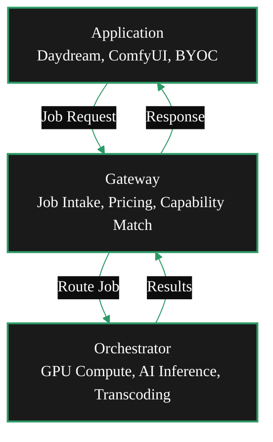

</ScrollableDiagram>

<br />

### Layered Architecture

<ScrollableDiagram title="Layered Architecture" maxHeight="600px">

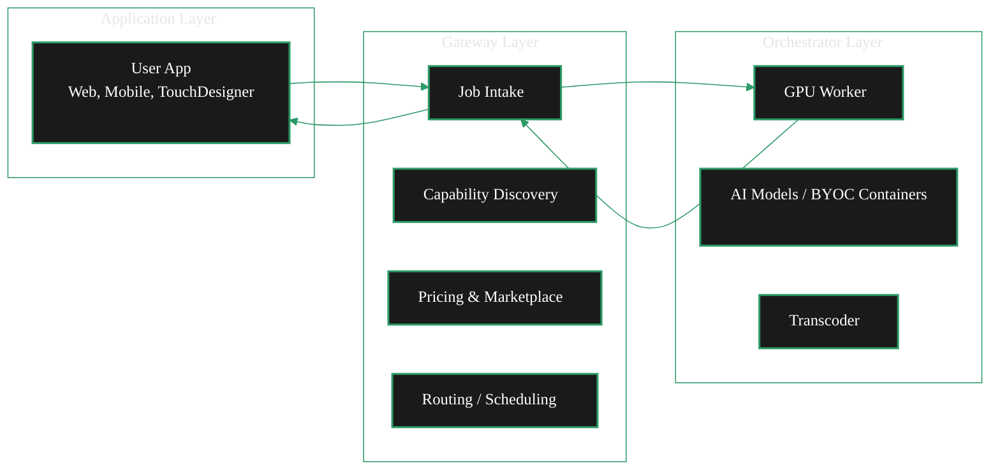

</ScrollableDiagram>

---

### /Users/alisonhaire/Documents/Livepeer/livepeer-docs-v2_d-v2-branch/docs/gateways/about/economics.mdx

---
title: Gateway Economics
sidebarTitle: Economics
description: This page describes the payment flows and economics of Livepeer Gateways
keywords:
  - livepeer
  - gateways
  - about gateways
  - gateway economics
  - gateway
  - economics
  - learn
  - running
'og:image': /snippets/assets/site/og-image/fallback.png
'og:image:alt': Livepeer Docs social preview image
'og:image:type': image/png
'og:image:width': 1200
'og:image:height': 630
audience: gateway-operator
purpose: concept
---

## Overview

Gateways in Livepeer do not earn money at the _protocol level_ (though they can earn money at the _business application level_).

Livepeer follows a service provider model where gateways are customers purchasing media & AI processing services from the network.
The actual protocol-level earners are orchestrators, transcoders, AI workers, and redeemers who provide the computational work
and blockchain services.

**The Payment Flow**

In Livepeer's economic model, gateways are consumers of media processing services:

- Gateways pay Orchestrators for transcoding/AI work via payment tickets
- Orchestrators pay Transcoders/AI Workers who perform the actual work
- Redeemers earn fees by redeeming winning payment tickets on-chain

## Who Actually Earns Money?

<div style={{ overflowX: 'auto', marginBottom: '24px' }}>
  <table
    style={{ width: '100%', borderCollapse: 'collapse', fontSize: '0.9rem' }}
  >
    <thead>
      <tr style={{ backgroundColor: '#2d9a67', color: '#fff' }}>
        <th
          style={{
            padding: '12px 16px',
            textAlign: 'left',
            fontWeight: '600',
            borderBottom: '2px solid #2d9a67',
          }}
        >
 Node Type
        </th>
        <th
          style={{
            padding: '12px 16px',
            textAlign: 'left',
            fontWeight: '600',
            borderBottom: '2px solid #2d9a67',
          }}
        >
 How They Earn Money
        </th>
      </tr>
    </thead>
    <tbody>
      <tr
        style={{ borderBottom: '1px solid #333', backgroundColor: '#1a1a1a' }}
      >
        <td
          style={{ padding: '10px 16px', color: '#2d9a67', fontWeight: '500' }}
        >
 Orchestrator
        </td>
        <td style={{ padding: '10px 16px' }}>
 Receives payments from gateways for coordinating work
        </td>
      </tr>
      <tr
        style={{
          borderBottom: '1px solid #333',
          backgroundColor: 'transparent',
        }}
      >
        <td
          style={{ padding: '10px 16px', color: '#2d9a67', fontWeight: '500' }}
        >
 Transcoder
        </td>
        <td style={{ padding: '10px 16px' }}>
 Gets paid by orchestrators for video transcoding work
        </td>
      </tr>
      <tr
        style={{ borderBottom: '1px solid #333', backgroundColor: '#1a1a1a' }}
      >
        <td
          style={{ padding: '10px 16px', color: '#2d9a67', fontWeight: '500' }}
        >
 AI Worker
        </td>
        <td style={{ padding: '10px 16px' }}>
 Gets paid by orchestrators for AI model inference
        </td>
      </tr>
      <tr
        style={{
          borderBottom: '1px solid #333',
          backgroundColor: 'transparent',
        }}
      >
        <td
          style={{ padding: '10px 16px', color: '#2d9a67', fontWeight: '500' }}
        >
 Redeemer
        </td>
        <td style={{ padding: '10px 16px' }}>
 Earns fees for redeeming winning tickets on blockchain
        </td>
      </tr>
      <tr
        style={{ borderBottom: '1px solid #333', backgroundColor: '#1a1a1a' }}
      >
        <td
          style={{ padding: '10px 16px', color: '#2d9a67', fontWeight: '500' }}
        >
 Gateway
        </td>
        <td style={{ padding: '10px 16px' }}>
 PAYS for services (does not earn)
        </td>
      </tr>
    </tbody>
  </table>
</div>

### Gateway Costs

Gateways incur costs for:

- Video transcoding: Per segment based on pixels processed
- AI processing: Per pixel based on output dimensions
- Live AI video: Interval-based payments during streaming

### Gateway Currency

Gateways pay for transcoding and AI processing services using ETH (Ethereum), not Livepeer tokens (LPT).

The payment system is built on Ethereum's currency.

<div style={{ overflowX: 'auto' }}>
  <table
    style={{ width: '100%', borderCollapse: 'collapse', fontSize: '0.9rem' }}
  >
    <thead>
      <tr style={{ backgroundColor: '#2d9a67', color: 'white' }}>
        <th
          style={{
            border: '1px solid #333',
            padding: '12px 16px',
            textAlign: 'left',
          }}
        >
 Currency
        </th>
        <th
          style={{
            border: '1px solid #333',
            padding: '12px 16px',
            textAlign: 'left',
          }}
        >
 Purpose
        </th>
        <th
          style={{
            border: '1px solid #333',
            padding: '12px 16px',
            textAlign: 'left',
          }}
        >
 Used By
        </th>
      </tr>
    </thead>
    <tbody>
      <tr>
        <td style={{ border: '1px solid #333', padding: '10px 16px' }}>
 ETH/Wei
        </td>
        <td style={{ border: '1px solid #333', padding: '10px 16px' }}>
 Service payments (transcoding, AI)
        </td>
        <td style={{ border: '1px solid #333', padding: '10px 16px' }}>
 Gateways → Orchestrators
        </td>
      </tr>
      <tr>
 <td style={{ border: '1px solid #333', padding: '10px 16px' }}>LPT</td>
        <td style={{ border: '1px solid #333', padding: '10px 16px' }}>
 Staking, governance, rewards
        </td>
        <td style={{ border: '1px solid #333', padding: '10px 16px' }}>
 Orchestrators, Delegators
        </td>
      </tr>
    </tbody>
  </table>
</div>

ETH handles actual service payments while LPT handles protocol governance and staking. This design keeps service costs predictable in a stable currency while allowing LPT to serve its governance function

### Why Run a Gateway?

If gateways don't earn money, why run one?

- Running your own Gateway means you do not pay a fee to route through another party's Gateway
- Content providers run gateways to process their own video/AI content and ensure SLAs on their Orchestrators.
- Service providers may charge end-users higher rates than what they pay Orchestrators as service fees
- Integrated platforms use gateways as part of larger media services

## Gateways Arbitrage Earnings

Gateways make money through business arbitrage:

- Content providers pay gateways for video/AI processing services
- Gateways pay orchestrators for the actual computational work

The difference is the gateway's profit margin

## Gateway Fee Structure

As a gateway operator, you don't set protocol-level "fees" in Livepeer - you set **business pricing** at the application layer.
The protocol only controls what you **pay** orchestrators, not what you **charge** customers.

### Protocol-Level Costs (What You Pay)

You control your costs through these configuration flags [1](#10-0) :

```bash
# Maximum you'll pay per pixel for transcoding
-maxPricePerUnit=1000

# Maximum you'll pay per AI capability/model
-maxPricePerCapability='{"capabilities_prices": [{"pipeline": "text-to-image", "model_id": "stabilityai/sd-turbo", "price_per_unit": 1000}]}'
```

### Business-Level Pricing (What You Charge)

Your actual fees to end-users are set at the application layer, outside the Livepeer protocol.

Common approaches include:

1. **Per-request pricing**: Charge per API call to your gateway
2. **Usage-based pricing**: Charge per minute of video or per AI generation
3. **Subscription models**: Monthly fees for access to your gateway services

### Implementation Example

Here's how you'd implement pricing logic in your application:

```go
// Your application code (not in Livepeer protocol)
func calculateUserPrice(requestType string, pixels int64) float64 {
    basePrice := getYourBusinessPrice(requestType)
    yourCost := getOrchestratorCost(pixels)
    profitMargin := 0.20 // 20% margin

    return basePrice + yourCost*profitMargin
}
```

### Price Discovery

Use the CLI to discover orchestrator prices and set your margins:

```bash
livepeer_cli
# Select "Set broadcast config" to see current market rates
# Then set your max prices accordingly
```

Your "fee" is the difference between what customers pay you and what you pay orchestrators for processing.

### Case Studies

[Streamplace](/v2/solutions/streamplace/overview) is a gateway that provides video processing services to content creators.
Creators pay Streamplace for video processing, and Streamplace pays orchestrators for the actual work.
Streamplace's profit margin is the difference between what creators pay and what it pays orchestrators.

[Daydream](/v2/solutions/daydream/overview) is another example of a gateway that provides AI video processing services.
Builders & Creators pay Daydream for AI video processing, and Daydream pays orchestrators for the actual work.
Daydream's profit margin is the difference between what creators pay and what it pays orchestrators.

---

### /Users/alisonhaire/Documents/Livepeer/livepeer-docs-v2_d-v2-branch/docs/gateways/about/quickstart.mdx

---
title: Gateway Quickstart
sidebarTitle: Gateway Quickstart
description: Quickstart Guide for Livepeer Gateways
keywords:
  - livepeer
  - gateways
  - quickstart home
  - gateway
  - quickstart
  - guide
'og:image': /snippets/assets/site/og-image/fallback.png
'og:image:alt': Livepeer Docs social preview image
'og:image:type': image/png
'og:image:width': 1200
'og:image:height': 630
pageType: quickstart
---


import { GotoLink } from '/snippets/components/primitives/links.jsx'

This is just a portal Jumper Page to the two options for quickstart:

### Find a Gateway Provider

<GotoLink
  relativePath="./using-gateways/gateway-providers"
  label="Gateway Providers"
  text="Find a Gateway Provider"
  icon="wand-magic-sparkles"
/>

### Run a Gateway

<GotoLink
  relativePath="./quickstart/gateway-setup"
  label="Run a Gateway"
  text="Run a Gateway"
  icon="rocket"
/>

---

### /Users/alisonhaire/Documents/Livepeer/livepeer-docs-v2_d-v2-branch/docs/gateways/gateway-tools/explorer.mdx

---
title: Gateway Explorer
sidebarTitle: Gateway Explorer
description: View gateway data on the Explorer
keywords:
  - livepeer
  - gateways
  - gateway tools
  - explorer
  - gateway
'og:image': /snippets/assets/site/og-image/fallback.png
'og:image:alt': Livepeer Docs social preview image
'og:image:type': image/png
'og:image:width': 1200
'og:image:height': 630
audience: gateway-operator
purpose: landing
---


import { GotoLink, GotoCard } from '/snippets/components/primitives/links.jsx'

<Tip>
 Coming Soon! Gateways on Livepeer Explorer is currently in development.
</Tip>

<Card
  title={
    <span>
      <Icon icon="link" size={24} />{' '}
      <span style={{ marginLeft: 8 }}>Livepeer Gateway Explorer</span>
    </span>
  }
  href="https://explorer-arbitrum-one-git-feat-add-g-10dba1-livepeer-foundation.vercel.app/"
  arrow="true"
  cta="Visit the Gateway Explorer"
>
  <iframe
    src="https://explorer-arbitrum-one-git-feat-add-g-10dba1-livepeer-foundation.vercel.app/"
    title="Gateway Data Explorer"
    className="w-full h-96 rounded-xl"
  ></iframe>
</Card>

## About The Gateway Data


## Explorer Codebase

Livepeer is committed to open-source development. If you want to dig deep into the code or you're interested in
contributing to the Explorer, you can find the codebase on GitHub.

<GotoCard
  relativePath="https://github.com/livepeer/explorer"
  icon="github"
  label="Explorer Repository"
  text="View the Explorer repository on GitHub"
/>

---

### /Users/alisonhaire/Documents/Livepeer/livepeer-docs-v2_d-v2-branch/docs/gateways/gateway-tools/gateway-middleware.mdx

---
title: Gateway Middleware & Integrations
sidebarTitle: Middleware & Integrations
description: Middleware & Integrations for Livepeer Gateways
keywords:
  - livepeer
  - gateways
  - gateway tools
  - gateway middleware
  - gateway
  - middleware
  - integrations
'og:image': /snippets/assets/site/og-image/fallback.png
'og:image:alt': Livepeer Docs social preview image
'og:image:type': image/png
'og:image:width': 1200
'og:image:height': 630
---


Gateway Middleware & Integrations

- BYOC
-

---

### /Users/alisonhaire/Documents/Livepeer/livepeer-docs-v2_d-v2-branch/docs/gateways/gateway-tools/livepeer-tools.mdx

---
title: Livepeer Tools Dashboard
sidebarTitle: Livepeer Tools
description: Livepeer Tools
keywords:
  - livepeer
  - gateways
  - gateway tools
  - livepeer tools
  - tools
  - dashboard
'og:image': /snippets/assets/site/og-image/fallback.png
'og:image:alt': Livepeer Docs social preview image
'og:image:type': image/png
'og:image:width': 1200
'og:image:height': 630
audience: gateway-operator
purpose: landing
---


<Danger>This page is a work in progress.</Danger>

import { GotoCard } from '/snippets/components/primitives/links.jsx'

Livepeer Tools is a dashboard for monitoring and managing Livepeer gateways. It provides a user-friendly interface for viewing gateway performance metrics, managing gateway configurations, and troubleshooting issues.
https://www.livepeer.tools/gateways

<Card
  title={
    <span>
      <Icon icon="link" size={24} />{' '}
      <span style={{ marginLeft: 8 }}>Cloud SPE Gateway Explorer</span>
    </span>
  }
  href="https://www.livepeer.tools/gateways"
  arrow="true"
  cta="Visit The Cloud SPE Gateway Explorer"
>
  <iframe
    src="https://www.livepeer.tools/gateways"
    title="Livepeer Cloud Gateway Explorer"
    className="w-full h-96 rounded-xl"
  ></iframe>
</Card>

## About The Gateway Data

<Note>TODO</Note>

## Explorer Codebase

Livepeer is committed to open-source development. If you want to dig deep into the code or you're interested in
contributing to the Explorer, you can find the codebase on GitHub.

<GotoCard
  relativePath="https://github.com/livepeer/explorer"
  icon="github"
  label="Explorer Repository"
  text="View the Explorer repository on GitHub"
/>

---

### /Users/alisonhaire/Documents/Livepeer/livepeer-docs-v2_d-v2-branch/docs/gateways/guides-and-resources/community-guides.mdx

---
title: Community Guides
sidebarTitle: Community Guides
description: Community guides for running a Livepeer Gateway
keywords:
  - community
  - guides
  - gateway
'og:image': /snippets/assets/site/og-image/fallback.png
'og:image:alt': Livepeer Docs social preview image
'og:image:type': image/png
'og:image:width': 1200
'og:image:height': 630
---


---

### /Users/alisonhaire/Documents/Livepeer/livepeer-docs-v2_d-v2-branch/docs/gateways/guides-and-resources/community-projects.mdx

---
title: Community Projects
sidebarTitle: Community Resources
description: A list of community projects making running a gateway easy!
keywords:
  - livepeer
  - gateways
  - guides and resources
  - community projects
  - community
  - projects
  - making
'og:image': /snippets/assets/site/og-image/fallback.png
'og:image:alt': Livepeer Docs social preview image
'og:image:type': image/png
'og:image:width': 1200
'og:image:height': 630
---


---

### /Users/alisonhaire/Documents/Livepeer/livepeer-docs-v2_d-v2-branch/docs/gateways/guides-and-resources/faq.mdx

---
title: Gateway FAQ
sidebarTitle: FAQ
description: Gateway Frequently Asked Questions
keywords:
  - livepeer
  - gateways
  - guides and resources
  - faq
  - gateway
  - frequently
  - asked
'og:image': /snippets/assets/site/og-image/fallback.png
'og:image:alt': Livepeer Docs social preview image
'og:image:type': image/png
'og:image:width': 1200
'og:image:height': 630
pageType: reference
---


<Danger>This is a brainstroming FAQ page. Not finalised.</Danger>

# FAQ

1. How is pricing done?

Orchestrators set pricing per pixel in Wei, advertised off-chain to gateways.

Livepeer docs do not contain an official gateway marketplace pricing guide; gateway providers/operators set prices themselves. (Verified absence)

2. Can Gateway Operators add new AI inference endpoints?

Operators can run AI gateways and expose inference endpoints; orchestrators advertise their AI service URI on-chain for routing.

There is no formal documented “BYOC pipeline” for registering custom models - it comes from running the gateway’s API. (Verified absence)

3. Is there a way to see all marketplace offerings from gateways?

No official centralized marketplace exists in Livepeer docs. Third-party portals/communities may list offerings. (Verified absence)

## Gateway Pricing References & Resources

### Deep references related to Gateway pricing, orchestration economics, and marketplace visibility

| Link Name                                       | Hyperlink location                                                                                                                                         | Link Summary of Content                                                                                                            |
| ----------------------------------------------- | ---------------------------------------------------------------------------------------------------------------------------------------------------------- | ---------------------------------------------------------------------------------------------------------------------------------- |
| Livepeer Docs - Set Pricing                     | [https://docs.livepeer.org/orchestrators/orchestrators-portal/guides/set-pricing](https://docs.livepeer.org/orchestrators/orchestrators-portal/guides/set-pricing)                                   | Official guide explaining how orchestrators set transcoding prices per pixel (Wei), including automatic price adjustment behavior. |
| Livepeer Docs - Gateway Overview                | [https://docs.livepeer.org/gateways/guides/gateway-overview](https://docs.livepeer.org/gateways/guides/gateway-overview)                                   | Describes the Gateway role, deployment, and responsibilities (no direct pricing guidance).                                         |
| Livepeer Studio Pricing                         | [https://livepeer.studio/pricing](https://livepeer.studio/pricing)                                                                                         | Example of a commercial, hosted gateway-style offering with explicit pricing tiers.                                                |
| Livepeer Forum - Inference Credits Pre‑Proposal | [https://forum.livepeer.org/t/agent-spe-inference-credits-pre-proposal/2747](https://forum.livepeer.org/t/agent-spe-inference-credits-pre-proposal/2747)   | Community discussion touching on gateway pricing transparency and inference credits.                                               |
| GitHub - livepeer-broadcaster                   | [https://github.com/videodac/livepeer-broadcaster](https://github.com/videodac/livepeer-broadcaster)                                                       | Source code and configuration for gateway/broadcaster software; no canonical pricing config.                                       |
| Livepeer Docs - AI Gateways                     | [https://docs.livepeer.org/ai/builders/gateways](https://docs.livepeer.org/ai/builders/gateways)                                                           | Overview of AI gateways in the Livepeer ecosystem.                                                                                 |
| Livepeer Cloud                                  | [https://www.livepeer.cloud/](https://www.livepeer.cloud/)                                                                                                 | Third‑party/hosted gateway portal showing how services may be packaged and offered.                                                |
| Livepeer Docs - AI Orchestrators On‑Chain       | [https://na-36.mintlify.app/ai/orchestrators/orchestrators-portal/onchain](https://na-36.mintlify.app/ai/orchestrators/orchestrators-portal/onchain)                                                 | How AI orchestrators advertise service URIs on‑chain for gateway routing.                                                          |
| Livepeer Pricing Tool (GitHub)                  | [https://github.com/buidl-labs/livepeer-pricing-tool](https://github.com/buidl-labs/livepeer-pricing-tool)                                                 | Community-built tool for observing network transcoding pricing.                                                                    |
| TokenTerminal - Livepeer Fees                   | [https://tokenterminal.com/explorer/projects/livepeer/metrics/fees](https://tokenterminal.com/explorer/projects/livepeer/metrics/fees)                     | Aggregated view of network fees driven by transcoding and AI inference.                                                            |
| Messari - Livepeer Q3 2024 Brief                | [https://messari.io/report/livepeer-q3-2024-brief](https://messari.io/report/livepeer-q3-2024-brief)                                                       | Mentions AI subnet fees and usage-based revenue growth.                                                                            |
| Livepeer Whitepaper                             | [https://github.com/livepeer/wiki/blob/master/WHITEPAPER.md](https://github.com/livepeer/wiki/blob/master/WHITEPAPER.md)                                   | Protocol-level economic model and roles (historical but foundational).                                                             |
| Gate.com - Livepeer AI Subnet                   | [https://www.gate.com/learn/articles/introducing-the-livepeer-ai-subnet/3044](https://www.gate.com/learn/articles/introducing-the-livepeer-ai-subnet/3044) | Third-party explanation of AI subnet economics and pricing concepts.                                                               |
| Medium - Primer on Transcoding Fees             | [https://medium.com/figment/primer-on-livepeer-transcoding-fees-3658057f98c2](https://medium.com/figment/primer-on-livepeer-transcoding-fees-3658057f98c2) | Clear explanation of per-pixel pricing between broadcasters and orchestrators.                                                     |
| Livepeer Docs - What is Livepeer AI             | [https://docs.livepeer.org/ai/introduction](https://docs.livepeer.org/ai/introduction)                                                                     | Context on AI workflows and gateway/orchestrator interaction.                                                                      |

---

## Key Findings for Docs

### How pricing works (verified)

- **Pricing is orchestrator-set**, not protocol-fixed.
- Orchestrators advertise a **price per pixel (Wei)** to gateways.
- Gateways route work based on availability and pricing.
- **There is no official Livepeer Gateway pricing guide** defining what gateways should charge end users.

### AI inference endpoints

- Gateway operators can run AI gateways and expose inference APIs.
- AI orchestrators must advertise their service URI on‑chain for routing.
- There is **no documented BYOC-style pipeline registration flow** today (docs gap).

### Marketplace visibility

- There is **no canonical marketplace** listing all gateway offerings.
- Visibility is fragmented across hosted providers, forums, and third‑party dashboards.

> Docs gap identified: Gateway pricing strategy, discovery, and marketplace aggregation are currently undocumented at the protocol level.

---

## Answers to Your Specific Questions

### 1) How is pricing done?

**Verified from docs:**

- Orchestrators set a **price per pixel in Wei**, which they advertise to gateways off-chain. This determines how much they charge for transcoding work. (Livepeer Docs)
- There is a mechanism for **automatic price adjustment** based on ticket redemption overhead unless explicitly disabled. (Livepeer Docs)
- There is **no official documented Livepeer Gateway pricing guide** for gateway operators setting marketplace pricing for hosting or AI services. Livepeer documentation focuses on orchestrator-level transcoding pricing only. The absence of direct gateway pricing guidance is a current, verified documentation gap.

**Flat fee vs operator-set?**

- Pricing is **operator-set (orchestrator-defined)** for transcoding.
- Gateway usage pricing exposed by providers (e.g. Livepeer Cloud, Livepeer Studio) is **product or service specific**, not defined at the protocol level.
- Livepeer docs do **not** define standard gateway pricing models; gateway operators and service providers set their own pricing. _(Verified absence)_

---

### 2) Can Gateway Operators add or contribute new AI inference endpoints if they run them?

**Verified:**

- For the Livepeer AI network, **AI orchestrators must advertise their AI service URI on-chain** so that AI gateways can discover and route i

---

### /Users/alisonhaire/Documents/Livepeer/livepeer-docs-v2_d-v2-branch/docs/gateways/guides-and-resources/gateway-job-pipelines/overview.mdx

---
title: Gateway Job Pipelines Overview
sidebarTitle: Job Pipelines Overview
description: >-
  How gateway operators handle AI job pipelines, capability routing, and
  BYOC-backed workloads on Livepeer.
keywords:
  - livepeer
  - gateway
  - job pipelines
  - ai
  - byoc
  - routing
  - capabilities
'og:image': /snippets/assets/site/og-image/fallback.png
'og:image:alt': Livepeer Docs social preview image
'og:image:type': image/png
'og:image:width': 1200
'og:image:height': 630
pageType: overview
---

import { DynamicTable } from '/snippets/components/layout/table.jsx'

Gateway job pipelines are the control-plane path between app requests and orchestrator execution. A gateway does not run model inference; it accepts requests, applies routing policy, selects compatible orchestrators, and returns results.

## What a gateway pipeline does

- Accepts AI requests from apps and clients
- Matches request requirements to advertised orchestrator capabilities
- Applies policy: price ceilings, latency expectations, retries, failover
- Dispatches work to orchestrators and returns outputs

## Gateway vs orchestrator responsibilities

<DynamicTable
  headerList={["Layer", "Primary responsibility"]}
  itemsList={[
    { "Layer": "Gateway", "Primary responsibility": "Routing, auth, pricing policy, QoS, retries, failover" },
    { "Layer": "Orchestrator", "Primary responsibility": "GPU model execution and inference output generation" }
  ]}
/>

## Pipeline types

- Real-time frame pipelines (video-to-video, overlays, style transfer)
- Streaming audio pipelines (ASR and translation)
- Capability-composed pipelines (for example, depth -> conditioning -> generation)

## BYOC in gateway pipelines

Gateway operators can route to orchestrators that expose BYOC capabilities. BYOC extends what workloads a gateway can serve by allowing operators to run custom inference containers behind orchestrator capabilities.

<CardGroup cols={2}>
  <Card title="Gateway BYOC Guide" icon="box" href="./byoc">
 Gateway-side operating guidance for BYOC-capable routing.
  </Card>
  <Card title="Developer BYOC Guide" icon="display-code" href="/v2/developers/ai-pipelines/byoc">
 Implementation guide for teams building BYOC services consumed by gateways.
  </Card>
</CardGroup>

## See also

- [Gateway setup](/v2/gateways/quickstart/gateway-setup)
- [Discover offerings](/v2/gateways/run-a-gateway/connect/discover-offerings)
- [Gateway providers](/v2/gateways/using-gateways/gateway-providers)

---

### /Users/alisonhaire/Documents/Livepeer/livepeer-docs-v2_d-v2-branch/docs/gateways/guides-and-resources/gateway-job-pipelines/byoc.mdx

---
title: BYOC for Gateway Operators
sidebarTitle: BYOC
description: Gateway-operator guidance for routing BYOC-capable AI workloads on Livepeer.
keywords:
  - livepeer
  - gateways
  - byoc
  - gateway job pipelines
  - routing
  - ai
'og:image': /snippets/assets/site/og-image/fallback.png
'og:image:alt': Livepeer Docs social preview image
'og:image:type': image/png
'og:image:width': 1200
'og:image:height': 630
---

BYOC (Bring Your Own Container) from a gateway perspective is about **routing** and **service policy**, not model execution. Gateways route AI requests to orchestrators advertising compatible BYOC capabilities.

## What gateway operators need to do

- Route requests by capability and policy (price, latency, reliability)
- Prefer orchestrators with stable warm-start behavior
- Monitor p95 latency and error rates by capability
- Configure retries and failover so requests remain serviceable during node churn

## What gateway operators do not do

- Run model containers directly
- Host model weights as the primary inference service
- Expose orchestrator-internal model identifiers as public API contracts

## Routing best practices

- Treat capabilities as the API contract (`image-to-image`, `depth`, `segmentation`, etc.)
- Avoid coupling routing to specific model names
- Maintain per-capability health and route around degraded nodes
- Keep clear max-price settings to avoid uneconomic job assignment

<Warning>
BYOC enables custom workloads, but poor-fit batch workloads can degrade routing quality and increase latency. Prioritize real-time, streaming, GPU-bound capabilities.
</Warning>

## Operational flow

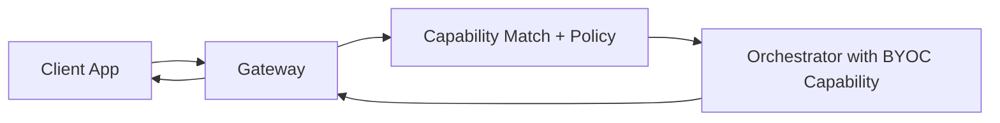

## Developer handoff

For BYOC implementation and container design details, use the developer guide:

<Card title="Developer BYOC" icon="display-code" href="/v2/developers/ai-pipelines/byoc">
 Full architecture and setup for teams deploying BYOC containers.
</Card>

## Related pages

- [Gateway Job Pipelines Overview](./overview)
- [Gateway providers](/v2/gateways/using-gateways/gateway-providers)
- [Run a gateway](/v2/gateways/run-a-gateway/run-a-gateway)

---

### /Users/alisonhaire/Documents/Livepeer/livepeer-docs-v2_d-v2-branch/docs/gateways/payments/overview.mdx

---
title: Gateway Payments
sidebarTitle: Payments
description: Payment setup for Livepeer gateways.
keywords:
  - livepeer
  - gateways
  - payments
  - clearinghouse
  - arbitrum
  - eth
  - lpt
'og:image': /snippets/assets/site/og-image/fallback.png
'og:image:alt': Livepeer Docs social preview image
'og:image:type': image/png
'og:image:width': 1200
'og:image:height': 630
pageType: overview
---


This section is being expanded. Use the current payment setup references below.

<CardGroup cols={2}>
  <Card
    title="Payment Clearinghouse"
    icon="money-bill-transfer"
    href="/v2/gateways/payments/payment-clearinghouse"
    arrow
  >
 Configure and verify gateway clearinghouse settings.
  </Card>
  <Card
    title="Arbitrum Exchanges"
    icon="coins"
    href="/v2/gateways/references/arbitrum-exchanges"
    arrow
  >
 Fiat and token on-ramp options for funding gateway wallets.
  </Card>
</CardGroup>

---

### /Users/alisonhaire/Documents/Livepeer/livepeer-docs-v2_d-v2-branch/docs/gateways/payments/how-payments-work.mdx

---
title: How Payments Work
sidebarTitle: How Payments Work
description: >-
  Understand Livepeer's probabilistic micropayment system and what it means for
  gateway operators managing payment signing keys, ETH balances, and on-chain
  settlement.
keywords:
  - livepeer
  - docs
  - gateways
  - payments
  - how payments work
  - work
  - understand
  - probabilistic
  - micropayment
  - system
'og:image': /snippets/assets/site/og-image/fallback.png
'og:image:alt': Livepeer Docs social preview image
'og:image:type': image/png
'og:image:width': 1200
'og:image:height': 630
purpose: concept
pageType: concept
audience:
  - gateway-operator
status: production
lastVerified: '2026-02-01'
sourceOfTruth: 'https://github.com/livepeer/go-livepeer'
---

# How Payments Work

Livepeer uses **probabilistic micropayments (PM)** to settle fees between gateways and orchestrators. Understanding this system is essential to operating a gateway responsibly — it determines your ETH obligations, your signing key security requirements, and whether you run fully on-chain or off-chain.

## Why Probabilistic Micropayments?

Paying for every individual AI inference job or transcoded segment on-chain would be prohibitively expensive in gas fees. Instead, Livepeer uses a lottery-style mechanism:

- Gateways send orchestrators cryptographically signed **tickets** with each job.
- Each ticket has a small probability of being a "winning ticket" worth a larger face value.
- Orchestrators redeem winning tickets on-chain via the `TicketBroker` contract on Arbitrum.

Over time, the expected value of tickets matches what would have been paid directly — but most individual exchanges happen entirely off-chain, with only winning tickets touching the blockchain.

<Callout type="info">
PM significantly reduces gas costs compared to per-transaction settlement. A gateway processing thousands of jobs per hour may only trigger a handful of on-chain redemptions.
</Callout>

## Gateway Payment Responsibilities

As a gateway operator, you are responsible for the payment side of every job routed through your node. This means:

### 1. ETH Deposit Balance

Your gateway must maintain a funded deposit in the `TicketBroker` contract. This deposit is drawn from when orchestrators redeem winning tickets.

- Minimum recommended deposit: enough to cover several hours of expected workload.
- If your deposit falls too low, orchestrators will reject your tickets and jobs will fail.
- Monitor your balance via `livepeer_cli` or the Livepeer Explorer at [explorer.livepeer.org](https://explorer.livepeer.org).

### 2. Payment Signing Key

Each ticket must be signed with your gateway's Ethereum private key. By default this key lives inside the same `go-livepeer` process handling untrusted media — a security risk if a malicious input were to exploit a vulnerability.

<Callout type="warning">
**Security concern:** A compromised gateway process could expose your signing key and drain your ETH deposit. For production deployments, consider using a [Remote Signer](/v2/gateways/payments/remote-signers) to isolate signing from media handling.
</Callout>

### 3. Ticket Parameters and Session State

For Live AI workloads, the gateway tracks session state (nonce counters, cumulative fees, etc.) across a stream. This state is used to generate valid tickets at regular intervals. Sending stale or duplicated state produces invalid tickets that orchestrators reject.

### 4. Reserve Balance

In addition to a deposit, gateways maintain a **reserve** balance as a penalty backstop. The reserve protects orchestrators in cases of gateway non-payment and is required for participating in the network with stake-based routing.

## On-Chain vs Off-Chain Operation

| Mode | Description | Use case |
|------|-------------|----------|
| **On-chain** | Full Ethereum integration — gateway manages key, signs tickets, calls reward | Production transcoding, established gateways |
| **Off-chain (Live AI)** | Remote Signer handles all Ethereum operations; gateway contains no private key | Live AI workloads, embedded gateways, clearinghouse architecture |

For Live AI specifically, go-livepeer can operate **entirely in off-chain mode** for media handling, delegating all signing to a separately run Remote Signer service. No orchestrator changes are required.

## Ticket Generation Flow

When your gateway starts a Live AI session with an orchestrator:

1. The orchestrator returns `ticketParams` — parameters defining valid ticket shape and pricing.
2. Your gateway (or Remote Signer) generates and signs tickets at regular intervals.
3. Orchestrators accumulate tickets and redeem winning ones on Arbitrum.
4. Updated `ticketParams` are returned after each payment round, refreshing the session.

## Fee Calculation for Live AI

Live AI fees are calculated based on **time elapsed** at a **fixed cost per hour**, with payments generated at regular intervals (typically every 60 seconds). This differs from transcoding, where fees are calculated per pixel.

The Remote Signer handles this bookkeeping automatically when used.

## Next Steps

<CardGroup cols={2}>
  <Card title="Remote Signers" icon="shield-check" href="/v2/gateways/payments/remote-signers">
 Separate your signing key from your gateway process for improved security.
  </Card>
  <Card title="Payment Clearinghouses" icon="building-columns" href="/v2/gateways/payments/payment-clearinghouse">
 Delegate all payment management to a third-party operator.
  </Card>
</CardGroup>

---

### /Users/alisonhaire/Documents/Livepeer/livepeer-docs-v2_d-v2-branch/docs/gateways/payments/payment-clearinghouse.mdx

---
title: Payment Clearinghouses
sidebarTitle: Payment Clearinghouses
description: >-
  How third-party clearinghouses can manage Ethereum custody, payment signing,
  and PM settlement on behalf of gateway operators and app developers.
keywords:
  - livepeer
  - docs
  - gateways
  - payments
  - payment clearinghouse
  - payment
  - clearinghouses
  - third
  - party
  - manage
'og:image': /snippets/assets/site/og-image/fallback.png
'og:image:alt': Livepeer Docs social preview image
'og:image:type': image/png
'og:image:width': 1200
'og:image:height': 630
purpose: concept
pageType: concept
audience:
  - gateway-operator
  - developer
status: coming-soon
lastVerified: '2026-02-01'
sourceOfTruth: 'https://github.com/livepeer/go-livepeer/pull/3822'
---

import { PdfEmbed } from '/snippets/components/data/embed.jsx'

<PdfEmbed title="Livepeer Payment Clearinghouse" src="https://paragraph.com/@livepeer-2/livepeer-payment-clearinghouse" />


A **payment clearinghouse** is a third-party service that takes on the Ethereum-related responsibilities of operating a Livepeer gateway — holding ETH, running a [Remote Signer](/v2/gateways/payments/remote-signers), managing PM settlement, and handling orchestrator payments — while settling with gateway operators and app developers in a traditional currency or alternative payment method.

<Info>
The underlying protocol for clearinghouses is implemented and in production use. No public clearinghouse service is operating at general availability as of early 2026. For the current managed access and observability surface, see [Livepeer Tools](/v2/gateways/gateway-tools/livepeer-tools).
</Info>

## Why Clearinghouses Exist

Operating a Livepeer gateway currently requires:

- Holding ETH on Arbitrum to fund PM deposits.
- Managing Ethereum private keys securely across gateway instances.
- Understanding PM protocol internals — nonces, ticket validity windows, fee calculations.
- Debugging ETH-USD price oracle issues that affect ticket face values.

This is a significant barrier for most app developers. A clearinghouse absorbs all of this complexity. The developer receives an API key; the clearinghouse handles everything beneath.

## Architecture

```text
App / Developer
      │  API Key (traditional auth)
      ▼
Clearinghouse Service
  ├── Remote Signer (ETH custody + PM signing)
  ├── User management / auth
  ├── Accounting (credits, usage tracking)
  └── Orchestrator discovery
      │  Livepeer PM tickets on Arbitrum
      ▼
Orchestrator Network
```

The clearinghouse runs one or more Remote Signer instances and fronts them with traditional developer tooling — API keys, usage dashboards, rate limits, and billing.

Orchestrators receive standard Livepeer probabilistic micropayment tickets and settle on-chain as normal. The clearinghouse abstracts the on-chain layer from the developer entirely.

## What a Clearinghouse Manages

| Responsibility | Traditional Gateway | With Clearinghouse |
|----------------|--------------------|--------------------|
| ETH deposit management | Gateway operator | Clearinghouse |
| PM signing keys | Gateway operator | Clearinghouse (Remote Signer) |
| Orchestrator discovery | Gateway operator | Clearinghouse |
| Billing / invoicing | N/A | Clearinghouse ↔ developer |
| On-chain redemption | Orchestrators | Orchestrators (unchanged) |

## Developer Experience

For app developers using a clearinghouse:

1. Register with the clearinghouse service and obtain an API key.
2. Point the Livepeer SDK or gateway to the clearinghouse endpoint.
3. The clearinghouse provides a gateway interface — you submit AI inference jobs, the clearinghouse routes them to orchestrators and handles all payments.
4. You receive usage reports and are billed in the clearinghouse's chosen currency (fiat, stablecoins, or other).

This is the intended end state for direct-to-orchestrator SDK integrations, where a developer should be able to call `start_lv2v(api_key="...")` and have everything handled automatically.

## Relationship to Remote Signers

A clearinghouse **is** a remote signer plus:

- User management and authentication
- Accounting and credit tracking
- Fiat or alternative currency billing
- Potentially orchestrator discovery and geo-matching

The [Remote Signer](/v2/gateways/payments/remote-signers) is the technical primitive. A clearinghouse layers commercial and operational services on top.

## Current Status and NaaP

The Livepeer Foundation's managed access surface is currently best represented by [Livepeer Tools](/v2/gateways/gateway-tools/livepeer-tools), which provides the current network-facing observability layer while clearinghouse-adjacent workflows continue to evolve.

Independent clearinghouse operators may also emerge through the network's open infrastructure model.

## Related Concepts

<CardGroup cols={2}>
  <Card title="Remote Signers" icon="shield-check" href="/v2/gateways/payments/remote-signers">
 The technical building block underlying clearinghouse payment infrastructure.
  </Card>
  <Card title="Livepeer Tools" icon="gauge" href="/v2/gateways/gateway-tools/livepeer-tools">
 The current managed network access and observability surface.
  </Card>
</CardGroup>

---

### /Users/alisonhaire/Documents/Livepeer/livepeer-docs-v2_d-v2-branch/docs/gateways/payments/remote-signers.mdx

---
title: Remote Signers
sidebarTitle: Remote Signers
description: >-
  Run Ethereum payment signing as a standalone service, separate from your
  gateway's media handling. Improves security and enables gateways on platforms
  without native Ethereum support.
keywords:
  - livepeer
  - docs
  - gateways
  - payments
  - remote signers
  - remote
  - signers
  - ethereum
  - payment
  - signing
'og:image': /snippets/assets/site/og-image/fallback.png
'og:image:alt': Livepeer Docs social preview image
'og:image:type': image/png
'og:image:width': 1200
'og:image:height': 630
pageType: concept
audience:
  - gateway-operator
  - developer
status: coming-soon
lastVerified: '2026-02-01'
sourceOfTruth: 'https://github.com/livepeer/go-livepeer/pull/3822'
---

# Remote Signers

<Callout type="warning">
**Status: Active development.** Remote signer support is implemented for Live AI workloads via [PR #3791](https://github.com/livepeer/go-livepeer/pull/3791) and [PR #3822](https://github.com/livepeer/go-livepeer/pull/3822). CLI startup flags are subject to change. Refer to the go-livepeer release notes and `livepeer -help` for the most current flag names before deploying to production.
</Callout>

A **remote signer** is a standalone go-livepeer mode that handles all Ethereum-related gateway responsibilities — signing payment tickets, managing session bookkeeping, and providing GetOrchestratorInfo signatures — as a separate network service. Your gateway communicates with the signer over the network and contains no Ethereum private key.

## Why Use a Remote Signer?

### Security

By default, a gateway holds its Ethereum payment key in the same process that handles untrusted media from users. If a vulnerability in media parsing were exploited, an attacker could access the private key and drain your ETH deposit.

Remote signing eliminates this risk by isolating the key entirely. The signer runs in a hardened service with a narrow, well-defined API surface. Gateways never touch the key directly.

Beyond individual gateway security, all gateway instances behind a shared PM key share the same blast radius on compromise. Remote signers make it practical to use per-instance or per-clearinghouse keys.

### Platform Flexibility

Currently, go-livepeer is the only gateway implementation because building one requires deep familiarity with Livepeer's probabilistic micropayment (PM) mechanism. Remote signers change this:

- A Python, browser, or mobile gateway can use the remote signer without implementing PM.
- The signer handles all PM bookkeeping — fee calculation, nonce tracking, ticket generation.
- Gateway implementors interact with a simple signing RPC rather than raw Arbitrum contracts.

### Clearinghouse Support

Remote signers are the building block for [payment clearinghouses](/v2/gateways/payments/payment-clearinghouse) — third-party services that manage ETH custody on behalf of multiple gateway operators.

## Scope: Live AI Only

Remote signing is currently implemented for **Live AI (live-video-to-video)** workloads only.

- **Transcoding is explicitly unsupported.** Transcoding requires tickets to be signed with the hash of each segment, placing signing in the hot path. Any remote call there would increase latency on an already-complex code path. Transcoding is considered legacy and receives minimal new development.
- **Batch AI** is not supported in this initial implementation but may be added in future.

## Architecture

The remote signer implements two RPC endpoints corresponding to the two places where Ethereum signing occurs in a gateway:

### GetOrchestratorInfo Signature (PR #3791)

When a gateway contacts an orchestrator via the `GetOrchestratorInfo` RPC, it must provide an authentication signature. This signature never changes for a given gateway key and can be safely cached after the first request.

The signer generates this signature once at startup. The gateway fetches it, caches it, and reuses it for all subsequent orchestrator info requests.

### Payment Ticket Signing (PR #3822)

All payment handling for Live AI is encapsulated within the `LivePaymentSender` interface in go-livepeer. The signer takes over this interface entirely.

**Session state** (nonce counters, fee accumulators, ticket validity windows) is managed using a **stateless forwarding** design:

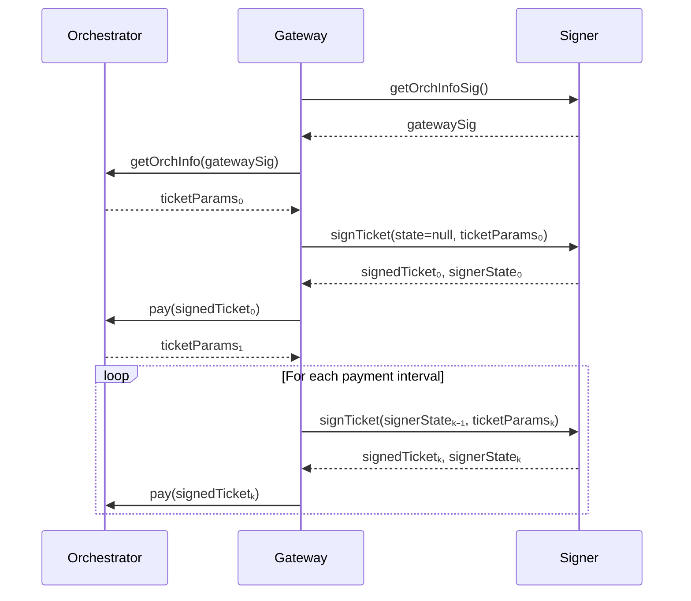

The gateway threads state forward — the signer stores nothing between calls. This avoids any shared state dependency across signer instances and means you can restart a signer without losing coordination.

<Callout type="info">
**No shared database required.** The stateless design lets you run multiple signer instances for redundancy without synchronisation infrastructure.
</Callout>

## Operational Requirements

### Run Multiple Instances

For production reliability, run two or more signer instances. They can sit behind a simple load balancer. Because no persistent state lives in the signer, failover is seamless — the gateway begins a new state chain from the next signer it contacts.

### Never Reuse Tickets

The state forwarding protocol ensures ticket nonces are unique across a session. Failure to send the latest signer state (e.g., sending a stale or empty state to a running session) results in nonce collisions and rejected tickets. Always persist and forward the `signerState` returned from each call.

### No Concurrent Signing for the Same Session

High-frequency or concurrent signing requests for the same session will produce invalid tickets due to state conflicts. A single session should have a single sequential signing call chain.

### Orchestrator Discovery

The remote signer does not handle orchestrator discovery. For off-chain Live AI gateways, discovery must be arranged separately — either by providing orchestrator URIs directly, using a discovery endpoint, or using a future clearinghouse discovery service.

## Community Remote Signer

A community-operated remote signer is available for testing and development use:

**Elite Encoder Remote Signer:** `https://signer.eliteencoder.net/`

This instance provides free ETH for testing purposes. It should not be used for production workloads without understanding the custody implications.

## CLI Startup

<Callout type="warning">
**SME confirmation required.** The CLI flags for starting go-livepeer in signer mode are subject to change as the feature matures. Consult the go-livepeer release notes or run `livepeer -help | grep signer` to confirm current flag names before deploying. The placeholder below reflects the intended interface — verify against your installed version.
</Callout>

```bash
# Start the remote signer (flag names subject to change — verify with livepeer -help)
livepeer \
  -signer \
  -network arbitrum-one-mainnet \
  -ethUrl <ARBITRUM_RPC_URL> \
  -ethKeystorePath ~/.lpData/keystore \
  -ethPassword <KEYSTORE_PASSWORD> \
  -httpAddr 0.0.0.0:7936

# Gateway connecting to remote signer instead of local key
livepeer \
  -gateway \
  -signerAddr <SIGNER_HOST>:7936 \
  -orchAddr <ORCH_1>,<ORCH_2> \
  -serviceAddr 0.0.0.0:8935
```

## Related Concepts

<CardGroup cols={2}>
  <Card title="How Payments Work" icon="credit-card" href="/v2/gateways/payments/how-payments-work">
 Understand the PM protocol your remote signer handles on your behalf.
  </Card>
  <Card title="Payment Clearinghouses" icon="building-columns" href="/v2/gateways/payments/payment-clearinghouse">
 Third-party services that bundle remote signing with account management.
  </Card>
</CardGroup>

---

### /Users/alisonhaire/Documents/Livepeer/livepeer-docs-v2_d-v2-branch/docs/gateways/quickstart/gateway-setup.mdx

---
title: 'Run a Gateway: Quickstart Guide'
sidebarTitle: Run a Gateway Quickstart
description: >-
  Get a Livepeer dual AI / video Gateway node up and running locally or on the
  Livepeer network.
keywords:
  - livepeer
  - gateways
  - run a gateway
  - quickstart
  - quickstart a gateway
  - gateway
  - guide
  - video
'og:image': /snippets/assets/site/og-image/fallback.png
'og:image:alt': Livepeer Docs social preview image
'og:image:type': image/png
'og:image:width': 1200
'og:image:height': 630
pageType: quickstart
audience: gateway-operator
purpose: how_to
---

{/* DATA & CODE */}
{/* These can be moved to the view using them */}
import { DOCKER_CODE, DOCKER_YML, BASH_CODE, AI_TEST_COMMANDS, CONFIG_FILES, CLI_CODE } from './data/docker/code.jsx';
import { CONFIG_FLAGS } from './data/flags.jsx';

{/* BANNERS, CALLOUTS, VALUE STRINGS */}
{/* These can be moved to the view using them */}
import { GatewayOffChainWarning, GatewayOnChainWarning, GatewayOnChainTTestnetNote, OrchAddrNote, TestVideoDownload, FfmpegWarning } from "./components/callouts.jsx";

{/* COMPONENTS */}
{/* These can be moved to the view using them */}
import { ResponseFieldAccordion, ResponseFieldExpandable, CustomResponseField, ValueResponseField } from '/snippets/components/content/responseField.jsx';
import { CustomCodeBlock, CodeSection, ComplexCodeBlock, } from '/snippets/components/content/code.jsx';
import { TipWithArrow, DoubleIconLink } from '/snippets/components/primitives/links.jsx';
import { DownloadButton } from '/snippets/components/primitives/buttons.jsx';
import { FlexContainer } from '/snippets/components/layout/layout.jsx';
import { latestVersion } from '/snippets/automations/globals/globals.mdx';
import { CustomDivider } from '/snippets/components/primitives/divider.jsx';
import { WidthCard } from '/snippets/components/layout/customCards.jsx';

{/* LAYOUTS & VIEWS */}
import DockerOffChainTab from './views/docker/dockerOffChainTab.mdx';
import DockerOnChainTab from './views/docker/dockerOnChainTab.mdx';
import LinuxOffChainTab from './views/linux/linuxOffChainTab.mdx';
import LinuxOnChainTab from './views/linux/linuxOnChainTab.mdx';
import WindowsOffChainTab from './views/windows/windowsOffChainTab.mdx';
import WindowsOnChainTab from './views/windows/windowsOnChainTab.mdx';

{/* LAYOUT COMPOSABLE GROUPS */}
import DockerSupport from './groups/docker/dockerSupport.mdx';
import LinuxSupport from './groups/linux/linuxSupport.mdx';
import MacSupport from './groups/linux/macSupport.mdx';


<TipWithArrow>
 <span style={{fontSize: '1.0rem'}}> Use the <Icon icon="circle-chevron-down" /> **Dropdown** at the top-right of this page to view the Quickstart Guide
 for your preferred OS. </span>
</TipWithArrow>

<WidthCard title="go-livepeer" href="https://github.com/livepeer/go-livepeer" icon="github" arrow horizontal>
 <span> *Latest Version:* <Badge color="green">{latestVersion}</Badge> </span>
</WidthCard>

<CustomDivider style={{narginTop: "-1rem", marginBottom: "-1rem"}} />

# Let's Go(-Livepeer) ! <Icon icon="face-grin-wink" size={26} />
This page will get you up & running with a Livepeer Gateway Node for <Badge color="blue">Video</Badge> Transcoding & <Badge color="purple">AI</Badge> Pipeline service routing.

*This guide includes:*
- Setup for <span><Icon icon="link" size={20}/> **on-chain _(production)_** and <Icon icon="floppy-disk" size={20}/> **off-chain _(local/dev)_** Livepeer Gateway nodes </span>
- Installation guides for <span><Icon icon="docker" size={20} /> **Docker _(recommended)_** </span> and <span><Icon icon="laptop-code" size={20} /> **Pre-Built Binaries**. </span>

<Note>
 <span style={{fontSize: '1.0rem'}}><Icon icon="docker" size={20}/> [Docker](https://docs.docker.com/get-docker/) is the recommended way to install and run a Livepeer Gateway Node.</span>
  <br/>
 <br/><span style={{ fontSize: '1.0rem' }}><Icon icon="linux" size={20}/> [Linux OS](https://linux.org) is recommended for production use.</span>
</Note>

<br />

<View title=" Docker" icon="docker" iconType="solid">
  ## <Icon icon="docker" iconType="solid" size={32} /> Docker Quickstart Guide
  <FlexContainer gap="1rem" wrap>
    <FlexContainer direction="row" gap="0.2rem" align="flex-start">
      <Icon icon="linux" color="#ff9a0e" size={22}/>
 <Badge> Linux </Badge>
    </FlexContainer>
    <FlexContainer direction="row" gap="0.2rem" align="flex-start">
      <Icon icon="windows" color="#14bbf7" size={22} />
 <Badge> Windows <Icon icon="warning" size={12} /></Badge>
    </FlexContainer>
    <FlexContainer direction="row" align="flex-start">
      <Icon icon="apple" color="#60ba47" size={22} />
 <Badge> MacOS <Icon icon="warning" size={12}/></Badge>
    </FlexContainer>
  </FlexContainer>

  <br />

  <Accordion title="Docker Supported Hosts Details" icon="warning">
    <DockerSupport />
  </Accordion>

 This guide will install and configure a Gateway to run video & AI workloads.

  <Tip>
 Docker is the recommended install method for most users.
  </Tip>

 _**Choose your Gateway Mode:**_
  <Tabs>
      <DockerOffChainTab />
    <DockerOnChainTab />
  </Tabs>

  <Accordion title="Docker Tips & Tricks" icon="magic-wand-sparkles">
 <Danger> Verify these </Danger>
 If you wanted to build a `go-livepeer` Docker image, you can do so from the root of the repository using this:
    <CustomCodeBlock
      codeString="docker build -t livepeer/go-livepeer:alpha-build -f docker/Dockerfile ../"
      language="bash"
      icon="terminal"
      filename="Build Docker Image from Source"
    />
  </Accordion>

  ## Reference Pages
 {/* MOVE TO OWN PAGE*/}
  <Columns cols={2}>
    <Card
      title="Docker Installation Guide"
      href="../run-a-gateway/install/docker-install"
      arrow
      horizontal
    >
 View Full Installation Guide
    </Card>
    <Card
      title="Configuration Flags Reference"
      href="../references/configuration-flags"
      arrow
      horizontal
    >
 Gateway Configuration Flag Guide
    </Card>
  </Columns>

</View>

<View title="Linux" icon="linux" iconType="solid">
  ## <Icon icon="linux" iconType="solid" size={32} /> Linux Quickstart Guide

 This guide covers building from source on Linux (Ubuntu/Debian)
 {/* & MacOS (video support only). -> separate view -> macOS can't do dual gateway.*/}

  <Accordion title="Linux Supported Distributions & Required Packages" icon="info-circle">
    <LinuxSupport />
  </Accordion>

 It's possible to use this guide for <Icon icon="apple" size={20} /> MacOS also, with some caveats:
  <Accordion title="MacOS Important Notes" icon="warning">
    <MacSupport />
  </Accordion>
  <br/>

 _**Choose your Gateway Mode:**_
  <Tabs>
    <LinuxOffChainTab />
    <LinuxOnChainTab />
  </Tabs>

  ## Reference Pages
 {/* MOVE TO OWN PAGE*/}
  <Columns cols={2}>
    <Card
      title="Linux Installation Guide"
      href="../run-a-gateway/install/linux-install"
      arrow
      horizontal
    >
 View Full Installation Guide
    </Card>
    <Card
      title="Configuration Flags Reference"
      href="../references/configuration-flags"
      arrow
      horizontal
    >
 Gateway Configuration Flag Guide
    </Card>
  </Columns>

</View>

<View title="Windows" icon="windows" iconType="solid">
  ## <Icon icon="windows" iconType="solid" size={32} /> Windows Quickstart Guide
  <Tabs>
    <WindowsOffChainTab />
    <WindowsOnChainTab />
  </Tabs>

  ## Reference Pages

  <Columns cols={2}>
    <Card
      title="Windows Installation Guide"
      href="../run-a-gateway/install/windows-install"
      arrow
      horizontal
    >
 View Full Installation Guide
    </Card>
    <Card
      title="Configuration Flags Reference"
      href="../references/configuration-flags"
      arrow
      horizontal
    >
 Gateway Configuration Flag Guide
    </Card>
  </Columns>

</View>

## End-to-end test loop with an orchestrator

Use this loop after both your gateway and orchestrator are online.

<Steps>
  <Step title="Confirm orchestrator endpoint and capabilities">
 Verify your orchestrator is reachable on `:8935` and advertises transcoding
 support.
  </Step>
  <Step title="Configure gateway routing to that orchestrator">
 In off-chain mode, point the gateway directly with:

    ```bash
    -orchAddr=https://your-orchestrator.example.com:8935
    ```
  </Step>
  <Step title="Ingest a test stream through the gateway">
 Use the quickstart ingest flow (FFmpeg or OBS), then fetch the generated HLS
 manifest from the gateway.
  </Step>
  <Step title="Validate logs on both nodes">
 Confirm the gateway logs show route selection and the orchestrator logs show
 session creation/completion for the same stream.
  </Step>
</Steps>

<Card
  title="Transcoding Orchestrator Quickstart"
  href="/v2/orchestrators/quickstart/orchestrator-setup"
  icon="microchip"
  arrow
  horizontal
>
 Use this guide for orchestrator-side setup, registration, and verification.
</Card>

## Troubleshooting

<Card
  title="Common Issues"
  href="../guides-and-resources/faq"
  icon="triangle-exclamation"
  iconType="solid"
  arrow
  horizontal
>
 Review common troubleshooting issues and fixes.
</Card>

## Related Pages

<Columns cols={2}>
  <Card title="Setup Checklist" href="../run-a-gateway/requirements/setup" arrow horizontal>
 {' '}
 See Prerequisites & Requirements.{' '}
  </Card>
  <Card title="On-Chain Setup" href="../run-a-gateway/requirements/on-chain%20setup/on-chain" arrow horizontal>
 See on-chain Setup Checklist.
  </Card>
  <Card title="Run a Gateway" href="../run-a-gateway/run-a-gateway" arrow horizontal>
 See full Gateway Setup Guide.
  </Card>
  <Card
    title="Orchestrator Guide"
    href="/v2/orchestrators/orchestrators-portal"
    arrow
    horizontal
  >
 Setup an Orchestrator.
  </Card>
</Columns>
{/*
This page will have you running a Livepeer Gateway for video & AI trancoding in 10 minutes on Mac, Linux or Windows.

It shows both off-chain (local) and on-chain (production) modes.

## Assumed

- You have ETH on Arbitrum L2 Network (or can get it from a faucet)
-

It uses defaults for all optional parameters. See the [full setup guide](/v2/gateways/run-a-gateway/run-a-gateway) for more details on customising your Gateway. \*/}

---

### /Users/alisonhaire/Documents/Livepeer/livepeer-docs-v2_d-v2-branch/docs/gateways/quickstart/AI-prompt.mdx

---
title: Get AI to Setup the Gateway
sidebarTitle: 'AI Prompt: Gateway Setup'
description: >-
  This page is a downloadable task list for your AI coding agent to follow to
  set up your Livepeer Gateway for you - because who's got time for all that
  manual work?!
keywords:
  - livepeer
  - gateways
  - run a gateway
  - quickstart
  - get ai to setup the gateway
  - setup
  - gateway
'og:image': /snippets/assets/site/og-image/fallback.png
'og:image:alt': Livepeer Docs social preview image
'og:image:type': image/png
'og:image:width': 1200
'og:image:height': 630
pageType: quickstart
audience: gateway-operator
---
{/*
<div style={{ display: 'flex', justifyContent: 'center', margin: '0 auto', width: '80%', minWidth: 'fit-content' }}>
 <Tip> Experimental </Tip>
</div> */}

<Warning>
 Review every command the agent suggests before running it. Never share your ETH private key or keystore password with any AI agent or paste it into a prompt.
</Warning>

**Usage**

1. Copy the full prompt from the block below.
2. Paste it into your AI coding agent (Cursor, Claude Code, GitHub Copilot Workspace, etc.).
3. Answer any clarifying questions the agent asks (OS, gateway mode, wallet address, etc.).
4. Let the agent do the work - it will run commands, create config files, and verify each step.

```markdown lines icon="robot" livepeer-gateway-setup-prompt.txt
# LIVEPEER GATEWAY SETUP

You are setting up a Livepeer Gateway node for me. Work through each stage in order,
verify success before continuing, and fix errors before moving on.

---

## STAGE 0 - ASK ME FIRST

Before doing anything, ask me:
1. OS: Linux, macOS, or Windows?
2. Gateway mode: off-chain (dev/test, no wallet needed) or on-chain (production, Arbitrum ETH required)?
3. Gateway type: Video Only, AI Only, or Dual (AI + Video)?
4. On-chain only: do you have an Arbitrum One wallet address? If not, I'll create one.
5. On-chain only: do you have an Arbitrum RPC URL? If not, use https://arb1.arbitrum.io/rpc (free, rate-limited).

Then follow the correct path below based on the answers.

---

## STAGE 1 - OS-SPECIFIC INSTALL

### Linux (recommended for production - supports all gateway types)

Download and install the pre-built binary:
  curl -LO https://github.com/livepeer/go-livepeer/releases/latest/download/livepeer-linux-amd64.tar.gz
  sudo tar -zxvf livepeer-linux-amd64.tar.gz
  sudo mv livepeer-linux-amd64/* /usr/local/bin/
  livepeer -version

Or use Docker (also fully supported on Linux):
  docker pull livepeer/go-livepeer:master
  docker volume create gateway-lpData

### macOS (dev/local only - Video Only or off-chain only; Docker often fails on macOS)

Use the binary instead of Docker:
  # Intel:
  curl -LO https://github.com/livepeer/go-livepeer/releases/latest/download/livepeer-darwin-amd64.tar.gz
  # Apple Silicon:
  curl -LO https://github.com/livepeer/go-livepeer/releases/latest/download/livepeer-darwin-arm64.tar.gz

  tar -zxvf livepeer-darwin-*.tar.gz
  sudo mv livepeer-darwin-*/* /usr/local/bin/

Warn the user: macOS cannot run AI or Dual gateway types in production.
AI and Dual modes require Linux. macOS is suitable for off-chain Video Only only.

### Windows (run via WSL2 - Video Only or Docker-based)

Native Windows binaries are not supported for production. Use WSL2:
  # In PowerShell (Admin):
  wsl --install
  # Reboot, then enter WSL:
  wsl

Inside WSL2, follow the Linux binary steps above.

For a Windows-native .bat launcher (Video Only, off-chain):
  Create gateway.bat in the same directory as livepeer.exe:

  Off-chain:
    livepeer.exe -network=offchain -gateway -cliAddr=127.0.0.1:5935
      -rtmpAddr=0.0.0.0:1935 -httpAddr=0.0.0.0:8935 -monitor=true -v=6
    PAUSE

  On-chain:
    livepeer.exe -network=arbitrum-one-mainnet -ethUrl=<RPC_URL>
      -ethAcctAddr=<WALLET_ADDRESS> -ethPassword=<PASSWORD>
      -ethKeystorePath=<KEYSTORE_PATH> -gateway -cliAddr=127.0.0.1:5935
      -rtmpAddr=0.0.0.0:1935 -httpAddr=0.0.0.0:8935 -maxPricePerUnit=300
      -monitor=true -v=6
    PAUSE

  Store the ETH password in: C:\Users\<USERNAME>\.lpData\ethsecret.txt
  Then use -ethPassword=C:\Users\<USERNAME>\.lpData\ethsecret.txt

> The binary was previously called "Broadcaster". Always use -gateway, never -broadcaster.

---

## STAGE 2 - GATEWAY TYPE CONFIGURATION

Use the correct config for the type chosen in Stage 0.
For Docker, create a docker-compose.yml. For binary, run the equivalent flags directly.

### VIDEO ONLY

  Off-chain docker-compose.yml:
    command: >
      -gateway -network offchain
      -rtmpAddr=0.0.0.0:1935 -httpAddr=0.0.0.0:8935 -cliAddr=0.0.0.0:5935
      -orchAddr=<ORCHESTRATOR_ADDRESS>
      -transcodingOptions=P240p30fps16x9,P360p30fps16x9,P720p30fps16x9
      -maxPricePerUnit=0 -pixelsPerUnit=1 -monitor=true -v=6

  On-chain adds:
      -network arbitrum-one-mainnet -ethUrl=<RPC_URL>
      -ethAcctAddr=<WALLET> -ethKeystorePath=/root/.lpData/keystore
      -ethPassword=<PASSWORD> -maxPricePerUnit=300 -blockPollingInterval=20

  Data dir: /root/.lpData/offchain/ (off-chain) or /root/.lpData/arbitrum-one-mainnet/ (on-chain)

### AI ONLY

  Requires Linux. Create an aiModels.json:
    [
      { "pipeline": "text-to-image", "model_id": "stabilityai/sd-turbo", "warm": true },
      { "pipeline": "image-to-image", "model_id": "stabilityai/sd-turbo", "warm": false }
    ]

  Create a models/ directory: mkdir -p models

  Off-chain docker-compose.yml:
    volumes:
      - gateway-lpData:/root/.lpData
      - ./models:/root/.lpData/models
      - ./aiModels.json:/root/.lpData/aiModels.json
    command: >
      -gateway -network offchain
      -rtmpAddr=0.0.0.0:1935 -httpAddr=0.0.0.0:8935 -cliAddr=0.0.0.0:5935
      -orchAddr=<AI_ORCHESTRATOR_ADDRESS>
      -aiModels=/root/.lpData/aiModels.json
      -aiModelsDir=/root/.lpData/models
      -httpIngest -aiServiceRegistry
      -maxPricePerUnit=0 -monitor=true -v=6

  On-chain adds the same ETH flags as Video Only above.

### DUAL (AI + VIDEO) - Linux only

  Combines both. Needs aiModels.json and models/ directory (same as AI Only above).

  Off-chain docker-compose.yml:
    volumes:
      - gateway-lpData:/root/.lpData
      - ./models:/root/.lpData/models
      - ./aiModels.json:/root/.lpData/aiModels.json
    command: >
      -gateway -network offchain
      -rtmpAddr=0.0.0.0:1935 -httpAddr=0.0.0.0:8935 -cliAddr=0.0.0.0:5935
      -orchAddr=<ORCHESTRATOR_ADDRESS>
      -transcodingOptions=P240p30fps16x9,P360p30fps16x9,P720p30fps16x9
      -aiModels=/root/.lpData/aiModels.json
      -aiModelsDir=/root/.lpData/models
      -httpIngest -aiServiceRegistry
      -maxPricePerUnit=0 -pixelsPerUnit=1 -livePaymentInterval=5s
      -monitor=true -v=6

  On-chain adds the same ETH flags as above.

For all types, expose ports: 1935, 8935, 5935.
SECURITY: never commit keystore files, aiModels.json with tokens, or password files to version control.

---

## STAGE 3 - WALLET SETUP (on-chain only)

If no wallet exists, generate one by starting the gateway interactively:
  docker run -it --rm -v gateway-lpData:/root/.lpData livepeer/go-livepeer:master \
    -gateway -network arbitrum-one-mainnet -ethUrl=<RPC_URL>

When prompted, set a strong password. Note the ETH address shown. CTRL+C to exit.
Keystore location: /root/.lpData/arbitrum-one-mainnet/keystore/

---

## STAGE 4 - FUND (on-chain only)

Send ETH on Arbitrum One to the gateway wallet.
Minimum for testing: 0.1 ETH. Production: 0.5+ ETH.

Set deposit and reserve via the Livepeer CLI:
  docker run -it --network host livepeer/go-livepeer:master \
    livepeer_cli --host=localhost --http=5935

  Choose Option 11 - "deposit broadcasting funds":
    Deposit: 0.065 ETH (testing minimum)
    Reserve: 0.03 ETH (use 0.36 ETH for production)

  Verify with Option 1 - "get node status".

---

## STAGE 5 - START & VERIFY

  docker compose up -d
  docker compose logs --tail=50

Healthy log lines:
  "LPMS Server listening on rtmp://0.0.0.0:1935"
  "HTTP Server listening on http://0.0.0.0:8935"
  "Unlocked ETH account" (on-chain only)

Verify:
  curl http://localhost:8935/status
  curl http://localhost:8935/metrics | head
  curl http://localhost:8935/getNetworkCapabilities  (on-chain)

Video test: push RTMP with FFmpeg, confirm HLS at http://localhost:8935/stream/test.m3u8
AI test: POST to http://localhost:8935/ai/text-to-image, confirm a response.

---

## DONE - REPORT BACK

  - OS, gateway type, and mode used
  - Wallet address (public key only - never the private key)
  - Start/stop commands
  - Any steps needing manual follow-up (funding, DNS, SSL)
```

---

### /Users/alisonhaire/Documents/Livepeer/livepeer-docs-v2_d-v2-branch/docs/gateways/quickstart/views/docker/dockerOffChainTab.mdx

---
title: Docker Off-Chain Gateway Quickstart TAB VIEW
description: >-
  Pull the docker image from <Icon icon="arrow-up-right" color="var(--accent)"
  /> Livepeer Docker Hub
keywords:
  - livepeer
  - docs
  - gateways
  - quickstart
  - views
  - docker
  - dockeroffchaintab
  - chain
  - gateway
  - view
'og:image': /snippets/assets/site/og-image/fallback.png
'og:image:alt': Livepeer Docs social preview image
'og:image:type': image/png
'og:image:width': 1200
'og:image:height': 630
---

<Tab title="Off-Chain Gateway" icon="floppy-disk">
  <GatewayOffChainWarning />
  <Steps titleSize="h3">
    <Step title="Install Gateway Software">
 Pull the docker image from <Icon icon="arrow-up-right" color="var(--accent)" /> [Livepeer Docker Hub]("https://hub.docker.com/r/livepeer/go-livepeer")
      <CustomCodeBlock
        {...DOCKER_CODE.install}
        wrap
      />
    </Step>
    <Step title="Configure Gateway">
 <Badge color="blue">Video</Badge> {" "} <Badge color="purple">AI</Badge>

 Create the `docker-compose.yml` file that defines the <Badge color="green">dual</Badge> gateway service.

      <OrchAddrNote />

      <CustomCodeBlock
        codeString={DOCKER_YML.offChain.dual}
        language="yaml"
        icon="docker"
        filename="docker-compose.yml"
        highlight="[18]"
        expandable={true}
        wrap={false}
      />

 <Danger> fix me </Danger>
 *See flag details below:*
      <AccordionGroup>
        <ResponseFieldAccordion
          title="Required Flags"
          icon="file-circle-exclamation"
          fields={CONFIG_FLAGS.offchain.required}
        />
        <ResponseFieldAccordion
          title="Recommended Flags"
          icon="file-circle-info"
          fields={CONFIG_FLAGS.offchain.optional}
        />
      </AccordionGroup>
 *See Example transcoding options json below:*
      <Accordion title="Transcoding Options Example" icon="brackets-curly">
        <CustomCodeBlock
            codeString={CONFIG_FILES.video.transcodingOptionsJson}
            language="json"
            icon="brackets-curly"
            filename="Example transcodingOptions.json"
        />
      </Accordion>

    </Step>
    <Step title="Run Gateway">
        <CustomCodeBlock
        {...DOCKER_CODE.create}
      />
        <CustomCodeBlock
        {...DOCKER_CODE.run}
      />
        <CustomCodeBlock
        {...DOCKER_CODE.verify}
      />
    </Step>
    <Step title="Test Gateway">
 <Danger> Fix me (onchain nicer) </Danger>
      <Tabs>
        <Tab title="Video" icon="camera-movie">
 {/* You need a test video file (test-video.mp4) in your current directory to use the command */}
 Send a video stream to the gateway:
          <TestVideoDownload>
            <DownloadButton
              label="test-video.mp4"
              downloadLink="https://raw.githubusercontent.com/livepeer/docs/docs-v2-assets/snippets/assets/domain/04_GATEWAYS/test-video.mp4"
            />
          </TestVideoDownload>

 From a host terminal (not in Docker or Volume), run this command:
              <CustomCodeBlock
              {...BASH_CODE.testRTMPingest}
            />

 After streaming, check the HLS playback output:
          <CustomCodeBlock
            {...BASH_CODE.testHLS}
            wrap
            />
 Tips:
              - Replace localhost with your gateway's IP if running remotely
              - The stream name (test) becomes part of the HLS playback URL
        </Tab>
        <Tab title="AI" icon="user-robot">
 To test AI functionality in Livepeer, you can make HTTP requests to the AI endpoints exposed by your gateway.
 The gateway routes these requests to orchestrators with AI workers for processing.

          <CustomCodeBlock
            {...BASH_CODE.testHTTPingest}
            wrap
          />

          <CustomCodeBlock
            {...BASH_CODE.checkStatus}
            wrap
          />

          <CustomCodeBlock
            {...BASH_CODE.aiCapabilities}
            wrap
          />

 Use the AI API to test functionality of available models.

          <Expandable title="AI API Example Commands">
 <Danger> Fix code formatting </Danger>
            <br/>
            <CustomCodeBlock
              {...AI_TEST_COMMANDS.textToImage}
              wrap
            />
            <CustomCodeBlock
              {...AI_TEST_COMMANDS.LLM}
              wrap
            />
            <CustomCodeBlock
              {...AI_TEST_COMMANDS.liveVideoAI}
              wrap
            />
          </Expandable>

          <Card
            title="AI API"
            href="/v2/gateways/references/api-reference/AI-API/ai"
            icon="books"
            arrow
            horizontal
          >
 View AI API Full Reference here
          </Card>


 {/* Pre-req's for testing
          - AI Worker Running: Your orchestrator must have an AI worker with models loaded
        - Gateway Connected: Gateway must be connected to the orchestrator with -orchAddr
        - Models Available: The AI worker must have the requested models available */}

        </Tab>
      </Tabs>

    </Step>
    <Step title="Monitor Gateway">
 <Danger> Needs Review </Danger>
 The `-monitor=true` flag in the docker-compose.yml already has basic monitoring enabled which exposes metrics in Prometheus format at `http://localhost:8935/metrics`.

 Metrics collected include:
        - Stream metrics (created, started, ended)
        - Transcoding metrics (success rate, latency)
        - Payment metrics (tickets sent, deposits)
        - AI-specific metrics (attempts, orchestrators available)

 *See More Metrics Options Below:*
        <Accordion title="Prometheus Metrics" icon="monitor-waveform">

 Access Prometheus metrics at:
        ```bash
        curl http://localhost:8935/metrics
        ```

 Key metrics include:
        - `livepeer_stream_created_total` - Total streams created
        - `livepeer_current_sessions_total` - Active transcoding sessions
        - `livepeer_success_rate` - Transcoding success rate
        - `livepeer_ai_live_attempts` - AI processing attempts
        - `livepeer_gateway_deposit` - Current ETH deposit

        </Accordion>
        <Accordion title="CLI Monitoring Commands" icon="terminal">
 *CLI Monitoring Commands*

 Check gateway status:
        ```bash
        curl http://localhost:5935/status
        ```

 Monitor available orchestrators:
        ```bash
        curl http://localhost:5935/getOrchestrators
        ```

 See all CLI options:
        <CustomCodeBlock
          {...DOCKER_CODE.flags}
        />

        ```bash Run Livepeer CLI
          livepeer_cli # livepeer_cli --host=localhost --http=5935
        ```
        ```bash Livepeer CLI Output
        +-----------------------------------------------------------+
        | Welcome to livepeer-cli, your Livepeer command line tool  |
        +-----------------------------------------------------------+

        What would you like to do? (default = stats)
        1. Get node status
        2. View protocol parameters
        3. List registered orchestrators
        4. Invoke "initialize round"
        5. Invoke "bond"
        ...
        ```
        </Accordion>
        <Accordion title="AI-Specific Monitoring" icon="user-robot">
 *AI-Specific Monitoring*

 For AI workflows, the gateway sends detailed events including:
        - Stream request events
        - Orchestrator selection info
        - Ingest metrics
        - Error events

        </Accordion>
        <Accordion title="Enhanced Monitoring Options" icon="chart-line">
 *Enhanced Monitoring Options*

 Add to your Docker Compose for more monitoring:

        ```yaml
        # Enable per-stream metrics
        - -metricsPerStream=true

        # Expose client IPs in metrics
        - -metricsClientIP=true

        # Kafka integration (requires setup)
        - -kafkaBootstrapServers=kafka:9092
        - -kafkaUser=username
        - -kafkaPassword=password
        - -kafkaGatewayTopic=livepeer-gateway
        ```
        </Accordion>
        <Accordion title="Log Monitoring" icon="file-lines">
 *Log Monitoring*

 Monitor logs in real-time:
        ```bash
        docker logs -f dual-gateway
        ```

 Look for key events:
        - "Received live video AI request"
        - "Orchestrator selected"
        - "Transcoding completed"
        - Payment processing events

        </Accordion>
    </Step>
    <Step title="Gateway Tips">
 {/* FFmpeg is a prerequisite for Livepeer development and is included in the Livepeer Docker images Dockerfile:44-47
 The box scripts in the repository show examples of using FFmpeg for streaming to Livepeer gateways stream.sh:28-34 */}
 See all available config flags:
      <CustomCodeBlock
        {...DOCKER_CODE.flags}
      />
 {/* The gateway will automatically create the data directory structure on first run
 {/* All configuration can be updated dynamically via the CLI API without restarting */}
 {/* The -orchAddr flag is required and must point to a running orchestrator */}
 {/* For production use, consider adding authentication via -authWebhookUrl flags.go:136 */}

 Useful [CLI Commands](/v2/gateways/references/cli-commands) <Icon icon="arrow-up-right" />
      <CustomCodeBlock
        {...CLI_CODE.cliOptions}
      />
    </Step>
 {/* <Step title="Troubleshooting">
 .
 </Step> */}
  </Steps>

</Tab>

---

### /Users/alisonhaire/Documents/Livepeer/livepeer-docs-v2_d-v2-branch/docs/gateways/quickstart/views/docker/dockerOnChainTab.mdx

---
title: Docker On-Chain Gateway Quickstart TAB VIEW
description: On-chain Docker quickstart tab for configuring a Livepeer gateway on Arbitrum.
keywords:
  - livepeer
  - docs
  - gateways
  - quickstart
  - views
  - docker
  - dockeronchaintab
  - chain
  - gateway
  - view
'og:image': /snippets/assets/site/og-image/fallback.png
'og:image:alt': Livepeer Docs social preview image
'og:image:type': image/png
'og:image:width': 1200
'og:image:height': 630
---
{ /* Needs to be further destructured */}
{/* Components only used in this page not the parent should be imported here */}


{/* #### Quick Summary: Off-Chain vs On-Chain Gateway Differences

| Aspect | Off-Chain Gateway | On-Chain Gateway |
|--------|------------------|------------------|
| **Ethereum** | No RPC needed | Requires `-ethUrl` and wallet |
| **Network** | Default: offchain | Specify network (e.g., arbitrum-one-mainnet) |
| **Payments** | No blockchain payments | Ticket-based micropayments |
| **Verification** | Disabled by default | Enabled by default |
 */}

{/* #### Assumed (On-chain setup) */}
{/* - You have ETH on Arbitrum L2 Network (or can get it from a faucet) */}

{/* - You have an Arbitrum RPC URL (or can use a public one) */}


<Tab title="On-Chain Gateway" icon="link">
 This guide will set up a Livepeer Gateway on the [Arbitrum One Mainnet](https://arbitrum.io/).

    <Accordion title="Looking for a 'testnet'?" icon="info-circle">
 While Livepeer contracts are deployed to Arbitrum Testnet, there is currently no reliable Orchestrator services on this chain.

        <Note>
 If you would like to use the [Aribtum Testnet](#arbitrum-testnet) for testing, you will need to run your own Orchestrator node there to connect to.
        </Note>

 There are conversations underway to enable a public "testnet" in the future.

 Follow & contribute to the discussion on the
 <Icon icon="arrow-up-right" color="#2d9a67" /> [Discord](https://discord.gg/livepeer) and
 <Icon icon="arrow-up-right" color="#2d9a67" /> [Forum](https://forum.livepeer.org)

    </Accordion>
    <GatewayOnChainWarning />
    <Steps titleSize="h3">
      <Step title="Install Gateway Software">
 Pull the docker image from <Icon icon="arrow-up-right" color="#2d9a67" /> [Livepeer Docker Hub]("https://hub.docker.com/r/livepeer/go-livepeer")
        <CustomCodeBlock
          {...DOCKER_CODE.install}
          wrap
        />

      </Step>
      <Step title="Configure Gateway">
 <Badge color="blue">Video</Badge> {" "} <Badge color="purple">AI</Badge>

 Create the `docker-compose.yml` file that defines the <Badge color="green">dual</Badge> gateway service.

        <CustomCodeBlock
          codeString={DOCKER_YML.onChain.dual}
          language="yaml"
          icon="docker"
          filename="docker-compose.yml"
          expandable={true}
          wrap={false}
        />

 <Danger> Needs edit, better explanation & format </Danger>
 *See flag details below:*
        <AccordionGroup>
          <ResponseFieldAccordion
            title="Required Flags"
            icon="file-circle-exclamation"
            fields={CONFIG_FLAGS.onchain.required}
          />
          <ResponseFieldAccordion
            title="Recommended Flags"
            icon="file-circle-info"
            fields={CONFIG_FLAGS.onchain.optional}
          />
          <ResponseFieldAccordion
            title="Wallet, Pricing & Auth Flag Options"
            icon="file-circle-info"
            fields={CONFIG_FLAGS.onchain.optionalAdvanced}
          />
        </AccordionGroup>

 *See Configuration File Examples below:*
        <AccordionGroup>
          <Accordion title="Transcoding Options Example" icon="brackets-curly">
            <CustomCodeBlock
                codeString={CONFIG_FILES.video.transcodingOptionsJson}
                language="json"
                icon="brackets-curly"
                filename="Example transcodingOptions.json"
            />
          </Accordion>
          <Accordion title="AI Capability Pricing Example" icon="brackets-curly">
            <CustomCodeBlock
                codeString={CONFIG_FILES.ai.aiPricingJson}
                language="json"
                icon="brackets-curly"
                filename="Example aiPricing.json"
            />
          </Accordion>
        </AccordionGroup>

      </Step>
      <Step title="Run Gateway">
        <CustomCodeBlock
          {...DOCKER_CODE.create}
        />
        <CustomCodeBlock
          {...DOCKER_CODE.run}
        />
        <CustomCodeBlock
          {...DOCKER_CODE.verify}
        />
        <CustomCodeBlock
          {...DOCKER_CODE.verifyOnChainConfig}
        />
      </Step>
      <Step title="Connect Gateway">
 For on-chain mode, Orchestrator discovery happens automatically.

        <CustomCodeBlock
          {...BASH_CODE.checkAvailableOrchestrators}
          preNote="Verify Orchestrator discovery:"
        />

        <Note>
          - On-chain discovery requires ETH in your gateway account for transactions
          - The gateway will show "No orchestrator specified; transcoding will not happen" if discovery fails
        </Note>

 The [Livepeer Explorer Orchestrator Performance Leaderboard](https://explorer.livepeer.org/leaderboard) can also show you a list of all available Orchestrators & their capabilities & services.
      </Step>
      <Step title="Test Gateway">
        <Accordion title="Verify Configuration" icon="tools">
 *Verify Ethereum connection
 docker logs dual-gateway | grep -i "ethereum\|eth\|blockchain"

 Check account address
 curl http://localhost:5935/status | jq '.eth.accountAddr'
        </Accordion>
        <Accordion title="Basic Connectivity Tests" icon="wifi">
 *Basic Connectivity Tests:*

            <CustomCodeBlock
                {...DOCKER_CODE.verifyEthConnection}
            />

 These tests verify the gateway is running and can discover orchestrators:
                <CustomCodeBlock
                {...BASH_CODE.checkStatus}
                />
                <CustomCodeBlock
                {...BASH_CODE.checkAvailableOrchestrators}
                />
            </Accordion>
        <Accordion title="On-Chain Specific Tests" icon="chain">
 *On-Chain Specific Tests:*

 Before testing, ensure your on-chain gateway is properly configured.
 The gateway must have an active Ethereum connection and valid account:
                <CustomCodeBlock
                {...BASH_CODE.onchain.checkAccountAddress}
                />
                <CustomCodeBlock
                {...DOCKER_CODE.verifyEthConnection}
                />
            </Accordion>
        <Accordion title="Payment Tests" icon="hand-holding-dollar">
 *Payment Tests:*

 For on-chain gateways, test the payment system:
 {/* The payment system uses probabilistic micropayments with tickets. */}
            <CustomCodeBlock
                {...BASH_CODE.onchain.checkCurrentRound}
                />
                <CustomCodeBlock
                {...BASH_CODE.onchain.depositFunds}
                />
                <CustomCodeBlock
                {...BASH_CODE.onchain.checkDeposit}
                />
            </Accordion>
        <Accordion title="Advanced On-Chain Tests" icon="ethereum">
 *Advanced On-Chain Tests*

 Test smart contract interactions:
            <CustomCodeBlock
                {...BASH_CODE.onchain.checkTicketParams}
            />
            <CustomCodeBlock
                {...BASH_CODE.onchain.checkPriceInfo}
            />
            <CustomCodeBlock
                {...BASH_CODE.onchain.checkWithdrawal}
            />
            </Accordion>
        <Accordion title="Video Ingest Tests" icon="camera-movie">
 *Video Tests:*
 {/*
 Video Transcoding Tests
 Test both RTMP and HTTP ingest methods:
                # RTMP stream (requires FFmpeg)
 ffmpeg -re -i test-video.mp4 -c copy -f flv rtmp://localhost:1935/stream/test-key

                # HTTP segment push
 curl -X PUT http://localhost:8935/live/test/0.ts --data-binary @test-segment.ts

                # Verify HLS output
 curl http://localhost:8935/hls/test-key/index.m3u8 */}
              <TestVideoDownload>
                <DownloadButton
                  label="test-video.mp4"
                  downloadLink="https://raw.githubusercontent.com/livepeer/docs/docs-v2-assets/snippets/assets/domain/04_GATEWAYS/test-video.mp4"
                />
              </TestVideoDownload>
                <CustomCodeBlock
                {...BASH_CODE.testRTMPingest}
                />
                <CustomCodeBlock
                {...BASH_CODE.testHLS}
                wrap
                />
                <CustomCodeBlock
                {...BASH_CODE.testHTTPingest}
                />

 {/* 7.
 Test Stream Verification
 Use the built-in test pattern for verification:

                # Generate test pattern
 ffmpeg -re -f lavfi -i testsrc=size=1280x720:rate=30,format=yuv420p \
 -c:v libx264 -b:v 1000k -f flv rtmp://localhost:1935/stream/test-key

                # Monitor transcoding
 curl http://localhost:8935/hls/test-key/index.m3u8 */}


            </Accordion>
        <Accordion title="AI Tests" icon="user-robot">
 *AI Tests:*
                <CustomCodeBlock
                {...BASH_CODE.testHTTPingest}
                />
 *AI Capability Tests:*
                <CustomCodeBlock
                {...BASH_CODE.test.ai.textToImage}
                />
                <CustomCodeBlock
                {...BASH_CODE.test.ai.LLM}
                />
            </Accordion>
        <Accordion title="Expected Results" icon="check-circle">
 **Expected Results**

 Successful Test Indicators
                - Status endpoint returns valid Ethereum address
                - Orchestrators list shows pricing and ticket parameters
                - Video streams generate HLS playlists
                - AI endpoints return processed results
                - Payment operations complete without errors

 **Common Issues**

                - No orchestrators found: Check `-orchAddr` configuration
                - Payment errors: Verify ETH balance and gas settings
                - AI failures: Ensure `-aiServiceRegistry` is set for on-chain AI
                - Connection timeouts: Check firewall and network settings

 **Notes**

                - On-chain tests require ETH in the gateway account for transactions
                - Test on a testnet first (e.g., arbitrum-one-goerli) before using mainnet
                - Monitor gas costs during testing
                - The test suite includes on-chain validation tests [test_args.sh](https://github.com/livepeer/go-livepeer/blob/master/test_args.sh)
                - Use `-localVerify=false` to skip local verification if needed
            </Accordion>
      </Step>
      <Step title="Monitor Gateway">
 The `-monitor=true` flag in the docker-compose.yml already has basic monitoring enabled which exposes metrics in Prometheus format at `http://localhost:8935/metrics`.

 Metrics collected include:
          - Stream metrics (created, started, ended)
          - Transcoding metrics (success rate, latency)
          - Payment metrics (tickets sent, deposits)
          - AI-specific metrics (attempts, orchestrators available)

 *See More Metrics Options Below:*
          <Accordion title="Prometheus Metrics" icon="monitor-waveform">

 Access Prometheus metrics at:
          ```bash
          curl http://localhost:8935/metrics
          ```

 Key metrics include:
          - `livepeer_stream_created_total` - Total streams created
          - `livepeer_current_sessions_total` - Active transcoding sessions
          - `livepeer_success_rate` - Transcoding success rate
          - `livepeer_ai_live_attempts` - AI processing attempts
          - `livepeer_gateway_deposit` - Current ETH deposit

          </Accordion>
          <Accordion title="CLI Monitoring Commands" icon="terminal">
 *CLI Monitoring Commands*

 Check gateway status:
          ```bash
          curl http://localhost:5935/status
          ```

 Monitor available orchestrators:
          ```bash
          curl http://localhost:5935/getOrchestrators
          ```

 See all CLI options:
          <CustomCodeBlock
            {...DOCKER_CODE.flags}
          />

          ```bash Run Livepeer CLI
            livepeer_cli # livepeer_cli --host=localhost --http=5935
          ```
          ```bash Livepeer CLI Output
          +-----------------------------------------------------------+
          | Welcome to livepeer-cli, your Livepeer command line tool  |
          +-----------------------------------------------------------+

          What would you like to do? (default = stats)
          1. Get node status
          2. View protocol parameters
          3. List registered orchestrators
          4. Invoke "initialize round"
          5. Invoke "bond"
          ...
          ```
          </Accordion>
          <Accordion title="AI-Specific Monitoring" icon="user-robot">
 *AI-Specific Monitoring*

 For AI workflows, the gateway sends detailed events including:
          - Stream request events
          - Orchestrator selection info
          - Ingest metrics
          - Error events

          </Accordion>
          <Accordion title="Enhanced Monitoring Options" icon="chart-line">
 *Enhanced Monitoring Options*

 Add to your Docker Compose for more monitoring:

          ```yaml
          # Enable per-stream metrics
          - -metricsPerStream=true

          # Expose client IPs in metrics
          - -metricsClientIP=true

          # Kafka integration (requires setup)
          - -kafkaBootstrapServers=kafka:9092
          - -kafkaUser=username
          - -kafkaPassword=password
          - -kafkaGatewayTopic=livepeer-gateway
          ```
          </Accordion>
          <Accordion title="Log Monitoring" icon="file-lines">
 *Log Monitoring*

 Monitor logs in real-time:
          ```bash
          docker logs -f dual-gateway
          ```

 Look for key events:
          - "Received live video AI request"
          - "Orchestrator selected"
          - "Transcoding completed"
          - Payment processing events

          </Accordion>
      </Step>
      <Step title="Gateway Tips">
        <Expandable title="Connecting to Orchestrators">
 The Gateway needs to connect to at least one orchestrator for services.

 If you're running your own Orchestrator, you can use this by setting the `-orchAddr` flag.
 For on-chain mode, orchestrator discovery happens automatically but you need to ensure your gateway has ETH for transactions.
        </Expandable>

        <Expandable title="See More Explorer Information">
 The [Livepeer Explorer Orchestrator Performance Leaderboard](https://explorer.livepeer.org/leaderboard) can also show you a list of all available Orchestrators & their capabilities & services.
 The Performance Leaderboard is provides real-time operational metrics that directly impact gateway performance, while the main Orchestrators page helps with understanding the economic landscape and potential delegation opportunities.
        </Expandable>

        <Expandable title="Automatic Orchestrator Discovery System">
 When you start an on-chain gateway (`-network arbitrum-one-mainnet`), it automatically creates a `DBOrchestratorPoolCache` that polls the blockchain for registered Orchestrators.

 Unlike off-chain mode where you specify `-orchAddr`, on-chain gateways:

          - Discover all public orchestrators automatically
          - Update the list periodically (every 25 minutes)
          - Handle failures by trying alternative orchestrators


 *Orchestrator Discovery Initialisation*
 The discovery process queries the BondingManager smart contract to get all registered orchestrators with different validation rules
 for different node types - transcoders require explicit orchestrator addresses while gateways can operate with or without them.


 *The discovery system fetches:*

          - All registered orchestrators from the BondingManager contract
          - Their capabilities (video transcoding profiles, AI models)
          - Pricing information for each capability
          - Performance metrics and capacity

 *Capability Matching*

 When processing requests, the gateway:

          - Queries discovered orchestrators for required capabilities discovery.go:160-174
          - Filters by price limits (-maxPricePerUnit for video, -maxPricePerCapability for AI)
          - Selects based on performance and availability

 {/* 2. Blockchain Orchestrator Pool Query

                   3. Error Handling and Validation */}

        </Expandable>

        <CustomCodeBlock
          {...DOCKER_CODE.connect}
        />
      </Step>
    </Steps>
  </Tab>

---

### /Users/alisonhaire/Documents/Livepeer/livepeer-docs-v2_d-v2-branch/docs/gateways/quickstart/views/linux/linuxOffChainTab.mdx

---
title: Linu/MacOS Off-Chain Gateway Quickstart TAB VIEW
description: Off-chain Linux and macOS quickstart tab for running a Livepeer gateway.
keywords:
  - livepeer
  - docs
  - gateways
  - quickstart
  - views
  - linux
  - linuxoffchaintab
  - linu
  - macos
  - chain
'og:image': /snippets/assets/site/og-image/fallback.png
'og:image:alt': Livepeer Docs social preview image
'og:image:type': image/png
'og:image:width': 1200
'og:image:height': 630
---
{/* Needs to be further destructured */}
{/* Imports only used in this file should be here */}
{/* STRIKE THAT - THEY MUST BE IMPORTED IN THE ROOT PAGE - BLOODY MINTLIFY */}
import { latestVersion, latestVersionUrl } from '/snippets/automations/globals/globals.mdx';
import { LINUX_CODE } from '../../data/linux/code.jsx';

<Tab title="Off-Chain Gateway" icon="floppy-disk">
    <GatewayOffChainWarning />
    <Steps titleSize="h3">
        <Step title="Install Gateway Software">
 {/* <Badge color="green"><LatestVersion version={latestVersion} /></Badge> */}
 <span style={{fontSize: '1.0rem'}}> *Latest* <a href={latestVersionUrl}>go-livepeer</a> *version:* <Badge color="green"><span>{latestVersion}</span></Badge> </span>
         <br/>
         <CustomCodeBlock
          {...LINUX_CODE.downloadBinary}
          placeholderValue={latestVersion}
        />
        <CustomCodeBlock
          {...LINUX_CODE.extractBinary}
        />
 {/* <CustomCodeBlock
            {...LINUX_CODE.ffmpeg}
          /> */}

        </Step>
        <Step title="Configure Gateway">
        </Step>
        <Step title="Run Gateway">
        </Step>
        <Step title="Test Gateway">
        </Step>
        <Step title="Monitor Gateway">
        </Step>
        <Step title="Gateway Tips">
        </Step>
    </Steps>
</Tab>

{/* <Expandable title="TO DELETE">
    <Tabs>

      <Tab title="On-Chain Gateway">
 This mode connects your Gateway to the Livepeer network on Arbitrum.

 The guide uses a public RPC URL (rate-limited) & creates your account (wallet) for you.

      ## Install

 Install the latest version of the Livepeer Gateway software: [go-livepeer](https://github.com/livepeer/go-livepeer)
 {/* <Badge color="green"> Latest Release: <latestVersionUrl asset="livepeer-linux-amd64.tar.gz"/> </Badge>
        <Tabs>
        <Tab title="Linux/Mac">
        <latestVersionUrl asset="livepeer-linux-amd64.tar.gz">
        <CustomCodeBlock
          codeString="sudo wget https://github.com/livepeer/go-livepeer/releases/download/{PLACEHOLDER}/livepeer-linux-amd64.tar.gz"
          placeholderValue={latestVersion}
          language="bash"
          icon="te  rminal"
        />
        </latestVersionUrl>
        </Tab>
        <Tab title="Windows">
        <latestVersionUrl asset="livepeer-windows-amd64.zip">
        <CustomCodeBlock
          codeString="https://github.com/livepeer/go-livepeer/releases/download/{PLACEHOLDER}/livepeer-windows-amd64.zip"
          placeholderValue={latestVersion}
          language="bash"
          icon="terminal"
        />
        </latestVersionUrl>
        </Tab>
        <Tab title="Docker">
        <CustomCodeBlock
          codeString="docker pull livepeer/go-livepeer:master"
          language="bash"
          icon="terminal"
        />
        </Tab>
    </Tabs>

</Expandable> */}

---

### /Users/alisonhaire/Documents/Livepeer/livepeer-docs-v2_d-v2-branch/docs/gateways/quickstart/views/linux/linuxOnChainTab.mdx

---
title: Linu/MacOS Off-Chain Gateway Quickstart TAB VIEW
description: >-
  {/* Needs to be further destructured */} {/* Imports only used in this file
  should be here */}
keywords:
  - livepeer
  - docs
  - gateways
  - quickstart
  - views
  - linux
  - linuxonchaintab
  - linu
  - macos
  - chain
'og:image': /snippets/assets/site/og-image/fallback.png
'og:image:alt': Livepeer Docs social preview image
'og:image:type': image/png
'og:image:width': 1200
'og:image:height': 630
---
{/* Needs to be further destructured */}
{/* Imports only used in this file should be here */}

<Tab title="On-Chain Gateway" icon="link">
    <GatewayOnChainWarning />
    <Steps>
        <Step title="Install Gateway Software">
        </Step>
        <Step title="Configure Gateway">
        </Step>
        <Step title="Run Gateway">
        </Step>
        <Step title="Connect Gateway">
        </Step>
        <Step title="Test Gateway">
        </Step>
        <Step title="Monitor Gateway">
        </Step>
        <Step title="Gateway Tips">
        </Step>
    </Steps>
</Tab>

---

### /Users/alisonhaire/Documents/Livepeer/livepeer-docs-v2_d-v2-branch/docs/gateways/quickstart/views/windows/windowsOffChainTab.mdx

---
title: Windows Off-Chain Gateway Quickstart TAB VIEW
description: >-
  {/* Needs to be further destructured */} {/* Imports only used in this file
  should be here */}
keywords:
  - livepeer
  - docs
  - gateways
  - quickstart
  - views
  - windows
  - windowsoffchaintab
  - chain
  - gateway
  - view
'og:image': /snippets/assets/site/og-image/fallback.png
'og:image:alt': Livepeer Docs social preview image
'og:image:type': image/png
'og:image:width': 1200
'og:image:height': 630
---
{/* Needs to be further destructured */}
{/* Imports only used in this file should be here */}

<Tab title="Off-Chain Gateway" icon="floppy-disk">
    <GatewayOffChainWarning />
    <Steps>
        <Step title="Install Gateway Software">
        </Step>
        <Step title="Configure Gateway">
        </Step>
        <Step title="Run Gateway">
        </Step>
        <Step title="Test Gateway">
        </Step>
        <Step title="Monitor Gateway">
        </Step>
        <Step title="Gateway Tips">
        </Step>
    </Steps>

</Tab>

---

### /Users/alisonhaire/Documents/Livepeer/livepeer-docs-v2_d-v2-branch/docs/gateways/quickstart/views/windows/windowsOnChainTab.mdx

---
title: Windows On-Chain Gateway Quickstart TAB VIEW
description: >-
  {/* Needs to be further destructured */} {/* Imports only used in this file
  should be here */}
keywords:
  - livepeer
  - docs
  - gateways
  - quickstart
  - views
  - windows
  - windowsonchaintab
  - chain
  - gateway
  - view
'og:image': /snippets/assets/site/og-image/fallback.png
'og:image:alt': Livepeer Docs social preview image
'og:image:type': image/png
'og:image:width': 1200
'og:image:height': 630
---
{/* Needs to be further destructured */}
{/* Imports only used in this file should be here */}

<Tab title="On-Chain Gateway" icon="link">
    <GatewayOnChainWarning />
    <Steps>
        <Step title="Install Gateway Software">
        </Step>
        <Step title="Configure Gateway">
        </Step>
        <Step title="Run Gateway">
        </Step>
        <Step title="Connect Gateway">
        </Step>
        <Step title="Test Gateway">
        </Step>
        <Step title="Monitor Gateway">
        </Step>
        <Step title="Gateway Tips">
        </Step>
    </Steps>
</Tab>

---

### /Users/alisonhaire/Documents/Livepeer/livepeer-docs-v2_d-v2-branch/docs/gateways/quickstart/groups/docker/dockerSupport.mdx

---
title: Docker Support
description: Docker support matrix for running Livepeer gateway nodes across Linux, macOS, and Windows.
keywords:
  - livepeer
  - docs
  - gateways
  - quickstart
  - groups
  - docker
  - dockersupport
  - support
  - supports
  - running
'og:image': /snippets/assets/site/og-image/fallback.png
'og:image:alt': Livepeer Docs social preview image
'og:image:type': image/png
'og:image:width': 1200
'og:image:height': 630
---

## Docker OS Support for Livepeer Gateway

Docker supports running Livepeer gateway nodes on <Badge stroke color="yellow" icon="linux" size="sm"> **Linux**</Badge>, <Badge stroke color="green" icon="apple" size="sm"> **macOS**</Badge>, and <Badge stroke color="blue" icon="windows" size="sm"> **Windows**</Badge> with different architecture support and feature limitations.
<br/>
<br/>

**Supported Platforms**

| OS | Architectures | GPU Compute Support | Notes |
|---|---|---|---|
| <Badge stroke color="yellow" icon="linux" size="sm">**Linux**</Badge> | amd64, arm64 | NVIDIA (GPU workloads only) | Full feature support |
| <Badge stroke color="green" icon="apple" size="sm">**macOS**</Badge> | amd64, arm64 | No | **CPU-only transcoding** |
| <Badge stroke color="blue" icon="windows" size="sm">**Windows**</Badge> | amd64 | No | **CPU-only transcoding** |

<Note>
 NVIDIA drivers are not a baseline requirement for a gateway. They are only
 required when the same host is also running GPU workloads such as an
 orchestrator or AI worker.
</Note>

## Implementation Details

#### Docker Build Configuration
The Dockerfile uses a multi-stage build with CUDA base images for GPU support. The build process supports cross-compilation for multiple architectures.

#### Build Matrix
The CI/CD pipeline builds for:
- <Badge stroke color="yellow" icon="linux" size="sm">**Linux** </Badge> amd64/arm64 (CPU and GPU variants)
- <Badge stroke color="green" icon="apple" size="sm">**macOS** </Badge> amd64/arm64 (CPU only)
- <Badge stroke color="blue" icon="windows" size="sm">**Windows** </Badge> amd64 (CPU only)

#### Cross-Compilation Support
The Makefile includes cross-compilation configuration for different platforms:
- <Badge stroke color="green" icon="apple" size="sm"> Darwin (macOS)</Badge> with Intel and Apple Silicon
- <Badge stroke color="yellow" icon="linux" size="sm"> Linux </Badge> with x86_64 and ARM64
- <Badge stroke color="blue" icon="windows" size="sm"> Windows</Badge> x86_64

### GPU Limitations

GPU transcoding is <Badge stroke color="yellow" icon="linux"> **Linux only** </Badge>.
The Docker images include NVIDIA CUDA support but _this only works on **Linux hosts.**_

### Notes

- ARM64 Docker images are built but note that **ARM64 support is still experimental**
- For production use, **Linux is recommended for full feature support**
- _macOS and Windows support is primarily for **development and testing**_
- The box development environment supports both Linux and macOS: <br/>

 <Icon icon="github" size={20} /> [Box Example Gateway](https://github.com/livepeer/go-livepeer/blob/master/box/box.md) <Icon icon="arrow-up-right" color="#2d9a67" size={10}/>

---

### /Users/alisonhaire/Documents/Livepeer/livepeer-docs-v2_d-v2-branch/docs/gateways/quickstart/groups/linux/linuxSupport.mdx

---
title: Linux Supported Distributions & Information
description: >-
  Livepeer supports building from source on these Linux distributions: -
  **Ubuntu 20.04+ (**tested in CI) - **Debian** and derivatives -
  **CentOS/RHEL** (with...
keywords:
  - livepeer
  - docs
  - gateways
  - quickstart
  - groups
  - linux
  - linuxsupport
  - supported
  - distributions
  - information
'og:image': /snippets/assets/site/og-image/fallback.png
'og:image:alt': Livepeer Docs social preview image
'og:image:type': image/png
'og:image:width': 1200
'og:image:height': 630
---

### Supported Distributions
Livepeer supports building from source on these Linux distributions:

- **Ubuntu 20.04+ (**tested in CI)
- **Debian** and derivatives
- **CentOS/RHEL** (with adjustments)
- **Arch Linux** (community supported)

Architectures supported:

- **x86_64/amd64** - Primary platform
- **ARM64/aarch64** - For ARM servers

### System Requirements & Packages
- **Go 1.21+** (as specified in go.mod)
- <Icon icon="warning" color="orange"/> **FFmpeg** (required for video transcoding)
- Build tools: **make**, **gcc/clang**, **pkg-config**
- **Git** for version control

<Warning>
 **FFmpeg** is a common cause of errors when building from source.

 It **must be installed in a specific location** and not conflict with any existing ffmpeg installations.

 **Livepeer uses a custom build of `ffmpeg`** that is installed as part of the build process.

 If you have `ffmpeg` installed already, it is recommended to remove it before building Livepeer.
</Warning>

{/* <Danger> Verify below installs are correct </Danger>
```bash ffmpeg install icon="warning" lines
export ROOT=$HOME/buildoutput
export LD_LIBRARY_PATH=$ROOT/compiled/lib/ export
PKG_CONFIG_PATH=$ROOT/compiled/lib/pkgconfig
export PATH=$ROOT/compiled/bin/:$PATH

./install_ffmpeg.sh $ROOT
``` */}

{/* eliteproxy */}
{/* ```bash lines icon="warning" Linux Dependencies for Livepeer
sudo apt-get update && sudo apt-get -y install build-essential pkg-config autoconf git curl wget
sudo apt-get -y install protobuf-compiler-grpc golang-goprotobuf-dev
sudo apt-get -y install clang-tools
``` */}

```bash Install Dependencies icon="terminal" lines
# Update package lists
sudo apt update

# Install build essentials
sudo apt install -y build-essential make git

# Install FFmpeg dependencies
sudo apt install -y software-properties-common curl apt-transport-https lsb-release

# Add LLVM repository for clang
curl -fsSL https://apt.llvm.org/llvm-snapshot.gpg.key | sudo apt-key add -
sudo add-apt-repository "deb https://apt.llvm.org/$(lsb_release -cs)/ llvm-toolchain-$(lsb_release -cs)-14 main"

# Install remaining dependencies
sudo apt update
sudo apt install -y clang-14 clang-tools-14 lld-14 pkg-config autoconf python3 \
 protobuf-compiler libx11-dev libbz2-dev libbzip3-dev

# Set clang as default
sudo update-alternatives --install /usr/bin/clang /usr/bin/clang-14 30
sudo update-alternatives --install /usr/bin/clang++ clang++ /usr/bin/clang++-14 30
sudo update-alternatives --install /usr/bin/ld /usr/bin/lld-14 30
```

---

### /Users/alisonhaire/Documents/Livepeer/livepeer-docs-v2_d-v2-branch/docs/gateways/quickstart/groups/linux/macSupport.mdx

---
title: MacOS Support
keywords:
  - livepeer
  - docs
  - gateways
  - quickstart
  - groups
  - linux
  - macsupport
  - macos
  - support
'og:image': /snippets/assets/site/og-image/fallback.png
'og:image:alt': Livepeer Docs social preview image
'og:image:type': image/png
'og:image:width': 1200
'og:image:height': 630
---

<Warning> This section is a work in progress. </Warning>

---

### /Users/alisonhaire/Documents/Livepeer/livepeer-docs-v2_d-v2-branch/docs/gateways/run-a-gateway/run-a-gateway.mdx

---
title: Run a Gateway
sidebarTitle: Run A Gateway
description: |-
  Connect Applications with Video & AI services by running your own Gateway!
   This page gives an overview of the steps to run a Gateway node.
keywords:
  - livepeer
  - gateways
  - run a gateway
  - gateway
  - connect
  - applications
  - video
'og:image': /snippets/assets/site/og-image/fallback.png
'og:image:alt': Livepeer Docs social preview image
'og:image:type': image/png
'og:image:width': 1200
'og:image:height': 630
audience: gateway-operator
---


import { GotoLink } from '/snippets/components/primitives/links.jsx'
import { ScrollableDiagram } from '/snippets/components/content/zoomableDiagram.jsx'
import { StyledSteps, StyledStep } from '/snippets/components/layout/steps.jsx'
import { FlexContainer } from '/snippets/components/layout/layout.jsx'

<br />
## Introduction Gateways are essential infrastructure in the Livepeer network. They
provide the service coordination layer (routing & verification) that connects applications
to the decentralized GPU compute layer (DePIN). This guide explains the requirements,
setup steps, and best practices for running a Gateway node."

## Gateway Modes

You can run a gateway

- <Icon icon="floppy-disk" size={18} /> **Off-chain** -> dev or local mode
- <Icon icon="link" size={18} /> **On-chain** -> production mode connected to the
 blockchain-based Livepeer network (on Arbitrum).{' '}

## Gateway Capabilities

You can run a Gateway for:

- <Badge color="blue"> Video Only </Badge> -> traditional transcoding services
- <Badge color="purple"> AI Only </Badge> -> AI inference services
- <Badge color="green"> Dual: AI & Video </Badge> -> both video transcoding and AI
 inference services

## Gateway Architecture

<ScrollableDiagram title="Dual Gateway Architecture: Video & AI Pipelines" maxHeight="600px">
```mermaid
%%{init: {'theme': 'base', 'themeVariables': { 'primaryColor': '#1a1a1a', 'primaryTextColor': '#fff', 'primaryBorderColor': '#2d9a67', 'lineColor': '#2d9a67', 'secondaryColor': '#0d0d0d', 'tertiaryColor': '#1a1a1a', 'background': '#0d0d0d', 'fontFamily': 'system-ui' }}}%%
flowchart LR
    subgraph INPUT["Input Sources"]
        CAM["Camera / RTMP / WebRTC"]
        VID["Video File"]
        AIIN["AI Prompt / Model Request"]
    end

    GATEWAY["Gateway Node<br/>• Ingest (RTMP/HTTP/WebRTC)<br/>• Segment video<br/>• Queue + order jobs<br/>• AI pipeline routing<br/>• Orchestrator selection<br/>• Verification & receipts"]

    CAM -->|"Live stream"| GATEWAY
    VID -->|"VOD upload"| GATEWAY
    AIIN -->|"AI job request"| GATEWAY

    subgraph JOBS["Workflows"]
        VJ["Video Transcoding Job"]
        AIJ["AI Inference Job<br/>(Daydream / ComfyStream / BYOC)"]
    end

    GATEWAY --> VJ
    GATEWAY --> AIJ

    subgraph ORCH["Orchestrator Network (GPU Operators)"]
        O1["Orchestrator A<br/>GPU Pool"]
        O2["Orchestrator B<br/>GPU Pool"]
        O3["Orchestrator C<br/>GPU Pool"]
    end

    VJ -->|"Transcode segments"| O1
    VJ --> O2
    AIJ -->|"Run model / inference"| O1
    AIJ --> O3

    subgraph OUTPUTS["Outputs"]
        HLS["Adaptive Bitrate Video (HLS/LL-HLS)"]
        AIOUT["AI Frames / Stylized Video"]
    end

    O1 --> GATEWAY
    O2 --> GATEWAY
    O3 --> GATEWAY

    GATEWAY --> HLS
    GATEWAY --> AIOUT

    ETH[("Arbitrum Blockchain<br/>Payments • Tickets • Rewards")]
    GATEWAY --> ETH
    O1 --> ETH
    O2 --> ETH
    O3 --> ETH

    classDef default fill:#1a1a1a,color:#fff,stroke:#2d9a67,stroke-width:2px
    style INPUT fill:#0d0d0d,stroke:#2d9a67,stroke-width:1px
    style JOBS fill:#0d0d0d,stroke:#2d9a67,stroke-width:1px
    style ORCH fill:#0d0d0d,stroke:#2d9a67,stroke-width:1px
    style OUTPUTS fill:#0d0d0d,stroke:#2d9a67,stroke-width:1px

```
</ScrollableDiagram>

<br/>

## Gateway Operator Journey

<Columns cols={2}>
<FlexContainer justify="center">
  <Mermaid
    chart={`%%{init: {'theme': 'base', 'themeVariables': { 'primaryColor': '#1a1a1a', 'primaryTextColor': '#fff', 'primaryBorderColor': '#2d9a67', 'lineColor': '#2d9a67', 'secondaryColor': '#0d0d0d', 'tertiaryColor': '#1a1a1a', 'background': '#0d0d0d', 'fontFamily': 'system-ui', 'clusterBkg': '#0d0d0d', 'clusterBorder': '#2d9a67' }}}%%
      flowchart TB
      subgraph check["Check"]
          A["Check network & hardware requirements"]
      end

      subgraph install["Install"]
          B["Install go-livepeer on your OS"]
      end

      subgraph configure["Configure"]
          C1["Configure AI, transcoding, or both"]
          C2["Configure pricing, funding, & regions"]
      end

      subgraph test["Test"]
          D["Test & troubleshoot"]
      end

      subgraph connect["Connect"]
          E1["Connect with orchestrators"]
          E2["Route jobs"]
      end

      subgraph monitor["Monitor"]
          F["Monitor & optimise"]
      end

      A --> B
      B --> C1
      C1 --> C2
      C2 --> D
      D --> E1
      E1 --> E2
      E2 --> F

      classDef default fill:#1a1a1a,color:#fff,stroke:#2d9a67,stroke-width:2px`}
  />
</FlexContainer>

<FlexContainer justify="center" style={{ marginTop: '-2.5rem' }}>
<StyledSteps>
  <StyledStep title="Requirements Check">
 Check hardware, network, and software requirements. <br/>
    <GotoLink
      label="Requirements"
      relativePath="./requirements"
    />
  </StyledStep>
  <StyledStep title="Install Gateway">
 Install the Livepeer Gateway software. <br/>
    <GotoLink
      label="Installation Guide"
      relativePath="./install"
    />
  </StyledStep>
  <StyledStep title="Configure & Fund Gateway">
 Configure transcoding options, models, pipelines & pricing <br />
    <GotoLink
      label="Configuration Guide"
      relativePath="./configure"
    />
  </StyledStep>
  <StyledStep title="Test Gatway">
 Price & publish offerings to the Marketplace. <br/>
    <GotoLink
      label="Testing Guide"
      relativePath="./test"
    />
  </StyledStep>
  <StyledStep title="Connect Gatway">
 Connect with Orchestrators, price & route offerings in the Marketplace. <br/>
    <GotoLink
      label="Connect to the Livepeer Network"
      relativePath="./connect"
  />
  </StyledStep>
    <StyledStep title="Monitor & Optimize">
 Monitor performance, optimise routing & service quality. <br/>
    <GotoLink
      label="Monitor & Optimise your Gateway"
      relativePath="./monitor"
    />
  </StyledStep>
</StyledSteps>

</FlexContainer>
</Columns>

## Related Pages
<Card
    title="Gateway Economics"
    href="../about/economics"
    icon="hand-holding-dollar"
    horizontal
    arrow
    >
 Looking for information on how gateways earn fees for services?
    <GotoLink
      label="Read the 'Gateway Economics' section"
      relativePath="../about/economics"
    />
</Card>
<Card
    title="Gateway Installation"
    href="../run-a-gateway/install"
    icon="sign-posts-wrench"
    horizontal
    arrow
    >
 Just want to get started?
    <GotoLink
      label="Get Started with Installation"
      relativePath="../run-a-gateway/install"
    />
</Card>
```text

---

### /Users/alisonhaire/Documents/Livepeer/livepeer-docs-v2_d-v2-branch/docs/gateways/run-a-gateway/why-run-a-gateway.mdx

---
title: Why You Should Run a Gateway
sidebarTitle: Why Run a Gateway
description: Reasons you should run a Livepeer Gateway
keywords:
  - livepeer
  - gateways
  - run a gateway
  - why run a gateway
  - should
  - gateway
  - reasons
'og:image': /snippets/assets/site/og-image/fallback.png
'og:image:alt': Livepeer Docs social preview image
'og:image:type': image/png
'og:image:width': 1200
'og:image:height': 630
audience: gateway-operator
purpose: faq
---


<Icon icon="hat-wizard" /> **Business Hat Time!**

As discussed in the Gateway Economics section, Gateways in Livepeer do not currently earn _protocol_ fees - by design.

<Card
  title="Gateway Economics"
  arrow
  horizontal
  href="../about/economics"
  icon="hand-holding-dollar"
>
 Read about Gateway Economics Here
</Card>

Instead, Gateways sit at the demand, control, and product layer of the Livepeer network.

They are not just services routers - they are also where businesses, products, SLAs, compliance,
and customer relationships actually live.

This is where customers connect, policy is enforced, workloads are shaped, and real businesses are built.

<Tip>
 **Running a gateway is a strategic infrastructure decision**

 Reasons include both technical and product needs.

</Tip>

### Product Mental Model

Gateways

- own customer relationships
- control ingress and demand
- shape reliability and latency
- enable compliance and enterprise sales
- provide product differentiation

In every mature infrastructure market (cloud, CDNs, payments, telecom), the
control plane and edge capture durable value even when execution is commoditised
(ie. By Orchestrators in the case of Livepeer).

If orchestrators are "factories," gateways are the ports, customs offices, and logistics companies.

<br />

# Why Run a Gateway?

Below is some of the reasons you might decide to run a Livepeer Gateway - grouped into clear business and technical categories.

<AccordionGroup>
    <Accordion title="Direct Usage & Platform Integration">
        ## 1) Direct Usage & Platform Integration

 Reasons related to *using a gateway as part of your own product or operations*.

        * **Run your own workloads** – Process your own video or AI content end-to-end with full control over ingestion, routing, retries, and delivery.
        * **Ensure SLAs on orchestrators** – Enforce latency, availability, retries, and failover through explicit orchestrator selection and routing logic.
        * **Embed in a larger platform** – Use the gateway as internal infrastructure powering a broader media or AI product rather than exposing protocol primitives.

    </Accordion>
    <Accordion title="Economics & Monetization">

        ## 2) Economics & Monetization

 Reasons related to *where money is made or saved*.

        * **Service-layer monetization** – Charge end users more than orchestrator cost for reliability, compliance, convenience, or performance guarantees.
        * **Avoid third-party gateway fees** – Eliminate routing fees, pricing risk, and policy constraints imposed by another gateway operator.

    </Accordion>
    <Accordion title="Reliability, Performance & QoS">

        ## 3) Demand Control & Traffic Ownership

 Reasons related to *owning and shaping demand*.

        * **Demand aggregation & traffic ownership** – Own ingress, customer relationships, usage data, and traffic predictability across apps or customers.
        * **Workload normalization** – Smooth bursty demand into predictable, orchestrator-friendly workloads.

    </Accordion>
    <Accordion title="Reliability, Performance & QoS">

        ## 4) Reliability, Performance & QoS

 Reasons related to *making the system work in real production environments*.

        * **QoS enforcement & workload shaping** – Control routing, retries, failover, and latency vs cost trade-offs beyond protocol defaults.
        * **Geographic request steering** – Route users to regionally optimal orchestrators to reduce latency and improve reliability.

    </Accordion>
    <Accordion title="Security & Compliance">

        ## 5) Security & Compliance

 Reasons related to *enterprise and production requirements*.

        * **Enterprise policy enforcement** – IP allowlists, audit logs, authentication, rate limits, and deterministic behavior.
        * **Cost-explosion & abuse protection** – Prevent buggy or malicious clients from generating runaway compute costs.

    </Accordion>
    <Accordion title="Product Differentiation & UX">

        ## 6) Product Differentiation & UX

 Reasons related to *building differentiated products on top of the protocol*.

        * **Product differentiation above the protocol** – Custom APIs, SDKs, dashboards, billing abstractions, and AI workflow presets live at the gateway layer.
        * **Stable API surface** – Shield customers from protocol or orchestrator churn with versioning and controlled change.

    </Accordion>
    <Accordion title="Observability & Feedback Loops">

        ## 7) Observability & Feedback Loops

 Reasons related to *seeing and improving the system over time*.

        * **Analytics & feedback loops** – Visibility into request patterns, failures, latency distributions, model performance, and customer behavior.

    </Accordion>
    <Accordion title="Strategy, Optionality & Ecosystem Power">

        ## 8) Strategy, Optionality & Ecosystem Power

 Reasons related to *long-term leverage and positioning*.

        * **Strategic independence** – Avoid pricing, roadmap, availability, or censorship risk from other gateway operators.
        * **Future optionality** – Early positioning if gateway incentives or economics evolve in the future.
        * **Ecosystem influence** – Gateways shape standards, surface protocol gaps, and influence real-world usage patterns.
    </Accordion>

</AccordionGroup>

---

### /Users/alisonhaire/Documents/Livepeer/livepeer-docs-v2_d-v2-branch/docs/gateways/run-a-gateway/gateway-operator-opportunities.mdx

---
title: Gateway Operator Opportunities
sidebarTitle: Operator Opportunities
description: >-
  The business case for running a Livepeer Gateway - revenue models, use cases,
  and where gateway operators create and capture value in the Livepeer
  ecosystem.
keywords:
  - livepeer
  - gateway operator
  - opportunities
  - business model
  - gateway revenue
  - run a gateway
  - gateway economics
'og:image': /snippets/assets/site/og-image/fallback.png
'og:image:alt': Livepeer Docs social preview image
'og:image:type': image/png
'og:image:width': 1200
'og:image:height': 630
purpose: faq
pageType: guide
audience: gateway-operator
status: current
---

import { BorderedBox } from '/snippets/components/layout/containers.jsx'
import { StyledTable, TableRow, TableCell } from '/snippets/components/layout/tables.jsx'


Gateways occupy the demand side of the Livepeer network. They are the control point between applications and the GPU compute network - handling routing, payments, service-level logic, and customer relationships.

This page is for anyone evaluating whether running a gateway is the right strategic or business decision.

## Start here in 5 minutes

<BorderedBox variant="accent" padding="16px">

- **Prereqs:** Clarity on your target users, expected workload, and reliability/compliance requirements
- **Time:** 5 minutes
- **Outcome:** A go/no-go decision on operating a gateway and a concrete setup next step
- **First action:** Review the business model section, then open the gateway setup guide if you need direct routing and SLA control

</BorderedBox>

<Card
  title="Gateway Economics"
  icon="hand-holding-dollar"
  href="../about/economics"
  horizontal
  arrow
>
 Understanding how gateways earn money at the business layer, not the protocol layer.
</Card>

---

## The Core Business Model

Gateways in Livepeer do not earn fees at the protocol level. Orchestrators earn protocol fees; gateways earn at the **business layer** - the margin between what you charge customers and what you pay orchestrators.

```text
Customer pays Gateway → Gateway pays Orchestrator → Gateway keeps the margin
```

This model is similar to how cloud providers, CDNs, and API intermediaries work: the compute is commoditised and distributed; the value is in reliability, customer relationships, product surface, and trust.

---

## Top reasons now

<BorderedBox variant="accent" padding="16px">

- **Capture margin:** Price customer access above orchestrator cost.
- **Control reliability:** Own routing, retries, and SLA policy at the edge.
- **Meet enterprise requirements:** Add auth, rate limits, audit, and geography constraints.
- **Differentiate your product:** Ship gateway-specific APIs, presets, and support layers.

</BorderedBox>

---

## Why Operate a Gateway

<AccordionGroup>
  <Accordion title="1. Direct Product Control">
 Keep your ingestion, routing, failover, and delivery policy in one layer you own.

    - Route traffic by latency, cost, or region
    - Enforce your own SLA and quality thresholds

 **Example:** A streaming platform routes all encoder traffic through its own gateway so policy stays internal.
  </Accordion>

  <Accordion title="2. Service Monetization">
 Charge for managed access and support above raw compute cost.

    - Set your own pricing and packaging
    - Bundle dashboards, analytics, and support

 **Example:** A video API product charges per minute, pays orchestrators, and keeps service margin.
  </Accordion>

  <Accordion title="3. Reliability and Compliance">
 Enterprise and regulated workloads need policy controls that exist at the gateway layer.

    - Add auth, rate limits, allowlists, and audit logs
    - Enforce data residency and region restrictions

 **Example:** A media company enforces EU-only processing through gateway routing policy.
  </Accordion>

  <Accordion title="4. Product Differentiation">
 Build customer-facing features that are independent of orchestrator churn.

    - Offer stable API contracts and versioning
    - Add vertical presets and workflow templates

 **Example:** Studio and Daydream differentiate on product surface while using the same underlying network.
  </Accordion>

  <Accordion title="5. Ecosystem Influence and Optionality">
 Owning demand flow gives you leverage as protocol incentives and workloads evolve.

    - Shape routing best practices and reliability standards
    - Expand from internal use to commercial gateway offerings

 **Example:** A public-good gateway can later productize reliability tooling for commercial users.
  </Accordion>
</AccordionGroup>

---

## Who Is Running Gateways Today

<StyledTable variant="bordered">
  <thead>
    <TableRow header>
 <TableCell header>Operator</TableCell>
 <TableCell header>Type</TableCell>
 <TableCell header>Focus</TableCell>
    </TableRow>
  </thead>
  <tbody>
    <TableRow>
 <TableCell>**Livepeer Studio**</TableCell>
 <TableCell>Commercial product</TableCell>
 <TableCell>Video streaming + VOD API for developers</TableCell>
    </TableRow>
    <TableRow>
 <TableCell>**Daydream**</TableCell>
 <TableCell>Commercial product</TableCell>
 <TableCell>Real-time AI video platform for creators and builders</TableCell>
    </TableRow>
    <TableRow>
 <TableCell>**Cloud SPE**</TableCell>
 <TableCell>Treasury-funded public good</TableCell>
 <TableCell>Free RTMP + AI gateways, ecosystem adoption</TableCell>
    </TableRow>
    <TableRow>
 <TableCell>**Self-hosted operators**</TableCell>
 <TableCell>Internal / private</TableCell>
 <TableCell>Platforms routing their own video and AI workloads</TableCell>
    </TableRow>
  </tbody>
</StyledTable>

---

## The Gateway Opportunity Space

As Livepeer's AI inference network grows, gateway operators are positioned at the layer where:

- **Demand aggregation** happens - applications connect to gateways, not directly to orchestrators
- **Service differentiation** is built - feature sets, pricing models, and SLAs are gateway-layer decisions
- **Business relationships** live - customers buy from gateway operators, not from the protocol

The underlying GPU supply is decentralized and competitive. The opportunity is in building the product, service, and customer layer on top of it.

<BorderedBox variant="accent" padding="16px">

**Think of it this way:**
Orchestrators are factories. Gateways are the logistics companies, distributors, and branded products built on top. In mature infrastructure markets, the branded, customer-facing layer captures durable value even when the underlying execution is commoditised.

</BorderedBox>

---

## Get Started

<CardGroup cols={2}>
  <Card title="Run a Gateway: Quickstart" href="../quickstart/gateway-setup" icon="bolt-lightning" arrow>
 Get a gateway running in under 10 minutes.
  </Card>
  <Card title="Why Run a Gateway" href="./why-run-a-gateway" icon="lightbulb" arrow>
 More detail on technical and business motivations.
  </Card>
  <Card title="Gateway Requirements" href="./requirements/setup" icon="clipboard-check" arrow>
 Hardware, network, and software requirements.
  </Card>
  <Card title="Gateway Economics" href="../about/economics" icon="hand-holding-dollar" arrow>
 How gateway payments and business pricing work.
  </Card>
</CardGroup>

---

### /Users/alisonhaire/Documents/Livepeer/livepeer-docs-v2_d-v2-branch/docs/gateways/run-a-gateway/transcoding.mdx

---
title: Gateway Transcoding Guide
sidebarTitle: Transcoding
description: go-livepeer native transcoding gateway guide and end-to-end setup flow.
keywords:
  - livepeer
  - gateways
  - transcoding
  - go-livepeer
'og:image': /snippets/assets/site/og-image/fallback.png
'og:image:alt': Livepeer Docs social preview image
'og:image:type': image/png
'og:image:width': 1200
'og:image:height': 630
audience: gateway-operator
purpose: how_to
---


This page is reserved for the go-livepeer native transcoding gateway implementation guide.

## Planned Structure

<Steps>
  <Step title="Prepare gateway host and ports">
 Validate host prerequisites, ingress, and outbound connectivity.
  </Step>
  <Step title="Configure go-livepeer gateway for transcoding">
 Provide canonical `go-livepeer` and Docker examples for transcoding workloads.
  </Step>
  <Step title="Connect to orchestrator supply">
 Document `-orchAddr` direct tests and marketplace routing options.
  </Step>
  <Step title="Run end-to-end stream verification">
 Include ingest, playback, and log-level verification checks.
  </Step>
</Steps>

<Card title="Gateway Quickstart" icon="rocket" href="../quickstart/gateway-setup" arrow>
 Use the quickstart while this dedicated guide is being completed.
</Card>

---

### /Users/alisonhaire/Documents/Livepeer/livepeer-docs-v2_d-v2-branch/docs/gateways/run-a-gateway/install/install-overview.mdx

---
title: Installation Overview
sidebarTitle: Installation Overview
description: An overview of the installation process for Livepeer Gateways
keywords:
  - livepeer
  - gateways
  - run a gateway
  - install
  - install overview
  - installation
  - overview
  - process
'og:image': /snippets/assets/site/og-image/fallback.png
'og:image:alt': Livepeer Docs social preview image
'og:image:type': image/png
'og:image:width': 1200
'og:image:height': 630
audience: gateway-operator
purpose: overview
---


import { DoubleIconLink } from '/snippets/components/primitives/links.jsx'
import { GotoLink } from '/snippets/components/primitives/links.jsx'

Please ensure you have read the <DoubleIconLink label="Setup Checklist" href="/v2/gateways/run-a-gateway/requirements/setup" iconLeft="link" /> before proceeding.

<Note>
 The Livepeer Gateway was previously called the Livepeer Broadcaster so you
 will see some commands and labels still use the Broadcaster name that haven't
 been updated in the code.
</Note>

## Installation Methods

<Tip>
 Docker is the recommended install method for most gateway operators.
</Tip>

Installing a Gateway means installing the <DoubleIconLink label="go-livepeer" href="https://github.com/livepeer/go-livepeer"/> Gateway code.

You can either install using

1. <Icon icon="docker" size={20} /> **Docker** (recommended)
2. Building from <Icon icon="code" size={20} /> **source (binary)**
3. Using community developed tooling like <Icon icon="wand-sparkles" size={18} /> **GWID** <Badge color="surface">Beta</Badge> for one-click installation & deployment.

## Gateway Modes

You can run a gateway

- <Icon icon="floppy-disk" size={18} /> **Off-chain** -> dev or local mode
- <Icon icon="link" size={18} /> **On-chain** -> production mode connected to the
 blockchain-based Livepeer network.{' '}

If you plan to run in **On-Chain** mode, please read the additional requirements

<Card
  title="On-Chain Setup Requirements"
  href="/v2/gateways/run-a-gateway/requirements/on-chain%20setup/on-chain"
  icon="chain"
  arrow
  horizontal
>
 View On-Chain Requirements
</Card>

## Gateway Capabilities

You can run a Gateway for:

- <Badge color="blue"> Video Only </Badge> -> traditional transcoding services
- <Badge color="purple"> AI Only </Badge> -> AI inference services
- <Badge color="green"> Dual: AI & Video </Badge> -> both video transcoding and AI
 inference services

<br />
The below installation applies to both on-chain and off-chain modes.{' '}

<CardGroup cols={2}>
  <Card
    title="Docker Installation"
    icon="docker"
    href="./docker-install"
    arrow
    cta="Go to Guide"
  >
 Install & Configure Docker

    <Icon icon="linux"/> <Icon icon="windows"/>

 <Badge color= "green"> Dual </Badge>&nbsp;
 <Badge color= "purple"> AI </Badge>&nbsp;
 <Badge color= "blue"> Video </Badge>

  </Card>
  <Card
    title="Linux Installation"
    icon="linux"
    href="./linux-install"
    arrow
    cta="Go to Guide"
  >
 Install & Configure Linux Binary

    <Icon icon="linux"/> <Icon icon="apple"/>

 <Badge color= "green"> Dual </Badge>&nbsp;
 <Badge color= "purple"> AI </Badge>&nbsp;
 <Badge color= "blue"> Video </Badge>

  </Card>
  <Card
    title="Windows Installation"
    icon="windows"
    href="./windows-install"
    arrow
    cta="Go to Guide"
  >
 Install & Configure Windows Binary

 <Icon icon="info-circle" /> Linux in WSL2

 <Badge color= "blue"> Video </Badge>

  </Card>
  <Card
    title="One Click Installation"
    icon="webhook"
    href="./community-projects"
    arrow
    cta="Go to Guide"
  >
 One-Click Deployment Options from the Livepeer Community

 <Badge color= "green"> Dual </Badge>&nbsp;
 <Badge color= "purple"> AI </Badge>&nbsp;
 <Badge color= "blue"> Video </Badge>

  </Card>
</CardGroup>

---

### /Users/alisonhaire/Documents/Livepeer/livepeer-docs-v2_d-v2-branch/docs/gateways/run-a-gateway/install/docker-install.mdx

---
title: Docker Install
sidebarTitle: Docker Install
description: Install and run a Livepeer transcoding gateway using Docker
keywords:
  - livepeer
  - gateways
  - run a gateway
  - install
  - docker install
  - docker
  - gateway
  - transcoding
  - rtmp
'og:image': /snippets/assets/site/og-image/fallback.png
'og:image:alt': Livepeer Docs social preview image
'og:image:type': image/png
'og:image:width': 1200
'og:image:height': 630
audience: gateway-operator
purpose: concept
icon: docker
---

import { DoubleIconLink } from '/snippets/components/primitives/links.jsx'
import { StyledSteps, StyledStep } from '/snippets/components/layout/steps.jsx'

<Note>
 The Livepeer Gateway was previously called the Livepeer Broadcaster. Some CLI
 flags and log output still reference the Broadcaster name.
</Note>

## Prerequisites

Docker Engine 20.10 or later is required. If Docker is not installed or needs updating, follow the official [Docker Engine installation guide](https://docs.docker.com/engine/install/) for your platform.

<Note>
 Gateway nodes do not require NVIDIA GPU drivers as a baseline prerequisite.
 NVIDIA drivers apply to orchestrator or other GPU compute workloads.
</Note>

<Tip>
 Windows hosts should run Docker with WSL2 for best compatibility:
 [Docker Desktop WSL2 backend](https://docs.docker.com/desktop/windows/wsl/).
</Tip>

Verify your installed version:

```bash
docker --version
```

## Pull the Livepeer Docker Image

Fetch the latest <DoubleIconLink label="Livepeer Docker image" href="https://hub.docker.com/r/livepeer/go-livepeer" iconLeft="docker" /> from Docker Hub:

```bash
docker pull livepeer/go-livepeer:master
```

## Configure the Gateway

Create a working directory and a `docker-compose.yml` file. Choose the configuration that matches your deployment target:

<Tabs>
  <Tab title="On-Chain (Production)">
 On-chain mode connects the gateway to the Livepeer network on Arbitrum. An
 Ethereum wallet and Arbitrum One RPC endpoint are required before starting.
 See [On-Chain Setup Requirements](/v2/gateways/run-a-gateway/requirements/on-chain setup/on-chain)
 for prerequisites.

    ```yaml docker-compose.yml
    services:
      gateway:
        image: livepeer/go-livepeer:master
        container_name: "gateway"
        restart: unless-stopped
        ports:
          - 1935:1935   # RTMP ingest
          - 8935:8935   # HTTP API / HLS output
          - 5935:5935   # CLI
        volumes:
          - ./data/gateway:/root/.lpData
        command:
          - "-gateway"
          - "-network=arbitrum-one-mainnet"
          - "-ethUrl=<YOUR_ARB_RPC_URL>"
          - "-ethKeystorePath=/root/.lpData/keystore"
          - "-ethPassword=/root/.lpData/eth-secret.txt"
          - "-rtmpAddr=0.0.0.0:1935"
          - "-httpAddr=0.0.0.0:8935"
          - "-cliAddr=0.0.0.0:5935"
          - "-httpIngest=true"
          - "-blockPollingInterval=10"
          - "-transcodingOptions=P240p30fps16x9,P360p30fps16x9"
          - "-monitor"
          - "-v=6"
    ```

 Replace `<YOUR_ARB_RPC_URL>` with your Arbitrum One RPC endpoint (e.g.
 from Alchemy or Infura).

 After creating this file, complete the [Create Livepeer Gateway ETH Account](#create-livepeer-gateway-eth-account)
 step below before starting the gateway.
  </Tab>
  <Tab title="Development (Off-Chain)">
 Off-chain mode runs without blockchain connectivity and is intended for
 local development. You must supply the address of a running orchestrator
 node via `-orchAddr`.

    <Warning>
 You need access to a running orchestrator node. For local testing, run
 your own orchestrator or point to a known development node.
    </Warning>

    ```yaml docker-compose.yml
    services:
      gateway:
        image: livepeer/go-livepeer:master
        container_name: "gateway"
        restart: unless-stopped
        ports:
          - 1935:1935   # RTMP ingest
          - 8935:8935   # HTTP API / HLS output
          - 5935:5935   # CLI
        volumes:
          - ./data/gateway:/root/.lpData
        command:
          - "-gateway"
          - "-network=offchain"
          - "-orchAddr=<YOUR_ORCHESTRATOR_ADDRESS>"
          - "-rtmpAddr=0.0.0.0:1935"
          - "-httpAddr=0.0.0.0:8935"
          - "-cliAddr=0.0.0.0:5935"
          - "-httpIngest=true"
          - "-transcodingOptions=P240p30fps16x9,P360p30fps16x9"
          - "-v=6"
    ```

 Replace `<YOUR_ORCHESTRATOR_ADDRESS>` with the service address of your
 orchestrator (e.g. `https://my-orch:8935`).
  </Tab>
</Tabs>

## Create Livepeer Gateway ETH Account

<Note>
 This section applies to the **On-Chain** configuration only. Skip this step
 if using development (off-chain) mode.
</Note>

Before the gateway can sign transactions on-chain, it needs an Ethereum account.
Run the gateway interactively once to generate one:

<StyledSteps>
  <StyledStep title="Generate the ETH account">
 Create the data directory, then start the container interactively:

    ```bash
    mkdir -p ./data/gateway
    docker compose run -it gateway
    ```

 When prompted, enter a strong password to protect your Ethereum private key.

    <Warning>
 Never share or lose your keystore file or password. Both are required to
 recover your ETH account.
    </Warning>

 After the log output confirms the Ethereum account has been unlocked, press
 `Ctrl+C` to exit.
  </StyledStep>
  <StyledStep title="Create the password file">
 Write your password to the file that the gateway reads on startup:

    ```bash
    echo "your_password" > ./data/gateway/eth-secret.txt
    ```

    <Tip>
 This must match the password you entered in the previous step.
    </Tip>
  </StyledStep>
  <StyledStep title="Back up the keystore">
 Your keystore file is stored at `./data/gateway/keystore/`. Back it up
 securely before going to production. Losing this file means losing access
 to any ETH held in the account.
  </StyledStep>
</StyledSteps>

## Start the Gateway

Start the gateway container in the background:

```bash
docker compose up -d
```

Verify the gateway is running:

```bash
docker logs gateway
```

The gateway is ready when logs show it binding to the configured ports and
connecting to orchestrators on the network.

<Note>
 **On-chain mode only:** The gateway must be funded with ETH before
 orchestrators will accept transcoding jobs. If streams produce no output,
 check that your gateway account has sufficient ETH. See
 [Fund your gateway](/v2/gateways/run-a-gateway/requirements/on-chain setup/fund-gateway).
</Note>

## Stream Live Video

The gateway accepts RTMP ingest on port `1935`. Transcoded HLS output is
available on port `8935` at `/stream/<manifest-id>.m3u8`.

<Tabs>
  <Tab title="FFmpeg">
 Push a file or live source to the gateway using FFmpeg:

    ```bash
    ffmpeg -re -i input.mp4 -c:v libx264 -c:a aac -f flv rtmp://localhost:1935/live/stream
    ```

 Replace `input.mp4` with a local file or a live source URL. The path
 segment after `/live/` (`stream` in the example above) becomes the manifest
 ID used to retrieve the HLS output.

 The transcoded HLS output will be available at:

    ```text
    http://localhost:8935/stream/stream.m3u8
    ```
  </Tab>
  <Tab title="OBS Studio">
 [OBS Studio](https://obsproject.com/) is a common choice for RTMP
 broadcasting.

    1. Open OBS and go to **Settings > Stream**
    2. Set **Service** to **Custom...**
    3. Set **Server** to `rtmp://localhost:1935/live`
    4. Set **Stream Key** to `stream` (or any identifier you choose)
    5. Go to **Settings > Output** and set **Output Mode** to **Advanced**
    6. Set **Keyframe Interval** to `2` seconds
    7. Click **OK** and press **Start Streaming**

 The transcoded HLS output will be available at:

    ```text
    http://localhost:8935/stream/stream.m3u8
    ```
  </Tab>
</Tabs>

<Tip>
 If running on a cloud server, ensure ports `1935` (RTMP ingest) and `8935`
 (HLS output) are open in your firewall or security group rules.
</Tip>

## Stream Authentication

By default, the gateway accepts any incoming RTMP stream. To restrict access,
use the `-authWebhookUrl` flag to point the gateway at an authentication
endpoint you control.

When an incoming stream arrives, the gateway sends a `POST` request to the
webhook URL with the stream URL as a JSON payload:

```json
{
  "url": "rtmp://localhost:1935/live/stream"
}
```

Your server responds with HTTP `200` to allow the stream, or any other status
code to reject it.

Add the flag to your `docker-compose.yml` command block:

```yaml
- "-authWebhookUrl=https://your-auth-server.com/auth"
```

The stream key in the RTMP path (e.g. `stream` in `rtmp://localhost/live/stream`)
is included in the webhook payload URL. Your webhook implementation can use this
value to authenticate incoming callers - for example, by checking it against a
list of valid stream keys.

For full webhook response options including custom `manifestID`, `streamKey`
override, and per-stream transcoding profiles, see the
[RTMP Webhook Authentication reference](https://github.com/livepeer/go-livepeer/blob/master/doc/rtmpwebhookauth.md).

<Card
  title="Next Step: Configure the Gateway"
  icon="gear"
  href="/v2/gateways/run-a-gateway/configure/configuration-overview"
  horizontal
  arrow
>
 View all available configuration options for the gateway
</Card>

---

### /Users/alisonhaire/Documents/Livepeer/livepeer-docs-v2_d-v2-branch/docs/gateways/run-a-gateway/install/linux-install.mdx

---
title: Linux Install
sidebarTitle: Linux Install
description: How to install a Livepeer Gateway from source binary
keywords:
  - livepeer
  - gateways
  - run a gateway
  - install
  - linux install
  - linux
  - gateway
'og:image': /snippets/assets/site/og-image/fallback.png
'og:image:alt': Livepeer Docs social preview image
'og:image:type': image/png
'og:image:width': 1200
'og:image:height': 630
audience: gateway-operator
icon: linux
---


import { StyledStep, StyledSteps } from '/snippets/components/layout/steps.jsx'
import { CustomCodeBlock, CodeComponent } from '/snippets/components/content/code.jsx'
import { DownloadButton } from '/snippets/components/primitives/buttons.jsx'
import { latestVersion } from '/snippets/automations/globals/globals.mdx'

<Badge color="green"> Dual AI & Video </Badge>
<Icon icon="linux" />
<Icon icon="apple" />

{/* Test - remove after verifying: */}

Latest go-livepeer version: <Badge color="green">{latestVersion}</Badge> (dynamically fetched)

This guide covers installing the Livepeer Gateway from source binary on Linux.

<StyledSteps>
<StyledStep title="Prerequisites">
 Ensure you have `wget` and `tar` installed & up-to-date on your system.
  - `tar` is pre-installed on macOS and most linux distributions.
  <br/>
 <Icon icon="fast-forward" /> Quick Install `wget` with [Homebrew](https://brew.sh/)
  ```bash lines icon="terminal" install wget with brew
  # Check if wget is installed
  brew list --versions wget
  # Install wget if not already installed
  brew install wget
  ```

 <Icon icon="arrow-down" /> Other `wget` Install Options
  <Tabs>
  <Tab title="Linux">
 You can use brew or your package manager to install `wget`

    <Expandable title=">_ Using Package Manager">
 **Linux Ubuntu/Debian**
        ```bash icon="terminal" lines
        sudo apt-get update && sudo apt-get upgrade wget
        sudo apt install -y wget
        ```

 **Alpine**
        ```bash lines icon="terminal"
        sudo apk update
        sudo apk add wget
        ```

 **Fedora/RHEL/CentOS/Rocky**
        ```bash lines icon="terminal"
        sudo dnf update
        sudo dnf install -y wget
        ```

 **Arch**
        ```bash lines icon="terminal"
        sudo pacman -Syu
        sudo pacman -S wget
        ```
    </Expandable>
    <Expandable title=">_ Using brew">

      ```bash lines icon="terminal" brew install wrap
      # Install brew if not already installed
      /bin/bash -c "$(curl -fsSL https://raw.githubusercontent.com/Homebrew/install/HEAD/install.sh)"
      ```
      ```bash lines icon="terminal" version check
      # Check if wget is installed
      brew list --versions wget
      brew list --versions tar
      ```

      ```bash lines icon="terminal" upgrade wget
      # Upgrade wget if already installed
      brew upgrade wget
      brew upgrade tar
      ```

      ```bash lines icon="terminal" install wget
      # Install wget if not already installed
      brew install wget
      ```

      ```bash lines icon="terminal" update all brew packages
      # Update all brew packages
      brew update && bre upgrade
      ```
    </Expandable>

  </Tab>
  <Tab title="MacOS">
 MacOS users will also need to install `libx11` and `--cask xquartz`

You can use brew or curl to install `wget`

  <Expandable title=">_ Using brew">
 Using [brew](https://brew.sh/)
    ```bash lines icon="terminal" brew wrap
    # Install brew if not already installed
    /bin/bash -c "$(curl -fsSL https://raw.githubusercontent.com/Homebrew/install/HEAD/install.sh)"

    # Check if wget is installed
    brew list --versions wget

    # Upgrade wget if already installed
    brew upgrade wget

    # Install wget if not already installed
    brew install wget libx11 --cask xquartz

    # Update all brew packages
    brew update && bre upgrade
    ```

  </Expandable>
  <Expandable title=">_ Using curl">
 Using [curl](https://curl.haxx.se/)
  <br/>
  ```bash lines icon="terminal" curl wrap
  curl -LO https://ftp.gnu.org/gnu/wget/wget-1.21.4.tar.gz
  tar -xzf wget-1.21.4.tar.gz
  cd wget-1.21.4
  ./configure && make && sudo make install
  ```
    </Expandable>
  </Tab>
  </Tabs>

</StyledStep>
  <StyledStep title="Download & Install Binary">
    <Tabs>
    <Tab title='linux' icon="linux">
 Note: {'<VERSION>'} is dynamically fetched from the [go-livepeer releases page](https://github.com/livepeer/go-livepeer/releases) via Gtihub API.
        <CustomCodeBlock
          codeString="sudo wget https://github.com/livepeer/go-livepeer/releases/download/{PLACEHOLDER}/livepeer-linux-amd64.tar.gz"
          placeholderValue={latestVersion}
          language="bash"
          icon="terminal"
        />
        <Expandable title=">_ In case of version fetch issues">
 In case of fetch issues: Replace {'<VERSION>'} with the latest version number
        ```bash lines icon="terminal" wrap wget
        sudo wget https://github.com/livepeer/go-livepeer/releases/download/<VERSION>/livepeer-linux-amd64.tar.gz
        ```
        </Expandable>

    </Tab>
    <Tab title="MacOS" icon="apple">
 Note: {'<VERSION>'} is dynamically fetched from the [go-livepeer releases page](https://github.com/livepeer/go-livepeer/releases) via Gtihub API.

 Intel
        <CustomCodeBlock
          codeString="curl -LO https://github.com/livepeer/go-livepeer/releases/download/{PLACEHOLDER}/livepeer-darwin-amd64.tar.gz"
          placeholderValue={latestVersion}
          language="bash"
          icon="terminal"
        />

        <Expandable title=">_ In case of version fetch issues">
        ```bash lines icon="terminal" wrap curl
        curl -LO https://github.com/livepeer/go-livepeer/releases/<VERSION>/download/livepeer-darwin-amd64.tar.gz
        tar -zxvf livepeer-darwin-amd64.tar.gz
        sudo mv livepeer-darwin-amd64/* /usr/local/bin/
        livepeer -gateway
        ```
        </Expandable>

 Apple Silicon
        <CustomCodeBlock
          codeString="curl -LO https://github.com/livepeer/go-livepeer/releases/download/{PLACEHOLDER}/livepeer-darwin-arm64.tar.gz"
          placeholderValue={latestVersion}
          language="bash"
          icon="terminal"
        />

        <Expandable title=">_ In case of version fetch issues">
        ```bash lines icon="terminal" wrap curl
        curl -LO https://github.com/livepeer/go-livepeer/releases/<VERSION>/download/livepeer-darwin-arm64.tar.gz
        tar -zxvf livepeer-darwin-arm64.tar.gz
        sudo mv livepeer-darwin-arm64/* /usr/local/bin/
        livepeer -gateway
        ```
        </Expandable>


        <CustomCodeBlock
              codeString="curl -LO https://github.com/livepeer/go-livepeer/releases/download/{PLACEHOLDER}/livepeer-linux-amd64.tar.gz"
              placeholderValue={latestVersion}
              language="bash"
              icon="terminal"
        />
        <Expandable title=">_ In case of version fetch issues">
 In case of fetch issues: Replace {'<VERSION>'} with the latest version number
        ```bash lines icon="terminal" wrap curl
        curl -LO https://github.com/livepeer/go-livepeer/releases/download/<VERSION>/livepeer-linux-amd64.tar.gz
        ```
        </Expandable>
    </Tab>
    </Tabs>

 Unpack and remove the compressed file

    ``` bash icon="terminal" lines
    sudo tar -zxvf livepeer-linux-amd64.tar.gz
    sudo rm livepeer-linux-amd64.tar.gz
    sudo mv livepeer-linux-amd64/* /usr/local/bin/
    ```

</StyledStep>
<StyledStep title="Run the Gateway">

<Tabs>
  <Tab title="Off-Chain Gateways">
 Off-chain mode is the default network and requires no blockchain connectivity (no wallet or RPC).

    - defaultNetwork := "offchain"

    ```bash icon="terminal" lines run the Gateway
    # Run the gateway
    livepeer -gateway
    ```

  </Tab>
  <Tab title="On-Chain Gateways">

 You will need to **Generate Keystore File**

    <Warning>
 When generating a new keystore file, the program will prompt you for a
 password. This password is used to decrypt the keystore file and access the
 private key. Make sure to never share or lose access to either the password or
 the keystore file
    </Warning>

    ```bash icon="terminal" lines Run the Gateway
    # Set your Arbitrum RPC URL
    export RPC_URL="<YOUR_ARBITRUM_RPC_URL>"

    # Run the gateway
    livepeer -network arbitrum-one-mainnet -ethUrl $RPC_URL -gateway
    ```

  </Tab>
</Tabs>
 **Output Example**
  ```bash icon="terminal" lines Off-Chain Gateway Example Output
    >_ livepeer -gateway

    *---------*------*
    | Gateway | true |
    *---------*------*
    I1222 12:37:23.339916   97244 starter.go:537] ***Livepeer is running on the offchain network***
    I1222 12:37:23.340276   97244 starter.go:554] Creating data dir: /Users/<me>/.lpData/offchain
    I1222 12:37:23.344584   97244 starter.go:723] ***Livepeer is in off-chain mode***
    E1222 12:37:23.345022   97244 starter.go:1586] No orchestrator specified; transcoding will not happen
    I1222 12:37:23.350972   97244 starter.go:1827] ***Livepeer Running in Gateway Mode***
    I1222 12:37:23.350991   97244 starter.go:1828] Video Ingest Endpoint - rtmp://127.0.0.1:1935
    I1222 12:37:23.351002   97244 starter.go:1837] Livepeer Node version: 0.8.8
    I1222 12:37:23.351124   97244 mediaserver.go:247] HTTP Server listening on http://127.0.0.1:9935
    I1222 12:37:23.351398   97244 webserver.go:20] CLI server listening on 127.0.0.1:5935
    ```

</StyledStep>
</StyledSteps>

Jump to [Configuration](/v2/gateways/run-a-gateway/configure/configuration-overview) to
finish configuring the Gateway

<Expandable title="OLD DOCS ITEMS (move to config)">
<StyledStep title="Configure Gateway">

# Create a file containing your Gateway Ethereum password

```text
sudo mkdir /usr/local/bin/lptConfig
sudo nano /usr/local/bin/lptConfig/node.txt
```

Enter your password and save the file

</StyledStep>
<StyledStep title="Create System Service">
# Create a system service

```text
sudo nano /etc/systemd/system/livepeer.service
```

Paste and update the following startup script with your personal info:

```jsx
[Unit]
Description=Livepeer

[Service]
Type=simple
User=root
Restart=always
RestartSec=4
ExecStart=/usr/local/bin/livepeer -network arbitrum-one-mainnet \
-ethUrl=<YOUR ARB RPC URL> \
-cliAddr=127.0.0.1:5935 \
-ethPassword=/usr/local/bin/lptConfig/node.txt \
-maxPricePerUnit=300 \
-broadcaster=true \
-serviceAddr=<INSERT YOUR IP ADDRESS>:8935 \
-transcodingOptions=/usr/local/bin/lptConfig/transcodingOptions.json \
-rtmpAddr=0.0.0.0:1935 \
-httpAddr=0.0.0.0:8935 \
-monitor=true \
-v 6

[Install]
WantedBy=default.target
```

Start the system service

```text
sudo systemctl daemon-reload
sudo systemctl enable --now livepeer
```

Open the Livepeer CLI

```text
livepeer_cli -host 127.0.0.1 -http 5935
```

</StyledStep>
</Expandable>

---

### /Users/alisonhaire/Documents/Livepeer/livepeer-docs-v2_d-v2-branch/docs/gateways/run-a-gateway/install/windows-install.mdx

---
title: Windows Install
sidebarTitle: Windows Install
description: How to install a Livepeer Gateway using Windows
keywords:
  - livepeer
  - gateways
  - run a gateway
  - install
  - windows install
  - windows
  - gateway
'og:image': /snippets/assets/site/og-image/fallback.png
'og:image:alt': Livepeer Docs social preview image
'og:image:type': image/png
'og:image:width': 1200
'og:image:height': 630
audience: gateway-operator
icon: windows
---


import { StyledSteps, StyledStep } from '/snippets/components/layout/steps.jsx'
import { CustomCodeBlock } from '/snippets/components/content/code.jsx'
import { latestVersion as version} from '/snippets/automations/globals/globals.mdx'

<Warning>
 This content is referenced from the [current docs windows install
 guide](https://docs.livepeer.org/gateways/guides/windows-install) **TODO** - [
 ] UNVERIFIED INSTALL DOCS - VERIFY CONTENT - [ ] MOVE ETH WALLET SETUP CONTENT
</Warning>

<Badge color="blue"> Video Only </Badge>
<Icon icon="windows" />

Latest go-livepeer version: <Badge color="green">{version}</Badge> (dynamically fetched)

This guide covers installing the Livepeer Gateway from source binary on Windows.

<Note>This is a Linux distribution operating in WSL2</Note>

<StyledSteps>
  <StyledStep title="Prerequisites">
 Install WSL2 (Windows host)

    ```bash icon="terminal" lines In Powershell(Admin)
    wsl --install
    # Reboot when prompted.
    ```

    ```bash icon="terminal" wrap lines Check
      wsl --status
      # Output: Version: WSL 2
      # Output:Default distro: Ubuntu
    ```

    ```bash icon="terminal" wrap lines Enter WSL
      wsl
    ```

  </StyledStep>
  <StyledStep title="Download & Unzip Binary">
  ## Download and unzip the Livepeer binary
  <CustomCodeBlock
    codeString="https://github.com/livepeer/go-livepeer/releases/download/{PLACEHOLDER}/livepeer-windows-amd64.zip"
    placeholderValue={version}
    language="bash"
    icon="terminal"
  />

  <Expandable title=">_ In case of version fetch issues">
 In case of fetch issues: Replace {'<VERSION>'} with the latest [go-livepeer release](https://github.com/livepeer/go-livepeer/releases) number
  ```bash icon="terminal" wrap lines
  https://github.com/livepeer/go-livepeer/releases/download/<VERSION>/livepeer-windows-amd64.zip
  ```
  </Expandable>

  </StyledStep>
  <StyledStep title="Create .bat File">
  ## Create a bat file to launch Livepeer.

Create a file named gateway.bat:

```bash icon="terminal" wrap lines
  touch gateway.bat
```

Use the following as a template, adding your personal info where needed (on-chain) and save a .bat file
in the same directory as the Livepeer executable.

  <Tabs>
    <Tab title="Off-Chain">
      ```bash icon="terminal" wrap lines
      livepeer.exe -network=offchain -gateway -cliAddr=127.0.0.1:5935 -monitor=true -v=6 -rtmpAddr=0.0.0.0:1935 -httpAddr=0.0.0.0:8935

      PAUSE
      ```
    </Tab>
    <Tab title="On-Chain">
    ```bash icon="terminal" wrap lines
      livepeer.exe  -network=arbitrum-one-mainnet -ethUrl=<YOUR_ARB_RPC_URL>  -ethAcctAddr=<YOUR_ETH_ADDRESS>  -ethPassword=<YOUR_PASSWORD>  -ethKeystorePath=<KEYSTORE_PATH> -gateway -cliAddr=127.0.0.1:5935 -rtmpAddr=0.0.0.0:1935 -httpAddr=0.0.0.0:8935 -maxPricePerUnit=300 -monitor=true -v=6

    PAUSE
      ```

 **Required On-Chain Parameters**

 Network Configuration
      - `-network`: Must be set to the blockchain network `arbitrum-one-mainnet`

 Ethereum Configuration
      - `-ethUrl`: Ethereum JSON-RPC URL (required for on-chain)
      - `-ethAcctAddr`: Your Ethereum account address
      - `-ethPassword`: Password for your ETH account or path to password file
      - `-ethKeystorePath`: Path to your keystore directory or keyfile

    </Tab>

  </Tabs>
  </StyledStep>
  <StyledStep title="Start Gateway">

## Start the Livepeer Gateway

Start the Livepeer Gateway using the .bat file.

    ```bash icon="terminal" wrap lines
    livepeer_cli.exe -host 127.0.0.1 -http 5935
    ```

  </StyledStep>
  <StyledStep title="Tip: Start with Windows">
 _If you'd like the Gateway to start with Windows you can create a System service
 using [NSSM](https://nssm.cc/) or the Windows Task Scheduler._
  </StyledStep>
</StyledSteps>

{' '}
<br />
<Card
  title="Next Step: Configure the Gateway"
  icon="gear"
  href="/v2/gateways/run-a-gateway/configure/configuration-overview"
  horizontal
  arrow
>
 Open the Livepeer CLI, then Jump to [Configuration
 Options](/v2/gateways/run-a-gateway/configure/configuration-overview) to finish
 configuring the Gateway
</Card>

---

### /Users/alisonhaire/Documents/Livepeer/livepeer-docs-v2_d-v2-branch/docs/gateways/run-a-gateway/install/community-projects.mdx

---
title: 'Easy Install [DevOps & Community Projects]'
sidebarTitle: Single Click Deployment
description: Community CICD Pipelines to make installation accessible & easy
keywords:
  - livepeer
  - gateways
  - run a gateway
  - install
  - community projects
  - easy
  - devops
  - community
  - projects
  - pipelines
'og:image': /snippets/assets/site/og-image/fallback.png
'og:image:alt': Livepeer Docs social preview image
'og:image:type': image/png
'og:image:width': 1200
'og:image:height': 630
audience: gateway-operator
icon: timeline-arrow
tag: beta
---


<Danger>
Page Not Finalised

**Notes:**

- Gateway hub will be an automated addition pipeline with human in the loop. <br/>

**TODO:**

- Verify all content
- Add a real link for community submissions
- Not happy with contribution layout
</Danger>

import { YouTubeVideo } from '/snippets/components/content/video.jsx';
import { GotoCard, GotoLink } from '/snippets/components/primitives/links.jsx'

# Gateway HUB

A collection of community projects that make running a Livepeer Gateway easy.

**Quick Links**

<Columns cols={2}>
  <Card
    title="GWID (Gateway Wizard)"
    icon="hat-wizard"
    href="#gwid-gateway-wizard"
  >
 Fully Managed DevOps Platform for Livepeer
  </Card>
  <Card title="Coming Soon" icon="bridge" href="#coming-soon">
 Coming Soon
  </Card>
</Columns>
Have a Guide or Project to Contribute?
<Card title="" href="#contribute" arrow horizontal>
  <a
    href="https://github.com/livepeer/docs/issues/new?assignees=&labels=type%3A+documentation&template=documentation.yml&title="
    style={{ display: 'inline-flex', alignItems: 'center', gap: '1rem' }}
  >
    <Icon icon="arrow-right-from-bracket" />
 <span>Contribute to the Gateway Hub</span>
  </a>
</Card>

## GWID (Gateway Wizard)

<Warning>
 {' '}
 This is a community contributed project. Please contact the team for help & support.{' '}
</Warning>

GWID is a fully managed DevOps platform for Livepeer. It provides a simple and easy way to deploy and manage Livepeer gateways. It also provides easy integration with other services to test the gateway.

<YouTubeVideo
  embedUrl="https://www.youtube.com/embed/csJjzoIw_pM"
  caption="GWID Demo of Livepeer Gateway Single Click Deployment with Playback Stream Test"
/>
<br />
<Card
  href="https://github.com/videoDAC/livepeer-gateway/blob/master/README.md"
  title="GWID Github (VideoDAC)"
  icon="github"
  arrow
  horizontal
>
 View the GWID repository on GitHub
</Card>

### GWID RFP & Updates

- [GWID SPE Proposal: Gateway Wizard Phase 1](https://forum.livepeer.org/t/gwid-spe-pre-proposal-gateway-wizard-phase-1/2868)
- [Get to know GWID - A Fully Managed DevOp Platform for Livepeer](https://forum.livepeer.org/t/get-to-know-gwid-and-the-team-a-fully-managed-devop-platform-for-livepeer/2851)

### GWID Documentation

Below is the current README from the GWID repository.

<Note>
 The embedded GWID README is unavailable in this docs branch.
 Use the GitHub repository link above to review the current installation and deployment instructions.
</Note>

---

### /Users/alisonhaire/Documents/Livepeer/livepeer-docs-v2_d-v2-branch/docs/gateways/run-a-gateway/requirements/setup.mdx

---
title: Gateway Node Requirements
sidebarTitle: Requirements
description: >-
  Learn about the hardware, network, and software requirements for running a
  Livepeer Gateway.
keywords:
  - livepeer
  - gateways
  - run a gateway
  - requirements
  - setup
  - gateway
  - node
  - learn
  - hardware
  - network
'og:image': /snippets/assets/site/og-image/fallback.png
'og:image:alt': Livepeer Docs social preview image
'og:image:type': image/png
'og:image:width': 1200
'og:image:height': 630
audience: gateway-operator
purpose: concept
icon: clipboard-user
---

import { DoubleIconLink } from '/snippets/components/primitives/links.jsx'
import { StyledSteps, StyledStep } from '/snippets/components/layout/steps.jsx'
import { StyledTable, TableRow, TableCell } from '/snippets/components/layout/tables.jsx'
import { BorderedBox } from '/snippets/components/layout/containers.jsx'


<Note>
 Gateway nodes do not require NVIDIA GPU drivers by default. Driver setup is
 only required on systems running GPU workloads (for example orchestrators or
 GPU-accelerated AI workers).
</Note>
## Gateway Modes

You can run a gateway

- <Icon icon="floppy-disk" size={18} /> **Off-chain** -> dev or local mode
- <Icon icon="link" size={18} /> **On-chain** -> production mode connected to the
 blockchain-based Livepeer network.{' '}

## Gateway Capabilities

You can run a Gateway for:

- <Badge color="blue"> Video Only </Badge> -> traditional transcoding services
- <Badge color="purple"> AI Only </Badge> -> AI inference services
- <Badge color="green"> Dual: AI & Video </Badge> -> both video transcoding and AI
 inference services

## Quick OS Table

<StyledTable variant="bordered"><thead><TableRow header><TableCell header>OS</TableCell><TableCell header>Install Method</TableCell><TableCell header>Gateway</TableCell><TableCell header>Orchestrator / AI Worker</TableCell><TableCell header>Notes</TableCell></TableRow></thead><tbody><TableRow><TableCell>macOS (Intel / Apple)</TableCell><TableCell>Build from source (Go)</TableCell><TableCell>✅ Yes</TableCell><TableCell>❌ No</TableCell><TableCell>Best for local dev & routing. Docker often fails on macOS.</TableCell></TableRow><TableRow><TableCell>Windows (Native)</TableCell><TableCell>Not supported</TableCell><TableCell>❌ No</TableCell><TableCell>❌ No</TableCell><TableCell>No native Windows binaries intended for production.</TableCell></TableRow><TableRow><TableCell>Windows (WSL2 + Docker)</TableCell><TableCell>Docker (Linux via WSL2)</TableCell><TableCell>✅ Yes</TableCell><TableCell>⚠️ Limited / fragile</TableCell><TableCell>Effectively Linux-in-WSL. NVIDIA + CUDA only needed for GPU workloads.</TableCell></TableRow><TableRow><TableCell>Linux (Ubuntu recommended)</TableCell><TableCell>Docker or source build</TableCell><TableCell>✅ Yes</TableCell><TableCell>✅ Yes (with NVIDIA GPU for compute nodes)</TableCell><TableCell>Only OS suitable for production Orchestrators & AI workers.</TableCell></TableRow></tbody></StyledTable>

## Gateway Set Up Requirements

<StyledSteps
  iconColor="#18794e"
  titleColor="#fff"
  lineColor="#18794e"
  iconSize="24px"
>
  <Step title="Technical Knowledge" icon="brain-circuit" titleSize="h3">
 <Badge color="surface"><Icon icon="floppy-disk" /> <Icon icon="link" /></Badge> <Badge color="green"> Dual AI & Video </Badge>

 A basic understanding of system administration and CLI tooling... Or know how to ask AI for help :)
  </Step>
  <Step title="Hardware Requirements" icon="laptop-code" titleSize="h3">
 <Badge color="surface"><Icon icon="floppy-disk" /> <Icon icon="link" /></Badge> <Badge color="green"> Dual AI & Video </Badge>

 Gateways do not require GPU resources, but must be able to handle high network throughput.
 This is necessary to route requests between applications and Orchestrators.

    <BorderedBox variant="accent" padding="16px">
 **[A typical setup includes](#)**
      <ul style={{ paddingLeft: '20px', margin: 0 }}>
 <li>4–8 CPU cores</li>
 <li>16–32 GB RAM</li>
 <li>High-speed NVMe (optional, recommended)</li>
 <li>Stable multi-region networking</li>
 <li>Linux or containerised deployment environment</li>
      </ul>
    </BorderedBox>
  </Step>
  <Step title="Network Requirements" icon="network-wired" titleSize="h3">
 <Badge color="surface"><Icon icon="floppy-disk" /> <Icon icon="link" /></Badge> <Badge color="green"> Dual AI & Video </Badge>

 Your Gateway must be reachable and responsive.
    - Public HTTPs endpoint
    - Low-latency connectivity to Orchestrators
    - Ability to handle high request throughput

 Recommended:

    - Multi-region deployment or failover
    - Static IP or domain name (required for production)

  </Step>
  <Step title="OS & Software Requirements" icon="computer" titleSize="h3">
    <Badge color="surface"><Icon icon="floppy-disk" /> <Icon icon="link" /></Badge>

 Gateways install the <DoubleIconLink label="Go-Livepeer Gateway" href="https://github.com/livepeer/go-livepeer" iconLeft="github" /> Software.

 Installation requires the following OS with **root or sudo access**:

    <BorderedBox variant="accent" padding="16px" style={{ textAlign: 'left' }}>
 <div style={{ fontWeight: 'bold', marginBottom: '12px' }}>**[OS Requirements](#)**</div>
      <div style={{ marginBottom: '12px'}}>
 <strong><Badge color="blue">Video Only</Badge> Gateway:</strong> <Icon icon="linux" size={20}/>&nbsp;<Icon icon="windows" size={20} />&nbsp;<Icon icon="docker" size={20}/>
        <ul style={{ paddingLeft: '20px', margin: '4px 0' }}>
 <li>Linux, Windows or Docker containerised deployment environment</li>
        </ul>
      </div>
      <div style={{ marginBottom: '12px' }}>
 **<Badge color="purple">AI</Badge> or <Badge color="green">Dual</Badge> Gateway:** <Icon icon="linux" size={22}/>
        <ul style={{ paddingLeft: '20px', margin: '4px 0' }}>
 <li>Linux OS (Windows and macOS support coming soon)</li>
        </ul>
      </div>
    </BorderedBox>
    <br/>
    <DoubleIconLink
        label="Installation Guide"
        href="/v2/gateways/run-a-gateway/install/install-overview"
        text="Installation is covered in detail in the"
        iconLeft="computer"
      />

  </Step>
  <Step title="Additional Requirements" icon="user-robot" titleSize="h3">
 <Badge color="green"> Dual AI & Video </Badge>

 You can run a gateway
    - **<Icon icon="floppy-disk" /> Off-chain** -> dev or local mode
    - **<Icon icon="link" /> On-chain** -> production mode connected to the blockchain-based Livepeer network.

    <Tabs>
      <Tab title="Off-Chain Gateways" icon="floppy-disk">
 Additional requirements apply when running a Gateway in off-chain mode:

 You will **need to run an Orchestrator Node** locally to test Gateway functionality.

        <BorderedBox variant="accent" padding="16px" style={{ textAlign: 'left' }}>
 **This requires that you**
          <div style={{ marginBottom: '12px', marginTop: '12px' }}>
 <Icon icon="diamond" iconType="solid" size={10} /> Have a GPU available (locally or cloud) with root or sudo access
          </div>
          <div style={{ marginBottom: '12px' }}>
 <Icon icon="diamond" iconType="solid" size={10} /> Setup the GPU as an Orchestrator per the <DoubleIconLink label="Orchestrator Setup Guide" href="https://docs.livepeer.org/v2/orchestrators/setting-up-an-orchestrator/overview" iconLeft="link" />
          </div>
        </BorderedBox>

 Off-chain mode is ideal for:

        - Local development and testing
        - Learning the gateway functionality
        - Prototyping without financial commitments
        - Running private transcoding infrastructure
      </Tab>
      <Tab title="On-Chain Gateways" icon="link">
 You will need a blockchain wallet and RPC to connect to the Livepeer Network (on [Arbitrum](https://arbitrum.io/)) and pay for services.

        <BorderedBox variant="accent" padding="16px" style={{ textAlign: 'left' }}>
 **You will need**
          <div style={{ marginBottom: '12px', marginTop: '12px' }}>
 <Icon icon="diamond" iconType="solid" size={10} /> **An Arbitrum** [RPC](https://en.wikipedia.org/wiki/Remote_procedure_call) **URL**
            <ul style={{ paddingLeft: '20px', margin: '4px 0' }}>
            </ul>
          </div>
          <div style={{ marginBottom: '12px' }}>
 <Icon icon="diamond" iconType="solid" size={10} /> **A funded Ethereum account (wallet)**
          </div>
        </BorderedBox>
        <br/>

        <Card title="Go to On-Chain Setup Guide" icon="chain" href="/v2/gateways/run-a-gateway/requirements/on-chain%20setup/on-chain" horizontal arrow>
 See the full on-chain setup guide
        </Card>

 On-chain mode is for:
        - Public Production Gateways
        - Running a business
      </Tab>
    </Tabs>

  </Step>
</StyledSteps>

{/*

<Accordion title="alternative flow">
 Gateway Setup Requirements
  <StyledSteps>
    <StyledStep title="Step 1: Understand What a Gateway Needs (and Doesn’t)">
 Step 1: Understand What a Gateway Needs (and Doesn’t)

 A Livepeer Gateway does not perform compute.
 It routes, validates, and brokers work to Orchestrators.

 That means:

 ❌ No GPUs required

 ✅ CPU, memory, networking, and reliability matter most

    </StyledStep>
    <StyledStep title="Step 2: Verify Hardware & OS Requirements">
 Step 2: Verify Hardware & OS Requirements

 Recommended baseline for a production Gateway:

 CPU: 4–8 cores

 Memory: 16–32 GB RAM

 Storage: SSD (NVMe recommended, not required)

 OS: Linux (bare metal or containerized)

 Gateways are lightweight but network-intensive. Prioritize stability over raw compute.
    </StyledStep>
    <StyledStep title="Step 3: Confirm Network & Connectivity">
 Step 3: Confirm Network & Connectivity

 Your Gateway must be reachable and responsive.

 Required:

 Public HTTPS endpoint

 Low-latency connectivity to Orchestrators

 Ability to handle high request throughput

 Recommended:

 Multi-region deployment or failover

 Static IP or domain name (required for production)
    </StyledStep>
    <StyledStep title="Step 4: Install the Gateway Software">
 Step 4: Install the Gateway Software

 Install the official Livepeer Gateway implementation:

 Software: go-livepeer Gateway

 Supports:

 Marketplace registration

 Capability & pricing advertisement

 Routing via the PyTrickle layer

 Logging, metrics, and alerting

 BYOC and containerized deployments

 This guide assumes familiarity with basic system administration and CLI tooling.
    </StyledStep>
    <StyledStep title="Step 5: Configure Blockchain Access (Required)">
 Step 5: Configure Blockchain Access (Required)

 All Gateways require access to Arbitrum.

 You must provide:

 An Arbitrum RPC URL

 Popular options:

 Infura

 Alchemy

 Free tiers are typically sufficient for a single Gateway.
 You may also self-host an Arbitrum node - see Offchain Labs instructions
 .
    </StyledStep>
    <StyledStep title="Step 6: Prepare On-Chain Production Requirements">

 Step 6: Prepare On-Chain Production Requirements

 For mainnet / production Gateways:

 Dedicated static IP or domain

 Funded Ethereum account with:

 ETH for gas

 ETH/LPT for AI inference payments (if applicable)

 See: Fund Gateway Guide
    </StyledStep>
    <StyledStep title="Step 7: (Optional) AI Gateway Requirements">
 Step 7: (Optional) AI Gateway Requirements

 Only required if your Gateway advertises AI inference capabilities.

 Additional requirements:

 Linux host (Windows/macOS support coming soon)

 Root or sudo access

 Model and pipeline metadata configuration

 Access to AI routing and pricing configuration

 GPU resources are still provided by Orchestrators - not the Gateway.
    </StyledStep>

  </StyledSteps>
</Accordion> */}

---

### /Users/alisonhaire/Documents/Livepeer/livepeer-docs-v2_d-v2-branch/docs/gateways/run-a-gateway/requirements/on-chain setup/on-chain.mdx

---
title: On-Chain Setup Requirements
sidebarTitle: On-Chain Setup
description: >-
  This page will take you through setting up the additional requirements for
  running a Gateway in On-Chain mode including finding an RPC URL, and creating
  an Ethereum account and keystore.
keywords:
  - livepeer
  - gateways
  - run a gateway
  - requirements
  - on chain setup
  - on chain
  - chain
  - setup
  - through
  - setting
'og:image': /snippets/assets/site/og-image/fallback.png
'og:image:alt': Livepeer Docs social preview image
'og:image:type': image/png
'og:image:width': 1200
'og:image:height': 630
audience: gateway-operator
purpose: how_to
icon: chain
---

import { StyledSteps, StyledStep } from '/snippets/components/layout/steps.jsx'
import { DoubleIconLink } from '/snippets/components/primitives/links.jsx'
import { BlinkingIcon } from '/snippets/components/primitives/links.jsx'
import { ChainlistRPCs } from '/snippets/data/references/chainlist.jsx'
import { CustomDivider } from '/snippets/components/primitives/divider.jsx'
import { BorderedBox } from '/snippets/components/layout/containers.jsx'
import EthAccountSetup from '/snippets/pages/08_SHARED/eth-account-setup.mdx'


{/* ## Quick Links
<BorderedBox variant="accent" padding="16px">
<Columns cols={3}>
    <div>
 General
        - [Overview](#on-chain-requirements)
        - [Security Notes](#security-notes)
        - [Flags](#required-on-chain-flags)
        - [Folder Location](#where-your-account-data-is-stored)

    </div>
    <div>
 Setup Steps
        - [RPC URL](#rpc-url)
        - [ETH Account](#eth-account)
        - [ETH Password](#eth-password)
        - [ETH Keystore](#eth-keystore)
    </div>
    <div>
 Related Pages
        - [Run a Gateway](/v2/gateways/quickstart/gateway-setup)
        - [Fund Gateway](./fund-gateway)
        - [Install Gateway](/v2/gateways/run-a-gateway/install/install-overview)
        - [RPC Reference](/v2/gateways/references/arbitrum-rpc)
    </div>

</Columns>
</BorderedBox>
</div> */}

## Overview

Livepeer is currently deployed on the [Arbitrum](https://docs.arbitrum.io/build-decentralized-apps/public-chains#arbitrum-one) L2 network (Arbitrum One).

In order to interact with the [Livepeer smart contracts](../../../../resources/references/contract-addresses) you will need to connect to an Arbitrum RPC.

If you plan to run your Gateway in **On-Chain** mode, you will need:

- An Ethereum account with funds to pay for transaction fees
- An Ethereum RPC URL to connect to the Arbitrum network where Livepeer is deployed

## ETH Account Setup

<EthAccountSetup />

#### Required On-Chain Flags

 <Icon icon="wifi" /> _Network Configuration_

    <ResponseField name="-network" type="string" default="offchain">
 Set to the blockchain network <Badge color="green"> `arbitrum-one-mainnet` </Badge>
    </ResponseField>

 <Icon icon="coins" /> _Account Configuration_

    <ResponseField name="-ethUrl" type="string" default="none">
 Ethereum JSON-RPC URL
    </ResponseField>
    <ResponseField name="-ethAcctAddr" type="string" default="none">
 Your Ethereum PUBLIC Wallet (Account) Address.

 The `0x` prefix is optional for `-ethAcctAddr`
 Livepeer accepts addresses both with and without the prefix.
    </ResponseField>
    <ResponseField name="-ethPassword" type="string" default="none">
 Password for your KEYSTORE file or

 Path to your `password.txt` file containing the password for your Keystore Account
    </ResponseField>
    <ResponseField name="-ethKeystorePath" type="string" default="none">
 Path to your encrypted keystore directory or keyfile containing your private key
    </ResponseField>

## Security Notes

<Warning>
  - Never share your `keystore` files - they contain your encrypted private keys
  - Use strong passwords for `keystore` encryption - Back up your `keystore`
 securely - The `ethPassword` only protects the `keystore` file - your actual
 private key is stored encrypted within the keystore - Never share your wallet
 private key. In case of accidental public exposure - remove any funds &
 change your wallet immediately
</Warning>

<CustomDivider middleText="EASY SETUP" />

## <Icon icon="fast-forward" size={24} /> Easy Setup with Livepeer Tooling

<Card
  title="Install Your Gateway Software First"
  href="/v2/gateways/run-a-gateway/install/install-overview"
  icon="tools"
  horizontal
  arrow
>
 {' '}
 -> then come back to this guide.{' '}
</Card>

 Livepeer will automatically create a new wallet & keystore for you if you do not provide an existing wallet address after first [installing your Gateway software](/v2/gateways/run-a-gateway/install/install-overview).

 The software will detect no keystore exists for that address and ask you to:
        - Enter your private key
        - Create an account address (wallet) `-ethAcctAddr`
        - Set a password for the keystore encryption `-ethPassword`
        - Create the keystore file `-ethKeystorePath`

 Use the below command to quickstart an on-chain gateway with a new wallet and auto-generate all required parameters.

 See [RPC URL](#rpc-url) for instructions on finding or using an alternative Arbitrum RPC URL.

    ```bash icon="terminal" wrap lines Create New Wallet & Keystore
    livepeer -gateway \
    -network arbitrum-one-mainnet \
    -ethUrl=https://arb1.arbitrum.io/rpc #public RPC: rate-limited
    \ -ethAcctAddr="" \
    -ethKeystorePath="" \
    -ethPassword=""
    ```

 If you want to bring an existing wallet - put the public address in the `-ethAcctAddr` flag.

    ```bash icon="terminal" wrap lines Exisiting Wallet, New Keystore
    livepeer -gateway \
        -network arbitrum-one-mainnet \
        -ethUrl=https://arb1.arbitrum.io/rpc #public rate-limited RPC
        \ -ethAcctAddr=<YOUR_WALLET_ADDRESS> \
        -ethKeystorePath=""
    ```

### Account Data Default Folders

Account data is stored in the `~/.lpData` directory by default.

Keystore files are by default created in:

<Tabs>
    <Tab title="Docker" icon="docker" >
        ```bash Docker icon="docker"
        #inside container
        /root/.lpData/

        #on host
        /var/lib/docker/volumes/gateway-lpData/_data/
        ```
    </Tab>
    <Tab title="Linux / Mac" icon="linux">
        ```bash Linux/Mac icon="linux"
        ~/.lpData/arbitrum-one-mainnet/keystore/
        ```
    </Tab>
    <Tab title="Windows" icon="windows">
        ```bash Windows icon="windows"
        #C:\Users\YOUR_USERNAME\.lpData\{network}\keystore\
        %USERPROFILE%\.lpData\arbitrum-one-mainnet\keystore\
        ```
    </Tab>

</Tabs>

<Card
  icon="coins"
  title="Next Step"
  arrow
  href="./fund-gateway"
>
 {' '}
 Fund Your Gateway{' '}
</Card>

<br />

<CustomDivider middleText="FULL SETUP GUIDE" />

# Comprehensive On-Chain Setup Guide

Full Guide with alternative options for setting up an on-chain Gateway

<StyledSteps>
<StyledStep title="Network `-network`" titleSize="h2">
    <BorderedBox variant="accent" padding="0 16px">
        <ResponseField name="-network" type="string" default="offchain">
 Set to the blockchain network <Badge color="green">`arbitrum-one-mainnet`</Badge>
        </ResponseField>
    </BorderedBox>

</StyledStep>
<StyledStep title="RPC URL `-ethUrl` flag" titleSize="h2">
    <BorderedBox variant="accent" padding="0 16px">
        <ResponseField name="-ethUrl" type="string" default="none">
 Ethereum JSON-RPC URL

 Example: https://arb1.arbitrum.io/rpc
        </ResponseField>
    </BorderedBox>

 You can use any Arbitrum One [RPC](https://en.wikipedia.org/wiki/Remote_procedure_call) URL.
    - Public RPCs
    - Third-party RPC providers
    - Self-hosted RPC

 {/* #### <Icon icon="fast-forward" /> Quickstart
    <Tip>
 Skip the reading - use the Arbitrum-provided public RPC below

    ```bash icon="terminal" wrap lines Quickstart: Arbitrum-provided public RPC
    -ethUrl=https://arb1.arbitrum.io/rpc
    ```
 </Tip> */}
    <Accordion title="See All RPC Options" icon="link">
        <Tabs>
            <Tab title="Public RPCs">
            #### Public RPCs
 Many of the public RPCs apply rate-limits, including the third-party providers.
 These free-tier RPC's should be sufficient to run a single Gateway with the latest versions of Livepeer.

 Chainlist provides a full list of public Arbitrum One RPCs (including the Arbitrum public RPC):
            - Original Source <DoubleIconLink label="Chainlist" href="https://chainlist.org/chain/42161" iconLeft="link" />
            - Dynamically Imported: <DoubleIconLink label="Arbitrum RPC Reference" href="/v2/gateways/references/arbitrum-rpc" iconLeft="books" />
            <Expandable title=">_ Chainlist Arbitrum One RPC List">
                <ChainlistRPCs chainId={42161} />
            </Expandable>
 <Tip> You can also check the RPC status on [Chainlist](https://chainlist.org/chain/42161) </Tip>

            </Tab>
            <Tab title="Third Party RPCs">
            #### Paid RPCs
 If scaling beyond one Gateway, or running a large number of concurrent requests, you will need to pay for additional RPC capacity on one of the RPC providers.

 Some popular third-party RPC providers include:

            | Provider | Arbitrum One | Websocket (wss)? | Stylus Tracing? |
            |----------|----------|------------|-----------------|
            | [Alchemy](https://www.alchemy.com/docs/reference/arbitrum-api-quickstart) | ✅ | ✅ | Available on paid plans |
            | [Ankr](https://www.ankr.com/) | ✅ | ✅ | Available on paid plans |
            | [Chainstack](https://chainstack.com/) | ✅ | ✅ | Available on paid plans |
            | [Infura](https://www.infura.io/) | ✅ | ✅ | Enabled on request |
            | [Moralis](https://moralis.com/) | ✅ | | |
            | [Quicknode](https://www.quicknode.com/) | ✅ | ✅ | Testnet supported in free tier |

 Arbitrum One shares third-party providers in the <DoubleIconLink label="Arbitrum Docs" href="https://docs.arbitrum.io/build-decentralized-apps/reference/node-providers#third-party-rpc-providers" iconLeft="link" />
            <iframe src="https://docs.arbitrum.io/build-decentralized-apps/reference/node-providers#third-party-rpc-providers" width="100%" height="500px" title="Embedded content from docs.arbitrum.io" />

            </Tab>
            <Tab title="Self-Hosted RPC">
            #### Self-Hosted RPC
 Alternatively, you can also self-host your own Arbitrum node.

 Self-hosting an RPC is covered in the <DoubleIconLink label="Arbitrum Self-Hosting Guide" href="https://docs.arbitrum.io/node-running/how-tos/running-a-full-node" iconLeft="link" />
            <iframe src="https://docs.arbitrum.io/node-running/how-tos/running-a-full-node" width="100%" height="500px" title="Embedded content from docs.arbitrum.io" />
            </Tab>
        </Tabs>
    </Accordion>

</StyledStep>
<StyledStep title="ETH Account `-ethAcctAddr`" titleSize="h2">
 Blockchain wallets (accounts) have both a public account address (starting with "0x...") and a **private** key.

 This field is for your **public** wallet address.
    <Danger>
 ONLY use your _**PUBLIC**_ Wallet Address in this field.

 _**NEVER**_ use your PRIVATE key.

 <Icon icon="info-circle" size={20}/> A public address is akin to your bank account number, a private key is like your bank PIN or password.
    </Danger>
    <BorderedBox variant="accent" padding="0 16px">
        <ResponseField name="-ethAcctAddr" type="string" default="none">
            <Tip>
 Livepeer automatically creates a wallet for you if this field is empty.

            `-ethAcctAddr=""`
            </Tip>

 Your **public** wallet address: `0x...`

 Example: 0xc7653d426f2ec8bc33cdde08b15f535e2eb2f523

        </ResponseField>
    </BorderedBox>
    <br/>
    <Accordion title="See All Account Setup Options" icon="wallet">
 You can
        - Use an existing Ethereum wallet address (e.g., from MetaMask, hardware wallet, etc.)
        - Let Livepeer automatically create a new wallet address. See code [accountmanager.go](https://github.com/livepeer/go-livepeer/blob/5691cb48/accountmanager.go#L50-L69)

        <Tabs>
            <Tab title="Existing Address">

 You can use any existing Ethereum wallet address which can transact on Arbitrum.

 You will use [Arbitrum One Mainnet](https://docs.arbitrum.io/get-started/arbitrum-introduction) to transact on the Livepeer network as this is significantly cheaper than using Ethereum, so ensure your wallet can transact on Arbitrum.

 <Tip> It's advisable to use a wallet you own the private keys for rather than an exchange wallet. </Tip>

 The following guides are provided as a reference only - no recommendation is made for any specific wallet provider.
                - <DoubleIconLink label="Metamask Guide" href="https://support.metamask.io/configure/accounts/how-to-view-your-account-details-and-public-address" iconLeft="link" />
                - <DoubleIconLink label="Ledger Guide" href="https://support.ledger.com/article/8978919811485-zd" iconLeft="link" />
                - <DoubleIconLink label="Trezor Guide" href="https://support.trezor.io/en/articles/360018565096-trezor-faq" iconLeft="link" />

            </Tab>
            <Tab title="Automatic Wallet">
 Livepeer will automatically create a new wallet for you if you do not provide an existing wallet address.
 Simply leave the -ethAcctAddr flag empty and Livepeer will create a new wallet (and keystore) for you.

                ```bash
                # Automatic Account Address
                -ethAcctAddr=""
                ```

            </Tab>
        </Tabs>
    </Accordion>

</StyledStep>
<StyledStep title="ETH Password `-ethPassword`" titleSize="h2">
    <Danger>
 This is **NOT** your wallet private key.

 Choose a **strong** password to secure your keystore file.

 Make sure to <u>never share or lose access</u> to either the password or the keystore
 file
    </Danger>
 Think of this flag as `-keystorePassword` - it is the path to a password.txt file containing a (strong) password chosen by you.

 This password is used to decrypt the `keystore` file and access the (encrypted) private key.
    <BorderedBox variant="accent" padding="0 16px">
        <ResponseField name="-ethPassword" type="string" default="none">
 Path to a password.txt file containing a (strong) password chosen by you.

            ```bash
                # Password File
                -ethPassword=/path/to/password.txt
            ```
 <Tip>Livepeer will prompt you for a password and create this automatically on running the Gateway if you leave this flag empty: `-ethPassword=""`</Tip>
        </ResponseField>
    </BorderedBox>
    <br/>
    <Accordion title="See All Password Setup Options" icon="lock">
    <Tabs >
        <Tab title="Linux / Mac" icon="linux">
            ```bash icon="terminal"
                # Create keystore directory
                mkdir -p ~/.lpData/keystore

                # Place your keystore file
                cp your_keystore_file.json ~/.lpData/keystore/

                # Create password file
                echo "your_password" > ~/.lpData/password.txt
            ```
        </Tab>
        <Tab title="Windows" icon="windows">
            ```bash icon="terminal"
                # Create keystore directory
                mkdir %USERPROFILE%\.lpData\keystore

                # Place your keystore file in the directory
                # Create password file
                echo your_password > %USERPROFILE%\.lpData\password.txt
            ```
        </Tab>
        <Tab title="Docker Setup" icon="docker">
            ```bash
                services:
                gateway:
                    volumes:
                    - ./keystore:/root/.lpData/keystore
                    - ./password.txt:/root/.lpData/password.txt
            ```
        </Tab>
    </Tabs>
    </Accordion>

</StyledStep>
<StyledStep title="ETH Keystore `-ethKeystorePath`" titleSize="h2">
    <BorderedBox variant="accent" padding="0 16px">
        <ResponseField name="-ethKeystorePath" type="string" default="none">
 This is the path to your keystore directory or keyfile.

            ```bash
                # Password File
                -ethKeystorePath=/path/to/keystore
            ```
 <Tip>Livepeer will create the keystore automatically on running the Gateway if you leave this flag empty: `-ethKeystorePath=""`</Tip>
        </ResponseField>
    </BorderedBox>

 To bring your existing Ethereum account to Livepeer, you need to create a keystore file
 with your private key and place it in the correct directory structure.

 The keystore files follow Ethereum's UTC-timestamp-address format.
 These files, often referred to as "UTC / JSON Wallets" or "Web3 Secret Storage Definition" files,
 are encrypted local files that contain your Ethereum private key, allowing access to your account.

 Livepeer uses standard Ethereum keystore encryption, so any tool that creates Ethereum keystores will work.
 Create a keystore file using Livepeer devtools or Ethereum tooling.

    ### Create Automatically with Livepeer Tooling
    <Tip>
 It's recommended to let Livepeer devtools automatically create the keystore on first run after [installing the Gateway software](/v2/gateways/run-a-gateway/install/install-overview).
    </Tip>
    <Accordion icon="code" title="See Commands to Create Keystore with Livepeer Devtools">
    <Tabs>
        <Tab title="Linux/Mac Command">
 Use the command:

        ```bash wrap lines
        livepeer -gateway \
            -network arbitrum-one-mainnet \
            -ethUrl=<YOUR_ARBITRUM_RPC_URL> \
            -ethAcctAddr=0xYOUR_WALLET_ADDRESS \
            -ethPassword="" #can be omitted
            \ -ethKeystorePath=""  #can be omitted
        ```
 <BlinkingIcon /> Enter your private wallet key and password when prompted

        </Tab>
        <Tab title="Docker Command">

        ```bash wrap lines Docker
        # Run interactively to create keystore
        docker run -it \
            -v gateway-lpData:/root/.lpData \
            livepeer/go-livepeer:latest \
            -gateway \
            -network arbitrum-one-mainnet \
            -ethUrl=<YOUR_ARBITRUM_RPC_URL> \
            -ethAcctAddr=0xYOUR_WALLET_ADDRESS
        ```
 The keystore will be created in the Docker volume at:
        ```javascript
        /var/lib/docker/volumes/gateway-lpData/_data/arbitrum-one-mainnet/keystore/
        ```
        </Tab>
        <Tab title="Windows">
        ```bash wrap lines Windows
            # Create directory
            mkdir %USERPROFILE%\.lpData\keystore

            # Run Livepeer - it will create account and prompt for password
            livepeer.exe -gateway -network arbitrum-one-mainnet -ethUrl=<RPC_URL>
            ```
        </Tab>
    </Tabs>
    </Accordion>

    <Accordion icon="folders" title="See Keystore File Location & Format">
    #### Keystore File Location

    <Tabs>
        <Tab title="Docker" icon="docker">
            ```bash Docker icon="docker"
            #inside container
            /root/.lpData/

            #on host
            /var/lib/docker/volumes/gateway-lpData/_data/
            ```
        </Tab>
        <Tab title="Linux / Mac" icon="linux">
            ```bash Linux/Mac icon="linux"
            #~/.lpData/{network}/keystore/
            ~/.lpData/arbitrum-one-mainnet/keystore/
            ```
        </Tab>
        <Tab title="Windows" icon="windows">
            ```bash Windows icon="windows"
            #C:\Users\YOUR_USERNAME\.lpData\{network}\keystore\
            %USERPROFILE%\.lpData\arbitrum-one-mainnet\keystore\
            ```
        </Tab>
    </Tabs>

    #### Keystore File Format
    ```json wrap lines icon="key" Keystore File Format
    {
        "address": "089d8ab6752bac616a1f17246294eb068ee23d3e",
        "crypto": {
            "cipher": "aes-128-ctr",
            "ciphertext": "...",
            "cipherparams": {"iv": "..."},
            "kdf": "scrypt",
            "kdfparams": {...},
            "mac": "..."
            },
        "id": "unique-id",
        "version": 3
    }
    ```
    </Accordion>

    ### Create Now with Ethereum Tooling
 Otherwise you can use Ethereum tools to create the keystore - instructions below.

    <Note>
 If you are here, It is assumed you understand the security implications of exporting your private key and are able to vet & install any required software and convert linux bash commands to your own OS.

 Livepeer does not endorse or recommend any particular site or tools provided.
    </Note>


    <Accordion icon="ethereum" title="See Ethereum Tooling Setup">
 To create the keystore file, you can use one of the following methods:
        - Using Docker: Run the container interactively
        - Using `geth` (Ethereum's development tool)
        - Using `eth-cli` (Ethereum's command line tool)
        - Using `node`
        - Using web-based sites (not recommended)

 You will need to:
        1. Export your private key from your existing wallet
        2. Create a keystore file with your private key
        3. Create a password file with a strong password
        4. Place the keystore file and password file in the correct directory
    <Steps>
        <Step title="Export Private Key">
 Export your private key from your existing wallet

        </Step>
        <Step title="Create Keystore File">
            <Expandable title="Keystore File Format">
            <ResponseField name="UTC--" type="" >
 A prefix to indicate the timestamp that follows is in Coordinated Universal Time (UTC).
            </ResponseField>
            <ResponseField name="timestamp" type="" >
 Date and time, in ISO 8601 format (e.g., 2015-11-16T11-52-22.592017989Z), of when the account was created or the keystore file generated
            </ResponseField>
            <ResponseField name="public_address" type="" >
 The public Ethereum address associated with the private key inside the file, typically _without the 0x prefix_.
            </ResponseField>
            </Expandable>

            ```json wrap Example_Keystore.json
            // Format: UTC--<TIMESTAMP>--<PUBLIC_ADDRESS>.json
            UTC--2015-11-16T11-52-22.592017989Z--089d8ab6752bac616a1f17246294eb068ee23d3e.json
            ```

 **Create Keystore File**

                <Expandable title="Using geth">
 Use Ethereum's development tool -> [geth](https://geth.ethereum.org/docs/)

                    <CodeGroup>

                    ```bash wrap lines icon="linux" Linux/Mac
                    # Install geth first
                    sudo apt-get install ethereum  # Ubuntu/Debian
                    brew install ethereum          # macOS

                    # Create keystore
                    geth account import --datadir ~/.lpData/arbitrum-one-mainnet/
                    # Enter private key when prompted
                    # Set password when prompted
                    ```

                    ```bash wrap lines icon="docker" Docker
                    docker run -it ethereum/client-go account import --datadir /keystore
                    # Enter private key when prompted
                    # Set password when prompted
                    # Copy resulting file to ~/.lpData/arbitrum-one-mainnet/keystore/
                    ```

                    ```bash wrap lines icon="windows" Windows
                    # Download geth from https://geth.ethereum.org/downloads/
                    # After installation:
                    geth account import --datadir C:\Users\%USERNAME%\.lpData\arbitrum-one-mainnet\
                    # Enter private key when prompted
                    # Set password when prompted
                    ```
                    </CodeGroup>

                </Expandable>
                <Expandable title="Using eth-cli">
 Using [eth-cli](https://github.com/ethereum/go-ethereum/tree/master/cmd/ethkey)

                ```bash wrap lines
                # Install eth-cli
                go install github.com/ethereum/go-ethereum/cmd/ethkey@latest
                # Create directory
                mkdir -p ~/.lpData/arbitrum-one-mainnet/keystore/
                # Import private key (will prompt for private key and password)
                ethkey import --datadir ~/.lpData/arbitrum-one-mainnet/
                ```
                </Expandable>
                <Expandable title="Using Node">
 If you have Node.js installed - create a keystore file with the following command:

                    ```bash wrap lines icon="node"
                    npx ethereum-keystore create --private-key YOUR_PRIVATE_KEY --password YOUR_PASSWORD --output ~/.lpData/arbitrum-one-mainnet/keystore/
                    ```
                </Expandable>
                <Expandable title="Web-based Sites">
 <Warning> Website Tools May not be secure </Warning>
 Use [Vanity-ETH[(https://vanity-eth.org/)] or [MyEtherWallet](https://www.myetherwallet.com/)

                    - Enter your private key
                    - Set a password
                    - Download the keystore JSON
                    - Save it to the correct directory for your OS
                    - Create the password text file
                </Expandable>

        </Step>

        <Step title="Create Password File">
 Create a password.txt file containing a (strong) password chosen by you.
 This password is used to decrypt the keystore file and access the private key.
 <Warning>Make sure to never share or lose access to either the password or the keystore file</Warning>

            <CodeGroup>
                ```bash wrap lines icon="linux" Linux/Mac
                # Create password file with the same password you just used
                echo "YOUR_PASSWORD" > ~/.lpData/eth-secret.txt

                # Secure it (Linux/Mac)
                chmod 600 ~/.lpData/eth-secret.txt
                ```
                ```bash wrap lines icon="windows" Windows
                # Create password file with the same password you just used
                echo "YOUR_PASSWORD" > %USERPROFILE%\.lpData\eth-secret.txt
                ```
                ```bash wrap lines icon="docker" Docker
                # Create password file with the same password you just used
                echo "YOUR_PASSWORD" > /path/to/password.txt
                ```
            </CodeGroup>

        </Step>
        <Step title="Create Password File & Configure Directory">
 After creating the keystore with `geth` or `eth-cli`, you must manually create the password file.

            ```bash wrap lines icon="terminal"
            # geth creates the keystore but does NOT save the password
            geth account import --datadir ~/.lpData/arbitrum-one-mainnet/
            # Enter private key: xxxxxx
            # Enter password: yourpassword
            # ✓ Keystore created

            # YOU must manually create the password file
            echo "yourpassword" > ~/.lpData/eth-secret.txt
            ```

 Place it in Livepeer's keystore directory & configure Livepeer to use your account.

            ```bash wrap lines
            # Linux/Mac
            mkdir -p ~/.lpData/arbitrum-one-mainnet/keystore/
            mv UTC--* ~/.lpData/arbitrum-one-mainnet/keystore/
            ```
        </Step>
    </Steps>

</Accordion>

{/*
`json wrap Example_Keystore.json
 UTC--2015-11-16T11-52-22.592017989Z--089d8ab6752bac616a1f17246294eb068ee23d3e.json
 `

    <ResponseField name="UTC--" type="" >
 A prefix to indicate the timestamp that follows is in Coordinated Universal Time (UTC).
    </ResponseField>
    <ResponseField name="timestamp" type="" >
 Date and time, in ISO 8601 format (e.g., 2015-11-16T11-52-22.592017989Z), of when the account was created or the keystore file generated
    </ResponseField>
    <ResponseField name="public_address" type="" >
 The public Ethereum address associated with the private key inside the file, typically _without the 0x prefix_.
 </ResponseField> */}

</StyledStep>
<StyledStep title="Funding Your Gateway">
    <Card title="Funding Your Gateway" href="./fund-gateway" icon="piggy-bank" horizontal arrow >
 Jump to the funding your gateway guide
    </Card>
</StyledStep>
</StyledSteps>

<Expandable title="REMOVE ME: Old Stuff">

 An Ethereum private key is a 256-bit random integer.
 For user presentation and interoperability across most software,
 this number is nearly always represented as a 64-character hexadecimal string


            ```bash wrap lines
            # Private Key Example
            afdfd9c3d2095ef696594f6cedcae59e72dcd697e2a7521b1578140422a4f890
            ```

    - _Account Address_: Created and stored in
        ```bash
        # Account Address
        ~/.lpData/arbitrum-one-mainnet/keystore/
        ```
    - _Keystore File_: Located at
        ```bash wrap
        # Keystore file
        ~/.lpData/arbitrum-one-mainnet/keystore/UTC--{timestamp}--{address}
        ```
    - _Password_: Livepeer prompts you to enter and confirm a password


    ### ETH Account

 **Docker**
    <Expandable title="Create ETH Wallet & Keystore">
 Create Livepeer Gateway ETH account

 In this step we need to start the Gateway in order to create an Ethereum
 account.

        ```bash
        docker compose run -it gateway
        ```

 When prompted for the ETH password, enter a strong password to secure your
 Ethereum account. This password is used to decrypt and access the ETH private
 key. <Warning>Make sure to <u>never share or lose access</u> to either the password or
 the keystore file.</Warning>

 <Tip>Keep this password handy, we will use it in the following steps.</Tip>

 After you see the message that the Ethereum account has been unlocked, CTRL+C to
 exit the Livepeer docker instance.

 Using the previously created ETH password, create the eth-secret file

        ```javascript
        nano -p /var/lib/docker/volumes/gateway-lpData/_data/eth-secret.txt
        ```

 Modify Docker compose file to include eth-secret.txt

        ```bash
        nano docker-compose.yml
        ```

 Add the following line below the `-ethKeystorePath` and save

        ```bash
        -ethPassword=/root/.lpData/eth-secret.txt
        ```

 Here is the full modified version of the docker-compose.yml file

        ```bash
        version: '3.9'

        services:
        gateway:
            image: livepeer/go-livepeer:<RELEASE_VERSION>
            container_name: "gateway"
            hostname: "gateway"
            ports:
            - 1935:1935
            - 8935:8935
            volumes:
            - gateway-lpData:/root/.lpData
            command: '-ethUrl=<YOUR ARB APC>
                    -ethKeystorePath=/root/.lpData
                    -ethPassword=/root/.lpData/eth-secret.txt
                    -network=arbitrum-one-mainnet
                    -cliAddr=gateway:5935
                    -broadcaster=true
                    -monitor=true
                    -v=99
                    -blockPollingInterval=20
                    -maxPricePerUnit=300
                    -pixelsPerUnit=1
                    -rtmpAddr=0.0.0.0:1935
                    -httpAddr=0.0.0.0:8935
                    '
        volumes:
        gateway-lpData:
            external: true
        ```

 Start Livepeer in the background

        ```bash
        docker compose up -d
        ```

 Launch the livepeer_cli

        ```bash
        docker exec -it gateway /bin/bash
        livepeer_cli -host gateway -http 5935
        ```


    </Expandable>

 **Linux**
    <Expandable title="Create ETH Wallet & Keystore">
        <StyledSteps>
            <StyledStep title="Configure Gateway">


 Create a file containing your Gateway Ethereum password

            ```text
            sudo mkdir /usr/local/bin/lptConfig
            sudo nano /usr/local/bin/lptConfig/node.txt
            ```

 Enter your password and save the file

            </StyledStep>
            <StyledStep title="Create System Service">


 Create a system service

            ```text
            sudo nano /etc/systemd/system/livepeer.service
            ```

 Paste and update the following startup script with your personal info:

            ```jsx
            [Unit]
            Description=Livepeer

            [Service]
            Type=simple
            User=root
            Restart=always
            RestartSec=4
            ExecStart=/usr/local/bin/livepeer -network arbitrum-one-mainnet \
            -ethUrl=<YOUR ARB RPC URL> \
            -cliAddr=127.0.0.1:5935 \
            -ethPassword=/usr/local/bin/lptConfig/node.txt \
            -maxPricePerUnit=300 \
            -broadcaster=true \
            -serviceAddr=<INSERT YOUR IP ADDRESS>:8935 \
            -transcodingOptions=/usr/local/bin/lptConfig/transcodingOptions.json \
            -rtmpAddr=0.0.0.0:1935 \
            -httpAddr=0.0.0.0:8935 \
            -monitor=true \
            -v 6

            [Install]
            WantedBy=default.target
            ```

 Start the system service

            ```text
            sudo systemctl daemon-reload
            sudo systemctl enable --now livepeer
            ```

 Open the Livepeer CLI

            ```text
            livepeer_cli -host 127.0.0.1 -http 5935
            ```
            </StyledStep>
        </StyledSteps>
    </Expandable>

 **Windows**
    <Expandable title="Create ETH Wallet & Keystore" >
        <StyledStep title="Run Gateway">
 When prompted enter and confirm a password.

        <Warning>
 This password is used to decrypt the keystore file and access the private key.
 Make sure to <u>never share or lose access</u> to either the password or the keystore
 file
        </Warning>

 After confirming your password close the terminal.
        </StyledStep>
        <StyledStep title="Configure Gateway">

        ## Create a file containing your Gateway Ethereum password

 In `C:\Users\YOUR_USER_NAME\.lpData` create a txt file named `ethsecret.txt`
 with the password you created in the previous step.

        ## Add the `-ethPassword` flag to your .bat file

 Add `-ethPassword=C:\Users\YOUR_USER_NAME\.lpData\ethsecret.txt` to the
 previously created .bat file
        </StyledStep>
    </Expandable>

    ### Funding Your ETH Account
 See <DoubleIconLink label="Fund Your Gateway" href="./fund-gateway" iconLeft="coins" />


        - `-ethUrl`: Ethereum JSON-RPC URL (required for on-chain)
        - `-ethAcctAddr`: Your Ethereum account address
        - `-ethPassword`: Password for your ETH account or path to password file
        - `-ethKeystorePath`: Path to your keystore directory or keyfile


 Development Setup
 For testing, use the devtool to create keys :

    ```text
    func CreateKey(keystoreDir string) string {
        keyStore := keystore.NewKeyStore(keystoreDir, keystore.StandardScryptN, keystore.StandardScryptP)
        account, err := keyStore.NewAccount(passphrase)
        return account.Address.Hex()
    }
    ```

</Expandable>

---

### /Users/alisonhaire/Documents/Livepeer/livepeer-docs-v2_d-v2-branch/docs/gateways/run-a-gateway/requirements/on-chain setup/fund-gateway.mdx

---
title: Fund The Livepeer Gateway
sidebarTitle: Fund Gateway
description: >-
  The following steps will walk you through adding funds to your Gateway ETH
  account, including funding the ETH account on Ethereum Mainnet, bridging the
  funds to Arbritrum's L2 Network, and then using the Livepeer CLI to allocate
  the proper deposit and reserve amounts.
keywords:
  - livepeer
  - gateways
  - run a gateway
  - requirements
  - on chain setup
  - fund gateway
  - fund
  - gateway
'og:image': /snippets/assets/site/og-image/fallback.png
'og:image:alt': Livepeer Docs social preview image
'og:image:type': image/png
'og:image:width': 1200
'og:image:height': 630
icon: ethereum
audience: gateway-operator
---


import { StyledSteps, StyledStep } from '/snippets/components/layout/steps.jsx'

# Add Funds to Gateway Wallet

In order to operate the Gateway in production you need to have Ethereum on [Arbitrum One](https://arbitrum.io/) L2 Blockchain - which is where Livepeer's smart contracts are deployed and which provides the payment layer for Livepeer.

<Callout icon="question-circle" color="#2d9a67">
 Not Web3 native?
  <Expandable title="Arbitrum Quick Explainer">
 Each blockchain operates as it's own network and uses it's own currency.
 Ethereum is the currency for the Ethereum L1 Network and Arbitrum ETH is the
 currency for the Arbitrum L2 Network. Arbitrum is a scaling solution for the
 Ethereum network - it operates by batching transactions and processing them
 off-chain then reconciling them with the Ethereum mainnet, kind of like a
 store would tally all their sales each day and reconcile their receipts.
 This makes transactions on Arbitrum much cheaper than on Ethereum, while
 still providing the security and trust of the Ethereum network.
  </Expandable>
</Callout>

<Info>
 _If you have ETH on the Arbitrum L2 Network, you can simply transfer the funds
 to the newly created Gateway ETH Account._
</Info>

<StyledSteps>
  <StyledStep title="Buy Ethereum" titleSize="h2">
 Use any centralised exchange (CEX) or decentralised exchange (DEX) to add Ethereum to a wallet.

    <Tip>
 Recommended: Use a new wallet to isolate funds.

 It is generally easier to buy ETH on a CEX such as [Coinbase](https://www.coinbase.com/) or [Binance](https://www.binance.com/).

 These exchanges will create a wallet address for you to store your ETH.
    </Tip>

 See a full list of exchanges that support Arbitrum One on [CoinGecko](https://www.coingecko.com/en/coins/arbitrum)
    <Card icon="books" title="Exchanges that support Arbitrum One" href="/v2/gateways/references/arbitrum-exchanges" arrow horizontal>
 See the reference table
    </Card>

    <Accordion title="View Instructions: Popular Exchanges" icon="wallet">
      <Tabs>
        <Tab title="Binance">
 You can buy Ethereum (ETH) on [Binance](https://www.binance.com/) in over 200 countries where the platform is available.

 Follow this guide to buy ETH on Binance: [Binance - Buy Ethereum](https://www.binance.com/en/support/faq/360033617792)

        <Note>
 **Availability**:
          - Global Availability: Binance operates in over 180 countries including most of Europe, Asia, Africa, Australia and South America.
          - United States: Binance services for U.S. citizens and residents are handled by a separate entity, Binance.US. You must use their specific app and platform.
          - Mainland China: Due to policy reasons, direct access to the main Binance site is blocked.
          - Jurisdiction Matters: The specific payment methods and services available will vary depending on your location due to different local laws and regulations. The Binance website will automatically show you the relevant options for your country once you log in and verify your account.

 **Fees**: Binance charges fees for buying and selling cryptocurrency, which are determined by factors such as your location, payment method, and order size. The exact fees will be displayed before you finalize your transaction.

        </Note>

        <ExternalContent repoName="livepeer-docs" githubUrl="https://github.com/livepeer/livepeer-docs/blob/main/v1/images/delegating-guides/binance-buy-eth.png" />
        </Tab>
        <Tab title="Coinbase">
 You can buy Ethereum (ETH) on [Coinbase](https://www.coinbase.com/) in over 100 countries where the platform is available.

 Follow this guide to buy ETH on Coinbase: [Coinbase - Buy Ethereum](https://www.coinbase.com/how-to-buy/ethereum)

        <Note>
 **Availability**: While Coinbase operates in many countries, product features and payment method availability are subject to local regulations. You can check the specific options for your location by logging into your account.

 **Fees**: Coinbase charges fees for buying and selling cryptocurrency, which are determined by factors such as your location, payment method, and order size. The exact fees will be displayed before you finalize your transaction.

 **Security**: Coinbase is a publicly traded and regulated US company, which means it operates with high financial transparency and security standards.
        </Note>

          <ExternalContent repoName="livepeer-docs" githubUrl="https://github.com/livepeer/livepeer-docs/blob/main/v1/images/delegating-guides/coinbase-buy-eth.png" />
        </Tab>
        <Tab title="Kraken">
 You can buy Ethereum (ETH) on [Kraken](https://www.kraken.com/) in over 100 countries where the platform is available.

 Follow this guide to buy ETH on Kraken: [Kraken - Buy Ethereum](https://support.kraken.com/hc/en-us/articles/360000920066-How-to-buy-Ethereum)

        <Note>
 **Availability**: Kraken operates in many countries, but product features and payment method availability are subject to local regulations. You can check the specific options for your location by logging into your account.

 **Fees**: Kraken charges fees for buying and selling cryptocurrency, which are determined by factors such as your location, payment method, and order size. The exact fees will be displayed before you finalize your transaction.

 **Security**: Kraken is a well-regarded and secure platform with robust security features and a strong track record.
        </Note>
        </Tab>
      </Tabs>

 {/* <ExternalContent repoName="livepeer-docs" githubUrl="https://github.com/livepeer/livepeer-docs/blob/main/v1/images/delegating-guides/coinbase-buy-eth.png" />
 <ExternalContent repoName="livepeer-docs" githubUrl="https://github.com/livepeer/livepeer-docs/blob/main/v1/images/delegating-guides/binance-buy-eth.png" /> */}
    </Accordion>

  </StyledStep>
  <StyledStep title="Bridge to Arbitrum" titleSize="h2">
    <Info>
 _Livepeer runs on the Arbitrium's L2 Network and requires the funds to be
 bridged._
    </Info>
 You can send ETH to your Gateway address on Ethereum Mainnet and then bridge it to Arbitrum's L2 Network.

 See the [Arbitrum Bridging Guide](https://docs.arbitrum.io/arbitrum-bridge/quickstart)

    <iframe src="https://docs.arbitrum.io/arbitrum-bridge/quickstart" height="600px" width="100%" title="Embedded content from docs.arbitrum.io" />

  </StyledStep>
  <StyledStep title="Deposit to Gateway" titleSize="h2">
 <Note>You can do this in the previous step by simply sending the Arbitrum ETH to your Gateway address.</Note>

 Once you have ETH on the Arbitrum network, transfer it to your newly created
 Gateway address.

  </StyledStep>
  <StyledStep title="Setup Gateway Reserve & Deposit Funds" titleSize="h2">
 We now need to divide the Gateway funds into a **Deposit** and **Reserve**

    <Note>
 The deposit process requires:
    - Gateway running on-chain mode (not offchain)
    - Sufficient ETH in your wallet for deposit + gas fees
    - CLI connected to your gateway's HTTP port (default: 7935)
    </Note>

    <Warning>
 **For production environments**, we recommend a **Reserve** of at least 0.36 ETH to prevent service interruptions during gas spikes. The higher reserve amount helps maintain service continuity during periods of high gas prices on the network. There is [an issue open](https://github.com/livepeer/go-livepeer/issues/3744) to reduce this requirement in the future.
    </Warning>

 This is minimum recommended for testing is 0.1 ETH.

 {/* To calculate the price your Gateway will pay for transcoding, divide the
 _Reserve_ amount by 100. In our example each payment will be 0.0003 ETH (0.03
 / 100) */}

 As you pay for services the amount paid is subtracted from your _Deposit_, so
 make sure to monitor your _Deposit_ balance and top it up to keep your Gateway
 services running.

    #### Open the Livepeer CLI
 Follow the instructions for your platform:
    <Tabs>
        <Tab title="Linux / Mac" icon="linux">
        ```bash wrap lines
        livepeer_cli --host=localhost --http=7935
        ```
      </Tab>
      <Tab title="Docker" icon="docker">
        ```bash wrap lines
        docker run -it --network host livepeer/go-livepeer:master livepeer_cli --host=localhost --http=7935
        ```
      </Tab>
      <Tab title="Windows" icon="windows">
        ```bash wrap lines
        livepeer_cli.exe --host=localhost --http=7935
        ```
      </Tab>
    </Tabs>

    #### Deposit Funds
 Choose **Option 11: Invoke "deposit broadcasting funds" (ETH)**

    - Enter 0.065 for the **Deposit** amount when prompted.
    - Enter 0.03 for the **Reserve** amount when prompted.

    #### Verify Funds
 Choose **Option 1: Get node status** and confirm that the correct amounts are
 visible.

 You should see something like this:
    ```bash icon="terminal" Wizard Stats
      +-----------------+
      |BROADCASTER STATS|
      +-----------------+
      Max Price Per Pixel    [your setting]
      Deposit               0.065 ETH
      Reserve               0.030 ETH
    ```

  </StyledStep>
 {/* <StyledStep title="Optional Automation">
 Create automation to deposit funds automatically when low.
 </StyledStep> */}
</StyledSteps>

---

### /Users/alisonhaire/Documents/Livepeer/livepeer-docs-v2_d-v2-branch/docs/gateways/run-a-gateway/requirements/on-chain setup/bridge-lpt-to-arbitrum.mdx

---
title: Bridge LPT to Arbitrum
description: >-
  Follow the steps to bridge LPT between Ethereum and Arbitrum before running
  on-chain gateway operations.
keywords:
  - livepeer
  - gateways
  - run a gateway
  - requirements
  - on chain setup
  - bridge lpt to arbitrum
  - bridge
  - arbitrum
'og:image': /snippets/assets/site/og-image/fallback.png
'og:image:alt': Livepeer Docs social preview image
'og:image:type': image/png
'og:image:width': 1200
'og:image:height': 630
icon: bridge
---


This guide will walk tokenholders through the process of moving LPT from the
Ethereum mainnet to Arbitrum and vice versa.

**This only applies if you have not delegated your LPT to an orchestrator on
L1**

Please note that you will need some ETH in your wallet to complete this guide.
If you are using testnet, you will need Rinkeby ETH.

1. Make sure your wallet (i.e. Metamask) is connected to the Ethereum mainnet
 (Rinkeby if using testnet) and then navigate to the
 [Arbitrum Bridge](https://bridge.arbitrum.io/)
2. Click "Token", and enter the L1 LPT contract address
 0x58b6a8a3302369daec383334672404ee733ab239. If you are using testnet, use the
 `LivepeerToken` address for Rinkeby.

<Frame>
 
</Frame>

4. Press "enter" on your keyboard. It will take 5-10 seconds for LPT to appear.

<Frame>
 
</Frame>

6. Select LPT from the dropdown. Once you've done this, you should see your L1
 balance.
7. Click `Deposit` to move your L1 LPT to L2. This will initiate an Approval
 transaction. The first of 2 transactions required to bridge LPT to Arbitrum.
8. After the Approval transaction status changes from pending to success (about
 10 mins) LPT can now be Deposited.

<Frame>
 
</Frame>

10. Click 'Deposit' and confirm the transaction in your wallet to complete the
 bridging of LPT from L1 to L2

<Frame>
 
</Frame>

### Bridging from L2 to L1

The same general instructions apply with three differences:

- You should start with your wallet connected to Arbitrum (Arbitrum Rinkeby if
 using testnet)
- You will need to manually approve the amount that you are bridging using the
 [Arbiscan UI](https://arbiscan.io/address/0x289ba1701C2F088cf0faf8B3705246331cB8A839#writeContract).
 To do so, connect your wallet, scroll to the Approve function, enter the
 L2LPTGateway address
 [0x6D2457a4ad276000A615295f7A80F79E48CcD318](https://arbiscan.io/address/0x6D2457a4ad276000A615295f7A80F79E48CcD318)
 and the amount you'll be transferring and click "Write". Note that the amount
 is in "Wei", so use a [Unit Converter](https://etherscan.io/unitconverter)
 (e.g. If you want to bridge 10 LPT, you need to enter 10000000000000000000).
  - We are looking into options to remove this step. If it seems complex, we
 recommend swapping to ETH via
 [Uniswap](https://app.uniswap.org/#/swap?chain=arbitrum) and then
 transferring the ETH from L2 to L1 instead.
- Next, click on the arrow below the amount input. The button will switch from
 "Deposit" to "Withdraw"
- Click on "Token" -> "Manage token lists" -> enable "Arbed CMC List" and click
 on "Back to Select Token". You should now be able to choose LPT in the list.
- After you've sent the withdraw tx, you need to wait ~1 week until you can
 claim your LPT on L1. You'll see the countdown below. Once the confirmation
 period is over, you can connect to the Ethereum mainnet and click "Claim" to
 withdraw your LPT on L1.

### Bridging Failures

The Arbitrum rollup can fail to bridge tokens correctly if the gas prices are
fluctuating by too much, or if the transaction runs out of gas. The former can
be caused by gas prices changing from when the original "bridge" transaction was
submitted, to when it was sequenced and submitted on L2. In this case, tokens
will not reach your L2 wallet after an hour. Arbitrum
[provides a page](https://retryable-tx-panel.arbitrum.io/) to check on the
status of your L1 deposit transaction:

<Frame>
 
</Frame>

In the event of a failure of LPT to bridge due to gas spikes, you should see a
message similar to the following:

<Frame>
 
</Frame>

You should then be able to connect your wallet and resubmit the bridge
transaction. This will retry the previous transaction. Make sure to do this in a
timely manner, since the
[L2 retry buffer is limited](https://docs.arbitrum.io/arbos/l1-to-l2-messaging).

---

### /Users/alisonhaire/Documents/Livepeer/livepeer-docs-v2_d-v2-branch/docs/gateways/run-a-gateway/configure/configuration-overview.mdx

---
title: Configuration Overview
sidebarTitle: Configuration Overview
description: >-
  Overview of configuring a Livepeer Gateway including running & pricing AI &
  Video services
keywords:
  - livepeer
  - gateways
  - run a gateway
  - configure
  - configuration overview
  - configuration
  - overview
  - configuring
'og:image': /snippets/assets/site/og-image/fallback.png
'og:image:alt': Livepeer Docs social preview image
'og:image:type': image/png
'og:image:width': 1200
'og:image:height': 630
audience: gateway-operator
purpose: overview
---


## Introduction

Gateways in Livepeer serve as the entry point for <Badge color="blue">Video</Badge> transcoding and <Badge color="purple">AI</Badge> processing workflows.
While the core function of ingesting and distributing media is similar, the processing pipelines and components differ.

A single gateway can handle both types of workloads simultaneously.

## Configuration Methods

You have three ways to configure your Livepeer gateway after installation:

- Command-line flags (most common)
- Environment variables (prefixed with LP\_)
- Configuration file (plain text key value format)

## Configuration Options

This section breaks down the Livepeer Gateway configuration space into the following options:

- **Video & Transcoding Options** - used by Video Network Gateways
- **AI Gateway Flags & Options** - used when running a Gateway in the Livepeer AI network context
- **Dual Configuration** - used when running a Gateway that supports both video transcoding and AI inference services
- **Pricing Configuration** - used to configure pricing for service offerings

<Card
  icon="book-open"
  title="Full Configuration Reference"
  href="/v2/gateways/references/configuration-flags"
  arrow
  horizontal
>
 Full Reference of all Configuration Flags
</Card>

## Launch Pad <Icon icon="arrow-up-right" size={18} color={"#909391"}/>

<Columns cols={2}>
  <Card
    title="Transcoding Configuration"
    icon="film-canister"
    href="./video-configuration"
    arrow
  >
 Configure video transcoding services
  </Card>
  <Card
    title="AI Inference Configuration"
    icon="user-robot"
    href="./ai-configuration"
    arrow
  >
 Configure AI inference services
  </Card>
  <Card
    title="Dual Configuration"
    icon="drone"
    href="./dual-configuration"
    arrow
  >
 Configure both video transcoding and AI inference services
  </Card>
  <Card
    title="Pricing Configuration"
    icon="money-check-dollar"
    href="./pricing-configuration"
    arrow
  >
 Configure pricing for services
  </Card>
</Columns>

---

### /Users/alisonhaire/Documents/Livepeer/livepeer-docs-v2_d-v2-branch/docs/gateways/run-a-gateway/configure/ai-configuration.mdx

---
title: AI Configuration
sidebarTitle: AI Configuration
description: Configure AI Inference Services on a Livepeer Gateway
keywords:
  - livepeer
  - gateways
  - run a gateway
  - configure
  - ai configuration
  - configuration
  - inference
  - services
'og:image': /snippets/assets/site/og-image/fallback.png
'og:image:alt': Livepeer Docs social preview image
'og:image:type': image/png
'og:image:width': 1200
'og:image:height': 630
audience: gateway-operator
purpose: concept
icon: user-robot
---


import { DoubleIconLink, BlinkingIcon } from '/snippets/components/primitives/links.jsx'
import { StyledSteps, StyledStep } from '/snippets/components/layout/steps.jsx'

This page will walk you through the process of deploying and configuring a Livepeer Gateway for AI inference services.

## Gateway Modes

You can run a gateway

- **"Off-chain"** -> dev or local mode
- **"On-chain"** -> production mode connected to the blockchain-based Livepeer network.

<Warning>
 If you run your gateway **off-chain** - **you will need to run your own Orchestrator node** ie. Have access to a GPU and set it up as an Orchestrator, in order to test Gateway functionality.
</Warning>
<Note>
 There is currently no Livepeer "Testnet" available which has Orchestrator offerings, though there are conversations underway to enable this in the future.

 **Do you think Livepeer should have a "testnet" available for Gateways to connect to?**

 Follow & contribute to the discussion in the [Discord](https://discord.gg/livepeer) and on the [Forum](https://forum.livepeer.org)

</Note>

## Deploy a Gateway for AI Inference Services

You can run the Livepeer AI software using one of the following methods:

- **Docker** (Recommended): The simplest and preferred method.
- **Pre-built Binaries**: An alternative if you prefer not to use Docker.

## <BlinkingIcon size={20} /> Deploy an AI Gateway

Follow the steps below to start your Livepeer AI Gateway node.

<Note> These instructions apply to both on-chain & off-chain Gateway deployments. </Note>
<br />
<Tabs>
    <Tab title="Use Docker (Recommended)">
        <StyledSteps iconColor="#18794e" titleColor="#fff" lineColor="" iconSize="24px">
            <StyledStep title="Retrieve the Livepeer AI Docker Image">
 Fetch the latest <DoubleIconLink label="Livepeer AI Docker image" href="https://hub.docker.com/r/livepeer/go-livepeer" iconLeft="docker" /> with the following command:

                ```bash icon="terminal" Pull Docker Image
                docker pull livepeer/go-livepeer:master
                ```
            </StyledStep>
            <StyledStep title="Launch a Localhost (Off-chain) AI Gateway">
 Run the Docker container for your AI Gateway node:

                ```bash icon="terminal"
                docker run \
                    --name livepeer_ai_gateway \
                    -v ~/.lpData2/:/root/.lpData2 \
                    -p 8937:8937 \
                    --network host \
                    livepeer/go-livepeer:master \
                    -datadir ~/.lpData2 \
                    -gateway \
                    -orchAddr <orchestrator list> \
                    -httpAddr 0.0.0.0:8937 \
                    -v 6 \
                    -httpIngest
                ```

 This command launches a local (**off-chain**) AI Gateway node. The flags are similar to those used for a Mainnet Transcoding Network Gateway. <Danger>(fixme) See the [go-livepeer CLI reference](/gateways/references/go-livepeer/cli-reference) for details.</Danger>
            </StyledStep>
            <StyledStep title="Confirm Successful Startup">
 Upon successful startup, you should see output similar to:

                ```bash icon="terminal"
                I0501 11:07:47.609839       1 mediaserver.go:201] Transcode Job Type: [{P240p30fps16x9 600k 30 0 426x240 16:9 0 0 0s 0 0 0 0} {P360p30fps16x9 1200k 30 0 640x360 16:9 0 0 0s 0 0 0 0}]
                I0501 11:07:47.609917       1 mediaserver.go:226] HTTP Server listening on http://0.0.0.0:8937
                I0501 11:07:47.609963       1 lpms.go:92] LPMS Server listening on rtmp://127.0.0.1:1935
                ```
            </StyledStep>
            <StyledStep title="Check Port Availability">
 Ensure that port `8937` is open and accessible, and configure your router for port forwarding if necessary to make the Gateway accessible from the internet.
            </StyledStep>
            <StyledStep title="Test the AI Gateway">
 Follow the instructions in the <DoubleIconLink label="AI Gateway Testing Guide" href="/gateways/run-a-gateway/test/test-gateway" iconLeft="link" /> to verify that the AI Gateway is operational.
            </StyledStep>
        </StyledSteps>
    </Tab>

    <Tab title="Use Binaries">
        <StyledSteps>
            <StyledStep title="Download the Latest Livepeer AI Binary">
 Download the latest Livepeer AI binary for your system:

                ```bash icon="terminal"
                wget https://build.livepeer.live/go-livepeer/livepeer-<OS>-<ARCH>.tar.gz
                ```

 Replace `<OS>` and `<ARCH>` with your operating system and architecture (e.g., `linux-amd64` for Linux AMD64). For more details, see the [go-livepeer installation guide](/orchestrators/setting-up-an-orchestrator/install-go-livepeer#install-using-a-binary-release).

 <Warning>The Windows and MacOS (amd64) binaries of Livepeer AI are **not** available yet.</Warning>
            </StyledStep>
            <StyledStep title="Extract and Configure the Binary">
 Once downloaded, extract the binary to a directory of your choice.
            </StyledStep>
            <StyledStep title="Launch an Off-chain AI Gateway">
 Start the AI Gateway node with the following command:

                ```bash icon="terminal"
                ./livepeer \
                    -datadir ~/.lpData2 \
                    -gateway \
                    -orchAddr <orchestrator list> \
                    -httpAddr 0.0.0.0:8937 \
                    -v 6 \
                    -httpIngest
                ```

 This command launches an **off-chain** AI Gateway node. Refer to the [go-livepeer CLI reference](/gateways/references/go-livepeer/cli-reference) for more details on the flags.
            </StyledStep>
            <StyledStep title="Confirm Successful Startup">
 Check the terminal for the following output to confirm successful startup:

                ```bash icon="terminal"
                I0501 11:07:47.609839       1 mediaserver.go:201] Transcode Job Type: [{P240p30fps16x9 600k 30 0 426x240 16:9 0 0 0s 0 0 0 0} {P360p30fps16x9 1200k 30 0 640x360 16:9 0 0 0s 0 0 0 0}]
                I0501 11:07:47.609917       1 mediaserver.go:226] HTTP Server listening on http://0.0.0.0:8937
                I0501 11:07:47.609963       1 lpms.go:92] LPMS Server listening on rtmp://127.0.0.1:1935
                ```
            </StyledStep>
            <StyledStep title="Check Port Availability">
 Ensure that port `8937` is open and accessible, and configure port forwarding if needed.
            </StyledStep>
            <StyledStep title="Test the AI Gateway">
 Follow the instructions in the <DoubleIconLink label="AI Gateway Testing Guide" href="/gateways/run-a-gateway/test/test-gateway" iconLeft="link" /> to verify that the AI Gateway is operational.
            </StyledStep>
        </StyledSteps>

        <Note>
 If binaries are unavailable for your system, you can build the [master branch](https://github.com/livepeer/go-livepeer/tree/master) of [go-livepeer](https://github.com/livepeer/go-livepeer) from source. Refer to the [Livepeer installation guide](/orchestrators/setting-up-an-orchestrator/install-go-livepeer#install-using-a-binary-release) or reach out to the Livepeer community on [Discord](https://discord.gg/livepeer) for assistance.
        </Note>
    </Tab>

</Tabs>

## Gateway Code Links

For AI processing, the Gateway extends its functionality to handle AI-specific workflows.

<Card
  title="go-livepeer/server/ai_mediaserver.go"
  icon="github"
  href="https://github.com/livepeer/go-livepeer/blob/5691cb48/server/ai_mediaserver.go"
  horizontal
  arrow
/>

Key components include:

- **AISessionManager**: Manages AI processing sessions and selects appropriate Orchestrators with AI capabilities <DoubleIconLink label="ai_http.go" href="https://github.com/livepeer/go-livepeer/blob/5691cb48/server/ai_http.go" iconLeft="github" />
- **MediaMTX Integration**: Handles media streaming for AI processing
- **Trickle Protocol**: Enables efficient streaming for real-time AI video processing

The AI workflow <DoubleIconLink label="server/ai_process.go" href="https://github.com/livepeer/go-livepeer/blob/5691cb48/server/ai_process.go" iconLeft="github" /> involves

- authenticating AI streams,
- selecting AI-capable Orchestrators,
- processing payments **based on pixels**, and
- managing live AI pipelines

---

### /Users/alisonhaire/Documents/Livepeer/livepeer-docs-v2_d-v2-branch/docs/gateways/run-a-gateway/configure/video-configuration.mdx

---
title: Video Configuration
sidebarTitle: Video & Transcoding Configuration
description: Configure Video Services on a Livepeer Gateway
keywords:
  - livepeer
  - gateways
  - run a gateway
  - configure
  - video configuration
  - video
  - configuration
  - services
'og:image': /snippets/assets/site/og-image/fallback.png
'og:image:alt': Livepeer Docs social preview image
'og:image:type': image/png
'og:image:width': 1200
'og:image:height': 630
audience: gateway-operator
purpose: concept
icon: film-canister
---


<Danger>
 {' '}
 Ugh I hate this page. I think its best to move everything to quickstart and have
 this be a comprehensive flag overview{' '}
</Danger>

import { DoubleIconLink } from '/snippets/components/primitives/links.jsx'
import { DynamicTable } from '/snippets/components/layout/table.jsx'
import { ScrollableDiagram } from '/snippets/components/content/zoomableDiagram.jsx'
import { CustomResponseField } from '/snippets/components/content/responseField.jsx'
import { CustomDivider } from '/snippets/components/primitives/divider.jsx'

{/* Page Flow:

1. Intro
2. Diagram
3. Main Flags
4. Quickstart Code
5. Full Config Guide Options */}

## TL;DR Configuration

If you just want a working video gateway, use the below command:

<Tabs>
<Tab title="Off-Chain" icon="terminal">
Replace <Badge color="gray">{'<ORCHESTRATOR_ADDRESSES>'}</Badge> with your locally running orchestrator http address.
```bash wrap lines icon="terminal" Off-Chain Video Gateway
livepeer -gateway \
  -network offchain \
  # Minimum required video flags
  -rtmpAddr=0.0.0.0:1935 \
  -httpAddr=0.0.0.0:8935 \
  -transcodingOptions=P240p30fps16x9,P360p30fps16x9 \
  # You will need to add your local orchestrator address if you are running off-chain
  -orchAddr=<ORCHESTRATOR_ADDRESSES> #comma separated list of orchestrator addresses
  # Example: -orchAddr=http://192.168.1.100:8935,http://192.168.1.101:8935
  # You can also use a JSON file: -orchAddr=/path/to/orchestrators/orchestrators-portal.json
```
</Tab>
<Tab title="On-Chain" icon="link">
Replace <Badge color="gray">{'<ORCHESTRATOR_ADDRESSES>'}</Badge> with publicly available orchestrator addresses.

```bash wrap lines icon="link" On-Chain Video Gateway
livepeer -gateway \
  -network arbitrum-one-mainnet \
  # See the on-chain setup guide for more details on these flags
  -ethUrl=<YOUR_RPC_URL> \
  -ethAcctAddr=<YOUR_ETH_ADDRESS> \
  -ethPassword=<YOUR_PASSWORD> \
  -ethKeystorePath=<KEYSTORE_PATH> \
  # Minimum required video flags
  -rtmpAddr=0.0.0.0:1935 \
  -httpAddr=0.0.0.0:8935 \
  -transcodingOptions=P240p30fps16x9,P360p30fps16x9 \
  # Price per unit is required on-chain (see pricing guide)
  -maxPricePerUnit=1000 \
  # You will need to connect to a public orchestrator if you are running onchain
  -orchAddr=<ORCHESTRATOR_ADDRESSES> #comma separated list of orchestrators
  # Example:  -orchAddr=https://orch1.example.com:8935,https://orch2.example.com:8935
  # You can also use a JSON file: -orchAddr=/path/to/orchestrators/orchestrators-portal.json

```

Livepeer does not currently maintain a list of publicly available Orchestrators. You need to discover them through:

- **Livepeer CLI**: Use livepeer_cli → Option 9: "List registered orchestrators"
- **Network discovery**: The gateway discovers orchestrators from the on-chain registry
- **Community resources**: Check Livepeer community channels or documentation

Jump to the <DoubleIconLink label="Connect Guide" href="/v2/gateways/run-a-gateway/connect/connect-with-offerings" iconLeft="link" /> for details on connecting to orchestrators.

</Tab>
</Tabs>

<CustomDivider middleText="OVERVIEW" />
{/* 1. Intro */}
Gateways for Video Transcoding In traditional video transcoding, the Gateway
ingests video streams via
[RTMP](https://en.wikipedia.org/wiki/Real-Time_Messaging_Protocol) or
[HTTP](https://en.wikipedia.org/wiki/Hypertext_Transfer_Protocol), segments
them, and distributes transcoding work to Orchestrators{' '}

{/* The workflow involves segmenting video, sending segments with payments to Orchestrators,
receiving transcoded results, and serving them via HLS .

Gateways that receive a live or recorded RTMP stream need to transcode it into multiple renditions before sending it to Orchestrators for distribution. */}

{/* Key components include:

- **[BroadcastSessionsManager](https://github.com/livepeer/go-livepeer/blob/5691cb48/core/broadcast.go)**: Manages transcoding sessions and selects Orchestrators
- **[RTMP](https://en.wikipedia.org/wiki/Real-Time_Messaging_Protocol) Server**: Handles RTMP (Real-Time Message Protocol) stream ingestion
- **[Payment Manager](https://github.com/livepeer/go-livepeer/blob/5691cb48/core/live_payment.go)**: Generates and sends payment tickets for transcoding work */}

{/* 2. Diagram */}

<ScrollableDiagram title="Video Gateway Transcoding Architecture" maxHeight="900px">

```mermaid
%%{init: {'theme': 'base', 'themeVariables': { 'primaryColor': '#1a1a1a', 'primaryTextColor': '#fff', 'primaryBorderColor': '#2d9a67', 'lineColor': '#2d9a67', 'secondaryColor': '#0d0d0d', 'tertiaryColor': '#1a1a1a', 'background': '#0d0d0d', 'fontFamily': 'system-ui' }}}%%
flowchart TB
    subgraph INPUT["Video Input Sources"]
        direction LR
        RTMP["RTMP Stream<br/>:1935"]
        HTTP["HTTP Upload<br/>:8935"]
    end

    GATEWAY["Gateway Node<br/>LivepeerNode<br/>-gateway mode"]

    INPUT --> GATEWAY

    subgraph MANAGER["Broadcast Session Manager"]
        BSM["BroadcastSessionsManager<br/>Manages transcoding sessions<br/>Selects orchestrators"]
    end

    GATEWAY --> BSM

    subgraph PROCESSING["Video Processing Pipeline"]
        direction TB
        SEG["Segment Video<br/>Split into chunks"]
        TRANS["Send to Orchestrators<br/>with payment tickets"]
        ORCH["Orchestrators<br/>Transcode segments<br/>Multiple renditions"]
        RECEIVE["Receive Results<br/>Transcoded segments"]
    end

    BSM --> SEG --> TRANS --> ORCH --> RECEIVE

    subgraph OUTPUT["Output & Delivery"]
        direction LR
        HLS["HLS Manifest<br/>.m3u8"]
        RENDITIONS["Multiple Renditions<br/>240p, 360p, 720p, 1080p"]
    end

    RECEIVE --> HLS --> RENDITIONS

    subgraph PAYMENT["Payment System"]
        direction TB
        PM["Payment Manager<br/>Generate tickets"]
        TICKETS["Per-segment payments<br/>Based on pixels transcoded"]
    end

    TRANS --> PM --> TICKETS --> ORCH

    subgraph STORAGE["Storage (Optional)"]
        OBJ["Object Store<br/>S3/IPFS"]
    end

    RENDITIONS -.-> OBJ

    classDef default fill:#1a1a1a,color:#fff,stroke:#2d9a67,stroke-width:2px
    classDef video fill:#1a1a1a,color:#fff,stroke:#3b82f6,stroke-width:2px
    classDef payment fill:#1a1a1a,color:#fff,stroke:#fbbf24,stroke-width:2px
    class RTMP,HTTP,BSM,SEG,TRANS,ORCH,RECEIVE,HLS,RENDITIONS video
    class PM,TICKETS payment
    style INPUT fill:#0d0d0d,stroke:#2d9a67,stroke-width:1px
    style MANAGER fill:#0d0d0d,stroke:#3b82f6,stroke-width:1px
    style PROCESSING fill:#0d0d0d,stroke:#3b82f6,stroke-width:1px
    style OUTPUT fill:#0d0d0d,stroke:#3b82f6,stroke-width:1px
    style PAYMENT fill:#0d0d0d,stroke:#fbbf24,stroke-width:1px
    style STORAGE fill:#0d0d0d,stroke:#2d9a67,stroke-width:1px,stroke-dasharray: 5 5
```

</ScrollableDiagram>

<Card
  title="Code Reference"
  icon="github"
  href="https://github.com/livepeer/go-livepeer/blob/5691cb48/core/livepeernode.go"
  horizontal
  arrow
>
 go-livepeer/core/livepeernode.go
</Card>

{/* 3. Main Flags */}

## Essential Configuration Flags

#### Required Flags

<ResponseField name="-gateway" type="boolean" required default="false">
 Enable Gateway mode
</ResponseField>
<ResponseField name="-network" type="string" default="offchain" >
 Set to the blockchain network for production gateways <Badge color="gray"> `arbitrum-one-mainnet` </Badge>
</ResponseField>
<ResponseField name="-orchAddr" type="string" default="none" required>
 Set to <Badge color="gray"> `http://<ORCHESTRATOR_IP>:<PORT>` </Badge> to connect to orchestrators
</ResponseField>
#### Network Configuration
<ResponseField name="-rtmpAddr" type="string" default="127.0.0.1:1935">
 Set to <Badge color="gray"> `0.0.0.0:1935` </Badge> to allow external RTMP connections
</ResponseField>
<ResponseField name="-httpAddr" type="string" default="127.0.0.1:8935">
 Set to <Badge color="gray"> `0.0.0.0:8935` </Badge> to allow external HLS/API access
</ResponseField>
#### Transcoding Configuration
<ResponseField name="-transcodingOptions" type="string" default="P240p30fps16x9,P360p30fps16x9">
 Set to <Badge color="gray"> `path/to/transcodingOptions.json` </Badge> to use a custom transcoding configuration
</ResponseField>
#### Additional On-Chain Flags
Add these flags for on-chain configuration. See <DoubleIconLink label="On-Chain Setup Guide" href="/v2/gateways/run-a-gateway/requirements/on-chain%20setup/on-chain" iconLeft="link" /> for details.

<CustomResponseField
  name="-network"
  type="string"
  default="offchain"
  post={[
    <span>
      <span style={{ color: 'gray' }}>value:</span>
      <span style={{ color: '#3b82f6' }}>"arbitrum-one-mainnet"</span>
    </span>,
  ]}
/>
<CustomResponseField
  name="-maxPricePerUnit"
  type="int"
  default="0"
  post={[
    <span>
      <span style={{ color: 'gray' }}>value:</span>
      <span style={{ color: '#3b82f6' }}>"1000"</span>
    </span>,
  ]}
/>
<CustomResponseField
  name="-ethUrl"
  type="string"
  default="none"
  post={[
    <span>
      <span style={{ color: 'gray' }}>value:</span>
      <span style={{ color: '#3b82f6' }}>"YOUR_RPC_URL"</span>
    </span>,
  ]}
  required
/>
<CustomResponseField
  name="-ethAcctAddr"
  type="string"
  default="leave empty to auto-create"
  post={[
    <span>
      <span style={{ color: 'gray' }}>value:</span>
      <span style={{ color: '#3b82f6' }}>"YOUR_ETH_ADDRESS"</span>
    </span>,
  ]}
/>
<CustomResponseField
  name="-ethPassword"
  type="string"
  default="leave empty to auto-create"
  post={[
    <span>
      <span style={{ color: 'gray' }}>value:</span>
      <span style={{ color: '#3b82f6' }}>"YOUR_PASSWORD"</span>
    </span>,
  ]}
/>
<CustomResponseField
  name="-ethKeystorePath"
  type="string"
  default="leave empty to auto-create"
  post={[
    <span>
      <span style={{ color: 'gray' }}>value:</span>
      <span style={{ color: '#3b82f6' }}>"KEYSTORE_PATH"</span>
    </span>,
  ]}
/>

<CustomDivider middleText="FULL CONFIGURATION GUIDE" />
## Comprehensive Configuration Guide

### Configuration Methods

You have three ways to configure your Livepeer gateway after installation:

- Command-line flags (most common)
- Environment variables (prefixed with LP\_)
- Configuration file (plain text key value format)

### Configuration Examples

The below examples show the most common configuration methods.

<Tabs>
<Tab title="CLI" icon="terminal">
.
</Tab>
<Tab title="Config File" icon="file">
.
</Tab>
<Tab title="Env Variables" icon="variable">
.
</Tab>
<Tab title="Docker" icon="docker">

```bash wrap icon="docker" Create docker-compose.yml
# 1. Create a basic docker-compose.yml
cat > docker-compose.yml << EOF
version: '3.9'
services:
  gateway:
    image: livepeer/go-livepeer:master
    ports:
      - 1935:1935  # RTMP ingest
      - 8935:8935  # HLS/API
    volumes:
      - gateway-data:/root/.lpData
    command: |
      -gateway
      -network offchain
      -rtmpAddr=0.0.0.0:1935
      -httpAddr=0.0.0.0:8935
      -orchAddr=https://orchestrator.example.com:8935
      -transcodingOptions=P240p30fps16x9,P360p30fps16x9,P720p30fps16x9

volumes:
  gateway-data:
EOF
```

Start the Gateway

```bash wrap icon="docker" Start the gateway
# 2. Start the gateway
docker-compose up -d
```

</Tab>
<Tab title="Binary" icon="code">
.
</Tab>
</Tabs>

```bash
livepeer -gateway \
  -network offchain \
  -transcodingOptions=${env:HOME}/.lpData/offchain/transcodingOptions.json \
  -orchAddr=0.0.0.0:8935 \
  -httpAddr=0.0.0.0:9935 \
  -v=6
```

<Tabs>
<Tab title="Docker" icon="docker">

```bash wrap icon="docker" Create docker-compose.yml
# 1. Create a basic docker-compose.yml
cat > docker-compose.yml << EOF
version: '3.9'
services:
  gateway:
    image: livepeer/go-livepeer:master
    ports:
      - 1935:1935  # RTMP ingest
      - 8935:8935  # HLS/API
    volumes:
      - gateway-data:/root/.lpData
    command: |
      -gateway
      -network arbitrum-one-mainnet
      -rtmpAddr=0.0.0.0:1935
      -httpAddr=0.0.0.0:8935
      -orchAddr=https://orchestrator.example.com:8935
      -transcodingOptions=P240p30fps16x9,P360p30fps16x9,P720p30fps16x9
      -ethUrl <YOUR_RPC_URL> \
      -ethAcctAddr <YOUR_ETH_ADDRESS> \
      -ethPassword <YOUR_PASSWORD> \
      -ethKeystorePath <KEYSTORE_PATH> \
      -maxPricePerUnit 1000

volumes:
  gateway-data:
EOF
```

Start the Gateway

```bash wrap icon="docker" Start the gateway
# 2. Start the gateway
docker-compose up -d
```

</Tab>
<Tab title="Binary" icon="code">
.
</Tab>
</Tabs>

```bash
livepeer -gateway \
  -network arbitrum-one-mainnet \
  -ethUrl=<YOUR_RPC_URL> \
  -ethAcctAddr=<YOUR_ETH_ADDRESS> \
  -ethPassword=<YOUR_PASSWORD> \
  -ethKeystorePath=<KEYSTORE_PATH> \
  -maxPricePerUnit=1000 \
  -orchAddr=<ORCHESTRATOR_ADDRESSES> \
  -monitor=true
```

## Transcoding Options JSON

Livepeer supports JSON configuration files for transcoding options through the `-transcodingOptions` flag.

The transcodingOptions.json file lets you precisely control the encoding ladder.

This file is a custom configuration file containing an array of rendition objects that defines which renditions (resolutions + bitrates)
your Gateway will produce for each incoming stream.

It overrides the default built-in ladder (e.g., P240p30fps16x9, etc.).

```json wrap lines icon="brackets-curly" transcodingOptions.json example
[
  {
    // required
    "bitrate": 1600000,
    "width": 854,
    "height": 480,
    // optional
    "name": "480p0",
    "fps": 0,
    "profile": "h264constrainedhigh",
    "gop": "1"
  },
  {
    // required
    "bitrate": 3000000,
    "width": 1280,
    "height": 720,
    // optional
    "name": "720p0",
    "fps": 0,
    "profile": "h264constrainedhigh",
    "gop": "1"
  },
  {
    // required
    "bitrate": 6500000,
    "width": 1920,
    "height": 1080,
    // optional
    "name": "1080p0",
    "fps": 0,
    "profile": "h264constrainedhigh",
    "gop": "1"
  }
]
```

#### Notes

- JSON configuration only applies to transcoding options, not other gateway flags
- The file must contain valid JSON with the specified structure
- All fields are optional except width, height, and bitrate
- You can mix JSON configuration with other command-line flags

<Card
  title="Next Step: Pricing Configuration"
  href="./pricing-configuration"
  icon="hand-holding-dollar"
  horizontal
  arrow
>
 Configure pricing for your gateway.
</Card>

## Full Configuration Flag Reference

### Essential Changes

<DynamicTable
  headerList={['Option', 'Recommended Change', 'Why']}
  itemsList={[
    {
      Option: '-orchAddr',
      'Recommended Change': 'Set to your orchestrator URLs',
      Why: 'Required to connect to transcoding services',
    },
    {
      Option: '-transcodingOptions',
      'Recommended Change': 'Customize based on needs',
      Why: 'Controls output video quality profiles',
    },
    {
      Option: '-maxSessions',
      'Recommended Change': 'Adjust based on server capacity',
      Why: 'Limits concurrent streams',
    },
  ]}
  monospaceColumns={[0]}
/>

### Network Configuration

<DynamicTable
  headerList={['Option', 'Default', 'Recommended', 'Description']}
  itemsList={[
    {
      Option: '-rtmpAddr',
      Default: '127.0.0.1:1935',
      Recommended: '0.0.0.0:1935',
      Description: 'Allow external RTMP connections',
    },
    {
      Option: '-httpAddr',
      Default: '127.0.0.1:8935',
      Recommended: '0.0.0.0:8935',
      Description: 'Allow external HLS access',
    },
    {
      Option: '-cliAddr',
      Default: '127.0.0.1:7935',
      Recommended: '0.0.0.0:5935',
      Description: 'Allow external CLI access',
    },
  ]}
  monospaceColumns={[0, 1, 2]}
/>

### Transcoding Settings

<DynamicTable
  headerList={['Option', 'Default', 'When to Change', 'Description']}
  itemsList={[
    {
      Option: '-transcodingOptions',
      Default: 'P240p30fps16x9,P360p30fps16x9',
      'When to Change': 'Need different quality levels',
      Description: 'Video output profiles',
    },
    {
      Option: '-maxSessions',
      Default: '10',
      'When to Change': 'Based on server capacity',
      Description: 'Max concurrent streams',
    },
    {
      Option: '-maxAttempts',
      Default: '3',
      'When to Change': 'Unreliable network',
      Description: 'Retry attempts for failed transcodes',
    },
  ]}
  monospaceColumns={[0, 1]}
/>

### Production Considerations

<DynamicTable
  headerList={['Option', 'Recommended Setting', 'Use Case']}
  itemsList={[
    {
      Option: '-monitor',
      'Recommended Setting': 'true',
      'Use Case': 'Production monitoring',
    },
    {
      Option: '-authWebhookUrl',
      'Recommended Setting': 'Set your auth endpoint',
      'Use Case': 'Secure stream authentication',
    },
    {
      Option: '-currentManifest',
      'Recommended Setting': 'true',
      'Use Case': 'Easier HLS playback',
    },
  ]}
  monospaceColumns={[0, 1]}
/>

<Expandable title=">_ Configuration Options">
  <DynamicTable
    headerList={['Category', 'Flag', 'Default', 'Description']}
    itemsList={[
      {
        Category: 'Basic Setup',
        Flag: '-gateway',
        Default: '-',
        Description: 'Enable gateway mode (required)',
      },
      {
        Category: '',
        Flag: '-network',
        Default: 'offchain',
        Description: 'Network type (offchain, arbitrum-one-mainnet)',
      },
      {
        Category: 'Network Binding',
        Flag: '-rtmpAddr',
        Default: '127.0.0.1:1935',
        Description: 'RTMP server address for video ingest',
      },
      {
        Category: '',
        Flag: '-httpAddr',
        Default: '127.0.0.1:8935',
        Description: 'HTTP server address for API/HLS',
      },
      {
        Category: '',
        Flag: '-cliAddr',
        Default: '127.0.0.1:7935',
        Description: 'CLI API server address',
      },
      {
        Category: 'Transcoding',
        Flag: '-transcodingOptions',
        Default: 'P240p30fps16x9,P360p30fps16x9',
        Description: 'Video output profiles',
      },
      {
        Category: '',
        Flag: '-maxSessions',
        Default: '10',
        Description: 'Maximum concurrent streams',
      },
      {
        Category: '',
        Flag: '-maxPricePerUnit',
        Default: '0',
        Description: 'Maximum price per pixel',
      },
      {
        Category: 'Orchestrator',
        Flag: '-orchAddr',
        Default: '""',
        Description: 'Orchestrator addresses',
      },
      {
        Category: '',
        Flag: '-orchWebhookUrl',
        Default: '""',
        Description: 'Discovery webhook URL',
      },
      {
        Category: 'Authentication',
        Flag: '-authWebhookUrl',
        Default: '""',
        Description: 'Stream authentication webhook',
      },
      {
        Category: 'Storage',
        Flag: '-objectStore',
        Default: '""',
        Description: 'Object storage URL',
      },
      {
        Category: 'Monitoring',
        Flag: '-monitor',
        Default: 'false',
        Description: 'Enable metrics collection',
      },
    ]}
    monospaceColumns={[1, 2]}
  />
</Expandable>

<Expandable title="old docs">
  ## Modify Config Files
  <Tabs>
      <Tab title="Docker Config (Recommended)">

Create the transcodingOptions.json file using the above template.

```bash icon="docker"
nano -p /var/lib/docker/volumes/gateway-lpData/_data/transcodingOptions.json
```

Modify the docker-compose.yml file from the root user's home directory _/root/_
and add the following below `-pixelsPerUnit=1`

```bash icon="docker"
-transcodingOptions=/root/.lpData/transcodingOptions.json
```

      </Tab>
      <Tab title="Linux Config">

Create the transcodingOptions.json file using the above template.

```bash icon="linux"
sudo nano /usr/local/bin/lptConfig/transcodingOptions.json
```

Modify the Linux Service file /etc/systemd/system/livepeer.service and add the
following below `-pixelsPerUnit=1`

```bash icon="linux"
-transcodingOptions=/usr/local/bin/lptConfig/transcodingOptions.json \
```

  </Tab>
  <Tab title="Windows Config">

Create the transcodingOptions.json file using the above template.

Open notepad (or your text editor of choice) paste the template above and save
the transcodingOptions.json file in the following location.

In Windows, <span style={{ fontWeight: 'bold', color: '#fff' }}>%USERNAME%</span> is already a built-in environment variable
-> You can use it directly.

```bash icon="windows"
C:\Users\%USERNAME%\.lpData\transcodingOptions.json
```

Modify Windows bat file to include the following command after
`-pixelsPerUnit=1`

```bash icon="windows"
-transcodingOptions=C:\Users\%USERNAME%\.lpData\transcodingOptions.json
```

  </Tab>
  </Tabs>
</Expandable>

---

### /Users/alisonhaire/Documents/Livepeer/livepeer-docs-v2_d-v2-branch/docs/gateways/run-a-gateway/configure/video-configuration-view.mdx

---
title: Video Configuration
sidebarTitle: Video & Transcoding Configuration
description: Configure Video Services on a Livepeer Gateway
keywords:
  - livepeer
  - gateways
  - run a gateway
  - configure
  - video configuration view
  - video
  - configuration
  - services
'og:image': /snippets/assets/site/og-image/fallback.png
'og:image:alt': Livepeer Docs social preview image
'og:image:type': image/png
'og:image:width': 1200
'og:image:height': 630
icon: film-canister
---


import { DoubleIconLink } from '/snippets/components/primitives/links.jsx'
import { DynamicTable } from '/snippets/components/layout/table.jsx'
import { ScrollableDiagram } from '/snippets/components/content/zoomableDiagram.jsx'

{/* Views:

- Intro & Architecture
- Quickstart
- Full Config Guide
- Config Flags
*/}

## TL;DR Configuration

If you just want a working video gateway, run the below command:

<CodeGroup>
```bash wrap lines icon="terminal" Off-Chain Video Gateway
livepeer -gateway \
  -network offchain \
  # Minimum required video flags
  -rtmpAddr=0.0.0.0:1935 \
  -httpAddr=0.0.0.0:8935 \
  -transcodingOptions=P240p30fps16x9,P360p30fps16x9 \
  # You will need to add your local orchestrator address if you are running offchain
  -orchAddr=<ORCH_ADDR>
```

```bash wrap lines icon="link" On-Chain Video Gateway
livepeer -gateway \
  -network arbitrum-one-mainnet \
  # See the on-chain setup guide for more details on these flags
  -ethUrl=<YOUR_RPC_URL> \
  -ethAcctAddr=<YOUR_ETH_ADDRESS> \
  -ethPassword=<YOUR_PASSWORD> \
  -ethKeystorePath=<KEYSTORE_PATH> \
  # Minimum required video flags
  -rtmpAddr=0.0.0.0:1935 \
  -httpAddr=0.0.0.0:8935 \
  -maxPricePerUnit=1000 \
  -transcodingOptions=P240p30fps16x9,P360p30fps16x9 \
  -orchAddr=<ORCHESTRATOR_ADDRESSES>
  # You will need to connect to a public orchestrator if you are running onchain

```

</CodeGroup>

<View title="Intro & Architecture" icon="play" iconType="solid">
## Gateways for Video Transcoding
In traditional video transcoding, the Gateway ingests video streams via [RTMP](https://en.wikipedia.org/wiki/Real-Time_Messaging_Protocol) or [HTTP](https://en.wikipedia.org/wiki/Hypertext_Transfer_Protocol),
segments them, and distributes transcoding work to Orchestrators

The workflow involves segmenting video, sending segments with payments to Orchestrators,
receiving transcoded results, and serving them via HLS .

Gateways that receive a live or recorded RTMP stream need to transcode it into multiple renditions before sending it to Orchestrators for distribution.

{/* Key components include:

- **[BroadcastSessionsManager](https://github.com/livepeer/go-livepeer/blob/5691cb48/core/broadcast.go)**: Manages transcoding sessions and selects Orchestrators
- **[RTMP](https://en.wikipedia.org/wiki/Real-Time_Messaging_Protocol) Server**: Handles RTMP (Real-Time Message Protocol) stream ingestion
- **[Payment Manager](https://github.com/livepeer/go-livepeer/blob/5691cb48/core/live_payment.go)**: Generates and sends payment tickets for transcoding work */}

{/* 2. Diagram */}

<ScrollableDiagram title="Video Gateway Transcoding Architecture">


</ScrollableDiagram>

<Card
    title="Code Reference"
    icon="github"
    href="https://github.com/livepeer/go-livepeer/blob/5691cb48/core/livepeernode.go"
    horizontal
    arrow
  >
 go-livepeer/core/livepeernode.go
  </Card>
</View>
<View title="Quickstart" icon="forward" iconType="solid">
  # Quick Start Video Gateway Configuration

For a basic video gateway, start with the below recommended settings and gradually add options based on your specific needs.
The most critical settings are `-orchAddr` (to connect to orchestrators) and network addresses to allow external access.

```bash wrap lines icon="terminal" Transcoding Options
livepeer -gateway \
  -network offchain \
  -rtmpAddr=0.0.0.0:1935 \
  -httpAddr=0.0.0.0:8935 \
  -cliAddr=0.0.0.0:5935 \
    -maxSessions=10 \
  -orchAddr=<ORCHESTRATOR_ADDRESSES> \
  -transcodingOptions=P240p30fps16x9,P360p30fps16x9,P720p30fps16x9
  # You can also use a JSON file: path/to/transcodingOptions.json
```

</View>
<View title="Full Config Guide" icon="tools" iconType="solid">
 wip
</View>
<View title="Config Flags" icon="book-open" iconType="solid">
 wip
</View>

---

### /Users/alisonhaire/Documents/Livepeer/livepeer-docs-v2_d-v2-branch/docs/gateways/run-a-gateway/configure/dual-configuration.mdx

---
title: Configure AI & Video Dual Gateway Services
sidebarTitle: Dual Configuration
description: Configure Dual AI & Video Services on a Livepeer Gateway
keywords:
  - livepeer
  - gateways
  - run a gateway
  - configure
  - dual configuration
  - video
  - dual
  - gateway
  - services
'og:image': /snippets/assets/site/og-image/fallback.png
'og:image:alt': Livepeer Docs social preview image
'og:image:type': image/png
'og:image:width': 1200
'og:image:height': 630
audience: gateway-operator
purpose: concept
icon: drone
tag: AI & Video
---


import { ScrollableDiagram } from '/snippets/components/content/zoomableDiagram.jsx'
import { DoubleIconLink } from '/snippets/components/primitives/links.jsx'

<Danger>
 This is way too long
  <Expandable title="TODO">
 **TODO:** - [ ] Verify flags and options are correct - [ ] Decide on more
 streamlined layout or steps flow - [ ] (fixme) #Configuration - [ ] (fixme)
 ##Deployment - [ ] Move Example to Guides & Resources
  </Expandable>
</Danger>

The Livepeer Gateway supports a dual setup configuration that enables a single node to handle both
traditional video transcoding and AI processing workloads simultaneously.

This unified architecture reduces infrastructure complexity while providing
comprehensive media processing capabilities.

<ScrollableDiagram title="Dual Gateway Architecture: Video & AI Pipelines">


</ScrollableDiagram>

## Overview

The Gateway's dual capability is enabled by its modular architecture, where different
managers handle specific workflows while sharing common infrastructure for media ingestion,
payment processing, and result delivery.

The LivepeerNode struct contains fields for both traditional transcoding (Transcoder, TranscoderManager)
and AI processing (AIWorker, AIWorkerManager) <DoubleIconLink label="livepeernode.go" href="https://github.com/livepeer/go-livepeer/blob/5691cb48/core/livepeernode.go" iconLeft="github" />

The gateway determines the processing type based on the request:

- Standard transcoding requests go through the BroadcastSessionsManager
- AI requests go through the AISessionManager with AI-specific authentication and pipeline selection <DoubleIconLink label="ai_auth.go" href="https://github.com/livepeer/go-livepeer/blob/5691cb48/server/ai_auth.go" iconLeft="github" />

The gateway initializes with two distinct session managers:

```go
// Traditional transcoding session manager
sessManager = NewSessionManager(ctx, s.LivepeerNode, params)
```

```go
// AI processing session manager
AISessionManager: NewAISessionManager(lpNode, AISessionManagerTTL)
```

**Key Differences**

<table style={{ width: '100%', borderCollapse: 'collapse' }}>
  <thead>
    <tr style={{ background: '#1a1a1a', borderBottom: '2px solid #2d9a67' }}>
      <th
        style={{
          padding: '12px 16px',
          textAlign: 'left',
          color: '#2d9a67',
          fontWeight: '600',
        }}
      >
 Aspect
      </th>
      <th
        style={{
          padding: '12px 16px',
          textAlign: 'left',
          color: '#3b82f6',
          fontWeight: '600',
        }}
      >
 Video Transcoding
      </th>
      <th
        style={{
          padding: '12px 16px',
          textAlign: 'left',
          color: '#a855f7',
          fontWeight: '600',
        }}
      >
 AI Pipelines
      </th>
    </tr>
  </thead>
  <tbody>
    <tr style={{ borderBottom: '1px solid #333' }}>
      <td style={{ padding: '10px 16px', color: '#2d9a67' }}>
 Processing Type
      </td>
 <td style={{ padding: '10px 16px' }}>Format/bitrate conversion</td>
 <td style={{ padding: '10px 16px' }}>AI model inference</td>
    </tr>
    <tr style={{ borderBottom: '1px solid #333' }}>
      <td style={{ padding: '10px 16px', color: '#2d9a67' }}>
 Session Manager
      </td>
      <td style={{ padding: '10px 16px', fontFamily: 'monospace' }}>
 BroadcastSessionsManager
      </td>
      <td style={{ padding: '10px 16px', fontFamily: 'monospace' }}>
 AISessionManager
      </td>
    </tr>
    <tr style={{ borderBottom: '1px solid #333' }}>
 <td style={{ padding: '10px 16px', color: '#2d9a67' }}>Payment Model</td>
 <td style={{ padding: '10px 16px' }}>Per segment</td>
 <td style={{ padding: '10px 16px' }}>Per pixel processed</td>
    </tr>
    <tr style={{ borderBottom: '1px solid #333' }}>
 <td style={{ padding: '10px 16px', color: '#2d9a67' }}>Protocol</td>
 <td style={{ padding: '10px 16px' }}>Standard HLS/DASH</td>
      <td style={{ padding: '10px 16px' }}>
 Trickle protocol for real-time AI
      </td>
    </tr>
    <tr style={{ borderBottom: '1px solid #333' }}>
 <td style={{ padding: '10px 16px', color: '#2d9a67' }}>Components</td>
 <td style={{ padding: '10px 16px' }}>RTMP Server, Playlist Manager</td>
 <td style={{ padding: '10px 16px' }}>MediaMTX, Trickle Server</td>
    </tr>
  </tbody>
</table>

## Configuration

To configure a gateway to handle both video transcoding and AI processing, you need
to set the appropriate flags and options when starting the livepeer binary.

**Essential Flags**

To enable dual setup, configure the gateway with the following flags:

<table style={{ width: '100%', borderCollapse: 'collapse' }}>
  <thead>
    <tr style={{ background: '#1a1a1a', borderBottom: '2px solid #2d9a67' }}>
      <th
        style={{
          padding: '12px 16px',
          textAlign: 'left',
          color: '#2d9a67',
          fontWeight: '600',
        }}
      >
 Flag
      </th>
      <th style={{ padding: '12px 16px', textAlign: 'left', color: '#fff' }}>
 Description
      </th>
      <th style={{ padding: '12px 16px', textAlign: 'center', color: '#fff' }}>
 Required
      </th>
    </tr>
  </thead>
  <tbody>
    <tr style={{ borderBottom: '1px solid #333' }}>
      <td
        style={{
          padding: '10px 16px',
          fontFamily: 'monospace',
          color: '#2d9a67',
        }}
      >
 -gateway
      </td>
 <td style={{ padding: '10px 16px' }}>Run as a gateway node</td>
 <td style={{ padding: '10px 16px', textAlign: 'center' }}>✓</td>
    </tr>
    <tr style={{ borderBottom: '1px solid #333' }}>
      <td
        style={{
          padding: '10px 16px',
          fontFamily: 'monospace',
          color: '#2d9a67',
        }}
      >
 -httpIngest
      </td>
      <td style={{ padding: '10px 16px' }}>
 Enable HTTP ingest for AI requests
      </td>
 <td style={{ padding: '10px 16px', textAlign: 'center' }}>✓</td>
    </tr>
    <tr style={{ borderBottom: '1px solid #333' }}>
      <td
        style={{
          padding: '10px 16px',
          fontFamily: 'monospace',
          color: '#2d9a67',
        }}
      >
 -transcodingOptions
      </td>
 <td style={{ padding: '10px 16px' }}>Transcoding profiles for video</td>
 <td style={{ padding: '10px 16px', textAlign: 'center' }}>✓</td>
    </tr>
    <tr style={{ borderBottom: '1px solid #333' }}>
      <td
        style={{
          padding: '10px 16px',
          fontFamily: 'monospace',
          color: '#2d9a67',
        }}
      >
 -aiServiceRegistry
      </td>
 <td style={{ padding: '10px 16px' }}>Enable AI service registry</td>
 <td style={{ padding: '10px 16px', textAlign: 'center' }}>✓</td>
    </tr>
  </tbody>
</table>
See: <DoubleIconLink
  label="cmd/livepeer/livepeer.go"
  href="https://github.com/livepeer/go-livepeer/blob/5691cb48/cmd/livepeer/livepeer.go"
  iconLeft="github"
/>


### AI-Specific Configuration

```bash AI flags icon="user-robot"
-aiModels=${env:HOME}/.lpData/cfg/aiModels.json
-aiModelsDir=${env:HOME}/.lpData/models
-aiRunnerContainersPerGPU=1
-livePaymentInterval=5s
```

### Transcoding Configuration

Note, if the `transcodingOptions.json` file is not provided, the gateway will use the default transcoding profiles `-transcodingOptions=P240p30fps16x9,P360p30fps16x9`.

```bash Transcoding flags icon="film-canister"
# -transcodingOptions=P240p30fps16x9,P360p30fps16x9
-transcodingOptions=${env:HOME}/.lpData/cfg/transcodingOptions.json
-maxSessions=10
-nvidia=all  # or specific GPU IDs
```

<Note>
 `-nvidia` and NVIDIA drivers are only required for GPU transcoding hosts. A
 gateway-only routing setup does not require NVIDIA drivers.
</Note>

## Deployment

<Tabs>
  <Tab title="Off-Chain Developement Setup">
 For local development and testing purposes, there is no need to connect to the blockchain payments layer.

 <Note> You will need to run your own orchestrator node for local development. </Note>

        ```bash Off-Chain Gateway Deployment with dual capabilities icon="terminal"
        livepeer -gateway \
            -httpIngest \
            -transcodingOptions=${env:HOME}/.lpData/offchain/transcodingOptions.json \
            -orchAddr=0.0.0.0:8935 \
            -httpAddr=0.0.0.0:9935 \
            -httpIngest \
            -v=6

            # Verify these
            -aiServiceRegistry \
            -aiModels=${env:HOME}/.lpData/cfg/aiModels.json \
            -aiModelsDir=${env:HOME}/.lpData/models \
            -aiRunnerContainersPerGPU=1 \
        ```

    </Tab>
    <Tab title="On-Chain Production Setup">
 For production deployment with blockchain integration

 You will need an ETH account with funds to pay for transcoding and AI processing and set the following environment variables:
        `$ETH_SECRET`
        `$ETH_ACCT_ADDR`

        ```bash On-Chain Gateway Deployment with dual capabilities icon="terminal"
        livepeer -gateway \
            -transcodingOptions=${env:HOME}/.lpData/offchain/transcodingOptions.json \
            -orchAddr=0.0.0.0:8935 \
            -httpAddr=0.0.0.0:9935 \
            -httpIngest \
            -v=6 \
            -network=arbitrum-one-mainnet \
            -ethUrl=https://arb1.arbitrum.io/rpc \
            -ethPassword=<ETH_SECRET> \
            -ethAcctAddr=<ETH_ACCT_ADDR> \
            -v=6

            # verfiy these
            -aiServiceRegistry \
            -aiModels=${env:HOME}/.lpData/cfg/aiModels.json \
            -aiModelsDir=${env:HOME}/.lpData/models \
            -aiRunnerContainersPerGPU=1 \
            -livePaymentInterval=5s
        ```
    </Tab>

</Tabs>

## Combined Gateway/Orchestrator AI-Enabled Deployment

For nodes that handle both orchestration and AI processing

```bash Combined Gateway/OrchestratorOn-Chain Deployment icon="terminal"

    livepeer -orchestrator -aiWorker -aiServiceRegistry \
        -serviceAddr=0.0.0.0:8935 \
        -nvidia=all \
        -aiModels=${env:HOME}/.lpData/cfg/aiModels.json \
        -aiModelsDir=${env:HOME}/.lpData/models \
        -network=arbitrum-one-mainnet \
        -ethUrl=https://arb1.arbitrum.io/rpc \
        -ethPassword=<ETH_SECRET> \
        -ethAcctAddr=<ETH_ACCT_ADDR> \
        -ethOrchAddr=<ORCH_ADDR>
```

## Troubleshooting

**Common Issues**

- **AI models not loading:** Check `-aiModelsDir` and model file permissions
- **GPU transcoding failures:** Verify NVIDIA drivers and `-nvidia` configuration (only required for GPU transcoding hosts)
- **Port conflicts:** Ensure `-rtmpAddr`, `-httpAddr`, and `-cliAddr` are available
- **Memory pressure:** Monitor AI model memory usage, adjust `-aiRunnerContainersPerGPU`

**Debug Commands**

```bash icon="terminal"
    # Check transcoding capabilities
    curl http://localhost:8935/getBroadcastConfig

    # Test AI endpoint
    curl -X POST http://localhost:8935/text-to-image \
    -H "Content-Type: application/json" \
    -d '{"prompt":"test image"}'

    # Monitor logs
    livepeer -gateway -v=6 2>&1 | grep -E "(transcode|AI|segment)"
```

<br />

## Example Setup

The box setup for local development demonstrates running a gateway that handles both types of processing.

<Note>
 The embedded `box/box.md` excerpt is unavailable in this docs branch.
 Review the full example setup in the upstream repository:
 [livepeer/go-livepeer `box/box.md`](https://github.com/livepeer/go-livepeer/blob/master/box/box.md).
</Note>

---

### /Users/alisonhaire/Documents/Livepeer/livepeer-docs-v2_d-v2-branch/docs/gateways/run-a-gateway/configure/dual-docker.mdx

---
title: Dual Docker Configuration
sidebarTitle: Dual Docker Configuration
description: Configure Dual AI & Video Services on a Livepeer Gateway using Docker
keywords:
  - livepeer
  - gateways
  - run a gateway
  - configure
  - dual docker
  - dual
  - docker
  - configuration
  - video
  - services
'og:image': /snippets/assets/site/og-image/fallback.png
'og:image:alt': Livepeer Docs social preview image
'og:image:type': image/png
'og:image:width': 1200
'og:image:height': 630
icon: docker
---


# Configuration Files for Dual Video & AI Gateway

To run a dual video & AI gateway using Docker, you need to create these configuration files:

## Required Files

### 1. docker-compose.yml

Main Docker configuration file that defines the gateway service with both video and AI capabilities.

### 2. aiModels.json

AI model configuration file that specifies which AI pipelines and models to load [1](#54-0) .

### 3. models/ directory

Directory where AI model weights are stored [2](#54-1) .

## Optional Files

### 4. transcodingOptions.json (optional)

Video transcoding profile configuration if you want custom profiles beyond defaults [3](#54-2) .

### 5. password.txt (optional, on-chain only)

File containing your Ethereum keystore password for on-chain operations [4](#54-3) .

---

## Complete Example

### docker-compose.yml

```yaml
version: '3.9'

services:
  dual-gateway:
    image: livepeer/go-livepeer:master
    container_name: 'dual-gateway'
    hostname: 'dual-gateway'
    ports:
      - 1935:1935 # RTMP for video ingest
      - 8935:8935 # HTTP API for both video and AI
      - 5935:5935 # CLI port
    volumes:
      - dual-gateway-lpData:/root/.lpData
      - ./aiModels.json:/root/.lpData/aiModels.json
      - ./models:/root/.lpData/models
    command: '-network offchain
      -gateway
      -httpIngest
      -aiServiceRegistry
      -monitor=true
      -v=6
      -rtmpAddr=0.0.0.0:1935
      -httpAddr=0.0.0.0:8935
      -cliAddr=0.0.0.0:5935
      -orchAddr=<ORCHESTRATOR_ADDRESSES>
      -transcodingOptions=P240p30fps16x9,P360p30fps16x9,P720p30fps16x9
      -aiModels=/root/.lpData/aiModels.json
      -aiModelsDir=/root/.lpData/models
      -livePaymentInterval=5s'

volumes:
  dual-gateway-lpData:
    external: true
```

### aiModels.json

```json
[
  {
    "pipeline": "text-to-image",
    "model_id": "stabilityai/sd-turbo",
    "warm": true
  },
  {
    "pipeline": "image-to-image",
    "model_id": "stabilityai/sd-turbo",
    "warm": false
  },
  {
    "pipeline": "image-to-video",
    "model_id": "stabilityai/stable-video-diffusion-img2vid-xt",
    "warm": false
  },
  {
    "pipeline": "upscale",
    "model_id": "stabilityai/stable-diffusion-x4-upscaler",
    "warm": false
  }
]
```

### transcodingOptions.json (optional)

```json
[
  {
    "name": "240p",
    "width": 426,
    "height": 240,
    "bitrate": 250000,
    "fps": 30,
    "profile": "h264constrainedhigh"
  },
  {
    "name": "360p",
    "width": 640,
    "height": 360,
    "bitrate": 500000,
    "fps": 30,
    "profile": "h264constrainedhigh"
  },
  {
    "name": "720p",
    "width": 1280,
    "height": 720,
    "bitrate": 3000000,
    "fps": 30,
    "profile": "h264constrainedhigh"
  }
]
```

## Setup Steps

1. **Create directories**:

   ```bash
   mkdir -p models
   docker volume create dual-gateway-lpData
   ```

2. **Create configuration files**:

   - Save the `docker-compose.yml` above
   - Create `aiModels.json` with your desired AI models
   - Optionally create `transcodingOptions.json` for custom video profiles

3. **Start the gateway**:
   ```bash
   docker-compose up -d
   ```

The gateway will handle both video transcoding (via RTMP ingest on port 1935) and AI processing (via HTTP API on port 8935) simultaneously [5](#54-4) .

## Notes

- The `aiModels.json` file defines which AI pipelines and models the gateway will support [6](#54-5)
- Models are downloaded on-demand when processing requests if not present in the models directory
- For on-chain operation, add ETH configuration flags and mount the keystore directory
- The dual gateway exposes both traditional video endpoints and AI processing endpoints through the same HTTP server [7](#54-6)

Wiki pages you might want to explore:

- [Architecture (livepeer/go-livepeer)](https://github.com/livepeer/wiki)
- [AI Workers (livepeer/go-livepeer)](https://github.com/livepeer/wiki)

### Citations

**File:** core/ai.go (L74-88)

```go
type AIModelConfig struct {
	Pipeline string `json:"pipeline"`
	ModelID  string `json:"model_id"`
	// used by worker
	URL               string                   `json:"url,omitempty"`
	Token             string                   `json:"token,omitempty"`
	Warm              bool                     `json:"warm,omitempty"`
	Capacity          int                      `json:"capacity,omitempty"`
	OptimizationFlags worker.OptimizationFlags `json:"optimization_flags,omitempty"`
	// used by orchestrator
	Gateway       string  `json:"gateway"`
	PricePerUnit  JSONRat `json:"price_per_unit,omitempty"`
	PixelsPerUnit JSONRat `json:"pixels_per_unit,omitempty"`
	Currency      string  `json:"currency,omitempty"`
}
```

**File:** core/ai.go (L90-125)

```go
func ParseAIModelConfigs(config string) ([]AIModelConfig, error) {
	var configs []AIModelConfig

	info, err := os.Stat(config)
	if err == nil && !info.IsDir() {
		data, err := os.ReadFile(config)
		if err != nil {
			return nil, err
		}

		if err := json.Unmarshal(data, &configs); err != nil {
			return nil, err
		}

		return configs, nil
	}

	models := strings.Split(config, ",")
	for _, m := range models {
		parts := strings.Split(m, ":")
		if len(parts) < 3 {
			return nil, errors.New("invalid AI model config expected <pipeline>:<model_id>:<warm>")
		}

		pipeline := parts[0]
		modelID := parts[1]
		warm, err := strconv.ParseBool(parts[2])
		if err != nil {
			return nil, err
		}

		configs = append(configs, AIModelConfig{Pipeline: pipeline, ModelID: modelID, Warm: warm})
	}

	return configs, nil
}
```

**File:** cmd/livepeer/starter/starter.go (L210-210)

```go
	defaultTranscodingOptions := "P240p30fps16x9,P360p30fps16x9"
```

**File:** cmd/livepeer/starter/starter.go (L1313-1326)

```go
		modelsDir := *cfg.AIModelsDir
		if modelsDir == "" {
			var err error
			modelsDir, err = filepath.Abs(path.Join(*cfg.Datadir, "models"))
			if err != nil {
				glog.Error("Error creating absolute path for models dir: %v", modelsDir)
				return
			}
		}

		if err := os.MkdirAll(modelsDir, 0755); err != nil {
			glog.Error("Error creating models dir %v", modelsDir)
			return
		}
```

**File:** cmd/livepeer/starter/flags.go (L83-83)

```go
	cfg.EthPassword = fs.String("ethPassword", *cfg.EthPassword, "Password for existing Eth account address or path to file")
```

**File:** server/mediaserver.go (L191-197)

```go
			BroadcastJobVideoProfiles = profiles
		}
	}
	server := lpmscore.New(&opts)
	ls := &LivepeerServer{RTMPSegmenter: server, LPMS: server, LivepeerNode: lpNode, HTTPMux: opts.HttpMux, connectionLock: &sync.RWMutex{},
		serverLock:              &sync.RWMutex{},
		rtmpConnections:         make(map[core.ManifestID]*rtmpConnection),
```

---

### /Users/alisonhaire/Documents/Livepeer/livepeer-docs-v2_d-v2-branch/docs/gateways/run-a-gateway/configure/pricing-configuration.mdx

---
title: Pricing Configuration
sidebarTitle: Pricing Configuration
description: Configure Pricing for Livepeer Gateway Services
keywords:
  - livepeer
  - gateways
  - run a gateway
  - configure
  - pricing configuration
  - pricing
  - configuration
'og:image': /snippets/assets/site/og-image/fallback.png
'og:image:alt': Livepeer Docs social preview image
'og:image:type': image/png
'og:image:width': 1200
'og:image:height': 630
audience: gateway-operator
purpose: concept
icon: hand-holding-dollar
---


import { DynamicTable } from '/snippets/components/layout/table.jsx'

Gateways in Livepeer configure pricing to control costs and margins.
As consumers of video transcoding and AI services, gateways set maximum prices
they're willing to pay Orchestrators for processing work.

## Pricing Concepts

#### Payment Currency

All payments are made in <Badge color="green">ETH(wei)</Badge> - **not** Livepeer tokens (LPT).

#### Pricing Models

1. <Badge color="blue">Video Transcoding</Badge>: Per video segment processed

- Unit: Pixels processed (width x height)
- Calculation: pixels processed × price per pixel

2. <Badge color="purple"> AI Processing</Badge>: Priced per capability /
 model.{' '}

- Unit: Price per capability/model
- Calculation:
  - Per-pixel payments: Calculated as width × height × outputs
  - Per-request payments: Single payment per AI request
  - Live video payments: Interval-based payments during streaming (configurable)

{/* ### Setting Price Limits For Work Performed by Orchestrators */}

## Pricing Configuration Flags

#### Video Transcoding Core Flags

<Card>
 <Badge color="blue">Video</Badge>
  <ResponseField name="-maxPricePerUnit" type="int" default="0 (wei)">
 Maximum price per pixelsPerUnit (in wei `integer` or a custom currency
 format like 0.50USD or 0.02USD) for transcoding work
    <Note>
 {' '}
 All pricing is in `wei` unless currency conversion is configured{' '}
    </Note>
  </ResponseField>
  <ResponseField name="-pixelsPerUnit" type="int" default="1">
 Number of pixels per pricing unit
  </ResponseField>
  <ResponseField name="-ignoreMaxPriceIfNeeded" type="boolean" default="false">
 Allow exceeding max price if no suitable Orchestrator exists
  </ResponseField>
</Card>

#### AI Processing Core Flags

<Card>
 <Badge color="purple">AI</Badge>
  <ResponseField name="-maxPricePerCapability" type="string" default="none">
 JSON list (or `path/to/ai-pricing.json` file) of maximum prices per AI capability/model

      ```json icon="file" ExampleFormat.json
      {
        "capabilities_prices": [
          {
            "pipeline": "text-to-image",
            "model_id": "stabilityai/sd-turbo",
            "price_per_unit": 1000,
            "pixels_per_unit": 1
          }
        ]
      }
      ```

  </ResponseField>
  <ResponseField name="-livePaymentInterval" type="duration" default="5s">
 Payment processing frequency (e.g. 5s, 10s, 300ms)for Live AI Video workflows, where the gateway needs to send periodic payments to the orchestrator.

 {/*
 Live AI Video Processing: The interval is used when processing live video streams with AI models, where the gateway needs to send periodic payments to the orchestrator ai_live_video.go:95 ai_http.go:212
 Payment Processor: It's passed to the LivePaymentProcessor which handles the timing of payment transactions live_payment_processor.go:33-42
 Gateway-Orchestrator Communication: Specifically for "Gateway <> Orchestrator Payments for Live AI Video" as stated in the flag description.
 You only need to configure this flag if:

 You're running a gateway that processes Live AI Video streams
 You need to customize the payment frequency (default is 5 seconds)
 You're working with orchestrators that require payment processing for AI workloads

 For standard offchain gateway operations without AI video processing, the default behavior is sufficient and you don't need to set this flag.
 */}

  </ResponseField>
</Card>

{/* ### Price Calculation

The actual price calculation happens in the orchestrator's `priceInfo` function, which:

1. Checks for fixed prices per manifest ID
2. Gets base price from Orchestrator configuration
3. For AI workloads, sums prices of individual capability/model pairs
4. Applies auto-adjustment based on transaction costs if enabled */}

## Fee Payment Calculation & Process

Gateways pay fees through different mechanisms depending on workload type:

_Video Transcoding_

- Per-segment payments: Each video segment generates a payment ticket -> [<Icon icon="github" /> segment_rpc.go:](https://github.com/livepeer/go-livepeer/blob/5691cb48/core/segment_rpc.go)
- Fee calculation: Based on pixels processed × price per pixel -> [<Icon icon="github" /> segment_rpc.go](https://github.com/livepeer/go-livepeer/blob/5691cb48/core/segment_rpc.go)

_AI Processing_

- Per-pixel payments: Calculated as width × height × outputs [<Icon icon="github" /> live_payment.go](https://github.com/livepeer/go-livepeer/blob/5691cb48/core/live_payment.go)
- Live video: Uses interval-based payments during streaming [<Icon icon="github" /> ai_http.go](https://github.com/livepeer/go-livepeer/blob/5691cb48/server/ai_http.go)

_Payment Processing Flow_

1. Gateway sends payment with segment/request to orchestrator [<Icon icon="github" /> live_payment.go](https://github.com/livepeer/go-livepeer/blob/5691cb48/core/live_payment.go)
2. Orchestrator validates payment and updates balance [<Icon icon="github" /> segment_rpc.go](https://github.com/livepeer/go-livepeer/blob/5691cb48/core/segment_rpc.go)
3. Fees are debited from gateway's balance account [<Icon icon="github" /> ai_http.go](https://github.com/livepeer/go-livepeer/blob/5691cb48/server/ai_http.go)

## Configuration Methods

Gateways set maximum prices they're willing to pay through configuration flags in
the `transcodingConfig.json` or directly in the CLI.

1. **Command-line** flags
   ```bash
     -maxPricePerUnit=1000 \
     -pixelsPerUnit=1
   ```
2. **JSON Configuration** file (plain text key value format)

 For AI capabilities, use JSON files with model-specific pricing

3. **HTTP API** - can be used at runtime to make adjustments without restart
   - /setBroadcastConfig: Set general pricing
   - /setMaxPriceForCapability: Set AI model pricing
4. **CLI Tool**

 Use livepeer_cli -> **Option 16**: "Set broadcast config"

## Orchestrator Configuration & Price Information (Gateway Reference)

A reference for Gateway Operators on how Orchestrators configure pricing and fees for services.

#### Per-Gateway Pricing (can be set by Orchestrators)

Orchestrators can set specific prices for individual gateways using
`-pricePerGateway` [<Icon icon="github" /> starter.go](https://github.com/livepeer/go-livepeer/blob/5691cb48/cmd/livepeer/starter.go)

```json
{
  "gateways": [
    {
      "ethaddress": "0x123...",
      "priceperunit": 0.5,
      "currency": "USD",
      "pixelsperunit": 1000000000000
    }
  ]
}
```

#### Price Calculation

The actual price calculation happens in the orchestrator's `priceInfo` function [<Icon icon="github" /> orchestrator.go](https://github.com/livepeer/go-livepeer/blob/5691cb48/core/orchestrator.go)

1. Checks for fixed prices per manifest ID
2. Gets base price from orchestrator configuration
3. For AI workloads, sums prices of individual capability/model pairs
4. Applies auto-adjustment based on transaction costs if enabled

#### Dynamic Price Adjustment

Orchestrators can enable automatic price adjustments based on transaction costs - which is why it's important to set maxPricing flags -> [<Icon icon="github" /> orchestrator.go](https://github.com/livepeer/go-livepeer/blob/5691cb48/core/orchestrator.go)

```go
if !orch.node.AutoAdjustPrice {
    return basePrice, nil
}
// Apply overhead multiplier based on tx costs
overhead := big.NewRat(1, 1)
if basePrice.Num().Cmp(big.NewInt(0)) > 0 {
    txCostMultiplier, err := orch.node.Recipient.TxCostMultiplier(sender)
    if txCostMultiplier.Cmp(big.NewRat(0, 1)) > 0 {
        overhead = overhead.Add(overhead, new(big.Rat).Inv(txCostMultiplier))
    }
}
```

## Full List of Gateway Pricing Configuration Flags

#### Video Transcoding Pricing Flags

<DynamicTable
  headerList={['Flag', 'Default', 'Purpose']}
  itemsList={[
    {
      Flag: '-maxPricePerUnit',
      Default: '0',
      Purpose: 'Maximum price per pixelsPerUnit for transcoding',
    },
    {
      Flag: '-pixelsPerUnit',
      Default: '1',
      Purpose: 'Number of pixels per pricing unit',
    },
    {
      Flag: '-ignoreMaxPriceIfNeeded',
      Default: 'false',
      Purpose: 'Allow exceeding max price if no suitable orchestrator exists',
    },
    {
      Flag: '-priceFeedAddr',
      Default: 'Chainlink ETH/USD address',
      Purpose: 'Price feed for currency conversion',
    },
  ]}
  monospaceColumns={[0]}
/>

#### AI Processing Pricing Flags

<DynamicTable
  headerList={['Flag', 'Default', 'Purpose']}
  itemsList={[
    {
      Flag: '-maxPricePerCapability',
      Default: '""',
      Purpose: 'JSON list of prices per AI pipeline/model',
    },
    {
      Flag: '-aiModels',
      Default: '""',
      Purpose: 'Model configurations with pricing info',
    },
  ]}
  monospaceColumns={[0]}
/>

#### Payment Ticket Flags

<DynamicTable
  headerList={['Flag', 'Default', 'Purpose']}
  itemsList={[
    {
      Flag: '-ticketEV',
      Default: '8000000000',
      Purpose: 'Expected value for payment tickets',
    },
    {
      Flag: '-maxFaceValue',
      Default: '0',
      Purpose: 'Maximum ticket face value in wei',
    },
    {
      Flag: '-maxTicketEV',
      Default: '3000000000000',
      Purpose: 'Maximum acceptable expected value per ticket',
    },
    {
      Flag: '-maxTotalEV',
      Default: '20000000000000',
      Purpose: 'Maximum acceptable expected value per payment',
    },
    {
      Flag: '-depositMultiplier',
      Default: '1',
      Purpose: 'Deposit multiplier for ticket faceValue',
    },
  ]}
  monospaceColumns={[0]}
/>

#### Gas & Transaction Flags (Affect Pricing)

<DynamicTable
  headerList={['Flag', 'Default', 'Purpose']}
  itemsList={[
    { Flag: '-minGasPrice', Default: '0', Purpose: 'Minimum gas price in wei' },
    { Flag: '-maxGasPrice', Default: '0', Purpose: 'Maximum gas price in wei' },
    { Flag: '-gasLimit', Default: '0', Purpose: 'Gas limit for transactions' },
    {
      Flag: '-txTimeout',
      Default: '5m',
      Purpose: 'Transaction timeout duration',
    },
    {
      Flag: '-maxTxReplacements',
      Default: '1',
      Purpose: 'Max transaction replacements',
    },
  ]}
  monospaceColumns={[0]}
/>

#### Orchestrator-Specific Pricing (For Reference)

<DynamicTable
  headerList={['Flag', 'Default', 'Purpose']}
  itemsList={[
    {
      Flag: '-pricePerUnit',
      Default: '0',
      Purpose: 'Price per pixelsPerUnit (orchestrator only)',
    },
    {
      Flag: '-pricePerGateway',
      Default: '""',
      Purpose: 'Per-gateway pricing (orchestrator only)',
    },
    {
      Flag: '-autoAdjustPrice',
      Default: 'true',
      Purpose: 'Auto-adjust prices based on gas costs',
    },
  ]}
  monospaceColumns={[0]}
/>

#### Notes

- **Gateway flags** control what you **pay** (max prices)
- **Orchestrator flags** control what you **charge** (actual prices)
- AI pricing uses the `maxPricePerCapability` JSON structure for per-model pricing
- All prices can be specified in wei or with currency suffix (e.g., "0.50USD")
- Default "0" values mean accept any price or use system defaults

## Related Pages

<Columns cols={2}>
  <Card
      title="Gateway Economics"
      href="../../about/economics"
      icon="hand-holding-dollar"
      arrow
      >
 How gateways earn fees for services
  </Card>

  <Card
        title="Funding Your Gateway"
        href="../requirements/on-chain%20setup/fund-gateway"
        icon="coins"
        arrow
        >
 How to fund your gateway.
  </Card>
</Columns>

---

### /Users/alisonhaire/Documents/Livepeer/livepeer-docs-v2_d-v2-branch/docs/gateways/run-a-gateway/configure/configuration-reference.mdx

---
title: Configuration Reference
sidebarTitle: Configuration Reference
description: Reference for configuring a Livepeer Gateway
keywords:
  - livepeer
  - gateways
  - run a gateway
  - configure
  - configuration reference
  - configuration
  - reference
  - configuring
'og:image': /snippets/assets/site/og-image/fallback.png
'og:image:alt': Livepeer Docs social preview image
'og:image:type': image/png
'og:image:width': 1200
'og:image:height': 630
---


---

### /Users/alisonhaire/Documents/Livepeer/livepeer-docs-v2_d-v2-branch/docs/gateways/run-a-gateway/connect/connect-with-offerings.mdx

---
title: Discover & Connect Marketplace Compute Services
sidebarTitle: Discover & Connect Services
description: >-
  This page explains how to find and broker Orchestrator AI & Video Offerings
  via your Gateway for Livepeer Application consumption.
keywords:
  - livepeer
  - gateways
  - run a gateway
  - connect
  - connect with offerings
  - discover
  - marketplace
  - compute
  - services
  - explains
'og:image': /snippets/assets/site/og-image/fallback.png
'og:image:alt': Livepeer Docs social preview image
'og:image:type': image/png
'og:image:width': 1200
'og:image:height': 630
audience: gateway-operator
---


import { CustomCallout } from '/snippets/components/primitives/links.jsx'
import { ScrollableDiagram } from '/snippets/components/content/zoomableDiagram.jsx'

# How to Discover & Connect Marketplace Offerings

This page explains how Gateways can discover and offer Orchestrator Services,
available on the Marketplace, to Applications & Builders.

## Discovery Process

Gateways discover orchestrators through the orchestrator pool in `discovery/discovery.go` [discovery.go:64-111](https://github.com/livepeer/go-livepeer/blob/5691cb48/discovery/discovery.go#L64-L111)

1. **Query orchestrators**: Get `OrchestratorInfo` from each orchestrator
2. **Filter capabilities & price**: Match against required capabilities & pricing limits & optionally rank results
3. **Expose results**: Make matching orchestrator services available through HTTP endpoints
4. **Route requests**: Forward incoming requests to selected orchestrators

## Find All Orchestrators & Offerings

The `/getNetworkCapabilities` endpoint in [server/handlers.go](https://github.com/livepeer/go-livepeer/blob/5691cb48/server/handlers.go#L275-L295)
exposes all available orchestrator offerings

```go
func (s *LivepeerServer) getNetworkCapabilitiesHandler() http.Handler {
    return http.HandlerFunc(func(w http.ResponseWriter, r *http.Request) {
        // Returns orchestrators with their capabilities, pricing, and hardware
    })
}
```

**Response Data Structure**

The response uses NetworkCapabilities structure from `common/types.go` [types.go:166-176](https://github.com/livepeer/go-livepeer/blob/5691cb48/common/types.go#L166-L176)

```go
type NetworkCapabilities struct {
    Orchestrators []*OrchNetworkCapabilities `json:"orchestrators"`
}

type OrchNetworkCapabilities struct {
    Address            string                     `json:"address"`
    LocalAddress       string                     `json:"local_address"`
    OrchURI            string                     `json:"orch_uri"`
    Capabilities       *net.Capabilities          `json:"capabilities"`
    CapabilitiesPrices []*net.PriceInfo           `json:"capabilities_prices"`
    Hardware           []*net.HardwareInformation `json:"hardware"`
}
```

## Gateway

Gateways expose offerings describing:

### **1. Supported Models**

Example:

- `stable-diffusion-v1.5`
- `depth-anything`
- `controlnet_lineart`
- `ip_adapter`

### **2. Supported Pipelines**

- Daydream-style real-time style transfer
- ComfyStream workflows
- BYOC containers
- Custom inference graphs

### **3. Pricing**

A Gateway may price:

- `$0.004 / frame`
- `$0.06 / second`
- `$0.0005 / inference token`

### **4. Regions**

Example:

- `us-east`
- `eu-central`
- `ap-southeast`

### **5. Reliability Scores**

Gateways may publish:

- Availability %
- Average inference latency
- Failover configuration

---

### /Users/alisonhaire/Documents/Livepeer/livepeer-docs-v2_d-v2-branch/docs/gateways/run-a-gateway/connect/discover-offerings.mdx

---
title: Discover Marketplace Offerings
sidebarTitle: Discover Compute Offerings
description: >-
  This page explains how to discover AI & Video compute services offered by
  Orchestrators via your Gateway. for Livepeer Application consumption.
keywords:
  - livepeer
  - gateways
  - run a gateway
  - connect
  - discover offerings
  - discover
  - marketplace
  - offerings
  - explains
  - video
'og:image': /snippets/assets/site/og-image/fallback.png
'og:image:alt': Livepeer Docs social preview image
'og:image:type': image/png
'og:image:width': 1200
'og:image:height': 630
audience: gateway-operator
---


import { StyledSteps, StyledStep } from '/snippets/components/layout/steps.jsx'

## Discovery Process

Gateways discover orchestrators through the orchestrator pool in [discovery/discovery.go](https://github.com/livepeer/go-livepeer/blob/5691cb48/discovery/discovery.go)

<StyledSteps
  iconColor="#18794e"
  titleColor="#fff"
  lineColor="#18794e"
  iconSize="24px"
>
  <StyledStep title="Query orchestrators">
 Get `OrchestratorInfo` from each orchestrator
  </StyledStep>
  <StyledStep title="Filter capabilities & price">
 Match against required capabilities & pricing limits & optionally rank
 results
  </StyledStep>
  <StyledStep title="Expose results">
 Make matching orchestrator services available through HTTP endpoints
  </StyledStep>
  <StyledStep title="Route requests">
 Forward incoming requests to selected orchestrators
  </StyledStep>
</StyledSteps>

## Find All Orchestrators & Offerings

The `/getNetworkCapabilities` endpoint in [server/handlers.go](https://github.com/livepeer/go-livepeer/blob/5691cb48/server/handlers.go#L275-L295)
exposes all available orchestrator offerings

```go /getNetworkCapabilities icon="code"
func (s *LivepeerServer) getNetworkCapabilitiesHandler() http.Handler {
    return http.HandlerFunc(func(w http.ResponseWriter, r *http.Request) {
        // Returns orchestrators with their capabilities, pricing, and hardware
    })
}
```

**Response Data Structure**

The response uses NetworkCapabilities structure from `common/types.go` [types.go:166-176](https://github.com/livepeer/go-livepeer/blob/5691cb48/common/types.go#L166-L176)

```go icon="code" title="NetworkCapabilities"
type NetworkCapabilities struct {
    Orchestrators []*OrchNetworkCapabilities `json:"orchestrators"`
}

type OrchNetworkCapabilities struct {
    Address            string                     `json:"address"`
    LocalAddress       string                     `json:"local_address"`
    OrchURI            string                     `json:"orch_uri"`
    Capabilities       *net.Capabilities          `json:"capabilities"`
    CapabilitiesPrices []*net.PriceInfo           `json:"capabilities_prices"`
    Hardware           []*net.HardwareInformation `json:"hardware"`
}
```

## Gateway

Gateways expose offerings describing:

### **1. Supported Models**

Example:

- `stable-diffusion-v1.5`
- `depth-anything`
- `controlnet_lineart`
- `ip_adapter`

### **2. Supported Pipelines**

- Daydream-style real-time style transfer
- ComfyStream workflows
- BYOC containers
- Custom inference graphs

### **3. Pricing**

A Gateway may price:

- `$0.004 / frame`
- `$0.06 / second`
- `$0.0005 / inference token`

### **4. Regions**

Example:

- `us-east`
- `eu-central`
- `ap-southeast`

### **5. Reliability Scores**

Gateways may publish:

- Availability %
- Average inference latency
- Failover configuration

---

### /Users/alisonhaire/Documents/Livepeer/livepeer-docs-v2_d-v2-branch/docs/gateways/run-a-gateway/connect/lp-marketplace.mdx

---
title: Livepeer Marketplace Overview
sidebarTitle: Livepeer Marketplace
description: >-
  This page provides an overview of the Livepeer Marketplace, including what
  offerings Orchestrators publish, in order to provide Gateway operators the
  context they need to discover & route application requests
keywords:
  - livepeer
  - gateways
  - run a gateway
  - connect
  - lp marketplace
  - marketplace
  - overview
  - provides
'og:image': /snippets/assets/site/og-image/fallback.png
'og:image:alt': Livepeer Docs social preview image
'og:image:type': image/png
'og:image:width': 1200
'og:image:height': 630
audience: gateway-operator
---


import { ScrollableDiagram } from '/snippets/components/content/zoomableDiagram.jsx'

# What is the Marketplace?

The Livepeer Marketplace allows **_Orchestrators_** to advertise available compute,
compute services (AI & Video), pricing, and performance characteristics.

The Marketplace is **NOT** a public marketplace for end-users, rather, it is a programmatic
interface for Gateways to discover and connect applications to available services.

In the Livepeer Marketplace, **Gateways act like a search engine**

They discover orchestrator offerings, apply selection and routing logic, and broker access to appropriate
services for applications based on cost, performance, and policy requirements.

<br />
> - **Orchestrators** publish services to the Livepeer Marketplace; > - **Gateways**
filter & connect application requests to those services.
<br />
<br />

<ScrollableDiagram title="Livepeer Marketplace Offering Flow" maxHeight="700px">
```mermaid
%%{init: {
  'theme': 'base',
  'themeVariables': {
    'primaryColor': '#1a1a1a',
    'primaryTextColor': '#ffffffff',
    'primaryBorderColor': '#ffffff',
    'lineColor': '#2d9a67',
    'secondaryColor': '#0d0d0d',
    'titleColor': '#2d9a67',
    'tertiaryColor': '#1a1a1a',
    'background': '#0d0d0d',
    'fontFamily': 'system-ui',
    'clusterBkg': '#1a1a1a',
    'clusterBorder': '#ffffff',
    'nodeTextColor': '#ffffff',
    'nodeBorder': '#ffffff',
    'mainBkg': '#1a1a1a',
    'edgeLabelBackground': 'transparent',
    'textColor': '#2d9a67'
  },
  'flowchart': {
    'useMaxWidth': true,
    'htmlLabels': true
  }
}}%%
flowchart TB

    %% --- APPLICATION LAYER ---
    subgraph App["<b>APPLICATIONS&nbsp;/&nbsp;CLIENTS</b>"]
        A1["App / User<br/>Video or AI Request"]
    end

    %% --- GATEWAY LAYER ---
    subgraph Gateway["<b>GATEWAY (BROKER)</b>"]
        direction LR
        G1["API Ingress"]
        G2["Auth / Rate Limits"]
        G3["Policy & Routing Logic"]
        G4["SLA / Retry / Failover"]
    end

    %% --- LIVEPEER MARKETPLACE ---
    subgraph Market["<b>LIVEPEER&nbsp;MARKETPLACE</b>"]
        direction LR
        M1["Capability Metadata"]
        M2["Pricing Signals"]
        M3["Performance Characteristics"]
        M0[ ]
    end

    %% --- SUPPLY LAYER ---
    subgraph Supply["<b>COMPUTE PROVIDERS</b>"]
        direction LR
        O1["Orchestrator A"]
        O2["Orchestrator B"]
        O3["Orchestrator C"]
    end

    %% --- FLOWS ---
    A1 -->|API Request| G1
    G1 --> G2
    G2 --> G3
    G3 --> G4

    %% Marketplace lookup
    G3 -.->|Query| Market

    %% Brokered execution
    G4 -->|Brokered Job| O1
    G4 -->|Brokered Job| O2
    G4 -->|Brokered Job| O3

    %% Results
    O1 -->|Results| G4
    O2 -->|Results| G4
    O3 -->|Results| G4

    G4 -->|Response| A1

    %% Compute Providers publish to Marketplace
    O2 -.->|Publish Offerings| M0

    %% Styling - white borders for main boxes, green borders for internal boxes
    style App stroke:#ffffff,stroke-width:2px,rx:15,ry:15
    style Gateway stroke:#ffffff,stroke-width:2px,rx:15,ry:15
    style Market stroke:#ffffff,stroke-width:2px,rx:15,ry:15
    style Supply stroke:#ffffff,stroke-width:2px,rx:15,ry:15
    style A1 fill:#0d0d0d,stroke:#2d9a67,stroke-width:1px,rx:10,ry:10
    style G1 fill:#0d0d0d,stroke:#2d9a67,stroke-width:1px,rx:10,ry:10
    style G2 fill:#0d0d0d,stroke:#2d9a67,stroke-width:1px,rx:10,ry:10
    style G3 fill:#0d0d0d,stroke:#2d9a67,stroke-width:1px,rx:10,ry:10
    style G4 fill:#0d0d0d,stroke:#2d9a67,stroke-width:1px,rx:10,ry:10
    style M1 fill:#0d0d0d,stroke:#2d9a67,stroke-width:1px,rx:10,ry:10
    style M2 fill:#0d0d0d,stroke:#2d9a67,stroke-width:1px,rx:10,ry:10
    style M3 fill:#0d0d0d,stroke:#2d9a67,stroke-width:1px,rx:10,ry:10
    style O1 fill:#0d0d0d,stroke:#2d9a67,stroke-width:1px,rx:10,ry:10
    style O2 fill:#0d0d0d,stroke:#2d9a67,stroke-width:1px,rx:10,ry:10
    style O3 fill:#0d0d0d,stroke:#2d9a67,stroke-width:1px,rx:10,ry:10
    style M0 fill:transparent,stroke:transparent,color:transparent

````
</ScrollableDiagram>
<br />

## Orchestrator Offering Details

An offering is a structured declaration of:

- Supported models (e.g., SDXL, ControlNet, depth models)
- Supported pipelines (ComfyStream, Daydream, BYOC)
- Pricing per frame / per second / per request
- GPU tiers and performance metrics
- Regional availability
- SLAs and expected latency

Orchestrators publish their offerings through the `OrchestratorInfo` data structure

```protobuf
message OrchestratorInfo {
    string transcoder = 1;           // Service URI
    TicketParams ticket_params = 2;   // Payment parameters
    PriceInfo price_info = 3;         // Pricing information
    bytes address = 4;               // ETH address
    Capabilities capabilities = 5;    // Supported features
    AuthToken auth_token = 6;         // Authentication
    repeated HardwareInformation hardware = 7;  // Hardware specs
    repeated OSInfo storage = 32;     // Storage options
    repeated PriceInfo capabilities_prices = 33;  // AI model pricing
}
````

Orchestrators publish compute-level offerings to the Marketplace for Gateways to discover & route jobs to.

<ScrollableDiagram title="Offering Publication Flow" maxHeight="500px" >
```mermaid
%%{init: {
  'theme': 'base',
  'themeVariables': {
    'primaryColor': '#1a1a1a',
    'primaryTextColor': '#ffffff',
    'primaryBorderColor': '#ffffff',
    'lineColor': '#2d9a67',
    'titleColor': '#2d9a67',
    'background': '#0d0d0d',
    'clusterBkg': '#1a1a1a',
    'clusterBorder': '#ffffff',
    'textColor': '#2d9a67'
  },
  'flowchart': {
    'useMaxWidth': true,
    'htmlLabels': true,
    'subGraphTitleMargin': {
      'top': 15,
      'bottom': 30
    }
  }
}}%%
flowchart LR
    subgraph Orchestrators["<b>⚡&nbsp;ORCHESTRATOR<br/>OFFERING&nbsp;DETAILS</b>"]
        O1["🧠 Models"]
        O2["⚙️ Pipelines"]
        O3["💰 Pricing"]
        O4["🖥️ GPU Tiers"]
        O5["🌍 Regions"]
        O6["📊 SLAs"]
        O1 ~~~ O2 ~~~ O3 ~~~ O4 ~~~ O5 ~~~ O6
    end

    subgraph Marketplace["<b>🏪&nbsp;LIVEPEER&nbsp;MARKETPLACE</b>"]
        MP1["Capability Metadata"]
        MP2["Pricing Signals"]
        MP3["Performance Data"]
        MP1 ~~~ MP2 ~~~ MP3
    end

    subgraph Gateways["<b>🌐&nbsp;GATEWAYS&nbsp;DISCOVER&nbsp;OFFERS</b>"]
        GW["Discovery & Selection<br/>Route to Best Provider"]
    end

    Orchestrators -->|Publish| Marketplace
    Marketplace <-->|Discover| Gateways

    style Orchestrators fill:#1a1a1a,stroke:#ffffff,stroke-width:2px,rx:15,ry:15
    style Marketplace fill:#1a1a1a,stroke:#ffffff,stroke-width:2px,rx:15,ry:15
    style Gateways fill:#1a1a1a,stroke:#ffffff,stroke-width:2px,rx:15,ry:15

    style GW fill:#0d0d0d,stroke:#2d9a67,stroke-width:1px,rx:10,ry:10
    style MP1 fill:#0d0d0d,stroke:#2d9a67,stroke-width:1px,rx:10,ry:10
    style MP2 fill:#0d0d0d,stroke:#2d9a67,stroke-width:1px,rx:10,ry:10
    style MP3 fill:#0d0d0d,stroke:#2d9a67,stroke-width:1px,rx:10,ry:10
    style O1 fill:#0d0d0d,stroke:#2d9a67,stroke-width:1px,rx:10,ry:10
    style O2 fill:#0d0d0d,stroke:#2d9a67,stroke-width:1px,rx:10,ry:10
    style O3 fill:#0d0d0d,stroke:#2d9a67,stroke-width:1px,rx:10,ry:10
    style O4 fill:#0d0d0d,stroke:#2d9a67,stroke-width:1px,rx:10,ry:10
    style O5 fill:#0d0d0d,stroke:#2d9a67,stroke-width:1px,rx:10,ry:10
    style O6 fill:#0d0d0d,stroke:#2d9a67,stroke-width:1px,rx:10,ry:10

```
</ScrollableDiagram>
```text

---

### /Users/alisonhaire/Documents/Livepeer/livepeer-docs-v2_d-v2-branch/docs/gateways/run-a-gateway/monitor/monitor-and-optimise.mdx

---
title: Monitor & Optimise Gateway Services
sidebarTitle: Monitor & Optimise
description: Monitor & Optimise Gateway Services
keywords:
  - livepeer
  - gateways
  - run a gateway
  - monitor
  - monitor and optimise
  - optimise
  - gateway
  - services
'og:image': /snippets/assets/site/og-image/fallback.png
'og:image:alt': Livepeer Docs social preview image
'og:image:type': image/png
'og:image:width': 1200
'og:image:height': 630
audience: gateway-operator
purpose: concept
---


import { DoubleIconLink } from '/snippets/components/primitives/links.jsx'
import { ScrollableDiagram } from '/snippets/components/content/zoomableDiagram.jsx'

<Danger> Currently operating as a brainstorming page </Danger>

## Request Routing

**Request Processing Flow (both)**

- **Request Validation**: OpenAPI validation middleware validates request structure
- **Session Selection**: AISessionManager selects appropriate orchestrator based on model capability
- **Payment Processing**: Calculates payment based on pixel count for non-live endpoints
- **Model Execution**: Sends request to AI worker with specified model

<ScrollableDiagram title="Request Processing Flow">

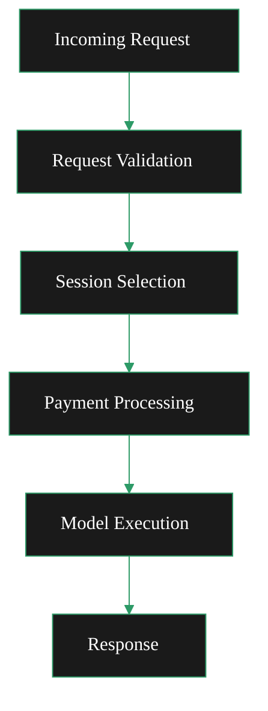

</ScrollableDiagram>

#### Transcoding Requests

Traditional video transcoding requests are handled through:

- **RTMP ingest**: Port `1935` by default
- **HTTP push**: `/live/{streamKey}` endpoint when `-httpIngest` is enabled
- **HLS output**: Adaptive bitrate streams for playback

#### AI Requests

AI processing requests are routed through dedicated endpoints <DoubleIconLink label="ai_mediaserver.go" href="https://github.com/livepeer/go-livepeer/blob/5691cb48/server/ai_mediaserver.go" iconLeft="github" />

<Danger> (fixme) OpenAPI Spec is here: ai/worker/api/openapi.json </Danger>

    <ResponseField name="/text-to-image" type="json">
 Generate images from text prompts.
 Uses `jsonDecoder` for parsing
    </ResponseField>
    <ResponseField name="/image-to-image" type="multipart/form-data">
 Transform images with prompts.
 Uses `multipartDecoder` for file uploads
    </ResponseField>
    <ResponseField name="/image-to-video" type="multipart/form-data">
 Create videos from images.
 Uses `multipartDecoder` for file uploads
    </ResponseField>
    <ResponseField name="/upscale" type="multipart/form-data">
 Upscale (enhance) images to higher resolution.
 Uses `multipartDecoder` for file uploads
    </ResponseField>
    <ResponseField name="/live/video-to-video/{stream}/start" type="multipart/form-data">
 Apply transformations to a live video streamed to the returned endpoints.
 Live video endpoint has specialized handling for real-time streaming with MediaMTX integration
    </ResponseField>

## Payment Models

The dual setup handles two different payment models:

#### Transcoding Payments

Basis: Per video segment processed
Method: Payment tickets sent with each segment
Verification: Multi-orchestrator verification for quality assurance

#### AI Payments

Basis: Per pixel processed (width × height × outputs)
Method: Pixel-based payment calculation
Live Video: Interval-based payments during streaming

## Operational Considerations

#### Resource Allocation

When running dual setup, consider:

- GPU resources: Shared between transcoding and AI workloads
- Memory: AI models require significant RAM when loaded ("warm")
- Network: Bandwidth for both stream ingest and AI request/response

#### Monitoring

Monitor both workload types:

- Transcoding: Segment processing latency, success rates
- AI: Model loading times, inference latency, pixel processing rates

#### Scaling Strategies

- Horizontal: Deploy multiple gateway instances behind a load balancer
- Vertical: Allocate more GPU resources for AI model parallelism
- Specialized: Separate nodes for transcoding vs AI based on workload patterns

---

### /Users/alisonhaire/Documents/Livepeer/livepeer-docs-v2_d-v2-branch/docs/gateways/run-a-gateway/publish/connect-with-offerings.mdx

---
title: Discover & Connect Marketplace Compute Services
sidebarTitle: Discover & Connect Services
description: >-
  This page explains how to find and broker Orchestrator AI & Video Offerings
  via your Gateway for Livepeer Application consumption.
keywords:
  - livepeer
  - gateways
  - run a gateway
  - publish
  - connect with offerings
  - discover
  - connect
  - marketplace
  - compute
  - services
'og:image': /snippets/assets/site/og-image/fallback.png
'og:image:alt': Livepeer Docs social preview image
'og:image:type': image/png
'og:image:width': 1200
'og:image:height': 630
---


import { CustomCallout } from '/snippets/components/primitives/links.jsx'
import { ScrollableDiagram } from '/snippets/components/content/zoomableDiagram.jsx'

<Danger>
 This page is a work in progress. Needs a lot of edits.
  <Expandable title="TODO">
 TODO: - [ ] Overview, - [ ] Edit (A LOT) - [ ] Streamline, - [ ] Format, - [
 ] Style, - [ ] Link to github / otherresources
  </Expandable>
</Danger>

<div
  style={{
    display: 'flex',
    flexDirection: 'column',
    margin: '0 auto',
    alignItems: 'center',
  }}
>
  <Callout icon="party-horn" color="#2d9a67">
 So... You have a gateway running - yay!
  </Callout>
 Let's find and share some Livepeer Marketplace Orchestrator Services!
</div>
<br />
<div
  style={{
    display: 'flex',
    justifyContent: 'center',
    margin: '0 auto',
    width: '80%',
  }}
>
  <Frame>
    
  </Frame>
</div>
<br />

# What is the Marketplace?

The Livepeer Marketplace allows **_Orchestrators_** to advertise available compute,
compute services (AI & Video), pricing, and performance characteristics.

In the Livepeer Marketplace, **Gateways act like talent agents**

They discover orchestrator offerings, apply selection and routing logic, and broker access to appropriate
services for applications based on cost, performance, and policy requirements -
_like a talent agent scouts venues for promising artists and matches them to the right record deal._

<br />
> - **Orchestrators** publish services to the Livepeer Marketplace; > - **Gateways**
filter & connect application requests to those services.
<br />
<br />

<ScrollableDiagram title="Livepeer Marketplace Offering Flow" maxHeight="700px">
```mermaid
%%{init: {
  'theme': 'base',
  'themeVariables': {
    'primaryColor': '#1a1a1a',
    'primaryTextColor': '#ffffffff',
    'primaryBorderColor': '#ffffff',
    'lineColor': '#2d9a67',
    'secondaryColor': '#0d0d0d',
    'titleColor': '#2d9a67',
    'tertiaryColor': '#1a1a1a',
    'background': '#0d0d0d',
    'fontFamily': 'system-ui',
    'clusterBkg': '#1a1a1a',
    'clusterBorder': '#ffffff',
    'nodeTextColor': '#ffffff',
    'nodeBorder': '#ffffff',
    'mainBkg': '#1a1a1a',
    'edgeLabelBackground': 'transparent',
    'textColor': '#2d9a67'
  },
  'flowchart': {
    'useMaxWidth': true,
    'htmlLabels': true
  }
}}%%
flowchart TB

    %% --- APPLICATION LAYER ---
    subgraph App["<b>APPLICATIONS&nbsp;/&nbsp;CLIENTS</b>"]
        A1["App / User<br/>Video or AI Request"]
    end

    %% --- GATEWAY LAYER ---
    subgraph Gateway["<b>GATEWAY (BROKER)</b>"]
        direction LR
        G1["API Ingress"]
        G2["Auth / Rate Limits"]
        G3["Policy & Routing Logic"]
        G4["SLA / Retry / Failover"]
    end

    %% --- LIVEPEER MARKETPLACE ---
    subgraph Market["<b>LIVEPEER&nbsp;MARKETPLACE</b>"]
        direction LR
        M1["Capability Metadata"]
        M2["Pricing Signals"]
        M3["Performance Characteristics"]
        M0[ ]
    end

    %% --- SUPPLY LAYER ---
    subgraph Supply["<b>COMPUTE PROVIDERS</b>"]
        direction LR
        O1["Orchestrator A"]
        O2["Orchestrator B"]
        O3["Orchestrator C"]
    end

    %% --- FLOWS ---
    A1 -->|API Request| G1
    G1 --> G2
    G2 --> G3
    G3 --> G4

    %% Marketplace lookup
    G3 -.->|Query| Market

    %% Brokered execution
    G4 -->|Brokered Job| O1
    G4 -->|Brokered Job| O2
    G4 -->|Brokered Job| O3

    %% Results
    O1 -->|Results| G4
    O2 -->|Results| G4
    O3 -->|Results| G4

    G4 -->|Response| A1

    %% Compute Providers publish to Marketplace
    O2 -.->|Publish Offerings| M0

    %% Styling - white borders for main boxes, green borders for internal boxes
    style App stroke:#ffffff,stroke-width:2px,rx:15,ry:15
    style Gateway stroke:#ffffff,stroke-width:2px,rx:15,ry:15
    style Market stroke:#ffffff,stroke-width:2px,rx:15,ry:15
    style Supply stroke:#ffffff,stroke-width:2px,rx:15,ry:15
    style A1 fill:#0d0d0d,stroke:#2d9a67,stroke-width:1px,rx:10,ry:10
    style G1 fill:#0d0d0d,stroke:#2d9a67,stroke-width:1px,rx:10,ry:10
    style G2 fill:#0d0d0d,stroke:#2d9a67,stroke-width:1px,rx:10,ry:10
    style G3 fill:#0d0d0d,stroke:#2d9a67,stroke-width:1px,rx:10,ry:10
    style G4 fill:#0d0d0d,stroke:#2d9a67,stroke-width:1px,rx:10,ry:10
    style M1 fill:#0d0d0d,stroke:#2d9a67,stroke-width:1px,rx:10,ry:10
    style M2 fill:#0d0d0d,stroke:#2d9a67,stroke-width:1px,rx:10,ry:10
    style M3 fill:#0d0d0d,stroke:#2d9a67,stroke-width:1px,rx:10,ry:10
    style O1 fill:#0d0d0d,stroke:#2d9a67,stroke-width:1px,rx:10,ry:10
    style O2 fill:#0d0d0d,stroke:#2d9a67,stroke-width:1px,rx:10,ry:10
    style O3 fill:#0d0d0d,stroke:#2d9a67,stroke-width:1px,rx:10,ry:10
    style M0 fill:transparent,stroke:transparent,color:transparent

````
</ScrollableDiagram>
<br />

# How to Discover & Connect Marketplace Offerings
This page explains how Gateways can discover and offer Orchestrator Services,
 available on the Marketplace, to Applications & Builders.


## What Is an Orchestrator Offering?

An offering is a structured declaration of:

- Supported models (e.g., SDXL, ControlNet, depth models)
- Supported pipelines (ComfyStream, Daydream, BYOC)
- Pricing per frame / per second / per request
- GPU tiers and performance metrics
- Regional availability
- SLAs and expected latency

Gateways publish service-level offerings.
Orchestrators publish compute-level offerings.

<ScrollableDiagram title="Offering Publication Flow" maxHeight="500px" minWidth="900px">
```mermaid
flowchart LR
    subgraph Offerings["📦 What Is an Offering?"]
        direction TB
        O1["🧠 Supported Models<br/><i>SDXL, ControlNet, Depth</i>"]
        O2["⚙️ Supported Pipelines<br/><i>ComfyStream, Daydream, BYOC</i>"]
        O3["💰 Pricing<br/><i>per frame / second / request</i>"]
        O4["🖥️ GPU Tiers<br/><i>Performance metrics</i>"]
        O5["🌍 Regional Availability<br/><i>us-east, eu-central, ap-southeast</i>"]
        O6["📊 SLAs & Latency<br/><i>Uptime %, response time</i>"]
    end

    subgraph Publishers["📡 Who Publishes?"]
        direction TB
        GW["🌐 <b>Gateways</b><br/>Service-Level Offerings"]
        ORCH["⚡ <b>Orchestrators</b><br/>Compute-Level Offerings"]
    end

    subgraph Marketplace["🏪 Livepeer Marketplace"]
        direction TB
        MP["Discovery & Selection<br/>Fair Competition<br/>Differentiation"]
    end

    Offerings --> GW
    Offerings --> ORCH
    GW --> MP
    ORCH --> MP

    style Offerings fill:#1a1a1a,stroke:#2d9a67,stroke-width:2px,color:#fff
    style Publishers fill:#1a1a1a,stroke:#2d9a67,stroke-width:2px,color:#fff
    style Marketplace fill:#1a1a1a,stroke:#2d9a67,stroke-width:2px,color:#fff
    style GW fill:#2d9a67,stroke:#fff,stroke-width:1px,color:#fff
    style ORCH fill:#2d9a67,stroke:#fff,stroke-width:1px,color:#fff
    style MP fill:#333,stroke:#2d9a67,stroke-width:2px,color:#fff
    style O1 fill:#333,stroke:#2d9a67,stroke-width:1px,color:#fff
    style O2 fill:#333,stroke:#2d9a67,stroke-width:1px,color:#fff
    style O3 fill:#333,stroke:#2d9a67,stroke-width:1px,color:#fff
    style O4 fill:#333,stroke:#2d9a67,stroke-width:1px,color:#fff
    style O5 fill:#333,stroke:#2d9a67,stroke-width:1px,color:#fff
    style O6 fill:#333,stroke:#2d9a67,stroke-width:1px,color:#fff
````

</ScrollableDiagram>

## Discovery Process

Gateways discover orchestrators through the orchestrator pool in `discovery/discovery.go` [discovery.go:64-111](https://github.com/livepeer/go-livepeer/blob/5691cb48/discovery/discovery.go#L64-L111)

1. **Query orchestrators**: Get `OrchestratorInfo` from each orchestrator
2. **Filter capabilities & price**: Match against required capabilities & pricing limits & optionally rank results
3. **Expose results**: Make matching orchestrator services available through HTTP endpoints
4. **Route requests**: Forward incoming requests to selected orchestrators

## Find All Orchestrators & Offerings

The `/getNetworkCapabilities` endpoint in [server/handlers.go](https://github.com/livepeer/go-livepeer/blob/5691cb48/server/handlers.go#L275-L295)
exposes all available orchestrator offerings

```go
func (s *LivepeerServer) getNetworkCapabilitiesHandler() http.Handler {
    return http.HandlerFunc(func(w http.ResponseWriter, r *http.Request) {
        // Returns orchestrators with their capabilities, pricing, and hardware
    })
}
```

**Response Data Structure**

The response uses NetworkCapabilities structure from common/types.go types.go:166-176 :

```go
type NetworkCapabilities struct {
    Orchestrators []*OrchNetworkCapabilities `json:"orchestrators"`
}

type OrchNetworkCapabilities struct {
    Address            string                     `json:"address"`
    LocalAddress       string                     `json:"local_address"`
    OrchURI            string                     `json:"orch_uri"`
    Capabilities       *net.Capabilities          `json:"capabilities"`
    CapabilitiesPrices []*net.PriceInfo           `json:"capabilities_prices"`
    Hardware           []*net.HardwareInformation `json:"hardware"`
}
```

## Publishing as a Gateway

Gateways expose offerings describing:

### **1. Supported Models**

Example:

- `stable-diffusion-v1.5`
- `depth-anything`
- `controlnet_lineart`
- `ip_adapter`

### **2. Supported Pipelines**

- Daydream-style real-time style transfer
- ComfyStream workflows
- BYOC containers
- Custom inference graphs

### **3. Pricing**

A Gateway may price:

- `$0.004 / frame`
- `$0.06 / second`
- `$0.0005 / inference token`

### **4. Regions**

Example:

- `us-east`
- `eu-central`
- `ap-southeast`

### **5. Reliability Scores**

Gateways may publish:

- Availability %
- Average inference latency
- Failover configuration

## Summary

Publishing offerings to the Marketplace enables:

- Discoverability
- Fair competition
- Informed selection
- Differentiation and specialization

This is crucial for the growth of Livepeer’s decentralized AI compute economy.

---

### /Users/alisonhaire/Documents/Livepeer/livepeer-docs-v2_d-v2-branch/docs/gateways/run-a-gateway/v1/transcoding-options.mdx

---
title: Configure Transcoding Options
description: >-
  To better control your encoding profiles it is recommended to use a json file
  to specify the resolution and bitrate for your encoding ladder.
keywords:
  - livepeer
  - gateways
  - run a gateway
  - transcoding options
  - configure
  - transcoding
  - options
'og:image': /snippets/assets/site/og-image/fallback.png
'og:image:alt': Livepeer Docs social preview image
'og:image:type': image/png
'og:image:width': 1200
'og:image:height': 630
icon: gear
---


# Create the JSON file

Use the following as a template for your json file

```json
[
{
  "name": "480p0",
  "fps": 0,
  "bitrate": 1600000,
  "width": 854,
  "height": 480,
  "profile": "h264constrainedhigh",
  "gop": "1"
},
{
  "name": "720p0",
  "fps": 0,
  "bitrate": 3000000,
  "width": 1280,
  "height": 720,
  "profile": "h264constrainedhigh",
  "gop": "1"
},
{
  "name": "1080p0",
  "fps": 0,
  "bitrate": 6500000,
  "width": 1920,
  "height": 1080,
  "profile": "h264constrainedhigh",
  "gop": "1"
}
]
```

## Modify Docker Config

Create the transcodingOptions.json file using the above template.

```javascript
nano -p /var/lib/docker/volumes/gateway-lpData/_data/transcodingOptions.json
```

Modify the docker-compose.yml file from the root user's home directory _/root/_
and add the following below `-pixelsPerUnit=1`

```bash
-transcodingOptions=/root/.lpData/transcodingOptions.json
```

## Modify Linux Config

Create the transcodingOptions.json file using the above template.

```text
sudo nano /usr/local/bin/lptConfig/transcodingOptions.json
```

Modify the Linux Service file /etc/systemd/system/livepeer.service and add the
following below `-pixelsPerUnit=1`

```bash
-transcodingOptions=/usr/local/bin/lptConfig/transcodingOptions.json \
```

## Modify Windows Config

Create the transcodingOptions.json file using the above template.

Open notepad (or your text editor of choice) paste the template above and save
the transcodingOptions.json file in the following location.

**Note:** Replace **YOUR_USER_NAME** with your actual user name

```text
C:\Users\YOUR_USER_NAME\.lpData\transcodingOptions.json
```

Modify Windows bat file to include the following command after
`-pixelsPerUnit=1`

```bash
-transcodingOptions=C:\Users\YOUR_USER_NAME\.lpData\transcodingOptions.json
```

---

### /Users/alisonhaire/Documents/Livepeer/livepeer-docs-v2_d-v2-branch/docs/gateways/using-gateways/choosing-a-gateway.mdx

---
title: Find Gateway Services
sidebarTitle: Find Gateway Services
description: >-
  How to choose the right Livepeer gateway for your use case - whether you need
  a hosted service, a community gateway, or want to run your own.
keywords:
  - livepeer
  - gateways
  - using gateways
  - choose gateway
  - gateway providers
  - livepeer studio
  - daydream
  - cloud spe
  - self-hosted gateway
'og:image': /snippets/assets/site/og-image/fallback.png
'og:image:alt': Livepeer Docs social preview image
'og:image:type': image/png
'og:image:width': 1200
'og:image:height': 630
purpose: concept
pageType: guide
audience: 'developer, gateway-operator'
status: current
---

import { StyledTable, TableRow, TableCell } from '/snippets/components/layout/tables.jsx'
import { BorderedBox } from '/snippets/components/layout/containers.jsx'
import { DoubleIconLink } from '/snippets/components/primitives/links.jsx'


A Livepeer Gateway is the access point your application uses to route video and AI jobs to the network. The gateway handles authentication, routing, payment, and job coordination - your app talks to the gateway, and the gateway talks to the GPU network.

You have three options:

1. **Use a hosted gateway** (Livepeer Studio, Daydream, Cloud SPE) - lowest barrier to entry, managed for you
2. **Use a community-run gateway** - often free or low-cost, community-maintained
3. **Run your own gateway** - maximum control, required for production-grade custom deployments

## Start here in 5 minutes

<BorderedBox variant="accent" padding="16px">

- **Prereqs:** Clear use case (video, AI, or both) and rough reliability/cost requirements
- **Time:** 5 minutes
- **Outcome:** A provider or self-hosted path chosen with a concrete next step
- **First action:** Use the **Quick Decision Guide**, then open exactly one provider page or the gateway quickstart

</BorderedBox>

---

## Quick Decision Guide

<BorderedBox variant="accent" padding="16px">

**Use a hosted gateway if:**
- You want to be live quickly (minutes, not days)
- You need a managed API with SLA, dashboards, and support
- You're building on standard video streaming or common AI pipelines
- You don't want to manage infrastructure

**Run your own gateway if:**
- You need custom SLAs, routing control, or compliance requirements
- You're building a product that routes Livepeer jobs as part of its core offering
- You want to avoid per-request margin paid to another gateway operator
- You need BYOC pipelines or custom AI models at scale

</BorderedBox>

---

## Hosted Gateways

<CardGroup cols={2}>
  <Card
    title="Livepeer Studio"
    icon="video-arrow-up-right"
    href="./gateway-providers/livepeer-studio-gateway"
    arrow
  >
 Production-grade hosted gateway for live streaming and video-on-demand. REST API + SDKs. Best for developers building video applications.
  </Card>
  <Card
    title="Daydream"
    icon="wand-magic-sparkles"
    href="./gateway-providers/daydream-gateway"
    arrow
  >
 Real-time AI video gateway. StreamDiffusion-powered style transfer, image-to-video, and custom AI pipelines on live video. Best for AI video products and creators.
  </Card>
  <Card
    title="Cloud SPE Gateway"
    icon="cloud-binary"
    href="./gateway-providers/cloud-spe-gateway"
    arrow
  >
 Community-run, free-to-use RTMP and AI gateways. Operated by Livepeer.Cloud, a treasury-funded Special Purpose Entity. Best for experimentation and open-source projects.
  </Card>
  <Card
    title="Other Providers"
    icon="webhook"
    href="../guides-and-resources/community-projects"
    arrow
  >
 Community-run gateways and integrations. Discover projects built by the Livepeer ecosystem.
  </Card>
</CardGroup>

---

## Provider Comparison

<StyledTable variant="bordered">
  <thead>
    <TableRow header>
 <TableCell header>Provider</TableCell>
 <TableCell header>Best For</TableCell>
 <TableCell header>Video</TableCell>
 <TableCell header>AI Inference</TableCell>
 <TableCell header>Cost</TableCell>
 <TableCell header>Self-Hosted</TableCell>
    </TableRow>
  </thead>
  <tbody>
    <TableRow>
 <TableCell>**Livepeer Studio**</TableCell>
 <TableCell>App developers</TableCell>
 <TableCell>✅ Live + VOD</TableCell>
 <TableCell>✅ AI generate endpoints</TableCell>
 <TableCell>Paid (usage-based)</TableCell>
 <TableCell>❌ (managed)</TableCell>
    </TableRow>
    <TableRow>
 <TableCell>**Daydream**</TableCell>
 <TableCell>AI video creators & builders</TableCell>
 <TableCell>⚠️ Video as input</TableCell>
 <TableCell>✅ Real-time AI video</TableCell>
 <TableCell>Paid / Free tier</TableCell>
 <TableCell>❌ (managed)</TableCell>
    </TableRow>
    <TableRow>
 <TableCell>**Cloud SPE**</TableCell>
 <TableCell>Experimentation, OSS projects</TableCell>
 <TableCell>✅ RTMP</TableCell>
 <TableCell>✅ AI community gateway</TableCell>
 <TableCell>Free</TableCell>
 <TableCell>❌ (managed)</TableCell>
    </TableRow>
    <TableRow>
 <TableCell>**Self-hosted**</TableCell>
 <TableCell>Products, enterprises, operators</TableCell>
 <TableCell>✅ Full control</TableCell>
 <TableCell>✅ Full control</TableCell>
 <TableCell>Infrastructure cost</TableCell>
 <TableCell>✅</TableCell>
    </TableRow>
  </tbody>
</StyledTable>

---

## The Livepeer Explorer

The [Livepeer Explorer](https://explorer.livepeer.org) lists active gateways on the network. You can discover operator performance, available capabilities, and pricing for on-chain gateways.

<Card title="Livepeer Explorer" icon="compass" href="https://explorer.livepeer.org" arrow horizontal>
 Browse active gateways and network statistics on-chain.
</Card>

---

## Running Your Own Gateway

Operators who want direct protocol access, custom pricing, or enterprise-grade control run their own go-livepeer gateway node. This is the path taken by products like Daydream and Livepeer Studio themselves.

<CardGroup cols={2}>
  <Card title="Why Run a Gateway" href="../run-a-gateway/why-run-a-gateway" icon="lightbulb" arrow>
 Business and technical reasons to operate your own gateway node.
  </Card>
  <Card title="Gateway Quickstart" href="../quickstart/gateway-setup" icon="bolt-lightning" arrow>
 Get a gateway running in under 10 minutes.
  </Card>
  <Card title="Requirements" href="../run-a-gateway/requirements/setup" icon="clipboard-check" arrow>
 Hardware, network, and software requirements.
  </Card>
  <Card title="Gateway Operator Opportunities" href="../run-a-gateway/gateway-operator-opportunities" icon="briefcase" arrow>
 Business models and opportunities for gateway operators.
  </Card>
</CardGroup>

---

### /Users/alisonhaire/Documents/Livepeer/livepeer-docs-v2_d-v2-branch/docs/gateways/using-gateways/gateway-providers.mdx

---
title: Gateway Providers
sidebarTitle: Gateway Providers Portal
description: >-
  Hosted gateways and self-hosted options for connecting to the Livepeer network
  - with AI inference, video transcoding, or both.
keywords:
  - livepeer
  - gateways
  - using gateways
  - gateway providers
  - gateway
  - providers
  - applications
'og:image': /snippets/assets/site/og-image/fallback.png
'og:image:alt': Livepeer Docs social preview image
'og:image:type': image/png
'og:image:width': 1200
'og:image:height': 630
---

import { GotoLink, LinkArrow } from '/snippets/components/primitives/links.jsx'

Gateways are the entry point for your application into the Livepeer decentralized compute network.
You can connect to an existing hosted gateway, or [run your own](../quickstart/gateway-setup).
<span>
Not sure which gateway fits your use case? See {" "}
  <LinkArrow
    href="./choosing-a-gateway"
    label="Choosing A Gateway"
    icon="ballot-check"
    newline={false}
  />
</span>


## Hosted Gateways

<CardGroup cols={2}>
  <Card
    title="Daydream"
    icon="wand-magic-sparkles"
    href="./gateway-providers/daydream-gateway"
    arrow
    cta="Daydream Gateway Guide"
  >
 <Badge color="purple">AI</Badge>

 **Real-time AI video & style transfer.** Daydream is an open-source toolkit for world models and real-time AI video built on Livepeer. Transform livestreams with text prompts - style transfer, image-to-video, and StreamDiffusion pipelines - in real time.

 Best for: generative video apps, live remixing, AI creative tools.

 [daydream.live](https://daydream.live) · [docs.daydream.live](https://docs.daydream.live)
  </Card>

  <Card
    title="Livepeer Studio"
    icon="video-arrow-up-right"
    href="./gateway-providers/livepeer-studio-gateway"
    arrow
    cta="Livepeer Studio Gateway Guide"
  >
 <Badge color="blue">Video</Badge>

 **Developer-friendly REST API for video streaming and VOD.** Livepeer Studio provides live streaming (RTMP/WebRTC ingest, HLS/WebRTC playback), video-on-demand (upload, transcode, playback), access control, webhooks, and analytics - all via a clean REST API with TypeScript, Go, and Python SDKs.

 Best for: video platforms, streaming apps, developers wanting a hosted API.

 [livepeer.studio](https://livepeer.studio) · [API docs](https://livepeer.studio/docs)
  </Card>

  <Card
    title="Cloud SPE"
    icon="cloud-binary"
    href="./gateway-providers/cloud-spe-gateway"
    arrow
    cta="Cloud SPE Gateway Guide"
  >
 <Badge color="green">Video</Badge> <Badge color="purple">AI</Badge>

 **Community-operated gateway infrastructure.** The Cloud SPE (Special Purpose Entity) is a community-run gateway providing access to the Livepeer network, including self-hosted gateway resources and operator support.

 Best for: community builders, operators exploring self-hosting, dual video and AI workloads.

 [livepeer.cloud](https://www.livepeer.cloud)
  </Card>

  <Card
    title="Community Gateways"
    icon="webhook"
    href="../guides-and-resources/community-projects"
    arrow
    cta="Browse Community Projects"
  >
 <Badge color="gray">Various</Badge>

 **Gateways and tools built by the Livepeer community.** Includes projects like the videoDAC gateway, open-source self-hosted options, and experimental integrations from ecosystem contributors.

 [github.com/videoDAC](https://github.com/videoDAC/livepeer-gateway)
  </Card>
</CardGroup>

## Run Your Own Gateway

Any developer or operator can run a `go-livepeer` gateway node - connecting directly to the Livepeer network without going through a hosted provider.

<CardGroup cols={2}>
  <Card
    title="Gateway Quickstart"
    icon="rocket"
    href="../quickstart/gateway-setup"
    arrow
  >
 Docker, Linux binary, or Windows WSL2. Off-chain (dev) or on-chain (production). Supports Video, AI, and Dual modes.
  </Card>
  <Card
    title="Why Run a Gateway?"
    icon="lightbulb"
    href="../run-a-gateway/why-run-a-gateway"
    arrow
  >
 Own your traffic, control routing, avoid provider margins, and build differentiated products at the service layer.
  </Card>
</CardGroup>

## All Gateways on the Network

<GotoLink
  relativePath="../guides-and-resources/community-projects"
  label="Community Gateway Projects"
  text="Browse community gateway projects while the full provider index is in development."
  icon="list"
/>

<Tip>
 The Livepeer Explorer is adding a Gateway view - browse and compare all active on-chain gateways by throughput, orchestrator relationships, and reliability. Coming soon.
</Tip>

<Card
  title="Livepeer Explorer - Gateway View (Preview)"
  icon="chart-network"
  href="https://explorer-arbitrum-one-git-feat-add-g-10dba1-livepeer-foundation.vercel.app/"
  arrow
>
 Preview of the upcoming gateway explorer - active gateways on the Livepeer network.
</Card>

---

### /Users/alisonhaire/Documents/Livepeer/livepeer-docs-v2_d-v2-branch/docs/gateways/using-gateways/gateway-providers/cloud-spe-gateway.mdx

---
title: Using the Cloud SPE Gateway
sidebarTitle: Cloud SPE
description: >-
  Livepeer.Cloud SPE provides free-to-use RTMP and AI gateways powered by the
  Livepeer network. Run by a Livepeer treasury-funded Special Purpose Entity -
  great for experimentation, OSS projects, and getting started.
keywords:
  - livepeer
  - cloud spe
  - livepeer cloud
  - free gateway
  - rtmp gateway
  - ai gateway
  - community gateway
  - spe
'og:image': /snippets/assets/site/og-image/fallback.png
'og:image:alt': Livepeer Docs social preview image
'og:image:type': image/png
'og:image:width': 1200
'og:image:height': 630
purpose: concept
pageType: guide
audience: developer
status: current
---

import { BorderedBox } from '/snippets/components/layout/containers.jsx'


Livepeer.Cloud is a **community-run, free-to-use gateway service** for the Livepeer network, operated by the Cloud SPE (Special Purpose Entity). Cloud SPE is funded by the Livepeer treasury and its mission is to increase accessibility and adoption of the Livepeer network.

<Info>
 Cloud SPE operates free gateways as a public good for the Livepeer ecosystem. These gateways are ideal for experimentation, development, and open-source projects. For production applications with SLA requirements, consider [Livepeer Studio](/v2/gateways/using-gateways/gateway-providers/livepeer-studio-gateway). As of 02-March-2026, Cloud SPE publishes AI gateway access through [tools.livepeer.cloud](https://tools.livepeer.cloud); check provider docs for the current direct API base URL and auth requirements.
</Info>

## Start here in 5 minutes

<BorderedBox variant="accent" padding="16px">

- **Prereqs:** A backend runtime for API calls (as of 02-March-2026, the default Cloud SPE AI gateway path works without an API key)
- **Time:** 5 minutes
- **Outcome:** AI gateway endpoint discovered and first request scaffolded
- **First action:** Open [tools.livepeer.cloud](https://tools.livepeer.cloud), confirm the active gateway URL, then run a test request

</BorderedBox>

---

## What Cloud SPE Provides

Cloud SPE operates two types of gateways:

**RTMP Gateway** - Free-to-use RTMP ingest for live video streaming powered by the Livepeer transcoding network. Ideal for live streaming applications, Owncast integrations, and developers building on decentralized video infrastructure.

**AI Gateway** - Free access point to the Livepeer AI network for running inference pipelines. Includes support for text-to-image, image-to-image, LLM inference, and more. Access and current endpoint details are published at [tools.livepeer.cloud](https://tools.livepeer.cloud).

---

## Getting Started

### Access the AI Gateway

The Cloud SPE AI gateway is available at [tools.livepeer.cloud](https://tools.livepeer.cloud). As of 02-March-2026, this portal is the canonical source for current AI endpoint and auth details. The tools page also shows available AI pipelines, network capabilities, and which orchestrators are warm (ready to serve requests without model loading delay).

<Card title="Cloud SPE Tools" icon="wrench" href="https://tools.livepeer.cloud" arrow horizontal>
 Browse AI pipelines, check network capabilities, and access the AI gateway.
</Card>

### First Request Example (Portal-Guided API)

Use the tools portal as the source of truth for the active endpoint and required auth mode:

```bash
CLOUD_SPE_AI_BASE="https://dream-gateway.livepeer.cloud"

curl -X POST "$CLOUD_SPE_AI_BASE/text-to-image" \
  -H "Content-Type: application/json" \
  -d '{
    "prompt": "glass greenhouse in a misty forest, cinematic lighting",
    "model_id": "ByteDance/SDXL-Lightning"
  }'
```

As of 02-March-2026, Cloud SPE tools default to `https://dream-gateway.livepeer.cloud`, and unauthenticated `POST /text-to-image` requests succeed. If Cloud SPE changes auth policy, use the current requirement shown in [tools.livepeer.cloud](https://tools.livepeer.cloud).

Expected success signal: HTTP `200` response with an output object (for example, an image URL, base64 payload, or job/result handle depending on the active route).

### Access the RTMP Gateway

Cloud SPE provides RTMP ingest for live streaming. Visit [livepeer.cloud](https://www.livepeer.cloud) to get started and access documentation on configuring your encoder.

<Card title="Livepeer.Cloud" icon="cloud" href="https://www.livepeer.cloud" arrow horizontal>
 Get started with Cloud SPE's free RTMP streaming infrastructure.
</Card>

---

## What Cloud SPE Has Built

Beyond running gateways, Cloud SPE contributes tooling to the Livepeer ecosystem:

**Owncast Integration** - Integration between Livepeer's decentralized transcoding network and Owncast, the open-source self-hosted live streaming platform. Stream through decentralized infrastructure without centralized dependencies.

**Ollama-Based LLM Runner** - A custom AI runner optimized for LLM inference on GPUs with as little as 8GB VRAM (GTX 1080, 1070 Ti, RTX 2060, and others). This lowers the GPU barrier for AI orchestrators significantly from the official 16GB VRAM requirement.

**Network Capabilities Dashboard** - Live visibility into which AI pipelines are available on the network and which orchestrators are serving them warm. Available at [tools.livepeer.cloud/ai/network-capabilities](https://tools.livepeer.cloud/ai/network-capabilities).

**Decentralized Metrics Initiative** - Cloud SPE proposed and is delivering decentralized SLA metrics and reliability infrastructure for the Livepeer network, improving transparency and usability for the whole ecosystem.

---

## When to Use Cloud SPE

<BorderedBox variant="accent" padding="16px">

**Good fit:**
- Learning how Livepeer AI and video infrastructure works
- Prototyping and development before committing to a hosted service
- Open-source projects and community applications
- Streaming with Owncast or other self-hosted platforms
- Testing AI pipelines and checking network capabilities

**Consider an alternative if:**
- You need guaranteed SLA or uptime commitments
- You're building a production application with paying users
- You need custom authentication, rate limits, or compliance controls
- You need dedicated capacity or dedicated orchestrator routing

</BorderedBox>

---

## Community and Resources

- [livepeer.cloud](https://www.livepeer.cloud) - Cloud SPE website and RTMP gateway
- [tools.livepeer.cloud](https://tools.livepeer.cloud) - AI tools, network capabilities, and gateway access
- [Livepeer Forum - Cloud SPE](https://forum.livepeer.org) - Treasury proposals, financial reports, and community updates
- [Discord - #orchestrating](https://discord.gg/xpKATpA7) - Get help from Cloud SPE team (ping @mike_zoop)

---

## Related Pages

<CardGroup cols={2}>
  <Card title="Find Gateway Services" href="../choosing-a-gateway" icon="compass" arrow>
 Compare all gateway options.
  </Card>
  <Card title="Run Your Own Gateway" href="/v2/gateways/run-a-gateway/run-a-gateway" icon="server" arrow>
 Build your own self-hosted gateway node.
  </Card>
  <Card title="AI Quickstart" href="/v2/developers/quickstart/ai/ai-pipelines" icon="robot" arrow>
 Get started with Livepeer AI inference in minutes.
  </Card>
  <Card title="Livepeer Studio" href="/v2/gateways/using-gateways/gateway-providers/livepeer-studio-gateway" icon="video-arrow-up-right" arrow>
 Production-grade hosted gateway for video + AI.
  </Card>
</CardGroup>

---

### /Users/alisonhaire/Documents/Livepeer/livepeer-docs-v2_d-v2-branch/docs/gateways/using-gateways/gateway-providers/daydream-gateway.mdx

---
title: Using the Daydream Gateway
sidebarTitle: Daydream
description: >-
  Connect to the Daydream gateway to run real-time AI video pipelines on the
  Livepeer network - style transfer, image-to-video, StreamDiffusion, and more.
keywords:
  - livepeer
  - daydream
  - gateway
  - real-time ai video
  - streamdiffusion
  - image-to-video
  - style transfer
  - ai inference
'og:image': /snippets/assets/site/og-image/fallback.png
'og:image:alt': Livepeer Docs social preview image
'og:image:type': image/png
'og:image:width': 1200
'og:image:height': 630
purpose: concept
pageType: guide
audience: developer
status: current
---

import { BorderedBox } from '/snippets/components/layout/containers.jsx'
import { DoubleIconLink } from '/snippets/components/primitives/links.jsx'


Daydream is an **open-source toolkit for world models and real-time AI video** built on the Livepeer network. The Daydream gateway routes real-time AI inference jobs - style transfer, image-to-video, StreamDiffusion pipelines - to Livepeer's decentralized GPU network.

<Info>
 Daydream is a full product with its own documentation. This page covers the gateway aspect relevant to Livepeer developers. For the complete product documentation, visit [docs.daydream.live](https://docs.daydream.live).
</Info>

## Start here in 5 minutes

<BorderedBox variant="accent" padding="16px">

- **Prereqs:** Browser with camera access (hosted path) or a backend with a Daydream API key
- **Time:** 5 minutes
- **Outcome:** A working Daydream session or your first API call scaffolded
- **First action:** Open [daydream.live](https://daydream.live) for no-code testing, then use [docs.daydream.live](https://docs.daydream.live) to copy the current API endpoint and auth settings

</BorderedBox>

---

## What the Daydream Gateway Does

The Daydream gateway is a Livepeer gateway node operated by the Daydream team. It accepts real-time video and AI inference requests and routes them to compatible orchestrators on the Livepeer GPU network.

Use the Daydream gateway to:

- Transform a live camera feed into AI-stylized video in real time using text prompts
- Run StreamDiffusion pipelines (image-to-image, style transfer) on video streams
- Experiment with world models and generative AI video workflows
- Access Livepeer AI inference without running your own gateway node

---

## Access Options

<Tabs>
  <Tab title="Hosted App">
 The fastest way to experience Daydream is the hosted app at [daydream.live](https://daydream.live). No API key or setup required - open the app, allow camera access, enter a text prompt, and your video is transformed in real time.

 This is ideal for creators, artists, and anyone who wants to explore real-time AI video without writing code.

    <Card title="Try Daydream" icon="wand-magic-sparkles" href="https://daydream.live" arrow horizontal>
 Open the hosted Daydream app - no account required.
    </Card>
  </Tab>
  <Tab title="API / Developer Access">
 Developers can integrate with the Daydream gateway via the Daydream API to build real-time AI video into their own applications.

 Refer to the official Daydream developer documentation for authentication, endpoints, and pipeline configuration:

    <Card title="Daydream Developer Docs" icon="book" href="https://docs.daydream.live" arrow horizontal>
 Full API reference, setup guides, and pipeline examples.
    </Card>
  </Tab>
  <Tab title="Self-Hosted Gateway">
 Because Daydream is open-source, you can run the Daydream stack against your own Livepeer gateway node. This is the path for teams who need custom models, private deployments, or white-label AI video infrastructure.

    <DoubleIconLink label="Daydream GitHub (Scope)" href="https://github.com/daydreamlive/scope" iconLeft="github" />

 For running your own Livepeer gateway for AI workloads, see the [Run a Gateway guide](/v2/gateways/run-a-gateway/run-a-gateway).
  </Tab>
</Tabs>

## First Request Example (Portal-Guided API)

Use the Daydream docs as the source of truth for the current API base URL and route, then run a minimal authenticated request:

```bash
DAYDREAM_API_URL="<copy from docs.daydream.live quickstart>"

curl -X POST "$DAYDREAM_API_URL" \
  -H "Authorization: Bearer <DAYDREAM_API_KEY>" \
  -H "Content-Type: application/json" \
  -d '{
    "prompt": "cinematic watercolor skyline at dusk"
  }'
```

Expected success signal: HTTP `200` response with generated output metadata (for example, an asset URL, stream URL, or job/result payload depending on the selected route).

---

## What Daydream Supports

<CardGroup cols={2}>
  <Card title="Real-Time Style Transfer" icon="palette">
 Transform live video with text prompts using StreamDiffusion. Sub-second latency on GPU.
  </Card>
  <Card title="Image-to-Video" icon="film">
 Generate video from image inputs using diffusion model pipelines.
  </Card>
  <Card title="World Models" icon="earth-europe">
 Experiment with generative and interactive world models for video.
  </Card>
  <Card title="Custom Pipelines" icon="sliders">
 BYOC (Bring Your Own Compute) support for custom AI pipelines via the Livepeer gateway.
  </Card>
</CardGroup>

---

## Network Architecture

Daydream runs on Livepeer's GPU network. When you send a job through the Daydream gateway:

1. Your request hits the Daydream gateway node
2. The gateway routes the job to a compatible orchestrator (GPU node)
3. The orchestrator runs inference and returns the result
4. The gateway streams the output back to your client

This means inference is distributed, low-latency, and scales with network GPU supply - without Daydream needing to own or provision GPUs directly.

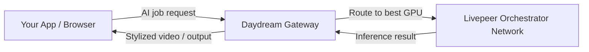

---

## Community and Resources

- [daydream.live](https://daydream.live) - Hosted app
- [docs.daydream.live](https://docs.daydream.live) - Full developer documentation
- [GitHub: Scope](https://github.com/daydreamlive/scope) - Open-source real-time AI video toolkit
- [Community Hub](https://app.daydream.live) - Discover and explore community creations
- [Discord](https://discord.com/invite/mnfGR4Fjhp) - Daydream community (builders, creatives, researchers)
- [Blog](https://blog.daydream.live) - Tutorials, creator stories, and research

---

## Related Pages

<CardGroup cols={2}>
  <Card title="Daydream Product Overview" href="/v2/solutions/daydream/overview" icon="wand-magic-sparkles" arrow>
 Full Daydream product context, videos, and ecosystem fit.
  </Card>
  <Card title="Run Your Own Gateway" href="/v2/gateways/run-a-gateway/run-a-gateway" icon="server" arrow>
 Build your own gateway node for custom AI video routing.
  </Card>
  <Card title="AI Pipelines Overview" href="/v2/developers/ai-pipelines/overview" icon="robot" arrow>
 How AI pipelines, ComfyStream, and BYOC work on Livepeer.
  </Card>
  <Card title="Find Gateway Services" href="../choosing-a-gateway" icon="compass" arrow>
 Compare all gateway providers.
  </Card>
</CardGroup>

---

### /Users/alisonhaire/Documents/Livepeer/livepeer-docs-v2_d-v2-branch/docs/gateways/using-gateways/gateway-providers/livepeer-studio-gateway.mdx

---
title: Using the Livepeer Studio Gateway
sidebarTitle: Livepeer Studio
description: >-
  Livepeer Studio is a hosted, production-grade gateway for live streaming and
  video-on-demand. Get a REST API, SDK support, and a management dashboard - no
  infrastructure to run.
keywords:
  - livepeer
  - livepeer studio
  - gateway
  - live streaming
  - video on demand
  - vod
  - rtmp
  - api key
  - sdk
  - hosted gateway
'og:image': /snippets/assets/site/og-image/fallback.png
'og:image:alt': Livepeer Docs social preview image
'og:image:type': image/png
'og:image:width': 1200
'og:image:height': 630
purpose: concept
pageType: guide
audience: developer
status: current
---

import { BorderedBox } from '/snippets/components/layout/containers.jsx'
import { StyledTable, TableRow, TableCell } from '/snippets/components/layout/tables.jsx'


Livepeer Studio is a **developer-friendly hosted gateway** for the Livepeer network. It provides a REST API, SDKs, and a dashboard to add live streaming and video-on-demand to your application - without running your own gateway node.

<Info>
 Livepeer Studio has its own full product documentation. This page covers Studio as a gateway provider in the context of the Livepeer network. For complete product guides, visit the [Livepeer Studio product section](/v2/solutions/livepeer-studio/overview) or [livepeer.studio](https://livepeer.studio).
</Info>

## Start here in 5 minutes

<BorderedBox variant="accent" padding="16px">

- **Prereqs:** Livepeer Studio account and backend environment for secure API key usage
- **Time:** 5 minutes
- **Outcome:** API key created and first API call authenticated
- **First action:** Create an API key in Studio, set `LIVEPEER_STUDIO_API_KEY`, then call `GET https://livepeer.studio/api/stream`

</BorderedBox>

---

## What Studio Gives You

- **Livestreaming** - Create streams, ingest via RTMP or WebRTC WHIP, play back via low-latency WebRTC or HLS, record sessions, and multistream to other platforms
- **Video on demand** - Upload video assets (TUS resumable or URL), transcode, play back with the Livepeer Player or any HLS/MP4 player
- **AI inference** - Access the Livepeer AI network via Studio's `/api/beta/generate` endpoints (text-to-image, image-to-image, image-to-video, and more). As of 02-March-2026, this remains the managed Studio AI base path.
- **Access control** - Gate playback with webhooks or JWTs for subscriptions and token-gating
- **Analytics** - Viewership and engagement metrics via the viewership API
- **Webhooks** - Event-driven notifications for stream and asset lifecycle events

---

## Getting Started

### 1. Create an account and API key

1. Go to [livepeer.studio](https://livepeer.studio) and create an account
2. Open **Developers → API Keys** and create a new key
3. Store your API key in environment variables - never expose it in client-side code

<Warning>
 API keys grant full account access. Always make API requests from your backend. CORS-enabled keys are deprecated and not recommended for new integrations.
</Warning>

### 2. Install the SDK

<Tabs>
  <Tab title="TypeScript">
    ```bash
    npm install livepeer @livepeer/react
    ```
    ```typescript
    import Livepeer from "livepeer";

    const livepeer = new Livepeer({
      apiKey: process.env.LIVEPEER_STUDIO_API_KEY,
    });
    ```
  </Tab>
  <Tab title="Python">
    ```bash
    pip install livepeer
    ```
    ```python
    from livepeer import Livepeer

    livepeer = Livepeer(api_key=os.environ["LIVEPEER_STUDIO_API_KEY"])
    ```
  </Tab>
  <Tab title="Go">
    ```bash
    go get github.com/livepeer/livepeer-go
    ```
    ```go
    client := livepeer.New(livepeer.WithAPIKey(os.Getenv("LIVEPEER_STUDIO_API_KEY")))
    ```
  </Tab>
  <Tab title="REST">
    ```bash
    curl -X GET "https://livepeer.studio/api/stream" \
      -H "Authorization: Bearer <LIVEPEER_STUDIO_API_KEY>"
    ```
  </Tab>
</Tabs>

---

## Common Tasks

### Create a livestream

```typescript
const { data } = await livepeer.stream.create({ name: "my-stream" });
console.log("Stream key:", data.streamKey);       // Give to broadcaster
console.log("Playback ID:", data.playbackId);     // Use in your app
```

Broadcast via RTMP to `rtmp://rtmp.livepeer.com/live` using the stream key. Play back via HLS at `https://livepeercdn.studio/hls/{playbackId}/index.m3u8` or with the Livepeer React Player. As of 02-March-2026, `livepeercdn.studio` is the documented Studio HLS playback host.

### Upload a video asset

```typescript
// Upload via URL
const { asset } = await livepeer.asset.createViaUrl({
  name: "my-video",
  url: "https://example.com/video.mp4",
});
console.log("Playback ID:", asset.playbackId);
```

### Run an AI inference job

Studio exposes Livepeer's AI network via the `/api/beta/generate` endpoint family:

```typescript
// Text-to-image (example using the AI SDK)
import { Livepeer } from "@livepeer/ai";

const livepeer = new Livepeer({
  httpBearer: process.env.LIVEPEER_STUDIO_API_KEY,
});

const result = await livepeer.generate.textToImage({
  prompt: "A futuristic cityscape at night",
  modelId: "SG161222/RealVisXL_V4.0_Lightning",
});
```

<Note>
 As of 02-March-2026, use `https://livepeer.studio/api/beta/generate` with `Authorization: Bearer <LIVEPEER_STUDIO_API_KEY>` for Studio-managed AI inference.
</Note>

---

## SDK and API Summary

<StyledTable variant="bordered">
  <thead>
    <TableRow header>
 <TableCell header>Resource</TableCell>
 <TableCell header>Link</TableCell>
    </TableRow>
  </thead>
  <tbody>
    <TableRow>
 <TableCell>Studio API base URL</TableCell>
      <TableCell>`https://livepeer.studio/api`</TableCell>
    </TableRow>
    <TableRow>
 <TableCell>AI inference endpoint</TableCell>
      <TableCell>`https://livepeer.studio/api/beta/generate`</TableCell>
    </TableRow>
    <TableRow>
 <TableCell>TypeScript SDK</TableCell>
 <TableCell>[`livepeer` on npm](https://www.npmjs.com/package/livepeer)</TableCell>
    </TableRow>
    <TableRow>
 <TableCell>AI SDK</TableCell>
 <TableCell>[`@livepeer/ai` on npm](https://www.npmjs.com/package/@livepeer/ai)</TableCell>
    </TableRow>
    <TableRow>
 <TableCell>React components</TableCell>
 <TableCell>[`@livepeer/react` on npm](https://www.npmjs.com/package/@livepeer/react)</TableCell>
    </TableRow>
    <TableRow>
 <TableCell>Full API reference</TableCell>
 <TableCell>[livepeer.studio/docs](https://livepeer.studio/docs)</TableCell>
    </TableRow>
  </tbody>
</StyledTable>

---

## Studio vs. Running Your Own Gateway

Studio is the right choice for most developers. Run your own gateway only when you need custom routing, compliance requirements, or are building a product that itself provides gateway services.

<CardGroup cols={2}>
  <Card title="Studio Product Docs" href="/v2/solutions/livepeer-studio/overview" icon="video-arrow-up-right" arrow>
 Full guides: livestreaming, VOD, access control, analytics.
  </Card>
  <Card title="Run Your Own Gateway" href="/v2/gateways/run-a-gateway/why-run-a-gateway" icon="server" arrow>
 When and why to operate your own node.
  </Card>
  <Card title="AI Quickstart" href="/v2/developers/quickstart/ai/ai-pipelines" icon="robot" arrow>
 Build your first AI inference integration in minutes.
  </Card>
  <Card title="Find Gateway Services" href="../choosing-a-gateway" icon="compass" arrow>
 Compare all gateway provider options.
  </Card>
</CardGroup>

---

### /Users/alisonhaire/Documents/Livepeer/livepeer-docs-v2_d-v2-branch/docs/gateways/references/arbitrum-exchanges.mdx

---
mode: wide
title: Arbitrum Exchange Reference
sidebarTitle: Arbitrum Exchange Reference
description: >-
  List of Exchanges that support Arbitrum One - dynamically fetched from
  CoinGecko
keywords:
  - livepeer
  - gateways
  - references
  - artibtrum exchanges
  - arbitrum
  - exchange
  - reference
  - exchanges
  - support
'og:image': /snippets/assets/site/og-image/fallback.png
'og:image:alt': Livepeer Docs social preview image
'og:image:type': image/png
'og:image:width': 1200
'og:image:height': 630
audience: gateway-operator
purpose: reference
---


import { CoinGeckoExchanges } from '/snippets/components/data/coingecko.jsx'

<Note>
 Livepeer does not recommend any specific exchange. This is provided as a
 convenient reference only.
</Note>

## Exchanges that support Arbitrum One

This list (limited to 100 results) is dynamically fetched from [CoinGecko](https://www.coingecko.com/en/coins/arbitrum) using their [API](https://www.coingecko.com/en/api/documentation) and displayed in a sortable table, defaulting to the order provided by CoinGecko (which is typically sorted by trading volume/liquidity).

<CoinGeckoExchanges coinId="arbitrum" />

---

### /Users/alisonhaire/Documents/Livepeer/livepeer-docs-v2_d-v2-branch/docs/gateways/references/arbitrum-rpc.mdx

---
title: Arbitrum RPCs
sidebarTitle: Arbitrum RPC Reference
description: List of Public Arbitrum RPCs
keywords:
  - livepeer
  - gateways
  - references
  - arbitrum rpc
  - arbitrum
  - rpcs
  - public
'og:image': /snippets/assets/site/og-image/fallback.png
'og:image:alt': Livepeer Docs social preview image
'og:image:type': image/png
'og:image:width': 1200
'og:image:height': 630
audience: gateway-operator
purpose: reference
---


import { ChainlistRPCs } from '/snippets/data/references/chainlist.jsx'

Public RPC endpoints from [Chainlist](https://chainlist.org/chain/42161) (dynamically updated):

<ChainlistRPCs chainId={42161} />

---

### /Users/alisonhaire/Documents/Livepeer/livepeer-docs-v2_d-v2-branch/docs/gateways/references/cli-commands.mdx

---
title: Gateway CLI Commands
sidebarTitle: CLI Commands
description: 'Reference: full list of CLI commands for Livepeer Gateways'
keywords:
  - livepeer
  - gateways
  - references
  - cli commands
  - gateway
  - commands
  - reference
'og:image': /snippets/assets/site/og-image/fallback.png
'og:image:alt': Livepeer Docs social preview image
'og:image:type': image/png
'og:image:width': 1200
'og:image:height': 630
audience: gateway-operator
purpose: reference
---


# Livepeer CLI Commands
<Card title="CLI Tools Codebase" href="https://github.com/livepeer/wiki" icon="github" arrow horizontal>
 View CLI Tools Codebase on Github
</Card>


## Quick Reference

| Category | Commands | Node Type |
|----------|----------|-----------|
| **General** | Get node status, View protocol parameters, List orchestrators, Initialize round | All |
| **Gateway/Broadcaster** | Set broadcast config, Set max price per capability, Deposit/withdraw funds | Gateway |
| **Orchestrator** | Activate orchestrator, Set config, Set price, Call reward, Vote | Orchestrator |
| **Ethereum** | Transfer tokens, Set gas prices, Request test tokens, Sign message | All (on-chain) |
| **Staking** | Bond, Unbond, Rebond, Withdraw stake/fees | All |

---

## Detailed Command List

### General Commands (All Node Types)
- **Get node status** - Display node information, balances, and configuration
- **View protocol parameters** - Show protocol state and parameters
- **List registered orchestrators** - Display available orchestrators
- **Initialize round** - Initialize a new protocol round

### Gateway/Broadcaster Commands
- **Set broadcast config** - Configure transcoding options and max price
- **Set max price per capability** - Set pricing for AI capabilities
- **Deposit broadcasting funds** - Add ETH for paying orchestrators
- **Unlock broadcasting funds** - Unlock deposited funds
- **Withdraw broadcasting funds** - Withdraw unlocked funds

### Orchestrator Commands
- **Activate orchestrator** - Multi-step process to become an orchestrator
- **Set orchestrator config** - Update price, reward cut, fee share, service URI
- **Invoke reward** - Claim orchestrator rewards for current round
- **Set max ticket face value** - Configure maximum ticket value
- **Set price for broadcaster** - Set specific price for a broadcaster
- **Set maximum sessions** - Limit concurrent transcoding sessions
- **Vote in governance poll** - Participate in protocol governance
- **Vote on treasury proposal** - Vote on treasury proposals

### Staking and Token Commands
- **Bond tokens** - Delegate LPT to an orchestrator
- **Unbond tokens** - Remove delegated tokens (starts unbonding period)
- **Rebond tokens** - Rebond tokens in unbonding state
- **Withdraw stake** - Withdraw completed unbonding stake
- **Withdraw fees** - Withdraw earned fees (ETH)
- **Transfer tokens** - Transfer LPT to another address

### Ethereum Operations
- **Set maximum gas price** - Configure max gas for transactions
- **Set minimum gas price** - Configure min gas for transactions
- **Get test LPT** - Request test tokens (testnet only)
- **Get test ETH** - Instructions for testnet ETH faucet
- **Sign message** - Sign message with node's private key
- **Sign typed data** - Sign EIP-712 typed data

## HTTP API Endpoints

The CLI commands map to HTTP endpoints on the CLI server (default port 5935) :

- `/status` - Node status
- `/protocolParameters` - Protocol info
- `/registeredOrchestrators` - Orchestrator list
- `/bond`, `/unbond`, `/rebond` - Staking operations
- `/activateOrchestrator` - Orchestrator activation
- `/setBroadcastConfig` - Broadcast configuration
- `/setMaxPriceForCapability` - AI pricing
- `/reward` - Claim rewards
- `/transferTokens` - Token transfers
- `/signMessage` - Message signing

## Notes

- Commands are filtered based on node type - some only appear for orchestrators or gateways
- Testnet commands (like getting test tokens) only appear on test networks
- The CLI connects to the node's HTTP API, typically on port 5935 for gateways and 7935 for orchestrators

---

### /Users/alisonhaire/Documents/Livepeer/livepeer-docs-v2_d-v2-branch/docs/gateways/references/configuration-flags.mdx

---
title: Gateway Configuration Flags
sidebarTitle: Configuration Flags
description: 'Reference: full list of configuration flags for Livepeer Gateways'
keywords:
  - livepeer
  - gateways
  - references
  - configuration flags
  - gateway
  - configuration
  - flags
  - reference
'og:image': /snippets/assets/site/og-image/fallback.png
'og:image:alt': Livepeer Docs social preview image
'og:image:type': image/png
'og:image:width': 1200
'og:image:height': 630
audience: gateway-operator
purpose: reference
---


<Note>
 This reference is manually maintained. For the most current flags, see the
 [go-livepeer source](https://github.com/livepeer/go-livepeer).
</Note>

import { DoubleIconLink } from '/snippets/components/primitives/links.jsx'

## Gateway Configuration Flags

{/* Related Code Sections:

- <DoubleIconLink
    label="AI Processing (livepeer/go-livepeer)"
    href="https://github.com/livepeer/go-livepeer/wiki/AI-Processing"
    iconLeft="github"
  />
- <DoubleIconLink
    label="Video Pipeline (livepeer/go-livepeer)"
    href="https://github.com/livepeer/go-livepeer/wiki/Video-Pipeline"
    iconLeft="github"
  /> */}

<div style={{ marginTop: '1rem', fontSize: '0.85rem', color: '#888' }}>
 <span style={{ color: '#3b82f6', marginLeft: '1rem' }}>● Video</span>
 <span style={{ color: '#a855f7', marginLeft: '1rem' }}>● AI</span>
 <span style={{ color: '#4ade80', marginLeft: '1rem' }}>● Both</span>
</div>

<div style={{ overflowX: 'auto' }}>
<table style={{ width: '100%', borderCollapse: 'collapse', fontSize: '0.9rem' }}>
  <thead>
    <tr style={{ backgroundColor: '#2d9a67', color: '#fff' }}>
 <th style={{ padding: '12px 16px', textAlign: 'left', fontWeight: '600', borderBottom: '2px solid #2d9a67' }}>Flag</th>
 <th style={{ padding: '12px 16px', textAlign: 'center', fontWeight: '600', borderBottom: '2px solid #2d9a67', width: '100px' }}>Type</th>
 <th style={{ padding: '12px 16px', textAlign: 'left', fontWeight: '600', borderBottom: '2px solid #2d9a67' }}>Description</th>
    </tr>
  </thead>
  <tbody>
    <tr style={{ backgroundColor: '#1a1a1a' }}>
 <td colSpan="3" style={{ padding: '10px 16px', fontWeight: '700', color: '#2d9a67', borderBottom: '1px solid #333' }}>Network & Addresses</td>
    </tr>
    <tr style={{ borderBottom: '1px solid #333' }}>
 <td style={{ padding: '10px 16px', fontFamily: 'monospace', color: '#4ade80' }}><code>-network</code></td>
 <td style={{ padding: '10px 16px', textAlign: 'center', color: '#4ade80' }}>Both</td>
 <td style={{ padding: '10px 16px' }}>Network to connect to (offchain, arbitrum-one-mainnet, etc.)</td>
    </tr>
    <tr style={{ borderBottom: '1px solid #333' }}>
 <td style={{ padding: '10px 16px', fontFamily: 'monospace', color: '#3b82f6' }}><code>-rtmpAddr</code></td>
 <td style={{ padding: '10px 16px', textAlign: 'center', color: '#3b82f6' }}>Video</td>
 <td style={{ padding: '10px 16px' }}>Address to bind for RTMP commands (video ingest)</td>
    </tr>
    <tr style={{ borderBottom: '1px solid #333' }}>
 <td style={{ padding: '10px 16px', fontFamily: 'monospace', color: '#4ade80' }}><code>-cliAddr</code></td>
 <td style={{ padding: '10px 16px', textAlign: 'center', color: '#4ade80' }}>Both</td>
 <td style={{ padding: '10px 16px' }}>Address to bind for CLI commands</td>
    </tr>
    <tr style={{ borderBottom: '1px solid #333' }}>
 <td style={{ padding: '10px 16px', fontFamily: 'monospace', color: '#4ade80' }}><code>-httpAddr</code></td>
 <td style={{ padding: '10px 16px', textAlign: 'center', color: '#4ade80' }}>Both</td>
 <td style={{ padding: '10px 16px' }}>Address to bind for HTTP commands</td>
    </tr>
    <tr style={{ borderBottom: '1px solid #333' }}>
 <td style={{ padding: '10px 16px', fontFamily: 'monospace', color: '#4ade80' }}><code>-serviceAddr</code></td>
 <td style={{ padding: '10px 16px', textAlign: 'center', color: '#4ade80' }}>Both</td>
 <td style={{ padding: '10px 16px' }}>Orchestrator service URI for broadcasters to contact</td>
    </tr>
    <tr style={{ borderBottom: '1px solid #333' }}>
 <td style={{ padding: '10px 16px', fontFamily: 'monospace', color: '#4ade80' }}><code>-gatewayHost</code></td>
 <td style={{ padding: '10px 16px', textAlign: 'center', color: '#4ade80' }}>Both</td>
 <td style={{ padding: '10px 16px' }}>External hostname where Gateway node is running</td>
    </tr>

    <tr style={{ backgroundColor: '#1a1a1a' }}>
 <td colSpan="3" style={{ padding: '10px 16px', fontWeight: '700', color: '#2d9a67', borderBottom: '1px solid #333' }}>Node Type</td>
    </tr>
    <tr style={{ borderBottom: '1px solid #333' }}>
 <td style={{ padding: '10px 16px', fontFamily: 'monospace', color: '#4ade80' }}><code>-gateway</code></td>
 <td style={{ padding: '10px 16px', textAlign: 'center', color: '#4ade80' }}>Both</td>
 <td style={{ padding: '10px 16px' }}>Set to true to be a gateway (handles both video and AI)</td>
    </tr>
    <tr style={{ borderBottom: '1px solid #333' }}>
 <td style={{ padding: '10px 16px', fontFamily: 'monospace', color: '#4ade80' }}><code>-orchestrator</code></td>
 <td style={{ padding: '10px 16px', textAlign: 'center', color: '#4ade80' }}>Both</td>
 <td style={{ padding: '10px 16px' }}>Set to true to be an orchestrator</td>
    </tr>
    <tr style={{ borderBottom: '1px solid #333' }}>
 <td style={{ padding: '10px 16px', fontFamily: 'monospace', color: '#3b82f6' }}><code>-transcoder</code></td>
 <td style={{ padding: '10px 16px', textAlign: 'center', color: '#3b82f6' }}>Video</td>
 <td style={{ padding: '10px 16px' }}>Set to true to be a transcoder</td>
    </tr>
    <tr style={{ borderBottom: '1px solid #333' }}>
 <td style={{ padding: '10px 16px', fontFamily: 'monospace', color: '#a855f7' }}><code>-aiWorker</code></td>
 <td style={{ padding: '10px 16px', textAlign: 'center', color: '#a855f7' }}>AI</td>
 <td style={{ padding: '10px 16px' }}>Set to true to run an AI worker</td>
    </tr>
    <tr style={{ borderBottom: '1px solid #333' }}>
 <td style={{ padding: '10px 16px', fontFamily: 'monospace', color: '#3b82f6', opacity: 0.6 }}><code>-broadcaster</code></td>
 <td style={{ padding: '10px 16px', textAlign: 'center', color: '#3b82f6', opacity: 0.6 }}>Video</td>
 <td style={{ padding: '10px 16px', opacity: 0.6 }}>⚠️ Set to true to be a broadcaster <em>(deprecated, use -gateway)</em></td>
    </tr>

    <tr style={{ backgroundColor: '#1a1a1a' }}>
 <td colSpan="3" style={{ padding: '10px 16px', fontWeight: '700', color: '#3b82f6', borderBottom: '1px solid #333' }}>Video Transcoding</td>
    </tr>
    <tr style={{ borderBottom: '1px solid #333' }}>
 <td style={{ padding: '10px 16px', fontFamily: 'monospace', color: '#3b82f6' }}><code>-transcodingOptions</code></td>
 <td style={{ padding: '10px 16px', textAlign: 'center', color: '#3b82f6' }}>Video</td>
 <td style={{ padding: '10px 16px' }}>Transcoding profiles for broadcast job</td>
    </tr>
    <tr style={{ borderBottom: '1px solid #333' }}>
 <td style={{ padding: '10px 16px', fontFamily: 'monospace', color: '#3b82f6' }}><code>-maxAttempts</code></td>
 <td style={{ padding: '10px 16px', textAlign: 'center', color: '#3b82f6' }}>Video</td>
 <td style={{ padding: '10px 16px' }}>Maximum transcode attempts</td>
    </tr>
    <tr style={{ borderBottom: '1px solid #333' }}>
 <td style={{ padding: '10px 16px', fontFamily: 'monospace', color: '#4ade80' }}><code>-maxSessions</code></td>
 <td style={{ padding: '10px 16px', textAlign: 'center', color: '#4ade80' }}>Both</td>
 <td style={{ padding: '10px 16px' }}>Max concurrent sessions (transcoding for orchestrator, RTMP streams for gateway)</td>
    </tr>
    <tr style={{ borderBottom: '1px solid #333' }}>
 <td style={{ padding: '10px 16px', fontFamily: 'monospace', color: '#3b82f6' }}><code>-nvidia</code></td>
 <td style={{ padding: '10px 16px', textAlign: 'center', color: '#3b82f6' }}>Video</td>
 <td style={{ padding: '10px 16px' }}>Comma-separated list of Nvidia GPU device IDs</td>
    </tr>
    <tr style={{ borderBottom: '1px solid #333' }}>
 <td style={{ padding: '10px 16px', fontFamily: 'monospace', color: '#3b82f6' }}><code>-netint</code></td>
 <td style={{ padding: '10px 16px', textAlign: 'center', color: '#3b82f6' }}>Video</td>
 <td style={{ padding: '10px 16px' }}>Comma-separated list of NetInt device GUIDs</td>
    </tr>
    <tr style={{ borderBottom: '1px solid #333' }}>
 <td style={{ padding: '10px 16px', fontFamily: 'monospace', color: '#3b82f6' }}><code>-hevcDecoding</code></td>
 <td style={{ padding: '10px 16px', textAlign: 'center', color: '#3b82f6' }}>Video</td>
 <td style={{ padding: '10px 16px' }}>Enable or disable HEVC decoding</td>
    </tr>
    <tr style={{ borderBottom: '1px solid #333' }}>
 <td style={{ padding: '10px 16px', fontFamily: 'monospace', color: '#3b82f6' }}><code>-testTranscoder</code></td>
 <td style={{ padding: '10px 16px', textAlign: 'center', color: '#3b82f6' }}>Video</td>
 <td style={{ padding: '10px 16px' }}>Test Nvidia GPU transcoding at startup</td>
    </tr>
    <tr style={{ borderBottom: '1px solid #333' }}>
 <td style={{ padding: '10px 16px', fontFamily: 'monospace', color: '#3b82f6' }}><code>-currentManifest</code></td>
 <td style={{ padding: '10px 16px', textAlign: 'center', color: '#3b82f6' }}>Video</td>
 <td style={{ padding: '10px 16px' }}>Expose active ManifestID as "/stream/current.m3u8"</td>
    </tr>

    <tr style={{ backgroundColor: '#1a1a1a' }}>
 <td colSpan="3" style={{ padding: '10px 16px', fontWeight: '700', color: '#a855f7', borderBottom: '1px solid #333' }}>AI Processing</td>
    </tr>
    <tr style={{ borderBottom: '1px solid #333' }}>
 <td style={{ padding: '10px 16px', fontFamily: 'monospace', color: '#a855f7' }}><code>-aiServiceRegistry</code></td>
 <td style={{ padding: '10px 16px', textAlign: 'center', color: '#a855f7' }}>AI</td>
 <td style={{ padding: '10px 16px' }}>Use an AI ServiceRegistry contract address</td>
    </tr>
    <tr style={{ borderBottom: '1px solid #333' }}>
 <td style={{ padding: '10px 16px', fontFamily: 'monospace', color: '#a855f7' }}><code>-aiModels</code></td>
 <td style={{ padding: '10px 16px', textAlign: 'center', color: '#a855f7' }}>AI</td>
 <td style={{ padding: '10px 16px' }}>Models (pipeline:model_id) for AI worker to load</td>
    </tr>
    <tr style={{ borderBottom: '1px solid #333' }}>
 <td style={{ padding: '10px 16px', fontFamily: 'monospace', color: '#a855f7' }}><code>-aiModelsDir</code></td>
 <td style={{ padding: '10px 16px', textAlign: 'center', color: '#a855f7' }}>AI</td>
 <td style={{ padding: '10px 16px' }}>Directory where AI model weights are stored</td>
    </tr>
    <tr style={{ borderBottom: '1px solid #333' }}>
 <td style={{ padding: '10px 16px', fontFamily: 'monospace', color: '#a855f7', opacity: 0.6 }}><code>-aiRunnerImage</code></td>
 <td style={{ padding: '10px 16px', textAlign: 'center', color: '#a855f7', opacity: 0.6 }}>AI</td>
 <td style={{ padding: '10px 16px', opacity: 0.6 }}>⚠️ Docker image for the AI runner <em>(deprecated use -aiRunnerImageOverrides)</em></td>
    </tr>
    <tr style={{ borderBottom: '1px solid #333' }}>
 <td style={{ padding: '10px 16px', fontFamily: 'monospace', color: '#a855f7' }}><code>-aiRunnerImageOverrides</code></td>
 <td style={{ padding: '10px 16px', textAlign: 'center', color: '#a855f7' }}>AI</td>
 <td style={{ padding: '10px 16px' }}>Docker image overrides for different pipelines</td>
    </tr>
    <tr style={{ borderBottom: '1px solid #333' }}>
 <td style={{ padding: '10px 16px', fontFamily: 'monospace', color: '#a855f7' }}><code>-aiVerboseLogs</code></td>
 <td style={{ padding: '10px 16px', textAlign: 'center', color: '#a855f7' }}>AI</td>
 <td style={{ padding: '10px 16px' }}>Enable verbose logs for AI runner containers</td>
    </tr>
    <tr style={{ borderBottom: '1px solid #333' }}>
 <td style={{ padding: '10px 16px', fontFamily: 'monospace', color: '#a855f7' }}><code>-aiProcessingRetryTimeout</code></td>
 <td style={{ padding: '10px 16px', textAlign: 'center', color: '#a855f7' }}>AI</td>
 <td style={{ padding: '10px 16px' }}>Timeout for retrying AI processing requests</td>
    </tr>
    <tr style={{ borderBottom: '1px solid #333' }}>
 <td style={{ padding: '10px 16px', fontFamily: 'monospace', color: '#a855f7' }}><code>-aiRunnerContainersPerGPU</code></td>
 <td style={{ padding: '10px 16px', textAlign: 'center', color: '#a855f7' }}>AI</td>
 <td style={{ padding: '10px 16px' }}>Number of AI runner containers per GPU</td>
    </tr>

    <tr style={{ backgroundColor: '#1a1a1a' }}>
 <td colSpan="3" style={{ padding: '10px 16px', fontWeight: '700', color: '#a855f7', borderBottom: '1px solid #333' }}>Live AI Video</td>
    </tr>
    <tr style={{ borderBottom: '1px solid #333' }}>
 <td style={{ padding: '10px 16px', fontFamily: 'monospace', color: '#a855f7' }}><code>-mediaMTXApiPassword</code></td>
 <td style={{ padding: '10px 16px', textAlign: 'center', color: '#a855f7' }}>AI</td>
 <td style={{ padding: '10px 16px' }}>HTTP basic auth password for MediaMTX API</td>
    </tr>
    <tr style={{ borderBottom: '1px solid #333' }}>
 <td style={{ padding: '10px 16px', fontFamily: 'monospace', color: '#a855f7' }}><code>-liveAITrickleHostForRunner</code></td>
 <td style={{ padding: '10px 16px', textAlign: 'center', color: '#a855f7' }}>AI</td>
 <td style={{ padding: '10px 16px' }}>Trickle Host used by AI Runner</td>
    </tr>
    <tr style={{ borderBottom: '1px solid #333' }}>
 <td style={{ padding: '10px 16px', fontFamily: 'monospace', color: '#a855f7' }}><code>-liveAIAuthApiKey</code></td>
 <td style={{ padding: '10px 16px', textAlign: 'center', color: '#a855f7' }}>AI</td>
 <td style={{ padding: '10px 16px' }}>API key for Live AI authentication requests</td>
    </tr>
    <tr style={{ borderBottom: '1px solid #333' }}>
 <td style={{ padding: '10px 16px', fontFamily: 'monospace', color: '#a855f7' }}><code>-liveAIAuthWebhookUrl</code></td>
 <td style={{ padding: '10px 16px', textAlign: 'center', color: '#a855f7' }}>AI</td>
 <td style={{ padding: '10px 16px' }}>Live AI RTMP authentication webhook URL</td>
    </tr>
    <tr style={{ borderBottom: '1px solid #333' }}>
 <td style={{ padding: '10px 16px', fontFamily: 'monospace', color: '#a855f7' }}><code>-livePaymentInterval</code></td>
 <td style={{ padding: '10px 16px', textAlign: 'center', color: '#a855f7' }}>AI</td>
 <td style={{ padding: '10px 16px' }}>Interval for Gateway ↔ Orchestrator payments for Live AI</td>
    </tr>

    <tr style={{ backgroundColor: '#1a1a1a' }}>
 <td colSpan="3" style={{ padding: '10px 16px', fontWeight: '700', color: '#3b82f6', borderBottom: '1px solid #333' }}>Orchestrator Selection</td>
    </tr>
    <tr style={{ borderBottom: '1px solid #333' }}>
 <td style={{ padding: '10px 16px', fontFamily: 'monospace', color: '#3b82f6' }}><code>-orchAddr</code></td>
 <td style={{ padding: '10px 16px', textAlign: 'center', color: '#3b82f6' }}>Video</td>
 <td style={{ padding: '10px 16px' }}>Comma-separated list of orchestrators to connect to</td>
    </tr>
    <tr style={{ borderBottom: '1px solid #333' }}>
 <td style={{ padding: '10px 16px', fontFamily: 'monospace', color: '#3b82f6' }}><code>-orchWebhookUrl</code></td>
 <td style={{ padding: '10px 16px', textAlign: 'center', color: '#3b82f6' }}>Video</td>
 <td style={{ padding: '10px 16px' }}>Orchestrator discovery callback URL</td>
    </tr>
    <tr style={{ borderBottom: '1px solid #333' }}>
 <td style={{ padding: '10px 16px', fontFamily: 'monospace', color: '#3b82f6' }}><code>-orchBlocklist</code></td>
 <td style={{ padding: '10px 16px', textAlign: 'center', color: '#3b82f6' }}>Video</td>
 <td style={{ padding: '10px 16px' }}>Comma-separated list of blocklisted orchestrators</td>
    </tr>
    <tr style={{ borderBottom: '1px solid #333' }}>
 <td style={{ padding: '10px 16px', fontFamily: 'monospace', color: '#3b82f6' }}><code>-orchMinLivepeerVersion</code></td>
 <td style={{ padding: '10px 16px', textAlign: 'center', color: '#3b82f6' }}>Video</td>
 <td style={{ padding: '10px 16px' }}>Minimal go-livepeer version for orchestrators</td>
    </tr>
    <tr style={{ borderBottom: '1px solid #333' }}>
 <td style={{ padding: '10px 16px', fontFamily: 'monospace', color: '#3b82f6' }}><code>-selectRandFreq</code></td>
 <td style={{ padding: '10px 16px', textAlign: 'center', color: '#3b82f6' }}>Video</td>
 <td style={{ padding: '10px 16px' }}>Weight of random factor in orchestrator selection</td>
    </tr>
    <tr style={{ borderBottom: '1px solid #333' }}>
 <td style={{ padding: '10px 16px', fontFamily: 'monospace', color: '#3b82f6' }}><code>-selectStakeWeight</code></td>
 <td style={{ padding: '10px 16px', textAlign: 'center', color: '#3b82f6' }}>Video</td>
 <td style={{ padding: '10px 16px' }}>Weight of stake factor in orchestrator selection</td>
    </tr>
    <tr style={{ borderBottom: '1px solid #333' }}>
 <td style={{ padding: '10px 16px', fontFamily: 'monospace', color: '#3b82f6' }}><code>-selectPriceWeight</code></td>
 <td style={{ padding: '10px 16px', textAlign: 'center', color: '#3b82f6' }}>Video</td>
 <td style={{ padding: '10px 16px' }}>Weight of price factor in orchestrator selection</td>
    </tr>
    <tr style={{ borderBottom: '1px solid #333' }}>
 <td style={{ padding: '10px 16px', fontFamily: 'monospace', color: '#3b82f6' }}><code>-selectPriceExpFactor</code></td>
 <td style={{ padding: '10px 16px', textAlign: 'center', color: '#3b82f6' }}>Video</td>
 <td style={{ padding: '10px 16px' }}>Significance of small price changes in selection</td>
    </tr>
    <tr style={{ borderBottom: '1px solid #333' }}>
 <td style={{ padding: '10px 16px', fontFamily: 'monospace', color: '#3b82f6' }}><code>-orchPerfStatsUrl</code></td>
 <td style={{ padding: '10px 16px', textAlign: 'center', color: '#3b82f6' }}>Video</td>
 <td style={{ padding: '10px 16px' }}>URL of Orchestrator Performance Stream Tester</td>
    </tr>
    <tr style={{ borderBottom: '1px solid #333' }}>
 <td style={{ padding: '10px 16px', fontFamily: 'monospace', color: '#3b82f6' }}><code>-region</code></td>
 <td style={{ padding: '10px 16px', textAlign: 'center', color: '#3b82f6' }}>Video</td>
 <td style={{ padding: '10px 16px' }}>Region where broadcaster is deployed</td>
    </tr>
    <tr style={{ borderBottom: '1px solid #333' }}>
 <td style={{ padding: '10px 16px', fontFamily: 'monospace', color: '#3b82f6' }}><code>-minPerfScore</code></td>
 <td style={{ padding: '10px 16px', textAlign: 'center', color: '#3b82f6' }}>Video</td>
 <td style={{ padding: '10px 16px' }}>Minimum orchestrator performance score to accept</td>
    </tr>
    <tr style={{ borderBottom: '1px solid #333' }}>
 <td style={{ padding: '10px 16px', fontFamily: 'monospace', color: '#3b82f6' }}><code>-discoveryTimeout</code></td>
 <td style={{ padding: '10px 16px', textAlign: 'center', color: '#3b82f6' }}>Video</td>
 <td style={{ padding: '10px 16px' }}>Time to wait for orchestrator info for manifest</td>
    </tr>

    <tr style={{ backgroundColor: '#1a1a1a' }}>
 <td colSpan="3" style={{ padding: '10px 16px', fontWeight: '700', color: '#2d9a67', borderBottom: '1px solid #333' }}>Pricing & Payments</td>
    </tr>
    <tr style={{ borderBottom: '1px solid #333' }}>
 <td style={{ padding: '10px 16px', fontFamily: 'monospace', color: '#3b82f6' }}><code>-maxPricePerUnit</code></td>
 <td style={{ padding: '10px 16px', textAlign: 'center', color: '#3b82f6' }}>Video</td>
 <td style={{ padding: '10px 16px' }}>Maximum transcoding price per pixelsPerUnit</td>
    </tr>
    <tr style={{ borderBottom: '1px solid #333' }}>
 <td style={{ padding: '10px 16px', fontFamily: 'monospace', color: '#a855f7' }}><code>-maxPricePerCapability</code></td>
 <td style={{ padding: '10px 16px', textAlign: 'center', color: '#a855f7' }}>AI</td>
 <td style={{ padding: '10px 16px' }}>JSON list of prices per AI capability/model</td>
    </tr>
    <tr style={{ borderBottom: '1px solid #333' }}>
 <td style={{ padding: '10px 16px', fontFamily: 'monospace', color: '#4ade80' }}><code>-ignoreMaxPriceIfNeeded</code></td>
 <td style={{ padding: '10px 16px', textAlign: 'center', color: '#4ade80' }}>Both</td>
 <td style={{ padding: '10px 16px' }}>Allow exceeding max price if no orchestrator meets requirement</td>
    </tr>
    <tr style={{ borderBottom: '1px solid #333' }}>
 <td style={{ padding: '10px 16px', fontFamily: 'monospace', color: '#3b82f6' }}><code>-pricePerUnit</code></td>
 <td style={{ padding: '10px 16px', textAlign: 'center', color: '#3b82f6' }}>Video</td>
 <td style={{ padding: '10px 16px' }}>Price per pixelsPerUnit amount for transcoding</td>
    </tr>
    <tr style={{ borderBottom: '1px solid #333' }}>
 <td style={{ padding: '10px 16px', fontFamily: 'monospace', color: '#4ade80' }}><code>-pixelsPerUnit</code></td>
 <td style={{ padding: '10px 16px', textAlign: 'center', color: '#4ade80' }}>Both</td>
 <td style={{ padding: '10px 16px' }}>Amount of pixels per unit for pricing</td>
    </tr>
    <tr style={{ borderBottom: '1px solid #333' }}>
 <td style={{ padding: '10px 16px', fontFamily: 'monospace', color: '#4ade80' }}><code>-priceFeedAddr</code></td>
 <td style={{ padding: '10px 16px', textAlign: 'center', color: '#4ade80' }}>Both</td>
 <td style={{ padding: '10px 16px' }}>ETH address of Chainlink price feed contract</td>
    </tr>
    <tr style={{ borderBottom: '1px solid #333' }}>
 <td style={{ padding: '10px 16px', fontFamily: 'monospace', color: '#3b82f6' }}><code>-autoAdjustPrice</code></td>
 <td style={{ padding: '10px 16px', textAlign: 'center', color: '#3b82f6' }}>Video</td>
 <td style={{ padding: '10px 16px' }}>Enable automatic price adjustments</td>
    </tr>
    <tr style={{ borderBottom: '1px solid #333' }}>
 <td style={{ padding: '10px 16px', fontFamily: 'monospace', color: '#3b82f6' }}><code>-pricePerGateway</code></td>
 <td style={{ padding: '10px 16px', textAlign: 'center', color: '#3b82f6' }}>Video</td>
 <td style={{ padding: '10px 16px' }}>JSON list of price per gateway</td>
    </tr>
    <tr style={{ borderBottom: '1px solid #333' }}>
 <td style={{ padding: '10px 16px', fontFamily: 'monospace', color: '#3b82f6' }}><code>-pricePerBroadcaster</code></td>
 <td style={{ padding: '10px 16px', textAlign: 'center', color: '#3b82f6' }}>Video</td>
 <td style={{ padding: '10px 16px' }}>JSON list of price per broadcaster</td>
    </tr>

    <tr style={{ backgroundColor: '#1a1a1a' }}>
 <td colSpan="3" style={{ padding: '10px 16px', fontWeight: '700', color: '#2d9a67', borderBottom: '1px solid #333' }}>Blockchain / Ethereum</td>
    </tr>
    <tr style={{ borderBottom: '1px solid #333' }}>
 <td style={{ padding: '10px 16px', fontFamily: 'monospace', color: '#4ade80' }}><code>-ethAcctAddr</code></td>
 <td style={{ padding: '10px 16px', textAlign: 'center', color: '#4ade80' }}>Both</td>
 <td style={{ padding: '10px 16px' }}>Existing ETH account address</td>
    </tr>
    <tr style={{ borderBottom: '1px solid #333' }}>
 <td style={{ padding: '10px 16px', fontFamily: 'monospace', color: '#4ade80' }}><code>-ethPassword</code></td>
 <td style={{ padding: '10px 16px', textAlign: 'center', color: '#4ade80' }}>Both</td>
 <td style={{ padding: '10px 16px' }}>Password for ETH account or path to file</td>
    </tr>
    <tr style={{ borderBottom: '1px solid #333' }}>
 <td style={{ padding: '10px 16px', fontFamily: 'monospace', color: '#4ade80' }}><code>-ethKeystorePath</code></td>
 <td style={{ padding: '10px 16px', textAlign: 'center', color: '#4ade80' }}>Both</td>
 <td style={{ padding: '10px 16px' }}>Path to ETH keystore directory or keyfile</td>
    </tr>
    <tr style={{ borderBottom: '1px solid #333' }}>
 <td style={{ padding: '10px 16px', fontFamily: 'monospace', color: '#4ade80' }}><code>-ethOrchAddr</code></td>
 <td style={{ padding: '10px 16px', textAlign: 'center', color: '#4ade80' }}>Both</td>
 <td style={{ padding: '10px 16px' }}>ETH address of on-chain registered orchestrator</td>
    </tr>
    <tr style={{ borderBottom: '1px solid #333' }}>
 <td style={{ padding: '10px 16px', fontFamily: 'monospace', color: '#4ade80' }}><code>-ethUrl</code></td>
 <td style={{ padding: '10px 16px', textAlign: 'center', color: '#4ade80' }}>Both</td>
 <td style={{ padding: '10px 16px' }}>Ethereum node JSON-RPC URL</td>
    </tr>
    <tr style={{ borderBottom: '1px solid #333' }}>
 <td style={{ padding: '10px 16px', fontFamily: 'monospace', color: '#4ade80' }}><code>-ethController</code></td>
 <td style={{ padding: '10px 16px', textAlign: 'center', color: '#4ade80' }}>Both</td>
 <td style={{ padding: '10px 16px' }}>Protocol smart contract address</td>
    </tr>
    <tr style={{ borderBottom: '1px solid #333' }}>
 <td style={{ padding: '10px 16px', fontFamily: 'monospace', color: '#4ade80' }}><code>-transactionTimeout</code></td>
 <td style={{ padding: '10px 16px', textAlign: 'center', color: '#4ade80' }}>Both</td>
 <td style={{ padding: '10px 16px' }}>Time to wait for ETH transaction confirmation</td>
    </tr>
    <tr style={{ borderBottom: '1px solid #333' }}>
 <td style={{ padding: '10px 16px', fontFamily: 'monospace', color: '#4ade80' }}><code>-maxTransactionReplacements</code></td>
 <td style={{ padding: '10px 16px', textAlign: 'center', color: '#4ade80' }}>Both</td>
 <td style={{ padding: '10px 16px' }}>Number of times to replace pending ETH transactions</td>
    </tr>
    <tr style={{ borderBottom: '1px solid #333' }}>
 <td style={{ padding: '10px 16px', fontFamily: 'monospace', color: '#4ade80' }}><code>-gasLimit</code></td>
 <td style={{ padding: '10px 16px', textAlign: 'center', color: '#4ade80' }}>Both</td>
 <td style={{ padding: '10px 16px' }}>Gas limit for ETH transactions</td>
    </tr>
    <tr style={{ borderBottom: '1px solid #333' }}>
 <td style={{ padding: '10px 16px', fontFamily: 'monospace', color: '#4ade80' }}><code>-minGasPrice</code></td>
 <td style={{ padding: '10px 16px', textAlign: 'center', color: '#4ade80' }}>Both</td>
 <td style={{ padding: '10px 16px' }}>Minimum gas price for ETH transactions in wei</td>
    </tr>
    <tr style={{ borderBottom: '1px solid #333' }}>
 <td style={{ padding: '10px 16px', fontFamily: 'monospace', color: '#4ade80' }}><code>-maxGasPrice</code></td>
 <td style={{ padding: '10px 16px', textAlign: 'center', color: '#4ade80' }}>Both</td>
 <td style={{ padding: '10px 16px' }}>Maximum gas price for ETH transactions in wei</td>
    </tr>

    <tr style={{ backgroundColor: '#1a1a1a' }}>
 <td colSpan="3" style={{ padding: '10px 16px', fontWeight: '700', color: '#2d9a67', borderBottom: '1px solid #333' }}>Ticket System</td>
    </tr>
    <tr style={{ borderBottom: '1px solid #333' }}>
 <td style={{ padding: '10px 16px', fontFamily: 'monospace', color: '#4ade80' }}><code>-ticketEV</code></td>
 <td style={{ padding: '10px 16px', textAlign: 'center', color: '#4ade80' }}>Both</td>
 <td style={{ padding: '10px 16px' }}>Expected value for PM tickets</td>
    </tr>
    <tr style={{ borderBottom: '1px solid #333' }}>
 <td style={{ padding: '10px 16px', fontFamily: 'monospace', color: '#4ade80' }}><code>-maxFaceValue</code></td>
 <td style={{ padding: '10px 16px', textAlign: 'center', color: '#4ade80' }}>Both</td>
 <td style={{ padding: '10px 16px' }}>Max ticket face value in WEI</td>
    </tr>
    <tr style={{ borderBottom: '1px solid #333' }}>
 <td style={{ padding: '10px 16px', fontFamily: 'monospace', color: '#4ade80' }}><code>-maxTicketEV</code></td>
 <td style={{ padding: '10px 16px', textAlign: 'center', color: '#4ade80' }}>Both</td>
 <td style={{ padding: '10px 16px' }}>Maximum acceptable expected value for one PM ticket</td>
    </tr>
    <tr style={{ borderBottom: '1px solid #333' }}>
 <td style={{ padding: '10px 16px', fontFamily: 'monospace', color: '#4ade80' }}><code>-maxTotalEV</code></td>
 <td style={{ padding: '10px 16px', textAlign: 'center', color: '#4ade80' }}>Both</td>
 <td style={{ padding: '10px 16px' }}>Maximum acceptable expected value for one PM payment</td>
    </tr>
    <tr style={{ borderBottom: '1px solid #333' }}>
 <td style={{ padding: '10px 16px', fontFamily: 'monospace', color: '#4ade80' }}><code>-depositMultiplier</code></td>
 <td style={{ padding: '10px 16px', textAlign: 'center', color: '#4ade80' }}>Both</td>
 <td style={{ padding: '10px 16px' }}>Deposit multiplier for max acceptable ticket faceValue</td>
    </tr>

    <tr style={{ backgroundColor: '#1a1a1a' }}>
 <td colSpan="3" style={{ padding: '10px 16px', fontWeight: '700', color: '#2d9a67', borderBottom: '1px solid #333' }}>Services</td>
    </tr>
    <tr style={{ borderBottom: '1px solid #333' }}>
 <td style={{ padding: '10px 16px', fontFamily: 'monospace', color: '#4ade80' }}><code>-redeemer</code></td>
 <td style={{ padding: '10px 16px', textAlign: 'center', color: '#4ade80' }}>Both</td>
 <td style={{ padding: '10px 16px' }}>Run a ticket redemption service</td>
    </tr>
    <tr style={{ borderBottom: '1px solid #333' }}>
 <td style={{ padding: '10px 16px', fontFamily: 'monospace', color: '#4ade80' }}><code>-redeemerAddr</code></td>
 <td style={{ padding: '10px 16px', textAlign: 'center', color: '#4ade80' }}>Both</td>
 <td style={{ padding: '10px 16px' }}>URL of ticket redemption service to use</td>
    </tr>
    <tr style={{ borderBottom: '1px solid #333' }}>
 <td style={{ padding: '10px 16px', fontFamily: 'monospace', color: '#4ade80' }}><code>-reward</code></td>
 <td style={{ padding: '10px 16px', textAlign: 'center', color: '#4ade80' }}>Both</td>
 <td style={{ padding: '10px 16px' }}>Run a reward service</td>
    </tr>
    <tr style={{ borderBottom: '1px solid #333' }}>
 <td style={{ padding: '10px 16px', fontFamily: 'monospace', color: '#4ade80' }}><code>-initializeRound</code></td>
 <td style={{ padding: '10px 16px', textAlign: 'center', color: '#4ade80' }}>Both</td>
 <td style={{ padding: '10px 16px' }}>Transcoder should automatically initialize new rounds</td>
    </tr>
    <tr style={{ borderBottom: '1px solid #333' }}>
 <td style={{ padding: '10px 16px', fontFamily: 'monospace', color: '#4ade80' }}><code>-initializeRoundMaxDelay</code></td>
 <td style={{ padding: '10px 16px', textAlign: 'center', color: '#4ade80' }}>Both</td>
 <td style={{ padding: '10px 16px' }}>Maximum delay before initializing a round</td>
    </tr>

    <tr style={{ backgroundColor: '#1a1a1a' }}>
 <td colSpan="3" style={{ padding: '10px 16px', fontWeight: '700', color: '#2d9a67', borderBottom: '1px solid #333' }}>Monitoring & Metrics</td>
    </tr>
    <tr style={{ borderBottom: '1px solid #333' }}>
 <td style={{ padding: '10px 16px', fontFamily: 'monospace', color: '#4ade80' }}><code>-monitor</code></td>
 <td style={{ padding: '10px 16px', textAlign: 'center', color: '#4ade80' }}>Both</td>
 <td style={{ padding: '10px 16px' }}>Send performance metrics</td>
    </tr>
    <tr style={{ borderBottom: '1px solid #333' }}>
 <td style={{ padding: '10px 16px', fontFamily: 'monospace', color: '#4ade80' }}><code>-metricsPerStream</code></td>
 <td style={{ padding: '10px 16px', textAlign: 'center', color: '#4ade80' }}>Both</td>
 <td style={{ padding: '10px 16px' }}>Group performance metrics per stream</td>
    </tr>
    <tr style={{ borderBottom: '1px solid #333' }}>
 <td style={{ padding: '10px 16px', fontFamily: 'monospace', color: '#4ade80' }}><code>-metricsClientIP</code></td>
 <td style={{ padding: '10px 16px', textAlign: 'center', color: '#4ade80' }}>Both</td>
 <td style={{ padding: '10px 16px' }}>Expose client's IP in metrics</td>
    </tr>
    <tr style={{ borderBottom: '1px solid #333' }}>
 <td style={{ padding: '10px 16px', fontFamily: 'monospace', color: '#4ade80' }}><code>-metadataQueueUri</code></td>
 <td style={{ padding: '10px 16px', textAlign: 'center', color: '#4ade80' }}>Both</td>
 <td style={{ padding: '10px 16px' }}>URI for message broker to send operation metadata</td>
    </tr>
    <tr style={{ borderBottom: '1px solid #333' }}>
 <td style={{ padding: '10px 16px', fontFamily: 'monospace', color: '#4ade80' }}><code>-metadataAmqpExchange</code></td>
 <td style={{ padding: '10px 16px', textAlign: 'center', color: '#4ade80' }}>Both</td>
 <td style={{ padding: '10px 16px' }}>Name of AMQP exchange for operation metadata</td>
    </tr>
    <tr style={{ borderBottom: '1px solid #333' }}>
 <td style={{ padding: '10px 16px', fontFamily: 'monospace', color: '#4ade80' }}><code>-metadataPublishTimeout</code></td>
 <td style={{ padding: '10px 16px', textAlign: 'center', color: '#4ade80' }}>Both</td>
 <td style={{ padding: '10px 16px' }}>Max time to wait for publishing metadata events</td>
    </tr>

    <tr style={{ backgroundColor: '#1a1a1a' }}>
 <td colSpan="3" style={{ padding: '10px 16px', fontWeight: '700', color: '#2d9a67', borderBottom: '1px solid #333' }}>Storage</td>
    </tr>
    <tr style={{ borderBottom: '1px solid #333' }}>
 <td style={{ padding: '10px 16px', fontFamily: 'monospace', color: '#4ade80' }}><code>-dataDir</code></td>
 <td style={{ padding: '10px 16px', textAlign: 'center', color: '#4ade80' }}>Both</td>
 <td style={{ padding: '10px 16px' }}>Directory that data is stored in</td>
    </tr>
    <tr style={{ borderBottom: '1px solid #333' }}>
 <td style={{ padding: '10px 16px', fontFamily: 'monospace', color: '#4ade80' }}><code>-objectStore</code></td>
 <td style={{ padding: '10px 16px', textAlign: 'center', color: '#4ade80' }}>Both</td>
 <td style={{ padding: '10px 16px' }}>URL of primary object store</td>
    </tr>
    <tr style={{ borderBottom: '1px solid #333' }}>
 <td style={{ padding: '10px 16px', fontFamily: 'monospace', color: '#4ade80' }}><code>-recordStore</code></td>
 <td style={{ padding: '10px 16px', textAlign: 'center', color: '#4ade80' }}>Both</td>
 <td style={{ padding: '10px 16px' }}>URL of object store for recordings</td>
    </tr>

  </tbody>
</table>
</div>

---

### /Users/alisonhaire/Documents/Livepeer/livepeer-docs-v2_d-v2-branch/docs/gateways/references/contract-addresses.mdx

---
title: Contract Addresses
sidebarTitle: Contract Addresses
description: Contract Addresses for Livepeer
keywords:
  - livepeer
  - gateways
  - references
  - contract addresses
  - contract
  - addresses
'og:image': /snippets/assets/site/og-image/fallback.png
'og:image:alt': Livepeer Docs social preview image
'og:image:type': image/png
'og:image:width': 1200
'og:image:height': 630
---


---

### /Users/alisonhaire/Documents/Livepeer/livepeer-docs-v2_d-v2-branch/docs/gateways/references/livepeer-exchanges.mdx

---
mode: wide
title: Livepeer Exchanges
sidebarTitle: Livepeer Exchange Reference
description: List of exchanges that support Livepeer
keywords:
  - livepeer
  - gateways
  - references
  - livepeer exchanges
  - exchanges
  - support
'og:image': /snippets/assets/site/og-image/fallback.png
'og:image:alt': Livepeer Docs social preview image
'og:image:type': image/png
'og:image:width': 1200
'og:image:height': 630
audience: gateway-operator
purpose: reference
---


import { CoinGeckoExchanges } from '/snippets/components/data/coingecko.jsx'

<Note>
 Livepeer does not recommend any specific exchange. This is provided as a
 convenient reference only.
</Note>

## Exchanges that support Livepeer

This list (limited to 100 results) is dynamically fetched from [CoinGecko](https://www.coingecko.com/en/coins/livepeer) using their [API](https://www.coingecko.com/en/api/documentation) and displayed in a sortable table, defaulting to the order provided by CoinGecko (which is typically sorted by trading volume/liquidity).

<CoinGeckoExchanges coinId="livepeer" />

---

### /Users/alisonhaire/Documents/Livepeer/livepeer-docs-v2_d-v2-branch/docs/gateways/references/orchestrator-offerings.mdx

---
title: Orchestrator Offerings Reference
sidebarTitle: Orchestrator Offerings
description: 'Reference: Orchestrator Offerings & Discovery'
keywords:
  - livepeer
  - gateways
  - references
  - orchestrator offerings
  - orchestrator
  - offerings
  - reference
'og:image': /snippets/assets/site/og-image/fallback.png
'og:image:alt': Livepeer Docs social preview image
'og:image:type': image/png
'og:image:width': 1200
'og:image:height': 630
---


Orchestrators publish their offerings through the `OrchestratorInfo` data structure

```protobuf
message OrchestratorInfo {
    string transcoder = 1;           // Service URI
    TicketParams ticket_params = 2;   // Payment parameters
    PriceInfo price_info = 3;         // Pricing information
    bytes address = 4;               // ETH address
    Capabilities capabilities = 5;    // Supported features
    AuthToken auth_token = 6;         // Authentication
    repeated HardwareInformation hardware = 7;  // Hardware specs
    repeated OSInfo storage = 32;     // Storage options
    repeated PriceInfo capabilities_prices = 33;  // AI model pricing
}
```

### Registration Process

Orchestrators register on-chain via the `activateOrchestrator` endpoint

```bash
# Required parameters for registration
-blockRewardCut=5.0
-feeShare=10.0
-pricePerUnit=1000
-pixelsPerUnit=1000000000000
-serviceURI=https://orchestrator.example.com:8935
```

## What is Published

### 1. Service Capabilities

Orchestrators declare their processing capabilities through the `Capabilities` system

- **Video Transcoding**: Format conversion, bitrate adaptation
- **AI Processing**: Text-to-image, image-to-video, upscaling, etc.
- **Live AI**: Real-time video-to-video processing

### 2. Pricing Information

Two-tier pricing structure

- **Base Pricing**: Per-pixel rates for transcoding (`-pricePerUnit`)
- **Capability Pricing**: Per-model AI pricing (`-maxPricePerCapability`)

### 3. Hardware Specifications

Detailed hardware info for performance matching

```go
type HardwareInformation struct {
    Pipeline string                    // GPU pipeline info
    ModelId  string                    // AI model identifier
    GpuInfo  map[string]*GPUComputeInfo // GPU specifications
}
```

## Discovery Mechanisms

### 1. Direct Discovery

Gateways specify orchestrators directly

```bash
-orchAddr=https://orch1.example.com:8935,https://orch2.example.com:8935
```

### 2. Webhook Discovery

Dynamic discovery via external service

```bash
-orchWebhookUrl=https://discovery.example.com/orchestrators/orchestrators-portal
```

### 3. On-Chain Discovery

Automatic discovery of registered orchestrators

- Queries blockchain for active orchestrators
- Caches results in local database
- Polls for updates periodically

### 4. Network Capabilities API

RESTful discovery endpoint

```bash
GET /getNetworkCapabilities
```

Returns:

```json
{
  "capabilities_names": {...},
  "orchestrators": [
    {
      "address": "0x...",
      "localAddress": "0x...",
      "orchURI": "https://...",
      "capabilities": {...},
      "capabilities_prices": [...],
      "hardware": [...]
    }
  ]
}
```

## Selection Process

### Gateway Selection Logic

Gateways select orchestrators based on a multi-factor scoring algorithm

1. **Capability Matching**: Required features supported
2. **Price Constraints**: Within maximum price limits
3. **Performance Scores**: Historical performance metrics
4. **Blacklist Filtering**: Exclude problematic orchestrators
5. **Latency Considerations**: Network proximity

### Selection Algorithm

The discovery system uses a multi-factor scoring algorithm

- **Random Factor** (`-selectRandFreq`): Prevents centralization
- **Stake Weight** (`-selectStakeWeight`): Considers LPT stake
- **Price Weight** (`-selectPriceWeight`): Favors competitive pricing

## Marketplace Monitoring

### CLI Tools

Discovery and monitoring via `livepeer_cli`

```bash
livepeer_cli
# Select "Set broadcast config" to see market rates
# View available orchestrators and pricing
```

### HTTP Endpoints

Real-time marketplace data

- `/registeredOrchestrators` - All on-chain orchestrators
- `/orchestratorInfo` - Specific orchestrator details
- `/getNetworkCapabilities` - Available services and pricing

---

### /Users/alisonhaire/Documents/Livepeer/livepeer-docs-v2_d-v2-branch/docs/gateways/references/technical-architecture.mdx

---
title: Technical Architecture
sidebarTitle: Technical Architecture
description: Technical Architecture Diagrams and References
keywords:
  - livepeer
  - gateways
  - references
  - technical architecture
  - technical
  - architecture
  - diagrams
'og:image': /snippets/assets/site/og-image/fallback.png
'og:image:alt': Livepeer Docs social preview image
'og:image:type': image/png
'og:image:width': 1200
'og:image:height': 630
audience: gateway-operator
purpose: reference
---


import { ScrollableDiagram } from '/snippets/components/content/zoomableDiagram.jsx'

<Tabs>
    <Tab title="Network Layers">
        <ScrollableDiagram title="High Level Network Architecture" maxHeight="900px">
            <Mermaid
            chart={`%%{init: {'theme': 'base', 'themeVariables': { 'primaryColor': '#1a1a1a', 'primaryTextColor': '#fff', 'primaryBorderColor': '#00eb88', 'lineColor': '#00eb88', 'secondaryColor': '#2d2d2d', 'tertiaryColor': '#1a1a1a', 'edgeLabelBackground': '#1a1a1a', 'clusterBkg': '#1a1a1a', 'clusterBorder': '#00eb88' }}}%%
                flowchart TD
                subgraph AppLayer[Application Layer]
                    U[User Application]
                end
                subgraph GatewayLayer[Gateway Layer]
                    GI[Job Intake]
                    GM[Capability Matching]
                    GP[Pricing Engine]
                    GR[Routing Engine]
                end
                subgraph ComputeLayer[Orchestrator Layer]
                    OC[Orchestrator Controller]
                    OG[GPU Workers<br/>Inference, Transcoding, BYOC]
                end
                U --> GI --> GM --> GR --> OC --> OG --> OC --> GI --> U`}
            />
        </ScrollableDiagram>
    </Tab>
    <Tab title="Routing Paths">
        <ScrollableDiagram title="Routing Path Breakdown" maxHeight="900px">
            <Mermaid
                chart={`%%{init: {'theme': 'base', 'themeVariables': { 'primaryColor': '#1a1a1a', 'primaryTextColor': '#fff', 'primaryBorderColor': '#00eb88', 'lineColor': '#00eb88', 'secondaryColor': '#2d2d2d', 'tertiaryColor': '#1a1a1a', 'actorBkg': '#1a1a1a', 'actorBorder': '#00eb88', 'actorTextColor': '#fff', 'signalColor': '#00eb88', 'signalTextColor': '#fff' }}}%%
                    sequenceDiagram
                participant App
                participant Gateway
                participant Marketplace
                participant Orchestrator

                    App->>Gateway: Submit job
                    Gateway->>Marketplace: Query orchestrator capabilities
                    Marketplace-->>Gateway: Matching candidates
                    Gateway->>Orchestrator: Dispatch workload
                    Orchestrator->>Gateway: Return results
                    Gateway->>App: Deliver output`}
            />
        </ScrollableDiagram>
    </Tab>
    <Tab title="Gateway Pipelines">
        <ScrollableDiagram title="Dual Gateway Architecture: Video & AI Pipelines" maxHeight="900px">
            <Mermaid
              chart={`%%{init: {'theme': 'base', 'themeVariables': { 'primaryColor': '#1a1a1a', 'primaryTextColor': '#fff', 'primaryBorderColor': '#2d9a67', 'lineColor': '#2d9a67', 'secondaryColor': '#0d0d0d', 'tertiaryColor': '#1a1a1a', 'background': '#0d0d0d', 'fontFamily': 'system-ui' }}}%%
                flowchart LR
                subgraph INPUT["Input Sources"]
                    CAM["Camera / RTMP / WebRTC"]
                    VID["Video File"]
                    AIIN["AI Prompt / Model Request"]
                end

                GATEWAY["Gateway Node<br/>• Ingest (RTMP/HTTP/WebRTC)<br/>• Segment video<br/>• Queue + order jobs<br/>• AI pipeline routing<br/>• Orchestrator selection<br/>• Verification & receipts"]

                CAM -->|"Live stream"| GATEWAY
                VID -->|"VOD upload"| GATEWAY
                AIIN -->|"AI job request"| GATEWAY

                subgraph JOBS["Workflows"]
                    VJ["Video Transcoding Job"]
                    AIJ["AI Inference Job<br/>(Daydream / ComfyStream / BYOC)"]
                end

                GATEWAY --> VJ
                GATEWAY --> AIJ

                subgraph ORCH["Orchestrator Network (GPU Operators)"]
                    O1["Orchestrator A<br/>GPU Pool"]
                    O2["Orchestrator B<br/>GPU Pool"]
                    O3["Orchestrator C<br/>GPU Pool"]
                end

                VJ -->|"Transcode segments"| O1
                VJ --> O2
                AIJ -->|"Run model / inference"| O1
                AIJ --> O3

                subgraph OUTPUTS["Outputs"]
                    HLS["Adaptive Bitrate Video (HLS/LL-HLS)"]
                    AIOUT["AI Frames / Stylized Video"]
                end

                O1 --> GATEWAY
                O2 --> GATEWAY
                O3 --> GATEWAY

                GATEWAY --> HLS
                GATEWAY --> AIOUT

                ETH[("Arbitrum Blockchain<br/>Payments • Tickets • Rewards")]
                GATEWAY --> ETH
                O1 --> ETH
                O2 --> ETH
                O3 --> ETH

                classDef default fill:#1a1a1a,color:#fff,stroke:#2d9a67,stroke-width:2px
                style INPUT fill:#0d0d0d,stroke:#2d9a67,stroke-width:1px
                style JOBS fill:#0d0d0d,stroke:#2d9a67,stroke-width:1px
                style ORCH fill:#0d0d0d,stroke:#2d9a67,stroke-width:1px
                style OUTPUTS fill:#0d0d0d,stroke:#2d9a67,stroke-width:1px`}
            />
        </ScrollableDiagram>
    </Tab>

</Tabs>

{/* ### Marketplace Interaction Model

<Mermaid
  chart={`%%{init: {'theme': 'base', 'themeVariables': { 'primaryColor': '#1a1a1a', 'primaryTextColor': '#fff', 'primaryBorderColor': '#00eb88', 'lineColor': '#00eb88', 'secondaryColor': '#2d2d2d', 'tertiaryColor': '#1a1a1a', 'edgeLabelBackground': '#1a1a1a', 'clusterBkg': '#1a1a1a', 'clusterBorder': '#00eb88' }}}%%
    flowchart LR
    subgraph Operators
        G[Gateway Operator]
        O[Orchestrator Operator]
    end
    subgraph Marketplace
        P[Publish Offerings]
        D[Discovery API]
        R[Rating & Benchmarks]
    end
    subgraph Consumers
        A[Applications]
    end
    G --> P
    O --> P
    A --> D
    P --> R
    R --> A`}
/>

### BYOC (Bring Your Own Container) Architecture

<Mermaid
  chart={`%%{init: {'theme': 'base', 'themeVariables': { 'primaryColor': '#1a1a1a', 'primaryTextColor': '#fff', 'primaryBorderColor': '#00eb88', 'lineColor': '#00eb88', 'secondaryColor': '#2d2d2d', 'tertiaryColor': '#1a1a1a', 'edgeLabelBackground': '#1a1a1a', 'clusterBkg': '#1a1a1a', 'clusterBorder': '#00eb88' }}}%%
    flowchart TD
    A[Developer BYOC Container] --> B[Compliant Runtime Spec]
    B --> C[Gateway Intake]
    C --> D[Capability Validation]
    D --> E[Orchestrator Container Runner]
    E --> F[GPU Execution]
    F --> C --> A`}
/> */}

---

### /Users/alisonhaire/Documents/Livepeer/livepeer-docs-v2_d-v2-branch/docs/gateways/references/go-livepeer/cli-reference.mdx

---
title: CLI Reference
description: >-
  Find go-livepeer command-line flags, environment variables, and configuration
  options for running and tuning gateway nodes.
keywords:
  - livepeer
  - gateways
  - references
  - go livepeer
  - cli reference
  - reference
'og:image': /snippets/assets/site/og-image/fallback.png
'og:image:alt': Livepeer Docs social preview image
'og:image:type': image/png
'og:image:width': 1200
'og:image:height': 630
---


<Danger> From v1 </Danger>

The `livepeer` binary in `go-livepeer` has a number of configurable options. You
can set your configuration using command-line flags, environment variables, or a
config file.

A comprehensive list of options can be found below. They are sourced and
regularly updated from
[this file](https://github.com/livepeer/go-livepeer/blob/master/cmd/livepeer/livepeer.go).
The
[go-livepeer developer docs](https://github.com/livepeer/go-livepeer/tree/master/doc)
also contain instructions for using flags to enable certain functionality in
`livepeer`.

## Options

### Configuration

- config: Path to config file.

### Network and Addresses

- network: Network to connect to. Default `offchain`

- rtmpAddr: Address to bind for RTMP commands. Default `127.0.0.1:+RtmpPort`

- cliAddr: Address to bind for CLI commands. Default `127.0.0.1:+CliPort`

- httpAddr: Address to bind for HTTP commands. No default

- serviceAddr: Orchestrator only. Overrides the on-chain serviceURI that
 gateways can use to contact this node; may be an IP or hostname. No default

- orchAddr: Orchestrator to connect to as a standalone transcoder. No default.

- verifierURL: URL of the verifier to use. No default.

- verifierPath: Path to verifier shared volume. No default.

- localVerify: Set to true to enable local verification i.e. pixel count and
 signature verification. Default `true`. However, if you are running in
 offchain mode, this will be set to false.

- httpIngest: Set to true to enable HTTP ingest. Default `true`. However, if (1)
 you do not provide a value, (2) you provide a non-local URL for `httpAddr`,
 and (3) you do not provide an `authWebhookURL`, this will be set to false.

### Transcoding

- orchestrator: Set to true to be an orchestrator. Default `false`

- transcoder: Set to true to be an transcoder. Default `false`

- gateway: Set to true to be an gateway (formerly known as _Broadcaster_).
 Default `false`

- orchSecret: Shared secret with the orchestrator as a standalone transcoder or
 path to file

- transcodingOptions: Transcoding options for broadcast job, or path to json
 config. Default `P240p30fps16x9,P360p30fps16x9`

- maxAttempts: Maximum transcode attempts. Default `3`

- selectRandFreq: Frequency to randomly select unknown orchestrators (on-chain
 mode only). Default `0.3`

- maxSessions: Maximum number of concurrent transcoding sessions for
 Orchestrator, maximum number or RTMP streams for Gateway, or maximum capacity
 for transcoder. Default `10`

- currentManifest: Expose the currently active ManifestID as
 \"/stream/current.m3u8\". Default `false`

- nvidia: Comma-separated list of Nvidia GPU device IDs (or \"all\" for all
 available devices). No default

- testTranscoder: Test Nvidia GPU transcoding at startup. Default `true`

- sceneClassificationModelPath: Path to scene classification model. No default

### Onchain

- ethAcctAddr: Existing Eth account address. For use when multiple ETH accounts
 exist in the keystore directory

- ethPassword: Password for existing Eth account address or path to file

- ethKeystorePath: Path to ETH keystore directory or keyfile. If keyfile,
 overrides -ethAcctAddr and uses parent directory

- ethOrchAddr: address of an on-chain registered orchestrator. No default

- ethUrl: EVM-compatible chain node JSON-RPC URL. No default

- txTimeout: Amount of time (ms) to wait for a transaction to confirm before
 timing out. Default `300000 (5 mins)`

- maxTxReplacements: Number of times to automatically replace pending
 transactions. Default `1`

- gasLimit: Gas limit for ETH transaction. Default `0`

- minGasPrice: Minimum gas price (priority fee + base fee) for ETH transactions
 in wei, 10 Gwei = 10000000000. If not set, this will be the network's default
 min gas fee.

- maxGasPrice: Maximum gas price (priority fee + base fee) for ETH transactions
 in wei, 40 Gwei = 40000000000. Default `0`

- ethController: Protocol smart contract address. No default

- initializeRound: Set to true if running as a transcoder and the node should
 automatically initialize new rounds. Default false.

- ticketEV: The expected value for PM tickets. Default `1000000000000`

- maxTicketEV: The maximum acceptable expected value for PM tickets. Default
  `3000000000000`

- depositMultiplier: The deposit multiplier used to determine max acceptable
 faceValue for PM tickets. Default `1`

- pricePerUnit: The price per 'pixelsPerUnit' amount pixels. Must be greater
 than 0. Error if not set.

- maxPricePerUnit: The maximum transcoding price (in wei) per 'pixelsPerUnit' a
 gateway is willing to accept. If not set explicitly, gateway is willing to
 accept ANY price. Default `0`

- pixelsPerUnit: Amount of pixels per unit. Set to '> 1' to have smaller price
 granularity than 1 wei / pixel. Default `1`

- pricePerGateway: json list of price per gateway or path to json config file.
 Example:
  `{"gateways":[{"ethaddress":"address1","priceperunit":1000,"pixelsperunit":1},{"ethaddress":"address2","priceperunit":1200,"pixelsperunit":1}]}`

- autoAdjustPrice: Enable/disable automatic price adjustments based on the
 overhead for redeeming tickets. Default `true`

- blockPollingInterval: Interval in seconds at which different blockchain event
 services poll for blocks. Default `5`

- redeemer: Set to true to run a ticket redemption service. Default `false`

- redeemerAddr: URL of the ticket redemption service to use. No default

- reward: Set to true to run a reward service. If you do not want to
 automatically call `reward()`, you need to explicitly set this to `false` for
 any node that's registered onchain. Otherwise, it will default to true.

- monitor: Set to true to send performance metrics. Default `false`

- version: Print out the version. Default `false`

- v: Log verbosity - {4|5|6}. No default

- metadataQueueUri: URI for message broker to send operation metadata. No
 default

- metadataAmqpExchange: Name of AMQP exchange to send operation metadata.
 Default `lp_golivepeer_metadata`

- metadataPublishTimeout: Max time (ms) to wait in background for publishing
 operation metadata events. Default `1000 (1s)`

- maxFaceValue: Set the maximum face value of a ticket (in wei). No default

### Storage

- datadir: Directory that data is stored in. No default

- objectstore: URL of primary object store. No default

- recordstore: URL of object store for recodings. No default

### API

- authWebhookURL: RTMP authentication webhook URL. No default

- orchWebhookURL: Orchestrator discovery callback URL. No default

- detectionWebhookURL: (Experimental) Detection results callback URL. No default

---

### /Users/alisonhaire/Documents/Livepeer/livepeer-docs-v2_d-v2-branch/docs/gateways/references/go-livepeer/gpu-support.mdx

---
title: GPU Support
description: >-
  Check supported NVIDIA GPU models, setup notes, and operator guidance for
  Livepeer transcoding workloads.
keywords:
  - livepeer
  - gateways
  - references
  - go livepeer
  - gpu support
  - support
'og:image': /snippets/assets/site/og-image/fallback.png
'og:image:alt': Livepeer Docs social preview image
'og:image:type': image/png
'og:image:width': 1200
'og:image:height': 630
---


<Danger> From v1 </Danger>

Livepeer enables node operators to transcode video on GPUs while concurrently
mining cryptocurrencies and performing other CUDA operations such as machine
learning. As there is a very wide range of GPU hardware out there, this document
aims to crowdsource a list of specific GPU models that have been tested and
verified to work on Livepeer. If you've tested an additional model, please
submit an update to this document.

## Overview

- Livepeer supports transcoding on NVIDIA GPUs with NVENC/NVDEC. Any GPU
 [listed here](https://developer.nvidia.com/video-encode-and-decode-gpu-support-matrix-new)
 with those chips should theoretically work. Note that different models may be
 subject to different session limits that restrict the amount of video that can
 be transcoded.
- See
 [this document which lists tested driver versions](https://github.com/livepeer/go-livepeer/blob/master/doc/gpu.md)
 on the NVIDIA cards.

| GPU Model                     | Tested Transcoding | Tested Concurrent Ethash Mining | Notes                                                                                                  |     |
| ----------------------------- | ------------------ | ------------------------------- | ------------------------------------------------------------------------------------------------------ | --- |
| NVIDIA GeForce GTX 950        | ✅                 |                                 | [Benchmarks](https://forum.livepeer.org/t/gtx-950-quadro-p400-benchmarks/1497)                         |     |
| NVIDIA GeForce GTX 1060       | ✅                 | ✅                              |                                                                                                        |
| NVIDIA GeForce GTX 1070       | ✅                 |                                 |                                                                                                        |
| NVIDIA GeForce GTX 1070 Ti    | ✅                 | ✅                              |                                                                                                        |
| NVIDIA GeForce GTX 1080       | ✅                 |                                 |                                                                                                        |
| NVIDIA GeForce GTX 1080 Ti    | ✅                 |                                 |                                                                                                        |
| NVIDIA Tesla T4               | ✅                 |                                 |                                                                                                        |
| NVIDIA GeForce GTX 1660 Ti    | ✅                 |                                 |                                                                                                        |
| NVIDIA GeForce GTX 1660 SUPER | ✅                 |                                 |                                                                                                        |
| NVIDIA GeForce GTX 2080 Ti    | ✅                 | ✅                              |
| NVIDIA GeForce RTX 3080       | ✅                 | ✅                              | [Benchmarks](https://forum.livepeer.org/t/dual-ethash-mining-transcoding-w-rtx-3080-10g-cuda-mps/1161) |     |
| NVIDIA GeForce GTX 3090       | ✅                 | ✅                              |
| NVIDIA Titan V                | ✅                 | ✅                              |                                                                                                        |
| NVIDIA Quadro P400            | ✅                 |                                 | [Benchmarks](https://forum.livepeer.org/t/gtx-950-quadro-p400-benchmarks/1497)                         |     |
| NVIDIA Quadro T600            | ✅                 |                                 | [Benchmarks](https://forum.livepeer.org/t/nvidia-quadro-t600-benchmark/1650)                           |

---

### /Users/alisonhaire/Documents/Livepeer/livepeer-docs-v2_d-v2-branch/docs/gateways/references/go-livepeer/hardware-requirements.mdx

---
title: Hardware Requirements
description: >-
  Review the recommended GPU, CPU, memory, storage, and bandwidth requirements
  for competitive Livepeer transcoding.
keywords:
  - livepeer
  - gateways
  - references
  - go livepeer
  - hardware requirements
  - hardware
  - requirements
'og:image': /snippets/assets/site/og-image/fallback.png
'og:image:alt': Livepeer Docs social preview image
'og:image:type': image/png
'og:image:width': 1200
'og:image:height': 630
---


<Danger> From v1 </Danger>

The hardware requirements for video miners are based on the computational
resources required for transcoding.

## GPU

A GPU with a built-in hardware video encoder/decoder is **strongly** recommended
because it will significantly speed up transcoding and it will be difficult to
compete for work in the marketplace without one. Transcoding capacity will scale
with the number of GPUs available.

Currently, `livepeer` only supports Nvidia GPUs with
[NVENC (hardware video encoder) and NVDEC (hardware video decoder) support](https://developer.nvidia.com/video-encode-and-decode-gpu-support-matrix-new).
For a list of GPUs that have been tested and that are known to be supported
by `livepeer`, see [this page](./gpu-support).

## CPU

CPU transcoding using a software video encoder/decoder is possible, but not
recommended due to its significant speed disadvantage relative to GPU
transcoding. If you choose to do CPU transcoding (perhaps to try things out or
as a temporary measure until a GPU is available), generally a CPU with more
cores will improve transcoding speed.

## RAM

TBD.

## Disk

TBD.

---

### /Users/alisonhaire/Documents/Livepeer/livepeer-docs-v2_d-v2-branch/docs/gateways/references/go-livepeer/prometheus-metrics.mdx

---
title: Prometheus Metrics
description: >-
  See every Prometheus metric exposed by go-livepeer and how to monitor node
  health and performance.
keywords:
  - livepeer
  - gateways
  - references
  - go livepeer
  - prometheus metrics
  - prometheus
  - metrics
'og:image': /snippets/assets/site/og-image/fallback.png
'og:image:alt': Livepeer Docs social preview image
'og:image:type': image/png
'og:image:width': 1200
'og:image:height': 630
---


Livepeer exposes a number of metrics via the Prometheus exporter. This page
documents all metrics that you can scrape via the `/metrics` endpoint when the
[monitoring is enabled](/v2/gateways/run-a-gateway/monitor/monitor-and-optimise).

## Livepeer metrics

### General

| Name                                                     | Description                                                                                                      | Node Type                                   |
| -------------------------------------------------------- | ---------------------------------------------------------------------------------------------------------------- | ------------------------------------------- |
| `livepeer_versions`                                      | Versions used by Livepeer node.                                                                                  | Gateway, Orchestrator, Transcoder, Redeemer |
| `livepeer_segment_source_appeared_total`                 | SegmentSourceAppeared                                                                                            | Gateway                                     |
| `livepeer_segment_source_emerged_total`                  | SegmentEmerged                                                                                                   | Gateway                                     |
| `livepeer_segment_source_emerged_unprocessed_total`      | Raw number of segments emerged from segmenter.                                                                   | Gateway, Orchestrator                       |
| `livepeer_segment_source_uploaded_total`                 | SegmentUploaded                                                                                                  | Gateway, Orchestrator, Transcoder           |
| `livepeer_segment_source_upload_failed_total`            | SegmentUploadedFailed                                                                                            | Gateway                                     |
| `livepeer_segment_transcoded_downloaded_total`           | SegmentDownloaded                                                                                                | Gateway, Orchestrator                       |
| `livepeer_segment_transcoded_total`                      | SegmentTranscoded                                                                                                | Gateway, Orchestrator                       |
| `livepeer_segment_transcoded_unprocessed_total`          | Raw number of segments successfully transcoded.                                                                  | Gateway                                     |
| `livepeer_segment_transcode_failed_total`                | SegmentTranscodeFailed                                                                                           | Gateway                                     |
| `livepeer_segment_transcoded_all_appeared_total`         | SegmentTranscodedAllAppeared                                                                                     | Gateway                                     |
| `livepeer_stream_created_total`                          | StreamCreated                                                                                                    | Gateway                                     |
| `livepeer_stream_started_total`                          | StreamStarted                                                                                                    | Gateway                                     |
| `livepeer_stream_ended_total`                            | StreamEnded                                                                                                      | Gateway                                     |
| `livepeer_max_sessions_total`                            | Max Sessions                                                                                                     | Gateway, Orchestrator, Transcoder, Redeemer |
| `livepeer_current_sessions_total`                        | Number of streams currently transcoding                                                                          | Gateway, Orchestrator                       |
| `livepeer_discovery_errors_total`                        | Number of discover errors                                                                                        | Gateway                                     |
| `livepeer_transcode_retried`                             | Number of times segment transcode was retried                                                                    | Gateway                                     |
| `livepeer_transcoders_number`                            | Number of transcoders currently connected to orchestrator                                                        | Gateway, Orchestrator, Transcoder, Redeemer |
| `livepeer_transcoders_capacity`                          | Total advertised capacity of transcoders currently connected to orchestrator                                     | Gateway, Orchestrator, Transcoder, Redeemer |
| `livepeer_transcoders_load`                              | Total load of transcoders currently connected to orchestrator                                                    | Gateway, Orchestrator, Transcoder, Redeemer |
| `livepeer_success_rate`                                  | Number of transcoded segments divided on number of source segments                                               | Gateway, Orchestrator, Transcoder, Redeemer |
| `livepeer_success_rate_per_stream`                       | Number of transcoded segments divided on number of source segments, per stream                                   | Gateway                                     |
| `livepeer_transcode_time_seconds`                        | TranscodeTime, seconds                                                                                           | Gateway, Orchestrator                       |
| `livepeer_transcode_overall_latency_seconds`             | Transcoding latency, from source segment emerged from segmenter till all transcoded segment apeeared in manifest | Gateway                                     |
| `livepeer_upload_time_seconds`                           | UploadTime, seconds                                                                                              | Gateway, Orchestrator, Transcoder           |
| `livepeer_download_time_seconds`                         | Download time                                                                                                    | Gateway, Orchestrator                       |
| `livepeer_auth_webhook_time_milliseconds`                | Authentication webhook execution time, milliseconds                                                              | Gateway                                     |
| `livepeer_source_segment_duration_seconds`               | Source segment's duration                                                                                        | Gateway, Orchestrator                       |
| `livepeer_http_client_timeout_1`                         | Number of times HTTP connection was dropped before transcoding complete                                          | Gateway                                     |
| `livepeer_http_client_timeout_2`                         | Number of times HTTP connection was dropped before transcoded segments was sent back to client                   | Gateway                                     |
| `livepeer_http_client_segment_transcoded_realtime_ratio` | Ratio of source segment duration / transcode time as measured on HTTP client                                     | Gateway                                     |
| `livepeer_http_client_segment_transcoded_realtime_3x`    | Number of segment transcoded 3x faster than realtime                                                             | Gateway                                     |
| `livepeer_http_client_segment_transcoded_realtime_2x`    | Number of segment transcoded 2x faster than realtime                                                             | Gateway                                     |
| `livepeer_http_client_segment_transcoded_realtime_1x`    | Number of segment transcoded 1x faster than realtime                                                             | Gateway                                     |
| `livepeer_http_client_segment_transcoded_realtime_half`  | Number of segment transcoded no more than two times slower than realtime                                         | Gateway                                     |
| `livepeer_http_client_segment_transcoded_realtime_slow`  | Number of segment transcoded more than two times slower than realtime                                            | Gateway                                     |
| `livepeer_transcode_score`                               | Ratio of source segment duration vs. transcode time                                                              | Gateway, Orchestrator                       |
| `livepeer_recording_save_latency`                        | How long it takes to save segment to the OS                                                                      | Gateway                                     |
| `livepeer_recording_save_errors`                         | Number of errors during save to the recording OS                                                                 | Gateway                                     |
| `livepeer_recording_saved_segments`                      | Number of segments saved to the recording OS                                                                     | Gateway                                     |
| `livepeer_orchestrator_swaps`                            | Number of orchestrator swaps mid-stream                                                                          | Gateway                                     |

### Sending payments

| Name                             | Description                                    | Node Type |
| -------------------------------- | ---------------------------------------------- | --------- |
| `livepeer_ticket_value_sent`     | Ticket value sent                              | Gateway   |
| `livepeer_tickets_sent`          | Tickets sent                                   | Gateway   |
| `livepeer_payment_create_errors` | Errors when creating payments                  | Gateway   |
| `livepeer_gateway_deposit`       | Current remaining deposit for the gateway node | Gateway   |
| `livepeer_gateway_reserve`       | Current remaining reserve for the gateway node | Gateway   |

### Receiving payments

| Name                                | Description                                        | Node Type                       |
| ----------------------------------- | -------------------------------------------------- | ------------------------------- |
| `livepeer_ticket_value_recv`        | Ticket value received                              | Orchestrator                    |
| `livepeer_tickets_recv`             | Tickets received                                   | Orchestrator                    |
| `livepeer_payment_recv_errors`      | Errors when receiving payments                     | Orchestrator                    |
| `livepeer_winning_tickets_recv`     | Winning tickets received                           | Orchestrator                    |
| `livepeer_value_redeemed`           | Winning ticket value redeemed                      | Orchestrator, Redeemer          |
| `livepeer_ticket_redemption_errors` | Errors when redeeming tickets                      | Orchestrator, Redeemer          |
| `livepeer_suggested_gas_price`      | Suggested gas price for winning ticket redemption  | Gateway, Orchestrator, Redeemer |
| `livepeer_min_gas_price`            | Minimum gas price to use for gas price suggestions | Gateway, Orchestrator, Redeemer |
| `livepeer_max_gas_price`            | Maximum gas price to use for gas price suggestions | Gateway, Orchestrator, Redeemer |
| `livepeer_transcoding_price`        | Transcoding price per pixel                        | Orchestrator                    |

### Pixel accounting

| Name                            | Description              | Node Type             |
| ------------------------------- | ------------------------ | --------------------- |
| `livepeer_mil_pixels_processed` | Million pixels processed | Gateway, Orchestrator |

### Fast verification

| Name                                                        | Description                                                                                                             | Node Type |
| ----------------------------------------------------------- | ----------------------------------------------------------------------------------------------------------------------- | --------- |
| `livepeer_fast_verification_done`                           | Number of fast verifications done                                                                                       | Gateway   |
| `livepeer_fast_verification_failed`                         | Number of fast verifications failed                                                                                     | Gateway   |
| `livepeer_fast_verification_enabled_current_sessions_total` | Number of currently transcoded streams that have fast verification enabled                                              | Gateway   |
| `livepeer_fast_verification_using_current_sessions_total`   | Number of currently transcoded streams that have fast verification enabled and that are using an untrusted orchestrator | Gateway   |

---

### /Users/alisonhaire/Documents/Livepeer/livepeer-docs-v2_d-v2-branch/docs/gateways/references/api-reference/AI-API/ai.mdx

---
title: AI API Portal
sidebarTitle: AI API Portal
description: AI API Reference Portal - find all API endpoints and try them out here
keywords:
  - livepeer
  - gateways
  - references
  - api reference
  - ai api
  - portal
  - reference
  - endpoints
'og:image': /snippets/assets/site/og-image/fallback.png
'og:image:alt': Livepeer Docs social preview image
'og:image:type': image/png
'og:image:width': 1200
'og:image:height': 630
pageType: reference
audience: gateway-operator
purpose: reference
tag: API Index
---

import { StyledTable, TableRow, TableCell } from '/snippets/components/layout/tables.jsx'

<Card
  title="View on GitHub"
  icon="github"
  href="https://github.com/livepeer/ai-worker"
  horizontal
  arrow
>
 Source code and OpenAPI specification
</Card>

<Info>
 This reference supports both deployment models:
  - **Livepeer Studio**: managed gateway endpoint
  - **go-livepeer / AI worker**: self-hosted gateway endpoint

 Endpoint paths are consistent, but auth, operations, and SLOs depend on your
 selected platform.
</Info>

## Base URLs

<StyledTable variant="bordered">
  <thead>
    <TableRow header>
 <TableCell header>Environment</TableCell>
 <TableCell header>URL</TableCell>
    </TableRow>
  </thead>
  <tbody>
    <TableRow hover>
 <TableCell>Cloud SPE Community Gateway</TableCell>
      <TableCell>
        <code>https://tools.livepeer.cloud</code>
      </TableCell>
    </TableRow>
    <TableRow hover>
 <TableCell>Livepeer Studio Gateway</TableCell>
      <TableCell>
        <code>https://livepeer.studio/api/beta/generate</code>
      </TableCell>
    </TableRow>
  </tbody>
</StyledTable>

<Note>
 As of 02-March-2026, Livepeer Studio AI requests use `https://livepeer.studio/api/beta/generate` with `Authorization: Bearer <LIVEPEER_STUDIO_API_KEY>`. Cloud SPE-managed access is published via `https://tools.livepeer.cloud`; check provider docs there for the current direct API endpoint and auth requirements.
</Note>

---

## Endpoints

<CardGroup cols={2}>
  <Card
    title="Text To Image"
    icon="image"
    href="text-to-image"
    horizontal
    arrow
  >
 Generate images from text prompts
  </Card>
  <Card
    title="Image To Image"
    icon="wand-magic-sparkles"
    href="image-to-image"
    horizontal
    arrow
  >
 Apply image transformations to a provided image
  </Card>
  <Card
    title="Image To Video"
    icon="video"
    href="image-to-video"
    horizontal
    arrow
  >
 Generate a video from a provided image
  </Card>
  <Card
    title="Upscale"
    icon="up-right-and-down-left-from-center"
    href="upscale"
    horizontal
    arrow
  >
 Upscale an image by increasing its resolution
  </Card>
  <Card
    title="Audio To Text"
    icon="microphone"
    href="audio-to-text"
    horizontal
    arrow
  >
 Transcribe audio files to text
  </Card>
  <Card
    title="Segment Anything 2"
    icon="object-group"
    href="segment-anything-2"
    horizontal
    arrow
  >
 Segment objects in an image
  </Card>
  <Card title="LLM" icon="brain" href="llm" horizontal arrow>
 Generate text using a language model
  </Card>
  <Card
    title="Image To Text"
    icon="message-image"
    href="image-to-text"
    horizontal
    arrow
  >
 Transform image files to text
  </Card>
  <Card
    title="Live Video To Video"
    icon="film"
    href="live-video-to-video"
    horizontal
    arrow
  >
 Apply transformations to a live video streamed to the returned endpoints
  </Card>
  <Card
    title="Text To Speech"
    icon="volume-high"
    href="text-to-speech"
    horizontal
    arrow
  >
 Generate a text-to-speech audio file based on the provided text input and
 speaker description
  </Card>
</CardGroup>

## Other Endpoints

<CardGroup cols={2}>
  <Card title="Health" icon="heart-pulse" href="health" horizontal arrow>
 Health
  </Card>
  <Card
    title="Hardware Info"
    icon="microchip"
    href="hardware-info"
    horizontal
    arrow
  >
 Hardware Info
  </Card>
  <Card
    title="Hardware Stats"
    icon="microchip"
    href="hardware-stats"
    horizontal
    arrow
  >
 Hardware Stats
  </Card>
</CardGroup>

---

### /Users/alisonhaire/Documents/Livepeer/livepeer-docs-v2_d-v2-branch/docs/gateways/references/api-reference/CLI-HTTP/cli-http-api.mdx

---
title: CLI HTTP API API Portal
sidebarTitle: CLI HTTP API Portal
description: CLI HTTP API Reference Portal - find all CLI API endpoints here
keywords:
  - livepeer
  - gateways
  - references
  - api reference
  - cli http
  - cli http api
  - http
  - portal
  - reference
  - endpoints
'og:image': /snippets/assets/site/og-image/fallback.png
'og:image:alt': Livepeer Docs social preview image
'og:image:type': image/png
'og:image:width': 1200
'og:image:height': 630
pageType: reference
audience: gateway-operator
purpose: reference
tag: Index
---


## HTTP API Endpoints
The Livepeer CLI exposes a local control‑plane HTTP server (`default localhost:5935`) defined in [webserver.go](https://github.com/livepeer/go-livepeer/blob/5691cb48/webserver.go)

These endpoints are **local‑only**, used by the CLI and automation tooling - _not public network APIs_.

### General Commands (All Node Types)
- **Get node status** - Display node information, balances, and configuration
- **View protocol parameters** - Show protocol state and parameters
- **List registered orchestrators** - Display available orchestrators
- **Initialize round** - Initialize a new protocol round

### Gateway/Broadcaster Commands
- **Set broadcast config** - Configure transcoding options and max price
- **Set max price per capability** - Set pricing for AI capabilities
- **Deposit broadcasting funds** - Add ETH for paying orchestrators
- **Unlock broadcasting funds** - Unlock deposited funds
- **Withdraw broadcasting funds** - Withdraw unlocked funds

{/* #### Quick List
- `/status` - Node status
- `/protocolParameters` - Protocol info
- `/registeredOrchestrators` - Orchestrator list
- `/bond`, `/unbond`, `/rebond` - Staking operations
- `/activateOrchestrator` - Orchestrator activation
- `/setBroadcastConfig` - Broadcast configuration
- `/setMaxPriceForCapability` - AI pricing
- `/reward` - Claim rewards
- `/transferTokens` - Token transfers
- `/signMessage` - Message signing */}

#### Related Pages
<Card title="CLI Reference" href="/v2/gateways/references/cli-commands" icon="rectangle-terminal" arrow horizontal>
 CLI Commands Reference
</Card>


## Base URLs

<div style={{ overflowX: 'auto', marginBottom: '24px' }}>
<table style={{ width: '100%', borderCollapse: 'collapse', fontSize: '0.9rem' }}>
  <thead>
    <tr style={{ backgroundColor: '#2d9a67', color: '#fff' }}>
 <th style={{ padding: '12px 16px', textAlign: 'left', fontWeight: '600', borderBottom: '2px solid #2d9a67' }}>Environment</th>
 <th style={{ padding: '12px 16px', textAlign: 'left', fontWeight: '600', borderBottom: '2px solid #2d9a67' }}>URL</th>
    </tr>
  </thead>
  <tbody>
    <tr style={{ borderBottom: '1px solid #333', backgroundColor: '#1a1a1a' }}>
 <td style={{ padding: '10px 16px', color: '#2d9a67', fontWeight: '500' }}>Gateway CLI API (default)</td>
      <td style={{ padding: '10px 16px', fontFamily: 'monospace' }}><code>http://localhost:5935</code></td>
    </tr>
    <tr style={{ borderBottom: '1px solid #333', backgroundColor: 'transparent' }}>
 <td style={{ padding: '10px 16px', color: '#2d9a67', fontWeight: '500' }}>Orchestrator CLI API</td>
      <td style={{ padding: '10px 16px', fontFamily: 'monospace' }}><code>http://localhost:7935</code></td>
    </tr>
  </tbody>
</table>
</div>

---

## Status Endpoints

<CardGroup cols={2}>
  <Card title="Get node status" icon="code" href="status" horizontal arrow>
 Display node information, balances, and configuration
  </Card>
  <Card title="View protocol parameters" icon="code" href="protocolparameters" horizontal arrow>
 Show protocol state and parameters
  </Card>
  <Card title="List registered orchestrators" icon="code" href="registeredorchestrators" horizontal arrow>
 Display available orchestrators on the network
  </Card>
</CardGroup>

## Staking Endpoints

<CardGroup cols={2}>
  <Card title="Bond tokens to an orchestrator" icon="code" href="bond" horizontal arrow>
 Delegate LPT tokens to an orchestrator
  </Card>
  <Card title="Unbond tokens" icon="code" href="unbond" horizontal arrow>
 Remove delegated tokens (starts unbonding period)
  </Card>
  <Card title="Rebond tokens" icon="code" href="rebond" horizontal arrow>
 Rebond tokens in unbonding state
  </Card>
</CardGroup>

## Orchestrator Endpoints

<CardGroup cols={2}>
  <Card title="Activate orchestrator" icon="code" href="activateorchestrator" horizontal arrow>
 Multi-step process to become an orchestrator
  </Card>
  <Card title="Claim orchestrator rewards" icon="code" href="reward" horizontal arrow>
 Claim orchestrator rewards for current round
  </Card>
</CardGroup>

## Gateway Endpoints

<CardGroup cols={2}>
  <Card title="Set broadcast configuration" icon="code" href="setbroadcastconfig" horizontal arrow>
 Configure transcoding options and max price
  </Card>
  <Card title="Set max price per AI capability" icon="code" href="setmaxpriceforcapability" horizontal arrow>
 Set pricing for specific AI pipelines and models
  </Card>
</CardGroup>

## Ethereum Endpoints

<CardGroup cols={2}>
  <Card title="Transfer LPT tokens" icon="code" href="transfertokens" horizontal arrow>
 Transfer LPT to another address
  </Card>
  <Card title="Sign message" icon="code" href="signmessage" horizontal arrow>
 Sign message with node's private key
  </Card>
</CardGroup>


---

### /Users/alisonhaire/Documents/Livepeer/livepeer-docs-v2_d-v2-branch/docs/gateways/references/api-reference/CLI-HTTP/status.mdx

---
keywords:
  - livepeer
  - gateways
  - references
  - api reference
  - cli http
  - status
'og:image': /snippets/assets/site/og-image/fallback.png
'og:image:alt': Livepeer Docs social preview image
'og:image:type': image/png
'og:image:width': 1200
'og:image:height': 630
openapi: GET /status
pageType: reference
---


---

### /Users/alisonhaire/Documents/Livepeer/livepeer-docs-v2_d-v2-branch/docs/gateways/_contextData_/docker-install.mdx

---
title: Docker Install
sidebarTitle: Docker Install
description: Install and run a Livepeer transcoding gateway using Docker
keywords:
  - livepeer
  - gateways
  - run a gateway
  - install
  - docker install
  - docker
  - gateway
  - transcoding
  - rtmp
'og:image': /snippets/assets/site/og-image/fallback.png
'og:image:alt': Livepeer Docs social preview image
'og:image:type': image/png
'og:image:width': 1200
'og:image:height': 630
icon: docker
---

import { DoubleIconLink } from '/snippets/components/primitives/links.jsx'

<Note>
 The Livepeer Gateway was previously called the Livepeer Broadcaster. Some CLI
 flags and log output still reference the Broadcaster name.
</Note>

## Prerequisites

Docker Engine 20.10 or later is required. If Docker is not installed or needs updating, follow the official [Docker Engine installation guide](https://docs.docker.com/engine/install/) for your platform.

Verify your installed version:

```bash
docker --version
```

## Pull the Livepeer Docker Image

Fetch the latest <DoubleIconLink label="Livepeer Docker image" href="https://hub.docker.com/r/livepeer/go-livepeer" iconLeft="docker" /> from Docker Hub:

```bash
docker pull livepeer/go-livepeer:master
```

## Configure the Gateway

Create a working directory and a `docker-compose.yml` file. Choose the configuration that matches your deployment target:

<Tabs>
  <Tab title="On-Chain (Production)">
 On-chain mode connects the gateway to the Livepeer network on Arbitrum. An
 Ethereum wallet and Arbitrum One RPC endpoint are required before starting.
 See [On-Chain Setup Requirements](/v2/gateways/run-a-gateway/requirements/on-chain%20setup/on-chain)
 for prerequisites.

    ```yaml docker-compose.yml
    services:
      gateway:
        image: livepeer/go-livepeer:master
        container_name: "gateway"
        restart: unless-stopped
        ports:
          - 1935:1935   # RTMP ingest
          - 8935:8935   # HTTP API / HLS output
          - 5935:5935   # CLI
        volumes:
          - ./data/gateway:/root/.lpData
        command:
          - "-gateway"
          - "-network=arbitrum-one-mainnet"
          - "-ethUrl=<YOUR_ARB_RPC_URL>"
          - "-ethKeystorePath=/root/.lpData/keystore"
          - "-ethPassword=/root/.lpData/eth-secret.txt"
          - "-rtmpAddr=0.0.0.0:1935"
          - "-httpAddr=0.0.0.0:8935"
          - "-cliAddr=0.0.0.0:5935"
          - "-httpIngest=true"
          - "-blockPollingInterval=10"
          - "-transcodingOptions=P240p30fps16x9,P360p30fps16x9"
          - "-monitor"
          - "-v=6"
    ```

 Replace `<YOUR_ARB_RPC_URL>` with your Arbitrum One RPC endpoint (e.g.
 from Alchemy or Infura).

 After creating this file, complete the [Create Livepeer Gateway ETH Account](#create-livepeer-gateway-eth-account)
 step below before starting the gateway.
  </Tab>
  <Tab title="Development (Off-Chain)">
 Off-chain mode runs without blockchain connectivity and is intended for
 local development. You must supply the address of a running orchestrator
 node via `-orchAddr`.

    <Warning>
 You need access to a running orchestrator node. For local testing, run
 your own orchestrator or point to a known development node.
    </Warning>

    ```yaml docker-compose.yml
    services:
      gateway:
        image: livepeer/go-livepeer:master
        container_name: "gateway"
        restart: unless-stopped
        ports:
          - 1935:1935   # RTMP ingest
          - 8935:8935   # HTTP API / HLS output
          - 5935:5935   # CLI
        volumes:
          - ./data/gateway:/root/.lpData
        command:
          - "-gateway"
          - "-network=offchain"
          - "-orchAddr=<YOUR_ORCHESTRATOR_ADDRESS>"
          - "-rtmpAddr=0.0.0.0:1935"
          - "-httpAddr=0.0.0.0:8935"
          - "-cliAddr=0.0.0.0:5935"
          - "-httpIngest=true"
          - "-transcodingOptions=P240p30fps16x9,P360p30fps16x9"
          - "-v=6"
    ```

 Replace `<YOUR_ORCHESTRATOR_ADDRESS>` with the service address of your
 orchestrator (e.g. `https://my-orch:8935`).
  </Tab>
</Tabs>

## Create Livepeer Gateway ETH Account

<Note>
 This section applies to the **On-Chain** configuration only. Skip this step
 if using development (off-chain) mode.
</Note>

Before the gateway can sign transactions on-chain, it needs an Ethereum account.
Run the gateway interactively once to generate one:

<Steps>
  <Step title="Generate the ETH account">
 Create the data directory, then start the container interactively:

    ```bash
    mkdir -p ./data/gateway
    docker compose run -it gateway
    ```

 When prompted, enter a strong password to protect your Ethereum private key.

    <Warning>
 Never share or lose your keystore file or password. Both are required to
 recover your ETH account.
    </Warning>

 After the log output confirms the Ethereum account has been unlocked, press
 `Ctrl+C` to exit.
  </Step>
  <Step title="Create the password file">
 Write your password to the file that the gateway reads on startup:

    ```bash
    echo "your_password" > ./data/gateway/eth-secret.txt
    ```

    <Tip>
 This must match the password you entered in the previous step.
    </Tip>
  </Step>
  <Step title="Back up the keystore">
 Your keystore file is stored at `./data/gateway/keystore/`. Back it up
 securely before going to production. Losing this file means losing access
 to any ETH held in the account.
  </Step>
</Steps>

## Start the Gateway

Start the gateway container in the background:

```bash
docker compose up -d
```

Verify the gateway is running:

```bash
docker logs gateway
```

The gateway is ready when logs show it binding to the configured ports and
connecting to orchestrators on the network.

## Stream Live Video

The gateway accepts RTMP ingest on port `1935`. Transcoded HLS output is
available on port `8935` at `/stream/<manifest-id>.m3u8`.

<Tabs>
  <Tab title="FFmpeg">
 Push a file or live source to the gateway using FFmpeg:

    ```bash
    ffmpeg -re -i input.mp4 -c:v libx264 -c:a aac -f flv rtmp://localhost:1935/live/stream
    ```

 Replace `input.mp4` with a local file or a live source URL. The path
 segment after `/live/` (`stream` in the example above) becomes the manifest
 ID used to retrieve the HLS output.

 The transcoded HLS output will be available at:

    ```text
    http://localhost:8935/stream/stream.m3u8
    ```
  </Tab>
  <Tab title="OBS Studio">
 [OBS Studio](https://obsproject.com/) is a common choice for RTMP
 broadcasting.

    1. Open OBS and go to **Settings > Stream**
    2. Set **Service** to **Custom...**
    3. Set **Server** to `rtmp://localhost:1935/live`
    4. Set **Stream Key** to `stream` (or any identifier you choose)
    5. Go to **Settings > Output** and set **Output Mode** to **Advanced**
    6. Set **Keyframe Interval** to `2` seconds
    7. Click **OK** and press **Start Streaming**

 The transcoded HLS output will be available at:

    ```text
    http://localhost:8935/stream/stream.m3u8
    ```
  </Tab>
</Tabs>

## Stream Authentication

By default, the gateway accepts any incoming RTMP stream. To restrict access,
use the `-authWebhookUrl` flag to point the gateway at an authentication
endpoint you control.

When an incoming stream arrives, the gateway sends a `POST` request to the
webhook URL with the stream URL as a JSON payload:

```json
{
  "url": "rtmp://localhost:1935/live/stream"
}
```

Your server responds with HTTP `200` to allow the stream, or any other status
code to reject it.

Add the flag to your `docker-compose.yml` command block:

```yaml
- "-authWebhookUrl=https://your-auth-server.com/auth"
```

The stream key in the RTMP path (e.g. `stream` in `rtmp://localhost/live/stream`)
is included in the webhook payload URL. Your webhook implementation can use this
value to authenticate incoming callers - for example, by checking it against a
list of valid stream keys.

For full webhook response options including custom `manifestID`, `streamKey`
override, and per-stream transcoding profiles, see the
[RTMP Webhook Authentication reference](https://github.com/livepeer/go-livepeer/blob/master/doc/rtmpwebhookauth.md).

<Card
  title="Next Step: Configure the Gateway"
  icon="gear"
  href="/v2/gateways/run-a-gateway/configure/configuration-overview"
  horizontal
  arrow
>
 View all available configuration options for the gateway
</Card>

---

### /Users/alisonhaire/Documents/Livepeer/livepeer-docs-v2_d-v2-branch/docs/gateways/_contextData_/docker-install-implementation.mdx

---
title: Docker Install Page - Implementation Checklist
description: >-
  Actionable steps to finalise docker-install.mdx before it goes live as the
  primary gateway install entry point.
keywords:
  - livepeer
  - docs
  - gateways
  - _contextdata_
  - docker install implementation
  - docker
  - install
  - page
  - implementation
  - checklist
'og:image': /snippets/assets/site/og-image/fallback.png
'og:image:alt': Livepeer Docs social preview image
'og:image:type': image/png
'og:image:width': 1200
'og:image:height': 630
---

## File location

Replace the existing file at:

```text
v2/gateways/run-a-gateway/install/docker-install.mdx
```

---

## Pre-flight: remove PreviewCallout

~~The docs are now live. Do **not** add `PreviewCallout`.~~
**If the uploaded file contains a `PreviewCallout` import or `<PreviewCallout />` component, remove both.**

```mdx
// DELETE these two lines if present:
import { PreviewCallout } from '/snippets/components/primitives/previewCallouts.jsx'
<PreviewCallout />
```

---

## Step 1 - Test the ETH account creation flow end-to-end

**Why:** The `docker compose run -it gateway` command is the riskiest part of the page. The step assumes the container starts, prompts for a password interactively, and exits cleanly on Ctrl+C. This may not match actual image behaviour.

**Action:** Run this exact sequence on a clean machine before merging:

```bash
mkdir -p ./data/gateway
docker compose run -it gateway
# Confirm: password prompt appears
# Confirm: logs show "Ethereum account unlocked"
# Confirm: Ctrl+C exits cleanly without error
echo "your_password" > ./data/gateway/eth-secret.txt
docker compose up -d
docker logs gateway
# Confirm: gateway binds to ports and connects to orchestrators
```

**If the interactive prompt doesn't behave as described**, update the step to use `livepeer_cli` or `geth account new` instead, and document the correct path.

---

## Step 2 - Verify the next step card path

**Why:** The bottom card links to `/v2/gateways/run-a-gateway/configure/configuration-overview`. The existing quickstart links to `../../references/configuration-flags` - suggesting `configuration-overview` may not be the correct slug.

**Action:** Check `docs.json` for the correct path.

- If `configuration-overview` exists → keep the card as-is.
- If it doesn't exist → update the `href` to the correct path, e.g.:

```mdx
// Option A - configuration flags reference (confirmed in quickstart)
href="/v2/gateways/run-a-gateway/references/configuration-flags"

// Option B - configuration overview if that page exists
href="/v2/gateways/run-a-gateway/configure/configuration-overview"
```

---

## Step 3 - Add a funded gateway note before the streaming section

**Why:** On-chain mode requires a funded gateway before orchestrators will accept transcoding jobs. Without ETH/LPT in the gateway account, streams will fail silently or produce no output. This is a common first-run failure.

**Action:** Add a `<Note>` immediately after the "Start the Gateway" section, before "Stream Live Video":

```mdx
<Note>
  **On-chain mode only:** The gateway must be funded with ETH before
  orchestrators will accept transcoding jobs. If streams produce no output,
  check that your gateway account has sufficient ETH.{' '}
  <a href="/v2/gateways/run-a-gateway/requirements/on-chain%20setup/fund-gateway">
    Fund your gateway →
  </a>
</Note>
```

---

## Step 4 - Add a production firewall note to the streaming section

**Why:** Cloud VM users will be able to push RTMP locally but won't see HLS output because ports 1935 and 8935 are closed by default. This is a recurring support question.

**Action:** Add a `<Tip>` at the end of the "Stream Live Video" section:

```mdx
<Tip>
  If running on a cloud server, ensure ports `1935` (RTMP ingest) and `8935`
  (HLS output) are open in your firewall or security group rules.
</Tip>
```

---

## Step 5 - Align Steps component with surrounding pages

**Why:** The ETH account creation flow uses Mintlify native `<Steps>` / `<Step>`. Other pages in this section use the custom `<StyledSteps>` / `<StyledStep>` from the snippets component library.

**Action:** Check the adjacent pages (`linux-install.mdx`, `quickstart-a-gateway.mdx`) and match whichever pattern they use.

- **If they use `<StyledSteps>`**, update the import and component names:

```mdx
// Add import at top of file with other imports:
import { StyledSteps, StyledStep } from '/snippets/components/layout/steps.jsx'

// Replace:
<Steps>
  <Step title="...">...</Step>
</Steps>

// With:
<StyledSteps>
  <StyledStep title="...">...</StyledStep>
</StyledSteps>
```

- **If they use native `<Steps>`** → no change needed.

---

## Step 6 - Surface Docker as the recommended path upstream

**Why:** The dev's intention is for this to be the primary entry point for go-livepeer installs. The page is already in the right location. The fix is making the upstream pages point to it more clearly.

**Action - `install-overview.mdx`:** Mark Docker as recommended:

```mdx
// Find the installation methods list and update to:
1. <Icon icon="docker" size={20} /> **Docker** (recommended) ← add "(recommended)"
2. Building from <Icon icon="code" size={20} /> **source (binary)**
3. <Icon icon="wand-sparkles" size={18} /> **GWID** community tooling
```

**Action - `quickstart-a-gateway.mdx`:** Move the Docker tab first (if it isn't already) and add a tip:

```mdx
// Add above the <Tabs> in the Docker view:
<Tip>
  Docker is the recommended install method for most users.
</Tip>
```

---

## Completion checklist

```text
[ ] ETH account flow tested end-to-end on a clean machine
[ ] PreviewCallout removed (if present in uploaded file)
[ ] Next step card href verified against docs.json
[ ] Funded gateway note added before streaming section
[ ] Firewall tip added at end of streaming section
[ ] Steps component aligned with surrounding pages
[ ] install-overview.mdx updated to mark Docker as recommended
[ ] quickstart-a-gateway.mdx Docker tab confirmed first + tip added
[ ] Merged file passes commit hooks
```

---

### /Users/alisonhaire/Documents/Livepeer/livepeer-docs-v2_d-v2-branch/docs/about/livepeer-network/livepeer-actors/gateways.mdx

---
title: Gateways
sidebarTitle: Gateways
description: >-
  How gateway operators provide intake, routing, and service coordination in the
  Livepeer network.
keywords:
  - livepeer
  - about
  - livepeer network
  - actors
  - gateways
  - routing
  - coordination
'og:image': /snippets/assets/site/og-image/fallback.png
'og:image:alt': Livepeer Docs social preview image
'og:image:type': image/png
'og:image:width': 1200
'og:image:height': 630
---


Gateways are the demand-side coordination nodes in Livepeer.

Applications submit workloads to gateways, and gateways route jobs to orchestrators for execution.

## Core Responsibilities

- Job intake from applications
- Capability matching across available orchestrators
- Routing and retry behavior under load or failure
- Service-level interfaces for developers and platforms

## What Gateways Do Not Do

Gateways do not perform most GPU compute directly.

Their primary function is coordination, service delivery, and reliability of the request path.

## Why Gateways Matter

Without gateways, every application would need to handle:

- Compute provider discovery
- Dynamic routing and failover
- Capacity and availability management
- Integration-specific operational logic

Gateways abstract these concerns and make the network easier to use.

## Typical Flow

1. App submits a workload request
2. Gateway evaluates compatible orchestrators
3. Gateway dispatches job to selected orchestrator
4. Gateway returns result to the app

## Related Pages

- [Orchestrators](/v2/orchestrators/orchestrators-portal)
- [Job Lifecycle](../job-lifecycle)
- [Demand Side](../demand-side)

---

### /Users/alisonhaire/Documents/Livepeer/livepeer-docs-v2_d-v2-branch/docs/about/resources/gateways-vs-orchestrators.mdx

---
title: 'Gateways Vs. Orchestrators: What’s the Difference?'
sidebarTitle: Gateways Vs. Orchestrators
description: >-
  Livepeer uses two core node types-**Gateways** and **Orchestrators**-that work
  together to provide real-time AI video compute at scale. Although closely
  connected, they serve entirely different purposes. This page breaks down how
  they differ and why both roles matter for a decentralized compute marketplace.
keywords:
  - livepeer
  - about
  - livepeer network
  - gateways vs orchestrators
  - gateways
  - orchestrators
  - what
  - difference
  - types
'og:image': /snippets/assets/site/og-image/fallback.png
'og:image:alt': Livepeer Docs social preview image
'og:image:type': image/png
'og:image:width': 1200
'og:image:height': 630
audience: general
---


---

## Overview

In brief:

<Callout >
<div style={{display: 'flex', flexDirection: 'column', gap: '16px', alignItems: 'center' }}>
<Icon icon="torii-gate" /> **Gateways coordinate.**

<Icon icon="microchip"/> **Orchestrators compute.**
</div>
</Callout>

Together, they form the backbone of the Livepeer AI video pipeline.

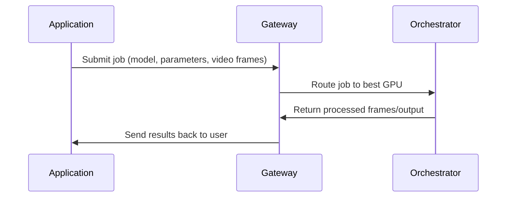

| Role             | Function                                       | Performs GPU Work? | External-Facing? |
| ---------------- | ---------------------------------------------- | ------------------ | ---------------- |
| **Gateway**      | Job intake, pricing, routing, capability match | ❌ No              | ✅ Yes           |
| **Orchestrator** | GPU compute, inference, transcoding, BYOC      | ✅ Yes             | ❌ No            |

## Gateway Responsibilities

Gateways act as the front door to the network:

- Receive jobs from applications
- Determine required model, pipeline, or GPU
- Select the best orchestrator based on performance and pricing
- Route the workload with low latency
- Return results to the client
- Publish marketplace offerings (models, pipelines, cost per frame, etc.)

Gateways provide _service intelligence_, not compute.

---

## Orchestrator Responsibilities

Orchestrators are GPU operators who run:

- Real-time AI inference
- Daydream / ComfyStream pipelines
- BYOC containers
- Traditional transcoding

They provide:

- GPU horsepower
- Model execution
- Deterministic and verifiable output
- Performance guarantees

They do not expose external APIs directly-Gateways handle that.

---

### /Users/alisonhaire/Documents/Livepeer/livepeer-docs-v2_d-v2-branch/docs/developers/developer-tools/gateways.mdx

---
keywords:
  - livepeer
  - docs
  - developers
  - developer tools
  - gateways
'og:image': /snippets/assets/site/og-image/fallback.png
'og:image:alt': Livepeer Docs social preview image
'og:image:type': image/png
'og:image:width': 1200
'og:image:height': 630
---
# Gateways

---

### /Users/alisonhaire/Documents/Livepeer/livepeer-docs-v2_d-v2-branch/docs/developers/moved-to-about-livepeer-protocol/livepeer-actors/gateways.mdx

---
keywords:
  - livepeer
  - docs
  - developers
  - moved to about livepeer protocol
  - livepeer actors
  - gateways
'og:image': /snippets/assets/site/og-image/fallback.png
'og:image:alt': Livepeer Docs social preview image
'og:image:type': image/png
'og:image:width': 1200
'og:image:height': 630
---
# Gateways

---

### /Users/alisonhaire/Documents/Livepeer/livepeer-docs-v2_d-v2-branch/snippets/data/gateways/notes.mdx

# Docker Off-Chain vs On-Chain Gateway Differences

## Quick Summary

| Aspect | Off-Chain Gateway | On-Chain Gateway |
|--------|------------------|------------------|
| **Ethereum** | No RPC needed | Requires `-ethUrl` and wallet |
| **Network** | Default: offchain | Specify network (e.g., arbitrum-one-mainnet) |
| **Payments** | No blockchain payments | Ticket-based micropayments |
| **Verification** | Disabled by default | Enabled by default |

---

## Installation Differences

### Docker Image
Both use the same Docker image:
```bash
docker pull livepeer/go-livepeer:master
```

### Configuration Files

**Off-chain** - Minimal configuration:
```yaml
command: '-gateway
          -orchAddr=<ORCHESTRATOR_ADDRESSES>'
```

**On-chain** - Requires Ethereum configuration [1](#44-0) :
```yaml
command: '-gateway
          -network arbitrum-one-mainnet
          -ethUrl=https://arb1.arbitrum.io/rpc
          -ethKeystorePath=/root/.lpData/keystore
          -ethPassword=/root/.lpData/keystore/password
          -orchAddr=<ORCHESTRATOR_ADDRESSES>'
```

---

## Running Differences

### Off-Chain Gateway
- Skips all Ethereum initialization [2](#44-1) 
- No wallet or keystore needed
- Local verification disabled by default [3](#44-2) 

### On-Chain Gateway
- Initializes Ethereum client and contracts
- Requires valid ETH account and keystore [4](#44-3) 
- Local verification enabled by default [5](#44-4) 
- Handles ticket-based payments

### Auto-Creation Behavior
On-chain gateways can auto-create accounts if `-ethKeystorePath` and `-ethPassword` are omitted [6](#44-5) .

---

## Testing Differences

### Common Tests (Both Modes)
```bash
# Check gateway status
curl http://localhost:5935/status

# Check available orchestrators
curl http://localhost:5935/getOrchestrators

# Test RTMP ingest
ffmpeg -re -i test-video.mp4 -c copy -f flv rtmp://localhost:1935/stream/test-key
```

### Off-Chain Specific Tests
- No payment validation needed
- Simpler setup for development/testing
- Tests run faster without blockchain overhead

### On-Chain Specific Tests
- Payment ticket validation
- Requires ETH for transactions
- Tests include verification workflows [7](#44-6) 
- Must check gas prices and transaction confirmations

### AI Testing Differences
**Off-chain AI gateway**:
```yaml
command: '-gateway
          -httpIngest
          -orchAddr=<ORCHESTRATOR_ADDRESSES>'
```

**On-chain AI gateway** - requires `-aiServiceRegistry` [8](#44-7) :
```yaml
command: '-gateway
          -httpIngest
          -aiServiceRegistry
          -network arbitrum-one-mainnet
          -ethUrl=https://arb1.arbitrum.io/rpc
          -orchAddr=<ORCHESTRATOR_ADDRESSES>'
```

---

## Development vs Production

### Development Examples
The VS Code launch configurations show both modes [9](#44-8) :
- Off-chain: Simpler, no blockchain dependencies
- On-chain: Full protocol integration with payments

### Production Considerations
- **Off-chain**: Good for private video processing, no gas costs
- **On-chain**: Required for public network participation, economic incentives

## Notes

- The Docker image is the same for both modes; differences are in configuration flags
- Off-chain mode is explicitly checked and skips Ethereum setup [2](#44-1) 
- Test suite validates both modes separately with different requirements [10](#44-9) 
- On-chain mode fails without `-ethUrl` [1](#44-0) 

Wiki pages you might want to explore:
- [Overview (livepeer/go-livepeer)](/wiki/livepeer/go-livepeer#1)

### Citations

**File:** test_args.sh (L40-52)
```shellscript
run_lp -gateway
[ -d "$DEFAULT_DATADIR"/offchain ]
kill $pid

# sanity check that custom datadir does not exist
[ ! -d "$CUSTOM_DATADIR" ]

# check custom datadir without a network (offchain)
run_lp -gateway -dataDir "$CUSTOM_DATADIR"
[ -d "$CUSTOM_DATADIR" ]
[ ! -d "$CUSTOM_DATADIR"/offchain ] # sanity check that network isn't included
kill $pid

```

**File:** test_args.sh (L90-93)
```shellscript
  # Exit early if -ethUrl is missing
  res=0
  $TMPDIR/livepeer -gateway -network mainnet $ETH_ARGS || res=$?
  [ $res -ne 0 ]
```

**File:** test_args.sh (L161-165)
```shellscript
  # Check that local verification is enabled by default in on-chain mode
  $TMPDIR/livepeer -gateway -transcodingOptions invalid -network rinkeby $ETH_ARGS 2>&1 | grep "Local verification enabled"

  # Check that local verification is disabled via -localVerify in on-chain mode
  $TMPDIR/livepeer -gateway -transcodingOptions invalid -localVerify=false -network rinkeby $ETH_ARGS 2>&1 | grep -v "Local verification enabled"
```

**File:** test_args.sh (L294-295)
```shellscript
# Check that local verification is disabled by default in off-chain mode
$TMPDIR/livepeer -gateway -transcodingOptions invalid 2>&1 | grep -v "Local verification enabled"
```

**File:** doc/development.md (L44-102)
```markdown
      "name": "Launch O/T (off-chain)",
      "type": "go",
      "request": "launch",
      "mode": "debug",
      "program": "cmd/livepeer",
      "buildFlags": "-ldflags=-extldflags=-lm", // Fix missing symbol error.
      "args": [
        "-orchestrator",
        "-transcoder",
        "-serviceAddr=0.0.0.0:8935",
        "-v=6",
        "-nvidia=all"
      ]
    },
    {
      "name": "Launch O (off-chain)",
      "type": "go",
      "request": "launch",
      "mode": "debug",
      "program": "cmd/livepeer",
      "buildFlags": "-ldflags=-extldflags=-lm", // Fix missing symbol error.
      "args": [
        "-orchestrator",
        "-orchSecret=orchSecret",
        "-serviceAddr=0.0.0.0:8935",
        "-v=6"
      ]
    },
    {
      "name": "Launch T (off-chain)",
      "type": "go",
      "request": "launch",
      "mode": "debug",
      "program": "cmd/livepeer",
      "buildFlags": "-ldflags=-extldflags=-lm", // Fix missing symbol error.
      "args": [
        "-transcoder",
        "-orchSecret=orchSecret",
        "-orchAddr=0.0.0.0:8935",
        "-v=6",
        "-nvidia=all"
      ]
    },
    {
      "name": "Launch G (off-chain)",
      "type": "go",
      "request": "launch",
      "mode": "debug",
      "program": "cmd/livepeer",
      "buildFlags": "-ldflags=-extldflags=-lm", // Fix missing symbol error.
      "args": [
        "-gateway",
        "-transcodingOptions=${env:HOME}/.lpData/offchain/transcodingOptions.json",
        "-orchAddr=0.0.0.0:8935",
        "-httpAddr=0.0.0.0:9935",
        "-v",
        "6"
      ]
    },
```

---

### /Users/alisonhaire/Documents/Livepeer/livepeer-docs-v2_d-v2-branch/docs/gateways/references/api-reference/AI-API/audio-to-text.mdx
---
description: >-
  API reference for the audio-to-text pipeline. Accepts audio input and returns
  a transcript using Whisper-compatible models.
keywords:
  - livepeer
  - gateways
  - references
  - api reference
  - ai api
  - audio to text
'og:image': /snippets/assets/site/og-image/fallback.png
'og:image:alt': Livepeer Docs social preview image
'og:image:type': image/png
'og:image:width': 1200
'og:image:height': 630
openapi: POST /audio-to-text
pageType: reference
audience: gateway-operator
purpose: reference
---


---
### /Users/alisonhaire/Documents/Livepeer/livepeer-docs-v2_d-v2-branch/docs/gateways/references/api-reference/AI-API/hardware-info.mdx
---
description: >-
  API reference for the hardware-info endpoint. Returns GPU and system hardware
  details for a gateway node.
keywords:
  - livepeer
  - gateways
  - references
  - api reference
  - ai api
  - hardware info
'og:image': /snippets/assets/site/og-image/fallback.png
'og:image:alt': Livepeer Docs social preview image
'og:image:type': image/png
'og:image:width': 1200
'og:image:height': 630
openapi: GET /hardware/info
pageType: reference
audience: gateway-operator
purpose: reference
---


---
### /Users/alisonhaire/Documents/Livepeer/livepeer-docs-v2_d-v2-branch/docs/gateways/references/api-reference/AI-API/hardware-stats.mdx
---
description: >-
  API reference for the hardware-stats endpoint. Returns real-time GPU
  utilization and memory stats.
keywords:
  - livepeer
  - gateways
  - references
  - api reference
  - ai api
  - hardware stats
'og:image': /snippets/assets/site/og-image/fallback.png
'og:image:alt': Livepeer Docs social preview image
'og:image:type': image/png
'og:image:width': 1200
'og:image:height': 630
openapi: GET /hardware/stats
pageType: reference
audience: gateway-operator
purpose: reference
---


---
### /Users/alisonhaire/Documents/Livepeer/livepeer-docs-v2_d-v2-branch/docs/gateways/references/api-reference/AI-API/health.mdx
---
description: >-
  API reference for the health endpoint. Returns the current operational status
  of a gateway node.
keywords:
  - livepeer
  - gateways
  - references
  - api reference
  - ai api
  - health
'og:image': /snippets/assets/site/og-image/fallback.png
'og:image:alt': Livepeer Docs social preview image
'og:image:type': image/png
'og:image:width': 1200
'og:image:height': 630
openapi: GET /health
pageType: reference
audience: gateway-operator
purpose: reference
---


---
### /Users/alisonhaire/Documents/Livepeer/livepeer-docs-v2_d-v2-branch/docs/gateways/references/api-reference/AI-API/image-to-image.mdx
---
description: >-
  API reference for the image-to-image pipeline. Accepts an image and a prompt
  and returns a transformed image.
keywords:
  - livepeer
  - gateways
  - references
  - api reference
  - ai api
  - image to image
'og:image': /snippets/assets/site/og-image/fallback.png
'og:image:alt': Livepeer Docs social preview image
'og:image:type': image/png
'og:image:width': 1200
'og:image:height': 630
openapi: POST /image-to-image
pageType: reference
audience: gateway-operator
purpose: reference
---


---
### /Users/alisonhaire/Documents/Livepeer/livepeer-docs-v2_d-v2-branch/docs/gateways/references/api-reference/AI-API/image-to-text.mdx
---
description: >-
  API reference for the image-to-text pipeline. Accepts an image and returns a
  text caption or description.
keywords:
  - livepeer
  - gateways
  - references
  - api reference
  - ai api
  - image to text
'og:image': /snippets/assets/site/og-image/fallback.png
'og:image:alt': Livepeer Docs social preview image
'og:image:type': image/png
'og:image:width': 1200
'og:image:height': 630
openapi: POST /image-to-text
pageType: reference
audience: gateway-operator
purpose: reference
---


---
### /Users/alisonhaire/Documents/Livepeer/livepeer-docs-v2_d-v2-branch/docs/gateways/references/api-reference/AI-API/image-to-video.mdx
---
keywords:
  - livepeer
  - gateways
  - references
  - api reference
  - ai api
  - image to video
'og:image': /snippets/assets/site/og-image/fallback.png
'og:image:alt': Livepeer Docs social preview image
'og:image:type': image/png
'og:image:width': 1200
'og:image:height': 630
openapi: POST /image-to-video
pageType: reference
purpose: reference
audience: gateway-operator
---


---
### /Users/alisonhaire/Documents/Livepeer/livepeer-docs-v2_d-v2-branch/docs/gateways/references/api-reference/AI-API/live-video-to-video.mdx
---
keywords:
  - livepeer
  - gateways
  - references
  - api reference
  - ai api
  - live video to video
'og:image': /snippets/assets/site/og-image/fallback.png
'og:image:alt': Livepeer Docs social preview image
'og:image:type': image/png
'og:image:width': 1200
'og:image:height': 630
openapi: POST /live-video-to-video
pageType: reference
purpose: reference
audience: gateway-operator
---


---
### /Users/alisonhaire/Documents/Livepeer/livepeer-docs-v2_d-v2-branch/docs/gateways/references/api-reference/AI-API/llm.mdx
---
keywords:
  - livepeer
  - gateways
  - references
  - api reference
  - ai api
  - llm
'og:image': /snippets/assets/site/og-image/fallback.png
'og:image:alt': Livepeer Docs social preview image
'og:image:type': image/png
'og:image:width': 1200
'og:image:height': 630
openapi: POST /llm
pageType: reference
purpose: reference
audience: gateway-operator
---


---
### /Users/alisonhaire/Documents/Livepeer/livepeer-docs-v2_d-v2-branch/docs/gateways/references/api-reference/AI-API/segment-anything-2.mdx
---
keywords:
  - livepeer
  - gateways
  - references
  - api reference
  - ai api
  - segment anything 2
'og:image': /snippets/assets/site/og-image/fallback.png
'og:image:alt': Livepeer Docs social preview image
'og:image:type': image/png
'og:image:width': 1200
'og:image:height': 630
openapi: POST /segment-anything-2
pageType: reference
purpose: reference
audience: gateway-operator
---


---
### /Users/alisonhaire/Documents/Livepeer/livepeer-docs-v2_d-v2-branch/docs/gateways/references/api-reference/AI-API/text-to-image.mdx
---
keywords:
  - livepeer
  - gateways
  - references
  - api reference
  - ai api
  - text to image
'og:image': /snippets/assets/site/og-image/fallback.png
'og:image:alt': Livepeer Docs social preview image
'og:image:type': image/png
'og:image:width': 1200
'og:image:height': 630
openapi: POST /text-to-image
pageType: reference
purpose: reference
audience: gateway-operator
---


---
### /Users/alisonhaire/Documents/Livepeer/livepeer-docs-v2_d-v2-branch/docs/gateways/references/api-reference/AI-API/text-to-speech.mdx
---
keywords:
  - livepeer
  - gateways
  - references
  - api reference
  - ai api
  - text to speech
'og:image': /snippets/assets/site/og-image/fallback.png
'og:image:alt': Livepeer Docs social preview image
'og:image:type': image/png
'og:image:width': 1200
'og:image:height': 630
openapi: POST /text-to-speech
pageType: reference
purpose: reference
audience: gateway-operator
---


---
### /Users/alisonhaire/Documents/Livepeer/livepeer-docs-v2_d-v2-branch/docs/gateways/references/api-reference/AI-API/upscale.mdx
---
keywords:
  - livepeer
  - gateways
  - references
  - api reference
  - ai api
  - upscale
'og:image': /snippets/assets/site/og-image/fallback.png
'og:image:alt': Livepeer Docs social preview image
'og:image:type': image/png
'og:image:width': 1200
'og:image:height': 630
openapi: POST /upscale
pageType: reference
purpose: reference
audience: gateway-operator
---


---
### /Users/alisonhaire/Documents/Livepeer/livepeer-docs-v2_d-v2-branch/docs/gateways/references/api-reference/AI-Worker/ai-worker-api.mdx
---
title: AI API
description: Complete API reference for Livepeer AI Worker endpoints
keywords:
  - livepeer
  - gateways
  - references
  - api reference
  - ai worker
  - ai worker api
  - complete
  - reference
'og:image': /snippets/assets/site/og-image/fallback.png
'og:image:alt': Livepeer Docs social preview image
'og:image:type': image/png
'og:image:width': 1200
'og:image:height': 630
pageType: reference
---


# AI Worker API Reference

Complete API reference for all Livepeer AI Worker endpoints.

<Info>
 This API can be consumed through either **Livepeer Studio** (managed) or a
 **self-hosted go-livepeer / AI worker gateway**. Endpoint paths match, while
 auth and operations differ by deployment model.
</Info>

## Base URLs

| Environment             | URL                                         |
| ----------------------- | ------------------------------------------- |
| Cloud SPE Gateway       | `https://tools.livepeer.cloud`              |
| Livepeer Studio Gateway | `https://livepeer.studio/api/beta/generate` |

As of 02-March-2026, Livepeer Studio AI requests use `https://livepeer.studio/api/beta/generate` with `Authorization: Bearer <LIVEPEER_STUDIO_API_KEY>`. For Cloud SPE-managed access, check `https://tools.livepeer.cloud` for the current direct API endpoint and auth requirements.

---

## Generate Endpoints

### POST /text-to-image

<OpenAPI path="/text-to-image" method="POST" />

---

### POST /image-to-image

<OpenAPI path="/image-to-image" method="POST" />

---

### POST /image-to-video

<OpenAPI path="/image-to-video" method="POST" />

---

### POST /upscale

<OpenAPI path="/upscale" method="POST" />

---

### POST /audio-to-text

<OpenAPI path="/audio-to-text" method="POST" />

---

### POST /segment-anything-2

<OpenAPI path="/segment-anything-2" method="POST" />

---

### POST /llm

<OpenAPI path="/llm" method="POST" />

---

### POST /image-to-text

<OpenAPI path="/image-to-text" method="POST" />

---

### POST /live-video-to-video

<OpenAPI path="/live-video-to-video" method="POST" />

---

### POST /text-to-speech

<OpenAPI path="/text-to-speech" method="POST" />

---

## System Endpoints

### GET /health

<OpenAPI path="/health" method="GET" />

---

### GET /hardware/info

<OpenAPI path="/hardware/info" method="GET" />

---

### GET /hardware/stats

<OpenAPI path="/hardware/stats" method="GET" />

---
### /Users/alisonhaire/Documents/Livepeer/livepeer-docs-v2_d-v2-branch/docs/gateways/references/api-reference/CLI-HTTP/activateorchestrator.mdx
---
keywords:
  - livepeer
  - gateways
  - references
  - api reference
  - cli http
  - activateorchestrator
'og:image': /snippets/assets/site/og-image/fallback.png
'og:image:alt': Livepeer Docs social preview image
'og:image:type': image/png
'og:image:width': 1200
'og:image:height': 630
openapi: POST /activateOrchestrator
pageType: reference
purpose: reference
audience: gateway-operator
---


---
### /Users/alisonhaire/Documents/Livepeer/livepeer-docs-v2_d-v2-branch/docs/gateways/references/api-reference/CLI-HTTP/bond.mdx
---
keywords:
  - livepeer
  - gateways
  - references
  - api reference
  - cli http
  - bond
'og:image': /snippets/assets/site/og-image/fallback.png
'og:image:alt': Livepeer Docs social preview image
'og:image:type': image/png
'og:image:width': 1200
'og:image:height': 630
openapi: POST /bond
pageType: reference
---


---
### /Users/alisonhaire/Documents/Livepeer/livepeer-docs-v2_d-v2-branch/docs/gateways/references/api-reference/CLI-HTTP/protocolparameters.mdx
---
keywords:
  - livepeer
  - gateways
  - references
  - api reference
  - cli http
  - protocolparameters
'og:image': /snippets/assets/site/og-image/fallback.png
'og:image:alt': Livepeer Docs social preview image
'og:image:type': image/png
'og:image:width': 1200
'og:image:height': 630
openapi: GET /protocolParameters
pageType: reference
---


---
### /Users/alisonhaire/Documents/Livepeer/livepeer-docs-v2_d-v2-branch/docs/gateways/references/api-reference/CLI-HTTP/rebond.mdx
---
keywords:
  - livepeer
  - gateways
  - references
  - api reference
  - cli http
  - rebond
'og:image': /snippets/assets/site/og-image/fallback.png
'og:image:alt': Livepeer Docs social preview image
'og:image:type': image/png
'og:image:width': 1200
'og:image:height': 630
openapi: POST /rebond
pageType: reference
purpose: reference
audience: gateway-operator
---


---
### /Users/alisonhaire/Documents/Livepeer/livepeer-docs-v2_d-v2-branch/docs/gateways/references/api-reference/CLI-HTTP/registeredorchestrators.mdx
---
keywords:
  - livepeer
  - gateways
  - references
  - api reference
  - cli http
  - registeredorchestrators
'og:image': /snippets/assets/site/og-image/fallback.png
'og:image:alt': Livepeer Docs social preview image
'og:image:type': image/png
'og:image:width': 1200
'og:image:height': 630
openapi: GET /registeredOrchestrators
pageType: reference
---


---
### /Users/alisonhaire/Documents/Livepeer/livepeer-docs-v2_d-v2-branch/docs/gateways/references/api-reference/CLI-HTTP/reward.mdx
---
keywords:
  - livepeer
  - gateways
  - references
  - api reference
  - cli http
  - reward
'og:image': /snippets/assets/site/og-image/fallback.png
'og:image:alt': Livepeer Docs social preview image
'og:image:type': image/png
'og:image:width': 1200
'og:image:height': 630
openapi: POST /reward
pageType: reference
purpose: reference
audience: gateway-operator
---


---
### /Users/alisonhaire/Documents/Livepeer/livepeer-docs-v2_d-v2-branch/docs/gateways/references/api-reference/CLI-HTTP/setbroadcastconfig.mdx
---
keywords:
  - livepeer
  - gateways
  - references
  - api reference
  - cli http
  - setbroadcastconfig
'og:image': /snippets/assets/site/og-image/fallback.png
'og:image:alt': Livepeer Docs social preview image
'og:image:type': image/png
'og:image:width': 1200
'og:image:height': 630
openapi: POST /setBroadcastConfig
pageType: reference
purpose: reference
audience: gateway-operator
---


---
### /Users/alisonhaire/Documents/Livepeer/livepeer-docs-v2_d-v2-branch/docs/gateways/references/api-reference/CLI-HTTP/setmaxpriceforcapability.mdx
---
keywords:
  - livepeer
  - gateways
  - references
  - api reference
  - cli http
  - setmaxpriceforcapability
'og:image': /snippets/assets/site/og-image/fallback.png
'og:image:alt': Livepeer Docs social preview image
'og:image:type': image/png
'og:image:width': 1200
'og:image:height': 630
openapi: POST /setMaxPriceForCapability
pageType: reference
purpose: reference
audience: gateway-operator
---


---
### /Users/alisonhaire/Documents/Livepeer/livepeer-docs-v2_d-v2-branch/docs/gateways/references/api-reference/CLI-HTTP/signmessage.mdx
---
keywords:
  - livepeer
  - gateways
  - references
  - api reference
  - cli http
  - signmessage
'og:image': /snippets/assets/site/og-image/fallback.png
'og:image:alt': Livepeer Docs social preview image
'og:image:type': image/png
'og:image:width': 1200
'og:image:height': 630
openapi: POST /signMessage
pageType: reference
purpose: reference
audience: gateway-operator
---


---
### /Users/alisonhaire/Documents/Livepeer/livepeer-docs-v2_d-v2-branch/docs/gateways/references/api-reference/CLI-HTTP/transfertokens.mdx
---
keywords:
  - livepeer
  - gateways
  - references
  - api reference
  - cli http
  - transfertokens
'og:image': /snippets/assets/site/og-image/fallback.png
'og:image:alt': Livepeer Docs social preview image
'og:image:type': image/png
'og:image:width': 1200
'og:image:height': 630
openapi: POST /transferTokens
pageType: reference
purpose: reference
audience: gateway-operator
---


---
### /Users/alisonhaire/Documents/Livepeer/livepeer-docs-v2_d-v2-branch/docs/gateways/references/api-reference/CLI-HTTP/unbond.mdx
---
keywords:
  - livepeer
  - gateways
  - references
  - api reference
  - cli http
  - unbond
'og:image': /snippets/assets/site/og-image/fallback.png
'og:image:alt': Livepeer Docs social preview image
'og:image:type': image/png
'og:image:width': 1200
'og:image:height': 630
openapi: POST /unbond
pageType: reference
purpose: reference
audience: gateway-operator
---


---
### /Users/alisonhaire/Documents/Livepeer/livepeer-docs-v2_d-v2-branch/docs/gateways/references/api-reference/CLI-HTTP/_delete-all-api.mdx
(FILE NOT FOUND: /Users/alisonhaire/Documents/Livepeer/livepeer-docs-v2_d-v2-branch/docs/gateways/references/api-reference/CLI-HTTP/_delete-all-api.mdx)
---
### /Users/alisonhaire/Documents/Livepeer/livepeer-docs-v2_d-v2-branch/docs/gateways/references/api-reference/ai-worker-api.mdx
---
title: AI API
description: Complete API reference for Livepeer AI Worker endpoints
keywords:
  - livepeer
  - gateways
  - references
  - api reference
  - ai worker api
  - complete
  - reference
'og:image': /snippets/assets/site/og-image/fallback.png
'og:image:alt': Livepeer Docs social preview image
'og:image:type': image/png
'og:image:width': 1200
'og:image:height': 630
pageType: reference
---


# AI Worker API Reference

Complete API reference for all Livepeer AI Worker endpoints.

<Info>
 This API can be consumed through either **Livepeer Studio** (managed) or a
 **self-hosted go-livepeer / AI worker gateway**. Endpoint paths match, while
 auth and operations differ by deployment model.
</Info>

## Base URLs

| Environment             | URL                                         |
| ----------------------- | ------------------------------------------- |
| Cloud SPE Gateway       | `https://tools.livepeer.cloud`              |
| Livepeer Studio Gateway | `https://livepeer.studio/api/beta/generate` |

As of 02-March-2026, Livepeer Studio AI requests use `https://livepeer.studio/api/beta/generate` with `Authorization: Bearer <LIVEPEER_STUDIO_API_KEY>`. For Cloud SPE-managed access, check `https://tools.livepeer.cloud` for the current direct API endpoint and auth requirements.

---

## Generate Endpoints

### POST /text-to-image

<OpenAPI path="/text-to-image" method="POST" />

---

### POST /image-to-image

<OpenAPI path="/image-to-image" method="POST" />

---

### POST /image-to-video

<OpenAPI path="/image-to-video" method="POST" />

---

### POST /upscale

<OpenAPI path="/upscale" method="POST" />

---

### POST /audio-to-text

<OpenAPI path="/audio-to-text" method="POST" />

---

### POST /segment-anything-2

<OpenAPI path="/segment-anything-2" method="POST" />

---

### POST /llm

<OpenAPI path="/llm" method="POST" />

---

### POST /image-to-text

<OpenAPI path="/image-to-text" method="POST" />

---

### POST /live-video-to-video

<OpenAPI path="/live-video-to-video" method="POST" />

---

### POST /text-to-speech

<OpenAPI path="/text-to-speech" method="POST" />

---

## System Endpoints

### GET /health

<OpenAPI path="/health" method="GET" />

---

### GET /hardware/info

<OpenAPI path="/hardware/info" method="GET" />

---

### GET /hardware/stats

<OpenAPI path="/hardware/stats" method="GET" />

---
### /Users/alisonhaire/Documents/Livepeer/livepeer-docs-v2_d-v2-branch/docs/gateways/references/api-reference/hardware-info.mdx
---
keywords:
  - livepeer
  - gateways
  - references
  - api reference
  - hardware info
'og:image': /snippets/assets/site/og-image/fallback.png
'og:image:alt': Livepeer Docs social preview image
'og:image:type': image/png
'og:image:width': 1200
'og:image:height': 630
openapi: GET /hardware/info
pageType: reference
---


---
### /Users/alisonhaire/Documents/Livepeer/livepeer-docs-v2_d-v2-branch/docs/gateways/references/api-reference/hardware-stats.mdx
---
keywords:
  - livepeer
  - gateways
  - references
  - api reference
  - hardware stats
'og:image': /snippets/assets/site/og-image/fallback.png
'og:image:alt': Livepeer Docs social preview image
'og:image:type': image/png
'og:image:width': 1200
'og:image:height': 630
openapi: GET /hardware/stats
pageType: reference
---


---
### /Users/alisonhaire/Documents/Livepeer/livepeer-docs-v2_d-v2-branch/docs/gateways/references/api-reference/health.mdx
---
keywords:
  - livepeer
  - gateways
  - references
  - api reference
  - health
'og:image': /snippets/assets/site/og-image/fallback.png
'og:image:alt': Livepeer Docs social preview image
'og:image:type': image/png
'og:image:width': 1200
'og:image:height': 630
openapi: GET /health
pageType: reference
---


---
