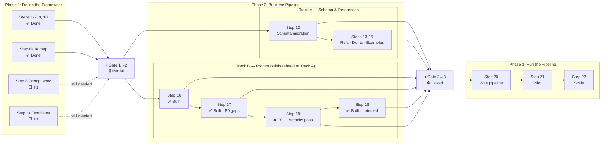

# Content Writing Pipeline — Execution Plan

**Status**: Active · **Branch**: `docs-v2-dev` · **Created**: 2026-03-19
**Design-canonical**: [design-canonical.mdx](design-canonical.mdx) — 6-system architecture, ideal states, outputs, Blocks column
**Research**: [research.md](research.md) · **Collation**: [collation.md](collation.md)
**Phase pack reference**: [Prompts/Prompts-By-Phase/COLLATION-PLAN.md](Prompts/Prompts-By-Phase/COLLATION-PLAN.md)
**Master resource index**: [Prompts/Prompts-By-Phase/_research-and-consolidated-notes/MASTER-INDEX.md](Prompts/Prompts-By-Phase/_research-and-consolidated-notes/MASTER-INDEX.md)
**Active prompts**: `1-audience-design/audience-design.md` · `2-structure-audit/structure-audit.md` · `3-content-pass/content-pass.md` · `4-layout-pass/layout-pass.md`

---

## Now Running — Context Layer Execution

Framework locked (Steps 2–11, mostly). Pipeline prompts built (Steps 16–18). Three P0 gaps block the first full pilot run. See [design-canonical.mdx](design-canonical.mdx) for full system status with Blocks column.

### Execution Sequence

| Step | What | Output | Status |
|---|---|---|---|
| 1 | Full site map — tab ownership, primary persona, boundary notes | `context-packs/site-map.md` | ✅ Done (not yet at canonical path) |
| 2 | Per-tab audience design — personas, JTBD, journey map | `context-packs/[tab]-audience-doc.md` | ⬜ Prompt built · not run |
| 3 | Content scan — inventory all existing tab content | `context-packs/[tab]-content-scan.md` | ⬜ **P0 — prompt not built** |
| 4 | Per-tab IA audit — classify pages, map gaps, produce work order | `context-packs/[tab]-tab-map.md` | ⬜ Prompt built · blocked on step 3 |
| 5 | Content audit + gaps — AUDIT mode per section group | `context-packs/[tab]/[group]-audit.md` | ⬜ **P0 — AUDIT mode not defined** |

### Tab Priority

1. Orchestrators
2. Gateways *(08a-ia-per-tab.md already exists — may skip to content scan)*
3. LP Token
4. Developers
5. About
6. Resource HUB *(restructure — scope TBD)*

---

## Critical Path — P0 Items

| Step | Blocks | Status |
|---|---|---|
| Content scan prompt (Step 17 / execution step 3) | IA audit (execution step 4) | ❌ Not started |
| AUDIT mode in content-pass.md (Step 17) | Content audit of existing pages (execution step 5) | ❌ Not started |
| Veracity pass prompt (Step 19) | Full Pass A → Veracity → Pass B pipeline; Step 18 end-to-end testing | ❌ Not started |

---

## Execution Flow

> **Note**: Track B (prompt builds) proceeded ahead of Track A and ahead of Phase 1 completion. Steps 16–18 are built even though Steps 8 and 11 remain open. Phase Gate 1→2 is partially open — Track A should wait for full gate close.

---

## Workflow Protocol

1. **⏸ CHECKPOINT** — Every task pauses for human review. Nothing proceeds without explicit approval.
2. **🔄 INTERACTIVE** — Any task involving definition, categorization, or judgment is co-authored. AI drafts, human refines, nothing is final until human says so.
3. **📖 READ BEFORE RUNNING** — Before executing any phase prompt, read its `pack-guide.md` first. The pack-guide defines pre-flight steps (terminology lock, persona source check, resource selection), running order, pause points, and known failure modes. Skipping pre-flight produces output that looks correct but is built on bad foundations. See `_Project-Management_/ai-rules-guides.md` for the full rule.

---

## The Plan

### ① Phase 1: Define the Framework — 🔄 In progress

All framework definitions — the contracts every pipeline prompt builds against.

<AccordionGroup>

<Accordion title="🎯 Phase Goal">

All framework definitions locked: page taxonomy, audience, persona, purpose, industry, complexity, lifecycleStage, IA per tab, voice rules, naming rules, veracity framework, page templates, golden examples.

**Entry condition**: none — first phase
**Exit condition**: all 11 steps complete and locked; design-canonical.mdx ① Standards Layer and ② Context Layer outputs all ✅

</Accordion>

<Accordion title="✅ Steps 1–7 · Collation + full framework definitions">

All core framework definitions complete.

**STATUS** — ✅ Done
- Step 1 · Collation — [collation.md](collation.md)
- Step 2 · pageType — 7 types + pageVariant. [Frameworks/](Frameworks/)
- Step 3 · Audience — 7 audiences (consolidated from 10). [Frameworks/](Frameworks/)
- Step 4 · Persona — all 7 audiences. [Frameworks/](Frameworks/)
- Step 5 · Purpose + veracity — pagePurpose.md · information-type.md · veracity.md · veracity-library.md (45 entries) · index.md
- Step 6 · Industry + niche — [Frameworks/industry.md](Frameworks/industry.md). 9 industry + 8 niche tokens.
- Step 7 · Complexity + lifecycleStage — [Frameworks/complexity.md](Frameworks/complexity.md)

</Accordion>

<Accordion title="✅ Step 8a · IA per tab — section structure, audience journey, page groups">

**DEPENDS ON** — Steps 2–7
**UNBLOCKS** — Step 16 (audience design prompt); execution sequence steps 2 + 4
**PRIORITY** — P2 (done)

**STATUS** — ✅ Done — [08a-ia-per-tab.md](../../../v2/_workspace/references/content-pipeline/08a-ia-per-tab.md) locked. Section vocabulary, audience journeys for gateways + orchestrators, guide subgroup IA, per-page field combinations. All open questions resolved.

</Accordion>

<Accordion title="✅ Steps 9–10 · Voice rules + naming rules">

**DEPENDS ON** — Steps 2–7

**STATUS** — ✅ Done
- Step 9 · Voice rules — [Prompts/voice-rules.md](Prompts/voice-rules.md). 7 audiences; universal + per-audience register, tone, do/don't, prohibited phrases.
- Step 10 · Naming rules — [Prompts/section-naming.md](Prompts/section-naming.md). Testing deferred to pilot (Step 21).

</Accordion>

<Accordion title="❌ Step 8 · Define prompt input spec">

**SOURCE** — ② Context Layer
**DEPENDS ON** — Steps 2–8a (mostly done)
**UNBLOCKS** — Steps 16–19 (retroactively — prompt builds proceeded; formalising now closes the gap)
**PRIORITY** — P1

**WHO** — Both — AI derives spec from existing prompts + framework, human approves per prompt type

**IN**
- Approved framework outputs from Steps 2–8a
- Existing prompt files — derive spec from what was actually built

**OUT**
- Approved prompt input spec per prompt type (context block fields, phases, quality gates, output format)

**Steps**
1. ❌ For each prompt type: document current context block fields, phases, quality gates, output format
2. ❌ Identify gaps between current prompts and ideal spec
3. ❌ Define canonical spec per prompt type
   - ⏸ CHECKPOINT: human approves spec
4. ❌ Test spec against 2 real pages from pilot group
   - ⏸ CHECKPOINT: human confirms spec is workable

**STATUS** — ❌ Not started

</Accordion>

<Accordion title="❌ Step 11 · Page templates + golden examples">

**SOURCE** — ⑤ Production Engine
**DEPENDS ON** — Steps 2–8a
**UNBLOCKS** — layout-pass.md full testing; ⑤ Production Engine lock in design-canonical.mdx
**PRIORITY** — P1

**WHO** — Both — AI audits and proposes, human approves each

**IN**
- `page-composition-framework.mdx`, existing templates in `snippets/templates/pages/`, `component-layout-decisions.mdx`, pilot group pages

**OUT**
- Per-pageType structural contracts in `v2/_workspace/references/content-pipeline/`
- Annotated golden examples in `v2/_workspace/references/content-pipeline/golden-examples/`

**Steps**

*Part A — Page templates per pageType*
1. ❌ For each of the 7 pageTypes: define required sections, section order, allowed components, forbidden patterns
   - ⏸ CHECKPOINT: human approves structure contract per pageType
2. ❌ Audit existing templates + composition framework against the contract — flag conflicts
   - ⏸ CHECKPOINT: human resolves conflicts

*Part B — Golden examples per pageType*
3. ❌ Candidate list per pageType from pilot group
   - ⏸ CHECKPOINT: human selects or rejects each
4. ❌ For each selected page: annotate why it works (what makes it the right model)
   - ⏸ CHECKPOINT: human approves annotation

**STATUS** — ❌ Not started — **blocks ⑤ Production Engine lock**

</Accordion>

<Accordion title="⏸ PHASE GATE · Phase 1 → Phase 2">

All must be true before Phase 2 is fully open:
- [x] Steps 1–7 complete (framework definitions)
- [x] Step 8a complete (IA per tab)
- [x] Step 9 complete (voice rules)
- [x] Step 10 complete (naming rules)
- [ ] Step 8 — prompt input spec defined
- [ ] Step 11 — page templates + golden examples complete

**STATUS** — 🔒 Partially open — Steps 8 and 11 remain. Track B (prompt builds) proceeded ahead of gate. Track A (schema/references) should wait for full gate close before starting Step 12.

</Accordion>

</AccordionGroup>

---

### ② Phase 2: Build the Pipeline — 🔄 In progress

Build every prompt, skill, and reference bundle needed to run the pipeline. Two parallel tracks — Track B is already ahead of Track A.

<AccordionGroup>

<Accordion title="🎯 Phase Goal">

All pipeline prompts built and tested end-to-end. Schema migrated. P0 gaps resolved. Phase 1 fully closed.

Two parallel tracks:
- **Track A** (Schema & References): Steps 12–15 — depends on Phase 1 gate fully closed
- **Track B** (Prompt Builds): Steps 16–19 — partly done; P0 gaps remain

**Entry condition**: Phase 1 gate mostly closed (Track B proceeded without full gate close — documented in Decision Log)
**Exit condition**: all prompts tested; schema migrated; P0 gaps resolved; Phase Gate 2→3 all conditions met

</Accordion>

## Track A — Schema & References *(parallel with Track B)*

<Accordion title="❌ Step 12 · Schema migration — implement definitions in code">

**SOURCE** — ① Standards Layer
**DEPENDS ON** — Phase 1 gate fully closed
**UNBLOCKS** — Step 13; frontmatter validation working in production
**PARALLEL WITH** — Track B (Steps 16–19)
**PRIORITY** — P1

**WHO** — AI implements, human reviews each change

**IN**
- Approved framework outputs (Steps 2–8a)
- `tools/lib/frontmatter-taxonomy.js`, `docs-guide/frameworks/page-taxonomy-framework.mdx`, VS Code snippets

**OUT**
- Updated `frontmatter-taxonomy.js` — validates all fields against approved enums
- Updated `page-taxonomy-framework.mdx` — canonical definitions
- Updated VS Code snippets
- Pilot group pages with backfilled frontmatter

**Steps**
1. ❌ Add `persona`, `industry`, `niche` fields to `page-taxonomy-framework.mdx`
   - ⏸ CHECKPOINT: human reviews
2. ❌ Update `tools/lib/frontmatter-taxonomy.js` to validate all fields
   - ⏸ CHECKPOINT: human reviews validator
3. ❌ Update VS Code snippets (`dev-tools.mdx`, `.vscode/mintlify.code-snippets`)
   - ⏸ CHECKPOINT: human reviews snippets
4. ❌ Backfill frontmatter on pilot group pages — AI proposes, human confirms per page
   - ⏸ CHECKPOINT: human approves each page's metadata
5. ❌ Verify `mintlify dev` renders clean
   - ⏸ CHECKPOINT: human confirms

**STATUS** — ❌ Not started

</Accordion>

<Accordion title="❌ Steps 13–15 · Audit refs · Per-audience don'ts · Golden examples">

**DEPENDS ON** — Step 12
**UNBLOCKS** — Steps 17–19 reference accuracy; Step 18 quality target
**PARALLEL WITH** — Track B
**PRIORITY** — Step 13: P1 · Steps 14–15: P2

**Steps**

*Step 13 — Audit existing references*
1. ❌ Check 6 core reference files against approved framework — do they match?
   - ⏸ CHECKPOINT: human reviews findings
2. ❌ Fix stale/contradictory/incomplete content
   - ⏸ CHECKPOINT: human approves each fix

*Step 14 — Per-audience don'ts*
3. ❌ Draft `donts-gateway-operator.md`
   - ⏸ CHECKPOINT: human approves
4. ❌ Draft `donts-developer.md` + `donts-orchestrator.md`
   - ⏸ CHECKPOINT: human approves each

*Step 15 — Golden examples*
5. ❌ Identify pageTypes in pilot group; select best page per type
   - ⏸ CHECKPOINT: human approves selection
6. ❌ Annotate and place in `v2/_workspace/references/content-pipeline/golden-examples/`
   - ⏸ CHECKPOINT: human reviews each

**STATUS** — ❌ Not started

</Accordion>

## Track B — Prompt Builds *(parallel with Track A, currently ahead of it)*

<Accordion title="✅ Step 16 · Build audience design + IA audit prompts">

**SOURCE** — ② Context Layer
**DEPENDS ON** — Steps 8a, 9
**UNBLOCKS** — Execution sequence steps 2 + 4
**PARALLEL WITH** — Track A
**PRIORITY** — P2 (done)

**STATUS** — ✅ Built — `1-audience-design/audience-design.md` · `2-structure-audit/structure-audit.md` · skills · pack-guides

</Accordion>

<Accordion title="🔄 Step 17 · Build content pass prompt">

**SOURCE** — ③ Content Engine
**DEPENDS ON** — Steps 9, 10 (done); Step 8 (not done — formalisng retroactively)
**UNBLOCKS** — Execution sequence step 5; Step 19
**PARALLEL WITH** — Track A
**PRIORITY** — P0 (AUDIT mode + content scan gaps)

**WHO** — AI builds, human approves mode design and tests output quality

**OUT**
- `3-content-pass/content-pass.md` · skill · pack-guide ✅
- AUDIT mode (review existing content) ❌ **P0 gap**
- Content scan prompt (execution sequence step 3) ❌ **P0 gap**

**Steps**
1. ✅ Build content pass prompt (WRITE mode)
2. ✅ Build skill + pack-guide
3. ❌ **P0** — Define and build AUDIT mode
   - ⏸ CHECKPOINT: human approves AUDIT mode design
4. ❌ **P0** — Build content scan prompt (separate prompt — feeds execution step 3)
   - ⏸ CHECKPOINT: human reviews prompt
5. ❌ Test WRITE mode on 3 pilot pages
   - ⏸ CHECKPOINT: human scores quality
6. ❌ Test AUDIT mode on 3 pilot pages
   - ⏸ CHECKPOINT: human scores quality

**STATUS** — 🔄 In progress — WRITE mode built; AUDIT mode + content scan = **P0 gaps**

</Accordion>

<Accordion title="❌ Step 19 · Build veracity pass (standalone — between Pass A and Pass B)">

**SOURCE** — ④ Veracity Engine
**DEPENDS ON** — Step 17 (content pass, approved content is input)
**UNBLOCKS** — Full Pass A → Veracity → Pass B sequence; Step 18 end-to-end testing
**PARALLEL WITH** — Track A
**PRIORITY** — P0

**WHO** — AI builds, human approves flag format and auto-resolve threshold

**IN**
- Approved content from Pass A (Step 17)
- `veracity.md` + `veracity-library.md` (45 sources)

**OUT**
- Veracity pass prompt — standalone, runs between Pass A and Pass B
- Flags unverifiable claims: `{/* REVIEW: claim — verify with: source */}`
- Sets `veracityStatus` in frontmatter
- Auto-resolves high-confidence claims; flags low-confidence for human review

**Steps**
1. ❌ Define context block: which section types trigger check, flag format, auto-resolve threshold
   - ⏸ CHECKPOINT: human approves
2. ❌ Build veracity pass prompt
   - ⏸ CHECKPOINT: human reviews
3. ❌ Test on 2 pages with known factual claims — flag accuracy + auto-resolve rate
   - ⏸ CHECKPOINT: human confirms

**STATUS** — ❌ Not started — **P0 gap**

</Accordion>

<Accordion title="🔄 Step 18 · Build layout pass prompt">

**SOURCE** — ⑤ Production Engine
**DEPENDS ON** — Step 19 (veracity pass); Step 11 (page templates — not done yet)
**UNBLOCKS** — Phase Gate 2→3; Step 20
**PARALLEL WITH** — Track A
**PRIORITY** — P1 (built, untested — blocked on Step 19)

**OUT**
- `4-layout-pass/layout-pass.md` · skill · pack-guide ✅
- End-to-end test (Pass A → Veracity → Pass B) ❌ blocked on Step 19

**Steps**
1. ✅ Build layout pass prompt
2. ✅ Build skill + pack-guide
3. ❌ Test on 3 pilot pages post Pass A + veracity
   - ⏸ CHECKPOINT: human reviews MDX output — correct template applied? naming correct? components appropriate?

**STATUS** — 🔄 Built · untested — blocked on Step 19 (veracity pass)

</Accordion>

<Accordion title="🔗 HANDOFF · Tested prompts pass to Phase 3">

**FROM** — Steps 16–19 (all prompts tested and approved)
**TO** — Phase 3 · Step 20 (wire the pipeline)
**ARTEFACT** — Five tested, approved prompts + skills: audience-design · structure-audit · content-pass (WRITE + AUDIT) · veracity-pass · layout-pass
**GATE** — All prompts have passed at least one real-page test; P0 gaps resolved; human approval on each

**STATUS** — ❌ Not ready — P0 gaps unresolved

</Accordion>

<Accordion title="⏸ PHASE GATE · Phase 2 → Phase 3">

All must be true before Phase 3 starts:
- [ ] Phase 1 fully closed (Steps 8 and 11)
- [x] Step 16 built (audience design + IA audit)
- [ ] Step 17 AUDIT mode built and tested
- [ ] Step 17 content scan prompt built
- [ ] Step 18 tested end-to-end (Pass A → Veracity → Pass B)
- [ ] Step 19 veracity pass built and tested
- [ ] Step 12 schema migration complete
- [ ] Steps 13–15 complete

**STATUS** — 🔒 Closed — P0 gaps + Steps 8, 11, 12, 13–15 remain

</Accordion>

</AccordionGroup>

---

### ③ Phase 3: Run the Pipeline — ❌ Not started

Pilot, measure, iterate, scale.

<AccordionGroup>

<Accordion title="🎯 Phase Goal">

Pipeline runs end-to-end on at least one full tab. Quality metrics tracked. Scale plan agreed.

**Entry condition**: Phase 2 gate closed — all prompts tested; schema migrated; P0 gaps resolved
**Exit condition**: pilot complete with metrics; weakest layer diagnosed and fixed; scale plan agreed

</Accordion>

<Accordion title="❌ Step 20 · Wire the pipeline + runbook">

**DEPENDS ON** — Phase 2 gate closed
**UNBLOCKS** — Step 21
**PRIORITY** — P1

**WHO** — AI documents both paths, human approves runbook

**OUT**
- Runbook: end-to-end flow for review path + write path, with checkpoint positions
- `v2/_workspace/references/content-pipeline/11-pipeline-runbook.md`

**Steps**
1. ❌ Write runbook documenting both paths with checkpoint positions
   - ⏸ CHECKPOINT: human approves runbook
2. ❌ Test review path end-to-end on 1 pilot page
   - ⏸ CHECKPOINT: human reviews result + checkpoint UX
3. ❌ Test write path end-to-end on 1 pilot page
   - ⏸ CHECKPOINT: human reviews result

**STATUS** — ❌ Not started

</Accordion>

<Accordion title="❌ Step 21 · Pilot on gateways/guides">

**DEPENDS ON** — Step 20
**UNBLOCKS** — Step 22
**PRIORITY** — P1

**WHO** — Both — AI runs pipeline, human reviews + approves each output

**Steps**
1. ❌ Generate context pack for gateways/guides
   - ⏸ CHECKPOINT: human approves
2. ❌ Run page review (AUDIT mode) on all pages
   - ⏸ CHECKPOINT: human reviews + approves/edits each brief
3. ❌ Run rewrite (WRITE mode) on all approved pages
   - ⏸ CHECKPOINT: human reviews each — accept, reject, or edit
4. ❌ Run automated validation on all rewrites
   - ⏸ CHECKPOINT: human reviews
5. ❌ Measure: precision, recall, rewrite quality, acceptance rate, time per page
   - ⏸ CHECKPOINT: human reviews metrics
6. ❌ Diagnose weakest layer, agree on fixes before scaling
   - ⏸ CHECKPOINT: human approves fix plan

**STATUS** — ❌ Not started

</Accordion>

<Accordion title="❌ Step 22 · Scale beyond pilot">

**DEPENDS ON** — Step 21 metrics approved
**PRIORITY** — P2

**Steps**
1. ❌ Choose next groups — AI proposes order by readiness, human decides
   - ⏸ CHECKPOINT: human approves group order
2. ❌ Create persona research for groups that lack it
   - ⏸ CHECKPOINT: human approves per group
3. ❌ Create context packs for each group
   - ⏸ CHECKPOINT: human approves each
4. ❌ Add batch mode + progress tracking + resume capability
5. ❌ Retire old skills once pipeline fully covers them
   - ⏸ CHECKPOINT: human confirms each retirement

**STATUS** — ❌ Not started

</Accordion>

<Accordion title="⏸ PHASE GATE · Phase 3 complete">

All must be true before the pipeline is considered production-ready:
- [ ] Pilot complete — precision ≥90%, recall ≥80%, human acceptance ≥80%
- [ ] Weakest layer diagnosed and fixed
- [ ] Scale plan agreed + at least one additional group running
- [ ] Old skills retired

**STATUS** — 🔒 Closed

</Accordion>

</AccordionGroup>

---

## Completion Status

| Phase | Status | Gate | Immediate blocker |
|---|---|---|---|
| Phase 1: Define the Framework | 🔄 In progress | 🔒 Partially open | Steps 8 and 11 |
| Phase 2: Build the Pipeline | 🔄 In progress | 🔒 Closed | P0 gaps (content scan, AUDIT mode, veracity pass) |
| Phase 3: Run the Pipeline | ❌ Not started | 🔒 Closed | Phase 2 gate |

---

## Decision Log

| Date | Decision | Rationale |
|---|---|---|
| 2026-03-19 | Pilot group: gateways/guides | Richest existing persona research + recent review packets for comparison |
| 2026-03-19 | Add `persona` to frontmatter schema | audience alone too broad; persona alone explodes schema. Optional, derived, audience-scoped. |
| 2026-03-19 | Add `domain` + `niche` to frontmatter schema | Naming rubric requires domain-native terminology but domain wasn't declared — AI had to guess. Now enforceable. Also governs voice register and example selection. |
| 2026-03-19 | All tasks checkpointed + interactive markers | Every task gets human review. Definitions are co-authored. |
| 2026-03-19 | Insert framework definition phase (Steps 2–11) | Can't build good skills without first agreeing what each field means, what its enums are, and how they combine. |
| 2026-03-20 | Information type is section-level, not page-level | A single page contains multiple sections with different information types. Agent identifies type per section at runtime. `veracityStatus` stays page-level (rolls up from worst-case section). |
| 2026-03-20 | Information type is NOT a frontmatter field | Derived at runtime from purpose → information type mapping. Not tagged in content. Writers never set it. See information-type.md. |
| 2026-03-20 | `veracityStatus` is the only new frontmatter field from the information layer | `verified` / `unverified` / `stale`. Everything else is pipeline reference material loaded at runtime. |
| 2026-03-20 | Purpose → information type mapping defines permitted types per purpose | Defines what types are expected/allowed, not a strict one-to-one match. A build page permits procedural + technical + narrative + factual. |
| 2026-03-22 | Veracity pass is standalone (Step 19), not integrated into Pass A (Step 17) | Mixing veracity checking into Pass A overloads a pass already handling voice, structure, audience, and purpose. Standalone pass keeps each stage testable and debuggable independently. Sequence: Pass A → veracity → Pass B. |
| 2026-03-22 | Track B (prompt builds) proceeded ahead of Phase 1 gate close | Pragmatic — enough of the framework was locked (Steps 2–10) to build usable prompts. Steps 8 and 11 will be formalized retroactively. Track A must wait for full gate close. |
| 2026-03-22 | LP Token tab will be renamed to Delegators | Rename is pending — all planning documents should use "Delegators (LP Token)" until the rename is live in the repo. Content ownership and audience remain unchanged. |
| 2026-03-22 | Each tab is authored as self-contained — intentional duplication is expected and correct | Audience is treated as not visiting any other tab. Every piece of information a reader needs must be present in their tab. Duplication between tabs is intentional, not a defect. Do not restrict content from a tab on the grounds it "lives" elsewhere. |
| 2026-03-22 | Composable MDX for duplicated content — post-completion only | Shared content (e.g. About ↔ Delegators tokenomics, About ↔ role tabs protocol concepts) will be refactored to composable MDX (source-of-truth page imported into each tab) after the full site is written. Not in scope during initial authoring — write each tab independently. |
| 2026-03-22 | Studio docs in Solutions are a full anchor (legacy) | Solutions contains the full Livepeer Studio docs as a top-level anchor section because the docs were previously Studio-only. This is an intentional structural exception, not overlap. Developer persona integrating via Studio is routed from Developers to Solutions — Developers does not duplicate Studio docs. |

---

## Cross-Plan Flags

### ⚠️ AI Discoverability: client-side components require companion `.json` files
**Raised**: 2026-03-21

Any page using `SearchTable`, `ShowcaseCards`, or `CardCarousel` renders data client-side only — invisible to AI agents, crawlers, and LLM pipelines. Write-time obligation on every page using these components.

**Rule**: `SearchTable` or `ShowcaseCards` on a page → write a companion `[page-slug]-data.json` alongside the MDX with the full unfiltered data array. Link the companion file from the page.

Automation tracked in: [`tasks/plan/active/AI-DISCOVERABILITY/plan.md`](../AI-DISCOVERABILITY/plan.md) — Task CDA-4 (manual) / CDA-5 (automated). Until CDA-5 is complete, this is a manual write-time step.

---

## Cross-Plan Dependencies

| This plan | Direction | Other plan | Artefact / decision | Status |
|---|---|---|---|---|
| Step 12 (schema migration) | provides to → | AI-DISCOVERABILITY plan | Updated frontmatter validator | ❌ not ready |

---

## Open Questions

1. **Skill implementation**: Prompt-only vs script-backed? Decided per skill in Steps 17–19.
2. **Golden example sourcing**: Existing pages good enough, or write from scratch? Decided in Step 15.
3. **Checkpoint UX**: File-based or conversational? Decided in Step 20.
4. **Context pack freshness**: Per-session? Weekly? On docs.json change? Decided in Step 17.
5. ~~**Pages spanning audiences**~~: Resolved — persona model handles this.
6. ~~**Domain niche granularity**~~: Resolved — both `industry` and `niche` are enums. Locked in industry.md.
