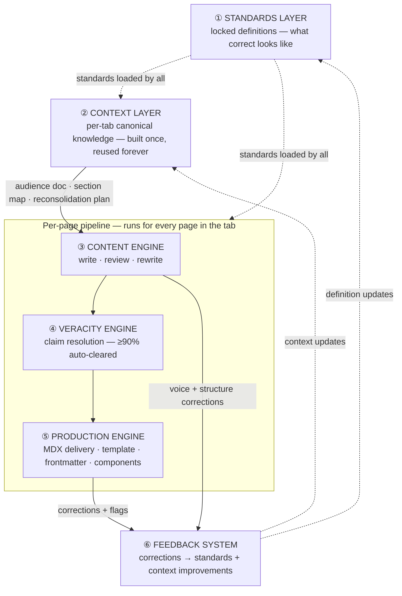

# Content Writing System — Design Reference

**Core aim**: Any docs page can be written, reviewed, verified, and shipped to production MDX — with human effort limited to approvals and sign-off on what AI cannot resolve.

**Execution plan**: [plan-canonical.md](plan-canonical.md) · **Pipeline detail**: [content-pipeline-canonical.md](content-pipeline-canonical.md)

---

## System Architecture

Six systems. Each independently buildable. Together they form a pipeline where a tab's worth of docs goes from "current state" to "audience-correct, verified, production MDX" — repeatably.

---

## ① Standards Layer

Locked definitions that every other system is measured against. When this is right, the entire pipeline produces right output. When a definition changes here, the standard changes everywhere — no re-explaining rules per run.

<AccordionGroup>

<Accordion title="🎯 Ideal State">

Every downstream system — context, content, veracity, production — loads a single standards file and knows exactly what correct looks like for its domain. No ambiguity. No re-derivation. No guessing.

**What this enables downstream:**
- AI judges whether a page is correct without being told how to judge
- Human review is approvals, not re-explaining rules each time
- A correction to a standard improves every future run automatically

**Quality bar**: Given any page, AI independently produces the same classification, voice assessment, and structural verdict a human author would.

</Accordion>

<Accordion title="🔬 RESEARCH · Gather all existing rules, conflicts, and sources">

**IN**
- Full repo scan: existing taxonomy files, copy rules, naming research, page templates, skills, personas
- External: Mintlify docs, Livepeer protocol docs, Discord/GitHub research

**OUT**
- `_research-and-consolidated-notes/MASTER-INDEX.md` — all collated files, typed and described
- `prompt-guides-guards-resources/` · `reference-sources-quality-scored/` · `current-repo-resources/`

**HUMAN VS AI**
- AI: scans repo, categorises files, creates pointer files and master index
- Human: reviews for completeness, confirms nothing missed

**Steps**
1. ✅ Create COLLATION-PLAN.md and tracking structure
2. ✅ Redistribute existing `/sources/` files to typed folders
3. ✅ Populate `prompt-guides-guards-resources/` with pointer files
4. ✅ Populate `reference-sources-quality-scored/` with pointer files
5. ✅ Create and populate `current-repo-resources/`
6. ✅ Create MASTER-INDEX.md (65 entries)
7. ✅ Assess all entries (useful / partial / n/a)
8. ✅ Deep scan — comprehensive repo scan
9. ✅ Prune and classify `master-list.md`
10. ✅ Resource review — recommendations + risks per phase

**STATUS** — ✅ Complete

</Accordion>

<Accordion title="🎨 DESIGN · Draft and lock each definition file">

**IN**
- Collated resources from research
- Real pilot pages to test definitions against
- Human knowledge of protocol and audience behaviour

**OUT**
- `Frameworks/pageType.md` · `pagePurpose.md` · `information-type.md` · `veracity.md` · `veracity-library.md` · `complexity.md` · `industry.md`
- `Prompts/voice-rules.md` · `section-naming.md`
- `08a-ia-per-tab.md`

**HUMAN VS AI**
- AI: drafts from research, surfaces conflicts, proposes enums
- Human: approves each definition, resolves conflicts, locks the file

**Steps**
1. ✅ Define pageType enum (7 types + pageVariant)
2. ✅ Define pagePurpose enum (15 values)
3. ✅ Define information-type taxonomy (9 types)
4. ✅ Define veracity framework + source library (45 sources)
5. ✅ Define complexity levels + lifecycle stages
6. ✅ Define industry + niche tokens
7. ✅ Define voice rules per audience
8. ✅ Define section naming rubric (6-step scoring)
9. ✅ Define IA section vocabulary per tab
10. ❌ Formalise page template structural contracts (`snippets/templates/pages/`)
11. ❌ Update `tools/lib/frontmatter-taxonomy.js` to canonical 7-type schema

**STATUS** — 🔄 Core definitions locked · Steps 10–11 outstanding

</Accordion>

<Accordion title="🧪 TESTING · Validate definitions produce correct output on real pages">

**IN**
- All locked definition files
- 5+ real pilot pages covering at least 3 different pageTypes

**OUT**
- Per definition: AI classification matches human judgment, or conflicts resolved
- Edge cases documented in each definition file

**DONE WHEN** — AI classification matches human judgment on ≥4 of 5 test pages per definition, no unresolved conflicts between files

**Steps**
1. ❌ Select 5+ pilot pages (min 3 pageTypes)
2. ❌ Run AI classification against each definition file
3. ❌ Score accuracy vs human judgment per definition
4. ❌ Document edge cases in each definition file
5. ❌ Resolve any conflicts found between definitions

**STATUS** — ❌ Not formally run

</Accordion>

<Accordion title="👤 HUMAN REVIEW · Lock — definitions confirmed stable, versioned">

**IN**: All definitions tested, no open conflicts
**OUT**: Each file marked locked with version date · MASTER-INDEX.md updated
**Criteria**: Every definition independently produces correct AI output; no ambiguity between files

**Steps**
1. ❌ Review test results per definition
2. ❌ Final approval per file
3. ❌ Add version date to each locked file
4. ❌ Update MASTER-INDEX.md with locked status

**STATUS** — 🔄 Core files informally locked · No formal version/date stamping yet

</Accordion>

<Accordion title="📝 DOCUMENT · Write standards usage guide">

**IN**
- All locked definition files
- Notes from testing on which definitions load for which phase

**OUT**
- `_research-and-consolidated-notes/standards-guide.md` — which definitions load for which pipeline phase, how to update a locked definition, how to add a new definition

**Steps**
1. ❌ Map each definition file to the pipeline phases that load it
2. ❌ Write update process (who approves, what triggers a change)
3. ❌ Write addition process (test requirements before promotion to locked)

**STATUS** — ❌ Not built

</Accordion>

<Accordion title="📦 Outputs">

| Artefact | Path | Status | Blocks |
|---|---|---|---|
| pageType definitions | `Frameworks/pageType.md` | ✅ | — |
| pagePurpose enum | `Frameworks/pagePurpose.md` | ✅ | — |
| information-type taxonomy | `Frameworks/information-type.md` | ✅ | — |
| veracity framework | `Frameworks/veracity.md` | ✅ | — |
| veracity source library | `Frameworks/veracity-library.md` | ✅ | — |
| complexity + lifecycle | `Frameworks/complexity.md` | ✅ | — |
| industry + niche | `Frameworks/industry.md` | ✅ | — |
| voice rules | `Prompts/voice-rules.md` | ✅ | — |
| section naming rubric | `Prompts/section-naming.md` | ✅ | — |
| IA section vocabulary | `08a-ia-per-tab.md` | ✅ | — |
| Master index | `_research-and-consolidated-notes/MASTER-INDEX.md` | ✅ | — |
| Standards usage guide | `_research-and-consolidated-notes/standards-guide.md` | ❌ | — |
| Page template structural contracts | `snippets/templates/pages/` | ❌ | ⑤ template selection · ⑤ lock |
| Frontmatter validator (7-type) | `tools/lib/frontmatter-taxonomy.js` | ❌ | ⑤ lock · CI pass |

</Accordion>

</AccordionGroup>

---

## ② Context Layer

Per-tab canonical knowledge. Built once per tab — reused by every page run in that tab. If this is wrong, every page built from it is wrong.

<AccordionGroup>

<Accordion title="🎯 Ideal State">

Before any page is touched, the system already knows: who reads this tab and why, what currently exists and what each page does, what the correct section structure looks like, and exactly which pages need to move, merge, be rewritten, or be dropped — with prioritised work order.

**What this enables downstream:**
- Per-page work starts with full context already loaded — no re-deriving audience or structure per page
- Page briefs pre-generated; AI walks into each page knowing its purpose and audience
- Human approves structure once; all page work in the tab runs from it

**Quality bar**: Given the context pack for a tab, AI correctly classifies a new page, routes it to the right section, and identifies its audience and purpose — without the human explaining it again.

</Accordion>

<Accordion title="🎨 DESIGN · Site Map — tab ownership, audiences, cross-tab journeys">

**IN**
- `docs.json` — full nav tree
- Framework: audience definitions, pageType

**OUT**
- `context-packs/site-map.md` — per-tab ownership, primary audience, boundary rules, graduation journeys, duplication risks

**HUMAN VS AI**
- AI: reads all tab structures, drafts ownership map, surfaces conflicts
- Human: confirms boundaries, resolves overlaps, approves

**Steps**
1. ✅ Read all tab structures from docs.json
2. ✅ Draft per-tab ownership + audience map
3. ✅ Surface boundary conflicts + duplication risks
4. ✅ Map cross-tab graduation journeys
5. ❌ Human review + approval
6. ❌ Move to canonical path: `context-packs/site-map.md`

**STATUS** — 🔄 Draft exists · Not yet at canonical path · Human approval pending

</Accordion>

<Accordion title="🎨 DESIGN · Audience Design — personas, JTBD, entry vectors, journey map">

**IN**
- `context-packs/site-map.md` (approved)
- Framework: audience, persona, purpose, lifecycleStage
- Network function specs + existing persona research

**OUT**
- `context-packs/[tab]-audience-doc.md` — personas, JTBD matrix, entry vectors, linear journey, on-demand sections, path validation

**HUMAN VS AI**
- AI: drafts personas from design spec + protocol knowledge, maps JTBD matrix
- Human: corrects nuances, confirms journey sequence, approves

**USES** — `Prompts/Prompts-By-Phase/1-audience-design/audience-design.md`

**Steps**
1. ✅ Build `audience-design.md` prompt
2. ✅ Build `pack-guide.md` + `phase-resources.md`
3. ❌ Run for first tab (pilot: Orchestrators)
4. ❌ Human review + approval of audience doc

**STATUS** — 🔄 Prompt built · Not yet run for any tab

</Accordion>

<Accordion title="🔍 AUDIT · Content Scan — read and inventory all existing tab content">

**IN**
- `docs.json` — all page paths for the tab
- All `.mdx` files under `v2/[tab]/` — full content reads
- All `v2/[tab]/_workspace/` files

**OUT**
- `context-packs/[tab]-content-scan.md` — per-page inventory (path · frontmatter · headings · content summary), stubs flagged, workspace artefacts listed

**HUMAN VS AI**
- AI: reads all files, produces structured inventory
- Human: reviews for completeness

**Steps**
1. ❌ Define prompt requirements: file-reading approach, output format per page
2. ❌ Build `content-scan.md` prompt
3. ❌ Test on one tab — verify all pages captured
4. ❌ Human review output for completeness
5. ❌ Confirm output format works as input to IA Audit

**STATUS** — ❌ **P0 gap** — prompt not built (blocks all downstream)

</Accordion>

<Accordion title="🔍 AUDIT · IA Audit — classify pages, map gaps, produce work order">

**IN**
- `[tab]-content-scan.md`
- `[tab]-audience-doc.md`
- `08a-ia-per-tab.md`
- Framework: pageType, pagePurpose, lifecycleStage

**OUT**
- `context-packs/[tab]-tab-map.md` — section inventory, page classifications, gap analysis, P0/P1/P2 work order

**USES** — `Prompts/Prompts-By-Phase/2-structure-audit/structure-audit.md`

**Steps**
1. ✅ Build `structure-audit.md` prompt
2. ✅ Build `pack-guide.md` + `phase-resources.md`
3. ❌ Run for first tab (blocked on content scan)
4. ❌ Human review classifications + work order priority

**STATUS** — 🔄 Prompt built · Blocked on content scan

</Accordion>

<Accordion title="🔍 AUDIT · Content Audit — per section group, reconsolidation decisions">

**IN**
- `[tab]-tab-map.md`
- Full content of all pages in section group (from content scan)
- `[tab]-audience-doc.md`

**OUT**
- `context-packs/[tab]/[group]-audit.md` — keep/move/merge/split/rewrite/drop per page with rationale, reconsolidation plan, page briefs

**HUMAN VS AI**
- AI: judges each page against audience + section purpose, proposes decisions
- Human: approves or overrides each decision before anything moves

**Steps**
1. ❌ Define AUDIT mode requirements for `content-pass.md`
2. ❌ Add AUDIT mode to `content-pass.md`
3. ❌ Test AUDIT mode on one section group
4. ❌ Human review decisions and reconsolidation plan

**STATUS** — ❌ **P0 gap** — AUDIT mode not defined

</Accordion>

<Accordion title="✏️ EXECUTION · Reorganise — move files, update docs.json, create stubs">

**IN**
- Approved `[group]-audit.md` — human-confirmed reconsolidation plan

**OUT**
- Repo reflects approved IA: files at correct paths, `docs.json` updated, stubs created
- `[tab]-content-scan.md` updated to reflect new locations

**HUMAN VS AI**
- AI: drafts `docs.json` changes and stub file content
- Human: reviews and applies file moves

**Steps**
1. ❌ Draft `docs.json` changes from approved group-audit
2. ❌ Human reviews + applies file moves
3. ❌ Create stub `.mdx` files for new/merged pages
4. ❌ Update `[tab]-content-scan.md` with new paths
5. ❌ Confirm repo state matches approved IA

**STATUS** — ❌ Depends on content audit being run first

</Accordion>

<Accordion title="📦 Outputs">

| Artefact | Path | Status | Blocks |
|---|---|---|---|
| Site map | `context-packs/site-map.md` | 🔄 not at canonical path | ② Audience Design |
| Tab audience doc | `context-packs/[tab]-audience-doc.md` | ❌ not run | ② IA Audit · ② Content Audit · ③ |
| Content scan | `context-packs/[tab]-content-scan.md` | ❌ no prompt | ② IA Audit · ② Content Audit |
| IA audit + work order | `context-packs/[tab]-tab-map.md` | ❌ not run | ② Content Audit · ③ |
| Section group audits | `context-packs/[tab]/[group]-audit.md` | ❌ no AUDIT mode | ③ page briefs |
| Reorganised repo | — | ❌ not run | ③ correct file paths |

</Accordion>

</AccordionGroup>

---

## ③ Content Engine

Per-page write and review. Given context + standards, produce or assess the words. Handles new pages (WRITE), existing pages (REVIEW), and broken pages (REWRITE). Every unverifiable claim marked with the source to check.

<AccordionGroup>

<Accordion title="🎯 Ideal State">

Given a page path and context pack, AI writes, reviews, or rewrites to the correct voice, structure, and information type. Human sees a structured verdict with specific issues and proposed fixes — not raw text to evaluate from scratch.

**What this enables downstream:**
- REVIEW: PASS / NEEDS WORK / REWRITE with exact quotes and proposed fixes
- WRITE/REWRITE: full plain markdown ready for veracity and layout passes
- Every unverifiable claim marked with a named source

**Quality bar**: No more than one revision cycle before content approval. Voice, structure, and information type correct on first pass.

</Accordion>

<Accordion title="🎨 DESIGN · Build the content pass prompt">

**IN**
- Framework: voice-rules, information-type, veracity claim marking format
- Required modes: REVIEW / WRITE / REWRITE / AUDIT
- Output format: structured verdict, exact quotes, proposed fixes, claim markers

**OUT**
- `Prompts/Prompts-By-Phase/3-content-pass/content-pass.md`

**HUMAN VS AI**
- AI: drafts prompt from requirements and framework files
- Human: reviews all modes, validates output format, approves

**Steps**
1. ✅ Draft REVIEW mode
2. ✅ Draft WRITE mode
3. ✅ Draft REWRITE mode
4. ✅ Integrate claim marking format
5. ❌ Define AUDIT mode (keep/move/merge/split/rewrite/drop)

**STATUS** — 🔄 Built · AUDIT mode not yet defined

</Accordion>

<Accordion title="✏️ EXECUTION · Build skill wrapper">

**IN**
- `content-pass.md` (approved)

**OUT**
- `ai-tools/ai-skills/content-pipeline-pass-a/SKILL.md`

**Steps**
1. ✅ Build SKILL.md wrapper
2. ✅ Correct skill paths

**STATUS** — ✅ Complete

</Accordion>

<Accordion title="📝 DOCUMENT · Write pack guide and phase resources">

**IN**
- `content-pass.md` (approved)

**OUT**
- `3-content-pass/pack-guide.md` — how to run, pre-flight, dos/don'ts, failure modes
- `3-content-pass/phase-resources.md` — which files to load, per-tab resource list

**Steps**
1. ✅ Write `pack-guide.md`
2. ✅ Write `phase-resources.md`

**STATUS** — ✅ Complete

</Accordion>

<Accordion title="🧪 TESTING · Validate against real pages">

**IN**
- Prompt + skill · 5–10 real pages (mix of pageTypes, stubs, existing content) · Context pack

**OUT**
- Test results in `3-content-pass/testing/` — page path · mode · verdict quality · issues caught vs missed · voice accuracy

**DONE WHEN** — Average ≤1 revision cycle per page before content approval; AUDIT mode produces correct keep/move/merge/split decisions

**Steps**
1. ❌ Select 5–10 test pages (mix of WRITE and REVIEW cases)
2. ❌ Run REVIEW mode on 3+ existing pages
3. ❌ Run WRITE mode on 2+ stub pages
4. ❌ Score verdict quality vs human judgment
5. ❌ Record results in `testing/`

**STATUS** — ❌ Not yet tested

</Accordion>

<Accordion title="🔄 ITERATION · Refine based on test results">

**IN**
- Test results and human notes on failures
- Patterns: types of issues missed, what was consistently right

**OUT**
- Updated `content-pass.md` · Updated test log (what changed and why)

**DONE WHEN** — Testing target met (≤1 revision cycle per page) or human approves for pilot run

**Steps**
1. ❌ Identify failure patterns from test results
2. ❌ Update `content-pass.md` with fixes
3. ❌ Re-run on failed test cases
4. ❌ Update iteration log

**STATUS** — ❌ Not yet started

</Accordion>

<Accordion title="📦 Outputs">

| Artefact | Path | Status | Blocks |
|---|---|---|---|
| Content pass prompt | `3-content-pass/content-pass.md` | ✅ | — |
| Skill wrapper | `ai-tools/ai-skills/content-pipeline-pass-a/SKILL.md` | ✅ | — |
| Pack guide | `3-content-pass/pack-guide.md` | ✅ | — |
| Phase resources | `3-content-pass/phase-resources.md` | ✅ | — |
| AUDIT mode | — | ❌ | ② Content Audit |
| Test results | `3-content-pass/testing/` | ❌ | First pipeline pilot |

</Accordion>

</AccordionGroup>

---

## ④ Veracity Engine

Automated claim resolution against trusted sources. AI clears the majority. Human sees only what AI could not resolve — with a named source per item.

<AccordionGroup>

<Accordion title="🎯 Ideal State">

AI loads the veracity source library, reads every marked claim, and resolves ≥90% autonomously against ranked trusted sources. Conflicts and untraceable claims are escalated with the specific source to check — not as a list of unknowns.

**What this enables downstream:**
- Veracity is a machine problem, not a manual review task
- Human reviews a short residual list — each item checkable in under 2 minutes
- Source corrections feed back into trust rankings (⑥)

**Quality bar**: ≥90% clearance rate · Every residual item has a named source · No open-ended research tasks in the residual list.

</Accordion>

<Accordion title="🔬 RESEARCH · Understand claim types and source coverage">

**IN**
- `Frameworks/veracity-library.md` · `tools/config/accuracy-source-registry.json`
- Sample of real content with marked claims from the content engine

**OUT**
- Map of claim types vs source coverage — well-covered vs gaps
- High-frequency claim types needing dedicated source handling
- Known gaps: claims the source library cannot currently resolve

**Steps**
1. ❌ Sample 20+ marked claims from content engine test output
2. ❌ Classify claim types (protocol facts, metrics, addresses, process steps, etc.)
3. ❌ Map each claim type against `veracity-library.md` coverage
4. ❌ Document gaps: claim types with no trusted source

**STATUS** — ❌ Not done · Framework files exist but claim-type analysis not completed

</Accordion>

<Accordion title="🎨 DESIGN · Build the veracity pass prompt">

**IN**
- Claim-type analysis + coverage map
- `Frameworks/veracity.md` + `veracity-library.md`
- Output format: resolved claims with confidence, residual summary with named sources

**OUT**
- `Prompts/Prompts-By-Phase/veracity-pass/veracity-pass.md`

**HUMAN VS AI**
- AI: drafts resolution logic from source library format
- Human: reviews logic, approves output format

**Steps**
1. ❌ Draft prompt structure and resolution phases
2. ❌ Define source resolution logic (trust ranking → conflict handling → gap handling)
3. ❌ Define output format: resolved claims + residual summary
4. ❌ Human review + approval

**STATUS** — ❌ **Primary P0 gap**

</Accordion>

<Accordion title="✏️ EXECUTION · Build skill wrapper">

**IN**
- `veracity-pass.md` (tested and approved)

**OUT**
- `ai-tools/ai-skills/content-pipeline-veracity/SKILL.md`

**Steps**
1. ❌ Build SKILL.md wrapper
2. ❌ Confirm skill paths correct

**STATUS** — ❌ Not started

</Accordion>

<Accordion title="📝 DOCUMENT · Write pack guide">

**IN**
- `veracity-pass.md` (approved) · Test results showing clearance rates per claim type

**OUT**
- `veracity-pass/pack-guide.md` — how to run, what to load, how to interpret residual list, known source gaps

**Steps**
1. ❌ Write `pack-guide.md`

**STATUS** — ❌ Not started

</Accordion>

<Accordion title="🧪 TESTING · Measure clearance rate">

**IN**
- Prompt + skill · Content with known claims (verifiable / conflicting / untraceable) · `veracity-library.md`

**OUT**
- Clearance rate (% auto-resolved correctly) · False positive rate · Residual quality assessment

**DONE WHEN** — ≥90% clearance · Residuals all actionable · False positive rate &lt;5%

**Steps**
1. ❌ Prepare test set: 20+ claims of known resolution
2. ❌ Run veracity pass on test content
3. ❌ Measure clearance rate
4. ❌ Measure false positive rate
5. ❌ Assess residual quality: are all escalated items actionable?

**STATUS** — ❌ Not started

</Accordion>

<Accordion title="🔄 ITERATION · Refine resolution logic">

**IN**
- Test results — clearance rate, false positives, residual quality
- Human notes on incorrect resolutions

**OUT**
- Updated `veracity-pass.md` · Updated source library where new sources identified

**DONE WHEN** — Testing targets met or human approves current clearance rate for pilot run

**Steps**
1. ❌ Identify incorrect resolutions
2. ❌ Refine source resolution logic in prompt
3. ❌ Add missing sources to `veracity-library.md` where found
4. ❌ Re-test on failed cases

**STATUS** — ❌ Not started

</Accordion>

<Accordion title="📦 Outputs">

| Artefact | Path | Status | Blocks |
|---|---|---|---|
| Veracity framework | `Frameworks/veracity.md` | ✅ | — |
| Source library (45 sources) | `Frameworks/veracity-library.md` | ✅ | — |
| Accuracy source registry | `tools/config/accuracy-source-registry.json` | ✅ | — |
| Claim-type coverage map | — | ❌ | ④ Design step |
| Veracity pass prompt | `veracity-pass/veracity-pass.md` | ❌ | Full pipeline |
| Pack guide | `veracity-pass/pack-guide.md` | ❌ | — |
| Skill wrapper | `ai-tools/ai-skills/content-pipeline-veracity/SKILL.md` | ❌ | Full pipeline |
| Test results | `veracity-pass/testing/` | ❌ | First pipeline pilot |

</Accordion>

</AccordionGroup>

---

## ⑤ Production Engine

Converts approved, verified content to publishable MDX. No content changes — only template, components, frontmatter, and headings. Output ready to commit.

<AccordionGroup>

<Accordion title="🎯 Ideal State">

Given approved and verified plain markdown, AI applies the correct pageType template, maps each section's information type to the correct component, completes all frontmatter with canonical enum values, and scores every heading against the naming rubric — with flagged ambiguities surfaced before writing.

**What this enables downstream:**
- MDX renders clean on `mintlify dev` — ready to commit
- Frontmatter complete and valid; CI passes
- Headings score ≥20/25; no generic structure words
- Human resolves only flagged decisions — not routine formatting

**Quality bar**: MDX renders clean. No unapproved components. No old-schema frontmatter. All headings specific.

</Accordion>

<Accordion title="🎨 DESIGN · Build the layout pass prompt">

**IN**
- Framework: information-type (component mapping), pageType (template mapping), section-naming rubric
- Component registry: `snippets/components/` · Frontmatter schema (canonical 7-type)

**OUT**
- `Prompts/Prompts-By-Phase/4-layout-pass/layout-pass.md`

**HUMAN VS AI**
- AI: drafts from component registry + template mapping requirements
- Human: reviews all phases, validates component selection logic, approves

**Steps**
1. ✅ Draft information-type → component mapping logic
2. ✅ Draft pageType → template mapping
3. ✅ Draft frontmatter completion rules
4. ✅ Integrate heading scoring against section-naming rubric
5. ✅ Human review + approval

**STATUS** — ✅ Complete

</Accordion>

<Accordion title="✏️ EXECUTION · Build skill wrapper + template contracts">

**IN**
- `layout-pass.md` (approved) · Page templates in `snippets/templates/pages/`

**OUT**
- `ai-tools/ai-skills/content-pipeline-pass-b/SKILL.md`
- Structural contracts per pageType: required sections, optional sections, slot names, allowed components

**HUMAN VS AI**
- AI: builds skill wrapper; drafts structural contracts from existing templates
- Human: reviews contracts, approves

**Steps**
1. ✅ Build SKILL.md wrapper
2. ✅ Correct skill paths
3. ❌ Draft structural contract per pageType template
4. ❌ Human review + approval of contracts

**STATUS** — 🔄 Skill built · Template contracts not formalised

</Accordion>

<Accordion title="📝 DOCUMENT · Write pack guide and phase resources">

**IN**
- `layout-pass.md` (approved) · Notes on component mapping decisions from testing

**OUT**
- `4-layout-pass/pack-guide.md` — how to run, pre-flight, dos/don'ts, failure modes
- `4-layout-pass/phase-resources.md` — template and component files to load

**Steps**
1. ✅ Write `pack-guide.md`
2. ✅ Write `phase-resources.md`

**STATUS** — ✅ Complete

</Accordion>

<Accordion title="🧪 TESTING · Validate MDX output">

**IN**
- Prompt + skill · Approved, verified content from 5–10 test pages · Component registry + templates

**OUT**
- `4-layout-pass/testing/` — template used · component decisions · heading scores · render result · frontmatter validity

**DONE WHEN** — All test pages render clean · Heading scores ≥20/25 · No old-schema values · No unapproved components

**Steps**
1. ❌ Select 5–10 test pages with approved content
2. ❌ Run layout pass on each
3. ❌ Test render with `mintlify dev`
4. ❌ Check frontmatter validity
5. ❌ Score headings against naming rubric
6. ❌ Record results in `testing/`

**STATUS** — ❌ Not yet tested

</Accordion>

<Accordion title="🔄 ITERATION · Refine template and component mapping">

**IN**
- Test failures: render errors, wrong components, low heading scores, old-schema values

**OUT**
- Updated `layout-pass.md` · Iteration log

**DONE WHEN** — All testing targets met or human approves for pilot run

**Steps**
1. ❌ Fix component mapping errors
2. ❌ Fix template selection logic
3. ❌ Fix heading scoring issues
4. ❌ Re-test on failed cases

**STATUS** — ❌ Not started

</Accordion>

<Accordion title="👤 HUMAN REVIEW · Lock — confirm production-ready">

**IN**: Test results consistently passing · Frontmatter validator updated to 7-type
**OUT**: Prompt confirmed production-ready · CI passes for canonical values
**Criteria**: All test gates pass; `tools/lib/frontmatter-taxonomy.js` updated

**Steps**
1. ❌ Review test results
2. ❌ Update `frontmatter-taxonomy.js` to 7-type schema
3. ❌ Confirm CI passes with canonical values
4. ❌ Approve production-ready status

**STATUS** — ❌ Blocked · Validator on 12-type schema · Template contracts missing

</Accordion>

<Accordion title="📦 Outputs">

| Artefact | Path | Status | Blocks |
|---|---|---|---|
| Layout pass prompt | `4-layout-pass/layout-pass.md` | ✅ | — |
| Skill wrapper | `ai-tools/ai-skills/content-pipeline-pass-b/SKILL.md` | ✅ | — |
| Pack guide | `4-layout-pass/pack-guide.md` | ✅ | — |
| Phase resources | `4-layout-pass/phase-resources.md` | ✅ | — |
| Template structural contracts | `snippets/templates/pages/` | ❌ | ⑤ lock · ① standards gap |
| Frontmatter validator (7-type) | `tools/lib/frontmatter-taxonomy.js` | ❌ | ⑤ lock · CI pass |
| Test results | `4-layout-pass/testing/` | ❌ | First pipeline pilot |

</Accordion>

</AccordionGroup>

---

## ⑥ Feedback System

Every human correction anywhere in the pipeline feeds back into the system. Standards sharpen. Context updates. Future runs need less correction.

<AccordionGroup>

<Accordion title="🎯 Ideal State">

When a human makes any correction — a voice fix, a structural rejection, a source resolution, a component override — that correction is captured, routed to the right definition or context file, and applied. The next similar page needs less correction.

**What this enables:**
- No repeated corrections for the same class of issue
- Source trust rankings update when sources prove wrong or outdated
- Voice rules sharpen as edge cases accumulate
- Section maps update when structural decisions are overturned

**Quality bar**: After 10 pages through the full pipeline, AI first-pass approval rate measurably higher than after page 1. Corrections per page trending down.

</Accordion>

<Accordion title="🎨 DESIGN · Map correction types to target files">

**IN**
- Correction types from each system: voice, structure, information type, source conflict, source gap, component choice, template gap, naming
- For each type: which file changes, what the change looks like

**OUT**
- Correction-to-file routing map: `[correction type] → [file to update] → [update format]`
- Feedback capture format: date · page · correction · file updated

**Steps**
1. ❌ List all correction types encountered across each system
2. ❌ Map each type to target file + update format
3. ❌ Define feedback capture format

**STATUS** — ❌ Not defined

</Accordion>

<Accordion title="✏️ EXECUTION · Build feedback log + review process">

**IN**
- Correction-to-file routing map (from design step)

**OUT**
- `context-packs/feedback-log.md` — running log of corrections and file updates
- Periodic review trigger: after every 10 pages, review log for patterns

**Steps**
1. ❌ Create `feedback-log.md` template
2. ❌ Define periodic review trigger (every 10 pages)
3. ❌ Define process: pattern → definition update vs one-off fix

**STATUS** — ❌ Not built

</Accordion>

<Accordion title="📝 DOCUMENT · Write correction routing reference">

**IN**
- Completed routing map and feedback log format

**OUT**
- `context-packs/correction-routing.md` — canonical reference: which correction type updates which file, with examples

**Steps**
1. ❌ Write correction-routing.md with examples per correction type

**STATUS** — ❌ Not built

</Accordion>

<Accordion title="📦 Outputs">

| Artefact | Path | Status | Blocks |
|---|---|---|---|
| Correction-to-file routing map | — | ❌ | ⑥ Build step |
| Feedback log | `context-packs/feedback-log.md` | ❌ | ⑥ ongoing operation |
| Correction routing reference | `context-packs/correction-routing.md` | ❌ | — |
| Periodic review process | — | ❌ | — |

</Accordion>

</AccordionGroup>

---

## Build Gaps — what needs to exist before a full pipeline test

| Gap | Blocks | Priority |
|---|---|---|
| Content scan prompt (② Content Scan) | Everything in ② and all of ③④⑤ downstream | **P0** |
| AUDIT mode in content-pass.md (② Content Audit) | Section reconsolidation decisions | **P0** |
| Veracity pass prompt (④) | Full pipeline test; claim resolution | **P0** |
| Frontmatter validator updated to 7-type | ⑤ CI pass; `status: current` on new pages | **P1** |
| Page template structural contracts | ⑤ template selection accuracy | **P1** |
| ⑥ Feedback system built | System improvement over time | **P2** |
| First end-to-end pilot run | Validating all systems work in sequence | **P1** |
