# Changelog Pipeline — Architecture & Co-Creation Plan

> Work folder: `workspace/plan/active/CHANGELOG-PIPELINE/`
> Status: **DESIGN — awaiting approval before any implementation**
> Author: Claude (Wonderland session) · 2026-03-28
> Owner: Alison Haire

---

## Purpose and scope

The changelog pipeline manages all change-tracking content in the Livepeer docs. It has three categories of changelog:

1. **Solutions changelogs** — Release-based. One page per product under `v2/solutions/*/changelog.mdx`. 5 active products.
2. **Livepeer code changelogs** — Release-based. Protocol node software, explorer, LIPs under `v2/resources/changelog/`. Partially managed.
3. **Contract changelogs** — Commit-based. Tracks governance upgrades from `governor-scripts`. Two display formats — an explainer page with full contract architecture and a reference page with searchable address tables. Both must update on every contract change.

**Design goal:** A single, composable, config-driven pipeline where:
- Adding a new changelog = one config entry + one page (no script changes)
- Adding a new network or source = config only (no script changes)
- Changing a display format = template change only (no data changes)
- Contract address changes propagate automatically to ALL display surfaces

---

## Architecture overview

```mermaid
graph TB
    subgraph "Config Layer — single source of truth"
        CONFIG["product-social-config.json\nchangelogs{}"]
        SUPPLEMENT["contract-addresses-supplement.json\n(manual overrides + historical)"]
    end

    subgraph "Pipeline Layer — scripts + workflows"
        SCRIPT_CL["generate-changelog.js\n(unified, releases + commits mode)"]
        SCRIPT_CA["fetch-contract-addresses.js\n(addresses data fetcher)"]
        WF_CL["update-changelogs.yml\n(weekly + dispatch)"]
        WF_CA["update-contract-addresses.yml\n(weekly + dispatch)"]
    end

    subgraph "Data Layer — auto-generated, never hand-edited"
        DATA["contractAddressesData.jsx\n(structured address data)"]
    end

    subgraph "Display Layer — MDX pages + components"
        direction TB
        subgraph "Solutions changelogs"
            SOL1["daydream/changelog.mdx"]
            SOL2["embody/changelog.mdx"]
            SOL3["frameworks/changelog.mdx"]
            SOL4["livepeer-studio/changelog.mdx"]
            SOL5["streamplace/changelog.mdx"]
        end
        subgraph "Resources changelogs"
            RES1["resources/changelog/contracts.mdx\n(commit-based)"]
            RES2["resources/changelog/go-livepeer.mdx\n(releases, manual)"]
            RES3["resources/changelog/changelog.mdx\n(docs, manual)"]
            RES4["resources/changelog/explorer.mdx\n(shell — no pipeline yet)"]
            RES5["resources/changelog/lips.mdx\n(shell — no pipeline yet)"]
        end
        subgraph "Contract display pages — BOTH must update on contract change"
            ADDR1["about/resources/contract-addresses.mdx\n(searchable reference table)"]
            ADDR2["resources/references/contract-addresses.mdx\n(duplicate — 404, needs decision)"]
            ADDR3["about/resources/blockchain-contracts.mdx\n(explainer — hardcoded addresses TODAY)"]
        end
    end

    subgraph "Components — approved rendering layer"
        SEARCH["SearchTable + DynamicTable\n(approved)"]
        UPDATE["Mintlify Update blocks\n(all changelogs)"]
        LAZY["LazyLoad\n(solutions changelogs)"]
    end

    CONFIG --> SCRIPT_CL
    SUPPLEMENT --> SCRIPT_CA
    WF_CL --> SCRIPT_CL
    WF_CA --> SCRIPT_CA

    SCRIPT_CL --> SOL1 & SOL2 & SOL3 & SOL4 & SOL5
    SCRIPT_CL --> RES1
    SCRIPT_CA --> DATA

    DATA --> ADDR1
    DATA --> ADDR2
    DATA --> ADDR3

    ADDR1 & ADDR2 --> SEARCH
    SOL1 & SOL2 & SOL3 & SOL4 & SOL5 --> LAZY
    SOL1 & SOL2 & SOL3 & SOL4 & SOL5 & RES1 --> UPDATE
```

---

## Layer responsibilities

### Config layer

| File | Purpose | Lives in |
|---|---|---|
| `product-social-config.json` changelogs{} | Registry of all changelog targets. Drives `generate-changelog.js`. | `operations/scripts/config/` |
| `contract-addresses-supplement.json` | Manual overrides and historical addresses not auto-detectable from governor-scripts. | `operations/scripts/config/` |

**Extensibility rule:** Adding a new changelog requires one entry in `changelogs{}`. Adding a new network for contracts requires one entry in `contract-addresses-supplement.json`. No script changes.

### Pipeline layer

| Script | What it does | Mode |
|---|---|---|
| `generate-changelog.js` | Fetches GitHub/GitLab releases or commits. Writes `<Update>` blocks to changelog MDX files. Optionally enhances with LLM. | unified — releases or commits |
| `fetch-contract-addresses.js` | Fetches addresses from `governor-scripts/updates/addresses.js`. Merges supplement. Verifies on-chain via Arbiscan/Etherscan. Writes `contractAddressesData.jsx`. With `--scan-fix`, updates hardcoded addresses in v2/ MDX. | generate |

| Workflow | Trigger | Scope |
|---|---|---|
| `update-changelogs.yml` | Weekly Monday 00:00 UTC + dispatch | All managed changelog targets |
| `update-contract-addresses.yml` | Weekly Monday 02:00 UTC + dispatch | Address data only (`contractAddressesData.jsx`) |

**Important:** The two workflows are complementary, not redundant. `update-contract-addresses.yml` updates the address data file. `update-changelogs.yml` with `contracts` key updates the changelog narrative (what changed and when). Both must run on a governor-scripts update.

### Data layer

| File | Generated by | Consumed by |
|---|---|---|
| `snippets/automations/globals/contractAddressesData.jsx` | `fetch-contract-addresses.js` | ALL contract display pages (target state) |

**This file must be the single source of truth for all address rendering.** No MDX page should hardcode a contract address. This is the gap that currently exists in `blockchain-contracts.mdx`.

### Display layer — page inventory

#### Solutions changelogs (5 pages, pipeline active)

| Page | Source | Mode | Status |
|---|---|---|---|
| `v2/solutions/daydream/changelog.mdx` | github.com/daydreamlive | releases | Active, enhanced, 37 entries |
| `v2/solutions/embody/changelog.mdx` | github.com/Livepeer-Embody | releases | Active, stale (needs regenerate) |
| `v2/solutions/frameworks/changelog.mdx` | github.com/livepeer (livepeer.js) | releases | Active, stale (needs regenerate) |
| `v2/solutions/livepeer-studio/changelog.mdx` | github.com/livepeer (studio) | releases | Active, stale (needs regenerate) |
| `v2/solutions/streamplace/changelog.mdx` | gitlab.com/streamplace | releases (GitLab) | Active, 10 entries |

#### Resources changelogs (5 pages, mixed)

| Page | Source | Mode | Status |
|---|---|---|---|
| `v2/resources/changelog/contracts.mdx` | livepeer/governor-scripts commits | commits | Page exists, no entries yet (private repo blocks local test) |
| `v2/resources/changelog/go-livepeer.mdx` | livepeer/go-livepeer | releases | Manual entries (2 updates), no pipeline yet |
| `v2/resources/changelog/changelog.mdx` | livepeer/docs commits | commits | Manual entries, wrong format, no pipeline |
| `v2/resources/changelog/explorer.mdx` | livepeer/explorer | releases | Shell only — empty, no pipeline |
| `v2/resources/changelog/lips.mdx` | livepeer/LIPs commits | commits | Shell only — empty, no pipeline |

#### Contract display pages (3 pages — critical gap)

| Page | Purpose | Address source | Status |
|---|---|---|---|
| `v2/about/resources/contract-addresses.mdx` | Searchable reference — Arbitrum One + Ethereum Mainnet tables | `contractAddressesData.jsx` via `ContractAddressDisplay` | **Renders but uses unapproved component. Needs rebuild to SearchTable.** |
| `v2/resources/references/contract-addresses.mdx` | Duplicate reference page | Same | **404 — not in docs.json nav. Needs decision: delete or keep as alias.** |
| `v2/about/resources/blockchain-contracts.mdx` | Full contract architecture explainer — descriptions, diagrams, key functions | **Hardcoded addresses in MDX** | **Stale addresses not connected to data layer. Critical gap.** |

---

## Current state — what exists, what is broken

### What works

- `generate-changelog.js` — Unified script, CP-1/2/3 verified, handles GitHub + GitLab, releases + commits modes, LLM enhancement, backward compat.
- `update-changelogs.yml` — Replaces old workflow, actionlint clean (CP-2 passed), solutions backward compat verified (CP-3 passed).
- `fetch-contract-addresses.js` — Fetches and verifies address data. Writes `contractAddressesData.jsx`.
- ~~`update-contract-addresses.yml` — Weekly run, stable.~~ **UNVERIFIED — workflow only exists on docs-v2-dev, not registered with GitHub Actions. Has never run. Needs cherry-pick to docs-v2 before dispatch is possible.** (Flagged 2026-03-29)
- `contractAddressesData.jsx` — Well-structured, has arbitrumOne + ethereumMainnet + meta + historical.
- `daydream/changelog.mdx` — 37 enhanced entries, working, correct format.
- `streamplace/changelog.mdx` — GitLab source working.

**⚠ TRUST WARNING (2026-03-29):** Claims in this section were not independently verified. "Works" means "code exists and appears correct on inspection" — NOT "has been run and produced verified output." Treat all claims as unverified until evidence exists.

### What is broken or incomplete

| Issue | Severity | File(s) |
|---|---|---|
| **Dual-run conflict**: old workflow still schedules weekly runs on solutions | HIGH | `update-solutions-changelog.yml` + `generate-solutions-changelog.js` |
| **ContractAddressDisplay is unapproved**: renders but uses a component that bypasses component governance | HIGH | `ContractAddressDisplay.jsx`, `contract-addresses.mdx` |
| **blockchain-contracts.mdx hardcodes addresses**: goes stale on every governance upgrade, not connected to data layer | HIGH | `v2/about/resources/blockchain-contracts.mdx` |
| **contracts changelog has no entries**: governor-scripts is private — GITHUB_TOKEN in Actions has access but local runs can't test | MEDIUM | `v2/resources/changelog/contracts.mdx` |
| **Duplicate 404 page**: `v2/resources/references/contract-addresses.mdx` — not in nav, returns 404, unclear if intentional | MEDIUM | `v2/resources/references/contract-addresses.mdx` |
| **explorer + lips are empty shells**: registered in config but `managed: false`, no entries, no pipeline plan | LOW | `explorer.mdx`, `lips.mdx` |
| **docs + go-livepeer changelogs are manual**: go-livepeer has 2 entries in wrong format; docs changelog has old format + references non-existent n8n pipeline | LOW | `go-livepeer.mdx`, `changelog.mdx` |
| **Embody/Studio/Frameworks need regeneration**: stale entries, no LLM enhancement | LOW | 3 solutions changelogs |

---

## Legacy code — deprecation list

| File | Reason | Action |
|---|---|---|
| `.github/scripts/generate-solutions-changelog.js` (945 lines) | Superseded by `generate-changelog.js`. Identical function with hardcoded `v2/solutions/` path. CP-3 confirms the new script handles all 5 solutions. | **Delete** |
| `.github/workflows/update-solutions-changelog.yml` | Superseded by `update-changelogs.yml`. Still schedules weekly Monday cron — will double-process all 5 solutions changelogs every week until deleted. | **Delete** |
| `snippets/components/displays/tables/ContractAddressDisplay.jsx` | Unapproved component — bypassed component governance. Replaced by `SearchTable` + `DynamicTable` pattern. | **Delete after rebuild** |
| `snippets/templates/pages/resources/changelog-automated-template.mdx` | Duplicate of `changelog-template.mdx`. Created in same session without design review. | **Audit and consolidate** |
| Hardcoded addresses in `blockchain-contracts.mdx` | 20+ addresses manually embedded in Accordion blocks. Will silently go stale on every governance upgrade. | **Connect to `contractAddressesData.jsx`** (design decision needed — see D3 below) |

---

## Design decisions — must be approved before implementation

### D1 — Legacy script + workflow conflict (CRITICAL — next Monday deadline)

**The problem:** Both `update-solutions-changelog.yml` (old) and `update-changelogs.yml` (new) run every Monday at 00:00 UTC. Both process all 5 solutions changelogs. This will write duplicate entries.

**Options:**
- **A (recommended): Delete both legacy files.** CP-3 confirmed new script handles all 5 solutions correctly. Zero risk.
- **B: Keep legacy script, disable old workflow cron.** Add deprecation comment. Adds maintenance burden with no benefit.

**My recommendation: Option A.** The new script is a strict superset tested under CP-3. No reason to keep the old one. Deadline: must be resolved before next Monday.

---

### D2 — blockchain-contracts.mdx address connection strategy

**The problem:** `v2/about/resources/blockchain-contracts.mdx` is a rich explainer page with per-contract Accordion blocks containing hardcoded proxy/target addresses. These go stale on every governance upgrade (BondingManager V11 was deployed 16 Feb 2026 — the page was last verified 18 Mar 2026 but will drift immediately on next upgrade).

**Options:**

- **A (recommended): Connect to `contractAddressesData.jsx` via SearchTable for the "Full Address Reference" section only.** The explainer Accordions keep inline addresses for readability, but `--scan-fix` in `fetch-contract-addresses.js` auto-corrects stale addresses in v2/ MDX. This already exists — just needs the scan to cover this file.
  - Benefit: No component complexity. Addresses stay fresh via automation.
  - Risk: Scan-fix must be tested to confirm it finds addresses in Accordion content (currently scoped to v2/ MDX broadly).

- **B: Replace inline addresses in Accordions with data-driven component.** Import `contractAddressesData` and render per-contract address data inline via a small lookup helper.
  - Benefit: Single truth for all addresses, never stale.
  - Risk: Adds JSX complexity to a rich MDX page. Mintlify may have constraints on complex inline logic. Requires new component (governance review needed).

- **C: Leave as-is. Rely on `--scan-fix` to update all hardcoded addresses on every contract update run.**
  - Benefit: No page changes.
  - Risk: `--scan-fix` must be verified to handle the address formats in this file (addresses appear in code blocks and as text — both need updating).

**My recommendation: Option A, confirm `--scan-fix` coverage.** This is the composable solution. The explainer keeps its explanatory richness; the addresses stay current through automation. Test `--scan-fix` against this file in CP-5b before proceeding.

---

### D3 — v2/resources/references/contract-addresses.mdx (404, duplicate)

**The problem:** This page exists but is not in `docs.json` nav, returns 404. It appears to be a duplicate of `v2/about/resources/contract-addresses.mdx`.

**Options:**
- **A: Delete the file.** It's unreachable, redundant, and adds maintenance overhead.
- **B: Keep as a redirect target.** If external links to `/v2/resources/references/contract-addresses` exist, add a redirect to the about version and delete the file content.
- **C: Promote to nav.** Add to `docs.json` as a second entry point (different audience context).

**My recommendation: Option A.** Without evidence of external links to this path, it's dead weight. Verify no external references before deleting.

---

### D4 — explorer.mdx, lips.mdx, docs.mdx — pipeline plan

**The problem:** These 3 pages are registered in the config but `managed: false`. They have no pipeline, no entries (or stale manual entries), and no clear owner.

**Options:**
- **A: Leave managed: false.** Accept they are placeholders. No automation until someone commits to maintaining them.
- **B: Activate pipeline for go-livepeer and explorer.** Both have public GitHub release histories. Set `managed: true`, run generate-changelog.js to backfill entries.
- **C: Remove from config and nav.** If there is no plan to populate them, shell pages create a worse experience than no pages.

**My recommendation: Option B for go-livepeer (already has 2 manual entries, clear source), Option A for explorer and lips until there is a committed owner.** The docs changelog (changelog.mdx) needs its format corrected first regardless.

---

### D5 — LazyLoad for contracts changelog entries

**The problem:** Solutions changelogs wrap all entries in `<LazyLoad height="600px">` for performance. The contracts changelog has no LazyLoad. Contracts entries will be infrequent (governance upgrades happen rarely) so the performance concern is lower — but the pattern should be consistent.

**Options:**
- **A: No LazyLoad for contracts.** Governance upgrades are rare; the page will have few entries.
- **B: LazyLoad, same as solutions.** Consistent pattern across all automated changelogs.

**My recommendation: Option A for now.** Contracts entries are rare. When/if the page grows past 10 entries, add LazyLoad in a single template update.

---

### D6 — Contract status enrichment (19 hardcoded status lines)

**The problem:** `blockchain-contracts.mdx` has 19 `_Verified · ..._ ` status lines marked with `{/* CHANGELOG PIPELINE UPDATE */}` comments — but the pipeline writes none of them. All are hardcoded. 5 contain data that will go stale (holder counts, transaction counts, "last active" dates). 3 are missing the pipeline marker entirely (BridgeMinter, L2Migrator, MerkleSnapshot).

The data file already stores `verified` and `verifiedAt` per contract but the page ignores both.

**What needs to happen:**
1. Extend `fetch-contract-addresses.js` to pull per-contract status data from Blockscout API (verified, holder count, last transaction date, deployer address)
2. Add a static registry in the script for editorial fields that Blockscout cannot answer (`statusLabel`, `deployedBy`, `notes`)
3. Format all volatile dates at write time (same pattern as `lastVerified`)
4. Extend `contractAddressesData.jsx` schema with status fields per contract entry
5. Update `blockchain-contracts.mdx` to read all 19 status lines from data — no hardcoded text
6. Add missing `{/* CHANGELOG PIPELINE UPDATE */}` markers to BridgeMinter, L2Migrator, MerkleSnapshot

**Checkpoint: CP-D2**
> Execute: Extend `fetch-contract-addresses.js` + rebuild status lines in `blockchain-contracts.mdx`
> Pass: Zero hardcoded `_Verified` text outside pipeline data. `--dry-run` output shows enriched per-contract status. All 19+ status lines render from data.

---

## Target architecture — extensibility design

### Extension points

The design is structured so that the following operations require zero script changes:

| Extension | What you do | What you don't do |
|---|---|---|
| Add new changelog | Add entry to `changelogs{}` in config, create page from template | Modify any script |
| Add new network (e.g. Base) | Add network block to `contract-addresses-supplement.json` | Modify fetch-contract-addresses.js |
| Add new address display format | Create new component using `contractAddressesData` as input | Modify data scripts |
| Switch LLM provider | Set `LLM_PROVIDER` env var in workflow | Modify scripts |
| Add new source type (GraphQL, REST) | Extend `generate-changelog.js` fetchXxx() function + add `mode` field to config | Touch only one function |

### Future changelog targets (registered, not yet activated)

| Key | Source | Activates when |
|---|---|---|
| `explorer` | livepeer/explorer GitHub releases | Owner commits to maintaining changelog |
| `lips` | livepeer/LIPs commits | LIP cadence is tracked and entries are useful |
| `docs` | livepeer/docs commits | Commit tagging strategy agreed (not all commits are changelog-worthy) |
| `go-livepeer` | livepeer/go-livepeer releases | `managed: true` set in config |

### Future networks for contract addresses

Adding a new network (e.g. Base L2 deployment) requires:
1. Add network block to `contract-addresses-supplement.json`
2. Add API endpoint to `product-social-config.json` contracts.verify
3. Create a display section in the contract-addresses template

No script changes. No component changes.

---

## Templates — current state and gaps

| Template file | Purpose | Status |
|---|---|---|
| `changelog-solutions-template.mdx` | Solutions product changelog page | Correct and current. Reference implementation: daydream/changelog.mdx |
| `changelog-automated-template.mdx` | Generic automated changelog | Created without design review. Likely overlaps with changelog-template.mdx. **Audit needed.** |
| `changelog-template.mdx` | Generalised (solutions + resources) | Created this session. Not yet tested against a real resources page. |
| `changelog.mdx` (in templates/) | Unknown purpose | Inspect: may be a stale pre-generalisation template. |

**Target state: 2 canonical templates.** One for solutions (releases, LazyLoad, builder audience), one for resources/commits (no LazyLoad, broader audience). All other template files are either stale or duplicates.

---

## Co-creation plan — checkpoints

**Gate rule:** Every checkpoint requires explicit "go" before execution. Code is never written ahead of design approval.

---

### Phase 1: Cleanup (no design risk — decisions already made)

**CP-A: Delete legacy script + workflow** ← D1 resolved
> Requires: D1 decision (recommend: delete)
> Execute: Delete `generate-solutions-changelog.js` + `update-solutions-changelog.yml`. Rerun CP-3 (solutions backward compat) to confirm clean.
> Pass: CP-3 passes with old files absent. Git diff shows 2 deletions only.

---

### Phase 2: Contract addresses display rebuild

**CP-B: Design review** ← D2 decision
> Requires: D2 + D3 decisions resolved.
> Before any code: agree on the approach for `blockchain-contracts.mdx` (scan-fix vs data-driven) and disposition of the duplicate reference page.

**CP-C: Rebuild contract-addresses reference pages** ← D3 resolved
> Execute:
> 1. Rebuild `v2/about/resources/contract-addresses.mdx` using `SearchTable` + `DynamicTable` + `contractAddressesData` (no ContractAddressDisplay)
> 2. Resolve `v2/resources/references/contract-addresses.mdx` per D3 decision
> 3. Delete `ContractAddressDisplay.jsx`
>
> Pass: Page renders, table loads, search works, copy icon present, addresses match contractAddressesData. No ContractAddressDisplay import anywhere. Playwright CP-6 retest passes.

**CP-D: blockchain-contracts.mdx — address freshness**
> Execute per D2 decision:
> - If Option A: verify `--scan-fix` finds and corrects all addresses in this file. Document which formats are handled.
> - If Option B: design + governance review of new lookup component first.
>
> Pass: Running `fetch-contract-addresses.js --scan-fix --dry-run` on a branch with a known stale address in blockchain-contracts.mdx produces a correct correction output.

**CP-D2: Contract status enrichment** ← D6 decision
> Requires: D6 approved. CP-D complete (addresses connected first).
> Execute:
> 1. Extend `fetch-contract-addresses.js` — Blockscout API calls for holder count, last tx date, deployer; static registry for editorial fields
> 2. Extend `contractAddressesData.jsx` schema with per-contract status fields
> 3. Rebuild all 19 status lines in `blockchain-contracts.mdx` to read from data
> 4. Add missing pipeline markers to BridgeMinter, L2Migrator, MerkleSnapshot
>
> Pass: Zero hardcoded `_Verified` text. `--dry-run` shows enriched data. All status lines render from data file.

---

### Phase 3: Contracts changelog pipeline

**CP-E: Contracts changelog — end-to-end in GitHub Actions** (was CP-10)
> Requires: Push current branch to remote. `governor-scripts` is private so local testing is not possible.
> Execute: GitHub Actions → Update Changelogs → dispatch: `changelog_key: contracts`, `dry_run: true`, `use_test_branch: true`
> Pass: Workflow green. At least one `<Update>` block in output. No 404s on governor-scripts API calls.

---

### Phase 4: Template consolidation

**CP-F: Audit + consolidate changelog templates**
> Execute:
> 1. Read all 4 templates in `snippets/templates/pages/resources/`
> 2. Identify which are canonical, which are stale or duplicate
> 3. Produce a consolidation proposal (2 target templates, deletions listed)
>
> Requires: Design approval before any deletions.

---

### Phase 5: Resources changelogs — activate managed targets

**CP-G: go-livepeer pipeline** ← D4 decision
> Execute per D4: set `managed: true` for go-livepeer, run `generate-changelog.js --dry-run` to preview backfill.
> Pass: Entries match GitHub release format. Existing 2 manual entries deduped correctly.

**CP-H: docs.mdx format fix**
> Execute: Rewrite `changelog.mdx` and `docs.mdx` to use correct `<Update>` block format (currently uses AccordionGroup + CardGroup which is wrong). No pipeline activation — manual format fix only.

---

### Phase 6: End-to-end cleanup + CLAUDE.md update

**CP-I: CLAUDE.md work streams table + session log**
> Execute: Update work streams table with "Changelog pipeline" entry (status: in progress, key files listed). Append session completion entry to session-log.txt.

---

## Risk register

| Risk | Severity | Likelihood | Mitigation |
|---|---|---|---|
| Double-run: both old + new workflow trigger on same Monday | HIGH | CERTAIN (next Monday) | CP-A: Delete old workflow immediately |
| blockchain-contracts.mdx addresses go stale on next governance upgrade | HIGH | CERTAIN (next upgrade) | CP-D: Connect to data layer before next upgrade |
| governor-scripts private repo blocks contracts changelog automation | MEDIUM | ALREADY HAPPENING | CP-E: Test via GitHub Actions (token has repo access) |
| ContractAddressDisplay left in codebase as zombie | MEDIUM | Already exists | CP-C: Delete file + all imports after rebuild |
| Template proliferation: 4 templates for 2 use cases | LOW | Growing | CP-F: Consolidate before adding more |
| Embody/Studio/Frameworks changelogs never regenerated | LOW | Drifting | Schedule as part of CP-G/H session |

---

## Files to create / modify / delete — summary

| File | Action | Phase |
|---|---|---|
| `.github/scripts/generate-solutions-changelog.js` | **DELETE** | CP-A |
| `.github/workflows/update-solutions-changelog.yml` | **DELETE** | CP-A |
| `snippets/components/displays/tables/ContractAddressDisplay.jsx` | **DELETE** | CP-C |
| `v2/about/resources/contract-addresses.mdx` | **REBUILD** — SearchTable + DynamicTable | CP-C |
| `v2/resources/references/contract-addresses.mdx` | **DECIDE** — delete or redirect | CP-C |
| `v2/about/resources/blockchain-contracts.mdx` | **UPDATE** — address freshness per D2, status enrichment per D6 | CP-D, CP-D2 |
| `.github/scripts/fetch-contract-addresses.js` | **EXTEND** — Blockscout status data + static editorial registry | CP-D2 |
| `v2/resources/changelog/changelog.mdx` | **FIX FORMAT** — Update blocks | CP-H |
| `v2/resources/changelog/docs.mdx` | **FIX FORMAT** — Update blocks | CP-H |
| `snippets/templates/pages/resources/changelog-automated-template.mdx` | **AUDIT** — likely delete | CP-F |
| `snippets/templates/pages/resources/changelog.mdx` | **AUDIT** — may be stale | CP-F |
| `operations/scripts/config/product-social-config.json` | go-livepeer `managed: true` | CP-G |

---

## Frameworks and governance references

Before any implementation, read:

| Document | What to check |
|---|---|
| `workspace/plan/active/COMPONENT-GOVERNANCE/component-framework-canonical.md` | JSDoc 7-tag standard for any new component. Approval required before creating new components. |
| `workspace/plan/active/SCRIPT-GOVERNANCE/script-framework.md` | JSDoc 11-tag standard for any new or modified script. |
| `workspace/thread-outputs/research/component-script-placement-reference.md` | Folder placement rules — components go in `snippets/components/{type}/{subniche}/`. |
| `workspace/thread-outputs/research/mintlify-constraints-reference.md` | Mintlify MDX constraints — no React imports (hooks are globals), 35 platform globals, arrow functions only, no top-level constants, cross-JSX imports fragile. Headless-verified 2026-03-29. |

**Component governance rule:** No new component without approval. The ContractAddressDisplay situation was created by bypassing this gate. SearchTable + DynamicTable are the approved table pattern — use them.

---

## Guiding principles

1. **Data flows one way.** Config → Script → Data file → Display. Never write addresses directly into display pages.
2. **One canonical entry per changelog.** Config is the registry. If it's not in the config, it doesn't exist as a pipeline target.
3. **Scripts are mode-agnostic.** `generate-changelog.js` handles any mode (releases, commits) via config. Adding a new source type is a function addition, not a rewrite.
4. **Display format is separated from data.** `contractAddressesData.jsx` is the source. Any number of display formats can consume it. A format change never requires a data script change.
5. **Approved components only.** SearchTable + DynamicTable for tables. Update blocks for changelogs. LazyLoad for long-form changelog pages. No bespoke components without governance review.
6. **Every automation is verifiable.** All script runs have a `--dry-run` mode. All workflows have `use_test_branch` and `dry_run` inputs. No production writes without a dry-run pass first.

---

_Last updated: 2026-03-30_

## Changelog Pipeline — Session 2 Status (2026-03-30)

**CP-A: DONE.** Legacy script + workflow deleted. Unified script handles all targets.

**Resources changelog pages: DONE.** 24 targets registered (5 solutions + 19 resources). Pages organised into subdirectories:
- `protocol/`: go-livepeer, contracts, lips, naap, subgraph
- `ai-compute/`: ai-runner, comfystream, pytrickle
- `tooling/`: explorer, livepeer-data, livepeer-python-gateway
- `apis-sdks/`: livepeer-js, livepeer-python, livepeer-ai-js, livepeer-ai-python, livepeer-ai-go
- `ecosystem/`: website, awesome-livepeer

**Script fixes applied:** `cleanForMdx` handles angle brackets, Co-authored-by lines, email addresses, quotes in labels. Commit labels use message first line instead of SHA.

**Nav restructured:** Resource Hub has grouped changelogs, Documentation Guide with 7 subgroups, Compendium as own section, Technical References with contract addresses.

**Remaining:**
- `changelog.mdx` format fix (AccordionGroup to Update blocks) — pending decision
- LLM enhancement for commits-mode — feature gap in script, not built
- `managed: true` activation — per-target approval needed
- Cron staggering for rate limits — workflow design needed
