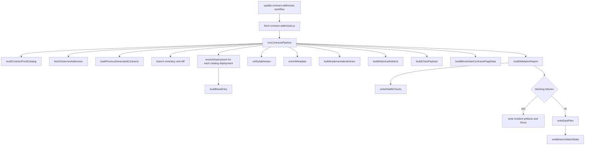

import { CustomDivider } from '/snippets/components/elements/spacing/Divider.jsx'

# Purpose

This file documents the exact current repository implementation of the contracts pipeline. It does not restate the canonical target design. It describes what the repo actually does today across:

- `.github/scripts/fetch-contract-addresses.js`
- `operations/scripts/integrators/content/data/contracts/pipeline.js`
- `operations/scripts/integrators/content/data/contracts/spec.js`
- `operations/scripts/integrators/content/data/contracts/constants.js`
- `snippets/data/contract-addresses/*`

Current-state evidence in this document is taken from the live repo files and generated outputs present in the working tree on 2026-04-03.

<CustomDivider />

# Current Implementation Surfaces

| Surface | Current file(s) | Current role |
|---|---|---|
| CLI entrypoint | `.github/scripts/fetch-contract-addresses.js` | Parses `--dry-run`, `--check`, and `--skip-verify`, then calls `runContractsPipeline()` |
| Core pipeline | `operations/scripts/integrators/content/data/contracts/pipeline.js` | Orchestrates repo fetch, address resolution, verification, enrichment, output shaping, validation, and file writes |
| Proof catalog | `operations/scripts/integrators/content/data/contracts/spec.js` | Defines deployment catalog, proof-chain metadata, authority strategies, and code-authority defaults |
| Paths and chain config | `operations/scripts/integrators/content/data/contracts/constants.js` | Defines watched repos, controllers, explorer URLs, RPC defaults, output paths, and failure classes |
| Branch-watch helper | `operations/scripts/integrators/content/data/contracts/branch-watch.js` | Loads previous branch inventory, diffs branch state, writes the branch-watch snapshot |
| Incident helper | `operations/scripts/integrators/content/data/contracts/incidents.js` | Builds incident fingerprints, anomaly reports, and issue payloads on blocking failure |
| Generated registry outputs | `snippets/data/contract-addresses/contractAddressesData.jsx`, `contractAddressesData.json` | Canonical contracts registry payload |
| Generated blockchain output | `snippets/data/contract-addresses/blockchainContractsPageData.jsx`, `blockchainContractsPageData.json` | Blockchain page companion payload |
| Generated health artifacts | `snippets/data/contract-addresses/_health-checks.json`, `_branch-watch-state.json` | Health-check and watched-branch output artifacts |

<CustomDivider />

# Current Pipeline Overview



<CustomDivider />

# Current Source And Resolution Model

## Current watched repos

The current watched repo list is defined in `constants.js` and serialized into generated output metadata:

- `livepeer/protocol`
- `livepeer/arbitrum-lpt-bridge`
- `livepeer/go-livepeer`
- `livepeer/governor-scripts`

The most recent branch-watch snapshot at `snippets/data/contract-addresses/_branch-watch-state.json` was generated at `2026-04-02T16:08:37.007Z` and records:

| Repo | Default branch | Recorded branch count |
|---|---|---|
| `livepeer/protocol` | `delta` | `55` |
| `livepeer/arbitrum-lpt-bridge` | `main` | `8` |
| `livepeer/go-livepeer` | `master` | `100` |
| `livepeer/governor-scripts` | `master` | `5` |

## Current address-strategy types

`resolveDeployment()` currently supports these address strategies:

| Strategy kind | Current behavior |
|---|---|
| `controller-root` | Uses the hardcoded chain controller address from `CONTROLLERS` |
| `controller-slot` | Calls the controller on-chain using `getContract(bytes32)` for the configured slot |
| `governor-manifest` | Reads address values from `livepeer/governor-scripts/updates/addresses.js` |
| `deployment-artifact` | Resolves official deployment artifact JSON from watched upstream repos |
| `repo-search` | Searches watched repos for address literals when an artifact is not the address source |

## Current code-source resolution

`resolveCodeSource()` and `resolveRepoPath()` currently resolve source files by:

1. fetching the branch head commit from GitHub
2. resolving the configured file path through the GitHub contents API or `gh api`
3. building a commit-pinned GitHub blob URL when a commit is available

If a configured code path does not exist, `resolveDeployment()` falls back to `artifact.compilationPath` when an upstream deployment artifact provides one.

## Current runtime corroboration

The current pipeline also uses:

- `resolveRuntimeConsumerEvidence()` for detached contracts that require runtime corroboration
- `resolveProxyRuntimeVerification()` for proxy deployments
- `resolveControllerSlotAddress()` for controller-registration cross-checks

<CustomDivider />

# Current Execution Contract

## Current CLI flags

The current entrypoint supports:

| Flag | Current behavior |
|---|---|
| `--dry-run` | Builds payloads without writing generated files |
| `--check` | Rebuilds expected outputs and fails if on-disk outputs drift from the regenerated payload |
| `--skip-verify` | Skips explorer bytecode verification and Blockscout enrichment, but still performs controller/proxy/runtime resolution |

`--dry-run` and `--check` are mutually exclusive in the entrypoint.

## Current active run path inside `runContractsPipeline()`

In current order, the pipeline does the following:

1. Builds the proof catalog with `buildContractProofCatalog()`.
2. Fetches `livepeer/governor-scripts/updates/addresses.js` with `fetchGovernorAddresses()`.
3. Loads the previous generated contracts payload from `contractAddressesData.json` or `contractAddressesData.jsx`.
4. Loads the previous branch-watch snapshot with `loadBranchWatchState()`.
5. Builds a fresh branch inventory for every watched repo using `fetchRepoInventory()`.
6. Diffs the old and new branch inventories with `diffBranchWatchState()`.
7. Resolves every deployment in the proof catalog with `resolveDeployment()`.
8. Converts each resolution into a base publishable row with `buildBaseEntry()`.
9. Splits those rows by chain.
10. Runs `verifyAddresses()` on each chain's base rows.
11. Runs `enrichMetadata()` on each chain's verified rows.
12. Builds current implementation rows with `buildImplementationEntries()`.
13. Runs `verifyAddresses()` again on implementation rows.
14. Builds historical payloads with `buildHistoricalArtifacts()`.
15. Builds the per-chain output payloads with `buildChainPayload()`.
16. Builds the blockchain companion payload with `buildBlockchainContractsPageData()`.
17. Builds the validation report with `buildValidationReport()`.
18. Writes `_health-checks.json` through `writeHealthChecks()`.
19. On failure, writes anomaly artifacts and the issue payload through `writeIncidentArtifacts()` and throws.
20. On success, writes the four generated data files through `writeDataFiles()`.
21. On success, writes `_branch-watch-state.json` through `writeBranchWatchState()`.

## Current historical-data behavior

The current repo contains helper functions for live controller event-log history:

- `fetchControllerSetContractInfoLogs()`
- `buildHistoricalEntriesFromEventLogs()`

Those helpers are exported and tested, but they are not called by the active `runContractsPipeline()` path today.

The current live run path builds historical output from:

- the previous generated payload loaded by `loadPreviousGeneratedContracts()`
- the current active, paused, migration, and legacy rows
- the current implementation rows
- `buildHistoricalArtifacts()`, `bootstrapHistoricalSeriesMap()`, and `finalizeHistoricalSeriesMap()`

So the current implementation does publish dynamic historical outputs, but it does not currently reconstruct controller history from live event logs inside `runContractsPipeline()`.

<CustomDivider />

# Current Generated Output Contract

## Current files written on a successful non-check, non-dry run

| File | Current payload |
|---|---|
| `snippets/data/contract-addresses/contractAddressesData.jsx` | ESM export `contractAddresses` |
| `snippets/data/contract-addresses/contractAddressesData.json` | Machine-readable version of the same registry plus `_generated` metadata |
| `snippets/data/contract-addresses/blockchainContractsPageData.jsx` | ESM export `blockchainContractsPageData` |
| `snippets/data/contract-addresses/blockchainContractsPageData.json` | Machine-readable blockchain companion plus `_generated` metadata |
| `snippets/data/contract-addresses/_health-checks.json` | Health-check artifact |
| `snippets/data/contract-addresses/_branch-watch-state.json` | Latest successful branch-watch snapshot |

## Current root export shape

The current root export shape is:

```js
export const contractAddresses = {
  arbitrumOne,
  ethereumMainnet,
  meta,
}
```

The current root payload does not include a top-level `historical` key. Historical rows currently live inside each chain payload:

- `contractAddresses.arbitrumOne.historical`
- `contractAddresses.ethereumMainnet.historical`
- `contractAddresses.arbitrumOne.historicalSeries`
- `contractAddresses.ethereumMainnet.historicalSeries`

## Current per-chain payload keys

Each chain payload currently includes:

- `inventory`
- `current`
- `active`
- `paused`
- `migration_residual`
- `legacy_operational`
- `historical`
- `historicalSeries`
- `currentImplementations`

## Current generated snapshot

Snapshot taken from `contractAddressesData.json` generated at `2026-04-02T16:10:19.046Z`:

| Chain | Inventory | Active | Paused | Migration residual | Legacy operational | Historical | Current implementations | Historical series groups |
|---|---|---|---|---|---|---|---|---|
| Arbitrum One | `40` | `14` | `0` | `2` | `0` | `17` | `7` | `16` |
| Ethereum Mainnet | `36` | `4` | `6` | `1` | `1` | `24` | `0` | `15` |

## Current blockchain companion snapshot

Snapshot taken from `blockchainContractsPageData.json` generated at `2026-04-02T16:10:19.046Z`:

- `20` contract entries
- `4` section groups:
  - `core-protocol-contracts`
  - `token-and-utility-contracts`
  - `governance-contracts`
  - `migration-contracts`
- `livepeer-token-faucet` is currently emitted as `supported: false`
- `l2-migrator` is currently emitted as `type: proxy`

<CustomDivider />

# Current Validation And Failure Behavior

## Current validation checks

`buildValidationReport()` currently fails the run when it finds:

- unresolved publishable addresses
- unsupported lifecycle values
- missing commit-pinned provenance
- non-existent resolved source paths
- deployment-artifact mismatches
- required runtime-consumer mismatches
- active target rows leaking into the public active surface
- controller-managed rows that no longer match controller truth
- active proxy rows with no implementation address
- malformed or wrong-chain explorer links
- archived changelog path references in the generated payload

## Current branch anomaly handling

Branch-watch diffs currently become warnings, not failures.

That means:

- new branches
- missing branches
- default-branch changes

are recorded into the in-memory warnings list and then written to `_health-checks.json` only if other blocking validation does not stop the run first.

## Current clean-run health artifact state

The current `_health-checks.json` file is:

- timestamped `2026-04-02T16:10:19.045Z`
- `0` checks
- `0` failures
- `0` warnings

## Current incident artifacts

On blocking failure, the pipeline writes:

- `workspace/reports/contracts/contract-pipeline-anomaly-report.json`
- `workspace/reports/contracts/contract-pipeline-anomaly-report.md`
- `workspace/reports/contracts/contract-pipeline-issue-payload.json`

No anomaly-report file is present in the current working tree snapshot, which means the last written artifact set in this repo state is the clean-run path rather than a blocking-failure path.

<CustomDivider />

# Current Workflow-Visible Facts

- The generated file headers explicitly say `Auto-generated by fetch-contract-addresses.js`.
- Generated metadata currently uses `sourceRepo: livepeer/governor-scripts` and `sourceCommit: 2cb192a`.
- `--check` compares regenerated output to on-disk files after scrubbing volatile timestamps like `lastUpdated`, `verifiedAt`, and `_generated.at`.
- The workflow commit step stages exactly six files:
  - `contractAddressesData.jsx`
  - `contractAddressesData.json`
  - `blockchainContractsPageData.jsx`
  - `blockchainContractsPageData.json`
  - `_health-checks.json`
  - `_branch-watch-state.json`
