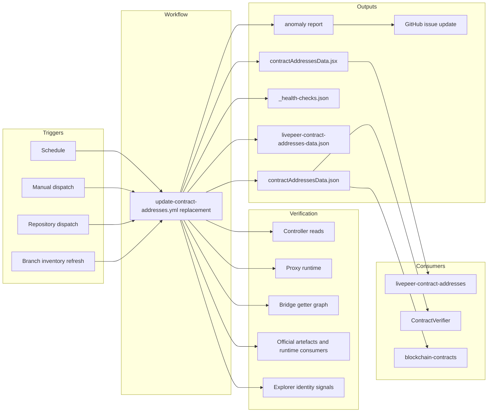

import { CustomDivider } from '/snippets/components/elements/spacing/Divider.jsx'

## Classification

| Field | Value |
|---|---|
| **Current file** | `.github/workflows/update-contract-addresses.yml` |
| **New name** | `automation-integrations-update-contract-addresses.yml` |
| **Type** | `automation` |
| **Concern** | `integrations` |
| **Pipeline tag** | `P5-auto`, `manual`, `event-driven` |
| **Enforcement** | Self-managing with hard failure gates and human review for detached anomalies |
| **Status** | Placeholder, canonical replacement design |

<CustomDivider />

## Purpose

This entry documents the canonical replacement design for `update-contract-addresses.yml`. The replacement workflow rebuilds the Livepeer contract registry from chain truth, official upstream deployment artefacts, exact provenance resolution, and supplementary explorer identity signals on every run.

This workflow owns the generated contracts data consumed by the canonical contracts page, the verifier widget, and the blockchain contracts page. If it stops running or publishes the wrong result, the docs can surface stale, unofficial, or contradictory contract addresses.

<CustomDivider />

## Pipeline

<CustomDivider />

## Triggers

| Trigger | Details |
|---|---|
| `schedule` | Scheduled verification refresh. Target cadence is every 6 hours, with daily as the minimum acceptable floor. |
| `repository_dispatch` | Upstream repo events such as `governor-scripts-update`, `protocol-update`, `bridge-update`, and equivalent future official-source updates. |
| `workflow_dispatch` | Manual dry run, inspection run, or forced verification after an incident or upstream change. |
| Branch inventory refresh | Runs inside scheduled and event-driven executions to detect new branches and default-branch changes across all watched official repos. |

<CustomDivider />

## Inputs

| Input | Type | Default | Description |
|---|---|---|---|
| `dry_run` | boolean | `false` | Show changes and anomaly results without writing outputs |
| `skip_verify` | boolean | `false` | Skip explorer enrichment only. Chain truth, proxy truth, and provenance checks still run |
| `use_test_branch` | boolean | `false` | Write to `TEST_BRANCH` instead of `DEPLOY_BRANCH` |

<CustomDivider />

## Secrets and Permissions

| Secret | Purpose |
|---|---|
| `GITHUB_TOKEN` | Checkout, upstream repo inspection, commit/push, and issue creation or update |
| `ARBISCAN_API_KEY` | Arbitrum explorer enrichment and verification metadata |
| `ETHERSCAN_API_KEY` | Ethereum explorer enrichment and verification metadata |
| `ARBITRUM_RPC_URL` | Primary Arbitrum CI RPC endpoint for controller reads, proxy reads, and log queries |
| `ARBITRUM_RPC_FALLBACK_URL` | Fallback Arbitrum CI RPC endpoint for retry and contradiction checks |
| `ETHEREUM_RPC_URL` | Primary Ethereum CI RPC endpoint for controller reads, bridge seed reads, and log probes |
| `ETHEREUM_RPC_FALLBACK_URL` | Fallback Ethereum CI RPC endpoint for retry and contradiction checks |

**Permissions:** `contents: write`, `issues: write`

Dedicated RPC endpoints are required for CI. Public RPC is a local-development fallback only and is not part of the production workflow contract.

<CustomDivider />

## Dependencies

**Scripts:**

- `.github/scripts/fetch-contract-addresses.js` : replacement generator entrypoint; must implement discovery, truth recovery, provenance resolution, explorer enrichment, and anomaly reporting

**Watched official repos:**

- `livepeer/protocol`
- `livepeer/arbitrum-lpt-bridge`
- `livepeer/go-livepeer`
- `livepeer/governor-scripts`

**Config:**

- No docs-local truth file is allowed
- Docs-local metadata may exist only for display order, category, and explanatory copy

**External services:**

| Service | Exact endpoint or pattern | Output used by the workflow |
|---|---|---|
| Arbitrum RPC primary and fallback | `https://arb1.arbitrum.io/rpc`, `https://arbitrum-one-rpc.publicnode.com`, `https://arbitrum.drpc.org` | `eth_call` results for controller state, proxy runtime, and `eth_getLogs` for Arbitrum event history |
| Ethereum RPC primary and fallback | `https://eth.llamarpc.com`, `https://ethereum-rpc.publicnode.com`, `https://eth.drpc.org` | `eth_call` results for Ethereum controller state, bridge-seed lookups, and `eth_getLogs` availability probes |
| Arbiscan API | `https://api.arbiscan.io/api?module=proxy&action=eth_getCode&address=ADDRESS&tag=latest` | bytecode presence for Arbitrum addresses |
| Arbitrum Blockscout API v2 | `https://arbitrum.blockscout.com/api/v2/addresses/ADDRESS` and related v2 smart-contract and transaction routes | labels, creator address, deployer hints, token metadata, deployment and activity timestamps, compiler metadata |
| Etherscan V2 API | `https://api.etherscan.io/v2/api?...` account, proxy, token, and contract routes | Ethereum deployment history, transaction counts, token metadata, source-code and proxy metadata |
| Public explorer address pages | `https://arbiscan.io/address/ADDRESS`, `https://etherscan.io/address/ADDRESS` | published user-facing explorer links |
| GitHub contents API | `https://api.github.com/repos/livepeer/governor-scripts/contents/updates/addresses.js`, `https://api.github.com/repos/REPO/contents/FILE_PATH?ref=BRANCH` | upstream file contents for deployment artefacts, `governor-scripts`, and source-path resolution |
| GitHub CLI fallback | `gh api /repos/REPO/contents/PATH?ref=BRANCH` | fallback upstream file retrieval |

**Data files produced:**

- `snippets/data/contract-addresses/contractAddressesData.jsx` : generated contracts dataset
- `snippets/data/contract-addresses/contractAddressesData.json` : machine-readable registry
- `snippets/data/contract-addresses/_health-checks.json` : verification and anomaly results
- `snippets/composables/pages/canonical/livepeer-contract-addresses-data.json` : page-facing generated data
- workflow artifact for the structured anomaly report : failure-class, affected contract family, failing source, comparison detail, next action, and incident fingerprint

**Consumed by:**

| Consumer | In nav? |
|---|---|
| `snippets/composables/pages/canonical/livepeer-contract-addresses.mdx` | No, composable source |
| `snippets/components/integrators/feeds/ContractVerifier.jsx` | No, component |
| `v2/about/livepeer-protocol/blockchain-contracts.mdx` | Yes |

**Canonical public route affected:** `/v2/about/resources/livepeer-contract-addresses`

<CustomDivider />

## Known Issues

- **P0 (current implementation gap):** The repo still needs the chain-first replacement generator to fully displace any docs-local truth shaping.
- **P0 (current implementation gap):** Exact non-controller provenance still needs hard-failure enforcement across bridge and detached families.
- **P1 (current implementation gap):** Branch-inventory and default-branch anomaly handling across all watched repos still needs to be implemented in the production workflow.
- **P1 (current implementation gap):** Dedicated CI RPC infrastructure and secret-backed fallback routing still need to be wired into the workflow.
- **P1 (current implementation gap):** Page and widget copy must remain generated-model-aligned so docs consumers do not overstate certainty.

<CustomDivider />

## Error And Self-Remediation Policy

The replacement workflow separates bounded infrastructure recovery from truth failures. Infrastructure failures may retry. Truth contradictions, provenance failures, and publish-safety failures stop the run and create a handoff artifact.

| Failure class | Immediate handling | Publication outcome | Follow-up |
|---|---|---|---|
| RPC timeout, transient provider error, explorer rate limit, temporary GitHub API failure | Retry with bounded backoff, then retry against a fallback provider or secondary service where one exists | Halt if the retry budget is exhausted | Write anomaly report and create or update GitHub issue |
| RPC provider disagreement on current address truth | Compare primary and fallback results and mark contradiction | Halt immediately | Write anomaly report and create or update GitHub issue |
| Unknown Controller slot or unknown event id | Confirm once, then treat as unresolved | Halt immediately | Write anomaly report and create or update GitHub issue |
| Unresolved current proxy implementation | Confirm with live proxy runtime and controller cross-check | Halt immediately | Write anomaly report and create or update GitHub issue |
| Bridge getter mismatch | Re-run the getter graph once, then treat as contradiction | Halt immediately | Write anomaly report and create or update GitHub issue |
| Unresolved official commit or source path | Re-run provenance resolution against the watched official repos | Halt immediately if still unresolved | Write anomaly report and create or update GitHub issue |
| Detached runtime or artefact contradiction | No auto-publish | Halt immediately | Write anomaly report and create or update GitHub issue |
| Bad explorer host or wrong published address link | Rebuild from the fixed chain mapping and re-check once | Halt immediately if still wrong | Write anomaly report and create or update GitHub issue |
| Non-active row in the active surface | Treat as classification failure | Halt immediately | Write anomaly report and create or update GitHub issue |
| Contradictory current entrypoints on the same chain | Treat as truth contradiction | Halt immediately | Write anomaly report and create or update GitHub issue |

The anomaly report includes:

- failure class
- affected contract family and chain
- failing source or provider
- exact comparison that failed
- recommended human next step
- stable incident fingerprint for issue deduplication

Self-remediation is allowed only for infrastructure and delivery failures that can be retried without weakening truth.

| Scenario | Safe auto-recovery | Hard stop condition |
|---|---|---|
| Primary RPC fails | Retry with bounded backoff, then query fallback RPC | Fallback fails or fallback disagrees on truth |
| Explorer API fails | Retry with backoff, then switch to the secondary explorer family configured for the same chain | Link or verification field is still unresolved after retry budget |
| GitHub API provenance lookup fails | Retry with backoff and resume from cached repo inventory if the cache is valid for the current run | Commit or path is still unresolved |
| Branch inventory change detected | Refresh inventory and isolate affected rows for provenance re-check | Any active row now depends on unresolved branch ownership |
| Duplicate incident on repeated runs | Update the existing issue using the incident fingerprint | New contradictory evidence changes severity or scope |

Required self-remediation outputs:

- step summary with the exact recovery path attempted
- attached anomaly JSON or Markdown artifact
- GitHub issue creation or update with labels such as `contracts`, `pipeline`, `verification`, and the failure class
- publication kept blocked until a clean run completes

The workflow must not self-remediate by accepting a weaker truth source, guessed branch, stale previous output, or docs-local truth override.

<CustomDivider />

## Governance Notes

| Field | Value |
|---|---|
| **Consolidation** | Replace the current workflow in place |
| **Dry-run** | Yes |
| **Concurrency** | Yes, required workflow concurrency group keyed to workflow name and target branch |
| **Error reporting** | Anomaly report + step summary + GitHub issue creation/update + hard failure |
| **Auto-commit** | Yes, targeted generated outputs only |
| **Bot identity** | `github-actions[bot]` |
| **Commit message** | `chore(contracts): refresh verified contract registry` |
