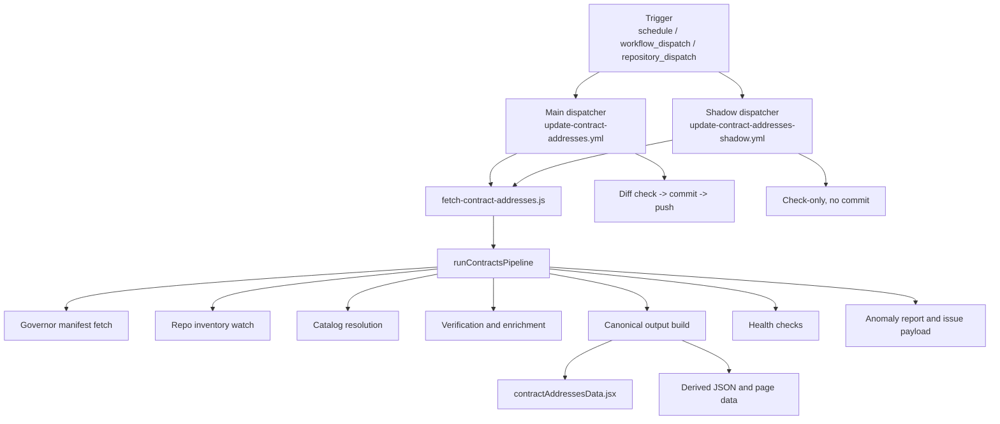

import { CustomDivider } from '/snippets/components/elements/spacing/Divider.jsx'

# Purpose

This document describes the current workflow function of the contracts update dispatchers.

It is aligned to `.github/workspace/framework-canonical.md`:

- the workflow YAML files are dispatchers
- the typed work lives in `.github/scripts/fetch-contract-addresses.js` and `operations/scripts/automations/content/data/contracts/pipeline.js`
- the current flow combines Pattern A `Integrate` and Pattern D `Scan, Report, Act`

<CustomDivider />

# Classification

| Field | Current value |
|---|---|
| Primary dispatcher | `.github/workflows/update-contract-addresses.yml` |
| Paired shadow dispatcher | `.github/workflows/update-contract-addresses-shadow.yml` |
| Workflow layer | Dispatcher, not typed work |
| Script entrypoint | `.github/scripts/fetch-contract-addresses.js` |
| Runtime module | `operations/scripts/automations/content/data/contracts/pipeline.js` |
| Current patterns | Pattern A `Integrate` + Pattern D `Scan, Report, Act` |
| Current status | Live current-state reference |

<CustomDivider />

# Workflow Topology

<CustomDivider />

# Trigger Surface

## Main workflow

Workflow file:

- `.github/workflows/update-contract-addresses.yml`

Current triggers:

| Trigger | Current config | Notes |
|---|---|---|
| `schedule` | `0 2 * * *` | Daily main run at 02:00 UTC |
| `repository_dispatch` | `governor-scripts-update`, `protocol-update`, `bridge-update`, `go-livepeer-update` | Event-driven rerun on watched upstream changes |
| `workflow_dispatch` | `dry_run`, `skip_verify`, `use_test_branch` | Manual inspection and controlled regeneration |

## Shadow workflow

Workflow file:

- `.github/workflows/update-contract-addresses-shadow.yml`

Current triggers:

| Trigger | Current config | Notes |
|---|---|---|
| `schedule` | `30 2 * * *` | Daily shadow run at 02:30 UTC |
| `repository_dispatch` | `governor-scripts-update`, `protocol-update`, `bridge-update`, `go-livepeer-update` | Mirrors main trigger surface |
| `workflow_dispatch` | `skip_verify`, `use_test_branch` | Manual verification-only run |

The current repo does not run a six-hour cadence. Both dispatchers are daily.

<CustomDivider />

# Inputs, Permissions, and Runtime

## Main workflow inputs

| Input | Type | Default | Current behaviour |
|---|---|---|---|
| `dry_run` | boolean | `false` | Runs the pipeline without writing outputs |
| `skip_verify` | boolean | `false` | Skips explorer and metadata verification passes |
| `use_test_branch` | boolean | `false` | Checks out `vars.TEST_BRANCH` instead of `vars.DEPLOY_BRANCH` |

## Shadow workflow inputs

| Input | Type | Default | Current behaviour |
|---|---|---|---|
| `skip_verify` | boolean | `false` | Same verification skip behaviour as main |
| `use_test_branch` | boolean | `true` | Defaults to `vars.TEST_BRANCH` |

## Permissions

| Workflow | Permissions |
|---|---|
| Main | `contents: write`, `issues: write` |
| Shadow | `contents: read`, `issues: write` |

## Environment used by both workflows

| Secret or env | Current use |
|---|---|
| `GITHUB_TOKEN` | GitHub contents, commits, branches, issues, and checkout |
| `ARBISCAN_API_KEY` | Arbitrum `eth_getCode` verification |
| `ETHERSCAN_API_KEY` | Ethereum `eth_getCode` verification |
| `ARBITRUM_RPC_URL`, `ARBITRUM_RPC_FALLBACK_URL` | Arbitrum controller, proxy, and log queries |
| `ETHEREUM_RPC_URL`, `ETHEREUM_RPC_FALLBACK_URL` | Ethereum controller and proxy queries |

<CustomDivider />

# Current Script Responsibilities

The dispatcher does not implement contract logic itself. The current typed work is:

1. fetch the governor manifest from `livepeer/governor-scripts/updates/addresses.js`
2. load the proof catalog from `spec.js`
3. load and diff the watched repo branch inventory
4. resolve the catalog deployments into candidate contract rows
5. verify bytecode presence on Arbitrum and Ethereum
6. enrich metadata from Blockscout and proxy/controller runtime checks
7. build implementation rows and historical artefacts
8. build the canonical contracts payload and the blockchain consumer payload
9. validate truth, provenance, lifecycle, explorer-link, branch-watch, and output drift rules
10. write outputs or write incident artefacts and fail

The main workflow then adds:

11. `--check` rerun after generation
12. diff check
13. targeted commit and push if changes exist and the run is not dry-run

The shadow workflow stops after the verification path and never commits.

<CustomDivider />

# Upstream Sources Actually Used

## Watched repos

The current watch set is:

- `livepeer/protocol`
- `livepeer/arbitrum-lpt-bridge`
- `livepeer/go-livepeer`
- `livepeer/governor-scripts`

What the current repo watch actually does:

- fetch repo metadata
- fetch default branch
- fetch branch inventory
- persist and diff `_branch-watch-state.json`

What it does not currently do:

- free-form discovery and publication of new contract families directly from repo diffs

Published families are still resolved from the proof catalog defined in `spec.js`.

## External services actually called by the current scripts

| Service | Current call shape | Current use |
|---|---|---|
| GitHub contents API | `/repos/REPO/contents/PATH?ref=BRANCH` | governor manifest, deployment artefacts, and source-path lookups |
| GitHub commits API | `/repos/REPO/commits/BRANCH` | branch-to-commit provenance resolution |
| GitHub repo and branches APIs | `/repos/REPO`, `/repos/REPO/branches?per_page=100` | repo inventory and branch watch |
| `gh api` fallback | same endpoints via `gh api` | fallback GitHub retrieval path |
| RPC `eth_call` | POST to configured Arbitrum and Ethereum RPCs | controller slots, controller root, proxy runtime, getter reads |
| RPC `eth_getLogs` | POST to configured RPCs | Arbitrum controller history reconstruction |
| Arbiscan/Etherscan `eth_getCode` | `api?module=proxy&action=eth_getCode` | bytecode presence verification |
| Blockscout address endpoint | `/api/v2/addresses/ADDRESS` | creator, labels, verified-source flag, proxy metadata |

<CustomDivider />

# Outputs

## Outputs written by the script layer

The current successful write path emits:

- `snippets/data/contract-addresses/contractAddressesData.jsx`
- `snippets/data/contract-addresses/contractAddressesData.json`
- `snippets/data/contract-addresses/blockchainContractsPageData.jsx`
- `snippets/data/contract-addresses/blockchainContractsPageData.json`
- `snippets/composables/pages/canonical/livepeer-contract-addresses-data.json`
- `snippets/data/contract-addresses/_health-checks.json`
- `snippets/data/contract-addresses/_branch-watch-state.json`

## Failure artefacts

When blocking failures occur, the current pipeline writes:

- `workspace/reports/contracts/contract-pipeline-anomaly-report.json`
- `workspace/reports/contracts/contract-pipeline-anomaly-report.md`
- `workspace/reports/contracts/contract-pipeline-issue-payload.json`

Both workflows upload those artefacts. Both workflows also create or update a GitHub issue when the generate step fails.

<CustomDivider />

# Failure and Fallback Path

The current workflow contract is fail-loud.

Blocking failure classes in the live pipeline are:

- `rpc-failure`
- `truth-reconciliation-failure`
- `provenance-failure`
- `explorer-link-failure`
- `branch-watch-anomaly`
- `output-contract-failure`

Current failure path:

1. the script writes `_health-checks.json`
2. blocking failures produce anomaly artefacts and an issue payload
3. the workflow uploads the artefacts
4. the workflow creates or updates the matching GitHub incident issue
5. the workflow exits non-zero

Current success path:

1. the main workflow reruns `--check`
2. if generated files changed and the run is not `dry_run`, it commits:
   `chore(contracts): refresh verified contract registry`
3. it pushes the checked-out branch

<CustomDivider />

# Current Implementation Boundaries

These are current script-function facts, not future design goals:

- the workflow filenames are still legacy names, even though framework governance treats them as dispatchers
- the repo watch is a branch-watch and anomaly input, not a generic contract-family discovery engine
- Arbitrum controller logs are used for historical reconstruction; Ethereum controller logs are not currently rebuilt in the same way
- the script entrypoint is thin by design and delegates to `pipeline.js`
- the canonical persisted contracts dataset written by the workflow is `contractAddressesData.jsx`
