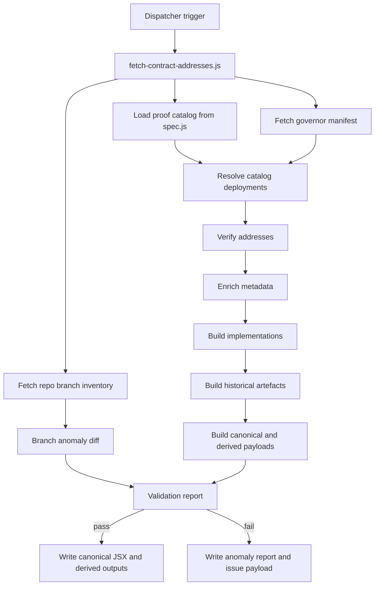

import { CustomDivider } from '/snippets/components/elements/spacing/Divider.jsx'

# Purpose

This file describes what the current contracts pipeline actually does.

It does not describe an ideal replacement architecture. Where the live implementation is narrower than the intended design, this file states that boundary explicitly.

The current pipeline publishes one canonical repo contract dataset from external Livepeer and blockchain sources, then derives the page-facing outputs from that dataset.

<CustomDivider />

# Pipeline Overview

| Stage | Current job | Current rule |
|---|---|---|
| Catalog load | Declare the families the live script resolves | The live run resolves the `spec.js` catalog, not arbitrary newly discovered families |
| Source fetch | Read governor manifest, repo inventory, RPC state, and verification metadata | Docs-local files do not define publishable truth |
| Resolution | Turn catalog definitions into contract rows | Each family follows its configured proof chain |
| Verification and enrichment | Confirm bytecode, runtime relations, controller state, and metadata | Blocking contradictions fail the run |
| Output | Write one canonical JSX dataset plus derived files | `contractAddressesData.jsx` is the canonical persisted repo output |

<CustomDivider />

# What Counts As Discovery In The Current Implementation

The current live script does not implement full contract-family discovery from watched repos.

What it does today:

- loads a predeclared proof catalog from `operations/scripts/automations/content/data/contracts/spec.js`
- fetches branch inventory for watched repos
- diffs the current branch inventory against the previous successful run
- uses Arbitrum controller logs to seed historical reconstruction

What it does not do today:

- discover and publish new contract families directly from repo diffs
- promote every upstream contract candidate into the publish set automatically
- rebuild Ethereum historical series from controller logs the same way Arbitrum is rebuilt

That distinction matters. The current pipeline resolves the known catalog and validates it aggressively, but its repo watch is not yet a free-form family discovery engine.

<CustomDivider />

# Source Inputs

## Watched repos

Current watch set from `constants.js`:

- `livepeer/protocol`
- `livepeer/arbitrum-lpt-bridge`
- `livepeer/go-livepeer`
- `livepeer/governor-scripts`

Current watch behaviour:

- fetch repo metadata
- fetch default branch
- fetch branch inventory
- persist `_branch-watch-state.json`
- diff branch state against the previous successful run

Blocking branch-watch anomaly types:

- `new-repo-watch`
- `default-branch-change`
- `new-branch`
- `missing-branch`

## Governor manifest

The pipeline fetches:

- `livepeer/governor-scripts/updates/addresses.js`

The current script parses `ADDRESSES` from that file and records the source SHA. The governor manifest is an input to resolution and metadata. It is not documented in the current pipeline as sole publish truth.

## Blockchain and verification surfaces

The current script uses:

| Source | Current function |
|---|---|
| Arbitrum and Ethereum RPC `eth_call` | controller state, proxy runtime, and getter checks |
| Arbitrum RPC `eth_getLogs` | Arbitrum controller history reconstruction |
| Arbiscan and Etherscan `eth_getCode` | bytecode presence verification |
| Blockscout address endpoint | creator, labels, verified-source flag, proxy hints |
| GitHub contents and commits APIs | artefact loading and branch-to-commit provenance resolution |

<CustomDivider />

# Current Proof Chains

## 1. Controller-managed families

Controller-managed families resolve through live controller state.

Current proof path:

1. resolve the controller root or controller slot with `eth_call`
2. build the base publish entry
3. if the family is a proxy, resolve proxy runtime data with `controller()` and `targetContractId()`
4. verify bytecode presence
5. enrich metadata
6. validate the published row against controller truth

Current historical handling:

- Arbitrum historical seed entries are rebuilt from controller `SetContractInfo` logs
- Ethereum current controller state is used for current truth
- Ethereum historical is not rebuilt from controller logs in the same way in the live implementation

## 2. Bridge families

Bridge families resolve through a mixture of governor manifest keys, deployment artefacts, and runtime checks.

Current proof path:

1. resolve the configured bridge family authority from the proof catalog
2. load deployment artefacts or manifest keys as configured
3. verify current bytecode presence
4. enrich metadata
5. validate the published row against bridge/runtime evidence required by the catalog definition

## 3. Detached families

Detached families resolve through the proof catalog definitions, not through a generic discovery queue.

Current proof path:

1. resolve from configured deployment artefact or repo/runtime search
2. verify bytecode presence
3. enrich metadata
4. validate any required runtime evidence configured for that family

The current script does not implement a generic human review gate for every newly discovered detached family because the live run does not yet perform open-ended family discovery.

<CustomDivider />

# Current Execution Order

The current `runContractsPipeline()` execution order is:

1. build the contract proof catalog
2. fetch the governor manifest and source SHA
3. load the previous generated contracts payload
4. load the previous branch-watch snapshot
5. fetch repo inventory for each watched repo
6. diff branch-watch state
7. resolve every catalog deployment
8. split resolved entries by chain
9. verify address bytecode on each chain
10. enrich metadata and proxy/controller state
11. build current implementation rows
12. fetch Arbitrum controller logs and build historical seed entries
13. build historical artefacts for each chain
14. build chain payloads
15. build blockchain page data
16. build the validation report
17. write health checks
18. if failures exist, write incident artefacts and throw
19. otherwise write canonical and derived outputs
20. persist the new branch-watch snapshot

<CustomDivider />

# Current Output Contract

## Canonical persisted dataset

The canonical persisted contracts dataset written by the live script is:

- `snippets/data/contract-addresses/contractAddressesData.jsx`

That root payload currently contains:

- `arbitrumOne`
- `ethereumMainnet`
- `historical`
- `meta`

Each chain payload currently includes:

- `inventory`
- `current`
- `active`
- `paused`
- `migration_residual`
- `legacy_operational`
- `historical`
- `historicalSeries`
- `currentImplementations`

## Derived outputs

The same write pass emits:

- `snippets/data/contract-addresses/contractAddressesData.json`
- `snippets/data/contract-addresses/blockchainContractsPageData.jsx`
- `snippets/data/contract-addresses/blockchainContractsPageData.json`
- `snippets/composables/pages/canonical/livepeer-contract-addresses-data.json`

Additional operational outputs:

- `snippets/data/contract-addresses/_health-checks.json`
- `snippets/data/contract-addresses/_branch-watch-state.json`

<CustomDivider />

# Current Validation and Failure Model

The live pipeline validates:

- address resolution exists
- lifecycle is supported
- code-source provenance resolves to a real upstream path
- artefact truth matches the published row where required
- runtime-consumer evidence matches where required
- active output does not leak target rows
- controller rows match controller state
- active proxy rows have runtime-resolved implementation addresses
- explorer links use the correct host and exact address
- blocking branch-watch anomalies are absent
- generated payloads do not reference retired historical paths

Current blocking failure classes:

- `rpc-failure`
- `truth-reconciliation-failure`
- `provenance-failure`
- `explorer-link-failure`
- `branch-watch-anomaly`
- `output-contract-failure`

If blocking failures exist, the current pipeline writes:

- `workspace/reports/contracts/contract-pipeline-anomaly-report.json`
- `workspace/reports/contracts/contract-pipeline-anomaly-report.md`
- `workspace/reports/contracts/contract-pipeline-issue-payload.json`

The workflows then upload those artefacts, create or update the incident issue, and fail the run.

<CustomDivider />

# Presentation and Consumer Boundaries

The current script owns truth and emitted data. Consumers read the generated model.

Current downstream surfaces:

- canonical contracts page data companion
- blockchain contracts page data
- verifier widget inputs

The current active-surface policy in the generated payload is:

- active contracts are separated from `currentImplementations`
- non-active rows live in secondary lifecycle buckets
- root historical data is derived from per-chain historical series

<CustomDivider />

# Current Implementation Boundaries

These are current-script facts that should not be hidden by broader design language:

- repo watching is real, but free-form contract-family discovery is still limited by the predeclared proof catalog
- Arbitrum historical recovery is event-log-seeded; Ethereum historical is not reconstructed through the same path in the live code
- branch anomalies are part of the blocking validation model
- the workflow layer is dispatcher-only; the typed work lives in the scripts
- the canonical persisted repo data source remains `contractAddressesData.jsx`

<CustomDivider />

# Operational Notes

The current live workflow cadence is daily:

- main run: `0 2 * * *`
- shadow run: `30 2 * * *`

The current live script supports:

- `--dry-run`
- `--check`
- `--skip-verify`

The main workflow commits only when:

- generation succeeded
- the subsequent `--check` passed
- generated files changed
- the run is not dry-run
