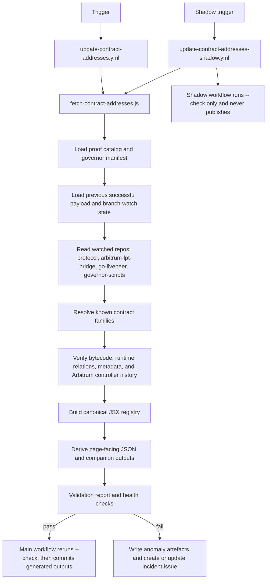

import { CustomDivider } from '/snippets/components/elements/spacing/Divider.jsx'

# Contracts Workflow Summary

The contracts registry is generated by workflow automation and published only when the pipeline completes a full verification pass. The live implementation resolves a defined proof catalog, verifies those addresses against external sources, writes one canonical JSX dataset, and derives every page-facing contracts artifact from that file.

<CustomDivider />

# End-To-End Flow

1. Trigger: the main workflow runs daily at `02:00 UTC`, supports manual dispatch with `dry_run`, `skip_verify`, and `use_test_branch`, and can also be triggered by repository dispatch events from `livepeer/protocol`, `livepeer/arbitrum-lpt-bridge`, `livepeer/go-livepeer`, and `livepeer/governor-scripts`.
2. Entrypoint: `.github/scripts/fetch-contract-addresses.js` is a thin CLI wrapper that runs `runContractsPipeline()` and enforces the `--dry-run` versus `--check` contract.
3. Source loading: the pipeline loads the proof catalog from `operations/scripts/integrators/content/data/contracts/spec.js`, fetches the governor addresses manifest, loads the previous successful contracts payload, and loads the previous branch-watch snapshot.
4. Repo and provenance checks: it fetches branch inventory for the four watched repos, diffs that state against the previous successful run, and carries any blocking branch anomalies into validation.
5. Resolution and verification: it resolves every catalog deployment, verifies bytecode on Arbitrum One and Ethereum Mainnet, enriches metadata and proxy/controller state, builds implementation rows, and rebuilds Arbitrum historical seed entries from controller `SetContractInfo` logs.
6. Output build: it assembles per-chain payloads, root historical data, blockchain-page companion data, and one canonical repo dataset at `snippets/data/contract-addresses/contractAddressesData.jsx`.
7. Publish or fail: it writes health checks for every run, throws on blocking failures, writes anomaly artefacts and incident payloads on failure, and only allows the main workflow to commit refreshed generated outputs after a successful generation run followed by a successful `--check` rerun.

<CustomDivider />

# Trust Model

- The contracts page is backed by generated data, not a hand-maintained address list.
- The main workflow does not publish anything until generation succeeds and the follow-up `--check` pass succeeds against the same sources.
- The shadow workflow reruns the verification path in check-only mode so failures are surfaced without changing published data.
- Failure runs still write `_health-checks.json`, branch-watch state, anomaly reports, and issue payloads, so there is an audit trail instead of a silent no-op.
- The canonical persisted repo data source is `snippets/data/contract-addresses/contractAddressesData.jsx`. The JSON outputs and page-facing companion data are derived from that file.

<CustomDivider />

# Current Limits

- The live implementation resolves the proof catalog defined in `spec.js`; it does not yet perform open-ended contract-family discovery directly from repo diffs.
- Watched repos are used for provenance and branch-anomaly detection, not as a generic discovery queue.
- Arbitrum historical entries are rebuilt from controller logs. Ethereum historical is not rebuilt through the same controller-log path in the current implementation.
- This file describes current behavior only. It should not be read as a design promise for broader discovery or future proof paths.
