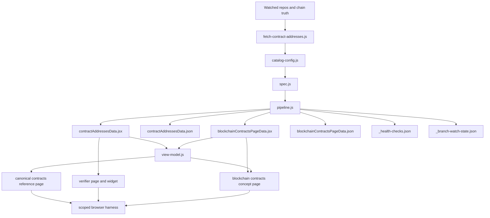

import { CustomDivider } from '/snippets/components/elements/spacing/Divider.jsx'

# Purpose

This document explains the data path created by the contracts redesign worktree and why it exists in this shape.

It is both:

- user-facing architecture documentation for anyone maintaining the contracts pages
- internal implementation guidance so the same pattern can be repeated for future large generated reference surfaces

This file records the worktree architecture, not the pre-redesign contracts surface.

<CustomDivider />

# Executive Summary

The redesign creates a data path with five clear layers:

1. external truth sources
2. generator-owned canonical and derived datasets
3. shared pure view-model shaping
4. thin page and composable consumers
5. scoped browser validation

The main reason for this split is Mintlify ergonomics and docs maintainability:

- generator-owned data should live outside MDX pages
- page layout should not own business logic or data normalization
- the canonical lookup page should stay static-first
- the verifier should be separate from the reference page
- concept pages should consume shared derived helpers instead of redefining contract lookup logic inline

The result is a path that is easier to reason about, easier to test, and easier to extend without turning one MDX file into the entire pipeline.

<CustomDivider />

# What Changed

Before this redesign, the contracts surface mixed too many concerns:

- page copy
- data normalization
- table row shaping
- page-specific route helpers
- verifier UX
- concept-page helper exports

The worktree moves those responsibilities into distinct owners:

| Layer | Owner | Current worktree location | Why it exists |
|---|---|---|---|
| Source truth | external systems | watched repos, RPC, explorers | docs-local files must not define publishable contract truth |
| Resolution and generation | pipeline scripts | `operations/scripts/automations/content/data/contracts/*` | one place recovers, verifies, and writes repo data |
| Persisted datasets | generated data modules | `snippets/data/contract-addresses/*` | stable import surface for docs consumers |
| Shared shaping | pure view-model | `snippets/data/contract-addresses/view-model.js` | reuse across pages without JSX/data logic duplication |
| Page presentation | MDX pages and composables | `v2/about/...` and `snippets/composables/pages/canonical/*` | render user-facing docs without re-owning the data model |

<CustomDivider />

# Data Path Overview

The key architectural rule is:

- pipeline scripts own truth recovery and persistence
- shared JS helpers own shaping
- MDX pages own explanation and layout only

<CustomDivider />

# Layer 1: External Truth Sources

The worktree keeps the same fundamental rule as the existing contracts pipeline:

- docs-local files do not define publishable address truth

The pipeline resolves contract data from:

- `livepeer/protocol`
- `livepeer/arbitrum-lpt-bridge`
- `livepeer/go-livepeer`
- `livepeer/governor-scripts`
- Arbitrum and Ethereum RPC state
- explorer-backed verification surfaces

Why:

- the contracts page is a public trust surface
- the docs repo can cache truth, but it cannot invent it
- publishable addresses, lifecycle state, and code provenance must resolve from upstream authority

This rule is what makes the later layers safe. Every later layer assumes the generator has already done the hard truth-recovery work.

<CustomDivider />

# Layer 2: Definition and Resolution

## Catalog definition

The worktree introduces `catalog-config.js` as the central contract family declaration surface.

Current location in the worktree:

- `operations/scripts/automations/content/data/contracts/catalog-config.js`

This file owns:

- `CONTRACT_DEFINITIONS`
- `BLOCKCHAIN_PAGE_SECTIONS`
- `LATEST_RESOLUTION_POLICY`

Why:

- the old shape split contract-family declarations across multiple places
- the redesign moves contract family metadata closer to one canonical declaration surface
- the blockchain concept-page spec can now be derived from the same contract catalog instead of being maintained as an independent hardcoded roster

## Spec materialization

`spec.js` now materializes the catalog into pipeline deployments and derives the blockchain page spec from the same source.

Current worktree location:

- `operations/scripts/automations/content/data/contracts/spec.js`

Why:

- `spec.js` should describe proof-chain behaviour, not act as the only place contract families are manually re-entered
- the page roster should not silently drift from the publish roster

Important current limitation:

- this is better than the old split, but it is not full repo-discovered contract-family generation yet
- new contract families still require catalog changes in code

That is acceptable for this worktree phase because the redesign goal was to fix data ownership, page architecture, and consumer ergonomics first.

<CustomDivider />

# Layer 3: Generator-Owned Persisted Data

The worktree output contract is intentionally narrower and cleaner than the old one.

Current generated outputs:

- `snippets/data/contract-addresses/contractAddressesData.jsx`
- `snippets/data/contract-addresses/contractAddressesData.json`
- `snippets/data/contract-addresses/blockchainContractsPageData.jsx`
- `snippets/data/contract-addresses/blockchainContractsPageData.json`
- `snippets/data/contract-addresses/_health-checks.json`
- `snippets/data/contract-addresses/_branch-watch-state.json`

What changed:

- the page-local companion JSON is removed from the worktree data path
- the persisted contract truth now lives under one governed data directory

## Why the registry dataset exists

`contractAddressesData.jsx` is the primary persisted docs-consumer dataset.

It exists so MDX and React consumers can import structured data directly without doing runtime fetches.

It contains:

- chain payloads
- active rows
- non-active rows
- historical data
- implementation rows
- meta information

The paired JSON exists because:

- machine-readable artefacts are still useful for validators, freshness tracking, and non-MDX consumers

## Why the blockchain page dataset exists

`blockchainContractsPageData.jsx` exists because the concept page needs a different consumer contract than the canonical lookup page.

The concept page does not need:

- every table-oriented row shape

It does need:

- per-contract facts
- source-code links
- proxy and target addresses
- contract-function and inheritance data
- section groupings

Why it stays separate:

- the canonical registry and the concept explainer solve different jobs
- keeping a derived page-specific dataset avoids rebuilding those derived facts in MDX

Important nuance:

- this is a derived dataset, not a second source of truth
- both outputs come from the same pipeline run

<CustomDivider />

# Layer 4: Shared Pure View-Model Shaping

The worktree introduces a dedicated pure view-model layer:

- `snippets/data/contract-addresses/view-model.js`

This is the most important docs-architecture change in the redesign.

It owns:

- route constants
- chain labels
- lifecycle labels
- category ordering
- active table shaping
- proxy table shaping
- non-active grouping
- historical grouping metadata
- blockchain page lookup helpers

It does not own:

- JSX rendering
- page copy
- workflow execution
- data fetching

Why:

- Mintlify pages should consume prepared data, not normalize large datasets inline
- multiple pages needed the same shaping logic
- page-owned helper exports were making the concept page and canonical page structurally brittle

This layer is what separates "data" from "page content layout" in a way that is actually maintainable.

## Why pure JS matters

Keeping this layer free of JSX matters because:

- it is easier to test
- it is easier to reuse
- it makes consumer boundaries explicit
- it avoids burying logic inside MDX or page-local helper files

<CustomDivider />

# Layer 5: Page and Composable Consumers

The worktree splits the docs surface into three different jobs.

## 1. Canonical reference page

Current worktree routes and bodies:

- `v2/about/resources/livepeer-contract-addresses.mdx`
- `snippets/composables/pages/canonical/livepeer-contract-addresses-reference.mdx`

This page is static-first and reference-first.

It uses:

- `contractAddressesData.jsx`
- `view-model.jsx`
- stable `SearchTable` and `DynamicTable`

It does not embed:

- the verifier widget

Why:

- the public contract reference page should optimise for lookup, crawlability, and scannability
- interactive verification is useful, but it should not be the architectural centre of the canonical reference

## 2. Verifier page

Current route:

- `v2/about/resources/verify-contract-addresses.mdx`

This page uses:

- `contractAddressesData.jsx`
- `contractsRoutes` from the shared view-model
- `ContractVerifier`

Why it is separate:

- the verifier is interactive and runtime-heavy
- it is a tool, not the reference itself
- separating it preserves clearer UX and better Mintlify page composition

## 3. Blockchain concept page

Current route:

- `v2/about/livepeer-protocol/blockchain-contracts.mdx`

This page uses:

- `blockchainContractsPageData.jsx`
- shared lookup helpers from `view-model.jsx`

Why:

- concept pages should explain roles, architecture, and interactions
- they should not perform raw registry lookups inline
- they should link to the canonical reference and verifier instead of duplicating registry behaviour

<CustomDivider />

# Transitional Compatibility Layer

The worktree still keeps:

- `snippets/composables/pages/canonical/data/blockchain-contracts-data.jsx`

Why it still exists:

- compatibility for older import surfaces during transition

Why it is not the target architecture:

- it is an adapter, not the new canonical source
- the redesign direction is toward the generated data modules plus the pure view-model layer

This is important for repeatability: do not mistake transitional adapters for the new ownership model.

<CustomDivider />

# Validation Path

The redesign also creates a clearer validation path for the docs surface itself.

Core validation in the worktree includes:

- contracts pipeline unit tests
- view-model unit tests
- scoped browser validation for the canonical reference page
- scoped browser validation for the verifier page
- scoped browser validation for the blockchain concept page

The worktree browser harness exists at:

- `operations/tests/contracts-browser-harness.js`

Why:

- the contracts surface is route-heavy and data-heavy
- it needs one governed scoped preview instead of ad-hoc page checks
- validating all three surfaces against the same preview bundle is how we prove that the data path actually works end to end

<CustomDivider />

# Why This Shape Works Better For Mintlify

This design is specifically better for Mintlify constraints because it keeps the system within the platform's practical boundaries.

## Separation of concerns

Mintlify pages behave best when:

- pages render content
- data lives in governed data modules
- reusable shaping lives in shared JS

This redesign follows that pattern.

## Static-first reference UX

The canonical contracts page is now centred on published lookup data instead of the verifier widget.

That is better for:

- reader comprehension
- searchability
- page stability
- machine-readable downstream use

## Reusable consumer model

The same generated data now supports:

- the canonical reference page
- the verifier tool
- the blockchain concept page
- unit tests
- freshness and browser validation

without forcing each page to reinvent the same shaping logic.

<CustomDivider />

# Repeatable Pattern

Use this pattern again when a docs surface has:

- large generated datasets
- more than one consumer page
- both reference and interactive UX needs
- Mintlify pages at risk of turning into mixed data and UI files

## Recommended repeatable sequence

1. Recover external truth in the generator layer.
2. Write one canonical persisted dataset under `snippets/data/<surface>/`.
3. Write any genuinely separate derived consumer datasets from the same run.
4. Put shared labels, table shaping, route constants, and lookup helpers in a pure view-model file.
5. Keep route pages thin and purpose-specific.
6. Isolate interactive tools from canonical static reference pages.
7. Add scoped browser validation that exercises all consumer routes against one bundle.

## Anti-patterns this redesign avoids

- page-local data exports in MDX
- inline row-shaping logic inside page files
- duplicated contract lookup helpers across pages
- interactive widgets dominating canonical reference surfaces
- multiple directories acting like competing truth stores

<CustomDivider />

# Future Consolidation Direction

This worktree is a major improvement, but it is not the final integrated state.

We will eventually bring together all parts of this pipeline as well.

That future consolidation should aim to do three things:

## 1. Collapse contract family declaration debt

Today, contract families still enter the system through code in `catalog-config.js`.

Future target:

- contract family definition from a more declarative config source
- less code editing for family additions

## 2. Reduce persisted duplication where it no longer buys clarity

Today, the worktree still writes:

- JSX modules for docs consumers
- JSON artefacts for machine and validator consumers
- a separate derived blockchain page dataset

Some duplication is still justified, but the long-term goal should be:

- one clearly canonical generator-owned registry contract
- explicit, minimal derived contracts only where a consumer truly needs a different shape

## 3. Remove transitional adapters once consumers are fully repointed

Files that exist only to preserve old import contracts should be temporary.

The eventual target is:

- no legacy helper layer pretending to be data
- no ambiguity about where route pages get their data

<CustomDivider />

# Bottom Line

The data path created by this worktree exists to enforce a clean contract:

- upstream systems define truth
- the pipeline recovers and validates truth
- generated data modules persist truth for docs consumers
- the view-model layer shapes truth for presentation
- pages render the right user experience for their job

That is why the redesign is better than the old contracts page architecture. It does not just move code around. It turns one tangled page-driven surface into a repeatable docs-infrastructure pattern.
