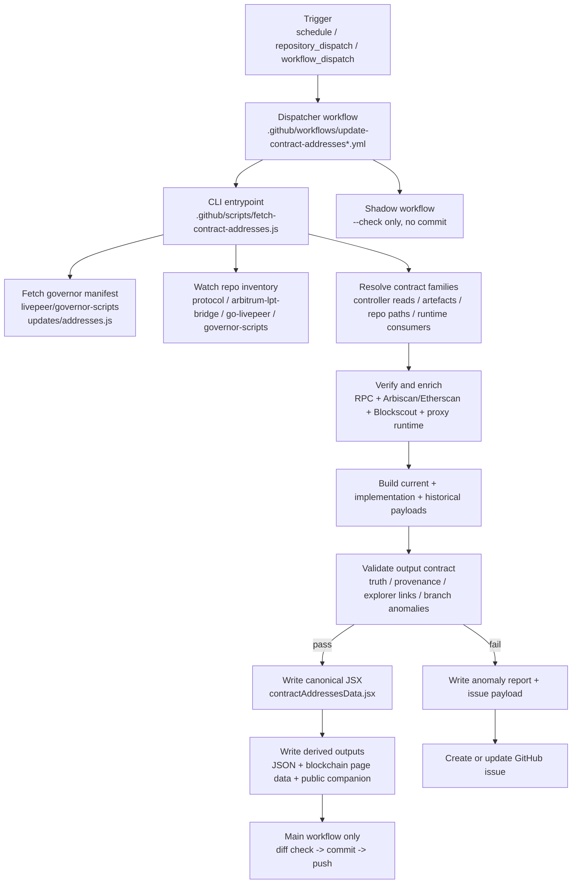

import { CustomDivider } from '/snippets/components/elements/spacing/Divider.jsx'

# End-to-End Workflow

This is the current repo workflow, not a target-state sketch. It is aligned to the dispatcher model in `.github/workspace/framework-canonical.md`: the workflow YAML files are dispatchers, and the typed work lives in the contracts scripts.

The current contracts system maps to a hybrid of:

- Pattern A `Integrate`: fetch external contract truth, transform it, diff it, and commit generated data on the main workflow
- Pattern D `Scan, Report, Act`: detect anomalies, write incident artefacts, and open or update a GitHub issue instead of silently degrading

<CustomDivider />

# Purpose

The contracts pipeline publishes one canonical repo contract dataset from external Livepeer and blockchain sources, then derives the page-facing contract files from that dataset.

In the current repo state the canonical persisted contracts data source is:

- `snippets/data/contract-addresses/contractAddressesData.jsx`

The following outputs are derived from the same in-memory payload and are not separate canonical truth stores:

- `snippets/data/contract-addresses/contractAddressesData.json`
- `snippets/data/contract-addresses/blockchainContractsPageData.jsx`
- `snippets/data/contract-addresses/blockchainContractsPageData.json`
- `snippets/composables/pages/canonical/livepeer-contract-addresses-data.json`

<CustomDivider />

# Dispatcher Layer

## Main workflow

Workflow file:

- `.github/workflows/update-contract-addresses.yml`

Triggers:

| Trigger | Current config | Purpose |
|---|---|---|
| `schedule` | `0 2 * * *` | Daily refresh at 02:00 UTC |
| `repository_dispatch` | `governor-scripts-update`, `protocol-update`, `bridge-update`, `go-livepeer-update` | React to upstream repo changes |
| `workflow_dispatch` | `dry_run`, `skip_verify`, `use_test_branch` | Manual inspection or controlled regeneration |

Main workflow responsibilities:

1. Check out `vars.DEPLOY_BRANCH` or `vars.TEST_BRANCH`
2. Install `operations` dependencies with `npm ci --prefix operations`
3. Run `.github/scripts/fetch-contract-addresses.js`
4. Run the same script again with `--check`
5. Upload pipeline artefacts
6. Create or update a GitHub incident issue if the generate step failed
7. Diff generated files
8. Commit and push generated outputs if the run succeeded, changes exist, and the run is not a dry run

## Shadow workflow

Workflow file:

- `.github/workflows/update-contract-addresses-shadow.yml`

Triggers:

| Trigger | Current config | Purpose |
|---|---|---|
| `schedule` | `30 2 * * *` | Daily shadow verification at 02:30 UTC |
| `repository_dispatch` | `governor-scripts-update`, `protocol-update`, `bridge-update`, `go-livepeer-update` | React to upstream repo changes without writing |
| `workflow_dispatch` | `skip_verify`, `use_test_branch` | Manual verification-only run |

Shadow workflow responsibilities:

1. Check out `vars.DEPLOY_BRANCH` or `vars.TEST_BRANCH`
2. Install `operations` dependencies
3. Run `.github/scripts/fetch-contract-addresses.js --check`
4. Upload the same anomaly and health artefacts if present
5. Create or update a GitHub incident issue if the check run failed
6. Fail the workflow on blocking incidents

The shadow workflow never commits generated files.

<CustomDivider />

# Script Entry Point

CLI entrypoint:

- `.github/scripts/fetch-contract-addresses.js`

Supported flags:

| Flag | Current behavior |
|---|---|
| `--dry-run` | Generate in memory only and skip writes |
| `--check` | Rebuild expected outputs and fail if checked-in files drift |
| `--skip-verify` | Skip explorer and metadata verification passes |

Rules enforced in the entrypoint:

- `--dry-run` and `--check` are mutually exclusive
- the entrypoint is intentionally thin and delegates all typed work to `operations/scripts/integrators/content/data/contracts/pipeline.js`

<CustomDivider />

# Repos Explored

The pipeline does not use docs-local files as publishable address truth. It explores official upstream repos and the blockchain.

## Watched repos

Current watch set from `operations/scripts/integrators/content/data/contracts/constants.js`:

| Repo | Preferred branches | Role in the pipeline |
|---|---|---|
| `livepeer/protocol` | `delta`, `streamflow`, `master` | Controller and provenance source |
| `livepeer/arbitrum-lpt-bridge` | `main` | Bridge and token source |
| `livepeer/go-livepeer` | `master`, `main` | Runtime-consumer source |
| `livepeer/governor-scripts` | `master`, `main` | Governance discovery and manifest source |

## Additional upstream surface

The pipeline also fetches:

- `livepeer/governor-scripts/updates/addresses.js`

This manifest is parsed on every run and provides the governor address map plus the source commit SHA used in generated metadata.

## What the repo scan does

For every watched repo the pipeline fetches:

- repo metadata
- default branch
- branch inventory

That inventory is persisted to:

- `snippets/data/contract-addresses/_branch-watch-state.json`

and diffed against the previous successful run to detect:

- `new-repo-watch`
- `default-branch-change`
- `new-branch`
- `missing-branch`

`new-repo-watch`, `default-branch-change`, `new-branch`, and `missing-branch` are treated as blocking branch-watch anomalies in the current implementation.

<CustomDivider />

# End-to-End Script Order

The current `runContractsPipeline()` order in `operations/scripts/integrators/content/data/contracts/pipeline.js` is:

1. Build the proof catalog from `spec.js`
2. Fetch the governor manifest and current governor commit SHA
3. Load the previous generated contracts payload for continuity where needed
4. Load the previous branch-watch snapshot
5. Fetch fresh inventory for every watched repo
6. Diff branch inventory against the previous successful run
7. Resolve every deployment definition in the proof catalog into a candidate entry
8. Split resolved entries by chain
9. Verify resolved addresses on Arbitrum and Ethereum with explorer-backed bytecode checks
10. Enrich metadata with Blockscout, controller-registration data, and proxy runtime data
11. Build current implementation rows for proxy families
12. Reconstruct Arbitrum controller history from `SetContractInfo` logs
13. Build historical artefacts for each chain
14. Build the per-chain contract payloads
15. Build the blockchain consumer payload
16. Validate truth, provenance, lifecycle, explorer-link, branch-watch, and output-contract rules
17. Write health checks
18. If any blocking failures exist, write incident artefacts and throw
19. If the run is successful, write the canonical JSX and all derived outputs
20. Persist the new branch-watch snapshot

<CustomDivider />

# Verification and Proof Sources

The current proof chain combines chain reads, official repo artefacts, runtime consumers, explorer bytecode checks, and provenance resolution.

## Address resolution

The active resolver paths come from `spec.js` and are executed in `pipeline.js`:

| Proof chain | Current use |
|---|---|
| `controller` | Controller root and controller slot reads |
| `bridge` | Governor manifest keys or deployment artefacts for bridge families |
| `detached` | Deployment artefacts or repo/runtime search for non-controller families |

## Chain and runtime verification

The pipeline currently verifies or enriches through:

| Source | Current use |
|---|---|
| RPC `eth_call` | Controller slots, controller root, proxy runtime checks |
| Arbiscan/Etherscan `eth_getCode` | Bytecode presence check in `verifyAddresses()` |
| Blockscout address metadata | Creator, labels, verified source flag, proxy metadata |
| Proxy runtime selectors | `controller()` and `targetContractId()` for proxy implementation truth |
| GitHub repo path resolution | Branch-to-commit provenance and file existence |

## Historical handling

Current historical handling is asymmetric by chain:

- Arbitrum historical seed entries are rebuilt from controller `SetContractInfo` logs
- Ethereum historical artefacts are built from entries already classified as historical plus the previous generated payload when continuity is needed

This distinction is important because the current live implementation does not run an Ethereum controller event-log recovery path equivalent to the Arbitrum one.

<CustomDivider />

# Outputs and Data Contract

## Canonical persisted output

The canonical persisted contracts output written by the pipeline is:

- `snippets/data/contract-addresses/contractAddressesData.jsx`

This file contains:

- `arbitrumOne`
- `ethereumMainnet`
- top-level `historical`
- `meta`

Each chain payload currently includes:

- `inventory`
- `current`
- `active`
- `paused`
- `migration_residual`
- `legacy_operational`
- `historical`
- `historicalSeries`
- `currentImplementations`

## Derived outputs

The same write pass emits:

| Output | Purpose |
|---|---|
| `contractAddressesData.json` | JSON mirror of the canonical JSX payload |
| `blockchainContractsPageData.jsx` | Derived consumer payload for the blockchain contracts page |
| `blockchainContractsPageData.json` | JSON mirror of the blockchain page payload |
| `livepeer-contract-addresses-data.json` | Public companion JSON for the canonical contracts page |

## Metadata emitted into the canonical payload

The root `meta` block currently records:

- `lastUpdated`
- `lastVerified`
- `sourceRepo`
- `sourceCommit`
- verification and bytecode summaries
- explorer URLs
- RPC URLs
- verification model
- watched repos
- latest resolution policy
- cadence

<CustomDivider />

# Failure, Issue, and Fallback Path

The current implementation is fail-loud. It does not silently continue through blocking truth or provenance gaps.

## Blocking failure classes

Current failure classes from `constants.js`:

- `rpc-failure`
- `truth-reconciliation-failure`
- `provenance-failure`
- `explorer-link-failure`
- `branch-watch-anomaly`
- `output-contract-failure`

## What happens on failure

If blocking failures exist, the pipeline writes:

- `workspace/reports/contracts/contract-pipeline-anomaly-report.json`
- `workspace/reports/contracts/contract-pipeline-anomaly-report.md`
- `workspace/reports/contracts/contract-pipeline-issue-payload.json`

The GitHub Actions workflows then:

1. upload those artefacts
2. create or update an open issue labelled `contracts` and `pipeline`
3. fail the workflow run

The issue title and body are built from a stable incident fingerprint so repeated failures update the same incident when possible.

## What happens on success

If the main workflow succeeds:

1. it runs a diff check
2. it stages only the generated contract files
3. it commits with `chore(contracts): refresh verified contract registry`
4. it pushes to the checked-out target branch

If the shadow workflow succeeds:

- it stops after the verification pass and artefact upload path

<CustomDivider />

# Framework Alignment

This current contracts workflow aligns to `.github/workspace/framework-canonical.md` in the following way:

| Framework concept | Current contracts implementation |
|---|---|
| Dispatcher model | `.github/workflows/update-contract-addresses*.yml` orchestrate; `.github/scripts/fetch-contract-addresses.js` and `pipeline.js` do the work |
| Pattern A Integrate | External repos and blockchain truth are fetched, transformed, diffed, and committed |
| Pattern D Scan, Report, Act | Branch anomalies and proof failures generate reports and issues instead of being ignored |
| Generate/verify pair behavior | Main workflow writes, then reruns `--check`; shadow workflow is verification-only |
| No headless scans | Failure artefacts are routed to uploaded reports and GitHub issues |

The one current repo contract that matters most for downstream consumers is unchanged throughout this workflow:

- the pipeline writes one canonical contracts data source in `contractAddressesData.jsx`, and everything else is derived from that write
