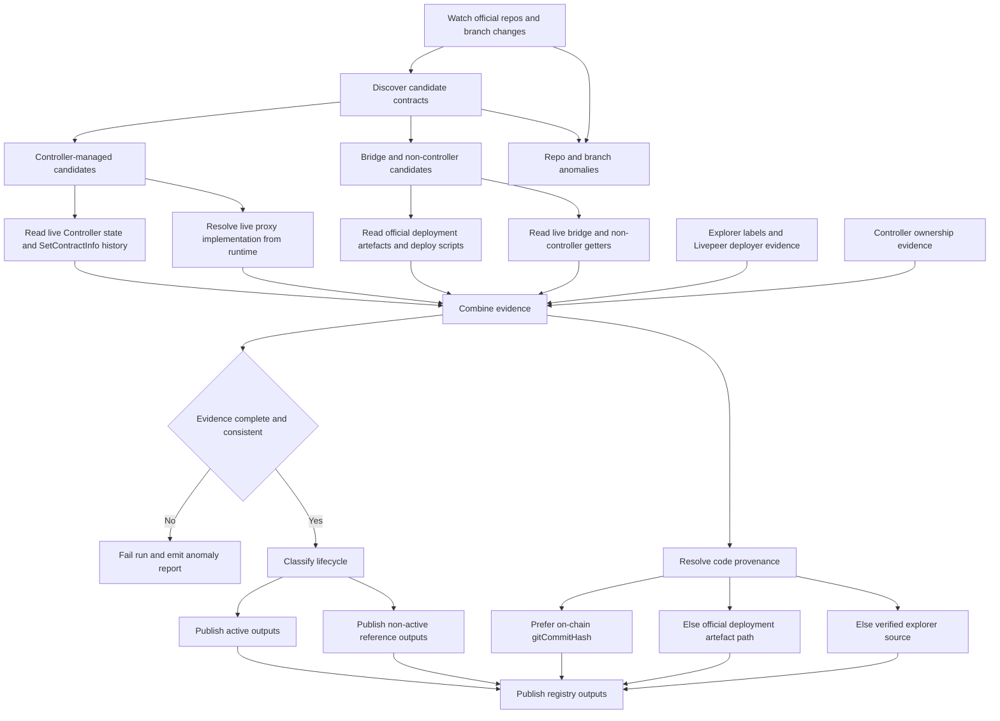

# Research Brief: Contracts Source-of-Truth Architecture

Checked: 2026-04-01
Mode: research-only
Scope: authoritative contract discovery, verification, branch handling, and replacement architecture

## What I found

### 1. Controller state is the strongest current and historical truth for controller-managed contracts

`livepeer/protocol` already defines the protocol registry model in the Controller contract.

- `Controller.sol` stores `contractAddress` and `gitCommitHash` for each `bytes32` contract id in `registry`.
- `setContractInfo()` updates the registry and emits `SetContractInfo`.
- `getContractInfo()` returns both the address and the git commit hash.
- `getContract()` returns the current address for a contract id.

Primary sources:

- `livepeer/protocol` `contracts/Controller.sol` on `delta`, lines 10-17, 29-38, 53-62
- `livepeer/protocol` `contracts/IController.sol` on `delta`, lines 6-17

This means the chain already provides:

- current controller-managed address truth
- historical controller-managed address truth
- an on-chain deployment commit anchor for controller-managed contracts

Observed live examples from JSON-RPC on 2026-04-01:

- Arbitrum `BondingManager` current address: `0x35bcf3c30594191d53231e4ff333e8a770453e40`
- Arbitrum `BondingManager` current git commit hash: `0x77a37e58192a6017a200920f58551d2cfc2873a3`
- Arbitrum `Minter` current address: `0xc20de37170b45774e6cd3d2304017fc962f27252`
- Arbitrum `Minter` current git commit hash: `0xbc2078db3096523dac0e663415dda48804fcde4d`
- Ethereum `Minter` current address: `0x8dddb96cf36ac8860f1de5c7c4698fd499fab405`
- Ethereum `Minter` current git commit hash: `0x01d4ddb9c9a6057c03f5d7b18e2648947a7f3ceb`

Important qualification:

- the `BondingManager` commit resolves publicly in `livepeer/protocol`
- the `Minter` commit hashes above did not resolve publicly through GitHub commit search during this research

Implication:

- `gitCommitHash` is a stronger source-link anchor than a branch name
- but it is not perfect on its own, because some live hashes may not resolve to a public commit today

### 2. Proxy contracts already expose the current implementation path at runtime

The protocol and bridge repos use the same `ManagerProxy` pattern.

`ManagerProxy.sol` shows:

- the proxy stores `targetContractId`
- the proxy stores `controller`
- fallback execution resolves the active target through `controller.getContract(targetContractId)`

`ManagerProxyTarget.sol` shows:

- `targetContractId` is stored on-chain in proxy-compatible storage

Primary sources:

- `livepeer/protocol` `contracts/ManagerProxy.sol` on `delta`, lines 19-28, 45-52
- `livepeer/protocol` `contracts/ManagerProxyTarget.sol` on `delta`, lines 13-16
- `livepeer/arbitrum-lpt-bridge` `contracts/proxy/ManagerProxy.sol` on `main`, lines 19-30, 47-55

Implication:

- for any known proxy address, current downstream implementation truth should come from proxy runtime
- the docs pipeline should never infer current implementation from versioned names alone

### 3. Upstream repo truth is split across multiple official repos and multiple branches

Current official upstream surfaces are not on one branch or one repo.

Official repo metadata and current contract records show these live source-link branches today:

- `livepeer/protocol@delta`
- `livepeer/protocol@streamflow`
- `livepeer/protocol@master`
- `livepeer/arbitrum-lpt-bridge@main`

Examples from the current contract data:

- `BondingManager` on Arbitrum points to `livepeer/protocol@delta`
- `BridgeMinter` on Ethereum points to `livepeer/protocol@streamflow`
- `LivepeerToken` on Ethereum points to `livepeer/protocol@master`
- `L1LPTGateway` on Ethereum points to `livepeer/arbitrum-lpt-bridge@main`

Relevant current data surface:

- [contractAddressesData.json](/Users/alisonhaire/Documents/Livepeer/Docs-v2-dev/snippets/data/contract-addresses/contractAddressesData.json)

Official upstream repos that matter:

- `livepeer/protocol`
- `livepeer/arbitrum-lpt-bridge`
- `livepeer/governor-scripts`
- `livepeer/go-livepeer` as a runtime corroboration surface

Implication:

- source-link resolution cannot assume one protocol branch
- branch names are evidence, not canonical truth
- new branch creation must be watched because branch ownership can move

### 4. `governor-scripts` is useful, official, and human-maintained, but not sufficient as sole truth

Current `livepeer/governor-scripts` `master` contains a partial operational manifest:

- L1: `controller`, `minter`, `bridgeMinter`, `l1LPTGateway`, `l1Migrator`, `l1LPTDataCache`
- L2: `controller`, `livepeerToken`, `minter`, `minterV2`, `l2LPTGateway`, `l2Migrator`, `l2LPTDataCache`, and many versioned target entries

Primary source:

- `livepeer/governor-scripts` `updates/addresses.js` on `master`, lines 1-45

Governor-scripts PR #14 is especially important because it documents the same integrity problem raised in this thread:

- a repo file can drift or be updated late
- the proposed fix is to check the file against Controller `SetContractInfo` events in CI

Primary sources:

- `livepeer/governor-scripts` PR #14
- `test/addresses.js` on `check-controller-addresses`, lines 5-50
- `updates/addresses.js` on `check-controller-addresses`, lines 1-24 and 67-115

That PR proves two things:

1. Controller events are stronger than the human-maintained repo file.
2. Controller events alone are not enough, because the system still needs an official name corpus and an `unchecked` bucket for contracts not present in the Controller.

### 5. Bridge and other non-controller contracts have their own official discovery and runtime verification surfaces

`livepeer/arbitrum-lpt-bridge` is the official upstream source for bridge-family contracts.

It contains:

- deploy scripts
- deployment artefacts with address, transaction hash, receipt `from`, constructor args, and block number
- the contracts themselves

Primary sources:

- `livepeer/arbitrum-lpt-bridge` `deploy/L1/gateway.deploy.ts`, lines 22-41
- `livepeer/arbitrum-lpt-bridge` `deploy/L2/gateway.deploy.ts`, lines 22-47
- `livepeer/arbitrum-lpt-bridge` `deployments/mainnet/L1LPTGateway.json`
- `livepeer/arbitrum-lpt-bridge` `deployments/arbitrumMainnet/L2LPTGateway.json`

The bridge contracts also expose runtime verification state:

- `L1LPTGateway` stores `l2Counterpart` and `minter`
- `L2LPTGateway` stores `l1Counterpart`

Primary sources:

- `livepeer/arbitrum-lpt-bridge` `contracts/L1/gateway/L1LPTGateway.sol`, lines 29-37, 57-73, 208-213
- `livepeer/arbitrum-lpt-bridge` `contracts/L2/gateway/L2LPTGateway.sol`, lines 27-33, 52-58, 163-168

Implication:

- non-controller contracts are not unverifiable
- they just need a different proof chain from controller-managed protocol contracts

### 6. Explorer labels and deployer evidence are useful, but they are supplementary signals

Explorer signals observed during research:

- Arbitrum Blockscout API for active `BondingManager` returns `name: "ManagerProxy"` and `creator_address_hash: 0xB5Af4138f0f33be0D6414Eb25271B9C2Dc245fb5`
- Ethereum Blockscout API for `BridgeMinter` returns `name: "BridgeMinter"` and `creator_address_hash: 0xB5Af4138f0f33be0D6414Eb25271B9C2Dc245fb5`
- Arbitrum Blockscout API for `AIServiceRegistry` returns `name: "ServiceRegistry"` and creator `0xF5282864EC36871c36BF682aFE1C3f180D4f7902`
- Etherscan HTML for `BridgeMinter`, `L1LPTGateway`, and `LivepeerToken` contains `Contract Creator` plus `Livepeer: Deployer` or `Livepeer` public label signals

Primary sources:

- `https://arbitrum.blockscout.com/api/v2/addresses/0x35Bcf3c30594191d53231E4FF333E8A770453e40`
- `https://eth.blockscout.com/api/v2/addresses/0x8dDDB96CF36AC8860f1DE5C7c4698fd499FAB405`
- `https://arbitrum.blockscout.com/api/v2/addresses/0x04C0b249740175999E5BF5c9ac1dA92431EF34C5`
- `https://etherscan.io/address/0x8dDDB96CF36AC8860f1DE5C7c4698fd499FAB405`
- `https://etherscan.io/address/0x6142f1C8bBF02E6A6bd074E8d564c9A5420a0676`
- `https://etherscan.io/address/0x58b6A8A3302369DAEc383334672404Ee733aB239`

Implication:

- explorer labels and creator tags help confirm Livepeer identity
- they are not enough to discover or classify contracts alone
- they should be captured as explicit verification signals, not treated as address truth

### 7. `go-livepeer` is an important corroboration surface, but it is not a discovery engine

`go-livepeer` hardcodes the L1 and L2 controller addresses in runtime config and resolves controller-managed addresses through the Controller binding.

It also hardcodes the AI Service Registry override when the feature flag is enabled.

Primary sources:

- `livepeer/go-livepeer` `cmd/livepeer/starter/starter.go`, lines 523-540, 556-567, 863-866
- `livepeer/go-livepeer` `eth/client.go`, lines 197-204, 447-451, 1130-1140

Implication:

- `go-livepeer` is good corroboration for controller addresses and runtime usage
- it should not be the primary discovery source for all contracts

### 8. The current docs pipeline fails the user's source-of-truth requirement

The current docs generator still loads a repo-local authority file and uses it to decide what published deployments exist.

Primary sources:

- [fetch-contract-addresses.js](/Users/alisonhaire/Documents/Livepeer/Docs-v2-dev/.github/scripts/fetch-contract-addresses.js#L24)
- [fetch-contract-addresses.js](/Users/alisonhaire/Documents/Livepeer/Docs-v2-dev/.github/scripts/fetch-contract-addresses.js#L203)
- [fetch-contract-addresses.js](/Users/alisonhaire/Documents/Livepeer/Docs-v2-dev/.github/scripts/fetch-contract-addresses.js#L582)
- [contract-addresses-authority.json](/Users/alisonhaire/Documents/Livepeer/Docs-v2-dev/operations/scripts/config/contract-addresses-authority.json#L1)

That directly conflicts with the required architecture because a docs-local file is currently part of existence and address resolution.

## What I think it means

The correct architecture is not single-source.

It is a combined proof system with strict source ranking:

1. chain discovery and chain truth for controller-managed contracts
2. proxy runtime truth for current implementations
3. full-repo upstream watch for new contract families and non-controller surfaces
4. explorer identity and deployer signals as supporting evidence
5. docs-local metadata only for presentation, never for truth

The biggest architectural mistake to avoid is conflating:

- discovery
- current-state truth
- source-code linking
- page classification

These are different jobs and need different signals.

A repo file can help discover a candidate address.
That does not make it the truth source.

A branch name can help find a code file.
That does not make it the truth anchor.

A `Livepeer` explorer label can help confirm identity.
That does not make it enough to publish an active contract.

The chain already gives a much stronger model for controller-managed contracts than the current docs pipeline is using.

## What I recommend

### 1. Split the system into four layers

1. Discovery layer
2. Truth and verification layer
3. Source-code resolution layer
4. Presentation layer

These layers should be independent enough that a failure in one layer cannot silently masquerade as truth in another.

### 1A. Proposed architecture flow

### 2. Make upstream repo watching explicit and repo-wide

Mandatory watch surfaces:

- `livepeer/protocol`
- `livepeer/arbitrum-lpt-bridge`
- `livepeer/governor-scripts`

Corroboration watch surface:

- `livepeer/go-livepeer`

Watch policy:

- watch every branch, not only the default branch
- record branch inventory changes
- record default-branch changes
- scan every new commit in those repos for contract-introducing changes

Contract-introducing change paths that matter most:

- `contracts/**`
- `deploy/**`
- `deployments/**`
- `updates/addresses.js`
- verification tasks and deploy helpers

If a new branch appears:

1. treat that as a discovery event
2. scan the branch for contract-introducing changes
3. build candidate new contract families from deployment artefacts, deploy scripts, and contract additions
4. do not publish anything from that branch automatically
5. require chain or upstream operational proof before anything becomes active

This satisfies the user's branch-change requirement without turning every branch into automatic truth.

### 3. Use chain truth first for controller-managed contracts

For each known controller id on Ethereum and Arbitrum:

1. read `getContractInfo(id)`
2. store current address
3. store git commit hash
4. store Controller address
5. store Controller owner

For history:

1. read all `SetContractInfo` events
2. sort by block and log index
3. reconstruct current and historical address series per id

Important rule:

- the pipeline should never infer controller-managed history from versioned names alone
- the event log is the history source

### 4. Use proxy runtime first for implementation truth

For every address that is a `ManagerProxy` or equivalent:

1. read `controller()`
2. read `targetContractId()`
3. call `controller.getContract(targetContractId)`
4. store the resulting implementation address as the current downstream implementation

That becomes the active implementation truth, not a guessed `TargetVn` name.

### 5. Use a separate proof chain for non-controller contracts

For bridge-family and other non-controller contracts:

Discovery:

- full-repo watch on `livepeer/arbitrum-lpt-bridge` and, where relevant, `livepeer/protocol`
- upstream deployment artefacts
- upstream deploy scripts

Verification:

- deployment artefact address and deployment receipt `from`
- runtime counterpart and minter state from the deployed contracts
- explorer verified source
- explorer creator address
- explorer Livepeer label where available

For detached protocol contracts such as the AI Service Registry:

- use official protocol deployment artefacts as the upstream discovery input
- verify deployed address and creator from explorer
- record that it is not Controller-managed
- use runtime consumer evidence from `go-livepeer` only as corroboration

### 6. Build an official name corpus from upstream, not from docs-local files

The Controller event id is a `bytes32` hash.
It is not reversible to a human-readable name.

So the pipeline needs an official name corpus for id-to-name mapping.

Acceptable inputs for that corpus:

- official upstream deployment artefact filenames
- official upstream deploy script contract names
- official upstream governor-scripts known-name lists

Unacceptable input:

- docs-local authority files

Failure rule:

- if Controller event history yields an id that cannot be mapped to an official upstream name, the run fails and reports an unknown controller id

That is the safe answer to new contract ids.

### 7. Stop using branch names as the canonical code-link anchor

For controller-managed contracts:

1. prefer `gitCommitHash` from `getContractInfo()`
2. if that commit resolves publicly, link by exact commit
3. if it does not resolve publicly, fall back to explorer verified source as the canonical code link
4. only use branch-based GitHub links as a secondary convenience link

For non-controller contracts:

1. prefer explorer verified source when branch ownership is ambiguous
2. use upstream deployment artefact paths and repo links as supporting links
3. do not guess a branch from naming patterns

### 8. Allow docs-local metadata only for presentation

If any docs-local config remains, it may hold only presentation metadata such as:

- category label
- icon
- display order
- section placement
- short explanatory copy

It must not hold:

- contract existence
- contract addresses
- repo truth
- branch truth
- controller slots
- implementation addresses
- current-versus-historical truth

### 9. Publish verification fields explicitly

Recommended public or internal verification fields:

- `addressSourceType`
- `controllerRegistered`
- `controllerAddress`
- `controllerOwner`
- `controllerGitCommitHash`
- `proxyApplicable`
- `proxyTargetContractId`
- `proxyImplementationAddress`
- `proxyImplementationMatchesController`
- `explorerHost`
- `hasExplorerLivepeerLabel`
- `contractCreatorAddress`
- `contractCreatorIsLivepeerDeployer`
- `sourceVerified`
- `hasBytecode`

Signal ranking:

1. Chain truth
2. Proxy runtime truth
3. Official upstream deployment artefacts
4. Explorer verified source and creator
5. Explorer public labels

### 10. Make these conditions blocking failures

1. Any docs-local file participates in address truth.
2. An upstream watched repo changes and the candidate contract set cannot be reconciled.
3. A Controller id appears in events with no official upstream name mapping.
4. A controller-managed current address does not match live Controller state.
5. A proxy current implementation cannot be resolved from runtime.
6. A source link is guessed from an unverified branch.
7. A non-controller active contract has no official upstream discovery source and no runtime verification path.
8. An active-table row is not `active`.
9. A page or widget claims stronger verification than the stored signals prove.

## What needs your decision

### 1. How much of the historical surface should stay user-visible

What we know:

- the user requires the main searchable table to be active-only
- controller event history already gives a strong way to preserve history without promoting it

Recommendation:

- keep full history in data
- move non-active contracts into reference-only sections or a secondary machine-readable output

### 2. Whether `governor-scripts` should remain a first-class operational input

What we know:

- it is official
- it is useful
- it is human-maintained
- even its own hardening PR treats Controller events as stronger truth

Recommendation:

- keep it as a watched upstream operational manifest
- do not let it override chain truth

## Bottom line

The correct design is not "one perfect repo file".

It is:

- repo-wide upstream watch to detect new contract families and branch changes
- Controller current state and Controller events as the authoritative truth for controller-managed contracts
- proxy runtime as the authoritative truth for current proxy implementations
- deployment artefacts and runtime state for bridge and other non-controller contracts
- explorer labels and `Livepeer: Deployer` as supplementary identity signals
- no docs-local truth files in the contract pipeline

That is the minimum architecture that meets the user's stated requirements and the primary sources available today.
