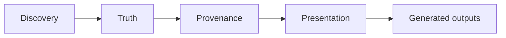
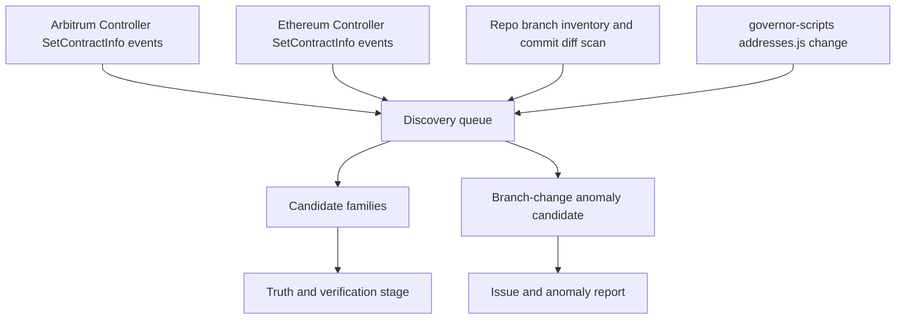
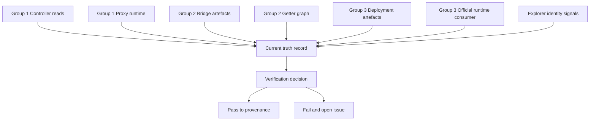
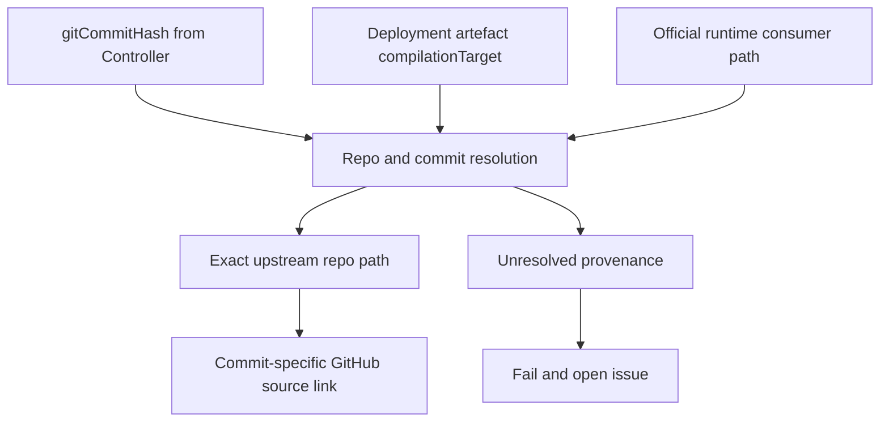
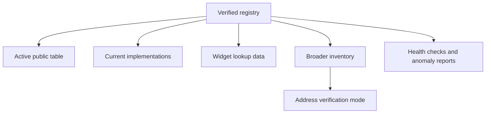
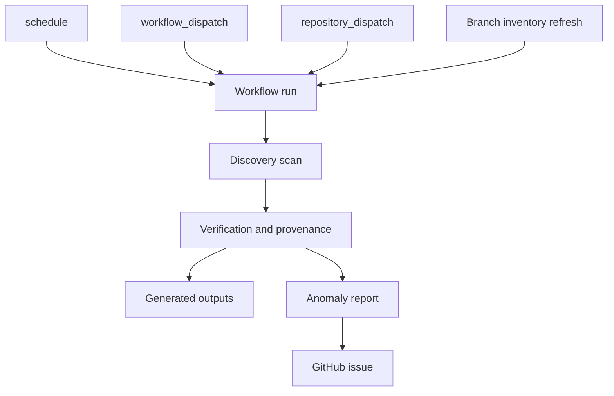

import { CustomDivider } from '/snippets/components/elements/spacing/Divider.jsx'

# Purpose

The contracts pipeline publishes trustworthy current Livepeer contract data to the docs, verified from authoritative chain and upstream sources on every run.

The pipeline runs in four stages: discovery, truth and verification, provenance, and presentation. Each stage has defined evidence sources and blocking failure conditions. A contract that cannot be proven from sources outside the docs repo does not publish.

<CustomDivider />

# Pipeline Overview

| Stage | Job | Core rule |
|---|---|---|
| Discovery | Detect new or changed contract families | Discovery creates candidates; it does not publish |
| Truth | Recover the current verified contract address | Chain truth is authoritative where the chain can provide it |
| Provenance | Resolve exact official source-code ownership | Unresolved provenance is a blocking failure |
| Presentation | Deliver current verified data to docs consumers | The main public surface is active-only |

<CustomDivider />

# Discovery Sources

The discovery layer maintains real-time awareness of contract changes across four upstream surfaces. Every candidate produced by discovery enters the truth and verification stage before any address is published.

| Tier | Source | What it detects | Why it matters |
|---|---|---|---|
| Tier 1 | Controller `SetContractInfo` events on Arbitrum and Ethereum | New or changed controller-managed entries | Fastest signal that current protocol state changed |
| Tier 1 | Full repo watch on `livepeer/protocol`, `livepeer/arbitrum-lpt-bridge`, `livepeer/go-livepeer`, `livepeer/governor-scripts` | New branches, default-branch changes, contract-related commits | Detects new contract families and provenance surface changes |
| Tier 1 | Commit diff scan under `contracts/`, `deploy/`, `deployments/`, `tasks/`, `cmd/livepeer/`, `eth/` | Contract-introducing changes | Narrows the scope of per-run verification |
| Tier 2 | `governor-scripts/updates/addresses.js` changes | Drift or operational changes in the human-maintained manifest | Trigger and comparison signal; chain truth takes precedence |

**Branch handling**

The watch covers every branch in each upstream repo. On each scheduled or triggered run the pipeline records the current branch inventory, detects any new branch created since the last run, and detects any default-branch change. New branches and default-branch changes are anomaly signals that halt publication and open a review issue. They do not enter the truth stage automatically.

<CustomDivider />

# Verification Sources

The verification layer recovers the current verified address for every contract family from the strongest available evidence. The contract population splits into three groups. Each group has a distinct proof chain. The groups are peers — there is no fallback ordering between them.

| Tier | Source | Applies to | What it proves |
|---|---|---|---|
| Tier 1 | `Controller.getContractInfo(bytes32)` and `Controller.getContract(bytes32)` | Controller-registered families | Current address and `gitCommitHash` |
| Tier 1 | Proxy runtime `controller()` + `targetContractId()` + controller `getContract(targetId)` | `ManagerProxy` families | Current downstream implementation |
| Tier 1 | Bridge getter graph plus official bridge deployment artefacts | Bridge cluster families | Verified linked current bridge addresses |
| Tier 1 | Official deployment artefacts plus official runtime consumers such as `go-livepeer` | Detached non-controller families | Current address confirmed by real runtime usage |
| Tier 2 | Explorer verified source, contract creator, `Livepeer: Deployer`, public labels | All groups | Supporting identity and verification metadata |

Tier 1 sources determine current truth. Tier 2 sources provide supporting metadata. A contradiction between any two Tier 1 sources is a blocking failure.

<CustomDivider />

# Provenance Sources

The provenance layer resolves the exact official source-code path and commit for every verified contract. Branch-based links are a secondary convenience. Commit-specific links are the target. An unresolved commit is a blocking failure — explorer source is recorded as supplementary metadata, not a substitute.

| Group | Primary provenance source | Supporting provenance | Failure rule |
|---|---|---|---|
| Controller-registered | `gitCommitHash` from `getContractInfo()` + deployment artefact `compilationTarget` | Explorer verified source | Fail if the commit cannot be resolved to an official repo and path |
| Bridge cluster | Official bridge deployment artefact + `compilationTarget` + exact upstream commit resolution | Explorer verified source | Fail if the active artefact path cannot be tied to an official commit |
| Detached contracts | Official deployment artefact + official runtime consumer + exact upstream commit resolution | Explorer verified source | Fail if current usage cannot be tied to an official repo and path |

<CustomDivider />

# Presentation Layer

The presentation layer controls how verified pipeline outputs are surfaced to docs consumers. It owns display policy and output routing. It does not own addresses, lifecycle classification, implementation truth, or branch truth — those fields are produced by the upstream pipeline stages and consumed read-only.

| Surface | Rule |
|---|---|
| Main searchable table | Active contracts only |
| Current implementations | Separate from active entrypoint addresses |
| Widget lookup dropdown | Active contracts only |
| Widget pasted-address mode | Uses broader inventory for address verification; lifecycle is labelled on every entry |
| Historical, paused, migration, legacy | Secondary output only; never mixed into the active public table |

Docs-local configuration controls display category, order, section placement, and explanatory copy. The following fields are produced by the pipeline and consumed by the presentation layer as read-only inputs: contract existence, current addresses, implementation addresses, branch-to-commit resolution, and lifecycle classification.

<CustomDivider />

# Pipeline Triggers

| Trigger | Scope | Purpose |
|---|---|---|
| `schedule` | Daily or every 6 hours | Refresh verification and catch missed changes |
| `workflow_dispatch` | Manual | Dry run, inspection run, or targeted verification |
| `repository_dispatch` | Upstream repo events | Re-run when official sources change |
| Branch inventory refresh | Inside scheduled and event-driven runs | Detect new branches or default-branch changes |

<CustomDivider />

# Pipeline Design Details

## 1. Controller-Registered Contracts

The Controller exposes current address and commit hash for every registered contract family through `getContractInfo(bytes32)` and `getContract(bytes32)`. These are the authoritative current-state calls for Group 1.

Current Group 1 families as of 2026-04-01:

- `BondingManager`
- `TicketBroker`
- `RoundsManager`
- `ServiceRegistry`
- `BondingVotes`
- `LivepeerGovernor`
- `Treasury`
- `L2Migrator`
- `Minter`
- `LivepeerToken`
- `L2LPTDataCache`

Proof chain:

1. Read `getContractInfo(bytes32)` for current address and commit hash.
2. Cross-check with `getContract(bytes32)`.
3. For proxy families, resolve the current implementation through proxy runtime: call `controller()`, call `targetContractId()`, call `controller.getContract(targetContractId)`.
4. Reconstruct Arbitrum historical address series from `SetContractInfo` event log.
5. Accept Ethereum current state from `getContractInfo` as authoritative. Ethereum historical output is excluded until an authoritative event-history source is confirmed — live RPC on 2026-04-01 returned zero `SetContractInfo` events from multiple public providers on the Ethereum controller despite non-zero current state.

## 2. Non-Controller Bridge Cluster

Bridge cluster contracts are not registered in the Controller. Their current addresses are established from official upstream deployment artefacts and cross-verified through the bridge getter graph. The Ethereum `Minter` slot (Group 1) seeds the cluster entry point.

Current Group 2 families as of 2026-04-01:

- `BridgeMinter`
- `L1LPTGateway`
- `L1Migrator`
- `L1Escrow`
- `L2LPTGateway`
- `L1LPTDataCache`

Proof chain:

1. Resolve the seed address from the Ethereum controller `Minter` slot.
2. Read official bridge deployment artefacts from `livepeer/arbitrum-lpt-bridge`.
3. Traverse the getter graph: `BridgeMinter.l1LPTGatewayAddr()`, `BridgeMinter.l1MigratorAddr()`, `L1LPTGateway.l1LPTEscrow()`, `L1LPTGateway.l2Counterpart()`, `L2LPTGateway.l1Counterpart()`.
4. Every getter result must match the corresponding artefact address. Any mismatch is a blocking failure.

## 3. Fully Detached Contracts

Detached contracts have no Controller slot and sit outside the bridge getter graph. Their current addresses are established from official upstream deployment artefacts confirmed by official runtime consumers. Every new detached deployment requires human review before the pipeline publishes the address.

Current known detached family with strong external evidence as of 2026-04-01:

- `AIServiceRegistry`

A standalone `Governor` family deployment is a review-only candidate. It requires verified current address, upstream deployment artefact, and confirmed official runtime usage before entering the active set.

Proof chain:

1. Read the official upstream deployment artefact.
2. Confirm the same address from an official runtime consumer (`go-livepeer` for `AIServiceRegistry`).
3. Record explorer verification and deployer metadata as supporting evidence.
4. Require human review before publishing any newly detected detached deployment.

<CustomDivider />

## Pipeline Dependencies

**Official repos**

- `livepeer/protocol`
- `livepeer/arbitrum-lpt-bridge`
- `livepeer/go-livepeer`
- `livepeer/governor-scripts`

**External services**

Production CI replaces the public RPC URLs below with dedicated secret-backed endpoints. Public RPC is acceptable for local development only.

| Service | Exact endpoint or pattern | Output used by the pipeline | Main risk factors |
|---|---|---|---|
| Arbitrum RPC primary and fallbacks | `https://arb1.arbitrum.io/rpc`  `https://arbitrum-one-rpc.publicnode.com`  `https://arbitrum.drpc.org` | `eth_call` results for `getContract(bytes32)`, proxy `controller()`, proxy `targetContractId()`, controller `getContract(targetId)`; `eth_getLogs` for Arbitrum event history | provider outage, rate limiting, inconsistent archive/log availability, provider disagreement on current truth |
| Ethereum RPC primary and fallbacks | `https://eth.llamarpc.com`  `https://ethereum-rpc.publicnode.com`  `https://eth.drpc.org` | `eth_call` results for current Ethereum controller state and bridge-seed lookups; `eth_getLogs` probed for historical availability | provider outage, incomplete event history, rate limiting, provider disagreement on current truth |
| Arbiscan API | `https://api.arbiscan.io/api?module=proxy&action=eth_getCode&address=ADDRESS&tag=latest` | bytecode presence for Arbitrum addresses | key limits, endpoint schema drift, transient API failure |
| Arbitrum Blockscout API v2 | `https://arbitrum.blockscout.com/api/v2/addresses/ADDRESS`  `https://arbitrum.blockscout.com/api/v2/transactions/TX_HASH`  `https://arbitrum.blockscout.com/api/v2/tokens/ADDRESS`  `https://arbitrum.blockscout.com/api/v2/addresses/ADDRESS/transactions`  `https://arbitrum.blockscout.com/api/v2/smart-contracts/ADDRESS` | labels, creator address, proxy hints, token metadata, deployment and last-active timestamps, compiler and source-verification metadata | schema drift, rate limiting, partial metadata, disagreement with stronger chain truth |
| Etherscan V2 API | `https://api.etherscan.io/v2/api?chainid=CHAIN_ID&module=stats&action=ethprice`  `https://api.etherscan.io/v2/api?chainid=CHAIN_ID&module=account&action=txlist&address=ADDRESS&page=1&offset=1&sort=SORT_ORDER&startblock=0&endblock=99999999&apikey=KEY`  `https://api.etherscan.io/v2/api?chainid=CHAIN_ID&module=proxy&action=eth_getTransactionCount&address=ADDRESS&tag=latest&apikey=KEY`  `https://api.etherscan.io/v2/api?chainid=CHAIN_ID&module=token&action=tokeninfo&contractaddress=ADDRESS&apikey=KEY`  `https://api.etherscan.io/v2/api?chainid=CHAIN_ID&module=contract&action=getsourcecode&address=ADDRESS&apikey=KEY` | health probe, deployment and last-active transaction history, transaction counts, token holder metadata, source-code and proxy implementation metadata | API key exhaustion, schema drift, explorer-side proxy metadata lag, missing fields for some contracts |
| Public explorer address pages | `https://arbiscan.io/address/ADDRESS`  `https://etherscan.io/address/ADDRESS` | published user-facing explorer links | wrong host mapping, wrong address interpolation, explorer route changes |
| GitHub contents API | `https://api.github.com/repos/livepeer/governor-scripts/contents/updates/addresses.js`  `https://api.github.com/repos/REPO/contents/FILE_PATH?ref=BRANCH` | upstream file contents for `governor-scripts`, deployment artefacts, and source-path resolution | rate limiting, branch drift, moved or deleted files, token scope problems |
| GitHub CLI fallback | `gh api /repos/REPO/contents/PATH?ref=BRANCH` | fallback file-content retrieval when API auth or retry path changes | local auth missing, CLI not installed, divergent behaviour from direct API |

**Outputs**

- Generated contract registry JSON
- Generated health checks
- Generated page data
- Structured anomaly report on failure

<CustomDivider />

## Pipeline Error Handling

The pipeline either recovers from an infrastructure problem through bounded retry, or halts publication and creates a review artefact. Silent degradation is not a permitted outcome.

| Failure class | Immediate handling | Publication outcome | Follow-up |
|---|---|---|---|
| RPC timeout, transient provider error, explorer rate limit, temporary GitHub API failure | Retry with bounded backoff, then retry against a secondary provider where one exists | Halt if the retry budget is exhausted | Write anomaly report and open GitHub issue |
| RPC provider disagreement on current address truth | Compare primary and fallback results, mark contradiction | Halt immediately | Write anomaly report and open GitHub issue |
| Unknown Controller slot or unknown event id | No retry beyond confirming the same result once | Halt immediately | Write anomaly report and open GitHub issue |
| Unresolved current proxy implementation | Confirm with live proxy runtime and controller cross-check | Halt immediately | Write anomaly report and open GitHub issue |
| Bridge getter mismatch | Re-run the getter graph once, then treat as contradiction | Halt immediately | Write anomaly report and open GitHub issue |
| Unresolved official commit or source path | Re-run provenance resolution against the watched official repos | Halt immediately if still unresolved | Write anomaly report and open GitHub issue |
| Detached contract runtime or artefact contradiction | No auto-publish | Halt immediately | Write anomaly report and open GitHub issue |
| Bad explorer host or wrong published address link | Rebuild the link from the fixed chain mapping and re-check once | Halt immediately if still wrong | Write anomaly report and open GitHub issue |
| Docs-local truth influencing a current address | Treat as design violation | Halt immediately | Write anomaly report and open GitHub issue |
| Non-active row in the active surface | Treat as classification failure | Halt immediately | Write anomaly report and open GitHub issue |
| Contradictory current entrypoints on the same chain | Treat as truth contradiction | Halt immediately | Write anomaly report and open GitHub issue |

The anomaly report produced on failure includes:

- failure class
- affected contract family and chain
- source or provider that failed
- exact comparison that failed
- recommended human next step
- stable incident fingerprint for issue deduplication

The workflow creates or updates a GitHub issue for every unresolved failure affecting truth, provenance, RPC availability, link integrity, or publish safety. That issue is the handoff point for a human reviewer or Copilot-driven follow-up.

<CustomDivider />

## Pipeline Self-Remediation Handlers

Self-remediation applies to infrastructure and delivery failures that can be retried without weakening truth. The pipeline never patches, invents, or downgrades canonical data to achieve a passing run.

| Scenario | Safe auto-recovery | Hard stop condition |
|---|---|---|
| Primary RPC fails | Retry with bounded backoff, then query fallback RPC | Fallback fails or fallback disagrees on truth |
| Explorer API fails | Retry with backoff, then switch to secondary explorer family if configured for the same chain | Link or verification field still unresolved after retry budget |
| GitHub API provenance lookup fails | Retry with backoff and resume from cached repo inventory if the cache is still valid for the current run | Commit or path still unresolved |
| Branch inventory change detected | Refresh inventory and isolate only the affected rows for provenance re-check | Any active row now depends on unresolved branch ownership |
| Duplicate incident on repeated runs | Update existing issue using the incident fingerprint | New contradictory evidence changes severity or scope |

Self-remediation outputs:

- update step summary with exact recovery path attempted
- attach anomaly JSON or Markdown artefact to the run
- create or update a GitHub issue with labels `contracts`, `pipeline`, `verification`, and the failure class
- keep publication blocked until a run completes with clean evidence

Issue filing is required for: RPC drift, RPC outage, explorer-link generation failure, provenance failures, branch-ownership anomalies, truth contradictions, and detached-contract discovery candidates that fail review gates.

The pipeline must not, under any conditions, use the following as self-remediation:

- copy a value from docs-local config into current truth
- accept `governor-scripts` as sole truth because a chain lookup failed
- replace unresolved provenance with a guessed branch link
- publish stale previous output as freshly verified
- suppress a contract from the active set because verification became inconvenient

<CustomDivider />

## Scope Certainty And Edge-Case Risks

- Group 1 is a closed known set as of 2026-04-01 for the controller-registered families listed above.
- Group 2 is a closed known set as of 2026-04-01 for the bridge-cluster families listed above.
- Group 3 is an open set. New detached families enter as review-only candidates and must satisfy the detached proof chain before joining the active set.
- `Treasury` is a controller-registered contract in Group 1.
- Ethereum current controller state is accepted for current truth. Ethereum historical output is excluded until an authoritative historical source is confirmed.
- New branches and default-branch changes expand the provenance search space and trigger review. They do not enter truth.
- Explorer labels, `Contract Creator`, and `Livepeer: Deployer` are supporting metadata. They do not override chain or official upstream evidence.

<CustomDivider />

## Pipeline Additional Needs

| Need | How it will be handled |
|---|---|
| Dedicated RPC strategy for CI | Production CI uses dedicated Arbitrum and Ethereum RPC endpoints from secrets, with a fallback provider for retry and comparison. If primary and fallback providers disagree on current address truth, the run fails and emits an RPC anomaly report. |
| Mechanical validation of all published explorer links | The pipeline generates explorer URLs from a fixed chain-to-host mapping, then validates every published link for correct host, correct `/address/` path, and exact published address value. A bad explorer host, malformed path, or wrong address link is a blocking failure. |
| Page and widget copy that describes the real proof chain | The page and widget read from the same verification model used by the generated data. Controller-registered, proxy, bridge, and detached proof paths are described from the actual evidence fields. Copy that simplifies the source model beyond the real proof chain is a content defect. |
| Presentation that supports SEO, AEO, and human self-verification | The public surface keeps one canonical route, one machine-readable data output, current explorer links, commit-specific source-code links, and verification signals that a human can follow independently. |

<CustomDivider />

## Recommendations

These changes are not prerequisites for the replacement pipeline, but each one reduces the proof surface the docs pipeline must cover and shrinks the number of failure modes in production.

| Recommendation | Why it matters |
|---|---|
| Livepeer should publish a canonical deployment output from the system that performs deployments | A deployment-time machine-readable manifest makes the docs pipeline a consumer of truth rather than a reconstructor of it. |
| Livepeer should maintain one authoritative upstream repository or generated manifest for current deployed addresses | The current pipeline combines Controller state, bridge artefacts, runtime consumers, and explorer evidence because no single authoritative deployment output exists. A canonical upstream source reduces the proof surface and the failure modes. |
| The deployment workflow should update the official upstream address surface automatically after each deployment | Human-maintained address files drift behind real deployments. Automated post-deployment updates eliminate that lag. |
| `governor-scripts` or an equivalent official upstream workflow should verify and publish current addresses automatically after deployment | An automated, deployment-adjacent address surface allows the docs pipeline to use it as one corroboration layer rather than a weak, drift-prone signal. |
| Livepeer should publish a machine-readable slot registry upstream | A machine-readable slot registry removes fragile slot-name extraction from live code and makes unknown-slot detection reliable. |

The replacement docs pipeline is required even if these changes are adopted. The docs must verify what they publish. These changes make that verification simpler, safer, and closer to consuming authoritative outputs than reconstructing them.
