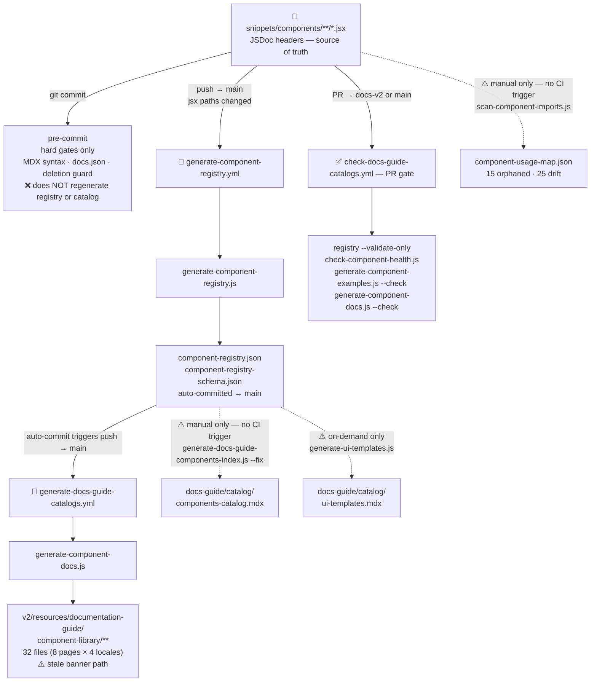

# Components Documentation Audit

**Date:** 2026-03-23
**Scope:** All documentation surfaces for `snippets/components/` — the governed JSX component library (117 exports across 6 categories).

---

## Documentation needs

| Need | Purpose | Audience |
|---|---|---|
| JSDoc headers in every JSX file | Source of truth for all downstream generation | Generators, CI |
| Machine-readable registry | Structured inventory of components, statuses, descriptions | Automation, agents, tooling |
| Usage map | Which components are imported on which pages | CI, governance, orphan detection |
| Published component library pages | Human-facing reference: what each component does, how to use it | Contributors, users |
| Governance framework + taxonomy | How components are classified, built, JSDoc standard | Contributors, agents |
| Policy: layout decisions | Which components are required/approved per page type | Contributors |
| Internal catalog | Governance-level view: status, unused, audit trail | Internal / agents |
| UI templates catalog | Page templates that use components | Contributors |
| Contributor guide | How to use components when authoring docs | Contributors |

---

## What exists

### Machine-readable / config

| File | Generated by | CI trigger | Freshness | Notes |
|---|---|---|---|---|
| `docs-guide/config/component-registry.json` | `operations/scripts/generators/components/library/generate-component-registry.js` | ✅ push→main (jsx changed) | ✅ 2026-03-22 | 117 components, 6 categories |
| `docs-guide/config/component-registry-schema.json` | same | ✅ same | ✅ 2026-03-22 | JSON schema for registry |
| `docs-guide/config/component-usage-map.json` | `operations/scripts/audits/components/library/scan-component-imports.js` | ❌ none | ⚠️ 2026-03-20 (manual) | 15 orphaned, 25 with JSDoc drift |

### Published v2 component library pages (8 pages × 4 locales = 32 files)

| File pattern | Generated by | CI trigger | Freshness | Notes |
|---|---|---|---|---|
| `v2/resources/documentation-guide/component-library/*.mdx` (8 files) | `operations/scripts/generators/components/documentation/generate-component-docs.js` | ✅ push→main (cascade) | ⚠️ stale banner path | Banner references wrong script path |
| `v2/es/`, `v2/fr/`, `v2/cn/` equivalents (24 files) | same | ✅ same | ⚠️ stale banner path | Same banner defect × 24 |

**Banner defect:** All 32 files reference `operations/scripts/generate-component-docs.js` — actual path is `operations/scripts/generators/components/documentation/generate-component-docs.js`.

### Internal governance (docs-guide)

| File | Manual/Generated | Freshness | Notes |
|---|---|---|---|
| `docs-guide/frameworks/component-governance.mdx` | ✋ manual | ✅ lastUpdated 2026-03-20 | Canonical governance reference |
| `docs-guide/frameworks/component-framework-canonical.mdx` | ✋ manual | ✅ lastUpdated 2026-03-21 | Folder structure, categories, JSDoc standard |
| `docs-guide/policies/component-layout-decisions.mdx` | ✋ manual | ✅ lastVerified 2026-03-21 | Page-type layout contract |
| `docs-guide/features/ui-system.mdx` | ✋ manual | ✅ lastVerified 2026-03-12 | UI authoring system map |
| `docs-guide/catalog/components-catalog.mdx` | 🔧 manual generation | ⚠️ no CI trigger | Governance catalog — must be run manually |
| `docs-guide/catalog/ui-templates.mdx` | 🔧 on-demand only | ⚠️ unknown freshness | Templates using components — no CI |
| `docs-guide/contributing/mintlify.mdx` | ✋ manual | ⚠️ draft status | Native Mintlify components reference — incomplete |

### Internal workspace

| File | Manual/Generated | State |
|---|---|---|
| `v2/internal/_workspace/layout-components-scripts-styling/components.mdx` | ✋ manual | ❓ brief stub — links to component library, unclear if maintained |

---

## Source of truth

**Canonical:** JSDoc headers inside each `.jsx` file in `snippets/components/`. These are the authoritative source from which all downstream artifacts are generated.

**Derived (generated):**
- `docs-guide/config/component-registry.json` — structured extraction from JSDoc
- `docs-guide/config/component-usage-map.json` — import scan across v2 pages
- `v2/resources/documentation-guide/component-library/**` — published docs from registry
- `docs-guide/catalog/components-catalog.mdx` — governance catalog from registry

**Governance authority:**
- `docs-guide/frameworks/component-governance.mdx` — framework definition
- `docs-guide/frameworks/component-framework-canonical.mdx` — taxonomy + JSDoc standard

**Missing source of truth:** There is no canonical status enum file. The registry uses `stable`, `experimental`, `planned` but the catalog renders `⬜ Placeholder`. These conflict and there is no single definition file to resolve them.

---

## Gaps and issues

1. **`component-usage-map.json` has no CI trigger.** `scan-component-imports.js` is not wired to any workflow. Usage data goes stale silently. Currently: 15 orphaned components, 25 components with JSDoc drift (declared `usedIn` in JSDoc does not match actual import scan results). No enforcement gate exists for this drift.

2. **Stale script path in all 32 published v2 pages.** Every generated banner references `operations/scripts/generate-component-docs.js` (old path). The actual path is `operations/scripts/generators/components/documentation/generate-component-docs.js`. Because these files are auto-generated, the fix must go in the generator template, not the files directly.

3. **`components-catalog.mdx` has no CI trigger and no freshness check.** The script's own `@pipeline` annotation says `commit` but the pre-commit hook does not run it. It is absent from `check-docs-guide-catalogs.yml`. Must be regenerated manually with `--fix`.

4. **`ui-templates.mdx` has no CI trigger.** Generator is marked `@pipeline manual`. No freshness check anywhere.

5. **Status enum conflict.** Registry has three values: `stable`, `experimental`, `planned`. The catalog summary uses `⬜ Placeholder` for display. `planned` ≠ `placeholder` — these are different concepts. No canonical enum definition exists.

6. **No contributor guide for component usage.** No page in `v2/` explains how to use custom components when authoring docs pages. `docs-guide/contributing/mintlify.mdx` only covers native Mintlify components and is in draft status.

7. **Race condition risk between two auto-commit workflows.** `generate-component-registry.yml` and `generate-docs-guide-catalogs.yml` both trigger on push→main with overlapping path filters and both auto-commit to main. If both fire simultaneously, competing commits can conflict.

8. **`v2/internal/_workspace/.../components.mdx` is an orphaned stub.** 85-line file that just links to the component library. No clear owner or maintenance plan.

9. **JSDoc `@deprecated` field not enforced.** Components with status `deprecated` or `broken` have no enforcement gate preventing their import on new pages.

---

## Pipeline diagram



---

## Recommendations

1. **Fix stale banner path at source.** Update the banner template inside `generate-component-docs.js` so the next generation cycle fixes all 32 files automatically. Do not edit the files directly.

2. **Wire `components-catalog.mdx` to pre-commit with exit-if-no-diff.** Add to pre-commit hook:
   ```bash
   if git diff --cached --name-only | grep -q 'snippets/components/'; then
     node operations/scripts/generators/governance/catalogs/generate-docs-guide-components-index.js --fix
     git add docs-guide/catalog/components-catalog.mdx
   fi
   ```
   This matches the `@pipeline: commit` annotation already on the script.

3. **Wire `component-usage-map.json` to CI.** Add `scan-component-imports.js` to `generate-component-registry.yml` as a second step, committing the usage map alongside the registry. Both derive from the same jsx-changed trigger.

4. **Consolidate registry + catalog generation into one workflow** to eliminate the race condition. Run `generate-component-registry.js` → `generate-component-docs.js` → `generate-docs-guide-components-index.js` → `scan-component-imports.js` in sequence within a single workflow job.

5. **Define canonical status enum.** Create `tools/config/component-status-enum.json` with the three valid values (`stable`, `experimental`, `planned`) and their display representations. Reference it from both the generator and the catalog template.

6. **Write a contributor component guide.** Add `v2/resources/documentation-guide/using-components.mdx` covering: how to find components, import patterns, the registry, and when to use custom vs native Mintlify components.

7. **Add freshness check for `ui-templates.mdx` to `check-docs-guide-catalogs.yml`.** Even if generation stays manual, the PR gate should warn when it is stale.

---

## Upstream / downstream effects

**Changes upstream (affecting this concern):**
- Adding/editing/removing a `.jsx` file → triggers registry regeneration → triggers component docs regeneration (cascade)
- Editing JSDoc fields in `.jsx` → changes registry → changes v2 published pages on next push→main
- Adding a component to a v2 page → usage-map drifts until manually re-scanned

**Changes downstream (this concern affecting others):**
- `component-registry.json` is consumed by: `generate-component-docs.js`, `generate-docs-guide-components-index.js`, `generate-ui-templates.js`, `check-component-health.js`, `generate-component-examples.js`
- `component-usage-map.json` is consumed by: `components-catalog.mdx` (audit section), any orphan-detection tooling
- `v2/resources/documentation-guide/component-library/**` is published content — changes visible to all users
- `docs-guide/catalog/components-catalog.mdx` is consumed by: docs-guide internal navigation, agent context when querying component inventory
- Status enum decision affects: catalog display, health checks, any validator that reads status fields
