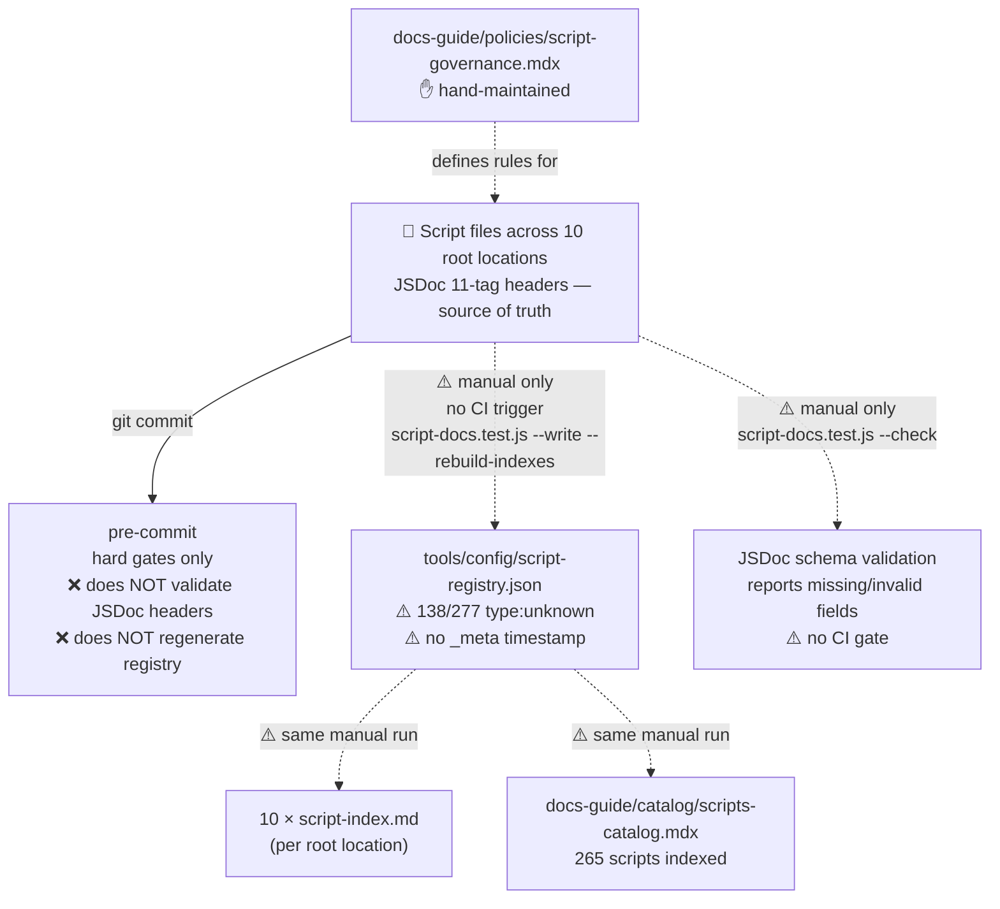

# Scripts Documentation Audit

**Date:** 2026-03-23
**Scope:** All documentation surfaces for the governed script library — 277 scripts across 10 root locations (`operations/scripts/`, `.githooks/`, `.github/scripts/`, `tools/lib/`, `tools/notion/`, `tools/config/`, `operations/tests/`, `workspace/scripts/`, `snippets/automations/`, `tools/`).

---

## Documentation needs

| Need | Purpose | Audience |
|---|---|---|
| JSDoc 11-tag header in every script | Source of truth: type, concern, niche, purpose, description, mode, pipeline, scope, usage, policy | Generators, CI, agents |
| Machine-readable registry | Structured inventory of all scripts with full metadata | Automation, agents, tooling |
| Per-group script indexes | Quick-scan reference per root location | Contributors navigating a folder |
| Aggregate catalog | Searchable, grouped view of all 277 scripts with pipeline flow | Internal / agents |
| Governance policy | Classification rules, JSDoc standard, enforcement tiers, how to add a script | Contributors, agents |

---

## What exists

### Machine-readable / config

| File | Generated by | CI trigger | Freshness | Notes |
|---|---|---|---|---|
| `tools/config/script-registry.json` | `operations/tests/unit/script-docs.test.js --write` | ❌ no CI trigger | ⚠️ unknown — no timestamp in file | 277 entries; 138 (50%) have `type: unknown` |

### Per-group indexes (10 files)

| File | Generated by | CI trigger | Freshness |
|---|---|---|---|
| `operations/scripts/script-index.md` | `script-docs.test.js --rebuild-indexes` | ❌ none | ⚠️ manual |
| `operations/tests/script-index.md` | same | ❌ none | ⚠️ manual |
| `tools/lib/script-index.md` | same | ❌ none | ⚠️ manual |
| `tools/notion/script-index.md` | same | ❌ none | ⚠️ manual |
| `tools/config/script-index.md` | same | ❌ none | ⚠️ manual |
| `tools/script-index.md` | same | ❌ none | ⚠️ manual |
| `.githooks/script-index.md` | same | ❌ none | ⚠️ manual |
| `.github/script-index.md` | same | ❌ none | ⚠️ manual |
| `workspace/scripts/script-index.md` | same | ❌ none | ⚠️ manual |
| `snippets/automations/script-index.md` | same | ❌ none | ⚠️ manual |

### Aggregate catalog

| File | Generated by | CI trigger | Freshness | Notes |
|---|---|---|---|---|
| `docs-guide/catalog/scripts-catalog.mdx` | `script-docs.test.js --write --rebuild-indexes` | ❌ no CI trigger | ⚠️ manual | 265 scripts indexed; includes pipeline flow diagram |

### Governance

| File | Manual/Generated | Freshness | Notes |
|---|---|---|---|
| `docs-guide/policies/script-governance.mdx` | ✋ manual | ✅ active | Taxonomy, JSDoc standard, enforcement tiers |

---

## Source of truth

**Canonical:** JSDoc 11-tag headers embedded in each script file. These are the authoritative record for type, concern, niche, purpose, description, mode, pipeline, scope, usage, and policy.

**Tags required:**
`@script`, `@type`, `@concern`, `@niche`, `@purpose`, `@description`, `@mode`, `@pipeline`, `@scope`, `@usage`, `@policy`

**Derived (generated):**
- `tools/config/script-registry.json` — extracted from JSDoc across all 10 governed roots
- 10 × `script-index.md` — per-root markdown tables
- `docs-guide/catalog/scripts-catalog.mdx` — aggregate MDX catalog

**Governance authority:**
- `docs-guide/policies/script-governance.mdx` — classification rules and JSDoc standard
- `tools/lib/script-governance-config.js` — GOVERNED_ROOTS, INDEXED_ROOTS, GROUP_INDEX_MAP (machine-readable config)

**Missing:** No CI wiring. No workflow regenerates or validates any script documentation artifact automatically.

---

## Gaps and issues

1. **No CI trigger for any script documentation artifact.** `script-docs.test.js` is not referenced in any `.github/workflows/*.yml` file. The registry, 10 group indexes, and aggregate catalog can all drift indefinitely without detection. This is the most critical gap — scripts are the second-largest governed surface in the repo.

2. **138 out of 277 scripts (50%) have `type: unknown`.** Half the registry is ungoverned by the taxonomy. These are primarily `.github/scripts/`, `.githooks/`, `tools/` files that were included in the registry scan but never had JSDoc headers written. An "unknown" type entry cannot be properly classified, routed to a pipeline tier, or queried by agents.

3. **160 out of 277 scripts have incomplete JSDoc headers** (missing `type`, `concern`, or `description`). Most of these are in `.githooks/`, `.github/scripts/`, and `tools/lib/` — high-frequency files that are read by every contributor and agent session.

4. **Registry has no timestamp or generation metadata.** Unlike `component-registry.json` (which has `_meta.generated`), `script-registry.json` has no `_meta` block. Freshness is completely undetectable from the file itself.

5. **Dual-mode generator/validator is an unusual pattern.** `script-docs.test.js` operates as both a validator (`--check`) and a generator (`--write --rebuild-indexes`). This conflation of test and generator makes it harder to wire into standard CI patterns where tests and generators are separate jobs.

6. **Archived/legacy scripts are indexed alongside active scripts.** `operations/scripts/archive/` is included in the registry scan. Deprecated scripts appear in the aggregate catalog with no visual distinction from active ones.

7. **10 script-index.md files are not in `docs.json` navigation.** They live at git-root-adjacent paths (`.githooks/`, `.github/`, `tools/`) and are not discoverable through Mintlify — they are only useful if you know to look in the folder directly.

8. **No policy enforcement at commit for JSDoc completeness.** The pre-commit hook runs hard gates only (MDX syntax, docs.json, deletions). Missing or malformed script JSDoc headers are not blocked at commit time — they only surface when the test is manually run.

---

## Pipeline diagram

---

## Recommendations

1. **Add `script-docs.test.js --check` to `check-docs-guide-catalogs.yml`.** This immediately gives script documentation a PR gate — same pattern as all other catalog freshness checks. No new workflow needed; add one step.

2. **Add `script-docs.test.js --write --rebuild-indexes` to a push→main generation workflow.** Either add it to `generate-docs-guide-catalogs.yml` (already runs after merges) or create `generate-script-registry.yml` with a path filter on all 10 governed roots. Auto-commit the registry + indexes + catalog. Matches the component and workflow catalog generation pattern.

3. **Separate the generator from the test.** Rename / refactor so a standalone `generate-script-registry.js` handles writing and `validate-script-registry.js` handles checking. This makes CI wiring explicit and removes the dual-mode ambiguity.

4. **Add `_meta` block to `script-registry.json`.** Include `generated`, `generator`, and `scriptCount` — same pattern as `component-registry.json`. Makes freshness detectable without running the script.

5. **Exclude archived scripts from the main catalog.** Add an `archived: true` flag or move `operations/scripts/archive/` to a separate registry section. Active scripts should be visually and structurally distinct.

6. **Set a remediation target for JSDoc completeness.** 138 unknown-type scripts is a significant debt. Prioritise the high-traffic roots first: `.githooks/` (every commit), `.github/scripts/` (every CI run), `tools/lib/` (every generator). These have the highest agent-read frequency.

7. **Do not block commits on JSDoc completeness** — this would disrupt normal scripting workflows. Keep as a soft gate (PR warning) rather than a hard block.

---

## Upstream / downstream effects

**Changes upstream (affecting this concern):**
- Adding a new script to any governed root → registry goes stale until manually regenerated
- Renaming or moving a script → old entry persists in registry until regenerated
- Changing `tools/lib/script-governance-config.js` GOVERNED_ROOTS → changes what gets indexed (high blast radius)

**Changes downstream (this concern affecting others):**
- `script-registry.json` is consumed by: `scripts-catalog.mdx` generator, any tooling that queries script metadata, agent context when identifying available scripts
- `scripts-catalog.mdx` is the primary agent-facing inventory of repo tooling — stale registry = agents citing wrong or missing scripts
- 10 `script-index.md` files are used by contributors navigating root directories directly — stale = misleading local navigation
- Fixing the JSDoc completeness gap for `.githooks/` and `.github/scripts/` has upstream effects on the workflows audit (those scripts appear in workflow definitions)
