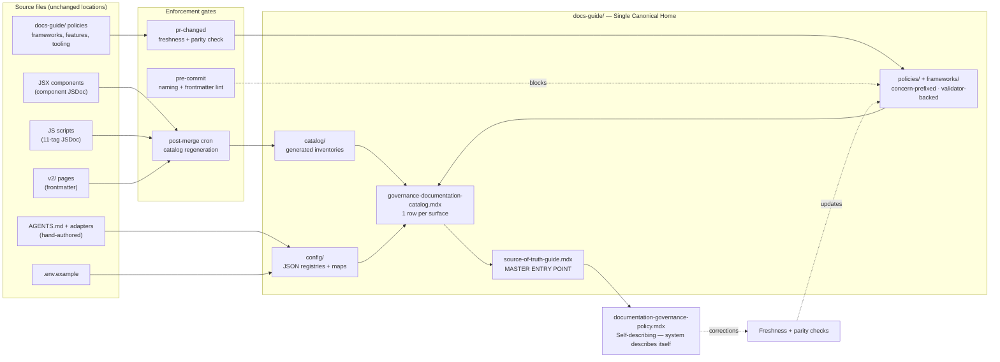

# Documentation Governance System

> **What it is**: A governance layer that makes every documentation item in the repo findable, trusted, owned, and machine-readable — so contributors and agents always get one correct answer, never a guess.

---

## What This System Does

Documentation items flow in from five source types — component JSDoc, script JSDoc, MDX frontmatter, hand-authored governance pages, and AI adapter files — and are organised into a single canonical home (`docs-guide/`). Contributors and agents query from one entry point (`source-of-truth-guide.mdx`) and reach the right file in one hop. Generated files stay current because they regenerate on merge. Hand-maintained files are checkable because they carry a validator and a `lastVerified` date. Every surface is repairable via a deterministic command. Without this system, governance documentation is scattered across 13+ locations, unowned, invisible to agents, and undetectably stale.

---

## When the System Is Working

| Signal | What it tells you |
|---|---|
| Agent asks "where is canonical source for X?" | Returns one path; no ambiguity, no hallucinated location |
| New docs-guide page added without required frontmatter | Pre-commit blocks the commit |
| Generated catalog file regenerated | Matches source data exactly; zero drift reported |
| Ownerless surface validator runs | Zero unregistered surfaces; all declared paths resolve |
| AGENTS.md edited without matching adapter file update | Parity check warns in PR CI |

---

## System Architecture — Completed State

---

## The System

---

## ① One Canonical Location

Every documentation item has exactly one findable home — no ambiguity between `docs-guide/`, `v2/internal/`, README, ad-hoc folders, or workspace files.

<AccordionGroup>

<Accordion title="🎯 Ideal State">

Ask "where is X documented?" and there is exactly one answer, reachable from `source-of-truth-guide.mdx` in one hop. No two files claim canonical status for the same topic. Every documentation item is classified with a `docType`, `concern`, and `format` — and that classification determines where it lives.

**What this enables:** Parts ②–⑤ can all be built. Agents navigate to the right file without guessing. Validators know what path to check.

**Quality bar:** `governance-documentation-catalog.mdx` lists every documentation surface with a unique canonical path. Running a duplicate-path check returns zero conflicts.

</Accordion>

<Accordion title="🔍 AUDIT · Inventory all documentation locations and conflicts">

**IN**
- All documentation files across the repo (docs-guide/, v2/internal/, AGENTS.md, adapter files, .env.example, workspace/, contribute/)

**OUT**
- Full location map with `[docType / concern / format]` classification per file
- List of duplicate/conflicting canonical files
- List of orphaned files with no declared owner

**Steps**
1. ✅ Scan all repo documentation locations and classify each file by docType/concern/format
2. ✅ Identify duplicate canonical files (e.g. docs-philosophy.mdx)
3. ✅ List all orphaned files with no declared owner

**STATUS** — ✅ Done — `designing/audit.md` + `recommendations.md`

</Accordion>

<Accordion title="🎨 DESIGN · Define concern taxonomy, classification model, and catalog naming convention">

**IN**
- Audit findings
- Existing script taxonomy (`content / components / governance / ai`) for homogeneity
- Existing docs-guide folder structure

**OUT**
- `concern` enum: `content | components | governance | ai` — locked in `designing/structure.md`
- `docType` enum: `policy | framework | catalog | feature-map | tooling-ref | contributor-guide | ai-adapter | ai-rule | registry | secrets-ref | template`
- D1, D-CONCERN, D9 decisions resolved
- `Frameworks/doc-item-model.md` — frozen classification contract

**HUMAN VS AI**
- AI: drafts taxonomy options, maps existing files to proposed classification, recommends D1/D-CONCERN/D9 defaults
- Human: makes D1, D-CONCERN, D9 decisions

**Steps**
1. ✅ Define `docType` enum and map all existing docs-guide files to it
2. ✅ Define `concern` enum — content / components / governance / ai
3. ✅ Map all existing docs-guide files to docType/concern/format classification
4. ✅ Resolve D1: concern as sub-folder within type folders (Option B)
5. ✅ Resolve D-CONCERN: `governance` is a valid concern value — 4 values locked
6. ✅ Resolve D9: catalog rename table confirmed — see `Frameworks/doc-item-model.md`

**STATUS** — ✅ Done — locked in `Frameworks/doc-item-model.md`

</Accordion>

<Accordion title="👤 HUMAN REVIEW · Lock the classification model">

**IN**: Completed `designing/structure.md` with D1, D-CONCERN, D9 resolved
**OUT**: Approved `Frameworks/doc-item-model.md` — frozen contract for all downstream work
**Criteria**: All three pending decisions confirmed; taxonomy is unambiguous; no file type is left without a declared home

**Steps**
1. ✅ Confirm D1 decision — sub-folder within type folders
2. ✅ Confirm D-CONCERN decision — governance is valid (4 values)
3. ✅ Confirm D9 rename table
4. ✅ Approve completed `Frameworks/doc-item-model.md`

**STATUS** — ✅ Done — 2026-03-22

</Accordion>

<Accordion title="✏️ EXECUTION · Build the canonical structure">

**IN**
- Approved `Frameworks/doc-item-model.md`
- Approved D9 rename table

**OUT**
- `docs-guide/config/` — new folder; JSON files moved; maps + secrets from `repo-ops/`
- Catalog files renamed per D9
- `docs-guide/catalog/governance-documentation-catalog.mdx` skeleton
- Concern navigation table in `docs-guide/source-of-truth-guide.mdx`
- `v2/internal/` overlaps resolved

**HUMAN VS AI**
- AI: executes file moves, renames, builds skeleton
- Human: approves each structural change before commit; confirms v2/internal/ decisions

**Steps**
1. ✅ Write `Frameworks/doc-item-model.md` — frozen model contract
2. ✅ Create `docs-guide/config/` and move JSON files — 5 files moved, 31 consumers updated (`40aeb990`)
3. ❌ Rename catalog files to concern-prefix convention (per D9)
4. ❌ Build `governance-documentation-catalog.mdx` skeleton — one row per surface
5. ❌ Add concern navigation table to `source-of-truth-guide.mdx`
6. N/A `v2/internal/governance.mdx` — does not exist
7. N/A `v2/internal/governance-pipeline.mdx` — does not exist

**STATUS** — 🔄 In progress — steps 1–2 done; step 3 next

</Accordion>

<Accordion title="🧪 TESTING · Verify canonical uniqueness across the repo">

**IN**
- Updated repo structure
- Populated `governance-documentation-catalog.mdx`

**OUT**
- Zero documentation surfaces with dual canonical claims
- All catalog paths resolve to existing files

**DONE WHEN** — Every documentation surface appears exactly once in the catalog with a unique canonical path; `source-of-truth-guide.mdx` navigates correctly to each concern in one hop

**Steps**
1. ❌ Run duplicate-path check on `governance-documentation-catalog.mdx`
2. ❌ Verify all declared paths resolve to existing files
3. ❌ Verify `source-of-truth-guide.mdx` concern nav reaches correct file per concern

**STATUS** — ❌ Not started

</Accordion>

<Accordion title="📦 Outputs">

| Artefact | Path / location | Status | Blocks |
|---|---|---|---|
| Frozen model contract | `workspace/plan/active/DOCUMENTATION/Frameworks/doc-item-model.md` | ❌ | ② ③ ④ ⑤ |
| Config folder | `docs-guide/config/` | ❌ | — |
| Renamed catalog files | `docs-guide/catalog/*.mdx` (per D9) | ❌ | — |
| Documentation catalog skeleton | `docs-guide/catalog/governance-documentation-catalog.mdx` | ❌ | ④ |
| Concern nav table | `docs-guide/source-of-truth-guide.mdx` (update) | ❌ | — |

</Accordion>

</AccordionGroup>

---

## ② Known Freshness

Every documentation item has a declared maintenance state — generated files always match their source; hand-maintained files have a known last-verified date and a validator that detects staleness.

<AccordionGroup>

<Accordion title="🎯 Ideal State">

Every `docs-guide/` page carries a `maintenance` field (`generated | hand-maintained | mixed`). Generated files have a `generator:` path. Hand-maintained files have a `validator:` path and a `lastVerified:` date. Running the freshness validator returns zero "unknown maintenance state" results. Nothing drifts silently.

**What this enables:** Agents can trust what they find. Parts ③ and ④ can classify files correctly. The system is self-monitoring.

**Quality bar:** `node tests/unit/docs-guide-sot.test.js --check` returns 0 unknown-state pages. The `lpd-cli.mdx` freshness gate detects drift from `lpd --help` output.

</Accordion>

<Accordion title="🎨 DESIGN · Define maintenance enum and conditional field rules">

**IN**
- Audit of all ~40 docs-guide pages — which are generated, which are hand-maintained
- Existing generator patterns: `script-docs.test.js`, `generate-component-registry.js`

**OUT**
- `maintenance` enum: `generated | hand-maintained | mixed`
- Conditional field rules: `generator:` if generated; `validator:` + `lastVerified:` if hand-maintained
- Full examples per docType (policy, catalog, tooling-ref, feature-map)

**Steps**
1. ✅ Define `maintenance` enum: generated | hand-maintained | mixed
2. ✅ Define conditional fields: `generator:`, `validator:`, `lastVerified:`
3. ✅ Write full frontmatter examples per docType in `designing/structure.md` Part 3

**STATUS** — ✅ Done — `designing/structure.md` Part 3

</Accordion>

<Accordion title="👤 HUMAN REVIEW · Approve maintenance + generator/validator assignments for all ~40 pages">

**IN**: Draft per-page assignment table from `designing/consumer-assignments.md`
**OUT**: Approved table — one row per docs-guide page with `maintenance` type + confirmed `generator`/`validator` paths
**Criteria**: All pages have a declared maintenance type; all generator/validator paths exist or are planned; zero pages in unknown state

**Steps**
1. ❌ Review draft assignment table in `designing/consumer-assignments.md`
2. ❌ Approve maintenance type per page
3. ❌ Confirm generator/validator paths are correct or flag for Phase 5

**STATUS** — ❌ Not started — blocked by `doc-item-model.md` (Part ①)

</Accordion>

<Accordion title="✏️ EXECUTION · Apply maintenance frontmatter to all docs-guide pages">

**IN**
- Approved assignment table
- `doc-item-model.md` frozen contract

**OUT**
- All ~40 `docs-guide/**/*.mdx` pages updated with `maintenance`, `generator`/`validator`, `lastVerified`
- `validate-lpd-cli-freshness.js` — detects when `lpd --help` has drifted from `lpd-cli.mdx`

**Note**: This pass is coordinated with Part ④ — `consumer`, `concern`, `status`, and `maintenance` fields are all applied in one batch per page.

**Steps**
1. ❌ Apply maintenance frontmatter to all `catalog/` pages
2. ❌ Apply to all `policies/` pages
3. ❌ Apply to all `frameworks/` pages
4. ❌ Apply to all `features/` pages
5. ❌ Apply to all `tooling/` pages
6. ❌ Apply to all `contributing/` pages
7. ❌ Write `validate-lpd-cli-freshness.js` — lpd-cli freshness gate script

**STATUS** — ❌ Not started — blocked by HUMAN REVIEW

</Accordion>

<Accordion title="🧪 TESTING · Verify zero unknown-state pages">

**IN**
- Updated docs-guide pages
- Extended `tests/unit/docs-guide-sot.test.js`

**OUT**
- Zero "unknown maintenance state" results
- `lpd-cli.mdx` freshness gate confirmed detecting drift

**DONE WHEN** — `docs-guide-sot.test.js --check` passes with 0 unknown-state pages; freshness gate produces a warning when `lpd --help` output changes

**Steps**
1. ❌ Run `docs-guide-sot.test.js --check` — verify 0 unknown-state pages
2. ❌ Simulate `lpd --help` change; verify freshness gate detects and warns

**STATUS** — ❌ Not started

</Accordion>

<Accordion title="📦 Outputs">

| Artefact | Path / location | Status | Blocks |
|---|---|---|---|
| All docs-guide pages with maintenance fields | `docs-guide/**/*.mdx` (~40 files) | ❌ | — |
| lpd-cli freshness validator | `tools/scripts/validators/governance/freshness/validate-lpd-cli-freshness.js` | ❌ | ③ |
| Updated docs-guide-sot test | `tests/unit/docs-guide-sot.test.js` | ❌ | — |

</Accordion>

</AccordionGroup>

---

## ③ Owned and Repairable

Every documentation surface is registered in `ownerless-governance-surfaces.json` with an enforcement gate and a deterministic repair command. Nothing drifts silently.

<AccordionGroup>

<Accordion title="🎯 Ideal State">

Running `validate-ownerless-surfaces.js` returns zero unregistered documentation surfaces. Every registered surface has a working repair command. Adapter parity check fires when `AGENTS.md` drifts from adapter files. Workflow secrets check fires when a new CI secret is added without updating `.env.example`.

**What this enables:** Governance documentation cannot drift silently. Part ⑤ can declare a complete and enforced system.

**Quality bar:** `validate-ownerless-surfaces.js` returns zero unregistered surfaces. Each validator passes on valid state and fails correctly on invalid state. Each repair command runs without error.

</Accordion>

<Accordion title="🔍 AUDIT · Identify all documentation surfaces without ownerless registration">

**IN**
- `tools/config/ownerless-governance-surfaces.json` (8 current entries)
- All docs-guide pages, AGENTS.md, adapter files, `.env.example`, `lpd-cli.mdx`

**OUT**
- List of 5+ unregistered surfaces with enforcement gap and proposed repair path

**Steps**
1. ✅ Identify unregistered surfaces: `.env.example`, adapter parity, required docs-guide files, `lpd-cli.mdx`, `governance-documentation-catalog.mdx`
2. ✅ Document enforcement gap per surface in `recommendations.md` R17–R19

**STATUS** — ✅ Done — `recommendations.md` R17–R19

</Accordion>

<Accordion title="🎨 DESIGN · Specify validator type and repair path per surface">

**IN**
- Audit findings
- Existing validator patterns (`docs-guide-sot.test.js`, `validate-adapter-parity.js` pattern)

**OUT**
- Validator spec for each of the three new scripts
- Ownerless registration format confirmed per surface

**Steps**
1. ✅ Specify `docs-guide-naming-convention.js` — concern prefix, no `-index.mdx`, frontmatter fields present
2. ✅ Specify `validate-adapter-parity.js` — AGENTS.md critical rules vs each adapter file
3. ✅ Specify `validate-workflow-secrets.js` — `.github/workflows/*.yml` secrets vs `.env.example`

**STATUS** — ✅ Done — `designing/design-plan-v2.md` Phase 5B

</Accordion>

<Accordion title="✏️ EXECUTION · Write validators and register all surfaces">

**IN**
- Validator specs
- One HUMAN REVIEW approval per registration batch (see below)
- Parts ① + ② complete (naming convention validator depends on final file structure)

**OUT**
- Three new validator scripts
- 5 new entries in `tools/config/ownerless-governance-surfaces.json`

**HUMAN VS AI**
- AI: writes validators; drafts ownerless registration entries
- Human: approves each registration batch before it is written to manifest

**Steps**
1. ❌ Write `docs-guide-naming-convention.js`
2. ❌ Write `validate-adapter-parity.js`
3. ❌ Write `validate-workflow-secrets.js`
4. ❌ Draft ownerless registration entry for `.env.example` → human approves → write to manifest
5. ❌ Draft ownerless registration entry for adapter parity → human approves → write to manifest
6. ❌ Draft ownerless registration entries for required docs-guide files → human approves → write
7. ❌ Draft ownerless registration entry for `lpd-cli.mdx` → human approves → write
8. ❌ Draft ownerless registration entry for `governance-documentation-catalog.mdx` → human approves → write

**STATUS** — ❌ Not started — blocked by Parts ① + ②

</Accordion>

<Accordion title="🧪 TESTING · Test each validator and repair path end-to-end">

**IN**
- Written validators
- Updated ownerless manifest
- Simulated violations for each validator type

**OUT**
- Each validator: passes on valid state, fails on invalid state, produces actionable error message
- Each repair command: runs without error, produces the correct fixed state

**DONE WHEN** — `validate-ownerless-surfaces.js` returns zero unregistered surfaces; all repair commands confirmed runnable

**Steps**
1. ❌ Test `docs-guide-naming-convention.js` — pass on valid structure, fail on invalid
2. ❌ Test `validate-adapter-parity.js` — detect drift between AGENTS.md and adapter files
3. ❌ Test `validate-workflow-secrets.js` — detect undeclared secrets in workflows
4. ❌ Run `validate-ownerless-surfaces.js` — confirm zero unregistered surfaces
5. ❌ Confirm each of the 5 new repair commands runs without error

**STATUS** — ❌ Not started

</Accordion>

<Accordion title="📦 Outputs">

| Artefact | Path / location | Status | Blocks |
|---|---|---|---|
| Naming convention validator | `tools/scripts/validators/governance/naming/docs-guide-naming-convention.js` | ❌ | — |
| Adapter parity validator | `tools/scripts/validators/governance/compliance/validate-adapter-parity.js` | ❌ | — |
| Workflow secrets validator | `tools/scripts/validators/governance/compliance/validate-workflow-secrets.js` | ❌ | — |
| Ownerless manifest (5 new entries) | `tools/config/ownerless-governance-surfaces.json` | ❌ | ⑤ |

</Accordion>

</AccordionGroup>

---

## ④ Machine-Readable

Agents and automation can navigate the documentation system without guessing — querying by `concern`, `consumer`, or `status` returns filtered, correct results from one machine-readable catalog.

<AccordionGroup>

<Accordion title="🎯 Ideal State">

An agent navigating from `source-of-truth-guide.mdx` reaches the correct canonical file for any concern in one hop. `governance-documentation-catalog.mdx` is parseable without human interpretation. Queries by `consumer: agent` return only the files an agent should act on. No hallucinated paths.

**What this enables:** Agents operate reliably on governance documentation without human guidance per query. Part ⑤ depends on agents being able to navigate to it.

**Quality bar:** For each of 4 concerns, agent finds the right file in ≤1 hop from `source-of-truth-guide.mdx`. Catalog is parseable by a script with no ambiguity.

</Accordion>

<Accordion title="🎨 DESIGN · Define consumer and concern enums with precise meanings">

**IN**
- Script taxonomy (`content / components / governance / ai`) — for homogeneity
- Audit of who actually reads each docs-guide file

**OUT**
- `consumer` enum: `human | agent | automation` with precise definitions
- `concern` enum: `content | components | governance | ai`
- `status` enum: `active | draft | deprecated`
- Draft per-page assignment table: `designing/consumer-assignments.md`

**Steps**
1. ✅ Define `consumer` enum: human | agent | automation
2. ✅ Define `concern` enum: content | components | governance | ai
3. ✅ Define `status` enum: active | draft | deprecated
4. ✅ Draft per-page consumer + concern assignments in `designing/consumer-assignments.md`

**STATUS** — ✅ Done — `designing/structure.md` Part 1 + `designing/consumer-assignments.md`

</Accordion>

<Accordion title="👤 HUMAN REVIEW · Approve consumer + concern assignments for all ~40 pages">

**IN**: Draft per-page assignment table from `designing/consumer-assignments.md`
**OUT**: Approved table — `consumer`, `concern`, `status` confirmed per page
**Criteria**: Every `consumer: [agent]` page is legible to an agent without human context; every `concern` assignment is unambiguous; no page unclassified

**Steps**
1. ❌ Review consumer/concern/status assignment table
2. ❌ Flag any misclassified pages (e.g. agent-tagged pages with human-only content)
3. ❌ Approve final table

**STATUS** — ❌ Not started — blocked by `doc-item-model.md` (Part ①)

</Accordion>

<Accordion title="✏️ EXECUTION · Apply consumer/concern/status frontmatter and populate the catalog">

**IN**
- Approved assignment table
- `governance-documentation-catalog.mdx` skeleton (from Part ①)
- AGENTS.md + adapter files (for concern navigation rules)

**OUT**
- All ~40 docs-guide pages updated with `consumer`, `concern`, `status` (coordinated with Part ② maintenance pass)
- `governance-documentation-catalog.mdx` fully populated
- `AGENTS.md` + adapter files updated with concern navigation rules

**Note**: Coordinated with Part ② — all frontmatter fields applied in one batch pass per page.

**Steps**
1. ❌ Apply consumer + concern + status to all `catalog/` pages (with Part ② maintenance fields)
2. ❌ Apply to all `policies/` pages
3. ❌ Apply to all `frameworks/` pages
4. ❌ Apply to all `features/` pages
5. ❌ Apply to all `tooling/` pages
6. ❌ Apply to all `contributing/` pages
7. ❌ Populate `governance-documentation-catalog.mdx` — all model fields per surface
8. ❌ Update `AGENTS.md` with concern navigation rules
9. ❌ Update `.claude/CLAUDE.md` and `.cursor/rules/` adapter files with concern navigation

**STATUS** — ❌ Not started — blocked by HUMAN REVIEW + Part ①

</Accordion>

<Accordion title="🧪 TESTING · Manual agent navigation test">

**IN**
- Updated docs-guide pages
- Populated `governance-documentation-catalog.mdx`
- Updated AGENTS.md

**OUT**
- Test log per concern: query → file reached → hops taken → path hallucinated (yes/no)
- Catalog parseability confirmed by script filter

**DONE WHEN** — For all 4 concerns, agent finds correct file in ≤1 hop from `source-of-truth-guide.mdx`; zero hallucinated paths

**Steps**
1. ❌ Agent test: "canonical source for component governance?" → correct file in ≤1 hop
2. ❌ Agent test: "canonical source for content governance?" → correct file in ≤1 hop
3. ❌ Agent test: "canonical source for scripts?" → correct file in ≤1 hop
4. ❌ Agent test: "canonical source for AI governance?" → correct file in ≤1 hop
5. ❌ Script: parse catalog, filter by `consumer: agent`, verify correct rows returned

**STATUS** — ❌ Not started

</Accordion>

<Accordion title="📦 Outputs">

| Artefact | Path / location | Status | Blocks |
|---|---|---|---|
| All docs-guide pages with consumer + concern + status | `docs-guide/**/*.mdx` (~40 files) | ❌ | ⑤ |
| Populated documentation catalog | `docs-guide/catalog/governance-documentation-catalog.mdx` | ❌ | ⑤ |
| Updated agent navigation rules | `AGENTS.md` + adapter files | ❌ | — |

</Accordion>

</AccordionGroup>

---

## ⑤ Self-Describing

The system fully describes itself in one canonical policy document — a contributor or agent reading it can reproduce the governance model from scratch without opening any workspace plan files.

<AccordionGroup>

<Accordion title="🎯 Ideal State">

`docs-guide/policies/documentation-governance-policy.mdx` exists and fully answers "how does this documentation system work?" — the model, the enums, the validators, the update rules. The workspace plan files (`workspace/plan/active/DOCUMENTATION/`) become optional context, not required reading. `source-of-truth-guide.mdx` is the complete operational entry point.

**What this enables:** New contributors and agents start from the policy doc, not from workspace plans. The system is maintainable without institutional memory.

**Quality bar:** A contributor who has never seen the workspace plans can read `documentation-governance-policy.mdx` and reproduce the governance model. Agent navigates from policy doc to any governance file in ≤2 hops.

</Accordion>

<Accordion title="🎨 DESIGN · Define content spec for the governance policy document">

**IN**
- All model decisions from Parts ①–④
- `designing/design-plan-v2.md` Phase 7

**OUT**
- Content outline for `documentation-governance-policy.mdx` — what it must cover, in what order, for whom
- List of updates required in `source-of-truth-policy.mdx` and `source-of-truth-guide.mdx`

**Steps**
1. ✅ Define content spec: model spec + all enums + validator requirements + update rules + repair paths
2. ✅ List required updates to `source-of-truth-policy.mdx` (add documentation governance as canonical boundary)
3. ✅ List required updates to `source-of-truth-guide.mdx` (catalog regen commands + concern nav)

**STATUS** — ✅ Done — `designing/design-plan-v2.md` Phase 7

</Accordion>

<Accordion title="✏️ EXECUTION · Write the policy document and update the two gateway files">

**IN**
- Parts ①–④ complete
- Approved content spec
- Fully populated `governance-documentation-catalog.mdx`

**OUT**
- `docs-guide/policies/documentation-governance-policy.mdx`
- `docs-guide/policies/source-of-truth-policy.mdx` (updated)
- `docs-guide/source-of-truth-guide.mdx` (updated)

**Steps**
1. ❌ Draft `documentation-governance-policy.mdx` — model + enums + validator requirements + update rules
2. ❌ Update `source-of-truth-policy.mdx` — add documentation governance as canonical boundary; update Required Files list
3. ❌ Update `source-of-truth-guide.mdx` — add catalog regen commands + concern navigation table + adapter parity check command

**STATUS** — ❌ Not started — blocked by Parts ①–④

</Accordion>

<Accordion title="👤 HUMAN REVIEW · Review and lock the governance policy document">

**IN**: Completed `documentation-governance-policy.mdx` + updated gateway files
**OUT**: Locked policy document; plan marked complete
**Criteria**: A contributor reading only the policy doc can reproduce the full governance model without workspace plan files

**Steps**
1. ❌ Read `documentation-governance-policy.mdx` as a new contributor — can you reproduce the model?
2. ❌ Confirm `source-of-truth-guide.mdx` is the complete operational entry point
3. ❌ Lock and mark plan complete

**STATUS** — ❌ Not started

</Accordion>

<Accordion title="🔄 ITERATION · Agent navigation — policy doc to any governance file in ≤ 2 hops">

**IN**
- Human review notes
- Locked policy doc

**OUT**
- Updated metadata or navigation aids where agent navigation failed
- Iteration log: what changed and why

**DONE WHEN** — Agent navigates from `documentation-governance-policy.mdx` to the correct governance file for any of the 4 concerns in ≤2 hops, across 3 separate test sessions

**Steps**
1. ❌ Agent test: navigate from policy doc to component governance file (≤2 hops)
2. ❌ Agent test: navigate from policy doc to content governance file (≤2 hops)
3. ❌ Agent test: navigate from policy doc to scripts governance file (≤2 hops)
4. ❌ Agent test: navigate from policy doc to AI governance file (≤2 hops)
5. ❌ Update metadata/navigation aids where any agent test failed
6. ❌ Re-run tests until all 4 concerns pass in ≤2 hops

**STATUS** — ❌ Not started

</Accordion>

<Accordion title="📦 Outputs">

| Artefact | Path / location | Status | Blocks |
|---|---|---|---|
| Self-describing governance policy | `docs-guide/policies/documentation-governance-policy.mdx` | ❌ | — |
| Updated SOT policy | `docs-guide/policies/source-of-truth-policy.mdx` | ❌ | — |
| Updated SOT guide | `docs-guide/source-of-truth-guide.mdx` | ❌ | — |

</Accordion>

</AccordionGroup>

---

## Completion Status

| System part | Status | Immediate blocker |
|---|---|---|
| ① One Canonical Location | 🔄 In progress | Resolve D1 + D-CONCERN + D9 → HUMAN REVIEW lock |
| ② Known Freshness | ❌ Not started | `doc-item-model.md` written and approved (Part ①) |
| ③ Owned and Repairable | ❌ Not started | Parts ① + ② complete |
| ④ Machine-Readable | ❌ Not started | `doc-item-model.md` written and approved (Part ①) |
| ⑤ Self-Describing | ❌ Not started | Parts ①–④ complete |

---

## Already Done

| What | Where | Change |
|---|---|---|
| Wrong filename reference | `docs-guide/policies/source-of-truth-policy.mdx` | `overview.mdx` → `source-of-truth-guide.mdx` |
| Stale path references | `docs-guide/docs-glossary.md` | `tasks/plan/...` → `workspace/plan/...` |
| Stale generated file | `docs-guide/catalog/components-catalog.mdx` | Regenerated; undefined category rows removed |
| Duplicate page — merged | `v2/internal/overview/docs-philosophy.mdx` | 7 unique items merged from orphan root file; `lastVerified` updated |
| Duplicate page — deleted | `v2/internal/docs-philosophy.mdx` | Orphan root file deleted post-merge |
| Scope cross-links | `docs-guide/docs-glossary.md` + `v2/resources/livepeer-glossary.mdx` + `v2/resources/resources/compendium/glossary.mdx` | Bidirectional scope notes added to all three |
