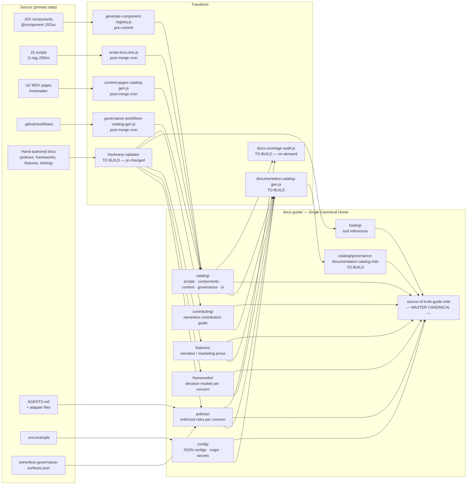

# Documentation Governance — Design Plan v2

> **Design goal**: Make `docs-guide/` the single canonical home for all repo governance documentation — every concern, every file type — with one master entry point that surfaces everything and reveals integration gaps.

---

## Part 0: The Design Challenge

The repo has governance documentation scattered across 13+ locations with no unified ownership model, no per-page audience tagging, no sync pipeline between internal canonical docs and public/agent surfaces, and no validators for hand-maintained files.

This plan designs a **holistic documentation governance layer** — a model that sits on top of everything else and declares: where canonical docs live, what produces them, and how we know they're current.

**The answer to "where do canonical docs live?" must always be: `docs-guide/`.**
External tools (AGENTS.md, .env.example, .github/workflows) stay where they are functionally. Their DOCUMENTATION lives in `docs-guide/`.

---

## Part 1: What "Concern" Means — Co-Design Needed

> **This is a critical definition that shapes everything. Needs lock-in before execution.**

A **concern** is a coherent domain of responsibility in the repo — it has its own governance rules, its own tools, its own actors, and its own documentation surfaces.

### Type — what the documentation item IS

**Already defined** in [`docs-guide/policies/docs-guide-structure-policy.mdx`](../../../docs-guide/policies/docs-guide-structure-policy.mdx). The type maps directly to the docs-guide **folder name**:

| docs-guide folder | Type | What it is |
|---|---|---|
| `policies/` | `policy` | Enforced rule or contract — gate-owned, binding |
| `frameworks/` | `framework` | Decision model or taxonomy — guidance-level, authoritative |
| `catalog/` | `catalog` | Generated inventory of a repo surface — read-only output |
| `features/` | `feature-map` | Narrative overview of a repo capability — human-readable prose |
| `tooling/` | `tooling-ref` | Reference for a tool, CLI, or workflow |
| `contributing/` | `contributor-guide` | Procedural guide for human contributors |
| `repoOps/` (→ `config/` per D15) | `config` | Machine-readable config, registry, secrets reference |

> **Note**: The actual filesystem has `repo-ops/` (kebab-case) but the policy defines `repoOps/` (camelCase). This inconsistency needs resolving as part of D15.

**Type determines folder placement.** File naming within the folder then adds the concern prefix.

### Proposed concern values

A **concern** is a coherent domain of responsibility in the repo — a coherent area of work with its own tools, actors, and governance surfaces. It maps to the **file prefix** or **sub-folder within a type folder**.

| Concern | What it covers | Examples |
|---|---|---|
| `repo` | Repo structure, path rules, quality gates, ownerless model, folder governance | quality-gates, ownerless-governance, v2-folder-governance, root-allowlist |
| `components` | Component library — JSX code, registry, naming | `component-registry.json`, components JSDoc, component-governance |
| `scripts` | Script/automation ecosystem — JS tools + taxonomy | `scripts-catalog.mdx`, 11-tag JSDoc, script-governance |
| `content` | Public docs pages — v2/ MDX, copy, page taxonomy, veracity | `content-pages-catalog.mdx`, frontmatter, content-system |
| `ai` | AI tools, agent adapter files, skills, discoverability | `AGENTS.md`, adapter files, ai-tools, skill-pipeline-map |
| `ui` | Design system, UI templates, visual patterns | `ui-catalog`, ui-system, component layout decisions |
| `documentation` | Documentation governance itself — the meta-concern | `documentation-catalog.mdx`, documentation-governance-policy |
| `governance` | ⚠ PENDING — may be the overall category term for the type/concern system rather than a specific concern. Could cover cross-cutting repo enforcement that doesn't fit neatly into `repo`. | TBD |

> **`repo` is a concern** — covers the domain of repo structure and enforcement rules.
> **`documentation` is a concern** — documentation governance is itself a domain with its own catalogs and policies.
> **`governance`** — kept pending; may be a meta-category label rather than a specific concern value. Resolve in co-design. ← **D-CONCERN**

### What is NOT a concern

These are **artifact categories** (subtypes within a catalog) — not concerns:
- `pages` — artifact subtype within `content` concern → `content-pages-catalog.mdx`
- `templates` — artifact subtype within `content` or `ui` concern → `content-templates-catalog.mdx`
- `workflows` — artifact subtype within `repo` concern → `repo-workflows-catalog.mdx`

← **D9 — confirm naming convention for these renames**

### Classification model

Every documentation item: `<type>/<concern>/<format>`

| File | Type | Concern | Format |
|---|---|---|---|
| `policies/repo-quality-gates.mdx` | policy | repo | mdx |
| `policies/scripts-governance.mdx` | policy | scripts | mdx |
| `policies/ai-agent-governance.mdx` | policy | ai | mdx |
| `catalog/scripts-catalog.mdx` | catalog | scripts | mdx |
| `catalog/components-catalog.mdx` | catalog | components | mdx |
| `catalog/content-pages-catalog.mdx` | catalog | content | mdx |
| `catalog/documentation-catalog.mdx` | catalog | documentation | mdx |
| `config/component-registry.json` | config | components | json |
| `features/ui-system.mdx` | feature-map | ui | mdx |

### Concern × folder mapping (D1 decision)

**D1 direction**: `<type = foldername>` + `<concern = subfoldername OR file prefix>`

This means the docs-guide folder structure stays type-based (`policies/`, `frameworks/`, `catalog/`), but files within each folder are concern-namespaced:

```
policies/
├── scripts-governance.mdx        ← type=policy, concern=scripts
├── components-layout-decisions.mdx ← type=policy, concern=components
├── ai-agent-governance.mdx       ← type=policy, concern=ai
├── governance-quality-gates.mdx  ← type=policy, concern=governance
└── ... (or sub-folders per concern if volume demands it)

catalog/
├── scripts-catalog.mdx             ← concern=scripts (✓ already correct)
├── components-catalog.mdx          ← concern=components (✓)
├── content-pages-catalog.mdx       ← concern=content, type=pages (rename needed)
├── governance-workflows-catalog.mdx ← concern=governance, type=workflows (rename needed)
├── content-templates-catalog.mdx   ← concern=content, type=templates (rename needed)
└── ui-catalog.mdx                  ← concern=ui (rename from ui-templates.mdx)
```

**Subfolder option** (for concerns with many files): `policies/scripts/`, `policies/components/` etc. Decision: prefix OR subfolder? ← **D1 confirm — needs co-design**

---

## Part 2: Target docs-guide Structure

### Current structure — with applied corrections

```
docs-guide/
├── source-of-truth-guide.mdx       ← MASTER CANONICAL (exists — needs additions)
├── docs-glossary.md                 ← format decision pending (→ D16)
│
├── config/                          ← [NEW — replaces repo-ops/ for config + replaces root JSON placement]
│   ├── component-registry.json      ← moved from docs-guide root
│   ├── component-registry-schema.json
│   ├── component-usage-map.json
│   ├── maps/                        ← reference maps (from repo-ops/maps/)
│   └── secrets/                     ← secrets ref (from repo-ops/secrets/) + .env.example docs
│
├── catalog/        ← GENERATED inventories — concern-prefixed naming (→ D9)
│   ├── scripts-catalog.mdx
│   ├── components-catalog.mdx
│   ├── content-pages-catalog.mdx    ← rename: was pages-catalog.mdx
│   ├── governance-workflows-catalog.mdx ← rename: was workflows-catalog.mdx
│   ├── content-templates-catalog.mdx ← rename: was templates-catalog.mdx
│   ├── ui-catalog.mdx               ← rename: was ui-templates.mdx
│   ├── [ai-companion-manifest.json] ← undocumented — needs MDX explanation
│   └── governance-documentation-catalog.mdx ← TO BUILD
│
├── policies/       ← ENFORCED RULES — concern-prefixed files (or sub-folders → D1)
│                     [flag: consider combining with frameworks/ → D10]
│
├── frameworks/     ← DECISION MODELS — concern-prefixed files
│                     [flag: confirm canonical status → D11]
│
├── features/       ← CAPABILITY MAPS — narrative/marketing prose (→ D12 templates)
│
├── tooling/        ← TOOL REFERENCES — mixed MDX + .md templates
│                     [flag: concern or helper folder? → D13]
│
└── contributing/   ← OWNERLESS CONTRIBUTION GUIDE
                      [direction: single, concise, easy — tools/features/PRs/issues/writing → D14]
```

**Note**: `repo-ops/` is replaced by `config/`. This consolidates:
- JSON config files (moved from docs-guide root)
- Maps/references (from repo-ops/maps/)
- Secrets documentation (from repo-ops/secrets/)

---

## Part 3: Source → Canonical Flow



---

## Part 4: Master-Canonical Design

### `source-of-truth-guide.mdx` — additions needed

**Currently has**: Source-of-truth model, Section Routes table, Frameworks vs Policies distinction, partial Update Rules.

**Additions needed**:
1. `config/` in Section Routes (replaces `repo-ops/`)
2. AI Adapter Files as a named section
3. `.env.example` under Config/Secrets
4. **Concern Navigation table** — for agents: "looking for scripts governance → here; AI → here; components → here"
5. Link to `governance-documentation-catalog.mdx` (once built)
6. Complete **regeneration schedule**: generator → CI trigger → repair command (→ R12)

### `governance-documentation-catalog.mdx` — machine-readable inventory

Every documentation surface: one row, columns = path + concern + consumer + maintenance + generator + validator + status.

Design decision: one row per file vs one row per concern-group? ← **D4 confirm**

---

## Part 5: Metadata Specification

### Agreed fields (all MDX/MD documentation items in docs-guide/)

```yaml
---
title: string
description: string                                   # one sentence
consumer: [human | agent | automation]                # array — who reads/acts on this
maintenance: generated | hand-maintained | mixed      # how it stays current
status: active | draft | deprecated
concern: governance | components | scripts | content | ai | ui  # domain (→ D1 enables filtering)
# Conditional:
generator: path/to/script.js      # if maintenance: generated or mixed
validator: path/to/script.js      # if maintenance: hand-maintained or mixed
lastVerified: YYYY-MM-DD          # if maintenance: hand-maintained
---
```

### Field definitions

**`consumer`**:
- `human` — contributors read for guidance; agents do not act on it operationally
- `agent` — AI agents read for operational/governance decisions; humans may also read
- `automation` — generator scripts/CI pipelines consume this only

**`maintenance`**:
- `generated` — produced by a script; do not edit; banner required
- `hand-maintained` — written by humans; requires `lastVerified` + `validator`
- `mixed` — partly generated, partly hand-maintained; both rules apply

**`concern`** — domain of responsibility (see Part 1 for full definitions):
`repo | components | scripts | content | ai | ui | documentation` (+ `governance` pending D-CONCERN)

### Non-MDX metadata (pending decisions)

| Format | Proposed | Decision |
|---|---|---|
| `.json` registry files | `_meta` first-key vs catalog-only | **D5** — test against existing consumers |
| AI adapter files (`.md`, `.mdc`) | YAML frontmatter vs catalog-only | **D6** — test for agent confusion |
| `.env.example` | Comment header block | Agreed — extend existing pattern |
| `.yml` workflows | Catalog reference only | Agreed |
| `.jsx` | Pre-existing component JSDoc — not overridden | Agreed |
| `.js` | Pre-existing 11-tag script JSDoc — not overridden | Agreed |

---

## Part 6: Integration Gaps

| Surface | Currently | Should be | Gap |
|---|---|---|---|
| `AGENTS.md` | Root — no docs-guide entry | In `governance-documentation-catalog.mdx` + `policies/ai-agent-governance.mdx` | Needs catalog entry + consumer/maintenance fields |
| Adapter files | System-specific locations | Contract in `policies/ai-agent-governance.mdx`; parity validated | No parity validator (→ R18) |
| `.env.example` | Root — no docs-guide entry | In `config/secrets/` + `governance-documentation-catalog.mdx` | `solutions-secrets.mdx` exists — scope unclear; ownerless entry missing (→ R17) |
| `ownerless-governance-surfaces.json` | `tools/config/` — no catalog entry | In `governance-documentation-catalog.mdx` | Needs catalog entry |
| `component-registry.json` et al. | `docs-guide/` root | Move to `docs-guide/config/` | Wrong location (→ D8 resolved: `docs-guide/config/`) |
| `ai-companion-manifest.json` / schema | `docs-guide/catalog/` — unexplained | Canonical MDX explaining purpose, consumers, update process | Undocumented |
| `v2/resources/documentation-guide/` | 18-page public surface | Each page declares relationship: summary+link / scoped-public / genuinely separate | No relationship rule (→ R2 → Phase 6) |
| `docs-guide/features/ai-features.mdx` | Required file — empty stub | Populated OR collapsed into `tooling/ai-tools.mdx` | Empty required file misleads agents (→ D18) |
| `agent-documentation-contract.mdx` | Does not exist | New `docs-guide/policies/ai-agent-governance-contract.mdx` | Missing (→ D19) |
| Regeneration schedule | Partial in SOTG Update Rules | Complete generator → trigger → repair table | Incomplete (→ R12) |
| Glossary SoT model | Three overlapping files, no declared scope | Three scopes declared in `source-of-truth-policy.mdx` | Undeclared (→ D17) |

---

## Part 7: Naming Convention Design

### Catalog files — concern-prefixed naming

Rule: `<concern>-<artifact-type>-catalog.mdx` where artifact-type is omitted if the concern IS the artifact.

| Current name | Concern | Artifact type | Proposed name | Action |
|---|---|---|---|---|
| `scripts-catalog.mdx` | scripts | — | `scripts-catalog.mdx` | keep ✓ |
| `components-catalog.mdx` | components | — | `components-catalog.mdx` | keep ✓ |
| `pages-catalog.mdx` | content | pages | `content-pages-catalog.mdx` | rename |
| `workflows-catalog.mdx` | governance | workflows | `governance-workflows-catalog.mdx` | rename |
| `templates-catalog.mdx` | content | templates | `content-templates-catalog.mdx` | rename |
| `ui-templates.mdx` | ui | — | `ui-catalog.mdx` | rename |
| `governance-documentation-catalog.mdx` (to build) | governance | documentation | `governance-documentation-catalog.mdx` | new |

← **D9 — confirm these renames**

### Non-catalog docs-guide pages (from `docs-guide-structure-policy.mdx` — not yet validated)

- `policies/` files → `-policy.mdx` or `-governance.mdx` with concern prefix
- `frameworks/` files → `-framework.mdx` or `-workflow.mdx` with concern prefix
- No `-index.mdx`, no 0-byte files at nav paths

Needs a validator — Phase 5B (→ R15).

---

## Part 8: Open Design Decisions

All must be resolved (co-create, human approves) before execution phases.

| # | Decision | Direction / Options | Blocks |
|---|---|---|---|
| **D1** | Folder structure: `<type=folder>` + `<concern=prefix OR subfolder>` | Direction: type folders stay; concern goes in filename prefix OR sub-folder. Which? | Phase 3A |
| D2 | Should concern have its own sub-folder within type folders? | Sub-folders per concern vs filename prefix only | D1 |
| D3 | JSON config files exact destination | Direction: `docs-guide/config/` (not tools/config/) | Phase 4 |
| D4 | documentation-catalog schema | One row per file / one row per concern-group | Phase 3B |
| D5 | JSON `_meta` first-key | Adopt (test first) / catalog-only | Phase 3B |
| D6 | Adapter file frontmatter | YAML frontmatter (test first) / catalog-only | Phase 3A |
| D7 | Tooling `.md` template files | Same spec as MDX / different (no consumer field) | Phase 3A |
| D8 | JSON config files move | **Resolved: `docs-guide/config/`** | Phase 4 |
| **D9** | Catalog naming convention | Confirm renames listed in Part 7 | Phase 3A |
| **D10** | Combine `policies/` + `frameworks/`? | Flag for co-design — keep separate vs merge with enforcement-level field | Long-term |
| D11 | Are `frameworks/` files canonical governance docs? | Confirm canonical status + add concern metadata | Phase 3A |
| D12 | `features/` template | Confirm `feature-map-page.mdx` exists / create | Phase 3A |
| D13 | `tooling/` as concern or helper folder? | Flag for later — keep with `concern: governance` for now | Phase 3A |
| D14 | `contributing/` as ownerless guide | Direction confirmed — scope and outline needed | Phase 4 |
| D15 | `repo-ops/` → `config/` | **Direction confirmed** — rename + absorb JSON + maps + secrets | Phase 4 |
| D16 | `docs-glossary.md` format | `.mdx` (Mintlify-served) / `.md` (internal only) | Phase 2 |
| D17 | Glossary SoT model | Declare three scopes in `source-of-truth-policy.mdx` | Phase 2/3 |
| D18 | `ai-features.mdx` vs `ai-tools.mdx` | Option A: separate concerns / Option B: merge | Phase 4A |
| D19 | `agent-documentation-contract.mdx` | New page / extend `ai-agent-governance.mdx` | Phase 4A |

**Bold = blocking for Phase 3. Must be resolved first.**

---

## Part 9: Concern × Documentation Process

### Scripts

| | |
|---|---|
| Source | 11-tag JSDoc in `operations/scripts/**/*.js` |
| Transform | `script-docs.test.js` (post-merge cron) |
| Canonical outputs | `script-index.md` ×9 + `scripts-catalog.mdx` + `script-registry.json` → `docs-guide/catalog/` |
| Governance page | `docs-guide/policies/scripts-governance.mdx` |
| Gate | post-merge cron + `pr-changed` |
| Gaps | No `concern` frontmatter on `scripts-catalog.mdx`; no freshness gate on `scripts-governance.mdx` |

### Components

| | |
|---|---|
| Source | 7-field JSDoc in `snippets/components/**/*.jsx` |
| Transform | `generate-component-registry.js` (pre-commit) |
| Canonical outputs | `component-registry.json` + schema + usage-map (→ `docs-guide/config/`) + `components-catalog.mdx` |
| Governance pages | `docs-guide/frameworks/components-governance.mdx`, `components-framework-canonical.mdx` |
| Gate | pre-commit (registry) + post-merge (catalog) |
| Gaps | JSON files at docs-guide root (→ D8/D15); AI companion files undocumented; `components-catalog.mdx` stale (I3); public component library pages ungoverned (R11) |

### Content

| | |
|---|---|
| Source | frontmatter in `v2/**/*.mdx` |
| Transform | `content-pages-catalog-gen.js` (post-merge cron) |
| Canonical outputs | `docs-guide/catalog/content-pages-catalog.mdx` |
| Governance pages | `docs-guide/frameworks/content-system.mdx`, `content-page-taxonomy-framework.mdx` |
| Gate | `pr-changed` (frontmatter validator) |
| Gaps | Catalog rename needed (→ D9); `content-page-taxonomy-framework.mdx` needs CONTENT-WRITING Phase 1 update; glossary SoT undeclared (D17) |

### AI

| | |
|---|---|
| Source | `AGENTS.md` + adapter files (`.claude/`, `.cursor/`, `.windsurf/`, `.augment/`) |
| Transform | hand-maintained + adapter parity check (to build — R18) |
| Canonical outputs | none currently generated |
| Governance pages | `docs-guide/policies/ai-agent-governance.mdx`, `ai-skill-pipeline-map.mdx`, `tooling/ai-tools.mdx` |
| Gate | none currently |
| Gaps | No adapter parity validator (R18); `ai-features.mdx` stub (D18); `agent-documentation-contract.mdx` missing (D19); AI companion files undocumented |

### UI

| | |
|---|---|
| Source | `snippets/templates/**/*.mdx`, UI design decisions |
| Transform | `generate-ui-templates.js` (on-demand) |
| Canonical outputs | `docs-guide/catalog/ui-catalog.mdx` (rename from ui-templates.mdx) |
| Governance pages | `docs-guide/features/ui-system.mdx` (narrative), `policies/components-layout-decisions.mdx` |
| Gate | on-demand |
| Gaps | No `concern: ui` metadata; ui-templates.mdx needs rename (D9) |

### Governance

| | |
|---|---|
| Source | hand-authored policies, `ownerless-governance-surfaces.json`, quality gate configs |
| Transform | `governance-pipeline.js` + freshness validators (to build) |
| Canonical outputs | audit reports → `workspace/reports/`; `governance-workflows-catalog.mdx` |
| Governance pages | `docs-guide/policies/` (16 pages), `docs-guide/features/` (capability maps), `docs-guide/config/` |
| Gate | `pre-commit` + `pr-changed` + `post-merge` cron |
| Gaps | `config/` not yet in SOTG Section Routes; `governance-documentation-catalog.mdx` doesn't exist; regeneration schedule incomplete (R12) |

---

## Part 10: Phase Plan

```
Design phase (co-create — resolve D1, D2, D9 as minimum blocking decisions):
  ↓ Blocking decisions frozen → plan.md Phase 1 gate

Phase 2 — Immediate fixes (no coordination, no design needed):
  I1: Fix source-of-truth-policy.mdx wrong filename                [R5]
  I2: Fix stale tasks/ path in docs-glossary.md                   [R13]
  I3: Re-run components-catalog generator                         [R9]
  I4: Delete/merge v2/internal/docs-philosophy.mdx duplicate
  I5: Add scope cross-links to three glossary files

Phase 3 — Inventory application:
  3A: Apply consumer + maintenance + concern + status frontmatter
      to all ~40 docs-guide pages                                  [R6, R7]
      Add same fields to all 5 page templates                      [R16, D12]
      Rename catalog files to concern-prefixed convention          [D9]
  3B: Build governance-documentation-catalog.mdx                  [R22, D4]

Phase 4 — Structural remediation:
  D15: Create docs-guide/config/ — move JSON files + maps + secrets
  R1:  contribute/ → docs-guide/contributing/ (REPO Phase 1.3)
  R3:  Resolve v2/internal/ governance overlap
  D18: ai-features.mdx vs ai-tools.mdx decision                   [R4, R20]
  D19: Create agent-documentation-contract.mdx                    [R8]
  R12: Complete SOTG regeneration schedule + concern nav + config/ section

Phase 5 — Validator + ownerless coverage:
  R15: docs-guide naming convention validator
  R17: .env.example → ownerless manifest
  R18: AI adapter parity validator → ownerless manifest
  R19: Hand-maintained docs → ownerless manifest
  R10: lpd-cli.mdx freshness gate
  R21: docs-coverage-audit.js
  R23: Workflow-to-secrets validator

Phase 6 — Public surface sync:
  R2:  docs-guide ↔ v2/resources/documentation-guide/ relationship
  R11: Decide on public component library page generator

Phase 7 — Governance doc output:
  Write documentation-governance-policy.mdx
  Update source-of-truth-policy.mdx                               [D17]
  Update source-of-truth-guide.mdx                                [R12]

Phase 8 — Handoffs + closure
```

---

## Part 11: Full Recommendation Traceability

All R1–R23 and I1–I5 from `recommendations.md` — none deprecated.

| Rec | Description | Handled by |
|---|---|---|
| R1 | contribute/ migration | Phase 4 — needs REPO Phase 1.3 |
| R2 | docs-guide ↔ v2/resources/documentation-guide/ | Phase 6 |
| R3 | v2/internal/ governance overlap | Phase 4 |
| R4 | ai-features.mdx stub | D18 |
| R5 | Fix source-of-truth-policy.mdx wrong filename | I1 — Immediate |
| R6 | consumer frontmatter | Part 5 metadata spec |
| R7 | maintenance frontmatter | Part 5 metadata spec |
| R8 | agent-documentation-contract.mdx | D19 |
| R9 | Re-run components-catalog | I3 — Immediate |
| R10 | lpd-cli.mdx freshness gate | Phase 5C |
| R11 | Public component library page generator | Phase 6 |
| R12 | Regeneration schedule | Part 4 SOTG additions + Phase 4 |
| R13 | docs-glossary.md format + stale paths | D16 + I2 |
| R14 | Glossary SoT model | D17 |
| R15 | Naming convention validator | Part 7 + Phase 5B |
| R16 | Standardise page template usage | D12 → Phase 3A |
| R17 | .env.example → ownerless manifest | Integration gap + Phase 5A |
| R18 | Adapter parity validator → ownerless | Integration gap + Phase 5A |
| R19 | Hand-maintained docs → ownerless | Phase 5A |
| R20 | ai-features.mdx vs ai-tools.mdx | D18 |
| R21 | docs-coverage-audit.js | Phase 5 |
| R22 | governance-documentation-catalog.mdx | Part 4 + Phase 3B |
| R23 | Workflow-to-secrets validator | Phase 5B |
| I1 | Fix wrong filename | Phase 2 |
| I2 | Fix stale tasks/ path | Phase 2 |
| I3 | Re-run components-catalog | Phase 2 |
| I4 | Delete v2/internal/docs-philosophy.mdx | Phase 2 |
| I5 | Add glossary cross-links | Phase 2 |

---

## Part 12: Testing & Iteration

| Test | Command | Pass condition | When |
|---|---|---|---|
| Frontmatter coverage | `node operations/tests/unit/docs-guide-sot.test.js --check` | All docs-guide pages have `consumer`, `maintenance`, `concern`, `status` | After Phase 3A |
| Generated files current | `node operations/tests/unit/script-docs.test.js --check` | Catalogs match source data | After Phase 3B |
| Ownerless reachability | `node tools/scripts/validators/governance/compliance/validate-ownerless-surfaces.js --check` | All manifest `canonical_sources` paths exist | After Phase 5A |
| Adapter parity | `node tools/scripts/validators/governance/compliance/validate-adapter-parity.js --check` | Critical AGENTS.md rules exist in `.claude/CLAUDE.md` | After Phase 5B |
| Docs coverage | `node tools/scripts/audits/governance/documentation/audit-docs-coverage.js --check` | No uncatalogued surfaces; all required files non-empty | After Phase 5 |
| Naming convention | `node operations/tests/unit/docs-guide-sot.test.js --check-names` | All files follow concern-prefixed naming rules | After Phase 5B |

### Agent behaviour test (manual — after Phase 3)

- "Where is canonical source for component governance?" → `docs-guide/frameworks/components-governance.mdx`
- "What scripts are available for content auditing?" → `catalog/scripts-catalog.mdx` filtered concern:scripts, type:audit
- "Where do I find secrets documentation?" → `docs-guide/config/secrets/`
- "What governs AI agents in this repo?" → `docs-guide/policies/ai-agent-governance.mdx`

**Fail = fix the doc, not the agent.**

---

## Part 13: Project Management Rules

> These rules apply to every task execution step in this plan. They are non-negotiable.

- **This is co-creation** — not mindless execution. Always suggest and recommend what you think is correct before asking. Do not ask stupid questions or apply learned helplessness.
- **Repeat understanding + scope** back to the user before implementing or executing any task.
- **On each completed task step** provide inline in chat:
  - Notes on completion — what was done and any divergence from plan
  - Flags / recommendations found when implementing
  - Bullet point plan status update (which tasks are now done)
  - Description of next task + any blockers

---

## Part 14: Reusable Infrastructure

| Asset | Path | How this plan uses it |
|---|---|---|
| `governance-pipeline.js` | `operations/scripts/dispatch/governance/pipelines/` | Add documentation catalog regeneration stage |
| `governance-sync.yml` | `.github/workflows/` | Add catalog generation trigger step |
| `script-docs.test.js` | `operations/tests/unit/` | Pattern reference for documentation-catalog generator |
| `generate-component-registry.js` | `operations/scripts/generators/components/library/` | Pre-commit generation pattern |
| `docs-guide-sot.test.js` | `tests/unit/` | Extend to check `consumer`, `maintenance`, `concern` fields |
| `ownerless-governance-surfaces.json` | `tools/config/` | Add 5 new entries |
| `lpd repair --surface` | CLI | New surfaces auto-inherit repair path |
