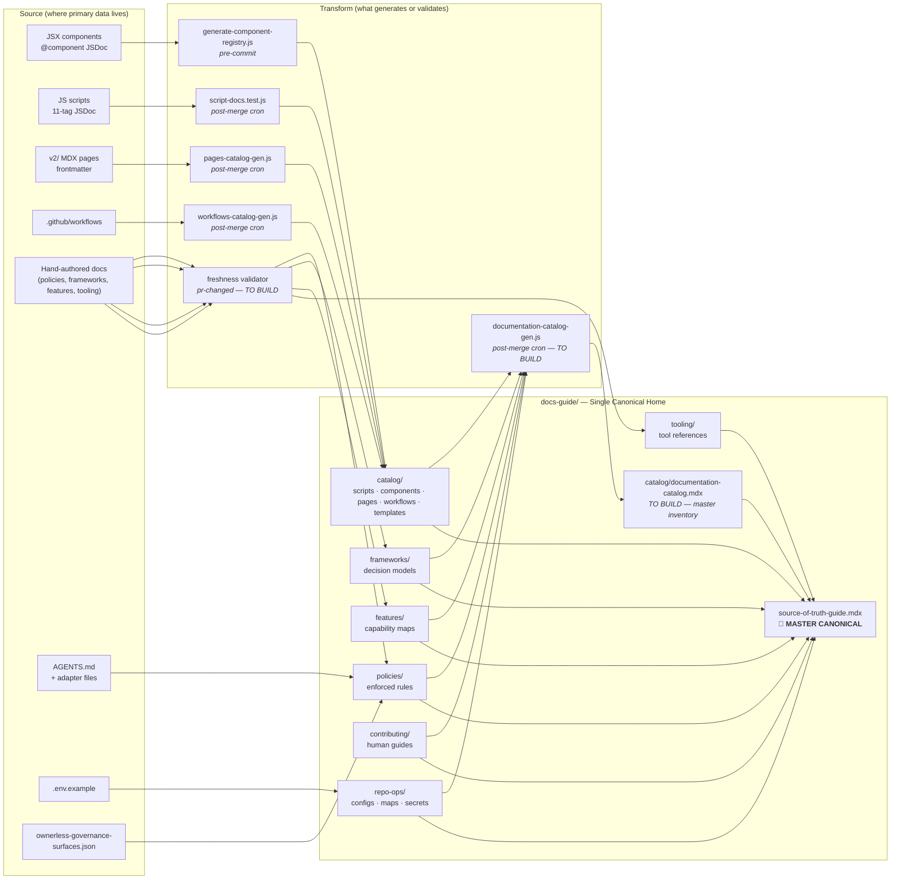

> This file is archived. See `design-plan-v2.md` for the current version (all design decisions resolved, full taxonomy locked).

---
title: Documentation Governance — Design Plan
status: draft — co-creation in progress
created: 2026-03-22
---

# Documentation Governance — Design Plan

> **Design goal**: Make `docs-guide/` the single canonical home for all repo governance documentation — every concern, every file type — with one master entry point that surfaces everything and reveals integration gaps.

---

## Part 0: The Design Challenge

The repo currently has governance documentation scattered in 7+ locations with no unified ownership model. Scripts governance knows where script docs live. Component governance knows where component docs live. But there is no single answer to: "where do I find the canonical documentation for X?" and no model that ensures every doc surface stays current.

This plan designs a **holistic documentation governance layer** — not a new folder or a new script, but a model that sits on top of everything else and declares: where canonical docs live, what produces them, and how we know they're current.

**The answer to "where do canonical docs live?" must always be: `docs-guide/`.**
External tools (AGENTS.md, .env.example, .github/workflows) stay where they are functionally. Their DOCUMENTATION lives in docs-guide.

---

## Part 1: docs-guide as the Single Canonical Home

### Current docs-guide structure

```
<!-- REVIEW: FEELS LIKE JSON FILES ARE CONFIG AND SHOULD BE IN A CONFIG FILE NOT ROOT -->
docs-guide/
├── source-of-truth-guide.mdx       ← master entry (exists — needs strengthening)
├── docs-glossary.md                 ← internal terminology
├── component-registry.json          ← machine-readable (at root — needs a home)
├── component-registry-schema.json
├── component-usage-map.json
│
<!-- REVIEW: NEED HOMOGENOUS NAMING CONVENTION (should be prefixed by concern) -->
├── catalog/        ← GENERATED inventories (good — keep)
│   ├── scripts-catalog.mdx
│   ├── components-catalog.mdx
│   ├── pages-catalog.mdx
│   ├── workflows-catalog.mdx
│   ├── templates-catalog.mdx
│   ├── ui-templates.mdx
│   ├── ai-companion-manifest.json   ← out of place? should be in catalog/
│   └── ai-companion-schema.json
│
<!-- REVIEW: SUB-FOLDERS BY CONCERN, are these canonical? I think we should combine policy and framworks possibly (flag to think about) -->
├── policies/       ← ENFORCED RULES — 16 files, multiple concerns mixed
<!-- REVIEW: are these CANONICAL ? -->
├── frameworks/     ← DECISION MODELS — 5 files
<!-- FEATURES IS THE HUMAN READABLE SECTION: MUST HAVE A NARRATIVE MARKETING FOCUSSED PROSE - should develop clear templates for these to use. -->
├── features/       ← CAPABILITY MAPS — 7 files
<!-- REVIEW: Hmm tooling is kind of a concern... or helper for the repo - not sure it dserves a top level folder (flag for later though - it may) -->
├── tooling/        ← TOOL REFERENCES — mixed MDX + .md templates
<!-- USER FACING - ESSENTIAL THIS IS CORRECT - BUT SHOULD BE THE OVERALL OWNERLESS REPO CONTRIBUTION GUIDE, WITH SUMMARY OF TOOLS, FEATURES, USING PRs, ISSUES, CONTRIBUTING. MUST BE CONCISE AND EASY -->
├── contributing/   ← CONTRIBUTOR GUIDES — 2 files
<!-- REVIEW: here's our config file.. rename to /config? -> houses config jsons, secrets setup (also needs to be surfaced to contibuting), / maps,  references? possible sub-folders? -->
└── repo-ops/       ← OPERATIONAL CONFIG — config/, maps/, secrets/ subfolders
```

**Problem**: The folder structure organises by **doc type** (policies/frameworks/features) — but docs governance also needs to be navigable by **concern** (components/scripts/content/ai/governance). A policy about components and a policy about scripts both live in `policies/` with no concern separation.

### Two structural options — needs co-design decision

**Option A: Keep doc-type folders, add concern as metadata**

- Keep `policies/`, `frameworks/`, `features/`, `catalog/`
- Add `concern` frontmatter field to every page: `components`, `scripts`, `content`, `ai`, `governance`
- Agent and catalog queries use `concern` to find all docs about a topic
- No refactor of existing folder structure

**Option B: Reorganise docs-guide by concern, doc-type as sub-level**

```
docs-guide/
├── source-of-truth-guide.mdx        ← master canonical
├── governance/                       ← concern: repo structure + enforcement
│   ├── policies/
│   └── frameworks/
├── components/                       ← concern: component library
├── scripts/                          ← concern: script taxonomy
├── content/                          ← concern: v2/ pages and content
├── ai/                               ← concern: AI tools + agent rules
├── contributing/
└── catalog/
```

- Clearer for agents navigating by concern
- Large refactor — all links, references, and nav need updating
- **Blocks Phase 3 significantly**

**Proposed direction**: Option A to start (additive, no breakage), with a clear path to Option B restructure once the model is proven. Flag for co-design decision ← **D1**

---

## Part 2: Source → Canonical Flow

Every documentation item in this repo flows from a source, through a transform (or directly), into a canonical location in docs-guide. This diagram shows the complete model.



### Reading the diagram

- **Left column (Source)**: where the primary data lives — functional files, hand-authored docs, adapter files
- **Middle column (Transform)**: what processes source data into canonical outputs (scripts for generated; freshness validators for hand-maintained)
- **Right column (docs-guide/)**: where the canonical docs live — all roads lead here
- **MASTER CANONICAL** (`source-of-truth-guide.mdx`): aggregates all sections; the single place to start for any concern
- **documentation-catalog.mdx** (to build): machine-readable inventory of all doc surfaces; feeds the master canonical; reveals gaps

---

## Part 3: Concern Mapping

Which docs-guide sections cover which concerns?

| docs-guide section | Primary concern                     | What lives here                                                      |
| ------------------ | ----------------------------------- | -------------------------------------------------------------------- |
| `policies/`        | governance, components, scripts, ai | Enforced contracts for all concerns — 16 pages currently mixed       |
| `frameworks/`      | content, components                 | Decision models: content-system, page-taxonomy, component-governance |
| `features/`        | governance                          | Capability and architecture maps for the repo                        |
| `tooling/`         | governance, ai                      | CLI reference, dev tools, AI tool reference, authoring templates     |
| `contributing/`    | governance, content                 | Human contributor onboarding and workflows                           |
| `repo-ops/`        | governance                          | Operational configs, enforcement maps, secrets                       |
| `catalog/`         | all                                 | Generated inventories — concern-tagged in metadata                   |

**Gap visible in this mapping**: there is no section in docs-guide that clearly "owns" scripts concern or AI concern as a first-class section. Scripts governance documentation is spread across `policies/script-governance.mdx` and the generated `catalog/scripts-catalog.mdx`. AI documentation is split between `policies/agent-governance-framework.mdx`, `tooling/ai-tools.mdx`, and `features/ai-features.mdx`.

**Design question**: Should each concern get its own section in docs-guide? ← **D2**

---

## Part 4: Master-Canonical Design

`source-of-truth-guide.mdx` already exists and serves as the entry point. It has:

- Source-of-truth model (what is canonical for what)
- Section Routes table (links to all sections)
- Frameworks vs Policies distinction
- Update rules (which commands to run)

**What it currently lacks** (integration gaps this plan reveals):

- No coverage of `repo-ops/` in Section Routes (recently added folder, not linked)
- No reference to AI adapter files (AGENTS.md, .claude/, .cursor/) as documentation surfaces
- No mention of `.env.example` as a documentation item
- No link to `documentation-catalog.mdx` (doesn't exist yet)
- Section Routes links by location but not by concern — agent can't answer "what governs scripts?"
- No freshness status (when was each section last verified?)

**Proposed additions to `source-of-truth-guide.mdx`**:

1. Add repo-ops/ to Section Routes
2. Add AI Adapter Files as a section (AGENTS.md, adapter files — their docs live in policies/agent-governance-framework.mdx)
3. Add `.env.example` under Repo Ops
4. Add Concern Navigation table: "Looking for docs about scripts? → here. AI? → here. Components? → here."
5. Link to `documentation-catalog.mdx` once built as the machine-readable version

**The documentation-catalog.mdx** (to be built) is the **machine-readable master inventory** — every doc surface in the repo, one row each, with: path, concern, consumer, maintenance, generator, validator, status. This is what agents use programmatically; the master canonical is what humans use navigationally.

---

## Part 5: Integration Gaps

By mapping sources to canonical locations, we can see what's NOT connected:

| Surface                              | Currently                                                  | Should be                                               | Gap                                                                                            |
| ------------------------------------ | ---------------------------------------------------------- | ------------------------------------------------------- | ---------------------------------------------------------------------------------------------- |
| `AGENTS.md`                          | Root — no docs-guide entry                                 | Documented in `policies/agent-governance-framework.mdx` | Partially there — needs consumer/maintenance frontmatter; needs to be in documentation-catalog |
| `.claude/CLAUDE.md` + adapter files  | System-specific locations — no docs-guide entry            | Documented in `policies/agent-governance-framework.mdx` | No explicit documentation page for adapter file contracts                                      |
| `.env.example`                       | Root — no docs-guide entry                                 | Documented in `repo-ops/secrets/`                       | `solutions-secrets.mdx` exists in repo-ops/secrets/ — scope unclear                            |
| `ownerless-governance-surfaces.json` | `tools/config/` — no docs-guide entry                      | Documented in `policies/ownerless-governance.mdx`       | Partially there — ownerless-governance.mdx exists; catalog entry missing                       |
| `component-registry.json` et al.     | `docs-guide/` root — no section                            | Should be in `repo-ops/` or `catalog/`                  | Loose JSON files at docs-guide root — no clear home                                            |
| AI companion files                   | `docs-guide/catalog/` (ai-companion-manifest.json, schema) | Should have a canonical MDX doc explaining them         | JSON only — no human/agent-readable explanation of what these are                              |
| `v2/resources/documentation-guide/`  | Public surface — 18 pages                                  | Should cross-reference docs-guide counterparts          | No declared relationship to docs-guide pages                                                   |

---

## Part 6: Open Design Decisions

These decisions must be made (co-design, human approves) before any execution phase.

| #   | Decision                                                                                             | Options                                                                                   | Blocks                          |
| --- | ---------------------------------------------------------------------------------------------------- | ----------------------------------------------------------------------------------------- | ------------------------------- |
| D1  | docs-guide folder structure: keep doc-type or reorganise by concern?                                 | A: keep + add concern metadata / B: restructure by concern                                | Phase 3A (frontmatter rollout)  |
| D2  | Should each concern get its own top-level section in docs-guide?                                     | Yes (restructure) / No (metadata-only) / Hybrid (new concern index pages, no folder move) | D1                              |
| D3  | Where do `component-registry.json` and sibling JSON files live?                                      | Keep at docs-guide root / Move to `docs-guide/catalog/` / Move to `tools/config/`         | Phase 5A ownerless registration |
| D4  | What is the relationship between `documentation-catalog.mdx` and `source-of-truth-guide.mdx`?        | Same page (expanded) / Two separate files — catalog is machine, guide is human            | Phase 3B                        |
| D5  | Should JSON files carry `_meta` governance key, or is catalog-only sufficient?                       | `_meta` first-key / Catalog-only                                                          | Phase 3B (catalog design)       |
| D6  | Should AI adapter files have YAML frontmatter governance fields?                                     | Yes (test required) / No (catalog-only)                                                   | Phase 3A (frontmatter rollout)  |
| D7  | What governs `docs-guide/tooling/content-brief-template.md` and similar `.md` templates in tooling/? | Same spec as MDX pages / Different spec (non-Mintlify, no consumer/maintenance required)  | Phase 3A                        |

---

## Part 7: Concern Documentation Processes

For each concern, the complete "what produces documentation, where does it live, what maintains it" model:

### Concern: Scripts

| Layer             | What                                                                                            | Path                                                 |
| ----------------- | ----------------------------------------------------------------------------------------------- | ---------------------------------------------------- |
| Source            | 11-tag JSDoc in each `.js` file                                                                 | `operations/scripts/**/*.js`                         |
| Transform         | `script-docs.test.js`                                                                           | `operations/tests/unit/`                             |
| Generated outputs | `script-index.md` × 9 + `scripts-catalog.mdx` + `script-registry.json`                          | `operations/scripts/<type>/` + `docs-guide/catalog/` |
| Governance policy | `script-governance.mdx`                                                                         | `docs-guide/policies/`                               |
| Master entry      | `source-of-truth-guide.mdx` → catalog/                                                          | `docs-guide/`                                        |
| Gate              | post-merge cron (`governance-sync.yml`)                                                         | `.github/workflows/`                                 |
| Gap               | No `concern` frontmatter on `scripts-catalog.mdx`; no freshness gate on `script-governance.mdx` | —                                                    |

### Concern: Components

| Layer                       | What                                                                                               | Path                                                |
| --------------------------- | -------------------------------------------------------------------------------------------------- | --------------------------------------------------- |
| Source                      | 7-field JSDoc in each `.jsx` file                                                                  | `snippets/components/**/*.jsx`                      |
| Transform                   | `generate-component-registry.js`                                                                   | `operations/scripts/generators/components/library/` |
| Generated outputs           | `component-registry.json` + schema + usage-map + `components-catalog.mdx`                          | `docs-guide/` root + `docs-guide/catalog/`          |
| Governance policy/framework | `component-governance.mdx`, `component-framework-canonical.mdx`                                    | `docs-guide/frameworks/`                            |
| Layout decisions            | `component-layout-decisions.mdx`                                                                   | `docs-guide/policies/`                              |
| Master entry                | `source-of-truth-guide.mdx` → catalog/                                                             | `docs-guide/`                                       |
| Gate                        | pre-commit (registry generation) + post-merge (catalog)                                            | —                                                   |
| Gap                         | JSON files at docs-guide root have no clear section home; AI companion manifest/schema unexplained | —                                                   |

### Concern: Content (v2/ pages)

| Layer                  | What                                                                                 | Path                                            |
| ---------------------- | ------------------------------------------------------------------------------------ | ----------------------------------------------- |
| Source                 | frontmatter in v2/ MDX pages                                                         | `v2/**/*.mdx`                                   |
| Transform              | pages-catalog-gen.js                                                                 | `tools/scripts/generators/governance/catalogs/` |
| Generated outputs      | `pages-catalog.mdx`                                                                  | `docs-guide/catalog/`                           |
| Governance framework   | `content-system.mdx`, `page-taxonomy-framework.mdx`                                  | `docs-guide/frameworks/`                        |
| Snippets/assets policy | `snippets-assets-policy.mdx`                                                         | `docs-guide/policies/`                          |
| Master entry           | `source-of-truth-guide.mdx` → frameworks/ + catalog/                                 | `docs-guide/`                                   |
| Gate                   | `pr-changed` (frontmatter validator)                                                 | CI                                              |
| Gap                    | `page-taxonomy-framework.mdx` needs updating after CONTENT-WRITING Phase 1 decisions | —                                               |

### Concern: AI (agents + tools)

| Layer                | What                                                                                | Path                                |
| -------------------- | ----------------------------------------------------------------------------------- | ----------------------------------- |
| Source               | `AGENTS.md` + adapter files in `.claude/`, `.cursor/`, `.windsurf/`, `.augment/`    | repo root + system folders          |
| Transform            | hand-maintained + adapter parity check (to build)                                   | —                                   |
| Generated outputs    | none currently                                                                      | —                                   |
| Governance policy    | `agent-governance-framework.mdx`, `skill-pipeline-map.mdx`                          | `docs-guide/policies/`              |
| Tool reference       | `ai-tools.mdx`                                                                      | `docs-guide/tooling/`               |
| Feature map          | `ai-features.mdx`                                                                   | `docs-guide/features/` (stub)       |
| AI companion catalog | `ai-companion-manifest.json`, `ai-companion-schema.json`                            | `docs-guide/catalog/` (unexplained) |
| Master entry         | `source-of-truth-guide.mdx` → policies/ + tooling/                                  | `docs-guide/`                       |
| Gate                 | none currently                                                                      | —                                   |
| Gap                  | No adapter parity validator; `ai-features.mdx` stub; AI companion files unexplained | —                                   |

### Concern: Governance (repo structure + enforcement)

| Layer                      | What                                                                                               | Path                                                |
| -------------------------- | -------------------------------------------------------------------------------------------------- | --------------------------------------------------- |
| Source                     | hand-authored policies, ownerless manifest, quality gate configs                                   | `docs-guide/policies/`, `tools/config/`             |
| Transform                  | governance-pipeline.js                                                                             | `operations/scripts/dispatch/governance/pipelines/` |
| Generated outputs          | freshness reports, audit outputs                                                                   | `workspace/reports/`                                |
| Master governance policies | quality-gates, ownerless-governance, v2-folder-governance, root-allowlist, etc.                    | `docs-guide/policies/`                              |
| Feature maps               | `feature-map.mdx`, `architecture-map.mdx`, `automations.mdx`                                       | `docs-guide/features/`                              |
| Operational config         | repo-config-map, enforcement-map, solutions-secrets                                                | `docs-guide/repo-ops/`                              |
| Master entry               | `source-of-truth-guide.mdx` → policies/ + features/ + repo-ops/                                    | `docs-guide/`                                       |
| Gate                       | `pre-commit` (syntax), `pr-changed` (naming), `post-merge` (cron)                                  | —                                                   |
| Gap                        | `repo-ops/` not in source-of-truth-guide Section Routes; `documentation-catalog.mdx` doesn't exist | —                                                   |

---

## Part 8: Phase Plan (high-level)

> Full execution phases are in `plan.md`. This is the design-level sequence.

```
Design phase (THIS DOCUMENT — co-create before executing):
  ├── D1: Decide folder structure approach (concern metadata vs restructure)
  ├── D2: Decide concern section design
  ├── D3: Decide component JSON file home
  ├── D4: Decide documentation-catalog vs source-of-truth-guide relationship
  ├── D5: Decide JSON _meta approach
  ├── D6: Decide adapter file frontmatter
  └── D7: Decide tooling template spec
  ↓ Design frozen → plan.md Phase 1 gate

Execution phase (plan.md phases 2–8):
  ├── Phase 2: Immediate fixes (no coordination needed — safe)
  ├── Phase 3: Inventory application (consumer + maintenance frontmatter rollout)
  ├── Phase 4: Structural remediation (D3 move + contributing consolidation)
  ├── Phase 5: Validator + ownerless coverage
  ├── Phase 6: Public surface sync (v2/resources/documentation-guide/)
  ├── Phase 7: Governance doc output (documentation-governance-policy.mdx)
  └── Phase 8: Handoffs + plan closure
```

---

## Part 9: Testing & Iteration

### Core tests (validate governance model is enforced, not just documented)

| Test                           | What it checks                                                                     | When           |
| ------------------------------ | ---------------------------------------------------------------------------------- | -------------- |
| Frontmatter coverage           | Every `docs-guide/*.mdx` has `consumer`, `maintenance`, `status` with valid values | After Phase 3A |
| Generated files current        | Generated catalogs match source data                                               | After Phase 3B |
| Ownerless surface reachability | Every manifest `canonical_sources` path exists                                     | After Phase 5A |
| Adapter parity                 | All critical AGENTS.md rules exist in `.claude/CLAUDE.md`                          | After Phase 5B |
| Master canonical completeness  | `source-of-truth-guide.mdx` links to every docs-guide section                      | After Phase 4  |

### Agent behaviour test (manual)

After Phase 3, open a fresh session and ask:

- "Where is the canonical source for component governance?" → expect navigation to `docs-guide/frameworks/component-governance.mdx`
- "What scripts are available for content auditing?" → expect navigation to `catalog/scripts-catalog.mdx` filtered by concern:content, type:audit
- "Where do I find secrets documentation?" → expect navigation to `docs-guide/repo-ops/secrets/`

If agent can't navigate correctly → the concern metadata or master-canonical links are insufficient. Fix, retest.

### Iteration protocol

1. Run tests after each phase gate — before proceeding to next phase
2. Failures → root cause only (no retrying same approach)
3. Agent test failures → metadata or canonical link problem — fix the doc, not the agent
4. False positive freshness gates → adjust threshold; document why

---

## Appendix: Files Needing Design-Level Decisions

| File                                            | Current state                             | Design question                                                       |
| ----------------------------------------------- | ----------------------------------------- | --------------------------------------------------------------------- |
| `docs-guide/source-of-truth-guide.mdx`          | Exists — good structure, some gaps        | Add: repo-ops section, concern navigation, documentation-catalog link |
| `docs-guide/catalog/documentation-catalog.mdx`  | Does not exist                            | What is the schema? One row per file or one row per concern?          |
| `docs-guide/component-registry.json` et al.     | At docs-guide root                        | Move to catalog/ or repo-ops/ or tools/config/? (D3)                  |
| `docs-guide/catalog/ai-companion-manifest.json` | Unexplained in any docs                   | Needs a canonical MDX doc explaining its purpose and consumers        |
| `docs-guide/repo-ops/`                          | Exists — not in source-of-truth-guide nav | Add to Section Routes; clarify what lives here vs policies/           |
