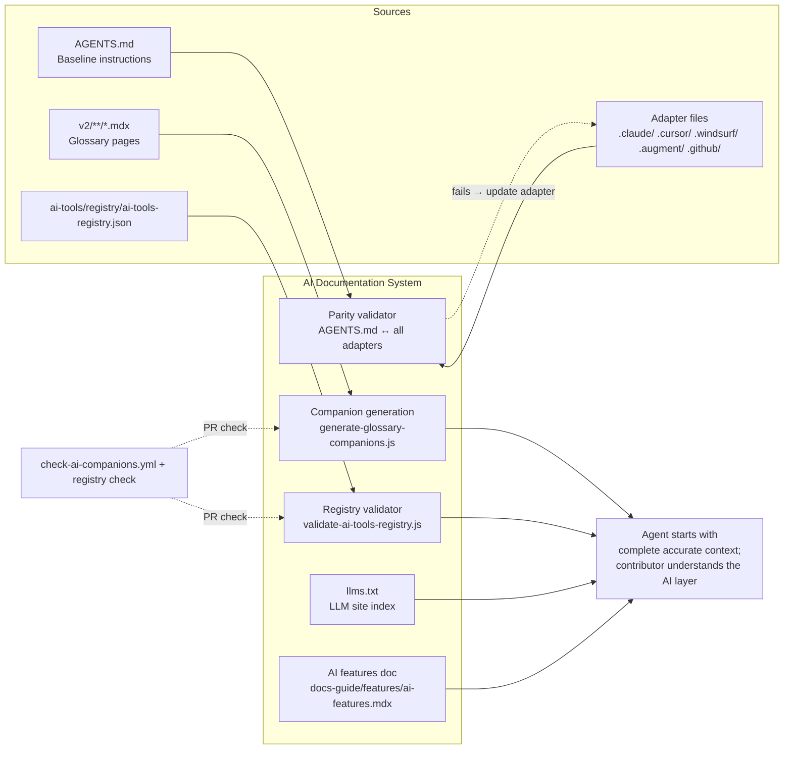

# AI

> **What it is**: The AI agent documentation and governance system — so any AI agent working in this repo starts from accurate, complete instructions, has per-page context companions where they exist, and can enumerate available AI tools without reading every file.

---

## What This System Does

Every AI agent that opens this repo reads `AGENTS.md` first, then their adapter file. They get: the complete set of repo rules, which context sources to read in which order, safety constraints, and git behavior. For pages they're working on, they have companion JSON files with pre-extracted glossary and page context. The AI tools registry gives them a machine-readable index of what skills, templates, and agent packs are available. Documentation for the AI layer itself (what AI capabilities the system has) is current and accessible to contributors who need to extend or understand it.

---

## When the System Is Working

| Signal | What it tells you |
|---|---|
| `check-ai-companions.yml` passes on every PR | Companions are current and manifest is consistent |
| All adapter files cover the same core rules as `AGENTS.md` | No agent is operating on stale instructions |
| `validate-ai-tools-registry.js --check` exits 0 | Registry is complete and valid |
| `docs-guide/features/ai-features.mdx` has `status: current` | Contributors can understand the AI layer |
| `llms.txt` exists at the standard path | LLM crawlers have a site index |

---

## System Architecture — Completed State

---

## The System

---

## ① Baseline + Adapter Parity

`AGENTS.md` is the single baseline. Every adapter file covers the same core rules. Drift is caught at PR time.

<AccordionGroup>

<Accordion title="🎯 Ideal State">

A parity validator reads `AGENTS.md` core rule sections and confirms each adapter file covers them. PRs that change `AGENTS.md` or any adapter file trigger the validator. No adapter can diverge from the baseline without a failing PR check.

**What this enables:** Every AI agent working in the repo operates on the same core rules, regardless of which tool they use. Rule updates in `AGENTS.md` surface as adapter drift in CI before merging.

**Quality bar:** Parity validator exits 0. All 9 adapter files pass parity check. Changing `AGENTS.md` without updating adapters fails the PR.

</Accordion>

<Accordion title="🔍 AUDIT · Current adapter coverage'>

**IN** — `AGENTS.md` core rule sections; 9 adapter files
**OUT** — Per-adapter gap report: which core rules are missing or inconsistent

**Steps**
1. ✅ Adapter locations known — `AGENTS.md` lists all 9 paths
2. ❌ Per-adapter gap analysis: read each adapter; compare against AGENTS.md sections
3. ❌ Identify missing/divergent rules per adapter

**STATUS** — 🔄 Locations known; content comparison not done

</Accordion>

<Accordion title="✏️ EXECUTION · Write adapter parity validator'>

**IN** — `AGENTS.md` structure; 9 adapter files

**OUT** — `validate-adapter-parity.js` — exits non-zero if an adapter is missing a core rule section; step in `check-ai-companions.yml`

**Steps**
1. ❌ Define: what constitutes a "core rule section" in AGENTS.md (e.g., Required Context, Safety and Git Rules, Root and Structure Governance)
2. ❌ Write validator: for each section, check each adapter file contains equivalent content
3. ❌ Add to `check-ai-companions.yml`

**STATUS** — ❌ Not started

</Accordion>

<Accordion title="📦 Outputs">

| Artefact | Path | Status | Blocks |
|---|---|---|---|
| Parity validator | new script | ❌ | — |
| Parity check step | `check-ai-companions.yml` | ❌ | — |

</Accordion>

</AccordionGroup>

---

## ② AI Companion Files

Per-page JSON companions giving agents pre-extracted context for glossary and reference pages.

<AccordionGroup>

<Accordion title="🎯 Ideal State">

All glossary pages that need companions have current `*-data.json` files. Companions regenerate automatically when their source pages change. PR check validates companions are current and manifest is consistent. Companion generation on PR branches (for preview) is considered.

**What this enables:** Agents reading specific docs pages have structured context without needing to parse MDX. Glossary lookups are fast and accurate.

**Quality bar:** `check-ai-companions.yml` passes on every PR. Companion files are regenerated within one push-to-main of their source page changes.

</Accordion>

<Accordion title="📦 Outputs">

| Artefact | Path | Status | Blocks |
|---|---|---|---|
| Glossary companions | `v2/**/*-data.json` | ✅ CI-generated | — |
| Companion check | `check-ai-companions.yml` | ✅ active | — |
| Generation workflow | `generate-ai-companions.yml` | ✅ active | — |

</Accordion>

</AccordionGroup>

---

## ③ AI Tools Registry

A validated, current machine-readable inventory of all AI tools, skills, templates, and agent packs.

<AccordionGroup>

<Accordion title="🎯 Ideal State">

`ai-tools-registry.json` is validated by `validate-ai-tools-registry.js --check` on every PR that touches `ai-tools/`. The registry is complete: all artifacts in `ai-tools/` are present with correct lane assignments. `rollout_state` in `ownerless-governance-surfaces.json` is updated from `migrating` to `active`. An inventory report is generated from the registry on every validation run.

**What this enables:** Agents can enumerate available AI tools from one validated source. Registry completeness is enforced, not just aspirational.

**Quality bar:** `validate-ai-tools-registry.js --check` exits 0 on every PR touching `ai-tools/`. Zero entries with missing lane assignments.

</Accordion>

<Accordion title="✏️ EXECUTION · Wire registry validation to CI'>

**IN** — `validate-ai-tools-registry.js`; `check-ai-companions.yml`

**OUT** — Registry validation runs on every PR that changes `ai-tools/`

**Steps**
1. ❌ Add `validate-ai-tools-registry.js --check` to `check-ai-companions.yml`
2. ❌ Add path filter: `ai-tools/**` changes trigger check
3. ❌ Update `ownerless-governance-surfaces.json` `rollout_state` to `active` after wiring

**STATUS** — ❌ Not started

</Accordion>

<Accordion title="📦 Outputs">

| Artefact | Path | Status | Blocks |
|---|---|---|---|
| Registry | `ai-tools/registry/ai-tools-registry.json` | 🔄 exists, manual validation only | — |
| Validation step | `check-ai-companions.yml` | ❌ | — |
| Inventory report | `ai-tools/registry/ai-tools-inventory.md` | 🔄 manual generation | — |

</Accordion>

</AccordionGroup>

---

## ④ llms.txt

An AI-readable site index at the standard path for LLM crawlers.

<AccordionGroup>

<Accordion title="🎯 Ideal State">

`llms.txt` exists at the repo root (or standard served path). It is generated by the `generate-llms-files.yml` workflow and verified by `verify-llms-files.yml`. Contents: a structured index of published pages and their descriptions, suitable for LLM crawlers and context injection.

**What this enables:** LLM crawlers have a structured entry point to the docs. Agents bootstrapping from the repo root can find the page index immediately.

**Quality bar:** `verify-llms-files.yml` passes. `llms.txt` is current with the last navigation change.

</Accordion>

<Accordion title="🔍 AUDIT · Current llms.txt status'>

**IN** — `generate-llms-files.yml`; `verify-llms-files.yml`; repo root
**OUT** — Does `llms.txt` exist? Is the workflow wired and running?

**Steps**
1. ❌ Check if `llms.txt` exists at the expected path
2. ❌ Check if `generate-llms-files.yml` has a trigger condition and has run recently
3. ❌ Check what `verify-llms-files.yml` validates and whether it passes

**STATUS** — ❌ Not started — workflows exist but llms.txt status unknown from this audit

</Accordion>

<Accordion title="📦 Outputs">

| Artefact | Path | Status | Blocks |
|---|---|---|---|
| llms.txt | repo root or standard path | ❓ unknown | — |

</Accordion>

</AccordionGroup>

---

## ⑤ AI Features Documentation

The contributor-facing description of what AI capabilities the docs system has.

<AccordionGroup>

<Accordion title="🎯 Ideal State">

`docs-guide/features/ai-features.mdx` is complete and current. It describes: companion file pipeline, glossary generation, adapter model, skills system, registry, and how contributors can add or extend AI capabilities. No TODO placeholders. Status: current.

**What this enables:** Contributors who need to understand or extend the AI layer have a starting point. New contributors understand what AI features exist without reading code.

**Quality bar:** `status: current`. Zero TODO placeholders. All AI system components described.

</Accordion>

<Accordion title="✏️ EXECUTION · Complete ai-features.mdx'>

**IN** — Existing draft content; AI companion pipeline; adapter model; registry; skills system

**OUT** — `docs-guide/features/ai-features.mdx` with `status: current`

**Steps**
1. ❌ Remove all TODO placeholders
2. ❌ Add: companion generation pipeline (how it works, what it produces)
3. ❌ Add: adapter model (AGENTS.md → adapters; parity contract)
4. ❌ Add: skills system (ai-tools/, lanes, how to add a skill)
5. ❌ Add: registry (how to find available AI tools)
6. ❌ Set `status: current`, `lastVerified: today`

**STATUS** — ❌ Not started

</Accordion>

<Accordion title="📦 Outputs">

| Artefact | Path | Status | Blocks |
|---|---|---|---|
| AI features doc | `docs-guide/features/ai-features.mdx` | 🔄 draft/stub | — |

</Accordion>

</AccordionGroup>

---

## Completion Status

| System part | Status | Immediate blocker |
|---|---|---|
| ① Baseline + Adapter Parity | 🔄 Audit needed | Parity validator not written |
| ② AI Companion Files | ✅ Complete | — |
| ③ AI Tools Registry | 🔄 Exists, manual validation | Wire to CI |
| ④ llms.txt | ❓ Unknown | Audit needed |
| ⑤ AI Features Documentation | 🔄 Draft/stub | Content writing needed |

---

## Already Done

| What | Where | Change |
|---|---|---|
| Companion generation CI | `generate-ai-companions.yml` | Active; push→main |
| Companion PR check | `check-ai-companions.yml` | Active |
| AGENTS.md baseline | `AGENTS.md` | Active; lists all adapter locations |
| Registry + schema | `ai-tools/registry/` | Exists; manual validation |
| Governance policy | `docs-guide/policies/agent-governance-framework.mdx` | Active |
