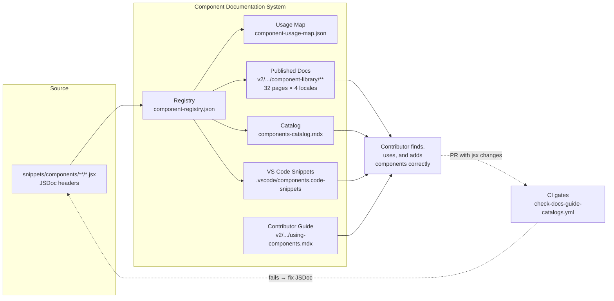

# Components

> **What it is**: The custom JSX component library system — so a contributor can instantly find what components exist, know how to use them on a page, add a new one correctly, and trust that the catalog reflects reality.

---

## What This System Does

A contributor opens a docs page, needs a layout element, and has three questions: what's available, how do I use it, and is there something purpose-built for this? The component system answers all three: a searchable registry of 117+ components (with live status), published usage docs per component, VS Code snippets for in-editor insertion, and JSDoc headers in each source file that drive all downstream generation. CI keeps every layer in sync. When a component is added or changed, the registry, published docs, catalog, and snippets regenerate automatically.

---

## When the System Is Working

| Signal | What it tells you |
|---|---|
| `component-registry.json` `_meta.generated` is within 24h of last jsx commit | Registry is current |
| `check-docs-guide-catalogs.yml` passes on every PR | No catalog drift reaching main |
| A contributor can find any component in `components-catalog.mdx` by name in under 10 seconds | Catalog is usable |
| `component-usage-map.json` has 0 orphaned components | No dead code in the library |
| All 32 v2 component library pages have a correct banner path | Generation pipeline is clean |

---

## System Architecture — Completed State

---

## The System

---

## ① Source Layer — JSDoc in Components

Every component has a machine-readable header that is the single source of truth for its name, status, description, usage, and category.

<AccordionGroup>

<Accordion title="🎯 Ideal State">

Every `.jsx` file in `snippets/components/` has a complete JSDoc header with all required fields. The registry generator reads only JSDoc — no manual config, no fallback values. Status, description, and category are all populated and correct.

**What this enables:** Every downstream artifact (registry, catalog, published docs, snippets) can be generated from source without human intervention.

**Quality bar:** `generate-component-registry.js --validate-only` exits 0. Zero components with `status: unknown` or missing `description`.

</Accordion>

<Accordion title="🔍 AUDIT · Current JSDoc completeness">

**IN** — All `.jsx` files in `snippets/components/`
**OUT** — Count of components with complete vs incomplete headers; list of missing fields per component

**Steps**
1. ✅ 117 components inventoried — `audit-components.md`
2. ✅ 15 orphaned (unused) identified
3. ✅ 25 with `usedIn` JSDoc drift identified
4. ❌ Per-component gap list: which specific fields are missing in which files

**STATUS** — 🔄 Partial — aggregate numbers known, per-file gap list not generated

</Accordion>

<Accordion title="🎨 DESIGN · Status enum definition">

**IN** — Current registry values (`stable`, `experimental`, `planned`); catalog display values (`⬜ Placeholder`)

**OUT** — `tools/config/component-status-enum.json` — canonical enum with display strings, icons, and descriptions

**Steps**
1. ❌ Decide: 4 values or 5? (`planned` vs `placeholder` — are they the same?)
2. ❌ Write `tools/config/component-status-enum.json` with display representations
3. ❌ Update generator template + catalog template to reference it

**STATUS** — ❌ Not started

</Accordion>

<Accordion title="📦 Outputs">

| Artefact | Path | Status | Blocks |
|---|---|---|---|
| JSDoc headers (all components) | `snippets/components/**/*.jsx` | 🔄 117 exist; completeness varies | ① all downstream |
| Status enum | `tools/config/component-status-enum.json` | ❌ | ③ Catalog, ④ Published Docs |

</Accordion>

</AccordionGroup>

---

## ② Registry

Machine-readable inventory of all components, regenerated by CI when source changes.

<AccordionGroup>

<Accordion title="🎯 Ideal State">

`component-registry.json` is always current with the source `.jsx` files. It has a `_meta` block with a `generated` timestamp, `scriptVersion`, and `componentCount`. The registry is the single query surface for any tooling that needs component metadata.

**What this enables:** Catalog, published docs, snippets, usage-map, and health checks all derive from one file — no manual updates needed.

**Quality bar:** `_meta.generated` timestamp is within one push of the last jsx change. `--validate-only` exits 0 on every PR.

</Accordion>

<Accordion title="✏️ EXECUTION · Add `_meta` block to registry generator">

**IN** — `generate-component-registry.js` current source

**OUT** — Registry output includes `_meta.generated`, `_meta.generator`, `_meta.componentCount`

**Steps**
1. ❌ Add `_meta` block to generator output
2. ❌ Confirm `--validate-only` reads `_meta.generated` for freshness check

**STATUS** — ❌ Not started

</Accordion>

<Accordion title="📦 Outputs">

| Artefact | Path | Status | Blocks |
|---|---|---|---|
| Component registry | `docs-guide/config/component-registry.json` | ✅ CI-regenerated | — |
| Registry schema | `docs-guide/config/component-registry-schema.json` | ✅ | — |
| `_meta` timestamp | in registry | ❌ | Freshness detection |
| Usage map | `docs-guide/config/component-usage-map.json` | 🔄 exists, no CI trigger | ③ Catalog audit section |

</Accordion>

</AccordionGroup>

---

## ③ Catalog

Internal governance catalog showing all components by category, status, and usage.

<AccordionGroup>

<Accordion title="🎯 Ideal State">

`components-catalog.mdx` is auto-regenerated at pre-commit when jsx files change. It shows all 117+ components by category with status icons, descriptions, and a usage column. The audit section lists orphaned components and JSDoc drift. A contributor auditing the library has everything in one page.

**What this enables:** Orphan detection, JSDoc drift surfacing, status distribution at a glance — without running any scripts.

**Quality bar:** Catalog reflects current registry within one commit cycle. Zero manually maintained content.

</Accordion>

<Accordion title="✏️ EXECUTION · Wire catalog to pre-commit">

**IN** — `generate-docs-guide-components-index.js` with `--fix` flag; pre-commit hook

**OUT** — Pre-commit regenerates catalog when `snippets/components/` is in the staged diff; exits-if-no-diff

**Steps**
1. ❌ Add exit-if-no-diff guard to pre-commit for jsx staged changes
2. ❌ Confirm `--fix` mode idempotent

**STATUS** — ❌ Not started

</Accordion>

<Accordion title="📦 Outputs">

| Artefact | Path | Status | Blocks |
|---|---|---|---|
| Components catalog | `docs-guide/catalog/components-catalog.mdx` | 🔄 exists, manual trigger only | — |

</Accordion>

</AccordionGroup>

---

## ④ Published Component Docs

32 generated v2 pages (8 categories × 4 locales) — the public-facing component reference.

<AccordionGroup>

<Accordion title="🎯 Ideal State">

All 32 v2 component library pages have correct banner paths, up-to-date component data, and accurate prop tables. The cascade (jsx change → registry → published docs) is fully automated and completes within one CI run after a push to main.

**What this enables:** Contributors and users can look up any component on the live docs site and get accurate usage information.

**Quality bar:** All banners reference the correct script path. `generate-component-docs.js --check` exits 0 on every PR. No component page is more than one push-to-main behind source.

</Accordion>

<Accordion title="✏️ EXECUTION · Fix stale banner path">

**IN** — `generate-component-docs.js` generator template string

**OUT** — All 32 v2 pages auto-fix on next CI generation run

**Steps**
1. ❌ Update banner template in `generate-component-docs.js`: `operations/scripts/generate-component-docs.js` → `operations/scripts/generators/components/documentation/generate-component-docs.js`
2. ❌ Trigger `workflow_dispatch` or wait for next jsx push to propagate fix

**STATUS** — ❌ Not started

</Accordion>

<Accordion title="✏️ EXECUTION · Resolve auto-commit race condition">

**IN** — `generate-component-registry.yml` + `generate-docs-guide-catalogs.yml`

**OUT** — One sequential workflow that runs registry → docs → catalog in order; no competing commits

**Steps**
1. ❌ Merge both workflows into one job with sequential steps
2. ❌ Remove separate `generate-component-registry.yml` trigger or make it a reusable workflow

**STATUS** — ❌ Not started

</Accordion>

<Accordion title="📦 Outputs">

| Artefact | Path | Status | Blocks |
|---|---|---|---|
| Published docs (en) | `v2/resources/documentation-guide/component-library/*.mdx` (8) | 🔄 exist, stale banner | — |
| Published docs (es/fr/cn) | `v2/{es,fr,cn}/resources/.../component-library/*.mdx` (24) | 🔄 same | — |

</Accordion>

</AccordionGroup>

---

## ⑤ Contributor Guide

How to find, import, and use components when authoring a docs page.

<AccordionGroup>

<Accordion title="🎯 Ideal State">

`v2/resources/documentation-guide/using-components.mdx` exists, is in the public nav, and covers: finding components in the catalog, import syntax, 5 most-used components with examples, custom vs native Mintlify choice guide, and VS Code snippet usage.

**What this enables:** A contributor new to the component library can self-serve — no tribal knowledge required.

**Quality bar:** A contributor who has never used the custom components can add one to a page correctly after reading this guide, without asking anyone.

</Accordion>

<Accordion title="✏️ EXECUTION · Write contributor guide">

**IN** — `component-registry.json`, `dev-tools.mdx` existing snippets section, 5 most-imported components from usage map

**OUT** — `v2/resources/documentation-guide/using-components.mdx` + `docs.json` nav entry

**Steps**
1. ❌ Identify top 5 components by import frequency from `component-usage-map.json`
2. ❌ Write guide with import patterns, prop examples, custom vs native decision guide
3. ❌ Add to `docs.json` under documentation guide section

**STATUS** — ❌ Not started

</Accordion>

<Accordion title="📦 Outputs">

| Artefact | Path | Status | Blocks |
|---|---|---|---|
| Contributor guide | `v2/resources/documentation-guide/using-components.mdx` | ❌ | — |

</Accordion>

</AccordionGroup>

---

## ⑥ CI Gates

The enforcement layer that keeps all parts in sync automatically.

<AccordionGroup>

<Accordion title="🎯 Ideal State">

Every PR that touches `snippets/components/**` triggers: registry validate, component health check, component docs check, examples check. Push to main triggers: registry regeneration → docs regeneration → catalog + usage-map regeneration — all in one sequential workflow. No competing auto-commits.

**What this enables:** The component system is self-maintaining. Human review is for content, not for remembering to run generators.

**Quality bar:** `check-docs-guide-catalogs.yml` and the unified generation workflow both pass on every merge. No manual regeneration steps required in contributor workflow.

</Accordion>

<Accordion title="✏️ EXECUTION · Add usage-map to CI">

**IN** — `scan-component-imports.js`, `generate-component-registry.yml`

**OUT** — Usage map regenerated alongside registry in same workflow step

**Steps**
1. ❌ Add `scan-component-imports.js` as step 2 in `generate-component-registry.yml` (after registry generation)
2. ❌ Add usage map to `git add` and commit step

**STATUS** — ❌ Not started

</Accordion>

<Accordion title="📦 Outputs">

| Artefact | Path | Status | Blocks |
|---|---|---|---|
| PR gate | `check-docs-guide-catalogs.yml` | ✅ active | — |
| Generation workflow | `generate-component-registry.yml` + `generate-docs-guide-catalogs.yml` | 🔄 race condition | ④ Published Docs |
| Pre-commit catalog hook | `.githooks/pre-commit` | ❌ | ③ Catalog |

</Accordion>

</AccordionGroup>

---

> **This document and the plan** — Steps inside each accordion are the task base. The plan adds parallel run paths, handoff items, phase sequencing, and decision log. This canonical is the system view; the plan is the execution reality.

---

## Completion Status

| System part | Status | Immediate blocker |
|---|---|---|
| ① Source Layer — JSDoc | 🔄 In progress | Per-file gap list; status enum |
| ② Registry | 🔄 In progress | Missing `_meta` block |
| ③ Catalog | 🔄 Exists, not wired | Pre-commit hook not updated |
| ④ Published Docs | 🔄 Exists, stale path | Banner fix + race condition |
| ⑤ Contributor Guide | ❌ Not started | — |
| ⑥ CI Gates | 🔄 Partial | Race condition; usage-map not in CI |

---

## Already Done

| What | Where | Change |
|---|---|---|
| 117 components inventoried | `docs-guide/config/component-registry.json` | Auto-regenerated via CI |
| Registry schema | `docs-guide/config/component-registry-schema.json` | Auto-regenerated via CI |
| PR gate wired | `check-docs-guide-catalogs.yml` | Active on docs-v2 + main |
| Catalog page (manual) | `docs-guide/catalog/components-catalog.mdx` | Exists; not CI-wired |
