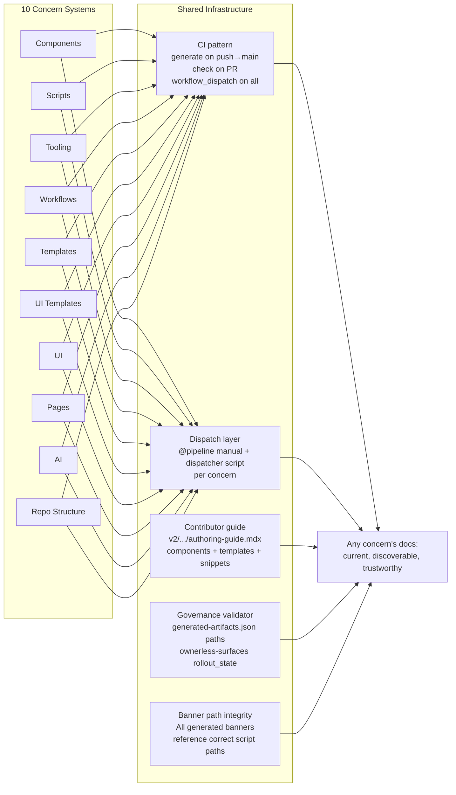

# Documentation System

> **What it is**: The cross-cutting documentation infrastructure — the shared patterns, wiring standards, and contributor surfaces that every concern's documentation system depends on to be discoverable, current, and trustworthy.

---

## What This System Does

Ten concern-specific documentation systems (components, scripts, tooling, workflows, templates, ui-templates, ui, pages, AI, repo-structure) all share infrastructure: a CI check pattern, a generation pattern, a dispatch/manual-trigger standard, contributor guide surfaces, and a governance validation layer. This master system defines and implements those shared patterns so each concern's system doesn't reinvent them. When the master system is working, adding a new concern produces documentation that is immediately discoverable, auto-generated, and protected by CI — because the infrastructure is already there.

---

## When the System Is Working

| Signal | What it tells you |
|---|---|
| Every concern's catalog has `check` and `generate` CI steps | No catalog can drift to main |
| `validate-governance-surfaces.js` exits 0 | Declared governance matches actual wiring |
| Every generate-*.yml has `workflow_dispatch:` | Any pipeline can be manually triggered |
| `v2/resources/documentation-guide/authoring-guide.mdx` exists | Contributors can self-serve all authoring questions |
| `generated-artifacts.json` and `ownerless-governance-surfaces.json` are schema-validated | Config files are correct |
| Zero stale generator paths in any generated file banner | Repair commands work when followed |

---

## System Architecture — Completed State

---

## The System

---

## ① CI Pattern Standard

Every concern's documentation pipeline has: a generate step (push→main), a check step (PR gate), and a manual trigger (`workflow_dispatch:`).

<AccordionGroup>

<Accordion title="🎯 Ideal State">

All catalog and documentation generation scripts follow a standard pattern:
- `--write` flag: generates output; used in `generate-docs-guide-catalogs.yml` (or concern-specific workflow)
- `--check` flag: validates output is current; exits non-zero if stale; used in `check-docs-guide-catalogs.yml`
- Both workflows have `workflow_dispatch:` so any pipeline can be manually triggered
- Every generate-*.yml auto-commits with `exit-if-no-diff` so no empty commits

No new generation script needs a new workflow — it adds steps to existing workflows via path filters.

**What this enables:** Adding a new concern's catalog takes one generator + two workflow steps (check + write). The pattern is clear, replicable, and consistent.

**Quality bar:** All 6+ generate scripts in `generate-docs-guide-catalogs.yml` have both `--check` and `--write` forms. All generation workflows have `workflow_dispatch:`.

</Accordion>

<Accordion title="🔍 AUDIT · Current CI coverage gaps'>

**IN** — All catalog generators; `generate-docs-guide-catalogs.yml`; `check-docs-guide-catalogs.yml`

**OUT** — Matrix: which generators have `--check`/`--write` in CI, which don't

**Steps**
1. ✅ Components: ✅ `--check` wired; ✅ `--write` wired
2. ✅ Pages: ✅ `--check` wired; ✅ `--write` wired
3. ✅ Workflows: ✅ `--check` wired; ✅ `--write` wired
4. ✅ GitHub templates: ✅ `--check` wired; ✅ `--write` wired
5. 🔄 UI templates: ❌ `--check` missing; ❌ `--write` missing
6. 🔄 Scripts: ❌ `--check` missing; ❌ `--write` missing
7. 🔄 Components catalog: ❌ `--check` missing in catalogs workflow; relies on pre-commit only
8. ❌ Tooling: no generator yet
9. ❌ `workflow_dispatch:` audit on all 43 workflows — not done

**STATUS** — 🔄 Known gaps for UI templates, scripts, components-catalog

</Accordion>

<Accordion title="✏️ EXECUTION · Wire all missing `--check` steps'>

**IN** — `check-docs-guide-catalogs.yml`; missing generators

**OUT** — All catalog generators have a `--check` step in the PR gate

**Steps**
1. ❌ Add `generate-ui-templates.js --check`
2. ❌ Add `script-docs.test.js --check`
3. ❌ Add `generate-docs-guide-components-index.js --check`
4. ❌ Add `validate-governance-surfaces.js --check` (new)
5. ❌ Add `validate-generated-artifacts.js --check` (new)

**STATUS** — ❌ Not started

</Accordion>

<Accordion title="✏️ EXECUTION · Add workflow_dispatch to all generation workflows'>

**IN** — All `generate-*.yml` workflows

**OUT** — All have `workflow_dispatch:` trigger

**Steps**
1. ❌ Audit which generation workflows are missing `workflow_dispatch:`
2. ❌ Add to each missing workflow

**STATUS** — ❌ Not started; audit needed

</Accordion>

<Accordion title="📦 Outputs">

| Artefact | Path | Status | Blocks |
|---|---|---|---|
| `check-docs-guide-catalogs.yml` (complete) | `.github/workflows/` | 🔄 missing 3+ check steps | All unchecked catalogs |
| `workflow_dispatch` on all generate-*.yml | `.github/workflows/` | 🔄 partial | Manual triggering |

</Accordion>

</AccordionGroup>

---

## ② Dispatch Layer Standard

Every concern's pipeline has a dispatcher script with `@pipeline manual → inputs → outputs` and a `workflow_dispatch:` workflow.

<AccordionGroup>

<Accordion title="🎯 Ideal State">

For every governed surface, there is a `dispatch/` type script that can run the full pipeline (validate → generate → commit-if-changed) in one command. The `repair_commands` in `ownerless-governance-surfaces.json` for each surface reference this dispatcher. The corresponding workflow has `workflow_dispatch:`. A contributor who needs to manually re-run any concern's pipeline has a single, documented command.

**What this enables:** Any pipeline can be run locally (`node dispatch/...`) or via CI (`workflow_dispatch`). No contributor needs to know the individual script sequence.

**Quality bar:** `lpd repair --surface X --write` works for all 8 surfaces. All dispatcher scripts have `@pipeline manual → ... → ...` annotation.

</Accordion>

<Accordion title="🔍 AUDIT · Current dispatcher coverage'>

**IN** — `ownerless-governance-surfaces.json` repair_commands; `operations/scripts/dispatch/` directory

**OUT** — Matrix: which surfaces have a dispatcher, which use individual scripts, which have stale paths

**Steps**
1. ✅ `script-governance` has `governance-pipeline.js` — stale path references
2. ❌ `component-governance` dispatcher coverage unknown
3. ❌ `docs-guide-generated` dispatcher coverage unknown
4. ❌ `ui-templates` dispatcher coverage unknown
5. ❌ All 8 surfaces: full dispatcher audit

**STATUS** — 🔄 One dispatcher known; full audit not done

</Accordion>

<Accordion title="✏️ EXECUTION · Ensure all 8 surfaces have dispatchers'>

**IN** — Dispatcher audit results; `operations/scripts/dispatch/` directory

**OUT** — Each surface has a dispatcher with `@pipeline manual` annotation and correct repair_commands

**Steps**
1. ❌ For each surface without a dispatcher: write or wire one
2. ❌ Update `ownerless-governance-surfaces.json` repair_commands to reference dispatchers
3. ❌ Add `workflow_dispatch:` to corresponding workflow

**STATUS** — ❌ Not started; blocked by audit

</Accordion>

<Accordion title="📦 Outputs">

| Artefact | Path | Status | Blocks |
|---|---|---|---|
| Dispatchers for all 8 surfaces | `operations/scripts/dispatch/` | 🔄 partial | Manual triggering per concern |

</Accordion>

</AccordionGroup>

---

## ③ Banner Path Integrity

All generated file banners reference correct, resolvable script paths.

<AccordionGroup>

<Accordion title="🎯 Ideal State">

No generated file has a banner or embedded comment that references a non-existent script path. A validator checks this at PR time. When a script is moved, the generator template is updated in the same PR.

**What this enables:** Contributors following a banner's "run command" always get a command that works. No one is sent to a 404 script path.

**Quality bar:** Banner path validator exits 0. Zero generated files with stale paths in production.

</Accordion>

<Accordion title="✏️ EXECUTION · Fix known stale banner paths'>

**IN** — Known stale paths from audits

**OUT** — Generator templates corrected; next generation cycle fixes output files

**Steps**
1. ❌ `generate-component-docs.js`: fix banner from `operations/scripts/generate-component-docs.js` → correct path
2. ❌ `dev-tools.mdx` Tip: fix Python script reference → correct Node.js path
3. ❌ `generated-artifacts.json`: fix all stale paths (see repo-structure canonical design ①)

**STATUS** — ❌ Not started

</Accordion>

<Accordion title="📦 Outputs">

| Artefact | Path | Status | Blocks |
|---|---|---|---|
| Corrected `generate-component-docs.js` template | generator file | ❌ | 32 published pages |
| Corrected `generated-artifacts.json` | config file | 🔄 partial | All repair commands |

</Accordion>

</AccordionGroup>

---

## ④ Contributor Authoring Guide

One published page that answers all authoring questions: components, templates, snippets, frontmatter.

<AccordionGroup>

<Accordion title="🎯 Ideal State">

`v2/resources/documentation-guide/authoring-guide.mdx` (or equivalent section structure) covers: how to use custom components, how to find and apply a page template, how to use VS Code snippets, how to fill frontmatter correctly. It is the single answer to "how do I write a docs page in this repo?"

**What this enables:** New contributors are self-sufficient. The "how do I" questions that currently require asking a team member are answered in one place.

**Quality bar:** A contributor who has never authored a docs page in this repo can set up and submit their first page without asking for help.

</Accordion>

<Accordion title="✏️ EXECUTION · Write authoring guide'>

**IN** — Components usage guide draft; template guide content; `dev-tools.mdx` snippets section; frontmatter taxonomy reference

**OUT** — `v2/resources/documentation-guide/authoring-guide.mdx` (consolidating components, templates, snippets, frontmatter) + `docs.json` nav entry

**Steps**
1. ❌ Decide: one consolidated page vs linked sub-pages (components | templates | frontmatter | snippets)
2. ❌ Write components section: find, import, use (top 5 by usage)
3. ❌ Write templates section: find, copy, fill
4. ❌ Write snippets section: VS Code snippet keys and what they insert
5. ❌ Write frontmatter section: required fields, valid values, examples
6. ❌ Add to `docs.json` nav

**STATUS** — ❌ Not started

</Accordion>

<Accordion title="📦 Outputs">

| Artefact | Path | Status | Blocks |
|---|---|---|---|
| Authoring guide | `v2/resources/documentation-guide/authoring-guide.mdx` | ❌ | — |

</Accordion>

</AccordionGroup>

---

## ⑤ Governance Validation

CI validates that declared governance state matches actual implementation.

<AccordionGroup>

<Accordion title="🎯 Ideal State">

Two validators run in `check-docs-guide-catalogs.yml`:
1. `validate-generated-artifacts.js`: every path in `generated-artifacts.json` resolves
2. `validate-governance-surfaces.js`: every `rollout_state` and `gate_layer` in `ownerless-governance-surfaces.json` matches actual CI wiring

The governance config is no longer a planning document — it is a live, validated description of what is actually implemented. When governance diverges from declaration, CI fails.

**What this enables:** The governance meta-layer self-enforces. Aspirational states cannot persist indefinitely — they are either implemented or they fail CI.

**Quality bar:** Both validators exit 0 in production. Zero `rollout_state: autofix` entries that don't have an actual autofix workflow.

</Accordion>

<Accordion title="✏️ EXECUTION · Write and wire governance validators'>

**IN** — `generated-artifacts.json`; `ownerless-governance-surfaces.json`; `.github/workflows/*.yml`; `.githooks/pre-commit`

**OUT** — Two new validators + steps in `check-docs-guide-catalogs.yml`

**Steps**
1. ❌ Write `validate-generated-artifacts.js` — checks all paths resolve
2. ❌ Write `validate-governance-surfaces.js` — checks declared state matches CI files
3. ❌ Add both to `check-docs-guide-catalogs.yml`
4. ❌ Fix all surfaces that fail validation (this will surface all Pattern 3 gaps from master audit)

**STATUS** — ❌ Not started

</Accordion>

<Accordion title="📦 Outputs">

| Artefact | Path | Status | Blocks |
|---|---|---|---|
| Artifacts validator | new script | ❌ | `generated-artifacts.json` correctness |
| Surfaces validator | new script | ❌ | All 4 surfaces with declared-but-unimplemented states |
| Validator steps | `check-docs-guide-catalogs.yml` | ❌ | — |

</Accordion>

</AccordionGroup>

---

## Completion Status

| System part | Status | Immediate blocker |
|---|---|---|
| ① CI Pattern Standard | 🔄 In progress | UI templates, scripts, components-catalog missing check steps |
| ② Dispatch Layer Standard | 🔄 Partial | Dispatcher audit needed; paths stale |
| ③ Banner Path Integrity | 🔄 Known fixes needed | Generator template edits not done |
| ④ Contributor Authoring Guide | ❌ Not started | — |
| ⑤ Governance Validation | ❌ Not started | Validators not written |

---

## Already Done

| What | Where | Change |
|---|---|---|
| Components CI (generate + check) | `generate-component-registry.yml`, `check-docs-guide-catalogs.yml` | Active |
| Pages CI (generate + check) | `generate-docs-guide-catalogs.yml`, `check-docs-guide-catalogs.yml` | Active |
| Workflows CI (generate + check) | same | Active |
| AI companions CI (generate + check) | `generate-ai-companions.yml`, `check-ai-companions.yml` | Active |
| `workflow_dispatch` on 3 generation workflows | `generate-docs-guide-catalogs.yml`, `generate-component-registry.yml`, `generate-ai-companions.yml` | Active |
| Governance surfaces config | `tools/config/ownerless-governance-surfaces.json` | 8 surfaces declared |
