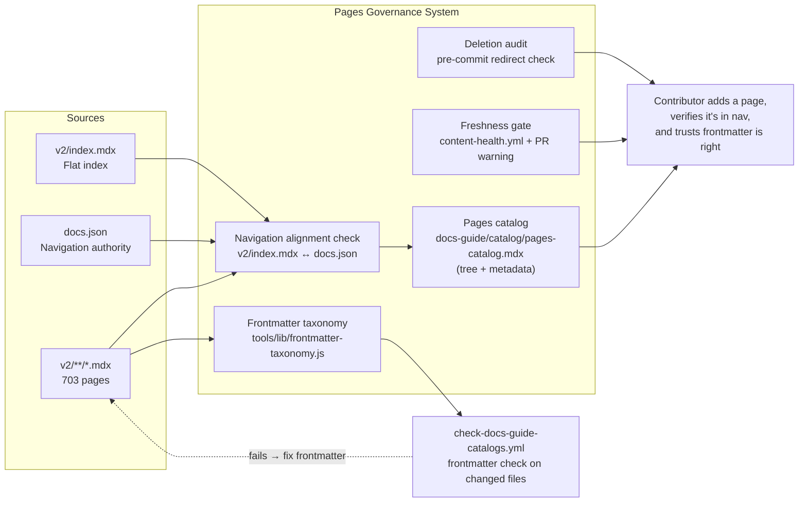

# Pages

> **What it is**: The v2 pages governance system — so a contributor can verify their page is in navigation, has correct frontmatter, and can find any page in the docs structure — and the system enforces these properties automatically.

---

## What This System Does

703 v2 pages form the public-facing docs. The pages system governs three things: navigation completeness (every page in docs.json has a corresponding file, and vice versa), frontmatter correctness (every page has valid taxonomy values), and freshness (pages don't go stale silently). The pages catalog gives a structured view of the navigation tree. CI validates that the catalog is current and that frontmatter on changed files follows the taxonomy. Content health runs weekly to surface stale pages. When the system is working, a contributor can add a page, confirm it appears in navigation, and trust that their frontmatter values are correct.

---

## When the System Is Working

| Signal | What it tells you |
|---|---|
| `generate-docs-guide-pages-index.js --check` exits 0 on every PR | Pages catalog is current |
| `frontmatter-taxonomy.test.js --check` exits 0 on changed files | Frontmatter is valid on new/modified pages |
| Navigation alignment check shows 0 divergences | `v2/index.mdx` and `docs.json` are in sync |
| `content-health.yml` reports 0 pages with `lastVerified` older than threshold | No silently stale pages |
| 0 deleted pages without a redirect entry | No broken links from deletions |

---

## System Architecture — Completed State

---

## The System

---

## ① Navigation Alignment

`v2/index.mdx` and `docs.json` are in sync — no page is reachable in one but not the other.

<AccordionGroup>

<Accordion title="🎯 Ideal State">

A validator cross-references `v2/index.mdx` links against `docs.json` entries and reports both: pages in `docs.json` missing from the index, and index links not in `docs.json`. This runs at PR time. The pages catalog generator reads the validated, complete index — not a potentially stale manual list.

**What this enables:** The catalog accurately represents the navigation. No page can be silently orphaned from the nav while still in the index, or in the nav without being in the index.

**Quality bar:** Alignment validator exits 0 on every PR. Zero divergences in production.

</Accordion>

<Accordion title="✏️ EXECUTION · Write navigation alignment validator'>

**IN** — `v2/index.mdx`; `docs.json`; pages catalog generator

**OUT** — Validator that reports divergences; step in `check-docs-guide-catalogs.yml`

**Steps**
1. ❌ Write validator: parse `v2/index.mdx` links; parse `docs.json` page entries; diff both sets
2. ❌ Report: "in docs.json but not in index" + "in index but not in docs.json"
3. ❌ Add to `check-docs-guide-catalogs.yml` as warning step (not blocking — there may be legitimate divergences during migration)

**STATUS** — ❌ Not started

</Accordion>

<Accordion title="📦 Outputs">

| Artefact | Path | Status | Blocks |
|---|---|---|---|
| Alignment validator | new script | ❌ | ② Catalog accuracy |

</Accordion>

</AccordionGroup>

---

## ② Pages Catalog

`pages-catalog.mdx` — a generated inventory of the navigation structure with frontmatter metadata.

<AccordionGroup>

<Accordion title="🎯 Ideal State">

`pages-catalog.mdx` shows the navigation tree AND a table of pages with `pageType`, `audience`, `status`, and `lastVerified` per entry. Both views are generated from the same source. The catalog is updated automatically when `docs.json` or `v2/index.mdx` changes.

**What this enables:** Content health queries are possible from the catalog — no need to grep frontmatter across 703 files. Agents can query "all reference pages for developers" directly.

**Quality bar:** Catalog contains both tree view and metadata table. Frontmatter values come from actual page files. Zero manually maintained rows.

</Accordion>

<Accordion title="✏️ EXECUTION · Extend catalog generator to read frontmatter">

**IN** — `generate-docs-guide-pages-index.js`; page files it resolves

**OUT** — Catalog output includes metadata table in addition to tree view

**Steps**
1. ❌ Extend generator: for each resolved page path, read frontmatter fields
2. ❌ Emit metadata table: columns `page`, `pageType`, `audience`, `status`, `lastVerified`
3. ❌ Keep tree view as-is; add table below it

**STATUS** — ❌ Not started

</Accordion>

<Accordion title="📦 Outputs">

| Artefact | Path | Status | Blocks |
|---|---|---|---|
| Pages catalog | `docs-guide/catalog/pages-catalog.mdx` | 🔄 exists (tree only), no metadata | — |

</Accordion>

</AccordionGroup>

---

## ③ Frontmatter Taxonomy Enforcement

Frontmatter values on changed pages are validated at PR time.

<AccordionGroup>

<Accordion title="🎯 Ideal State">

`frontmatter-taxonomy.test.js --check-changed` runs in `check-docs-guide-catalogs.yml` for every PR, validating `pageType`, `audience`, `status`, and `purpose` on changed v2 files only. Invalid values fail the PR check with a specific error message. Pages are not blocked for missing frontmatter fields (advisory), only for invalid values (enforced).

**What this enables:** New pages entering main have correct frontmatter. Catalog queries and agent metadata reads are reliable. Enforcement is scoped to changed files — no big-bang remediation of all 703 pages at once.

**Quality bar:** Validator runs on every PR. Changed files with invalid values fail the check. Valid but empty values pass (advisory, not blocked).

</Accordion>

<Accordion title="✏️ EXECUTION · Wire frontmatter validation to PR gate'>

**IN** — `frontmatter-taxonomy.test.js`; `check-docs-guide-catalogs.yml`

**OUT** — Frontmatter validation step on changed MDX files in every PR

**Steps**
1. ❌ Add `--check-changed` flag to `frontmatter-taxonomy.test.js` (or use `--files` with diff output)
2. ❌ Add step to `check-docs-guide-catalogs.yml`
3. ❌ Update `ownerless-governance-surfaces.json` `frontmatter-contract` from `advisory` to `pr-changed`

**STATUS** — ❌ Not started

</Accordion>

<Accordion title="📦 Outputs">

| Artefact | Path | Status | Blocks |
|---|---|---|---|
| Frontmatter check step | `check-docs-guide-catalogs.yml` | ❌ | — |

</Accordion>

</AccordionGroup>

---

## ④ Freshness Tracking

Pages that haven't been reviewed recently surface at PR time.

<AccordionGroup>

<Accordion title="🎯 Ideal State">

When a PR modifies a v2 page with `lastVerified` older than 90 days, a warning appears on the PR (not a failure). `content-health.yml` weekly run generates a freshness report. Agents accessing page content can see `lastVerified` in the catalog and judge whether content is current.

**What this enables:** Stale pages are visible before they become wrong. Content health is a system property, not a manual audit.

**Quality bar:** PR warning appears for modified pages with stale `lastVerified`. Weekly report available in `workspace/reports/`.

</Accordion>

<Accordion title="✏️ EXECUTION · Add lastVerified staleness warning to PR gate'>

**IN** — `check-docs-guide-catalogs.yml`; 90-day staleness threshold

**OUT** — PR check emits a warning (not failure) for modified pages with `lastVerified` older than threshold

**Steps**
1. ❌ Write staleness check script: for each changed v2 MDX in PR diff, check `lastVerified` age
2. ❌ Add to `check-docs-guide-catalogs.yml` as a non-blocking warning step

**STATUS** — ❌ Not started

</Accordion>

<Accordion title="📦 Outputs">

| Artefact | Path | Status | Blocks |
|---|---|---|---|
| Staleness warning step | `check-docs-guide-catalogs.yml` | ❌ | — |

</Accordion>

</AccordionGroup>

---

## ⑤ Deletion Safety

Pages deleted from v2 have redirect entries in `docs.json`.

<AccordionGroup>

<Accordion title="🎯 Ideal State">

The pre-commit hook warns (not blocks) when a v2 MDX file is being deleted without a corresponding redirect entry in `docs.json`. Contributors are prompted to add the redirect before committing. No user-visible broken link results from a page deletion.

**What this enables:** Page deletions are safe by default. Contributors are reminded of the redirect step at the moment it matters.

**Quality bar:** Zero v2 page deletions without redirect coverage in production. Warning appears at pre-commit.

</Accordion>

<Accordion title="✏️ EXECUTION · Add redirect check to pre-commit'>

**IN** — Pre-commit hook; `docs.json` redirect section; staged deletions

**OUT** — Pre-commit warns when a v2 MDX deletion has no matching redirect

**Steps**
1. ❌ In pre-commit: detect staged v2 MDX deletions
2. ❌ For each deleted path, check `docs.json` redirects section
3. ❌ Emit warning (not exit 1) if no redirect found

**STATUS** — ❌ Not started

</Accordion>

<Accordion title="📦 Outputs">

| Artefact | Path | Status | Blocks |
|---|---|---|---|
| Redirect check | `.githooks/pre-commit` | ❌ | — |

</Accordion>

</AccordionGroup>

---

## Completion Status

| System part | Status | Immediate blocker |
|---|---|---|
| ① Navigation Alignment | ❌ Not started | — |
| ② Pages Catalog (with metadata) | 🔄 Tree only | Extend generator |
| ③ Frontmatter Taxonomy Enforcement | ❌ Not started (advisory only) | Wire to PR gate |
| ④ Freshness Tracking | 🔄 Weekly run exists | No PR warning; not in catalog |
| ⑤ Deletion Safety | ❌ Not started | — |

---

## Already Done

| What | Where | Change |
|---|---|---|
| Pages catalog (tree view) | `docs-guide/catalog/pages-catalog.mdx` | Auto-generated via CI |
| Catalog PR check | `check-docs-guide-catalogs.yml` | Active |
| Weekly content health | `content-health.yml` | Active (cron) |
| Browser sweep | `test-v2-pages.yml` | Active on push→main |
| Frontmatter taxonomy library | `tools/lib/frontmatter-taxonomy.js` | Exists; advisory only |
