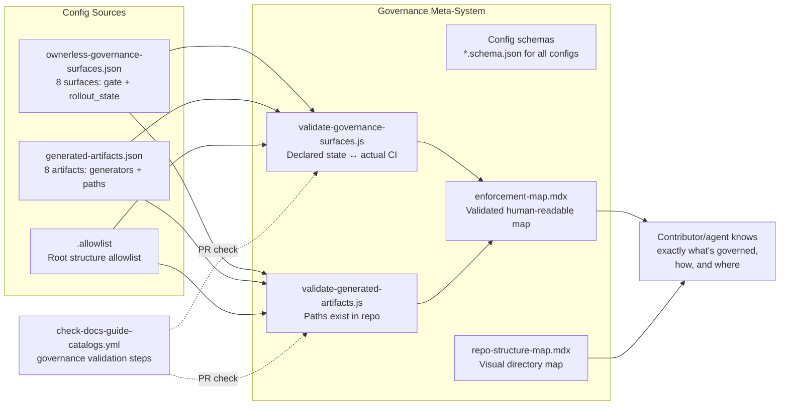

# Repo Structure

> **What it is**: The repo governance meta-system — so a contributor or agent can instantly understand what the repository contains, which surfaces are governed, how governance is enforced, and where to find the canonical source for any concern.

---

## What This System Does

The repo structure system is the map of everything else. It answers: what directories exist and why, what is governed vs manual, which CI workflows enforce which properties, and where the canonical source lives for each concern. Three machine-readable files hold this truth: `ownerless-governance-surfaces.json` (what is governed), `generated-artifacts.json` (what is generated by what), and `.allowlist` (what root paths are permitted). When these files are accurate and validated by CI, a contributor or agent can determine the governance state of any surface without manually reading every workflow file. When they drift, everything built on top of them is unreliable.

---

## When the System Is Working

| Signal | What it tells you |
|---|---|
| `validate-governance-surfaces.js` exits 0 | Declared rollout_states match actual CI wiring |
| `validate-generated-artifacts.js` exits 0 | All paths in generated-artifacts.json are resolvable |
| `enforcement-map.mdx` `lastVerified` is within 14 days of any workflow change | Human-readable governance map is current |
| Every `.json` in `tools/config/` has a corresponding `.schema.json` | Config files are validated, not freeform |
| A contributor can determine the governance state of any surface by reading one file | Governance truth is consolidated |

---

## System Architecture — Completed State

---

## The System

---

## ① Fix Stale Paths in generated-artifacts.json

All script path references in `generated-artifacts.json` are correct and resolvable.

<AccordionGroup>

<Accordion title="🎯 Ideal State">

Every `generator`, `sources`, `validators`, and `repair_commands` path in `generated-artifacts.json` resolves to an existing file. No entry references a script path from before the `operations/scripts/` reorganisation. Any tool reading this file for repair commands gets commands that work.

**What this enables:** `lpd repair --surface X` and all repair commands actually run. `validate-generated-artifacts.js` exits 0.

**Quality bar:** `validate-generated-artifacts.js` exits 0. Every `generator` path in the file resolves with `fs.existsSync()`.

</Accordion>

<Accordion title="🔍 AUDIT · Stale paths inventory'>

**IN** — `generated-artifacts.json`; current `operations/scripts/` directory structure

**OUT** — List of every stale path with its correct replacement

**Steps**
1. ✅ Known stale paths identified in `audit-repo-structure.md`:
   - `component-governance`: `operations/scripts/generate-component-docs.js`
   - `docs-guide-generated`: `operations/scripts/generate-docs-guide-indexes.js`, `generate-docs-guide-components-index.js`
   - `ai-tools-registry`: `operations/scripts/validate-ai-tools-registry.js`
2. ❌ Full pass: check every path in all 8 entries

**STATUS** — 🔄 Known cases identified; full pass not done

</Accordion>

<Accordion title="✏️ EXECUTION · Fix all stale paths'>

**IN** — Stale path inventory; current directory structure

**OUT** — `generated-artifacts.json` with all paths corrected

**Steps**
1. ❌ For each stale path: find the current location using Glob
2. ❌ Update the entry in `generated-artifacts.json`
3. ❌ Run `validate-generated-artifacts.js` to confirm all paths resolve

**STATUS** — ❌ Not started

</Accordion>

<Accordion title="📦 Outputs">

| Artefact | Path | Status | Blocks |
|---|---|---|---|
| `generated-artifacts.json` (corrected) | `tools/config/generated-artifacts.json` | 🔄 stale paths | All repair commands |

</Accordion>

</AccordionGroup>

---

## ② Governance Surfaces Validator

CI validates that declared `rollout_state` and `gate_layer` in `ownerless-governance-surfaces.json` match actual workflow/hook wiring.

<AccordionGroup>

<Accordion title="🎯 Ideal State">

`validate-governance-surfaces.js` reads all 8 surface entries and verifies:
- `gate_layer: pre-commit` → pre-commit hook script references a relevant script for this surface
- `gate_layer: pr-changed` → a PR workflow step covers this surface
- `rollout_state: autofix` → a generation workflow auto-commits outputs for this surface
Any mismatch fails the PR check. `ownerless-governance-surfaces.json` is no longer a planning document — it is a validated live description of the governance model.

**What this enables:** The governance config is self-enforcing. When a surface's wiring changes, the config must be updated or CI fails.

**Quality bar:** Validator exits 0 in production. Changing a workflow without updating the governance config causes a failing PR check.

</Accordion>

<Accordion title="✏️ EXECUTION · Write governance surfaces validator'>

**IN** — `ownerless-governance-surfaces.json`; `.github/workflows/*.yml`; `.githooks/pre-commit`

**OUT** — `validate-governance-surfaces.js` + step in `check-docs-guide-catalogs.yml`

**Steps**
1. ❌ For each surface: parse `gate_layer` and `rollout_state`
2. ❌ Cross-reference against workflows: does a workflow exist that matches the declared gate?
3. ❌ Cross-reference against pre-commit: does the hook reference the surface's scripts?
4. ❌ Add step to `check-docs-guide-catalogs.yml`

**STATUS** — ❌ Not started

</Accordion>

<Accordion title="📦 Outputs">

| Artefact | Path | Status | Blocks |
|---|---|---|---|
| Governance validator | new script | ❌ | All surfaces with declared-but-unimplemented states |
| Validator step | `check-docs-guide-catalogs.yml` | ❌ | — |

</Accordion>

</AccordionGroup>

---

## ③ Config Schema Coverage

Every `.json` in `tools/config/` is validated by a corresponding `.schema.json`.

<AccordionGroup>

<Accordion title="🎯 Ideal State">

All 18 JSON files in `tools/config/` have a corresponding schema. The CI test suite validates each config against its schema on every PR. No config can silently accept invalid structure.

**What this enables:** Config files cannot drift into invalid shapes. `generated-artifacts.json` and `ownerless-governance-surfaces.json` (the highest-value configs) are schema-validated.

**Quality bar:** `validate-config-schemas.js` exits 0. All 18 configs have schemas.

</Accordion>

<Accordion title="🔍 AUDIT · Schema coverage gap'>

**IN** — All 18 `tools/config/*.json` files; existing `.schema.json` files

**OUT** — List of which configs lack schemas

**Steps**
1. ✅ Known: `component-layout-profile.schema.json` exists; `cleanup-manifest.schema.json` exists
2. ❌ Full audit: which of the 18 configs have schemas, which don't
3. ❌ Priority order: `generated-artifacts.json` and `ownerless-governance-surfaces.json` first

**STATUS** — 🔄 Known gaps; full audit not done

</Accordion>

<Accordion title="✏️ EXECUTION · Write missing schemas (priority order)'>

**IN** — Config file structure; JSON Schema draft-07 format

**OUT** — `.schema.json` for each config; CI validation step

**Steps**
1. ❌ `generated-artifacts.json` schema
2. ❌ `ownerless-governance-surfaces.json` schema
3. ❌ `blueprint-pages.json` schema
4. ❌ Remaining configs

**STATUS** — ❌ Not started

</Accordion>

<Accordion title="📦 Outputs">

| Artefact | Path | Status | Blocks |
|---|---|---|---|
| `generated-artifacts.schema.json` | `tools/config/` | ❌ | ① path validation |
| `ownerless-governance-surfaces.schema.json` | `tools/config/` | ❌ | ② surfaces validation |
| Remaining schemas | `tools/config/` | ❌ | Config correctness |

</Accordion>

</AccordionGroup>

---

## ④ Repo Structure Map

A visual map of the top-level repo directories — what each one is for and whether it is governed, generated, or manual.

<AccordionGroup>

<Accordion title="🎯 Ideal State">

`docs-guide/features/repo-structure-map.mdx` shows a visual directory tree of all top-level repo directories with: purpose, governance status (governed/generated/manual), primary entry point file. It is the first page a new contributor reads to understand the repo layout. Updated whenever a new root directory is added (`.allowlist` gate ensures this is infrequent).

**What this enables:** A contributor or agent can orient themselves in the repo in 30 seconds without reading every directory.

**Quality bar:** All current root directories are represented. Governance status is accurate. Page has `lastVerified` within 30 days of the last `.allowlist` change.

</Accordion>

<Accordion title="✏️ EXECUTION · Write repo structure map'>

**IN** — `.allowlist`; `docs-guide/source-of-truth-guide.mdx` section routes; `ownerless-governance-surfaces.json`

**OUT** — `docs-guide/features/repo-structure-map.mdx` with visual tree + governance status table

**Steps**
1. ❌ List all root directories from `.allowlist`
2. ❌ For each: write purpose sentence; classify as governed/generated/manual; identify primary entry point
3. ❌ Write visual Mermaid tree or `<Tree>` component
4. ❌ Add governance status table
5. ❌ Add to `docs-guide` nav

**STATUS** — ❌ Not started

</Accordion>

<Accordion title="📦 Outputs">

| Artefact | Path | Status | Blocks |
|---|---|---|---|
| Repo structure map | `docs-guide/features/repo-structure-map.mdx` | ❌ | — |

</Accordion>

</AccordionGroup>

---

## ⑤ Enforcement Map Validation

`enforcement-map.mdx` is validated against actual workflow state and kept current.

<AccordionGroup>

<Accordion title="🎯 Ideal State">

`enforcement-map.mdx` has `lastVerified` and is cross-referenced against actual workflow files. A stale map or a map with entries referencing non-existent workflows fails the PR check with a specific message.

**What this enables:** The enforcement map is the human-readable governance reference. When it's wrong, contributors get wrong guidance. Validation makes it trustworthy.

**Quality bar:** Validator exits 0. `lastVerified` is within 14 days of any workflow change.

</Accordion>

<Accordion title="✏️ EXECUTION · Add lastVerified and validation step'>

**IN** — `enforcement-map.mdx`; workflow files

**OUT** — `enforcement-map.mdx` with `lastVerified`; validator step in `check-docs-guide-catalogs.yml`

**Steps**
1. ❌ Add `lastVerified` field to `enforcement-map.mdx`
2. ❌ Write map validator (can be part of `validate-governance-surfaces.js`)
3. ❌ Add to `check-docs-guide-catalogs.yml`

**STATUS** — ❌ Not started

</Accordion>

<Accordion title="📦 Outputs">

| Artefact | Path | Status | Blocks |
|---|---|---|---|
| Enforcement map (with lastVerified) | `docs-guide/repo-ops/maps/enforcement-map.mdx` | 🔄 exists, no validation | — |

</Accordion>

</AccordionGroup>

---

## Completion Status

| System part | Status | Immediate blocker |
|---|---|---|
| ① Fix Stale Paths in generated-artifacts.json | 🔄 Known cases; full pass needed | — |
| ② Governance Surfaces Validator | ❌ Not started | — |
| ③ Config Schema Coverage | 🔄 2/18 have schemas | Priority: generated-artifacts + ownerless-surfaces |
| ④ Repo Structure Map | ❌ Not started | — |
| ⑤ Enforcement Map Validation | ❌ Not started | — |

---

## Already Done

| What | Where | Change |
|---|---|---|
| Governance surfaces config | `tools/config/ownerless-governance-surfaces.json` | 8 surfaces declared |
| Generated artifacts config | `tools/config/generated-artifacts.json` | 8 artifacts; stale paths |
| Root allowlist gate | `.allowlist` + pre-commit | Active; root structure enforced |
| Source of truth policy | `docs-guide/policies/source-of-truth-policy.mdx` | Active |
