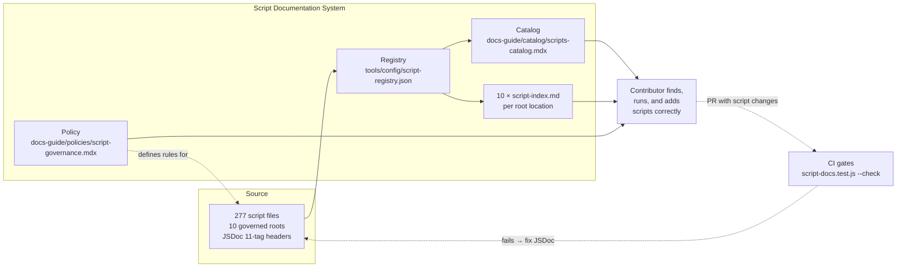

# Scripts

> **What it is**: The script governance and documentation system — so a contributor can find any of the 277 repo scripts, understand what it does and when to run it, add a new script correctly, and trust that the catalog reflects the current codebase.

---

## What This System Does

A contributor needs to run a generator, validate a surface, or understand what automation exists for a concern. They open the scripts catalog, find the script by type or concern, read its purpose and usage, and run the correct command. The same JSDoc headers that document each script also drive the machine-readable registry, the 10 per-folder indexes, and the aggregate catalog. CI validates that headers are present and that the registry is current. Every script is classified, every classification is readable, and nothing goes dark.

---

## When the System Is Working

| Signal | What it tells you |
|---|---|
| `script-registry.json` `_meta.generated` is current | Registry regenerated after last script change |
| `script-docs.test.js --check` exits 0 on every PR | No ungoverned scripts reaching main |
| 0 entries with `type: unknown` in registry | All scripts are classified |
| All 10 `script-index.md` files match their folder contents | Per-folder navigation is accurate |
| `scripts-catalog.mdx` shows archived scripts in a separate section | Active and archived are visually distinct |

---

## System Architecture — Completed State

---

## The System

---

## ① Source Layer — JSDoc Headers

Every script has a complete 11-tag JSDoc header that is the single source of truth for its classification, purpose, pipeline, and usage.

<AccordionGroup>

<Accordion title="🎯 Ideal State">

All 277 scripts across 10 governed roots have complete JSDoc headers. Zero entries with `type: unknown` in the registry. The `.githooks/`, `.github/scripts/`, and `tools/lib/` roots (highest-read-frequency) are complete first. JSDoc completeness is validated at PR time as a soft gate.

**What this enables:** The registry, indexes, and catalog all generate from source without fallback values. Agents querying script metadata get accurate results.

**Quality bar:** `script-docs.test.js --strict` reports 0 unknown-type scripts. All 11 tags present in every script across the 3 high-traffic roots.

</Accordion>

<Accordion title="🔍 AUDIT · JSDoc completeness by root">

**IN** — All script files across 10 governed roots
**OUT** — Per-root gap count: how many scripts missing which tags

**Steps**
1. ✅ Aggregate known: 277 total; 138 `type:unknown`; 160 incomplete — `audit-scripts.md`
2. ❌ Per-root breakdown: how many in `.githooks/`, `.github/scripts/`, `tools/lib/` specifically
3. ❌ Per-file list: which specific files need headers written

**STATUS** — 🔄 Aggregate known; per-root breakdown not yet generated

</Accordion>

<Accordion title="✏️ EXECUTION · Write JSDoc headers (high-traffic roots first)">

**IN** — Per-file gap list; `script-governance.mdx` JSDoc standard; script behavior (read the file)

**OUT** — Complete JSDoc headers in all `.githooks/`, `.github/scripts/`, `tools/lib/` scripts

**Steps**
1. ❌ `.githooks/` — every-commit scripts: pre-commit, install, etc.
2. ❌ `.github/scripts/` — every-CI-run scripts
3. ❌ `tools/lib/` — every-generator scripts
4. ❌ Remaining 7 roots

**STATUS** — ❌ Not started

</Accordion>

<Accordion title="📦 Outputs">

| Artefact | Path | Status | Blocks |
|---|---|---|---|
| JSDoc headers | All 277 script files | 🔄 139/277 complete | ② all downstream |

</Accordion>

</AccordionGroup>

---

## ② Registry

Machine-readable inventory of all scripts with full metadata and a `_meta` freshness block.

<AccordionGroup>

<Accordion title="🎯 Ideal State">

`script-registry.json` has a `_meta.generated` timestamp, `_meta.scriptCount`, and `_meta.generator`. It is regenerated by CI whenever any script file changes. The registry is the single query surface for script metadata — agents and tooling do not need to parse script files directly.

**What this enables:** The catalog generator, per-folder indexes, and any tooling querying scripts all read from one versioned, timestamped source.

**Quality bar:** `_meta.generated` is within one CI run of the last script change. Zero unknown-type entries.

</Accordion>

<Accordion title="✏️ EXECUTION · Add `_meta` block to registry">

**IN** — `script-docs.test.js` registry generation output
**OUT** — Registry with `_meta.generated`, `_meta.generator`, `_meta.scriptCount`

**Steps**
1. ❌ Add `_meta` block to registry writer in `script-docs.test.js` (matches `component-registry.json` pattern)

**STATUS** — ❌ Not started

</Accordion>

<Accordion title="✏️ EXECUTION · Add archive flag for archived scripts">

**IN** — `operations/scripts/archive/` directory; registry generator
**OUT** — Archived scripts flagged in registry; excluded from active catalog section

**Steps**
1. ❌ Add `archived: true` flag to registry entries for `operations/scripts/archive/` scripts
2. ❌ Update catalog generator to render archived scripts in a separate section

**STATUS** — ❌ Not started

</Accordion>

<Accordion title="📦 Outputs">

| Artefact | Path | Status | Blocks |
|---|---|---|---|
| Script registry | `tools/config/script-registry.json` | 🔄 exists, no `_meta`, 50% unknown | ③ Indexes, ④ Catalog |

</Accordion>

</AccordionGroup>

---

## ③ Per-Folder Indexes

10 `script-index.md` files — one per governed root — giving contributors a quick-scan reference for scripts in their current folder.

<AccordionGroup>

<Accordion title="🎯 Ideal State">

Each of the 10 governed roots has a current `script-index.md` showing all scripts in that folder with type, concern, and one-line description. The indexes are regenerated automatically whenever scripts in their root change.

**What this enables:** A contributor in `.githooks/` or `tools/lib/` can open `script-index.md` and immediately see what scripts exist in that folder without leaving their editor.

**Quality bar:** Every index matches its folder's actual script contents. No stale entries. No missing entries.

</Accordion>

<Accordion title="✏️ EXECUTION · Wire index generation to CI">

**IN** — `script-docs.test.js --rebuild-indexes`; path filter per root
**OUT** — 10 `script-index.md` files auto-regenerated when scripts in their root change

**Steps**
1. ❌ Add index generation step to push→main workflow with path filter on each governed root
2. ❌ Add `--check` step to PR gate for index freshness

**STATUS** — ❌ Not started

</Accordion>

<Accordion title="📦 Outputs">

| Artefact | Path | Status | Blocks |
|---|---|---|---|
| `.githooks/script-index.md` | `.githooks/` | 🔄 exists, manual | — |
| `.github/script-index.md` | `.github/` | 🔄 exists, manual | — |
| `tools/lib/script-index.md` | `tools/lib/` | 🔄 exists, manual | — |
| `tools/script-index.md` | `tools/` | 🔄 exists, manual | — |
| 6 more `script-index.md` | various roots | 🔄 exist, manual | — |

</Accordion>

</AccordionGroup>

---

## ④ Aggregate Catalog

`scripts-catalog.mdx` — the full inventory of all 277 scripts, grouped by pipeline tier, with active/archived distinction.

<AccordionGroup>

<Accordion title="🎯 Ideal State">

`scripts-catalog.mdx` is current, showing all active scripts with type, concern, description, pipeline, and usage. Archived scripts appear in a collapsible section at the bottom. The catalog is regenerated by CI and has a correct, resolvable banner path.

**What this enables:** A contributor or agent can look up any script by name, type, or concern in one page without browsing folder by folder.

**Quality bar:** Catalog matches registry. Zero manually maintained entries. Archived scripts visually distinct from active.

</Accordion>

<Accordion title="✏️ EXECUTION · Wire catalog generation to CI">

**IN** — `script-docs.test.js --write --rebuild-indexes`; CI workflow
**OUT** — Catalog auto-regenerated on push→main when any script changes

**Steps**
1. ❌ Add `script-docs.test.js --check` to `check-docs-guide-catalogs.yml`
2. ❌ Add `script-docs.test.js --write --rebuild-indexes` to `generate-docs-guide-catalogs.yml` with path filter on all 10 governed roots

**STATUS** — ❌ Not started

</Accordion>

<Accordion title="📦 Outputs">

| Artefact | Path | Status | Blocks |
|---|---|---|---|
| Scripts catalog | `docs-guide/catalog/scripts-catalog.mdx` | 🔄 265 scripts, no CI, no archived distinction | — |

</Accordion>

</AccordionGroup>

---

## ⑤ Dispatch Layer

A manually-triggerable dispatcher for the full script documentation pipeline.

<AccordionGroup>

<Accordion title="🎯 Ideal State">

A `dispatch/governance/` script exists that runs the full pipeline: validate JSDoc → regenerate registry → rebuild indexes → regenerate catalog. It has `@pipeline manual → governed roots → registry + indexes + catalog` and is the canonical repair command for the `script-governance` surface in `ownerless-governance-surfaces.json`. The corresponding workflow has `workflow_dispatch:`.

**What this enables:** Any contributor can run the full pipeline locally or via GitHub Actions without knowing which individual scripts to call.

**Quality bar:** `lpd repair --surface script-governance --write` triggers this dispatcher and produces a current registry, 10 current indexes, and a current catalog in one run.

</Accordion>

<Accordion title="✏️ EXECUTION · Wire dispatch to ownerless-surfaces repair command">

**IN** — `governance-pipeline.js` (existing dispatcher); `ownerless-governance-surfaces.json` repair_commands
**OUT** — `repair_commands` entries are correct and reference `governance-pipeline.js`

**Steps**
1. ❌ Verify `governance-pipeline.js` covers all 4 pipeline steps
2. ❌ Add `workflow_dispatch:` to the script documentation generation workflow
3. ❌ Update `ownerless-governance-surfaces.json` repair_commands to reference current paths

**STATUS** — ❌ Not started

</Accordion>

<Accordion title="📦 Outputs">

| Artefact | Path | Status | Blocks |
|---|---|---|---|
| Dispatcher | `operations/scripts/dispatch/governance/pipelines/governance-pipeline.js` | 🔄 exists, paths stale | ④ Catalog |
| `workflow_dispatch` on generation workflow | `.github/workflows/` | ❌ | Manual CI trigger |

</Accordion>

</AccordionGroup>

---

## Completion Status

| System part | Status | Immediate blocker |
|---|---|---|
| ① Source Layer — JSDoc | 🔄 In progress | 138 scripts with unknown type; no per-file gap list |
| ② Registry | 🔄 Exists, no `_meta` | `_meta` block not written; no CI trigger |
| ③ Per-Folder Indexes | 🔄 Exist, manual | No CI trigger |
| ④ Aggregate Catalog | 🔄 Exists, manual | No CI trigger; no archived distinction |
| ⑤ Dispatch Layer | 🔄 Partial | governance-pipeline.js exists; paths stale; no workflow_dispatch |

---

## Already Done

| What | Where | Change |
|---|---|---|
| 277 scripts inventoried | `tools/config/script-registry.json` | Exists; 50% unknown type |
| 10 per-root indexes | `*/script-index.md` | Exist; manual regeneration only |
| Governance policy | `docs-guide/policies/script-governance.mdx` | Active; 11-tag standard defined |
| Aggregate catalog | `docs-guide/catalog/scripts-catalog.mdx` | Exists; 265 scripts; no CI |
