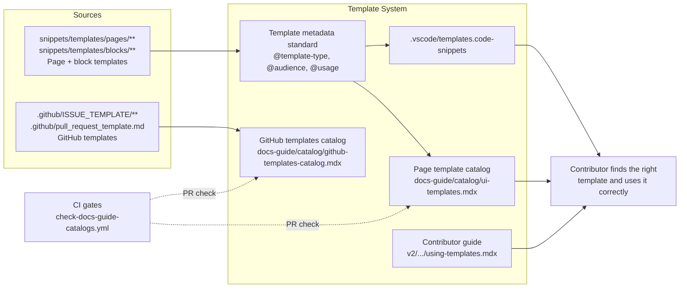

# Templates

> **What it is**: The page and block template system — so a contributor starting a new docs page can find the right template, copy it in one step, know what to fill in, and add a new template correctly when a pattern doesn't exist yet.

---

## What This System Does

A contributor creates a new page. They need a structure that matches the page type (how-to, reference, tutorial, FAQ, etc.). The template system gives them: a VS Code snippet that inserts the right template in one keystroke, a catalog page where they can browse all templates by type, and clear metadata in each template file telling them when to use it. When a new recurring page pattern emerges, a contributor can add a template by following the metadata standard and it appears automatically in the catalog and snippets. GitHub issue/PR templates are governed separately and cataloged independently.

---

## When the System Is Working

| Signal | What it tells you |
|---|---|
| `ui-templates.mdx` lists all 33 templates with type, audience, and description | Templates are discoverable |
| `.vscode/templates.code-snippets` matches the template files | Snippet insertion works |
| No duplicate template pairs (e.g., `glossary-tab.mdx` + `glossary-tab-template.mdx`) | Canonical templates are unambiguous |
| A contributor can pick the right template for a new page without asking | Templates are self-documenting |
| `templates-catalog.mdx` is clearly labeled as GitHub templates (not page templates) | Naming is accurate |

---

## System Architecture — Completed State

---

## The System

---

## ① Template Metadata Standard

A consistent header in every template file that documents its type, audience, and when to use it.

<AccordionGroup>

<Accordion title="🎯 Ideal State">

Every file in `snippets/templates/pages/` and `snippets/templates/blocks/` has a comment header with `@template-type`, `@audience`, and `@usage`. These fields are machine-readable by the catalog generator. A contributor opening any template knows immediately whether it matches their use case.

**What this enables:** The catalog can show rich metadata per template. The VS Code snippet tooltip can show usage context. No template is ambiguous about its purpose.

**Quality bar:** All 33 templates have complete headers. Generator reads `@template-type` to group catalog sections. Zero templates with only a filename as their description.

</Accordion>

<Accordion title="🎨 DESIGN · Template header standard">

**IN** — 33 existing template files; script JSDoc standard as model; 6 duplicate template pairs to resolve

**OUT** — Header spec: which fields, format, how generator reads them

**Steps**
1. ❌ Define: `@template-type` values (must map to `pageType` taxonomy values)
2. ❌ Define: `@audience` values (must map to frontmatter `audience` taxonomy)
3. ❌ Define: `@usage` — one line: "Use when..."
4. ❌ Define: format — JSX comment block `{/* @template-type: how-to */}` or frontmatter field

**STATUS** — ❌ Not started

</Accordion>

<Accordion title="✏️ EXECUTION · Resolve duplicate templates">

**IN** — 6 duplicate pairs: glossary-tab, glossary-consolidated, openapi, source-of-truth, changelog, tutorial

**OUT** — One canonical version per template type; duplicates removed or redirected

**Steps**
1. ❌ For each pair: determine which is canonical (newer, more complete, or named without `-template` suffix)
2. ❌ Delete or archive the non-canonical version
3. ❌ Update any v2 pages that reference the removed template

**STATUS** — ❌ Not started

</Accordion>

<Accordion title="✏️ EXECUTION · Add metadata headers to all templates">

**IN** — Header standard (from design step); 33 template files

**OUT** — All templates have complete `@template-type`, `@audience`, `@usage` headers

**Steps**
1. ❌ `snippets/templates/pages/` — 18 files
2. ❌ `snippets/templates/blocks/` — 4 files
3. ❌ `snippets/templates/docs-guide/` — 7 files

**STATUS** — ❌ Not started; blocked by design

</Accordion>

<Accordion title="📦 Outputs">

| Artefact | Path | Status | Blocks |
|---|---|---|---|
| Header standard | design doc | ❌ | All template files |
| Annotated template files | `snippets/templates/**` (33 files) | ❌ | ② Catalog |

</Accordion>

</AccordionGroup>

---

## ② Page Template Catalog

A generated catalog of all page and block templates — browsable, current, and distinct from the GitHub templates catalog.

<AccordionGroup>

<Accordion title="🎯 Ideal State">

`docs-guide/catalog/ui-templates.mdx` is generated automatically when template files change, shows all 33 templates grouped by `@template-type`, and includes the VS Code snippet key and `@usage` description for each. `docs-guide/tooling/reference-maps/` subdirectory templates are also covered. It is clearly titled "Page & Block Templates" to distinguish it from the GitHub templates catalog.

**What this enables:** A contributor can browse all templates, see what each produces, and use the VS Code snippet key to insert it immediately.

**Quality bar:** Catalog is current within one push of any template file change. All 33 templates appear. No duplicates.

</Accordion>

<Accordion title="✏️ EXECUTION · Wire ui-templates generation to CI">

**IN** — `generate-ui-templates.js`; `check-docs-guide-catalogs.yml`; `generate-docs-guide-catalogs.yml`

**OUT** — Catalog auto-regenerates on template file changes; PR gate checks freshness

**Steps**
1. ❌ Add `generate-ui-templates.js --check` to `check-docs-guide-catalogs.yml`
2. ❌ Add `generate-ui-templates.js --write` to `generate-docs-guide-catalogs.yml` with path filter on `snippets/templates/**`
3. ❌ Add `workflow_dispatch:` to the generation workflow (if not already present)

**STATUS** — ❌ Not started

</Accordion>

<Accordion title="📦 Outputs">

| Artefact | Path | Status | Blocks |
|---|---|---|---|
| Page template catalog | `docs-guide/catalog/ui-templates.mdx` | 🔄 exists, manual | — |

</Accordion>

</AccordionGroup>

---

## ③ GitHub Templates Catalog

A separately named and generated catalog of GitHub issue and PR templates.

<AccordionGroup>

<Accordion title="🎯 Ideal State">

The GitHub templates catalog is renamed `github-templates-catalog.mdx`, generated by a standalone `generate-github-templates-catalog.js` (separated from the workflow catalog generator), and clearly labeled. Contributors looking for page templates are not confused by a "Templates Catalog" that only shows GitHub templates.

**What this enables:** The templates naming confusion is resolved. Contributors looking for page templates go to the page template catalog. Those working on issue templates go to the GitHub catalog.

**Quality bar:** Both catalogs have distinct, accurate names. Each is generated by its own script with its own path filter. No shared generator.

</Accordion>

<Accordion title="✏️ EXECUTION · Split and rename templates catalog">

**IN** — `generate-docs-guide-indexes.js` shared generator; `templates-catalog.mdx`

**OUT** — `generate-github-templates-catalog.js` standalone; `docs-guide/catalog/github-templates-catalog.mdx`

**Steps**
1. ❌ Extract GitHub template catalog section from `generate-docs-guide-indexes.js` into new generator
2. ❌ Rename output from `templates-catalog.mdx` to `github-templates-catalog.mdx`
3. ❌ Update `docs.json` navigation entry
4. ❌ Update `generate-docs-guide-catalogs.yml` path filter for the new generator

**STATUS** — ❌ Not started

</Accordion>

<Accordion title="📦 Outputs">

| Artefact | Path | Status | Blocks |
|---|---|---|---|
| GitHub templates catalog | `docs-guide/catalog/github-templates-catalog.mdx` | 🔄 exists as `templates-catalog.mdx` — rename needed | — |

</Accordion>

</AccordionGroup>

---

## ④ Contributor Guide

How to find and use a template when starting a new page.

<AccordionGroup>

<Accordion title="🎯 Ideal State">

`v2/resources/documentation-guide/using-templates.mdx` (or a section in the authoring guide) explains: what templates are available, how to pick one by page type, how to use the VS Code snippet, and how to add a new template when a pattern doesn't exist.

**What this enables:** A contributor creating their first docs page can self-serve the template selection without asking anyone.

**Quality bar:** A contributor who has never created a docs page can pick the correct template and start authoring in under 2 minutes.

</Accordion>

<Accordion title="✏️ EXECUTION · Write contributor guide">

**IN** — Template catalog (② above); metadata standard (① above); VS Code snippets

**OUT** — `v2/resources/documentation-guide/using-templates.mdx` — or section in a consolidated authoring guide

**Steps**
1. ❌ Wait for template catalog to be current (blocks this step)
2. ❌ Write guide: template selection by page type, snippet insertion, how to add new template
3. ❌ Add to `docs.json` nav

**STATUS** — ❌ Not started; blocked by ① and ②

</Accordion>

<Accordion title="📦 Outputs">

| Artefact | Path | Status | Blocks |
|---|---|---|---|
| Contributor guide | `v2/resources/documentation-guide/using-templates.mdx` | ❌ | — |

</Accordion>

</AccordionGroup>

---

## Completion Status

| System part | Status | Immediate blocker |
|---|---|---|
| ① Template Metadata Standard | ❌ Not started | Design needed first |
| ② Page Template Catalog | 🔄 Exists, no CI | CI wiring; metadata standard |
| ③ GitHub Templates Catalog | 🔄 Exists, mislabeled | Generator split; rename |
| ④ Contributor Guide | ❌ Not started | ① + ② needed first |

---

## Already Done

| What | Where | Change |
|---|---|---|
| 33 template files exist | `snippets/templates/**` | Available but undiscoverable without browsing |
| GitHub templates catalog | `docs-guide/catalog/templates-catalog.mdx` | Active; CI-generated; mislabeled |
| PR gate for GitHub templates | `check-docs-guide-catalogs.yml` | Active |
| VS Code template snippets | `.vscode/templates.code-snippets` | Exists; regeneration manual |
