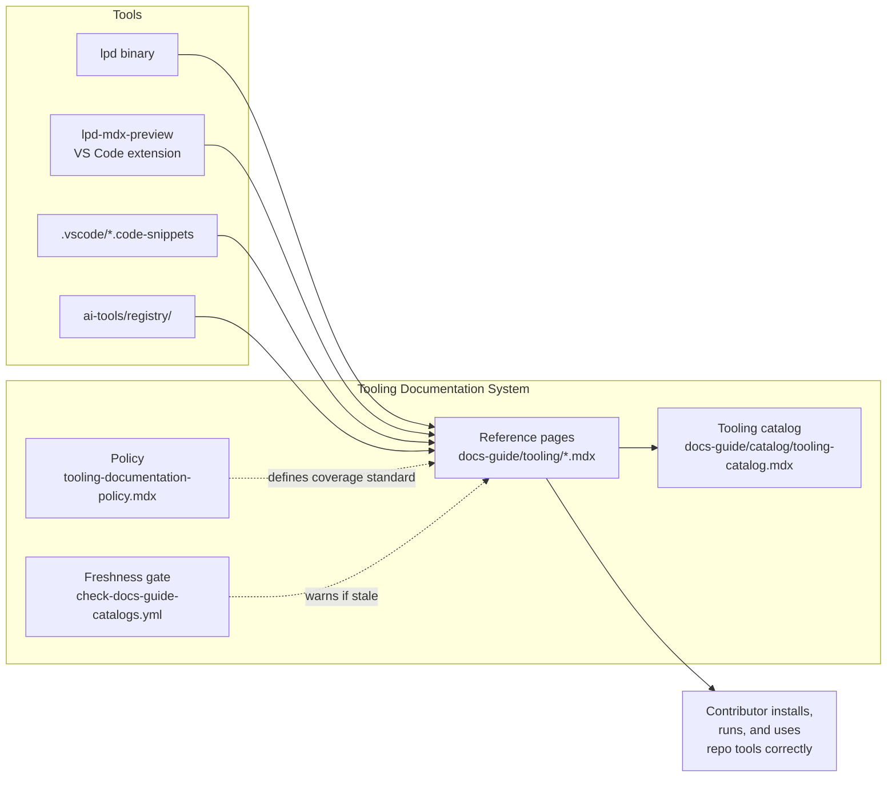

# Tooling

> **What it is**: The developer tooling documentation system — so a contributor can find every tool available in the repo, know how to install and use it, and trust that the reference is current.

---

## What This System Does

A contributor setting up the repo, or mid-session needing a specific CLI command, has one place to look: `docs-guide/tooling/`. They find the lpd CLI reference (all commands and flags), the MDX preview extension, the VS Code snippets, and the AI tools entrypoint. Each page is current, has a verified date, and links to the thing it documents. A tooling documentation policy defines what level of coverage each tool requires, so additions and updates follow a consistent standard. A generated tooling catalog gives agents a machine-readable index of what tooling exists.

---

## When the System Is Working

| Signal | What it tells you |
|---|---|
| All `docs-guide/tooling/*.mdx` pages have `status: current` and `lastVerified` within 90 days | Tooling docs are being maintained |
| No stale script paths in Tip callouts or banners | Reference commands actually work when copied |
| `docs-guide/catalog/tooling-catalog.mdx` exists and lists all tools | Tooling is machine-discoverable |
| A new contributor can set up their dev environment from `lpd-cli.mdx` alone | The CLI reference is self-sufficient |

---

## System Architecture — Completed State

---

## The System

---

## ① Tooling Policy

The rule that defines what a tool is, what coverage it needs, and how tooling docs are structured.

<AccordionGroup>

<Accordion title="🎯 Ideal State">

`docs-guide/policies/tooling-documentation-policy.mdx` exists and defines: what counts as a "tool," required sections per tooling page (description, install, commands/flags, examples, known limitations), maximum `lastVerified` age before staleness flag, and which tools require CI-wired references vs purely manual docs.

**What this enables:** New tools get documented consistently. Reviewers know what completeness looks like. The freshness gate has a threshold to enforce.

**Quality bar:** Any new tool added to the repo has a corresponding `docs-guide/tooling/*.mdx` page that passes the policy checklist.

</Accordion>

<Accordion title="✏️ EXECUTION · Write tooling documentation policy">

**IN** — Existing 5 tooling pages as examples; `script-governance.mdx` as structural model

**OUT** — `docs-guide/policies/tooling-documentation-policy.mdx`

**Steps**
1. ❌ Define: what is a "tool" (binary, VS Code extension, web tool, generated snippet set)
2. ❌ Define: required page sections and frontmatter fields
3. ❌ Define: maximum `lastVerified` age threshold per tool type
4. ❌ Write policy file

**STATUS** — ❌ Not started

</Accordion>

<Accordion title="📦 Outputs">

| Artefact | Path | Status | Blocks |
|---|---|---|---|
| Tooling policy | `docs-guide/policies/tooling-documentation-policy.mdx` | ❌ | ② all tooling pages |

</Accordion>

</AccordionGroup>

---

## ② Per-Tool Reference Pages

One page per tool — accurate, current, and structured consistently.

<AccordionGroup>

<Accordion title="🎯 Ideal State">

Every tool has a complete reference page with `status: current`, a recent `lastVerified`, correct command examples, and no stale script paths. `dev-tools.mdx` has no draft comment blocks. `ai-tools.mdx` has correct frontmatter. All pages are structured per the tooling policy.

**What this enables:** A contributor can self-serve any tool setup or usage question from the docs-guide without asking.

**Quality bar:** All pages: `status: current`; `lastVerified` within policy threshold; zero stale Tip/callout commands.

</Accordion>

<Accordion title="🔍 AUDIT · Current page state">

**IN** — 5 tooling pages + `reference-maps/icon-map.mdx`
**OUT** — Per-page status: draft/current, lastVerified age, known stale content

**Steps**
1. ✅ `lpd-cli.mdx` — current, lastVerified 2026-03-22
2. ✅ `lpd-mdx-preview.mdx` — current, lastVerified 2026-03-22
3. ✅ `dev-tools.mdx` — draft, lastVerified 2026-03-11; stale Tip; large comment block
4. ✅ `ai-tools.mdx` — missing frontmatter delimiter; unknown freshness
5. ❌ `reference-maps/icon-map.mdx` — status unknown; not in main tooling glob

**STATUS** — ✅ Audit complete — `audit-tooling.md`

</Accordion>

<Accordion title="✏️ EXECUTION · Fix dev-tools.mdx">

**IN** — `dev-tools.mdx` current file

**OUT** — `dev-tools.mdx` with `status: current`; no stale comment block; correct generator tip; all sections populated

**Steps**
1. ❌ Remove stale AI-drafted comment block (lines 23–70)
2. ❌ Fix Tip callout: `python3 operations/scripts/generate-component-snippets.py` → `node operations/scripts/generators/components/library/generate-ui-templates.js --write`
3. ❌ Populate "AI Skills" and "MDX Templates" sections or remove placeholders
4. ❌ Update `status: current`, `lastVerified: today`

**STATUS** — ❌ Not started

</Accordion>

<Accordion title="✏️ EXECUTION · Fix ai-tools.mdx frontmatter">

**IN** — `ai-tools.mdx` current file (missing `---` delimiter)

**OUT** — `ai-tools.mdx` with valid YAML frontmatter

**Steps**
1. ❌ Add opening `---` delimiter before `title:`
2. ❌ Add closing `---` delimiter after last frontmatter field
3. ❌ Add `status`, `lastVerified`, `pageType`, `audience` fields

**STATUS** — ❌ Not started

</Accordion>

<Accordion title="📦 Outputs">

| Artefact | Path | Status | Blocks |
|---|---|---|---|
| `lpd-cli.mdx` | `docs-guide/tooling/lpd-cli.mdx` | ✅ current | — |
| `lpd-mdx-preview.mdx` | `docs-guide/tooling/lpd-mdx-preview.mdx` | ✅ current | — |
| `dev-tools.mdx` | `docs-guide/tooling/dev-tools.mdx` | 🔄 draft, stale content | — |
| `ai-tools.mdx` | `docs-guide/tooling/ai-tools.mdx` | 🔄 missing frontmatter | — |
| `icon-map.mdx` | `docs-guide/tooling/reference-maps/icon-map.mdx` | ❓ unknown | — |

</Accordion>

</AccordionGroup>

---

## ③ Tooling Catalog

Machine-readable index of all tools — so agents and contributors can enumerate what tooling exists without reading every page.

<AccordionGroup>

<Accordion title="🎯 Ideal State">

`docs-guide/catalog/tooling-catalog.mdx` exists, generated from frontmatter of `docs-guide/tooling/*.mdx` files. Shows: tool name, type, location, status, lastVerified. Updated whenever a tooling page is added or modified.

**What this enables:** Agents can enumerate available tools without reading every file. Contributors can see at a glance which tools are stale.

**Quality bar:** Catalog lists all tools. `status` and `lastVerified` come from frontmatter — no manual maintenance.

</Accordion>

<Accordion title="🎨 DESIGN · Tooling catalog generator">

**IN** — 5+ tooling page frontmatter; catalog output format from existing catalogs

**OUT** — Generator spec: what fields to extract, what format to render, which path to watch

**Steps**
1. ❌ Define fields: name, type (binary/extension/snippets), path, status, lastVerified
2. ❌ Decide: new generator or extend `generate-docs-guide-indexes.js`
3. ❌ Define CI trigger: `docs-guide/tooling/**` path filter on push→main

**STATUS** — ❌ Not started

</Accordion>

<Accordion title="📦 Outputs">

| Artefact | Path | Status | Blocks |
|---|---|---|---|
| Tooling catalog | `docs-guide/catalog/tooling-catalog.mdx` | ❌ | — |

</Accordion>

</AccordionGroup>

---

## ④ Freshness Gate

CI validation that warns when tooling docs are stale relative to the policy threshold.

<AccordionGroup>

<Accordion title="🎯 Ideal State">

`check-docs-guide-catalogs.yml` includes a step that reads `lastVerified` from all `docs-guide/tooling/*.mdx` pages and fails (soft: warning, not block) if any page exceeds the policy staleness threshold. Stale tooling docs surface on PRs before they reach main.

**What this enables:** Tooling docs cannot silently age past their reliability threshold. A PR that touches tooling files surfaces any staleness.

**Quality bar:** Freshness check runs on every PR. Zero tooling pages exceed the staleness threshold in production.

</Accordion>

<Accordion title="✏️ EXECUTION · Add freshness check to PR gate">

**IN** — `check-docs-guide-catalogs.yml`; tooling policy staleness threshold

**OUT** — New step: reads `lastVerified` from tooling pages; warns if stale

**Steps**
1. ❌ Define policy threshold (prerequisite: ① Tooling Policy)
2. ❌ Write freshness validator for tooling pages
3. ❌ Add step to `check-docs-guide-catalogs.yml`

**STATUS** — ❌ Not started; blocked by ① Policy

</Accordion>

<Accordion title="📦 Outputs">

| Artefact | Path | Status | Blocks |
|---|---|---|---|
| Freshness check step | `check-docs-guide-catalogs.yml` | ❌ | — |

</Accordion>

</AccordionGroup>

---

## Completion Status

| System part | Status | Immediate blocker |
|---|---|---|
| ① Tooling Policy | ❌ Not started | — |
| ② Per-Tool Reference Pages | 🔄 In progress | `dev-tools.mdx` draft; `ai-tools.mdx` broken frontmatter |
| ③ Tooling Catalog | ❌ Not started | Policy (defines what to catalog) |
| ④ Freshness Gate | ❌ Not started | Policy (defines threshold) |

---

## Already Done

| What | Where | Change |
|---|---|---|
| `lpd-cli.mdx` complete | `docs-guide/tooling/lpd-cli.mdx` | Current; lastVerified 2026-03-22 |
| `lpd-mdx-preview.mdx` complete | `docs-guide/tooling/lpd-mdx-preview.mdx` | Current; lastVerified 2026-03-22 |
| Tooling section in docs-guide nav | `docs-guide/source-of-truth-guide.mdx` | All 5 pages listed |
