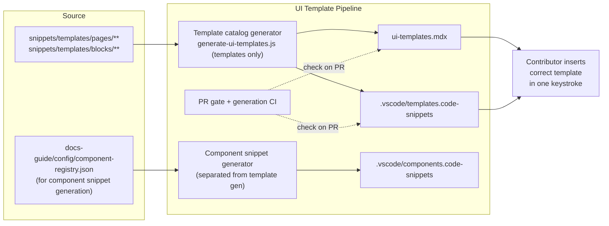

# UI Templates

> **What it is**: The UI template generation and discovery pipeline — so a contributor can find page and block templates, insert them via VS Code, and trust that what's in the catalog and snippets reflects what's actually in `snippets/templates/`.

---

## What This System Does

The UI template pipeline takes template files from `snippets/templates/pages/` and `snippets/templates/blocks/`, extracts their metadata, and produces two consumer surfaces: a catalog page (`ui-templates.mdx`) and VS Code snippet files (`.vscode/templates.code-snippets`). A contributor authoring a new page opens the catalog or types a snippet prefix and gets the right template. CI keeps both surfaces in sync with the source files. When a template is added or changed, the catalog and snippets update automatically.

This system is the generation and CI layer. Template content and metadata standards are in the templates canonical design.

---

## When the System Is Working

| Signal | What it tells you |
|---|---|
| `.vscode/templates.code-snippets` matches `snippets/templates/` | Snippet insertion is accurate |
| `ui-templates.mdx` shows all current templates | Catalog is current |
| `check-docs-guide-catalogs.yml` passes for template catalog | No drift reaching main |
| `ownerless-governance-surfaces.json` `rollout_state` for `ui-templates` matches actual CI state | Declared governance is real |

---

## System Architecture — Completed State

---

## The System

---

## ① Separated Generators

Template snippet generation and component snippet generation are independent scripts with independent CI triggers.

<AccordionGroup>

<Accordion title="🎯 Ideal State">

`generate-ui-templates.js` generates only the template catalog and template snippets. A separate script (extracted or new) generates component snippets from `component-registry.json`. Each has its own path filter in CI — a template change does not re-run component snippet generation, and vice versa.

**What this enables:** Each surface can evolve and be triggered independently. A template addition doesn't force component snippet regeneration.

**Quality bar:** Two distinct scripts with distinct CI triggers. Changing a template file triggers template generation only.

</Accordion>

<Accordion title="🎨 DESIGN · Split generator architecture">

**IN** — `generate-ui-templates.js` current implementation; what it generates (3 outputs: catalog, template snippets, component snippets)

**OUT** — Two generator scripts with clear separation of concern

**Steps**
1. ❌ Audit `generate-ui-templates.js`: which sections produce template catalog, which produce component snippets
2. ❌ Decide: extract component snippet generation into `generate-component-snippets.js` (separate script)
3. ❌ Define path filters: `snippets/templates/**` → template generator; `docs-guide/config/component-registry.json` changed → component snippet generator

**STATUS** — ❌ Not started

</Accordion>

<Accordion title="📦 Outputs">

| Artefact | Path | Status | Blocks |
|---|---|---|---|
| Template generator | `generate-ui-templates.js` (refactored) | 🔄 exists, co-generates component snippets | ② CI wiring |
| Component snippet generator | new script | ❌ | ③ Component snippets CI |

</Accordion>

</AccordionGroup>

---

## ② Template Catalog CI

`ui-templates.mdx` is regenerated by CI when template files change and checked at PR time.

<AccordionGroup>

<Accordion title="🎯 Ideal State">

`generate-ui-templates.js --write` runs in `generate-docs-guide-catalogs.yml` when `snippets/templates/**` changes. `generate-ui-templates.js --check` runs in `check-docs-guide-catalogs.yml` on every PR. `ownerless-governance-surfaces.json` `rollout_state` is updated to `active` (not `autofix` — that implies auto-repair; this is generate-and-check). `@pipeline` annotation in the script matches actual pipeline.

**What this enables:** Catalog cannot drift. Stale catalog blocks a PR.

**Quality bar:** `check-docs-guide-catalogs.yml` fails if catalog is out of sync. Generation auto-commits on push→main.

</Accordion>

<Accordion title="✏️ EXECUTION · Wire catalog generation to CI">

**IN** — `generate-docs-guide-catalogs.yml`; `check-docs-guide-catalogs.yml`; `generate-ui-templates.js`

**OUT** — Both workflows updated with template catalog steps

**Steps**
1. ❌ Add `--check` step to `check-docs-guide-catalogs.yml`
2. ❌ Add `--write` step to `generate-docs-guide-catalogs.yml` with `snippets/templates/**` path filter
3. ❌ Add `workflow_dispatch:` to `generate-docs-guide-catalogs.yml` if not present
4. ❌ Update `generate-ui-templates.js` `@pipeline` annotation to match actual pipeline

**STATUS** — ❌ Not started

</Accordion>

<Accordion title="✏️ EXECUTION · Resolve governance config contradiction">

**IN** — `ownerless-governance-surfaces.json` ui-templates entry; `generate-ui-templates.js` `@pipeline manual` annotation

**OUT** — Both sources reflect the same implemented state

**Steps**
1. ❌ After CI is wired: update `generate-ui-templates.js` `@pipeline` from `manual` to `push→main, pr-workflow`
2. ❌ Update `ownerless-governance-surfaces.json` `rollout_state` from `autofix` to `active`

**STATUS** — ❌ Not started; blocked by CI wiring

</Accordion>

<Accordion title="📦 Outputs">

| Artefact | Path | Status | Blocks |
|---|---|---|---|
| Template catalog | `docs-guide/catalog/ui-templates.mdx` | 🔄 exists, no CI | — |
| Catalog check step | `check-docs-guide-catalogs.yml` | ❌ | — |
| Catalog generation step | `generate-docs-guide-catalogs.yml` | ❌ | — |

</Accordion>

</AccordionGroup>

---

## ③ Template Snippets CI

`.vscode/templates.code-snippets` is regenerated by CI when template files change.

<AccordionGroup>

<Accordion title="🎯 Ideal State">

`.vscode/templates.code-snippets` is regenerated by the same CI run that regenerates the catalog. It is always in sync with `snippets/templates/`. Contributors opening the repo after a template addition see the new snippet immediately.

**What this enables:** VS Code snippet insertion is always accurate. No manual regeneration step for contributors.

**Quality bar:** Snippet file is committed alongside catalog in every CI generation run. No manual step required.

</Accordion>

<Accordion title="✏️ EXECUTION · Include snippets in CI generation step">

**IN** — `generate-ui-templates.js --write`; `generate-docs-guide-catalogs.yml`

**OUT** — `.vscode/templates.code-snippets` committed alongside `ui-templates.mdx` in same CI step

**Steps**
1. ❌ Confirm `--write` flag regenerates both catalog and snippets
2. ❌ Add `.vscode/templates.code-snippets` to `git add` in the generation workflow commit step

**STATUS** — ❌ Not started; depends on ② CI wiring

</Accordion>

<Accordion title="📦 Outputs">

| Artefact | Path | Status | Blocks |
|---|---|---|---|
| Template snippets | `.vscode/templates.code-snippets` | 🔄 exists, manual | — |

</Accordion>

</AccordionGroup>

---

## ④ Template Registry JSON

A machine-readable JSON registry of all templates — parallel to `component-registry.json`.

<AccordionGroup>

<Accordion title="🎯 Ideal State">

`tools/config/template-registry.json` exists with one entry per template: `id`, `name`, `type`, `path`, `description`, `audience`, `pageType`, `snippetKey`. It has a `_meta.generated` timestamp. Agents and tooling can enumerate all available templates without running the generator or reading the filesystem.

**What this enables:** Template health checks, orphan detection, type-driven agent suggestions, and richer catalog generation.

**Quality bar:** Registry is generated by CI. All templates have complete entries. No unknown types.

</Accordion>

<Accordion title="🎨 DESIGN · Template registry schema">

**IN** — `component-registry.json` schema as model; template metadata standard (from templates canonical design ①)

**OUT** — `tools/config/template-registry.schema.json` + generator spec

**Steps**
1. ❌ Define required fields per template entry
2. ❌ Write JSON schema
3. ❌ Add registry generation to `generate-ui-templates.js` or new generator

**STATUS** — ❌ Not started; blocked by templates metadata standard

</Accordion>

<Accordion title="📦 Outputs">

| Artefact | Path | Status | Blocks |
|---|---|---|---|
| Template registry | `tools/config/template-registry.json` | ❌ | — |
| Registry schema | `tools/config/template-registry.schema.json` | ❌ | — |

</Accordion>

</AccordionGroup>

---

## Completion Status

| System part | Status | Immediate blocker |
|---|---|---|
| ① Separated Generators | ❌ Not started | Design needed |
| ② Template Catalog CI | ❌ Not started | — (can start now) |
| ③ Template Snippets CI | ❌ Not started | Depends on ② |
| ④ Template Registry JSON | ❌ Not started | Templates metadata standard |

---

## Already Done

| What | Where | Change |
|---|---|---|
| Template catalog page exists | `docs-guide/catalog/ui-templates.mdx` | Exists; manual only |
| Template snippets file exists | `.vscode/templates.code-snippets` | Exists; manual only |
| Surface declared in governance config | `tools/config/ownerless-governance-surfaces.json` | Declared; not implemented |
