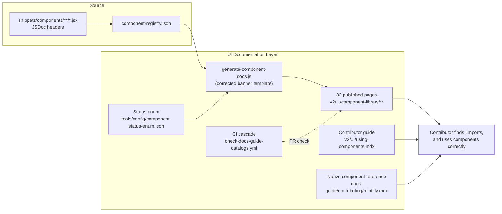

# UI

> **What it is**: The published documentation layer for the custom component UI system — so a contributor can look up any component on the live docs site, see how to use it, and find complete usage guidance in one place.

---

## What This System Does

When a contributor adds a component to a docs page, they need two things: a reference for what the component does and how to import it (published v2 pages), and guidance for when to use which component (contributor usage guide). The published v2 component library pages (32 files across 4 locales) are generated from the component registry and always reflect the current library. The contributor guide gives them the authoring context the reference pages don't cover. CI keeps the published docs in sync with source automatically. Together, these surfaces make the component system usable without tribal knowledge.

---

## When the System Is Working

| Signal | What it tells you |
|---|---|
| All 32 v2 component library pages have a correct, resolvable banner path | Generation pipeline is clean |
| `generate-component-docs.js --check` exits 0 on every PR | No stale published docs reaching main |
| A contributor can import a component correctly after reading the usage guide | Guide is sufficient |
| `docs-guide/contributing/mintlify.mdx` has `status: current` | Native Mintlify reference is usable |
| Status enum values are consistent across registry, catalog, and published pages | No display inconsistencies |

---

## System Architecture — Completed State

---

## The System

---

## ① Generator Correctness

The generator template produces accurate output — specifically, correct script paths in generated banners.

<AccordionGroup>

<Accordion title="🎯 Ideal State">

`generate-component-docs.js` banner template references `operations/scripts/generators/components/documentation/generate-component-docs.js`. All 32 v2 pages regenerate with the correct path on the next CI run. No contributor is sent to a non-existent script path.

**What this enables:** Downstream: all 32 published pages show a correct, copyable repair command. Contributors can follow the banner instruction and run the script successfully.

**Quality bar:** `grep "generate-component-docs" v2/*/resources/documentation-guide/component-library/*.mdx` shows the correct path. Banner check passes in CI.

</Accordion>

<Accordion title="✏️ EXECUTION · Fix banner template path">

**IN** — `generate-component-docs.js` — find the banner string constant
**OUT** — Banner template string corrected; next generation cycle fixes all 32 files

**Steps**
1. ❌ Find the banner path string in `generate-component-docs.js`
2. ❌ Replace `operations/scripts/generate-component-docs.js` with `operations/scripts/generators/components/documentation/generate-component-docs.js`
3. ❌ Trigger `workflow_dispatch` on `generate-docs-guide-catalogs.yml` to propagate fix immediately

**STATUS** — ❌ Not started

</Accordion>

<Accordion title="📦 Outputs">

| Artefact | Path | Status | Blocks |
|---|---|---|---|
| Corrected banner template | `generate-component-docs.js` | ❌ | 32 published pages |

</Accordion>

</AccordionGroup>

---

## ② Published Component Library Pages

32 generated reference pages (8 categories × 4 locales) — the public-facing component reference.

<AccordionGroup>

<Accordion title="🎯 Ideal State">

All 32 pages are current, have correct banner paths, and regenerate automatically when the registry changes. Each page shows: component name, status, description, props, usage example, and import path. Locale pages are generated from the same source as English pages.

**What this enables:** Any contributor or user can look up a component on the live docs site and get accurate, current information.

**Quality bar:** `generate-component-docs.js --check` exits 0. All banners correct. No page more than one push-to-main behind source.

</Accordion>

<Accordion title="📦 Outputs">

| Artefact | Path | Status | Blocks |
|---|---|---|---|
| English pages (8) | `v2/resources/documentation-guide/component-library/*.mdx` | 🔄 stale banner path | — |
| ES pages (8) | `v2/es/resources/.../component-library/*.mdx` | 🔄 same | — |
| FR pages (8) | `v2/fr/resources/.../component-library/*.mdx` | 🔄 same | — |
| CN pages (8) | `v2/cn/resources/.../component-library/*.mdx` | 🔄 same | — |

</Accordion>

</AccordionGroup>

---

## ③ Status Enum

A canonical definition of what each component status means and how it displays.

<AccordionGroup>

<Accordion title="🎯 Ideal State">

`tools/config/component-status-enum.json` defines 4 values: `stable` (🟢), `experimental` (🧪), `planned` (⬜), `deprecated` (🟠). The generator template and catalog template both read from this file. `planned` and `⬜ Placeholder` are resolved to one consistent display. No status value is ambiguous.

**What this enables:** Consistent status display across registry, catalog, and published pages. Agents querying status get unambiguous values.

**Quality bar:** One file defines all status values. Zero inconsistencies between catalog and published pages.

</Accordion>

<Accordion title="✏️ EXECUTION · Create status enum and wire it">

**IN** — Current status values in registry; current display values in catalog

**OUT** — `tools/config/component-status-enum.json` + generator + catalog template updated to reference it

**Steps**
1. ❌ Decide: 4 values or 5? Resolve `planned` vs `placeholder`
2. ❌ Write `tools/config/component-status-enum.json`
3. ❌ Update `generate-component-docs.js` to read display strings from enum file
4. ❌ Update `generate-docs-guide-components-index.js` to read display strings from enum file

**STATUS** — ❌ Not started

</Accordion>

<Accordion title="📦 Outputs">

| Artefact | Path | Status | Blocks |
|---|---|---|---|
| Status enum | `tools/config/component-status-enum.json` | ❌ | Consistent display everywhere |

</Accordion>

</AccordionGroup>

---

## ④ Contributor Usage Guide

How to use components when authoring a docs page — the practical guide, not the reference.

<AccordionGroup>

<Accordion title="🎯 Ideal State">

`v2/resources/documentation-guide/using-components.mdx` exists and is in the public docs nav. It covers: how to find a component (catalog, VS Code snippets), import syntax, the 5 most-used components with examples, when to use custom vs native Mintlify components, and when to ask about adding a new component.

**What this enables:** A contributor writing their first docs page can self-serve component usage — no Slack message needed.

**Quality bar:** A contributor with no prior component knowledge can use at least 3 different components correctly after reading this guide.

</Accordion>

<Accordion title="✏️ EXECUTION · Write contributor guide">

**IN** — Top 5 components by usage-map import frequency; `dev-tools.mdx` snippets section; component library pages

**OUT** — `v2/resources/documentation-guide/using-components.mdx` + `docs.json` entry

**Steps**
1. ❌ Pull top 5 components from `component-usage-map.json`
2. ❌ Write: discovery section (catalog + snippets), import patterns, 5 component examples, custom vs native guide
3. ❌ Add to `docs.json` nav

**STATUS** — ❌ Not started

</Accordion>

<Accordion title="📦 Outputs">

| Artefact | Path | Status | Blocks |
|---|---|---|---|
| Contributor guide | `v2/resources/documentation-guide/using-components.mdx` | ❌ | — |

</Accordion>

</AccordionGroup>

---

## ⑤ Native Mintlify Reference

What Mintlify provides out of the box — distinct from the custom component library.

<AccordionGroup>

<Accordion title="🎯 Ideal State">

`docs-guide/contributing/mintlify.mdx` is promoted from draft to current. It covers all native Mintlify components (`<Card>`, `<Tabs>`, `<Steps>`, `<Accordion>`, etc.) with props and examples. Combined with the contributor usage guide (④), a contributor has complete coverage of everything they can use when authoring a page.

**What this enables:** Contributors know the boundary between custom and native components. They don't import a custom wrapper for something Mintlify already provides.

**Quality bar:** `status: current`. All native Mintlify components documented with at least one example each.

</Accordion>

<Accordion title="✏️ EXECUTION · Complete mintlify.mdx">

**IN** — Mintlify component documentation; existing draft content

**OUT** — `docs-guide/contributing/mintlify.mdx` with `status: current`, all native components covered

**Steps**
1. ❌ Identify all native Mintlify components not yet covered in the draft
2. ❌ Write missing component entries
3. ❌ Set `status: current`, `lastVerified: today`

**STATUS** — ❌ Not started

</Accordion>

<Accordion title="📦 Outputs">

| Artefact | Path | Status | Blocks |
|---|---|---|---|
| Native component reference | `docs-guide/contributing/mintlify.mdx` | 🔄 draft | — |

</Accordion>

</AccordionGroup>

---

## Completion Status

| System part | Status | Immediate blocker |
|---|---|---|
| ① Generator Correctness | ❌ Not started | — (can fix now) |
| ② Published Pages | 🔄 Exist, stale banner | Depends on ① |
| ③ Status Enum | ❌ Not started | Requires design decision |
| ④ Contributor Usage Guide | ❌ Not started | Usage map must be current |
| ⑤ Native Mintlify Reference | 🔄 Draft | Content completion needed |

---

## Already Done

| What | Where | Change |
|---|---|---|
| 32 published pages exist | `v2/*/resources/documentation-guide/component-library/` | Generated; stale banner path |
| CI cascade (registry → docs) | `generate-component-registry.yml` + `generate-docs-guide-catalogs.yml` | Active |
| PR gate (component health, docs check) | `check-docs-guide-catalogs.yml` | Active |
