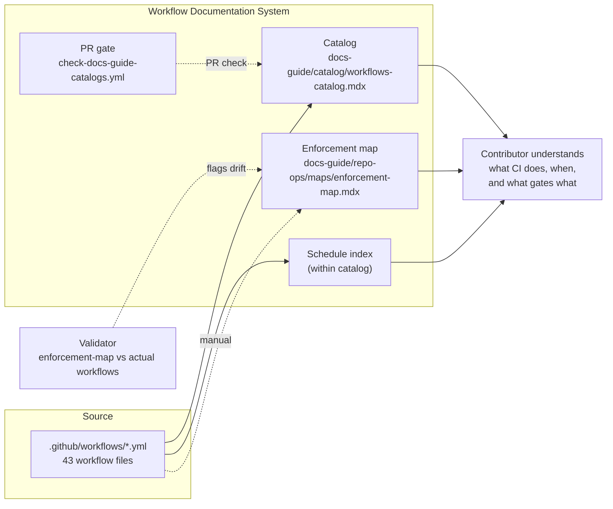

# Workflows

> **What it is**: The workflow documentation and governance system — so a contributor can find any of the 43 CI workflows, know what it does, when it triggers, what it outputs, and trust that the catalog reflects the current workflow state.

---

## What This System Does

A contributor needs to understand the CI system: what runs on a PR, what auto-commits to main, what runs on a schedule. The workflow catalog answers this at a glance — a complete inventory of all 43 workflows with trigger conditions, outputs, and downstream dependencies. The enforcement map tells them which workflows gate which operations. Per-workflow annotations (in the YAML files themselves) document failure modes and dependencies inline. CI keeps the catalog current: any workflow file change triggers regeneration.

---

## When the System Is Working

| Signal | What it tells you |
|---|---|
| `workflows-catalog.mdx` matches the `.github/workflows/` directory | Catalog is current |
| `enforcement-map.mdx` `lastVerified` is within 14 days of a workflow change | Enforcement map is tracked |
| Schedule index lists all cron workflows with their cadences | Scheduled automation is visible |
| Every workflow has a `workflow_dispatch:` trigger | Any workflow can be manually run |
| `check-docs-guide-catalogs.yml` passes on every PR | No catalog drift reaching main |

---

## System Architecture — Completed State

---

## The System

---

## ① Per-Workflow Metadata Standard

An annotation convention in workflow YAML files that gives every workflow a machine-readable description, trigger type, outputs, and downstream dependencies.

<AccordionGroup>

<Accordion title="🎯 Ideal State">

Every `.github/workflows/*.yml` file has a standard comment block at the top: `# @description`, `# @trigger`, `# @outputs`, `# @downstream` (optional). The catalog generator reads these annotations and emits richer catalog entries. This mirrors the script JSDoc standard — same principle, adapted for YAML.

**What this enables:** The catalog can show more than just the workflow `name:` field. Failure modes, dependencies, and outputs are documented inline where the workflow lives.

**Quality bar:** All 43 workflows have at minimum `# @description` and `# @trigger` annotations. Catalog reflects these fields.

</Accordion>

<Accordion title="🎨 DESIGN · Workflow annotation standard">

**IN** — Existing `script-governance.mdx` JSDoc standard; 43 workflow files as examples

**OUT** — Annotation spec: which fields, format, what the generator extracts

**Steps**
1. ❌ Define: minimum required fields (`@description`, `@trigger`)
2. ❌ Define: optional fields (`@outputs`, `@downstream`, `@schedule`, `@deprecated`)
3. ❌ Define format: `# @field value` comment blocks at top of file

**STATUS** — ❌ Not started

</Accordion>

<Accordion title="✏️ EXECUTION · Add annotations to all 43 workflows">

**IN** — Annotation standard; 43 workflow files

**OUT** — All workflows annotated

**Steps**
1. ❌ Annotate generation workflows (highest priority — they affect catalog)
2. ❌ Annotate PR gate workflows
3. ❌ Annotate scheduled/cron workflows
4. ❌ Annotate remaining workflows

**STATUS** — ❌ Not started; blocked by design

</Accordion>

<Accordion title="📦 Outputs">

| Artefact | Path | Status | Blocks |
|---|---|---|---|
| Annotation standard | design doc | ❌ | ② Catalog enrichment |
| Annotated workflow files | `.github/workflows/*.yml` (43) | ❌ | ② Catalog |

</Accordion>

</AccordionGroup>

---

## ② Workflow Catalog

`workflows-catalog.mdx` — the complete inventory of all workflows, generated from source, with schedule index and deprecated workflow section.

<AccordionGroup>

<Accordion title="🎯 Ideal State">

`workflows-catalog.mdx` shows all 43 workflows with: name, trigger type, description (from annotation), schedule (for cron), outputs, and deprecation flag. Deprecated workflows appear in a separate section. A schedule table lists all cron workflows and their cadences. Every workflow has `workflow_dispatch:` noted in the catalog.

**What this enables:** A contributor looking at the CI system sees the complete picture in one page. Agents querying CI context get accurate, complete workflow metadata.

**Quality bar:** Catalog regenerates automatically on every workflow file change. Deprecated workflows are visually distinct. Schedule table is accurate.

</Accordion>

<Accordion title="✏️ EXECUTION · Split workflows catalog from templates catalog">

**IN** — `generate-docs-guide-indexes.js` (shared generator); `generate-docs-guide-catalogs.yml`

**OUT** — `generate-workflows-catalog.js` (standalone); path filter on `.github/workflows/**` only

**Steps**
1. ❌ Extract workflow catalog generation from `generate-docs-guide-indexes.js` into `generate-workflows-catalog.js`
2. ❌ Update `generate-docs-guide-catalogs.yml` path filter: workflows trigger only `generate-workflows-catalog.js`
3. ❌ Update `check-docs-guide-catalogs.yml` to call `generate-workflows-catalog.js --check`

**STATUS** — ❌ Not started

</Accordion>

<Accordion title="✏️ EXECUTION · Add schedule index and deprecated section">

**IN** — `generate-workflows-catalog.js`; `on.schedule.cron` fields in workflow YAML

**OUT** — Catalog includes schedule table + deprecated section

**Steps**
1. ❌ Detect `on.schedule.cron` in generator; emit schedule table
2. ❌ Detect `# @deprecated` annotation; emit deprecated section

**STATUS** — ❌ Not started

</Accordion>

<Accordion title="📦 Outputs">

| Artefact | Path | Status | Blocks |
|---|---|---|---|
| Workflows catalog | `docs-guide/catalog/workflows-catalog.mdx` | 🔄 exists, shallow metadata, mixed-concern generator | — |

</Accordion>

</AccordionGroup>

---

## ③ Enforcement Map

The authoritative record of which workflows enforce which gates — validated against actual workflow files.

<AccordionGroup>

<Accordion title="🎯 Ideal State">

`enforcement-map.mdx` has a `lastVerified` date and is cross-validated against actual workflow files by a CI validator. When a workflow is added or deprecated, the enforcement map check fails until the map is updated. No stale entries.

**What this enables:** Contributors and agents asking "what blocks a PR?" get a trustworthy answer. The enforcement model cannot silently drift.

**Quality bar:** Validator exits 0. `lastVerified` is within 14 days of any workflow change. Every active workflow in `.github/workflows/` appears in the map.

</Accordion>

<Accordion title="✏️ EXECUTION · Write enforcement map validator">

**IN** — `enforcement-map.mdx` content; `.github/workflows/*.yml` file list

**OUT** — Validator that cross-references map entries against workflow file existence

**Steps**
1. ❌ Write validator: read map entries, check each referenced workflow exists
2. ❌ Add `lastVerified` to `enforcement-map.mdx`
3. ❌ Add validator step to `check-docs-guide-catalogs.yml`

**STATUS** — ❌ Not started

</Accordion>

<Accordion title="📦 Outputs">

| Artefact | Path | Status | Blocks |
|---|---|---|---|
| Enforcement map | `docs-guide/repo-ops/maps/enforcement-map.mdx` | 🔄 exists, no lastVerified, no validation | — |
| Map validator | new script | ❌ | — |

</Accordion>

</AccordionGroup>

---

## ④ Manual Dispatch

Every workflow can be triggered manually — either via `workflow_dispatch:` in CI or via a local equivalent.

<AccordionGroup>

<Accordion title="🎯 Ideal State">

All 43 workflows include `workflow_dispatch:` in their `on:` block. For generation workflows, the catalog notes the local equivalent command. A contributor can trigger any workflow without waiting for its natural trigger condition.

**What this enables:** Debugging, one-off regeneration, and testing are all possible without pushing a triggering change.

**Quality bar:** Zero workflows missing `workflow_dispatch:`. Every generation workflow has a documented local `node ... --write` equivalent in the catalog.

</Accordion>

<Accordion title="✏️ EXECUTION · Add workflow_dispatch to all workflows">

**IN** — All 43 `.github/workflows/*.yml` files
**OUT** — All workflows include `workflow_dispatch:`

**Steps**
1. ❌ Audit: which of the 43 workflows are missing `workflow_dispatch:`
2. ❌ Add `workflow_dispatch:` to each missing workflow

**STATUS** — ❌ Not started; audit not done

</Accordion>

<Accordion title="📦 Outputs">

| Artefact | Path | Status | Blocks |
|---|---|---|---|
| `workflow_dispatch` on all workflows | 43 `.yml` files | 🔄 some have it; audit needed | — |

</Accordion>

</AccordionGroup>

---

## Completion Status

| System part | Status | Immediate blocker |
|---|---|---|
| ① Per-Workflow Metadata Standard | ❌ Not started | Design needed |
| ② Workflow Catalog | 🔄 Exists, shallow | Mixed-concern generator; no schedule index |
| ③ Enforcement Map | 🔄 Exists, not validated | No validator; no lastVerified |
| ④ Manual Dispatch | 🔄 Partial | Audit needed; some workflows missing workflow_dispatch |

---

## Already Done

| What | Where | Change |
|---|---|---|
| Catalog auto-generation | `generate-docs-guide-catalogs.yml` | Active; triggers on workflow file changes |
| PR gate | `check-docs-guide-catalogs.yml` | Active |
| `workflow_dispatch` on generation workflows | `generate-docs-guide-catalogs.yml`, `generate-component-registry.yml`, `generate-ai-companions.yml` | Present |
