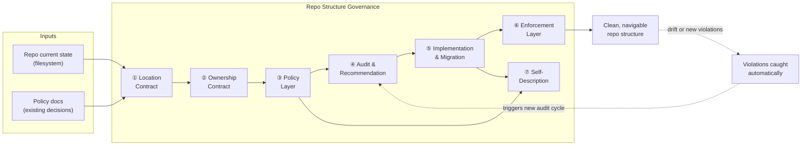

# Repo Structure & Governance

> **What it is**: A governance system that defines where every file in the repo belongs, who owns it, and how structural violations are caught automatically — so humans and agents can navigate and contribute without ambiguity.

---

## What This System Does

The repo structure governance system defines the contract between the repository layout and the humans and agents who work in it. Files and folders flow through a multi-phase process: research establishes what decisions are already locked, audits surface what's actually present, policies codify where things must live, recommendations present options for human review, and approved implementations execute structural changes safely. Downstream, enforcement gates catch future violations automatically. The system outputs a repo where any human or agent can find what they need, know where new work belongs, and trust that the structure stays consistent over time.

---

## When the System Is Working

| Signal | What it tells you |
|---|---|
| Any file's correct location can be stated without reading code | Location contract is complete and documented |
| Every folder maps to a named owner (plan or policy) | Ownership contract holds; no orphaned zones |
| Pre-commit blocks structural violations before they land | Enforcement layer is wired and catching violations |
| A new contributor can orient themselves using one document | Self-description is accurate and up to date |
| No file moves happen without a prior human-reviewed recommendation | Audit + review process is being followed |

---

## System Architecture — Completed State

---

## The System

---

## ① Location Contract

Every file in the repo has exactly one correct home defined in policy; given any file, any human or agent can state where it belongs without guessing.

<AccordionGroup>

<Accordion title="🎯 Ideal State">

Every repo folder has a documented canonical structure. Every file type has a defined lane (publishable, non-publishable, generated, policy, etc.). There are no orphans — no files that exist outside a defined lane with no documented home.

**What this enables:** Agents can place new files correctly without human guidance. Audits can produce objective pass/fail results. Migration recommendations can cite a specific policy rather than judgement calls.

**Quality bar:** Given any file path in the repo, a documented policy or canonical structure doc states where it belongs. Zero files exist outside a named lane.

</Accordion>

<Accordion title="🔍 AUDIT · Map every file against a defined lane">

**IN**
- Filesystem (actual current state, not memory)
- Existing policy docs and canonical structure docs

**OUT**
- Per-folder inventory: file, current location, correct lane, violation flag
- List of files with no defined lane (these become policy gaps, not arbitrary moves)

**HUMAN VS AI**
- AI: runs filesystem scan, maps each item to policy, flags gaps
- Human: reviews findings, confirms which gaps need a new policy vs. a judgement call

**Steps**
1. ✅ Root folder — inventoried; canonical structure documented in `folder-structure.md`
2. ✅ `api/` — clean as of 2026-03-21; no action needed
3. ✅ `v2/` — inventoried; legacy workspace buckets identified and normalisation plan produced
4. 🔄 `docs-guide/` — prd.md created, folder structure defined; full file-level audit not yet run
5. ❌ `snippets/` — not yet audited
6. ❌ `tools/` — not yet audited (coordinate with TOOLING plan)
7. ❌ `ai-tools/` — not yet audited (coordinate with AI-TOOLS-GOVERNANCE plan)

**STATUS** — 🔄 In progress; root, api/, v2/ done; docs-guide partial; others not started

</Accordion>

<Accordion title="🎨 DESIGN · Define the canonical folder hierarchy">

**IN**
- Audit findings
- PRD for each folder (aims, audience, needs)

**OUT**
- Canonical target structure for each folder tier: root, section, subsection, `_workspace/`
- Named lanes with definitions for each folder
- Approved subdirectory names per folder type

**HUMAN VS AI**
- AI: proposes structure from PRD + audit findings
- Human: approves structure before any file moves

**Steps**
1. ✅ Root-level structure — locked in `folder-structure.md`
2. ✅ `v2/` section structure — lane contract in `v2-folder-governance.mdx`; `_workspace/` approved subdirs defined
3. ✅ `docs-guide/` section structure — defined in `docs-guide-structure-policy.mdx` and `prd.md`
4. 🔄 `docs-guide/` open decisions — 3 items pending human approval (see `prd.md`)
5. ❌ `snippets/` structure design — pending COMPONENT-GOVERNANCE coordination
6. ❌ `tools/` structure design — pending TOOLING plan completion

**STATUS** — 🔄 In progress; root + v2/ locked; docs-guide defined but open decisions pending approval

</Accordion>

<Accordion title="👤 HUMAN REVIEW · Approve structure before audit targets are set">

**IN**: Proposed canonical structure for a folder (from DESIGN step)
**OUT**: Locked canonical structure — becomes the policy target that all audits measure against
**Criteria**: Structure is derived from PRD (aims + audience), not from existing arbitrary convention. Open decisions are resolved or explicitly flagged as pending.

**Steps**
1. ✅ Root structure — approved
2. ✅ `v2/` lane contract — approved
3. 🔄 `docs-guide/` prd.md — pending approval
4. ❌ `snippets/` structure — pending design
5. ❌ `tools/` structure — pending design

**STATUS** — 🔄 In progress; docs-guide is the immediate gate

</Accordion>

<Accordion title="📦 Outputs">

| Artefact | Path / location | Status | Blocks |
|---|---|---|---|
| Root canonical structure | `workspace/plan/active/REPO-STRUCTURE-GOV/folder-structure.md` | ✅ | — |
| `v2/` lane contract | `docs-guide/policies/v2-folder-governance.mdx` | ✅ | — |
| `docs-guide/` PRD | `workspace/plan/active/REPO-STRUCTURE-GOV/docs-guide/prd.md` | 🔄 awaiting approval | ③ Policy Layer for docs-guide |
| `snippets/` canonical structure | TBD | ❌ | ③ Policy Layer for snippets |
| `tools/` canonical structure | TBD | ❌ | ③ Policy Layer for tools |

</Accordion>

</AccordionGroup>

---

## ② Ownership Contract

Every folder in the repo is owned by a named plan or governance document; no structural work happens in unowned zones.

<AccordionGroup>

<Accordion title="🎯 Ideal State">

Every folder at root level and every section folder maps to either a named active plan (which owns decisions about it) or a stable policy document (which governs it after the plan completes). There are no orphaned zones where changes happen without a documented owner.

**What this enables:** When a file needs to move, it's clear which plan owns that decision. When a plan completes, ownership transfers to a policy — not into a void.

**Quality bar:** The Related Plans table in `folder-structure.md` has a row for every active-work folder. Every stable folder references its governing policy.

</Accordion>

<Accordion title="🔍 AUDIT · Identify ownerless folders">

**IN**
- Filesystem: all root folders and major section folders
- Active plans list: all plans under `workspace/plan/active/`

**OUT**
- Ownership map: folder → owner (plan name or policy doc)
- List of ownerless folders that need a plan or policy assigned

**Steps**
1. ✅ Root-level folders mapped — Related Plans table in `folder-structure.md`
2. ✅ All 10 active plans cross-referenced in Related Plans table
3. ❌ Section-level ownership within `snippets/`, `tools/` — not yet mapped

**STATUS** — ✅ Root level complete; section-level outstanding for unplanned folders

</Accordion>

<Accordion title="✏️ EXECUTION · Build and maintain the ownership map">

**IN**
- Active plans list
- Approved canonical structure (from ① Location Contract)

**OUT**
- Related Plans table in `folder-structure.md` — folder → plan → plan file link
- Policy ownership references for stable folders

**Steps**
1. ✅ Related Plans table created in `folder-structure.md` (10 plans, all folders linked)
2. ❌ Section-level ownership rows for `snippets/` subsections
3. ❌ Policy ownership references for folders with no active plan (`api/`, `v1/`, root dotfiles)

**STATUS** — 🔄 In progress; primary table done; section-level detail pending

</Accordion>

<Accordion title="📦 Outputs">

| Artefact | Path / location | Status | Blocks |
|---|---|---|---|
| Related Plans table | `folder-structure.md` — Related Plans section | ✅ | — |
| Section-level ownership map | TBD | ❌ | — |

</Accordion>

</AccordionGroup>

---

## ③ Policy Layer

Enforceable rules exist for every folder tier — with must/must-not language, named enforcement mechanisms, and a clear distinction between enforced policy and advisory guidance.

<AccordionGroup>

<Accordion title="🎯 Ideal State">

Every folder tier (root, section, `_workspace/`, legacy lanes) has a governing policy document with must/must-not language and a named enforcement mechanism (pre-commit, CI, or policy-only). Frameworks exist for decision guidance but are not enforced. No structural decision is advisory-only if it can be automated.

**What this enables:** Agents and contributors can check the relevant policy and know exactly what is allowed. Enforcement gates catch violations automatically rather than relying on reviewer memory.

**Quality bar:** Every folder with an active plan or ongoing structural work has a corresponding policy doc. The policy is referenced in the enforcement-map.mdx. No must/must-not rule exists only in a plan file.

</Accordion>

<Accordion title="🔍 AUDIT · Identify policy gaps across folder tiers">

**IN**
- All existing policy docs in `docs-guide/policies/`
- All active plans and the folders they govern
- `folder-structure.md` target structure

**OUT**
- Policy coverage map: folder tier → policy doc (or "gap")
- List of gaps where a policy must be written before implementation proceeds

**Steps**
1. ✅ `v2/` — `v2-folder-governance.mdx` covers lane contract, `_workspace/`, legacy names
2. ✅ `docs-guide/` — `docs-guide-structure-policy.mdx` covers 7-section structure, repoOps, root exceptions
3. ✅ Root allowlist — `root-allowlist-governance.mdx` covers root-level `_workspace/` dirs
4. ❌ `snippets/` — no dedicated policy; governed only by section-level norms
5. ❌ `tools/` — no dedicated policy
6. ❌ `ai-tools/` — governed by AI-TOOLS-GOVERNANCE plan; stable policy not yet written
7. ❌ `workspace/` — no formal policy (acceptable? decision needed)

**STATUS** — 🔄 In progress; primary sections covered; snippets, tools, ai-tools, workspace gaps open

</Accordion>

<Accordion title="✏️ EXECUTION · Write and update policies for each tier">

**IN**
- Approved PRD or canonical structure for the folder (from ① Location Contract)
- Audit gap list

**OUT**
- Policy doc at `docs-guide/policies/<folder>-policy.mdx`
- Updated `docs-guide-structure-policy.mdx` if a new section is added

**Steps**
1. ✅ `v2-folder-governance.mdx` — written and updated (expanded `_workspace/` contract, legacy name bans)
2. ✅ `docs-guide-structure-policy.mdx` — updated with repoOps/ section
3. ✅ `root-allowlist-governance.mdx` — updated with root `_workspace/` standard
4. 🔄 `docs-guide/` folder policy — prd.md written; policy to be derived from approved PRD
5. ❌ `snippets/` policy — blocked on COMPONENT-GOVERNANCE completing
6. ❌ `tools/` policy — blocked on TOOLING plan completing

**STATUS** — 🔄 In progress; 3 major policies done; docs-guide pending PRD approval; others blocked

</Accordion>

<Accordion title="👤 HUMAN REVIEW · Approve policies before enforcement is wired">

**IN**: Draft policy doc
**OUT**: Approved policy — enforcement gates can now be configured to enforce it
**Criteria**: Policy has must/must-not language (not advisory). Enforcement mechanism is named. Exceptions are documented, not implicit.

**Steps**
1. ✅ `v2-folder-governance.mdx` — approved
2. ✅ `docs-guide-structure-policy.mdx` — approved
3. ✅ `root-allowlist-governance.mdx` — approved
4. 🔄 `docs-guide/` policy from prd.md — pending
5. ❌ `snippets/` policy — pending design
6. ❌ `tools/` policy — pending design

**STATUS** — 🔄 In progress; docs-guide is the immediate gate

</Accordion>

<Accordion title="📦 Outputs">

| Artefact | Path / location | Status | Blocks |
|---|---|---|---|
| `v2/` lane policy | `docs-guide/policies/v2-folder-governance.mdx` | ✅ | — |
| `docs-guide/` structure policy | `docs-guide/policies/docs-guide-structure-policy.mdx` | ✅ | — |
| Root allowlist policy | `docs-guide/policies/root-allowlist-governance.mdx` | ✅ | — |
| `docs-guide/` folder policy (from prd.md) | `docs-guide/policies/` (path TBD) | ❌ | ④ Audit for docs-guide |
| `snippets/` policy | `docs-guide/policies/snippets-policy.mdx` | ❌ | ④ Audit for snippets |
| `tools/` policy | `docs-guide/policies/tools-policy.mdx` | ❌ | ④ Audit for tools |

</Accordion>

</AccordionGroup>

---

## ④ Audit & Recommendation System

Before any file moves, a complete inventory of current state exists and recommendations have been reviewed by a human — no silent moves.

<AccordionGroup>

<Accordion title="🎯 Ideal State">

For every folder being restructured: a written audit report exists (current state, violations list, special cases), a recommendation list has been produced (safe / needs-approval / gate), and a human has reviewed and approved before any file moves. The process is documented in `process.md` and repeatable for any future folder.

**What this enables:** Implementation work (⑤) can proceed with confidence that every move has a stated reason and human sign-off. Regressions can be traced back to a specific recommendation.

**Quality bar:** Zero file moves happen without a corresponding audit report and human-reviewed recommendation. The process described in `process.md` is the actual process followed, not just documented intent.

</Accordion>

<Accordion title="🎨 DESIGN · Design the audit format and process">

**IN**
- Prior ad-hoc audit experience (what questions matter, what breaks without them)
- Phase model: what must happen before, during, after an audit

**OUT**
- `process.md` — the repeatable process for all folder restructuring work
- Per-folder work directory standard: `workspace/plan/active/REPO-STRUCTURE-GOV/<folder-name>/`

**Steps**
1. ✅ `process.md` written — Phase -1 through Phase 5, work directory standard, decision gates, checkin rules, what-not-to-do
2. ✅ Per-folder work directory standard documented in `process.md`
3. ✅ Review/approval phases added (audit, PRD, policy, recommendations all require human review)

**STATUS** — ✅ Done — `process.md`

</Accordion>

<Accordion title="✏️ EXECUTION · Run per-folder audits and produce recommendation lists">

**IN**
- Filesystem (actual state, not memory)
- Approved policy or canonical structure for the folder
- `process.md` phases as the execution guide

**OUT**
- Per-folder `audit.md` in `workspace/plan/active/REPO-STRUCTURE-GOV/<folder>/`
- Recommendation list (safe / needs-approval / gate) in subplan or audit report
- Open questions flagged — not guessed

**Steps**
1. ✅ Root folder — audited; findings in `folder-structure.md` Root Folder Status table
2. ✅ `api/` — audited; clean
3. ✅ `v2/` — audited; violations identified; normalisation recommendations produced
4. 🔄 `docs-guide/` — prd.md and subplan created; file-level audit (DG.1) not yet run
5. ❌ `snippets/` — audit not started
6. ❌ `tools/` — audit not started (coordinate with TOOLING)

**STATUS** — 🔄 In progress; root, api/, v2/ done; docs-guide partial; others not started

</Accordion>

<Accordion title="👤 HUMAN REVIEW · Review recommendations before any file moves">

**IN**: Audit report + recommendation list for a folder
**OUT**: Approved list — items marked safe / approved / gate / rejected
**Criteria**: Every move has a stated reason citing the relevant policy. Gates are flagged, not assumed. Deletions are always a gate.

**Steps**
1. ✅ Root folder recommendations — approved (folder-structure.md locked decisions)
2. ✅ `v2/` normalisation recommendations — approved (workspace renames executed)
3. 🔄 `docs-guide/` recommendations — subplan exists; awaiting human review of DG tasks
4. ❌ `snippets/` recommendations — pending audit
5. ❌ `tools/` recommendations — pending audit

**STATUS** — 🔄 In progress; docs-guide review is the immediate gate

</Accordion>

<Accordion title="📦 Outputs">

| Artefact | Path / location | Status | Blocks |
|---|---|---|---|
| General restructure process | `workspace/plan/active/REPO-STRUCTURE-GOV/process.md` | ✅ | — |
| Root folder audit / status | `folder-structure.md` — Root Folder Status table | ✅ | — |
| `v2/` audit findings | `workspace/plan/active/REPO-STRUCTURE-GOV/subplan-v2-folders.md` | ✅ | — |
| `docs-guide/` PRD + subplan | `docs-guide/prd.md` + `subplan-docs-guide.md` | 🔄 awaiting approval | ⑤ docs-guide migration |
| `docs-guide/` audit report | `workspace/plan/active/REPO-STRUCTURE-GOV/docs-guide/audit.md` | ❌ | ⑤ docs-guide migration |
| `snippets/` audit report | `workspace/plan/active/REPO-STRUCTURE-GOV/snippets/audit.md` | ❌ | ⑤ snippets migration |

</Accordion>

</AccordionGroup>

---

## ⑤ Implementation & Migration

Approved changes execute safely: `docs.json` updated first, `git mv` for renames, deletion guard override for removals, zero broken links after each wave.

<AccordionGroup>

<Accordion title="🎯 Ideal State">

Every approved structural change is executed: files are in their canonical locations, `docs.json` routes all pages correctly, no stale references remain in scripts or generators, and the plan is updated to reflect completion. Regressions from a change wave can be identified immediately by running validators.

**What this enables:** The enforcement layer (⑥) can be wired against a clean state. Self-description (⑦) accurately reflects the repo as it actually is, not as it was planned to be.

**Quality bar:** After each implementation wave: `docs.json` nav resolves all routed pages, grep finds zero references to old paths, and the relevant subplan tasks are marked complete.

</Accordion>

<Accordion title="✏️ EXECUTION · Execute approved moves">

**IN**
- Approved recommendation list (from ④ Audit & Recommendation System)
- Relevant policy doc confirming the target location

**OUT**
- Files in canonical locations
- `docs.json` updated (always before file moves for nav changes)
- `.mintignore` updated to cover new non-publishable paths
- `.allowlist` updated if new root-level entries are needed

**Order of operations** (per `process.md` Phase 3):
1. Update `docs.json` first for any nav path changes
2. `git mv` for renames (shows as R, not D — bypasses deletion guard)
3. `--trailer "allow-deletions=true"` for deletions (zero-ref check first)
4. Update `.mintignore` and `.allowlist` as needed
5. Update any scripts/generators that reference old paths

**Steps (by folder)**

`v2/` workspace normalisation:
1. ✅ `developers/`: `_archive`→`archive`, `_contextData`→`context-data`
2. ✅ `community/`: `_contextData_`→`context-data`, `_move_me`→`staging`
3. ✅ `gateways/`: `x-archived`→`archive`, `x-deprecated`→`deprecated`, `archive/_contextData_`→`context-data`
4. ✅ `v2/` root: `x-archived`→`archive`
5. ✅ `about/`: `x-deprecated`→`deprecated`
6. ✅ `internal/layout-components-scripts-styling` → `internal/_workspace/layout-components-scripts-styling`
7. ✅ Root `_workspace/` dirs created: `ai-tools/`, `api/`, `snippets/`, `tools/`
8. ✅ `.mintignore` updated with root `_workspace/` patterns

`docs-guide/` repoOps section:
9. ✅ `repo-config-map.mdx` created at `docs-guide/repoOps/config/`
10. ✅ `enforcement-map.mdx` created at `docs-guide/repoOps/maps/`
11. ✅ `docs.json` updated with Repo Ops nav group

Pending — awaiting approval:
12. ❌ `contribute/` → `docs-guide/contributing/` (decision locked, not executed)
13. ❌ `_dep-docs/` delete (zero refs confirmed; needs go-ahead)
14. ❌ `docs-guide/` DG.1–DG.8 tasks (pending subplan review)
15. ❌ `v2/` V2.1–V2.9 tasks (pending subplan review)

**STATUS** — 🔄 In progress; v2/ normalisation + repoOps done; major migrations pending approval

</Accordion>

<Accordion title="🧪 TESTING · Verify no broken links, nav resolves, no stale refs">

**IN**
- Post-implementation repo state
- `docs.json`
- Validator and link-check tooling

**OUT**
- Pass/fail result per validation type
- List of any stale references found (old paths still referenced in other files)

**DONE WHEN** — `docs.json` nav resolves all routed pages, zero old-path references remain, `.mintignore` excludes all non-publishable dirs confirmed by spot-check.

**Steps**
1. 🔄 `v2/` normalisation — staged, not yet committed and validated
2. ❌ Post-commit validator run for `docs-guide/` changes
3. ❌ Post-commit validator run for `contribute/` move (pending execution)
4. ❌ Post-commit validator run for `_dep-docs/` delete (pending execution)

**STATUS** — 🔄 In progress; v2/ pending commit; others pending execution

</Accordion>

<Accordion title="📦 Outputs">

| Artefact | Path / location | Status | Blocks |
|---|---|---|---|
| `v2/` `_workspace/` normalised | `v2/*/` — all section workspace dirs | ✅ staged | Needs commit + verify |
| `docs-guide/repoOps/` section | `docs-guide/repoOps/config/`, `maps/` | ✅ | — |
| `docs.json` nav (repoOps) | `docs.json` | ✅ | — |
| `contribute/` → `docs-guide/contributing/` | pending `git mv` | ❌ | — |
| `_dep-docs/` deletion | pending explicit approval | ❌ | — |
| `docs-guide/` DG tasks | `docs-guide/` subtree | ❌ | DG subplan approval |
| `v2/` V2 tasks | `v2/` subtree | ❌ | V2 subplan approval |

</Accordion>

</AccordionGroup>

---

## ⑥ Enforcement Layer

Pre-commit and CI catch structural violations automatically; humans are the last line of defense only for policy-level decisions, not for mechanical correctness.

<AccordionGroup>

<Accordion title="🎯 Ideal State">

Every hard structural rule is enforced by a gate — either pre-commit (for immediate blocking violations) or CI (for freshness, drift, and loose-file audits). Policy-only enforcement is reserved for rules where automation would produce false positives or require human judgement to evaluate. The enforcement-map.mdx accurately reflects all gates and their override paths.

**What this enables:** The clean structure produced by ⑤ Implementation stays clean. Contributors can't accidentally break governance rules without a gate catching it.

**Quality bar:** Every must/must-not rule in every policy doc has a corresponding entry in `enforcement-map.mdx`. The entry either names the gate that enforces it, or documents why it is policy-only.

</Accordion>

<Accordion title="🎨 DESIGN · Decide what is pre-commit vs CI vs policy-only">

**IN**
- All policy docs and their must/must-not rules
- Current pre-commit hook implementation
- CI workflow inventory

**OUT**
- Classification for each rule: hard gate (pre-commit), soft check (CI), or policy-only (human review)
- Enforcement-map.mdx documenting all classifications

**HUMAN VS AI**
- AI: classifies rules, proposes gate placement
- Human: approves before any gate is wired (a bad hook blocks everyone's commits)

**Steps**
1. ✅ 5 hard gates classified and documented: Codex isolation, deletion guard, allowlist protection, docs.json redirect integrity, v1/ freeze
2. ✅ Pre-push checks documented (link audit, catalog freshness)
3. ✅ CI workflows documented (format, sync, publish, analytics)
4. ❌ `v2/` section-root loose-file gate — classified as CI check; not yet wired (V2.1)
5. ❌ `docs-guide/` fresh-catalog check — not yet wired

**STATUS** — ✅ Classification done; `enforcement-map.mdx` written; two gates not yet implemented

</Accordion>

<Accordion title="✏️ EXECUTION · Wire pre-commit gates and CI checks">

**IN**
- Approved gate classification (from DESIGN)
- Clean repo state (enforcement is added after structure is clean — per `process.md` Phase 5 rule)

**OUT**
- Updated `.githooks/pre-commit` for any new hard gates
- Updated CI workflow files for any new soft checks

**HUMAN VS AI**
- AI: implements gate logic
- Human: reviews before merge — a bad hook blocks everyone's commits

**Steps**
1. ✅ 5 hard gates — in `.githooks/pre-commit`
2. ❌ `v2/` section-root loose-file gate (V2.1) — not yet implemented; requires clean v2/ state first
3. ❌ Catalog freshness CI check — not yet implemented

**STATUS** — 🔄 In progress; existing gates done; V2.1 gate and catalog check pending

</Accordion>

<Accordion title="📝 DOCUMENT · Update enforcement-map.mdx after each gate change">

**IN**
- Implemented gate or CI check

**OUT**
- Updated `docs-guide/repoOps/maps/enforcement-map.mdx` — all gates, overrides, bypass flags

**Steps**
1. ✅ `enforcement-map.mdx` created — 5 hard gates, pre-push checks, all CI workflows documented
2. ❌ Update when V2.1 gate is wired
3. ❌ Update when catalog freshness check is wired

**STATUS** — ✅ Initial version done; updates pending when new gates are wired

</Accordion>

<Accordion title="📦 Outputs">

| Artefact | Path / location | Status | Blocks |
|---|---|---|---|
| Pre-commit hard gates (5) | `.githooks/pre-commit` | ✅ | — |
| Enforcement map | `docs-guide/repoOps/maps/enforcement-map.mdx` | ✅ | — |
| `v2/` section-root gate (V2.1) | `.githooks/pre-commit` or CI | ❌ | Requires clean v2/ state |
| Catalog freshness CI check | `.github/workflows/` | ❌ | — |

</Accordion>

</AccordionGroup>

---

## ⑦ Self-Description

A human or agent new to the repo can find the source of truth for any structural decision by reading one document; the system describes its own current state accurately.

<AccordionGroup>

<Accordion title="🎯 Ideal State">

One entry-point document routes any structural question to its canonical answer. Locked decisions are documented as locked. Pending decisions are documented as pending. The system-canonical.mdx accurately reflects what is done vs. in-progress vs. not started. No structural information lives only in a plan file — stable decisions are promoted to policy docs.

**What this enables:** Onboarding time for contributors and agents is reduced to reading one document. Agents can navigate and work correctly without asking the human. The human can trust that the system state is accurately described.

**Quality bar:** Any structural question that arises during a contribution can be answered by reading `docs-guide/source-of-truth-guide.mdx` and following its links. There are no dead links, no stale section rows, and no decisions documented as pending that have already been made.

</Accordion>

<Accordion title="✏️ EXECUTION · Write and maintain the canonical entry points">

**IN**
- Completed, approved artefacts from other system parts
- Stable decisions ready to be promoted from plan files to policy docs

**OUT**
- `docs-guide/source-of-truth-guide.mdx` — section routes, policy links, framework links
- `workspace/plan/active/REPO-STRUCTURE-GOV/folder-structure.md` — locked root structure decisions
- This file (`system-canonical.mdx`) — system-level status and cross-part coordination

**Steps**
1. ✅ `source-of-truth-guide.mdx` updated — repoOps section row added, new policies and frameworks linked
2. ✅ `folder-structure.md` written — canonical root structure, Related Plans table, per-folder structure trees
3. ✅ `system-canonical.mdx` created (this file)
4. ❌ Promote `docs-guide/` folder decisions from prd.md to policy doc (after PRD approval)
5. ❌ Update `folder-structure.md` when `contribute/` move and `_dep-docs/` delete are executed

**STATUS** — 🔄 In progress; primary entry points done; updates follow each implementation wave

</Accordion>

<Accordion title="📊 MONITOR · Check that source-of-truth stays accurate after each change wave">

**IN**
- Completed implementation wave (from ⑤)
- Current state of `source-of-truth-guide.mdx`, `folder-structure.md`, this file

**OUT**
- Updated self-description docs with any new locked decisions, completed tasks, or changed paths

**DONE WHEN** — After each implementation wave: all completed tasks are marked ✅ in this file, all new locked decisions are referenced in `source-of-truth-guide.mdx`, and `folder-structure.md` reflects the actual repo state.

**Steps**
1. ❌ Post-wave update after `contribute/` + `_dep-docs/` execution
2. ❌ Post-wave update after docs-guide DG tasks complete
3. ❌ Post-wave update after v2/ V2 tasks complete

**STATUS** — ❌ First update pending; triggered by next implementation wave

</Accordion>

<Accordion title="📦 Outputs">

| Artefact | Path / location | Status | Blocks |
|---|---|---|---|
| Source of truth entry point | `docs-guide/source-of-truth-guide.mdx` | ✅ | — |
| Canonical root structure | `workspace/plan/active/REPO-STRUCTURE-GOV/folder-structure.md` | ✅ | — |
| System canonical (this file) | `workspace/plan/active/REPO-STRUCTURE-GOV/system-canonical.mdx` | 🔄 active | — |
| Repo config map | `docs-guide/repoOps/config/repo-config-map.mdx` | ✅ | — |
| Enforcement map | `docs-guide/repoOps/maps/enforcement-map.mdx` | ✅ | — |

</Accordion>

</AccordionGroup>

---

## Completion Status

| System part | Status | Immediate blocker |
|---|---|---|
| ① Location Contract | 🔄 In progress | `docs-guide/` prd.md awaiting approval; snippets/tools not yet designed |
| ② Ownership Contract | ✅ Complete (root level) | — |
| ③ Policy Layer | 🔄 In progress | `docs-guide/` policy pending PRD approval; snippets/tools blocked on their plans |
| ④ Audit & Recommendation System | 🔄 In progress | `docs-guide/` DG subplan awaiting human review |
| ⑤ Implementation & Migration | 🔄 In progress | `v2/` staged (needs commit + verify); `docs-guide/`, `contribute/`, `_dep-docs/` pending approvals |
| ⑥ Enforcement Layer | 🔄 In progress | V2.1 loose-file gate pending clean v2/ state; catalog freshness check not wired |
| ⑦ Self-Description | 🔄 In progress | Updates follow each implementation wave |

---

## Already Done

| What | Where | Change |
|---|---|---|
| `v2/` `_workspace/` normalisation (6 section renames) | `v2/developers/`, `community/`, `gateways/`, root, `about/`, `internal/` | `git mv` staged — legacy names retired |
| Root `_workspace/` dirs created | `ai-tools/`, `api/`, `snippets/`, `tools/` | New dirs with canonical subdirs |
| `.mintignore` root `_workspace/` patterns | `.mintignore` | Added 4 root-folder workspace exclusions |
| `docs-guide/repoOps/` section | `docs-guide/repoOps/config/`, `maps/` | `repo-config-map.mdx`, `enforcement-map.mdx` created |
| `docs.json` Repo Ops nav group | `docs.json` | Config, Maps, Secrets subgroups wired |
| `source-of-truth-guide.mdx` updated | `docs-guide/source-of-truth-guide.mdx` | repoOps row, new policies/frameworks linked |
| `docs-guide-structure-policy.mdx` updated | `docs-guide/policies/` | repoOps/ added as canonical section 7 |
| `v2-folder-governance.mdx` updated | `docs-guide/policies/` | Expanded `_workspace/` contract, legacy name bans |
| `root-allowlist-governance.mdx` updated | `docs-guide/policies/` | Root `_workspace/` standard documented |
| `folder-structure.md` written | `workspace/plan/active/REPO-STRUCTURE-GOV/` | Canonical root structure, Related Plans table, per-folder trees |
| `process.md` written | `workspace/plan/active/REPO-STRUCTURE-GOV/` | Phase -1 through Phase 5, checkin rules, decision gates |
| `subplan-docs-guide.md` created | `workspace/plan/active/REPO-STRUCTURE-GOV/` | 8 DG tasks, open decisions |
| `subplan-v2-folders.md` created | `workspace/plan/active/REPO-STRUCTURE-GOV/` | 9 V2 tasks, open decisions |
| `docs-guide/prd.md` created | `workspace/plan/active/REPO-STRUCTURE-GOV/docs-guide/` | Aims, audience, needs, success criteria, folder structure |
