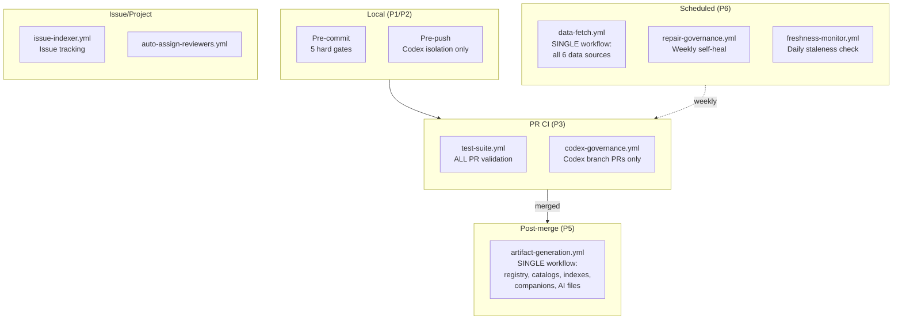
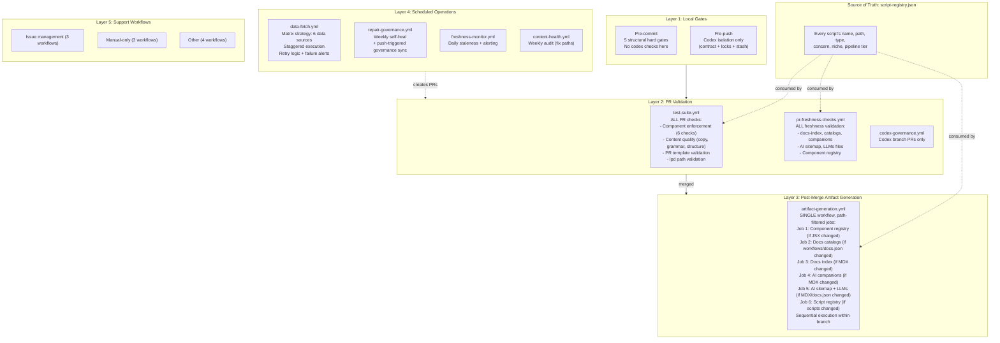
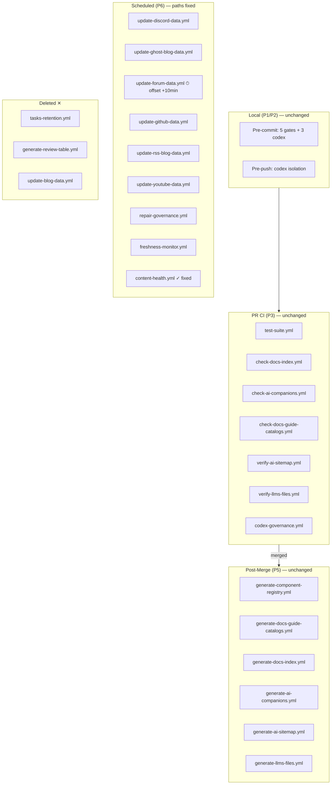
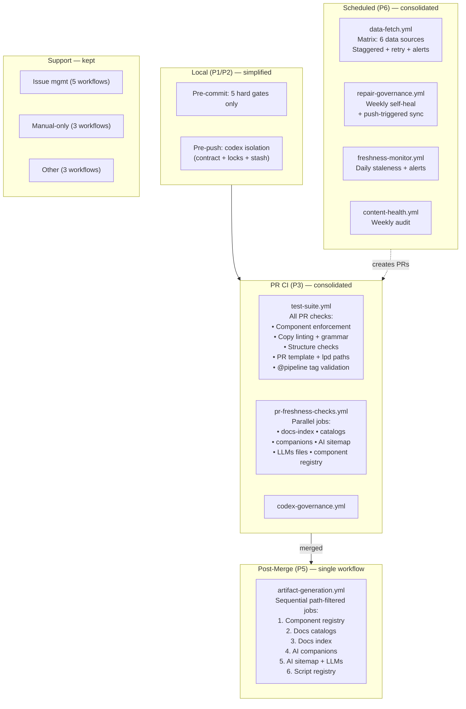
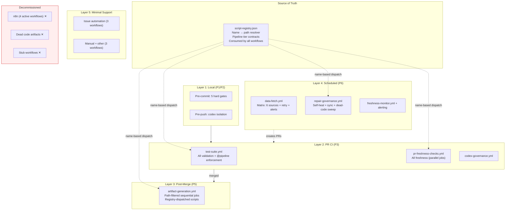

# Architecture Streamlining Report

> **Type**: READ-ONLY architecture review
> **Date**: 2026-03-23
> **Scope**: System architecture and pipeline streamlining analysis
> **Inputs**: system-canonical.mdx, script-framework.md, decision-log.md, plan.md, 6 audit reports (00-06), governance-pipeline.js, pre-commit hook, 3 published policies, live file system counts

---

## 1. Executive Summary

1. **The system is over-engineered for its scale.** 132 active scripts, 43 GHA workflows, a 6-type taxonomy, 4 concerns, 27+ niches, and a 5-layer system design to govern ~200 MDX documentation pages. The governance infrastructure outweighs the content it governs by roughly 2:1 in file count.

2. **Path fragility is the single biggest systemic weakness.** The `tools/scripts/` to `operations/scripts/` restructure (Task 14) broke 7+ workflow YAML files, and multiple JSDoc `@usage`/`@scope` headers still reference stale paths. Every restructure requires touching 80+ path references across scripts, workflows, hooks, configs, and AI adapter files. This is a fundamental coupling problem that no amount of taxonomy will solve -- the architecture needs indirection (a registry-based dispatch model) instead of hardcoded paths.

3. **25+ validators declare CI pipeline tiers but have zero actual wiring.** The `@pipeline` JSDoc tag is aspirational fiction for roughly half the validator corpus. 13 content validators, 6 governance validators, and 6+ AI validators claim P3/CI execution that does not exist. This creates a false sense of coverage.

4. **15 auto-commit workflows create a complex web of race conditions and trigger cascades.** Three confirmed race conditions exist between component, content, and data workflows. The n8n system is fully redundant with GHA but targets a different branch, creating ghost writes.

5. **The 43-workflow count can be reduced to ~22 without losing capability.** Stub workflows (2), disabled workflows (1), redundant verification pairs, and data-fetch workflows that could be consolidated would cut the workflow surface area nearly in half.

---

## 2. Current State Assessment

### By the numbers

| Metric | Count | Notes |
|--------|-------|-------|
| Active scripts in `operations/scripts/` | 132 | Excluding x-archive (23) and archive/ (18) |
| Script types | 6 | audits (18), generators (19), validators (34), remediators (15), dispatch (11), automations (32) + 2 config + 1 snippets |
| Concerns | 4 | content, components, governance, ai |
| Niche directories | 50 | Unique directories under type/concern |
| GHA workflows | 43 | Including 2 stubs, 1 disabled |
| Pre-commit hard gates | 5 | Plus 3 codex-conditional checks |
| Auto-commit workflows | 15 | Scripts or workflows that `git commit` + `git push` |
| n8n workflows | 5 | 4 active (writing to `docs-v2-preview`), 1 broken |
| Fetch scripts in `.github/scripts/` | 7 | Plus 1 supplementary |
| Identified gaps (from audits) | 54 | Across 6 concerns |
| Unwired validators | 25+ | Declare CI but have no workflow call |
| Broken workflows (P0) | 7 | Stale paths from restructure |
| x-archive scripts | 23 | Never deleted, per D2 |

### Script distribution by type

```
validators   34  (26%)  -- largest category
automations  32  (24%)
generators   19  (14%)
audits       18  (14%)
remediators  15  (11%)
dispatch     11  (8%)
config        2  (2%)
other         1  (1%)
```

### Workflow distribution by function

| Function | Workflow count |
|----------|---------------|
| Data fetch (cron) | 7 (1 disabled) |
| Artifact generation (push-to-main auto-commit) | 6 |
| Freshness/validation (PR gates) | 7 |
| Self-heal/repair (cron) | 4 |
| Codex/agent governance | 4 |
| Testing (PR/push) | 3 |
| Issue/project management | 4 |
| Manual-only | 3 |
| Stubs | 2 |
| Other | 3 |

---

## 3. Pipeline Architecture Analysis

### A. Execution contexts

The system operates across **6 distinct pipeline execution contexts**:

| Context | Trigger | Speed req | Gate type | Scripts run |
|---------|---------|-----------|-----------|-------------|
| **P1 -- Pre-commit** | Every `git commit` | < 5s | Hard gate (blocks commit) | 5 gates + 3 codex-conditional |
| **P2 -- Pre-push** | Every `git push` | < 30s | Hard gate (blocks push) | Codex contract + locks + stash (codex branches only) |
| **P3 -- PR check** | PR opened/updated | Minutes | Soft gate (warns) or Hard (blocks merge) | `test-suite.yml`, `check-*` workflows, `codex-governance.yml` |
| **P5 -- Push-to-main** | Push merged to main | Minutes | Auto-commit | 6 generation workflows |
| **P6 -- Cron** | Scheduled | Minutes | Self-heal (creates PR) | Repair, freshness, data fetch |
| **Manual** | Human dispatch | N/A | On-demand | ~60% of all scripts |

### B. Tier coherence assessment

The tier system (P1/P2/P3/P5/P6/manual) per D7 is **conceptually coherent but practically hollow**:

- **P1 (pre-commit)**: Well-defined, well-implemented. 5 hard gates, clean, fast. This is the strongest part of the architecture.
- **P2 (pre-push)**: Narrowly scoped to codex branches. Correct separation from P1.
- **P3 (PR checks)**: **Severely under-wired.** 25+ scripts declare P3 but only ~10 actually have workflow wiring. The gap between declared and actual tier is the system's biggest integrity problem.
- **P5 (push-to-main)**: Functional but race-prone. 6 auto-commit workflows can conflict.
- **P6 (cron)**: Works but has silent failure modes. No monitoring or alerting.
- **Manual**: Over 60% of scripts are manual-only, suggesting the pipeline automates less than it appears.

### C. Auto-commit workflow inventory

15 workflows perform auto-commits. This is the most fragile part of the pipeline:

| Workflow | Trigger | Branch | Race risk |
|----------|---------|--------|-----------|
| `generate-component-registry.yml` | Push main (JSX paths) | main | Yes -- with `generate-docs-guide-catalogs.yml` |
| `generate-docs-guide-catalogs.yml` | Push main (workflows, docs.json) | main | Yes -- with component registry |
| `generate-docs-index.yml` | Push main | main | Yes -- with `generate-ai-companions.yml` |
| `generate-ai-companions.yml` | Push main (MDX paths) | main | Yes -- with docs-index |
| `generate-ai-sitemap.yml` | Push main | main | Low (different file) |
| `generate-llms-files.yml` | Push docs-v2 | docs-v2 | Low (different branch) |
| `repair-governance.yml` | Cron weekly | main (via PR) | Low (PR model) |
| `governance-sync.yml` | Push docs-v2 | docs-v2 (via PR) | Medium -- see GAP-G9 |
| `update-discord-data.yml` | Cron daily 01:00 | DEPLOY_BRANCH | Low |
| `update-ghost-blog-data.yml` | Cron daily 00:00 | DEPLOY_BRANCH | Yes -- with forum (same time) |
| `update-forum-data.yml` | Cron daily 00:00 | DEPLOY_BRANCH | Yes -- with ghost (same time) |
| `update-github-data.yml` | Cron daily 02:00 | DEPLOY_BRANCH | Low |
| `update-rss-blog-data.yml` | Cron daily 03:00 | DEPLOY_BRANCH | Low |
| `update-youtube-data.yml` | Cron weekly | DEPLOY_BRANCH | Low |
| `update-livepeer-release.yml` | Cron/manual | DEPLOY_BRANCH | Low |

### D. Recommended consolidated pipeline architecture



This reduces 43 workflows to **~10 core workflows** plus 3 issue/project workflows.

---

## 4. Script Consolidation Opportunities

### A. Taxonomy assessment

The 6-type taxonomy (audits, generators, validators, remediators, dispatch, automations) is **theoretically clean but practically costly**:

**Taxonomy costs:**
- 6 types x 4 concerns x ~4 niches = ~96 possible directories. Only ~50 are populated. Half the taxonomy is empty scaffolding.
- Every script move requires updating 80+ path references (per plan.md Task 4).
- The `archive/` and `x-archive/` directories together hold 41 scripts -- nearly a third of the active count.
- The taxonomy forces classification questions on borderline scripts (e.g., `audit-script-inventory.js` is both validator AND generator -- see OVERLAP-G2).

**Taxonomy benefits:**
- Path-derived classification enables auto-cataloging.
- Concern separation enforces single-responsibility.
- Decision tree (Section 2.3 of script-framework.md) is clear.

**Verdict:** The taxonomy **earns its keep at the type level** (6 types are meaningful distinctions). The **concern level is moderately useful** (4 concerns map to real domain boundaries). The **niche level creates unnecessary fragmentation** -- many niches have only 1-2 scripts, and the deep path structure is the primary cause of the path-fragility problem.

### B. Specific consolidation candidates

| Candidate | Current state | Recommendation | Risk |
|-----------|--------------|----------------|------|
| `generate-script-registry.js` + `audit-script-inventory.js` | Overlapping registry output (OVERLAP-G4). Both parse JSDoc headers across same roots. | Designate `generate-script-registry.js` as canonical registry writer. Make `audit-script-inventory.js` consume, not write. | Low |
| `fetch-ghost-blog-data.js` + `fetch-rss-blog-data.js` | Ghost script is special case of generic RSS fetcher (GAP-DP6, OVERLAP-DP2). | Migrate Ghost config into `product-social-config.json`; retire dedicated Ghost script. | Medium -- Ghost RSS has different URL structure |
| 7x `escapeForJSX` functions | Duplicated across all 7 fetch scripts (OVERLAP-DP3). | Extract to shared `.github/scripts/lib/escape-jsx.js`. | Low |
| `repair-script-inventory.js` | Thin wrapper that calls `audit-script-inventory.js --fix`. | Eliminate wrapper; call directly from governance-pipeline. | Low |
| `sync-generated-files.js` | Dispatches generators then validates banners. | Fold logic into `governance-pipeline.js` or `test-suite.yml`. | Low |
| `review-governance-repair-checklist.js` | Manual-only checklist generator. | Fold into governance-pipeline `--report-only` mode. | Low |
| `docs-page-research-pr-report.js` + `orchestrator-guides-research-review.js` | Compatibility wrappers around veracity pipeline. | Consolidate into single dispatch entry point. | Low |
| `fix-usage-paths.js` | One-time migration script. | Move to x-archive. | None |

### C. Scripts that do too little

| Script | Lines | What it does | Should it exist? |
|--------|-------|-------------|-----------------|
| `repair-script-inventory.js` | ~5 | Calls `audit-script-inventory.js --fix` | No -- inline the call |
| `review-governance-repair-checklist.js` | ~30 | Prints human review checklist | No -- fold into pipeline |

### D. Dispatch scripts: value vs indirection

The 11 dispatch scripts break down as:

| Dispatch script | Value-add | Verdict |
|-----------------|-----------|---------|
| `governance-pipeline.js` | **High** -- chains audit/repair/verify/report with dry-run/fix modes | Keep |
| `repo-audit-orchestrator.js` | **Medium** -- aggregates all validators for full sweep | Keep |
| `task-finalise.js` | **Medium** -- enforces codex completion requirements | Keep |
| `codex-commit.js` | **Medium** -- generates compliant commit messages | Keep |
| `create-codex-pr.js` | **Medium** -- creates compliant PRs | Keep |
| `check-codex-pr-overlap.js` | **Medium** -- PR overlap detection | Keep |
| `docs-research-packet.js` | **Low** -- experimental veracity pipeline | Keep (experimental) |
| `docs-page-research-pr-report.js` | **Low** -- wrapper | Merge into packet |
| `orchestrator-guides-research-review.js` | **Low** -- compatibility wrapper | Merge |
| `sync-generated-files.js` | **Low** -- thin dispatcher | Fold into governance-pipeline |
| `run-solutions-social-fetch.js` | **Low** -- manual data fetch | Fold into data-fetch workflow |

---

## 5. Workflow Consolidation Plan

### Current: 43 workflows -> Recommended: 22 workflows

| Current workflow(s) | Action | Target workflow | Rationale |
|---------------------|--------|-----------------|-----------|
| `test-suite.yml` | **Keep** | `test-suite.yml` | Core PR validation |
| `test-v2-pages.yml` | **Keep** | `test-v2-pages.yml` | Browser tests (heavy, separate) |
| `broken-links.yml` | **Keep** | `broken-links.yml` | Mintlify scanner |
| `check-docs-index.yml` + `check-ai-companions.yml` + `check-docs-guide-catalogs.yml` | **Merge** | `pr-freshness-checks.yml` | All are PR freshness validators; run as parallel jobs in one workflow |
| `verify-ai-sitemap.yml` + `verify-llms-files.yml` | **Merge** | Fold into `pr-freshness-checks.yml` | Same pattern as above |
| `codex-governance.yml` | **Keep** | `codex-governance.yml` | Scoped to codex/* branches |
| `generate-component-registry.yml` + `generate-docs-guide-catalogs.yml` + `generate-docs-index.yml` + `generate-ai-companions.yml` + `generate-ai-sitemap.yml` + `generate-llms-files.yml` | **Merge** | `artifact-generation.yml` | Single post-merge artifact workflow with path-filtered jobs. Eliminates race conditions. |
| `repair-governance.yml` | **Keep** | `repair-governance.yml` | Weekly self-heal |
| `governance-sync.yml` | **Merge** | Fold into `repair-governance.yml` with push trigger | Redundant with repair (OVERLAP-G1) |
| `content-health.yml` | **Keep** (fix paths) | `content-health.yml` | Weekly audit |
| `freshness-monitor.yml` | **Keep** | `freshness-monitor.yml` | Daily staleness |
| `style-homogenise.yml` | **Keep** (fix path) | `style-homogenise.yml` | Manual EN-GB style |
| `seo-refresh.yml` | **Keep** | `seo-refresh.yml` | Manual SEO |
| `openapi-reference-validation.yml` | **Keep** | `openapi-reference-validation.yml` | OpenAPI spec validation |
| `update-discord-data.yml` + `update-ghost-blog-data.yml` + `update-forum-data.yml` + `update-github-data.yml` + `update-rss-blog-data.yml` + `update-youtube-data.yml` | **Merge** | `data-fetch.yml` | Single cron workflow with matrix strategy for all data sources. Stagger via matrix index. |
| `update-livepeer-release.yml` | **Keep** | `update-livepeer-release.yml` | Different pattern (release, not data) |
| `update-blog-data.yml` | **Delete** | N/A | Legacy broken, already disabled |
| `docs-v2-issue-indexer.yml` | **Keep** | `docs-v2-issue-indexer.yml` | Issue tracking |
| `close-linked-issues-docs-v2.yml` | **Keep** | `close-linked-issues-docs-v2.yml` | Post-merge automation |
| `auto-assign-docs-reviewers.yml` | **Keep** | `auto-assign-docs-reviewers.yml` | PR assignment |
| `discord-issue-intake.yml` | **Keep** | `discord-issue-intake.yml` | Issue intake |
| `issue-auto-label.yml` | **Keep** | `issue-auto-label.yml` | Issue labeling |
| `tasks-retention.yml` | **Delete** | N/A | Stub (GAP-G7) |
| `generate-review-table.yml` | **Delete** | N/A | Stub (GAP-G8) |
| `translate-docs.yml` | **Keep** | `translate-docs.yml` | Translation automation |
| `build-review-assets.yml` | **Keep** | `build-review-assets.yml` | Review asset generation |
| `sync-large-assets.yml` | **Keep** | `sync-large-assets.yml` | Large asset sync |
| `v2-external-link-audit.yml` | **Keep** | `v2-external-link-audit.yml` | External link checking |
| `update-review-template.yml` | **Keep** | `update-review-template.yml` | Review template |
| `project-showcase-sync.yml` | **Keep** | `project-showcase-sync.yml` | Showcase sync |

**Result**: 43 -> 22 workflows (48% reduction)

**Biggest wins:**
- 6 data-fetch workflows -> 1 with matrix strategy
- 5 PR freshness check workflows -> 1 with parallel jobs
- 6 artifact generation workflows -> 1 with path-filtered jobs
- 2 stubs + 1 disabled -> deleted
- `governance-sync.yml` folded into `repair-governance.yml`

---

## 6. Gate Optimization

### Recommended gate matrix across all concerns

| Check | Current gate | Recommended gate | Change reason |
|-------|-------------|-----------------|---------------|
| MDX syntax | P1 (pre-commit) | P1 | Correct |
| docs.json integrity | P1 (pre-commit) | P1 | Correct |
| File deletion guard | P1 (pre-commit) | P1 | Correct |
| .allowlist / v1 freeze | P1 (pre-commit) | P1 | Correct |
| Codex branch isolation | P1 (pre-commit) | P1 | Correct |
| Codex task contract | P1 + P2 + P3 | P2 + P3 only | Remove from pre-commit to reduce complexity; push gate is sufficient |
| Codex locks | P1 + P2 | P2 only | Same reasoning |
| AI stash policy | P1 + P2 | P2 only | Same reasoning |
| Component naming | P3 (test-suite) | P3 | Correct |
| Component immutability | P3 (test-suite) | P3 | Correct |
| Component CSS | P3 (test-suite) | P3 | Correct |
| Component health | P3 (check-catalogs) | P3 | Correct |
| Docs index freshness | P3 (check-docs-index) | P3 | Correct |
| Companion freshness | P3 (check-ai-companions) | P3 | Correct |
| Catalog freshness | P3 (check-catalogs) | P3 | Correct |
| **Copy linting** | **None (manual)** | **P3 (test-suite)** | Wire into PR checks (GAP-CT8) |
| **Grammar checks** | **None (manual)** | **P3 (test-suite)** | Wire into PR checks (GAP-CT8) |
| **Structure checks** | **None (manual)** | **P3 (test-suite)** | Wire into PR checks |
| **Agent docs freshness** | **None (manual)** | **P6 (cron weekly)** | Not PR-blocking; check weekly (GAP-G3, GAP-CX2) |
| **PR template** | **None (manual)** | **P3 (test-suite)** | Wire into PR checks (GAP-G6) |
| **lpd paths** | **None (manual)** | **P3 (test-suite)** | Wire into PR checks (GAP-G5) |
| **Script registry** | **None (manual)** | **P5 (post-merge gen)** | Auto-regenerate on merge (GAP-G1) |
| Component registry regen | P5 (push-main) | P5 | Correct |
| Docs index regen | P5 (push-main) | P5 | Correct |
| Governance repair | P6 (weekly cron) | P6 | Correct |
| Data fetch | P6 (daily cron) | P6 | Correct |
| Content health | P6 (weekly cron) | P6 | Correct -- fix paths first |

### Pre-commit simplification opportunity

The pre-commit hook currently runs 5 gates plus 3 codex-conditional checks (task contract, locks, stash policy). Per D3, it was reduced from 1,599 lines to 448 lines. It could be further simplified:

**Recommendation**: Move codex checks (task contract, locks, stash) from pre-commit to pre-push only. Rationale: codex sessions push to feature branches, and the push gate already validates all three. Running them at commit time adds ~1-2 seconds and creates maintenance coupling (both hooks must stay in sync). This would reduce pre-commit to **exactly 5 gates** as originally specified in D3, matching the declared ideal.

---

## 7. Systemic Pattern Analysis

### What the 54 gaps tell us about architectural weaknesses

The 54 identified gaps cluster into **5 systemic patterns**:

#### Pattern 1: Aspirational `@pipeline` tags (22 gaps)

GAPs: CT1, CT2, CT3, CT4, CT8, G1, G3, G4, G5, G6, G10, AI1, AI2, AI3, AI4, AI10, CX2, C1, C2, C4, CX3, CX4

**22 of 54 gaps (41%)** are scripts that declare a CI pipeline tier in their JSDoc header but have zero actual workflow wiring.

**Root cause**: The JSDoc header system treats `@pipeline` as both a declaration ("where this script should run") and a description ("where this script does run"). There is no validation that the declared pipeline matches reality.

**Structural fix**: Add a CI check that validates `@pipeline` tags against actual workflow YAML references. If a script declares `P3` but no workflow calls it, the check fails. This converts aspirational declarations into enforceable contracts.

#### Pattern 2: Path fragility from restructure (10 gaps)

GAPs: CT5, CT6, AI5, CX1, CX7, DP12, plus all 7 P0 broken workflows from the cross-concern findings

**Root cause**: The `tools/scripts/` to `operations/scripts/` restructure (Task 14) required updating 80+ path references manually. Any missed reference becomes a silent failure. Paths are hardcoded in: workflow YAML, script JSDoc `@usage` tags, script `@scope` tags, `require()` calls, AI adapter files, agent instruction docs, README files, and test configurations.

**Structural fix**: Introduce a path-indirection layer. Instead of hardcoding `operations/scripts/validators/content/structure/check-mdx-safe-markdown.js` in workflows, use a registry-based lookup: the workflow calls a script by its `@script` name, and a resolver maps that to the current path. This is exactly what `script-registry.json` could enable if it were consumed by workflow scripts.

#### Pattern 3: Silent failures in cron workflows (8 gaps)

GAPs: DP1, DP2, DP10, G9, G7, G8, DP8, DP9

**Root cause**: Cron workflows have no monitoring, no retry logic, no alerting, and some use `continue-on-error: true` which masks failures entirely (content-health.yml). When a weekly cron fails, nobody knows until the data goes stale.

**Structural fix**: Add a workflow failure notification step (Slack/Discord webhook or GitHub issue creation) to all cron workflows. Add retry logic (3 attempts with backoff) to all external API calls.

#### Pattern 4: Dual-write / race conditions (7 gaps)

GAPs: CT10, DP5, DP11, plus the 3 auto-commit race conditions, plus OVERLAP-G1

**Root cause**: Multiple workflows can trigger on the same push event and attempt to auto-commit to the same branch concurrently. The n8n system adds a second write path to a different branch for the same data.

**Structural fix**: Consolidate auto-commit workflows into a single workflow with sequential jobs. Use `concurrency` groups to prevent parallel execution. Formally decommission n8n.

#### Pattern 5: Dead code and unused outputs (7 gaps)

GAPs: DP3, DP4, DP6, AI6, AI9, G7, G8

**Root cause**: Scripts produce artifacts that nothing consumes (`githubDiscussionsData.jsx`, `githubReleasesData.jsx`), files that do not exist (`llms-full.txt`), stale copies (`snippets/assets/site/sitemap-ai.xml`), and stub workflows that were never implemented.

**Structural fix**: Run a quarterly "dead code sweep" that checks every generated artifact for live consumers. If no page, workflow, or script imports an artifact, flag it for review.

---

## 8. Recommended Target Architecture

### Design principles (derived from `infrastructure-principles.mdx`)

1. **Single responsibility per layer** -- each gate owns one class of risk
2. **Fast local feedback** -- pre-commit is local, offline, bounded
3. **One canonical policy source** -- no duplicated rule text
4. **Registry-based dispatch** -- scripts are referenced by name, not path
5. **Consolidated auto-commit** -- one workflow per trigger type

### Target architecture diagram



### Key differences from current state

| Aspect | Current | Target |
|--------|---------|--------|
| PR freshness checks | 5 separate workflows | 1 workflow with parallel jobs |
| Artifact generation | 6 separate auto-commit workflows | 1 workflow with sequential path-filtered jobs |
| Data fetch | 6 separate cron workflows | 1 workflow with matrix strategy |
| Pre-commit codex checks | In pre-commit (3 extra checks) | Moved to pre-push only |
| Script path references | Hardcoded in workflows | Registry-based lookup via `script-registry.json` |
| Cron failure detection | None | Failure notification step |
| Workflow count | 43 | ~22 |
| Auto-commit race conditions | 3 confirmed | 0 (sequential execution) |

---

## Streamlining Options

Three options are presented below, each at a different level of intervention. All three are grounded in the gaps, overlaps, and recommendations documented in this report. Choose based on appetite for risk and available bandwidth.

---

### Option A — Surgical Fix

**One-line summary:** Fix what is broken today without changing any architecture.

**What it changes (scope of work):**
- Fix 7 broken workflow paths from the Task 14 restructure (P0 cross-concern findings)
- Fix stale paths in `content-health.yml` (GAP-CT5), `style-homogenise.yml` (GAP-CT6), `codex-governance.yml` (GAP-CX1)
- Delete 2 stub workflows (`tasks-retention.yml`, `generate-review-table.yml`) and 1 legacy disabled workflow (`update-blog-data.yml`)
- Fix `governance-sync.yml` scope flag (GAP-G9)
- Add `[skip ci]` to YouTube workflow commit message (GAP-DP8)
- Standardize bot identity across data workflows (GAP-DP9)
- Fix Node version inconsistency in `governance-sync.yml` (GAP-G11)
- Offset forum workflow by 10 minutes to avoid ghost/forum 00:00 collision

**What it keeps unchanged:**
- All 6 pipeline tiers (P1/P2/P3/P5/P6/Manual)
- All 6 script types, 4 concerns, and niche directory structure
- All existing workflow files (except 3 deletions)
- All 25+ unwired validators remain unwired
- Pre-commit codex checks stay in pre-commit
- n8n system remains active
- No workflow merges

**Tradeoffs:**

| Pros | Cons |
|------|------|
| Minimal risk -- each fix is independent and testable | 25+ validators still have aspirational `@pipeline` tags with zero wiring |
| Can be completed in a single sprint | Auto-commit race conditions remain (3 confirmed) |
| No workflow trigger changes -- no risk of missed events | Path fragility remains -- next restructure will break the same things |
| Zero impact on running pipelines | 40 workflows remain (43 minus 3 deletions) -- still complex to reason about |

**Estimated effort:** Low (1-2 days)

**Workflows:** 43 before --> 40 after

**Scripts affected:** 0 scripts changed (workflow YAML only)



---

### Option B — Moderate Consolidation

**One-line summary:** Merge redundant workflows, wire unwired validators, and fix the architecture gaps without rearchitecting.

**What it changes (scope of work):**
- Everything in Option A, plus:
- Wire 25+ unwired validators into existing workflows (add copy linting, grammar checks, structure checks, PR template validation, lpd path validation to `test-suite.yml`; add agent docs freshness to cron)
- Merge 5 PR freshness check workflows into 1 (`pr-freshness-checks.yml` with parallel jobs)
- Merge 6 data-fetch workflows into 1 (`data-fetch.yml` with matrix strategy)
- Merge 6 artifact generation workflows into 1 (`artifact-generation.yml` with path-filtered sequential jobs)
- Fold `governance-sync.yml` into `repair-governance.yml`
- Add `concurrency` groups to prevent parallel auto-commits
- Extract shared `escapeForJSX` utility from 7 fetch scripts (OVERLAP-DP3)
- Move codex pre-commit checks to pre-push only (simplify pre-commit to exactly 5 gates)
- Create `@pipeline` validation test to enforce declared vs actual pipeline tier
- Add retry logic and failure notification to all cron workflows

**What it keeps unchanged:**
- 6 script types, 4 concerns, niche directory structure
- Hardcoded paths in workflow YAML (no registry-based dispatch yet)
- n8n system (decommission deferred)
- `x-archive/` and `archive/` directories (per D2 no-deletion policy)
- Script taxonomy and decision log governance model

**Tradeoffs:**

| Pros | Cons |
|------|------|
| 48% workflow reduction (43 to 22) eliminates redundancy | Workflow merges carry medium risk of trigger gaps during transition |
| Eliminates all 3 confirmed auto-commit race conditions | Must run old and new workflows in parallel for 1+ week validation |
| Converts 25+ aspirational `@pipeline` tags into real wiring | New validator wiring may produce false positives initially |
| Cron failures become visible via alerting | Path fragility pattern remains -- next restructure still breaks things |
| Pre-commit drops from 8 checks to 5 | Moderate effort and testing required |

**Estimated effort:** Medium (2-3 weeks across Phases 1-4)

**Workflows:** 43 before --> 22 after

**Scripts affected:** ~12 scripts (7 fetch scripts for shared utility extraction, 5 validators wired into test-suite, pipeline validation test)



---

### Option C — Aggressive Streamlining

**One-line summary:** Rearchitect toward minimal viable governance with registry-based dispatch, flattened directories, and n8n decommission.

**What it changes (scope of work):**
- Everything in Options A and B, plus:
- Build registry-based script resolver: workflows reference scripts by `@script` name, a resolver maps to current path via `script-registry.json` -- eliminates the path-fragility pattern entirely (Pattern 2: 10 gaps)
- Flatten niche directories: collapse `type/concern/niche/` to `type/concern/` where niches have fewer than 3 scripts -- reduces 50 niche directories to ~20
- Formally decommission n8n workflows (coordinate with n8n admin) -- eliminates the dual-write problem (Pattern 4)
- Consolidate overlapping scripts: merge `audit-script-inventory.js` into `generate-script-registry.js` consumer (OVERLAP-G4); retire dedicated Ghost fetch script in favor of RSS config (OVERLAP-DP2); fold 3 low-value dispatchers into parent workflows
- Run dead-code sweep: remove artifacts produced but never consumed (`githubDiscussionsData.jsx`, `githubReleasesData.jsx`, stale `llms-full.txt` references, `sitemap-ai.xml` copy) -- Pattern 5
- Add quarterly dead-code sweep automation
- Move `fix-usage-paths.js` to x-archive (one-time migration script)
- Evaluate reducing script types from 6 to 4 (merge `audits` into `validators`, merge `remediators` into `dispatch`)

**What it keeps unchanged:**
- Core pipeline tiers (P1/P2/P3/P5/P6)
- Pre-commit 5-gate design (proven effective)
- D2 no-deletions policy for script files (x-archive model)
- Governance pipeline as primary dispatch orchestrator
- Published policies (script-governance, infrastructure-principles, generated-artifact-governance)

**Tradeoffs:**

| Pros | Cons |
|------|------|
| Eliminates path fragility -- restructures no longer break workflows | Registry resolver is a new abstraction layer to build and maintain |
| Governance infra-to-content ratio drops from ~2:1 toward ~1:1 | Directory flattening triggers 80+ path updates (but for the last time if resolver is built first) |
| n8n decommission removes ghost-write channel entirely | Requires coordination with external n8n admin |
| Dead code removal shrinks mental model of the system | Reducing script types from 6 to 4 may conflict with existing taxonomy policy |
| Workflow count drops to ~18 (further consolidation of support workflows) | Highest effort and risk; needs phased rollout over 4-6 weeks |
| Every `@pipeline` tag becomes a verifiable contract | Some manual-only scripts may resist classification into fewer types |

**Estimated effort:** High (4-6 weeks, phased)

**Workflows:** 43 before --> ~18 after

**Scripts affected:** ~30 scripts (12 from Option B + consolidation merges + path updates from flattening + dead code removal + one-time migration archival)



---

## 9. Migration Path

### Phase 1: Fix broken things (1-2 days, low risk)

| Step | What | Files affected | Risk | Ref |
|------|------|---------------|------|-----|
| 1.1 | Fix 7 broken workflow paths from restructure | 7 workflow YAML files | Low | P0 cross-concern findings |
| 1.2 | Fix `content-health.yml` stale script paths | `content-health.yml` | Low | GAP-CT5 |
| 1.3 | Fix `style-homogenise.yml` stale path | `style-homogenise.yml` | Low | GAP-CT6 |
| 1.4 | Fix `codex-governance.yml` stale path for `check-codex-pr-overlap.js` | `codex-governance.yml` | Low | GAP-CX1 |
| 1.5 | Delete `tasks-retention.yml` (stub) and `generate-review-table.yml` (stub) | 2 YAML files | None | GAP-G7, G8 |
| 1.6 | Delete `update-blog-data.yml` (legacy disabled) | 1 YAML file | None | Already disabled |
| 1.7 | Fix `governance-sync.yml` scope flag (add `--full`) | `governance-sync.yml` | Low | GAP-G9 |
| 1.8 | Add `[skip ci]` to YouTube workflow commit message | `update-youtube-data.yml` | None | GAP-DP8 |
| 1.9 | Standardize bot identity across data workflows | 7 data workflow YAMLs | None | GAP-DP9 |
| 1.10 | Fix Node version inconsistency (standardize on 22) | `governance-sync.yml` | None | GAP-G11 |

### Phase 2: Wire unwired validators (3-5 days, low-medium risk)

| Step | What | Risk |
|------|------|------|
| 2.1 | Add copy linting (`lint-copy.js`, `lint-patterns.js`) to `test-suite.yml` as soft gate | Low |
| 2.2 | Add grammar checks (`check-grammar-en-gb.js`, `check-proper-nouns.js`) to `test-suite.yml` | Low |
| 2.3 | Add structure checks (`lint-structure.js`, `check-double-headers.js`, etc.) to `test-suite.yml` | Low |
| 2.4 | Add `check-pr-template.js` to `test-suite.yml` | Low |
| 2.5 | Add `validate-lpd-paths.js` to `test-suite.yml` | Low |
| 2.6 | Add `check-agent-docs-freshness.js` to `content-health.yml` (weekly cron) | Low |
| 2.7 | Add `generate-script-registry.js` to `generate-docs-guide-catalogs.yml` push trigger | Low |
| 2.8 | Create `@pipeline` validation test: verify all `P3`/`ci`/`pr-workflow` declarations have matching workflow wiring | Medium |

### Phase 3: Consolidate workflows (5-7 days, medium risk)

| Step | What | Risk |
|------|------|------|
| 3.1 | Merge `check-docs-index.yml`, `check-ai-companions.yml`, `check-docs-guide-catalogs.yml`, `verify-ai-sitemap.yml`, `verify-llms-files.yml` into `pr-freshness-checks.yml` with parallel jobs | Medium |
| 3.2 | Merge 6 data-fetch workflows into `data-fetch.yml` with matrix strategy and staggered timing | Medium |
| 3.3 | Merge `governance-sync.yml` push trigger into `repair-governance.yml` | Low |
| 3.4 | Add `concurrency` groups to prevent parallel auto-commits | Low |
| 3.5 | Offset forum workflow by 10 minutes to avoid ghost/forum 00:00 collision | Low |

### Phase 4: Consolidate auto-commit workflows (3-5 days, higher risk)

| Step | What | Risk |
|------|------|------|
| 4.1 | Merge all 6 post-merge artifact generation workflows into `artifact-generation.yml` with sequential path-filtered jobs | **High** -- most impactful change; must test thoroughly |
| 4.2 | Add `concurrency` group to prevent parallel artifact generation | Medium |
| 4.3 | Test with deliberate push events covering each path trigger | Medium |

### Phase 5: Architectural improvements (ongoing, low-medium risk)

| Step | What | Risk |
|------|------|------|
| 5.1 | Extract shared `escapeForJSX` utility for data-fetch scripts | Low |
| 5.2 | Move codex pre-commit checks to pre-push only | Low |
| 5.3 | Add retry logic to all data-fetch scripts | Low |
| 5.4 | Add failure notification step to all cron workflows | Low |
| 5.5 | Build registry-based script resolver for workflow dispatch | Medium |
| 5.6 | Formally decommission n8n workflows (coordinate with n8n admin) | Medium (external dependency) |
| 5.7 | Run dead-code sweep: identify artifacts produced but never consumed | Low |
| 5.8 | Evaluate flattening niche directories (concern-level is sufficient) | Medium (many path changes) |

### Phase dependencies

```
Phase 1 (fix broken) -- no dependencies, start immediately
  |
  v
Phase 2 (wire validators) -- depends on Phase 1 path fixes
  |
  v
Phase 3 (consolidate workflows) -- can overlap with Phase 2
  |
  v
Phase 4 (consolidate auto-commit) -- depends on Phase 3 patterns being proven
  |
  v
Phase 5 (architectural) -- independent items, pick as needed
```

### Risk assessment

| Phase | Risk | Mitigation |
|-------|------|------------|
| 1 | Low -- fixing broken things | Each fix is independent; test individually |
| 2 | Low-Medium -- wiring validators could introduce false positives | Add as `continue-on-error: true` initially; promote to blocking after validation |
| 3 | Medium -- workflow merges could introduce trigger gaps | Run old and new workflows in parallel for 1 week before removing old |
| 4 | High -- auto-commit consolidation is the riskiest change | Extensive testing; keep old workflows disabled (not deleted) for 2 weeks |
| 5 | Low-Medium -- incremental improvements | Each is independent and reversible |

---

## Appendix: Decision Cross-Reference

| Decision | Reference | Architectural impact assessed |
|----------|-----------|-------------------------------|
| D1 -- Three-tier taxonomy | `plan.md` Task 1 | Taxonomy is sound at type/concern level; niche level adds fragmentation |
| D2 -- No deletions policy | `decision-log.md` | Creates 41+ archived files (23 x-archive + 18 archive); management overhead |
| D3 -- Pre-commit scope | `decision-log.md` | Successfully implemented; could be further reduced by moving codex checks to pre-push |
| D4 -- No index/catalog in pre-commit | `decision-log.md` | Correct decision; prevents slow commits |
| D5 -- Validator prefix conventions | `decision-log.md` | Clean naming, well-enforced |
| D6 -- Dispatcher concern rule | `decision-log.md` | Correct but 3 dispatchers could be eliminated |
| D7 -- Governance tier encoding | `decision-log.md` | P1-P6 scheme is coherent but only ~40% of scripts have accurate pipeline declarations |
| D8 -- Task 9 split | `decision-log.md` | Documentation work correctly deferred |
| D9 -- Tasks 12.5 and 12.6 | `decision-log.md` | Pipeline review (this report) and dispatcher audit both needed |
| D10 -- Snippets no-restructure | `decision-log.md` | Correct scoping decision |
| D11 -- Pre-existing test failures | `decision-log.md` | Important context for test results |
| D12 -- AI-tools registry fix | `decision-log.md` | Symptom of path fragility pattern |
| D13 -- Node modules symlink | `decision-log.md` | Pragmatic dependency resolution |

---

## Appendix: Files Referenced

- System canonical design: `/Users/alisonhaire/Documents/Livepeer/Docs-v2-dev/workspace/plan/active/SCRIPT-GOVERNANCE/system-canonical.mdx`
- Script framework spec: `/Users/alisonhaire/Documents/Livepeer/Docs-v2-dev/workspace/plan/active/SCRIPT-GOVERNANCE/script-framework.md`
- Decision log: `/Users/alisonhaire/Documents/Livepeer/Docs-v2-dev/workspace/plan/active/SCRIPT-GOVERNANCE/decision-log.md`
- Plan: `/Users/alisonhaire/Documents/Livepeer/Docs-v2-dev/workspace/plan/active/SCRIPT-GOVERNANCE/plan.md`
- Audit concern index: `/Users/alisonhaire/Documents/Livepeer/Docs-v2-dev/workspace/plan/active/SCRIPT WORKFLOW AUDIT/audits/00-concern-index.md`
- Governance pipeline: `/Users/alisonhaire/Documents/Livepeer/Docs-v2-dev/operations/scripts/dispatch/governance/pipelines/governance-pipeline.js`
- Pre-commit hook: `/Users/alisonhaire/Documents/Livepeer/Docs-v2-dev/.githooks/pre-commit`
- Script governance policy: `/Users/alisonhaire/Documents/Livepeer/Docs-v2-dev/docs-guide/policies/script-governance.mdx`
- Infrastructure principles: `/Users/alisonhaire/Documents/Livepeer/Docs-v2-dev/docs-guide/policies/infrastructure-principles.mdx`
- Generated artifact governance: `/Users/alisonhaire/Documents/Livepeer/Docs-v2-dev/docs-guide/policies/generated-artifact-and-hook-governance.mdx`
