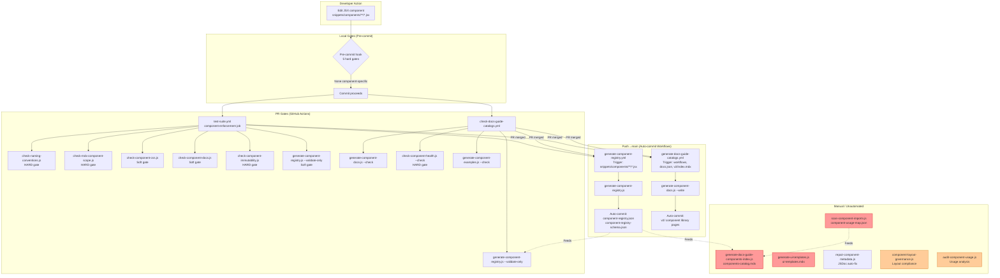
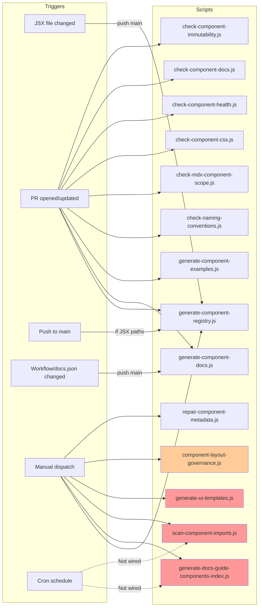
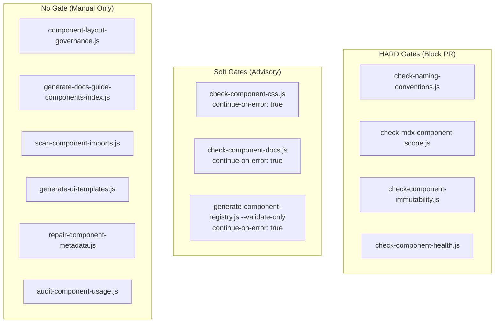
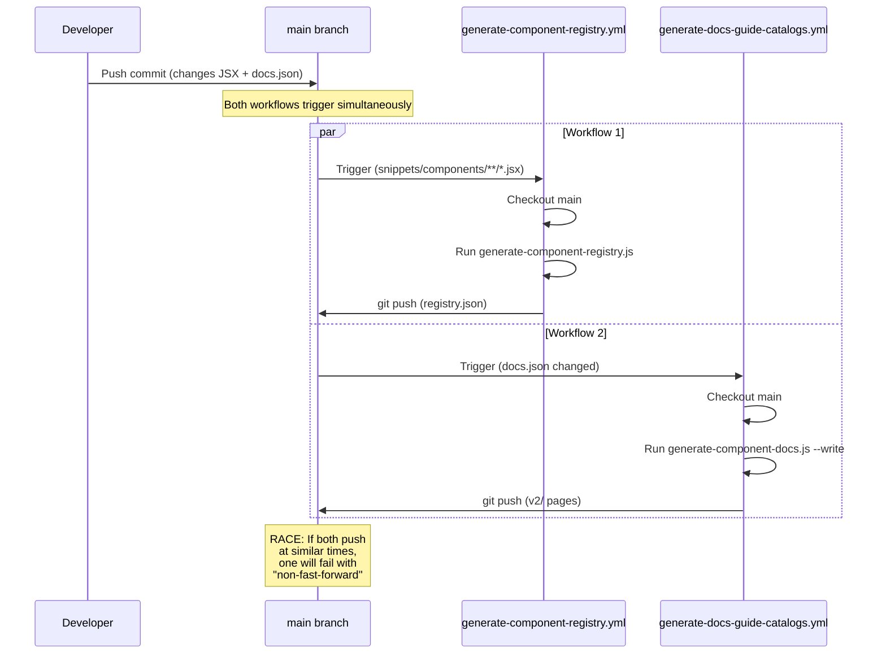

# Concern 1: Components — Workflow & Pipeline Audit

> Generated: 2026-03-23
> Concern: `components` (SCRIPT-GOVERNANCE taxonomy)
> Scope: All scripts, workflows, gates, and artifacts related to the component library

---

## 1. Purpose

The components pipeline ensures that the **118-component JSX library** (`snippets/components/`) remains:
- **Cataloged** — every component has a registry entry with standardized JSDoc metadata
- **Documented** — published component library pages exist and stay current
- **Validated** — naming, scoping, CSS, immutability, and health rules are enforced
- **Tracked** — usage across v2 pages is mapped and drift is detected
- **Governed** — internal catalogs and editor extensions reflect the current state

---

## 2. Scripts in Scope (12 total)

### Generators (5)

| Script | Niche | @pipeline | Input | Output |
|--------|-------|-----------|-------|--------|
| `generate-component-registry.js` | library | manual, P3, P5, P6 | JSDoc in `snippets/components/**/*.jsx` | `docs-guide/config/component-registry.json` + schema |
| `generate-component-examples.js` | library | pr-workflow | `component-registry.json` | `snippets/components/**/examples/*.mdx` |
| `generate-ui-templates.js` | library | manual | Template definitions | `docs-guide/catalog/ui-templates.mdx`, VS Code snippets |
| `generate-component-docs.js` | documentation | manual | `component-registry.json` | `v2/resources/documentation-guide/component-library/**` |
| `generate-docs-guide-components-index.js` | catalogs (governance) | commit | `component-registry.json` + `component-usage-map.json` | `docs-guide/catalog/components-catalog.mdx` |

### Validators (6)

| Script | Niche | @pipeline | Gate | Check |
|--------|-------|-----------|------|-------|
| `check-naming-conventions.js` | library | manual (used P3) | **HARD** | PascalCase + directory naming |
| `check-mdx-component-scope.js` | library | manual | **HARD** | MDX scope isolation |
| `check-component-css.js` | library | manual | Soft | CSS variable compliance |
| `check-component-health.js` | library | pr-workflow | **HARD** | Stale imports, sync, coverage |
| `check-component-docs.js` | documentation | manual, P3 | Soft | JSDoc coverage, governance metadata |
| `component-layout-governance.js` | library | manual | None | Page layout vs approved components |

### Audits (2)

| Script | Niche | @pipeline | Output |
|--------|-------|-----------|--------|
| `scan-component-imports.js` | library | manual, P6 | `docs-guide/config/component-usage-map.json` |
| `audit-component-usage.js` | documentation | manual | `workspace/reports/repo-ops/component-usage-audit.json` |

### Remediators (1)

| Script | Niche | @pipeline | Mode |
|--------|-------|-----------|------|
| `repair-component-metadata.js` | library | manual, P6 | `--dry-run`, `--fix`, `--staged` |

---

## 3. Workflows in Scope (4 GHA)

| Workflow | Trigger | Branch | Auto-commit | Purpose |
|----------|---------|--------|-------------|---------|
| `generate-component-registry.yml` | Push (paths: `snippets/components/**/*.jsx`) | main | Yes | Regenerate registry artifacts |
| `generate-docs-guide-catalogs.yml` | Push (paths: workflows, docs.json, v2/index.mdx) | main | Yes | Regenerate catalogs + component docs |
| `check-docs-guide-catalogs.yml` | PR + Push | docs-v2, main | No | Freshness validation (6 checks) |
| `test-suite.yml` → `component-enforcement` job | PR only | main, docs-v2 | No | Component governance (6 validators) |

---

## 4. Artifacts

| Artifact | Path | Generator | Freshness trigger |
|----------|------|-----------|-------------------|
| Component registry | `docs-guide/config/component-registry.json` | `generate-component-registry.js` | Push→main (auto) |
| Registry schema | `docs-guide/config/component-registry-schema.json` | `generate-component-registry.js` | Push→main (auto) |
| Usage map | `docs-guide/config/component-usage-map.json` | `scan-component-imports.js` | **None** (manual only) |
| Components catalog | `docs-guide/catalog/components-catalog.mdx` | `generate-docs-guide-components-index.js` | **None** (manual only) |
| Component library pages | `v2/resources/documentation-guide/component-library/**` | `generate-component-docs.js` | Push→main (via catalogs workflow) |
| UI templates catalog | `docs-guide/catalog/ui-templates.mdx` | `generate-ui-templates.js` | **None** (manual only) |
| Editor registry | `tools/editor-extensions/components/component-registry.json` | Unknown sync | **None** (freshness unknown) |

---

## 5. Pipeline Diagram — Full Component Lifecycle



**Legend:** Red = gap (should be automated, isn't). Orange = advisory (manual is acceptable).

---

## 6. Trigger Matrix



---

## 7. Gate Classification



---

## 8. Auto-Commit Race Condition



**Risk assessment**: Low frequency (requires simultaneous JSX + docs.json changes in one push) but the failure mode is silent — the losing workflow's auto-commit is dropped without notification.

---

## 9. Requirements & Real Needs

| Requirement | Current state | Met? |
|-------------|--------------|------|
| Every JSX component has required JSDoc fields | `check-component-health.js` (PR gate) + `check-component-docs.js` (soft) | Partially — soft gate means stale/missing JSDoc can land |
| `component-registry.json` stays current | CI regenerates on push→main | Yes |
| `components-catalog.mdx` stays current | Manual only | **No** — no trigger, no freshness check |
| `component-usage-map.json` stays current | Manual only | **No** — last generated 2026-03-20, no CI trigger |
| JSDoc `@status` values are valid enum | `check-component-health.js` (partial) | **No** — not explicitly validated against enum |
| Catalog not hand-edited | `<Danger>` banner (advisory) | **No** — no enforcement gate |
| Component library pages match registry | CI regenerates on push→main | Yes (via `generate-docs-guide-catalogs.yml`) |
| Component naming follows PascalCase | `check-naming-conventions.js` (HARD gate) | Yes |
| Components are scope-isolated | `check-mdx-component-scope.js` (HARD gate) | Yes |
| Components are immutable (no regressions) | `check-component-immutability.js` (HARD gate) | Yes |
| Page layouts use only approved components | `component-layout-governance.js` (manual) | **No** — not in any CI pipeline |
| Editor extensions stay synced | Unknown | **No** — freshness unknown |

---

## 10. Efficiency Assessment

### What works well
- **Hard gates are fast** — 4 hard validators in `component-enforcement` job run quickly (no browser needed)
- **Registry regeneration is clean** — single-purpose workflow, diff-guarded auto-commit
- **Separation of concerns** — validators are read-only, generators produce artifacts, remediators fix
- **Pre-commit is not burdened** — per D3/D4, no component scripts in pre-commit (< 5s target maintained)

### What is inefficient
- **Duplicate registry validation**: `generate-component-registry.js --validate-only` runs in BOTH `check-docs-guide-catalogs.yml` AND `test-suite.yml` → same check, two workflows, redundant CI minutes
- **Sequential checks in `check-docs-guide-catalogs.yml`**: 6 checks run sequentially in a single job; could parallelize independent checks
- **`generate-docs-guide-catalogs.yml` path triggers don't include JSX changes**: Component docs regeneration only triggers on workflows/docs.json changes, not on component JSX changes — meaning registry updates on JSX push don't cascade to docs regeneration

---

## 11. Blocking Analysis

| Pipeline stage | Blocks workflow? | Impact |
|---------------|-----------------|--------|
| `check-naming-conventions.js` | Yes (HARD) | Appropriate — catches naming violations early |
| `check-mdx-component-scope.js` | Yes (HARD) | Appropriate — scope leaks cause runtime errors |
| `check-component-immutability.js` | Yes (HARD) | Appropriate — prevents component regressions |
| `check-component-health.js` | Yes (HARD in `check-docs-guide-catalogs.yml`) | **Questionable** — stale import warnings shouldn't block PRs that don't touch components |
| `check-component-css.js` | No (soft) | Appropriate for now — CSS compliance is aspirational |
| `check-component-docs.js` | No (soft) | Appropriate — WIP commits often have incomplete JSDoc |

**Issue**: `check-docs-guide-catalogs.yml` runs on ALL PRs to docs-v2 and main, including PRs that don't touch components. The component health check (`check-component-health.js`) runs on every PR — potentially blocking non-component PRs if component health degrades from a prior merge.

---

## 12. Gaps

### GAP-C1: `components-catalog.mdx` has no automated trigger
- **Script**: `generate-docs-guide-components-index.js`
- **@pipeline tag says**: `commit` (should auto-regenerate when components staged)
- **Reality**: Not in any workflow, not in pre-commit, not in cron
- **Impact**: Catalog drifts from registry; stale data in docs-guide
- **Severity**: High — violates the script's own declared pipeline intent

### GAP-C2: `component-usage-map.json` has no CI trigger
- **Script**: `scan-component-imports.js`
- **@pipeline tag says**: `manual, P6`
- **Reality**: No cron workflow exists for this script
- **Impact**: Usage data goes stale (last run: 2026-03-20); `@usedIn` drift undetected
- **Severity**: Medium — feeds into components-catalog.mdx which is also stale (GAP-C1)

### GAP-C3: `@status` enum not validated at any gate
- **Issue**: Invalid `@status` values (e.g., typos like `stabel`) in JSDoc are not caught
- **Scripts involved**: `check-component-health.js` reads status but doesn't validate against enum; `generate-component-registry.js` propagates whatever it finds
- **Impact**: Invalid status values land in registry undetected
- **Severity**: Medium — causes downstream rendering issues in catalogs

### GAP-C4: `component-layout-governance.js` is fully manual
- **Script**: Validates page layouts against approved component contracts
- **@pipeline tag says**: `manual`
- **Reality**: Never runs in CI — results go to `workspace/reports/`
- **Impact**: Layout violations can land and persist undetected
- **Severity**: Low (manual is acceptable per D3) — but should at least run in cron (P5/P6)

### GAP-C5: Editor registry sync unknown
- **Artifact**: `tools/editor-extensions/components/component-registry.json`
- **Issue**: No workflow or script updates this from the canonical registry
- **Impact**: IDE autocompletion may reference stale component data
- **Severity**: Low — affects DX, not correctness

### GAP-C6: `generate-docs-guide-catalogs.yml` path triggers miss JSX changes
- **Issue**: Component docs regeneration triggers on workflows/docs.json/v2/index.mdx changes but NOT on `snippets/components/**/*.jsx` changes
- **Impact**: When a component's JSDoc changes (triggering registry update), the component docs pages don't regenerate until the next workflow/docs.json change
- **Severity**: Medium — causes temporary drift between registry and published docs

---

## 13. Duplication / Overlap

### OVERLAP-C1: Duplicate registry validation
- `generate-component-registry.js --validate-only` runs in:
  1. `check-docs-guide-catalogs.yml` (step: "Verify component registry is current")
  2. `test-suite.yml` → `component-enforcement` job (step: "Validate component registry")
- **Both are soft gates** (`continue-on-error: true`)
- **Recommendation**: Remove from one workflow. Keep in `check-docs-guide-catalogs.yml` (focused on freshness) and remove from `test-suite.yml` (focused on component quality rules)

### OVERLAP-C2: `check-component-health.js` vs `generate-component-registry.js --validate-only`
- **Health check**: validates stale imports, registry-source sync, example coverage
- **Registry validate**: checks registry JSON matches current JSDoc
- **Overlap**: "registry-source sync" in health check partially duplicates registry validation
- **Boundary unclear**: Which owns "is the registry correct?" — the validator or the generator?
- **Recommendation**: Health check should own runtime health (imports, coverage); registry generator should own "is the JSON artifact current?" — document this boundary

### OVERLAP-C3: `check-docs-guide-catalogs.yml` bundles component + governance checks
- Steps 1–4 are component-specific; steps 5–6 are governance-specific (workflows/pages catalogs)
- **Issue**: A component-only change triggers governance catalog checks unnecessarily (and vice versa)
- **Recommendation**: Split into two jobs with path-based `if` conditions, or accept the overhead (checks are fast)

---

## 14. Recommendations

### REC-C1: Wire `components-catalog.mdx` regeneration (closes GAP-C1)

**Option A — Add to `generate-docs-guide-catalogs.yml` (recommended)**
Add `generate-docs-guide-components-index.js --write` as a step in the existing catalogs workflow. Add `snippets/components/**/*.jsx` to the path triggers. Single auto-commit covers all catalog outputs.

```yaml
# Add to path triggers:
paths:
  - 'snippets/components/**/*.jsx'  # NEW

# Add step after existing catalog generations:
- name: Regenerate components catalog
  run: node operations/scripts/generators/governance/catalogs/generate-docs-guide-components-index.js --write

# Add to git add:
git add docs-guide/catalog/components-catalog.mdx
```

**Pros**: Single workflow, single auto-commit, no race condition
**Cons**: Couples components catalog to the governance catalogs workflow

**Option B — Dedicated cron workflow (P5/P6)**
Create `generate-components-catalog.yml` on a daily/weekly cron. Self-healing pattern.

**Pros**: Independent, non-blocking
**Cons**: Catalog can be stale for up to 24h between runs

**Recommendation**: **Option A** — consistent with existing pattern, eliminates drift immediately

### REC-C2: Add cron for `component-usage-map.json` (closes GAP-C2)

Add `scan-component-imports.js` to the governance repair pipeline (`repair-governance.yml`) or create a dedicated weekly cron. The usage map feeds into the components catalog (GAP-C1), so it should refresh before catalog regeneration.

### REC-C3: Add `@status` enum validation (closes GAP-C3)

Add an enum check to `generate-component-registry.js`:
```javascript
const VALID_STATUSES = ['stable', 'experimental', 'planned', 'deprecated', 'broken', 'placeholder'];
if (!VALID_STATUSES.includes(comp.status)) {
  errors.push(`Invalid @status "${comp.status}" in ${comp.file}`);
}
```
This should be a HARD gate in `--validate-only` mode (fails PR if invalid status found).

### REC-C4: Add `component-layout-governance.js` to cron (closes GAP-C4)

Wire into `content-health.yml` (weekly Monday 06:00 UTC) or `repair-governance.yml` (weekly Monday 05:00 UTC). Report-only mode — no auto-fix needed.

### REC-C5: Consolidate auto-commit workflows (closes race condition)

Merge `generate-component-registry.yml` trigger paths into `generate-docs-guide-catalogs.yml`. Run registry generation FIRST, then component docs, then catalogs. Single sequential workflow, single auto-commit.

```yaml
# Consolidated workflow steps:
1. generate-component-registry.js          # Registry first
2. generate-component-docs.js --write      # Docs from registry
3. generate-docs-guide-components-index.js --write  # Catalog from registry
4. generate-docs-guide-indexes.js --write  # Other catalogs
5. generate-docs-guide-pages-index.js --write      # Pages catalog
6. Single auto-commit of all artifacts
```

**Pros**: Eliminates race condition, ensures correct ordering, single commit
**Cons**: Larger workflow; all generation in one pipeline

### REC-C6: Remove duplicate registry validation (closes OVERLAP-C1)

Remove `generate-component-registry.js --validate-only` from `test-suite.yml` → `component-enforcement` job. Keep it in `check-docs-guide-catalogs.yml` where it logically belongs (freshness checking).

### REC-C7: Add JSX path trigger to catalogs workflow (closes GAP-C6)

Add `snippets/components/**/*.jsx` to the `generate-docs-guide-catalogs.yml` path triggers so component docs regenerate when components change (not just when docs.json changes).

---

## 15. Recommended Gate Matrix (After Fixes)

| Check | Stage | Gate | Change from current |
|-------|-------|------|---------------------|
| `check-naming-conventions.js` | PR (test-suite) | HARD | No change |
| `check-mdx-component-scope.js` | PR (test-suite) | HARD | No change |
| `check-component-immutability.js` | PR (test-suite) | HARD | No change |
| `check-component-health.js` | PR (check-catalogs) | HARD | No change |
| `check-component-css.js` | PR (test-suite) | Soft | No change |
| `check-component-docs.js` | PR (test-suite) | Soft | No change |
| `generate-component-registry.js --validate-only` | PR (check-catalogs) | Soft | **Remove from test-suite** |
| `generate-component-registry.js` | Push→main | Auto-commit | **Consolidate into single workflow** |
| `generate-component-docs.js --write` | Push→main | Auto-commit | **Add JSX path trigger** |
| `generate-docs-guide-components-index.js --write` | Push→main | Auto-commit | **NEW — wire into catalogs workflow** |
| `scan-component-imports.js` | Cron (weekly) | Self-heal | **NEW — add to cron** |
| `component-layout-governance.js` | Cron (weekly) | Report | **NEW — add to content-health** |
| `@status` enum validation | PR (registry validate) | HARD | **NEW — add to generator** |

---

## 16. Summary

The component pipeline has a solid foundation with well-designed hard gates for safety (naming, scope, immutability) and a clean registry generation workflow. The main issues are:

1. **3 artifacts with no automated freshness trigger** (catalog, usage map, UI templates)
2. **1 race condition** between competing auto-commit workflows
3. **1 duplicate check** running in two workflows
4. **1 missing validation** (@status enum)
5. **1 path trigger gap** (JSX changes don't cascade to docs regeneration)

The recommended fixes (REC-C1 through REC-C7) can be implemented incrementally. The highest-impact change is **REC-C5** (consolidate auto-commit workflows) which resolves the race condition and enables clean cascading from registry→docs→catalog in a single pipeline.
