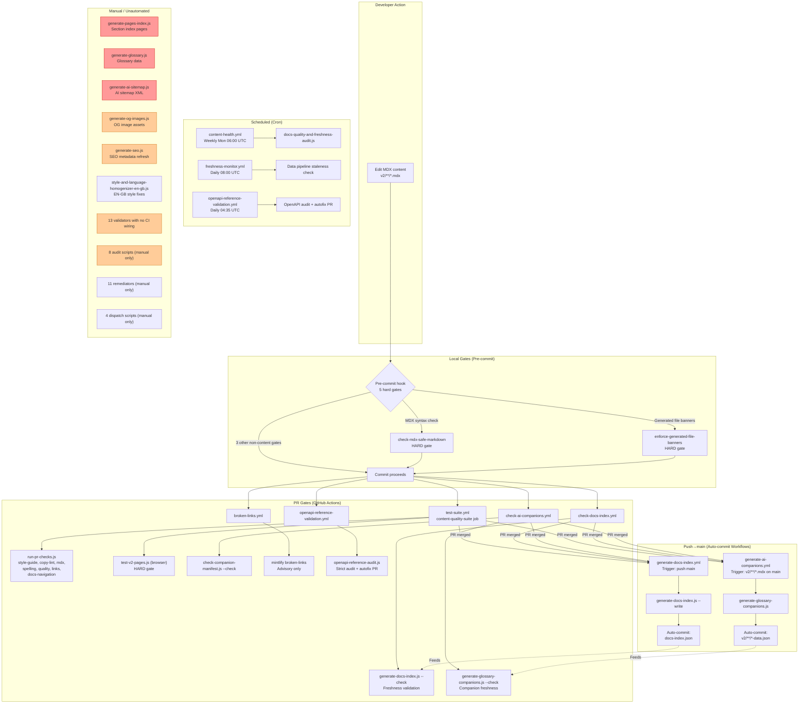
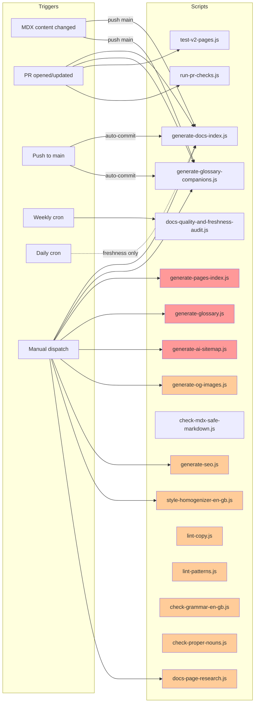
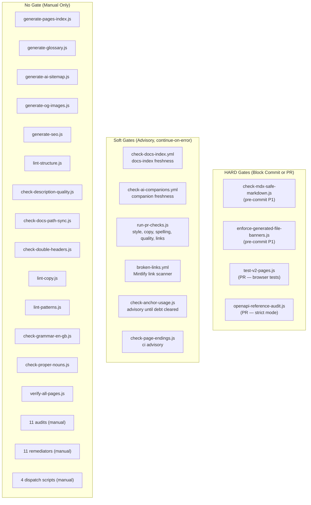
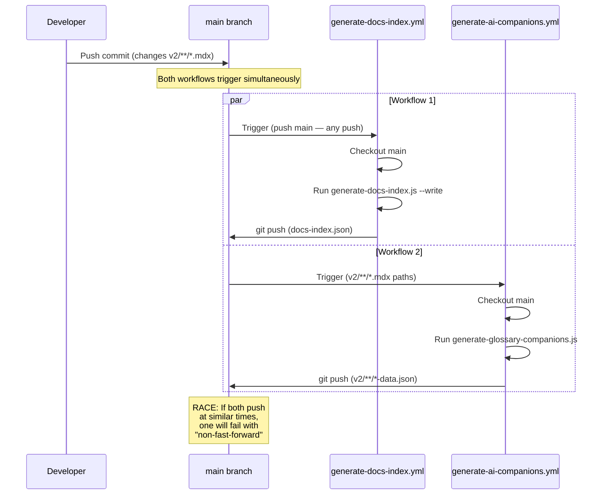

# Concern 2: Content — Workflow & Pipeline Audit

> Generated: 2026-03-23
> Concern: `content` (SCRIPT-GOVERNANCE taxonomy)
> Scope: All scripts, workflows, gates, and artifacts related to docs content authoring, quality, SEO, glossary, veracity, and style

---

## 1. Purpose

The content pipeline ensures that the **v2 documentation pages** (`v2/`) remain:
- **Indexed** — a master `docs-index.json` tracks every routable page with enriched metadata
- **Validated** — MDX syntax, structural rules, copy style, grammar, and anchor integrity are enforced
- **Fresh** — stale content, TODO markers, thin pages, and outdated claims are detected
- **Discoverable** — SEO metadata, OG images, AI sitemaps, and glossary companion JSONs are generated
- **Accurate** — a research/veracity system extracts factual claims and tracks evidence
- **Consistent** — EN-GB style, proper nouns, banned words, and copy patterns are policed
- **Remediated** — MDX repairs, spelling fixes, path syncs, metadata classification, and quarantine are available

---

## 2. Scripts in Scope (42 total)

### Generators (7)

| Script | Niche | @pipeline | Input | Output |
|--------|-------|-----------|-------|--------|
| `generate-docs-index.js` | catalogs | manual, P3, P6 | v2 frontmatter + docs.json | `docs-index.json` (repo root) |
| `generate-pages-index.js` | catalogs | manual | v2 folder structure | `v2/**/index.mdx` section indexes |
| `generate-glossary.js` | reference | manual — not yet in pipeline | v1/v2 MDX terminology scan | glossary data JSON |
| `generate-glossary-companions.js` | reference | CI: generate-ai-companions.yml (push->main), check-ai-companions.yml (PR) \| manual | glossary MDX `SearchTable` data | `v2/**/*-data.json` companion JSONs |
| `generate-ai-sitemap.js` | seo | manual, P6 | docs.json + v2 frontmatter | `sitemap-ai.xml` |
| `generate-og-images.js` | seo | manual | OG template + section labels | `snippets/assets/site/og-image/` |
| `generate-seo.js` (remediator) | seo | on-demand, SEO refresh | v2 page content analysis | frontmatter keywords, description, og:image |

### Validators (16)

| Script | Niche | @pipeline | Gate | Check |
|--------|-------|-----------|------|-------|
| `check-anchor-usage.js` | structure | manual, ci | Soft (advisory) | Same-page anchor links vs heading IDs |
| `check-description-quality.js` | structure | manual | None | SEO description length, boilerplate, duplicates |
| `check-docs-path-sync.js` | structure | manual | None | Staged page moves requiring docs.json rewrites |
| `check-double-headers.js` | structure | manual | None | Duplicate body H1 / repeated frontmatter content |
| `check-mdx-safe-markdown.js` | structure | manual | **HARD** (P1) | MDX parse failures + deterministic unsafe patterns |
| `check-page-endings.js` | structure | manual, ci | Soft | Approved navigational/closing elements |
| `enforce-generated-file-banners.js` | structure | manual \| pre-commit --staged | **HARD** (P1) | "Do not edit" banners on generated MDX |
| `lint-structure.js` | structure | manual | None | Required frontmatter, stale content, hedge phrases |
| `verify-all-pages.js` | structure | manual — not yet in pipeline | None | Headless browser render + 404 checks |
| `test-v2-pages.js` | structure | P2, P3 | **HARD** | Browser test all docs.json pages for console errors |
| `lint-copy.js` | copy | manual | Soft | Banned words and phrases |
| `lint-patterns.js` | copy | manual | Soft | Tier 2 copy pattern rules (conditionals, hedging) |
| `check-grammar-en-gb.js` | grammar | manual | Soft | UK English grammar (double spaces, repeated words) |
| `check-proper-nouns.js` | grammar | manual | Soft | Proper noun capitalisation |
| `test-mintlify-version-language-toggle.js` | language-translation | manual — not yet in pipeline | None | Mintlify version supports language toggle |
| `docs-fact-registry.js` | veracity | manual — experimental | None | Research claim registry validation |

### Audits (11)

| Script | Niche | @pipeline | Output |
|--------|-------|-----------|--------|
| `docs-quality-and-freshness-audit.js` | quality | manual | `workspace/reports/repo-ops/` |
| `audit-copy-patterns.js` | quality | manual | `workspace/reports/copy-governance/` |
| `audit-media-assets.js` | quality | manual | `workspace/reports/media-audit/` |
| `audit-v2-usefulness.js` | quality | manual | `workspace/reports/` |
| `generate-content-gap-reconciliation.js` | reconciliation | manual — not yet in pipeline | `workspace/reports/content-gap/` |
| `terminology-search.js` | reference | manual — not yet in pipeline | terminology candidate list |
| `audit-icon-usage.js` | reference | manual \| post-PR \| cron | `workspace/reports/_local/icon-usage-report.json` |
| `audit-glossary-gaps.js` | reference | manual \| post-PR \| cron | `workspace/reports/_local/glossary-gap-report.json` |
| `style-and-language-homogenizer-en-gb.js` | style | on-demand, repair | `workspace/reports/repo-ops/` |
| `docs-page-research.js` | veracity | manual — experimental | `workspace/reports/repo-ops/` |
| `docs-research-adjudication.js` | veracity | manual — experimental | `workspace/research/adjudication/` |

### Remediators (11)

| Script | Niche | @pipeline | Mode |
|--------|-------|-----------|------|
| `repair-mdx-safe-markdown.js` | repair | manual | `--dry-run`, `--staged`, `--files` |
| `sync-docs-paths.js` | repair | manual | `--dry-run`, `--write`, `--staged` |
| `repair-spelling.js` | repair | manual | `--dry-run` |
| `migrate-assets-to-branch.js` | repair | manual | `--dry-run`, manifest-driven |
| `quarantine-manager.js` | repair | manual | classify (default), `--apply` |
| `generate-seo.js` | seo | on-demand | `--dry-run`, `--file=` |
| `add-framework-headers.js` | classification | manual | `--dry-run`, `--data` |
| `add-pagetype-mechanical.js` | classification | manual | deterministic metadata rollout |
| `assign-purpose-metadata.js` | classification | manual | purpose + audience frontmatter |
| `repair-ownerless-language.js` | style | manual | `--check`, `--write` |
| `wcag-repair-common.js` | style | manual — not yet in pipeline | WCAG audit fix mode |

### Dispatch (4)

| Script | Niche | @pipeline | Mode |
|--------|-------|-----------|------|
| `docs-page-research-pr-report.js` | veracity | manual — experimental advisory PR | read-only |
| `docs-research-packet.js` | veracity | manual — packet generator | read-only |
| `orchestrator-guides-research-review.js` | veracity | manual — compatibility wrapper | read-only |
| `run-solutions-social-fetch.js` | data | manual | execute (requires API keys) |

---

## 3. Workflows in Scope (10 GHA)

| Workflow | Trigger | Branch | Auto-commit | Purpose |
|----------|---------|--------|-------------|---------|
| `generate-docs-index.yml` | Push main + manual | main | Yes | Regenerate `docs-index.json` |
| `generate-ai-companions.yml` | Push main (paths: `v2/**/*.mdx`) + manual | main | Yes | Regenerate glossary companion JSONs |
| `check-docs-index.yml` | PR + Push (docs-v2, main) + manual | docs-v2, main | No | Validate `docs-index.json` freshness |
| `check-ai-companions.yml` | PR + Push (docs-v2, main) + manual | docs-v2, main | No | Validate glossary companion freshness |
| `seo-refresh.yml` | Manual only (dry-run default) | any | No | Generate SEO metadata |
| `style-homogenise.yml` | Manual only | any | Creates PR to docs-v2 | EN-GB style homogenisation |
| `content-health.yml` | Cron (Mon 06:00 UTC) + manual | default | No (advisory) | Weekly content + component audit (7 steps) |
| `freshness-monitor.yml` | Cron (daily 08:00 UTC) + manual | default | No (advisory) | Data pipeline staleness tracking |
| `test-suite.yml` | PR (main, docs-v2) + Push main | main, docs-v2 | No | Browser tests, PR changed-file checks |
| `broken-links.yml` | PR (main) | main | No (advisory) | Mintlify broken-links scanner |
| `openapi-reference-validation.yml` | PR + Push (main, docs-v2) + Cron (daily 04:35 UTC) + manual | main, docs-v2 | Creates autofix PR | OpenAPI reference spec validation |

---

## 4. Artifacts

| Artifact | Path | Generator | Freshness trigger |
|----------|------|-----------|-------------------|
| Docs index | `docs-index.json` (repo root) | `generate-docs-index.js` | Push->main (auto-commit) |
| Glossary companion JSONs | `v2/**/*-data.json` | `generate-glossary-companions.js` | Push->main when `v2/**/*.mdx` changes (auto-commit) |
| AI sitemap | `sitemap-ai.xml` | `generate-ai-sitemap.js` | **None** (manual only) |
| OG images | `snippets/assets/site/og-image/` | `generate-og-images.js` | **None** (manual only) |
| Section index pages | `v2/**/index.mdx` | `generate-pages-index.js` | **None** (manual only) |
| Glossary data | glossary JSON | `generate-glossary.js` | **None** (manual only, not yet in pipeline) |
| Content quality reports | `workspace/reports/repo-ops/` | `docs-quality-and-freshness-audit.js` | Weekly cron (content-health.yml) |
| Media audit manifest | `workspace/reports/media-audit/` | `audit-media-assets.js` | **None** (manual only) |
| Research claims registry | `workspace/research/claims/` | `docs-page-research.js` | **None** (manual, experimental) |
| Adjudication ledger | `workspace/research/adjudication/` | `docs-research-adjudication.js` | **None** (manual, experimental) |

---

## 5. Pipeline Diagram — Full Content Lifecycle



**Legend:** Red = gap (should be automated, is not). Orange = advisory (manual is acceptable or low priority).

---

## 6. Trigger Matrix



---

## 7. Gate Classification



---

## 8. Auto-Commit Race Condition



**Risk assessment**: Medium frequency — every push to main that changes MDX files triggers both workflows simultaneously. The `generate-docs-index.yml` triggers on ALL pushes to main (no path filter), so any MDX change triggers both. The losing workflow's auto-commit is silently dropped.

---

## 9. Requirements & Real Needs

| Requirement | Current state | Met? |
|-------------|--------------|------|
| `docs-index.json` stays current | CI regenerates on push->main + PR freshness check | Yes |
| Glossary companion JSONs stay current | CI regenerates on push->main (MDX path filter) + PR check | Yes |
| MDX syntax is valid before commit | `check-mdx-safe-markdown.js` in pre-commit (HARD) | Yes |
| Generated file banners are present | `enforce-generated-file-banners.js` in pre-commit (HARD) | Yes |
| All docs.json pages render without errors | `test-v2-pages.js` browser tests in PR (HARD) | Yes |
| Section index pages stay current | `generate-pages-index.js` (manual only) | **No** — no automated trigger |
| AI sitemap stays current | `generate-ai-sitemap.js` (manual only) | **No** — no automated trigger |
| Glossary data is generated | `generate-glossary.js` (manual, not yet in pipeline) | **No** — no pipeline at all |
| SEO metadata is complete | `generate-seo.js` (manual dispatch only) | **No** — no regular refresh |
| EN-GB style consistency | `style-homogenise.yml` (manual dispatch) | Partially — no cron |
| Copy quality (banned words, patterns) | `lint-copy.js` + `lint-patterns.js` (manual) | **No** — not in any CI pipeline |
| Grammar (UK English) | `check-grammar-en-gb.js` (manual) | **No** — not in any CI pipeline |
| Proper noun capitalisation | `check-proper-nouns.js` (manual) | **No** — not in any CI pipeline |
| Content freshness tracking | `content-health.yml` (weekly cron) | Yes (advisory) |
| Data pipeline freshness | `freshness-monitor.yml` (daily cron) | Yes (advisory) |
| OpenAPI references valid | `openapi-reference-validation.yml` (PR + daily cron) | Yes |
| Broken links detected | `broken-links.yml` (PR advisory) | Partially — advisory only |
| Factual claims verified | `docs-page-research.js` (manual, experimental) | **No** — experimental, no CI |
| OG images generated for sections | `generate-og-images.js` (manual) | **No** — no automated trigger |
| Content gap analysis | `generate-content-gap-reconciliation.js` (manual, not yet in pipeline) | **No** — no pipeline |
| Page path moves tracked | `check-docs-path-sync.js` + `sync-docs-paths.js` (manual) | **No** — not in any CI |

---

## 10. Efficiency Assessment

### What works well
- **Docs index pipeline is complete** — generation on push->main, freshness check on PR, dual-mode `--check`/`--write` pattern is clean
- **Companion JSON pipeline mirrors the index pattern** — separate generate + check workflows, path-filtered triggers
- **Pre-commit is lean** — only 2 content-specific hard gates (MDX syntax, generated banners), well within the < 5s target per D3
- **Browser tests are thorough** — `test-v2-pages.js` renders ALL docs.json pages, catching runtime errors
- **OpenAPI validation is best-in-class** — PR check + daily cron + autofix PR + rolling issue tracking
- **Separation of read-only vs edit scripts** — validators are read-only, remediators are edit-mode, clear boundary

### What is inefficient
- **13 validators have no CI wiring at all** — `lint-copy.js`, `lint-patterns.js`, `check-grammar-en-gb.js`, `check-proper-nouns.js`, `check-description-quality.js`, `check-double-headers.js`, `check-docs-path-sync.js`, `lint-structure.js`, `verify-all-pages.js`, `check-anchor-usage.js`, `check-page-endings.js`, `docs-fact-registry.js`, `test-mintlify-version-language-toggle.js` — all run only when a developer remembers to invoke them
- **`generate-docs-index.yml` has no path filter** — triggers on ALL pushes to main, even non-content changes (workflow edits, config changes). Unnecessary CI minutes on pushes that cannot affect `docs-index.json`
- **`content-health.yml` references stale script paths** — step "Content quality audit" calls `operations/scripts/docs-quality-and-freshness-audit.js` (old path), not `operations/scripts/audits/content/quality/docs-quality-and-freshness-audit.js` (current path). Multiple steps reference old paths. This workflow is likely broken.
- **`style-homogenise.yml` references stale script path** — calls `operations/scripts/style-and-language-homogenizer-en-gb.js` (old path). Workflow is likely broken.
- **`run-pr-checks.js` includes content checks but scope is not clear** — style-guide, copy-lint, MDX, spelling, quality, links, and docs-navigation all run in the PR but are bundled into a single dispatcher with `continue-on-error: true`, making individual check outcomes invisible in the GHA summary
- **Duplicate docs-index validation**: `generate-docs-index.js --check` runs in `check-docs-index.yml` AND is implicitly validated by `run-pr-checks.js` (docs-navigation test). The docs-navigation test checks route freshness which overlaps with the dedicated freshness check

---

## 11. Blocking Analysis

| Pipeline stage | Blocks workflow? | Impact |
|---------------|-----------------|--------|
| `check-mdx-safe-markdown.js` | Yes (HARD, pre-commit P1) | Appropriate — unparseable MDX breaks the site |
| `enforce-generated-file-banners.js` | Yes (HARD, pre-commit P1) | Appropriate — hand-editing generated files causes drift |
| `test-v2-pages.js` (browser) | Yes (HARD, PR gate) | Appropriate — runtime render errors break user experience |
| `openapi-reference-audit.js` | Yes (HARD, PR + cron) | Appropriate — API reference accuracy is critical |
| `check-docs-index.yml` | No (runs but does not gate PR merge) | **Questionable** — if docs-index is stale, it can land and the push->main auto-commit fixes it, but there is a window of inconsistency |
| `check-ai-companions.yml` | No (runs but does not gate PR merge) | Same as above — self-healing on merge |
| `run-pr-checks.js` | Conditional (blocks PRs except docs-v2->main) | Appropriate — advisory for integration PRs, blocking for feature PRs |
| `broken-links.yml` | No (advisory, `continue-on-error`) | Appropriate for now — legacy link cleanup in progress |

**Issue**: The `test-suite.yml` browser test is the only true HARD gate for content PRs. The 13 unwired validators represent a significant quality enforcement gap — copy, grammar, and structural issues can land without any automated check.

---

## 12. Gaps

### GAP-CT1: 13 content validators have no CI wiring
- **Scripts**: `lint-copy.js`, `lint-patterns.js`, `check-grammar-en-gb.js`, `check-proper-nouns.js`, `check-description-quality.js`, `check-double-headers.js`, `check-docs-path-sync.js`, `lint-structure.js`, `verify-all-pages.js`, `check-anchor-usage.js`, `check-page-endings.js`, `docs-fact-registry.js`, `test-mintlify-version-language-toggle.js`
- **@pipeline tags say**: mostly `manual` — but several note `ci` as a target
- **Reality**: None are in any GHA workflow as independent steps. Some are indirectly invoked via `run-pr-checks.js` (style-guide, copy-lint, MDX, spelling, quality, links) but bundled as a single `continue-on-error` step
- **Impact**: Copy quality, grammar, structural rules, and anchors degrade silently
- **Severity**: High — represents the majority of content quality enforcement

### GAP-CT2: `generate-pages-index.js` has no automated trigger
- **Script**: Section index page generator
- **@pipeline tag says**: `manual`
- **Reality**: Not in any workflow, not in pre-commit, not in cron
- **Impact**: Section index pages drift from actual v2 folder structure
- **Severity**: Medium — manual runs suffice for now but risk forgotten updates

### GAP-CT3: `generate-ai-sitemap.js` has no automated trigger
- **Script**: AI-optimised sitemap generator
- **@pipeline tag says**: `manual, P6`
- **Reality**: No cron or push workflow exists
- **Impact**: `sitemap-ai.xml` goes stale; AI crawlers index outdated structure
- **Severity**: Medium — declared P6 but no cron is wired

### GAP-CT4: `generate-glossary.js` has no pipeline at all
- **Script**: Glossary data generator
- **@pipeline tag says**: `manual — not yet in pipeline`
- **Reality**: No workflow, no automation, no freshness check
- **Impact**: Glossary data relies entirely on manual execution
- **Severity**: Low — acknowledged as not yet in pipeline

### GAP-CT5: `content-health.yml` uses stale script paths
- **Workflow**: Weekly content health check
- **Issue**: All 6 steps reference pre-restructure paths (`operations/scripts/docs-quality-and-freshness-audit.js` instead of `operations/scripts/audits/content/quality/docs-quality-and-freshness-audit.js`, etc.)
- **Impact**: **Workflow is broken** — all steps fail silently with `continue-on-error: true`
- **Severity**: **Critical** — the only scheduled content audit is non-functional

### GAP-CT6: `style-homogenise.yml` uses stale script path
- **Workflow**: Manual EN-GB style homogenisation
- **Issue**: Calls `operations/scripts/style-and-language-homogenizer-en-gb.js` (old path)
- **Impact**: **Workflow is broken** — manual dispatch fails
- **Severity**: Medium — manual-only workflow but unusable when invoked

### GAP-CT7: `generate-docs-index.yml` has no path filter
- **Workflow**: Auto-commit docs-index.json on push->main
- **Issue**: Triggers on ALL pushes to main, not just content changes
- **Impact**: Unnecessary CI runs; wastes CI minutes on non-content pushes
- **Severity**: Low — functional but wasteful

### GAP-CT8: Copy and grammar validators not surfaced in PR
- **Scripts**: `lint-copy.js`, `lint-patterns.js`, `check-grammar-en-gb.js`, `check-proper-nouns.js`
- **Issue**: While `run-pr-checks.js` includes some copy and style tests, the individual validator scripts are not independently invoked. Results are bundled into a single step, obscuring individual outcomes.
- **Impact**: Reviewers cannot see which specific quality gates pass/fail
- **Severity**: Medium — information loss in PR review

### GAP-CT9: No automated content-change-scoped validation
- **Issue**: `check-docs-path-sync.js` (detects page moves requiring docs.json rewrites) is manual-only. A developer can move a page and forget to update docs.json references.
- **Impact**: Broken navigation links after page moves
- **Severity**: Medium — path sync errors cause 404s

### GAP-CT10: Race condition between `generate-docs-index.yml` and `generate-ai-companions.yml`
- **Issue**: Both workflows trigger on MDX pushes to main (index on all pushes, companions on MDX paths). Both auto-commit. Non-fast-forward failure is silent.
- **Impact**: Losing workflow's auto-commit is dropped without notification
- **Severity**: Medium — same class of issue as components (GAP-C race condition in 01-components-audit.md)

---

## 13. Duplication / Overlap

### OVERLAP-CT1: Docs-index freshness check runs in two places
- `generate-docs-index.js --check` runs in:
  1. `check-docs-index.yml` (dedicated freshness workflow)
  2. `run-pr-checks.js` → docs-navigation test (checks route keys from docs.json)
- **Overlap**: Both verify that the navigation/index is consistent with files on disk
- **Recommendation**: Keep the dedicated `check-docs-index.yml` (clear ownership). Consider whether docs-navigation in `run-pr-checks.js` can defer to it.

### OVERLAP-CT2: Style-guide test in `run-pr-checks.js` vs `style-homogenise.yml`
- `run-pr-checks.js` includes `style-guide.test.js` (PR, soft gate)
- `style-homogenise.yml` runs `style-and-language-homogenizer-en-gb.js` (manual, creates fix PR)
- **Overlap**: Both target EN-GB style issues but serve different purposes (detect vs fix)
- **Recommendation**: Acceptable — detect in PR, fix on demand. No change needed.

### OVERLAP-CT3: `audit-copy-patterns.js` vs `lint-copy.js` + `lint-patterns.js`
- `audit-copy-patterns.js` aggregates Tier 2 copy pattern violations across a tab or full v2 tree
- `lint-copy.js` enforces banned words; `lint-patterns.js` enforces Tier 2 patterns
- **Overlap**: The audit script reports what the validators catch — audit is a superset reporter
- **Recommendation**: Acceptable — validators for per-file enforcement, audit for aggregate reporting

### OVERLAP-CT4: Content quality in `content-health.yml` vs `test-suite.yml`
- `content-health.yml` runs `docs-quality-and-freshness-audit.js` (weekly, advisory)
- `test-suite.yml` runs `run-pr-checks.js` which includes quality tests (PR, soft gate)
- **Overlap**: Both check content quality but at different scopes (full repo vs changed files)
- **Recommendation**: Acceptable — weekly full-repo sweep supplements per-PR changed-file checks

---

## 14. Recommendations

### REC-CT1: Fix `content-health.yml` stale paths (closes GAP-CT5) — CRITICAL

Update all script paths in `content-health.yml` to use the post-restructure paths. This is the highest-priority fix: the only scheduled content audit is currently broken.

```yaml
# Before (broken):
run: node operations/scripts/docs-quality-and-freshness-audit.js --scope full
# After (fixed):
run: node operations/scripts/audits/content/quality/docs-quality-and-freshness-audit.js --scope full
```

Apply the same fix to all 6 steps, updating every script path to the current `operations/scripts/<type>/<concern>/<niche>/` location.

### REC-CT2: Fix `style-homogenise.yml` stale path (closes GAP-CT6)

Update the script path:
```yaml
# Before (broken):
run: node operations/scripts/style-and-language-homogenizer-en-gb.js --scope ${{ inputs.scope }}
# After (fixed):
run: node operations/scripts/audits/content/style/style-and-language-homogenizer-en-gb.js --scope ${{ inputs.scope }}
```

### REC-CT3: Add path filter to `generate-docs-index.yml` (closes GAP-CT7)

Add path restrictions so the workflow only runs when content or config changes:
```yaml
on:
  push:
    branches:
      - main
    paths:
      - 'v2/**'
      - 'docs.json'
      - 'operations/scripts/generators/content/**'
  workflow_dispatch:
```

### REC-CT4: Wire copy and grammar validators into PR (closes GAP-CT1 partially, GAP-CT8)

Add individual soft-gate steps to `test-suite.yml` or a new `content-lint.yml` workflow:

```yaml
- name: Copy lint (banned words)
  run: node operations/scripts/validators/content/copy/lint-copy.js --scope changed
  continue-on-error: true

- name: Copy patterns (Tier 2)
  run: node operations/scripts/validators/content/copy/lint-patterns.js --scope changed
  continue-on-error: true

- name: Grammar (EN-GB)
  run: node operations/scripts/validators/content/grammar/check-grammar-en-gb.js --scope changed
  continue-on-error: true

- name: Proper nouns
  run: node operations/scripts/validators/content/grammar/check-proper-nouns.js --scope changed
  continue-on-error: true
```

**Gate level**: Soft (advisory) initially. Promote to HARD once baseline violations are cleared.

### REC-CT5: Add `generate-ai-sitemap.js` to cron (closes GAP-CT3)

Wire into `content-health.yml` (weekly Monday 06:00 UTC) or create a dedicated monthly cron:
```yaml
- name: Regenerate AI sitemap
  run: node operations/scripts/generators/content/seo/generate-ai-sitemap.js --write
```

Alternatively, add to the `generate-docs-index.yml` post-merge workflow for immediate freshness.

### REC-CT6: Add `generate-pages-index.js` freshness check to PR (closes GAP-CT2)

Add a `--check` mode invocation to `check-docs-index.yml` or a separate workflow:
```yaml
- name: Verify section index pages are current
  run: node operations/scripts/generators/content/catalogs/generate-pages-index.js --check
  continue-on-error: true
```

### REC-CT7: Consolidate auto-commit workflows (closes GAP-CT10)

Merge `generate-docs-index.yml` and `generate-ai-companions.yml` into a single sequential workflow to eliminate the race condition:

```yaml
# Consolidated workflow steps:
1. generate-docs-index.js --write          # Index first
2. generate-glossary-companions.js         # Companions second
3. Single diff-guarded auto-commit of all artifacts
```

**Pros**: Eliminates race condition, single commit, ordered execution
**Cons**: Couples index and companion generation; companions only need MDX changes while index needs all pushes

**Alternative**: Add retry + pull-before-push logic to each workflow (less clean but preserves separation).

### REC-CT8: Add structural validators to weekly cron (closes GAP-CT1 partially)

Wire the remaining structural validators into `content-health.yml` as advisory steps:
```yaml
- name: Anchor usage audit
  run: node operations/scripts/validators/content/structure/check-anchor-usage.js
  continue-on-error: true

- name: Double headers check
  run: node operations/scripts/validators/content/structure/check-double-headers.js
  continue-on-error: true

- name: Page endings check
  run: node operations/scripts/validators/content/structure/check-page-endings.js
  continue-on-error: true

- name: Structure lint
  run: node operations/scripts/validators/content/structure/lint-structure.js
  continue-on-error: true
```

### REC-CT9: Wire `check-docs-path-sync.js` into PR workflow (closes GAP-CT9)

Add to `test-suite.yml` or `run-pr-checks.js` for PRs that move or rename MDX files:
```yaml
- name: Docs path sync check
  if: github.event_name == 'pull_request'
  run: node operations/scripts/validators/content/structure/check-docs-path-sync.js --staged
  continue-on-error: true
```

---

## 15. Recommended Gate Matrix (After Fixes)

| Check | Stage | Gate | Change from current |
|-------|-------|------|---------------------|
| `check-mdx-safe-markdown.js` | Pre-commit (P1) | HARD | No change |
| `enforce-generated-file-banners.js` | Pre-commit (P1) | HARD | No change |
| `test-v2-pages.js` | PR (test-suite) | HARD | No change |
| `openapi-reference-audit.js` | PR + Cron | HARD | No change |
| `generate-docs-index.js --check` | PR (check-docs-index) | Soft | **Add path filter to generator** |
| `generate-glossary-companions.js --check` | PR (check-ai-companions) | Soft | No change |
| `lint-copy.js` | PR (content-lint) | Soft | **NEW — wire into PR** |
| `lint-patterns.js` | PR (content-lint) | Soft | **NEW — wire into PR** |
| `check-grammar-en-gb.js` | PR (content-lint) | Soft | **NEW — wire into PR** |
| `check-proper-nouns.js` | PR (content-lint) | Soft | **NEW — wire into PR** |
| `check-docs-path-sync.js` | PR (test-suite) | Soft | **NEW — wire into PR** |
| `broken-links.yml` | PR | Soft (advisory) | No change |
| `generate-docs-index.js --write` | Push->main | Auto-commit | **Add path filter, consolidate** |
| `generate-glossary-companions.js` | Push->main | Auto-commit | **Consolidate with index** |
| `generate-ai-sitemap.js --write` | Cron (weekly) | Self-heal | **NEW — add to cron** |
| `generate-pages-index.js --check` | PR | Soft | **NEW — add freshness check** |
| `check-anchor-usage.js` | Cron (weekly) | Report | **NEW — add to content-health** |
| `check-double-headers.js` | Cron (weekly) | Report | **NEW — add to content-health** |
| `check-page-endings.js` | Cron (weekly) | Report | **NEW — add to content-health** |
| `lint-structure.js` | Cron (weekly) | Report | **NEW — add to content-health** |
| `docs-quality-and-freshness-audit.js` | Cron (weekly) | Report | **FIX — update stale path** |
| `style-homogeniser` | Manual dispatch | Creates PR | **FIX — update stale path** |
| `generate-seo.js` | Manual dispatch | On-demand | No change (acceptable) |
| `generate-og-images.js` | Manual dispatch | On-demand | No change (acceptable) |

---

## 16. Summary

The content pipeline has strong foundations for its two primary artifacts (`docs-index.json` and glossary companion JSONs) with complete generate-check-regenerate cycles. The pre-commit hook is appropriately lean with only 2 content-specific hard gates. Browser testing provides a reliable HARD gate for rendering correctness.

The main issues are:

1. **2 workflows with stale script paths** (`content-health.yml`, `style-homogenise.yml`) — **both are broken**, making the weekly content audit non-functional
2. **13 validators with no CI wiring** — copy, grammar, structure, and anchor checks run only when developers remember to invoke them
3. **3 generators with no automated trigger** (pages index, AI sitemap, glossary data)
4. **1 race condition** between competing auto-commit workflows (`generate-docs-index.yml` vs `generate-ai-companions.yml`)
5. **1 wasteful trigger** (`generate-docs-index.yml` fires on all pushes to main, no path filter)
6. **1 overlap** in docs-index freshness checking (dedicated workflow + PR checks dispatcher)

The recommended fixes (REC-CT1 through REC-CT9) should be prioritized as follows:

- **P0 (Immediate)**: REC-CT1 (fix `content-health.yml` paths) + REC-CT2 (fix `style-homogenise.yml` path) — broken workflows
- **P1 (Next sprint)**: REC-CT4 (wire copy/grammar into PR) + REC-CT9 (path sync in PR) — quality enforcement gaps
- **P2 (Scheduled)**: REC-CT3 (path filter) + REC-CT5 (AI sitemap cron) + REC-CT6 (pages-index check) + REC-CT7 (consolidate auto-commits) + REC-CT8 (structural validators to cron)
