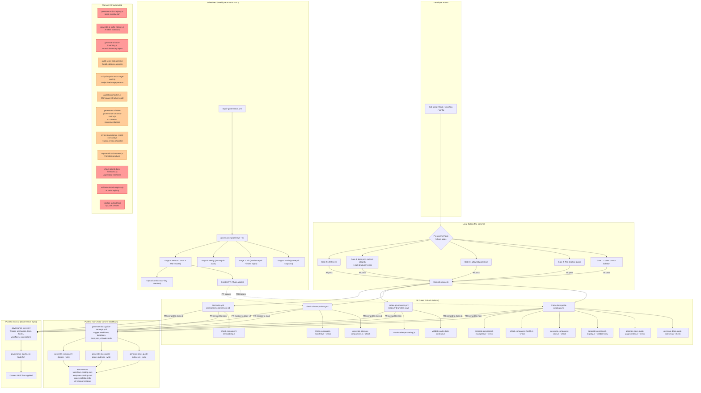
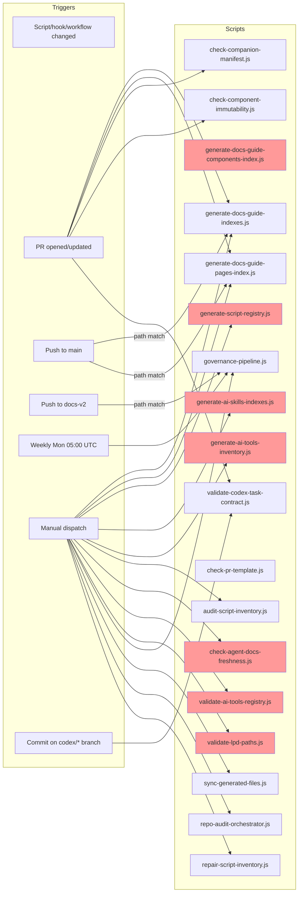
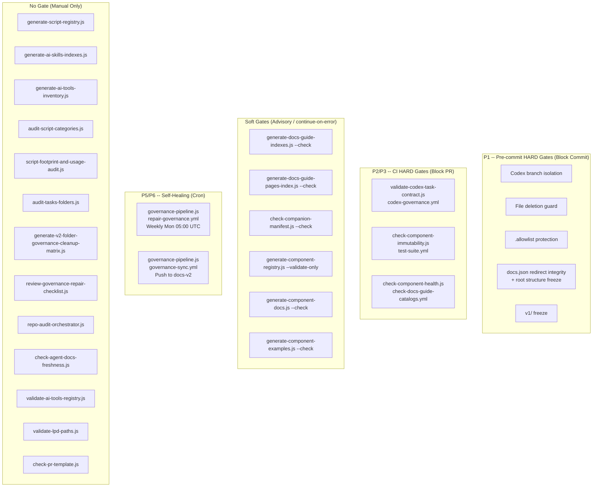

# Concern 3: Governance — Workflow & Pipeline Audit

> Generated: 2026-03-23
> Concern: `governance` (SCRIPT-GOVERNANCE taxonomy)
> Scope: All scripts, workflows, gates, and artifacts that govern scripts, catalogs, registries, repo structure, agent surfaces, and repair pipelines

---

## 1. Purpose

The governance pipeline ensures that the **repo's own tooling infrastructure** remains:
- **Cataloged** — every script has a registry entry with standardized 11-tag JSDoc headers; workflow/template/pages catalogs are regenerated from source
- **Inventoried** — `script-registry.json` reflects the current corpus; `scripts-catalog.mdx` stays current
- **Validated** — agent-doc freshness, companion manifests, PR templates, lpd paths, codex contracts, and component immutability are enforced
- **Repaired** — a self-healing pipeline (`governance-pipeline.js`) audits, fixes, verifies, and reports in a single orchestrated run
- **Synced** — post-merge governance sync regenerates artifacts when scripts/hooks/workflows change
- **Governed** — pre-commit hard gates protect structural invariants (deletions, freezes, branch isolation, redirects)

---

## 2. Scripts in Scope (26 total)

### Generators (7)

| Script | Niche | @pipeline | Input | Output |
|--------|-------|-----------|-------|--------|
| `generate-docs-guide-indexes.js` | catalogs | CI: generate-docs-guide-catalogs.yml (push main), check-docs-guide-catalogs.yml (PR) | `.github/workflows/**`, `.github/ISSUE_TEMPLATE/**`, PR templates | `docs-guide/catalog/workflows-catalog.mdx`, `docs-guide/catalog/templates-catalog.mdx` |
| `generate-docs-guide-pages-index.js` | catalogs | CI: generate-docs-guide-catalogs.yml (push main), check-docs-guide-catalogs.yml (PR) | `v2/index.mdx`, `docs.json` | `docs-guide/catalog/pages-catalog.mdx` |
| `generate-docs-guide-components-index.js` | catalogs | commit (declared) | `component-registry.json`, `component-usage-map.json` | `docs-guide/catalog/components-catalog.mdx` |
| `generate-script-registry.js` | catalogs | P3 | JSDoc headers in all governed script roots | `tools/config/script-registry.json` |
| `generate-ai-skills-indexes.js` | catalogs | manual, ci | Agent governance surface manifest | `ai-tools/ai-skills/inventory.json`, `ai-tools/ai-skills/content-map.md` |
| `generate-ai-tools-inventory.js` | reports | manual | `ai-tools/registry/ai-tools-registry.json` | `ai-tools/registry/ai-tools-inventory.md` |
| `new-script.js` | scaffold | manual | CLI args (--path, --domain, --summary, --scope) | New script file with JSDoc template |

### Validators (9)

| Script | Niche | @pipeline | Gate | Check |
|--------|-------|-----------|------|-------|
| `audit-script-inventory.js` | pr | commit, manual | **HARD** | Deep inventory audit: triggers, outputs, downstream chains, governance compliance; generates `scripts-catalog.mdx` |
| `check-agent-docs-freshness.js` | compliance | manual, ci | Soft | Agent governance docs and adapter freshness (90-day threshold) |
| `validate-ai-tools-registry.js` | compliance | manual | Soft | AI-tools registry schema, coverage, lane alignment |
| `check-companion-manifest.js` | ai | N/A (old-style header) | Soft | Companion manifest vs component registry aiDiscoverability consistency |
| `review-governance-repair-checklist.js` | compliance | manual | None | Generates human-review checklist for dry-run repair proposals |
| `check-pr-template.js` | pr | ci | **HARD** | PR body must include change + rationale sections |
| `validate-lpd-paths.js` | repo | manual, ci | **HARD** | Every script path in `tools/lpd` exists on disk |
| `check-component-immutability.js` | pr | manual | **HARD** | Flags component file modifications (new files allowed, modifications require approval label) |
| `validate-codex-task-contract.js` | compliance | commit, P2, P3 | **HARD** | Branch naming, task files, PR body, issue state for codex branches |

### Audits (4)

| Script | Niche | @pipeline | Output |
|--------|-------|-----------|--------|
| `audit-script-categories.js` | scripts | manual | `workspace/reports/repo-ops/SCRIPT_AUDIT*.json`, `*.md` |
| `script-footprint-and-usage-audit.js` | scripts | manual | `workspace/reports/repo-ops/` footprint reports |
| `audit-tasks-folders.js` | repo | manual | `workspace/reports/repo-ops/` task folder audit + recommendations |
| `generate-v2-folder-governance-cleanup-matrix.js` | reports | manual | `workspace/reports/repo-ops/v2-folder-governance-cleanup-matrix.{md,json}` |

### Remediators (3)

| Script | Niche | @pipeline | Mode |
|--------|-------|-----------|------|
| `repair-script-inventory.js` | scripts | manual | Thin wrapper: runs `audit-script-inventory.js --fix` |
| `fix-usage-paths.js` | scaffold | one-time | Fixes `@usage` paths + `@pipeline` duplicates across scripts |
| `update-jsdoc-headers.js` | scaffold | governance-pipeline | Rewrites JSDoc headers to 11-tag standard; `--write` to apply |

### Dispatch (3)

| Script | Niche | @pipeline | Mode |
|--------|-------|-----------|------|
| `governance-pipeline.js` | pipelines | manual, P6 | Chains audit, safe repair, verification, reporting; `--dry-run`, `--report-only`, `--fix` |
| `sync-generated-files.js` | pipelines | manual, pre-commit --staged | Dispatches generators to sync catalog/index files then validates banners |
| `repo-audit-orchestrator.js` | repo | manual | Full repo static analysis: dispatches all validators in sequence; `--mode`, `--scope`, `--quarantine` |

---

## 3. Workflows in Scope (7 GHA + 1 pre-commit hook)

| Workflow | Trigger | Branch | Auto-commit | Purpose |
|----------|---------|--------|-------------|---------|
| `generate-docs-guide-catalogs.yml` | Push (paths: workflows, ISSUE_TEMPLATE, PR templates, docs.json, v2/index.mdx) + manual | main | Yes | Regenerate workflow/template/pages catalogs + component docs |
| `check-docs-guide-catalogs.yml` | PR + Push | docs-v2, main | No | Freshness validation (6 checks: registry, docs, health, examples, workflows, pages) |
| `repair-governance.yml` | Weekly Mon 05:00 UTC + manual (dry-run/fix/report-only) | main (via DEPLOY_BRANCH) | Yes (creates PR) | Run `governance-pipeline.js`; audit/fix/verify/report; upload artifacts |
| `governance-sync.yml` | Push (paths: ops/scripts, tools/lib, tools/config, tests, hooks, workflows, automations) | docs-v2 | Yes (creates PR) | Post-merge governance repair via `governance-pipeline.js`; auto-fix + PR |
| `codex-governance.yml` | PR to docs-v2 (codex/* branches only) | docs-v2 | No | Validate codex task contract + issue readiness + PR body + overlap check |
| `check-ai-companions.yml` | PR + Push | docs-v2, main | No | Verify companion manifest consistency + glossary companion JSONs |
| `tasks-retention.yml` | Weekly Mon 08:00 UTC + manual | (not implemented) | N/A | **STUB** -- placeholder for workspace/ retention enforcement |
| `generate-review-table.yml` | Manual only | N/A | N/A | **STUB** -- placeholder for review table generation |
| `.githooks/pre-commit` | Every commit | All branches | N/A | 5 hard gates: codex isolation, deletion guard, .allowlist protection, docs.json redirect integrity + root freeze, v1/ freeze |

---

## 4. Artifacts

| Artifact | Path | Generator | Freshness trigger |
|----------|------|-----------|-------------------|
| Script registry | `tools/config/script-registry.json` | `generate-script-registry.js` | **None** (manual only, P3 declared but no CI wiring) |
| Workflows catalog | `docs-guide/catalog/workflows-catalog.mdx` | `generate-docs-guide-indexes.js` | Push main (auto via `generate-docs-guide-catalogs.yml`) |
| Templates catalog | `docs-guide/catalog/templates-catalog.mdx` | `generate-docs-guide-indexes.js` | Push main (auto via `generate-docs-guide-catalogs.yml`) |
| Pages catalog | `docs-guide/catalog/pages-catalog.mdx` | `generate-docs-guide-pages-index.js` | Push main (auto via `generate-docs-guide-catalogs.yml`) |
| Scripts catalog | `docs-guide/catalog/scripts-catalog.mdx` | `audit-script-inventory.js` | **None** (regenerated as side-effect of repair pipeline only) |
| Components catalog | `docs-guide/catalog/components-catalog.mdx` | `generate-docs-guide-components-index.js` | **None** (manual only; covered in components audit GAP-C1) |
| AI skills inventory | `ai-tools/ai-skills/inventory.json` | `generate-ai-skills-indexes.js` | **None** (manual only) |
| AI skills content map | `ai-tools/ai-skills/content-map.md` | `generate-ai-skills-indexes.js` | **None** (manual only) |
| AI tools inventory report | `ai-tools/registry/ai-tools-inventory.md` | `generate-ai-tools-inventory.js` | **None** (manual only) |
| Repair reports | `workspace/reports/repo-ops/REPAIR_REPORT_LATEST.{json,md}` | `governance-pipeline.js` | Weekly cron (via `repair-governance.yml`) |
| Script inventory | `workspace/reports/repo-ops/SCRIPT_INVENTORY_FULL.{json,md}` | `governance-pipeline.js` (via `audit-script-inventory.js`) | Weekly cron (via `repair-governance.yml`) |

---

## 5. Pipeline Diagram -- Full Governance Lifecycle



**Legend:** Red = gap (should be automated, is not). Orange = advisory (manual is acceptable).

---

## 6. Trigger Matrix



---

## 7. Gate Classification



---

## 8. Requirements & Real Needs

| Requirement | Current state | Met? |
|-------------|--------------|------|
| Workflow/template/pages catalogs stay current | CI regenerates on push to main (path-filtered) | Yes |
| `script-registry.json` stays current | `generate-script-registry.js` declared P3 but no CI wiring; only runs manually or via repair pipeline side-effect | **No** |
| `scripts-catalog.mdx` stays current | Regenerated as a side-effect of `audit-script-inventory.js` during repair pipeline only | **No** -- depends on weekly cron |
| Agent governance docs are fresh (<90 days) | `check-agent-docs-freshness.js` exists but is manual-only | **No** -- no CI trigger |
| AI tools registry is valid | `validate-ai-tools-registry.js` exists but is manual-only | **No** -- no CI trigger |
| lpd paths are valid | `validate-lpd-paths.js` exists but is manual-only (declared `manual, ci` but no workflow calls it) | **No** |
| Companion manifest matches registry | `check-ai-companions.yml` runs on PR+Push | Yes |
| Codex branches follow task contract | `codex-governance.yml` enforces on codex/* PRs + pre-commit gate | Yes |
| Component modifications require approval | `check-component-immutability.js` in test-suite PR gate | Yes |
| Pre-commit blocks unsafe changes | 5 hard gates in pre-commit hook | Yes |
| PR body has required sections | `check-pr-template.js` declared `ci` but no workflow calls it | **No** |
| Self-healing repair runs weekly | `repair-governance.yml` cron Mon 05:00 UTC | Yes |
| Post-merge sync regenerates artifacts | `governance-sync.yml` on push to docs-v2 | Yes |
| `tasks-retention.yml` enforces workspace retention | Stub only -- `TODO: Implement` | **No** |
| Review table is generated | Stub only -- placeholder | **No** |

---

## 9. Efficiency Assessment

### What works well
- **Pre-commit is lean and fast** -- per D3, reduced to 5 structural hard gates only; no governance regeneration scripts burden it
- **Self-healing pipeline is mature** -- `governance-pipeline.js` chains audit, repair, verification, and reporting with dry-run/fix/report-only modes
- **Dual-channel repair** -- weekly cron (`repair-governance.yml`) catches drift, while post-merge sync (`governance-sync.yml`) catches changes at commit time
- **Artifact upload on repair** -- repair workflow uploads JSON/MD reports with 7-day retention for auditability
- **PR creation on fix** -- both repair workflows create PRs rather than pushing directly, preserving review workflow
- **Separation of audit/fix/verify** -- `audit-script-inventory.js` is read-only; `repair-script-inventory.js` is the thin fix wrapper; pipeline orchestrates the sequence

### What is inefficient
- **`check-docs-guide-catalogs.yml` bundles component + governance checks** -- Steps 1-4 are component-specific; Steps 5-6 are governance-specific. A component-only change triggers governance catalog checks unnecessarily (and vice versa). Identified in components audit OVERLAP-C3.
- **`governance-sync.yml` has Node 20 while `repair-governance.yml` has Node 22** -- inconsistent Node version across the two workflows that run the same script
- **`governance-sync.yml` runs `cd tests && npm ci` but `repair-governance.yml` does not** -- inconsistent dependency installation may cause different behavior
- **6 validators declared `ci` or `manual, ci` have no workflow wiring** -- `check-agent-docs-freshness.js`, `validate-ai-tools-registry.js`, `validate-lpd-paths.js`, `check-pr-template.js`, `generate-script-registry.js` (P3), `generate-ai-skills-indexes.js` (manual, ci) -- their `@pipeline` declarations are aspirational, not actual
- **`audit-script-inventory.js` is both validator and generator** -- it validates script health AND generates `scripts-catalog.mdx` as an index; this dual role makes its type classification ambiguous (listed under validators but produces generated artifacts)

---

## 10. Blocking Analysis

| Pipeline stage | Blocks workflow? | Impact |
|---------------|-----------------|--------|
| Pre-commit Gate 1: Codex isolation | Yes (HARD, P1) | Appropriate -- prevents codex sessions from committing to docs-v2 without override |
| Pre-commit Gate 2: Deletion guard | Yes (HARD, P1) | Appropriate -- prevents accidental file loss; human override via trailer |
| Pre-commit Gate 3: .allowlist protection | Yes (HARD, P1) | Appropriate -- frozen config, human-only edits |
| Pre-commit Gate 4: docs.json redirects + root freeze | Yes (HARD, P1) | Appropriate -- protects navigation integrity |
| Pre-commit Gate 5: v1/ freeze | Yes (HARD, P1) | Appropriate -- v1 content is frozen |
| `validate-codex-task-contract.js` | Yes (HARD, P2) | Appropriate -- codex branches must have valid contracts |
| `check-component-immutability.js` | Yes (HARD, PR) | Appropriate -- prevents component regressions |
| `check-component-health.js` | Yes (HARD, PR in check-catalogs) | **Questionable** -- runs on ALL PRs to docs-v2/main, not just component PRs (see components audit GAP note) |
| `generate-docs-guide-indexes.js --check` | No (soft, check-catalogs) | Appropriate -- advisory freshness |
| `generate-docs-guide-pages-index.js --check` | No (soft, check-catalogs) | Appropriate -- advisory freshness |
| `check-companion-manifest.js --check` | No (soft, check-ai-companions) | Appropriate -- advisory consistency |
| `governance-pipeline.js` (cron repair) | No (self-heal) | Appropriate -- creates PR, never pushes directly |

**Issue**: The governance-sync workflow runs `governance-pipeline.js` without explicit scope flags on push to docs-v2. Per the pipeline's own safeguards, fix mode without `--staged` or `--files` should fail with `FIX_SCOPE_REQUIRED_MESSAGE`. This means governance-sync may be silently failing or running in a degraded mode (needs verification).

---

## 11. Gaps

### GAP-G1: `script-registry.json` has no dedicated CI trigger
- **Script**: `generate-script-registry.js`
- **@pipeline tag says**: `P3` (PR check)
- **Reality**: Not called in any workflow YAML; only runs manually or as a side-effect when `audit-script-inventory.js` regenerates indexes during the repair pipeline
- **Impact**: Script registry drifts from actual corpus between weekly cron runs; stale data in tooling that consumes the registry
- **Severity**: High -- the registry is consumed by `audit-script-inventory.js`, `lpd`, and AI skills; drift introduces phantom entries

### GAP-G2: `scripts-catalog.mdx` depends on repair pipeline only
- **Script**: `audit-script-inventory.js` (generates scripts-catalog.mdx as side-effect)
- **@pipeline tag says**: `commit, manual`
- **Reality**: Only regenerated when `governance-pipeline.js` runs (weekly cron or post-merge sync), not on every commit as declared
- **Impact**: Catalog can be stale for up to 7 days between cron runs; PR-based changes to scripts are not reflected until next repair
- **Severity**: Medium -- catalog is consumed by agents and docs-guide

### GAP-G3: `check-agent-docs-freshness.js` has no CI wiring
- **Script**: `check-agent-docs-freshness.js`
- **@pipeline tag says**: `manual, ci`
- **Reality**: No workflow calls this script
- **Impact**: Agent governance docs (AGENTS.md, adapters for Claude/Cursor/Windsurf/Augment/Mintlify, policies) could go stale past the 90-day threshold without detection
- **Severity**: Medium -- agent governance freshness is a compliance concern; stale adapters may contain outdated instructions

### GAP-G4: `validate-ai-tools-registry.js` has no CI wiring
- **Script**: `validate-ai-tools-registry.js`
- **@pipeline tag says**: `manual`
- **Reality**: No workflow calls this script
- **Impact**: AI tools registry schema violations, coverage gaps, and lane misalignments go undetected
- **Severity**: Medium -- feeds into AI skills system

### GAP-G5: `validate-lpd-paths.js` has no CI wiring
- **Script**: `validate-lpd-paths.js`
- **@pipeline tag says**: `manual, ci`
- **Reality**: No workflow calls this script; lpd path validity is never checked in CI
- **Impact**: After script restructure, `lpd` CLI commands may point to non-existent script paths
- **Severity**: High -- broken lpd commands affect developer workflow; this was exactly the class of bug fixed by Task 14.9

### GAP-G6: `check-pr-template.js` has no CI wiring
- **Script**: `check-pr-template.js`
- **@pipeline tag says**: `ci`
- **Reality**: No workflow calls this script
- **Impact**: PRs without required change/rationale sections can merge unchecked
- **Severity**: Low -- PR template compliance is a process quality concern, not a safety concern

### GAP-G7: `tasks-retention.yml` is a stub
- **Workflow**: `tasks-retention.yml`
- **Content**: `TODO: Implement` comment only; no jobs defined beyond the cron schedule
- **Impact**: `workspace/` retention rules documented in `workspace/README.md` are never enforced
- **Severity**: Low -- workspace artifacts are not published; retention is a hygiene concern

### GAP-G8: `generate-review-table.yml` is a stub
- **Workflow**: `generate-review-table.yml`
- **Content**: Placeholder echo statement only
- **Impact**: Review table is never generated
- **Severity**: Low -- manual process substitute exists

### GAP-G9: `governance-sync.yml` may silently fail on fix scope
- **Workflow**: `governance-sync.yml`
- **Issue**: Calls `governance-pipeline.js` without `--staged`, `--files`, or `--full` flags; per the pipeline's own guards, fix mode without explicit scope should throw `FIX_SCOPE_REQUIRED_MESSAGE`
- **Impact**: Post-merge governance sync may be silently failing, creating no PR despite script changes
- **Severity**: High -- undermines the dual-channel repair model; changes on docs-v2 may not get governance fixes until the weekly cron

### GAP-G10: `generate-ai-skills-indexes.js` has no CI wiring
- **Script**: `generate-ai-skills-indexes.js`
- **@pipeline tag says**: `manual, ci`
- **Reality**: No workflow calls this script
- **Impact**: AI skills inventory and content map drift from the canonical surface manifest
- **Severity**: Medium -- affects agent onboarding and skills discovery

### GAP-G11: Node version inconsistency across governance workflows
- **`repair-governance.yml`**: Node 22
- **`governance-sync.yml`**: Node 20
- **`generate-docs-guide-catalogs.yml`**: Node 22
- **`check-docs-guide-catalogs.yml`**: Node 22
- **Impact**: Potential behavior differences between the same scripts running in different workflows
- **Severity**: Low -- Node 20/22 differences are minor for these scripts, but inconsistency creates maintenance burden

---

## 12. Duplication / Overlap

### OVERLAP-G1: `repair-governance.yml` vs `governance-sync.yml` -- same orchestrator, different triggers
- Both workflows run `governance-pipeline.js`
- `repair-governance.yml`: weekly cron + manual, with mode selection (dry-run/fix/report-only), creates PR to `docs-v2`, uploads artifacts
- `governance-sync.yml`: push to docs-v2 (path-filtered), always fix mode, creates PR to `docs-v2`, simpler flow
- **Overlap**: If a push to docs-v2 triggers governance-sync, and the cron runs the same week, both may create competing repair PRs for the same issues
- **Recommendation**: governance-sync should check if `automation/governance-repair` PR already exists before creating a new one; or unify into a single workflow with trigger-based mode resolution

### OVERLAP-G2: `audit-script-inventory.js` dual role -- validator AND generator
- Acts as a deep governance validator (read-only audit, grading, compliance checks)
- Also generates `scripts-catalog.mdx` and `script-registry.json` as side-effects when run with `--fix`
- `repair-script-inventory.js` is a thin wrapper that calls it with `--fix`
- **Boundary unclear**: Is it a validator that also writes, or a generator that also validates?
- **Recommendation**: Consider splitting the index generation into a dedicated generator script (e.g., move catalog output to `generate-scripts-catalog.js`) and keeping `audit-script-inventory.js` as a pure read-only validator

### OVERLAP-G3: `check-docs-guide-catalogs.yml` bundles component + governance checks
- Steps 1-4: component-specific (registry validate, docs check, health check, examples check)
- Steps 5-6: governance-specific (workflows catalog check, pages catalog check)
- **Issue**: Same overlap identified in components audit OVERLAP-C3
- **Recommendation**: Split into two jobs with path-based `if` conditions, or accept overhead (checks are fast)

### OVERLAP-G4: `generate-script-registry.js` vs `audit-script-inventory.js` -- overlapping registry output
- `generate-script-registry.js` outputs `tools/config/script-registry.json` from JSDoc headers
- `audit-script-inventory.js` also reads/writes `tools/config/script-registry.json` (via the classification data path) during fix mode
- Both parse JSDoc headers across the same governed roots
- **Boundary unclear**: Which is the canonical source-of-truth updater for the registry?
- **Recommendation**: Designate `generate-script-registry.js` as the canonical registry writer; have `audit-script-inventory.js` consume (not write) the registry for validation only

---

## 13. Recommendations

### REC-G1: Wire `generate-script-registry.js` into CI (closes GAP-G1)

**Option A -- Add to `generate-docs-guide-catalogs.yml` (recommended)**
Add `generate-script-registry.js` as a step before catalog generation. Add `operations/scripts/**` to the path triggers. Registry must be current before catalogs reference it.

```yaml
# Add to path triggers:
paths:
  - 'operations/scripts/**'  # NEW

# Add step before catalog generations:
- name: Regenerate script registry
  run: node operations/scripts/generators/governance/catalogs/generate-script-registry.js

# Add to git add:
git add tools/config/script-registry.json
```

**Option B -- Dedicated PR check**
Add `generate-script-registry.js --dry-run` to `check-docs-guide-catalogs.yml` as a freshness check.

**Recommendation**: Both. Option A for auto-commit regeneration; Option B for PR freshness validation.

### REC-G2: Wire validators with `ci` pipeline tags into a governance validation workflow (closes GAP-G3, GAP-G4, GAP-G5, GAP-G6, GAP-G10)

Create a new `validate-governance.yml` or add governance validation jobs to `check-docs-guide-catalogs.yml`:

```yaml
# New job in check-docs-guide-catalogs.yml or standalone workflow
governance-validation:
  runs-on: ubuntu-latest
  steps:
    - name: Check agent docs freshness
      run: node operations/scripts/validators/governance/compliance/check-agent-docs-freshness.js
      continue-on-error: true

    - name: Validate AI tools registry
      run: node operations/scripts/validators/governance/compliance/validate-ai-tools-registry.js --check
      continue-on-error: true

    - name: Validate lpd paths
      run: node operations/scripts/validators/governance/repo/validate-lpd-paths.js
      # HARD gate -- lpd breakage affects all developers

    - name: Validate AI skills indexes freshness
      run: node operations/scripts/generators/governance/catalogs/generate-ai-skills-indexes.js --check
      continue-on-error: true
```

`check-pr-template.js` should be wired separately into a PR-only workflow that reads `${{ github.event.pull_request.body }}` and passes it via `PR_BODY` env var.

### REC-G3: Fix `governance-sync.yml` scope flag issue (closes GAP-G9)

The workflow should pass `--staged` or `--full` to `governance-pipeline.js`. Since the workflow reacts to pushed changes on docs-v2, `--full` with `--dry-run` for the initial audit plus targeted fix is most appropriate:

```yaml
- name: Run governance repair
  run: |
    node operations/scripts/dispatch/governance/pipelines/governance-pipeline.js --full --report-only 2>&1 | tee /tmp/audit.log
    # Then run targeted fix on discovered issues if needed
```

Alternatively, since the full-repair guard exists for migration safety, this may need to be revisited once the `@owner -> @domain` migration is complete.

### REC-G4: Standardize Node version across governance workflows (closes GAP-G11)

Update `governance-sync.yml` from Node 20 to Node 22 to match `repair-governance.yml` and all other governance workflows.

### REC-G5: Implement `tasks-retention.yml` or remove stub (closes GAP-G7)

Either implement the retention enforcement logic documented in `workspace/README.md` or remove the stub workflow to avoid false impressions of automation.

### REC-G6: Guard against competing repair PRs (closes OVERLAP-G1)

Add a step to both `repair-governance.yml` and `governance-sync.yml` that checks for an existing open repair PR before creating a new one:

```yaml
- name: Check for existing repair PR
  id: existing-pr
  run: |
    EXISTING=$(gh pr list --head automation/governance-repair --state open --json number --jq '.[0].number' || echo "")
    echo "existing=$EXISTING" >> $GITHUB_OUTPUT
  env:
    GH_TOKEN: ${{ secrets.GITHUB_TOKEN }}

- name: Create repair PR
  if: steps.existing-pr.outputs.existing == ''
  uses: peter-evans/create-pull-request@v7
  ...
```

### REC-G7: Clarify `audit-script-inventory.js` role boundary (closes OVERLAP-G2, OVERLAP-G4)

Split responsibilities:
1. `audit-script-inventory.js` -- pure read-only validator (no file writes except reports to `workspace/reports/`)
2. `generate-script-registry.js` -- canonical writer for `tools/config/script-registry.json`
3. New `generate-scripts-catalog.js` (or fold into `generate-docs-guide-indexes.js`) -- canonical writer for `docs-guide/catalog/scripts-catalog.mdx`

This aligns with D5 prefix conventions: `audit-*` = read-only, and D6 dispatcher concern rule: one concern per dispatcher.

### REC-G8: Add `scripts-catalog.mdx` to auto-commit workflow (closes GAP-G2)

Wire `scripts-catalog.mdx` regeneration into `generate-docs-guide-catalogs.yml` alongside the other catalog generations. This requires first implementing REC-G7 (extracting the generator) or calling `audit-script-inventory.js` in report mode and extracting the catalog.

---

## 14. Recommended Gate Matrix (After Fixes)

| Check | Stage | Gate | Change from current |
|-------|-------|------|---------------------|
| Codex branch isolation | Pre-commit (P1) | HARD | No change |
| File deletion guard | Pre-commit (P1) | HARD | No change |
| .allowlist protection | Pre-commit (P1) | HARD | No change |
| docs.json redirect integrity + root freeze | Pre-commit (P1) | HARD | No change |
| v1/ freeze | Pre-commit (P1) | HARD | No change |
| `validate-codex-task-contract.js` | PR (codex-governance) | HARD | No change |
| `check-component-immutability.js` | PR (test-suite) | HARD | No change |
| `validate-lpd-paths.js` | PR (new or check-catalogs) | HARD | **NEW -- wire into CI** |
| `check-agent-docs-freshness.js` | PR (new or check-catalogs) | Soft | **NEW -- wire into CI** |
| `validate-ai-tools-registry.js --check` | PR (new or check-catalogs) | Soft | **NEW -- wire into CI** |
| `generate-ai-skills-indexes.js --check` | PR (new or check-catalogs) | Soft | **NEW -- wire into CI** |
| `check-pr-template.js` | PR (dedicated) | Soft | **NEW -- wire into CI** |
| `generate-script-registry.js` | Push main | Auto-commit | **NEW -- wire into catalogs workflow** |
| `generate-script-registry.js --dry-run` | PR (check-catalogs) | Soft | **NEW -- add freshness check** |
| `generate-docs-guide-indexes.js --check` | PR (check-catalogs) | Soft | No change |
| `generate-docs-guide-pages-index.js --check` | PR (check-catalogs) | Soft | No change |
| `governance-pipeline.js` | Cron (weekly) | Self-heal | No change |
| `governance-pipeline.js` | Push docs-v2 | Self-heal | **FIX -- add scope flag** |
| `audit-script-categories.js` | Manual | Report | No change (advisory, manual acceptable) |
| `script-footprint-and-usage-audit.js` | Manual | Report | No change (advisory, manual acceptable) |
| `audit-tasks-folders.js` | Manual | Report | No change (advisory, manual acceptable) |
| `repo-audit-orchestrator.js` | Manual | Report | No change (advisory, manual acceptable) |

---

## 15. Summary

The governance pipeline is the most mature concern in the repo, with a well-designed self-healing repair cycle, lean pre-commit gates (per D3), and dual-channel repair (cron + post-merge sync). The main issues are:

1. **6 validators declared `ci` or `manual, ci` with no actual CI wiring** (GAP-G1, GAP-G3, GAP-G4, GAP-G5, GAP-G6, GAP-G10) -- their `@pipeline` tags are aspirational, not actual. These scripts exist and work correctly but are never invoked by any workflow.
2. **1 critical workflow bug** -- `governance-sync.yml` likely fails silently because it calls `governance-pipeline.js` without required scope flags (GAP-G9)
3. **2 stub workflows** that create false impressions of automation (GAP-G7, GAP-G8)
4. **2 artifacts with no dedicated freshness trigger** (`script-registry.json`, `scripts-catalog.mdx`) -- both drift between weekly cron runs (GAP-G1, GAP-G2)
5. **1 Node version inconsistency** across governance workflows (GAP-G11)
6. **1 validator with dual role** (`audit-script-inventory.js` acts as both validator and generator, violating D5 prefix conventions) (OVERLAP-G2)
7. **1 potential race condition** between competing repair PRs from `repair-governance.yml` and `governance-sync.yml` (OVERLAP-G1)

The highest-impact fixes are:
- **REC-G3** (fix governance-sync scope flags) -- restores the post-merge repair channel
- **REC-G2** (wire unwired validators into CI) -- closes 5 gaps at once
- **REC-G1** (wire script-registry regeneration) -- ensures the foundational inventory artifact stays current
