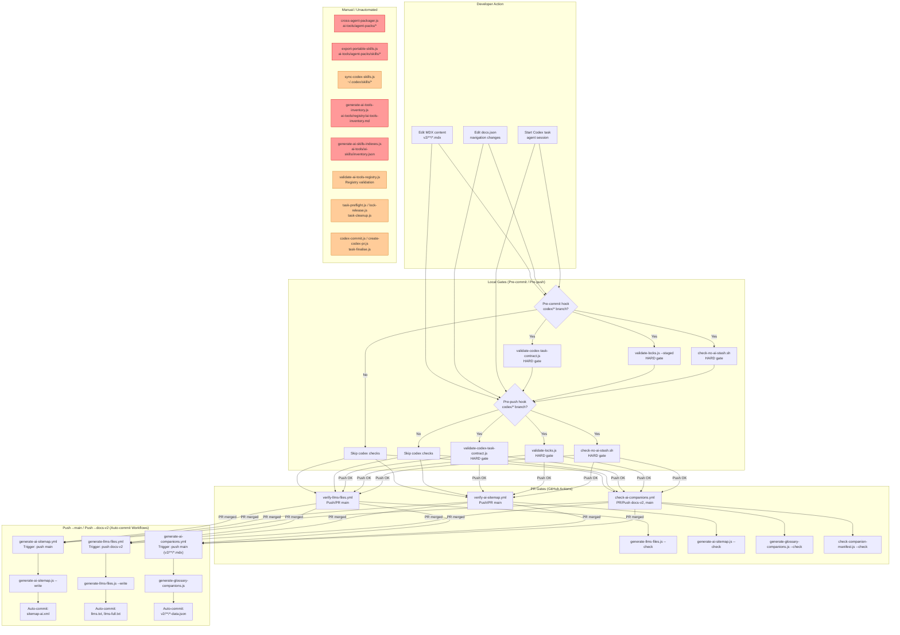
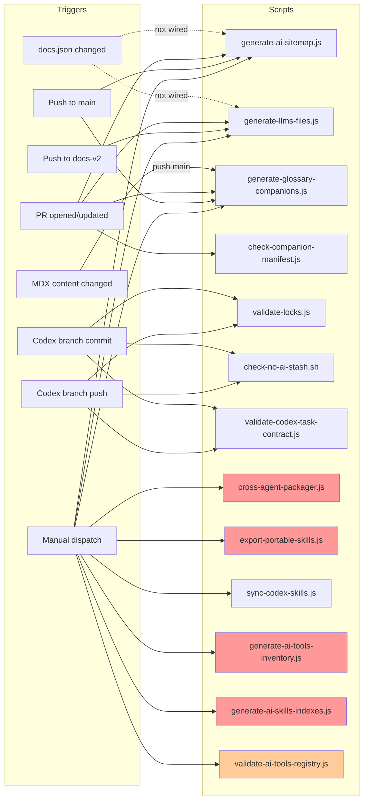
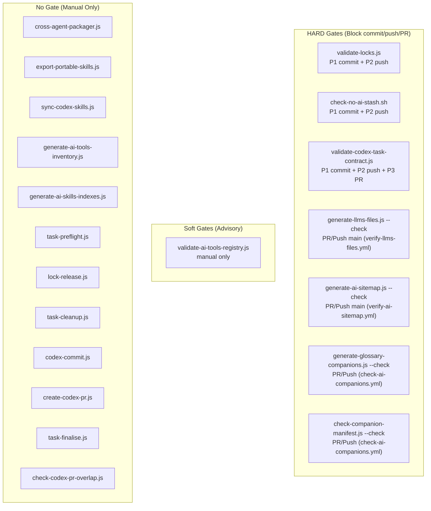

# Concern 4: AI — Workflow & Pipeline Audit

> Generated: 2026-03-23
> Concern: `ai` (SCRIPT-GOVERNANCE taxonomy)
> Scope: All scripts, workflows, gates, and artifacts related to AI discoverability, LLM files, AI sitemap, companion JSONs, agent skills, codex task isolation, and cross-agent packaging

---

## 1. Purpose

The AI pipeline ensures that the **AI-facing surface** of the Livepeer Docs v2 repo remains:
- **Discoverable** — `llms.txt`, `llms-full.txt`, and `sitemap-ai.xml` stay current for LLM crawlers
- **Companion-indexed** — glossary companion JSONs are generated for AI/crawler consumption
- **Agent-governed** — Codex task isolation (branching, locks, stash policy) is enforced at commit and push time
- **Skill-portable** — canonical skill templates are packaged for Codex, Cursor, Claude, and Windsurf agents
- **Registry-validated** — the AI tools registry and companion manifest stay consistent with source of truth
- **Inventoried** — AI skills indexes, tools inventory, and content maps reflect current state

---

## 2. Scripts in Scope (17 total)

### Generators (5)

| Script | Location | Niche | @pipeline | Input | Output |
|--------|----------|-------|-----------|-------|--------|
| `generate-llms-files.js` | `generators/ai/llm/` | llm | manual, P6 | `docs.json`, `v2/**/*.mdx` | `llms.txt`, `llms-full.txt` |
| `generate-ai-sitemap.js` | `generators/content/seo/` | seo | manual, P6 | `docs.json`, `v2/**/*.mdx` | `sitemap-ai.xml` |
| `generate-glossary-companions.js` | `generators/content/reference/` | reference | CI (push main), PR gate | glossary MDX pages | `v2/**/glossary-data.json` |
| `generate-ai-tools-inventory.js` | `generators/governance/reports/` | reports | manual | `ai-tools/registry/ai-tools-registry.json` | `ai-tools/registry/ai-tools-inventory.md` |
| `generate-ai-skills-indexes.js` | `generators/governance/catalogs/` | catalogs | manual, ci | agent-governance surfaces | `ai-tools/ai-skills/inventory.json`, `ai-tools/ai-skills/content-map.md` |

### Validators (4)

| Script | Location | Niche | @pipeline | Gate | Check |
|--------|----------|-------|-----------|------|-------|
| `validate-locks.js` | `validators/ai/codex/` | codex | P1 (commit), P2 (push) | **HARD** | Codex lock ownership, scope, conflicts |
| `check-no-ai-stash.sh` | `validators/ai/codex/` | codex | manual (wired in hooks) | **HARD** | Blocks push if AI stash entries exist |
| `check-companion-manifest.js` | `validators/governance/ai/` | ai | PR gate (check-ai-companions.yml) | **HARD** | Manifest consistency with registry |
| `validate-ai-tools-registry.js` | `validators/governance/compliance/` | compliance | manual | Soft | Registry coverage, lifecycle, lane alignment |

### Automations (6)

| Script | Location | Niche | @pipeline | Mode |
|--------|----------|-------|-----------|------|
| `cross-agent-packager.js` | `automations/ai/agents/` | agents | manual | Bundles audit pipeline into agent-consumable packs |
| `export-portable-skills.js` | `automations/ai/agents/` | agents | manual | Copies canonical skill templates into pack folders |
| `sync-codex-skills.js` | `automations/ai/agents/` | agents | manual | Syncs skill templates to local Codex installs |
| `task-preflight.js` | `automations/ai/codex/` | codex | manual | Creates branch, worktree, contract, lock |
| `lock-release.js` | `automations/ai/codex/` | codex | manual | Releases codex locks after merge verification |
| `task-cleanup.js` | `automations/ai/codex/` | codex | manual | Prunes merged worktrees, branches, released locks |

### Dispatch (4)

| Script | Location | Niche | @pipeline | Mode |
|--------|----------|-------|-----------|------|
| `check-codex-pr-overlap.js` | `dispatch/ai/codex/` | codex | PR, Track B | Checks for conflicting codex PRs |
| `codex-commit.js` | `dispatch/ai/codex/` | codex | manual | Generates compliant codex commit messages |
| `create-codex-pr.js` | `dispatch/ai/codex/` | codex | manual | Creates codex PR with correct naming/labels |
| `task-finalise.js` | `dispatch/ai/codex/` | codex | manual | Enforces task completion requirements |

### Related Validators (not @concern=ai, but AI-adjacent)

| Script | Location | @pipeline | Gate |
|--------|----------|-----------|------|
| `validate-codex-task-contract.js` | `validators/governance/compliance/` | P1 (commit), P2 (push), P3 (PR) | **HARD** |

---

## 3. Workflows in Scope (6 GHA)

| Workflow | Trigger | Branch | Auto-commit | Purpose |
|----------|---------|--------|-------------|---------|
| `generate-ai-sitemap.yml` | Push + manual | main | Yes | Regenerate `sitemap-ai.xml` |
| `generate-llms-files.yml` | Push + manual | docs-v2 | Yes | Regenerate `llms.txt` + `llms-full.txt` |
| `verify-llms-files.yml` | Push + PR | main | No | Validate `llms.txt` freshness |
| `verify-ai-sitemap.yml` | Push + PR | main | No | Validate `sitemap-ai.xml` freshness |
| `check-ai-companions.yml` | PR + Push + manual | docs-v2, main | No | Validate companion JSONs + manifest |
| `generate-ai-companions.yml` | Push (paths: `v2/**/*.mdx`) + manual | main | Yes | Regenerate glossary companion JSONs |

---

## 4. Artifacts

| Artifact | Path | Generator | Freshness trigger |
|----------|------|-----------|-------------------|
| AI sitemap | `sitemap-ai.xml` | `generate-ai-sitemap.js` | Push main (auto) |
| AI sitemap copy | `snippets/assets/site/sitemap-ai.xml` | Unknown sync | **None** (freshness unknown) |
| LLMs index | `llms.txt` | `generate-llms-files.js` | Push docs-v2 (auto) |
| LLMs full | `llms-full.txt` | `generate-llms-files.js` | **Missing** (file does not exist on disk) |
| Glossary companion JSONs | `v2/**/glossary-data.json` (9 files) | `generate-glossary-companions.js` | Push main, paths `v2/**/*.mdx` (auto) |
| AI companion manifest | `docs-guide/config/ai-companion-manifest.json` | Manual / planned `generate-ai-companions.js` (CDA-5) | **None** (manual only) |
| AI tools registry | `ai-tools/registry/ai-tools-registry.json` | Manual | **None** (manual only) |
| AI tools inventory | `ai-tools/registry/ai-tools-inventory.md` | `generate-ai-tools-inventory.js` | **None** (manual only) |
| AI skills inventory | `ai-tools/ai-skills/inventory.json` | `generate-ai-skills-indexes.js` | **None** (manual only) |
| AI skills content map | `ai-tools/ai-skills/content-map.md` | `generate-ai-skills-indexes.js` | **None** (manual only) |
| Skill catalog | `ai-tools/ai-skills/catalog/skill-catalog.json` | Manual | **None** (manual only) |
| Execution manifest | `ai-tools/ai-skills/catalog/execution-manifest.json` | Manual | **None** (manual only) |
| Agent packs (codex) | `ai-tools/agent-packs/codex/skills-manifest.json` | `cross-agent-packager.js` | **None** (manual only) |
| Agent packs (cursor) | `ai-tools/agent-packs/cursor/rules.md` | `cross-agent-packager.js` | **None** (manual only) |
| Agent packs (claude) | `ai-tools/agent-packs/claude/CLAUDE.md` | `cross-agent-packager.js` | **None** (manual only) |
| Agent packs (windsurf) | `ai-tools/agent-packs/windsurf/rules.md` | `cross-agent-packager.js` | **None** (manual only) |
| Portable skills | `ai-tools/agent-packs/skills/*/SKILL.md` (30+ skills) | `export-portable-skills.js` | **None** (manual only) |
| Portable skills manifest | `ai-tools/agent-packs/skills/manifest.json` | `export-portable-skills.js` | **None** (manual only) |
| Cursor rules | `.cursor/rules/*.mdc` | Manual | **None** |
| Windsurf rules | `.windsurf/rules/*.md` | Manual | **None** |
| Claude config | `.claude/CLAUDE.md` | Manual | **None** |
| Copilot instructions | `.github/copilot-instructions.md` | Manual | **None** |

---

## 5. Pipeline Diagram — Full AI Lifecycle



**Legend:** Red = gap (should be automated, is not). Orange = advisory (manual is acceptable for interactive developer tools).

---

## 6. Trigger Matrix



---

## 7. Gate Classification



---

## 8. Requirements & Real Needs

| Requirement | Current state | Met? |
|-------------|--------------|------|
| `sitemap-ai.xml` stays current with docs.json | CI regenerates on push main | Yes |
| `llms.txt` stays current with docs.json | CI regenerates on push docs-v2 | Yes |
| `llms.txt` freshness validated before merge to main | `verify-llms-files.yml` (PR/push main) | Yes |
| `sitemap-ai.xml` freshness validated before merge to main | `verify-ai-sitemap.yml` (PR/push main) | Yes |
| Glossary companion JSONs stay current | CI regenerates on push main (paths: `v2/**/*.mdx`) | Yes |
| Companion manifest consistent with registry | `check-ai-companions.yml` (PR/push) | Yes |
| Codex branches use isolated worktrees + locks | `validate-locks.js` in pre-commit/pre-push | Yes |
| Codex sessions cannot push directly to docs-v2 | Pre-push hook blocks + override mechanism | Yes |
| AI stash-based isolation is forbidden | `check-no-ai-stash.sh` in pre-commit/pre-push | Yes |
| Agent packs stay current with skill templates | Manual only | **No** — no CI trigger, no freshness check |
| Portable skills stay synced to canonical templates | Manual only | **No** — drift undetected |
| AI tools registry remains valid | Manual only | **No** — no CI validation |
| AI skills indexes stay current | Manual only | **No** — no CI trigger |
| AI tools inventory stays current | Manual only | **No** — no CI trigger |
| `llms-full.txt` exists on disk | File not found at repo root | **No** — generation workflow may have issues |
| Workflow script paths reference canonical locations | `generate-ai-sitemap.yml` and others reference old paths | **No** — broken paths (see GAP-AI5) |

---

## 9. Efficiency Assessment

### What works well
- **Codex isolation is comprehensive** — three independent validators (contract, locks, stash) create defense-in-depth at P1 and P2
- **LLM/sitemap generation-then-verification pattern is sound** — generate on push, verify on PR, clean separation
- **Companion pipeline is complete** — generate on push main, check on PR, two independent validators
- **Pre-commit is scope-gated** — codex validators only run on `codex/*` branches, zero overhead for non-codex commits
- **Skill templates have `--check` modes** — `export-portable-skills.js` and `sync-codex-skills.js` both support drift detection

### What is inefficient
- **6 manual-only generators/automations with no CI** — agent packs, portable skills, AI tools inventory, AI skills indexes all have `--check` modes but are never wired to any CI pipeline
- **Workflow script path mismatch** — 4 workflows reference `operations/scripts/generate-ai-sitemap.js` and `operations/scripts/generate-llms-files.js` which do not exist; actual scripts are at `generators/content/seo/` and `generators/ai/llm/` respectively
- **`generate-llms-files.yml` targets docs-v2 but `verify-llms-files.yml` targets main** — generation and verification happen on different branches, creating a branch-mismatch freshness gap
- **`generate-ai-sitemap.yml` has no path filter** — triggers on every push to main, not just docs.json or v2/ content changes
- **Duplicate codex validation** — `validate-codex-task-contract.js` and `validate-locks.js` both run at P1 AND P2 (commit and push), performing identical checks twice for every commit+push cycle on codex branches

---

## 10. Blocking Analysis

| Pipeline stage | Blocks workflow? | Impact |
|---------------|-----------------|--------|
| `validate-locks.js` (P1+P2) | Yes (HARD) | Appropriate — prevents codex scope violations |
| `check-no-ai-stash.sh` (P1+P2) | Yes (HARD) | Appropriate — enforces branch-based isolation |
| `validate-codex-task-contract.js` (P1+P2+P3) | Yes (HARD) | Appropriate — enforces task governance |
| `verify-llms-files.yml` (PR main) | Yes (HARD) | **Questionable** — blocks all PRs to main, not just content PRs |
| `verify-ai-sitemap.yml` (PR main) | Yes (HARD) | **Questionable** — blocks all PRs to main, not just content PRs |
| `check-ai-companions.yml` (PR docs-v2+main) | Yes (HARD) | Appropriate — but runs on all PRs, not scoped to v2/ changes |
| `generate-glossary-companions.js --check` | Yes (HARD) | Appropriate within `check-ai-companions.yml` |
| `check-companion-manifest.js --check` | Yes (HARD) | Appropriate within `check-ai-companions.yml` |

**Issue**: `verify-llms-files.yml` and `verify-ai-sitemap.yml` run on ALL PRs to main, including PRs that don't touch docs content. This adds CI latency to infrastructure-only PRs. Consider adding path filters.

---

## 11. Gaps

### GAP-AI1: Agent packs have no CI freshness trigger
- **Scripts**: `cross-agent-packager.js`, `export-portable-skills.js`
- **@pipeline tag says**: `manual -- not yet in pipeline`
- **Reality**: 30+ portable skills and 4 agent pack outputs are never validated for drift in CI
- **Impact**: Agent packs silently drift from canonical skill templates; agents operate on stale instructions
- **Severity**: High — agents making decisions from stale skill packs can produce incorrect outputs

### GAP-AI2: AI tools registry has no CI validation
- **Script**: `validate-ai-tools-registry.js`
- **@pipeline tag says**: `manual -- bounded validator CLI`
- **Reality**: Registry schema, coverage, lifecycle, and lane alignment are never checked automatically
- **Impact**: Registry entries can become inconsistent with actual tool files
- **Severity**: Medium — the registry is an internal governance artifact, not user-facing

### GAP-AI3: AI skills indexes have no CI trigger
- **Script**: `generate-ai-skills-indexes.js`
- **@pipeline tag says**: `manual, ci` (but no workflow wires it)
- **Reality**: `ai-tools/ai-skills/inventory.json` and `content-map.md` are never auto-regenerated
- **Impact**: Skills inventory drifts from actual skill templates
- **Severity**: Medium — feeds into cross-agent-packager and agent discovery

### GAP-AI4: AI tools inventory has no CI trigger
- **Script**: `generate-ai-tools-inventory.js`
- **@pipeline tag says**: `manual`
- **Reality**: `ai-tools/registry/ai-tools-inventory.md` is never auto-regenerated
- **Impact**: Inventory report goes stale
- **Severity**: Low — report is for human review, not machine consumption

### GAP-AI5: Workflow script paths reference non-existent files
- **Workflows**: `generate-ai-sitemap.yml`, `verify-ai-sitemap.yml`, `generate-llms-files.yml`, `verify-llms-files.yml`
- **Issue**: All four reference `operations/scripts/generate-ai-sitemap.js` or `operations/scripts/generate-llms-files.js` — these files do not exist at those paths
- **Actual paths**: `operations/scripts/generators/content/seo/generate-ai-sitemap.js` and `operations/scripts/generators/ai/llm/generate-llms-files.js`
- **Impact**: **Critical** — these workflows will fail with "MODULE_NOT_FOUND" on every run unless wrappers/symlinks exist (none found)
- **Severity**: Critical — all 4 AI discovery workflows are broken

### GAP-AI6: `llms-full.txt` does not exist at repo root
- **Generator**: `generate-llms-files.js` produces both `llms.txt` and `llms-full.txt`
- **Reality**: `llms.txt` exists at repo root; `llms-full.txt` does not
- **Impact**: The full LLM context file is missing — LLM agents requesting `/llms-full.txt` get a 404
- **Severity**: Medium — reduces AI discoverability for agents that consume full-text versions

### GAP-AI7: `generate-llms-files.yml` and `verify-llms-files.yml` target different branches
- **Generator**: Triggers on push to `docs-v2`, auto-commits to `docs-v2`
- **Verifier**: Triggers on push/PR to `main`
- **Issue**: `llms.txt` is regenerated on docs-v2 but verified on main. If the docs-v2 content diverges from main, verification on main will fail because it compares against main's content, not docs-v2's
- **Severity**: Medium — creates a confusing failure mode during the docs-v2 → main integration PR

### GAP-AI8: `generate-ai-sitemap.yml` lacks path filters
- **Issue**: Triggers on every push to main, regardless of whether docs content changed
- **Impact**: Unnecessary CI runs on infrastructure-only pushes (scripts, workflows, etc.)
- **Severity**: Low — the workflow is fast, but wastes CI minutes

### GAP-AI9: `sitemap-ai.xml` copy in `snippets/assets/site/` has unknown freshness
- **Issue**: A copy of `sitemap-ai.xml` exists at `snippets/assets/site/sitemap-ai.xml` but no workflow or script keeps it in sync with the root `sitemap-ai.xml`
- **Impact**: The copy may be stale; if used by components, it shows outdated data
- **Severity**: Low — depends on whether the copy is actively consumed

### GAP-AI10: `check-codex-pr-overlap.js` is not wired to any workflow
- **Script**: Declared as `@pipeline PR, Track B` but no GHA workflow invokes it
- **Issue**: Conflicting codex PRs targeting the same files are not detected
- **Impact**: Codex agents can create overlapping PRs that conflict at merge time
- **Severity**: Medium — manual review catches some conflicts, but not all

---

## 12. Duplication / Overlap

### OVERLAP-AI1: Duplicate codex validation at P1 and P2
- `validate-locks.js` and `check-no-ai-stash.sh` run at **both** pre-commit (P1) and pre-push (P2) for codex branches
- Pre-push checks are redundant if commit just passed — unless intervening commits are made between commit and push
- **Recommendation**: Keep both — the duplication is intentional defense-in-depth. The cost is minimal (< 1s each) and protects against manual `git commit --no-verify` bypasses

### OVERLAP-AI2: `validate-codex-task-contract.js` runs at P1, P2, AND P3
- The task contract is validated at commit, push, and PR — triple validation
- **Recommendation**: Acceptable — each stage checks progressively more (commit: contract exists; push: committed work; PR: issue state + labels)

### OVERLAP-AI3: LLM generation vs verification branch mismatch
- `generate-llms-files.yml` operates on docs-v2
- `verify-llms-files.yml` operates on main
- These are not duplicates but the branch gap creates a logical overlap issue — the verifier may be checking stale artifacts from a different branch
- **Recommendation**: Align to same branch (see REC-AI4)

---

## 13. Recommendations

### REC-AI1: Fix broken workflow script paths (closes GAP-AI5)

Update all 4 workflow files to reference the correct post-restructure paths:

```yaml
# generate-ai-sitemap.yml + verify-ai-sitemap.yml:
run: node operations/scripts/generators/content/seo/generate-ai-sitemap.js --write|--check

# generate-llms-files.yml + verify-llms-files.yml:
run: node operations/scripts/generators/ai/llm/generate-llms-files.js --write|--check
```

**Priority**: Critical — these workflows are broken without this fix.

### REC-AI2: Add portable skills drift check to CI (closes GAP-AI1)

Add `export-portable-skills.js --check` to a PR or cron workflow. Options:

**Option A — Add to `check-ai-companions.yml` (recommended)**
```yaml
- name: Verify portable skills are current
  run: node operations/scripts/automations/ai/agents/export-portable-skills.js --check
```

**Option B — Dedicated cron workflow (P5/P6)**
Create `verify-ai-skills.yml` on weekly cron to check both portable skills and agent packs.

### REC-AI3: Add AI tools registry validation to CI (closes GAP-AI2)

Add `validate-ai-tools-registry.js --check` to the `check-ai-companions.yml` workflow or a dedicated cron:

```yaml
- name: Verify AI tools registry
  run: node operations/scripts/validators/governance/compliance/validate-ai-tools-registry.js --check
```

### REC-AI4: Align LLM generation and verification branches (closes GAP-AI7)

Two approaches:

**Option A — Move generation to main (recommended)**
Change `generate-llms-files.yml` trigger from `docs-v2` to `main`. This aligns generation with verification and with the AI sitemap workflow (which already targets main).

**Option B — Add docs-v2 verification workflow**
Create a separate `verify-llms-files-dev.yml` that runs on docs-v2 PRs. More complex, less value.

### REC-AI5: Add path filters to AI sitemap workflow (closes GAP-AI8)

```yaml
on:
  push:
    branches: [main]
    paths:
      - 'docs.json'
      - 'v2/**/*.mdx'
      - 'v2/**/*.md'
  workflow_dispatch:
```

### REC-AI6: Wire `generate-ai-skills-indexes.js` to CI (closes GAP-AI3)

Add to `check-ai-companions.yml` or a dedicated cron:

```yaml
- name: Verify AI skills indexes are current
  run: node operations/scripts/generators/governance/catalogs/generate-ai-skills-indexes.js --check
```

### REC-AI7: Wire `check-codex-pr-overlap.js` to PR workflow (closes GAP-AI10)

Add to a PR-triggered workflow for codex branches:

```yaml
- name: Check codex PR overlap
  if: startsWith(github.head_ref, 'codex/')
  run: node operations/scripts/dispatch/ai/codex/check-codex-pr-overlap.js --branch ${{ github.head_ref }}
```

### REC-AI8: Add path filters to verification workflows

Both `verify-llms-files.yml` and `verify-ai-sitemap.yml` run on ALL PRs to main. Add path filters:

```yaml
# verify-llms-files.yml
on:
  pull_request:
    branches: [main]
    paths:
      - 'docs.json'
      - 'v2/**'
      - 'llms.txt'
      - 'llms-full.txt'
```

### REC-AI9: Investigate and fix `llms-full.txt` absence (closes GAP-AI6)

1. Confirm whether `generate-llms-files.yml` has ever run successfully
2. If the workflow is broken (GAP-AI5), fixing the path will also fix this
3. After fixing, verify `llms-full.txt` is generated and committed

---

## 14. Recommended Gate Matrix (After Fixes)

| Check | Stage | Gate | Change from current |
|-------|-------|------|---------------------|
| `validate-codex-task-contract.js` | P1+P2+P3 | HARD | No change |
| `validate-locks.js` | P1+P2 | HARD | No change |
| `check-no-ai-stash.sh` | P1+P2 | HARD | No change |
| `generate-llms-files.js --check` | PR main | HARD | **Fix script path** |
| `generate-ai-sitemap.js --check` | PR main | HARD | **Fix script path; add path filters** |
| `generate-glossary-companions.js --check` | PR (check-ai-companions) | HARD | No change |
| `check-companion-manifest.js --check` | PR (check-ai-companions) | HARD | No change |
| `export-portable-skills.js --check` | PR (check-ai-companions) | Soft | **NEW — wire to CI** |
| `validate-ai-tools-registry.js --check` | PR or Cron | Soft | **NEW — wire to CI** |
| `generate-ai-skills-indexes.js --check` | PR or Cron | Soft | **NEW — wire to CI** |
| `check-codex-pr-overlap.js` | PR (codex branches) | Soft | **NEW — wire to PR workflow** |
| `generate-ai-sitemap.js --write` | Push main | Auto-commit | **Add path filters** |
| `generate-llms-files.js --write` | Push main | Auto-commit | **Move from docs-v2 to main** |
| `generate-glossary-companions.js` | Push main | Auto-commit | No change |
| `cross-agent-packager.js` | Manual | None | No change (acceptable) |
| `sync-codex-skills.js` | Manual | None | No change (local dev tool) |
| `task-preflight.js / lock-release.js / task-cleanup.js` | Manual | None | No change (interactive tools) |
| `codex-commit.js / create-codex-pr.js / task-finalise.js` | Manual | None | No change (interactive tools) |

---

## 15. Summary

The AI pipeline has two distinct, well-built subsystems:

1. **AI discoverability** (LLMs files, sitemap, companions) — generation + verification pattern is architecturally sound, but all 4 generation/verification workflows reference broken script paths (GAP-AI5), making them non-functional.

2. **Codex task isolation** (locks, contracts, stash policy) — comprehensive defense-in-depth at P1, P2, and P3. Well-designed, properly gated, no gaps.

The main issues are:

1. **4 workflows with broken script paths** (GAP-AI5) — Critical; all AI discovery workflows are non-functional
2. **6 generators/validators with no CI trigger** (GAP-AI1, AI2, AI3, AI4) — agent packs, skills indexes, tools registry all drift undetected
3. **1 branch mismatch** (GAP-AI7) — LLMs generated on docs-v2 but verified on main
4. **1 missing artifact** (GAP-AI6) — `llms-full.txt` absent from repo root
5. **1 unwired PR check** (GAP-AI10) — codex PR overlap detection is not in any workflow
6. **2 missing path filters** (GAP-AI8, AI9) — verification/generation workflows run unnecessarily on non-content PRs

The highest-priority fix is **REC-AI1** (fix broken workflow paths), which unblocks 4 workflows and likely resolves GAP-AI6 as a side effect. The highest-impact structural improvement is **REC-AI2** (portable skills drift check), which brings the 30+ agent skill files under CI governance.
