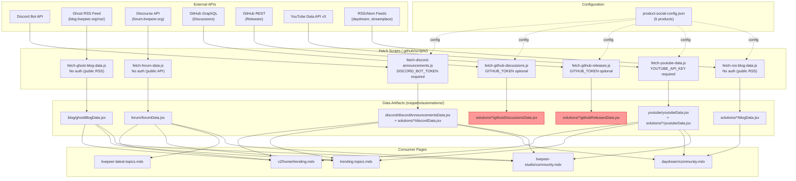
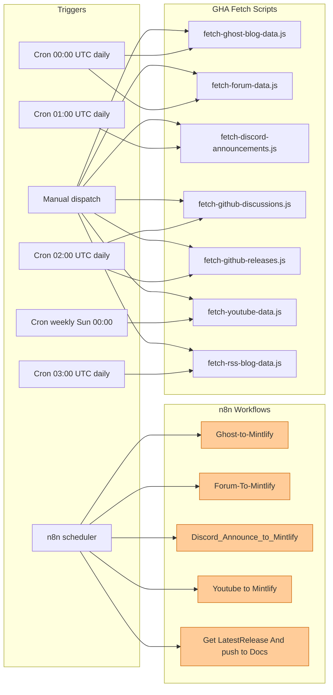
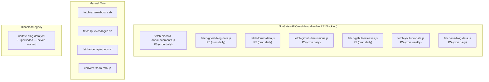

# Concern 5: Data Pipelines — Workflow & Pipeline Audit

> Generated: 2026-03-23
> Concern: `content/data` (SCRIPT-GOVERNANCE taxonomy — cross-cutting)
> Scope: All scripts, workflows, gates, and artifacts related to external data ingestion pipelines

---

## 1. Purpose

The data pipelines concern ensures that **external content feeds** (blog posts, forum topics, Discord announcements, YouTube videos, GitHub releases/discussions) are:
- **Fetched** — automated scripts pull data from external APIs on a schedule
- **Transformed** — raw API responses are converted to JSX data-export files
- **Committed** — updated data files are auto-committed to the repo for Mintlify to render
- **Consumed** — integrator components on community/trending pages display the data
- **Monitored** — pipeline failures are detected and data freshness is maintained

The pipeline operates across two parallel systems:
1. **GitHub Actions (GHA)** — 7 scheduled/manual workflows calling 7 fetch scripts in `.github/scripts/`
2. **n8n external automation** — 5 n8n workflows (legacy, targeting `docs-v2-preview` branch)

---

## 2. Scripts in Scope (7 fetch scripts + 4 supplementary)

### Fetch Scripts (`.github/scripts/`) — 7 total

| Script | API Source | Auth | Config-driven | Output Path |
|--------|-----------|------|---------------|-------------|
| `fetch-discord-announcements.js` | Discord Bot API v10 | `DISCORD_BOT_TOKEN` (required) | Yes (`product-social-config.json`) | `snippets/automations/solutions/{product}/discordData.jsx` + `snippets/automations/discord/discordAnnouncementsData.jsx` |
| `fetch-ghost-blog-data.js` | Ghost RSS feed | None (public RSS) | No (hardcoded URL) | `snippets/automations/blog/ghostBlogData.jsx` |
| `fetch-forum-data.js` | Discourse JSON API | None (public API) | No (hardcoded URL) | `snippets/automations/forum/forumData.jsx` |
| `fetch-github-discussions.js` | GitHub GraphQL API | `GITHUB_TOKEN` (optional) | Yes (`product-social-config.json`) | `snippets/automations/solutions/{product}/githubDiscussionsData.jsx` |
| `fetch-github-releases.js` | GitHub REST API | `GITHUB_TOKEN` (optional) | Yes (`product-social-config.json`) | `snippets/automations/solutions/{product}/githubReleasesData.jsx` |
| `fetch-youtube-data.js` | YouTube Data API v3 | `YOUTUBE_API_KEY` (required) | Hybrid (config + env vars) | `snippets/automations/solutions/{product}/youtubeData.jsx` or `snippets/automations/youtube/youtubeData.jsx` |
| `fetch-rss-blog-data.js` | Generic RSS/Atom feeds | None (public RSS) | Yes (`product-social-config.json`) | `snippets/automations/solutions/{product}/blogData.jsx` |

### Supplementary Data Scripts (`operations/scripts/automations/content/data/`)

| Script | Type | Pipeline | Purpose |
|--------|------|----------|---------|
| `fetch-external-docs.sh` | fetching | manual | Pull doc fragments from external GitHub repos |
| `fetch-lpt-exchanges.sh` | fetching | manual | Pull LPT exchange listing data from CoinGecko |
| `fetch-openapi-specs.sh` | fetching | manual | Pull latest OpenAPI specs from Livepeer services |
| `convert-rss-to-mdx.js` | transforms | manual | Convert RSS items to MDX page format |

### Central Configuration

| File | Purpose |
|------|---------|
| `operations/scripts/config/product-social-config.json` | Maps each product (daydream, embody, frameworks, livepeer-studio, streamplace) to its social channels, API endpoints, and pipeline parameters |

---

## 3. Workflows in Scope (7 GHA + 5 n8n)

### GitHub Actions Workflows

| Workflow | Trigger | Schedule | Branch | Auto-commit | Scripts Called |
|----------|---------|----------|--------|-------------|---------------|
| `update-discord-data.yml` | Cron + manual | Daily 01:00 UTC | `DEPLOY_BRANCH` (or `TEST_BRANCH`) | Yes | `fetch-discord-announcements.js` |
| `update-ghost-blog-data.yml` | Cron + manual | Daily 00:00 UTC | `DEPLOY_BRANCH` (or `TEST_BRANCH`) | Yes | `fetch-ghost-blog-data.js` |
| `update-forum-data.yml` | Cron + manual | Daily 00:00 UTC | `DEPLOY_BRANCH` (or `TEST_BRANCH`) | Yes | `fetch-forum-data.js` |
| `update-github-data.yml` | Cron + manual | Daily 02:00 UTC | `DEPLOY_BRANCH` (or `TEST_BRANCH`) | Yes | `fetch-github-discussions.js` + `fetch-github-releases.js` |
| `update-youtube-data.yml` | Cron + manual | Weekly Sun 00:00 UTC | `DEPLOY_BRANCH` (or `TEST_BRANCH`) | Yes | `fetch-youtube-data.js` |
| `update-rss-blog-data.yml` | Cron + manual | Daily 03:00 UTC | `DEPLOY_BRANCH` (or `TEST_BRANCH`) | Yes | `fetch-rss-blog-data.js` |
| `update-blog-data.yml` | Manual only | **DISABLED** | default | Yes | Legacy curl-based fetch (uses `YOUR_CONTENT_API_KEY` placeholder — never worked) |

### n8n External Automation Workflows

| Workflow File | Target Branch | Schedule | Data Source | Output Path |
|---------------|---------------|----------|-------------|-------------|
| `Discord_Announce_to_Mintlify.json` | `docs-v2-preview` | Default interval | Discord Bot API | `snippets/automations/discord/discordAnnouncementsData.jsx` |
| `Ghost-to-Mintlify.json` | `docs-v2-preview` | Weekly | Ghost Content API (with API key) | `snippets/automations/blog/ghostBlogData.jsx` |
| `Forum-To-Mintlify-Latest-Topics.json` | `docs-v2-preview` | Scheduled | Discourse JSON API | `snippets/automations/forum/forumData.jsx` |
| `Youtube to Mintlify.json` | `docs-v2-preview` | Scheduled | YouTube Data API | `snippets/automations/youtube/youtubeData.jsx` |
| `Get LatestRelease And push to Docs.json` | N/A (in JSON) | Weekly | GitHub REST API (`go-livepeer`) | Release data |

---

## 4. Artifacts

### Data Files Produced

| Artifact | Path | Producer(s) | Freshness | Consumers |
|----------|------|-------------|-----------|-----------|
| Ghost blog data | `snippets/automations/blog/ghostBlogData.jsx` | `fetch-ghost-blog-data.js` (GHA daily) + n8n Ghost-to-Mintlify (weekly) | Daily | `trending-topics.mdx`, `v2/home/trending.mdx`, `livepeer-studio/community.mdx` |
| Forum data | `snippets/automations/forum/forumData.jsx` | `fetch-forum-data.js` (GHA daily) + n8n Forum workflow | Daily | `trending-topics.mdx`, `livepeer-latest-topics.mdx`, `v2/home/trending.mdx`, `livepeer-studio/community.mdx` |
| Discord global announcements | `snippets/automations/discord/discordAnnouncementsData.jsx` | `fetch-discord-announcements.js` (GHA daily) + n8n Discord workflow | Daily | `trending-topics.mdx`, `v2/home/trending.mdx`, `daydream/community.mdx`, `livepeer-studio/community.mdx` |
| YouTube data (global) | `snippets/automations/youtube/youtubeData.jsx` | `fetch-youtube-data.js` (GHA weekly) + n8n YouTube workflow | Weekly | `trending-topics.mdx`, `v2/home/trending.mdx`, `livepeer-studio/community.mdx` |
| Per-product Discord data | `snippets/automations/solutions/{product}/discordData.jsx` | `fetch-discord-announcements.js` | Daily | `daydream/community.mdx` |
| Per-product blog data | `snippets/automations/solutions/{product}/blogData.jsx` | `fetch-rss-blog-data.js` | Daily | `daydream/community.mdx` |
| Per-product YouTube data | `snippets/automations/solutions/{product}/youtubeData.jsx` | `fetch-youtube-data.js` (when `PRODUCT_KEY=all`) | Weekly | `daydream/community.mdx` |
| Per-product GitHub discussions | `snippets/automations/solutions/{product}/githubDiscussionsData.jsx` | `fetch-github-discussions.js` | Daily | Not yet consumed in pages |
| Per-product GitHub releases | `snippets/automations/solutions/{product}/githubReleasesData.jsx` | `fetch-github-releases.js` | Daily | Not yet consumed in pages |
| Forum hero image | `snippets/automations/forum/Hero_Livepeer_Forum.png` | Static asset | N/A | `ForumLatestLayout`, `CardInCardLayout` components |

### Consumer Components

| Component | File | Data Sources Accepted |
|-----------|------|-----------------------|
| `ColumnsBlogCardLayout` | `snippets/components/integrators/blog/Data.jsx` | `ghostData` (blog) |
| `ForumLatestLayout` | `snippets/components/integrators/blog/Data.jsx` | `forumData` (forum) |
| `DiscordAnnouncements` | `snippets/components/integrators/blog/Data.jsx` | `discordAnnouncementsData`, `discordData` |
| `YouTubeVideoData` | `snippets/components/integrators/video-data/VideoData.jsx` | `youtubeData` |
| `RssBlogCardLayout` | `snippets/components/integrators/blog/Data.jsx` | RSS blog data (`daydreamBlogData`, etc.) |
| `BlogCard` / `PostCard` | `snippets/components/integrators/blog/Data.jsx` | Generic blog/forum item objects |

### Consumer Pages

| Page | Data Imports |
|------|-------------|
| `v2/home/trending.mdx` | `forumData`, `ghostData`, `youtubeData`, `discordAnnouncementsData` |
| `v2/community/livepeer-community/trending-topics.mdx` | `forumData`, `ghostData`, `youtubeData`, `discordAnnouncementsData` |
| `v2/community/livepeer-community/livepeer-latest-topics.mdx` | `forumData` |
| `v2/solutions/daydream/community.mdx` | `youtubeData` (Daydream), `daydreamBlogData`, `daydreamDiscordData`, `discordAnnouncementsData` |
| `v2/solutions/livepeer-studio/community.mdx` | `youtubeData`, `ghostData`, `forumData`, `discordAnnouncementsData` |

---

## 5. Pipeline Diagram — Full Data Pipeline Lifecycle



**Legend:** Red = data produced but not yet consumed by any page.

---

## 6. Trigger Matrix



**Legend:** Orange = n8n workflows targeting `docs-v2-preview` branch (may be stale/redundant with GHA).

---

## 7. Gate Classification



**Note:** All data pipeline scripts operate at P5/P6 (scheduled cron, self-healing). None serve as PR gates. This is appropriate per governance D7 — external data freshness should not block developer PRs.

---

## 8. Schedule Collision Matrix

```mermaid
gantt
    title Daily GHA Schedule (UTC)
    dateFormat HH:mm
    axisFormat %H:%M

    section 00:00 UTC
    update-ghost-blog-data.yml     :a1, 00:00, 10min
    update-forum-data.yml          :a2, 00:00, 10min

    section 01:00 UTC
    update-discord-data.yml        :b1, 01:00, 10min

    section 02:00 UTC
    update-github-data.yml         :c1, 02:00, 10min

    section 03:00 UTC
    update-rss-blog-data.yml       :d1, 03:00, 10min
```



**Issue:** `update-ghost-blog-data.yml` and `update-forum-data.yml` both fire at 00:00 UTC. While they touch different files, both auto-commit to the same branch — creating a potential race condition if both complete and push near-simultaneously.

---

## 9. Requirements & Real Needs

| Requirement | Current State | Met? |
|-------------|--------------|------|
| Blog data refreshes daily | `update-ghost-blog-data.yml` cron at 00:00 UTC daily | Yes |
| Forum data refreshes daily | `update-forum-data.yml` cron at 00:00 UTC daily | Yes |
| Discord data refreshes daily | `update-discord-data.yml` cron at 01:00 UTC daily | Yes |
| GitHub discussions/releases refresh daily | `update-github-data.yml` cron at 02:00 UTC daily | Yes |
| RSS blog data refreshes daily | `update-rss-blog-data.yml` cron at 03:00 UTC daily | Yes |
| YouTube data refreshes weekly | `update-youtube-data.yml` weekly Sun 00:00 UTC | Yes |
| API failures are detected and reported | No monitoring, alerting, or retry logic | **No** |
| Data freshness is validated | No staleness check on data artifacts | **No** |
| All data artifacts are consumed by pages | `githubDiscussionsData.jsx` and `githubReleasesData.jsx` not imported anywhere | **No** |
| n8n and GHA pipelines are not redundant | Both systems target same data sources and output files | **No** |
| Config-driven scripts use central config | 5/7 use `product-social-config.json`; 2 hardcode URLs | Partially |
| `escapeForJSX` is consistent across scripts | 7 near-identical copies with minor variations | **No** |
| All scheduled commits use `[skip ci]` | 6/7 use `[skip ci]`; YouTube uses plain commit message | **No** |
| Bot identity is consistent across workflows | Mixed: 4 use `github-actions[bot]`, 1 uses `GitHub Actions Bot` with different email | **No** |
| Per-product YouTube data is fetched | Workflow passes single `CHANNEL_ID` env var (legacy mode), does not use config `PRODUCT_KEY=all` | **No** |

---

## 10. Efficiency Assessment

### What works well
- **Staggered schedule** — workflows are spread across 00:00–03:00 UTC, reducing contention
- **Diff-guarded commits** — every workflow checks `git diff --exit-code` before committing, avoiding empty commits
- **Config-driven architecture** — `product-social-config.json` centralizes product definitions for 5 scripts
- **No PR blocking** — data pipelines correctly operate at P5/P6, never gating developer PRs
- **Redirect handling** — `fetch-ghost-blog-data.js` and `fetch-rss-blog-data.js` follow HTTP redirects
- **Per-product outputs** — config-driven scripts produce per-product data files, enabling product-specific community pages

### What is inefficient
- **7 duplicate `escapeForJSX` functions** — identical (or near-identical) string sanitization logic copied across all 7 fetch scripts. Should be a shared utility.
- **Ghost RSS is fetched twice** — `fetch-ghost-blog-data.js` fetches `blog.livepeer.org/rss/` directly (hardcoded), while `fetch-rss-blog-data.js` would also fetch it via config — prevented only by the `fetchMethod === "ghost-api"` skip check in the RSS script. The Ghost script is effectively a special case of the generic RSS fetcher.
- **YouTube workflow uses legacy single-channel mode** — the workflow passes `CHANNEL_ID` env var (Livepeer main channel only), ignoring the script's `PRODUCT_KEY=all` mode that would fetch per-product YouTube data from config.
- **Two workflows collide at 00:00 UTC** — Ghost and Forum workflows both fire at the same time, risking push race conditions.
- **n8n workflows are fully redundant with GHA** — all 5 n8n workflows duplicate functionality that GHA workflows now handle, and target a different branch (`docs-v2-preview`) than GHA (`DEPLOY_BRANCH`).
- **GitHub discussions/releases data is produced but never consumed** — scripts generate `githubDiscussionsData.jsx` and `githubReleasesData.jsx` per product, but no MDX page imports them.

---

## 11. Blocking Analysis

| Pipeline stage | Blocks anything? | Impact |
|---------------|-----------------|--------|
| All fetch scripts | No (P5/P6 cron) | Appropriate — external data should not block PRs |
| Auto-commit `[skip ci]` | No | Prevents infinite workflow loops |
| YouTube workflow commit | Missing `[skip ci]` | **Issue** — could trigger other push-based workflows |
| API authentication | Workflow fails silently | **Issue** — `DISCORD_BOT_TOKEN` / `YOUTUBE_API_KEY` missing = silent failure, no notification |

**Note:** Data pipeline scripts appropriately have NO gate enforcement. They are pure P5/P6 (scheduled self-heal). The only risk is silent failure when APIs are down or secrets expire.

---

## 12. Gaps

### GAP-DP1: No error handling or retry logic in any fetch script
- **Issue**: All 7 fetch scripts call external APIs with zero retry logic. A transient network error, rate limit, or API outage causes the entire workflow to fail silently.
- **Scripts affected**: All 7 fetch scripts
- **Impact**: Data goes stale without notification; next cron run may succeed, but extended outages go undetected
- **Severity**: High — external APIs are inherently unreliable

### GAP-DP2: No monitoring or alerting for pipeline failures
- **Issue**: When a cron workflow fails (API down, secret expired, rate limit), there is no notification. The workflow just fails and GitHub Actions shows a red check mark that nobody may notice.
- **Impact**: Data can go stale for days/weeks without anyone knowing
- **Severity**: High — silent failures are the worst failure mode for automated pipelines

### GAP-DP3: `githubDiscussionsData.jsx` and `githubReleasesData.jsx` are produced but never consumed
- **Issue**: `fetch-github-discussions.js` and `fetch-github-releases.js` produce per-product data files daily, but no MDX page imports or renders them
- **Impact**: Wasted CI minutes; data artifacts exist but serve no purpose
- **Severity**: Medium — wastes resources and creates orphaned files that may confuse contributors

### GAP-DP4: YouTube workflow uses legacy single-channel mode
- **Issue**: `update-youtube-data.yml` passes `CHANNEL_ID` env var for the main Livepeer channel only. The script supports `PRODUCT_KEY=all` mode to fetch per-product YouTube data from config, but the workflow does not use it.
- **Impact**: Per-product YouTube data (e.g., `solutions/daydream/youtubeData.jsx`) is only updated via manual `workflow_dispatch`, not by scheduled cron
- **Severity**: Medium — Daydream community page shows stale YouTube data between manual runs

### GAP-DP5: n8n workflows target stale branch `docs-v2-preview`
- **Issue**: All 5 n8n workflows commit to `docs-v2-preview` branch, while GHA workflows commit to `DEPLOY_BRANCH` (likely `main` or `docs-v2-dev`). The n8n branch may not exist or may be abandoned.
- **Impact**: n8n updates may be silently lost; dual-write conflict if both systems are active
- **Severity**: Medium — needs explicit decommission decision

### GAP-DP6: Ghost-specific fetch script is redundant with generic RSS fetcher
- **Issue**: `fetch-ghost-blog-data.js` is a hardcoded single-feed RSS parser for `blog.livepeer.org/rss/`. The generic `fetch-rss-blog-data.js` already handles the same feed format via config. The Ghost script exists because it predates the generic RSS script.
- **Impact**: Two scripts maintain duplicate RSS parsing logic; the Ghost script cannot be extended to additional products
- **Severity**: Low — works correctly but violates DRY

### GAP-DP7: `escapeForJSX` is duplicated 7 times with minor inconsistencies
- **Issue**: All 7 fetch scripts contain their own copy of `escapeForJSX()`. Most are identical, but `fetch-youtube-data.js` escapes single quotes differently (uses `\\'` instead of removing), and `fetch-discord-announcements.js` replaces newlines with `<br />` while others use spaces.
- **Impact**: Inconsistent escaping behavior across data sources; maintenance burden when bugs are found
- **Severity**: Medium — a bug fix in one copy must be replicated to 6 others

### GAP-DP8: YouTube workflow commit message lacks `[skip ci]`
- **Issue**: `update-youtube-data.yml` uses `git commit -m "Update YouTube videos - $(date ...)"` without the `[skip ci]` suffix that all other data workflows use.
- **Impact**: YouTube data commits may trigger other push-based CI workflows unnecessarily
- **Severity**: Low — but wastes CI minutes and could cause unintended side effects

### GAP-DP9: Bot identity inconsistency
- **Issue**: 6 workflows use `github-actions[bot]` / `github-actions[bot]@users.noreply.github.com`, but `update-youtube-data.yml` uses `GitHub Actions Bot` / `actions@github.com`
- **Impact**: Git log shows inconsistent author; may confuse `git blame` analysis
- **Severity**: Low — cosmetic but signals lack of standardization

### GAP-DP10: No data freshness validation
- **Issue**: No script or workflow validates whether data artifacts are fresh (e.g., "was `forumData.jsx` updated in the last 48 hours?"). If a pipeline silently fails for days, nobody detects it.
- **Impact**: Stale data displayed on community pages without detection
- **Severity**: Medium — complementary to GAP-DP2; monitoring plus freshness checks together would close this gap

### GAP-DP11: Ghost blog data fetched by both dedicated and generic scripts
- **Issue**: `fetch-ghost-blog-data.js` fetches `blog.livepeer.org/rss/` to `snippets/automations/blog/ghostBlogData.jsx`. Separately, `fetch-rss-blog-data.js` reads the config where `livepeer-studio.blog.rssUrl` is also `blog.livepeer.org/rss/` — but the config has `fetchMethod: "rss"`, not `"ghost-api"`, so the skip logic in the RSS script (`fetchMethod === "ghost-api"`) does NOT trigger. This means the Livepeer Studio blog is effectively fetched twice: once by the Ghost script (to `blog/ghostBlogData.jsx`) and once by the RSS script (to `solutions/livepeer-studio/blogData.jsx`) — but the latter output path does not exist in the file system (check: is it being skipped by a different mechanism, or is it silently creating a file nobody imports?).
- **Severity**: Medium — potential duplicate fetching; confusing data flow

### GAP-DP12: `update-forum-data.yml` contains stale n8n reference
- **Issue**: The workflow header comment says "N8N IS BEING USING AS AN ALTERNATIVE UNTIL THEN" — but GHA is now the primary pipeline. The comment is misleading.
- **Impact**: Low — confuses maintainers reading the workflow
- **Severity**: Low — documentation debt

---

## 13. Duplication / Overlap

### OVERLAP-DP1: n8n workflows fully duplicate GHA workflows

| Data Source | GHA Workflow | n8n Workflow | GHA Branch | n8n Branch |
|------------|-------------|-------------|------------|------------|
| Discord | `update-discord-data.yml` (daily) | `Discord_Announce_to_Mintlify.json` | `DEPLOY_BRANCH` | `docs-v2-preview` |
| Ghost Blog | `update-ghost-blog-data.yml` (daily) | `Ghost-to-Mintlify.json` (weekly) | `DEPLOY_BRANCH` | `docs-v2-preview` |
| Forum | `update-forum-data.yml` (daily) | `Forum-To-Mintlify-Latest-Topics.json` | `DEPLOY_BRANCH` | `docs-v2-preview` |
| YouTube | `update-youtube-data.yml` (weekly) | `Youtube to Mintlify.json` | `DEPLOY_BRANCH` | `docs-v2-preview` |
| GitHub Releases | `update-github-data.yml` (daily) | `Get LatestRelease And push to Docs.json` (weekly) | `DEPLOY_BRANCH` | N/A |

**Assessment**: GHA is the primary system. The n8n workflows were the original implementation (pre-GHA) and now target a branch (`docs-v2-preview`) that may no longer be active. The n8n workflows should be formally decommissioned or repurposed.

**Key difference**: n8n Ghost workflow uses the Ghost Content API with an API key (`eaf54ba5c9d4ab35ce268663b0`), while the GHA script uses the public RSS feed. The n8n version gets richer data (full HTML content, reading time, feature images) that the RSS-based script cannot access.

### OVERLAP-DP2: Ghost blog data vs RSS blog data for Livepeer Studio

- `fetch-ghost-blog-data.js` → `snippets/automations/blog/ghostBlogData.jsx` (export: `ghostData`)
- `fetch-rss-blog-data.js` → `snippets/automations/solutions/livepeer-studio/blogData.jsx` (export: `livepeerstudioBlogData`)
- Both fetch from `blog.livepeer.org/rss/`
- Pages import `ghostData` — the RSS-produced `livepeerstudioBlogData` appears unused

### OVERLAP-DP3: `escapeForJSX` function duplicated 7 times

Exact same logic (with minor variations) appears in:
1. `fetch-discord-announcements.js`
2. `fetch-ghost-blog-data.js`
3. `fetch-forum-data.js` (inline version, different style)
4. `fetch-github-discussions.js`
5. `fetch-github-releases.js`
6. `fetch-youtube-data.js` (different single-quote handling)
7. `fetch-rss-blog-data.js`

---

## 14. Recommendations

### REC-DP1: Extract shared `escapeForJSX` utility (closes GAP-DP7, OVERLAP-DP3)

Create a shared utility at `.github/scripts/lib/escape-jsx.js` (or `operations/scripts/lib/`):

```javascript
// .github/scripts/lib/escape-jsx.js
function escapeForJSX(str, { newlineReplace = " " } = {}) {
  return (str || "")
    .replace(/\\/g, "\\\\")
    .replace(/`/g, "\\`")
    .replace(/"/g, '\\"')
    .replace(/\$/g, "\\$")
    .replace(/\u2018|\u2019/g, "'")
    .replace(/\u201C|\u201D/g, '\\"')
    .replace(/\u2014/g, "-")
    .replace(/\u2013/g, "-")
    .replace(/\u2022/g, "-")
    .replace(/\u2192/g, "->")
    .replace(/[\u00A0]/g, " ")
    .replace(/&[#\w]+;/g, "")
    .replace(/[\u{10000}-\u{10FFFF}]/gu, "")
    .replace(/[\uD800-\uDFFF]/g, "")
    .replace(/[^\x20-\x7E\u00A0-\u00FF<>]/g, "")
    .replace(/\n/g, newlineReplace)
    .replace(/\r/g, "")
    .replace(/\t/g, " ");
}
module.exports = { escapeForJSX };
```

All 7 scripts import from this shared module. Pass `{ newlineReplace: "<br />" }` for Discord.

### REC-DP2: Add retry logic to all fetch scripts (closes GAP-DP1)

Wrap API calls with a shared retry helper (3 attempts, exponential backoff):

```javascript
async function withRetry(fn, { retries = 3, delay = 2000 } = {}) {
  for (let i = 0; i < retries; i++) {
    try { return await fn(); }
    catch (err) {
      if (i === retries - 1) throw err;
      console.warn(`Retry ${i + 1}/${retries}: ${err.message}`);
      await new Promise(r => setTimeout(r, delay * Math.pow(2, i)));
    }
  }
}
```

Place in `.github/scripts/lib/retry.js` and use in all fetch scripts.

### REC-DP3: Add failure notification workflow (closes GAP-DP2)

Create a monitoring workflow that checks if data pipeline workflows have succeeded recently:

```yaml
name: Data Pipeline Health Check
on:
  schedule:
    - cron: "0 12 * * *"  # Daily at noon — check morning runs
jobs:
  check-freshness:
    runs-on: ubuntu-latest
    steps:
      - uses: actions/checkout@v4
      - name: Check data file freshness
        run: |
          # Fail if any data file is older than 48 hours
          find snippets/automations -name "*.jsx" -mtime +2 -print
      - name: Notify on stale data
        if: failure()
        # Send Slack/Discord notification
```

### REC-DP4: Decommission n8n workflows (closes GAP-DP5, OVERLAP-DP1)

The n8n workflows were the original implementation and are now superseded by GHA. Formally decommission by:
1. Moving n8n JSON files to `workspace/plan/archive/n8n-legacy/` (preserve for reference)
2. Disabling the n8n workflows in the n8n UI
3. Documenting the decommission in the SCRIPT-GOVERNANCE decision log
4. **Exception**: If the n8n Ghost workflow's API-key-based data (full HTML content, reading time) is needed and the RSS-based GHA script cannot provide it, keep the n8n Ghost workflow or migrate its API-key approach to GHA.

### REC-DP5: Consolidate Ghost fetch into generic RSS pipeline (closes GAP-DP6, OVERLAP-DP2)

Remove `fetch-ghost-blog-data.js` and its dedicated workflow. Instead:
1. Add `livepeer-studio` to `product-social-config.json` with `fetchMethod: "rss"` (already done)
2. Update `fetch-rss-blog-data.js` to handle the Livepeer Studio blog output path as `snippets/automations/blog/ghostBlogData.jsx` (or update consumers to import from the new path)
3. Remove `update-ghost-blog-data.yml` workflow
4. Add `blog.livepeer.org/rss/` handling to `update-rss-blog-data.yml`

**Trade-off**: The current Ghost RSS script produces `ghostData` export name; the generic RSS script produces `livepeerstudioBlogData`. Consumer pages import `ghostData` — so either update the generic script to use `ghostData` as export name for livepeer-studio, or update all consumer pages.

### REC-DP6: Fix YouTube workflow to use config-driven mode (closes GAP-DP4)

Update `update-youtube-data.yml` to use `PRODUCT_KEY=all`:

```yaml
- name: Fetch and process YouTube videos
  env:
    YOUTUBE_API_KEY: ${{ secrets.YOUTUBE_API_KEY }}
    PRODUCT_KEY: all
  run: node .github/scripts/fetch-youtube-data.js
```

Also update the diff check and git add to handle per-product output files.

### REC-DP7: Add `[skip ci]` to YouTube commit (closes GAP-DP8)

```yaml
git commit -m "chore: update YouTube data [skip ci]"
```

### REC-DP8: Standardize bot identity (closes GAP-DP9)

All data pipeline workflows should use:
```yaml
git config user.name 'github-actions[bot]'
git config user.email 'github-actions[bot]@users.noreply.github.com'
```

### REC-DP9: Stagger Ghost and Forum cron schedules (closes schedule collision)

Move `update-forum-data.yml` to 00:30 UTC to avoid colliding with `update-ghost-blog-data.yml` at 00:00 UTC:

```yaml
cron: "30 0 * * *"  # Daily at 00:30 UTC (was 00:00)
```

### REC-DP10: Wire GitHub discussions/releases to consumer pages (closes GAP-DP3)

Either:
- **Option A**: Create community page sections that display GitHub releases/discussions data (preferred — the data is valuable for product pages)
- **Option B**: Disable `fetch-github-discussions.js` and `fetch-github-releases.js` until consumer pages exist (saves CI minutes)

**Recommendation**: Option A — add release cards and discussion feeds to `solutions/{product}/community.mdx` pages.

### REC-DP11: Add data freshness validation to CI (closes GAP-DP10)

Add a data freshness check script that can run in PR validation:
```javascript
// check-data-freshness.js
// For each *.jsx in snippets/automations/, check git log timestamp
// Warn if any file is older than configurable threshold (e.g., 72h)
```

Wire this into `check-docs-guide-catalogs.yml` or a dedicated health workflow.

### REC-DP12: Remove stale comments from workflow files (closes GAP-DP12)

Remove or update the `# NOTE: THIS GITHUB ACTION WILL ONLY RUN ON MAIN BRANCH` and `# N8N IS BEING USING AS AN ALTERNATIVE` comments in `update-forum-data.yml` and `update-youtube-data.yml` to reflect current state.

---

## 15. Recommended Gate Matrix (After Fixes)

| Check | Stage | Gate | Change from Current |
|-------|-------|------|---------------------|
| `fetch-discord-announcements.js` | Cron daily 01:00 UTC | Self-heal (P5) | No change |
| `fetch-ghost-blog-data.js` | **Deprecated** | **Remove** | **Consolidate into RSS pipeline** |
| `fetch-forum-data.js` | Cron daily 00:30 UTC | Self-heal (P5) | **Stagger from 00:00** |
| `fetch-github-discussions.js` | Cron daily 02:00 UTC | Self-heal (P5) | No change (but wire consumers) |
| `fetch-github-releases.js` | Cron daily 02:00 UTC | Self-heal (P5) | No change (but wire consumers) |
| `fetch-youtube-data.js` | Cron weekly Sun 00:00 | Self-heal (P5) | **Use PRODUCT_KEY=all** |
| `fetch-rss-blog-data.js` | Cron daily 03:00 UTC | Self-heal (P5) | **Absorb Ghost blog feed** |
| Data freshness check | Cron daily 12:00 UTC | Report (P5) | **NEW** |
| n8n workflows | **Decommission** | **Archive** | **NEW** |
| Shared `escapeForJSX` | N/A (library) | N/A | **NEW — extract utility** |
| Retry logic | N/A (library) | N/A | **NEW — shared retry helper** |

---

## 16. Error Handling Deep Dive

| Script | API Failure Handling | Empty Response Handling | Auth Failure Handling |
|--------|---------------------|------------------------|---------------------|
| `fetch-discord-announcements.js` | `process.exit(1)` on unhandled rejection | Returns `[]` if no messages | Throws if `DISCORD_BOT_TOKEN` missing |
| `fetch-ghost-blog-data.js` | `process.exit(1)` on unhandled rejection | Throws `"No items found in RSS feed"` | N/A (public RSS) |
| `fetch-forum-data.js` | `process.exit(1)` on unhandled rejection | Continues with empty array | N/A (public API) |
| `fetch-github-discussions.js` | `console.error` per product, continues to next | Continues with empty array | Warns if `GITHUB_TOKEN` missing, continues |
| `fetch-github-releases.js` | `console.error` per product, continues to next | Skips product if no releases | N/A (optional token) |
| `fetch-youtube-data.js` | `process.exit(1)` on unhandled rejection | Returns early if no videos | No check for missing `YOUTUBE_API_KEY` (will fail with API error) |
| `fetch-rss-blog-data.js` | `console.error` per product, continues to next | Skips product if no items | N/A (public RSS) |

**Assessment**: Config-driven scripts (`fetch-github-discussions.js`, `fetch-github-releases.js`, `fetch-rss-blog-data.js`) have per-product try/catch — they continue processing other products if one fails. Single-source scripts (`fetch-ghost-blog-data.js`, `fetch-forum-data.js`) fail completely on any error. Neither pattern includes retry logic.

---

## 17. n8n vs GHA Feature Comparison

| Feature | GHA Pipelines | n8n Pipelines |
|---------|--------------|---------------|
| Target branch | `DEPLOY_BRANCH` (configurable via vars) | `docs-v2-preview` (hardcoded) |
| Ghost data source | Public RSS feed (no API key) | Ghost Content API (with API key — richer data) |
| Scheduling | GitHub cron (reliable) | n8n scheduler (requires n8n instance uptime) |
| Error handling | `process.exit(1)` | Built-in n8n error handling nodes |
| Data richness | RSS excerpt only (500 chars) | Full HTML content + reading time + feature images |
| Monitoring | None | n8n execution history UI |
| Auto-commit | Via `git push` in workflow | Via GitHub API file edit |
| Per-product support | Config-driven (5 products) | Single-product (livepeer only) |
| Cost | Free (GitHub Actions minutes) | Requires hosted n8n instance |

**Recommendation**: GHA is the strategic platform. The one advantage n8n has (Ghost API key access for richer data) can be migrated to GHA by adding the Ghost Content API key as a GitHub secret and updating `fetch-ghost-blog-data.js` to use the API instead of RSS.

---

## 18. Summary

The data pipeline system has a functional but fragmented architecture. Seven fetch scripts successfully pull external data from six API sources on a daily/weekly schedule and auto-commit JSX data files that are consumed by community pages. The main issues are:

1. **No error handling or monitoring** (GAP-DP1, GAP-DP2) — the highest-priority fix. Silent failures mean stale data with no detection.
2. **Full n8n/GHA overlap** (OVERLAP-DP1) — 5 n8n workflows are redundant with GHA; n8n targets a stale branch.
3. **7 copies of `escapeForJSX`** (GAP-DP7, OVERLAP-DP3) — maintenance liability; extract shared utility.
4. **Orphaned data artifacts** (GAP-DP3) — `githubDiscussionsData.jsx` and `githubReleasesData.jsx` are produced daily but consumed by zero pages.
5. **Ghost/RSS redundancy** (GAP-DP6, OVERLAP-DP2) — two scripts fetch the same blog feed.
6. **YouTube legacy mode** (GAP-DP4) — cron workflow ignores per-product config.
7. **Schedule collision** (00:00 UTC) — Ghost and Forum workflows race on auto-commit.
8. **Minor standardization gaps** — `[skip ci]`, bot identity, stale comments.

The recommended fixes (REC-DP1 through REC-DP12) can be implemented incrementally. The highest-impact changes are:
- **REC-DP2 + REC-DP3** (retry + monitoring) — eliminates silent failure risk
- **REC-DP1** (shared utility) — eliminates 6 duplicate functions
- **REC-DP4** (decommission n8n) — eliminates dual-system confusion
- **REC-DP5** (consolidate Ghost into RSS) — eliminates duplicate pipeline
