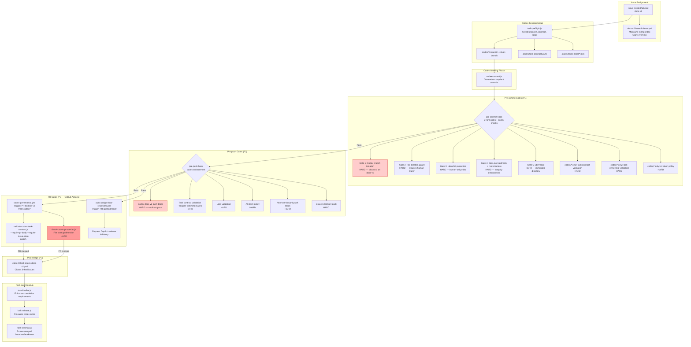
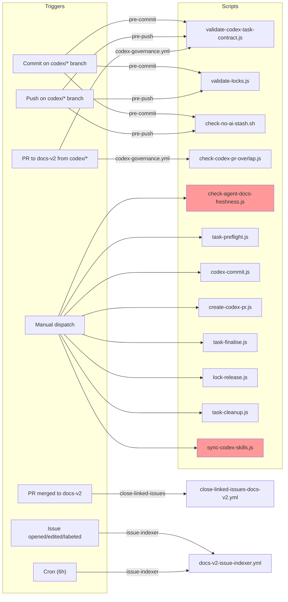
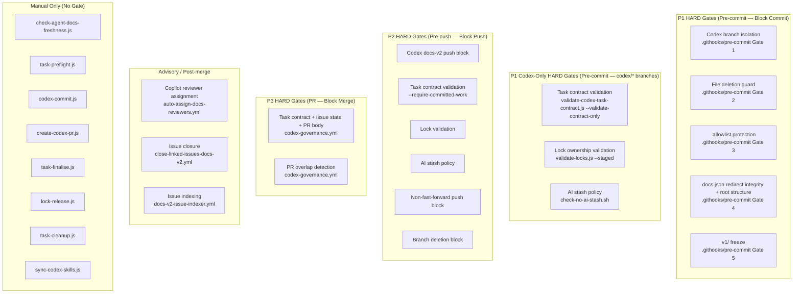

# Concern 6: Codex/Agent Safety — Workflow & Pipeline Audit

> Generated: 2026-03-23
> Concern: `ai` / `codex` (SCRIPT-GOVERNANCE taxonomy)
> Scope: All scripts, workflows, hooks, gates, and artifacts related to AI agent safety, Codex session isolation, human-in-the-loop enforcement, and agent governance

---

## 1. Purpose

The Codex/Agent Safety pipeline ensures that **AI coding agents** (Codex, Claude Code, Cursor, Windsurf, Copilot, Augment) operate within strict guardrails when interacting with the repository. The pipeline enforces:

- **Branch isolation** — AI sessions cannot commit or push to `docs-v2` directly; they must use scoped `codex/<issue-id>-<slug>` branches
- **Human-in-the-loop (HitL) verification** — destructive actions (deletions, force-pushes, allowlist edits) require explicit human override trailers
- **Task contract enforcement** — every Codex session must declare scope, issue linkage, and lock ownership via `.codex/task-contract.yaml`
- **Lock lifecycle management** — concurrent Codex sessions cannot edit overlapping file scopes
- **PR governance** — codex PRs are validated for task contract compliance, PR overlap, issue state, and body template before merge
- **Agent instruction freshness** — canonical agent governance docs and native adapters remain current across all supported agent families

This is a **safety-critical concern** — failures here allow unsupervised AI writes to production branches.

---

## 2. Scripts in Scope (14 total)

### Hook Scripts (2)

| Script | Path | @pipeline | Gate | Purpose |
|--------|------|-----------|------|---------|
| `pre-commit` | `.githooks/pre-commit` | P1 (commit) | **HARD** | 5 hard gates: Codex branch isolation, file deletion guard, .allowlist protection, docs.json redirect integrity + root structure, v1/ freeze. Additionally runs codex-specific checks (task contract, locks, stash policy) on `codex/*` branches. |
| `pre-push` | `.githooks/pre-push` | P2 (push) | **HARD** | Blocks Codex sessions from pushing to docs-v2. On `codex/*` branches: validates task contract, locks, stash policy, non-fast-forward pushes, branch deletion. |

### Automation Scripts (4)

| Script | Path | @pipeline | Mode | Purpose |
|--------|------|-----------|------|---------|
| `task-preflight.js` | `operations/scripts/integrators/ai/codex/` | manual | execute | Generates `.codex/task-contract.yaml` and lock files; creates codex branch |
| `lock-release.js` | `operations/scripts/integrators/ai/codex/` | manual | execute | Releases stale codex lock files |
| `task-cleanup.js` | `operations/scripts/integrators/ai/codex/` | manual | execute | Reports and prunes merged worktrees + stale local codex branches |
| `sync-codex-skills.js` | `operations/scripts/integrators/ai/agents/` | manual | execute | Synchronises Codex skill templates and companion resources |

### Dispatch Scripts (4)

| Script | Path | @pipeline | Mode | Purpose |
|--------|------|-----------|------|---------|
| `codex-commit.js` | `operations/scripts/dispatch/ai/codex/` | manual | execute | Audits codex branch state and generates compliant commit messages |
| `create-codex-pr.js` | `operations/scripts/dispatch/ai/codex/` | manual | execute | Generates codex PR with correct branch naming, labels, body template |
| `task-finalise.js` | `operations/scripts/dispatch/ai/codex/` | manual | execute | Enforces task completion requirements before closing |
| `check-codex-pr-overlap.js` | `operations/scripts/dispatch/ai/codex/` | P3 (PR) | execute | Checks for conflicting codex PRs targeting same files/branches |

### Validator Scripts (4)

| Script | Path | @pipeline | Mode | Purpose |
|--------|------|-----------|------|---------|
| `validate-codex-task-contract.js` | `operations/scripts/validators/governance/compliance/` | P1, P2, P3 | read-only | Validates branch naming, task contract, PR body, and issue state |
| `validate-locks.js` | `operations/scripts/validators/ai/codex/` | P1, P2 | execute | Checks for stale or conflicting lock files |
| `check-no-ai-stash.sh` | `operations/scripts/validators/ai/codex/` | P1, P2 | execute | Blocks push if AI stash files are present |
| `check-agent-docs-freshness.js` | `operations/scripts/validators/governance/compliance/` | manual, ci | read-only | Validates agent governance docs exist and are within freshness threshold (90 days) |

---

## 3. Workflows in Scope (4 GHA)

| Workflow | File | Trigger | Branch | Gate type | Purpose |
|----------|------|---------|--------|-----------|---------|
| Codex Governance | `codex-governance.yml` | PR to docs-v2 from `codex/*` | docs-v2 | **HARD** (blocks PR) | Validates task contract + issue readiness + PR body; checks PR overlap |
| Close Linked Issues | `close-linked-issues-docs-v2.yml` | PR closed (merged) | docs-v2 | Post-merge automation | Closes linked issues when codex PR merges |
| Docs v2 Issue Indexer | `docs-v2-issue-indexer.yml` | Issues events + cron (6h) + dispatch | All | Issue tracking | Maintains rolling issue index for task assignment |
| Auto Assign Docs Reviewers | `auto-assign-docs-reviewers.yml` | PR opened/reopened/ready | docs-v2 | Advisory | Requests Copilot reviewer for codex PRs; fallback to @copilot assignment |

---

## 4. Artifacts — Agent Governance Instruction Files (15)

| Artifact | Path | Type | Freshness enforcement |
|----------|------|------|----------------------|
| Cross-agent baseline | `AGENTS.md` | Canonical | `check-agent-docs-freshness.js` (manual only) |
| Codex task layer | `.github/AGENTS.md` | Extension | `check-agent-docs-freshness.js` (manual only) |
| Claude Code adapter | `.claude/CLAUDE.md` | Thin adapter | `check-agent-docs-freshness.js` (manual only) |
| GitHub Copilot adapter | `.github/copilot-instructions.md` | Thin adapter | `check-agent-docs-freshness.js` (manual only) |
| Cursor governance | `.cursor/rules/repo-governance.mdc` | Thin adapter | `check-agent-docs-freshness.js` (manual only) |
| Cursor no-deletions | `.cursor/rules/no-deletions.mdc` | Safety rule | `check-agent-docs-freshness.js` (manual only) |
| Cursor legacy stub | `.cursorrules` | Legacy compat | Not checked |
| Windsurf governance | `.windsurf/rules/repo-governance.md` | Thin adapter | `check-agent-docs-freshness.js` (manual only) |
| Augment governance | `.augment/rules/repo-governance.md` | Thin adapter | `check-agent-docs-freshness.js` (manual only) |
| Augment git safety | `.augment/rules/git-safety.md` | Safety rule | `check-agent-docs-freshness.js` (manual only) |
| Augment no-deletions | `.augment/rules/no-deletions.md` | Safety rule | `check-agent-docs-freshness.js` (manual only) |
| Mintlify Assistant | `.mintlify/Assistant.md` | Chat widget | `check-agent-docs-freshness.js` (manual only) |
| Agent governance policy | `docs-guide/policies/agent-governance-framework.mdx` | Policy doc | `check-agent-docs-freshness.js` (manual only) |
| Root allowlist policy | `docs-guide/policies/root-allowlist-governance.mdx` | Policy doc | Not in freshness script |
| Contributor agent instructions | `contribute/CONTRIBUTING/AGENT-INSTRUCTIONS.md` | Contributor doc | `check-agent-docs-freshness.js` (manual only) |

### Codex Task Artifacts (per-session)

| Artifact | Path | Creator | Lifecycle |
|----------|------|---------|-----------|
| Task contract | `.codex/task-contract.yaml` | `task-preflight.js` | Created at session start; validated at commit, push, PR |
| Lock files | `.codex/locks-local/*.lock` | `task-preflight.js` | Created at session start; validated at commit, push; released by `lock-release.js` |
| PR body template | `.codex/pr-body.generated.md` | `create-codex-pr.js` | Generated before PR creation |

---

## 5. Pipeline Diagram — Full Codex Task Lifecycle



**Legend:** Dark red = safety-critical isolation gate. Light red = known issue (stale path, see GAP-CX1).

---

## 6. Trigger Matrix



**Legend:** Red = not wired to any automated trigger (manual only).

---

## 7. Gate Classification



---

## 8. Requirements & Real Needs

| Requirement | Current state | Met? |
|-------------|--------------|------|
| AI sessions cannot commit to docs-v2 directly | Pre-commit Gate 1 (Codex branch isolation) | **Yes** |
| AI sessions cannot push to docs-v2 directly | Pre-push codex docs-v2 push block | **Yes** |
| File deletions require human override trailer | Pre-commit Gate 2 (file deletion guard) | **Yes** |
| .allowlist is human-only | Pre-commit Gate 3 (.allowlist protection) | **Yes** |
| docs.json redirect integrity is preserved | Pre-commit Gate 4 (redirect check) | **Yes** |
| v1/ is immutable | Pre-commit Gate 5 (v1/ freeze) | **Yes** |
| Every codex session has a task contract | Pre-commit + pre-push validate-codex-task-contract.js | **Yes** |
| No concurrent codex lock overlap | Pre-commit + pre-push validate-locks.js | **Yes** |
| No AI stash-based isolation | Pre-commit + pre-push check-no-ai-stash.sh | **Yes** |
| Codex PRs validated for task contract + issue state | codex-governance.yml | **Yes** |
| Codex PRs checked for file overlap with other PRs | codex-governance.yml (check-codex-pr-overlap.js) | **No** — stale script path, workflow will fail (GAP-CX1) |
| Non-fast-forward pushes blocked on codex branches | Pre-push hook | **Yes** |
| Branch deletion by push blocked on codex branches | Pre-push hook | **Yes** |
| Agent governance docs stay fresh (< 90 days) | check-agent-docs-freshness.js | **No** — script exists but is not wired to any CI workflow or cron (GAP-CX2) |
| Codex skills stay synced with templates | sync-codex-skills.js | **No** — manual only, no freshness check (GAP-CX3) |
| Linked issues close when codex PR merges | close-linked-issues-docs-v2.yml | **Yes** |
| Issue index stays current for task assignment | docs-v2-issue-indexer.yml (cron 6h) | **Yes** |
| Copilot auto-reviews codex PRs | auto-assign-docs-reviewers.yml | **Yes** (advisory, best effort) |
| All agent adapters share a single canonical baseline | AGENTS.md + thin adapters | **Yes** (structural) but no automated drift detection (GAP-CX4) |

---

## 9. Efficiency Assessment

### What works well

- **Defense in depth** — the same safety-critical checks (task contract, locks, stash policy) are enforced at three pipeline stages (P1, P2, P3), so a bypass at one stage is caught at the next
- **Human override protocol is consistent** — all overrides use `--trailer` flags or environment variables with clear naming (`ALLOW_MAIN_COMMIT`, `ALLOW_CODEX_FORCE_PUSH`, `ALLOW_MAIN_PUSH`)
- **Pre-commit is fast** — the 5 hard gates are bash/inline-Node checks that complete in under 5 seconds per D3
- **Codex-specific checks are scoped** — pre-commit only runs task contract, lock, and stash checks on `codex/*` branches, avoiding overhead on human commits
- **Issue lifecycle is fully automated** — issue indexer (cron) + auto-close (post-merge) + auto-reviewer (PR open) covers the full issue-to-merge pipeline

### What is inefficient

- **Triple validation of task contract**: `validate-codex-task-contract.js` runs at pre-commit (`--validate-contract-only`), pre-push (`--require-committed-work`), and PR (`--require-pr-body --require-issue-state`). While each stage adds flags, the base contract validation (branch naming, YAML parse, required fields) runs three times for the same branch. This is acceptable for safety but worth noting.
- **Triple stash policy check**: `check-no-ai-stash.sh` runs at pre-commit and pre-push with identical flags. The pre-push check is sufficient since stash state doesn't change between commit and push. The pre-commit instance is redundant.
- **Workflow `codex-governance.yml` uses a stale script path**: `operations/scripts/check-codex-pr-overlap.js` does not exist; the script was moved to `operations/scripts/dispatch/ai/codex/check-codex-pr-overlap.js`. The PR overlap check is effectively broken.

---

## 10. Blocking Analysis

| Pipeline stage | Script/Check | Blocks workflow? | Override mechanism | Impact |
|---------------|-------------|-----------------|-------------------|--------|
| Pre-commit (P1) | Codex branch isolation | **HARD** — exit 1 | `ALLOW_MAIN_COMMIT=1` + `--trailer "allow-main-commit=true"` | Appropriate — primary safety gate |
| Pre-commit (P1) | File deletion guard | **HARD** — exit 1 | `--trailer "allow-deletions=true"` | Appropriate — prevents accidental data loss |
| Pre-commit (P1) | .allowlist protection | **HARD** — exit 1 | `--trailer "allowlist-edit=true"` | Appropriate — prevents privilege escalation |
| Pre-commit (P1) | docs.json redirect integrity | **HARD** — violations++ | No direct override | Appropriate — prevents routing breakage |
| Pre-commit (P1) | Root structure | **HARD** — violations++ | `SKIP_STRUCTURE_CHECK=1` | Appropriate — prevents structural drift |
| Pre-commit (P1) | v1/ freeze | **HARD** — exit 1 | None (immediate exit) | Appropriate — v1 is immutable |
| Pre-commit (P1) | Task contract (codex/*) | **HARD** — violations++ | None | Appropriate |
| Pre-commit (P1) | Lock validation (codex/*) | **HARD** — violations++ | None | Appropriate |
| Pre-commit (P1) | AI stash policy (codex/*) | **HARD** — violations++ | None | **Questionable** — redundant with pre-push (stash state is stable between commit and push) |
| Pre-push (P2) | Codex docs-v2 push block | **HARD** — exit 1 | `ALLOW_MAIN_PUSH=1` | Appropriate — secondary safety gate |
| Pre-push (P2) | Task contract | **HARD** — exit 1 | None | Appropriate |
| Pre-push (P2) | Lock validation | **HARD** — exit 1 (or missing-file exit 1) | None | Appropriate |
| Pre-push (P2) | AI stash policy | **HARD** — exit 1 | None | Appropriate |
| Pre-push (P2) | Non-fast-forward push | **HARD** — exit 1 | `ALLOW_CODEX_FORCE_PUSH=1` | Appropriate |
| Pre-push (P2) | Branch deletion | **HARD** — exit 1 | `ALLOW_CODEX_FORCE_PUSH=1` | Appropriate |
| PR (P3) | Task contract + issue + PR body | **HARD** — fails job | None (must fix contract/issue) | Appropriate |
| PR (P3) | PR overlap | **HARD** — fails job | `codex-handoff-approved` label | **BROKEN** — stale path means step always fails |
| All | `SKIP_ALL=1` | Bypasses all pre-commit | Environment variable | **Dangerous** — documented as emergency-only but no audit trail |

---

## 11. Gaps

### GAP-CX1: `codex-governance.yml` uses stale path for `check-codex-pr-overlap.js` (CRITICAL)

- **Workflow**: `codex-governance.yml`, line 58
- **Current path in workflow**: `node operations/scripts/check-codex-pr-overlap.js`
- **Actual script location**: `operations/scripts/dispatch/ai/codex/check-codex-pr-overlap.js`
- **Impact**: The PR overlap check **always fails** with a Node module-not-found error. This means either (a) every codex PR is blocked by this step, or (b) the step was never actually triggered (branch naming mismatch). Either way, the PR overlap safety gate is non-functional.
- **Severity**: **Critical** — this is a safety-critical gate that is broken
- **Fix**: Update the path in `codex-governance.yml` to the correct location

### GAP-CX2: `check-agent-docs-freshness.js` is not wired to any CI workflow or cron

- **Script**: `operations/scripts/validators/governance/compliance/check-agent-docs-freshness.js`
- **@pipeline tag says**: `manual, ci`
- **Reality**: No workflow references this script. It validates 15 agent governance files against a 90-day freshness threshold, but must be run manually.
- **Impact**: Agent instruction files can silently go stale. Policy drift between adapters goes undetected.
- **Severity**: High — a stale AGENTS.md could contain outdated safety rules that agents follow literally
- **Recommended tier**: P5/P6 cron (weekly or monthly)

### GAP-CX3: `sync-codex-skills.js` has no CI check mode

- **Script**: `operations/scripts/integrators/ai/agents/sync-codex-skills.js`
- **@pipeline tag says**: `manual — not yet in pipeline`
- **Reality**: Supports `--check` mode but no workflow runs it
- **Impact**: Codex skill definitions can drift from canonical templates without detection
- **Severity**: Low — affects DX, not safety

### GAP-CX4: No automated drift detection between agent adapters

- **Issue**: The governance model requires "no policy drift between overlapping instruction files" (per `agent-governance-framework.mdx`), but no validator checks that the thin adapters (Claude, Copilot, Cursor, Windsurf, Augment) actually point to and align with the canonical `AGENTS.md` baseline.
- **Impact**: An adapter could be edited to weaken safety rules without detection
- **Severity**: Medium — structural compliance exists but semantic drift is undetected
- **Note**: `check-agent-docs-freshness.js` checks existence and recency but not content alignment

### GAP-CX5: `SKIP_ALL=1` bypass has no audit trail

- **Location**: `.githooks/pre-commit`, line 116-120
- **Issue**: Setting `SKIP_ALL=1` bypasses all 5 hard gates plus all codex checks. There is no logging, no trailer requirement, and no way to detect post-hoc that a commit was made with this bypass.
- **Impact**: A bad actor (or a hasty developer) can bypass all safety gates silently
- **Severity**: Medium — emergency-only but no accountability mechanism
- **Comparison**: Other overrides require `--trailer` flags that appear in commit metadata; `SKIP_ALL` leaves no trace

### GAP-CX6: Pre-push hook fails hard if `validate-locks.js` is missing

- **Location**: `.githooks/pre-push`, lines 82-90
- **Issue**: If the `validate-locks.js` file does not exist, the pre-push hook exits with an error: "Missing codex lock validator". This is correct safety behavior, but the error message does not guide the user on how to restore the file.
- **Severity**: Low — correct behavior, minor DX issue

### GAP-CX7: `task-finalise.js` references stale `@scope` paths

- **Script**: `operations/scripts/dispatch/ai/codex/task-finalise.js`
- **@scope**: references `operations/scripts/validate-codex-task-contract.js` and `operations/scripts/verify-pay-orc-gate-finalize.sh`
- **Reality**: The validate script is at `operations/scripts/validators/governance/compliance/validate-codex-task-contract.js`; the verify script is at `operations/scripts/validators/governance/compliance/verify-pay-orc-gate-finalize.sh`
- **Impact**: JSDoc metadata is misleading; `@scope` tags don't reflect actual dependency paths
- **Severity**: Low — affects documentation/audit accuracy, not runtime behavior

---

## 12. Duplication / Overlap

### OVERLAP-CX1: Triple task contract validation (acceptable)

- `validate-codex-task-contract.js` runs at three stages with different flags:
  1. Pre-commit: `--validate-contract-only --quiet` (checks YAML structure only)
  2. Pre-push: `--require-committed-work --quiet` (checks YAML + verifies committed diff)
  3. PR: `--require-pr-body --require-issue-state` (full validation including GitHub API calls)
- **Assessment**: Each stage adds meaningful new checks via flags. The base YAML parse is redundant but fast (< 100ms). This is **acceptable defense in depth** for a safety-critical gate.
- **Recommendation**: No change needed. Document the escalating validation model.

### OVERLAP-CX2: Duplicate stash policy check (P1 + P2)

- `check-no-ai-stash.sh` runs at:
  1. Pre-commit (codex/* branches): `bash check-no-ai-stash.sh --quiet`
  2. Pre-push (codex/* branches): `bash check-no-ai-stash.sh --branch "$CURRENT_BRANCH" --quiet`
- **Assessment**: Stash state does not change between commit and push. The pre-commit instance runs without `--branch`, which means it checks global stash markers. The pre-push instance passes `--branch` for scoped checking.
- **Recommendation**: The pre-commit call could be removed without safety loss. The pre-push check with `--branch` is the more precise version.

### OVERLAP-CX3: Lock validation at P1 and P2 (acceptable)

- `validate-locks.js` runs at:
  1. Pre-commit: `--staged --quiet` (checks staged files against lock scope)
  2. Pre-push: `--quiet` (checks full branch state)
- **Assessment**: The pre-commit `--staged` flag checks only the files being committed, while pre-push checks the full branch. These are meaningfully different checks.
- **Recommendation**: No change needed.

### OVERLAP-CX4: Codex branch isolation at P1 and P2 (acceptable)

- Both pre-commit and pre-push block Codex sessions from targeting docs-v2:
  1. Pre-commit: checks `is_codex_session()` + `CURRENT_BRANCH == docs-v2`
  2. Pre-push: checks `is_codex_session()` + inspects push target refs for `refs/heads/docs-v2`
- **Assessment**: These check different things — commit target branch vs push target ref. Both are needed because a branch rename between commit and push could circumvent a single gate.
- **Recommendation**: No change needed.

---

## 13. Recommendations

### REC-CX1: Fix stale path in `codex-governance.yml` (closes GAP-CX1) -- CRITICAL

Update the script path in the "Check codex PR overlap" step:

```yaml
# BEFORE (broken):
node operations/scripts/check-codex-pr-overlap.js \

# AFTER (correct):
node operations/scripts/dispatch/ai/codex/check-codex-pr-overlap.js \
```

**Priority**: Immediate — this is a broken safety gate.

### REC-CX2: Wire `check-agent-docs-freshness.js` to cron (closes GAP-CX2)

**Option A — Add to `repair-governance.yml` (recommended)**

Add a step to the weekly governance repair workflow (Monday 05:00 UTC):

```yaml
- name: Check agent docs freshness
  run: node operations/scripts/validators/governance/compliance/check-agent-docs-freshness.js --threshold 90 --json
  continue-on-error: true
```

**Option B — Dedicated cron workflow**

Create `check-agent-docs-freshness.yml` with a monthly cron. Report results to job summary.

**Recommendation**: **Option A** — fits the governance repair pattern, avoids workflow proliferation.

### REC-CX3: Add `sync-codex-skills.js --check` to PR validation (closes GAP-CX3)

Add to `check-docs-guide-catalogs.yml` or `test-suite.yml` as a soft gate:

```yaml
- name: Verify codex skill sync
  run: node operations/scripts/integrators/ai/agents/sync-codex-skills.js --check
  continue-on-error: true
```

### REC-CX4: Add semantic drift detection for agent adapters (closes GAP-CX4)

Create a new validator that:
1. Reads `AGENTS.md` and extracts key safety rules (deletion policy, stash policy, branch rules, port rules)
2. Checks each thin adapter for references to the canonical policy surfaces
3. Flags adapters that contain rule statements not present in `AGENTS.md` (potential drift)

Wire as a monthly cron or add to `check-agent-docs-freshness.js` as an extended check mode.

### REC-CX5: Add audit trail for `SKIP_ALL=1` (closes GAP-CX5)

Modify the pre-commit hook to require a trailer when `SKIP_ALL=1` is used:

```bash
if [ "$SKIP_ALL" = "1" ]; then
    if ! has_human_override_trailer "skip-all=true"; then
        echo -e "${RED}SKIP_ALL=1 requires --trailer \"skip-all=true\" for audit trail.${NC}"
        exit 1
    fi
    echo -e "${YELLOW}WARNING: All pre-commit checks bypassed (SKIP_ALL=1)${NC}"
    exit 0
fi
```

This ensures the bypass appears in `git log --format='%(trailers)'` output.

### REC-CX6: Remove redundant pre-commit stash check (closes OVERLAP-CX2)

Remove the `check-no-ai-stash.sh` call from the pre-commit hook (lines 182-192 in `.githooks/pre-commit`). The pre-push instance with `--branch` is more precise and sufficient.

### REC-CX7: Fix stale `@scope` paths in `task-finalise.js` (closes GAP-CX7)

Update the JSDoc `@scope` tag to reference the correct post-migration paths.

---

## 14. Recommended Gate Matrix (After Fixes)

| Check | Stage | Gate | Change from current |
|-------|-------|------|---------------------|
| Codex branch isolation | Pre-commit (P1) | **HARD** | No change |
| File deletion guard | Pre-commit (P1) | **HARD** | No change |
| .allowlist protection | Pre-commit (P1) | **HARD** | No change |
| docs.json redirect integrity + root structure | Pre-commit (P1) | **HARD** | No change |
| v1/ freeze | Pre-commit (P1) | **HARD** | No change |
| Task contract validation (codex/*) | Pre-commit (P1) | **HARD** | No change |
| Lock ownership validation (codex/*) | Pre-commit (P1) | **HARD** | No change |
| AI stash policy (codex/*) | Pre-commit (P1) | ~~HARD~~ | **REMOVE** — redundant with P2 |
| Codex docs-v2 push block | Pre-push (P2) | **HARD** | No change |
| Task contract validation (codex/*) | Pre-push (P2) | **HARD** | No change |
| Lock validation (codex/*) | Pre-push (P2) | **HARD** | No change |
| AI stash policy (codex/*) | Pre-push (P2) | **HARD** | No change |
| Non-fast-forward push block | Pre-push (P2) | **HARD** | No change |
| Branch deletion block | Pre-push (P2) | **HARD** | No change |
| Task contract + issue state + PR body | PR (P3) | **HARD** | No change |
| PR overlap detection | PR (P3) | **HARD** | **FIX STALE PATH** |
| Copilot reviewer assignment | PR (P3) | Advisory | No change |
| Issue closure | Post-merge (P3) | Automation | No change |
| Issue indexing | Cron (P5) | Automation | No change |
| Agent docs freshness | Cron (P5) | Soft | **NEW — wire to governance repair cron** |
| Codex skill sync | PR (P3) | Soft | **NEW — add --check to PR validation** |
| SKIP_ALL bypass | Pre-commit (P1) | Audit | **NEW — require trailer for audit trail** |

---

## 15. Summary

The Codex/Agent Safety pipeline implements a comprehensive **defense-in-depth** model with 5 pre-commit hard gates, 6 pre-push hard gates, and 2 PR hard gates — covering the full lifecycle from issue assignment through merge and cleanup. The design is sound: each pipeline stage adds meaningful new validation, and human override mechanisms are consistently implemented via `--trailer` flags.

The critical issues are:

1. **1 broken safety gate** — `codex-governance.yml` references a stale path for `check-codex-pr-overlap.js`, making the PR overlap detection non-functional (GAP-CX1, REC-CX1)
2. **1 unwired freshness validator** — `check-agent-docs-freshness.js` exists but runs in no workflow, leaving 15 agent governance files without automated freshness enforcement (GAP-CX2, REC-CX2)
3. **1 bypass without audit trail** — `SKIP_ALL=1` silently disables all safety gates with no commit-level record (GAP-CX5, REC-CX5)
4. **1 redundant check** — AI stash policy runs at both pre-commit and pre-push with no additional value at P1 (OVERLAP-CX2, REC-CX6)
5. **1 stale JSDoc reference** — `task-finalise.js` `@scope` tag references pre-migration paths (GAP-CX7, REC-CX7)

The highest-priority fix is **REC-CX1** (fix the stale path in `codex-governance.yml`) — this is a one-line change that restores a broken safety gate. The second priority is **REC-CX2** (wire agent docs freshness to cron) which closes a governance gap affecting all 15 agent instruction files.
