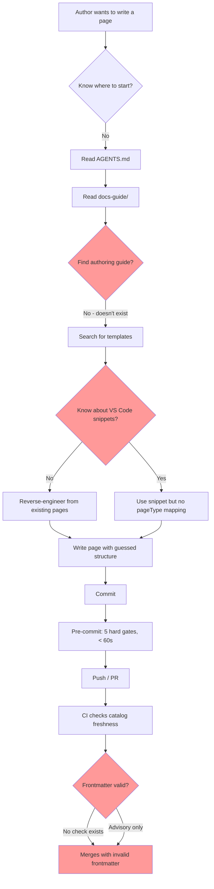
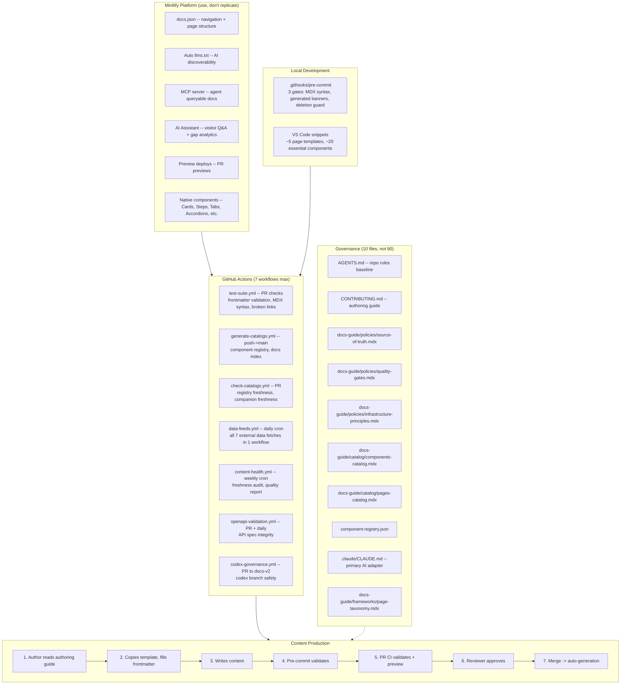
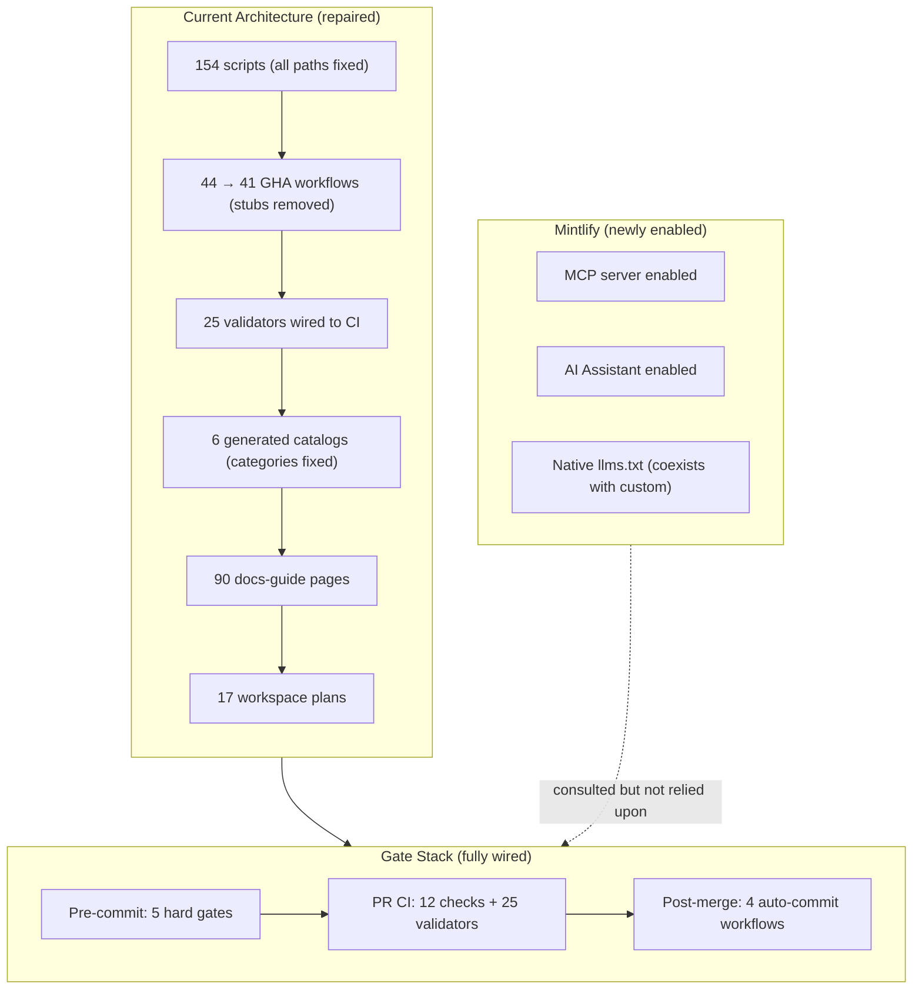
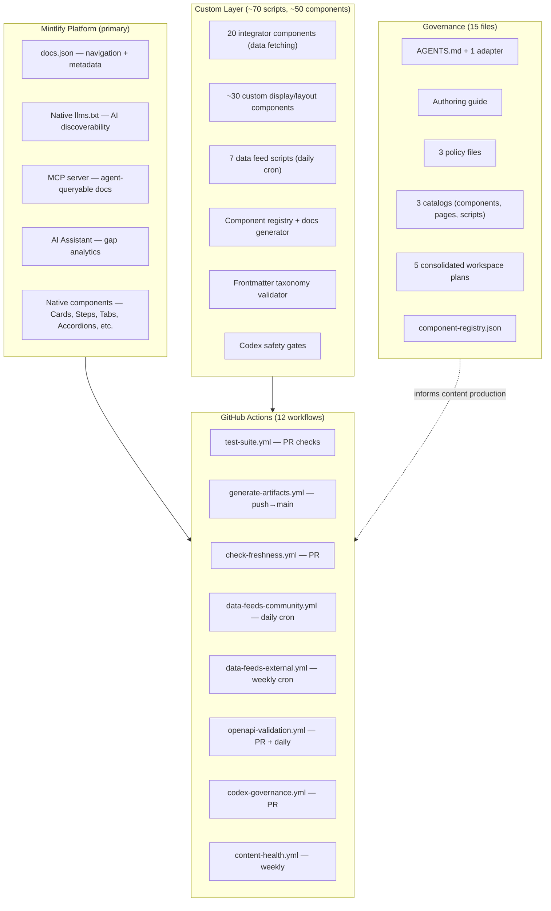
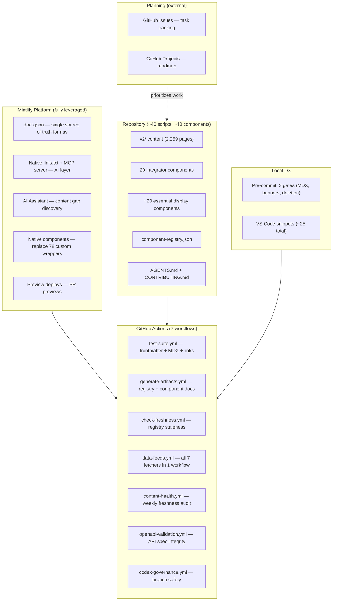

# Documentation Platform Streamlining Report

**Date:** 2026-03-23
**Perspective:** Documentation Engineering & Mintlify Platform Best Practices
**Scope:** Full pipeline architecture review — tooling, governance, content production, platform alignment
**Method:** Read-only investigation of 17+ primary documents, all 6 audit files, configuration files, and empirical file counts

---

## 1. Executive Summary

- **The governance infrastructure is 3-5x larger than the documentation it governs.** 154 scripts, 44 GHA workflows, 21 JSON config files, 90 docs-guide pages, 381 workspace plan files, and 217 AI tools files exist to support approximately 2,259 v2 MDX content pages maintained by what appears to be a 1-2 person team. This is tooling at enterprise scale applied to a small-team documentation site.

- **The Mintlify platform is significantly under-leveraged.** The repo maintains custom `llms.txt` generation, custom AI sitemap generation, and custom companion file pipelines for capabilities that Mintlify provides natively (auto-generated `llms.txt`, MCP server, AI Assistant with conversation analytics). The platform is being used as a rendering engine while custom scripts replicate its automation features.

- **7 of 44 GHA workflows are confirmed broken** (reference non-existent script paths post-restructure), and 25 validators have zero CI wiring despite declaring pipeline tiers in their JSDoc headers. The governance system extensively describes what it *should* do but does not yet enforce most of what it declares.

- **Content production has not started.** Despite a fully designed 8-phase content pipeline with locked enum definitions, audience frameworks, and veracity systems, zero pages have been processed through the pipeline. The content system is entirely in planning/design phase. The tooling investment has preceded any content output.

- **There are 17 active workspace plans governing a single documentation repository.** Each plan produces its own canonical documents, research files, frameworks, and decision logs. The meta-documentation (documentation about how to do documentation) now exceeds the governance documentation in volume, which itself exceeds the rate of actual content production.

---

## 2. Documentation Engineering Maturity Assessment

### Maturity Model Placement

| Dimension | Industry Level | This Repo's Level | Assessment |
|---|---|---|---|
| Docs-as-code infrastructure | 3 (Automated) | 4 (Governed) | Over-indexed: governance layer exists before automation is fully wired |
| Content pipeline | 3 (Repeatable) | 1 (Ad-hoc) | Under-indexed: elaborate pipeline designed but zero pages processed |
| Platform leverage | 3 (Integrated) | 1 (Hosting only) | Mintlify used for rendering; native automation features unused |
| Quality enforcement | 3 (CI-enforced) | 2 (Declared) | 25 validators exist but are manual-only; CI wiring is partial |
| Content freshness | 2 (Tracked) | 1.5 (Partially tracked) | `lastVerified` exists on some pages; no `ttlDays`; no staleness report |
| Contributor DX | 3 (Self-service) | 1 (Ask someone) | No authoring guide; no template-to-pageType mapping; no component usage guide |
| AI agent support | 4 (Multi-tool) | 3 (Structured) | 9 adapter files, skills, registries -- but no parity validator and content framework not in agent context chain |

### The Maturity Inversion Problem

This repo exhibits a pattern I would call **governance-first development**: the governance, taxonomy, and enforcement infrastructure has been built before the content production system is operational. In healthy docs-as-code systems, the sequence is:

```
Content authored -> Patterns emerge -> Lightweight governance codified -> Automation added -> Governance deepened
```

Here the sequence has been:

```
Governance designed -> Taxonomy locked -> Scripts written -> Validators declared -> CI partially wired -> Content pipeline designed -> [No content produced yet]
```

This inversion means:
1. The governance system is being tested against its own internal consistency rather than against real content production friction
2. Problems discovered during content production will require governance rework
3. The cost of maintaining the governance layer is accruing before it delivers content quality value

### Comparison to Industry Benchmarks

**Stripe Docs** (~500 pages, 3-5 person team): 1 OpenAPI-driven generator, 1 changelog generator, ~5 CI checks, no internal governance documentation site. Governance is implicit in the generator design.

**Vercel Docs** (~400 pages, 2-4 person team): `lastUpdated` tracking, conversation analytics for gaps, generated API/CLI reference separated from authored docs. No internal governance framework.

**This repo** (~2,259 v2 pages, 1-2 person team): 154 scripts, 44 workflows, 90 internal governance pages, 17 active plans, 6 generated catalogs, 118 custom components, 33 page templates, 8 composable sections. The infrastructure is an order of magnitude larger than comparable sites with larger teams.

---

## 3. Mintlify Platform Alignment Analysis

### What Mintlify Handles Natively vs What Custom Scripts Replicate

| Capability | Mintlify Native | Custom Implementation | Overlap? |
|---|---|---|---|
| `llms.txt` / `llms-full.txt` | Auto-generated for all hosted sites | `generate-llms-files.js` + `generate-llms-files.yml` + `verify-llms-files.yml` | **Full overlap** -- 3 files can be removed |
| AI-readable page endpoints | Per-page `.md` via content negotiation | Custom `sitemap-ai.xml` generator + verifier | **Partial overlap** -- sitemap adds value but AI endpoints are free |
| AI assistant + conversation analytics | Built-in dashboard feature | Not used | **Missed opportunity** -- content gap discovery data sitting unused |
| MCP server | `npx mcp add [subdomain]` -- zero maintenance | Not enabled | **Missed opportunity** -- agents cannot query live docs |
| Search | Native Mintlify search | No custom search | Correct -- no overlap |
| Preview deploys | Native per-PR preview | No custom preview | Correct -- no overlap |
| Doc freshness automation | Mintlify Workflows (beta) | 7+ custom freshness/health scripts | **Partial overlap** -- platform workflows could replace 2-3 custom scripts |
| Translation | Continuous translations (if configured) | 4 locale directories; no automation | **Gap** -- manual translation with no pipeline |
| Component library | Native `<Card>`, `<CardGroup>`, `<Steps>`, `<Tabs>`, `<Accordion>`, `<Note>`, `<Warning>`, `<Tip>`, `<Info>`, `<CodeGroup>`, `<ResponseField>`, `<Expandable>`, `<ParamField>` | 118 custom JSX components | **Significant overlap** -- many custom components wrap native Mintlify equivalents |
| OpenAPI reference | Native OpenAPI integration | Custom `openapi-reference-validation.yml` | Correct -- validation adds value over native |
| Navigation | `docs.json` driven | Custom `generate-docs-index.js` + `docs-index.json` | **Partial overlap** -- `docs-index.json` duplicates what `docs.json` already provides |

### Specific Removable Overlaps

**High confidence removals (Mintlify handles it):**
1. `generate-llms-files.js` + `generate-llms-files.yml` + `verify-llms-files.yml` -- verify at `https://[subdomain].mintlify.app/llms.txt` first; if it exists, these 3 files and 2 workflows are redundant
2. `generate-ai-sitemap.js` + `generate-ai-sitemap.yml` + `verify-ai-sitemap.yml` -- Mintlify's per-page `.md` endpoints and auto-generated `llms.txt` serve the same AI discoverability purpose

**Medium confidence simplifications (custom adds marginal value over native):**
3. Several custom components duplicate Mintlify natives: custom `Quote.jsx` vs native `<Note>`, custom `StyledSteps.jsx` vs native `<Steps>`, custom `AccordionLayout.jsx` vs native `<Accordion>`, custom table components vs native Markdown tables
4. `docs-index.json` as a separate artifact -- `docs.json` already is the nav source of truth; enriched metadata could be frontmatter instead of a parallel index

### Component Library Assessment

118 custom components is a large library for a documentation site. Mintlify provides ~15 built-in components that handle the most common documentation patterns. A quick assessment:

| Category | Count | Native Mintlify Coverage | Custom Value Add |
|---|---|---|---|
| elements/ | 30 | ~5 have native equivalents (callouts, links) | Low -- many are styling wrappers |
| wrappers/ | 30 | ~8 have native equivalents (cards, steps, accordions, tables) | Medium -- custom grid/carousel layouts |
| displays/ | 17 | ~4 have native equivalents (code blocks, response fields) | Medium -- custom video players |
| scaffolding/ | 20 | 0 -- page-level structure is Mintlify's job | Low -- hero/portal patterns could be simplified |
| integrators/ | 20 | 0 -- data fetching is custom by nature | High -- these are genuinely custom |
| config/ | 1 | N/A | N/A |

**Assessment:** The `integrators/` category (20 components) provides genuine value -- these fetch external data (blog, Discord, YouTube, forum) that Mintlify cannot natively handle. The other 98 components should be audited against Mintlify natives. A reasonable target would be reducing to ~40-50 custom components by replacing wrappers/elements/scaffolding with native Mintlify components.

---

## 4. Content Production DX Analysis

### Author Journey Map (Current State)



### Friction Point Analysis

| Step | Friction Level | Cause | Impact |
|---|---|---|---|
| 1. Find authoring guide | **Blocking** | No authoring guide exists | New contributors cannot self-serve |
| 2. Choose template | **High** | No template-to-pageType mapping | Authors guess or copy existing pages |
| 3. Fill frontmatter | **Medium** | Old validator enum vs new framework enum mismatch | Pages enter with inconsistent taxonomy |
| 4. Find components | **Medium** | Catalog shows `undefined` categories | Authors cannot discover available components |
| 5. Pre-commit | **Low** | 5 gates, < 60s, well-scoped | Works correctly |
| 6. PR review | **Medium** | No frontmatter validation on changed files | Reviewers do manual taxonomy checking |
| 7. Post-merge | **Low** | Auto-commit workflows work (when paths are correct) | Generated artifacts update |

### Gate Count Per Content Change

A content author making a single page change encounters:

- **Pre-commit:** 5 hard gates (codex isolation, deletion guard, allowlist, docs.json redirect integrity, v1 freeze)
- **PR CI:** Up to 12 checks across 4 workflow files (test-suite, check-docs-guide-catalogs, check-ai-companions, broken-links)
- **Post-merge:** 2-4 auto-commit workflows (docs-index, catalogs, component registry, AI companions)

This is comparable to a mature enterprise docs pipeline. For a 1-2 person team, the gate density is high. The pre-commit hook is well-scoped (5 focused gates, fast). The CI layer is where complexity accumulates -- 12 checks across 4 workflows, many of which are tangentially related to a content change.

### The "Developer Experience Tax"

For every content page authored, the system requires maintaining:
- 154 scripts (0.068 scripts per content page)
- 44 GHA workflows (0.019 workflows per page)
- 90 docs-guide governance pages (0.040 governance pages per page)
- 21 JSON config files
- 33 page templates
- 8 composable sections

Industry benchmark for a well-governed docs site: 5-15 scripts, 3-8 workflows, 1-3 governance pages. This repo has 10-30x the governance infrastructure per content page.

---

## 5. Generated Content Audit

### What Is Generated

| Generated Artifact | Generator | Frequency | Consumer | Usefulness |
|---|---|---|---|---|
| `docs-guide/catalog/components-catalog.mdx` | `generate-docs-guide-components-index.js` | Manual only | Internal contributors + agents | **Medium** -- currently shows `undefined` categories |
| `docs-guide/catalog/scripts-catalog.mdx` | `audit-script-inventory.js` | Manual only | Internal contributors + agents | **Medium** -- stale after restructure |
| `docs-guide/catalog/workflows-catalog.mdx` | `generate-docs-guide-indexes.js` | Push->main auto | Internal contributors | **Low** -- workflow names are self-documenting; catalog adds marginal value |
| `docs-guide/catalog/templates-catalog.mdx` | `generate-docs-guide-indexes.js` | Push->main auto | Internal contributors | **Low** -- 33 templates listed but no usage guidance |
| `docs-guide/catalog/pages-catalog.mdx` | `generate-docs-guide-pages-index.js` | Push->main auto | Internal contributors | **Medium** -- useful for page discovery |
| `docs-guide/catalog/ui-templates.mdx` | `generate-ui-templates.js` | Manual only | Internal contributors | **Low** -- declared `autofix` but nothing runs |
| `docs-index.json` | `generate-docs-index.js` | Push->main auto | Scripts, agents | **Medium** -- enriches `docs.json` with metadata |
| `v2/**/component-library/*.mdx` (32 pages) | `generate-component-docs.js` | Push->main auto | Public readers | **High** -- public component documentation |
| `v2/**/*-data.json` (9 companion files) | `generate-glossary-companions.js` | Push->main auto | AI crawlers | **Medium** -- AI discoverability for glossary data |
| `component-registry.json` | `generate-component-registry.js` | Push->main auto | Scripts, agents | **High** -- canonical component inventory |
| `component-usage-map.json` | `scan-component-imports.js` | Manual only | Scripts | **Low** -- feeds catalogs but never auto-runs |
| `llms.txt` | `generate-llms-files.js` | Push auto | LLM crawlers | **Redundant** -- Mintlify generates this natively |
| `sitemap-ai.xml` | `generate-ai-sitemap.js` | Push auto | AI crawlers | **Low-redundant** -- overlaps with Mintlify's llms.txt |
| `.vscode/components.code-snippets` | `generate-ui-templates.js` | Manual | VS Code users | **Medium** -- useful when current |
| `.vscode/templates.code-snippets` | `generate-ui-templates.js` | Manual | VS Code users | **Medium** -- useful when current |
| `script-registry.json` | `generate-script-registry.js` | Manual, P3 declared | Scripts, agents | **Medium** -- stale (7 headers need fixing) |
| OG images | `generate-og-images.js` | Manual | Social sharing | **Low** -- one-time generation |
| Data feed JSX files (7 types) | `.github/scripts/fetch-*.js` | Daily/weekly cron | Community pages | **High** -- powers live community content |

### Generated vs Authored Content Ratio

| Category | Count | Notes |
|---|---|---|
| Auto-generated v2 pages | ~32 (component library) | From `generate-component-docs.js` |
| Data-driven v2 pages | ~10-15 (community/trending) | Consume auto-fetched data |
| Fully hand-authored v2 pages | ~2,200+ | The vast majority of content |
| Generated internal docs (catalogs) | 6 | `docs-guide/catalog/` |
| Generated config/registry files | ~5 | JSON registries and indexes |

**Assessment:** Less than 2% of v2 content pages are auto-generated. The generation infrastructure (32+ scripts dedicated to generation) is disproportionate to the generated output. The data feed pipeline (7 fetch scripts feeding community pages) provides the highest value-to-maintenance ratio among all generated content.

### Generated Pages That Should Be Authored

- **Workflows catalog** (`workflows-catalog.mdx`): A list of workflow filenames adds little value. A hand-authored "CI/CD Guide" explaining what each workflow does and when it runs would serve contributors better.
- **Templates catalog** (`templates-catalog.mdx`): A list of template filenames with no usage guidance. Should be replaced by a hand-authored "Authoring Guide" that maps templates to page types.

### Authored Pages That Could Be Generated

- **Public component library pages** (`v2/resources/documentation-guide/component-library/` -- 7 pages): Already generated, which is correct.
- **API reference pages**: If OpenAPI specs are available, these should be generated from specs rather than hand-authored. The `openapi-reference-validation.yml` workflow suggests this is partially in place.

---

## 6. Meta-Governance Assessment

### The Governance Stack

```
Level 0: v2/ content pages (~2,259 pages)
  |
Level 1: docs-guide/ governance docs (90 pages governing Level 0)
  |
Level 2: workspace/plan/ planning docs (381 files governing Level 1)
  |
Level 3: AGENTS.md + 9 adapters + ai-tools/ (217 files governing agent interaction with Levels 0-2)
  |
Level 4: 17 active plans + audit files + canonical designs (governance of governance of governance)
```

This is a 4-layer meta-governance stack. Each layer produces documentation about how to manage the layer below it. The volume at each level:

| Level | Purpose | File Count | Example |
|---|---|---|---|
| 0 | Published docs | ~2,259 | `v2/gateways/guides/setup.mdx` |
| 1 | Internal governance | ~90 | `docs-guide/policies/quality-gates.mdx` |
| 2 | Planning & design | ~381 | `workspace/plan/active/SCRIPT-GOVERNANCE/system-canonical.mdx` |
| 3 | Agent rules | ~217 | `ai-tools/ai-skills/content-pipeline-pass-a/SKILL.md` |
| 4 | Meta-planning | ~50+ | `workspace/plan/active/DOCUMENTATION/plan-recs-agent-1.md` |

**The governance-to-content ratio is approximately 1:3** (738 governance/planning/tooling files to 2,259 content files). Industry best practice for a well-governed docs site is closer to 1:50.

### Is the Governance Proportionate?

**Evidence of disproportionate governance:**

1. **17 active workspace plans** for a single documentation repository. Comparable repos have 0-2 planning documents (a `CONTRIBUTING.md` and maybe a `ROADMAP.md`).

2. **6 generated catalogs** tracking internal tooling: `components-catalog.mdx`, `scripts-catalog.mdx`, `workflows-catalog.mdx`, `templates-catalog.mdx`, `pages-catalog.mdx`, `ui-templates.mdx`. These catalogs are consumed by the team maintaining the tooling -- which appears to be the same 1-2 people who would know where things are without a catalog.

3. **An 11-tag JSDoc standard for scripts** (`@script`, `@type`, `@concern`, `@niche`, `@purpose`, `@description`, `@mode`, `@pipeline`, `@scope`, `@usage`, `@policy`). Industry standard is 3-4 tags (`@description`, `@param`, `@returns`, optionally `@see`). The 11-tag standard is well-designed but its cost (maintaining headers across 154 scripts, validating compliance, generating catalogs from headers) exceeds its benefit for a small team.

4. **A 7-tag JSDoc standard for components** with an additional `@aiDiscoverability` tag. The component taxonomy (5 categories, 30 sub-niches) is more granular than React's own component categorisation.

5. **The ownerless governance framework** is sophisticated infrastructure for a repo that has a single identifiable owner. The "ownerless" model assumes contributions from unknown parties who need deterministic repair paths. If contributions come from 1-2 known people and AI agents they control, the deterministic repair path is "ask the owner."

6. **The content pipeline has 8 phases** (Site -> Tab -> Sections -> Page Design -> Content -> Veracity -> Layout -> Sign-off) with locked enums, prompt files, audience documents, context packs, veracity libraries, section naming rubrics, and human checkpoints at each phase boundary. No published docs site runs an 8-phase pipeline per page. Industry standard is: write, review, publish.

**Evidence of governance serving its purpose:**

1. **Pre-commit hooks are well-scoped** -- 5 gates, < 60s, no slow scripts. This is correct.
2. **The generate/check/dispatch pattern** is industry-standard and correctly implemented where it is wired.
3. **Data feed pipelines** (7 fetch scripts, daily/weekly cron) are appropriate automation for external data ingestion.
4. **The `--check`/`--write` dual-mode convention** is the right pattern. It exists; it needs to be applied consistently.

### The Self-Referential Governance Problem

The documentation system has reached a state where a significant portion of engineering time goes into:
- Auditing the governance system (`workspace/plan/active/SCRIPT WORKFLOW AUDIT/`)
- Documenting the governance system (`docs-guide/policies/`, 15 policy files)
- Planning improvements to the governance system (17 active plans)
- Building tools to validate the governance system (validators that validate other validators)
- Writing recommendations about the governance system (4 recommendation documents in DOCUMENTATION alone)

This is **governance serving its own maintenance** rather than governance serving content production. The clearest signal: the content pipeline is fully designed but has processed zero pages, while the governance pipeline has been through multiple audit-and-remediation cycles.

---

## 7. Simplification Recommendations

### Tier 1: Remove (no meaningful loss)

| Item | Files Affected | Rationale |
|---|---|---|
| `generate-llms-files.js` + workflows | 3 files, 2 workflows | Mintlify generates `llms.txt` natively; verify at live URL first |
| `generate-ai-sitemap.js` + workflows | 3 files, 2 workflows | Overlaps with Mintlify's native AI discoverability |
| `workflows-catalog.mdx` generator | 1 generator, 1 output file | Workflow filenames are self-documenting; a hand-authored CI guide is better |
| `templates-catalog.mdx` generator | Part of `generate-docs-guide-indexes.js` | Replace with a section in the authoring guide |
| `ui-templates.mdx` auto-generation | 1 generator, 1 output file | Declared `autofix` but never runs; manual is fine for 33 templates |
| n8n workflow JSON files (5) | 5 JSON files | Fully duplicate GHA pipelines; target `docs-v2-preview` (wrong branch) |
| `update-blog-data.yml` | 1 workflow | Disabled, uses placeholder API key, never worked |
| `tasks-retention.yml` | 1 workflow | Stub -- placeholder with no implementation |
| `generate-review-table.yml` | 1 workflow | Stub -- placeholder with no implementation |

**Estimated savings:** 12 files, 7 workflows removed. Reduces GHA workflow count from 44 to 37.

### Tier 2: Merge (reduce surface area)

| Merge | Current State | Target State | Rationale |
|---|---|---|---|
| `ai-features.mdx` into `ai-tools.mdx` | Empty stub + operational doc | Single canonical AI doc | Empty required file is governance debt |
| `docs-guide/docs-glossary.md` scope into `v2/resources/livepeer-glossary.mdx` | 3+ glossary locations | 2: internal terms in docs-guide, public terms in v2 | Reduce glossary sprawl |
| `contribute/CONTRIBUTING/` into `docs-guide/contributing/` | Two contributor guide locations | One entry point | Pending since Phase 1.3 |
| `generate-docs-guide-indexes.js` outputs | 1 script -> 2 catalogs | Keep as-is or split only if CI-wired | Don't split generators that aren't wired to CI |
| Multiple codex dispatch scripts | 4 dispatch + 4 automation | Consider consolidating to 2-3 | Codex has 8 dedicated scripts for 1 agent type |

### Tier 3: Relax (reduce maintenance burden without removing)

| Relaxation | Current State | Proposed State | Rationale |
|---|---|---|---|
| JSDoc tag requirement | 11 required tags per script | 4 core tags (`@description`, `@type`, `@concern`, `@pipeline`) | 7 tags add marginal value; 4 enable cataloging |
| Component JSDoc tags | 7 required tags | 4 core tags (`@component`, `@type`, `@status`, `@description`) | `@subniche`, `@accepts`, `@dataSource` are rarely queried |
| Governance catalog generation | 6 catalogs auto-generated | 3 catalogs (components, pages, scripts) | Workflows and templates catalogs add low value |
| Workspace plan count | 17 active plans | Consolidate to 5 (CONTENT, GOVERNANCE, COMPONENTS, AI, INFRASTRUCTURE) | Each plan generates overhead; reduce active surfaces |
| Agent adapter files | 9 adapters + no parity validator | AGENTS.md + 2 adapters (Claude, Cursor) | Maintain adapters only for tools actively in use |
| Ownerless governance surfaces | Formal machine-readable manifest | Simple README-based governance | If you know who owns the repo, you don't need a machine-readable ownership manifest |

### Tier 4: Defer (stop investing until content production validates the need)

| Item | Current Investment | Recommendation |
|---|---|---|
| Content pipeline phases 5-8 (Veracity, Layout, Sign-off) | Fully designed with prompts | Defer until phases 1-4 are tested on a real tab |
| Composable sections framework | Research complete, 8 composables built | Defer expansion until content authors request it |
| `veracityStatus` frontmatter field | Designed in framework | Defer until the veracity engine is actually running |
| AI companion manifest (`ai-companion-manifest.json`) | Planned, partially manual | Defer until Mintlify MCP server is evaluated |
| Cross-agent packager + portable skills export | 3 scripts | Defer until more than 1 agent type is actively used |
| Per-page `ttlDays` freshness enforcement | Designed, not implemented | Defer until weekly freshness report is actually being read |

---

## 8. Recommended Lean Architecture

### Minimal Viable Governance for a Mintlify Docs Site

If this repo were being set up today with the knowledge of what works and what doesn't, the governance layer would look like this:



### What This Architecture Drops

| Dropped | Why |
|---|---|
| 15 policy files -> 3 | Most policies document constraints that should be in CI, not prose |
| 17 workspace plans -> 1 backlog | Plans are project management, not governance |
| 6 catalogs -> 2 | Components and pages are the only catalogs with real consumers |
| 44 workflows -> 7 | Consolidate data feeds; remove redundant AI/sitemap workflows; merge related checks |
| 154 scripts -> ~40 | Keep generators, core validators, data fetchers; archive auditors and experimental scripts |
| 9 agent adapters -> 2 | AGENTS.md + primary tool adapter |
| 381 workspace plan files -> backlog in issue tracker | Planning belongs in GitHub Issues/Projects, not markdown files |

### What This Architecture Keeps

| Kept | Why |
|---|---|
| Pre-commit hook (5 gates) | Fast, well-scoped, catches real problems |
| Component registry + generator | Proven value for component documentation |
| Data feed pipeline (7 fetch scripts) | Powers live community content |
| Frontmatter taxonomy validator | Essential for content quality (once wired to CI) |
| Codex safety gates | Necessary for AI agent safety |
| `--check`/`--write` dual-mode pattern | Industry standard; apply consistently |

---

## Three Streamlining Options

The following three options represent distinct philosophies for streamlining the documentation platform. Each is grounded in the findings from Sections 2-8 above. They are not mutually exclusive phases -- they are alternative strategies with different tradeoffs.

---

### Option A -- Fix & Stabilize

**One-line summary:** Repair everything that is broken, wire everything that is declared, and keep the current architecture intact.

**What it changes (scope of work):**
- Fix the 7 broken GHA workflow paths (stale post-restructure references)
- Wire the 25 unwired validators to CI
- Fix the `undefined` categories in `components-catalog.mdx`
- Fix the stale banner path in `generate-component-docs.js`
- Reconcile the `frontmatter-taxonomy.js` validator enum with the Phase 1 framework enum
- Fix the `ai-features.mdx` missing frontmatter delimiter and `source-of-truth-policy.mdx` filename reference
- Enable Mintlify MCP server

**What it removes/simplifies:**
- Removes only confirmed dead code: `update-blog-data.yml` (disabled, placeholder API key), `tasks-retention.yml` (stub), `generate-review-table.yml` (stub)
- Removes the 5 n8n workflow JSON files (fully duplicate GHA)
- Total: ~8 files removed

**What it keeps unchanged:**
- All 154 scripts, all remaining 41 workflows, all 90 docs-guide pages
- The 11-tag JSDoc standard, 7-tag component standard
- All 17 active workspace plans, all 6 generated catalogs
- The 8-phase content pipeline design
- All 9 agent adapters, the ownerless governance framework
- The full 118-component library

**Governance-to-content ratio impact:**
- Current: ~1:3 (738 governance files to 2,259 content files)
- Target: ~1:3.1 (modest reduction from removing ~8 dead files)

**Tradeoffs:**

| Pros | Cons |
|---|---|
| Lowest risk -- nothing functional is changed | Does not address the maturity inversion problem |
| All existing designs are honored | Maintains 10-30x governance overhead vs industry benchmarks |
| Fast wins from fixing broken paths | 25 newly-wired validators add CI complexity without proven content production need |
| No relearning required | Governance cost continues to accrue before content production validates it |

**Estimated effort:** Low-Medium (2-3 weeks for one person)

**Target pipeline:**



---

### Option B -- Platform-First Consolidation

**One-line summary:** Replace custom pipelines with Mintlify native capabilities wherever overlap exists, and consolidate the governance surface area to match a small-team reality.

**What it changes (scope of work):**
- All fixes from Option A (broken paths, stubs, dead code)
- Remove custom `llms.txt` generation (3 files, 2 workflows) -- Mintlify handles this natively
- Remove custom `sitemap-ai.xml` generation (3 files, 2 workflows) -- overlaps with Mintlify AI discoverability
- Audit 98 non-integrator components against Mintlify native equivalents; target reducing to ~50 custom components
- Replace `docs-index.json` as a parallel artifact -- enrich `docs.json` with frontmatter metadata instead
- Consolidate 7 daily data-feed workflows into 2 workflow files
- Merge `ai-features.mdx` into `ai-tools.mdx`; merge `contribute/` into `docs-guide/contributing/`
- Reduce JSDoc tags from 11 to 4 core tags (`@description`, `@type`, `@concern`, `@pipeline`)
- Reduce component JSDoc tags from 7 to 4 core tags (`@component`, `@type`, `@status`, `@description`)
- Archive 3 low-value catalogs (workflows, templates, ui-templates); keep components, pages, scripts
- Consolidate 17 workspace plans to 5 thematic plans (CONTENT, GOVERNANCE, COMPONENTS, AI, INFRASTRUCTURE)
- Reduce agent adapters from 9 to 2 (AGENTS.md + primary tool adapter)

**What it removes/simplifies:**
- 12+ files and 7 workflows from Tier 1 removals (same as report Section 7)
- ~50 custom components replaced by Mintlify natives
- 3 low-value catalog generators and outputs
- 7 JSDoc tags across 154 scripts (reduced maintenance per script)
- 12 workspace plans archived or consolidated
- 7 agent adapters archived
- Total: ~80-100 files removed or consolidated

**What it keeps unchanged:**
- The 20 `integrators/` components (genuine custom value)
- The data feed pipeline (7 fetch scripts powering live community content)
- The `generate/check/dispatch` CI pattern and `--check`/`--write` dual-mode convention
- Pre-commit hook (5 gates)
- Component registry + generator (proven value)
- Codex safety gates
- The content pipeline design (phases 1-4 only; phases 5-8 deferred)
- OpenAPI reference validation

**Governance-to-content ratio impact:**
- Current: ~1:3 (738 governance files to 2,259 content files)
- Target: ~1:8 (reduce governance/planning files to ~280 through consolidation and archival)

**Tradeoffs:**

| Pros | Cons |
|---|---|
| Leverages platform investment (Mintlify features already paid for) | Requires auditing 98 components for native equivalents (time-consuming) |
| Reduces per-script and per-component maintenance cost | Some custom components may provide styling nuance lost with native replacements |
| Consolidation brings governance closer to industry benchmarks (1:8 vs 1:50 target) | Workspace plan consolidation requires decisions about what to archive vs keep |
| Data feed pipeline and integrator components preserved (highest-value custom code) | Migration from custom components to Mintlify natives requires updating existing pages |
| Frees maintenance capacity for actual content production | 2-3 month effort before full benefit is realized |

**Estimated effort:** Medium-High (6-8 weeks for one person)

**Target pipeline:**



---

### Option C -- Minimal Viable Governance

**One-line summary:** Strip governance to the absolute minimum a Mintlify documentation site needs: a pre-commit hook, a CI test suite, data feeds, and a contributing guide -- everything else is removed or archived.

**What it changes (scope of work):**
- All fixes and platform-first removals from Option B
- Eliminate the entire `docs-guide/` governance site (90 pages) -- replace with a single `CONTRIBUTING.md` and inline code comments
- Eliminate all workspace plans (381 files) -- move active work items to GitHub Issues/Projects
- Eliminate all generated catalogs except `component-registry.json` -- contributors use file search and `docs.json`
- Reduce GHA workflows from 44 to 7 (as specified in Section 8's lean architecture)
- Reduce scripts from 154 to ~40 (keep generators, core validators, data fetchers; archive auditors, experimental scripts, catalog generators)
- Reduce custom components from 118 to ~40 (integrators + essential display components only)
- Eliminate the 8-phase content pipeline -- replace with: write, review, publish
- Eliminate the ownerless governance framework, the formal machine-readable manifest, the 11-tag JSDoc standard
- Eliminate all agent adapters except `AGENTS.md` and `.claude/CLAUDE.md`
- Remove the content veracity system, composable sections framework, per-page freshness enforcement (all unvalidated by production use)

**What it removes/simplifies:**
- 90 docs-guide governance pages (replaced by 1 contributing guide)
- 381 workspace plan files (replaced by GitHub Issues)
- 37 GHA workflows (consolidated to 7)
- ~114 scripts archived
- ~78 custom components replaced by Mintlify natives or removed
- 4 generated catalogs and their generators
- 7 agent adapters
- Total: ~600+ files removed or archived

**What it keeps unchanged:**
- `v2/` content pages (2,259 pages -- untouched)
- Pre-commit hook (reduced to 3 essential gates: MDX syntax, generated file banners, deletion guard)
- Data feed pipeline (7 fetch scripts in 1 consolidated workflow)
- Component registry + component docs generator (proven public-facing value)
- Codex safety gates (necessary for AI agent safety)
- `AGENTS.md` as the single governance entry point
- OpenAPI validation workflow

**Governance-to-content ratio impact:**
- Current: ~1:3 (738 governance files to 2,259 content files)
- Target: ~1:50 (reduce governance/tooling to ~45 essential files -- matching industry best practice)

**Tradeoffs:**

| Pros | Cons |
|---|---|
| Reaches industry-benchmark governance ratio (1:50) | Discards months of governance design work |
| Eliminates the maturity inversion entirely -- governance follows content | Some governance designs may prove valuable once content production starts; removing them now loses optionality |
| Near-zero governance maintenance cost frees all capacity for content production | The 90-page docs-guide contains some genuinely useful reference material (policies, component docs) that would need to be distilled into the contributing guide |
| Aligns with the report finding that content production has not started -- governance can be rebuilt as content needs emerge | Requires cultural shift from governance-first to content-first development |
| GitHub Issues/Projects is a better tool for project planning than markdown files | Migrating 381 plan files to issues is a non-trivial one-time effort |
| Maximum Mintlify platform leverage | If the team grows beyond 1-2 people, some governance will need to be rebuilt |

**Estimated effort:** High (8-12 weeks for one person, including migration of plans to GitHub Issues)

**Target pipeline:**



---

### Options Comparison Summary

| Dimension | Option A: Fix & Stabilize | Option B: Platform-First Consolidation | Option C: Minimal Viable Governance |
|---|---|---|---|
| **Philosophy** | Honor existing design, repair breakage | Leverage platform, reduce custom overlap | Start from minimum viable, rebuild as needed |
| **Scripts** | 154 (paths fixed) | ~70 (consolidated) | ~40 (essential only) |
| **GHA workflows** | 41 (stubs removed) | 12 (consolidated) | 7 (minimum) |
| **Custom components** | 118 (unchanged) | ~50 (natives adopted) | ~40 (aggressive native adoption) |
| **Governance pages** | 90 (unchanged) | ~30 (consolidated) | 1 (CONTRIBUTING.md) |
| **Workspace plan files** | 381 (unchanged) | ~100 (5 plans) | 0 (GitHub Issues) |
| **Governance-to-content ratio** | ~1:3 | ~1:8 | ~1:50 |
| **Effort** | Low-Medium (2-3 weeks) | Medium-High (6-8 weeks) | High (8-12 weeks) |
| **Risk** | Low (nothing removed) | Medium (component migration) | High (design work discarded) |
| **Content production unblocked?** | Partially (CI wired, no DX improvement) | Yes (authoring guide, simplified gates) | Yes (minimal overhead, maximum author freedom) |

---

## 9. Prioritized Action Plan

### Phase 1: Stop the Bleeding (Week 1, no dependencies)

**Estimated impact: High -- fixes broken production systems**

| # | Action | Effort | Files |
|---|---|---|---|
| 1.1 | Fix 7 broken workflow paths (post-restructure stale references) | 2 hours | 7 `.yml` files |
| 1.2 | Fix stale banner path in `generate-component-docs.js` + trigger regeneration | 30 min | 1 script + 32 generated pages |
| 1.3 | Fix `ai-tools.mdx` missing frontmatter delimiter | 5 min | 1 file |
| 1.4 | Fix `source-of-truth-policy.mdx` wrong filename reference | 5 min | 1 file |
| 1.5 | Re-run `components-catalog.mdx` generator (fix `undefined` categories) | 10 min | 1 command |
| 1.6 | Enable Mintlify MCP server (`npx mcp add [subdomain]`) | 10 min | 0 files |
| 1.7 | Verify `llms.txt` at live URL; if exists, disable custom generation workflow | 15 min | 0-3 files |

### Phase 2: Enable Content Production (Weeks 2-3)

**Estimated impact: Very High -- unblocks the first content author**

| # | Action | Effort | Files |
|---|---|---|---|
| 2.1 | Write the authoring guide (`v2/resources/documentation-guide/authoring-guide.mdx`) | 4 hours | 1 file + docs.json |
| 2.2 | Wire `frontmatter-taxonomy.test.js --check-changed` to PR gate | 2 hours | 1 workflow |
| 2.3 | Add content framework pointer to `AGENTS.md` | 15 min | 1 file |
| 2.4 | Reconcile `frontmatter-taxonomy.js` with Phase 1 framework decisions | 3 hours | 1 script + 1 framework doc |
| 2.5 | Complete `contribute/` -> `docs-guide/contributing/` migration | 2 hours | Multiple files |

### Phase 3: Reduce Governance Surface Area (Weeks 3-4)

**Estimated impact: Medium -- reduces maintenance burden**

| # | Action | Effort | Files |
|---|---|---|---|
| 3.1 | Remove/disable redundant AI workflows (llms, sitemap if Mintlify handles them) | 1 hour | 4-6 files |
| 3.2 | Remove n8n workflow files (duplicate GHA) | 30 min | 5 files |
| 3.3 | Remove stub workflows (`tasks-retention.yml`, `generate-review-table.yml`, `update-blog-data.yml`) | 15 min | 3 files |
| 3.4 | Merge `ai-features.mdx` into `ai-tools.mdx` | 30 min | 2 files |
| 3.5 | Consolidate daily data feed workflows into fewer workflow files | 3 hours | 7 workflows -> 2 |
| 3.6 | Archive 3 low-value catalogs (workflows, templates, ui-templates) | 1 hour | 3 files + generator updates |

### Phase 4: Wire Remaining CI (Weeks 4-6)

**Estimated impact: Medium -- closes declared-vs-actual gaps**

| # | Action | Effort | Files |
|---|---|---|---|
| 4.1 | Wire UI Templates generation to CI | 2 hours | 2 workflow files |
| 4.2 | Wire scripts registry to CI | 2 hours | 2 workflow files |
| 4.3 | Wire component usage-map to CI (downstream of registry) | 1 hour | 1 workflow file |
| 4.4 | Fix auto-commit race condition (chain component workflows) | 2 hours | 1-2 workflow files |
| 4.5 | Write `validate-generated-artifacts.js` | 3 hours | 1 script + CI wiring |

### Phase 5: Content Pipeline Pilot (Weeks 6-8)

**Estimated impact: Very High -- first real content through the pipeline**

| # | Action | Effort | Files |
|---|---|---|---|
| 5.1 | Run content pipeline phases 1-3 on ONE tab (e.g., Gateways) | 2-3 days | Context packs, audit outputs |
| 5.2 | Process 5 pilot pages through phases 4-7 | 2-3 days | 5 MDX pages |
| 5.3 | Retrospective: which pipeline phases added value vs which were overhead | 1 day | Retrospective doc |
| 5.4 | Simplify pipeline based on pilot findings | 1-2 days | Framework updates |

### What NOT to Do

1. **Do not build more validators before fixing the existing broken ones.** The repo has 25 unwired validators. Fix what exists before adding more.
2. **Do not add more frontmatter fields** (`veracityStatus`, `ttlDays`, `industry`, `niche`) until the existing fields are validated in CI.
3. **Do not split generators** until they are wired to CI. Splitting an unwired generator doubles the number of unwired generators.
4. **Do not write more planning documents.** The 381 workspace plan files represent months of planning that has not yet produced content. Start producing content; let the production experience inform what governance is actually needed.
5. **Do not add more agent adapters** until a parity validator exists. 9 adapters without validation is 9 potential drift vectors.

---

## Appendix: File Counts Summary

| Category | Count |
|---|---|
| v2 content pages (MDX) | 2,259 |
| Custom JSX components | 43 (in components/) + many in sub-dirs = ~118 total per canonical |
| Operations scripts | 154 |
| GHA workflows | 44 |
| docs-guide governance pages | 90 |
| Workspace plan files | 381 |
| AI tools files | 217 |
| JSON config files | 21 |
| Page templates | 33 |
| Composable sections | 8 |
| Agent adapter files | 9 |
| Generated catalogs | 6 |
| Active workspace plans | 17 |
| Data feed scripts | 7 |
| docs.json lines | 4,945 |

---

## Appendix: Documents Read

1. `workspace/plan/active/DOCUMENTATION/research-best-practices.md`
2. `workspace/plan/active/DOCUMENTATION/plan.md`
3. `workspace/plan/active/DOCUMENTATION/research.md`
4. `workspace/plan/active/DOCUMENTATION/recommendations.md`
5. `workspace/plan/active/DOCUMENTATION/recommendations-pipeline.md`
6. `workspace/plan/active/CONTENT-WRITING/content-pipeline-canonical.md`
7. `workspace/plan/active/CONTENT-WRITING/design-canonical.mdx`
8. `workspace/plan/active/SCRIPT-GOVERNANCE/system-canonical.mdx`
9. `workspace/plan/active/COMPONENT-GOVERNANCE/component-framework-canonical.md`
10. `workspace/plan/active/SCRIPT WORKFLOW AUDIT/audits/00-concern-index.md`
11. `workspace/plan/active/SCRIPT WORKFLOW AUDIT/audits/01-components-audit.md`
12. `workspace/plan/active/SCRIPT WORKFLOW AUDIT/audits/02-content-audit.md`
13. `workspace/plan/active/SCRIPT WORKFLOW AUDIT/audits/03-governance-audit.md`
14. `workspace/plan/active/SCRIPT WORKFLOW AUDIT/audits/04-ai-audit.md`
15. `workspace/plan/active/SCRIPT WORKFLOW AUDIT/audits/05-data-pipelines-audit.md`
16. `workspace/plan/active/SCRIPT WORKFLOW AUDIT/audits/06-codex-safety-audit.md`
17. `docs-guide/policies/infrastructure-principles.mdx`
18. `docs-guide/policies/quality-gates.mdx`
19. `workspace/plan/active/CONTENT-WRITING/Research/research.md`
20. `workspace/plan/active/COMPONENT-GOVERNANCE/Research/composables-research.md`
21. `docs.json` (first 100 lines)
22. `workspace/plan/active/DOCUMENTATION/plan-recs-agent-1.md`
23. `workspace/plan/active/DOCUMENTATION/plan-recs-agent-3.md`
24. `.github/AGENTS.md`
25. Various file listings and counts via bash
