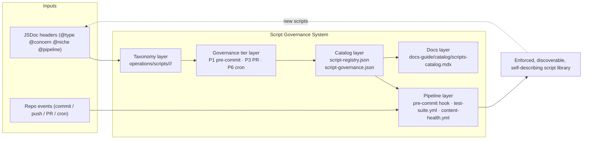

# Script Governance System

> **What it is**: The operational script library and governance infrastructure for the Livepeer docs repo — every automated check, repair, generation, and pipeline that keeps the docs repo healthy without requiring manual intervention.

---

## What This System Does

Scripts are the automation layer of the docs repo. They enforce quality gates before commits (pre-commit), validate and generate during PRs (CI), and self-heal on a schedule (cron). The system organises ~150 scripts into a three-tier taxonomy (`<type>/<concern>/<niche>`), assigns each script to a governance tier (hard-gate / soft-gate / self-heal / on-demand), catalogs them via JSDoc headers, and ensures every script is discoverable, testable, and correctly placed in the execution pipeline. Without this system, quality enforcement is ad-hoc, gates are unmaintainable, and new scripts have no governed home.

---

## When the System Is Working

| Signal | What it tells you |
|---|---|
| Pre-commit runs in <5 seconds | Hard gates are isolated; no slow scripts in pre-commit |
| `npm test --prefix operations/tests` passes (governance suites) | Script headers, registry, and paths are consistent |
| `tools/config/script-registry.json` is current | JSDoc headers are the source of truth and catalog is fresh |
| No `tools/scripts/` references in live code | Restructure is complete and clean |
| New script added → headers → registry → catalog automatically | Self-describing governance is working |

---

## System Architecture — Completed State

---

## The System

---

## ① Taxonomy Layer

All scripts are located at a known, derivable path. Type + concern + niche describe what a script does without reading it.

<AccordionGroup>

<Accordion title="🎯 Ideal State">

Every script lives at `operations/scripts/<type>/<concern>/<niche>/<script-name>.js`. Type is one of: `audits`, `generators`, `validators`, `remediators`, `dispatch`, `automations`. Concern is one of: `content`, `components`, `governance`, `ai`. Niche is concern-specific. A new contributor can find any script by reasoning from its purpose alone.

**What this enables:** Auto-cataloging from path. Governance tier assignment from path. No discovery required for agents or humans.

**Quality bar:** `generate-script-registry.js` produces zero "unknown type" or "unknown concern" warnings. Zero `tools/scripts/` references in live code.

</Accordion>

<Accordion title="📦 Outputs">

| Artefact | Path / location | Status | Blocks |
|---|---|---|---|
| Three-tier folder structure | `operations/scripts/` | ✅ Complete | — |
| Script taxonomy spec | `script-framework.md` | ✅ Complete | — |
| x-archive (dead scripts) | `operations/scripts/x-archive/` | ✅ Complete | — |
| Zero stale `tools/scripts/` refs in live code | — | 🔄 7 script headers remain | ③ Catalog layer |

</Accordion>

</AccordionGroup>

---

## ② Governance Tier Layer

Every script has a declared execution tier. The tier determines when it runs and what happens on failure.

<AccordionGroup>

<Accordion title="🎯 Ideal State">

Every script header has a correct `@pipeline` value encoding its tier. `tools/config/script-governance.json` maps tiers to scripts and cron workflows. Hard-gate scripts block; soft-gate scripts warn; self-heal scripts run on cron without human trigger; on-demand scripts run manually only.

**What this enables:** Pipeline reviewers can read tier from header alone. `script-governance.json` is the authoritative tier index.

**Quality bar:** No malformed `@pipeline` values (no truncated P1, no duplicate `manual, P6, manual`). `script-governance.json` passes schema validation.

</Accordion>

<Accordion title="📦 Outputs">

| Artefact | Path / location | Status | Blocks |
|---|---|---|---|
| Governance tier manifest | `tools/config/script-governance.json` | ✅ Complete (2026-03-23) | — |
| @pipeline values cleaned | 6 scripts fixed | ✅ Complete (2026-03-23) | — |
| Tier docs in docs-guide | `docs-guide/policies/` | 🔒 Blocked (Task 9b) | — |

</Accordion>

</AccordionGroup>

---

## ③ Catalog Layer

Scripts self-describe via JSDoc headers. The registry is derived — never hand-edited.

<AccordionGroup>

<Accordion title="🎯 Ideal State">

Every script has a valid 11-tag JSDoc header (`@script`, `@type`, `@concern`, `@niche`, `@purpose`, `@description`, `@mode`, `@pipeline`, `@scope`, `@usage`, `@policy`). No deprecated tags (`@owner`, `@category`, `@dualmode`, `@purpose-statement`, `@needs`). `generate-script-registry.js` runs on P3 (PR) and produces a current `script-registry.json` with zero stale paths.

**What this enables:** Any agent can query the catalog to find scripts by type/concern/niche. The docs-guide catalog auto-generates from headers.

**Quality bar:** `script-docs.test.js` passes with 0 errors. `script-registry.json` has no `tools/scripts/` references.

</Accordion>

<Accordion title="📦 Outputs">

| Artefact | Path / location | Status | Blocks |
|---|---|---|---|
| Script registry | `tools/config/script-registry.json` | 🔄 Stale (7 headers need fixing) | — |
| Script governance manifest | `tools/config/script-governance.json` | ✅ Complete | — |
| 11-tag JSDoc standard | `script-framework.md` | ✅ Complete | — |
| scripts-catalog.mdx | `docs-guide/catalog/scripts-catalog.mdx` | 🔒 Blocked (Task 9b) | — |

</Accordion>

</AccordionGroup>

---

## ④ Pipeline Layer

Scripts run at the right time, in the right tier, with correct references.

<AccordionGroup>

<Accordion title="🎯 Ideal State">

Pre-commit runs <5s with 5 hard gates only. All PR checks are in `test-suite.yml`. All self-heal scripts have matching cron workflows. No slow scripts in pre-commit. Dispatch scripts are concern-separated — no dispatcher bundles multiple unrelated concerns. A master dispatcher coordinates cross-concern orchestration.

**What this enables:** Commits are fast. CI is trustworthy. Self-healing runs without human trigger. Agents can dispatch concern-specific work without side effects.

**Quality bar:** Pre-commit under 5 seconds. All P3 scripts referenced in `test-suite.yml`. All P5/P6 scripts have cron triggers in `.github/workflows/`. Task 12.5 mermaid diagrams match actual pipeline.

</Accordion>

<Accordion title="📦 Outputs">

| Artefact | Path / location | Status | Blocks |
|---|---|---|---|
| Lean pre-commit hook | `.githooks/pre-commit` | ✅ Complete (Task 3) | — |
| Cron workflows for self-heal | `.github/workflows/` (5 workflows) | ✅ All P5/P6 scripts covered | — |
| Pipeline mermaid diagrams | pending Task 12.5 | ❌ Not started | Task 12.5 |
| Dispatcher concern audit | pending Task 12.6 | ❌ Not started | Task 12.6 |
| Master dispatcher design | pending Task 12.6 | ❌ Not started | Task 12.6 |

</Accordion>

</AccordionGroup>

---

## ⑤ Docs Layer

The script system is documented for humans and agents.

<AccordionGroup>

<Accordion title="🎯 Ideal State">

`operations/scripts/README.md` is the entry point for any developer or agent entering the scripts system. `docs-guide/catalog/scripts-catalog.mdx` is the browsable catalog. `docs-guide/policies/` contains the authoritative governance rules. All are current with the completed restructure.

**What this enables:** Agents in other threads can discover scripts without asking. Contributors know where to add new scripts and how to header them.

**Quality bar:** Zero `tools/scripts/` references in README, AGENTS.md, copilot-instructions, augment-instructions. `agent-governance-framework.mdx` reflects completed restructure. `scripts-catalog.mdx` is regenerated.

</Accordion>

<Accordion title="📦 Outputs">

| Artefact | Path / location | Status | Blocks |
|---|---|---|---|
| operations/scripts/README.md | `operations/scripts/README.md` | ✅ Complete | — |
| .github/AGENTS.md (stale structure rules) | `.github/AGENTS.md` | 🔄 2 stale refs | other threads |
| .github/augment-instructions.md | `.github/augment-instructions.md` | 🔄 3 stale refs | other threads |
| README.md (dev workflow section) | `README.md` | 🔄 9+1 stale refs | contributors |
| scripts-catalog.mdx | `docs-guide/catalog/scripts-catalog.mdx` | 🔒 Blocked (Task 9b / DOCUMENTATION) | — |

</Accordion>

</AccordionGroup>

---

## Completion Status

| System part | Status | Immediate blocker |
|---|---|---|
| ① Taxonomy layer | 🔄 7 headers remain | Task 12 cleanup |
| ② Governance tier layer | 🔄 Tier docs blocked | Task 9b (DOCUMENTATION thread) |
| ③ Catalog layer | 🔄 Registry stale, catalog blocked | Task 12 headers + Task 9b |
| ④ Pipeline layer | 🔄 Diagrams + dispatcher audit pending | Tasks 12.5, 12.6 |
| ⑤ Docs layer | 🔄 3 agent-facing files have stale refs | Task 12 cleanup |

---

## Already Done

| What | Where | Change |
|---|---|---|
| Three-tier folder restructure | `operations/scripts/` | Tasks 1–4 complete |
| Pre-commit gutted to 5 gates | `.githooks/pre-commit` | Task 3 complete |
| x-archive populated | `operations/scripts/x-archive/` | Tasks 2 + 7 complete |
| Validator prefix standardisation | All `validate-*` / `enforce-*` / `test-*` | Task 5 complete |
| Script consolidation reviewed | Overlapping scripts assessed | Task 6 complete |
| Performance + optimisation | Stale paths, double-parse, error handling | Task 8 complete |
| Governance tier manifest | `tools/config/script-governance.json` | Task 9a complete |
| Full test suite | All governance tests passing | Task 10 complete |
| Root → operations/ move | `operations/scripts/`, `operations/tests/` | Task 11 complete |
