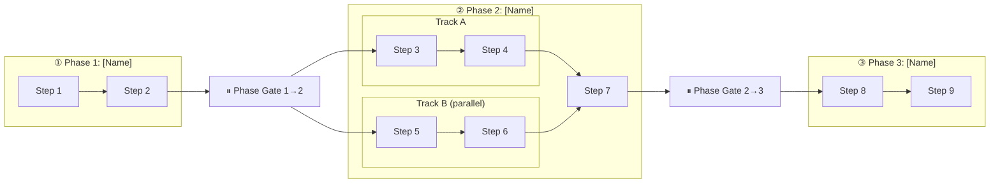

# [Plan Name]

> **What it executes**: [One sentence. Which system or initiative does this plan build? What is the tangible outcome when all steps are done?]

---

{/*
══════════════════════════════════════════════════════════════════════
UNDERSTAND THE RELATIONSHIP BEFORE TOUCHING ANYTHING BELOW
══════════════════════════════════════════════════════════════════════

This document is an EXECUTION PLAN.
It is organized by WHEN and HOW — execution reality.
The system design (WHAT you're building) lives in design-canonical.

┌─────────────────────────────────┐     ┌──────────────────────────────────┐
│      design-canonical           │────►│         plan-canonical           │
│  (what to build + ideal state)  │     │  (how to execute + in what order)│
└─────────────────────────────────┘     └──────────────────────────────────┘

The plan takes its STEP BASE from design-canonical's process accordions.
It reorders, regroups, and extends them with execution-specific concerns:
  - parallel tracks (steps that can run concurrently)
  - handoffs (artefact passing between steps or phases)
  - phase gates (what must be true before the next phase unlocks)
  - critical path (P0 items that block everything downstream)
  - cross-plan dependencies (blocked by or feeds another plan)
  - decision log (architectural calls made during execution)

DO NOT duplicate Ideal State or Outputs content from design-canonical.
Link back to it. The plan extends; it does not replace.

─────────────────────────────────────
DERIVE YOUR STRUCTURE BEFORE FILLING ANYTHING IN
─────────────────────────────────────

Answer four questions. Your answers shape the entire document.

─────────────────────────────────────
Q1. What design-canonical does this plan execute?
─────────────────────────────────────
Name it. Link it.

If it HAS a design-canonical:
  → Step base = every process step in every AccordionGroup of design-canonical
  → You may reorder, regroup, or split steps — execution may differ from system structure
  → Link back for Ideal State and Outputs — don't copy them here

If STANDALONE (no design-canonical):
  → Define your own step base here before filling the template
  → List every discrete step and group into phases before touching the accordions

─────────────────────────────────────
Q2. What are the execution phases?
─────────────────────────────────────
Phases are TEMPORAL — they reflect WHEN work happens and what gates separate blocks.
They are NOT the same as system parts.

A phase boundary is where:
  → A significant human decision or review is required before work continues
  → A key dependency must resolve before the next block starts
  → The nature of the work fundamentally changes (e.g., define → build → run)

Name 2–5 phases. Each becomes an AccordionGroup.
If you have fewer than 2 phases, use a checklist — you don't need a plan document.

─────────────────────────────────────
Q3. What are the parallel tracks?
─────────────────────────────────────
Within a phase, some steps can run concurrently. Identify them.

Mark parallel steps with: **PARALLEL WITH** — [step name]

If a whole phase splits into two simultaneous workstreams, add inside the AccordionGroup:
  ## Track A — [name] *(parallel with Track B)*
  ## Track B — [name] *(parallel with Track A)*
before the relevant step accordions.

─────────────────────────────────────
Q4. What is the critical path?
─────────────────────────────────────
List every step that, if delayed, delays the whole plan. These are P0 items.

P0 — blocks first meaningful test / first deliverable / next phase gate
P1 — blocks production / full rollout / scale
P2 — enhancement / polish / future

Every step accordion gets a PRIORITY field. Set it honestly.
More than 3–4 P0 items means you need to reassess — the critical path can't be everything.

──────────────────────────────────────────────────────────────────
KEY PRINCIPLE — organise by WHEN and HOW, not WHAT
──────────────────────────────────────────────────────────────────
AccordionGroups = execution phases (when work happens).
NOT system parts, NOT what you're building.

The design-canonical owns the "what."
This plan owns the "when, in what order, who, and what blocks what."

══════════════════════════════════════════════════════════════════════
*/}

---

## Plan Summary

[One paragraph. What is being built, why, and what the plan produces when complete. Who depends on the outputs? What fails if this plan doesn't run?]

**Design-canonical**: [link, or "standalone — no design-canonical"]
**Pilot / first target**: [first scope for execution, if applicable]

---

## When the Plan Is On Track

{/* One row per observable signal. Choose signals appropriate to your execution context. */}

| Signal | What it tells you |
|---|---|
| [Observable signal — e.g. "All P0 gaps resolved"] | [What it means about plan health] |
| [Observable signal — e.g. "Phase gate N closed"] | [What it tells you] |
| [Observable signal] | [What it tells you] |

---

## Critical Path — P0 Items

{/* List only P0 items — the ones that, if blocked, block the whole plan.
    If this table is empty, the plan is ready to run. */}

| Step | Blocks | Status |
|---|---|---|
| [Step name] | [What this unblocks] | ❌ Not started |
| [Step name] | [What this unblocks] | 🔄 In progress |

---

## Execution Flow

{/*
Show the dependency graph. Not a Gantt chart — a flow.
Show: phase gates, parallel tracks, P0 items, cross-plan dependencies.

For SEQUENTIAL phases:
  Phase 1 steps → ⏸ gate → Phase 2 steps → ⏸ gate → Phase 3

For PARALLEL TRACKS within a phase:
  Phase start → Track A steps ─┐
                                ├─► merge → gate → next phase
               Track B steps ─┘

Label P0 items. Show external dependencies as nodes outside the main flow.
*/}

---

## The Plan

{/*
ACCORDION STRUCTURE:

  One AccordionGroup per phase (from Q2).
  Inside each group, four types of content:

  1. 🎯 PHASE GOAL (always first)
     What this phase delivers. Entry condition. Exit condition.

  2. Step accordions (middle — the work)
     One per step. For parallel tracks, precede with ## Track A / Track B headers.

  3. 🔗 HANDOFF (optional — use when an artefact explicitly passes to the next phase)

  4. ⏸ PHASE GATE (always last)
     Entry conditions for the next phase — a checklist. Closes this phase.

  ─────────────────────────────────────
  STEP ACCORDION FORMAT
  ─────────────────────────────────────

  <Accordion title="[EMOJI] [STEP TYPE] · [Short description]">

  **SOURCE** — [① system part from design-canonical this step comes from] *(omit if standalone)*
  **DEPENDS ON** — [step name / artefact that must exist first] | none
  **UNBLOCKS** — [step name / artefact this enables downstream] | nothing
  **PARALLEL WITH** — [step name] *(omit if not parallel with anything)*
  **PRIORITY** — P0 / P1 / P2
  **WHO** — Human / AI / Both — [split if non-obvious]

  **IN**
  - [what this step needs to start]

  **OUT**
  - [what this step produces — named and pathed specifically]

  **Steps**
  1. ✅ [Step — completed]
  2. 🔄 [Step — in progress, note what's pending]
  3. ❌ [Step — not started]
  4. ⏸ [Step — blocked by X]

  **STATUS** — [✅ Done — [ref] | 🔄 [what's pending] | ❌ Not started | ⏸ blocked by [X]]

  </Accordion>

  ─────────────────────────────────────
  SPECIAL ACCORDION TYPES (plan-only)
  ─────────────────────────────────────

  🔗 HANDOFF · [What passes from step X to step Y / next phase]
    Use when an artefact produced in one step is the explicit input to another step or phase.

    **FROM** — [step that produces it]
    **TO** — [step / phase that consumes it]
    **ARTEFACT** — [what is handed off — named, pathed]
    **GATE** — [what must be true for the handoff to be valid]
    **STATUS** — [✅ Ready | ❌ Not ready — [what's missing]]

  🔗 COORDINATION · [External dependency]
    Use when this plan depends on or feeds another plan.

    **PLAN** — [which other plan + link]
    **NEEDS** — [what this plan needs from that plan]
    **PROVIDES** — [what this plan provides to that plan]
    **STATUS** — [unblocked | ⏸ waiting on X]

  ⏸ PHASE GATE · Phase N → Phase N+1
    The final accordion in every phase group.
    A checklist of entry conditions. All must be true before the next phase starts.

    All must be true before Phase [N+1] starts:
    - [ ] [Condition — specific and verifiable]
    - [ ] [Condition]

    **STATUS** — [🔒 Closed — [what's missing] | ✅ Open — Phase [N+1] may proceed]

  ─────────────────────────────────────
  STEP TYPES (same prefixes as system-canonical)
  ─────────────────────────────────────
  🔬 RESEARCH      — investigation, discovery, gathering resources
  🔍 AUDIT         — scanning / inventorying current state
  🎨 DESIGN        — deciding how something should work; frameworks, specs, decisions
  ✏️ EXECUTION     — writing, building, implementing
  📝 DOCUMENT      — writing the canonical record (distinct from EXECUTION)
  🧪 TESTING       — verifying it works; produces pass/fail + evidence
  🔄 ITERATION     — refining based on test or review results
  👤 HUMAN REVIEW  — checkpoint requiring human approval before proceeding
  🔗 COORDINATION  — dependency on another system, team, or plan
  📊 MONITOR       — ongoing health signal after the system is live

  STATUS prefixes on AccordionGroup titles: ✅ complete | 🔄 in progress | ❌ not started
*/}

---

## ① [Phase 1 Name] — ❌ Not started

[One sentence. What does this phase produce?]

<AccordionGroup>

<Accordion title="🎯 Phase Goal">

[What this phase delivers when complete. What the next phase depends on from this one.]

**Entry condition**: [What must be true before this phase starts — or "none, this is the first phase"]
**Exit condition**: [What must be true for this phase to be considered done — specific and verifiable]

</Accordion>

<Accordion title="[EMOJI] [STEP TYPE] · [Step description]">

**SOURCE** — [① System name from design-canonical]
**DEPENDS ON** — none
**UNBLOCKS** — [Step X]
**PRIORITY** — P0

**WHO** — Human / AI / Both

**IN**
- [what this step needs]

**OUT**
- [what this step produces — named + pathed]

**Steps**
1. ❌ [Step]
2. ❌ [Step]
3. ❌ [Step]

**STATUS** — ❌ Not started

</Accordion>

<Accordion title="[EMOJI] [STEP TYPE] · [Step description]">

**SOURCE** — [② System name]
**DEPENDS ON** — [previous step]
**UNBLOCKS** — [Step Y]
**PRIORITY** — P1

**WHO** — Both — AI drafts, human approves

**IN**
- [inputs]

**OUT**
- [outputs]

**Steps**
1. ❌ [Step]
2. ❌ [Step]

**STATUS** — ❌ Not started

</Accordion>

<Accordion title="⏸ PHASE GATE · Phase 1 → Phase 2">

All must be true before Phase 2 starts:
- [ ] [Condition — specific and verifiable]
- [ ] [Condition]
- [ ] [Condition]

**STATUS** — 🔒 Closed — [what's missing]

</Accordion>

</AccordionGroup>

---

## ② [Phase 2 Name] — ❌ Not started

[One sentence.]

<AccordionGroup>

<Accordion title="🎯 Phase Goal">

[What this phase delivers when complete.]

**Entry condition**: [Phase 1 gate closed]
**Exit condition**: [What must be true — specific and verifiable]

</Accordion>

{/* If this phase has parallel tracks, add before the step accordions:

## Track A — [name] *(parallel with Track B)*

[step accordions for Track A — include **PARALLEL WITH** — Track B on each]

## Track B — [name] *(parallel with Track A)*

[step accordions for Track B — include **PARALLEL WITH** — Track A on each]

## Merge point

[step accordion for the step that depends on both tracks completing]

*/}

<Accordion title="[EMOJI] [STEP TYPE] · [Description]">

**SOURCE** — [system part]
**DEPENDS ON** — [Phase 1 gate]
**UNBLOCKS** — [Step Z]
**PARALLEL WITH** — [Step N] *(if applicable)*
**PRIORITY** — P1

**WHO** — [...]

**IN** — [...]
**OUT** — [...]

**Steps**
1. ❌ [Step]
2. ❌ [Step]

**STATUS** — ❌ Not started

</Accordion>

<Accordion title="🔗 HANDOFF · [What passes to Phase 3]">

**FROM** — [step that produces it]
**TO** — Phase 3, [step name]
**ARTEFACT** — [what is handed off — named, pathed]
**GATE** — [what must be true for this handoff to be valid]

**STATUS** — ❌ Not ready — [what's missing]

</Accordion>

<Accordion title="⏸ PHASE GATE · Phase 2 → Phase 3">

All must be true before Phase 3 starts:
- [ ] [Condition]
- [ ] [Condition]

**STATUS** — 🔒 Closed — [what's missing]

</Accordion>

</AccordionGroup>

{/* Continue pattern for remaining phases (③ ④ ...) */}

---

## Completion Status

{/* Summary view across all phases. Quick read of where the plan stands. */}

| Phase | Status | Gate | Immediate blocker |
|---|---|---|---|
| [Phase 1] | 🔄 In progress | 🔒 Closed | [what unblocks gate] |
| [Phase 2] | ❌ Not started | 🔒 Closed | [Phase 1 gate] |
| [Phase 3] | ❌ Not started | 🔒 Closed | [Phase 2 gate] |

---

## Decision Log

{/* Architectural decisions made during execution. Not open questions — resolved calls with rationale.
    Log the decision, not the deliberation. Rationale should capture the constraint or trade-off. */}

| Date | Decision | Rationale |
|---|---|---|
| [date] | [Decision — what was decided] | [Why — constraint, trade-off, stakeholder requirement] |

---

## Cross-Plan Dependencies

{/* Only needed if this plan blocks or is blocked by another plan.
    Omit this section entirely if there are no cross-plan dependencies. */}

| This plan | Direction | Other plan | Artefact / decision | Status |
|---|---|---|---|---|
| [step name] | needs from → | [other plan + link] | [artefact] | ⏸ waiting |
| [step name] | provides to → | [other plan + link] | [artefact] | ❌ not ready |

---

## Open Questions

{/* Questions that will be resolved during execution — not design decisions (those go in Decision Log).
    Remove each when resolved; add the resolution to the Decision Log if it was significant. */}

1. [Question — will be resolved in step X]
2. [Question]
