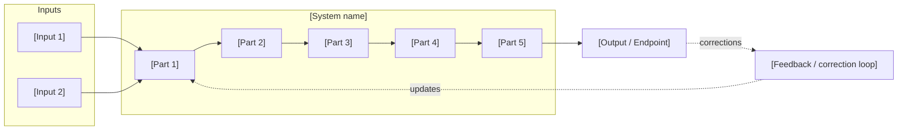

# [System Name]

> **What it is**: [One sentence. What does this system do, for whom, and what breaks without it?]

---

{/*
══════════════════════════════════════════════════════════════════════
DERIVE YOUR STRUCTURE BEFORE TOUCHING ANYTHING BELOW
══════════════════════════════════════════════════════════════════════

This document describes a system — its shape, its parts, and how to build each part.
The shape is NOT fixed. You derive it from the system you're designing.

DO THIS FIRST. Answer three questions. Your answers become the accordion groups.

─────────────────────────────────────
Q1. What KIND of system is this?
─────────────────────────────────────
Match your system to one of these:

  PIPELINE — content or data flows through stages in sequence
    → Accordion groups = the stages (Intake → Classify → Review → Gate → Output → Feedback)
    → Ask: "What happens to it at each stage? What comes in, what goes out?"

  GOVERNANCE / TRUST — properties that must always hold for the system to be relied on
    → Accordion groups = the properties (every item located / every item owned / system self-describes)
    → Ask: "What must always be true for humans and agents to trust this?"

  AUTONOMOUS / AGENT — capabilities a system needs to operate without human input
    → Accordion groups = the capabilities (discover / classify / execute / verify / report)
    → Ask: "What must the system be able to do on its own?"

  QUALITY / REVIEW — checkpoints a piece of work passes through before it's accepted
    → Accordion groups = the gates (structure check / content check / peer review / final approval)
    → Ask: "What does a piece of work have to pass to be considered done?"

  PLATFORM / LAYER SYSTEM — functional layers that compose the platform
    → Accordion groups = the layers (interface / logic / data / observability)
    → Ask: "What are the distinct functional layers that have to work independently?"

Not every system fits one type cleanly. Hybrid is fine — but name which two types
and identify which decomposition gives you the clearest, non-overlapping groups.

─────────────────────────────────────
Q2. What are the 5+ major parts?
─────────────────────────────────────
Write them out. Don't touch the template until you have at least 5 named.
If you can name fewer than 5, you haven't decomposed far enough yet.
If two of your parts always happen together, they're probably one part.
If one of your parts has 8 sub-steps, it might be two parts.

Each part should be something that could fail independently, be built independently,
and be tested independently.

─────────────────────────────────────
Q3. What is the ideal outcome for each part?
─────────────────────────────────────
For each part, write a single sentence: "When this part is done, [what is true that wasn't true before]?"

These sentences become the 🎯 Ideal State bookend inside each accordion group.
The 📦 Outputs bookend is the concrete artefact list — files, paths, status — that proves the ideal state was reached.
Without both bookends, a group has no definition of done.

─────────────────────────────────────
KEY PRINCIPLE — organise by WHAT, not WHEN
─────────────────────────────────────
Accordion groups = the parts of the completed system (what you're building).
NOT phases, timelines, or when things happen.

"Phase 1" is not a system part. "Standards layer" is.
The process for building each part lives *inside* its accordion group.

══════════════════════════════════════════════════════════════════════
*/}

---

## What This System Does

[One paragraph. Describe the system as if it is already running. What flows in? What is produced? Who depends on the outputs? What fails without this system?]

---

## When the System Is Working

{/* One row per major observable signal. Choose signals appropriate to YOUR system type.
For a pipeline: "work flows through without manual intervention at stage X".
For governance: "agent can find the right file first try".
For an autonomous system: "N% of cases resolved without human review". */}

| Signal | What it tells you |
|---|---|
| [Observable signal 1] | [What it means about system health] |
| [Observable signal 2] | [What it tells you] |
| [Observable signal 3] | [What it tells you] |

---

## System Architecture — Completed State

{/* Draw the running system. Parts from Q2 should appear as nodes.
For PIPELINE: sequence of stages, left to right or top to bottom.
For GOVERNANCE: sources → transforms → outputs → feedback.
For AUTONOMOUS: triggers → capability loop → outputs + feedback.
For QUALITY/REVIEW: work item passing through gates.
For PLATFORM: layers stacked or composed.
Show feedback loops where corrections flow back into earlier parts. */}

---

## The System

{/*
ACCORDION STRUCTURE:

  One AccordionGroup per system part (from Q2).
  Inside each group, three types of content:

  1. 🎯 IDEAL STATE bookend (always first)
     What this part looks like when fully built. What it enables downstream.
     The quality bar you'll verify against.

  2. Process accordions (middle — vary by what the part actually needs)
     Use only the step types that apply. Don't force steps that don't exist.
     Order them in the sequence you'd actually execute them.

  3. 📦 OUTPUTS bookend (always last)
     Concrete artefacts produced. File paths. Status. What downstream parts are blocked
     by anything missing here.

  STATUS prefixes on AccordionGroup titles: ✅ complete | 🔄 in progress | ❌ not started

  ─────────────────────────────────────
  STEP TYPES — use as accordion title prefixes
  ─────────────────────────────────────
  🔬 RESEARCH      — investigation, reading current state, discovery, gathering + collating resources
  🔍 AUDIT         — scanning/inventorying current state; surfaces problems + replicable good patterns
  🎨 DESIGN        — deciding how this part should work; frameworks, specs, decisions
  ✏️ EXECUTION     — writing, building, implementing the thing
  📝 DOCUMENT      — writing the canonical record: decisions made, how it works, how to use it
                     (distinct from EXECUTION — EXECUTION builds the thing, DOCUMENT describes it)
  🧪 TESTING       — verifying it works as designed; produces a pass/fail + evidence
  🔄 ITERATION     — refining based on test or review results; ends when testing passes or human approves
  👤 HUMAN REVIEW  — checkpoint requiring human approval before proceeding; can also be used as LOCK
  🔗 COORDINATION  — dependency on another system, team, or plan; produces a handoff, decision, or unblock
  📊 MONITOR       — ongoing health signal after the system is live; not a one-time test
  CLEANUP          - cleanup any one-shot use files / folders / uneeded items on completion & generate a completion.report.md based on workspace/plan/active/_Project-Management_/completion-reports.md

  Format: [EMOJI] [STEP TYPE] · [Short description of what this step does]
  Example: 🎨 DESIGN · Define the classification schema

  Status per step: ✅ Done — [reference] | 🔄 [what's pending] | ❌ Not started | blocked by [X]
*/}

---

## ① [Part 1 Name]

[One sentence. What does this part of the system do?]

<AccordionGroup>

<Accordion title="🎯 Ideal State">

[What this part of the system does when fully built and running. Be specific about what is true when this is done that wasn't true before.]

**What this enables:** [What downstream parts or users can do because this part exists and is correct.]

**Quality bar:** [The verifiable test. How you would confirm this part is working at the level you need — measurable where possible.]

</Accordion>

<Accordion title="🔬 RESEARCH · [What you're investigating]">

**IN**
- [What this step needs to start — data, files, existing artefacts, human knowledge]

**OUT**
- [What this step produces — a document, a list, a classification, a decision]

**HUMAN VS AI** *(include only where the split is non-obvious)*
- AI: [what the AI does]
- Human: [what the human does / approves]

**Steps**
1. ✅ [Step — completed]
2. 🔄 [Step — in progress, note what's pending]
3. ❌ [Step — not started]
4. ⏸ [Step — blocked by X]

**STATUS** — [✅ Done — [reference] | 🔄 [what's pending] | ❌ Not started | blocked by [X]]

</Accordion>

<Accordion title="🎨 DESIGN · [What you're deciding]">

**IN**
- [Inputs]
- ⚠ Read all decision documents and locked files before starting — structure.md, design-canonical, plan decision log, any locked framework files

**OUT**
- [The designed artefact, spec, or decision — named specifically]

**HUMAN VS AI**
- AI: [role]
- Human: [role]

**Steps**
1. ❌ Read: [list the specific decision documents relevant to this step]
2. ❌ [Step]
3. ❌ [Step]

**STATUS** — [status]

</Accordion>

<Accordion title="✏️ EXECUTION · [What you're building]">

**IN**
- [Inputs — including any approved design artefacts from the DESIGN step]

**OUT**
- [The built thing — named and pathed specifically]

**HUMAN VS AI**
- AI: [role]
- Human: [role]

**Steps**
1. ❌ [Step]
2. ❌ [Step]
3. ❌ [Step]

**STATUS** — [status]

</Accordion>

<Accordion title="🧪 TESTING · [What you're validating]">

**IN**
- [What the test uses — the built thing + any test fixtures, sample data, or criteria]

**OUT**
- [What the test produces — a pass/fail result, a score, a list of edge cases found]

**DONE WHEN** — [The measurable bar this test must hit before the part is considered done]

**Steps**
1. ❌ [Step]
2. ❌ [Step]
3. ❌ [Step]

**STATUS** — [status]

</Accordion>

<Accordion title="🔄 ITERATION · [What you're refining]">

**IN**
- [Test results, human review notes, or observed failures]

**OUT**
- [Updated artefact + iteration log: what changed and why]

**DONE WHEN** — [The specific condition that ends iteration: test passes / human approves current state as acceptable / agreed limit reached]

**Steps**
1. ❌ [Step]
2. ❌ [Step]
3. ❌ [Step]

**STATUS** — [status]

</Accordion>

<Accordion title="📝 DOCUMENT · [What you're recording]">

**IN**
- [The completed, approved artefact this step describes]

**OUT**
- [The canonical document — path, audience, what it covers]
- Decisions made, how the thing works, how to use it, known limitations

**Steps**
1. ❌ [Step]
2. ❌ [Step]

**STATUS** — [status]

</Accordion>

<Accordion title="👤 HUMAN REVIEW · [What requires approval — or: Lock]">

**IN**: [What the human receives — the artefact, the test results, the decision to evaluate]
**OUT**: [What the human confirms, locks, or approves — be specific]
**Criteria**: [What the human is checking — what makes this a pass vs a fail or a redirect]

**Steps**
1. ❌ [Check / decision]
2. ❌ [Check / decision]
3. ❌ Write all decisions made in this review to the Decision Log in plan.md — named, dated, with rationale

**STATUS** — [status]

</Accordion>

<Accordion title="📦 Outputs">

| Artefact | Path / location | Status | Blocks |
|---|---|---|---|
| [artefact name] | [where it lives] | ✅ / 🔄 / ❌ | — |
| [artefact name] | [where it lives] | ❌ | [② Part name] |

</Accordion>

</AccordionGroup>

---

## ② [Part 2 Name]

[One sentence.]

<AccordionGroup>

<Accordion title="🎯 Ideal State">

[...]

**What this enables:** [...]

**Quality bar:** [...]

</Accordion>

{/* Add only the process steps this part actually needs. Not every part needs every step type.
    Steps that are rarely needed but valid: 📊 MONITOR, 🔗 COORDINATION.
    📊 MONITOR — use for parts of the system that run continuously and need ongoing health checks.
    🔗 COORDINATION — use when this step depends on a handoff from another system, team, or plan.
       IN: what you need from the other party. OUT: the unblock or decision that lets you proceed. */}

<Accordion title="[EMOJI] [STEP TYPE] · [Description]">

**IN** — [...]
**OUT** — [...]

**Steps**
1. ❌ [Step]
2. ❌ [Step]

**STATUS** — [...]

</Accordion>

<Accordion title="📦 Outputs">

| Artefact | Path / location | Status | Blocks |
|---|---|---|---|
| | | | |

</Accordion>

</AccordionGroup>

{/* Continue pattern for all remaining system parts (③ ④ ⑤ ...) */}

---

> **This document and the plan** — The Steps inside each accordion are the task base for the plan. The plan takes those Steps and adds what this document can't: parallel run paths, handoff items, cross-plan dependencies, phase sequencing, and decision log. The design-canonical is the structured system view. The plan is the execution reality built on top of it. They're complementary — the design-canonical feeds the plan, the plan extends it.

---

## Completion Status

{/* Summary view across all parts. Useful for a quick read of where the system stands. */}

| System part | Status | Immediate blocker |
|---|---|---|
| [Part 1] | 🔄 In progress | [what unblocks it] |
| [Part 2] | ❌ Not started | [what unblocks it] |
| [Part 3] | ✅ Complete | — |

---

## Already Done

{/* Completed work that doesn't map to a specific system part — quick fixes, migrations, one-off corrections, prerequisite work completed before this system was formally tracked. */}

| What | Where | Change |
|---|---|---|
| | | |
