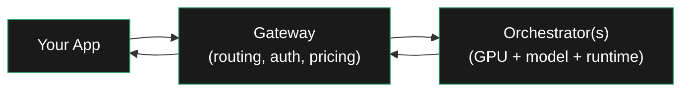
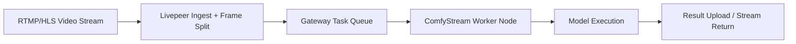
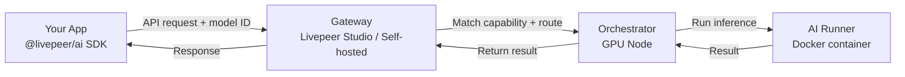
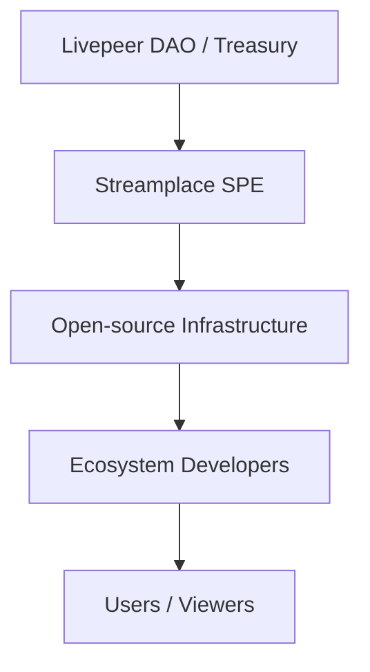
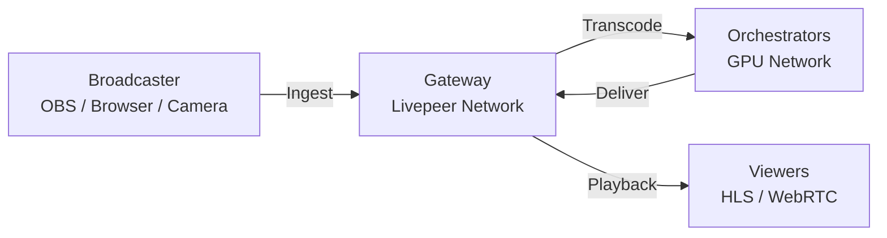
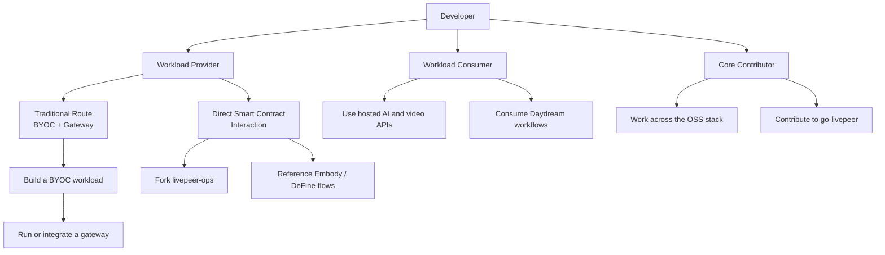

# Developers Full Content — v2/developers/

This file contains the complete content of every .mdx file in the `v2/developers/` directory tree.

- **Source**: `/Users/alisonhaire/Documents/Livepeer/Docs-v2-dev/v2/developers/`
- **Generated**: 2026-03-23
- **Files**: 112 .mdx files
- **Purpose**: Full content context pack for content writing tasks

---

### _workspace/archive/ai-inference-overview-old.mdx

---
title: AI Inference on Livepeer
sidebarTitle: Overview
description: >-
  What AI inference on Livepeer is, how it works, who it is for, and where to
  start.
keywords:
  - livepeer
  - ai
  - inference
  - real-time
  - video ai
  - orchestrator
  - gpu
  - overview
'og:image': /snippets/assets/site/og-image/fallback.png
'og:image:alt': Livepeer Docs social preview image
'og:image:type': image/png
'og:image:width': 1200
'og:image:height': 630
pageType: overview
---

import { PreviewCallout } from '/snippets/components/primitives/previewCallouts.jsx'
import { GotoCard, GotoLink } from '/snippets/components/primitives/links.jsx'
import { DynamicTable } from '/snippets/components/layout/table.jsx'
import { FlexContainer } from '/snippets/components/layout/layout.jsx'
import { BorderedBox } from '/snippets/components/layout/containers.jsx'

<PreviewCallout />

Livepeer is a decentralised network of GPU nodes that run AI inference on video and streaming workloads. It is not a generic cloud GPU service and not a model marketplace — it is a real-time, streaming-first AI compute layer optimised for low-latency inference at the frame and segment level.

This section is for **developers** who want to build applications that consume AI inference via Livepeer: style transfer, depth estimation, object detection, speech-to-text, image-to-image pipelines, and more.

---

## How it works



Your application sends inference requests to a **Gateway**. The gateway discovers available **Orchestrators**, routes your job based on capability, price, and latency, handles retries and auth, and returns results. You never communicate with an orchestrator directly — the gateway handles all of that.

<DynamicTable
  headerList={["Layer", "What it does", "Who runs it"]}
  itemsList={[
    { "Layer": "Your app", "What it does": "Sends inference requests (HTTP / WebRTC)", "Who runs it": "You" },
    { "Layer": "Gateway", "What it does": "Routes jobs, manages auth + pricing + QoS", "Who runs it": "Hosted services or self-run" },
    { "Layer": "Orchestrator", "What it does": "Executes AI model inference on GPU", "Who runs it": "Network operators" }
  ]}
/>

---

## What you can build

Livepeer AI is designed for streaming and real-time workloads. Strong fits include:

<Columns cols={2}>
  <Card title="Real-time video effects" icon="wand-magic-sparkles">
 Style transfer, background replacement, depth overlays, and image-to-image pipelines running frame-by-frame on live video.
  </Card>
  <Card title="Live speech & captions" icon="microphone">
 Live ASR, real-time translation, and caption generation from audio chunks ingested via WebRTC.
  </Card>
  <Card title="Vision pipelines" icon="eye">
 Object detection, pose estimation, face parsing, segmentation — per-frame GPU inference for live streams.
  </Card>
  <Card title="Custom AI pipelines" icon="diagram-project">
 Composable multi-step inference workflows via ComfyStream or BYOC: vision → conditioning → generation in sequence.
  </Card>
</Columns>

---

## AI on Livepeer vs other infrastructure

<DynamicTable
  headerList={["", "Livepeer AI", "Generic GPU cloud", "Hosted AI APIs"]}
  itemsList={[
    { "": "Optimised for", "Livepeer AI": "Streaming, real-time, frame-based", "Generic GPU cloud": "Batch, training, long jobs", "Hosted AI APIs": "Text, image, batch requests" },
    { "": "Pricing model", "Livepeer AI": "Per frame / second / request via protocol", "Generic GPU cloud": "Per GPU-hour", "Hosted AI APIs": "Per token / request" },
    { "": "Bring your own model", "Livepeer AI": "Yes — via BYOC container", "Generic GPU cloud": "Yes", "Hosted AI APIs": "No" },
    { "": "Decentralised", "Livepeer AI": "Yes — open GPU market", "Generic GPU cloud": "No", "Hosted AI APIs": "No" },
    { "": "Best for", "Livepeer AI": "Video AI apps, real-time pipelines", "Generic GPU cloud": "Model training, heavy batch", "Hosted AI APIs": "Simple one-off inference" }
  ]}
/>

---

## How models get on the network

Models run inside **Orchestrator nodes**. Orchestrators can use:

- **ComfyUI** — the most common approach; load `.safetensors` weights, build inference DAGs, serve via ComfyStream
- **Custom inference servers** — any Torch / TensorRT / ONNX model wrapped in a Docker container (BYOC)

Orchestrators advertise capabilities — `image-to-image`, `depth`, `style-transfer` — not model names. Gateways route by capability and performance, not by which specific model weights are loaded. This means models can be swapped or improved without breaking your application.

<GotoCard
  label="How orchestrators host models"
  text="Step-by-step guide to running AI models on an orchestrator node"
  relativePath="../../orchestrators/advanced/hosting-models"
/>

---

## Start here

<CardGroup cols={3}>
  <Card title="Is my workload a good fit?" icon="circle-question" href="./ai-inference-workload-fit-old">
 Before building: understand what runs well on Livepeer and what doesn't.
  </Card>
  <Card title="AI Pipelines" icon="diagram-project" href="./ai-pipelines-overview-old">
 ComfyStream, BYOC, and how to compose multi-step inference workflows.
  </Card>
  <Card title="Model support" icon="microchip-ai" href="./ai-pipelines-model-support-old">
 Full model family compatibility matrix — which models run on Livepeer and why.
  </Card>
</CardGroup>

---

## Related sections

<Columns cols={2}>
  <GotoCard
    label="Gateway Services"
    text="Find a hosted gateway or run your own"
    relativePath="../../gateways/using-gateways/choosing-a-gateway"
  />
  <GotoCard
    label="Run an Orchestrator"
    text="Contribute GPU capacity to the AI network"
    relativePath="../../orchestrators/guides/setup-paths/setup-navigator"
  />
</Columns>

---

### _workspace/archive/ai-inference-workload-fit-old.mdx

---
title: 'Is My AI Workload a Good Fit for Livepeer?'
sidebarTitle: 'Workload Fit'
description: 'Decision framework for evaluating whether your AI workload belongs on Livepeer. Includes decision tree, capability matrix, gateway vs orchestrator responsibilities, and anti-patterns.'
keywords: ["livepeer", "ai workload", "inference", "streaming", "real-time", "batch", "fit", "comfystream", "byoc", "decision"]
og:image: "/snippets/assets/domain/SHARED/LivepeerDocsLogo.svg"
---

import { PreviewCallout } from '/snippets/components/primitives/previewCallouts.jsx'
import { DynamicTable } from '/snippets/components/layout/table.jsx'
import { GotoCard, GotoLink } from '/snippets/components/primitives/links.jsx'
import { BorderedBox } from '/snippets/components/layout/containers.jsx'
import { FlexContainer } from '/snippets/components/layout/layout.jsx'

<PreviewCallout />

Livepeer is optimised for **streaming, GPU-bound, low-latency inference**. It is not a general-purpose batch compute or file-processing network. Use this page to determine whether your workload is a good fit before you start building.

---

## Decision tree

```text
Start
 │
 ├── Is the workload STREAMING (frames / chunks / segments)?
 │    └── No  →  ✗ Not a good Livepeer fit
 │
 └── Yes
      │
      ├── Does the workload require GPU-accelerated INFERENCE?
      │    └── No  →  ✗ Use a gateway or standard compute
      │
      └── Yes
           │
           ├── Is LOW LATENCY (< ~500ms) important to the UX?
           │    └── No  →  ⚠ Possible, but not differentiated
           │
           └── Yes
                │
                ├── Does it produce INCREMENTAL output?
                │    └── No  →  ⚠ Marginal fit
                │
                └── Yes  →  ✓ Excellent Livepeer workload
```

<Note>
 **Summary:** Livepeer works best for streaming, GPU-bound inference with low latency and incremental output. If your workload fails the first two gates, don't build it on Livepeer.
</Note>

---

## Capability matrix

<DynamicTable
  headerList={["Category", "Example workloads", "Fit", "Why"]}
  itemsList={[
    { "Category": "Audio", "Example workloads": "Live ASR, live translation, audio intent", "Fit": "✓ Strong", "Why": "Chunked streams, GPU inference, low latency" },
    { "Category": "Audio", "Example workloads": "Offline transcription", "Fit": "⚠ Medium", "Why": "Works, but batch infra is cheaper" },
    { "Category": "Audio", "Example workloads": "Video → MP3 extraction", "Fit": "✗ Poor", "Why": "CPU task, no inference" },
    { "Category": "Vision", "Example workloads": "Depth, pose, segmentation", "Fit": "✓ Strong", "Why": "Frame-based GPU inference" },
    { "Category": "Vision", "Example workloads": "Image classification (batch)", "Fit": "⚠ Medium", "Why": "Not latency-critical" },
    { "Category": "Video", "Example workloads": "Video-to-video, diffusion, effects", "Fit": "✓ Excellent", "Why": "Core Livepeer strength" },
    { "Category": "Video", "Example workloads": "Transcoding only", "Fit": "⚠ Medium", "Why": "Supported, but not AI-driven" },
    { "Category": "Text", "Example workloads": "Prompt routing, captions, metadata", "Fit": "⚠ Conditional", "Why": "Only if real-time" },
    { "Category": "Text", "Example workloads": "LLM batch inference", "Fit": "✗ Poor", "Why": "Latency-tolerant, expensive on GPU" }
  ]}
/>

---

## Gateway vs orchestrator responsibilities by workload

Understanding the split between gateway and orchestrator helps you know where to direct integration effort for each workload type.

### Audio workloads (ASR, translation, intent)

**Gateway** handles: audio ingestion via WebRTC, chunking and buffering, authentication and retries, output aggregation and fan-out.

**Orchestrator** handles: GPU-resident ASR / translation models, streaming inference execution, incremental token emission, language or model specialisation.

### Vision workloads (depth, pose, segmentation)

**Gateway** handles: frame routing, capability selection, latency monitoring, cost-aware routing.

**Orchestrator** handles: vision model execution, GPU memory optimisation, per-frame inference, optional batching.

### Video workloads (generation, effects, diffusion)

**Gateway** handles: stream orchestration, QoS and failover, output delivery, session lifecycle management.

**Orchestrator** handles: persistent GPU pipelines, multi-model composition, frame-by-frame generation, real-time conditioning.

### Text workloads (real-time only)

**Gateway** handles: request multiplexing, rate limiting, stable API surface.

**Orchestrator** handles: lightweight LLMs or classifiers, prompt routing and control logic, real-time response generation.

---

## ASR pipeline examples

These are some of the best-fit workloads on Livepeer today.

### Live captions for video streams

```text
Mic / Video Audio
      ↓
Gateway (WebRTC audio chunks)
      ↓
Orchestrator (GPU ASR model)
      ↓
Incremental text tokens
      ↓
Gateway → captions / overlays / APIs
```

**Why it fits:** continuous audio stream, warm GPU state, incremental output, latency-critical UX.

### Multilingual live translation

```text
Live Audio
      ↓
ASR
      ↓
Translation model
      ↓
Translated captions (real-time)
```

**Why it fits:** chained streaming inference, strong latency requirements, high differentiation vs batch pipelines.

### Voice-driven avatars or agents

```text
Live Audio
      ↓
ASR
      ↓
Intent / command extraction
      ↓
Video or avatar pipeline conditioning
```

**Why it fits:** multimodal real-time control loop, audio conditions downstream video.

### Live moderation and safety

```text
Live Audio
      ↓
ASR
      ↓
Keyword / sentiment / policy model
      ↓
Flags, triggers, overlays
```

**Why it fits:** streaming classification, immediate downstream actions.

---

## What about batch and file-based workloads?

<Accordion title="File-to-file and batch workloads: doable vs sensible">

Livepeer will not block file-based or batch workloads. The protocol is general at the container level — anything that can run in a container can run on a Livepeer orchestrator. But Livepeer's economics, routing, and reliability are tuned for streaming inference, not batch conversion.

**The precise rule:**

> File-to-file is usually a bad fit — unless the conversion is actually streaming inference in disguise. Livepeer cares about **execution shape**, not inputs.

**Your examples, explicitly:**

**YouTube video → MP3**
Doable. Bad idea. CPU-bound, no inference, long-running batch job, wastes GPU slots, will be deprioritised by gateways. Technically works. Economically irrational.

**English → other language (translation)**
- File-to-file (text in → text out): batch job, latency-tolerant — weak Livepeer fit.
- Live translation (speech or captions): audio arrives incrementally, translation emitted incrementally, latency matters — excellent Livepeer fit.
Same model, different execution shape.

**MP3 → text transcription**
- Upload MP3 → wait → download transcript: marginal. Works, but batch infra is cheaper and gateways gain little from routing it.
- Streamed transcription (even from an MP3): chunk audio, emit tokens continuously, treat it like live audio — strong fit.

**Reframe your mental model:**

Stop thinking: "file → file = bad."
Start thinking: "batch execution vs stream execution."

| Task | Batch | Streaming |
|---|---|---|
| MP3 → text | ⚠ weak | ✓ strong |
| Translation | ⚠ weak | ✓ strong |
| Video → audio | ✗ weak | ✗ still weak |
| ASR | ⚠ okay | ✓ excellent |

**The real constraint:**

Livepeer's bottleneck is GPU opportunity cost, not capability. If a job occupies a GPU for a long time without benefiting from low latency, it will lose out to workloads that do. This is by design — gateways will naturally route away from poor-fit workloads.

**Safe summary:**

Many batch and file-based AI workloads are technically runnable on Livepeer. However, Livepeer is economically and operationally optimised for streaming, low-latency inference, and such workloads will be routed and priced accordingly.

</Accordion>

---

## Next steps

<CardGroup cols={3}>
  <Card title="AI Pipelines" icon="diagram-project" href="../ai-pipelines/overview">
 ComfyStream and BYOC — how to build and deploy inference pipelines.
  </Card>
  <Card title="BYOC" icon="box" href="../ai-pipelines/byoc">
 Bring your own container: run custom models on the network.
  </Card>
  <Card title="Model support" icon="microchip-ai" href="../ai-pipelines/model-support">
 Full compatibility matrix — which model families run on Livepeer.
  </Card>
</CardGroup>

---

### _workspace/archive/ai-pipelines-byoc-old.mdx

---
title: BYOC - Bring Your Own Container
sidebarTitle: BYOC
description: >-
  Run custom AI models on Livepeer orchestrators via BYOC: architecture, implementation patterns, hard constraints, and
  step-by-step setup.
audience: developer
purpose: concept
keywords:
  - livepeer
  - byoc
  - bring your own container
  - custom ai
  - inference
  - docker
  - comfystream
  - orchestrator
'og:image': /snippets/assets/domain/SHARED/LivepeerDocsLogo.svg
---

import { DynamicTable } from '/snippets/components/layout/table.jsx'
import { GotoCard, GotoLink } from '/snippets/components/primitives/links.jsx'
import { StyledSteps, StyledStep } from '/snippets/components/layout/steps.jsx'
import { BorderedBox } from '/snippets/components/layout/containers.jsx'

<Note>
 **This is not model hosting in the Hugging Face sense.** You are hosting an **inference service**, not a model artefact. The distinction matters - see [How Livepeer routes by capability, not model](#how-livepeer-routes-by-capability-not-model) below.
</Note>

## What BYOC is (and isn't)

BYOC (Bring Your Own Container) lets you run your own AI inference server inside a Docker container on a Livepeer orchestrator, and the network treats it as a callable AI capability. Livepeer does not restrict you to a fixed model catalogue or pre-approved models.

Technically, any Hugging Face model can be containerised and run via BYOC. But Livepeer is optimised for low-latency, GPU-bound, real-time inference - especially for video and vision workloads. Models that violate these assumptions will be inefficient, poorly routed, or uneconomic.

<DynamicTable
  headerList={["Fit", "Model / workload types"]}
  itemsList={[
    { "Fit": "✓ Best fit", "Model / workload types": "Diffusion models (SD, SDXL, StreamDiffusion), image-to-image, video-to-video, ControlNet + IP-Adapter pipelines, vision models (depth, pose, segmentation, tracking), frame-by-frame video transforms, pipelines designed for persistent GPU residency" },
    { "Fit": "⚠ Conditional fit", "Model / workload types": "Small to medium multimodal models (vision-heavy), audio-visual models with tight latency budgets, lightweight LLMs used as helpers (prompt routing, metadata, control)" },
    { "Fit": "✗ Poor fit", "Model / workload types": "Large LLMs for batch text inference, long-running training or fine-tuning jobs, workloads requiring large persistent state, high-latency multi-minute jobs" }
  ]}
/>

**Rule of thumb:** If the workload is frame-based or stream-based, it fits Livepeer well.

## How Livepeer routes by capability, not model

Livepeer intentionally avoids model marketplaces, model-branded APIs, and centralised catalogues. Instead, it routes by **capability descriptors**:

- `image-to-image`
- `video-to-video`
- `depth`
- `segmentation`
- `style-transfer`

Your orchestrator advertises capabilities, not model names. Gateways route on capability, price, and performance - not on which Hugging Face weights you load internally. This means:

- Models can be swapped or updated without breaking downstream apps
- No vendor lock-in at the model layer
- Performance-based competition between orchestrators
- Apps never need direct knowledge of which model runs their job


## Implementation patterns

### Pattern A - Real-time diffusion

Best for style transfer, image-to-image, live video effects.

- Hugging Face SD / SDXL weights
- StreamDiffusion or ComfyUI-style pipelines
- Frame-in → frame-out processing
- Persistent GPU residency

### Pattern B - Vision utility node

Best for sub-tasks inside larger video pipelines.

- Depth, segmentation, or pose models
- Extremely fast per-frame inference
- Used as conditioning steps feeding into diffusion

### Pattern C - Hybrid pipeline

Best for differentiated orchestrator offerings.

- Vision model output feeds conditioning into diffusion
- Vision → condition → generation chain
- Strong competitive differentiation in the marketplace

---

## Hard constraints

Ignoring these will degrade routing priority and reduce job assignment:

<Warning>
  - **Cold starts reduce job assignment.** Keep models warm. Containers that take &gt;10s to serve first inference will be deprioritised.
  - **Excess VRAM usage limits parallelism.** Efficient memory management means more concurrent jobs per GPU.
  - **Slow endpoints are deprioritised.** Gateways track latency per orchestrator and route accordingly.
  - **Stateful jobs break retry and failover semantics.** The network assumes short, repeatable units of work. Long-lived state breaks this.
</Warning>

---

## Setup

<StyledSteps>
  <StyledStep title="Build your inference server">

You are packaging a **server**, not just a model.

Typical stack:

```text
Python + FastAPI / Flask  (or gRPC)
Torch / TensorRT / ONNX Runtime
CUDA + cuDNN
Model pulled from Hugging Face at build time or startup
```

Your server is responsible for:

- `/infer` (or equivalent) endpoint
- Input validation
- GPU memory management
- Optional batching
- Warm start behaviour

You control: precision (fp16, int8), VRAM limits, model loading strategy, fallback and error handling.

  </StyledStep>

  <StyledStep title="Containerise the server">

Build a Docker image that:

- Boots quickly
- Loads models deterministically
- Exposes a stable internal endpoint

This container is the BYOC artefact that runs on the orchestrator.

```dockerfile
FROM nvidia/cuda:12.1.0-cudnn8-runtime-ubuntu22.04

RUN pip install torch torchvision fastapi uvicorn diffusers transformers

COPY ./server /app
WORKDIR /app

CMD ["uvicorn", "main:app", "--host", "0.0.0.0", "--port", "8000"]
```

  </StyledStep>

  <StyledStep title="Clone and set up ComfyStream (if using ComfyUI)">

```bash
git clone https://github.com/livepeer/comfystream
cd comfystream
python3 -m venv venv
source venv/bin/activate
pip install -r requirements.txt
```

Install your desired model(s):

```bash
python scripts/download.py --model whisper-large
python scripts/download.py --model sdxl
```

  </StyledStep>

  <StyledStep title="Configure your node">

Edit `config.yaml`:

```yaml
publicKey: "0xYourEthereumAddress"
gatewayURL: "wss://gateway.livepeer.org"
models:
  - whisper-large
  - sdxl
heartbeat: true
```

For a custom inference server, set the endpoint the orchestrator will proxy:

```yaml
byoc:
  endpoint: "http://localhost:8000/infer"
  capabilities:
    - image-to-image
    - depth
```

  </StyledStep>

  <StyledStep title="Start the gateway node">

```bash
python run.py --adapter grpc --gpu --model whisper-large
```

You should see heartbeat logs to the gateway, job claims, model execution, and result upload confirmations.

  </StyledStep>

  <StyledStep title="Register on-chain (optional)">

Register your node on Arbitrum so gateways can discover you and route work automatically:

```bash
livepeer-cli gateway register \
  --addr=1.2.3.4:5040 \
  --models=whisper-large,sdxl \
  --bond=100LPT \
  --region=NA1
```

Contract and ABI references: [Contract Addresses](/v2/gateways/resources/technical/contract-addresses)

  </StyledStep>
</StyledSteps>

---

## Pricing and discovery

- Set pricing per request, frame, or second
- Pricing is advertised off-chain
- Settlement occurs via Livepeer tickets
- Gateways discover and route to you automatically
- Applications never interact with Hugging Face or your orchestrator directly

---

## See also

<CardGroup cols={2}>
  <Card title="ComfyStream" icon="diagram-project" href="../build/comfystream">
 ComfyUI-based pipelines for real-time video AI - node graphs, plugins, and gateway binding.
  </Card>
  <Card title="Workload Fit" icon="circle-question" href="../build/workload-fit">
 Decide whether your model or use case belongs on Livepeer before you build.
  </Card>
  <Card title="Model Support" icon="microchip-ai" href="../build/model-support">
 Full model family compatibility matrix for ComfyUI on Livepeer.
  </Card>
  <Card title="Hosting Models on Orchestrators" icon="server" href="../../orchestrators/advanced/hosting-models">
 The operator-side view: how GPU node operators host and advertise models.
  </Card>
</CardGroup>

---

### _workspace/archive/ai-pipelines-comfystream-old.mdx

---
title: ComfyStream
sidebarTitle: ComfyStream
description: 'ComfyStream integration with Livepeer: modular AI inference engine for video frame pipelines on GPU workers.'
audience: developer
keywords:
  - livepeer
  - developers
  - ai pipelines
  - comfystream
  - comfyui
  - inference
  - workers
'og:image': /snippets/assets/domain/SHARED/LivepeerDocsLogo.svg
---

import { DynamicTable } from '/snippets/components/layout/table.jsx'

ComfyStream is a modular AI inference engine that integrates with Livepeer’s Gateway Protocol to execute video frame pipelines on GPU-powered worker nodes. It extends [ComfyUI](https://github.com/comfyanonymous/ComfyUI) with Livepeer-compatible gateway binding, real-time stream I/O, dynamic node graphs and plugin chaining, and overlay rendering and metadata export.

For a high-level overview and DeepWiki, see the [ComfyStream full guide](../ai-inference-on-livepeer/overview).

## Architecture overview



## Node types in ComfyStream

<DynamicTable
  headerList={["Node type", "Description", "Example models"]}
  itemsList={[
    { "Node type": "Whisper Node", "Description": "Transcribe / translate speech", "Example models": "whisper-large" },
    { "Node type": "Diffusion", "Description": "Style transfer, background change", "Example models": "SDXL, ControlNet" },
    { "Node type": "Detection", "Description": "Bounding boxes or masks", "Example models": "YOLOv8, SAM" },
    { "Node type": "Blur / Redact", "Description": "Visual filter", "Example models": "SegmentBlur, MediaPipe" }
  ]}
/>

These are exposed as modules in `nodes/*.py` and can be chained in graph format.

## Example pipeline: caption overlay

```json
{
  "pipeline": [
    { "task": "whisper-transcribe" },
    { "task": "caption-overlay", "font": "Roboto" }
  ]
}
```

ComfyStream converts this to an internal computation graph (e.g. WhisperNode → TextOverlayNode → OutputStreamNode).

## Plugin support

You can build your own plugins:

- Implement the `NodeBase` class from ComfyUI
- Register metadata and parameters
- Declare inputs and outputs for chaining

Example:

```python
class FaceBlurNode(NodeBase):
  def run(self, frame):
    result = blur_faces(frame)
    return result
```

## Connecting to Livepeer Gateway

In `config.yaml`:

```yaml
gatewayURL: wss://gateway.livepeer.org
models:
  - whisper
  - sdxl
```

Start your node:

```bash
python run.py --adapter grpc --model whisper --gpu
```

The ComfyStream worker will listen to task queues via pub/sub, execute pipelines frame-by-frame, and return inference results as overlays or JSON.

## Debugging pipelines

ComfyStream logs heartbeats to the gateway, job payloads, graph errors, and output stream metrics. Enable verbose mode:

```bash
python run.py --debug
```

## See also

- [AI Pipelines overview](./overview) - Pipeline concepts and worker types
- [BYOC](./byoc) - Bring your own compute setup
- [ComfyStream full guide](../ai-inference-on-livepeer/overview) - Architecture layers, components, and DeepWiki
- [Network technical architecture](/v2/about/livepeer-network/technical-architecture) - Gateway and Orchestrator stack

## Resources

- [ComfyStream GitHub](https://github.com/livepeer/comfystream)
- [BYOC setup](./byoc)
- [Plugin examples (Forum)](https://forum.livepeer.org/t/comfystream-nodes)
- [Livepeer Studio AI](https://livepeer.studio/docs/ai)

---

### _workspace/archive/ai-pipelines-model-support-old.mdx

---
title: AI Model Support on Livepeer
sidebarTitle: Model Support
description: >-
  Full compatibility matrix for AI model families on Livepeer via ComfyUI. Which models run, which are conditional, and
  which are incompatible - with reasons.
audience: developer
purpose: concept
keywords:
  - livepeer
  - comfyui
  - ai models
  - stable diffusion
  - controlnet
  - sdxl
  - vision models
  - support
  - compatibility
'og:image': /snippets/assets/domain/SHARED/LivepeerDocsLogo.svg
---

import { DynamicTable } from '/snippets/components/layout/table.jsx'
import { GotoCard } from '/snippets/components/primitives/links.jsx'


> **What models can run on Livepeer, and which are better suited?**

This page lists all known model families commonly used via ComfyUI, with compatibility ratings for Livepeer's real-time, GPU-worker constraints. Nothing here implies that a listed model is officially supported or pre-loaded on the network - it reflects whether a model's execution shape fits Livepeer well.


## Legend

- <Badge color="green">✓ Likely runnable</Badge> - fits real-time / GPU-worker constraints
- <Badge color="yellow">⚠ Conditional</Badge> - depends on latency, VRAM, orchestration, or batching
- <Badge color="red">✗ Not suitable</Badge> - design mismatch: stateful, CPU-bound, or non-deterministic

## 1. Diffusion Models (Image / Video)

### Stable Diffusion family

<DynamicTable
  headerList={["Model", "Fit", "Notes"]}
  itemsList={[
    { "Model": "Stable Diffusion 1.4 / 1.5 / 2.0 / 2.1", "Fit": "✓", "Notes": "Foundation of most ComfyUI workflows, including frame-by-frame video processing." },
    { "Model": "SDXL (Base / Refiner / Turbo)", "Fit": "⚠", "Notes": "VRAM + latency. Higher-capacity SD variant; Turbo trades quality for speed." },
    { "Model": "SD-Turbo / LCM / Lightning", "Fit": "✓", "Notes": "Accelerated diffusion converging in very few steps - ideal for low-latency generation." },
    { "Model": "Kandinsky", "Fit": "⚠", "Notes": "Less optimised, heavier. Semantic understanding focus." },
    { "Model": "DeepFloyd IF", "Fit": "✗", "Notes": "Multi-stage, extreme VRAM. Cascaded pipeline with large frozen text encoders." }
  ]}
/>

**Why blocked (DeepFloyd):** VRAM pressure, multi-stage graphs, inference latency.

### Video diffusion models

<DynamicTable
  headerList={["Model", "Fit", "Notes"]}
  itemsList={[
    { "Model": "StreamDiffusion", "Fit": "✓", "Notes": "Real-time architecture that reuses latent states across frames - purpose-built for live video." },
    { "Model": "Stable Video Diffusion (SVD)", "Fit": "⚠", "Notes": "Latency + frame buffering. Temporal consistency model for short clips." },
    { "Model": "AnimateDiff", "Fit": "⚠", "Notes": "Temporal batching required. Adds motion modules to SD for animated sequences." },
    { "Model": "VideoCrafter", "Fit": "✗", "Notes": "Offline batch generation only. Not designed for interactive use." },
    { "Model": "Wan / Wan 2.x", "Fit": "⚠", "Notes": "VRAM heavy; real-time guarantees unclear. Emerging world-style video diffusion." },
    { "Model": "Gen-2–style world models", "Fit": "✗", "Notes": "Stateful, non-deterministic. Maintains long-term scene memory - incompatible." }
  ]}
/>

**Why blocked (batch video):** temporal state, batch-only execution, non-real-time.


## 2. Control & Conditioning Models

### ControlNet

<DynamicTable
  headerList={["Model", "Fit", "Notes"]}
  itemsList={[
    { "Model": "Canny", "Fit": "✓", "Notes": "Edge-detection conditioning. Guides diffusion using detected outlines." },
    { "Model": "Depth", "Fit": "✓", "Notes": "Depth map conditioning for structure and spatial consistency." },
    { "Model": "OpenPose", "Fit": "✓", "Notes": "Human body, hand, and facial keypoints from images or video." },
    { "Model": "Normal / Lineart / Scribble", "Fit": "✓", "Notes": "Structural ControlNets using surface normals, line drawings, or sketches." },
    { "Model": "Tile / Inpaint", "Fit": "⚠", "Notes": "Memory intensive. Tiled generation or region-specific editing for large images." },
    { "Model": "Multi-ControlNet compositions", "Fit": "⚠", "Notes": "GPU saturation risk. Multiple simultaneous ControlNets enforcing several constraints." }
  ]}
/>

### T2I / I2I Adapters

<DynamicTable
  headerList={["Model", "Fit", "Notes"]}
  itemsList={[
    { "Model": "IP-Adapter", "Fit": "✓", "Notes": "Image-based style or identity guidance without retraining." },
    { "Model": "Reference-only adapters", "Fit": "✓", "Notes": "Lightweight; biases generation toward a reference image." },
    { "Model": "Style adapters", "Fit": "✓", "Notes": "Transfers artistic or visual style." }
  ]}
/>


## 3. Encoders, VAEs, and Latents

<DynamicTable
  headerList={["Model", "Fit", "Notes"]}
  itemsList={[
    { "Model": "SD VAEs", "Fit": "✓", "Notes": "Standard VAEs for encoding/decoding images to/from latent space." },
    { "Model": "Custom / fine-tuned VAEs", "Fit": "⚠", "Notes": "Memory intensive but often worth it for quality improvement." },
    { "Model": "Latent consistency decoders", "Fit": "✓", "Notes": "Optimised for fewer diffusion steps and faster convergence." }
  ]}
/>


## 4. Vision Models (Non-Diffusion)

### Detection / Segmentation

<DynamicTable
  headerList={["Model", "Fit", "Notes"]}
  itemsList={[
    { "Model": "YOLO (v5–v8)", "Fit": "⚠", "Notes": "CPU/GPU mix. Real-time object detection; latency varies by GPU availability." },
    { "Model": "SAM / SAM2", "Fit": "⚠", "Notes": "VRAM + latency. Pixel-level mask generation - works but heavy." },
    { "Model": "GroundingDINO", "Fit": "⚠", "Notes": "Vision–language detection linking text prompts to detected objects." },
    { "Model": "Detectron2", "Fit": "✗", "Notes": "CPU-heavy, batch-oriented. Research framework not suited to real-time." }
  ]}
/>

### Depth / Geometry

<DynamicTable
  headerList={["Model", "Fit", "Notes"]}
  itemsList={[
    { "Model": "MiDaS", "Fit": "✓", "Notes": "Monocular depth estimation from a single image. Fast and reliable." },
    { "Model": "DepthAnything", "Fit": "✓", "Notes": "High-quality depth estimation optimised for speed and accuracy." },
    { "Model": "ZoeDepth", "Fit": "⚠", "Notes": "Higher precision at increased compute cost." }
  ]}
/>


## 5. Face, Pose & Human Models

<DynamicTable
  headerList={["Model", "Fit", "Notes"]}
  itemsList={[
    { "Model": "OpenPose", "Fit": "✓", "Notes": "Body, hand, and face keypoint extraction - well-suited for live video." },
    { "Model": "DensePose", "Fit": "⚠", "Notes": "Heavy. Maps pixels to 3D body surface representation." },
    { "Model": "Face parsing", "Fit": "⚠", "Notes": "Segments facial regions (eyes, mouth, hair, skin)." },
    { "Model": "FaceSwap / ReFace models", "Fit": "✗", "Notes": "Legal + state constraints. Identity replacement raises compliance issues." },
    { "Model": "First Order Motion Model", "Fit": "✗", "Notes": "Temporal state. Motion transfer from driving video to source subject." }
  ]}
/>


## 6. Audio & Music Models

<DynamicTable
  headerList={["Model", "Fit", "Notes"]}
  itemsList={[
    { "Model": "Audio diffusion (Riffusion-style)", "Fit": "⚠", "Notes": "Conditional. Generates audio via diffusion - marginal real-time fit." },
    { "Model": "MusicGen", "Fit": "✗", "Notes": "Long-running, batch. Text-to-music generation for full clips." },
    { "Model": "Bark / TTS models", "Fit": "✗", "Notes": "Stateful, streaming mismatch. Long context windows." }
  ]}
/>

**Why blocked:** long context windows, non-frame-based execution.

<Note>
 For real-time audio workloads (live ASR, live translation, streaming transcription), see [Workload Fit → ASR pipeline examples](../ai-inference-on-livepeer/workload-fit#asr-pipeline-examples). These use Whisper or similar and are excellent fits.
</Note>


## 7. Multimodal & VLMs

<DynamicTable
  headerList={["Model", "Fit", "Notes"]}
  itemsList={[
    { "Model": "CLIP", "Fit": "✓", "Notes": "Joint image–text embedding for scoring, ranking, and guidance." },
    { "Model": "BLIP / BLIP-2", "Fit": "⚠", "Notes": "Vision–language for captioning and visual Q&A - conditional on latency." },
    { "Model": "LLaVA", "Fit": "✗", "Notes": "LLM state + latency. Combines vision encoders with large LLMs." },
    { "Model": "Qwen-VL", "Fit": "✗", "Notes": "Vision–language with LLM reasoning - orchestration mismatch." }
  ]}
/>


## 8. LLMs (Text-Centric)

<DynamicTable
  headerList={["Model", "Fit", "Notes"]}
  itemsList={[
    { "Model": "LLaMA / Mistral / Qwen", "Fit": "✗", "Notes": "Autoregressive text generation; token streaming + memory residency incompatible." },
    { "Model": "GPT-style decoders", "Fit": "✗", "Notes": "Token-by-token state - fundamental orchestration mismatch." }
  ]}
/>

**Why blocked:** token streaming, memory residency, orchestration mismatch.


## 9. 3D / NeRF / World Models

<DynamicTable
  headerList={["Model", "Fit", "Notes"]}
  itemsList={[
    { "Model": "NeRF", "Fit": "✗", "Notes": "Offline training. 3D scene reconstruction from images - multi-hour jobs." },
    { "Model": "Gaussian Splatting", "Fit": "✗", "Notes": "Stateful scenes. Learned Gaussian primitives for 3D rendering." },
    { "Model": "DreamFusion", "Fit": "✗", "Notes": "Multi-hour optimisation jobs. Not real-time compatible." }
  ]}
/>


## 10. Utility / Pre/Post Models

<DynamicTable
  headerList={["Model", "Fit", "Notes"]}
  itemsList={[
    { "Model": "ESRGAN / Real-ESRGAN", "Fit": "⚠", "Notes": "Image super-resolution. Works but VRAM-intensive for large inputs." },
    { "Model": "GFPGAN", "Fit": "⚠", "Notes": "Face restoration. Enhances facial detail in low-quality images." },
    { "Model": "Background removal (U2Net)", "Fit": "⚠", "Notes": "Salient object detection for background isolation. Conditional on throughput." }
  ]}
/>


## Core takeaway

ComfyUI can orchestrate almost any PyTorch model. But:

- Livepeer favours **stateless, frame-based, deterministic inference**
- Long-running, stateful, or batch-only models are **fundamentally incompatible**
- Real-time video imposes **hard physics limits**, not software ones

This matrix is intentionally conservative. If your model doesn't appear here, apply the [Workload Fit](../ai-inference-on-livepeer/workload-fit) decision tree to evaluate it.


## See also

<CardGroup cols={2}>
  <Card title="Workload Fit" icon="circle-question" href="../ai-inference-on-livepeer/workload-fit">
 Decision tree for evaluating whether your use case belongs on Livepeer.
  </Card>
  <Card title="BYOC" icon="box" href="./byoc">
 Bring your own container - run custom models via ComfyUI or a custom server.
  </Card>
</CardGroup>

---

### _workspace/archive/ai-pipelines-overview-old.mdx

---
title: AI Pipelines Overview
sidebarTitle: Overview
description: >-
  How Livepeer AI pipelines work: choosing between standard API endpoints, ComfyStream, and BYOC - with the right
  starting point for each use case.
purpose: overview
keywords:
  - livepeer
  - ai pipelines
  - comfystream
  - byoc
  - text-to-image
  - image-to-image
  - image-to-video
  - audio-to-text
  - llm
  - inference
  - gateway
'og:image': /snippets/assets/domain/SHARED/LivepeerDocsLogo.svg
pageType: guide
audience: developer
status: current
---

import { StyledTable, TableRow, TableCell } from '/snippets/components/layout/tables.jsx'
import { BorderedBox } from '/snippets/components/layout/containers.jsx'

Livepeer's AI network routes inference jobs from your application to a distributed pool of GPU operators (orchestrators). You submit a job, a gateway routes it to a capable orchestrator, the orchestrator runs inference, and the result comes back.

Three integration patterns are available depending on what you need:

1. **Standard API Pipelines** - call a hosted endpoint, get a result. No infrastructure needed.
2. **ComfyStream** - run ComfyUI-based workflows on live video frames in real time.
3. **BYOC (Bring Your Own Compute)** - bring your own model container; Livepeer routes jobs to it.

## Start here in 5 minutes

<BorderedBox variant="accent" padding="16px">

- **Prereqs:** A backend environment and an API key from your selected gateway provider
- **Time:** 5 minutes
- **Outcome:** Integration pattern selected and one pipeline request executed
- **First action:** Start with **Standard API Pipelines**, run one text-to-image request, then decide if ComfyStream or BYOC is needed

</BorderedBox>

---

## Choosing Your Integration Pattern

<BorderedBox variant="accent" padding="16px">

**Use Standard API Pipelines if:**
- You need text-to-image, image-to-image, image-to-video, audio-to-text, LLM, or other common pipelines
- You want to be productive in minutes with an SDK
- You're using publicly available models on the Livepeer network

**Use ComfyStream if:**
- You need to run a ComfyUI workflow on a live video stream
- You want real-time per-frame AI processing (style transfer, depth estimation, face animation)
- You're building interactive AI video experiences

**Use BYOC if:**
- You have a custom model or pipeline that isn't in the standard set
- You need to run proprietary or fine-tuned models at scale
- You want your own container executing on Livepeer's GPU network

</BorderedBox>

---

## Standard API Pipelines

Standard pipelines are available via any Livepeer gateway that supports AI inference. Send a request with your model ID and parameters; get back a result.

### Available Pipelines

<StyledTable variant="bordered">
  <thead>
    <TableRow header>
 <TableCell header>Pipeline</TableCell>
 <TableCell header>Input</TableCell>
 <TableCell header>Output</TableCell>
 <TableCell header>Example Use Case</TableCell>
    </TableRow>
  </thead>
  <tbody>
    <TableRow>
 <TableCell>**text-to-image**</TableCell>
 <TableCell>Text prompt</TableCell>
 <TableCell>Image (PNG/JPEG)</TableCell>
 <TableCell>Generative art, product visualization, creative tools</TableCell>
    </TableRow>
    <TableRow>
 <TableCell>**image-to-image**</TableCell>
 <TableCell>Image + prompt</TableCell>
 <TableCell>Image</TableCell>
 <TableCell>Style transfer, image editing, variation generation</TableCell>
    </TableRow>
    <TableRow>
 <TableCell>**image-to-video**</TableCell>
 <TableCell>Image + parameters</TableCell>
 <TableCell>Video</TableCell>
 <TableCell>Animate product photos, AI video generation</TableCell>
    </TableRow>
    <TableRow>
 <TableCell>**audio-to-text**</TableCell>
 <TableCell>Audio file</TableCell>
 <TableCell>Transcript (JSON)</TableCell>
 <TableCell>Transcription, subtitles, meeting notes</TableCell>
    </TableRow>
    <TableRow>
 <TableCell>**text-to-speech**</TableCell>
 <TableCell>Text</TableCell>
 <TableCell>Audio</TableCell>
 <TableCell>Voice synthesis, accessibility features</TableCell>
    </TableRow>
    <TableRow>
 <TableCell>**llm**</TableCell>
 <TableCell>Text prompt</TableCell>
 <TableCell>Text</TableCell>
 <TableCell>Chat, content generation, summarization</TableCell>
    </TableRow>
    <TableRow>
 <TableCell>**segment-anything-2**</TableCell>
 <TableCell>Image + points</TableCell>
 <TableCell>Segmentation mask</TableCell>
 <TableCell>Object isolation, background removal</TableCell>
    </TableRow>
    <TableRow>
 <TableCell>**upscale**</TableCell>
 <TableCell>Image</TableCell>
 <TableCell>Upscaled image</TableCell>
 <TableCell>Low-res image enhancement</TableCell>
    </TableRow>
    <TableRow>
 <TableCell>**live-video-to-video**</TableCell>
 <TableCell>Video stream</TableCell>
 <TableCell>Transformed video stream</TableCell>
 <TableCell>Real-time stream effects</TableCell>
    </TableRow>
  </tbody>
</StyledTable>

### Quick Example (text-to-image)

```typescript
import { Livepeer } from "@livepeer/ai";

const livepeer = new Livepeer({
  httpBearer: process.env.LIVEPEER_GATEWAY_API_KEY,
});

const result = await livepeer.generate.textToImage({
  prompt: "A futuristic cityscape at night, neon lights, photorealistic",
  modelId: "SG161222/RealVisXL_V4.0_Lightning",  // fast, warm model
  width: 1024,
  height: 1024,
  numInferenceSteps: 6,   // Lightning model - keep low (4-8)
  guidanceScale: 1.5,      // Lightning model - keep 1.0-2.0
});

// result.imageResponse.images[0].url
```

<Note>
 **Model selection matters.** Lightning-suffix models (e.g. `RealVisXL_V4.0_Lightning`) are optimized for speed - use 4-8 inference steps and guidance scale 1.0-2.0. Standard SDXL models need 20-50 steps and guidance 7.0-9.0. Check [available models and warm status](https://tools.livepeer.cloud/ai/network-capabilities) before selecting.
</Note>

### Available Gateways for AI

| Gateway | Endpoint | Auth | Best For |
|---|---|---|---|
| Livepeer Studio | `https://livepeer.studio/api/beta/generate` | `Authorization: Bearer <LIVEPEER_STUDIO_API_KEY>` | Production apps |
| Cloud SPE | [tools.livepeer.cloud](https://tools.livepeer.cloud) | Provider-defined | Development and experimentation |
| Self-hosted | Your gateway URL | `Authorization: Bearer <LIVEPEER_GATEWAY_API_KEY>` | Custom routing, private models |

As of 02-March-2026, Studio AI uses `https://livepeer.studio/api/beta/generate`; for Cloud SPE-managed access, check [tools.livepeer.cloud](https://tools.livepeer.cloud) for current direct API endpoint and auth requirements.

---

## ComfyStream

ComfyStream integrates ComfyUI with the Livepeer gateway protocol to run AI pipelines on **live video frames** in real time. It's the foundation of real-time AI video products like Daydream.

**How it works:**

1. Video stream is ingested and split into frames
2. Each frame is sent to a ComfyStream worker node
3. The worker runs the ComfyUI workflow graph on the frame (style transfer, detection, etc.)
4. The processed frame is returned and reassembled into an output stream

ComfyStream targets 15-30 FPS throughput with TensorRT-accelerated models achieving 10x+ performance over standard inference.

**Use ComfyStream for:**
- Real-time style transfer on live streams
- Per-frame AI effects (depth estimation, face animation)
- Interactive AI art with webcam input

<Card title="ComfyStream Guide" icon="diagram-project" href="./comfystream" arrow horizontal>
 Full ComfyStream architecture, node types, and integration guide.
</Card>

---

## BYOC (Bring Your Own Compute)

BYOC lets you bring a custom model container into the Livepeer AI network. Your container receives jobs routed by gateways, executes inference, and returns results - while Livepeer handles routing, payment, and coordination.

**BYOC is the right path when:**
- Your model is fine-tuned or proprietary (not available in the standard pipeline set)
- You need a specific inference runtime (vLLM, TensorRT, custom Python)
- You want Livepeer to provide the routing and payment layer for your compute

**Container requirements:**
- Expose an HTTP endpoint implementing the Livepeer AI worker API
- Accept job payloads matching the gateway's protocol format
- Return results in the expected schema

<Card title="BYOC Setup Guide" icon="box-open" href="./byoc" arrow horizontal>
 How to build, register, and deploy a BYOC container on the Livepeer network.
</Card>

---

## How the Network Routes AI Jobs



The gateway selects the best orchestrator based on capability (does it have the requested model warm?), performance history, pricing, and latency. **Warm models** - models already loaded in GPU memory - return results significantly faster than cold models that need to load first.

<Tip>
 Check [tools.livepeer.cloud/ai/network-capabilities](https://tools.livepeer.cloud/ai/network-capabilities) to see which models are currently warm on the network before choosing your model ID.
</Tip>

---

## Next Steps

<CardGroup cols={2}>
  <Card title="AI Inference Quickstart" icon="bolt-lightning" href="/v2/developers/quickstart/ai/ai-pipelines" arrow>
 Build your first AI integration in minutes.
  </Card>
  <Card title="API Reference" icon="code" href="/v2/gateways/resources/technical/api-reference/AI-API/text-to-image" arrow>
 Full endpoint reference for all AI pipelines.
  </Card>
  <Card title="ComfyStream" icon="diagram-project" href="./comfystream" arrow>
 Real-time per-frame AI video pipelines.
  </Card>
  <Card title="BYOC" icon="box-open" href="./byoc" arrow>
 Bring your own model container.
  </Card>
</CardGroup>

---

### _workspace/archive/builder-rfps-old.mdx

---
title: Livepeer RFPs
sidebarTitle: Livepeer RFPs
description: >-
  Review current Livepeer RFPs, proposal opportunities, and grant pathways for
  builders contributing to the ecosystem.
keywords:
  - livepeer
  - developers
  - builder opportunities
  - livepeer rfps
  - rfps
'og:image': /snippets/assets/site/og-image/fallback.png
'og:image:alt': Livepeer Docs social preview image
'og:image:type': image/png
'og:image:width': 1200
'og:image:height': 630
---


## RFPs Overview

...

## Current RFPs

...

## Grants

- Grant process

---

### _workspace/archive/building-on-livepeer/quick-starts/README.mdx

---
description: >-
  {/* { "group": "Quickstart: Livepeer Real-time Video", "pages": [] }, {
  "group": "Quickstart: Livepeer AI Pipelines", "pages": [] }, */}
keywords:
  - livepeer
  - developers
  - _archive
  - building on livepeer
  - quick starts
  - readme
  - group
  - quickstart
  - video
'og:image': /snippets/assets/site/og-image/fallback.png
'og:image:alt': Livepeer Docs social preview image
'og:image:type': image/png
'og:image:width': 1200
'og:image:height': 630
---
# Quick Starts

 {/* { "group": "Quickstart: Livepeer Real-time Video", "pages": [] },
 { "group": "Quickstart: Livepeer AI Pipelines", "pages": [] }, */}

---

### _workspace/archive/dev-tools-external-stub.mdx

---
description: Tooling Dashboards & Monitoring
keywords:
  - livepeer
  - developers
  - _archive
  - dev tools external stub
  - tooling
'og:image': /snippets/assets/site/og-image/fallback.png
'og:image:alt': Livepeer Docs social preview image
'og:image:type': image/png
'og:image:width': 1200
'og:image:height': 630
---
# External Tooling

Tooling

Dashboards & Monitoring

---

### _workspace/archive/dev-tools-gateways-stub.mdx

---
keywords:
  - livepeer
  - developers
  - _archive
  - dev tools gateways stub
'og:image': /snippets/assets/site/og-image/fallback.png
'og:image:alt': Livepeer Docs social preview image
'og:image:type': image/png
'og:image:width': 1200
'og:image:height': 630
---
# Gateways

---

### _workspace/archive/developer-guide.mdx

---
title: 'Developer Guide'
sidebarTitle: 'Developer Guide'
description: 'A guide to building on Livepeer for video streaming and AI pipelines'
keywords: ["livepeer", "developers", "building on livepeer", "developer guide", "developer", "guide", "building"]
og:image: "/snippets/assets/domain/SHARED/LivepeerDocsLogo.svg"
---

## Overview

<Tip>
 Anyone building software that uses Livepeer compute, contributes to the
 Livepeer Protocol, or builds tooling for network operators is a
 developer.{' '}
</Tip>

<iframe
  src="https://www.livepeer.org/dev-hub"
  frameborder="0"
  width="100%"
  height="410"
  webkitallowFullScreen
  mozallowFullScreen
  allowFullScreen title="Embedded content from livepeer.org" />

This section is for those folks looking to ...

The easiest way to use AI or video is to use a hosted service such as Daydream or Livepeer Studio.
If you want to develop directly on the protocol… you'll start by running your own gateway node.

<Warning> Test Diagram 1: Possible Definitions</Warning>
```mermaid flowchart LR classDef title fill:#1a1a1a,color:#fff,stroke:#2d9a67,stroke-width:2px
classDef node fill:##0d0d0d,color:#fff,stroke:#2d9a67,stroke-width:1px classDef role
fill:#0d0d0d,color:#fff,stroke:#2d9a67,stroke-width:1px

    A[Developer<br>Umbrella Term]:::title --> B[Uses Third-Party Gateway<br>Studio, Daydream, External API]:::node
    A --> C[Runs Own Gateway Node]:::node
    A --> D[Builds Protocol Extensions<br>e.g., Liquid Staking, Smart Contracts]:::node
    A --> E[Builds Tooling for GPU Node Operators<br>Monitoring, Automation]:::node

    B --> B1[Not a Protocol Actor<br>Consumes Livepeer indirectly]:::node
    C --> C1[Assumes Gateway Role<br>Consumes Livepeer Network directly]:::node
    D --> D1[Protocol Integrator<br>Interacts with Livepeer Protocol]:::node
    E --> E1[Ecosystem Contributor<br>Supports GPU Nodes]:::node

````

<Warning> Test Diagram 2: Possible Journeys</Warning>
```mermaid
flowchart LR
    classDef title fill:#1a1a1a,color:#fff,stroke:#2d9a67,stroke-width:2px
    classDef node fill:#0d0d0d,color:#fff,stroke:#2d9a67,stroke-width:1px
    classDef role fill:#0d0d0d,color:#fff,stroke:#2d9a67,stroke-width:1px

    A[Developer / Builder<br>Umbrella Term]:::title

    A --> B1[I build applications<br>that consume video/AI compute]:::node
    A --> C1[I want to run infrastructure<br>or operate a node]:::node
    A --> D1[I want to extend Livepeer Protocol<br>or write smart contracts]:::node
    A --> E1[I build tooling for operators<br>or data analysis dashboards]:::node
    A --> F1[I want to contribute socially<br>govern, educate, or organize]:::node

    B1 --> B2[Application Developer<br>Uses a Hosted Gateway]:::role
    B1 --> B3[Gateway Operator<br>Runs own Gateway Node]:::role
    C1 --> C2[GPU Node Operator<br>Provides compute to network]:::role
    D1 --> D2[Protocol Developer<br>Builds staking derivatives]:::role
    E1 --> E2[Tooling Engineer<br>Observability and analysis]:::role
    F1 --> F2[Community Builder<br>Education and governance]:::role
````

<Card
  title="[TEST] Developer Journey"
  icon="arrow-progress"
  href="./developer-journey"
  horizontal
  arrow
>
 Testing developer Journey
</Card>

## What do you want to do?

<Note> TESTING: Landing Page for Developer Persona </Note>
-> choose your own adventure here.

<Columns cols={3}>
  <Card
    title="Stream Video"
    href="/v2/developers/livepeer-real-time-video/video-streaming-on-livepeer/README"
    arrow="true"
    img="../../assets/home/Hero_Images/hero_word_developer.png"
  >
 Broadcast Real-Time Video
  </Card>
  <Card
    title="Run AI Pipelines"
    href="/developers/ai-pipelines/overview"
    arrow="true"
    img="../../assets/home/Hero_Images/hero_word_developer.png"
  >
 Run AI Pipelines on Livepeer
  </Card>
  <Card
    title="Build Your Own App"
    href="/developers/ai-pipelines/overview"
    arrow="true"
    img="../../assets/home/Hero_Images/hero_word_developer.png"
  >
 Build Your Own App
  </Card>
  <Card
    title="Integrate With Livepeer"
    href="/developers/ai-pipelines/overview"
    arrow="true"
    img="../../assets/home/Hero_Images/hero_word_developer.png"
  >
 Integrate With Livepeer
  </Card>
  <Card
    title="Build Your Own Protocol Platform"
    href="/developers/ai-pipelines/overview"
    arrow="true"
    img="../../assets/home/Hero_Images/hero_word_developer.png"
  >
 Placeholder - Build your own platform
  </Card>
  <Card
    title="Contribute to the Ecosystem"
    href="/developers/ai-pipelines/overview"
    arrow="true"
    img="../../assets/home/Hero_Images/hero_word_developer.png"
  >
 Contribute to the Ecosystem as an OSS Developer
  </Card>
  <Card
    title="Build Your Own Business On Livepeer"
    href="/developers/ai-pipelines/overview"
    arrow="true"
    img="../../assets/home/Hero_Images/hero_word_developer.png"
  >
 {' '}
 Be a founder{' '}
  </Card>
  <Card
    title="Find & Win Hackathons"
    href="/developers/ai-pipelines/overview"
    arrow="true"
    img="../../assets/home/Hero_Images/hero_word_developer.png"
  >
 Win Hacks
  </Card>
  <Card
    title="Find Opportunities"
    href="/developers/ai-pipelines/overview"
    arrow="true"
    img="../../assets/home/Hero_Images/hero_word_developer.png"
  >
 Find Grants, RFPs & Other Opportunities
  </Card>
</Columns>

<Accordion title="Possible persona journeys">
 What are the possible persona journeys.
</Accordion>

<Accordion title="Brainstorm Content">
 Developer Mapping: - Using a hosted gateway → Application Developer - Running
 their own gateway → Gateway Operator - Extending protocol contracts → Protocol
 Developer - Building node tooling → Tooling / Data Engineer - Helping grow
 ecosystem → Community / Governance Builder
</Accordion>

---

### _workspace/archive/developer-journey-3path.mdx

---
title: 'Developer Journey'
sidebarTitle: 'Developer Journey'
description: 'Choose your path as a Livepeer developer - provide workloads, consume pipelines, or contribute to the core protocol'
keywords: ["livepeer", "developers", "building on livepeer", "developer journey", "workload provider", "workload consumer", "core contributor", "BYOC", "ai pipelines"]
og:image: "/snippets/assets/domain/SHARED/LivepeerDocsLogo.svg"
---

Livepeer offers multiple paths for developers depending on how you want to engage with the network. Whether you're bringing compute workloads, consuming existing AI pipelines, or contributing to the core Go implementation, there's a clear path for you.

<Tip>
 Looking to run an orchestrator? Head to the [Orchestrator section](/v2/orchestrators/guides/setup-paths/setup-navigator) for setup guides and options.
</Tip>

## Pick Your Path

<Columns cols={3}>
  <Card title="Workload Provider" icon="server" href="#path-1-workload-provider" arrow>
 Create workloads that run on Livepeer orchestrators - build containers, deploy pipelines, and leverage the network's GPU compute.
  </Card>
  <Card title="Workload Consumer" icon="wand-magic-sparkles" href="#path-2-workload-consumer" arrow>
 Consume existing pipeline workloads running on the Livepeer network - no infrastructure setup required.
  </Card>
  <Card title="Core Contributor" icon="code-branch" href="#path-3-core-contributor" arrow>
 Contribute directly to go-livepeer, the Go implementation that powers the Livepeer network.
  </Card>
</Columns>

---

```mermaid
%%{init: {'theme': 'base', 'themeVariables': { 'primaryColor': '#1a1a1a', 'primaryTextColor': '#fff', 'primaryBorderColor': '#2d9a67', 'lineColor': '#2d9a67', 'secondaryColor': '#0d0d0d', 'tertiaryColor': '#1a1a1a', 'background': '#0d0d0d', 'fontFamily': 'system-ui', 'clusterBkg': 'rgba(255,255,255,0.05)', 'clusterBorder': '#2d9a67' }}}%%
flowchart TD
    classDef default stroke-width:2px

    Start["Developer"] --> WP["Workload Provider"]
    Start --> WC["Workload Consumer"]
    Start --> CC["Core Contributor"]

    WP --> TR["Traditional Route<br/>BYOC + Gateway"]
    WP --> SC["Direct Smart Contract<br/>Interaction"]

    TR --> BYOC["Build BYOC Container"]
    BYOC --> COORD["Coordinate with<br/>Orchestrators"]
    COORD --> GW["Run a Gateway"]

    SC --> OPS["Fork livepeer-ops"]
    SC --> CUSTOM["Build Your Own<br/>Tooling"]

    WC --> DD["Daydream"]
    WC --> EP["Embody Pipeline<br/>Consumer"]

    CC --> REPO["go-livepeer Repo"]
    CC --> CG["Contribution Guide"]
```

---

## Path 1: Workload Provider

As a **Workload Provider**, you create workloads that run on Livepeer orchestrators. You build the containers and pipelines - orchestrators on the network provide the GPU compute to execute them. Whether it's an AI inference pipeline, a video transcoding job, or something entirely custom, you define the workload and the network runs it.

There are two approaches depending on how much control you need.

### Option A: Traditional Route (Gateway + BYOC)

The standard path for getting your workloads running on orchestrators. You develop a BYOC (Bring Your Own Container) workload, run a gateway to route jobs, and orchestrators pick up and execute your containers on their GPUs.

<Steps>
  <Step title="Understand the BYOC model" icon="boxes">
 BYOC lets you package your workload as a sidecar container that runs alongside the go-livepeer main container on orchestrator nodes. You define what the container does - the orchestrators provide the compute.

    <Card title="BYOC Documentation" icon="book-open" href="/v2/developers/build/byoc" arrow horizontal>
 Learn how BYOC containers work and how to build one.
    </Card>
  </Step>
  <Step title="Build your BYOC container" icon="docker">
 Develop and test your sidecar container locally. This is where your workload logic lives - inference models, processing pipelines, or any custom compute task.

    <Card title="BYOC Examples & Integrations" icon="github" href="https://github.com/ad-astra-video/livepeer-app-pipelines" arrow horizontal>
 Reference implementations and example pipelines for building BYOC containers.
    </Card>
  </Step>
  <Step title="Run your own gateway" icon="tower-broadcast">
 Set up a Livepeer gateway node. The gateway is how you submit jobs to orchestrators and receive results back.

    <Card title="Gateway Quickstart" icon="rocket" href="/v2/gateways/quickstart/gateway-setup" arrow horizontal>
 Get your gateway node running.
    </Card>
  </Step>
  <Step title="Coordinate with orchestrators" icon="arrow-up-right-from-square">
 Contact orchestrators directly to get your BYOC container running on their nodes. Once they're running your container, you can route jobs to them through your gateway.

    <Card title="AI Quickstart" icon="brain-circuit" href="/v2/developers/get-started/ai-quickstart" arrow horizontal>
 Understand the full pipeline architecture.
    </Card>
  </Step>
</Steps>

### Option B: Direct Smart Contract Interaction

If you want full control over orchestrator management, you can interact with Livepeer's smart contracts directly using your own tooling. This lets you onboard orchestrators, control nodes remotely, manage payments, and build custom orchestration logic - all without going through the standard gateway flow.

A good starting point is forking **livepeer-ops**, which provides infrastructure tooling for exactly this: onboarding orchestrators, remote node management, and payment handling through direct smart contract interaction.

<Columns cols={2}>
  <Card title="livepeer-ops" icon="github" href="https://github.com/its-DeFine/livepeer-ops" arrow>
 Fork this to get started - includes orchestrator onboarding, remote node control, and smart contract payment tooling.
  </Card>
  <Card title="Embody Pipeline" icon="github" href="https://github.com/its-DeFine/Unreal_Vtuber" arrow>
 A reference implementation that uses direct smart contract interaction to run a real-time avatar pipeline on Livepeer.
  </Card>
</Columns>

<Tip>
 You're not limited to these two options. The smart contract interface is open - you can fork livepeer-ops as a foundation, extend the Embody pipeline, or build your own tooling from scratch. Use whatever fits your architecture.
</Tip>

---

## Path 2: Workload Consumer

As a **Workload Consumer**, you use existing pipeline workloads that are already running on the Livepeer network. You don't need to set up infrastructure or deploy containers - you connect to available pipelines and consume their output.

### Available Pipelines

<Columns cols={2}>
  <Card title="Daydream (DaS Scope)" icon="wand-sparkles" href="https://daydream.live/?utm_source=google&utm_medium=search&utm_campaign=23258122503&utm_term=&utm_content=&gad_source=1&gad_campaignid=23267486074&gbraid=0AAAABBoxESHVYX7R6KJ9HPMUuCIz6IOcj&gclid=Cj0KCQiA5I_NBhDVARIsAOrqIsasHrmS4nY13_rIDLHbm-LLc-PveIaE3HaD9t-7oQKycBzIE5lqogAaAqY5EALw_wcB" arrow>
 Consume Daydream pipeline workloads on the Livepeer network.
  </Card>
  <Card title="Embody Pipeline" icon="user-robot" href="https://github.com/its-DeFine/embody-skill/blob/main/SKILL.md" arrow>
 Use Embody workloads for real-time avatar and VTuber applications by giving your agent the `SKILL.md` file.
 The `SKILL.md` contains the full instructions needed to consume and use Embody workloads.
  </Card>
</Columns>

---

## Path 3: Core Contributor

As a **Core Contributor**, you work directly on go-livepeer - the Go implementation that powers gateways, orchestrators, and the protocol itself. This path is for developers who want to improve the network at the infrastructure level.

<Columns cols={2}>
  <Card title="go-livepeer" icon="github" href="https://github.com/livepeer/go-livepeer" arrow>
 The official Go implementation of the Livepeer protocol. Clone the repo and start exploring.
  </Card>
  <Card title="Contribution Guide" icon="book-open" href="/v2/developers/guides/contribution-guide" arrow>
 Guidelines for contributing to Livepeer - coding standards, PR process, and how to get your changes merged.
  </Card>
</Columns>

---

### _workspace/archive/developer-platforms/all-ecosystem/ecosystem-products.mdx

---
keywords:
  - livepeer
  - developers
  - _archive
  - developer platforms
  - all ecosystem
  - ecosystem products
'og:image': /snippets/assets/site/og-image/fallback.png
'og:image:alt': Livepeer Docs social preview image
'og:image:type': image/png
'og:image:width': 1200
'og:image:height': 630
---

---

### _workspace/archive/developer-platforms/builder-hub.mdx

---
title: Builders HUB
sidebarTitle: Builders HUB
description: Platforms & Products that make using Livepeer easy in your applications
keywords:
  - livepeer
  - developers
  - developer platforms
  - builder hub
  - builders
  - platforms
  - products
  - using
'og:image': /snippets/assets/site/og-image/fallback.png
'og:image:alt': Livepeer Docs social preview image
'og:image:type': image/png
'og:image:width': 1200
'og:image:height': 630
pageType: landing
tag: Bookmark Me
---


<Danger> WIP Section </Danger>
<Note>
 This index should potentially be dynamic. This would require some scripting,
 but could become an automated gateways HUB.
</Note>

import { GotoLink } from '/snippets/components/primitives/links.jsx'

<br />

# Developer Platforms

<Note>
 Ideally we want a sortable and filterable table with tags and categories.
 It\'sprobably best to embed this from elsewhere for full functionality
</Note>

<br />
<br />
<CardGroup cols={2}>
  <Card
    title="Daydream: Open-Source Toolkit For World Models and Real-time AI Video"
    icon="wand-magic-sparkles"
    href="./daydream/daydream"
    arrow
    cta="Learn More About Daydream"
  >
    

 Daydream provides the tools to build with open world models and real-time AI, and the community where creatives, builders, and researchers advance the field together.
    <GotoLink label="Daydream Website" relativePath="https://daydream.live/" /><br/>
    <GotoLink label="Daydream Docs" relativePath="https://docs.daydream.live/" /><br/>
    <GotoLink label="Daydream Discord" relativePath="https://discord.gg/dGrN9wpUD5" />

  </Card>
  <Card
    title="Livepeer Studio: An Open Video Stack Designed For Quality, Cost-Effective Video Streaming"
    icon="video-arrow-up-right"
    href="./livepeer-studio/livepeer-studio"
    arrow
    cta="Learn More About Livepeer Studio"
  >
    

 Livepeer Studio is a developer-friendly gateway and toolkit for the Livepeer decentralized video infrastructure.

 Livepeer Studio offers easy-to-use APIs and dashboards for builders to add scalable, cost-efficient, and censorship-resistant live streaming and video-on-demand (VOD) features to applications.

 Unlock Innovation with Livepeer Studio's Next-Generation APIs: <br/>
    - Increase Engagement with Live Streaming<br/>
    - Ensure integrity for video on demand<br/>
    - Optimise Workflows with Transcode API<br/>

    <GotoLink label="Livepeer Studio Website" relativePath="https://livepeer.com/studio" /><br/>
    <GotoLink label="Livepeer Studio Docs" relativePath="https://docs.livepeer.com/studio" /><br/>
    <GotoLink label="Livepeer Studio Discord" relativePath="https://discord.gg/livepeer" />

  </Card>
  <Card
    title={<>Frameworks: Full-Stack Video Infrastructure {<br/>} Open stack • Live video processing • Flexible deployments</>}
    icon="cloud-binary"
    href="./frameworks/frameworks"
    arrow
    cta="Learn More About Frameworks"
  >
    

 The only streaming platform that combines full self-hosting capabilities with hosted processing, backed by unique features you won’t find anywhere else.

 The MistServer team is on a mission to democratize video infrastructure by leveraging decentralized protocols and open source technology -> creating a streaming infrastructure that doesn't lock you in.

 Run it yourself, use Frameworks' hosted services, or mix and match.

 Uncloud your infrastructure.

    <GotoLink label="Frameworks Website" relativePath="https://frameworks.network/" /><br/>
    <GotoLink label="Frameworks Docs" relativePath="https://docs.frameworks.network/" />

  </Card>
  <Card
    title="Streamplace: The Video Layer For Decentralized Social Networks"
    icon="cloud-binary"
    href="./streamplace/streamplace"
    arrow
    cta="Learn More About Streamplace"
  >
    

 Streamplace is building open-source infrastructure to bring high-quality
 video experiences to the AT Protocol ecosystem, while preserving user
 sovereignty and content authenticity.

    <GotoLink label="Stream.place Website" relativePath="https://stream.place/about" /><br/>
    <GotoLink label="Stream.place Docs" relativePath="https://stream.place/docs" /><br/>
    <GotoLink label="Stream.place Discord" relativePath="https://discord.com/invite/EdtZv4UTMU" />

  </Card>
  <Card
    title="More Ecosystem Products"
    icon="webhook"
    href="./all-ecosystem/ecosystem-products"
    arrow
    cta="Go to All Platforms"
  >
 See all platforms available to builders in the Livepeer Ecosystem
  </Card>
</CardGroup>

## All Products & Platforms

Embed a list from somewhere

### Links

#### Daydream

https://daydream.live/
** Open-source community and toolkit for world models and real-time AI video **

Daydream provides the tools to build with open world models and real-time AI, and the community where creatives, builders, and researchers advance the field together.

#### Stream.place

https://stream.place/about
** The video layer for decentralized social networks **

Streamplace is building open-source infrastructure to bring high-quality video experiences to the AT Protocol ecosystem, while preserving user sovereignty and content authenticity.

#### Frameworks

https://frameworks.network/
** Full-Stack Video Infrastructure: Open stack • Live video processing • Flexible deployments **

The only streaming platform that combines full self-hosting capabilities with hosted processing, backed by unique features you won’t find anywhere else.

We're building the streaming infrastructure that doesn't lock you in. Need custom features? Build them yourself or let us help. Switch providers? Your infrastructure comes with you. Cloud bills spiraling? Run it yourself with our open source stack.

Built by the MistServer team and subsidized by the Livepeer treasury, we're on a mission to democratize video infrastructure by leveraging decentralized protocols and open source technology.

Run it yourself, use our hosted services, or mix and match. Uncloud your infrastructure.

#### Embody Avatars

https://embody.zone/
** Enterprise-grade AI avatars for real-time telepresence and content creation.Scale your communication. Eliminate boundaries. **

---

### _workspace/archive/developer-platforms/daydream/daydream.mdx

---
description: >-
  {/* External links Link to external sites directly from your navigation with
  the url metadata. --- title: "npm Package" url:
  "https://www.npmjs.com/package/m...
keywords:
  - livepeer
  - developers
  - _archive
  - developer platforms
  - daydream
  - external
  - links
  - sites
'og:image': /snippets/assets/site/og-image/fallback.png
'og:image:alt': Livepeer Docs social preview image
'og:image:type': image/png
'og:image:width': 1200
'og:image:height': 630
---
# Daydream

{/*
External links
Link to external sites directly from your navigation with the url metadata.
---
title: "npm Package"
url: "https://www.npmjs.com/package/mint"
---


 */}

---

### _workspace/archive/developer-platforms/frameworks/frameworks.mdx

---
description: 'https://www.youtube.com/watch?v=DKBRp0U-RKw&t=1s'
keywords:
  - livepeer
  - developers
  - _archive
  - developer platforms
  - frameworks
  - https
  - youtube
  - watch
  - dkbrp0u
'og:image': /snippets/assets/site/og-image/fallback.png
'og:image:alt': Livepeer Docs social preview image
'og:image:type': image/png
'og:image:width': 1200
'og:image:height': 630
---
# Frameworks SPE

https://www.youtube.com/watch?v=DKBRp0U-RKw&t=1s

---

### _workspace/archive/developer-platforms/livepeer-studio/livepeer-studio.mdx

---
keywords:
  - livepeer
  - developers
  - _archive
  - developer platforms
  - livepeer studio
'og:image': /snippets/assets/site/og-image/fallback.png
'og:image:alt': Livepeer Docs social preview image
'og:image:type': image/png
'og:image:width': 1200
'og:image:height': 630
---
# Livepeer Studio

---

### _workspace/archive/developer-platforms/streamplace/streamplace-architecture.mdx

---
title: Streamplace Architecture
description: >-
  Detailed architecture showing Streamplace, Livepeer, Orchestrators,
  provenance, and user layers.
keywords:
  - livepeer
  - developers
  - developer platforms
  - streamplace
  - streamplace architecture
  - architecture
  - detailed
  - showing
'og:image': /snippets/assets/site/og-image/fallback.png
'og:image:alt': Livepeer Docs social preview image
'og:image:type': image/png
'og:image:width': 1200
'og:image:height': 630
---


---

Streamplace sits between decentralized social applications and the Livepeer Network to provide a **full ingestion → provenance → transcoding → distribution** pipeline.

This page consolidates the full architectural model, including:

- Streamplace SPE responsibilities
- Node & SDK architecture
- C2PA + Ethereum provenance flow
- Livepeer broadcaster + orchestrator roles
- User playback and verification

---

# 🧩 High-Level Architecture Diagram

```mermaid
flowchart TB

    subgraph DAO[Livepeer Foundation / DAO]
        T[Treasury Grants & Governance]
    end

    subgraph SPE[Streamplace SPE]
        S1[Node / SDK / APIs]
        S2[Metadata Schema]
        S3[C2PA + Ethereum Signatures]
    end

    subgraph Social[Decentralized Social Apps]
        U1[AT Protocol Apps]
        U2[Fediverse Clients]
        U3[Web3 Video Platforms]
    end

    subgraph Node[Streamplace Node]
        N1[Ingest WHIP/WHEP/RTMP]
        N2[Segment MP4 (1s)]
        N3[Embed Metadata + Rights]
        N4[Apply Provenance]
    end

    subgraph Livepeer[Livepeer Network]
        B[Broadcaster]
        O[Orchestrators - GPU]
        V[Verifiability Layer]
    end

    subgraph Playback[Playback Layer]
        P[HLS/WebRTC Player]
    end

    DAO --> SPE
    Social --> Node
    SPE --> Node
    Node --> Livepeer
    Livepeer --> Playback
```

---

# 🧠 Architecture Layer Explanations

## 1. **Livepeer Foundation / DAO (Funding Layer)**

The Livepeer Treasury funds Streamplace as a **Special Purpose Entity** to deliver:

- open-source video infrastructure
- provenance systems
- a node + SDK usable by any decentralized social app

This ensures long-term sustainability and alignment with public-goods principles.

---

## 2. **Streamplace SPE Layer**

Streamplace’s responsibilities include:

- designing and maintaining the **streaming node**
- providing developer **SDKs + APIs**
- managing the **metadata schema** (`place.stream.metadata.*`)
- developing the **C2PA + Ethereum provenance pipeline**

This layer ships infrastructure—not a hosted platform.

---

## 3. **Application / Client Layer (Decentralized Social Apps)**

Apps integrate the Streamplace SDK to:

- start livestreams
- configure metadata (rights, warnings, policies)
- authenticate creators via wallets or identity systems

Examples:

- AT Protocol apps
- Fediverse clients
- Web3 creator tools

---

## 4. **Streamplace Node Layer (Ingest & Provenance)**

The Streamplace Node performs the bulk of technical heavy lifting:

### Ingest

Supports:

- WHIP / WHEP
- RTMP
- Browser WebRTC

### Segmentation

Splits video into **1-second MP4 segments**.

### Provenance

Each segment receives:

- **C2PA manifest**
- **Ethereum signature** for identity binding

### Metadata Embedding

Attaches:

- content rights
- distribution policy
- content warnings
- playback configuration

---

## 5. **Livepeer Network Layer**

Once Streamplace packages segments, it hands off video to Livepeer.

**Broadcaster Role:**

- receives signed segments
- dispatches them to orchestrators

**Orchestrators:**

- GPU-accelerated transcoding
- ABR (multi-bitrate) generation
- may include environment metadata

**Verifiability Layer:**

- ensures correct transcoding
- enables trust-minimized delivery

---

## 6. **Distribution Layer (Streamplace Output)**

Streamplace reconstructs:

- HLS manifests
- WebRTC session outputs
- metadata-enriched playback structures

It also ensures:

- provenance integrity is preserved end-to-end
- distributionPolicy rules are enforced

---

## 7. **Playback Layer (User-Facing)**

Users receive:

- HLS or WebRTC streams
- metadata, warnings, rights displays
- verifiable provenance (C2PA + Ethereum)

This makes video **trustworthy, rights-aware, and censorship-resistant**.

---

# 🔗 Related Pages

- [Overview](/solutions/streamplace/overview)
- [How Streamplace Works](/solutions/streamplace/introduction/streamplace-guide)
- [Provenance & Metadata](/solutions/streamplace/introduction/streamplace-provenance)
- [Funding Model](/solutions/streamplace/introduction/streamplace-funding-model)
- [Developer Integration Guide](/solutions/streamplace/introduction/streamplace-integration)

---

### _workspace/archive/developer-platforms/streamplace/streamplace-funding-model.mdx

---
title: SPE Funding Model
description: >-
  Understanding Streamplace's role and responsibilities as a Special Purpose
  Entity (SPE) funded by the Livepeer ecosystem.
keywords:
  - livepeer
  - developers
  - developer platforms
  - streamplace
  - streamplace funding model
  - funding
  - model
  - understanding
  - responsibilities
'og:image': /snippets/assets/site/og-image/fallback.png
'og:image:alt': Livepeer Docs social preview image
'og:image:type': image/png
'og:image:width': 1200
'og:image:height': 630
---


---

Streamplace operates as a **Special Purpose Entity (SPE)** within the Livepeer ecosystem. SPEs are publicly funded teams responsible for building **critical, open-source, public-goods infrastructure** that strengthens and expands the Livepeer Network.

This page explains:

- What an SPE is
- How funding flows from the Livepeer Treasury
- How Streamplace uses this funding
- Why the SPE model exists

---

# 🏛️ What Is an SPE?

A **Special Purpose Entity** is a mission-driven engineering or operational team funded by the Livepeer ecosystem to deliver:

- Long-term infrastructure
- Open-source software
- Network-level capabilities
- Public goods that benefit creators, developers, and node operators

Streamplace is an SPE specifically focused on **decentralized video infrastructure, provenance systems, and SDKs for social/Web3 applications**.

---

# 💸 Funding Flow Diagram



---

# 📦 What Streamplace Delivers as an SPE

Treasury funding enables Streamplace to maintain and improve:

### **1. Streamplace Node**

- ingest (WHIP/WHEP/RTMP)
- segmentation
- provenance embedding (C2PA + Ethereum)
- transcoding dispatch

### **2. SDK & APIs**

Developer-friendly tools for:

- livestreaming
- metadata configuration
- playback integrations
- social app embedding

### **3. Metadata & Provenance Standards**

A complete schema for:

- rights
- content warnings
- distribution policy
- replay and episode metadata

### **4. Public-Goods Infrastructure**

Everything Streamplace builds is:

- **open-source**
- **transparent**
- **ecosystem-owned**
- **permissionless** to adopt

---

# 🔥 Why the SPE Model Exists

SPEs ensure that Livepeer can sustainably fund complex, long-term projects without relying on:

- venture capital
- centralized operators
- closed-source business models

The SPE model creates:

- stable capacity for critical network work
- transparent accountability
- ecosystem resilience
- healthy decentralization

---

# 📚 Related Pages

- [Streamplace Overview](/solutions/streamplace/overview)
- [Architecture](/solutions/streamplace/introduction/streamplace-architecture)
- [Provenance & Metadata](/solutions/streamplace/introduction/streamplace-provenance)
- [Developer Integration Guide](/solutions/streamplace/introduction/streamplace-integration)

---

### _workspace/archive/developer-platforms/streamplace/streamplace-guide.mdx

---
title: How Streamplace Works
description: >-
  A step-by-step explanation of ingest, segmentation, provenance, transcoding,
  and delivery.
keywords:
  - livepeer
  - developers
  - developer platforms
  - streamplace
  - streamplace guide
  - works
  - explanation
  - ingest
  - segmentation
'og:image': /snippets/assets/site/og-image/fallback.png
'og:image:alt': Livepeer Docs social preview image
'og:image:type': image/png
'og:image:width': 1200
'og:image:height': 630
---


---

Streamplace transforms livestreams into **verifiable, rights-aware, decentralized video pipelines** that plug directly into the Livepeer Network.

Below is the full end-to-end workflow.

---

## 🧩 End-to-End Flow Diagram

```mermaid
flowchart TD
    A[User Livestreams / Social App] --> B[Streamplace Node]
    B --> C[Segment MP4s (1s)]
    C --> D[C2PA Manifest + Ethereum Signature]
    D --> E[Send to Livepeer Broadcaster]
    E --> F[Orchestrators Transcode GPU]
    F --> G[Return ABR Streams]
    G --> H[Streamplace Manifests + Metadata]
    H --> I[Viewers Watch + Verify Provenance]
```

---

## 🔍 Step-by-Step Breakdown

### **1. Ingest**

Streamplace supports multiple ingestion methods:

- WHIP / WHEP
- RTMP
- Browser-native WebRTC

These inputs feed directly into the Streamplace Node.

---

### **2. Segmentation**

Streamplace splits incoming video into **1-second MP4 segments**, enabling:

- per-segment authentication
- fine-grained metadata control
- efficient transcoding dispatch
- modular VOD assembly

---

### **3. Provenance Layer**

Every segment receives:

- a **C2PA content authenticity manifest**, and
- an **Ethereum signature** linked to creator identity.

This ensures integrity, provability, and non-repudiation for every part of the video.

---

### **4. Transcoding via Livepeer**

Streamplace dispatches segments to the **Livepeer decentralized GPU network**:

- orchestrators transcode segments
- multi-bitrate (ABR) outputs are generated
- provenance is preserved end-to-end

---

### **5. Manifest Reconstruction**

Streamplace rebuilds:

- HLS manifests
- WebRTC streams
- metadata-rich playback structures

Segments, signatures, metadata, and playback context are merged into a single coherent output.

---

### **6. Playback & Verification**

Users receive:

- HLS or WebRTC outputs
- provenance-aware video streams
- automatic rights, warnings, and attribution

Players can independently verify:

- C2PA manifests
- Ethereum signatures
- rights & distribution policies

---

## 📚 Related Pages

- [Overview](/solutions/streamplace/overview)
- [Architecture](/solutions/streamplace/introduction/streamplace-architecture)
- [Provenance & Metadata](/solutions/streamplace/introduction/streamplace-provenance)
- [Integration Guide](/solutions/streamplace/introduction/streamplace-integration)

---

### _workspace/archive/developer-platforms/streamplace/streamplace-integration.mdx

---
title: Developer Integration Guide
description: >-
  How to integrate Streamplace into decentralized social apps, Web3 platforms,
  and Livepeer-powered video pipelines.
keywords:
  - livepeer
  - developers
  - developer platforms
  - streamplace
  - streamplace integration
  - developer
  - integration
  - guide
  - integrate
  - decentralized
'og:image': /snippets/assets/site/og-image/fallback.png
'og:image:alt': Livepeer Docs social preview image
'og:image:type': image/png
'og:image:width': 1200
'og:image:height': 630
---


---

# Developer Integration Guide

This guide explains how developers can integrate Streamplace into their decentralized applications. Streamplace provides a complete **ingest → provenance → transcoding → distribution** pipeline that plugs directly into the Livepeer Network.

You get:

- livestreaming
- metadata & rights management
- provenance (C2PA + Ethereum signatures)
- seamless transcoding through Livepeer
- HLS/WebRTC playback

---

# 🚀 Quick Start

## 1. Install the Streamplace Node

```bash
curl -s https://get.stream.place/install | bash
```

## 2. Start a Livestream

```bash
streamplace stream start --source webcam
```

## 3. Add Metadata

Configure content rights, warnings, and distribution policies:

```json
{
  "contentRights": "CC-BY-4.0",
  "contentWarnings": ["flashing lights"],
  "distributionPolicy": {
    "retainSegments": true,
    "allowSyndication": true
  }
}
```

## 4. Use the Streamplace SDK

```ts
import { StreamplaceClient } from '@streamplace/sdk'

const sp = new StreamplaceClient()
const stream = await sp.createStream()
```

---

# 🧩 How Streamplace Integrates With Livepeer

Streamplace does **not** perform transcoding itself. Instead, it:

1. Segments and signs each MP4 chunk (1s)
2. Embeds metadata + provenance
3. Sends segments to Livepeer broadcasters
4. Orchestrators on the Livepeer Network handle GPU transcoding
5. Streamplace rebuilds manifests and prepares playback outputs

This offloads all compute-heavy work to the **decentralized GPU market**.

---

# 📦 Playback Integration

Streamplace provides playback endpoints:

- **HLS manifests**
- **WebRTC sessions**

Players can:

- verify C2PA manifests
- verify Ethereum signatures
- display rights/warnings automatically

Example UI component (React):

```jsx
<StreamplacePlayer src={manifestUrl} showProvenance={true} />
```

---

# 🔧 Integration Patterns

## 🤝 1. Social Networks (AT Protocol, Fediverse)

- user livestream creation
- automatic rights/warning surfacing
- provenance-aware feeds

## 🎥 2. Creator Platforms

- per-video ownership proofs
- automated licensing and credit display

## 📰 3. Journalism & Fact-Checking

- verifiable provenance for every segment
- tamper detection built into playback

## 🏛️ 4. Community-Run Video Platforms

- self-hosted node + distributed moderation
- metadata-driven distribution rules

---

# 📚 Related Pages

- [Streamplace Overview](/solutions/streamplace/overview)
- [How Streamplace Works](/solutions/streamplace/introduction/streamplace-guide)
- [Architecture](/solutions/streamplace/introduction/streamplace-architecture)
- [Provenance & Metadata](/solutions/streamplace/introduction/streamplace-provenance)
- [SPE Funding Model](/solutions/streamplace/introduction/streamplace-funding-model)

---

### _workspace/archive/developer-platforms/streamplace/streamplace-provenance.mdx

---
title: Provenance & Metadata
description: >-
  How C2PA manifests, Ethereum signatures, and the Streamplace metadata schema
  create verifiable, rights-aware video.
keywords:
  - livepeer
  - developers
  - developer platforms
  - streamplace
  - streamplace provenance
  - provenance
  - metadata
  - manifests
  - ethereum
  - signatures
'og:image': /snippets/assets/site/og-image/fallback.png
'og:image:alt': Livepeer Docs social preview image
'og:image:type': image/png
'og:image:width': 1200
'og:image:height': 630
---


---

Streamplace is the first decentralized video infrastructure layer to combine:

- **C2PA content authenticity manifests**
- **Ethereum-based cryptographic signatures**
- **A complete metadata system for rights, warnings, and distribution rules**

This creates a _verifiable, tamper-evident, rights-aware video pipeline_ suitable for decentralized social networks, journalism, creator ecosystems, and Web3-native platforms.

---

# 🛡️ Why Provenance Matters

Traditional video platforms provide no guarantees about:

- Who created a video
- Whether it has been altered
- Whether rights or warnings attached to it are authentic

Streamplace solves this by ensuring that **every single 1-second video segment carries cryptographic proof** of origin and policy.

---

# 🧬 Provenance Pipeline Diagram

```mermaid
flowchart LR
    A[MP4 Segment (1s)] --> B[C2PA Manifest]
    A --> C[Ethereum Signature]
    B --> D[Composite Provenance]
    C --> D
    D --> E[Transcoding on Livepeer]
    E --> F[Playback + Verification]
```

---

# 🔐 C2PA Manifests

Each segment includes a **C2PA (Content Credentials) manifest**, which:

- Captures creator identity
- Includes claims about rights, sources, edits, and warnings
- Provides tamper-evident cryptographic sealing

C2PA provenance is _standards-based_, making Streamplace output compatible with tooling used by:

- Adobe
- Microsoft
- Nikon
- The Content Authenticity Initiative

Reference: [https://spec.c2pa.org/](https://spec.c2pa.org/)

---

# 🔏 Ethereum Signatures

In addition to C2PA, Streamplace attaches **Ethereum signatures** that:

- Bind creator identity to content
- Integrate with Web3 identity systems
- Allow on-chain verification

This creates a _dual provenance layer_: open standards + decentralized identity.

---

# 🧱 Metadata Schema (Rights, Warnings, Policies)

Streamplace defines a rich metadata system under `place.stream.metadata.*`.

Key fields:

- `contentRights` — licensing, attribution, copyright
- `contentWarnings` — safety, graphic content, flashing lights, etc.
- `distributionPolicy` — retention rules, syndication permissions, geography
- `configuration` — playback preferences
- `story/series` metadata — episode, chapter, continuity

Docs: [https://stream.place/docs/video-metadata/metadata-record/](https://stream.place/docs/video-metadata/metadata-record/)

---

# 🌐 How Metadata + Provenance Survive Transcoding

A major design innovation: **provenance persists even after Livepeer transcoding**.

The process:

1. Streamplace embeds provenance into each segment before sending to Livepeer.
2. Orchestrators transcode segments without stripping provenance.
3. Streamplace reconstructs manifests with provenance intact.
4. Playback clients can verify signatures independently.

This creates an **end-to-end authenticity chain**, even across decentralized compute.

---

# 🧩 Example Use Cases

### **1. Decentralized Social Networks**

Users get video with automatic rights, warnings, and authorship.

### **2. Citizen Journalism**

Segments can be independently verified for authenticity.

### **3. Creator Economy Platforms**

Rights metadata travels with content, enabling automatic attribution.

### **4. Moderation Tools**

Platforms can rely on embedded metadata instead of platform-owned signals.

---

# 📚 Related Pages

- [Streamplace Overview](/solutions/streamplace/overview)
- [How Streamplace Works](/solutions/streamplace/introduction/streamplace-guide)
- [Architecture](/solutions/streamplace/introduction/streamplace-architecture)
- [SPE Funding Model](/solutions/streamplace/introduction/streamplace-funding-model)
- [Developer Integration Guide](/solutions/streamplace/introduction/streamplace-integration)

---

### _workspace/archive/developer-platforms/streamplace/streamplace.mdx

---
title: Streamplace Overview
sidebarTitle: Streamplace Overview
description: 'What Streamplace is, why it exists, and how it fits into the Livepeer Network.'
keywords:
  - livepeer
  - developers
  - developer platforms
  - streamplace
  - overview
  - exists
'og:image': /snippets/assets/site/og-image/fallback.png
'og:image:alt': Livepeer Docs social preview image
'og:image:type': image/png
'og:image:width': 1200
'og:image:height': 630
---


Streamplace is a **Special Purpose Entity (SPE)** in the Livepeer ecosystem responsible for building a **public-goods, open-source decentralized video layer** for social networks, livestreaming platforms, and Web3-native apps.

It provides:

- A **livestream ingest + VOD pipeline**
- **C2PA + Ethereum-based provenance** for every video segment
- A **metadata schema** for rights, content warnings, and distribution policies
- A **node + SDK** for easy integration into decentralized apps
- A bridge into **Livepeer’s decentralized GPU network**

---

## ✨ Why Streamplace Exists

Centralized video platforms own:

- Identity
- Audience
- Distribution
- Monetization

Streamplace inverts that model with open, verifiable, permissionless infrastructure built for:

- AT Protocol clients
- Fediverse social apps
- Web3 creators
- Community-run video platforms

---

## 🎥 Embedded Introduction Video

```mdx
<YouTubeVideo id="LIVEPEER_INTRO_VIDEO_ID" />
```

> Replace `LIVEPEER_INTRO_VIDEO_ID` with the actual YouTube ID.

---

## 📚 Related Pages

- [How Streamplace Works](/solutions/streamplace/introduction/streamplace-guide)
- [Architecture](/solutions/streamplace/introduction/streamplace-architecture)
- [Provenance & Metadata](/solutions/streamplace/introduction/streamplace-provenance)
- [SPE Funding Model](/solutions/streamplace/introduction/streamplace-funding-model)
- [Developer Integration Guide](/solutions/streamplace/introduction/streamplace-integration)

---

### _workspace/archive/guides-res-contribution.mdx

---
title: Contribution Guide
sidebarTitle: Contribution Guide
description: >-
  See how you can contribute to Livepeer and get recognised through the
  community contributors spotlight.
keywords:
  - livepeer
  - developers
  - guides and resources
  - contribution guide
  - contribution
'og:image': /snippets/assets/site/og-image/fallback.png
'og:image:alt': Livepeer Docs social preview image
'og:image:type': image/png
'og:image:width': 1200
'og:image:height': 630
---


import {LinkArrow} from '/snippets/components/primitives/links.jsx'

### Contributors Spotlight

<Frame hint="Get highlighted for your contributions to Livepeer!" caption={<LinkArrow label="View Contributors Spotlight" href="https://contributors-spotlight.rickstaa.dev/" target="_blank"/>}>
    <iframe
    src="https://contributors-spotlight.rickstaa.dev/"
    width="100%"
    height="800px"
    frameborder="0"
    title="Livepeer Contribution Guide"
    />
</Frame>

---

### _workspace/archive/guides-res-developer-guides.mdx

---
title: Developer Guides
description: >-
  Technical guides for integrating Livepeer APIs, SDKs, and network capabilities
  into applications.
keywords:
  - livepeer
  - developers
  - _archive
  - guides res developer guides
  - developer
  - guides
  - technical
  - integrating
  - apis
  - sdks
'og:image': /snippets/assets/site/og-image/fallback.png
'og:image:alt': Livepeer Docs social preview image
'og:image:type': image/png
'og:image:width': 1200
'og:image:height': 630
pageType: guide
audience: developer
status: current
---

# Developer Guides

---

### _workspace/archive/guides-res-developer-help.mdx

---
title: Developer Help
description: 'A pipeline to office hours, guide to discord & forum channels.'
keywords:
  - livepeer
  - developers
  - _archive
  - guides res developer help
  - developer
  - help
  - pipeline
  - office
  - hours
  - guide
'og:image': /snippets/assets/site/og-image/fallback.png
'og:image:alt': Livepeer Docs social preview image
'og:image:type': image/png
'og:image:width': 1200
'og:image:height': 630
tags:
  - developers
  - guides-and-resources
  - developer-help
entities:
  - developer
difficulty: intermediate
lastVerified: '2026-02-22T00:55:44+11:00'
---

# Developer Help

A pipeline to office hours, guide to discord & forum channels

### Getting help

Discord

Forum

Ask at Livepeer Office Hours

---

### _workspace/archive/guides-res-resources.mdx

---
title: Developer Resources
description: >-
  Reference links, tooling, and external resources for developers building on
  Livepeer.
keywords:
  - livepeer
  - developers
  - _archive
  - guides res resources
  - developer
  - resources
  - reference
  - links
  - tooling
  - external
'og:image': /snippets/assets/site/og-image/fallback.png
'og:image:alt': Livepeer Docs social preview image
'og:image:type': image/png
'og:image:width': 1200
'og:image:height': 630
pageType: reference
audience: developer
status: current
---

# Resources

---

### _workspace/archive/index-generated.mdx

---
title: 'Developers Index'
sidebarTitle: 'Developers Index'
description: 'Generated table of contents for docs pages under v2/developers.'
pageType: overview
keywords: ['livepeer', 'generated index', 'table of contents', 'v2/developers']
---

{/*
generated-file-banner: generated-file-banner:v1
Generation Script: tools/scripts/generate-pages-index.js
Purpose: Table-of-contents index for v2 docs folders.
Run when: v2 docs pages are added, removed, or renamed.
Run command: node tools/scripts/generate-pages-index.js --write
*/}

<Note>
**Generation Script**: This file is generated from script(s): `tools/scripts/generate-pages-index.js`. <br/>
**Purpose**: Table-of-contents index for v2 docs folders. <br/>
**Run when**: v2 docs pages are added, removed, or renamed. <br/>
**Important**: Do not manually edit this file; run `node tools/scripts/generate-pages-index.js --write`. <br/>
</Note>

# Table of contents

- [⚠️ Developer Guide](developer-guide.mdx)
- [⚠️ Developer Journey](developer-journey.mdx)
- [Developer Journey](developer-path.mdx)
- [⚠️ Journey Mapping](journey-mapping.mdx)
- [Livepeer Developer Portal](portal.mdx)

## Ai Inference On Livepeer
- [⚠️ AI Inference on Livepeer](ai-inference-on-livepeer/overview.mdx)
- [⚠️ Is My AI Workload a Good Fit for Livepeer?](ai-inference-on-livepeer/workload-fit.mdx)

## Ai Pipelines
- [BYOC - Bring Your Own Container](ai-pipelines/byoc.mdx)
- [ComfyStream](ai-pipelines/comfystream.mdx)
- [AI Model Support on Livepeer](ai-pipelines/model-support.mdx)
- [AI Pipelines Overview](ai-pipelines/overview.mdx)
- [Is My AI Workload a Good Fit for Livepeer?](ai-pipelines/workload-fit.mdx)

## Builder Opportunities
- [Bug Bounties](builder-opportunities/bug-bounties.mdx)
- [Grants & Programmes](builder-opportunities/grants-and-programmes.mdx)
- [⚠️ Livepeer RFPs](builder-opportunities/livepeer-rfps.mdx)
- [Open Source Contributions](builder-opportunities/oss-contributions.mdx)
- [Builder Opportunities](builder-opportunities/overview.mdx)
- [RFPs & Treasury Proposals](builder-opportunities/rfps-and-proposals.mdx)

## Building On Livepeer

### Quick Starts
- [⚠️ README](building-on-livepeer/quick-starts/README.mdx)

## Developer Platforms
- [⚠️ Builders HUB](developer-platforms/builder-hub.mdx)

### All Ecosystem
- [⚠️ Ecosystem Products](developer-platforms/all-ecosystem/ecosystem-products.mdx)

### Daydream
- [⚠️ Daydream](developer-platforms/daydream/daydream.mdx)

### Frameworks
- [⚠️ Frameworks](developer-platforms/frameworks/frameworks.mdx)

### Livepeer Studio
- [⚠️ Livepeer Studio](developer-platforms/livepeer-studio/livepeer-studio.mdx)

### Streamplace
- [⚠️ Streamplace Architecture](developer-platforms/streamplace/streamplace-architecture.mdx)
- [⚠️ SPE Funding Model](developer-platforms/streamplace/streamplace-funding-model.mdx)
- [⚠️ How Streamplace Works](developer-platforms/streamplace/streamplace-guide.mdx)
- [⚠️ Developer Integration Guide](developer-platforms/streamplace/streamplace-integration.mdx)
- [⚠️ Provenance & Metadata](developer-platforms/streamplace/streamplace-provenance.mdx)
- [⚠️ Streamplace Overview](developer-platforms/streamplace/streamplace.mdx)

## Developer Tools
- [Community & Network Dashboards](developer-tools/dashboards.mdx)
- [⚠️ External Tooling](developer-tools/external-tooling.mdx)
- [⚠️ Gateways](developer-tools/gateways.mdx)
- [Livepeer Tools Dashboard](developer-tools/livepeer-cloud.mdx)
- [Livepeer Explorer](developer-tools/livepeer-explorer.mdx)
- [Tooling Hub](developer-tools/tooling-hub.mdx)

## Guides
- [⚠️ Livepeer Ecosystem Partner Integrations](guides/partner-integrations.mdx)

## Guides And Resources
- [⚠️ Contribution Guide](guides-and-resources/contribution-guide.mdx)
- [⚠️ Developer Guides](guides-and-resources/developer-guides.mdx)
- [⚠️ Developer Help](guides-and-resources/developer-help.mdx)
- [⚠️ Developer Resources](guides-and-resources/resources.mdx)

## Guides And Tools
- [Contribution Guide](guides-and-tools/contribution-guide.mdx)
- [Developer Guides](guides-and-tools/developer-guides.mdx)
- [Developer Help](guides-and-tools/developer-help.mdx)
- [Resources](guides-and-tools/resources.mdx)

## Livepeer Real Time Video
- [⚠️ Page 1](livepeer-real-time-video/page-1.mdx)

### Video Streaming On Livepeer
- [⚠️ Frameworks Spe](livepeer-real-time-video/video-streaming-on-livepeer/frameworks-spe.mdx)
- [⚠️ README](livepeer-real-time-video/video-streaming-on-livepeer/README.mdx)
- [⚠️ Streamdiffusion](livepeer-real-time-video/video-streaming-on-livepeer/streamdiffusion.mdx)
- [⚠️ Video Streaming 101](livepeer-real-time-video/video-streaming-on-livepeer/video-streaming-101.mdx)

## Moved To About Livepeer Protocol
- [⚠️ Livepeer Governance](moved-to-about-protocol/livepeer-governance.mdx)
- [⚠️ Livepeer Token Economics](moved-to-about-protocol/livepeer-token-economics.mdx)
- [⚠️ Technical Roadmap](moved-to-about-protocol/technical-roadmap.mdx)

### Livepeer Actors
- [⚠️ Delegators](moved-to-about-protocol/livepeer-actors/delegators.mdx)
- [⚠️ End Users](moved-to-about-protocol/livepeer-actors/end-users.mdx)
- [⚠️ Gateways](moved-to-about-protocol/livepeer-actors/gateways.mdx)
- [⚠️ Orchestrators](moved-to-about-protocol/livepeer-actors/orchestrators.mdx)
- [⚠️ README](moved-to-about-protocol/livepeer-actors/README.mdx)

### Livepeer Protocol
- [⚠️ Livepeer Whitepaper](moved-to-about-protocol/livepeer-protocol/livepeer-whitepaper.mdx)
- [⚠️ Livepeer Protocol](moved-to-about-protocol/livepeer-protocol/README.mdx)
- [⚠️ Technical Overview](moved-to-about-protocol/livepeer-protocol/technical-overview.mdx)

## Quickstart

### Ai
- [AI Jobs Quickstart](quickstart/ai/ai-jobs.mdx)
- [AI Jobs & Pipelines Quickstart](quickstart/ai/ai-pipelines.mdx)

### Video
- [Transcoding Jobs Quickstart](quickstart/video/transcoding-jobs.mdx)
- [⚠️ Video Streaming 101](quickstart/video/video-streaming-101.mdx)
- [Video Quickstarts](quickstart/video/video-streaming.mdx)

## Technical References
- [APIs](technical-references/apis.mdx)
- [Awesome Livepeer](technical-references/awesome-livepeer.mdx)
- [DeepWiki](technical-references/deepwiki.mdx)
- [SDKs](technical-references/sdks.mdx)
- [Livepeer Wiki](technical-references/wiki.mdx)

## X Deprecated

### Builder Opportunities
- [⚠️ Dev Programs](x-deprecated/builder-opportunities/dev-programs.mdx)
- [⚠️ Livepeer RFPs](x-deprecated/builder-opportunities/livepeer-rfps.mdx)

## X Unstaged
- [⚠️ Livepeer Ecosystem Partner Integrations](x-unstaged/partner-integrations.mdx)

### Developer Tools
- [⚠️ External Tooling](x-unstaged/developer-tools/external-tooling.mdx)
- [⚠️ Livepeer Tools Dashboard](x-unstaged/developer-tools/livepeer-cloud.mdx)
- [⚠️ Livepeer Explorer](x-unstaged/developer-tools/livepeer-explorer.mdx)
- [⚠️ Tooling Hub](x-unstaged/developer-tools/tooling-hub.mdx)

---

### _workspace/archive/journey-mapping.mdx

---
title: Journey Mapping
sidebarTitle: Journey Mapping
description: Choose your developer type & journey
keywords:
  - livepeer
  - developers
  - journey mapping
  - developer journey
  - developer
  - journey
  - guide
  - building
'og:image': /snippets/assets/site/og-image/fallback.png
'og:image:alt': Livepeer Docs social preview image
'og:image:type': image/png
'og:image:width': 1200
'og:image:height': 630
---

<Tip>
# Aim of page: To help developers understand the different paths they can take to build on Livepeer and which resources are relevant to them.
</Tip>

# Developer Path Mapping


Define developer type by function they want to achieve (platform consumer, piepline provider (either just for yourself building a full product or platform, or providing an application layer for livepeer)
- [give fun name] The service integrator (consume apis / public workloads -> platforms)
- [give fun name] application developers (main target  audience for livepeer)
 [this is a multi path option]
    1. Want to run an application on top of livepeer
 -> run a gateway
 -> OR BYOC
   2. What sort of pipeline?
 ----> do you want to provide video stream or ai pipelines?
- [give fun name] OSS builder Building at protocol level or contributing directly to go-livepeer


---

### _workspace/archive/livepeer-real-time-video/page-1.mdx

---
keywords:
  - livepeer
  - developers
  - _archive
  - livepeer real time video
  - page 1
'og:image': /snippets/assets/site/og-image/fallback.png
'og:image:alt': Livepeer Docs social preview image
'og:image:type': image/png
'og:image:width': 1200
'og:image:height': 630
---
# Page 1

---

### _workspace/archive/livepeer-real-time-video/video-streaming-on-livepeer/README.mdx

---
keywords:
  - livepeer
  - developers
  - _archive
  - livepeer real time video
  - video streaming on livepeer
  - readme
'og:image': /snippets/assets/site/og-image/fallback.png
'og:image:alt': Livepeer Docs social preview image
'og:image:type': image/png
'og:image:width': 1200
'og:image:height': 630
---
# Video Streaming on Livepeer

---

### _workspace/archive/livepeer-real-time-video/video-streaming-on-livepeer/frameworks-spe.mdx

---
keywords:
  - livepeer
  - developers
  - _archive
  - livepeer real time video
  - video streaming on livepeer
  - frameworks spe
'og:image': /snippets/assets/site/og-image/fallback.png
'og:image:alt': Livepeer Docs social preview image
'og:image:type': image/png
'og:image:width': 1200
'og:image:height': 630
---
# Frameworks SPE

---

### _workspace/archive/livepeer-real-time-video/video-streaming-on-livepeer/streamdiffusion.mdx

---
keywords:
  - livepeer
  - developers
  - _archive
  - livepeer real time video
  - video streaming on livepeer
  - streamdiffusion
'og:image': /snippets/assets/site/og-image/fallback.png
'og:image:alt': Livepeer Docs social preview image
'og:image:type': image/png
'og:image:width': 1200
'og:image:height': 630
---
# StreamDiffusion

---

### _workspace/archive/livepeer-real-time-video/video-streaming-on-livepeer/video-streaming-101.mdx

---
title: 'Video Streaming 101'
sidebarTitle: 'Streaming 101'
description: 'Core concepts every developer needs before building live streaming apps on Livepeer — RTMP, HLS, WebRTC, stream keys, playback IDs, latency modes, and the Livepeer pipeline explained.'
keywords: ["livepeer", "video streaming", "rtmp", "hls", "webrtc", "stream key", "playback id", "latency", "live streaming 101", "streaming concepts"]
og:image: "/snippets/assets/domain/SHARED/LivepeerDocsLogo.svg"
pageType: guide
audience: developer
status: current
---

import { PreviewCallout } from '/snippets/components/primitives/previewCallouts.jsx'
import { StyledTable, TableRow, TableCell } from '/snippets/components/layout/tables.jsx'
import { BorderedBox } from '/snippets/components/layout/containers.jsx'

<PreviewCallout />

If you're new to live video, this page covers the core concepts you need before writing any code. If you already know RTMP, HLS, and how transcoding pipelines work, skip to the [Video Streaming Quickstart](/v2/developers/quickstart/video/video-streaming).

## Start here in 5 minutes

<BorderedBox variant="accent" padding="16px">

- **Prereqs:** Basic familiarity with web APIs and one broadcaster tool (OBS or browser encoder)
- **Time:** 5 minutes
- **Outcome:** You understand stream key/playback ID, ingest, and playback flow well enough to start the quickstart
- **First action:** Read **Stream Key vs. Playback ID**, then continue to [Video Streaming Quickstart](/v2/developers/quickstart/video/video-streaming)

</BorderedBox>

---

## How Live Video Works

A live stream travels through four stages:



1. **Ingest** — Your broadcaster sends a raw video signal to a server
2. **Transcoding** — The server converts it into multiple quality levels for different devices and connection speeds
3. **Delivery** — Processed video is made available via a CDN or playback server
4. **Playback** — Viewers watch the stream in their browser or app

Livepeer's decentralized network handles steps 2 and 3 — transcoding and delivery — using a distributed network of GPU operators called orchestrators.

---

## Core Concepts

### Stream Key vs. Playback ID

These are the two most important identifiers in a live streaming workflow:

| | Stream Key | Playback ID |
|---|---|---|
| **What it is** | Secret credential for publishing video | Public identifier for watching video |
| **Who uses it** | Broadcaster (OBS, encoder, streaming app) | Viewers (embedded player, your app) |
| **Security** | **Keep secret** — anyone with it can publish to your stream | Public — safe to expose to end users |
| **How to get it** | From your gateway/Studio when you create a stream | From your gateway/Studio alongside the stream key |

Think of the stream key as a password and the playback ID as a public URL slug.

### RTMP (Real-Time Messaging Protocol)

RTMP is the standard protocol for sending video from a broadcaster to an ingest server. OBS, hardware encoders, and most professional streaming tools support RTMP.

```text
rtmp://rtmp.livepeer.com/live/{streamKey}
```

When you push video to this endpoint with your stream key, Livepeer ingests it, transcodes it, and makes it available for playback.

### HLS (HTTP Live Streaming)

HLS is the standard delivery format for live and on-demand video. It splits video into small segments and serves them over HTTP. Most players (browsers, mobile, smart TVs) support HLS natively.

```text
https://livepeercdn.studio/hls/{playbackId}/index.m3u8
```

As of 02-March-2026, `livepeercdn.studio` is the documented Studio HLS playback host.

HLS introduces latency (typically 5-30 seconds) because viewers are buffering ahead. This is acceptable for most streaming use cases.

### WebRTC / WHIP

WebRTC is a browser standard for real-time audio and video communication. Livepeer supports WebRTC ingest via **WHIP** (WebRTC-HTTP Ingest Protocol), enabling sub-second latency streaming directly from a browser without OBS.

```text
https://playback.livepeer.studio/webrtc/{streamKey}
```

WebRTC is also used for **low-latency playback** — where viewers receive the stream with under 2 seconds of delay instead of the typical HLS buffer.

---

## Latency Modes

<StyledTable variant="bordered">
  <thead>
    <TableRow header>
 <TableCell header>Mode</TableCell>
 <TableCell header>Latency</TableCell>
 <TableCell header>Protocol</TableCell>
 <TableCell header>Best For</TableCell>
    </TableRow>
  </thead>
  <tbody>
    <TableRow>
 <TableCell>Standard HLS</TableCell>
 <TableCell>10-30 seconds</TableCell>
 <TableCell>HLS/MPEG-TS</TableCell>
 <TableCell>Broadcast streaming, VOD-like quality</TableCell>
    </TableRow>
    <TableRow>
 <TableCell>Low-Latency HLS (LL-HLS)</TableCell>
 <TableCell>2-5 seconds</TableCell>
 <TableCell>LL-HLS</TableCell>
 <TableCell>Sports, events, interactive streams</TableCell>
    </TableRow>
    <TableRow>
 <TableCell>WebRTC Playback</TableCell>
 <TableCell>Under 500ms</TableCell>
 <TableCell>WebRTC/WHEP</TableCell>
 <TableCell>Interactive, conversational, real-time AI video</TableCell>
    </TableRow>
  </tbody>
</StyledTable>

For most applications, standard or low-latency HLS is the right choice. WebRTC playback is used when viewer interaction or real-time AI processing requires near-zero delay.

---

## Transcoding and Quality Ladders

Transcoding converts an incoming high-quality stream into multiple renditions at different resolutions and bitrates — a **quality ladder**. The viewer's player automatically selects the best rendition for their connection speed (called **adaptive bitrate streaming**).

**Example quality ladder:**

| Rendition | Resolution | Bitrate |
|---|---|---|
| 1080p | 1920×1080 | 4000 kbps |
| 720p | 1280×720 | 2000 kbps |
| 480p | 854×480 | 1000 kbps |
| 360p | 640×360 | 500 kbps |

Livepeer's orchestrators perform this transcoding work in real time for every active stream.

---

## How Livepeer Differs from Traditional Streaming

| | Traditional (AWS MediaLive, Mux) | Livepeer |
|---|---|---|
| **Transcoding** | Centralized cloud servers | Distributed GPU network |
| **Pricing** | Per-minute, billed by provider | Competitive market pricing |
| **Control** | Provider manages everything | Gateway operators control routing |
| **Censorship resistance** | Provider can terminate streams | Decentralized — no single point of control |
| **AI video** | Separate AI infrastructure required | AI inference native to the same network |

---

## Key Terms Reference

| Term | Meaning |
|---|---|
| **Stream** | A live video broadcast session |
| **Stream Key** | Secret credential for publishing to a stream |
| **Playback ID** | Public identifier for watching a stream or asset |
| **Ingest** | Receiving raw video from a broadcaster |
| **Transcode** | Converting video into multiple formats/quality levels |
| **Segment** | A short chunk of video (typically 2-6 seconds) transcoded independently |
| **Gateway** | Livepeer network entry point that routes jobs to orchestrators |
| **Orchestrator** | GPU operator that performs transcoding and AI inference |
| **RTMP** | Protocol used by OBS and encoders to send video to an ingest server |
| **HLS** | HTTP-based playback format for live and on-demand video |
| **LL-HLS** | Low-latency variant of HLS (2-5 second delay) |
| **WebRTC** | Browser real-time communication protocol (sub-500ms latency) |
| **WHIP** | WebRTC ingest protocol — push video from browser to Livepeer |
| **ABR** | Adaptive Bitrate — automatic quality selection based on viewer connection |

---

## Ready to Build?

<CardGroup cols={2}>
  <Card title="Video Streaming Quickstart" icon="bolt-lightning" href="/v2/developers/quickstart/video/video-streaming" arrow>
 Create your first stream and play it back in minutes.
  </Card>
  <Card title="Livepeer Studio" icon="video-arrow-up-right" href="/v2/solutions/livepeer-studio/overview" arrow>
 Hosted gateway for live streaming and VOD — start with the dashboard.
  </Card>
  <Card title="OBS Setup Guide" icon="video" href="/v2/solutions/livepeer-studio/livestream/stream-via-obs" arrow>
 Configure OBS to stream to Livepeer.
  </Card>
  <Card title="Livepeer Player" icon="circle-play" href="/v2/solutions/livepeer-studio/player" arrow>
 Embed the Livepeer React Player in your app.
  </Card>
</CardGroup>

---

### _workspace/archive/moved-to-about/livepeer-actors/README.mdx

---
keywords:
  - livepeer
  - developers
  - _archive
  - moved to about
  - livepeer actors
  - readme
'og:image': /snippets/assets/site/og-image/fallback.png
'og:image:alt': Livepeer Docs social preview image
'og:image:type': image/png
'og:image:width': 1200
'og:image:height': 630
---
# Livepeer Actors

---

### _workspace/archive/moved-to-about/livepeer-actors/delegators.mdx

---
keywords:
  - livepeer
  - developers
  - _archive
  - moved to about
  - livepeer actors
  - delegators
'og:image': /snippets/assets/site/og-image/fallback.png
'og:image:alt': Livepeer Docs social preview image
'og:image:type': image/png
'og:image:width': 1200
'og:image:height': 630
---
# Delegators

---

### _workspace/archive/moved-to-about/livepeer-actors/end-users.mdx

---
keywords:
  - livepeer
  - developers
  - _archive
  - moved to about
  - livepeer actors
  - end users
'og:image': /snippets/assets/site/og-image/fallback.png
'og:image:alt': Livepeer Docs social preview image
'og:image:type': image/png
'og:image:width': 1200
'og:image:height': 630
---
# End Users

---

### _workspace/archive/moved-to-about/livepeer-actors/gateways.mdx

---
keywords:
  - livepeer
  - developers
  - _archive
  - moved to about
  - livepeer actors
  - gateways
'og:image': /snippets/assets/site/og-image/fallback.png
'og:image:alt': Livepeer Docs social preview image
'og:image:type': image/png
'og:image:width': 1200
'og:image:height': 630
---
# Gateways

---

### _workspace/archive/moved-to-about/livepeer-actors/orchestrators.mdx

---
keywords:
  - livepeer
  - developers
  - _archive
  - moved to about
  - livepeer actors
  - orchestrators
'og:image': /snippets/assets/site/og-image/fallback.png
'og:image:alt': Livepeer Docs social preview image
'og:image:type': image/png
'og:image:width': 1200
'og:image:height': 630
---
# Orchestrators

---

### _workspace/archive/moved-to-about/livepeer-governance.mdx

---
description: >-
  Livepeer is committed to open-source, transparent, community governance. Quick
  Links Discord:
  https://discord.com/channels/423160867534929930/686685097935503397
keywords:
  - livepeer
  - developers
  - _archive
  - moved to about
  - livepeer governance
  - committed
  - source
  - transparent
'og:image': /snippets/assets/site/og-image/fallback.png
'og:image:alt': Livepeer Docs social preview image
'og:image:type': image/png
'og:image:width': 1200
'og:image:height': 630
---
# Livepeer Governance

Livepeer is committed to open-source, transparent, community governance.

Quick Links

Discord: [https://discord.com/channels/423160867534929930/686685097935503397](https://discord.com/channels/423160867534929930/686685097935503397)

RFPs

---

### _workspace/archive/moved-to-about/livepeer-protocol/README.mdx

---
title: Livepeer Protocol
description: >-
  Livepeer is a full-stack platform for video streaming & AI. The video
  streaming software is underpinned by a network of actors that perform the work
  needed t...
keywords:
  - livepeer
  - developers
  - moved to about livepeer protocol
  - livepeer protocol
  - protocol
'og:image': /snippets/assets/site/og-image/fallback.png
'og:image:alt': Livepeer Docs social preview image
'og:image:type': image/png
'og:image:width': 1200
'og:image:height': 630
---


# Livepeer Protocol

Livepeer is a full-stack platform for video streaming & AI. The video streaming software is underpinned by a network of actors that perform the work needed to compute, transcode & orchestrate video & AI jobs in the Livepeer network.

The Livepeer Protocol is the underlying code that enforces the mechanisms and rules to ensure the reliability, cooperation and coordination of these decentralised actors.

### Livepeer Protocol Actors

<Info>
 INSERT LIVEPEER ACTOR DIAGRAM HERE (THIS ONE LOOKS OLD - whitepaper)
</Info>

#### Broadcasters

Who: The users and builders of the network.

What they do:

#### Orchestrators

Who:

What they do:

#### Gateways

Who:

What they do:

#### Nodes (GPUs)

Who:

What they do:

#### Delegators

Who:

What they do:

---

### _workspace/archive/moved-to-about/livepeer-protocol/livepeer-whitepaper.mdx

---
keywords:
  - livepeer
  - developers
  - _archive
  - moved to about
  - livepeer protocol
  - livepeer whitepaper
'og:image': /snippets/assets/site/og-image/fallback.png
'og:image:alt': Livepeer Docs social preview image
'og:image:type': image/png
'og:image:width': 1200
'og:image:height': 630
---
# Livepeer Whitepaper

---

### _workspace/archive/moved-to-about/livepeer-protocol/technical-overview.mdx

---
keywords:
  - livepeer
  - developers
  - _archive
  - moved to about
  - livepeer protocol
  - technical overview
'og:image': /snippets/assets/site/og-image/fallback.png
'og:image:alt': Livepeer Docs social preview image
'og:image:type': image/png
'og:image:width': 1200
'og:image:height': 630
---
# Technical Overview

---

### _workspace/archive/moved-to-about/livepeer-token-economics.mdx

---
title: Livepeer Token Economics
description: 'See more on the LPT Token here https://www.livepeer.org/lpt'
keywords:
  - livepeer
  - developers
  - moved to about livepeer protocol
  - livepeer token economics
  - token
  - economics
'og:image': /snippets/assets/site/og-image/fallback.png
'og:image:alt': Livepeer Docs social preview image
'og:image:type': image/png
'og:image:width': 1200
'og:image:height': 630
---


# Livepeer Token Economics

<Info>
 See more on the LPT Token here
 [https://www.livepeer.org/lpt](https://www.livepeer.org/lpt)
</Info>

Livepeer is a utility token used to power & secure the decentralised Livepeer Network, enabling reliable, cost-efficient, powerful AI and video streaming functions.

One of the biggest competitive advantages of Livepeer is its decentralisation - creating free markets and competitive pricing. This network of decentralised nodes, orchestrators, gateways and broadcasters, and the flow of payments in the network for doing useful work, is underpinned by the Livepeer Token (LPT)

#### Actors

- **Broadcaster (payer)** → submits jobs (video/AI) and funds them using **Probabilistic Micropayments (PM) tickets**.
- **Orchestrator (validator/worker coordinator)** → stakes LPT (self-stake + delegated), wins work, forwards segments to…
- **Transcoder (work executor)** → performs compute (encode/transcode/inference) for the orchestrator.
- **Delegator (capital provider)** → bonds LPT to an orchestrator, shares its rewards & fees.
- GPU Providers are paid for running AI Jobs

**Flow:**&#x20;

Broadcaster → (PM tickets/segments) → Orchestrator → (tasks) → Transcoder → (results) → Broadcaster.

\
**Economic weight flows:**&#x20;

Delegators → (bonded LPT) → Orchestrator → (rewards/fees split back) → Delegators.

#### Economic Functions -> Staking, Rewards, Fees & Slashing

#### Governance

---

### _workspace/archive/moved-to-about/technical-roadmap.mdx

---
keywords:
  - livepeer
  - developers
  - _archive
  - moved to about
  - technical roadmap
'og:image': /snippets/assets/site/og-image/fallback.png
'og:image:alt': Livepeer Docs social preview image
'og:image:type': image/png
'og:image:width': 1200
'og:image:height': 630
---
# Technical Roadmap

---

### _workspace/archive/partner-integrations.mdx

---
title: Livepeer Ecosystem Partner Integrations
sidebarTitle: Partner Integrations
description: >-
  A look at the thriving Livepeer ecosystem and it's partner integrations that
  expand the network's capabilities.
keywords:
  - livepeer
  - livepeer ecosystem
  - livepeer network
  - livepeer protocol
  - livepeer community
'og:image': /snippets/assets/site/og-image/fallback.png
'og:image:alt': Livepeer Docs social preview image
'og:image:type': image/png
'og:image:width': 1200
'og:image:height': 630
---

Livepeer is a multi-layered ecosystem that includes a public, open-source, and permissionless network, a set of products and services built on top of the network, numerous partner integrations that expand the network's capabilities and a community of developers, users, and organizations that contribute to and benefit from the ecosystem.

{/* This is the partner integration section */}

## Partner Integrations

#### Storage
- Storj
- Arweave
- Filecoin
- IPFS

#### Chains


#### Payments


#### Security


#### CDN
- Media Network (Decentralized CDN)

#### Streaming
- MistServer Catalyst
- Wowza
- NGINX
- Red5


## Partner Use Cases

#### Metaverse
- Decentraland
- Serraform

#### Streaming
- Fanteasy (Note: NSFW)


---

<Columns cols={2}>
 <Card title="Livepeer Showcase" icon="clapperboard-play" href="/v2/home/solutions/showcase" horizontal arrow> Explore Projects </Card>
 <Card title="Livepeer Products" icon="film-canister" href="../../solutions/portal" horizontal arrow > Explore Products</Card>
</Columns>


<Columns cols={2}>
    <Card title="Livepeer Ecosystem Products" icon="network" href="#livepeer-network" arrow>
 The Livepeer Network is a public, open-source, and permissionless network that provides a decentralized infrastructure for real-time video and AI processing.
    </Card>
    <Card title="Livepeer Partners" icon="handshake" href="#livepeer-partners" arrow>
 Livepeer Partners are organizations that have partnered with Livepeer to integrate their services with the Livepeer Network.
    </Card>
    <Card title="Livepeer Ecosystem Projects" icon="puzzle-piece" href="#livepeer-ecosystem-projects" arrow>
 Livepeer Ecosystem Projects are built on top of the Livepeer Network and use its infrastructure to provide specialized services.
    </Card>
    <Card title="Livepeer Community" icon="people-group" href="#community" arrow>
 The Livepeer Community is a diverse and vibrant group of individuals and organizations that are passionate about the Livepeer Real-time Video AI Network.
    </Card>
</Columns>


## Livepeer Partners

The Livepeer Network is a public, open-source, and permissionless network that provides a decentralized infrastructure for real-time video and AI processing. The network is composed of three main components: gateways, orchestrators, and delegators.

### Gateways

Gateways are the entry point for applications into the Livepeer network. They are the coordination layer that connects real-time AI and video workloads to the orchestrators who perform the GPU compute. Gateways earn revenue from transaction fees on all jobs they route.

### Orchestrators

Orchestrators are GPU operators who run real-time AI inference, Daydream / ComfyStream pipelines, BYOC containers, and traditional transcoding. They provide GPU horsepower, model execution, deterministic and verifiable output, and performance guarantees. Orchestrators earn revenue from job fees and LPT staking rewards.

### Delegators

Delegators are token holders who stake their LPT to an orchestrator to help secure the network and earn a share of rewards. Delegators do not participate in the day-to-day operations of the network, but they do play a crucial role in the network's security and decentralization.

## Livepeer Ecosystem Projects

Livepeer Ecosystem Projects are built on top of the Livepeer Network and use its infrastructure to provide specialized services. These projects include everything from AI-powered video editing tools to decentralized video marketplaces.

## Livepeer Community

The Livepeer Community is a diverse and vibrant group of individuals and organizations that are passionate about the Livepeer Real-time Video AI Network. The community includes developers, users, organizations, and enthusiasts from around the world.

---

### _workspace/archive/quickstart-ai-hub.mdx

---
title: AI Jobs & Pipelines Quickstart
description: Start here for Livepeer AI Jobs quickstarts and pipeline documentation.
keywords:
  - livepeer
  - ai jobs
  - ai pipelines
  - quickstart
  - gateway api
'og:image': /snippets/assets/site/og-image/fallback.png
'og:image:alt': Livepeer Docs social preview image
'og:image:type': image/png
'og:image:width': 1200
'og:image:height': 630
pageType: quickstart
audience: developer
---

# AI Jobs & Pipelines Quickstart

Start here if you want to send AI inference jobs through a Livepeer gateway.

## Choose a quickstart

- [AI Jobs quickstart](/v2/developers/get-started/ai-quickstart) - End-to-end request flow using the AI gateway API (GitHub-validated endpoint surface; stakeholder flow signoff still required).
- [AI Pipelines overview](/v2/developers/get-started/ai-quickstart) - Broader overview of the AI pipeline ecosystem on Livepeer.
- [BYOC (Bring Your Own Compute)](/v2/developers/build/byoc) - Run your own compute and connect it to the Livepeer AI network.

## What this section covers

- Sending requests to the AI gateway API
- Choosing a supported AI task endpoint (for example, `text-to-image`)
- Auth and base URLs
- Troubleshooting and next steps (BYOC, realtime, advanced pipelines)

## Canonical references

- [AI API portal](/gateways/resources/technical/api-reference/AI-API/ai)
- [Text-to-image endpoint reference](/gateways/resources/technical/api-reference/AI-API/text-to-image)
- [AI gateway health endpoint](/gateways/resources/technical/api-reference/AI-API/health)
- [Livepeer AI Runner (GitHub)](https://github.com/livepeer/ai-runner)

## Notes

- This quickstart hub is intentionally short. The runnable workflow is in [AI Jobs quickstart](/v2/developers/get-started/ai-quickstart).
- Source precedence for the AI Jobs quickstart is GitHub-first, then DeepWiki corroboration, then repo-local docs/specs.

---

### _workspace/archive/quickstart-video-101.mdx

---
title: 'Video Streaming 101'
sidebarTitle: 'Streaming 101'
description: 'Core concepts every developer needs before building live streaming apps on Livepeer - RTMP, HLS, WebRTC, stream keys, playback IDs, latency modes, and the Livepeer pipeline explained.'
keywords: ["livepeer", "video streaming", "rtmp", "hls", "webrtc", "stream key", "playback id", "latency", "live streaming 101", "streaming concepts"]
og:image: "/snippets/assets/domain/SHARED/LivepeerDocsLogo.svg"
pageType: guide
audience: developer
status: current
---

import { PreviewCallout } from '/snippets/components/primitives/previewCallouts.jsx'
import { StyledTable, TableRow, TableCell } from '/snippets/components/layout/tables.jsx'
import { BorderedBox } from '/snippets/components/layout/containers.jsx'

<PreviewCallout />

If you're new to live video, this page covers the core concepts you need before writing any code. If you already know RTMP, HLS, and how transcoding pipelines work, skip to the [Video Streaming Quickstart](./video-streaming).

## Start here in 5 minutes

<BorderedBox variant="accent" padding="16px">

- **Prereqs:** Basic familiarity with web APIs and one broadcaster tool (OBS or browser encoder)
- **Time:** 5 minutes
- **Outcome:** You understand stream key/playback ID, ingest, and playback flow well enough to start the quickstart
- **First action:** Read **Stream Key vs. Playback ID**, then continue to [Video Streaming Quickstart](./video-streaming)

</BorderedBox>

---

## How Live Video Works

A live stream travels through four stages:


1. **Ingest** - Your broadcaster sends a raw video signal to a server
2. **Transcoding** - The server converts it into multiple quality levels for different devices and connection speeds
3. **Delivery** - Processed video is made available via a CDN or playback server
4. **Playback** - Viewers watch the stream in their browser or app

Livepeer's decentralized network handles steps 2 and 3 - transcoding and delivery - using a distributed network of GPU operators called orchestrators.

---

## Core Concepts

### Stream Key vs. Playback ID

These are the two most important identifiers in a live streaming workflow:

| | Stream Key | Playback ID |
|---|---|---|
| **What it is** | Secret credential for publishing video | Public identifier for watching video |
| **Who uses it** | Broadcaster (OBS, encoder, streaming app) | Viewers (embedded player, your app) |
| **Security** | **Keep secret** - anyone with it can publish to your stream | Public - safe to expose to end users |
| **How to get it** | From your gateway/Studio when you create a stream | From your gateway/Studio alongside the stream key |

Think of the stream key as a password and the playback ID as a public URL slug.

### RTMP (Real-Time Messaging Protocol)

RTMP is the standard protocol for sending video from a broadcaster to an ingest server. OBS, hardware encoders, and most professional streaming tools support RTMP.

```text
rtmp://rtmp.livepeer.com/live/{streamKey}
```

When you push video to this endpoint with your stream key, Livepeer ingests it, transcodes it, and makes it available for playback.

### HLS (HTTP Live Streaming)

HLS is the standard delivery format for live and on-demand video. It splits video into small segments and serves them over HTTP. Most players (browsers, mobile, smart TVs) support HLS natively.

```text
https://livepeercdn.studio/hls/{playbackId}/index.m3u8
```

As of 02-March-2026, `livepeercdn.studio` is the documented Studio HLS playback host.

HLS introduces latency (typically 5-30 seconds) because viewers are buffering ahead. This is acceptable for most streaming use cases.

### WebRTC / WHIP

WebRTC is a browser standard for real-time audio and video communication. Livepeer supports WebRTC ingest via **WHIP** (WebRTC-HTTP Ingest Protocol), enabling sub-second latency streaming directly from a browser without OBS.

```text
https://playback.livepeer.studio/webrtc/{streamKey}
```

WebRTC is also used for **low-latency playback** - where viewers receive the stream with under 2 seconds of delay instead of the typical HLS buffer.

---

## Latency Modes

<StyledTable variant="bordered">
  <thead>
    <TableRow header>
 <TableCell header>Mode</TableCell>
 <TableCell header>Latency</TableCell>
 <TableCell header>Protocol</TableCell>
 <TableCell header>Best For</TableCell>
    </TableRow>
  </thead>
  <tbody>
    <TableRow>
 <TableCell>Standard HLS</TableCell>
 <TableCell>10-30 seconds</TableCell>
 <TableCell>HLS/MPEG-TS</TableCell>
 <TableCell>Broadcast streaming, VOD-like quality</TableCell>
    </TableRow>
    <TableRow>
 <TableCell>Low-Latency HLS (LL-HLS)</TableCell>
 <TableCell>2-5 seconds</TableCell>
 <TableCell>LL-HLS</TableCell>
 <TableCell>Sports, events, interactive streams</TableCell>
    </TableRow>
    <TableRow>
 <TableCell>WebRTC Playback</TableCell>
 <TableCell>Under 500ms</TableCell>
 <TableCell>WebRTC/WHEP</TableCell>
 <TableCell>Interactive, conversational, real-time AI video</TableCell>
    </TableRow>
  </tbody>
</StyledTable>

For most applications, standard or low-latency HLS is the right choice. WebRTC playback is used when viewer interaction or real-time AI processing requires near-zero delay.

---

## Transcoding and Quality Ladders

Transcoding converts an incoming high-quality stream into multiple renditions at different resolutions and bitrates - a **quality ladder**. The viewer's player automatically selects the best rendition for their connection speed (called **adaptive bitrate streaming**).

**Example quality ladder:**

| Rendition | Resolution | Bitrate |
|---|---|---|
| 1080p | 1920×1080 | 4000 kbps |
| 720p | 1280×720 | 2000 kbps |
| 480p | 854×480 | 1000 kbps |
| 360p | 640×360 | 500 kbps |

Livepeer's orchestrators perform this transcoding work in real time for every active stream.

---

## How Livepeer Differs from Traditional Streaming

| | Traditional (AWS MediaLive, Mux) | Livepeer |
|---|---|---|
| **Transcoding** | Centralized cloud servers | Distributed GPU network |
| **Pricing** | Per-minute, billed by provider | Competitive market pricing |
| **Control** | Provider manages everything | Gateway operators control routing |
| **Censorship resistance** | Provider can terminate streams | Decentralized - no single point of control |
| **AI video** | Separate AI infrastructure required | AI inference native to the same network |

---

## Key Terms Reference

| Term | Meaning |
|---|---|
| **Stream** | A live video broadcast session |
| **Stream Key** | Secret credential for publishing to a stream |
| **Playback ID** | Public identifier for watching a stream or asset |
| **Ingest** | Receiving raw video from a broadcaster |
| **Transcode** | Converting video into multiple formats/quality levels |
| **Segment** | A short chunk of video (typically 2-6 seconds) transcoded independently |
| **Gateway** | Livepeer network entry point that routes jobs to orchestrators |
| **Orchestrator** | GPU operator that performs transcoding and AI inference |
| **RTMP** | Protocol used by OBS and encoders to send video to an ingest server |
| **HLS** | HTTP-based playback format for live and on-demand video |
| **LL-HLS** | Low-latency variant of HLS (2-5 second delay) |
| **WebRTC** | Browser real-time communication protocol (sub-500ms latency) |
| **WHIP** | WebRTC ingest protocol - push video from browser to Livepeer |
| **ABR** | Adaptive Bitrate - automatic quality selection based on viewer connection |

---

## Ready to Build?

<CardGroup cols={2}>
  <Card title="Video Streaming Quickstart" icon="bolt-lightning" href="./video-streaming" arrow>
 Create your first stream and play it back in minutes.
  </Card>
  <Card title="Livepeer Studio" icon="video-arrow-up-right" href="/v2/solutions/livepeer-studio/overview" arrow>
 Hosted gateway for live streaming and VOD - start with the dashboard.
  </Card>
  <Card title="OBS Setup Guide" icon="video" href="/v2/solutions/livepeer-studio/livestream/stream-via-obs" arrow>
 Configure OBS to stream to Livepeer.
  </Card>
  <Card title="Livepeer Player" icon="circle-play" href="/v2/solutions/livepeer-studio/player" arrow>
 Embed the Livepeer React Player in your app.
  </Card>
</CardGroup>

---

### _workspace/archive/quickstart-video-hub.mdx

---
title: Video Quickstarts
description: 'Quickstarts for Livepeer video workflows, including real-time video and transcoding jobs.'
pageType: quickstart
audience: developer
keywords:
  - livepeer
  - video quickstart
  - realtime video
  - transcoding jobs
  - studio api
---

# Video Quickstarts

Use these quickstarts to get to a working Livepeer video workflow quickly.

## Choose a quickstart

- [Real-time video quickstart](/developers/livepeer-real-time-video/video-streaming-on-livepeer/README) - Realtime streaming flows and platform integrations.
- [Transcoding Jobs quickstart](./transcoding-jobs) - Submit an on-demand transcoding job and track task completion (Rick TD review required before final publish).
- [Livepeer Studio quickstart](/solutions/livepeer-studio/quickstart) - Studio account + API key + SDK-based getting started flow.

## Canonical references

- [Studio API overview](/solutions/livepeer-studio/reference/api)
- [Transcode API reference](/solutions/livepeer-studio/api-reference/transcode/overview)
- [Create Transcode Job endpoint](/solutions/livepeer-studio/api-reference/transcode/create)
- [Tasks API reference](/solutions/livepeer-studio/api-reference/tasks/overview)

## Notes

- This page is a hub. The end-to-end job submission walkthrough is in [Transcoding Jobs quickstart](./transcoding-jobs).
- Transcoding examples are built from the GitHub-validated Studio OpenAPI spec in this repo and require final TD review for production accuracy.

---

### _workspace/archive/x-deprecated/builder-opportunities/dev-programs.mdx

---
title: Dev Programs
sidebarTitle: Dev Programs
description: >-
  This page is intended as a guide for startup projects building on Livepeer,
  OSS Developers looking to contribute and community member participation
  pathways.
keywords:
  - livepeer
  - developers
  - builder opportunities
  - dev programs
  - programs
'og:image': /snippets/assets/site/og-image/fallback.png
'og:image:alt': Livepeer Docs social preview image
'og:image:type': image/png
'og:image:width': 1200
'og:image:height': 630
---


This page is intended as a guide for startup projects building on Livepeer, OSS Developers looking to contribute and community member participation pathways.

<Info>Need more info</Info>

<iframe
  src="https://www.livepeer.org/dev-hub"
  frameborder="0"
  width="100%"
  height="800"
  webkitallowFullScreen
  mozallowFullScreen
  allowFullScreen title="Embedded content from livepeer.org" />

### Hackathons

...

### Dev Programs

Content coming soon.

### Treasury Proposals
...

<br />

**Other ?**

- Livepeer Developer Paths
- Funding for Startups

---

### _workspace/archive/x-deprecated/builder-opportunities/livepeer-rfps.mdx

---
title: Livepeer RFPs
sidebarTitle: Livepeer RFPs
keywords:
  - livepeer
  - developers
  - builder opportunities
  - livepeer rfps
  - rfps
'og:image': /snippets/assets/site/og-image/fallback.png
'og:image:alt': Livepeer Docs social preview image
'og:image:type': image/png
'og:image:width': 1200
'og:image:height': 630
---


## RFPs Overview

...

## Current RFPs

...

## Grants

- Grant process

---

### _workspace/archive/x-unstaged/developer-tools/external-tooling.mdx

---
description: Tooling Dashboards & Monitoring
keywords:
  - livepeer
  - developers
  - _archive
  - x unstaged
  - developer tools
  - external tooling
  - tooling
'og:image': /snippets/assets/site/og-image/fallback.png
'og:image:alt': Livepeer Docs social preview image
'og:image:type': image/png
'og:image:width': 1200
'og:image:height': 630
---
# External Tooling

Tooling

Dashboards & Monitoring

---

### _workspace/archive/x-unstaged/developer-tools/livepeer-cloud.mdx

---
title: Livepeer Tools Dashboard
sidebarTitle: Livepeer Cloud
description: Livepeer Cloud
keywords:
  - livepeer
  - developers
  - developer tools
  - livepeer cloud
  - tools
  - dashboard
  - cloud
'og:image': /snippets/assets/site/og-image/fallback.png
'og:image:alt': Livepeer Docs social preview image
'og:image:type': image/png
'og:image:width': 1200
'og:image:height': 630
---


<Danger> WIP Section: Fix definitions </Danger>

The Livepeer Cloud Tools Dashboard is a user interface and set of tools provided by the Livepeer Cloud initiative to enhance accessibility and provide analytics for users of the decentralized Livepeer network.

The Livepeer Cloud Tools Dashboard serves as an entry point and monitoring tool, helping abstract the technical complexity of the underlying decentralized network for easier use and testing. You can access related resources through the [Livepeer Cloud website](https://livepeer.cloud) or the [Livepeer Studio platform](https://livepeer.studio) for building applications.

<Note> Add Image </Note>
<Card title="Livepeer Tools Dashboard" href="https://www.livepeer.tools" arrow>
  Livepeer Tools Dashboard
</Card>

### Key Functions and Features

Key features and components associated with the dashboard include:

- **Public Broadcaster Access**: It provides a simple, free-to-use gateway to the Livepeer network for testing purposes, allowing users to experience decentralized streaming easily.
- **Analytics & Metrics**: The dashboard offers visibility into network activity, providing metrics on usage, performance, and fees, which is useful for both broadcasters and node operators (orchestrators/transcoders).
- **Performance Monitoring**: Specific dashboards, like the AI Performance Leaderboard, help users monitor the real-time performance and reliability of the various nodes (orchestrators) that provide AI and transcoding services on the network.
- **Integration Support**: It is designed to work with existing media server workflows (like Owncast), aiming to bring Livepeer's benefits to users' existing tools rather than forcing a migration to an entirely new platform.

---

### _workspace/archive/x-unstaged/developer-tools/livepeer-explorer.mdx

---
title: Livepeer Explorer
sidebarTitle: Livepeer Explorer
description: Monitor and manage your Livepeer network
keywords:
  - livepeer
  - developers
  - developer tools
  - livepeer explorer
  - explorer
  - monitor
  - manage
'og:image': /snippets/assets/site/og-image/fallback.png
'og:image:alt': Livepeer Docs social preview image
'og:image:type': image/png
'og:image:width': 1200
'og:image:height': 630
---


<Danger> WIP Section: Fix definitions </Danger>

The Livepeer Explorer is a web-based analytics and interaction tool that provides a gateway to the Livepeer network. It allows users to monitor network activity, track performance, and participate in the network's governance and staking processes.

<Note> Add Image </Note>

<Card title="Livepeer Explorer" href="https://explorer.livepeer.org/" arrow>
  Livepeer Explorer
</Card>

### Key Functions and Features

The Livepeer Explorer is designed for different network participants, including token holders (delegators) and node operators (orchestrators).

- **Network Monitoring**: Users can track overall network activity, including the number of active orchestrator nodes, total LPT staked, and the estimated amount of video processing minutes performed.
- **Staking and Delegation**: A primary function of the Explorer is to facilitate staking. LPT token holders who do not run a node can use the explorer to delegate their tokens to an orchestrator, thus helping to secure the network and earning a share of the rewards.
- **Orchestrator Insights**: The explorer provides detailed information and performance metrics for individual orchestrator nodes, including yield estimates and fee structures. This helps delegators make informed decisions about which node to stake their LPT with.
- **Gateway Insights**: The explorer provides detailed information and performance metrics for individual gateway nodes, including pricing, capabilities, and performance metrics. This helps developers make informed decisions about which gateway to use.
- **Transaction Tracking**: It provides a real-time list of network transactions, such as fee claims, staking actions, and token delegations.
- **Governance**: The Explorer allows LPT token holders to vote on proposals related to the network's future development and upgrades.

---

### _workspace/archive/x-unstaged/developer-tools/tooling-hub.mdx

---
title: Tooling Hub
sidebarTitle: Tooling Hub
description: Tools for building on Livepeer
keywords:
  - livepeer
  - developers
  - developer tools
  - tooling hub
  - tooling
  - tools
  - building
'og:image': /snippets/assets/site/og-image/fallback.png
'og:image:alt': Livepeer Docs social preview image
'og:image:type': image/png
'og:image:width': 1200
'og:image:height': 630
tag: Bookmark Me
---


<Danger> WIP Section </Danger>
<Note>
  This index should potentially be dynamic. This would require some scripting,
  but could become an automated gateways HUB.
</Note>

<Columns cols={2}>
  <Card title="Explorer" href="./livepeer-explorer" arrow>
    Daydream provides the tools to build with open world models and real-time
    AI, and the community where creatives, builders, and researchers advance the
    field together.
  </Card>
</Columns>

---

### _workspace/archive/x-unstaged/partner-integrations.mdx

---
title: Livepeer Ecosystem Partner Integrations
sidebarTitle: Partner Integrations
description: >-
  A look at the thriving Livepeer ecosystem and it's partner integrations that
  expand the network's capabilities.
keywords:
  - livepeer
  - livepeer ecosystem
  - livepeer network
  - livepeer protocol
  - livepeer community
'og:image': /snippets/assets/site/og-image/fallback.png
'og:image:alt': Livepeer Docs social preview image
'og:image:type': image/png
'og:image:width': 1200
'og:image:height': 630
---

Livepeer is a multi-layered ecosystem that includes a public, open-source, and permissionless network, a set of products and services built on top of the network, numerous partner integrations that expand the network's capabilities and a community of developers, users, and organizations that contribute to and benefit from the ecosystem.

{/* This is the partner integration section */}

## Partner Integrations

#### Storage
- Storj
- Arweave
- Filecoin
- IPFS

#### Chains


#### Payments


#### Security


#### CDN
- Media Network (Decentralized CDN)

#### Streaming
- MistServer Catalyst
- Wowza
- NGINX
- Red5


## Partner Use Cases

#### Metaverse
- Decentraland
- Serraform

#### Streaming
- Fanteasy (Note: NSFW)


---

<Columns cols={2}>
    <Card title="Livepeer Showcase" icon="clapperboard-play" href="/v2/home/solutions/showcase" horizontal arrow> Explore Projects </Card>
    <Card title="Livepeer Products" icon="film-canister" href="../../solutions/portal" horizontal arrow > Explore Products</Card>
</Columns>


<Columns cols={2}>
    <Card title="Livepeer Ecosystem Products" icon="network" href="#livepeer-network" arrow>
        The Livepeer Network is a public, open-source, and permissionless network that provides a decentralized infrastructure for real-time video and AI processing.
    </Card>
    <Card title="Livepeer Partners" icon="handshake" href="#livepeer-partners" arrow>
        Livepeer Partners are organizations that have partnered with Livepeer to integrate their services with the Livepeer Network.
    </Card>
    <Card title="Livepeer Ecosystem Projects" icon="puzzle-piece" href="#livepeer-ecosystem-projects" arrow>
        Livepeer Ecosystem Projects are built on top of the Livepeer Network and use its infrastructure to provide specialized services.
    </Card>
    <Card title="Livepeer Community" icon="people-group" href="#community" arrow>
        The Livepeer Community is a diverse and vibrant group of individuals and organizations that are passionate about the Livepeer Real-time Video AI Network.
    </Card>
</Columns>


## Livepeer Partners

The Livepeer Network is a public, open-source, and permissionless network that provides a decentralized infrastructure for real-time video and AI processing. The network is composed of three main components: gateways, orchestrators, and delegators.

### Gateways

Gateways are the entry point for applications into the Livepeer network. They are the coordination layer that connects real-time AI and video workloads to the orchestrators who perform the GPU compute. Gateways earn revenue from transaction fees on all jobs they route.

### Orchestrators

Orchestrators are GPU operators who run real-time AI inference, Daydream / ComfyStream pipelines, BYOC containers, and traditional transcoding. They provide GPU horsepower, model execution, deterministic and verifiable output, and performance guarantees. Orchestrators earn revenue from job fees and LPT staking rewards.

### Delegators

Delegators are token holders who stake their LPT to an orchestrator to help secure the network and earn a share of rewards. Delegators do not participate in the day-to-day operations of the network, but they do play a crucial role in the network's security and decentralization.

## Livepeer Ecosystem Projects

Livepeer Ecosystem Projects are built on top of the Livepeer Network and use its infrastructure to provide specialized services. These projects include everything from AI-powered video editing tools to decentralized video marketplaces.

## Livepeer Community

The Livepeer Community is a diverse and vibrant group of individuals and organizations that are passionate about the Livepeer Real-time Video AI Network. The community includes developers, users, organizations, and enthusiasts from around the world.

---

### _workspace/context-data/Developers_new/ai-on-livepeer-draft.mdx

---
title: 'AI on Livepeer'
description: 'Explains the three AI pipeline categories on the Livepeer network — batch inference, real-time AI (live-video-to-video), and LLM — so you can choose the right path for your workload.'
sidebarTitle: 'AI on Livepeer'
keywords: ["livepeer", "AI", "pipeline", "cascade", "batch AI", "real-time AI", "LLM", "comfystream", "inference", "developer"]
pageType: 'concept'
audience: 'developer'
status: 'draft'
---

The Livepeer network supports three distinct categories of AI pipeline. Each one works differently at the protocol level — different connection models, different billing, different GPU requirements — and each one suits a different class of workload. Understanding which category fits your use case before you start building will save you significant time.

## Pipeline Categories at a Glance

| Category | What it does | Best for | Primary tool |
|----------|-------------|---------|-------------|
| Batch AI | Single request → inference → result | Image generation, transcription, upscaling, captioning | AI Gateway API |
| Real-time AI | Persistent stream → continuous frame-by-frame output | Live video transformation, VTuber avatars, generative overlays | ComfyStream |
| LLM | Text in → text out (OpenAI-compatible) | Chatbots, agents, copilots, text inference | LLM API (Ollama-based) |

---

## Batch AI Pipelines

Batch AI pipelines follow a request-and-response model: your application sends a job to the network, an orchestrator processes it, and you receive the result. There is no persistent connection. The GPU is assigned to your job, completes the inference, and is released.

The Livepeer network currently supports the following batch pipelines:

| Pipeline | What it does | Min VRAM |
|----------|-------------|---------|
| `text-to-image` | Generate images from text prompts | 24 GB |
| `image-to-image` | Style transfer, enhancement, img2img | ~16 GB |
| `image-to-video` | Animate images into video clips | ~16 GB |
| `image-to-text` | Generate captions or descriptions for images | 4 GB |
| `audio-to-text` | Speech recognition (ASR) with timestamps | ~16 GB |
| `text-to-speech` | Generate natural speech from text | ~16 GB |
| `upscale` | Upscale low-resolution images without distortion | ~16 GB |
| `segment-anything-2` | Promptable visual segmentation for images and video | ~16 GB |

<Note>
Orchestrators are encouraged to keep one model per pipeline "warm" on their GPU — meaning it stays loaded and ready. Requesting a model that is not currently warm on any orchestrator will still work, but the first response may be slower while the model loads. This is called a cold start. Warm model availability per pipeline is listed on each pipeline's reference page.
</Note>

Batch pipelines are accessed through the AI Gateway API. Multiple gateway providers are available — see [AI Gateways](/v2/developers/concepts/developer-stack) for options including the hosted Studio Gateway and the free community gateway.

**Where to start:** [AI Quickstart](/v2/developers/get-started/ai-quickstart)

---

## Real-Time AI

Real-time AI on Livepeer is built around the `live-video-to-video` pipeline type. Unlike batch pipelines, real-time AI maintains a persistent stream connection: video frames flow in continuously, inference runs on each frame, and transformed frames flow back out — all with sub-second latency.

This represents a different infrastructure model from batch processing:

- **Connection:** Persistent WebRTC or RTMP stream (not request/response)
- **Billing:** Per second of compute (not per pixel or per output)
- **GPU assignment:** Dedicated to your stream for its entire duration
- **Output:** Continuous frame-by-frame results — not a single returned asset

[//]: # (REVIEW: Confirm exact billing unit (per-second confirmed in go-livepeer CHANGELOG but exact pricing model for developer-facing docs needs verification with Rick/Mehrdad)

This shift from batch to real-time is what the Livepeer Cascade vision describes: *"a path to transition from a pure streaming and transcoding infrastructure, to an infrastructure that could succeed at providing compute for the future of real-time AI video."* Real-time pipelines enable use cases that are simply impossible with batch processing — live avatars, interactive stream effects, and generative overlays that respond to live input.

**ComfyStream** is the primary tool for building real-time AI pipelines on Livepeer. It is an open-source ComfyUI plugin (`github.com/livepeer/comfystream`) that turns ComfyUI's node-graph workflow editor into a real-time inference engine for live video. Daydream itself is built on ComfyStream — so if you are using the Daydream API, you are already running on this infrastructure. Building with ComfyStream directly gives you full control over the workflow, model selection, and pipeline composition.

Use cases enabled by real-time AI on Livepeer:
- Live video style transfer and artistic transformation
- VTuber avatar generation and face/body tracking overlays
- Interactive generative overlays for live streams
- Automated video agents and real-time scene augmentation
- Live analytics and frame-by-frame computer vision

[//]: # (REVIEW: Confirm live-video-to-video production stability — is it production-ready or still in active development? go-livepeer CHANGELOG activity in main suggests functional but feature-incomplete. Verify with Rick.)

**Where to start:** [ComfyStream Quickstart](/v2/developers/get-started/comfystream-quickstart)

---

## LLM Pipeline

The LLM pipeline brings text inference to the Livepeer network using an Ollama-based runner with an OpenAI-compatible API. From a developer's perspective, it works like any other OpenAI-compatible chat completions endpoint — the difference is that your requests are routed to decentralised GPU operators rather than a centralised cloud provider.

The LLM pipeline runs on a wider range of GPU hardware than diffusion-based batch pipelines — an orchestrator needs as little as 8 GB of VRAM to serve LLM workloads, making it accessible to a larger pool of network participants.

[//]: # (REVIEW: Confirm LLM pipeline production status vs beta. Listed in pipeline nav and referenced in go-livepeer CHANGELOG as updated to OpenAI-compatible format — treat as available, but clarify stability level with Rick or Mehrdad before marking production-ready.)

The LLM pipeline is suited for applications that need:
- Text or code generation
- Conversational agents or chatbots
- AI copilots embedded in applications
- Decentralised, open-source model inference (no proprietary API dependency)

**Where to start:** [AI Quickstart](/v2/developers/get-started/ai-quickstart)

[//]: # (REVIEW: Confirm whether a separate LLM-specific quickstart exists or is planned. If yes, update link.)

---

## Choose Your Path

| If your workload is... | Use | Latency | Setup complexity |
|------------------------|-----|---------|-----------------|
| Generating images or video on demand | Batch AI (text-to-image, image-to-video) | Seconds | Low |
| Processing audio to text | Batch AI (audio-to-text) | Seconds | Low |
| Captioning or analysing images | Batch AI (image-to-text, segment-anything-2) | Seconds | Low |
| Live video transformation, avatars, overlays | Real-time AI (live-video-to-video) | Sub-second | Medium–High |
| Text/code inference, chatbots, agents | LLM pipeline | Seconds | Low–Medium |
| Custom AI model or pipeline (BYOC) | Real-time AI + BYOC | Sub-second | High |

<Note>
If you are unsure whether your workload is batch or real-time, ask: does your application need to transform a live stream continuously, or does it process one piece of media at a time? Continuous live transformation → real-time AI. One-at-a-time processing → batch AI.
</Note>

---

## Next Steps

<CardGroup cols={3}>
  <Card title="AI Jobs Quickstart" href="/v2/developers/get-started/ai-quickstart">
    Make your first batch AI inference call via the AI Gateway API.
  </Card>
  <Card title="ComfyStream Quickstart" href="/v2/developers/get-started/comfystream-quickstart">
    Build and run a real-time AI video pipeline with ComfyStream.
  </Card>
  <Card title="AI Model Support" href="/v2/developers/build/model-support">
    See which models are available across all pipeline types.
  </Card>
</CardGroup>

---

### _workspace/context-data/Developers_new/build-byoc-draft.mdx

---
title: 'Bring Your Own Container (BYOC)'
description: 'Step-by-step guide to building a custom AI container using the PyTrickle integration layer and deploying it as a worker on the Livepeer network.'
sidebarTitle: 'BYOC'
keywords: ["BYOC", "bring your own container", "livepeer", "AI", "custom model", "docker", "pytrickle", "ai-worker", "container spec", "streaming"]
pageType: 'how_to'
audience: 'developer'
status: 'draft'
---

[//]: # (SCOPE: how_to page. Goal → Prerequisites → Steps → Variants → Related. Assumes reader has a custom AI model or processing function they want to run on the Livepeer network. Does not assume ComfyStream knowledge.)

Bring Your Own Container (BYOC) lets you run any custom AI model on the Livepeer network inside your own Docker container. Your container receives a live video (or audio) stream, processes it with your model, and returns the processed output — all over the Livepeer network's trickle streaming protocol.

BYOC was hardened to production-grade in Phase 4 (January 2026). The Embody SPE and Streamplace are currently running production BYOC workloads.

If you are building with ComfyUI workflows specifically, see [Build with ComfyStream](/v2/developers/build/comfystream) — ComfyStream is already BYOC-compatible and may be all you need.

---

## When to Use BYOC

| Use BYOC when... | Use ComfyStream or the AI gateway API instead when... |
|-----------------|------------------------------------------------------|
| Your model does not fit into a ComfyUI node graph | Your model is already a ComfyUI workflow |
| You need full control over the inference runtime | You want a hosted or managed inference path |
| You are using a non-standard model architecture | You are running standard batch pipelines (text-to-image, etc.) |
| You want to earn network fees as an AI worker | You are building a client application, not a worker |
| Your pipeline requires Python packages not available in ComfyStream | — |

---

## Prerequisites

- Docker installed on a Linux machine with NVIDIA GPU
- Your AI model or processing function implemented and tested locally
- [go-livepeer](https://github.com/livepeer/go-livepeer) — to register your container as a worker on the network
- Familiarity with the trickle streaming protocol (you do not need to implement it directly — PyTrickle handles this)

---

## How BYOC Works

Your BYOC container does two things:

1. **Exposes a REST API** that the Livepeer gateway calls to start, stop, and update your processing session
2. **Connects to the trickle streaming layer** — subscribes to an input stream URL and publishes to an output stream URL

[PyTrickle](https://github.com/livepeer/pytrickle) handles both of these for you. You implement one Python class (`FrameProcessor`), and PyTrickle handles the streaming, encoding, decoding, and API surface.

```
Livepeer Gateway
  ↓ trickle protocol
PyTrickle StreamServer (inside your container)
  ↓ VideoFrame / AudioFrame tensors
Your FrameProcessor (your model logic here)
  ↓ processed tensors
PyTrickle StreamServer
  ↓ trickle protocol
Livepeer Gateway
```

---

## Step 1 — Implement Your Processor

Install PyTrickle:

```bash
pip install git+https://github.com/livepeer/pytrickle.git
```

Create your processor class:

```python
from pytrickle import FrameProcessor, StreamServer
from pytrickle.frames import VideoFrame, AudioFrame
from typing import Optional, List
import torch

class MyAIProcessor(FrameProcessor):
    """Custom AI video processor."""

    def __init__(self, **kwargs):
        super().__init__(**kwargs)
        self.model = None

    async def initialize(self):
        """Load your model here. Called once on startup."""
        # Load your model
        self.model = load_my_model()  # your model loading logic

    async def process_video_async(self, frame: VideoFrame) -> Optional[VideoFrame]:
        """Process a single video frame. Called once per frame."""
        tensor = frame.tensor  # PyTorch tensor: (H, W, C) or (C, H, W)

        # Run your model
        with torch.no_grad():
            processed = self.model(tensor)

        return frame.replace_tensor(processed)

    async def process_audio_async(self, frame: AudioFrame) -> Optional[List[AudioFrame]]:
        """Process audio. Return None to drop, return frame list to pass through."""
        return [frame]

    def update_params(self, params: dict):
        """Handle real-time parameter updates from the gateway or client."""
        pass  # implement if your model supports dynamic configuration


async def main():
    processor = MyAIProcessor()
    await processor.start()

    server = StreamServer(
        frame_processor=processor,
        port=8000,
        capability_name="live-video-to-video",  # must match the pipeline type expected by the gateway
    )
    await server.run_forever()
```

[//]: # (REVIEW: Confirm the correct `capability_name` value for the standard Livepeer live-video-to-video pipeline. "live-video-to-video" is the pipeline type from go-livepeer; verify this matches what PyTrickle registers. (Rick / PyTrickle maintainers\))

---

## Step 2 — Define the REST API Contract

PyTrickle automatically exposes these endpoints on your container. The Livepeer gateway calls them to manage your processing session.

| Endpoint | Method | Request body | Purpose |
|----------|--------|-------------|---------|
| `/api/stream/start` | POST | `{subscribe_url, publish_url, gateway_request_id, params}` | Start a new stream processing session |
| `/api/stream/params` | POST | `{key: value, ...}` | Update parameters mid-stream |
| `/api/stream/status` | GET | — | Returns current session status |
| `/api/stream/stop` | POST | — | Stop the current session |

You do not need to implement these — PyTrickle's `StreamServer` provides them.

**`/api/stream/start` body:**

```json
{
  "subscribe_url": "http://<trickle-server>/<input-stream>",
  "publish_url": "http://<trickle-server>/<output-stream>",
  "gateway_request_id": "session-id-from-gateway",
  "params": {
    "width": 704,
    "height": 384
  }
}
```

---

## Step 3 — Build Your Docker Container

```dockerfile
FROM nvidia/cuda:12.1.0-cudnn8-runtime-ubuntu22.04

RUN apt-get update && apt-get install -y python3 python3-pip ffmpeg git

# Install PyTrickle and your dependencies
RUN pip install git+https://github.com/livepeer/pytrickle.git
RUN pip install torch torchvision  # and your other model dependencies

WORKDIR /app
COPY processor.py .

EXPOSE 8000

CMD ["python3", "processor.py"]
```

[//]: # (REVIEW: Confirm whether there is an official Livepeer base image (e.g., livepeer/ai-runner:base or a PyTrickle image\) that developers should use instead of building from nvidia/cuda. Check ai-runner repo for an official base image or Dockerfile. Rick to confirm.)

Build and test locally:

```bash
docker build -t my-ai-processor:latest .

# Test the container starts and exposes port 8000
docker run --gpus all -p 8000:8000 my-ai-processor:latest
```

---

## Step 4 — Test Locally

Before deploying to the Livepeer network, verify your container processes a stream end-to-end.

**Prerequisites for local testing:**
1. Install `http-trickle` (the trickle protocol server):

```bash
git clone https://github.com/livepeer/http-trickle.git ~/repos/http-trickle
cd ~/repos/http-trickle && make build
```

**Test sequence:**

<Steps>
  <Step title="Start a local trickle server">
    ```bash
    cd ~/repos/http-trickle && make trickle-server addr=0.0.0.0:3389
    ```
  </Step>

  <Step title="Start your container">
    ```bash
    docker run --gpus all -p 8000:8000 my-ai-processor:latest
    ```
  </Step>

  <Step title="Start a test input stream">
    ```bash
    cd ~/repos/http-trickle && make publisher-ffmpeg in=video.mp4 stream=input url=http://127.0.0.1:3389
    ```
  </Step>

  <Step title="Send a start request">
    ```bash
    curl -X POST http://localhost:8000/api/stream/start \
      -H "Content-Type: application/json" \
      -d '{
        "subscribe_url": "http://127.0.0.1:3389/input",
        "publish_url": "http://127.0.0.1:3389/output",
        "gateway_request_id": "test-session",
        "params": {"width": 704, "height": 384}
      }'
    ```
  </Step>

  <Step title="View processed output">
    ```bash
    cd ~/repos/http-trickle && go run cmd/read2pipe/*.go --url http://127.0.0.1:3389/ --stream output | ffplay -
    ```
  </Step>
</Steps>

Check `GET /api/stream/status` to confirm the session is active:

```bash
curl http://localhost:8000/api/stream/status
```

---

## Step 5 — Push to a Container Registry

```bash
docker tag my-ai-processor:latest <your-registry>/<your-image>:latest
docker push <your-registry>/<your-image>:latest
```

The image must be accessible to your orchestrator. Public Docker Hub or any registry your orchestrator can pull from works.

---

## Step 6 — Deploy to the Livepeer Network

Your BYOC container runs on an orchestrator. The orchestrator pulls your image, starts it, and routes live-video-to-video jobs to it.

[//]: # (REVIEW: CRITICAL — confirm the exact go-livepeer orchestrator flags for registering a BYOC container. The following is a placeholder structure based on the Phase 4 architecture; exact flags must be verified from go-livepeer CLI reference or Rick.)

To register your container with an orchestrator, you (or the orchestrator you are working with) configure go-livepeer to use BYOC mode and point to your container image:

```bash
# Placeholder — exact flags not confirmed
# REVIEW: Verify the correct go-livepeer flags for BYOC container registration
livepeer \
  -orchestrator \
  -byoc \
  -byocImage <your-registry>/<your-image>:latest \
  # ... other orchestrator flags
```

For current orchestrators accepting BYOC workloads, see the [MuxionLabs BYOC example apps](https://github.com/muxionlabs/byoc-example-apps) — these include working deployment configurations that other orchestrators have used.

<Note>
BYOC orchestrator onboarding is actively scaling as of Phase 4 (January 2026). If you cannot find a willing orchestrator, reach out in the [Livepeer Discord](https://discord.com/invite/livepeer) `#developers` channel.
</Note>

---

## Building a Client Application on Top of BYOC

Once your BYOC container is live on the network, applications connect to it through a Livepeer gateway using the `@muxionlabs/byoc-sdk`:

```typescript
import { BYOCClient } from '@muxionlabs/byoc-sdk';

const client = new BYOCClient({
  gatewayUrl: 'https://<livepeer-gateway-url>',
  capability: 'live-video-to-video',
});

// WebRTC streaming, data-channel support, React hooks built in
await client.startStream({ videoElement, params: { /* your params */ } });
```

The SDK handles WebRTC streaming from the browser directly to your gateway without requiring a custom backend.

[//]: # (REVIEW: Confirm SDK install name and basic API from npmjs.com/@muxionlabs/byoc-sdk.)

---

## Variants

### ComfyStream as a BYOC container

ComfyStream is already integrated with PyTrickle (Phase 4). To run ComfyStream as a BYOC worker, use the `muxionlabs/comfystream` image instead of building from scratch:

```bash
# REVIEW: Confirm the exact muxionlabs/comfystream image name and tag
docker pull muxionlabs/comfystream:latest
```

See [Build with ComfyStream](/v2/developers/build/comfystream) for ComfyStream-specific configuration.

### Python-native processing (no Docker)

For development and testing, PyTrickle can run without Docker:

```bash
pip install git+https://github.com/livepeer/pytrickle.git
python processor.py
```

This does not register with the Livepeer network but is useful for local development.

---

## Related

<CardGroup cols={2}>
  <Card title="Build with ComfyStream" icon="camera" href="/v2/developers/build/comfystream">
    Use ComfyStream's node-based pipeline system instead of implementing a FrameProcessor from scratch.
  </Card>
  <Card title="PyTrickle documentation" icon="book" href="https://muxionlabs.github.io/pytrickle/">
    Full PyTrickle reference — FrameProcessor API, TrickleClient, advanced usage patterns.
  </Card>
</CardGroup>

---

### _workspace/context-data/Developers_new/build-comfystream-draft.mdx

---
title: 'Build with ComfyStream'
description: 'Reference for ComfyStream pipeline modes, custom nodes, workflow format, data-channel output, and performance tuning for developers building real-time AI video applications on Livepeer.'
sidebarTitle: 'ComfyStream'
keywords: ["comfystream", "livepeer", "real-time AI", "pipeline modes", "nodes", "custom workflow", "data-channel", "streamdiffusion", "audio transcription", "BYOC"]
pageType: 'guide'
audience: 'developer'
status: 'draft'
---

[//]: # (SCOPE: This is a guide page for developers who have completed the ComfyStream quickstart and are deepening their usage. It does not repeat installation or first-run steps.)

This page covers all available ComfyStream pipeline modes, the node ecosystem, how to build and load custom workflows, and how to configure output types including video, audio, and data-channel.

If you have not yet run ComfyStream, start with the [ComfyStream quickstart](/v2/developers/get-started/comfystream-quickstart).

---

## Pipeline Modes

ComfyStream supports four output modalities. Every ComfyStream workflow produces one of these output types.

| Mode | Input | Output | Representative node | Notes |
|------|-------|--------|---------------------|-------|
| **Image-to-image (live)** | Live video frames (webcam or stream) | Transformed video frames | StreamDiffusion sampler | Primary mode for style transfer and generative overlays |
| **Video-to-video** | Video segment | Processed video | StreamDiffusion V2 | Temporal consistency across frames; suited to V2V tasks |
| **Audio processing** | Audio track from stream | Audio (pass-through or transformed) | LoadAudioTensor | Processes audio alongside video in the same workflow |
| **Data-channel output** | Audio (for transcription) or video frames | Structured text data alongside video | AudioTranscription + data output node | Phase 4 addition; Whisper-based; output via WebRTC data channel |

<Note>
ComfyStream can serve multiple pipelines in a single container (Phase 4 BYOC addition). Dynamic warm-up allows new pipelines to load mid-stream without restarting the server.
[//]: # (REVIEW: Confirm "multiple pipelines in single container" framing from docs.comfystream.org or Phase 4 BYOC implementation details. Phase 4 retrospective says "hosting multiple models and disparate workflow/pipelines on one orchestrator in a single container.")
</Note>

---

## Node Ecosystem

ComfyStream uses standard ComfyUI custom nodes. Any node that executes per-frame without maintaining incompatible state can be used in a real-time workflow.

### Core I/O nodes

These nodes handle real-time tensor input and output. They are required for ComfyStream to read from and write to the video stream.

| Node | Source | Purpose |
|------|--------|---------|
| `LoadTensor` | `livepeer/comfystream` | Loads a video frame tensor from the live stream for processing |
| `LoadAudioTensor` | `livepeer/comfystream` | Loads an audio frame tensor for audio-aware processing |

### Real-time control nodes

These nodes update their output on every workflow execution — designed specifically for real-time video loops.

[//]: # (REVIEW: Verify the canonical repo for these nodes. ryanontheinside/ComfyUI_RealtimeNodes appears to be the primary source. Confirm whether these are officially endorsed for the Livepeer ComfyStream ecosystem or community-maintained.)

| Node | Source | Purpose |
|------|--------|---------|
| `FloatControl` | ComfyUI_RealtimeNodes | Outputs a float that changes over time (sine, bounce, random) — use to animate parameters |
| `IntControl` | ComfyUI_RealtimeNodes | Same as FloatControl for integer values |
| `StringControl` | ComfyUI_RealtimeNodes | Cycles through a list of strings per-frame |
| `FloatSequence` | ComfyUI_RealtimeNodes | Cycles through comma-separated float values |
| `IntSequence` | ComfyUI_RealtimeNodes | Cycles through comma-separated integer values |
| Motion detection nodes | ComfyUI_RealtimeNodes | Detects motion between frames; can trigger parameter changes |

### StreamDiffusion nodes (Phase 4)

The primary generative video nodes, ported from Livepeer Inc's Daydream StreamDiffusion pipeline.

[//]: # (REVIEW: Confirm canonical repo location for these nodes. Phase 4 retrospective says they were "added to the ComfyUI Stream Pack" but the livepeer/ComfyUI-Stream-Pack README shows no nodes added. pschroedl/ComfyUI-StreamDiffusion is the actual repo found. Rick should confirm the official location.)

| Node | Purpose | Notes |
|------|---------|-------|
| `StreamDiffusionCheckpoint` | Loads a StreamDiffusion checkpoint model | Use with SD1.5 or SDXL models |
| `StreamDiffusionConfig` | Configures StreamDiffusion pipeline parameters | Controls CFG, t-index, acceleration mode |
| `StreamDiffusionSampler` | Runs StreamDiffusion inference per frame | Primary inference node |
| `StreamDiffusionLPCheckpointLoader` | Alternative checkpoint loader | Use for Livepeer-hosted models |
| `StreamDiffusionTensorRTEngineLoader` | Loads a TensorRT-compiled engine | Requires pre-compiled TRT engine; not compatible with all ControlNets |

**StreamDiffusion V2** adds support for video-to-video mode and stable diffusion V2 base models.

### SuperResolution node (Phase 4)

Real-time video upscaling. Input: standard-resolution frame; output: upscaled frame. Suitable for adding resolution to low-quality input streams.

[//]: # (REVIEW: Confirm node name and source repo from Rick / muxionlabs/comfystream.)

### AudioTranscription nodes (Phase 4)

Whisper-based real-time speech transcription. Two output modes:

- **Video output with SRT subtitles** — captions are burned into the video segments
- **Data-channel text output** — transcript text delivered to the application separately via WebRTC data channel; no visual overlay

[//]: # (REVIEW: Confirm node names from muxionlabs/comfystream. Phase 4 confirms these were shipped as "AudioTranscription + SRT" node set.)

---

## Custom Workflows

Any ComfyUI workflow can run in ComfyStream, provided it:
- Accepts a `LoadTensor` input (for video) or `LoadAudioTensor` (for audio)
- Produces output compatible with the stream output node
- Does not require UI-format-only features (e.g., layout groups that are not API-compatible)

### Workflow format

ComfyStream requires workflows in **ComfyUI API format**. This is not the same as the default ComfyUI save format, which includes layout information ComfyStream does not parse.

To export a workflow in API format from ComfyUI:
1. Enable Developer Mode in ComfyUI settings
2. Use **Save (API Format)** — this produces the JSON file ComfyStream accepts

<Warning>
Workflows saved from ComfyUI in the default format (with UI layout data) will not load correctly in ComfyStream. Always use API format.
</Warning>

### Loading a workflow

<Steps>
  <Step title="Export your workflow from ComfyUI in API format">
    In ComfyUI, go to Settings → Enable Dev mode. Then save your workflow using "Save (API Format)" to produce a `.json` file.
  </Step>

  <Step title="Place the workflow file">
    Copy the workflow JSON into the `workflows/` directory inside your ComfyStream workspace. For Docker deployments, mount this directory as a volume.
    [//]: # (REVIEW: Confirm exact path convention from docs.comfystream.org. The workflows/ dir is confirmed from the ComfyStream repo but the precise expected path may differ per deployment mode.)
  </Step>

  <Step title="Load the workflow in the ComfyStream UI">
    Open the ComfyStream UI (default: `http://localhost:8889`). In the workflow selector, choose your file. The server will load the workflow and warm up the required models.

    First run triggers any TensorRT compilation required by the workflow. Subsequent loads skip compilation.
  </Step>
</Steps>

### Custom node dependencies

If your workflow uses custom nodes beyond the core ComfyStream nodes, install those nodes' dependencies inside the ComfyStream conda environment (or Docker container) before starting the server:

```bash
# Inside the comfystream conda env
cd ComfyUI/custom_nodes/<your-custom-node>
pip install -r requirements.txt
```

For ComfyStream Docker deployments, Phase 4 added a config-based method to specify which custom node subsets are included in the container build:
[//]: # (REVIEW: Confirm the exact config mechanism from docs.comfystream.org. Phase 4 retrospective says "a simple, config based method to allow for developing and deploying workflows using custom nodes which have different underlying python package requirements.")

---

## Data-Channel Output

The data-channel output type (Phase 4) allows ComfyStream to produce structured text data alongside video — without requiring it to be embedded in the video frames.

**Use cases:**
- Real-time audio transcription delivered as text to a downstream application
- Frame-level metadata (e.g., object labels, confidence scores) delivered to an overlay UI
- Any workflow where the output is data, not video

**How it works:**

ComfyStream extends the WebRTC connection with a data channel. When the workflow contains a data output node, the text output is sent over the data channel to the browser or application that has connected to the ComfyStream server.

To receive data-channel output from the client side, use `@muxionlabs/byoc-sdk`, which provides data-channel support alongside WebRTC video streaming.

[//]: # (REVIEW: Confirm the exact data-output node name and wiring pattern from muxionlabs/comfystream or Rick. The Phase 4 retrospective confirms the capability but does not name the exact node or API.)

---

## Performance Tuning

### First-run compilation

ComfyStream compiles TensorRT engines and runs `torch.compile` on model components at first run. This is a one-time cost per workflow on each machine.

- TensorRT compilation: 2–10 minutes depending on model and GPU
- `torch.compile` (ControlNet, VAE): compiles on first frame, subsequent frames are fast
- Subsequent workflow loads on the same machine skip recompilation

### Frame rate and throughput

Achievable frame rate depends on model complexity, GPU, and image resolution. Reference figures (from community testing, RTX 4090):

- SD1.5 + DMD one-step + DepthControlNet workflow: ~14–15 fps at 640×360 input
- StreamDiffusion with TensorRT: higher throughput at same resolution (exact figures vary by LoRA and ControlNet load)

[//]: # (REVIEW: Verify these reference figures from docs.comfystream.org benchmark section or an official Livepeer performance report. Current figures are from community gists — confirm before publication.)

### Dynamic warm-up (Phase 4)

ComfyStream now supports dynamic warm-up, allowing new workflows to load mid-stream without restarting the server. This enables:
- Multi-model hosting on a single orchestrator container
- Hot-swap between workflows on demand

### Configuration parameters

[//]: # (REVIEW: Extract the complete set of configurable server parameters from docs.comfystream.org or the comfystream server/app.py source. The following are confirmed from README and Phase 4 but without official defaults.)

| Parameter | How to set | Effect | Default |
|-----------|-----------|--------|---------|
| `--workspace` | CLI flag to `server/app.py` | Path to ComfyUI workspace directory | Required |
| `--media-ports` | CLI flag | Comma-delimited UDP port range for WebRTC | 1024–65535 |
| Port | `docker run -p` or `--port` | Server port | [//]: # (REVIEW: Confirm default port) |

---

## Next Steps

<CardGroup cols={3}>
  <Card title="Bring Your Own Container" icon="cube" href="/v2/developers/build/byoc">
    Deploy ComfyStream or any custom AI model as a Livepeer BYOC worker to earn network fees.
  </Card>
  <Card title="ComfyStream documentation" icon="book" href="https://docs.comfystream.org">
    Full install reference, hardware requirements, and troubleshooting at the canonical ComfyStream docs.
  </Card>
  <Card title="ComfyStream quickstart" icon="rocket" href="/v2/developers/get-started/comfystream-quickstart">
    Back to getting started — if you need to revisit installation or first-run setup.
  </Card>
</CardGroup>

---

### _workspace/context-data/Developers_new/build-model-support-draft.mdx

---
title: 'AI Model Support'
description: 'Reference tables for all AI pipeline types supported on the Livepeer network, with supported model architectures, minimum GPU VRAM requirements, and current status.'
sidebarTitle: 'Model Support'
keywords: ["livepeer", "AI", "models", "pipeline", "VRAM", "support", "LLM", "diffusion", "cascade", "comfystream", "BYOC", "reference"]
pageType: 'reference'
audience: 'developer'
status: 'draft'
---

This page lists all AI pipeline types supported on the Livepeer network, the model architectures they accept, and the minimum GPU VRAM required to run them. Use it to confirm that your model type is supported before building.

The [Cascade / live-video-to-video](#real-time-ai) pipeline and [BYOC](#byoc) support any ComfyUI-compatible model or custom Python model respectively — model support for those paths is effectively unlimited by the network, and bounded only by the GPU capacity of the orchestrator running your workload.

Status reflects the state of the network as published. For the latest pipeline additions and deprecations, see the [ai-runner releases](https://github.com/livepeer/ai-runner/releases).

---

## Batch AI Pipelines

These pipelines accept a request, process it, and return a result. They use the [AI Jobs API](/v2/developers/concepts/ai-on-livepeer) via a gateway endpoint.

| Pipeline | API endpoint | Supported architectures | Warm model | Min VRAM | Status |
|----------|-------------|------------------------|------------|----------|--------|
| **Text to image** | `POST /text-to-image` | Stable Diffusion XL (SDXL), SD 1.5, Flux | `SG161222/RealVisXL_V4.0_Lightning` | 24 GB | <Badge>Beta</Badge> |
| **Image to image** | `POST /image-to-image` | Instruct-Pix2Pix, SDXL img2img, SD 1.5 | `timbrooks/instruct-pix2pix` | 20 GB | <Badge>Beta</Badge> |
| **Image to video** | `POST /image-to-video` | Stable Video Diffusion (SVD, SVD-XT) | `stabilityai/stable-video-diffusion-img2vid-xt` | [//]: # (REVIEW: VRAM not confirmed from Livepeer published source. SVD-XT runs on A100 80GB per HF model card; Livepeer-published minimum not retrieved. Confirm from docs.livepeer.org/ai/pipelines/image-to-video) | <Badge>Beta</Badge> |
| **Image to text** | `POST /image-to-text` | BLIP, BLIP-2, vision-language models | `Salesforce/blip-image-captioning-large` | 4 GB | <Badge>Beta</Badge> |
| **Audio to text** | `POST /audio-to-text` | Whisper (OpenAI) | `openai/whisper-large-v3` | 12 GB | <Badge>Beta</Badge> |
| **Text to speech** | `POST /text-to-speech` | [//]: # (REVIEW: Warm model not confirmed — likely Bark or XTTS based on Diffusers TTS pipeline conventions. Verify from docs.livepeer.org/ai/pipelines/text-to-speech) | [//]: # (REVIEW) | 12 GB | <Badge>Beta</Badge> |
| **Upscale** | `POST /upscale` | SD x4-Upscaler (4× super-resolution) | `stabilityai/stable-diffusion-x4-upscaler` | 24 GB | <Badge>Beta</Badge> |
| **Segment Anything 2** | `POST /segment-anything-2` | SAM 2 (Meta AI) | `facebook/sam2-hiera-large` | 6 GB | <Badge>Beta</Badge> |
| **LLM** | `POST /llm` | Any Ollama-compatible model (Llama, Mistral, Gemma, Qwen, …) | `meta-llama/Meta-Llama-3.1-8B-Instruct` | 8 GB | <Badge>Beta</Badge> |

<Note>
**On warm models:** During the Beta phase, orchestrators are asked to keep one model per pipeline in GPU memory at all times. A warm model processes your request immediately. Cold models incur a load time of 30 seconds to several minutes depending on model size and GPU. See [Model warm-up and cold start](#model-warm-up-and-cold-start) for details.
</Note>

### Notes per pipeline

**Text to image / Image to image / Upscale** — Use any Hugging Face model ID in the `model_id` field of your request. Models not listed as verified on the [pipeline docs](https://docs.livepeer.org/ai/pipelines/text-to-image) may work but are unverified; submit a [feature request](https://github.com/livepeer/ai-runner/issues) to get a model added to the verified list.

**Image to video** — Currently supports SVD-based models only. Video output is 14–25 frames at 576×1024 resolution. Does not accept text prompts — image conditioning only.

**Image to text** — Returns a text caption. Accepts an optional prompt to guide the caption content.

**Audio to text** — Returns a full transcript with per-chunk timestamps. Accepts audio files up to [//]: # (REVIEW: confirm max file size from api-runner or gateway docs). Uses Whisper-large-v3 as the default warm model.

**Text to speech** — Requires a pipeline-specific AI Runner container. Standard ai-runner image does not include this pipeline; orchestrators must opt in.

**Segment Anything 2** — Image segmentation only in the current version. Video segmentation (track objects across frames) is forthcoming. Returns masks, scores, and logits.

**LLM** — Ollama-based. Exposes an OpenAI-compatible chat completions API. Designed for GPUs as small as 8 GB — the entry point for orchestrators with legacy transcoding hardware. The Cloud SPE runner image (`tztcloud/livepeer-ollama-runner`) is the current reference implementation. Request body follows OpenAI `/v1/chat/completions` format.

---

## Real-Time AI Pipelines

These pipelines process live video streams frame-by-frame. They use the trickle streaming protocol rather than the REST AI Jobs API.

| Pipeline | Transport | Supported models | Min VRAM | Status |
|----------|-----------|-----------------|----------|--------|
| **live-video-to-video** (Cascade) | Trickle / WebRTC | Any ComfyUI-compatible model; StreamDiffusion, SDXL, ControlNets, LoRAs, SuperResolution, Whisper (audio), Gemma (video understanding) | [//]: # (REVIEW: Variable by workflow. StreamDiffusion + SD1.5 one-step: community-reported 8–12GB. SDXL + TensorRT: 16–24GB. Confirm minimum supported config from docs.comfystream.org or Rick.) | <Badge>Beta</Badge> |

The live-video-to-video pipeline is served by [ComfyStream](/v2/developers/build/comfystream). The pipeline type in go-livepeer is `live-video-to-video`. It is not accessible via the standard AI Jobs API — it requires a real-time connection to a gateway that has this pipeline enabled.

For a full list of supported ComfyStream nodes, pipeline modes, and performance tuning, see [Build with ComfyStream](/v2/developers/build/comfystream).

---

## BYOC

Bring Your Own Container (BYOC) is not a pipeline type — it is a container onboarding mechanism that allows any model to run on the Livepeer network.

| Path | Model support | Transport | Min VRAM | Status |
|------|--------------|-----------|----------|--------|
| **BYOC via PyTrickle** | Any model you can run in Python | Trickle streaming | Determined by your model | <Badge>Beta</Badge> |

With BYOC, model support is bounded by your container, not by the network. You implement a `FrameProcessor` in Python, wrap it with PyTrickle's `StreamServer`, and register it with an orchestrator. The network routes `live-video-to-video` jobs (or any capability you register) to your container.

See [Bring Your Own Container](/v2/developers/build/byoc) for the full implementation guide.

---

## Model Warm-Up and Cold Start

**Warm model** — A model already loaded into GPU VRAM. Requests are processed immediately (no load delay).

**Cold model** — A model not currently in VRAM. The orchestrator must download and load it before processing. Load times range from 30 seconds (small models on fast storage) to several minutes (large diffusion models on slower disks).

**How to minimise cold-start latency:**

- Use the published warm model for each pipeline if latency matters
- Request a specific model via `model_id` and coordinate with your orchestrator to keep it warm
- For production workloads requiring consistent latency, run your own gateway and orchestrator with your target model pre-loaded

**Warm model signalling:** Orchestrators advertise their warm models to the gateway. When you request a specific `model_id`, the gateway routes your job to an orchestrator that has that model warm — if one exists. If none does, the request is held until a cold-start load completes or times out.

[//]: # (REVIEW: Confirm the timeout behaviour — does the gateway return an error immediately if no warm orchestrator exists, or does it wait? Verify from go-livepeer gateway source or Rick.)

---

## Requesting a Specific Model

All batch AI pipelines accept a `model_id` parameter in the request body. This value is the Hugging Face model repository path.

```bash
curl -X POST "https://<GATEWAY_URL>/text-to-image" \
  -H "Content-Type: application/json" \
  -d '{
    "model_id": "ByteDance/SDXL-Lightning",
    "prompt": "A mountain at golden hour",
    "width": 1024,
    "height": 1024
  }'
```

If `model_id` is omitted, the gateway uses whatever warm model the selected orchestrator has loaded. If you need a specific model and it is not in the verified list for that pipeline, submit a [feature request](https://github.com/livepeer/ai-runner/issues).

For the LLM pipeline, the `model_id` uses the Hugging Face model path (e.g. `meta-llama/Meta-Llama-3.1-8B-Instruct`). The Ollama runner internally maps this to the corresponding Ollama model name (e.g. `llama3.1:8b`) — this mapping is handled by the runner, not the developer.

---

## Related

<CardGroup cols={3}>
  <Card title="AI on Livepeer" icon="sparkles" href="/v2/developers/concepts/ai-on-livepeer">
    Understand batch, real-time, and LLM pipeline categories before choosing a model type.
  </Card>
  <Card title="AI Quickstart" icon="rocket" href="/v2/developers/get-started/ai-quickstart">
    Make your first AI pipeline call with a working code example.
  </Card>
  <Card title="BYOC" icon="cube" href="/v2/developers/build/byoc">
    Run any model on the network — including models not in this table — using Bring Your Own Container.
  </Card>
</CardGroup>

---

### _workspace/context-data/Developers_new/comfystream-quickstart-draft.mdx

---
title: 'Quickstart: ComfyStream on Livepeer'
description: 'Get a ComfyStream instance running and connected to the Livepeer network in a single session — covering Docker, RunPod, and local install paths.'
sidebarTitle: 'ComfyStream'
keywords: ["comfystream", "livepeer", "real-time AI", "live video", "quickstart", "ComfyUI", "vtuber", "cascade", "docker", "runpod"]
pageType: 'tutorial'
audience: 'developer'
status: 'draft'
---

[//]: # (REVIEW: OQ-D1 unresolved. This draft treats ComfyStream as primarily a standalone tool (no Livepeer account required for the core tutorial\). The Livepeer connection is covered in a separate section as the next step. Confirm with Peter/Rick before publishing whether this framing is correct, or whether a specific Livepeer network onboarding flow should be mandatory.)

By the end of this quickstart, you will have a ComfyStream instance running with a real-time AI effect applied to a live video feed. Once you have a working pipeline, the final section shows how to connect it to the Livepeer network.

## Before You Start

ComfyStream processes live video using ComfyUI workflows on a local or cloud GPU. Choose your deployment path based on what you have available:

| Path | Best for | Requires |
|------|----------|----------|
| **RunPod** | Fastest start, no local GPU | RunPod account (~$0.50/hr for A40) |
| **Docker** | Local GPU or cloud server | Docker + NVIDIA GPU, Linux |
| **Local install** | Existing ComfyUI setup | Miniconda, NVIDIA GPU, Linux |

<Warning>
ComfyStream requires an NVIDIA GPU. Windows and macOS are not supported for the server component.
[//]: # (REVIEW: Confirm Linux-only from docs.comfystream.org or Rick. The README does not explicitly state OS, but PyTorch + CUDA dependency strongly implies Linux/NVIDIA only.)
</Warning>

**Prerequisites across all paths:**
- NVIDIA GPU with sufficient VRAM [//]: # (REVIEW: Verify minimum VRAM from docs.comfystream.org hardware section. Likely 12–16 GB for StreamDiffusion; 24 GB recommended for real-time performance.)
- A modern browser (Chrome or Firefox) for the ComfyStream UI

---

## Set Up ComfyStream

<Tabs>
  <Tab title="RunPod (fastest)">

    <Steps>
      <Step title="Deploy the RunPod template">
        Open the [livepeer-comfystream RunPod template](https://runpod.io/console/deploy?template=w01m180vxx&ref=u8tlskew) and select a GPU pod.

        For StreamDiffusion workflows, select a GPU with at least [//]: # (REVIEW: confirm VRAM) VRAM. An RTX A4000 or A40 is a reasonable starting point.

        Click **Deploy**.
      </Step>

      <Step title="Wait for the pod to start">
        Once the pod status shows **Running**, click **Connect** to open the pod's exposed ports.

        ComfyStream exposes two ports:
        - `8188` — ComfyUI interface
        - `8889` — ComfyStream WebRTC server
        [//]: # (REVIEW: Confirm exact ports from docs.comfystream.org or docker-compose.yml in the repo. These are based on standard ComfyUI port + common ComfyStream server port.)
      </Step>

      <Step title="Open the ComfyStream UI">
        In the RunPod connect panel, open the HTTP service on port `8889`. This loads the ComfyStream browser UI.

        You should see a camera input selector and a workflow panel.
      </Step>
    </Steps>

  </Tab>
  <Tab title="Docker (local or cloud server)">

    <Steps>
      <Step title="Pull the Docker image">
        ```bash
        docker pull livepeer/comfystream
        ```
        [//]: # (REVIEW: Verify the current tag recommendation. If there is a pinned release tag, use that rather than latest.)
      </Step>

      <Step title="Run the container">
        ```bash
        docker run --gpus all \
          -p 8188:8188 \
          -p 8889:8889 \
          livepeer/comfystream
        ```

        For full installation options including volume mounts and workspace configuration, see the [ComfyStream install docs](https://docs.comfystream.org/technical/get-started/install).
        [//]: # (REVIEW: Confirm exact docker run flags from docs.comfystream.org / docker-compose.yml. The above is a minimal illustration only — actual flags may differ (workspace path, model path mounts\).)
      </Step>

      <Step title="Open ports for WebRTC (remote server only)">
        If running on a remote server, allow inbound and outbound UDP traffic on ports `1024–65535`. This is required for WebRTC peer connections.

        If only a subset of ports is available, pass `--media-ports 1024,1025,...` to the server command.
      </Step>

      <Step title="Open the ComfyStream UI">
        Open `http://localhost:8889` (local) or your server's public IP on port `8889`. The ComfyStream UI should load.
      </Step>
    </Steps>

  </Tab>
  <Tab title="Local install">

    <Steps>
      <Step title="Create a Conda environment">
        ```bash
        conda create -n comfystream python=3.12
        conda activate comfystream
        ```
      </Step>

      <Step title="Install ComfyStream">
        ```bash
        pip install git+https://github.com/livepeer/comfystream.git
        ```
      </Step>

      <Step title="Install custom nodes">
        If you are running ComfyStream as a standalone application (not inside ComfyUI), copy the auxiliary custom nodes into your ComfyUI `custom_nodes` folder. See the [ComfyStream README](https://github.com/livepeer/comfystream#custom-nodes) for the exact list.
      </Step>

      <Step title="Download models">
        [//]: # (REVIEW: Confirm the recommended starter model and download command from the repo's scripts/README.md. The repo has a `setup_models.py` script that handles model downloads.)
        ```bash
        python src/comfystream/scripts/setup_models.py --workspace /path/to/ComfyUI
        ```
      </Step>

      <Step title="Start the server">
        ```bash
        python server/app.py --workspace /path/to/ComfyUI
        ```

        The server starts on port `8889` by default. Open `http://localhost:8889` in your browser.
      </Step>
    </Steps>

  </Tab>
</Tabs>

---

## Load a Workflow

ComfyStream uses ComfyUI workflow JSON files. The repository includes several starter workflows under the `workflows/` directory.

<Steps>
  <Step title="Open the workflow panel">
    In the ComfyStream UI, click the workflow selector and choose a workflow file.

    For your first run, use the StreamDiffusion SD 1.5 workflow — it is the lightest and fastest to compile.
    [//]: # (REVIEW: Confirm the recommended starter workflow filename from the repo's workflows/ directory. Likely something like `streamdiffusion_sd15.json`.)
  </Step>

  <Step title="Select your camera input">
    Choose your webcam from the camera input dropdown. The UI will request camera permission.
  </Step>

  <Step title="Start the pipeline">
    Click **Run**. The first run requires TensorRT compilation, which takes 2–5 minutes. Subsequent runs load immediately.

    You will see progress logs in the terminal where the server is running.
  </Step>
</Steps>

---

## Verify the Pipeline is Running

Once compilation completes, the ComfyStream UI will show your webcam feed with the AI effect applied in near-real-time.

**Expected result:** Your webcam input appears transformed by the workflow — style transfer, depth-mapped effects, or other visual processing depending on the workflow you loaded.

If you see only the raw webcam feed without transformation, check:
- GPU VRAM is not exhausted (check `nvidia-smi`)
- The workflow compiled without error (check server logs)
- The workflow nodes reference models that have been downloaded

<Note>
Want to see what a running pipeline looks like before setting up? The [Building Real-Time AI Video Effects with ComfyStream](https://blog.livepeer.org/building-real-time-ai-video-effects-with-comfystream/) post includes a 5-minute demo video.
</Note>

---

## Connect to the Livepeer Network

Running ComfyStream locally gets you a working real-time AI pipeline. To deploy that pipeline on the Livepeer network — making it accessible to other applications or earning compute fees — there are two paths:

| Path | What it does | When to use |
|------|-------------|-------------|
| **Daydream API** | Use Livepeer Inc's hosted ComfyStream infrastructure | You want to serve your pipeline without managing compute |
| **BYOC worker** | Register your ComfyStream instance as a go-livepeer orchestrator | You want to earn fees and run production workloads on the network |

For the Daydream API, request access at [daydream.live](https://daydream.live).

For the BYOC path, the integration layer is [PyTrickle](https://github.com/livepeer/pytrickle) — a Python package that enables ComfyStream to register as a Livepeer AI worker. See the [BYOC documentation](/v2/developers/build/byoc) for setup steps.

[//]: # (REVIEW: OQ-D1 — confirm whether this two-path framing is correct with Peter/Rick. Also confirm whether the Livepeer community gateway (free endpoint\) can serve as a simple test target for new developers before going full BYOC. If so, add a step here showing that connection.)

---

## What You Can Build

ComfyStream supports the following pipeline types in production (Phase 4, January 2026):

- **StreamDiffusion** — real-time style transfer and image-to-image on live video
- **StreamDiffusion V2** — second-generation diffusion pipeline, supports video-to-video and image-to-image
- **SuperResolution** — real-time video upscaling
- **AudioTranscription + SRT** — real-time captions embedded in video output
- **Text data-channel output** — structured text output (e.g. transcription) alongside video

---

## Next Steps

<CardGroup cols={3}>
  <Card title="Build with ComfyStream" icon="waveform" href="/v2/developers/build/comfystream">
    Custom nodes, workflow design, and advanced ComfyStream configuration.
  </Card>
  <Card title="Bring Your Own Container" icon="cube" href="/v2/developers/build/byoc">
    Package any Python workload as a Livepeer AI worker using the BYOC path.
  </Card>
  <Card title="ComfyStream documentation" icon="book" href="https://docs.comfystream.org">
    Full ComfyStream node reference, troubleshooting, and hardware guides.
  </Card>
</CardGroup>

[//]: # (REVIEW: build/comfystream and build/byoc hrefs — confirm these paths exist or will exist before publication.)

---

### _workspace/context-data/Developers_new/developer-stack-draft.mdx

---
title: 'The Livepeer Developer Landscape'
description: 'Explains the relationship between Studio, Daydream, the AI gateway API, ComfyStream, and the raw Livepeer protocol — so you can choose the right layer to build at.'
sidebarTitle: 'Developer Landscape'
keywords: ["livepeer", "developer", "studio", "daydream", "AI gateway", "comfystream", "developer stack", "SDK"]
pageType: 'concept'
audience: 'developer'
status: 'draft'
---

Livepeer is a decentralised compute network for video and AI — not a single product or API. As a developer, you can access it at several layers, from a fully managed hosted API to running your own gateway node to contributing to the protocol directly. Choosing the right layer before you write any code will save you significant time. This page explains each layer so you can make that choice.

<Note>
Studio and Daydream are separate products built **on top of** the Livepeer network. Using Studio or Daydream does not mean you are building on Livepeer directly — you are using hosted services that run on it. This distinction matters when you start thinking about cost, control, and customisation.
</Note>

## The Developer Ecosystem at a Glance

| Layer | What it is | Best for | Where to start |
|-------|-----------|---------|---------------|
| Studio API | Hosted video infrastructure (livestream, transcode, VOD, player) | Video streaming apps, media platforms | [Studio docs](https://docs.livepeer.studio) |
| Daydream API | Hosted real-time AI video API, built on Livepeer's AI network | Real-time AI effects, interactive video, world model apps | [Daydream docs](https://pipelines.livepeer.org) |
| AI Gateway API | Direct REST access to the Livepeer AI inference network | Custom AI apps, self-hosted cost control, non-Daydream workflows | [AI quickstart](/v2/developers/get-started/ai-quickstart) |
| ComfyStream | Open-source ComfyUI plugin for real-time AI video pipelines | Custom AI workflows, VTubing, generative effects, BYOC deployments | [ComfyStream quickstart](/v2/developers/get-started/comfystream-quickstart) |
| Protocol layer | go-livepeer, Solidity contracts, ai-worker | Contributing to the network, running nodes, custom pipeline types | [OSS stack](/v2/developers/concepts/oss-stack) |

---

## Studio

Studio is a full-featured, hosted video platform for developers operated by Livepeer Inc. It abstracts the Livepeer network entirely behind a clean REST API and set of SDKs, giving you live streaming, transcoding, video-on-demand, an embeddable player, webhooks, and usage analytics — without any blockchain or decentralised infrastructure concerns on your end.

Studio is the right choice if your goal is to add video streaming or transcoding to an application and you want a managed service with standard API-key auth, dashboard access, and predictable pricing.

What you give up: you have no control over which orchestrators process your video, cannot deploy custom AI inference workflows through Studio, and are bound to Studio's feature set rather than the full protocol surface. Costs are lower than traditional cloud providers (up to 80–90% savings) but higher than running your own gateway at scale.

**SDKs:** TypeScript/JavaScript (`@livepeer/sdk`), Go, Python, and others — [Studio SDK docs](https://docs.livepeer.studio)  
**Auth:** API key from the [Studio dashboard](https://livepeer.studio)

[//]: # (REVIEW: Confirm whether Studio exposes any AI endpoints (e.g. content moderation, clip generation\) — if so, the above description needs qualification)

---

## Daydream

Daydream is an open-source toolkit for world models and real-time AI video, built by Livepeer Inc. It runs on the Livepeer network for decentralised, low-latency AI inference. It is two related things at once: a consumer app at [daydream.live](https://daydream.live) where anyone can apply text-prompt-driven AI effects to a live webcam feed, and an API and developer toolkit that you can build on directly.

Daydream is itself built using ComfyStream (Livepeer's open-source ComfyUI plugin — see below). This means the Daydream API is a hosted, managed layer on top of real-time AI pipelines running on Livepeer's GPU network. When you build on the Daydream API, you get the full workflow infrastructure without managing ComfyStream yourself.

Daydream is the right choice if you want to build real-time AI video applications quickly, using Daydream's hosted inference infrastructure, without provisioning GPU compute or managing pipeline deployment.

**Docs:** [pipelines.livepeer.org](https://pipelines.livepeer.org)  
**Community:** [Discord — Daydream community](https://discord.gg/livepeer)

[//]: # (REVIEW: Confirm whether the "Daydream API" requires a separate account/key from the Studio Gateway, or whether it shares Studio auth. Clarify with Peter or Joseph.)

---

## AI Gateway API

The Livepeer AI Gateway API is the underlying REST API that powers AI inference on the Livepeer network. Any application can call it directly — you do not need to go through Daydream or Studio to use it. Multiple hosted gateway providers are available in the ecosystem, including the Livepeer Studio Gateway (production-ready) and the Livepeer Cloud Community Gateway (free, for experimentation).

The API accepts standard JSON over HTTP and supports pipelines including text-to-image, image-to-image, image-to-video, upscaling, audio-to-text, and more. For developers who want full control over which gateway they use, or who want to self-host a gateway node for cost savings, this is the direct access path.

<Note>
Daydream is one product built on the AI Gateway API. If you are using the Daydream API, you are already using the AI Gateway API through Daydream's infrastructure. The difference is that calling the gateway directly gives you choice of provider, no Daydream-specific branding, and the option to eventually run your own gateway.
</Note>

As your usage scales, the natural next step is running your own gateway — reducing per-inference costs and gaining full control over orchestrator selection. This is the graduation path described in the [Nov 2025 Network Vision](https://blog.livepeer.org/a-real-time-update-to-the-livepeer-network-vision/): just as companies move from Heroku to AWS to their own infrastructure as they scale, developers move from hosted gateway access to self-hosted gateways as their usage and requirements grow.

**API reference:** [docs.livepeer.org/ai/api-reference](/ai/api-reference/overview)  
**Available gateways:** [docs.livepeer.org/ai/builders/gateways](/ai/builders/gateways)

[//]: # (REVIEW: Confirm exact endpoint URL for the hosted Studio Gateway AI API (separate from Studio video API\). Clarify with Rick or Mehrdad.)
[//]: # (REVIEW: Confirm whether "AI Jobs API" is deprecated terminology — current evidence says yes but needs go-livepeer README confirmation.)

---

## ComfyStream

ComfyStream is an open-source ComfyUI plugin (maintained at `github.com/livepeer/comfystream`) that enables real-time video and audio workflows in ComfyUI. It turns ComfyUI — the most widely used open-source AI workflow tool — into a real-time inference engine for live video, rather than a batch image generator.

Daydream itself is built on ComfyStream. When you build with ComfyStream directly, you are working at the same layer that Daydream operates at, with full access to ComfyUI's node graph, custom model loading, and workflow composition — but managing your own infrastructure.

ComfyStream is the right choice if you need custom AI video workflows that go beyond what a hosted API offers: chaining multiple models, using fine-tuned LoRAs, building interactive VTubing setups, or contributing new pipeline types to the network via BYOC (Bring Your Own Container).

**Deployment options:** local, Docker (`livepeer/comfystream`), RunPod, TensorDock, Ansible  
**Docs:** [docs.comfystream.org](https://docs.comfystream.org) / [pipelines.livepeer.org](https://pipelines.livepeer.org)  
**Repo:** [github.com/livepeer/comfystream](https://github.com/livepeer/comfystream)

---

## Protocol Layer

The protocol layer is the foundation that all the above layers run on. It consists of the `go-livepeer` node software, the `livepeer/protocol` Solidity smart contracts managing on-chain economic coordination, and the `livepeer/ai-worker` container that executes AI inference jobs on GPU nodes.

Building at the protocol layer means running and operating network infrastructure (gateway nodes, orchestrator nodes, or AI worker nodes), contributing new pipeline types or capabilities to the network itself, and participating in on-chain governance. This is the right path if your goal is to strengthen the network, earn LPT rewards, or build capabilities that currently do not exist anywhere on the stack.

**Primary repos:** `livepeer/go-livepeer`, `livepeer/protocol`, `livepeer/ai-worker`, `livepeer/comfystream`

[//]: # (REVIEW: Verify go-livepeer README developer-facing API surface description — not directly checked in this research session due to domain restrictions.)

---

## Choosing Your Layer

| If your goal is... | Use | Where to start |
|--------------------|-----|----------------|
| Add video streaming or transcoding to an app | Studio API | [Studio quickstart](https://docs.livepeer.studio) |
| Add real-time AI video effects to an app | Daydream API | [Daydream quickstart](https://pipelines.livepeer.org) |
| Call the AI inference API directly, choose your gateway provider | AI Gateway API | [AI quickstart](/v2/developers/get-started/ai-quickstart) |
| Build custom AI video pipelines with ComfyUI workflows | ComfyStream | [ComfyStream quickstart](/v2/developers/get-started/comfystream-quickstart) |
| Reduce inference costs by self-hosting a gateway | Self-hosted gateway | [When to run your own gateway](/v2/developers/concepts/running-a-gateway) |
| Contribute to the network, run nodes, or build new pipeline types | Protocol layer | [OSS stack](/v2/developers/concepts/oss-stack) |

---

## Next Steps

<CardGroup cols={2}>
  <Card title="Set Up Your Path" href="/v2/developers/get-started/setup-paths">
    Choose your quickstart path and make your first successful call or pipeline run.
  </Card>
  <Card title="Choose Your Developer Journey" href="/v2/developers/developer-journey">
    See the full journey mapped out for your developer type.
  </Card>
</CardGroup>

---

### _workspace/context-data/Developers_new/oss-stack-draft.mdx

---
title: 'The Livepeer Open Source Stack'
description: 'Maps the main Livepeer open-source repositories — go-livepeer, livepeer-protocol, ai-worker, comfystream, and livepeer.js — and explains how they connect, for developers wanting to contribute.'
sidebarTitle: 'OSS Stack'
keywords: ["livepeer", "open source", "go-livepeer", "protocol", "ai-worker", "comfystream", "contribute", "SPE", "OSS"]
pageType: 'concept'
audience: 'developer'
status: 'draft'
---

The Livepeer network is built entirely in the open. Every component — from the Go node implementation to the Solidity staking contracts to the AI inference runtime — lives in public repositories on GitHub under the `livepeer` organisation.

This page maps the main repos, explains how they connect, and points you to the right starting point for the kind of contribution you want to make.

---

## Repo map

| Repo | What it does | Language | Role in the stack |
|------|-------------|----------|------------------|
| [`livepeer/go-livepeer`](https://github.com/livepeer/go-livepeer) | The Livepeer node — implements Broadcaster, Orchestrator, Transcoder, and Gateway roles | Go | Core runtime; everything else depends on or connects to this |
| [`livepeer/livepeer-protocol`](https://github.com/livepeer/livepeer-protocol) | Solidity smart contracts governing staking, bonding, and on-chain job settlement on Arbitrum | Solidity | Protocol layer; go-livepeer calls these contracts for on-chain operations |
| [`livepeer/ai-worker`](https://github.com/livepeer/ai-worker) | The AI runner — containerised Python inference service for batch and real-time AI pipelines | Python | go-livepeer spawns `ai-runner` Docker containers per pipeline to handle inference |
| [`livepeer/comfystream`](https://github.com/livepeer/comfystream) | Real-time AI video pipeline engine built on ComfyUI; the primary tool for building `live-video-to-video` workflows | Python | Connects to the Livepeer network via the trickle protocol (see pytrickle) |
| [`livepeer/pytrickle`](https://github.com/livepeer/pytrickle) | Python SDK for the trickle streaming protocol — the transport layer used by comfystream and BYOC pipelines | Python | Transport layer; used by comfystream and by custom BYOC containers (via PyTrickle `FrameProcessor`) |
| [`livepeer/livepeer.js`](https://github.com/livepeer/livepeer.js) / [`livepeer/ui-kit`](https://github.com/livepeer/ui-kit) | Frontend SDK and React components for integrating Livepeer video into web applications | TypeScript / React | Application layer; independent of the AI and protocol stack |
| [`livepeer/docs`](https://github.com/livepeer/docs) | This documentation site | MDX (Mintlify) | Docs; you are reading the output of this repo right now |

[//]: # (REVIEW: Confirm whether livepeer.js has fully moved to livepeer/ui-kit or if both repos remain active. Verify with Rick. Also confirm livepeer/pipelines repo purpose — it appears to be a newer product repo separate from go-livepeer.)

---

## How the repos connect

`go-livepeer` is the foundation. It implements the node software that every participant in the network runs — in Gateway mode, Orchestrator mode, or both. When AI inference is enabled, `go-livepeer` spawns one or more `ai-runner` Docker containers (from `livepeer/ai-worker`) per GPU, and proxies inference requests to them via a local REST interface.

`livepeer-protocol` defines the on-chain rules. The Solidity contracts on Arbitrum govern staking, bonding, reward distribution, and slashing. `go-livepeer` calls these contracts when a node registers on-chain or settles payments. Off-chain AI gateways bypass this layer entirely — they talk directly to orchestrators without on-chain settlement.

`comfystream` sits above `go-livepeer` for the real-time AI path. It runs alongside ComfyUI and uses `pytrickle` to exchange frames with an orchestrator over the trickle streaming protocol. A BYOC developer using `pytrickle` directly implements their own `FrameProcessor` class — the same interface that `comfystream` uses internally.

`livepeer.js` / `ui-kit` is independent of the above. It is the application SDK for developers building Studio-integrated video apps — stream playback, upload, asset management. It does not interact with `go-livepeer` directly.

---

## Where to start contributing

| If you want to… | Start with | Look for |
|----------------|-----------|---------|
| **Build or improve AI pipelines** (batch inference, new pipeline types) | [`livepeer/ai-worker`](https://github.com/livepeer/ai-worker) | Open issues and `runner/pipelines/` Python modules |
| **Build real-time AI workflows** (ComfyStream, BYOC, trickle transport) | [`livepeer/comfystream`](https://github.com/livepeer/comfystream) or [`livepeer/pytrickle`](https://github.com/livepeer/pytrickle) | Open issues; ask in `#comfystream` Discord |
| **Contribute to the core node** (gateway, orchestrator, transcoder logic) | [`livepeer/go-livepeer`](https://github.com/livepeer/go-livepeer) | "Contributing to go-livepeer" guide in the README; open issues |
| **Work on protocol contracts** (staking, bonding, governance) | [`livepeer/livepeer-protocol`](https://github.com/livepeer/livepeer-protocol) | Open issues; Protocol R&D SPE (Sidestream) for mentorship |
| **Build the frontend SDK** (player, React components, Studio API integration) | [`livepeer/ui-kit`](https://github.com/livepeer/ui-kit) | Open issues; `#developers` Discord |
| **Improve documentation** | [`livepeer/docs`](https://github.com/livepeer/docs) — branch `docs-v2` | Open issues tagged `docs`; contribution guide |

All repositories accept pull requests. The `go-livepeer` README links directly to a contributing guide. For `ai-worker` and `comfystream`, open issues are the best starting point — ask in the relevant Discord channel (`#comfystream`, `#developers`, `#protocol-development`) before starting work on anything substantial.

---

## Contributing pathways

Most contributions start informally — a bug fix, a PR on an issue you ran into, a node in `ai-worker` you needed for your own project. Many contributors move from there into more sustained, funded work.

The Livepeer ecosystem funds independent development through **Special Purpose Entities (SPEs)** — focused teams that propose specific work to the community treasury, receive a LPT grant on approval, and are accountable to the community for delivery. Active SPEs cover AI infrastructure (Cloud SPE, MuxionLabs/AI SPE), protocol security (Sidestream), network-as-a-platform tooling (Cloud SPE / NaaP), governance (GovWorks), and video infrastructure (Streamplace).

The path from contributor to SPE grantee is not formal — it runs through the Forum. A team builds a track record, drafts a pre-proposal, collects community feedback, then submits a full treasury proposal for a governance vote. SPE funding is ongoing (monthly or milestone-based) rather than a one-time grant.

For the full picture on current opportunities, open roles within SPEs, and how to get involved, see [OSS Opportunities](/v2/developers/opportunities/oss-contributions).

---

## Next steps

<CardGroup cols={3}>
  <Card title="Contributor Quickstart" icon="code-pull-request" href="/v2/developers/get-started/contributor-quickstart">
    Step-by-step guide to setting up a local dev environment and submitting your first PR.
  </Card>
  <Card title="Contribution Guide" icon="book" href="/v2/developers/guides/contribution-guide">
    Standards, conventions, and review process across Livepeer repos.
  </Card>
  <Card title="OSS Opportunities" icon="hand-holding-heart" href="/v2/developers/opportunities/oss-contributions">
    Current open roles, bounties, and SPE opportunities across the ecosystem.
  </Card>
</CardGroup>

---

### _workspace/context-data/Developers_new/running-a-gateway-draft.mdx

---
title: 'When to Run Your Own Gateway'
description: 'A decision guide for developers considering self-hosting a Livepeer gateway — covering the trade-offs between hosted APIs and self-hosted infrastructure, and what self-hosting requires.'
sidebarTitle: 'Run Your Own Gateway'
keywords: ["livepeer", "gateway", "self-host", "developer", "graduation", "AI gateway", "off-chain", "cost", "decision"]
pageType: 'concept'
audience: 'developer'
status: 'draft'
---

A gateway is the node that routes your AI inference requests to orchestrators on the Livepeer network. By default, you access a gateway hosted by Livepeer Studio or a community provider. When you run your own, you control the orchestrator selection, the auth model, and the cost structure.

This page helps you decide whether self-hosting is the right move for where you are now.

---

## When to run your own gateway

| If you need… | Self-hosted gateway | Hosted API (Studio / community) |
|-------------|--------------------|---------------------------------|
| **Get started fast** | No — setup adds overhead | Yes — API key and go |
| **Cost savings at scale** | Yes — direct orchestrator settlement, no hosted-API markup | No — hosted provider margin on top of network price |
| **Custom orchestrator selection** | Yes — pass any `-orchAddr` list or custom discovery endpoint | No — provider controls routing |
| **Data stays within your infrastructure** | Yes — gateway runs on your servers; requests never leave your stack | No — requests route through provider |
| **Production resilience / redundancy** | Yes — run multiple gateways, control failover logic | Partial — depends on provider SLAs |
| **Custom auth or billing model** | Yes — integrate your own user management, remote signer, JWT layer | No — provider auth model only |
| **Zero infrastructure overhead** | No — you own the binary and the machine | Yes — nothing to run |

The natural path for most developers is: start with the hosted API, build and validate your application, then self-host as usage grows and the cost or control trade-offs become worth the overhead.

The Nov 2025 Network Vision blog described this arc directly:

> "Similarly to how startups start to build on platforms like Heroku, Netlify, or Vercel, and then as they scale and need more control and cost savings they build direct on AWS, and then ultimately move to their own datacenters after reaching even more scale — users of Daydream or a real-time Agent platform built on Livepeer, may ultimately choose to run their own gateway."

There is no hard threshold at which you must switch. The signals are: your monthly API spend is material, you want to specify which orchestrators handle your jobs, or you need the inference path to stay within your own infrastructure.

---

## What self-hosting requires

This is not a setup guide — for that, go to the [Gateways tab](/v2/gateways). This is a realistic checklist of what you are signing up for before you commit.

<Warning>
Windows and macOS binaries for the AI gateway are not currently available. Running a self-hosted AI gateway requires Linux or Docker.
</Warning>

| Requirement | AI gateway (off-chain) | Video gateway (on-chain) |
|-------------|----------------------|-------------------------|
| **Operating system** | Linux (or Docker on any host) | Linux |
| **ETH / on-chain account** | Not required | Required — ETH account + Arbitrum RPC URL |
| **Staking / LPT** | Not required | Not required (for gateway role) |
| **go-livepeer binary** | Required — Linux binary or `livepeer/go-livepeer:master` Docker image | Required — same binary |
| **Orchestrator list** | Required — at least one `-orchAddr` endpoint to route to | Required — network discovery via on-chain signalling |
| **Open port** | Port 8937 (default) accessible from your app | Port 8937 (default) |
| **Time to first request** | ~15 minutes with Docker; longer for binary + config | Longer — requires ETH account setup and on-chain registration |

The AI gateway path is designed for developers, not infrastructure operators. A single Docker command launches a functional gateway. The on-chain video gateway path is more involved and is primarily relevant to operators running the full Livepeer transcoding node.

---

## The two gateway types

| Type | Use for | On-chain? | ETH required? | Where to start |
|------|---------|-----------|--------------|----------------|
| **AI gateway (off-chain)** | AI inference — text-to-image, LLM, ComfyStream, BYOC | No | No | [Set up an AI Gateway](/v2/gateways/ai/setup) |
| **Video gateway (on-chain broadcaster)** | Video transcoding, HLS delivery | Yes | Yes | [Set up a Video Gateway](/v2/gateways/video/setup) |

<Note>
The public gateway at `dream-gateway.livepeer.cloud` and the Livepeer Studio AI API are both off-chain AI gateway implementations of the same go-livepeer binary. When you self-host, you run that same binary yourself.
</Note>

---

## Next steps

<CardGroup cols={3}>
  <Card title="Set Up a Gateway" icon="server" href="/v2/gateways">
    Full setup guide for self-hosted AI and video gateways in the Gateways tab.
  </Card>
  <Card title="Back to the AI API" icon="bolt" href="/v2/developers/get-started/ai-quickstart">
    Not ready to self-host yet. Return to the hosted API quickstart.
  </Card>
  <Card title="What is a Gateway?" icon="circle-question" href="/v2/gateways/concepts/what-is-a-gateway">
    Understand how gateways work before deciding whether to run one.
  </Card>
</CardGroup>

---

### _workspace/context-data/new/developers-new/index.mdx

---
title: Developers New Index
sidebarTitle: Developers New Index
description: Generated table of contents for docs pages under v2/developers-new.
keywords:
  - livepeer
  - generated index
  - table of contents
  - v2/developers-new
'og:image': /snippets/assets/site/og-image/fallback.png
'og:image:alt': Livepeer Docs social preview image
'og:image:type': image/png
'og:image:width': 1200
'og:image:height': 630
pageType: overview
---

{/*
generated-file-banner: generated-file-banner:v1
Generation Script: operations/scripts/generate-pages-index.js
Purpose: Table-of-contents index for v2 docs folders.
Run when: v2 docs pages are added, removed, or renamed.
Run command: node operations/scripts/generate-pages-index.js --write
*/}

<Note>
**Generation Script**: This file is generated from script(s): `operations/scripts/generate-pages-index.js`. <br/>
**Purpose**: Table-of-contents index for v2 docs folders. <br/>
**Run when**: v2 docs pages are added, removed, or renamed. <br/>
**Important**: Do not manually edit this file; run `node operations/scripts/generate-pages-index.js --write`. <br/>
</Note>

# Table of contents

- [⚠️ Journey Mapping](journey-mapping.mdx)
- [⚠️ Livepeer Developer Portal](portal.mdx)

---

### _workspace/context-data/new/developers-new/journey-mapping.mdx

---
title: Journey Mapping
sidebarTitle: Journey Mapping
description: Choose your developer type & journey
keywords:
  - livepeer
  - developers
  - journey mapping
  - developer journey
  - developer
  - journey
  - guide
  - building
'og:image': /snippets/assets/site/og-image/fallback.png
'og:image:alt': Livepeer Docs social preview image
'og:image:type': image/png
'og:image:width': 1200
'og:image:height': 630
---

<Tip>
# Aim of page: To help developers understand the different paths they can take to build on Livepeer and which resources are relevant to them.
</Tip>

# Developer Path Mapping


Define developer type by function they want to achieve (platform consumer, piepline provider (either just for yourself building a full product or platform, or providing an application layer for livepeer)
- [give fun name] The service integrator (consume apis / public workloads -> platforms)
- [give fun name] application developers (main target  audience for livepeer)
 [this is a multi path option]
    1. Want to run an application on top of livepeer
 -> run a gateway
 -> OR BYOC
   2. What sort of pipeline?
 ----> do you want to provide video stream or ai pipelines?
- [give fun name] OSS builder Building at protocol level or contributing directly to go-livepeer


---

### _workspace/context-data/new/developers-new/portal.mdx

---
mode: frame
title: Livepeer Developer Portal
sidebarTitle: Developer Portal
description: 'Welcome To The Developer Portal: Explore, Build, Create'
keywords:
  - home
  - index
  - landing
  - developer
  - developers
  - dev
  - development
  - build
  - build on livepeer
  - livepeer developer
  - livepeer developers
  - livepeer dev
  - livepeer devs
  - livepeer development
  - livepeer dev portal
  - livepeer developer portal
  - livepeer dev home
  - livepeer developer home
  - livepeer dev hub
  - livepeer developer hub
  - livepeer dev center
  - livepeer developer center
'og:image': /snippets/assets/site/og-image/fallback.png
'og:image:alt': Livepeer Docs social preview image
'og:image:type': image/png
'og:image:width': 1200
'og:image:height': 630
tag: Start Here
pageType: landing
audience: developer
purpose: landing
---

import { PortalHeroContent, HeroImageBackgroundComponent, LogoHeroContainer, HeroContentContainer, HeroSectionContainer, PortalCardsHeader, PortalContentContainer } from '/snippets/components/scaffolding/portals/Portals.jsx'
import { H1, H2, H5,P } from '/snippets/components/scaffolding/frame-mode/FrameMode.jsx'
import { CustomDivider } from '/snippets/components/elements/spacing/Divider.jsx'
import { BlinkingIcon } from '/snippets/components/elements/links/Links.jsx'
import { Starfield } from "/snippets/components/scaffolding/heroes/HeroGif.jsx";

{/* <Note>
 This TAB should be a reference for AI pipelines & video streaming.
 e.g BYOC, ComfyStream and other AI pipelines, and video streaming should be explained in this sections.


 I think Products (developer platforms) should be in their own tab / section - there is too much going on here otherwise.
</Note> */}

<HeroSectionContainer>

 {/* HeroImageBackgroundComponent: Full-width Starfield Background - fills entire content area */}
  <HeroImageBackgroundComponent>
    <Starfield />
  </HeroImageBackgroundComponent>

  <HeroContentContainer>
    <LogoHeroContainer height="20px" />

    <PortalHeroContent
      title="Build on Livepeer"
      subtitle="Build - Create - Innovate"
      refCardLink={
          <Card
            title="awesome-livepeer"
            href="https://github.com/livepeer/awesome-livepeer"
            icon="github"
            arrow
            horizontal
          />
        }
      overview={
        <>
        Make custom AI pipelines with specialised Livepeer pipelines like BYOC and ComfyStream. Find guides for livestreaming and integrate with Livepeer's video AI infrastructure.
        <br/>
        <br/>
        Run Agents, AI Video, Live-Stream and embed real-time interactive AI video experiences in your social platforms, apps and more.
        </>
      }
      >
 {/* <YouTubeVideo embedUrl="https://www.youtube.com/embed/t9jhLn2fZcc?si=AM29wXYZwFJWw3UN" title="Discover Daydream" /> */}
        </PortalHeroContent>
    </HeroContentContainer>
</HeroSectionContainer>

<PortalContentContainer>
 {/* **Definition**
 Developers are...

    <br/>
    <br/>

 **Quick Intro**
 Get Situated */}
  <PortalCardsHeader title="Developer Portal">
    <BlinkingIcon icon="circle-play" size={20}  />
  </PortalCardsHeader>

  <Columns cols={2}>
  <Card
      title="Stream Video"
      icon="video-camera"
      href="./livepeer-real-time-video/video-streaming-on-livepeer"
      arrow
    >
 Stream Live Video on Livepeer
    </Card>
    <Card
      title="Run AI Pipelines"
      icon="user-robot"
      href="./ai-pipelines/overview"
      arrow
    >
 Run AI Inference, Comfystream, or Custom AI Models on Livepeer
    </Card>
    <Card
      title="Discover Developer Platforms"
      icon="laptop-code"
      href="./developer-platforms/builder-hub"
      arrow
    >
 Discover Developer Platforms that make it easy to Integrate Real-time Video AI into your ideas.
    </Card>
 {/* <Card title="Building on Livepeer" icon="comment-question" href="" arrow>
 Build on the Livepeer Protocol
 </Card> */}
    <Card
      title="Build on Livepeer"
      icon="rocket"
      href="./developer-journey"
          arrow
      tag="Developer Level Up"
    >
 Build your own applications on the Livepeer Protocol by deploying a Gateway.
    </Card>
    <Card
      title="Contribute to the Ecosystem"
      icon="hands-holding-circle"
      href="/community/contribute/contribute"
      arrow
    >
 Contribute to the Livepeer Ecosystem and find opportunities to earn rewards through grants, RFPs, and more.
    </Card>
 {/* <Card
      title="Find Opportunities"
      icon="circle-play"
      href="./builder-opportunities/overview"
      arrow
    >
 Find Grants, RFPs & Other Opportunities
 </Card> */}
 {/* <Card
      title="Developer Tools & Dashboards"
      icon="tools"
      href="./developer-tools/tooling-hub"
      arrow
    >
 Find & Access Developer Tools & Dashboards
 </Card> */}
    <Card
      title="Developer Guides & Resources"
      icon="laptop-file"
      href="./guides-and-tools/developer-guides"
      arrow
    >
 Find Guides, Tutorials, & Resources for Developers
    </Card>
  </Columns>

  <br/>
</PortalContentContainer>


{/* ---

?Gateway Portal FAQs

## <Icon icon="wand-magic-sparkles" size={32} color="var(--accent)"/> Gateway Portal Jump Pad

Bit irrelevant after the missions
Jump to

- [What's a Gateway?](#whats-a-gateway)
- [Gateway Services & Providers](#gateway-services--providers)
- [Run a Gateway](#run-a-gateway)
- [Gateway Tools & Dashboards](#gateway-tools--dashboards)
- [Gateway Guides & Resources](#gateway-guides--resources) */}

---

### build/byoc.mdx

---
title: Bring Your Own Container (BYOC)
sidebarTitle: BYOC
description: >-
  Step-by-step guide to building a custom AI container using the PyTrickle
  integration layer and deploying it as a worker on the Livepeer network.
purpose: how_to
keywords:
  - BYOC
  - bring your own container
  - livepeer
  - AI
  - custom model
  - docker
  - pytrickle
  - ai-worker
  - container spec
  - streaming
'og:image': /snippets/assets/site/og-image/fallback.png
'og:image:alt': Livepeer Docs social preview image
'og:image:type': image/png
'og:image:width': 1200
'og:image:height': 630
pageType: how_to
audience: developer
lastVerified: 2026-03-17
status: draft
---
[//]: # (SCOPE: how_to page. Goal → Prerequisites → Steps → Variants → Related. Assumes reader has a custom AI model or processing function they want to run on the Livepeer network. Does not assume ComfyStream knowledge.)

Bring Your Own Container (BYOC) lets you run any custom AI model on the Livepeer network inside your own Docker container. Your container receives a live video (or audio) stream, processes it with your model, and returns the processed output — all over the Livepeer network's trickle streaming protocol.

BYOC was hardened to production-grade in Phase 4 (January 2026). The Embody SPE and Streamplace are currently running production BYOC workloads.

If you are building with ComfyUI workflows specifically, see [Build with ComfyStream](/v2/developers/build/comfystream) — ComfyStream is already BYOC-compatible and may be all you need.

<CustomDivider />

## When to Use BYOC

| Use BYOC when... | Use ComfyStream or the AI gateway API instead when... |
|-----------------|------------------------------------------------------|
| Your model does not fit into a ComfyUI node graph | Your model is already a ComfyUI workflow |
| You need full control over the inference runtime | You want a hosted or managed inference path |
| You are using a non-standard model architecture | You are running standard batch pipelines (text-to-image, etc.) |
| You want to earn network fees as an AI worker | You are building a client application, not a worker |
| Your pipeline requires Python packages not available in ComfyStream | — |

<CustomDivider />

## Prerequisites

- Docker installed on a Linux machine with NVIDIA GPU
- Your AI model or processing function implemented and tested locally
- [go-livepeer](https://github.com/livepeer/go-livepeer) — to register your container as a worker on the network
- Familiarity with the trickle streaming protocol (you do not need to implement it directly — PyTrickle handles this)

<CustomDivider />

## How BYOC Works

Your BYOC container does two things:

1. **Exposes a REST API** that the Livepeer gateway calls to start, stop, and update your processing session
2. **Connects to the trickle streaming layer** — subscribes to an input stream URL and publishes to an output stream URL

[PyTrickle](https://github.com/livepeer/pytrickle) handles both of these for you. You implement one Python class (`FrameProcessor`), and PyTrickle handles the streaming, encoding, decoding, and API surface.

``` icon="terminal"
Livepeer Gateway
  ↓ trickle protocol
PyTrickle StreamServer (inside your container)
  ↓ VideoFrame / AudioFrame tensors
Your FrameProcessor (your model logic here)
  ↓ processed tensors
PyTrickle StreamServer
  ↓ trickle protocol
Livepeer Gateway
```

<CustomDivider />

## Step 1 — Implement Your Processor

Install PyTrickle:

```bash icon="terminal"
pip install git+https://github.com/livepeer/pytrickle.git
```

Create your processor class:

```python icon="terminal"
from pytrickle import FrameProcessor, StreamServer
from pytrickle.frames import VideoFrame, AudioFrame
from typing import Optional, List
import torch

class MyAIProcessor(FrameProcessor):
    """Custom AI video processor."""

    def __init__(self, **kwargs):
        super().__init__(**kwargs)
        self.model = None

    async def initialize(self):
        """Load your model here. Called once on startup."""
        # Load your model
        self.model = load_my_model()  # your model loading logic

    async def process_video_async(self, frame: VideoFrame) -> Optional[VideoFrame]:
        """Process a single video frame. Called once per frame."""
        tensor = frame.tensor  # PyTorch tensor: (H, W, C) or (C, H, W)

        # Run your model
        with torch.no_grad():
            processed = self.model(tensor)

        return frame.replace_tensor(processed)

    async def process_audio_async(self, frame: AudioFrame) -> Optional[List[AudioFrame]]:
        """Process audio. Return None to drop, return frame list to pass through."""
        return [frame]

    def update_params(self, params: dict):
        """Handle real-time parameter updates from the gateway or client."""
        pass  # implement if your model supports dynamic configuration


async def main():
    processor = MyAIProcessor()
    await processor.start()

    server = StreamServer(
        frame_processor=processor,
        port=8000,
        capability_name="live-video-to-video",  # must match the pipeline type expected by the gateway
    )
    await server.run_forever()
```

[//]: # (REVIEW: Confirm the correct `capability_name` value for the standard Livepeer live-video-to-video pipeline. "live-video-to-video" is the pipeline type from go-livepeer; verify this matches what PyTrickle registers. (Rick / PyTrickle maintainers\))

<CustomDivider />

## Step 2 — Define the REST API Contract

PyTrickle automatically exposes these endpoints on your container. The Livepeer gateway calls them to manage your processing session.

| Endpoint | Method | Request body | Purpose |
|----------|--------|-------------|---------|
| `/api/stream/start` | POST | `{subscribe_url, publish_url, gateway_request_id, params}` | Start a new stream processing session |
| `/api/stream/params` | POST | `{key: value, ...}` | Update parameters mid-stream |
| `/api/stream/status` | GET | — | Returns current session status |
| `/api/stream/stop` | POST | — | Stop the current session |

You do not need to implement these — PyTrickle's `StreamServer` provides them.

**`/api/stream/start` body:**

```json icon="terminal"
{
  "subscribe_url": "http://<trickle-server>/<input-stream>",
  "publish_url": "http://<trickle-server>/<output-stream>",
  "gateway_request_id": "session-id-from-gateway",
  "params": {
    "width": 704,
    "height": 384
  }
}
```

<CustomDivider />

## Step 3 — Build Your Docker Container

```dockerfile icon="terminal"
FROM nvidia/cuda:12.1.0-cudnn8-runtime-ubuntu22.04

RUN apt-get update && apt-get install -y python3 python3-pip ffmpeg git

# Install PyTrickle and your dependencies
RUN pip install git+https://github.com/livepeer/pytrickle.git
RUN pip install torch torchvision  # and your other model dependencies

WORKDIR /app
COPY processor.py .

EXPOSE 8000

CMD ["python3", "processor.py"]
```

[//]: # (REVIEW: Confirm whether there is an official Livepeer base image (e.g., livepeer/ai-runner:base or a PyTrickle image\) that developers should use instead of building from nvidia/cuda. Check ai-runner repo for an official base image or Dockerfile. Rick to confirm.)

Build and test locally:

```bash icon="terminal"
docker build -t my-ai-processor:latest .

# Test the container starts and exposes port 8000
docker run --gpus all -p 8000:8000 my-ai-processor:latest
```

<CustomDivider />

## Step 4 — Test Locally

Before deploying to the Livepeer network, verify your container processes a stream end-to-end.

**Prerequisites for local testing:**
1. Install `http-trickle` (the trickle protocol server):

```bash icon="terminal"
git clone https://github.com/livepeer/http-trickle.git ~/repos/http-trickle
cd ~/repos/http-trickle && make build
```

**Test sequence:**

<Steps>
  <Step title="Start a local trickle server">
    ```bash icon="terminal"
    cd ~/repos/http-trickle && make trickle-server addr=0.0.0.0:3389
    ```
  </Step>

  <Step title="Start your container">
    ```bash icon="terminal"
    docker run --gpus all -p 8000:8000 my-ai-processor:latest
    ```
  </Step>

  <Step title="Start a test input stream">
    ```bash icon="terminal"
    cd ~/repos/http-trickle && make publisher-ffmpeg in=video.mp4 stream=input url=http://127.0.0.1:3389
    ```
  </Step>

  <Step title="Send a start request">
    ```bash icon="terminal"
    curl -X POST http://localhost:8000/api/stream/start \
      -H "Content-Type: application/json" \
      -d '{
        "subscribe_url": "http://127.0.0.1:3389/input",
        "publish_url": "http://127.0.0.1:3389/output",
        "gateway_request_id": "test-session",
        "params": {"width": 704, "height": 384}
      }'
    ```
  </Step>

  <Step title="View processed output">
    ```bash icon="terminal"
    cd ~/repos/http-trickle && go run cmd/read2pipe/*.go --url http://127.0.0.1:3389/ --stream output | ffplay -
    ```
  </Step>
</Steps>

Check `GET /api/stream/status` to confirm the session is active:

```bash icon="terminal"
curl http://localhost:8000/api/stream/status
```

<CustomDivider />

## Step 5 — Push to a Container Registry

```bash icon="terminal"
docker tag my-ai-processor:latest <your-registry>/<your-image>:latest
docker push <your-registry>/<your-image>:latest
```

The image must be accessible to your orchestrator. Public Docker Hub or any registry your orchestrator can pull from works.

<CustomDivider />

## Step 6 — Deploy to the Livepeer Network

Your BYOC container runs on an orchestrator. The orchestrator pulls your image, starts it, and routes live-video-to-video jobs to it.

[//]: # (REVIEW: CRITICAL — confirm the exact go-livepeer orchestrator flags for registering a BYOC container. The following is a placeholder structure based on the Phase 4 architecture; exact flags must be verified from go-livepeer CLI reference or Rick.)

To register your container with an orchestrator, you (or the orchestrator you are working with) configure go-livepeer to use BYOC mode and point to your container image:

```bash icon="terminal"
# Placeholder — exact flags not confirmed
# REVIEW: Verify the correct go-livepeer flags for BYOC container registration
livepeer \
  -orchestrator \
  -byoc \
  -byocImage <your-registry>/<your-image>:latest \
  # ... other orchestrator flags
```

For current orchestrators accepting BYOC workloads, see the [MuxionLabs BYOC example apps](https://github.com/muxionlabs/byoc-example-apps) — these include working deployment configurations that other orchestrators have used.

<Note>
BYOC orchestrator onboarding is actively scaling as of Phase 4 (January 2026). If you cannot find a willing orchestrator, reach out in the [Livepeer Discord](https://discord.com/invite/livepeer) `#developers` channel.
</Note>

<CustomDivider />

## Building a Client Application on Top of BYOC

Once your BYOC container is live on the network, applications connect to it through a Livepeer gateway using the `@muxionlabs/byoc-sdk`:

```typescript icon="terminal"
import { BYOCClient } from '@muxionlabs/byoc-sdk';

const client = new BYOCClient({
  gatewayUrl: 'https://<livepeer-gateway-url>',
  capability: 'live-video-to-video',
});

// WebRTC streaming, data-channel support, React hooks built in
await client.startStream({ videoElement, params: { /* your params */ } });
```

The SDK handles WebRTC streaming from the browser directly to your gateway without requiring a custom backend.

[//]: # (REVIEW: Confirm SDK install name and basic API from npmjs.com/@muxionlabs/byoc-sdk.)

<CustomDivider />

## Variants

### ComfyStream as a BYOC container

ComfyStream is already integrated with PyTrickle (Phase 4). To run ComfyStream as a BYOC worker, use the `muxionlabs/comfystream` image instead of building from scratch:

```bash icon="terminal"
# REVIEW: Confirm the exact muxionlabs/comfystream image name and tag
docker pull muxionlabs/comfystream:latest
```

See [Build with ComfyStream](/v2/developers/build/comfystream) for ComfyStream-specific configuration.

### Python-native processing (no Docker)

For development and testing, PyTrickle can run without Docker:

```bash icon="terminal"
pip install git+https://github.com/livepeer/pytrickle.git
python processor.py
```

This does not register with the Livepeer network but is useful for local development.

<CustomDivider />

## Related

<CardGroup cols={2}>
  <Card title="Build with ComfyStream" icon="camera" href="/v2/developers/build/comfystream">
    Use ComfyStream's node-based pipeline system instead of implementing a FrameProcessor from scratch.
  </Card>
  <Card title="PyTrickle documentation" icon="book" href="https://muxionlabs.github.io/pytrickle/">
    Full PyTrickle reference — FrameProcessor API, TrickleClient, advanced usage patterns.
  </Card>
</CardGroup>

---

### build/comfystream.mdx

---
title: Build with ComfyStream
sidebarTitle: ComfyStream
description: >-
  Reference for ComfyStream pipeline modes, custom nodes, workflow format,
  data-channel output, and performance tuning for developers building real-time
  AI video applications on Livepeer.
purpose: operations
keywords:
  - comfystream
  - livepeer
  - real-time AI
  - pipeline modes
  - nodes
  - custom workflow
  - data-channel
  - streamdiffusion
  - audio transcription
  - BYOC
'og:image': /snippets/assets/site/og-image/fallback.png
'og:image:alt': Livepeer Docs social preview image
'og:image:type': image/png
'og:image:width': 1200
'og:image:height': 630
pageType: guide
audience: developer
lastVerified: 2026-03-17
status: draft
---
[//]: # (SCOPE: This is a guide page for developers who have completed the ComfyStream quickstart and are deepening their usage. It does not repeat installation or first-run steps.)

This page covers all available ComfyStream pipeline modes, the node ecosystem, how to build and load custom workflows, and how to configure output types including video, audio, and data-channel.

If you have not yet run ComfyStream, start with the [ComfyStream quickstart](/v2/developers/get-started/comfystream-quickstart).

<CustomDivider />

## Pipeline Modes

ComfyStream supports four output modalities. Every ComfyStream workflow produces one of these output types.

| Mode | Input | Output | Representative node | Notes |
|------|-------|--------|---------------------|-------|
| **Image-to-image (live)** | Live video frames (webcam or stream) | Transformed video frames | StreamDiffusion sampler | Primary mode for style transfer and generative overlays |
| **Video-to-video** | Video segment | Processed video | StreamDiffusion V2 | Temporal consistency across frames; suited to V2V tasks |
| **Audio processing** | Audio track from stream | Audio (pass-through or transformed) | LoadAudioTensor | Processes audio alongside video in the same workflow |
| **Data-channel output** | Audio (for transcription) or video frames | Structured text data alongside video | AudioTranscription + data output node | Phase 4 addition; Whisper-based; output via WebRTC data channel |

<Note>
ComfyStream can serve multiple pipelines in a single container (Phase 4 BYOC addition). Dynamic warm-up allows new pipelines to load mid-stream without restarting the server.
[//]: # (REVIEW: Confirm "multiple pipelines in single container" framing from docs.comfystream.org or Phase 4 BYOC implementation details. Phase 4 retrospective says "hosting multiple models and disparate workflow/pipelines on one orchestrator in a single container.")
</Note>

<CustomDivider />

## Node Ecosystem

ComfyStream uses standard ComfyUI custom nodes. Any node that executes per-frame without maintaining incompatible state can be used in a real-time workflow.

### Core I/O nodes

These nodes handle real-time tensor input and output. They are required for ComfyStream to read from and write to the video stream.

| Node | Source | Purpose |
|------|--------|---------|
| `LoadTensor` | `livepeer/comfystream` | Loads a video frame tensor from the live stream for processing |
| `LoadAudioTensor` | `livepeer/comfystream` | Loads an audio frame tensor for audio-aware processing |

### Real-time control nodes

These nodes update their output on every workflow execution — designed specifically for real-time video loops.

[//]: # (REVIEW: Verify the canonical repo for these nodes. ryanontheinside/ComfyUI_RealtimeNodes appears to be the primary source. Confirm whether these are officially endorsed for the Livepeer ComfyStream ecosystem or community-maintained.)

| Node | Source | Purpose |
|------|--------|---------|
| `FloatControl` | ComfyUI_RealtimeNodes | Outputs a float that changes over time (sine, bounce, random) — use to animate parameters |
| `IntControl` | ComfyUI_RealtimeNodes | Same as FloatControl for integer values |
| `StringControl` | ComfyUI_RealtimeNodes | Cycles through a list of strings per-frame |
| `FloatSequence` | ComfyUI_RealtimeNodes | Cycles through comma-separated float values |
| `IntSequence` | ComfyUI_RealtimeNodes | Cycles through comma-separated integer values |
| Motion detection nodes | ComfyUI_RealtimeNodes | Detects motion between frames; can trigger parameter changes |

### StreamDiffusion nodes (Phase 4)

The primary generative video nodes, ported from Livepeer Inc's Daydream StreamDiffusion pipeline.

[//]: # (REVIEW: Confirm canonical repo location for these nodes. Phase 4 retrospective says they were "added to the ComfyUI Stream Pack" but the livepeer/ComfyUI-Stream-Pack README shows no nodes added. pschroedl/ComfyUI-StreamDiffusion is the actual repo found. Rick should confirm the official location.)

| Node | Purpose | Notes |
|------|---------|-------|
| `StreamDiffusionCheckpoint` | Loads a StreamDiffusion checkpoint model | Use with SD1.5 or SDXL models |
| `StreamDiffusionConfig` | Configures StreamDiffusion pipeline parameters | Controls CFG, t-index, acceleration mode |
| `StreamDiffusionSampler` | Runs StreamDiffusion inference per frame | Primary inference node |
| `StreamDiffusionLPCheckpointLoader` | Alternative checkpoint loader | Use for Livepeer-hosted models |
| `StreamDiffusionTensorRTEngineLoader` | Loads a TensorRT-compiled engine | Requires pre-compiled TRT engine; not compatible with all ControlNets |

**StreamDiffusion V2** adds support for video-to-video mode and stable diffusion V2 base models.

### SuperResolution node (Phase 4)

Real-time video upscaling. Input: standard-resolution frame; output: upscaled frame. Suitable for adding resolution to low-quality input streams.

[//]: # (REVIEW: Confirm node name and source repo from Rick / muxionlabs/comfystream.)

### AudioTranscription nodes (Phase 4)

Whisper-based real-time speech transcription. Two output modes:

- **Video output with SRT subtitles** — captions are burned into the video segments
- **Data-channel text output** — transcript text delivered to the application separately via WebRTC data channel; no visual overlay

[//]: # (REVIEW: Confirm node names from muxionlabs/comfystream. Phase 4 confirms these were shipped as "AudioTranscription + SRT" node set.)

<CustomDivider />

## Custom Workflows

Any ComfyUI workflow can run in ComfyStream, provided it:
- Accepts a `LoadTensor` input (for video) or `LoadAudioTensor` (for audio)
- Produces output compatible with the stream output node
- Does not require UI-format-only features (e.g., layout groups that are not API-compatible)

### Workflow format

ComfyStream requires workflows in **ComfyUI API format**. This is not the same as the default ComfyUI save format, which includes layout information ComfyStream does not parse.

To export a workflow in API format from ComfyUI:
1. Enable Developer Mode in ComfyUI settings
2. Use **Save (API Format)** — this produces the JSON file ComfyStream accepts

<Warning>
Workflows saved from ComfyUI in the default format (with UI layout data) will not load correctly in ComfyStream. Always use API format.
</Warning>

### Loading a workflow

<Steps>
  <Step title="Export your workflow from ComfyUI in API format">
    In ComfyUI, go to Settings → Enable Dev mode. Then save your workflow using "Save (API Format)" to produce a `.json` file.
  </Step>

  <Step title="Place the workflow file">
    Copy the workflow JSON into the `workflows/` directory inside your ComfyStream workspace. For Docker deployments, mount this directory as a volume.
    [//]: # (REVIEW: Confirm exact path convention from docs.comfystream.org. The workflows/ dir is confirmed from the ComfyStream repo but the precise expected path may differ per deployment mode.)
  </Step>

  <Step title="Load the workflow in the ComfyStream UI">
    Open the ComfyStream UI (default: `http://localhost:8889`). In the workflow selector, choose your file. The server will load the workflow and warm up the required models.

    First run triggers any TensorRT compilation required by the workflow. Subsequent loads skip compilation.
  </Step>
</Steps>

### Custom node dependencies

If your workflow uses custom nodes beyond the core ComfyStream nodes, install those nodes' dependencies inside the ComfyStream conda environment (or Docker container) before starting the server:

```bash icon="terminal"
# Inside the comfystream conda env
cd ComfyUI/custom_nodes/<your-custom-node>
pip install -r requirements.txt
```

For ComfyStream Docker deployments, Phase 4 added a config-based method to specify which custom node subsets are included in the container build:
[//]: # (REVIEW: Confirm the exact config mechanism from docs.comfystream.org. Phase 4 retrospective says "a simple, config based method to allow for developing and deploying workflows using custom nodes which have different underlying python package requirements.")

<CustomDivider />

## Data-Channel Output

The data-channel output type (Phase 4) allows ComfyStream to produce structured text data alongside video — without requiring it to be embedded in the video frames.

**Use cases:**
- Real-time audio transcription delivered as text to a downstream application
- Frame-level metadata (e.g., object labels, confidence scores) delivered to an overlay UI
- Any workflow where the output is data, not video

**How it works:**

ComfyStream extends the WebRTC connection with a data channel. When the workflow contains a data output node, the text output is sent over the data channel to the browser or application that has connected to the ComfyStream server.

To receive data-channel output from the client side, use `@muxionlabs/byoc-sdk`, which provides data-channel support alongside WebRTC video streaming.

[//]: # (REVIEW: Confirm the exact data-output node name and wiring pattern from muxionlabs/comfystream or Rick. The Phase 4 retrospective confirms the capability but does not name the exact node or API.)

<CustomDivider />

## Performance Tuning

### First-run compilation

ComfyStream compiles TensorRT engines and runs `torch.compile` on model components at first run. This is a one-time cost per workflow on each machine.

- TensorRT compilation: 2–10 minutes depending on model and GPU
- `torch.compile` (ControlNet, VAE): compiles on first frame, subsequent frames are fast
- Subsequent workflow loads on the same machine skip recompilation

### Frame rate and throughput

Achievable frame rate depends on model complexity, GPU, and image resolution. Reference figures (from community testing, RTX 4090):

- SD1.5 + DMD one-step + DepthControlNet workflow: ~14–15 fps at 640×360 input
- StreamDiffusion with TensorRT: higher throughput at same resolution (exact figures vary by LoRA and ControlNet load)

[//]: # (REVIEW: Verify these reference figures from docs.comfystream.org benchmark section or an official Livepeer performance report. Current figures are from community gists — confirm before publication.)

### Dynamic warm-up (Phase 4)

ComfyStream now supports dynamic warm-up, allowing new workflows to load mid-stream without restarting the server. This enables:
- Multi-model hosting on a single orchestrator container
- Hot-swap between workflows on demand

### Configuration parameters

[//]: # (REVIEW: Extract the complete set of configurable server parameters from docs.comfystream.org or the comfystream server/app.py source. The following are confirmed from README and Phase 4 but without official defaults.)

| Parameter | How to set | Effect | Default |
|-----------|-----------|--------|---------|
| `--workspace` | CLI flag to `server/app.py` | Path to ComfyUI workspace directory | Required |
| `--media-ports` | CLI flag | Comma-delimited UDP port range for WebRTC | 1024–65535 |
| Port | `docker run -p` or `--port` | Server port | [//]: # (REVIEW: Confirm default port) |

<CustomDivider />

## Next Steps

<CardGroup cols={3}>
  <Card title="Bring Your Own Container" icon="cube" href="/v2/developers/build/byoc">
    Deploy ComfyStream or any custom AI model as a Livepeer BYOC worker to earn network fees.
  </Card>
  <Card title="ComfyStream documentation" icon="book" href="https://docs.comfystream.org">
    Full install reference, hardware requirements, and troubleshooting at the canonical ComfyStream docs.
  </Card>
  <Card title="ComfyStream quickstart" icon="rocket" href="/v2/developers/get-started/comfystream-quickstart">
    Back to getting started — if you need to revisit installation or first-run setup.
  </Card>
</CardGroup>

---

### build/model-support.mdx

---
title: AI Model Support
sidebarTitle: Model Support
description: >-
  Reference tables for all AI pipeline types supported on the Livepeer network,
  with supported model architectures, minimum GPU VRAM requirements, and current
  status.
purpose: reference
keywords:
  - livepeer
  - AI
  - models
  - pipeline
  - VRAM
  - support
  - LLM
  - diffusion
  - cascade
  - comfystream
  - BYOC
  - reference
'og:image': /snippets/assets/site/og-image/fallback.png
'og:image:alt': Livepeer Docs social preview image
'og:image:type': image/png
'og:image:width': 1200
'og:image:height': 630
pageType: reference
audience: developer
lastVerified: 2026-03-17
status: draft
---
This page lists all AI pipeline types supported on the Livepeer network, the model architectures they accept, and the minimum GPU VRAM required to run them. Use it to confirm that your model type is supported before building.

The [Cascade / live-video-to-video](#real-time-ai) pipeline and [BYOC](#byoc) support any ComfyUI-compatible model or custom Python model respectively — model support for those paths is not constrained by the network, and bounded only by the GPU capacity of the orchestrator running your workload.

Status reflects the state of the network as published. For the latest pipeline additions and deprecations, see the [ai-runner releases](https://github.com/livepeer/ai-runner/releases).

<CustomDivider />

## Batch AI Pipelines

These pipelines accept a request, process it, and return a result. They use the [AI Jobs API](/v2/developers/concepts/ai-on-livepeer) via a gateway endpoint.

| Pipeline | API endpoint | Supported architectures | Warm model | Min VRAM | Status |
|----------|-------------|------------------------|------------|----------|--------|
| **Text to image** | `POST /text-to-image` | Stable Diffusion XL (SDXL), SD 1.5, Flux | `SG161222/RealVisXL_V4.0_Lightning` | 24 GB | <Badge>Beta</Badge> |
| **Image to image** | `POST /image-to-image` | Instruct-Pix2Pix, SDXL img2img, SD 1.5 | `timbrooks/instruct-pix2pix` | 20 GB | <Badge>Beta</Badge> |
| **Image to video** | `POST /image-to-video` | Stable Video Diffusion (SVD, SVD-XT) | `stabilityai/stable-video-diffusion-img2vid-xt` | [//]: # (REVIEW: VRAM not confirmed from Livepeer published source. SVD-XT runs on A100 80GB per HF model card; Livepeer-published minimum not retrieved. Confirm from docs.livepeer.org/ai/pipelines/image-to-video) | <Badge>Beta</Badge> |
| **Image to text** | `POST /image-to-text` | BLIP, BLIP-2, vision-language models | `Salesforce/blip-image-captioning-large` | 4 GB | <Badge>Beta</Badge> |
| **Audio to text** | `POST /audio-to-text` | Whisper (OpenAI) | `openai/whisper-large-v3` | 12 GB | <Badge>Beta</Badge> |
| **Text to speech** | `POST /text-to-speech` | [//]: # (REVIEW: Warm model not confirmed — likely Bark or XTTS based on Diffusers TTS pipeline conventions. Verify from docs.livepeer.org/ai/pipelines/text-to-speech) | [//]: # (REVIEW) | 12 GB | <Badge>Beta</Badge> |
| **Upscale** | `POST /upscale` | SD x4-Upscaler (4× super-resolution) | `stabilityai/stable-diffusion-x4-upscaler` | 24 GB | <Badge>Beta</Badge> |
| **Segment Anything 2** | `POST /segment-anything-2` | SAM 2 (Meta AI) | `facebook/sam2-hiera-large` | 6 GB | <Badge>Beta</Badge> |
| **LLM** | `POST /llm` | Any Ollama-compatible model (Llama, Mistral, Gemma, Qwen, …) | `meta-llama/Meta-Llama-3.1-8B-Instruct` | 8 GB | <Badge>Beta</Badge> |

<Note>
**On warm models:** During the Beta phase, orchestrators are asked to keep one model per pipeline in GPU memory at all times. A warm model processes your request immediately. Cold models incur a load time of 30 seconds to multiple minutes depending on model size and GPU. See [Model warm-up and cold start](#model-warm-up-and-cold-start) for details.
</Note>

### Notes per pipeline

**Text to image / Image to image / Upscale** — Use any Hugging Face model ID in the `model_id` field of your request. Models not listed as verified on the [pipeline docs](https://docs.livepeer.org/ai/pipelines/text-to-image) may work but are unverified; submit a [feature request](https://github.com/livepeer/ai-runner/issues) to get a model added to the verified list.

**Image to video** — Currently supports SVD-based models only. Video output is 14–25 frames at 576×1024 resolution. Does not accept text prompts — image conditioning only.

**Image to text** — Returns a text caption. Accepts an optional prompt to guide the caption content.

**Audio to text** — Returns a full transcript with per-chunk timestamps. Accepts audio files up to [//]: # (REVIEW: confirm max file size from api-runner or gateway docs). Uses Whisper-large-v3 as the default warm model.

**Text to speech** — Requires a pipeline-specific AI Runner container. Standard ai-runner image does not include this pipeline; orchestrators must opt in.

**Segment Anything 2** — Image segmentation only in the current version. Video segmentation (track objects across frames) is forthcoming. Returns masks, scores, and logits.

**LLM** — Ollama-based. Exposes an OpenAI-compatible chat completions API. Designed for GPUs as small as 8 GB — the entry point for orchestrators with legacy transcoding hardware. The Cloud SPE runner image (`tztcloud/livepeer-ollama-runner`) is the current reference implementation. Request body follows OpenAI `/v1/chat/completions` format.

<CustomDivider />

## Real-Time AI Pipelines

These pipelines process live video streams frame-by-frame. They use the trickle streaming protocol instead of the REST AI Jobs API.

| Pipeline | Transport | Supported models | Min VRAM | Status |
|----------|-----------|-----------------|----------|--------|
| **live-video-to-video** (Cascade) | Trickle / WebRTC | Any ComfyUI-compatible model; StreamDiffusion, SDXL, ControlNets, LoRAs, SuperResolution, Whisper (audio), Gemma (video understanding) | [//]: # (REVIEW: Variable by workflow. StreamDiffusion + SD1.5 one-step: community-reported 8–12GB. SDXL + TensorRT: 16–24GB. Confirm minimum supported config from docs.comfystream.org or Rick.) | <Badge>Beta</Badge> |

The live-video-to-video pipeline is served by [ComfyStream](/v2/developers/build/comfystream). The pipeline type in go-livepeer is `live-video-to-video`. It is not accessible via the standard AI Jobs API — it requires a real-time connection to a gateway that has this pipeline enabled.

For a full list of supported ComfyStream nodes, pipeline modes, and performance tuning, see [Build with ComfyStream](/v2/developers/build/comfystream).

<CustomDivider />

## BYOC

Bring Your Own Container (BYOC) is not a pipeline type — it is a container onboarding mechanism that allows any model to run on the Livepeer network.

| Path | Model support | Transport | Min VRAM | Status |
|------|--------------|-----------|----------|--------|
| **BYOC via PyTrickle** | Any model you can run in Python | Trickle streaming | Determined by your model | <Badge>Beta</Badge> |

With BYOC, model support is bounded by your container, not by the network. You implement a `FrameProcessor` in Python, wrap it with PyTrickle's `StreamServer`, and register it with an orchestrator. The network routes `live-video-to-video` jobs (or any capability you register) to your container.

See [Bring Your Own Container](/v2/developers/build/byoc) for the full implementation guide.

<CustomDivider />

## Model Warm-Up and Cold Start

**Warm model** — A model already loaded into GPU VRAM. Requests are processed immediately (no load delay).

**Cold model** — A model not currently in VRAM. The orchestrator must download and load it before processing. Load times range from 30 seconds (small models on fast storage) to multiple minutes (large diffusion models on slower disks).

**How to minimise cold-start latency:**

- Use the published warm model for each pipeline if latency matters
- Request a specific model via `model_id` and coordinate with your orchestrator to keep it warm
- For production workloads requiring consistent latency, run your own gateway and orchestrator with your target model pre-loaded

**Warm model signalling:** Orchestrators advertise their warm models to the gateway. When you request a specific `model_id`, the gateway routes your job to an orchestrator that has that model warm. If none does, the request is held until a cold-start load completes or times out.

[//]: # (REVIEW: Confirm the timeout behaviour — does the gateway return an error immediately if no warm orchestrator exists, or does it wait? Verify from go-livepeer gateway source or Rick.)

<CustomDivider />

## Requesting a Specific Model

All batch AI pipelines accept a `model_id` parameter in the request body. This value is the Hugging Face model repository path.

```bash icon="terminal"
curl -X POST "https://<GATEWAY_URL>/text-to-image" \
  -H "Content-Type: application/json" \
  -d '{
    "model_id": "ByteDance/SDXL-Lightning",
    "prompt": "A mountain at golden hour",
    "width": 1024,
    "height": 1024
  }'
```

If `model_id` is omitted, the gateway uses whatever warm model the selected orchestrator has loaded. If you need a specific model and it is not in the verified list for that pipeline, submit a [feature request](https://github.com/livepeer/ai-runner/issues).

For the LLM pipeline, the `model_id` uses the Hugging Face model path (e.g. `meta-llama/Meta-Llama-3.1-8B-Instruct`). The Ollama runner internally maps this to the corresponding Ollama model name (e.g. `llama3.1:8b`) — this mapping is handled by the runner, not the developer.

<CustomDivider />

## Related

<CardGroup cols={3}>
  <Card title="AI on Livepeer" icon="sparkles" href="/v2/developers/concepts/ai-on-livepeer">
    Understand batch, real-time, and LLM pipeline categories before choosing a model type.
  </Card>
  <Card title="AI Quickstart" icon="rocket" href="/v2/developers/get-started/ai-quickstart">
    Make your first AI pipeline call with a working code example.
  </Card>
  <Card title="BYOC" icon="cube" href="/v2/developers/build/byoc">
    Run any model on the network — including models not in this table — using Bring Your Own Container.
  </Card>
</CardGroup>

---

### build/sdk-gateway.mdx

---
title: Build a Gateway Client with the SDK
sidebarTitle: SDK / Gateway Client
description: >-
  Build a lightweight Livepeer gateway client in Python, JavaScript, or mobile
  using the SDK and remote signer — no Go required.
purpose: operations
keywords:
  - livepeer
  - gateway
  - SDK
  - python
  - remote signer
  - livepeer-python-gateway
  - NaaP
  - off-chain
  - API key
'og:image': /snippets/assets/site/og-image/fallback.png
'og:image:alt': Livepeer Docs social preview image
'og:image:type': image/png
'og:image:width': 1200
'og:image:height': 630
pageType: guide
audience: developer
lastVerified: 2026-03-17
status: draft
---
{/* Content to be written.
    Research source: handover doc from Gateways consolidation (gw-a-research-report).
    Key sources to read before writing:
    - github.com/j0sh/livepeer-python-gateway (reference implementation)
    - github.com/livepeer/naap (JWT/API key auth model)
    - go-livepeer PRs #3791 and #3822 (remote signer, merged Jan 2026)
    - Notion: "Simplify Crypto Payments & Enable Local Gateway SDKs"
    - Discord #local-gateways (j0sh design intent)
    - Cross-link TO (do not duplicate): gateways/payments/remote-signers.mdx

    Core content:
    - What the SDK gateway path is (non-Go implementation, remote signer absorbs ETH/PM)
    - Prerequisites block from handover doc
    - Decision question from handover doc
    - livepeer-python-gateway OrchestratorSession class for LV2V
    - NaaP/API key model (production auth path)
    - Public hosted signer (signer.eliteencoder.net — community, not Foundation)
    - Open questions for SME j0sh:
        - Stable public discovery endpoint for off-chain gateways?
        - Minimum go-livepeer version for off-chain AI mode (PRs #3791/#3822)?
        - Is off-chain mode production-ready or still maturing?
*/}

---

### build/workload-fit.mdx

---
title: Is My AI Workload a Good Fit for Livepeer?
sidebarTitle: Workload Fit
description: >-
  Decision framework for evaluating whether your AI workload belongs on Livepeer. Includes decision tree, capability
  matrix, gateway vs orchestrator responsibilities, and anti-patterns.
audience: developer
purpose: concept
pageType: concept
lastVerified: '2026-03-17'
keywords:
  - livepeer
  - ai workload
  - inference
  - streaming
  - real-time
  - batch
  - fit
  - comfystream
  - byoc
  - decision
'og:image': /snippets/assets/domain/SHARED/LivepeerDocsLogo.svg
---

import { DynamicTable } from '/snippets/components/wrappers/tables/Table.jsx'
import { GotoCard, GotoLink } from '/snippets/components/elements/links/Links.jsx'
import { BorderedBox } from '/snippets/components/wrappers/containers/Containers.jsx'
import { FlexContainer } from '/snippets/components/wrappers/containers/Layout.jsx'

## Decision tree

Livepeer is optimised for **streaming, GPU-bound, low-latency inference**. It is not a general-purpose batch compute or file-processing network. Use this page to determine whether your workload is a good fit before you start building.

```text icon="terminal"
Start
 │
 ├── Is the workload STREAMING (frames / chunks / segments)?
 │    └── No  →  ✗ Not a good Livepeer fit
 │
 └── Yes
      │
      ├── Does the workload require GPU-accelerated INFERENCE?
      │    └── No  →  ✗ Use a gateway or standard compute
      │
      └── Yes
           │
           ├── Is LOW LATENCY (< ~500ms) important to the UX?
           │    └── No  →  ⚠ Possible, but not differentiated
           │
           └── Yes
                │
                ├── Does it produce INCREMENTAL output?
                │    └── No  →  ⚠ Marginal fit
                │
                └── Yes  →  ✓ Excellent Livepeer workload
```

<Note>
 **Summary:** Livepeer works best for streaming, GPU-bound inference with low latency and incremental output. If your workload fails the first two gates, don't build it on Livepeer.
</Note>


## Capability matrix

<DynamicTable
  headerList={["Category", "Example workloads", "Fit", "Why"]}
  itemsList={[
    { "Category": "Audio", "Example workloads": "Live ASR, live translation, audio intent", "Fit": "✓ Strong", "Why": "Chunked streams, GPU inference, low latency" },
    { "Category": "Audio", "Example workloads": "Offline transcription", "Fit": "⚠ Medium", "Why": "Works, but batch infra is cheaper" },
    { "Category": "Audio", "Example workloads": "Video → MP3 extraction", "Fit": "✗ Poor", "Why": "CPU task, no inference" },
    { "Category": "Vision", "Example workloads": "Depth, pose, segmentation", "Fit": "✓ Strong", "Why": "Frame-based GPU inference" },
    { "Category": "Vision", "Example workloads": "Image classification (batch)", "Fit": "⚠ Medium", "Why": "Not latency-critical" },
    { "Category": "Video", "Example workloads": "Video-to-video, diffusion, effects", "Fit": "✓ Excellent", "Why": "Core Livepeer strength" },
    { "Category": "Video", "Example workloads": "Transcoding only", "Fit": "⚠ Medium", "Why": "Supported, but not AI-driven" },
    { "Category": "Text", "Example workloads": "Prompt routing, captions, metadata", "Fit": "⚠ Conditional", "Why": "Only if real-time" },
    { "Category": "Text", "Example workloads": "LLM batch inference", "Fit": "✗ Poor", "Why": "Latency-tolerant, expensive on GPU" }
  ]}
/>


## Gateway vs orchestrator responsibilities by workload

Understanding the split between gateway and orchestrator helps you know where to direct integration effort for each workload type.

### Audio workloads (ASR, translation, intent)

**Gateway** handles: audio ingestion via WebRTC, chunking and buffering, authentication and retries, output aggregation and fan-out.

**Orchestrator** handles: GPU-resident ASR / translation models, streaming inference execution, incremental token emission, language or model specialisation.

### Vision workloads (depth, pose, segmentation)

**Gateway** handles: frame routing, capability selection, latency monitoring, cost-aware routing.

**Orchestrator** handles: vision model execution, GPU memory optimisation, per-frame inference, optional batching.

### Video workloads (generation, effects, diffusion)

**Gateway** handles: stream orchestration, QoS and failover, output delivery, session lifecycle management.

**Orchestrator** handles: persistent GPU pipelines, multi-model composition, frame-by-frame generation, real-time conditioning.

### Text workloads (real-time only)

**Gateway** handles: request multiplexing, rate limiting, stable API surface.

**Orchestrator** handles: lightweight LLMs or classifiers, prompt routing and control logic, real-time response generation.

<CustomDivider />

## ASR pipeline examples

These are some of the best-fit workloads on Livepeer today.

### Live captions for video streams

```text icon="terminal"
Mic / Video Audio
      ↓
Gateway (WebRTC audio chunks)
      ↓
Orchestrator (GPU ASR model)
      ↓
Incremental text tokens
      ↓
Gateway → captions / overlays / APIs
```

**Why it fits:** continuous audio stream, warm GPU state, incremental output, latency-critical UX.

### Multilingual live translation

```text icon="terminal"
Live Audio
      ↓
ASR
      ↓
Translation model
      ↓
Translated captions (real-time)
```

**Why it fits:** chained streaming inference, strong latency requirements, high differentiation vs batch pipelines.

### Voice-driven avatars or agents

```text icon="terminal"
Live Audio
      ↓
ASR
      ↓
Intent / command extraction
      ↓
Video or avatar pipeline conditioning
```

**Why it fits:** multimodal real-time control loop, audio conditions downstream video.

### Live moderation and safety

```text icon="terminal"
Live Audio
      ↓
ASR
      ↓
Keyword / sentiment / policy model
      ↓
Flags, triggers, overlays
```

**Why it fits:** streaming classification, immediate downstream actions.

<CustomDivider />

## What about batch and file-based workloads?

<Accordion title="File-to-file and batch workloads: doable vs sensible">

Livepeer will not block file-based or batch workloads. The protocol is general at the container level - anything that can run in a container can run on a Livepeer orchestrator. But Livepeer's economics, routing, and reliability are tuned for streaming inference, not batch conversion.

**The precise rule:**

> File-to-file is usually a bad fit - unless the conversion is actually streaming inference in disguise. Livepeer cares about **execution shape**, not inputs.

**Your examples, explicitly:**

**YouTube video → MP3**
Doable. Bad idea. CPU-bound, no inference, long-running batch job, wastes GPU slots, will be deprioritised by gateways. Technically works. Economically irrational.

**English → other language (translation)**
- File-to-file (text in → text out): batch job, latency-tolerant - weak Livepeer fit.
- Live translation (speech or captions): audio arrives incrementally, translation emitted incrementally, latency matters - excellent Livepeer fit.
Same model, different execution shape.

**MP3 → text transcription**
- Upload MP3 → wait → download transcript: marginal. Works, but batch infra is cheaper and gateways gain little from routing it.
- Streamed transcription (even from an MP3): chunk audio, emit tokens continuously, treat it like live audio - strong fit.

**Reframe your mental model:**

Stop thinking: "file → file = bad."
Start thinking: "batch execution vs stream execution."

| Task | Batch | Streaming |
|---|---|---|
| MP3 → text | ⚠ weak | ✓ strong |
| Translation | ⚠ weak | ✓ strong |
| Video → audio | ✗ weak | ✗ still weak |
| ASR | ⚠ okay | ✓ excellent |

**The key constraint:**

Livepeer's bottleneck is GPU opportunity cost, not capability. If a job occupies a GPU for a long time without benefiting from low latency, it will lose out to workloads that do. This is by design - gateways will naturally route away from poor-fit workloads.

**Safe summary:**

Many batch and file-based AI workloads are technically runnable on Livepeer. However, Livepeer is economically and operationally optimised for streaming, low-latency inference, and such workloads will be routed and priced accordingly.

</Accordion>

<CustomDivider />

## Next steps

<CardGroup cols={3}>
  <Card title="AI Pipelines" icon="diagram-project" href="../concepts/ai-on-livepeer">
 ComfyStream and BYOC - how to build and deploy inference pipelines.
  </Card>
  <Card title="BYOC" icon="box" href="./byoc">
 Bring your own container: run custom models on the network.
  </Card>
  <Card title="Model support" icon="microchip-ai" href="./model-support">
 Full compatibility matrix - which model families run on Livepeer.
  </Card>
</CardGroup>

---

### concepts/ai-on-livepeer.mdx

---
title: AI on Livepeer
sidebarTitle: AI on Livepeer
description: >-
  Explains the three AI pipeline categories on the Livepeer network — batch
  inference, real-time AI (live-video-to-video), and LLM — so you can choose the
  right path for your workload.
purpose: concept
keywords:
  - livepeer
  - AI
  - pipeline
  - cascade
  - batch AI
  - real-time AI
  - LLM
  - comfystream
  - inference
  - developer
'og:image': /snippets/assets/site/og-image/fallback.png
'og:image:alt': Livepeer Docs social preview image
'og:image:type': image/png
'og:image:width': 1200
'og:image:height': 630
pageType: concept
audience: developer
lastVerified: 2026-03-17
status: draft
---
The Livepeer network supports three distinct categories of AI pipeline. Each one works differently at the protocol level — different connection models, different billing, different GPU requirements — and each one suits a different class of workload. Understanding which category fits your use case before you start building will save you time and rework.

## Pipeline Categories at a Glance

| Category | What it does | Best for | Primary tool |
|----------|-------------|---------|-------------|
| Batch AI | Single request → inference → result | Image generation, transcription, upscaling, captioning | AI Gateway API |
| Real-time AI | Persistent stream → continuous frame-by-frame output | Live video transformation, VTuber avatars, generative overlays | ComfyStream |
| LLM | Text in → text out (OpenAI-compatible) | Chatbots, agents, copilots, text inference | LLM API (Ollama-based) |

<CustomDivider />

## Batch AI Pipelines

Batch AI pipelines follow a request-and-response model: your application sends a job to the network, an orchestrator processes it, and you receive the result. There is no persistent connection. The GPU is assigned to your job, completes the inference, and is released.

The Livepeer network currently supports the following batch pipelines:

| Pipeline | What it does | Min VRAM |
|----------|-------------|---------|
| `text-to-image` | Generate images from text prompts | 24 GB |
| `image-to-image` | Style transfer, enhancement, img2img | ~16 GB |
| `image-to-video` | Animate images into video clips | ~16 GB |
| `image-to-text` | Generate captions or descriptions for images | 4 GB |
| `audio-to-text` | Speech recognition (ASR) with timestamps | ~16 GB |
| `text-to-speech` | Generate natural speech from text | ~16 GB |
| `upscale` | Upscale low-resolution images without distortion | ~16 GB |
| `segment-anything-2` | Promptable visual segmentation for images and video | ~16 GB |

<Note>
Orchestrators are encouraged to keep one model per pipeline "warm" on their GPU — meaning it stays loaded and ready. Requesting a model that is not currently warm on any orchestrator will still work, but the first response may be slower while the model loads. This is called a cold start. Warm model availability per pipeline is listed on each pipeline's reference page.
</Note>

Batch pipelines are accessed through the AI Gateway API. Multiple gateway providers are available — see [AI Gateways](/v2/developers/concepts/developer-stack) for options including the hosted Studio Gateway and the free community gateway.

**Where to start:** [AI Quickstart](/v2/developers/get-started/ai-quickstart)

<CustomDivider />

## Real-Time AI

Real-time AI on Livepeer is built around the `live-video-to-video` pipeline type. Unlike batch pipelines, real-time AI maintains a persistent stream connection: video frames flow in continuously, inference runs on each frame, and transformed frames flow back out — all with sub-second latency.

This represents a different infrastructure model from batch processing:

- **Connection:** Persistent WebRTC or RTMP stream (not request/response)
- **Billing:** Per second of compute (not per pixel or per output)
- **GPU assignment:** Dedicated to your stream for its entire duration
- **Output:** Continuous frame-by-frame results — not a single returned asset

[//]: # (REVIEW: Confirm exact billing unit (per-second confirmed in go-livepeer CHANGELOG but exact pricing model for developer-facing docs needs verification with Rick/Mehrdad)

This shift from batch to real-time is what the Livepeer Cascade vision describes: *"a path to transition from a pure streaming and transcoding infrastructure, to an infrastructure that could succeed at providing compute for the future of real-time AI video."* Real-time pipelines enable use cases that are simply impossible with batch processing — live avatars, interactive stream effects, and generative overlays that respond to live input.

**ComfyStream** is the primary tool for building real-time AI pipelines on Livepeer. It is an open-source ComfyUI plugin (`github.com/livepeer/comfystream`) that turns ComfyUI's node-graph workflow editor into a real-time inference engine for live video. Daydream itself is built on ComfyStream — so if you are using the Daydream API, you are already running on this infrastructure. Building with ComfyStream directly gives you full control over the workflow, model selection, and pipeline composition.

Use cases enabled by real-time AI on Livepeer:
- Live video style transfer and artistic transformation
- VTuber avatar generation and face/body tracking overlays
- Interactive generative overlays for live streams
- Automated video agents and real-time scene augmentation
- Live analytics and frame-by-frame computer vision

[//]: # (REVIEW: Confirm live-video-to-video production stability — is it production-ready or still in active development? go-livepeer CHANGELOG activity in main suggests functional but feature-incomplete. Verify with Rick.)

**Where to start:** [ComfyStream Quickstart](/v2/developers/get-started/comfystream-quickstart)

<CustomDivider />

## LLM Pipeline

The LLM pipeline brings text inference to the Livepeer network using an Ollama-based runner with an OpenAI-compatible API. From a developer's perspective, it works like any other OpenAI-compatible chat completions endpoint — the difference is that your requests are routed to decentralised GPU operators instead of a centralised cloud provider.

The LLM pipeline runs on a wider range of GPU hardware than diffusion-based batch pipelines — an orchestrator needs as little as 8 GB of VRAM to serve LLM workloads, making it accessible to a larger pool of network participants.

[//]: # (REVIEW: Confirm LLM pipeline production status vs beta. Listed in pipeline nav and referenced in go-livepeer CHANGELOG as updated to OpenAI-compatible format — treat as available, but clarify stability level with Rick or Mehrdad before marking production-ready.)

The LLM pipeline is suited for applications that need:
- Text or code generation
- Conversational agents or chatbots
- AI copilots embedded in applications
- Decentralised, open-source model inference (no proprietary API dependency)

**Where to start:** [AI Quickstart](/v2/developers/get-started/ai-quickstart)

[//]: # (REVIEW: Confirm whether a separate LLM-specific quickstart exists or is planned. If yes, update link.)

<CustomDivider />

## Choose Your Path

| If your workload is... | Use | Latency | Setup complexity |
|------------------------|-----|---------|-----------------|
| Generating images or video on demand | Batch AI (text-to-image, image-to-video) | Seconds | Low |
| Processing audio to text | Batch AI (audio-to-text) | Seconds | Low |
| Captioning or analysing images | Batch AI (image-to-text, segment-anything-2) | Seconds | Low |
| Live video transformation, avatars, overlays | Real-time AI (live-video-to-video) | Sub-second | Medium–High |
| Text/code inference, chatbots, agents | LLM pipeline | Seconds | Low–Medium |
| Custom AI model or pipeline (BYOC) | Real-time AI + BYOC | Sub-second | High |

<Note>
If you are unsure whether your workload is batch or real-time, ask: does your application need to transform a live stream continuously, or does it process one piece of media at a time? Continuous live transformation → real-time AI. One-at-a-time processing → batch AI.
</Note>

<CustomDivider />

## Next Steps

<CardGroup cols={3}>
  <Card title="AI Jobs Quickstart" href="/v2/developers/get-started/ai-quickstart">
    Make your first batch AI inference call via the AI Gateway API.
  </Card>
  <Card title="ComfyStream Quickstart" href="/v2/developers/get-started/comfystream-quickstart">
    Build and run a real-time AI video pipeline with ComfyStream.
  </Card>
  <Card title="AI Model Support" href="/v2/developers/build/model-support">
    See which models are available across all pipeline types.
  </Card>
</CardGroup>

---

### concepts/developer-stack.mdx

---
title: 'The Livepeer Developer Landscape'
description: 'Explains the relationship between Studio, Daydream, the AI gateway API, ComfyStream, and the raw Livepeer protocol — so you can choose the right layer to build at.'
purpose: concept
sidebarTitle: 'Developer Landscape'
keywords: ["livepeer", "developer", "studio", "daydream", "AI gateway", "comfystream", "developer stack", "SDK"]
pageType: 'concept'
audience: 'developer'
status: 'draft'
lastVerified: '2026-03-17'
---
Livepeer is a decentralised compute network for video and AI — not a single product or API. As a developer, you can access it at multiple layers, from a fully managed hosted API to running your own gateway node to contributing to the protocol directly. Choosing the right layer before you write any code will save time and rework. This page explains each layer so you can make that choice.

<Note>
Studio and Daydream are separate products built **on top of** the Livepeer network. Using Studio or Daydream does not mean you are building on Livepeer directly — you are using hosted services that run on it. This distinction matters when you start thinking about cost, control, and customisation.
</Note>

## The Developer Ecosystem at a Glance

| Layer | What it is | Best for | Where to start |
|-------|-----------|---------|---------------|
| Studio API | Hosted video infrastructure (livestream, transcode, VOD, player) | Video streaming apps, media platforms | [Studio docs](https://docs.livepeer.studio) |
| Daydream API | Hosted real-time AI video API, built on Livepeer's AI network | Real-time AI effects, interactive video, world model apps | [Daydream docs](https://pipelines.livepeer.org) |
| AI Gateway API | Direct REST access to the Livepeer AI inference network | Custom AI apps, self-hosted cost control, non-Daydream workflows | [AI quickstart](/v2/developers/get-started/ai-quickstart) |
| ComfyStream | Open-source ComfyUI plugin for real-time AI video pipelines | Custom AI workflows, VTubing, generative effects, BYOC deployments | [ComfyStream quickstart](/v2/developers/get-started/comfystream-quickstart) |
| Protocol layer | go-livepeer, Solidity contracts, ai-worker | Contributing to the network, running nodes, custom pipeline types | [OSS stack](/v2/developers/concepts/oss-stack) |

<CustomDivider />

## Studio

Studio is a full-featured, hosted video platform for developers operated by Livepeer Inc. It abstracts the Livepeer network entirely behind a clean REST API and set of SDKs, giving you live streaming, transcoding, video-on-demand, an embeddable player, webhooks, and usage analytics — without any blockchain or decentralised infrastructure concerns on your end.

Studio is the right choice if your goal is to add video streaming or transcoding to an application and you want a managed service with standard API-key auth, dashboard access, and predictable pricing.

What you give up: you have no control over which orchestrators process your video, cannot deploy custom AI inference workflows through Studio, and are bound to Studio's feature set instead of the full protocol surface. Costs are lower than traditional cloud providers (up to 80–90% savings) but higher than running your own gateway at scale.

**SDKs:** TypeScript/JavaScript (`@livepeer/sdk`), Go, Python, and others — [Studio SDK docs](https://docs.livepeer.studio)  
**Auth:** API key from the [Studio dashboard](https://livepeer.studio)

[//]: # (REVIEW: Confirm whether Studio exposes any AI endpoints (e.g. content moderation, clip generation\) — if so, the above description needs qualification)

<CustomDivider />

## Daydream

Daydream is an open-source toolkit for world models and real-time AI video, built by Livepeer Inc. It runs on the Livepeer network for decentralised, low-latency AI inference. It is two related things at once: a consumer app at [daydream.live](https://daydream.live) where anyone can apply text-prompt-driven AI effects to a live webcam feed, and an API and developer toolkit that you can build on directly.

Daydream is itself built using ComfyStream (Livepeer's open-source ComfyUI plugin — see below). This means the Daydream API is a hosted, managed layer on top of real-time AI pipelines running on Livepeer's GPU network. When you build on the Daydream API, you get the full workflow infrastructure without managing ComfyStream yourself.

Daydream is the right choice if you want to build real-time AI video applications quickly, using Daydream's hosted inference infrastructure, without provisioning GPU compute or managing pipeline deployment.

**Docs:** [pipelines.livepeer.org](https://pipelines.livepeer.org)  
**Community:** [Discord — Daydream community](https://discord.gg/livepeer)

[//]: # (REVIEW: Confirm whether the "Daydream API" requires a separate account/key from the Studio Gateway, or whether it shares Studio auth. Clarify with Peter or Joseph.)

<CustomDivider />

## AI Gateway API

The Livepeer AI Gateway API is the underlying REST API that powers AI inference on the Livepeer network. Any application can call it directly — you do not need to go through Daydream or Studio to use it. Multiple hosted gateway providers are available in the ecosystem, including the Livepeer Studio Gateway (production-ready) and the Livepeer Cloud Community Gateway (free, for experimentation).

The API accepts standard JSON over HTTP and supports pipelines including text-to-image, image-to-image, image-to-video, upscaling, audio-to-text, and more. For developers who want full control over which gateway they use, or who want to self-host a gateway node for cost savings, this is the direct access path.

<Note>
Daydream is one product built on the AI Gateway API. If you are using the Daydream API, you are already using the AI Gateway API through Daydream's infrastructure. The difference is that calling the gateway directly gives you choice of provider, no Daydream-specific branding, and the option to eventually run your own gateway.
</Note>

As your usage scales, the natural next step is running your own gateway — reducing per-inference costs and gaining full control over orchestrator selection. This is the graduation path described in the [Nov 2025 Network Vision](https://blog.livepeer.org/a-real-time-update-to-the-livepeer-network-vision/): just as companies move from Heroku to AWS to their own infrastructure as they scale, developers move from hosted gateway access to self-hosted gateways as their usage and requirements grow.

**API reference:** [docs.livepeer.org/ai/api-reference](/v2/gateways/resources/technical/api-reference/AI-API/ai)  
**Available gateways:** [docs.livepeer.org/ai/builders/gateways](/v2/gateways/guides/operator-considerations/production-gateways)

[//]: # (REVIEW: Confirm exact endpoint URL for the hosted Studio Gateway AI API (separate from Studio video API\). Clarify with Rick or Mehrdad.)
[//]: # (REVIEW: Confirm whether "AI Jobs API" is deprecated terminology — current evidence says yes but needs go-livepeer README confirmation.)

<CustomDivider />

## ComfyStream

ComfyStream is an open-source ComfyUI plugin (maintained at `github.com/livepeer/comfystream`) that enables real-time video and audio workflows in ComfyUI. It turns ComfyUI — the most widely used open-source AI workflow tool — into a real-time inference engine for live video instead of a batch image generator.

Daydream itself is built on ComfyStream. When you build with ComfyStream directly, you are working at the same layer that Daydream operates at, with full access to ComfyUI's node graph, custom model loading, and workflow composition — but managing your own infrastructure.

ComfyStream is the right choice if you need custom AI video workflows that go beyond what a hosted API offers: chaining multiple models, using fine-tuned LoRAs, building interactive VTubing setups, or contributing new pipeline types to the network via BYOC (Bring Your Own Container).

**Deployment options:** local, Docker (`livepeer/comfystream`), RunPod, TensorDock, Ansible  
**Docs:** [docs.comfystream.org](https://docs.comfystream.org) / [pipelines.livepeer.org](https://pipelines.livepeer.org)  
**Repo:** [github.com/livepeer/comfystream](https://github.com/livepeer/comfystream)

<CustomDivider />

## Protocol Layer

The protocol layer is the foundation that all the above layers run on. It consists of the `go-livepeer` node software, the `livepeer/protocol` Solidity smart contracts managing on-chain economic coordination, and the `livepeer/ai-worker` container that executes AI inference jobs on GPU nodes.

Building at the protocol layer means running and operating network infrastructure (gateway nodes, orchestrator nodes, or AI worker nodes), contributing new pipeline types or capabilities to the network itself, and participating in on-chain governance. This is the right path if your goal is to strengthen the network, earn LPT rewards, or build capabilities that currently do not exist anywhere on the stack.

**Primary repos:** `livepeer/go-livepeer`, `livepeer/protocol`, `livepeer/ai-worker`, `livepeer/comfystream`

[//]: # (REVIEW: Verify go-livepeer README developer-facing API surface description — not directly checked in this research session due to domain restrictions.)

<CustomDivider />

## Choosing Your Layer

| If your goal is... | Use | Where to start |
|--------------------|-----|----------------|
| Add video streaming or transcoding to an app | Studio API | [Studio quickstart](https://docs.livepeer.studio) |
| Add real-time AI video effects to an app | Daydream API | [Daydream quickstart](https://pipelines.livepeer.org) |
| Call the AI inference API directly, choose your gateway provider | AI Gateway API | [AI quickstart](/v2/developers/get-started/ai-quickstart) |
| Build custom AI video pipelines with ComfyUI workflows | ComfyStream | [ComfyStream quickstart](/v2/developers/get-started/comfystream-quickstart) |
| Reduce inference costs by self-hosting a gateway | Self-hosted gateway | [When to run your own gateway](/v2/developers/concepts/running-a-gateway) |
| Contribute to the network, run nodes, or build new pipeline types | Protocol layer | [OSS stack](/v2/developers/concepts/oss-stack) |

<CustomDivider />

## Next Steps

<CardGroup cols={2}>
  <Card title="Set Up Your Path" href="/v2/developers/get-started/setup-paths">
    Choose your quickstart path and make your first successful call or pipeline run.
  </Card>
  <Card title="Choose Your Developer Journey" href="/v2/developers/developer-journey">
    See the full journey mapped out for your developer type.
  </Card>
</CardGroup>

---

### concepts/oss-stack.mdx

---
title: The Livepeer Open Source Stack
sidebarTitle: OSS Stack
description: >-
  Maps the main Livepeer open-source repositories — go-livepeer,
  livepeer-protocol, ai-worker, comfystream, and livepeer.js — and explains how
  they connect, for developers wanting to contribute.
purpose: concept
keywords:
  - livepeer
  - open source
  - go-livepeer
  - protocol
  - ai-worker
  - comfystream
  - contribute
  - SPE
  - OSS
'og:image': /snippets/assets/site/og-image/fallback.png
'og:image:alt': Livepeer Docs social preview image
'og:image:type': image/png
'og:image:width': 1200
'og:image:height': 630
pageType: concept
audience: developer
lastVerified: 2026-03-17
status: draft
---
The Livepeer network is built entirely in the open. Every component — from the Go node implementation to the Solidity staking contracts to the AI inference runtime — lives in public repositories on GitHub under the `livepeer` organisation.

This page maps the main repos, explains how they connect, and points you to the right starting point for the kind of contribution you want to make.

<CustomDivider />

## Repo map

| Repo | What it does | Language | Role in the stack |
|------|-------------|----------|------------------|
| [`livepeer/go-livepeer`](https://github.com/livepeer/go-livepeer) | The Livepeer node — implements Broadcaster, Orchestrator, Transcoder, and Gateway roles | Go | Core runtime; everything else depends on or connects to this |
| [`livepeer/livepeer-protocol`](https://github.com/livepeer/livepeer-protocol) | Solidity smart contracts governing staking, bonding, and on-chain job settlement on Arbitrum | Solidity | Protocol layer; go-livepeer calls these contracts for on-chain operations |
| [`livepeer/ai-worker`](https://github.com/livepeer/ai-worker) | The AI runner — containerised Python inference service for batch and real-time AI pipelines | Python | go-livepeer spawns `ai-runner` Docker containers per pipeline to handle inference |
| [`livepeer/comfystream`](https://github.com/livepeer/comfystream) | Real-time AI video pipeline engine built on ComfyUI; the primary tool for building `live-video-to-video` workflows | Python | Connects to the Livepeer network via the trickle protocol (see pytrickle) |
| [`livepeer/pytrickle`](https://github.com/livepeer/pytrickle) | Python SDK for the trickle streaming protocol — the transport layer used by comfystream and BYOC pipelines | Python | Transport layer; used by comfystream and by custom BYOC containers (via PyTrickle `FrameProcessor`) |
| [`livepeer/livepeer.js`](https://github.com/livepeer/livepeer.js) / [`livepeer/ui-kit`](https://github.com/livepeer/ui-kit) | Frontend SDK and React components for integrating Livepeer video into web applications | TypeScript / React | Application layer; independent of the AI and protocol stack |
| [`livepeer/docs`](https://github.com/livepeer/docs) | This documentation site | MDX (Mintlify) | Docs; you are reading the output of this repo right now |

[//]: # (REVIEW: Confirm whether livepeer.js has fully moved to livepeer/ui-kit or if both repos remain active. Verify with Rick. Also confirm livepeer/pipelines repo purpose — it appears to be a newer product repo separate from go-livepeer.)

<CustomDivider />

## How the repos connect

`go-livepeer` is the foundation. It implements the node software that every participant in the network runs — in Gateway mode, Orchestrator mode, or both. When AI inference is enabled, `go-livepeer` spawns one or more `ai-runner` Docker containers (from `livepeer/ai-worker`) per GPU, and proxies inference requests to them via a local REST interface.

`livepeer-protocol` defines the on-chain rules. The Solidity contracts on Arbitrum govern staking, bonding, reward distribution, and slashing. `go-livepeer` calls these contracts when a node registers on-chain or settles payments. Off-chain AI gateways bypass this layer entirely — they talk directly to orchestrators without on-chain settlement.

`comfystream` sits above `go-livepeer` for the real-time AI path. It runs alongside ComfyUI and uses `pytrickle` to exchange frames with an orchestrator over the trickle streaming protocol. A BYOC developer using `pytrickle` directly implements their own `FrameProcessor` class — the same interface that `comfystream` uses internally.

`livepeer.js` / `ui-kit` is independent of the above. It is the application SDK for developers building Studio-integrated video apps — stream playback, upload, asset management. It does not interact with `go-livepeer` directly.

<CustomDivider />

## Where to start contributing

| If you want to… | Start with | Look for |
|----------------|-----------|---------|
| **Build or improve AI pipelines** (batch inference, new pipeline types) | [`livepeer/ai-worker`](https://github.com/livepeer/ai-worker) | Open issues and `runner/pipelines/` Python modules |
| **Build real-time AI workflows** (ComfyStream, BYOC, trickle transport) | [`livepeer/comfystream`](https://github.com/livepeer/comfystream) or [`livepeer/pytrickle`](https://github.com/livepeer/pytrickle) | Open issues; ask in `#comfystream` Discord |
| **Contribute to the core node** (gateway, orchestrator, transcoder logic) | [`livepeer/go-livepeer`](https://github.com/livepeer/go-livepeer) | "Contributing to go-livepeer" guide in the README; open issues |
| **Work on protocol contracts** (staking, bonding, governance) | [`livepeer/livepeer-protocol`](https://github.com/livepeer/livepeer-protocol) | Open issues; Protocol R&D SPE (Sidestream) for mentorship |
| **Build the frontend SDK** (player, React components, Studio API integration) | [`livepeer/ui-kit`](https://github.com/livepeer/ui-kit) | Open issues; `#developers` Discord |
| **Improve documentation** | [`livepeer/docs`](https://github.com/livepeer/docs) — branch `docs-v2` | Open issues tagged `docs`; contribution guide |

All repositories accept pull requests. The `go-livepeer` README links directly to a contributing guide. For `ai-worker` and `comfystream`, open issues are the best starting point — ask in the relevant Discord channel (`#comfystream`, `#developers`, `#protocol-development`) before starting work on anything substantial.

<CustomDivider />

## Contributing pathways

Most contributions start informally — a bug fix, a PR on an issue you ran into, a node in `ai-worker` you needed for your own project. Many contributors move from there into more sustained, funded work.

The Livepeer ecosystem funds independent development through **Special Purpose Entities (SPEs)** — focused teams that propose specific work to the community treasury, receive a LPT grant on approval, and are accountable to the community for delivery. Active SPEs cover AI infrastructure (Cloud SPE, MuxionLabs/AI SPE), protocol security (Sidestream), network-as-a-platform tooling (Cloud SPE / NaaP), governance (GovWorks), and video infrastructure (Streamplace).

The path from contributor to SPE grantee is not formal — it runs through the Forum. A team builds a track record, drafts a pre-proposal, collects community feedback, then submits a full treasury proposal for a governance vote. SPE funding is ongoing (monthly or milestone-based) instead of a one-time grant.

For the full picture on current opportunities, open roles within SPEs, and how to get involved, see [OSS Opportunities](/v2/developers/opportunities/oss-contributions).

<CustomDivider />

## Next steps

<CardGroup cols={3}>
  <Card title="Contributor Quickstart" icon="code-pull-request" href="/v2/developers/get-started/contributor-quickstart">
    Step-by-step guide to setting up a local dev environment and submitting your first PR.
  </Card>
  <Card title="Contribution Guide" icon="book" href="/v2/developers/guides/contribution-guide">
    Standards, conventions, and review process across Livepeer repos.
  </Card>
  <Card title="OSS Opportunities" icon="hand-holding-heart" href="/v2/developers/opportunities/oss-contributions">
    Current open roles, bounties, and SPE opportunities across the ecosystem.
  </Card>
</CardGroup>

---

### concepts/running-a-gateway.mdx

---
title: 'When to Run Your Own Gateway'
description: 'A decision guide for developers considering self-hosting a Livepeer gateway — covering the trade-offs between hosted APIs and self-hosted infrastructure, and what self-hosting requires.'
purpose: concept
sidebarTitle: 'Run Your Own Gateway'
keywords: ["livepeer", "gateway", "self-host", "developer", "graduation", "AI gateway", "off-chain", "cost", "decision"]
pageType: 'concept'
audience: 'developer'
status: 'draft'
lastVerified: '2026-03-17'
---
A gateway is the node that routes your AI inference requests to orchestrators on the Livepeer network. By default, you access a gateway hosted by Livepeer Studio or a community provider. When you run your own, you control the orchestrator selection, the auth model, and the cost structure.

This page helps you decide whether self-hosting is the right move for where you are now.

<CustomDivider />

## When to run your own gateway

| If you need… | Self-hosted gateway | Hosted API (Studio / community) |
|-------------|--------------------|---------------------------------|
| **Get started fast** | No — setup adds overhead | Yes — API key and go |
| **Cost savings at scale** | Yes — direct orchestrator settlement, no hosted-API markup | No — hosted provider margin on top of network price |
| **Custom orchestrator selection** | Yes — pass any `-orchAddr` list or custom discovery endpoint | No — provider controls routing |
| **Data stays within your infrastructure** | Yes — gateway runs on your servers; requests never leave your stack | No — requests route through provider |
| **Production resilience / redundancy** | Yes — run multiple gateways, control failover logic | Partial — depends on provider SLAs |
| **Custom auth or billing model** | Yes — integrate your own user management, remote signer, JWT layer | No — provider auth model only |
| **Zero infrastructure overhead** | No — you own the binary and the machine | Yes — nothing to run |

The natural path for most developers is: start with the hosted API, build and validate your application, then self-host as usage grows and the cost or control trade-offs become worth the overhead.

The Nov 2025 Network Vision blog described this arc directly:

> "Similarly to how startups start to build on platforms like Heroku, Netlify, or Vercel, and then as they scale and need more control and cost savings they build direct on AWS, and then ultimately move to their own datacenters after reaching even more scale — users of Daydream or a real-time Agent platform built on Livepeer, may ultimately choose to run their own gateway."

There is no hard threshold at which you must switch. The signals are: your monthly API spend is material, you want to specify which orchestrators handle your jobs, or you need the inference path to stay within your own infrastructure.

<CustomDivider />

## What self-hosting requires

This is not a setup guide — for that, go to the [Gateways tab](/v2/gateways). This is a realistic checklist of what you are signing up for before you commit.

<Warning>
Windows and macOS binaries for the AI gateway are not currently available. Running a self-hosted AI gateway requires Linux or Docker.
</Warning>

| Requirement | AI gateway (off-chain) | Video gateway (on-chain) |
|-------------|----------------------|-------------------------|
| **Operating system** | Linux (or Docker on any host) | Linux |
| **ETH / on-chain account** | Not required | Required — ETH account + Arbitrum RPC URL |
| **Staking / LPT** | Not required | Not required (for gateway role) |
| **go-livepeer binary** | Required — Linux binary or `livepeer/go-livepeer:master` Docker image | Required — same binary |
| **Orchestrator list** | Required — at least one `-orchAddr` endpoint to route to | Required — network discovery via on-chain signalling |
| **Open port** | Port 8937 (default) accessible from your app | Port 8937 (default) |
| **Time to first request** | ~15 minutes with Docker; longer for binary + config | Longer — requires ETH account setup and on-chain registration |

The AI gateway path is designed for developers, not infrastructure operators. A single Docker command launches a functional gateway. The on-chain video gateway path is more involved and is primarily relevant to operators running the full Livepeer transcoding node.

<CustomDivider />

## The two gateway types

| Type | Use for | On-chain? | ETH required? | Where to start |
|------|---------|-----------|--------------|----------------|
| **AI gateway (off-chain)** | AI inference — text-to-image, LLM, ComfyStream, BYOC | No | No | [Set up an AI Gateway](/v2/gateways/quickstart/gateway-setup) |
| **Video gateway (on-chain broadcaster)** | Video transcoding, HLS delivery | Yes | Yes | [Set up a Video Gateway](/v2/gateways/setup/run-a-gateway) |

<Note>
The public gateway at `dream-gateway.livepeer.cloud` and the Livepeer Studio AI API are both off-chain AI gateway implementations of the same go-livepeer binary. When you self-host, you run that same binary yourself.
</Note>

<CustomDivider />

## Next steps

<CardGroup cols={3}>
  <Card title="Set Up a Gateway" icon="server" href="/v2/gateways">
    Full setup guide for self-hosted AI and video gateways in the Gateways tab.
  </Card>
  <Card title="Back to the AI API" icon="bolt" href="/v2/developers/get-started/ai-quickstart">
    Not ready to self-host yet. Return to the hosted API quickstart.
  </Card>
  <Card title="What is a Gateway?" icon="circle-question" href="/v2/gateways/concepts/role">
    Understand how gateways work before deciding whether to run one.
  </Card>
</CardGroup>

---

### concepts/video-on-livepeer.mdx

---
title: Video on Livepeer
sidebarTitle: Video on Livepeer
description: >-
  Explains video streaming and transcoding on the Livepeer network for
  developers.
purpose: concept
keywords:
  - livepeer
  - video
  - streaming
  - transcoding
  - developer
'og:image': /snippets/assets/site/og-image/fallback.png
'og:image:alt': Livepeer Docs social preview image
'og:image:type': image/png
'og:image:width': 1200
'og:image:height': 630
pageType: concept
audience: developer
lastVerified: 2026-03-17
status: draft
---
{/* Content to be written. Phase 2 content task. */}

---

### developer-journey.mdx

---
title: Developer Journey
sidebarTitle: Developer Journey
description: >-
  Find your path on Livepeer - whether you want to build video apps, run AI
  pipelines, operate a gateway, or contribute to the protocol. Start here.
keywords:
  - livepeer
  - developer journey
  - build on livepeer
  - gateway operator
  - orchestrator
  - ai developer
  - video developer
  - where to start
'og:image': /snippets/assets/site/og-image/fallback.png
'og:image:alt': Livepeer Docs social preview image
'og:image:type': image/png
'og:image:width': 1200
'og:image:height': 630
purpose: concept
pageType: guide
audience: developer
status: current
lastVerified: '2026-03-17'
---

import { BorderedBox } from '/snippets/components/wrappers/containers/Containers.jsx'

Livepeer serves multiple builder profiles. The fastest path to your first success depends on what you're trying to build. Use this guide to find your lane.

## Start here in 5 minutes

<BorderedBox variant="accent" padding="16px">

- **Prereqs:** A clear goal (video app, AI app, gateway ops, GPU ops, or protocol extension)
- **Time:** 5 minutes
- **Outcome:** One primary path selected with one concrete first doc to execute
- **First action:** Pick one tab below and complete the first linked quickstart before branching

</BorderedBox>

<CustomDivider />

## What do you want to build?

<Tabs>
  <Tab title="I want to add video to my app">
 **You are:** An application developer adding live streaming or video-on-demand to a product.

**Your path:** Use a hosted gateway service. You do not need to run infrastructure.

**What you'll use:** `livepeer` npm package, `@livepeer/react` Player and Broadcast components, RTMP ingest, HLS playback, Livepeer Studio dashboard.

**Primary CTA:** Start implementation with the quickstart.
<Card title="Video Streaming Quickstart" icon="tower-broadcast" href="/v2/developers/get-started/video-quickstart" arrow>
Create a livestream, get a stream key, and play back with the Livepeer Player in minutes.
</Card>

**Secondary CTA:** Use Studio product docs for production API details.
<Card title="Livepeer Studio" icon="video-arrow-up-right" href="/v2/solutions/livepeer-studio/overview" arrow>
Hosted video gateway - REST API, SDKs, dashboard. Best for production video applications.
</Card>

  </Tab>

  <Tab title="I want to run AI on video">
 **You are:** A developer building AI-powered video experiences - style transfer, generative video, real-time effects, transcription, or custom AI pipelines.

**Your path:** Use a hosted AI gateway (Studio, Daydream, or Cloud SPE) to start. If you need custom models or pipelines, consider BYOC or running your own gateway.

**What you'll use:** `@livepeer/ai` SDK, `httpBearer` auth, gateway AI endpoints, and optionally ComfyStream for custom workflows.
**Also useful:** [Daydream overview](/v2/solutions/daydream/overview) and [AI API reference](/v2/gateways/resources/technical/api-reference/AI-API/text-to-image).

**Primary CTA:** Get your first response from the AI network.
<Card title="AI Quickstart" icon="robot" href="/v2/developers/get-started/ai-quickstart" arrow>
Run text-to-image and other AI pipelines in minutes using the Livepeer AI SDK.
</Card>

**Secondary CTA:** Choose between standard APIs, ComfyStream, and BYOC.
<Card title="AI on Livepeer" icon="circuit-board" href="/v2/developers/concepts/ai-on-livepeer" arrow>
Understand how Livepeer AI pipelines work, including ComfyStream and BYOC.
</Card>

  </Tab>

  <Tab title="I want to run a gateway">
 **You are:** Building a product or platform that routes Livepeer jobs as core infrastructure, or you need custom SLA and routing control.

**Your path:** Run your own go-livepeer gateway node. This is the path taken by Livepeer Studio, Daydream, and Cloud SPE themselves.

**What you'll use:** go-livepeer, Docker or Linux binary, Arbitrum RPC, ETH wallet for on-chain mode.
**Also useful:** [Why Run a Gateway](/v2/gateways/guides/operator-considerations/business-case) and [Gateway Requirements](/v2/gateways/setup/requirements/setup).

**Primary CTA:** Launch a node quickly in a controlled test setup.
<Card title="Gateway Quickstart" icon="bolt-lightning" href="/v2/gateways/quickstart/gateway-setup" arrow>
Get a gateway running in under 10 minutes.
</Card>

**Secondary CTA:** Validate the business case before production rollout.
<Card title="Operator Support & Programmes" icon="briefcase" href="/v2/gateways/guides/roadmap-and-funding/operator-support" arrow>
Funding, support, and programmes for gateway operators.
</Card>

  </Tab>

  <Tab title="I want to contribute GPU compute">
 **You are:** A GPU operator wanting to earn ETH fees and LPT rewards by running transcoding and AI inference for the Livepeer network.

**Your path:** Set up a go-livepeer orchestrator node with GPU support.

**What you'll use:** go-livepeer orchestrator mode, NVIDIA GPU with CUDA, Linux, Arbitrum wallet.

**Primary CTA:** Complete the setup flow.
<Card title="Orchestrator Setup" icon="server" href="/v2/orchestrators/setup/guide" arrow>
Step-by-step orchestrator setup guide.
</Card>

**Secondary CTA:** Keep the portal open for operations and references.
<Card title="Orchestrator Portal" icon="microchip" href="/v2/orchestrators/portal" arrow>
Everything you need to set up and run an orchestrator node.
</Card>

  </Tab>

  <Tab title="I want to extend the protocol">
 **You are:** A developer building on top of Livepeer's smart contracts - staking derivatives, custom governance tools, analytics infrastructure, or other protocol-level integrations.

**Your path:** Start with the protocol documentation and contract addresses.

**Also useful:** [Protocol Economics](/v2/about/livepeer-protocol/economics) and [Technical Architecture](/v2/about/livepeer-network/technical-architecture).

**Primary CTA:** Get protocol context before integrating contracts.
<Card title="Protocol Overview" icon="scroll" href="/v2/about/livepeer-protocol/overview" arrow>
How the Livepeer protocol works: staking, rewards, governance.
</Card>

**Secondary CTA:** Use canonical addresses for Arbitrum deployments.
<Card title="Contract Addresses" icon="file-contract" href="/v2/resources/references/contract-addresses" arrow>
Livepeer smart contract addresses on Arbitrum One.
</Card>

  </Tab>
</Tabs>

<CustomDivider />

## Three ways to go deeper

The tabs above get you to a first win quickly. Once you know how you want to engage with the network, most developer journeys settle into one of three longer-term paths.

<Columns cols={3}>
  <Card title="Workload Provider" icon="server" href="#workload-provider" arrow>
    Build workloads that orchestrators run, whether that means BYOC, custom
    routing, or direct smart contract control.
  </Card>
  <Card
    title="Workload Consumer"
    icon="wand-magic-sparkles"
    href="#workload-consumer"
    arrow
  >
    Consume existing AI or video workloads through hosted gateways, Daydream, or
    other higher-level products.
  </Card>
  <Card
    title="Core Contributor"
    icon="code-branch"
    href="#core-contributor"
    arrow
  >
    Work directly on go-livepeer, the protocol, or the supporting OSS stack that
    powers the network.
  </Card>
</Columns>

Here is the deeper operating model behind those roles:



### Workload Provider

Workload Providers define what runs on Livepeer compute. That can mean packaging a BYOC container, choosing your own routing layer, or interacting with the protocol more directly when you need full operational control.

<Steps>
  <Step title="Start with the standard BYOC route" icon="boxes">
 BYOC is the clearest path for most builders. Package the workload, understand the pipeline model, and validate the routing flow end to end.

    <Card title="BYOC" icon="cube" href="/v2/developers/build/byoc" arrow horizontal>

Learn how custom containers attach to Livepeer's inference and routing model.
</Card>

  </Step>
  <Step title="Add a gateway when you need routing control" icon="tower-broadcast">
 If you need your own routing, auth, or SLA layer, pair BYOC with a gateway path instead of relying only on hosted products.

    <Card title="Run a Gateway" icon="tower-broadcast" href="/v2/developers/concepts/running-a-gateway" arrow horizontal>

Understand when gateway control is worth the extra operational complexity.
</Card>

  </Step>
  <Step title="Use direct contract tooling for advanced control" icon="file-contract">
 The DeFine-maintained `livepeer-ops` workflow and Embody reference implementation show the more protocol-native route: direct orchestrator management, remote coordination, and custom control planes.
  </Step>
</Steps>

<CardGroup cols={2}>
  <Card
    title="livepeer-ops"
    icon="github"
    href="https://github.com/its-DeFine/livepeer-ops"
  >
    DeFine's direct smart contract and operator-management toolkit for advanced
    workload providers.
  </Card>
  <Card
    title="Embody pipeline reference"
    icon="github"
    href="https://github.com/its-DeFine/Unreal_Vtuber"
  >
    Reference implementation for a real-time avatar workflow built on direct
    orchestration patterns.
  </Card>
</CardGroup>

### Workload Consumer

Workload Consumers do not need to run infrastructure. They use hosted APIs, higher-level products, or existing workloads already available on the network.

<CardGroup cols={3}>
  <Card
    title="AI Quickstart"
    icon="robot"
    href="/v2/developers/get-started/ai-quickstart"
  >
    Get your first response from Livepeer AI without setting up infrastructure.
  </Card>
  <Card
    title="Daydream"
    icon="wand-magic-sparkles"
    href="/v2/solutions/daydream/overview"
  >
    Explore the productized real-time generative workflow built on Livepeer
    infrastructure.
  </Card>
  <Card
    title="AI on Livepeer"
    icon="circuit-board"
    href="/v2/developers/concepts/ai-on-livepeer"
  >
    Compare hosted APIs, ComfyStream, and custom workload options before you go
    deeper.
  </Card>
</CardGroup>

### Core Contributor

Core Contributors work on the repos that power the network itself: `go-livepeer`, the protocol contracts, the AI runtime, ComfyStream, and the docs and tooling around them.

<CardGroup cols={3}>
  <Card title="OSS Stack" icon="books" href="/v2/developers/concepts/oss-stack">
    See how the main Livepeer repos fit together and where each kind of
    contribution starts.
  </Card>
  <Card
    title="Contribution Guide"
    icon="book-open"
    href="/v2/developers/guides/contribution-guide"
  >
    Review contribution standards, repo expectations, and submission
    conventions.
  </Card>
  <Card
    title="go-livepeer"
    icon="github"
    href="https://github.com/livepeer/go-livepeer"
  >
    Start with the main node implementation if you want to work on gateways,
    orchestrators, or the protocol runtime.
  </Card>
</CardGroup>

<CustomDivider />

## Zero-to-Hero Progression

Each builder path has a clear progression from first action to ecosystem contribution:

| Stage          | Application Dev            | Gateway Operator                 | GPU Operator            | AI Developer              |
| -------------- | -------------------------- | -------------------------------- | ----------------------- | ------------------------- |
| **Start**      | API key + first stream     | Read requirements                | Check GPU compat.       | API key + first inference |
| **First Win**  | Stream playing in app      | Gateway running locally          | Orchestrator registered | First AI result returned  |
| **Production** | Live app with users        | On-chain gateway routing jobs    | Earning ETH + LPT       | AI pipeline in product    |
| **Hero**       | Build tools for other devs | Run multi-region gateway product | Top-tier orchestrator   | Ship novel AI pipeline    |

<CustomDivider />

## Not sure yet? Browse by use case

<CardGroup cols={3}>
  <Card
    title="Live Streaming"
    icon="tower-broadcast"
    href="/v2/developers/get-started/video-quickstart"
    arrow
  >
    RTMP, WebRTC, HLS, OBS
  </Card>
  <Card
    title="Video on Demand"
    icon="video"
    href="/v2/solutions/livepeer-studio/video-on-demand/overview"
    arrow
  >
    Upload, transcode, play back
  </Card>
  <Card
    title="AI Image Generation"
    icon="image"
    href="/v2/gateways/resources/technical/api-reference/AI-API/text-to-image"
    arrow
  >
    Text-to-image, image-to-image
  </Card>
  <Card
    title="Real-Time AI Video"
    icon="wand-magic-sparkles"
    href="/v2/solutions/daydream/overview"
    arrow
  >
    Style transfer, StreamDiffusion
  </Card>
  <Card
    title="Custom AI Pipelines"
    icon="circuit-board"
    href="/v2/developers/concepts/ai-on-livepeer"
    arrow
  >
    BYOC, ComfyStream, ComfyUI
  </Card>
  <Card
    title="Staking & Governance"
    icon="coins"
    href="/v2/lpt/delegation/overview"
    arrow
  >
    Delegate LPT, earn rewards
  </Card>
</CardGroup>

---

### developer-tools/dashboards.mdx

---
title: Community & Network Dashboards
sidebarTitle: Dashboards
description: Monitoring and analytics tools for the Livepeer network
keywords:
  - livepeer
  - developers
  - developer tools
  - dashboards
  - community
  - network
  - monitoring
  - analytics
  - tools
'og:image': /snippets/assets/site/og-image/fallback.png
'og:image:alt': Livepeer Docs social preview image
'og:image:type': image/png
'og:image:width': 1200
'og:image:height': 630
audience: developer
---


# Community & Network Dashboards

- **Orchestrator Dashboards**: These provide a view of staking income, delegator statistics, and fee payouts for individual network nodes (orchestrators) that perform the video processing work.
- **Livepeer.tools**: A popular community tool that offers visibility for LPT token holders (delegators) across different orchestrators, helping them make informed decisions about where to stake their tokens.
- **Livepeer Explorer**: A general-purpose tool that allows users to track overall network activity, including the number of active nodes and ongoing bids for work.
- **Grant Progress Tracking**: A dashboard proposed and implemented by the GovWorks SPE to provide transparency into how DAO grant funds are used and track project milestones.

#### Livepeer Cloud vs. Livepeer Studio

| Feature      | Livepeer Cloud Dashboard                                                                           | Livepeer Studio                                                                                 |
| ------------ | -------------------------------------------------------------------------------------------------- | ----------------------------------------------------------------------------------------------- |
| Primary Goal | Increase network accessibility and adoption for a broader audience.                                | A production-ready platform for developers to build decentralized video apps via APIs and SDKs. |
| User Focus   | Non-crypto-native users and those who want a simple "test drive".                                  | Developers, startups, and businesses requiring a full-featured, scalable solution.              |
| Complexity   | Designed for simplicity, abstracts away blockchain complexities (like managing wallets) initially. | Offers advanced tools, APIs, and customization options for professional integration.            |

---

### developer-tools/gateways.mdx

# Gateways

---

### developer-tools/livepeer-cloud.mdx

---
title: Livepeer Tools Dashboard
sidebarTitle: Livepeer Cloud
description: Livepeer Cloud
keywords:
  - livepeer
  - developers
  - developer tools
  - livepeer cloud
  - tools
  - dashboard
  - cloud
'og:image': /snippets/assets/site/og-image/fallback.png
'og:image:alt': Livepeer Docs social preview image
'og:image:type': image/png
'og:image:width': 1200
'og:image:height': 630
audience: developer
---


<Danger> WIP Section: Fix definitions </Danger>

The Livepeer Cloud Tools Dashboard is a user interface and set of tools provided by the Livepeer Cloud initiative to enhance accessibility and provide analytics for users of the decentralized Livepeer network.

The Livepeer Cloud Tools Dashboard serves as an entry point and monitoring tool, helping abstract the technical complexity of the underlying decentralized network for easier use and testing. You can access related resources through the [Livepeer Cloud website](https://livepeer.cloud) or the [Livepeer Studio platform](https://livepeer.studio) for building applications.

<Note> Add Image </Note>
<Card title="Livepeer Tools Dashboard" href="https://www.livepeer.tools" arrow>
 Livepeer Tools Dashboard
</Card>

### Key Functions and Features

Key features and components associated with the dashboard include:

- **Public Broadcaster Access**: It provides a simple, free-to-use gateway to the Livepeer network for testing purposes, allowing users to experience decentralized streaming easily.
- **Analytics & Metrics**: The dashboard offers visibility into network activity, providing metrics on usage, performance, and fees, which is useful for both broadcasters and node operators (orchestrators/transcoders).
- **Performance Monitoring**: Specific dashboards, like the AI Performance Leaderboard, help users monitor the real-time performance and reliability of the various nodes (orchestrators) that provide AI and transcoding services on the network.
- **Integration Support**: It is designed to work with existing media server workflows (like Owncast), aiming to bring Livepeer's benefits to users' existing tools rather than forcing a migration to an entirely new platform.

---

### developer-tools/livepeer-explorer.mdx

---
title: Livepeer Explorer
sidebarTitle: Livepeer Explorer
description: Monitor and manage your Livepeer network
keywords:
  - livepeer
  - developers
  - developer tools
  - livepeer explorer
  - explorer
  - monitor
  - manage
'og:image': /snippets/assets/site/og-image/fallback.png
'og:image:alt': Livepeer Docs social preview image
'og:image:type': image/png
'og:image:width': 1200
'og:image:height': 630
audience: developer
---


<Danger> WIP Section: Fix definitions </Danger>

The Livepeer Explorer is a web-based analytics and interaction tool that provides a gateway to the Livepeer network. It allows users to monitor network activity, track performance, and participate in the network's governance and staking processes.

<Note> Add Image </Note>

<Card title="Livepeer Explorer" href="https://explorer.livepeer.org/" arrow>
 Livepeer Explorer
</Card>

### Key Functions and Features

The Livepeer Explorer is designed for different network participants, including token holders (delegators) and node operators (orchestrators).

- **Network Monitoring**: Users can track overall network activity, including the number of active orchestrator nodes, total LPT staked, and the estimated amount of video processing minutes performed.
- **Staking and Delegation**: A primary function of the Explorer is to facilitate staking. LPT token holders who do not run a node can use the explorer to delegate their tokens to an orchestrator, thus helping to secure the network and earning a share of the rewards.
- **Orchestrator Insights**: The explorer provides detailed information and performance metrics for individual orchestrator nodes, including yield estimates and fee structures. This helps delegators make informed decisions about which node to stake their LPT with.
- **Gateway Insights**: The explorer provides detailed information and performance metrics for individual gateway nodes, including pricing, capabilities, and performance metrics. This helps developers make informed decisions about which gateway to use.
- **Transaction Tracking**: It provides a real-time list of network transactions, such as fee claims, staking actions, and token delegations.
- **Governance**: The Explorer allows LPT token holders to vote on proposals related to the network's future development and upgrades.

---

### developer-tools/tooling-hub.mdx

---
title: Tooling Hub
sidebarTitle: Tooling Hub
description: Tools for building on Livepeer
keywords:
  - livepeer
  - developers
  - developer tools
  - tooling hub
  - tooling
  - tools
  - building
'og:image': /snippets/assets/site/og-image/fallback.png
'og:image:alt': Livepeer Docs social preview image
'og:image:type': image/png
'og:image:width': 1200
'og:image:height': 630
pageType: landing
audience: developer
purpose: landing
tag: Bookmark Me
---


<Danger> WIP Section </Danger>
<Note>
 This index should potentially be dynamic. This would require some scripting,
 but could become an automated gateways HUB.
</Note>

<Columns cols={2}>
  <Card title="Explorer" href="./livepeer-explorer" arrow>
 Daydream provides the tools to build with open world models and real-time
 AI, and the community where creatives, builders, and researchers advance the
 field together.
  </Card>
</Columns>

---

### get-started/ai-quickstart.mdx

---
title: AI Jobs Quickstart
description: >-
  Send your first AI job to a Livepeer gateway using the AI API, with
  GitHub-validated endpoint references and a stakeholder signoff checklist.
keywords:
  - livepeer
  - ai jobs
  - quickstart
  - ai api
  - gateway
  - text-to-image
'og:image': /snippets/assets/site/og-image/fallback.png
'og:image:alt': Livepeer Docs social preview image
'og:image:type': image/png
'og:image:width': 1200
'og:image:height': 630
pageType: quickstart
audience: developer
lastVerified: 2026-03-17
purpose: concept
---
Submit your first AI inference job through a Livepeer gateway, verify the response shape, and then branch into more advanced pipelines.

## AI-ready summary (for humans and assistants)

- Use the AI gateway base URL: `https://livepeer.studio/api/beta/generate`
- Authenticate with `Authorization: Bearer <LIVEPEER_STUDIO_API_KEY>`
- Start with `POST /text-to-image` for a simple request/response pattern
- Other AI job endpoints follow the same auth/base URL pattern
- Final default pipeline flow still requires stakeholder approval

## Review status

This quickstart is structurally complete and source-backed, but **stakeholder signoff is still required** to confirm the canonical AI pipeline flow and default example `model_id`.

## 1. Prerequisites

- A Livepeer Studio API key (backend use only)
- `curl` (and optionally `jq`)
- A known-good `model_id` approved by stakeholders for user-facing docs

## 2. Base URL and authentication

Use the Livepeer AI gateway base URL and Bearer auth:

- Base URL: `https://livepeer.studio/api/beta/generate`
- Auth header: `Authorization: Bearer <LIVEPEER_STUDIO_API_KEY>`

As of 02-March-2026, Studio-managed AI requests use this beta base URL.

Minimal connectivity check:

```bash icon="terminal"
curl -sS \
  -H "Authorization: Bearer $LIVEPEER_STUDIO_API_KEY" \
  https://livepeer.studio/api/beta/generate/health
```

If auth and routing are working, you should receive a JSON response from the health endpoint.

## 3. Submit an AI job (text-to-image starter flow)

`POST /text-to-image` is the simplest JSON-only AI job endpoint in the current AI gateway spec.

### Example request body

`model_id` is required by the spec. Use a stakeholder-approved model ID for production docs.

```json icon="terminal"
{
  "model_id": "<MODEL_ID>",
  "prompt": "A cinematic still of a lighthouse on a rocky coast at sunrise",
  "width": 1024,
  "height": 576,
  "num_images_per_prompt": 1
}
```

### Example curl request

```bash icon="terminal"
curl -sS \
  -X POST "https://livepeer.studio/api/beta/generate/text-to-image" \
  -H "Authorization: Bearer $LIVEPEER_STUDIO_API_KEY" \
  -H "Content-Type: application/json" \
  -d '{
    "model_id": "<MODEL_ID>",
    "prompt": "A cinematic still of a lighthouse on a rocky coast at sunrise",
    "width": 1024,
    "height": 576,
    "num_images_per_prompt": 1
  }'
```

## 4. Read the response

The AI gateway spec defines `ImageResponse` as an object with an `images` array. Each item includes:

- `url` (generated media URL)
- `seed`
- `nsfw`

Example response shape (trimmed to the fields defined in the spec):

```json icon="terminal"
{
  "images": [
    {
      "url": "https://example-cdn/path/to/output.png",
      "seed": 123456789,
      "nsfw": false
    }
  ]
}
```

## 5. Troubleshooting

### `401 Unauthorized`

- Confirm the Bearer token is valid
- Confirm the header is exactly `Authorization: Bearer ...`

### `422 Validation Error`

- Check required fields (`model_id`, `prompt`)
- Check request body JSON formatting
- Check field types (`width`/`height` should be integers)

### `500 Internal Server Error`

- Retry the request
- Check gateway health endpoint
- If persistent, collect request ID/log context and escalate through the current support path

## 6. What counts as an “AI job” (scope note)

This quickstart uses `text-to-image` as the starter flow because it is the simplest JSON endpoint pattern in the current gateway spec.

The same auth/base URL pattern also applies to other AI job endpoints such as:

- `image-to-image`
- `image-to-video`
- `upscale`
- `audio-to-text`
- `segment-anything-2`
- `llm`
- `image-to-text`
- `live-video-to-video`
- `text-to-speech`

## 7. Required stakeholder signoff before marking final

- Confirm the canonical user-facing “AI Jobs” flow(s)
- Confirm the default `model_id` to publish in examples
- Confirm any deprecated flows/endpoints that should be excluded
- Confirm required caveats (limits, model availability, pricing, auth/onboarding changes)

## 8. Next steps

- [AI API portal](/gateways/resources/technical/api-reference/AI-API/ai)
- [Text-to-image endpoint reference](/gateways/resources/technical/api-reference/AI-API/text-to-image)
- [ComfyStream](/v2/developers/build/comfystream)
- [BYOC (Bring Your Own Compute)](/v2/developers/build/byoc)

## Canonical references (source-of-truth first)

- GitHub (primary): [livepeer/docs `api/gateway.openapi.yaml`](https://github.com/livepeer/docs/blob/main/api/gateway.openapi.yaml)
- GitHub (primary): [livepeer/ai-runner `gateway.openapi.yaml`](https://github.com/livepeer/ai-runner/blob/main/gateway.openapi.yaml)
- GitHub (primary): [livepeer/ai-runner README](https://github.com/livepeer/ai-runner/blob/main/README.md)
- DeepWiki (corroboration only): [livepeer/ai-runner | DeepWiki](https://deepwiki.com/livepeer/ai-runner)
- Repo-local docs refs (unvalidated until cross-checked): `/gateways/resources/technical/api-reference/AI-API/ai`, `/gateways/resources/technical/api-reference/AI-API/text-to-image`

---

### get-started/comfystream-quickstart.mdx

---
title: 'Quickstart: ComfyStream on Livepeer'
sidebarTitle: ComfyStream
description: >-
  Get a ComfyStream instance running and connected to the Livepeer network in a
  single session — covering Docker, RunPod, and local install paths.
purpose: tutorial
keywords:
  - comfystream
  - livepeer
  - real-time AI
  - live video
  - quickstart
  - ComfyUI
  - vtuber
  - cascade
  - docker
  - runpod
'og:image': /snippets/assets/site/og-image/fallback.png
'og:image:alt': Livepeer Docs social preview image
'og:image:type': image/png
'og:image:width': 1200
'og:image:height': 630
pageType: tutorial
audience: developer
lastVerified: 2026-03-17
status: draft
---
[//]: # (REVIEW: OQ-D1 unresolved. This draft treats ComfyStream as primarily a standalone tool (no Livepeer account required for the core tutorial\). The Livepeer connection is covered in a separate section as the next step. Confirm with Peter/Rick before publishing whether this framing is correct, or whether a specific Livepeer network onboarding flow should be mandatory.)

By the end of this quickstart, you will have a ComfyStream instance running with a real-time AI effect applied to a live video feed. Once you have a working pipeline, the final section shows how to connect it to the Livepeer network.

## Before You Start

ComfyStream processes live video using ComfyUI workflows on a local or cloud GPU. Choose your deployment path based on what you have available:

| Path | Best for | Requires |
|------|----------|----------|
| **RunPod** | Fastest start, no local GPU | RunPod account (~$0.50/hr for A40) |
| **Docker** | Local GPU or cloud server | Docker + NVIDIA GPU, Linux |
| **Local install** | Existing ComfyUI setup | Miniconda, NVIDIA GPU, Linux |

<Warning>
ComfyStream requires an NVIDIA GPU. Windows and macOS are not supported for the server component.
[//]: # (REVIEW: Confirm Linux-only from docs.comfystream.org or Rick. The README does not explicitly state OS, but PyTorch + CUDA dependency strongly implies Linux/NVIDIA only.)
</Warning>

**Prerequisites across all paths:**
- NVIDIA GPU with sufficient VRAM [//]: # (REVIEW: Verify minimum VRAM from docs.comfystream.org hardware section. Likely 12–16 GB for StreamDiffusion; 24 GB recommended for real-time performance.)
- A modern browser (Chrome or Firefox) for the ComfyStream UI

<CustomDivider />

## Set Up ComfyStream

<Tabs>
  <Tab title="RunPod (fastest)">

    <Steps>
      <Step title="Deploy the RunPod template">
        Open the [livepeer-comfystream RunPod template](https://runpod.io/console/deploy?template=w01m180vxx&ref=u8tlskew) and select a GPU pod.

        For StreamDiffusion workflows, select a GPU with at least [//]: # (REVIEW: confirm VRAM) VRAM. An RTX A4000 or A40 is a reasonable starting point.

        Click **Deploy**.
      </Step>

      <Step title="Wait for the pod to start">
        Once the pod status shows **Running**, click **Connect** to open the pod's exposed ports.

        ComfyStream exposes two ports:
        - `8188` — ComfyUI interface
        - `8889` — ComfyStream WebRTC server
        [//]: # (REVIEW: Confirm exact ports from docs.comfystream.org or docker-compose.yml in the repo. These are based on standard ComfyUI port + common ComfyStream server port.)
      </Step>

      <Step title="Open the ComfyStream UI">
        In the RunPod connect panel, open the HTTP service on port `8889`. This loads the ComfyStream browser UI.

        You should see a camera input selector and a workflow panel.
      </Step>
    </Steps>

  </Tab>
  <Tab title="Docker (local or cloud server)">

    <Steps>
      <Step title="Pull the Docker image">
        ```bash icon="terminal"
        docker pull livepeer/comfystream
        ```
        [//]: # (REVIEW: Verify the current tag recommendation. If there is a pinned release tag, use that rather than latest.)
      </Step>

      <Step title="Run the container">
        ```bash icon="terminal"
        docker run --gpus all \
          -p 8188:8188 \
          -p 8889:8889 \
          livepeer/comfystream
        ```

        For full installation options including volume mounts and workspace configuration, see the [ComfyStream install docs](https://docs.comfystream.org/technical/get-started/install).
        [//]: # (REVIEW: Confirm exact docker run flags from docs.comfystream.org / docker-compose.yml. The above is a minimal illustration only — actual flags may differ (workspace path, model path mounts\).)
      </Step>

      <Step title="Open ports for WebRTC (remote server only)">
        If running on a remote server, allow inbound and outbound UDP traffic on ports `1024–65535`. This is required for WebRTC peer connections.

        If only a subset of ports is available, pass `--media-ports 1024,1025,...` to the server command.
      </Step>

      <Step title="Open the ComfyStream UI">
        Open `http://localhost:8889` (local) or your server's public IP on port `8889`. The ComfyStream UI should load.
      </Step>
    </Steps>

  </Tab>
  <Tab title="Local install">

    <Steps>
      <Step title="Create a Conda environment">
        ```bash icon="terminal"
        conda create -n comfystream python=3.12
        conda activate comfystream
        ```
      </Step>

      <Step title="Install ComfyStream">
        ```bash icon="terminal"
        pip install git+https://github.com/livepeer/comfystream.git
        ```
      </Step>

      <Step title="Install custom nodes">
        If you are running ComfyStream as a standalone application (not inside ComfyUI), copy the auxiliary custom nodes into your ComfyUI `custom_nodes` folder. See the [ComfyStream README](https://github.com/livepeer/comfystream#custom-nodes) for the exact list.
      </Step>

      <Step title="Download models">
        [//]: # (REVIEW: Confirm the recommended starter model and download command from the repo's scripts/README.md. The repo has a `setup_models.py` script that handles model downloads.)
        ```bash icon="terminal"
        python src/comfystream/scripts/setup_models.py --workspace /path/to/ComfyUI
        ```
      </Step>

      <Step title="Start the server">
        ```bash icon="terminal"
        python server/app.py --workspace /path/to/ComfyUI
        ```

        The server starts on port `8889` by default. Open `http://localhost:8889` in your browser.
      </Step>
    </Steps>

  </Tab>
</Tabs>

<CustomDivider />

## Load a Workflow

ComfyStream uses ComfyUI workflow JSON files. The repository includes multiple starter workflows under the `workflows/` directory.

<Steps>
  <Step title="Open the workflow panel">
    In the ComfyStream UI, click the workflow selector and choose a workflow file.

    For your first run, use the StreamDiffusion SD 1.5 workflow — it is the lightest and fastest to compile.
    [//]: # (REVIEW: Confirm the recommended starter workflow filename from the repo's workflows/ directory. Likely something like `streamdiffusion_sd15.json`.)
  </Step>

  <Step title="Select your camera input">
    Choose your webcam from the camera input dropdown. The UI will request camera permission.
  </Step>

  <Step title="Start the pipeline">
    Click **Run**. The first run requires TensorRT compilation, which takes 2–5 minutes. Subsequent runs load immediately.

    You will see progress logs in the terminal where the server is running.
  </Step>
</Steps>

<CustomDivider />

## Verify the Pipeline is Running

Once compilation completes, the ComfyStream UI will show your webcam feed with the AI effect applied in near-real-time.

**Expected result:** Your webcam input appears transformed by the workflow — style transfer, depth-mapped effects, or other visual processing depending on the workflow you loaded.

If you see only the raw webcam feed without transformation, check:
- GPU VRAM is not exhausted (check `nvidia-smi`)
- The workflow compiled without error (check server logs)
- The workflow nodes reference models that have been downloaded

<Note>
Want to see what a running pipeline looks like before setting up? The [Building Real-Time AI Video Effects with ComfyStream](https://blog.livepeer.org/building-real-time-ai-video-effects-with-comfystream/) post includes a 5-minute demo video.
</Note>

<CustomDivider />

## Connect to the Livepeer Network

Running ComfyStream locally gets you a working real-time AI pipeline. To deploy that pipeline on the Livepeer network — making it accessible to other applications or earning compute fees — there are two paths:

| Path | What it does | When to use |
|------|-------------|-------------|
| **Daydream API** | Use Livepeer Inc's hosted ComfyStream infrastructure | You want to serve your pipeline without managing compute |
| **BYOC worker** | Register your ComfyStream instance as a go-livepeer orchestrator | You want to earn fees and run production workloads on the network |

For the Daydream API, request access at [daydream.live](https://daydream.live).

For the BYOC path, the integration layer is [PyTrickle](https://github.com/livepeer/pytrickle) — a Python package that enables ComfyStream to register as a Livepeer AI worker. See the [BYOC documentation](/v2/developers/build/byoc) for setup steps.

[//]: # (REVIEW: OQ-D1 — confirm whether this two-path framing is correct with Peter/Rick. Also confirm whether the Livepeer community gateway (free endpoint\) can serve as a simple test target for new developers before going full BYOC. If so, add a step here showing that connection.)

<CustomDivider />

## What You Can Build

ComfyStream supports the following pipeline types in production (Phase 4, January 2026):

- **StreamDiffusion** — real-time style transfer and image-to-image on live video
- **StreamDiffusion V2** — second-generation diffusion pipeline, supports video-to-video and image-to-image
- **SuperResolution** — real-time video upscaling
- **AudioTranscription + SRT** — real-time captions embedded in video output
- **Text data-channel output** — structured text output (e.g. transcription) alongside video

<CustomDivider />

## Next Steps

<CardGroup cols={3}>
  <Card title="Build with ComfyStream" icon="waveform" href="/v2/developers/build/comfystream">
    Custom nodes, workflow design, and advanced ComfyStream configuration.
  </Card>
  <Card title="Bring Your Own Container" icon="cube" href="/v2/developers/build/byoc">
    Package any Python workload as a Livepeer AI worker using the BYOC path.
  </Card>
  <Card title="ComfyStream documentation" icon="book" href="https://docs.comfystream.org">
    Full ComfyStream node reference, troubleshooting, and hardware guides.
  </Card>
</CardGroup>

[//]: # (REVIEW: build/comfystream and build/byoc hrefs — confirm these paths exist or will exist before publication.)

---

### get-started/contributor-quickstart.mdx

---
title: Contributor Quickstart
sidebarTitle: Contributor Quickstart
description: >-
  A fast path for contributors who want to choose the right Livepeer repo, set
  expectations, and make a first pull request.
keywords:
  - livepeer
  - contributor
  - quickstart
  - open source
  - go-livepeer
  - docs
'og:image': /snippets/assets/site/og-image/fallback.png
'og:image:alt': Livepeer Docs social preview image
'og:image:type': image/png
'og:image:width': 1200
'og:image:height': 630
pageType: guide
audience: developer
status: draft
---

If you want to contribute to Livepeer itself rather than build on top of it, start here. This page helps you choose the right repo, get oriented, and make a useful first change without guessing which part of the stack owns what.

## Pick the repo that matches your goal

<CardGroup cols={3}>
  <Card title="Core node" icon="server" href="https://github.com/livepeer/go-livepeer">
 Work on gateway, orchestrator, transcoder, and protocol-runtime logic in `go-livepeer`.
  </Card>
  <Card title="AI and real-time workflows" icon="wand-magic-sparkles" href="/v2/developers/concepts/oss-stack">
 Use the OSS stack map to choose between `ai-worker`, `comfystream`, `pytrickle`, and related repos.
  </Card>
  <Card title="Docs and guides" icon="book-open" href="https://github.com/livepeer/docs">
 Contribute to the documentation site, information architecture, and developer guidance in `livepeer/docs`.
  </Card>
</CardGroup>

## First contribution checklist

1. Read the [Contribution Guide](/v2/developers/guides/contribution-guide) before changing code or docs.
2. Use [OSS Stack](/v2/developers/concepts/oss-stack) to confirm which repo actually owns the work you want to do.
3. Check open issues and recent pull requests before starting anything substantial.
4. Join the relevant Discord channel if you need to validate direction before you invest time.
5. Keep the first change small: fix a bug, tighten a doc, or ship one focused improvement end to end.

## Good first paths

<CardGroup cols={3}>
  <Card title="OSS Stack" icon="books" href="/v2/developers/concepts/oss-stack">
 See how `go-livepeer`, the protocol contracts, AI services, and docs fit together.
  </Card>
  <Card title="Contribution Guide" icon="book" href="/v2/developers/guides/contribution-guide">
 Review contribution expectations, coding standards, and review flow.
  </Card>
  <Card title="OSS Opportunities" icon="hand-holding-heart" href="/v2/developers/opportunities/oss-contributions">
 See where the ecosystem currently needs contributors, maintainers, and funded builders.
  </Card>
</CardGroup>

---

### get-started/setup-paths.mdx

---
title: How to Get Started
sidebarTitle: Get Started
description: >-
  Choose your developer path and get to your first successful Livepeer
  integration.
purpose: landing
keywords:
  - livepeer
  - developer
  - quickstart
  - get started
'og:image': /snippets/assets/site/og-image/fallback.png
'og:image:alt': Livepeer Docs social preview image
'og:image:type': image/png
'og:image:width': 1200
'og:image:height': 630
pageType: landing
audience: developer
lastVerified: 2026-03-17
status: draft
---
{/* Content to be written. See content brief 03. */}

---

### get-started/transcoding-quickstart.mdx

---
title: Transcoding Jobs Quickstart
description: >-
  Submit a Livepeer Studio Transcode job, poll the task status, and verify
  completion. Built from the GitHub-validated Studio OpenAPI spec and pending TD
  accuracy review.
keywords:
  - livepeer
  - transcoding jobs
  - quickstart
  - studio api
  - transcode
  - tasks api
'og:image': /snippets/assets/site/og-image/fallback.png
'og:image:alt': Livepeer Docs social preview image
'og:image:type': image/png
'og:image:width': 1200
'og:image:height': 630
pageType: quickstart
audience: developer
lastVerified: 2026-03-17
purpose: concept
---
Submit an on-demand transcoding job through the Livepeer Studio API and track it to completion using the Tasks API.

## AI-ready summary (for humans and assistants)

- Use the Studio API base URL: `https://livepeer.studio/api`
- Submit jobs with `POST /transcode`
- Transcoding is asynchronous; poll `GET /task/{id}`
- A successful `POST /transcode` returns a `task.id`
- Final technical accuracy review is required from Rick (TD)

## Review status

This quickstart is structurally complete and based on the GitHub-validated Studio OpenAPI spec, but **Rick (TD) review is required** before final publish for canonical flow accuracy and user-facing defaults.

## 1. Prerequisites

- A Livepeer API key (backend use only)
- `curl` (and optionally `jq`)
- Input video accessible over HTTP **or** a S3-compatible source
- Output storage destination (S3-compatible or web3.storage delegation proof)

## 2. Base URL and authentication

- Base URL: `https://livepeer.studio/api`
- Auth header: `Authorization: Bearer <LIVEPEER_API_KEY>`

```bash icon="terminal"
export LIVEPEER_API_KEY="<YOUR_API_KEY>"
```

## 3. Submit a transcode job

The Studio spec requires:

- `input`
- `storage`
- `outputs`

The example below uses:

- HTTP input URL
- S3-compatible storage output
- HLS + MP4 outputs

### Example request body

```json icon="terminal"
{
  "input": {
    "url": "https://example.com/video.mp4"
  },
  "storage": {
    "type": "s3",
    "endpoint": "https://gateway.storjshare.io",
    "bucket": "outputbucket",
    "credentials": {
      "accessKeyId": "<ACCESS_KEY_ID>",
      "secretAccessKey": "<SECRET_ACCESS_KEY>"
    }
  },
  "outputs": {
    "hls": {
      "path": "/samplevideo/hls"
    },
    "mp4": {
      "path": "/samplevideo/mp4"
    }
  },
  "profiles": [
    {
      "name": "720p",
      "width": 1280,
      "height": 720,
      "bitrate": 3000000,
      "fps": 30
    }
  ]
}
```

### Example curl request

```bash icon="terminal"
curl -sS \
  -X POST "https://livepeer.studio/api/transcode" \
  -H "Authorization: Bearer $LIVEPEER_API_KEY" \
  -H "Content-Type: application/json" \
  -d '{
    "input": { "url": "https://example.com/video.mp4" },
    "storage": {
      "type": "s3",
      "endpoint": "https://gateway.storjshare.io",
      "bucket": "outputbucket",
      "credentials": {
        "accessKeyId": "<ACCESS_KEY_ID>",
        "secretAccessKey": "<SECRET_ACCESS_KEY>"
      }
    },
    "outputs": {
      "hls": { "path": "/samplevideo/hls" },
      "mp4": { "path": "/samplevideo/mp4" }
    },
    "profiles": [
      {
        "name": "720p",
        "width": 1280,
        "height": 720,
        "bitrate": 3000000,
        "fps": 30
      }
    ]
  }'
```

## 4. Capture the task ID

Transcoding is asynchronous. The response is a `task` object. Save the `id` field and poll the task endpoint.

Example response shape (trimmed):

```json icon="terminal"
{
  "id": "09F8B46C-61A0-4254-9875-F71F4C605BC7",
  "type": "transcode-file",
  "status": {
    "phase": "pending",
    "updatedAt": 1587667174725
  }
}
```

## 5. Poll the task status

Use `GET /task/{id}` until `status.phase` is `completed` or `failed`.

```bash icon="terminal"
TASK_ID="<TASK_ID_FROM_TRANSCODE_RESPONSE>"

curl -sS \
  -H "Authorization: Bearer $LIVEPEER_API_KEY" \
  "https://livepeer.studio/api/task/$TASK_ID"
```

Phases defined in the Studio spec include:

- `pending`
- `waiting`
- `running`
- `failed`
- `completed`
- `cancelled`

## 6. Verify completion and outputs

When `status.phase` is `completed`:

- Confirm the task did not report an `errorMessage`
- Inspect task output metadata and/or linked asset IDs
- Verify the output paths you requested under `outputs` in your destination storage

## 7. Common failure modes

### `401 Unauthorized`

- Invalid API key
- Missing/incorrect `Authorization` header

### `422 Validation Error`

- Missing required top-level fields (`input`, `storage`, `outputs`)
- Invalid `input` schema (URL vs S3 object mismatch)
- Invalid `profiles` shape

### Task enters `failed`

- Check `status.errorMessage`
- Verify input URL is accessible to the service
- Verify output storage credentials and bucket permissions
- Re-run with a minimal profile/output combination first

## 8. Rick (TD) review checklist (blocking before final publish)

- Confirm canonical user-facing transcoding flow for 2026 docs
- Confirm recommended default profile example(s)
- Confirm polling expectations and completion verification guidance
- Confirm deprecated legacy examples should be removed/labeled
- Confirm boundary with realtime APIs (what belongs elsewhere)

## 9. Next steps

- [Create Transcode Job endpoint reference](/solutions/livepeer-studio/api-reference/transcode/create)
- [Transcode API overview](/solutions/livepeer-studio/api-reference/transcode/overview)
- [Tasks API overview](/solutions/livepeer-studio/api-reference/tasks/overview)
- [Get Task endpoint reference](/solutions/livepeer-studio/api-reference/tasks/get)
- [Studio API overview](/solutions/livepeer-studio/reference/api)
- [SDKs overview](/solutions/livepeer-studio/reference/sdks)

## Canonical references (source-of-truth first)

- GitHub (primary): [livepeer/docs `api/studio.yaml`](https://github.com/livepeer/docs/blob/main/api/studio.yaml)
- GitHub (primary): [livepeer/docs `api/gateway.openapi.yaml`](https://github.com/livepeer/docs/blob/main/api/gateway.openapi.yaml) (for shared `generate` tag context)
- DeepWiki (corroboration only): [livepeer/docs | DeepWiki](https://deepwiki.com/livepeer/docs)
- Repo-local docs refs (unvalidated until cross-checked): `/solutions/livepeer-studio/api-reference/transcode/create`, `/solutions/livepeer-studio/api-reference/tasks/get`

---

### get-started/video-quickstart.mdx

---
title: 'Quickstart: Video Streaming'
sidebarTitle: Video Streaming
description: Stream and transcode video using the Livepeer Studio API.
purpose: tutorial
keywords:
  - livepeer
  - video
  - streaming
  - quickstart
  - studio
'og:image': /snippets/assets/site/og-image/fallback.png
'og:image:alt': Livepeer Docs social preview image
'og:image:type': image/png
'og:image:width': 1200
'og:image:height': 630
pageType: tutorial
audience: developer
lastVerified: 2026-03-17
status: draft
---
{/* Content to be written. Source material in _archive/quickstart-video-hub.mdx. */}

---

### guides/contribution-guide.mdx

---
title: Contribution Guide
sidebarTitle: Contribution Guide
description: >-
  How to contribute to Livepeer — code, documentation, governance, community
  support, and bug reports across all repositories.
pageType: guide
keywords:
  - livepeer
  - developers
  - contribution guide
  - contribute
  - open source
  - pull request
  - github
  - documentation
'og:image': /snippets/assets/site/og-image/fallback.png
'og:image:alt': Livepeer Docs social preview image
'og:image:type': image/png
'og:image:width': 1200
'og:image:height': 630
audience: developer
lastVerified: 2026-03-17
purpose: operations
---
import { LinkArrow } from '/snippets/components/elements/links/Links.jsx'

Livepeer is an open-source project and community contributions are essential to its growth. You do not need to write code to make a valuable impact — documentation improvements, governance participation, community support, and bug reports are all valued contributions.

<CustomDivider />

## Contributors Spotlight

<Frame hint="Get highlighted for your contributions to Livepeer!" caption={<LinkArrow label="View Contributors Spotlight" href="https://contributors-spotlight.rickstaa.dev/" target="_blank"/>}>
  <iframe
    src="https://contributors-spotlight.rickstaa.dev/"
    width="100%"
    height="700px"
    frameBorder="0"
    title="Livepeer Contributors Spotlight"
  />
</Frame>

<CustomDivider />

## Ways to Contribute

<CardGroup cols={3}>

<Card title="Code" icon="code" href="https://github.com/livepeer">
 Fix bugs, build features, and improve tooling. Open a discussion before starting large features. Each repo has a `CONTRIBUTING.md`.
</Card>

<Card title="Documentation" icon="book" href="https://github.com/livepeer/docs">
 Found something outdated, missing, or confusing? Docs contributions are always welcome. See the workflow below.
</Card>

<Card title="Governance" icon="ballot-check" href="https://explorer.livepeer.org/voting">
 Participate by voting on proposals, commenting on LIPs on the forum, or drafting improvement proposals.
</Card>

<Card title="Community Support" icon="life-ring" href="https://discord.gg/livepeer">
 Help answer questions in Discord or the Forum. Helping others onboard is one of the highest-value contributions you can make.
</Card>

<Card title="Bug Reports" icon="bug" href="https://github.com/livepeer">
 Found a bug? Open an issue on the relevant GitHub repository with full reproduction steps.
</Card>

<Card title="Ideas and Feedback" icon="lightbulb" href="https://forum.livepeer.org">
 Share ideas on the Forum. Even if your idea does not ship immediately, it feeds into community thinking about what the network needs.
</Card>

</CardGroup>

<CustomDivider />

## Contributing to the Code

### Before You Start

- **Check existing issues and discussions** — search GitHub before opening a new issue or starting work on a feature. A quick "is anyone working on this?" can save everyone time.
- **Open a discussion for large changesets** — for major new features, open a GitHub Discussion or Issue first. This avoids investing effort in a PR that may not be accepted.
- **Read the repo's `CONTRIBUTING.md`** — each repository has its own contribution guide covering setup, testing, and PR conventions.

### Key Repositories

<CardGroup cols={2}>

<Card title="go-livepeer" icon="golang" href="https://github.com/livepeer/go-livepeer/blob/master/CONTRIBUTING.md">
 The Go implementation of the Livepeer protocol. Contributing guide covers commit structure, changelog requirements, and PR conventions. Contributions classified by mode: General, Broadcaster, Orchestrator, Transcoder.
</Card>

<Card title="Livepeer Studio" icon="sliders" href="https://github.com/livepeer/studio/blob/master/CONTRIBUTING.md">
 The Studio monorepo (TypeScript). Covers code of conduct, yarn usage (not npm), and issue/PR templates. Code reviews happen weekly.
</Card>

<Card title="livepeer.js / React SDK" icon="react" href="https://github.com/livepeer/livepeer.js/blob/main/.github/CONTRIBUTING.md">
 The JavaScript/React SDK. Guide covers setting up a production Studio API key for tests, running the test suite, and PR etiquette. Discuss major API changes before building.
</Card>

<Card title="AI Runner" icon="microchip" href="https://github.com/livepeer/ai-runner">
 The containerised AI inference runtime. Contributions include new pipeline types, model support, and infrastructure improvements. See the README for development setup.
</Card>

<Card title="Livepeer Protocol (Smart Contracts)" icon="ethereum" href="https://github.com/livepeer/protocol">
 Solidity smart contracts. All contributions and bug fixes welcome as pull requests. Security vulnerabilities must go through Immunefi, not GitHub Issues.
</Card>

<Card title="Livepeer Docs" icon="book" href="https://github.com/livepeer/docs">
 The documentation repository (this site). See the Documentation Contribution section below for the specific workflow.
</Card>

</CardGroup>

### General Pull Request Principles

These apply across all Livepeer repositories:

- **Keep PRs focused** — one logical change per pull request. Smaller, well-scoped PRs are easier to review and merge.
- **Write readable commit messages** — use [Conventional Commits](https://www.conventionalcommits.org/) format where repos require it: `fix:`, `feat:`, `docs:`, and related types.
- **Add tests** — when adding features or fixing bugs, include test cases covering the new or updated behaviour.
- **Update the changelog** — `go-livepeer` and other repos require updates to `CHANGELOG_PENDING.md` with each PR.
- **Respond to review feedback promptly** — do not force-push to a branch under active review.
- **Rebase and merge** — for larger changesets, maintainers may request a local rebase to clean up the commit history before merging.

<CustomDivider />

## Contributing to the Docs

The Livepeer documentation is open source and lives at [github.com/livepeer/docs](https://github.com/livepeer/docs) on the `docs-v2` branch.

### Quick Path: Feedback Without Code

You do not need to use Git to contribute to the docs:

- **Thumbs up/down** — on any documentation page to signal whether it was helpful
- **GitHub Issues** — [open an issue](https://github.com/livepeer/docs/issues) describing what is wrong, missing, or confusing. Eight issue templates are available.
- **Discord** — share feedback in the `#lounge` channel or tag a documentation team member

### Pull Request Workflow

<Steps>

<Step title="Fork the repository">
Navigate to [github.com/livepeer/docs](https://github.com/livepeer/docs) and click **Fork**. This creates your own copy.
</Step>

<Step title="Clone and configure remotes">
```bash icon="terminal"
git clone https://github.com/YOUR_USERNAME/docs.git
cd docs
git remote add upstream https://github.com/livepeer/docs.git
```
</Step>

<Step title="Create a branch from docs-v2">
```bash icon="terminal"
git checkout docs-v2
git pull upstream docs-v2
git checkout -b docs-plan/your-short-description
```

Always branch from `docs-v2`. Never commit directly to `docs-v2` or `main`.
</Step>

<Step title="Make your changes">
Edit or create `.mdx` files in the relevant section. Follow the [Style Guide](/v2/resources/documentation-guide/style-guide) for formatting and component usage.

Key rules:
- Use UK English
- No inline styles — use Mintlify global components or component primitives from `/snippets/components/`
- No hardcoded colours — use CSS custom properties
- Absolute imports only: `/snippets/components/...` (not relative paths)
</Step>

<Step title="Run pre-commit checks">
The repository has pre-commit hooks that check structure, style, links, spelling, and MDX validity. Run them before pushing:
```bash icon="terminal"
./tools/lpd hooks run
```
Or run the full test suite:
```bash icon="terminal"
node operations/tests/run-pr-checks.js --base-ref docs-v2
```
</Step>

<Step title="Open a pull request">
Push your branch and open a PR against `docs-v2` on the upstream repository. Use the provided PR template and fill it out completely. PRs are reviewed within 48–72 hours on business days.
</Step>

</Steps>

### Review Assignments

Documentation changes are reviewed by section owners defined in [`.github/CODEOWNERS`](https://github.com/livepeer/docs/blob/docs-v2/.github/CODEOWNERS). Generally:

- **Developers section** — developer relations team
- **Gateways section** — gateway team
- **Orchestrators section** — orchestrator team
- **Resources / cross-cutting** — documentation team

<CustomDivider />

## Contributing to Governance

Token holders can participate in Livepeer governance without writing any code.

<Steps>

<Step title="Read active proposals">
Visit the [Livepeer Forum governance category](https://forum.livepeer.org) and [Explorer voting page](https://explorer.livepeer.org/voting) to see what is currently open for input.
</Step>

<Step title="Comment on proposals">
Add your perspective on active threads in the forum before proposals move to an on-chain vote. Well-reasoned feedback is valued from all participants.
</Step>

<Step title="Vote on-chain">
If you hold staked LPT, you can cast votes on active proposals directly from the [Explorer](https://explorer.livepeer.org/voting).
</Step>

<Step title="Draft a Livepeer Improvement Proposal (LIP)">
If you have a protocol improvement idea, draft it on the Forum under the Governance category and solicit community feedback before moving to a formal LIP.
</Step>

</Steps>

<CustomDivider />

## Grants and Bounties

If you want to contribute more substantially and receive compensation:

<CardGroup cols={2}>

<Card title="Livepeer Grants" icon="hand-holding-dollar" href="https://livepeer.org/grants">
 Two grant tracks: **Open Network Grants** (tools, educational content, node operations improvements) and **Video Disruptor Grants** (cutting-edge video research and novel applications). Grants are paid in LPT.
</Card>

<Card title="Software Bounties" icon="trophy" href="https://github.com/livepeer/bounties">
 Scoped software tasks with defined acceptance criteria and compensation. A good entry point for contributors who prefer clearly-defined work.
</Card>

</CardGroup>

<Note>
Grant applications are reviewed bi-weekly by the Livepeer Grants committee. To discuss a potential grant application before submitting, ping the grants team in the `#governance` Discord channel.
</Note>

<CustomDivider />

## Community Contribution Principles

These apply across all Livepeer repositories and contribution types:

- **Read before you build** — check existing issues and discussions before starting major work
- **Keep PRs focused** — one logical change per pull request
- **Write readable commit messages** — use Conventional Commits format
- **Be constructive in reviews.** If a contribution does not fit, explain why and offer suggestions for improvement
- **Link to relevant documentation** — when closing issues or declining PRs, link to existing resources where possible

<CustomDivider />

<Tip>
Not sure where to start? Search for issues labelled `good first issue` or `help wanted` across the [Livepeer GitHub organisation](https://github.com/livepeer). These are specifically tagged as appropriate entry points for new contributors.
</Tip>

---

### guides/developer-guides.mdx

---
title: Developer Guides
sidebarTitle: Developer Guides
description: >-
  A curated library of how-to guides, tutorials, and walkthroughs for building
  with Livepeer — from first API call to production AI pipelines.
pageType: guide
keywords:
  - livepeer
  - developers
  - guides
  - tutorials
  - how-to
  - video streaming
  - AI inference
  - SDK
  - API
'og:image': /snippets/assets/site/og-image/fallback.png
'og:image:alt': Livepeer Docs social preview image
'og:image:type': image/png
'og:image:width': 1200
'og:image:height': 630
audience: developer
lastVerified: 2026-03-17
purpose: operations
---
import { GotoCard } from '/snippets/components/elements/links/Links.jsx'

A living collection of practical guides for building with Livepeer — curated from the official docs, community contributors, and third-party builders across the ecosystem. Guides are organised by topic to help you find what you need quickly.

<Info>
This page links out to external community content. Livepeer does not maintain external guides, but we verify links and descriptions at the time of curation. If a link is broken or a guide is outdated, please [open an issue](https://github.com/livepeer/docs/issues) in the docs repository.
</Info>

<CustomDivider />

## Getting Started

Orientation guides for developers new to Livepeer.

<CardGroup cols={2}>

<Card title="Official Quickstart" icon="rocket" href="https://docs.livepeer.org/developers/quick-start">
 Create an API key and send your first livestream or video upload in under five minutes. The canonical starting point for all Livepeer developers.
</Card>

<Card title="Developer's Guide to Getting Started with Livepeer" icon="book-open" href="https://camiinthisthang.hashnode.dev/the-developers-guide-to-getting-started-with-livepeer">
 A thorough community walkthrough covering what Livepeer is, how transcoding works, and how to make your first API call — written by Livepeer DevRel. (Hashnode, 2022)
</Card>

<Card title="Liberating Video Infrastructure: A Guide to Decentralisation with Livepeer" icon="network-wired" href="https://dev.to/cryptoloom/liberating-video-infrastructure-a-guide-to-seamless-decentralization-with-livepeer-1fgc">
 Explains the Livepeer architecture — nodes, tokens, transcoding — and shows how to connect a developer application to the network. (Dev.to, 2023)
</Card>

<Card title="Livepeer Dev Hub" icon="code" href="https://www.livepeer.org/dev-hub">
 The official developer hub on livepeer.org — links to quickstarts, SDKs, grant programmes, and the developer office hours calendar.
</Card>

</CardGroup>

<CustomDivider />

## Video Streaming: Livestreams and VOD

Step-by-step guides for building livestreaming and video-on-demand features.

<CardGroup cols={2}>

<Card title="Create a Livestream (Official Docs)" icon="video" href="https://docs.livepeer.org/guides/developing/create-a-livestream">
 Official guide to creating a stream object, retrieving the stream key, and playing back via HLS using `useCreateStream` and `useStream` hooks.
</Card>

<Card title="Build a Twitch Clone with the Livepeer API" icon="twitch" href="https://hackernoon.com/build-a-twitch-clone-with-the-livepeer-api">
 Uses Postman to walk through the full stream lifecycle — create, retrieve, update, record, and delete streams — against the Livepeer REST API. (HackerNoon, 2022)
</Card>

<Card title="How to Make API Calls with Postman and Livepeer Video Services" icon="rectangle-terminal" href="https://dev.to/shihyu/how-to-make-api-calls-with-postman-and-livepeer-video-services-15f9">
 A beginner-friendly guide using Postman as the HTTP client to test Livepeer's streaming API without writing any code. (Dev.to, 2022)
</Card>

<Card title="Set Up a Video Player with Video.js and Livepeer" icon="circle-play" href="https://github.com/livepeer/livepeer-player-tutorial">
 Official tutorial repository showing how to embed a Livepeer HLS stream into a webpage using Video.js. Suitable for any framework.
</Card>

<Card title="Livepeer Demo App (Next.js)" icon="window" href="https://github.com/livepeer/livepeer-demo-app">
 Official demo application in Next.js demonstrating stream creation and playback using the Livepeer.com API. Includes OBS/Streamyard integration notes.
</Card>

<Card title="Export to IPFS with Livepeer Video Services" icon="cube" href="https://dev.to/shihyu/export-to-ipfs-with-livepeer-video-services-327d">
 Shows how to upload a video asset via the VOD API and export it to IPFS in two API calls, ready for decentralised storage and NFT minting. (Dev.to, 2022)
</Card>

<Card title="Upload and Stream Videos off Arweave with Livepeer" icon="database" href="https://github.com/livepeer/awesome-livepeer#tutorials">
 Community tutorial demonstrating permanent storage on Arweave combined with Livepeer transcoding for decentralised video delivery.
</Card>

<Card title="Upload, Transcode, and Stream Videos off IPFS with Livepeer" icon="server" href="https://github.com/livepeer/awesome-livepeer#tutorials">
 Demonstrates fetching an IPFS-hosted video, passing it through Livepeer's transcode pipeline, and serving adaptive bitrate HLS output.
</Card>

</CardGroup>

<CustomDivider />

## Full-Stack Application Guides

Tutorials building complete applications with Livepeer as the video layer.

<CardGroup cols={2}>

<Card title="Building a Full-Stack Web3 YouTube Clone" icon="youtube" href="https://github.com/livepeer/awesome-livepeer#tutorials">
 Full-stack tutorial using Next.js, IPFS, The Graph, Solidity, Polygon, and Livepeer for video transcoding and playback. By Suhail Kakar (Livepeer DevRel). (2022)
</Card>

<Card title="Building a Full-Stack Web3 TikTok Clone with React Native and Lens Protocol" icon="mobile" href="https://www.suhailkakar.com/building-a-full-stack-web3-tiktok-clone-with-react-native-livepeer-and-lens-protocol">
 End-to-end mobile application tutorial using React Native, `@livepeer/react-native`, Lens Protocol, and WalletConnect. (2023)
</Card>

<Card title="CyberTube: Decentralised Video Sharing with CyberConnect and Livepeer" icon="share-nodes" href="https://cyberconnect.hashnode.dev/cybertube-a-decentralized-video-sharing-platform-built-on-cyberconnect-using-livepeer">
 Builds a video-sharing platform where videos are published as EssenceNFTs on CyberConnect's social graph, with Livepeer handling transcoding. (Hashnode, 2023)
</Card>

<Card title="Mint a Video NFT using Livepeer and Polygon" icon="gem" href="https://dev.to/shihyu/how-to-mint-a-video-nft-using-livepeer-video-services-polygon-1a6g">
 Walks through using Livepeer's Video NFT SDK to transcode a video and mint it on Polygon's Mumbai testnet. (Dev.to, 2022)
</Card>

<Card title="Next Video Build: Web3 Social with Lens Protocol and Next.js" icon="link" href="https://medium.com/encode-club/next-video-build-introduction-to-full-stack-web3-social-with-lens-protocol-and-next-js-77c5d6c9e6f3">
 Workshop recording and notes from the Encode Club hackathon covering Web3 social video applications built with Lens Protocol and Livepeer. (2022)
</Card>

</CardGroup>

<CustomDivider />

## AI Inference and Real-Time AI Video

Guides for building AI-powered video pipelines using the Livepeer network.

<CardGroup cols={2}>

<Card title="ComfyUI and Real-Time Video AI Processing" icon="brain-circuit" href="https://blog.livepeer.org/comfyui-and-real-time-video-ai-processing/">
 Explains how Livepeer integrates with ComfyUI's DAG architecture to power real-time AI video pipelines, covering use cases and infrastructure design. (Livepeer Blog, January 2025)
</Card>

<Card title="Building Real-Time AI Video Effects with ComfyStream" icon="wand-magic-sparkles" href="https://blog.livepeer.org/building-real-time-ai-video-effects-with-comfystream/">
 Technical deep dive into ComfyStream — the open-source plugin that enables ComfyUI workflows to process live video streams on the Livepeer network. (Livepeer Blog, February 2025)
</Card>

<Card title="Livepeer AI JavaScript/TypeScript SDK" icon="js" href="https://github.com/livepeer/livepeer-ai-js">
 Official SDK for calling Livepeer AI inference endpoints (text-to-image, image-to-image, image-to-video, and more) from JavaScript or TypeScript applications.
</Card>

<Card title="Livepeer AI Python SDK" icon="python" href="https://github.com/livepeer/livepeer-ai-python">
 Official Python library for the Livepeer AI API — install via pip, call inference pipelines, and handle responses in a few lines of code.
</Card>

<Card title="AI Runner: Inference Runtime for Livepeer AI Pipelines" icon="microchip" href="https://github.com/livepeer/ai-runner">
 The containerised AI inference runtime that powers Livepeer's AI subnet. Includes setup guides for running pipelines locally and contributing new pipelines.
</Card>

<Card title="Builder Story: StreamDiffusionTD + Daydream API" icon="palette" href="https://blog.livepeer.org/builder-story-dotsimulate-x-daydream/">
 Practical builder story showing how to connect StreamDiffusion to TouchDesigner using the Daydream API for live generative video at performances and installations. (Livepeer Blog, September 2025)
</Card>

<Card title="Daydream API Documentation" icon="sparkles" href="https://docs.daydream.live">
 Official Daydream documentation — covers setup, API reference, and guides for building real-time AI video applications on the Livepeer network.
</Card>

<Card title="Why the Livepeer AI Subnet is a Big Deal" icon="microchip" href="https://medium.com/coinmonks/why-the-livepeer-ai-subnet-is-a-big-deal-454228dc09d3">
 Community explainer covering the architecture of the AI Subnet — gateways, orchestrators, AI workers — and what it means for builders. (Medium / Coinmonks, July 2024)
</Card>

</CardGroup>

<CustomDivider />

## SDK and API Reference Guides

Guides for integrating official Livepeer SDKs.

<CardGroup cols={2}>

<Card title="Livepeer JavaScript SDK" icon="js" href="https://github.com/livepeer/livepeer-js">
 Official JS/TS library for the Livepeer Studio API — stream creation, asset upload, playback, and viewership metrics. Full docs at docs.livepeer.org.
</Card>

<Card title="Livepeer Python SDK" icon="python" href="https://github.com/livepeer/livepeer-python">
 Official Python library for the Livepeer Studio API with typed models and retry support. Install via pip: `pip install livepeer`.
</Card>

<Card title="Python SDK Quickstart (Official Docs)" icon="book" href="https://docs.livepeer.org/sdks/python">
 Official docs walkthrough for creating your first stream using the Python SDK, with example code and links to the GitHub repo.
</Card>

<Card title="Livepeer.js React Hooks" icon="react" href="https://github.com/livepeer/livepeer.js">
 The `@livepeer/react` package provides ready-made React hooks (`useCreateStream`, `useAsset`, `usePlayer`) for adding video to React applications.
</Card>

</CardGroup>

<CustomDivider />

## Node Operations: Orchestrators and Gateways

Guides for running infrastructure on the Livepeer network.

<CardGroup cols={2}>

<Card title="Earn with Nvidia GPUs on Livepeer" icon="server" href="https://hackernoon.com/i-earn-dollar1000-a-month-using-my-old-nvidia-gpus-a-how-to-guide-vj7833be">
 A community guide from a Livepeer protocol engineer showing how to set up a video mining (orchestrator) node using spare Nvidia GPUs. (HackerNoon, 2021)
</Card>

<Card title="Docker Portainer: Node Operator Efficiency Guide" icon="docker" href="https://github.com/livepeer/awesome-livepeer#tools">
 Community guide for managing Livepeer orchestrator nodes via Docker and Portainer, covering container setup, monitoring, and management.
</Card>

<Card title="Production Log Monitoring and Alerting for Orchestrators" icon="chart-line" href="https://forum.livepeer.org">
 Detailed forum guide on setting up log monitoring and alerting for production Livepeer orchestrator nodes. Search the forum for "Production Log Monitoring."
</Card>

<Card title="Livepeer Staking in 10 Minutes" icon="coins" href="https://www.youtube.com/results?search_query=livepeer+staking+titan+node">
 Community video walkthrough by Titan Node covering how to delegate LPT to an orchestrator and begin earning staking rewards.
</Card>

</CardGroup>

<CustomDivider />

## Community-Curated Resources

Community-maintained collections and aggregators.

<CardGroup cols={2}>

<Card title="Awesome Livepeer (livepeer.cool)" icon="star" href="https://github.com/livepeer/awesome-livepeer">
 The official community-curated list of Livepeer projects, tutorials, demos, tools, and resources. Shortcut: `livepeer.cool`. Contributions welcome via PR.
</Card>

<Card title="Awesome Livepeer (rickstaa fork)" icon="star" href="https://github.com/rickstaa/awesome-livepeer">
 Extended community fork of the awesome-livepeer list with additional tools, AI inference resources, and an AI Dune Dashboard.
</Card>

<Card title="Livepeer GitHub Topics" icon="github" href="https://github.com/topics/livepeer?o=desc&s=updated">
 Browse all public GitHub repositories tagged with the `livepeer` topic, including community tools, integrations, and experimental projects.
</Card>

</CardGroup>

<CustomDivider />

<Tip>
Know of a guide that should be here? Open a pull request or [submit an issue](https://github.com/livepeer/docs/issues) with the link and a brief description. Community-contributed guides are reviewed and added regularly.
</Tip>

---

### guides/developer-help.mdx

---
title: Developer Help
sidebarTitle: Developer Help
description: >-
  Every way to get help as a Livepeer developer — Discord channels, forum,
  office hours, GitHub issues, and more.
pageType: faq
keywords:
  - livepeer
  - developer
  - help
  - support
  - discord
  - forum
  - office hours
  - github
  - bug report
  - contact
'og:image': /snippets/assets/site/og-image/fallback.png
'og:image:alt': Livepeer Docs social preview image
'og:image:type': image/png
'og:image:width': 1200
'og:image:height': 630
audience: developer
purpose: faq
lastVerified: '2026-03-03'
---
import { GotoCard } from '/snippets/components/elements/links/Links.jsx'

Whether you are stuck on an API call, troubleshooting a node, reporting a security vulnerability, or looking for a collaborator — this page maps every available help channel to the type of question it is best suited for.

<CustomDivider />

## Quick Reference

| Channel | Best for | Response time |
|---|---|---|
| [Discord `#lounge`](https://discord.gg/livepeer) | Builder questions, general development | Hours |
| [Discord `#ai-research`](https://discord.gg/livepeer) | AI inference, ComfyUI, pipelines | Hours |
| [Discord `#delegating`](https://discord.gg/livepeer) | Staking, delegation, LPT | Hours |
| [Discord `#governance`](https://discord.gg/livepeer) | Protocol proposals, governance votes | Hours–days |
| [Livepeer Forum](https://forum.livepeer.org) | In-depth technical discussions, protocol questions | Days |
| [Developer Office Hours](https://www.livepeer.org/dev-hub) | Synchronous help from the core team | Bi-weekly |
| [GitHub Issues (studio)](https://github.com/livepeer/studio/issues) | Bugs in Livepeer Studio / API | Days |
| [GitHub Issues (go-livepeer)](https://github.com/livepeer/go-livepeer/issues) | Bugs in the node software | Days |
| [Immunefi Bug Bounty](https://immunefi.com/bug-bounty/livepeer/information/) | Smart contract security vulnerabilities | Per programme terms |

<CustomDivider />

## Discord

The Livepeer Discord is the primary real-time community for builders and network participants.

**Invite:** [discord.gg/livepeer](https://discord.gg/livepeer)

### Channels

<AccordionGroup>

<Accordion title="BUILDERS section">

**`#lounge`** — The main channel for developers. Ask questions about the API, SDKs, stream configuration, video assets, and general development. The most active support channel for application builders.

**`#ai-research`** — Dedicated to Livepeer's AI inference capabilities. Ask about the AI subnet, ComfyUI workflows, ComfyStream, the Daydream API, pipeline configuration, and GPU requirements.

</Accordion>

<Accordion title="NETWORK section">

**`#delegating`** — Questions about delegating LPT, staking rewards, choosing an orchestrator, and understanding delegation mechanics.

</Accordion>

<Accordion title="PROTOCOL section">

**`#governance`** — Discussions around Livepeer Improvement Proposals (LIPs), governance votes on the Explorer, and protocol-level decision-making.

</Accordion>

<Accordion title="WELCOME section">

**`#landing-pad`** — The first stop for new community members. Good place to introduce yourself and get oriented before asking technical questions in other channels.

</Accordion>

<Accordion title="GENERAL section">

**`#general`** — General ecosystem chat.

**`#introductions`** — Introduce yourself to the community.

</Accordion>

</AccordionGroup>

<Note>
Discord is best for real-time, conversational questions. For questions that deserve a permanent, searchable answer — especially detailed technical or protocol questions — the Forum is a better home.
</Note>

<CustomDivider />

## Livepeer Forum

[forum.livepeer.org](https://forum.livepeer.org)

The forum is the permanent knowledge base of the Livepeer community. Discussions here are indexed and searchable, making it the best place for questions that others are likely to search for in the future.

### Forum Categories

<AccordionGroup>

<Accordion title="Help: Getting Started">
Questions for new participants — setting up wallets, delegating for the first time, understanding the network. Post here if you are stuck early in your journey.
</Accordion>

<Accordion title="Development">
Technical discussions about building applications on Livepeer — API questions, SDK issues, integration patterns, and architecture decisions. The best category for developers who need an in-depth answer.
</Accordion>

<Accordion title="Orchestrators">
Operational questions and discussions for people running orchestrator nodes — configuration, transcoding performance, reward mechanics, and GPU selection.
</Accordion>

<Accordion title="Protocol">
Protocol-level technical discussions — smart contracts, cryptoeconomics, bonding mechanics, and security topics.
</Accordion>

<Accordion title="Governance">
Governance discussions and Livepeer Improvement Proposals (LIPs). Read active proposals, post feedback, or draft new proposals here before moving them to an on-chain vote.
</Accordion>

</AccordionGroup>

<Tip>
Before posting, search the forum for existing threads on your topic. Many common questions — particularly around orchestrator configuration, delegating, and API behaviour — have thorough existing answers.
</Tip>

<CustomDivider />

## Developer Office Hours

**Bi-weekly calls with the Livepeer core team.**

Office Hours are the best place for synchronous, conversation-style technical help from people who built the network. They are particularly useful for:

- Integration questions that require back-and-forth discussion
- Feedback on architecture decisions before building
- Questions about upcoming features or protocol changes
- Early-stage builders looking for guidance on product direction

**Where to join:** [livepeer.org/dev-hub](https://www.livepeer.org/dev-hub) — the events calendar on the Dev Hub lists upcoming office hours sessions with join links.

Office Hours sessions listed on livepeer.org have included:
- **ComfyUI community demo sessions** — Discover new demos from the ComfyUI community
- **Coordinated development calls** — Ongoing discussions on development coordination
- **Ecosystem priority updates** — Updates on ecosystem priorities, goals, and growth

<CustomDivider />

## GitHub Issues

For confirmed bugs, feature requests, and contribution discussions — GitHub Issues are the appropriate channel. Each repo has its own issue tracker.

<CardGroup cols={2}>

<Card title="Livepeer Studio (API and Dashboard)" icon="github" href="https://github.com/livepeer/studio/issues">
 Report bugs with the Livepeer Studio dashboard, REST API, asset pipeline, or livestream behaviour. Use the issue templates provided.
</Card>

<Card title="go-livepeer (Node Software)" icon="github" href="https://github.com/livepeer/go-livepeer/issues">
 Report bugs in the orchestrator or broadcaster node software. Include go-livepeer version, OS, and reproduction steps.
</Card>

<Card title="Livepeer Docs" icon="github" href="https://github.com/livepeer/docs/issues">
 Report errors, outdated content, broken links, or missing documentation. Eight issue templates are available for different types of doc feedback.
</Card>

<Card title="AI Runner" icon="github" href="https://github.com/livepeer/ai-runner/issues">
 Report issues with the AI inference runtime — pipeline bugs, Docker image issues, or model loading problems.
</Card>

<Card title="livepeer.js / React SDK" icon="github" href="https://github.com/livepeer/livepeer.js/issues">
 Report bugs in the JavaScript or React SDK. Include SDK version, browser/Node.js version, and a minimal reproduction.
</Card>

<Card title="Livepeer Protocol (Smart Contracts)" icon="github" href="https://github.com/livepeer/protocol/issues">
 Issues with the Ethereum/Arbitrum smart contracts. For potential security vulnerabilities, use the Immunefi bug bounty programme instead.
</Card>

</CardGroup>

### Writing a Good Issue

Before filing an issue on any Livepeer repository:

1. **Search first** — Check whether the issue has already been reported
2. **Use the templates** — Each repo provides issue templates; fill them out fully
3. **Be specific** — Include versions, error messages, and reproduction steps
4. **One issue per report** — Do not combine multiple bugs in a single issue

<CustomDivider />

## Livepeer Studio Support

If you have a billing question, account issue, or need to contact Livepeer Inc about a commercial use case, the in-app support options inside [Livepeer Studio](https://livepeer.studio) are the appropriate route.

For API access enquiries, enterprise use cases, or partnership discussions, contact the team via the Dev Hub at [livepeer.org/dev-hub](https://www.livepeer.org/dev-hub).

<CustomDivider />

## Security Vulnerabilities and Bug Bounties

<Warning>
**Do not file security vulnerabilities as public GitHub issues.** Use the Immunefi programme below.
</Warning>

For confirmed or suspected security vulnerabilities in Livepeer's smart contracts or protocol:

**Immunefi Bug Bounty:** [immunefi.com/bug-bounty/livepeer](https://immunefi.com/bug-bounty/livepeer/information/)

The programme covers smart contracts on Arbitrum and Ethereum. Rewards are paid in USDC. KYC is required for payout. A proof-of-concept (PoC) is required for all web/app reports.

<CustomDivider />

## Community and Social

For less formal conversation, ecosystem news, and community announcements:

<CardGroup cols={2}>

<Card title="Discord" icon="discord" href="https://discord.gg/livepeer">
 The primary community hub — join for real-time chat with builders, orchestrators, delegators, and core team members.
</Card>

<Card title="Livepeer Forum" icon="comments" href="https://forum.livepeer.org">
 Permanent, searchable discussion threads for technical and protocol topics. Better than Discord for questions that benefit from lasting answers.
</Card>

<Card title="Reddit" icon="reddit" href="https://www.reddit.com/search/?q=livepeer">
 Community discussions on Reddit — primarily ecosystem news and general protocol discussion.
</Card>

<Card title="Telegram" icon="paper-plane" href="https://www.livepeer.org/community-hub">
 Livepeer has a Telegram presence for community updates. Find the link at the Community Hub on livepeer.org.
</Card>

<Card title="Twitter / X" icon="x-twitter" href="https://twitter.com/Livepeer">
 Follow @Livepeer for protocol news, product launches, and ecosystem highlights. Not monitored for technical support queries.
</Card>

<Card title="Livepeer Blog" icon="rss" href="https://blog.livepeer.org">
 The official blog for in-depth technical articles, ecosystem stories, vision posts, and product announcements.
</Card>

</CardGroup>

<CustomDivider />

## Grants and Funding Help

If you are building something substantial on Livepeer and need funding:

<CardGroup cols={2}>

<Card title="Livepeer Grants Programme" icon="hand-holding-dollar" href="https://livepeer.org/grants">
 Open and Video Disruptor grant tracks for builders creating tools, applications, or educational content for the ecosystem.
</Card>

<Card title="Livepeer Bounties" icon="trophy" href="https://github.com/livepeer/bounties">
 Scoped software bounties for specific tasks on the Livepeer protocol — a good entry point for open-source contributors.
</Card>

<Card title="Builder Accelerator" icon="rocket" href="https://www.livepeer.org/dev-hub">
 A bespoke 3-month programme for ambitious startups — grant funding, mentorship, investor access, and technical support.
</Card>

</CardGroup>

<CustomDivider />

<Note>
If you are unsure which channel to use: start with Discord `#lounge` for quick development questions, the Forum for technical questions that deserve a permanent answer, and GitHub Issues for confirmed bugs with reproduction steps.
</Note>

---

### guides/resources.mdx

---
title: Resources
sidebarTitle: Resources
description: >-
  A curated library of tools, dashboards, reading, videos, and reference
  material from across the Livepeer ecosystem.
pageType: guide
keywords:
  - livepeer
  - developers
  - resources
  - tools
  - dashboards
  - reading
  - blog
  - whitepaper
  - SDK
  - explorer
'og:image': /snippets/assets/site/og-image/fallback.png
'og:image:alt': Livepeer Docs social preview image
'og:image:type': image/png
'og:image:width': 1200
'og:image:height': 630
audience: developer
lastVerified: 2026-03-17
purpose: operations
---
import { GotoCard } from '/snippets/components/elements/links/Links.jsx'

A curated set of resources for developers, node operators, delegators, and anyone exploring the Livepeer ecosystem. Sections cover official tools, analytical dashboards, community reading, videos, and SDKs.

<CustomDivider />

## Official Tools and Platforms

The primary tools maintained by Livepeer Inc and the Livepeer Foundation.

<CardGroup cols={2}>

<Card title="Livepeer Studio" icon="sliders" href="https://livepeer.studio">
 The developer dashboard for creating API keys, managing streams, uploading assets, and monitoring usage. Start here for all API-based development.
</Card>

<Card title="Livepeer Explorer" icon="magnifying-glass-chart" href="https://explorer.livepeer.org">
 The network explorer for Livepeer — view orchestrators, delegation pools, staking rounds, governance votes, and protocol metrics live.
</Card>

<Card title="Livepeer Dev Hub" icon="code" href="https://www.livepeer.org/dev-hub">
 Central hub for developers on livepeer.org — links to quickstarts, SDKs, grant programmes, office hours, and the developer accelerator.
</Card>

<Card title="Daydream" icon="sparkles" href="https://daydream.live">
 Livepeer's open-source real-time AI video platform. Experiment with live video transformation using text prompts, and access the Daydream API for builders.
</Card>

<Card title="Livepeer Catalyst (MistServer)" icon="server" href="https://github.com/livepeer/catalyst">
 An infinitely scalable open-source media server for streaming directly onto the Livepeer network. Used as the backbone of Livepeer Studio.
</Card>

<Card title="Livepeer LPMS (Media Server)" icon="film" href="https://github.com/livepeer/lpms">
 Low-level open-source media server that can run independently or on top of the Livepeer network. Supports RTMP input and RTMP/HLS output.
</Card>

</CardGroup>

<CustomDivider />

## SDKs and Developer Libraries

Official and community-maintained client libraries.

<CardGroup cols={2}>

<Card title="Livepeer JavaScript SDK" icon="js" href="https://github.com/livepeer/livepeer-js">
 Official TypeScript/JavaScript SDK for the Livepeer Studio API. Works in browser and server environments. Install: `npm install livepeer`.
</Card>

<Card title="Livepeer Python SDK" icon="python" href="https://github.com/livepeer/livepeer-python">
 Official Python library for the Livepeer Studio and AI APIs. Install: `pip install livepeer`. Full docs at docs.livepeer.org.
</Card>

<Card title="Livepeer AI JavaScript SDK (@livepeer/ai)" icon="brain-circuit" href="https://github.com/livepeer/livepeer-ai-js">
 JavaScript/TypeScript library for Livepeer's AI inference API — text-to-image, image-to-image, image-to-video, and more.
</Card>

<Card title="Livepeer AI Python SDK" icon="microchip" href="https://github.com/livepeer/livepeer-ai-python">
 Python library for calling Livepeer AI inference pipelines. Supports all current AI pipeline types with typed models and retry logic.
</Card>

<Card title="Livepeer React / livepeer.js" icon="react" href="https://github.com/livepeer/livepeer.js">
 React hooks library (`@livepeer/react`) for adding video streaming and uploads to React applications. Includes `Player`, `Broadcast`, and upload components.
</Card>

<Card title="Livepeer Go SDK (Protocol)" icon="golang" href="https://github.com/livepeer/go-livepeer">
 The official Go implementation of the Livepeer protocol — used to run orchestrator and gateway nodes on the network.
</Card>

<Card title="Livepeer Golang AI Client" icon="golang" href="https://github.com/topics/livepeer?o=desc&s=updated">
 Community Golang client library for the Livepeer AI API, searchable via the `livepeer` GitHub topic.
</Card>

<Card title="Livepeer Protocol Smart Contracts SDK" icon="ethereum" href="https://github.com/livepeer/sdk">
 JavaScript SDK for interacting with Livepeer's on-chain smart contracts — useful for reading protocol state, managing delegations, and querying earnings.
</Card>

</CardGroup>

<CustomDivider />

## Network Dashboards and Analytics

Tools for monitoring the Livepeer network and analysing on-chain data.

<CardGroup cols={2}>

<Card title="Livepeer Arbitrum Dune Dashboard" icon="chart-bar" href="https://dune.com/livepeer">
 Official Dune dashboard covering Livepeer protocol state on Arbitrum — fees, orchestrator activity, and LPT flows.
</Card>

<Card title="Livepeer AI Dune Dashboard" icon="brain" href="https://dune.com/livepeer">
 Dune dashboard focused on Livepeer's AI subnet — AI inference volumes, pipeline usage, and AI fee metrics.
</Card>

<Card title="Livepeer Macro Financial Statements (Messari)" icon="chart-line" href="https://messari.io/asset/livepeer">
 Messari's analytical Dune dashboard providing macro financial statements and protocol health metrics for Livepeer.
</Card>

<Card title="Web3 Index" icon="globe" href="https://web3index.org">
 Usage-based fee metrics for web3 infrastructure protocols, including Livepeer. Tracks observed demand-side revenue instead of token price.
</Card>

<Card title="Livepeer.tools" icon="wrench" href="https://livepeer.tools">
 Community orchestrator explorer and data tools — orchestrator payout reports, pricing visibility, and performance metrics.
</Card>

<Card title="Orchestrator Pricing Visibility" icon="tag" href="https://livepeer.tools">
 Historical price-per-pixel data on a per-orchestrator basis via Livepeer.tools. Useful for delegators evaluating orchestrator performance.
</Card>

<Card title="StakingRewards" icon="coins" href="https://www.stakingrewards.com/earn/livepeer/">
 Third-party staking statistics for Livepeer — current staking APR, total staked LPT, and delegator return estimates.
</Card>

<Card title="StreamLit GPU Inventory Dashboard" icon="gpu-card" href="https://github.com/topics/livepeer?o=desc&s=updated">
 A Streamlit-based web application for visualising GPU inventory and AI capabilities across the Livepeer network.
</Card>

</CardGroup>

<CustomDivider />

## Node Operator Tools

Monitoring, alerting, and operational tools for orchestrators and gateway operators.

<CardGroup cols={2}>

<Card title="Livepeer Reward Watcher" icon="bell" href="https://github.com/livepeer/awesome-livepeer#tools">
 Monitors your Livepeer orchestrator and sends alerts when it is at risk of missing a reward call.
</Card>

<Card title="Livepeer Exporter" icon="chart-network" href="https://github.com/livepeer/awesome-livepeer#tools">
 Enhanced monitoring tool for Livepeer orchestrators — exports metrics to Prometheus for use with Grafana dashboards.
</Card>

<Card title="Livepeer Orchestrator Explorer" icon="search" href="https://livepeer.tools">
 Orchestrator explorer and data tooling via livepeer.tools — view orchestrator performance, capacity, and fee history.
</Card>

<Card title="Stream Tester" icon="signal-stream" href="https://github.com/livepeer/awesome-livepeer#tools">
 Assess your Livepeer orchestrator's performance and streaming capabilities by running standardised stream tests.
</Card>

<Card title="AI Inference Tester" icon="flask" href="https://github.com/livepeer/awesome-livepeer#tools">
 Obtain AI inference performance statistics for your Livepeer orchestrator — useful for benchmarking GPU capabilities.
</Card>

<Card title="Livepeer Income Reports" icon="file-invoice" href="https://github.com/livepeer/awesome-livepeer#tools">
 A collection of Python scripts for delegators and orchestrators to calculate earnings and rewards, and generate tax reports.
</Card>

</CardGroup>

<CustomDivider />

## Community Platforms and Aggregators

Community-maintained resource collections and integrations.

<CardGroup cols={2}>

<Card title="Awesome Livepeer (livepeer.cool)" icon="star" href="https://github.com/livepeer/awesome-livepeer">
 The definitive community-curated list of Livepeer tutorials, tools, projects, and resources. Type `livepeer.cool` in any browser to go there directly.
</Card>

<Card title="Livepeer Academy" icon="graduation-cap" href="https://github.com/livepeer/awesome-livepeer#learn">
 Video tutorials and learning quests to understand how Livepeer works — aimed at developers and network participants.
</Card>

<Card title="Livepeer Subgraph (The Graph)" icon="database" href="https://thegraph.com/explorer/subgraphs?search=livepeer">
 The official Livepeer subgraph on The Graph Protocol — query transcoders, delegators, earning pools, and staking rounds via GraphQL.
</Card>

<Card title="Bubble Plugin" icon="grid" href="https://github.com/livepeer/awesome-livepeer#no-code">
 A community-supported no-code plugin for adding Livepeer video to Bubble applications — no coding required.
</Card>

<Card title="Community Arbitrum RPC" icon="link" href="https://github.com/livepeer/awesome-livepeer#infrastructure">
 Community-maintained RPC endpoint for the Arbitrum network — useful for Livepeer-related on-chain interactions.
</Card>

<Card title="Tenderize (Liquid Staking for LPT)" icon="droplet" href="https://www.tenderize.me">
 Liquid staking protocol for LPT — stake your tokens and receive liquid staked tokens in return while remaining active in DeFi.
</Card>

</CardGroup>

<CustomDivider />

## Blogs, Reading, and Key Articles

Essential reading from the Livepeer blog and community publications.

<CardGroup cols={2}>

<Card title="Livepeer Blog" icon="rss" href="https://blog.livepeer.org">
 The official Livepeer blog — product updates, ecosystem stories, builder spotlights, technical deep dives, and vision pieces.
</Card>

<Card title="Livepeer Cascade: A Vision for Real-Time AI Video" icon="eye" href="https://blog.livepeer.org/introducing-livepeer-cascade-a-vision-for-livepeers-future-in-the-age-of-real-time-ai-video/">
 Doug Petkanics' landmark post outlining the Cascade vision — how Livepeer is evolving from video transcoding infrastructure into a platform for real-time AI video. (February 2025)
</Card>

<Card title="A Real-Time Update to the Livepeer Network Vision" icon="bullseye" href="https://blog.livepeer.org/a-real-time-update-to-the-livepeer-network-vision/">
 A November 2025 update on how the Cascade vision is progressing, including key network milestones and the realtime AI opportunity. (November 2025)
</Card>

<Card title="Introducing Daydream Beta" icon="sparkles" href="https://blog.livepeer.org/introducing-daydream/">
 The official launch post for Daydream Beta — the open-source real-time AI video platform built on the Livepeer network. (September 2025)
</Card>

<Card title="Livepeer AI Subnet Explainer (Medium)" icon="book" href="https://medium.com/coinmonks/why-the-livepeer-ai-subnet-is-a-big-deal-454228dc09d3">
 Community article by Live Pioneers covering the AI Subnet architecture, payment flows, orchestrator and gateway roles, and what it means for builders. (July 2024)
</Card>

<Card title="Livepeer SWOT Analysis" icon="chart-mixed" href="https://hackernoon.com/the-livepeer-lpt-swot-analysis">
 Independent SWOT analysis of Livepeer covering strengths in cost efficiency, tokenomics, documentation quality, and competitive positioning. (HackerNoon, July 2023)
</Card>

<Card title="OKX Guide to Livepeer Protocol and LPT" icon="book-open" href="https://www.okx.com/en-eu/learn/livepeer-guide">
 A comprehensive third-party guide covering the Livepeer protocol, LPT token economics, staking, and developer use cases. (OKX Learn, December 2025)
</Card>

<Card title="Messari State of Livepeer Reports" icon="file-chart-line" href="https://messari.io/asset/livepeer">
 Quarterly analytical reports from Messari Research covering Livepeer protocol metrics, demand trends, and ecosystem health.
</Card>

</CardGroup>

<CustomDivider />

## Security and Bug Bounties

<CardGroup cols={2}>

<Card title="Livepeer Bug Bounty Programme (Immunefi)" icon="shield-halved" href="https://immunefi.com/bug-bounty/livepeer/information/">
 The official Livepeer bug bounty programme on Immunefi. Scope covers smart contracts. Rewards are paid in USDC and KYC is required.
</Card>

<Card title="Livepeer Protocol Smart Contracts" icon="file-contract" href="https://github.com/livepeer/protocol">
 The Ethereum/Arbitrum smart contracts governing the Livepeer protocol — bonding, staking, round management, and probabilistic micropayments.
</Card>

</CardGroup>

<CustomDivider />

## Grants and Funding

<CardGroup cols={2}>

<Card title="Livepeer Grants Programme" icon="hand-holding-dollar" href="https://livepeer.org/grants">
 Grants for builders creating tools, applications, and educational content that benefit the Livepeer ecosystem. Open and Video Disruptor grant tracks available.
</Card>

<Card title="Livepeer Bounties" icon="trophy" href="https://github.com/livepeer/bounties">
 Software bounties portal for scoped development tasks on the Livepeer protocol and tooling. Good entry point for open-source contributors.
</Card>

<Card title="Livepeer Builder Accelerator" icon="rocket" href="https://www.livepeer.org/dev-hub">
 A bespoke programme for ambitious startups building decentralised AI video applications — includes grant funding, mentorship, and investor networking.
</Card>

</CardGroup>

<CustomDivider />

<Tip>
Want to add a resource? Open a pull request against the docs repository or [submit an issue](https://github.com/livepeer/docs/issues) with the link, source, and a brief description in UK English. All suggestions are reviewed by the documentation team.
</Tip>

---

### index.mdx

---
title: 'Developers Index'
sidebarTitle: 'Developers Index'
description: 'Generated table of contents for docs pages under v2/developers.'
pageType: overview
keywords: ['livepeer', 'generated index', 'table of contents', 'v2/developers']
---

{/*
generated-file-banner: generated-file-banner:v1
Generation Script: operations/scripts/generate-pages-index.js
Purpose: Table-of-contents index for v2 docs folders.
Run when: v2 docs pages are added, removed, or renamed.
Run command: node operations/scripts/generate-pages-index.js --write
*/}

<Note>
**Generation Script**: This file is generated from script(s): `operations/scripts/generate-pages-index.js`. <br/>
**Purpose**: Table-of-contents index for v2 docs folders. <br/>
**Run when**: v2 docs pages are added, removed, or renamed. <br/>
**Important**: Do not manually edit this file; run `node operations/scripts/generate-pages-index.js --write`. <br/>
</Note>

# Table of contents

- [Developer Journey](developer-journey.mdx)
- [Livepeer Developer Portal](portal.mdx)

## Build
- [Bring Your Own Container (BYOC)](build/byoc.mdx)
- [Build with ComfyStream](build/comfystream.mdx)
- [AI Model Support](build/model-support.mdx)
- [Build a Gateway Client with the SDK](build/sdk-gateway.mdx)
- [Is My AI Workload a Good Fit for Livepeer?](build/workload-fit.mdx)

## Concepts
- [AI on Livepeer](concepts/ai-on-livepeer.mdx)
- [The Livepeer Developer Landscape](concepts/developer-stack.mdx)
- [The Livepeer Open Source Stack](concepts/oss-stack.mdx)
- [When to Run Your Own Gateway](concepts/running-a-gateway.mdx)
- [Video on Livepeer](concepts/video-on-livepeer.mdx)

## Developer Tools
- [⚠️ Community & Network Dashboards](developer-tools/dashboards.mdx)
- [⚠️ Gateways](developer-tools/gateways.mdx)
- [⚠️ Livepeer Tools Dashboard](developer-tools/livepeer-cloud.mdx)
- [⚠️ Livepeer Explorer](developer-tools/livepeer-explorer.mdx)
- [⚠️ Tooling Hub](developer-tools/tooling-hub.mdx)

## Get Started
- [AI Jobs Quickstart](get-started/ai-quickstart.mdx)
- [Quickstart: ComfyStream on Livepeer](get-started/comfystream-quickstart.mdx)
- [⚠️ Contributor Quickstart](get-started/contributor-quickstart.mdx)
- [How to Get Started](get-started/setup-paths.mdx)
- [Transcoding Jobs Quickstart](get-started/transcoding-quickstart.mdx)
- [Quickstart: Video Streaming](get-started/video-quickstart.mdx)

## Guides
- [Contribution Guide](guides/contribution-guide.mdx)
- [Developer Guides](guides/developer-guides.mdx)
- [Developer Help](guides/developer-help.mdx)
- [Resources](guides/resources.mdx)

## Opportunities
- [Bug Bounties](opportunities/bug-bounties.mdx)
- [Grants & Programmes](opportunities/grants-and-programmes.mdx)
- [Open Source Contributions](opportunities/oss-contributions.mdx)
- [Builder Opportunities](opportunities/overview.mdx)
- [RFPs & Treasury Proposals](opportunities/rfps-and-proposals.mdx)

## Resources
- [APIs](resources/apis.mdx)
- [Awesome Livepeer](resources/awesome-livepeer.mdx)
- [DeepWiki](resources/deepwiki.mdx)
- [⚠️ Example Applications](resources/example-applications.mdx)
- [SDKs](resources/sdks.mdx)
- [Livepeer Wiki](resources/wiki.mdx)

### Compendium
- [Developer Glossary](resources/compendium/glossary.mdx)

## Technical References
- [⚠️ APIs](technical-references/apis.mdx)
- [⚠️ Awesome Livepeer](technical-references/awesome-livepeer.mdx)
- [⚠️ DeepWiki](technical-references/deepwiki.mdx)
- [⚠️ SDKs](technical-references/sdks.mdx)
- [⚠️ Livepeer Wiki](technical-references/wiki.mdx)

---

### opportunities/bug-bounties.mdx

---
title: Bug Bounties
sidebarTitle: Bug Bounties
description: >-
  Report smart contract vulnerabilities in the Livepeer protocol and earn USDC
  rewards through the official Livepeer bug bounty programme on Immunefi.
keywords:
  - livepeer
  - bug bounty
  - immunefi
  - security
  - smart contract
  - vulnerability
  - usdc
  - developer
  - builder opportunities
'og:image': /snippets/assets/site/og-image/fallback.png
'og:image:alt': Livepeer Docs social preview image
'og:image:type': image/png
'og:image:width': 1200
'og:image:height': 630
purpose: how_to
pageType: reference
audience:
  - security-researchers
  - protocol-contributors
  - developers
status: current
lastVerified: 2026-03
sourceOfTruth: 'https://immunefi.com/bug-bounty/livepeer/information/'
---
import { CustomDivider } from '/snippets/components/elements/spacing/Divider.jsx'
import { DisplayCard } from '/snippets/components/wrappers/cards/CustomCards.jsx'
import { BorderedBox } from '/snippets/components/wrappers/containers/Containers.jsx'

{/* ============================================================
 INTRO
 ============================================================ */}

<CustomDivider middleText="BUG BOUNTIES" />

Livepeer runs an active bug bounty programme on [Immunefi](https://immunefi.com/bug-bounty/livepeer/information/), the leading web3 bug bounty platform. The programme rewards security researchers who responsibly disclose vulnerabilities in Livepeer's smart contracts.

Payouts are made in USDC on Ethereum, and KYC is required for all reward claims.

<Card title="Livepeer Bug Bounty on Immunefi" icon="shield-halved" href="https://immunefi.com/bug-bounty/livepeer/information/" arrow>
 The authoritative source for scope, reward tiers, rules, and submission instructions.
</Card>

<br />

{/* ============================================================
 SECTION 1 - PROGRAMME OVERVIEW
 ============================================================ */}

<CustomDivider middleText="PROGRAMME OVERVIEW" />

## Programme Overview

<BorderedBox variant="default" padding="16px 20px">

- **Scope:** Smart contracts only. The programme does not currently cover websites, apps, or off-chain infrastructure.
- **Rewards:** Paid in USDC on Ethereum, denominated in USD.
- **KYC:** Required for all reporters claiming a reward. You will need to provide visual proof of identity.
- **Proof of Concept:** Required for all severity levels. Submissions without a PoC will not be considered.
- **Triage:** Since early 2025, the Immunefi triage pipeline has been operated by the Protocol R&D SPE (Sidestream), which processes incoming reports and ensures response-readiness.

</BorderedBox>

<br />

{/* ============================================================
 SECTION 2 - SEVERITY AND REWARDS
 ============================================================ */}

<CustomDivider middleText="SEVERITY & REWARDS" />

## Severity Levels and Rewards

Rewards are distributed according to the Immunefi Vulnerability Severity Classification System (V2.2), a five-level scale covering both the consequence of exploitation and the likelihood of a successful attack.

<Columns cols={2}>

<DisplayCard icon="circle-exclamation" title="Critical">
 Rewards are capped at 10% of the economic damage caused, with the primary focus on possible loss of funds for Orchestrators, Delegators, and Broadcasters at the smart contract level.

 If there is a repeatable attack, only the first attack is considered unless further attacks cannot be mitigated via an upgrade or pause.
</DisplayCard>

<DisplayCard icon="triangle-exclamation" title="High">
 Rewards for High severity vulnerabilities depend on the amount of unclaimed yield at risk and how long funds could be frozen.
</DisplayCard>

</Columns>

<br />

### Focus Areas

The programme focuses on preventing:

- Direct theft of user funds (at-rest or in-motion, excluding unclaimed yield)
- Unexpected calls to privileged functions (for example, functions that should only be callable by the Governor contract)
- Any condition that results in permanent freezing of user funds

<br />

{/* ============================================================
 SECTION 3 - WHAT'S IN SCOPE
 ============================================================ */}

<CustomDivider middleText="SCOPE" />

## Scope

The programme covers Livepeer's deployed smart contracts on Ethereum and Arbitrum. See the [full scope listing on Immunefi](https://immunefi.com/bug-bounty/livepeer/information/) for the definitive list of in-scope assets and contract addresses.

### Out of Scope

The following are explicitly excluded:

- Testing on mainnet or public testnet deployed code -- all testing must be done on local forks
- Testing with pricing oracles or third-party smart contracts
- Phishing or social engineering attacks against employees or customers
- Testing with third-party systems, browser extensions, or SSO providers
- Denial of service attacks against project assets
- Automated testing that generates high traffic
- Public disclosure of an unpatched vulnerability before it has been resolved

<br />

{/* ============================================================
 SECTION 4 - HOW TO SUBMIT
 ============================================================ */}

<CustomDivider middleText="SUBMITTING A REPORT" />

## How to Submit a Report

<Steps>
  <Step title="Reproduce and document the vulnerability">
 Ensure you have a working proof of concept on a local fork of mainnet or testnet. Document the attack vector, impact, and reproduction steps.
  </Step>
  <Step title="Submit via Immunefi">
 Submit your report through the [Livepeer programme page on Immunefi](https://immunefi.com/bug-bounty/livepeer/information/). Do not disclose the vulnerability publicly before it has been resolved.
  </Step>
  <Step title="Complete KYC">
 On confirmation of a valid report, you will be asked to complete KYC verification via an external service before payment is released. You will need government-issued photo ID.
  </Step>
  <Step title="Receive your reward">
 Valid rewards are paid in USDC on Ethereum. Payout amounts are handled directly by the Livepeer team and are denominated in USD.
  </Step>
</Steps>

<br />

<Warning>
 Public disclosure of an unpatched vulnerability is a violation of the programme rules and will disqualify a submission from receiving a reward. Always report privately first.
</Warning>

<br />

{/* ============================================================
 SECTION 5 - RECENT ACTIVITY
 ============================================================ */}

<CustomDivider middleText="RECENT PROGRAMME ACTIVITY" />

## Recent Programme Activity

The Livepeer bug bounty programme has been actively used. Recent examples include:

- **March 2024** -- A protocol bug was fixed after a responsible disclosure through Immunefi. The vulnerability addressed a potential griefing attack allowing a bad actor to prevent a delegating token holder from accessing their rewards.
- **October 2024** -- A critical-level bounty was paid after disclosure of a vulnerability that could have allowed a bad actor to drain ETH from the Minter contract via successive steps across multiple rounds.
- **August 2025** -- A critical-level bounty was paid after disclosure of a vulnerability that could have allowed a bad actor to claim more ETH fees than intended through successive steps across multiple rounds.

In all cases, no user funds were at risk at the time of patching and no exploits were observed on the network.

<br />

{/* ============================================================
 SECTION 6 - RELATED
 ============================================================ */}

<CustomDivider middleText="RELATED" />

<CardGroup cols={2}>
  <Card title="Open Source Contributions" icon="code-branch" href="./oss-contributions" arrow>
 Contribute code, documentation, or test coverage to Livepeer's core repositories.
  </Card>
  <Card title="Protocol R&D SPE (Sidestream)" icon="shield" href="https://forum.livepeer.org/t/proposal-protocol-r-d-special-purpose-entity/3160" arrow>
 The SPE responsible for protocol security, vulnerability triage, and safe upgrades.
  </Card>
  <Card title="Immunefi Programme Page" icon="shield-halved" href="https://immunefi.com/bug-bounty/livepeer/information/" arrow>
 Full scope, reward tiers, rules, and submission portal for the Livepeer bug bounty.
  </Card>
  <Card title="Livepeer GitHub" icon="github" href="https://github.com/livepeer" arrow>
 The official Livepeer GitHub organisation. For non-security bugs, open an issue in the relevant repository.
  </Card>
</CardGroup>

---

### opportunities/grants-and-programmes.mdx

---
title: Grants & Programmes
sidebarTitle: Grants & Programmes
description: >-
  Livepeer funding opportunities for app builders, AI workflow creators,
  orchestrators, and research teams -- from microgrants to multi-month
  accelerator programmes.
keywords:
  - livepeer
  - developers
  - grants
  - programmes
  - hackathon
  - ai video startup
  - comfyui
  - bootcamp
  - funding
  - builder opportunities
'og:image': /snippets/assets/site/og-image/fallback.png
'og:image:alt': Livepeer Docs social preview image
'og:image:type': image/png
'og:image:width': 1200
'og:image:height': 630
purpose: how_to
pageType: guide
audience:
  - developers
  - app-builders
  - ai-workflow-creators
  - orchestrators
  - researchers
status: current
lastVerified: 2026-03
sourceOfTruth: 'https://www.livepeer.org/dev-hub'
---
import { CustomDivider } from '/snippets/components/elements/spacing/Divider.jsx'
import { DisplayCard } from '/snippets/components/wrappers/cards/CustomCards.jsx'
import { BorderedBox } from '/snippets/components/wrappers/containers/Containers.jsx'
import { GotoCard } from '/snippets/components/elements/links/Links.jsx'

{/* ============================================================
 INTRO
 ============================================================ */}

<CustomDivider middleText="GRANTS & PROGRAMMES" />

Livepeer provides multiple funded pathways for builders across its ecosystem. Grants, accelerator programmes, hackathons, and hacker cohorts are run through a combination of Livepeer Foundation initiatives, SPE-funded programmes, and community partnerships with organisations like Encode Club.

All grant programmes are managed through [livepeer.org/dev-hub](https://www.livepeer.org/dev-hub), which is the primary application entry point.

<br />

{/* ============================================================
 SECTION 1 - GRANT TYPES
 ============================================================ */}

<CustomDivider middleText="GRANT TYPES" />

## Grant Types

<Columns cols={2}>

<DisplayCard icon="flask" title="Research & Video Innovation Grants">
 For ambitious individuals and teams conducting cutting-edge video research or building novel user-centred applications leveraging Livepeer's decentralised video compute network.

 **Who it's for:** Researchers, independent developers, and creative technologists.
</DisplayCard>

<DisplayCard icon="server" title="Supply Side / Network Health Grants">
 For individuals and teams building tools and applications that support supply-side node operations, delegation, and the overall health of the Livepeer network.

 Past examples include governance bots, educational content for new orchestrators and delegators, and tooling to parse and debug node logs.

 **Who it's for:** Orchestrators, node operators, delegators, and tooling developers.
</DisplayCard>

<DisplayCard icon="bolt" title="Quick Start / Microgrants">
 Tightly scoped projects with clear deliverables that can be completed in one month or less. Covers integrating Livepeer into a product or feature, or creating educational guides, tutorials, and video walkthroughs.

 **Who it's for:** Independent developers, content creators, integration engineers.
</DisplayCard>

<DisplayCard icon="robot" title="AI Workflow Grants (ComfyUI Hacker Programme)">
 Grants for developers who build and open-source real-time AI video workflows using ComfyUI and ComfyStream with the Livepeer network. Additional incentives are available for extended contributions.

 **Who it's for:** ComfyUI workflow creators, AI video developers, creative coders.
</DisplayCard>

</Columns>

<br />

<Note>
 Grant programmes open and close on a rolling basis. The [Livepeer Dev Hub](https://www.livepeer.org/dev-hub) always shows currently open calls. If a specific programme is not listed, it may be between cohorts.
</Note>

<br />

{/* ============================================================
 SECTION 2 - ACCELERATOR PROGRAMME
 ============================================================ */}

<CustomDivider middleText="ACCELERATOR" />

## AI Video Startup Programme

<BorderedBox variant="accent" padding="16px 20px">

Livepeer's AI Video Startup Programme is a bespoke three-month accelerator designed to help selected startups build and scale decentralised AI video applications on the Livepeer network.

</BorderedBox>

<br />

Selected teams receive:

- Grant funding of up to $20,000
- Infrastructure credits for AI inference and transcoding
- Expert technical mentorship from the Livepeer engineering team
- Early access to new AI video infrastructure and pipelines
- Co-marketing and partnership activation opportunities
- Investor networking and showcase opportunities

The first cohort (August to October 2024) included eight startups: Flipguard, Katana, Newcoin, Operator, Origin Stories, Refraction, Supermodel, and StreamEth. Teams focused on incorporating generative AI features including text-to-image, image-to-image, image-to-video, upscaling, and speech-to-text into their applications, using existing Livepeer pipelines or building and deploying their own.

A parallel programme run in partnership with Encode Club offers an eight-week accelerator for past Encode programme participants and others who wish to join, with weekly workshops, one-on-one sessions, and support for technical development, design, and fundraising.

<CardGroup cols={2}>
  <Card title="Apply via Dev Hub" icon="rocket" href="https://www.livepeer.org/dev-hub" arrow>
 The AI Video Startup Programme is listed on the Dev Hub when applications are open.
  </Card>
  <Card title="Encode Club Partnership" icon="graduation-cap" href="https://www.encode.club/ai-video-startup-program" arrow>
 The Encode Club variant of the accelerator for programme alumni and the wider community.
  </Card>
</CardGroup>

<br />

{/* ============================================================
 SECTION 3 - COMFYUI HACKER PROGRAMME
 ============================================================ */}

<CustomDivider middleText="COMFYUI HACKER PROGRAMME" />

## ComfyUI Live Video Hacker Programme

The ComfyUI Live Video Hacker Programme brings together developers, creators, and AI enthusiasts to build real-time AI video workflows using ComfyUI and ComfyStream, powered by the Livepeer network.

Participants join a cohort to create and publish innovative live video AI pipelines. Grants are available for contributors who open-source their workflow and publish a write-up. Additional incentives exist for more extensive contributions. Participants also join a closed Discord group with other developers for peer collaboration.

**What you'll use:**

- [ComfyStream](https://github.com/livepeer/comfystream) -- an open-source ComfyUI custom node for running real-time media workflows
- [ComfyStream Docs](https://docs.comfystream.org) -- setup, deployment, and model guides
- Livepeer network for GPU-backed real-time AI inference

The first cohort ran in January 2025 with a demo day on 31 January 2025. A second cohort opened shortly after.

<Card title="Apply via Dev Hub" icon="wave-pulse" href="https://www.livepeer.org/dev-hub" arrow>
 Hacker Programme cohort applications are listed on the Dev Hub when open.
</Card>

<br />

{/* ============================================================
 SECTION 4 - BOOTCAMP
 ============================================================ */}

<CustomDivider middleText="BOOTCAMP" />

## Real-Time Video AI Bootcamp

Launched in February 2025 in partnership with Encode Club, the Real-Time Video AI Bootcamp is a developer-focused educational programme combining technical workshops, hands-on project development, and incentivised challenges to accelerate adoption of real-time AI video processing.

Participants explore workflow orchestration using Livepeer's Pipelines product, gain experience with GPU-backed inference, and use the network's decentralised infrastructure to build interactive applications. The programme aims to onboard new technical talent and encourage ecosystem experimentation with Livepeer's AI stack.

<CardGroup cols={2}>
  <Card title="Encode Club" icon="link" href="https://www.encode.club" arrow>
 Encode Club partners with Livepeer on developer bootcamp and accelerator programmes.
  </Card>
  <Card title="Dev Hub" icon="rocket" href="https://www.livepeer.org/dev-hub" arrow>
 Watch for future bootcamp cohort announcements on the Dev Hub.
  </Card>
</CardGroup>

<br />

{/* ============================================================
 SECTION 5 - HACKATHONS
 ============================================================ */}

<CustomDivider middleText="HACKATHONS" />

## Hackathons

Livepeer hosts and co-sponsors hackathons as a way to generate new ideas, attract builders, and seed projects that may continue as grant recipients or SPE proposals.

### Livepeer Summit Hackathon

The Livepeer Summit brings together core contributors, builders, and ecosystem stakeholders for two days of strategy and hacking. The Summit Hackathon is central to the event, with participants invited to work on governance, growth, network design, Daydream, Gateway infrastructure, or any bold new direction for the ecosystem.

Outputs range from quick experiments and ambitious prototypes to governance proposals. Past Summit participants have included protocol engineers, workflow owners, orchestrators, and community builders.

[Learn more about the Livepeer Summit](https://summit2025.livepeer.org/)

### Encode Club Hackathons

Encode Club runs AI video-focused hackathons where participants can build on Livepeer's infrastructure. Winners are often invited into the accelerator programme for continued development.

[Encode Club Programmes](https://www.encode.club)

<br />

{/* ============================================================
 SECTION 6 - APPLYING
 ============================================================ */}

<CustomDivider middleText="APPLYING" />

## How to Apply

All grant and programme applications are managed through the Livepeer Dev Hub. The Dev Hub shows currently open calls, with application forms and programme details linked from each listing.

For programmes between cohorts, the Dev Hub will show upcoming or waitlist options.

<Steps>
  <Step title="Visit the Dev Hub">
 Go to [livepeer.org/dev-hub](https://www.livepeer.org/dev-hub) and review open calls.
  </Step>
  <Step title="Select the right programme">
 Match your project type to the grant or programme that fits -- see the [grant types overview](#grant-types) above.
  </Step>
  <Step title="Prepare your application">
 Most applications ask for a project description, team background, how you plan to use Livepeer, and your expected output or deliverables.
  </Step>
  <Step title="Submit and engage">
 Submit via the Dev Hub form. Stay active in the [Livepeer Discord](https://discord.gg/livepeer) to connect with the team and other applicants.
  </Step>
</Steps>

<br />

<Tip>
 If you have a project idea and are unsure where it fits, the Livepeer community on Discord and the Forum are good places to sense-check before applying formally.
</Tip>

<br />

{/* ============================================================
 SECTION 7 - RELATED
 ============================================================ */}

<CustomDivider middleText="RELATED OPPORTUNITIES" />

<CardGroup cols={2}>
  <Card title="RFPs & Treasury Proposals" icon="file-contract" href="./rfps-and-proposals" arrow>
 Apply for Foundation-issued RFPs or propose a funded SPE via the Livepeer onchain treasury.
  </Card>
  <Card title="Open Source Contributions" icon="code-branch" href="./oss-contributions" arrow>
 Contribute code, documentation, or tooling to Livepeer's open source repositories.
  </Card>
  <Card title="Bug Bounties" icon="bug-slash" href="./bug-bounties" arrow>
 Report smart contract vulnerabilities and earn USDC rewards via Immunefi.
  </Card>
  <Card title="Community Hub" icon="globe" href="https://www.livepeer.org/community-hub" arrow>
 Bounties, governance proposals, ecosystem tools, and more on livepeer.org.
  </Card>
</CardGroup>

---

### opportunities/oss-contributions.mdx

---
title: Open Source Contributions
sidebarTitle: OSS Contributions
description: >-
  How to contribute to Livepeer's open source repositories -- from documentation
  fixes to protocol engineering -- including a guide to every core repo and its
  contributing process.
keywords:
  - livepeer
  - open source
  - oss
  - contribute
  - github
  - go-livepeer
  - studio
  - ai-runner
  - comfystream
  - pull request
  - good first issue
'og:image': /snippets/assets/site/og-image/fallback.png
'og:image:alt': Livepeer Docs social preview image
'og:image:type': image/png
'og:image:width': 1200
'og:image:height': 630
purpose: how_to
pageType: guide
audience:
  - developers
  - protocol-contributors
  - documentation-contributors
  - security-researchers
status: current
lastVerified: 2026-03
sourceOfTruth: 'https://github.com/livepeer'
---
import { CustomDivider } from '/snippets/components/elements/spacing/Divider.jsx'
import { DisplayCard } from '/snippets/components/wrappers/cards/CustomCards.jsx'
import { BorderedBox } from '/snippets/components/wrappers/containers/Containers.jsx'

{/* ============================================================
 INTRO
 ============================================================ */}

<CustomDivider middleText="OPEN SOURCE CONTRIBUTIONS" />

Livepeer is fully open source. Every core component -- from the protocol node to the AI runner to the documentation -- is publicly maintained on GitHub and welcomes contributions from anyone.

You do not need to write code to make a valuable contribution. Documentation improvements, bug reports, test coverage, and community support are all valued.

<Card title="github.com/livepeer" icon="github" href="https://github.com/livepeer" arrow>
 The official Livepeer GitHub organisation hosting all core repositories.
</Card>

<br />

{/* ============================================================
 SECTION 1 - CONTRIBUTION TYPES
 ============================================================ */}

<CustomDivider middleText="CONTRIBUTION TYPES" />

## Ways to Contribute

<Columns cols={3}>

<DisplayCard icon="book" title="Documentation">
 Fix inaccurate or outdated content, add examples, improve clarity, or create new guides. Every repo has a `CONTRIBUTING.md` with docs-specific guidance.
</DisplayCard>

<DisplayCard icon="bug" title="Bug Reports">
 Open an issue with full reproduction steps. Use the provided issue template where one exists. Incomplete reports may be closed until updated.
</DisplayCard>

<DisplayCard icon="code" title="Bug Fixes & Features">
 Browse open issues labelled `help wanted` or `good first issue`. Open a discussion before starting large features to avoid duplicating effort.
</DisplayCard>

<DisplayCard icon="flask-vial" title="Testing">
 Add unit or integration test coverage for untested code paths. Improving test coverage is a high-value contribution that doesn't require deep domain knowledge.
</DisplayCard>

<DisplayCard icon="file-lines" title="Code Review">
 Leave constructive comments on open pull requests. Reviewing PRs is how maintainers learn about contributors and builds trust for future collaboration.
</DisplayCard>

<DisplayCard icon="lightbulb" title="Ideas & Discussions">
 Open a GitHub Discussion or a Forum post. Community thinking about what the protocol needs is valuable even when it doesn't result in an immediate PR.
</DisplayCard>

</Columns>

<br />

{/* ============================================================
 SECTION 2 - CONTRIBUTION PRINCIPLES
 ============================================================ */}

<CustomDivider middleText="PRINCIPLES" />

## Contribution Principles

These apply across all Livepeer repositories:

<BorderedBox variant="default" padding="16px 20px">

- **Read before you build.** Check existing issues and discussions before starting large work. A quick "is anyone working on this?" can save everyone time.
- **Keep PRs focused.** One logical change per pull request. Smaller, well-scoped PRs are easier to review and merge.
- **Write readable commit messages.** Use [Conventional Commits](https://www.conventionalcommits.org/) format where repos require it (`fix:`, `feat:`, `docs:`).
- **Update the changelog.** For go-livepeer and similar repos, every change (feature, bug fix) should include an update to `CHANGELOG_PENDING.md`. Classify the change by node mode: General, Broadcaster, Orchestrator, or Transcoder.
- **Don't force-push to a branch under active review.** Push additional commits to address feedback; don't rewrite history mid-review.
- **Engage with review feedback promptly.** Stale PRs may be closed. If you need more time, leave a comment on the thread.
- **Use Yarn, not npm, in Studio.** Livepeer Studio uses Yarn as its npm client. Using npm will cause dependency issues.

</BorderedBox>

<br />

{/* ============================================================
 SECTION 3 - CORE REPOSITORIES
 ============================================================ */}

<CustomDivider middleText="CORE REPOSITORIES" />

## Core Repositories

<Accordion title="go-livepeer -- Official Go Protocol Node">

The reference implementation of the Livepeer protocol in Go. This is the core node software used by both Orchestrators and Broadcasters (Gateways).

- **Language:** Go
- **Difficulty:** Intermediate to advanced. The codebase spans multiple packages. New contributors are encouraged to start with documentation issues or small, well-scoped bug fixes before tackling multi-package changes.
- **Contributing guide:** [github.com/livepeer/go-livepeer/blob/master/CONTRIBUTING.md](https://github.com/livepeer/go-livepeer/blob/master/CONTRIBUTING.md)
- **Good first issues:** Labelled `help wanted` and `good first issues` on the Issues page.
- **Changelog rule:** Every PR must include an update to `CHANGELOG_PENDING.md` in the format `\#xxx @contributor`.

```text icon="terminal"
https://github.com/livepeer/go-livepeer
```

</Accordion>

<Accordion title="Livepeer Studio -- Dashboard and API">

The web-based studio and API for broadcasting, video management, and Livepeer network access. A TypeScript monorepo.

- **Language:** TypeScript (monorepo with multiple packages)
- **Shell requirement:** A Unix shell is required (Windows users should use WSL).
- **Dependency manager:** Use Yarn -- not npm.
- **Difficulty:** Intermediate. The monorepo structure adds cognitive load. First contributions are best directed at a single subpackage.
- **Contributing guide:** [github.com/livepeer/studio/blob/master/CONTRIBUTING.md](https://github.com/livepeer/studio/blob/master/CONTRIBUTING.md)
- **Discussions:** Open a Discussion in the repo if you're unsure about an approach before opening a PR.

```text icon="terminal"
https://github.com/livepeer/studio
```

</Accordion>

<Accordion title="ai-runner -- AI Inference Runtime">

The AI runner processes inference jobs on the Livepeer network. It is a containerised Python application that loads models into GPU memory and exposes a REST API to the Livepeer node AI worker.

- **Language:** Python (with Go bindings generated from OpenAPI spec)
- **Key concepts:** Docker containerisation, GPU inference, pipeline architecture
- **Contributing guide:** See `README.md` and the development documentation in the repo.
- **Note:** The AI network is in its Beta phase. Report issues to the [Livepeer Discord](https://discord.gg/livepeer).

```text icon="terminal"
https://github.com/livepeer/ai-runner
```

</Accordion>

<Accordion title="ComfyStream -- Real-Time AI Video for ComfyUI">

An open-source ComfyUI custom node for running real-time media workflows, enabling AI-powered video and audio processing using ComfyUI as a backend inference engine.

- **Language:** Python
- **Documentation:** [docs.comfystream.org](https://docs.comfystream.org)
- **Key concepts:** ComfyUI node system, DAG-based pipelines, WebRTC streams, real-time video processing
- **Contributing guide:** See `README.md` in the repository.
- **Deployment options:** Docker image, RunPod template, Tensordock via Python script, Ansible playbook.

```text icon="terminal"
https://github.com/livepeer/comfystream
```

</Accordion>

<Accordion title="lpms -- Livepeer Media Server">

The Livepeer media server library responsible for video transcoding operations.

- **Language:** Go (with Nvidia GPU integration)
- **Contributing guide:** See `README.md` in the repository.
- **Note:** GPU-specific testing requires Nvidia hardware and tags (`--tags=nvidia`).

```text icon="terminal"
https://github.com/livepeer/lpms
```

</Accordion>

<Accordion title="ui-kit -- Video Primitives for React">

A React component library providing video UI primitives for building Livepeer-powered video applications.

- **Language:** TypeScript / React
- **Contributing guide:** [Contributing docs](https://github.com/livepeer/ui-kit/blob/main/CONTRIBUTING.md) -- read before submitting a PR.

```text icon="terminal"
https://github.com/livepeer/ui-kit
```

</Accordion>

<Accordion title="livepeer-ai-js -- JavaScript/TypeScript AI SDK">

The JavaScript and TypeScript client library for the Livepeer AI API, providing type-safe access to generative AI pipelines.

- **Language:** TypeScript
- **Use case:** Building AI-powered video applications with Livepeer's inference infrastructure.

```text icon="terminal"
https://github.com/livepeer/livepeer-ai-js
```

</Accordion>

<Accordion title="livepeer-ai-python -- Python AI SDK">

The Python client library for the Livepeer AI API.

- **Language:** Python
- **Use case:** Integrating Livepeer AI inference into Python applications and workflows.

```text icon="terminal"
https://github.com/livepeer/livepeer-ai-python
```

</Accordion>

<Accordion title="docs -- This Documentation">

The Livepeer documentation repository, built on Mintlify with MDX content.

- **Language:** MDX, JSX, TypeScript (tooling/scripts)
- **Contributing guide:** See [Contribute to the Docs](/v2/resources/documentation-guide/contribute-to-the-docs) for the full workflow including pull request steps, review timeline, and style guidance.
- **Good for:** Non-code contributors comfortable with Markdown or Git.

```text icon="terminal"
https://github.com/livepeer/docs
```

</Accordion>

<br />

{/* ============================================================
 SECTION 4 - FIRST CONTRIBUTION WORKFLOW
 ============================================================ */}

<CustomDivider middleText="GETTING STARTED" />

## First Contribution Workflow

<Steps>
  <Step title="Choose a repository">
 Start with a repository in a language or area you're comfortable with. If you're new to Livepeer, the docs repo or the ui-kit are lower-friction starting points than go-livepeer or ai-runner.
  </Step>
  <Step title="Read the CONTRIBUTING.md">
 Every Livepeer repository has a `CONTRIBUTING.md` file. Read it before opening issues or PRs. It covers code style, PR conventions, changelog requirements, and testing expectations.
  </Step>
  <Step title="Find an issue">
 Browse the Issues tab and filter by `good first issue` or `help wanted`. These labels mean the maintainers have identified the issue as suitable for a new contributor and are willing to guide you through it.
  </Step>
  <Step title="Comment before you start">
 Leave a comment on the issue saying you're planning to work on it. This prevents duplicate work and opens a conversation with maintainers if the scope is unclear.
  </Step>
  <Step title="Fork, branch, and work">
 Fork the repository, create a dedicated branch for your change, and make your commits. Keep commits focused and messages descriptive.
  </Step>
  <Step title="Open a pull request">
 Open a PR against the correct base branch (usually `master` or `main`). Fill out the PR template fully. Link the issue your PR addresses. Include changelog entries where required.
  </Step>
  <Step title="Engage with review">
 Respond to reviewer comments promptly. Push new commits to address feedback instead of force-pushing. Mark conversations as resolved once addressed.
  </Step>
</Steps>

<br />

<Tip>
 If you still have questions after reading a repo's contributing guide, open an issue or ask in the [Livepeer Discord](https://discord.gg/livepeer). The team is generally responsive to genuine first-time contributor questions.
</Tip>

<br />

{/* ============================================================
 SECTION 5 - CODE OF CONDUCT
 ============================================================ */}

<CustomDivider middleText="CODE OF CONDUCT" />

## Code of Conduct

All Livepeer repositories follow a community code of conduct based on the [Contributor Covenant](https://www.contributor-covenant.org/). Contributors are expected to be constructive, kind, and patient. Review the code of conduct linked in each repo before participating.

<br />

{/* ============================================================
 SECTION 6 - RELATED
 ============================================================ */}

<CustomDivider middleText="RELATED" />

<CardGroup cols={2}>
  <Card title="Bug Bounties" icon="bug-slash" href="./bug-bounties" arrow>
 For security researchers: report smart contract vulnerabilities and earn USDC rewards via Immunefi.
  </Card>
  <Card title="Grants & Programmes" icon="hand-holding-dollar" href="./grants-and-programmes" arrow>
 Apply for a grant to fund your open source work on the Livepeer ecosystem.
  </Card>
  <Card title="Contribute to the Docs" icon="book" href="/v2/resources/documentation-guide/contribute-to-the-docs" arrow>
 Full PR workflow, review process, and style guide for the documentation repository.
  </Card>
  <Card title="Community Guidelines" icon="handshake" href="/v2/community/connect/guidelines" arrow>
 The values and conduct standards that apply across all Livepeer community spaces.
  </Card>
</CardGroup>

---

### opportunities/overview.mdx

---
title: Builder Opportunities
sidebarTitle: Overview
description: >-
  Find grants, programmes, RFPs, treasury proposals, open source contribution
  pathways, and bug bounties for every type of Livepeer builder.
keywords:
  - livepeer
  - developers
  - builder opportunities
  - grants
  - rfps
  - open source
  - bug bounty
  - treasury
  - hackathon
'og:image': /snippets/assets/site/og-image/fallback.png
'og:image:alt': Livepeer Docs social preview image
'og:image:type': image/png
'og:image:width': 1200
'og:image:height': 630
purpose: overview
pageType: overview
audience:
  - developers
  - app-builders
  - gateway-operators
  - orchestrators
  - protocol-contributors
status: current
lastVerified: 2026-03
sourceOfTruth: 'https://www.livepeer.org/dev-hub'
---
import { CustomDivider } from '/snippets/components/elements/spacing/Divider.jsx'
import { DisplayCard } from '/snippets/components/wrappers/cards/CustomCards.jsx'
import { BorderedBox } from '/snippets/components/wrappers/containers/Containers.jsx'
import { GotoCard } from '/snippets/components/elements/links/Links.jsx'

{/* ============================================================
 INTRO
 ============================================================ */}

<CustomDivider middleText="BUILDER OPPORTUNITIES" />

Livepeer is an open network. Whether you want to build applications, contribute code, run infrastructure, or propose ecosystem improvements, there are funded pathways to support your work.

This section maps every opportunity type to the developer profile most likely to find it useful.

<br />

{/* ============================================================
 SECTION 1 - WHO ARE YOU?
 ============================================================ */}

<CustomDivider middleText="FIND YOUR PATH" />

## Who Are You?

<Columns cols={2}>

<DisplayCard icon="code" title="App Builder / Integrator">
 You're building an application on top of Livepeer's video or AI inference infrastructure. You want access to funding, mentorship, and early access to new features.

 **Start with:** [Grants & Programmes](./grants-and-programmes)
</DisplayCard>

<DisplayCard icon="robot" title="AI Workflow Creator">
 You create ComfyUI workflows, real-time AI video pipelines, or generative media applications and want to get funded for open-sourcing your work.

 **Start with:** [Grants & Programmes](./grants-and-programmes)
</DisplayCard>

<DisplayCard icon="building-columns" title="Team or Organisation">
 You have a team and want to apply for a Foundation-issued RFP, or propose a funded Special Purpose Entity (SPE) via the Livepeer onchain treasury.

 **Start with:** [RFPs & Treasury Proposals](./rfps-and-proposals)
</DisplayCard>

<DisplayCard icon="microchip" title="Protocol Contributor">
 You want to contribute directly to Livepeer's open source repositories -- whether fixing bugs, improving tooling, adding features, or writing documentation.

 **Start with:** [Open Source Contributions](./oss-contributions)
</DisplayCard>

<DisplayCard icon="server" title="Orchestrator / GPU Provider">
 You run GPU infrastructure and want to find supply-side grants, network health incentives, and ecosystem tooling opportunities.

 **Start with:** [Grants & Programmes](./grants-and-programmes)
</DisplayCard>

<DisplayCard icon="shield-halved" title="Security Researcher">
 You audit smart contracts and protocol code for vulnerabilities and want to report findings for a USDC reward.

 **Start with:** [Bug Bounties](./bug-bounties)
</DisplayCard>

</Columns>

<br />

{/* ============================================================
 SECTION 2 - OPPORTUNITIES AT A GLANCE
 ============================================================ */}

<CustomDivider middleText="OPPORTUNITIES AT A GLANCE" />

## All Opportunities

<CardGroup cols={2}>
  <Card title="Grants & Programmes" icon="hand-holding-dollar" href="./grants-and-programmes" arrow>
 Research grants, the AI Video Startup Programme, Quick Start microgrants, supply-side grants, hackathons, and the ComfyUI Live Video Hacker Programme.
  </Card>
  <Card title="RFPs & Treasury Proposals" icon="file-contract" href="./rfps-and-proposals" arrow>
 Apply for Foundation-issued Requests for Proposals (RFPs), or submit a funded Special Purpose Entity (SPE) proposal to the Livepeer onchain treasury.
  </Card>
  <Card title="Open Source Contributions" icon="code-branch" href="./oss-contributions" arrow>
 Contribute to go-livepeer, Livepeer Studio, ai-runner, ComfyStream, and other core repositories. Guidance for first-time and experienced contributors alike.
  </Card>
  <Card title="Bug Bounties" icon="bug-slash" href="./bug-bounties" arrow>
 Report smart contract vulnerabilities via Livepeer's Immunefi bug bounty programme and earn USDC rewards.
  </Card>
</CardGroup>

<br />

{/* ============================================================
 SECTION 3 - QUICK LINKS
 ============================================================ */}

<CustomDivider middleText="QUICK LINKS" />

<Columns cols={3}>

<Card title="Dev Hub" icon="rocket" href="https://www.livepeer.org/dev-hub" arrow>
 The canonical launchpad for builders on livepeer.org -- grants, programmes, docs, and community links.
</Card>

<Card title="Livepeer Forum" icon="comments" href="https://forum.livepeer.org/c/treasury" arrow>
 Browse and discuss active treasury proposals and RFP applications in the forum.
</Card>

<Card title="Discord" icon="discord" href="https://discord.gg/livepeer" arrow>
 Connect with the builder community for real-time support, programme announcements, and ecosystem news.
</Card>

<Card title="GitHub: livepeer" icon="github" href="https://github.com/livepeer" arrow>
 The official Livepeer GitHub organisation hosting all core repositories.
</Card>

<Card title="Immunefi Bug Bounty" icon="shield" href="https://immunefi.com/bounty/livepeer" arrow>
 The official Livepeer bug bounty programme on Immunefi for smart contract security reporting.
</Card>

<Card title="Livepeer Explorer" icon="magnifying-glass" href="https://explorer.livepeer.org/treasury" arrow>
 View and vote on active onchain treasury proposals.
</Card>

</Columns>

<br />

<Note>
 Livepeer's builder ecosystem is evolving quickly. Programmes open and close on a rolling basis. The [Livepeer Dev Hub](https://www.livepeer.org/dev-hub) and the [Forum Treasury category](https://forum.livepeer.org/c/treasury) are the most up-to-date sources for what is currently accepting applications.
</Note>

---

### opportunities/rfps-and-proposals.mdx

---
title: RFPs & Treasury Proposals
sidebarTitle: RFPs & Treasury Proposals
description: >-
  Apply for Foundation-issued Requests for Proposals (RFPs) or submit a funded
  Special Purpose Entity (SPE) proposal to the Livepeer onchain treasury.
keywords:
  - livepeer
  - developers
  - rfp
  - treasury
  - spe
  - special purpose entity
  - governance
  - onchain
  - proposal
  - builder opportunities
'og:image': /snippets/assets/site/og-image/fallback.png
'og:image:alt': Livepeer Docs social preview image
'og:image:type': image/png
'og:image:width': 1200
'og:image:height': 630
purpose: how_to
pageType: guide
audience:
  - developers
  - teams
  - ecosystem-builders
  - organisations
status: current
lastVerified: 2026-03
sourceOfTruth: 'https://forum.livepeer.org/c/treasury'
---
import { CustomDivider } from '/snippets/components/elements/spacing/Divider.jsx'
import { DisplayCard } from '/snippets/components/wrappers/cards/CustomCards.jsx'
import { BorderedBox } from '/snippets/components/wrappers/containers/Containers.jsx'

{/* ============================================================
 INTRO
 ============================================================ */}

<CustomDivider middleText="RFPs & TREASURY PROPOSALS" />

Livepeer has two distinct funded mechanisms for teams and organisations to propose and execute ecosystem work:

- **Foundation RFPs** -- scoped requests issued by the Livepeer Foundation for specific deliverables, where applicants compete for the contract.
- **SPE Treasury Proposals** -- open proposals submitted directly to the Livepeer onchain treasury by any community member, funded from the community-governed LPT reserve.

<br />

{/* ============================================================
 SECTION 1 - FOUNDATION RFPs
 ============================================================ */}

<CustomDivider middleText="FOUNDATION RFPs" />

## Foundation RFPs

The Livepeer Foundation issues Requests for Proposals (RFPs) for specific work the Foundation wants to fund. These are scoped briefs with defined objectives, evaluation criteria, and timelines. Multiple applicants may submit proposals, and the Foundation selects the best-fit team.

### How RFPs Work

<Steps>
  <Step title="RFP is issued">
 The Foundation publishes an RFP on the [Livepeer Forum](https://forum.livepeer.org/c/rfp-applications) under the RFP Applications category, with a detailed brief describing the objective, scope, evaluation criteria, and submission deadline.
  </Step>
  <Step title="Review the brief">
 Read the full RFP carefully. Ensure your team has the capacity and relevant experience before investing time in a proposal.
  </Step>
  <Step title="Submit your proposal">
 Post your application as a reply to the RFP thread on the Forum. Include your team background, proposed approach, timeline, budget, and any relevant prior work.
  </Step>
  <Step title="Community discussion">
 Proposals are publicly visible. Community members may comment, and you should engage with any questions or feedback on your thread.
  </Step>
  <Step title="Selection and award">
 The Foundation reviews all submissions and selects an awardee based on the evaluation criteria. The outcome is communicated via the Forum thread.
  </Step>
</Steps>

### Past RFPs

Examples of recent RFPs issued by the Foundation include a comprehensive documentation restructure (September 2025) covering stakeholder-focused, AI-first documentation for all core Livepeer personas: developers, delegators, gateway operators, and orchestrators.

<Card title="Browse RFP Applications on the Forum" icon="comments" href="https://forum.livepeer.org/c/rfp-applications" arrow>
 All open and closed RFPs are listed in the RFP Applications category.
</Card>

<br />

{/* ============================================================
 SECTION 2 - TREASURY / SPE
 ============================================================ */}

<CustomDivider middleText="TREASURY PROPOSALS" />

## SPE Treasury Proposals

The Livepeer onchain treasury is a community-governed funding mechanism that has been accruing 10% of LPT inflation rewards since December 2023. With reserves of approximately 500,000 LPT and generating around 150,000 LPT per quarter, the treasury funds Special Purpose Entities (SPEs).

An SPE is a working group funded by the community treasury to deliver on a specific mission. SPEs are accountable to the token-holder community for delivery and publish regular updates on the Forum.

<BorderedBox variant="accent" padding="16px 20px">

**Key requirements for submitting an onchain treasury proposal:**
- You must have at least **100 staked LPT** to submit (or arrange for an existing staker to submit on your behalf).
- Proposals require a **33% quorum** of total staked LPT to be valid.
- Proposals pass with a **simple majority** (more than 50% For votes).

</BorderedBox>

<br />

### The SPE Governance Process

The full governance process is documented by GovWorks (the meta-governance SPE) on the [Livepeer Forum](https://forum.livepeer.org/t/livepeer-governance-process/2767). Below is an overview of the five phases.

<Steps>
  <Step title="Phase 1 -- Idea (Optional RFS)">
 Clarify your SPE's purpose, goals, and alignment with Livepeer's vision. Submit an optional Request for SPE (RFS) in the [GovHub](https://www.notion.so/livepeer/Support-for-creating-an-SPE-Feedback-Form-b55adf374b3044b98f50543352b673e5) to get early community and GovWorks feedback. Use the Treasury Talks or Community Calls for synchronous input.
  </Step>
  <Step title="Phase 2 -- Draft Pre-Proposal">
 Draft your SPE Proposal using the [SPE Proposal Template](https://docs.google.com/document/d/11I8ds1-tA1PaYU5rxJ58eodR-JfsjuyOm2pXXE-O6ow/edit). Post it in the [Treasury category on the Forum](https://forum.livepeer.org/c/treasury/18). The proposal must remain live for at least seven days before moving forward. Engage with all feedback and revise as needed. Obtain a clear go-ahead from GovWorks before submitting onchain.
  </Step>
  <Step title="Phase 3 -- Onchain Submission">
 Confirm you have an EVM-compatible wallet (a multi-sig is recommended) and that the proposer holds at least 100 staked LPT. Submit the final proposal to the [Livepeer Treasury](https://explorer.livepeer.org/treasury), linking to the Forum thread in the proposal description.
  </Step>
  <Step title="Phase 4 -- Voting">
 After a ~21-hour Voting Delay (one Livepeer round), the Voting Period opens for approximately nine days (10 rounds). Orchestrators with delegated LPT vote For, Against, or Abstain. Individual delegators may vote independently. The proposal passes if 33% quorum is met and more than 50% of votes are For.
  </Step>
  <Step title="Phase 5 -- Implementation and Accountability">
 If the proposal passes, the treasury transfer executes to the designated wallet. The SPE becomes an active entity and must publish periodic updates in the Forum covering budget usage, milestones reached, and next steps. Major scope or budget changes require a new onchain vote.
  </Step>
</Steps>

### Active SPEs (Examples)

The Livepeer ecosystem has funded a wide range of SPEs since the treasury launched. Examples include:

- **AI Video SPE / MuxionLabs** -- developing real-time AI video pipelines, ComfyStream, and BYOC (Bring Your Own Container) infrastructure
- **Livepeer Cloud SPE** -- demand generation, community gateway access, and orchestrator support tooling
- **Protocol R&D SPE (Sidestream)** -- protocol security, vulnerability triage, and safe upgrade processes
- **GovWorks** -- meta-governance, treasury process management, and SPE onboarding
- **LiveInfra SPE** -- community Arbitrum RPC node operations and network health
- **LLM SPE** -- AI gateway for LLM workloads and developer education

<Card title="SPE Dashboard (Notion)" icon="grid-2" href="https://www.notion.so/livepeer/SPE-Dashboard-cd7e27da8dd54820b1aaea5b0b33541b" arrow>
 View all active and past SPEs, their mandates, and funding status.
</Card>

<br />

{/* ============================================================
 SECTION 3 - WHAT DOES LIVEPEER NEED?
 ============================================================ */}

<CustomDivider middleText="WHAT DOES LIVEPEER NEED?" />

## What Kinds of SPEs Does the Ecosystem Need?

The Forum post [What SPEs does Livepeer need?](https://forum.livepeer.org/t/what-spes-does-livepeer-need/2177) is a useful starting point for thinking about gaps. High-value areas that the community has historically funded include:

- Real-time AI video infrastructure and pipeline development
- Demand generation: onboarding and enabling new gateway operators and developers
- Protocol security: audits, vulnerability triage, and safe upgrades
- Developer education: tutorials, bootcamps, SDKs, and documentation
- Network health: tooling for orchestrators, delegators, and governance participants
- Creative industries: pilots and partnerships in media, art, and entertainment

<br />

{/* ============================================================
 SECTION 4 - RESOURCES
 ============================================================ */}

<CustomDivider middleText="RESOURCES" />

<CardGroup cols={2}>
  <Card title="Livepeer Governance Process (Full Guide)" icon="ballot-check" href="https://forum.livepeer.org/t/livepeer-governance-process/2767" arrow>
 The authoritative five-phase SPE governance guide maintained by GovWorks.
  </Card>
  <Card title="SPE Proposal Template" icon="file-lines" href="https://docs.google.com/document/d/11I8ds1-tA1PaYU5rxJ58eodR-JfsjuyOm2pXXE-O6ow/edit" arrow>
 The official Google Doc template for drafting an SPE Pre-Proposal.
  </Card>
  <Card title="Livepeer Treasury Explorer" icon="coins" href="https://explorer.livepeer.org/treasury" arrow>
 Submit and vote on onchain treasury proposals directly from the Livepeer explorer.
  </Card>
  <Card title="GovWorks SPE" icon="scale-balanced" href="https://www.notion.so/GovWorks-SPE-caa4a5442ddb4014b1f0e85aba4dce47" arrow>
 Reach out to GovWorks for proposal mentorship and governance process support.
  </Card>
  <Card title="Forum: Treasury Category" icon="comments" href="https://forum.livepeer.org/c/treasury/18" arrow>
 Browse all past and current SPE pre-proposals and proposals on the Forum.
  </Card>
  <Card title="Forum: RFP Applications" icon="file-contract" href="https://forum.livepeer.org/c/rfp-applications" arrow>
 Find and respond to open Foundation RFPs.
  </Card>
</CardGroup>

<br />

<Note>
 GovWorks can connect teams who want to submit an onchain proposal but do not hold the required 100 staked LPT with existing stakers who can submit on their behalf.
</Note>

---

### portal.mdx

---
mode: frame
title: Livepeer Developer Portal
sidebarTitle: Developer Portal
description: 'Welcome To The Developer Portal: Explore, Build, Create'
keywords:
  - home
  - index
  - landing
  - developer
  - developers
  - dev
  - development
  - build
  - build on livepeer
  - livepeer developer
  - livepeer developers
  - livepeer dev
  - livepeer devs
  - livepeer development
  - livepeer dev portal
  - livepeer developer portal
  - livepeer dev home
  - livepeer developer home
  - livepeer dev hub
  - livepeer developer hub
  - livepeer dev center
  - livepeer developer center
'og:image': /snippets/assets/site/og-image/fallback.png
'og:image:alt': Livepeer Docs social preview image
'og:image:type': image/png
'og:image:width': 1200
'og:image:height': 630
tag: Start Here
pageType: landing
audience: developer
lastVerified: 2026-03-17
purpose: landing
---
import { PortalHeroContent, HeroImageBackgroundComponent, LogoHeroContainer, HeroContentContainer, HeroSectionContainer, PortalCardsHeader, PortalContentContainer } from '/snippets/components/scaffolding/portals/Portals.jsx'
import { H1, H2, H5,P } from '/snippets/components/scaffolding/frame-mode/FrameMode.jsx'
import { CustomDivider } from '/snippets/components/elements/spacing/Divider.jsx'
import { BlinkingIcon } from '/snippets/components/elements/links/Links.jsx'
import { Starfield } from "/snippets/components/scaffolding/heroes/HeroGif.jsx";

{/* <Note>
 This TAB should be a reference for AI pipelines & video streaming.
 e.g BYOC, ComfyStream and other AI pipelines, and video streaming should be explained in this sections.


 I think Products (developer platforms) should be in their own tab / section - there is too much going on here otherwise.
</Note> */}

<HeroSectionContainer>

 {/* HeroImageBackgroundComponent: Full-width Starfield Background - fills entire content area */}
  <HeroImageBackgroundComponent>
    <Starfield />
  </HeroImageBackgroundComponent>

  <HeroContentContainer>
    <LogoHeroContainer height="20px" />

    <PortalHeroContent
      title="Build on Livepeer"
      subtitle="Build - Create - Innovate"
      refCardLink={
          <Card
            title="awesome-livepeer"
            href="https://github.com/livepeer/awesome-livepeer"
            icon="github"
            arrow
            horizontal
          />
        }
      overview={
        <>
        Make custom AI pipelines with specialised Livepeer pipelines like BYOC and ComfyStream. Find guides for livestreaming and integrate with Livepeer's video AI infrastructure.
        <br/>
        <br/>
        Run Agents, AI Video, Live-Stream and embed real-time interactive AI video experiences in your social platforms, apps and more.
        </>
      }
      >
 {/* <YouTubeVideo embedUrl="https://www.youtube.com/embed/t9jhLn2fZcc?si=AM29wXYZwFJWw3UN" title="Discover Daydream" /> */}
        </PortalHeroContent>
    </HeroContentContainer>
</HeroSectionContainer>

<PortalContentContainer>
 {/* **Definition**
 Developers are...

    <br/>
    <br/>

 **Quick Intro**
 Get Situated */}
  <PortalCardsHeader title="Developer Portal">
    <BlinkingIcon icon="circle-play" size={20}  />
  </PortalCardsHeader>

  <Columns cols={2}>
  <Card
      title="Stream Video"
      icon="video-camera"
      href="./get-started/video-quickstart"
      arrow
    >
 Stream Live Video on Livepeer
    </Card>
  <Card
      title="Run AI Pipelines"
      icon="user-robot"
      href="./concepts/ai-on-livepeer"
      arrow
    >
 Run AI Inference, Comfystream, or Custom AI Models on Livepeer
    </Card>
  <Card
      title="Discover Developer Platforms"
      icon="laptop-code"
      href="/v2/solutions/product-hub"
      arrow
    >
 Discover Developer Platforms that make it easy to Integrate Real-time Video AI into your ideas.
    </Card>
 {/* <Card title="Building on Livepeer" icon="comment-question" href="" arrow>
 Build on the Livepeer Protocol
 </Card> */}
    <Card
      title="Build on Livepeer"
      icon="rocket"
      href="./developer-journey"
          arrow
      tag="Developer Level Up"
    >
 Build your own applications on the Livepeer Protocol by deploying a Gateway.
    </Card>
    <Card
      title="Contribute to the Ecosystem"
      icon="hands-holding-circle"
      href="/community/contribute/contribute"
      arrow
    >
 Contribute to the Livepeer Ecosystem and find opportunities to earn rewards through grants, RFPs, and more.
    </Card>
 {/* <Card
      title="Developer Tools & Dashboards"
      icon="tools"
      href="./developer-tools/tooling-hub"
      arrow
    >
 Find & Access Developer Tools & Dashboards
 </Card> */}
    <Card
      title="Developer Guides & Resources"
      icon="laptop-file"
      href="./guides/developer-guides"
      arrow
    >
 Find Guides, Tutorials, & Resources for Developers
    </Card>
  </Columns>

  <br/>
</PortalContentContainer>


{/* ---

?Gateway Portal FAQs

## <Icon icon="wand-magic-sparkles" size={32} color="var(--accent)"/> Gateway Portal Jump Pad

Bit irrelevant after the missions
Jump to

- [What's a Gateway?](#whats-a-gateway)
- [Gateway Services & Providers](#gateway-services--providers)
- [Run a Gateway](#run-a-gateway)
- [Gateway Tools & Dashboards](#gateway-tools--dashboards)
- [Gateway Guides & Resources](#gateway-guides--resources) */}

---

### resources/apis.mdx

---
title: APIs
description: APIs for Livepeer - Studio API and Network APIs
pageType: landing
keywords:
  - livepeer
  - api
  - studio
  - network
'og:image': /snippets/assets/site/og-image/fallback.png
'og:image:alt': Livepeer Docs social preview image
'og:image:type': image/png
'og:image:width': 1200
'og:image:height': 630
audience: developer
lastVerified: 2026-03-17
purpose: landing
---
Livepeer APIs are available for different platforms and use cases:

<CardGroup cols={2}>
  <Card title="Livepeer Studio API" icon="video" href="/solutions/livepeer-studio/reference/api" arrow>
 REST API for streams, assets, playback, webhooks, and more
  </Card>
  <Card title="AI API Portal" icon="network-wired" href="/v2/gateways/resources/technical/api-reference/AI-API/ai" arrow>
 Current AI endpoints for text, image, video, audio, and live inference workflows.
  </Card>
</CardGroup>

## Livepeer Studio API

For building applications with Livepeer Studio (hosted platform):

- **REST API**: Streams, assets, playback, webhooks, multistream, and more
- **Base URL**: `https://livepeer.studio/api`
- **Full Documentation**: [Livepeer Studio API Overview](/solutions/livepeer-studio/reference/api) and [API Reference](/solutions/livepeer-studio/reference/overview)
- **External Docs**: [livepeer.studio/docs](https://livepeer.studio/docs)

## Network APIs

For direct interaction with the Livepeer Network:

- Start with the [AI API portal](/v2/gateways/resources/technical/api-reference/AI-API/ai) for current network-facing endpoints.
- Use the [text-to-image reference](/v2/gateways/resources/technical/api-reference/AI-API/text-to-image) as a concrete endpoint example.
- See [Build a Gateway Client with the SDK](/v2/developers/build/sdk-gateway) for client-side auth, signer, and custom gateway integration patterns.

---

### resources/awesome-livepeer.mdx

---
title: Awesome Livepeer
sidebarTitle: Awesome Livepeer
description: >-
  Browse the community-curated Awesome Livepeer collection of tools, libraries,
  examples, and ecosystem resources.
pageType: landing
keywords:
  - livepeer
  - developers
  - technical references
  - awesome livepeer
  - awesome
'og:image': /snippets/assets/site/og-image/fallback.png
'og:image:alt': Livepeer Docs social preview image
'og:image:type': image/png
'og:image:width': 1200
'og:image:height': 630
audience: developer
lastVerified: 2026-03-17
purpose: landing
---
<Card
  title="View Awesome Livepeer"
  icon="github"
  href="https://github.com/livepeer/awesome-livepeer"
  horizontal
  arrow
>
 View Awesome Livepeer on Github
</Card>

## Awesome Livepeer

Below is the README from Awesome Livepeer - a community-curated list of resources.

<Note>
 The embedded README is unavailable in this docs branch.
 Use the GitHub repository link above to browse the latest Awesome Livepeer entries.
</Note>

---

### resources/compendium/glossary.mdx

---
title: Developer Glossary
sidebarTitle: Glossary
description: 'Key terms for Livepeer developers — SDKs, APIs, AI pipelines, streaming protocols, and integration concepts.'
keywords:
  - livepeer
  - glossary
  - developers
  - terminology
audience: developer
pageType: reference
pageVariant: compendium
purpose: reference
status: draft
lastVerified: '2026-03'
'og:image': /snippets/assets/site/og-image/fallback.png
'og:image:alt': Livepeer Docs social preview image
'og:image:type': image/png
'og:image:width': 1200
'og:image:height': 630
---

{/*
  @aiDiscoverability tier-2
  Companion: glossary-data.json (auto-generated by pre-commit script — do not edit manually)
  Mechanism:
    Tier 2 — Pre-commit script parses SearchTable itemsList props, extracts term data,
    writes glossary-data.json adjacent to this MDX for crawler/AI agent indexing.
    Tier 1 (snapshot) — Not applicable here; see snippets/data/snapshots/ for deploy-time API snapshots.
  CI check: Will fail if companion JSON is missing or stale (check-ai-companions.yml).
  Do not remove or rename the SearchTable itemsList prop — the parser depends on it.
*/}

import { SearchTable } from '/snippets/components/wrappers/tables/SearchTable.jsx'
import { CustomDivider } from '/snippets/components/elements/spacing/Divider.jsx'

{/* ==========================SECTION: SEARCH TIP========================= */}
<Tip>
**Finding terms quickly**
- **Cmd+K** (Mac) / **Ctrl+K** (Windows) — search all Livepeer docs
- **Cmd+F** (Mac) / **Ctrl+F** (Windows) — search within this page
- Use the category filter below to narrow by topic
</Tip>

<Note>
  Machine-readable term index: [glossary-data.json](./glossary-data.json)
</Note>

{/* ==========================SECTION: INTRO========================= */}
Terms developers encounter across Livepeer's SDKs, AI Gateway API, streaming protocols, and protocol integration layer.

<CustomDivider />

{/* ==========================SECTION: SEARCHABLE TABLE========================= */}
<SearchTable
  headerList={["Term", "Category", "Definition"]}
  searchColumns={[0, 2]}
  itemsList={[
    { Term: "AI Gateway API", Category: "livepeer:product", Definition: "REST API endpoint layer for routing AI inference requests through Livepeer's gateway nodes to GPU orchestrators on the network." },
    { Term: "Arbitrum", Category: "web3:chain", Definition: "A Layer 2 Optimistic Rollup settling to Ethereum, processing transactions off-chain while inheriting Ethereum-grade security." },
    { Term: "Batch AI", Category: "ai:pipeline", Definition: "Running a trained model on a group of inputs asynchronously, optimising GPU utilisation through parallelisation." },
    { Term: "BYOC (Bring Your Own Container)", Category: "livepeer:deployment", Definition: "Deployment pattern where teams supply custom Docker containers for AI workloads, enabling arbitrary Python-based models to run on the Livepeer network." },
    { Term: "Cascade", Category: "livepeer:upgrade", Definition: "Strategic vision for Livepeer to become the leading platform for real-time AI video pipelines, and the associated protocol upgrade enabling the AI inference subnet." },
    { Term: "Cold Start", Category: "ai:concept", Definition: "Latency incurred when a model must be loaded from storage into GPU memory before the first inference request, often ranging from 5 to 90 seconds." },
    { Term: "CPU (Central Processing Unit)", Category: "technical:hardware", Definition: "The primary general-purpose processor in a computer; in Livepeer, CPU handles node software overhead while GPU handles intensive transcoding and AI inference workloads." },
    { Term: "ComfyStream", Category: "livepeer:product", Definition: "Livepeer project running ComfyUI workflows as a real-time media processing backend for live streams." },
    { Term: "ComfyUI", Category: "ai:framework", Definition: "Open-source node-based graphical interface for building and executing AI image and video generation workflows." },
    { Term: "Daydream", Category: "livepeer:product", Definition: "Livepeer's hosted real-time AI video platform turning live camera input into AI-transformed visuals with sub-second latency." },
    { Term: "Delegation", Category: "web3:tokenomics", Definition: "LPT holders staking tokens toward orchestrators they trust, sharing in rewards without running infrastructure." },
    { Term: "Delegator", Category: "livepeer:role", Definition: "Token holder who stakes LPT to an orchestrator to secure the network, participate in governance, and earn rewards." },
    { Term: "Developer Stack", Category: "livepeer:product", Definition: "Set of SDKs, APIs, UI components, and hosted services for integrating video and AI capabilities into applications." },
    { Term: "Diffusion Models", Category: "ai:concept", Definition: "Generative models learning to produce data by reversing a gradual noising process applied during training." },
    { Term: "Embedding", Category: "ai:concept", Definition: "Learned numerical vector representation in continuous space where similar items map to nearby points, enabling semantic search and cross-modal reasoning." },
    { Term: "Endpoint", Category: "technical:dev", Definition: "Specific URL path where an API receives and processes requests." },
    { Term: "Ethereum", Category: "web3:chain", Definition: "A decentralised, open-source blockchain with smart contract functionality; native cryptocurrency is Ether (ETH)." },
    { Term: "FrameProcessor", Category: "livepeer:sdk", Definition: "Pattern in PyTrickle for building real-time video processing applications with custom per-frame processing logic." },
    { Term: "GB (Gigabyte)", Category: "technical:hardware", Definition: "A unit of digital storage equal to 1,073,741,824 bytes (binary); used in Livepeer hardware specifications for RAM, VRAM, and storage requirements." },
    { Term: "Gateway", Category: "livepeer:role", Definition: "Node that submits jobs, routes work to orchestrators, manages payment flows, and provides a protocol interface for developers." },
    { Term: "go-livepeer", Category: "livepeer:sdk", Definition: "Official Go implementation of the Livepeer protocol containing Broadcaster, Orchestrator, Transcoder, Gateway, and Worker roles in a single binary." },
    { Term: "GPU Operator", Category: "livepeer:role", Definition: "An orchestrator operator contributing GPU hardware and AI model capacity to the Livepeer network for inference workloads." },
    { Term: "HLS (HTTP Live Streaming)", Category: "video:protocol", Definition: "HTTP Live Streaming protocol by Apple that encodes video into multiple quality levels with an index playlist for adaptive bitrate delivery." },
    { Term: "HuggingFace", Category: "ai:platform", Definition: "An AI platform and open-source community providing model repositories, datasets, and inference APIs; a primary source for AI models deployed on Livepeer orchestrator nodes." },
    { Term: "Image-to-Image", Category: "ai:pipeline", Definition: "AI pipeline transforming an input image into a modified output image guided by a text prompt or conditioning signal." },
    { Term: "Image-to-Text", Category: "ai:pipeline", Definition: "AI pipeline generating a textual description from an input image, encompassing captioning and optical character recognition." },
    { Term: "Image-to-Video", Category: "ai:pipeline", Definition: "AI pipeline generating a short video clip conditioned on a single input image, animating a still frame." },
    { Term: "Inference", Category: "ai:concept", Definition: "Running a trained model on new input data to produce predictions or generated output, as opposed to training the model." },
    { Term: "JavaScript", Category: "technical:language", Definition: "A high-level interpreted scripting language used for web and server-side development; Livepeer's primary SDKs and gateway clients expose JavaScript/TypeScript APIs." },
    { Term: "JWT (JSON Web Token)", Category: "technical:security", Definition: "JSON Web Token — a compact, URL-safe signed token used to authenticate and authorise requests between parties." },
    { Term: "KYC (Know Your Customer)", Category: "operational:process", Definition: "Know Your Customer — identity verification process for regulatory compliance, requiring users to provide identifying information before accessing certain features." },
    { Term: "LIP (Livepeer Improvement Proposal)", Category: "livepeer:protocol", Definition: "Livepeer Improvement Proposal — formal design document describing a proposed change to the protocol, governance process, or ecosystem standard." },
    { Term: "Live-video-to-video", Category: "ai:pipeline", Definition: "AI pipeline applying generative models to a continuous video stream frame-by-frame at interactive frame rates." },
    { Term: "Livepeer Cloud", Category: "livepeer:product", Definition: "Platform by the Livepeer Cloud SPE increasing network accessibility with a free community AI gateway and managed developer services." },
    { Term: "Livepeer Studio", Category: "livepeer:product", Definition: "Developer platform for adding live and on-demand video experiences to applications, providing stream management, asset storage, analytics, and billing." },
    { Term: "Livepeer.js", Category: "livepeer:sdk", Definition: "JavaScript library for the Livepeer API providing programmatic access to Studio features including stream and asset management." },
    { Term: "livepeer-python-gateway", Category: "livepeer:sdk", Definition: "An open-source Python reference implementation of a Livepeer gateway, enabling job submission, payment flow management, and pipeline routing from Python applications." },
    { Term: "LLM (Large Language Model)", Category: "ai:concept", Definition: "Large language model — neural network trained on massive text corpora to understand and generate natural language." },
    { Term: "LoRA (Low-Rank Adaptation)", Category: "ai:model", Definition: "Low-Rank Adaptation — parameter-efficient fine-tuning technique injecting trainable low-rank matrices into transformer layers to specialise a model without full retraining." },
    { Term: "LPT (Livepeer Token)", Category: "livepeer:protocol", Definition: "ERC-20 governance and staking token used for orchestrator selection, delegation, reward distribution, and network security." },
    { Term: "Low-Latency", Category: "video:streaming", Definition: "A system characteristic where the delay between an event occurring and a response being delivered is minimised; in Livepeer, sub-500ms round-trip times are targeted for real-time AI video pipelines." },
    { Term: "Model", Category: "ai:concept", Definition: "Mathematical structure (neural network with learned weights) enabling predictions or generation for new inputs, identified by a model ID and pipeline type." },
    { Term: "Model Card", Category: "ai:concept", Definition: "Standardised documentation describing a model's intended use, training data, evaluation metrics, and known limitations." },
    { Term: "Model ID", Category: "ai:concept", Definition: "Unique string identifier specifying which AI model to invoke on a repository hub, for example `stabilityai/stable-diffusion-xl-base-1.0`." },
    { Term: "Multimodal", Category: "ai:concept", Definition: "AI systems capable of processing and integrating multiple data types — such as text, images, audio, and video — for cross-modal understanding and generation." },
    { Term: "NaaP (Network as a Platform)", Category: "livepeer:product", Definition: "Network-as-a-Product — the framing of delivering the Livepeer Network as a reliable, SLA-backed product layer with improved orchestrator selection and accessibility." },
    { Term: "Ollama", Category: "ai:model", Definition: "Open-source tool for running large language models locally with a CLI and OpenAI-compatible REST API." },
    { Term: "Orchestrator", Category: "livepeer:role", Definition: "Supply-side operator contributing GPU resources, receiving jobs, performing transcoding or AI inference, and earning rewards from the Livepeer protocol." },
    { Term: "Protocol Layer", Category: "livepeer:protocol", Definition: "On-chain layer governing staking, delegation, rewards, and verification via smart contracts deployed on Arbitrum." },
    { Term: "PyTorch", Category: "ai:framework", Definition: "Open-source deep learning framework providing GPU-accelerated tensor computation and automatic differentiation, developed by Meta." },
    { Term: "PyTrickle", Category: "livepeer:sdk", Definition: "Python package for real-time video and audio streaming with custom processing, built on the Livepeer Trickle protocol." },
    { Term: "Real-time AI", Category: "ai:concept", Definition: "Running AI models on live streaming input with latency low enough for interactive speeds, typically under 100 milliseconds." },
    { Term: "Reward Call", Category: "livepeer:protocol", Definition: "On-chain transaction an active orchestrator submits each protocol round to mint and distribute new LPT inflation rewards to itself and its delegators." },
    { Term: "RTMP (Real-Time Messaging Protocol)", Category: "video:protocol", Definition: "Real-Time Messaging Protocol for streaming audio, video, and data over TCP on port 1935, the standard ingest protocol for live broadcasting." },
    { Term: "RTX (NVIDIA RTX)", Category: "technical:hardware", Definition: "NVIDIA's current consumer GPU product line featuring dedicated Tensor cores that accelerate AI/ML inference workloads; RTX GPUs are well-suited for Livepeer AI pipeline tasks." },
    { Term: "SAM 2", Category: "ai:model", Definition: "Meta's unified foundation model for promptable segmentation in images and videos with streaming memory, enabling interactive region selection." },
    { Term: "Sampler", Category: "ai:concept", Definition: "Algorithm controlling the denoising process in diffusion models by defining the noise schedule and update rule for each generation step." },
    { Term: "SDXL (Stable Diffusion XL)", Category: "ai:model", Definition: "Stable Diffusion XL — advanced text-to-image model with a 3× larger UNet and dual text encoders, generating images at 1024×1024 resolution." },
    { Term: "Segmentation", Category: "ai:pipeline", Definition: "AI task partitioning a digital image into regions by assigning a semantic label to every pixel, identifying and outlining objects." },
    { Term: "Self-Hosted", Category: "technical:deployment", Definition: "A deployment model in which the operator runs their own infrastructure rather than relying on a managed cloud service; Livepeer gateways and AI nodes can be self-hosted on any compatible hardware." },
    { Term: "Smart Contract", Category: "web3:concept", Definition: "Self-executing program deployed on a blockchain that automatically enforces agreement terms without intermediaries." },
    { Term: "SLA (Service Level Agreement)", Category: "technical:operations", Definition: "A formal commitment between a service provider and a customer defining expected performance levels, uptime guarantees, and remediation obligations." },
    { Term: "Solidity", Category: "technical:dev", Definition: "Statically-typed, contract-oriented programming language for writing smart contracts on Ethereum and EVM-compatible chains." },
    { Term: "SPE (Special Purpose Entity)", Category: "livepeer:entity", Definition: "Special Purpose Entity — a treasury-funded organisational unit with a defined scope, fixed budget, and accountability structure for executing ecosystem workstreams." },
    { Term: "StreamDiffusion", Category: "ai:model", Definition: "Optimised real-time diffusion pipeline using stream batching and stochastic similarity filtering to reduce latency for live video transforms." },
    { Term: "StreamPlace", Category: "livepeer:product", Definition: "Project building the video layer for decentralised social platforms, focused on the AT Protocol ecosystem." },
    { Term: "Sub-second Latency", Category: "video:playback", Definition: "Video delivery with end-to-end delay under one second, typically achieved via WebRTC's UDP-based transport." },
    { Term: "SVD (Stable Video Diffusion)", Category: "ai:model", Definition: "Stability AI's latent diffusion model generating 14–25 frame video clips at 576×1024 resolution conditioned on a single input image." },
    { Term: "TensorRT", Category: "ai:framework", Definition: "NVIDIA's inference SDK optimising models through quantisation, layer fusion, and kernel auto-tuning for low-latency GPU inference." },
    { Term: "Text-to-Image", Category: "ai:pipeline", Definition: "AI pipeline generating an image from a natural language text prompt using a language encoder and a diffusion model." },
    { Term: "Text-to-Speech", Category: "ai:pipeline", Definition: "AI pipeline synthesising spoken audio from written text using phonetic conversion and audio synthesis models." },
    { Term: "Torch", Category: "ai:framework", Definition: "Open-source deep learning framework providing GPU-accelerated tensor computation and automatic differentiation, developed by Meta. Also known as PyTorch." },
    { Term: "Transcoding", Category: "video:processing", Definition: "Direct digital-to-digital conversion of video from one encoding format, resolution, or bitrate to another, producing multiple adaptive renditions." },
    { Term: "Treasury", Category: "livepeer:protocol", Definition: "On-chain pool of LPT and ETH governed by token holders via the LivepeerGovernor contract, used to fund public goods and ecosystem development." },
    { Term: "Trickle Streaming Protocol", Category: "livepeer:sdk", Definition: "Low-latency HTTP-based streaming protocol for real-time media transport between Livepeer nodes, enabling frame-level AI processing on live streams." },
    { Term: "Video on Demand (VOD)", Category: "video:delivery", Definition: "A media delivery model where recorded video content is stored server-side and streamed to viewers on request at any time, in contrast to live streaming." },
    { Term: "VRAM (Video RAM)", Category: "technical:infra", Definition: "Video RAM — dedicated GPU memory used for storing graphics data, model weights, and intermediate tensors during AI inference." },
    { Term: "Warm Model", Category: "ai:concept", Definition: "AI model already loaded into GPU memory and ready to serve inference requests immediately, without cold-start delay." },
    { Term: "Webhook", Category: "technical:dev", Definition: "HTTP callback mechanism that sends a POST request to a configured URL when a specific platform event occurs, enabling event-driven integrations." },
    { Term: "WebRTC", Category: "video:protocol", Definition: "Open standard providing browsers and mobile apps with real-time peer-to-peer audio, video, and data exchange without plugins." },
    { Term: "Whisper", Category: "ai:model", Definition: "OpenAI's encoder-decoder transformer for speech recognition and translation, pre-trained on 680,000 hours of multilingual audio." },
    { Term: "World Model", Category: "ai:application", Definition: "Neural network representing and predicting environment dynamics, enabling an AI agent to plan by simulating future outcomes." },
    { Term: "Zero-to-Hero", Category: "livepeer:product", Definition: "Guided learning path taking a developer from no prior knowledge of Livepeer to competent ecosystem participation through structured tutorials and exercises." },
  ]}
/>

<CustomDivider />

{/* ==========================SECTION: FULL DEFINITIONS========================= */}

## Livepeer Protocol Terms

<AccordionGroup>
  <Accordion title="AI Gateway API" icon="book-open">
    **Definition**: REST API endpoint layer for routing AI inference requests through Livepeer's gateway nodes to GPU orchestrators on the network.

    **Context**: The AI Gateway API is the primary integration surface for developers submitting AI pipeline requests — text-to-image, live-video-to-video, LLM chat, etc. — to the decentralised Livepeer network without managing infrastructure directly.

    **Status**: draft

    **Pages**: `developers/ai-gateway`, `developers/api`
  </Accordion>

  <Accordion title="BYOC (Bring Your Own Container)" icon="book-open">
    **Definition**: Deployment pattern where teams supply custom Docker containers for AI workloads, enabling arbitrary Python-based models to run on the Livepeer network.

    **Context**: BYOC is the Livepeer mechanism that allows builders and orchestrators to deploy containerised AI workloads — including custom pipelines not natively supported — on network compute.

    **Status**: current

    **Pages**: `developers/compute`, `developers/pipelines`
  </Accordion>

  <Accordion title="Cascade" icon="book-open">
    **Definition**: Strategic vision for Livepeer to become the leading platform for real-time AI video pipelines, and the associated protocol upgrade enabling the AI inference subnet.

    **Context**: Cascade is Livepeer's named strategic phase introducing AI inference as a first-class use case alongside transcoding, activating the AI subnet and GPU orchestrator market.

    **Status**: current

    **Pages**: `developers/protocol`
  </Accordion>

  <Accordion title="ComfyStream" icon="book-open">
    **Definition**: Livepeer project running ComfyUI workflows as a real-time media processing backend for live streams.

    **Context**: ComfyStream is a Livepeer-maintained integration layer that translates ComfyUI node graphs into streaming AI pipelines compatible with the network's live-video-to-video pipeline, enabling GPU orchestrators to serve real-time diffusion transforms.

    **Status**: current

    **Pages**: `developers/pipelines`, `developers/ai-video`
  </Accordion>

  <Accordion title="Daydream" icon="book-open">
    **Definition**: Livepeer's hosted real-time AI video platform turning live camera input into AI-transformed visuals with sub-second latency.

    **Context**: Daydream is the flagship consumer-facing product demonstrating Livepeer's real-time AI video capabilities, used by developers as a reference implementation and deployment target for live-video-to-video pipelines.

    **Status**: current

    **Pages**: `developers/ai-video`, `developers/use-cases`
  </Accordion>

  <Accordion title="Delegator" icon="book-open">
    **Definition**: Token holder who stakes LPT to an orchestrator to secure the network, participate in governance, and earn rewards.

    **Context**: In the developer context, understanding delegators is relevant when reasoning about LPT staking mechanics and the economic security of the network backing developer workloads.

    **Status**: current

    **Pages**: `developers/protocol`
  </Accordion>

  <Accordion title="Developer Stack" icon="book-open">
    **Definition**: Set of SDKs, APIs, UI components, and hosted services for integrating video and AI capabilities into applications.

    **Context**: The Developer Stack is Livepeer's collective offering for builders — encompassing Livepeer Studio, the AI Gateway API, Livepeer.js, and PyTrickle — enabling video and AI features without managing protocol infrastructure.

    **Status**: current

    **Pages**: `developers/index`, `developers/quickstart`
  </Accordion>

  <Accordion title="FrameProcessor" icon="book-open">
    **Definition**: Pattern in PyTrickle for building real-time video processing applications with custom per-frame processing logic.

    **Context**: FrameProcessor is the Livepeer-defined interface in the PyTrickle SDK that developers implement to apply AI transforms to individual video frames within a live stream pipeline.

    **Status**: current

    **Pages**: `developers/pipelines`, `developers/ai-video`
  </Accordion>

  <Accordion title="Gateway" icon="book-open">
    **Definition**: Node that submits jobs, routes work to orchestrators, manages payment flows, and provides a protocol interface for developers.

    **Context**: In the developer context, a Gateway is the on-network relay between a developer's application (sending AI or transcoding requests) and the orchestrators performing compute — abstracting payment channels and orchestrator selection.

    **Status**: current

    **Pages**: `developers/ai-gateway`, `developers/architecture`
  </Accordion>

  <Accordion title="go-livepeer" icon="book-open">
    **Definition**: Official Go implementation of the Livepeer protocol containing Broadcaster, Orchestrator, Transcoder, Gateway, and Worker roles in a single binary.

    **Context**: go-livepeer is the canonical node software that developers running protocol-level infrastructure compile and configure; it is the reference implementation against which all SDK behaviour is defined.

    **Status**: current

    **Pages**: `developers/protocol`, `developers/node`
  </Accordion>

  <Accordion title="GPU Operator" icon="book-open">
    **Definition**: An orchestrator operator contributing GPU hardware and AI model capacity to the Livepeer network for inference workloads.

    **Context**: GPU Operators are the supply side of the Livepeer AI market; developers routing requests through the AI Gateway API ultimately land on GPU Operator infrastructure.

    **Status**: current

    **Pages**: `developers/compute`, `developers/node`
  </Accordion>

  <Accordion title="LIP (Livepeer Improvement Proposal)" icon="book-open">
    **Definition**: Livepeer Improvement Proposal — formal design document describing a proposed change to the protocol, governance process, or ecosystem standard.

    **Context**: LIPs are the official mechanism through which protocol changes to Livepeer are proposed, debated, and ratified by stakeholders; developers working at the protocol level reference LIPs for specification authority.

    **Status**: current

    **Pages**: `developers/protocol`, `developers/governance`
  </Accordion>

  <Accordion title="Livepeer Cloud" icon="book-open">
    **Definition**: Platform by the Livepeer Cloud SPE increasing network accessibility with a free community AI gateway and managed developer services.

    **Context**: Livepeer Cloud is a hosted offering making it easier for developers to access Livepeer's AI and video infrastructure without self-hosting gateway nodes.

    **Status**: current

    **Pages**: `developers/index`, `developers/api`
  </Accordion>

  <Accordion title="Livepeer Studio" icon="book-open">
    **Definition**: Developer platform for adding live and on-demand video experiences to applications, providing stream management, asset storage, analytics, and billing.

    **Context**: Livepeer Studio is the primary hosted developer product; it exposes the REST API and dashboard that most developers use to create streams, upload assets, configure access control, and monitor usage.

    **Status**: current

    **Pages**: `developers/index`, `developers/api`
  </Accordion>

  <Accordion title="Livepeer.js" icon="book-open">
    **Definition**: JavaScript library for the Livepeer API providing programmatic access to Studio features including stream and asset management.

    **Context**: Livepeer.js is the official JavaScript/TypeScript SDK for interacting with Livepeer Studio's REST API, designed for Node.js and browser environments.

    **Status**: current

    **Pages**: `developers/sdks`, `developers/api`
  </Accordion>

  <Accordion title="livepeer-python-gateway" icon="book-open">
    **Definition**: An open-source Python reference implementation of a Livepeer gateway, enabling job submission, payment flow management, and pipeline routing from Python applications.

    **Context**: Maintained by the community as a lightweight alternative for developers building Python-native integrations with the Livepeer network.

    **Status**: current

    **Pages**: `developers/sdks`, `developers/ai-gateway`
  </Accordion>

  <Accordion title="LPT (Livepeer Token)" icon="book-open">
    **Definition**: ERC-20 governance and staking token used for orchestrator selection, delegation, reward distribution, and network security.

    **Context**: LPT is the native utility token of the Livepeer protocol; developers encounter it when understanding the economic layer backing the compute they consume — staked LPT determines which orchestrators process their requests.

    **Status**: current

    **Pages**: `developers/protocol`, `developers/staking`
  </Accordion>

  <Accordion title="NaaP (Network as a Platform)" icon="book-open">
    **Definition**: Network-as-a-Product — the framing of delivering the Livepeer Network as a reliable, SLA-backed product layer with improved orchestrator selection and accessibility.

    **Context**: NaaP is Livepeer's strategic positioning that developers build on, treating the decentralised network as a dependable infrastructure product rather than a raw peer-to-peer substrate.

    **Status**: current

    **Pages**: `developers/protocol`, `developers/architecture`
  </Accordion>

  <Accordion title="Orchestrator" icon="book-open">
    **Definition**: Supply-side operator contributing GPU resources, receiving jobs, performing transcoding or AI inference, and earning rewards from the Livepeer protocol.

    **Context**: Orchestrators are the network nodes that actually execute the compute underlying developer API calls; understanding orchestrators helps developers reason about latency, availability, and pricing in the network.

    **Status**: current

    **Pages**: `developers/architecture`, `developers/protocol`
  </Accordion>

  <Accordion title="Protocol Layer" icon="book-open">
    **Definition**: On-chain layer governing staking, delegation, rewards, and verification via smart contracts deployed on Arbitrum.

    **Context**: The Protocol Layer is the blockchain foundation underpinning Livepeer — developers building at the application level interact with it indirectly through the SDK, while protocol developers interact with it directly via smart contracts.

    **Status**: current

    **Pages**: `developers/protocol`, `developers/architecture`
  </Accordion>

  <Accordion title="PyTrickle" icon="book-open">
    **Definition**: Python package for real-time video and audio streaming with custom processing, built on the Livepeer Trickle protocol.

    **Context**: PyTrickle is the official Python SDK for developers building real-time AI video applications on Livepeer, providing the FrameProcessor interface for per-frame model inference.

    **Status**: current

    **Pages**: `developers/sdks`, `developers/streaming`
  </Accordion>

  <Accordion title="Reward Call" icon="book-open">
    **Definition**: On-chain transaction an active orchestrator submits each protocol round to mint and distribute new LPT inflation rewards to itself and its delegators.

    **Context**: Developers building tooling or monitoring for the protocol layer encounter reward calls as the primary mechanism by which inflationary LPT is distributed each round.

    **Status**: current

    **Pages**: `developers/protocol`, `developers/staking`
  </Accordion>

  <Accordion title="SPE (Special Purpose Entity)" icon="book-open">
    **Definition**: Special Purpose Entity — a treasury-funded organisational unit with a defined scope, fixed budget, and accountability structure for executing ecosystem workstreams.

    **Context**: SPEs are Livepeer's primary funding and execution vehicle for ecosystem development; developers building tooling or integrations may encounter SPEs when understanding how Livepeer Foundation allocates resources to projects.

    **Status**: current

    **Pages**: `developers/governance`, `developers/protocol`
  </Accordion>

  <Accordion title="StreamPlace" icon="book-open">
    **Definition**: Project building the video layer for decentralised social platforms, focused on the AT Protocol ecosystem.

    **Context**: StreamPlace is a Livepeer ecosystem project demonstrating how the network's streaming infrastructure can underpin decentralised social video applications.

    **Status**: current

    **Pages**: `developers/ai-video`, `developers/use-cases`
  </Accordion>

  <Accordion title="Treasury" icon="book-open">
    **Definition**: On-chain pool of LPT and ETH governed by token holders via the LivepeerGovernor contract, used to fund public goods and ecosystem development.

    **Context**: The Treasury is the protocol-level funding mechanism for Livepeer ecosystem work; developers building tooling or integrations may apply for treasury grants via the governance process.

    **Status**: current

    **Pages**: `developers/protocol`, `developers/governance`
  </Accordion>

  <Accordion title="Trickle Streaming Protocol" icon="book-open">
    **Definition**: Low-latency HTTP-based streaming protocol for real-time media transport between Livepeer nodes, enabling frame-level AI processing on live streams.

    **Context**: The Trickle Streaming Protocol is the Livepeer-native transport layer underpinning PyTrickle and the live-video-to-video pipeline, enabling sub-segment-level media delivery for real-time AI transforms.

    **Status**: current

    **Pages**: `developers/streaming`, `developers/architecture`
  </Accordion>

  <Accordion title="Zero-to-Hero" icon="book-open">
    **Definition**: Guided learning path taking a developer from no prior knowledge of Livepeer to competent ecosystem participation through structured tutorials and exercises.

    **Context**: Zero-to-Hero is Livepeer's flagship onboarding tutorial series for new developers, providing step-by-step guides covering SDK setup, stream creation, AI pipeline integration, and protocol fundamentals.

    **Status**: current

    **Pages**: `developers/guides`, `developers/quickstart`
  </Accordion>
</AccordionGroup>

<CustomDivider />

## AI Terms

<AccordionGroup>
  <Accordion title="Batch AI" icon="book-open">
    **Definition**: Running a trained model on a group of inputs asynchronously, optimising GPU utilisation through parallelisation.

    **External**: [Google Cloud — What is batch inference?](https://cloud.google.com/discover/what-is-batch-inference)

    **Status**: current

    **Pages**: `developers/ai-gateway`, `developers/pipelines`
  </Accordion>

  <Accordion title="Cold Start" icon="book-open">
    **Definition**: Latency incurred when a model must be loaded from storage into GPU memory before the first inference request, often ranging from 5 to 90 seconds.

    **Also known as**: Cold model

    **External**: [OpenMetal — Cold start latency in private AI inference](https://openmetal.io/resources/blog/cold-start-latency-private-ai-inference/)

    **Status**: current

    **Pages**: `developers/pipelines`, `developers/ai-gateway`
  </Accordion>

  <Accordion title="ComfyUI" icon="book-open">
    **Definition**: Open-source node-based graphical interface for building and executing AI image and video generation workflows.

    **External**: [ComfyUI on GitHub](https://github.com/Comfy-Org/ComfyUI)

    **Status**: current

    **Pages**: `developers/pipelines`, `developers/ai-video`
  </Accordion>

  <Accordion title="Diffusion Models" icon="book-open">
    **Definition**: Generative models learning to produce data by reversing a gradual noising process applied during training.

    **External**: [Wikipedia — Diffusion model](https://en.wikipedia.org/wiki/Diffusion_model)

    **Status**: current

    **Pages**: `developers/pipelines`, `developers/ai-video`
  </Accordion>

  <Accordion title="Embedding" icon="book-open">
    **Definition**: Learned numerical vector representation in continuous space where similar items map to nearby points, enabling semantic search and cross-modal reasoning.

    **External**: [Wikipedia — Word embedding](https://en.wikipedia.org/wiki/Word_embedding)

    **Status**: current

    **Pages**: `developers/pipelines`, `developers/ai-gateway`
  </Accordion>

  <Accordion title="HuggingFace" icon="book-open">
    **Definition**: An AI platform and open-source community providing model repositories, datasets, and inference APIs; a primary source for AI models deployed on Livepeer orchestrator nodes.

    **Also known as**: Hugging Face, HF

    **External**: [HuggingFace](https://huggingface.co/)

    **Status**: current

    **Pages**: `developers/pipelines`, `developers/ai-gateway`
  </Accordion>

  <Accordion title="Image-to-Image" icon="book-open">
    **Definition**: AI pipeline transforming an input image into a modified output image guided by a text prompt or conditioning signal.

    **External**: [Wikipedia — Image translation](https://en.wikipedia.org/wiki/Image_translation)

    **Status**: current

    **Pages**: `developers/pipelines`, `developers/ai-gateway`
  </Accordion>

  <Accordion title="Image-to-Text" icon="book-open">
    **Definition**: AI pipeline generating a textual description from an input image, encompassing captioning and optical character recognition.

    **External**: [Hugging Face — Image-to-Text task](https://huggingface.co/tasks/image-to-text)

    **Status**: current

    **Pages**: `developers/pipelines`, `developers/ai-gateway`
  </Accordion>

  <Accordion title="Image-to-Video" icon="book-open">
    **Definition**: AI pipeline generating a short video clip conditioned on a single input image, animating a still frame.

    **External**: [Hugging Face — Image-to-Video task](https://huggingface.co/tasks/image-to-video)

    **Status**: current

    **Pages**: `developers/pipelines`, `developers/ai-gateway`
  </Accordion>

  <Accordion title="Inference" icon="book-open">
    **Definition**: Running a trained model on new input data to produce predictions or generated output, as opposed to training the model.

    **External**: [Wikipedia — Inference engine](https://en.wikipedia.org/wiki/Inference_engine)

    **Status**: current

    **Pages**: `developers/ai-gateway`, `developers/pipelines`
  </Accordion>

  <Accordion title="Live-video-to-video" icon="book-open">
    **Definition**: AI pipeline applying generative models to a continuous video stream frame-by-frame at interactive frame rates.

    **External**: [StreamDiffusion GitHub](https://github.com/cumulo-autumn/StreamDiffusion)

    **Status**: current

    **Pages**: `developers/pipelines`, `developers/ai-video`
  </Accordion>

  <Accordion title="LLM (Large Language Model)" icon="book-open">
    **Definition**: Large language model — neural network trained on massive text corpora to understand and generate natural language.

    **External**: [Wikipedia — Large language model](https://en.wikipedia.org/wiki/Large_language_model)

    **Status**: current

    **Pages**: `developers/pipelines`, `developers/ai-gateway`
  </Accordion>

  <Accordion title="LoRA (Low-Rank Adaptation)" icon="book-open">
    **Definition**: Low-Rank Adaptation — parameter-efficient fine-tuning technique injecting trainable low-rank matrices into transformer layers to specialise a model without full retraining.

    **External**: [Hugging Face — LoRA training](https://huggingface.co/docs/diffusers/training/lora)

    **Status**: current

    **Pages**: `developers/pipelines`, `developers/ai-gateway`
  </Accordion>

  <Accordion title="Model" icon="book-open">
    **Definition**: Mathematical structure (neural network with learned weights) enabling predictions or generation for new inputs, identified by a model ID and pipeline type.

    **External**: [Wikipedia — Machine learning](https://en.wikipedia.org/wiki/Machine_learning)

    **Status**: current

    **Pages**: `developers/pipelines`
  </Accordion>

  <Accordion title="Model Card" icon="book-open">
    **Definition**: Standardised documentation describing a model's intended use, training data, evaluation metrics, and known limitations.

    **External**: [Hugging Face — Model Cards](https://huggingface.co/docs/hub/en/model-cards)

    **Status**: current

    **Pages**: `developers/pipelines`, `developers/ai-gateway`
  </Accordion>

  <Accordion title="Model ID" icon="book-open">
    **Definition**: Unique string identifier specifying which AI model to invoke on a repository hub, for example `stabilityai/stable-diffusion-xl-base-1.0`.

    **External**: [Hugging Face — Model Cards](https://huggingface.co/docs/hub/en/model-cards)

    **Status**: current

    **Pages**: `developers/pipelines`, `developers/ai-gateway`
  </Accordion>

  <Accordion title="Multimodal" icon="book-open">
    **Definition**: AI systems capable of processing and integrating multiple data types — such as text, images, audio, and video — for cross-modal understanding and generation.

    **External**: [Wikipedia — Multimodal learning](https://en.wikipedia.org/wiki/Multimodal_learning)

    **Status**: current

    **Pages**: `developers/pipelines`, `developers/ai-gateway`
  </Accordion>

  <Accordion title="Ollama" icon="book-open">
    **Definition**: Open-source tool for running large language models locally with a CLI and OpenAI-compatible REST API.

    **External**: [Ollama](https://ollama.com/)

    **Status**: current

    **Pages**: `developers/pipelines`, `developers/ai-gateway`
  </Accordion>

  <Accordion title="PyTorch" icon="book-open">
    **Definition**: Open-source deep learning framework providing GPU-accelerated tensor computation and automatic differentiation, developed by Meta.

    **Also known as**: Torch

    **External**: [Wikipedia — PyTorch](https://en.wikipedia.org/wiki/PyTorch)

    **Status**: current

    **Pages**: `developers/pipelines`, `developers/ai-gateway`
  </Accordion>

  <Accordion title="Real-time AI" icon="book-open">
    **Definition**: Running AI models on live streaming input with latency low enough for interactive speeds, typically under 100 milliseconds.

    **External**: [Ultralytics — Real-time inference](https://www.ultralytics.com/glossary/real-time-inference)

    **Status**: current

    **Pages**: `developers/ai-video`, `developers/pipelines`
  </Accordion>

  <Accordion title="SAM 2" icon="book-open">
    **Definition**: Meta's unified foundation model for promptable segmentation in images and videos with streaming memory, enabling interactive region selection.

    **External**: [Hugging Face — SAM 2](https://huggingface.co/docs/transformers/en/model_doc/sam2)

    **Status**: current

    **Pages**: `developers/pipelines`, `developers/ai-gateway`
  </Accordion>

  <Accordion title="Sampler" icon="book-open">
    **Definition**: Algorithm controlling the denoising process in diffusion models by defining the noise schedule and update rule for each generation step.

    **External**: [Hugging Face — Scheduler features](https://huggingface.co/docs/diffusers/en/using-diffusers/scheduler_features)

    **Status**: current

    **Pages**: `developers/pipelines`
  </Accordion>

  <Accordion title="SDXL (Stable Diffusion XL)" icon="book-open">
    **Definition**: Stable Diffusion XL — advanced text-to-image model with a 3× larger UNet and dual text encoders, generating images at 1024×1024 resolution.

    **External**: [Hugging Face — SDXL](https://huggingface.co/stabilityai/stable-diffusion-xl-base-1.0)

    **Status**: current

    **Pages**: `developers/pipelines`, `developers/ai-gateway`
  </Accordion>

  <Accordion title="Segmentation" icon="book-open">
    **Definition**: AI task partitioning a digital image into regions by assigning a semantic label to every pixel, identifying and outlining objects.

    **Also known as**: Segmentation (AI)

    **External**: [Wikipedia — Image segmentation](https://en.wikipedia.org/wiki/Image_segmentation)

    **Status**: current

    **Pages**: `developers/pipelines`, `developers/ai-gateway`
  </Accordion>

  <Accordion title="StreamDiffusion" icon="book-open">
    **Definition**: Optimised real-time diffusion pipeline using stream batching and stochastic similarity filtering to reduce latency for live video transforms.

    **External**: [StreamDiffusion on GitHub](https://github.com/cumulo-autumn/StreamDiffusion)

    **Status**: current

    **Pages**: `developers/pipelines`, `developers/ai-video`
  </Accordion>

  <Accordion title="SVD (Stable Video Diffusion)" icon="book-open">
    **Definition**: Stability AI's latent diffusion model generating 14–25 frame video clips at 576×1024 resolution conditioned on a single input image.

    **External**: [Hugging Face — Stable Video Diffusion](https://huggingface.co/stabilityai/stable-video-diffusion-img2vid-xt)

    **Status**: current

    **Pages**: `developers/pipelines`, `developers/ai-gateway`
  </Accordion>

  <Accordion title="TensorRT" icon="book-open">
    **Definition**: NVIDIA's inference SDK optimising models through quantisation, layer fusion, and kernel auto-tuning for low-latency GPU inference.

    **External**: [NVIDIA TensorRT](https://developer.nvidia.com/tensorrt)

    **Status**: current

    **Pages**: `developers/pipelines`, `developers/ai-gateway`
  </Accordion>

  <Accordion title="Text-to-Image" icon="book-open">
    **Definition**: AI pipeline generating an image from a natural language text prompt using a language encoder and a diffusion model.

    **External**: [Wikipedia — Text-to-image model](https://en.wikipedia.org/wiki/Text-to-image_model)

    **Status**: current

    **Pages**: `developers/pipelines`, `developers/ai-gateway`
  </Accordion>

  <Accordion title="Text-to-Speech" icon="book-open">
    **Definition**: AI pipeline synthesising spoken audio from written text using phonetic conversion and audio synthesis models.

    **External**: [Wikipedia — Speech synthesis](https://en.wikipedia.org/wiki/Speech_synthesis)

    **Status**: current

    **Pages**: `developers/pipelines`, `developers/ai-gateway`
  </Accordion>

  <Accordion title="Torch" icon="book-open">
    **Definition**: Open-source deep learning framework providing GPU-accelerated tensor computation and automatic differentiation, developed by Meta.

    **Also known as**: PyTorch

    **External**: [Wikipedia — PyTorch](https://en.wikipedia.org/wiki/PyTorch)

    **Status**: current

    **Pages**: `developers/pipelines`, `developers/ai-gateway`
  </Accordion>

  <Accordion title="Warm Model" icon="book-open">
    **Definition**: AI model already loaded into GPU memory and ready to serve inference requests immediately, without cold-start delay.

    **External**: [OpenMetal — Cold start latency in private AI inference](https://openmetal.io/resources/blog/cold-start-latency-private-ai-inference/)

    **Status**: current

    **Pages**: `developers/pipelines`, `developers/ai-gateway`
  </Accordion>

  <Accordion title="Whisper" icon="book-open">
    **Definition**: OpenAI's encoder-decoder transformer for speech recognition and translation, pre-trained on 680,000 hours of multilingual audio.

    **External**: [Hugging Face — Whisper](https://huggingface.co/openai/whisper-large-v3)

    **Status**: current

    **Pages**: `developers/pipelines`, `developers/ai-gateway`
  </Accordion>

  <Accordion title="World Model" icon="book-open">
    **Definition**: Neural network representing and predicting environment dynamics, enabling an AI agent to plan by simulating future outcomes.

    **External**: [Wikipedia — Generative artificial intelligence](https://en.wikipedia.org/wiki/Generative_artificial_intelligence)

    **Status**: current

    **Pages**: `developers/ai-video`, `developers/use-cases`
  </Accordion>
</AccordionGroup>

<CustomDivider />

## Video Terms

<AccordionGroup>
  <Accordion title="HLS (HTTP Live Streaming)" icon="book-open">
    **Definition**: HTTP Live Streaming protocol by Apple that encodes video into multiple quality levels with an index playlist for adaptive bitrate delivery.

    **External**: [Wikipedia — HTTP Live Streaming](https://en.wikipedia.org/wiki/HTTP_Live_Streaming)

    **Status**: current

    **Pages**: `developers/streaming`, `developers/playback`
  </Accordion>

  <Accordion title="Low-Latency" icon="book-open">
    **Definition**: A system characteristic where the delay between an event occurring and a response being delivered is minimised; in Livepeer, sub-500ms round-trip times are targeted for real-time AI video pipelines.

    **Context**: Critical for interactive AI video applications — high latency breaks the real-time feedback loop between user input and AI-transformed output.

    **Status**: current

    **Pages**: `developers/ai-video`, `developers/streaming`
  </Accordion>

  <Accordion title="RTMP (Real-Time Messaging Protocol)" icon="book-open">
    **Definition**: Real-Time Messaging Protocol for streaming audio, video, and data over TCP on port 1935, the standard ingest protocol for live broadcasting.

    **External**: [Wikipedia — RTMP](https://en.wikipedia.org/wiki/Real-Time_Messaging_Protocol)

    **Status**: current

    **Pages**: `developers/streaming`, `developers/ingest`
  </Accordion>

  <Accordion title="Sub-second Latency" icon="book-open">
    **Definition**: Video delivery with end-to-end delay under one second, typically achieved via WebRTC's UDP-based transport.

    **External**: [Cloudflare — WebRTC WHIP/WHEP](https://blog.cloudflare.com/webrtc-whip-whep-cloudflare-stream/)

    **Status**: current

    **Pages**: `developers/streaming`, `developers/webrtc`
  </Accordion>

  <Accordion title="Transcoding" icon="book-open">
    **Definition**: Direct digital-to-digital conversion of video from one encoding format, resolution, or bitrate to another, producing multiple adaptive renditions.

    **External**: [Wikipedia — Transcoding](https://en.wikipedia.org/wiki/Transcoding)

    **Status**: current

    **Pages**: `developers/streaming`, `developers/protocol`
  </Accordion>

  <Accordion title="Video on Demand (VOD)" icon="book-open">
    **Definition**: A media delivery model where recorded video content is stored server-side and streamed to viewers on request at any time, in contrast to live streaming.

    **Also known as**: VOD, on-demand video

    **External**: [Video on demand — Wikipedia](https://en.wikipedia.org/wiki/Video_on_demand)

    **Status**: current

    **Pages**: `developers/streaming`, `developers/api`
  </Accordion>

  <Accordion title="WebRTC" icon="book-open">
    **Definition**: Open standard providing browsers and mobile apps with real-time peer-to-peer audio, video, and data exchange without plugins.

    **External**: [Wikipedia — WebRTC](https://en.wikipedia.org/wiki/WebRTC)

    **Status**: current

    **Pages**: `developers/streaming`, `developers/webrtc`
  </Accordion>
</AccordionGroup>

<CustomDivider />

## Web3 Terms

<AccordionGroup>
  <Accordion title="Arbitrum" icon="book-open">
    **Definition**: A Layer 2 Optimistic Rollup settling to Ethereum, processing transactions off-chain while inheriting Ethereum-grade security.

    **External**: [Arbitrum documentation](https://docs.arbitrum.io/welcome/arbitrum-gentle-introduction)

    **Status**: current

    **Pages**: `developers/protocol`
  </Accordion>

  <Accordion title="Delegation" icon="book-open">
    **Definition**: LPT holders staking tokens toward orchestrators they trust, sharing in rewards without running infrastructure.

    **Context**: Delegation is the mechanism through which passive LPT holders contribute to network security and earn yield without operating nodes, relevant to developer documentation covering the protocol economics layer.

    **Status**: current

    **Pages**: `developers/protocol`
  </Accordion>

  <Accordion title="Ethereum" icon="book-open">
    **Definition**: A decentralised, open-source blockchain with smart contract functionality; native cryptocurrency is Ether (ETH).

    **External**: [Wikipedia — Ethereum](https://en.wikipedia.org/wiki/Ethereum)

    **Status**: current

    **Pages**: `developers/protocol`
  </Accordion>

  <Accordion title="Smart Contract" icon="book-open">
    **Definition**: Self-executing program deployed on a blockchain that automatically enforces agreement terms without intermediaries.

    **External**: [Ethereum — Smart contracts](https://ethereum.org/developers/docs/smart-contracts/)

    **Status**: current

    **Pages**: `developers/protocol`, `developers/architecture`
  </Accordion>
</AccordionGroup>

<CustomDivider />

## Technical Terms

<AccordionGroup>
  <Accordion title="CPU (Central Processing Unit)" icon="book-open">
    **Definition**: The primary general-purpose processor in a computer; in Livepeer, CPU handles node software overhead while GPU handles intensive transcoding and AI inference workloads.

    **External**: [Central processing unit — Wikipedia](https://en.wikipedia.org/wiki/Central_processing_unit)

    **Status**: current

    **Pages**: `developers/compute`, `developers/node`
  </Accordion>

  <Accordion title="Endpoint" icon="book-open">
    **Definition**: Specific URL path where an API receives and processes requests.

    **External**: [Wikipedia — Web API](https://en.wikipedia.org/wiki/Web_API)

    **Status**: current

    **Pages**: `developers/api`
  </Accordion>

  <Accordion title="GB (Gigabyte)" icon="book-open">
    **Definition**: A unit of digital storage equal to 1,073,741,824 bytes (binary); used in Livepeer hardware specifications for RAM, VRAM, and storage requirements.

    **External**: [Gigabyte — Wikipedia](https://en.wikipedia.org/wiki/Gigabyte)

    **Status**: current

    **Pages**: `developers/compute`, `developers/node`
  </Accordion>

  <Accordion title="JavaScript" icon="book-open">
    **Definition**: A high-level interpreted scripting language used for web and server-side development; Livepeer's primary SDKs and gateway clients expose JavaScript/TypeScript APIs.

    **Also known as**: JS

    **External**: [JavaScript — MDN](https://developer.mozilla.org/en-US/docs/Web/JavaScript)

    **Status**: current

    **Pages**: `developers/sdks`, `developers/api`
  </Accordion>

  <Accordion title="JWT (JSON Web Token)" icon="book-open">
    **Definition**: JSON Web Token — a compact, URL-safe signed token used to authenticate and authorise requests between parties.

    **External**: [Wikipedia — JSON Web Token](https://en.wikipedia.org/wiki/JSON_Web_Token)

    **Status**: draft

    **Pages**: `developers/access-control`, `developers/api`
  </Accordion>

  <Accordion title="RTX (NVIDIA RTX)" icon="book-open">
    **Definition**: NVIDIA's current consumer GPU product line featuring dedicated Tensor cores that accelerate AI/ML inference workloads; RTX GPUs are well-suited for Livepeer AI pipeline tasks.

    **Also known as**: GeForce RTX

    **External**: [NVIDIA GeForce RTX](https://www.nvidia.com/en-us/geforce/graphics-cards/)

    **Status**: current

    **Pages**: `developers/compute`, `developers/node`
  </Accordion>

  <Accordion title="Self-Hosted" icon="book-open">
    **Definition**: A deployment model in which the operator runs their own infrastructure rather than relying on a managed cloud service; Livepeer gateways and AI nodes can be self-hosted on any compatible hardware.

    **External**: [Self-hosting — Wikipedia](https://en.wikipedia.org/wiki/Self-hosting_(web_services))

    **Status**: current

    **Pages**: `developers/node`, `developers/compute`
  </Accordion>

  <Accordion title="Solidity" icon="book-open">
    **Definition**: Statically-typed, contract-oriented programming language for writing smart contracts on Ethereum and EVM-compatible chains.

    **External**: [Wikipedia — Solidity](https://en.wikipedia.org/wiki/Solidity)

    **Status**: current

    **Pages**: `developers/protocol`, `developers/contracts`
  </Accordion>

  <Accordion title="VRAM (Video RAM)" icon="book-open">
    **Definition**: Video RAM — dedicated GPU memory used for storing graphics data, model weights, and intermediate tensors during AI inference.

    **External**: [Wikipedia — Video random-access memory](https://en.wikipedia.org/wiki/Video_random-access_memory)

    **Status**: current

    **Pages**: `developers/pipelines`, `developers/compute`
  </Accordion>

  <Accordion title="Webhook" icon="book-open">
    **Definition**: HTTP callback mechanism that sends a POST request to a configured URL when a specific platform event occurs, enabling event-driven integrations.

    **External**: [Wikipedia — Webhook](https://en.wikipedia.org/wiki/Webhook)

    **Status**: current

    **Pages**: `developers/api`, `developers/events`
  </Accordion>
</AccordionGroup>

<CustomDivider />

## Operational Terms

<AccordionGroup>
  <Accordion title="KYC (Know Your Customer)" icon="book-open">
    **Definition**: Know Your Customer — identity verification process for regulatory compliance, requiring users to provide identifying information before accessing certain features.

    **External**: [Wikipedia — Know your customer](https://en.wikipedia.org/wiki/Know_your_customer)

    **Status**: current

    **Pages**: `developers/access-control`
  </Accordion>

  <Accordion title="SLA (Service Level Agreement)" icon="book-open">
    **Definition**: A formal commitment between a service provider and a customer defining expected performance levels, uptime guarantees, and remediation obligations.

    **External**: [Service-level agreement — Wikipedia](https://en.wikipedia.org/wiki/Service-level_agreement)

    **Status**: current

    **Pages**: `developers/architecture`, `developers/api`
  </Accordion>
</AccordionGroup>

<CustomDivider />

{/* ==========================SECTION: FOOTER========================= */}
<CardGroup cols={3}>
  <Card title="Developer Docs" icon="code" href="/v2/developers">
    Start building with Livepeer's APIs, SDKs, and AI pipelines
  </Card>
  <Card title="Full Glossary" icon="book" href="/v2/resources/livepeer-glossary">
    All terms across every Livepeer tab
  </Card>
  <Card title="API Reference" icon="rectangle-terminal" href="/v2/developers/api-reference">
    Complete reference for Livepeer's REST API endpoints
  </Card>
</CardGroup>

---

### resources/deepwiki.mdx

---
title: DeepWiki
sidebarTitle: DeepWiki
description: >-
  Use DeepWiki to explore Livepeer repositories, architecture, and workflows
  through AI-generated codebase documentation and search.
pageType: landing
keywords:
  - livepeer
  - developers
  - technical references
  - deepwiki
'og:image': /snippets/assets/site/og-image/fallback.png
'og:image:alt': Livepeer Docs social preview image
'og:image:type': image/png
'og:image:width': 1200
'og:image:height': 630
audience: developer
lastVerified: 2026-03-17
purpose: landing
---
DeepWiki is a fantastic resource for exploring the Livepeer codebase.

If you haven't heard of it before, DeepWiki - developed by Cognition AI (the creators of Devin AI) - is an AI-powered service that generates interactive, wiki-style documentation for GitHub repositories, turning codebases into accessible knowledge bases for developers to quickly understand architecture, functionality, and workflows through natural language Q&A.

<Card
  title="View on DeepWiki"
  icon="globe-pointer"
  href="https://deepwiki.com/livepeer"
  horizontal
  arrow
>
 View Livepeer Org Repo's on DeepWiki
</Card>

<Tip>
 {' '}
 As with all AI generated content, not everything on DeepWiki is accurate!
</Tip>

<iframe
  src="https://deepwiki.com/livepeer"
  width="100%"
  height="500px"
  frameborder="0" title="Embedded content from deepwiki.com">
 <p>Your browser does not support iframes.</p>
</iframe>

---

### resources/example-applications.mdx

---
title: "Example Applications"
description:
  "Curated collection of Livepeer example applications and integrations"
icon: "grid-round-2-plus"
---

Enjoy a curated collection of Livepeer example applications and integrations.
Use these starter projects to build your own video applications.

| Example                                                                                      | Description                                                                                                                         |
| -------------------------------------------------------------------------------------------- | ----------------------------------------------------------------------------------------------------------------------------------- |
| [React Native Example App](https://github.com/suhailkakar/Livepeer-YouTube)                  | Example application which demonstrates how to use Livepeer React to create a React Native YouTube clone.                            |
| [Justcast.it](https://github.com/victorges/justcast.it)                                      | Web app that provides code for adding "1-click starting a livestream" so that you can create a stream using the Livepeer API.       |
| [EVM Token-Gated Livestream](https://github.com/suhailkakar/Livepeer-EVM-Tokengating)        | Example application which demonstrates how to create and tokengate a livestream using Livepeer on EVM compatible chains.            |
| [Decentralized storage playback](https://github.com/suhailkakar/livepeer-dStorage-playback/) | Example application which demonstrates how to play back a video from decentralized storage such as IPFS and Arweave using Livepeer. |

---

### resources/sdks.mdx

---
title: SDKs
description: SDKs for Livepeer - Studio SDKs and Network SDKs
pageType: landing
keywords:
  - livepeer
  - sdk
  - studio
  - network
'og:image': /snippets/assets/site/og-image/fallback.png
'og:image:alt': Livepeer Docs social preview image
'og:image:type': image/png
'og:image:width': 1200
'og:image:height': 630
audience: developer
lastVerified: 2026-03-17
purpose: landing
---

Livepeer SDKs are available for different platforms and use cases:

<CardGroup cols={2}>
  <Card title="Livepeer Studio SDKs" icon="video" href="/solutions/livepeer-studio/reference/sdks" arrow>
 TypeScript, Go, Python, and React SDKs for Livepeer Studio API
  </Card>
  <Card title="Gateway Client SDK Guide" icon="network-wired" href="/v2/developers/build/sdk-gateway" arrow>
 Build a lightweight client for gateway-side integrations, remote signers, and off-chain auth flows.
  </Card>
</CardGroup>

## Livepeer Studio SDKs

For building applications with Livepeer Studio (hosted platform):

- **Server SDKs**: TypeScript/JavaScript, Go, Python
- **React Components**: Player and Broadcast components
- **Full Documentation**: [Livepeer Studio SDKs](/solutions/livepeer-studio/reference/sdks)

## Network-side SDKs

For direct interaction with the Livepeer Network:

- Use [Build a Gateway Client with the SDK](/v2/developers/build/sdk-gateway) for the current gateway-client path.
- Use the [AI API portal](/v2/gateways/resources/technical/api-reference/AI-API/ai) when you need network-facing AI endpoints instead of Studio product APIs.
- See [OSS Stack](/v2/developers/concepts/oss-stack) for the core repos behind network-side SDKs and clients.

---

### resources/wiki.mdx

---
title: Livepeer Wiki
sidebarTitle: Livepeer Wiki
description: >-
  Access the Livepeer Wiki README and repository for older technical reference
  material and project documentation.
pageType: landing
keywords:
  - livepeer
  - developers
  - technical references
  - wiki
'og:image': /snippets/assets/site/og-image/fallback.png
'og:image:alt': Livepeer Docs social preview image
'og:image:type': image/png
'og:image:width': 1200
'og:image:height': 630
audience: developer
lastVerified: 2026-03-17
purpose: landing
---
<Card
  title="View the Livepeer Wiki"
  icon="github"
  href="https://deepwiki.com/livepeer"
  horizontal
  arrow
>
 View the Livepeer Wiki on Github
</Card>
<br />
<Note>
 The embedded wiki README is unavailable in this docs branch.
 Use the GitHub or DeepWiki links above to browse the current wiki content.
</Note>

---

### technical-references/apis.mdx

---
title: APIs
sidebarTitle: APIs
description: Compatibility route for the canonical APIs resource page.
keywords:
  - livepeer
  - developers
  - technical references
  - api
'og:image': /snippets/assets/site/og-image/fallback.png
'og:image:alt': Livepeer Docs social preview image
'og:image:type': image/png
'og:image:width': 1200
'og:image:height': 630
audience: developer
purpose: landing
---

<Card
  title="Open APIs"
  icon="network-wired"
  href="/v2/developers/resources/apis"
  horizontal
  arrow
>
 Open the canonical APIs page
</Card>

<Note>
 This compatibility route is preserved for existing navigation and links.
 The canonical APIs page lives at `/v2/developers/resources/apis`.
</Note>

---

### technical-references/awesome-livepeer.mdx

---
title: Awesome Livepeer
sidebarTitle: Awesome Livepeer
description: Compatibility route for the canonical Awesome Livepeer resource page.
keywords:
  - livepeer
  - developers
  - technical references
  - awesome
'og:image': /snippets/assets/site/og-image/fallback.png
'og:image:alt': Livepeer Docs social preview image
'og:image:type': image/png
'og:image:width': 1200
'og:image:height': 630
audience: developer
purpose: landing
---

<Card
  title="Open Awesome Livepeer"
  icon="github"
  href="/v2/developers/resources/awesome-livepeer"
  horizontal
  arrow
>
 Open the canonical Awesome Livepeer page
</Card>

<Note>
 This compatibility route is preserved for existing navigation and links.
 The canonical page lives at `/v2/developers/resources/awesome-livepeer`.
</Note>

---

### technical-references/deepwiki.mdx

---
title: DeepWiki
sidebarTitle: DeepWiki
description: Compatibility route for the canonical DeepWiki resource page.
keywords:
  - livepeer
  - developers
  - technical references
  - deepwiki
'og:image': /snippets/assets/site/og-image/fallback.png
'og:image:alt': Livepeer Docs social preview image
'og:image:type': image/png
'og:image:width': 1200
'og:image:height': 630
audience: developer
purpose: landing
---

<Card
  title="Open DeepWiki"
  icon="globe-pointer"
  href="/v2/developers/resources/deepwiki"
  horizontal
  arrow
>
 Open the canonical DeepWiki page
</Card>

<Note>
 This compatibility route is preserved for existing navigation and links.
 The canonical page lives at `/v2/developers/resources/deepwiki`.
</Note>

---

### technical-references/sdks.mdx

---
title: SDKs
sidebarTitle: SDKs
description: Compatibility route for the canonical SDKs resource page.
keywords:
  - livepeer
  - developers
  - technical references
  - sdk
'og:image': /snippets/assets/site/og-image/fallback.png
'og:image:alt': Livepeer Docs social preview image
'og:image:type': image/png
'og:image:width': 1200
'og:image:height': 630
audience: developer
purpose: landing
---

<Card
  title="Open SDKs"
  icon="network-wired"
  href="/v2/developers/resources/sdks"
  horizontal
  arrow
>
 Open the canonical SDKs page
</Card>

<Note>
 This compatibility route is preserved for existing navigation and links.
 The canonical SDKs page lives at `/v2/developers/resources/sdks`.
</Note>

---

### technical-references/wiki.mdx

---
title: Livepeer Wiki
sidebarTitle: Livepeer Wiki
description: Compatibility route for the canonical Livepeer Wiki resource page.
keywords:
  - livepeer
  - developers
  - technical references
  - wiki
'og:image': /snippets/assets/site/og-image/fallback.png
'og:image:alt': Livepeer Docs social preview image
'og:image:type': image/png
'og:image:width': 1200
'og:image:height': 630
audience: developer
purpose: landing
---

<Card
  title="Open Livepeer Wiki"
  icon="github"
  href="/v2/developers/resources/wiki"
  horizontal
  arrow
>
 Open the canonical Livepeer Wiki page
</Card>

<Note>
 This compatibility route is preserved for existing navigation and links.
 The canonical page lives at `/v2/developers/resources/wiki`.
</Note>

---
